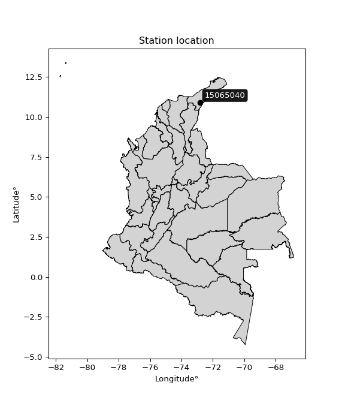

<div align="center">


</div>

# PMP Station (rain, Pmax24h): 15065040

Probable Maximum Precipitation (PMP) is the greatest amount of rainfall for a specific duration that is meteorologically possible for a given location, acting as a "worst-case" scenario for extreme storms, crucial for designing safety-critical infrastructure like bridges, river deviations, dams, spillways, and nuclear plants to prevent catastrophic failure. PMP is calculated by hydrologists using meteorological data to determine the upper limit of extreme rainfall, often leading to the Probable Maximum Flood (PMF) for flood control design, and is increasingly being studied for climate change impacts.

<div align="center">

</img>

</div>


## A. General information


### 1. General running parameters

• app_version: _v20251228_. • runtime: _2025-12-28 08:43:48.795225_. • Python version: _3.14.0_. • SciPy version: _1.16.3_. • Pandas version: _2.3.3_. • NumPy version: _2.3.5_. • Stations dataset (station_dataset_file): _dataset/pmax24h_in/automatic_colombia_2003_2024.csv_. • Stations catalog (station_catalog_file): _dataset/CNE_IDEAM.xls_. • Minimum year to eval til year_max (date_min): _1900_. • Maximum year to eval since year_min (date_max): _2024_. • Creates, save and include plots into reports (create_plot): _False_. • Plot only fit distributions with Δo > Δ (plot_only_fit): _True_. • Eval low extreme values, if False, evaluates high extreme values (low_extreme): _False_. • Eval every SciPy distribution as logarithmic (pdist_logarithmic_on): _True_. • Standard deviation normalized (ddof): _1.0_. • Return periods to eval in years (Tr): _[2, 2.33, 5, 10, 15, 20, 25, 50, 75, 100, 200, 250, 500, 750, 1000]_. • Minimum data sample per station, 0 means any (minimum_sample): _5_. • Z-Score maximum threshold to adjust a value, 0 means disable (zscore_max): _3.5_. • Z-Score minimum threshold to adjust a value, 0 means disable (zscore_min): _-2.5_. • Avoid zeros, e.g. rain = 0 (avoid_zeros): _True_. • Avoid null values (avoid_nans): _True_. [:file_folder:Dataset file.](../../dataset/pmax24h_in/automatic_colombia_2003_2024.csv)

> Delta Degrees of Freedom (DDOF): is a parameter used in the formulas for calculating variance and standard deviation. When ddof=0, the divisor is $N$ (the total number of observations) and this is used when your data set is the entire population. When ddof=1, the divisor is $N-1$ and this is used when your data set is a sample drawn from a larger population. Using $N-1$ provides an unbiased estimate of the population variance (known as Bessel´s correction).


### 2. Station info and location

|   id |   CODIGO | NOMBRE                      | CATEGORIA               | TECNOLOGIA                              | ESTADO   | FECHA_INSTALACION   |   FECHA_SUSPENSION |   ALTITUD |   LATITUD |   LONGITUD | DEPARTAMENTO   | MUNICIPIO   | AREA_OPERATIVA                                         | ENTIDAD                                                     | AREA_HIDROGRAFICA   | ZONA_HIDROGRAFICA   | SUBZONA_HIDROGRAFICA   |   CORRIENTE | Catalogo   |
|-----:|---------:|:----------------------------|:------------------------|:----------------------------------------|:---------|:--------------------|-------------------:|----------:|----------:|-----------:|:---------------|:------------|:-------------------------------------------------------|:------------------------------------------------------------|:--------------------|:--------------------|:-----------------------|------------:|:-----------|
|    0 | 15065040 | LA PAULINA - AUT [15065040] | Climatológica Principal | Automática con Telemetría, Convencional | Activa   | 15/09/1966          |                nan |       170 |   10.8981 |   -72.8285 | La Guajira     | Fonseca     | Area Operativa 05 - Magdalena-Cesar-Guajira-San Andrés | INSTITUTO DE HIDROLOGIA METEOROLOGIA Y ESTUDIOS AMBIENTALES | Caribe              | Caribe - Guajira    | Río Ranchería          |         nan | CNE_IDEAM  |

<div align="center">

Map location in: [:earth_americas:Google](http://maps.google.com/maps?q=10.89813889,-72.82847222) [:earth_americas:OSM](https://www.openstreetmap.org/#map=18/10.89813889/-72.82847222&layers=P) [:earth_americas:Bing](https://www.bing.com/maps?cp=10.89813889~-72.82847222&lvl=18) [:earth_americas:Apple](https://maps.apple.com/frame?center=10.89813889%2C-72.82847222&span=0.003%2C0.006)

</div>


<div align="center">

```geojson
{
  "type": "Feature",
  "geometry": {
    "type": "Point", 
    "coordinates": [-72.82847222, 10.89813889]
  }, 
  "properties": {
    "Name": "15065040"
  }
}
```

</div>


### 3. Discrete values table and plot

|               |           0 |           1 |           2 |           3 |           4 |            5 |           6 |           7 |           8 |            9 |         10 |
|:--------------|------------:|------------:|------------:|------------:|------------:|-------------:|------------:|------------:|------------:|-------------:|-----------:|
| Date          | 2013        | 2014        | 2015        | 2016        | 2017        | 2018         | 2019        | 2020        | 2021        | 2022         | 2024       |
| Value         |   60.2      |    1.2      |    0.4      |    3.8      |   22.1      |   54.5       |   84        |   32.8      |    5.5      |   54.3       |  228.4     |
| Value_initial |   60.2      |    1.2      |    0.4      |    3.8      |   22.1      |   54.5       |   84        |   32.8      |    5.5      |   54.3       |  228.4     |
| count         |   11        |   11        |   11        |   11        |   11        |   11         |   11        |   11        |   11        |   11         |   11       |
| mean          |   49.7455   |   49.7455   |   49.7455   |   49.7455   |   49.7455   |   49.7455    |   49.7455   |   49.7455   |   49.7455   |   49.7455    |   49.7455  |
| std           |   65.6926   |   65.6926   |   65.6926   |   65.6926   |   65.6926   |   65.6926    |   65.6926   |   65.6926   |   65.6926   |   65.6926    |   65.6926  |
| zscore        |    0.159143 |   -0.738979 |   -0.751157 |   -0.699401 |   -0.420831 |    0.0723757 |    0.521437 |   -0.257951 |   -0.673523 |    0.0693312 |    2.71955 |

> The initial value (value_initial) correspond to the initial obtained or null completed value, and value (value) is adjusted only when the initial value is outside the valid range definite through the Z-Score value. If Z-Score is active, values out of range or outliers are replaced with the station mean value


### 4. Active continuous probability distributions from SciPy (44 of 104 available)

[scipy.stats](https://docs.scipy.org/doc/scipy/reference/stats.html) is a Python´s powerful submodule within the SciPy library for comprehensive statistical analysis, offering over 130 probability distributions (like Normal, Poisson), functions for descriptive stats (mean, variance), hypothesis testing (t-tests, chi-square), random variable generation, and statistical tests, making it essential for data science, modeling, and research. It provides tools to explore, model, and draw conclusions from data efficiently, working seamlessly with NumPy.

<div align="center">

|   id | p_dist             |   n_parameter | fit_method   | label                                                                       | active   | ref                                                                                                        |
|-----:|:-------------------|--------------:|:-------------|:----------------------------------------------------------------------------|:---------|:-----------------------------------------------------------------------------------------------------------|
|    0 | alpha              |             3 | MLE          | Alpha                                                                       | True     | [:mortar_board:](https://docs.scipy.org/doc/scipy/reference/generated/scipy.stats.alpha.html)              |
|    1 | betaprime          |             4 | MLE          | Beta prime                                                                  | True     | [:mortar_board:](https://docs.scipy.org/doc/scipy/reference/generated/scipy.stats.betaprime.html)          |
|    2 | chi2               |             3 | MLE          | Chi²                                                                        | True     | [:mortar_board:](https://docs.scipy.org/doc/scipy/reference/generated/scipy.stats.chi2.html)               |
|    3 | crystalball        |             4 | MLE          | Crystalball                                                                 | True     | [:mortar_board:](https://docs.scipy.org/doc/scipy/reference/generated/scipy.stats.crystalball.html)        |
|    4 | erlang             |             3 | MLE          | Erlang                                                                      | True     | [:mortar_board:](https://docs.scipy.org/doc/scipy/reference/generated/scipy.stats.erlang.html)             |
|    5 | expon              |             2 | MLE          | Exponential                                                                 | True     | [:mortar_board:](https://docs.scipy.org/doc/scipy/reference/generated/scipy.stats.expon.html)              |
|    6 | exponnorm          |             3 | MLE          | Exponentially modified Normal                                               | True     | [:mortar_board:](https://docs.scipy.org/doc/scipy/reference/generated/scipy.stats.exponnorm.html)          |
|    7 | f                  |             4 | MLE          | F                                                                           | True     | [:mortar_board:](https://docs.scipy.org/doc/scipy/reference/generated/scipy.stats.f.html)                  |
|    8 | fatiguelife        |             3 | MLE          | Fatigue-life (Birnbaum-Saunders)                                            | True     | [:mortar_board:](https://docs.scipy.org/doc/scipy/reference/generated/scipy.stats.fatiguelife.html)        |
|    9 | fisk               |             3 | MLE          | Fisk                                                                        | True     | [:mortar_board:](https://docs.scipy.org/doc/scipy/reference/generated/scipy.stats.fisk.html)               |
|   10 | gamma              |             3 | MLE          | Gamma                                                                       | True     | [:mortar_board:](https://docs.scipy.org/doc/scipy/reference/generated/scipy.stats.gamma.html)              |
|   11 | genexpon           |             5 | MLE          | Generalized exponential                                                     | True     | [:mortar_board:](https://docs.scipy.org/doc/scipy/reference/generated/scipy.stats.genexpon.html)           |
|   12 | genlogistic        |             3 | MLE          | Generalized logistic                                                        | True     | [:mortar_board:](https://docs.scipy.org/doc/scipy/reference/generated/scipy.stats.genlogistic.html)        |
|   13 | gibrat             |             2 | MM           | Gibrat                                                                      | True     | [:mortar_board:](https://docs.scipy.org/doc/scipy/reference/generated/scipy.stats.gibrat.html)             |
|   14 | gompertz           |             3 | MLE          | Gompertz (or truncated Gumbel)                                              | True     | [:mortar_board:](https://docs.scipy.org/doc/scipy/reference/generated/scipy.stats.gompertz.html)           |
|   15 | gumbel_l           |             2 | MM           | Gumbel Left Skew                                                            | True     | [:mortar_board:](https://docs.scipy.org/doc/scipy/reference/generated/scipy.stats.gumbel_l.html)           |
|   16 | gumbel_r           |             2 | MM           | Gumbel Right Skew                                                           | True     | [:mortar_board:](https://docs.scipy.org/doc/scipy/reference/generated/scipy.stats.gumbel_r.html)           |
|   17 | halflogistic       |             2 | MM           | Half-logistic                                                               | True     | [:mortar_board:](https://docs.scipy.org/doc/scipy/reference/generated/scipy.stats.halflogistic.html)       |
|   18 | halfnorm           |             2 | MM           | Half Normal                                                                 | True     | [:mortar_board:](https://docs.scipy.org/doc/scipy/reference/generated/scipy.stats.halfnorm.html)           |
|   19 | hypsecant          |             2 | MM           | hyperbolic secant                                                           | True     | [:mortar_board:](https://docs.scipy.org/doc/scipy/reference/generated/scipy.stats.hypsecant.html)          |
|   20 | invgamma           |             3 | MLE          | Inverted gamma                                                              | True     | [:mortar_board:](https://docs.scipy.org/doc/scipy/reference/generated/scipy.stats.invgamma.html)           |
|   21 | invgauss           |             3 | MLE          | Inverse Gaussian                                                            | True     | [:mortar_board:](https://docs.scipy.org/doc/scipy/reference/generated/scipy.stats.invgauss.html)           |
|   22 | invweibull         |             3 | MLE          | Inverted Weibull                                                            | True     | [:mortar_board:](https://docs.scipy.org/doc/scipy/reference/generated/scipy.stats.invweibull.html)         |
|   23 | johnsonsu          |             4 | MLE          | Johnson Su                                                                  | True     | [:mortar_board:](https://docs.scipy.org/doc/scipy/reference/generated/scipy.stats.johnsonsu.html)          |
|   24 | kstwobign          |             2 | MLE          | Limiting distribution of scaled Kolmogorov-Smirnov two-sided test statistic | True     | [:mortar_board:](https://docs.scipy.org/doc/scipy/reference/generated/scipy.stats.kstwobign.html)          |
|   25 | laplace            |             2 | MM           | Laplace                                                                     | True     | [:mortar_board:](https://docs.scipy.org/doc/scipy/reference/generated/scipy.stats.laplace.html)            |
|   26 | laplace_asymmetric |             3 | MLE          | Asymmetric Laplace                                                          | True     | [:mortar_board:](https://docs.scipy.org/doc/scipy/reference/generated/scipy.stats.laplace_asymmetric.html) |
|   27 | loggamma           |             3 | MLE          | Log gamma                                                                   | True     | [:mortar_board:](https://docs.scipy.org/doc/scipy/reference/generated/scipy.stats.loggamma.html)           |
|   28 | logistic           |             2 | MM           | Logistic (or Sech-squared)                                                  | True     | [:mortar_board:](https://docs.scipy.org/doc/scipy/reference/generated/scipy.stats.logistic.html)           |
|   29 | lognorm            |             3 | MLE          | Log Normal                                                                  | True     | [:mortar_board:](https://docs.scipy.org/doc/scipy/reference/generated/scipy.stats.lognorm.html)            |
|   30 | maxwell            |             2 | MM           | Maxwell                                                                     | True     | [:mortar_board:](https://docs.scipy.org/doc/scipy/reference/generated/scipy.stats.maxwell.html)            |
|   31 | mielke             |             4 | MLE          | Mielke Beta-Kappa / Dagum                                                   | True     | [:mortar_board:](https://docs.scipy.org/doc/scipy/reference/generated/scipy.stats.mielke.html)             |
|   32 | moyal              |             2 | MM           | Moyal                                                                       | True     | [:mortar_board:](https://docs.scipy.org/doc/scipy/reference/generated/scipy.stats.moyal.html)              |
|   33 | nakagami           |             3 | MLE          | Nakagami                                                                    | True     | [:mortar_board:](https://docs.scipy.org/doc/scipy/reference/generated/scipy.stats.nakagami.html)           |
|   34 | ncf                |             5 | MLE          | Non-central F distribution                                                  | True     | [:mortar_board:](https://docs.scipy.org/doc/scipy/reference/generated/scipy.stats.ncf.html)                |
|   35 | nct                |             4 | MLE          | Non-central Student’s t                                                     | True     | [:mortar_board:](https://docs.scipy.org/doc/scipy/reference/generated/scipy.stats.nct.html)                |
|   36 | norm               |             2 | MM           | Normal                                                                      | True     | [:mortar_board:](https://docs.scipy.org/doc/scipy/reference/generated/scipy.stats.norm.html)               |
|   37 | pearson3           |             3 | MM           | Pearson type III                                                            | True     | [:mortar_board:](https://docs.scipy.org/doc/scipy/reference/generated/scipy.stats.pearson3.html)           |
|   38 | rayleigh           |             2 | MM           | Rayleigh                                                                    | True     | [:mortar_board:](https://docs.scipy.org/doc/scipy/reference/generated/scipy.stats.rayleigh.html)           |
|   39 | rice               |             3 | MLE          | Rice                                                                        | True     | [:mortar_board:](https://docs.scipy.org/doc/scipy/reference/generated/scipy.stats.rice.html)               |
|   40 | t                  |             3 | MLE          | Student’s t                                                                 | True     | [:mortar_board:](https://docs.scipy.org/doc/scipy/reference/generated/scipy.stats.t.html)                  |
|   41 | truncnorm          |             4 | MLE          | Truncated normal                                                            | True     | [:mortar_board:](https://docs.scipy.org/doc/scipy/reference/generated/scipy.stats.truncnorm.html)          |
|   42 | wald               |             2 | MM           | Wald                                                                        | True     | [:mortar_board:](https://docs.scipy.org/doc/scipy/reference/generated/scipy.stats.wald.html)               |
|   43 | weibull_min        |             3 | MLE          | Weibull minimum                                                             | True     | [:mortar_board:](https://docs.scipy.org/doc/scipy/reference/generated/scipy.stats.weibull_min.html)        |

</div>

> **n_parameter:** # arguments & localization & scale.
>
> **Fit methods:** (MLE) maximum likelihood, (MM) L-moments.
>
>**Inactive:** foldnorm, gennorm, norminvgauss, powernorm, powerlognorm, skewnorm, genextreme, anglit, arcsine, argus, beta, bradford, burr, burr12, cauchy, cosine, halfcauchy, foldcauchy, skewcauchy, wrapcauchy, dgamma, gengamma, exponweib, exponpow, truncexpon, gausshyper, genhalflogistic, genhyperbolic, geninvgauss, halfgennorm, johnsonsb, kappa4, kappa3, ksone, kstwo, loglaplace, levy, levy_l, levy_stable, ncx2, pareto, genpareto, truncpareto, lomax, powerlaw, rdist, rel_breitwigner, recipinvgauss, semicircular, studentized_range, trapezoid, triang, truncweibull_min, tukeylambda, uniform, loguniform, vonmises, vonmises_line, weibull_max, dweibull, 


## B. Probability distributions vs. Empirical distributions

A continuous probability distribution (CPD) describes probabilities for variables that can take any value within a range (like rain any time), unlike discrete variables with specific outcomes (like temperature). It uses a Probability Density Function (PDF), a curve where the total area under it equals 1, and the probability of the variable falling within an interval (a to b) is found by calculating the area under the curve between those points. A key feature is that the probability of hitting any single exact value is zero, so probabilities are always expressed for ranges, e.g., $P(a ≤ X ≤ b)$.

<div align="center">

Distributions parameters from station values
|    |   station | p_dist                |   n |              loc |           scale | shape                  | shape1                 | shape2                 | shape3   |
|---:|----------:|:----------------------|----:|-----------------:|----------------:|:-----------------------|:-----------------------|:-----------------------|:---------|
|  0 |  15065040 | alpha                 |  11 |      0.00243473  |     1.24766     | 1.247237348333186e-08  |                        |                        |          |
|  1 |  15065040 | betaprime             |  11 |      0.4         |   139.904       | 0.6980146242185202     | 2.4814172066179276     |                        |          |
|  2 |  15065040 | chi2                  |  11 |      0.4         |     2.07178     | 0.6585220355748838     |                        |                        |          |
|  3 |  15065040 | crystalball           |  11 |     49.7455      |    62.6354      | 3098.3262123267523     | 2863.221880531946      |                        |          |
|  4 |  15065040 | erlang                |  11 |      0.4         |    79.5244      | 0.47439433091642536    |                        |                        |          |
|  5 |  15065040 | expon                 |  11 |      0.4         |    49.3455      |                        |                        |                        |          |
|  6 |  15065040 | exponnorm             |  11 |      0.336904    |     0.0210759   | 2320.1480815533805     |                        |                        |          |
|  7 |  15065040 | f                     |  11 |      0.4         |    34.5166      | 0.7462284946301394     | 14.1694908689703       |                        |          |
|  8 |  15065040 | fatiguelife           |  11 |      0.0361532   |     9.66349     | 2.614454045142539      |                        |                        |          |
|  9 |  15065040 | fisk                  |  11 |      0.4         |    10.2154      | 0.6887829692204217     |                        |                        |          |
| 10 |  15065040 | gamma                 |  11 |      0.4         |    59.9929      | 0.635145916479495      |                        |                        |          |
| 11 |  15065040 | genexpon              |  11 |      0.399934    |    86.4101      | 1.7511879022909977     | 1.4938174486616579e-07 | 1.5918391798928784     |          |
| 12 |  15065040 | genlogistic           |  11 |   -242.229       |    35.438       | 1910.057841509608      |                        |                        |          |
| 13 |  15065040 | gibrat                |  11 |      1.96254     |    28.9818      |                        |                        |                        |          |
| 14 |  15065040 | gompertz              |  11 |      0.4         |     3.02551e+09 | 65001794.38263828      |                        |                        |          |
| 15 |  15065040 | gumbel_l              |  11 |     77.9347      |    48.8366      |                        |                        |                        |          |
| 16 |  15065040 | gumbel_r              |  11 |     21.5562      |    48.8366      |                        |                        |                        |          |
| 17 |  15065040 | halflogistic          |  11 |    -24.4921      |    53.5511      |                        |                        |                        |          |
| 18 |  15065040 | halfnorm              |  11 |    -33.1593      |   103.906       |                        |                        |                        |          |
| 19 |  15065040 | hypsecant             |  11 |     49.7455      |    39.875       |                        |                        |                        |          |
| 20 |  15065040 | invgamma              |  11 |     -3.2909      |     9.96598     | 0.7987920898816487     |                        |                        |          |
| 21 |  15065040 | invgauss              |  11 |     -2.47381     |    13.2469      | 3.9419887579783786     |                        |                        |          |
| 22 |  15065040 | invweibull            |  11 |     -0.753821    |     8.56678     | 0.6281547906175073     |                        |                        |          |
| 23 |  15065040 | johnsonsu             |  11 |      0.399989    |     1.64302e-06 | -4.071625764275366     | 0.26127956676185793    |                        |          |
| 24 |  15065040 | kstwobign             |  11 |   -112.051       |   189.501       |                        |                        |                        |          |
| 25 |  15065040 | laplace               |  11 |     49.7455      |    44.2899      |                        |                        |                        |          |
| 26 |  15065040 | laplace_asymmetric    |  11 |      0.4         |     0.00888826  | 0.00018014056628117518 |                        |                        |          |
| 27 |  15065040 | loggamma              |  11 | -19700.9         |  2649.75        | 1726.2145226012535     |                        |                        |          |
| 28 |  15065040 | logistic              |  11 |     49.7455      |    34.5327      |                        |                        |                        |          |
| 29 |  15065040 | lognorm               |  11 |      0.4         |     0.562948    | 11.758041000628994     |                        |                        |          |
| 30 |  15065040 | maxwell               |  11 |    -98.6742      |    93.0082      |                        |                        |                        |          |
| 31 |  15065040 | mielke                |  11 |      0.4         |    98.8627      | 0.5270921824161579     | 2.8509686338195177     |                        |          |
| 32 |  15065040 | moyal                 |  11 |     13.9265      |    28.1958      |                        |                        |                        |          |
| 33 |  15065040 | nakagami              |  11 |      0.4         |   104.224       | 0.17189324722422505    |                        |                        |          |
| 34 |  15065040 | ncf                   |  11 |      0.4         |    43.2647      | 1.457741800385802      | 7.097345852794724      | 0.027477084821460763   |          |
| 35 |  15065040 | nct                   |  11 |     -5.93613     |     0.421415    | 0.7536994640241484     | 30.740597077687735     |                        |          |
| 36 |  15065040 | norm                  |  11 |     49.7455      |    62.6354      |                        |                        |                        |          |
| 37 |  15065040 | pearson3              |  11 |     49.7455      |    62.6354      | 1.9605944954702865     |                        |                        |          |
| 38 |  15065040 | rayleigh              |  11 |    -70.0798      |    95.6067      |                        |                        |                        |          |
| 39 |  15065040 | rice                  |  11 |    -40.7525      |    77.8237      | 0.00042333333962648223 |                        |                        |          |
| 40 |  15065040 | t                     |  11 |     31.2966      |    30.1084      | 2.1479056560331484     |                        |                        |          |
| 41 |  15065040 | truncnorm             |  11 |    -94.039       |    95.6119      | 0.9877019694935396     | 3.3724074920245783     |                        |          |
| 42 |  15065040 | wald                  |  11 |    -12.89        |    62.6354      |                        |                        |                        |          |
| 43 |  15065040 | weibull_min           |  11 |      0.4         |    60.3588      | 0.7433447277272993     |                        |                        |          |
| 44 |  15065040 | logalpha              |  11 |    -47.2763      |  1273.72        | 25.491111260228585     |                        |                        |          |
| 45 |  15065040 | logbetaprime          |  11 |     -0.916291    |     2.49976     | 0.24760689797556273    | 0.9687353683875634     |                        |          |
| 46 |  15065040 | logchi2               |  11 |     -0.916291    |     1.36869     | 1.2164335343019606     |                        |                        |          |
| 47 |  15065040 | logcrystalball        |  11 |      4.04114     |     0.772298    | 0.3769788037788602     | 10731.127482668988     |                        |          |
| 48 |  15065040 | logerlang             |  11 |    -28.6304      |     0.118625    | 264.83222378912103     |                        |                        |          |
| 49 |  15065040 | logexpon              |  11 |     -0.916291    |     3.7203      |                        |                        |                        |          |
| 50 |  15065040 | logexponnorm          |  11 |      2.80289     |     1.87571     | 0.0005893586392814291  |                        |                        |          |
| 51 |  15065040 | logf                  |  11 |     -0.916291    |     1.15537     | 1.1013019670415858     | 1.1346493861347238     |                        |          |
| 52 |  15065040 | logfatiguelife        |  11 |   -790.049       |   792.852       | 0.002359298043526333   |                        |                        |          |
| 53 |  15065040 | logfisk               |  11 |     -0.916291    |     1.7119      | 0.2858201532000083     |                        |                        |          |
| 54 |  15065040 | loggamma              |  11 |    -27.0984      |     0.122552    | 243.909808025031       |                        |                        |          |
| 55 |  15065040 | loggenexpon           |  11 |     -0.920812    |     0.0489125   | 0.0036944536612971944  | 5.500705289769954      | 3.5931303839959816e-05 |          |
| 56 |  15065040 | loggenlogistic        |  11 |      4.64706     |     0.390555    | 0.199523884008387      |                        |                        |          |
| 57 |  15065040 | loggibrat             |  11 |      1.37305     |     0.867911    |                        |                        |                        |          |
| 58 |  15065040 | loggompertz           |  11 |     -0.916291    |     1.73286     | 0.08092625414213331    |                        |                        |          |
| 59 |  15065040 | loggumbel_l           |  11 |      3.64818     |     1.46249     |                        |                        |                        |          |
| 60 |  15065040 | loggumbel_r           |  11 |      1.95984     |     1.46249     |                        |                        |                        |          |
| 61 |  15065040 | loghalflogistic       |  11 |      0.580814    |     1.60369     |                        |                        |                        |          |
| 62 |  15065040 | loghalfnorm           |  11 |      0.321319    |     3.1116      |                        |                        |                        |          |
| 63 |  15065040 | loghypsecant          |  11 |      2.80401     |     1.19412     |                        |                        |                        |          |
| 64 |  15065040 | loginvgamma           |  11 |    -33.3118      | 12496.9         | 346.99798849396916     |                        |                        |          |
| 65 |  15065040 | loginvgauss           |  11 |    -12.5831      |   868.924       | 0.01766665345451924    |                        |                        |          |
| 66 |  15065040 | loginvweibull         |  11 |     -2.06892e+08 |     2.06892e+08 | 105465671.99142452     |                        |                        |          |
| 67 |  15065040 | logjohnsonsu          |  11 |      6.9655      |     0.180697    | 8.112198224675495      | 2.1763851563114045     |                        |          |
| 68 |  15065040 | logkstwobign          |  11 |     -5.12059     |     9.05122     |                        |                        |                        |          |
| 69 |  15065040 | loglaplace            |  11 |      2.80401     |     1.32633     |                        |                        |                        |          |
| 70 |  15065040 | loglaplace_asymmetric |  11 |      4.09767     |     1.08859     | 1.7573498238126652     |                        |                        |          |
| 71 |  15065040 | logloggamma           |  11 |      4.67845     |     0.855803    | 0.4574193313243121     |                        |                        |          |
| 72 |  15065040 | loglogistic           |  11 |      2.80401     |     1.03414     |                        |                        |                        |          |
| 73 |  15065040 | loglognorm            |  11 |   -642.893       |   645.697       | 0.002901958627764261   |                        |                        |          |
| 74 |  15065040 | logmaxwell            |  11 |     -1.64066     |     2.78528     |                        |                        |                        |          |
| 75 |  15065040 | logmielke             |  11 |     -0.916291    |     4.01912     | 0.23003391904195924    | 1.2335648999452884     |                        |          |
| 76 |  15065040 | logmoyal              |  11 |      1.73135     |     0.84437     |                        |                        |                        |          |
| 77 |  15065040 | lognakagami           |  11 |   -847.527       |   850.329       | 51238.0183085671       |                        |                        |          |
| 78 |  15065040 | logncf                |  11 |     -0.916291    |     1.09974     | 1.0676212715105606     | 1.1706690796512733     | 1.0959859245553316     |          |
| 79 |  15065040 | lognct                |  11 |   -107.816       |     1.84764     | 56487.50759295077      | 59.86945922592358      |                        |          |
| 80 |  15065040 | lognorm               |  11 |      2.80401     |     1.87572     |                        |                        |                        |          |
| 81 |  15065040 | logpearson3           |  11 |      2.80401     |     1.87572     | -0.6291086380711968    |                        |                        |          |
| 82 |  15065040 | lograyleigh           |  11 |     -0.784327    |     2.86308     |                        |                        |                        |          |
| 83 |  15065040 | logrice               |  11 |     -1.98893     |     2.03249     | 2.1006185587358877     |                        |                        |          |
| 84 |  15065040 | logt                  |  11 |      2.80401     |     1.87572     | 35524051236.97142      |                        |                        |          |
| 85 |  15065040 | logtruncnorm          |  11 |      1.17695     |     5.32908     | -0.3934346061240207    | 0.7982894234415298     |                        |          |
| 86 |  15065040 | logwald               |  11 |      0.928285    |     1.87571     |                        |                        |                        |          |
| 87 |  15065040 | logweibull_min        |  11 |     -4.16907e+07 |     4.16907e+07 | 28602671.687249072     |                        |                        |          |

</div>

> **loc** (Location parameter): This shifts the distribution along the x-axis. For many common distributions, like the normal (Gaussian) distribution, loc represents the mean $μ$. For others, like the uniform distribution, it might represent the minimum value, or for the beta distribution, the left end of the support interval.
>
> **scale** (Scale parameter): This determines the width or spread of the distribution. For the normal distribution, scale represents the standard deviation $σ$. For a uniform distribution, it defines the length of the interval (from $loc$ to $loc + scale$).
>
> **shape** (Shape parameters): Refers to parameters that define the specific form of a probability distribution, distinct from its location (loc) and scale (scale). These parameters are required arguments for most distribution functions. For example, a normal (Gaussian) distribution is fully defined by its location (mean) and scale (standard deviation), so it has no specific shape parameters beyond loc and scale. However, other distributions have intrinsic properties that need specification, as Gamma distribution that takes a shape parameter, often named $a$ or $alpha$.


### 0. Cumulative distribution values - CDF (88 evaluated)

Cumulative Distribution Function (CDF), denoted as $F$<sub>$X$</sub>$(x)$, is a function that gives the probability that a random variable $X$ will take a value less than or equal to a specific value, $x$ (i.e., $(P(X≥x)$. It essentially "accumulates" probabilities from a given point up to the far right (positive infinity), providing a complete picture of the distribution´s probabilities for both discrete (like rain) and continuous (like temperature) variables, helping to find probabilities over ranges or above certain values.

<div align="center">

CDF ordered by x ascending and calculating $log(f(x))$ separately
|   id |   Station |   date |     x |   count |    mean |     std |     zscore |   Value_initial |   station |   m |     alpha |   alpha_pdf |   betaprime |   betaprime_pdf |        chi2 |    chi2_pdf |   crystalball |   crystalball_pdf |      erlang |   erlang_pdf |     expon |   expon_pdf |   exponnorm |   exponnorm_pdf |           f |       f_pdf |   fatiguelife |   fatiguelife_pdf |        fisk |        fisk_pdf |       gamma |       gamma_pdf |   genexpon |   genexpon_pdf |   genlogistic |   genlogistic_pdf |     gibrat |   gibrat_pdf |    gompertz |   gompertz_pdf |   gumbel_l |   gumbel_l_pdf |   gumbel_r |   gumbel_r_pdf |   halflogistic |   halflogistic_pdf |   halfnorm |   halfnorm_pdf |   hypsecant |   hypsecant_pdf |   invgamma |   invgamma_pdf |   invgauss |   invgauss_pdf |   invweibull |   invweibull_pdf |   johnsonsu |   johnsonsu_pdf |   kstwobign |   kstwobign_pdf |   laplace |   laplace_pdf |   laplace_asymmetric |   laplace_asymmetric_pdf |   loggamma |   loggamma_pdf |   logistic |   logistic_pdf |   lognorm |   lognorm_pdf |   maxwell |   maxwell_pdf |      mielke |      mielke_pdf |    moyal |   moyal_pdf |    nakagami |   nakagami_pdf |         ncf |       ncf_pdf |       nct |     nct_pdf |     norm |    norm_pdf |   pearson3 |   pearson3_pdf |   rayleigh |   rayleigh_pdf |     rice |    rice_pdf |        t |      t_pdf |   truncnorm |   truncnorm_pdf |      wald |    wald_pdf |   weibull_min |   weibull_min_pdf |   logalpha |   logalpha_pdf |   logbetaprime |   logbetaprime_pdf |     logchi2 |    logchi2_pdf |   logcrystalball |   logcrystalball_pdf |   logerlang |   logerlang_pdf |   logexpon |   logexpon_pdf |   logexponnorm |   logexponnorm_pdf |        logf |    logf_pdf |   logfatiguelife |   logfatiguelife_pdf |     logfisk |   logfisk_pdf |   loggenexpon |   loggenexpon_pdf |   loggenlogistic |   loggenlogistic_pdf |   loggibrat |   loggibrat_pdf |   loggompertz |   loggompertz_pdf |   loggumbel_l |   loggumbel_l_pdf |   loggumbel_r |   loggumbel_r_pdf |   loghalflogistic |   loghalflogistic_pdf |   loghalfnorm |   loghalfnorm_pdf |   loghypsecant |   loghypsecant_pdf |   loginvgamma |   loginvgamma_pdf |   loginvgauss |   loginvgauss_pdf |   loginvweibull |   loginvweibull_pdf |   logjohnsonsu |   logjohnsonsu_pdf |   logkstwobign |   logkstwobign_pdf |   loglaplace |   loglaplace_pdf |   loglaplace_asymmetric |   loglaplace_asymmetric_pdf |   logloggamma |   logloggamma_pdf |   loglogistic |   loglogistic_pdf |   loglognorm |   loglognorm_pdf |   logmaxwell |   logmaxwell_pdf |   logmielke |   logmielke_pdf |   logmoyal |   logmoyal_pdf |   lognakagami |   lognakagami_pdf |      logncf |   logncf_pdf |    lognct |   lognct_pdf |   logpearson3 |   logpearson3_pdf |   lograyleigh |   lograyleigh_pdf |   logrice |   logrice_pdf |      logt |   logt_pdf |   logtruncnorm |   logtruncnorm_pdf |   logwald |   logwald_pdf |   logweibull_min |   logweibull_min_pdf |
|-----:|----------:|-------:|------:|--------:|--------:|--------:|-----------:|----------------:|----------:|----:|----------:|------------:|------------:|----------------:|------------:|------------:|--------------:|------------------:|------------:|-------------:|----------:|------------:|------------:|----------------:|------------:|------------:|--------------:|------------------:|------------:|----------------:|------------:|----------------:|-----------:|---------------:|--------------:|------------------:|-----------:|-------------:|------------:|---------------:|-----------:|---------------:|-----------:|---------------:|---------------:|-------------------:|-----------:|---------------:|------------:|----------------:|-----------:|---------------:|-----------:|---------------:|-------------:|-----------------:|------------:|----------------:|------------:|----------------:|----------:|--------------:|---------------------:|-------------------------:|-----------:|---------------:|-----------:|---------------:|----------:|--------------:|----------:|--------------:|------------:|----------------:|---------:|------------:|------------:|---------------:|------------:|--------------:|----------:|------------:|---------:|------------:|-----------:|---------------:|-----------:|---------------:|---------:|------------:|---------:|-----------:|------------:|----------------:|----------:|------------:|--------------:|------------------:|-----------:|---------------:|---------------:|-------------------:|------------:|---------------:|-----------------:|---------------------:|------------:|----------------:|-----------:|---------------:|---------------:|-------------------:|------------:|------------:|-----------------:|---------------------:|------------:|--------------:|--------------:|------------------:|-----------------:|---------------------:|------------:|----------------:|--------------:|------------------:|--------------:|------------------:|--------------:|------------------:|------------------:|----------------------:|--------------:|------------------:|---------------:|-------------------:|--------------:|------------------:|--------------:|------------------:|----------------:|--------------------:|---------------:|-------------------:|---------------:|-------------------:|-------------:|-----------------:|------------------------:|----------------------------:|--------------:|------------------:|--------------:|------------------:|-------------:|-----------------:|-------------:|-----------------:|------------:|----------------:|-----------:|---------------:|--------------:|------------------:|------------:|-------------:|----------:|-------------:|--------------:|------------------:|--------------:|------------------:|----------:|--------------:|----------:|-----------:|---------------:|-------------------:|----------:|--------------:|-----------------:|---------------------:|
|    0 |  15065040 |   2015 |   0.4 |      11 | 49.7455 | 65.6926 | -0.751157  |             0.4 |  15065040 |   1 | 0.0016996 | 0.0457742   | 4.62455e-13 |   2907.53       | 3.11388e-06 | 1.84698e+10 |      0.215401 |       0.00466998  | 2.75148e-09 |  2.35139e+07 | 0         | 0.0202653   |  0.00128957 |      0.0203957  | 1.75811e-07 | 1.1817e+09  |     0.0289164 |       0.185499    | 1.28306e-12 | 15920.3         | 3.91474e-12 | 44791.5         | 1.3448e-06 |    0.020266    |      0.131405 |       0.00752131  | 0          |  0           | 3.16672e-09 |    0.0214846   |   0.184871 |     0.00341177 |   0.213912 |    0.00675503  |       0.228318 |        0.00885016  |   0.253288 |    0.00728868  |    0.179754 |     0.00427213  |  0.0446196 |    0.0345344   |  0.0407572 |    0.0380604   |    0.0295086 |       0.0565978  | 0.000348381 |    29.6987      |    0.127107 |     0.00679     |  0.164098 |   0.00370508  |           3.2583e-08 |              0.0202673   |   0.02258  |      0.0306313 |   0.193263 |    0.00451491  | 0.0236614 |     0.0297517 |  0.231294 |   0.00551952  | 8.41597e-09 | 93683.2         | 0.2037   | 0.00801798  | 4.16546e-07 |    2.57972e+09 | 7.58913e-14 | 996.466       | 0.0518635 | 0.0329028   | 0.215401 | 0.00466998  |   0.19503  |    0.0123916   |   0.237933 |    0.00587599  | 0.130476 | 0.00590817  | 0.203146 | 0.00631651 | 4.65789e-05 |     0.0158845   | 0.0750045 | 0.0150953   |   3.91531e-14 |     524.296       |  0.0236629 |      0.0330741 |    8.83495e-05 |        1.97041e+11 | 1.19838e-10 | 656509         |       nan        |           nan        |   0.0239827 |       0.0317969 |   0        |      0.268796  |      0.0236617 |          0.0297521 | 1.00811e-09 | 5.00003e+06 |        0.0231269 |            0.0294034 | 2.36109e-05 |   6.07835e+10 |   0.000342254 |         0.0758794 |        0.0582994 |            0.0297836 |    0        |       0         |   1.79642e-09 |         0.0467011 |     0.0431531 |         0.0288606 |   0.000787779 |        0.00384939 |          0        |             0         |      0        |         0         |      0.0282191 |          0.0236008 |     0.0213926 |         0.0305404 |     0.022233  |         0.0345508 |       0.0178519 |           0.0366342 |      0.0533116 |          0.0299604 |      0.0177358 |          0.0440233 |    0.0302549 |        0.0228109 |               0.0549428 |                   0.0287203 |     0.0567374 |         0.0302956 |     0.0266621 |         0.0250945 |    0.0232284 |        0.0294931 |   0.00458447 |        0.018731  | 0.000155215 |     3.21599e+11 | 1.6171e-06 |    2.29159e-05 |     0.0238853 |         0.0299912 | 1.11061e-09 |  5.33998e+06 | 0.0236622 |    0.0297963 |     0.0377759 |         0.0318579 |     0         |         0         | 0.0165729 |     0.033123  | 0.0236613 |  0.0297516 |    0.000536035 |           0.157275 | 0         |     0         |        0.041979  |            0.0281873 |
|    1 |  15065040 |   2014 |   1.2 |      11 | 49.7455 | 65.6926 | -0.738979  |             1.2 |  15065040 |   2 | 0.297491  | 0.403408    | 0.0537933   |      0.0464369  | 0.621728    | 0.220971    |      0.219156 |       0.00471683  | 0.126988    |  0.0747906   | 0.0160815 | 0.0199394   |  0.0174955  |      0.0200924  | 0.187508    | 0.0868745   |     0.166172  |       0.132296    | 0.147499    |     0.108262    | 0.071383    |     0.0562126   | 0.0160834  |    0.0199401   |      0.137491 |       0.00769421  | 0          |  0           | 0.0170408   |    0.0211185   |   0.187618 |     0.00345643 |   0.21934  |    0.0068139   |       0.235386 |        0.00881956  |   0.259112 |    0.00727036  |    0.1832   |     0.00434489  |  0.074389  |    0.0392543   |  0.0737235 |    0.0434116   |    0.0796067 |       0.0647686  | 0.319591    |     0.116731    |    0.13259  |     0.00691739  |  0.167089 |   0.00377261  |           0.0160831  |              0.0199413   |   0.083091 |      0.0849585 |   0.1969   |    0.00457915  | 0.0811019 |     0.0800815 |  0.235725 |   0.00555766  | 0.0789502   |     0.0520175   | 0.210142 | 0.00808571  | 0.149558    |    0.0642693   | 0.0451747   |   0.0407809   | 0.0801025 | 0.0372386   | 0.219156 | 0.00471683  |   0.20489  |    0.0122578   |   0.242646 |    0.00590594  | 0.135236 | 0.00599006  | 0.208267 | 0.00648738 | 0.0127017   |     0.0157532   | 0.0873346 | 0.0157072   |   0.0394056   |       0.0358838   |  0.0889304 |      0.091021  |    0.738783    |        0.116753    | 0.555211    |      0.237793  |       nan        |           nan        |   0.0858369 |       0.0860295 |   0.255693 |      0.200066  |      0.0811029 |          0.0800824 | 0.495116    | 0.156306    |        0.080249  |            0.0799274 | 0.468348    |   0.0647805   |   0.125038    |         0.145794  |        0.102191  |            0.0522059 |    0        |       0         |   0.0691239   |         0.0819514 |     0.0892587 |         0.0582232 |   0.034333    |        0.0791518  |          0        |             0         |      0        |         0         |      0.0705673 |          0.0586128 |     0.0829177 |         0.0870304 |     0.0923346 |         0.0981834 |       0.100317  |           0.117587  |      0.0990536 |          0.0558989 |      0.117589  |          0.137222  |    0.0692667 |        0.0522242 |               0.0975701 |                   0.0510029 |     0.101946  |         0.0542944 |     0.0734309 |         0.0657928 |    0.0804547 |        0.0800054 |   0.0656796  |        0.0990547 | 0.717019    |     0.124913    | 0.0123337  |    0.051631    |     0.0816933 |         0.0804945 | 0.363164    |  0.149775    | 0.0812077 |    0.0802313 |     0.0909328 |         0.0684874 |     0.0554015 |         0.11139   | 0.0811947 |     0.0888084 | 0.0811017 |  0.0800815 |    0.179217    |           0.166955 | 0         |     0         |        0.0870986 |            0.0570743 |
|    2 |  15065040 |   2016 |   3.8 |      11 | 49.7455 | 65.6926 | -0.699401  |             3.8 |  15065040 |   3 | 0.742502  | 0.0654013   | 0.144215    |      0.028302   | 0.877208    | 0.0447034   |      0.231615 |       0.00486685  | 0.24965     |  0.0338348   | 0.0665818 | 0.018916    |  0.0683713  |      0.019052   | 0.319169    | 0.0340531   |     0.354141  |       0.0420798   | 0.319136    |     0.044019    | 0.175979    |     0.0317498   | 0.0665854  |    0.0189166   |      0.158199 |       0.0082274   | 0.00290527 |  0.00483734  | 0.0704434   |    0.0199711   |   0.196796 |     0.00360425 |   0.237289 |    0.00698932  |       0.258182 |        0.0087145   |   0.277935 |    0.0072082   |    0.194809 |     0.00458618  |  0.17919   |    0.0389444   |  0.186566  |    0.0408061   |    0.225987  |       0.0463625  | 0.463827    |     0.0305313   |    0.151088 |     0.00730572  |  0.177191 |   0.00400071  |           0.0665881  |              0.0189177   |   0.22564  |      0.162263  |   0.209078 |    0.00478863  | 0.216763  |     0.156514  |  0.25033  |   0.00567555  | 0.169265    |     0.0262389   | 0.231421 | 0.00827436  | 0.24594     |    0.024864    | 0.12693     |   0.0261699   | 0.181347  | 0.0383384   | 0.231615 | 0.00486685  |   0.236196 |    0.0118245   |   0.258121 |    0.00599628  | 0.151144 | 0.00624427  | 0.225875 | 0.00706193 | 0.0531054   |     0.0153266   | 0.129931  | 0.0168711   |   0.11118     |       0.022903    |  0.238551  |      0.167011  |    0.824862    |        0.0485332   | 0.748867    |      0.117828  |       nan        |           nan        |   0.22888   |       0.161878  |   0.454    |      0.146762  |      0.216766  |          0.156515  | 0.616048    | 0.0717699   |        0.216054  |            0.156938  | 0.519561    |   0.031691    |   0.316458    |         0.178909  |        0.184136  |            0.0940506 |    0        |       0         |   0.194081    |         0.137989  |     0.185867  |         0.11447   |   0.215883    |        0.226294   |          0.230901 |             0.295158  |      0.255406 |         0.243171  |      0.181001  |          0.14354   |     0.228553  |         0.164786  |     0.250492  |         0.172551  |       0.278677  |           0.181509  |      0.188945  |          0.10448   |      0.310885  |          0.185428  |    0.16518   |        0.124539  |               0.178237  |                   0.0931698 |     0.187897  |         0.0990516 |     0.194581  |         0.151546  |    0.216255  |        0.15682   |   0.232903   |        0.184779  | 0.812544    |     0.0557501   | 0.206039   |    0.268584    |     0.217816  |         0.156829  | 0.488882    |  0.080594    | 0.217074  |    0.156685  |     0.203306  |         0.129965  |     0.239643  |         0.196584  | 0.226332  |     0.162565  | 0.216763  |  0.156514  |    0.374064    |           0.169814 | 0.0794393 |     0.512056  |        0.18205   |            0.112769  |
|    3 |  15065040 |   2021 |   5.5 |      11 | 49.7455 | 65.6926 | -0.673523  |             5.5 |  15065040 |   4 | 0.820465  | 0.0321004   | 0.188493    |      0.0241188  | 0.93179     | 0.0225969   |      0.239971 |       0.00496289  | 0.300555    |  0.0267624   | 0.0981914 | 0.0182754   |  0.100203   |      0.018401   | 0.369387    | 0.0259072   |     0.412522  |       0.0283684   | 0.382614    |     0.0319029   | 0.225218    |     0.0266187   | 0.0981959  |    0.018276    |      0.172463 |       0.00854947  | 0.0177215  |  0.0123488   | 0.103782    |    0.0192549   |   0.203007 |     0.00370306 |   0.249259 |    0.00709071  |       0.272935 |        0.00864134  |   0.290153 |    0.00716541  |    0.202742 |     0.00474758  |  0.241914  |    0.0347214   |  0.251457  |    0.0355207   |    0.295652  |       0.0361871  | 0.506041    |     0.0204359   |    0.163708 |     0.00753742  |  0.184125 |   0.00415725  |           0.0982005  |              0.018277    |   0.289645 |      0.183204  |   0.217336 |    0.00492579  | 0.278922  |     0.179128  |  0.26004  |   0.00574752  | 0.20959     |     0.0216568   | 0.245573 | 0.00837216  | 0.282717    |    0.019051    | 0.168227    |   0.0226795   | 0.243636  | 0.0347393   | 0.239971 | 0.00496289  |   0.256059 |    0.011544    |   0.26836  |    0.00604959  | 0.161894 | 0.00640044  | 0.23821  | 0.0074512  | 0.0789237   |     0.0150479   | 0.158866  | 0.0171157   |   0.147275    |       0.0198013   |  0.303913  |      0.185669  |    0.84105     |        0.0395148   | 0.788426    |      0.0969866 |       nan        |           nan        |   0.292638  |       0.182259  |   0.505656 |      0.132877  |      0.278924  |          0.179129  | 0.640261    | 0.0598027   |        0.278399  |            0.179705  | 0.5304      |   0.0271613   |   0.382997    |         0.180307  |        0.222406  |            0.11356   |    0.168061 |       0.757297  |   0.248994    |         0.159171  |     0.232626  |         0.138932  |   0.304052    |        0.247517   |          0.336748 |             0.276425  |      0.343394 |         0.232291  |      0.241302  |          0.183269  |     0.293332  |         0.184781  |     0.317373  |         0.188197  |       0.347076  |           0.187225  |      0.231461  |          0.125991  |      0.379696  |          0.185759  |    0.218287  |        0.164579  |               0.21624   |                   0.113035  |     0.22818   |         0.119391  |     0.256742  |         0.184526  |    0.27854   |        0.179498  |   0.30443    |        0.200893  | 0.831242    |     0.0458777   | 0.309687   |    0.286498    |     0.280068  |         0.179317  | 0.516481    |  0.0691734   | 0.279288  |    0.179253  |     0.255574  |         0.152815  |     0.314701  |         0.208089  | 0.290237  |     0.182412  | 0.278921  |  0.179128  |    0.436737    |           0.169057 | 0.284535  |     0.527414  |        0.228161  |            0.137138  |
|    4 |  15065040 |   2017 |  22.1 |      11 | 49.7455 | 65.6926 | -0.420831  |            22.1 |  15065040 |   5 | 0.954974  | 0.00203542  | 0.451351    |      0.0110351  | 0.999419    | 0.000155722 |      0.329472 |       0.00577814  | 0.560296    |  0.0101466   | 0.355807  | 0.0130548   |  0.359214   |      0.0131042  | 0.604072    | 0.00868527  |     0.627342  |       0.00712743  | 0.6269      |     0.00742414  | 0.510202    |     0.0119005   | 0.355818   |    0.013055    |      0.332734 |       0.010329    | 0.357897   |  0.0185405   | 0.372628    |    0.0134788   |   0.272955 |     0.00474557 |   0.371976 |    0.00753239  |       0.409512 |        0.00777109  |   0.40515  |    0.00666629  |    0.295127 |     0.00638556  |  0.56966   |    0.0108113   |  0.581495  |    0.0110522   |    0.582804  |       0.00864863 | 0.653023    |     0.00444563  |    0.30198  |     0.00883204  |  0.267847 |   0.00604758  |           0.355834   |              0.0130555   |   0.57091  |      0.203741  |   0.309906 |    0.00619309  | 0.561764  |     0.210134  |  0.359991 |   0.00622549  | 0.448553    |     0.0107528   | 0.386999 | 0.00841928  | 0.464632    |    0.00731435  | 0.425671    |   0.0112164   | 0.574144  | 0.010794    | 0.329472 | 0.00577814  |   0.426195 |    0.00903109  |   0.371738 |    0.00633577  | 0.278288 | 0.00748965  | 0.393554 | 0.0110693  | 0.306352    |     0.0123717   | 0.414251  | 0.0128139   |   0.373409    |       0.0100337   |  0.581148  |      0.196108  |    0.881446    |        0.0214159   | 0.885944    |      0.0493879 |       nan        |           nan        |   0.571705  |       0.201961  |   0.659851 |      0.0914305 |      0.561768  |          0.210134  | 0.70355     | 0.0348822   |        0.562104  |            0.210605  | 0.560556    |   0.0175497   |   0.620555    |         0.154378  |        0.450981  |            0.226137  |    0.753473 |       0.183111  |   0.522213    |         0.225959  |     0.496077  |         0.236141  |   0.631299    |        0.198553   |          0.655027 |             0.178008  |      0.627386 |         0.172322  |      0.576961  |          0.258811  |     0.572966  |         0.199955  |     0.589199  |         0.187048  |       0.594052  |           0.157708  |      0.473549  |          0.223622  |      0.617869  |          0.149996  |    0.598673  |        0.302584  |               0.447385  |                   0.233862  |     0.461693  |         0.221286  |     0.570023  |         0.237006  |    0.561801  |        0.210252  |   0.591347   |        0.195124  | 0.878565    |     0.0252158   | 0.655726   |    0.190712    |     0.562755  |         0.20974   | 0.59244     |  0.0433574   | 0.562101  |    0.209958  |     0.520948  |         0.219033  |     0.600768  |         0.188963  | 0.569669  |     0.203011  | 0.561764  |  0.210134  |    0.666263    |           0.159227 | 0.723523  |     0.169463  |        0.489552  |            0.235499  |
|    5 |  15065040 |   2020 |  32.8 |      11 | 49.7455 | 65.6926 | -0.257951  |            32.8 |  15065040 |   6 | 0.969655  | 0.00092478  | 0.551649    |      0.00797408 | 0.999965    | 8.997e-06   |      0.393372 |       0.0061404   | 0.651463    |  0.00718435  | 0.481386  | 0.0105099   |  0.485149   |      0.0105288  | 0.681154    | 0.00600993  |     0.690251  |       0.00490843  | 0.688912    |     0.00455601  | 0.618407    |     0.00860184  | 0.481399   |    0.01051     |      0.44322  |       0.0101746   | 0.524743   |  0.012912    | 0.501474    |    0.0107106   |   0.327565 |     0.00546425 |   0.451876 |    0.00734994  |       0.48914  |        0.00710296  |   0.474441 |    0.00627764  |    0.368626 |     0.00731241  |  0.658972  |    0.00645216  |  0.67408   |    0.00679519  |    0.654305  |       0.00519585 | 0.690838    |     0.00284163  |    0.396979 |     0.00883298  |  0.341042 |   0.00770021  |           0.481419   |              0.0105102   |   0.64903  |      0.190745  |   0.379727 |    0.00682062  | 0.642799  |     0.198913  |  0.427219 |   0.00631181  | 0.551265    |     0.00861024  | 0.474261 | 0.00783767  | 0.532569    |    0.00557135  | 0.529005    |   0.0083254   | 0.662771  | 0.00636277  | 0.393372 | 0.0061404   |   0.51535  |    0.0076669   |   0.439523 |    0.00630829  | 0.360214 | 0.00776976  | 0.517783 | 0.0118139  | 0.429878    |     0.0107319   | 0.534114  | 0.00972301  |   0.467262    |       0.0076968   |  0.655974  |      0.181895  |    0.889321    |        0.0185765   | 0.903777    |      0.0412101 |       nan        |           nan        |   0.649163  |       0.189199  |   0.694103 |      0.0822238 |      0.642803  |          0.198912  | 0.716493    | 0.0308151   |        0.643288  |            0.199191  | 0.567154    |   0.0159225   |   0.678935    |         0.141066  |        0.548288  |            0.266325  |    0.813762 |       0.126588  |   0.612606    |         0.230095  |     0.592514  |         0.250135  |   0.703884    |        0.169001   |          0.719767 |             0.150258  |      0.691552 |         0.152654  |      0.673658  |          0.227869  |     0.649425  |         0.186233  |     0.660213  |         0.171881  |       0.653221  |           0.141799  |      0.566545  |          0.246035  |      0.674188  |          0.135176  |    0.702005  |        0.224676  |               0.549946  |                   0.287474  |     0.5548    |         0.249206  |     0.660105  |         0.21696   |    0.642855  |        0.198895  |   0.665195   |        0.178159  | 0.887836    |     0.0218584   | 0.724184   |    0.156659    |     0.643614  |         0.198428  | 0.608638    |  0.0388251   | 0.643053  |    0.198679  |     0.608302  |         0.221691  |     0.671958  |         0.171069  | 0.647671  |     0.190888  | 0.642799  |  0.198913  |    0.728246    |           0.154611 | 0.781523  |     0.126852  |        0.58592   |            0.250478  |
|    6 |  15065040 |   2022 |  54.3 |      11 | 49.7455 | 65.6926 |  0.0693312 |            54.3 |  15065040 |   7 | 0.981668  | 0.000337567 | 0.683527    |      0.00470504 | 1           | 3.56763e-08 |      0.528984 |       0.00635246  | 0.769585    |  0.00419557  | 0.664556  | 0.00679788  |  0.668311   |      0.00678312 | 0.779213    | 0.00347221  |     0.771853  |       0.00297401  | 0.758708    |     0.00233944  | 0.759925    |     0.00499232  | 0.664569   |    0.00679785  |      0.641705 |       0.00803217  | 0.722754   |  0.0064009   | 0.685892    |    0.00674848  |   0.460084 |     0.00681399 |   0.599617 |    0.00627977  |       0.626523 |        0.00567186  |   0.600054 |    0.00538833  |    0.536279 |     0.00793091  |  0.754715  |    0.00308603  |  0.777026  |    0.00339125  |    0.732866  |       0.00259881 | 0.736049    |     0.00158456  |    0.575951 |     0.00762395  |  0.548862 |   0.010186    |           0.664591   |              0.00679782  |   0.739118 |      0.165355  |   0.532925 |    0.00720812  | 0.737187  |     0.173887  |  0.56065  |   0.00600058  | 0.70474     |     0.00585337  | 0.625034 | 0.00613657  | 0.631714    |    0.00387398  | 0.669021    |   0.00507522  | 0.756595  | 0.00300713  | 0.528984 | 0.00635246  |   0.655497 |    0.00548526  |   0.570974 |    0.0058379   | 0.525686 | 0.00744397  | 0.740065 | 0.00810689 | 0.627833    |     0.00776498  | 0.695597  | 0.00571864  |   0.601207    |       0.00505606  |  0.741567  |      0.156679  |    0.897933    |        0.0157166   | 0.922358    |      0.0328548 |         0.679015 |             0.315817 |   0.738588  |       0.164293  |   0.732866 |      0.0718044 |      0.737191  |          0.173886  | 0.730937    | 0.0266537   |        0.737752  |            0.173912  | 0.574738    |   0.0142254   |   0.745399    |         0.122431  |        0.69229   |            0.297679  |    0.865508 |       0.0826091 |   0.726327    |         0.217432  |     0.718383  |         0.244013  |   0.779763    |        0.132635   |          0.787315 |             0.118519  |      0.762194 |         0.127747  |      0.77496   |          0.173146  |     0.737216  |         0.160942  |     0.740855  |         0.147381  |       0.719397  |           0.120777  |      0.694322  |          0.256375  |      0.737491  |          0.11603   |    0.796227  |        0.153637  |               0.715747  |                   0.374143  |     0.686155  |         0.267077  |     0.759733  |         0.176513  |    0.737199  |        0.173742  |   0.74844    |        0.151458  | 0.897959    |     0.0184452   | 0.793472   |    0.119529    |     0.737748  |         0.173379  | 0.62697     |  0.0340757   | 0.737317  |    0.173634  |     0.717602  |         0.208778  |     0.751669  |         0.144773  | 0.738097  |     0.166498  | 0.737188  |  0.173887  |    0.804494    |           0.147728 | 0.835519  |     0.0899643 |        0.712346  |            0.245898  |
|    7 |  15065040 |   2018 |  54.5 |      11 | 49.7455 | 65.6926 |  0.0723757 |            54.5 |  15065040 |   8 | 0.981735  | 0.000335095 | 0.684466    |      0.0046844  | 1           | 3.39108e-08 |      0.530254 |       0.00635095  | 0.770422    |  0.00417689  | 0.665912  | 0.00677038  |  0.669664   |      0.00675543 | 0.779906    | 0.00345688  |     0.772447  |       0.00296255  | 0.759175    |     0.00232771  | 0.760921    |     0.00496898  | 0.665926   |    0.00677035  |      0.643309 |       0.00800694  | 0.724031   |  0.00636212  | 0.687239    |    0.00671954  |   0.461448 |     0.00682467 |   0.600871 |    0.00626719  |       0.627656 |        0.00565859  |   0.601131 |    0.0053796   |    0.537865 |     0.00792629  |  0.75533   |    0.00306868  |  0.777703  |    0.00337315  |    0.733385  |       0.00258534 | 0.736365    |     0.00157774  |    0.577474 |     0.00760829  |  0.550895 |   0.0101401   |           0.665948   |              0.00677032  |   0.739725 |      0.165144  |   0.534366 |    0.00720531  | 0.737826  |     0.17367   |  0.561849 |   0.00599503  | 0.705909    |     0.00583208  | 0.626259 | 0.00612001  | 0.632488    |    0.00386325  | 0.670034    |   0.00505401  | 0.757195  | 0.00299005  | 0.530254 | 0.00635095  |   0.656592 |    0.00546807  |   0.572141 |    0.00583138  | 0.527174 | 0.00743624  | 0.741682 | 0.0080595  | 0.629383    |     0.0077398   | 0.696738  | 0.00569199  |   0.602216    |       0.00503847  |  0.742142  |      0.156475  |    0.897991    |        0.0156982   | 0.922479    |      0.0328011 |         0.680176 |             0.315904 |   0.739192  |       0.164086  |   0.73313  |      0.0717335 |      0.73783   |          0.173669  | 0.731035    | 0.0266268   |        0.738391  |            0.173694  | 0.57479     |   0.0142143   |   0.745849    |         0.122291  |        0.693385  |            0.297704  |    0.865811 |       0.0823656 |   0.727126    |         0.217258  |     0.71928   |         0.243848  |   0.780251    |        0.132385   |          0.78775  |             0.118305  |      0.762664 |         0.127569  |      0.775596  |          0.17274   |     0.737808  |         0.160735  |     0.741397  |         0.14719   |       0.719841  |           0.120625  |      0.695264  |          0.25634   |      0.737917  |          0.115892  |    0.796791  |        0.153211  |               0.717124  |                   0.374863  |     0.687137  |         0.267084  |     0.760381  |         0.176187  |    0.737838  |        0.173524  |   0.748996   |        0.151251  | 0.898026    |     0.0184232   | 0.793911   |    0.119287    |     0.738385  |         0.173162  | 0.627095    |  0.0340446   | 0.737955  |    0.173417  |     0.718369  |         0.208613  |     0.752201  |         0.144574  | 0.738709  |     0.166292  | 0.737827  |  0.17367   |    0.805037    |           0.147674 | 0.835849  |     0.0897477 |        0.713249  |            0.245744  |
|    8 |  15065040 |   2013 |  60.2 |      11 | 49.7455 | 65.6926 |  0.159143  |            60.2 |  15065040 |   9 | 0.983464  | 0.000274653 | 0.709586    |      0.00414506 | 1           | 8.01181e-09 |      0.56628  |       0.00628117  | 0.7928      |  0.00368858  | 0.702358  | 0.0060318   |  0.706011   |      0.00601214 | 0.798441    | 0.00305841  |     0.788459  |       0.00266442  | 0.771563    |     0.00203011  | 0.787452    |     0.00435644  | 0.702371   |    0.00603175  |      0.68688  |       0.00727929  | 0.757368   |  0.00536976  | 0.723288    |    0.00594504  |   0.501168 |     0.0071039  |   0.635552 |    0.00589866  |       0.658839 |        0.00528403  |   0.631081 |    0.00512858  |    0.582516 |     0.00771598  |  0.771526  |    0.00263143  |  0.795572  |    0.00291406  |    0.747113  |       0.00224465 | 0.744844    |     0.00140345  |    0.619535 |     0.00714486  |  0.605129 |   0.0089156   |           0.702393   |              0.00603167  |   0.755865 |      0.159323  |   0.575113 |    0.00707613  | 0.754805  |     0.167669  |  0.595536 |   0.0058194   | 0.737467    |     0.00524833  | 0.659807 | 0.00565302  | 0.653682    |    0.0035805   | 0.697211    |   0.00449625  | 0.772964  | 0.00256022  | 0.56628  | 0.00628117  |   0.686405 |    0.00499947  |   0.604825 |    0.00563235  | 0.568874 | 0.00718615  | 0.783837 | 0.00674759 | 0.671494    |     0.00704263  | 0.727136  | 0.00499286  |   0.629577    |       0.00457282  |  0.757431  |      0.150898  |    0.899528    |        0.0152147   | 0.92567     |      0.0313832 |         0.711625 |             0.315546 |   0.755231  |       0.158372  |   0.740171 |      0.0698409 |      0.754809  |          0.167668  | 0.733648    | 0.0259156   |        0.75537   |            0.167648  | 0.576189    |   0.0139203   |   0.757826    |         0.118511  |        0.722975  |            0.296676  |    0.873688 |       0.0761055 |   0.748487    |         0.212082  |     0.743291  |         0.238686  |   0.793086    |        0.125714   |          0.799234 |             0.112623  |      0.775114 |         0.122777  |      0.792237  |          0.161895  |     0.753515  |         0.155062  |     0.755779  |         0.141969  |       0.731636  |           0.11654   |      0.720691  |          0.254651  |      0.74926   |          0.112182  |    0.811473  |        0.142141  |               0.755398  |                   0.39487   |     0.713685  |         0.266417  |     0.777466  |         0.167301  |    0.754801  |        0.167507  |   0.763762   |        0.145616  | 0.89983     |     0.0178431   | 0.805456   |    0.11289     |     0.755314  |         0.167168  | 0.63044     |  0.0332208   | 0.754909  |    0.167419  |     0.738886  |         0.203795  |     0.766313  |         0.139176  | 0.75497   |     0.160617  | 0.754806  |  0.167669  |    0.819653    |           0.146196 | 0.844493  |     0.0841198 |        0.737464  |            0.240883  |
|    9 |  15065040 |   2019 |  84   |      11 | 49.7455 | 65.6926 |  0.521437  |            84   |  15065040 |  10 | 0.988149  | 0.000141077 | 0.788206    |      0.00261891 | 1           | 2.04933e-11 |      0.707772 |       0.00548459  | 0.862327    |  0.00229301  | 0.81625   | 0.00372375  |  0.819302   |      0.00369531 | 0.856563    | 0.00194202  |     0.840786  |       0.00181572  | 0.809679    |     0.00126963  | 0.868064    |     0.00259271  | 0.816261   |    0.00372365  |      0.825391 |       0.0044693   | 0.850948   |  0.0028301   | 0.834057    |    0.00356522  |   0.677688 |     0.00747252 |   0.756979 |    0.00431557  |       0.766991 |        0.00384423  |   0.740492 |    0.00406653  |    0.744936 |     0.00573371  |  0.819519  |    0.00154911  |  0.849248  |    0.00174714  |    0.788981  |       0.00138594 | 0.772133    |     0.000944058 |    0.765223 |     0.00510192  |  0.769283 |   0.00520924  |           0.81628    |              0.0037235   |   0.805554 |      0.138774  |   0.729472 |    0.00571466  | 0.807111  |     0.146017  |  0.722737 |   0.00480921  | 0.837297    |     0.00325875  | 0.772867 | 0.00391717  | 0.72788     |    0.00272274  | 0.78309     |   0.00287671  | 0.819587  | 0.00150334  | 0.707772 | 0.00548459  |   0.785592 |    0.00343149  |   0.727094 |    0.00460026  | 0.723301 | 0.00569944  | 0.893285 | 0.00293245 | 0.808268    |     0.00456968  | 0.819862  | 0.0030055   |   0.72028     |       0.00316859  |  0.804499  |      0.131553  |    0.904347    |        0.0137507   | 0.935393    |      0.0270955 |         0.812008 |             0.278575 |   0.804663  |       0.138181  |   0.762427 |      0.0638587 |      0.807114  |          0.146016  | 0.741911    | 0.0237472   |        0.807646  |            0.14587   | 0.580673    |   0.0130154   |   0.795194    |         0.10584   |        0.817843  |            0.265306  |    0.896048 |       0.059036  |   0.81548     |         0.188574  |     0.818715  |         0.211678  |   0.831438    |        0.104946   |          0.833763 |             0.095043  |      0.8134   |         0.1072    |      0.840417  |          0.128112  |     0.801899  |         0.135251  |     0.800118  |         0.12418   |       0.768228  |           0.103256  |      0.803183  |          0.237468  |      0.784601  |          0.100073  |    0.853348  |        0.11057   |               0.857146  |                   0.230615  |     0.800361  |         0.250058  |     0.828226  |         0.137571  |    0.807048  |        0.145829  |   0.809093   |        0.126503  | 0.905474    |     0.0160823   | 0.839762   |    0.0936001   |     0.80746   |         0.145563  | 0.641076    |  0.0306864   | 0.807135  |    0.145794  |     0.803465  |         0.182671  |     0.809662  |         0.121094  | 0.805152  |     0.140392  | 0.807111  |  0.146017  |    0.867502    |           0.140996 | 0.869743  |     0.0681466 |        0.813772  |            0.214745  |
|   10 |  15065040 |   2024 | 228.4 |      11 | 49.7455 | 65.6926 |  2.71955   |           228.4 |  15065040 |  11 | 0.995641  | 1.9083e-05  | 0.943881    |      0.0003966  | 1           | 7.66504e-27 |      0.99783  |       0.000109012 | 0.984721    |  0.000220188 | 0.990152  | 0.000199573 |  0.990571   |      0.00019283 | 0.971153    | 0.000273542 |     0.962518  |       0.000346798 | 0.894635    |     0.000284768 | 0.990998    |     0.000161976 | 0.990154   |    0.000199547 |      0.996743 |       9.17442e-05 | 0.980099   |  0.000212926 | 0.992542    |    0.000160229 |   1        |     1.5502e-10 |   0.985631 |    0.000292111 |       0.98237  |        0.000326316 |   0.988173 |    0.000323079 |    0.992788 |     0.000180852 |  0.914631  |    0.000287345 |  0.954932  |    0.000295849 |    0.88083   |       0.00030638 | 0.843281    |     0.000275062 |    0.996856 |     0.000119241 |  0.991146 |   0.000199908 |           0.990156   |              0.000199503 |   0.913205 |      0.0780623 |   0.994367 |    0.000162198 | 0.91933   |     0.0797595 |  0.993773 |   0.000218927 | 0.983804    |     0.000192256 | 0.982211 | 0.000315408 | 0.941573    |    0.000691593 | 0.951893    |   0.000404705 | 0.91218   | 0.000282221 | 0.99783  | 0.000109012 |   0.979013 |    0.000338912 |   0.992352 |    0.000249742 | 0.997473 | 0.000112317 | 0.990616 | 9.8542e-05 | 1           |     8.77468e-05 | 0.976529  | 0.000293037 |   0.931825    |       0.000596944 |  0.907463  |      0.076005  |    0.916333    |        0.0104451   | 0.957373    |      0.01758   |         0.977982 |             0.062639 |   0.912173  |       0.0782746 |   0.818437 |      0.0488035 |      0.919332  |          0.0797583 | 0.763005    | 0.0187508   |        0.919627  |            0.0794924 | 0.592558    |   0.0108716   |   0.882789    |         0.0702169 |        0.975166  |            0.0589936 |    0.938508 |       0.029924  |   0.953732    |         0.0842193 |     0.966093  |         0.0784596 |   0.911055    |        0.0580286  |          0.907333 |             0.0551063 |      0.899446 |         0.0665838 |      0.929749  |          0.0583546 |     0.907589  |         0.0777147 |     0.898614  |         0.0744254 |       0.853554  |           0.068898  |      0.973852  |          0.0854835 |      0.868033  |          0.0679294 |    0.931015  |        0.052012  |               0.971582  |                   0.0458766 |     0.975478  |         0.0810834 |     0.926924  |         0.0655001 |    0.919115  |        0.0796779 |   0.908199   |        0.0735482 | 0.919424    |     0.012085    | 0.910963   |    0.0525044   |     0.919345  |         0.0795573 | 0.668605    |  0.024708    | 0.919205  |    0.0796919 |     0.942282  |         0.0913652 |     0.905236  |         0.0718529 | 0.914338  |     0.0792065 | 0.91933   |  0.0797594 |    1           |           0.123533 | 0.921097  |     0.0380035 |        0.96451   |            0.0812878 |


</div>

An Empirical Distribution Function (EDF) is a step-function estimate of a true cumulative distribution function (CDF) based on observed sample data, representing the proportion of data points less than or equal to a given value. It is calculated by ordering your data and jumping up by $1/n$ (where $n$ is sample size) at each unique data point, allowing analysis without assuming an underlying population distribution, and it gets closer to the true CDF as the sample size grows.


### 1. Empirical - EDF California (1923)

California´s estimates the true probability distribution of water-related data (like rainfall, streamflow) using observed samples, crucial for risk assessment.

<div align="center">


$P=m/n$


</div>


**1.1. Empirical values**

<div align="center">

|                | 0                   | 1                   | 2                  | 3                   | 4                   | 5                  | 6                  | 7                  | 8                  | 9                  | 10             |
|:---------------|:--------------------|:--------------------|:-------------------|:--------------------|:--------------------|:-------------------|:-------------------|:-------------------|:-------------------|:-------------------|:---------------|
| date           | 2015                | 2014                | 2016               | 2021                | 2017                | 2020               | 2022               | 2018               | 2013               | 2019               | 2024           |
| x              | 0.4                 | 1.2                 | 3.8                | 5.5                 | 22.1                | 32.8               | 54.3               | 54.5               | 60.2               | 84.0               | 228.4          |
| m              | 1                   | 2                   | 3                  | 4                   | 5                   | 6                  | 7                  | 8                  | 9                  | 10                 | 11             |
| empirical_dist | edf_california      | edf_california      | edf_california     | edf_california      | edf_california      | edf_california     | edf_california     | edf_california     | edf_california     | edf_california     | edf_california |
| empirical      | 0.09090909090909091 | 0.18181818181818182 | 0.2727272727272727 | 0.36363636363636365 | 0.45454545454545453 | 0.5454545454545454 | 0.6363636363636364 | 0.7272727272727273 | 0.8181818181818182 | 0.9090909090909091 | 1.0            |
| empirical_tr   | 1.1                 | 1.2222222222222223  | 1.375              | 1.5714285714285714  | 1.8333333333333335  | 2.1999999999999997 | 2.75               | 3.666666666666667  | 5.500000000000002  | 10.999999999999996 | inf            |

</div>


**1.2. Kolmogorov-Smirnov fit test (sorted by Δ)**


<div align="center">

|                | 0                   | 1                   | 2                   | 3                   | 4                   | 5                   | 6                   | 7                   | 8                   | 9                   | 10                  | 11                  | 12                  | 13                  | 14                  | 15                  | 16                  | 17                  | 18                  | 19                  | 20                  | 21                  | 22                  | 23                  | 24                  | 25                  | 26                  | 27                  | 28                  | 29                  | 30                  | 31                  | 32                  | 33                  | 34                  | 35                  | 36                    | 37                  | 38                  | 39                  | 40                  | 41                  | 42                  | 43                  | 44                  | 45                  | 46                  | 47                  | 48                  | 49                  | 50                  | 51                  | 52                  | 53                  | 54                  | 55                  | 56                  | 57                  | 58                  | 59                  | 60                  | 61                  | 62                  | 63                  | 64                  | 65                  | 66                  | 67                  | 68                  | 69                  | 70                  | 71                  | 72                  | 73                  | 74                  | 75                  | 76                  | 77                  | 78                  | 79                  | 80                  | 81                  | 82                  | 83                  | 84                  | 85                  | 86                  | 87                  |
|:---------------|:--------------------|:--------------------|:--------------------|:--------------------|:--------------------|:--------------------|:--------------------|:--------------------|:--------------------|:--------------------|:--------------------|:--------------------|:--------------------|:--------------------|:--------------------|:--------------------|:--------------------|:--------------------|:--------------------|:--------------------|:--------------------|:--------------------|:--------------------|:--------------------|:--------------------|:--------------------|:--------------------|:--------------------|:--------------------|:--------------------|:--------------------|:--------------------|:--------------------|:--------------------|:--------------------|:--------------------|:----------------------|:--------------------|:--------------------|:--------------------|:--------------------|:--------------------|:--------------------|:--------------------|:--------------------|:--------------------|:--------------------|:--------------------|:--------------------|:--------------------|:--------------------|:--------------------|:--------------------|:--------------------|:--------------------|:--------------------|:--------------------|:--------------------|:--------------------|:--------------------|:--------------------|:--------------------|:--------------------|:--------------------|:--------------------|:--------------------|:--------------------|:--------------------|:--------------------|:--------------------|:--------------------|:--------------------|:--------------------|:--------------------|:--------------------|:--------------------|:--------------------|:--------------------|:--------------------|:--------------------|:--------------------|:--------------------|:--------------------|:--------------------|:--------------------|:--------------------|:--------------------|:--------------------|
| station        | 15065040            | 15065040            | 15065040            | 15065040            | 15065040            | 15065040            | 15065040            | 15065040            | 15065040            | 15065040            | 15065040            | 15065040            | 15065040            | 15065040            | 15065040            | 15065040            | 15065040            | 15065040            | 15065040            | 15065040            | 15065040            | 15065040            | 15065040            | 15065040            | 15065040            | 15065040            | 15065040            | 15065040            | 15065040            | 15065040            | 15065040            | 15065040            | 15065040            | 15065040            | 15065040            | 15065040            | 15065040              | 15065040            | 15065040            | 15065040            | 15065040            | 15065040            | 15065040            | 15065040            | 15065040            | 15065040            | 15065040            | 15065040            | 15065040            | 15065040            | 15065040            | 15065040            | 15065040            | 15065040            | 15065040            | 15065040            | 15065040            | 15065040            | 15065040            | 15065040            | 15065040            | 15065040            | 15065040            | 15065040            | 15065040            | 15065040            | 15065040            | 15065040            | 15065040            | 15065040            | 15065040            | 15065040            | 15065040            | 15065040            | 15065040            | 15065040            | 15065040            | 15065040            | 15065040            | 15065040            | 15065040            | 15065040            | 15065040            | 15065040            | 15065040            | 15065040            | 15065040            | 15065040            |
| empirical_dist | edf_california      | edf_california      | edf_california      | edf_california      | edf_california      | edf_california      | edf_california      | edf_california      | edf_california      | edf_california      | edf_california      | edf_california      | edf_california      | edf_california      | edf_california      | edf_california      | edf_california      | edf_california      | edf_california      | edf_california      | edf_california      | edf_california      | edf_california      | edf_california      | edf_california      | edf_california      | edf_california      | edf_california      | edf_california      | edf_california      | edf_california      | edf_california      | edf_california      | edf_california      | edf_california      | edf_california      | edf_california        | edf_california      | edf_california      | edf_california      | edf_california      | edf_california      | edf_california      | edf_california      | edf_california      | edf_california      | edf_california      | edf_california      | edf_california      | edf_california      | edf_california      | edf_california      | edf_california      | edf_california      | edf_california      | edf_california      | edf_california      | edf_california      | edf_california      | edf_california      | edf_california      | edf_california      | edf_california      | edf_california      | edf_california      | edf_california      | edf_california      | edf_california      | edf_california      | edf_california      | edf_california      | edf_california      | edf_california      | edf_california      | edf_california      | edf_california      | edf_california      | edf_california      | edf_california      | edf_california      | edf_california      | edf_california      | edf_california      | edf_california      | edf_california      | edf_california      | edf_california      | edf_california      |
| p_dist         | logcrystalball      | lognorm             | lognorm             | logt                | logexponnorm        | loglognorm          | lognct              | logfatiguelife      | logpearson3         | lognakagami         | loggompertz         | logrice             | loggamma            | loggamma            | logerlang           | loginvgamma         | nct                 | invgamma            | loglogistic         | t                   | logalpha            | invweibull          | loggumbel_l         | pearson3            | logjohnsonsu        | erlang              | loginvgauss         | logloggamma         | logweibull_min      | logmaxwell          | gamma               | loghypsecant        | invgauss            | loggenlogistic      | lograyleigh         | loginvweibull       | loglaplace_asymmetric | f                   | mielke              | moyal               | halflogistic        | loglaplace          | logkstwobign        | loggenexpon         | fisk                | fatiguelife         | betaprime           | loggumbel_r         | nakagami            | loghalfnorm         | gumbel_r            | halfnorm            | genlogistic         | ncf                 | johnsonsu           | kstwobign           | loghalflogistic     | logmoyal            | wald                | logexpon            | logtruncnorm        | laplace             | rayleigh            | weibull_min         | maxwell             | hypsecant           | logistic            | rice                | crystalball         | norm                | gompertz            | exponnorm           | laplace_asymmetric  | genexpon            | expon               | logwald             | truncnorm           | loggibrat           | gumbel_l            | logncf              | logf                | gibrat              | logfisk             | logchi2             | alpha               | logmielke           | logbetaprime        | chi2                |
| delta          | 0.1065564454273995  | 0.10721879122096628 | 0.10721879122096628 | 0.10721882963444901 | 0.10722250168757136 | 0.10725526017663872 | 0.10755505899306567 | 0.1075585869433136  | 0.10806251262734168 | 0.10820938599517299 | 0.11464233205741248 | 0.11512390054267091 | 0.11636429776246687 | 0.11636429776246687 | 0.1171596057378696  | 0.11842084840546768 | 0.12023164258775665 | 0.1217228287097025  | 0.12336922319101729 | 0.12542617158072206 | 0.12660244187670028 | 0.12825807563426322 | 0.13101018908764134 | 0.13177661735346258 | 0.13217521239223445 | 0.13322101462538216 | 0.13465396381827183 | 0.13545657636812827 | 0.13547550038849837 | 0.13680194174667498 | 0.13841810015248773 | 0.13859604378407697 | 0.14066272529204893 | 0.1412306429503744  | 0.14622301058406756 | 0.14644611628112936 | 0.14739612018943124   | 0.14952703171316167 | 0.15404588655344578 | 0.15837461370329986 | 0.15934243497808165 | 0.1598628662535876  | 0.163323696716334   | 0.16600990912245422 | 0.1723546746582642  | 0.17279669647396328 | 0.1751436519958141  | 0.1767530616351924  | 0.18121092474931566 | 0.18181818181818182 | 0.18262951434994712 | 0.18710072577720027 | 0.19117369429470898 | 0.19540906719893658 | 0.19847742787608463 | 0.19992870913831223 | 0.20048183276567472 | 0.2011805325131953  | 0.2047703889004783  | 0.20530582786221213 | 0.21171754182759178 | 0.21305325057675573 | 0.2133570066281335  | 0.2163616898084411  | 0.2226459646877209  | 0.23566630515137144 | 0.24306885023144176 | 0.24930748963463156 | 0.25190183007096256 | 0.2519018364493789  | 0.259854585509844   | 0.2634331995485123  | 0.2654358969350924  | 0.26544043934007194 | 0.2654449564519684  | 0.2689777438172703  | 0.2847127069977227  | 0.29892795788465026 | 0.31701361035954867 | 0.3313950757847972  | 0.34332070803379355 | 0.3459148427206173  | 0.4074421552341162  | 0.4761400338192572  | 0.5004288055977095  | 0.5398167100792394  | 0.5569648072681042  | 0.6044805380655552  |
| deltao         | 0.37613735880099997 | 0.37613735880099997 | 0.37613735880099997 | 0.37613735880099997 | 0.37613735880099997 | 0.37613735880099997 | 0.37613735880099997 | 0.37613735880099997 | 0.37613735880099997 | 0.37613735880099997 | 0.37613735880099997 | 0.37613735880099997 | 0.37613735880099997 | 0.37613735880099997 | 0.37613735880099997 | 0.37613735880099997 | 0.37613735880099997 | 0.37613735880099997 | 0.37613735880099997 | 0.37613735880099997 | 0.37613735880099997 | 0.37613735880099997 | 0.37613735880099997 | 0.37613735880099997 | 0.37613735880099997 | 0.37613735880099997 | 0.37613735880099997 | 0.37613735880099997 | 0.37613735880099997 | 0.37613735880099997 | 0.37613735880099997 | 0.37613735880099997 | 0.37613735880099997 | 0.37613735880099997 | 0.37613735880099997 | 0.37613735880099997 | 0.37613735880099997   | 0.37613735880099997 | 0.37613735880099997 | 0.37613735880099997 | 0.37613735880099997 | 0.37613735880099997 | 0.37613735880099997 | 0.37613735880099997 | 0.37613735880099997 | 0.37613735880099997 | 0.37613735880099997 | 0.37613735880099997 | 0.37613735880099997 | 0.37613735880099997 | 0.37613735880099997 | 0.37613735880099997 | 0.37613735880099997 | 0.37613735880099997 | 0.37613735880099997 | 0.37613735880099997 | 0.37613735880099997 | 0.37613735880099997 | 0.37613735880099997 | 0.37613735880099997 | 0.37613735880099997 | 0.37613735880099997 | 0.37613735880099997 | 0.37613735880099997 | 0.37613735880099997 | 0.37613735880099997 | 0.37613735880099997 | 0.37613735880099997 | 0.37613735880099997 | 0.37613735880099997 | 0.37613735880099997 | 0.37613735880099997 | 0.37613735880099997 | 0.37613735880099997 | 0.37613735880099997 | 0.37613735880099997 | 0.37613735880099997 | 0.37613735880099997 | 0.37613735880099997 | 0.37613735880099997 | 0.37613735880099997 | 0.37613735880099997 | 0.37613735880099997 | 0.37613735880099997 | 0.37613735880099997 | 0.37613735880099997 | 0.37613735880099997 | 0.37613735880099997 |
| eval           | Δo > Δ              | Δo > Δ              | Δo > Δ              | Δo > Δ              | Δo > Δ              | Δo > Δ              | Δo > Δ              | Δo > Δ              | Δo > Δ              | Δo > Δ              | Δo > Δ              | Δo > Δ              | Δo > Δ              | Δo > Δ              | Δo > Δ              | Δo > Δ              | Δo > Δ              | Δo > Δ              | Δo > Δ              | Δo > Δ              | Δo > Δ              | Δo > Δ              | Δo > Δ              | Δo > Δ              | Δo > Δ              | Δo > Δ              | Δo > Δ              | Δo > Δ              | Δo > Δ              | Δo > Δ              | Δo > Δ              | Δo > Δ              | Δo > Δ              | Δo > Δ              | Δo > Δ              | Δo > Δ              | Δo > Δ                | Δo > Δ              | Δo > Δ              | Δo > Δ              | Δo > Δ              | Δo > Δ              | Δo > Δ              | Δo > Δ              | Δo > Δ              | Δo > Δ              | Δo > Δ              | Δo > Δ              | Δo > Δ              | Δo > Δ              | Δo > Δ              | Δo > Δ              | Δo > Δ              | Δo > Δ              | Δo > Δ              | Δo > Δ              | Δo > Δ              | Δo > Δ              | Δo > Δ              | Δo > Δ              | Δo > Δ              | Δo > Δ              | Δo > Δ              | Δo > Δ              | Δo > Δ              | Δo > Δ              | Δo > Δ              | Δo > Δ              | Δo > Δ              | Δo > Δ              | Δo > Δ              | Δo > Δ              | Δo > Δ              | Δo > Δ              | Δo > Δ              | Δo > Δ              | Δo > Δ              | Δo > Δ              | Δo > Δ              | Δo > Δ              | Δo > Δ              | Δo > Δ              | Δo <= Δ             | Δo <= Δ             | Δo <= Δ             | Δo <= Δ             | Δo <= Δ             | Δo <= Δ             |
| fit            | 1                   | 1                   | 1                   | 1                   | 1                   | 1                   | 1                   | 1                   | 1                   | 1                   | 1                   | 1                   | 1                   | 1                   | 1                   | 1                   | 1                   | 1                   | 1                   | 1                   | 1                   | 1                   | 1                   | 1                   | 1                   | 1                   | 1                   | 1                   | 1                   | 1                   | 1                   | 1                   | 1                   | 1                   | 1                   | 1                   | 1                     | 1                   | 1                   | 1                   | 1                   | 1                   | 1                   | 1                   | 1                   | 1                   | 1                   | 1                   | 1                   | 1                   | 1                   | 1                   | 1                   | 1                   | 1                   | 1                   | 1                   | 1                   | 1                   | 1                   | 1                   | 1                   | 1                   | 1                   | 1                   | 1                   | 1                   | 1                   | 1                   | 1                   | 1                   | 1                   | 1                   | 1                   | 1                   | 1                   | 1                   | 1                   | 1                   | 1                   | 1                   | 1                   | 0                   | 0                   | 0                   | 0                   | 0                   | 0                   |
| n              | 11                  | 11                  | 11                  | 11                  | 11                  | 11                  | 11                  | 11                  | 11                  | 11                  | 11                  | 11                  | 11                  | 11                  | 11                  | 11                  | 11                  | 11                  | 11                  | 11                  | 11                  | 11                  | 11                  | 11                  | 11                  | 11                  | 11                  | 11                  | 11                  | 11                  | 11                  | 11                  | 11                  | 11                  | 11                  | 11                  | 11                    | 11                  | 11                  | 11                  | 11                  | 11                  | 11                  | 11                  | 11                  | 11                  | 11                  | 11                  | 11                  | 11                  | 11                  | 11                  | 11                  | 11                  | 11                  | 11                  | 11                  | 11                  | 11                  | 11                  | 11                  | 11                  | 11                  | 11                  | 11                  | 11                  | 11                  | 11                  | 11                  | 11                  | 11                  | 11                  | 11                  | 11                  | 11                  | 11                  | 11                  | 11                  | 11                  | 11                  | 11                  | 11                  | 11                  | 11                  | 11                  | 11                  | 11                  | 11                  |
| best_fit       | 1                   | 0                   | 0                   | 0                   | 0                   | 0                   | 0                   | 0                   | 0                   | 0                   | 0                   | 0                   | 0                   | 0                   | 0                   | 0                   | 0                   | 0                   | 0                   | 0                   | 0                   | 0                   | 0                   | 0                   | 0                   | 0                   | 0                   | 0                   | 0                   | 0                   | 0                   | 0                   | 0                   | 0                   | 0                   | 0                   | 0                     | 0                   | 0                   | 0                   | 0                   | 0                   | 0                   | 0                   | 0                   | 0                   | 0                   | 0                   | 0                   | 0                   | 0                   | 0                   | 0                   | 0                   | 0                   | 0                   | 0                   | 0                   | 0                   | 0                   | 0                   | 0                   | 0                   | 0                   | 0                   | 0                   | 0                   | 0                   | 0                   | 0                   | 0                   | 0                   | 0                   | 0                   | 0                   | 0                   | 0                   | 0                   | 0                   | 0                   | 0                   | 0                   | 0                   | 0                   | 0                   | 0                   | 0                   | 0                   |
| best_fit_sort  | 1                   | 2                   | 3                   | 4                   | 5                   | 6                   | 7                   | 8                   | 9                   | 10                  | 11                  | 12                  | 13                  | 14                  | 15                  | 16                  | 17                  | 18                  | 19                  | 20                  | 21                  | 22                  | 23                  | 24                  | 25                  | 26                  | 27                  | 28                  | 29                  | 30                  | 31                  | 32                  | 33                  | 34                  | 35                  | 36                  | 37                    | 38                  | 39                  | 40                  | 41                  | 42                  | 43                  | 44                  | 45                  | 46                  | 47                  | 48                  | 49                  | 50                  | 51                  | 52                  | 53                  | 54                  | 55                  | 56                  | 57                  | 58                  | 59                  | 60                  | 61                  | 62                  | 63                  | 64                  | 65                  | 66                  | 67                  | 68                  | 69                  | 70                  | 71                  | 72                  | 73                  | 74                  | 75                  | 76                  | 77                  | 78                  | 79                  | 80                  | 81                  | 82                  | 83                  | 84                  | 85                  | 86                  | 87                  | 88                  |

</div>


**1.3. Best fit**

<div align="center">

|   id |   station | empirical_dist   | p_dist         |    delta |   deltao | eval   |   fit |   n |   best_fit |   best_fit_sort |
|-----:|----------:|:-----------------|:---------------|---------:|---------:|:-------|------:|----:|-----------:|----------------:|
|    0 |  15065040 | edf_california   | logcrystalball | 0.106556 | 0.376137 | Δo > Δ |     1 |  11 |          1 |               1 |

</div>


### 2. Empirical - EDF Hazen (1930)

Hazen method for plotting positions is a formula used to estimate the empirical cumulative probability distribution of flood events or other hydrological data. This formula often results in biased estimations, particularly when extrapolating to extreme events (high return periods).

<div align="center">


$P=(m-0.5)/n$


</div>


**2.1. Empirical values**

<div align="center">

|                | 0                    | 1                   | 2                   | 3                  | 4                  | 5         | 6                  | 7                  | 8                  | 9                  | 10                 |
|:---------------|:---------------------|:--------------------|:--------------------|:-------------------|:-------------------|:----------|:-------------------|:-------------------|:-------------------|:-------------------|:-------------------|
| date           | 2015                 | 2014                | 2016                | 2021               | 2017               | 2020      | 2022               | 2018               | 2013               | 2019               | 2024               |
| x              | 0.4                  | 1.2                 | 3.8                 | 5.5                | 22.1               | 32.8      | 54.3               | 54.5               | 60.2               | 84.0               | 228.4              |
| m              | 1                    | 2                   | 3                   | 4                  | 5                  | 6         | 7                  | 8                  | 9                  | 10                 | 11                 |
| empirical_dist | edf_hazen            | edf_hazen           | edf_hazen           | edf_hazen          | edf_hazen          | edf_hazen | edf_hazen          | edf_hazen          | edf_hazen          | edf_hazen          | edf_hazen          |
| empirical      | 0.045454545454545456 | 0.13636363636363635 | 0.22727272727272727 | 0.3181818181818182 | 0.4090909090909091 | 0.5       | 0.5909090909090909 | 0.6818181818181818 | 0.7727272727272727 | 0.8636363636363636 | 0.9545454545454546 |
| empirical_tr   | 1.0476190476190477   | 1.1578947368421053  | 1.2941176470588236  | 1.4666666666666666 | 1.6923076923076925 | 2.0       | 2.4444444444444446 | 3.1428571428571423 | 4.3999999999999995 | 7.333333333333334  | 22.00000000000002  |

</div>


**2.2. Kolmogorov-Smirnov fit test (sorted by Δ)**


<div align="center">

|                | 0                   | 1                   | 2                   | 3                   | 4                   | 5                   | 6                     | 7                   | 8                   | 9                   | 10                  | 11                  | 12                  | 13                  | 14                  | 15                  | 16                  | 17                  | 18                  | 19                  | 20                  | 21                  | 22                  | 23                  | 24                  | 25                  | 26                  | 27                  | 28                  | 29                  | 30                  | 31                  | 32                  | 33                  | 34                  | 35                  | 36                  | 37                  | 38                  | 39                  | 40                  | 41                  | 42                  | 43                  | 44                  | 45                  | 46                  | 47                  | 48                  | 49                  | 50                  | 51                  | 52                  | 53                  | 54                  | 55                  | 56                  | 57                  | 58                  | 59                  | 60                  | 61                  | 62                  | 63                  | 64                  | 65                  | 66                  | 67                  | 68                  | 69                  | 70                  | 71                  | 72                  | 73                  | 74                  | 75                  | 76                  | 77                  | 78                  | 79                  | 80                  | 81                  | 82                  | 83                  | 84                  | 85                  | 86                  | 87                  |
|:---------------|:--------------------|:--------------------|:--------------------|:--------------------|:--------------------|:--------------------|:----------------------|:--------------------|:--------------------|:--------------------|:--------------------|:--------------------|:--------------------|:--------------------|:--------------------|:--------------------|:--------------------|:--------------------|:--------------------|:--------------------|:--------------------|:--------------------|:--------------------|:--------------------|:--------------------|:--------------------|:--------------------|:--------------------|:--------------------|:--------------------|:--------------------|:--------------------|:--------------------|:--------------------|:--------------------|:--------------------|:--------------------|:--------------------|:--------------------|:--------------------|:--------------------|:--------------------|:--------------------|:--------------------|:--------------------|:--------------------|:--------------------|:--------------------|:--------------------|:--------------------|:--------------------|:--------------------|:--------------------|:--------------------|:--------------------|:--------------------|:--------------------|:--------------------|:--------------------|:--------------------|:--------------------|:--------------------|:--------------------|:--------------------|:--------------------|:--------------------|:--------------------|:--------------------|:--------------------|:--------------------|:--------------------|:--------------------|:--------------------|:--------------------|:--------------------|:--------------------|:--------------------|:--------------------|:--------------------|:--------------------|:--------------------|:--------------------|:--------------------|:--------------------|:--------------------|:--------------------|:--------------------|:--------------------|
| station        | 15065040            | 15065040            | 15065040            | 15065040            | 15065040            | 15065040            | 15065040              | 15065040            | 15065040            | 15065040            | 15065040            | 15065040            | 15065040            | 15065040            | 15065040            | 15065040            | 15065040            | 15065040            | 15065040            | 15065040            | 15065040            | 15065040            | 15065040            | 15065040            | 15065040            | 15065040            | 15065040            | 15065040            | 15065040            | 15065040            | 15065040            | 15065040            | 15065040            | 15065040            | 15065040            | 15065040            | 15065040            | 15065040            | 15065040            | 15065040            | 15065040            | 15065040            | 15065040            | 15065040            | 15065040            | 15065040            | 15065040            | 15065040            | 15065040            | 15065040            | 15065040            | 15065040            | 15065040            | 15065040            | 15065040            | 15065040            | 15065040            | 15065040            | 15065040            | 15065040            | 15065040            | 15065040            | 15065040            | 15065040            | 15065040            | 15065040            | 15065040            | 15065040            | 15065040            | 15065040            | 15065040            | 15065040            | 15065040            | 15065040            | 15065040            | 15065040            | 15065040            | 15065040            | 15065040            | 15065040            | 15065040            | 15065040            | 15065040            | 15065040            | 15065040            | 15065040            | 15065040            | 15065040            |
| empirical_dist | edf_hazen           | edf_hazen           | edf_hazen           | edf_hazen           | edf_hazen           | edf_hazen           | edf_hazen             | edf_hazen           | edf_hazen           | edf_hazen           | edf_hazen           | edf_hazen           | edf_hazen           | edf_hazen           | edf_hazen           | edf_hazen           | edf_hazen           | edf_hazen           | edf_hazen           | edf_hazen           | edf_hazen           | edf_hazen           | edf_hazen           | edf_hazen           | edf_hazen           | edf_hazen           | edf_hazen           | edf_hazen           | edf_hazen           | edf_hazen           | edf_hazen           | edf_hazen           | edf_hazen           | edf_hazen           | edf_hazen           | edf_hazen           | edf_hazen           | edf_hazen           | edf_hazen           | edf_hazen           | edf_hazen           | edf_hazen           | edf_hazen           | edf_hazen           | edf_hazen           | edf_hazen           | edf_hazen           | edf_hazen           | edf_hazen           | edf_hazen           | edf_hazen           | edf_hazen           | edf_hazen           | edf_hazen           | edf_hazen           | edf_hazen           | edf_hazen           | edf_hazen           | edf_hazen           | edf_hazen           | edf_hazen           | edf_hazen           | edf_hazen           | edf_hazen           | edf_hazen           | edf_hazen           | edf_hazen           | edf_hazen           | edf_hazen           | edf_hazen           | edf_hazen           | edf_hazen           | edf_hazen           | edf_hazen           | edf_hazen           | edf_hazen           | edf_hazen           | edf_hazen           | edf_hazen           | edf_hazen           | edf_hazen           | edf_hazen           | edf_hazen           | edf_hazen           | edf_hazen           | edf_hazen           | edf_hazen           | edf_hazen           |
| p_dist         | logcrystalball      | logloggamma         | loggenlogistic      | logjohnsonsu        | mielke              | logweibull_min      | loglaplace_asymmetric | logpearson3         | loggumbel_l         | betaprime           | loggompertz         | nakagami            | genlogistic         | pearson3            | ncf                 | lognorm             | lognorm             | logt                | logexponnorm        | loglognorm          | lognct              | logfatiguelife      | lognakagami         | kstwobign           | t                   | moyal               | wald                | logrice             | loggamma            | loggamma            | logerlang           | invgamma            | loginvgamma         | nct                 | laplace             | gumbel_r            | loglogistic         | gamma               | weibull_min         | logalpha            | invweibull          | erlang              | loginvgauss         | logmaxwell          | halflogistic        | loghypsecant        | loginvweibull       | maxwell             | invgauss            | hypsecant           | lograyleigh         | rayleigh            | f                   | logistic            | rice                | loglaplace          | crystalball         | norm                | halfnorm            | logkstwobign        | loggenexpon         | gompertz            | fisk                | exponnorm           | fatiguelife         | loghalfnorm         | laplace_asymmetric  | genexpon            | expon               | loggumbel_r         | truncnorm           | johnsonsu           | loghalflogistic     | logmoyal            | logexpon            | logtruncnorm        | gumbel_l            | logncf              | gibrat              | logwald             | loggibrat           | logfisk             | logf                | logchi2             | alpha               | logmielke           | logbetaprime        | chi2                |
| delta          | 0.08810589190968754 | 0.09524553113885659 | 0.10138127388346652 | 0.10341260117749407 | 0.11383099005550612 | 0.1214365224321573  | 0.12483769259289834   | 0.1266925094540522  | 0.12747430732014708 | 0.12968910654126864 | 0.13541798554581985 | 0.13575637929477025 | 0.14571914884016351 | 0.1495756184173258  | 0.1499545217443911  | 0.1526733366755117  | 0.1526733366755117  | 0.15267337508899442 | 0.15267704714211677 | 0.15270980563118414 | 0.15300960444761108 | 0.15301313239785902 | 0.1536639314497184  | 0.15447416368376676 | 0.15769138430174073 | 0.15824571663082715 | 0.15931584344593283 | 0.16057844599721632 | 0.1618188432170123  | 0.1618188432170123  | 0.162614151192415   | 0.16380556975104132 | 0.1638753938600131  | 0.16568618804230206 | 0.1675987051222102  | 0.16845774888028747 | 0.1688237686455627  | 0.1690154365908214  | 0.17090714435389562 | 0.1720569873312457  | 0.17371262108880864 | 0.17867556007992758 | 0.18010850927281724 | 0.1822564872012204  | 0.18286366860769837 | 0.1840505892386224  | 0.18496084150817643 | 0.18583917754913043 | 0.18611727074659434 | 0.1902117596968259  | 0.19167755603861297 | 0.19247821291163114 | 0.1949815771677071  | 0.19761430477689623 | 0.20385294418008604 | 0.205317411708133   | 0.20644728461641704 | 0.2064472909948334  | 0.2078339062698723  | 0.20877824217087942 | 0.21146445457699964 | 0.21440004005529856 | 0.21780922011280962 | 0.21797865409396683 | 0.2182512419285087  | 0.21829489829613385 | 0.21998135148054693 | 0.21998589388552647 | 0.21999041099742297 | 0.2222076070897378  | 0.23925816154317725 | 0.24393197333063005 | 0.24593637822022013 | 0.2466350779677407  | 0.25076037331675755 | 0.2571720872821372  | 0.27155906490500314 | 0.2859405303302518  | 0.3004602972660718  | 0.3144322892718157  | 0.3443825033391957  | 0.3619876097795708  | 0.38877525348833897 | 0.5215945792738026  | 0.5458833510522549  | 0.5852712555337848  | 0.6024193527226497  | 0.6499350835201007  |
| deltao         | 0.37613735880099997 | 0.37613735880099997 | 0.37613735880099997 | 0.37613735880099997 | 0.37613735880099997 | 0.37613735880099997 | 0.37613735880099997   | 0.37613735880099997 | 0.37613735880099997 | 0.37613735880099997 | 0.37613735880099997 | 0.37613735880099997 | 0.37613735880099997 | 0.37613735880099997 | 0.37613735880099997 | 0.37613735880099997 | 0.37613735880099997 | 0.37613735880099997 | 0.37613735880099997 | 0.37613735880099997 | 0.37613735880099997 | 0.37613735880099997 | 0.37613735880099997 | 0.37613735880099997 | 0.37613735880099997 | 0.37613735880099997 | 0.37613735880099997 | 0.37613735880099997 | 0.37613735880099997 | 0.37613735880099997 | 0.37613735880099997 | 0.37613735880099997 | 0.37613735880099997 | 0.37613735880099997 | 0.37613735880099997 | 0.37613735880099997 | 0.37613735880099997 | 0.37613735880099997 | 0.37613735880099997 | 0.37613735880099997 | 0.37613735880099997 | 0.37613735880099997 | 0.37613735880099997 | 0.37613735880099997 | 0.37613735880099997 | 0.37613735880099997 | 0.37613735880099997 | 0.37613735880099997 | 0.37613735880099997 | 0.37613735880099997 | 0.37613735880099997 | 0.37613735880099997 | 0.37613735880099997 | 0.37613735880099997 | 0.37613735880099997 | 0.37613735880099997 | 0.37613735880099997 | 0.37613735880099997 | 0.37613735880099997 | 0.37613735880099997 | 0.37613735880099997 | 0.37613735880099997 | 0.37613735880099997 | 0.37613735880099997 | 0.37613735880099997 | 0.37613735880099997 | 0.37613735880099997 | 0.37613735880099997 | 0.37613735880099997 | 0.37613735880099997 | 0.37613735880099997 | 0.37613735880099997 | 0.37613735880099997 | 0.37613735880099997 | 0.37613735880099997 | 0.37613735880099997 | 0.37613735880099997 | 0.37613735880099997 | 0.37613735880099997 | 0.37613735880099997 | 0.37613735880099997 | 0.37613735880099997 | 0.37613735880099997 | 0.37613735880099997 | 0.37613735880099997 | 0.37613735880099997 | 0.37613735880099997 | 0.37613735880099997 |
| eval           | Δo > Δ              | Δo > Δ              | Δo > Δ              | Δo > Δ              | Δo > Δ              | Δo > Δ              | Δo > Δ                | Δo > Δ              | Δo > Δ              | Δo > Δ              | Δo > Δ              | Δo > Δ              | Δo > Δ              | Δo > Δ              | Δo > Δ              | Δo > Δ              | Δo > Δ              | Δo > Δ              | Δo > Δ              | Δo > Δ              | Δo > Δ              | Δo > Δ              | Δo > Δ              | Δo > Δ              | Δo > Δ              | Δo > Δ              | Δo > Δ              | Δo > Δ              | Δo > Δ              | Δo > Δ              | Δo > Δ              | Δo > Δ              | Δo > Δ              | Δo > Δ              | Δo > Δ              | Δo > Δ              | Δo > Δ              | Δo > Δ              | Δo > Δ              | Δo > Δ              | Δo > Δ              | Δo > Δ              | Δo > Δ              | Δo > Δ              | Δo > Δ              | Δo > Δ              | Δo > Δ              | Δo > Δ              | Δo > Δ              | Δo > Δ              | Δo > Δ              | Δo > Δ              | Δo > Δ              | Δo > Δ              | Δo > Δ              | Δo > Δ              | Δo > Δ              | Δo > Δ              | Δo > Δ              | Δo > Δ              | Δo > Δ              | Δo > Δ              | Δo > Δ              | Δo > Δ              | Δo > Δ              | Δo > Δ              | Δo > Δ              | Δo > Δ              | Δo > Δ              | Δo > Δ              | Δo > Δ              | Δo > Δ              | Δo > Δ              | Δo > Δ              | Δo > Δ              | Δo > Δ              | Δo > Δ              | Δo > Δ              | Δo > Δ              | Δo > Δ              | Δo > Δ              | Δo > Δ              | Δo <= Δ             | Δo <= Δ             | Δo <= Δ             | Δo <= Δ             | Δo <= Δ             | Δo <= Δ             |
| fit            | 1                   | 1                   | 1                   | 1                   | 1                   | 1                   | 1                     | 1                   | 1                   | 1                   | 1                   | 1                   | 1                   | 1                   | 1                   | 1                   | 1                   | 1                   | 1                   | 1                   | 1                   | 1                   | 1                   | 1                   | 1                   | 1                   | 1                   | 1                   | 1                   | 1                   | 1                   | 1                   | 1                   | 1                   | 1                   | 1                   | 1                   | 1                   | 1                   | 1                   | 1                   | 1                   | 1                   | 1                   | 1                   | 1                   | 1                   | 1                   | 1                   | 1                   | 1                   | 1                   | 1                   | 1                   | 1                   | 1                   | 1                   | 1                   | 1                   | 1                   | 1                   | 1                   | 1                   | 1                   | 1                   | 1                   | 1                   | 1                   | 1                   | 1                   | 1                   | 1                   | 1                   | 1                   | 1                   | 1                   | 1                   | 1                   | 1                   | 1                   | 1                   | 1                   | 0                   | 0                   | 0                   | 0                   | 0                   | 0                   |
| n              | 11                  | 11                  | 11                  | 11                  | 11                  | 11                  | 11                    | 11                  | 11                  | 11                  | 11                  | 11                  | 11                  | 11                  | 11                  | 11                  | 11                  | 11                  | 11                  | 11                  | 11                  | 11                  | 11                  | 11                  | 11                  | 11                  | 11                  | 11                  | 11                  | 11                  | 11                  | 11                  | 11                  | 11                  | 11                  | 11                  | 11                  | 11                  | 11                  | 11                  | 11                  | 11                  | 11                  | 11                  | 11                  | 11                  | 11                  | 11                  | 11                  | 11                  | 11                  | 11                  | 11                  | 11                  | 11                  | 11                  | 11                  | 11                  | 11                  | 11                  | 11                  | 11                  | 11                  | 11                  | 11                  | 11                  | 11                  | 11                  | 11                  | 11                  | 11                  | 11                  | 11                  | 11                  | 11                  | 11                  | 11                  | 11                  | 11                  | 11                  | 11                  | 11                  | 11                  | 11                  | 11                  | 11                  | 11                  | 11                  |
| best_fit       | 1                   | 0                   | 0                   | 0                   | 0                   | 0                   | 0                     | 0                   | 0                   | 0                   | 0                   | 0                   | 0                   | 0                   | 0                   | 0                   | 0                   | 0                   | 0                   | 0                   | 0                   | 0                   | 0                   | 0                   | 0                   | 0                   | 0                   | 0                   | 0                   | 0                   | 0                   | 0                   | 0                   | 0                   | 0                   | 0                   | 0                   | 0                   | 0                   | 0                   | 0                   | 0                   | 0                   | 0                   | 0                   | 0                   | 0                   | 0                   | 0                   | 0                   | 0                   | 0                   | 0                   | 0                   | 0                   | 0                   | 0                   | 0                   | 0                   | 0                   | 0                   | 0                   | 0                   | 0                   | 0                   | 0                   | 0                   | 0                   | 0                   | 0                   | 0                   | 0                   | 0                   | 0                   | 0                   | 0                   | 0                   | 0                   | 0                   | 0                   | 0                   | 0                   | 0                   | 0                   | 0                   | 0                   | 0                   | 0                   |
| best_fit_sort  | 1                   | 2                   | 3                   | 4                   | 5                   | 6                   | 7                     | 8                   | 9                   | 10                  | 11                  | 12                  | 13                  | 14                  | 15                  | 16                  | 17                  | 18                  | 19                  | 20                  | 21                  | 22                  | 23                  | 24                  | 25                  | 26                  | 27                  | 28                  | 29                  | 30                  | 31                  | 32                  | 33                  | 34                  | 35                  | 36                  | 37                  | 38                  | 39                  | 40                  | 41                  | 42                  | 43                  | 44                  | 45                  | 46                  | 47                  | 48                  | 49                  | 50                  | 51                  | 52                  | 53                  | 54                  | 55                  | 56                  | 57                  | 58                  | 59                  | 60                  | 61                  | 62                  | 63                  | 64                  | 65                  | 66                  | 67                  | 68                  | 69                  | 70                  | 71                  | 72                  | 73                  | 74                  | 75                  | 76                  | 77                  | 78                  | 79                  | 80                  | 81                  | 82                  | 83                  | 84                  | 85                  | 86                  | 87                  | 88                  |

</div>


**2.3. Best fit**

<div align="center">

|   id |   station | empirical_dist   | p_dist         |     delta |   deltao | eval   |   fit |   n |   best_fit |   best_fit_sort |
|-----:|----------:|:-----------------|:---------------|----------:|---------:|:-------|------:|----:|-----------:|----------------:|
|    0 |  15065040 | edf_hazen        | logcrystalball | 0.0881059 | 0.376137 | Δo > Δ |     1 |  11 |          1 |               1 |

</div>


### 3. Empirical - EDF Weibull (1939)

Weibull plotting position formula is an empirical method used to estimate the non-exceedance probability or plotting position for a set of observed data, is often recommended or widely used in practice, particularly in flood frequency analysis.

<div align="center">


$P=m/(n+1)$


</div>


**3.1. Empirical values**

<div align="center">

|                | 0                   | 1                   | 2                  | 3                  | 4                  | 5           | 6                  | 7                  | 8           | 9                  | 10                 |
|:---------------|:--------------------|:--------------------|:-------------------|:-------------------|:-------------------|:------------|:-------------------|:-------------------|:------------|:-------------------|:-------------------|
| date           | 2015                | 2014                | 2016               | 2021               | 2017               | 2020        | 2022               | 2018               | 2013        | 2019               | 2024               |
| x              | 0.4                 | 1.2                 | 3.8                | 5.5                | 22.1               | 32.8        | 54.3               | 54.5               | 60.2        | 84.0               | 228.4              |
| m              | 1                   | 2                   | 3                  | 4                  | 5                  | 6           | 7                  | 8                  | 9           | 10                 | 11                 |
| empirical_dist | edf_weibull         | edf_weibull         | edf_weibull        | edf_weibull        | edf_weibull        | edf_weibull | edf_weibull        | edf_weibull        | edf_weibull | edf_weibull        | edf_weibull        |
| empirical      | 0.08333333333333333 | 0.16666666666666666 | 0.25               | 0.3333333333333333 | 0.4166666666666667 | 0.5         | 0.5833333333333334 | 0.6666666666666666 | 0.75        | 0.8333333333333334 | 0.9166666666666666 |
| empirical_tr   | 1.090909090909091   | 1.2                 | 1.3333333333333333 | 1.4999999999999998 | 1.7142857142857144 | 2.0         | 2.4000000000000004 | 2.9999999999999996 | 4.0         | 6.000000000000002  | 11.999999999999995 |

</div>


**3.2. Kolmogorov-Smirnov fit test (sorted by Δ)**


<div align="center">

|                | 0                   | 1                   | 2                   | 3                   | 4                   | 5                   | 6                   | 7                   | 8                   | 9                   | 10                    | 11                  | 12                  | 13                  | 14                  | 15                  | 16                  | 17                  | 18                  | 19                  | 20                  | 21                  | 22                  | 23                  | 24                  | 25                  | 26                  | 27                  | 28                  | 29                  | 30                  | 31                  | 32                  | 33                  | 34                  | 35                  | 36                  | 37                  | 38                  | 39                  | 40                  | 41                  | 42                  | 43                  | 44                  | 45                  | 46                  | 47                  | 48                  | 49                  | 50                  | 51                  | 52                  | 53                  | 54                  | 55                  | 56                  | 57                  | 58                  | 59                  | 60                  | 61                  | 62                  | 63                  | 64                  | 65                  | 66                  | 67                  | 68                  | 69                  | 70                  | 71                  | 72                  | 73                  | 74                  | 75                  | 76                  | 77                  | 78                  | 79                  | 80                  | 81                  | 82                  | 83                  | 84                  | 85                  | 86                  | 87                  |
|:---------------|:--------------------|:--------------------|:--------------------|:--------------------|:--------------------|:--------------------|:--------------------|:--------------------|:--------------------|:--------------------|:----------------------|:--------------------|:--------------------|:--------------------|:--------------------|:--------------------|:--------------------|:--------------------|:--------------------|:--------------------|:--------------------|:--------------------|:--------------------|:--------------------|:--------------------|:--------------------|:--------------------|:--------------------|:--------------------|:--------------------|:--------------------|:--------------------|:--------------------|:--------------------|:--------------------|:--------------------|:--------------------|:--------------------|:--------------------|:--------------------|:--------------------|:--------------------|:--------------------|:--------------------|:--------------------|:--------------------|:--------------------|:--------------------|:--------------------|:--------------------|:--------------------|:--------------------|:--------------------|:--------------------|:--------------------|:--------------------|:--------------------|:--------------------|:--------------------|:--------------------|:--------------------|:--------------------|:--------------------|:--------------------|:--------------------|:--------------------|:--------------------|:--------------------|:--------------------|:--------------------|:--------------------|:--------------------|:--------------------|:--------------------|:--------------------|:--------------------|:--------------------|:--------------------|:--------------------|:--------------------|:--------------------|:--------------------|:--------------------|:--------------------|:--------------------|:--------------------|:--------------------|:--------------------|
| station        | 15065040            | 15065040            | 15065040            | 15065040            | 15065040            | 15065040            | 15065040            | 15065040            | 15065040            | 15065040            | 15065040              | 15065040            | 15065040            | 15065040            | 15065040            | 15065040            | 15065040            | 15065040            | 15065040            | 15065040            | 15065040            | 15065040            | 15065040            | 15065040            | 15065040            | 15065040            | 15065040            | 15065040            | 15065040            | 15065040            | 15065040            | 15065040            | 15065040            | 15065040            | 15065040            | 15065040            | 15065040            | 15065040            | 15065040            | 15065040            | 15065040            | 15065040            | 15065040            | 15065040            | 15065040            | 15065040            | 15065040            | 15065040            | 15065040            | 15065040            | 15065040            | 15065040            | 15065040            | 15065040            | 15065040            | 15065040            | 15065040            | 15065040            | 15065040            | 15065040            | 15065040            | 15065040            | 15065040            | 15065040            | 15065040            | 15065040            | 15065040            | 15065040            | 15065040            | 15065040            | 15065040            | 15065040            | 15065040            | 15065040            | 15065040            | 15065040            | 15065040            | 15065040            | 15065040            | 15065040            | 15065040            | 15065040            | 15065040            | 15065040            | 15065040            | 15065040            | 15065040            | 15065040            |
| empirical_dist | edf_weibull         | edf_weibull         | edf_weibull         | edf_weibull         | edf_weibull         | edf_weibull         | edf_weibull         | edf_weibull         | edf_weibull         | edf_weibull         | edf_weibull           | edf_weibull         | edf_weibull         | edf_weibull         | edf_weibull         | edf_weibull         | edf_weibull         | edf_weibull         | edf_weibull         | edf_weibull         | edf_weibull         | edf_weibull         | edf_weibull         | edf_weibull         | edf_weibull         | edf_weibull         | edf_weibull         | edf_weibull         | edf_weibull         | edf_weibull         | edf_weibull         | edf_weibull         | edf_weibull         | edf_weibull         | edf_weibull         | edf_weibull         | edf_weibull         | edf_weibull         | edf_weibull         | edf_weibull         | edf_weibull         | edf_weibull         | edf_weibull         | edf_weibull         | edf_weibull         | edf_weibull         | edf_weibull         | edf_weibull         | edf_weibull         | edf_weibull         | edf_weibull         | edf_weibull         | edf_weibull         | edf_weibull         | edf_weibull         | edf_weibull         | edf_weibull         | edf_weibull         | edf_weibull         | edf_weibull         | edf_weibull         | edf_weibull         | edf_weibull         | edf_weibull         | edf_weibull         | edf_weibull         | edf_weibull         | edf_weibull         | edf_weibull         | edf_weibull         | edf_weibull         | edf_weibull         | edf_weibull         | edf_weibull         | edf_weibull         | edf_weibull         | edf_weibull         | edf_weibull         | edf_weibull         | edf_weibull         | edf_weibull         | edf_weibull         | edf_weibull         | edf_weibull         | edf_weibull         | edf_weibull         | edf_weibull         | edf_weibull         |
| p_dist         | logcrystalball      | logloggamma         | nakagami            | loggenlogistic      | logjohnsonsu        | pearson3            | moyal               | mielke              | logweibull_min      | gumbel_r            | loglaplace_asymmetric | logpearson3         | loggumbel_l         | loggompertz         | betaprime           | halflogistic        | lognorm             | lognorm             | logt                | logexponnorm        | loglognorm          | lognct              | lognakagami         | logfatiguelife      | maxwell             | rayleigh            | logrice             | logerlang           | loggamma            | loggamma            | loginvgamma         | t                   | laplace             | genlogistic         | logalpha            | ncf                 | invweibull          | hypsecant           | kstwobign           | halfnorm            | invgamma            | loginvgauss         | nct                 | wald                | logmaxwell          | logistic            | loglogistic         | gamma               | loginvweibull       | rice                | crystalball         | norm                | lograyleigh         | weibull_min         | erlang              | loghypsecant        | invgauss            | f                   | logkstwobign        | loggenexpon         | fisk                | fatiguelife         | loghalfnorm         | loglaplace          | loggumbel_r         | gompertz            | exponnorm           | laplace_asymmetric  | genexpon            | expon               | johnsonsu           | loghalflogistic     | logmoyal            | logexpon            | logncf              | gumbel_l            | logtruncnorm        | truncnorm           | logwald             | gibrat              | logfisk             | loggibrat           | logf                | logchi2             | alpha               | logmielke           | logbetaprime        | chi2                |
| delta          | 0.09568164948544511 | 0.10515354606509794 | 0.10545334899173997 | 0.11092761264734408 | 0.11098835875325164 | 0.11169683053853795 | 0.12036692875203929 | 0.12374285625041545 | 0.12901228000791487 | 0.13057896100149957 | 0.1324134501686559    | 0.13426826702980976 | 0.13505006489590465 | 0.14299374312157742 | 0.14484062169278378 | 0.14498488072891053 | 0.15385408484598662 | 0.15385408484598662 | 0.15385428368751308 | 0.15385745569792242 | 0.15386607393551333 | 0.15398337971694243 | 0.15441476585131475 | 0.15441827962464194 | 0.15446414650590268 | 0.15459942503284324 | 0.15476392111796589 | 0.15525458267515146 | 0.1557844575339864  | 0.1557844575339864  | 0.15629963628425553 | 0.15673155634257097 | 0.15895812056301578 | 0.16087066399167865 | 0.16448122975548812 | 0.16510603689590625 | 0.16613686351305107 | 0.1674844869695532  | 0.1696256788352819  | 0.16995511839108446 | 0.1713813273267989  | 0.17253275169705967 | 0.17326194561805963 | 0.17446735859744797 | 0.17468072962546283 | 0.17488703204962353 | 0.17639952622132027 | 0.17659119416657898 | 0.17738508393241886 | 0.18112567145281333 | 0.18372001188914433 | 0.18372001826756068 | 0.1841017984628554  | 0.18605865950541076 | 0.18625131765568514 | 0.19162634681437996 | 0.1936930283223519  | 0.19587962603849662 | 0.20120248459512186 | 0.20388869700124207 | 0.21023346253705205 | 0.21067548435275113 | 0.21071914072037629 | 0.21289316928389057 | 0.21463184951398023 | 0.2295515552068137  | 0.23313016924548197 | 0.23513286663206207 | 0.2351374090370416  | 0.2351419261489381  | 0.23635621575487248 | 0.23836062064446256 | 0.23905932039198313 | 0.24318461574099998 | 0.24806174245146384 | 0.24883179217773044 | 0.24959632970637963 | 0.2544096766946924  | 0.30685653169605814 | 0.31561181241758696 | 0.32410882190078283 | 0.3368067457634381  | 0.36604798076106626 | 0.4988673065465299  | 0.5383075934764974  | 0.5625439828065121  | 0.5748618414874286  | 0.627207810792828   |
| deltao         | 0.37613735880099997 | 0.37613735880099997 | 0.37613735880099997 | 0.37613735880099997 | 0.37613735880099997 | 0.37613735880099997 | 0.37613735880099997 | 0.37613735880099997 | 0.37613735880099997 | 0.37613735880099997 | 0.37613735880099997   | 0.37613735880099997 | 0.37613735880099997 | 0.37613735880099997 | 0.37613735880099997 | 0.37613735880099997 | 0.37613735880099997 | 0.37613735880099997 | 0.37613735880099997 | 0.37613735880099997 | 0.37613735880099997 | 0.37613735880099997 | 0.37613735880099997 | 0.37613735880099997 | 0.37613735880099997 | 0.37613735880099997 | 0.37613735880099997 | 0.37613735880099997 | 0.37613735880099997 | 0.37613735880099997 | 0.37613735880099997 | 0.37613735880099997 | 0.37613735880099997 | 0.37613735880099997 | 0.37613735880099997 | 0.37613735880099997 | 0.37613735880099997 | 0.37613735880099997 | 0.37613735880099997 | 0.37613735880099997 | 0.37613735880099997 | 0.37613735880099997 | 0.37613735880099997 | 0.37613735880099997 | 0.37613735880099997 | 0.37613735880099997 | 0.37613735880099997 | 0.37613735880099997 | 0.37613735880099997 | 0.37613735880099997 | 0.37613735880099997 | 0.37613735880099997 | 0.37613735880099997 | 0.37613735880099997 | 0.37613735880099997 | 0.37613735880099997 | 0.37613735880099997 | 0.37613735880099997 | 0.37613735880099997 | 0.37613735880099997 | 0.37613735880099997 | 0.37613735880099997 | 0.37613735880099997 | 0.37613735880099997 | 0.37613735880099997 | 0.37613735880099997 | 0.37613735880099997 | 0.37613735880099997 | 0.37613735880099997 | 0.37613735880099997 | 0.37613735880099997 | 0.37613735880099997 | 0.37613735880099997 | 0.37613735880099997 | 0.37613735880099997 | 0.37613735880099997 | 0.37613735880099997 | 0.37613735880099997 | 0.37613735880099997 | 0.37613735880099997 | 0.37613735880099997 | 0.37613735880099997 | 0.37613735880099997 | 0.37613735880099997 | 0.37613735880099997 | 0.37613735880099997 | 0.37613735880099997 | 0.37613735880099997 |
| eval           | Δo > Δ              | Δo > Δ              | Δo > Δ              | Δo > Δ              | Δo > Δ              | Δo > Δ              | Δo > Δ              | Δo > Δ              | Δo > Δ              | Δo > Δ              | Δo > Δ                | Δo > Δ              | Δo > Δ              | Δo > Δ              | Δo > Δ              | Δo > Δ              | Δo > Δ              | Δo > Δ              | Δo > Δ              | Δo > Δ              | Δo > Δ              | Δo > Δ              | Δo > Δ              | Δo > Δ              | Δo > Δ              | Δo > Δ              | Δo > Δ              | Δo > Δ              | Δo > Δ              | Δo > Δ              | Δo > Δ              | Δo > Δ              | Δo > Δ              | Δo > Δ              | Δo > Δ              | Δo > Δ              | Δo > Δ              | Δo > Δ              | Δo > Δ              | Δo > Δ              | Δo > Δ              | Δo > Δ              | Δo > Δ              | Δo > Δ              | Δo > Δ              | Δo > Δ              | Δo > Δ              | Δo > Δ              | Δo > Δ              | Δo > Δ              | Δo > Δ              | Δo > Δ              | Δo > Δ              | Δo > Δ              | Δo > Δ              | Δo > Δ              | Δo > Δ              | Δo > Δ              | Δo > Δ              | Δo > Δ              | Δo > Δ              | Δo > Δ              | Δo > Δ              | Δo > Δ              | Δo > Δ              | Δo > Δ              | Δo > Δ              | Δo > Δ              | Δo > Δ              | Δo > Δ              | Δo > Δ              | Δo > Δ              | Δo > Δ              | Δo > Δ              | Δo > Δ              | Δo > Δ              | Δo > Δ              | Δo > Δ              | Δo > Δ              | Δo > Δ              | Δo > Δ              | Δo > Δ              | Δo > Δ              | Δo <= Δ             | Δo <= Δ             | Δo <= Δ             | Δo <= Δ             | Δo <= Δ             |
| fit            | 1                   | 1                   | 1                   | 1                   | 1                   | 1                   | 1                   | 1                   | 1                   | 1                   | 1                     | 1                   | 1                   | 1                   | 1                   | 1                   | 1                   | 1                   | 1                   | 1                   | 1                   | 1                   | 1                   | 1                   | 1                   | 1                   | 1                   | 1                   | 1                   | 1                   | 1                   | 1                   | 1                   | 1                   | 1                   | 1                   | 1                   | 1                   | 1                   | 1                   | 1                   | 1                   | 1                   | 1                   | 1                   | 1                   | 1                   | 1                   | 1                   | 1                   | 1                   | 1                   | 1                   | 1                   | 1                   | 1                   | 1                   | 1                   | 1                   | 1                   | 1                   | 1                   | 1                   | 1                   | 1                   | 1                   | 1                   | 1                   | 1                   | 1                   | 1                   | 1                   | 1                   | 1                   | 1                   | 1                   | 1                   | 1                   | 1                   | 1                   | 1                   | 1                   | 1                   | 0                   | 0                   | 0                   | 0                   | 0                   |
| n              | 11                  | 11                  | 11                  | 11                  | 11                  | 11                  | 11                  | 11                  | 11                  | 11                  | 11                    | 11                  | 11                  | 11                  | 11                  | 11                  | 11                  | 11                  | 11                  | 11                  | 11                  | 11                  | 11                  | 11                  | 11                  | 11                  | 11                  | 11                  | 11                  | 11                  | 11                  | 11                  | 11                  | 11                  | 11                  | 11                  | 11                  | 11                  | 11                  | 11                  | 11                  | 11                  | 11                  | 11                  | 11                  | 11                  | 11                  | 11                  | 11                  | 11                  | 11                  | 11                  | 11                  | 11                  | 11                  | 11                  | 11                  | 11                  | 11                  | 11                  | 11                  | 11                  | 11                  | 11                  | 11                  | 11                  | 11                  | 11                  | 11                  | 11                  | 11                  | 11                  | 11                  | 11                  | 11                  | 11                  | 11                  | 11                  | 11                  | 11                  | 11                  | 11                  | 11                  | 11                  | 11                  | 11                  | 11                  | 11                  |
| best_fit       | 1                   | 0                   | 0                   | 0                   | 0                   | 0                   | 0                   | 0                   | 0                   | 0                   | 0                     | 0                   | 0                   | 0                   | 0                   | 0                   | 0                   | 0                   | 0                   | 0                   | 0                   | 0                   | 0                   | 0                   | 0                   | 0                   | 0                   | 0                   | 0                   | 0                   | 0                   | 0                   | 0                   | 0                   | 0                   | 0                   | 0                   | 0                   | 0                   | 0                   | 0                   | 0                   | 0                   | 0                   | 0                   | 0                   | 0                   | 0                   | 0                   | 0                   | 0                   | 0                   | 0                   | 0                   | 0                   | 0                   | 0                   | 0                   | 0                   | 0                   | 0                   | 0                   | 0                   | 0                   | 0                   | 0                   | 0                   | 0                   | 0                   | 0                   | 0                   | 0                   | 0                   | 0                   | 0                   | 0                   | 0                   | 0                   | 0                   | 0                   | 0                   | 0                   | 0                   | 0                   | 0                   | 0                   | 0                   | 0                   |
| best_fit_sort  | 1                   | 2                   | 3                   | 4                   | 5                   | 6                   | 7                   | 8                   | 9                   | 10                  | 11                    | 12                  | 13                  | 14                  | 15                  | 16                  | 17                  | 18                  | 19                  | 20                  | 21                  | 22                  | 23                  | 24                  | 25                  | 26                  | 27                  | 28                  | 29                  | 30                  | 31                  | 32                  | 33                  | 34                  | 35                  | 36                  | 37                  | 38                  | 39                  | 40                  | 41                  | 42                  | 43                  | 44                  | 45                  | 46                  | 47                  | 48                  | 49                  | 50                  | 51                  | 52                  | 53                  | 54                  | 55                  | 56                  | 57                  | 58                  | 59                  | 60                  | 61                  | 62                  | 63                  | 64                  | 65                  | 66                  | 67                  | 68                  | 69                  | 70                  | 71                  | 72                  | 73                  | 74                  | 75                  | 76                  | 77                  | 78                  | 79                  | 80                  | 81                  | 82                  | 83                  | 84                  | 85                  | 86                  | 87                  | 88                  |

</div>


**3.3. Best fit**

<div align="center">

|   id |   station | empirical_dist   | p_dist         |     delta |   deltao | eval   |   fit |   n |   best_fit |   best_fit_sort |
|-----:|----------:|:-----------------|:---------------|----------:|---------:|:-------|------:|----:|-----------:|----------------:|
|    0 |  15065040 | edf_weibull      | logcrystalball | 0.0956816 | 0.376137 | Δo > Δ |     1 |  11 |          1 |               1 |

</div>


### 4. Empirical - EDF Beard (1943)

The Beard formula (or Beard´s plotting position formula) in hydrology is used to estimate the empirical non-exceedance probability _(P)_ of a flood event (or other extreme hydrological data point) within a given dataset.

<div align="center">


$P=(m-0.31)/(n+0.38)$


</div>


**4.1. Empirical values**

<div align="center">

|                | 0                    | 1                 | 2                   | 3                  | 4                  | 5         | 6                  | 7                  | 8                  | 9                  | 10                 |
|:---------------|:---------------------|:------------------|:--------------------|:-------------------|:-------------------|:----------|:-------------------|:-------------------|:-------------------|:-------------------|:-------------------|
| date           | 2015                 | 2014              | 2016                | 2021               | 2017               | 2020      | 2022               | 2018               | 2013               | 2019               | 2024               |
| x              | 0.4                  | 1.2               | 3.8                 | 5.5                | 22.1               | 32.8      | 54.3               | 54.5               | 60.2               | 84.0               | 228.4              |
| m              | 1                    | 2                 | 3                   | 4                  | 5                  | 6         | 7                  | 8                  | 9                  | 10                 | 11                 |
| empirical_dist | edf_beard            | edf_beard         | edf_beard           | edf_beard          | edf_beard          | edf_beard | edf_beard          | edf_beard          | edf_beard          | edf_beard          | edf_beard          |
| empirical      | 0.060632688927943754 | 0.148506151142355 | 0.23637961335676624 | 0.3242530755711775 | 0.4121265377855888 | 0.5       | 0.5878734622144113 | 0.6757469244288224 | 0.7636203866432336 | 0.8514938488576449 | 0.9393673110720562 |
| empirical_tr   | 1.0645463049579045   | 1.174406604747162 | 1.3095512082853855  | 1.4798439531859557 | 1.7010463378176381 | 2.0       | 2.4264392324093818 | 3.0840108401084008 | 4.230483271375462  | 6.733727810650883  | 16.49275362318839  |

</div>


**4.2. Kolmogorov-Smirnov fit test (sorted by Δ)**


<div align="center">

|                | 0                   | 1                   | 2                   | 3                   | 4                   | 5                   | 6                   | 7                     | 8                   | 9                   | 10                  | 11                  | 12                  | 13                  | 14                  | 15                  | 16                  | 17                  | 18                  | 19                  | 20                  | 21                  | 22                  | 23                  | 24                  | 25                  | 26                  | 27                  | 28                  | 29                  | 30                  | 31                  | 32                  | 33                  | 34                  | 35                  | 36                  | 37                  | 38                  | 39                  | 40                  | 41                  | 42                  | 43                  | 44                  | 45                  | 46                  | 47                  | 48                  | 49                  | 50                  | 51                  | 52                  | 53                  | 54                  | 55                  | 56                  | 57                  | 58                  | 59                  | 60                  | 61                  | 62                  | 63                  | 64                  | 65                  | 66                  | 67                  | 68                  | 69                  | 70                  | 71                  | 72                  | 73                  | 74                  | 75                  | 76                  | 77                  | 78                  | 79                  | 80                  | 81                  | 82                  | 83                  | 84                  | 85                  | 86                  | 87                  |
|:---------------|:--------------------|:--------------------|:--------------------|:--------------------|:--------------------|:--------------------|:--------------------|:----------------------|:--------------------|:--------------------|:--------------------|:--------------------|:--------------------|:--------------------|:--------------------|:--------------------|:--------------------|:--------------------|:--------------------|:--------------------|:--------------------|:--------------------|:--------------------|:--------------------|:--------------------|:--------------------|:--------------------|:--------------------|:--------------------|:--------------------|:--------------------|:--------------------|:--------------------|:--------------------|:--------------------|:--------------------|:--------------------|:--------------------|:--------------------|:--------------------|:--------------------|:--------------------|:--------------------|:--------------------|:--------------------|:--------------------|:--------------------|:--------------------|:--------------------|:--------------------|:--------------------|:--------------------|:--------------------|:--------------------|:--------------------|:--------------------|:--------------------|:--------------------|:--------------------|:--------------------|:--------------------|:--------------------|:--------------------|:--------------------|:--------------------|:--------------------|:--------------------|:--------------------|:--------------------|:--------------------|:--------------------|:--------------------|:--------------------|:--------------------|:--------------------|:--------------------|:--------------------|:--------------------|:--------------------|:--------------------|:--------------------|:--------------------|:--------------------|:--------------------|:--------------------|:--------------------|:--------------------|:--------------------|
| station        | 15065040            | 15065040            | 15065040            | 15065040            | 15065040            | 15065040            | 15065040            | 15065040              | 15065040            | 15065040            | 15065040            | 15065040            | 15065040            | 15065040            | 15065040            | 15065040            | 15065040            | 15065040            | 15065040            | 15065040            | 15065040            | 15065040            | 15065040            | 15065040            | 15065040            | 15065040            | 15065040            | 15065040            | 15065040            | 15065040            | 15065040            | 15065040            | 15065040            | 15065040            | 15065040            | 15065040            | 15065040            | 15065040            | 15065040            | 15065040            | 15065040            | 15065040            | 15065040            | 15065040            | 15065040            | 15065040            | 15065040            | 15065040            | 15065040            | 15065040            | 15065040            | 15065040            | 15065040            | 15065040            | 15065040            | 15065040            | 15065040            | 15065040            | 15065040            | 15065040            | 15065040            | 15065040            | 15065040            | 15065040            | 15065040            | 15065040            | 15065040            | 15065040            | 15065040            | 15065040            | 15065040            | 15065040            | 15065040            | 15065040            | 15065040            | 15065040            | 15065040            | 15065040            | 15065040            | 15065040            | 15065040            | 15065040            | 15065040            | 15065040            | 15065040            | 15065040            | 15065040            | 15065040            |
| empirical_dist | edf_beard           | edf_beard           | edf_beard           | edf_beard           | edf_beard           | edf_beard           | edf_beard           | edf_beard             | edf_beard           | edf_beard           | edf_beard           | edf_beard           | edf_beard           | edf_beard           | edf_beard           | edf_beard           | edf_beard           | edf_beard           | edf_beard           | edf_beard           | edf_beard           | edf_beard           | edf_beard           | edf_beard           | edf_beard           | edf_beard           | edf_beard           | edf_beard           | edf_beard           | edf_beard           | edf_beard           | edf_beard           | edf_beard           | edf_beard           | edf_beard           | edf_beard           | edf_beard           | edf_beard           | edf_beard           | edf_beard           | edf_beard           | edf_beard           | edf_beard           | edf_beard           | edf_beard           | edf_beard           | edf_beard           | edf_beard           | edf_beard           | edf_beard           | edf_beard           | edf_beard           | edf_beard           | edf_beard           | edf_beard           | edf_beard           | edf_beard           | edf_beard           | edf_beard           | edf_beard           | edf_beard           | edf_beard           | edf_beard           | edf_beard           | edf_beard           | edf_beard           | edf_beard           | edf_beard           | edf_beard           | edf_beard           | edf_beard           | edf_beard           | edf_beard           | edf_beard           | edf_beard           | edf_beard           | edf_beard           | edf_beard           | edf_beard           | edf_beard           | edf_beard           | edf_beard           | edf_beard           | edf_beard           | edf_beard           | edf_beard           | edf_beard           | edf_beard           |
| p_dist         | logcrystalball      | logloggamma         | loggenlogistic      | logjohnsonsu        | mielke              | nakagami            | logweibull_min      | loglaplace_asymmetric | logpearson3         | loggumbel_l         | pearson3            | betaprime           | loggompertz         | moyal               | lognorm             | lognorm             | logt                | logexponnorm        | loglognorm          | lognct              | logfatiguelife      | lognakagami         | genlogistic         | t                   | gumbel_r            | ncf                 | logrice             | loggamma            | loggamma            | laplace             | logerlang           | kstwobign           | loginvgamma         | wald                | invgamma            | halflogistic        | nct                 | logalpha            | maxwell             | invweibull          | loglogistic         | gamma               | weibull_min         | loginvgauss         | rayleigh            | logmaxwell          | hypsecant           | erlang              | loginvweibull       | loghypsecant        | logistic            | lograyleigh         | invgauss            | f                   | halfnorm            | rice                | crystalball         | norm                | logkstwobign        | loglaplace          | loggenexpon         | fisk                | fatiguelife         | loghalfnorm         | loggumbel_r         | gompertz            | exponnorm           | laplace_asymmetric  | genexpon            | expon               | johnsonsu           | loghalflogistic     | logmoyal            | truncnorm           | logexpon            | logtruncnorm        | gumbel_l            | logncf              | gibrat              | logwald             | loggibrat           | logfisk             | logf                | logchi2             | alpha               | logmielke           | logbetaprime        | chi2                |
| delta          | 0.0911415206043672  | 0.09828115983353625 | 0.10441690257814618 | 0.10644822987217373 | 0.11686661875018578 | 0.1236138645160515  | 0.12447215112683696 | 0.127873321287578     | 0.12972813814873185 | 0.13050993601482674 | 0.1343974749439275  | 0.13576036393062796 | 0.1384536142404995  | 0.14306757315742885 | 0.14963770798083204 | 0.14963770798083204 | 0.14963774639431476 | 0.1496414184474371  | 0.14967417693650448 | 0.14997397575293142 | 0.14997750370317936 | 0.15062830275503875 | 0.15179040622952283 | 0.15219142746149306 | 0.15327960540688917 | 0.15602577913375043 | 0.15754281730253666 | 0.15878321452233263 | 0.15878321452233263 | 0.15895812056301578 | 0.15957852249773535 | 0.16054542107312608 | 0.16083976516533344 | 0.16538710083529215 | 0.16684119844572098 | 0.16768552513430007 | 0.16872181673698172 | 0.16902135863656603 | 0.17066103407573213 | 0.17067699239412898 | 0.17185939734024236 | 0.17205106528550107 | 0.17697840174325494 | 0.17707288057813758 | 0.17730006943823284 | 0.17922085850654074 | 0.18110487361278682 | 0.18171118877460724 | 0.18192521281349677 | 0.18708621793330205 | 0.18850741869285714 | 0.1886419273439333  | 0.189152899441274   | 0.19194594847302743 | 0.192655762796474   | 0.19474605809604695 | 0.19734039853237795 | 0.1973404049107943  | 0.20574261347619976 | 0.20835304040281266 | 0.20842882588231998 | 0.21477359141812996 | 0.21521561323382904 | 0.2152592696014542  | 0.21917197839505814 | 0.22047129744465788 | 0.22404991148332615 | 0.22605260886990625 | 0.2260571512748858  | 0.2260616683867823  | 0.2408963446359504  | 0.24290074952554047 | 0.24359944927306104 | 0.24532941893253657 | 0.24772474462207789 | 0.25413645858745754 | 0.26245217882096405 | 0.2707623868568534  | 0.30653155465543114 | 0.31139666057713605 | 0.341346874644516   | 0.3468094663061724  | 0.3796683674043     | 0.5124876931897636  | 0.5428477223575752  | 0.5761643694497458  | 0.590276837943931   | 0.6408281974360617  |
| deltao         | 0.37613735880099997 | 0.37613735880099997 | 0.37613735880099997 | 0.37613735880099997 | 0.37613735880099997 | 0.37613735880099997 | 0.37613735880099997 | 0.37613735880099997   | 0.37613735880099997 | 0.37613735880099997 | 0.37613735880099997 | 0.37613735880099997 | 0.37613735880099997 | 0.37613735880099997 | 0.37613735880099997 | 0.37613735880099997 | 0.37613735880099997 | 0.37613735880099997 | 0.37613735880099997 | 0.37613735880099997 | 0.37613735880099997 | 0.37613735880099997 | 0.37613735880099997 | 0.37613735880099997 | 0.37613735880099997 | 0.37613735880099997 | 0.37613735880099997 | 0.37613735880099997 | 0.37613735880099997 | 0.37613735880099997 | 0.37613735880099997 | 0.37613735880099997 | 0.37613735880099997 | 0.37613735880099997 | 0.37613735880099997 | 0.37613735880099997 | 0.37613735880099997 | 0.37613735880099997 | 0.37613735880099997 | 0.37613735880099997 | 0.37613735880099997 | 0.37613735880099997 | 0.37613735880099997 | 0.37613735880099997 | 0.37613735880099997 | 0.37613735880099997 | 0.37613735880099997 | 0.37613735880099997 | 0.37613735880099997 | 0.37613735880099997 | 0.37613735880099997 | 0.37613735880099997 | 0.37613735880099997 | 0.37613735880099997 | 0.37613735880099997 | 0.37613735880099997 | 0.37613735880099997 | 0.37613735880099997 | 0.37613735880099997 | 0.37613735880099997 | 0.37613735880099997 | 0.37613735880099997 | 0.37613735880099997 | 0.37613735880099997 | 0.37613735880099997 | 0.37613735880099997 | 0.37613735880099997 | 0.37613735880099997 | 0.37613735880099997 | 0.37613735880099997 | 0.37613735880099997 | 0.37613735880099997 | 0.37613735880099997 | 0.37613735880099997 | 0.37613735880099997 | 0.37613735880099997 | 0.37613735880099997 | 0.37613735880099997 | 0.37613735880099997 | 0.37613735880099997 | 0.37613735880099997 | 0.37613735880099997 | 0.37613735880099997 | 0.37613735880099997 | 0.37613735880099997 | 0.37613735880099997 | 0.37613735880099997 | 0.37613735880099997 |
| eval           | Δo > Δ              | Δo > Δ              | Δo > Δ              | Δo > Δ              | Δo > Δ              | Δo > Δ              | Δo > Δ              | Δo > Δ                | Δo > Δ              | Δo > Δ              | Δo > Δ              | Δo > Δ              | Δo > Δ              | Δo > Δ              | Δo > Δ              | Δo > Δ              | Δo > Δ              | Δo > Δ              | Δo > Δ              | Δo > Δ              | Δo > Δ              | Δo > Δ              | Δo > Δ              | Δo > Δ              | Δo > Δ              | Δo > Δ              | Δo > Δ              | Δo > Δ              | Δo > Δ              | Δo > Δ              | Δo > Δ              | Δo > Δ              | Δo > Δ              | Δo > Δ              | Δo > Δ              | Δo > Δ              | Δo > Δ              | Δo > Δ              | Δo > Δ              | Δo > Δ              | Δo > Δ              | Δo > Δ              | Δo > Δ              | Δo > Δ              | Δo > Δ              | Δo > Δ              | Δo > Δ              | Δo > Δ              | Δo > Δ              | Δo > Δ              | Δo > Δ              | Δo > Δ              | Δo > Δ              | Δo > Δ              | Δo > Δ              | Δo > Δ              | Δo > Δ              | Δo > Δ              | Δo > Δ              | Δo > Δ              | Δo > Δ              | Δo > Δ              | Δo > Δ              | Δo > Δ              | Δo > Δ              | Δo > Δ              | Δo > Δ              | Δo > Δ              | Δo > Δ              | Δo > Δ              | Δo > Δ              | Δo > Δ              | Δo > Δ              | Δo > Δ              | Δo > Δ              | Δo > Δ              | Δo > Δ              | Δo > Δ              | Δo > Δ              | Δo > Δ              | Δo > Δ              | Δo > Δ              | Δo <= Δ             | Δo <= Δ             | Δo <= Δ             | Δo <= Δ             | Δo <= Δ             | Δo <= Δ             |
| fit            | 1                   | 1                   | 1                   | 1                   | 1                   | 1                   | 1                   | 1                     | 1                   | 1                   | 1                   | 1                   | 1                   | 1                   | 1                   | 1                   | 1                   | 1                   | 1                   | 1                   | 1                   | 1                   | 1                   | 1                   | 1                   | 1                   | 1                   | 1                   | 1                   | 1                   | 1                   | 1                   | 1                   | 1                   | 1                   | 1                   | 1                   | 1                   | 1                   | 1                   | 1                   | 1                   | 1                   | 1                   | 1                   | 1                   | 1                   | 1                   | 1                   | 1                   | 1                   | 1                   | 1                   | 1                   | 1                   | 1                   | 1                   | 1                   | 1                   | 1                   | 1                   | 1                   | 1                   | 1                   | 1                   | 1                   | 1                   | 1                   | 1                   | 1                   | 1                   | 1                   | 1                   | 1                   | 1                   | 1                   | 1                   | 1                   | 1                   | 1                   | 1                   | 1                   | 0                   | 0                   | 0                   | 0                   | 0                   | 0                   |
| n              | 11                  | 11                  | 11                  | 11                  | 11                  | 11                  | 11                  | 11                    | 11                  | 11                  | 11                  | 11                  | 11                  | 11                  | 11                  | 11                  | 11                  | 11                  | 11                  | 11                  | 11                  | 11                  | 11                  | 11                  | 11                  | 11                  | 11                  | 11                  | 11                  | 11                  | 11                  | 11                  | 11                  | 11                  | 11                  | 11                  | 11                  | 11                  | 11                  | 11                  | 11                  | 11                  | 11                  | 11                  | 11                  | 11                  | 11                  | 11                  | 11                  | 11                  | 11                  | 11                  | 11                  | 11                  | 11                  | 11                  | 11                  | 11                  | 11                  | 11                  | 11                  | 11                  | 11                  | 11                  | 11                  | 11                  | 11                  | 11                  | 11                  | 11                  | 11                  | 11                  | 11                  | 11                  | 11                  | 11                  | 11                  | 11                  | 11                  | 11                  | 11                  | 11                  | 11                  | 11                  | 11                  | 11                  | 11                  | 11                  |
| best_fit       | 1                   | 0                   | 0                   | 0                   | 0                   | 0                   | 0                   | 0                     | 0                   | 0                   | 0                   | 0                   | 0                   | 0                   | 0                   | 0                   | 0                   | 0                   | 0                   | 0                   | 0                   | 0                   | 0                   | 0                   | 0                   | 0                   | 0                   | 0                   | 0                   | 0                   | 0                   | 0                   | 0                   | 0                   | 0                   | 0                   | 0                   | 0                   | 0                   | 0                   | 0                   | 0                   | 0                   | 0                   | 0                   | 0                   | 0                   | 0                   | 0                   | 0                   | 0                   | 0                   | 0                   | 0                   | 0                   | 0                   | 0                   | 0                   | 0                   | 0                   | 0                   | 0                   | 0                   | 0                   | 0                   | 0                   | 0                   | 0                   | 0                   | 0                   | 0                   | 0                   | 0                   | 0                   | 0                   | 0                   | 0                   | 0                   | 0                   | 0                   | 0                   | 0                   | 0                   | 0                   | 0                   | 0                   | 0                   | 0                   |
| best_fit_sort  | 1                   | 2                   | 3                   | 4                   | 5                   | 6                   | 7                   | 8                     | 9                   | 10                  | 11                  | 12                  | 13                  | 14                  | 15                  | 16                  | 17                  | 18                  | 19                  | 20                  | 21                  | 22                  | 23                  | 24                  | 25                  | 26                  | 27                  | 28                  | 29                  | 30                  | 31                  | 32                  | 33                  | 34                  | 35                  | 36                  | 37                  | 38                  | 39                  | 40                  | 41                  | 42                  | 43                  | 44                  | 45                  | 46                  | 47                  | 48                  | 49                  | 50                  | 51                  | 52                  | 53                  | 54                  | 55                  | 56                  | 57                  | 58                  | 59                  | 60                  | 61                  | 62                  | 63                  | 64                  | 65                  | 66                  | 67                  | 68                  | 69                  | 70                  | 71                  | 72                  | 73                  | 74                  | 75                  | 76                  | 77                  | 78                  | 79                  | 80                  | 81                  | 82                  | 83                  | 84                  | 85                  | 86                  | 87                  | 88                  |

</div>


**4.3. Best fit**

<div align="center">

|   id |   station | empirical_dist   | p_dist         |     delta |   deltao | eval   |   fit |   n |   best_fit |   best_fit_sort |
|-----:|----------:|:-----------------|:---------------|----------:|---------:|:-------|------:|----:|-----------:|----------------:|
|    0 |  15065040 | edf_beard        | logcrystalball | 0.0911415 | 0.376137 | Δo > Δ |     1 |  11 |          1 |               1 |

</div>


### 5. Empirical - EDF Chegodayev (1955)

The Chegodayev formula is an empirical plotting position formula used in hydrological frequency analysis to estimate the exceedance probability or return period of a specific event from a set of observed data. It is primarily used for plotting observed data points on probability paper to fit a theoretical distribution, particularly for analyzing extreme events like maximum flood flows or rainfall intensities. The constant _b_ value in the generalized plotting position formula is 0.3.

<div align="center">


$P=(m-b)/(n+1-2b)$


</div>


**5.1. Empirical values**

<div align="center">

|                | 0                   | 1                   | 2                  | 3                   | 4                   | 5              | 6                  | 7                  | 8                  | 9                 | 10                 |
|:---------------|:--------------------|:--------------------|:-------------------|:--------------------|:--------------------|:---------------|:-------------------|:-------------------|:-------------------|:------------------|:-------------------|
| date           | 2015                | 2014                | 2016               | 2021                | 2017                | 2020           | 2022               | 2018               | 2013               | 2019              | 2024               |
| x              | 0.4                 | 1.2                 | 3.8                | 5.5                 | 22.1                | 32.8           | 54.3               | 54.5               | 60.2               | 84.0              | 228.4              |
| m              | 1                   | 2                   | 3                  | 4                   | 5                   | 6              | 7                  | 8                  | 9                  | 10                | 11                 |
| empirical_dist | edf_chegodayev      | edf_chegodayev      | edf_chegodayev     | edf_chegodayev      | edf_chegodayev      | edf_chegodayev | edf_chegodayev     | edf_chegodayev     | edf_chegodayev     | edf_chegodayev    | edf_chegodayev     |
| empirical      | 0.06140350877192982 | 0.14912280701754385 | 0.2368421052631579 | 0.32456140350877194 | 0.41228070175438597 | 0.5            | 0.5877192982456141 | 0.6754385964912281 | 0.763157894736842  | 0.850877192982456 | 0.9385964912280701 |
| empirical_tr   | 1.0654205607476634  | 1.175257731958763   | 1.310344827586207  | 1.4805194805194806  | 1.7014925373134326  | 2.0            | 2.425531914893617  | 3.081081081081081  | 4.2222222222222205 | 6.70588235294117  | 16.285714285714263 |

</div>


**5.2. Kolmogorov-Smirnov fit test (sorted by Δ)**


<div align="center">

|                | 0                   | 1                   | 2                   | 3                   | 4                   | 5                   | 6                   | 7                     | 8                   | 9                   | 10                  | 11                  | 12                  | 13                  | 14                  | 15                  | 16                  | 17                  | 18                  | 19                  | 20                  | 21                  | 22                  | 23                  | 24                  | 25                  | 26                  | 27                  | 28                  | 29                  | 30                  | 31                  | 32                  | 33                  | 34                  | 35                  | 36                  | 37                  | 38                  | 39                  | 40                  | 41                  | 42                  | 43                  | 44                  | 45                  | 46                  | 47                  | 48                  | 49                  | 50                  | 51                  | 52                  | 53                  | 54                  | 55                  | 56                  | 57                  | 58                  | 59                  | 60                  | 61                  | 62                  | 63                  | 64                  | 65                  | 66                  | 67                  | 68                  | 69                  | 70                  | 71                  | 72                  | 73                  | 74                  | 75                  | 76                  | 77                  | 78                  | 79                  | 80                  | 81                  | 82                  | 83                  | 84                  | 85                  | 86                  | 87                  |
|:---------------|:--------------------|:--------------------|:--------------------|:--------------------|:--------------------|:--------------------|:--------------------|:----------------------|:--------------------|:--------------------|:--------------------|:--------------------|:--------------------|:--------------------|:--------------------|:--------------------|:--------------------|:--------------------|:--------------------|:--------------------|:--------------------|:--------------------|:--------------------|:--------------------|:--------------------|:--------------------|:--------------------|:--------------------|:--------------------|:--------------------|:--------------------|:--------------------|:--------------------|:--------------------|:--------------------|:--------------------|:--------------------|:--------------------|:--------------------|:--------------------|:--------------------|:--------------------|:--------------------|:--------------------|:--------------------|:--------------------|:--------------------|:--------------------|:--------------------|:--------------------|:--------------------|:--------------------|:--------------------|:--------------------|:--------------------|:--------------------|:--------------------|:--------------------|:--------------------|:--------------------|:--------------------|:--------------------|:--------------------|:--------------------|:--------------------|:--------------------|:--------------------|:--------------------|:--------------------|:--------------------|:--------------------|:--------------------|:--------------------|:--------------------|:--------------------|:--------------------|:--------------------|:--------------------|:--------------------|:--------------------|:--------------------|:--------------------|:--------------------|:--------------------|:--------------------|:--------------------|:--------------------|:--------------------|
| station        | 15065040            | 15065040            | 15065040            | 15065040            | 15065040            | 15065040            | 15065040            | 15065040              | 15065040            | 15065040            | 15065040            | 15065040            | 15065040            | 15065040            | 15065040            | 15065040            | 15065040            | 15065040            | 15065040            | 15065040            | 15065040            | 15065040            | 15065040            | 15065040            | 15065040            | 15065040            | 15065040            | 15065040            | 15065040            | 15065040            | 15065040            | 15065040            | 15065040            | 15065040            | 15065040            | 15065040            | 15065040            | 15065040            | 15065040            | 15065040            | 15065040            | 15065040            | 15065040            | 15065040            | 15065040            | 15065040            | 15065040            | 15065040            | 15065040            | 15065040            | 15065040            | 15065040            | 15065040            | 15065040            | 15065040            | 15065040            | 15065040            | 15065040            | 15065040            | 15065040            | 15065040            | 15065040            | 15065040            | 15065040            | 15065040            | 15065040            | 15065040            | 15065040            | 15065040            | 15065040            | 15065040            | 15065040            | 15065040            | 15065040            | 15065040            | 15065040            | 15065040            | 15065040            | 15065040            | 15065040            | 15065040            | 15065040            | 15065040            | 15065040            | 15065040            | 15065040            | 15065040            | 15065040            |
| empirical_dist | edf_chegodayev      | edf_chegodayev      | edf_chegodayev      | edf_chegodayev      | edf_chegodayev      | edf_chegodayev      | edf_chegodayev      | edf_chegodayev        | edf_chegodayev      | edf_chegodayev      | edf_chegodayev      | edf_chegodayev      | edf_chegodayev      | edf_chegodayev      | edf_chegodayev      | edf_chegodayev      | edf_chegodayev      | edf_chegodayev      | edf_chegodayev      | edf_chegodayev      | edf_chegodayev      | edf_chegodayev      | edf_chegodayev      | edf_chegodayev      | edf_chegodayev      | edf_chegodayev      | edf_chegodayev      | edf_chegodayev      | edf_chegodayev      | edf_chegodayev      | edf_chegodayev      | edf_chegodayev      | edf_chegodayev      | edf_chegodayev      | edf_chegodayev      | edf_chegodayev      | edf_chegodayev      | edf_chegodayev      | edf_chegodayev      | edf_chegodayev      | edf_chegodayev      | edf_chegodayev      | edf_chegodayev      | edf_chegodayev      | edf_chegodayev      | edf_chegodayev      | edf_chegodayev      | edf_chegodayev      | edf_chegodayev      | edf_chegodayev      | edf_chegodayev      | edf_chegodayev      | edf_chegodayev      | edf_chegodayev      | edf_chegodayev      | edf_chegodayev      | edf_chegodayev      | edf_chegodayev      | edf_chegodayev      | edf_chegodayev      | edf_chegodayev      | edf_chegodayev      | edf_chegodayev      | edf_chegodayev      | edf_chegodayev      | edf_chegodayev      | edf_chegodayev      | edf_chegodayev      | edf_chegodayev      | edf_chegodayev      | edf_chegodayev      | edf_chegodayev      | edf_chegodayev      | edf_chegodayev      | edf_chegodayev      | edf_chegodayev      | edf_chegodayev      | edf_chegodayev      | edf_chegodayev      | edf_chegodayev      | edf_chegodayev      | edf_chegodayev      | edf_chegodayev      | edf_chegodayev      | edf_chegodayev      | edf_chegodayev      | edf_chegodayev      | edf_chegodayev      |
| p_dist         | logcrystalball      | logloggamma         | loggenlogistic      | logjohnsonsu        | mielke              | nakagami            | logweibull_min      | loglaplace_asymmetric | logpearson3         | loggumbel_l         | pearson3            | betaprime           | loggompertz         | moyal               | lognorm             | lognorm             | logt                | logexponnorm        | loglognorm          | lognct              | logfatiguelife      | lognakagami         | genlogistic         | t                   | gumbel_r            | ncf                 | logrice             | loggamma            | loggamma            | laplace             | logerlang           | loginvgamma         | kstwobign           | wald                | halflogistic        | invgamma            | logalpha            | nct                 | maxwell             | invweibull          | loglogistic         | gamma               | rayleigh            | loginvgauss         | weibull_min         | logmaxwell          | hypsecant           | loginvweibull       | erlang              | loghypsecant        | logistic            | lograyleigh         | invgauss            | f                   | halfnorm            | rice                | crystalball         | norm                | logkstwobign        | loggenexpon         | loglaplace          | fisk                | fatiguelife         | loghalfnorm         | loggumbel_r         | gompertz            | exponnorm           | laplace_asymmetric  | genexpon            | expon               | johnsonsu           | loghalflogistic     | logmoyal            | truncnorm           | logexpon            | logtruncnorm        | gumbel_l            | logncf              | gibrat              | logwald             | loggibrat           | logfisk             | logf                | logchi2             | alpha               | logmielke           | logbetaprime        | chi2                |
| delta          | 0.09129568457316439 | 0.09843532380233344 | 0.10457106654694337 | 0.10660239384097092 | 0.11702078271898297 | 0.12299720864086261 | 0.12462631509563415 | 0.1280274852563752    | 0.12988230211752905 | 0.13066409998362394 | 0.13362665509994145 | 0.1360686918682224  | 0.1386077782092967  | 0.1422967533134428  | 0.14948354401203484 | 0.14948354401203484 | 0.14948358242551757 | 0.14948725447863992 | 0.14952001296770728 | 0.14981981178413423 | 0.15003231471236123 | 0.15047413878624155 | 0.15209873416711728 | 0.15234559143029025 | 0.1525087855629031  | 0.15633410707134487 | 0.15738865333373947 | 0.15862905055353543 | 0.15862905055353543 | 0.15895812056301578 | 0.15942435852893816 | 0.16068560119653624 | 0.16085374901072053 | 0.1656954287728866  | 0.16691470529031402 | 0.16699536241451818 | 0.16886719466776884 | 0.16887598070577892 | 0.16989021423174608 | 0.17052282842533178 | 0.17201356130903955 | 0.17220522925429826 | 0.17652924959424676 | 0.1769187166093404  | 0.17728672968084938 | 0.17906669453774354 | 0.18064238170639524 | 0.18177104884469958 | 0.18186535274340443 | 0.18724038190209924 | 0.18804492678646556 | 0.18848776337513612 | 0.1893070634100712  | 0.19179178450423023 | 0.19188494295248795 | 0.19428356618965537 | 0.19687790662598637 | 0.19687791300440272 | 0.20558844950740257 | 0.20827466191352279 | 0.20850720437160986 | 0.21461942744933277 | 0.21506144926503185 | 0.215105105632657   | 0.21901781442626095 | 0.22077962538225232 | 0.2243582394209206  | 0.2263609368075007  | 0.22636547921248024 | 0.22636999632437674 | 0.2407421806671532  | 0.24274658555674328 | 0.24344528530426385 | 0.245637746870131   | 0.2475705806532807  | 0.25398229461866034 | 0.2619896869145725  | 0.2699915670128673  | 0.3068398825930256  | 0.31124249660833886 | 0.3411927106757188  | 0.3460386464621863  | 0.37920587549790835 | 0.5120252012833719  | 0.542693558388778   | 0.5757018775433542  | 0.5896601820687422  | 0.6403657055296701  |
| deltao         | 0.37613735880099997 | 0.37613735880099997 | 0.37613735880099997 | 0.37613735880099997 | 0.37613735880099997 | 0.37613735880099997 | 0.37613735880099997 | 0.37613735880099997   | 0.37613735880099997 | 0.37613735880099997 | 0.37613735880099997 | 0.37613735880099997 | 0.37613735880099997 | 0.37613735880099997 | 0.37613735880099997 | 0.37613735880099997 | 0.37613735880099997 | 0.37613735880099997 | 0.37613735880099997 | 0.37613735880099997 | 0.37613735880099997 | 0.37613735880099997 | 0.37613735880099997 | 0.37613735880099997 | 0.37613735880099997 | 0.37613735880099997 | 0.37613735880099997 | 0.37613735880099997 | 0.37613735880099997 | 0.37613735880099997 | 0.37613735880099997 | 0.37613735880099997 | 0.37613735880099997 | 0.37613735880099997 | 0.37613735880099997 | 0.37613735880099997 | 0.37613735880099997 | 0.37613735880099997 | 0.37613735880099997 | 0.37613735880099997 | 0.37613735880099997 | 0.37613735880099997 | 0.37613735880099997 | 0.37613735880099997 | 0.37613735880099997 | 0.37613735880099997 | 0.37613735880099997 | 0.37613735880099997 | 0.37613735880099997 | 0.37613735880099997 | 0.37613735880099997 | 0.37613735880099997 | 0.37613735880099997 | 0.37613735880099997 | 0.37613735880099997 | 0.37613735880099997 | 0.37613735880099997 | 0.37613735880099997 | 0.37613735880099997 | 0.37613735880099997 | 0.37613735880099997 | 0.37613735880099997 | 0.37613735880099997 | 0.37613735880099997 | 0.37613735880099997 | 0.37613735880099997 | 0.37613735880099997 | 0.37613735880099997 | 0.37613735880099997 | 0.37613735880099997 | 0.37613735880099997 | 0.37613735880099997 | 0.37613735880099997 | 0.37613735880099997 | 0.37613735880099997 | 0.37613735880099997 | 0.37613735880099997 | 0.37613735880099997 | 0.37613735880099997 | 0.37613735880099997 | 0.37613735880099997 | 0.37613735880099997 | 0.37613735880099997 | 0.37613735880099997 | 0.37613735880099997 | 0.37613735880099997 | 0.37613735880099997 | 0.37613735880099997 |
| eval           | Δo > Δ              | Δo > Δ              | Δo > Δ              | Δo > Δ              | Δo > Δ              | Δo > Δ              | Δo > Δ              | Δo > Δ                | Δo > Δ              | Δo > Δ              | Δo > Δ              | Δo > Δ              | Δo > Δ              | Δo > Δ              | Δo > Δ              | Δo > Δ              | Δo > Δ              | Δo > Δ              | Δo > Δ              | Δo > Δ              | Δo > Δ              | Δo > Δ              | Δo > Δ              | Δo > Δ              | Δo > Δ              | Δo > Δ              | Δo > Δ              | Δo > Δ              | Δo > Δ              | Δo > Δ              | Δo > Δ              | Δo > Δ              | Δo > Δ              | Δo > Δ              | Δo > Δ              | Δo > Δ              | Δo > Δ              | Δo > Δ              | Δo > Δ              | Δo > Δ              | Δo > Δ              | Δo > Δ              | Δo > Δ              | Δo > Δ              | Δo > Δ              | Δo > Δ              | Δo > Δ              | Δo > Δ              | Δo > Δ              | Δo > Δ              | Δo > Δ              | Δo > Δ              | Δo > Δ              | Δo > Δ              | Δo > Δ              | Δo > Δ              | Δo > Δ              | Δo > Δ              | Δo > Δ              | Δo > Δ              | Δo > Δ              | Δo > Δ              | Δo > Δ              | Δo > Δ              | Δo > Δ              | Δo > Δ              | Δo > Δ              | Δo > Δ              | Δo > Δ              | Δo > Δ              | Δo > Δ              | Δo > Δ              | Δo > Δ              | Δo > Δ              | Δo > Δ              | Δo > Δ              | Δo > Δ              | Δo > Δ              | Δo > Δ              | Δo > Δ              | Δo > Δ              | Δo > Δ              | Δo <= Δ             | Δo <= Δ             | Δo <= Δ             | Δo <= Δ             | Δo <= Δ             | Δo <= Δ             |
| fit            | 1                   | 1                   | 1                   | 1                   | 1                   | 1                   | 1                   | 1                     | 1                   | 1                   | 1                   | 1                   | 1                   | 1                   | 1                   | 1                   | 1                   | 1                   | 1                   | 1                   | 1                   | 1                   | 1                   | 1                   | 1                   | 1                   | 1                   | 1                   | 1                   | 1                   | 1                   | 1                   | 1                   | 1                   | 1                   | 1                   | 1                   | 1                   | 1                   | 1                   | 1                   | 1                   | 1                   | 1                   | 1                   | 1                   | 1                   | 1                   | 1                   | 1                   | 1                   | 1                   | 1                   | 1                   | 1                   | 1                   | 1                   | 1                   | 1                   | 1                   | 1                   | 1                   | 1                   | 1                   | 1                   | 1                   | 1                   | 1                   | 1                   | 1                   | 1                   | 1                   | 1                   | 1                   | 1                   | 1                   | 1                   | 1                   | 1                   | 1                   | 1                   | 1                   | 0                   | 0                   | 0                   | 0                   | 0                   | 0                   |
| n              | 11                  | 11                  | 11                  | 11                  | 11                  | 11                  | 11                  | 11                    | 11                  | 11                  | 11                  | 11                  | 11                  | 11                  | 11                  | 11                  | 11                  | 11                  | 11                  | 11                  | 11                  | 11                  | 11                  | 11                  | 11                  | 11                  | 11                  | 11                  | 11                  | 11                  | 11                  | 11                  | 11                  | 11                  | 11                  | 11                  | 11                  | 11                  | 11                  | 11                  | 11                  | 11                  | 11                  | 11                  | 11                  | 11                  | 11                  | 11                  | 11                  | 11                  | 11                  | 11                  | 11                  | 11                  | 11                  | 11                  | 11                  | 11                  | 11                  | 11                  | 11                  | 11                  | 11                  | 11                  | 11                  | 11                  | 11                  | 11                  | 11                  | 11                  | 11                  | 11                  | 11                  | 11                  | 11                  | 11                  | 11                  | 11                  | 11                  | 11                  | 11                  | 11                  | 11                  | 11                  | 11                  | 11                  | 11                  | 11                  |
| best_fit       | 1                   | 0                   | 0                   | 0                   | 0                   | 0                   | 0                   | 0                     | 0                   | 0                   | 0                   | 0                   | 0                   | 0                   | 0                   | 0                   | 0                   | 0                   | 0                   | 0                   | 0                   | 0                   | 0                   | 0                   | 0                   | 0                   | 0                   | 0                   | 0                   | 0                   | 0                   | 0                   | 0                   | 0                   | 0                   | 0                   | 0                   | 0                   | 0                   | 0                   | 0                   | 0                   | 0                   | 0                   | 0                   | 0                   | 0                   | 0                   | 0                   | 0                   | 0                   | 0                   | 0                   | 0                   | 0                   | 0                   | 0                   | 0                   | 0                   | 0                   | 0                   | 0                   | 0                   | 0                   | 0                   | 0                   | 0                   | 0                   | 0                   | 0                   | 0                   | 0                   | 0                   | 0                   | 0                   | 0                   | 0                   | 0                   | 0                   | 0                   | 0                   | 0                   | 0                   | 0                   | 0                   | 0                   | 0                   | 0                   |
| best_fit_sort  | 1                   | 2                   | 3                   | 4                   | 5                   | 6                   | 7                   | 8                     | 9                   | 10                  | 11                  | 12                  | 13                  | 14                  | 15                  | 16                  | 17                  | 18                  | 19                  | 20                  | 21                  | 22                  | 23                  | 24                  | 25                  | 26                  | 27                  | 28                  | 29                  | 30                  | 31                  | 32                  | 33                  | 34                  | 35                  | 36                  | 37                  | 38                  | 39                  | 40                  | 41                  | 42                  | 43                  | 44                  | 45                  | 46                  | 47                  | 48                  | 49                  | 50                  | 51                  | 52                  | 53                  | 54                  | 55                  | 56                  | 57                  | 58                  | 59                  | 60                  | 61                  | 62                  | 63                  | 64                  | 65                  | 66                  | 67                  | 68                  | 69                  | 70                  | 71                  | 72                  | 73                  | 74                  | 75                  | 76                  | 77                  | 78                  | 79                  | 80                  | 81                  | 82                  | 83                  | 84                  | 85                  | 86                  | 87                  | 88                  |

</div>


**5.3. Best fit**

<div align="center">

|   id |   station | empirical_dist   | p_dist         |     delta |   deltao | eval   |   fit |   n |   best_fit |   best_fit_sort |
|-----:|----------:|:-----------------|:---------------|----------:|---------:|:-------|------:|----:|-----------:|----------------:|
|    0 |  15065040 | edf_chegodayev   | logcrystalball | 0.0912957 | 0.376137 | Δo > Δ |     1 |  11 |          1 |               1 |

</div>


### 6. Empirical - EDF Blom (1958)

The Blom formula is a specific "plotting position" formula used in hydrology and statistical analysis to estimate the empirical cumulative probability (or non-exceedance probability) of a data series. It is particularly recommended for data that are approximately normally distributed. The constant _a_ is set to 0.375 (or 3/8).

<div align="center">


$P=(m-a)/(n+1-2a)$


</div>


**6.1. Empirical values**

<div align="center">

|                | 0                   | 1                   | 2                   | 3                   | 4                  | 5        | 6                  | 7                  | 8                  | 9                  | 10                 |
|:---------------|:--------------------|:--------------------|:--------------------|:--------------------|:-------------------|:---------|:-------------------|:-------------------|:-------------------|:-------------------|:-------------------|
| date           | 2015                | 2014                | 2016                | 2021                | 2017               | 2020     | 2022               | 2018               | 2013               | 2019               | 2024               |
| x              | 0.4                 | 1.2                 | 3.8                 | 5.5                 | 22.1               | 32.8     | 54.3               | 54.5               | 60.2               | 84.0               | 228.4              |
| m              | 1                   | 2                   | 3                   | 4                   | 5                  | 6        | 7                  | 8                  | 9                  | 10                 | 11                 |
| empirical_dist | edf_blom            | edf_blom            | edf_blom            | edf_blom            | edf_blom           | edf_blom | edf_blom           | edf_blom           | edf_blom           | edf_blom           | edf_blom           |
| empirical      | 0.05555555555555555 | 0.14444444444444443 | 0.23333333333333334 | 0.32222222222222224 | 0.4111111111111111 | 0.5      | 0.5888888888888889 | 0.6777777777777778 | 0.7666666666666667 | 0.8555555555555555 | 0.9444444444444444 |
| empirical_tr   | 1.0588235294117647  | 1.1688311688311688  | 1.3043478260869565  | 1.4754098360655736  | 1.6981132075471697 | 2.0      | 2.4324324324324325 | 3.1034482758620694 | 4.2857142857142865 | 6.923076923076921  | 17.999999999999993 |

</div>


**6.2. Kolmogorov-Smirnov fit test (sorted by Δ)**


<div align="center">

|                | 0                   | 1                   | 2                   | 3                   | 4                   | 5                   | 6                     | 7                   | 8                   | 9                   | 10                  | 11                  | 12                  | 13                  | 14                  | 15                  | 16                  | 17                  | 18                  | 19                  | 20                  | 21                  | 22                  | 23                  | 24                  | 25                  | 26                  | 27                  | 28                  | 29                  | 30                  | 31                  | 32                  | 33                  | 34                  | 35                  | 36                  | 37                  | 38                  | 39                  | 40                  | 41                  | 42                  | 43                  | 44                  | 45                  | 46                  | 47                  | 48                  | 49                  | 50                  | 51                  | 52                  | 53                  | 54                  | 55                  | 56                  | 57                  | 58                  | 59                  | 60                  | 61                  | 62                  | 63                  | 64                  | 65                  | 66                  | 67                  | 68                  | 69                  | 70                  | 71                  | 72                  | 73                  | 74                  | 75                  | 76                  | 77                  | 78                  | 79                  | 80                  | 81                  | 82                  | 83                  | 84                  | 85                  | 86                  | 87                  |
|:---------------|:--------------------|:--------------------|:--------------------|:--------------------|:--------------------|:--------------------|:----------------------|:--------------------|:--------------------|:--------------------|:--------------------|:--------------------|:--------------------|:--------------------|:--------------------|:--------------------|:--------------------|:--------------------|:--------------------|:--------------------|:--------------------|:--------------------|:--------------------|:--------------------|:--------------------|:--------------------|:--------------------|:--------------------|:--------------------|:--------------------|:--------------------|:--------------------|:--------------------|:--------------------|:--------------------|:--------------------|:--------------------|:--------------------|:--------------------|:--------------------|:--------------------|:--------------------|:--------------------|:--------------------|:--------------------|:--------------------|:--------------------|:--------------------|:--------------------|:--------------------|:--------------------|:--------------------|:--------------------|:--------------------|:--------------------|:--------------------|:--------------------|:--------------------|:--------------------|:--------------------|:--------------------|:--------------------|:--------------------|:--------------------|:--------------------|:--------------------|:--------------------|:--------------------|:--------------------|:--------------------|:--------------------|:--------------------|:--------------------|:--------------------|:--------------------|:--------------------|:--------------------|:--------------------|:--------------------|:--------------------|:--------------------|:--------------------|:--------------------|:--------------------|:--------------------|:--------------------|:--------------------|:--------------------|
| station        | 15065040            | 15065040            | 15065040            | 15065040            | 15065040            | 15065040            | 15065040              | 15065040            | 15065040            | 15065040            | 15065040            | 15065040            | 15065040            | 15065040            | 15065040            | 15065040            | 15065040            | 15065040            | 15065040            | 15065040            | 15065040            | 15065040            | 15065040            | 15065040            | 15065040            | 15065040            | 15065040            | 15065040            | 15065040            | 15065040            | 15065040            | 15065040            | 15065040            | 15065040            | 15065040            | 15065040            | 15065040            | 15065040            | 15065040            | 15065040            | 15065040            | 15065040            | 15065040            | 15065040            | 15065040            | 15065040            | 15065040            | 15065040            | 15065040            | 15065040            | 15065040            | 15065040            | 15065040            | 15065040            | 15065040            | 15065040            | 15065040            | 15065040            | 15065040            | 15065040            | 15065040            | 15065040            | 15065040            | 15065040            | 15065040            | 15065040            | 15065040            | 15065040            | 15065040            | 15065040            | 15065040            | 15065040            | 15065040            | 15065040            | 15065040            | 15065040            | 15065040            | 15065040            | 15065040            | 15065040            | 15065040            | 15065040            | 15065040            | 15065040            | 15065040            | 15065040            | 15065040            | 15065040            |
| empirical_dist | edf_blom            | edf_blom            | edf_blom            | edf_blom            | edf_blom            | edf_blom            | edf_blom              | edf_blom            | edf_blom            | edf_blom            | edf_blom            | edf_blom            | edf_blom            | edf_blom            | edf_blom            | edf_blom            | edf_blom            | edf_blom            | edf_blom            | edf_blom            | edf_blom            | edf_blom            | edf_blom            | edf_blom            | edf_blom            | edf_blom            | edf_blom            | edf_blom            | edf_blom            | edf_blom            | edf_blom            | edf_blom            | edf_blom            | edf_blom            | edf_blom            | edf_blom            | edf_blom            | edf_blom            | edf_blom            | edf_blom            | edf_blom            | edf_blom            | edf_blom            | edf_blom            | edf_blom            | edf_blom            | edf_blom            | edf_blom            | edf_blom            | edf_blom            | edf_blom            | edf_blom            | edf_blom            | edf_blom            | edf_blom            | edf_blom            | edf_blom            | edf_blom            | edf_blom            | edf_blom            | edf_blom            | edf_blom            | edf_blom            | edf_blom            | edf_blom            | edf_blom            | edf_blom            | edf_blom            | edf_blom            | edf_blom            | edf_blom            | edf_blom            | edf_blom            | edf_blom            | edf_blom            | edf_blom            | edf_blom            | edf_blom            | edf_blom            | edf_blom            | edf_blom            | edf_blom            | edf_blom            | edf_blom            | edf_blom            | edf_blom            | edf_blom            | edf_blom            |
| p_dist         | logcrystalball      | logloggamma         | loggenlogistic      | logjohnsonsu        | mielke              | logweibull_min      | loglaplace_asymmetric | nakagami            | logpearson3         | loggumbel_l         | betaprime           | loggompertz         | pearson3            | moyal               | genlogistic         | lognorm             | lognorm             | logt                | logexponnorm        | loglognorm          | lognct              | logfatiguelife      | t                   | lognakagami         | ncf                 | gumbel_r            | kstwobign           | logrice             | loggamma            | loggamma            | logerlang           | laplace             | loginvgamma         | wald                | invgamma            | nct                 | logalpha            | loglogistic         | gamma               | invweibull          | halflogistic        | weibull_min         | maxwell             | loginvgauss         | logmaxwell          | erlang              | rayleigh            | loginvweibull       | hypsecant           | loghypsecant        | invgauss            | lograyleigh         | logistic            | f                   | halfnorm            | rice                | crystalball         | norm                | logkstwobign        | loglaplace          | loggenexpon         | fisk                | fatiguelife         | loghalfnorm         | gompertz            | loggumbel_r         | exponnorm           | laplace_asymmetric  | genexpon            | expon               | johnsonsu           | truncnorm           | loghalflogistic     | logmoyal            | logexpon            | logtruncnorm        | gumbel_l            | logncf              | gibrat              | logwald             | loggibrat           | logfisk             | logf                | logchi2             | alpha               | logmielke           | logbetaprime        | chi2                |
| delta          | 0.09012609392988957 | 0.09726573315905862 | 0.10340147590366855 | 0.1054328031976961  | 0.11585119207570815 | 0.12345672445235933 | 0.12685789461310037   | 0.1276755712139621  | 0.12871271147425423 | 0.12949450934034912 | 0.1337295105816727  | 0.13743818756602189 | 0.13947460831631572 | 0.14814470652981707 | 0.14975955288056758 | 0.15065313465530972 | 0.15065313465530972 | 0.15065317306879245 | 0.1506568451219148  | 0.15068960361098216 | 0.1509894024274091  | 0.15099293037765704 | 0.15117600078701543 | 0.15164372942951643 | 0.15399492578479518 | 0.15835673877927736 | 0.15851456772417083 | 0.15855824397701435 | 0.1597986411968103  | 0.1597986411968103  | 0.16059394917221304 | 0.1615380990616042  | 0.16185519183981112 | 0.1633562474863369  | 0.16582577177124336 | 0.1677063900625041  | 0.17003678531104371 | 0.17084397066576473 | 0.17103563861102344 | 0.17169241906860666 | 0.1727626585066883  | 0.17494754839429968 | 0.17573816744812035 | 0.17808830725261526 | 0.18023628518101842 | 0.1806957621001296  | 0.18237720281062103 | 0.18294063948797445 | 0.18415115363621992 | 0.18607079125882442 | 0.18813747276679638 | 0.189657354018411   | 0.19155369871629024 | 0.1929613751475051  | 0.19773289616886222 | 0.19779233811948005 | 0.20038667855581105 | 0.2003866849342274  | 0.20675804015067745 | 0.20733761372833504 | 0.20944425255679766 | 0.21578901809260764 | 0.21623103990830672 | 0.21627469627593188 | 0.21844044409570262 | 0.22018740506953582 | 0.2220190581343709  | 0.224021755520951   | 0.22402629792593054 | 0.22403081503782704 | 0.24191177131042807 | 0.24329856558358132 | 0.24391617620001815 | 0.24461487594753872 | 0.24874017129655557 | 0.2551518852619352  | 0.26549845884439716 | 0.27583952022924163 | 0.3045007013064759  | 0.31241208725161373 | 0.3423623013189937  | 0.3518865996785606  | 0.3827146474277329  | 0.5155339732131965  | 0.5438631490320529  | 0.5792106494731788  | 0.5943385446418417  | 0.6438744774594947  |
| deltao         | 0.37613735880099997 | 0.37613735880099997 | 0.37613735880099997 | 0.37613735880099997 | 0.37613735880099997 | 0.37613735880099997 | 0.37613735880099997   | 0.37613735880099997 | 0.37613735880099997 | 0.37613735880099997 | 0.37613735880099997 | 0.37613735880099997 | 0.37613735880099997 | 0.37613735880099997 | 0.37613735880099997 | 0.37613735880099997 | 0.37613735880099997 | 0.37613735880099997 | 0.37613735880099997 | 0.37613735880099997 | 0.37613735880099997 | 0.37613735880099997 | 0.37613735880099997 | 0.37613735880099997 | 0.37613735880099997 | 0.37613735880099997 | 0.37613735880099997 | 0.37613735880099997 | 0.37613735880099997 | 0.37613735880099997 | 0.37613735880099997 | 0.37613735880099997 | 0.37613735880099997 | 0.37613735880099997 | 0.37613735880099997 | 0.37613735880099997 | 0.37613735880099997 | 0.37613735880099997 | 0.37613735880099997 | 0.37613735880099997 | 0.37613735880099997 | 0.37613735880099997 | 0.37613735880099997 | 0.37613735880099997 | 0.37613735880099997 | 0.37613735880099997 | 0.37613735880099997 | 0.37613735880099997 | 0.37613735880099997 | 0.37613735880099997 | 0.37613735880099997 | 0.37613735880099997 | 0.37613735880099997 | 0.37613735880099997 | 0.37613735880099997 | 0.37613735880099997 | 0.37613735880099997 | 0.37613735880099997 | 0.37613735880099997 | 0.37613735880099997 | 0.37613735880099997 | 0.37613735880099997 | 0.37613735880099997 | 0.37613735880099997 | 0.37613735880099997 | 0.37613735880099997 | 0.37613735880099997 | 0.37613735880099997 | 0.37613735880099997 | 0.37613735880099997 | 0.37613735880099997 | 0.37613735880099997 | 0.37613735880099997 | 0.37613735880099997 | 0.37613735880099997 | 0.37613735880099997 | 0.37613735880099997 | 0.37613735880099997 | 0.37613735880099997 | 0.37613735880099997 | 0.37613735880099997 | 0.37613735880099997 | 0.37613735880099997 | 0.37613735880099997 | 0.37613735880099997 | 0.37613735880099997 | 0.37613735880099997 | 0.37613735880099997 |
| eval           | Δo > Δ              | Δo > Δ              | Δo > Δ              | Δo > Δ              | Δo > Δ              | Δo > Δ              | Δo > Δ                | Δo > Δ              | Δo > Δ              | Δo > Δ              | Δo > Δ              | Δo > Δ              | Δo > Δ              | Δo > Δ              | Δo > Δ              | Δo > Δ              | Δo > Δ              | Δo > Δ              | Δo > Δ              | Δo > Δ              | Δo > Δ              | Δo > Δ              | Δo > Δ              | Δo > Δ              | Δo > Δ              | Δo > Δ              | Δo > Δ              | Δo > Δ              | Δo > Δ              | Δo > Δ              | Δo > Δ              | Δo > Δ              | Δo > Δ              | Δo > Δ              | Δo > Δ              | Δo > Δ              | Δo > Δ              | Δo > Δ              | Δo > Δ              | Δo > Δ              | Δo > Δ              | Δo > Δ              | Δo > Δ              | Δo > Δ              | Δo > Δ              | Δo > Δ              | Δo > Δ              | Δo > Δ              | Δo > Δ              | Δo > Δ              | Δo > Δ              | Δo > Δ              | Δo > Δ              | Δo > Δ              | Δo > Δ              | Δo > Δ              | Δo > Δ              | Δo > Δ              | Δo > Δ              | Δo > Δ              | Δo > Δ              | Δo > Δ              | Δo > Δ              | Δo > Δ              | Δo > Δ              | Δo > Δ              | Δo > Δ              | Δo > Δ              | Δo > Δ              | Δo > Δ              | Δo > Δ              | Δo > Δ              | Δo > Δ              | Δo > Δ              | Δo > Δ              | Δo > Δ              | Δo > Δ              | Δo > Δ              | Δo > Δ              | Δo > Δ              | Δo > Δ              | Δo > Δ              | Δo <= Δ             | Δo <= Δ             | Δo <= Δ             | Δo <= Δ             | Δo <= Δ             | Δo <= Δ             |
| fit            | 1                   | 1                   | 1                   | 1                   | 1                   | 1                   | 1                     | 1                   | 1                   | 1                   | 1                   | 1                   | 1                   | 1                   | 1                   | 1                   | 1                   | 1                   | 1                   | 1                   | 1                   | 1                   | 1                   | 1                   | 1                   | 1                   | 1                   | 1                   | 1                   | 1                   | 1                   | 1                   | 1                   | 1                   | 1                   | 1                   | 1                   | 1                   | 1                   | 1                   | 1                   | 1                   | 1                   | 1                   | 1                   | 1                   | 1                   | 1                   | 1                   | 1                   | 1                   | 1                   | 1                   | 1                   | 1                   | 1                   | 1                   | 1                   | 1                   | 1                   | 1                   | 1                   | 1                   | 1                   | 1                   | 1                   | 1                   | 1                   | 1                   | 1                   | 1                   | 1                   | 1                   | 1                   | 1                   | 1                   | 1                   | 1                   | 1                   | 1                   | 1                   | 1                   | 0                   | 0                   | 0                   | 0                   | 0                   | 0                   |
| n              | 11                  | 11                  | 11                  | 11                  | 11                  | 11                  | 11                    | 11                  | 11                  | 11                  | 11                  | 11                  | 11                  | 11                  | 11                  | 11                  | 11                  | 11                  | 11                  | 11                  | 11                  | 11                  | 11                  | 11                  | 11                  | 11                  | 11                  | 11                  | 11                  | 11                  | 11                  | 11                  | 11                  | 11                  | 11                  | 11                  | 11                  | 11                  | 11                  | 11                  | 11                  | 11                  | 11                  | 11                  | 11                  | 11                  | 11                  | 11                  | 11                  | 11                  | 11                  | 11                  | 11                  | 11                  | 11                  | 11                  | 11                  | 11                  | 11                  | 11                  | 11                  | 11                  | 11                  | 11                  | 11                  | 11                  | 11                  | 11                  | 11                  | 11                  | 11                  | 11                  | 11                  | 11                  | 11                  | 11                  | 11                  | 11                  | 11                  | 11                  | 11                  | 11                  | 11                  | 11                  | 11                  | 11                  | 11                  | 11                  |
| best_fit       | 1                   | 0                   | 0                   | 0                   | 0                   | 0                   | 0                     | 0                   | 0                   | 0                   | 0                   | 0                   | 0                   | 0                   | 0                   | 0                   | 0                   | 0                   | 0                   | 0                   | 0                   | 0                   | 0                   | 0                   | 0                   | 0                   | 0                   | 0                   | 0                   | 0                   | 0                   | 0                   | 0                   | 0                   | 0                   | 0                   | 0                   | 0                   | 0                   | 0                   | 0                   | 0                   | 0                   | 0                   | 0                   | 0                   | 0                   | 0                   | 0                   | 0                   | 0                   | 0                   | 0                   | 0                   | 0                   | 0                   | 0                   | 0                   | 0                   | 0                   | 0                   | 0                   | 0                   | 0                   | 0                   | 0                   | 0                   | 0                   | 0                   | 0                   | 0                   | 0                   | 0                   | 0                   | 0                   | 0                   | 0                   | 0                   | 0                   | 0                   | 0                   | 0                   | 0                   | 0                   | 0                   | 0                   | 0                   | 0                   |
| best_fit_sort  | 1                   | 2                   | 3                   | 4                   | 5                   | 6                   | 7                     | 8                   | 9                   | 10                  | 11                  | 12                  | 13                  | 14                  | 15                  | 16                  | 17                  | 18                  | 19                  | 20                  | 21                  | 22                  | 23                  | 24                  | 25                  | 26                  | 27                  | 28                  | 29                  | 30                  | 31                  | 32                  | 33                  | 34                  | 35                  | 36                  | 37                  | 38                  | 39                  | 40                  | 41                  | 42                  | 43                  | 44                  | 45                  | 46                  | 47                  | 48                  | 49                  | 50                  | 51                  | 52                  | 53                  | 54                  | 55                  | 56                  | 57                  | 58                  | 59                  | 60                  | 61                  | 62                  | 63                  | 64                  | 65                  | 66                  | 67                  | 68                  | 69                  | 70                  | 71                  | 72                  | 73                  | 74                  | 75                  | 76                  | 77                  | 78                  | 79                  | 80                  | 81                  | 82                  | 83                  | 84                  | 85                  | 86                  | 87                  | 88                  |

</div>


**6.3. Best fit**

<div align="center">

|   id |   station | empirical_dist   | p_dist         |     delta |   deltao | eval   |   fit |   n |   best_fit |   best_fit_sort |
|-----:|----------:|:-----------------|:---------------|----------:|---------:|:-------|------:|----:|-----------:|----------------:|
|    0 |  15065040 | edf_blom         | logcrystalball | 0.0901261 | 0.376137 | Δo > Δ |     1 |  11 |          1 |               1 |

</div>


### 7. Empirical - EDF Tukey (1962)

In hydrology, the Tukey formula is used as a plotting position formula to estimate the empirical probability or frequency of a flood event (or other hydrological data). The formula parameter is given as _c=0.333_ (or 1/3).

<div align="center">


$P=(m-c)/(n+1-2c)$


</div>


**7.1. Empirical values**

<div align="center">

|                | 0                    | 1                   | 2                   | 3                  | 4                  | 5         | 6                  | 7                  | 8                  | 9                  | 10                 |
|:---------------|:---------------------|:--------------------|:--------------------|:-------------------|:-------------------|:----------|:-------------------|:-------------------|:-------------------|:-------------------|:-------------------|
| date           | 2015                 | 2014                | 2016                | 2021               | 2017               | 2020      | 2022               | 2018               | 2013               | 2019               | 2024               |
| x              | 0.4                  | 1.2                 | 3.8                 | 5.5                | 22.1               | 32.8      | 54.3               | 54.5               | 60.2               | 84.0               | 228.4              |
| m              | 1                    | 2                   | 3                   | 4                  | 5                  | 6         | 7                  | 8                  | 9                  | 10                 | 11                 |
| empirical_dist | edf_tukey            | edf_tukey           | edf_tukey           | edf_tukey          | edf_tukey          | edf_tukey | edf_tukey          | edf_tukey          | edf_tukey          | edf_tukey          | edf_tukey          |
| empirical      | 0.058823529411764705 | 0.14705882352941177 | 0.23529411764705882 | 0.3235294117647059 | 0.4117647058823529 | 0.5       | 0.5882352941176471 | 0.6764705882352942 | 0.7647058823529411 | 0.8529411764705882 | 0.9411764705882353 |
| empirical_tr   | 1.0625               | 1.1724137931034484  | 1.3076923076923077  | 1.4782608695652173 | 1.7                | 2.0       | 2.428571428571429  | 3.0909090909090913 | 4.249999999999999  | 6.799999999999999  | 16.999999999999996 |

</div>


**7.2. Kolmogorov-Smirnov fit test (sorted by Δ)**


<div align="center">

|                | 0                   | 1                   | 2                   | 3                   | 4                   | 5                   | 6                   | 7                     | 8                   | 9                   | 10                  | 11                  | 12                  | 13                  | 14                  | 15                  | 16                  | 17                  | 18                  | 19                  | 20                  | 21                  | 22                  | 23                  | 24                  | 25                  | 26                  | 27                  | 28                  | 29                  | 30                  | 31                  | 32                  | 33                  | 34                  | 35                  | 36                  | 37                  | 38                  | 39                  | 40                  | 41                  | 42                  | 43                  | 44                  | 45                  | 46                  | 47                  | 48                  | 49                  | 50                  | 51                  | 52                  | 53                  | 54                  | 55                  | 56                  | 57                  | 58                  | 59                  | 60                  | 61                  | 62                  | 63                  | 64                  | 65                  | 66                  | 67                  | 68                  | 69                  | 70                  | 71                  | 72                  | 73                  | 74                  | 75                  | 76                  | 77                  | 78                  | 79                  | 80                  | 81                  | 82                  | 83                  | 84                  | 85                  | 86                  | 87                  |
|:---------------|:--------------------|:--------------------|:--------------------|:--------------------|:--------------------|:--------------------|:--------------------|:----------------------|:--------------------|:--------------------|:--------------------|:--------------------|:--------------------|:--------------------|:--------------------|:--------------------|:--------------------|:--------------------|:--------------------|:--------------------|:--------------------|:--------------------|:--------------------|:--------------------|:--------------------|:--------------------|:--------------------|:--------------------|:--------------------|:--------------------|:--------------------|:--------------------|:--------------------|:--------------------|:--------------------|:--------------------|:--------------------|:--------------------|:--------------------|:--------------------|:--------------------|:--------------------|:--------------------|:--------------------|:--------------------|:--------------------|:--------------------|:--------------------|:--------------------|:--------------------|:--------------------|:--------------------|:--------------------|:--------------------|:--------------------|:--------------------|:--------------------|:--------------------|:--------------------|:--------------------|:--------------------|:--------------------|:--------------------|:--------------------|:--------------------|:--------------------|:--------------------|:--------------------|:--------------------|:--------------------|:--------------------|:--------------------|:--------------------|:--------------------|:--------------------|:--------------------|:--------------------|:--------------------|:--------------------|:--------------------|:--------------------|:--------------------|:--------------------|:--------------------|:--------------------|:--------------------|:--------------------|:--------------------|
| station        | 15065040            | 15065040            | 15065040            | 15065040            | 15065040            | 15065040            | 15065040            | 15065040              | 15065040            | 15065040            | 15065040            | 15065040            | 15065040            | 15065040            | 15065040            | 15065040            | 15065040            | 15065040            | 15065040            | 15065040            | 15065040            | 15065040            | 15065040            | 15065040            | 15065040            | 15065040            | 15065040            | 15065040            | 15065040            | 15065040            | 15065040            | 15065040            | 15065040            | 15065040            | 15065040            | 15065040            | 15065040            | 15065040            | 15065040            | 15065040            | 15065040            | 15065040            | 15065040            | 15065040            | 15065040            | 15065040            | 15065040            | 15065040            | 15065040            | 15065040            | 15065040            | 15065040            | 15065040            | 15065040            | 15065040            | 15065040            | 15065040            | 15065040            | 15065040            | 15065040            | 15065040            | 15065040            | 15065040            | 15065040            | 15065040            | 15065040            | 15065040            | 15065040            | 15065040            | 15065040            | 15065040            | 15065040            | 15065040            | 15065040            | 15065040            | 15065040            | 15065040            | 15065040            | 15065040            | 15065040            | 15065040            | 15065040            | 15065040            | 15065040            | 15065040            | 15065040            | 15065040            | 15065040            |
| empirical_dist | edf_tukey           | edf_tukey           | edf_tukey           | edf_tukey           | edf_tukey           | edf_tukey           | edf_tukey           | edf_tukey             | edf_tukey           | edf_tukey           | edf_tukey           | edf_tukey           | edf_tukey           | edf_tukey           | edf_tukey           | edf_tukey           | edf_tukey           | edf_tukey           | edf_tukey           | edf_tukey           | edf_tukey           | edf_tukey           | edf_tukey           | edf_tukey           | edf_tukey           | edf_tukey           | edf_tukey           | edf_tukey           | edf_tukey           | edf_tukey           | edf_tukey           | edf_tukey           | edf_tukey           | edf_tukey           | edf_tukey           | edf_tukey           | edf_tukey           | edf_tukey           | edf_tukey           | edf_tukey           | edf_tukey           | edf_tukey           | edf_tukey           | edf_tukey           | edf_tukey           | edf_tukey           | edf_tukey           | edf_tukey           | edf_tukey           | edf_tukey           | edf_tukey           | edf_tukey           | edf_tukey           | edf_tukey           | edf_tukey           | edf_tukey           | edf_tukey           | edf_tukey           | edf_tukey           | edf_tukey           | edf_tukey           | edf_tukey           | edf_tukey           | edf_tukey           | edf_tukey           | edf_tukey           | edf_tukey           | edf_tukey           | edf_tukey           | edf_tukey           | edf_tukey           | edf_tukey           | edf_tukey           | edf_tukey           | edf_tukey           | edf_tukey           | edf_tukey           | edf_tukey           | edf_tukey           | edf_tukey           | edf_tukey           | edf_tukey           | edf_tukey           | edf_tukey           | edf_tukey           | edf_tukey           | edf_tukey           | edf_tukey           |
| p_dist         | logcrystalball      | logloggamma         | loggenlogistic      | logjohnsonsu        | mielke              | logweibull_min      | nakagami            | loglaplace_asymmetric | logpearson3         | loggumbel_l         | betaprime           | pearson3            | loggompertz         | moyal               | lognorm             | lognorm             | logt                | logexponnorm        | loglognorm          | lognct              | logfatiguelife      | lognakagami         | genlogistic         | t                   | gumbel_r            | ncf                 | logrice             | loggamma            | loggamma            | laplace             | kstwobign           | logerlang           | loginvgamma         | wald                | invgamma            | nct                 | logalpha            | halflogistic        | invweibull          | loglogistic         | gamma               | maxwell             | weibull_min         | loginvgauss         | rayleigh            | logmaxwell          | erlang              | hypsecant           | loginvweibull       | loghypsecant        | invgauss            | lograyleigh         | logistic            | f                   | halfnorm            | rice                | crystalball         | norm                | logkstwobign        | loglaplace          | loggenexpon         | fisk                | fatiguelife         | loghalfnorm         | loggumbel_r         | gompertz            | exponnorm           | laplace_asymmetric  | genexpon            | expon               | johnsonsu           | loghalflogistic     | logmoyal            | truncnorm           | logexpon            | logtruncnorm        | gumbel_l            | logncf              | gibrat              | logwald             | loggibrat           | logfisk             | logf                | logchi2             | alpha               | logmielke           | logbetaprime        | chi2                |
| delta          | 0.0907796887011314  | 0.09791932793030045 | 0.10405507067491038 | 0.10608639796893793 | 0.11650478684694998 | 0.12411031922360116 | 0.1250611921289948  | 0.1275114893843422    | 0.12936630624549605 | 0.13014810411159095 | 0.13503670012415636 | 0.13620663446010656 | 0.1380917823372637  | 0.1448767326736079  | 0.1499995398840679  | 0.1499995398840679  | 0.14999957829755062 | 0.15000325035067297 | 0.15003600883974033 | 0.15033580765616728 | 0.15033933560641521 | 0.1509901346582746  | 0.15106674242305124 | 0.15182959555825726 | 0.15508876492306822 | 0.15530211532727883 | 0.15790464920577252 | 0.15914504642556848 | 0.15914504642556848 | 0.15957731474787862 | 0.15982175726665449 | 0.1599403544009712  | 0.1612015970685693  | 0.16466343702882055 | 0.16647936654248519 | 0.16835998483374592 | 0.1693831905398019  | 0.16949468465047912 | 0.17103882429736483 | 0.17149756543700656 | 0.17168923338226527 | 0.17247019359191118 | 0.17625473793678334 | 0.17743471248137344 | 0.1791092289544119  | 0.1795826904097766  | 0.18134935687137144 | 0.18219036932249433 | 0.18228704471673263 | 0.18672438603006625 | 0.1887910675380382  | 0.18900375924716917 | 0.18959291440256465 | 0.19230778037626328 | 0.19446492231265305 | 0.19583155380575445 | 0.19842589424208545 | 0.1984259006205018  | 0.20610444537943562 | 0.20799120849957686 | 0.20879065778555583 | 0.21513542332136582 | 0.2155774451370649  | 0.21562110150469005 | 0.219533810298294   | 0.21974763363818628 | 0.22332624767685455 | 0.22532894506343465 | 0.2253334874684142  | 0.2253380045803107  | 0.24125817653918624 | 0.24326258142877633 | 0.2439612811762969  | 0.24460575512606497 | 0.24808657652531374 | 0.2544982904906934  | 0.26353767453067156 | 0.2725715463730325  | 0.30580789084895954 | 0.3117584924803719  | 0.3417087065477519  | 0.3486186258223515  | 0.38075386311400744 | 0.513573188899471   | 0.5432095542608111  | 0.5772498651594533  | 0.5917241655568742  | 0.6419136931457692  |
| deltao         | 0.37613735880099997 | 0.37613735880099997 | 0.37613735880099997 | 0.37613735880099997 | 0.37613735880099997 | 0.37613735880099997 | 0.37613735880099997 | 0.37613735880099997   | 0.37613735880099997 | 0.37613735880099997 | 0.37613735880099997 | 0.37613735880099997 | 0.37613735880099997 | 0.37613735880099997 | 0.37613735880099997 | 0.37613735880099997 | 0.37613735880099997 | 0.37613735880099997 | 0.37613735880099997 | 0.37613735880099997 | 0.37613735880099997 | 0.37613735880099997 | 0.37613735880099997 | 0.37613735880099997 | 0.37613735880099997 | 0.37613735880099997 | 0.37613735880099997 | 0.37613735880099997 | 0.37613735880099997 | 0.37613735880099997 | 0.37613735880099997 | 0.37613735880099997 | 0.37613735880099997 | 0.37613735880099997 | 0.37613735880099997 | 0.37613735880099997 | 0.37613735880099997 | 0.37613735880099997 | 0.37613735880099997 | 0.37613735880099997 | 0.37613735880099997 | 0.37613735880099997 | 0.37613735880099997 | 0.37613735880099997 | 0.37613735880099997 | 0.37613735880099997 | 0.37613735880099997 | 0.37613735880099997 | 0.37613735880099997 | 0.37613735880099997 | 0.37613735880099997 | 0.37613735880099997 | 0.37613735880099997 | 0.37613735880099997 | 0.37613735880099997 | 0.37613735880099997 | 0.37613735880099997 | 0.37613735880099997 | 0.37613735880099997 | 0.37613735880099997 | 0.37613735880099997 | 0.37613735880099997 | 0.37613735880099997 | 0.37613735880099997 | 0.37613735880099997 | 0.37613735880099997 | 0.37613735880099997 | 0.37613735880099997 | 0.37613735880099997 | 0.37613735880099997 | 0.37613735880099997 | 0.37613735880099997 | 0.37613735880099997 | 0.37613735880099997 | 0.37613735880099997 | 0.37613735880099997 | 0.37613735880099997 | 0.37613735880099997 | 0.37613735880099997 | 0.37613735880099997 | 0.37613735880099997 | 0.37613735880099997 | 0.37613735880099997 | 0.37613735880099997 | 0.37613735880099997 | 0.37613735880099997 | 0.37613735880099997 | 0.37613735880099997 |
| eval           | Δo > Δ              | Δo > Δ              | Δo > Δ              | Δo > Δ              | Δo > Δ              | Δo > Δ              | Δo > Δ              | Δo > Δ                | Δo > Δ              | Δo > Δ              | Δo > Δ              | Δo > Δ              | Δo > Δ              | Δo > Δ              | Δo > Δ              | Δo > Δ              | Δo > Δ              | Δo > Δ              | Δo > Δ              | Δo > Δ              | Δo > Δ              | Δo > Δ              | Δo > Δ              | Δo > Δ              | Δo > Δ              | Δo > Δ              | Δo > Δ              | Δo > Δ              | Δo > Δ              | Δo > Δ              | Δo > Δ              | Δo > Δ              | Δo > Δ              | Δo > Δ              | Δo > Δ              | Δo > Δ              | Δo > Δ              | Δo > Δ              | Δo > Δ              | Δo > Δ              | Δo > Δ              | Δo > Δ              | Δo > Δ              | Δo > Δ              | Δo > Δ              | Δo > Δ              | Δo > Δ              | Δo > Δ              | Δo > Δ              | Δo > Δ              | Δo > Δ              | Δo > Δ              | Δo > Δ              | Δo > Δ              | Δo > Δ              | Δo > Δ              | Δo > Δ              | Δo > Δ              | Δo > Δ              | Δo > Δ              | Δo > Δ              | Δo > Δ              | Δo > Δ              | Δo > Δ              | Δo > Δ              | Δo > Δ              | Δo > Δ              | Δo > Δ              | Δo > Δ              | Δo > Δ              | Δo > Δ              | Δo > Δ              | Δo > Δ              | Δo > Δ              | Δo > Δ              | Δo > Δ              | Δo > Δ              | Δo > Δ              | Δo > Δ              | Δo > Δ              | Δo > Δ              | Δo > Δ              | Δo <= Δ             | Δo <= Δ             | Δo <= Δ             | Δo <= Δ             | Δo <= Δ             | Δo <= Δ             |
| fit            | 1                   | 1                   | 1                   | 1                   | 1                   | 1                   | 1                   | 1                     | 1                   | 1                   | 1                   | 1                   | 1                   | 1                   | 1                   | 1                   | 1                   | 1                   | 1                   | 1                   | 1                   | 1                   | 1                   | 1                   | 1                   | 1                   | 1                   | 1                   | 1                   | 1                   | 1                   | 1                   | 1                   | 1                   | 1                   | 1                   | 1                   | 1                   | 1                   | 1                   | 1                   | 1                   | 1                   | 1                   | 1                   | 1                   | 1                   | 1                   | 1                   | 1                   | 1                   | 1                   | 1                   | 1                   | 1                   | 1                   | 1                   | 1                   | 1                   | 1                   | 1                   | 1                   | 1                   | 1                   | 1                   | 1                   | 1                   | 1                   | 1                   | 1                   | 1                   | 1                   | 1                   | 1                   | 1                   | 1                   | 1                   | 1                   | 1                   | 1                   | 1                   | 1                   | 0                   | 0                   | 0                   | 0                   | 0                   | 0                   |
| n              | 11                  | 11                  | 11                  | 11                  | 11                  | 11                  | 11                  | 11                    | 11                  | 11                  | 11                  | 11                  | 11                  | 11                  | 11                  | 11                  | 11                  | 11                  | 11                  | 11                  | 11                  | 11                  | 11                  | 11                  | 11                  | 11                  | 11                  | 11                  | 11                  | 11                  | 11                  | 11                  | 11                  | 11                  | 11                  | 11                  | 11                  | 11                  | 11                  | 11                  | 11                  | 11                  | 11                  | 11                  | 11                  | 11                  | 11                  | 11                  | 11                  | 11                  | 11                  | 11                  | 11                  | 11                  | 11                  | 11                  | 11                  | 11                  | 11                  | 11                  | 11                  | 11                  | 11                  | 11                  | 11                  | 11                  | 11                  | 11                  | 11                  | 11                  | 11                  | 11                  | 11                  | 11                  | 11                  | 11                  | 11                  | 11                  | 11                  | 11                  | 11                  | 11                  | 11                  | 11                  | 11                  | 11                  | 11                  | 11                  |
| best_fit       | 1                   | 0                   | 0                   | 0                   | 0                   | 0                   | 0                   | 0                     | 0                   | 0                   | 0                   | 0                   | 0                   | 0                   | 0                   | 0                   | 0                   | 0                   | 0                   | 0                   | 0                   | 0                   | 0                   | 0                   | 0                   | 0                   | 0                   | 0                   | 0                   | 0                   | 0                   | 0                   | 0                   | 0                   | 0                   | 0                   | 0                   | 0                   | 0                   | 0                   | 0                   | 0                   | 0                   | 0                   | 0                   | 0                   | 0                   | 0                   | 0                   | 0                   | 0                   | 0                   | 0                   | 0                   | 0                   | 0                   | 0                   | 0                   | 0                   | 0                   | 0                   | 0                   | 0                   | 0                   | 0                   | 0                   | 0                   | 0                   | 0                   | 0                   | 0                   | 0                   | 0                   | 0                   | 0                   | 0                   | 0                   | 0                   | 0                   | 0                   | 0                   | 0                   | 0                   | 0                   | 0                   | 0                   | 0                   | 0                   |
| best_fit_sort  | 1                   | 2                   | 3                   | 4                   | 5                   | 6                   | 7                   | 8                     | 9                   | 10                  | 11                  | 12                  | 13                  | 14                  | 15                  | 16                  | 17                  | 18                  | 19                  | 20                  | 21                  | 22                  | 23                  | 24                  | 25                  | 26                  | 27                  | 28                  | 29                  | 30                  | 31                  | 32                  | 33                  | 34                  | 35                  | 36                  | 37                  | 38                  | 39                  | 40                  | 41                  | 42                  | 43                  | 44                  | 45                  | 46                  | 47                  | 48                  | 49                  | 50                  | 51                  | 52                  | 53                  | 54                  | 55                  | 56                  | 57                  | 58                  | 59                  | 60                  | 61                  | 62                  | 63                  | 64                  | 65                  | 66                  | 67                  | 68                  | 69                  | 70                  | 71                  | 72                  | 73                  | 74                  | 75                  | 76                  | 77                  | 78                  | 79                  | 80                  | 81                  | 82                  | 83                  | 84                  | 85                  | 86                  | 87                  | 88                  |

</div>


**7.3. Best fit**

<div align="center">

|   id |   station | empirical_dist   | p_dist         |     delta |   deltao | eval   |   fit |   n |   best_fit |   best_fit_sort |
|-----:|----------:|:-----------------|:---------------|----------:|---------:|:-------|------:|----:|-----------:|----------------:|
|    0 |  15065040 | edf_tukey        | logcrystalball | 0.0907797 | 0.376137 | Δo > Δ |     1 |  11 |          1 |               1 |

</div>


### 8. Empirical - EDF Gringorten (1963)

Gringorten plotting position formula is essential for estimating the probability and return periods of extreme events like floods and heavy rainfall. The constant _a=0.44_.

<div align="center">


$P=(m-a)/(n+1-2a)$


</div>


**8.1. Empirical values**

<div align="center">

|                | 0                   | 1                   | 2                  | 3                   | 4                   | 5              | 6                  | 7                  | 8                  | 9                  | 10                 |
|:---------------|:--------------------|:--------------------|:-------------------|:--------------------|:--------------------|:---------------|:-------------------|:-------------------|:-------------------|:-------------------|:-------------------|
| date           | 2015                | 2014                | 2016               | 2021                | 2017                | 2020           | 2022               | 2018               | 2013               | 2019               | 2024               |
| x              | 0.4                 | 1.2                 | 3.8                | 5.5                 | 22.1                | 32.8           | 54.3               | 54.5               | 60.2               | 84.0               | 228.4              |
| m              | 1                   | 2                   | 3                  | 4                   | 5                   | 6              | 7                  | 8                  | 9                  | 10                 | 11                 |
| empirical_dist | edf_gringorten      | edf_gringorten      | edf_gringorten     | edf_gringorten      | edf_gringorten      | edf_gringorten | edf_gringorten     | edf_gringorten     | edf_gringorten     | edf_gringorten     | edf_gringorten     |
| empirical      | 0.05035971223021583 | 0.14028776978417268 | 0.2302158273381295 | 0.32014388489208634 | 0.41007194244604317 | 0.5            | 0.5899280575539568 | 0.6798561151079137 | 0.7697841726618706 | 0.8597122302158274 | 0.9496402877697843 |
| empirical_tr   | 1.053030303030303   | 1.1631799163179917  | 1.2990654205607477 | 1.470899470899471   | 1.6951219512195121  | 2.0            | 2.43859649122807   | 3.1235955056179776 | 4.343750000000002  | 7.128205128205133  | 19.857142857142893 |

</div>


**8.2. Kolmogorov-Smirnov fit test (sorted by Δ)**


<div align="center">

|                | 0                   | 1                   | 2                   | 3                   | 4                   | 5                   | 6                     | 7                   | 8                   | 9                   | 10                  | 11                  | 12                  | 13                  | 14                  | 15                  | 16                  | 17                  | 18                  | 19                  | 20                  | 21                  | 22                  | 23                  | 24                  | 25                  | 26                  | 27                  | 28                  | 29                  | 30                  | 31                  | 32                  | 33                  | 34                  | 35                  | 36                  | 37                  | 38                  | 39                  | 40                  | 41                  | 42                  | 43                  | 44                  | 45                  | 46                  | 47                  | 48                  | 49                  | 50                  | 51                  | 52                  | 53                  | 54                  | 55                  | 56                  | 57                  | 58                  | 59                  | 60                  | 61                  | 62                  | 63                  | 64                  | 65                  | 66                  | 67                  | 68                  | 69                  | 70                  | 71                  | 72                  | 73                  | 74                  | 75                  | 76                  | 77                  | 78                  | 79                  | 80                  | 81                  | 82                  | 83                  | 84                  | 85                  | 86                  | 87                  |
|:---------------|:--------------------|:--------------------|:--------------------|:--------------------|:--------------------|:--------------------|:----------------------|:--------------------|:--------------------|:--------------------|:--------------------|:--------------------|:--------------------|:--------------------|:--------------------|:--------------------|:--------------------|:--------------------|:--------------------|:--------------------|:--------------------|:--------------------|:--------------------|:--------------------|:--------------------|:--------------------|:--------------------|:--------------------|:--------------------|:--------------------|:--------------------|:--------------------|:--------------------|:--------------------|:--------------------|:--------------------|:--------------------|:--------------------|:--------------------|:--------------------|:--------------------|:--------------------|:--------------------|:--------------------|:--------------------|:--------------------|:--------------------|:--------------------|:--------------------|:--------------------|:--------------------|:--------------------|:--------------------|:--------------------|:--------------------|:--------------------|:--------------------|:--------------------|:--------------------|:--------------------|:--------------------|:--------------------|:--------------------|:--------------------|:--------------------|:--------------------|:--------------------|:--------------------|:--------------------|:--------------------|:--------------------|:--------------------|:--------------------|:--------------------|:--------------------|:--------------------|:--------------------|:--------------------|:--------------------|:--------------------|:--------------------|:--------------------|:--------------------|:--------------------|:--------------------|:--------------------|:--------------------|:--------------------|
| station        | 15065040            | 15065040            | 15065040            | 15065040            | 15065040            | 15065040            | 15065040              | 15065040            | 15065040            | 15065040            | 15065040            | 15065040            | 15065040            | 15065040            | 15065040            | 15065040            | 15065040            | 15065040            | 15065040            | 15065040            | 15065040            | 15065040            | 15065040            | 15065040            | 15065040            | 15065040            | 15065040            | 15065040            | 15065040            | 15065040            | 15065040            | 15065040            | 15065040            | 15065040            | 15065040            | 15065040            | 15065040            | 15065040            | 15065040            | 15065040            | 15065040            | 15065040            | 15065040            | 15065040            | 15065040            | 15065040            | 15065040            | 15065040            | 15065040            | 15065040            | 15065040            | 15065040            | 15065040            | 15065040            | 15065040            | 15065040            | 15065040            | 15065040            | 15065040            | 15065040            | 15065040            | 15065040            | 15065040            | 15065040            | 15065040            | 15065040            | 15065040            | 15065040            | 15065040            | 15065040            | 15065040            | 15065040            | 15065040            | 15065040            | 15065040            | 15065040            | 15065040            | 15065040            | 15065040            | 15065040            | 15065040            | 15065040            | 15065040            | 15065040            | 15065040            | 15065040            | 15065040            | 15065040            |
| empirical_dist | edf_gringorten      | edf_gringorten      | edf_gringorten      | edf_gringorten      | edf_gringorten      | edf_gringorten      | edf_gringorten        | edf_gringorten      | edf_gringorten      | edf_gringorten      | edf_gringorten      | edf_gringorten      | edf_gringorten      | edf_gringorten      | edf_gringorten      | edf_gringorten      | edf_gringorten      | edf_gringorten      | edf_gringorten      | edf_gringorten      | edf_gringorten      | edf_gringorten      | edf_gringorten      | edf_gringorten      | edf_gringorten      | edf_gringorten      | edf_gringorten      | edf_gringorten      | edf_gringorten      | edf_gringorten      | edf_gringorten      | edf_gringorten      | edf_gringorten      | edf_gringorten      | edf_gringorten      | edf_gringorten      | edf_gringorten      | edf_gringorten      | edf_gringorten      | edf_gringorten      | edf_gringorten      | edf_gringorten      | edf_gringorten      | edf_gringorten      | edf_gringorten      | edf_gringorten      | edf_gringorten      | edf_gringorten      | edf_gringorten      | edf_gringorten      | edf_gringorten      | edf_gringorten      | edf_gringorten      | edf_gringorten      | edf_gringorten      | edf_gringorten      | edf_gringorten      | edf_gringorten      | edf_gringorten      | edf_gringorten      | edf_gringorten      | edf_gringorten      | edf_gringorten      | edf_gringorten      | edf_gringorten      | edf_gringorten      | edf_gringorten      | edf_gringorten      | edf_gringorten      | edf_gringorten      | edf_gringorten      | edf_gringorten      | edf_gringorten      | edf_gringorten      | edf_gringorten      | edf_gringorten      | edf_gringorten      | edf_gringorten      | edf_gringorten      | edf_gringorten      | edf_gringorten      | edf_gringorten      | edf_gringorten      | edf_gringorten      | edf_gringorten      | edf_gringorten      | edf_gringorten      | edf_gringorten      |
| p_dist         | logcrystalball      | logloggamma         | loggenlogistic      | logjohnsonsu        | mielke              | logweibull_min      | loglaplace_asymmetric | logpearson3         | loggumbel_l         | betaprime           | nakagami            | loggompertz         | pearson3            | genlogistic         | lognorm             | lognorm             | logt                | logexponnorm        | loglognorm          | ncf                 | lognct              | logfatiguelife      | lognakagami         | t                   | moyal               | kstwobign           | logrice             | loggamma            | loggamma            | wald                | logerlang           | loginvgamma         | gumbel_r            | laplace             | invgamma            | nct                 | loglogistic         | gamma               | logalpha            | invweibull          | weibull_min         | halflogistic        | loginvgauss         | erlang              | maxwell             | logmaxwell          | loginvweibull       | loghypsecant        | invgauss            | hypsecant           | rayleigh            | lograyleigh         | f                   | logistic            | rice                | halfnorm            | crystalball         | norm                | loglaplace          | logkstwobign        | loggenexpon         | gompertz            | fisk                | fatiguelife         | loghalfnorm         | exponnorm           | loggumbel_r         | laplace_asymmetric  | genexpon            | expon               | truncnorm           | johnsonsu           | loghalflogistic     | logmoyal            | logexpon            | logtruncnorm        | gumbel_l            | logncf              | gibrat              | logwald             | loggibrat           | logfisk             | logf                | logchi2             | alpha               | logmielke           | logbetaprime        | chi2                |
| delta          | 0.08908692526482165 | 0.0962265644939907  | 0.10236230723860062 | 0.10439363453262818 | 0.11481202341064023 | 0.12241755578729141 | 0.12581872594803245   | 0.1276735428091863  | 0.1284553406752812  | 0.1316511732515368  | 0.13183224587423403 | 0.13639901890095396 | 0.14467045164165543 | 0.14768121555043168 | 0.15169230332037764 | 0.15169230332037764 | 0.15169234173386037 | 0.15169601378698272 | 0.15172877227605008 | 0.15191658845465927 | 0.15202857109247703 | 0.15203209904272497 | 0.15268289809458435 | 0.15278621752607036 | 0.15334054985515677 | 0.15643623039403493 | 0.15959741264208227 | 0.16083780986187823 | 0.16083780986187823 | 0.161277910156201   | 0.16163311783728096 | 0.16289436050487904 | 0.1635525821046171  | 0.1646556050568081  | 0.16478660310617543 | 0.16666722139743617 | 0.1698048020006968  | 0.16999646994595552 | 0.17107595397611164 | 0.17273158773367459 | 0.17286921106416378 | 0.177958501832028   | 0.1791274759176832  | 0.17965659343506168 | 0.18093401077346005 | 0.18127545384608634 | 0.18397980815304238 | 0.1850316225937565  | 0.18709830410172845 | 0.1872686596314238  | 0.18757304613596076 | 0.19069652268347892 | 0.19400054381257303 | 0.19467120471149413 | 0.20090984411468393 | 0.20292873949420193 | 0.20350418455101493 | 0.20350419092943128 | 0.2062984450632671  | 0.20779720881574537 | 0.21048342122186559 | 0.21636210676556672 | 0.21682818675767557 | 0.21727020857337465 | 0.2173138649409998  | 0.219940720804235   | 0.22122657373460375 | 0.2219434181908151  | 0.22194796059579464 | 0.22195247770769114 | 0.2412202282534454  | 0.242950939975496   | 0.24495534486508608 | 0.24565404461260665 | 0.2497793399616235  | 0.25619105392700314 | 0.26861596483960104 | 0.2810353635545815  | 0.30242236397634    | 0.31345125591668166 | 0.3434014699840616  | 0.35708244300390046 | 0.38583215342293675 | 0.5186514792084004  | 0.5449023176971208  | 0.5823281554683826  | 0.5984952193021134  | 0.6469919834546984  |
| deltao         | 0.37613735880099997 | 0.37613735880099997 | 0.37613735880099997 | 0.37613735880099997 | 0.37613735880099997 | 0.37613735880099997 | 0.37613735880099997   | 0.37613735880099997 | 0.37613735880099997 | 0.37613735880099997 | 0.37613735880099997 | 0.37613735880099997 | 0.37613735880099997 | 0.37613735880099997 | 0.37613735880099997 | 0.37613735880099997 | 0.37613735880099997 | 0.37613735880099997 | 0.37613735880099997 | 0.37613735880099997 | 0.37613735880099997 | 0.37613735880099997 | 0.37613735880099997 | 0.37613735880099997 | 0.37613735880099997 | 0.37613735880099997 | 0.37613735880099997 | 0.37613735880099997 | 0.37613735880099997 | 0.37613735880099997 | 0.37613735880099997 | 0.37613735880099997 | 0.37613735880099997 | 0.37613735880099997 | 0.37613735880099997 | 0.37613735880099997 | 0.37613735880099997 | 0.37613735880099997 | 0.37613735880099997 | 0.37613735880099997 | 0.37613735880099997 | 0.37613735880099997 | 0.37613735880099997 | 0.37613735880099997 | 0.37613735880099997 | 0.37613735880099997 | 0.37613735880099997 | 0.37613735880099997 | 0.37613735880099997 | 0.37613735880099997 | 0.37613735880099997 | 0.37613735880099997 | 0.37613735880099997 | 0.37613735880099997 | 0.37613735880099997 | 0.37613735880099997 | 0.37613735880099997 | 0.37613735880099997 | 0.37613735880099997 | 0.37613735880099997 | 0.37613735880099997 | 0.37613735880099997 | 0.37613735880099997 | 0.37613735880099997 | 0.37613735880099997 | 0.37613735880099997 | 0.37613735880099997 | 0.37613735880099997 | 0.37613735880099997 | 0.37613735880099997 | 0.37613735880099997 | 0.37613735880099997 | 0.37613735880099997 | 0.37613735880099997 | 0.37613735880099997 | 0.37613735880099997 | 0.37613735880099997 | 0.37613735880099997 | 0.37613735880099997 | 0.37613735880099997 | 0.37613735880099997 | 0.37613735880099997 | 0.37613735880099997 | 0.37613735880099997 | 0.37613735880099997 | 0.37613735880099997 | 0.37613735880099997 | 0.37613735880099997 |
| eval           | Δo > Δ              | Δo > Δ              | Δo > Δ              | Δo > Δ              | Δo > Δ              | Δo > Δ              | Δo > Δ                | Δo > Δ              | Δo > Δ              | Δo > Δ              | Δo > Δ              | Δo > Δ              | Δo > Δ              | Δo > Δ              | Δo > Δ              | Δo > Δ              | Δo > Δ              | Δo > Δ              | Δo > Δ              | Δo > Δ              | Δo > Δ              | Δo > Δ              | Δo > Δ              | Δo > Δ              | Δo > Δ              | Δo > Δ              | Δo > Δ              | Δo > Δ              | Δo > Δ              | Δo > Δ              | Δo > Δ              | Δo > Δ              | Δo > Δ              | Δo > Δ              | Δo > Δ              | Δo > Δ              | Δo > Δ              | Δo > Δ              | Δo > Δ              | Δo > Δ              | Δo > Δ              | Δo > Δ              | Δo > Δ              | Δo > Δ              | Δo > Δ              | Δo > Δ              | Δo > Δ              | Δo > Δ              | Δo > Δ              | Δo > Δ              | Δo > Δ              | Δo > Δ              | Δo > Δ              | Δo > Δ              | Δo > Δ              | Δo > Δ              | Δo > Δ              | Δo > Δ              | Δo > Δ              | Δo > Δ              | Δo > Δ              | Δo > Δ              | Δo > Δ              | Δo > Δ              | Δo > Δ              | Δo > Δ              | Δo > Δ              | Δo > Δ              | Δo > Δ              | Δo > Δ              | Δo > Δ              | Δo > Δ              | Δo > Δ              | Δo > Δ              | Δo > Δ              | Δo > Δ              | Δo > Δ              | Δo > Δ              | Δo > Δ              | Δo > Δ              | Δo > Δ              | Δo > Δ              | Δo <= Δ             | Δo <= Δ             | Δo <= Δ             | Δo <= Δ             | Δo <= Δ             | Δo <= Δ             |
| fit            | 1                   | 1                   | 1                   | 1                   | 1                   | 1                   | 1                     | 1                   | 1                   | 1                   | 1                   | 1                   | 1                   | 1                   | 1                   | 1                   | 1                   | 1                   | 1                   | 1                   | 1                   | 1                   | 1                   | 1                   | 1                   | 1                   | 1                   | 1                   | 1                   | 1                   | 1                   | 1                   | 1                   | 1                   | 1                   | 1                   | 1                   | 1                   | 1                   | 1                   | 1                   | 1                   | 1                   | 1                   | 1                   | 1                   | 1                   | 1                   | 1                   | 1                   | 1                   | 1                   | 1                   | 1                   | 1                   | 1                   | 1                   | 1                   | 1                   | 1                   | 1                   | 1                   | 1                   | 1                   | 1                   | 1                   | 1                   | 1                   | 1                   | 1                   | 1                   | 1                   | 1                   | 1                   | 1                   | 1                   | 1                   | 1                   | 1                   | 1                   | 1                   | 1                   | 0                   | 0                   | 0                   | 0                   | 0                   | 0                   |
| n              | 11                  | 11                  | 11                  | 11                  | 11                  | 11                  | 11                    | 11                  | 11                  | 11                  | 11                  | 11                  | 11                  | 11                  | 11                  | 11                  | 11                  | 11                  | 11                  | 11                  | 11                  | 11                  | 11                  | 11                  | 11                  | 11                  | 11                  | 11                  | 11                  | 11                  | 11                  | 11                  | 11                  | 11                  | 11                  | 11                  | 11                  | 11                  | 11                  | 11                  | 11                  | 11                  | 11                  | 11                  | 11                  | 11                  | 11                  | 11                  | 11                  | 11                  | 11                  | 11                  | 11                  | 11                  | 11                  | 11                  | 11                  | 11                  | 11                  | 11                  | 11                  | 11                  | 11                  | 11                  | 11                  | 11                  | 11                  | 11                  | 11                  | 11                  | 11                  | 11                  | 11                  | 11                  | 11                  | 11                  | 11                  | 11                  | 11                  | 11                  | 11                  | 11                  | 11                  | 11                  | 11                  | 11                  | 11                  | 11                  |
| best_fit       | 1                   | 0                   | 0                   | 0                   | 0                   | 0                   | 0                     | 0                   | 0                   | 0                   | 0                   | 0                   | 0                   | 0                   | 0                   | 0                   | 0                   | 0                   | 0                   | 0                   | 0                   | 0                   | 0                   | 0                   | 0                   | 0                   | 0                   | 0                   | 0                   | 0                   | 0                   | 0                   | 0                   | 0                   | 0                   | 0                   | 0                   | 0                   | 0                   | 0                   | 0                   | 0                   | 0                   | 0                   | 0                   | 0                   | 0                   | 0                   | 0                   | 0                   | 0                   | 0                   | 0                   | 0                   | 0                   | 0                   | 0                   | 0                   | 0                   | 0                   | 0                   | 0                   | 0                   | 0                   | 0                   | 0                   | 0                   | 0                   | 0                   | 0                   | 0                   | 0                   | 0                   | 0                   | 0                   | 0                   | 0                   | 0                   | 0                   | 0                   | 0                   | 0                   | 0                   | 0                   | 0                   | 0                   | 0                   | 0                   |
| best_fit_sort  | 1                   | 2                   | 3                   | 4                   | 5                   | 6                   | 7                     | 8                   | 9                   | 10                  | 11                  | 12                  | 13                  | 14                  | 15                  | 16                  | 17                  | 18                  | 19                  | 20                  | 21                  | 22                  | 23                  | 24                  | 25                  | 26                  | 27                  | 28                  | 29                  | 30                  | 31                  | 32                  | 33                  | 34                  | 35                  | 36                  | 37                  | 38                  | 39                  | 40                  | 41                  | 42                  | 43                  | 44                  | 45                  | 46                  | 47                  | 48                  | 49                  | 50                  | 51                  | 52                  | 53                  | 54                  | 55                  | 56                  | 57                  | 58                  | 59                  | 60                  | 61                  | 62                  | 63                  | 64                  | 65                  | 66                  | 67                  | 68                  | 69                  | 70                  | 71                  | 72                  | 73                  | 74                  | 75                  | 76                  | 77                  | 78                  | 79                  | 80                  | 81                  | 82                  | 83                  | 84                  | 85                  | 86                  | 87                  | 88                  |

</div>


**8.3. Best fit**

<div align="center">

|   id |   station | empirical_dist   | p_dist         |     delta |   deltao | eval   |   fit |   n |   best_fit |   best_fit_sort |
|-----:|----------:|:-----------------|:---------------|----------:|---------:|:-------|------:|----:|-----------:|----------------:|
|    0 |  15065040 | edf_gringorten   | logcrystalball | 0.0890869 | 0.376137 | Δo > Δ |     1 |  11 |          1 |               1 |

</div>


### 9. Empirical - EDF Filliben (1975)

The specific values of the constants (0.3175) (often denoted as $alpha$) and (0.365) are derived from a method proposed by James J. Filliben in a 1975 paper. This particular formula is the mean value of the $i$-th order statistic of the normal distribution and is considered a robust and effective plotting position formula for the normal probability plot correlation coefficient test for normality.

<div align="center">


$P=(m-0.3175)/(n+0.365)$


</div>


**9.1. Empirical values**

<div align="center">

|                | 0                    | 1                   | 2                   | 3                  | 4                   | 5            | 6                  | 7                  | 8                  | 9                  | 10                 |
|:---------------|:---------------------|:--------------------|:--------------------|:-------------------|:--------------------|:-------------|:-------------------|:-------------------|:-------------------|:-------------------|:-------------------|
| date           | 2015                 | 2014                | 2016                | 2021               | 2017                | 2020         | 2022               | 2018               | 2013               | 2019               | 2024               |
| x              | 0.4                  | 1.2                 | 3.8                 | 5.5                | 22.1                | 32.8         | 54.3               | 54.5               | 60.2               | 84.0               | 228.4              |
| m              | 1                    | 2                   | 3                   | 4                  | 5                   | 6            | 7                  | 8                  | 9                  | 10                 | 11                 |
| empirical_dist | edf_filliben         | edf_filliben        | edf_filliben        | edf_filliben       | edf_filliben        | edf_filliben | edf_filliben       | edf_filliben       | edf_filliben       | edf_filliben       | edf_filliben       |
| empirical      | 0.060052793664760226 | 0.14804223493180818 | 0.23603167619885615 | 0.3240211174659041 | 0.41201055873295206 | 0.5          | 0.587989441267048  | 0.6759788825340959 | 0.7639683238011438 | 0.8519577650681918 | 0.9399472063352396 |
| empirical_tr   | 1.063889538965598    | 1.173767105602892   | 1.3089547941261157  | 1.4793361535958347 | 1.7007108118219232  | 2.0          | 2.4271222637479983 | 3.08621860149355   | 4.236719478098787  | 6.754829123328378  | 16.652014652014618 |

</div>


**9.2. Kolmogorov-Smirnov fit test (sorted by Δ)**


<div align="center">

|                | 0                   | 1                   | 2                   | 3                   | 4                   | 5                   | 6                   | 7                     | 8                   | 9                   | 10                  | 11                  | 12                  | 13                  | 14                  | 15                  | 16                  | 17                  | 18                  | 19                  | 20                  | 21                  | 22                  | 23                  | 24                  | 25                  | 26                  | 27                  | 28                  | 29                  | 30                  | 31                  | 32                  | 33                  | 34                  | 35                  | 36                  | 37                  | 38                  | 39                  | 40                  | 41                  | 42                  | 43                  | 44                  | 45                  | 46                  | 47                  | 48                  | 49                  | 50                  | 51                  | 52                  | 53                  | 54                  | 55                  | 56                  | 57                  | 58                  | 59                  | 60                  | 61                  | 62                  | 63                  | 64                  | 65                  | 66                  | 67                  | 68                  | 69                  | 70                  | 71                  | 72                  | 73                  | 74                  | 75                  | 76                  | 77                  | 78                  | 79                  | 80                  | 81                  | 82                  | 83                  | 84                  | 85                  | 86                  | 87                  |
|:---------------|:--------------------|:--------------------|:--------------------|:--------------------|:--------------------|:--------------------|:--------------------|:----------------------|:--------------------|:--------------------|:--------------------|:--------------------|:--------------------|:--------------------|:--------------------|:--------------------|:--------------------|:--------------------|:--------------------|:--------------------|:--------------------|:--------------------|:--------------------|:--------------------|:--------------------|:--------------------|:--------------------|:--------------------|:--------------------|:--------------------|:--------------------|:--------------------|:--------------------|:--------------------|:--------------------|:--------------------|:--------------------|:--------------------|:--------------------|:--------------------|:--------------------|:--------------------|:--------------------|:--------------------|:--------------------|:--------------------|:--------------------|:--------------------|:--------------------|:--------------------|:--------------------|:--------------------|:--------------------|:--------------------|:--------------------|:--------------------|:--------------------|:--------------------|:--------------------|:--------------------|:--------------------|:--------------------|:--------------------|:--------------------|:--------------------|:--------------------|:--------------------|:--------------------|:--------------------|:--------------------|:--------------------|:--------------------|:--------------------|:--------------------|:--------------------|:--------------------|:--------------------|:--------------------|:--------------------|:--------------------|:--------------------|:--------------------|:--------------------|:--------------------|:--------------------|:--------------------|:--------------------|:--------------------|
| station        | 15065040            | 15065040            | 15065040            | 15065040            | 15065040            | 15065040            | 15065040            | 15065040              | 15065040            | 15065040            | 15065040            | 15065040            | 15065040            | 15065040            | 15065040            | 15065040            | 15065040            | 15065040            | 15065040            | 15065040            | 15065040            | 15065040            | 15065040            | 15065040            | 15065040            | 15065040            | 15065040            | 15065040            | 15065040            | 15065040            | 15065040            | 15065040            | 15065040            | 15065040            | 15065040            | 15065040            | 15065040            | 15065040            | 15065040            | 15065040            | 15065040            | 15065040            | 15065040            | 15065040            | 15065040            | 15065040            | 15065040            | 15065040            | 15065040            | 15065040            | 15065040            | 15065040            | 15065040            | 15065040            | 15065040            | 15065040            | 15065040            | 15065040            | 15065040            | 15065040            | 15065040            | 15065040            | 15065040            | 15065040            | 15065040            | 15065040            | 15065040            | 15065040            | 15065040            | 15065040            | 15065040            | 15065040            | 15065040            | 15065040            | 15065040            | 15065040            | 15065040            | 15065040            | 15065040            | 15065040            | 15065040            | 15065040            | 15065040            | 15065040            | 15065040            | 15065040            | 15065040            | 15065040            |
| empirical_dist | edf_filliben        | edf_filliben        | edf_filliben        | edf_filliben        | edf_filliben        | edf_filliben        | edf_filliben        | edf_filliben          | edf_filliben        | edf_filliben        | edf_filliben        | edf_filliben        | edf_filliben        | edf_filliben        | edf_filliben        | edf_filliben        | edf_filliben        | edf_filliben        | edf_filliben        | edf_filliben        | edf_filliben        | edf_filliben        | edf_filliben        | edf_filliben        | edf_filliben        | edf_filliben        | edf_filliben        | edf_filliben        | edf_filliben        | edf_filliben        | edf_filliben        | edf_filliben        | edf_filliben        | edf_filliben        | edf_filliben        | edf_filliben        | edf_filliben        | edf_filliben        | edf_filliben        | edf_filliben        | edf_filliben        | edf_filliben        | edf_filliben        | edf_filliben        | edf_filliben        | edf_filliben        | edf_filliben        | edf_filliben        | edf_filliben        | edf_filliben        | edf_filliben        | edf_filliben        | edf_filliben        | edf_filliben        | edf_filliben        | edf_filliben        | edf_filliben        | edf_filliben        | edf_filliben        | edf_filliben        | edf_filliben        | edf_filliben        | edf_filliben        | edf_filliben        | edf_filliben        | edf_filliben        | edf_filliben        | edf_filliben        | edf_filliben        | edf_filliben        | edf_filliben        | edf_filliben        | edf_filliben        | edf_filliben        | edf_filliben        | edf_filliben        | edf_filliben        | edf_filliben        | edf_filliben        | edf_filliben        | edf_filliben        | edf_filliben        | edf_filliben        | edf_filliben        | edf_filliben        | edf_filliben        | edf_filliben        | edf_filliben        |
| p_dist         | logcrystalball      | logloggamma         | loggenlogistic      | logjohnsonsu        | mielke              | nakagami            | logweibull_min      | loglaplace_asymmetric | logpearson3         | loggumbel_l         | pearson3            | betaprime           | loggompertz         | moyal               | lognorm             | lognorm             | logt                | logexponnorm        | loglognorm          | lognct              | logfatiguelife      | lognakagami         | genlogistic         | t                   | gumbel_r            | ncf                 | logrice             | loggamma            | loggamma            | laplace             | logerlang           | kstwobign           | loginvgamma         | wald                | invgamma            | halflogistic        | nct                 | logalpha            | invweibull          | maxwell             | loglogistic         | gamma               | weibull_min         | loginvgauss         | rayleigh            | logmaxwell          | hypsecant           | erlang              | loginvweibull       | loghypsecant        | lograyleigh         | logistic            | invgauss            | f                   | halfnorm            | rice                | crystalball         | norm                | logkstwobign        | loglaplace          | loggenexpon         | fisk                | fatiguelife         | loghalfnorm         | loggumbel_r         | gompertz            | exponnorm           | laplace_asymmetric  | genexpon            | expon               | johnsonsu           | loghalflogistic     | logmoyal            | truncnorm           | logexpon            | logtruncnorm        | gumbel_l            | logncf              | gibrat              | logwald             | loggibrat           | logfisk             | logf                | logchi2             | alpha               | logmielke           | logbetaprime        | chi2                |
| delta          | 0.09102554155173048 | 0.09816518078089953 | 0.10430092352550946 | 0.10633225081953701 | 0.11675063969754906 | 0.12407778072659836 | 0.12435617207420024 | 0.12775734223494128   | 0.12961215909609514 | 0.13039395696219003 | 0.13497737020711104 | 0.13552840582535458 | 0.1383376351878628  | 0.14364746842061238 | 0.14975368703346875 | 0.14975368703346875 | 0.14975372544695148 | 0.14975739750007383 | 0.1497901559891412  | 0.15008995480556814 | 0.15009348275581608 | 0.15074428180767546 | 0.15155844812424946 | 0.15207544840885634 | 0.1538595006700727  | 0.15579382102847705 | 0.15765879635517338 | 0.15889919357496934 | 0.15889919357496934 | 0.15895812056301578 | 0.15969450155037207 | 0.1603134629678527  | 0.16095574421797015 | 0.16515514273001877 | 0.16672521939308427 | 0.1682654203974836  | 0.168605837684345   | 0.16913733768920275 | 0.1707929714467657  | 0.17124092933891566 | 0.17174341828760564 | 0.17193508623286435 | 0.17674644363798156 | 0.1771888596307743  | 0.17787996470141637 | 0.17933683755917745 | 0.18145281077069697 | 0.18159520972197052 | 0.1820411918661335  | 0.18697023888066533 | 0.18875790639657003 | 0.1888553558507673  | 0.1890369203886373  | 0.19206192752566414 | 0.19323565805965753 | 0.1950939952539571  | 0.1976883356902881  | 0.19768834206870445 | 0.20585859252883648 | 0.20823706135017594 | 0.2085448049349567  | 0.21488957047076668 | 0.21533159228646576 | 0.2153752486540909  | 0.21928795744769486 | 0.2202393393393845  | 0.22381795337805277 | 0.22582065076463287 | 0.22582519316961241 | 0.22582971028150892 | 0.2410123236885871  | 0.2430167285781772  | 0.24371542832569776 | 0.2450974608272632  | 0.2478407236747146  | 0.25425243764009425 | 0.2628001159788742  | 0.27134228212003686 | 0.30629959655015776 | 0.31151263962977277 | 0.34146285369715274 | 0.34738936156935585 | 0.38001630456221014 | 0.5128356303476738  | 0.542963701410212   | 0.576512306607656   | 0.5907407541544778  | 0.6411761345939718  |
| deltao         | 0.37613735880099997 | 0.37613735880099997 | 0.37613735880099997 | 0.37613735880099997 | 0.37613735880099997 | 0.37613735880099997 | 0.37613735880099997 | 0.37613735880099997   | 0.37613735880099997 | 0.37613735880099997 | 0.37613735880099997 | 0.37613735880099997 | 0.37613735880099997 | 0.37613735880099997 | 0.37613735880099997 | 0.37613735880099997 | 0.37613735880099997 | 0.37613735880099997 | 0.37613735880099997 | 0.37613735880099997 | 0.37613735880099997 | 0.37613735880099997 | 0.37613735880099997 | 0.37613735880099997 | 0.37613735880099997 | 0.37613735880099997 | 0.37613735880099997 | 0.37613735880099997 | 0.37613735880099997 | 0.37613735880099997 | 0.37613735880099997 | 0.37613735880099997 | 0.37613735880099997 | 0.37613735880099997 | 0.37613735880099997 | 0.37613735880099997 | 0.37613735880099997 | 0.37613735880099997 | 0.37613735880099997 | 0.37613735880099997 | 0.37613735880099997 | 0.37613735880099997 | 0.37613735880099997 | 0.37613735880099997 | 0.37613735880099997 | 0.37613735880099997 | 0.37613735880099997 | 0.37613735880099997 | 0.37613735880099997 | 0.37613735880099997 | 0.37613735880099997 | 0.37613735880099997 | 0.37613735880099997 | 0.37613735880099997 | 0.37613735880099997 | 0.37613735880099997 | 0.37613735880099997 | 0.37613735880099997 | 0.37613735880099997 | 0.37613735880099997 | 0.37613735880099997 | 0.37613735880099997 | 0.37613735880099997 | 0.37613735880099997 | 0.37613735880099997 | 0.37613735880099997 | 0.37613735880099997 | 0.37613735880099997 | 0.37613735880099997 | 0.37613735880099997 | 0.37613735880099997 | 0.37613735880099997 | 0.37613735880099997 | 0.37613735880099997 | 0.37613735880099997 | 0.37613735880099997 | 0.37613735880099997 | 0.37613735880099997 | 0.37613735880099997 | 0.37613735880099997 | 0.37613735880099997 | 0.37613735880099997 | 0.37613735880099997 | 0.37613735880099997 | 0.37613735880099997 | 0.37613735880099997 | 0.37613735880099997 | 0.37613735880099997 |
| eval           | Δo > Δ              | Δo > Δ              | Δo > Δ              | Δo > Δ              | Δo > Δ              | Δo > Δ              | Δo > Δ              | Δo > Δ                | Δo > Δ              | Δo > Δ              | Δo > Δ              | Δo > Δ              | Δo > Δ              | Δo > Δ              | Δo > Δ              | Δo > Δ              | Δo > Δ              | Δo > Δ              | Δo > Δ              | Δo > Δ              | Δo > Δ              | Δo > Δ              | Δo > Δ              | Δo > Δ              | Δo > Δ              | Δo > Δ              | Δo > Δ              | Δo > Δ              | Δo > Δ              | Δo > Δ              | Δo > Δ              | Δo > Δ              | Δo > Δ              | Δo > Δ              | Δo > Δ              | Δo > Δ              | Δo > Δ              | Δo > Δ              | Δo > Δ              | Δo > Δ              | Δo > Δ              | Δo > Δ              | Δo > Δ              | Δo > Δ              | Δo > Δ              | Δo > Δ              | Δo > Δ              | Δo > Δ              | Δo > Δ              | Δo > Δ              | Δo > Δ              | Δo > Δ              | Δo > Δ              | Δo > Δ              | Δo > Δ              | Δo > Δ              | Δo > Δ              | Δo > Δ              | Δo > Δ              | Δo > Δ              | Δo > Δ              | Δo > Δ              | Δo > Δ              | Δo > Δ              | Δo > Δ              | Δo > Δ              | Δo > Δ              | Δo > Δ              | Δo > Δ              | Δo > Δ              | Δo > Δ              | Δo > Δ              | Δo > Δ              | Δo > Δ              | Δo > Δ              | Δo > Δ              | Δo > Δ              | Δo > Δ              | Δo > Δ              | Δo > Δ              | Δo > Δ              | Δo > Δ              | Δo <= Δ             | Δo <= Δ             | Δo <= Δ             | Δo <= Δ             | Δo <= Δ             | Δo <= Δ             |
| fit            | 1                   | 1                   | 1                   | 1                   | 1                   | 1                   | 1                   | 1                     | 1                   | 1                   | 1                   | 1                   | 1                   | 1                   | 1                   | 1                   | 1                   | 1                   | 1                   | 1                   | 1                   | 1                   | 1                   | 1                   | 1                   | 1                   | 1                   | 1                   | 1                   | 1                   | 1                   | 1                   | 1                   | 1                   | 1                   | 1                   | 1                   | 1                   | 1                   | 1                   | 1                   | 1                   | 1                   | 1                   | 1                   | 1                   | 1                   | 1                   | 1                   | 1                   | 1                   | 1                   | 1                   | 1                   | 1                   | 1                   | 1                   | 1                   | 1                   | 1                   | 1                   | 1                   | 1                   | 1                   | 1                   | 1                   | 1                   | 1                   | 1                   | 1                   | 1                   | 1                   | 1                   | 1                   | 1                   | 1                   | 1                   | 1                   | 1                   | 1                   | 1                   | 1                   | 0                   | 0                   | 0                   | 0                   | 0                   | 0                   |
| n              | 11                  | 11                  | 11                  | 11                  | 11                  | 11                  | 11                  | 11                    | 11                  | 11                  | 11                  | 11                  | 11                  | 11                  | 11                  | 11                  | 11                  | 11                  | 11                  | 11                  | 11                  | 11                  | 11                  | 11                  | 11                  | 11                  | 11                  | 11                  | 11                  | 11                  | 11                  | 11                  | 11                  | 11                  | 11                  | 11                  | 11                  | 11                  | 11                  | 11                  | 11                  | 11                  | 11                  | 11                  | 11                  | 11                  | 11                  | 11                  | 11                  | 11                  | 11                  | 11                  | 11                  | 11                  | 11                  | 11                  | 11                  | 11                  | 11                  | 11                  | 11                  | 11                  | 11                  | 11                  | 11                  | 11                  | 11                  | 11                  | 11                  | 11                  | 11                  | 11                  | 11                  | 11                  | 11                  | 11                  | 11                  | 11                  | 11                  | 11                  | 11                  | 11                  | 11                  | 11                  | 11                  | 11                  | 11                  | 11                  |
| best_fit       | 1                   | 0                   | 0                   | 0                   | 0                   | 0                   | 0                   | 0                     | 0                   | 0                   | 0                   | 0                   | 0                   | 0                   | 0                   | 0                   | 0                   | 0                   | 0                   | 0                   | 0                   | 0                   | 0                   | 0                   | 0                   | 0                   | 0                   | 0                   | 0                   | 0                   | 0                   | 0                   | 0                   | 0                   | 0                   | 0                   | 0                   | 0                   | 0                   | 0                   | 0                   | 0                   | 0                   | 0                   | 0                   | 0                   | 0                   | 0                   | 0                   | 0                   | 0                   | 0                   | 0                   | 0                   | 0                   | 0                   | 0                   | 0                   | 0                   | 0                   | 0                   | 0                   | 0                   | 0                   | 0                   | 0                   | 0                   | 0                   | 0                   | 0                   | 0                   | 0                   | 0                   | 0                   | 0                   | 0                   | 0                   | 0                   | 0                   | 0                   | 0                   | 0                   | 0                   | 0                   | 0                   | 0                   | 0                   | 0                   |
| best_fit_sort  | 1                   | 2                   | 3                   | 4                   | 5                   | 6                   | 7                   | 8                     | 9                   | 10                  | 11                  | 12                  | 13                  | 14                  | 15                  | 16                  | 17                  | 18                  | 19                  | 20                  | 21                  | 22                  | 23                  | 24                  | 25                  | 26                  | 27                  | 28                  | 29                  | 30                  | 31                  | 32                  | 33                  | 34                  | 35                  | 36                  | 37                  | 38                  | 39                  | 40                  | 41                  | 42                  | 43                  | 44                  | 45                  | 46                  | 47                  | 48                  | 49                  | 50                  | 51                  | 52                  | 53                  | 54                  | 55                  | 56                  | 57                  | 58                  | 59                  | 60                  | 61                  | 62                  | 63                  | 64                  | 65                  | 66                  | 67                  | 68                  | 69                  | 70                  | 71                  | 72                  | 73                  | 74                  | 75                  | 76                  | 77                  | 78                  | 79                  | 80                  | 81                  | 82                  | 83                  | 84                  | 85                  | 86                  | 87                  | 88                  |

</div>


**9.3. Best fit**

<div align="center">

|   id |   station | empirical_dist   | p_dist         |     delta |   deltao | eval   |   fit |   n |   best_fit |   best_fit_sort |
|-----:|----------:|:-----------------|:---------------|----------:|---------:|:-------|------:|----:|-----------:|----------------:|
|    0 |  15065040 | edf_filliben     | logcrystalball | 0.0910255 | 0.376137 | Δo > Δ |     1 |  11 |          1 |               1 |

</div>


### 10. Empirical - EDF Jenkinson (1977)

The Jenkinson formula in hydrology is an empirical plotting position formula used to estimate the non-exceedance probability _(P)_ or return period _(T)_ of a given ordered observation within a sample. It is a widely used method in the frequency analysis of extreme events such as floods and rainfall, as it provides a distribution-free way to plot data. _a≈0.31_ and _b≈0.38_ are constants derived to approximate the median of the probability distribution for the given rank.

<div align="center">


$P=(m-a)/(n+b)$


</div>


**10.1. Empirical values**

<div align="center">

|                | 0                    | 1                 | 2                   | 3                  | 4                  | 5             | 6                  | 7                  | 8                  | 9                  | 10                 |
|:---------------|:---------------------|:------------------|:--------------------|:-------------------|:-------------------|:--------------|:-------------------|:-------------------|:-------------------|:-------------------|:-------------------|
| date           | 2015                 | 2014              | 2016                | 2021               | 2017               | 2020          | 2022               | 2018               | 2013               | 2019               | 2024               |
| x              | 0.4                  | 1.2               | 3.8                 | 5.5                | 22.1               | 32.8          | 54.3               | 54.5               | 60.2               | 84.0               | 228.4              |
| m              | 1                    | 2                 | 3                   | 4                  | 5                  | 6             | 7                  | 8                  | 9                  | 10                 | 11                 |
| empirical_dist | edf_jenkinson        | edf_jenkinson     | edf_jenkinson       | edf_jenkinson      | edf_jenkinson      | edf_jenkinson | edf_jenkinson      | edf_jenkinson      | edf_jenkinson      | edf_jenkinson      | edf_jenkinson      |
| empirical      | 0.060632688927943754 | 0.148506151142355 | 0.23637961335676624 | 0.3242530755711775 | 0.4121265377855888 | 0.5           | 0.5878734622144113 | 0.6757469244288224 | 0.7636203866432336 | 0.8514938488576449 | 0.9393673110720562 |
| empirical_tr   | 1.0645463049579045   | 1.174406604747162 | 1.3095512082853855  | 1.4798439531859557 | 1.7010463378176381 | 2.0           | 2.4264392324093818 | 3.0840108401084008 | 4.230483271375462  | 6.733727810650883  | 16.49275362318839  |

</div>


**10.2. Kolmogorov-Smirnov fit test (sorted by Δ)**


<div align="center">

|                | 0                   | 1                   | 2                   | 3                   | 4                   | 5                   | 6                   | 7                     | 8                   | 9                   | 10                  | 11                  | 12                  | 13                  | 14                  | 15                  | 16                  | 17                  | 18                  | 19                  | 20                  | 21                  | 22                  | 23                  | 24                  | 25                  | 26                  | 27                  | 28                  | 29                  | 30                  | 31                  | 32                  | 33                  | 34                  | 35                  | 36                  | 37                  | 38                  | 39                  | 40                  | 41                  | 42                  | 43                  | 44                  | 45                  | 46                  | 47                  | 48                  | 49                  | 50                  | 51                  | 52                  | 53                  | 54                  | 55                  | 56                  | 57                  | 58                  | 59                  | 60                  | 61                  | 62                  | 63                  | 64                  | 65                  | 66                  | 67                  | 68                  | 69                  | 70                  | 71                  | 72                  | 73                  | 74                  | 75                  | 76                  | 77                  | 78                  | 79                  | 80                  | 81                  | 82                  | 83                  | 84                  | 85                  | 86                  | 87                  |
|:---------------|:--------------------|:--------------------|:--------------------|:--------------------|:--------------------|:--------------------|:--------------------|:----------------------|:--------------------|:--------------------|:--------------------|:--------------------|:--------------------|:--------------------|:--------------------|:--------------------|:--------------------|:--------------------|:--------------------|:--------------------|:--------------------|:--------------------|:--------------------|:--------------------|:--------------------|:--------------------|:--------------------|:--------------------|:--------------------|:--------------------|:--------------------|:--------------------|:--------------------|:--------------------|:--------------------|:--------------------|:--------------------|:--------------------|:--------------------|:--------------------|:--------------------|:--------------------|:--------------------|:--------------------|:--------------------|:--------------------|:--------------------|:--------------------|:--------------------|:--------------------|:--------------------|:--------------------|:--------------------|:--------------------|:--------------------|:--------------------|:--------------------|:--------------------|:--------------------|:--------------------|:--------------------|:--------------------|:--------------------|:--------------------|:--------------------|:--------------------|:--------------------|:--------------------|:--------------------|:--------------------|:--------------------|:--------------------|:--------------------|:--------------------|:--------------------|:--------------------|:--------------------|:--------------------|:--------------------|:--------------------|:--------------------|:--------------------|:--------------------|:--------------------|:--------------------|:--------------------|:--------------------|:--------------------|
| station        | 15065040            | 15065040            | 15065040            | 15065040            | 15065040            | 15065040            | 15065040            | 15065040              | 15065040            | 15065040            | 15065040            | 15065040            | 15065040            | 15065040            | 15065040            | 15065040            | 15065040            | 15065040            | 15065040            | 15065040            | 15065040            | 15065040            | 15065040            | 15065040            | 15065040            | 15065040            | 15065040            | 15065040            | 15065040            | 15065040            | 15065040            | 15065040            | 15065040            | 15065040            | 15065040            | 15065040            | 15065040            | 15065040            | 15065040            | 15065040            | 15065040            | 15065040            | 15065040            | 15065040            | 15065040            | 15065040            | 15065040            | 15065040            | 15065040            | 15065040            | 15065040            | 15065040            | 15065040            | 15065040            | 15065040            | 15065040            | 15065040            | 15065040            | 15065040            | 15065040            | 15065040            | 15065040            | 15065040            | 15065040            | 15065040            | 15065040            | 15065040            | 15065040            | 15065040            | 15065040            | 15065040            | 15065040            | 15065040            | 15065040            | 15065040            | 15065040            | 15065040            | 15065040            | 15065040            | 15065040            | 15065040            | 15065040            | 15065040            | 15065040            | 15065040            | 15065040            | 15065040            | 15065040            |
| empirical_dist | edf_jenkinson       | edf_jenkinson       | edf_jenkinson       | edf_jenkinson       | edf_jenkinson       | edf_jenkinson       | edf_jenkinson       | edf_jenkinson         | edf_jenkinson       | edf_jenkinson       | edf_jenkinson       | edf_jenkinson       | edf_jenkinson       | edf_jenkinson       | edf_jenkinson       | edf_jenkinson       | edf_jenkinson       | edf_jenkinson       | edf_jenkinson       | edf_jenkinson       | edf_jenkinson       | edf_jenkinson       | edf_jenkinson       | edf_jenkinson       | edf_jenkinson       | edf_jenkinson       | edf_jenkinson       | edf_jenkinson       | edf_jenkinson       | edf_jenkinson       | edf_jenkinson       | edf_jenkinson       | edf_jenkinson       | edf_jenkinson       | edf_jenkinson       | edf_jenkinson       | edf_jenkinson       | edf_jenkinson       | edf_jenkinson       | edf_jenkinson       | edf_jenkinson       | edf_jenkinson       | edf_jenkinson       | edf_jenkinson       | edf_jenkinson       | edf_jenkinson       | edf_jenkinson       | edf_jenkinson       | edf_jenkinson       | edf_jenkinson       | edf_jenkinson       | edf_jenkinson       | edf_jenkinson       | edf_jenkinson       | edf_jenkinson       | edf_jenkinson       | edf_jenkinson       | edf_jenkinson       | edf_jenkinson       | edf_jenkinson       | edf_jenkinson       | edf_jenkinson       | edf_jenkinson       | edf_jenkinson       | edf_jenkinson       | edf_jenkinson       | edf_jenkinson       | edf_jenkinson       | edf_jenkinson       | edf_jenkinson       | edf_jenkinson       | edf_jenkinson       | edf_jenkinson       | edf_jenkinson       | edf_jenkinson       | edf_jenkinson       | edf_jenkinson       | edf_jenkinson       | edf_jenkinson       | edf_jenkinson       | edf_jenkinson       | edf_jenkinson       | edf_jenkinson       | edf_jenkinson       | edf_jenkinson       | edf_jenkinson       | edf_jenkinson       | edf_jenkinson       |
| p_dist         | logcrystalball      | logloggamma         | loggenlogistic      | logjohnsonsu        | mielke              | nakagami            | logweibull_min      | loglaplace_asymmetric | logpearson3         | loggumbel_l         | pearson3            | betaprime           | loggompertz         | moyal               | lognorm             | lognorm             | logt                | logexponnorm        | loglognorm          | lognct              | logfatiguelife      | lognakagami         | genlogistic         | t                   | gumbel_r            | ncf                 | logrice             | loggamma            | loggamma            | laplace             | logerlang           | kstwobign           | loginvgamma         | wald                | invgamma            | halflogistic        | nct                 | logalpha            | maxwell             | invweibull          | loglogistic         | gamma               | weibull_min         | loginvgauss         | rayleigh            | logmaxwell          | hypsecant           | erlang              | loginvweibull       | loghypsecant        | logistic            | lograyleigh         | invgauss            | f                   | halfnorm            | rice                | crystalball         | norm                | logkstwobign        | loglaplace          | loggenexpon         | fisk                | fatiguelife         | loghalfnorm         | loggumbel_r         | gompertz            | exponnorm           | laplace_asymmetric  | genexpon            | expon               | johnsonsu           | loghalflogistic     | logmoyal            | truncnorm           | logexpon            | logtruncnorm        | gumbel_l            | logncf              | gibrat              | logwald             | loggibrat           | logfisk             | logf                | logchi2             | alpha               | logmielke           | logbetaprime        | chi2                |
| delta          | 0.0911415206043672  | 0.09828115983353625 | 0.10441690257814618 | 0.10644822987217373 | 0.11686661875018578 | 0.1236138645160515  | 0.12447215112683696 | 0.127873321287578     | 0.12972813814873185 | 0.13050993601482674 | 0.1343974749439275  | 0.13576036393062796 | 0.1384536142404995  | 0.14306757315742885 | 0.14963770798083204 | 0.14963770798083204 | 0.14963774639431476 | 0.1496414184474371  | 0.14967417693650448 | 0.14997397575293142 | 0.14997750370317936 | 0.15062830275503875 | 0.15179040622952283 | 0.15219142746149306 | 0.15327960540688917 | 0.15602577913375043 | 0.15754281730253666 | 0.15878321452233263 | 0.15878321452233263 | 0.15895812056301578 | 0.15957852249773535 | 0.16054542107312608 | 0.16083976516533344 | 0.16538710083529215 | 0.16684119844572098 | 0.16768552513430007 | 0.16872181673698172 | 0.16902135863656603 | 0.17066103407573213 | 0.17067699239412898 | 0.17185939734024236 | 0.17205106528550107 | 0.17697840174325494 | 0.17707288057813758 | 0.17730006943823284 | 0.17922085850654074 | 0.18110487361278682 | 0.18171118877460724 | 0.18192521281349677 | 0.18708621793330205 | 0.18850741869285714 | 0.1886419273439333  | 0.189152899441274   | 0.19194594847302743 | 0.192655762796474   | 0.19474605809604695 | 0.19734039853237795 | 0.1973404049107943  | 0.20574261347619976 | 0.20835304040281266 | 0.20842882588231998 | 0.21477359141812996 | 0.21521561323382904 | 0.2152592696014542  | 0.21917197839505814 | 0.22047129744465788 | 0.22404991148332615 | 0.22605260886990625 | 0.2260571512748858  | 0.2260616683867823  | 0.2408963446359504  | 0.24290074952554047 | 0.24359944927306104 | 0.24532941893253657 | 0.24772474462207789 | 0.25413645858745754 | 0.26245217882096405 | 0.2707623868568534  | 0.30653155465543114 | 0.31139666057713605 | 0.341346874644516   | 0.3468094663061724  | 0.3796683674043     | 0.5124876931897636  | 0.5428477223575752  | 0.5761643694497458  | 0.590276837943931   | 0.6408281974360617  |
| deltao         | 0.37613735880099997 | 0.37613735880099997 | 0.37613735880099997 | 0.37613735880099997 | 0.37613735880099997 | 0.37613735880099997 | 0.37613735880099997 | 0.37613735880099997   | 0.37613735880099997 | 0.37613735880099997 | 0.37613735880099997 | 0.37613735880099997 | 0.37613735880099997 | 0.37613735880099997 | 0.37613735880099997 | 0.37613735880099997 | 0.37613735880099997 | 0.37613735880099997 | 0.37613735880099997 | 0.37613735880099997 | 0.37613735880099997 | 0.37613735880099997 | 0.37613735880099997 | 0.37613735880099997 | 0.37613735880099997 | 0.37613735880099997 | 0.37613735880099997 | 0.37613735880099997 | 0.37613735880099997 | 0.37613735880099997 | 0.37613735880099997 | 0.37613735880099997 | 0.37613735880099997 | 0.37613735880099997 | 0.37613735880099997 | 0.37613735880099997 | 0.37613735880099997 | 0.37613735880099997 | 0.37613735880099997 | 0.37613735880099997 | 0.37613735880099997 | 0.37613735880099997 | 0.37613735880099997 | 0.37613735880099997 | 0.37613735880099997 | 0.37613735880099997 | 0.37613735880099997 | 0.37613735880099997 | 0.37613735880099997 | 0.37613735880099997 | 0.37613735880099997 | 0.37613735880099997 | 0.37613735880099997 | 0.37613735880099997 | 0.37613735880099997 | 0.37613735880099997 | 0.37613735880099997 | 0.37613735880099997 | 0.37613735880099997 | 0.37613735880099997 | 0.37613735880099997 | 0.37613735880099997 | 0.37613735880099997 | 0.37613735880099997 | 0.37613735880099997 | 0.37613735880099997 | 0.37613735880099997 | 0.37613735880099997 | 0.37613735880099997 | 0.37613735880099997 | 0.37613735880099997 | 0.37613735880099997 | 0.37613735880099997 | 0.37613735880099997 | 0.37613735880099997 | 0.37613735880099997 | 0.37613735880099997 | 0.37613735880099997 | 0.37613735880099997 | 0.37613735880099997 | 0.37613735880099997 | 0.37613735880099997 | 0.37613735880099997 | 0.37613735880099997 | 0.37613735880099997 | 0.37613735880099997 | 0.37613735880099997 | 0.37613735880099997 |
| eval           | Δo > Δ              | Δo > Δ              | Δo > Δ              | Δo > Δ              | Δo > Δ              | Δo > Δ              | Δo > Δ              | Δo > Δ                | Δo > Δ              | Δo > Δ              | Δo > Δ              | Δo > Δ              | Δo > Δ              | Δo > Δ              | Δo > Δ              | Δo > Δ              | Δo > Δ              | Δo > Δ              | Δo > Δ              | Δo > Δ              | Δo > Δ              | Δo > Δ              | Δo > Δ              | Δo > Δ              | Δo > Δ              | Δo > Δ              | Δo > Δ              | Δo > Δ              | Δo > Δ              | Δo > Δ              | Δo > Δ              | Δo > Δ              | Δo > Δ              | Δo > Δ              | Δo > Δ              | Δo > Δ              | Δo > Δ              | Δo > Δ              | Δo > Δ              | Δo > Δ              | Δo > Δ              | Δo > Δ              | Δo > Δ              | Δo > Δ              | Δo > Δ              | Δo > Δ              | Δo > Δ              | Δo > Δ              | Δo > Δ              | Δo > Δ              | Δo > Δ              | Δo > Δ              | Δo > Δ              | Δo > Δ              | Δo > Δ              | Δo > Δ              | Δo > Δ              | Δo > Δ              | Δo > Δ              | Δo > Δ              | Δo > Δ              | Δo > Δ              | Δo > Δ              | Δo > Δ              | Δo > Δ              | Δo > Δ              | Δo > Δ              | Δo > Δ              | Δo > Δ              | Δo > Δ              | Δo > Δ              | Δo > Δ              | Δo > Δ              | Δo > Δ              | Δo > Δ              | Δo > Δ              | Δo > Δ              | Δo > Δ              | Δo > Δ              | Δo > Δ              | Δo > Δ              | Δo > Δ              | Δo <= Δ             | Δo <= Δ             | Δo <= Δ             | Δo <= Δ             | Δo <= Δ             | Δo <= Δ             |
| fit            | 1                   | 1                   | 1                   | 1                   | 1                   | 1                   | 1                   | 1                     | 1                   | 1                   | 1                   | 1                   | 1                   | 1                   | 1                   | 1                   | 1                   | 1                   | 1                   | 1                   | 1                   | 1                   | 1                   | 1                   | 1                   | 1                   | 1                   | 1                   | 1                   | 1                   | 1                   | 1                   | 1                   | 1                   | 1                   | 1                   | 1                   | 1                   | 1                   | 1                   | 1                   | 1                   | 1                   | 1                   | 1                   | 1                   | 1                   | 1                   | 1                   | 1                   | 1                   | 1                   | 1                   | 1                   | 1                   | 1                   | 1                   | 1                   | 1                   | 1                   | 1                   | 1                   | 1                   | 1                   | 1                   | 1                   | 1                   | 1                   | 1                   | 1                   | 1                   | 1                   | 1                   | 1                   | 1                   | 1                   | 1                   | 1                   | 1                   | 1                   | 1                   | 1                   | 0                   | 0                   | 0                   | 0                   | 0                   | 0                   |
| n              | 11                  | 11                  | 11                  | 11                  | 11                  | 11                  | 11                  | 11                    | 11                  | 11                  | 11                  | 11                  | 11                  | 11                  | 11                  | 11                  | 11                  | 11                  | 11                  | 11                  | 11                  | 11                  | 11                  | 11                  | 11                  | 11                  | 11                  | 11                  | 11                  | 11                  | 11                  | 11                  | 11                  | 11                  | 11                  | 11                  | 11                  | 11                  | 11                  | 11                  | 11                  | 11                  | 11                  | 11                  | 11                  | 11                  | 11                  | 11                  | 11                  | 11                  | 11                  | 11                  | 11                  | 11                  | 11                  | 11                  | 11                  | 11                  | 11                  | 11                  | 11                  | 11                  | 11                  | 11                  | 11                  | 11                  | 11                  | 11                  | 11                  | 11                  | 11                  | 11                  | 11                  | 11                  | 11                  | 11                  | 11                  | 11                  | 11                  | 11                  | 11                  | 11                  | 11                  | 11                  | 11                  | 11                  | 11                  | 11                  |
| best_fit       | 1                   | 0                   | 0                   | 0                   | 0                   | 0                   | 0                   | 0                     | 0                   | 0                   | 0                   | 0                   | 0                   | 0                   | 0                   | 0                   | 0                   | 0                   | 0                   | 0                   | 0                   | 0                   | 0                   | 0                   | 0                   | 0                   | 0                   | 0                   | 0                   | 0                   | 0                   | 0                   | 0                   | 0                   | 0                   | 0                   | 0                   | 0                   | 0                   | 0                   | 0                   | 0                   | 0                   | 0                   | 0                   | 0                   | 0                   | 0                   | 0                   | 0                   | 0                   | 0                   | 0                   | 0                   | 0                   | 0                   | 0                   | 0                   | 0                   | 0                   | 0                   | 0                   | 0                   | 0                   | 0                   | 0                   | 0                   | 0                   | 0                   | 0                   | 0                   | 0                   | 0                   | 0                   | 0                   | 0                   | 0                   | 0                   | 0                   | 0                   | 0                   | 0                   | 0                   | 0                   | 0                   | 0                   | 0                   | 0                   |
| best_fit_sort  | 1                   | 2                   | 3                   | 4                   | 5                   | 6                   | 7                   | 8                     | 9                   | 10                  | 11                  | 12                  | 13                  | 14                  | 15                  | 16                  | 17                  | 18                  | 19                  | 20                  | 21                  | 22                  | 23                  | 24                  | 25                  | 26                  | 27                  | 28                  | 29                  | 30                  | 31                  | 32                  | 33                  | 34                  | 35                  | 36                  | 37                  | 38                  | 39                  | 40                  | 41                  | 42                  | 43                  | 44                  | 45                  | 46                  | 47                  | 48                  | 49                  | 50                  | 51                  | 52                  | 53                  | 54                  | 55                  | 56                  | 57                  | 58                  | 59                  | 60                  | 61                  | 62                  | 63                  | 64                  | 65                  | 66                  | 67                  | 68                  | 69                  | 70                  | 71                  | 72                  | 73                  | 74                  | 75                  | 76                  | 77                  | 78                  | 79                  | 80                  | 81                  | 82                  | 83                  | 84                  | 85                  | 86                  | 87                  | 88                  |

</div>


**10.3. Best fit**

<div align="center">

|   id |   station | empirical_dist   | p_dist         |     delta |   deltao | eval   |   fit |   n |   best_fit |   best_fit_sort |
|-----:|----------:|:-----------------|:---------------|----------:|---------:|:-------|------:|----:|-----------:|----------------:|
|    0 |  15065040 | edf_jenkinson    | logcrystalball | 0.0911415 | 0.376137 | Δo > Δ |     1 |  11 |          1 |               1 |

</div>


### 11. Empirical - EDF Cunnane (1978)

Cunnane´s work in statistical hydrology has focused on the performance and evaluation of different probability distributions (such as GEV, Gumbel, Lognormal) for flood frequency estimation. _b_ is a constant, typically set to 0.4.

<div align="center">


$P=(m-b)/(n+1-2b)$


</div>


**11.1. Empirical values**

<div align="center">

|                | 0                    | 1                   | 2                   | 3                   | 4                  | 5           | 6                  | 7                  | 8                  | 9                  | 10                 |
|:---------------|:---------------------|:--------------------|:--------------------|:--------------------|:-------------------|:------------|:-------------------|:-------------------|:-------------------|:-------------------|:-------------------|
| date           | 2015                 | 2014                | 2016                | 2021                | 2017               | 2020        | 2022               | 2018               | 2013               | 2019               | 2024               |
| x              | 0.4                  | 1.2                 | 3.8                 | 5.5                 | 22.1               | 32.8        | 54.3               | 54.5               | 60.2               | 84.0               | 228.4              |
| m              | 1                    | 2                   | 3                   | 4                   | 5                  | 6           | 7                  | 8                  | 9                  | 10                 | 11                 |
| empirical_dist | edf_cunnane          | edf_cunnane         | edf_cunnane         | edf_cunnane         | edf_cunnane        | edf_cunnane | edf_cunnane        | edf_cunnane        | edf_cunnane        | edf_cunnane        | edf_cunnane        |
| empirical      | 0.053571428571428575 | 0.14285714285714288 | 0.23214285714285718 | 0.32142857142857145 | 0.4107142857142857 | 0.5         | 0.5892857142857143 | 0.6785714285714286 | 0.7678571428571429 | 0.8571428571428572 | 0.9464285714285715 |
| empirical_tr   | 1.0566037735849056   | 1.1666666666666667  | 1.302325581395349   | 1.4736842105263157  | 1.696969696969697  | 2.0         | 2.4347826086956523 | 3.1111111111111116 | 4.307692307692308  | 7.0000000000000036 | 18.666666666666693 |

</div>


**11.2. Kolmogorov-Smirnov fit test (sorted by Δ)**


<div align="center">

|                | 0                   | 1                   | 2                   | 3                   | 4                   | 5                   | 6                     | 7                   | 8                   | 9                   | 10                  | 11                  | 12                  | 13                  | 14                  | 15                  | 16                  | 17                  | 18                  | 19                  | 20                  | 21                  | 22                  | 23                  | 24                  | 25                  | 26                  | 27                  | 28                  | 29                  | 30                  | 31                  | 32                  | 33                  | 34                  | 35                  | 36                  | 37                  | 38                  | 39                  | 40                  | 41                  | 42                  | 43                  | 44                  | 45                  | 46                  | 47                  | 48                  | 49                  | 50                  | 51                  | 52                  | 53                  | 54                  | 55                  | 56                  | 57                  | 58                  | 59                  | 60                  | 61                  | 62                  | 63                  | 64                  | 65                  | 66                  | 67                  | 68                  | 69                  | 70                  | 71                  | 72                  | 73                  | 74                  | 75                  | 76                  | 77                  | 78                  | 79                  | 80                  | 81                  | 82                  | 83                  | 84                  | 85                  | 86                  | 87                  |
|:---------------|:--------------------|:--------------------|:--------------------|:--------------------|:--------------------|:--------------------|:----------------------|:--------------------|:--------------------|:--------------------|:--------------------|:--------------------|:--------------------|:--------------------|:--------------------|:--------------------|:--------------------|:--------------------|:--------------------|:--------------------|:--------------------|:--------------------|:--------------------|:--------------------|:--------------------|:--------------------|:--------------------|:--------------------|:--------------------|:--------------------|:--------------------|:--------------------|:--------------------|:--------------------|:--------------------|:--------------------|:--------------------|:--------------------|:--------------------|:--------------------|:--------------------|:--------------------|:--------------------|:--------------------|:--------------------|:--------------------|:--------------------|:--------------------|:--------------------|:--------------------|:--------------------|:--------------------|:--------------------|:--------------------|:--------------------|:--------------------|:--------------------|:--------------------|:--------------------|:--------------------|:--------------------|:--------------------|:--------------------|:--------------------|:--------------------|:--------------------|:--------------------|:--------------------|:--------------------|:--------------------|:--------------------|:--------------------|:--------------------|:--------------------|:--------------------|:--------------------|:--------------------|:--------------------|:--------------------|:--------------------|:--------------------|:--------------------|:--------------------|:--------------------|:--------------------|:--------------------|:--------------------|:--------------------|
| station        | 15065040            | 15065040            | 15065040            | 15065040            | 15065040            | 15065040            | 15065040              | 15065040            | 15065040            | 15065040            | 15065040            | 15065040            | 15065040            | 15065040            | 15065040            | 15065040            | 15065040            | 15065040            | 15065040            | 15065040            | 15065040            | 15065040            | 15065040            | 15065040            | 15065040            | 15065040            | 15065040            | 15065040            | 15065040            | 15065040            | 15065040            | 15065040            | 15065040            | 15065040            | 15065040            | 15065040            | 15065040            | 15065040            | 15065040            | 15065040            | 15065040            | 15065040            | 15065040            | 15065040            | 15065040            | 15065040            | 15065040            | 15065040            | 15065040            | 15065040            | 15065040            | 15065040            | 15065040            | 15065040            | 15065040            | 15065040            | 15065040            | 15065040            | 15065040            | 15065040            | 15065040            | 15065040            | 15065040            | 15065040            | 15065040            | 15065040            | 15065040            | 15065040            | 15065040            | 15065040            | 15065040            | 15065040            | 15065040            | 15065040            | 15065040            | 15065040            | 15065040            | 15065040            | 15065040            | 15065040            | 15065040            | 15065040            | 15065040            | 15065040            | 15065040            | 15065040            | 15065040            | 15065040            |
| empirical_dist | edf_cunnane         | edf_cunnane         | edf_cunnane         | edf_cunnane         | edf_cunnane         | edf_cunnane         | edf_cunnane           | edf_cunnane         | edf_cunnane         | edf_cunnane         | edf_cunnane         | edf_cunnane         | edf_cunnane         | edf_cunnane         | edf_cunnane         | edf_cunnane         | edf_cunnane         | edf_cunnane         | edf_cunnane         | edf_cunnane         | edf_cunnane         | edf_cunnane         | edf_cunnane         | edf_cunnane         | edf_cunnane         | edf_cunnane         | edf_cunnane         | edf_cunnane         | edf_cunnane         | edf_cunnane         | edf_cunnane         | edf_cunnane         | edf_cunnane         | edf_cunnane         | edf_cunnane         | edf_cunnane         | edf_cunnane         | edf_cunnane         | edf_cunnane         | edf_cunnane         | edf_cunnane         | edf_cunnane         | edf_cunnane         | edf_cunnane         | edf_cunnane         | edf_cunnane         | edf_cunnane         | edf_cunnane         | edf_cunnane         | edf_cunnane         | edf_cunnane         | edf_cunnane         | edf_cunnane         | edf_cunnane         | edf_cunnane         | edf_cunnane         | edf_cunnane         | edf_cunnane         | edf_cunnane         | edf_cunnane         | edf_cunnane         | edf_cunnane         | edf_cunnane         | edf_cunnane         | edf_cunnane         | edf_cunnane         | edf_cunnane         | edf_cunnane         | edf_cunnane         | edf_cunnane         | edf_cunnane         | edf_cunnane         | edf_cunnane         | edf_cunnane         | edf_cunnane         | edf_cunnane         | edf_cunnane         | edf_cunnane         | edf_cunnane         | edf_cunnane         | edf_cunnane         | edf_cunnane         | edf_cunnane         | edf_cunnane         | edf_cunnane         | edf_cunnane         | edf_cunnane         | edf_cunnane         |
| p_dist         | logcrystalball      | logloggamma         | loggenlogistic      | logjohnsonsu        | mielke              | logweibull_min      | loglaplace_asymmetric | logpearson3         | loggumbel_l         | nakagami            | betaprime           | loggompertz         | pearson3            | genlogistic         | moyal               | t                   | lognorm             | lognorm             | logt                | logexponnorm        | loglognorm          | lognct              | logfatiguelife      | lognakagami         | ncf                 | kstwobign           | logrice             | loggamma            | loggamma            | gumbel_r            | logerlang           | loginvgamma         | wald                | laplace             | invgamma            | nct                 | logalpha            | loglogistic         | gamma               | invweibull          | weibull_min         | halflogistic        | maxwell             | loginvgauss         | erlang              | logmaxwell          | loginvweibull       | rayleigh            | hypsecant           | loghypsecant        | invgauss            | lograyleigh         | logistic            | f                   | rice                | halfnorm            | crystalball         | norm                | loglaplace          | logkstwobign        | loggenexpon         | fisk                | fatiguelife         | loghalfnorm         | gompertz            | loggumbel_r         | exponnorm           | laplace_asymmetric  | genexpon            | expon               | johnsonsu           | truncnorm           | loghalflogistic     | logmoyal            | logexpon            | logtruncnorm        | gumbel_l            | logncf              | gibrat              | logwald             | loggibrat           | logfisk             | logf                | logchi2             | alpha               | logmielke           | logbetaprime        | chi2                |
| delta          | 0.08972926853306418 | 0.09686890776223323 | 0.10300465050684315 | 0.1050359778008707  | 0.11545436667888276 | 0.12305989905553394 | 0.12646106921627498   | 0.12831588607742883 | 0.12909768394352372 | 0.1292628728012638  | 0.13293585978802192 | 0.1370413621691965  | 0.1414587353004427  | 0.1489659020869168  | 0.15012883351394404 | 0.15077917539019003 | 0.1510499600521351  | 0.1510499600521351  | 0.15104999846561784 | 0.1510536705187402  | 0.15108642900780755 | 0.1513862278242345  | 0.15138975577448244 | 0.15204055482634182 | 0.1532012749911444  | 0.15772091693052004 | 0.15895506937383974 | 0.1601954665936357  | 0.1601954665936357  | 0.16034086576340434 | 0.16099077456903843 | 0.16225201723663651 | 0.1625625966926861  | 0.1627285752520804  | 0.16542894637441796 | 0.1673095646656787  | 0.1704336107078691  | 0.17044714526893934 | 0.17063881321419805 | 0.17208924446543206 | 0.1741538976006489  | 0.17474678549081527 | 0.17772229443224732 | 0.17848513264944066 | 0.1802989367033042  | 0.18063311057784381 | 0.18333746488479985 | 0.184361329794748   | 0.1853416298266961  | 0.18567396586199902 | 0.18774064736997098 | 0.1900541794152364  | 0.19274417490676643 | 0.1933582005443305  | 0.19898281430995624 | 0.1997170231529892  | 0.20157715474628723 | 0.20157716112470359 | 0.20694078833150964 | 0.20715486554750284 | 0.20984107795362306 | 0.21618584348943304 | 0.21662786530513212 | 0.21667152167275727 | 0.21764679330205183 | 0.22058423046636122 | 0.2212254073407201  | 0.2232281047273002  | 0.22323264713227975 | 0.22323716424417625 | 0.24230859670725347 | 0.24250491478993053 | 0.24431300159684355 | 0.24501170134436412 | 0.24913699669338096 | 0.2555487106587606  | 0.26668893503487334 | 0.2778236472133687  | 0.3037070505128251  | 0.31280891264843913 | 0.3427591267158191  | 0.3538707266626877  | 0.38390512361820905 | 0.5167244494036727  | 0.5442599744288783  | 0.5804011256636549  | 0.5959258462291431  | 0.6450649536499707  |
| deltao         | 0.37613735880099997 | 0.37613735880099997 | 0.37613735880099997 | 0.37613735880099997 | 0.37613735880099997 | 0.37613735880099997 | 0.37613735880099997   | 0.37613735880099997 | 0.37613735880099997 | 0.37613735880099997 | 0.37613735880099997 | 0.37613735880099997 | 0.37613735880099997 | 0.37613735880099997 | 0.37613735880099997 | 0.37613735880099997 | 0.37613735880099997 | 0.37613735880099997 | 0.37613735880099997 | 0.37613735880099997 | 0.37613735880099997 | 0.37613735880099997 | 0.37613735880099997 | 0.37613735880099997 | 0.37613735880099997 | 0.37613735880099997 | 0.37613735880099997 | 0.37613735880099997 | 0.37613735880099997 | 0.37613735880099997 | 0.37613735880099997 | 0.37613735880099997 | 0.37613735880099997 | 0.37613735880099997 | 0.37613735880099997 | 0.37613735880099997 | 0.37613735880099997 | 0.37613735880099997 | 0.37613735880099997 | 0.37613735880099997 | 0.37613735880099997 | 0.37613735880099997 | 0.37613735880099997 | 0.37613735880099997 | 0.37613735880099997 | 0.37613735880099997 | 0.37613735880099997 | 0.37613735880099997 | 0.37613735880099997 | 0.37613735880099997 | 0.37613735880099997 | 0.37613735880099997 | 0.37613735880099997 | 0.37613735880099997 | 0.37613735880099997 | 0.37613735880099997 | 0.37613735880099997 | 0.37613735880099997 | 0.37613735880099997 | 0.37613735880099997 | 0.37613735880099997 | 0.37613735880099997 | 0.37613735880099997 | 0.37613735880099997 | 0.37613735880099997 | 0.37613735880099997 | 0.37613735880099997 | 0.37613735880099997 | 0.37613735880099997 | 0.37613735880099997 | 0.37613735880099997 | 0.37613735880099997 | 0.37613735880099997 | 0.37613735880099997 | 0.37613735880099997 | 0.37613735880099997 | 0.37613735880099997 | 0.37613735880099997 | 0.37613735880099997 | 0.37613735880099997 | 0.37613735880099997 | 0.37613735880099997 | 0.37613735880099997 | 0.37613735880099997 | 0.37613735880099997 | 0.37613735880099997 | 0.37613735880099997 | 0.37613735880099997 |
| eval           | Δo > Δ              | Δo > Δ              | Δo > Δ              | Δo > Δ              | Δo > Δ              | Δo > Δ              | Δo > Δ                | Δo > Δ              | Δo > Δ              | Δo > Δ              | Δo > Δ              | Δo > Δ              | Δo > Δ              | Δo > Δ              | Δo > Δ              | Δo > Δ              | Δo > Δ              | Δo > Δ              | Δo > Δ              | Δo > Δ              | Δo > Δ              | Δo > Δ              | Δo > Δ              | Δo > Δ              | Δo > Δ              | Δo > Δ              | Δo > Δ              | Δo > Δ              | Δo > Δ              | Δo > Δ              | Δo > Δ              | Δo > Δ              | Δo > Δ              | Δo > Δ              | Δo > Δ              | Δo > Δ              | Δo > Δ              | Δo > Δ              | Δo > Δ              | Δo > Δ              | Δo > Δ              | Δo > Δ              | Δo > Δ              | Δo > Δ              | Δo > Δ              | Δo > Δ              | Δo > Δ              | Δo > Δ              | Δo > Δ              | Δo > Δ              | Δo > Δ              | Δo > Δ              | Δo > Δ              | Δo > Δ              | Δo > Δ              | Δo > Δ              | Δo > Δ              | Δo > Δ              | Δo > Δ              | Δo > Δ              | Δo > Δ              | Δo > Δ              | Δo > Δ              | Δo > Δ              | Δo > Δ              | Δo > Δ              | Δo > Δ              | Δo > Δ              | Δo > Δ              | Δo > Δ              | Δo > Δ              | Δo > Δ              | Δo > Δ              | Δo > Δ              | Δo > Δ              | Δo > Δ              | Δo > Δ              | Δo > Δ              | Δo > Δ              | Δo > Δ              | Δo > Δ              | Δo > Δ              | Δo <= Δ             | Δo <= Δ             | Δo <= Δ             | Δo <= Δ             | Δo <= Δ             | Δo <= Δ             |
| fit            | 1                   | 1                   | 1                   | 1                   | 1                   | 1                   | 1                     | 1                   | 1                   | 1                   | 1                   | 1                   | 1                   | 1                   | 1                   | 1                   | 1                   | 1                   | 1                   | 1                   | 1                   | 1                   | 1                   | 1                   | 1                   | 1                   | 1                   | 1                   | 1                   | 1                   | 1                   | 1                   | 1                   | 1                   | 1                   | 1                   | 1                   | 1                   | 1                   | 1                   | 1                   | 1                   | 1                   | 1                   | 1                   | 1                   | 1                   | 1                   | 1                   | 1                   | 1                   | 1                   | 1                   | 1                   | 1                   | 1                   | 1                   | 1                   | 1                   | 1                   | 1                   | 1                   | 1                   | 1                   | 1                   | 1                   | 1                   | 1                   | 1                   | 1                   | 1                   | 1                   | 1                   | 1                   | 1                   | 1                   | 1                   | 1                   | 1                   | 1                   | 1                   | 1                   | 0                   | 0                   | 0                   | 0                   | 0                   | 0                   |
| n              | 11                  | 11                  | 11                  | 11                  | 11                  | 11                  | 11                    | 11                  | 11                  | 11                  | 11                  | 11                  | 11                  | 11                  | 11                  | 11                  | 11                  | 11                  | 11                  | 11                  | 11                  | 11                  | 11                  | 11                  | 11                  | 11                  | 11                  | 11                  | 11                  | 11                  | 11                  | 11                  | 11                  | 11                  | 11                  | 11                  | 11                  | 11                  | 11                  | 11                  | 11                  | 11                  | 11                  | 11                  | 11                  | 11                  | 11                  | 11                  | 11                  | 11                  | 11                  | 11                  | 11                  | 11                  | 11                  | 11                  | 11                  | 11                  | 11                  | 11                  | 11                  | 11                  | 11                  | 11                  | 11                  | 11                  | 11                  | 11                  | 11                  | 11                  | 11                  | 11                  | 11                  | 11                  | 11                  | 11                  | 11                  | 11                  | 11                  | 11                  | 11                  | 11                  | 11                  | 11                  | 11                  | 11                  | 11                  | 11                  |
| best_fit       | 1                   | 0                   | 0                   | 0                   | 0                   | 0                   | 0                     | 0                   | 0                   | 0                   | 0                   | 0                   | 0                   | 0                   | 0                   | 0                   | 0                   | 0                   | 0                   | 0                   | 0                   | 0                   | 0                   | 0                   | 0                   | 0                   | 0                   | 0                   | 0                   | 0                   | 0                   | 0                   | 0                   | 0                   | 0                   | 0                   | 0                   | 0                   | 0                   | 0                   | 0                   | 0                   | 0                   | 0                   | 0                   | 0                   | 0                   | 0                   | 0                   | 0                   | 0                   | 0                   | 0                   | 0                   | 0                   | 0                   | 0                   | 0                   | 0                   | 0                   | 0                   | 0                   | 0                   | 0                   | 0                   | 0                   | 0                   | 0                   | 0                   | 0                   | 0                   | 0                   | 0                   | 0                   | 0                   | 0                   | 0                   | 0                   | 0                   | 0                   | 0                   | 0                   | 0                   | 0                   | 0                   | 0                   | 0                   | 0                   |
| best_fit_sort  | 1                   | 2                   | 3                   | 4                   | 5                   | 6                   | 7                     | 8                   | 9                   | 10                  | 11                  | 12                  | 13                  | 14                  | 15                  | 16                  | 17                  | 18                  | 19                  | 20                  | 21                  | 22                  | 23                  | 24                  | 25                  | 26                  | 27                  | 28                  | 29                  | 30                  | 31                  | 32                  | 33                  | 34                  | 35                  | 36                  | 37                  | 38                  | 39                  | 40                  | 41                  | 42                  | 43                  | 44                  | 45                  | 46                  | 47                  | 48                  | 49                  | 50                  | 51                  | 52                  | 53                  | 54                  | 55                  | 56                  | 57                  | 58                  | 59                  | 60                  | 61                  | 62                  | 63                  | 64                  | 65                  | 66                  | 67                  | 68                  | 69                  | 70                  | 71                  | 72                  | 73                  | 74                  | 75                  | 76                  | 77                  | 78                  | 79                  | 80                  | 81                  | 82                  | 83                  | 84                  | 85                  | 86                  | 87                  | 88                  |

</div>


**11.3. Best fit**

<div align="center">

|   id |   station | empirical_dist   | p_dist         |     delta |   deltao | eval   |   fit |   n |   best_fit |   best_fit_sort |
|-----:|----------:|:-----------------|:---------------|----------:|---------:|:-------|------:|----:|-----------:|----------------:|
|    0 |  15065040 | edf_cunnane      | logcrystalball | 0.0897293 | 0.376137 | Δo > Δ |     1 |  11 |          1 |               1 |

</div>


### 12. Empirical - EDF Adamowski (1981)

The Adamowski formula in hydrology refers to a specific plotting position formula used for estimating the non-parametric empirical distribution of hydrological events (like flood peaks) to calculate their return periods. This formula provides an alternative to traditional parametric methods (like the Gumbel or Log Pearson Type III distributions). 

<div align="center">


$P=(m-0.25)/(n+0.5)$


</div>


**12.1. Empirical values**

<div align="center">

|                | 0                   | 1                   | 2                  | 3                   | 4                   | 5             | 6                  | 7                  | 8                  | 9                  | 10                 |
|:---------------|:--------------------|:--------------------|:-------------------|:--------------------|:--------------------|:--------------|:-------------------|:-------------------|:-------------------|:-------------------|:-------------------|
| date           | 2015                | 2014                | 2016               | 2021                | 2017                | 2020          | 2022               | 2018               | 2013               | 2019               | 2024               |
| x              | 0.4                 | 1.2                 | 3.8                | 5.5                 | 22.1                | 32.8          | 54.3               | 54.5               | 60.2               | 84.0               | 228.4              |
| m              | 1                   | 2                   | 3                  | 4                   | 5                   | 6             | 7                  | 8                  | 9                  | 10                 | 11                 |
| empirical_dist | edf_adamowski       | edf_adamowski       | edf_adamowski      | edf_adamowski       | edf_adamowski       | edf_adamowski | edf_adamowski      | edf_adamowski      | edf_adamowski      | edf_adamowski      | edf_adamowski      |
| empirical      | 0.06521739130434782 | 0.15217391304347827 | 0.2391304347826087 | 0.32608695652173914 | 0.41304347826086957 | 0.5           | 0.5869565217391305 | 0.6739130434782609 | 0.7608695652173914 | 0.8478260869565217 | 0.9347826086956522 |
| empirical_tr   | 1.069767441860465   | 1.1794871794871795  | 1.3142857142857143 | 1.4838709677419355  | 1.703703703703704   | 2.0           | 2.421052631578948  | 3.0666666666666664 | 4.1818181818181825 | 6.571428571428571  | 15.333333333333343 |

</div>


**12.2. Kolmogorov-Smirnov fit test (sorted by Δ)**


<div align="center">

|                | 0                   | 1                   | 2                   | 3                   | 4                   | 5                   | 6                   | 7                     | 8                   | 9                   | 10                  | 11                  | 12                  | 13                  | 14                  | 15                  | 16                  | 17                  | 18                  | 19                  | 20                  | 21                  | 22                  | 23                  | 24                  | 25                  | 26                  | 27                  | 28                  | 29                  | 30                  | 31                  | 32                  | 33                  | 34                  | 35                  | 36                  | 37                  | 38                  | 39                  | 40                  | 41                  | 42                  | 43                  | 44                  | 45                  | 46                  | 47                  | 48                  | 49                  | 50                  | 51                  | 52                  | 53                  | 54                  | 55                  | 56                  | 57                  | 58                  | 59                  | 60                  | 61                  | 62                  | 63                  | 64                  | 65                  | 66                  | 67                  | 68                  | 69                  | 70                  | 71                  | 72                  | 73                  | 74                  | 75                  | 76                  | 77                  | 78                  | 79                  | 80                  | 81                  | 82                  | 83                  | 84                  | 85                  | 86                  | 87                  |
|:---------------|:--------------------|:--------------------|:--------------------|:--------------------|:--------------------|:--------------------|:--------------------|:----------------------|:--------------------|:--------------------|:--------------------|:--------------------|:--------------------|:--------------------|:--------------------|:--------------------|:--------------------|:--------------------|:--------------------|:--------------------|:--------------------|:--------------------|:--------------------|:--------------------|:--------------------|:--------------------|:--------------------|:--------------------|:--------------------|:--------------------|:--------------------|:--------------------|:--------------------|:--------------------|:--------------------|:--------------------|:--------------------|:--------------------|:--------------------|:--------------------|:--------------------|:--------------------|:--------------------|:--------------------|:--------------------|:--------------------|:--------------------|:--------------------|:--------------------|:--------------------|:--------------------|:--------------------|:--------------------|:--------------------|:--------------------|:--------------------|:--------------------|:--------------------|:--------------------|:--------------------|:--------------------|:--------------------|:--------------------|:--------------------|:--------------------|:--------------------|:--------------------|:--------------------|:--------------------|:--------------------|:--------------------|:--------------------|:--------------------|:--------------------|:--------------------|:--------------------|:--------------------|:--------------------|:--------------------|:--------------------|:--------------------|:--------------------|:--------------------|:--------------------|:--------------------|:--------------------|:--------------------|:--------------------|
| station        | 15065040            | 15065040            | 15065040            | 15065040            | 15065040            | 15065040            | 15065040            | 15065040              | 15065040            | 15065040            | 15065040            | 15065040            | 15065040            | 15065040            | 15065040            | 15065040            | 15065040            | 15065040            | 15065040            | 15065040            | 15065040            | 15065040            | 15065040            | 15065040            | 15065040            | 15065040            | 15065040            | 15065040            | 15065040            | 15065040            | 15065040            | 15065040            | 15065040            | 15065040            | 15065040            | 15065040            | 15065040            | 15065040            | 15065040            | 15065040            | 15065040            | 15065040            | 15065040            | 15065040            | 15065040            | 15065040            | 15065040            | 15065040            | 15065040            | 15065040            | 15065040            | 15065040            | 15065040            | 15065040            | 15065040            | 15065040            | 15065040            | 15065040            | 15065040            | 15065040            | 15065040            | 15065040            | 15065040            | 15065040            | 15065040            | 15065040            | 15065040            | 15065040            | 15065040            | 15065040            | 15065040            | 15065040            | 15065040            | 15065040            | 15065040            | 15065040            | 15065040            | 15065040            | 15065040            | 15065040            | 15065040            | 15065040            | 15065040            | 15065040            | 15065040            | 15065040            | 15065040            | 15065040            |
| empirical_dist | edf_adamowski       | edf_adamowski       | edf_adamowski       | edf_adamowski       | edf_adamowski       | edf_adamowski       | edf_adamowski       | edf_adamowski         | edf_adamowski       | edf_adamowski       | edf_adamowski       | edf_adamowski       | edf_adamowski       | edf_adamowski       | edf_adamowski       | edf_adamowski       | edf_adamowski       | edf_adamowski       | edf_adamowski       | edf_adamowski       | edf_adamowski       | edf_adamowski       | edf_adamowski       | edf_adamowski       | edf_adamowski       | edf_adamowski       | edf_adamowski       | edf_adamowski       | edf_adamowski       | edf_adamowski       | edf_adamowski       | edf_adamowski       | edf_adamowski       | edf_adamowski       | edf_adamowski       | edf_adamowski       | edf_adamowski       | edf_adamowski       | edf_adamowski       | edf_adamowski       | edf_adamowski       | edf_adamowski       | edf_adamowski       | edf_adamowski       | edf_adamowski       | edf_adamowski       | edf_adamowski       | edf_adamowski       | edf_adamowski       | edf_adamowski       | edf_adamowski       | edf_adamowski       | edf_adamowski       | edf_adamowski       | edf_adamowski       | edf_adamowski       | edf_adamowski       | edf_adamowski       | edf_adamowski       | edf_adamowski       | edf_adamowski       | edf_adamowski       | edf_adamowski       | edf_adamowski       | edf_adamowski       | edf_adamowski       | edf_adamowski       | edf_adamowski       | edf_adamowski       | edf_adamowski       | edf_adamowski       | edf_adamowski       | edf_adamowski       | edf_adamowski       | edf_adamowski       | edf_adamowski       | edf_adamowski       | edf_adamowski       | edf_adamowski       | edf_adamowski       | edf_adamowski       | edf_adamowski       | edf_adamowski       | edf_adamowski       | edf_adamowski       | edf_adamowski       | edf_adamowski       | edf_adamowski       |
| p_dist         | logcrystalball      | logloggamma         | loggenlogistic      | logjohnsonsu        | mielke              | nakagami            | logweibull_min      | loglaplace_asymmetric | pearson3            | logpearson3         | loggumbel_l         | betaprime           | moyal               | loggompertz         | gumbel_r            | lognorm             | lognorm             | logt                | logexponnorm        | loglognorm          | lognct              | lognakagami         | logfatiguelife      | t                   | genlogistic         | logrice             | ncf                 | loggamma            | loggamma            | logerlang           | laplace             | loginvgamma         | kstwobign           | halflogistic        | maxwell             | wald                | invgamma            | logalpha            | nct                 | invweibull          | rayleigh            | loglogistic         | gamma               | loginvgauss         | logmaxwell          | hypsecant           | weibull_min         | loginvweibull       | erlang              | logistic            | lograyleigh         | loghypsecant        | halfnorm            | invgauss            | rice                | f                   | crystalball         | norm                | logkstwobign        | loggenexpon         | loglaplace          | fisk                | fatiguelife         | loghalfnorm         | loggumbel_r         | gompertz            | exponnorm           | laplace_asymmetric  | genexpon            | expon               | johnsonsu           | loghalflogistic     | logmoyal            | logexpon            | truncnorm           | logtruncnorm        | gumbel_l            | logncf              | gibrat              | logwald             | loggibrat           | logfisk             | logf                | logchi2             | alpha               | logmielke           | logbetaprime        | chi2                |
| delta          | 0.09205846107964799 | 0.09919810030881704 | 0.10533384305342697 | 0.10736517034745452 | 0.11778355922546657 | 0.11994610261492833 | 0.12538909160211775 | 0.1287902617628588    | 0.12981277256752344 | 0.13064507862401264 | 0.13142687649010754 | 0.1375942448811896  | 0.13848287078102478 | 0.1393705547157803  | 0.1486949030304851  | 0.1502308964401895  | 0.1502308964401895  | 0.15023109528171597 | 0.1502342672921253  | 0.1502428855297162  | 0.1503601913111453  | 0.15079157744551763 | 0.15079509121884482 | 0.15310836793677385 | 0.15362428718008447 | 0.15662587682725587 | 0.15785966008431207 | 0.15786627404705184 | 0.15786627404705184 | 0.15866158202245456 | 0.15895812056301578 | 0.15992282469005265 | 0.16237930202368772 | 0.163100822757896   | 0.16607633169932806 | 0.1672209817858538  | 0.16775813892100178 | 0.16810441816128524 | 0.16963875721226251 | 0.1697600519188482  | 0.17271536706182877 | 0.17277633781552315 | 0.17296800576078186 | 0.1761559401028568  | 0.17830391803125994 | 0.17835405218694456 | 0.17881228269381658 | 0.18100827233821598 | 0.18262812924988803 | 0.18575659726701488 | 0.18772498686865252 | 0.18800315840858284 | 0.18807106042006994 | 0.1900698399165548  | 0.19199523667020468 | 0.1922564376326995  | 0.19458957710653568 | 0.19458958348495203 | 0.20482567300091897 | 0.2075118854070392  | 0.20926998087809345 | 0.21385665094284917 | 0.21429867275854825 | 0.2143423291261734  | 0.21825503791977735 | 0.22230517839521952 | 0.2258837924338878  | 0.22788648982046789 | 0.22789103222544743 | 0.22789554933734393 | 0.2399794041606696  | 0.24198380905025968 | 0.24268250879778025 | 0.2468078041467971  | 0.2471632998830982  | 0.25321951811217674 | 0.2597013573951218  | 0.26617768448044943 | 0.3083654356059928  | 0.31047972010185526 | 0.3404299341692352  | 0.3422247639297684  | 0.37691754597845756 | 0.5097368717639212  | 0.5419307818822945  | 0.5734135480239033  | 0.5866090760428078  | 0.6380773760102192  |
| deltao         | 0.37613735880099997 | 0.37613735880099997 | 0.37613735880099997 | 0.37613735880099997 | 0.37613735880099997 | 0.37613735880099997 | 0.37613735880099997 | 0.37613735880099997   | 0.37613735880099997 | 0.37613735880099997 | 0.37613735880099997 | 0.37613735880099997 | 0.37613735880099997 | 0.37613735880099997 | 0.37613735880099997 | 0.37613735880099997 | 0.37613735880099997 | 0.37613735880099997 | 0.37613735880099997 | 0.37613735880099997 | 0.37613735880099997 | 0.37613735880099997 | 0.37613735880099997 | 0.37613735880099997 | 0.37613735880099997 | 0.37613735880099997 | 0.37613735880099997 | 0.37613735880099997 | 0.37613735880099997 | 0.37613735880099997 | 0.37613735880099997 | 0.37613735880099997 | 0.37613735880099997 | 0.37613735880099997 | 0.37613735880099997 | 0.37613735880099997 | 0.37613735880099997 | 0.37613735880099997 | 0.37613735880099997 | 0.37613735880099997 | 0.37613735880099997 | 0.37613735880099997 | 0.37613735880099997 | 0.37613735880099997 | 0.37613735880099997 | 0.37613735880099997 | 0.37613735880099997 | 0.37613735880099997 | 0.37613735880099997 | 0.37613735880099997 | 0.37613735880099997 | 0.37613735880099997 | 0.37613735880099997 | 0.37613735880099997 | 0.37613735880099997 | 0.37613735880099997 | 0.37613735880099997 | 0.37613735880099997 | 0.37613735880099997 | 0.37613735880099997 | 0.37613735880099997 | 0.37613735880099997 | 0.37613735880099997 | 0.37613735880099997 | 0.37613735880099997 | 0.37613735880099997 | 0.37613735880099997 | 0.37613735880099997 | 0.37613735880099997 | 0.37613735880099997 | 0.37613735880099997 | 0.37613735880099997 | 0.37613735880099997 | 0.37613735880099997 | 0.37613735880099997 | 0.37613735880099997 | 0.37613735880099997 | 0.37613735880099997 | 0.37613735880099997 | 0.37613735880099997 | 0.37613735880099997 | 0.37613735880099997 | 0.37613735880099997 | 0.37613735880099997 | 0.37613735880099997 | 0.37613735880099997 | 0.37613735880099997 | 0.37613735880099997 |
| eval           | Δo > Δ              | Δo > Δ              | Δo > Δ              | Δo > Δ              | Δo > Δ              | Δo > Δ              | Δo > Δ              | Δo > Δ                | Δo > Δ              | Δo > Δ              | Δo > Δ              | Δo > Δ              | Δo > Δ              | Δo > Δ              | Δo > Δ              | Δo > Δ              | Δo > Δ              | Δo > Δ              | Δo > Δ              | Δo > Δ              | Δo > Δ              | Δo > Δ              | Δo > Δ              | Δo > Δ              | Δo > Δ              | Δo > Δ              | Δo > Δ              | Δo > Δ              | Δo > Δ              | Δo > Δ              | Δo > Δ              | Δo > Δ              | Δo > Δ              | Δo > Δ              | Δo > Δ              | Δo > Δ              | Δo > Δ              | Δo > Δ              | Δo > Δ              | Δo > Δ              | Δo > Δ              | Δo > Δ              | Δo > Δ              | Δo > Δ              | Δo > Δ              | Δo > Δ              | Δo > Δ              | Δo > Δ              | Δo > Δ              | Δo > Δ              | Δo > Δ              | Δo > Δ              | Δo > Δ              | Δo > Δ              | Δo > Δ              | Δo > Δ              | Δo > Δ              | Δo > Δ              | Δo > Δ              | Δo > Δ              | Δo > Δ              | Δo > Δ              | Δo > Δ              | Δo > Δ              | Δo > Δ              | Δo > Δ              | Δo > Δ              | Δo > Δ              | Δo > Δ              | Δo > Δ              | Δo > Δ              | Δo > Δ              | Δo > Δ              | Δo > Δ              | Δo > Δ              | Δo > Δ              | Δo > Δ              | Δo > Δ              | Δo > Δ              | Δo > Δ              | Δo > Δ              | Δo > Δ              | Δo <= Δ             | Δo <= Δ             | Δo <= Δ             | Δo <= Δ             | Δo <= Δ             | Δo <= Δ             |
| fit            | 1                   | 1                   | 1                   | 1                   | 1                   | 1                   | 1                   | 1                     | 1                   | 1                   | 1                   | 1                   | 1                   | 1                   | 1                   | 1                   | 1                   | 1                   | 1                   | 1                   | 1                   | 1                   | 1                   | 1                   | 1                   | 1                   | 1                   | 1                   | 1                   | 1                   | 1                   | 1                   | 1                   | 1                   | 1                   | 1                   | 1                   | 1                   | 1                   | 1                   | 1                   | 1                   | 1                   | 1                   | 1                   | 1                   | 1                   | 1                   | 1                   | 1                   | 1                   | 1                   | 1                   | 1                   | 1                   | 1                   | 1                   | 1                   | 1                   | 1                   | 1                   | 1                   | 1                   | 1                   | 1                   | 1                   | 1                   | 1                   | 1                   | 1                   | 1                   | 1                   | 1                   | 1                   | 1                   | 1                   | 1                   | 1                   | 1                   | 1                   | 1                   | 1                   | 0                   | 0                   | 0                   | 0                   | 0                   | 0                   |
| n              | 11                  | 11                  | 11                  | 11                  | 11                  | 11                  | 11                  | 11                    | 11                  | 11                  | 11                  | 11                  | 11                  | 11                  | 11                  | 11                  | 11                  | 11                  | 11                  | 11                  | 11                  | 11                  | 11                  | 11                  | 11                  | 11                  | 11                  | 11                  | 11                  | 11                  | 11                  | 11                  | 11                  | 11                  | 11                  | 11                  | 11                  | 11                  | 11                  | 11                  | 11                  | 11                  | 11                  | 11                  | 11                  | 11                  | 11                  | 11                  | 11                  | 11                  | 11                  | 11                  | 11                  | 11                  | 11                  | 11                  | 11                  | 11                  | 11                  | 11                  | 11                  | 11                  | 11                  | 11                  | 11                  | 11                  | 11                  | 11                  | 11                  | 11                  | 11                  | 11                  | 11                  | 11                  | 11                  | 11                  | 11                  | 11                  | 11                  | 11                  | 11                  | 11                  | 11                  | 11                  | 11                  | 11                  | 11                  | 11                  |
| best_fit       | 1                   | 0                   | 0                   | 0                   | 0                   | 0                   | 0                   | 0                     | 0                   | 0                   | 0                   | 0                   | 0                   | 0                   | 0                   | 0                   | 0                   | 0                   | 0                   | 0                   | 0                   | 0                   | 0                   | 0                   | 0                   | 0                   | 0                   | 0                   | 0                   | 0                   | 0                   | 0                   | 0                   | 0                   | 0                   | 0                   | 0                   | 0                   | 0                   | 0                   | 0                   | 0                   | 0                   | 0                   | 0                   | 0                   | 0                   | 0                   | 0                   | 0                   | 0                   | 0                   | 0                   | 0                   | 0                   | 0                   | 0                   | 0                   | 0                   | 0                   | 0                   | 0                   | 0                   | 0                   | 0                   | 0                   | 0                   | 0                   | 0                   | 0                   | 0                   | 0                   | 0                   | 0                   | 0                   | 0                   | 0                   | 0                   | 0                   | 0                   | 0                   | 0                   | 0                   | 0                   | 0                   | 0                   | 0                   | 0                   |
| best_fit_sort  | 1                   | 2                   | 3                   | 4                   | 5                   | 6                   | 7                   | 8                     | 9                   | 10                  | 11                  | 12                  | 13                  | 14                  | 15                  | 16                  | 17                  | 18                  | 19                  | 20                  | 21                  | 22                  | 23                  | 24                  | 25                  | 26                  | 27                  | 28                  | 29                  | 30                  | 31                  | 32                  | 33                  | 34                  | 35                  | 36                  | 37                  | 38                  | 39                  | 40                  | 41                  | 42                  | 43                  | 44                  | 45                  | 46                  | 47                  | 48                  | 49                  | 50                  | 51                  | 52                  | 53                  | 54                  | 55                  | 56                  | 57                  | 58                  | 59                  | 60                  | 61                  | 62                  | 63                  | 64                  | 65                  | 66                  | 67                  | 68                  | 69                  | 70                  | 71                  | 72                  | 73                  | 74                  | 75                  | 76                  | 77                  | 78                  | 79                  | 80                  | 81                  | 82                  | 83                  | 84                  | 85                  | 86                  | 87                  | 88                  |

</div>


**12.3. Best fit**

<div align="center">

|   id |   station | empirical_dist   | p_dist         |     delta |   deltao | eval   |   fit |   n |   best_fit |   best_fit_sort |
|-----:|----------:|:-----------------|:---------------|----------:|---------:|:-------|------:|----:|-----------:|----------------:|
|    0 |  15065040 | edf_adamowski    | logcrystalball | 0.0920585 | 0.376137 | Δo > Δ |     1 |  11 |          1 |               1 |

</div>


## C. Best fit & Estimate extreme values for specific return periods - Tr


### 1. Best fit (ordered by delta Δ)

<div align="center">

|   id |   station | empirical_dist   | p_dist         |     delta |   deltao | eval   |   fit |   n |   best_fit |   best_fit_sort |
|-----:|----------:|:-----------------|:---------------|----------:|---------:|:-------|------:|----:|-----------:|----------------:|
|    0 |  15065040 | edf_hazen        | logcrystalball | 0.0881059 | 0.376137 | Δo > Δ |     1 |  11 |          1 |               1 |
|    1 |  15065040 | edf_gringorten   | logcrystalball | 0.0890869 | 0.376137 | Δo > Δ |     1 |  11 |          1 |               2 |
|    2 |  15065040 | edf_cunnane      | logcrystalball | 0.0897293 | 0.376137 | Δo > Δ |     1 |  11 |          1 |               3 |
|    3 |  15065040 | edf_blom         | logcrystalball | 0.0901261 | 0.376137 | Δo > Δ |     1 |  11 |          1 |               4 |
|    4 |  15065040 | edf_tukey        | logcrystalball | 0.0907797 | 0.376137 | Δo > Δ |     1 |  11 |          1 |               5 |
|    5 |  15065040 | edf_filliben     | logcrystalball | 0.0910255 | 0.376137 | Δo > Δ |     1 |  11 |          1 |               6 |
|    6 |  15065040 | edf_beard        | logcrystalball | 0.0911415 | 0.376137 | Δo > Δ |     1 |  11 |          1 |               7 |
|    7 |  15065040 | edf_jenkinson    | logcrystalball | 0.0911415 | 0.376137 | Δo > Δ |     1 |  11 |          1 |               8 |
|    8 |  15065040 | edf_chegodayev   | logcrystalball | 0.0912957 | 0.376137 | Δo > Δ |     1 |  11 |          1 |               9 |
|    9 |  15065040 | edf_adamowski    | logcrystalball | 0.0920585 | 0.376137 | Δo > Δ |     1 |  11 |          1 |              10 |
|   10 |  15065040 | edf_weibull      | logcrystalball | 0.0956816 | 0.376137 | Δo > Δ |     1 |  11 |          1 |              11 |
|   11 |  15065040 | edf_california   | logcrystalball | 0.106556  | 0.376137 | Δo > Δ |     1 |  11 |          1 |              12 |

</div>

:file_folder:Tables: [bestfit_15065040.csv](table/bestfit_15065040.csv) | [extreme_15065040.csv](table/extreme_15065040.csv)


### 2. Extreme values

In hydrology, a return period (or recurrence interval $Tr$) is the statistical average time between extreme events like floods or droughts of a specific magnitude, indicating how rare an event is, with a 100-year flood, for example, having a 1% chance of occurring in any given year, not that it happens exactly every century. It is a key tool for infrastructure design (like bridges or dams) and risk assessment, calculated from historical data to determine the probability of future events, although it is important to remember it is statistical average, and events can cluster or be missed.

> risk_rate: assuming the return period as the project useful life.

|   id |      tr |   prob_l |     prob_g |     alpha |   betaprime |      chi2 |   crystalball |   erlang |    expon |   exponnorm |        f |   fatiguelife |        fisk |    gamma |   genexpon |   genlogistic |   gibrat |   gompertz |   gumbel_l |   gumbel_r |   halflogistic |   halfnorm |   hypsecant |   invgamma |   invgauss |   invweibull |    johnsonsu |   kstwobign |   laplace |   laplace_asymmetric |   loggamma |   logistic |   lognorm |   maxwell |   mielke |    moyal |   nakagami |       ncf |        nct |     norm |   pearson3 |   rayleigh |     rice |        t |   truncnorm |     wald |   weibull_min |   logalpha |     logbetaprime |          logchi2 |   logcrystalball |   logerlang |         logexpon |   logexponnorm |            logf |   logfatiguelife |       logfisk |   loggenexpon |   loggenlogistic |        loggibrat |   loggompertz |   loggumbel_l |   loggumbel_r |   loghalflogistic |   loghalfnorm |   loghypsecant |   loginvgamma |   loginvgauss |    loginvweibull |   logjohnsonsu |   logkstwobign |   loglaplace |   loglaplace_asymmetric |   logloggamma |   loglogistic |   loglognorm |   logmaxwell |         logmielke |    logmoyal |   lognakagami |         logncf |    lognct |   logpearson3 |   lograyleigh |   logrice |      logt |   logtruncnorm |          logwald |   logweibull_min |   station |   n |   risk_rate |
|-----:|--------:|---------:|-----------:|----------:|------------:|----------:|--------------:|---------:|---------:|------------:|---------:|--------------:|------------:|---------:|-----------:|--------------:|---------:|-----------:|-----------:|-----------:|---------------:|-----------:|------------:|-----------:|-----------:|-------------:|-------------:|------------:|----------:|---------------------:|-----------:|-----------:|----------:|----------:|---------:|---------:|-----------:|----------:|-----------:|---------:|-----------:|-----------:|---------:|---------:|------------:|---------:|--------------:|-----------:|-----------------:|-----------------:|-----------------:|------------:|-----------------:|---------------:|----------------:|-----------------:|--------------:|--------------:|-----------------:|-----------------:|--------------:|--------------:|--------------:|------------------:|--------------:|---------------:|--------------:|--------------:|-----------------:|---------------:|---------------:|-------------:|------------------------:|--------------:|--------------:|-------------:|-------------:|------------------:|------------:|--------------:|---------------:|----------:|--------------:|--------------:|----------:|----------:|---------------:|-----------------:|-----------------:|----------:|----:|------------:|
|    0 |    2    | 0.5      | 0.5        |   1.85222 |     26.8582 |  0.784032 |       49.7455 |  16.7569 |  34.6037 |     34.2313 |  12.5451 |       9.69964 |     10.6154 |  21.2549 |    34.6024 |       38.4831 |  30.9444 |    32.6625 |    60.0355 |    39.4554 |        34.3398 |    36.924  |     49.7455 |    16.6328 |    15.931  |      14.6001 |      5.21281 |     44.7753 |   49.7455 |              34.6003 |    15.6823 |    49.7455 |   16.5107 |   44.3885 |  27.1637 |  36.1335 |    27.3077 |   29.4653 |    16.351  |  49.7455 |    30.8281 |    42.4885 |  50.878  |  31.2966 |     39.6555 |  29.4416 |       37.2645 |    14.7438 |     0.473919     |      0.968734    |           0      |     15.5751 |      5.27208     |        16.5104 |    1.23864      |          16.4964 |   2.2158      |       10.6241 |          27.1822 |      9.40233     |       20.0198 |       22.4695 |       12.1321 |           10.4088 |       11.2465 |        16.5107 |       15.4426 |       13.9245 |     12.613       |        24.8264 |        10.697  |      16.5107 |                 27.3382 |       26.1491 |       16.5107 |      16.5117 |      14.0635 |      0.489269     |     10.9833 |       16.4261 |   4.38066      |   16.4813 |       20.0752 |       13.2858 |   15.749  |   16.5107 |        8.00907 |      8.98869     |          23.0976 |  15065040 |  11 |    0.75     |
|    1 |    2.33 | 0.570815 | 0.429185   |   2.20347 |     35.2866 |  0.995878 |       60.9228 |  23.1568 |  42.1398 |     41.6992 |  18.5473 |      15.3809  |     15.8549 |  27.6635 |    42.1382 |       45.9999 |  36.6064 |    39.771  |    69.7599 |    49.8125 |        44.9884 |    48.9873 |     58.6907 |    22.2072 |    21.1576 |      20.7662 |      9.92834 |     53.6287 |   56.5095 |              42.1357 |    22.0898 |    59.5935 |   23.0746 |   56.001  |  35.1199 |  45.9377 |    40.1838 |   38.1685 |    21.7943 |  60.9228 |    40.4721 |    54.2728 |  60.4704 |  37.3385 |     47.3567 |  36.7707 |       48.5885 |    20.9698 |     0.541952     |      1.28342     |           0      |     22.0029 |      9.30538     |        23.0742 |    2.21553      |          23.0351 |  41.5425      |       16.1662 |          35.6515 |     11.1397      |       27.3509 |       30.0653 |       16.5439 |           14.3184 |       16.1401 |        21.5826 |       21.8637 |       20.047  |     19.1205      |        33.3733 |        16.3272 |      20.2179 |                 35.2224 |       34.9603 |       22.1741 |      23.07   |      19.9123 |      0.576757     |     14.7314 |       22.9674 |  13.8828       |   23.0384 |       27.7024 |       18.9082 |   22.2252 |   23.0746 |       12.2653  |     11.1948      |          30.8755 |  15065040 |  11 |    0.729209 |
|    2 |    5    | 0.8      | 0.2        |   4.92714 |     88.6927 |  2.53599  |      102.461  |  62.1937 |  79.8184 |     79.0372 |  60.7125 |      64.7066  |     76.8447 |  63.1787 |    79.8156 |       78.6539 |  69.204  |    75.3113 |   101.175  |    94.8082 |        93.1716 |   100.001  |     94.572  |    72.7705 |    61.7485 |      92.539  |    120.995   |     91.2363 |   90.3279 |              79.8107 |    80.7336 |    97.618  |   80.0501 |  101.707  |  73.7354 |  91.352  |   114.779  |   90.2013 |    72.4346 | 102.461  |    88.3453 |   101.45   |  98.8729 |  62.6955 |     82.2216 |  77.7991 |      114.892  |    81.1968 |     2.43632      |      6.22075     |          80.5023 |     81.233  |    159.381       |        80.0485 | 2787.46         |          79.7599 |   3.93883e+94 |       87.9348 |          78.6352 |     29.5685      |       77.4894 |       77.0273 |       63.6555 |           60.6117 |       74.3652 |        63.2067 |       82.8327 |       83.9199 |    116.533       |        82.8841 |        98.4056 |      55.663  |                 68.1953 |       83.8787 |       69.2434 |      80.0792 |      78.263  |      3.07486      |     57.3965 |       79.851  |   1.07831e+07  |   80.0314 |       82.4278 |       77.6644 |   80.9975 |   80.05   |       52.6754  |     38.2484      |          78.8535 |  15065040 |  11 |    0.67232  |
|    3 |   10    | 0.9      | 0.1        |   9.93118 |    155.658  |  4.37528  |      130.016  | 103.571  | 114.022  |    112.932  | 112.038  |     127.113   |    248.518  |  98.2315 |   114.018  |      105.249  | 106.362  |   107.574  |   118.666  |   131.457  |       133.186  |   137.75   |    123.224  |   185.762  |   124.056  |     307.338  |    649.891   |    119.87   |  121.027  |             114.011  |   194.606  |   125.622  |  182.699  |  133.872  | 108.851  | 130.892  |   181.147  |  150.098  |   191.272  | 130.016  |   131.536  |   135.089  | 126.255  |  86.3869 |    109.813  | 121.34   |      185.761  |   207.653  |    62.1043       |     29.9834      |         121.371  |    196.998  |   2100.68        |       182.695  |    3.25563e+13  |         182      | inf           |      296.348  |         120.157  |     89.9682      |      140.556  |      130.054  |      190.753  |          200.897  |      230.313  |       149.075  |      207.768  |      232.716  |    507.904       |       132.302  |       386.343  |     139.583  |                104.768  |      131.138  |      160.171  |     183.075  |     205.063  |     60.7774       |    187.556  |      182.568  |   2.41074e+25  |  182.906  |      155.463  |      212.673  |  192.565  |  182.698  |      106.11    |    140.892       |         132.903  |  15065040 |  11 |    0.651322 |
|    4 |   15    | 0.933333 | 0.0666667  |  14.9174  |    204.872  |  5.56918  |      143.767  | 129.303  | 134.03   |    132.759  | 146.719  |     167.642   |    471.643  | 119.446  |   134.025  |      120.253  | 131.991  |   126.446  |   126.587  |   152.133  |       155.83   |   157.395  |    139.576  |   314.502  |   172.812  |     603.751  |   1505.2     |    135.071  |  138.985  |             134.017  |   303.704  |   140.879  |  275.785  |  150.376  | 130.982  | 153.84   |   217.146  |  191.4    |   331.92   | 143.767  |   156.735  |   152.421  | 140.363  | 102.412  |    124.539  | 149.3    |      230.959  |   336.072  |  1781.73         |     77.9494      |         147.399  |    308.306  |   9494.5         |       275.779  |    2.58367e+28  |         274.791  | inf           |      554.981  |         147.279  |    193.83        |      184.534  |      164.87   |      354.311  |          395.806  |      414.768  |       243.258  |      332.447  |      395.67   |   1165.43        |       161.66   |       798.527  |     238.995  |                134.681  |      159.16   |      252.941  |     276.696  |     336.147  |    892.322        |    372.886  |      275.859  |   6.30912e+51  |  276.327  |      208.033  |      357.377  |  297.184  |  275.785  |      135.82    |    325.478       |         168.348  |  15065040 |  11 |    0.644736 |
|    5 |   20    | 0.95     | 0.05       |  19.8992  |    245.13   |  6.45463  |      152.772  | 148.055  | 148.226  |    146.826  | 173.266  |     197.601   |    734.568  | 134.727  |   148.22   |      130.758  | 152.096  |   139.836  |   131.518  |   166.611  |       171.696  |   170.492  |    151.111  |   454.702  |   212.861  |     968.316  |   2609.24    |    145.31   |  151.727  |             148.211  |   407.363  |   151.425  |  361.149  |  161.329  | 147.878  | 170.091  |   241.41   |  223.837  |   488.996  | 152.772  |   174.593  |   163.941  | 149.74   | 115.22   |    134.422  | 170.136  |      264.499  |   462.86   | 53821.6          |    155.303       |         166.976  |    414.272  |  27687.4         |       361.141  |    4.81612e+47  |         359.941  | inf           |      842.481  |         168.393  |    353.91        |      218.754  |      191.103  |      546.602  |          636.537  |      613.962  |       343.631  |      454.153  |      564.651  |   2084.7         |       182.408  |      1302.26   |     350.025  |                160.953  |      179.089  |      346.875  |     362.688  |     466.636  |  10871.2          |    606.652  |      361.491  |   2.24792e+85  |  362.074  |      249.533  |      504.607  |  395.062  |  361.148  |      154.129   |    607.438       |         195.038  |  15065040 |  11 |    0.641514 |
|    6 |   25    | 0.96     | 0.04       |  24.8792  |    279.792  |  7.15964  |      159.4    | 162.835  | 159.237  |    157.738  | 194.943  |     221.389   |   1031.01   | 146.689  |   159.231  |      138.85   | 168.856  |   150.223  |   135.026  |   177.762  |       183.919  |   180.237  |    160.039  |   604.098  |   246.939  |    1393.12   |   3912.06    |    152.98   |  161.61   |             159.222  |   506.223  |   159.492  |  440.453  |  169.46   | 161.837  | 182.688  |   259.544  |  250.933  |   659.556  | 159.4    |   188.434  |   172.5    | 156.708  | 126.156  |    141.78   | 186.824  |      291.298  |   587.302  |     1.68122e+06  |    266.528       |         182.839  |    515.464  |  63506.2         |       440.442  |    1.07213e+71  |         439.089  | inf           |     1149.02   |         186.07   |    584.616       |      246.974  |      212.275  |      763.311  |          917.911  |      822.011  |       448.951  |      572.601  |      736.655  |   3262.71        |       198.382  |      1878.45   |     470.58   |                184.812  |      194.549  |      441.666  |     442.672  |     595.295  | 116387            |    884.644  |      441.099  |   2.83843e+125 |  441.786  |      284.032  |      652.035  |  487.29   |  440.451  |      166.455   |   1001.27        |         216.569  |  15065040 |  11 |    0.639603 |
|    7 |   50    | 0.98     | 0.02       |  49.7716  |    409.94   |  9.4313   |      178.383  | 209.801  | 193.441  |    191.632  | 268.309  |     297.656   |   2905.38   | 184.338  |   193.434  |      163.778  | 227.936  |   182.485  |   144.551  |   212.114  |       221.581  |   208.562  |    187.717  |  1450.91   |   368.467  |    4270.4    |  12477.3     |    175.503  |  192.309  |             193.422  |   948.013  |   184.141  |  777.64   |  193.043  | 211.206  | 221.793  |   312.429  |  347.121  |  1663.48   | 178.383  |   231.383  |   197.346  | 176.932  | 167.183  |    162.93   | 241.314  |      378.565  |  1175.32   |     6.75825e+13  |   1462.18        |         236.181  |    968.674  | 837023           |       777.621  |    7.17946e+242 |         775.999  | inf           |     2830.5    |         250.018  |   3429.65        |      343.67   |      282.337  |     2135.35   |         2835.51   |     1919.79   |      1028.44   |     1123.19   |     1608.78   |  12967.3         |       246.985  |      5508.09   |    1180.05   |                283.925  |      242.47   |      923.977  |     783.56   |    1206.26   |      5.26065e+09  |   2853.39   |      780.006  | inf            |  781.132  |      403.327  |     1372.17   |  889.558  |  777.636  |      194.631   |   5119.39        |         287.773  |  15065040 |  11 |    0.63583  |
|    8 |   75    | 0.986667 | 0.0133333  |  74.6606  |    504.876  | 10.8062   |      188.568  | 237.872  | 213.448  |    211.459  | 315.511  |     343.564   |   5285.74   | 206.639  |   213.441  |      178.267  | 267.839  |   201.358  |   149.367  |   232.08   |       243.475  |   223.98   |    203.892  |  2416.24   |   449.562  |    8187.92   |  23249.2     |    187.895  |  210.267  |             213.428  |  1331.68   |   198.377  | 1054.98   |  205.864  | 245.305  | 244.662  |   341.235  |  412.894  |  2852.99   | 188.568  |   256.481  |   210.864  | 187.935  | 197.439  |    174.065  | 274.844  |      432.216  |  1718.13   |     3.69874e+21  |   4012.98        |         270.434  |   1363.09   |      3.78312e+06 |      1054.96   |  inf            |        1053.49   | inf           |     4624.34   |         295.284  |  11329.6         |      406.373  |      326.141  |     3882.84   |         5462.21   |     3046.37   |      1669.34   |     1622.47   |     2476.35   |  28917.9         |       274.513  |      9955.25   |    2020.48   |                364.992  |      270.377  |     1415.17   |    1064.7    |    1770.89   |      8.12562e+13  |   5659.47   |     1059.14   | inf            | 1060.63   |      481.005  |     2056.87   | 1229.34   | 1054.98   |      205.207   |  13973.3         |         332.26   |  15065040 |  11 |    0.634587 |
|    9 |  100    | 0.99     | 0.01       |  99.5486  |    582.335  | 11.7982   |      195.457  | 258.004  | 227.644  |    225.526  | 350.974  |     376.59    |   8065.13   | 222.563  |   227.636  |      188.521  | 298.75   |   214.748  |   152.517  |   246.212  |       258.97   |   234.484  |    215.366  |  3467.61   |   511.102  |   12979.3    |  35417.8     |    196.386  |  223.009  |             227.622  |  1677.92   |   208.427  | 1296.71   |  214.597  | 272.345  | 260.886  |   360.841  |  464.387  |  4181.72   | 195.457  |   274.278  |   220.073  | 195.431  | 222.43   |    181.369  | 299.291  |      471.362  |  2227.93   |     2.46995e+29  |   8255.71        |         296.193  |   1719.46   |      1.10321e+07 |      1296.67   |  inf            |        1295.57   | inf           |     6461.77   |         331.718  |  28591.4         |      453.529  |      358.407  |     5928.43   |         8687.6    |     4172.44   |      2353.81   |     2085.95   |     3331.44   |  51014.5         |       293.583  |     14933.9    |    2959.14   |                436.191  |      290.105  |     1912.17   |    1310.15   |    2300.23   |      6.71363e+17  |   9199.82   |     1302.63   | inf            | 1304.45   |      539.353  |     2710.04   | 1530.34   | 1296.7    |      210.742   |  29056.5         |         365.015  |  15065040 |  11 |    0.633968 |
|   10 |  200    | 0.995    | 0.005      | 199.099   |    810.492  | 14.2353   |      211.084  | 307.126  | 261.848  |    259.421  | 443.412  |     457.417   |  22223.9    | 261.22   |   261.839  |      213.174  | 382.848  |   247.01   |   159.364  |   280.186  |       296.223  |   258.508  |    243.008  |  8270.42   |   671.468  |   39285.7    |  92024.1     |    215.941  |  253.708  |             261.823  |  2845.06   |   232.538  | 2070.49   |  234.578  | 349.173  | 299.974  |   405.589  |  607.184  | 10498.5    | 211.084  |   317.133  |   241.144  | 212.583  | 297.736  |    196.717  | 360.185  |      569.125  |  4053.99   |     1.68865e+61  |  47623.8         |         363.519  |   2922.72   |      1.45406e+08 |      2070.43   |  inf            |        2071.62   | inf           |    13899.1    |         437.44   | 354801           |      575.997  |      439.978  |    16398      |        26509.8    |     8566.99   |      5386.03   |     3716.82   |     6626.62   | 199695           |       337.852  |     38003.2    |    7420.48   |                670.114  |      337.369  |     3936.37   |    2097.93   |    4184.36   |      9.75159e+31  |  29658.9    |     2083.04   | inf            | 2085.94   |      689.908  |     5093.5    | 2516.39   | 2070.48   |      219.367   | 179974           |         447.782  |  15065040 |  11 |    0.633042 |
|   11 |  250    | 0.996    | 0.004      | 248.873   |    898.61   | 15.0319   |      215.859  | 323.099  | 272.859  |    270.332  | 475.359  |     483.756   |  30771.5    | 273.739  |   272.849  |      221.1    | 413.022  |   257.396  |   161.379  |   291.108  |       308.2    |   265.898  |    251.906  | 10938.6    |   726.358  |   56086.9    | 123205       |    221.993  |  263.591  |             272.833  |  3346.79   |   240.278  | 2388.8    |  240.728  | 377.996  | 312.558  |   419.322  |  659.452  | 14117.9    | 215.859  |   330.922  |   247.63   | 217.863  | 327.48   |    200.926  | 380.331  |      601.58   |  4880.51   |     2.31059e+77  |  84032.9         |         386.855  |   3440.62   |      3.33515e+08 |      2388.73   |  inf            |        2391.27   | inf           |    17596.3    |         477.839  | 875841           |      618.029  |      467.34   |    22742.6    |        37946.4    |    10689.2    |      7030.64   |     4443.96   |     8210.47   | 309674           |       351.584  |     50740.9    |    9976.24   |                769.449  |      352.499  |     4963.24   |    2422.74   |    5030.6    |      3.25092e+38  |  43232.7    |     2404.41   | inf            | 2407.77   |      741.096  |     6185.47   | 2929.86   | 2388.78   |      221.14    | 329013           |         475.533  |  15065040 |  11 |    0.632858 |
|   12 |  500    | 0.998    | 0.002      | 497.746   |   1228.87   | 17.5373   |      230.02   | 373.123  | 307.063  |    304.227  | 581.806  |     566.373   |  84422.2    | 312.821  |   307.052  |      245.699  | 517.304  |   289.659  |   167.155  |   325.008  |       345.372  |   287.933  |    279.546  | 26062.8    |   905.624  |  169351      | 292706       |    240.13   |  294.291  |             307.033  |  5433.36   |   264.284  | 3650.54   |  259.081  | 483.011  | 351.646  |   460.166  |  844.544  | 35422.9    | 230.02   |   373.736  |   266.983  | 233.616  | 441.915  |    211.6    | 444.387  |      705.251  |  8523.7    |     2.20272e+159 | 495126           |         464.838  |   5597.1    |      4.39579e+09 |      3650.44   |  inf            |        3660.19   | inf           |    35576.8    |         627.877  |      1.98924e+07 |      756.475  |      555.579  |    62766.9    |       115512      |    20678.9    |     16086.6    |     7594.64   |    15683      |      1.20862e+06 |       392.61   |    120662      |   25016.9    |               1182.1    |      399.229  |    10185.3    |    3713.45   |    8715.94   |      1.60449e+68  | 139372      |     3679.69   | inf            | 3685.03   |      907.404  |    11042.5    | 4601.8    | 3650.52   |      224.736   |      2.24028e+06 |         564.991  |  15065040 |  11 |    0.632489 |
|   13 |  750    | 0.998667 | 0.00133333 | 746.618   |   1469.46   | 19.0217   |      237.887  | 402.634  | 327.071  |    324.054  | 649.402  |     615.184   | 152241      | 335.8    |   327.059  |      260.08   | 586.27   |   308.531  |   170.241  |   344.826  |       367.103  |   300.244  |    295.714  | 43303.9    |  1015.95   |  323110      | 473366       |    250.318  |  312.249  |             327.039  |  7125.07   |   278.309  | 4620.3    |  269.346  | 557.187  | 374.511  |   482.913  |  970.866  | 60666.7    | 237.887  |   398.769  |   277.804  | 242.425  | 527.909  |    216.205  | 482.794  |      767.803  | 11675      |     5.21979e+242 |      1.40556e+06 |         514.505  |   7347.63   |      1.98678e+10 |      4620.17   |  inf            |        4637.09   | inf           |    52747.9    |         736.188  |      1.56904e+08 |      842.882  |      609.383  |   113625      |       221440      |    29897.1    |     26106      |    10268.5    |    22638.9    |      2.67925e+06 |       415.475  |    196298      |   42834      |               1519.61   |      426.375  |    15501.6    |    4708.27   |   11852.7    |      1.16662e+95  | 276407      |     4661.07   | inf            | 4668.03   |     1009.16   |    15269      | 5914.9    | 4620.27   |      225.95    |      7.07624e+06 |         619.514  |  15065040 |  11 |    0.632366 |
|   14 | 1000    | 0.999    | 0.001      | 995.49    |   1665.65   | 20.0821   |      243.303  | 423.67   | 341.266  |    338.121  | 699.887  |     650       | 231277      | 352.151  |   341.254  |      270.281  | 639.046  |   321.922  |   172.319  |   358.883  |       382.518  |   308.745  |    307.185  | 62081.7    |  1096.38   |  510933      | 659071       |    257.377  |  324.99   |             341.233  |  8593.69   |   288.254  | 5433.91   |  276.441  | 616.534  | 390.734  |   498.592  | 1069.68   | 88865.1    | 243.303  |   416.526  |   285.283  | 248.512  | 599.483  |    218.808  | 510.421  |      812.999  | 14528.3    |   inf            |      2.95358e+06 |         551.652  |   8868.41   |      5.79374e+10 |      5433.75   |  inf            |        5457.59   | inf           |    69251      |         824.052  |      7.62122e+08 |      906.57   |      648.498  |   173102      |       351346      |    38565.2    |     36807.2    |    12659.7    |    29241.7    |      4.71246e+06 |       431.201  |    275001      |   62733.4    |               1816.04   |      445.551  |    20879.9    |    5544.42   |   14658.5    |      1.75615e+120 | 449302      |     5485.07   | inf            | 5493.46   |     1083.07   |    19101.8    | 7031.44   | 5433.88   |      226.56    |      1.61848e+07 |         659.141  |  15065040 |  11 |    0.632305 |

<sub>**APP DISCLAIMER**: NO WARRANTY - This software is provided by [github.com/rcfdtools](https://github.com/rcfdtools) "as is", without any express or implied warranty, including warranties of merchantability, fitness for a particular purpose, or non-infringement. There is no guarantee that the software will be error-free or operate without interruption. LIMITATION OF LIABILITY - Neither the authors nor copyright holders will be liable for claims or damages arising from the software or its use. You are responsible for determining if the software is appropriate for your use and assume all associated risks, including errors, legal compliance, and data loss. NO PROFESSIONAL ADVICE - The software provides general information and does not offer professional advice. It should not replace consultation with professional advisors.</sub>