<div align="center">


</div>

# Station (rain, Pmax24h): 15065040

Probable Maximum Precipitation (PMP) is the greatest amount of rainfall for a specific duration that is meteorologically possible for a given location, acting as a "worst-case" scenario for extreme storms, crucial for designing safety-critical infrastructure like bridges, river deviations, dams, spillways, and nuclear plants to prevent catastrophic failure. PMP is calculated by hydrologists using meteorological data to determine the upper limit of extreme rainfall, often leading to the Probable Maximum Flood (PMF) for flood control design, and is increasingly being studied for climate change impacts.

<div align="center">

</img>

</div>


## A. General information


### 1. General running parameters

• app_version: _v20251225_. • runtime: _2025-12-26 14:29:50.888910_. • Python version: _3.14.0_. • SciPy version: _1.16.3_. • Pandas version: _2.3.3_. • NumPy version: _2.3.5_. • Stations dataset (station_dataset_file): _dataset/pmax24h_in/automatic_colombia.csv_. • Stations catalog (station_catalog_file): _dataset/CNE_IDEAM.xls_. • Plot only fit distributions with Δo > Δ (plot_only_fit): _True_. • Eval low extreme values, if False, evaluates high extreme values (low_extreme): _False_. • Eval every SciPy distribution as logarithmic (pdist_logarithmic_on): _True_. • Standard deviation normalized (ddof): _1.0_. • Return periods to eval in years (Tr): _[2, 2.33, 5, 10, 15, 20, 25, 50, 75, 100, 200, 250, 500, 750, 1000]_. • Minimum data sample per station, 0 means any (minimum_sample): _5_. • Z-Score threshold to adjust a value, 0 means disable (zscore): _3.5_. • Avoid zeros, e.g. rain = 0 (avoid_zeros): _True_. • Avoid null values (avoid_nans): _True_. [:file_folder:Dataset file.](../../dataset/pmax24h_in/automatic_colombia.csv)


### 2. Station info and location

|   id |   CODIGO | NOMBRE                      | CATEGORIA               | TECNOLOGIA                              | ESTADO   | FECHA_INSTALACION   |   FECHA_SUSPENSION |   ALTITUD |   LATITUD |   LONGITUD | DEPARTAMENTO   | MUNICIPIO   | AREA_OPERATIVA                                         | ENTIDAD                                                     | AREA_HIDROGRAFICA   | ZONA_HIDROGRAFICA   | SUBZONA_HIDROGRAFICA   |   CORRIENTE | OBSERVACION                                                                                     |   SUBRED | Catalogo   |
|-----:|---------:|:----------------------------|:------------------------|:----------------------------------------|:---------|:--------------------|-------------------:|----------:|----------:|-----------:|:---------------|:------------|:-------------------------------------------------------|:------------------------------------------------------------|:--------------------|:--------------------|:-----------------------|------------:|:------------------------------------------------------------------------------------------------|---------:|:-----------|
|    0 | 15065040 | LA PAULINA - AUT [15065040] | Climatológica Principal | Automática con Telemetría, Convencional | Activa   | 15/09/1966          |                nan |       170 |   10.8981 |   -72.8285 | La Guajira     | Fonseca     | Area Operativa 05 - Magdalena-Cesar-Guajira-San Andrés | INSTITUTO DE HIDROLOGIA METEOROLOGIA Y ESTUDIOS AMBIENTALES | Caribe              | Caribe - Guajira    | Río Ranchería          |         nan | Actualizada Tecnologia y Tipo de Transmision por solicitud del coordinador del AO. (07/02/2023) |      nan | CNE_IDEAM  |

<div align="center">

Map location in: [:earth_americas:Google](http://maps.google.com/maps?q=10.89813889,-72.82847222) [:earth_americas:OSM](https://www.openstreetmap.org/#map=18/10.89813889/-72.82847222&layers=P) [:earth_americas:Bing](https://www.bing.com/maps?cp=10.89813889~-72.82847222&lvl=18) [:earth_americas:Apple](https://maps.apple.com/frame?center=10.89813889%2C-72.82847222&span=0.003%2C0.006)

</div>


<div align="center">

```geojson
{
  "type": "Feature",
  "geometry": {
    "type": "Point", 
    "coordinates": [-72.82847222, 10.89813889]
  }, 
  "properties": {
    "Name": "15065040"
  }
}
```

</div>


### 3. Discrete values table and plot

|               |           0 |           1 |           2 |           3 |          4 |            5 |          6 |           7 |           8 |            9 |         10 |          11 |
|:--------------|------------:|------------:|------------:|------------:|-----------:|-------------:|-----------:|------------:|------------:|-------------:|-----------:|------------:|
| Date          | 2013        | 2014        | 2015        | 2016        | 2017       | 2018         | 2019       | 2020        | 2021        | 2022         | 2024       | 2025        |
| Value         |   60.2      |    1.2      |    0.4      |    3.8      |   22.1     |   54.5       |   84       |   32.8      |    5.5      |   54.3       |  228.4     |   88.4      |
| Value_initial |   60.2      |    1.2      |    0.4      |    3.8      |   22.1     |   54.5       |   84       |   32.8      |    5.5      |   54.3       |  228.4     |   88.4      |
| count         |   12        |   12        |   12        |   12        |   12       |   12         |   12       |   12        |   12        |   12         |   12       |   12        |
| mean          |   52.9667   |   52.9667   |   52.9667   |   52.9667   |   52.9667  |   52.9667    |   52.9667  |   52.9667   |   52.9667   |   52.9667    |   52.9667  |   52.9667   |
| std           |   63.6216   |   63.6216   |   63.6216   |   63.6216   |   63.6216  |   63.6216    |   63.6216  |   63.6216   |   63.6216   |   63.6216    |   63.6216  |   63.6216   |
| zscore        |    0.113693 |   -0.813665 |   -0.826239 |   -0.772798 |   -0.48516 |    0.0241008 |    0.48778 |   -0.316978 |   -0.746078 |    0.0209572 |    2.75745 |    0.556938 |

<div align="center">

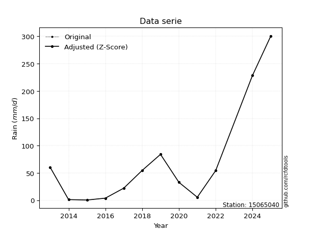</img>

</div>

> If Z-Score is active, values out of range or outliers are replaced with the station mean value.


### 4. Active continuous probability distributions from SciPy (45 of 104 available)

[scipy.stats](https://docs.scipy.org/doc/scipy/reference/stats.html) is a Python´s powerful submodule within the SciPy library for comprehensive statistical analysis, offering over 130 probability distributions (like Normal, Poisson), functions for descriptive stats (mean, variance), hypothesis testing (t-tests, chi-square), random variable generation, and statistical tests, making it essential for data science, modeling, and research. It provides tools to explore, model, and draw conclusions from data efficiently, working seamlessly with NumPy.

<div align="center">

|   id | p_dist             |   n_parameter | fit_method   | label                                                                       | active   | ref                                                                                                        |
|-----:|:-------------------|--------------:|:-------------|:----------------------------------------------------------------------------|:---------|:-----------------------------------------------------------------------------------------------------------|
|    0 | alpha              |             3 | MLE          | Alpha                                                                       | True     | [:mortar_board:](https://docs.scipy.org/doc/scipy/reference/generated/scipy.stats.alpha.html)              |
|    1 | betaprime          |             4 | MLE          | Beta prime                                                                  | True     | [:mortar_board:](https://docs.scipy.org/doc/scipy/reference/generated/scipy.stats.betaprime.html)          |
|    2 | chi2               |             3 | MLE          | Chi²                                                                        | True     | [:mortar_board:](https://docs.scipy.org/doc/scipy/reference/generated/scipy.stats.chi2.html)               |
|    3 | crystalball        |             4 | MLE          | Crystalball                                                                 | True     | [:mortar_board:](https://docs.scipy.org/doc/scipy/reference/generated/scipy.stats.crystalball.html)        |
|    4 | erlang             |             3 | MLE          | Erlang                                                                      | True     | [:mortar_board:](https://docs.scipy.org/doc/scipy/reference/generated/scipy.stats.erlang.html)             |
|    5 | expon              |             2 | MLE          | Exponential                                                                 | True     | [:mortar_board:](https://docs.scipy.org/doc/scipy/reference/generated/scipy.stats.expon.html)              |
|    6 | exponnorm          |             3 | MLE          | Exponentially modified Normal                                               | True     | [:mortar_board:](https://docs.scipy.org/doc/scipy/reference/generated/scipy.stats.exponnorm.html)          |
|    7 | f                  |             4 | MLE          | F                                                                           | True     | [:mortar_board:](https://docs.scipy.org/doc/scipy/reference/generated/scipy.stats.f.html)                  |
|    8 | fatiguelife        |             3 | MLE          | Fatigue-life (Birnbaum-Saunders)                                            | True     | [:mortar_board:](https://docs.scipy.org/doc/scipy/reference/generated/scipy.stats.fatiguelife.html)        |
|    9 | fisk               |             3 | MLE          | Fisk                                                                        | True     | [:mortar_board:](https://docs.scipy.org/doc/scipy/reference/generated/scipy.stats.fisk.html)               |
|   10 | gamma              |             3 | MLE          | Gamma                                                                       | True     | [:mortar_board:](https://docs.scipy.org/doc/scipy/reference/generated/scipy.stats.gamma.html)              |
|   11 | genexpon           |             5 | MLE          | Generalized exponential                                                     | True     | [:mortar_board:](https://docs.scipy.org/doc/scipy/reference/generated/scipy.stats.genexpon.html)           |
|   12 | genlogistic        |             3 | MLE          | Generalized logistic                                                        | True     | [:mortar_board:](https://docs.scipy.org/doc/scipy/reference/generated/scipy.stats.genlogistic.html)        |
|   13 | gibrat             |             2 | MM           | Gibrat                                                                      | True     | [:mortar_board:](https://docs.scipy.org/doc/scipy/reference/generated/scipy.stats.gibrat.html)             |
|   14 | gompertz           |             3 | MLE          | Gompertz (or truncated Gumbel)                                              | True     | [:mortar_board:](https://docs.scipy.org/doc/scipy/reference/generated/scipy.stats.gompertz.html)           |
|   15 | gumbel_l           |             2 | MM           | Gumbel Left Skew                                                            | True     | [:mortar_board:](https://docs.scipy.org/doc/scipy/reference/generated/scipy.stats.gumbel_l.html)           |
|   16 | gumbel_r           |             2 | MM           | Gumbel Right Skew                                                           | True     | [:mortar_board:](https://docs.scipy.org/doc/scipy/reference/generated/scipy.stats.gumbel_r.html)           |
|   17 | halflogistic       |             2 | MM           | Half-logistic                                                               | True     | [:mortar_board:](https://docs.scipy.org/doc/scipy/reference/generated/scipy.stats.halflogistic.html)       |
|   18 | halfnorm           |             2 | MM           | Half Normal                                                                 | True     | [:mortar_board:](https://docs.scipy.org/doc/scipy/reference/generated/scipy.stats.halfnorm.html)           |
|   19 | hypsecant          |             2 | MM           | hyperbolic secant                                                           | True     | [:mortar_board:](https://docs.scipy.org/doc/scipy/reference/generated/scipy.stats.hypsecant.html)          |
|   20 | invgamma           |             3 | MLE          | Inverted gamma                                                              | True     | [:mortar_board:](https://docs.scipy.org/doc/scipy/reference/generated/scipy.stats.invgamma.html)           |
|   21 | invgauss           |             3 | MLE          | Inverse Gaussian                                                            | True     | [:mortar_board:](https://docs.scipy.org/doc/scipy/reference/generated/scipy.stats.invgauss.html)           |
|   22 | invweibull         |             3 | MLE          | Inverted Weibull                                                            | True     | [:mortar_board:](https://docs.scipy.org/doc/scipy/reference/generated/scipy.stats.invweibull.html)         |
|   23 | johnsonsu          |             4 | MLE          | Johnson Su                                                                  | True     | [:mortar_board:](https://docs.scipy.org/doc/scipy/reference/generated/scipy.stats.johnsonsu.html)          |
|   24 | kstwobign          |             2 | MLE          | Limiting distribution of scaled Kolmogorov-Smirnov two-sided test statistic | True     | [:mortar_board:](https://docs.scipy.org/doc/scipy/reference/generated/scipy.stats.kstwobign.html)          |
|   25 | laplace            |             2 | MM           | Laplace                                                                     | True     | [:mortar_board:](https://docs.scipy.org/doc/scipy/reference/generated/scipy.stats.laplace.html)            |
|   26 | laplace_asymmetric |             3 | MLE          | Asymmetric Laplace                                                          | True     | [:mortar_board:](https://docs.scipy.org/doc/scipy/reference/generated/scipy.stats.laplace_asymmetric.html) |
|   27 | loggamma           |             3 | MLE          | Log gamma                                                                   | True     | [:mortar_board:](https://docs.scipy.org/doc/scipy/reference/generated/scipy.stats.loggamma.html)           |
|   28 | logistic           |             2 | MM           | Logistic (or Sech-squared)                                                  | True     | [:mortar_board:](https://docs.scipy.org/doc/scipy/reference/generated/scipy.stats.logistic.html)           |
|   29 | lognorm            |             3 | MLE          | Log Normal                                                                  | True     | [:mortar_board:](https://docs.scipy.org/doc/scipy/reference/generated/scipy.stats.lognorm.html)            |
|   30 | maxwell            |             2 | MM           | Maxwell                                                                     | True     | [:mortar_board:](https://docs.scipy.org/doc/scipy/reference/generated/scipy.stats.maxwell.html)            |
|   31 | mielke             |             4 | MLE          | Mielke Beta-Kappa / Dagum                                                   | True     | [:mortar_board:](https://docs.scipy.org/doc/scipy/reference/generated/scipy.stats.mielke.html)             |
|   32 | moyal              |             2 | MM           | Moyal                                                                       | True     | [:mortar_board:](https://docs.scipy.org/doc/scipy/reference/generated/scipy.stats.moyal.html)              |
|   33 | nakagami           |             3 | MLE          | Nakagami                                                                    | True     | [:mortar_board:](https://docs.scipy.org/doc/scipy/reference/generated/scipy.stats.nakagami.html)           |
|   34 | ncf                |             5 | MLE          | Non-central F distribution                                                  | True     | [:mortar_board:](https://docs.scipy.org/doc/scipy/reference/generated/scipy.stats.ncf.html)                |
|   35 | nct                |             4 | MLE          | Non-central Student’s t                                                     | True     | [:mortar_board:](https://docs.scipy.org/doc/scipy/reference/generated/scipy.stats.nct.html)                |
|   36 | norm               |             2 | MM           | Normal                                                                      | True     | [:mortar_board:](https://docs.scipy.org/doc/scipy/reference/generated/scipy.stats.norm.html)               |
|   37 | pareto             |             3 | MLE          | Pareto                                                                      | True     | [:mortar_board:](https://docs.scipy.org/doc/scipy/reference/generated/scipy.stats.pareto.html)             |
|   38 | pearson3           |             3 | MM           | Pearson type III                                                            | True     | [:mortar_board:](https://docs.scipy.org/doc/scipy/reference/generated/scipy.stats.pearson3.html)           |
|   39 | rayleigh           |             2 | MM           | Rayleigh                                                                    | True     | [:mortar_board:](https://docs.scipy.org/doc/scipy/reference/generated/scipy.stats.rayleigh.html)           |
|   40 | rice               |             3 | MLE          | Rice                                                                        | True     | [:mortar_board:](https://docs.scipy.org/doc/scipy/reference/generated/scipy.stats.rice.html)               |
|   41 | t                  |             3 | MLE          | Student’s t                                                                 | True     | [:mortar_board:](https://docs.scipy.org/doc/scipy/reference/generated/scipy.stats.t.html)                  |
|   42 | truncnorm          |             4 | MLE          | Truncated normal                                                            | True     | [:mortar_board:](https://docs.scipy.org/doc/scipy/reference/generated/scipy.stats.truncnorm.html)          |
|   43 | wald               |             2 | MM           | Wald                                                                        | True     | [:mortar_board:](https://docs.scipy.org/doc/scipy/reference/generated/scipy.stats.wald.html)               |
|   44 | weibull_min        |             3 | MLE          | Weibull minimum                                                             | True     | [:mortar_board:](https://docs.scipy.org/doc/scipy/reference/generated/scipy.stats.weibull_min.html)        |

</div>

> **n_parameter:** # arguments & localization & scale.
>
> **Fit methods:** (MLE) maximum likelihood, (MM) L-moments.
>
>**Inactive:** foldnorm, gennorm, norminvgauss, powernorm, powerlognorm, skewnorm, genextreme, anglit, arcsine, argus, beta, bradford, burr, burr12, cauchy, cosine, halfcauchy, foldcauchy, skewcauchy, wrapcauchy, dgamma, gengamma, exponweib, exponpow, truncexpon, gausshyper, genhalflogistic, genhyperbolic, geninvgauss, halfgennorm, johnsonsb, kappa4, kappa3, ksone, kstwo, loglaplace, levy, levy_l, levy_stable, ncx2, genpareto, truncpareto, lomax, powerlaw, rdist, rel_breitwigner, recipinvgauss, semicircular, studentized_range, trapezoid, triang, truncweibull_min, tukeylambda, uniform, loguniform, vonmises, vonmises_line, weibull_max, dweibull, 


## B. Probability distributions vs. Empirical distributions

A continuous probability distribution (CPD) describes probabilities for variables that can take any value within a range (like rain any time), unlike discrete variables with specific outcomes (like temperature). It uses a Probability Density Function (PDF), a curve where the total area under it equals 1, and the probability of the variable falling within an interval (a to b) is found by calculating the area under the curve between those points. A key feature is that the probability of hitting any single exact value is zero, so probabilities are always expressed for ranges, e.g., $P(a ≤ X ≤ b)$.

<div align="center">

Distributions parameters
|    |   station | p_dist                |   n |              loc |           scale | shape                 | shape1                | shape2                | shape3   |
|---:|----------:|:----------------------|----:|-----------------:|----------------:|:----------------------|:----------------------|:----------------------|:---------|
|  0 |  15065040 | alpha                 |  12 |      0.00186144  |     1.30299     | 9.05593141725596e-09  |                       |                       |          |
|  1 |  15065040 | betaprime             |  12 |      0.4         |    34.4247      | 0.9001646023820074    | 1.2507621805770803    |                       |          |
|  2 |  15065040 | chi2                  |  12 |      0.4         |     2.09047     | 0.6125866862279583    |                       |                       |          |
|  3 |  15065040 | crystalball           |  12 |     52.9667      |    60.9131      | 3164.202785888561     | 3404.632534289463     |                       |          |
|  4 |  15065040 | erlang                |  12 |      0.4         |    90.0026      | 0.6385843704384966    |                       |                       |          |
|  5 |  15065040 | expon                 |  12 |      0.4         |    52.5667      |                       |                       |                       |          |
|  6 |  15065040 | exponnorm             |  12 |      0.332217    |     0.0248177   | 2107.793388092291     |                       |                       |          |
|  7 |  15065040 | f                     |  12 |      0.4         |    71.626       | 0.9068107062520019    | 6.903886531512871     |                       |          |
|  8 |  15065040 | fatiguelife           |  12 |     -0.0952593   |    11.6425      | 2.416561758932583     |                       |                       |          |
|  9 |  15065040 | fisk                  |  12 |      0.4         |    25.6456      | 0.8747722440172065    |                       |                       |          |
| 10 |  15065040 | gamma                 |  12 |      0.4         |    71.7936      | 0.679897681736181     |                       |                       |          |
| 11 |  15065040 | genexpon              |  12 |      0.4         |    90.275       | 1.7173445272666572    | 8.402141305419738e-11 | 1.6077951508314496    |          |
| 12 |  15065040 | genlogistic           |  12 |   -242.454       |    36.8699      | 1553.2405042344199    |                       |                       |          |
| 13 |  15065040 | gibrat                |  12 |      6.49765     |    28.1849      |                       |                       |                       |          |
| 14 |  15065040 | gompertz              |  12 |      0.4         |   160.409       | 1.7710405434718277    |                       |                       |          |
| 15 |  15065040 | gumbel_l              |  12 |     80.3808      |    47.4937      |                       |                       |                       |          |
| 16 |  15065040 | gumbel_r              |  12 |     25.5525      |    47.4937      |                       |                       |                       |          |
| 17 |  15065040 | halflogistic          |  12 |    -19.2295      |    52.0785      |                       |                       |                       |          |
| 18 |  15065040 | halfnorm              |  12 |    -27.6584      |   101.048       |                       |                       |                       |          |
| 19 |  15065040 | hypsecant             |  12 |     52.9667      |    38.7785      |                       |                       |                       |          |
| 20 |  15065040 | invgamma              |  12 |     -8.39464     |    28.7408      | 1.1993928855951035    |                       |                       |          |
| 21 |  15065040 | invgauss              |  12 |     -3.91764     |    20.2059      | 2.8152343887567       |                       |                       |          |
| 22 |  15065040 | invweibull            |  12 |     -2.09363     |    12.8347      | 0.7360530042301889    |                       |                       |          |
| 23 |  15065040 | johnsonsu             |  12 |      0.290205    |     0.00385383  | -4.244817633246366    | 0.4690025636820222    |                       |          |
| 24 |  15065040 | kstwobign             |  12 |   -110.946       |   191.15        |                       |                       |                       |          |
| 25 |  15065040 | laplace               |  12 |     52.9667      |    43.072       |                       |                       |                       |          |
| 26 |  15065040 | laplace_asymmetric    |  12 |     54.3         |    41.9839      | 1.0159982121115985    |                       |                       |          |
| 27 |  15065040 | loggamma              |  12 | -19827.1         |  2651.91        | 1802.1073436934953    |                       |                       |          |
| 28 |  15065040 | logistic              |  12 |     52.9667      |    33.5831      |                       |                       |                       |          |
| 29 |  15065040 | lognorm               |  12 |      0.4         |     0.857636    | 11.343727113537911    |                       |                       |          |
| 30 |  15065040 | maxwell               |  12 |    -91.3717      |    90.4507      |                       |                       |                       |          |
| 31 |  15065040 | mielke                |  12 |      0.4         |   112.601       | 0.3934953420443969    | 4.830371020315697     |                       |          |
| 32 |  15065040 | moyal                 |  12 |     18.1327      |    27.4205      |                       |                       |                       |          |
| 33 |  15065040 | nakagami              |  12 |      0.4         |   107.935       | 0.19661145297276014   |                       |                       |          |
| 34 |  15065040 | ncf                   |  12 |      0.4         |    13.9305      | 0.7268616811210598    | 262.2447758487607     | 2.5937597970530346    |          |
| 35 |  15065040 | nct                   |  12 |    -18.3473      |     0.751873    | 1.315765958449239     | 43.93799214462814     |                       |          |
| 36 |  15065040 | norm                  |  12 |     52.9667      |    60.9131      |                       |                       |                       |          |
| 37 |  15065040 | pareto                |  12 |   -154.598       |   154.998       | 3.883730098111678     |                       |                       |          |
| 38 |  15065040 | pearson3              |  12 |     52.9667      |    60.9131      | 1.8165165286382556    |                       |                       |          |
| 39 |  15065040 | rayleigh              |  12 |    -63.5636      |    92.9777      |                       |                       |                       |          |
| 40 |  15065040 | rice                  |  12 |    -37.5345      |    77.139       | 0.0005973492127596385 |                       |                       |          |
| 41 |  15065040 | t                     |  12 |     37.7139      |    34.1062      | 2.5605337830734114    |                       |                       |          |
| 42 |  15065040 | truncnorm             |  12 |   -121.065       |   106.314       | 1.142509999085742     | 2188.834139154907     |                       |          |
| 43 |  15065040 | wald                  |  12 |     -7.9464      |    60.9131      |                       |                       |                       |          |
| 44 |  15065040 | weibull_min           |  12 |      0.4         |    53.5313      | 0.735218367552525     |                       |                       |          |
| 45 |  15065040 | logalpha              |  12 |    -54.0308      |  1673.08        | 29.400545824469816    |                       |                       |          |
| 46 |  15065040 | logbetaprime          |  12 |     -0.916291    |     3.23491     | 0.27175594507517503   | 1.141200337905678     |                       |          |
| 47 |  15065040 | logchi2               |  12 |     -0.916291    |     2.65947     | 1.3326883143483443    |                       |                       |          |
| 48 |  15065040 | logcrystalball        |  12 |      2.94383     |     1.85477     | 35.483392323744454    | 2948.9335196615475    |                       |          |
| 49 |  15065040 | logerlang             |  12 |    -29.3792      |     0.113044    | 285.9129998489659     |                       |                       |          |
| 50 |  15065040 | logexpon              |  12 |     -0.916291    |     3.86012     |                       |                       |                       |          |
| 51 |  15065040 | logexponnorm          |  12 |      2.94265     |     1.85477     | 0.0006388572915929903 |                       |                       |          |
| 52 |  15065040 | logf                  |  12 |     -0.916291    |     1.15537     | 1.1013019670415858    | 1.1346493861347238    |                       |          |
| 53 |  15065040 | logfatiguelife        |  12 |   -852.432       |   855.381       | 0.0021618261158708194 |                       |                       |          |
| 54 |  15065040 | logfisk               |  12 |     -0.916291    |     2.23318     | 0.3121797496923417    |                       |                       |          |
| 55 |  15065040 | loggamma              |  12 |    -26.6019      |     0.123646    | 238.96410816693827    |                       |                       |          |
| 56 |  15065040 | loggenexpon           |  12 |     -1.00556     |     0.0729056   | 0.003951645148858943  | 5.175359155790867     | 8.477924162976838e-05 |          |
| 57 |  15065040 | loggenlogistic        |  12 |      4.76028     |     0.333851    | 0.1753053255313478    |                       |                       |          |
| 58 |  15065040 | loggibrat             |  12 |      1.52883     |     0.858233    |                       |                       |                       |          |
| 59 |  15065040 | loggompertz           |  12 |     -0.916292    |     1.56256     | 0.05412059519624057   |                       |                       |          |
| 60 |  15065040 | loggumbel_l           |  12 |      3.77858     |     1.44616     |                       |                       |                       |          |
| 61 |  15065040 | loggumbel_r           |  12 |      2.10909     |     1.44616     |                       |                       |                       |          |
| 62 |  15065040 | loghalflogistic       |  12 |      0.745482    |     1.58578     |                       |                       |                       |          |
| 63 |  15065040 | loghalfnorm           |  12 |      0.488875    |     3.07684     |                       |                       |                       |          |
| 64 |  15065040 | loghypsecant          |  12 |      2.94383     |     1.18078     |                       |                       |                       |          |
| 65 |  15065040 | loginvgamma           |  12 |    -32.9897      | 12412.2         | 346.5754229831306     |                       |                       |          |
| 66 |  15065040 | loginvgauss           |  12 |    -14.0811      |  1250.94        | 0.013584280411587484  |                       |                       |          |
| 67 |  15065040 | loginvweibull         |  12 |     -1.99429e+08 |     1.99429e+08 | 100057998.30100906    |                       |                       |          |
| 68 |  15065040 | logjohnsonsu          |  12 |      6.49066     |     0.0999833   | 7.7705591708875       | 1.8836042898387944    |                       |          |
| 69 |  15065040 | logkstwobign          |  12 |     -5.11938     |     9.21282     |                       |                       |                       |          |
| 70 |  15065040 | loglaplace            |  12 |      2.94383     |     1.31152     |                       |                       |                       |          |
| 71 |  15065040 | loglaplace_asymmetric |  12 |      4.43082     |     0.945076    | 2.0589109804497996    |                       |                       |          |
| 72 |  15065040 | logloggamma           |  12 |      4.92607     |     0.647202    | 0.3403240481672828    |                       |                       |          |
| 73 |  15065040 | loglogistic           |  12 |      2.94383     |     1.02259     |                       |                       |                       |          |
| 74 |  15065040 | loglognorm            |  12 |   -571.834       |   574.768       | 0.003217045775223453  |                       |                       |          |
| 75 |  15065040 | logmaxwell            |  12 |     -1.4512      |     2.75418     |                       |                       |                       |          |
| 76 |  15065040 | logmielke             |  12 |     -1.95163e+08 |     1.95163e+08 | 648170043.2937584     | 117533144.75208282    |                       |          |
| 77 |  15065040 | logmoyal              |  12 |      1.88315     |     0.834941    |                       |                       |                       |          |
| 78 |  15065040 | lognakagami           |  12 |   -749.147       |   752.09        | 40890.69832751056     |                       |                       |          |
| 79 |  15065040 | logncf                |  12 |     -0.916291    |     1.09599     | 1.0676212715105606    | 1.1706690796512733    | 1.0997372449339613    |          |
| 80 |  15065040 | lognct                |  12 |    102.376       |     1.83072     | 58883.49458567545     | -54.31220771288089    |                       |          |
| 81 |  15065040 | lognorm               |  12 |      2.94383     |     1.85477     |                       |                       |                       |          |
| 82 |  15065040 | logpareto             |  12 |     -0.916314    |     2.35065e-05 | 0.09091689700864054   |                       |                       |          |
| 83 |  15065040 | logpearson3           |  12 |      2.94382     |     1.85479     | -0.7613549536613015   |                       |                       |          |
| 84 |  15065040 | lograyleigh           |  12 |     -0.604475    |     2.83114     |                       |                       |                       |          |
| 85 |  15065040 | logrice               |  12 |     -2.06165     |     1.98645     | 2.2849934641256135    |                       |                       |          |
| 86 |  15065040 | logt                  |  12 |      2.94383     |     1.85477     | 62032322907.75282     |                       |                       |          |
| 87 |  15065040 | logtruncnorm          |  12 |      1.32156     |     5.53256     | -0.4046693508588046   | 0.7427914589283651    |                       |          |
| 88 |  15065040 | logwald               |  12 |      1.08909     |     1.85475     |                       |                       |                       |          |
| 89 |  15065040 | logweibull_min        |  12 |     -1.27096e+08 |     1.27096e+08 | 91873286.92394155     |                       |                       |          |

</div>

> **loc** (Location parameter): This shifts the distribution along the x-axis. For many common distributions, like the normal (Gaussian) distribution, loc represents the mean $μ$. For others, like the uniform distribution, it might represent the minimum value, or for the beta distribution, the left end of the support interval.
>
> **scale** (Scale parameter): This determines the width or spread of the distribution. For the normal distribution, scale represents the standard deviation $σ$. For a uniform distribution, it defines the length of the interval (from $loc$ to $loc + scale$).
>
> **shape** (Shape parameters): Refers to parameters that define the specific form of a probability distribution, distinct from its location (loc) and scale (scale). These parameters are required arguments for most distribution functions. For example, a normal (Gaussian) distribution is fully defined by its location (mean) and scale (standard deviation), so it has no specific shape parameters beyond loc and scale. However, other distributions have intrinsic properties that need specification, as Gamma distribution that takes a shape parameter, often named $a$ or $alpha$.


### 0. Cumulative distribution values - CDF (90 evaluated)

> Ordered by x ascending and calculating $log(f(x))$ separately. 

|   id |   Station |   date |     x |   count |    mean |     std |     zscore |   Value_initial |   station |   m |      alpha |   alpha_pdf |   betaprime |   betaprime_pdf |        chi2 |    chi2_pdf |   crystalball |   crystalball_pdf |    erlang |      erlang_pdf |     expon |   expon_pdf |   exponnorm |   exponnorm_pdf |           f |       f_pdf |   fatiguelife |   fatiguelife_pdf |        fisk |    fisk_pdf |       gamma |      gamma_pdf |   genexpon |   genexpon_pdf |   genlogistic |   genlogistic_pdf |   gibrat |   gibrat_pdf |    gompertz |   gompertz_pdf |   gumbel_l |   gumbel_l_pdf |   gumbel_r |   gumbel_r_pdf |   halflogistic |   halflogistic_pdf |   halfnorm |   halfnorm_pdf |   hypsecant |   hypsecant_pdf |   invgamma |   invgamma_pdf |   invgauss |   invgauss_pdf |   invweibull |   invweibull_pdf |   johnsonsu |   johnsonsu_pdf |   kstwobign |   kstwobign_pdf |   laplace |   laplace_pdf |   laplace_asymmetric |   laplace_asymmetric_pdf |   loggamma |   loggamma_pdf |   logistic |   logistic_pdf |   lognorm |   lognorm_pdf |   maxwell |   maxwell_pdf |      mielke |   mielke_pdf |    moyal |   moyal_pdf |    nakagami |   nakagami_pdf |         ncf |     ncf_pdf |       nct |     nct_pdf |     norm |    norm_pdf |      pareto |   pareto_pdf |   pearson3 |   pearson3_pdf |   rayleigh |   rayleigh_pdf |     rice |    rice_pdf |        t |       t_pdf |   truncnorm |   truncnorm_pdf |      wald |    wald_pdf |   weibull_min |   weibull_min_pdf |   logalpha |   logalpha_pdf |   logbetaprime |   logbetaprime_pdf |     logchi2 |   logchi2_pdf |   logcrystalball |   logcrystalball_pdf |   logerlang |   logerlang_pdf |   logexpon |   logexpon_pdf |   logexponnorm |   logexponnorm_pdf |        logf |    logf_pdf |   logfatiguelife |   logfatiguelife_pdf |     logfisk |   logfisk_pdf |   loggenexpon |   loggenexpon_pdf |   loggenlogistic |   loggenlogistic_pdf |   loggibrat |   loggibrat_pdf |   loggompertz |   loggompertz_pdf |   loggumbel_l |   loggumbel_l_pdf |   loggumbel_r |   loggumbel_r_pdf |   loghalflogistic |   loghalflogistic_pdf |   loghalfnorm |   loghalfnorm_pdf |   loghypsecant |   loghypsecant_pdf |   loginvgamma |   loginvgamma_pdf |   loginvgauss |   loginvgauss_pdf |   loginvweibull |   loginvweibull_pdf |   logjohnsonsu |   logjohnsonsu_pdf |   logkstwobign |   logkstwobign_pdf |   loglaplace |   loglaplace_pdf |   loglaplace_asymmetric |   loglaplace_asymmetric_pdf |   logloggamma |   logloggamma_pdf |   loglogistic |   loglogistic_pdf |   loglognorm |   loglognorm_pdf |   logmaxwell |   logmaxwell_pdf |   logmielke |   logmielke_pdf |    logmoyal |   logmoyal_pdf |   lognakagami |   lognakagami_pdf |      logncf |   logncf_pdf |    lognct |   lognct_pdf |   logpareto |   logpareto_pdf |   logpearson3 |   logpearson3_pdf |   lograyleigh |   lograyleigh_pdf |   logrice |   logrice_pdf |      logt |   logt_pdf |   logtruncnorm |   logtruncnorm_pdf |   logwald |   logwald_pdf |   logweibull_min |   logweibull_min_pdf |
|-----:|----------:|-------:|------:|--------:|--------:|--------:|-----------:|----------------:|----------:|----:|-----------:|------------:|------------:|----------------:|------------:|------------:|--------------:|------------------:|----------:|----------------:|----------:|------------:|------------:|----------------:|------------:|------------:|--------------:|------------------:|------------:|------------:|------------:|---------------:|-----------:|---------------:|--------------:|------------------:|---------:|-------------:|------------:|---------------:|-----------:|---------------:|-----------:|---------------:|---------------:|-------------------:|-----------:|---------------:|------------:|----------------:|-----------:|---------------:|-----------:|---------------:|-------------:|-----------------:|------------:|----------------:|------------:|----------------:|----------:|--------------:|---------------------:|-------------------------:|-----------:|---------------:|-----------:|---------------:|----------:|--------------:|----------:|--------------:|------------:|-------------:|---------:|------------:|------------:|---------------:|------------:|------------:|----------:|------------:|---------:|------------:|------------:|-------------:|-----------:|---------------:|-----------:|---------------:|---------:|------------:|---------:|------------:|------------:|----------------:|----------:|------------:|--------------:|------------------:|-----------:|---------------:|---------------:|-------------------:|------------:|--------------:|-----------------:|---------------------:|------------:|----------------:|-----------:|---------------:|---------------:|-------------------:|------------:|------------:|-----------------:|---------------------:|------------:|--------------:|--------------:|------------------:|-----------------:|---------------------:|------------:|----------------:|--------------:|------------------:|--------------:|------------------:|--------------:|------------------:|------------------:|----------------------:|--------------:|------------------:|---------------:|-------------------:|--------------:|------------------:|--------------:|------------------:|----------------:|--------------------:|---------------:|-------------------:|---------------:|-------------------:|-------------:|-----------------:|------------------------:|----------------------------:|--------------:|------------------:|--------------:|------------------:|-------------:|-----------------:|-------------:|-----------------:|------------:|----------------:|------------:|---------------:|--------------:|------------------:|------------:|-------------:|----------:|-------------:|------------:|----------------:|--------------:|------------------:|--------------:|------------------:|----------:|--------------:|----------:|-----------:|---------------:|-------------------:|----------:|--------------:|-----------------:|---------------------:|
|    0 |  15065040 |   2015 |   0.4 |      12 | 52.9667 | 63.6216 | -0.826239  |             0.4 |  15065040 |   1 | 0.00106524 | 0.0309769   | 2.21449e-16 |     1.7955      | 7.55357e-06 | 4.16783e+10 |      0.194075 |       0.00451318  | 2.618e-12 | 30116.7         | 0         | 0.0190235   |  0.00129527 |      0.0190315  | 1.54727e-08 | 9.02702e+06 |     0.0273652 |       0.133111    | 3.52752e-16 | 5.55885     | 5.36109e-13 | 6566.23        | 1.3433e-11 |    0.0190235   |      0.1177   |       0.00682561  | 0        |  0           | 6.25718e-13 |    0.0110408   |   0.169415 |    0.00324626  |   0.183004 |    0.00654373  |       0.18626  |        0.00926781  |   0.218736 |    0.00759745  |    0.160624 |     0.00396854  |  0.0551823 |    0.0195137   |  0.0430854 |    0.0271004   |    0.0354388 |      0.0349378   |  0.00942111 |     0.108001    |    0.113434 |      0.00638941 |  0.147551 |   0.00342567  |             0.143559 |              0.00336553  |  0.0181387 |      0.0256048 |   0.172892 |     0.0042581  | 0.0187085 |     0.0246651 |  0.205867 |    0.00542733 | 6.18492e-07 |  1.29711e+07 | 0.16705  | 0.00773893  | 5.08389e-08 |    3.60126e+08 | 1.29766e-07 | 4.24788e+08 | 0.0662169 | 0.0161623   | 0.194075 | 0.00451318  | 8.88178e-16 |  0.0250567   |   0.154445 |    0.0114396   |   0.21072  |    0.00583991  | 0.113893 | 0.00564901  | 0.183034 | 0.00537127  | 3.37143e-06 |     0.01543     | 0.0177322 | 0.00852688  |   5.99329e-14 |     793.783       |  0.0179125 |      0.0261442 |    3.52257e-05 |        8.62242e+10 | 8.50282e-12 | 51033         |        0.0187085 |            0.0246651 |   0.0185456 |       0.0258661 |   0        |      0.259059  |      0.0187085 |          0.0246651 | 1.00811e-09 | 5.00003e+06 |        0.0180986 |            0.0241603 | 8.13523e-06 |    2.2875e+10 |    0.00515406 |         0.0612534 |        0.0507536 |            0.0266507 |   0         |       0         |   5.91525e-08 |         0.0346358 |     0.0381652 |         0.0258806 |   0.000303188 |        0.00169841 |          0        |             0         |      0        |          0        |      0.0242053 |          0.0204796 |     0.0174369 |         0.0259506 |     0.0161052 |         0.0264955 |       0.0145845 |           0.0309364 |      0.0500488 |          0.0262457 |      0.0146459 |          0.0378234 |    0.0263474 |        0.0200892 |               0.05183   |                   0.0266365 |     0.0519184 |         0.0272983 |     0.022426  |         0.0214388 |    0.0183422 |        0.0244924 |   0.00192651 |        0.0107234 |   0.0124306 |       0.0226523 | 8.96947e-08 |    1.58585e-06 |     0.0189785 |         0.0249452 | 1.11056e-09 |   5.3397e+06 | 0.0187055 |    0.0246306 |    0        |   3867.73       |     0.0345306 |         0.028073  |     0         |         0         | 0.0138045 |     0.026796  | 0.0187085 |  0.0246652 |    0.000155451 |           0.155122 | 0         |     0         |        0.0327768 |            0.0233007 |
|    1 |  15065040 |   2014 |   1.2 |      12 | 52.9667 | 63.6216 | -0.813665  |             1.2 |  15065040 |   2 | 0.276811   | 0.400914    | 0.0407037   |     0.0446238   | 0.643545    | 0.212523    |      0.197706 |       0.00456423  | 0.0543458 |     0.0431457   | 0.0151035 | 0.0187361   |  0.0164521  |      0.0188021  | 0.0989864   | 0.0558806   |     0.135097  |       0.115607    | 0.0459446   | 0.0479306   | 0.051709    |    0.0436553   | 0.0151036  |    0.0187362   |      0.123228 |       0.00699298  | 0        |  0           | 0.0088156   |    0.0109982   |   0.17203  |    0.00329101  |   0.188269 |    0.00661956  |       0.193664 |        0.0092408   |   0.224807 |    0.00758053  |    0.163828 |     0.00404065  |  0.0714846 |    0.0211601   |  0.0661381 |    0.0302004   |    0.0657823 |      0.040007    |  0.0873865  |     0.0818949   |    0.1186   |      0.00652338 |  0.150317 |   0.00348989  |             0.146276 |              0.00342925  |  0.0705923 |      0.0754967 |   0.176325 |     0.00432462 | 0.0682611 |     0.0710008 |  0.210227 |    0.00547281 | 0.142756    |  0.0702172   | 0.173282 | 0.0078391   | 0.11486     |    0.0564567   | 0.0762903   | 0.0359876   | 0.0796057 | 0.0172765   | 0.197706 | 0.00456423  | 0.0197952   |  0.0244346   |   0.163584 |    0.0114046   |   0.215407 |    0.00587784  | 0.118448 | 0.00573849  | 0.187383 | 0.00550295  | 0.0122943   |     0.0152974   | 0.0252166 | 0.0101607   |   0.0444638   |       0.039941    |  0.0720651 |      0.0781586 |    0.717204    |        0.128125    | 0.35726     |     0.191064  |        0.0682611 |            0.0710008 |   0.0711993 |       0.0755386 |   0.247689 |      0.194893  |      0.0682611 |          0.0710008 | 0.495116    | 0.156306    |        0.0670295 |            0.0704486 | 0.444862    |    0.0701757  |    0.115382   |         0.134632  |        0.0903656 |            0.047451  |   0         |       0         |   0.0537056   |         0.0662058 |     0.0798134 |         0.0529264 |   0.0225986   |        0.0592228  |          0        |             0         |      0        |          0        |      0.061214  |          0.0515229 |     0.0717512 |         0.0787903 |     0.0736914 |         0.0844848 |       0.0874837 |           0.106936  |      0.0897969 |          0.0484007 |      0.104997  |          0.127752  |    0.0608877 |        0.0464252 |               0.0911557 |                   0.0468468 |     0.092502  |         0.0486173 |     0.0629434 |         0.0576786 |    0.0678916 |        0.0712637 |   0.0499859  |        0.0854726 |   0.0681881 |       0.0873039 | 0.00562055  |    0.0286082   |     0.0689469 |         0.0714509 | 0.363303    |   0.149862   | 0.0681759 |    0.0708826 |    0.623774 |      0.0311343  |     0.0812005 |         0.0601828 |     0.0378804 |         0.094443  | 0.068241  |     0.0773221 | 0.0682612 |  0.0710009 |    0.176422    |           0.164813 | 0         |     0         |        0.071083  |            0.0495124 |
|    2 |  15065040 |   2016 |   3.8 |      12 | 52.9667 | 63.6216 | -0.772798  |             3.8 |  15065040 |   3 | 0.731553   | 0.067949    | 0.13927     |     0.0331365   | 0.885804    | 0.0418228   |      0.209787 |       0.00472853  | 0.135389  |     0.0248474   | 0.0626324 | 0.017832    |  0.0641424  |      0.0178904  | 0.189664    | 0.0248732   |     0.317018  |       0.0436547   | 0.145846    | 0.0320514   | 0.136296    |    0.0264948   | 0.0626325  |    0.017832    |      0.142096 |       0.00751538  | 0        |  0           | 0.0372286   |    0.0108575   |   0.180778 |    0.00343947  |   0.205785 |    0.00684997  |       0.21757  |        0.00914642  |   0.244442 |    0.00752254  |    0.174644 |     0.00428106  |  0.130554  |    0.0236505   |  0.14825   |    0.0314558   |    0.169769  |      0.0375985   |  0.234585   |     0.0410235   |    0.136104 |      0.0069356  |  0.15967  |   0.00370705  |             0.15547  |              0.00364477  |  0.201428  |      0.152692  |   0.187852 |     0.00454286 | 0.192861  |     0.147653  |  0.224643 |    0.00561454 | 0.252268    |  0.029196    | 0.194053 | 0.00813022  | 0.202887    |    0.0234608   | 0.134803    | 0.0165648   | 0.127939  | 0.0195857   | 0.209787 | 0.00472853  | 0.0808186   |  0.0225373   |   0.193046 |    0.0112496   |   0.230843 |    0.00599353  | 0.133735 | 0.00601748  | 0.202261 | 0.00594494  | 0.0515096   |     0.0148687   | 0.0574124 | 0.0142814   |   0.123466    |       0.0249779   |  0.206657  |      0.155818  |    0.812783    |        0.0544493   | 0.531603    |     0.121087  |        0.192861  |            0.147653  |   0.20185   |       0.152365  |   0.4419   |      0.144581  |      0.192861  |          0.147653  | 0.616048    | 0.0717699   |        0.191239  |            0.147614  | 0.50063     |    0.0346667  |    0.297259   |         0.173681  |        0.165526  |            0.086915  |   0         |       0         |   0.160108    |         0.122876  |     0.168542  |         0.10612   |   0.181245    |        0.214049   |          0.183766 |             0.304655  |      0.216682 |          0.249697 |      0.159559  |          0.129541  |     0.207767  |         0.157539  |     0.217903  |         0.164367  |       0.255032  |           0.174834  |      0.168026  |          0.0917439 |      0.289742  |          0.180779  |    0.146631  |        0.111802  |               0.164837  |                   0.0847129 |     0.169446  |         0.0888426 |     0.171748  |         0.139108  |    0.193266  |        0.148713  |   0.204407   |        0.177731  |   0.222403  |       0.176234  | 0.16497     |    0.253012    |     0.194004  |         0.147904  | 0.489079    |   0.0806185  | 0.192614  |    0.147519  |    0.647531 |      0.0142341  |     0.181122  |         0.117217  |     0.209151  |         0.191362  | 0.200314  |     0.152979  | 0.192861  |  0.147653  |    0.369123    |           0.168344 | 0.0155059 |     0.260969  |        0.156038  |            0.103497  |
|    3 |  15065040 |   2021 |   5.5 |      12 | 52.9667 | 63.6216 | -0.746078  |             5.5 |  15065040 |   4 | 0.812667   | 0.0334391   | 0.191874    |     0.0289507   | 0.936725    | 0.0210218   |      0.217915 |       0.00483437  | 0.174128  |     0.0210589   | 0.0924618 | 0.0172645   |  0.0940672  |      0.0173183  | 0.227089    | 0.0196895   |     0.378263  |       0.0300286   | 0.195781    | 0.0270066   | 0.177868    |    0.0227253   | 0.0924619  |    0.0172645   |      0.155148 |       0.00783635  | 0        |  0           | 0.0556068   |    0.0107637   |   0.18671  |    0.003539    |   0.217548 |    0.0069869   |       0.233062 |        0.00907939  |   0.257197 |    0.00748218  |    0.182059 |     0.00444303  |  0.170914  |    0.0236818   |  0.200106  |    0.0293991   |    0.229572  |      0.0327454   |  0.295087   |     0.0310654   |    0.148109 |      0.00718472 |  0.166098 |   0.00385629  |             0.161791 |              0.00379297  |  0.262188  |      0.175366  |   0.195697 |     0.00468687 | 0.25205   |     0.172071  |  0.234263 |    0.00570199 | 0.295906    |  0.0228309   | 0.208015 | 0.00829193  | 0.237947    |    0.0183396   | 0.160392    | 0.0138575   | 0.161826  | 0.0201782   | 0.217915 | 0.00483437  | 0.118149    |  0.0213924   |   0.212064 |    0.0111213   |   0.241091 |    0.00606291  | 0.144112 | 0.00618992  | 0.212621 | 0.00624441  | 0.0765496   |     0.0145902   | 0.0832221 | 0.0159597   |   0.162679    |       0.0214315   |  0.268418  |      0.177555  |    0.83097     |        0.0444503   | 0.57376     |     0.107368  |        0.25205   |            0.172071  |   0.262482  |       0.17501   |   0.492878 |      0.131375  |      0.25205   |          0.172071  | 0.640261    | 0.0598027   |        0.250456  |            0.172264  | 0.512496    |    0.0297577  |    0.362229   |         0.177033  |        0.200994  |            0.105531  |   0.0564984 |       0.645912  |   0.209833    |         0.146463  |     0.212071  |         0.129862  |   0.266444    |        0.243677   |          0.293562 |             0.288131  |      0.307282 |          0.239842 |      0.214423  |          0.168168  |     0.270185  |         0.17936   |     0.282511  |         0.184194  |       0.321418  |           0.183036  |      0.205581  |          0.111988  |      0.357196  |          0.183048  |    0.194385  |        0.148213  |               0.199333  |                   0.102441  |     0.205655  |         0.107586  |     0.229398  |         0.17287   |    0.252877  |        0.173272  |   0.27396    |        0.197289  |   0.291085  |       0.193846  | 0.265815    |    0.286271    |     0.253255  |         0.172147  | 0.516685    |   0.0691891  | 0.251761  |    0.171978  |    0.652371 |      0.0120582  |     0.228617  |         0.139922  |     0.282975  |         0.206575  | 0.261126  |     0.175411  | 0.252051  |  0.172071  |    0.431317    |           0.167942 | 0.199913  |     0.574214  |        0.198787  |            0.128361  |
|    4 |  15065040 |   2017 |  22.1 |      12 | 52.9667 | 63.6216 | -0.48516   |            22.1 |  15065040 |   5 | 0.952981   | 0.00212527  | 0.496748    |     0.0117847   | 0.999456    | 0.000145239 |      0.306171 |       0.00576024  | 0.409558  |     0.0103764   | 0.338211  | 0.0125895   |  0.340402   |      0.0126092  | 0.422548    | 0.00794495  |     0.607056  |       0.00754477  | 0.46353     | 0.0100244   | 0.435214    |    0.0113444   | 0.338212   |    0.0125895   |      0.304792 |       0.0098181   | 0.277138 |  0.0214675   | 0.226281    |    0.00977989  |   0.254078 |    0.00460387  |   0.341161 |    0.00772491  |       0.377207 |        0.00823482  |   0.377578 |    0.0069945   |    0.269801 |     0.00615383  |  0.476369  |    0.01296     |  0.51875   |    0.0120529   |    0.534127  |      0.0101907   |  0.552881   |     0.00850346  |    0.282164 |      0.00868074 |  0.244198 |   0.00566952  |             0.238762 |              0.00559746  |  0.539881  |      0.206949  |   0.285139 |     0.00606955 | 0.532603  |     0.214371  |  0.334657 |    0.00632022 | 0.523126    |  0.00948273  | 0.352261 | 0.00878052  | 0.41999     |    0.00756019  | 0.330716    | 0.00859822  | 0.453215  | 0.0135294   | 0.306171 | 0.00576024  | 0.398835    |  0.0132133   |   0.382983 |    0.00938416  |   0.345857 |    0.00648204  | 0.258311 | 0.00743312  | 0.341546 | 0.00924233  | 0.296716    |     0.0119685   | 0.359029  | 0.0145726   |   0.402413    |       0.0104242   |  0.545077  |      0.203221  |    0.87648     |        0.0241255   | 0.696019    |     0.071718  |        0.532603  |            0.214371  |   0.539891  |       0.20699   |   0.646302 |      0.0916288 |      0.532603  |          0.214371  | 0.70355     | 0.0348822   |        0.531706  |            0.215021  | 0.545594    |    0.0192918  |    0.59964    |         0.156916  |        0.416724  |            0.217338  |   0.726373  |       0.212446  |   0.4786      |         0.235365  |     0.463976  |         0.231131  |   0.603185    |        0.210854   |          0.629744 |             0.190261  |      0.603116 |          0.181125 |      0.540795  |          0.267364  |     0.548704  |         0.203751  |     0.559798  |         0.197367  |       0.568436  |           0.161099  |      0.430414  |          0.217864  |      0.59569   |          0.152519  |    0.55463   |        0.339583  |               0.407382  |                   0.209362  |     0.421758  |         0.212178  |     0.537031  |         0.243136  |    0.534831  |        0.214871  |   0.564065   |        0.202101  |   0.56652   |       0.184216  | 0.628518    |    0.205638    |     0.533393  |         0.213761  | 0.592653    |   0.0433574  | 0.532363  |    0.214542  |    0.665568 |      0.00757885 |     0.482074  |         0.218591  |     0.574296  |         0.196514  | 0.539733  |     0.20876   | 0.532603  |  0.214371  |    0.660468    |           0.159909 | 0.698833  |     0.19057   |        0.454308  |            0.238926  |
|    5 |  15065040 |   2020 |  32.8 |      12 | 52.9667 | 63.6216 | -0.316978  |            32.8 |  15065040 |   6 | 0.96831    | 0.000965695 | 0.599238    |     0.00777919  | 0.999967    | 8.50863e-06 |      0.370295 |       0.00620009  | 0.506679  |     0.0079707   | 0.460094  | 0.0102709   |  0.462417   |      0.0102767  | 0.495723    | 0.00593238  |     0.673427  |       0.00516218  | 0.55095     | 0.0066797   | 0.540768    |    0.00859669  | 0.460094   |    0.0102709   |      0.411095 |       0.00990863  | 0.472444 |  0.0151314   | 0.327268    |    0.00908996  |   0.307333 |    0.00535547  |   0.423808 |    0.00766056  |       0.461747 |        0.00755388  |   0.450367 |    0.00660202  |    0.341457 |     0.00721112  |  0.589292  |    0.00854368  |  0.622365  |    0.00778606  |    0.619436  |      0.00625815  |  0.625577   |     0.0054678   |    0.376208 |      0.00880189 |  0.313062 |   0.00726833  |             0.306837 |              0.00719336  |  0.619849  |      0.196793  |   0.354229 |     0.00681148 | 0.615888  |     0.20595   |  0.403302 |    0.00647906 | 0.612398    |  0.00741945  | 0.444077 | 0.00830793  | 0.490907    |    0.00587028  | 0.416805    | 0.00754795  | 0.573593  | 0.00926217  | 0.370295 | 0.00620009  | 0.521558    |  0.00991548  |   0.476864 |    0.00817089  |   0.415547 |    0.00651486  | 0.340108 | 0.00779997  | 0.448006 | 0.0104801   | 0.416285    |     0.0103987   | 0.495381  | 0.0110294   |   0.499083    |       0.00785802  |  0.623343  |      0.192009  |    0.885347    |        0.0209041   | 0.722887    |     0.0645335 |        0.615888  |            0.20595   |   0.619904  |       0.19697   |   0.680693 |      0.0827195 |      0.615888  |          0.20595   | 0.716493    | 0.0308151   |        0.615239  |            0.206544  | 0.552849    |    0.0175126  |    0.659231   |         0.144612  |        0.511368  |            0.262665  |   0.795779  |       0.144516  |   0.5743      |         0.247411  |     0.55928   |         0.249697  |   0.680626    |        0.181077   |          0.699075 |             0.161212  |      0.670703 |          0.161133 |      0.642352  |          0.243064  |     0.627068  |         0.191975  |     0.635252  |         0.183825  |       0.629173  |           0.146266  |      0.522907  |          0.249912  |      0.653169  |          0.138482  |    0.670412  |        0.251302  |               0.499033  |                   0.256463  |     0.512743  |         0.248481  |     0.630537  |         0.227814  |    0.618228  |        0.20601   |   0.640961   |        0.186488  |   0.635863  |       0.166456  | 0.702511    |    0.169655    |     0.616421  |         0.205276  | 0.60885     |   0.0388231  | 0.615727  |    0.206169  |    0.66841  |      0.00684114 |     0.570635  |         0.228377  |     0.648663  |         0.179492  | 0.620554  |     0.19926   | 0.615888  |  0.20595   |    0.722838    |           0.155894 | 0.76373   |     0.141191  |        0.553261  |            0.260213  |
|    6 |  15065040 |   2022 |  54.3 |      12 | 52.9667 | 63.6216 |  0.0209572 |            54.3 |  15065040 |   7 | 0.980855   | 0.000352522 | 0.72022     |     0.00405781  | 1           | 3.49311e-08 |      0.508732 |       0.0065478   | 0.645343  |     0.00522231  | 0.641334  | 0.00682306  |  0.643592   |      0.0068133  | 0.598564    | 0.00389434  |     0.758976  |       0.00311021  | 0.656953    | 0.00365758  | 0.687737    |    0.00541398  | 0.641335   |    0.00682306  |      0.608829 |       0.00819268  | 0.701351 |  0.00725867  | 0.507019    |    0.00761657  |   0.438669 |    0.00682485  |   0.579311 |    0.00665888  |       0.60813  |        0.00605027  |   0.58268  |    0.00568277  |    0.510942 |     0.00820357  |  0.720262  |    0.0043093   |  0.742806  |    0.00403669  |    0.714351  |      0.00313633  |  0.711659   |     0.00296444  |    0.556412 |      0.00775013 |  0.515241 |   0.0112546   |             0.507935 |              0.0119078   |  0.713676  |      0.173904  |   0.509924 |     0.00744128 | 0.714467  |     0.183205  |  0.541412 |    0.00625505 | 0.746632    |  0.00529983  | 0.605077 | 0.00658193  | 0.59664     |    0.00417768  | 0.561075    | 0.00593381  | 0.716797  | 0.00472059  | 0.508732 | 0.0065478   | 0.686212    |  0.0058338   |   0.628404 |    0.00600172  |   0.552229 |    0.00610489  | 0.507693 | 0.0075979   | 0.667363 | 0.0090846   | 0.608892    |     0.00760305  | 0.676693  | 0.00633858  |   0.633977    |       0.00501796  |  0.71463   |      0.168807  |    0.895031    |        0.0176512   | 0.753369    |     0.056615  |        0.714467  |            0.183205  |   0.713849  |       0.17418   |   0.719783 |      0.0725927 |      0.714466  |          0.183205  | 0.730937    | 0.0266537   |        0.714083  |            0.183651  | 0.561192    |    0.0156544  |    0.727715   |         0.126817  |        0.657737  |            0.313726  |   0.854368  |       0.0927084 |   0.698737    |         0.241751  |     0.686843  |         0.251418  |   0.762228    |        0.143105   |          0.771666 |             0.12755   |      0.745449 |          0.135502 |      0.751897  |          0.189479  |     0.718174  |         0.168157  |     0.722052  |         0.159553  |       0.697812  |           0.125971  |      0.656783  |          0.277264  |      0.718312  |          0.119964  |    0.775588  |        0.171108  |               0.646606  |                   0.332304  |     0.648086  |         0.284905  |     0.736428  |         0.189814  |    0.716701  |        0.182746  |   0.728603   |        0.160371  |   0.713361  |       0.140753  | 0.777627    |    0.129664    |     0.714667  |         0.182579  | 0.627181    |   0.0340721  | 0.714422  |    0.183436  |    0.671659 |      0.00607875 |     0.685642  |         0.224492  |     0.732703  |         0.153368  | 0.715738  |     0.176706  | 0.714467  |  0.183205  |    0.799931    |           0.149801 | 0.823505  |     0.0990268 |        0.686525  |            0.262865  |
|    7 |  15065040 |   2018 |  54.5 |      12 | 52.9667 | 63.6216 |  0.0241008 |            54.5 |  15065040 |   8 | 0.980925   | 0.00034994  | 0.721029    |     0.00403663  | 1           | 3.3214e-08  |      0.510041 |       0.0065473   | 0.646386  |     0.00520375  | 0.642696  | 0.00679715  |  0.644952   |      0.0067873  | 0.599341    | 0.0038814   |     0.759597  |       0.00309815  | 0.657683    | 0.00364035  | 0.688817    |    0.00539252  | 0.642697   |    0.00679715  |      0.610466 |       0.00817027  | 0.702798 |  0.00721244  | 0.508541    |    0.00760253  |   0.440036 |    0.00683697  |   0.580641 |    0.00664613  |       0.609339 |        0.00603614  |   0.583816 |    0.00567364  |    0.512583 |     0.00820201  |  0.721122  |    0.00428546  |  0.743611  |    0.00401586  |    0.714977  |      0.00311984  |  0.712251   |     0.00295065  |    0.55796  |      0.0077354  |  0.517487 |   0.0112025   |             0.510311 |              0.0118503   |  0.714315  |      0.173706  |   0.511412 |     0.00744033 | 0.71514   |     0.182999  |  0.542663 |    0.00624993 | 0.74769     |  0.00528509  | 0.606392 | 0.00656435  | 0.597475    |    0.00416678  | 0.562261    | 0.00592029  | 0.717739  | 0.00469414  | 0.510041 | 0.0065473   | 0.687376    |  0.0058066   |   0.629602 |    0.00598377  |   0.55345  |    0.00609858  | 0.509212 | 0.00759095  | 0.669177 | 0.00905152  | 0.61041     |     0.00757948  | 0.677958  | 0.00630768  |   0.634979    |       0.00499933  |  0.71525   |      0.168611  |    0.895095    |        0.0176304   | 0.753577    |     0.0565617 |        0.71514   |            0.182999  |   0.714489  |       0.173981  |   0.72005  |      0.0725236 |      0.71514   |          0.182999  | 0.731035    | 0.0266268   |        0.714758  |            0.183444  | 0.56125     |    0.0156423  |    0.728181   |         0.126682  |        0.65889   |            0.313958  |   0.854708  |       0.0924248 |   0.699625    |         0.241606  |     0.687767  |         0.251315  |   0.762753    |        0.14284    |          0.772134 |             0.127322  |      0.745947 |          0.135317 |      0.752593  |          0.189059  |     0.718792  |         0.167957  |     0.722638  |         0.159356  |       0.698274  |           0.125822  |      0.657802  |          0.277361  |      0.718753  |          0.119829  |    0.776216  |        0.170629  |               0.647829  |                   0.332933  |     0.649134  |         0.285071  |     0.737125  |         0.189491  |    0.717373  |        0.182536  |   0.729192   |        0.160164  |   0.713878  |       0.140562  | 0.778103    |    0.129402    |     0.715338  |         0.182374  | 0.627306    |   0.034041   | 0.715096  |    0.18323   |    0.671681 |      0.00607379 |     0.686467  |         0.224386  |     0.733266  |         0.153167  | 0.716388  |     0.176507  | 0.71514   |  0.182999  |    0.800482    |           0.149753 | 0.823869  |     0.098781  |        0.687491  |            0.262752  |
|    8 |  15065040 |   2013 |  60.2 |      12 | 52.9667 | 63.6216 |  0.113693  |            60.2 |  15065040 |   9 | 0.982731   | 0.000286822 | 0.742439    |     0.0034945   | 1           | 7.92604e-09 |      0.547263 |       0.00650336  | 0.67461   |     0.00471074  | 0.679413  | 0.00609867  |  0.681606   |      0.0060866  | 0.620471    | 0.00354126  |     0.776337  |       0.00278488  | 0.67713     | 0.00319811  | 0.717896    |    0.00482376  | 0.679414   |    0.00609867  |      0.655177 |       0.00751299  | 0.74043  |  0.0060349   | 0.550733    |    0.00720125  |   0.479947 |    0.00715934  |   0.617459 |    0.00626826  |       0.642602 |        0.00563632  |   0.615408 |    0.00541069  |    0.559033 |     0.00806766  |  0.743755  |    0.0036781   |  0.764932  |    0.00348399  |    0.731524  |      0.0027022   |  0.728029   |     0.00259786  |    0.600815 |      0.00729497 |  0.577296 |   0.00981389  |             0.573406 |              0.0103235   |  0.731322  |      0.168203  |   0.553639 |     0.00735854 | 0.73306   |     0.177249  |  0.577832 |    0.00608372 | 0.77665     |  0.00488093  | 0.642384 | 0.00606557  | 0.620384    |    0.00387834  | 0.594926    | 0.00554408  | 0.742501  | 0.0040181   | 0.547263 | 0.00650336  | 0.718383    |  0.00509188  |   0.662286 |    0.00549019  |   0.587669 |    0.00590312  | 0.551853 | 0.00736072  | 0.717945 | 0.00804227  | 0.651737    |     0.00692729  | 0.711545  | 0.00550002  |   0.662039    |       0.00450756  |  0.731754  |      0.163185  |    0.896821    |        0.0170797   | 0.759132    |     0.0551439 |        0.73306   |            0.177249  |   0.731524  |       0.168485  |   0.727172 |      0.0706786 |      0.73306   |          0.177249  | 0.733648    | 0.0259156   |        0.73272   |            0.17766   | 0.562789    |    0.01532    |    0.7406     |         0.123012  |        0.690383  |            0.318723  |   0.863534  |       0.0851477 |   0.723442    |         0.23707   |     0.712602  |         0.247796  |   0.776608    |        0.135767   |          0.784496 |             0.121255  |      0.75916  |          0.13035  |      0.770835  |          0.177742  |     0.735226  |         0.162434  |     0.738223  |         0.15397   |       0.71059   |           0.121808  |      0.685495  |          0.279188  |      0.730492  |          0.1162    |    0.792562  |        0.158166  |               0.681808  |                   0.350395  |     0.677686  |         0.288713  |     0.755535  |         0.180622  |    0.735242  |        0.176701  |   0.744843   |        0.154511  |   0.727603  |       0.135401  | 0.790627    |    0.122464    |     0.733197  |         0.176649  | 0.630651    |   0.0332169  | 0.733038  |    0.177475  |    0.672279 |      0.00594245 |     0.708629  |         0.22107   |     0.748231  |         0.147699  | 0.733673  |     0.170983  | 0.73306   |  0.177249  |    0.815313    |           0.148432 | 0.833374  |     0.0924065 |        0.713448  |            0.25889   |
|    9 |  15065040 |   2019 |  84   |      12 | 52.9667 | 63.6216 |  0.48778   |            84   |  15065040 |  10 | 0.987624   | 0.000147329 | 0.806709    |     0.00208199  | 1           | 2.11787e-11 |      0.694788 |       0.00575224  | 0.767329  |     0.00320374  | 0.796148  | 0.00387797  |  0.79799    |      0.00386173 | 0.691729    | 0.00253627  |     0.831015  |       0.00189766  | 0.737631    | 0.00202507  | 0.81055     |    0.00311056  | 0.796148   |    0.00387797  |      0.801113 |       0.00481794  | 0.844117 |  0.00308614  | 0.702214    |    0.00553662  |   0.660127 |    0.00772282  |   0.746689 |    0.00459246  |       0.757829 |        0.00408706  |   0.730839 |    0.00428814  |    0.731223 |     0.00613632  |  0.810446  |    0.00212809  |  0.829369  |    0.00210224  |    0.781633  |      0.00164638  |  0.777492   |     0.00166972  |    0.750681 |      0.00528968 |  0.756745 |   0.00564763  |             0.760182 |              0.00580352  |  0.784096  |      0.148303  |   0.715872 |     0.00605659 | 0.788639  |     0.155974  |  0.711332 |    0.00506202 | 0.874127    |  0.00332537  | 0.76351  | 0.00418373  | 0.701299    |    0.00298773  | 0.709768    | 0.0041544   | 0.814809  | 0.00228372  | 0.694788 | 0.00575224  | 0.812751    |  0.0030479   |   0.771591 |    0.00378765  |   0.716182 |    0.00484465  | 0.710945 | 0.00590379  | 0.859016 | 0.00405158  | 0.787761    |     0.00461228  | 0.812648  | 0.00324059  |   0.750384    |       0.00304663  |  0.782935  |      0.143829  |    0.902226    |        0.0154113   | 0.77675     |     0.050696  |        0.788639  |            0.155974  |   0.784391  |       0.148578  |   0.749731 |      0.0648346 |      0.788639  |          0.155974  | 0.741911    | 0.0237472   |        0.788418  |            0.15627   | 0.567724    |    0.014328   |    0.779514   |         0.110585  |        0.795693  |            0.304368  |   0.88844   |       0.0654525 |   0.798837    |         0.213418  |     0.791935  |         0.225869  |   0.818076    |        0.11359    |          0.82169  |             0.102419  |      0.799864 |          0.114134 |      0.823929  |          0.141625  |     0.78611   |         0.142818  |     0.786419  |         0.135248  |       0.74896   |           0.108624  |      0.777927  |          0.271897  |      0.767206  |          0.104276  |    0.839094  |        0.122687  |               0.809128  |                   0.415827  |     0.774062  |         0.285268  |     0.810634  |         0.150115  |    0.790599  |        0.155199  |   0.793095   |        0.135079  |   0.769866  |       0.118428  | 0.827836    |    0.101485    |     0.788594  |         0.155483  | 0.641286    |   0.0306818  | 0.788689  |    0.15617   |    0.67419  |      0.00553972 |     0.779645  |         0.203663  |     0.794355  |         0.129188  | 0.787334  |     0.150803  | 0.788639  |  0.155974  |    0.863993    |           0.143753 | 0.861029  |     0.0744101 |        0.796106  |            0.23437   |
|   10 |  15065040 |   2025 |  88.4 |      12 | 52.9667 | 63.6216 |  0.556938  |            88.4 |  15065040 |  11 | 0.98824    | 0.000133029 | 0.815494    |     0.00191454  | 1           | 7.13503e-12 |      0.719617 |       0.00552995  | 0.78096   |     0.00299485  | 0.812517  | 0.00356658  |  0.814287   |      0.00355019 | 0.702585    | 0.0023999   |     0.839104  |       0.00178121  | 0.746222    | 0.0018825   | 0.823718    |    0.002878    | 0.812517   |    0.00356658  |      0.821347 |       0.00438403  | 0.856956 |  0.00275749  | 0.725915    |    0.00523766  |   0.69393  |    0.00762983  |   0.766239 |    0.00429571  |       0.775244 |        0.00383072  |   0.749255 |    0.00408283  |    0.757201 |     0.00567145  |  0.819406  |    0.00194847  |  0.83825   |    0.00193768  |    0.788601  |      0.00152336  |  0.784586   |     0.00155705  |    0.773158 |      0.00492862 |  0.780368 |   0.00509919  |             0.784405 |              0.00521733  |  0.791586  |      0.145114  |   0.741752 |     0.00570394 | 0.796514  |     0.152512  |  0.733108 |    0.00483473 | 0.888141    |  0.00304554  | 0.781259 | 0.00388717  | 0.71416     |    0.0028595   | 0.727547    | 0.00392868  | 0.824406  | 0.00208313  | 0.719617 | 0.00552995  | 0.825579    |  0.00278769  |   0.787686 |    0.00353081  |   0.737012 |    0.00462294  | 0.736219 | 0.00558265  | 0.875634 | 0.00351356  | 0.807261    |     0.00425475  | 0.826275  | 0.0029584   |   0.763349    |       0.00284942  |  0.790199  |      0.140757  |    0.903007    |        0.0151772   | 0.779322    |     0.0500528 |        0.796514  |            0.152512  |   0.791896  |       0.145384  |   0.753019 |      0.0639827 |      0.796514  |          0.152512  | 0.743116    | 0.0234412   |        0.796307  |            0.152791  | 0.568452    |    0.0141867  |    0.785111   |         0.108678  |        0.811049  |            0.29692   |   0.891718  |       0.0629591 |   0.809614    |         0.208694  |     0.803348  |         0.221151  |   0.823794    |        0.110416   |          0.82685  |             0.0997364 |      0.805629 |          0.111717 |      0.831027  |          0.136475  |     0.793323  |         0.139717  |     0.79325   |         0.132333  |       0.754456  |           0.106654  |      0.791727  |          0.268597  |      0.772484  |          0.10249   |    0.845237  |        0.118002  |               0.82922   |                   0.372056  |     0.788548  |         0.282051  |     0.81818   |         0.145475  |    0.798433  |        0.15171   |   0.799915   |        0.132077  |   0.775848  |       0.115897  | 0.832942    |    0.098567    |     0.796444  |         0.15204   | 0.642843    |   0.0303213  | 0.796574  |    0.152702  |    0.674471 |      0.00548259 |     0.789955  |         0.200158  |     0.800878  |         0.126358  | 0.79495   |     0.147545  | 0.796514  |  0.152511  |    0.871313    |           0.143003 | 0.864767  |     0.0720428 |        0.807938  |            0.229069  |
|   11 |  15065040 |   2024 | 228.4 |      12 | 52.9667 | 63.6216 |  2.75745   |           228.4 |  15065040 |  12 | 0.995448   | 1.99291e-05 | 0.929597    |     0.000337706 | 1           | 1.05709e-26 |      0.998012 |       0.000103518 | 0.963681  |     0.000448123 | 0.986929  | 0.000248658 |  0.98722    |      0.00024431 | 0.880757    | 0.000653832 |     0.959055  |       0.000370255 | 0.871171    | 0.000430602 | 0.97995     |    0.000301894 | 0.986929   |    0.000248658 |      0.995594 |       0.000119237 | 0.980465 |  0.000213881 | 0.996174    |    0.000174991 |   1        |    7.49928e-11 |   0.98613  |    0.000290008 |       0.982929 |        0.000325003 |   0.988724 |    0.000318462 |    0.993096 |     0.000178031 |  0.932228  |    0.000324657 |  0.954576  |    0.000334882 |    0.887506  |      0.000338227 |  0.891382   |     0.000383112 |    0.996339 |      0.00013599 |  0.991487 |   0.000197644 |             0.992718 |              0.000176228 |  0.900996  |      0.086375  |   0.994642 |     0.00015868 | 0.910041  |     0.0875229 |  0.994143 |    0.000213   | 0.99735     |  5.51713e-05 | 0.982751 | 0.000314481 | 0.937809    |    0.000760615 | 0.969487    | 0.000504301 | 0.940506  | 0.000314995 | 0.998012 | 0.000103518 | 0.970201    |  0.000302168 |   0.980545 |    0.000337486 |   0.992775 |    0.000243998 | 0.997375 | 0.000117333 | 0.991492 | 0.000107455 | 0.996003    |     0.000133513 | 0.977033  | 0.000294257 |   0.945085    |       0.000513884 |  0.896807  |      0.0849671 |    0.915625    |        0.0116399   | 0.821683    |     0.039669  |        0.910041  |            0.0875229 |   0.901477  |       0.086442  |   0.806862 |      0.0500342 |      0.910041  |          0.087523  | 0.763005    | 0.0187508   |        0.909979  |            0.0875788 | 0.580812    |    0.0119744  |    0.87186    |         0.0747765 |        0.978184  |            0.0607268 |   0.935043  |       0.0324759 |   0.95451     |         0.0915399 |     0.956509  |         0.0942856 |   0.904342    |        0.0628763  |          0.900978 |             0.0593524 |      0.891784 |          0.07138  |      0.922922  |          0.0646408 |     0.898819  |         0.0837875 |     0.893807  |         0.0809348 |       0.839455  |           0.0737067 |      0.978011  |          0.0928506 |      0.854878  |          0.0720746 |    0.924952  |        0.0572224 |               0.978406  |                   0.0470443 |     0.979117  |         0.0867007 |     0.919259  |         0.0725822 |    0.911106  |        0.0866432 |   0.899689   |        0.0797077 |   0.86526   |       0.0744334 | 0.904901    |    0.0566791   |     0.90971   |         0.0874368 | 0.668809    |   0.0247023  | 0.910212  |    0.0875631 |    0.67923  |      0.00459453 |     0.938665  |         0.106333  |     0.896936  |         0.0776077 | 0.90577   |     0.0867534 | 0.910042  |  0.0875229 |    1           |           0.127759 | 0.916716  |     0.0408986 |        0.962255  |            0.0894083 |

An Empirical Distribution Function (EDF) is a step-function estimate of a true cumulative distribution function (CDF) based on observed sample data, representing the proportion of data points less than or equal to a given value. It is calculated by ordering your data and jumping up by $1/n$ (where $n$ is sample size) at each unique data point, allowing analysis without assuming an underlying population distribution, and it gets closer to the true CDF as the sample size grows.


### 1. Empirical - EDF California (1923)

California´s estimates the true probability distribution of water-related data (like rainfall, streamflow) using observed samples, crucial for risk assessment.

<div align="center">


$P=m/n$


</div>


**1.1. Empirical values**

<div align="center">

|                | 0                   | 1                   | 2                  | 3                  | 4                  | 5              | 6                  | 7                  | 8              | 9                  | 10                 | 11             |
|:---------------|:--------------------|:--------------------|:-------------------|:-------------------|:-------------------|:---------------|:-------------------|:-------------------|:---------------|:-------------------|:-------------------|:---------------|
| date           | 2015                | 2014                | 2016               | 2021               | 2017               | 2020           | 2022               | 2018               | 2013           | 2019               | 2025               | 2024           |
| x              | 0.4                 | 1.2                 | 3.8                | 5.5                | 22.1               | 32.8           | 54.3               | 54.5               | 60.2           | 84.0               | 88.4               | 228.4          |
| m              | 1                   | 2                   | 3                  | 4                  | 5                  | 6              | 7                  | 8                  | 9              | 10                 | 11                 | 12             |
| empirical_dist | edf_california      | edf_california      | edf_california     | edf_california     | edf_california     | edf_california | edf_california     | edf_california     | edf_california | edf_california     | edf_california     | edf_california |
| empirical      | 0.08333333333333333 | 0.16666666666666666 | 0.25               | 0.3333333333333333 | 0.4166666666666667 | 0.5            | 0.5833333333333334 | 0.6666666666666666 | 0.75           | 0.8333333333333334 | 0.9166666666666666 | 1.0            |
| empirical_tr   | 1.090909090909091   | 1.2                 | 1.3333333333333333 | 1.4999999999999998 | 1.7142857142857144 | 2.0            | 2.4000000000000004 | 2.9999999999999996 | 4.0            | 6.000000000000002  | 11.999999999999995 | inf            |

</div>


**1.2. Kolmogorov-Smirnov fit test (sorted by Δ)**


<div align="center">

|                | 0                   | 1                   | 2                   | 3                   | 4                   | 5                   | 6                   | 7                   | 8                   | 9                   | 10                  | 11                  | 12                  | 13                  | 14                  | 15                  | 16                  | 17                  | 18                  | 19                  | 20                  | 21                  | 22                  | 23                    | 24                  | 25                  | 26                  | 27                  | 28                  | 29                  | 30                  | 31                  | 32                  | 33                  | 34                  | 35                  | 36                  | 37                  | 38                  | 39                  | 40                  | 41                  | 42                  | 43                  | 44                  | 45                  | 46                  | 47                  | 48                  | 49                  | 50                  | 51                  | 52                  | 53                  | 54                  | 55                  | 56                  | 57                  | 58                  | 59                  | 60                  | 61                  | 62                  | 63                  | 64                  | 65                  | 66                  | 67                  | 68                  | 69                  | 70                  | 71                  | 72                  | 73                  | 74                  | 75                  | 76                  | 77                  | 78                  | 79                  | 80                  | 81                  | 82                  | 83                  | 84                  | 85                  | 86                  | 87                  | 88                  | 89                  |
|:---------------|:--------------------|:--------------------|:--------------------|:--------------------|:--------------------|:--------------------|:--------------------|:--------------------|:--------------------|:--------------------|:--------------------|:--------------------|:--------------------|:--------------------|:--------------------|:--------------------|:--------------------|:--------------------|:--------------------|:--------------------|:--------------------|:--------------------|:--------------------|:----------------------|:--------------------|:--------------------|:--------------------|:--------------------|:--------------------|:--------------------|:--------------------|:--------------------|:--------------------|:--------------------|:--------------------|:--------------------|:--------------------|:--------------------|:--------------------|:--------------------|:--------------------|:--------------------|:--------------------|:--------------------|:--------------------|:--------------------|:--------------------|:--------------------|:--------------------|:--------------------|:--------------------|:--------------------|:--------------------|:--------------------|:--------------------|:--------------------|:--------------------|:--------------------|:--------------------|:--------------------|:--------------------|:--------------------|:--------------------|:--------------------|:--------------------|:--------------------|:--------------------|:--------------------|:--------------------|:--------------------|:--------------------|:--------------------|:--------------------|:--------------------|:--------------------|:--------------------|:--------------------|:--------------------|:--------------------|:--------------------|:--------------------|:--------------------|:--------------------|:--------------------|:--------------------|:--------------------|:--------------------|:--------------------|:--------------------|:--------------------|
| station        | 15065040            | 15065040            | 15065040            | 15065040            | 15065040            | 15065040            | 15065040            | 15065040            | 15065040            | 15065040            | 15065040            | 15065040            | 15065040            | 15065040            | 15065040            | 15065040            | 15065040            | 15065040            | 15065040            | 15065040            | 15065040            | 15065040            | 15065040            | 15065040              | 15065040            | 15065040            | 15065040            | 15065040            | 15065040            | 15065040            | 15065040            | 15065040            | 15065040            | 15065040            | 15065040            | 15065040            | 15065040            | 15065040            | 15065040            | 15065040            | 15065040            | 15065040            | 15065040            | 15065040            | 15065040            | 15065040            | 15065040            | 15065040            | 15065040            | 15065040            | 15065040            | 15065040            | 15065040            | 15065040            | 15065040            | 15065040            | 15065040            | 15065040            | 15065040            | 15065040            | 15065040            | 15065040            | 15065040            | 15065040            | 15065040            | 15065040            | 15065040            | 15065040            | 15065040            | 15065040            | 15065040            | 15065040            | 15065040            | 15065040            | 15065040            | 15065040            | 15065040            | 15065040            | 15065040            | 15065040            | 15065040            | 15065040            | 15065040            | 15065040            | 15065040            | 15065040            | 15065040            | 15065040            | 15065040            | 15065040            |
| empirical_dist | edf_california      | edf_california      | edf_california      | edf_california      | edf_california      | edf_california      | edf_california      | edf_california      | edf_california      | edf_california      | edf_california      | edf_california      | edf_california      | edf_california      | edf_california      | edf_california      | edf_california      | edf_california      | edf_california      | edf_california      | edf_california      | edf_california      | edf_california      | edf_california        | edf_california      | edf_california      | edf_california      | edf_california      | edf_california      | edf_california      | edf_california      | edf_california      | edf_california      | edf_california      | edf_california      | edf_california      | edf_california      | edf_california      | edf_california      | edf_california      | edf_california      | edf_california      | edf_california      | edf_california      | edf_california      | edf_california      | edf_california      | edf_california      | edf_california      | edf_california      | edf_california      | edf_california      | edf_california      | edf_california      | edf_california      | edf_california      | edf_california      | edf_california      | edf_california      | edf_california      | edf_california      | edf_california      | edf_california      | edf_california      | edf_california      | edf_california      | edf_california      | edf_california      | edf_california      | edf_california      | edf_california      | edf_california      | edf_california      | edf_california      | edf_california      | edf_california      | edf_california      | edf_california      | edf_california      | edf_california      | edf_california      | edf_california      | edf_california      | edf_california      | edf_california      | edf_california      | edf_california      | edf_california      | edf_california      | edf_california      |
| p_dist         | t                   | loggumbel_l         | loggompertz         | logpearson3         | logjohnsonsu        | logloggamma         | pearson3            | loggamma            | loggamma            | logerlang           | logfatiguelife      | invweibull          | lognct              | logexponnorm        | logcrystalball      | lognorm             | lognorm             | logt                | logalpha            | lognakagami         | loggenlogistic      | logrice             | loglognorm          | loglaplace_asymmetric | logweibull_min      | loginvgamma         | moyal               | johnsonsu           | halflogistic        | betaprime           | loginvgauss         | logmaxwell          | logmielke           | gumbel_r            | loglogistic         | gamma               | lograyleigh         | erlang              | invgauss            | loginvweibull       | invgamma            | mielke              | halfnorm            | loghypsecant        | fisk                | weibull_min         | nct                 | genlogistic         | logkstwobign        | rayleigh            | loggenexpon         | maxwell             | kstwobign           | loghalfnorm         | loggumbel_r         | laplace             | ncf                 | fatiguelife         | hypsecant           | loglaplace          | laplace_asymmetric  | logistic            | rice                | nakagami            | crystalball         | norm                | logmoyal            | loghalflogistic     | f                   | pareto              | logexpon            | exponnorm           | genexpon            | expon               | logtruncnorm        | wald                | truncnorm           | gumbel_l            | gompertz            | logchi2             | logwald             | loggibrat           | logncf              | gibrat              | logf                | logfisk             | logpareto           | alpha               | logbetaprime        | chi2                |
| delta          | 0.12071236223306639 | 0.1212620498020884  | 0.1234999869818334  | 0.1267117649885604  | 0.12775243318199225 | 0.12811895976131937 | 0.128980847961771   | 0.13034278753574058 | 0.13034278753574058 | 0.1305156204355471  | 0.13074977916065667 | 0.13101763466768257 | 0.13108833907428297 | 0.13113311722584875 | 0.13113333312425535 | 0.13113333962045925 | 0.13113333962045925 | 0.13113350798607704 | 0.13129624423954156 | 0.13133390081225882 | 0.1323397398182608  | 0.13240489112919862 | 0.13336783487905401 | 0.13400071061344657   | 0.13454652335615877 | 0.13484064726082057 | 0.13540749823006593 | 0.13621439753984182 | 0.1414227486132339  | 0.14145975431276211 | 0.14313125730499437 | 0.14739831170179035 | 0.14985376895974406 | 0.15042737777869197 | 0.15309437399916115 | 0.155464998362777   | 0.15762964894514547 | 0.1592048982192027  | 0.15947267197384007 | 0.16221107615507058 | 0.16241964030734418 | 0.16329839851099048 | 0.16741185022991278 | 0.16856360301533124 | 0.17044458084421132 | 0.17065460542047442 | 0.17150749062277407 | 0.17818554797380048 | 0.17902341383304138 | 0.1796547435246051  | 0.18297329275462554 | 0.18355868787353158 | 0.18522434940302734 | 0.18644970989447257 | 0.18651871173007523 | 0.18693829159711023 | 0.18911977107551392 | 0.19038935804151597 | 0.1909671097491118  | 0.1922549047314307  | 0.1931632282634097  | 0.1963607351426434  | 0.19814716271532107 | 0.20250701355158507 | 0.20273732099177233 | 0.20273732159859048 | 0.21185102371297165 | 0.21307752239036576 | 0.21408186094165682 | 0.21518474912317725 | 0.22963517291696284 | 0.23926615738340978 | 0.24087144402044608 | 0.24087149928926516 | 0.24380103981677587 | 0.2501111887374954  | 0.25678377377184813 | 0.270052528126731   | 0.2777265610614154  | 0.2816030168892848  | 0.282166044197044   | 0.3097066744800325  | 0.3311912065557623  | 0.3333333333333333  | 0.36604798076106626 | 0.4191879081897524  | 0.45710760257918637 | 0.536314302276562   | 0.5627832771668198  | 0.6358036942445201  |
| deltao         | 0.36218414519599995 | 0.36218414519599995 | 0.36218414519599995 | 0.36218414519599995 | 0.36218414519599995 | 0.36218414519599995 | 0.36218414519599995 | 0.36218414519599995 | 0.36218414519599995 | 0.36218414519599995 | 0.36218414519599995 | 0.36218414519599995 | 0.36218414519599995 | 0.36218414519599995 | 0.36218414519599995 | 0.36218414519599995 | 0.36218414519599995 | 0.36218414519599995 | 0.36218414519599995 | 0.36218414519599995 | 0.36218414519599995 | 0.36218414519599995 | 0.36218414519599995 | 0.36218414519599995   | 0.36218414519599995 | 0.36218414519599995 | 0.36218414519599995 | 0.36218414519599995 | 0.36218414519599995 | 0.36218414519599995 | 0.36218414519599995 | 0.36218414519599995 | 0.36218414519599995 | 0.36218414519599995 | 0.36218414519599995 | 0.36218414519599995 | 0.36218414519599995 | 0.36218414519599995 | 0.36218414519599995 | 0.36218414519599995 | 0.36218414519599995 | 0.36218414519599995 | 0.36218414519599995 | 0.36218414519599995 | 0.36218414519599995 | 0.36218414519599995 | 0.36218414519599995 | 0.36218414519599995 | 0.36218414519599995 | 0.36218414519599995 | 0.36218414519599995 | 0.36218414519599995 | 0.36218414519599995 | 0.36218414519599995 | 0.36218414519599995 | 0.36218414519599995 | 0.36218414519599995 | 0.36218414519599995 | 0.36218414519599995 | 0.36218414519599995 | 0.36218414519599995 | 0.36218414519599995 | 0.36218414519599995 | 0.36218414519599995 | 0.36218414519599995 | 0.36218414519599995 | 0.36218414519599995 | 0.36218414519599995 | 0.36218414519599995 | 0.36218414519599995 | 0.36218414519599995 | 0.36218414519599995 | 0.36218414519599995 | 0.36218414519599995 | 0.36218414519599995 | 0.36218414519599995 | 0.36218414519599995 | 0.36218414519599995 | 0.36218414519599995 | 0.36218414519599995 | 0.36218414519599995 | 0.36218414519599995 | 0.36218414519599995 | 0.36218414519599995 | 0.36218414519599995 | 0.36218414519599995 | 0.36218414519599995 | 0.36218414519599995 | 0.36218414519599995 | 0.36218414519599995 |
| eval           | Δo > Δ              | Δo > Δ              | Δo > Δ              | Δo > Δ              | Δo > Δ              | Δo > Δ              | Δo > Δ              | Δo > Δ              | Δo > Δ              | Δo > Δ              | Δo > Δ              | Δo > Δ              | Δo > Δ              | Δo > Δ              | Δo > Δ              | Δo > Δ              | Δo > Δ              | Δo > Δ              | Δo > Δ              | Δo > Δ              | Δo > Δ              | Δo > Δ              | Δo > Δ              | Δo > Δ                | Δo > Δ              | Δo > Δ              | Δo > Δ              | Δo > Δ              | Δo > Δ              | Δo > Δ              | Δo > Δ              | Δo > Δ              | Δo > Δ              | Δo > Δ              | Δo > Δ              | Δo > Δ              | Δo > Δ              | Δo > Δ              | Δo > Δ              | Δo > Δ              | Δo > Δ              | Δo > Δ              | Δo > Δ              | Δo > Δ              | Δo > Δ              | Δo > Δ              | Δo > Δ              | Δo > Δ              | Δo > Δ              | Δo > Δ              | Δo > Δ              | Δo > Δ              | Δo > Δ              | Δo > Δ              | Δo > Δ              | Δo > Δ              | Δo > Δ              | Δo > Δ              | Δo > Δ              | Δo > Δ              | Δo > Δ              | Δo > Δ              | Δo > Δ              | Δo > Δ              | Δo > Δ              | Δo > Δ              | Δo > Δ              | Δo > Δ              | Δo > Δ              | Δo > Δ              | Δo > Δ              | Δo > Δ              | Δo > Δ              | Δo > Δ              | Δo > Δ              | Δo > Δ              | Δo > Δ              | Δo > Δ              | Δo > Δ              | Δo > Δ              | Δo > Δ              | Δo > Δ              | Δo > Δ              | Δo > Δ              | Δo <= Δ             | Δo <= Δ             | Δo <= Δ             | Δo <= Δ             | Δo <= Δ             | Δo <= Δ             |
| fit            | 1                   | 1                   | 1                   | 1                   | 1                   | 1                   | 1                   | 1                   | 1                   | 1                   | 1                   | 1                   | 1                   | 1                   | 1                   | 1                   | 1                   | 1                   | 1                   | 1                   | 1                   | 1                   | 1                   | 1                     | 1                   | 1                   | 1                   | 1                   | 1                   | 1                   | 1                   | 1                   | 1                   | 1                   | 1                   | 1                   | 1                   | 1                   | 1                   | 1                   | 1                   | 1                   | 1                   | 1                   | 1                   | 1                   | 1                   | 1                   | 1                   | 1                   | 1                   | 1                   | 1                   | 1                   | 1                   | 1                   | 1                   | 1                   | 1                   | 1                   | 1                   | 1                   | 1                   | 1                   | 1                   | 1                   | 1                   | 1                   | 1                   | 1                   | 1                   | 1                   | 1                   | 1                   | 1                   | 1                   | 1                   | 1                   | 1                   | 1                   | 1                   | 1                   | 1                   | 1                   | 0                   | 0                   | 0                   | 0                   | 0                   | 0                   |
| n              | 12                  | 12                  | 12                  | 12                  | 12                  | 12                  | 12                  | 12                  | 12                  | 12                  | 12                  | 12                  | 12                  | 12                  | 12                  | 12                  | 12                  | 12                  | 12                  | 12                  | 12                  | 12                  | 12                  | 12                    | 12                  | 12                  | 12                  | 12                  | 12                  | 12                  | 12                  | 12                  | 12                  | 12                  | 12                  | 12                  | 12                  | 12                  | 12                  | 12                  | 12                  | 12                  | 12                  | 12                  | 12                  | 12                  | 12                  | 12                  | 12                  | 12                  | 12                  | 12                  | 12                  | 12                  | 12                  | 12                  | 12                  | 12                  | 12                  | 12                  | 12                  | 12                  | 12                  | 12                  | 12                  | 12                  | 12                  | 12                  | 12                  | 12                  | 12                  | 12                  | 12                  | 12                  | 12                  | 12                  | 12                  | 12                  | 12                  | 12                  | 12                  | 12                  | 12                  | 12                  | 12                  | 12                  | 12                  | 12                  | 12                  | 12                  |
| best_fit       | 1                   | 0                   | 0                   | 0                   | 0                   | 0                   | 0                   | 0                   | 0                   | 0                   | 0                   | 0                   | 0                   | 0                   | 0                   | 0                   | 0                   | 0                   | 0                   | 0                   | 0                   | 0                   | 0                   | 0                     | 0                   | 0                   | 0                   | 0                   | 0                   | 0                   | 0                   | 0                   | 0                   | 0                   | 0                   | 0                   | 0                   | 0                   | 0                   | 0                   | 0                   | 0                   | 0                   | 0                   | 0                   | 0                   | 0                   | 0                   | 0                   | 0                   | 0                   | 0                   | 0                   | 0                   | 0                   | 0                   | 0                   | 0                   | 0                   | 0                   | 0                   | 0                   | 0                   | 0                   | 0                   | 0                   | 0                   | 0                   | 0                   | 0                   | 0                   | 0                   | 0                   | 0                   | 0                   | 0                   | 0                   | 0                   | 0                   | 0                   | 0                   | 0                   | 0                   | 0                   | 0                   | 0                   | 0                   | 0                   | 0                   | 0                   |
| best_fit_sort  | 1                   | 2                   | 3                   | 4                   | 5                   | 6                   | 7                   | 8                   | 9                   | 10                  | 11                  | 12                  | 13                  | 14                  | 15                  | 16                  | 17                  | 18                  | 19                  | 20                  | 21                  | 22                  | 23                  | 24                    | 25                  | 26                  | 27                  | 28                  | 29                  | 30                  | 31                  | 32                  | 33                  | 34                  | 35                  | 36                  | 37                  | 38                  | 39                  | 40                  | 41                  | 42                  | 43                  | 44                  | 45                  | 46                  | 47                  | 48                  | 49                  | 50                  | 51                  | 52                  | 53                  | 54                  | 55                  | 56                  | 57                  | 58                  | 59                  | 60                  | 61                  | 62                  | 63                  | 64                  | 65                  | 66                  | 67                  | 68                  | 69                  | 70                  | 71                  | 72                  | 73                  | 74                  | 75                  | 76                  | 77                  | 78                  | 79                  | 80                  | 81                  | 82                  | 83                  | 84                  | 85                  | 86                  | 87                  | 88                  | 89                  | 90                  |

</div>


<div align="center">

</img>

</div>


**1.3. Best fit**

<div align="center">

|   id |   station | empirical_dist   | p_dist   |    delta |   deltao | eval   |   fit |   n |   best_fit |   best_fit_sort |
|-----:|----------:|:-----------------|:---------|---------:|---------:|:-------|------:|----:|-----------:|----------------:|
|    0 |  15065040 | edf_california   | t        | 0.120712 | 0.362184 | Δo > Δ |     1 |  12 |          1 |               1 |

</div>


<div align="center">

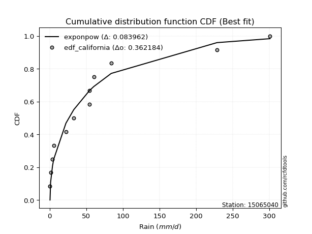</img></img>

</div>


### 2. Empirical - EDF Hazen (1930)

Hazen method for plotting positions is a formula used to estimate the empirical cumulative probability distribution of flood events or other hydrological data. This formula often results in biased estimations, particularly when extrapolating to extreme events (high return periods).

<div align="center">


$P=(m-0.5)/n$


</div>


**2.1. Empirical values**

<div align="center">

|                | 0                    | 1                  | 2                   | 3                  | 4         | 5                  | 6                  | 7                  | 8                  | 9                  | 10        | 11                 |
|:---------------|:---------------------|:-------------------|:--------------------|:-------------------|:----------|:-------------------|:-------------------|:-------------------|:-------------------|:-------------------|:----------|:-------------------|
| date           | 2015                 | 2014               | 2016                | 2021               | 2017      | 2020               | 2022               | 2018               | 2013               | 2019               | 2025      | 2024               |
| x              | 0.4                  | 1.2                | 3.8                 | 5.5                | 22.1      | 32.8               | 54.3               | 54.5               | 60.2               | 84.0               | 88.4      | 228.4              |
| m              | 1                    | 2                  | 3                   | 4                  | 5         | 6                  | 7                  | 8                  | 9                  | 10                 | 11        | 12                 |
| empirical_dist | edf_hazen            | edf_hazen          | edf_hazen           | edf_hazen          | edf_hazen | edf_hazen          | edf_hazen          | edf_hazen          | edf_hazen          | edf_hazen          | edf_hazen | edf_hazen          |
| empirical      | 0.041666666666666664 | 0.125              | 0.20833333333333334 | 0.2916666666666667 | 0.375     | 0.4583333333333333 | 0.5416666666666666 | 0.625              | 0.7083333333333334 | 0.7916666666666666 | 0.875     | 0.9583333333333334 |
| empirical_tr   | 1.0434782608695652   | 1.1428571428571428 | 1.2631578947368423  | 1.411764705882353  | 1.6       | 1.8461538461538458 | 2.1818181818181817 | 2.6666666666666665 | 3.428571428571429  | 4.799999999999999  | 8.0       | 24.00000000000002  |

</div>


**2.2. Kolmogorov-Smirnov fit test (sorted by Δ)**


<div align="center">

|                | 0                     | 1                   | 2                   | 3                   | 4                   | 5                   | 6                   | 7                   | 8                   | 9                   | 10                  | 11                  | 12                  | 13                  | 14                  | 15                  | 16                  | 17                  | 18                  | 19                  | 20                  | 21                  | 22                  | 23                  | 24                  | 25                  | 26                  | 27                  | 28                  | 29                  | 30                  | 31                  | 32                  | 33                  | 34                  | 35                  | 36                  | 37                  | 38                  | 39                  | 40                  | 41                  | 42                  | 43                  | 44                  | 45                  | 46                  | 47                  | 48                  | 49                  | 50                  | 51                  | 52                  | 53                  | 54                  | 55                  | 56                  | 57                  | 58                  | 59                  | 60                  | 61                  | 62                  | 63                  | 64                  | 65                  | 66                  | 67                  | 68                  | 69                  | 70                  | 71                  | 72                  | 73                  | 74                  | 75                  | 76                  | 77                  | 78                  | 79                  | 80                  | 81                  | 82                  | 83                  | 84                  | 85                  | 86                  | 87                  | 88                  | 89                  |
|:---------------|:----------------------|:--------------------|:--------------------|:--------------------|:--------------------|:--------------------|:--------------------|:--------------------|:--------------------|:--------------------|:--------------------|:--------------------|:--------------------|:--------------------|:--------------------|:--------------------|:--------------------|:--------------------|:--------------------|:--------------------|:--------------------|:--------------------|:--------------------|:--------------------|:--------------------|:--------------------|:--------------------|:--------------------|:--------------------|:--------------------|:--------------------|:--------------------|:--------------------|:--------------------|:--------------------|:--------------------|:--------------------|:--------------------|:--------------------|:--------------------|:--------------------|:--------------------|:--------------------|:--------------------|:--------------------|:--------------------|:--------------------|:--------------------|:--------------------|:--------------------|:--------------------|:--------------------|:--------------------|:--------------------|:--------------------|:--------------------|:--------------------|:--------------------|:--------------------|:--------------------|:--------------------|:--------------------|:--------------------|:--------------------|:--------------------|:--------------------|:--------------------|:--------------------|:--------------------|:--------------------|:--------------------|:--------------------|:--------------------|:--------------------|:--------------------|:--------------------|:--------------------|:--------------------|:--------------------|:--------------------|:--------------------|:--------------------|:--------------------|:--------------------|:--------------------|:--------------------|:--------------------|:--------------------|:--------------------|:--------------------|
| station        | 15065040              | 15065040            | 15065040            | 15065040            | 15065040            | 15065040            | 15065040            | 15065040            | 15065040            | 15065040            | 15065040            | 15065040            | 15065040            | 15065040            | 15065040            | 15065040            | 15065040            | 15065040            | 15065040            | 15065040            | 15065040            | 15065040            | 15065040            | 15065040            | 15065040            | 15065040            | 15065040            | 15065040            | 15065040            | 15065040            | 15065040            | 15065040            | 15065040            | 15065040            | 15065040            | 15065040            | 15065040            | 15065040            | 15065040            | 15065040            | 15065040            | 15065040            | 15065040            | 15065040            | 15065040            | 15065040            | 15065040            | 15065040            | 15065040            | 15065040            | 15065040            | 15065040            | 15065040            | 15065040            | 15065040            | 15065040            | 15065040            | 15065040            | 15065040            | 15065040            | 15065040            | 15065040            | 15065040            | 15065040            | 15065040            | 15065040            | 15065040            | 15065040            | 15065040            | 15065040            | 15065040            | 15065040            | 15065040            | 15065040            | 15065040            | 15065040            | 15065040            | 15065040            | 15065040            | 15065040            | 15065040            | 15065040            | 15065040            | 15065040            | 15065040            | 15065040            | 15065040            | 15065040            | 15065040            | 15065040            |
| empirical_dist | edf_hazen             | edf_hazen           | edf_hazen           | edf_hazen           | edf_hazen           | edf_hazen           | edf_hazen           | edf_hazen           | edf_hazen           | edf_hazen           | edf_hazen           | edf_hazen           | edf_hazen           | edf_hazen           | edf_hazen           | edf_hazen           | edf_hazen           | edf_hazen           | edf_hazen           | edf_hazen           | edf_hazen           | edf_hazen           | edf_hazen           | edf_hazen           | edf_hazen           | edf_hazen           | edf_hazen           | edf_hazen           | edf_hazen           | edf_hazen           | edf_hazen           | edf_hazen           | edf_hazen           | edf_hazen           | edf_hazen           | edf_hazen           | edf_hazen           | edf_hazen           | edf_hazen           | edf_hazen           | edf_hazen           | edf_hazen           | edf_hazen           | edf_hazen           | edf_hazen           | edf_hazen           | edf_hazen           | edf_hazen           | edf_hazen           | edf_hazen           | edf_hazen           | edf_hazen           | edf_hazen           | edf_hazen           | edf_hazen           | edf_hazen           | edf_hazen           | edf_hazen           | edf_hazen           | edf_hazen           | edf_hazen           | edf_hazen           | edf_hazen           | edf_hazen           | edf_hazen           | edf_hazen           | edf_hazen           | edf_hazen           | edf_hazen           | edf_hazen           | edf_hazen           | edf_hazen           | edf_hazen           | edf_hazen           | edf_hazen           | edf_hazen           | edf_hazen           | edf_hazen           | edf_hazen           | edf_hazen           | edf_hazen           | edf_hazen           | edf_hazen           | edf_hazen           | edf_hazen           | edf_hazen           | edf_hazen           | edf_hazen           | edf_hazen           | edf_hazen           |
| p_dist         | loglaplace_asymmetric | logloggamma         | pearson3            | logjohnsonsu        | loggenlogistic      | erlang              | moyal               | fisk                | weibull_min         | genlogistic         | gumbel_r            | t                   | kstwobign           | logpearson3         | halflogistic        | logweibull_min      | loggumbel_l         | laplace             | gamma               | ncf                 | hypsecant           | laplace_asymmetric  | logistic            | rice                | loggompertz         | nakagami            | crystalball         | norm                | maxwell             | rayleigh            | loggamma            | loggamma            | logerlang           | f                   | logfatiguelife      | invweibull          | lognct              | logexponnorm        | logcrystalball      | lognorm             | lognorm             | logt                | logalpha            | lognakagami         | pareto              | logrice             | loglognorm          | nct                 | loginvgamma         | halfnorm            | johnsonsu           | betaprime           | invgamma            | loginvgauss         | logmaxwell          | logmielke           | loginvweibull       | loglogistic         | exponnorm           | genexpon            | expon               | lograyleigh         | invgauss            | mielke              | wald                | loghypsecant        | truncnorm           | logkstwobign        | loggenexpon         | loghalfnorm         | loggumbel_r         | gumbel_l            | fatiguelife         | loglaplace          | gompertz            | logmoyal            | loghalflogistic     | logexpon            | logtruncnorm        | logncf              | gibrat              | logchi2             | logwald             | loggibrat           | logfisk             | logf                | logpareto           | alpha               | logbetaprime        | chi2                |
| delta          | 0.10493958319836005   | 0.10641981210864804 | 0.11277873052734019 | 0.11511588502469283 | 0.11606984744491289 | 0.11753823155253607 | 0.12538358951018544 | 0.1287779141775447  | 0.1289879387538078  | 0.13651888130713385 | 0.14133718451944616 | 0.1413670982386771  | 0.14355768273636071 | 0.14397538379113883 | 0.144593815660636   | 0.14485798337973954 | 0.145176154134111   | 0.14527162493044354 | 0.14606991096883093 | 0.1474531044088473  | 0.14930044308244517 | 0.15149656159674302 | 0.15469406847597678 | 0.15648049604865444 | 0.15707006205041452 | 0.16084034688491844 | 0.1610706543251057  | 0.16107065493192385 | 0.16420057653557138 | 0.16905365968368086 | 0.17200945420240732 | 0.17200945420240732 | 0.17218228710221384 | 0.1724151942749902  | 0.1724164458273234  | 0.1726843013343493  | 0.1727550057409497  | 0.1727997838925155  | 0.1727999997909221  | 0.172800006287126   | 0.172800006287126   | 0.17280017465274378 | 0.1729629109062083  | 0.17300056747892556 | 0.17351808245651063 | 0.17407155779586536 | 0.17503450154572076 | 0.17513069236971657 | 0.1765073139274873  | 0.17706940224244314 | 0.1778810642065085  | 0.17855320154544962 | 0.17859564905352332 | 0.18479792397166106 | 0.18906497836845704 | 0.19152043562641075 | 0.19343647519390517 | 0.1947610406658279  | 0.19759949071674315 | 0.19920477735377945 | 0.19920483262259853 | 0.19929631561181216 | 0.20113933864050682 | 0.20496506517765722 | 0.20844452207082872 | 0.21023026968199798 | 0.21511710710518153 | 0.22069008049970806 | 0.22463995942129222 | 0.22811637656113926 | 0.2281853783967419  | 0.22838586146006434 | 0.23205602470818265 | 0.23392157139809744 | 0.23605989439474878 | 0.25351769037963834 | 0.25474418905703244 | 0.2713018395836295  | 0.28546770648344255 | 0.28952453988909566 | 0.2916666666666667  | 0.3232696835559514  | 0.3238327108637107  | 0.35137334114669916 | 0.37752124152308575 | 0.4077146474277329  | 0.498774269245853   | 0.5779809689432287  | 0.6044499438334864  | 0.6774703609111867  |
| deltao         | 0.36218414519599995   | 0.36218414519599995 | 0.36218414519599995 | 0.36218414519599995 | 0.36218414519599995 | 0.36218414519599995 | 0.36218414519599995 | 0.36218414519599995 | 0.36218414519599995 | 0.36218414519599995 | 0.36218414519599995 | 0.36218414519599995 | 0.36218414519599995 | 0.36218414519599995 | 0.36218414519599995 | 0.36218414519599995 | 0.36218414519599995 | 0.36218414519599995 | 0.36218414519599995 | 0.36218414519599995 | 0.36218414519599995 | 0.36218414519599995 | 0.36218414519599995 | 0.36218414519599995 | 0.36218414519599995 | 0.36218414519599995 | 0.36218414519599995 | 0.36218414519599995 | 0.36218414519599995 | 0.36218414519599995 | 0.36218414519599995 | 0.36218414519599995 | 0.36218414519599995 | 0.36218414519599995 | 0.36218414519599995 | 0.36218414519599995 | 0.36218414519599995 | 0.36218414519599995 | 0.36218414519599995 | 0.36218414519599995 | 0.36218414519599995 | 0.36218414519599995 | 0.36218414519599995 | 0.36218414519599995 | 0.36218414519599995 | 0.36218414519599995 | 0.36218414519599995 | 0.36218414519599995 | 0.36218414519599995 | 0.36218414519599995 | 0.36218414519599995 | 0.36218414519599995 | 0.36218414519599995 | 0.36218414519599995 | 0.36218414519599995 | 0.36218414519599995 | 0.36218414519599995 | 0.36218414519599995 | 0.36218414519599995 | 0.36218414519599995 | 0.36218414519599995 | 0.36218414519599995 | 0.36218414519599995 | 0.36218414519599995 | 0.36218414519599995 | 0.36218414519599995 | 0.36218414519599995 | 0.36218414519599995 | 0.36218414519599995 | 0.36218414519599995 | 0.36218414519599995 | 0.36218414519599995 | 0.36218414519599995 | 0.36218414519599995 | 0.36218414519599995 | 0.36218414519599995 | 0.36218414519599995 | 0.36218414519599995 | 0.36218414519599995 | 0.36218414519599995 | 0.36218414519599995 | 0.36218414519599995 | 0.36218414519599995 | 0.36218414519599995 | 0.36218414519599995 | 0.36218414519599995 | 0.36218414519599995 | 0.36218414519599995 | 0.36218414519599995 | 0.36218414519599995 |
| eval           | Δo > Δ                | Δo > Δ              | Δo > Δ              | Δo > Δ              | Δo > Δ              | Δo > Δ              | Δo > Δ              | Δo > Δ              | Δo > Δ              | Δo > Δ              | Δo > Δ              | Δo > Δ              | Δo > Δ              | Δo > Δ              | Δo > Δ              | Δo > Δ              | Δo > Δ              | Δo > Δ              | Δo > Δ              | Δo > Δ              | Δo > Δ              | Δo > Δ              | Δo > Δ              | Δo > Δ              | Δo > Δ              | Δo > Δ              | Δo > Δ              | Δo > Δ              | Δo > Δ              | Δo > Δ              | Δo > Δ              | Δo > Δ              | Δo > Δ              | Δo > Δ              | Δo > Δ              | Δo > Δ              | Δo > Δ              | Δo > Δ              | Δo > Δ              | Δo > Δ              | Δo > Δ              | Δo > Δ              | Δo > Δ              | Δo > Δ              | Δo > Δ              | Δo > Δ              | Δo > Δ              | Δo > Δ              | Δo > Δ              | Δo > Δ              | Δo > Δ              | Δo > Δ              | Δo > Δ              | Δo > Δ              | Δo > Δ              | Δo > Δ              | Δo > Δ              | Δo > Δ              | Δo > Δ              | Δo > Δ              | Δo > Δ              | Δo > Δ              | Δo > Δ              | Δo > Δ              | Δo > Δ              | Δo > Δ              | Δo > Δ              | Δo > Δ              | Δo > Δ              | Δo > Δ              | Δo > Δ              | Δo > Δ              | Δo > Δ              | Δo > Δ              | Δo > Δ              | Δo > Δ              | Δo > Δ              | Δo > Δ              | Δo > Δ              | Δo > Δ              | Δo > Δ              | Δo > Δ              | Δo > Δ              | Δo > Δ              | Δo <= Δ             | Δo <= Δ             | Δo <= Δ             | Δo <= Δ             | Δo <= Δ             | Δo <= Δ             |
| fit            | 1                     | 1                   | 1                   | 1                   | 1                   | 1                   | 1                   | 1                   | 1                   | 1                   | 1                   | 1                   | 1                   | 1                   | 1                   | 1                   | 1                   | 1                   | 1                   | 1                   | 1                   | 1                   | 1                   | 1                   | 1                   | 1                   | 1                   | 1                   | 1                   | 1                   | 1                   | 1                   | 1                   | 1                   | 1                   | 1                   | 1                   | 1                   | 1                   | 1                   | 1                   | 1                   | 1                   | 1                   | 1                   | 1                   | 1                   | 1                   | 1                   | 1                   | 1                   | 1                   | 1                   | 1                   | 1                   | 1                   | 1                   | 1                   | 1                   | 1                   | 1                   | 1                   | 1                   | 1                   | 1                   | 1                   | 1                   | 1                   | 1                   | 1                   | 1                   | 1                   | 1                   | 1                   | 1                   | 1                   | 1                   | 1                   | 1                   | 1                   | 1                   | 1                   | 1                   | 1                   | 0                   | 0                   | 0                   | 0                   | 0                   | 0                   |
| n              | 12                    | 12                  | 12                  | 12                  | 12                  | 12                  | 12                  | 12                  | 12                  | 12                  | 12                  | 12                  | 12                  | 12                  | 12                  | 12                  | 12                  | 12                  | 12                  | 12                  | 12                  | 12                  | 12                  | 12                  | 12                  | 12                  | 12                  | 12                  | 12                  | 12                  | 12                  | 12                  | 12                  | 12                  | 12                  | 12                  | 12                  | 12                  | 12                  | 12                  | 12                  | 12                  | 12                  | 12                  | 12                  | 12                  | 12                  | 12                  | 12                  | 12                  | 12                  | 12                  | 12                  | 12                  | 12                  | 12                  | 12                  | 12                  | 12                  | 12                  | 12                  | 12                  | 12                  | 12                  | 12                  | 12                  | 12                  | 12                  | 12                  | 12                  | 12                  | 12                  | 12                  | 12                  | 12                  | 12                  | 12                  | 12                  | 12                  | 12                  | 12                  | 12                  | 12                  | 12                  | 12                  | 12                  | 12                  | 12                  | 12                  | 12                  |
| best_fit       | 1                     | 0                   | 0                   | 0                   | 0                   | 0                   | 0                   | 0                   | 0                   | 0                   | 0                   | 0                   | 0                   | 0                   | 0                   | 0                   | 0                   | 0                   | 0                   | 0                   | 0                   | 0                   | 0                   | 0                   | 0                   | 0                   | 0                   | 0                   | 0                   | 0                   | 0                   | 0                   | 0                   | 0                   | 0                   | 0                   | 0                   | 0                   | 0                   | 0                   | 0                   | 0                   | 0                   | 0                   | 0                   | 0                   | 0                   | 0                   | 0                   | 0                   | 0                   | 0                   | 0                   | 0                   | 0                   | 0                   | 0                   | 0                   | 0                   | 0                   | 0                   | 0                   | 0                   | 0                   | 0                   | 0                   | 0                   | 0                   | 0                   | 0                   | 0                   | 0                   | 0                   | 0                   | 0                   | 0                   | 0                   | 0                   | 0                   | 0                   | 0                   | 0                   | 0                   | 0                   | 0                   | 0                   | 0                   | 0                   | 0                   | 0                   |
| best_fit_sort  | 1                     | 2                   | 3                   | 4                   | 5                   | 6                   | 7                   | 8                   | 9                   | 10                  | 11                  | 12                  | 13                  | 14                  | 15                  | 16                  | 17                  | 18                  | 19                  | 20                  | 21                  | 22                  | 23                  | 24                  | 25                  | 26                  | 27                  | 28                  | 29                  | 30                  | 31                  | 32                  | 33                  | 34                  | 35                  | 36                  | 37                  | 38                  | 39                  | 40                  | 41                  | 42                  | 43                  | 44                  | 45                  | 46                  | 47                  | 48                  | 49                  | 50                  | 51                  | 52                  | 53                  | 54                  | 55                  | 56                  | 57                  | 58                  | 59                  | 60                  | 61                  | 62                  | 63                  | 64                  | 65                  | 66                  | 67                  | 68                  | 69                  | 70                  | 71                  | 72                  | 73                  | 74                  | 75                  | 76                  | 77                  | 78                  | 79                  | 80                  | 81                  | 82                  | 83                  | 84                  | 85                  | 86                  | 87                  | 88                  | 89                  | 90                  |

</div>


<div align="center">

</img>

</div>


**2.3. Best fit**

<div align="center">

|   id |   station | empirical_dist   | p_dist                |   delta |   deltao | eval   |   fit |   n |   best_fit |   best_fit_sort |
|-----:|----------:|:-----------------|:----------------------|--------:|---------:|:-------|------:|----:|-----------:|----------------:|
|    0 |  15065040 | edf_hazen        | loglaplace_asymmetric | 0.10494 | 0.362184 | Δo > Δ |     1 |  12 |          1 |               1 |

</div>


<div align="center">

</img>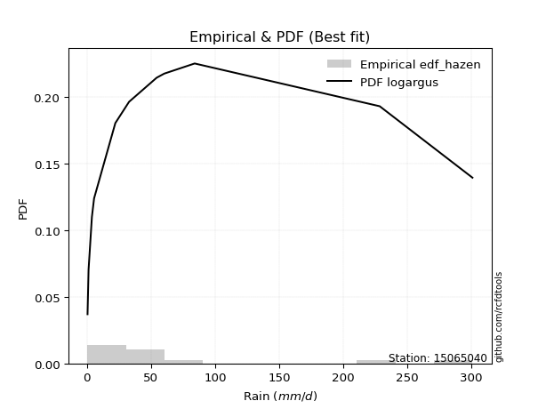</img>

</div>


### 3. Empirical - EDF Weibull (1939)

Weibull plotting position formula is an empirical method used to estimate the non-exceedance probability or plotting position for a set of observed data, is often recommended or widely used in practice, particularly in flood frequency analysis.

<div align="center">


$P=m/(n+1)$


</div>


**3.1. Empirical values**

<div align="center">

|                | 0                   | 1                   | 2                   | 3                  | 4                   | 5                   | 6                  | 7                  | 8                  | 9                  | 10                 | 11                 |
|:---------------|:--------------------|:--------------------|:--------------------|:-------------------|:--------------------|:--------------------|:-------------------|:-------------------|:-------------------|:-------------------|:-------------------|:-------------------|
| date           | 2015                | 2014                | 2016                | 2021               | 2017                | 2020                | 2022               | 2018               | 2013               | 2019               | 2025               | 2024               |
| x              | 0.4                 | 1.2                 | 3.8                 | 5.5                | 22.1                | 32.8                | 54.3               | 54.5               | 60.2               | 84.0               | 88.4               | 228.4              |
| m              | 1                   | 2                   | 3                   | 4                  | 5                   | 6                   | 7                  | 8                  | 9                  | 10                 | 11                 | 12                 |
| empirical_dist | edf_weibull         | edf_weibull         | edf_weibull         | edf_weibull        | edf_weibull         | edf_weibull         | edf_weibull        | edf_weibull        | edf_weibull        | edf_weibull        | edf_weibull        | edf_weibull        |
| empirical      | 0.07692307692307693 | 0.15384615384615385 | 0.23076923076923078 | 0.3076923076923077 | 0.38461538461538464 | 0.46153846153846156 | 0.5384615384615384 | 0.6153846153846154 | 0.6923076923076923 | 0.7692307692307693 | 0.8461538461538461 | 0.9230769230769231 |
| empirical_tr   | 1.0833333333333333  | 1.1818181818181819  | 1.3                 | 1.4444444444444444 | 1.625               | 1.8571428571428572  | 2.1666666666666665 | 2.6                | 3.25               | 4.333333333333334  | 6.5                | 13.000000000000009 |

</div>


**3.2. Kolmogorov-Smirnov fit test (sorted by Δ)**


<div align="center">

|                | 0                   | 1                   | 2                   | 3                     | 4                   | 5                   | 6                   | 7                   | 8                   | 9                   | 10                  | 11                  | 12                  | 13                  | 14                  | 15                  | 16                  | 17                  | 18                  | 19                  | 20                  | 21                  | 22                  | 23                  | 24                  | 25                  | 26                  | 27                  | 28                  | 29                  | 30                  | 31                  | 32                  | 33                  | 34                  | 35                  | 36                  | 37                  | 38                  | 39                  | 40                  | 41                  | 42                  | 43                  | 44                  | 45                  | 46                  | 47                  | 48                  | 49                  | 50                  | 51                  | 52                  | 53                  | 54                  | 55                  | 56                  | 57                  | 58                  | 59                  | 60                  | 61                  | 62                  | 63                  | 64                  | 65                  | 66                  | 67                  | 68                  | 69                  | 70                  | 71                  | 72                  | 73                  | 74                  | 75                  | 76                  | 77                  | 78                  | 79                  | 80                  | 81                  | 82                  | 83                  | 84                  | 85                  | 86                  | 87                  | 88                  | 89                  |
|:---------------|:--------------------|:--------------------|:--------------------|:----------------------|:--------------------|:--------------------|:--------------------|:--------------------|:--------------------|:--------------------|:--------------------|:--------------------|:--------------------|:--------------------|:--------------------|:--------------------|:--------------------|:--------------------|:--------------------|:--------------------|:--------------------|:--------------------|:--------------------|:--------------------|:--------------------|:--------------------|:--------------------|:--------------------|:--------------------|:--------------------|:--------------------|:--------------------|:--------------------|:--------------------|:--------------------|:--------------------|:--------------------|:--------------------|:--------------------|:--------------------|:--------------------|:--------------------|:--------------------|:--------------------|:--------------------|:--------------------|:--------------------|:--------------------|:--------------------|:--------------------|:--------------------|:--------------------|:--------------------|:--------------------|:--------------------|:--------------------|:--------------------|:--------------------|:--------------------|:--------------------|:--------------------|:--------------------|:--------------------|:--------------------|:--------------------|:--------------------|:--------------------|:--------------------|:--------------------|:--------------------|:--------------------|:--------------------|:--------------------|:--------------------|:--------------------|:--------------------|:--------------------|:--------------------|:--------------------|:--------------------|:--------------------|:--------------------|:--------------------|:--------------------|:--------------------|:--------------------|:--------------------|:--------------------|:--------------------|:--------------------|
| station        | 15065040            | 15065040            | 15065040            | 15065040              | 15065040            | 15065040            | 15065040            | 15065040            | 15065040            | 15065040            | 15065040            | 15065040            | 15065040            | 15065040            | 15065040            | 15065040            | 15065040            | 15065040            | 15065040            | 15065040            | 15065040            | 15065040            | 15065040            | 15065040            | 15065040            | 15065040            | 15065040            | 15065040            | 15065040            | 15065040            | 15065040            | 15065040            | 15065040            | 15065040            | 15065040            | 15065040            | 15065040            | 15065040            | 15065040            | 15065040            | 15065040            | 15065040            | 15065040            | 15065040            | 15065040            | 15065040            | 15065040            | 15065040            | 15065040            | 15065040            | 15065040            | 15065040            | 15065040            | 15065040            | 15065040            | 15065040            | 15065040            | 15065040            | 15065040            | 15065040            | 15065040            | 15065040            | 15065040            | 15065040            | 15065040            | 15065040            | 15065040            | 15065040            | 15065040            | 15065040            | 15065040            | 15065040            | 15065040            | 15065040            | 15065040            | 15065040            | 15065040            | 15065040            | 15065040            | 15065040            | 15065040            | 15065040            | 15065040            | 15065040            | 15065040            | 15065040            | 15065040            | 15065040            | 15065040            | 15065040            |
| empirical_dist | edf_weibull         | edf_weibull         | edf_weibull         | edf_weibull           | edf_weibull         | edf_weibull         | edf_weibull         | edf_weibull         | edf_weibull         | edf_weibull         | edf_weibull         | edf_weibull         | edf_weibull         | edf_weibull         | edf_weibull         | edf_weibull         | edf_weibull         | edf_weibull         | edf_weibull         | edf_weibull         | edf_weibull         | edf_weibull         | edf_weibull         | edf_weibull         | edf_weibull         | edf_weibull         | edf_weibull         | edf_weibull         | edf_weibull         | edf_weibull         | edf_weibull         | edf_weibull         | edf_weibull         | edf_weibull         | edf_weibull         | edf_weibull         | edf_weibull         | edf_weibull         | edf_weibull         | edf_weibull         | edf_weibull         | edf_weibull         | edf_weibull         | edf_weibull         | edf_weibull         | edf_weibull         | edf_weibull         | edf_weibull         | edf_weibull         | edf_weibull         | edf_weibull         | edf_weibull         | edf_weibull         | edf_weibull         | edf_weibull         | edf_weibull         | edf_weibull         | edf_weibull         | edf_weibull         | edf_weibull         | edf_weibull         | edf_weibull         | edf_weibull         | edf_weibull         | edf_weibull         | edf_weibull         | edf_weibull         | edf_weibull         | edf_weibull         | edf_weibull         | edf_weibull         | edf_weibull         | edf_weibull         | edf_weibull         | edf_weibull         | edf_weibull         | edf_weibull         | edf_weibull         | edf_weibull         | edf_weibull         | edf_weibull         | edf_weibull         | edf_weibull         | edf_weibull         | edf_weibull         | edf_weibull         | edf_weibull         | edf_weibull         | edf_weibull         | edf_weibull         |
| p_dist         | pearson3            | moyal               | gumbel_r            | loglaplace_asymmetric | halflogistic        | logloggamma         | logjohnsonsu        | fisk                | loggenlogistic      | t                   | maxwell             | nakagami            | hypsecant           | erlang              | rayleigh            | logistic            | halfnorm            | f                   | weibull_min         | crystalball         | norm                | logpearson3         | ncf                 | logweibull_min      | loggumbel_l         | laplace             | gamma               | genlogistic         | laplace_asymmetric  | kstwobign           | loggompertz         | rice                | johnsonsu           | loggamma            | loggamma            | logerlang           | logfatiguelife      | invweibull          | lognct              | logexponnorm        | logcrystalball      | lognorm             | lognorm             | logt                | logalpha            | lognakagami         | logrice             | loglognorm          | nct                 | loginvgamma         | betaprime           | invgamma            | logmielke           | loginvgauss         | loginvweibull       | pareto              | logmaxwell          | lograyleigh         | loglogistic         | invgauss            | mielke              | logkstwobign        | gumbel_l            | loghypsecant        | exponnorm           | loggenexpon         | genexpon            | expon               | loghalfnorm         | fatiguelife         | loggumbel_r         | wald                | truncnorm           | loglaplace          | logmoyal            | loghalflogistic     | gompertz            | logncf              | logexpon            | logtruncnorm        | gibrat              | logchi2             | logwald             | loggibrat           | logfisk             | logf                | logpareto           | alpha               | logbetaprime        | chi2                |
| delta          | 0.09562797981643895 | 0.09967689156258219 | 0.10608077426303589 | 0.10835968497242096   | 0.10933740540422573 | 0.10962494031377623 | 0.11832101322982103 | 0.11849141995246171 | 0.11927497565004108 | 0.12890194233429575 | 0.1289441662791611  | 0.13199419303876458 | 0.1332748020568041  | 0.1335638725781771  | 0.1337972494272706  | 0.1386684274503357  | 0.14181299198603287 | 0.14356904042883634 | 0.14501357977944881 | 0.14504501329946462 | 0.14504501390628277 | 0.14718051199626703 | 0.14730064070571477 | 0.14806311158486773 | 0.1483812823392392  | 0.1484767531355718  | 0.14927503917395912 | 0.15254452233277488 | 0.15470168980187127 | 0.15958332376200174 | 0.1602751902555427  | 0.16357980878351738 | 0.1731975882750444  | 0.1752145824075355  | 0.1752145824075355  | 0.17538741530734203 | 0.1756215740324516  | 0.1758894295394775  | 0.1759601339460779  | 0.17600491209764368 | 0.17600512799605028 | 0.1760051344922542  | 0.1760051344922542  | 0.17600530285787197 | 0.1761680391113365  | 0.17620569568405375 | 0.17727668600099356 | 0.17823962975084895 | 0.17833582057484476 | 0.1797124421326155  | 0.18175832975057782 | 0.1818007772586515  | 0.1819050510110261  | 0.1835902835323293  | 0.18382109057852053 | 0.18954372348215165 | 0.19014108564618348 | 0.19424139900360038 | 0.19796616887095608 | 0.204344466845635   | 0.20817019338278542 | 0.21107469588432343 | 0.21236022043442326 | 0.21343539788712618 | 0.21362513174238418 | 0.2150245748059076  | 0.21523041837942047 | 0.21523047364823955 | 0.21850099194575462 | 0.22244064009279801 | 0.22376608717576862 | 0.22447016309646975 | 0.23114274813082256 | 0.23712669960322563 | 0.2439023057642537  | 0.2451288044416478  | 0.2520855354203898  | 0.25831005656421435 | 0.2616864549682449  | 0.2758523218680579  | 0.3076923076923077  | 0.31140388627136734 | 0.31421732624832605 | 0.3417579565313145  | 0.3422648312666755  | 0.3852787499918355  | 0.46992811539969914 | 0.5683655843278441  | 0.5820140463975889  | 0.6550344634752894  |
| deltao         | 0.36218414519599995 | 0.36218414519599995 | 0.36218414519599995 | 0.36218414519599995   | 0.36218414519599995 | 0.36218414519599995 | 0.36218414519599995 | 0.36218414519599995 | 0.36218414519599995 | 0.36218414519599995 | 0.36218414519599995 | 0.36218414519599995 | 0.36218414519599995 | 0.36218414519599995 | 0.36218414519599995 | 0.36218414519599995 | 0.36218414519599995 | 0.36218414519599995 | 0.36218414519599995 | 0.36218414519599995 | 0.36218414519599995 | 0.36218414519599995 | 0.36218414519599995 | 0.36218414519599995 | 0.36218414519599995 | 0.36218414519599995 | 0.36218414519599995 | 0.36218414519599995 | 0.36218414519599995 | 0.36218414519599995 | 0.36218414519599995 | 0.36218414519599995 | 0.36218414519599995 | 0.36218414519599995 | 0.36218414519599995 | 0.36218414519599995 | 0.36218414519599995 | 0.36218414519599995 | 0.36218414519599995 | 0.36218414519599995 | 0.36218414519599995 | 0.36218414519599995 | 0.36218414519599995 | 0.36218414519599995 | 0.36218414519599995 | 0.36218414519599995 | 0.36218414519599995 | 0.36218414519599995 | 0.36218414519599995 | 0.36218414519599995 | 0.36218414519599995 | 0.36218414519599995 | 0.36218414519599995 | 0.36218414519599995 | 0.36218414519599995 | 0.36218414519599995 | 0.36218414519599995 | 0.36218414519599995 | 0.36218414519599995 | 0.36218414519599995 | 0.36218414519599995 | 0.36218414519599995 | 0.36218414519599995 | 0.36218414519599995 | 0.36218414519599995 | 0.36218414519599995 | 0.36218414519599995 | 0.36218414519599995 | 0.36218414519599995 | 0.36218414519599995 | 0.36218414519599995 | 0.36218414519599995 | 0.36218414519599995 | 0.36218414519599995 | 0.36218414519599995 | 0.36218414519599995 | 0.36218414519599995 | 0.36218414519599995 | 0.36218414519599995 | 0.36218414519599995 | 0.36218414519599995 | 0.36218414519599995 | 0.36218414519599995 | 0.36218414519599995 | 0.36218414519599995 | 0.36218414519599995 | 0.36218414519599995 | 0.36218414519599995 | 0.36218414519599995 | 0.36218414519599995 |
| eval           | Δo > Δ              | Δo > Δ              | Δo > Δ              | Δo > Δ                | Δo > Δ              | Δo > Δ              | Δo > Δ              | Δo > Δ              | Δo > Δ              | Δo > Δ              | Δo > Δ              | Δo > Δ              | Δo > Δ              | Δo > Δ              | Δo > Δ              | Δo > Δ              | Δo > Δ              | Δo > Δ              | Δo > Δ              | Δo > Δ              | Δo > Δ              | Δo > Δ              | Δo > Δ              | Δo > Δ              | Δo > Δ              | Δo > Δ              | Δo > Δ              | Δo > Δ              | Δo > Δ              | Δo > Δ              | Δo > Δ              | Δo > Δ              | Δo > Δ              | Δo > Δ              | Δo > Δ              | Δo > Δ              | Δo > Δ              | Δo > Δ              | Δo > Δ              | Δo > Δ              | Δo > Δ              | Δo > Δ              | Δo > Δ              | Δo > Δ              | Δo > Δ              | Δo > Δ              | Δo > Δ              | Δo > Δ              | Δo > Δ              | Δo > Δ              | Δo > Δ              | Δo > Δ              | Δo > Δ              | Δo > Δ              | Δo > Δ              | Δo > Δ              | Δo > Δ              | Δo > Δ              | Δo > Δ              | Δo > Δ              | Δo > Δ              | Δo > Δ              | Δo > Δ              | Δo > Δ              | Δo > Δ              | Δo > Δ              | Δo > Δ              | Δo > Δ              | Δo > Δ              | Δo > Δ              | Δo > Δ              | Δo > Δ              | Δo > Δ              | Δo > Δ              | Δo > Δ              | Δo > Δ              | Δo > Δ              | Δo > Δ              | Δo > Δ              | Δo > Δ              | Δo > Δ              | Δo > Δ              | Δo > Δ              | Δo > Δ              | Δo > Δ              | Δo <= Δ             | Δo <= Δ             | Δo <= Δ             | Δo <= Δ             | Δo <= Δ             |
| fit            | 1                   | 1                   | 1                   | 1                     | 1                   | 1                   | 1                   | 1                   | 1                   | 1                   | 1                   | 1                   | 1                   | 1                   | 1                   | 1                   | 1                   | 1                   | 1                   | 1                   | 1                   | 1                   | 1                   | 1                   | 1                   | 1                   | 1                   | 1                   | 1                   | 1                   | 1                   | 1                   | 1                   | 1                   | 1                   | 1                   | 1                   | 1                   | 1                   | 1                   | 1                   | 1                   | 1                   | 1                   | 1                   | 1                   | 1                   | 1                   | 1                   | 1                   | 1                   | 1                   | 1                   | 1                   | 1                   | 1                   | 1                   | 1                   | 1                   | 1                   | 1                   | 1                   | 1                   | 1                   | 1                   | 1                   | 1                   | 1                   | 1                   | 1                   | 1                   | 1                   | 1                   | 1                   | 1                   | 1                   | 1                   | 1                   | 1                   | 1                   | 1                   | 1                   | 1                   | 1                   | 1                   | 0                   | 0                   | 0                   | 0                   | 0                   |
| n              | 12                  | 12                  | 12                  | 12                    | 12                  | 12                  | 12                  | 12                  | 12                  | 12                  | 12                  | 12                  | 12                  | 12                  | 12                  | 12                  | 12                  | 12                  | 12                  | 12                  | 12                  | 12                  | 12                  | 12                  | 12                  | 12                  | 12                  | 12                  | 12                  | 12                  | 12                  | 12                  | 12                  | 12                  | 12                  | 12                  | 12                  | 12                  | 12                  | 12                  | 12                  | 12                  | 12                  | 12                  | 12                  | 12                  | 12                  | 12                  | 12                  | 12                  | 12                  | 12                  | 12                  | 12                  | 12                  | 12                  | 12                  | 12                  | 12                  | 12                  | 12                  | 12                  | 12                  | 12                  | 12                  | 12                  | 12                  | 12                  | 12                  | 12                  | 12                  | 12                  | 12                  | 12                  | 12                  | 12                  | 12                  | 12                  | 12                  | 12                  | 12                  | 12                  | 12                  | 12                  | 12                  | 12                  | 12                  | 12                  | 12                  | 12                  |
| best_fit       | 1                   | 0                   | 0                   | 0                     | 0                   | 0                   | 0                   | 0                   | 0                   | 0                   | 0                   | 0                   | 0                   | 0                   | 0                   | 0                   | 0                   | 0                   | 0                   | 0                   | 0                   | 0                   | 0                   | 0                   | 0                   | 0                   | 0                   | 0                   | 0                   | 0                   | 0                   | 0                   | 0                   | 0                   | 0                   | 0                   | 0                   | 0                   | 0                   | 0                   | 0                   | 0                   | 0                   | 0                   | 0                   | 0                   | 0                   | 0                   | 0                   | 0                   | 0                   | 0                   | 0                   | 0                   | 0                   | 0                   | 0                   | 0                   | 0                   | 0                   | 0                   | 0                   | 0                   | 0                   | 0                   | 0                   | 0                   | 0                   | 0                   | 0                   | 0                   | 0                   | 0                   | 0                   | 0                   | 0                   | 0                   | 0                   | 0                   | 0                   | 0                   | 0                   | 0                   | 0                   | 0                   | 0                   | 0                   | 0                   | 0                   | 0                   |
| best_fit_sort  | 1                   | 2                   | 3                   | 4                     | 5                   | 6                   | 7                   | 8                   | 9                   | 10                  | 11                  | 12                  | 13                  | 14                  | 15                  | 16                  | 17                  | 18                  | 19                  | 20                  | 21                  | 22                  | 23                  | 24                  | 25                  | 26                  | 27                  | 28                  | 29                  | 30                  | 31                  | 32                  | 33                  | 34                  | 35                  | 36                  | 37                  | 38                  | 39                  | 40                  | 41                  | 42                  | 43                  | 44                  | 45                  | 46                  | 47                  | 48                  | 49                  | 50                  | 51                  | 52                  | 53                  | 54                  | 55                  | 56                  | 57                  | 58                  | 59                  | 60                  | 61                  | 62                  | 63                  | 64                  | 65                  | 66                  | 67                  | 68                  | 69                  | 70                  | 71                  | 72                  | 73                  | 74                  | 75                  | 76                  | 77                  | 78                  | 79                  | 80                  | 81                  | 82                  | 83                  | 84                  | 85                  | 86                  | 87                  | 88                  | 89                  | 90                  |

</div>


<div align="center">

</img>

</div>


**3.3. Best fit**

<div align="center">

|   id |   station | empirical_dist   | p_dist   |    delta |   deltao | eval   |   fit |   n |   best_fit |   best_fit_sort |
|-----:|----------:|:-----------------|:---------|---------:|---------:|:-------|------:|----:|-----------:|----------------:|
|    0 |  15065040 | edf_weibull      | pearson3 | 0.095628 | 0.362184 | Δo > Δ |     1 |  12 |          1 |               1 |

</div>


<div align="center">

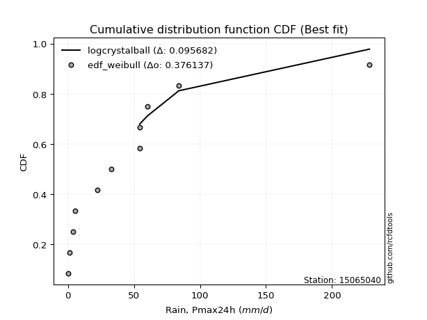</img>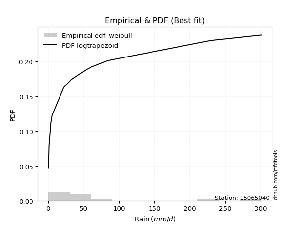</img>

</div>


### 4. Empirical - EDF Beard (1943)

The Beard formula (or Beard´s plotting position formula) in hydrology is used to estimate the empirical non-exceedance probability _(P)_ of a flood event (or other extreme hydrological data point) within a given dataset.

<div align="center">


$P=(m-0.31)/(n+0.38)$


</div>


**4.1. Empirical values**

<div align="center">

|                | 0                    | 1                   | 2                   | 3                  | 4                  | 5                  | 6                  | 7                  | 8                  | 9                  | 10                 | 11                 |
|:---------------|:---------------------|:--------------------|:--------------------|:-------------------|:-------------------|:-------------------|:-------------------|:-------------------|:-------------------|:-------------------|:-------------------|:-------------------|
| date           | 2015                 | 2014                | 2016                | 2021               | 2017               | 2020               | 2022               | 2018               | 2013               | 2019               | 2025               | 2024               |
| x              | 0.4                  | 1.2                 | 3.8                 | 5.5                | 22.1               | 32.8               | 54.3               | 54.5               | 60.2               | 84.0               | 88.4               | 228.4              |
| m              | 1                    | 2                   | 3                   | 4                  | 5                  | 6                  | 7                  | 8                  | 9                  | 10                 | 11                 | 12                 |
| empirical_dist | edf_beard            | edf_beard           | edf_beard           | edf_beard          | edf_beard          | edf_beard          | edf_beard          | edf_beard          | edf_beard          | edf_beard          | edf_beard          | edf_beard          |
| empirical      | 0.055735056542810975 | 0.13651050080775443 | 0.21728594507269788 | 0.2980613893376413 | 0.3788368336025848 | 0.4596122778675283 | 0.5403877221324718 | 0.6211631663974152 | 0.7019386106623585 | 0.7827140549273021 | 0.8634894991922455 | 0.9442649434571889 |
| empirical_tr   | 1.0590248075278015   | 1.1580916744621141  | 1.2776057791537667  | 1.424626006904488  | 1.6098829648894668 | 1.850523168908819  | 2.1757469244288226 | 2.6396588486140726 | 3.3550135501355    | 4.6022304832713745 | 7.325443786982245  | 17.942028985507218 |

</div>


**4.2. Kolmogorov-Smirnov fit test (sorted by Δ)**


<div align="center">

|                | 0                   | 1                     | 2                   | 3                   | 4                   | 5                   | 6                   | 7                   | 8                   | 9                   | 10                  | 11                  | 12                  | 13                  | 14                  | 15                  | 16                  | 17                  | 18                  | 19                  | 20                  | 21                  | 22                  | 23                  | 24                  | 25                  | 26                  | 27                  | 28                  | 29                  | 30                  | 31                  | 32                  | 33                  | 34                  | 35                  | 36                  | 37                  | 38                  | 39                  | 40                  | 41                  | 42                  | 43                  | 44                  | 45                  | 46                  | 47                  | 48                  | 49                  | 50                  | 51                  | 52                  | 53                  | 54                  | 55                  | 56                  | 57                  | 58                  | 59                  | 60                  | 61                  | 62                  | 63                  | 64                  | 65                  | 66                  | 67                  | 68                  | 69                  | 70                  | 71                  | 72                  | 73                  | 74                  | 75                  | 76                  | 77                  | 78                  | 79                  | 80                  | 81                  | 82                  | 83                  | 84                  | 85                  | 86                  | 87                  | 88                  | 89                  |
|:---------------|:--------------------|:----------------------|:--------------------|:--------------------|:--------------------|:--------------------|:--------------------|:--------------------|:--------------------|:--------------------|:--------------------|:--------------------|:--------------------|:--------------------|:--------------------|:--------------------|:--------------------|:--------------------|:--------------------|:--------------------|:--------------------|:--------------------|:--------------------|:--------------------|:--------------------|:--------------------|:--------------------|:--------------------|:--------------------|:--------------------|:--------------------|:--------------------|:--------------------|:--------------------|:--------------------|:--------------------|:--------------------|:--------------------|:--------------------|:--------------------|:--------------------|:--------------------|:--------------------|:--------------------|:--------------------|:--------------------|:--------------------|:--------------------|:--------------------|:--------------------|:--------------------|:--------------------|:--------------------|:--------------------|:--------------------|:--------------------|:--------------------|:--------------------|:--------------------|:--------------------|:--------------------|:--------------------|:--------------------|:--------------------|:--------------------|:--------------------|:--------------------|:--------------------|:--------------------|:--------------------|:--------------------|:--------------------|:--------------------|:--------------------|:--------------------|:--------------------|:--------------------|:--------------------|:--------------------|:--------------------|:--------------------|:--------------------|:--------------------|:--------------------|:--------------------|:--------------------|:--------------------|:--------------------|:--------------------|:--------------------|
| station        | 15065040            | 15065040              | 15065040            | 15065040            | 15065040            | 15065040            | 15065040            | 15065040            | 15065040            | 15065040            | 15065040            | 15065040            | 15065040            | 15065040            | 15065040            | 15065040            | 15065040            | 15065040            | 15065040            | 15065040            | 15065040            | 15065040            | 15065040            | 15065040            | 15065040            | 15065040            | 15065040            | 15065040            | 15065040            | 15065040            | 15065040            | 15065040            | 15065040            | 15065040            | 15065040            | 15065040            | 15065040            | 15065040            | 15065040            | 15065040            | 15065040            | 15065040            | 15065040            | 15065040            | 15065040            | 15065040            | 15065040            | 15065040            | 15065040            | 15065040            | 15065040            | 15065040            | 15065040            | 15065040            | 15065040            | 15065040            | 15065040            | 15065040            | 15065040            | 15065040            | 15065040            | 15065040            | 15065040            | 15065040            | 15065040            | 15065040            | 15065040            | 15065040            | 15065040            | 15065040            | 15065040            | 15065040            | 15065040            | 15065040            | 15065040            | 15065040            | 15065040            | 15065040            | 15065040            | 15065040            | 15065040            | 15065040            | 15065040            | 15065040            | 15065040            | 15065040            | 15065040            | 15065040            | 15065040            | 15065040            |
| empirical_dist | edf_beard           | edf_beard             | edf_beard           | edf_beard           | edf_beard           | edf_beard           | edf_beard           | edf_beard           | edf_beard           | edf_beard           | edf_beard           | edf_beard           | edf_beard           | edf_beard           | edf_beard           | edf_beard           | edf_beard           | edf_beard           | edf_beard           | edf_beard           | edf_beard           | edf_beard           | edf_beard           | edf_beard           | edf_beard           | edf_beard           | edf_beard           | edf_beard           | edf_beard           | edf_beard           | edf_beard           | edf_beard           | edf_beard           | edf_beard           | edf_beard           | edf_beard           | edf_beard           | edf_beard           | edf_beard           | edf_beard           | edf_beard           | edf_beard           | edf_beard           | edf_beard           | edf_beard           | edf_beard           | edf_beard           | edf_beard           | edf_beard           | edf_beard           | edf_beard           | edf_beard           | edf_beard           | edf_beard           | edf_beard           | edf_beard           | edf_beard           | edf_beard           | edf_beard           | edf_beard           | edf_beard           | edf_beard           | edf_beard           | edf_beard           | edf_beard           | edf_beard           | edf_beard           | edf_beard           | edf_beard           | edf_beard           | edf_beard           | edf_beard           | edf_beard           | edf_beard           | edf_beard           | edf_beard           | edf_beard           | edf_beard           | edf_beard           | edf_beard           | edf_beard           | edf_beard           | edf_beard           | edf_beard           | edf_beard           | edf_beard           | edf_beard           | edf_beard           | edf_beard           | edf_beard           |
| p_dist         | pearson3            | loglaplace_asymmetric | logloggamma         | moyal               | logjohnsonsu        | fisk                | loggenlogistic      | erlang              | gumbel_r            | t                   | halflogistic        | weibull_min         | ncf                 | hypsecant           | genlogistic         | logpearson3         | logweibull_min      | loggumbel_l         | laplace             | gamma               | logistic            | nakagami            | kstwobign           | maxwell             | laplace_asymmetric  | rice                | crystalball         | norm                | rayleigh            | loggompertz         | f                   | halfnorm            | loggamma            | loggamma            | logerlang           | logfatiguelife      | invweibull          | lognct              | johnsonsu           | logexponnorm        | logcrystalball      | lognorm             | lognorm             | logt                | logalpha            | lognakagami         | logrice             | loglognorm          | nct                 | loginvgamma         | betaprime           | invgamma            | pareto              | loginvgauss         | logmielke           | logmaxwell          | loginvweibull       | lograyleigh         | loglogistic         | invgauss            | exponnorm           | genexpon            | expon               | mielke              | loghypsecant        | wald                | logkstwobign        | loggenexpon         | truncnorm           | gumbel_l            | loghalfnorm         | loggumbel_r         | fatiguelife         | loglaplace          | gompertz            | logmoyal            | loghalflogistic     | logexpon            | logncf              | logtruncnorm        | gibrat              | logchi2             | logwald             | loggibrat           | logfisk             | logf                | logpareto           | alpha               | logbetaprime        | chi2                |
| delta          | 0.09871034065119588 | 0.10621852773255491   | 0.1076987566428429  | 0.11131519963404113 | 0.11639482955888769 | 0.11726741336979019 | 0.11734879197910775 | 0.1239329542235107  | 0.12726879464330185 | 0.1272987083625328  | 0.1305254257844917  | 0.13538266142478242 | 0.13766972235104838 | 0.14290572041147032 | 0.14291360397810848 | 0.1452543283253337  | 0.1461369279139344  | 0.14645509866830586 | 0.1465505694646385  | 0.1473488555030258  | 0.14829934580500193 | 0.14932984607716393 | 0.14995240540733534 | 0.15013218665942707 | 0.152775506130938   | 0.153948890428851   | 0.15467593165413085 | 0.154675932260949   | 0.15498526980753655 | 0.15834900658460938 | 0.16090469346723568 | 0.16300101236629883 | 0.17328839873660218 | 0.17328839873660218 | 0.1734612316364087  | 0.17369539036151826 | 0.17396324586854417 | 0.17403395027514457 | 0.1740442306039237  | 0.17407872842671035 | 0.17407894432511695 | 0.17407895082132085 | 0.17407895082132085 | 0.17407911918693864 | 0.17424185544040316 | 0.17427951201312042 | 0.17535050233006022 | 0.17631344607991561 | 0.17640963690391143 | 0.17778625846168217 | 0.17983214607964448 | 0.17987459358771818 | 0.17991280512748525 | 0.18166409986139598 | 0.18768360202382595 | 0.18821490197525015 | 0.18959964159132037 | 0.19545948200922736 | 0.19603998520002275 | 0.20241828317470167 | 0.20399421338771778 | 0.20559950002475408 | 0.20559955529357316 | 0.20624400971185208 | 0.21150921421619284 | 0.21483924474180335 | 0.21685324689712326 | 0.22080312581870742 | 0.22151182977615616 | 0.2219911387890895  | 0.22427954295855446 | 0.2243485447941571  | 0.22821919110559785 | 0.2352005159322923  | 0.2424546170657234  | 0.24968085677705354 | 0.25090735545444764 | 0.2674650059810447  | 0.2754561500129512  | 0.28163087288085775 | 0.2980613893376413  | 0.3171824372841672  | 0.3199958772611259  | 0.34753650754411436 | 0.3634528516469413  | 0.3987620356883684  | 0.4872637684380986  | 0.5741441353406439  | 0.5954973320941219  | 0.6685177491718222  |
| deltao         | 0.36218414519599995 | 0.36218414519599995   | 0.36218414519599995 | 0.36218414519599995 | 0.36218414519599995 | 0.36218414519599995 | 0.36218414519599995 | 0.36218414519599995 | 0.36218414519599995 | 0.36218414519599995 | 0.36218414519599995 | 0.36218414519599995 | 0.36218414519599995 | 0.36218414519599995 | 0.36218414519599995 | 0.36218414519599995 | 0.36218414519599995 | 0.36218414519599995 | 0.36218414519599995 | 0.36218414519599995 | 0.36218414519599995 | 0.36218414519599995 | 0.36218414519599995 | 0.36218414519599995 | 0.36218414519599995 | 0.36218414519599995 | 0.36218414519599995 | 0.36218414519599995 | 0.36218414519599995 | 0.36218414519599995 | 0.36218414519599995 | 0.36218414519599995 | 0.36218414519599995 | 0.36218414519599995 | 0.36218414519599995 | 0.36218414519599995 | 0.36218414519599995 | 0.36218414519599995 | 0.36218414519599995 | 0.36218414519599995 | 0.36218414519599995 | 0.36218414519599995 | 0.36218414519599995 | 0.36218414519599995 | 0.36218414519599995 | 0.36218414519599995 | 0.36218414519599995 | 0.36218414519599995 | 0.36218414519599995 | 0.36218414519599995 | 0.36218414519599995 | 0.36218414519599995 | 0.36218414519599995 | 0.36218414519599995 | 0.36218414519599995 | 0.36218414519599995 | 0.36218414519599995 | 0.36218414519599995 | 0.36218414519599995 | 0.36218414519599995 | 0.36218414519599995 | 0.36218414519599995 | 0.36218414519599995 | 0.36218414519599995 | 0.36218414519599995 | 0.36218414519599995 | 0.36218414519599995 | 0.36218414519599995 | 0.36218414519599995 | 0.36218414519599995 | 0.36218414519599995 | 0.36218414519599995 | 0.36218414519599995 | 0.36218414519599995 | 0.36218414519599995 | 0.36218414519599995 | 0.36218414519599995 | 0.36218414519599995 | 0.36218414519599995 | 0.36218414519599995 | 0.36218414519599995 | 0.36218414519599995 | 0.36218414519599995 | 0.36218414519599995 | 0.36218414519599995 | 0.36218414519599995 | 0.36218414519599995 | 0.36218414519599995 | 0.36218414519599995 | 0.36218414519599995 |
| eval           | Δo > Δ              | Δo > Δ                | Δo > Δ              | Δo > Δ              | Δo > Δ              | Δo > Δ              | Δo > Δ              | Δo > Δ              | Δo > Δ              | Δo > Δ              | Δo > Δ              | Δo > Δ              | Δo > Δ              | Δo > Δ              | Δo > Δ              | Δo > Δ              | Δo > Δ              | Δo > Δ              | Δo > Δ              | Δo > Δ              | Δo > Δ              | Δo > Δ              | Δo > Δ              | Δo > Δ              | Δo > Δ              | Δo > Δ              | Δo > Δ              | Δo > Δ              | Δo > Δ              | Δo > Δ              | Δo > Δ              | Δo > Δ              | Δo > Δ              | Δo > Δ              | Δo > Δ              | Δo > Δ              | Δo > Δ              | Δo > Δ              | Δo > Δ              | Δo > Δ              | Δo > Δ              | Δo > Δ              | Δo > Δ              | Δo > Δ              | Δo > Δ              | Δo > Δ              | Δo > Δ              | Δo > Δ              | Δo > Δ              | Δo > Δ              | Δo > Δ              | Δo > Δ              | Δo > Δ              | Δo > Δ              | Δo > Δ              | Δo > Δ              | Δo > Δ              | Δo > Δ              | Δo > Δ              | Δo > Δ              | Δo > Δ              | Δo > Δ              | Δo > Δ              | Δo > Δ              | Δo > Δ              | Δo > Δ              | Δo > Δ              | Δo > Δ              | Δo > Δ              | Δo > Δ              | Δo > Δ              | Δo > Δ              | Δo > Δ              | Δo > Δ              | Δo > Δ              | Δo > Δ              | Δo > Δ              | Δo > Δ              | Δo > Δ              | Δo > Δ              | Δo > Δ              | Δo > Δ              | Δo > Δ              | Δo > Δ              | Δo <= Δ             | Δo <= Δ             | Δo <= Δ             | Δo <= Δ             | Δo <= Δ             | Δo <= Δ             |
| fit            | 1                   | 1                     | 1                   | 1                   | 1                   | 1                   | 1                   | 1                   | 1                   | 1                   | 1                   | 1                   | 1                   | 1                   | 1                   | 1                   | 1                   | 1                   | 1                   | 1                   | 1                   | 1                   | 1                   | 1                   | 1                   | 1                   | 1                   | 1                   | 1                   | 1                   | 1                   | 1                   | 1                   | 1                   | 1                   | 1                   | 1                   | 1                   | 1                   | 1                   | 1                   | 1                   | 1                   | 1                   | 1                   | 1                   | 1                   | 1                   | 1                   | 1                   | 1                   | 1                   | 1                   | 1                   | 1                   | 1                   | 1                   | 1                   | 1                   | 1                   | 1                   | 1                   | 1                   | 1                   | 1                   | 1                   | 1                   | 1                   | 1                   | 1                   | 1                   | 1                   | 1                   | 1                   | 1                   | 1                   | 1                   | 1                   | 1                   | 1                   | 1                   | 1                   | 1                   | 1                   | 0                   | 0                   | 0                   | 0                   | 0                   | 0                   |
| n              | 12                  | 12                    | 12                  | 12                  | 12                  | 12                  | 12                  | 12                  | 12                  | 12                  | 12                  | 12                  | 12                  | 12                  | 12                  | 12                  | 12                  | 12                  | 12                  | 12                  | 12                  | 12                  | 12                  | 12                  | 12                  | 12                  | 12                  | 12                  | 12                  | 12                  | 12                  | 12                  | 12                  | 12                  | 12                  | 12                  | 12                  | 12                  | 12                  | 12                  | 12                  | 12                  | 12                  | 12                  | 12                  | 12                  | 12                  | 12                  | 12                  | 12                  | 12                  | 12                  | 12                  | 12                  | 12                  | 12                  | 12                  | 12                  | 12                  | 12                  | 12                  | 12                  | 12                  | 12                  | 12                  | 12                  | 12                  | 12                  | 12                  | 12                  | 12                  | 12                  | 12                  | 12                  | 12                  | 12                  | 12                  | 12                  | 12                  | 12                  | 12                  | 12                  | 12                  | 12                  | 12                  | 12                  | 12                  | 12                  | 12                  | 12                  |
| best_fit       | 1                   | 0                     | 0                   | 0                   | 0                   | 0                   | 0                   | 0                   | 0                   | 0                   | 0                   | 0                   | 0                   | 0                   | 0                   | 0                   | 0                   | 0                   | 0                   | 0                   | 0                   | 0                   | 0                   | 0                   | 0                   | 0                   | 0                   | 0                   | 0                   | 0                   | 0                   | 0                   | 0                   | 0                   | 0                   | 0                   | 0                   | 0                   | 0                   | 0                   | 0                   | 0                   | 0                   | 0                   | 0                   | 0                   | 0                   | 0                   | 0                   | 0                   | 0                   | 0                   | 0                   | 0                   | 0                   | 0                   | 0                   | 0                   | 0                   | 0                   | 0                   | 0                   | 0                   | 0                   | 0                   | 0                   | 0                   | 0                   | 0                   | 0                   | 0                   | 0                   | 0                   | 0                   | 0                   | 0                   | 0                   | 0                   | 0                   | 0                   | 0                   | 0                   | 0                   | 0                   | 0                   | 0                   | 0                   | 0                   | 0                   | 0                   |
| best_fit_sort  | 1                   | 2                     | 3                   | 4                   | 5                   | 6                   | 7                   | 8                   | 9                   | 10                  | 11                  | 12                  | 13                  | 14                  | 15                  | 16                  | 17                  | 18                  | 19                  | 20                  | 21                  | 22                  | 23                  | 24                  | 25                  | 26                  | 27                  | 28                  | 29                  | 30                  | 31                  | 32                  | 33                  | 34                  | 35                  | 36                  | 37                  | 38                  | 39                  | 40                  | 41                  | 42                  | 43                  | 44                  | 45                  | 46                  | 47                  | 48                  | 49                  | 50                  | 51                  | 52                  | 53                  | 54                  | 55                  | 56                  | 57                  | 58                  | 59                  | 60                  | 61                  | 62                  | 63                  | 64                  | 65                  | 66                  | 67                  | 68                  | 69                  | 70                  | 71                  | 72                  | 73                  | 74                  | 75                  | 76                  | 77                  | 78                  | 79                  | 80                  | 81                  | 82                  | 83                  | 84                  | 85                  | 86                  | 87                  | 88                  | 89                  | 90                  |

</div>


<div align="center">

</img>

</div>


**4.3. Best fit**

<div align="center">

|   id |   station | empirical_dist   | p_dist   |     delta |   deltao | eval   |   fit |   n |   best_fit |   best_fit_sort |
|-----:|----------:|:-----------------|:---------|----------:|---------:|:-------|------:|----:|-----------:|----------------:|
|    0 |  15065040 | edf_beard        | pearson3 | 0.0987103 | 0.362184 | Δo > Δ |     1 |  12 |          1 |               1 |

</div>


<div align="center">

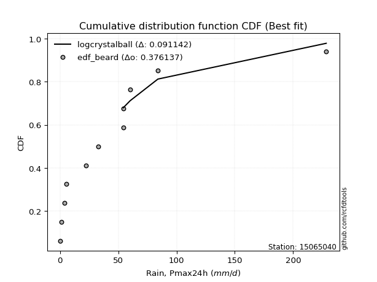</img>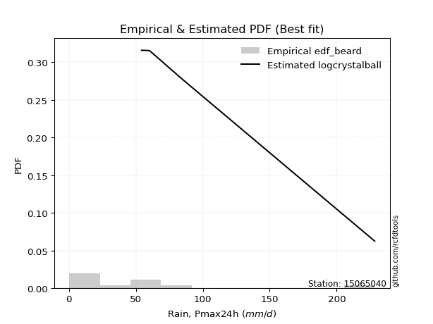</img>

</div>


### 5. Empirical - EDF Chegodayev (1955)

The Chegodayev formula is an empirical plotting position formula used in hydrological frequency analysis to estimate the exceedance probability or return period of a specific event from a set of observed data. It is primarily used for plotting observed data points on probability paper to fit a theoretical distribution, particularly for analyzing extreme events like maximum flood flows or rainfall intensities. The constant _b_ value in the generalized plotting position formula is 0.3.

<div align="center">


$P=(m-b)/(n+1-2b)$


</div>


**5.1. Empirical values**

<div align="center">

|                | 0                  | 1                   | 2                   | 3                   | 4                  | 5                  | 6                  | 7                  | 8                  | 9                 | 10                 | 11                 |
|:---------------|:-------------------|:--------------------|:--------------------|:--------------------|:-------------------|:-------------------|:-------------------|:-------------------|:-------------------|:------------------|:-------------------|:-------------------|
| date           | 2015               | 2014                | 2016                | 2021                | 2017               | 2020               | 2022               | 2018               | 2013               | 2019              | 2025               | 2024               |
| x              | 0.4                | 1.2                 | 3.8                 | 5.5                 | 22.1               | 32.8               | 54.3               | 54.5               | 60.2               | 84.0              | 88.4               | 228.4              |
| m              | 1                  | 2                   | 3                   | 4                   | 5                  | 6                  | 7                  | 8                  | 9                  | 10                | 11                 | 12                 |
| empirical_dist | edf_chegodayev     | edf_chegodayev      | edf_chegodayev      | edf_chegodayev      | edf_chegodayev     | edf_chegodayev     | edf_chegodayev     | edf_chegodayev     | edf_chegodayev     | edf_chegodayev    | edf_chegodayev     | edf_chegodayev     |
| empirical      | 0.0564516129032258 | 0.13709677419354838 | 0.21774193548387097 | 0.29838709677419356 | 0.3790322580645161 | 0.4596774193548387 | 0.5403225806451613 | 0.6209677419354839 | 0.7016129032258064 | 0.782258064516129 | 0.8629032258064515 | 0.9435483870967741 |
| empirical_tr   | 1.0598290598290598 | 1.158878504672897   | 1.2783505154639176  | 1.425287356321839   | 1.6103896103896105 | 1.8507462686567164 | 2.1754385964912277 | 2.6382978723404253 | 3.3513513513513504 | 4.592592592592592 | 7.294117647058818  | 17.714285714285694 |

</div>


**5.2. Kolmogorov-Smirnov fit test (sorted by Δ)**


<div align="center">

|                | 0                   | 1                     | 2                   | 3                   | 4                   | 5                   | 6                   | 7                   | 8                   | 9                   | 10                  | 11                  | 12                  | 13                  | 14                  | 15                  | 16                  | 17                  | 18                  | 19                  | 20                  | 21                  | 22                  | 23                  | 24                  | 25                  | 26                  | 27                  | 28                  | 29                  | 30                  | 31                  | 32                  | 33                  | 34                  | 35                  | 36                  | 37                  | 38                  | 39                  | 40                  | 41                  | 42                  | 43                  | 44                  | 45                  | 46                  | 47                  | 48                  | 49                  | 50                  | 51                  | 52                  | 53                  | 54                  | 55                  | 56                  | 57                  | 58                  | 59                  | 60                  | 61                  | 62                  | 63                  | 64                  | 65                  | 66                  | 67                  | 68                  | 69                  | 70                  | 71                  | 72                  | 73                  | 74                  | 75                  | 76                  | 77                  | 78                  | 79                  | 80                  | 81                  | 82                  | 83                  | 84                  | 85                  | 86                  | 87                  | 88                  | 89                  |
|:---------------|:--------------------|:----------------------|:--------------------|:--------------------|:--------------------|:--------------------|:--------------------|:--------------------|:--------------------|:--------------------|:--------------------|:--------------------|:--------------------|:--------------------|:--------------------|:--------------------|:--------------------|:--------------------|:--------------------|:--------------------|:--------------------|:--------------------|:--------------------|:--------------------|:--------------------|:--------------------|:--------------------|:--------------------|:--------------------|:--------------------|:--------------------|:--------------------|:--------------------|:--------------------|:--------------------|:--------------------|:--------------------|:--------------------|:--------------------|:--------------------|:--------------------|:--------------------|:--------------------|:--------------------|:--------------------|:--------------------|:--------------------|:--------------------|:--------------------|:--------------------|:--------------------|:--------------------|:--------------------|:--------------------|:--------------------|:--------------------|:--------------------|:--------------------|:--------------------|:--------------------|:--------------------|:--------------------|:--------------------|:--------------------|:--------------------|:--------------------|:--------------------|:--------------------|:--------------------|:--------------------|:--------------------|:--------------------|:--------------------|:--------------------|:--------------------|:--------------------|:--------------------|:--------------------|:--------------------|:--------------------|:--------------------|:--------------------|:--------------------|:--------------------|:--------------------|:--------------------|:--------------------|:--------------------|:--------------------|:--------------------|
| station        | 15065040            | 15065040              | 15065040            | 15065040            | 15065040            | 15065040            | 15065040            | 15065040            | 15065040            | 15065040            | 15065040            | 15065040            | 15065040            | 15065040            | 15065040            | 15065040            | 15065040            | 15065040            | 15065040            | 15065040            | 15065040            | 15065040            | 15065040            | 15065040            | 15065040            | 15065040            | 15065040            | 15065040            | 15065040            | 15065040            | 15065040            | 15065040            | 15065040            | 15065040            | 15065040            | 15065040            | 15065040            | 15065040            | 15065040            | 15065040            | 15065040            | 15065040            | 15065040            | 15065040            | 15065040            | 15065040            | 15065040            | 15065040            | 15065040            | 15065040            | 15065040            | 15065040            | 15065040            | 15065040            | 15065040            | 15065040            | 15065040            | 15065040            | 15065040            | 15065040            | 15065040            | 15065040            | 15065040            | 15065040            | 15065040            | 15065040            | 15065040            | 15065040            | 15065040            | 15065040            | 15065040            | 15065040            | 15065040            | 15065040            | 15065040            | 15065040            | 15065040            | 15065040            | 15065040            | 15065040            | 15065040            | 15065040            | 15065040            | 15065040            | 15065040            | 15065040            | 15065040            | 15065040            | 15065040            | 15065040            |
| empirical_dist | edf_chegodayev      | edf_chegodayev        | edf_chegodayev      | edf_chegodayev      | edf_chegodayev      | edf_chegodayev      | edf_chegodayev      | edf_chegodayev      | edf_chegodayev      | edf_chegodayev      | edf_chegodayev      | edf_chegodayev      | edf_chegodayev      | edf_chegodayev      | edf_chegodayev      | edf_chegodayev      | edf_chegodayev      | edf_chegodayev      | edf_chegodayev      | edf_chegodayev      | edf_chegodayev      | edf_chegodayev      | edf_chegodayev      | edf_chegodayev      | edf_chegodayev      | edf_chegodayev      | edf_chegodayev      | edf_chegodayev      | edf_chegodayev      | edf_chegodayev      | edf_chegodayev      | edf_chegodayev      | edf_chegodayev      | edf_chegodayev      | edf_chegodayev      | edf_chegodayev      | edf_chegodayev      | edf_chegodayev      | edf_chegodayev      | edf_chegodayev      | edf_chegodayev      | edf_chegodayev      | edf_chegodayev      | edf_chegodayev      | edf_chegodayev      | edf_chegodayev      | edf_chegodayev      | edf_chegodayev      | edf_chegodayev      | edf_chegodayev      | edf_chegodayev      | edf_chegodayev      | edf_chegodayev      | edf_chegodayev      | edf_chegodayev      | edf_chegodayev      | edf_chegodayev      | edf_chegodayev      | edf_chegodayev      | edf_chegodayev      | edf_chegodayev      | edf_chegodayev      | edf_chegodayev      | edf_chegodayev      | edf_chegodayev      | edf_chegodayev      | edf_chegodayev      | edf_chegodayev      | edf_chegodayev      | edf_chegodayev      | edf_chegodayev      | edf_chegodayev      | edf_chegodayev      | edf_chegodayev      | edf_chegodayev      | edf_chegodayev      | edf_chegodayev      | edf_chegodayev      | edf_chegodayev      | edf_chegodayev      | edf_chegodayev      | edf_chegodayev      | edf_chegodayev      | edf_chegodayev      | edf_chegodayev      | edf_chegodayev      | edf_chegodayev      | edf_chegodayev      | edf_chegodayev      | edf_chegodayev      |
| p_dist         | pearson3            | loglaplace_asymmetric | logloggamma         | moyal               | logjohnsonsu        | fisk                | loggenlogistic      | erlang              | gumbel_r            | t                   | halflogistic        | weibull_min         | ncf                 | hypsecant           | genlogistic         | logpearson3         | logweibull_min      | loggumbel_l         | laplace             | gamma               | logistic            | nakagami            | maxwell             | kstwobign           | laplace_asymmetric  | rayleigh            | rice                | crystalball         | norm                | loggompertz         | f                   | halfnorm            | loggamma            | loggamma            | logerlang           | logfatiguelife      | johnsonsu           | invweibull          | lognct              | logexponnorm        | logcrystalball      | lognorm             | lognorm             | logt                | logalpha            | lognakagami         | logrice             | loglognorm          | nct                 | loginvgamma         | betaprime           | invgamma            | pareto              | loginvgauss         | logmielke           | logmaxwell          | loginvweibull       | lograyleigh         | loglogistic         | invgauss            | exponnorm           | genexpon            | expon               | mielke              | loghypsecant        | wald                | logkstwobign        | loggenexpon         | gumbel_l            | truncnorm           | loghalfnorm         | loggumbel_r         | fatiguelife         | loglaplace          | gompertz            | logmoyal            | loghalflogistic     | logexpon            | logncf              | logtruncnorm        | gibrat              | logchi2             | logwald             | loggibrat           | logfisk             | logf                | logpareto           | alpha               | logbetaprime        | chi2                |
| delta          | 0.09799378429078105 | 0.10628366921986543   | 0.10776389813015341 | 0.1105986432736263  | 0.11645997104619821 | 0.11668113998399621 | 0.11741393346641826 | 0.12425866166006294 | 0.12655223828288703 | 0.12704090015067293 | 0.12980886942407688 | 0.13570836886133467 | 0.13799542978760063 | 0.14258001297491818 | 0.14323931141466073 | 0.1453194698126442  | 0.14620206940124492 | 0.14652024015561638 | 0.14661571095194892 | 0.1474139969903363  | 0.1479736383684498  | 0.14874357269136995 | 0.14941563029901223 | 0.1502781128438876  | 0.1528406476182484  | 0.15426871344712173 | 0.15427459786540323 | 0.1543502242175787  | 0.15435022482439686 | 0.1584141480719199  | 0.1603184200814417  | 0.16228445600588398 | 0.1733535402239127  | 0.1733535402239127  | 0.1735263731237192  | 0.17376053184882878 | 0.17384880614199238 | 0.17402838735585469 | 0.17409909176245508 | 0.17414386991402087 | 0.17414408581242746 | 0.17414409230863137 | 0.17414409230863137 | 0.17414426067424915 | 0.17430699692771368 | 0.17434465350043094 | 0.17541564381737074 | 0.17637858756722613 | 0.17647477839122194 | 0.17785139994899268 | 0.179897287566955   | 0.1799397350750287  | 0.1802385125640375  | 0.1817292413487065  | 0.18748817756189462 | 0.18828004346256066 | 0.18940421712938904 | 0.19526405754729603 | 0.19610512668733326 | 0.2024834246620122  | 0.20431992082427003 | 0.20592520746130633 | 0.2059252627301254  | 0.2063091511991626  | 0.21157435570350336 | 0.2151649521783556  | 0.21665782243519194 | 0.2206077013567761  | 0.22166543135253736 | 0.2218375372127084  | 0.22408411849662313 | 0.22415312033222579 | 0.22802376664366653 | 0.2352656574196028  | 0.24278032450227566 | 0.2494854323151222  | 0.2507119309925163  | 0.2672695815191134  | 0.2747395936525364  | 0.2814354484189264  | 0.29838709677419356 | 0.31698701282223585 | 0.31980045279919456 | 0.34734108308218303 | 0.3627362952865265  | 0.39830604527719526 | 0.4866774950523046  | 0.5739487108787126  | 0.5950413416829488  | 0.6680617587606491  |
| deltao         | 0.36218414519599995 | 0.36218414519599995   | 0.36218414519599995 | 0.36218414519599995 | 0.36218414519599995 | 0.36218414519599995 | 0.36218414519599995 | 0.36218414519599995 | 0.36218414519599995 | 0.36218414519599995 | 0.36218414519599995 | 0.36218414519599995 | 0.36218414519599995 | 0.36218414519599995 | 0.36218414519599995 | 0.36218414519599995 | 0.36218414519599995 | 0.36218414519599995 | 0.36218414519599995 | 0.36218414519599995 | 0.36218414519599995 | 0.36218414519599995 | 0.36218414519599995 | 0.36218414519599995 | 0.36218414519599995 | 0.36218414519599995 | 0.36218414519599995 | 0.36218414519599995 | 0.36218414519599995 | 0.36218414519599995 | 0.36218414519599995 | 0.36218414519599995 | 0.36218414519599995 | 0.36218414519599995 | 0.36218414519599995 | 0.36218414519599995 | 0.36218414519599995 | 0.36218414519599995 | 0.36218414519599995 | 0.36218414519599995 | 0.36218414519599995 | 0.36218414519599995 | 0.36218414519599995 | 0.36218414519599995 | 0.36218414519599995 | 0.36218414519599995 | 0.36218414519599995 | 0.36218414519599995 | 0.36218414519599995 | 0.36218414519599995 | 0.36218414519599995 | 0.36218414519599995 | 0.36218414519599995 | 0.36218414519599995 | 0.36218414519599995 | 0.36218414519599995 | 0.36218414519599995 | 0.36218414519599995 | 0.36218414519599995 | 0.36218414519599995 | 0.36218414519599995 | 0.36218414519599995 | 0.36218414519599995 | 0.36218414519599995 | 0.36218414519599995 | 0.36218414519599995 | 0.36218414519599995 | 0.36218414519599995 | 0.36218414519599995 | 0.36218414519599995 | 0.36218414519599995 | 0.36218414519599995 | 0.36218414519599995 | 0.36218414519599995 | 0.36218414519599995 | 0.36218414519599995 | 0.36218414519599995 | 0.36218414519599995 | 0.36218414519599995 | 0.36218414519599995 | 0.36218414519599995 | 0.36218414519599995 | 0.36218414519599995 | 0.36218414519599995 | 0.36218414519599995 | 0.36218414519599995 | 0.36218414519599995 | 0.36218414519599995 | 0.36218414519599995 | 0.36218414519599995 |
| eval           | Δo > Δ              | Δo > Δ                | Δo > Δ              | Δo > Δ              | Δo > Δ              | Δo > Δ              | Δo > Δ              | Δo > Δ              | Δo > Δ              | Δo > Δ              | Δo > Δ              | Δo > Δ              | Δo > Δ              | Δo > Δ              | Δo > Δ              | Δo > Δ              | Δo > Δ              | Δo > Δ              | Δo > Δ              | Δo > Δ              | Δo > Δ              | Δo > Δ              | Δo > Δ              | Δo > Δ              | Δo > Δ              | Δo > Δ              | Δo > Δ              | Δo > Δ              | Δo > Δ              | Δo > Δ              | Δo > Δ              | Δo > Δ              | Δo > Δ              | Δo > Δ              | Δo > Δ              | Δo > Δ              | Δo > Δ              | Δo > Δ              | Δo > Δ              | Δo > Δ              | Δo > Δ              | Δo > Δ              | Δo > Δ              | Δo > Δ              | Δo > Δ              | Δo > Δ              | Δo > Δ              | Δo > Δ              | Δo > Δ              | Δo > Δ              | Δo > Δ              | Δo > Δ              | Δo > Δ              | Δo > Δ              | Δo > Δ              | Δo > Δ              | Δo > Δ              | Δo > Δ              | Δo > Δ              | Δo > Δ              | Δo > Δ              | Δo > Δ              | Δo > Δ              | Δo > Δ              | Δo > Δ              | Δo > Δ              | Δo > Δ              | Δo > Δ              | Δo > Δ              | Δo > Δ              | Δo > Δ              | Δo > Δ              | Δo > Δ              | Δo > Δ              | Δo > Δ              | Δo > Δ              | Δo > Δ              | Δo > Δ              | Δo > Δ              | Δo > Δ              | Δo > Δ              | Δo > Δ              | Δo > Δ              | Δo > Δ              | Δo <= Δ             | Δo <= Δ             | Δo <= Δ             | Δo <= Δ             | Δo <= Δ             | Δo <= Δ             |
| fit            | 1                   | 1                     | 1                   | 1                   | 1                   | 1                   | 1                   | 1                   | 1                   | 1                   | 1                   | 1                   | 1                   | 1                   | 1                   | 1                   | 1                   | 1                   | 1                   | 1                   | 1                   | 1                   | 1                   | 1                   | 1                   | 1                   | 1                   | 1                   | 1                   | 1                   | 1                   | 1                   | 1                   | 1                   | 1                   | 1                   | 1                   | 1                   | 1                   | 1                   | 1                   | 1                   | 1                   | 1                   | 1                   | 1                   | 1                   | 1                   | 1                   | 1                   | 1                   | 1                   | 1                   | 1                   | 1                   | 1                   | 1                   | 1                   | 1                   | 1                   | 1                   | 1                   | 1                   | 1                   | 1                   | 1                   | 1                   | 1                   | 1                   | 1                   | 1                   | 1                   | 1                   | 1                   | 1                   | 1                   | 1                   | 1                   | 1                   | 1                   | 1                   | 1                   | 1                   | 1                   | 0                   | 0                   | 0                   | 0                   | 0                   | 0                   |
| n              | 12                  | 12                    | 12                  | 12                  | 12                  | 12                  | 12                  | 12                  | 12                  | 12                  | 12                  | 12                  | 12                  | 12                  | 12                  | 12                  | 12                  | 12                  | 12                  | 12                  | 12                  | 12                  | 12                  | 12                  | 12                  | 12                  | 12                  | 12                  | 12                  | 12                  | 12                  | 12                  | 12                  | 12                  | 12                  | 12                  | 12                  | 12                  | 12                  | 12                  | 12                  | 12                  | 12                  | 12                  | 12                  | 12                  | 12                  | 12                  | 12                  | 12                  | 12                  | 12                  | 12                  | 12                  | 12                  | 12                  | 12                  | 12                  | 12                  | 12                  | 12                  | 12                  | 12                  | 12                  | 12                  | 12                  | 12                  | 12                  | 12                  | 12                  | 12                  | 12                  | 12                  | 12                  | 12                  | 12                  | 12                  | 12                  | 12                  | 12                  | 12                  | 12                  | 12                  | 12                  | 12                  | 12                  | 12                  | 12                  | 12                  | 12                  |
| best_fit       | 1                   | 0                     | 0                   | 0                   | 0                   | 0                   | 0                   | 0                   | 0                   | 0                   | 0                   | 0                   | 0                   | 0                   | 0                   | 0                   | 0                   | 0                   | 0                   | 0                   | 0                   | 0                   | 0                   | 0                   | 0                   | 0                   | 0                   | 0                   | 0                   | 0                   | 0                   | 0                   | 0                   | 0                   | 0                   | 0                   | 0                   | 0                   | 0                   | 0                   | 0                   | 0                   | 0                   | 0                   | 0                   | 0                   | 0                   | 0                   | 0                   | 0                   | 0                   | 0                   | 0                   | 0                   | 0                   | 0                   | 0                   | 0                   | 0                   | 0                   | 0                   | 0                   | 0                   | 0                   | 0                   | 0                   | 0                   | 0                   | 0                   | 0                   | 0                   | 0                   | 0                   | 0                   | 0                   | 0                   | 0                   | 0                   | 0                   | 0                   | 0                   | 0                   | 0                   | 0                   | 0                   | 0                   | 0                   | 0                   | 0                   | 0                   |
| best_fit_sort  | 1                   | 2                     | 3                   | 4                   | 5                   | 6                   | 7                   | 8                   | 9                   | 10                  | 11                  | 12                  | 13                  | 14                  | 15                  | 16                  | 17                  | 18                  | 19                  | 20                  | 21                  | 22                  | 23                  | 24                  | 25                  | 26                  | 27                  | 28                  | 29                  | 30                  | 31                  | 32                  | 33                  | 34                  | 35                  | 36                  | 37                  | 38                  | 39                  | 40                  | 41                  | 42                  | 43                  | 44                  | 45                  | 46                  | 47                  | 48                  | 49                  | 50                  | 51                  | 52                  | 53                  | 54                  | 55                  | 56                  | 57                  | 58                  | 59                  | 60                  | 61                  | 62                  | 63                  | 64                  | 65                  | 66                  | 67                  | 68                  | 69                  | 70                  | 71                  | 72                  | 73                  | 74                  | 75                  | 76                  | 77                  | 78                  | 79                  | 80                  | 81                  | 82                  | 83                  | 84                  | 85                  | 86                  | 87                  | 88                  | 89                  | 90                  |

</div>


<div align="center">

</img>

</div>


**5.3. Best fit**

<div align="center">

|   id |   station | empirical_dist   | p_dist   |     delta |   deltao | eval   |   fit |   n |   best_fit |   best_fit_sort |
|-----:|----------:|:-----------------|:---------|----------:|---------:|:-------|------:|----:|-----------:|----------------:|
|    0 |  15065040 | edf_chegodayev   | pearson3 | 0.0979938 | 0.362184 | Δo > Δ |     1 |  12 |          1 |               1 |

</div>


<div align="center">

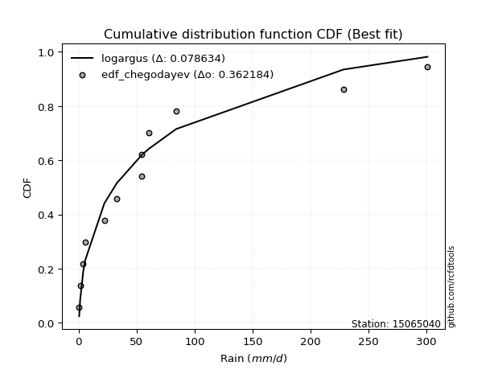</img></img>

</div>


### 6. Empirical - EDF Blom (1958)

The Blom formula is a specific "plotting position" formula used in hydrology and statistical analysis to estimate the empirical cumulative probability (or non-exceedance probability) of a data series. It is particularly recommended for data that are approximately normally distributed. The constant _a_ is set to 0.375 (or 3/8).

<div align="center">


$P=(m-a)/(n+1-2a)$


</div>


**6.1. Empirical values**

<div align="center">

|                | 0                   | 1                  | 2                   | 3                   | 4                   | 5                   | 6                  | 7                  | 8                  | 9                  | 10                 | 11                 |
|:---------------|:--------------------|:-------------------|:--------------------|:--------------------|:--------------------|:--------------------|:-------------------|:-------------------|:-------------------|:-------------------|:-------------------|:-------------------|
| date           | 2015                | 2014               | 2016                | 2021                | 2017                | 2020                | 2022               | 2018               | 2013               | 2019               | 2025               | 2024               |
| x              | 0.4                 | 1.2                | 3.8                 | 5.5                 | 22.1                | 32.8                | 54.3               | 54.5               | 60.2               | 84.0               | 88.4               | 228.4              |
| m              | 1                   | 2                  | 3                   | 4                   | 5                   | 6                   | 7                  | 8                  | 9                  | 10                 | 11                 | 12                 |
| empirical_dist | edf_blom            | edf_blom           | edf_blom            | edf_blom            | edf_blom            | edf_blom            | edf_blom           | edf_blom           | edf_blom           | edf_blom           | edf_blom           | edf_blom           |
| empirical      | 0.05102040816326531 | 0.1326530612244898 | 0.21428571428571427 | 0.29591836734693877 | 0.37755102040816324 | 0.45918367346938777 | 0.5408163265306123 | 0.6224489795918368 | 0.7040816326530612 | 0.7857142857142857 | 0.8673469387755102 | 0.9489795918367347 |
| empirical_tr   | 1.053763440860215   | 1.1529411764705884 | 1.2727272727272727  | 1.4202898550724639  | 1.6065573770491803  | 1.8490566037735847  | 2.177777777777778  | 2.6486486486486487 | 3.3793103448275863 | 4.666666666666666  | 7.5384615384615365 | 19.60000000000002  |

</div>


**6.2. Kolmogorov-Smirnov fit test (sorted by Δ)**


<div align="center">

|                | 0                   | 1                     | 2                   | 3                   | 4                   | 5                   | 6                   | 7                   | 8                   | 9                   | 10                  | 11                  | 12                  | 13                  | 14                  | 15                  | 16                  | 17                  | 18                  | 19                  | 20                  | 21                  | 22                  | 23                  | 24                  | 25                  | 26                  | 27                  | 28                  | 29                  | 30                  | 31                  | 32                  | 33                  | 34                  | 35                  | 36                  | 37                  | 38                  | 39                  | 40                  | 41                  | 42                  | 43                  | 44                  | 45                  | 46                  | 47                  | 48                  | 49                  | 50                  | 51                  | 52                  | 53                  | 54                  | 55                  | 56                  | 57                  | 58                  | 59                  | 60                  | 61                  | 62                  | 63                  | 64                  | 65                  | 66                  | 67                  | 68                  | 69                  | 70                  | 71                  | 72                  | 73                  | 74                  | 75                  | 76                  | 77                  | 78                  | 79                  | 80                  | 81                  | 82                  | 83                  | 84                  | 85                  | 86                  | 87                  | 88                  | 89                  |
|:---------------|:--------------------|:----------------------|:--------------------|:--------------------|:--------------------|:--------------------|:--------------------|:--------------------|:--------------------|:--------------------|:--------------------|:--------------------|:--------------------|:--------------------|:--------------------|:--------------------|:--------------------|:--------------------|:--------------------|:--------------------|:--------------------|:--------------------|:--------------------|:--------------------|:--------------------|:--------------------|:--------------------|:--------------------|:--------------------|:--------------------|:--------------------|:--------------------|:--------------------|:--------------------|:--------------------|:--------------------|:--------------------|:--------------------|:--------------------|:--------------------|:--------------------|:--------------------|:--------------------|:--------------------|:--------------------|:--------------------|:--------------------|:--------------------|:--------------------|:--------------------|:--------------------|:--------------------|:--------------------|:--------------------|:--------------------|:--------------------|:--------------------|:--------------------|:--------------------|:--------------------|:--------------------|:--------------------|:--------------------|:--------------------|:--------------------|:--------------------|:--------------------|:--------------------|:--------------------|:--------------------|:--------------------|:--------------------|:--------------------|:--------------------|:--------------------|:--------------------|:--------------------|:--------------------|:--------------------|:--------------------|:--------------------|:--------------------|:--------------------|:--------------------|:--------------------|:--------------------|:--------------------|:--------------------|:--------------------|:--------------------|
| station        | 15065040            | 15065040              | 15065040            | 15065040            | 15065040            | 15065040            | 15065040            | 15065040            | 15065040            | 15065040            | 15065040            | 15065040            | 15065040            | 15065040            | 15065040            | 15065040            | 15065040            | 15065040            | 15065040            | 15065040            | 15065040            | 15065040            | 15065040            | 15065040            | 15065040            | 15065040            | 15065040            | 15065040            | 15065040            | 15065040            | 15065040            | 15065040            | 15065040            | 15065040            | 15065040            | 15065040            | 15065040            | 15065040            | 15065040            | 15065040            | 15065040            | 15065040            | 15065040            | 15065040            | 15065040            | 15065040            | 15065040            | 15065040            | 15065040            | 15065040            | 15065040            | 15065040            | 15065040            | 15065040            | 15065040            | 15065040            | 15065040            | 15065040            | 15065040            | 15065040            | 15065040            | 15065040            | 15065040            | 15065040            | 15065040            | 15065040            | 15065040            | 15065040            | 15065040            | 15065040            | 15065040            | 15065040            | 15065040            | 15065040            | 15065040            | 15065040            | 15065040            | 15065040            | 15065040            | 15065040            | 15065040            | 15065040            | 15065040            | 15065040            | 15065040            | 15065040            | 15065040            | 15065040            | 15065040            | 15065040            |
| empirical_dist | edf_blom            | edf_blom              | edf_blom            | edf_blom            | edf_blom            | edf_blom            | edf_blom            | edf_blom            | edf_blom            | edf_blom            | edf_blom            | edf_blom            | edf_blom            | edf_blom            | edf_blom            | edf_blom            | edf_blom            | edf_blom            | edf_blom            | edf_blom            | edf_blom            | edf_blom            | edf_blom            | edf_blom            | edf_blom            | edf_blom            | edf_blom            | edf_blom            | edf_blom            | edf_blom            | edf_blom            | edf_blom            | edf_blom            | edf_blom            | edf_blom            | edf_blom            | edf_blom            | edf_blom            | edf_blom            | edf_blom            | edf_blom            | edf_blom            | edf_blom            | edf_blom            | edf_blom            | edf_blom            | edf_blom            | edf_blom            | edf_blom            | edf_blom            | edf_blom            | edf_blom            | edf_blom            | edf_blom            | edf_blom            | edf_blom            | edf_blom            | edf_blom            | edf_blom            | edf_blom            | edf_blom            | edf_blom            | edf_blom            | edf_blom            | edf_blom            | edf_blom            | edf_blom            | edf_blom            | edf_blom            | edf_blom            | edf_blom            | edf_blom            | edf_blom            | edf_blom            | edf_blom            | edf_blom            | edf_blom            | edf_blom            | edf_blom            | edf_blom            | edf_blom            | edf_blom            | edf_blom            | edf_blom            | edf_blom            | edf_blom            | edf_blom            | edf_blom            | edf_blom            | edf_blom            |
| p_dist         | pearson3            | loglaplace_asymmetric | logloggamma         | logjohnsonsu        | moyal               | loggenlogistic      | fisk                | erlang              | gumbel_r            | t                   | weibull_min         | halflogistic        | ncf                 | genlogistic         | logpearson3         | hypsecant           | logweibull_min      | loggumbel_l         | laplace             | gamma               | kstwobign           | logistic            | rice                | laplace_asymmetric  | nakagami            | maxwell             | crystalball         | norm                | loggompertz         | rayleigh            | f                   | halfnorm            | loggamma            | loggamma            | logerlang           | logfatiguelife      | invweibull          | lognct              | logexponnorm        | logcrystalball      | lognorm             | lognorm             | logt                | logalpha            | lognakagami         | logrice             | johnsonsu           | loglognorm          | nct                 | loginvgamma         | pareto              | betaprime           | invgamma            | loginvgauss         | logmaxwell          | logmielke           | loginvweibull       | loglogistic         | lograyleigh         | exponnorm           | invgauss            | genexpon            | expon               | mielke              | loghypsecant        | wald                | logkstwobign        | truncnorm           | loggenexpon         | gumbel_l            | loghalfnorm         | loggumbel_r         | fatiguelife         | loglaplace          | gompertz            | logmoyal            | loghalflogistic     | logexpon            | logncf              | logtruncnorm        | gibrat              | logchi2             | logwald             | loggibrat           | logfisk             | logf                | logpareto           | alpha               | logbetaprime        | chi2                |
| delta          | 0.10342498903074154 | 0.10578992333441439   | 0.10727015224470238 | 0.11596622516074717 | 0.11602984801358679 | 0.11692018758096723 | 0.12112485295305486 | 0.12178993223280815 | 0.1319834430228475  | 0.13201335674207845 | 0.13323963943407988 | 0.13524007416403735 | 0.13980004318435746 | 0.14077058198740594 | 0.14482572392719317 | 0.14504874240217303 | 0.14570832351579388 | 0.14602649427016534 | 0.146121965066498   | 0.14692025110488527 | 0.1478093834166328  | 0.15044236779570463 | 0.1522287953683823  | 0.15234690173279747 | 0.1531872856604286  | 0.15484683503897273 | 0.15681895364483356 | 0.1568189542516517  | 0.15792040218646886 | 0.1596999181870822  | 0.16476213305050036 | 0.16771566074584449 | 0.17285979433846166 | 0.17285979433846166 | 0.17303262723826818 | 0.17326678596337775 | 0.17353464147040365 | 0.17360534587700405 | 0.17365012402856983 | 0.17365033992697643 | 0.17365034642318034 | 0.17365034642318034 | 0.17365051478879812 | 0.17381325104226264 | 0.1738509076149799  | 0.1749218979319197  | 0.17533004379834527 | 0.1758848416817751  | 0.1759810325057709  | 0.17735765406354165 | 0.1777697831367827  | 0.17940354168150396 | 0.17944598918957766 | 0.18224690356349782 | 0.18778629757710963 | 0.1889694152182475  | 0.19088545478574193 | 0.19561138080188223 | 0.19674529520364892 | 0.20185119139701524 | 0.20198967877656115 | 0.20345647803405154 | 0.2034565333028706  | 0.20581540531371156 | 0.21108060981805232 | 0.2126962227511008  | 0.21813906009154482 | 0.21936880778545362 | 0.22208893901312898 | 0.2241341607797922  | 0.22556535615297602 | 0.22563435798857867 | 0.2295050043000194  | 0.23477191153415178 | 0.24031159507502087 | 0.2509666699714751  | 0.2521931686488692  | 0.2687508191754663  | 0.28017079839249703 | 0.2829166860752793  | 0.29591836734693877 | 0.31846825047858873 | 0.32128169045554744 | 0.3488223207385359  | 0.3681675000264871  | 0.40176226647535196 | 0.49112120802136316 | 0.5754299485350655  | 0.5984975628811054  | 0.6715179799588058  |
| deltao         | 0.36218414519599995 | 0.36218414519599995   | 0.36218414519599995 | 0.36218414519599995 | 0.36218414519599995 | 0.36218414519599995 | 0.36218414519599995 | 0.36218414519599995 | 0.36218414519599995 | 0.36218414519599995 | 0.36218414519599995 | 0.36218414519599995 | 0.36218414519599995 | 0.36218414519599995 | 0.36218414519599995 | 0.36218414519599995 | 0.36218414519599995 | 0.36218414519599995 | 0.36218414519599995 | 0.36218414519599995 | 0.36218414519599995 | 0.36218414519599995 | 0.36218414519599995 | 0.36218414519599995 | 0.36218414519599995 | 0.36218414519599995 | 0.36218414519599995 | 0.36218414519599995 | 0.36218414519599995 | 0.36218414519599995 | 0.36218414519599995 | 0.36218414519599995 | 0.36218414519599995 | 0.36218414519599995 | 0.36218414519599995 | 0.36218414519599995 | 0.36218414519599995 | 0.36218414519599995 | 0.36218414519599995 | 0.36218414519599995 | 0.36218414519599995 | 0.36218414519599995 | 0.36218414519599995 | 0.36218414519599995 | 0.36218414519599995 | 0.36218414519599995 | 0.36218414519599995 | 0.36218414519599995 | 0.36218414519599995 | 0.36218414519599995 | 0.36218414519599995 | 0.36218414519599995 | 0.36218414519599995 | 0.36218414519599995 | 0.36218414519599995 | 0.36218414519599995 | 0.36218414519599995 | 0.36218414519599995 | 0.36218414519599995 | 0.36218414519599995 | 0.36218414519599995 | 0.36218414519599995 | 0.36218414519599995 | 0.36218414519599995 | 0.36218414519599995 | 0.36218414519599995 | 0.36218414519599995 | 0.36218414519599995 | 0.36218414519599995 | 0.36218414519599995 | 0.36218414519599995 | 0.36218414519599995 | 0.36218414519599995 | 0.36218414519599995 | 0.36218414519599995 | 0.36218414519599995 | 0.36218414519599995 | 0.36218414519599995 | 0.36218414519599995 | 0.36218414519599995 | 0.36218414519599995 | 0.36218414519599995 | 0.36218414519599995 | 0.36218414519599995 | 0.36218414519599995 | 0.36218414519599995 | 0.36218414519599995 | 0.36218414519599995 | 0.36218414519599995 | 0.36218414519599995 |
| eval           | Δo > Δ              | Δo > Δ                | Δo > Δ              | Δo > Δ              | Δo > Δ              | Δo > Δ              | Δo > Δ              | Δo > Δ              | Δo > Δ              | Δo > Δ              | Δo > Δ              | Δo > Δ              | Δo > Δ              | Δo > Δ              | Δo > Δ              | Δo > Δ              | Δo > Δ              | Δo > Δ              | Δo > Δ              | Δo > Δ              | Δo > Δ              | Δo > Δ              | Δo > Δ              | Δo > Δ              | Δo > Δ              | Δo > Δ              | Δo > Δ              | Δo > Δ              | Δo > Δ              | Δo > Δ              | Δo > Δ              | Δo > Δ              | Δo > Δ              | Δo > Δ              | Δo > Δ              | Δo > Δ              | Δo > Δ              | Δo > Δ              | Δo > Δ              | Δo > Δ              | Δo > Δ              | Δo > Δ              | Δo > Δ              | Δo > Δ              | Δo > Δ              | Δo > Δ              | Δo > Δ              | Δo > Δ              | Δo > Δ              | Δo > Δ              | Δo > Δ              | Δo > Δ              | Δo > Δ              | Δo > Δ              | Δo > Δ              | Δo > Δ              | Δo > Δ              | Δo > Δ              | Δo > Δ              | Δo > Δ              | Δo > Δ              | Δo > Δ              | Δo > Δ              | Δo > Δ              | Δo > Δ              | Δo > Δ              | Δo > Δ              | Δo > Δ              | Δo > Δ              | Δo > Δ              | Δo > Δ              | Δo > Δ              | Δo > Δ              | Δo > Δ              | Δo > Δ              | Δo > Δ              | Δo > Δ              | Δo > Δ              | Δo > Δ              | Δo > Δ              | Δo > Δ              | Δo > Δ              | Δo > Δ              | Δo > Δ              | Δo <= Δ             | Δo <= Δ             | Δo <= Δ             | Δo <= Δ             | Δo <= Δ             | Δo <= Δ             |
| fit            | 1                   | 1                     | 1                   | 1                   | 1                   | 1                   | 1                   | 1                   | 1                   | 1                   | 1                   | 1                   | 1                   | 1                   | 1                   | 1                   | 1                   | 1                   | 1                   | 1                   | 1                   | 1                   | 1                   | 1                   | 1                   | 1                   | 1                   | 1                   | 1                   | 1                   | 1                   | 1                   | 1                   | 1                   | 1                   | 1                   | 1                   | 1                   | 1                   | 1                   | 1                   | 1                   | 1                   | 1                   | 1                   | 1                   | 1                   | 1                   | 1                   | 1                   | 1                   | 1                   | 1                   | 1                   | 1                   | 1                   | 1                   | 1                   | 1                   | 1                   | 1                   | 1                   | 1                   | 1                   | 1                   | 1                   | 1                   | 1                   | 1                   | 1                   | 1                   | 1                   | 1                   | 1                   | 1                   | 1                   | 1                   | 1                   | 1                   | 1                   | 1                   | 1                   | 1                   | 1                   | 0                   | 0                   | 0                   | 0                   | 0                   | 0                   |
| n              | 12                  | 12                    | 12                  | 12                  | 12                  | 12                  | 12                  | 12                  | 12                  | 12                  | 12                  | 12                  | 12                  | 12                  | 12                  | 12                  | 12                  | 12                  | 12                  | 12                  | 12                  | 12                  | 12                  | 12                  | 12                  | 12                  | 12                  | 12                  | 12                  | 12                  | 12                  | 12                  | 12                  | 12                  | 12                  | 12                  | 12                  | 12                  | 12                  | 12                  | 12                  | 12                  | 12                  | 12                  | 12                  | 12                  | 12                  | 12                  | 12                  | 12                  | 12                  | 12                  | 12                  | 12                  | 12                  | 12                  | 12                  | 12                  | 12                  | 12                  | 12                  | 12                  | 12                  | 12                  | 12                  | 12                  | 12                  | 12                  | 12                  | 12                  | 12                  | 12                  | 12                  | 12                  | 12                  | 12                  | 12                  | 12                  | 12                  | 12                  | 12                  | 12                  | 12                  | 12                  | 12                  | 12                  | 12                  | 12                  | 12                  | 12                  |
| best_fit       | 1                   | 0                     | 0                   | 0                   | 0                   | 0                   | 0                   | 0                   | 0                   | 0                   | 0                   | 0                   | 0                   | 0                   | 0                   | 0                   | 0                   | 0                   | 0                   | 0                   | 0                   | 0                   | 0                   | 0                   | 0                   | 0                   | 0                   | 0                   | 0                   | 0                   | 0                   | 0                   | 0                   | 0                   | 0                   | 0                   | 0                   | 0                   | 0                   | 0                   | 0                   | 0                   | 0                   | 0                   | 0                   | 0                   | 0                   | 0                   | 0                   | 0                   | 0                   | 0                   | 0                   | 0                   | 0                   | 0                   | 0                   | 0                   | 0                   | 0                   | 0                   | 0                   | 0                   | 0                   | 0                   | 0                   | 0                   | 0                   | 0                   | 0                   | 0                   | 0                   | 0                   | 0                   | 0                   | 0                   | 0                   | 0                   | 0                   | 0                   | 0                   | 0                   | 0                   | 0                   | 0                   | 0                   | 0                   | 0                   | 0                   | 0                   |
| best_fit_sort  | 1                   | 2                     | 3                   | 4                   | 5                   | 6                   | 7                   | 8                   | 9                   | 10                  | 11                  | 12                  | 13                  | 14                  | 15                  | 16                  | 17                  | 18                  | 19                  | 20                  | 21                  | 22                  | 23                  | 24                  | 25                  | 26                  | 27                  | 28                  | 29                  | 30                  | 31                  | 32                  | 33                  | 34                  | 35                  | 36                  | 37                  | 38                  | 39                  | 40                  | 41                  | 42                  | 43                  | 44                  | 45                  | 46                  | 47                  | 48                  | 49                  | 50                  | 51                  | 52                  | 53                  | 54                  | 55                  | 56                  | 57                  | 58                  | 59                  | 60                  | 61                  | 62                  | 63                  | 64                  | 65                  | 66                  | 67                  | 68                  | 69                  | 70                  | 71                  | 72                  | 73                  | 74                  | 75                  | 76                  | 77                  | 78                  | 79                  | 80                  | 81                  | 82                  | 83                  | 84                  | 85                  | 86                  | 87                  | 88                  | 89                  | 90                  |

</div>


<div align="center">

</img>

</div>


**6.3. Best fit**

<div align="center">

|   id |   station | empirical_dist   | p_dist   |    delta |   deltao | eval   |   fit |   n |   best_fit |   best_fit_sort |
|-----:|----------:|:-----------------|:---------|---------:|---------:|:-------|------:|----:|-----------:|----------------:|
|    0 |  15065040 | edf_blom         | pearson3 | 0.103425 | 0.362184 | Δo > Δ |     1 |  12 |          1 |               1 |

</div>


<div align="center">

</img></img>

</div>


### 7. Empirical - EDF Tukey (1962)

In hydrology, the Tukey formula is used as a plotting position formula to estimate the empirical probability or frequency of a flood event (or other hydrological data). The formula parameter is given as _c=0.333_ (or 1/3).

<div align="center">


$P=(m-c)/(n+1-2c)$


</div>


**7.1. Empirical values**

<div align="center">

|                | 0                   | 1                   | 2                   | 3                  | 4                  | 5                  | 6                  | 7                  | 8                  | 9                  | 10                 | 11                 |
|:---------------|:--------------------|:--------------------|:--------------------|:-------------------|:-------------------|:-------------------|:-------------------|:-------------------|:-------------------|:-------------------|:-------------------|:-------------------|
| date           | 2015                | 2014                | 2016                | 2021               | 2017               | 2020               | 2022               | 2018               | 2013               | 2019               | 2025               | 2024               |
| x              | 0.4                 | 1.2                 | 3.8                 | 5.5                | 22.1               | 32.8               | 54.3               | 54.5               | 60.2               | 84.0               | 88.4               | 228.4              |
| m              | 1                   | 2                   | 3                   | 4                  | 5                  | 6                  | 7                  | 8                  | 9                  | 10                 | 11                 | 12                 |
| empirical_dist | edf_tukey           | edf_tukey           | edf_tukey           | edf_tukey          | edf_tukey          | edf_tukey          | edf_tukey          | edf_tukey          | edf_tukey          | edf_tukey          | edf_tukey          | edf_tukey          |
| empirical      | 0.05405405405405406 | 0.13513513513513514 | 0.21621621621621623 | 0.2972972972972973 | 0.3783783783783784 | 0.4594594594594595 | 0.5405405405405406 | 0.6216216216216216 | 0.7027027027027027 | 0.7837837837837838 | 0.8648648648648649 | 0.9459459459459459 |
| empirical_tr   | 1.0571428571428572  | 1.15625             | 1.2758620689655173  | 1.4230769230769231 | 1.608695652173913  | 1.8499999999999999 | 2.1764705882352944 | 2.642857142857143  | 3.363636363636364  | 4.625              | 7.400000000000003  | 18.5               |

</div>


**7.2. Kolmogorov-Smirnov fit test (sorted by Δ)**


<div align="center">

|                | 0                   | 1                     | 2                   | 3                   | 4                   | 5                   | 6                   | 7                   | 8                   | 9                   | 10                  | 11                  | 12                  | 13                  | 14                  | 15                  | 16                  | 17                  | 18                  | 19                  | 20                  | 21                  | 22                  | 23                  | 24                  | 25                  | 26                  | 27                  | 28                  | 29                  | 30                  | 31                  | 32                  | 33                  | 34                  | 35                  | 36                  | 37                  | 38                  | 39                  | 40                  | 41                  | 42                  | 43                  | 44                  | 45                  | 46                  | 47                  | 48                  | 49                  | 50                  | 51                  | 52                  | 53                  | 54                  | 55                  | 56                  | 57                  | 58                  | 59                  | 60                  | 61                  | 62                  | 63                  | 64                  | 65                  | 66                  | 67                  | 68                  | 69                  | 70                  | 71                  | 72                  | 73                  | 74                  | 75                  | 76                  | 77                  | 78                  | 79                  | 80                  | 81                  | 82                  | 83                  | 84                  | 85                  | 86                  | 87                  | 88                  | 89                  |
|:---------------|:--------------------|:----------------------|:--------------------|:--------------------|:--------------------|:--------------------|:--------------------|:--------------------|:--------------------|:--------------------|:--------------------|:--------------------|:--------------------|:--------------------|:--------------------|:--------------------|:--------------------|:--------------------|:--------------------|:--------------------|:--------------------|:--------------------|:--------------------|:--------------------|:--------------------|:--------------------|:--------------------|:--------------------|:--------------------|:--------------------|:--------------------|:--------------------|:--------------------|:--------------------|:--------------------|:--------------------|:--------------------|:--------------------|:--------------------|:--------------------|:--------------------|:--------------------|:--------------------|:--------------------|:--------------------|:--------------------|:--------------------|:--------------------|:--------------------|:--------------------|:--------------------|:--------------------|:--------------------|:--------------------|:--------------------|:--------------------|:--------------------|:--------------------|:--------------------|:--------------------|:--------------------|:--------------------|:--------------------|:--------------------|:--------------------|:--------------------|:--------------------|:--------------------|:--------------------|:--------------------|:--------------------|:--------------------|:--------------------|:--------------------|:--------------------|:--------------------|:--------------------|:--------------------|:--------------------|:--------------------|:--------------------|:--------------------|:--------------------|:--------------------|:--------------------|:--------------------|:--------------------|:--------------------|:--------------------|:--------------------|
| station        | 15065040            | 15065040              | 15065040            | 15065040            | 15065040            | 15065040            | 15065040            | 15065040            | 15065040            | 15065040            | 15065040            | 15065040            | 15065040            | 15065040            | 15065040            | 15065040            | 15065040            | 15065040            | 15065040            | 15065040            | 15065040            | 15065040            | 15065040            | 15065040            | 15065040            | 15065040            | 15065040            | 15065040            | 15065040            | 15065040            | 15065040            | 15065040            | 15065040            | 15065040            | 15065040            | 15065040            | 15065040            | 15065040            | 15065040            | 15065040            | 15065040            | 15065040            | 15065040            | 15065040            | 15065040            | 15065040            | 15065040            | 15065040            | 15065040            | 15065040            | 15065040            | 15065040            | 15065040            | 15065040            | 15065040            | 15065040            | 15065040            | 15065040            | 15065040            | 15065040            | 15065040            | 15065040            | 15065040            | 15065040            | 15065040            | 15065040            | 15065040            | 15065040            | 15065040            | 15065040            | 15065040            | 15065040            | 15065040            | 15065040            | 15065040            | 15065040            | 15065040            | 15065040            | 15065040            | 15065040            | 15065040            | 15065040            | 15065040            | 15065040            | 15065040            | 15065040            | 15065040            | 15065040            | 15065040            | 15065040            |
| empirical_dist | edf_tukey           | edf_tukey             | edf_tukey           | edf_tukey           | edf_tukey           | edf_tukey           | edf_tukey           | edf_tukey           | edf_tukey           | edf_tukey           | edf_tukey           | edf_tukey           | edf_tukey           | edf_tukey           | edf_tukey           | edf_tukey           | edf_tukey           | edf_tukey           | edf_tukey           | edf_tukey           | edf_tukey           | edf_tukey           | edf_tukey           | edf_tukey           | edf_tukey           | edf_tukey           | edf_tukey           | edf_tukey           | edf_tukey           | edf_tukey           | edf_tukey           | edf_tukey           | edf_tukey           | edf_tukey           | edf_tukey           | edf_tukey           | edf_tukey           | edf_tukey           | edf_tukey           | edf_tukey           | edf_tukey           | edf_tukey           | edf_tukey           | edf_tukey           | edf_tukey           | edf_tukey           | edf_tukey           | edf_tukey           | edf_tukey           | edf_tukey           | edf_tukey           | edf_tukey           | edf_tukey           | edf_tukey           | edf_tukey           | edf_tukey           | edf_tukey           | edf_tukey           | edf_tukey           | edf_tukey           | edf_tukey           | edf_tukey           | edf_tukey           | edf_tukey           | edf_tukey           | edf_tukey           | edf_tukey           | edf_tukey           | edf_tukey           | edf_tukey           | edf_tukey           | edf_tukey           | edf_tukey           | edf_tukey           | edf_tukey           | edf_tukey           | edf_tukey           | edf_tukey           | edf_tukey           | edf_tukey           | edf_tukey           | edf_tukey           | edf_tukey           | edf_tukey           | edf_tukey           | edf_tukey           | edf_tukey           | edf_tukey           | edf_tukey           | edf_tukey           |
| p_dist         | pearson3            | loglaplace_asymmetric | logloggamma         | moyal               | logjohnsonsu        | loggenlogistic      | fisk                | erlang              | gumbel_r            | t                   | halflogistic        | weibull_min         | ncf                 | genlogistic         | hypsecant           | logpearson3         | logweibull_min      | loggumbel_l         | laplace             | gamma               | logistic            | kstwobign           | nakagami            | maxwell             | laplace_asymmetric  | rice                | crystalball         | norm                | rayleigh            | loggompertz         | f                   | halfnorm            | loggamma            | loggamma            | logerlang           | logfatiguelife      | invweibull          | lognct              | logexponnorm        | logcrystalball      | lognorm             | lognorm             | logt                | logalpha            | lognakagami         | johnsonsu           | logrice             | loglognorm          | nct                 | loginvgamma         | pareto              | betaprime           | invgamma            | loginvgauss         | logmaxwell          | logmielke           | loginvweibull       | loglogistic         | lograyleigh         | invgauss            | exponnorm           | genexpon            | expon               | mielke              | loghypsecant        | wald                | logkstwobign        | truncnorm           | loggenexpon         | gumbel_l            | loghalfnorm         | loggumbel_r         | fatiguelife         | loglaplace          | gompertz            | logmoyal            | loghalflogistic     | logexpon            | logncf              | logtruncnorm        | gibrat              | logchi2             | logwald             | loggibrat           | logfisk             | logf                | logpareto           | alpha               | logbetaprime        | chi2                |
| delta          | 0.1003913431399528  | 0.10606570932448611   | 0.1075459382347741  | 0.11299620212279804 | 0.11624201115081889 | 0.11719597357103895 | 0.11864277904240961 | 0.1231688621831667  | 0.12894979713205876 | 0.1289797108512897  | 0.1322064282732486  | 0.13461856938443842 | 0.1373179692737122  | 0.14214951193776448 | 0.14366981245181454 | 0.1451015099172649  | 0.1459841095058656  | 0.14630228026023706 | 0.1463977510565697  | 0.147196037094957   | 0.14906343784534615 | 0.14918831336699134 | 0.15070521174978335 | 0.15181318914818398 | 0.1526226877228692  | 0.153184798388507   | 0.15544002369447507 | 0.15544002430129322 | 0.15666627229629346 | 0.15819618817654058 | 0.1622800591398551  | 0.16468201485505574 | 0.17313558032853338 | 0.17313558032853338 | 0.1733084132283399  | 0.17354257195344946 | 0.17381042746047537 | 0.17388113186707577 | 0.17392591001864155 | 0.17392612591704815 | 0.17392613241325205 | 0.17392613241325205 | 0.17392630077886984 | 0.17408903703233436 | 0.17412669360505162 | 0.1745026858281301  | 0.17519768392199142 | 0.17616062767184681 | 0.17625681849584263 | 0.17763344005361337 | 0.17914871308714125 | 0.17967932767157568 | 0.17972177517964938 | 0.18151128145332718 | 0.18806208356718135 | 0.18814205724803235 | 0.19005809681552677 | 0.19588716679195395 | 0.19591793723343376 | 0.20226546476663287 | 0.20323012134737378 | 0.20483540798441008 | 0.20483546325322916 | 0.20609119130378328 | 0.21135639580812404 | 0.21407515270145935 | 0.21731170212132966 | 0.22074773773581216 | 0.22126158104291382 | 0.22275523082943371 | 0.22473799818276086 | 0.2248070000183635  | 0.22867764632980425 | 0.2350476975242235  | 0.2416905250253794  | 0.25013931200125994 | 0.25136581067865404 | 0.2679234612052511  | 0.27713715250170823 | 0.28208932810506415 | 0.2972972972972973  | 0.3176408925083736  | 0.3204543324853323  | 0.34799496276832076 | 0.3651338541356983  | 0.39983176454485003 | 0.48863913411071785 | 0.5746025905648503  | 0.5965670609506035  | 0.6695874780283039  |
| deltao         | 0.36218414519599995 | 0.36218414519599995   | 0.36218414519599995 | 0.36218414519599995 | 0.36218414519599995 | 0.36218414519599995 | 0.36218414519599995 | 0.36218414519599995 | 0.36218414519599995 | 0.36218414519599995 | 0.36218414519599995 | 0.36218414519599995 | 0.36218414519599995 | 0.36218414519599995 | 0.36218414519599995 | 0.36218414519599995 | 0.36218414519599995 | 0.36218414519599995 | 0.36218414519599995 | 0.36218414519599995 | 0.36218414519599995 | 0.36218414519599995 | 0.36218414519599995 | 0.36218414519599995 | 0.36218414519599995 | 0.36218414519599995 | 0.36218414519599995 | 0.36218414519599995 | 0.36218414519599995 | 0.36218414519599995 | 0.36218414519599995 | 0.36218414519599995 | 0.36218414519599995 | 0.36218414519599995 | 0.36218414519599995 | 0.36218414519599995 | 0.36218414519599995 | 0.36218414519599995 | 0.36218414519599995 | 0.36218414519599995 | 0.36218414519599995 | 0.36218414519599995 | 0.36218414519599995 | 0.36218414519599995 | 0.36218414519599995 | 0.36218414519599995 | 0.36218414519599995 | 0.36218414519599995 | 0.36218414519599995 | 0.36218414519599995 | 0.36218414519599995 | 0.36218414519599995 | 0.36218414519599995 | 0.36218414519599995 | 0.36218414519599995 | 0.36218414519599995 | 0.36218414519599995 | 0.36218414519599995 | 0.36218414519599995 | 0.36218414519599995 | 0.36218414519599995 | 0.36218414519599995 | 0.36218414519599995 | 0.36218414519599995 | 0.36218414519599995 | 0.36218414519599995 | 0.36218414519599995 | 0.36218414519599995 | 0.36218414519599995 | 0.36218414519599995 | 0.36218414519599995 | 0.36218414519599995 | 0.36218414519599995 | 0.36218414519599995 | 0.36218414519599995 | 0.36218414519599995 | 0.36218414519599995 | 0.36218414519599995 | 0.36218414519599995 | 0.36218414519599995 | 0.36218414519599995 | 0.36218414519599995 | 0.36218414519599995 | 0.36218414519599995 | 0.36218414519599995 | 0.36218414519599995 | 0.36218414519599995 | 0.36218414519599995 | 0.36218414519599995 | 0.36218414519599995 |
| eval           | Δo > Δ              | Δo > Δ                | Δo > Δ              | Δo > Δ              | Δo > Δ              | Δo > Δ              | Δo > Δ              | Δo > Δ              | Δo > Δ              | Δo > Δ              | Δo > Δ              | Δo > Δ              | Δo > Δ              | Δo > Δ              | Δo > Δ              | Δo > Δ              | Δo > Δ              | Δo > Δ              | Δo > Δ              | Δo > Δ              | Δo > Δ              | Δo > Δ              | Δo > Δ              | Δo > Δ              | Δo > Δ              | Δo > Δ              | Δo > Δ              | Δo > Δ              | Δo > Δ              | Δo > Δ              | Δo > Δ              | Δo > Δ              | Δo > Δ              | Δo > Δ              | Δo > Δ              | Δo > Δ              | Δo > Δ              | Δo > Δ              | Δo > Δ              | Δo > Δ              | Δo > Δ              | Δo > Δ              | Δo > Δ              | Δo > Δ              | Δo > Δ              | Δo > Δ              | Δo > Δ              | Δo > Δ              | Δo > Δ              | Δo > Δ              | Δo > Δ              | Δo > Δ              | Δo > Δ              | Δo > Δ              | Δo > Δ              | Δo > Δ              | Δo > Δ              | Δo > Δ              | Δo > Δ              | Δo > Δ              | Δo > Δ              | Δo > Δ              | Δo > Δ              | Δo > Δ              | Δo > Δ              | Δo > Δ              | Δo > Δ              | Δo > Δ              | Δo > Δ              | Δo > Δ              | Δo > Δ              | Δo > Δ              | Δo > Δ              | Δo > Δ              | Δo > Δ              | Δo > Δ              | Δo > Δ              | Δo > Δ              | Δo > Δ              | Δo > Δ              | Δo > Δ              | Δo > Δ              | Δo > Δ              | Δo > Δ              | Δo <= Δ             | Δo <= Δ             | Δo <= Δ             | Δo <= Δ             | Δo <= Δ             | Δo <= Δ             |
| fit            | 1                   | 1                     | 1                   | 1                   | 1                   | 1                   | 1                   | 1                   | 1                   | 1                   | 1                   | 1                   | 1                   | 1                   | 1                   | 1                   | 1                   | 1                   | 1                   | 1                   | 1                   | 1                   | 1                   | 1                   | 1                   | 1                   | 1                   | 1                   | 1                   | 1                   | 1                   | 1                   | 1                   | 1                   | 1                   | 1                   | 1                   | 1                   | 1                   | 1                   | 1                   | 1                   | 1                   | 1                   | 1                   | 1                   | 1                   | 1                   | 1                   | 1                   | 1                   | 1                   | 1                   | 1                   | 1                   | 1                   | 1                   | 1                   | 1                   | 1                   | 1                   | 1                   | 1                   | 1                   | 1                   | 1                   | 1                   | 1                   | 1                   | 1                   | 1                   | 1                   | 1                   | 1                   | 1                   | 1                   | 1                   | 1                   | 1                   | 1                   | 1                   | 1                   | 1                   | 1                   | 0                   | 0                   | 0                   | 0                   | 0                   | 0                   |
| n              | 12                  | 12                    | 12                  | 12                  | 12                  | 12                  | 12                  | 12                  | 12                  | 12                  | 12                  | 12                  | 12                  | 12                  | 12                  | 12                  | 12                  | 12                  | 12                  | 12                  | 12                  | 12                  | 12                  | 12                  | 12                  | 12                  | 12                  | 12                  | 12                  | 12                  | 12                  | 12                  | 12                  | 12                  | 12                  | 12                  | 12                  | 12                  | 12                  | 12                  | 12                  | 12                  | 12                  | 12                  | 12                  | 12                  | 12                  | 12                  | 12                  | 12                  | 12                  | 12                  | 12                  | 12                  | 12                  | 12                  | 12                  | 12                  | 12                  | 12                  | 12                  | 12                  | 12                  | 12                  | 12                  | 12                  | 12                  | 12                  | 12                  | 12                  | 12                  | 12                  | 12                  | 12                  | 12                  | 12                  | 12                  | 12                  | 12                  | 12                  | 12                  | 12                  | 12                  | 12                  | 12                  | 12                  | 12                  | 12                  | 12                  | 12                  |
| best_fit       | 1                   | 0                     | 0                   | 0                   | 0                   | 0                   | 0                   | 0                   | 0                   | 0                   | 0                   | 0                   | 0                   | 0                   | 0                   | 0                   | 0                   | 0                   | 0                   | 0                   | 0                   | 0                   | 0                   | 0                   | 0                   | 0                   | 0                   | 0                   | 0                   | 0                   | 0                   | 0                   | 0                   | 0                   | 0                   | 0                   | 0                   | 0                   | 0                   | 0                   | 0                   | 0                   | 0                   | 0                   | 0                   | 0                   | 0                   | 0                   | 0                   | 0                   | 0                   | 0                   | 0                   | 0                   | 0                   | 0                   | 0                   | 0                   | 0                   | 0                   | 0                   | 0                   | 0                   | 0                   | 0                   | 0                   | 0                   | 0                   | 0                   | 0                   | 0                   | 0                   | 0                   | 0                   | 0                   | 0                   | 0                   | 0                   | 0                   | 0                   | 0                   | 0                   | 0                   | 0                   | 0                   | 0                   | 0                   | 0                   | 0                   | 0                   |
| best_fit_sort  | 1                   | 2                     | 3                   | 4                   | 5                   | 6                   | 7                   | 8                   | 9                   | 10                  | 11                  | 12                  | 13                  | 14                  | 15                  | 16                  | 17                  | 18                  | 19                  | 20                  | 21                  | 22                  | 23                  | 24                  | 25                  | 26                  | 27                  | 28                  | 29                  | 30                  | 31                  | 32                  | 33                  | 34                  | 35                  | 36                  | 37                  | 38                  | 39                  | 40                  | 41                  | 42                  | 43                  | 44                  | 45                  | 46                  | 47                  | 48                  | 49                  | 50                  | 51                  | 52                  | 53                  | 54                  | 55                  | 56                  | 57                  | 58                  | 59                  | 60                  | 61                  | 62                  | 63                  | 64                  | 65                  | 66                  | 67                  | 68                  | 69                  | 70                  | 71                  | 72                  | 73                  | 74                  | 75                  | 76                  | 77                  | 78                  | 79                  | 80                  | 81                  | 82                  | 83                  | 84                  | 85                  | 86                  | 87                  | 88                  | 89                  | 90                  |

</div>


<div align="center">

</img>

</div>


**7.3. Best fit**

<div align="center">

|   id |   station | empirical_dist   | p_dist   |    delta |   deltao | eval   |   fit |   n |   best_fit |   best_fit_sort |
|-----:|----------:|:-----------------|:---------|---------:|---------:|:-------|------:|----:|-----------:|----------------:|
|    0 |  15065040 | edf_tukey        | pearson3 | 0.100391 | 0.362184 | Δo > Δ |     1 |  12 |          1 |               1 |

</div>


<div align="center">

</img></img>

</div>


### 8. Empirical - EDF Gringorten (1963)

Gringorten plotting position formula is essential for estimating the probability and return periods of extreme events like floods and heavy rainfall. The constant _a=0.44_.

<div align="center">


$P=(m-a)/(n+1-2a)$


</div>


**8.1. Empirical values**

<div align="center">

|                | 0                   | 1                   | 2                   | 3                   | 4                   | 5                   | 6                  | 7                  | 8                  | 9                  | 10                 | 11                 |
|:---------------|:--------------------|:--------------------|:--------------------|:--------------------|:--------------------|:--------------------|:-------------------|:-------------------|:-------------------|:-------------------|:-------------------|:-------------------|
| date           | 2015                | 2014                | 2016                | 2021                | 2017                | 2020                | 2022               | 2018               | 2013               | 2019               | 2025               | 2024               |
| x              | 0.4                 | 1.2                 | 3.8                 | 5.5                 | 22.1                | 32.8                | 54.3               | 54.5               | 60.2               | 84.0               | 88.4               | 228.4              |
| m              | 1                   | 2                   | 3                   | 4                   | 5                   | 6                   | 7                  | 8                  | 9                  | 10                 | 11                 | 12                 |
| empirical_dist | edf_gringorten      | edf_gringorten      | edf_gringorten      | edf_gringorten      | edf_gringorten      | edf_gringorten      | edf_gringorten     | edf_gringorten     | edf_gringorten     | edf_gringorten     | edf_gringorten     | edf_gringorten     |
| empirical      | 0.04620462046204621 | 0.12871287128712872 | 0.21122112211221125 | 0.29372937293729373 | 0.37623762376237624 | 0.45874587458745875 | 0.5412541254125413 | 0.6237623762376238 | 0.7062706270627064 | 0.7887788778877889 | 0.8712871287128714 | 0.9537953795379539 |
| empirical_tr   | 1.0484429065743945  | 1.1477272727272727  | 1.2677824267782427  | 1.4158878504672898  | 1.6031746031746033  | 1.8475609756097562  | 2.179856115107914  | 2.6578947368421053 | 3.4044943820224733 | 4.734375000000003  | 7.769230769230775  | 21.642857142857192 |

</div>


**8.2. Kolmogorov-Smirnov fit test (sorted by Δ)**


<div align="center">

|                | 0                     | 1                   | 2                   | 3                   | 4                   | 5                   | 6                   | 7                   | 8                   | 9                   | 10                  | 11                  | 12                  | 13                  | 14                  | 15                  | 16                  | 17                  | 18                  | 19                  | 20                  | 21                  | 22                  | 23                  | 24                  | 25                  | 26                  | 27                  | 28                  | 29                  | 30                  | 31                  | 32                  | 33                  | 34                  | 35                  | 36                  | 37                  | 38                  | 39                  | 40                  | 41                  | 42                  | 43                  | 44                  | 45                  | 46                  | 47                  | 48                  | 49                  | 50                  | 51                  | 52                  | 53                  | 54                  | 55                  | 56                  | 57                  | 58                  | 59                  | 60                  | 61                  | 62                  | 63                  | 64                  | 65                  | 66                  | 67                  | 68                  | 69                  | 70                  | 71                  | 72                  | 73                  | 74                  | 75                  | 76                  | 77                  | 78                  | 79                  | 80                  | 81                  | 82                  | 83                  | 84                  | 85                  | 86                  | 87                  | 88                  | 89                  |
|:---------------|:----------------------|:--------------------|:--------------------|:--------------------|:--------------------|:--------------------|:--------------------|:--------------------|:--------------------|:--------------------|:--------------------|:--------------------|:--------------------|:--------------------|:--------------------|:--------------------|:--------------------|:--------------------|:--------------------|:--------------------|:--------------------|:--------------------|:--------------------|:--------------------|:--------------------|:--------------------|:--------------------|:--------------------|:--------------------|:--------------------|:--------------------|:--------------------|:--------------------|:--------------------|:--------------------|:--------------------|:--------------------|:--------------------|:--------------------|:--------------------|:--------------------|:--------------------|:--------------------|:--------------------|:--------------------|:--------------------|:--------------------|:--------------------|:--------------------|:--------------------|:--------------------|:--------------------|:--------------------|:--------------------|:--------------------|:--------------------|:--------------------|:--------------------|:--------------------|:--------------------|:--------------------|:--------------------|:--------------------|:--------------------|:--------------------|:--------------------|:--------------------|:--------------------|:--------------------|:--------------------|:--------------------|:--------------------|:--------------------|:--------------------|:--------------------|:--------------------|:--------------------|:--------------------|:--------------------|:--------------------|:--------------------|:--------------------|:--------------------|:--------------------|:--------------------|:--------------------|:--------------------|:--------------------|:--------------------|:--------------------|
| station        | 15065040              | 15065040            | 15065040            | 15065040            | 15065040            | 15065040            | 15065040            | 15065040            | 15065040            | 15065040            | 15065040            | 15065040            | 15065040            | 15065040            | 15065040            | 15065040            | 15065040            | 15065040            | 15065040            | 15065040            | 15065040            | 15065040            | 15065040            | 15065040            | 15065040            | 15065040            | 15065040            | 15065040            | 15065040            | 15065040            | 15065040            | 15065040            | 15065040            | 15065040            | 15065040            | 15065040            | 15065040            | 15065040            | 15065040            | 15065040            | 15065040            | 15065040            | 15065040            | 15065040            | 15065040            | 15065040            | 15065040            | 15065040            | 15065040            | 15065040            | 15065040            | 15065040            | 15065040            | 15065040            | 15065040            | 15065040            | 15065040            | 15065040            | 15065040            | 15065040            | 15065040            | 15065040            | 15065040            | 15065040            | 15065040            | 15065040            | 15065040            | 15065040            | 15065040            | 15065040            | 15065040            | 15065040            | 15065040            | 15065040            | 15065040            | 15065040            | 15065040            | 15065040            | 15065040            | 15065040            | 15065040            | 15065040            | 15065040            | 15065040            | 15065040            | 15065040            | 15065040            | 15065040            | 15065040            | 15065040            |
| empirical_dist | edf_gringorten        | edf_gringorten      | edf_gringorten      | edf_gringorten      | edf_gringorten      | edf_gringorten      | edf_gringorten      | edf_gringorten      | edf_gringorten      | edf_gringorten      | edf_gringorten      | edf_gringorten      | edf_gringorten      | edf_gringorten      | edf_gringorten      | edf_gringorten      | edf_gringorten      | edf_gringorten      | edf_gringorten      | edf_gringorten      | edf_gringorten      | edf_gringorten      | edf_gringorten      | edf_gringorten      | edf_gringorten      | edf_gringorten      | edf_gringorten      | edf_gringorten      | edf_gringorten      | edf_gringorten      | edf_gringorten      | edf_gringorten      | edf_gringorten      | edf_gringorten      | edf_gringorten      | edf_gringorten      | edf_gringorten      | edf_gringorten      | edf_gringorten      | edf_gringorten      | edf_gringorten      | edf_gringorten      | edf_gringorten      | edf_gringorten      | edf_gringorten      | edf_gringorten      | edf_gringorten      | edf_gringorten      | edf_gringorten      | edf_gringorten      | edf_gringorten      | edf_gringorten      | edf_gringorten      | edf_gringorten      | edf_gringorten      | edf_gringorten      | edf_gringorten      | edf_gringorten      | edf_gringorten      | edf_gringorten      | edf_gringorten      | edf_gringorten      | edf_gringorten      | edf_gringorten      | edf_gringorten      | edf_gringorten      | edf_gringorten      | edf_gringorten      | edf_gringorten      | edf_gringorten      | edf_gringorten      | edf_gringorten      | edf_gringorten      | edf_gringorten      | edf_gringorten      | edf_gringorten      | edf_gringorten      | edf_gringorten      | edf_gringorten      | edf_gringorten      | edf_gringorten      | edf_gringorten      | edf_gringorten      | edf_gringorten      | edf_gringorten      | edf_gringorten      | edf_gringorten      | edf_gringorten      | edf_gringorten      | edf_gringorten      |
| p_dist         | loglaplace_asymmetric | logloggamma         | pearson3            | logjohnsonsu        | loggenlogistic      | erlang              | moyal               | fisk                | weibull_min         | gumbel_r            | t                   | genlogistic         | halflogistic        | ncf                 | logpearson3         | logweibull_min      | loggumbel_l         | kstwobign           | laplace             | gamma               | hypsecant           | laplace_asymmetric  | logistic            | rice                | nakagami            | loggompertz         | crystalball         | norm                | maxwell             | rayleigh            | f                   | loggamma            | loggamma            | halfnorm            | logerlang           | logfatiguelife      | invweibull          | lognct              | logexponnorm        | logcrystalball      | lognorm             | lognorm             | logt                | logalpha            | lognakagami         | logrice             | loglognorm          | nct                 | pareto              | johnsonsu           | loginvgamma         | betaprime           | invgamma            | loginvgauss         | logmaxwell          | logmielke           | loginvweibull       | loglogistic         | lograyleigh         | exponnorm           | genexpon            | expon               | invgauss            | mielke              | wald                | loghypsecant        | truncnorm           | logkstwobign        | loggenexpon         | gumbel_l            | loghalfnorm         | loggumbel_r         | fatiguelife         | loglaplace          | gompertz            | logmoyal            | loghalflogistic     | logexpon            | logtruncnorm        | logncf              | gibrat              | logchi2             | logwald             | loggibrat           | logfisk             | logf                | logpareto           | alpha               | logbetaprime        | chi2                |
| delta          | 0.10535212445248543   | 0.10683235336277341 | 0.10824077673196064 | 0.11552842627881821 | 0.11648238869903826 | 0.11960093782316311 | 0.12084563571480589 | 0.1250650428904161  | 0.13105064502443484 | 0.1367992307240666  | 0.13682914444329755 | 0.1385815875777609  | 0.14005586186525645 | 0.14374023312171869 | 0.1443879250452642  | 0.14527052463386492 | 0.14558869538823638 | 0.14562038900698776 | 0.14568416618456898 | 0.1464824522229563  | 0.14723773681181818 | 0.15190910285086845 | 0.15263136220534979 | 0.15441778977802745 | 0.15712747559778983 | 0.1574826033045399  | 0.1590079480544787  | 0.15900794866129686 | 0.15966262274019183 | 0.1645157058883013  | 0.16870232298786159 | 0.1724219954565327  | 0.1724219954565327  | 0.17253144844706358 | 0.1725948283563392  | 0.17282898708144878 | 0.1730968425884747  | 0.17316754699507508 | 0.17321232514664087 | 0.17321254104504746 | 0.17321254754125137 | 0.17321254754125137 | 0.17321271590686915 | 0.17337545216033368 | 0.17341310873305094 | 0.17448409904999074 | 0.17544704279984613 | 0.17554323362384194 | 0.17558078872713767 | 0.17664344044413227 | 0.17691985518161268 | 0.178965742799575   | 0.1790081903076487  | 0.18356030020928482 | 0.1878273546060808  | 0.1902828118640345  | 0.19219885143152893 | 0.19517358191995327 | 0.19805869184943592 | 0.1996621969873702  | 0.2012674836244065  | 0.20126753889322557 | 0.2015518798946322  | 0.2053776064317826  | 0.21050722834145577 | 0.21064281093612336 | 0.21717981337580858 | 0.21945245673733182 | 0.22340233565891598 | 0.22632315518943735 | 0.22687875279876302 | 0.22694775463436567 | 0.2308184009458064  | 0.23433411265222281 | 0.23812260066537583 | 0.2522800666172621  | 0.2535065652946562  | 0.2700642158212533  | 0.2842300827210663  | 0.2849865860937162  | 0.29372937293729373 | 0.3203818947770736  | 0.32259508710133444 | 0.3501357173843229  | 0.3729832877277063  | 0.40482685864885504 | 0.4950613979587243  | 0.5767433451808525  | 0.6015621550546085  | 0.6745825721323089  |
| deltao         | 0.36218414519599995   | 0.36218414519599995 | 0.36218414519599995 | 0.36218414519599995 | 0.36218414519599995 | 0.36218414519599995 | 0.36218414519599995 | 0.36218414519599995 | 0.36218414519599995 | 0.36218414519599995 | 0.36218414519599995 | 0.36218414519599995 | 0.36218414519599995 | 0.36218414519599995 | 0.36218414519599995 | 0.36218414519599995 | 0.36218414519599995 | 0.36218414519599995 | 0.36218414519599995 | 0.36218414519599995 | 0.36218414519599995 | 0.36218414519599995 | 0.36218414519599995 | 0.36218414519599995 | 0.36218414519599995 | 0.36218414519599995 | 0.36218414519599995 | 0.36218414519599995 | 0.36218414519599995 | 0.36218414519599995 | 0.36218414519599995 | 0.36218414519599995 | 0.36218414519599995 | 0.36218414519599995 | 0.36218414519599995 | 0.36218414519599995 | 0.36218414519599995 | 0.36218414519599995 | 0.36218414519599995 | 0.36218414519599995 | 0.36218414519599995 | 0.36218414519599995 | 0.36218414519599995 | 0.36218414519599995 | 0.36218414519599995 | 0.36218414519599995 | 0.36218414519599995 | 0.36218414519599995 | 0.36218414519599995 | 0.36218414519599995 | 0.36218414519599995 | 0.36218414519599995 | 0.36218414519599995 | 0.36218414519599995 | 0.36218414519599995 | 0.36218414519599995 | 0.36218414519599995 | 0.36218414519599995 | 0.36218414519599995 | 0.36218414519599995 | 0.36218414519599995 | 0.36218414519599995 | 0.36218414519599995 | 0.36218414519599995 | 0.36218414519599995 | 0.36218414519599995 | 0.36218414519599995 | 0.36218414519599995 | 0.36218414519599995 | 0.36218414519599995 | 0.36218414519599995 | 0.36218414519599995 | 0.36218414519599995 | 0.36218414519599995 | 0.36218414519599995 | 0.36218414519599995 | 0.36218414519599995 | 0.36218414519599995 | 0.36218414519599995 | 0.36218414519599995 | 0.36218414519599995 | 0.36218414519599995 | 0.36218414519599995 | 0.36218414519599995 | 0.36218414519599995 | 0.36218414519599995 | 0.36218414519599995 | 0.36218414519599995 | 0.36218414519599995 | 0.36218414519599995 |
| eval           | Δo > Δ                | Δo > Δ              | Δo > Δ              | Δo > Δ              | Δo > Δ              | Δo > Δ              | Δo > Δ              | Δo > Δ              | Δo > Δ              | Δo > Δ              | Δo > Δ              | Δo > Δ              | Δo > Δ              | Δo > Δ              | Δo > Δ              | Δo > Δ              | Δo > Δ              | Δo > Δ              | Δo > Δ              | Δo > Δ              | Δo > Δ              | Δo > Δ              | Δo > Δ              | Δo > Δ              | Δo > Δ              | Δo > Δ              | Δo > Δ              | Δo > Δ              | Δo > Δ              | Δo > Δ              | Δo > Δ              | Δo > Δ              | Δo > Δ              | Δo > Δ              | Δo > Δ              | Δo > Δ              | Δo > Δ              | Δo > Δ              | Δo > Δ              | Δo > Δ              | Δo > Δ              | Δo > Δ              | Δo > Δ              | Δo > Δ              | Δo > Δ              | Δo > Δ              | Δo > Δ              | Δo > Δ              | Δo > Δ              | Δo > Δ              | Δo > Δ              | Δo > Δ              | Δo > Δ              | Δo > Δ              | Δo > Δ              | Δo > Δ              | Δo > Δ              | Δo > Δ              | Δo > Δ              | Δo > Δ              | Δo > Δ              | Δo > Δ              | Δo > Δ              | Δo > Δ              | Δo > Δ              | Δo > Δ              | Δo > Δ              | Δo > Δ              | Δo > Δ              | Δo > Δ              | Δo > Δ              | Δo > Δ              | Δo > Δ              | Δo > Δ              | Δo > Δ              | Δo > Δ              | Δo > Δ              | Δo > Δ              | Δo > Δ              | Δo > Δ              | Δo > Δ              | Δo > Δ              | Δo > Δ              | Δo > Δ              | Δo <= Δ             | Δo <= Δ             | Δo <= Δ             | Δo <= Δ             | Δo <= Δ             | Δo <= Δ             |
| fit            | 1                     | 1                   | 1                   | 1                   | 1                   | 1                   | 1                   | 1                   | 1                   | 1                   | 1                   | 1                   | 1                   | 1                   | 1                   | 1                   | 1                   | 1                   | 1                   | 1                   | 1                   | 1                   | 1                   | 1                   | 1                   | 1                   | 1                   | 1                   | 1                   | 1                   | 1                   | 1                   | 1                   | 1                   | 1                   | 1                   | 1                   | 1                   | 1                   | 1                   | 1                   | 1                   | 1                   | 1                   | 1                   | 1                   | 1                   | 1                   | 1                   | 1                   | 1                   | 1                   | 1                   | 1                   | 1                   | 1                   | 1                   | 1                   | 1                   | 1                   | 1                   | 1                   | 1                   | 1                   | 1                   | 1                   | 1                   | 1                   | 1                   | 1                   | 1                   | 1                   | 1                   | 1                   | 1                   | 1                   | 1                   | 1                   | 1                   | 1                   | 1                   | 1                   | 1                   | 1                   | 0                   | 0                   | 0                   | 0                   | 0                   | 0                   |
| n              | 12                    | 12                  | 12                  | 12                  | 12                  | 12                  | 12                  | 12                  | 12                  | 12                  | 12                  | 12                  | 12                  | 12                  | 12                  | 12                  | 12                  | 12                  | 12                  | 12                  | 12                  | 12                  | 12                  | 12                  | 12                  | 12                  | 12                  | 12                  | 12                  | 12                  | 12                  | 12                  | 12                  | 12                  | 12                  | 12                  | 12                  | 12                  | 12                  | 12                  | 12                  | 12                  | 12                  | 12                  | 12                  | 12                  | 12                  | 12                  | 12                  | 12                  | 12                  | 12                  | 12                  | 12                  | 12                  | 12                  | 12                  | 12                  | 12                  | 12                  | 12                  | 12                  | 12                  | 12                  | 12                  | 12                  | 12                  | 12                  | 12                  | 12                  | 12                  | 12                  | 12                  | 12                  | 12                  | 12                  | 12                  | 12                  | 12                  | 12                  | 12                  | 12                  | 12                  | 12                  | 12                  | 12                  | 12                  | 12                  | 12                  | 12                  |
| best_fit       | 1                     | 0                   | 0                   | 0                   | 0                   | 0                   | 0                   | 0                   | 0                   | 0                   | 0                   | 0                   | 0                   | 0                   | 0                   | 0                   | 0                   | 0                   | 0                   | 0                   | 0                   | 0                   | 0                   | 0                   | 0                   | 0                   | 0                   | 0                   | 0                   | 0                   | 0                   | 0                   | 0                   | 0                   | 0                   | 0                   | 0                   | 0                   | 0                   | 0                   | 0                   | 0                   | 0                   | 0                   | 0                   | 0                   | 0                   | 0                   | 0                   | 0                   | 0                   | 0                   | 0                   | 0                   | 0                   | 0                   | 0                   | 0                   | 0                   | 0                   | 0                   | 0                   | 0                   | 0                   | 0                   | 0                   | 0                   | 0                   | 0                   | 0                   | 0                   | 0                   | 0                   | 0                   | 0                   | 0                   | 0                   | 0                   | 0                   | 0                   | 0                   | 0                   | 0                   | 0                   | 0                   | 0                   | 0                   | 0                   | 0                   | 0                   |
| best_fit_sort  | 1                     | 2                   | 3                   | 4                   | 5                   | 6                   | 7                   | 8                   | 9                   | 10                  | 11                  | 12                  | 13                  | 14                  | 15                  | 16                  | 17                  | 18                  | 19                  | 20                  | 21                  | 22                  | 23                  | 24                  | 25                  | 26                  | 27                  | 28                  | 29                  | 30                  | 31                  | 32                  | 33                  | 34                  | 35                  | 36                  | 37                  | 38                  | 39                  | 40                  | 41                  | 42                  | 43                  | 44                  | 45                  | 46                  | 47                  | 48                  | 49                  | 50                  | 51                  | 52                  | 53                  | 54                  | 55                  | 56                  | 57                  | 58                  | 59                  | 60                  | 61                  | 62                  | 63                  | 64                  | 65                  | 66                  | 67                  | 68                  | 69                  | 70                  | 71                  | 72                  | 73                  | 74                  | 75                  | 76                  | 77                  | 78                  | 79                  | 80                  | 81                  | 82                  | 83                  | 84                  | 85                  | 86                  | 87                  | 88                  | 89                  | 90                  |

</div>


<div align="center">

</img>

</div>


**8.3. Best fit**

<div align="center">

|   id |   station | empirical_dist   | p_dist                |    delta |   deltao | eval   |   fit |   n |   best_fit |   best_fit_sort |
|-----:|----------:|:-----------------|:----------------------|---------:|---------:|:-------|------:|----:|-----------:|----------------:|
|    0 |  15065040 | edf_gringorten   | loglaplace_asymmetric | 0.105352 | 0.362184 | Δo > Δ |     1 |  12 |          1 |               1 |

</div>


<div align="center">

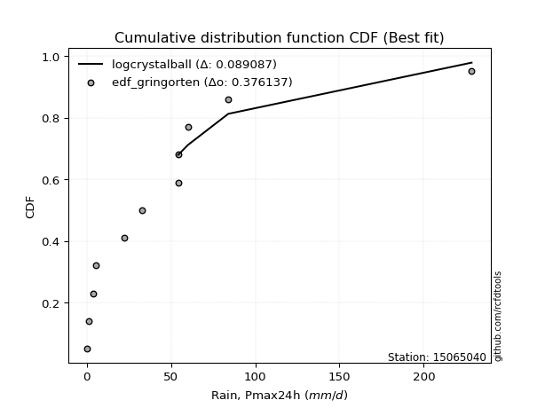</img></img>

</div>


### 9. Empirical - EDF Filliben (1975)

The specific values of the constants (0.3175) (often denoted as $alpha$) and (0.365) are derived from a method proposed by James J. Filliben in a 1975 paper. This particular formula is the mean value of the $i$-th order statistic of the normal distribution and is considered a robust and effective plotting position formula for the normal probability plot correlation coefficient test for normality.

<div align="center">


$P=(m-0.3175)/(n+0.365)$


</div>


**9.1. Empirical values**

<div align="center">

|                | 0                   | 1                   | 2                   | 3                   | 4                  | 5                  | 6                  | 7                  | 8                  | 9                  | 10                 | 11                 |
|:---------------|:--------------------|:--------------------|:--------------------|:--------------------|:-------------------|:-------------------|:-------------------|:-------------------|:-------------------|:-------------------|:-------------------|:-------------------|
| date           | 2015                | 2014                | 2016                | 2021                | 2017               | 2020               | 2022               | 2018               | 2013               | 2019               | 2025               | 2024               |
| x              | 0.4                 | 1.2                 | 3.8                 | 5.5                 | 22.1               | 32.8               | 54.3               | 54.5               | 60.2               | 84.0               | 88.4               | 228.4              |
| m              | 1                   | 2                   | 3                   | 4                   | 5                  | 6                  | 7                  | 8                  | 9                  | 10                 | 11                 | 12                 |
| empirical_dist | edf_filliben        | edf_filliben        | edf_filliben        | edf_filliben        | edf_filliben       | edf_filliben       | edf_filliben       | edf_filliben       | edf_filliben       | edf_filliben       | edf_filliben       | edf_filliben       |
| empirical      | 0.05519611807521229 | 0.13606955115244643 | 0.21694298422968056 | 0.29781641730691466 | 0.3786898503841488 | 0.4595632834613829 | 0.540436716538617  | 0.6213101496158512 | 0.7021835826930852 | 0.7830570157703194 | 0.8639304488475535 | 0.9448038819247876 |
| empirical_tr   | 1.0584207147442757  | 1.1575005850690383  | 1.2770462174025305  | 1.4241289951050964  | 1.609502115196876  | 1.8503554059109617 | 2.1759788825340958 | 2.6406833956219966 | 3.357773251866937  | 4.6095060577819185 | 7.349182763744426  | 18.117216117216078 |

</div>


**9.2. Kolmogorov-Smirnov fit test (sorted by Δ)**


<div align="center">

|                | 0                   | 1                     | 2                   | 3                   | 4                   | 5                   | 6                   | 7                   | 8                   | 9                   | 10                  | 11                  | 12                  | 13                  | 14                  | 15                  | 16                  | 17                  | 18                  | 19                  | 20                  | 21                  | 22                  | 23                  | 24                  | 25                  | 26                  | 27                  | 28                  | 29                  | 30                  | 31                  | 32                  | 33                  | 34                  | 35                  | 36                  | 37                  | 38                  | 39                  | 40                  | 41                  | 42                  | 43                  | 44                  | 45                  | 46                  | 47                  | 48                  | 49                  | 50                  | 51                  | 52                  | 53                  | 54                  | 55                  | 56                  | 57                  | 58                  | 59                  | 60                  | 61                  | 62                  | 63                  | 64                  | 65                  | 66                  | 67                  | 68                  | 69                  | 70                  | 71                  | 72                  | 73                  | 74                  | 75                  | 76                  | 77                  | 78                  | 79                  | 80                  | 81                  | 82                  | 83                  | 84                  | 85                  | 86                  | 87                  | 88                  | 89                  |
|:---------------|:--------------------|:----------------------|:--------------------|:--------------------|:--------------------|:--------------------|:--------------------|:--------------------|:--------------------|:--------------------|:--------------------|:--------------------|:--------------------|:--------------------|:--------------------|:--------------------|:--------------------|:--------------------|:--------------------|:--------------------|:--------------------|:--------------------|:--------------------|:--------------------|:--------------------|:--------------------|:--------------------|:--------------------|:--------------------|:--------------------|:--------------------|:--------------------|:--------------------|:--------------------|:--------------------|:--------------------|:--------------------|:--------------------|:--------------------|:--------------------|:--------------------|:--------------------|:--------------------|:--------------------|:--------------------|:--------------------|:--------------------|:--------------------|:--------------------|:--------------------|:--------------------|:--------------------|:--------------------|:--------------------|:--------------------|:--------------------|:--------------------|:--------------------|:--------------------|:--------------------|:--------------------|:--------------------|:--------------------|:--------------------|:--------------------|:--------------------|:--------------------|:--------------------|:--------------------|:--------------------|:--------------------|:--------------------|:--------------------|:--------------------|:--------------------|:--------------------|:--------------------|:--------------------|:--------------------|:--------------------|:--------------------|:--------------------|:--------------------|:--------------------|:--------------------|:--------------------|:--------------------|:--------------------|:--------------------|:--------------------|
| station        | 15065040            | 15065040              | 15065040            | 15065040            | 15065040            | 15065040            | 15065040            | 15065040            | 15065040            | 15065040            | 15065040            | 15065040            | 15065040            | 15065040            | 15065040            | 15065040            | 15065040            | 15065040            | 15065040            | 15065040            | 15065040            | 15065040            | 15065040            | 15065040            | 15065040            | 15065040            | 15065040            | 15065040            | 15065040            | 15065040            | 15065040            | 15065040            | 15065040            | 15065040            | 15065040            | 15065040            | 15065040            | 15065040            | 15065040            | 15065040            | 15065040            | 15065040            | 15065040            | 15065040            | 15065040            | 15065040            | 15065040            | 15065040            | 15065040            | 15065040            | 15065040            | 15065040            | 15065040            | 15065040            | 15065040            | 15065040            | 15065040            | 15065040            | 15065040            | 15065040            | 15065040            | 15065040            | 15065040            | 15065040            | 15065040            | 15065040            | 15065040            | 15065040            | 15065040            | 15065040            | 15065040            | 15065040            | 15065040            | 15065040            | 15065040            | 15065040            | 15065040            | 15065040            | 15065040            | 15065040            | 15065040            | 15065040            | 15065040            | 15065040            | 15065040            | 15065040            | 15065040            | 15065040            | 15065040            | 15065040            |
| empirical_dist | edf_filliben        | edf_filliben          | edf_filliben        | edf_filliben        | edf_filliben        | edf_filliben        | edf_filliben        | edf_filliben        | edf_filliben        | edf_filliben        | edf_filliben        | edf_filliben        | edf_filliben        | edf_filliben        | edf_filliben        | edf_filliben        | edf_filliben        | edf_filliben        | edf_filliben        | edf_filliben        | edf_filliben        | edf_filliben        | edf_filliben        | edf_filliben        | edf_filliben        | edf_filliben        | edf_filliben        | edf_filliben        | edf_filliben        | edf_filliben        | edf_filliben        | edf_filliben        | edf_filliben        | edf_filliben        | edf_filliben        | edf_filliben        | edf_filliben        | edf_filliben        | edf_filliben        | edf_filliben        | edf_filliben        | edf_filliben        | edf_filliben        | edf_filliben        | edf_filliben        | edf_filliben        | edf_filliben        | edf_filliben        | edf_filliben        | edf_filliben        | edf_filliben        | edf_filliben        | edf_filliben        | edf_filliben        | edf_filliben        | edf_filliben        | edf_filliben        | edf_filliben        | edf_filliben        | edf_filliben        | edf_filliben        | edf_filliben        | edf_filliben        | edf_filliben        | edf_filliben        | edf_filliben        | edf_filliben        | edf_filliben        | edf_filliben        | edf_filliben        | edf_filliben        | edf_filliben        | edf_filliben        | edf_filliben        | edf_filliben        | edf_filliben        | edf_filliben        | edf_filliben        | edf_filliben        | edf_filliben        | edf_filliben        | edf_filliben        | edf_filliben        | edf_filliben        | edf_filliben        | edf_filliben        | edf_filliben        | edf_filliben        | edf_filliben        | edf_filliben        |
| p_dist         | pearson3            | loglaplace_asymmetric | logloggamma         | moyal               | logjohnsonsu        | loggenlogistic      | fisk                | erlang              | gumbel_r            | t                   | halflogistic        | weibull_min         | ncf                 | genlogistic         | hypsecant           | logpearson3         | logweibull_min      | loggumbel_l         | laplace             | gamma               | logistic            | kstwobign           | nakagami            | maxwell             | laplace_asymmetric  | rice                | crystalball         | norm                | rayleigh            | loggompertz         | f                   | halfnorm            | loggamma            | loggamma            | logerlang           | logfatiguelife      | invweibull          | lognct              | logexponnorm        | logcrystalball      | lognorm             | lognorm             | logt                | johnsonsu           | logalpha            | lognakagami         | logrice             | loglognorm          | nct                 | loginvgamma         | pareto              | betaprime           | invgamma            | loginvgauss         | logmielke           | logmaxwell          | loginvweibull       | lograyleigh         | loglogistic         | invgauss            | exponnorm           | genexpon            | expon               | mielke              | loghypsecant        | wald                | logkstwobign        | loggenexpon         | truncnorm           | gumbel_l            | loghalfnorm         | loggumbel_r         | fatiguelife         | loglaplace          | gompertz            | logmoyal            | loghalflogistic     | logexpon            | logncf              | logtruncnorm        | gibrat              | logchi2             | logwald             | loggibrat           | logfisk             | logf                | logpareto           | alpha               | logbetaprime        | chi2                |
| delta          | 0.09924927911879455 | 0.10616953332640966   | 0.10764976223669764 | 0.1118541381016398  | 0.11634583515274244 | 0.1172997975729625  | 0.11770836302509824 | 0.12368798219278404 | 0.12780773311090052 | 0.12783764683013146 | 0.13106436425209037 | 0.13513768939405577 | 0.13742475032032173 | 0.14266863194738183 | 0.14315069244219703 | 0.14520533391918844 | 0.14608793350778915 | 0.1464061042621606  | 0.14650157505849315 | 0.14729986109688054 | 0.14854431783572863 | 0.1497074333766087  | 0.14977079573247198 | 0.15067112512702574 | 0.15272651172479262 | 0.15370391839812433 | 0.15492090368485756 | 0.1549209042916757  | 0.15552420827513522 | 0.15830001217846412 | 0.16134564312254374 | 0.1635399508338975  | 0.17323940433045693 | 0.17323940433045693 | 0.17341223723026344 | 0.173646395955373   | 0.17391425146239892 | 0.1739849558689993  | 0.1740297340205651  | 0.1740299499189717  | 0.1740299564151756  | 0.1740299564151756  | 0.17403012478079338 | 0.1741912138223597  | 0.1741928610342579  | 0.17423051760697517 | 0.17530150792391497 | 0.17626445167377036 | 0.17636064249776617 | 0.17773726405553691 | 0.1796678330967586  | 0.17978315167349923 | 0.17982559918157293 | 0.18161510545525072 | 0.18783058524226193 | 0.1881659075691049  | 0.18974662480975635 | 0.19560646522766334 | 0.1959909907938775  | 0.20236928876855642 | 0.20374924135699113 | 0.20535452799402742 | 0.2053545832628465  | 0.20619501530570683 | 0.2114602198100476  | 0.2145942727110767  | 0.21700023011555925 | 0.2209501090371434  | 0.2212668577454295  | 0.2222361108198162  | 0.22442652617699044 | 0.2244955280125931  | 0.22836617432403383 | 0.23515152152614704 | 0.24220964503499676 | 0.24982783999548952 | 0.2510543386728836  | 0.2676119891994807  | 0.2759950884805499  | 0.28177785609929373 | 0.29781641730691466 | 0.31732942050260315 | 0.32014286047956186 | 0.34768349076255034 | 0.36399179011453997 | 0.3991049965313857  | 0.48770471809340654 | 0.5742911185590799  | 0.5958402929371391  | 0.6688607100148396  |
| deltao         | 0.36218414519599995 | 0.36218414519599995   | 0.36218414519599995 | 0.36218414519599995 | 0.36218414519599995 | 0.36218414519599995 | 0.36218414519599995 | 0.36218414519599995 | 0.36218414519599995 | 0.36218414519599995 | 0.36218414519599995 | 0.36218414519599995 | 0.36218414519599995 | 0.36218414519599995 | 0.36218414519599995 | 0.36218414519599995 | 0.36218414519599995 | 0.36218414519599995 | 0.36218414519599995 | 0.36218414519599995 | 0.36218414519599995 | 0.36218414519599995 | 0.36218414519599995 | 0.36218414519599995 | 0.36218414519599995 | 0.36218414519599995 | 0.36218414519599995 | 0.36218414519599995 | 0.36218414519599995 | 0.36218414519599995 | 0.36218414519599995 | 0.36218414519599995 | 0.36218414519599995 | 0.36218414519599995 | 0.36218414519599995 | 0.36218414519599995 | 0.36218414519599995 | 0.36218414519599995 | 0.36218414519599995 | 0.36218414519599995 | 0.36218414519599995 | 0.36218414519599995 | 0.36218414519599995 | 0.36218414519599995 | 0.36218414519599995 | 0.36218414519599995 | 0.36218414519599995 | 0.36218414519599995 | 0.36218414519599995 | 0.36218414519599995 | 0.36218414519599995 | 0.36218414519599995 | 0.36218414519599995 | 0.36218414519599995 | 0.36218414519599995 | 0.36218414519599995 | 0.36218414519599995 | 0.36218414519599995 | 0.36218414519599995 | 0.36218414519599995 | 0.36218414519599995 | 0.36218414519599995 | 0.36218414519599995 | 0.36218414519599995 | 0.36218414519599995 | 0.36218414519599995 | 0.36218414519599995 | 0.36218414519599995 | 0.36218414519599995 | 0.36218414519599995 | 0.36218414519599995 | 0.36218414519599995 | 0.36218414519599995 | 0.36218414519599995 | 0.36218414519599995 | 0.36218414519599995 | 0.36218414519599995 | 0.36218414519599995 | 0.36218414519599995 | 0.36218414519599995 | 0.36218414519599995 | 0.36218414519599995 | 0.36218414519599995 | 0.36218414519599995 | 0.36218414519599995 | 0.36218414519599995 | 0.36218414519599995 | 0.36218414519599995 | 0.36218414519599995 | 0.36218414519599995 |
| eval           | Δo > Δ              | Δo > Δ                | Δo > Δ              | Δo > Δ              | Δo > Δ              | Δo > Δ              | Δo > Δ              | Δo > Δ              | Δo > Δ              | Δo > Δ              | Δo > Δ              | Δo > Δ              | Δo > Δ              | Δo > Δ              | Δo > Δ              | Δo > Δ              | Δo > Δ              | Δo > Δ              | Δo > Δ              | Δo > Δ              | Δo > Δ              | Δo > Δ              | Δo > Δ              | Δo > Δ              | Δo > Δ              | Δo > Δ              | Δo > Δ              | Δo > Δ              | Δo > Δ              | Δo > Δ              | Δo > Δ              | Δo > Δ              | Δo > Δ              | Δo > Δ              | Δo > Δ              | Δo > Δ              | Δo > Δ              | Δo > Δ              | Δo > Δ              | Δo > Δ              | Δo > Δ              | Δo > Δ              | Δo > Δ              | Δo > Δ              | Δo > Δ              | Δo > Δ              | Δo > Δ              | Δo > Δ              | Δo > Δ              | Δo > Δ              | Δo > Δ              | Δo > Δ              | Δo > Δ              | Δo > Δ              | Δo > Δ              | Δo > Δ              | Δo > Δ              | Δo > Δ              | Δo > Δ              | Δo > Δ              | Δo > Δ              | Δo > Δ              | Δo > Δ              | Δo > Δ              | Δo > Δ              | Δo > Δ              | Δo > Δ              | Δo > Δ              | Δo > Δ              | Δo > Δ              | Δo > Δ              | Δo > Δ              | Δo > Δ              | Δo > Δ              | Δo > Δ              | Δo > Δ              | Δo > Δ              | Δo > Δ              | Δo > Δ              | Δo > Δ              | Δo > Δ              | Δo > Δ              | Δo > Δ              | Δo > Δ              | Δo <= Δ             | Δo <= Δ             | Δo <= Δ             | Δo <= Δ             | Δo <= Δ             | Δo <= Δ             |
| fit            | 1                   | 1                     | 1                   | 1                   | 1                   | 1                   | 1                   | 1                   | 1                   | 1                   | 1                   | 1                   | 1                   | 1                   | 1                   | 1                   | 1                   | 1                   | 1                   | 1                   | 1                   | 1                   | 1                   | 1                   | 1                   | 1                   | 1                   | 1                   | 1                   | 1                   | 1                   | 1                   | 1                   | 1                   | 1                   | 1                   | 1                   | 1                   | 1                   | 1                   | 1                   | 1                   | 1                   | 1                   | 1                   | 1                   | 1                   | 1                   | 1                   | 1                   | 1                   | 1                   | 1                   | 1                   | 1                   | 1                   | 1                   | 1                   | 1                   | 1                   | 1                   | 1                   | 1                   | 1                   | 1                   | 1                   | 1                   | 1                   | 1                   | 1                   | 1                   | 1                   | 1                   | 1                   | 1                   | 1                   | 1                   | 1                   | 1                   | 1                   | 1                   | 1                   | 1                   | 1                   | 0                   | 0                   | 0                   | 0                   | 0                   | 0                   |
| n              | 12                  | 12                    | 12                  | 12                  | 12                  | 12                  | 12                  | 12                  | 12                  | 12                  | 12                  | 12                  | 12                  | 12                  | 12                  | 12                  | 12                  | 12                  | 12                  | 12                  | 12                  | 12                  | 12                  | 12                  | 12                  | 12                  | 12                  | 12                  | 12                  | 12                  | 12                  | 12                  | 12                  | 12                  | 12                  | 12                  | 12                  | 12                  | 12                  | 12                  | 12                  | 12                  | 12                  | 12                  | 12                  | 12                  | 12                  | 12                  | 12                  | 12                  | 12                  | 12                  | 12                  | 12                  | 12                  | 12                  | 12                  | 12                  | 12                  | 12                  | 12                  | 12                  | 12                  | 12                  | 12                  | 12                  | 12                  | 12                  | 12                  | 12                  | 12                  | 12                  | 12                  | 12                  | 12                  | 12                  | 12                  | 12                  | 12                  | 12                  | 12                  | 12                  | 12                  | 12                  | 12                  | 12                  | 12                  | 12                  | 12                  | 12                  |
| best_fit       | 1                   | 0                     | 0                   | 0                   | 0                   | 0                   | 0                   | 0                   | 0                   | 0                   | 0                   | 0                   | 0                   | 0                   | 0                   | 0                   | 0                   | 0                   | 0                   | 0                   | 0                   | 0                   | 0                   | 0                   | 0                   | 0                   | 0                   | 0                   | 0                   | 0                   | 0                   | 0                   | 0                   | 0                   | 0                   | 0                   | 0                   | 0                   | 0                   | 0                   | 0                   | 0                   | 0                   | 0                   | 0                   | 0                   | 0                   | 0                   | 0                   | 0                   | 0                   | 0                   | 0                   | 0                   | 0                   | 0                   | 0                   | 0                   | 0                   | 0                   | 0                   | 0                   | 0                   | 0                   | 0                   | 0                   | 0                   | 0                   | 0                   | 0                   | 0                   | 0                   | 0                   | 0                   | 0                   | 0                   | 0                   | 0                   | 0                   | 0                   | 0                   | 0                   | 0                   | 0                   | 0                   | 0                   | 0                   | 0                   | 0                   | 0                   |
| best_fit_sort  | 1                   | 2                     | 3                   | 4                   | 5                   | 6                   | 7                   | 8                   | 9                   | 10                  | 11                  | 12                  | 13                  | 14                  | 15                  | 16                  | 17                  | 18                  | 19                  | 20                  | 21                  | 22                  | 23                  | 24                  | 25                  | 26                  | 27                  | 28                  | 29                  | 30                  | 31                  | 32                  | 33                  | 34                  | 35                  | 36                  | 37                  | 38                  | 39                  | 40                  | 41                  | 42                  | 43                  | 44                  | 45                  | 46                  | 47                  | 48                  | 49                  | 50                  | 51                  | 52                  | 53                  | 54                  | 55                  | 56                  | 57                  | 58                  | 59                  | 60                  | 61                  | 62                  | 63                  | 64                  | 65                  | 66                  | 67                  | 68                  | 69                  | 70                  | 71                  | 72                  | 73                  | 74                  | 75                  | 76                  | 77                  | 78                  | 79                  | 80                  | 81                  | 82                  | 83                  | 84                  | 85                  | 86                  | 87                  | 88                  | 89                  | 90                  |

</div>


<div align="center">

</img>

</div>


**9.3. Best fit**

<div align="center">

|   id |   station | empirical_dist   | p_dist   |     delta |   deltao | eval   |   fit |   n |   best_fit |   best_fit_sort |
|-----:|----------:|:-----------------|:---------|----------:|---------:|:-------|------:|----:|-----------:|----------------:|
|    0 |  15065040 | edf_filliben     | pearson3 | 0.0992493 | 0.362184 | Δo > Δ |     1 |  12 |          1 |               1 |

</div>


<div align="center">

</img>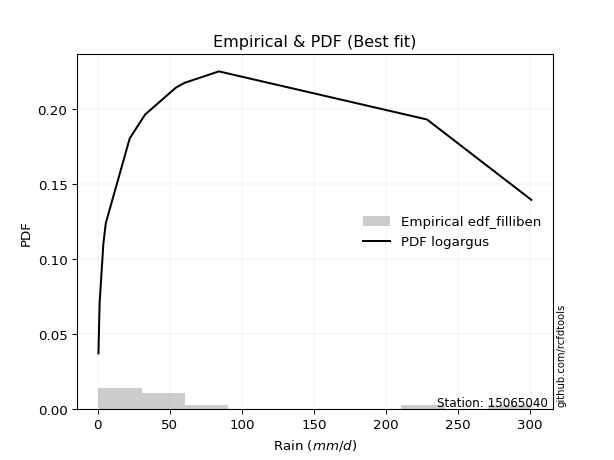</img>

</div>


### 10. Empirical - EDF Jenkinson (1977)

The Jenkinson formula in hydrology is an empirical plotting position formula used to estimate the non-exceedance probability _(P)_ or return period _(T)_ of a given ordered observation within a sample. It is a widely used method in the frequency analysis of extreme events such as floods and rainfall, as it provides a distribution-free way to plot data. _a≈0.31_ and _b≈0.38_ are constants derived to approximate the median of the probability distribution for the given rank.

<div align="center">


$P=(m-a)/(n+b)$


</div>


**10.1. Empirical values**

<div align="center">

|                | 0                    | 1                   | 2                   | 3                  | 4                  | 5                  | 6                  | 7                  | 8                  | 9                  | 10                 | 11                 |
|:---------------|:---------------------|:--------------------|:--------------------|:-------------------|:-------------------|:-------------------|:-------------------|:-------------------|:-------------------|:-------------------|:-------------------|:-------------------|
| date           | 2015                 | 2014                | 2016                | 2021               | 2017               | 2020               | 2022               | 2018               | 2013               | 2019               | 2025               | 2024               |
| x              | 0.4                  | 1.2                 | 3.8                 | 5.5                | 22.1               | 32.8               | 54.3               | 54.5               | 60.2               | 84.0               | 88.4               | 228.4              |
| m              | 1                    | 2                   | 3                   | 4                  | 5                  | 6                  | 7                  | 8                  | 9                  | 10                 | 11                 | 12                 |
| empirical_dist | edf_jenkinson        | edf_jenkinson       | edf_jenkinson       | edf_jenkinson      | edf_jenkinson      | edf_jenkinson      | edf_jenkinson      | edf_jenkinson      | edf_jenkinson      | edf_jenkinson      | edf_jenkinson      | edf_jenkinson      |
| empirical      | 0.055735056542810975 | 0.13651050080775443 | 0.21728594507269788 | 0.2980613893376413 | 0.3788368336025848 | 0.4596122778675283 | 0.5403877221324718 | 0.6211631663974152 | 0.7019386106623585 | 0.7827140549273021 | 0.8634894991922455 | 0.9442649434571889 |
| empirical_tr   | 1.0590248075278015   | 1.1580916744621141  | 1.2776057791537667  | 1.424626006904488  | 1.6098829648894668 | 1.850523168908819  | 2.1757469244288226 | 2.6396588486140726 | 3.3550135501355    | 4.6022304832713745 | 7.325443786982245  | 17.942028985507218 |

</div>


**10.2. Kolmogorov-Smirnov fit test (sorted by Δ)**


<div align="center">

|                | 0                   | 1                     | 2                   | 3                   | 4                   | 5                   | 6                   | 7                   | 8                   | 9                   | 10                  | 11                  | 12                  | 13                  | 14                  | 15                  | 16                  | 17                  | 18                  | 19                  | 20                  | 21                  | 22                  | 23                  | 24                  | 25                  | 26                  | 27                  | 28                  | 29                  | 30                  | 31                  | 32                  | 33                  | 34                  | 35                  | 36                  | 37                  | 38                  | 39                  | 40                  | 41                  | 42                  | 43                  | 44                  | 45                  | 46                  | 47                  | 48                  | 49                  | 50                  | 51                  | 52                  | 53                  | 54                  | 55                  | 56                  | 57                  | 58                  | 59                  | 60                  | 61                  | 62                  | 63                  | 64                  | 65                  | 66                  | 67                  | 68                  | 69                  | 70                  | 71                  | 72                  | 73                  | 74                  | 75                  | 76                  | 77                  | 78                  | 79                  | 80                  | 81                  | 82                  | 83                  | 84                  | 85                  | 86                  | 87                  | 88                  | 89                  |
|:---------------|:--------------------|:----------------------|:--------------------|:--------------------|:--------------------|:--------------------|:--------------------|:--------------------|:--------------------|:--------------------|:--------------------|:--------------------|:--------------------|:--------------------|:--------------------|:--------------------|:--------------------|:--------------------|:--------------------|:--------------------|:--------------------|:--------------------|:--------------------|:--------------------|:--------------------|:--------------------|:--------------------|:--------------------|:--------------------|:--------------------|:--------------------|:--------------------|:--------------------|:--------------------|:--------------------|:--------------------|:--------------------|:--------------------|:--------------------|:--------------------|:--------------------|:--------------------|:--------------------|:--------------------|:--------------------|:--------------------|:--------------------|:--------------------|:--------------------|:--------------------|:--------------------|:--------------------|:--------------------|:--------------------|:--------------------|:--------------------|:--------------------|:--------------------|:--------------------|:--------------------|:--------------------|:--------------------|:--------------------|:--------------------|:--------------------|:--------------------|:--------------------|:--------------------|:--------------------|:--------------------|:--------------------|:--------------------|:--------------------|:--------------------|:--------------------|:--------------------|:--------------------|:--------------------|:--------------------|:--------------------|:--------------------|:--------------------|:--------------------|:--------------------|:--------------------|:--------------------|:--------------------|:--------------------|:--------------------|:--------------------|
| station        | 15065040            | 15065040              | 15065040            | 15065040            | 15065040            | 15065040            | 15065040            | 15065040            | 15065040            | 15065040            | 15065040            | 15065040            | 15065040            | 15065040            | 15065040            | 15065040            | 15065040            | 15065040            | 15065040            | 15065040            | 15065040            | 15065040            | 15065040            | 15065040            | 15065040            | 15065040            | 15065040            | 15065040            | 15065040            | 15065040            | 15065040            | 15065040            | 15065040            | 15065040            | 15065040            | 15065040            | 15065040            | 15065040            | 15065040            | 15065040            | 15065040            | 15065040            | 15065040            | 15065040            | 15065040            | 15065040            | 15065040            | 15065040            | 15065040            | 15065040            | 15065040            | 15065040            | 15065040            | 15065040            | 15065040            | 15065040            | 15065040            | 15065040            | 15065040            | 15065040            | 15065040            | 15065040            | 15065040            | 15065040            | 15065040            | 15065040            | 15065040            | 15065040            | 15065040            | 15065040            | 15065040            | 15065040            | 15065040            | 15065040            | 15065040            | 15065040            | 15065040            | 15065040            | 15065040            | 15065040            | 15065040            | 15065040            | 15065040            | 15065040            | 15065040            | 15065040            | 15065040            | 15065040            | 15065040            | 15065040            |
| empirical_dist | edf_jenkinson       | edf_jenkinson         | edf_jenkinson       | edf_jenkinson       | edf_jenkinson       | edf_jenkinson       | edf_jenkinson       | edf_jenkinson       | edf_jenkinson       | edf_jenkinson       | edf_jenkinson       | edf_jenkinson       | edf_jenkinson       | edf_jenkinson       | edf_jenkinson       | edf_jenkinson       | edf_jenkinson       | edf_jenkinson       | edf_jenkinson       | edf_jenkinson       | edf_jenkinson       | edf_jenkinson       | edf_jenkinson       | edf_jenkinson       | edf_jenkinson       | edf_jenkinson       | edf_jenkinson       | edf_jenkinson       | edf_jenkinson       | edf_jenkinson       | edf_jenkinson       | edf_jenkinson       | edf_jenkinson       | edf_jenkinson       | edf_jenkinson       | edf_jenkinson       | edf_jenkinson       | edf_jenkinson       | edf_jenkinson       | edf_jenkinson       | edf_jenkinson       | edf_jenkinson       | edf_jenkinson       | edf_jenkinson       | edf_jenkinson       | edf_jenkinson       | edf_jenkinson       | edf_jenkinson       | edf_jenkinson       | edf_jenkinson       | edf_jenkinson       | edf_jenkinson       | edf_jenkinson       | edf_jenkinson       | edf_jenkinson       | edf_jenkinson       | edf_jenkinson       | edf_jenkinson       | edf_jenkinson       | edf_jenkinson       | edf_jenkinson       | edf_jenkinson       | edf_jenkinson       | edf_jenkinson       | edf_jenkinson       | edf_jenkinson       | edf_jenkinson       | edf_jenkinson       | edf_jenkinson       | edf_jenkinson       | edf_jenkinson       | edf_jenkinson       | edf_jenkinson       | edf_jenkinson       | edf_jenkinson       | edf_jenkinson       | edf_jenkinson       | edf_jenkinson       | edf_jenkinson       | edf_jenkinson       | edf_jenkinson       | edf_jenkinson       | edf_jenkinson       | edf_jenkinson       | edf_jenkinson       | edf_jenkinson       | edf_jenkinson       | edf_jenkinson       | edf_jenkinson       | edf_jenkinson       |
| p_dist         | pearson3            | loglaplace_asymmetric | logloggamma         | moyal               | logjohnsonsu        | fisk                | loggenlogistic      | erlang              | gumbel_r            | t                   | halflogistic        | weibull_min         | ncf                 | hypsecant           | genlogistic         | logpearson3         | logweibull_min      | loggumbel_l         | laplace             | gamma               | logistic            | nakagami            | kstwobign           | maxwell             | laplace_asymmetric  | rice                | crystalball         | norm                | rayleigh            | loggompertz         | f                   | halfnorm            | loggamma            | loggamma            | logerlang           | logfatiguelife      | invweibull          | lognct              | johnsonsu           | logexponnorm        | logcrystalball      | lognorm             | lognorm             | logt                | logalpha            | lognakagami         | logrice             | loglognorm          | nct                 | loginvgamma         | betaprime           | invgamma            | pareto              | loginvgauss         | logmielke           | logmaxwell          | loginvweibull       | lograyleigh         | loglogistic         | invgauss            | exponnorm           | genexpon            | expon               | mielke              | loghypsecant        | wald                | logkstwobign        | loggenexpon         | truncnorm           | gumbel_l            | loghalfnorm         | loggumbel_r         | fatiguelife         | loglaplace          | gompertz            | logmoyal            | loghalflogistic     | logexpon            | logncf              | logtruncnorm        | gibrat              | logchi2             | logwald             | loggibrat           | logfisk             | logf                | logpareto           | alpha               | logbetaprime        | chi2                |
| delta          | 0.09871034065119588 | 0.10621852773255491   | 0.1076987566428429  | 0.11131519963404113 | 0.11639482955888769 | 0.11726741336979019 | 0.11734879197910775 | 0.1239329542235107  | 0.12726879464330185 | 0.1272987083625328  | 0.1305254257844917  | 0.13538266142478242 | 0.13766972235104838 | 0.14290572041147032 | 0.14291360397810848 | 0.1452543283253337  | 0.1461369279139344  | 0.14645509866830586 | 0.1465505694646385  | 0.1473488555030258  | 0.14829934580500193 | 0.14932984607716393 | 0.14995240540733534 | 0.15013218665942707 | 0.152775506130938   | 0.153948890428851   | 0.15467593165413085 | 0.154675932260949   | 0.15498526980753655 | 0.15834900658460938 | 0.16090469346723568 | 0.16300101236629883 | 0.17328839873660218 | 0.17328839873660218 | 0.1734612316364087  | 0.17369539036151826 | 0.17396324586854417 | 0.17403395027514457 | 0.1740442306039237  | 0.17407872842671035 | 0.17407894432511695 | 0.17407895082132085 | 0.17407895082132085 | 0.17407911918693864 | 0.17424185544040316 | 0.17427951201312042 | 0.17535050233006022 | 0.17631344607991561 | 0.17640963690391143 | 0.17778625846168217 | 0.17983214607964448 | 0.17987459358771818 | 0.17991280512748525 | 0.18166409986139598 | 0.18768360202382595 | 0.18821490197525015 | 0.18959964159132037 | 0.19545948200922736 | 0.19603998520002275 | 0.20241828317470167 | 0.20399421338771778 | 0.20559950002475408 | 0.20559955529357316 | 0.20624400971185208 | 0.21150921421619284 | 0.21483924474180335 | 0.21685324689712326 | 0.22080312581870742 | 0.22151182977615616 | 0.2219911387890895  | 0.22427954295855446 | 0.2243485447941571  | 0.22821919110559785 | 0.2352005159322923  | 0.2424546170657234  | 0.24968085677705354 | 0.25090735545444764 | 0.2674650059810447  | 0.2754561500129512  | 0.28163087288085775 | 0.2980613893376413  | 0.3171824372841672  | 0.3199958772611259  | 0.34753650754411436 | 0.3634528516469413  | 0.3987620356883684  | 0.4872637684380986  | 0.5741441353406439  | 0.5954973320941219  | 0.6685177491718222  |
| deltao         | 0.36218414519599995 | 0.36218414519599995   | 0.36218414519599995 | 0.36218414519599995 | 0.36218414519599995 | 0.36218414519599995 | 0.36218414519599995 | 0.36218414519599995 | 0.36218414519599995 | 0.36218414519599995 | 0.36218414519599995 | 0.36218414519599995 | 0.36218414519599995 | 0.36218414519599995 | 0.36218414519599995 | 0.36218414519599995 | 0.36218414519599995 | 0.36218414519599995 | 0.36218414519599995 | 0.36218414519599995 | 0.36218414519599995 | 0.36218414519599995 | 0.36218414519599995 | 0.36218414519599995 | 0.36218414519599995 | 0.36218414519599995 | 0.36218414519599995 | 0.36218414519599995 | 0.36218414519599995 | 0.36218414519599995 | 0.36218414519599995 | 0.36218414519599995 | 0.36218414519599995 | 0.36218414519599995 | 0.36218414519599995 | 0.36218414519599995 | 0.36218414519599995 | 0.36218414519599995 | 0.36218414519599995 | 0.36218414519599995 | 0.36218414519599995 | 0.36218414519599995 | 0.36218414519599995 | 0.36218414519599995 | 0.36218414519599995 | 0.36218414519599995 | 0.36218414519599995 | 0.36218414519599995 | 0.36218414519599995 | 0.36218414519599995 | 0.36218414519599995 | 0.36218414519599995 | 0.36218414519599995 | 0.36218414519599995 | 0.36218414519599995 | 0.36218414519599995 | 0.36218414519599995 | 0.36218414519599995 | 0.36218414519599995 | 0.36218414519599995 | 0.36218414519599995 | 0.36218414519599995 | 0.36218414519599995 | 0.36218414519599995 | 0.36218414519599995 | 0.36218414519599995 | 0.36218414519599995 | 0.36218414519599995 | 0.36218414519599995 | 0.36218414519599995 | 0.36218414519599995 | 0.36218414519599995 | 0.36218414519599995 | 0.36218414519599995 | 0.36218414519599995 | 0.36218414519599995 | 0.36218414519599995 | 0.36218414519599995 | 0.36218414519599995 | 0.36218414519599995 | 0.36218414519599995 | 0.36218414519599995 | 0.36218414519599995 | 0.36218414519599995 | 0.36218414519599995 | 0.36218414519599995 | 0.36218414519599995 | 0.36218414519599995 | 0.36218414519599995 | 0.36218414519599995 |
| eval           | Δo > Δ              | Δo > Δ                | Δo > Δ              | Δo > Δ              | Δo > Δ              | Δo > Δ              | Δo > Δ              | Δo > Δ              | Δo > Δ              | Δo > Δ              | Δo > Δ              | Δo > Δ              | Δo > Δ              | Δo > Δ              | Δo > Δ              | Δo > Δ              | Δo > Δ              | Δo > Δ              | Δo > Δ              | Δo > Δ              | Δo > Δ              | Δo > Δ              | Δo > Δ              | Δo > Δ              | Δo > Δ              | Δo > Δ              | Δo > Δ              | Δo > Δ              | Δo > Δ              | Δo > Δ              | Δo > Δ              | Δo > Δ              | Δo > Δ              | Δo > Δ              | Δo > Δ              | Δo > Δ              | Δo > Δ              | Δo > Δ              | Δo > Δ              | Δo > Δ              | Δo > Δ              | Δo > Δ              | Δo > Δ              | Δo > Δ              | Δo > Δ              | Δo > Δ              | Δo > Δ              | Δo > Δ              | Δo > Δ              | Δo > Δ              | Δo > Δ              | Δo > Δ              | Δo > Δ              | Δo > Δ              | Δo > Δ              | Δo > Δ              | Δo > Δ              | Δo > Δ              | Δo > Δ              | Δo > Δ              | Δo > Δ              | Δo > Δ              | Δo > Δ              | Δo > Δ              | Δo > Δ              | Δo > Δ              | Δo > Δ              | Δo > Δ              | Δo > Δ              | Δo > Δ              | Δo > Δ              | Δo > Δ              | Δo > Δ              | Δo > Δ              | Δo > Δ              | Δo > Δ              | Δo > Δ              | Δo > Δ              | Δo > Δ              | Δo > Δ              | Δo > Δ              | Δo > Δ              | Δo > Δ              | Δo > Δ              | Δo <= Δ             | Δo <= Δ             | Δo <= Δ             | Δo <= Δ             | Δo <= Δ             | Δo <= Δ             |
| fit            | 1                   | 1                     | 1                   | 1                   | 1                   | 1                   | 1                   | 1                   | 1                   | 1                   | 1                   | 1                   | 1                   | 1                   | 1                   | 1                   | 1                   | 1                   | 1                   | 1                   | 1                   | 1                   | 1                   | 1                   | 1                   | 1                   | 1                   | 1                   | 1                   | 1                   | 1                   | 1                   | 1                   | 1                   | 1                   | 1                   | 1                   | 1                   | 1                   | 1                   | 1                   | 1                   | 1                   | 1                   | 1                   | 1                   | 1                   | 1                   | 1                   | 1                   | 1                   | 1                   | 1                   | 1                   | 1                   | 1                   | 1                   | 1                   | 1                   | 1                   | 1                   | 1                   | 1                   | 1                   | 1                   | 1                   | 1                   | 1                   | 1                   | 1                   | 1                   | 1                   | 1                   | 1                   | 1                   | 1                   | 1                   | 1                   | 1                   | 1                   | 1                   | 1                   | 1                   | 1                   | 0                   | 0                   | 0                   | 0                   | 0                   | 0                   |
| n              | 12                  | 12                    | 12                  | 12                  | 12                  | 12                  | 12                  | 12                  | 12                  | 12                  | 12                  | 12                  | 12                  | 12                  | 12                  | 12                  | 12                  | 12                  | 12                  | 12                  | 12                  | 12                  | 12                  | 12                  | 12                  | 12                  | 12                  | 12                  | 12                  | 12                  | 12                  | 12                  | 12                  | 12                  | 12                  | 12                  | 12                  | 12                  | 12                  | 12                  | 12                  | 12                  | 12                  | 12                  | 12                  | 12                  | 12                  | 12                  | 12                  | 12                  | 12                  | 12                  | 12                  | 12                  | 12                  | 12                  | 12                  | 12                  | 12                  | 12                  | 12                  | 12                  | 12                  | 12                  | 12                  | 12                  | 12                  | 12                  | 12                  | 12                  | 12                  | 12                  | 12                  | 12                  | 12                  | 12                  | 12                  | 12                  | 12                  | 12                  | 12                  | 12                  | 12                  | 12                  | 12                  | 12                  | 12                  | 12                  | 12                  | 12                  |
| best_fit       | 1                   | 0                     | 0                   | 0                   | 0                   | 0                   | 0                   | 0                   | 0                   | 0                   | 0                   | 0                   | 0                   | 0                   | 0                   | 0                   | 0                   | 0                   | 0                   | 0                   | 0                   | 0                   | 0                   | 0                   | 0                   | 0                   | 0                   | 0                   | 0                   | 0                   | 0                   | 0                   | 0                   | 0                   | 0                   | 0                   | 0                   | 0                   | 0                   | 0                   | 0                   | 0                   | 0                   | 0                   | 0                   | 0                   | 0                   | 0                   | 0                   | 0                   | 0                   | 0                   | 0                   | 0                   | 0                   | 0                   | 0                   | 0                   | 0                   | 0                   | 0                   | 0                   | 0                   | 0                   | 0                   | 0                   | 0                   | 0                   | 0                   | 0                   | 0                   | 0                   | 0                   | 0                   | 0                   | 0                   | 0                   | 0                   | 0                   | 0                   | 0                   | 0                   | 0                   | 0                   | 0                   | 0                   | 0                   | 0                   | 0                   | 0                   |
| best_fit_sort  | 1                   | 2                     | 3                   | 4                   | 5                   | 6                   | 7                   | 8                   | 9                   | 10                  | 11                  | 12                  | 13                  | 14                  | 15                  | 16                  | 17                  | 18                  | 19                  | 20                  | 21                  | 22                  | 23                  | 24                  | 25                  | 26                  | 27                  | 28                  | 29                  | 30                  | 31                  | 32                  | 33                  | 34                  | 35                  | 36                  | 37                  | 38                  | 39                  | 40                  | 41                  | 42                  | 43                  | 44                  | 45                  | 46                  | 47                  | 48                  | 49                  | 50                  | 51                  | 52                  | 53                  | 54                  | 55                  | 56                  | 57                  | 58                  | 59                  | 60                  | 61                  | 62                  | 63                  | 64                  | 65                  | 66                  | 67                  | 68                  | 69                  | 70                  | 71                  | 72                  | 73                  | 74                  | 75                  | 76                  | 77                  | 78                  | 79                  | 80                  | 81                  | 82                  | 83                  | 84                  | 85                  | 86                  | 87                  | 88                  | 89                  | 90                  |

</div>


<div align="center">

</img>

</div>


**10.3. Best fit**

<div align="center">

|   id |   station | empirical_dist   | p_dist   |     delta |   deltao | eval   |   fit |   n |   best_fit |   best_fit_sort |
|-----:|----------:|:-----------------|:---------|----------:|---------:|:-------|------:|----:|-----------:|----------------:|
|    0 |  15065040 | edf_jenkinson    | pearson3 | 0.0987103 | 0.362184 | Δo > Δ |     1 |  12 |          1 |               1 |

</div>


<div align="center">

</img></img>

</div>


### 11. Empirical - EDF Cunnane (1978)

Cunnane´s work in statistical hydrology has focused on the performance and evaluation of different probability distributions (such as GEV, Gumbel, Lognormal) for flood frequency estimation. _b_ is a constant, typically set to 0.4.

<div align="center">


$P=(m-b)/(n+1-2b)$


</div>


**11.1. Empirical values**

<div align="center">

|                | 0                   | 1                   | 2                   | 3                  | 4                  | 5                   | 6                  | 7                  | 8                  | 9                  | 10                 | 11                 |
|:---------------|:--------------------|:--------------------|:--------------------|:-------------------|:-------------------|:--------------------|:-------------------|:-------------------|:-------------------|:-------------------|:-------------------|:-------------------|
| date           | 2015                | 2014                | 2016                | 2021               | 2017               | 2020                | 2022               | 2018               | 2013               | 2019               | 2025               | 2024               |
| x              | 0.4                 | 1.2                 | 3.8                 | 5.5                | 22.1               | 32.8                | 54.3               | 54.5               | 60.2               | 84.0               | 88.4               | 228.4              |
| m              | 1                   | 2                   | 3                   | 4                  | 5                  | 6                   | 7                  | 8                  | 9                  | 10                 | 11                 | 12                 |
| empirical_dist | edf_cunnane         | edf_cunnane         | edf_cunnane         | edf_cunnane        | edf_cunnane        | edf_cunnane         | edf_cunnane        | edf_cunnane        | edf_cunnane        | edf_cunnane        | edf_cunnane        | edf_cunnane        |
| empirical      | 0.04918032786885246 | 0.13114754098360656 | 0.21311475409836067 | 0.2950819672131148 | 0.3770491803278688 | 0.45901639344262296 | 0.5409836065573771 | 0.6229508196721312 | 0.7049180327868853 | 0.7868852459016393 | 0.8688524590163935 | 0.9508196721311476 |
| empirical_tr   | 1.0517241379310345  | 1.150943396226415   | 1.2708333333333333  | 1.418604651162791  | 1.6052631578947367 | 1.8484848484848486  | 2.178571428571429  | 2.6521739130434785 | 3.388888888888889  | 4.692307692307692  | 7.625000000000004  | 20.333333333333357 |

</div>


**11.2. Kolmogorov-Smirnov fit test (sorted by Δ)**


<div align="center">

|                | 0                   | 1                     | 2                   | 3                   | 4                   | 5                   | 6                   | 7                   | 8                   | 9                   | 10                  | 11                  | 12                  | 13                  | 14                  | 15                  | 16                  | 17                  | 18                  | 19                  | 20                  | 21                  | 22                  | 23                  | 24                  | 25                  | 26                  | 27                  | 28                  | 29                  | 30                  | 31                  | 32                  | 33                  | 34                  | 35                  | 36                  | 37                  | 38                  | 39                  | 40                  | 41                  | 42                  | 43                  | 44                  | 45                  | 46                  | 47                  | 48                  | 49                  | 50                  | 51                  | 52                  | 53                  | 54                  | 55                  | 56                  | 57                  | 58                  | 59                  | 60                  | 61                  | 62                  | 63                  | 64                  | 65                  | 66                  | 67                  | 68                  | 69                  | 70                  | 71                  | 72                  | 73                  | 74                  | 75                  | 76                  | 77                  | 78                  | 79                  | 80                  | 81                  | 82                  | 83                  | 84                  | 85                  | 86                  | 87                  | 88                  | 89                  |
|:---------------|:--------------------|:----------------------|:--------------------|:--------------------|:--------------------|:--------------------|:--------------------|:--------------------|:--------------------|:--------------------|:--------------------|:--------------------|:--------------------|:--------------------|:--------------------|:--------------------|:--------------------|:--------------------|:--------------------|:--------------------|:--------------------|:--------------------|:--------------------|:--------------------|:--------------------|:--------------------|:--------------------|:--------------------|:--------------------|:--------------------|:--------------------|:--------------------|:--------------------|:--------------------|:--------------------|:--------------------|:--------------------|:--------------------|:--------------------|:--------------------|:--------------------|:--------------------|:--------------------|:--------------------|:--------------------|:--------------------|:--------------------|:--------------------|:--------------------|:--------------------|:--------------------|:--------------------|:--------------------|:--------------------|:--------------------|:--------------------|:--------------------|:--------------------|:--------------------|:--------------------|:--------------------|:--------------------|:--------------------|:--------------------|:--------------------|:--------------------|:--------------------|:--------------------|:--------------------|:--------------------|:--------------------|:--------------------|:--------------------|:--------------------|:--------------------|:--------------------|:--------------------|:--------------------|:--------------------|:--------------------|:--------------------|:--------------------|:--------------------|:--------------------|:--------------------|:--------------------|:--------------------|:--------------------|:--------------------|:--------------------|
| station        | 15065040            | 15065040              | 15065040            | 15065040            | 15065040            | 15065040            | 15065040            | 15065040            | 15065040            | 15065040            | 15065040            | 15065040            | 15065040            | 15065040            | 15065040            | 15065040            | 15065040            | 15065040            | 15065040            | 15065040            | 15065040            | 15065040            | 15065040            | 15065040            | 15065040            | 15065040            | 15065040            | 15065040            | 15065040            | 15065040            | 15065040            | 15065040            | 15065040            | 15065040            | 15065040            | 15065040            | 15065040            | 15065040            | 15065040            | 15065040            | 15065040            | 15065040            | 15065040            | 15065040            | 15065040            | 15065040            | 15065040            | 15065040            | 15065040            | 15065040            | 15065040            | 15065040            | 15065040            | 15065040            | 15065040            | 15065040            | 15065040            | 15065040            | 15065040            | 15065040            | 15065040            | 15065040            | 15065040            | 15065040            | 15065040            | 15065040            | 15065040            | 15065040            | 15065040            | 15065040            | 15065040            | 15065040            | 15065040            | 15065040            | 15065040            | 15065040            | 15065040            | 15065040            | 15065040            | 15065040            | 15065040            | 15065040            | 15065040            | 15065040            | 15065040            | 15065040            | 15065040            | 15065040            | 15065040            | 15065040            |
| empirical_dist | edf_cunnane         | edf_cunnane           | edf_cunnane         | edf_cunnane         | edf_cunnane         | edf_cunnane         | edf_cunnane         | edf_cunnane         | edf_cunnane         | edf_cunnane         | edf_cunnane         | edf_cunnane         | edf_cunnane         | edf_cunnane         | edf_cunnane         | edf_cunnane         | edf_cunnane         | edf_cunnane         | edf_cunnane         | edf_cunnane         | edf_cunnane         | edf_cunnane         | edf_cunnane         | edf_cunnane         | edf_cunnane         | edf_cunnane         | edf_cunnane         | edf_cunnane         | edf_cunnane         | edf_cunnane         | edf_cunnane         | edf_cunnane         | edf_cunnane         | edf_cunnane         | edf_cunnane         | edf_cunnane         | edf_cunnane         | edf_cunnane         | edf_cunnane         | edf_cunnane         | edf_cunnane         | edf_cunnane         | edf_cunnane         | edf_cunnane         | edf_cunnane         | edf_cunnane         | edf_cunnane         | edf_cunnane         | edf_cunnane         | edf_cunnane         | edf_cunnane         | edf_cunnane         | edf_cunnane         | edf_cunnane         | edf_cunnane         | edf_cunnane         | edf_cunnane         | edf_cunnane         | edf_cunnane         | edf_cunnane         | edf_cunnane         | edf_cunnane         | edf_cunnane         | edf_cunnane         | edf_cunnane         | edf_cunnane         | edf_cunnane         | edf_cunnane         | edf_cunnane         | edf_cunnane         | edf_cunnane         | edf_cunnane         | edf_cunnane         | edf_cunnane         | edf_cunnane         | edf_cunnane         | edf_cunnane         | edf_cunnane         | edf_cunnane         | edf_cunnane         | edf_cunnane         | edf_cunnane         | edf_cunnane         | edf_cunnane         | edf_cunnane         | edf_cunnane         | edf_cunnane         | edf_cunnane         | edf_cunnane         | edf_cunnane         |
| p_dist         | pearson3            | loglaplace_asymmetric | logloggamma         | logjohnsonsu        | loggenlogistic      | moyal               | erlang              | fisk                | weibull_min         | gumbel_r            | t                   | halflogistic        | genlogistic         | ncf                 | logpearson3         | logweibull_min      | loggumbel_l         | hypsecant           | laplace             | gamma               | kstwobign           | logistic            | laplace_asymmetric  | rice                | nakagami            | maxwell             | crystalball         | norm                | loggompertz         | rayleigh            | f                   | halfnorm            | loggamma            | loggamma            | logerlang           | logfatiguelife      | invweibull          | lognct              | logexponnorm        | logcrystalball      | lognorm             | lognorm             | logt                | logalpha            | lognakagami         | logrice             | loglognorm          | nct                 | johnsonsu           | pareto              | loginvgamma         | betaprime           | invgamma            | loginvgauss         | logmaxwell          | logmielke           | loginvweibull       | loglogistic         | lograyleigh         | exponnorm           | invgauss            | genexpon            | expon               | mielke              | loghypsecant        | wald                | truncnorm           | logkstwobign        | loggenexpon         | gumbel_l            | loghalfnorm         | loggumbel_r         | fatiguelife         | loglaplace          | gompertz            | logmoyal            | loghalflogistic     | logexpon            | logncf              | logtruncnorm        | gibrat              | logchi2             | logwald             | loggibrat           | logfisk             | logf                | logpareto           | alpha               | logbetaprime        | chi2                |
| delta          | 0.10526506932515439 | 0.10562264330764959   | 0.10710287221793757 | 0.11579894513398237 | 0.11675290755420242 | 0.11786992830799964 | 0.12095353209898418 | 0.12263037319393821 | 0.1324032393002559  | 0.13382352331726036 | 0.1338534370364913  | 0.1370801544584502  | 0.13993418185358197 | 0.1413055634252408  | 0.14465844390042837 | 0.14554104348902908 | 0.14585921424340054 | 0.14588514253599705 | 0.1459546850397332  | 0.14675297107812046 | 0.14697298328280883 | 0.15127876792952866 | 0.15217962170603266 | 0.15306519550220632 | 0.15469280590131196 | 0.15668691533338558 | 0.15765535377865758 | 0.15765535438547573 | 0.15775312215970405 | 0.16153999848149506 | 0.1662676532913837  | 0.16955574104025734 | 0.17269251431169685 | 0.17269251431169685 | 0.17286534721150337 | 0.17309950593661294 | 0.17336736144363885 | 0.17343806585023924 | 0.17348284400180503 | 0.17348305990021162 | 0.17348306639641553 | 0.17348306639641553 | 0.1734832347620333  | 0.17364597101549784 | 0.1736836275882151  | 0.1747546179051549  | 0.1757175616550103  | 0.1758137524790061  | 0.17583188387863968 | 0.17693338300295874 | 0.17719037403677684 | 0.17923626165473916 | 0.17927870916281285 | 0.18274874364379223 | 0.18761901755034482 | 0.18947125529854192 | 0.19138729486603634 | 0.19544410077511742 | 0.19724713528394333 | 0.20101479126319127 | 0.20182239874979635 | 0.20262007790022757 | 0.20262013316904665 | 0.20564812528694676 | 0.21091332979128752 | 0.21185982261727684 | 0.21853240765162965 | 0.21864090017183924 | 0.2225907790934234  | 0.22497056091361622 | 0.22606719623327043 | 0.22613619806887308 | 0.23000684438031382 | 0.23460463150738697 | 0.2394751949411969  | 0.2514685100517695  | 0.2526950087291636  | 0.2692526592557607  | 0.2820108786869099  | 0.2834185261555737  | 0.2950819672131148  | 0.31897009055888315 | 0.32178353053584186 | 0.34932416081883033 | 0.3700075803209     | 0.4029332266627056  | 0.4926267282622464  | 0.5759317886153599  | 0.5996685230684591  | 0.6726889401461594  |
| deltao         | 0.36218414519599995 | 0.36218414519599995   | 0.36218414519599995 | 0.36218414519599995 | 0.36218414519599995 | 0.36218414519599995 | 0.36218414519599995 | 0.36218414519599995 | 0.36218414519599995 | 0.36218414519599995 | 0.36218414519599995 | 0.36218414519599995 | 0.36218414519599995 | 0.36218414519599995 | 0.36218414519599995 | 0.36218414519599995 | 0.36218414519599995 | 0.36218414519599995 | 0.36218414519599995 | 0.36218414519599995 | 0.36218414519599995 | 0.36218414519599995 | 0.36218414519599995 | 0.36218414519599995 | 0.36218414519599995 | 0.36218414519599995 | 0.36218414519599995 | 0.36218414519599995 | 0.36218414519599995 | 0.36218414519599995 | 0.36218414519599995 | 0.36218414519599995 | 0.36218414519599995 | 0.36218414519599995 | 0.36218414519599995 | 0.36218414519599995 | 0.36218414519599995 | 0.36218414519599995 | 0.36218414519599995 | 0.36218414519599995 | 0.36218414519599995 | 0.36218414519599995 | 0.36218414519599995 | 0.36218414519599995 | 0.36218414519599995 | 0.36218414519599995 | 0.36218414519599995 | 0.36218414519599995 | 0.36218414519599995 | 0.36218414519599995 | 0.36218414519599995 | 0.36218414519599995 | 0.36218414519599995 | 0.36218414519599995 | 0.36218414519599995 | 0.36218414519599995 | 0.36218414519599995 | 0.36218414519599995 | 0.36218414519599995 | 0.36218414519599995 | 0.36218414519599995 | 0.36218414519599995 | 0.36218414519599995 | 0.36218414519599995 | 0.36218414519599995 | 0.36218414519599995 | 0.36218414519599995 | 0.36218414519599995 | 0.36218414519599995 | 0.36218414519599995 | 0.36218414519599995 | 0.36218414519599995 | 0.36218414519599995 | 0.36218414519599995 | 0.36218414519599995 | 0.36218414519599995 | 0.36218414519599995 | 0.36218414519599995 | 0.36218414519599995 | 0.36218414519599995 | 0.36218414519599995 | 0.36218414519599995 | 0.36218414519599995 | 0.36218414519599995 | 0.36218414519599995 | 0.36218414519599995 | 0.36218414519599995 | 0.36218414519599995 | 0.36218414519599995 | 0.36218414519599995 |
| eval           | Δo > Δ              | Δo > Δ                | Δo > Δ              | Δo > Δ              | Δo > Δ              | Δo > Δ              | Δo > Δ              | Δo > Δ              | Δo > Δ              | Δo > Δ              | Δo > Δ              | Δo > Δ              | Δo > Δ              | Δo > Δ              | Δo > Δ              | Δo > Δ              | Δo > Δ              | Δo > Δ              | Δo > Δ              | Δo > Δ              | Δo > Δ              | Δo > Δ              | Δo > Δ              | Δo > Δ              | Δo > Δ              | Δo > Δ              | Δo > Δ              | Δo > Δ              | Δo > Δ              | Δo > Δ              | Δo > Δ              | Δo > Δ              | Δo > Δ              | Δo > Δ              | Δo > Δ              | Δo > Δ              | Δo > Δ              | Δo > Δ              | Δo > Δ              | Δo > Δ              | Δo > Δ              | Δo > Δ              | Δo > Δ              | Δo > Δ              | Δo > Δ              | Δo > Δ              | Δo > Δ              | Δo > Δ              | Δo > Δ              | Δo > Δ              | Δo > Δ              | Δo > Δ              | Δo > Δ              | Δo > Δ              | Δo > Δ              | Δo > Δ              | Δo > Δ              | Δo > Δ              | Δo > Δ              | Δo > Δ              | Δo > Δ              | Δo > Δ              | Δo > Δ              | Δo > Δ              | Δo > Δ              | Δo > Δ              | Δo > Δ              | Δo > Δ              | Δo > Δ              | Δo > Δ              | Δo > Δ              | Δo > Δ              | Δo > Δ              | Δo > Δ              | Δo > Δ              | Δo > Δ              | Δo > Δ              | Δo > Δ              | Δo > Δ              | Δo > Δ              | Δo > Δ              | Δo > Δ              | Δo > Δ              | Δo > Δ              | Δo <= Δ             | Δo <= Δ             | Δo <= Δ             | Δo <= Δ             | Δo <= Δ             | Δo <= Δ             |
| fit            | 1                   | 1                     | 1                   | 1                   | 1                   | 1                   | 1                   | 1                   | 1                   | 1                   | 1                   | 1                   | 1                   | 1                   | 1                   | 1                   | 1                   | 1                   | 1                   | 1                   | 1                   | 1                   | 1                   | 1                   | 1                   | 1                   | 1                   | 1                   | 1                   | 1                   | 1                   | 1                   | 1                   | 1                   | 1                   | 1                   | 1                   | 1                   | 1                   | 1                   | 1                   | 1                   | 1                   | 1                   | 1                   | 1                   | 1                   | 1                   | 1                   | 1                   | 1                   | 1                   | 1                   | 1                   | 1                   | 1                   | 1                   | 1                   | 1                   | 1                   | 1                   | 1                   | 1                   | 1                   | 1                   | 1                   | 1                   | 1                   | 1                   | 1                   | 1                   | 1                   | 1                   | 1                   | 1                   | 1                   | 1                   | 1                   | 1                   | 1                   | 1                   | 1                   | 1                   | 1                   | 0                   | 0                   | 0                   | 0                   | 0                   | 0                   |
| n              | 12                  | 12                    | 12                  | 12                  | 12                  | 12                  | 12                  | 12                  | 12                  | 12                  | 12                  | 12                  | 12                  | 12                  | 12                  | 12                  | 12                  | 12                  | 12                  | 12                  | 12                  | 12                  | 12                  | 12                  | 12                  | 12                  | 12                  | 12                  | 12                  | 12                  | 12                  | 12                  | 12                  | 12                  | 12                  | 12                  | 12                  | 12                  | 12                  | 12                  | 12                  | 12                  | 12                  | 12                  | 12                  | 12                  | 12                  | 12                  | 12                  | 12                  | 12                  | 12                  | 12                  | 12                  | 12                  | 12                  | 12                  | 12                  | 12                  | 12                  | 12                  | 12                  | 12                  | 12                  | 12                  | 12                  | 12                  | 12                  | 12                  | 12                  | 12                  | 12                  | 12                  | 12                  | 12                  | 12                  | 12                  | 12                  | 12                  | 12                  | 12                  | 12                  | 12                  | 12                  | 12                  | 12                  | 12                  | 12                  | 12                  | 12                  |
| best_fit       | 1                   | 0                     | 0                   | 0                   | 0                   | 0                   | 0                   | 0                   | 0                   | 0                   | 0                   | 0                   | 0                   | 0                   | 0                   | 0                   | 0                   | 0                   | 0                   | 0                   | 0                   | 0                   | 0                   | 0                   | 0                   | 0                   | 0                   | 0                   | 0                   | 0                   | 0                   | 0                   | 0                   | 0                   | 0                   | 0                   | 0                   | 0                   | 0                   | 0                   | 0                   | 0                   | 0                   | 0                   | 0                   | 0                   | 0                   | 0                   | 0                   | 0                   | 0                   | 0                   | 0                   | 0                   | 0                   | 0                   | 0                   | 0                   | 0                   | 0                   | 0                   | 0                   | 0                   | 0                   | 0                   | 0                   | 0                   | 0                   | 0                   | 0                   | 0                   | 0                   | 0                   | 0                   | 0                   | 0                   | 0                   | 0                   | 0                   | 0                   | 0                   | 0                   | 0                   | 0                   | 0                   | 0                   | 0                   | 0                   | 0                   | 0                   |
| best_fit_sort  | 1                   | 2                     | 3                   | 4                   | 5                   | 6                   | 7                   | 8                   | 9                   | 10                  | 11                  | 12                  | 13                  | 14                  | 15                  | 16                  | 17                  | 18                  | 19                  | 20                  | 21                  | 22                  | 23                  | 24                  | 25                  | 26                  | 27                  | 28                  | 29                  | 30                  | 31                  | 32                  | 33                  | 34                  | 35                  | 36                  | 37                  | 38                  | 39                  | 40                  | 41                  | 42                  | 43                  | 44                  | 45                  | 46                  | 47                  | 48                  | 49                  | 50                  | 51                  | 52                  | 53                  | 54                  | 55                  | 56                  | 57                  | 58                  | 59                  | 60                  | 61                  | 62                  | 63                  | 64                  | 65                  | 66                  | 67                  | 68                  | 69                  | 70                  | 71                  | 72                  | 73                  | 74                  | 75                  | 76                  | 77                  | 78                  | 79                  | 80                  | 81                  | 82                  | 83                  | 84                  | 85                  | 86                  | 87                  | 88                  | 89                  | 90                  |

</div>


<div align="center">

</img>

</div>


**11.3. Best fit**

<div align="center">

|   id |   station | empirical_dist   | p_dist   |    delta |   deltao | eval   |   fit |   n |   best_fit |   best_fit_sort |
|-----:|----------:|:-----------------|:---------|---------:|---------:|:-------|------:|----:|-----------:|----------------:|
|    0 |  15065040 | edf_cunnane      | pearson3 | 0.105265 | 0.362184 | Δo > Δ |     1 |  12 |          1 |               1 |

</div>


<div align="center">

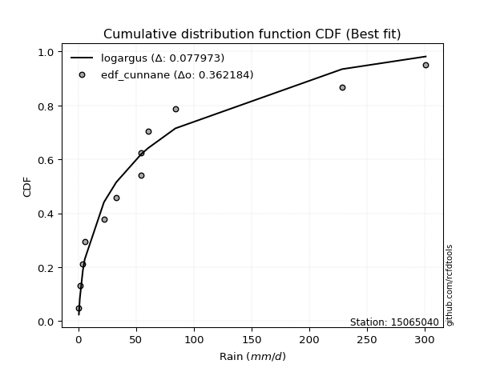</img>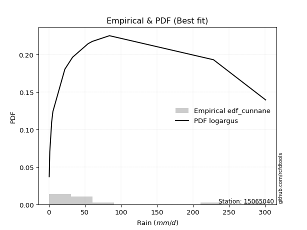</img>

</div>


### 12. Empirical - EDF Adamowski (1981)

The Adamowski formula in hydrology refers to a specific plotting position formula used for estimating the non-parametric empirical distribution of hydrological events (like flood peaks) to calculate their return periods. This formula provides an alternative to traditional parametric methods (like the Gumbel or Log Pearson Type III distributions). 

<div align="center">


$P=(m-0.25)/(n+0.5)$


</div>


**12.1. Empirical values**

<div align="center">

|                | 0                  | 1                  | 2                 | 3                  | 4                  | 5                  | 6                 | 7                  | 8                 | 9                 | 10                | 11                 |
|:---------------|:-------------------|:-------------------|:------------------|:-------------------|:-------------------|:-------------------|:------------------|:-------------------|:------------------|:------------------|:------------------|:-------------------|
| date           | 2015               | 2014               | 2016              | 2021               | 2017               | 2020               | 2022              | 2018               | 2013              | 2019              | 2025              | 2024               |
| x              | 0.4                | 1.2                | 3.8               | 5.5                | 22.1               | 32.8               | 54.3              | 54.5               | 60.2              | 84.0              | 88.4              | 228.4              |
| m              | 1                  | 2                  | 3                 | 4                  | 5                  | 6                  | 7                 | 8                  | 9                 | 10                | 11                | 12                 |
| empirical_dist | edf_adamowski      | edf_adamowski      | edf_adamowski     | edf_adamowski      | edf_adamowski      | edf_adamowski      | edf_adamowski     | edf_adamowski      | edf_adamowski     | edf_adamowski     | edf_adamowski     | edf_adamowski      |
| empirical      | 0.06               | 0.14               | 0.22              | 0.3                | 0.38               | 0.46               | 0.54              | 0.62               | 0.7               | 0.78              | 0.86              | 0.94               |
| empirical_tr   | 1.0638297872340425 | 1.1627906976744187 | 1.282051282051282 | 1.4285714285714286 | 1.6129032258064517 | 1.8518518518518516 | 2.173913043478261 | 2.6315789473684212 | 3.333333333333333 | 4.545454545454546 | 7.142857142857142 | 16.666666666666654 |

</div>


**12.2. Kolmogorov-Smirnov fit test (sorted by Δ)**


<div align="center">

|                | 0                   | 1                     | 2                   | 3                   | 4                   | 5                   | 6                   | 7                   | 8                   | 9                   | 10                  | 11                  | 12                  | 13                  | 14                  | 15                  | 16                  | 17                  | 18                  | 19                  | 20                  | 21                  | 22                  | 23                  | 24                  | 25                  | 26                  | 27                  | 28                  | 29                  | 30                  | 31                  | 32                  | 33                  | 34                  | 35                  | 36                  | 37                  | 38                  | 39                  | 40                  | 41                  | 42                  | 43                  | 44                  | 45                  | 46                  | 47                  | 48                  | 49                  | 50                  | 51                  | 52                  | 53                  | 54                  | 55                  | 56                  | 57                  | 58                  | 59                  | 60                  | 61                  | 62                  | 63                  | 64                  | 65                  | 66                  | 67                  | 68                  | 69                  | 70                  | 71                  | 72                  | 73                  | 74                  | 75                  | 76                  | 77                  | 78                  | 79                  | 80                  | 81                  | 82                  | 83                  | 84                  | 85                  | 86                  | 87                  | 88                  | 89                  |
|:---------------|:--------------------|:----------------------|:--------------------|:--------------------|:--------------------|:--------------------|:--------------------|:--------------------|:--------------------|:--------------------|:--------------------|:--------------------|:--------------------|:--------------------|:--------------------|:--------------------|:--------------------|:--------------------|:--------------------|:--------------------|:--------------------|:--------------------|:--------------------|:--------------------|:--------------------|:--------------------|:--------------------|:--------------------|:--------------------|:--------------------|:--------------------|:--------------------|:--------------------|:--------------------|:--------------------|:--------------------|:--------------------|:--------------------|:--------------------|:--------------------|:--------------------|:--------------------|:--------------------|:--------------------|:--------------------|:--------------------|:--------------------|:--------------------|:--------------------|:--------------------|:--------------------|:--------------------|:--------------------|:--------------------|:--------------------|:--------------------|:--------------------|:--------------------|:--------------------|:--------------------|:--------------------|:--------------------|:--------------------|:--------------------|:--------------------|:--------------------|:--------------------|:--------------------|:--------------------|:--------------------|:--------------------|:--------------------|:--------------------|:--------------------|:--------------------|:--------------------|:--------------------|:--------------------|:--------------------|:--------------------|:--------------------|:--------------------|:--------------------|:--------------------|:--------------------|:--------------------|:--------------------|:--------------------|:--------------------|:--------------------|
| station        | 15065040            | 15065040              | 15065040            | 15065040            | 15065040            | 15065040            | 15065040            | 15065040            | 15065040            | 15065040            | 15065040            | 15065040            | 15065040            | 15065040            | 15065040            | 15065040            | 15065040            | 15065040            | 15065040            | 15065040            | 15065040            | 15065040            | 15065040            | 15065040            | 15065040            | 15065040            | 15065040            | 15065040            | 15065040            | 15065040            | 15065040            | 15065040            | 15065040            | 15065040            | 15065040            | 15065040            | 15065040            | 15065040            | 15065040            | 15065040            | 15065040            | 15065040            | 15065040            | 15065040            | 15065040            | 15065040            | 15065040            | 15065040            | 15065040            | 15065040            | 15065040            | 15065040            | 15065040            | 15065040            | 15065040            | 15065040            | 15065040            | 15065040            | 15065040            | 15065040            | 15065040            | 15065040            | 15065040            | 15065040            | 15065040            | 15065040            | 15065040            | 15065040            | 15065040            | 15065040            | 15065040            | 15065040            | 15065040            | 15065040            | 15065040            | 15065040            | 15065040            | 15065040            | 15065040            | 15065040            | 15065040            | 15065040            | 15065040            | 15065040            | 15065040            | 15065040            | 15065040            | 15065040            | 15065040            | 15065040            |
| empirical_dist | edf_adamowski       | edf_adamowski         | edf_adamowski       | edf_adamowski       | edf_adamowski       | edf_adamowski       | edf_adamowski       | edf_adamowski       | edf_adamowski       | edf_adamowski       | edf_adamowski       | edf_adamowski       | edf_adamowski       | edf_adamowski       | edf_adamowski       | edf_adamowski       | edf_adamowski       | edf_adamowski       | edf_adamowski       | edf_adamowski       | edf_adamowski       | edf_adamowski       | edf_adamowski       | edf_adamowski       | edf_adamowski       | edf_adamowski       | edf_adamowski       | edf_adamowski       | edf_adamowski       | edf_adamowski       | edf_adamowski       | edf_adamowski       | edf_adamowski       | edf_adamowski       | edf_adamowski       | edf_adamowski       | edf_adamowski       | edf_adamowski       | edf_adamowski       | edf_adamowski       | edf_adamowski       | edf_adamowski       | edf_adamowski       | edf_adamowski       | edf_adamowski       | edf_adamowski       | edf_adamowski       | edf_adamowski       | edf_adamowski       | edf_adamowski       | edf_adamowski       | edf_adamowski       | edf_adamowski       | edf_adamowski       | edf_adamowski       | edf_adamowski       | edf_adamowski       | edf_adamowski       | edf_adamowski       | edf_adamowski       | edf_adamowski       | edf_adamowski       | edf_adamowski       | edf_adamowski       | edf_adamowski       | edf_adamowski       | edf_adamowski       | edf_adamowski       | edf_adamowski       | edf_adamowski       | edf_adamowski       | edf_adamowski       | edf_adamowski       | edf_adamowski       | edf_adamowski       | edf_adamowski       | edf_adamowski       | edf_adamowski       | edf_adamowski       | edf_adamowski       | edf_adamowski       | edf_adamowski       | edf_adamowski       | edf_adamowski       | edf_adamowski       | edf_adamowski       | edf_adamowski       | edf_adamowski       | edf_adamowski       | edf_adamowski       |
| p_dist         | pearson3            | loglaplace_asymmetric | moyal               | logloggamma         | logjohnsonsu        | fisk                | loggenlogistic      | gumbel_r            | erlang              | halflogistic        | t                   | weibull_min         | ncf                 | hypsecant           | genlogistic         | logpearson3         | nakagami            | maxwell             | logistic            | logweibull_min      | loggumbel_l         | laplace             | gamma               | rayleigh            | kstwobign           | crystalball         | norm                | laplace_asymmetric  | rice                | f                   | halfnorm            | loggompertz         | johnsonsu           | loggamma            | loggamma            | logerlang           | logfatiguelife      | invweibull          | lognct              | logexponnorm        | logcrystalball      | lognorm             | lognorm             | logt                | logalpha            | lognakagami         | logrice             | loglognorm          | nct                 | loginvgamma         | betaprime           | invgamma            | pareto              | loginvgauss         | logmielke           | loginvweibull       | logmaxwell          | lograyleigh         | loglogistic         | invgauss            | exponnorm           | mielke              | genexpon            | expon               | loghypsecant        | logkstwobign        | wald                | loggenexpon         | gumbel_l            | loghalfnorm         | loggumbel_r         | truncnorm           | fatiguelife         | loglaplace          | gompertz            | logmoyal            | loghalflogistic     | logexpon            | logncf              | logtruncnorm        | gibrat              | logchi2             | logwald             | loggibrat           | logfisk             | logf                | logpareto           | alpha               | logbetaprime        | chi2                |
| delta          | 0.09444539719400685 | 0.10660624986502665   | 0.1070502561768521  | 0.10808647877531463 | 0.11678255169135943 | 0.11695295841400011 | 0.11773651411157948 | 0.12300385118611282 | 0.12587156488586937 | 0.12626048232730266 | 0.12736348079583415 | 0.1373212720871411  | 0.13960833301340705 | 0.14096710974911175 | 0.14485221464046716 | 0.14564205045780543 | 0.14584034688491843 | 0.14586724320223804 | 0.14636073514264336 | 0.14652465004640614 | 0.1468428208007776  | 0.14693829159711025 | 0.14773657763549752 | 0.15072032635034752 | 0.15189101606969402 | 0.15273732099177229 | 0.15273732159859044 | 0.15316322826340972 | 0.15588750109120966 | 0.15741519427499018 | 0.1587360689091098  | 0.1587367287170811  | 0.1728810642065085  | 0.1736761208690739  | 0.1736761208690739  | 0.17384895376888043 | 0.17408311249399    | 0.1743509680010159  | 0.1744216724076163  | 0.17446645055918208 | 0.17446666645758868 | 0.1744666729537926  | 0.1744666729537926  | 0.17446684131941037 | 0.1746295775728749  | 0.17466723414559215 | 0.17573822446253196 | 0.17670116821238735 | 0.17679735903638316 | 0.1781739805941539  | 0.18021986821211622 | 0.18026231572018991 | 0.18185141578984393 | 0.1820518219938677  | 0.18652043562641074 | 0.18843647519390516 | 0.18860262410772188 | 0.19429631561181215 | 0.19642770733249448 | 0.2028060053071734  | 0.20593282405007646 | 0.20663173184432382 | 0.20753811068711275 | 0.20753816595593183 | 0.21189693634866458 | 0.21569008049970806 | 0.21677785540416203 | 0.21963995942129222 | 0.22005252812673093 | 0.22311637656113925 | 0.2231853783967419  | 0.22345044043851484 | 0.22705602470818265 | 0.23558823806476403 | 0.24439322772808209 | 0.24851769037963833 | 0.24974418905703244 | 0.2663018395836295  | 0.27119120655576223 | 0.28046770648344255 | 0.3                 | 0.31601927088675197 | 0.3188327108637107  | 0.34637334114669915 | 0.3591879081897523  | 0.3960479807610663  | 0.483774269245853   | 0.5729809689432287  | 0.5927832771668198  | 0.6658036942445201  |
| deltao         | 0.36218414519599995 | 0.36218414519599995   | 0.36218414519599995 | 0.36218414519599995 | 0.36218414519599995 | 0.36218414519599995 | 0.36218414519599995 | 0.36218414519599995 | 0.36218414519599995 | 0.36218414519599995 | 0.36218414519599995 | 0.36218414519599995 | 0.36218414519599995 | 0.36218414519599995 | 0.36218414519599995 | 0.36218414519599995 | 0.36218414519599995 | 0.36218414519599995 | 0.36218414519599995 | 0.36218414519599995 | 0.36218414519599995 | 0.36218414519599995 | 0.36218414519599995 | 0.36218414519599995 | 0.36218414519599995 | 0.36218414519599995 | 0.36218414519599995 | 0.36218414519599995 | 0.36218414519599995 | 0.36218414519599995 | 0.36218414519599995 | 0.36218414519599995 | 0.36218414519599995 | 0.36218414519599995 | 0.36218414519599995 | 0.36218414519599995 | 0.36218414519599995 | 0.36218414519599995 | 0.36218414519599995 | 0.36218414519599995 | 0.36218414519599995 | 0.36218414519599995 | 0.36218414519599995 | 0.36218414519599995 | 0.36218414519599995 | 0.36218414519599995 | 0.36218414519599995 | 0.36218414519599995 | 0.36218414519599995 | 0.36218414519599995 | 0.36218414519599995 | 0.36218414519599995 | 0.36218414519599995 | 0.36218414519599995 | 0.36218414519599995 | 0.36218414519599995 | 0.36218414519599995 | 0.36218414519599995 | 0.36218414519599995 | 0.36218414519599995 | 0.36218414519599995 | 0.36218414519599995 | 0.36218414519599995 | 0.36218414519599995 | 0.36218414519599995 | 0.36218414519599995 | 0.36218414519599995 | 0.36218414519599995 | 0.36218414519599995 | 0.36218414519599995 | 0.36218414519599995 | 0.36218414519599995 | 0.36218414519599995 | 0.36218414519599995 | 0.36218414519599995 | 0.36218414519599995 | 0.36218414519599995 | 0.36218414519599995 | 0.36218414519599995 | 0.36218414519599995 | 0.36218414519599995 | 0.36218414519599995 | 0.36218414519599995 | 0.36218414519599995 | 0.36218414519599995 | 0.36218414519599995 | 0.36218414519599995 | 0.36218414519599995 | 0.36218414519599995 | 0.36218414519599995 |
| eval           | Δo > Δ              | Δo > Δ                | Δo > Δ              | Δo > Δ              | Δo > Δ              | Δo > Δ              | Δo > Δ              | Δo > Δ              | Δo > Δ              | Δo > Δ              | Δo > Δ              | Δo > Δ              | Δo > Δ              | Δo > Δ              | Δo > Δ              | Δo > Δ              | Δo > Δ              | Δo > Δ              | Δo > Δ              | Δo > Δ              | Δo > Δ              | Δo > Δ              | Δo > Δ              | Δo > Δ              | Δo > Δ              | Δo > Δ              | Δo > Δ              | Δo > Δ              | Δo > Δ              | Δo > Δ              | Δo > Δ              | Δo > Δ              | Δo > Δ              | Δo > Δ              | Δo > Δ              | Δo > Δ              | Δo > Δ              | Δo > Δ              | Δo > Δ              | Δo > Δ              | Δo > Δ              | Δo > Δ              | Δo > Δ              | Δo > Δ              | Δo > Δ              | Δo > Δ              | Δo > Δ              | Δo > Δ              | Δo > Δ              | Δo > Δ              | Δo > Δ              | Δo > Δ              | Δo > Δ              | Δo > Δ              | Δo > Δ              | Δo > Δ              | Δo > Δ              | Δo > Δ              | Δo > Δ              | Δo > Δ              | Δo > Δ              | Δo > Δ              | Δo > Δ              | Δo > Δ              | Δo > Δ              | Δo > Δ              | Δo > Δ              | Δo > Δ              | Δo > Δ              | Δo > Δ              | Δo > Δ              | Δo > Δ              | Δo > Δ              | Δo > Δ              | Δo > Δ              | Δo > Δ              | Δo > Δ              | Δo > Δ              | Δo > Δ              | Δo > Δ              | Δo > Δ              | Δo > Δ              | Δo > Δ              | Δo > Δ              | Δo > Δ              | Δo <= Δ             | Δo <= Δ             | Δo <= Δ             | Δo <= Δ             | Δo <= Δ             |
| fit            | 1                   | 1                     | 1                   | 1                   | 1                   | 1                   | 1                   | 1                   | 1                   | 1                   | 1                   | 1                   | 1                   | 1                   | 1                   | 1                   | 1                   | 1                   | 1                   | 1                   | 1                   | 1                   | 1                   | 1                   | 1                   | 1                   | 1                   | 1                   | 1                   | 1                   | 1                   | 1                   | 1                   | 1                   | 1                   | 1                   | 1                   | 1                   | 1                   | 1                   | 1                   | 1                   | 1                   | 1                   | 1                   | 1                   | 1                   | 1                   | 1                   | 1                   | 1                   | 1                   | 1                   | 1                   | 1                   | 1                   | 1                   | 1                   | 1                   | 1                   | 1                   | 1                   | 1                   | 1                   | 1                   | 1                   | 1                   | 1                   | 1                   | 1                   | 1                   | 1                   | 1                   | 1                   | 1                   | 1                   | 1                   | 1                   | 1                   | 1                   | 1                   | 1                   | 1                   | 1                   | 1                   | 0                   | 0                   | 0                   | 0                   | 0                   |
| n              | 12                  | 12                    | 12                  | 12                  | 12                  | 12                  | 12                  | 12                  | 12                  | 12                  | 12                  | 12                  | 12                  | 12                  | 12                  | 12                  | 12                  | 12                  | 12                  | 12                  | 12                  | 12                  | 12                  | 12                  | 12                  | 12                  | 12                  | 12                  | 12                  | 12                  | 12                  | 12                  | 12                  | 12                  | 12                  | 12                  | 12                  | 12                  | 12                  | 12                  | 12                  | 12                  | 12                  | 12                  | 12                  | 12                  | 12                  | 12                  | 12                  | 12                  | 12                  | 12                  | 12                  | 12                  | 12                  | 12                  | 12                  | 12                  | 12                  | 12                  | 12                  | 12                  | 12                  | 12                  | 12                  | 12                  | 12                  | 12                  | 12                  | 12                  | 12                  | 12                  | 12                  | 12                  | 12                  | 12                  | 12                  | 12                  | 12                  | 12                  | 12                  | 12                  | 12                  | 12                  | 12                  | 12                  | 12                  | 12                  | 12                  | 12                  |
| best_fit       | 1                   | 0                     | 0                   | 0                   | 0                   | 0                   | 0                   | 0                   | 0                   | 0                   | 0                   | 0                   | 0                   | 0                   | 0                   | 0                   | 0                   | 0                   | 0                   | 0                   | 0                   | 0                   | 0                   | 0                   | 0                   | 0                   | 0                   | 0                   | 0                   | 0                   | 0                   | 0                   | 0                   | 0                   | 0                   | 0                   | 0                   | 0                   | 0                   | 0                   | 0                   | 0                   | 0                   | 0                   | 0                   | 0                   | 0                   | 0                   | 0                   | 0                   | 0                   | 0                   | 0                   | 0                   | 0                   | 0                   | 0                   | 0                   | 0                   | 0                   | 0                   | 0                   | 0                   | 0                   | 0                   | 0                   | 0                   | 0                   | 0                   | 0                   | 0                   | 0                   | 0                   | 0                   | 0                   | 0                   | 0                   | 0                   | 0                   | 0                   | 0                   | 0                   | 0                   | 0                   | 0                   | 0                   | 0                   | 0                   | 0                   | 0                   |
| best_fit_sort  | 1                   | 2                     | 3                   | 4                   | 5                   | 6                   | 7                   | 8                   | 9                   | 10                  | 11                  | 12                  | 13                  | 14                  | 15                  | 16                  | 17                  | 18                  | 19                  | 20                  | 21                  | 22                  | 23                  | 24                  | 25                  | 26                  | 27                  | 28                  | 29                  | 30                  | 31                  | 32                  | 33                  | 34                  | 35                  | 36                  | 37                  | 38                  | 39                  | 40                  | 41                  | 42                  | 43                  | 44                  | 45                  | 46                  | 47                  | 48                  | 49                  | 50                  | 51                  | 52                  | 53                  | 54                  | 55                  | 56                  | 57                  | 58                  | 59                  | 60                  | 61                  | 62                  | 63                  | 64                  | 65                  | 66                  | 67                  | 68                  | 69                  | 70                  | 71                  | 72                  | 73                  | 74                  | 75                  | 76                  | 77                  | 78                  | 79                  | 80                  | 81                  | 82                  | 83                  | 84                  | 85                  | 86                  | 87                  | 88                  | 89                  | 90                  |

</div>


<div align="center">

</img>

</div>


**12.3. Best fit**

<div align="center">

|   id |   station | empirical_dist   | p_dist   |     delta |   deltao | eval   |   fit |   n |   best_fit |   best_fit_sort |
|-----:|----------:|:-----------------|:---------|----------:|---------:|:-------|------:|----:|-----------:|----------------:|
|    0 |  15065040 | edf_adamowski    | pearson3 | 0.0944454 | 0.362184 | Δo > Δ |     1 |  12 |          1 |               1 |

</div>


<div align="center">

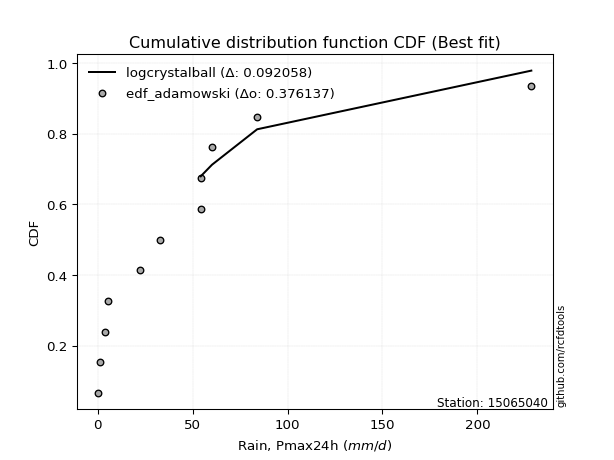</img></img>

</div>


## C. Best fit & Estimate extreme values for specific return periods - Tr


### 1. Best fit (ordered by delta Δ)

<div align="center">

|   id |   station | empirical_dist   | p_dist                |     delta |   deltao | eval   |   fit |   n |   best_fit |   best_fit_sort |
|-----:|----------:|:-----------------|:----------------------|----------:|---------:|:-------|------:|----:|-----------:|----------------:|
|    0 |  15065040 | edf_adamowski    | pearson3              | 0.0944454 | 0.362184 | Δo > Δ |     1 |  12 |          1 |               1 |
|    1 |  15065040 | edf_weibull      | pearson3              | 0.095628  | 0.362184 | Δo > Δ |     1 |  12 |          1 |               2 |
|    2 |  15065040 | edf_chegodayev   | pearson3              | 0.0979938 | 0.362184 | Δo > Δ |     1 |  12 |          1 |               3 |
|    3 |  15065040 | edf_jenkinson    | pearson3              | 0.0987103 | 0.362184 | Δo > Δ |     1 |  12 |          1 |               4 |
|    4 |  15065040 | edf_beard        | pearson3              | 0.0987103 | 0.362184 | Δo > Δ |     1 |  12 |          1 |               5 |
|    5 |  15065040 | edf_filliben     | pearson3              | 0.0992493 | 0.362184 | Δo > Δ |     1 |  12 |          1 |               6 |
|    6 |  15065040 | edf_tukey        | pearson3              | 0.100391  | 0.362184 | Δo > Δ |     1 |  12 |          1 |               7 |
|    7 |  15065040 | edf_blom         | pearson3              | 0.103425  | 0.362184 | Δo > Δ |     1 |  12 |          1 |               8 |
|    8 |  15065040 | edf_hazen        | loglaplace_asymmetric | 0.10494   | 0.362184 | Δo > Δ |     1 |  12 |          1 |               9 |
|    9 |  15065040 | edf_cunnane      | pearson3              | 0.105265  | 0.362184 | Δo > Δ |     1 |  12 |          1 |              10 |
|   10 |  15065040 | edf_gringorten   | loglaplace_asymmetric | 0.105352  | 0.362184 | Δo > Δ |     1 |  12 |          1 |              11 |
|   11 |  15065040 | edf_california   | t                     | 0.120712  | 0.362184 | Δo > Δ |     1 |  12 |          1 |              12 |

</div>

:file_folder:Tables: [bestfit_15065040.csv](table/bestfit_15065040.csv) | [extreme_15065040.csv](table/extreme_15065040.csv)


### 2. Extreme values

In hydrology, a return period (or recurrence interval $Tr$) is the statistical average time between extreme events like floods or droughts of a specific magnitude, indicating how rare an event is, with a 100-year flood, for example, having a 1% chance of occurring in any given year, not that it happens exactly every century. It is a key tool for infrastructure design (like bridges or dams) and risk assessment, calculated from historical data to determine the probability of future events, although it is important to remember it is statistical average, and events can cluster or be missed.

> risk_rate: assuming the return period as the project useful life.

|   id |      tr |   prob_l |     prob_g |      alpha |   betaprime |      chi2 |   crystalball |   erlang |    expon |   exponnorm |         f |   fatiguelife |       fisk |    gamma |   genexpon |   genlogistic |   gibrat |   gompertz |   gumbel_l |   gumbel_r |   halflogistic |   halfnorm |   hypsecant |   invgamma |   invgauss |   invweibull |   johnsonsu |   kstwobign |   laplace |   laplace_asymmetric |   loggamma |   logistic |   lognorm |   maxwell |   mielke |    moyal |   nakagami |      ncf |       nct |     norm |   pareto |   pearson3 |   rayleigh |     rice |        t |   truncnorm |     wald |   weibull_min |   logalpha |      logbetaprime |          logchi2 |   logcrystalball |   logerlang |        logexpon |   logexponnorm |            logf |   logfatiguelife |       logfisk |   loggenexpon |   loggenlogistic |        loggibrat |   loggompertz |   loggumbel_l |   loggumbel_r |   loghalflogistic |   loghalfnorm |   loghypsecant |   loginvgamma |   loginvgauss |    loginvweibull |   logjohnsonsu |   logkstwobign |   loglaplace |   loglaplace_asymmetric |   logloggamma |   loglogistic |   loglognorm |   logmaxwell |   logmielke |    logmoyal |   lognakagami |         logncf |    lognct |   logpareto |   logpearson3 |   lograyleigh |   logrice |      logt |   logtruncnorm |          logwald |   logweibull_min |   station |   n |   risk_rate |
|-----:|--------:|---------:|-----------:|-----------:|------------:|----------:|--------------:|---------:|---------:|------------:|----------:|--------------:|-----------:|---------:|-----------:|--------------:|---------:|-----------:|-----------:|-----------:|---------------:|-----------:|------------:|-----------:|-----------:|-------------:|------------:|------------:|----------:|---------------------:|-----------:|-----------:|----------:|----------:|---------:|---------:|-----------:|---------:|----------:|---------:|---------:|-----------:|-----------:|---------:|---------:|------------:|---------:|--------------:|-----------:|------------------:|-----------------:|-----------------:|------------:|----------------:|---------------:|----------------:|-----------------:|--------------:|--------------:|-----------------:|-----------------:|--------------:|--------------:|--------------:|------------------:|--------------:|---------------:|--------------:|--------------:|-----------------:|---------------:|---------------:|-------------:|------------------------:|--------------:|--------------:|-------------:|-------------:|------------:|------------:|--------------:|---------------:|----------:|------------:|--------------:|--------------:|----------:|----------:|---------------:|-----------------:|-----------------:|----------:|----:|------------:|
|    0 |    2    | 0.5      | 0.5        |    1.93368 |     22.3776 |  0.722806 |       52.9667 |  31.9698 |  36.8364 |     36.5912 |   33.5271 |       11.5472 |    26.0456 |  28.3117 |    36.8364 |       41.9747 |  34.6825 |    53.3823 |    62.9737 |    42.9596 |        37.9846 |    40.4978 |     52.9667 |    23.9951 |    20.5979 |      19.0237 |     16.7167 |     47.2449 |   52.9667 |              53.6284 |    18.2456 |    52.9667 |   18.9884 |   47.757  |  19.7439 |  39.729  |    34.3729 |  44.5627 |   25.7907 |  52.9667 |  30.6854 |    35.6877 |    45.9093 |  53.2898 |  37.7139 |     41.3363 |  33.2212 |       32.9168 |    17.7354 |      0.502179     |      2.95946     |          18.9885 |     18.2448 |     5.80861     |        18.9885 |    1.23864      |          19.0762 |   3.7318      |       12.0626 |          31.3973 |     10.8815      |       24.1858 |       25.7527 |       14.0009 |           12.0328 |       12.9899 |        18.9884 |       17.4401 |       16.4035 |     14.6975      |        29.8881 |        12.2424 |      18.9884 |                 32.9238 |       31.1452 |       18.9884 |      18.801  |      16.203  |     15.5877 |     12.6892 |       18.9108 |   4.36913      |   19.0117 |    0.419704 |       23.976  |       15.3166 |   18.2855 |   18.9884 |         8.2908 |     10.4083      |          26.6326 |  15065040 |  12 |    0.75     |
|    1 |    2.33 | 0.570815 | 0.429185   |    2.30051 |     29.3672 |  0.914648 |       63.8366 |  41.6301 |  44.8645 |     44.5802 |   47.5773 |       17.7658 |    35.9299 |  36.4469 |    44.8644 |       49.7955 |  40.1888 |    63.0279 |    72.4307 |    53.0319 |        48.3405 |    52.2293 |     61.6659 |    30.7191 |    26.894  |      26.0752 |     24.3223 |     56.1754 |   59.5447 |              59.9498 |    25.6887 |    62.5439 |   26.4384 |   59.0502 |  27.4901 |  49.2637 |    48.362  |  55.957  |   32.5016 |  63.8366 |  38.1165 |    45.3287 |    57.3695 |  62.7978 |  44.4343 |     49.4753 |  40.3487 |       43.0314 |    25.1051 |      0.590563     |      5.35182     |          26.4384 |     25.6861 |    10.4737      |        26.4384 |    2.21553      |          26.5358 | 104.706       |       18.4446 |          40.708  |     12.8678      |       32.3411 |       34.3466 |       19.0262 |           16.4935 |       18.5671 |        24.7473 |       24.6493 |       23.3738 |     22.4293      |        39.5358 |        18.8277 |      23.1994 |                 42.6034 |       41.0753 |       25.4179 |      26.1532 |      22.8527 |     22.6227 |     16.9637 |       26.3537 |  13.8239       |   26.4641 |    0.517765 |       32.826  |       21.7126 |   25.6705 |   26.4383 |        12.717  |     12.9311      |          35.0787 |  15065040 |  12 |    0.729209 |
|    2 |    5    | 0.8      | 0.2        |    5.14496 |     80.8753 |  2.37373  |      104.232  |  95.0844 |  85.0028 |     84.523  |  142.666  |       69.3979 |   125.501  |  80.7067 |    85.0027 |       83.7696 |  71.8901 |   104.096  |   102.982  |    96.7903 |        95.1987 |   101.84   |     96.5605 |    79.3255 |    71.653  |      96.3972 |     99.1191 |     94.1102 |   92.4332 |              91.5026 |    93.7471 |    99.5228 |   90.4544 |  103.499  |  65.1543 |  93.4291 |   123.739  | 109.493  |   77.9324 | 104.232  |  79.9868 |    91.9889 |   103.25   | 100.862  |  72.0102 |     86.7199 |  80.2489 |      102.662  |    94.8762 |      3.05036      |    136.695       |          90.4544 |     93.5323 |   199.604       |        90.4545 | 2787.46         |          90.5745 |   7.56394e+81 |      101.723  |          85.2008 |     33.7857      |       84.4595 |       87.0761 |       72.1132 |           68.7027 |       84.1002 |        71.6105 |       92.7746 |       93.0794 |    140.716       |        91.177  |       117.175  |      63.1533 |                 82.1659 |       92.0838 |       78.3699 |      89.3197 |      88.4572 |    109.977  |     65.0978 |       90.5029 |   1.05292e+07  |   90.4162 |  inf        |       92.9926 |       87.7887 |   91.5014 |   90.4543 |        54.325  |     43.5785      |          85.4124 |  15065040 |  12 |    0.67232  |
|    3 |   10    | 0.9      | 0.1        |   10.3709  |    164.613  |  4.16737  |      131.03   | 147.781  | 121.439  |    120.782  |  261.518  |      133.842  |   316.525  | 123.767  |   121.439  |      111.439  | 108.026  |   134.015  |   119.992  |   132.431  |       134.113  |   138.552  |    124.425  |   159.016  |   133.527  |     270.912  |    252.788  |    122.993  |  122.288  |             120.145  |   225.793  |   126.756  |  204.551  |  134.78   |  92.464  | 131.882  |   188.096  | 154.811  |  147.218  | 131.03   | 125.823  |   133.158  |   135.963  | 128.003  |  96.2612 |    116.698  | 122.592  |      166.845  |   237.253  |     72.9242       |   3240.27        |         204.551  |    224.553  |  2898.56        |       204.551  |    3.25563e+13  |         204.702  | inf           |      345.168  |         124.577  |    101.532       |      145.55   |      146.163  |      213.465  |          224.686  |      257.195  |       167.285  |      231.657  |      247.014  |    627.938       |       137.739  |       471.403  |     156.749  |                113.017  |      136.666  |      179.592  |     202.039  |     229.294  |    389.232  |    209.927  |      205.245  |   2.21377e+25  |  204.194  |  inf        |      167.157  |      237.71   |  214.016  |  204.551  |       108.27   |    158.204       |         140.183  |  15065040 |  12 |    0.651322 |
|    4 |   15    | 0.933333 | 0.0666667  |   15.5782  |    240.019  |  5.34336  |      144.402  | 179.66   | 142.753  |    141.992  |  345.837  |      175.616  |   524.259  | 149.68   |   142.753  |      127.05   | 132.951  |   149.236  |   127.695  |   152.539  |       156.134  |   157.656  |    140.327  |   231.856  |   179.166  |     483.175  |    403.514  |    138.326  |  139.753  |             136.9    |   352.251  |   141.594  |  307.355  |  150.83   | 106.505  | 154.198  |   222.688  | 180.402  |  207.798  | 144.402  | 156.682  |   156.948  |   152.819  | 141.987  | 111.853  |    132.946  | 149.783  |      207.93   |   378.918  |   1529.33         |  21843.6         |         307.355  |    349.572  | 13864.9         |       307.355  |    2.58367e+28  |         307.58   | inf           |      648.352  |         148.972  |    216.88        |      186.528  |      184.802  |      393.766  |          439.334  |      460.146  |       271.484  |      369.82   |      409.452  |   1460.16        |       163.685  |       987.051  |     266.779  |                136.136  |      161.567  |      282.168  |     303.752  |     373.798  |    790.522  |    414.173  |      308.872  |   5.3032e+51   |  306.579  |  inf        |      217.504  |      397.142  |  327.504  |  307.354  |       137.836  |    362.068       |         175.445  |  15065040 |  12 |    0.644736 |
|    5 |   20    | 0.95     | 0.05       |   20.7809  |    310.461  |  6.21904  |      153.16   | 202.618  | 157.876  |    157.041  |  412.84   |      206.482  |   743.121  | 168.3    |   157.876  |      137.98   | 152.502  |   159.221  |   132.49   |   166.618  |       171.563  |   170.393  |    151.545  |   300.643  |   215.554  |     723.833  |    548.156  |    148.655  |  152.144  |             148.788  |   472.382  |   151.85   |  401.28   |  161.482  | 116.104  | 170.003  |   245.948  | 198.249  |  263.49   | 153.16   | 180.615  |   173.733  |   164.022  | 151.282  | 123.918  |    143.99   | 170.046  |      238.478  |   516.947  |  28775            |  86146.8         |         401.28   |    468.045  | 42091.5         |       401.28   |    4.81612e+47  |         401.615  | inf           |      986.054  |         167.426  |    393.347       |      217.761  |      213.852  |      604.536  |          702.8    |      678.157  |       382.027  |      504.438  |      573.944  |   2636.35        |       181.374  |      1623.83   |     389.055  |                155.354  |      178.72   |      385.593  |     396.785  |     517.007  |   1296.74   |    670.17   |      403.682  |   1.68874e+85  |  400.046  |  inf        |      255.817  |      558.6    |  432.921  |  401.279  |       155.925  |    671.032       |         201.742  |  15065040 |  12 |    0.641514 |
|    6 |   25    | 0.96     | 0.04       |   25.9818  |    377.425  |  6.91785  |      159.606  | 220.587  | 169.606  |    168.714  |  469.199  |      230.984  |   970.48   | 182.854  |   169.605  |      146.399  | 168.802  |   166.56   |   135.902  |   177.463  |       183.451  |   179.87   |    160.227  |   366.579  |   245.948  |     987.872  |    686.844  |    156.392  |  161.755  |             158.009  |   586.938  |   159.696  |  488.312  |  169.389  | 123.483  | 182.254  |   263.315  | 211.942  |  315.842  | 159.606  | 200.439  |   186.708  |   172.346  | 158.188  | 133.98   |    152.307  | 186.276  |      262.917  |   651.099  | 498015            | 251899           |         488.312  |    580.812  | 99604.4         |       488.313  |    1.07213e+71  |         488.782  | inf           |     1346.62   |         182.579  |    646.135       |      243.163  |      237.266  |      841.07   |         1009.33   |      905.005  |       497.627  |      635.282  |      738.478  |   4155.8         |       194.662  |      2357.67   |     521.327  |                172.11   |      191.746  |      489.642  |     483.068  |     657.763  |   1897.59   |    973.16   |      491.623  |   1.86444e+125 |  486.602  |  inf        |      286.826  |      719.742  |  531.755  |  488.311  |       168.049  |   1099.94        |         222.823  |  15065040 |  12 |    0.639603 |
|    7 |   50    | 0.98     | 0.02       |   51.9782  |    680.927  |  9.17646  |      178.067  | 277.132  | 206.042  |    204.973  |  671.26   |      309.523  |  2194.05   | 228.564  |   206.042  |      172.334  | 226.257  |   187.425  |   145.165  |   210.87   |       220.078  |   207.416  |    187.144  |   670.344  |   351.434  |    2572.16   |   1310.41   |    179.11   |  191.61   |             186.652  |  1098.77   |   183.666  |  856.681  |  192.324  | 146.795  | 220.284  |   313.926  | 253.789  |  548.322  | 178.067  | 269.81   |   226.808  |   196.509  | 178.235  | 170.147  |    176.92   | 239.267  |      342.66   |  1273.14   |      3.43775e+11  |      7.33955e+06 |         856.681  |   1082.87   |     1.44641e+06 |       856.683  |    7.17946e+242 |         858.034  | inf           |     3329.31   |         235.619  |   3716.5         |      328.286  |      314.573  |     2326.01   |         3078.86   |     2093.69   |      1129.44   |     1242.06   |     1545.08   |  16886           |       233.493  |      7047.35   |    1293.95   |                236.583  |      230.772  |     1015.93   |     848.93   |    1322.37   |   6120.81   |   3098.11   |      864.524  | inf            |  852.553  |  inf        |      389.047  |     1502.13   |  958.983  |  856.68   |       195.616  |   5522.25        |         291.829  |  15065040 |  12 |    0.63583  |
|    8 |   75    | 0.986667 | 0.0133333  |   77.9709  |    954.072  | 10.5471   |      187.972  | 310.622  | 227.356  |    226.183  |  810.699  |      356.792  |  3514.66   | 255.588  |   227.356  |      187.408  | 265.063  |   198.479  |   149.849  |   230.288  |       241.369  |   222.41   |    202.875  |   948.664  |   420.117  |    4484.15   |   1853.35   |    191.61   |  209.074  |             203.407  |  1543.2    |   197.511  | 1158.26   |  204.793  | 161.151  | 242.523  |   341.488  | 277.873  |  753.082  | 187.972  | 316.515  |   250.149  |   209.654  | 189.141  | 195.579  |    190.562  | 271.876  |      391.791  |  1835.76   |      1.03332e+17  |      5.39429e+07 |        1158.26   |   1517.09   |     6.9187e+06  |      1158.27   |  inf            |        1160.65   | inf           |     5449.44   |         271.855  |  12114.7         |      382.213  |      362.794  |     4201.37   |         5887.71   |     3305.24   |      1823.4    |     1790.98   |     2319.56   |  38143.8         |       254.52   |     12872.6    |    2202.24   |                284.979  |      252.686  |     1548.62   |    1149.1    |    1933.04   |  12080.6    |   6098.04   |     1170.41   | inf            | 1151.8    |  inf        |      452.047  |     2241.54   | 1316.53   | 1158.26   |       205.913  |  14904.8         |         334.486  |  15065040 |  12 |    0.634587 |
|    9 |  100    | 0.99     | 0.01       |  103.963   |   1209.2    | 11.5374   |      194.672  | 334.533  | 242.478  |    241.232  |  920.393  |      390.794  |  4901.94   | 274.864  |   242.478  |      198.077  | 295.124  |   205.885  |   152.912  |   244.031  |       256.438  |   232.625  |    214.033  |  1211.66   |   471.616  |    6644.78   |   2343.09   |    200.174  |  221.465  |             215.295  |  1944.24   |   207.285  | 1420.37   |  213.286  | 171.826  | 258.301  |   360.249  | 294.816  |  941.732  | 194.672  | 352.737  |   266.668  |   218.61   | 196.571  | 215.976  |    199.944  | 295.65   |      427.682  |  2357.22   |      1.85348e+22  |      2.23903e+08 |        1420.37   |   1907.93   |     2.10041e+07 |      1420.38   |  inf            |        1423.85   | inf           |     7624.16   |         300.402  |  30258.7         |      422.236  |      398.267  |     6384.54   |         9315.93   |     4511.12   |      2561.18   |     2299.79   |     3065.7    |  67904.8         |       268.712  |     19450.5    |    3211.63   |                325.209  |      267.865  |     2085.47   |    1410.35   |    2503.53   |  19542.7    |   9859.11   |     1436.59   | inf            | 1411.67   |  inf        |      497.779  |     2944.27   | 1631.5    | 1420.37   |       211.29   |  30741           |         365.707  |  15065040 |  12 |    0.633968 |
|   10 |  200    | 0.995    | 0.005      |  207.928   |   2128.67   | 13.9737   |      209.868  | 392.573  | 278.915  |    277.491  | 1226.43   |      474.006  | 10888.6    | 321.605  |   278.915  |      223.726  | 376.909  |   222.439  |   159.571  |   277.07   |       292.667  |   255.988  |    240.915  |  2176.42   |   604.033  |   17101.2    |   3988.28   |    219.9    |  251.321  |             243.937  |  3296      |   230.732  | 2256.13   |  232.716  | 199.672  | 296.315  |   403.083  | 335.23   | 1607.8    | 209.868  | 451.866  |   306.347  |   239.102  | 213.572  | 274.905  |    221.641  | 354.87   |      517.455  |  4187.95   |      9.42991e+41  |      7.06879e+09 |        2256.13   |   3220.27   |     3.05011e+08 |      2256.13   |  inf            |        2264.04   | inf           |    16444.7    |         380.772  | 365092           |      524.411  |      487.791  |    17460.1    |        28075.1    |     9188.24   |      5806.62   |     4086.39   |     5843.25   | 271688           |       300.563  |     50329.4    |    7971.36   |                447.033  |      303.296  |     4258.65   |    2245.19   |    4523.85   |  62085      |  31371.6    |     2286.79   | inf            | 2239.38   |  inf        |      610.271  |     5494.91   | 2655.18   | 2256.13   |       219.656  | 186567           |         443.987  |  15065040 |  12 |    0.633042 |
|   11 |  250    | 0.996    | 0.004      |  259.91    |   2550.77   | 14.7709   |      214.512  | 411.369  | 290.645  |    289.164  | 1339.01   |      501.121  | 14068.6    | 336.729  |   290.645  |      231.972  | 406.254  |   227.424  |   161.531  |   287.692  |       304.314  |   263.176  |    249.568  |  2625.85   |   648.909  |   23173.9    |   4692.23   |    226.005  |  260.932  |             253.158  |  3877.07   |   238.26   | 2598.82   |  238.698  | 209.384  | 308.552  |   416.235  | 348.136  | 1908.4    | 214.512  | 487.732  |   319.09   |   245.41   | 218.805  | 297.35   |    228.378  | 374.461  |      547.297  |  5002.74   |      2.10912e+51  |      2.16069e+10 |        2598.82   |   3782.54   |     7.21772e+08 |      2598.83   |  inf            |        2608.91   | inf           |    20836.4    |         410.684  | 892210           |      558.971  |      517.778  |    24127.3    |        40026.1    |    11436.1    |      7557.14   |     4881.62   |     7141.08   | 424286           |       310.149  |     67546.2    |   10681.5    |                495.249  |      314.387  |     5355.71   |    2588.18   |    5427.57   |  90018.7    |  45537.2    |     2635.92   | inf            | 2578.45   |  inf        |      646.893  |     6658.49   | 3081.64   | 2598.82   |       221.374  | 338775           |         470.062  |  15065040 |  12 |    0.632858 |
|   12 |  500    | 0.998    | 0.002      |  519.819   |   4463.7    | 17.2804   |      228.284  | 470.04   | 327.081  |    325.422  | 1739.53   |      586.17   | 31143.3    | 383.906  |   327.081  |      257.565  | 507.669  |   241.989  |   167.147  |   320.66   |       340.464  |   284.605  |    276.448  |  4696.92   |   794.346  |   59510.4    |   7598.52   |    244.299  |  290.787  |             281.801  |  6293.53   |   261.605  | 3952.74   |  256.546  | 242.301  | 346.565  |   455.362  | 387.956  | 3244.73   | 228.284  | 613.238  |   358.589  |   264.23   | 234.42   | 380.501  |    248.621  | 436.756  |      642.735  |  8526.56   |      2.0665e+95   |      7.05675e+11 |        3952.74   |   6112.36   |     1.04812e+10 |      3952.75   |  inf            |        3973      | inf           |    42231.2    |         518.782  |      1.95706e+07 |      671.285  |      614.353  |    65837.9    |       120337      |    21961.3    |     17132.2    |     8321.02   |    13070.2    |      1.69246e+06 |       338.014  |    163129      |   26511.8    |                680.771  |      347.954  |    10902.8    |    3946.18   |    9346.2    | 285132      | 144895      |     4017.4    | inf            | 3916.68   |  inf        |      760.876  |    11810.3    | 4794.56   | 3952.73   |       224.856  |      2.25784e+06 |         553.611  |  15065040 |  12 |    0.632489 |
|   13 |  750    | 0.998667 | 0.00133333 |  779.728   |   6185.24   | 18.7684   |      235.935  | 504.536  | 348.395  |    346.633  | 2014.27   |      636.416  | 49544.3    | 411.624  |   348.395  |      272.527  | 574.738  |   249.933  |   170.149  |   339.933  |       361.597  |   296.577  |    292.171  |  6594.76   |   883.193  |  103284      |   9931.79   |    254.576  |  308.251  |             298.556  |  8252.67   |   275.245  | 4989.63   |  266.529  | 263.725  | 368.802  |   477.164  | 411.089  | 4422.47   | 235.935  | 697.735  |   381.644  |   274.754  | 243.151  | 440.389  |    260.023  | 474.107  |      700.397  | 11511.3    |      3.4774e+136  |      5.4745e+12  |        4989.63   |   7993.63   |     5.01356e+10 |      4989.65   |  inf            |        5019.12   | inf           |    62698.7    |         594.426  |      1.50852e+08 |      740.353  |      673.153  |   118397      |       229019      |    31620.7    |     27652.9    |    11234.3    |    18401.4    |      3.79997e+06 |       353.063  |    267701      |   45121.8    |                820.031  |      367.021  |    16515.9    |    4988.77   |   12666.2    | 559409      | 285171      |     5077.22   | inf            | 4940.39   |  inf        |      827.199  |    16271.8    | 6130.11   | 4989.62   |       226.03   |      7.04064e+06 |         604.195  |  15065040 |  12 |    0.632366 |
|   14 | 1000    | 0.999    | 0.001      | 1039.64    |   7793.19   | 19.8319   |      241.202  | 529.08   | 363.518  |    361.681  | 2229.86   |      672.255  | 68862.5    | 431.338  |   363.517  |      283.14   | 626.063  |   255.341  |   172.169  |   353.604  |       376.588  |   304.844  |    303.327  |  8388.21   |   947.727  |  152713      |  11942.6    |    261.696  |  320.643  |             310.444  |  9953.46   |   284.917  | 5857.66   |  273.429  | 280.013  | 384.578  |   492.197  | 427.442  | 5507.77   | 241.202  | 763.267  |   397.981  |   282.027  | 249.185  | 488.918  |    267.933  | 500.974  |      742.092  | 14177.4    |      1.16978e+176 |      2.35086e+13 |        5857.66   |   9622.58   |     1.52204e+11 |      5857.68   |  inf            |        5895.66   | inf           |    82391.8    |         654.593  |      7.19924e+08 |      790.818  |      715.863  |   179526      |       361502      |    40672.7    |     38838.9    |    13836.4    |    23349.9    |      6.7444e+06  |       363.221  |    377296      |   65803.2    |                935.792  |      380.314  |    22172.4    |    5862.99   |   15627.5    | 902261      | 461039      |     5965.4    | inf            | 5796.77   |  inf        |      873.887  |    20305.4    | 7260.66   | 5857.65   |       226.62   |      1.59552e+07 |         640.817  |  15065040 |  12 |    0.632305 |

<div align="center">

</img>

</div>


<div align="center">

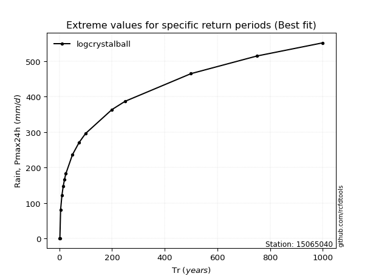</img>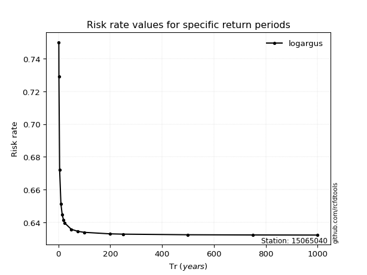</img>

</div>


<sub>**APP DISCLAIMER**: NO WARRANTY - This software is provided by [github.com/rcfdtools](https://github.com/rcfdtools) "as is", without any express or implied warranty, including warranties of merchantability, fitness for a particular purpose, or non-infringement. There is no guarantee that the software will be error-free or operate without interruption. LIMITATION OF LIABILITY - Neither the authors nor copyright holders will be liable for claims or damages arising from the software or its use. You are responsible for determining if the software is appropriate for your use and assume all associated risks, including errors, legal compliance, and data loss. NO PROFESSIONAL ADVICE - The software provides general information and does not offer professional advice. It should not replace consultation with professional advisors.</sub>