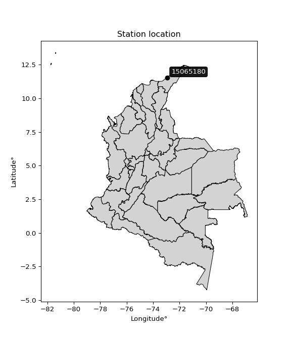

<div align="center">


</div>

# PMP Station (rain, Pmax24h): 15065180

Probable Maximum Precipitation (PMP) is the greatest amount of rainfall for a specific duration that is meteorologically possible for a given location, acting as a "worst-case" scenario for extreme storms, crucial for designing safety-critical infrastructure like bridges, river deviations, dams, spillways, and nuclear plants to prevent catastrophic failure. PMP is calculated by hydrologists using meteorological data to determine the upper limit of extreme rainfall, often leading to the Probable Maximum Flood (PMF) for flood control design, and is increasingly being studied for climate change impacts.

<div align="center">

</img>

</div>


## A. General information


### 1. General running parameters

• app_version: _v20251227_. • runtime: _2025-12-27 09:02:11.367833_. • Python version: _3.14.0_. • SciPy version: _1.16.3_. • Pandas version: _2.3.3_. • NumPy version: _2.3.5_. • Stations dataset (station_dataset_file): _dataset/pmax24h_in/automatic_colombia_2003_2024_filter.csv_. • Stations catalog (station_catalog_file): _dataset/CNE_IDEAM.xls_. • Minimum year to eval til year_max (date_min): _2003_. • Maximum year to eval since year_min (date_max): _2024_. • Creates, save and include plots into reports (create_plot): _False_. • Plot only fit distributions with Δo > Δ (plot_only_fit): _True_. • Eval low extreme values, if False, evaluates high extreme values (low_extreme): _False_. • Eval every SciPy distribution as logarithmic (pdist_logarithmic_on): _True_. • Standard deviation normalized (ddof): _1.0_. • Return periods to eval in years (Tr): _[2, 2.33, 5, 10, 15, 20, 25, 50, 75, 100, 200, 250, 500, 750, 1000]_. • Minimum data sample per station, 0 means any (minimum_sample): _5_. • Z-Score threshold to adjust a value, 0 means disable (zscore): _3.5_. • Avoid zeros, e.g. rain = 0 (avoid_zeros): _True_. • Avoid null values (avoid_nans): _True_. [:file_folder:Dataset file.](../../dataset/pmax24h_in/automatic_colombia_2003_2024_filter.csv)

> Delta Degrees of Freedom (DDOF): is a parameter used in the formulas for calculating variance and standard deviation. When ddof=0, the divisor is $N$ (the total number of observations) and this is used when your data set is the entire population. When ddof=1, the divisor is $N-1$ and this is used when your data set is a sample drawn from a larger population. Using $N-1$ provides an unbiased estimate of the population variance (known as Bessel´s correction).


### 2. Station info and location

|   id |   CODIGO | NOMBRE                               | CATEGORIA           | TECNOLOGIA                              | ESTADO   | FECHA_INSTALACION   |   FECHA_SUSPENSION |   ALTITUD |   LATITUD |   LONGITUD | DEPARTAMENTO   | MUNICIPIO   | AREA_OPERATIVA                                         | ENTIDAD                                                     | AREA_HIDROGRAFICA   | ZONA_HIDROGRAFICA   | SUBZONA_HIDROGRAFICA   |   CORRIENTE | Catalogo   |
|-----:|---------:|:-------------------------------------|:--------------------|:----------------------------------------|:---------|:--------------------|-------------------:|----------:|----------:|-----------:|:---------------|:------------|:-------------------------------------------------------|:------------------------------------------------------------|:--------------------|:--------------------|:-----------------------|------------:|:-----------|
|    0 | 15065180 | AEROPUERTO ALM. PADILLA - [15065180] | Sinóptica Principal | Automática con Telemetría, Convencional | Activa   | 21/06/2004          |                nan |        15 |   11.5284 |   -72.9177 | La Guajira     | Riohacha    | Area Operativa 05 - Magdalena-Cesar-Guajira-San Andrés | INSTITUTO DE HIDROLOGIA METEOROLOGIA Y ESTUDIOS AMBIENTALES | Caribe              | Caribe - Guajira    | Río Ranchería          |         nan | CNE_IDEAM  |

<div align="center">

Map location in: [:earth_americas:Google](http://maps.google.com/maps?q=11.5284444,-72.917722222) [:earth_americas:OSM](https://www.openstreetmap.org/#map=18/11.5284444/-72.917722222&layers=P) [:earth_americas:Bing](https://www.bing.com/maps?cp=11.5284444~-72.917722222&lvl=18) [:earth_americas:Apple](https://maps.apple.com/frame?center=11.5284444%2C-72.917722222&span=0.003%2C0.006)

</div>


<div align="center">

```geojson
{
  "type": "Feature",
  "geometry": {
    "type": "Point", 
    "coordinates": [-72.917722222, 11.5284444]
  }, 
  "properties": {
    "Name": "15065180"
  }
}
```

</div>


### 3. Discrete values table and plot

|               |           0 |           1 |           2 |         3 |           4 |           5 |           6 |           7 |          8 |
|:--------------|------------:|------------:|------------:|----------:|------------:|------------:|------------:|------------:|-----------:|
| Date          | 2015        | 2017        | 2018        | 2019      | 2020        | 2021        | 2022        | 2023        | 2024       |
| Value         |   36.25     |   42.61     |   33.77     |  133.69   |   46.7      |   88.93     |   61.55     |   48.1      |  168.4     |
| Value_initial |   36.25     |   42.61     |   33.77     |  133.69   |   46.7      |   88.93     |   61.55     |   48.1      |  168.4     |
| count         |    9        |    9        |    9        |    9      |    9        |    9        |    9        |    9        |    9       |
| mean          |   73.3333   |   73.3333   |   73.3333   |   73.3333 |   73.3333   |   73.3333   |   73.3333   |   73.3333   |   73.3333  |
| std           |   47.8188   |   47.8188   |   47.8188   |   47.8188 |   47.8188   |   47.8188   |   47.8188   |   47.8188   |   47.8188  |
| zscore        |   -0.775497 |   -0.642495 |   -0.827359 |    1.2622 |   -0.556963 |    0.326162 |   -0.246416 |   -0.527686 |    1.98806 |

> The initial value (value_initial) correspond to the initial obtained or null completed value, and value (value) is adjusted only when the initial value is outside the valid range definite through the Z-Score value. If Z-Score is active, values out of range or outliers are replaced with the station mean value


### 4. Active continuous probability distributions from SciPy (45 of 104 available)

[scipy.stats](https://docs.scipy.org/doc/scipy/reference/stats.html) is a Python´s powerful submodule within the SciPy library for comprehensive statistical analysis, offering over 130 probability distributions (like Normal, Poisson), functions for descriptive stats (mean, variance), hypothesis testing (t-tests, chi-square), random variable generation, and statistical tests, making it essential for data science, modeling, and research. It provides tools to explore, model, and draw conclusions from data efficiently, working seamlessly with NumPy.

<div align="center">

|   id | p_dist             |   n_parameter | fit_method   | label                                                                       | active   | ref                                                                                                        |
|-----:|:-------------------|--------------:|:-------------|:----------------------------------------------------------------------------|:---------|:-----------------------------------------------------------------------------------------------------------|
|    0 | alpha              |             3 | MLE          | Alpha                                                                       | True     | [:mortar_board:](https://docs.scipy.org/doc/scipy/reference/generated/scipy.stats.alpha.html)              |
|    1 | betaprime          |             4 | MLE          | Beta prime                                                                  | True     | [:mortar_board:](https://docs.scipy.org/doc/scipy/reference/generated/scipy.stats.betaprime.html)          |
|    2 | chi2               |             3 | MLE          | Chi²                                                                        | True     | [:mortar_board:](https://docs.scipy.org/doc/scipy/reference/generated/scipy.stats.chi2.html)               |
|    3 | crystalball        |             4 | MLE          | Crystalball                                                                 | True     | [:mortar_board:](https://docs.scipy.org/doc/scipy/reference/generated/scipy.stats.crystalball.html)        |
|    4 | erlang             |             3 | MLE          | Erlang                                                                      | True     | [:mortar_board:](https://docs.scipy.org/doc/scipy/reference/generated/scipy.stats.erlang.html)             |
|    5 | expon              |             2 | MLE          | Exponential                                                                 | True     | [:mortar_board:](https://docs.scipy.org/doc/scipy/reference/generated/scipy.stats.expon.html)              |
|    6 | exponnorm          |             3 | MLE          | Exponentially modified Normal                                               | True     | [:mortar_board:](https://docs.scipy.org/doc/scipy/reference/generated/scipy.stats.exponnorm.html)          |
|    7 | f                  |             4 | MLE          | F                                                                           | True     | [:mortar_board:](https://docs.scipy.org/doc/scipy/reference/generated/scipy.stats.f.html)                  |
|    8 | fatiguelife        |             3 | MLE          | Fatigue-life (Birnbaum-Saunders)                                            | True     | [:mortar_board:](https://docs.scipy.org/doc/scipy/reference/generated/scipy.stats.fatiguelife.html)        |
|    9 | fisk               |             3 | MLE          | Fisk                                                                        | True     | [:mortar_board:](https://docs.scipy.org/doc/scipy/reference/generated/scipy.stats.fisk.html)               |
|   10 | gamma              |             3 | MLE          | Gamma                                                                       | True     | [:mortar_board:](https://docs.scipy.org/doc/scipy/reference/generated/scipy.stats.gamma.html)              |
|   11 | genexpon           |             5 | MLE          | Generalized exponential                                                     | True     | [:mortar_board:](https://docs.scipy.org/doc/scipy/reference/generated/scipy.stats.genexpon.html)           |
|   12 | genlogistic        |             3 | MLE          | Generalized logistic                                                        | True     | [:mortar_board:](https://docs.scipy.org/doc/scipy/reference/generated/scipy.stats.genlogistic.html)        |
|   13 | gibrat             |             2 | MM           | Gibrat                                                                      | True     | [:mortar_board:](https://docs.scipy.org/doc/scipy/reference/generated/scipy.stats.gibrat.html)             |
|   14 | gompertz           |             3 | MLE          | Gompertz (or truncated Gumbel)                                              | True     | [:mortar_board:](https://docs.scipy.org/doc/scipy/reference/generated/scipy.stats.gompertz.html)           |
|   15 | gumbel_l           |             2 | MM           | Gumbel Left Skew                                                            | True     | [:mortar_board:](https://docs.scipy.org/doc/scipy/reference/generated/scipy.stats.gumbel_l.html)           |
|   16 | gumbel_r           |             2 | MM           | Gumbel Right Skew                                                           | True     | [:mortar_board:](https://docs.scipy.org/doc/scipy/reference/generated/scipy.stats.gumbel_r.html)           |
|   17 | halflogistic       |             2 | MM           | Half-logistic                                                               | True     | [:mortar_board:](https://docs.scipy.org/doc/scipy/reference/generated/scipy.stats.halflogistic.html)       |
|   18 | halfnorm           |             2 | MM           | Half Normal                                                                 | True     | [:mortar_board:](https://docs.scipy.org/doc/scipy/reference/generated/scipy.stats.halfnorm.html)           |
|   19 | hypsecant          |             2 | MM           | hyperbolic secant                                                           | True     | [:mortar_board:](https://docs.scipy.org/doc/scipy/reference/generated/scipy.stats.hypsecant.html)          |
|   20 | invgamma           |             3 | MLE          | Inverted gamma                                                              | True     | [:mortar_board:](https://docs.scipy.org/doc/scipy/reference/generated/scipy.stats.invgamma.html)           |
|   21 | invgauss           |             3 | MLE          | Inverse Gaussian                                                            | True     | [:mortar_board:](https://docs.scipy.org/doc/scipy/reference/generated/scipy.stats.invgauss.html)           |
|   22 | invweibull         |             3 | MLE          | Inverted Weibull                                                            | True     | [:mortar_board:](https://docs.scipy.org/doc/scipy/reference/generated/scipy.stats.invweibull.html)         |
|   23 | johnsonsu          |             4 | MLE          | Johnson Su                                                                  | True     | [:mortar_board:](https://docs.scipy.org/doc/scipy/reference/generated/scipy.stats.johnsonsu.html)          |
|   24 | kstwobign          |             2 | MLE          | Limiting distribution of scaled Kolmogorov-Smirnov two-sided test statistic | True     | [:mortar_board:](https://docs.scipy.org/doc/scipy/reference/generated/scipy.stats.kstwobign.html)          |
|   25 | laplace            |             2 | MM           | Laplace                                                                     | True     | [:mortar_board:](https://docs.scipy.org/doc/scipy/reference/generated/scipy.stats.laplace.html)            |
|   26 | laplace_asymmetric |             3 | MLE          | Asymmetric Laplace                                                          | True     | [:mortar_board:](https://docs.scipy.org/doc/scipy/reference/generated/scipy.stats.laplace_asymmetric.html) |
|   27 | loggamma           |             3 | MLE          | Log gamma                                                                   | True     | [:mortar_board:](https://docs.scipy.org/doc/scipy/reference/generated/scipy.stats.loggamma.html)           |
|   28 | logistic           |             2 | MM           | Logistic (or Sech-squared)                                                  | True     | [:mortar_board:](https://docs.scipy.org/doc/scipy/reference/generated/scipy.stats.logistic.html)           |
|   29 | lognorm            |             3 | MLE          | Log Normal                                                                  | True     | [:mortar_board:](https://docs.scipy.org/doc/scipy/reference/generated/scipy.stats.lognorm.html)            |
|   30 | maxwell            |             2 | MM           | Maxwell                                                                     | True     | [:mortar_board:](https://docs.scipy.org/doc/scipy/reference/generated/scipy.stats.maxwell.html)            |
|   31 | mielke             |             4 | MLE          | Mielke Beta-Kappa / Dagum                                                   | True     | [:mortar_board:](https://docs.scipy.org/doc/scipy/reference/generated/scipy.stats.mielke.html)             |
|   32 | moyal              |             2 | MM           | Moyal                                                                       | True     | [:mortar_board:](https://docs.scipy.org/doc/scipy/reference/generated/scipy.stats.moyal.html)              |
|   33 | nakagami           |             3 | MLE          | Nakagami                                                                    | True     | [:mortar_board:](https://docs.scipy.org/doc/scipy/reference/generated/scipy.stats.nakagami.html)           |
|   34 | ncf                |             5 | MLE          | Non-central F distribution                                                  | True     | [:mortar_board:](https://docs.scipy.org/doc/scipy/reference/generated/scipy.stats.ncf.html)                |
|   35 | nct                |             4 | MLE          | Non-central Student’s t                                                     | True     | [:mortar_board:](https://docs.scipy.org/doc/scipy/reference/generated/scipy.stats.nct.html)                |
|   36 | norm               |             2 | MM           | Normal                                                                      | True     | [:mortar_board:](https://docs.scipy.org/doc/scipy/reference/generated/scipy.stats.norm.html)               |
|   37 | pareto             |             3 | MLE          | Pareto                                                                      | True     | [:mortar_board:](https://docs.scipy.org/doc/scipy/reference/generated/scipy.stats.pareto.html)             |
|   38 | pearson3           |             3 | MM           | Pearson type III                                                            | True     | [:mortar_board:](https://docs.scipy.org/doc/scipy/reference/generated/scipy.stats.pearson3.html)           |
|   39 | rayleigh           |             2 | MM           | Rayleigh                                                                    | True     | [:mortar_board:](https://docs.scipy.org/doc/scipy/reference/generated/scipy.stats.rayleigh.html)           |
|   40 | rice               |             3 | MLE          | Rice                                                                        | True     | [:mortar_board:](https://docs.scipy.org/doc/scipy/reference/generated/scipy.stats.rice.html)               |
|   41 | t                  |             3 | MLE          | Student’s t                                                                 | True     | [:mortar_board:](https://docs.scipy.org/doc/scipy/reference/generated/scipy.stats.t.html)                  |
|   42 | truncnorm          |             4 | MLE          | Truncated normal                                                            | True     | [:mortar_board:](https://docs.scipy.org/doc/scipy/reference/generated/scipy.stats.truncnorm.html)          |
|   43 | wald               |             2 | MM           | Wald                                                                        | True     | [:mortar_board:](https://docs.scipy.org/doc/scipy/reference/generated/scipy.stats.wald.html)               |
|   44 | weibull_min        |             3 | MLE          | Weibull minimum                                                             | True     | [:mortar_board:](https://docs.scipy.org/doc/scipy/reference/generated/scipy.stats.weibull_min.html)        |

</div>

> **n_parameter:** # arguments & localization & scale.
>
> **Fit methods:** (MLE) maximum likelihood, (MM) L-moments.
>
>**Inactive:** foldnorm, gennorm, norminvgauss, powernorm, powerlognorm, skewnorm, genextreme, anglit, arcsine, argus, beta, bradford, burr, burr12, cauchy, cosine, halfcauchy, foldcauchy, skewcauchy, wrapcauchy, dgamma, gengamma, exponweib, exponpow, truncexpon, gausshyper, genhalflogistic, genhyperbolic, geninvgauss, halfgennorm, johnsonsb, kappa4, kappa3, ksone, kstwo, loglaplace, levy, levy_l, levy_stable, ncx2, genpareto, truncpareto, lomax, powerlaw, rdist, rel_breitwigner, recipinvgauss, semicircular, studentized_range, trapezoid, triang, truncweibull_min, tukeylambda, uniform, loguniform, vonmises, vonmises_line, weibull_max, dweibull, 


## B. Probability distributions vs. Empirical distributions

A continuous probability distribution (CPD) describes probabilities for variables that can take any value within a range (like rain any time), unlike discrete variables with specific outcomes (like temperature). It uses a Probability Density Function (PDF), a curve where the total area under it equals 1, and the probability of the variable falling within an interval (a to b) is found by calculating the area under the curve between those points. A key feature is that the probability of hitting any single exact value is zero, so probabilities are always expressed for ranges, e.g., $P(a ≤ X ≤ b)$.

<div align="center">

Distributions parameters from station values
|    |   station | p_dist                |   n |              loc |          scale | shape                  | shape1             | shape2                | shape3   |
|---:|----------:|:----------------------|----:|-----------------:|---------------:|:-----------------------|:-------------------|:----------------------|:---------|
|  0 |  15065180 | alpha                 |   9 |     25.6799      |   16.4579      | 1.1196619702337444e-09 |                    |                       |          |
|  1 |  15065180 | betaprime             |   9 |     -0.668911    |    1.33277     | 176.29906273289578     | 4.195802505327321  |                       |          |
|  2 |  15065180 | chi2                  |   9 |     33.77        |    3.86618     | 0.19386775186887725    |                    |                       |          |
|  3 |  15065180 | crystalball           |   9 |     73.3338      |   45.0856      | 6701.595998686279      | 114.94553330089738 |                       |          |
|  4 |  15065180 | erlang                |   9 |     33.77        |   39.2915      | 0.22814890652590608    |                    |                       |          |
|  5 |  15065180 | expon                 |   9 |     33.77        |   39.5633      |                        |                    |                       |          |
|  6 |  15065180 | exponnorm             |   9 |     33.7173      |    0.0152004   | 2586.649763285316      |                    |                       |          |
|  7 |  15065180 | f                     |   9 |     28.6259      |   15.9215      | 557.7567089115835      | 2.2896505312071334 |                       |          |
|  8 |  15065180 | fatiguelife           |   9 |     32.4051      |   16.2519      | 1.6895004987524023     |                    |                       |          |
|  9 |  15065180 | fisk                  |   9 |     33.77        |   22.2923      | 0.8603736174891736     |                    |                       |          |
| 10 |  15065180 | gamma                 |   9 |     33.77        |   28.3862      | 0.7865711390144496     |                    |                       |          |
| 11 |  15065180 | genexpon              |   9 |     33.77        |   64.8791      | 1.6398795796804893     | 0.9312421938168594 | 8.57004640392558e-11  |          |
| 12 |  15065180 | genlogistic           |   9 |   -171.22        |   28.6291      | 2599.253670212125      |                    |                       |          |
| 13 |  15065180 | gibrat                |   9 |     38.94        |   20.8606      |                        |                    |                       |          |
| 14 |  15065180 | gompertz              |   9 |     33.77        |    6.40251e+11 | 16144665863.998947     |                    |                       |          |
| 15 |  15065180 | gumbel_l              |   9 |     93.6235      |   35.1519      |                        |                    |                       |          |
| 16 |  15065180 | gumbel_r              |   9 |     53.0431      |   35.1519      |                        |                    |                       |          |
| 17 |  15065180 | halflogistic          |   9 |     19.8983      |   38.5452      |                        |                    |                       |          |
| 18 |  15065180 | halfnorm              |   9 |     13.6598      |   74.7897      |                        |                    |                       |          |
| 19 |  15065180 | hypsecant             |   9 |     73.3333      |   28.7014      |                        |                    |                       |          |
| 20 |  15065180 | invgamma              |   9 |     28.5981      |   18.2182      | 1.1447417622444354     |                    |                       |          |
| 21 |  15065180 | invgauss              |   9 |     30.4574      |   16.9384      | 2.531283557254161      |                    |                       |          |
| 22 |  15065180 | invweibull            |   9 |     33.77        |    1.17083     | 0.0544085428220306     |                    |                       |          |
| 23 |  15065180 | johnsonsu             |   9 |     33.203       |    0.0168079   | -4.617919861994585     | 0.6114969714827772 |                       |          |
| 24 |  15065180 | kstwobign             |   9 |    -50.0559      |  142.646       |                        |                    |                       |          |
| 25 |  15065180 | laplace               |   9 |     73.3333      |   31.8792      |                        |                    |                       |          |
| 26 |  15065180 | laplace_asymmetric    |   9 |     33.77        |    0.0634052   | 0.0016034720627525296  |                    |                       |          |
| 27 |  15065180 | loggamma              |   9 | -14592.3         | 1954.07        | 1817.8033127038066     |                    |                       |          |
| 28 |  15065180 | logistic              |   9 |     73.3333      |   24.8561      |                        |                    |                       |          |
| 29 |  15065180 | lognorm               |   9 |     33.77        |    0.438137    | 11.288014947984983     |                    |                       |          |
| 30 |  15065180 | maxwell               |   9 |    -33.4968      |   66.9459      |                        |                    |                       |          |
| 31 |  15065180 | mielke                |   9 |      6.51275     |    1.08059     | 8634.432063160224      | 2.2545044975319923 |                       |          |
| 32 |  15065180 | moyal                 |   9 |     47.5514      |   20.2949      |                        |                    |                       |          |
| 33 |  15065180 | nakagami              |   9 |     33.77        |   75.3467      | 0.2522244975818643     |                    |                       |          |
| 34 |  15065180 | ncf                   |   9 |      2.0228      |    0.105059    | 0.6050289531692628     | 7.673675713281652  | 304.8323786153901     |          |
| 35 |  15065180 | nct                   |   9 |     24.9842      |    0.302935    | 1.0688005040960644     | 57.725690833319874 |                       |          |
| 36 |  15065180 | norm                  |   9 |     73.3333      |   45.084       |                        |                    |                       |          |
| 37 |  15065180 | pareto                |   9 |    -17.0049      |   50.7749      | 2.123412594864385      |                    |                       |          |
| 38 |  15065180 | pearson3              |   9 |     73.3333      |   45.084       | 1.0965255900286466     |                    |                       |          |
| 39 |  15065180 | rayleigh              |   9 |    -12.915       |   68.8162      |                        |                    |                       |          |
| 40 |  15065180 | rice                  |   9 |      4.86075     |   57.9701      | 0.0004359819360906783  |                    |                       |          |
| 41 |  15065180 | t                     |   9 |     73.3329      |   45.0846      | 6698090.131070759      |                    |                       |          |
| 42 |  15065180 | truncnorm             |   9 | -51517.2         | 1526.54        | 33.76975301064322      | 33.85794586072957  |                       |          |
| 43 |  15065180 | wald                  |   9 |     28.2493      |   45.084       |                        |                    |                       |          |
| 44 |  15065180 | weibull_min           |   9 |     33.77        |   10.4776      | 0.23260199457125066    |                    |                       |          |
| 45 |  15065180 | logalpha              |   9 |      2.68767     |    3.77323     | 2.9609380470028883     |                    |                       |          |
| 46 |  15065180 | logbetaprime          |   9 |      3.28093     |    0.158498    | 10.876299841544629     | 2.9261573441981223 |                       |          |
| 47 |  15065180 | logchi2               |   9 |      3.51957     |    0.943958    | 1.1213489526834728     |                    |                       |          |
| 48 |  15065180 | logcrystalball        |   9 |      4.1343      |    0.543766    | 248.25599403277187     | 66.7311275380462   |                       |          |
| 49 |  15065180 | logerlang             |   9 |      3.51957     |    0.894753    | 0.712626883445209      |                    |                       |          |
| 50 |  15065180 | logexpon              |   9 |      3.51957     |    0.614726    |                        |                    |                       |          |
| 51 |  15065180 | logexponnorm          |   9 |      3.51881     |    0.000249865 | 2480.3329908460555     |                    |                       |          |
| 52 |  15065180 | logf                  |   9 |      3.2237      |    0.636751    | 595.4391510226558      | 5.968467746048894  |                       |          |
| 53 |  15065180 | logfatiguelife        |   9 |      3.43105     |    0.462437    | 1.0064542521739344     |                    |                       |          |
| 54 |  15065180 | logfisk               |   9 |      3.48592     |    0.430555    | 1.4663294520255779     |                    |                       |          |
| 55 |  15065180 | loggamma              |   9 |      3.51957     |    0.596962    | 0.9014627198499711     |                    |                       |          |
| 56 |  15065180 | loggenexpon           |   9 |      3.51957     |    1.26714     | 1.9069345639513378     | 0.7673622418931091 | 0.5321156110847153    |          |
| 57 |  15065180 | loggenlogistic        |   9 |      0.923304    |    0.400678    | 1620.0789889690163     |                    |                       |          |
| 58 |  15065180 | loggibrat             |   9 |      3.71944     |    0.251621    |                        |                    |                       |          |
| 59 |  15065180 | loggompertz           |   9 |      3.51957     |    2.81575     | 3.726717097221253      |                    |                       |          |
| 60 |  15065180 | loggumbel_l           |   9 |      4.37902     |    0.423972    |                        |                    |                       |          |
| 61 |  15065180 | loggumbel_r           |   9 |      3.88958     |    0.423972    |                        |                    |                       |          |
| 62 |  15065180 | loghalflogistic       |   9 |      3.48981     |    0.4649      |                        |                    |                       |          |
| 63 |  15065180 | loghalfnorm           |   9 |      3.41457     |    0.902051    |                        |                    |                       |          |
| 64 |  15065180 | loghypsecant          |   9 |      4.1343      |    0.346172    |                        |                    |                       |          |
| 65 |  15065180 | loginvgamma           |   9 |      3.22052     |    1.90644     | 2.9841720396779525     |                    |                       |          |
| 66 |  15065180 | loginvgauss           |   9 |      3.37145     |    0.926403    | 0.8234412995758623     |                    |                       |          |
| 67 |  15065180 | loginvweibull         |   9 |      2.98689     |    0.822205    | 2.5419163900847757     |                    |                       |          |
| 68 |  15065180 | logjohnsonsu          |   9 |      3.17356e+07 |    2.59503e+07 | 76764541.9659046       | 74487003.23070633  |                       |          |
| 69 |  15065180 | logkstwobign          |   9 |      2.4814      |    1.89734     |                        |                    |                       |          |
| 70 |  15065180 | loglaplace            |   9 |      4.1343      |    0.3845      |                        |                    |                       |          |
| 71 |  15065180 | loglaplace_asymmetric |   9 |      3.75209     |    0.318554    | 0.5662048145323992     |                    |                       |          |
| 72 |  15065180 | logloggamma           |   9 |   -170.199       |   23.3233      | 1762.9961561699602     |                    |                       |          |
| 73 |  15065180 | loglogistic           |   9 |      4.1343      |    0.299794    |                        |                    |                       |          |
| 74 |  15065180 | loglognorm            |   9 |      3.51957     |    0.010084    | 10.911535489941883     |                    |                       |          |
| 75 |  15065180 | logmaxwell            |   9 |      2.8458      |    0.807445    |                        |                    |                       |          |
| 76 |  15065180 | logmielke             |   9 |      1.70723     |    1.07987     | 330.47178045086196     | 5.905974805704311  |                       |          |
| 77 |  15065180 | logmoyal              |   9 |      3.82334     |    0.24478     |                        |                    |                       |          |
| 78 |  15065180 | lognakagami           |   9 |      3.51957     |    1.10727     | 0.23205020057939174    |                    |                       |          |
| 79 |  15065180 | logncf                |   9 |     -1.4946      |    5.62049     | 260.0417224161738      | 1371.941680127742  | 6.198080508367163e-10 |          |
| 80 |  15065180 | lognct                |   9 |     -0.287402    |    0.0870672   | 38.23024846501394      | 49.780603749937484 |                       |          |
| 81 |  15065180 | lognorm               |   9 |      4.1343      |    0.543765    |                        |                    |                       |          |
| 82 |  15065180 | logpareto             |   9 |      3.51951     |    5.91503e-05 | 0.1252359265842682     |                    |                       |          |
| 83 |  15065180 | logpearson3           |   9 |      4.1343      |    0.543766    | 0.6705136730683292     |                    |                       |          |
| 84 |  15065180 | lograyleigh           |   9 |      3.09404     |    0.830003    |                        |                    |                       |          |
| 85 |  15065180 | logrice               |   9 |      3.24016     |    0.739988    | 0.0006621359691765668  |                    |                       |          |
| 86 |  15065180 | logt                  |   9 |      4.1343      |    0.543766    | 5420279360.256633      |                    |                       |          |
| 87 |  15065180 | logtruncnorm          |   9 |      0.405445    |    1.12038     | 2.779516066738759      | 4.499393499702974  |                       |          |
| 88 |  15065180 | logwald               |   9 |      3.59055     |    0.543751    |                        |                    |                       |          |
| 89 |  15065180 | logweibull_min        |   9 |      3.51957     |    0.531444    | 0.8259692583445171     |                    |                       |          |

</div>

> **loc** (Location parameter): This shifts the distribution along the x-axis. For many common distributions, like the normal (Gaussian) distribution, loc represents the mean $μ$. For others, like the uniform distribution, it might represent the minimum value, or for the beta distribution, the left end of the support interval.
>
> **scale** (Scale parameter): This determines the width or spread of the distribution. For the normal distribution, scale represents the standard deviation $σ$. For a uniform distribution, it defines the length of the interval (from $loc$ to $loc + scale$).
>
> **shape** (Shape parameters): Refers to parameters that define the specific form of a probability distribution, distinct from its location (loc) and scale (scale). These parameters are required arguments for most distribution functions. For example, a normal (Gaussian) distribution is fully defined by its location (mean) and scale (standard deviation), so it has no specific shape parameters beyond loc and scale. However, other distributions have intrinsic properties that need specification, as Gamma distribution that takes a shape parameter, often named $a$ or $alpha$.


### 0. Cumulative distribution values - CDF (90 evaluated)

Cumulative Distribution Function (CDF), denoted as $F$<sub>$X$</sub>$(x)$, is a function that gives the probability that a random variable $X$ will take a value less than or equal to a specific value, $x$ (i.e., $(P(X≥x)$. It essentially "accumulates" probabilities from a given point up to the far right (positive infinity), providing a complete picture of the distribution´s probabilities for both discrete (like rain) and continuous (like temperature) variables, helping to find probabilities over ranges or above certain values.

<div align="center">

CDF ordered by x ascending and calculating $log(f(x))$ separately
|   id |   Station |   date |      x |   count |    mean |     std |    zscore |   Value_initial |   station |   m |    alpha |   alpha_pdf |   betaprime |   betaprime_pdf |      chi2 |    chi2_pdf |   crystalball |   crystalball_pdf |      erlang |   erlang_pdf |     expon |   expon_pdf |   exponnorm |   exponnorm_pdf |         f |       f_pdf |   fatiguelife |   fatiguelife_pdf |        fisk |    fisk_pdf |       gamma |    gamma_pdf |    genexpon |   genexpon_pdf |   genlogistic |   genlogistic_pdf |   gibrat |   gibrat_pdf |    gompertz |   gompertz_pdf |   gumbel_l |   gumbel_l_pdf |   gumbel_r |   gumbel_r_pdf |   halflogistic |   halflogistic_pdf |   halfnorm |   halfnorm_pdf |   hypsecant |   hypsecant_pdf |   invgamma |   invgamma_pdf |   invgauss |   invgauss_pdf |   invweibull |   invweibull_pdf |   johnsonsu |   johnsonsu_pdf |   kstwobign |   kstwobign_pdf |   laplace |   laplace_pdf |   laplace_asymmetric |   laplace_asymmetric_pdf |    loggamma |   loggamma_pdf |   logistic |   logistic_pdf |   lognorm |   lognorm_pdf |   maxwell |   maxwell_pdf |   mielke |   mielke_pdf |    moyal |   moyal_pdf |    nakagami |    nakagami_pdf |      ncf |     ncf_pdf |       nct |     nct_pdf |     norm |    norm_pdf |      pareto |   pareto_pdf |   pearson3 |   pearson3_pdf |   rayleigh |   rayleigh_pdf |     rice |    rice_pdf |        t |       t_pdf |   truncnorm |   truncnorm_pdf |      wald |   wald_pdf |   weibull_min |   weibull_min_pdf |   logalpha |   logalpha_pdf |   logbetaprime |   logbetaprime_pdf |     logchi2 |   logchi2_pdf |   logcrystalball |   logcrystalball_pdf |   logerlang |   logerlang_pdf |   logexpon |   logexpon_pdf |   logexponnorm |   logexponnorm_pdf |      logf |   logf_pdf |   logfatiguelife |   logfatiguelife_pdf |   logfisk |   logfisk_pdf |   loggenexpon |   loggenexpon_pdf |   loggenlogistic |   loggenlogistic_pdf |   loggibrat |   loggibrat_pdf |   loggompertz |   loggompertz_pdf |   loggumbel_l |   loggumbel_l_pdf |   loggumbel_r |   loggumbel_r_pdf |   loghalflogistic |   loghalflogistic_pdf |   loghalfnorm |   loghalfnorm_pdf |   loghypsecant |   loghypsecant_pdf |   loginvgamma |   loginvgamma_pdf |   loginvgauss |   loginvgauss_pdf |   loginvweibull |   loginvweibull_pdf |   logjohnsonsu |   logjohnsonsu_pdf |   logkstwobign |   logkstwobign_pdf |   loglaplace |   loglaplace_pdf |   loglaplace_asymmetric |   loglaplace_asymmetric_pdf |   logloggamma |   logloggamma_pdf |   loglogistic |   loglogistic_pdf |   loglognorm |   loglognorm_pdf |   logmaxwell |   logmaxwell_pdf |   logmielke |   logmielke_pdf |   logmoyal |   logmoyal_pdf |   lognakagami |   lognakagami_pdf |   logncf |   logncf_pdf |   lognct |   lognct_pdf |   logpareto |   logpareto_pdf |   logpearson3 |   logpearson3_pdf |   lograyleigh |   lograyleigh_pdf |   logrice |   logrice_pdf |     logt |   logt_pdf |   logtruncnorm |   logtruncnorm_pdf |   logwald |   logwald_pdf |   logweibull_min |   logweibull_min_pdf |
|-----:|----------:|-------:|-------:|--------:|--------:|--------:|----------:|----------------:|----------:|----:|---------:|------------:|------------:|----------------:|----------:|------------:|--------------:|------------------:|------------:|-------------:|----------:|------------:|------------:|----------------:|----------:|------------:|--------------:|------------------:|------------:|------------:|------------:|-------------:|------------:|---------------:|--------------:|------------------:|---------:|-------------:|------------:|---------------:|-----------:|---------------:|-----------:|---------------:|---------------:|-------------------:|-----------:|---------------:|------------:|----------------:|-----------:|---------------:|-----------:|---------------:|-------------:|-----------------:|------------:|----------------:|------------:|----------------:|----------:|--------------:|---------------------:|-------------------------:|------------:|---------------:|-----------:|---------------:|----------:|--------------:|----------:|--------------:|---------:|-------------:|---------:|------------:|------------:|----------------:|---------:|------------:|----------:|------------:|---------:|------------:|------------:|-------------:|-----------:|---------------:|-----------:|---------------:|---------:|------------:|---------:|------------:|------------:|----------------:|----------:|-----------:|--------------:|------------------:|-----------:|---------------:|---------------:|-------------------:|------------:|--------------:|-----------------:|---------------------:|------------:|----------------:|-----------:|---------------:|---------------:|-------------------:|----------:|-----------:|-----------------:|---------------------:|----------:|--------------:|--------------:|------------------:|-----------------:|---------------------:|------------:|----------------:|--------------:|------------------:|--------------:|------------------:|--------------:|------------------:|------------------:|----------------------:|--------------:|------------------:|---------------:|-------------------:|--------------:|------------------:|--------------:|------------------:|----------------:|--------------------:|---------------:|-------------------:|---------------:|-------------------:|-------------:|-----------------:|------------------------:|----------------------------:|--------------:|------------------:|--------------:|------------------:|-------------:|-----------------:|-------------:|-----------------:|------------:|----------------:|-----------:|---------------:|--------------:|------------------:|---------:|-------------:|---------:|-------------:|------------:|----------------:|--------------:|------------------:|--------------:|------------------:|----------:|--------------:|---------:|-----------:|---------------:|-------------------:|----------:|--------------:|-----------------:|---------------------:|
|    0 |  15065180 |   2018 |  33.77 |       9 | 73.3333 | 47.8188 | -0.827359 |           33.77 |  15065180 |   1 | 0.041918 | 0.0253363   |    0.112023 |     0.0130266   | 0.0366036 | 4.99355e+11 |      0.190101 |       0.00602084  | 0.000281005 |  9.02281e+09 | 0         | 0.0252759   |  0.00133898 |     0.0253929   | 0.0392222 | 0.0258021   |     0.0306784 |       0.0562184   | 1.85584e-13 | 4.49434     | 5.76502e-13 | 63.8188      | 1.84032e-12 |    0.0252759   |      0.13285  |       0.00936314  | 0        |  0           | 7.76708e-13 |    0.0252161   |   0.166556 |    0.00431966  |   0.177235 |     0.00872404 |       0.178023 |         0.0125607  |   0.211986 |     0.0102896  |    0.157138 |     0.00525524  |   0.039195 |    0.0258123   |  0.0348285 |    0.0308811   |    0.0026416 |      1.20078e+11 |   0.0205555 |     0.0534247   |    0.119801 |     0.00878215  |  0.144542 |   0.00453405  |          2.57132e-06 |              0.0252892   | 2.39302e-14 |     48.5763    |   0.169146 |    0.00565396  |  0.129133 |      0.387238 |  0.201074 |    0.00726334 |      nan |          nan | 0.160234 | 0.0102982   | 6.42657e-09 | 456253          | 0.113071 | 0.0133728   | 0.0439744 | 0.0246447   | 0.190095 | 0.00602095  | 4.44089e-16 |  0.0418201   |   0.187604 |     0.00929363 |   0.205557 |     0.00783174 | 0.116927 | 0.00759671  | 0.190101 | 0.00602098  | 5.60247e-08 |      0.02332    | 0.0110196 | 0.00889872 |   0.000296259 |       9.69685e+09 |   0.05775  |       0.630491 |       0.057448 |          0.822462  | 1.94201e-09 |   2.45184e+06 |         0.129133 |             0.387238 | 1.36217e-11 |    21858.6      |   0        |       1.62674  |      0.0012281 |           1.60972  | 0.0463615 |   0.727153 |        0.0331601 |             1.12961  | 0.0232552 |     0.989755  |   6.29421e-12 |          1.50492  |        0.0834296 |             0.516774 |   0         |       0         |   4.93721e-13 |          1.32353  |      0.123407 |         0.272324  |     0.0913206 |          0.515517 |         0.0319981 |              1.0744   |     0.0926708 |          0.87855  |       0.106799 |           0.302758 |     0.0463632 |         0.727159  |     0.0379483 |          0.884056 |       0.0490843 |           0.706004  |       0.132005 |           0.388463 |      0.0743692 |           0.51873  |     0.101073 |        0.262868  |               0.0668835 |                    0.370819 |      0.135997 |          0.389396 |      0.114002 |          0.336917 |   0.00241275 |      1.55096e+12 |     0.125926 |         0.485763 |   0.0766123 |        0.626877 |  0.0629089 |       0.537649 |   5.59695e-08 |       5.84916e+07 | 0.123889 |     0.415351 | 0.108042 |     0.455237 |    0        |    2117.25      |      0.114939 |          0.491913 |      0.123152 |          0.541618 | 0.0688057 |      0.475157 | 0.129134 |   0.38724  |    9.20495e-08 |          2.75158   |  0        |     0         |      3.51597e-13 |           653.942    |
|    1 |  15065180 |   2015 |  36.25 |       9 | 73.3333 | 47.8188 | -0.775497 |           36.25 |  15065180 |   2 | 0.119464 | 0.0349719   |    0.145947 |     0.0142676   | 0.915636  | 0.0266657   |      0.205391 |       0.00630904  | 0.577587    |  0.0504669   | 0.0607601 | 0.0237402   |  0.0623844  |     0.023847    | 0.117453  | 0.0348724   |     0.176444  |       0.0507068   | 0.131317    | 0.0395746   | 0.152489    |  0.0460405   | 0.0607601   |    0.0237402   |      0.157065 |       0.0101519   | 0        |  0           | 0.0606208   |    0.0236875   |   0.177582 |    0.0045741   |   0.199406 |     0.00914674 |       0.208986 |         0.0124052  |   0.237386 |     0.0101926  |    0.170675 |     0.00566572  |   0.117474 |    0.0348963   |  0.127147  |    0.03945     |    0.382898  |      0.00806424  |   0.155233  |     0.0478689   |    0.142456 |     0.00947483  |  0.156235 |   0.00490085  |          0.0607936   |              0.0237519   | 0.143951    |      1.71928   |   0.183634 |    0.00603121  |  0.158613 |      0.444914 |  0.219407 |    0.0075183  |      nan |          nan | 0.186484 | 0.0108513   | 0.139344    |      0.0283373  | 0.147838 | 0.014595    | 0.118745  | 0.0337433   | 0.205385 | 0.00630917  | 0.0963025   |  0.0360328   |   0.211029 |     0.00958744 |   0.225248 |     0.00804336 | 0.136358 | 0.0080669   | 0.205391 | 0.00630919  | 0.0562758   |      0.022075   | 0.0446055 | 0.0175938  |   0.510912    |       0.0328083   |   0.111656 |       0.880314 |       0.127171 |          1.11216   | 0.176062    |   1.35976     |         0.158613 |             0.444914 | 0.174364    |        1.67368  |   0.108885 |       1.44961  |      0.109147  |           1.43744  | 0.110632  |   1.05693  |        0.133695  |             1.53971  | 0.111461  |     1.38944   |   0.101726    |          1.36778  |        0.124759  |             0.64766  |   0         |       0         |   0.0906125   |          1.23427  |      0.144162 |         0.314247  |     0.131997  |          0.630445 |         0.107805  |              1.063    |     0.154583  |          0.86787  |       0.130447 |           0.366369 |     0.110634  |         1.05694   |     0.117314  |          1.27872  |       0.111439  |           1.02985   |       0.161528 |           0.444847 |      0.115908  |           0.650247 |     0.121529 |        0.316069  |               0.0990727 |                    0.549284 |      0.165535 |          0.444337 |      0.140142 |          0.40195  |   0.570912   |      0.507749    |     0.16264  |         0.549301 |   0.12775   |        0.809414 |  0.107574  |       0.71852  |   0.218514    |       1.42993     | 0.155613 |     0.479858 | 0.143252 |     0.537889 |    0.588455 |       0.72668   |      0.15263  |          0.570504 |      0.163761 |          0.602557 | 0.105986  |      0.571885 | 0.158614 |   0.444915 |    0.178702    |          2.30335   |  0        |     0         |      0.172502    |             1.82622  |
|    2 |  15065180 |   2017 |  42.61 |       9 | 73.3333 | 47.8188 | -0.642495 |           42.61 |  15065180 |   3 | 0.330995 | 0.0285623   |    0.242684 |     0.0157794   | 0.981382  | 0.00371745  |      0.247792 |       0.00701509  | 0.750176    |  0.0160933   | 0.200236  | 0.0202148   |  0.20242    |     0.0202854   | 0.325682  | 0.0280849   |     0.390535  |       0.0228677   | 0.310923    | 0.0208524   | 0.376953    |  0.0280558   | 0.200237    |    0.0202148   |      0.22708  |       0.0117552   | 0.041135 |  0.0240198   | 0.199814    |    0.0201776   |   0.208861 |    0.00527281  |   0.260397 |     0.00996751 |       0.286373 |         0.011908   |   0.301309 |     0.00989832 |    0.210272 |     0.00680489  |   0.325816 |    0.0280949   |  0.341709  |    0.0270979   |    0.408264  |      0.00225106  |   0.372627  |     0.0245998   |    0.207403 |     0.010848    |  0.190731 |   0.00598294  |          0.200333    |              0.020223    | 0.371692    |      1.16654   |   0.225125 |    0.00701814  |  0.24106  |      0.573079 |  0.269063 |    0.00807185 |      nan |          nan | 0.258704 | 0.0117323   | 0.264401    |      0.0150461  | 0.246205 | 0.0159481   | 0.326751  | 0.0286245   | 0.247788 | 0.00701527  | 0.288809    |  0.0253318   |   0.273745 |     0.0100724  |   0.277842 |     0.00846719 | 0.191052 | 0.00908701  | 0.247794 | 0.00701527  | 0.187243    |      0.0191775  | 0.185597  | 0.023745   |   0.617581    |       0.00967234  |   0.280064 |       1.12208  |       0.320288 |          1.17505   | 0.332574    |   0.740592    |         0.24106  |             0.573078 | 0.378194    |        0.992941 |   0.314936 |       1.11442  |      0.313677  |           1.10742  | 0.301898  |   1.19501  |        0.357694  |             1.17458  | 0.330654  |     1.21927   |   0.299929    |          1.09299  |        0.248903  |             0.863534 |   0.0205665 |       1.51864   |   0.274435    |          1.04297  |      0.20382  |         0.428032  |     0.250815  |          0.818184 |         0.274829  |              0.994266 |     0.291724  |          0.824722 |       0.203786 |           0.549286 |     0.301901  |         1.19501   |     0.327046  |          1.20469  |       0.30108   |           1.20056   |       0.24369  |           0.56955  |      0.239129  |           0.847072 |     0.185038 |        0.481244  |               0.242762  |                    1.34593  |      0.247341 |          0.565708 |      0.218418 |          0.56943  |   0.613168   |      0.150873    |     0.261301 |         0.663083 |   0.279679  |        1.01756  |  0.24741   |       0.965663 |   0.378619    |       0.749467    | 0.244509 |     0.615721 | 0.24388  |     0.697861 |    0.645329 |       0.190982  |      0.256931 |          0.708472 |      0.269688 |          0.697596 | 0.21282   |      0.735926 | 0.241062 |   0.57308  |    0.483181    |          1.51256   |  0.162597 |     1.97263   |      0.396622    |             1.08286  |
|    3 |  15065180 |   2020 |  46.7  |       9 | 73.3333 | 47.8188 | -0.556963 |           46.7  |  15065180 |   4 | 0.433649 | 0.021874    |    0.307344 |     0.0157322   | 0.991417  | 0.00155378  |      0.277348 |       0.00743179  | 0.803985    |  0.0108136   | 0.278785  | 0.0182294   |  0.281218   |     0.0182812   | 0.427141  | 0.0217563   |     0.469711  |       0.0165048   | 0.384938    | 0.0157543   | 0.479432    |  0.0223975   | 0.278785    |    0.0182294   |      0.276609 |       0.0124138   | 0.161361 |  0.0315285   | 0.278227    |    0.0182003   |   0.231404 |    0.00575465  |   0.301871 |     0.0102859  |       0.334304 |         0.0115221  |   0.341348 |     0.00967651 |    0.23969  |     0.00758403  |   0.427301 |    0.0217599   |  0.438248  |    0.020511    |    0.415822  |      0.0015354   |   0.458527  |     0.0179768   |    0.253003 |     0.0114084   |  0.216841 |   0.00680195  |          0.278911    |              0.0182358   | 0.469154    |      0.968272  |   0.255118 |    0.00764531  |  0.296554 |      0.636061 |  0.30266  |    0.00834576 |      nan |          nan | 0.307161 | 0.0119174   | 0.320056    |      0.0124127  | 0.311302 | 0.0157784   | 0.430423  | 0.022245    | 0.277344 | 0.00743201  | 0.382277    |  0.0205899   |   0.315243 |     0.0101973  |   0.31287  |     0.00864994 | 0.229298 | 0.00959539  | 0.27735  | 0.00743199  | 0.262235    |      0.0175182  | 0.279867  | 0.0220665  |   0.650109    |       0.00660986  |   0.381574 |       1.07745  |       0.422254 |          1.04201   | 0.39401     |   0.609664    |         0.296553 |             0.636061 | 0.460543    |        0.814633 |   0.409829 |       0.960055 |      0.40803   |           0.95518  | 0.406386  |   1.07447  |        0.45496   |             0.955902 | 0.432582  |     1.00585   |   0.393849    |          0.958924 |        0.330738  |             0.912986 |   0.240339  |       2.50288   |   0.365376    |          0.942428 |      0.246433 |         0.502891  |     0.328191  |          0.862456 |         0.363276  |              0.933566 |     0.365769  |          0.789868 |       0.259602 |           0.669509 |     0.40639   |         1.07447   |     0.429334  |          1.02613  |       0.406413  |           1.08555   |       0.298769 |           0.630577 |      0.318943  |           0.886324 |     0.234848 |        0.610788  |               0.356599  |                    1.14359  |      0.301993 |          0.625177 |      0.275043 |          0.665106 |   0.624773   |      0.107222    |     0.324064 |         0.703261 |   0.373075  |        1.00792  |  0.33747   |       0.986852 |   0.440957    |       0.621179    | 0.303851 |     0.676562 | 0.310789 |     0.75768  |    0.659783 |       0.131411  |      0.324095 |          0.752656 |      0.334974 |          0.723713 | 0.282983  |      0.790346 | 0.296555 |   0.636062 |    0.606047    |          1.18068   |  0.334006 |     1.69931   |      0.485614    |             0.871279 |
|    4 |  15065180 |   2023 |  48.1  |       9 | 73.3333 | 47.8188 | -0.527686 |           48.1  |  15065180 |   5 | 0.462906 | 0.0199539   |    0.329272 |     0.0155836   | 0.993318  | 0.00118151  |      0.287847 |       0.00756573  | 0.818277    |  0.00963906  | 0.30386   | 0.0175956   |  0.306361   |     0.0176418   | 0.456302  | 0.0199341   |     0.491765  |       0.0150442   | 0.406082    | 0.0144804   | 0.509692    |  0.020857    | 0.30386     |    0.0175956   |      0.294102 |       0.0125692   | 0.20525  |  0.0310404   | 0.303263    |    0.017569    |   0.239579 |    0.00592477  |   0.316324 |     0.0103575  |       0.350335 |         0.0113797  |   0.354838 |     0.00959513 |    0.250497 |     0.00785433  |   0.456467 |    0.0199363   |  0.465714  |    0.0187626   |    0.417862  |      0.00138443  |   0.482534  |     0.0163602   |    0.269073 |     0.0115436   |  0.226576 |   0.00710732  |          0.303995    |              0.0176015   | 0.496939    |      0.913643  |   0.265968 |    0.00785437  |  0.315607 |      0.653829 |  0.3144   |    0.0084241  |      nan |          nan | 0.323851 | 0.0119206   | 0.336977    |      0.0117762  | 0.333267 | 0.0155911   | 0.460226  | 0.0203604   | 0.287843 | 0.00756596  | 0.410143    |  0.0192383   |   0.32953  |     0.0102098  |   0.325014 |     0.00869661 | 0.242836 | 0.00974227  | 0.28785  | 0.00756593  | 0.286384    |      0.0169838  | 0.310176  | 0.021221   |   0.658889    |       0.00595515  |   0.412957 |       1.04651  |       0.452303 |          0.992422  | 0.411536    |   0.577641    |         0.315607 |             0.653828 | 0.483916    |        0.768672 |   0.437516 |       0.915015 |      0.435582  |           0.910723 | 0.437415  |   1.02609  |        0.482294  |             0.895671 | 0.461323  |     0.940696  |   0.421578    |          0.918826 |        0.357785  |             0.917503 |   0.311355  |       2.2976    |   0.392752    |          0.911284 |      0.261661 |         0.528281  |     0.353745  |          0.867048 |         0.390528  |              0.911473 |     0.388915  |          0.77724  |       0.279954 |           0.708413 |     0.437419  |         1.02609   |     0.458803  |          0.969494 |       0.437769  |           1.03703   |       0.317652 |           0.647767 |      0.345174  |           0.889023 |     0.253601 |        0.659559  |               0.389507  |                    1.0851   |      0.320711 |          0.641959 |      0.295118 |          0.693888 |   0.6278     |      0.0980156   |     0.344972 |         0.712076 |   0.402606  |        0.990654 |  0.366518  |       0.978946 |   0.458844    |       0.590575    | 0.324076 |     0.692577 | 0.333374 |     0.771044 |    0.663478 |       0.119131  |      0.34646  |          0.761178 |      0.356419 |          0.72797  | 0.306505  |      0.801827 | 0.315609 |   0.653829 |    0.639545    |          1.08854   |  0.382259 |     1.56789   |      0.510529    |             0.81659  |
|    5 |  15065180 |   2022 |  61.55 |       9 | 73.3333 | 47.8188 | -0.246416 |           61.55 |  15065180 |   6 | 0.646363 | 0.00918623  |    0.520047 |     0.0124488   | 0.99927   | 0.000114127 |      0.396906 |       0.00855142  | 0.903072    |  0.00410651  | 0.504489  | 0.0125245   |  0.507316   |     0.0125308   | 0.642521  | 0.00947873  |     0.637071  |       0.00794609  | 0.547196    | 0.00767376  | 0.71759     |  0.011275    | 0.504489    |    0.0125245   |      0.46528  |       0.0124328   | 0.532092 |  0.0175874   | 0.503665    |    0.0125156   |   0.330717 |    0.00764538  |   0.456095 |     0.0101861  |       0.493212 |         0.00981628 |   0.478043 |     0.00869085 |    0.372842 |     0.0102172   |   0.642677 |    0.00947684  |  0.643189  |    0.00927739  |    0.430962  |      0.000710476 |   0.636688  |     0.00809571  |    0.426974 |     0.0115947   |  0.345497 |   0.0108377   |          0.504674    |              0.0125264   | 0.676667    |      0.573802  |   0.383655 |    0.00951331  |  0.4894   |      0.733407 |  0.430847 |    0.00876876 |      nan |          nan | 0.478755 | 0.0108343   | 0.468208    |      0.00827207 | 0.522379 | 0.0122428   | 0.648733  | 0.00947429  | 0.396906 | 0.00855173  | 0.604121    |  0.010701    |   0.464568 |     0.00970035 |   0.443147 |     0.00875611 | 0.38007  | 0.0104577   | 0.396911 | 0.00855164  | 0.483957    |      0.0126114  | 0.539661  | 0.0133094  |   0.714805    |       0.00299586  |   0.62888  |       0.696896 |       0.647795 |          0.612679  | 0.529763    |   0.401811    |         0.4894   |             0.733407 | 0.637106    |        0.501247 |   0.623371 |       0.612677 |      0.620846  |           0.611788 | 0.640486  |   0.637512 |        0.654872  |             0.542128 | 0.638132  |     0.534136  |   0.61154     |          0.637016 |        0.573754  |             0.795395 |   0.678876  |       0.894427  |   0.587501    |          0.67568  |      0.418792 |         0.743895  |     0.559381  |          0.766461 |         0.589961  |              0.701167 |     0.565707  |          0.651574 |       0.486717 |           0.918714 |     0.64049   |         0.637509  |     0.647695  |          0.592945 |       0.642322  |           0.637931  |       0.489524 |           0.724625 |      0.555025  |           0.782117 |     0.481559 |        1.25243   |               0.606133  |                    0.700067 |      0.490936 |          0.717829 |      0.487953 |          0.833423 |   0.645986   |      0.0567828   |     0.522842 |         0.708506 |   0.616835  |        0.726414 |  0.585265  |       0.766354 |   0.581688    |       0.425443    | 0.504186 |     0.742344 | 0.5272   |     0.768478 |    0.685044 |       0.0657029 |      0.534056 |          0.733101 |      0.534075 |          0.693779 | 0.506686  |      0.792507 | 0.489402 |   0.733406 |    0.832881    |          0.537646  |  0.657285 |     0.76366   |      0.669064    |             0.503552 |
|    6 |  15065180 |   2021 |  88.93 |       9 | 73.3333 | 47.8188 |  0.326162 |           88.93 |  15065180 |   7 | 0.794706 | 0.00317315  |    0.764513 |     0.00597287  | 0.999988  | 1.78055e-06 |      0.6353   |       0.00833465  | 0.965944    |  0.00120479  | 0.751974  | 0.0062691   |  0.754451   |     0.0062452   | 0.797202  | 0.00333015  |     0.784205  |       0.0036812   | 0.685571    | 0.00336231  | 0.902431    |  0.00371226  | 0.751974    |    0.0062691   |      0.74524  |       0.00765392  | 0.80893  |  0.00544714  | 0.751154    |    0.00627493  |   0.583142 |    0.0103765   |   0.69749  |     0.00714849 |       0.714082 |         0.0063573  |   0.685789 |     0.00642912 |    0.665039 |     0.0096328   |   0.797309 |    0.00332873  |  0.801604  |    0.00360242  |    0.444458  |      0.000355501 |   0.777255  |     0.00327218  |    0.701477 |     0.00807381  |  0.693455 |   0.00961584  |          0.752157    |              0.00626777  | 0.83071     |      0.295514  |   0.651917 |    0.00912939  |  0.742215 |      0.593882 |  0.658476 |    0.00748714 |      nan |          nan | 0.718249 | 0.0066454   | 0.648851    |      0.00532325 | 0.761588 | 0.00584024  | 0.80121   | 0.00323688  | 0.635309 | 0.00833488  | 0.790201    |  0.00420532  |   0.694084 |     0.0068787  |   0.665506 |     0.00719361 | 0.65061  | 0.00874058  | 0.635311 | 0.00833475  | 0.742902    |      0.00687865 | 0.776697  | 0.00542048 |   0.770442    |       0.00142453  |   0.807695 |       0.320048 |       0.806226 |          0.291594  | 0.650339    |   0.268005    |         0.742215 |             0.593882 | 0.778298    |        0.289574 |   0.79302  |       0.336702 |      0.790619  |           0.337848 | 0.804832  |   0.300813 |        0.800878  |             0.285257 | 0.775298  |     0.254959  |   0.790231    |          0.358126 |        0.801102  |             0.443363 |   0.867873  |       0.278407  |   0.78335     |          0.404422 |      0.725454 |         0.837055  |     0.783589  |          0.450724 |         0.790735  |              0.403031 |     0.765885  |          0.43581  |       0.779944 |           0.586245 |     0.804834  |         0.300809  |     0.8044    |          0.297765 |       0.805288  |           0.295333  |       0.73969  |           0.589731 |      0.786623  |           0.473969 |     0.800642 |        0.518486  |               0.795223  |                    0.363975 |      0.739352 |          0.587626 |      0.764824 |          0.599973 |   0.662145   |      0.0345959   |     0.752817 |         0.516803 |   0.81105   |        0.360093 |  0.796917  |       0.405751 |   0.712052    |       0.2952      | 0.751296 |     0.561428 | 0.768513 |     0.516786 |    0.703348 |       0.0383663 |      0.763722 |          0.495992 |      0.755853 |          0.493962 | 0.758638  |      0.549954 | 0.742216 |   0.593881 |    0.951836    |          0.171455  |  0.838109 |     0.30449   |      0.80628     |             0.27123  |
|    7 |  15065180 |   2019 | 133.69 |       9 | 73.3333 | 47.8188 |  1.2622   |          133.69 |  15065180 |   8 | 0.878892 | 0.00111262  |    0.917109 |     0.00176034  | 1         | 3.18828e-09 |      0.909666 |       0.00361175  | 0.992272    |  0.000243787 | 0.919987  | 0.00202239  |  0.921344   |     0.00200051  | 0.885203  | 0.00115195  |     0.892609  |       0.00156444  | 0.784261    | 0.00145688  | 0.981721    |  0.000675714 | 0.919987    |    0.00202239  |      0.940277 |       0.00202249  | 0.934908 |  0.00133966  | 0.919508    |    0.0020297   |   0.956115 |    0.00390287  |   0.90408  |     0.00259347 |       0.900731 |         0.00244756 |   0.891485 |     0.00294299 |    0.922652 |     0.00266848  |   0.885268 |    0.00115134  |  0.900266  |    0.0013305   |    0.456071  |      0.000194974 |   0.869382  |     0.00129156  |    0.927593 |     0.00261506  |  0.924712 |   0.00236165  |          0.920094    |              0.00202076  | 0.916595    |      0.144197  |   0.918956 |    0.00299629  |  0.91923  |      0.275386 |  0.899356 |    0.00328765 |      nan |          nan | 0.904664 | 0.00233755  | 0.827827    |      0.00291325 | 0.91215  | 0.00176934  | 0.88623   | 0.00110854  | 0.909676 | 0.0036116   | 0.900735    |  0.00139872  |   0.899738 |     0.00270258 |   0.896612 |     0.00320064 | 0.915364 | 0.0032446   | 0.909674 | 0.00361159  | 0.938219    |      0.00255171 | 0.916544  | 0.00168656 |   0.815424    |       0.000726013 |   0.896078 |       0.141255 |       0.889787 |          0.140246  | 0.741238    |   0.185063    |         0.91923  |             0.275387 | 0.868562    |        0.16597  |   0.893362 |       0.173472 |      0.891544  |           0.175001 | 0.890541  |   0.142796 |        0.886827  |             0.152429 | 0.850566  |     0.132218  |   0.896796    |          0.182742 |        0.922955  |             0.184677 |   0.938465  |       0.103309  |   0.904472    |          0.206105 |      0.965995 |         0.271197  |     0.910983  |          0.200324 |         0.907266  |              0.190222 |     0.899362  |          0.229832 |       0.929676 |           0.201499 |     0.890542  |         0.142794  |     0.891904  |          0.150787 |       0.889075  |           0.139216  |       0.916687 |           0.278516 |      0.921508  |           0.210511 |     0.93095  |        0.179584  |               0.900783  |                    0.176351 |      0.916378 |          0.279742 |      0.926842 |          0.226175 |   0.673835   |      0.0240074   |     0.908107 |         0.253903 |   0.910786  |        0.157526 |  0.910898  |       0.181246 |   0.812654    |       0.204071    | 0.916582 |     0.258243 | 0.916379 |     0.228538 |    0.716119 |       0.0258371 |      0.909    |          0.233195 |      0.905147 |          0.24804  | 0.918088  |      0.247622 | 0.919231 |   0.275386 |    0.989973    |          0.0426178 |  0.921051 |     0.131184  |      0.888535    |             0.146807 |
|    8 |  15065180 |   2024 | 168.4  |       9 | 73.3333 | 47.8188 |  1.98806  |          168.4  |  15065180 |   9 | 0.908195 | 0.000640409 |    0.958264 |     0.000767883 | 1         | 2.73593e-11 |      0.982509 |       0.000958122 | 0.997347    |  8.00589e-05 | 0.966723  | 0.000841099 |  0.967466   |     0.000827457 | 0.915316  | 0.000652099 |     0.934168  |       0.000902416 | 0.824509    | 0.000924689 | 0.994896    |  0.000186673 | 0.966723    |    0.000841099 |      0.981848 |       0.000628264 | 0.966038 |  0.000582285 | 0.966454    |    0.000845891 |   0.999773 |    5.41303e-05 |   0.963131 |     0.00102926 |       0.958436 |         0.00105591 |   0.961454 |     0.0012547  |    0.976816 |     0.000807051 |   0.915364 |    0.000651731 |  0.935071  |    0.000749397 |    0.46187   |      0.000144188 |   0.904038  |     0.000770163 |    0.98164  |     0.000788458 |  0.974657 |   0.000794982 |          0.966783    |              0.000840028 | 0.943997    |      0.0964709 |   0.978641 |    0.000840962 |  0.965954 |      0.138913 |  0.971948 |    0.00114824 |      nan |          nan | 0.959382 | 0.000999839 | 0.907472    |      0.00175035 | 0.954054 | 0.000795685 | 0.91522   | 0.000628551 | 0.982513 | 0.000957982 | 0.93608     |  0.000732071 |   0.96223  |     0.00110175 |   0.968914 |     0.00119018 | 0.981301 | 0.000909973 | 0.982512 | 0.000958009 | 1           |      0.00118196 | 0.95726   | 0.00078965 |   0.836515    |       0.000511535 |   0.922689 |       0.093327 |       0.916783 |          0.0969288 | 0.7801      |   0.15298     |         0.965954 |             0.138913 | 0.9016      |        0.122642 |   0.926744 |       0.119168 |      0.925268  |           0.120585 | 0.917936  |   0.097995 |        0.916739  |             0.109414 | 0.876686  |     0.0966349 |   0.931672    |          0.123132 |        0.955933  |             0.107519 |   0.957394  |       0.0644657 |   0.943148    |          0.133137 |      0.997056 |         0.0404705 |     0.947346  |          0.120863 |         0.942513  |              0.1201   |     0.942258  |          0.146132 |       0.96379  |           0.104376 |     0.917937  |         0.0979934 |     0.921152  |          0.105698 |       0.915798  |           0.0957065 |       0.964269 |           0.142801 |      0.95897   |           0.120579 |     0.962116 |        0.0985274 |               0.934172  |                    0.117005 |      0.964218 |          0.143673 |      0.964739 |          0.11347  |   0.678941   |      0.0204254   |     0.953514 |         0.146034 |   0.940014  |        0.100389 |  0.944322  |       0.113545 |   0.855096    |       0.164853    | 0.961268 |     0.137436 | 0.956603 |     0.127679 |    0.721579 |       0.0217001 |      0.950899 |          0.136427 |      0.950097 |          0.147215 | 0.961169  |      0.133756 | 0.965954 |   0.138912 |    0.996632    |          0.0182728 |  0.945656 |     0.0857442 |      0.917411    |             0.105879 |


</div>

An Empirical Distribution Function (EDF) is a step-function estimate of a true cumulative distribution function (CDF) based on observed sample data, representing the proportion of data points less than or equal to a given value. It is calculated by ordering your data and jumping up by $1/n$ (where $n$ is sample size) at each unique data point, allowing analysis without assuming an underlying population distribution, and it gets closer to the true CDF as the sample size grows.


### 1. Empirical - EDF California (1923)

California´s estimates the true probability distribution of water-related data (like rainfall, streamflow) using observed samples, crucial for risk assessment.

<div align="center">


$P=m/n$


</div>


**1.1. Empirical values**

<div align="center">

|                | 0                  | 1                  | 2                  | 3                  | 4                  | 5                  | 6                  | 7                  | 8              |
|:---------------|:-------------------|:-------------------|:-------------------|:-------------------|:-------------------|:-------------------|:-------------------|:-------------------|:---------------|
| date           | 2018               | 2015               | 2017               | 2020               | 2023               | 2022               | 2021               | 2019               | 2024           |
| x              | 33.77              | 36.25              | 42.61              | 46.7               | 48.1               | 61.55              | 88.93              | 133.69             | 168.4          |
| m              | 1                  | 2                  | 3                  | 4                  | 5                  | 6                  | 7                  | 8                  | 9              |
| empirical_dist | edf_california     | edf_california     | edf_california     | edf_california     | edf_california     | edf_california     | edf_california     | edf_california     | edf_california |
| empirical      | 0.1111111111111111 | 0.2222222222222222 | 0.3333333333333333 | 0.4444444444444444 | 0.5555555555555556 | 0.6666666666666666 | 0.7777777777777778 | 0.8888888888888888 | 1.0            |
| empirical_tr   | 1.125              | 1.2857142857142856 | 1.4999999999999998 | 1.7999999999999998 | 2.25               | 2.9999999999999996 | 4.5                | 8.999999999999996  | inf            |

</div>


**1.2. Kolmogorov-Smirnov fit test (sorted by Δ)**


<div align="center">

|                | 0                   | 1                   | 2                   | 3                   | 4                   | 5                   | 6                   | 7                   | 8                   | 9                   | 10                  | 11                  | 12                  | 13                  | 14                  | 15                  | 16                  | 17                  | 18                  | 19                  | 20                  | 21                  | 22                  | 23                  | 24                  | 25                  | 26                  | 27                  | 28                    | 29                  | 30                  | 31                  | 32                  | 33                  | 34                  | 35                  | 36                  | 37                  | 38                  | 39                  | 40                  | 41                  | 42                  | 43                  | 44                  | 45                  | 46                  | 47                  | 48                  | 49                  | 50                  | 51                  | 52                  | 53                  | 54                  | 55                  | 56                  | 57                  | 58                  | 59                  | 60                  | 61                  | 62                  | 63                  | 64                  | 65                  | 66                  | 67                  | 68                  | 69                  | 70                  | 71                  | 72                  | 73                  | 74                  | 75                  | 76                  | 77                  | 78                  | 79                  | 80                  | 81                  | 82                  | 83                  | 84                  | 85                  | 86                  | 87                  | 88                  | 89                  |
|:---------------|:--------------------|:--------------------|:--------------------|:--------------------|:--------------------|:--------------------|:--------------------|:--------------------|:--------------------|:--------------------|:--------------------|:--------------------|:--------------------|:--------------------|:--------------------|:--------------------|:--------------------|:--------------------|:--------------------|:--------------------|:--------------------|:--------------------|:--------------------|:--------------------|:--------------------|:--------------------|:--------------------|:--------------------|:----------------------|:--------------------|:--------------------|:--------------------|:--------------------|:--------------------|:--------------------|:--------------------|:--------------------|:--------------------|:--------------------|:--------------------|:--------------------|:--------------------|:--------------------|:--------------------|:--------------------|:--------------------|:--------------------|:--------------------|:--------------------|:--------------------|:--------------------|:--------------------|:--------------------|:--------------------|:--------------------|:--------------------|:--------------------|:--------------------|:--------------------|:--------------------|:--------------------|:--------------------|:--------------------|:--------------------|:--------------------|:--------------------|:--------------------|:--------------------|:--------------------|:--------------------|:--------------------|:--------------------|:--------------------|:--------------------|:--------------------|:--------------------|:--------------------|:--------------------|:--------------------|:--------------------|:--------------------|:--------------------|:--------------------|:--------------------|:--------------------|:--------------------|:--------------------|:--------------------|:--------------------|:--------------------|
| station        | 15065180            | 15065180            | 15065180            | 15065180            | 15065180            | 15065180            | 15065180            | 15065180            | 15065180            | 15065180            | 15065180            | 15065180            | 15065180            | 15065180            | 15065180            | 15065180            | 15065180            | 15065180            | 15065180            | 15065180            | 15065180            | 15065180            | 15065180            | 15065180            | 15065180            | 15065180            | 15065180            | 15065180            | 15065180              | 15065180            | 15065180            | 15065180            | 15065180            | 15065180            | 15065180            | 15065180            | 15065180            | 15065180            | 15065180            | 15065180            | 15065180            | 15065180            | 15065180            | 15065180            | 15065180            | 15065180            | 15065180            | 15065180            | 15065180            | 15065180            | 15065180            | 15065180            | 15065180            | 15065180            | 15065180            | 15065180            | 15065180            | 15065180            | 15065180            | 15065180            | 15065180            | 15065180            | 15065180            | 15065180            | 15065180            | 15065180            | 15065180            | 15065180            | 15065180            | 15065180            | 15065180            | 15065180            | 15065180            | 15065180            | 15065180            | 15065180            | 15065180            | 15065180            | 15065180            | 15065180            | 15065180            | 15065180            | 15065180            | 15065180            | 15065180            | 15065180            | 15065180            | 15065180            | 15065180            | 15065180            |
| empirical_dist | edf_california      | edf_california      | edf_california      | edf_california      | edf_california      | edf_california      | edf_california      | edf_california      | edf_california      | edf_california      | edf_california      | edf_california      | edf_california      | edf_california      | edf_california      | edf_california      | edf_california      | edf_california      | edf_california      | edf_california      | edf_california      | edf_california      | edf_california      | edf_california      | edf_california      | edf_california      | edf_california      | edf_california      | edf_california        | edf_california      | edf_california      | edf_california      | edf_california      | edf_california      | edf_california      | edf_california      | edf_california      | edf_california      | edf_california      | edf_california      | edf_california      | edf_california      | edf_california      | edf_california      | edf_california      | edf_california      | edf_california      | edf_california      | edf_california      | edf_california      | edf_california      | edf_california      | edf_california      | edf_california      | edf_california      | edf_california      | edf_california      | edf_california      | edf_california      | edf_california      | edf_california      | edf_california      | edf_california      | edf_california      | edf_california      | edf_california      | edf_california      | edf_california      | edf_california      | edf_california      | edf_california      | edf_california      | edf_california      | edf_california      | edf_california      | edf_california      | edf_california      | edf_california      | edf_california      | edf_california      | edf_california      | edf_california      | edf_california      | edf_california      | edf_california      | edf_california      | edf_california      | edf_california      | edf_california      | edf_california      |
| p_dist         | fatiguelife         | logfatiguelife      | invgauss            | johnsonsu           | alpha               | logbetaprime        | nct                 | invgamma            | f                   | loginvgauss         | logerlang           | logweibull_min      | loggamma            | loggamma            | loginvweibull       | logexpon            | loginvgamma         | logf                | logexponnorm        | logfisk             | gamma               | loggenexpon         | logalpha            | lognakagami         | pareto              | logmielke           | loggompertz         | loghalflogistic     | loglaplace_asymmetric | loghalfnorm         | logtruncnorm        | fisk                | logmoyal            | loggenlogistic      | lograyleigh         | halfnorm            | loggumbel_r         | halflogistic        | logpearson3         | logkstwobign        | logmaxwell          | nakagami            | logchi2             | lognct              | logwald             | ncf                 | pearson3            | betaprime           | rayleigh            | logncf              | moyal               | logloggamma         | logjohnsonsu        | gumbel_r            | logt                | lognorm             | lognorm             | logcrystalball      | maxwell             | wald                | logrice             | exponnorm           | laplace_asymmetric  | genexpon            | expon               | gompertz            | loglogistic         | genlogistic         | truncnorm           | t                   | norm                | crystalball         | loghypsecant        | kstwobign           | weibull_min         | logistic            | loggumbel_l         | loglaplace          | hypsecant           | rice                | loggibrat           | laplace             | gumbel_l            | loglognorm          | gibrat              | logpareto           | erlang              | invweibull          | chi2                | mielke              |
| delta          | 0.08043267278596722 | 0.08852692382637545 | 0.09507564780091493 | 0.0959621860769988  | 0.10275866594485579 | 0.10325238009023385 | 0.10347678152574456 | 0.10474783606941208 | 0.10476907847610159 | 0.10490793951795784 | 0.11111111109748945 | 0.11111111111075951 | 0.11111111111108718 | 0.11111111111108718 | 0.11778657640610568 | 0.11803923256892568 | 0.11813657146595458 | 0.11814055273351365 | 0.11997365300050011 | 0.12331440595048837 | 0.12465296610499987 | 0.13397757005268707 | 0.14259845287799677 | 0.14490438469751044 | 0.14541248625947745 | 0.15294959171195    | 0.16280368990468563 | 0.16502713195799512 | 0.16604847388725852   | 0.1666407941130853  | 0.17405797141440793 | 0.1754911306346184  | 0.18903776553205975 | 0.19777027585928653 | 0.19913646042740385 | 0.20071712842275496 | 0.20181055793710245 | 0.20522014020659984 | 0.20909586953975606 | 0.21038165497754646 | 0.21058351530835284 | 0.21857824604608395 | 0.21990009135753164 | 0.22218105698798507 | 0.2222222222222222  | 0.2222888514260869  | 0.22602537065000117 | 0.2262837422986818  | 0.23054204655835053 | 0.23147946246315382 | 0.23170467177162568 | 0.23484490238442307 | 0.23790361814190553 | 0.2392320009725617  | 0.23994679968421373 | 0.23994815078259157 | 0.23994815078259157 | 0.23994829231325376 | 0.2411557102325953  | 0.24537996001111917 | 0.2490501372541304  | 0.24919439197508353 | 0.25156068416784716 | 0.25169578274342663 | 0.2516958538175135  | 0.2522925848705547  | 0.2604376921497415  | 0.261453838500873   | 0.26917139814233865 | 0.2697554735619959  | 0.2697607272759679  | 0.26976111707909217 | 0.27560149743409523 | 0.2864828765883794  | 0.2886894695683917  | 0.28958743292815237 | 0.29389490090119813 | 0.30195496240035286 | 0.30505878234834444 | 0.3127197175398826  | 0.3127667848630764  | 0.3289799650740871  | 0.33594978303776263 | 0.348689619047315   | 0.35030576453640566 | 0.36623234315965403 | 0.4168430169465956  | 0.5381303613074664  | 0.6934133896400693  | nan                 |
| deltao         | 0.41761268023100007 | 0.41761268023100007 | 0.41761268023100007 | 0.41761268023100007 | 0.41761268023100007 | 0.41761268023100007 | 0.41761268023100007 | 0.41761268023100007 | 0.41761268023100007 | 0.41761268023100007 | 0.41761268023100007 | 0.41761268023100007 | 0.41761268023100007 | 0.41761268023100007 | 0.41761268023100007 | 0.41761268023100007 | 0.41761268023100007 | 0.41761268023100007 | 0.41761268023100007 | 0.41761268023100007 | 0.41761268023100007 | 0.41761268023100007 | 0.41761268023100007 | 0.41761268023100007 | 0.41761268023100007 | 0.41761268023100007 | 0.41761268023100007 | 0.41761268023100007 | 0.41761268023100007   | 0.41761268023100007 | 0.41761268023100007 | 0.41761268023100007 | 0.41761268023100007 | 0.41761268023100007 | 0.41761268023100007 | 0.41761268023100007 | 0.41761268023100007 | 0.41761268023100007 | 0.41761268023100007 | 0.41761268023100007 | 0.41761268023100007 | 0.41761268023100007 | 0.41761268023100007 | 0.41761268023100007 | 0.41761268023100007 | 0.41761268023100007 | 0.41761268023100007 | 0.41761268023100007 | 0.41761268023100007 | 0.41761268023100007 | 0.41761268023100007 | 0.41761268023100007 | 0.41761268023100007 | 0.41761268023100007 | 0.41761268023100007 | 0.41761268023100007 | 0.41761268023100007 | 0.41761268023100007 | 0.41761268023100007 | 0.41761268023100007 | 0.41761268023100007 | 0.41761268023100007 | 0.41761268023100007 | 0.41761268023100007 | 0.41761268023100007 | 0.41761268023100007 | 0.41761268023100007 | 0.41761268023100007 | 0.41761268023100007 | 0.41761268023100007 | 0.41761268023100007 | 0.41761268023100007 | 0.41761268023100007 | 0.41761268023100007 | 0.41761268023100007 | 0.41761268023100007 | 0.41761268023100007 | 0.41761268023100007 | 0.41761268023100007 | 0.41761268023100007 | 0.41761268023100007 | 0.41761268023100007 | 0.41761268023100007 | 0.41761268023100007 | 0.41761268023100007 | 0.41761268023100007 | 0.41761268023100007 | 0.41761268023100007 | 0.41761268023100007 | 0.41761268023100007 |
| eval           | Δo > Δ              | Δo > Δ              | Δo > Δ              | Δo > Δ              | Δo > Δ              | Δo > Δ              | Δo > Δ              | Δo > Δ              | Δo > Δ              | Δo > Δ              | Δo > Δ              | Δo > Δ              | Δo > Δ              | Δo > Δ              | Δo > Δ              | Δo > Δ              | Δo > Δ              | Δo > Δ              | Δo > Δ              | Δo > Δ              | Δo > Δ              | Δo > Δ              | Δo > Δ              | Δo > Δ              | Δo > Δ              | Δo > Δ              | Δo > Δ              | Δo > Δ              | Δo > Δ                | Δo > Δ              | Δo > Δ              | Δo > Δ              | Δo > Δ              | Δo > Δ              | Δo > Δ              | Δo > Δ              | Δo > Δ              | Δo > Δ              | Δo > Δ              | Δo > Δ              | Δo > Δ              | Δo > Δ              | Δo > Δ              | Δo > Δ              | Δo > Δ              | Δo > Δ              | Δo > Δ              | Δo > Δ              | Δo > Δ              | Δo > Δ              | Δo > Δ              | Δo > Δ              | Δo > Δ              | Δo > Δ              | Δo > Δ              | Δo > Δ              | Δo > Δ              | Δo > Δ              | Δo > Δ              | Δo > Δ              | Δo > Δ              | Δo > Δ              | Δo > Δ              | Δo > Δ              | Δo > Δ              | Δo > Δ              | Δo > Δ              | Δo > Δ              | Δo > Δ              | Δo > Δ              | Δo > Δ              | Δo > Δ              | Δo > Δ              | Δo > Δ              | Δo > Δ              | Δo > Δ              | Δo > Δ              | Δo > Δ              | Δo > Δ              | Δo > Δ              | Δo > Δ              | Δo > Δ              | Δo > Δ              | Δo > Δ              | Δo > Δ              | Δo > Δ              | Δo > Δ              | Δo <= Δ             | Δo <= Δ             | Δo <= Δ             |
| fit            | 1                   | 1                   | 1                   | 1                   | 1                   | 1                   | 1                   | 1                   | 1                   | 1                   | 1                   | 1                   | 1                   | 1                   | 1                   | 1                   | 1                   | 1                   | 1                   | 1                   | 1                   | 1                   | 1                   | 1                   | 1                   | 1                   | 1                   | 1                   | 1                     | 1                   | 1                   | 1                   | 1                   | 1                   | 1                   | 1                   | 1                   | 1                   | 1                   | 1                   | 1                   | 1                   | 1                   | 1                   | 1                   | 1                   | 1                   | 1                   | 1                   | 1                   | 1                   | 1                   | 1                   | 1                   | 1                   | 1                   | 1                   | 1                   | 1                   | 1                   | 1                   | 1                   | 1                   | 1                   | 1                   | 1                   | 1                   | 1                   | 1                   | 1                   | 1                   | 1                   | 1                   | 1                   | 1                   | 1                   | 1                   | 1                   | 1                   | 1                   | 1                   | 1                   | 1                   | 1                   | 1                   | 1                   | 1                   | 0                   | 0                   | 0                   |
| n              | 9                   | 9                   | 9                   | 9                   | 9                   | 9                   | 9                   | 9                   | 9                   | 9                   | 9                   | 9                   | 9                   | 9                   | 9                   | 9                   | 9                   | 9                   | 9                   | 9                   | 9                   | 9                   | 9                   | 9                   | 9                   | 9                   | 9                   | 9                   | 9                     | 9                   | 9                   | 9                   | 9                   | 9                   | 9                   | 9                   | 9                   | 9                   | 9                   | 9                   | 9                   | 9                   | 9                   | 9                   | 9                   | 9                   | 9                   | 9                   | 9                   | 9                   | 9                   | 9                   | 9                   | 9                   | 9                   | 9                   | 9                   | 9                   | 9                   | 9                   | 9                   | 9                   | 9                   | 9                   | 9                   | 9                   | 9                   | 9                   | 9                   | 9                   | 9                   | 9                   | 9                   | 9                   | 9                   | 9                   | 9                   | 9                   | 9                   | 9                   | 9                   | 9                   | 9                   | 9                   | 9                   | 9                   | 9                   | 9                   | 9                   | 9                   |
| best_fit       | 1                   | 0                   | 0                   | 0                   | 0                   | 0                   | 0                   | 0                   | 0                   | 0                   | 0                   | 0                   | 0                   | 0                   | 0                   | 0                   | 0                   | 0                   | 0                   | 0                   | 0                   | 0                   | 0                   | 0                   | 0                   | 0                   | 0                   | 0                   | 0                     | 0                   | 0                   | 0                   | 0                   | 0                   | 0                   | 0                   | 0                   | 0                   | 0                   | 0                   | 0                   | 0                   | 0                   | 0                   | 0                   | 0                   | 0                   | 0                   | 0                   | 0                   | 0                   | 0                   | 0                   | 0                   | 0                   | 0                   | 0                   | 0                   | 0                   | 0                   | 0                   | 0                   | 0                   | 0                   | 0                   | 0                   | 0                   | 0                   | 0                   | 0                   | 0                   | 0                   | 0                   | 0                   | 0                   | 0                   | 0                   | 0                   | 0                   | 0                   | 0                   | 0                   | 0                   | 0                   | 0                   | 0                   | 0                   | 0                   | 0                   | 0                   |
| best_fit_sort  | 1                   | 2                   | 3                   | 4                   | 5                   | 6                   | 7                   | 8                   | 9                   | 10                  | 11                  | 12                  | 13                  | 14                  | 15                  | 16                  | 17                  | 18                  | 19                  | 20                  | 21                  | 22                  | 23                  | 24                  | 25                  | 26                  | 27                  | 28                  | 29                    | 30                  | 31                  | 32                  | 33                  | 34                  | 35                  | 36                  | 37                  | 38                  | 39                  | 40                  | 41                  | 42                  | 43                  | 44                  | 45                  | 46                  | 47                  | 48                  | 49                  | 50                  | 51                  | 52                  | 53                  | 54                  | 55                  | 56                  | 57                  | 58                  | 59                  | 60                  | 61                  | 62                  | 63                  | 64                  | 65                  | 66                  | 67                  | 68                  | 69                  | 70                  | 71                  | 72                  | 73                  | 74                  | 75                  | 76                  | 77                  | 78                  | 79                  | 80                  | 81                  | 82                  | 83                  | 84                  | 85                  | 86                  | 87                  | 88                  | 89                  | 90                  |

</div>


**1.3. Best fit**

<div align="center">

|   id |   station | empirical_dist   | p_dist      |     delta |   deltao | eval   |   fit |   n |   best_fit |   best_fit_sort |
|-----:|----------:|:-----------------|:------------|----------:|---------:|:-------|------:|----:|-----------:|----------------:|
|    0 |  15065180 | edf_california   | fatiguelife | 0.0804327 | 0.417613 | Δo > Δ |     1 |   9 |          1 |               1 |

</div>


### 2. Empirical - EDF Hazen (1930)

Hazen method for plotting positions is a formula used to estimate the empirical cumulative probability distribution of flood events or other hydrological data. This formula often results in biased estimations, particularly when extrapolating to extreme events (high return periods).

<div align="center">


$P=(m-0.5)/n$


</div>


**2.1. Empirical values**

<div align="center">

|                | 0                   | 1                   | 2                  | 3                  | 4         | 5                  | 6                  | 7                  | 8                  |
|:---------------|:--------------------|:--------------------|:-------------------|:-------------------|:----------|:-------------------|:-------------------|:-------------------|:-------------------|
| date           | 2018                | 2015                | 2017               | 2020               | 2023      | 2022               | 2021               | 2019               | 2024               |
| x              | 33.77               | 36.25               | 42.61              | 46.7               | 48.1      | 61.55              | 88.93              | 133.69             | 168.4              |
| m              | 1                   | 2                   | 3                  | 4                  | 5         | 6                  | 7                  | 8                  | 9                  |
| empirical_dist | edf_hazen           | edf_hazen           | edf_hazen          | edf_hazen          | edf_hazen | edf_hazen          | edf_hazen          | edf_hazen          | edf_hazen          |
| empirical      | 0.05555555555555555 | 0.16666666666666666 | 0.2777777777777778 | 0.3888888888888889 | 0.5       | 0.6111111111111112 | 0.7222222222222222 | 0.8333333333333334 | 0.9444444444444444 |
| empirical_tr   | 1.0588235294117647  | 1.2                 | 1.3846153846153846 | 1.6363636363636362 | 2.0       | 2.5714285714285716 | 3.5999999999999996 | 6.000000000000002  | 17.999999999999993 |

</div>


**2.2. Kolmogorov-Smirnov fit test (sorted by Δ)**


<div align="center">

|                | 0                   | 1                   | 2                   | 3                   | 4                   | 5                   | 6                   | 7                   | 8                   | 9                   | 10                  | 11                  | 12                  | 13                  | 14                  | 15                  | 16                  | 17                  | 18                  | 19                  | 20                  | 21                  | 22                  | 23                  | 24                  | 25                    | 26                  | 27                  | 28                  | 29                  | 30                  | 31                  | 32                  | 33                  | 34                  | 35                  | 36                  | 37                  | 38                  | 39                  | 40                  | 41                  | 42                  | 43                  | 44                  | 45                  | 46                  | 47                  | 48                  | 49                  | 50                  | 51                  | 52                  | 53                  | 54                  | 55                  | 56                  | 57                  | 58                  | 59                  | 60                  | 61                  | 62                  | 63                  | 64                  | 65                  | 66                  | 67                  | 68                  | 69                  | 70                  | 71                  | 72                  | 73                  | 74                  | 75                  | 76                  | 77                  | 78                  | 79                  | 80                  | 81                  | 82                  | 83                  | 84                  | 85                  | 86                  | 87                  | 88                  | 89                  |
|:---------------|:--------------------|:--------------------|:--------------------|:--------------------|:--------------------|:--------------------|:--------------------|:--------------------|:--------------------|:--------------------|:--------------------|:--------------------|:--------------------|:--------------------|:--------------------|:--------------------|:--------------------|:--------------------|:--------------------|:--------------------|:--------------------|:--------------------|:--------------------|:--------------------|:--------------------|:----------------------|:--------------------|:--------------------|:--------------------|:--------------------|:--------------------|:--------------------|:--------------------|:--------------------|:--------------------|:--------------------|:--------------------|:--------------------|:--------------------|:--------------------|:--------------------|:--------------------|:--------------------|:--------------------|:--------------------|:--------------------|:--------------------|:--------------------|:--------------------|:--------------------|:--------------------|:--------------------|:--------------------|:--------------------|:--------------------|:--------------------|:--------------------|:--------------------|:--------------------|:--------------------|:--------------------|:--------------------|:--------------------|:--------------------|:--------------------|:--------------------|:--------------------|:--------------------|:--------------------|:--------------------|:--------------------|:--------------------|:--------------------|:--------------------|:--------------------|:--------------------|:--------------------|:--------------------|:--------------------|:--------------------|:--------------------|:--------------------|:--------------------|:--------------------|:--------------------|:--------------------|:--------------------|:--------------------|:--------------------|:--------------------|
| station        | 15065180            | 15065180            | 15065180            | 15065180            | 15065180            | 15065180            | 15065180            | 15065180            | 15065180            | 15065180            | 15065180            | 15065180            | 15065180            | 15065180            | 15065180            | 15065180            | 15065180            | 15065180            | 15065180            | 15065180            | 15065180            | 15065180            | 15065180            | 15065180            | 15065180            | 15065180              | 15065180            | 15065180            | 15065180            | 15065180            | 15065180            | 15065180            | 15065180            | 15065180            | 15065180            | 15065180            | 15065180            | 15065180            | 15065180            | 15065180            | 15065180            | 15065180            | 15065180            | 15065180            | 15065180            | 15065180            | 15065180            | 15065180            | 15065180            | 15065180            | 15065180            | 15065180            | 15065180            | 15065180            | 15065180            | 15065180            | 15065180            | 15065180            | 15065180            | 15065180            | 15065180            | 15065180            | 15065180            | 15065180            | 15065180            | 15065180            | 15065180            | 15065180            | 15065180            | 15065180            | 15065180            | 15065180            | 15065180            | 15065180            | 15065180            | 15065180            | 15065180            | 15065180            | 15065180            | 15065180            | 15065180            | 15065180            | 15065180            | 15065180            | 15065180            | 15065180            | 15065180            | 15065180            | 15065180            | 15065180            |
| empirical_dist | edf_hazen           | edf_hazen           | edf_hazen           | edf_hazen           | edf_hazen           | edf_hazen           | edf_hazen           | edf_hazen           | edf_hazen           | edf_hazen           | edf_hazen           | edf_hazen           | edf_hazen           | edf_hazen           | edf_hazen           | edf_hazen           | edf_hazen           | edf_hazen           | edf_hazen           | edf_hazen           | edf_hazen           | edf_hazen           | edf_hazen           | edf_hazen           | edf_hazen           | edf_hazen             | edf_hazen           | edf_hazen           | edf_hazen           | edf_hazen           | edf_hazen           | edf_hazen           | edf_hazen           | edf_hazen           | edf_hazen           | edf_hazen           | edf_hazen           | edf_hazen           | edf_hazen           | edf_hazen           | edf_hazen           | edf_hazen           | edf_hazen           | edf_hazen           | edf_hazen           | edf_hazen           | edf_hazen           | edf_hazen           | edf_hazen           | edf_hazen           | edf_hazen           | edf_hazen           | edf_hazen           | edf_hazen           | edf_hazen           | edf_hazen           | edf_hazen           | edf_hazen           | edf_hazen           | edf_hazen           | edf_hazen           | edf_hazen           | edf_hazen           | edf_hazen           | edf_hazen           | edf_hazen           | edf_hazen           | edf_hazen           | edf_hazen           | edf_hazen           | edf_hazen           | edf_hazen           | edf_hazen           | edf_hazen           | edf_hazen           | edf_hazen           | edf_hazen           | edf_hazen           | edf_hazen           | edf_hazen           | edf_hazen           | edf_hazen           | edf_hazen           | edf_hazen           | edf_hazen           | edf_hazen           | edf_hazen           | edf_hazen           | edf_hazen           | edf_hazen           |
| p_dist         | logfisk             | logexponnorm        | logexpon            | alpha               | f                   | invgamma            | loggenexpon         | nct                 | invgauss            | logfatiguelife      | loginvgauss         | logf                | loginvgamma         | loginvweibull       | logbetaprime        | logalpha            | pareto              | johnsonsu           | logmielke           | logerlang           | lognakagami         | loggompertz         | loggamma            | loggamma            | loghalflogistic     | loglaplace_asymmetric | loghalfnorm         | fatiguelife         | logweibull_min      | fisk                | logmoyal            | loggenlogistic      | lograyleigh         | loggumbel_r         | halflogistic        | logpearson3         | logkstwobign        | logmaxwell          | halfnorm            | nakagami            | logchi2             | lognct              | logwald             | ncf                 | pearson3            | betaprime           | rayleigh            | logncf              | moyal               | logloggamma         | gamma               | logjohnsonsu        | gumbel_r            | logt                | lognorm             | lognorm             | logcrystalball      | maxwell             | wald                | logrice             | exponnorm           | laplace_asymmetric  | genexpon            | expon               | gompertz            | loglogistic         | genlogistic         | truncnorm           | t                   | norm                | crystalball         | loghypsecant        | logtruncnorm        | kstwobign           | logistic            | loggumbel_l         | loglaplace          | hypsecant           | rice                | loggibrat           | laplace             | gumbel_l            | gibrat              | weibull_min         | loglognorm          | logpareto           | erlang              | invweibull          | chi2                | mielke              |
| delta          | 0.06775885039493279 | 0.06839711965056183 | 0.0707980718926785  | 0.07248409503550612 | 0.07497940395043956 | 0.07508629295039737 | 0.07842201449713149 | 0.07898773541061943 | 0.07938145740175395 | 0.07991600391235215 | 0.08217746871988618 | 0.08260954981927193 | 0.08261204130120736 | 0.08306550709028893 | 0.08400333664093718 | 0.08704289732244119 | 0.08985693070392187 | 0.09484902684819407 | 0.09739403615639441 | 0.10041627069694214 | 0.10084085122017816 | 0.10724813434913005 | 0.10848783628002145 | 0.10848783628002145 | 0.10947157640243954 | 0.11049291833170294   | 0.11108523855752972 | 0.11275697724923939 | 0.1188441535292506  | 0.11993557507906283 | 0.13348220997650417 | 0.14221472030373095 | 0.14358090487184827 | 0.14625500238154687 | 0.14966458465104426 | 0.15354031398420048 | 0.15482609942199088 | 0.15502795975279726 | 0.1564303136809654  | 0.16302269049052837 | 0.16434453580197605 | 0.1666255014324295  | 0.16666666666666666 | 0.16673329587053132 | 0.1704698150944456  | 0.17072818674312623 | 0.17498649100279495 | 0.17592390690759824 | 0.1761491162160701  | 0.1792893468288675  | 0.18020852166055545 | 0.18234806258634995 | 0.18367644541700612 | 0.18439124412865815 | 0.184392595227036   | 0.184392595227036   | 0.18439273675769818 | 0.18560015467703972 | 0.1898244044555636  | 0.1934945816985748  | 0.19363883641952795 | 0.19600512861229158 | 0.19614022718787105 | 0.19614029826195795 | 0.19673702931499915 | 0.20488213659418592 | 0.20589828294531742 | 0.21361584258678307 | 0.21419991800644045 | 0.21420517172041242 | 0.2142055615235367  | 0.22004594187853965 | 0.2296135269699635  | 0.23092732103282382 | 0.23403187737259679 | 0.23833934534564255 | 0.24639940684479728 | 0.24950322679278886 | 0.257164161984327   | 0.2572112293075209  | 0.27342440951853153 | 0.28039422748220716 | 0.2947502089808501  | 0.3442450251239473  | 0.40424517460287057 | 0.4217878987152096  | 0.4723985725021511  | 0.48257480575191075 | 0.7489689451956248  | nan                 |
| deltao         | 0.41761268023100007 | 0.41761268023100007 | 0.41761268023100007 | 0.41761268023100007 | 0.41761268023100007 | 0.41761268023100007 | 0.41761268023100007 | 0.41761268023100007 | 0.41761268023100007 | 0.41761268023100007 | 0.41761268023100007 | 0.41761268023100007 | 0.41761268023100007 | 0.41761268023100007 | 0.41761268023100007 | 0.41761268023100007 | 0.41761268023100007 | 0.41761268023100007 | 0.41761268023100007 | 0.41761268023100007 | 0.41761268023100007 | 0.41761268023100007 | 0.41761268023100007 | 0.41761268023100007 | 0.41761268023100007 | 0.41761268023100007   | 0.41761268023100007 | 0.41761268023100007 | 0.41761268023100007 | 0.41761268023100007 | 0.41761268023100007 | 0.41761268023100007 | 0.41761268023100007 | 0.41761268023100007 | 0.41761268023100007 | 0.41761268023100007 | 0.41761268023100007 | 0.41761268023100007 | 0.41761268023100007 | 0.41761268023100007 | 0.41761268023100007 | 0.41761268023100007 | 0.41761268023100007 | 0.41761268023100007 | 0.41761268023100007 | 0.41761268023100007 | 0.41761268023100007 | 0.41761268023100007 | 0.41761268023100007 | 0.41761268023100007 | 0.41761268023100007 | 0.41761268023100007 | 0.41761268023100007 | 0.41761268023100007 | 0.41761268023100007 | 0.41761268023100007 | 0.41761268023100007 | 0.41761268023100007 | 0.41761268023100007 | 0.41761268023100007 | 0.41761268023100007 | 0.41761268023100007 | 0.41761268023100007 | 0.41761268023100007 | 0.41761268023100007 | 0.41761268023100007 | 0.41761268023100007 | 0.41761268023100007 | 0.41761268023100007 | 0.41761268023100007 | 0.41761268023100007 | 0.41761268023100007 | 0.41761268023100007 | 0.41761268023100007 | 0.41761268023100007 | 0.41761268023100007 | 0.41761268023100007 | 0.41761268023100007 | 0.41761268023100007 | 0.41761268023100007 | 0.41761268023100007 | 0.41761268023100007 | 0.41761268023100007 | 0.41761268023100007 | 0.41761268023100007 | 0.41761268023100007 | 0.41761268023100007 | 0.41761268023100007 | 0.41761268023100007 | 0.41761268023100007 |
| eval           | Δo > Δ              | Δo > Δ              | Δo > Δ              | Δo > Δ              | Δo > Δ              | Δo > Δ              | Δo > Δ              | Δo > Δ              | Δo > Δ              | Δo > Δ              | Δo > Δ              | Δo > Δ              | Δo > Δ              | Δo > Δ              | Δo > Δ              | Δo > Δ              | Δo > Δ              | Δo > Δ              | Δo > Δ              | Δo > Δ              | Δo > Δ              | Δo > Δ              | Δo > Δ              | Δo > Δ              | Δo > Δ              | Δo > Δ                | Δo > Δ              | Δo > Δ              | Δo > Δ              | Δo > Δ              | Δo > Δ              | Δo > Δ              | Δo > Δ              | Δo > Δ              | Δo > Δ              | Δo > Δ              | Δo > Δ              | Δo > Δ              | Δo > Δ              | Δo > Δ              | Δo > Δ              | Δo > Δ              | Δo > Δ              | Δo > Δ              | Δo > Δ              | Δo > Δ              | Δo > Δ              | Δo > Δ              | Δo > Δ              | Δo > Δ              | Δo > Δ              | Δo > Δ              | Δo > Δ              | Δo > Δ              | Δo > Δ              | Δo > Δ              | Δo > Δ              | Δo > Δ              | Δo > Δ              | Δo > Δ              | Δo > Δ              | Δo > Δ              | Δo > Δ              | Δo > Δ              | Δo > Δ              | Δo > Δ              | Δo > Δ              | Δo > Δ              | Δo > Δ              | Δo > Δ              | Δo > Δ              | Δo > Δ              | Δo > Δ              | Δo > Δ              | Δo > Δ              | Δo > Δ              | Δo > Δ              | Δo > Δ              | Δo > Δ              | Δo > Δ              | Δo > Δ              | Δo > Δ              | Δo > Δ              | Δo > Δ              | Δo > Δ              | Δo <= Δ             | Δo <= Δ             | Δo <= Δ             | Δo <= Δ             | Δo <= Δ             |
| fit            | 1                   | 1                   | 1                   | 1                   | 1                   | 1                   | 1                   | 1                   | 1                   | 1                   | 1                   | 1                   | 1                   | 1                   | 1                   | 1                   | 1                   | 1                   | 1                   | 1                   | 1                   | 1                   | 1                   | 1                   | 1                   | 1                     | 1                   | 1                   | 1                   | 1                   | 1                   | 1                   | 1                   | 1                   | 1                   | 1                   | 1                   | 1                   | 1                   | 1                   | 1                   | 1                   | 1                   | 1                   | 1                   | 1                   | 1                   | 1                   | 1                   | 1                   | 1                   | 1                   | 1                   | 1                   | 1                   | 1                   | 1                   | 1                   | 1                   | 1                   | 1                   | 1                   | 1                   | 1                   | 1                   | 1                   | 1                   | 1                   | 1                   | 1                   | 1                   | 1                   | 1                   | 1                   | 1                   | 1                   | 1                   | 1                   | 1                   | 1                   | 1                   | 1                   | 1                   | 1                   | 1                   | 0                   | 0                   | 0                   | 0                   | 0                   |
| n              | 9                   | 9                   | 9                   | 9                   | 9                   | 9                   | 9                   | 9                   | 9                   | 9                   | 9                   | 9                   | 9                   | 9                   | 9                   | 9                   | 9                   | 9                   | 9                   | 9                   | 9                   | 9                   | 9                   | 9                   | 9                   | 9                     | 9                   | 9                   | 9                   | 9                   | 9                   | 9                   | 9                   | 9                   | 9                   | 9                   | 9                   | 9                   | 9                   | 9                   | 9                   | 9                   | 9                   | 9                   | 9                   | 9                   | 9                   | 9                   | 9                   | 9                   | 9                   | 9                   | 9                   | 9                   | 9                   | 9                   | 9                   | 9                   | 9                   | 9                   | 9                   | 9                   | 9                   | 9                   | 9                   | 9                   | 9                   | 9                   | 9                   | 9                   | 9                   | 9                   | 9                   | 9                   | 9                   | 9                   | 9                   | 9                   | 9                   | 9                   | 9                   | 9                   | 9                   | 9                   | 9                   | 9                   | 9                   | 9                   | 9                   | 9                   |
| best_fit       | 1                   | 0                   | 0                   | 0                   | 0                   | 0                   | 0                   | 0                   | 0                   | 0                   | 0                   | 0                   | 0                   | 0                   | 0                   | 0                   | 0                   | 0                   | 0                   | 0                   | 0                   | 0                   | 0                   | 0                   | 0                   | 0                     | 0                   | 0                   | 0                   | 0                   | 0                   | 0                   | 0                   | 0                   | 0                   | 0                   | 0                   | 0                   | 0                   | 0                   | 0                   | 0                   | 0                   | 0                   | 0                   | 0                   | 0                   | 0                   | 0                   | 0                   | 0                   | 0                   | 0                   | 0                   | 0                   | 0                   | 0                   | 0                   | 0                   | 0                   | 0                   | 0                   | 0                   | 0                   | 0                   | 0                   | 0                   | 0                   | 0                   | 0                   | 0                   | 0                   | 0                   | 0                   | 0                   | 0                   | 0                   | 0                   | 0                   | 0                   | 0                   | 0                   | 0                   | 0                   | 0                   | 0                   | 0                   | 0                   | 0                   | 0                   |
| best_fit_sort  | 1                   | 2                   | 3                   | 4                   | 5                   | 6                   | 7                   | 8                   | 9                   | 10                  | 11                  | 12                  | 13                  | 14                  | 15                  | 16                  | 17                  | 18                  | 19                  | 20                  | 21                  | 22                  | 23                  | 24                  | 25                  | 26                    | 27                  | 28                  | 29                  | 30                  | 31                  | 32                  | 33                  | 34                  | 35                  | 36                  | 37                  | 38                  | 39                  | 40                  | 41                  | 42                  | 43                  | 44                  | 45                  | 46                  | 47                  | 48                  | 49                  | 50                  | 51                  | 52                  | 53                  | 54                  | 55                  | 56                  | 57                  | 58                  | 59                  | 60                  | 61                  | 62                  | 63                  | 64                  | 65                  | 66                  | 67                  | 68                  | 69                  | 70                  | 71                  | 72                  | 73                  | 74                  | 75                  | 76                  | 77                  | 78                  | 79                  | 80                  | 81                  | 82                  | 83                  | 84                  | 85                  | 86                  | 87                  | 88                  | 89                  | 90                  |

</div>


**2.3. Best fit**

<div align="center">

|   id |   station | empirical_dist   | p_dist   |     delta |   deltao | eval   |   fit |   n |   best_fit |   best_fit_sort |
|-----:|----------:|:-----------------|:---------|----------:|---------:|:-------|------:|----:|-----------:|----------------:|
|    0 |  15065180 | edf_hazen        | logfisk  | 0.0677589 | 0.417613 | Δo > Δ |     1 |   9 |          1 |               1 |

</div>


### 3. Empirical - EDF Weibull (1939)

Weibull plotting position formula is an empirical method used to estimate the non-exceedance probability or plotting position for a set of observed data, is often recommended or widely used in practice, particularly in flood frequency analysis.

<div align="center">


$P=m/(n+1)$


</div>


**3.1. Empirical values**

<div align="center">

|                | 0                  | 1           | 2                  | 3                  | 4           | 5           | 6                 | 7                 | 8                  |
|:---------------|:-------------------|:------------|:-------------------|:-------------------|:------------|:------------|:------------------|:------------------|:-------------------|
| date           | 2018               | 2015        | 2017               | 2020               | 2023        | 2022        | 2021              | 2019              | 2024               |
| x              | 33.77              | 36.25       | 42.61              | 46.7               | 48.1        | 61.55       | 88.93             | 133.69            | 168.4              |
| m              | 1                  | 2           | 3                  | 4                  | 5           | 6           | 7                 | 8                 | 9                  |
| empirical_dist | edf_weibull        | edf_weibull | edf_weibull        | edf_weibull        | edf_weibull | edf_weibull | edf_weibull       | edf_weibull       | edf_weibull        |
| empirical      | 0.1                | 0.2         | 0.3                | 0.4                | 0.5         | 0.6         | 0.7               | 0.8               | 0.9                |
| empirical_tr   | 1.1111111111111112 | 1.25        | 1.4285714285714286 | 1.6666666666666667 | 2.0         | 2.5         | 3.333333333333333 | 5.000000000000001 | 10.000000000000002 |

</div>


**3.2. Kolmogorov-Smirnov fit test (sorted by Δ)**


<div align="center">

|                | 0                   | 1                   | 2                   | 3                   | 4                   | 5                   | 6                   | 7                   | 8                   | 9                   | 10                  | 11                  | 12                  | 13                  | 14                  | 15                  | 16                  | 17                  | 18                  | 19                  | 20                  | 21                  | 22                  | 23                  | 24                  | 25                    | 26                  | 27                  | 28                  | 29                  | 30                  | 31                  | 32                  | 33                  | 34                  | 35                  | 36                  | 37                  | 38                  | 39                  | 40                  | 41                  | 42                  | 43                  | 44                  | 45                  | 46                  | 47                  | 48                  | 49                  | 50                  | 51                  | 52                  | 53                  | 54                  | 55                  | 56                  | 57                  | 58                  | 59                  | 60                  | 61                  | 62                  | 63                  | 64                  | 65                  | 66                  | 67                  | 68                  | 69                  | 70                  | 71                  | 72                  | 73                  | 74                  | 75                  | 76                  | 77                  | 78                  | 79                  | 80                  | 81                  | 82                  | 83                  | 84                  | 85                  | 86                  | 87                  | 88                  | 89                  |
|:---------------|:--------------------|:--------------------|:--------------------|:--------------------|:--------------------|:--------------------|:--------------------|:--------------------|:--------------------|:--------------------|:--------------------|:--------------------|:--------------------|:--------------------|:--------------------|:--------------------|:--------------------|:--------------------|:--------------------|:--------------------|:--------------------|:--------------------|:--------------------|:--------------------|:--------------------|:----------------------|:--------------------|:--------------------|:--------------------|:--------------------|:--------------------|:--------------------|:--------------------|:--------------------|:--------------------|:--------------------|:--------------------|:--------------------|:--------------------|:--------------------|:--------------------|:--------------------|:--------------------|:--------------------|:--------------------|:--------------------|:--------------------|:--------------------|:--------------------|:--------------------|:--------------------|:--------------------|:--------------------|:--------------------|:--------------------|:--------------------|:--------------------|:--------------------|:--------------------|:--------------------|:--------------------|:--------------------|:--------------------|:--------------------|:--------------------|:--------------------|:--------------------|:--------------------|:--------------------|:--------------------|:--------------------|:--------------------|:--------------------|:--------------------|:--------------------|:--------------------|:--------------------|:--------------------|:--------------------|:--------------------|:--------------------|:--------------------|:--------------------|:--------------------|:--------------------|:--------------------|:--------------------|:--------------------|:--------------------|:--------------------|
| station        | 15065180            | 15065180            | 15065180            | 15065180            | 15065180            | 15065180            | 15065180            | 15065180            | 15065180            | 15065180            | 15065180            | 15065180            | 15065180            | 15065180            | 15065180            | 15065180            | 15065180            | 15065180            | 15065180            | 15065180            | 15065180            | 15065180            | 15065180            | 15065180            | 15065180            | 15065180              | 15065180            | 15065180            | 15065180            | 15065180            | 15065180            | 15065180            | 15065180            | 15065180            | 15065180            | 15065180            | 15065180            | 15065180            | 15065180            | 15065180            | 15065180            | 15065180            | 15065180            | 15065180            | 15065180            | 15065180            | 15065180            | 15065180            | 15065180            | 15065180            | 15065180            | 15065180            | 15065180            | 15065180            | 15065180            | 15065180            | 15065180            | 15065180            | 15065180            | 15065180            | 15065180            | 15065180            | 15065180            | 15065180            | 15065180            | 15065180            | 15065180            | 15065180            | 15065180            | 15065180            | 15065180            | 15065180            | 15065180            | 15065180            | 15065180            | 15065180            | 15065180            | 15065180            | 15065180            | 15065180            | 15065180            | 15065180            | 15065180            | 15065180            | 15065180            | 15065180            | 15065180            | 15065180            | 15065180            | 15065180            |
| empirical_dist | edf_weibull         | edf_weibull         | edf_weibull         | edf_weibull         | edf_weibull         | edf_weibull         | edf_weibull         | edf_weibull         | edf_weibull         | edf_weibull         | edf_weibull         | edf_weibull         | edf_weibull         | edf_weibull         | edf_weibull         | edf_weibull         | edf_weibull         | edf_weibull         | edf_weibull         | edf_weibull         | edf_weibull         | edf_weibull         | edf_weibull         | edf_weibull         | edf_weibull         | edf_weibull           | edf_weibull         | edf_weibull         | edf_weibull         | edf_weibull         | edf_weibull         | edf_weibull         | edf_weibull         | edf_weibull         | edf_weibull         | edf_weibull         | edf_weibull         | edf_weibull         | edf_weibull         | edf_weibull         | edf_weibull         | edf_weibull         | edf_weibull         | edf_weibull         | edf_weibull         | edf_weibull         | edf_weibull         | edf_weibull         | edf_weibull         | edf_weibull         | edf_weibull         | edf_weibull         | edf_weibull         | edf_weibull         | edf_weibull         | edf_weibull         | edf_weibull         | edf_weibull         | edf_weibull         | edf_weibull         | edf_weibull         | edf_weibull         | edf_weibull         | edf_weibull         | edf_weibull         | edf_weibull         | edf_weibull         | edf_weibull         | edf_weibull         | edf_weibull         | edf_weibull         | edf_weibull         | edf_weibull         | edf_weibull         | edf_weibull         | edf_weibull         | edf_weibull         | edf_weibull         | edf_weibull         | edf_weibull         | edf_weibull         | edf_weibull         | edf_weibull         | edf_weibull         | edf_weibull         | edf_weibull         | edf_weibull         | edf_weibull         | edf_weibull         | edf_weibull         |
| p_dist         | johnsonsu           | logfisk             | fatiguelife         | alpha               | f                   | invgamma            | logexponnorm        | lognakagami         | logerlang           | loggenexpon         | fisk                | logexpon            | logfatiguelife      | nct                 | invgauss            | pareto              | loginvgauss         | logf                | loginvgamma         | loginvweibull       | logbetaprime        | logweibull_min      | logalpha            | loggompertz         | loghalflogistic     | loglaplace_asymmetric | logmielke           | loghalfnorm         | logchi2             | loggamma            | loggamma            | logmoyal            | loggenlogistic      | lograyleigh         | halfnorm            | loggumbel_r         | halflogistic        | logpearson3         | logkstwobign        | logmaxwell          | nakagami            | lognct              | ncf                 | pearson3            | betaprime           | rayleigh            | logncf              | moyal               | logloggamma         | logjohnsonsu        | gumbel_r            | logt                | lognorm             | lognorm             | logcrystalball      | maxwell             | wald                | logrice             | exponnorm           | laplace_asymmetric  | genexpon            | expon               | gompertz            | logwald             | gamma               | loglogistic         | genlogistic         | t                   | crystalball         | norm                | truncnorm           | loghypsecant        | kstwobign           | logistic            | loggumbel_l         | loglaplace          | hypsecant           | logtruncnorm        | rice                | gumbel_l            | laplace             | loggibrat           | gibrat              | weibull_min         | loglognorm          | logpareto           | invweibull          | erlang              | chi2                | mielke              |
| delta          | 0.07944450884510759 | 0.08853901118308989 | 0.09260899206715734 | 0.09470631725772838 | 0.09720162617266181 | 0.09730851517261963 | 0.09877189930166777 | 0.09999994403048316 | 0.09999999998637835 | 0.0999999999937058  | 0.09999999999981442 | 0.1                 | 0.10087792607880197 | 0.10120995763284169 | 0.1016036796239762  | 0.10369751190493587 | 0.10439969094210844 | 0.10483177204149419 | 0.10483426352342962 | 0.10528772931251118 | 0.10622555886315943 | 0.10628028562599456 | 0.10769508814454731 | 0.10938754916100835 | 0.10947157640243954 | 0.11049291833170294   | 0.11105001607642706 | 0.11108523855752972 | 0.11990009135753166 | 0.1307100585022437  | 0.1307100585022437  | 0.13348220997650417 | 0.14221472030373095 | 0.14358090487184827 | 0.14516157286719938 | 0.14625500238154687 | 0.14966458465104426 | 0.15354031398420048 | 0.15482609942199088 | 0.15502795975279726 | 0.16302269049052837 | 0.1666255014324295  | 0.16673329587053132 | 0.1704698150944456  | 0.17072818674312623 | 0.17498649100279495 | 0.17592390690759824 | 0.1761491162160701  | 0.1792893468288675  | 0.18234806258634995 | 0.18367644541700612 | 0.18439124412865815 | 0.184392595227036   | 0.184392595227036   | 0.18439273675769818 | 0.18560015467703972 | 0.1898244044555636  | 0.1934945816985748  | 0.19363883641952795 | 0.19600512861229158 | 0.19614022718787105 | 0.19614029826195795 | 0.19673702931499915 | 0.2                 | 0.2024307438827777  | 0.20488213659418592 | 0.20589828294531742 | 0.2121504590555019  | 0.21215322434161926 | 0.21215654673700152 | 0.21361584258678307 | 0.22004594187853965 | 0.23092732103282382 | 0.23403187737259679 | 0.23833934534564255 | 0.24639940684479728 | 0.24950322679278886 | 0.25183574919218576 | 0.257164161984327   | 0.269283116371096   | 0.27342440951853153 | 0.2794334515297431  | 0.2947502089808501  | 0.31758120582535027 | 0.3709118412695372  | 0.3884545653818762  | 0.43813036130746635 | 0.4501763502799289  | 0.7156356118622915  | nan                 |
| deltao         | 0.41761268023100007 | 0.41761268023100007 | 0.41761268023100007 | 0.41761268023100007 | 0.41761268023100007 | 0.41761268023100007 | 0.41761268023100007 | 0.41761268023100007 | 0.41761268023100007 | 0.41761268023100007 | 0.41761268023100007 | 0.41761268023100007 | 0.41761268023100007 | 0.41761268023100007 | 0.41761268023100007 | 0.41761268023100007 | 0.41761268023100007 | 0.41761268023100007 | 0.41761268023100007 | 0.41761268023100007 | 0.41761268023100007 | 0.41761268023100007 | 0.41761268023100007 | 0.41761268023100007 | 0.41761268023100007 | 0.41761268023100007   | 0.41761268023100007 | 0.41761268023100007 | 0.41761268023100007 | 0.41761268023100007 | 0.41761268023100007 | 0.41761268023100007 | 0.41761268023100007 | 0.41761268023100007 | 0.41761268023100007 | 0.41761268023100007 | 0.41761268023100007 | 0.41761268023100007 | 0.41761268023100007 | 0.41761268023100007 | 0.41761268023100007 | 0.41761268023100007 | 0.41761268023100007 | 0.41761268023100007 | 0.41761268023100007 | 0.41761268023100007 | 0.41761268023100007 | 0.41761268023100007 | 0.41761268023100007 | 0.41761268023100007 | 0.41761268023100007 | 0.41761268023100007 | 0.41761268023100007 | 0.41761268023100007 | 0.41761268023100007 | 0.41761268023100007 | 0.41761268023100007 | 0.41761268023100007 | 0.41761268023100007 | 0.41761268023100007 | 0.41761268023100007 | 0.41761268023100007 | 0.41761268023100007 | 0.41761268023100007 | 0.41761268023100007 | 0.41761268023100007 | 0.41761268023100007 | 0.41761268023100007 | 0.41761268023100007 | 0.41761268023100007 | 0.41761268023100007 | 0.41761268023100007 | 0.41761268023100007 | 0.41761268023100007 | 0.41761268023100007 | 0.41761268023100007 | 0.41761268023100007 | 0.41761268023100007 | 0.41761268023100007 | 0.41761268023100007 | 0.41761268023100007 | 0.41761268023100007 | 0.41761268023100007 | 0.41761268023100007 | 0.41761268023100007 | 0.41761268023100007 | 0.41761268023100007 | 0.41761268023100007 | 0.41761268023100007 | 0.41761268023100007 |
| eval           | Δo > Δ              | Δo > Δ              | Δo > Δ              | Δo > Δ              | Δo > Δ              | Δo > Δ              | Δo > Δ              | Δo > Δ              | Δo > Δ              | Δo > Δ              | Δo > Δ              | Δo > Δ              | Δo > Δ              | Δo > Δ              | Δo > Δ              | Δo > Δ              | Δo > Δ              | Δo > Δ              | Δo > Δ              | Δo > Δ              | Δo > Δ              | Δo > Δ              | Δo > Δ              | Δo > Δ              | Δo > Δ              | Δo > Δ                | Δo > Δ              | Δo > Δ              | Δo > Δ              | Δo > Δ              | Δo > Δ              | Δo > Δ              | Δo > Δ              | Δo > Δ              | Δo > Δ              | Δo > Δ              | Δo > Δ              | Δo > Δ              | Δo > Δ              | Δo > Δ              | Δo > Δ              | Δo > Δ              | Δo > Δ              | Δo > Δ              | Δo > Δ              | Δo > Δ              | Δo > Δ              | Δo > Δ              | Δo > Δ              | Δo > Δ              | Δo > Δ              | Δo > Δ              | Δo > Δ              | Δo > Δ              | Δo > Δ              | Δo > Δ              | Δo > Δ              | Δo > Δ              | Δo > Δ              | Δo > Δ              | Δo > Δ              | Δo > Δ              | Δo > Δ              | Δo > Δ              | Δo > Δ              | Δo > Δ              | Δo > Δ              | Δo > Δ              | Δo > Δ              | Δo > Δ              | Δo > Δ              | Δo > Δ              | Δo > Δ              | Δo > Δ              | Δo > Δ              | Δo > Δ              | Δo > Δ              | Δo > Δ              | Δo > Δ              | Δo > Δ              | Δo > Δ              | Δo > Δ              | Δo > Δ              | Δo > Δ              | Δo > Δ              | Δo > Δ              | Δo <= Δ             | Δo <= Δ             | Δo <= Δ             | Δo <= Δ             |
| fit            | 1                   | 1                   | 1                   | 1                   | 1                   | 1                   | 1                   | 1                   | 1                   | 1                   | 1                   | 1                   | 1                   | 1                   | 1                   | 1                   | 1                   | 1                   | 1                   | 1                   | 1                   | 1                   | 1                   | 1                   | 1                   | 1                     | 1                   | 1                   | 1                   | 1                   | 1                   | 1                   | 1                   | 1                   | 1                   | 1                   | 1                   | 1                   | 1                   | 1                   | 1                   | 1                   | 1                   | 1                   | 1                   | 1                   | 1                   | 1                   | 1                   | 1                   | 1                   | 1                   | 1                   | 1                   | 1                   | 1                   | 1                   | 1                   | 1                   | 1                   | 1                   | 1                   | 1                   | 1                   | 1                   | 1                   | 1                   | 1                   | 1                   | 1                   | 1                   | 1                   | 1                   | 1                   | 1                   | 1                   | 1                   | 1                   | 1                   | 1                   | 1                   | 1                   | 1                   | 1                   | 1                   | 1                   | 0                   | 0                   | 0                   | 0                   |
| n              | 9                   | 9                   | 9                   | 9                   | 9                   | 9                   | 9                   | 9                   | 9                   | 9                   | 9                   | 9                   | 9                   | 9                   | 9                   | 9                   | 9                   | 9                   | 9                   | 9                   | 9                   | 9                   | 9                   | 9                   | 9                   | 9                     | 9                   | 9                   | 9                   | 9                   | 9                   | 9                   | 9                   | 9                   | 9                   | 9                   | 9                   | 9                   | 9                   | 9                   | 9                   | 9                   | 9                   | 9                   | 9                   | 9                   | 9                   | 9                   | 9                   | 9                   | 9                   | 9                   | 9                   | 9                   | 9                   | 9                   | 9                   | 9                   | 9                   | 9                   | 9                   | 9                   | 9                   | 9                   | 9                   | 9                   | 9                   | 9                   | 9                   | 9                   | 9                   | 9                   | 9                   | 9                   | 9                   | 9                   | 9                   | 9                   | 9                   | 9                   | 9                   | 9                   | 9                   | 9                   | 9                   | 9                   | 9                   | 9                   | 9                   | 9                   |
| best_fit       | 1                   | 0                   | 0                   | 0                   | 0                   | 0                   | 0                   | 0                   | 0                   | 0                   | 0                   | 0                   | 0                   | 0                   | 0                   | 0                   | 0                   | 0                   | 0                   | 0                   | 0                   | 0                   | 0                   | 0                   | 0                   | 0                     | 0                   | 0                   | 0                   | 0                   | 0                   | 0                   | 0                   | 0                   | 0                   | 0                   | 0                   | 0                   | 0                   | 0                   | 0                   | 0                   | 0                   | 0                   | 0                   | 0                   | 0                   | 0                   | 0                   | 0                   | 0                   | 0                   | 0                   | 0                   | 0                   | 0                   | 0                   | 0                   | 0                   | 0                   | 0                   | 0                   | 0                   | 0                   | 0                   | 0                   | 0                   | 0                   | 0                   | 0                   | 0                   | 0                   | 0                   | 0                   | 0                   | 0                   | 0                   | 0                   | 0                   | 0                   | 0                   | 0                   | 0                   | 0                   | 0                   | 0                   | 0                   | 0                   | 0                   | 0                   |
| best_fit_sort  | 1                   | 2                   | 3                   | 4                   | 5                   | 6                   | 7                   | 8                   | 9                   | 10                  | 11                  | 12                  | 13                  | 14                  | 15                  | 16                  | 17                  | 18                  | 19                  | 20                  | 21                  | 22                  | 23                  | 24                  | 25                  | 26                    | 27                  | 28                  | 29                  | 30                  | 31                  | 32                  | 33                  | 34                  | 35                  | 36                  | 37                  | 38                  | 39                  | 40                  | 41                  | 42                  | 43                  | 44                  | 45                  | 46                  | 47                  | 48                  | 49                  | 50                  | 51                  | 52                  | 53                  | 54                  | 55                  | 56                  | 57                  | 58                  | 59                  | 60                  | 61                  | 62                  | 63                  | 64                  | 65                  | 66                  | 67                  | 68                  | 69                  | 70                  | 71                  | 72                  | 73                  | 74                  | 75                  | 76                  | 77                  | 78                  | 79                  | 80                  | 81                  | 82                  | 83                  | 84                  | 85                  | 86                  | 87                  | 88                  | 89                  | 90                  |

</div>


**3.3. Best fit**

<div align="center">

|   id |   station | empirical_dist   | p_dist    |     delta |   deltao | eval   |   fit |   n |   best_fit |   best_fit_sort |
|-----:|----------:|:-----------------|:----------|----------:|---------:|:-------|------:|----:|-----------:|----------------:|
|    0 |  15065180 | edf_weibull      | johnsonsu | 0.0794445 | 0.417613 | Δo > Δ |     1 |   9 |          1 |               1 |

</div>


### 4. Empirical - EDF Beard (1943)

The Beard formula (or Beard´s plotting position formula) in hydrology is used to estimate the empirical non-exceedance probability _(P)_ of a flood event (or other extreme hydrological data point) within a given dataset.

<div align="center">


$P=(m-0.31)/(n+0.38)$


</div>


**4.1. Empirical values**

<div align="center">

|                | 0                   | 1                   | 2                  | 3                   | 4         | 5                  | 6                  | 7                  | 8                  |
|:---------------|:--------------------|:--------------------|:-------------------|:--------------------|:----------|:-------------------|:-------------------|:-------------------|:-------------------|
| date           | 2018                | 2015                | 2017               | 2020                | 2023      | 2022               | 2021               | 2019               | 2024               |
| x              | 33.77               | 36.25               | 42.61              | 46.7                | 48.1      | 61.55              | 88.93              | 133.69             | 168.4              |
| m              | 1                   | 2                   | 3                  | 4                   | 5         | 6                  | 7                  | 8                  | 9                  |
| empirical_dist | edf_beard           | edf_beard           | edf_beard          | edf_beard           | edf_beard | edf_beard          | edf_beard          | edf_beard          | edf_beard          |
| empirical      | 0.07356076759061833 | 0.18017057569296374 | 0.2867803837953091 | 0.39339019189765456 | 0.5       | 0.6066098081023454 | 0.7132196162046908 | 0.8198294243070362 | 0.9264392324093815 |
| empirical_tr   | 1.0794016110471807  | 1.2197659297789336  | 1.4020926756352765 | 1.6485061511423549  | 2.0       | 2.542005420054201  | 3.486988847583642  | 5.550295857988164  | 13.5942028985507   |

</div>


**4.2. Kolmogorov-Smirnov fit test (sorted by Δ)**


<div align="center">

|                | 0                   | 1                   | 2                   | 3                   | 4                   | 5                   | 6                   | 7                   | 8                   | 9                   | 10                  | 11                  | 12                  | 13                  | 14                  | 15                  | 16                  | 17                  | 18                  | 19                  | 20                  | 21                  | 22                  | 23                  | 24                  | 25                  | 26                    | 27                  | 28                  | 29                  | 30                  | 31                  | 32                  | 33                  | 34                  | 35                  | 36                  | 37                  | 38                  | 39                  | 40                  | 41                  | 42                  | 43                  | 44                  | 45                  | 46                  | 47                  | 48                  | 49                  | 50                  | 51                  | 52                  | 53                  | 54                  | 55                  | 56                  | 57                  | 58                  | 59                  | 60                  | 61                  | 62                  | 63                  | 64                  | 65                  | 66                  | 67                  | 68                  | 69                  | 70                  | 71                  | 72                  | 73                  | 74                  | 75                  | 76                  | 77                  | 78                  | 79                  | 80                  | 81                  | 82                  | 83                  | 84                  | 85                  | 86                  | 87                  | 88                  | 89                  |
|:---------------|:--------------------|:--------------------|:--------------------|:--------------------|:--------------------|:--------------------|:--------------------|:--------------------|:--------------------|:--------------------|:--------------------|:--------------------|:--------------------|:--------------------|:--------------------|:--------------------|:--------------------|:--------------------|:--------------------|:--------------------|:--------------------|:--------------------|:--------------------|:--------------------|:--------------------|:--------------------|:----------------------|:--------------------|:--------------------|:--------------------|:--------------------|:--------------------|:--------------------|:--------------------|:--------------------|:--------------------|:--------------------|:--------------------|:--------------------|:--------------------|:--------------------|:--------------------|:--------------------|:--------------------|:--------------------|:--------------------|:--------------------|:--------------------|:--------------------|:--------------------|:--------------------|:--------------------|:--------------------|:--------------------|:--------------------|:--------------------|:--------------------|:--------------------|:--------------------|:--------------------|:--------------------|:--------------------|:--------------------|:--------------------|:--------------------|:--------------------|:--------------------|:--------------------|:--------------------|:--------------------|:--------------------|:--------------------|:--------------------|:--------------------|:--------------------|:--------------------|:--------------------|:--------------------|:--------------------|:--------------------|:--------------------|:--------------------|:--------------------|:--------------------|:--------------------|:--------------------|:--------------------|:--------------------|:--------------------|:--------------------|
| station        | 15065180            | 15065180            | 15065180            | 15065180            | 15065180            | 15065180            | 15065180            | 15065180            | 15065180            | 15065180            | 15065180            | 15065180            | 15065180            | 15065180            | 15065180            | 15065180            | 15065180            | 15065180            | 15065180            | 15065180            | 15065180            | 15065180            | 15065180            | 15065180            | 15065180            | 15065180            | 15065180              | 15065180            | 15065180            | 15065180            | 15065180            | 15065180            | 15065180            | 15065180            | 15065180            | 15065180            | 15065180            | 15065180            | 15065180            | 15065180            | 15065180            | 15065180            | 15065180            | 15065180            | 15065180            | 15065180            | 15065180            | 15065180            | 15065180            | 15065180            | 15065180            | 15065180            | 15065180            | 15065180            | 15065180            | 15065180            | 15065180            | 15065180            | 15065180            | 15065180            | 15065180            | 15065180            | 15065180            | 15065180            | 15065180            | 15065180            | 15065180            | 15065180            | 15065180            | 15065180            | 15065180            | 15065180            | 15065180            | 15065180            | 15065180            | 15065180            | 15065180            | 15065180            | 15065180            | 15065180            | 15065180            | 15065180            | 15065180            | 15065180            | 15065180            | 15065180            | 15065180            | 15065180            | 15065180            | 15065180            |
| empirical_dist | edf_beard           | edf_beard           | edf_beard           | edf_beard           | edf_beard           | edf_beard           | edf_beard           | edf_beard           | edf_beard           | edf_beard           | edf_beard           | edf_beard           | edf_beard           | edf_beard           | edf_beard           | edf_beard           | edf_beard           | edf_beard           | edf_beard           | edf_beard           | edf_beard           | edf_beard           | edf_beard           | edf_beard           | edf_beard           | edf_beard           | edf_beard             | edf_beard           | edf_beard           | edf_beard           | edf_beard           | edf_beard           | edf_beard           | edf_beard           | edf_beard           | edf_beard           | edf_beard           | edf_beard           | edf_beard           | edf_beard           | edf_beard           | edf_beard           | edf_beard           | edf_beard           | edf_beard           | edf_beard           | edf_beard           | edf_beard           | edf_beard           | edf_beard           | edf_beard           | edf_beard           | edf_beard           | edf_beard           | edf_beard           | edf_beard           | edf_beard           | edf_beard           | edf_beard           | edf_beard           | edf_beard           | edf_beard           | edf_beard           | edf_beard           | edf_beard           | edf_beard           | edf_beard           | edf_beard           | edf_beard           | edf_beard           | edf_beard           | edf_beard           | edf_beard           | edf_beard           | edf_beard           | edf_beard           | edf_beard           | edf_beard           | edf_beard           | edf_beard           | edf_beard           | edf_beard           | edf_beard           | edf_beard           | edf_beard           | edf_beard           | edf_beard           | edf_beard           | edf_beard           | edf_beard           |
| p_dist         | logfisk             | logexponnorm        | loggenexpon         | logexpon            | alpha               | f                   | invgamma            | johnsonsu           | logfatiguelife      | nct                 | invgauss            | pareto              | loginvgauss         | logerlang           | logf                | loginvgamma         | lognakagami         | loginvweibull       | logbetaprime        | logalpha            | logmielke           | fisk                | fatiguelife         | loggompertz         | loghalflogistic     | logweibull_min      | loglaplace_asymmetric | loghalfnorm         | loggamma            | loggamma            | logmoyal            | loggenlogistic      | lograyleigh         | halfnorm            | loggumbel_r         | logchi2             | halflogistic        | logpearson3         | logkstwobign        | logmaxwell          | nakagami            | lognct              | ncf                 | pearson3            | betaprime           | rayleigh            | logncf              | moyal               | logloggamma         | logwald             | logjohnsonsu        | gumbel_r            | logt                | lognorm             | lognorm             | logcrystalball      | maxwell             | gamma               | wald                | logrice             | exponnorm           | laplace_asymmetric  | genexpon            | expon               | gompertz            | loglogistic         | genlogistic         | t                   | crystalball         | norm                | truncnorm           | loghypsecant        | kstwobign           | logistic            | loggumbel_l         | logtruncnorm        | loglaplace          | hypsecant           | rice                | loggibrat           | laplace             | gumbel_l            | gibrat              | weibull_min         | loglognorm          | logpareto           | erlang              | invweibull          | chi2                | mielke              |
| delta          | 0.06870958687605362 | 0.07739972566809328 | 0.0784443118704696  | 0.07980067791020995 | 0.08148670105303757 | 0.083982009967971   | 0.08408889896792882 | 0.08584642083066274 | 0.08765830987411116 | 0.08799034142815088 | 0.0883840634192854  | 0.08985693070392187 | 0.09118007473741763 | 0.09141366467941081 | 0.09161215583680338 | 0.0916146473187388  | 0.09183824520264683 | 0.09206811310782037 | 0.09300594265846862 | 0.0944754719398565  | 0.09783039987173625 | 0.10193036304399994 | 0.10375437123170805 | 0.10724813434913005 | 0.10947157640243954 | 0.10984154751171926 | 0.11049291833170294   | 0.11108523855752972 | 0.1174904422975529  | 0.1174904422975529  | 0.13348220997650417 | 0.14221472030373095 | 0.14358090487184827 | 0.14516157286719938 | 0.14625500238154687 | 0.14633932376691317 | 0.14966458465104426 | 0.15354031398420048 | 0.15482609942199088 | 0.15502795975279726 | 0.16302269049052837 | 0.1666255014324295  | 0.16673329587053132 | 0.1704698150944456  | 0.17072818674312623 | 0.17498649100279495 | 0.17592390690759824 | 0.1761491162160701  | 0.1792893468288675  | 0.18017057569296374 | 0.18234806258634995 | 0.18367644541700612 | 0.18439124412865815 | 0.184392595227036   | 0.184392595227036   | 0.18439273675769818 | 0.18560015467703972 | 0.1892111276780869  | 0.1898244044555636  | 0.1934945816985748  | 0.19363883641952795 | 0.19600512861229158 | 0.19614022718787105 | 0.19614029826195795 | 0.19673702931499915 | 0.20488213659418592 | 0.20589828294531742 | 0.2121504590555019  | 0.21215322434161926 | 0.21215654673700152 | 0.21361584258678307 | 0.22004594187853965 | 0.23092732103282382 | 0.23403187737259679 | 0.23833934534564255 | 0.23861613298749496 | 0.24639940684479728 | 0.24950322679278886 | 0.257164161984327   | 0.2662138353250522  | 0.27342440951853153 | 0.27589292447344144 | 0.2947502089808501  | 0.33080082203004113 | 0.39074126557657346 | 0.4082839896889125  | 0.4633959664846198  | 0.46456959371684786 | 0.7354650361693278  | nan                 |
| deltao         | 0.41761268023100007 | 0.41761268023100007 | 0.41761268023100007 | 0.41761268023100007 | 0.41761268023100007 | 0.41761268023100007 | 0.41761268023100007 | 0.41761268023100007 | 0.41761268023100007 | 0.41761268023100007 | 0.41761268023100007 | 0.41761268023100007 | 0.41761268023100007 | 0.41761268023100007 | 0.41761268023100007 | 0.41761268023100007 | 0.41761268023100007 | 0.41761268023100007 | 0.41761268023100007 | 0.41761268023100007 | 0.41761268023100007 | 0.41761268023100007 | 0.41761268023100007 | 0.41761268023100007 | 0.41761268023100007 | 0.41761268023100007 | 0.41761268023100007   | 0.41761268023100007 | 0.41761268023100007 | 0.41761268023100007 | 0.41761268023100007 | 0.41761268023100007 | 0.41761268023100007 | 0.41761268023100007 | 0.41761268023100007 | 0.41761268023100007 | 0.41761268023100007 | 0.41761268023100007 | 0.41761268023100007 | 0.41761268023100007 | 0.41761268023100007 | 0.41761268023100007 | 0.41761268023100007 | 0.41761268023100007 | 0.41761268023100007 | 0.41761268023100007 | 0.41761268023100007 | 0.41761268023100007 | 0.41761268023100007 | 0.41761268023100007 | 0.41761268023100007 | 0.41761268023100007 | 0.41761268023100007 | 0.41761268023100007 | 0.41761268023100007 | 0.41761268023100007 | 0.41761268023100007 | 0.41761268023100007 | 0.41761268023100007 | 0.41761268023100007 | 0.41761268023100007 | 0.41761268023100007 | 0.41761268023100007 | 0.41761268023100007 | 0.41761268023100007 | 0.41761268023100007 | 0.41761268023100007 | 0.41761268023100007 | 0.41761268023100007 | 0.41761268023100007 | 0.41761268023100007 | 0.41761268023100007 | 0.41761268023100007 | 0.41761268023100007 | 0.41761268023100007 | 0.41761268023100007 | 0.41761268023100007 | 0.41761268023100007 | 0.41761268023100007 | 0.41761268023100007 | 0.41761268023100007 | 0.41761268023100007 | 0.41761268023100007 | 0.41761268023100007 | 0.41761268023100007 | 0.41761268023100007 | 0.41761268023100007 | 0.41761268023100007 | 0.41761268023100007 | 0.41761268023100007 |
| eval           | Δo > Δ              | Δo > Δ              | Δo > Δ              | Δo > Δ              | Δo > Δ              | Δo > Δ              | Δo > Δ              | Δo > Δ              | Δo > Δ              | Δo > Δ              | Δo > Δ              | Δo > Δ              | Δo > Δ              | Δo > Δ              | Δo > Δ              | Δo > Δ              | Δo > Δ              | Δo > Δ              | Δo > Δ              | Δo > Δ              | Δo > Δ              | Δo > Δ              | Δo > Δ              | Δo > Δ              | Δo > Δ              | Δo > Δ              | Δo > Δ                | Δo > Δ              | Δo > Δ              | Δo > Δ              | Δo > Δ              | Δo > Δ              | Δo > Δ              | Δo > Δ              | Δo > Δ              | Δo > Δ              | Δo > Δ              | Δo > Δ              | Δo > Δ              | Δo > Δ              | Δo > Δ              | Δo > Δ              | Δo > Δ              | Δo > Δ              | Δo > Δ              | Δo > Δ              | Δo > Δ              | Δo > Δ              | Δo > Δ              | Δo > Δ              | Δo > Δ              | Δo > Δ              | Δo > Δ              | Δo > Δ              | Δo > Δ              | Δo > Δ              | Δo > Δ              | Δo > Δ              | Δo > Δ              | Δo > Δ              | Δo > Δ              | Δo > Δ              | Δo > Δ              | Δo > Δ              | Δo > Δ              | Δo > Δ              | Δo > Δ              | Δo > Δ              | Δo > Δ              | Δo > Δ              | Δo > Δ              | Δo > Δ              | Δo > Δ              | Δo > Δ              | Δo > Δ              | Δo > Δ              | Δo > Δ              | Δo > Δ              | Δo > Δ              | Δo > Δ              | Δo > Δ              | Δo > Δ              | Δo > Δ              | Δo > Δ              | Δo > Δ              | Δo > Δ              | Δo <= Δ             | Δo <= Δ             | Δo <= Δ             | Δo <= Δ             |
| fit            | 1                   | 1                   | 1                   | 1                   | 1                   | 1                   | 1                   | 1                   | 1                   | 1                   | 1                   | 1                   | 1                   | 1                   | 1                   | 1                   | 1                   | 1                   | 1                   | 1                   | 1                   | 1                   | 1                   | 1                   | 1                   | 1                   | 1                     | 1                   | 1                   | 1                   | 1                   | 1                   | 1                   | 1                   | 1                   | 1                   | 1                   | 1                   | 1                   | 1                   | 1                   | 1                   | 1                   | 1                   | 1                   | 1                   | 1                   | 1                   | 1                   | 1                   | 1                   | 1                   | 1                   | 1                   | 1                   | 1                   | 1                   | 1                   | 1                   | 1                   | 1                   | 1                   | 1                   | 1                   | 1                   | 1                   | 1                   | 1                   | 1                   | 1                   | 1                   | 1                   | 1                   | 1                   | 1                   | 1                   | 1                   | 1                   | 1                   | 1                   | 1                   | 1                   | 1                   | 1                   | 1                   | 1                   | 0                   | 0                   | 0                   | 0                   |
| n              | 9                   | 9                   | 9                   | 9                   | 9                   | 9                   | 9                   | 9                   | 9                   | 9                   | 9                   | 9                   | 9                   | 9                   | 9                   | 9                   | 9                   | 9                   | 9                   | 9                   | 9                   | 9                   | 9                   | 9                   | 9                   | 9                   | 9                     | 9                   | 9                   | 9                   | 9                   | 9                   | 9                   | 9                   | 9                   | 9                   | 9                   | 9                   | 9                   | 9                   | 9                   | 9                   | 9                   | 9                   | 9                   | 9                   | 9                   | 9                   | 9                   | 9                   | 9                   | 9                   | 9                   | 9                   | 9                   | 9                   | 9                   | 9                   | 9                   | 9                   | 9                   | 9                   | 9                   | 9                   | 9                   | 9                   | 9                   | 9                   | 9                   | 9                   | 9                   | 9                   | 9                   | 9                   | 9                   | 9                   | 9                   | 9                   | 9                   | 9                   | 9                   | 9                   | 9                   | 9                   | 9                   | 9                   | 9                   | 9                   | 9                   | 9                   |
| best_fit       | 1                   | 0                   | 0                   | 0                   | 0                   | 0                   | 0                   | 0                   | 0                   | 0                   | 0                   | 0                   | 0                   | 0                   | 0                   | 0                   | 0                   | 0                   | 0                   | 0                   | 0                   | 0                   | 0                   | 0                   | 0                   | 0                   | 0                     | 0                   | 0                   | 0                   | 0                   | 0                   | 0                   | 0                   | 0                   | 0                   | 0                   | 0                   | 0                   | 0                   | 0                   | 0                   | 0                   | 0                   | 0                   | 0                   | 0                   | 0                   | 0                   | 0                   | 0                   | 0                   | 0                   | 0                   | 0                   | 0                   | 0                   | 0                   | 0                   | 0                   | 0                   | 0                   | 0                   | 0                   | 0                   | 0                   | 0                   | 0                   | 0                   | 0                   | 0                   | 0                   | 0                   | 0                   | 0                   | 0                   | 0                   | 0                   | 0                   | 0                   | 0                   | 0                   | 0                   | 0                   | 0                   | 0                   | 0                   | 0                   | 0                   | 0                   |
| best_fit_sort  | 1                   | 2                   | 3                   | 4                   | 5                   | 6                   | 7                   | 8                   | 9                   | 10                  | 11                  | 12                  | 13                  | 14                  | 15                  | 16                  | 17                  | 18                  | 19                  | 20                  | 21                  | 22                  | 23                  | 24                  | 25                  | 26                  | 27                    | 28                  | 29                  | 30                  | 31                  | 32                  | 33                  | 34                  | 35                  | 36                  | 37                  | 38                  | 39                  | 40                  | 41                  | 42                  | 43                  | 44                  | 45                  | 46                  | 47                  | 48                  | 49                  | 50                  | 51                  | 52                  | 53                  | 54                  | 55                  | 56                  | 57                  | 58                  | 59                  | 60                  | 61                  | 62                  | 63                  | 64                  | 65                  | 66                  | 67                  | 68                  | 69                  | 70                  | 71                  | 72                  | 73                  | 74                  | 75                  | 76                  | 77                  | 78                  | 79                  | 80                  | 81                  | 82                  | 83                  | 84                  | 85                  | 86                  | 87                  | 88                  | 89                  | 90                  |

</div>


**4.3. Best fit**

<div align="center">

|   id |   station | empirical_dist   | p_dist   |     delta |   deltao | eval   |   fit |   n |   best_fit |   best_fit_sort |
|-----:|----------:|:-----------------|:---------|----------:|---------:|:-------|------:|----:|-----------:|----------------:|
|    0 |  15065180 | edf_beard        | logfisk  | 0.0687096 | 0.417613 | Δo > Δ |     1 |   9 |          1 |               1 |

</div>


### 5. Empirical - EDF Chegodayev (1955)

The Chegodayev formula is an empirical plotting position formula used in hydrological frequency analysis to estimate the exceedance probability or return period of a specific event from a set of observed data. It is primarily used for plotting observed data points on probability paper to fit a theoretical distribution, particularly for analyzing extreme events like maximum flood flows or rainfall intensities. The constant _b_ value in the generalized plotting position formula is 0.3.

<div align="center">


$P=(m-b)/(n+1-2b)$


</div>


**5.1. Empirical values**

<div align="center">

|                | 0                   | 1                   | 2                  | 3                   | 4              | 5                  | 6                  | 7                  | 8                  |
|:---------------|:--------------------|:--------------------|:-------------------|:--------------------|:---------------|:-------------------|:-------------------|:-------------------|:-------------------|
| date           | 2018                | 2015                | 2017               | 2020                | 2023           | 2022               | 2021               | 2019               | 2024               |
| x              | 33.77               | 36.25               | 42.61              | 46.7                | 48.1           | 61.55              | 88.93              | 133.69             | 168.4              |
| m              | 1                   | 2                   | 3                  | 4                   | 5              | 6                  | 7                  | 8                  | 9                  |
| empirical_dist | edf_chegodayev      | edf_chegodayev      | edf_chegodayev     | edf_chegodayev      | edf_chegodayev | edf_chegodayev     | edf_chegodayev     | edf_chegodayev     | edf_chegodayev     |
| empirical      | 0.07446808510638298 | 0.18085106382978722 | 0.2872340425531915 | 0.39361702127659576 | 0.5            | 0.6063829787234043 | 0.7127659574468085 | 0.8191489361702128 | 0.9255319148936169 |
| empirical_tr   | 1.0804597701149425  | 1.2207792207792207  | 1.4029850746268657 | 1.6491228070175437  | 2.0            | 2.540540540540541  | 3.481481481481481  | 5.529411764705883  | 13.428571428571399 |

</div>


**5.2. Kolmogorov-Smirnov fit test (sorted by Δ)**


<div align="center">

|                | 0                   | 1                   | 2                   | 3                   | 4                   | 5                   | 6                   | 7                   | 8                   | 9                   | 10                  | 11                  | 12                  | 13                  | 14                  | 15                  | 16                  | 17                  | 18                  | 19                  | 20                  | 21                  | 22                  | 23                  | 24                  | 25                  | 26                    | 27                  | 28                  | 29                  | 30                  | 31                  | 32                  | 33                  | 34                  | 35                  | 36                  | 37                  | 38                  | 39                  | 40                  | 41                  | 42                  | 43                  | 44                  | 45                  | 46                  | 47                  | 48                  | 49                  | 50                  | 51                  | 52                  | 53                  | 54                  | 55                  | 56                  | 57                  | 58                  | 59                  | 60                  | 61                  | 62                  | 63                  | 64                  | 65                  | 66                  | 67                  | 68                  | 69                  | 70                  | 71                  | 72                  | 73                  | 74                  | 75                  | 76                  | 77                  | 78                  | 79                  | 80                  | 81                  | 82                  | 83                  | 84                  | 85                  | 86                  | 87                  | 88                  | 89                  |
|:---------------|:--------------------|:--------------------|:--------------------|:--------------------|:--------------------|:--------------------|:--------------------|:--------------------|:--------------------|:--------------------|:--------------------|:--------------------|:--------------------|:--------------------|:--------------------|:--------------------|:--------------------|:--------------------|:--------------------|:--------------------|:--------------------|:--------------------|:--------------------|:--------------------|:--------------------|:--------------------|:----------------------|:--------------------|:--------------------|:--------------------|:--------------------|:--------------------|:--------------------|:--------------------|:--------------------|:--------------------|:--------------------|:--------------------|:--------------------|:--------------------|:--------------------|:--------------------|:--------------------|:--------------------|:--------------------|:--------------------|:--------------------|:--------------------|:--------------------|:--------------------|:--------------------|:--------------------|:--------------------|:--------------------|:--------------------|:--------------------|:--------------------|:--------------------|:--------------------|:--------------------|:--------------------|:--------------------|:--------------------|:--------------------|:--------------------|:--------------------|:--------------------|:--------------------|:--------------------|:--------------------|:--------------------|:--------------------|:--------------------|:--------------------|:--------------------|:--------------------|:--------------------|:--------------------|:--------------------|:--------------------|:--------------------|:--------------------|:--------------------|:--------------------|:--------------------|:--------------------|:--------------------|:--------------------|:--------------------|:--------------------|
| station        | 15065180            | 15065180            | 15065180            | 15065180            | 15065180            | 15065180            | 15065180            | 15065180            | 15065180            | 15065180            | 15065180            | 15065180            | 15065180            | 15065180            | 15065180            | 15065180            | 15065180            | 15065180            | 15065180            | 15065180            | 15065180            | 15065180            | 15065180            | 15065180            | 15065180            | 15065180            | 15065180              | 15065180            | 15065180            | 15065180            | 15065180            | 15065180            | 15065180            | 15065180            | 15065180            | 15065180            | 15065180            | 15065180            | 15065180            | 15065180            | 15065180            | 15065180            | 15065180            | 15065180            | 15065180            | 15065180            | 15065180            | 15065180            | 15065180            | 15065180            | 15065180            | 15065180            | 15065180            | 15065180            | 15065180            | 15065180            | 15065180            | 15065180            | 15065180            | 15065180            | 15065180            | 15065180            | 15065180            | 15065180            | 15065180            | 15065180            | 15065180            | 15065180            | 15065180            | 15065180            | 15065180            | 15065180            | 15065180            | 15065180            | 15065180            | 15065180            | 15065180            | 15065180            | 15065180            | 15065180            | 15065180            | 15065180            | 15065180            | 15065180            | 15065180            | 15065180            | 15065180            | 15065180            | 15065180            | 15065180            |
| empirical_dist | edf_chegodayev      | edf_chegodayev      | edf_chegodayev      | edf_chegodayev      | edf_chegodayev      | edf_chegodayev      | edf_chegodayev      | edf_chegodayev      | edf_chegodayev      | edf_chegodayev      | edf_chegodayev      | edf_chegodayev      | edf_chegodayev      | edf_chegodayev      | edf_chegodayev      | edf_chegodayev      | edf_chegodayev      | edf_chegodayev      | edf_chegodayev      | edf_chegodayev      | edf_chegodayev      | edf_chegodayev      | edf_chegodayev      | edf_chegodayev      | edf_chegodayev      | edf_chegodayev      | edf_chegodayev        | edf_chegodayev      | edf_chegodayev      | edf_chegodayev      | edf_chegodayev      | edf_chegodayev      | edf_chegodayev      | edf_chegodayev      | edf_chegodayev      | edf_chegodayev      | edf_chegodayev      | edf_chegodayev      | edf_chegodayev      | edf_chegodayev      | edf_chegodayev      | edf_chegodayev      | edf_chegodayev      | edf_chegodayev      | edf_chegodayev      | edf_chegodayev      | edf_chegodayev      | edf_chegodayev      | edf_chegodayev      | edf_chegodayev      | edf_chegodayev      | edf_chegodayev      | edf_chegodayev      | edf_chegodayev      | edf_chegodayev      | edf_chegodayev      | edf_chegodayev      | edf_chegodayev      | edf_chegodayev      | edf_chegodayev      | edf_chegodayev      | edf_chegodayev      | edf_chegodayev      | edf_chegodayev      | edf_chegodayev      | edf_chegodayev      | edf_chegodayev      | edf_chegodayev      | edf_chegodayev      | edf_chegodayev      | edf_chegodayev      | edf_chegodayev      | edf_chegodayev      | edf_chegodayev      | edf_chegodayev      | edf_chegodayev      | edf_chegodayev      | edf_chegodayev      | edf_chegodayev      | edf_chegodayev      | edf_chegodayev      | edf_chegodayev      | edf_chegodayev      | edf_chegodayev      | edf_chegodayev      | edf_chegodayev      | edf_chegodayev      | edf_chegodayev      | edf_chegodayev      | edf_chegodayev      |
| p_dist         | logfisk             | logexponnorm        | loggenexpon         | logexpon            | alpha               | f                   | invgamma            | johnsonsu           | logfatiguelife      | nct                 | invgauss            | pareto              | logerlang           | lognakagami         | loginvgauss         | logf                | loginvgamma         | loginvweibull       | logbetaprime        | logalpha            | logmielke           | fisk                | fatiguelife         | loggompertz         | logweibull_min      | loghalflogistic     | loglaplace_asymmetric | loghalfnorm         | loggamma            | loggamma            | logmoyal            | loggenlogistic      | lograyleigh         | halfnorm            | logchi2             | loggumbel_r         | halflogistic        | logpearson3         | logkstwobign        | logmaxwell          | nakagami            | lognct              | ncf                 | pearson3            | betaprime           | rayleigh            | logncf              | moyal               | logloggamma         | logwald             | logjohnsonsu        | gumbel_r            | logt                | lognorm             | lognorm             | logcrystalball      | maxwell             | gamma               | wald                | logrice             | exponnorm           | laplace_asymmetric  | genexpon            | expon               | gompertz            | loglogistic         | genlogistic         | t                   | crystalball         | norm                | truncnorm           | loghypsecant        | kstwobign           | logistic            | loggumbel_l         | logtruncnorm        | loglaplace          | hypsecant           | rice                | loggibrat           | laplace             | gumbel_l            | gibrat              | weibull_min         | loglognorm          | logpareto           | erlang              | invweibull          | chi2                | mielke              |
| delta          | 0.0693900750128771  | 0.07785338442597556 | 0.07912480000729308 | 0.08025433666809223 | 0.08194035981091985 | 0.08443566872585329 | 0.0845425577258111  | 0.08539276207278035 | 0.08811196863199344 | 0.08844400018603316 | 0.08883772217716768 | 0.08985693070392187 | 0.09096000592152842 | 0.09138458644476444 | 0.09163373349529991 | 0.09206581459468566 | 0.09206830607662109 | 0.09252177186570265 | 0.0934596014163509  | 0.09492913069773878 | 0.09828405862961853 | 0.10102304552823527 | 0.10330071247382566 | 0.10724813434913005 | 0.10938788875383687 | 0.10947157640243954 | 0.11049291833170294   | 0.11108523855752972 | 0.11794410105543518 | 0.11794410105543518 | 0.13348220997650417 | 0.14221472030373095 | 0.14358090487184827 | 0.14516157286719938 | 0.1454320062511485  | 0.14625500238154687 | 0.14966458465104426 | 0.15354031398420048 | 0.15482609942199088 | 0.15502795975279726 | 0.16302269049052837 | 0.1666255014324295  | 0.16673329587053132 | 0.1704698150944456  | 0.17072818674312623 | 0.17498649100279495 | 0.17592390690759824 | 0.1761491162160701  | 0.1792893468288675  | 0.18085106382978722 | 0.18234806258634995 | 0.18367644541700612 | 0.18439124412865815 | 0.184392595227036   | 0.184392595227036   | 0.18439273675769818 | 0.18560015467703972 | 0.18966478643596918 | 0.1898244044555636  | 0.1934945816985748  | 0.19363883641952795 | 0.19600512861229158 | 0.19614022718787105 | 0.19614029826195795 | 0.19673702931499915 | 0.20488213659418592 | 0.20589828294531742 | 0.2121504590555019  | 0.21215322434161926 | 0.21215654673700152 | 0.21361584258678307 | 0.22004594187853965 | 0.23092732103282382 | 0.23403187737259679 | 0.23833934534564255 | 0.23906979174537724 | 0.24639940684479728 | 0.24950322679278886 | 0.257164161984327   | 0.2666674940829346  | 0.27342440951853153 | 0.2756660950945003  | 0.2947502089808501  | 0.33034716327215874 | 0.39006077743975    | 0.407603501552089   | 0.4629423077267374  | 0.4636622762010832  | 0.7347845480325043  | nan                 |
| deltao         | 0.41761268023100007 | 0.41761268023100007 | 0.41761268023100007 | 0.41761268023100007 | 0.41761268023100007 | 0.41761268023100007 | 0.41761268023100007 | 0.41761268023100007 | 0.41761268023100007 | 0.41761268023100007 | 0.41761268023100007 | 0.41761268023100007 | 0.41761268023100007 | 0.41761268023100007 | 0.41761268023100007 | 0.41761268023100007 | 0.41761268023100007 | 0.41761268023100007 | 0.41761268023100007 | 0.41761268023100007 | 0.41761268023100007 | 0.41761268023100007 | 0.41761268023100007 | 0.41761268023100007 | 0.41761268023100007 | 0.41761268023100007 | 0.41761268023100007   | 0.41761268023100007 | 0.41761268023100007 | 0.41761268023100007 | 0.41761268023100007 | 0.41761268023100007 | 0.41761268023100007 | 0.41761268023100007 | 0.41761268023100007 | 0.41761268023100007 | 0.41761268023100007 | 0.41761268023100007 | 0.41761268023100007 | 0.41761268023100007 | 0.41761268023100007 | 0.41761268023100007 | 0.41761268023100007 | 0.41761268023100007 | 0.41761268023100007 | 0.41761268023100007 | 0.41761268023100007 | 0.41761268023100007 | 0.41761268023100007 | 0.41761268023100007 | 0.41761268023100007 | 0.41761268023100007 | 0.41761268023100007 | 0.41761268023100007 | 0.41761268023100007 | 0.41761268023100007 | 0.41761268023100007 | 0.41761268023100007 | 0.41761268023100007 | 0.41761268023100007 | 0.41761268023100007 | 0.41761268023100007 | 0.41761268023100007 | 0.41761268023100007 | 0.41761268023100007 | 0.41761268023100007 | 0.41761268023100007 | 0.41761268023100007 | 0.41761268023100007 | 0.41761268023100007 | 0.41761268023100007 | 0.41761268023100007 | 0.41761268023100007 | 0.41761268023100007 | 0.41761268023100007 | 0.41761268023100007 | 0.41761268023100007 | 0.41761268023100007 | 0.41761268023100007 | 0.41761268023100007 | 0.41761268023100007 | 0.41761268023100007 | 0.41761268023100007 | 0.41761268023100007 | 0.41761268023100007 | 0.41761268023100007 | 0.41761268023100007 | 0.41761268023100007 | 0.41761268023100007 | 0.41761268023100007 |
| eval           | Δo > Δ              | Δo > Δ              | Δo > Δ              | Δo > Δ              | Δo > Δ              | Δo > Δ              | Δo > Δ              | Δo > Δ              | Δo > Δ              | Δo > Δ              | Δo > Δ              | Δo > Δ              | Δo > Δ              | Δo > Δ              | Δo > Δ              | Δo > Δ              | Δo > Δ              | Δo > Δ              | Δo > Δ              | Δo > Δ              | Δo > Δ              | Δo > Δ              | Δo > Δ              | Δo > Δ              | Δo > Δ              | Δo > Δ              | Δo > Δ                | Δo > Δ              | Δo > Δ              | Δo > Δ              | Δo > Δ              | Δo > Δ              | Δo > Δ              | Δo > Δ              | Δo > Δ              | Δo > Δ              | Δo > Δ              | Δo > Δ              | Δo > Δ              | Δo > Δ              | Δo > Δ              | Δo > Δ              | Δo > Δ              | Δo > Δ              | Δo > Δ              | Δo > Δ              | Δo > Δ              | Δo > Δ              | Δo > Δ              | Δo > Δ              | Δo > Δ              | Δo > Δ              | Δo > Δ              | Δo > Δ              | Δo > Δ              | Δo > Δ              | Δo > Δ              | Δo > Δ              | Δo > Δ              | Δo > Δ              | Δo > Δ              | Δo > Δ              | Δo > Δ              | Δo > Δ              | Δo > Δ              | Δo > Δ              | Δo > Δ              | Δo > Δ              | Δo > Δ              | Δo > Δ              | Δo > Δ              | Δo > Δ              | Δo > Δ              | Δo > Δ              | Δo > Δ              | Δo > Δ              | Δo > Δ              | Δo > Δ              | Δo > Δ              | Δo > Δ              | Δo > Δ              | Δo > Δ              | Δo > Δ              | Δo > Δ              | Δo > Δ              | Δo > Δ              | Δo <= Δ             | Δo <= Δ             | Δo <= Δ             | Δo <= Δ             |
| fit            | 1                   | 1                   | 1                   | 1                   | 1                   | 1                   | 1                   | 1                   | 1                   | 1                   | 1                   | 1                   | 1                   | 1                   | 1                   | 1                   | 1                   | 1                   | 1                   | 1                   | 1                   | 1                   | 1                   | 1                   | 1                   | 1                   | 1                     | 1                   | 1                   | 1                   | 1                   | 1                   | 1                   | 1                   | 1                   | 1                   | 1                   | 1                   | 1                   | 1                   | 1                   | 1                   | 1                   | 1                   | 1                   | 1                   | 1                   | 1                   | 1                   | 1                   | 1                   | 1                   | 1                   | 1                   | 1                   | 1                   | 1                   | 1                   | 1                   | 1                   | 1                   | 1                   | 1                   | 1                   | 1                   | 1                   | 1                   | 1                   | 1                   | 1                   | 1                   | 1                   | 1                   | 1                   | 1                   | 1                   | 1                   | 1                   | 1                   | 1                   | 1                   | 1                   | 1                   | 1                   | 1                   | 1                   | 0                   | 0                   | 0                   | 0                   |
| n              | 9                   | 9                   | 9                   | 9                   | 9                   | 9                   | 9                   | 9                   | 9                   | 9                   | 9                   | 9                   | 9                   | 9                   | 9                   | 9                   | 9                   | 9                   | 9                   | 9                   | 9                   | 9                   | 9                   | 9                   | 9                   | 9                   | 9                     | 9                   | 9                   | 9                   | 9                   | 9                   | 9                   | 9                   | 9                   | 9                   | 9                   | 9                   | 9                   | 9                   | 9                   | 9                   | 9                   | 9                   | 9                   | 9                   | 9                   | 9                   | 9                   | 9                   | 9                   | 9                   | 9                   | 9                   | 9                   | 9                   | 9                   | 9                   | 9                   | 9                   | 9                   | 9                   | 9                   | 9                   | 9                   | 9                   | 9                   | 9                   | 9                   | 9                   | 9                   | 9                   | 9                   | 9                   | 9                   | 9                   | 9                   | 9                   | 9                   | 9                   | 9                   | 9                   | 9                   | 9                   | 9                   | 9                   | 9                   | 9                   | 9                   | 9                   |
| best_fit       | 1                   | 0                   | 0                   | 0                   | 0                   | 0                   | 0                   | 0                   | 0                   | 0                   | 0                   | 0                   | 0                   | 0                   | 0                   | 0                   | 0                   | 0                   | 0                   | 0                   | 0                   | 0                   | 0                   | 0                   | 0                   | 0                   | 0                     | 0                   | 0                   | 0                   | 0                   | 0                   | 0                   | 0                   | 0                   | 0                   | 0                   | 0                   | 0                   | 0                   | 0                   | 0                   | 0                   | 0                   | 0                   | 0                   | 0                   | 0                   | 0                   | 0                   | 0                   | 0                   | 0                   | 0                   | 0                   | 0                   | 0                   | 0                   | 0                   | 0                   | 0                   | 0                   | 0                   | 0                   | 0                   | 0                   | 0                   | 0                   | 0                   | 0                   | 0                   | 0                   | 0                   | 0                   | 0                   | 0                   | 0                   | 0                   | 0                   | 0                   | 0                   | 0                   | 0                   | 0                   | 0                   | 0                   | 0                   | 0                   | 0                   | 0                   |
| best_fit_sort  | 1                   | 2                   | 3                   | 4                   | 5                   | 6                   | 7                   | 8                   | 9                   | 10                  | 11                  | 12                  | 13                  | 14                  | 15                  | 16                  | 17                  | 18                  | 19                  | 20                  | 21                  | 22                  | 23                  | 24                  | 25                  | 26                  | 27                    | 28                  | 29                  | 30                  | 31                  | 32                  | 33                  | 34                  | 35                  | 36                  | 37                  | 38                  | 39                  | 40                  | 41                  | 42                  | 43                  | 44                  | 45                  | 46                  | 47                  | 48                  | 49                  | 50                  | 51                  | 52                  | 53                  | 54                  | 55                  | 56                  | 57                  | 58                  | 59                  | 60                  | 61                  | 62                  | 63                  | 64                  | 65                  | 66                  | 67                  | 68                  | 69                  | 70                  | 71                  | 72                  | 73                  | 74                  | 75                  | 76                  | 77                  | 78                  | 79                  | 80                  | 81                  | 82                  | 83                  | 84                  | 85                  | 86                  | 87                  | 88                  | 89                  | 90                  |

</div>


**5.3. Best fit**

<div align="center">

|   id |   station | empirical_dist   | p_dist   |     delta |   deltao | eval   |   fit |   n |   best_fit |   best_fit_sort |
|-----:|----------:|:-----------------|:---------|----------:|---------:|:-------|------:|----:|-----------:|----------------:|
|    0 |  15065180 | edf_chegodayev   | logfisk  | 0.0693901 | 0.417613 | Δo > Δ |     1 |   9 |          1 |               1 |

</div>


### 6. Empirical - EDF Blom (1958)

The Blom formula is a specific "plotting position" formula used in hydrology and statistical analysis to estimate the empirical cumulative probability (or non-exceedance probability) of a data series. It is particularly recommended for data that are approximately normally distributed. The constant _a_ is set to 0.375 (or 3/8).

<div align="center">


$P=(m-a)/(n+1-2a)$


</div>


**6.1. Empirical values**

<div align="center">

|                | 0                   | 1                   | 2                   | 3                  | 4        | 5                  | 6                  | 7                  | 8                  |
|:---------------|:--------------------|:--------------------|:--------------------|:-------------------|:---------|:-------------------|:-------------------|:-------------------|:-------------------|
| date           | 2018                | 2015                | 2017                | 2020               | 2023     | 2022               | 2021               | 2019               | 2024               |
| x              | 33.77               | 36.25               | 42.61               | 46.7               | 48.1     | 61.55              | 88.93              | 133.69             | 168.4              |
| m              | 1                   | 2                   | 3                   | 4                  | 5        | 6                  | 7                  | 8                  | 9                  |
| empirical_dist | edf_blom            | edf_blom            | edf_blom            | edf_blom           | edf_blom | edf_blom           | edf_blom           | edf_blom           | edf_blom           |
| empirical      | 0.06756756756756757 | 0.17567567567567569 | 0.28378378378378377 | 0.3918918918918919 | 0.5      | 0.6081081081081081 | 0.7162162162162162 | 0.8243243243243243 | 0.9324324324324325 |
| empirical_tr   | 1.072463768115942   | 1.2131147540983607  | 1.3962264150943395  | 1.6444444444444444 | 2.0      | 2.5517241379310347 | 3.523809523809524  | 5.6923076923076925 | 14.800000000000006 |

</div>


**6.2. Kolmogorov-Smirnov fit test (sorted by Δ)**


<div align="center">

|                | 0                   | 1                   | 2                   | 3                   | 4                   | 5                   | 6                   | 7                   | 8                   | 9                   | 10                  | 11                  | 12                  | 13                  | 14                  | 15                  | 16                  | 17                  | 18                  | 19                  | 20                  | 21                  | 22                  | 23                  | 24                  | 25                    | 26                  | 27                  | 28                  | 29                  | 30                  | 31                  | 32                  | 33                  | 34                  | 35                  | 36                  | 37                  | 38                  | 39                  | 40                  | 41                  | 42                  | 43                  | 44                  | 45                  | 46                  | 47                  | 48                  | 49                  | 50                  | 51                  | 52                  | 53                  | 54                  | 55                  | 56                  | 57                  | 58                  | 59                  | 60                  | 61                  | 62                  | 63                  | 64                  | 65                  | 66                  | 67                  | 68                  | 69                  | 70                  | 71                  | 72                  | 73                  | 74                  | 75                  | 76                  | 77                  | 78                  | 79                  | 80                  | 81                  | 82                  | 83                  | 84                  | 85                  | 86                  | 87                  | 88                  | 89                  |
|:---------------|:--------------------|:--------------------|:--------------------|:--------------------|:--------------------|:--------------------|:--------------------|:--------------------|:--------------------|:--------------------|:--------------------|:--------------------|:--------------------|:--------------------|:--------------------|:--------------------|:--------------------|:--------------------|:--------------------|:--------------------|:--------------------|:--------------------|:--------------------|:--------------------|:--------------------|:----------------------|:--------------------|:--------------------|:--------------------|:--------------------|:--------------------|:--------------------|:--------------------|:--------------------|:--------------------|:--------------------|:--------------------|:--------------------|:--------------------|:--------------------|:--------------------|:--------------------|:--------------------|:--------------------|:--------------------|:--------------------|:--------------------|:--------------------|:--------------------|:--------------------|:--------------------|:--------------------|:--------------------|:--------------------|:--------------------|:--------------------|:--------------------|:--------------------|:--------------------|:--------------------|:--------------------|:--------------------|:--------------------|:--------------------|:--------------------|:--------------------|:--------------------|:--------------------|:--------------------|:--------------------|:--------------------|:--------------------|:--------------------|:--------------------|:--------------------|:--------------------|:--------------------|:--------------------|:--------------------|:--------------------|:--------------------|:--------------------|:--------------------|:--------------------|:--------------------|:--------------------|:--------------------|:--------------------|:--------------------|:--------------------|
| station        | 15065180            | 15065180            | 15065180            | 15065180            | 15065180            | 15065180            | 15065180            | 15065180            | 15065180            | 15065180            | 15065180            | 15065180            | 15065180            | 15065180            | 15065180            | 15065180            | 15065180            | 15065180            | 15065180            | 15065180            | 15065180            | 15065180            | 15065180            | 15065180            | 15065180            | 15065180              | 15065180            | 15065180            | 15065180            | 15065180            | 15065180            | 15065180            | 15065180            | 15065180            | 15065180            | 15065180            | 15065180            | 15065180            | 15065180            | 15065180            | 15065180            | 15065180            | 15065180            | 15065180            | 15065180            | 15065180            | 15065180            | 15065180            | 15065180            | 15065180            | 15065180            | 15065180            | 15065180            | 15065180            | 15065180            | 15065180            | 15065180            | 15065180            | 15065180            | 15065180            | 15065180            | 15065180            | 15065180            | 15065180            | 15065180            | 15065180            | 15065180            | 15065180            | 15065180            | 15065180            | 15065180            | 15065180            | 15065180            | 15065180            | 15065180            | 15065180            | 15065180            | 15065180            | 15065180            | 15065180            | 15065180            | 15065180            | 15065180            | 15065180            | 15065180            | 15065180            | 15065180            | 15065180            | 15065180            | 15065180            |
| empirical_dist | edf_blom            | edf_blom            | edf_blom            | edf_blom            | edf_blom            | edf_blom            | edf_blom            | edf_blom            | edf_blom            | edf_blom            | edf_blom            | edf_blom            | edf_blom            | edf_blom            | edf_blom            | edf_blom            | edf_blom            | edf_blom            | edf_blom            | edf_blom            | edf_blom            | edf_blom            | edf_blom            | edf_blom            | edf_blom            | edf_blom              | edf_blom            | edf_blom            | edf_blom            | edf_blom            | edf_blom            | edf_blom            | edf_blom            | edf_blom            | edf_blom            | edf_blom            | edf_blom            | edf_blom            | edf_blom            | edf_blom            | edf_blom            | edf_blom            | edf_blom            | edf_blom            | edf_blom            | edf_blom            | edf_blom            | edf_blom            | edf_blom            | edf_blom            | edf_blom            | edf_blom            | edf_blom            | edf_blom            | edf_blom            | edf_blom            | edf_blom            | edf_blom            | edf_blom            | edf_blom            | edf_blom            | edf_blom            | edf_blom            | edf_blom            | edf_blom            | edf_blom            | edf_blom            | edf_blom            | edf_blom            | edf_blom            | edf_blom            | edf_blom            | edf_blom            | edf_blom            | edf_blom            | edf_blom            | edf_blom            | edf_blom            | edf_blom            | edf_blom            | edf_blom            | edf_blom            | edf_blom            | edf_blom            | edf_blom            | edf_blom            | edf_blom            | edf_blom            | edf_blom            | edf_blom            |
| p_dist         | logfisk             | logexponnorm        | logexpon            | loggenexpon         | alpha               | f                   | invgamma            | logfatiguelife      | nct                 | invgauss            | loginvgauss         | logf                | loginvgamma         | johnsonsu           | loginvweibull       | pareto              | logbetaprime        | logalpha            | logerlang           | lognakagami         | logmielke           | fatiguelife         | loggompertz         | fisk                | loghalflogistic     | loglaplace_asymmetric | loghalfnorm         | logweibull_min      | loggamma            | loggamma            | logmoyal            | loggenlogistic      | lograyleigh         | halfnorm            | loggumbel_r         | halflogistic        | logchi2             | logpearson3         | logkstwobign        | logmaxwell          | nakagami            | lognct              | ncf                 | pearson3            | betaprime           | rayleigh            | logwald             | logncf              | moyal               | logloggamma         | logjohnsonsu        | gumbel_r            | logt                | lognorm             | lognorm             | logcrystalball      | maxwell             | gamma               | wald                | logrice             | exponnorm           | laplace_asymmetric  | genexpon            | expon               | gompertz            | loglogistic         | genlogistic         | t                   | crystalball         | norm                | truncnorm           | loghypsecant        | kstwobign           | logistic            | logtruncnorm        | loggumbel_l         | loglaplace          | hypsecant           | rice                | loggibrat           | laplace             | gumbel_l            | gibrat              | weibull_min         | loglognorm          | logpareto           | erlang              | invweibull          | chi2                | mielke              |
| delta          | 0.06421468685876557 | 0.07440312565656781 | 0.07680407789868449 | 0.07842201449713149 | 0.0784901010415121  | 0.08098540995644554 | 0.08109229895640335 | 0.0846617098625857  | 0.08499374141662541 | 0.08538746340775993 | 0.08818347472589216 | 0.08861555582527791 | 0.08861804730721334 | 0.08884302084218809 | 0.08907151309629491 | 0.08985693070392187 | 0.09000934264694316 | 0.09147887192833104 | 0.09441026469093616 | 0.09483484521417218 | 0.09739403615639441 | 0.1067509712432334  | 0.10724813434913005 | 0.10792356306705086 | 0.10947157640243954 | 0.11049291833170294   | 0.11108523855752972 | 0.11283814752324461 | 0.11449384228602744 | 0.11449384228602744 | 0.13348220997650417 | 0.14221472030373095 | 0.14358090487184827 | 0.14516157286719938 | 0.14625500238154687 | 0.14966458465104426 | 0.1523325237899641  | 0.15354031398420048 | 0.15482609942199088 | 0.15502795975279726 | 0.16302269049052837 | 0.1666255014324295  | 0.16673329587053132 | 0.1704698150944456  | 0.17072818674312623 | 0.17498649100279495 | 0.17567567567567569 | 0.17592390690759824 | 0.1761491162160701  | 0.1792893468288675  | 0.18234806258634995 | 0.18367644541700612 | 0.18439124412865815 | 0.184392595227036   | 0.184392595227036   | 0.18439273675769818 | 0.18560015467703972 | 0.18621452766656144 | 0.1898244044555636  | 0.1934945816985748  | 0.19363883641952795 | 0.19600512861229158 | 0.19614022718787105 | 0.19614029826195795 | 0.19673702931499915 | 0.20488213659418592 | 0.20589828294531742 | 0.2121504590555019  | 0.21215322434161926 | 0.21215654673700152 | 0.21361584258678307 | 0.22004594187853965 | 0.23092732103282382 | 0.23403187737259679 | 0.2356195329759695  | 0.23833934534564255 | 0.24639940684479728 | 0.24950322679278886 | 0.257164161984327   | 0.26321723531352686 | 0.27342440951853153 | 0.2773912244792041  | 0.2947502089808501  | 0.33523601611493825 | 0.39523616559386154 | 0.4127788897062006  | 0.46639256649614513 | 0.4705627937398988  | 0.7399599361866158  | nan                 |
| deltao         | 0.41761268023100007 | 0.41761268023100007 | 0.41761268023100007 | 0.41761268023100007 | 0.41761268023100007 | 0.41761268023100007 | 0.41761268023100007 | 0.41761268023100007 | 0.41761268023100007 | 0.41761268023100007 | 0.41761268023100007 | 0.41761268023100007 | 0.41761268023100007 | 0.41761268023100007 | 0.41761268023100007 | 0.41761268023100007 | 0.41761268023100007 | 0.41761268023100007 | 0.41761268023100007 | 0.41761268023100007 | 0.41761268023100007 | 0.41761268023100007 | 0.41761268023100007 | 0.41761268023100007 | 0.41761268023100007 | 0.41761268023100007   | 0.41761268023100007 | 0.41761268023100007 | 0.41761268023100007 | 0.41761268023100007 | 0.41761268023100007 | 0.41761268023100007 | 0.41761268023100007 | 0.41761268023100007 | 0.41761268023100007 | 0.41761268023100007 | 0.41761268023100007 | 0.41761268023100007 | 0.41761268023100007 | 0.41761268023100007 | 0.41761268023100007 | 0.41761268023100007 | 0.41761268023100007 | 0.41761268023100007 | 0.41761268023100007 | 0.41761268023100007 | 0.41761268023100007 | 0.41761268023100007 | 0.41761268023100007 | 0.41761268023100007 | 0.41761268023100007 | 0.41761268023100007 | 0.41761268023100007 | 0.41761268023100007 | 0.41761268023100007 | 0.41761268023100007 | 0.41761268023100007 | 0.41761268023100007 | 0.41761268023100007 | 0.41761268023100007 | 0.41761268023100007 | 0.41761268023100007 | 0.41761268023100007 | 0.41761268023100007 | 0.41761268023100007 | 0.41761268023100007 | 0.41761268023100007 | 0.41761268023100007 | 0.41761268023100007 | 0.41761268023100007 | 0.41761268023100007 | 0.41761268023100007 | 0.41761268023100007 | 0.41761268023100007 | 0.41761268023100007 | 0.41761268023100007 | 0.41761268023100007 | 0.41761268023100007 | 0.41761268023100007 | 0.41761268023100007 | 0.41761268023100007 | 0.41761268023100007 | 0.41761268023100007 | 0.41761268023100007 | 0.41761268023100007 | 0.41761268023100007 | 0.41761268023100007 | 0.41761268023100007 | 0.41761268023100007 | 0.41761268023100007 |
| eval           | Δo > Δ              | Δo > Δ              | Δo > Δ              | Δo > Δ              | Δo > Δ              | Δo > Δ              | Δo > Δ              | Δo > Δ              | Δo > Δ              | Δo > Δ              | Δo > Δ              | Δo > Δ              | Δo > Δ              | Δo > Δ              | Δo > Δ              | Δo > Δ              | Δo > Δ              | Δo > Δ              | Δo > Δ              | Δo > Δ              | Δo > Δ              | Δo > Δ              | Δo > Δ              | Δo > Δ              | Δo > Δ              | Δo > Δ                | Δo > Δ              | Δo > Δ              | Δo > Δ              | Δo > Δ              | Δo > Δ              | Δo > Δ              | Δo > Δ              | Δo > Δ              | Δo > Δ              | Δo > Δ              | Δo > Δ              | Δo > Δ              | Δo > Δ              | Δo > Δ              | Δo > Δ              | Δo > Δ              | Δo > Δ              | Δo > Δ              | Δo > Δ              | Δo > Δ              | Δo > Δ              | Δo > Δ              | Δo > Δ              | Δo > Δ              | Δo > Δ              | Δo > Δ              | Δo > Δ              | Δo > Δ              | Δo > Δ              | Δo > Δ              | Δo > Δ              | Δo > Δ              | Δo > Δ              | Δo > Δ              | Δo > Δ              | Δo > Δ              | Δo > Δ              | Δo > Δ              | Δo > Δ              | Δo > Δ              | Δo > Δ              | Δo > Δ              | Δo > Δ              | Δo > Δ              | Δo > Δ              | Δo > Δ              | Δo > Δ              | Δo > Δ              | Δo > Δ              | Δo > Δ              | Δo > Δ              | Δo > Δ              | Δo > Δ              | Δo > Δ              | Δo > Δ              | Δo > Δ              | Δo > Δ              | Δo > Δ              | Δo > Δ              | Δo > Δ              | Δo <= Δ             | Δo <= Δ             | Δo <= Δ             | Δo <= Δ             |
| fit            | 1                   | 1                   | 1                   | 1                   | 1                   | 1                   | 1                   | 1                   | 1                   | 1                   | 1                   | 1                   | 1                   | 1                   | 1                   | 1                   | 1                   | 1                   | 1                   | 1                   | 1                   | 1                   | 1                   | 1                   | 1                   | 1                     | 1                   | 1                   | 1                   | 1                   | 1                   | 1                   | 1                   | 1                   | 1                   | 1                   | 1                   | 1                   | 1                   | 1                   | 1                   | 1                   | 1                   | 1                   | 1                   | 1                   | 1                   | 1                   | 1                   | 1                   | 1                   | 1                   | 1                   | 1                   | 1                   | 1                   | 1                   | 1                   | 1                   | 1                   | 1                   | 1                   | 1                   | 1                   | 1                   | 1                   | 1                   | 1                   | 1                   | 1                   | 1                   | 1                   | 1                   | 1                   | 1                   | 1                   | 1                   | 1                   | 1                   | 1                   | 1                   | 1                   | 1                   | 1                   | 1                   | 1                   | 0                   | 0                   | 0                   | 0                   |
| n              | 9                   | 9                   | 9                   | 9                   | 9                   | 9                   | 9                   | 9                   | 9                   | 9                   | 9                   | 9                   | 9                   | 9                   | 9                   | 9                   | 9                   | 9                   | 9                   | 9                   | 9                   | 9                   | 9                   | 9                   | 9                   | 9                     | 9                   | 9                   | 9                   | 9                   | 9                   | 9                   | 9                   | 9                   | 9                   | 9                   | 9                   | 9                   | 9                   | 9                   | 9                   | 9                   | 9                   | 9                   | 9                   | 9                   | 9                   | 9                   | 9                   | 9                   | 9                   | 9                   | 9                   | 9                   | 9                   | 9                   | 9                   | 9                   | 9                   | 9                   | 9                   | 9                   | 9                   | 9                   | 9                   | 9                   | 9                   | 9                   | 9                   | 9                   | 9                   | 9                   | 9                   | 9                   | 9                   | 9                   | 9                   | 9                   | 9                   | 9                   | 9                   | 9                   | 9                   | 9                   | 9                   | 9                   | 9                   | 9                   | 9                   | 9                   |
| best_fit       | 1                   | 0                   | 0                   | 0                   | 0                   | 0                   | 0                   | 0                   | 0                   | 0                   | 0                   | 0                   | 0                   | 0                   | 0                   | 0                   | 0                   | 0                   | 0                   | 0                   | 0                   | 0                   | 0                   | 0                   | 0                   | 0                     | 0                   | 0                   | 0                   | 0                   | 0                   | 0                   | 0                   | 0                   | 0                   | 0                   | 0                   | 0                   | 0                   | 0                   | 0                   | 0                   | 0                   | 0                   | 0                   | 0                   | 0                   | 0                   | 0                   | 0                   | 0                   | 0                   | 0                   | 0                   | 0                   | 0                   | 0                   | 0                   | 0                   | 0                   | 0                   | 0                   | 0                   | 0                   | 0                   | 0                   | 0                   | 0                   | 0                   | 0                   | 0                   | 0                   | 0                   | 0                   | 0                   | 0                   | 0                   | 0                   | 0                   | 0                   | 0                   | 0                   | 0                   | 0                   | 0                   | 0                   | 0                   | 0                   | 0                   | 0                   |
| best_fit_sort  | 1                   | 2                   | 3                   | 4                   | 5                   | 6                   | 7                   | 8                   | 9                   | 10                  | 11                  | 12                  | 13                  | 14                  | 15                  | 16                  | 17                  | 18                  | 19                  | 20                  | 21                  | 22                  | 23                  | 24                  | 25                  | 26                    | 27                  | 28                  | 29                  | 30                  | 31                  | 32                  | 33                  | 34                  | 35                  | 36                  | 37                  | 38                  | 39                  | 40                  | 41                  | 42                  | 43                  | 44                  | 45                  | 46                  | 47                  | 48                  | 49                  | 50                  | 51                  | 52                  | 53                  | 54                  | 55                  | 56                  | 57                  | 58                  | 59                  | 60                  | 61                  | 62                  | 63                  | 64                  | 65                  | 66                  | 67                  | 68                  | 69                  | 70                  | 71                  | 72                  | 73                  | 74                  | 75                  | 76                  | 77                  | 78                  | 79                  | 80                  | 81                  | 82                  | 83                  | 84                  | 85                  | 86                  | 87                  | 88                  | 89                  | 90                  |

</div>


**6.3. Best fit**

<div align="center">

|   id |   station | empirical_dist   | p_dist   |     delta |   deltao | eval   |   fit |   n |   best_fit |   best_fit_sort |
|-----:|----------:|:-----------------|:---------|----------:|---------:|:-------|------:|----:|-----------:|----------------:|
|    0 |  15065180 | edf_blom         | logfisk  | 0.0642147 | 0.417613 | Δo > Δ |     1 |   9 |          1 |               1 |

</div>


### 7. Empirical - EDF Tukey (1962)

In hydrology, the Tukey formula is used as a plotting position formula to estimate the empirical probability or frequency of a flood event (or other hydrological data). The formula parameter is given as _c=0.333_ (or 1/3).

<div align="center">


$P=(m-c)/(n+1-2c)$


</div>


**7.1. Empirical values**

<div align="center">

|                | 0                   | 1                   | 2                  | 3                   | 4         | 5                  | 6                  | 7                  | 8                  |
|:---------------|:--------------------|:--------------------|:-------------------|:--------------------|:----------|:-------------------|:-------------------|:-------------------|:-------------------|
| date           | 2018                | 2015                | 2017               | 2020                | 2023      | 2022               | 2021               | 2019               | 2024               |
| x              | 33.77               | 36.25               | 42.61              | 46.7                | 48.1      | 61.55              | 88.93              | 133.69             | 168.4              |
| m              | 1                   | 2                   | 3                  | 4                   | 5         | 6                  | 7                  | 8                  | 9                  |
| empirical_dist | edf_tukey           | edf_tukey           | edf_tukey          | edf_tukey           | edf_tukey | edf_tukey          | edf_tukey          | edf_tukey          | edf_tukey          |
| empirical      | 0.07142857142857142 | 0.17857142857142858 | 0.2857142857142857 | 0.39285714285714285 | 0.5       | 0.6071428571428571 | 0.7142857142857143 | 0.8214285714285714 | 0.9285714285714286 |
| empirical_tr   | 1.0769230769230769  | 1.2173913043478262  | 1.4                | 1.6470588235294117  | 2.0       | 2.545454545454545  | 3.5                | 5.599999999999999  | 14.000000000000007 |

</div>


**7.2. Kolmogorov-Smirnov fit test (sorted by Δ)**


<div align="center">

|                | 0                   | 1                   | 2                   | 3                   | 4                   | 5                   | 6                   | 7                   | 8                   | 9                   | 10                  | 11                  | 12                  | 13                  | 14                  | 15                  | 16                  | 17                  | 18                  | 19                  | 20                  | 21                  | 22                  | 23                  | 24                  | 25                    | 26                  | 27                  | 28                  | 29                  | 30                  | 31                  | 32                  | 33                  | 34                  | 35                  | 36                  | 37                  | 38                  | 39                  | 40                  | 41                  | 42                  | 43                  | 44                  | 45                  | 46                  | 47                  | 48                  | 49                  | 50                  | 51                  | 52                  | 53                  | 54                  | 55                  | 56                  | 57                  | 58                  | 59                  | 60                  | 61                  | 62                  | 63                  | 64                  | 65                  | 66                  | 67                  | 68                  | 69                  | 70                  | 71                  | 72                  | 73                  | 74                  | 75                  | 76                  | 77                  | 78                  | 79                  | 80                  | 81                  | 82                  | 83                  | 84                  | 85                  | 86                  | 87                  | 88                  | 89                  |
|:---------------|:--------------------|:--------------------|:--------------------|:--------------------|:--------------------|:--------------------|:--------------------|:--------------------|:--------------------|:--------------------|:--------------------|:--------------------|:--------------------|:--------------------|:--------------------|:--------------------|:--------------------|:--------------------|:--------------------|:--------------------|:--------------------|:--------------------|:--------------------|:--------------------|:--------------------|:----------------------|:--------------------|:--------------------|:--------------------|:--------------------|:--------------------|:--------------------|:--------------------|:--------------------|:--------------------|:--------------------|:--------------------|:--------------------|:--------------------|:--------------------|:--------------------|:--------------------|:--------------------|:--------------------|:--------------------|:--------------------|:--------------------|:--------------------|:--------------------|:--------------------|:--------------------|:--------------------|:--------------------|:--------------------|:--------------------|:--------------------|:--------------------|:--------------------|:--------------------|:--------------------|:--------------------|:--------------------|:--------------------|:--------------------|:--------------------|:--------------------|:--------------------|:--------------------|:--------------------|:--------------------|:--------------------|:--------------------|:--------------------|:--------------------|:--------------------|:--------------------|:--------------------|:--------------------|:--------------------|:--------------------|:--------------------|:--------------------|:--------------------|:--------------------|:--------------------|:--------------------|:--------------------|:--------------------|:--------------------|:--------------------|
| station        | 15065180            | 15065180            | 15065180            | 15065180            | 15065180            | 15065180            | 15065180            | 15065180            | 15065180            | 15065180            | 15065180            | 15065180            | 15065180            | 15065180            | 15065180            | 15065180            | 15065180            | 15065180            | 15065180            | 15065180            | 15065180            | 15065180            | 15065180            | 15065180            | 15065180            | 15065180              | 15065180            | 15065180            | 15065180            | 15065180            | 15065180            | 15065180            | 15065180            | 15065180            | 15065180            | 15065180            | 15065180            | 15065180            | 15065180            | 15065180            | 15065180            | 15065180            | 15065180            | 15065180            | 15065180            | 15065180            | 15065180            | 15065180            | 15065180            | 15065180            | 15065180            | 15065180            | 15065180            | 15065180            | 15065180            | 15065180            | 15065180            | 15065180            | 15065180            | 15065180            | 15065180            | 15065180            | 15065180            | 15065180            | 15065180            | 15065180            | 15065180            | 15065180            | 15065180            | 15065180            | 15065180            | 15065180            | 15065180            | 15065180            | 15065180            | 15065180            | 15065180            | 15065180            | 15065180            | 15065180            | 15065180            | 15065180            | 15065180            | 15065180            | 15065180            | 15065180            | 15065180            | 15065180            | 15065180            | 15065180            |
| empirical_dist | edf_tukey           | edf_tukey           | edf_tukey           | edf_tukey           | edf_tukey           | edf_tukey           | edf_tukey           | edf_tukey           | edf_tukey           | edf_tukey           | edf_tukey           | edf_tukey           | edf_tukey           | edf_tukey           | edf_tukey           | edf_tukey           | edf_tukey           | edf_tukey           | edf_tukey           | edf_tukey           | edf_tukey           | edf_tukey           | edf_tukey           | edf_tukey           | edf_tukey           | edf_tukey             | edf_tukey           | edf_tukey           | edf_tukey           | edf_tukey           | edf_tukey           | edf_tukey           | edf_tukey           | edf_tukey           | edf_tukey           | edf_tukey           | edf_tukey           | edf_tukey           | edf_tukey           | edf_tukey           | edf_tukey           | edf_tukey           | edf_tukey           | edf_tukey           | edf_tukey           | edf_tukey           | edf_tukey           | edf_tukey           | edf_tukey           | edf_tukey           | edf_tukey           | edf_tukey           | edf_tukey           | edf_tukey           | edf_tukey           | edf_tukey           | edf_tukey           | edf_tukey           | edf_tukey           | edf_tukey           | edf_tukey           | edf_tukey           | edf_tukey           | edf_tukey           | edf_tukey           | edf_tukey           | edf_tukey           | edf_tukey           | edf_tukey           | edf_tukey           | edf_tukey           | edf_tukey           | edf_tukey           | edf_tukey           | edf_tukey           | edf_tukey           | edf_tukey           | edf_tukey           | edf_tukey           | edf_tukey           | edf_tukey           | edf_tukey           | edf_tukey           | edf_tukey           | edf_tukey           | edf_tukey           | edf_tukey           | edf_tukey           | edf_tukey           | edf_tukey           |
| p_dist         | logfisk             | logexponnorm        | loggenexpon         | logexpon            | alpha               | f                   | invgamma            | logfatiguelife      | johnsonsu           | nct                 | invgauss            | pareto              | loginvgauss         | logf                | loginvgamma         | loginvweibull       | logbetaprime        | logerlang           | lognakagami         | logalpha            | logmielke           | fisk                | fatiguelife         | loggompertz         | loghalflogistic     | loglaplace_asymmetric | logweibull_min      | loghalfnorm         | loggamma            | loggamma            | logmoyal            | loggenlogistic      | lograyleigh         | halfnorm            | loggumbel_r         | logchi2             | halflogistic        | logpearson3         | logkstwobign        | logmaxwell          | nakagami            | lognct              | ncf                 | pearson3            | betaprime           | rayleigh            | logncf              | moyal               | logwald             | logloggamma         | logjohnsonsu        | gumbel_r            | logt                | lognorm             | lognorm             | logcrystalball      | maxwell             | gamma               | wald                | logrice             | exponnorm           | laplace_asymmetric  | genexpon            | expon               | gompertz            | loglogistic         | genlogistic         | t                   | crystalball         | norm                | truncnorm           | loghypsecant        | kstwobign           | logistic            | logtruncnorm        | loggumbel_l         | loglaplace          | hypsecant           | rice                | loggibrat           | laplace             | gumbel_l            | gibrat              | weibull_min         | loglognorm          | logpareto           | erlang              | invweibull          | chi2                | mielke              |
| delta          | 0.06711043975451846 | 0.07633362758706974 | 0.07842201449713149 | 0.07873457982918641 | 0.08042060297201403 | 0.08291591188694747 | 0.08302280088690528 | 0.08659221179308763 | 0.08691251891168617 | 0.08692424334712734 | 0.08731796533826186 | 0.08985693070392187 | 0.09011397665639409 | 0.09054605775577984 | 0.09054854923771527 | 0.09100201502679683 | 0.09193984457744508 | 0.09247976276043424 | 0.09290434328367025 | 0.09340937385883297 | 0.09739403615639441 | 0.10406255920604701 | 0.10482046931273148 | 0.10724813434913005 | 0.10947157640243954 | 0.11049291833170294   | 0.11090764559274269 | 0.11108523855752972 | 0.11642434421652936 | 0.11642434421652936 | 0.13348220997650417 | 0.14221472030373095 | 0.14358090487184827 | 0.14516157286719938 | 0.14625500238154687 | 0.14847151992896024 | 0.14966458465104426 | 0.15354031398420048 | 0.15482609942199088 | 0.15502795975279726 | 0.16302269049052837 | 0.1666255014324295  | 0.16673329587053132 | 0.1704698150944456  | 0.17072818674312623 | 0.17498649100279495 | 0.17592390690759824 | 0.1761491162160701  | 0.17857142857142858 | 0.1792893468288675  | 0.18234806258634995 | 0.18367644541700612 | 0.18439124412865815 | 0.184392595227036   | 0.184392595227036   | 0.18439273675769818 | 0.18560015467703972 | 0.18814502959706336 | 0.1898244044555636  | 0.1934945816985748  | 0.19363883641952795 | 0.19600512861229158 | 0.19614022718787105 | 0.19614029826195795 | 0.19673702931499915 | 0.20488213659418592 | 0.20589828294531742 | 0.2121504590555019  | 0.21215322434161926 | 0.21215654673700152 | 0.21361584258678307 | 0.22004594187853965 | 0.23092732103282382 | 0.23403187737259679 | 0.23755003490647142 | 0.23833934534564255 | 0.24639940684479728 | 0.24950322679278886 | 0.257164161984327   | 0.2651477372440288  | 0.27342440951853153 | 0.2764259735139531  | 0.2947502089808501  | 0.3323402632191853  | 0.3923404126981086  | 0.40988313681044763 | 0.4644620645656432  | 0.46670178987889493 | 0.7370641832908629  | nan                 |
| deltao         | 0.41761268023100007 | 0.41761268023100007 | 0.41761268023100007 | 0.41761268023100007 | 0.41761268023100007 | 0.41761268023100007 | 0.41761268023100007 | 0.41761268023100007 | 0.41761268023100007 | 0.41761268023100007 | 0.41761268023100007 | 0.41761268023100007 | 0.41761268023100007 | 0.41761268023100007 | 0.41761268023100007 | 0.41761268023100007 | 0.41761268023100007 | 0.41761268023100007 | 0.41761268023100007 | 0.41761268023100007 | 0.41761268023100007 | 0.41761268023100007 | 0.41761268023100007 | 0.41761268023100007 | 0.41761268023100007 | 0.41761268023100007   | 0.41761268023100007 | 0.41761268023100007 | 0.41761268023100007 | 0.41761268023100007 | 0.41761268023100007 | 0.41761268023100007 | 0.41761268023100007 | 0.41761268023100007 | 0.41761268023100007 | 0.41761268023100007 | 0.41761268023100007 | 0.41761268023100007 | 0.41761268023100007 | 0.41761268023100007 | 0.41761268023100007 | 0.41761268023100007 | 0.41761268023100007 | 0.41761268023100007 | 0.41761268023100007 | 0.41761268023100007 | 0.41761268023100007 | 0.41761268023100007 | 0.41761268023100007 | 0.41761268023100007 | 0.41761268023100007 | 0.41761268023100007 | 0.41761268023100007 | 0.41761268023100007 | 0.41761268023100007 | 0.41761268023100007 | 0.41761268023100007 | 0.41761268023100007 | 0.41761268023100007 | 0.41761268023100007 | 0.41761268023100007 | 0.41761268023100007 | 0.41761268023100007 | 0.41761268023100007 | 0.41761268023100007 | 0.41761268023100007 | 0.41761268023100007 | 0.41761268023100007 | 0.41761268023100007 | 0.41761268023100007 | 0.41761268023100007 | 0.41761268023100007 | 0.41761268023100007 | 0.41761268023100007 | 0.41761268023100007 | 0.41761268023100007 | 0.41761268023100007 | 0.41761268023100007 | 0.41761268023100007 | 0.41761268023100007 | 0.41761268023100007 | 0.41761268023100007 | 0.41761268023100007 | 0.41761268023100007 | 0.41761268023100007 | 0.41761268023100007 | 0.41761268023100007 | 0.41761268023100007 | 0.41761268023100007 | 0.41761268023100007 |
| eval           | Δo > Δ              | Δo > Δ              | Δo > Δ              | Δo > Δ              | Δo > Δ              | Δo > Δ              | Δo > Δ              | Δo > Δ              | Δo > Δ              | Δo > Δ              | Δo > Δ              | Δo > Δ              | Δo > Δ              | Δo > Δ              | Δo > Δ              | Δo > Δ              | Δo > Δ              | Δo > Δ              | Δo > Δ              | Δo > Δ              | Δo > Δ              | Δo > Δ              | Δo > Δ              | Δo > Δ              | Δo > Δ              | Δo > Δ                | Δo > Δ              | Δo > Δ              | Δo > Δ              | Δo > Δ              | Δo > Δ              | Δo > Δ              | Δo > Δ              | Δo > Δ              | Δo > Δ              | Δo > Δ              | Δo > Δ              | Δo > Δ              | Δo > Δ              | Δo > Δ              | Δo > Δ              | Δo > Δ              | Δo > Δ              | Δo > Δ              | Δo > Δ              | Δo > Δ              | Δo > Δ              | Δo > Δ              | Δo > Δ              | Δo > Δ              | Δo > Δ              | Δo > Δ              | Δo > Δ              | Δo > Δ              | Δo > Δ              | Δo > Δ              | Δo > Δ              | Δo > Δ              | Δo > Δ              | Δo > Δ              | Δo > Δ              | Δo > Δ              | Δo > Δ              | Δo > Δ              | Δo > Δ              | Δo > Δ              | Δo > Δ              | Δo > Δ              | Δo > Δ              | Δo > Δ              | Δo > Δ              | Δo > Δ              | Δo > Δ              | Δo > Δ              | Δo > Δ              | Δo > Δ              | Δo > Δ              | Δo > Δ              | Δo > Δ              | Δo > Δ              | Δo > Δ              | Δo > Δ              | Δo > Δ              | Δo > Δ              | Δo > Δ              | Δo > Δ              | Δo <= Δ             | Δo <= Δ             | Δo <= Δ             | Δo <= Δ             |
| fit            | 1                   | 1                   | 1                   | 1                   | 1                   | 1                   | 1                   | 1                   | 1                   | 1                   | 1                   | 1                   | 1                   | 1                   | 1                   | 1                   | 1                   | 1                   | 1                   | 1                   | 1                   | 1                   | 1                   | 1                   | 1                   | 1                     | 1                   | 1                   | 1                   | 1                   | 1                   | 1                   | 1                   | 1                   | 1                   | 1                   | 1                   | 1                   | 1                   | 1                   | 1                   | 1                   | 1                   | 1                   | 1                   | 1                   | 1                   | 1                   | 1                   | 1                   | 1                   | 1                   | 1                   | 1                   | 1                   | 1                   | 1                   | 1                   | 1                   | 1                   | 1                   | 1                   | 1                   | 1                   | 1                   | 1                   | 1                   | 1                   | 1                   | 1                   | 1                   | 1                   | 1                   | 1                   | 1                   | 1                   | 1                   | 1                   | 1                   | 1                   | 1                   | 1                   | 1                   | 1                   | 1                   | 1                   | 0                   | 0                   | 0                   | 0                   |
| n              | 9                   | 9                   | 9                   | 9                   | 9                   | 9                   | 9                   | 9                   | 9                   | 9                   | 9                   | 9                   | 9                   | 9                   | 9                   | 9                   | 9                   | 9                   | 9                   | 9                   | 9                   | 9                   | 9                   | 9                   | 9                   | 9                     | 9                   | 9                   | 9                   | 9                   | 9                   | 9                   | 9                   | 9                   | 9                   | 9                   | 9                   | 9                   | 9                   | 9                   | 9                   | 9                   | 9                   | 9                   | 9                   | 9                   | 9                   | 9                   | 9                   | 9                   | 9                   | 9                   | 9                   | 9                   | 9                   | 9                   | 9                   | 9                   | 9                   | 9                   | 9                   | 9                   | 9                   | 9                   | 9                   | 9                   | 9                   | 9                   | 9                   | 9                   | 9                   | 9                   | 9                   | 9                   | 9                   | 9                   | 9                   | 9                   | 9                   | 9                   | 9                   | 9                   | 9                   | 9                   | 9                   | 9                   | 9                   | 9                   | 9                   | 9                   |
| best_fit       | 1                   | 0                   | 0                   | 0                   | 0                   | 0                   | 0                   | 0                   | 0                   | 0                   | 0                   | 0                   | 0                   | 0                   | 0                   | 0                   | 0                   | 0                   | 0                   | 0                   | 0                   | 0                   | 0                   | 0                   | 0                   | 0                     | 0                   | 0                   | 0                   | 0                   | 0                   | 0                   | 0                   | 0                   | 0                   | 0                   | 0                   | 0                   | 0                   | 0                   | 0                   | 0                   | 0                   | 0                   | 0                   | 0                   | 0                   | 0                   | 0                   | 0                   | 0                   | 0                   | 0                   | 0                   | 0                   | 0                   | 0                   | 0                   | 0                   | 0                   | 0                   | 0                   | 0                   | 0                   | 0                   | 0                   | 0                   | 0                   | 0                   | 0                   | 0                   | 0                   | 0                   | 0                   | 0                   | 0                   | 0                   | 0                   | 0                   | 0                   | 0                   | 0                   | 0                   | 0                   | 0                   | 0                   | 0                   | 0                   | 0                   | 0                   |
| best_fit_sort  | 1                   | 2                   | 3                   | 4                   | 5                   | 6                   | 7                   | 8                   | 9                   | 10                  | 11                  | 12                  | 13                  | 14                  | 15                  | 16                  | 17                  | 18                  | 19                  | 20                  | 21                  | 22                  | 23                  | 24                  | 25                  | 26                    | 27                  | 28                  | 29                  | 30                  | 31                  | 32                  | 33                  | 34                  | 35                  | 36                  | 37                  | 38                  | 39                  | 40                  | 41                  | 42                  | 43                  | 44                  | 45                  | 46                  | 47                  | 48                  | 49                  | 50                  | 51                  | 52                  | 53                  | 54                  | 55                  | 56                  | 57                  | 58                  | 59                  | 60                  | 61                  | 62                  | 63                  | 64                  | 65                  | 66                  | 67                  | 68                  | 69                  | 70                  | 71                  | 72                  | 73                  | 74                  | 75                  | 76                  | 77                  | 78                  | 79                  | 80                  | 81                  | 82                  | 83                  | 84                  | 85                  | 86                  | 87                  | 88                  | 89                  | 90                  |

</div>


**7.3. Best fit**

<div align="center">

|   id |   station | empirical_dist   | p_dist   |     delta |   deltao | eval   |   fit |   n |   best_fit |   best_fit_sort |
|-----:|----------:|:-----------------|:---------|----------:|---------:|:-------|------:|----:|-----------:|----------------:|
|    0 |  15065180 | edf_tukey        | logfisk  | 0.0671104 | 0.417613 | Δo > Δ |     1 |   9 |          1 |               1 |

</div>


### 8. Empirical - EDF Gringorten (1963)

Gringorten plotting position formula is essential for estimating the probability and return periods of extreme events like floods and heavy rainfall. The constant _a=0.44_.

<div align="center">


$P=(m-a)/(n+1-2a)$


</div>


**8.1. Empirical values**

<div align="center">

|                | 0                    | 1                  | 2                   | 3                  | 4              | 5                  | 6                  | 7                  | 8                  |
|:---------------|:---------------------|:-------------------|:--------------------|:-------------------|:---------------|:-------------------|:-------------------|:-------------------|:-------------------|
| date           | 2018                 | 2015               | 2017                | 2020               | 2023           | 2022               | 2021               | 2019               | 2024               |
| x              | 33.77                | 36.25              | 42.61               | 46.7               | 48.1           | 61.55              | 88.93              | 133.69             | 168.4              |
| m              | 1                    | 2                  | 3                   | 4                  | 5              | 6                  | 7                  | 8                  | 9                  |
| empirical_dist | edf_gringorten       | edf_gringorten     | edf_gringorten      | edf_gringorten     | edf_gringorten | edf_gringorten     | edf_gringorten     | edf_gringorten     | edf_gringorten     |
| empirical      | 0.061403508771929835 | 0.1710526315789474 | 0.28070175438596495 | 0.3903508771929825 | 0.5            | 0.6096491228070176 | 0.7192982456140351 | 0.8289473684210527 | 0.9385964912280703 |
| empirical_tr   | 1.0654205607476634   | 1.2063492063492063 | 1.3902439024390243  | 1.6402877697841727 | 2.0            | 2.561797752808989  | 3.5625             | 5.846153846153847  | 16.285714285714324 |

</div>


**8.2. Kolmogorov-Smirnov fit test (sorted by Δ)**


<div align="center">

|                | 0                   | 1                   | 2                   | 3                   | 4                   | 5                   | 6                   | 7                   | 8                   | 9                   | 10                  | 11                  | 12                  | 13                  | 14                  | 15                  | 16                  | 17                  | 18                  | 19                  | 20                  | 21                  | 22                  | 23                  | 24                    | 25                  | 26                  | 27                  | 28                  | 29                  | 30                  | 31                  | 32                  | 33                  | 34                  | 35                  | 36                  | 37                  | 38                  | 39                  | 40                  | 41                  | 42                  | 43                  | 44                  | 45                  | 46                  | 47                  | 48                  | 49                  | 50                  | 51                  | 52                  | 53                  | 54                  | 55                  | 56                  | 57                  | 58                  | 59                  | 60                  | 61                  | 62                  | 63                  | 64                  | 65                  | 66                  | 67                  | 68                  | 69                  | 70                  | 71                  | 72                  | 73                  | 74                  | 75                  | 76                  | 77                  | 78                  | 79                  | 80                  | 81                  | 82                  | 83                  | 84                  | 85                  | 86                  | 87                  | 88                  | 89                  |
|:---------------|:--------------------|:--------------------|:--------------------|:--------------------|:--------------------|:--------------------|:--------------------|:--------------------|:--------------------|:--------------------|:--------------------|:--------------------|:--------------------|:--------------------|:--------------------|:--------------------|:--------------------|:--------------------|:--------------------|:--------------------|:--------------------|:--------------------|:--------------------|:--------------------|:----------------------|:--------------------|:--------------------|:--------------------|:--------------------|:--------------------|:--------------------|:--------------------|:--------------------|:--------------------|:--------------------|:--------------------|:--------------------|:--------------------|:--------------------|:--------------------|:--------------------|:--------------------|:--------------------|:--------------------|:--------------------|:--------------------|:--------------------|:--------------------|:--------------------|:--------------------|:--------------------|:--------------------|:--------------------|:--------------------|:--------------------|:--------------------|:--------------------|:--------------------|:--------------------|:--------------------|:--------------------|:--------------------|:--------------------|:--------------------|:--------------------|:--------------------|:--------------------|:--------------------|:--------------------|:--------------------|:--------------------|:--------------------|:--------------------|:--------------------|:--------------------|:--------------------|:--------------------|:--------------------|:--------------------|:--------------------|:--------------------|:--------------------|:--------------------|:--------------------|:--------------------|:--------------------|:--------------------|:--------------------|:--------------------|:--------------------|
| station        | 15065180            | 15065180            | 15065180            | 15065180            | 15065180            | 15065180            | 15065180            | 15065180            | 15065180            | 15065180            | 15065180            | 15065180            | 15065180            | 15065180            | 15065180            | 15065180            | 15065180            | 15065180            | 15065180            | 15065180            | 15065180            | 15065180            | 15065180            | 15065180            | 15065180              | 15065180            | 15065180            | 15065180            | 15065180            | 15065180            | 15065180            | 15065180            | 15065180            | 15065180            | 15065180            | 15065180            | 15065180            | 15065180            | 15065180            | 15065180            | 15065180            | 15065180            | 15065180            | 15065180            | 15065180            | 15065180            | 15065180            | 15065180            | 15065180            | 15065180            | 15065180            | 15065180            | 15065180            | 15065180            | 15065180            | 15065180            | 15065180            | 15065180            | 15065180            | 15065180            | 15065180            | 15065180            | 15065180            | 15065180            | 15065180            | 15065180            | 15065180            | 15065180            | 15065180            | 15065180            | 15065180            | 15065180            | 15065180            | 15065180            | 15065180            | 15065180            | 15065180            | 15065180            | 15065180            | 15065180            | 15065180            | 15065180            | 15065180            | 15065180            | 15065180            | 15065180            | 15065180            | 15065180            | 15065180            | 15065180            |
| empirical_dist | edf_gringorten      | edf_gringorten      | edf_gringorten      | edf_gringorten      | edf_gringorten      | edf_gringorten      | edf_gringorten      | edf_gringorten      | edf_gringorten      | edf_gringorten      | edf_gringorten      | edf_gringorten      | edf_gringorten      | edf_gringorten      | edf_gringorten      | edf_gringorten      | edf_gringorten      | edf_gringorten      | edf_gringorten      | edf_gringorten      | edf_gringorten      | edf_gringorten      | edf_gringorten      | edf_gringorten      | edf_gringorten        | edf_gringorten      | edf_gringorten      | edf_gringorten      | edf_gringorten      | edf_gringorten      | edf_gringorten      | edf_gringorten      | edf_gringorten      | edf_gringorten      | edf_gringorten      | edf_gringorten      | edf_gringorten      | edf_gringorten      | edf_gringorten      | edf_gringorten      | edf_gringorten      | edf_gringorten      | edf_gringorten      | edf_gringorten      | edf_gringorten      | edf_gringorten      | edf_gringorten      | edf_gringorten      | edf_gringorten      | edf_gringorten      | edf_gringorten      | edf_gringorten      | edf_gringorten      | edf_gringorten      | edf_gringorten      | edf_gringorten      | edf_gringorten      | edf_gringorten      | edf_gringorten      | edf_gringorten      | edf_gringorten      | edf_gringorten      | edf_gringorten      | edf_gringorten      | edf_gringorten      | edf_gringorten      | edf_gringorten      | edf_gringorten      | edf_gringorten      | edf_gringorten      | edf_gringorten      | edf_gringorten      | edf_gringorten      | edf_gringorten      | edf_gringorten      | edf_gringorten      | edf_gringorten      | edf_gringorten      | edf_gringorten      | edf_gringorten      | edf_gringorten      | edf_gringorten      | edf_gringorten      | edf_gringorten      | edf_gringorten      | edf_gringorten      | edf_gringorten      | edf_gringorten      | edf_gringorten      | edf_gringorten      |
| p_dist         | logfisk             | logexponnorm        | logexpon            | alpha               | f                   | invgamma            | loggenexpon         | logfatiguelife      | nct                 | invgauss            | loginvgauss         | logf                | loginvgamma         | loginvweibull       | logbetaprime        | logalpha            | pareto              | johnsonsu           | logmielke           | logerlang           | lognakagami         | loggompertz         | loghalflogistic     | fatiguelife         | loglaplace_asymmetric | loghalfnorm         | loggamma            | loggamma            | fisk                | logweibull_min      | logmoyal            | loggenlogistic      | lograyleigh         | loggumbel_r         | halflogistic        | halfnorm            | logpearson3         | logkstwobign        | logmaxwell          | logchi2             | nakagami            | lognct              | ncf                 | pearson3            | betaprime           | logwald             | rayleigh            | logncf              | moyal               | logloggamma         | logjohnsonsu        | gamma               | gumbel_r            | logt                | lognorm             | lognorm             | logcrystalball      | maxwell             | wald                | logrice             | exponnorm           | laplace_asymmetric  | genexpon            | expon               | gompertz            | loglogistic         | genlogistic         | t                   | norm                | crystalball         | truncnorm           | loghypsecant        | kstwobign           | logtruncnorm        | logistic            | loggumbel_l         | loglaplace          | hypsecant           | rice                | loggibrat           | laplace             | gumbel_l            | gibrat              | weibull_min         | loglognorm          | logpareto           | erlang              | invweibull          | chi2                | mielke              |
| delta          | 0.06191089717855869 | 0.07132109625874894 | 0.07372204850086561 | 0.07540807164369323 | 0.07790338055862667 | 0.07801026955858448 | 0.07842201449713149 | 0.08157968046476682 | 0.08191171201880654 | 0.08230543400994106 | 0.08510144532807329 | 0.08553352642745904 | 0.08553601790939447 | 0.08598948369847603 | 0.08692731324912428 | 0.08839684253051217 | 0.08985693070392187 | 0.09192505024000691 | 0.09739403615639441 | 0.09749229408875498 | 0.097916874611991   | 0.10724813434913005 | 0.10947157640243954 | 0.10983300064105223 | 0.11049291833170294   | 0.11108523855752972 | 0.11141181288820856 | 0.11141181288820856 | 0.11408762186268873 | 0.11592017692106343 | 0.13348220997650417 | 0.14221472030373095 | 0.14358090487184827 | 0.14625500238154687 | 0.14966458465104426 | 0.15058236046459111 | 0.15354031398420048 | 0.15482609942199088 | 0.15502795975279726 | 0.15849658258560195 | 0.16302269049052837 | 0.1666255014324295  | 0.16673329587053132 | 0.1704698150944456  | 0.17072818674312623 | 0.1710526315789474  | 0.17498649100279495 | 0.17592390690759824 | 0.1761491162160701  | 0.1792893468288675  | 0.18234806258634995 | 0.18313249826874256 | 0.18367644541700612 | 0.18439124412865815 | 0.184392595227036   | 0.184392595227036   | 0.18439273675769818 | 0.18560015467703972 | 0.1898244044555636  | 0.1934945816985748  | 0.19363883641952795 | 0.19600512861229158 | 0.19614022718787105 | 0.19614029826195795 | 0.19673702931499915 | 0.20488213659418592 | 0.20589828294531742 | 0.21273792970234684 | 0.21274318341631882 | 0.2127435732194431  | 0.21361584258678307 | 0.22004594187853965 | 0.23092732103282382 | 0.23253750357815062 | 0.23403187737259679 | 0.23833934534564255 | 0.24639940684479728 | 0.24950322679278886 | 0.257164161984327   | 0.26013520591570805 | 0.27342440951853153 | 0.27893223917811355 | 0.2947502089808501  | 0.3398590602116665  | 0.3998592096905898  | 0.41740193380292884 | 0.46947459589396395 | 0.47672685253553665 | 0.7445829802833441  | nan                 |
| deltao         | 0.41761268023100007 | 0.41761268023100007 | 0.41761268023100007 | 0.41761268023100007 | 0.41761268023100007 | 0.41761268023100007 | 0.41761268023100007 | 0.41761268023100007 | 0.41761268023100007 | 0.41761268023100007 | 0.41761268023100007 | 0.41761268023100007 | 0.41761268023100007 | 0.41761268023100007 | 0.41761268023100007 | 0.41761268023100007 | 0.41761268023100007 | 0.41761268023100007 | 0.41761268023100007 | 0.41761268023100007 | 0.41761268023100007 | 0.41761268023100007 | 0.41761268023100007 | 0.41761268023100007 | 0.41761268023100007   | 0.41761268023100007 | 0.41761268023100007 | 0.41761268023100007 | 0.41761268023100007 | 0.41761268023100007 | 0.41761268023100007 | 0.41761268023100007 | 0.41761268023100007 | 0.41761268023100007 | 0.41761268023100007 | 0.41761268023100007 | 0.41761268023100007 | 0.41761268023100007 | 0.41761268023100007 | 0.41761268023100007 | 0.41761268023100007 | 0.41761268023100007 | 0.41761268023100007 | 0.41761268023100007 | 0.41761268023100007 | 0.41761268023100007 | 0.41761268023100007 | 0.41761268023100007 | 0.41761268023100007 | 0.41761268023100007 | 0.41761268023100007 | 0.41761268023100007 | 0.41761268023100007 | 0.41761268023100007 | 0.41761268023100007 | 0.41761268023100007 | 0.41761268023100007 | 0.41761268023100007 | 0.41761268023100007 | 0.41761268023100007 | 0.41761268023100007 | 0.41761268023100007 | 0.41761268023100007 | 0.41761268023100007 | 0.41761268023100007 | 0.41761268023100007 | 0.41761268023100007 | 0.41761268023100007 | 0.41761268023100007 | 0.41761268023100007 | 0.41761268023100007 | 0.41761268023100007 | 0.41761268023100007 | 0.41761268023100007 | 0.41761268023100007 | 0.41761268023100007 | 0.41761268023100007 | 0.41761268023100007 | 0.41761268023100007 | 0.41761268023100007 | 0.41761268023100007 | 0.41761268023100007 | 0.41761268023100007 | 0.41761268023100007 | 0.41761268023100007 | 0.41761268023100007 | 0.41761268023100007 | 0.41761268023100007 | 0.41761268023100007 | 0.41761268023100007 |
| eval           | Δo > Δ              | Δo > Δ              | Δo > Δ              | Δo > Δ              | Δo > Δ              | Δo > Δ              | Δo > Δ              | Δo > Δ              | Δo > Δ              | Δo > Δ              | Δo > Δ              | Δo > Δ              | Δo > Δ              | Δo > Δ              | Δo > Δ              | Δo > Δ              | Δo > Δ              | Δo > Δ              | Δo > Δ              | Δo > Δ              | Δo > Δ              | Δo > Δ              | Δo > Δ              | Δo > Δ              | Δo > Δ                | Δo > Δ              | Δo > Δ              | Δo > Δ              | Δo > Δ              | Δo > Δ              | Δo > Δ              | Δo > Δ              | Δo > Δ              | Δo > Δ              | Δo > Δ              | Δo > Δ              | Δo > Δ              | Δo > Δ              | Δo > Δ              | Δo > Δ              | Δo > Δ              | Δo > Δ              | Δo > Δ              | Δo > Δ              | Δo > Δ              | Δo > Δ              | Δo > Δ              | Δo > Δ              | Δo > Δ              | Δo > Δ              | Δo > Δ              | Δo > Δ              | Δo > Δ              | Δo > Δ              | Δo > Δ              | Δo > Δ              | Δo > Δ              | Δo > Δ              | Δo > Δ              | Δo > Δ              | Δo > Δ              | Δo > Δ              | Δo > Δ              | Δo > Δ              | Δo > Δ              | Δo > Δ              | Δo > Δ              | Δo > Δ              | Δo > Δ              | Δo > Δ              | Δo > Δ              | Δo > Δ              | Δo > Δ              | Δo > Δ              | Δo > Δ              | Δo > Δ              | Δo > Δ              | Δo > Δ              | Δo > Δ              | Δo > Δ              | Δo > Δ              | Δo > Δ              | Δo > Δ              | Δo > Δ              | Δo > Δ              | Δo > Δ              | Δo <= Δ             | Δo <= Δ             | Δo <= Δ             | Δo <= Δ             |
| fit            | 1                   | 1                   | 1                   | 1                   | 1                   | 1                   | 1                   | 1                   | 1                   | 1                   | 1                   | 1                   | 1                   | 1                   | 1                   | 1                   | 1                   | 1                   | 1                   | 1                   | 1                   | 1                   | 1                   | 1                   | 1                     | 1                   | 1                   | 1                   | 1                   | 1                   | 1                   | 1                   | 1                   | 1                   | 1                   | 1                   | 1                   | 1                   | 1                   | 1                   | 1                   | 1                   | 1                   | 1                   | 1                   | 1                   | 1                   | 1                   | 1                   | 1                   | 1                   | 1                   | 1                   | 1                   | 1                   | 1                   | 1                   | 1                   | 1                   | 1                   | 1                   | 1                   | 1                   | 1                   | 1                   | 1                   | 1                   | 1                   | 1                   | 1                   | 1                   | 1                   | 1                   | 1                   | 1                   | 1                   | 1                   | 1                   | 1                   | 1                   | 1                   | 1                   | 1                   | 1                   | 1                   | 1                   | 0                   | 0                   | 0                   | 0                   |
| n              | 9                   | 9                   | 9                   | 9                   | 9                   | 9                   | 9                   | 9                   | 9                   | 9                   | 9                   | 9                   | 9                   | 9                   | 9                   | 9                   | 9                   | 9                   | 9                   | 9                   | 9                   | 9                   | 9                   | 9                   | 9                     | 9                   | 9                   | 9                   | 9                   | 9                   | 9                   | 9                   | 9                   | 9                   | 9                   | 9                   | 9                   | 9                   | 9                   | 9                   | 9                   | 9                   | 9                   | 9                   | 9                   | 9                   | 9                   | 9                   | 9                   | 9                   | 9                   | 9                   | 9                   | 9                   | 9                   | 9                   | 9                   | 9                   | 9                   | 9                   | 9                   | 9                   | 9                   | 9                   | 9                   | 9                   | 9                   | 9                   | 9                   | 9                   | 9                   | 9                   | 9                   | 9                   | 9                   | 9                   | 9                   | 9                   | 9                   | 9                   | 9                   | 9                   | 9                   | 9                   | 9                   | 9                   | 9                   | 9                   | 9                   | 9                   |
| best_fit       | 1                   | 0                   | 0                   | 0                   | 0                   | 0                   | 0                   | 0                   | 0                   | 0                   | 0                   | 0                   | 0                   | 0                   | 0                   | 0                   | 0                   | 0                   | 0                   | 0                   | 0                   | 0                   | 0                   | 0                   | 0                     | 0                   | 0                   | 0                   | 0                   | 0                   | 0                   | 0                   | 0                   | 0                   | 0                   | 0                   | 0                   | 0                   | 0                   | 0                   | 0                   | 0                   | 0                   | 0                   | 0                   | 0                   | 0                   | 0                   | 0                   | 0                   | 0                   | 0                   | 0                   | 0                   | 0                   | 0                   | 0                   | 0                   | 0                   | 0                   | 0                   | 0                   | 0                   | 0                   | 0                   | 0                   | 0                   | 0                   | 0                   | 0                   | 0                   | 0                   | 0                   | 0                   | 0                   | 0                   | 0                   | 0                   | 0                   | 0                   | 0                   | 0                   | 0                   | 0                   | 0                   | 0                   | 0                   | 0                   | 0                   | 0                   |
| best_fit_sort  | 1                   | 2                   | 3                   | 4                   | 5                   | 6                   | 7                   | 8                   | 9                   | 10                  | 11                  | 12                  | 13                  | 14                  | 15                  | 16                  | 17                  | 18                  | 19                  | 20                  | 21                  | 22                  | 23                  | 24                  | 25                    | 26                  | 27                  | 28                  | 29                  | 30                  | 31                  | 32                  | 33                  | 34                  | 35                  | 36                  | 37                  | 38                  | 39                  | 40                  | 41                  | 42                  | 43                  | 44                  | 45                  | 46                  | 47                  | 48                  | 49                  | 50                  | 51                  | 52                  | 53                  | 54                  | 55                  | 56                  | 57                  | 58                  | 59                  | 60                  | 61                  | 62                  | 63                  | 64                  | 65                  | 66                  | 67                  | 68                  | 69                  | 70                  | 71                  | 72                  | 73                  | 74                  | 75                  | 76                  | 77                  | 78                  | 79                  | 80                  | 81                  | 82                  | 83                  | 84                  | 85                  | 86                  | 87                  | 88                  | 89                  | 90                  |

</div>


**8.3. Best fit**

<div align="center">

|   id |   station | empirical_dist   | p_dist   |     delta |   deltao | eval   |   fit |   n |   best_fit |   best_fit_sort |
|-----:|----------:|:-----------------|:---------|----------:|---------:|:-------|------:|----:|-----------:|----------------:|
|    0 |  15065180 | edf_gringorten   | logfisk  | 0.0619109 | 0.417613 | Δo > Δ |     1 |   9 |          1 |               1 |

</div>


### 9. Empirical - EDF Filliben (1975)

The specific values of the constants (0.3175) (often denoted as $alpha$) and (0.365) are derived from a method proposed by James J. Filliben in a 1975 paper. This particular formula is the mean value of the $i$-th order statistic of the normal distribution and is considered a robust and effective plotting position formula for the normal probability plot correlation coefficient test for normality.

<div align="center">


$P=(m-0.3175)/(n+0.365)$


</div>


**9.1. Empirical values**

<div align="center">

|                | 0                   | 1                  | 2                   | 3                   | 4            | 5                  | 6                  | 7                  | 8                  |
|:---------------|:--------------------|:-------------------|:--------------------|:--------------------|:-------------|:-------------------|:-------------------|:-------------------|:-------------------|
| date           | 2018                | 2015               | 2017                | 2020                | 2023         | 2022               | 2021               | 2019               | 2024               |
| x              | 33.77               | 36.25              | 42.61               | 46.7                | 48.1         | 61.55              | 88.93              | 133.69             | 168.4              |
| m              | 1                   | 2                  | 3                   | 4                   | 5            | 6                  | 7                  | 8                  | 9                  |
| empirical_dist | edf_filliben        | edf_filliben       | edf_filliben        | edf_filliben        | edf_filliben | edf_filliben       | edf_filliben       | edf_filliben       | edf_filliben       |
| empirical      | 0.07287773625200214 | 0.1796583021890016 | 0.28643886812600106 | 0.39321943406300053 | 0.5          | 0.6067805659369995 | 0.7135611318739989 | 0.8203416978109984 | 0.9271222637479978 |
| empirical_tr   | 1.0786063921681543  | 1.219004230393752  | 1.401421623643846   | 1.6480422349318082  | 2.0          | 2.5431093007467753 | 3.491146318732526  | 5.566121842496286  | 13.721611721611705 |

</div>


**9.2. Kolmogorov-Smirnov fit test (sorted by Δ)**


<div align="center">

|                | 0                   | 1                   | 2                   | 3                   | 4                   | 5                   | 6                   | 7                   | 8                   | 9                   | 10                  | 11                  | 12                  | 13                  | 14                  | 15                  | 16                  | 17                  | 18                  | 19                  | 20                  | 21                  | 22                  | 23                  | 24                  | 25                  | 26                    | 27                  | 28                  | 29                  | 30                  | 31                  | 32                  | 33                  | 34                  | 35                  | 36                  | 37                  | 38                  | 39                  | 40                  | 41                  | 42                  | 43                  | 44                  | 45                  | 46                  | 47                  | 48                  | 49                  | 50                  | 51                  | 52                  | 53                  | 54                  | 55                  | 56                  | 57                  | 58                  | 59                  | 60                  | 61                  | 62                  | 63                  | 64                  | 65                  | 66                  | 67                  | 68                  | 69                  | 70                  | 71                  | 72                  | 73                  | 74                  | 75                  | 76                  | 77                  | 78                  | 79                  | 80                  | 81                  | 82                  | 83                  | 84                  | 85                  | 86                  | 87                  | 88                  | 89                  |
|:---------------|:--------------------|:--------------------|:--------------------|:--------------------|:--------------------|:--------------------|:--------------------|:--------------------|:--------------------|:--------------------|:--------------------|:--------------------|:--------------------|:--------------------|:--------------------|:--------------------|:--------------------|:--------------------|:--------------------|:--------------------|:--------------------|:--------------------|:--------------------|:--------------------|:--------------------|:--------------------|:----------------------|:--------------------|:--------------------|:--------------------|:--------------------|:--------------------|:--------------------|:--------------------|:--------------------|:--------------------|:--------------------|:--------------------|:--------------------|:--------------------|:--------------------|:--------------------|:--------------------|:--------------------|:--------------------|:--------------------|:--------------------|:--------------------|:--------------------|:--------------------|:--------------------|:--------------------|:--------------------|:--------------------|:--------------------|:--------------------|:--------------------|:--------------------|:--------------------|:--------------------|:--------------------|:--------------------|:--------------------|:--------------------|:--------------------|:--------------------|:--------------------|:--------------------|:--------------------|:--------------------|:--------------------|:--------------------|:--------------------|:--------------------|:--------------------|:--------------------|:--------------------|:--------------------|:--------------------|:--------------------|:--------------------|:--------------------|:--------------------|:--------------------|:--------------------|:--------------------|:--------------------|:--------------------|:--------------------|:--------------------|
| station        | 15065180            | 15065180            | 15065180            | 15065180            | 15065180            | 15065180            | 15065180            | 15065180            | 15065180            | 15065180            | 15065180            | 15065180            | 15065180            | 15065180            | 15065180            | 15065180            | 15065180            | 15065180            | 15065180            | 15065180            | 15065180            | 15065180            | 15065180            | 15065180            | 15065180            | 15065180            | 15065180              | 15065180            | 15065180            | 15065180            | 15065180            | 15065180            | 15065180            | 15065180            | 15065180            | 15065180            | 15065180            | 15065180            | 15065180            | 15065180            | 15065180            | 15065180            | 15065180            | 15065180            | 15065180            | 15065180            | 15065180            | 15065180            | 15065180            | 15065180            | 15065180            | 15065180            | 15065180            | 15065180            | 15065180            | 15065180            | 15065180            | 15065180            | 15065180            | 15065180            | 15065180            | 15065180            | 15065180            | 15065180            | 15065180            | 15065180            | 15065180            | 15065180            | 15065180            | 15065180            | 15065180            | 15065180            | 15065180            | 15065180            | 15065180            | 15065180            | 15065180            | 15065180            | 15065180            | 15065180            | 15065180            | 15065180            | 15065180            | 15065180            | 15065180            | 15065180            | 15065180            | 15065180            | 15065180            | 15065180            |
| empirical_dist | edf_filliben        | edf_filliben        | edf_filliben        | edf_filliben        | edf_filliben        | edf_filliben        | edf_filliben        | edf_filliben        | edf_filliben        | edf_filliben        | edf_filliben        | edf_filliben        | edf_filliben        | edf_filliben        | edf_filliben        | edf_filliben        | edf_filliben        | edf_filliben        | edf_filliben        | edf_filliben        | edf_filliben        | edf_filliben        | edf_filliben        | edf_filliben        | edf_filliben        | edf_filliben        | edf_filliben          | edf_filliben        | edf_filliben        | edf_filliben        | edf_filliben        | edf_filliben        | edf_filliben        | edf_filliben        | edf_filliben        | edf_filliben        | edf_filliben        | edf_filliben        | edf_filliben        | edf_filliben        | edf_filliben        | edf_filliben        | edf_filliben        | edf_filliben        | edf_filliben        | edf_filliben        | edf_filliben        | edf_filliben        | edf_filliben        | edf_filliben        | edf_filliben        | edf_filliben        | edf_filliben        | edf_filliben        | edf_filliben        | edf_filliben        | edf_filliben        | edf_filliben        | edf_filliben        | edf_filliben        | edf_filliben        | edf_filliben        | edf_filliben        | edf_filliben        | edf_filliben        | edf_filliben        | edf_filliben        | edf_filliben        | edf_filliben        | edf_filliben        | edf_filliben        | edf_filliben        | edf_filliben        | edf_filliben        | edf_filliben        | edf_filliben        | edf_filliben        | edf_filliben        | edf_filliben        | edf_filliben        | edf_filliben        | edf_filliben        | edf_filliben        | edf_filliben        | edf_filliben        | edf_filliben        | edf_filliben        | edf_filliben        | edf_filliben        | edf_filliben        |
| p_dist         | logfisk             | logexponnorm        | loggenexpon         | logexpon            | alpha               | f                   | invgamma            | johnsonsu           | logfatiguelife      | nct                 | invgauss            | pareto              | loginvgauss         | logf                | loginvgamma         | loginvweibull       | logerlang           | lognakagami         | logbetaprime        | logalpha            | logmielke           | fisk                | fatiguelife         | loggompertz         | loghalflogistic     | logweibull_min      | loglaplace_asymmetric | loghalfnorm         | loggamma            | loggamma            | logmoyal            | loggenlogistic      | lograyleigh         | halfnorm            | loggumbel_r         | logchi2             | halflogistic        | logpearson3         | logkstwobign        | logmaxwell          | nakagami            | lognct              | ncf                 | pearson3            | betaprime           | rayleigh            | logncf              | moyal               | logloggamma         | logwald             | logjohnsonsu        | gumbel_r            | logt                | lognorm             | lognorm             | logcrystalball      | maxwell             | gamma               | wald                | logrice             | exponnorm           | laplace_asymmetric  | genexpon            | expon               | gompertz            | loglogistic         | genlogistic         | t                   | crystalball         | norm                | truncnorm           | loghypsecant        | kstwobign           | logistic            | logtruncnorm        | loggumbel_l         | loglaplace          | hypsecant           | rice                | loggibrat           | laplace             | gumbel_l            | gibrat              | weibull_min         | loglognorm          | logpareto           | erlang              | invweibull          | chi2                | mielke              |
| delta          | 0.06819731337209149 | 0.0770582099987851  | 0.07842201449713149 | 0.07945916224090177 | 0.08114518538372939 | 0.08364049429866283 | 0.08374738329862064 | 0.08618793649997081 | 0.08731679420480298 | 0.0876488257588427  | 0.08804254774997722 | 0.08985693070392187 | 0.09083855906810945 | 0.0912706401674952  | 0.09127313164943063 | 0.09172659743851219 | 0.09175518034871888 | 0.0921797608719549  | 0.09266442698916044 | 0.09413395627054832 | 0.09748888420242807 | 0.10261339438261619 | 0.10409588690101612 | 0.10724813434913005 | 0.10947157640243954 | 0.11018306318102733 | 0.11049291833170294   | 0.11108523855752972 | 0.11714892662824472 | 0.11714892662824472 | 0.13348220997650417 | 0.14221472030373095 | 0.14358090487184827 | 0.14516157286719938 | 0.14625500238154687 | 0.1470223551055294  | 0.14966458465104426 | 0.15354031398420048 | 0.15482609942199088 | 0.15502795975279726 | 0.16302269049052837 | 0.1666255014324295  | 0.16673329587053132 | 0.1704698150944456  | 0.17072818674312623 | 0.17498649100279495 | 0.17592390690759824 | 0.1761491162160701  | 0.1792893468288675  | 0.1796583021890016  | 0.18234806258634995 | 0.18367644541700612 | 0.18439124412865815 | 0.184392595227036   | 0.184392595227036   | 0.18439273675769818 | 0.18560015467703972 | 0.18886961200877872 | 0.1898244044555636  | 0.1934945816985748  | 0.19363883641952795 | 0.19600512861229158 | 0.19614022718787105 | 0.19614029826195795 | 0.19673702931499915 | 0.20488213659418592 | 0.20589828294531742 | 0.2121504590555019  | 0.21215322434161926 | 0.21215654673700152 | 0.21361584258678307 | 0.22004594187853965 | 0.23092732103282382 | 0.23403187737259679 | 0.23827461731818678 | 0.23833934534564255 | 0.24639940684479728 | 0.24950322679278886 | 0.257164161984327   | 0.26587231965574415 | 0.27342440951853153 | 0.27606368230809547 | 0.2947502089808501  | 0.3312533896016123  | 0.3912535390805356  | 0.40879626319287465 | 0.46373748215392785 | 0.4652526250554641  | 0.7359773096732899  | nan                 |
| deltao         | 0.41761268023100007 | 0.41761268023100007 | 0.41761268023100007 | 0.41761268023100007 | 0.41761268023100007 | 0.41761268023100007 | 0.41761268023100007 | 0.41761268023100007 | 0.41761268023100007 | 0.41761268023100007 | 0.41761268023100007 | 0.41761268023100007 | 0.41761268023100007 | 0.41761268023100007 | 0.41761268023100007 | 0.41761268023100007 | 0.41761268023100007 | 0.41761268023100007 | 0.41761268023100007 | 0.41761268023100007 | 0.41761268023100007 | 0.41761268023100007 | 0.41761268023100007 | 0.41761268023100007 | 0.41761268023100007 | 0.41761268023100007 | 0.41761268023100007   | 0.41761268023100007 | 0.41761268023100007 | 0.41761268023100007 | 0.41761268023100007 | 0.41761268023100007 | 0.41761268023100007 | 0.41761268023100007 | 0.41761268023100007 | 0.41761268023100007 | 0.41761268023100007 | 0.41761268023100007 | 0.41761268023100007 | 0.41761268023100007 | 0.41761268023100007 | 0.41761268023100007 | 0.41761268023100007 | 0.41761268023100007 | 0.41761268023100007 | 0.41761268023100007 | 0.41761268023100007 | 0.41761268023100007 | 0.41761268023100007 | 0.41761268023100007 | 0.41761268023100007 | 0.41761268023100007 | 0.41761268023100007 | 0.41761268023100007 | 0.41761268023100007 | 0.41761268023100007 | 0.41761268023100007 | 0.41761268023100007 | 0.41761268023100007 | 0.41761268023100007 | 0.41761268023100007 | 0.41761268023100007 | 0.41761268023100007 | 0.41761268023100007 | 0.41761268023100007 | 0.41761268023100007 | 0.41761268023100007 | 0.41761268023100007 | 0.41761268023100007 | 0.41761268023100007 | 0.41761268023100007 | 0.41761268023100007 | 0.41761268023100007 | 0.41761268023100007 | 0.41761268023100007 | 0.41761268023100007 | 0.41761268023100007 | 0.41761268023100007 | 0.41761268023100007 | 0.41761268023100007 | 0.41761268023100007 | 0.41761268023100007 | 0.41761268023100007 | 0.41761268023100007 | 0.41761268023100007 | 0.41761268023100007 | 0.41761268023100007 | 0.41761268023100007 | 0.41761268023100007 | 0.41761268023100007 |
| eval           | Δo > Δ              | Δo > Δ              | Δo > Δ              | Δo > Δ              | Δo > Δ              | Δo > Δ              | Δo > Δ              | Δo > Δ              | Δo > Δ              | Δo > Δ              | Δo > Δ              | Δo > Δ              | Δo > Δ              | Δo > Δ              | Δo > Δ              | Δo > Δ              | Δo > Δ              | Δo > Δ              | Δo > Δ              | Δo > Δ              | Δo > Δ              | Δo > Δ              | Δo > Δ              | Δo > Δ              | Δo > Δ              | Δo > Δ              | Δo > Δ                | Δo > Δ              | Δo > Δ              | Δo > Δ              | Δo > Δ              | Δo > Δ              | Δo > Δ              | Δo > Δ              | Δo > Δ              | Δo > Δ              | Δo > Δ              | Δo > Δ              | Δo > Δ              | Δo > Δ              | Δo > Δ              | Δo > Δ              | Δo > Δ              | Δo > Δ              | Δo > Δ              | Δo > Δ              | Δo > Δ              | Δo > Δ              | Δo > Δ              | Δo > Δ              | Δo > Δ              | Δo > Δ              | Δo > Δ              | Δo > Δ              | Δo > Δ              | Δo > Δ              | Δo > Δ              | Δo > Δ              | Δo > Δ              | Δo > Δ              | Δo > Δ              | Δo > Δ              | Δo > Δ              | Δo > Δ              | Δo > Δ              | Δo > Δ              | Δo > Δ              | Δo > Δ              | Δo > Δ              | Δo > Δ              | Δo > Δ              | Δo > Δ              | Δo > Δ              | Δo > Δ              | Δo > Δ              | Δo > Δ              | Δo > Δ              | Δo > Δ              | Δo > Δ              | Δo > Δ              | Δo > Δ              | Δo > Δ              | Δo > Δ              | Δo > Δ              | Δo > Δ              | Δo > Δ              | Δo <= Δ             | Δo <= Δ             | Δo <= Δ             | Δo <= Δ             |
| fit            | 1                   | 1                   | 1                   | 1                   | 1                   | 1                   | 1                   | 1                   | 1                   | 1                   | 1                   | 1                   | 1                   | 1                   | 1                   | 1                   | 1                   | 1                   | 1                   | 1                   | 1                   | 1                   | 1                   | 1                   | 1                   | 1                   | 1                     | 1                   | 1                   | 1                   | 1                   | 1                   | 1                   | 1                   | 1                   | 1                   | 1                   | 1                   | 1                   | 1                   | 1                   | 1                   | 1                   | 1                   | 1                   | 1                   | 1                   | 1                   | 1                   | 1                   | 1                   | 1                   | 1                   | 1                   | 1                   | 1                   | 1                   | 1                   | 1                   | 1                   | 1                   | 1                   | 1                   | 1                   | 1                   | 1                   | 1                   | 1                   | 1                   | 1                   | 1                   | 1                   | 1                   | 1                   | 1                   | 1                   | 1                   | 1                   | 1                   | 1                   | 1                   | 1                   | 1                   | 1                   | 1                   | 1                   | 0                   | 0                   | 0                   | 0                   |
| n              | 9                   | 9                   | 9                   | 9                   | 9                   | 9                   | 9                   | 9                   | 9                   | 9                   | 9                   | 9                   | 9                   | 9                   | 9                   | 9                   | 9                   | 9                   | 9                   | 9                   | 9                   | 9                   | 9                   | 9                   | 9                   | 9                   | 9                     | 9                   | 9                   | 9                   | 9                   | 9                   | 9                   | 9                   | 9                   | 9                   | 9                   | 9                   | 9                   | 9                   | 9                   | 9                   | 9                   | 9                   | 9                   | 9                   | 9                   | 9                   | 9                   | 9                   | 9                   | 9                   | 9                   | 9                   | 9                   | 9                   | 9                   | 9                   | 9                   | 9                   | 9                   | 9                   | 9                   | 9                   | 9                   | 9                   | 9                   | 9                   | 9                   | 9                   | 9                   | 9                   | 9                   | 9                   | 9                   | 9                   | 9                   | 9                   | 9                   | 9                   | 9                   | 9                   | 9                   | 9                   | 9                   | 9                   | 9                   | 9                   | 9                   | 9                   |
| best_fit       | 1                   | 0                   | 0                   | 0                   | 0                   | 0                   | 0                   | 0                   | 0                   | 0                   | 0                   | 0                   | 0                   | 0                   | 0                   | 0                   | 0                   | 0                   | 0                   | 0                   | 0                   | 0                   | 0                   | 0                   | 0                   | 0                   | 0                     | 0                   | 0                   | 0                   | 0                   | 0                   | 0                   | 0                   | 0                   | 0                   | 0                   | 0                   | 0                   | 0                   | 0                   | 0                   | 0                   | 0                   | 0                   | 0                   | 0                   | 0                   | 0                   | 0                   | 0                   | 0                   | 0                   | 0                   | 0                   | 0                   | 0                   | 0                   | 0                   | 0                   | 0                   | 0                   | 0                   | 0                   | 0                   | 0                   | 0                   | 0                   | 0                   | 0                   | 0                   | 0                   | 0                   | 0                   | 0                   | 0                   | 0                   | 0                   | 0                   | 0                   | 0                   | 0                   | 0                   | 0                   | 0                   | 0                   | 0                   | 0                   | 0                   | 0                   |
| best_fit_sort  | 1                   | 2                   | 3                   | 4                   | 5                   | 6                   | 7                   | 8                   | 9                   | 10                  | 11                  | 12                  | 13                  | 14                  | 15                  | 16                  | 17                  | 18                  | 19                  | 20                  | 21                  | 22                  | 23                  | 24                  | 25                  | 26                  | 27                    | 28                  | 29                  | 30                  | 31                  | 32                  | 33                  | 34                  | 35                  | 36                  | 37                  | 38                  | 39                  | 40                  | 41                  | 42                  | 43                  | 44                  | 45                  | 46                  | 47                  | 48                  | 49                  | 50                  | 51                  | 52                  | 53                  | 54                  | 55                  | 56                  | 57                  | 58                  | 59                  | 60                  | 61                  | 62                  | 63                  | 64                  | 65                  | 66                  | 67                  | 68                  | 69                  | 70                  | 71                  | 72                  | 73                  | 74                  | 75                  | 76                  | 77                  | 78                  | 79                  | 80                  | 81                  | 82                  | 83                  | 84                  | 85                  | 86                  | 87                  | 88                  | 89                  | 90                  |

</div>


**9.3. Best fit**

<div align="center">

|   id |   station | empirical_dist   | p_dist   |     delta |   deltao | eval   |   fit |   n |   best_fit |   best_fit_sort |
|-----:|----------:|:-----------------|:---------|----------:|---------:|:-------|------:|----:|-----------:|----------------:|
|    0 |  15065180 | edf_filliben     | logfisk  | 0.0681973 | 0.417613 | Δo > Δ |     1 |   9 |          1 |               1 |

</div>


### 10. Empirical - EDF Jenkinson (1977)

The Jenkinson formula in hydrology is an empirical plotting position formula used to estimate the non-exceedance probability _(P)_ or return period _(T)_ of a given ordered observation within a sample. It is a widely used method in the frequency analysis of extreme events such as floods and rainfall, as it provides a distribution-free way to plot data. _a≈0.31_ and _b≈0.38_ are constants derived to approximate the median of the probability distribution for the given rank.

<div align="center">


$P=(m-a)/(n+b)$


</div>


**10.1. Empirical values**

<div align="center">

|                | 0                   | 1                   | 2                  | 3                   | 4             | 5                  | 6                  | 7                  | 8                  |
|:---------------|:--------------------|:--------------------|:-------------------|:--------------------|:--------------|:-------------------|:-------------------|:-------------------|:-------------------|
| date           | 2018                | 2015                | 2017               | 2020                | 2023          | 2022               | 2021               | 2019               | 2024               |
| x              | 33.77               | 36.25               | 42.61              | 46.7                | 48.1          | 61.55              | 88.93              | 133.69             | 168.4              |
| m              | 1                   | 2                   | 3                  | 4                   | 5             | 6                  | 7                  | 8                  | 9                  |
| empirical_dist | edf_jenkinson       | edf_jenkinson       | edf_jenkinson      | edf_jenkinson       | edf_jenkinson | edf_jenkinson      | edf_jenkinson      | edf_jenkinson      | edf_jenkinson      |
| empirical      | 0.07356076759061833 | 0.18017057569296374 | 0.2867803837953091 | 0.39339019189765456 | 0.5           | 0.6066098081023454 | 0.7132196162046908 | 0.8198294243070362 | 0.9264392324093815 |
| empirical_tr   | 1.0794016110471807  | 1.2197659297789336  | 1.4020926756352765 | 1.6485061511423549  | 2.0           | 2.542005420054201  | 3.486988847583642  | 5.550295857988164  | 13.5942028985507   |

</div>


**10.2. Kolmogorov-Smirnov fit test (sorted by Δ)**


<div align="center">

|                | 0                   | 1                   | 2                   | 3                   | 4                   | 5                   | 6                   | 7                   | 8                   | 9                   | 10                  | 11                  | 12                  | 13                  | 14                  | 15                  | 16                  | 17                  | 18                  | 19                  | 20                  | 21                  | 22                  | 23                  | 24                  | 25                  | 26                    | 27                  | 28                  | 29                  | 30                  | 31                  | 32                  | 33                  | 34                  | 35                  | 36                  | 37                  | 38                  | 39                  | 40                  | 41                  | 42                  | 43                  | 44                  | 45                  | 46                  | 47                  | 48                  | 49                  | 50                  | 51                  | 52                  | 53                  | 54                  | 55                  | 56                  | 57                  | 58                  | 59                  | 60                  | 61                  | 62                  | 63                  | 64                  | 65                  | 66                  | 67                  | 68                  | 69                  | 70                  | 71                  | 72                  | 73                  | 74                  | 75                  | 76                  | 77                  | 78                  | 79                  | 80                  | 81                  | 82                  | 83                  | 84                  | 85                  | 86                  | 87                  | 88                  | 89                  |
|:---------------|:--------------------|:--------------------|:--------------------|:--------------------|:--------------------|:--------------------|:--------------------|:--------------------|:--------------------|:--------------------|:--------------------|:--------------------|:--------------------|:--------------------|:--------------------|:--------------------|:--------------------|:--------------------|:--------------------|:--------------------|:--------------------|:--------------------|:--------------------|:--------------------|:--------------------|:--------------------|:----------------------|:--------------------|:--------------------|:--------------------|:--------------------|:--------------------|:--------------------|:--------------------|:--------------------|:--------------------|:--------------------|:--------------------|:--------------------|:--------------------|:--------------------|:--------------------|:--------------------|:--------------------|:--------------------|:--------------------|:--------------------|:--------------------|:--------------------|:--------------------|:--------------------|:--------------------|:--------------------|:--------------------|:--------------------|:--------------------|:--------------------|:--------------------|:--------------------|:--------------------|:--------------------|:--------------------|:--------------------|:--------------------|:--------------------|:--------------------|:--------------------|:--------------------|:--------------------|:--------------------|:--------------------|:--------------------|:--------------------|:--------------------|:--------------------|:--------------------|:--------------------|:--------------------|:--------------------|:--------------------|:--------------------|:--------------------|:--------------------|:--------------------|:--------------------|:--------------------|:--------------------|:--------------------|:--------------------|:--------------------|
| station        | 15065180            | 15065180            | 15065180            | 15065180            | 15065180            | 15065180            | 15065180            | 15065180            | 15065180            | 15065180            | 15065180            | 15065180            | 15065180            | 15065180            | 15065180            | 15065180            | 15065180            | 15065180            | 15065180            | 15065180            | 15065180            | 15065180            | 15065180            | 15065180            | 15065180            | 15065180            | 15065180              | 15065180            | 15065180            | 15065180            | 15065180            | 15065180            | 15065180            | 15065180            | 15065180            | 15065180            | 15065180            | 15065180            | 15065180            | 15065180            | 15065180            | 15065180            | 15065180            | 15065180            | 15065180            | 15065180            | 15065180            | 15065180            | 15065180            | 15065180            | 15065180            | 15065180            | 15065180            | 15065180            | 15065180            | 15065180            | 15065180            | 15065180            | 15065180            | 15065180            | 15065180            | 15065180            | 15065180            | 15065180            | 15065180            | 15065180            | 15065180            | 15065180            | 15065180            | 15065180            | 15065180            | 15065180            | 15065180            | 15065180            | 15065180            | 15065180            | 15065180            | 15065180            | 15065180            | 15065180            | 15065180            | 15065180            | 15065180            | 15065180            | 15065180            | 15065180            | 15065180            | 15065180            | 15065180            | 15065180            |
| empirical_dist | edf_jenkinson       | edf_jenkinson       | edf_jenkinson       | edf_jenkinson       | edf_jenkinson       | edf_jenkinson       | edf_jenkinson       | edf_jenkinson       | edf_jenkinson       | edf_jenkinson       | edf_jenkinson       | edf_jenkinson       | edf_jenkinson       | edf_jenkinson       | edf_jenkinson       | edf_jenkinson       | edf_jenkinson       | edf_jenkinson       | edf_jenkinson       | edf_jenkinson       | edf_jenkinson       | edf_jenkinson       | edf_jenkinson       | edf_jenkinson       | edf_jenkinson       | edf_jenkinson       | edf_jenkinson         | edf_jenkinson       | edf_jenkinson       | edf_jenkinson       | edf_jenkinson       | edf_jenkinson       | edf_jenkinson       | edf_jenkinson       | edf_jenkinson       | edf_jenkinson       | edf_jenkinson       | edf_jenkinson       | edf_jenkinson       | edf_jenkinson       | edf_jenkinson       | edf_jenkinson       | edf_jenkinson       | edf_jenkinson       | edf_jenkinson       | edf_jenkinson       | edf_jenkinson       | edf_jenkinson       | edf_jenkinson       | edf_jenkinson       | edf_jenkinson       | edf_jenkinson       | edf_jenkinson       | edf_jenkinson       | edf_jenkinson       | edf_jenkinson       | edf_jenkinson       | edf_jenkinson       | edf_jenkinson       | edf_jenkinson       | edf_jenkinson       | edf_jenkinson       | edf_jenkinson       | edf_jenkinson       | edf_jenkinson       | edf_jenkinson       | edf_jenkinson       | edf_jenkinson       | edf_jenkinson       | edf_jenkinson       | edf_jenkinson       | edf_jenkinson       | edf_jenkinson       | edf_jenkinson       | edf_jenkinson       | edf_jenkinson       | edf_jenkinson       | edf_jenkinson       | edf_jenkinson       | edf_jenkinson       | edf_jenkinson       | edf_jenkinson       | edf_jenkinson       | edf_jenkinson       | edf_jenkinson       | edf_jenkinson       | edf_jenkinson       | edf_jenkinson       | edf_jenkinson       | edf_jenkinson       |
| p_dist         | logfisk             | logexponnorm        | loggenexpon         | logexpon            | alpha               | f                   | invgamma            | johnsonsu           | logfatiguelife      | nct                 | invgauss            | pareto              | loginvgauss         | logerlang           | logf                | loginvgamma         | lognakagami         | loginvweibull       | logbetaprime        | logalpha            | logmielke           | fisk                | fatiguelife         | loggompertz         | loghalflogistic     | logweibull_min      | loglaplace_asymmetric | loghalfnorm         | loggamma            | loggamma            | logmoyal            | loggenlogistic      | lograyleigh         | halfnorm            | loggumbel_r         | logchi2             | halflogistic        | logpearson3         | logkstwobign        | logmaxwell          | nakagami            | lognct              | ncf                 | pearson3            | betaprime           | rayleigh            | logncf              | moyal               | logloggamma         | logwald             | logjohnsonsu        | gumbel_r            | logt                | lognorm             | lognorm             | logcrystalball      | maxwell             | gamma               | wald                | logrice             | exponnorm           | laplace_asymmetric  | genexpon            | expon               | gompertz            | loglogistic         | genlogistic         | t                   | crystalball         | norm                | truncnorm           | loghypsecant        | kstwobign           | logistic            | loggumbel_l         | logtruncnorm        | loglaplace          | hypsecant           | rice                | loggibrat           | laplace             | gumbel_l            | gibrat              | weibull_min         | loglognorm          | logpareto           | erlang              | invweibull          | chi2                | mielke              |
| delta          | 0.06870958687605362 | 0.07739972566809328 | 0.0784443118704696  | 0.07980067791020995 | 0.08148670105303757 | 0.083982009967971   | 0.08408889896792882 | 0.08584642083066274 | 0.08765830987411116 | 0.08799034142815088 | 0.0883840634192854  | 0.08985693070392187 | 0.09118007473741763 | 0.09141366467941081 | 0.09161215583680338 | 0.0916146473187388  | 0.09183824520264683 | 0.09206811310782037 | 0.09300594265846862 | 0.0944754719398565  | 0.09783039987173625 | 0.10193036304399994 | 0.10375437123170805 | 0.10724813434913005 | 0.10947157640243954 | 0.10984154751171926 | 0.11049291833170294   | 0.11108523855752972 | 0.1174904422975529  | 0.1174904422975529  | 0.13348220997650417 | 0.14221472030373095 | 0.14358090487184827 | 0.14516157286719938 | 0.14625500238154687 | 0.14633932376691317 | 0.14966458465104426 | 0.15354031398420048 | 0.15482609942199088 | 0.15502795975279726 | 0.16302269049052837 | 0.1666255014324295  | 0.16673329587053132 | 0.1704698150944456  | 0.17072818674312623 | 0.17498649100279495 | 0.17592390690759824 | 0.1761491162160701  | 0.1792893468288675  | 0.18017057569296374 | 0.18234806258634995 | 0.18367644541700612 | 0.18439124412865815 | 0.184392595227036   | 0.184392595227036   | 0.18439273675769818 | 0.18560015467703972 | 0.1892111276780869  | 0.1898244044555636  | 0.1934945816985748  | 0.19363883641952795 | 0.19600512861229158 | 0.19614022718787105 | 0.19614029826195795 | 0.19673702931499915 | 0.20488213659418592 | 0.20589828294531742 | 0.2121504590555019  | 0.21215322434161926 | 0.21215654673700152 | 0.21361584258678307 | 0.22004594187853965 | 0.23092732103282382 | 0.23403187737259679 | 0.23833934534564255 | 0.23861613298749496 | 0.24639940684479728 | 0.24950322679278886 | 0.257164161984327   | 0.2662138353250522  | 0.27342440951853153 | 0.27589292447344144 | 0.2947502089808501  | 0.33080082203004113 | 0.39074126557657346 | 0.4082839896889125  | 0.4633959664846198  | 0.46456959371684786 | 0.7354650361693278  | nan                 |
| deltao         | 0.41761268023100007 | 0.41761268023100007 | 0.41761268023100007 | 0.41761268023100007 | 0.41761268023100007 | 0.41761268023100007 | 0.41761268023100007 | 0.41761268023100007 | 0.41761268023100007 | 0.41761268023100007 | 0.41761268023100007 | 0.41761268023100007 | 0.41761268023100007 | 0.41761268023100007 | 0.41761268023100007 | 0.41761268023100007 | 0.41761268023100007 | 0.41761268023100007 | 0.41761268023100007 | 0.41761268023100007 | 0.41761268023100007 | 0.41761268023100007 | 0.41761268023100007 | 0.41761268023100007 | 0.41761268023100007 | 0.41761268023100007 | 0.41761268023100007   | 0.41761268023100007 | 0.41761268023100007 | 0.41761268023100007 | 0.41761268023100007 | 0.41761268023100007 | 0.41761268023100007 | 0.41761268023100007 | 0.41761268023100007 | 0.41761268023100007 | 0.41761268023100007 | 0.41761268023100007 | 0.41761268023100007 | 0.41761268023100007 | 0.41761268023100007 | 0.41761268023100007 | 0.41761268023100007 | 0.41761268023100007 | 0.41761268023100007 | 0.41761268023100007 | 0.41761268023100007 | 0.41761268023100007 | 0.41761268023100007 | 0.41761268023100007 | 0.41761268023100007 | 0.41761268023100007 | 0.41761268023100007 | 0.41761268023100007 | 0.41761268023100007 | 0.41761268023100007 | 0.41761268023100007 | 0.41761268023100007 | 0.41761268023100007 | 0.41761268023100007 | 0.41761268023100007 | 0.41761268023100007 | 0.41761268023100007 | 0.41761268023100007 | 0.41761268023100007 | 0.41761268023100007 | 0.41761268023100007 | 0.41761268023100007 | 0.41761268023100007 | 0.41761268023100007 | 0.41761268023100007 | 0.41761268023100007 | 0.41761268023100007 | 0.41761268023100007 | 0.41761268023100007 | 0.41761268023100007 | 0.41761268023100007 | 0.41761268023100007 | 0.41761268023100007 | 0.41761268023100007 | 0.41761268023100007 | 0.41761268023100007 | 0.41761268023100007 | 0.41761268023100007 | 0.41761268023100007 | 0.41761268023100007 | 0.41761268023100007 | 0.41761268023100007 | 0.41761268023100007 | 0.41761268023100007 |
| eval           | Δo > Δ              | Δo > Δ              | Δo > Δ              | Δo > Δ              | Δo > Δ              | Δo > Δ              | Δo > Δ              | Δo > Δ              | Δo > Δ              | Δo > Δ              | Δo > Δ              | Δo > Δ              | Δo > Δ              | Δo > Δ              | Δo > Δ              | Δo > Δ              | Δo > Δ              | Δo > Δ              | Δo > Δ              | Δo > Δ              | Δo > Δ              | Δo > Δ              | Δo > Δ              | Δo > Δ              | Δo > Δ              | Δo > Δ              | Δo > Δ                | Δo > Δ              | Δo > Δ              | Δo > Δ              | Δo > Δ              | Δo > Δ              | Δo > Δ              | Δo > Δ              | Δo > Δ              | Δo > Δ              | Δo > Δ              | Δo > Δ              | Δo > Δ              | Δo > Δ              | Δo > Δ              | Δo > Δ              | Δo > Δ              | Δo > Δ              | Δo > Δ              | Δo > Δ              | Δo > Δ              | Δo > Δ              | Δo > Δ              | Δo > Δ              | Δo > Δ              | Δo > Δ              | Δo > Δ              | Δo > Δ              | Δo > Δ              | Δo > Δ              | Δo > Δ              | Δo > Δ              | Δo > Δ              | Δo > Δ              | Δo > Δ              | Δo > Δ              | Δo > Δ              | Δo > Δ              | Δo > Δ              | Δo > Δ              | Δo > Δ              | Δo > Δ              | Δo > Δ              | Δo > Δ              | Δo > Δ              | Δo > Δ              | Δo > Δ              | Δo > Δ              | Δo > Δ              | Δo > Δ              | Δo > Δ              | Δo > Δ              | Δo > Δ              | Δo > Δ              | Δo > Δ              | Δo > Δ              | Δo > Δ              | Δo > Δ              | Δo > Δ              | Δo > Δ              | Δo <= Δ             | Δo <= Δ             | Δo <= Δ             | Δo <= Δ             |
| fit            | 1                   | 1                   | 1                   | 1                   | 1                   | 1                   | 1                   | 1                   | 1                   | 1                   | 1                   | 1                   | 1                   | 1                   | 1                   | 1                   | 1                   | 1                   | 1                   | 1                   | 1                   | 1                   | 1                   | 1                   | 1                   | 1                   | 1                     | 1                   | 1                   | 1                   | 1                   | 1                   | 1                   | 1                   | 1                   | 1                   | 1                   | 1                   | 1                   | 1                   | 1                   | 1                   | 1                   | 1                   | 1                   | 1                   | 1                   | 1                   | 1                   | 1                   | 1                   | 1                   | 1                   | 1                   | 1                   | 1                   | 1                   | 1                   | 1                   | 1                   | 1                   | 1                   | 1                   | 1                   | 1                   | 1                   | 1                   | 1                   | 1                   | 1                   | 1                   | 1                   | 1                   | 1                   | 1                   | 1                   | 1                   | 1                   | 1                   | 1                   | 1                   | 1                   | 1                   | 1                   | 1                   | 1                   | 0                   | 0                   | 0                   | 0                   |
| n              | 9                   | 9                   | 9                   | 9                   | 9                   | 9                   | 9                   | 9                   | 9                   | 9                   | 9                   | 9                   | 9                   | 9                   | 9                   | 9                   | 9                   | 9                   | 9                   | 9                   | 9                   | 9                   | 9                   | 9                   | 9                   | 9                   | 9                     | 9                   | 9                   | 9                   | 9                   | 9                   | 9                   | 9                   | 9                   | 9                   | 9                   | 9                   | 9                   | 9                   | 9                   | 9                   | 9                   | 9                   | 9                   | 9                   | 9                   | 9                   | 9                   | 9                   | 9                   | 9                   | 9                   | 9                   | 9                   | 9                   | 9                   | 9                   | 9                   | 9                   | 9                   | 9                   | 9                   | 9                   | 9                   | 9                   | 9                   | 9                   | 9                   | 9                   | 9                   | 9                   | 9                   | 9                   | 9                   | 9                   | 9                   | 9                   | 9                   | 9                   | 9                   | 9                   | 9                   | 9                   | 9                   | 9                   | 9                   | 9                   | 9                   | 9                   |
| best_fit       | 1                   | 0                   | 0                   | 0                   | 0                   | 0                   | 0                   | 0                   | 0                   | 0                   | 0                   | 0                   | 0                   | 0                   | 0                   | 0                   | 0                   | 0                   | 0                   | 0                   | 0                   | 0                   | 0                   | 0                   | 0                   | 0                   | 0                     | 0                   | 0                   | 0                   | 0                   | 0                   | 0                   | 0                   | 0                   | 0                   | 0                   | 0                   | 0                   | 0                   | 0                   | 0                   | 0                   | 0                   | 0                   | 0                   | 0                   | 0                   | 0                   | 0                   | 0                   | 0                   | 0                   | 0                   | 0                   | 0                   | 0                   | 0                   | 0                   | 0                   | 0                   | 0                   | 0                   | 0                   | 0                   | 0                   | 0                   | 0                   | 0                   | 0                   | 0                   | 0                   | 0                   | 0                   | 0                   | 0                   | 0                   | 0                   | 0                   | 0                   | 0                   | 0                   | 0                   | 0                   | 0                   | 0                   | 0                   | 0                   | 0                   | 0                   |
| best_fit_sort  | 1                   | 2                   | 3                   | 4                   | 5                   | 6                   | 7                   | 8                   | 9                   | 10                  | 11                  | 12                  | 13                  | 14                  | 15                  | 16                  | 17                  | 18                  | 19                  | 20                  | 21                  | 22                  | 23                  | 24                  | 25                  | 26                  | 27                    | 28                  | 29                  | 30                  | 31                  | 32                  | 33                  | 34                  | 35                  | 36                  | 37                  | 38                  | 39                  | 40                  | 41                  | 42                  | 43                  | 44                  | 45                  | 46                  | 47                  | 48                  | 49                  | 50                  | 51                  | 52                  | 53                  | 54                  | 55                  | 56                  | 57                  | 58                  | 59                  | 60                  | 61                  | 62                  | 63                  | 64                  | 65                  | 66                  | 67                  | 68                  | 69                  | 70                  | 71                  | 72                  | 73                  | 74                  | 75                  | 76                  | 77                  | 78                  | 79                  | 80                  | 81                  | 82                  | 83                  | 84                  | 85                  | 86                  | 87                  | 88                  | 89                  | 90                  |

</div>


**10.3. Best fit**

<div align="center">

|   id |   station | empirical_dist   | p_dist   |     delta |   deltao | eval   |   fit |   n |   best_fit |   best_fit_sort |
|-----:|----------:|:-----------------|:---------|----------:|---------:|:-------|------:|----:|-----------:|----------------:|
|    0 |  15065180 | edf_jenkinson    | logfisk  | 0.0687096 | 0.417613 | Δo > Δ |     1 |   9 |          1 |               1 |

</div>


### 11. Empirical - EDF Cunnane (1978)

Cunnane´s work in statistical hydrology has focused on the performance and evaluation of different probability distributions (such as GEV, Gumbel, Lognormal) for flood frequency estimation. _b_ is a constant, typically set to 0.4.

<div align="center">


$P=(m-b)/(n+1-2b)$


</div>


**11.1. Empirical values**

<div align="center">

|                | 0                   | 1                  | 2                   | 3                  | 4           | 5                  | 6                 | 7                  | 8                  |
|:---------------|:--------------------|:-------------------|:--------------------|:-------------------|:------------|:-------------------|:------------------|:-------------------|:-------------------|
| date           | 2018                | 2015               | 2017                | 2020               | 2023        | 2022               | 2021              | 2019               | 2024               |
| x              | 33.77               | 36.25              | 42.61               | 46.7               | 48.1        | 61.55              | 88.93             | 133.69             | 168.4              |
| m              | 1                   | 2                  | 3                   | 4                  | 5           | 6                  | 7                 | 8                  | 9                  |
| empirical_dist | edf_cunnane         | edf_cunnane        | edf_cunnane         | edf_cunnane        | edf_cunnane | edf_cunnane        | edf_cunnane       | edf_cunnane        | edf_cunnane        |
| empirical      | 0.06521739130434782 | 0.1739130434782609 | 0.28260869565217395 | 0.391304347826087  | 0.5         | 0.6086956521739131 | 0.717391304347826 | 0.8260869565217391 | 0.9347826086956522 |
| empirical_tr   | 1.069767441860465   | 1.2105263157894737 | 1.393939393939394   | 1.6428571428571428 | 2.0         | 2.555555555555556  | 3.538461538461538 | 5.75               | 15.333333333333343 |

</div>


**11.2. Kolmogorov-Smirnov fit test (sorted by Δ)**


<div align="center">

|                | 0                   | 1                   | 2                   | 3                   | 4                   | 5                   | 6                   | 7                   | 8                   | 9                   | 10                  | 11                  | 12                  | 13                  | 14                  | 15                  | 16                  | 17                  | 18                  | 19                  | 20                  | 21                  | 22                  | 23                  | 24                  | 25                    | 26                  | 27                  | 28                  | 29                  | 30                  | 31                  | 32                  | 33                  | 34                  | 35                  | 36                  | 37                  | 38                  | 39                  | 40                  | 41                  | 42                  | 43                  | 44                  | 45                  | 46                  | 47                  | 48                  | 49                  | 50                  | 51                  | 52                  | 53                  | 54                  | 55                  | 56                  | 57                  | 58                  | 59                  | 60                  | 61                  | 62                  | 63                  | 64                  | 65                  | 66                  | 67                  | 68                  | 69                  | 70                  | 71                  | 72                  | 73                  | 74                  | 75                  | 76                  | 77                  | 78                  | 79                  | 80                  | 81                  | 82                  | 83                  | 84                  | 85                  | 86                  | 87                  | 88                  | 89                  |
|:---------------|:--------------------|:--------------------|:--------------------|:--------------------|:--------------------|:--------------------|:--------------------|:--------------------|:--------------------|:--------------------|:--------------------|:--------------------|:--------------------|:--------------------|:--------------------|:--------------------|:--------------------|:--------------------|:--------------------|:--------------------|:--------------------|:--------------------|:--------------------|:--------------------|:--------------------|:----------------------|:--------------------|:--------------------|:--------------------|:--------------------|:--------------------|:--------------------|:--------------------|:--------------------|:--------------------|:--------------------|:--------------------|:--------------------|:--------------------|:--------------------|:--------------------|:--------------------|:--------------------|:--------------------|:--------------------|:--------------------|:--------------------|:--------------------|:--------------------|:--------------------|:--------------------|:--------------------|:--------------------|:--------------------|:--------------------|:--------------------|:--------------------|:--------------------|:--------------------|:--------------------|:--------------------|:--------------------|:--------------------|:--------------------|:--------------------|:--------------------|:--------------------|:--------------------|:--------------------|:--------------------|:--------------------|:--------------------|:--------------------|:--------------------|:--------------------|:--------------------|:--------------------|:--------------------|:--------------------|:--------------------|:--------------------|:--------------------|:--------------------|:--------------------|:--------------------|:--------------------|:--------------------|:--------------------|:--------------------|:--------------------|
| station        | 15065180            | 15065180            | 15065180            | 15065180            | 15065180            | 15065180            | 15065180            | 15065180            | 15065180            | 15065180            | 15065180            | 15065180            | 15065180            | 15065180            | 15065180            | 15065180            | 15065180            | 15065180            | 15065180            | 15065180            | 15065180            | 15065180            | 15065180            | 15065180            | 15065180            | 15065180              | 15065180            | 15065180            | 15065180            | 15065180            | 15065180            | 15065180            | 15065180            | 15065180            | 15065180            | 15065180            | 15065180            | 15065180            | 15065180            | 15065180            | 15065180            | 15065180            | 15065180            | 15065180            | 15065180            | 15065180            | 15065180            | 15065180            | 15065180            | 15065180            | 15065180            | 15065180            | 15065180            | 15065180            | 15065180            | 15065180            | 15065180            | 15065180            | 15065180            | 15065180            | 15065180            | 15065180            | 15065180            | 15065180            | 15065180            | 15065180            | 15065180            | 15065180            | 15065180            | 15065180            | 15065180            | 15065180            | 15065180            | 15065180            | 15065180            | 15065180            | 15065180            | 15065180            | 15065180            | 15065180            | 15065180            | 15065180            | 15065180            | 15065180            | 15065180            | 15065180            | 15065180            | 15065180            | 15065180            | 15065180            |
| empirical_dist | edf_cunnane         | edf_cunnane         | edf_cunnane         | edf_cunnane         | edf_cunnane         | edf_cunnane         | edf_cunnane         | edf_cunnane         | edf_cunnane         | edf_cunnane         | edf_cunnane         | edf_cunnane         | edf_cunnane         | edf_cunnane         | edf_cunnane         | edf_cunnane         | edf_cunnane         | edf_cunnane         | edf_cunnane         | edf_cunnane         | edf_cunnane         | edf_cunnane         | edf_cunnane         | edf_cunnane         | edf_cunnane         | edf_cunnane           | edf_cunnane         | edf_cunnane         | edf_cunnane         | edf_cunnane         | edf_cunnane         | edf_cunnane         | edf_cunnane         | edf_cunnane         | edf_cunnane         | edf_cunnane         | edf_cunnane         | edf_cunnane         | edf_cunnane         | edf_cunnane         | edf_cunnane         | edf_cunnane         | edf_cunnane         | edf_cunnane         | edf_cunnane         | edf_cunnane         | edf_cunnane         | edf_cunnane         | edf_cunnane         | edf_cunnane         | edf_cunnane         | edf_cunnane         | edf_cunnane         | edf_cunnane         | edf_cunnane         | edf_cunnane         | edf_cunnane         | edf_cunnane         | edf_cunnane         | edf_cunnane         | edf_cunnane         | edf_cunnane         | edf_cunnane         | edf_cunnane         | edf_cunnane         | edf_cunnane         | edf_cunnane         | edf_cunnane         | edf_cunnane         | edf_cunnane         | edf_cunnane         | edf_cunnane         | edf_cunnane         | edf_cunnane         | edf_cunnane         | edf_cunnane         | edf_cunnane         | edf_cunnane         | edf_cunnane         | edf_cunnane         | edf_cunnane         | edf_cunnane         | edf_cunnane         | edf_cunnane         | edf_cunnane         | edf_cunnane         | edf_cunnane         | edf_cunnane         | edf_cunnane         | edf_cunnane         |
| p_dist         | logfisk             | logexponnorm        | logexpon            | alpha               | loggenexpon         | f                   | invgamma            | logfatiguelife      | nct                 | invgauss            | loginvgauss         | logf                | loginvgamma         | loginvweibull       | logbetaprime        | pareto              | johnsonsu           | logalpha            | logerlang           | lognakagami         | logmielke           | loggompertz         | fatiguelife         | loghalflogistic     | fisk                | loglaplace_asymmetric | loghalfnorm         | loggamma            | loggamma            | logweibull_min      | logmoyal            | loggenlogistic      | lograyleigh         | loggumbel_r         | halfnorm            | halflogistic        | logpearson3         | logchi2             | logkstwobign        | logmaxwell          | nakagami            | lognct              | ncf                 | pearson3            | betaprime           | logwald             | rayleigh            | logncf              | moyal               | logloggamma         | logjohnsonsu        | gumbel_r            | logt                | lognorm             | lognorm             | logcrystalball      | gamma               | maxwell             | wald                | logrice             | exponnorm           | laplace_asymmetric  | genexpon            | expon               | gompertz            | loglogistic         | genlogistic         | t                   | crystalball         | norm                | truncnorm           | loghypsecant        | kstwobign           | logistic            | logtruncnorm        | loggumbel_l         | loglaplace          | hypsecant           | rice                | loggibrat           | laplace             | gumbel_l            | gibrat              | weibull_min         | loglognorm          | logpareto           | erlang              | invweibull          | chi2                | mielke              |
| delta          | 0.06245205466135077 | 0.07322803752495799 | 0.07562898976707466 | 0.07731501290990228 | 0.07842201449713149 | 0.07981032182483572 | 0.07991721082479353 | 0.08348662173097587 | 0.08381865328501559 | 0.08421237527615011 | 0.08700838659428234 | 0.08744046769366809 | 0.08744295917560352 | 0.08789642496468508 | 0.08883425451533333 | 0.08985693070392187 | 0.09001810897379792 | 0.09030378379672122 | 0.09558535282254599 | 0.096009933345782   | 0.09739403615639441 | 0.10724813434913005 | 0.10792605937484323 | 0.10947157640243954 | 0.11027373933027063 | 0.11049291833170294   | 0.11108523855752972 | 0.11331875415441761 | 0.11331875415441761 | 0.11401323565485444 | 0.13348220997650417 | 0.14221472030373095 | 0.14358090487184827 | 0.14625500238154687 | 0.14676847793217312 | 0.14966458465104426 | 0.15354031398420048 | 0.15468270005318385 | 0.15482609942199088 | 0.15502795975279726 | 0.16302269049052837 | 0.1666255014324295  | 0.16673329587053132 | 0.1704698150944456  | 0.17072818674312623 | 0.1739130434782609  | 0.17498649100279495 | 0.17592390690759824 | 0.1761491162160701  | 0.1792893468288675  | 0.18234806258634995 | 0.18367644541700612 | 0.18439124412865815 | 0.184392595227036   | 0.184392595227036   | 0.18439273675769818 | 0.1850394395349516  | 0.18560015467703972 | 0.1898244044555636  | 0.1934945816985748  | 0.19363883641952795 | 0.19600512861229158 | 0.19614022718787105 | 0.19614029826195795 | 0.19673702931499915 | 0.20488213659418592 | 0.20589828294531742 | 0.2121504590555019  | 0.21215322434161926 | 0.21215654673700152 | 0.21361584258678307 | 0.22004594187853965 | 0.23092732103282382 | 0.23403187737259679 | 0.23444444484435967 | 0.23833934534564255 | 0.24639940684479728 | 0.24950322679278886 | 0.257164161984327   | 0.26204214718191704 | 0.27342440951853153 | 0.2779787685450091  | 0.2947502089808501  | 0.33699864831235304 | 0.39699879779127634 | 0.4145415219036154  | 0.46756765462775496 | 0.47291297000311855 | 0.7417225683840306  | nan                 |
| deltao         | 0.41761268023100007 | 0.41761268023100007 | 0.41761268023100007 | 0.41761268023100007 | 0.41761268023100007 | 0.41761268023100007 | 0.41761268023100007 | 0.41761268023100007 | 0.41761268023100007 | 0.41761268023100007 | 0.41761268023100007 | 0.41761268023100007 | 0.41761268023100007 | 0.41761268023100007 | 0.41761268023100007 | 0.41761268023100007 | 0.41761268023100007 | 0.41761268023100007 | 0.41761268023100007 | 0.41761268023100007 | 0.41761268023100007 | 0.41761268023100007 | 0.41761268023100007 | 0.41761268023100007 | 0.41761268023100007 | 0.41761268023100007   | 0.41761268023100007 | 0.41761268023100007 | 0.41761268023100007 | 0.41761268023100007 | 0.41761268023100007 | 0.41761268023100007 | 0.41761268023100007 | 0.41761268023100007 | 0.41761268023100007 | 0.41761268023100007 | 0.41761268023100007 | 0.41761268023100007 | 0.41761268023100007 | 0.41761268023100007 | 0.41761268023100007 | 0.41761268023100007 | 0.41761268023100007 | 0.41761268023100007 | 0.41761268023100007 | 0.41761268023100007 | 0.41761268023100007 | 0.41761268023100007 | 0.41761268023100007 | 0.41761268023100007 | 0.41761268023100007 | 0.41761268023100007 | 0.41761268023100007 | 0.41761268023100007 | 0.41761268023100007 | 0.41761268023100007 | 0.41761268023100007 | 0.41761268023100007 | 0.41761268023100007 | 0.41761268023100007 | 0.41761268023100007 | 0.41761268023100007 | 0.41761268023100007 | 0.41761268023100007 | 0.41761268023100007 | 0.41761268023100007 | 0.41761268023100007 | 0.41761268023100007 | 0.41761268023100007 | 0.41761268023100007 | 0.41761268023100007 | 0.41761268023100007 | 0.41761268023100007 | 0.41761268023100007 | 0.41761268023100007 | 0.41761268023100007 | 0.41761268023100007 | 0.41761268023100007 | 0.41761268023100007 | 0.41761268023100007 | 0.41761268023100007 | 0.41761268023100007 | 0.41761268023100007 | 0.41761268023100007 | 0.41761268023100007 | 0.41761268023100007 | 0.41761268023100007 | 0.41761268023100007 | 0.41761268023100007 | 0.41761268023100007 |
| eval           | Δo > Δ              | Δo > Δ              | Δo > Δ              | Δo > Δ              | Δo > Δ              | Δo > Δ              | Δo > Δ              | Δo > Δ              | Δo > Δ              | Δo > Δ              | Δo > Δ              | Δo > Δ              | Δo > Δ              | Δo > Δ              | Δo > Δ              | Δo > Δ              | Δo > Δ              | Δo > Δ              | Δo > Δ              | Δo > Δ              | Δo > Δ              | Δo > Δ              | Δo > Δ              | Δo > Δ              | Δo > Δ              | Δo > Δ                | Δo > Δ              | Δo > Δ              | Δo > Δ              | Δo > Δ              | Δo > Δ              | Δo > Δ              | Δo > Δ              | Δo > Δ              | Δo > Δ              | Δo > Δ              | Δo > Δ              | Δo > Δ              | Δo > Δ              | Δo > Δ              | Δo > Δ              | Δo > Δ              | Δo > Δ              | Δo > Δ              | Δo > Δ              | Δo > Δ              | Δo > Δ              | Δo > Δ              | Δo > Δ              | Δo > Δ              | Δo > Δ              | Δo > Δ              | Δo > Δ              | Δo > Δ              | Δo > Δ              | Δo > Δ              | Δo > Δ              | Δo > Δ              | Δo > Δ              | Δo > Δ              | Δo > Δ              | Δo > Δ              | Δo > Δ              | Δo > Δ              | Δo > Δ              | Δo > Δ              | Δo > Δ              | Δo > Δ              | Δo > Δ              | Δo > Δ              | Δo > Δ              | Δo > Δ              | Δo > Δ              | Δo > Δ              | Δo > Δ              | Δo > Δ              | Δo > Δ              | Δo > Δ              | Δo > Δ              | Δo > Δ              | Δo > Δ              | Δo > Δ              | Δo > Δ              | Δo > Δ              | Δo > Δ              | Δo > Δ              | Δo <= Δ             | Δo <= Δ             | Δo <= Δ             | Δo <= Δ             |
| fit            | 1                   | 1                   | 1                   | 1                   | 1                   | 1                   | 1                   | 1                   | 1                   | 1                   | 1                   | 1                   | 1                   | 1                   | 1                   | 1                   | 1                   | 1                   | 1                   | 1                   | 1                   | 1                   | 1                   | 1                   | 1                   | 1                     | 1                   | 1                   | 1                   | 1                   | 1                   | 1                   | 1                   | 1                   | 1                   | 1                   | 1                   | 1                   | 1                   | 1                   | 1                   | 1                   | 1                   | 1                   | 1                   | 1                   | 1                   | 1                   | 1                   | 1                   | 1                   | 1                   | 1                   | 1                   | 1                   | 1                   | 1                   | 1                   | 1                   | 1                   | 1                   | 1                   | 1                   | 1                   | 1                   | 1                   | 1                   | 1                   | 1                   | 1                   | 1                   | 1                   | 1                   | 1                   | 1                   | 1                   | 1                   | 1                   | 1                   | 1                   | 1                   | 1                   | 1                   | 1                   | 1                   | 1                   | 0                   | 0                   | 0                   | 0                   |
| n              | 9                   | 9                   | 9                   | 9                   | 9                   | 9                   | 9                   | 9                   | 9                   | 9                   | 9                   | 9                   | 9                   | 9                   | 9                   | 9                   | 9                   | 9                   | 9                   | 9                   | 9                   | 9                   | 9                   | 9                   | 9                   | 9                     | 9                   | 9                   | 9                   | 9                   | 9                   | 9                   | 9                   | 9                   | 9                   | 9                   | 9                   | 9                   | 9                   | 9                   | 9                   | 9                   | 9                   | 9                   | 9                   | 9                   | 9                   | 9                   | 9                   | 9                   | 9                   | 9                   | 9                   | 9                   | 9                   | 9                   | 9                   | 9                   | 9                   | 9                   | 9                   | 9                   | 9                   | 9                   | 9                   | 9                   | 9                   | 9                   | 9                   | 9                   | 9                   | 9                   | 9                   | 9                   | 9                   | 9                   | 9                   | 9                   | 9                   | 9                   | 9                   | 9                   | 9                   | 9                   | 9                   | 9                   | 9                   | 9                   | 9                   | 9                   |
| best_fit       | 1                   | 0                   | 0                   | 0                   | 0                   | 0                   | 0                   | 0                   | 0                   | 0                   | 0                   | 0                   | 0                   | 0                   | 0                   | 0                   | 0                   | 0                   | 0                   | 0                   | 0                   | 0                   | 0                   | 0                   | 0                   | 0                     | 0                   | 0                   | 0                   | 0                   | 0                   | 0                   | 0                   | 0                   | 0                   | 0                   | 0                   | 0                   | 0                   | 0                   | 0                   | 0                   | 0                   | 0                   | 0                   | 0                   | 0                   | 0                   | 0                   | 0                   | 0                   | 0                   | 0                   | 0                   | 0                   | 0                   | 0                   | 0                   | 0                   | 0                   | 0                   | 0                   | 0                   | 0                   | 0                   | 0                   | 0                   | 0                   | 0                   | 0                   | 0                   | 0                   | 0                   | 0                   | 0                   | 0                   | 0                   | 0                   | 0                   | 0                   | 0                   | 0                   | 0                   | 0                   | 0                   | 0                   | 0                   | 0                   | 0                   | 0                   |
| best_fit_sort  | 1                   | 2                   | 3                   | 4                   | 5                   | 6                   | 7                   | 8                   | 9                   | 10                  | 11                  | 12                  | 13                  | 14                  | 15                  | 16                  | 17                  | 18                  | 19                  | 20                  | 21                  | 22                  | 23                  | 24                  | 25                  | 26                    | 27                  | 28                  | 29                  | 30                  | 31                  | 32                  | 33                  | 34                  | 35                  | 36                  | 37                  | 38                  | 39                  | 40                  | 41                  | 42                  | 43                  | 44                  | 45                  | 46                  | 47                  | 48                  | 49                  | 50                  | 51                  | 52                  | 53                  | 54                  | 55                  | 56                  | 57                  | 58                  | 59                  | 60                  | 61                  | 62                  | 63                  | 64                  | 65                  | 66                  | 67                  | 68                  | 69                  | 70                  | 71                  | 72                  | 73                  | 74                  | 75                  | 76                  | 77                  | 78                  | 79                  | 80                  | 81                  | 82                  | 83                  | 84                  | 85                  | 86                  | 87                  | 88                  | 89                  | 90                  |

</div>


**11.3. Best fit**

<div align="center">

|   id |   station | empirical_dist   | p_dist   |     delta |   deltao | eval   |   fit |   n |   best_fit |   best_fit_sort |
|-----:|----------:|:-----------------|:---------|----------:|---------:|:-------|------:|----:|-----------:|----------------:|
|    0 |  15065180 | edf_cunnane      | logfisk  | 0.0624521 | 0.417613 | Δo > Δ |     1 |   9 |          1 |               1 |

</div>


### 12. Empirical - EDF Adamowski (1981)

The Adamowski formula in hydrology refers to a specific plotting position formula used for estimating the non-parametric empirical distribution of hydrological events (like flood peaks) to calculate their return periods. This formula provides an alternative to traditional parametric methods (like the Gumbel or Log Pearson Type III distributions). 

<div align="center">


$P=(m-0.25)/(n+0.5)$


</div>


**12.1. Empirical values**

<div align="center">

|                | 0                   | 1                   | 2                  | 3                   | 4             | 5                  | 6                  | 7                  | 8                  |
|:---------------|:--------------------|:--------------------|:-------------------|:--------------------|:--------------|:-------------------|:-------------------|:-------------------|:-------------------|
| date           | 2018                | 2015                | 2017               | 2020                | 2023          | 2022               | 2021               | 2019               | 2024               |
| x              | 33.77               | 36.25               | 42.61              | 46.7                | 48.1          | 61.55              | 88.93              | 133.69             | 168.4              |
| m              | 1                   | 2                   | 3                  | 4                   | 5             | 6                  | 7                  | 8                  | 9                  |
| empirical_dist | edf_adamowski       | edf_adamowski       | edf_adamowski      | edf_adamowski       | edf_adamowski | edf_adamowski      | edf_adamowski      | edf_adamowski      | edf_adamowski      |
| empirical      | 0.07894736842105263 | 0.18421052631578946 | 0.2894736842105263 | 0.39473684210526316 | 0.5           | 0.6052631578947368 | 0.7105263157894737 | 0.8157894736842105 | 0.9210526315789473 |
| empirical_tr   | 1.0857142857142856  | 1.2258064516129032  | 1.4074074074074074 | 1.6521739130434783  | 2.0           | 2.533333333333333  | 3.4545454545454546 | 5.428571428571428  | 12.666666666666663 |

</div>


**12.2. Kolmogorov-Smirnov fit test (sorted by Δ)**


<div align="center">

|                | 0                   | 1                   | 2                   | 3                   | 4                   | 5                   | 6                   | 7                   | 8                   | 9                   | 10                  | 11                  | 12                  | 13                  | 14                  | 15                  | 16                  | 17                  | 18                  | 19                  | 20                  | 21                  | 22                  | 23                  | 24                  | 25                  | 26                    | 27                  | 28                  | 29                  | 30                  | 31                  | 32                  | 33                  | 34                  | 35                  | 36                  | 37                  | 38                  | 39                  | 40                  | 41                  | 42                  | 43                  | 44                  | 45                  | 46                  | 47                  | 48                  | 49                  | 50                  | 51                  | 52                  | 53                  | 54                  | 55                  | 56                  | 57                  | 58                  | 59                  | 60                  | 61                  | 62                  | 63                  | 64                  | 65                  | 66                  | 67                  | 68                  | 69                  | 70                  | 71                  | 72                  | 73                  | 74                  | 75                  | 76                  | 77                  | 78                  | 79                  | 80                  | 81                  | 82                  | 83                  | 84                  | 85                  | 86                  | 87                  | 88                  | 89                  |
|:---------------|:--------------------|:--------------------|:--------------------|:--------------------|:--------------------|:--------------------|:--------------------|:--------------------|:--------------------|:--------------------|:--------------------|:--------------------|:--------------------|:--------------------|:--------------------|:--------------------|:--------------------|:--------------------|:--------------------|:--------------------|:--------------------|:--------------------|:--------------------|:--------------------|:--------------------|:--------------------|:----------------------|:--------------------|:--------------------|:--------------------|:--------------------|:--------------------|:--------------------|:--------------------|:--------------------|:--------------------|:--------------------|:--------------------|:--------------------|:--------------------|:--------------------|:--------------------|:--------------------|:--------------------|:--------------------|:--------------------|:--------------------|:--------------------|:--------------------|:--------------------|:--------------------|:--------------------|:--------------------|:--------------------|:--------------------|:--------------------|:--------------------|:--------------------|:--------------------|:--------------------|:--------------------|:--------------------|:--------------------|:--------------------|:--------------------|:--------------------|:--------------------|:--------------------|:--------------------|:--------------------|:--------------------|:--------------------|:--------------------|:--------------------|:--------------------|:--------------------|:--------------------|:--------------------|:--------------------|:--------------------|:--------------------|:--------------------|:--------------------|:--------------------|:--------------------|:--------------------|:--------------------|:--------------------|:--------------------|:--------------------|
| station        | 15065180            | 15065180            | 15065180            | 15065180            | 15065180            | 15065180            | 15065180            | 15065180            | 15065180            | 15065180            | 15065180            | 15065180            | 15065180            | 15065180            | 15065180            | 15065180            | 15065180            | 15065180            | 15065180            | 15065180            | 15065180            | 15065180            | 15065180            | 15065180            | 15065180            | 15065180            | 15065180              | 15065180            | 15065180            | 15065180            | 15065180            | 15065180            | 15065180            | 15065180            | 15065180            | 15065180            | 15065180            | 15065180            | 15065180            | 15065180            | 15065180            | 15065180            | 15065180            | 15065180            | 15065180            | 15065180            | 15065180            | 15065180            | 15065180            | 15065180            | 15065180            | 15065180            | 15065180            | 15065180            | 15065180            | 15065180            | 15065180            | 15065180            | 15065180            | 15065180            | 15065180            | 15065180            | 15065180            | 15065180            | 15065180            | 15065180            | 15065180            | 15065180            | 15065180            | 15065180            | 15065180            | 15065180            | 15065180            | 15065180            | 15065180            | 15065180            | 15065180            | 15065180            | 15065180            | 15065180            | 15065180            | 15065180            | 15065180            | 15065180            | 15065180            | 15065180            | 15065180            | 15065180            | 15065180            | 15065180            |
| empirical_dist | edf_adamowski       | edf_adamowski       | edf_adamowski       | edf_adamowski       | edf_adamowski       | edf_adamowski       | edf_adamowski       | edf_adamowski       | edf_adamowski       | edf_adamowski       | edf_adamowski       | edf_adamowski       | edf_adamowski       | edf_adamowski       | edf_adamowski       | edf_adamowski       | edf_adamowski       | edf_adamowski       | edf_adamowski       | edf_adamowski       | edf_adamowski       | edf_adamowski       | edf_adamowski       | edf_adamowski       | edf_adamowski       | edf_adamowski       | edf_adamowski         | edf_adamowski       | edf_adamowski       | edf_adamowski       | edf_adamowski       | edf_adamowski       | edf_adamowski       | edf_adamowski       | edf_adamowski       | edf_adamowski       | edf_adamowski       | edf_adamowski       | edf_adamowski       | edf_adamowski       | edf_adamowski       | edf_adamowski       | edf_adamowski       | edf_adamowski       | edf_adamowski       | edf_adamowski       | edf_adamowski       | edf_adamowski       | edf_adamowski       | edf_adamowski       | edf_adamowski       | edf_adamowski       | edf_adamowski       | edf_adamowski       | edf_adamowski       | edf_adamowski       | edf_adamowski       | edf_adamowski       | edf_adamowski       | edf_adamowski       | edf_adamowski       | edf_adamowski       | edf_adamowski       | edf_adamowski       | edf_adamowski       | edf_adamowski       | edf_adamowski       | edf_adamowski       | edf_adamowski       | edf_adamowski       | edf_adamowski       | edf_adamowski       | edf_adamowski       | edf_adamowski       | edf_adamowski       | edf_adamowski       | edf_adamowski       | edf_adamowski       | edf_adamowski       | edf_adamowski       | edf_adamowski       | edf_adamowski       | edf_adamowski       | edf_adamowski       | edf_adamowski       | edf_adamowski       | edf_adamowski       | edf_adamowski       | edf_adamowski       | edf_adamowski       |
| p_dist         | logfisk             | logexponnorm        | loggenexpon         | logexpon            | johnsonsu           | alpha               | f                   | invgamma            | logerlang           | lognakagami         | pareto              | logfatiguelife      | nct                 | invgauss            | loginvgauss         | logf                | loginvgamma         | loginvweibull       | logbetaprime        | fisk                | logalpha            | logmielke           | fatiguelife         | logweibull_min      | loggompertz         | loghalflogistic     | loglaplace_asymmetric | loghalfnorm         | loggamma            | loggamma            | logmoyal            | logchi2             | loggenlogistic      | lograyleigh         | halfnorm            | loggumbel_r         | halflogistic        | logpearson3         | logkstwobign        | logmaxwell          | nakagami            | lognct              | ncf                 | pearson3            | betaprime           | rayleigh            | logncf              | moyal               | logloggamma         | logjohnsonsu        | gumbel_r            | logwald             | logt                | lognorm             | lognorm             | logcrystalball      | maxwell             | wald                | gamma               | logrice             | exponnorm           | laplace_asymmetric  | genexpon            | expon               | gompertz            | loglogistic         | genlogistic         | t                   | crystalball         | norm                | truncnorm           | loghypsecant        | kstwobign           | logistic            | loggumbel_l         | logtruncnorm        | loglaplace          | hypsecant           | rice                | loggibrat           | laplace             | gumbel_l            | gibrat              | weibull_min         | loglognorm          | logpareto           | invweibull          | erlang              | chi2                | mielke              |
| delta          | 0.07274953749887934 | 0.08009302608331037 | 0.08248426249329532 | 0.08249397832542704 | 0.08315312041544554 | 0.08418000146825466 | 0.0866753103831881  | 0.08678219938314591 | 0.08872036426419361 | 0.08914494478742963 | 0.08985693070392187 | 0.09035161028932825 | 0.09068364184336797 | 0.09107736383450249 | 0.09387337515263472 | 0.09430545625202047 | 0.0943079477339559  | 0.09476141352303746 | 0.09569924307368571 | 0.09654376221356575 | 0.0971687723550736  | 0.10052370028695334 | 0.10106107081649085 | 0.10714824709650206 | 0.10724813434913005 | 0.10947157640243954 | 0.11049291833170294   | 0.11108523855752972 | 0.12018374271276999 | 0.12018374271276999 | 0.13348220997650417 | 0.14095272293647898 | 0.14221472030373095 | 0.14358090487184827 | 0.14516157286719938 | 0.14625500238154687 | 0.14966458465104426 | 0.15354031398420048 | 0.15482609942199088 | 0.15502795975279726 | 0.16302269049052837 | 0.1666255014324295  | 0.16673329587053132 | 0.1704698150944456  | 0.17072818674312623 | 0.17498649100279495 | 0.17592390690759824 | 0.1761491162160701  | 0.1792893468288675  | 0.18234806258634995 | 0.18367644541700612 | 0.18421052631578946 | 0.18439124412865815 | 0.184392595227036   | 0.184392595227036   | 0.18439273675769818 | 0.18560015467703972 | 0.1898244044555636  | 0.191904428093304   | 0.1934945816985748  | 0.19363883641952795 | 0.19600512861229158 | 0.19614022718787105 | 0.19614029826195795 | 0.19673702931499915 | 0.20488213659418592 | 0.20589828294531742 | 0.2121504590555019  | 0.21215322434161926 | 0.21215654673700152 | 0.21361584258678307 | 0.22004594187853965 | 0.23092732103282382 | 0.23403187737259679 | 0.23833934534564255 | 0.24130943340271205 | 0.24639940684479728 | 0.24950322679278886 | 0.257164161984327   | 0.2689071357402694  | 0.27342440951853153 | 0.27454627426583283 | 0.2947502089808501  | 0.3281075216148239  | 0.3867013149537477  | 0.40424403906608675 | 0.4591829928864137  | 0.4607026660694026  | 0.731425085546502   | nan                 |
| deltao         | 0.41761268023100007 | 0.41761268023100007 | 0.41761268023100007 | 0.41761268023100007 | 0.41761268023100007 | 0.41761268023100007 | 0.41761268023100007 | 0.41761268023100007 | 0.41761268023100007 | 0.41761268023100007 | 0.41761268023100007 | 0.41761268023100007 | 0.41761268023100007 | 0.41761268023100007 | 0.41761268023100007 | 0.41761268023100007 | 0.41761268023100007 | 0.41761268023100007 | 0.41761268023100007 | 0.41761268023100007 | 0.41761268023100007 | 0.41761268023100007 | 0.41761268023100007 | 0.41761268023100007 | 0.41761268023100007 | 0.41761268023100007 | 0.41761268023100007   | 0.41761268023100007 | 0.41761268023100007 | 0.41761268023100007 | 0.41761268023100007 | 0.41761268023100007 | 0.41761268023100007 | 0.41761268023100007 | 0.41761268023100007 | 0.41761268023100007 | 0.41761268023100007 | 0.41761268023100007 | 0.41761268023100007 | 0.41761268023100007 | 0.41761268023100007 | 0.41761268023100007 | 0.41761268023100007 | 0.41761268023100007 | 0.41761268023100007 | 0.41761268023100007 | 0.41761268023100007 | 0.41761268023100007 | 0.41761268023100007 | 0.41761268023100007 | 0.41761268023100007 | 0.41761268023100007 | 0.41761268023100007 | 0.41761268023100007 | 0.41761268023100007 | 0.41761268023100007 | 0.41761268023100007 | 0.41761268023100007 | 0.41761268023100007 | 0.41761268023100007 | 0.41761268023100007 | 0.41761268023100007 | 0.41761268023100007 | 0.41761268023100007 | 0.41761268023100007 | 0.41761268023100007 | 0.41761268023100007 | 0.41761268023100007 | 0.41761268023100007 | 0.41761268023100007 | 0.41761268023100007 | 0.41761268023100007 | 0.41761268023100007 | 0.41761268023100007 | 0.41761268023100007 | 0.41761268023100007 | 0.41761268023100007 | 0.41761268023100007 | 0.41761268023100007 | 0.41761268023100007 | 0.41761268023100007 | 0.41761268023100007 | 0.41761268023100007 | 0.41761268023100007 | 0.41761268023100007 | 0.41761268023100007 | 0.41761268023100007 | 0.41761268023100007 | 0.41761268023100007 | 0.41761268023100007 |
| eval           | Δo > Δ              | Δo > Δ              | Δo > Δ              | Δo > Δ              | Δo > Δ              | Δo > Δ              | Δo > Δ              | Δo > Δ              | Δo > Δ              | Δo > Δ              | Δo > Δ              | Δo > Δ              | Δo > Δ              | Δo > Δ              | Δo > Δ              | Δo > Δ              | Δo > Δ              | Δo > Δ              | Δo > Δ              | Δo > Δ              | Δo > Δ              | Δo > Δ              | Δo > Δ              | Δo > Δ              | Δo > Δ              | Δo > Δ              | Δo > Δ                | Δo > Δ              | Δo > Δ              | Δo > Δ              | Δo > Δ              | Δo > Δ              | Δo > Δ              | Δo > Δ              | Δo > Δ              | Δo > Δ              | Δo > Δ              | Δo > Δ              | Δo > Δ              | Δo > Δ              | Δo > Δ              | Δo > Δ              | Δo > Δ              | Δo > Δ              | Δo > Δ              | Δo > Δ              | Δo > Δ              | Δo > Δ              | Δo > Δ              | Δo > Δ              | Δo > Δ              | Δo > Δ              | Δo > Δ              | Δo > Δ              | Δo > Δ              | Δo > Δ              | Δo > Δ              | Δo > Δ              | Δo > Δ              | Δo > Δ              | Δo > Δ              | Δo > Δ              | Δo > Δ              | Δo > Δ              | Δo > Δ              | Δo > Δ              | Δo > Δ              | Δo > Δ              | Δo > Δ              | Δo > Δ              | Δo > Δ              | Δo > Δ              | Δo > Δ              | Δo > Δ              | Δo > Δ              | Δo > Δ              | Δo > Δ              | Δo > Δ              | Δo > Δ              | Δo > Δ              | Δo > Δ              | Δo > Δ              | Δo > Δ              | Δo > Δ              | Δo > Δ              | Δo > Δ              | Δo <= Δ             | Δo <= Δ             | Δo <= Δ             | Δo <= Δ             |
| fit            | 1                   | 1                   | 1                   | 1                   | 1                   | 1                   | 1                   | 1                   | 1                   | 1                   | 1                   | 1                   | 1                   | 1                   | 1                   | 1                   | 1                   | 1                   | 1                   | 1                   | 1                   | 1                   | 1                   | 1                   | 1                   | 1                   | 1                     | 1                   | 1                   | 1                   | 1                   | 1                   | 1                   | 1                   | 1                   | 1                   | 1                   | 1                   | 1                   | 1                   | 1                   | 1                   | 1                   | 1                   | 1                   | 1                   | 1                   | 1                   | 1                   | 1                   | 1                   | 1                   | 1                   | 1                   | 1                   | 1                   | 1                   | 1                   | 1                   | 1                   | 1                   | 1                   | 1                   | 1                   | 1                   | 1                   | 1                   | 1                   | 1                   | 1                   | 1                   | 1                   | 1                   | 1                   | 1                   | 1                   | 1                   | 1                   | 1                   | 1                   | 1                   | 1                   | 1                   | 1                   | 1                   | 1                   | 0                   | 0                   | 0                   | 0                   |
| n              | 9                   | 9                   | 9                   | 9                   | 9                   | 9                   | 9                   | 9                   | 9                   | 9                   | 9                   | 9                   | 9                   | 9                   | 9                   | 9                   | 9                   | 9                   | 9                   | 9                   | 9                   | 9                   | 9                   | 9                   | 9                   | 9                   | 9                     | 9                   | 9                   | 9                   | 9                   | 9                   | 9                   | 9                   | 9                   | 9                   | 9                   | 9                   | 9                   | 9                   | 9                   | 9                   | 9                   | 9                   | 9                   | 9                   | 9                   | 9                   | 9                   | 9                   | 9                   | 9                   | 9                   | 9                   | 9                   | 9                   | 9                   | 9                   | 9                   | 9                   | 9                   | 9                   | 9                   | 9                   | 9                   | 9                   | 9                   | 9                   | 9                   | 9                   | 9                   | 9                   | 9                   | 9                   | 9                   | 9                   | 9                   | 9                   | 9                   | 9                   | 9                   | 9                   | 9                   | 9                   | 9                   | 9                   | 9                   | 9                   | 9                   | 9                   |
| best_fit       | 1                   | 0                   | 0                   | 0                   | 0                   | 0                   | 0                   | 0                   | 0                   | 0                   | 0                   | 0                   | 0                   | 0                   | 0                   | 0                   | 0                   | 0                   | 0                   | 0                   | 0                   | 0                   | 0                   | 0                   | 0                   | 0                   | 0                     | 0                   | 0                   | 0                   | 0                   | 0                   | 0                   | 0                   | 0                   | 0                   | 0                   | 0                   | 0                   | 0                   | 0                   | 0                   | 0                   | 0                   | 0                   | 0                   | 0                   | 0                   | 0                   | 0                   | 0                   | 0                   | 0                   | 0                   | 0                   | 0                   | 0                   | 0                   | 0                   | 0                   | 0                   | 0                   | 0                   | 0                   | 0                   | 0                   | 0                   | 0                   | 0                   | 0                   | 0                   | 0                   | 0                   | 0                   | 0                   | 0                   | 0                   | 0                   | 0                   | 0                   | 0                   | 0                   | 0                   | 0                   | 0                   | 0                   | 0                   | 0                   | 0                   | 0                   |
| best_fit_sort  | 1                   | 2                   | 3                   | 4                   | 5                   | 6                   | 7                   | 8                   | 9                   | 10                  | 11                  | 12                  | 13                  | 14                  | 15                  | 16                  | 17                  | 18                  | 19                  | 20                  | 21                  | 22                  | 23                  | 24                  | 25                  | 26                  | 27                    | 28                  | 29                  | 30                  | 31                  | 32                  | 33                  | 34                  | 35                  | 36                  | 37                  | 38                  | 39                  | 40                  | 41                  | 42                  | 43                  | 44                  | 45                  | 46                  | 47                  | 48                  | 49                  | 50                  | 51                  | 52                  | 53                  | 54                  | 55                  | 56                  | 57                  | 58                  | 59                  | 60                  | 61                  | 62                  | 63                  | 64                  | 65                  | 66                  | 67                  | 68                  | 69                  | 70                  | 71                  | 72                  | 73                  | 74                  | 75                  | 76                  | 77                  | 78                  | 79                  | 80                  | 81                  | 82                  | 83                  | 84                  | 85                  | 86                  | 87                  | 88                  | 89                  | 90                  |

</div>


**12.3. Best fit**

<div align="center">

|   id |   station | empirical_dist   | p_dist   |     delta |   deltao | eval   |   fit |   n |   best_fit |   best_fit_sort |
|-----:|----------:|:-----------------|:---------|----------:|---------:|:-------|------:|----:|-----------:|----------------:|
|    0 |  15065180 | edf_adamowski    | logfisk  | 0.0727495 | 0.417613 | Δo > Δ |     1 |   9 |          1 |               1 |

</div>


## C. Best fit & Estimate extreme values for specific return periods - Tr


### 1. Best fit (ordered by delta Δ)

<div align="center">

|   id |   station | empirical_dist   | p_dist      |     delta |   deltao | eval   |   fit |   n |   best_fit |   best_fit_sort |
|-----:|----------:|:-----------------|:------------|----------:|---------:|:-------|------:|----:|-----------:|----------------:|
|    0 |  15065180 | edf_gringorten   | logfisk     | 0.0619109 | 0.417613 | Δo > Δ |     1 |   9 |          1 |               1 |
|    1 |  15065180 | edf_cunnane      | logfisk     | 0.0624521 | 0.417613 | Δo > Δ |     1 |   9 |          1 |               2 |
|    2 |  15065180 | edf_blom         | logfisk     | 0.0642147 | 0.417613 | Δo > Δ |     1 |   9 |          1 |               3 |
|    3 |  15065180 | edf_tukey        | logfisk     | 0.0671104 | 0.417613 | Δo > Δ |     1 |   9 |          1 |               4 |
|    4 |  15065180 | edf_hazen        | logfisk     | 0.0677589 | 0.417613 | Δo > Δ |     1 |   9 |          1 |               5 |
|    5 |  15065180 | edf_filliben     | logfisk     | 0.0681973 | 0.417613 | Δo > Δ |     1 |   9 |          1 |               6 |
|    6 |  15065180 | edf_beard        | logfisk     | 0.0687096 | 0.417613 | Δo > Δ |     1 |   9 |          1 |               7 |
|    7 |  15065180 | edf_jenkinson    | logfisk     | 0.0687096 | 0.417613 | Δo > Δ |     1 |   9 |          1 |               8 |
|    8 |  15065180 | edf_chegodayev   | logfisk     | 0.0693901 | 0.417613 | Δo > Δ |     1 |   9 |          1 |               9 |
|    9 |  15065180 | edf_adamowski    | logfisk     | 0.0727495 | 0.417613 | Δo > Δ |     1 |   9 |          1 |              10 |
|   10 |  15065180 | edf_weibull      | johnsonsu   | 0.0794445 | 0.417613 | Δo > Δ |     1 |   9 |          1 |              11 |
|   11 |  15065180 | edf_california   | fatiguelife | 0.0804327 | 0.417613 | Δo > Δ |     1 |   9 |          1 |              12 |

</div>

:file_folder:Tables: [bestfit_15065180.csv](table/bestfit_15065180.csv) | [extreme_15065180.csv](table/extreme_15065180.csv)


### 2. Extreme values

In hydrology, a return period (or recurrence interval $Tr$) is the statistical average time between extreme events like floods or droughts of a specific magnitude, indicating how rare an event is, with a 100-year flood, for example, having a 1% chance of occurring in any given year, not that it happens exactly every century. It is a key tool for infrastructure design (like bridges or dams) and risk assessment, calculated from historical data to determine the probability of future events, although it is important to remember it is statistical average, and events can cluster or be missed.

> risk_rate: assuming the return period as the project useful life.

|   id |      tr |   prob_l |     prob_g |      alpha |   betaprime |    chi2 |   crystalball |   erlang |    expon |   exponnorm |         f |   fatiguelife |       fisk |    gamma |   genexpon |   genlogistic |   gibrat |   gompertz |   gumbel_l |   gumbel_r |   halflogistic |   halfnorm |   hypsecant |   invgamma |   invgauss |      invweibull |   johnsonsu |   kstwobign |   laplace |   laplace_asymmetric |   loggamma |   logistic |   lognorm |   maxwell |   mielke |    moyal |   nakagami |      ncf |       nct |     norm |    pareto |   pearson3 |   rayleigh |     rice |        t |   truncnorm |     wald |   weibull_min |         logalpha |     logbetaprime |          logchi2 |   logcrystalball |   logerlang |   logexpon |   logexponnorm |        logf |   logfatiguelife |          logfisk |   loggenexpon |   loggenlogistic |   loggibrat |   loggompertz |   loggumbel_l |   loggumbel_r |   loghalflogistic |   loghalfnorm |   loghypsecant |   loginvgamma |   loginvgauss |    loginvweibull |   logjohnsonsu |   logkstwobign |   loglaplace |   loglaplace_asymmetric |   logloggamma |   loglogistic |    loglognorm |   logmaxwell |   logmielke |   logmoyal |   lognakagami |   logncf |   lognct |     logpareto |   logpearson3 |   lograyleigh |   logrice |     logt |   logtruncnorm |   logwald |   logweibull_min |   station |   n |   risk_rate |
|-----:|--------:|---------:|-----------:|-----------:|------------:|--------:|--------------:|---------:|---------:|------------:|----------:|--------------:|-----------:|---------:|-----------:|--------------:|---------:|-----------:|-----------:|-----------:|---------------:|-----------:|------------:|-----------:|-----------:|----------------:|------------:|------------:|----------:|---------------------:|-----------:|-----------:|----------:|----------:|---------:|---------:|-----------:|---------:|----------:|---------:|----------:|-----------:|-----------:|---------:|---------:|------------:|---------:|--------------:|-----------------:|-----------------:|-----------------:|-----------------:|------------:|-----------:|---------------:|------------:|-----------------:|-----------------:|--------------:|-----------------:|------------:|--------------:|--------------:|--------------:|------------------:|--------------:|---------------:|--------------:|--------------:|-----------------:|---------------:|---------------:|-------------:|------------------------:|--------------:|--------------:|--------------:|-------------:|------------:|-----------:|--------------:|---------:|---------:|--------------:|--------------:|--------------:|----------:|---------:|---------------:|----------:|-----------------:|----------:|----:|------------:|
|    0 |    2    | 0.5      | 0.5        |    50.0805 |     59.968  | 33.7737 |       73.3338 |  35.0562 |  61.1932 |     60.9705 |   50.4544 |       48.657  |    56.0623 |  47.6407 |    61.1932 |       64.3785 |  59.8006 |    61.2582 |    80.7399 |    65.9267 |        62.2446 |    64.1047 |     73.3333 |    50.4447 |    50.0381 |  1020.13        |     49.206  |     67.9939 |   73.3333 |              61.1786 |    48.262  |    73.3333 |   62.4458 |   69.4775 |  55.897  |  63.5356 |    65.5461 |  59.7597 |   50.1838 |  73.3333 |   53.3697 |    65.2571 |    68.1099 |  73.1153 |  73.3329 |     62.8404 |  58.719  |       35.9374 |     52.5191      |     50.5774      |     57.3466      |          62.4458 |     49.1382 |    51.7109 |        51.8517 |     51.3005 |          49.0818 |     50.2232      |       52.6905 |          56.3269 |     53.0409 |       54.592  |       68.281  |       57.1093 |           54.6285 |       55.8679 |        62.4458 |       51.3002 |       50.2823 |     51.2449      |        62.4461 |        57.4891 |      62.4458 |                 53.8183 |       62.3319 |       62.4458 |  34.1123      |      59.6082 |     53.3093 |    55.4858 |       51.7833 |  61.2041 |  59.4264 |  34.2778      |       58.7889 |       58.633  |   61.0339 |  62.4457 |        43.0937 |   52.3546 |          47.4922 |  15065180 |   9 |    0.75     |
|    1 |    2.33 | 0.570815 | 0.429185   |    54.7139 |     65.8365 | 33.7844 |       81.3794 |  36.1188 |  67.2354 |     66.9752 |   55.1427 |       54.3508 |    64.8232 |  51.2644 |    67.2354 |       70.4507 |  63.876  |    67.3147 |    87.7394 |    73.3816 |        69.9093 |    72.7876 |     79.772  |    55.1301 |    54.8945 | 48656.9         |     54.629  |     74.6583 |   78.202  |              67.2176 |    52.5208 |    80.4218 |   68.809  |   77.8359 |  60.7684 |  70.5926 |    75.6234 |  65.7086 |   54.7099 |  81.3786 |   58.6177 |    73.0868 |    76.592  |  80.2606 |  81.3783 |     69.0226 |  63.9943 |       38.8718 |     56.9769      |     55.0405      |     68.6471      |          68.809  |     54.6038 |    56.8008 |        56.9991 |     55.7717 |          53.7496 |     55.0868      |       57.9064 |          61.3235 |     55.7134 |       60.0716 |       74.2957 |       62.4822 |           59.9195 |       62.0361 |        67.4884 |       55.7715 |       54.8443 |     55.6595      |        68.8904 |        62.8178 |      66.2225 |                 58.647  |       68.8228 |       68.0195 |  36.2431      |      65.9308 |     57.9474 |    60.4153 |       60.0187 |  67.4017 |  65.2053 |  35.5253      |       64.7668 |       64.949  |   66.8626 |  68.8089 |        45.3794 |   55.7939 |          52.1188 |  15065180 |   9 |    0.729209 |
|    2 |    5    | 0.8      | 0.2        |    90.6419 |     95.4385 | 34.2666 |      111.279  |  46.3372 |  97.4447 |     96.9972 |   89.7812 |       93.4405 |   145.436  |  70.291  |    97.4447 |       96.8301 |  87.3393 |    97.5957 |   110.352  |   105.769  |       104.591  |   109.507  |    105.599  |    89.7487 |    88.4876 |     1.09942e+12 |     96.5804 |    102.967  |  102.544  |              97.411  |    80.8423 |   107.791  |   98.6861 |  110.734  |  88.1592 | 103.281  |   124.714  |  96.2028 |   88.5584 | 111.277  |   91.3434 |   106.957  |   110.55   | 108.866  | 111.277  |     98.1023 |  93.5259 |      114.828  |     86.8688      |     87.0887      |    193.188       |          98.6861 |     96.2593 |    90.8252 |        91.4925 |     87.5347 |          88.6574 |     98.9012      |       91.4457 |          88.7097 |     73.9387 |       92.7924 |       97.5909 |       92.3429 |           91.0402 |       96.6012 |        92.1537 |       87.5339 |       87.6423 |     87.3793      |        99.2358 |        91.5401 |      88.8201 |                 90.1189 |       99.3305 |       94.6231 |   1.43822e+44 |      98.0422 |     86.3217 |    89.6133 |      125.864  |  97.5566 |  94.8241 |   2.10216e+11 |       96.1053 |       97.8242 |   96.331  |  98.686  |        58.1843 |   79.6658 |          86.9305 |  15065180 |   9 |    0.67232  |
|    3 |   10    | 0.9      | 0.1        |   156.65   |    125.016  | 35.7385 |      131.113  |  60.8165 | 124.868  |    124.25   |  148.301  |      138.611  |   320.358  |  88.2835 |   124.868  |      118.315  | 114.085  |   125.084  |   122.941  |   132.148  |       133.392  |   136.678  |    126.222  |   148.237  |   133.491  |     1.07437e+18 |    163.334  |    124.521  |  124.641  |             124.82   |   120.382  |   127.948  |  125.357  |  133.886  | 120.406  | 131.741  |   164.267  | 127.35   |  147.755  | 131.111  |  133.167  |   133.787  |   134.762  | 129.263  | 131.111  |    120.756  | 124.866  |      411.775  |    137.557       |    144.477       |    552.412       |         125.357  |    166.235  |   139.078  |       140.588  |    143.418  |         146.628  |    224.203       |      136.091  |         119.829  |    102.088  |      130.875  |      113.594  |      126.934  |          128.854  |      134.063  |       118.179  |      143.417  |      141.403  |    145.428       |       126.421  |       121.932  |     115.946  |                133.1    |      126.57   |      120.664  | inf           |     129.624  |    125.379  |   126.314  |      230.941  | 125.939  | 125.116  | inf           |      128.825  |      131.001  |  124.98   | 125.357  |        71.9695 |  116.26   |         145.236  |  15065180 |   9 |    0.651322 |
|    4 |   15    | 0.933333 | 0.0666667  |   222.423  |    144.176  | 37.0422 |      141.011  |  70.7757 | 140.909  |    140.192  |  202.941  |      167.481  |   512.713  |  98.9884 |   140.909  |      130.436  | 132.532  |   141.164  |   128.643  |   147.03   |       149.691  |   150.818  |    137.992  |   202.851  |   166.12   |     2.57426e+21 |    219.539  |    135.963  |  137.567  |             140.853  |   152.206  |   138.93   |  141.251  |  145.766  | 143.935  | 148.259  |   185.255  | 147.829  |  204.735  | 141.008  |  164.763  |   148.535  |   147.238  | 139.772  | 141.009  |    131.815  | 144.991  |      792.936  |    191.146       |    205.13        |   1050.68        |         141.251  |    230.664  |   178.445  |       180.751  |    201.568  |         199.695  |    441.435       |      170.715  |         141.983  |    127.531  |      157.197  |      121.68   |      151.892  |          156.846  |      158.992  |       136.204  |      201.567  |      191.093  |    208.69        |       142.657  |       141.976  |     135.508  |                167.205  |      142.796  |      137.754  | inf           |     149.593  |    158.177  |   154.159  |      319.087  | 143.497  | 145.071  | inf           |      150.544  |      152.272  |  142.922  | 141.251  |        81.0654 |  148.198  |         199.315  |  15065180 |   9 |    0.644736 |
|    5 |   20    | 0.95     | 0.05       |   288.139  |    158.769  | 38.1275 |      147.493  |  78.3319 | 152.291  |    151.504  |  255.251  |      188.728  |   716.788  | 106.642  |   152.291  |      138.923  | 147.003  |   152.572  |   132.192  |   157.451  |       161.111  |   160.245  |    146.295  |   255.136  |   191.916  |     5.98261e+23 |    268.926  |    143.671  |  146.738  |             152.228  |   179.862  |   146.521  |  152.736  |  153.649  | 163.247  | 159.956  |   199.322  | 163.566  |  260.416  | 147.49   |  191.135  |   158.694  |   155.53   | 146.757  | 147.491  |    138.561  | 159.988  |     1205.53   |    250.78        |    270.873       |   1673.19        |         152.737  |    291.761  |   212.965  |       216.028  |    263.845  |         249.871  |    806.72        |      200.056  |         159.891  |    151.852  |      177.799  |      127.002  |      172.234  |          180.008  |      178.137  |       150.551  |      263.843  |      238.657  |    279.226       |       154.403  |       157.305  |     151.357  |                196.582  |      154.515  |      150.961  | inf           |     164.515  |    188.026  |   177.518  |      396.373  | 156.478  | 160.433  | inf           |      167.303  |      168.289  |  156.251  | 152.736  |        87.9989 |  177.582  |         251.063  |  15065180 |   9 |    0.641514 |
|    6 |   25    | 0.96     | 0.04       |   353.831  |    170.72   | 39.0471 |      152.265  |  84.4255 | 161.119  |    160.277  |  305.902  |      205.563  |   929.867  | 112.606  |   161.119  |      145.46   | 159.067  |   161.421  |   134.717  |   165.478  |       169.909  |   167.259  |    152.721  |   305.764  |   213.349  |     3.97664e+25 |    313.466  |    149.445  |  153.852  |             161.052  |   204.783  |   152.327  |  161.784  |  159.502  | 179.953  | 169.023  |   209.81   | 176.537  |  315.172  | 152.261  |  214.199  |   166.43   |   161.69   | 151.947  | 152.262  |    143.152  | 172.001  |     1629.58   |    318.18        |    342.433       |   2410.87        |         161.784  |    350.518  |   244.276  |       248.068  |    330.946  |         298.043  |   1403.71        |      225.987  |         175.209  |    175.637  |      194.922  |      130.93   |      189.742  |          200.16   |      193.863  |       162.683  |      330.944  |      284.858  |    358.035       |       163.663  |       169.861  |     164.917  |                222.877  |      163.743  |      161.913  | inf           |     176.548  |    216.105  |   198.032  |      465.98   | 166.875  | 173.113  | inf           |      181.146  |      181.27   |  166.953  | 161.784  |        93.6537 |  205.267  |         301.272  |  15065180 |   9 |    0.639603 |
|    7 |   50    | 0.98     | 0.02       |   682.188  |    211.802  | 42.2535 |      165.928  | 104.396  | 188.543  |    187.53   |  543.838  |      259.411  |  2087.99   | 131.257  |   188.543  |      165.598  | 201.592  |   188.91   |   141.573  |   190.204  |       197.018  |   187.647  |    172.643  |   543.598  |   287.167  |     1.63742e+31 |    493.254  |    166.399  |  175.949  |             188.461  |   306.789  |   170.069  |  190.768  |  176.477  | 243.459  | 197.171  |   240.344  | 221.646  |  580.289  | 165.925  |  303.447  |   189.8    |   179.574  | 167.012  | 165.925  |    154.032  | 211.221  |     3724.47   |    823.343       |    800.751       |   7645.65        |         190.768  |    623.194  |   374.053  |       381.182  |    750.128  |         521.125  |  14841.7         |      328.16   |         232.252  |    293.346  |      254.793  |      142.216  |      255.67   |          277.573  |      247.906  |       206.87   |      750.128  |      505.077  |    900.685       |       193.37   |       212.828  |     215.284  |                329.177  |      193.281  |      200.546  | inf           |     216.659  |    343.745  |   278.084  |      746.413  | 201.177  | 217.353  | inf           |      229.395  |      224.907  |  202.354  | 190.768  |       112.723  |  329.423  |         539.604  |  15065180 |   9 |    0.63583  |
|    8 |   75    | 0.986667 | 0.0133333  |  1010.5    |    238.971  | 44.3242 |      173.26   | 116.662  | 204.584  |    203.472  |  766.465  |      291.768  |  3350.7    | 142.237  |   204.584  |      177.303  | 230.313  |   204.989  |   145.039  |   204.575  |       212.777  |   198.745  |    184.286  |   766.137  |   334.897  |     3.00335e+34 |    633.404  |    175.727  |  188.874  |             204.494  |   388.876  |   180.316  |  208.404  |  185.705  | 290.571  | 213.631  |   256.969  | 251.874  |  836.557  | 173.256  |  370.869  |   203.096  |   189.304  | 175.208  | 173.257  |    158.332  | 235.356  |     5673.29   |   1778.43        |   1453.91        |  15185.8         |         208.405  |    875.325  |   479.933  |       490.078  |   1329.56   |         727.229  | 108202           |      406.791  |         273.592  |    414.799  |      294.736  |      148.288  |      304.061  |          335.676  |      283.414  |       238.058  |     1329.57   |      716.363  |   1753.01        |       211.474  |       240.942  |     251.605  |                413.524  |      211.234  |      226.927  | inf           |     242.169  |    462.278  |   339.153  |      964.696  | 222.779  | 247.13   | inf           |      261.754  |      252.911  |  224.672  | 208.404  |       124.838  |  440.728  |         766.843  |  15065180 |   9 |    0.634587 |
|    9 |  100    | 0.99     | 0.01       |  1338.8    |    259.832  | 45.8625 |      178.219  | 125.575  | 215.966  |    214.783  |  979.707  |      315.03   |  4685.92   | 150.054  |   215.966  |      185.587  | 252.563  |   216.398  |   147.307  |   214.747  |       223.93   |   206.305  |    192.545  |   979.3    |   370.562  |     6.12842e+36 |    751.675  |    182.118  |  198.046  |             215.869  |   460.229  |   187.55   |  221.249  |  191.991  | 329.473  | 225.309  |   268.289  | 275.276  | 1087.26   | 178.214  |  427.145  |   212.39   |   195.932  | 180.792  | 178.215  |    160.646  | 252.952  |     7475.64   |   3537.43        |   2339.06        |  24810.5         |         221.249  |   1115.19   |   572.775  |       585.727  |   2096.01   |         923.38   | 641454           |      473.135  |         307.225  |    542.488  |      325.388  |      152.399  |      343.749  |          384.01   |      310.473  |       262.993  |     2096.04   |      923.256  |   3009.43        |       224.67   |       262.32   |     281.033  |                486.175  |      224.299  |      247.618  | inf           |     261.243  |    577.433  |   390.45   |     1148.79   | 238.851  | 270.259  | inf           |      286.791  |      273.96   |  241.27   | 221.249  |       133.775  |  544.928  |         988.247  |  15065180 |   9 |    0.633968 |
|   10 |  200    | 0.995    | 0.005      |  2651.97   |    316.176  | 49.7595 |      189.467  | 147.636  | 243.389  |    242.037  | 1778.23   |      371.921  | 10507      | 168.962  |   243.389  |      205.504  | 313.095  |   243.886  |   152.235  |   239.201  |       250.744  |   223.597  |    212.441  |  1777.56   |   461.915  |     2.18877e+42 |   1113.63   |    196.838  |  220.143  |             243.278  |   691.11   |   204.904  |  253.394  |  206.373  | 446.214  | 253.444  |   294.147  | 339.227  | 2056.9    | 189.462  |  598.592  |   234.388  |   211.099  | 193.568  | 189.463  |    164.357  | 296.783  |    13631.6    |  39020.3         |   9070.35        |  81900.8         |         253.394  |   2005.3    |   877.071  |       900.033  |   7636.47   |        1652.65   |      2.66335e+08 |      678.208  |         405.986  |   1125.86   |      407.497  |      161.733  |      461.671  |          530.638  |      382.471  |       334.319  |     7636.76   |     1731.58   |  14626.3         |       257.737  |       319.054  |     366.863  |                718.052  |      256.958  |      305.27   | inf           |     310.725  |   1032.86   |   548.203  |     1711.91   | 280.311  | 333.808  | inf           |      355.063  |      328.952  |  284.009  | 253.394  |       155.912  |  924.534  |        1845.66   |  15065180 |   9 |    0.633042 |
|   11 |  250    | 0.996    | 0.004      |  3308.55   |    336.335  | 51.0622 |      192.904  | 154.889  | 252.217  |    250.81   | 2156.6    |      390.451  | 13623.9    | 175.067  |   252.217  |      211.906  | 334.814  |   252.735  |   153.685  |   247.062  |       259.365  |   228.917  |    218.845  |  2155.81   |   492.785  |     1.33463e+44 |   1257.09   |    201.394  |  227.256  |             252.102  |   787.895  |   210.476  |  264.12   |  210.8    | 492.069  | 262.502  |   302.092  | 362.349  | 2528.66   | 192.899  |  666.805  |   241.365  |   215.767  | 197.501  | 192.901  |    165.137  | 311.283  |    16270.3    | 117251           |  15084.8         | 120654           |         264.12   |   2424.28   |  1006.02   |      1033.52   |  12388      |        1996.75   |      3.68955e+09 |      760.757  |         444.046  |   1463.05   |      436.507  |      164.587  |      507.589  |          588.78   |      407.815  |       361.168  |    12388.6    |     2130.35   |  26847.1         |       268.781  |       338.985  |     399.729  |                814.102  |      267.843  |      326.489  | inf           |     327.767  |   1264.02   |   611.485  |     1935.06   | 294.53   | 356.91   | inf           |      379.675  |      348.006  |  298.631  | 264.12   |       163.014  | 1101.22   |        2265.39   |  15065180 |   9 |    0.632858 |
|   12 |  500    | 0.998    | 0.002      |  6591.44   |    406.118  | 55.2293 |      203.098  | 177.801  | 279.641  |    278.063  | 3934.4    |      448.557  | 30521.1    | 194.084  |   279.641  |      231.779  | 409.875  |   280.224  |   157.843  |   271.463  |       286.121  |   244.777  |    238.74   |  3933.11   |   592.609  |     4.63589e+49 |   1804.6    |    215.046  |  249.353  |             279.511  |  1184.35   |   227.755  |  298.671  |  224.01   | 667.139  | 290.637  |   325.745  | 443.258  | 4813.86   | 203.092  |  930.764  |   262.765  |   229.697  | 209.235  | 203.094  |    166.739  | 357.39   |    27029.8    |      2.01894e+07 |  95987.1         | 405059           |         298.672  |   4380.22   |  1540.49   |      1588.11   |  71601.8    |        3609.59   |      2.82749e+14 |     1083.83   |         586.433  |   3617.95   |      535.023  |      173.05   |      681.279  |          813.025  |      493.791  |       459.112  |    71608.5    |     4109.27   | 258390           |       304.396  |       406.483  |     521.809  |               1202.38   |      302.864  |      402.139  | inf           |     384.382  |   2489.64   |   858.536  |     2786.7    | 341.625  | 438.276  | inf           |      465.433  |      411.673  |  346.886  | 298.672  |       183.9    | 1920.35   |        4328.34   |  15065180 |   9 |    0.632489 |
|   13 |  750    | 0.998667 | 0.00133333 |  9874.32   |    452.534  | 57.7387 |      208.76   | 191.436  | 295.682  |    294.005  | 5597.99   |      482.876  | 48913      | 205.238  |   295.682  |      243.397  | 459.515  |   296.303  |   160.064  |   285.728  |       301.762  |   253.638  |    250.377  |  5596.29   |   653.46   |     8.04009e+52 |   2208.49   |    222.715  |  262.279  |             295.544  |  1503.65   |   237.849  |  319.782  |  231.399  | 797.422  | 307.094  |   338.935  | 497.749  | 7023.25   | 208.755  | 1130.17   |   275.113  |   237.487  | 215.797  | 208.756  |    167.286  | 385.035  |    35458.6    |      2.75729e+09 | 353363           | 826467           |         319.782  |   6199.56   |  1976.55   |      2041.8    | 245231      |        5117.75   |      3.80314e+18 |     1330.78   |         689.974  |   6584.19   |      598.767  |      177.749  |      809.179  |          981.829  |      549.486  |       528.296  |   245263      |     6085.52   |      1.33219e+06 |       326.181  |       450.138  |     609.844  |               1510.47   |      324.231  |      454.208  | inf           |     420.208  |   3845.53   |  1047.05   |     3415.06   | 371.351  | 493.534  | inf           |      522.845  |      452.224  |  377.193  | 319.782  |       194.633  | 2680.28   |        6367.1    |  15065180 |   9 |    0.632366 |
|   14 | 1000    | 0.999    | 0.001      | 13157.2    |    488.266  | 59.5465 |      212.659  | 201.199  | 307.064  |    305.317  | 7191.49   |      507.352  | 68347.4    | 213.164  |   307.064  |      251.638  | 497.502  |   307.712  |   161.56   |   295.846  |       312.858  |   259.757  |    258.634  |  7189.43   |   697.61   |     1.59551e+55 |   2538.92   |    228.028  |  271.45   |             306.919  |  1781.34   |   245.008  |  335.178  |  236.505  | 905.133  | 318.771  |   348.034  | 540.028  | 9184.8    | 212.653  | 1296.61   |   283.808  |   242.87   | 220.331  | 212.655  |    167.562  | 404.92   |    42567.3    |      3.45603e+11 |      1.00003e+06 |      1.37328e+06 |         335.178  |   7936.49   |  2358.9    |      2440.3    | 653659      |        6563.36   |      1.92376e+22 |     1538.34   |         774.322  |  10411.1    |      646.836  |      180.984  |      914.209  |         1122.42   |      591.575  |       583.616  |   653763      |     8067.97   |      5.05098e+06 |       342.08   |       483.101  |     681.174  |               1775.85   |      339.798  |      495.169  | inf           |     446.904  |   5333.1    |  1205.4    |     3929.24   | 393.479  | 536.659  | inf           |      567.192  |      482.558  |  399.67   | 335.178  |       201.331  | 3406.74   |        8398.43   |  15065180 |   9 |    0.632305 |

<sub>**APP DISCLAIMER**: NO WARRANTY - This software is provided by [github.com/rcfdtools](https://github.com/rcfdtools) "as is", without any express or implied warranty, including warranties of merchantability, fitness for a particular purpose, or non-infringement. There is no guarantee that the software will be error-free or operate without interruption. LIMITATION OF LIABILITY - Neither the authors nor copyright holders will be liable for claims or damages arising from the software or its use. You are responsible for determining if the software is appropriate for your use and assume all associated risks, including errors, legal compliance, and data loss. NO PROFESSIONAL ADVICE - The software provides general information and does not offer professional advice. It should not replace consultation with professional advisors.</sub>