<div align="center">


</div>

# Station (rain, Pmax24h): 15065180

Probable Maximum Precipitation (PMP) is the greatest amount of rainfall for a specific duration that is meteorologically possible for a given location, acting as a "worst-case" scenario for extreme storms, crucial for designing safety-critical infrastructure like bridges, river deviations, dams, spillways, and nuclear plants to prevent catastrophic failure. PMP is calculated by hydrologists using meteorological data to determine the upper limit of extreme rainfall, often leading to the Probable Maximum Flood (PMF) for flood control design, and is increasingly being studied for climate change impacts.

<div align="center">

</img>

</div>


## A. General information


### 1. General running parameters

• app_version: _v20251225_. • runtime: _2025-12-26 14:29:50.888910_. • Python version: _3.14.0_. • SciPy version: _1.16.3_. • Pandas version: _2.3.3_. • NumPy version: _2.3.5_. • Stations dataset (station_dataset_file): _dataset/pmax24h_in/automatic_colombia.csv_. • Stations catalog (station_catalog_file): _dataset/CNE_IDEAM.xls_. • Plot only fit distributions with Δo > Δ (plot_only_fit): _True_. • Eval low extreme values, if False, evaluates high extreme values (low_extreme): _False_. • Eval every SciPy distribution as logarithmic (pdist_logarithmic_on): _True_. • Standard deviation normalized (ddof): _1.0_. • Return periods to eval in years (Tr): _[2, 2.33, 5, 10, 15, 20, 25, 50, 75, 100, 200, 250, 500, 750, 1000]_. • Minimum data sample per station, 0 means any (minimum_sample): _5_. • Z-Score threshold to adjust a value, 0 means disable (zscore): _3.5_. • Avoid zeros, e.g. rain = 0 (avoid_zeros): _True_. • Avoid null values (avoid_nans): _True_. [:file_folder:Dataset file.](../../dataset/pmax24h_in/automatic_colombia.csv)


### 2. Station info and location

|   id |   CODIGO | NOMBRE                               | CATEGORIA           | TECNOLOGIA                              | ESTADO   | FECHA_INSTALACION   |   FECHA_SUSPENSION |   ALTITUD |   LATITUD |   LONGITUD | DEPARTAMENTO   | MUNICIPIO   | AREA_OPERATIVA                                         | ENTIDAD                                                     | AREA_HIDROGRAFICA   | ZONA_HIDROGRAFICA   | SUBZONA_HIDROGRAFICA   |   CORRIENTE | OBSERVACION                                                                       | SUBRED                                                                      | Catalogo   |
|-----:|---------:|:-------------------------------------|:--------------------|:----------------------------------------|:---------|:--------------------|-------------------:|----------:|----------:|-----------:|:---------------|:------------|:-------------------------------------------------------|:------------------------------------------------------------|:--------------------|:--------------------|:-----------------------|------------:|:----------------------------------------------------------------------------------|:----------------------------------------------------------------------------|:-----------|
|    0 | 15065180 | AEROPUERTO ALM. PADILLA - [15065180] | Sinóptica Principal | Automática con Telemetría, Convencional | Activa   | 21/06/2004          |                nan |        15 |   11.5284 |   -72.9177 | La Guajira     | Riohacha    | Area Operativa 05 - Magdalena-Cesar-Guajira-San Andrés | INSTITUTO DE HIDROLOGIA METEOROLOGIA Y ESTUDIOS AMBIENTALES | Caribe              | Caribe - Guajira    | Río Ranchería          |         nan | 25/10/2022$Migracion$Ajuste de coordenadas por solicitud del Coordinador de P. O. | Radiación Visible,Radiación Ultravioleta,Colombia,SINOPTICA,Radición Global | CNE_IDEAM  |

<div align="center">

Map location in: [:earth_americas:Google](http://maps.google.com/maps?q=11.5284444,-72.917722222) [:earth_americas:OSM](https://www.openstreetmap.org/#map=18/11.5284444/-72.917722222&layers=P) [:earth_americas:Bing](https://www.bing.com/maps?cp=11.5284444~-72.917722222&lvl=18) [:earth_americas:Apple](https://maps.apple.com/frame?center=11.5284444%2C-72.917722222&span=0.003%2C0.006)

</div>


<div align="center">

```geojson
{
  "type": "Feature",
  "geometry": {
    "type": "Point", 
    "coordinates": [-72.917722222, 11.5284444]
  }, 
  "properties": {
    "Name": "15065180"
  }
}
```

</div>


### 3. Discrete values table and plot

|               |          0 |           1 |           2 |           3 |           4 |          5 |           6 |           7 |              8 |           9 |         10 |         11 |
|:--------------|-----------:|------------:|------------:|------------:|------------:|-----------:|------------:|------------:|---------------:|------------:|-----------:|-----------:|
| Date          | 2014       | 2015        | 2016        | 2017        | 2018        | 2019       | 2020        | 2021        | 2022           | 2023        | 2024       | 2025       |
| Value         |    0.6     |   36.25     |   22.59     |   42.61     |   33.77     |  133.69    |   46.7      |   88.93     |   61.55        |   48.1      |  168.4     |   55.1     |
| Value_initial |    0.6     |   36.25     |   22.59     |   42.61     |   33.77     |  133.69    |   46.7      |   88.93     |   61.55        |   48.1      |  168.4     |   55.1     |
| count         |   12       |   12        |   12        |   12        |   12        |   12       |   12        |   12        |   12           |   12        |   12       |   12       |
| mean          |   61.5242  |   61.5242   |   61.5242   |   61.5242   |   61.5242   |   61.5242  |   61.5242   |   61.5242   |   61.5242      |   61.5242   |   61.5242  |   61.5242  |
| std           |   47.4984  |   47.4984   |   47.4984   |   47.4984   |   47.4984   |   47.4984  |   47.4984   |   47.4984   |   47.4984      |   47.4984   |   47.4984  |   47.4984  |
| zscore        |   -1.28266 |   -0.532105 |   -0.819694 |   -0.398206 |   -0.584318 |    1.51933 |   -0.312098 |    0.576984 |    0.000543878 |   -0.282623 |    2.25009 |   -0.13525 |

<div align="center">

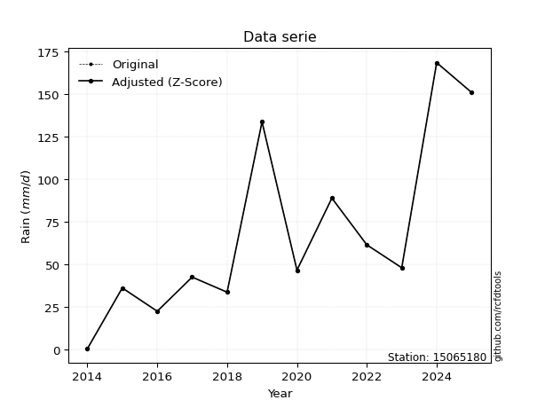</img>

</div>

> If Z-Score is active, values out of range or outliers are replaced with the station mean value.


### 4. Active continuous probability distributions from SciPy (45 of 104 available)

[scipy.stats](https://docs.scipy.org/doc/scipy/reference/stats.html) is a Python´s powerful submodule within the SciPy library for comprehensive statistical analysis, offering over 130 probability distributions (like Normal, Poisson), functions for descriptive stats (mean, variance), hypothesis testing (t-tests, chi-square), random variable generation, and statistical tests, making it essential for data science, modeling, and research. It provides tools to explore, model, and draw conclusions from data efficiently, working seamlessly with NumPy.

<div align="center">

|   id | p_dist             |   n_parameter | fit_method   | label                                                                       | active   | ref                                                                                                        |
|-----:|:-------------------|--------------:|:-------------|:----------------------------------------------------------------------------|:---------|:-----------------------------------------------------------------------------------------------------------|
|    0 | alpha              |             3 | MLE          | Alpha                                                                       | True     | [:mortar_board:](https://docs.scipy.org/doc/scipy/reference/generated/scipy.stats.alpha.html)              |
|    1 | betaprime          |             4 | MLE          | Beta prime                                                                  | True     | [:mortar_board:](https://docs.scipy.org/doc/scipy/reference/generated/scipy.stats.betaprime.html)          |
|    2 | chi2               |             3 | MLE          | Chi²                                                                        | True     | [:mortar_board:](https://docs.scipy.org/doc/scipy/reference/generated/scipy.stats.chi2.html)               |
|    3 | crystalball        |             4 | MLE          | Crystalball                                                                 | True     | [:mortar_board:](https://docs.scipy.org/doc/scipy/reference/generated/scipy.stats.crystalball.html)        |
|    4 | erlang             |             3 | MLE          | Erlang                                                                      | True     | [:mortar_board:](https://docs.scipy.org/doc/scipy/reference/generated/scipy.stats.erlang.html)             |
|    5 | expon              |             2 | MLE          | Exponential                                                                 | True     | [:mortar_board:](https://docs.scipy.org/doc/scipy/reference/generated/scipy.stats.expon.html)              |
|    6 | exponnorm          |             3 | MLE          | Exponentially modified Normal                                               | True     | [:mortar_board:](https://docs.scipy.org/doc/scipy/reference/generated/scipy.stats.exponnorm.html)          |
|    7 | f                  |             4 | MLE          | F                                                                           | True     | [:mortar_board:](https://docs.scipy.org/doc/scipy/reference/generated/scipy.stats.f.html)                  |
|    8 | fatiguelife        |             3 | MLE          | Fatigue-life (Birnbaum-Saunders)                                            | True     | [:mortar_board:](https://docs.scipy.org/doc/scipy/reference/generated/scipy.stats.fatiguelife.html)        |
|    9 | fisk               |             3 | MLE          | Fisk                                                                        | True     | [:mortar_board:](https://docs.scipy.org/doc/scipy/reference/generated/scipy.stats.fisk.html)               |
|   10 | gamma              |             3 | MLE          | Gamma                                                                       | True     | [:mortar_board:](https://docs.scipy.org/doc/scipy/reference/generated/scipy.stats.gamma.html)              |
|   11 | genexpon           |             5 | MLE          | Generalized exponential                                                     | True     | [:mortar_board:](https://docs.scipy.org/doc/scipy/reference/generated/scipy.stats.genexpon.html)           |
|   12 | genlogistic        |             3 | MLE          | Generalized logistic                                                        | True     | [:mortar_board:](https://docs.scipy.org/doc/scipy/reference/generated/scipy.stats.genlogistic.html)        |
|   13 | gibrat             |             2 | MM           | Gibrat                                                                      | True     | [:mortar_board:](https://docs.scipy.org/doc/scipy/reference/generated/scipy.stats.gibrat.html)             |
|   14 | gompertz           |             3 | MLE          | Gompertz (or truncated Gumbel)                                              | True     | [:mortar_board:](https://docs.scipy.org/doc/scipy/reference/generated/scipy.stats.gompertz.html)           |
|   15 | gumbel_l           |             2 | MM           | Gumbel Left Skew                                                            | True     | [:mortar_board:](https://docs.scipy.org/doc/scipy/reference/generated/scipy.stats.gumbel_l.html)           |
|   16 | gumbel_r           |             2 | MM           | Gumbel Right Skew                                                           | True     | [:mortar_board:](https://docs.scipy.org/doc/scipy/reference/generated/scipy.stats.gumbel_r.html)           |
|   17 | halflogistic       |             2 | MM           | Half-logistic                                                               | True     | [:mortar_board:](https://docs.scipy.org/doc/scipy/reference/generated/scipy.stats.halflogistic.html)       |
|   18 | halfnorm           |             2 | MM           | Half Normal                                                                 | True     | [:mortar_board:](https://docs.scipy.org/doc/scipy/reference/generated/scipy.stats.halfnorm.html)           |
|   19 | hypsecant          |             2 | MM           | hyperbolic secant                                                           | True     | [:mortar_board:](https://docs.scipy.org/doc/scipy/reference/generated/scipy.stats.hypsecant.html)          |
|   20 | invgamma           |             3 | MLE          | Inverted gamma                                                              | True     | [:mortar_board:](https://docs.scipy.org/doc/scipy/reference/generated/scipy.stats.invgamma.html)           |
|   21 | invgauss           |             3 | MLE          | Inverse Gaussian                                                            | True     | [:mortar_board:](https://docs.scipy.org/doc/scipy/reference/generated/scipy.stats.invgauss.html)           |
|   22 | invweibull         |             3 | MLE          | Inverted Weibull                                                            | True     | [:mortar_board:](https://docs.scipy.org/doc/scipy/reference/generated/scipy.stats.invweibull.html)         |
|   23 | johnsonsu          |             4 | MLE          | Johnson Su                                                                  | True     | [:mortar_board:](https://docs.scipy.org/doc/scipy/reference/generated/scipy.stats.johnsonsu.html)          |
|   24 | kstwobign          |             2 | MLE          | Limiting distribution of scaled Kolmogorov-Smirnov two-sided test statistic | True     | [:mortar_board:](https://docs.scipy.org/doc/scipy/reference/generated/scipy.stats.kstwobign.html)          |
|   25 | laplace            |             2 | MM           | Laplace                                                                     | True     | [:mortar_board:](https://docs.scipy.org/doc/scipy/reference/generated/scipy.stats.laplace.html)            |
|   26 | laplace_asymmetric |             3 | MLE          | Asymmetric Laplace                                                          | True     | [:mortar_board:](https://docs.scipy.org/doc/scipy/reference/generated/scipy.stats.laplace_asymmetric.html) |
|   27 | loggamma           |             3 | MLE          | Log gamma                                                                   | True     | [:mortar_board:](https://docs.scipy.org/doc/scipy/reference/generated/scipy.stats.loggamma.html)           |
|   28 | logistic           |             2 | MM           | Logistic (or Sech-squared)                                                  | True     | [:mortar_board:](https://docs.scipy.org/doc/scipy/reference/generated/scipy.stats.logistic.html)           |
|   29 | lognorm            |             3 | MLE          | Log Normal                                                                  | True     | [:mortar_board:](https://docs.scipy.org/doc/scipy/reference/generated/scipy.stats.lognorm.html)            |
|   30 | maxwell            |             2 | MM           | Maxwell                                                                     | True     | [:mortar_board:](https://docs.scipy.org/doc/scipy/reference/generated/scipy.stats.maxwell.html)            |
|   31 | mielke             |             4 | MLE          | Mielke Beta-Kappa / Dagum                                                   | True     | [:mortar_board:](https://docs.scipy.org/doc/scipy/reference/generated/scipy.stats.mielke.html)             |
|   32 | moyal              |             2 | MM           | Moyal                                                                       | True     | [:mortar_board:](https://docs.scipy.org/doc/scipy/reference/generated/scipy.stats.moyal.html)              |
|   33 | nakagami           |             3 | MLE          | Nakagami                                                                    | True     | [:mortar_board:](https://docs.scipy.org/doc/scipy/reference/generated/scipy.stats.nakagami.html)           |
|   34 | ncf                |             5 | MLE          | Non-central F distribution                                                  | True     | [:mortar_board:](https://docs.scipy.org/doc/scipy/reference/generated/scipy.stats.ncf.html)                |
|   35 | nct                |             4 | MLE          | Non-central Student’s t                                                     | True     | [:mortar_board:](https://docs.scipy.org/doc/scipy/reference/generated/scipy.stats.nct.html)                |
|   36 | norm               |             2 | MM           | Normal                                                                      | True     | [:mortar_board:](https://docs.scipy.org/doc/scipy/reference/generated/scipy.stats.norm.html)               |
|   37 | pareto             |             3 | MLE          | Pareto                                                                      | True     | [:mortar_board:](https://docs.scipy.org/doc/scipy/reference/generated/scipy.stats.pareto.html)             |
|   38 | pearson3           |             3 | MM           | Pearson type III                                                            | True     | [:mortar_board:](https://docs.scipy.org/doc/scipy/reference/generated/scipy.stats.pearson3.html)           |
|   39 | rayleigh           |             2 | MM           | Rayleigh                                                                    | True     | [:mortar_board:](https://docs.scipy.org/doc/scipy/reference/generated/scipy.stats.rayleigh.html)           |
|   40 | rice               |             3 | MLE          | Rice                                                                        | True     | [:mortar_board:](https://docs.scipy.org/doc/scipy/reference/generated/scipy.stats.rice.html)               |
|   41 | t                  |             3 | MLE          | Student’s t                                                                 | True     | [:mortar_board:](https://docs.scipy.org/doc/scipy/reference/generated/scipy.stats.t.html)                  |
|   42 | truncnorm          |             4 | MLE          | Truncated normal                                                            | True     | [:mortar_board:](https://docs.scipy.org/doc/scipy/reference/generated/scipy.stats.truncnorm.html)          |
|   43 | wald               |             2 | MM           | Wald                                                                        | True     | [:mortar_board:](https://docs.scipy.org/doc/scipy/reference/generated/scipy.stats.wald.html)               |
|   44 | weibull_min        |             3 | MLE          | Weibull minimum                                                             | True     | [:mortar_board:](https://docs.scipy.org/doc/scipy/reference/generated/scipy.stats.weibull_min.html)        |

</div>

> **n_parameter:** # arguments & localization & scale.
>
> **Fit methods:** (MLE) maximum likelihood, (MM) L-moments.
>
>**Inactive:** foldnorm, gennorm, norminvgauss, powernorm, powerlognorm, skewnorm, genextreme, anglit, arcsine, argus, beta, bradford, burr, burr12, cauchy, cosine, halfcauchy, foldcauchy, skewcauchy, wrapcauchy, dgamma, gengamma, exponweib, exponpow, truncexpon, gausshyper, genhalflogistic, genhyperbolic, geninvgauss, halfgennorm, johnsonsb, kappa4, kappa3, ksone, kstwo, loglaplace, levy, levy_l, levy_stable, ncx2, genpareto, truncpareto, lomax, powerlaw, rdist, rel_breitwigner, recipinvgauss, semicircular, studentized_range, trapezoid, triang, truncweibull_min, tukeylambda, uniform, loguniform, vonmises, vonmises_line, weibull_max, dweibull, 


## B. Probability distributions vs. Empirical distributions

A continuous probability distribution (CPD) describes probabilities for variables that can take any value within a range (like rain any time), unlike discrete variables with specific outcomes (like temperature). It uses a Probability Density Function (PDF), a curve where the total area under it equals 1, and the probability of the variable falling within an interval (a to b) is found by calculating the area under the curve between those points. A key feature is that the probability of hitting any single exact value is zero, so probabilities are always expressed for ranges, e.g., $P(a ≤ X ≤ b)$.

<div align="center">

Distributions parameters
|    |   station | p_dist                |   n |              loc |           scale | shape                 | shape1                 | shape2                 | shape3   |
|---:|----------:|:----------------------|----:|-----------------:|----------------:|:----------------------|:-----------------------|:-----------------------|:---------|
|  0 |  15065180 | alpha                 |  12 |   -104.197       |   660.64        | 4.248051966636623     |                        |                        |          |
|  1 |  15065180 | betaprime             |  12 |    -14.8632      |   314.418       | 3.6719411920352143    | 16.1589472980994       |                        |          |
|  2 |  15065180 | chi2                  |  12 |     -8.64985     |    14.6799      | 4.780272906837892     |                        |                        |          |
|  3 |  15065180 | crystalball           |  12 |     61.5242      |    45.4763      | 3567.0029139214357    | 6934.271830462238      |                        |          |
|  4 |  15065180 | erlang                |  12 |     -8.64979     |    29.3599      | 2.390131101469809     |                        |                        |          |
|  5 |  15065180 | expon                 |  12 |      0.6         |    60.9242      |                       |                        |                        |          |
|  6 |  15065180 | exponnorm             |  12 |     19.618       |    16.1425      | 2.5960150231802404    |                        |                        |          |
|  7 |  15065180 | f                     |  12 |     -8.6837      |    70.1744      | 4.79209362538289      | 4207.824129626375      |                        |          |
|  8 |  15065180 | fatiguelife           |  12 |    -31.8943      |    83.9241      | 0.47582520968000014   |                        |                        |          |
|  9 |  15065180 | fisk                  |  12 |    -21.8015      |    72.2469      | 3.392024262604294     |                        |                        |          |
| 10 |  15065180 | gamma                 |  12 |     -8.64984     |    29.3598      | 2.390141180640157     |                        |                        |          |
| 11 |  15065180 | genexpon              |  12 |      0.599965    |     2.31961     | 0.038007128601746855  | 3.1442477447306217e-06 | 1.9703492888814806     |          |
| 12 |  15065180 | genlogistic           |  12 |   -165.983       |    32.2368      | 627.7674990210071     |                        |                        |          |
| 13 |  15065180 | gibrat                |  12 |     26.8315      |    21.0422      |                       |                        |                        |          |
| 14 |  15065180 | gompertz              |  12 |      0.6         |   140.579       | 1.572837686403624     |                        |                        |          |
| 15 |  15065180 | gumbel_l              |  12 |     81.9909      |    35.4577      |                       |                        |                        |          |
| 16 |  15065180 | gumbel_r              |  12 |     41.0574      |    35.4577      |                       |                        |                        |          |
| 17 |  15065180 | halflogistic          |  12 |      7.62415     |    38.8806      |                       |                        |                        |          |
| 18 |  15065180 | halfnorm              |  12 |      1.33135     |    75.4405      |                       |                        |                        |          |
| 19 |  15065180 | hypsecant             |  12 |     61.5242      |    28.9511      |                       |                        |                        |          |
| 20 |  15065180 | invgamma              |  12 |    -53.1648      |   793.743       | 7.915808095456593     |                        |                        |          |
| 21 |  15065180 | invgauss              |  12 |    -33.5286      |   416.479       | 0.22822922437681278   |                        |                        |          |
| 22 |  15065180 | invweibull            |  12 |   -232.123       |   271.915       | 8.804005728509601     |                        |                        |          |
| 23 |  15065180 | johnsonsu             |  12 |     35.9812      |    15.5388      | -0.6001636734100575   | 0.8060000244977797     |                        |          |
| 24 |  15065180 | kstwobign             |  12 |    -77.0541      |   160.325       |                       |                        |                        |          |
| 25 |  15065180 | laplace               |  12 |     61.5242      |    32.1566      |                       |                        |                        |          |
| 26 |  15065180 | laplace_asymmetric    |  12 |     36.25        |    25.2699      | 0.6179882028759092    |                        |                        |          |
| 27 |  15065180 | loggamma              |  12 | -14943.5         |  1998.53        | 1823.073373181387     |                        |                        |          |
| 28 |  15065180 | logistic              |  12 |     61.5242      |    25.0724      |                       |                        |                        |          |
| 29 |  15065180 | lognorm               |  12 |      0.6         |     1.8623      | 11.277607248523122    |                        |                        |          |
| 30 |  15065180 | maxwell               |  12 |    -46.2355      |    67.5284      |                       |                        |                        |          |
| 31 |  15065180 | mielke                |  12 |      0.6         |    94.7124      | 0.8996874175867475    | 3.637771973326026      |                        |          |
| 32 |  15065180 | moyal                 |  12 |     35.5179      |    20.4715      |                       |                        |                        |          |
| 33 |  15065180 | nakagami              |  12 |     22.59        |    44.6627      | 0.36829796173622786   |                        |                        |          |
| 34 |  15065180 | ncf                   |  12 |      0.6         |     6.3727      | 0.8612350717069722    | 50.331855819066824     | 7.476191624929681      |          |
| 35 |  15065180 | nct                   |  12 |     -0.0659897   |    22.7745      | 3.1936242634946472    | 2.0305979641774465     |                        |          |
| 36 |  15065180 | norm                  |  12 |     61.5242      |    45.4763      |                       |                        |                        |          |
| 37 |  15065180 | pareto                |  12 |      0.599658    |     0.000341927 | 0.09091688248411071   |                        |                        |          |
| 38 |  15065180 | pearson3              |  12 |     61.5243      |    45.4761      | 1.1357855346537589    |                        |                        |          |
| 39 |  15065180 | rayleigh              |  12 |    -25.4746      |    69.415       |                       |                        |                        |          |
| 40 |  15065180 | rice                  |  12 |    -14.5576      |    62.6759      | 0.0004578555343158357 |                        |                        |          |
| 41 |  15065180 | t                     |  12 |     61.5076      |    45.3216      | 25.58206057083604     |                        |                        |          |
| 42 |  15065180 | truncnorm             |  12 |     61.5242      |    45.4763      | -16.73658666650796    | 832.5755877480641      |                        |          |
| 43 |  15065180 | wald                  |  12 |     16.0479      |    45.4763      |                       |                        |                        |          |
| 44 |  15065180 | weibull_min           |  12 |     -2.60494     |    70.3008      | 1.4149399347622187    |                        |                        |          |
| 45 |  15065180 | logalpha              |  12 |    -48.6685      |  1818.04        | 34.813843847711155    |                        |                        |          |
| 46 |  15065180 | logbetaprime          |  12 |     -0.510826    |     3.07163     | 0.7045109859962277    | 0.9687496674615129     |                        |          |
| 47 |  15065180 | logchi2               |  12 |     -0.510826    |     1.42316     | 1.2805222569187018    |                        |                        |          |
| 48 |  15065180 | logcrystalball        |  12 |      3.65204     |     1.36921     | 129.15371844618272    | 445.33782913684615     |                        |          |
| 49 |  15065180 | logerlang             |  12 |     -0.510826    |     1.5725      | 0.0025393189253196087 |                        |                        |          |
| 50 |  15065180 | logexpon              |  12 |     -0.510826    |     4.16287     |                       |                        |                        |          |
| 51 |  15065180 | logexponnorm          |  12 |      3.65114     |     1.36921     | 0.0006585587002222999 |                        |                        |          |
| 52 |  15065180 | logf                  |  12 |     -0.510826    |     1.25031     | 1.0718581227927295    | 1.2013955424408056     |                        |          |
| 53 |  15065180 | logfatiguelife        |  12 |  -1318.99        |  1322.64        | 0.001032857843200452  |                        |                        |          |
| 54 |  15065180 | logfisk               |  12 |     -1.26681e+08 |     1.26681e+08 | 246652916.9128796     |                        |                        |          |
| 55 |  15065180 | loggamma              |  12 |     -0.510826    |     3.15265     | 0.7037245328768147    |                        |                        |          |
| 56 |  15065180 | loggenexpon           |  12 |     -0.51741     |     0.191503    | 0.007808923258511729  | 24.800916395771885     | 0.00012740416737305575 |          |
| 57 |  15065180 | loggenlogistic        |  12 |      4.55946     |     0.296517    | 0.28964261827217674   |                        |                        |          |
| 58 |  15065180 | loggibrat             |  12 |      2.60752     |     0.633535    |                       |                        |                        |          |
| 59 |  15065180 | loggompertz           |  12 |     -0.510832    |     0.826296    | 0.0034698924847904496 |                        |                        |          |
| 60 |  15065180 | loggumbel_l           |  12 |      4.26826     |     1.06757     |                       |                        |                        |          |
| 61 |  15065180 | loggumbel_r           |  12 |      3.03582     |     1.06757     |                       |                        |                        |          |
| 62 |  15065180 | loghalflogistic       |  12 |      2.02921     |     1.17063     |                       |                        |                        |          |
| 63 |  15065180 | loghalfnorm           |  12 |      1.83976     |     2.27137     |                       |                        |                        |          |
| 64 |  15065180 | loghypsecant          |  12 |      3.65204     |     0.871669    |                       |                        |                        |          |
| 65 |  15065180 | loginvgamma           |  12 |    -33.71        | 23833           | 638.4348921161939     |                        |                        |          |
| 66 |  15065180 | loginvgauss           |  12 |    -14.0297      |  2140.42        | 0.008245789613602297  |                        |                        |          |
| 67 |  15065180 | loginvweibull         |  12 |     -2.28088e+08 |     2.28088e+08 | 119578992.95746967    |                        |                        |          |
| 68 |  15065180 | logjohnsonsu          |  12 |      3.87504     |     0.253603    | 0.03496752424379869   | 0.6164426761960307     |                        |          |
| 69 |  15065180 | logkstwobign          |  12 |     -4.38559     |     9.26161     |                       |                        |                        |          |
| 70 |  15065180 | loglaplace            |  12 |      3.65204     |     0.968181    |                       |                        |                        |          |
| 71 |  15065180 | loglaplace_asymmetric |  12 |      3.87328     |     0.740424    | 1.1560062709411465    |                        |                        |          |
| 72 |  15065180 | logloggamma           |  12 |      4.76603     |     0.462053    | 0.42167526642563946   |                        |                        |          |
| 73 |  15065180 | loglogistic           |  12 |      3.65204     |     0.754888    |                       |                        |                        |          |
| 74 |  15065180 | loglognorm            |  12 |  -1327.07        |  1330.73        | 0.00102554492252127   |                        |                        |          |
| 75 |  15065180 | logmaxwell            |  12 |      0.407557    |     2.03318     |                       |                        |                        |          |
| 76 |  15065180 | logmielke             |  12 |     -1.67696e+08 |     1.67696e+08 | 180937602.0977308     | 326478491.99829197     |                        |          |
| 77 |  15065180 | logmoyal              |  12 |      2.86904     |     0.616363    |                       |                        |                        |          |
| 78 |  15065180 | lognakagami           |  12 |  -1597.21        |  1600.87        | 341726.29516020755    |                        |                        |          |
| 79 |  15065180 | logncf                |  12 |     -0.510826    |     0.978603    | 0.998280693600245     | 1.3055378665787503     | 1.1781574221553628     |          |
| 80 |  15065180 | lognct                |  12 |    -84.739       |     1.3351      | 35535.984178925355    | 66.20299562079782      |                        |          |
| 81 |  15065180 | lognorm               |  12 |      3.65204     |     1.36921     |                       |                        |                        |          |
| 82 |  15065180 | logpareto             |  12 |     -0.510853    |     2.7713e-05  | 0.09091585056007094   |                        |                        |          |
| 83 |  15065180 | logpearson3           |  12 |      3.65205     |     1.3692      | -2.1561829958962733   |                        |                        |          |
| 84 |  15065180 | lograyleigh           |  12 |      1.03266     |     2.08996     |                       |                        |                        |          |
| 85 |  15065180 | logrice               |  12 |   -520.807       |     1.36823     | 383.31033856490683    |                        |                        |          |
| 86 |  15065180 | logt                  |  12 |      3.87696     |     0.375739    | 1.2331181390275172    |                        |                        |          |
| 87 |  15065180 | logtruncnorm          |  12 |      1.79301     |     6.17351     | -0.37318089291953904  | 0.5399410446551702     |                        |          |
| 88 |  15065180 | logwald               |  12 |      2.28278     |     1.36925     |                       |                        |                        |          |
| 89 |  15065180 | logweibull_min        |  12 |     -0.510826    |     2.25389     | 0.8050634090522689    |                        |                        |          |

</div>

> **loc** (Location parameter): This shifts the distribution along the x-axis. For many common distributions, like the normal (Gaussian) distribution, loc represents the mean $μ$. For others, like the uniform distribution, it might represent the minimum value, or for the beta distribution, the left end of the support interval.
>
> **scale** (Scale parameter): This determines the width or spread of the distribution. For the normal distribution, scale represents the standard deviation $σ$. For a uniform distribution, it defines the length of the interval (from $loc$ to $loc + scale$).
>
> **shape** (Shape parameters): Refers to parameters that define the specific form of a probability distribution, distinct from its location (loc) and scale (scale). These parameters are required arguments for most distribution functions. For example, a normal (Gaussian) distribution is fully defined by its location (mean) and scale (standard deviation), so it has no specific shape parameters beyond loc and scale. However, other distributions have intrinsic properties that need specification, as Gamma distribution that takes a shape parameter, often named $a$ or $alpha$.


### 0. Cumulative distribution values - CDF (90 evaluated)

> Ordered by x ascending and calculating $log(f(x))$ separately. 

|   id |   Station |   date |      x |   count |    mean |     std |       zscore |   Value_initial |   station |   m |     alpha |   alpha_pdf |   betaprime |   betaprime_pdf |      chi2 |    chi2_pdf |   crystalball |   crystalball_pdf |    erlang |   erlang_pdf |    expon |   expon_pdf |   exponnorm |   exponnorm_pdf |         f |       f_pdf |   fatiguelife |   fatiguelife_pdf |      fisk |   fisk_pdf |     gamma |   gamma_pdf |    genexpon |   genexpon_pdf |   genlogistic |   genlogistic_pdf |   gibrat |   gibrat_pdf |    gompertz |   gompertz_pdf |   gumbel_l |   gumbel_l_pdf |   gumbel_r |   gumbel_r_pdf |   halflogistic |   halflogistic_pdf |   halfnorm |   halfnorm_pdf |   hypsecant |   hypsecant_pdf |   invgamma |   invgamma_pdf |   invgauss |   invgauss_pdf |   invweibull |   invweibull_pdf |   johnsonsu |   johnsonsu_pdf |   kstwobign |   kstwobign_pdf |   laplace |   laplace_pdf |   laplace_asymmetric |   laplace_asymmetric_pdf |    loggamma |   loggamma_pdf |   logistic |   logistic_pdf |    lognorm |   lognorm_pdf |   maxwell |   maxwell_pdf |      mielke |   mielke_pdf |     moyal |   moyal_pdf |    nakagami |   nakagami_pdf |         ncf |      ncf_pdf |      nct |     nct_pdf |      norm |    norm_pdf |   pareto |    pareto_pdf |   pearson3 |   pearson3_pdf |   rayleigh |   rayleigh_pdf |      rice |    rice_pdf |         t |       t_pdf |   truncnorm |   truncnorm_pdf |      wald |    wald_pdf |   weibull_min |   weibull_min_pdf |   logalpha |   logalpha_pdf |   logbetaprime |   logbetaprime_pdf |     logchi2 |    logchi2_pdf |   logcrystalball |   logcrystalball_pdf |   logerlang |   logerlang_pdf |   logexpon |   logexpon_pdf |   logexponnorm |   logexponnorm_pdf |        logf |    logf_pdf |   logfatiguelife |   logfatiguelife_pdf |    logfisk |   logfisk_pdf |   loggenexpon |   loggenexpon_pdf |   loggenlogistic |   loggenlogistic_pdf |   loggibrat |   loggibrat_pdf |   loggompertz |   loggompertz_pdf |   loggumbel_l |   loggumbel_l_pdf |   loggumbel_r |   loggumbel_r_pdf |   loghalflogistic |   loghalflogistic_pdf |   loghalfnorm |   loghalfnorm_pdf |   loghypsecant |   loghypsecant_pdf |   loginvgamma |   loginvgamma_pdf |   loginvgauss |   loginvgauss_pdf |   loginvweibull |   loginvweibull_pdf |   logjohnsonsu |   logjohnsonsu_pdf |   logkstwobign |   logkstwobign_pdf |   loglaplace |   loglaplace_pdf |   loglaplace_asymmetric |   loglaplace_asymmetric_pdf |   logloggamma |   logloggamma_pdf |   loglogistic |   loglogistic_pdf |   loglognorm |   loglognorm_pdf |   logmaxwell |   logmaxwell_pdf |   logmielke |   logmielke_pdf |    logmoyal |   logmoyal_pdf |   lognakagami |   lognakagami_pdf |      logncf |   logncf_pdf |     lognct |   lognct_pdf |   logpareto |   logpareto_pdf |   logpearson3 |   logpearson3_pdf |   lograyleigh |   lograyleigh_pdf |    logrice |   logrice_pdf |      logt |   logt_pdf |   logtruncnorm |   logtruncnorm_pdf |   logwald |   logwald_pdf |   logweibull_min |   logweibull_min_pdf |
|-----:|----------:|-------:|-------:|--------:|--------:|--------:|-------------:|----------------:|----------:|----:|----------:|------------:|------------:|----------------:|----------:|------------:|--------------:|------------------:|----------:|-------------:|---------:|------------:|------------:|----------------:|----------:|------------:|--------------:|------------------:|----------:|-----------:|----------:|------------:|------------:|---------------:|--------------:|------------------:|---------:|-------------:|------------:|---------------:|-----------:|---------------:|-----------:|---------------:|---------------:|-------------------:|-----------:|---------------:|------------:|----------------:|-----------:|---------------:|-----------:|---------------:|-------------:|-----------------:|------------:|----------------:|------------:|----------------:|----------:|--------------:|---------------------:|-------------------------:|------------:|---------------:|-----------:|---------------:|-----------:|--------------:|----------:|--------------:|------------:|-------------:|----------:|------------:|------------:|---------------:|------------:|-------------:|---------:|------------:|----------:|------------:|---------:|--------------:|-----------:|---------------:|-----------:|---------------:|----------:|------------:|----------:|------------:|------------:|----------------:|----------:|------------:|--------------:|------------------:|-----------:|---------------:|---------------:|-------------------:|------------:|---------------:|-----------------:|---------------------:|------------:|----------------:|-----------:|---------------:|---------------:|-------------------:|------------:|------------:|-----------------:|---------------------:|-----------:|--------------:|--------------:|------------------:|-----------------:|---------------------:|------------:|----------------:|--------------:|------------------:|--------------:|------------------:|--------------:|------------------:|------------------:|----------------------:|--------------:|------------------:|---------------:|-------------------:|--------------:|------------------:|--------------:|------------------:|----------------:|--------------------:|---------------:|-------------------:|---------------:|-------------------:|-------------:|-----------------:|------------------------:|----------------------------:|--------------:|------------------:|--------------:|------------------:|-------------:|-----------------:|-------------:|-----------------:|------------:|----------------:|------------:|---------------:|--------------:|------------------:|------------:|-------------:|-----------:|-------------:|------------:|----------------:|--------------:|------------------:|--------------:|------------------:|-----------:|--------------:|----------:|-----------:|---------------:|-------------------:|----------:|--------------:|-----------------:|---------------------:|
|    0 |  15065180 |   2014 |   0.6  |      12 | 61.5242 | 47.4984 | -1.28266     |            0.6  |  15065180 |   1 | 0.0198948 | 0.00289954  |   0.0184626 |     0.00353759  | 0.0172114 | 0.00404304  |     0.0901729 |       0.00357598  | 0.0172113 |  0.00404304  | 0        |  0.0164138  |   0.0193565 |     0.00238665  | 0.0172214 | 0.00403845  |     0.0192371 |       0.0033772   | 0.0184887 | 0.0027478  | 0.0172113 | 0.00404301  | 5.67022e-07 |     0.0163852  |      0.028228 |       0.00311496  | 0        |  0           | 4.29472e-14 |    0.0111883   |  0.0958115 |    0.00256834  |  0.0437217 |    0.00385938  |       0        |        0           |   0        |     0          |   0.0772362 |     0.00264171  |  0.0193016 |    0.0030478   |  0.0191579 |    0.00332967  |    0.0195193 |      0.00290669  |    0.031558 |     0.00147994  |   0.0269196 |     0.00329936  | 0.0751886 |   0.0023382   |            0.0281873 |              0.00180497  | 2.90203e-12 |  18394.8       |  0.0809186 |    0.00296624  | 0.00118158 |    0.00286557 | 0.0769627 |   0.00446865  | 2.34535e-11 |  0.145504    | 0.0189607 | 0.00291554  | 0           |    0           | 7.86162e-06 | 36.3386      | 0.022567 | 0.00219947  | 0.0901729 | 0.00357598  | 0        | 265.896       |  0.0334799 |     0.00447647 |  0.0681192 |    0.0050428   | 0.0288201 | 0.0037474   | 0.0953903 | 0.00352041  |   0.0901729 |     0.00357598  | 0         | 0           |     0.0125783 |       0.00551807  | 0.00165148 |     0.00417593 |    2.54426e-12 |      16145         | 3.47082e-11 | 200161         |       0.00118158 |           0.00286556 |    0.911216 |     2.08415e+13 |   0        |      0.240219  |     0.00118151 |         0.00286543 | 1.66754e-09 | 8.04957e+06 |       0.00113651 |           0.00278035 | 0.00019052 |   0.000370879 |    0.00027031 |         0.0413331 |       0.00706404 |           0.00690027 |    0        |       0         |   2.50949e-08 |        0.00419936 |     0.0113077 |         0.0105318 |   9.14646e-13 |       2.37494e-11 |          0        |              0        |      0        |          0        |     0.00536773 |          0.0061577 |    0.00120075 |        0.00315235 |    0.00185045 |        0.00486072 |      0.00296338 |          0.00904416 |      0.0157807 |         0.00555051 |     0.00520532 |          0.0175941 |   0.00678645 |       0.00700948 |              0.00341131 |                  0.00398548 |     0.0091407 |        0.00834184 |    0.00401157 |         0.0052928 |   0.00111687 |       0.00273901 |     0        |         0        |  0.00556227 |      0.00600095 | 2.76494e-54 |    5.42107e-52 |    0.00116485 |        0.00283076 | 4.06856e-09 |  1.82917e+07 | 0.00121374 |   0.00293851 |    0        |   3280.62       |      0.018484 |         0.0129106 |      0        |          0        | 0.00117297 |    0.00284848 | 0.0162921 | 0.00455028 |    2.20952e-07 |           0.171785 |  0        |     0         |      7.43721e-14 |          539.299     |
|    1 |  15065180 |   2016 |  22.59 |      12 | 61.5242 | 47.4984 | -0.819694    |           22.59 |  15065180 |   2 | 0.167884  | 0.0103165   |   0.183177  |     0.0104582   | 0.191014  | 0.0103805   |     0.19596   |       0.0060808   | 0.191014  |  0.0103805   | 0.30298  |  0.0114408  |   0.151347  |     0.0100627   | 0.190941  | 0.0103807   |     0.180102  |       0.0103622   | 0.160831  | 0.0103129  | 0.191013  | 0.0103805   | 0.30256     |     0.0114286  |      0.164311 |       0.00919192  | 0        |  0           | 0.233803    |    0.0100239   |  0.170771  |    0.00437932  |  0.185737  |    0.00881822  |       0.190117 |        0.0123951   |   0.221898 |     0.0101646  |   0.162285  |     0.00536577  |  0.172715  |    0.0104104   |  0.179353  |    0.0103912   |    0.169016  |      0.0103856   |    0.109536 |     0.00736597  |   0.165417  |     0.00894393  | 0.148984  |   0.00463308  |            0.115238  |              0.00737926  | 0.798671    |      0.0744889 |  0.174672  |    0.00574982  | 0.348122   |    0.269987   | 0.208132  |   0.00730147  | 0.268477    |  0.0109304   | 0.170284  | 0.0104366   | 1.07737e-12 |  223.376       | 0.16556     |  0.00962809  | 0.149539 | 0.0101083   | 0.19596   | 0.0060808   | 0.634536 |   0.00151097  |  0.195862  |     0.00952095 |  0.213156  |    0.00784888  | 0.161083  | 0.00793322  | 0.199241  | 0.00597502  |   0.19596   |     0.0060808   | 0.0214645 | 0.012584    |     0.208732  |       0.0104036   | 0.384765   |     0.259089   |    0.638584    |          0.0577439 | 0.84648     |      0.0641104 |       0.348122   |           0.269987   |    0.999918 |     6.9902e-05  |   0.581716 |      0.10048   |     0.348121   |         0.269988   | 0.689661    | 0.0408472   |       0.347778   |           0.270613   | 0.182265   |   0.290195    |    0.511762   |         0.17263   |       0.24396    |           0.236477   |    0.414132 |       0.764067  |   0.241679    |        0.257074   |     0.288445  |         0.226818  |   0.396       |       0.343612    |          0.434016 |              0.346663 |      0.426257 |          0.299871 |     0.315998   |          0.305841  |    0.360703   |        0.258007   |    0.392464   |        0.247129   |      0.419464   |          0.191054   |      0.139299  |         0.171168   |     0.472247   |          0.173685  |   0.287869   |       0.297329   |              0.236542   |                  0.276355   |     0.248555  |        0.222369   |    0.330019   |         0.2929    |   0.346835   |       0.270616   |     0.379943 |         0.286793 |  0.264575   |      0.259547   | 0.413669    |    0.378819    |    0.346985   |        0.269683   | 0.601013    |  0.0496491   | 0.349445   |   0.269281   |    0.657405 |      0.00858441 |      0.241837 |         0.175906  |      0.391984 |          0.290209 | 0.348013   |    0.270151   | 0.126888  | 0.172011   |    0.656737    |           0.179983 |  0.453557 |     0.540196  |      0.769412    |            0.0750631 |
|    2 |  15065180 |   2018 |  33.77 |      12 | 61.5242 | 47.4984 | -0.584318    |           33.77 |  15065180 |   3 | 0.294487  | 0.0119655   |   0.30642   |     0.0113028   | 0.31098   | 0.0108527   |     0.270832  |       0.00728191  | 0.310981  |  0.0108527   | 0.419838 |  0.0095227  |   0.280699  |     0.0126228   | 0.310928  | 0.0108557   |     0.302598  |       0.0112555   | 0.291083  | 0.0125956  | 0.31098   | 0.0108527   | 0.419311    |     0.00951547 |      0.278798 |       0.0110351   | 0.133621 |  0.0310718   | 0.342002    |    0.00932094  |  0.226378  |    0.00560011  |  0.292828  |    0.0101429   |       0.32411  |        0.011509    |   0.332797 |     0.00964244 |   0.23308   |     0.00735041  |  0.298482  |    0.0117394   |  0.30246   |    0.0113274   |    0.295838  |      0.0119304   |    0.237467 |     0.0158718   |   0.274244  |     0.0103039   | 0.210927  |   0.00655938  |            0.235783  |              0.0150983   | 0.826357    |      0.0635598 |  0.248438  |    0.00744709  | 0.461463   |    0.290005   | 0.295327  |   0.00822084  | 0.386999    |  0.0102708   | 0.296663  | 0.0117977   | 0.27884     |    0.0180638   | 0.279242    |  0.0104965   | 0.281786 | 0.0130522   | 0.270832  | 0.00728191  | 0.647942 |   0.000964959 |  0.307357  |     0.0102324  |  0.30526   |    0.0085421   | 0.257161  | 0.0091388   | 0.272964  | 0.00718554  |   0.270832  |     0.00728191  | 0.260198  | 0.0223607   |     0.325406  |       0.0103296   | 0.491016   |     0.266233   |    0.660354    |          0.0507773 | 0.870072    |      0.0535996 |       0.461463   |           0.290005   |    0.999942 |     4.87441e-05 |   0.620226 |      0.091229  |     0.461462   |         0.290007   | 0.705       | 0.0356468   |       0.461388   |           0.290689   | 0.327781   |   0.429011    |    0.579395   |         0.16325   |       0.359035   |           0.340501   |    0.642214 |       0.409315  |   0.363782    |        0.35086    |     0.391001  |         0.282909  |   0.529599    |       0.315325    |          0.562555 |              0.29195  |      0.540434 |          0.267229 |     0.45181    |          0.360996  |    0.467527   |        0.270091   |    0.493062   |        0.250563   |      0.49477    |          0.182524   |      0.252346  |         0.450837   |     0.540046   |          0.163058  |   0.436062   |       0.450393   |              0.378367   |                  0.442051   |     0.354654  |        0.308623   |    0.456241   |         0.328638  |   0.460493   |       0.290921   |     0.495626 |         0.284949 |  0.38575    |      0.341589   | 0.555225    |    0.320857    |    0.460245   |        0.289917   | 0.619784    |  0.0439124   | 0.462386   |   0.288759   |    0.660663 |      0.00765456 |      0.324584 |         0.239254  |      0.507355 |          0.280489 | 0.46143    |    0.290212   | 0.245278  | 0.475891   |    0.728548    |           0.177109 |  0.626535 |     0.337642  |      0.797426    |            0.0646064 |
|    3 |  15065180 |   2015 |  36.25 |      12 | 61.5242 | 47.4984 | -0.532105    |           36.25 |  15065180 |   4 | 0.324278  | 0.0120433   |   0.334435  |     0.011279    | 0.337831  | 0.0107933   |     0.289185  |       0.00751716  | 0.337832  |  0.0107933   | 0.44298  |  0.00914285 |   0.312251  |     0.0127981   | 0.337786  | 0.0107966   |     0.330502  |       0.0112364   | 0.322559  | 0.0127681  | 0.337831  | 0.0107933   | 0.442436    |     0.00913653 |      0.306425 |       0.0112323   | 0.210742 |  0.0306628   | 0.364915    |    0.00915648  |  0.240631  |    0.00589517  |  0.318159  |    0.0102758   |       0.35235  |        0.0112633   |   0.356538 |     0.00950196 |   0.251891  |     0.00782052  |  0.327648  |    0.0117682   |  0.330545  |    0.0113107   |    0.325512  |      0.011985    |    0.278864 |     0.0174237   |   0.299968  |     0.0104318   | 0.227838  |   0.00708528  |            0.276364  |              0.0176969   | 0.8308      |      0.0618269 |  0.267362  |    0.00781256  | 0.482057   |    0.291071   | 0.315893  |   0.0083607   | 0.412279    |  0.0101153   | 0.325963  | 0.0118161   | 0.322201    |    0.0169414   | 0.305324    |  0.0105289   | 0.314464 | 0.0132741   | 0.289185  | 0.00751716  | 0.650242 |   0.000891966 |  0.332758  |     0.0102452  |  0.326555  |    0.00862689  | 0.280047  | 0.00931177  | 0.291085  | 0.00742516  |   0.289185  |     0.00751716  | 0.313925  | 0.0209279   |     0.350887  |       0.0102152   | 0.50986    |     0.265498   |    0.663913    |          0.0496841 | 0.873812    |      0.0519548 |       0.482057   |           0.291071   |    0.999945 |     4.5793e-05  |   0.626636 |      0.0896891 |     0.482056   |         0.291073   | 0.707497    | 0.0348425   |       0.48203    |           0.291746   | 0.358873   |   0.44798     |    0.590895   |         0.161278  |       0.383898   |           0.361241   |    0.669746 |       0.368555  |   0.389221    |        0.366994   |     0.411382  |         0.292209  |   0.551667    |       0.307368    |          0.582892 |              0.282    |      0.559152 |          0.261006 |     0.477522   |          0.364263  |    0.486674   |        0.270152   |    0.510784   |        0.249501   |      0.507632   |          0.180439   |      0.28773   |         0.551506   |     0.551525   |          0.160902  |   0.469177   |       0.484596   |              0.411027   |                  0.480208   |     0.377124  |        0.325587   |    0.47961    |         0.330624  |   0.481153   |       0.292014   |     0.515733 |         0.282418 |  0.410405   |      0.354031   | 0.577534    |    0.308712    |    0.480835   |        0.291024   | 0.622863    |  0.0430125   | 0.482889   |   0.289755   |    0.6612   |      0.00751039 |      0.342016 |         0.252844  |      0.527109 |          0.276915 | 0.482039   |    0.29128    | 0.282318  | 0.571471   |    0.741079    |           0.17653  |  0.649534 |     0.311853  |      0.801946    |            0.0629508 |
|    4 |  15065180 |   2017 |  42.61 |      12 | 61.5242 | 47.4984 | -0.398206    |           42.61 |  15065180 |   5 | 0.400525  | 0.0118466   |   0.405331  |     0.0109596   | 0.405512  | 0.0104485   |     0.338737  |       0.00804567  | 0.405512  |  0.0104485   | 0.498196 |  0.00823653 |   0.393548  |     0.01263     | 0.405489  | 0.0104522   |     0.401155  |       0.0109255   | 0.403863  | 0.0126787  | 0.405512  | 0.0104485   | 0.497619    |     0.00823228 |      0.378639 |       0.0113981   | 0.38672  |  0.0242576   | 0.421779    |    0.00872246  |  0.280606  |    0.00668204  |  0.383983  |    0.0103654   |       0.421828 |        0.0105716   |   0.415737 |     0.00910591 |   0.305431  |     0.0090039   |  0.401875  |    0.011499    |  0.401669  |    0.0109968   |    0.40123   |      0.0117419   |    0.395126 |     0.0183721   |   0.366741  |     0.0105094   | 0.277666  |   0.00863481  |            0.3806    |              0.0151478   | 0.840487    |      0.0580678 |  0.319867  |    0.00867696  | 0.529124   |    0.290589   | 0.369937  |   0.00860734  | 0.475248    |  0.00967521  | 0.400374  | 0.0115071   | 0.422538    |    0.0147247   | 0.372026    |  0.0103995   | 0.399032 | 0.0131706   | 0.338737  | 0.00804567  | 0.655424 |   0.000745717 |  0.397549  |     0.0100865  |  0.381846  |    0.00873452  | 0.340305  | 0.00960048  | 0.340091  | 0.00796645  |   0.338737  |     0.00804567  | 0.434275  | 0.0169472   |     0.414643  |       0.00980987  | 0.552507   |     0.261654   |    0.671751    |          0.0473219 | 0.88192     |      0.0484085 |       0.529124   |           0.290589   |    0.999952 |     3.97566e-05 |   0.640856 |      0.0862731 |     0.529124   |         0.290591   | 0.712988    | 0.033115    |       0.529204   |           0.291224   | 0.434007   |   0.478279    |    0.616583   |         0.156476  |       0.446159   |           0.408953   |    0.722897 |       0.292619  |   0.451354    |        0.400894   |     0.460234  |         0.311764  |   0.599755    |       0.287208    |          0.626647 |              0.259396 |      0.600173 |          0.24645  |     0.536454   |          0.362781  |    0.530211   |        0.267978   |    0.550809   |        0.245315   |      0.536383   |          0.175166   |      0.400031  |         0.845044   |     0.577122   |          0.155747  |   0.549087   |       0.465732   |              0.496466   |                  0.580028   |     0.432944  |        0.365132   |    0.533084   |         0.329725  |   0.528376   |       0.291565   |     0.560783 |         0.27447  |  0.469615   |      0.377142   | 0.625169    |    0.280637    |    0.527902   |        0.290638   | 0.629657    |  0.0410678   | 0.529734   |   0.289155   |    0.662389 |      0.00720025 |      0.385601 |         0.28725   |      0.571104 |          0.267025 | 0.52914    |    0.290798   | 0.393617  | 0.799341   |    0.769503    |           0.175129 |  0.695725 |     0.261458  |      0.811828    |            0.0593607 |
|    5 |  15065180 |   2020 |  46.7  |      12 | 61.5242 | 47.4984 | -0.312098    |           46.7  |  15065180 |   6 | 0.448277  | 0.0114775   |   0.449457  |     0.0106015   | 0.447586  | 0.0101135   |     0.372221  |       0.00831861  | 0.447587  |  0.0101135   | 0.530778 |  0.00770175 |   0.444297  |     0.0121462   | 0.447579  | 0.0101171   |     0.445151  |       0.0105724   | 0.45498   | 0.012279   | 0.447586  | 0.0101135   | 0.530186    |     0.00769862 |      0.425058 |       0.0112729   | 0.477117 |  0.0200461   | 0.456868    |    0.00843501  |  0.308999  |    0.00720305  |  0.426185  |    0.0102512   |       0.464089 |        0.0100901   |   0.452415 |     0.00882677 |   0.3437    |     0.00969569  |  0.448178  |    0.0111211   |  0.445943  |    0.0106364   |    0.448515  |      0.0113554   |    0.467777 |     0.0169781   |   0.40953   |     0.0103949   | 0.315327  |   0.00980597  |            0.439556  |              0.013706    | 0.845716    |      0.0560496 |  0.356347  |    0.00914806  | 0.555673   |    0.288524   | 0.405314  |   0.00868075  | 0.514173    |  0.00935319  | 0.446653  | 0.0111018   | 0.480336    |    0.0135615   | 0.414146    |  0.0101819   | 0.452014 | 0.0126939   | 0.372221  | 0.00831861  | 0.658322 |   0.000673841 |  0.438374  |     0.00986312 |  0.41757   |    0.00872413  | 0.379747  | 0.00967227  | 0.373268  | 0.00824756  |   0.372221  |     0.00831861  | 0.498791  | 0.0146514   |     0.454112  |       0.00948312  | 0.576337   |     0.258193   |    0.67603     |          0.0460582 | 0.88627     |      0.0465171 |       0.555673   |           0.288524   |    0.999955 |     3.67181e-05 |   0.648677 |      0.0843944 |     0.555673   |         0.288526   | 0.715981    | 0.0321969   |       0.55581    |           0.289125   | 0.478247   |   0.485837    |    0.630793   |         0.153584  |       0.484836   |           0.434699   |    0.748093 |       0.25809   |   0.488869    |        0.417294   |     0.489262  |         0.321443  |   0.625519    |       0.274901    |          0.649841 |              0.24675  |      0.622376 |          0.238024 |     0.569446   |          0.356516  |    0.55466    |        0.265357   |    0.573143   |        0.241911   |      0.552289   |          0.171899   |      0.483686  |         0.961619   |     0.591258   |          0.1527    |   0.589815   |       0.423665   |              0.55258    |                  0.645586   |     0.467435  |        0.3874     |    0.563147   |         0.325893  |   0.555015   |       0.289501   |     0.585683 |         0.268739 |  0.504614   |      0.385971   | 0.650166    |    0.264859    |    0.554458   |        0.288626   | 0.633373    |  0.0400275   | 0.556149   |   0.28705    |    0.663041 |      0.00703508 |      0.412919 |         0.309152  |      0.595282 |          0.260464 | 0.555708   |    0.288728   | 0.470847  | 0.873505   |    0.785516    |           0.174287 |  0.718561 |     0.237317  |      0.81718     |            0.0574337 |
|    6 |  15065180 |   2023 |  48.1  |      12 | 61.5242 | 47.4984 | -0.282623    |           48.1  |  15065180 |   7 | 0.464235  | 0.0113174   |   0.4642    |     0.010458    | 0.461655  | 0.00998327  |     0.383924  |       0.00839853  | 0.461655  |  0.00998327  | 0.541437 |  0.00752678 |   0.461154  |     0.0119318   | 0.461652  | 0.00998677  |     0.459855  |       0.0104309   | 0.472043  | 0.0120935  | 0.461654  | 0.00998328  | 0.540841    |     0.00752402 |      0.440787 |       0.0111939   | 0.504269 |  0.0187563   | 0.468607    |    0.00833529  |  0.319209  |    0.00738243  |  0.440492  |    0.0101852   |       0.478097 |        0.00992041  |   0.464703 |     0.0087273  |   0.357426  |     0.00991016  |  0.463639  |    0.0109639   |  0.460734  |    0.0104917   |    0.464299  |      0.0111918   |    0.491088 |     0.0163133   |   0.424039  |     0.0103306   | 0.329358  |   0.0102423   |            0.45842   |              0.0132446   | 0.847362    |      0.0554158 |  0.369255  |    0.00928933  | 0.564182   |    0.287587   | 0.417475  |   0.0086908   | 0.527185    |  0.00923514  | 0.462081  | 0.0109359   | 0.499062    |    0.0131911   | 0.428336    |  0.0100875   | 0.469636 | 0.0124763   | 0.383924  | 0.00839853  | 0.65925  |   0.000652205 |  0.452117  |     0.00976873 |  0.429772  |    0.00870702  | 0.393293  | 0.00967726  | 0.384873  | 0.00833006  |   0.383924  |     0.00839853  | 0.518798  | 0.0139371   |     0.467304  |       0.00936209  | 0.583945   |     0.256889   |    0.677385    |          0.045662  | 0.887635    |      0.0459251 |       0.564182   |           0.287587   |    0.999956 |     3.57926e-05 |   0.651161 |      0.0837977 |     0.564182   |         0.287589   | 0.716928    | 0.0319099   |       0.564336   |           0.288175   | 0.492612   |   0.486652    |    0.635315   |         0.152628  |       0.497792   |           0.442509   |    0.755567 |       0.24805   |   0.501265    |        0.421993   |     0.498799  |         0.32429   |   0.633579    |       0.270845    |          0.65707  |              0.242715 |      0.629367 |          0.235288 |     0.579937   |          0.353718  |    0.562483   |        0.264306   |    0.580271   |        0.240664   |      0.557351   |          0.170809   |      0.512247  |         0.969243   |     0.595754   |          0.151701  |   0.602141   |       0.410935   |              0.571982   |                  0.668254   |     0.478982  |        0.394431   |    0.572749   |         0.324164  |   0.563552   |       0.288561   |     0.593591 |         0.266721 |  0.516046   |      0.38803    | 0.657915    |    0.259836    |    0.56297    |        0.287706   | 0.634551    |  0.0397013   | 0.564615   |   0.286104   |    0.663248 |      0.00698338 |      0.42216  |         0.316626  |      0.602943 |          0.258219 | 0.564223   |    0.287789   | 0.496763  | 0.879613   |    0.79066     |           0.174008 |  0.725464 |     0.230128  |      0.818867    |            0.0568286 |
|    7 |  15065180 |   2025 |  55.1  |      12 | 61.5242 | 47.4984 | -0.13525     |           55.1  |  15065180 |   8 | 0.540165  | 0.0103337   |   0.534592  |     0.00962702  | 0.529029  | 0.00924592  |     0.443831  |       0.00868544  | 0.52903   |  0.00924592  | 0.59121  |  0.00670981 |   0.540306  |     0.0106362   | 0.52905   | 0.00924887  |     0.530097  |       0.00961178  | 0.552749  | 0.0109044  | 0.529029  | 0.00924593  | 0.590601    |     0.00670863 |      0.51717  |       0.0105728   | 0.616087 |  0.0135108   | 0.525187    |    0.00782804  |  0.374008  |    0.00826973  |  0.510185  |    0.00968323  |       0.544502 |        0.00904714  |   0.523987 |     0.00820405 |   0.429941  |     0.0107295   |  0.537236  |    0.0100288   |  0.531337  |    0.00965351  |    0.539331  |      0.0102071   |    0.592615 |     0.0126981   |   0.49482   |     0.00985299  | 0.409456  |   0.0127332   |            0.543631  |              0.0111608   | 0.854698    |      0.0526005 |  0.436292  |    0.00980925  | 0.602881   |    0.281623   | 0.478204  |   0.00862996  | 0.58961     |  0.00858364  | 0.535356  | 0.00996818  | 0.585294    |    0.0114809   | 0.496982    |  0.00949557  | 0.552433 | 0.0111205   | 0.443831  | 0.00868544  | 0.663482 |   0.000561375 |  0.518561  |     0.00918824 |  0.490176  |    0.00852534  | 0.460762  | 0.00956199  | 0.444339  | 0.00862687  |   0.443831  |     0.00868544  | 0.60522   | 0.0108966   |     0.530582  |       0.00870476  | 0.618385   |     0.249779   |    0.683468    |          0.0439051 | 0.893695    |      0.0433063 |       0.602881   |           0.281623   |    0.999961 |     3.18455e-05 |   0.662363 |      0.0811068 |     0.602881   |         0.281624   | 0.721176    | 0.0306419   |       0.603111   |           0.282144   | 0.558477   |   0.4801      |    0.655747   |         0.148095  |       0.560113   |           0.473167   |    0.786424 |       0.20766   |   0.559847    |        0.438985   |     0.543651  |         0.335344  |   0.669092    |       0.251846    |          0.688802 |              0.224474 |      0.660475 |          0.222621 |     0.626904   |          0.336534  |    0.598003   |        0.258234   |    0.612535   |        0.234045   |      0.580207   |          0.165588   |      0.635858  |         0.807034   |     0.616049   |          0.147022  |   0.654233   |       0.357131   |              0.653792   |                  0.540526   |     0.534686  |        0.42493    |    0.616107   |         0.313317  |   0.602382   |       0.28257    |     0.62915  |         0.256459 |  0.569141   |      0.391979   | 0.691675    |    0.237277    |    0.601691   |        0.281818   | 0.639846    |  0.0382546   | 0.603111   |   0.280127   |    0.664181 |      0.0067547  |      0.467657 |         0.353944  |      0.637288 |          0.247166 | 0.602949   |    0.281813   | 0.612198  | 0.790585   |    0.814213    |           0.172681 |  0.754648 |     0.200325  |      0.826404    |            0.0541409 |
|    8 |  15065180 |   2022 |  61.55 |      12 | 61.5242 | 47.4984 |  0.000543878 |           61.55 |  15065180 |   9 | 0.603432  | 0.00926949  |   0.593922  |     0.00876     | 0.586243  | 0.00848648  |     0.500227  |       0.00877253  | 0.586244  |  0.00848648  | 0.632277 |  0.00603576 |   0.604673  |     0.00932162  | 0.58628   | 0.00848875  |     0.589372  |       0.00875895  | 0.618924  | 0.00959831 | 0.586243  | 0.00848649  | 0.631663    |     0.00603576 |      0.582827 |       0.00975633  | 0.691725 |  0.0101368   | 0.574142    |    0.00735058  |  0.429857  |    0.00903457  |  0.570609  |    0.0090288   |       0.600213 |        0.00822704  |   0.575261 |     0.00769089 |   0.500284  |     0.0109947   |  0.598771  |    0.00904066  |  0.590821  |    0.00878178  |    0.601833  |      0.00916145  |    0.664855 |     0.00981567  |   0.556464  |     0.00923961  | 0.500402  |   0.0155364   |            0.610227  |              0.0095321   | 0.8604      |      0.0504228 |  0.500258  |    0.00997112  | 0.633697   |    0.274847   | 0.533268  |   0.00842124  | 0.642807    |  0.00789925  | 0.596455  | 0.00896907  | 0.654679    |    0.0100533   | 0.556109    |  0.00882303  | 0.619576 | 0.00968954  | 0.500227  | 0.00877253  | 0.666887 |   0.00049689  |  0.575773  |     0.00853797 |  0.544275  |    0.00823074  | 0.521581  | 0.00926906  | 0.50037   | 0.00871688  |   0.500227  |     0.00877253  | 0.668328  | 0.00876507  |     0.58463   |       0.00804873  | 0.645655   |     0.242732   |    0.688253    |          0.0425491 | 0.898377    |      0.0412933 |       0.633697   |           0.274847   |    0.999964 |     2.8973e-05  |   0.671223 |      0.0789784 |     0.633697   |         0.274848   | 0.724514    | 0.0296685   |       0.633981   |           0.275304   | 0.610763   |   0.462871    |    0.67193    |         0.144253  |       0.613434   |           0.488335   |    0.807875 |       0.180663  |   0.608894    |        0.445988   |     0.581137  |         0.341428  |   0.696106    |       0.236206    |          0.71285  |              0.210077 |      0.684545 |          0.212243 |     0.663175   |          0.318233  |    0.626249   |        0.251876   |    0.638099   |        0.227664   |      0.598292   |          0.161122   |      0.713297  |         0.595413   |     0.632109   |          0.143123  |   0.691591   |       0.318545   |              0.708743   |                  0.454732   |     0.582933  |        0.446008   |    0.650151   |         0.301309  |   0.633301   |       0.275755   |     0.657027 |         0.247049 |  0.612374   |      0.388004   | 0.716962    |    0.21972     |    0.632531   |        0.275101   | 0.644018    |  0.0371377   | 0.633762   |   0.273374   |    0.664919 |      0.00657874 |      0.508712 |         0.388456  |      0.664115 |          0.237398 | 0.633785   |    0.275023   | 0.691367  | 0.635065   |    0.833266    |           0.171545 |  0.775646 |     0.179502  |      0.832282    |            0.0520618 |
|    9 |  15065180 |   2021 |  88.93 |      12 | 61.5242 | 47.4984 |  0.576984    |           88.93 |  15065180 |  10 | 0.795975  | 0.00501847  |   0.78307   |     0.00518463  | 0.77357   | 0.00527888  |     0.726626  |       0.00731581  | 0.773571  |  0.00527888  | 0.765391 |  0.00385084 |   0.793982  |     0.00491596  | 0.77363   | 0.00527853  |     0.779387  |       0.00524434  | 0.809761  | 0.00471893 | 0.77357   | 0.00527889  | 0.764824    |     0.00385372 |      0.793775 |       0.00568583  | 0.860417 |  0.00357699  | 0.747263    |    0.00530042  |  0.703635  |    0.010165    |  0.771664  |    0.00564109  |       0.780083 |        0.00503426  |   0.754424 |     0.0053896  |   0.764348  |     0.00741624  |  0.789585  |    0.00508659  |  0.78062   |    0.00521591  |    0.793219  |      0.00503896  |    0.832346 |     0.00366331  |   0.765931  |     0.00601671  | 0.786775  |   0.00663082  |            0.800469  |              0.00487965  | 0.877718    |      0.0438625 |  0.748959  |    0.00749906  | 0.729211   |    0.241838   | 0.739231  |   0.00638593  | 0.814812    |  0.00467341  | 0.786164  | 0.00509589  | 0.858438    |    0.00513142  | 0.754053    |  0.00565297  | 0.809919 | 0.00466703  | 0.726626  | 0.00731581  | 0.677936 |   0.000331495 |  0.767557  |     0.00548483 |  0.742866  |    0.00610515  | 0.744148  | 0.00674025  | 0.724766  | 0.00721675  |   0.726626  |     0.00731581  | 0.829999  | 0.00386068  |     0.766073  |       0.00525317  | 0.729746   |     0.212844   |    0.703142    |          0.0384734 | 0.912439    |      0.0353006 |       0.729211   |           0.241838   |    0.999973 |     2.12438e-05 |   0.69904  |      0.0722964 |     0.729211   |         0.241839   | 0.734884    | 0.0267702   |       0.729619   |           0.242053   | 0.762607   |   0.352486    |    0.722561   |         0.130759  |       0.788324   |           0.431291   |    0.861677 |       0.117404  |   0.769482    |        0.410347   |     0.70723   |         0.336866  |   0.773654    |       0.185976    |          0.781859 |              0.16602  |      0.756329 |          0.178033 |     0.766963   |          0.244096  |    0.713983   |        0.223233   |    0.717253   |        0.201398   |      0.654721   |          0.145382   |      0.848724  |         0.217942   |     0.682344   |          0.129837  |   0.789111   |       0.21782    |              0.836035   |                  0.255995   |     0.753321  |        0.46195    |    0.751605   |         0.247315  |   0.729112   |       0.242527   |     0.741486 |         0.210981 |  0.746441   |      0.330222   | 0.787961    |    0.1679      |    0.72817    |        0.242251   | 0.657051    |  0.0337789   | 0.728775   |   0.240633   |    0.66724  |      0.00605219 |      0.67778  |         0.543042  |      0.745023 |          0.201695 | 0.729352   |    0.241949   | 0.842552  | 0.244862   |    0.895654    |           0.167436 |  0.831358 |     0.126992  |      0.850258    |            0.0457939 |
|   10 |  15065180 |   2019 | 133.69 |      12 | 61.5242 | 47.4984 |  1.51933     |          133.69 |  15065180 |  11 | 0.929356  | 0.00157872  |   0.927913  |     0.00179918  | 0.925424  | 0.00194259  |     0.943731  |       0.00249058  | 0.925424  |  0.00194259  | 0.887468 |  0.00184708 |   0.9292    |     0.0016895   | 0.925441  | 0.00194159  |     0.92728   |       0.00185702  | 0.930861  | 0.00140397 | 0.925424  | 0.00194259  | 0.887058    |     0.00185073 |      0.944008 |       0.00168727  | 0.947916 |  0.00099704  | 0.916321    |    0.00241288  |  0.986398  |    0.00164855  |  0.929273  |    0.00192241  |       0.924797 |        0.00186148  |   0.920651 |     0.00226942 |   0.947479  |     0.00180592  |  0.928239  |    0.00168746  |  0.927211  |    0.00183669  |    0.929211  |      0.0016419   |    0.925844 |     0.00114329  |   0.936872  |     0.00207011  | 0.946994  |   0.00164838  |            0.933224  |              0.00163304  | 0.8943      |      0.0376571 |  0.946763  |    0.00201029  | 0.818106   |    0.192904   | 0.9312    |   0.00241036  | 0.938945    |  0.00142732  | 0.927556  | 0.00176452  | 0.979235    |    0.00103373  | 0.91767     |  0.00210187  | 0.929884 | 0.00140015  | 0.943731  | 0.00249058  | 0.689719 |   0.00021196  |  0.925935  |     0.00201411 |  0.927835  |    0.0023838   | 0.939028  | 0.00230101  | 0.938242  | 0.0024811   |   0.943731  |     0.00249058  | 0.933184  | 0.00129591  |     0.922048  |       0.00206495  | 0.808492   |     0.17279    |    0.718019    |          0.0346169 | 0.925662    |      0.0297393 |       0.818106   |           0.192904   |    0.999981 |     1.51593e-05 |   0.727116 |      0.065552  |     0.818107   |         0.192904   | 0.74523     | 0.024064    |       0.818549   |           0.192867   | 0.876618   |   0.210589    |    0.772687   |         0.115091  |       0.922341   |           0.219418   |    0.90045  |       0.0764514 |   0.90979     |        0.263009   |     0.834633  |         0.278756  |   0.839313    |       0.137718    |          0.840906 |              0.125093 |      0.821486 |          0.142111 |     0.849966   |          0.16582   |    0.79695    |        0.182843   |    0.792424   |        0.166827   |      0.710318   |          0.127375   |      0.908209  |         0.096601   |     0.732252   |          0.115039  |   0.861584   |       0.142965   |              0.913238   |                  0.135459   |     0.917217  |        0.308499   |    0.838517   |         0.179372  |   0.818225   |       0.19328    |     0.818622 |         0.167291 |  0.859462   |      0.221734   | 0.846783    |    0.122752    |    0.817256   |        0.193411   | 0.670156    |  0.030596    | 0.817282   |   0.192228   |    0.669604 |      0.00555608 |      0.967057 |         1.05739   |      0.818789 |          0.160257 | 0.818276   |    0.19293    | 0.907358  | 0.100822   |    0.962891    |           0.162324 |  0.874843 |     0.0890536 |      0.867683    |            0.0398512 |
|   11 |  15065180 |   2024 | 168.4  |      12 | 61.5242 | 47.4984 |  2.25009     |          168.4  |  15065180 |  12 | 0.965976  | 0.000671365 |   0.969625  |     0.000751799 | 0.970533  | 0.000806658 |     0.990617  |       0.000554348 | 0.970533  |  0.000806655 | 0.936343 |  0.00104486 |   0.969074  |     0.000737973 | 0.970525  | 0.000806261 |     0.970374  |       0.000774428 | 0.963857  | 0.00062127 | 0.970533  | 0.000806656 | 0.93605     |     0.00104791 |      0.980559 |       0.000597166 | 0.971691 |  0.000458007 | 0.973111    |    0.000992505 |  0.999989  |    3.47606e-06 |  0.972816  |    0.000756133 |       0.968502 |        0.000797355 |   0.973211 |     0.00091069 |   0.984131  |     0.000547904 |  0.96753   |    0.000718629 |  0.969907  |    0.000770366 |    0.967487  |      0.000702928 |    0.954317 |     0.000579998 |   0.981586  |     0.000703366 | 0.981989  |   0.000560114 |            0.971426  |              0.000698787 | 0.90263     |      0.0345677 |  0.986111  |    0.000546252 | 0.859203   |    0.163185   | 0.982286  |   0.000764092 | 0.97132     |  0.000578089 | 0.968932  | 0.000758425 | 0.996964    |    0.000185467 | 0.966588    |  0.000879146 | 0.962946 | 0.000626231 | 0.990617  | 0.000554348 | 0.696188 |   0.00016461  |  0.972123  |     0.00080865 |  0.979765  |    0.000814155 | 0.985886  | 0.000657351 | 0.986861  | 0.000637759 |   0.990617  |     0.000554348 | 0.964967  | 0.000627382 |     0.970327  |       0.000863635 | 0.845658   |     0.149281   |    0.725784    |          0.0326891 | 0.932206    |      0.0270134 |       0.859203   |           0.163185   |    0.999984 |     1.25551e-05 |   0.741834 |      0.0620162 |     0.859205   |         0.163185   | 0.750627    | 0.0227239   |       0.859625   |           0.163043   | 0.917601   |   0.147213    |    0.79822    |         0.106161  |       0.960857   |           0.120868   |    0.916242 |       0.0610997 |   0.958496    |        0.160001   |     0.892894  |         0.224123  |   0.868392    |       0.114785    |          0.86749  |              0.105695 |      0.852093 |          0.123313 |     0.883991   |          0.130161  |    0.836351   |        0.15854    |    0.828586   |        0.146518   |      0.738556   |          0.117344   |      0.92681   |         0.0670828  |     0.757854   |          0.106831  |   0.890944   |       0.11264    |              0.939491   |                  0.0944713  |     0.97153   |        0.161545   |    0.875774   |         0.14412   |   0.85939    |       0.163395   |     0.854415 |         0.143022 |  0.903683   |      0.162847   | 0.8727      |    0.102386    |    0.858472   |        0.163704   | 0.677031    |  0.0290025   | 0.858261   |   0.16284    |    0.670857 |      0.00530836 |      1        |         0         |      0.853146 |          0.137633 | 0.859374   |    0.163169   | 0.926431  | 0.0675164  |    1           |           0.159192 |  0.893552 |     0.0736436 |      0.876534    |            0.0368837 |

An Empirical Distribution Function (EDF) is a step-function estimate of a true cumulative distribution function (CDF) based on observed sample data, representing the proportion of data points less than or equal to a given value. It is calculated by ordering your data and jumping up by $1/n$ (where $n$ is sample size) at each unique data point, allowing analysis without assuming an underlying population distribution, and it gets closer to the true CDF as the sample size grows.


### 1. Empirical - EDF California (1923)

California´s estimates the true probability distribution of water-related data (like rainfall, streamflow) using observed samples, crucial for risk assessment.

<div align="center">


$P=m/n$


</div>


**1.1. Empirical values**

<div align="center">

|                | 0                   | 1                   | 2                  | 3                  | 4                  | 5              | 6                  | 7                  | 8              | 9                  | 10                 | 11             |
|:---------------|:--------------------|:--------------------|:-------------------|:-------------------|:-------------------|:---------------|:-------------------|:-------------------|:---------------|:-------------------|:-------------------|:---------------|
| date           | 2014                | 2016                | 2018               | 2015               | 2017               | 2020           | 2023               | 2025               | 2022           | 2021               | 2019               | 2024           |
| x              | 0.6                 | 22.59               | 33.77              | 36.25              | 42.61              | 46.7           | 48.1               | 55.1               | 61.55          | 88.93              | 133.69             | 168.4          |
| m              | 1                   | 2                   | 3                  | 4                  | 5                  | 6              | 7                  | 8                  | 9              | 10                 | 11                 | 12             |
| empirical_dist | edf_california      | edf_california      | edf_california     | edf_california     | edf_california     | edf_california | edf_california     | edf_california     | edf_california | edf_california     | edf_california     | edf_california |
| empirical      | 0.08333333333333333 | 0.16666666666666666 | 0.25               | 0.3333333333333333 | 0.4166666666666667 | 0.5            | 0.5833333333333334 | 0.6666666666666666 | 0.75           | 0.8333333333333334 | 0.9166666666666666 | 1.0            |
| empirical_tr   | 1.090909090909091   | 1.2                 | 1.3333333333333333 | 1.4999999999999998 | 1.7142857142857144 | 2.0            | 2.4000000000000004 | 2.9999999999999996 | 4.0            | 6.000000000000002  | 11.999999999999995 | inf            |

</div>


**1.2. Kolmogorov-Smirnov fit test (sorted by Δ)**


<div align="center">

|                | 0                   | 1                   | 2                   | 3                     | 4                   | 5                   | 6                   | 7                   | 8                   | 9                   | 10                  | 11                  | 12                  | 13                  | 14                  | 15                  | 16                  | 17                  | 18                  | 19                  | 20                  | 21                  | 22                  | 23                  | 24                  | 25                  | 26                  | 27                  | 28                  | 29                  | 30                  | 31                  | 32                  | 33                  | 34                  | 35                  | 36                  | 37                  | 38                  | 39                  | 40                  | 41                  | 42                  | 43                  | 44                  | 45                  | 46                  | 47                  | 48                  | 49                  | 50                  | 51                  | 52                  | 53                  | 54                  | 55                  | 56                  | 57                  | 58                  | 59                  | 60                  | 61                  | 62                  | 63                  | 64                  | 65                  | 66                  | 67                  | 68                  | 69                  | 70                  | 71                  | 72                  | 73                  | 74                  | 75                  | 76                  | 77                  | 78                  | 79                  | 80                  | 81                  | 82                  | 83                  | 84                  | 85                  | 86                  | 87                  | 88                  | 89                  |
|:---------------|:--------------------|:--------------------|:--------------------|:----------------------|:--------------------|:--------------------|:--------------------|:--------------------|:--------------------|:--------------------|:--------------------|:--------------------|:--------------------|:--------------------|:--------------------|:--------------------|:--------------------|:--------------------|:--------------------|:--------------------|:--------------------|:--------------------|:--------------------|:--------------------|:--------------------|:--------------------|:--------------------|:--------------------|:--------------------|:--------------------|:--------------------|:--------------------|:--------------------|:--------------------|:--------------------|:--------------------|:--------------------|:--------------------|:--------------------|:--------------------|:--------------------|:--------------------|:--------------------|:--------------------|:--------------------|:--------------------|:--------------------|:--------------------|:--------------------|:--------------------|:--------------------|:--------------------|:--------------------|:--------------------|:--------------------|:--------------------|:--------------------|:--------------------|:--------------------|:--------------------|:--------------------|:--------------------|:--------------------|:--------------------|:--------------------|:--------------------|:--------------------|:--------------------|:--------------------|:--------------------|:--------------------|:--------------------|:--------------------|:--------------------|:--------------------|:--------------------|:--------------------|:--------------------|:--------------------|:--------------------|:--------------------|:--------------------|:--------------------|:--------------------|:--------------------|:--------------------|:--------------------|:--------------------|:--------------------|:--------------------|
| station        | 15065180            | 15065180            | 15065180            | 15065180              | 15065180            | 15065180            | 15065180            | 15065180            | 15065180            | 15065180            | 15065180            | 15065180            | 15065180            | 15065180            | 15065180            | 15065180            | 15065180            | 15065180            | 15065180            | 15065180            | 15065180            | 15065180            | 15065180            | 15065180            | 15065180            | 15065180            | 15065180            | 15065180            | 15065180            | 15065180            | 15065180            | 15065180            | 15065180            | 15065180            | 15065180            | 15065180            | 15065180            | 15065180            | 15065180            | 15065180            | 15065180            | 15065180            | 15065180            | 15065180            | 15065180            | 15065180            | 15065180            | 15065180            | 15065180            | 15065180            | 15065180            | 15065180            | 15065180            | 15065180            | 15065180            | 15065180            | 15065180            | 15065180            | 15065180            | 15065180            | 15065180            | 15065180            | 15065180            | 15065180            | 15065180            | 15065180            | 15065180            | 15065180            | 15065180            | 15065180            | 15065180            | 15065180            | 15065180            | 15065180            | 15065180            | 15065180            | 15065180            | 15065180            | 15065180            | 15065180            | 15065180            | 15065180            | 15065180            | 15065180            | 15065180            | 15065180            | 15065180            | 15065180            | 15065180            | 15065180            |
| empirical_dist | edf_california      | edf_california      | edf_california      | edf_california        | edf_california      | edf_california      | edf_california      | edf_california      | edf_california      | edf_california      | edf_california      | edf_california      | edf_california      | edf_california      | edf_california      | edf_california      | edf_california      | edf_california      | edf_california      | edf_california      | edf_california      | edf_california      | edf_california      | edf_california      | edf_california      | edf_california      | edf_california      | edf_california      | edf_california      | edf_california      | edf_california      | edf_california      | edf_california      | edf_california      | edf_california      | edf_california      | edf_california      | edf_california      | edf_california      | edf_california      | edf_california      | edf_california      | edf_california      | edf_california      | edf_california      | edf_california      | edf_california      | edf_california      | edf_california      | edf_california      | edf_california      | edf_california      | edf_california      | edf_california      | edf_california      | edf_california      | edf_california      | edf_california      | edf_california      | edf_california      | edf_california      | edf_california      | edf_california      | edf_california      | edf_california      | edf_california      | edf_california      | edf_california      | edf_california      | edf_california      | edf_california      | edf_california      | edf_california      | edf_california      | edf_california      | edf_california      | edf_california      | edf_california      | edf_california      | edf_california      | edf_california      | edf_california      | edf_california      | edf_california      | edf_california      | edf_california      | edf_california      | edf_california      | edf_california      | edf_california      |
| p_dist         | logjohnsonsu        | logt                | johnsonsu           | loglaplace_asymmetric | nct                 | fisk                | loggenlogistic      | mielke              | logmielke           | logfisk             | laplace_asymmetric  | loggompertz         | wald                | exponnorm           | alpha               | invweibull          | halflogistic        | invgamma            | moyal               | betaprime           | invgauss            | fatiguelife         | f                   | erlang              | chi2                | gamma               | weibull_min         | nakagami            | gibrat              | logloggamma         | genlogistic         | loggumbel_l         | genexpon            | expon               | pearson3            | halfnorm            | gompertz            | gumbel_r            | loglaplace          | kstwobign           | ncf                 | loghypsecant        | rayleigh            | loglogistic         | lognakagami         | loglognorm          | logfatiguelife      | logrice             | logexponnorm        | logcrystalball      | lognorm             | lognorm             | lognct              | maxwell             | loginvgamma         | rice                | logalpha            | logpearson3         | loginvgauss         | logmaxwell          | t                   | hypsecant           | logistic            | norm                | crystalball         | truncnorm           | laplace             | lograyleigh         | loginvweibull       | loggumbel_r         | loghalfnorm         | logmoyal            | logkstwobign        | loghalflogistic     | gumbel_l            | loggenexpon         | logwald             | loggibrat           | logexpon            | logncf              | pareto              | logbetaprime        | logtruncnorm        | logpareto           | logf                | logweibull_min      | loggamma            | loggamma            | logchi2             | logerlang           |
| delta          | 0.07319024804813534 | 0.08657019755321532 | 0.09224517861367493 | 0.1283668228483561    | 0.13042375932072225 | 0.13107619021601358 | 0.13656581004424362 | 0.13699896034004433 | 0.13762562883590368 | 0.13923707294010368 | 0.13977280809191583 | 0.14110593704179997 | 0.145202147615108   | 0.14532696228498887 | 0.14656838530211835 | 0.14816683722780155 | 0.14978737507455842 | 0.15122873631581624 | 0.1535449298571102  | 0.1560781186495418  | 0.15917937047983421 | 0.1606275191656168  | 0.16372003737321283 | 0.16375640277832693 | 0.1637570552143801  | 0.16375720619264578 | 0.16537010801707797 | 0.1666666666655893  | 0.16666666666666666 | 0.1670666006143654  | 0.16717300461962858 | 0.16886313891443416 | 0.16931098813447532 | 0.16983766812931556 | 0.17422658564192295 | 0.17473866638440028 | 0.17585805587811154 | 0.17939071700507325 | 0.1860616635693102  | 0.19353554901052106 | 0.1938913964502964  | 0.20181039976088938 | 0.20572548226716658 | 0.20624119837200894 | 0.21024549799953585 | 0.2104933619527829  | 0.2113880628291745  | 0.2114303367222361  | 0.2114620695036804  | 0.21146263734665566 | 0.21146267010090597 | 0.21146267010090597 | 0.21238621272297126 | 0.21673223647468298 | 0.2175273012072662  | 0.22841914272123665 | 0.24101588015727993 | 0.24128836277485632 | 0.24306203690087486 | 0.24562587630438742 | 0.24963010874810576 | 0.2497159692265949  | 0.24974241257049323 | 0.24977337621322193 | 0.2497733822581769  | 0.24977338652515102 | 0.25721023862125436 | 0.25735548608477243 | 0.26144354961131133 | 0.27959869852283115 | 0.29043435029825493 | 0.3052250697429977  | 0.3055805492955842  | 0.31255547969183095 | 0.3201426458083664  | 0.34509580122985317 | 0.37653471405158734 | 0.3922139407947802  | 0.4150491662253536  | 0.4343462386565716  | 0.4678694256416327  | 0.4719169930619671  | 0.49007023005005657 | 0.49073818337986974 | 0.5229943199581795  | 0.602745020636482   | 0.6320040073303792  | 0.6320040073303792  | 0.6798131021714349  | 0.8332512622112542  |
| deltao         | 0.36218414519599995 | 0.36218414519599995 | 0.36218414519599995 | 0.36218414519599995   | 0.36218414519599995 | 0.36218414519599995 | 0.36218414519599995 | 0.36218414519599995 | 0.36218414519599995 | 0.36218414519599995 | 0.36218414519599995 | 0.36218414519599995 | 0.36218414519599995 | 0.36218414519599995 | 0.36218414519599995 | 0.36218414519599995 | 0.36218414519599995 | 0.36218414519599995 | 0.36218414519599995 | 0.36218414519599995 | 0.36218414519599995 | 0.36218414519599995 | 0.36218414519599995 | 0.36218414519599995 | 0.36218414519599995 | 0.36218414519599995 | 0.36218414519599995 | 0.36218414519599995 | 0.36218414519599995 | 0.36218414519599995 | 0.36218414519599995 | 0.36218414519599995 | 0.36218414519599995 | 0.36218414519599995 | 0.36218414519599995 | 0.36218414519599995 | 0.36218414519599995 | 0.36218414519599995 | 0.36218414519599995 | 0.36218414519599995 | 0.36218414519599995 | 0.36218414519599995 | 0.36218414519599995 | 0.36218414519599995 | 0.36218414519599995 | 0.36218414519599995 | 0.36218414519599995 | 0.36218414519599995 | 0.36218414519599995 | 0.36218414519599995 | 0.36218414519599995 | 0.36218414519599995 | 0.36218414519599995 | 0.36218414519599995 | 0.36218414519599995 | 0.36218414519599995 | 0.36218414519599995 | 0.36218414519599995 | 0.36218414519599995 | 0.36218414519599995 | 0.36218414519599995 | 0.36218414519599995 | 0.36218414519599995 | 0.36218414519599995 | 0.36218414519599995 | 0.36218414519599995 | 0.36218414519599995 | 0.36218414519599995 | 0.36218414519599995 | 0.36218414519599995 | 0.36218414519599995 | 0.36218414519599995 | 0.36218414519599995 | 0.36218414519599995 | 0.36218414519599995 | 0.36218414519599995 | 0.36218414519599995 | 0.36218414519599995 | 0.36218414519599995 | 0.36218414519599995 | 0.36218414519599995 | 0.36218414519599995 | 0.36218414519599995 | 0.36218414519599995 | 0.36218414519599995 | 0.36218414519599995 | 0.36218414519599995 | 0.36218414519599995 | 0.36218414519599995 | 0.36218414519599995 |
| eval           | Δo > Δ              | Δo > Δ              | Δo > Δ              | Δo > Δ                | Δo > Δ              | Δo > Δ              | Δo > Δ              | Δo > Δ              | Δo > Δ              | Δo > Δ              | Δo > Δ              | Δo > Δ              | Δo > Δ              | Δo > Δ              | Δo > Δ              | Δo > Δ              | Δo > Δ              | Δo > Δ              | Δo > Δ              | Δo > Δ              | Δo > Δ              | Δo > Δ              | Δo > Δ              | Δo > Δ              | Δo > Δ              | Δo > Δ              | Δo > Δ              | Δo > Δ              | Δo > Δ              | Δo > Δ              | Δo > Δ              | Δo > Δ              | Δo > Δ              | Δo > Δ              | Δo > Δ              | Δo > Δ              | Δo > Δ              | Δo > Δ              | Δo > Δ              | Δo > Δ              | Δo > Δ              | Δo > Δ              | Δo > Δ              | Δo > Δ              | Δo > Δ              | Δo > Δ              | Δo > Δ              | Δo > Δ              | Δo > Δ              | Δo > Δ              | Δo > Δ              | Δo > Δ              | Δo > Δ              | Δo > Δ              | Δo > Δ              | Δo > Δ              | Δo > Δ              | Δo > Δ              | Δo > Δ              | Δo > Δ              | Δo > Δ              | Δo > Δ              | Δo > Δ              | Δo > Δ              | Δo > Δ              | Δo > Δ              | Δo > Δ              | Δo > Δ              | Δo > Δ              | Δo > Δ              | Δo > Δ              | Δo > Δ              | Δo > Δ              | Δo > Δ              | Δo > Δ              | Δo > Δ              | Δo <= Δ             | Δo <= Δ             | Δo <= Δ             | Δo <= Δ             | Δo <= Δ             | Δo <= Δ             | Δo <= Δ             | Δo <= Δ             | Δo <= Δ             | Δo <= Δ             | Δo <= Δ             | Δo <= Δ             | Δo <= Δ             | Δo <= Δ             |
| fit            | 1                   | 1                   | 1                   | 1                     | 1                   | 1                   | 1                   | 1                   | 1                   | 1                   | 1                   | 1                   | 1                   | 1                   | 1                   | 1                   | 1                   | 1                   | 1                   | 1                   | 1                   | 1                   | 1                   | 1                   | 1                   | 1                   | 1                   | 1                   | 1                   | 1                   | 1                   | 1                   | 1                   | 1                   | 1                   | 1                   | 1                   | 1                   | 1                   | 1                   | 1                   | 1                   | 1                   | 1                   | 1                   | 1                   | 1                   | 1                   | 1                   | 1                   | 1                   | 1                   | 1                   | 1                   | 1                   | 1                   | 1                   | 1                   | 1                   | 1                   | 1                   | 1                   | 1                   | 1                   | 1                   | 1                   | 1                   | 1                   | 1                   | 1                   | 1                   | 1                   | 1                   | 1                   | 1                   | 1                   | 0                   | 0                   | 0                   | 0                   | 0                   | 0                   | 0                   | 0                   | 0                   | 0                   | 0                   | 0                   | 0                   | 0                   |
| n              | 12                  | 12                  | 12                  | 12                    | 12                  | 12                  | 12                  | 12                  | 12                  | 12                  | 12                  | 12                  | 12                  | 12                  | 12                  | 12                  | 12                  | 12                  | 12                  | 12                  | 12                  | 12                  | 12                  | 12                  | 12                  | 12                  | 12                  | 12                  | 12                  | 12                  | 12                  | 12                  | 12                  | 12                  | 12                  | 12                  | 12                  | 12                  | 12                  | 12                  | 12                  | 12                  | 12                  | 12                  | 12                  | 12                  | 12                  | 12                  | 12                  | 12                  | 12                  | 12                  | 12                  | 12                  | 12                  | 12                  | 12                  | 12                  | 12                  | 12                  | 12                  | 12                  | 12                  | 12                  | 12                  | 12                  | 12                  | 12                  | 12                  | 12                  | 12                  | 12                  | 12                  | 12                  | 12                  | 12                  | 12                  | 12                  | 12                  | 12                  | 12                  | 12                  | 12                  | 12                  | 12                  | 12                  | 12                  | 12                  | 12                  | 12                  |
| best_fit       | 1                   | 0                   | 0                   | 0                     | 0                   | 0                   | 0                   | 0                   | 0                   | 0                   | 0                   | 0                   | 0                   | 0                   | 0                   | 0                   | 0                   | 0                   | 0                   | 0                   | 0                   | 0                   | 0                   | 0                   | 0                   | 0                   | 0                   | 0                   | 0                   | 0                   | 0                   | 0                   | 0                   | 0                   | 0                   | 0                   | 0                   | 0                   | 0                   | 0                   | 0                   | 0                   | 0                   | 0                   | 0                   | 0                   | 0                   | 0                   | 0                   | 0                   | 0                   | 0                   | 0                   | 0                   | 0                   | 0                   | 0                   | 0                   | 0                   | 0                   | 0                   | 0                   | 0                   | 0                   | 0                   | 0                   | 0                   | 0                   | 0                   | 0                   | 0                   | 0                   | 0                   | 0                   | 0                   | 0                   | 0                   | 0                   | 0                   | 0                   | 0                   | 0                   | 0                   | 0                   | 0                   | 0                   | 0                   | 0                   | 0                   | 0                   |
| best_fit_sort  | 1                   | 2                   | 3                   | 4                     | 5                   | 6                   | 7                   | 8                   | 9                   | 10                  | 11                  | 12                  | 13                  | 14                  | 15                  | 16                  | 17                  | 18                  | 19                  | 20                  | 21                  | 22                  | 23                  | 24                  | 25                  | 26                  | 27                  | 28                  | 29                  | 30                  | 31                  | 32                  | 33                  | 34                  | 35                  | 36                  | 37                  | 38                  | 39                  | 40                  | 41                  | 42                  | 43                  | 44                  | 45                  | 46                  | 47                  | 48                  | 49                  | 50                  | 51                  | 52                  | 53                  | 54                  | 55                  | 56                  | 57                  | 58                  | 59                  | 60                  | 61                  | 62                  | 63                  | 64                  | 65                  | 66                  | 67                  | 68                  | 69                  | 70                  | 71                  | 72                  | 73                  | 74                  | 75                  | 76                  | 77                  | 78                  | 79                  | 80                  | 81                  | 82                  | 83                  | 84                  | 85                  | 86                  | 87                  | 88                  | 89                  | 90                  |

</div>


<div align="center">

</img>

</div>


**1.3. Best fit**

<div align="center">

|   id |   station | empirical_dist   | p_dist       |     delta |   deltao | eval   |   fit |   n |   best_fit |   best_fit_sort |
|-----:|----------:|:-----------------|:-------------|----------:|---------:|:-------|------:|----:|-----------:|----------------:|
|    0 |  15065180 | edf_california   | logjohnsonsu | 0.0731902 | 0.362184 | Δo > Δ |     1 |  12 |          1 |               1 |

</div>


<div align="center">

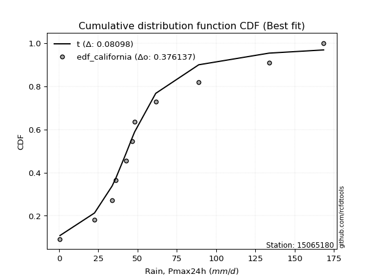</img>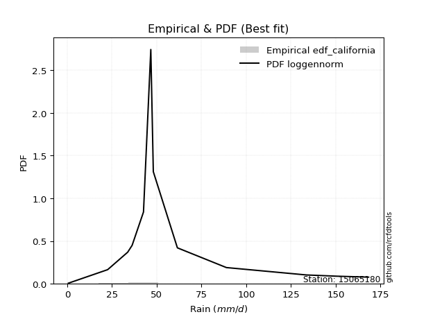</img>

</div>


### 2. Empirical - EDF Hazen (1930)

Hazen method for plotting positions is a formula used to estimate the empirical cumulative probability distribution of flood events or other hydrological data. This formula often results in biased estimations, particularly when extrapolating to extreme events (high return periods).

<div align="center">


$P=(m-0.5)/n$


</div>


**2.1. Empirical values**

<div align="center">

|                | 0                    | 1                  | 2                   | 3                  | 4         | 5                  | 6                  | 7                  | 8                  | 9                  | 10        | 11                 |
|:---------------|:---------------------|:-------------------|:--------------------|:-------------------|:----------|:-------------------|:-------------------|:-------------------|:-------------------|:-------------------|:----------|:-------------------|
| date           | 2014                 | 2016               | 2018                | 2015               | 2017      | 2020               | 2023               | 2025               | 2022               | 2021               | 2019      | 2024               |
| x              | 0.6                  | 22.59              | 33.77               | 36.25              | 42.61     | 46.7               | 48.1               | 55.1               | 61.55              | 88.93              | 133.69    | 168.4              |
| m              | 1                    | 2                  | 3                   | 4                  | 5         | 6                  | 7                  | 8                  | 9                  | 10                 | 11        | 12                 |
| empirical_dist | edf_hazen            | edf_hazen          | edf_hazen           | edf_hazen          | edf_hazen | edf_hazen          | edf_hazen          | edf_hazen          | edf_hazen          | edf_hazen          | edf_hazen | edf_hazen          |
| empirical      | 0.041666666666666664 | 0.125              | 0.20833333333333334 | 0.2916666666666667 | 0.375     | 0.4583333333333333 | 0.5416666666666666 | 0.625              | 0.7083333333333334 | 0.7916666666666666 | 0.875     | 0.9583333333333334 |
| empirical_tr   | 1.0434782608695652   | 1.1428571428571428 | 1.2631578947368423  | 1.411764705882353  | 1.6       | 1.8461538461538458 | 2.1818181818181817 | 2.6666666666666665 | 3.428571428571429  | 4.799999999999999  | 8.0       | 24.00000000000002  |

</div>


**2.2. Kolmogorov-Smirnov fit test (sorted by Δ)**


<div align="center">

|                | 0                   | 1                   | 2                    | 3                   | 4                   | 5                   | 6                   | 7                   | 8                   | 9                   | 10                  | 11                  | 12                  | 13                  | 14                  | 15                  | 16                  | 17                  | 18                  | 19                  | 20                  | 21                  | 22                  | 23                  | 24                  | 25                  | 26                  | 27                  | 28                  | 29                  | 30                  | 31                  | 32                  | 33                  | 34                  | 35                    | 36                  | 37                  | 38                  | 39                  | 40                  | 41                  | 42                  | 43                  | 44                  | 45                  | 46                  | 47                  | 48                  | 49                  | 50                  | 51                  | 52                  | 53                  | 54                  | 55                  | 56                  | 57                  | 58                  | 59                  | 60                  | 61                  | 62                  | 63                  | 64                  | 65                  | 66                  | 67                  | 68                  | 69                  | 70                  | 71                  | 72                  | 73                  | 74                  | 75                  | 76                  | 77                  | 78                  | 79                  | 80                  | 81                  | 82                  | 83                  | 84                  | 85                  | 86                  | 87                  | 88                  | 89                  |
|:---------------|:--------------------|:--------------------|:---------------------|:--------------------|:--------------------|:--------------------|:--------------------|:--------------------|:--------------------|:--------------------|:--------------------|:--------------------|:--------------------|:--------------------|:--------------------|:--------------------|:--------------------|:--------------------|:--------------------|:--------------------|:--------------------|:--------------------|:--------------------|:--------------------|:--------------------|:--------------------|:--------------------|:--------------------|:--------------------|:--------------------|:--------------------|:--------------------|:--------------------|:--------------------|:--------------------|:----------------------|:--------------------|:--------------------|:--------------------|:--------------------|:--------------------|:--------------------|:--------------------|:--------------------|:--------------------|:--------------------|:--------------------|:--------------------|:--------------------|:--------------------|:--------------------|:--------------------|:--------------------|:--------------------|:--------------------|:--------------------|:--------------------|:--------------------|:--------------------|:--------------------|:--------------------|:--------------------|:--------------------|:--------------------|:--------------------|:--------------------|:--------------------|:--------------------|:--------------------|:--------------------|:--------------------|:--------------------|:--------------------|:--------------------|:--------------------|:--------------------|:--------------------|:--------------------|:--------------------|:--------------------|:--------------------|:--------------------|:--------------------|:--------------------|:--------------------|:--------------------|:--------------------|:--------------------|:--------------------|:--------------------|
| station        | 15065180            | 15065180            | 15065180             | 15065180            | 15065180            | 15065180            | 15065180            | 15065180            | 15065180            | 15065180            | 15065180            | 15065180            | 15065180            | 15065180            | 15065180            | 15065180            | 15065180            | 15065180            | 15065180            | 15065180            | 15065180            | 15065180            | 15065180            | 15065180            | 15065180            | 15065180            | 15065180            | 15065180            | 15065180            | 15065180            | 15065180            | 15065180            | 15065180            | 15065180            | 15065180            | 15065180              | 15065180            | 15065180            | 15065180            | 15065180            | 15065180            | 15065180            | 15065180            | 15065180            | 15065180            | 15065180            | 15065180            | 15065180            | 15065180            | 15065180            | 15065180            | 15065180            | 15065180            | 15065180            | 15065180            | 15065180            | 15065180            | 15065180            | 15065180            | 15065180            | 15065180            | 15065180            | 15065180            | 15065180            | 15065180            | 15065180            | 15065180            | 15065180            | 15065180            | 15065180            | 15065180            | 15065180            | 15065180            | 15065180            | 15065180            | 15065180            | 15065180            | 15065180            | 15065180            | 15065180            | 15065180            | 15065180            | 15065180            | 15065180            | 15065180            | 15065180            | 15065180            | 15065180            | 15065180            | 15065180            |
| empirical_dist | edf_hazen           | edf_hazen           | edf_hazen            | edf_hazen           | edf_hazen           | edf_hazen           | edf_hazen           | edf_hazen           | edf_hazen           | edf_hazen           | edf_hazen           | edf_hazen           | edf_hazen           | edf_hazen           | edf_hazen           | edf_hazen           | edf_hazen           | edf_hazen           | edf_hazen           | edf_hazen           | edf_hazen           | edf_hazen           | edf_hazen           | edf_hazen           | edf_hazen           | edf_hazen           | edf_hazen           | edf_hazen           | edf_hazen           | edf_hazen           | edf_hazen           | edf_hazen           | edf_hazen           | edf_hazen           | edf_hazen           | edf_hazen             | edf_hazen           | edf_hazen           | edf_hazen           | edf_hazen           | edf_hazen           | edf_hazen           | edf_hazen           | edf_hazen           | edf_hazen           | edf_hazen           | edf_hazen           | edf_hazen           | edf_hazen           | edf_hazen           | edf_hazen           | edf_hazen           | edf_hazen           | edf_hazen           | edf_hazen           | edf_hazen           | edf_hazen           | edf_hazen           | edf_hazen           | edf_hazen           | edf_hazen           | edf_hazen           | edf_hazen           | edf_hazen           | edf_hazen           | edf_hazen           | edf_hazen           | edf_hazen           | edf_hazen           | edf_hazen           | edf_hazen           | edf_hazen           | edf_hazen           | edf_hazen           | edf_hazen           | edf_hazen           | edf_hazen           | edf_hazen           | edf_hazen           | edf_hazen           | edf_hazen           | edf_hazen           | edf_hazen           | edf_hazen           | edf_hazen           | edf_hazen           | edf_hazen           | edf_hazen           | edf_hazen           | edf_hazen           |
| p_dist         | johnsonsu           | logt                | logjohnsonsu         | nct                 | fisk                | laplace_asymmetric  | wald                | exponnorm           | alpha               | invweibull          | invgamma            | moyal               | betaprime           | halflogistic        | invgauss            | fatiguelife         | logfisk             | f                   | erlang              | chi2                | gamma               | weibull_min         | nakagami            | gibrat              | genlogistic         | pearson3            | halfnorm            | gompertz            | gumbel_r            | logloggamma         | loggenlogistic      | kstwobign           | ncf                 | loggompertz         | rayleigh            | loglaplace_asymmetric | maxwell             | logmielke           | mielke              | loggumbel_l         | rice                | logpearson3         | t                   | hypsecant           | logistic            | norm                | crystalball         | truncnorm           | genexpon            | expon               | laplace             | loglaplace          | loghypsecant        | loglogistic         | lognakagami         | loglognorm          | logfatiguelife      | logrice             | logexponnorm        | logcrystalball      | lognorm             | lognorm             | lognct              | loginvgamma         | gumbel_l            | logalpha            | loginvgauss         | logmaxwell          | loginvweibull       | lograyleigh         | loggumbel_r         | loghalfnorm         | logmoyal            | logkstwobign        | loghalflogistic     | loggenexpon         | logwald             | loggibrat           | logexpon            | logncf              | pareto              | logbetaprime        | logtruncnorm        | logpareto           | logf                | logweibull_min      | loggamma            | loggamma            | logchi2             | logerlang           |
| delta          | 0.05084352657464308 | 0.05088496467293524 | 0.057057280302790114 | 0.08875709265405562 | 0.08940952354934695 | 0.0981061414252492  | 0.10353548094844134 | 0.10366029561832224 | 0.10490171863545172 | 0.10650017056113492 | 0.10956206964914961 | 0.11187826319044358 | 0.11441145198287517 | 0.11577620862772578 | 0.11751270381316758 | 0.11896085249895016 | 0.11944746234552853 | 0.1220533707065462  | 0.1220897361116603  | 0.12209038854771348 | 0.12209053952597915 | 0.12370344135041134 | 0.12499999999892263 | 0.125               | 0.12550633795296195 | 0.13255991897525632 | 0.13307199971773365 | 0.1341913892114449  | 0.13772405033840662 | 0.14632103409643651 | 0.15070163918575644 | 0.15186888234385443 | 0.15222472978362978 | 0.15544880916650342 | 0.16405881560049995 | 0.17003348951502276   | 0.17506556980801635 | 0.17741656842773787 | 0.178665627006711   | 0.18266807179263475 | 0.18675247605457002 | 0.1996216961081897  | 0.20796344208143913 | 0.20804930255992826 | 0.2080757459038266  | 0.2081067095465553  | 0.20810671559151028 | 0.2081067198584844  | 0.21097765480114197 | 0.2115043347959822  | 0.21554357195458773 | 0.22772833023597686 | 0.24347706642755604 | 0.2479078650386756  | 0.2519121646662025  | 0.2521600286194495  | 0.2530547294958412  | 0.25309700338890273 | 0.25312873617034704 | 0.25312930401332234 | 0.25312933676757265 | 0.25312933676757265 | 0.25405287938963794 | 0.2591939678739329  | 0.27847597914169975 | 0.28268254682394656 | 0.28472870356754154 | 0.2872925429710541  | 0.2944637970472736  | 0.29902215275143906 | 0.3212653651894978  | 0.33210101696492156 | 0.3468917364096643  | 0.34724721596225083 | 0.3542221463584976  | 0.3867624678965198  | 0.41820138071825397 | 0.43388060746144685 | 0.4567158328920202  | 0.47601290532323826 | 0.5095360923082993  | 0.5135836597286337  | 0.5317368967167232  | 0.5324048500465364  | 0.5646609866248461  | 0.6444116873031487  | 0.6736706739970458  | 0.6736706739970458  | 0.7214797688381015  | 0.8749179288779209  |
| deltao         | 0.36218414519599995 | 0.36218414519599995 | 0.36218414519599995  | 0.36218414519599995 | 0.36218414519599995 | 0.36218414519599995 | 0.36218414519599995 | 0.36218414519599995 | 0.36218414519599995 | 0.36218414519599995 | 0.36218414519599995 | 0.36218414519599995 | 0.36218414519599995 | 0.36218414519599995 | 0.36218414519599995 | 0.36218414519599995 | 0.36218414519599995 | 0.36218414519599995 | 0.36218414519599995 | 0.36218414519599995 | 0.36218414519599995 | 0.36218414519599995 | 0.36218414519599995 | 0.36218414519599995 | 0.36218414519599995 | 0.36218414519599995 | 0.36218414519599995 | 0.36218414519599995 | 0.36218414519599995 | 0.36218414519599995 | 0.36218414519599995 | 0.36218414519599995 | 0.36218414519599995 | 0.36218414519599995 | 0.36218414519599995 | 0.36218414519599995   | 0.36218414519599995 | 0.36218414519599995 | 0.36218414519599995 | 0.36218414519599995 | 0.36218414519599995 | 0.36218414519599995 | 0.36218414519599995 | 0.36218414519599995 | 0.36218414519599995 | 0.36218414519599995 | 0.36218414519599995 | 0.36218414519599995 | 0.36218414519599995 | 0.36218414519599995 | 0.36218414519599995 | 0.36218414519599995 | 0.36218414519599995 | 0.36218414519599995 | 0.36218414519599995 | 0.36218414519599995 | 0.36218414519599995 | 0.36218414519599995 | 0.36218414519599995 | 0.36218414519599995 | 0.36218414519599995 | 0.36218414519599995 | 0.36218414519599995 | 0.36218414519599995 | 0.36218414519599995 | 0.36218414519599995 | 0.36218414519599995 | 0.36218414519599995 | 0.36218414519599995 | 0.36218414519599995 | 0.36218414519599995 | 0.36218414519599995 | 0.36218414519599995 | 0.36218414519599995 | 0.36218414519599995 | 0.36218414519599995 | 0.36218414519599995 | 0.36218414519599995 | 0.36218414519599995 | 0.36218414519599995 | 0.36218414519599995 | 0.36218414519599995 | 0.36218414519599995 | 0.36218414519599995 | 0.36218414519599995 | 0.36218414519599995 | 0.36218414519599995 | 0.36218414519599995 | 0.36218414519599995 | 0.36218414519599995 |
| eval           | Δo > Δ              | Δo > Δ              | Δo > Δ               | Δo > Δ              | Δo > Δ              | Δo > Δ              | Δo > Δ              | Δo > Δ              | Δo > Δ              | Δo > Δ              | Δo > Δ              | Δo > Δ              | Δo > Δ              | Δo > Δ              | Δo > Δ              | Δo > Δ              | Δo > Δ              | Δo > Δ              | Δo > Δ              | Δo > Δ              | Δo > Δ              | Δo > Δ              | Δo > Δ              | Δo > Δ              | Δo > Δ              | Δo > Δ              | Δo > Δ              | Δo > Δ              | Δo > Δ              | Δo > Δ              | Δo > Δ              | Δo > Δ              | Δo > Δ              | Δo > Δ              | Δo > Δ              | Δo > Δ                | Δo > Δ              | Δo > Δ              | Δo > Δ              | Δo > Δ              | Δo > Δ              | Δo > Δ              | Δo > Δ              | Δo > Δ              | Δo > Δ              | Δo > Δ              | Δo > Δ              | Δo > Δ              | Δo > Δ              | Δo > Δ              | Δo > Δ              | Δo > Δ              | Δo > Δ              | Δo > Δ              | Δo > Δ              | Δo > Δ              | Δo > Δ              | Δo > Δ              | Δo > Δ              | Δo > Δ              | Δo > Δ              | Δo > Δ              | Δo > Δ              | Δo > Δ              | Δo > Δ              | Δo > Δ              | Δo > Δ              | Δo > Δ              | Δo > Δ              | Δo > Δ              | Δo > Δ              | Δo > Δ              | Δo > Δ              | Δo > Δ              | Δo > Δ              | Δo <= Δ             | Δo <= Δ             | Δo <= Δ             | Δo <= Δ             | Δo <= Δ             | Δo <= Δ             | Δo <= Δ             | Δo <= Δ             | Δo <= Δ             | Δo <= Δ             | Δo <= Δ             | Δo <= Δ             | Δo <= Δ             | Δo <= Δ             | Δo <= Δ             |
| fit            | 1                   | 1                   | 1                    | 1                   | 1                   | 1                   | 1                   | 1                   | 1                   | 1                   | 1                   | 1                   | 1                   | 1                   | 1                   | 1                   | 1                   | 1                   | 1                   | 1                   | 1                   | 1                   | 1                   | 1                   | 1                   | 1                   | 1                   | 1                   | 1                   | 1                   | 1                   | 1                   | 1                   | 1                   | 1                   | 1                     | 1                   | 1                   | 1                   | 1                   | 1                   | 1                   | 1                   | 1                   | 1                   | 1                   | 1                   | 1                   | 1                   | 1                   | 1                   | 1                   | 1                   | 1                   | 1                   | 1                   | 1                   | 1                   | 1                   | 1                   | 1                   | 1                   | 1                   | 1                   | 1                   | 1                   | 1                   | 1                   | 1                   | 1                   | 1                   | 1                   | 1                   | 1                   | 1                   | 0                   | 0                   | 0                   | 0                   | 0                   | 0                   | 0                   | 0                   | 0                   | 0                   | 0                   | 0                   | 0                   | 0                   | 0                   |
| n              | 12                  | 12                  | 12                   | 12                  | 12                  | 12                  | 12                  | 12                  | 12                  | 12                  | 12                  | 12                  | 12                  | 12                  | 12                  | 12                  | 12                  | 12                  | 12                  | 12                  | 12                  | 12                  | 12                  | 12                  | 12                  | 12                  | 12                  | 12                  | 12                  | 12                  | 12                  | 12                  | 12                  | 12                  | 12                  | 12                    | 12                  | 12                  | 12                  | 12                  | 12                  | 12                  | 12                  | 12                  | 12                  | 12                  | 12                  | 12                  | 12                  | 12                  | 12                  | 12                  | 12                  | 12                  | 12                  | 12                  | 12                  | 12                  | 12                  | 12                  | 12                  | 12                  | 12                  | 12                  | 12                  | 12                  | 12                  | 12                  | 12                  | 12                  | 12                  | 12                  | 12                  | 12                  | 12                  | 12                  | 12                  | 12                  | 12                  | 12                  | 12                  | 12                  | 12                  | 12                  | 12                  | 12                  | 12                  | 12                  | 12                  | 12                  |
| best_fit       | 1                   | 0                   | 0                    | 0                   | 0                   | 0                   | 0                   | 0                   | 0                   | 0                   | 0                   | 0                   | 0                   | 0                   | 0                   | 0                   | 0                   | 0                   | 0                   | 0                   | 0                   | 0                   | 0                   | 0                   | 0                   | 0                   | 0                   | 0                   | 0                   | 0                   | 0                   | 0                   | 0                   | 0                   | 0                   | 0                     | 0                   | 0                   | 0                   | 0                   | 0                   | 0                   | 0                   | 0                   | 0                   | 0                   | 0                   | 0                   | 0                   | 0                   | 0                   | 0                   | 0                   | 0                   | 0                   | 0                   | 0                   | 0                   | 0                   | 0                   | 0                   | 0                   | 0                   | 0                   | 0                   | 0                   | 0                   | 0                   | 0                   | 0                   | 0                   | 0                   | 0                   | 0                   | 0                   | 0                   | 0                   | 0                   | 0                   | 0                   | 0                   | 0                   | 0                   | 0                   | 0                   | 0                   | 0                   | 0                   | 0                   | 0                   |
| best_fit_sort  | 1                   | 2                   | 3                    | 4                   | 5                   | 6                   | 7                   | 8                   | 9                   | 10                  | 11                  | 12                  | 13                  | 14                  | 15                  | 16                  | 17                  | 18                  | 19                  | 20                  | 21                  | 22                  | 23                  | 24                  | 25                  | 26                  | 27                  | 28                  | 29                  | 30                  | 31                  | 32                  | 33                  | 34                  | 35                  | 36                    | 37                  | 38                  | 39                  | 40                  | 41                  | 42                  | 43                  | 44                  | 45                  | 46                  | 47                  | 48                  | 49                  | 50                  | 51                  | 52                  | 53                  | 54                  | 55                  | 56                  | 57                  | 58                  | 59                  | 60                  | 61                  | 62                  | 63                  | 64                  | 65                  | 66                  | 67                  | 68                  | 69                  | 70                  | 71                  | 72                  | 73                  | 74                  | 75                  | 76                  | 77                  | 78                  | 79                  | 80                  | 81                  | 82                  | 83                  | 84                  | 85                  | 86                  | 87                  | 88                  | 89                  | 90                  |

</div>


<div align="center">

</img>

</div>


**2.3. Best fit**

<div align="center">

|   id |   station | empirical_dist   | p_dist    |     delta |   deltao | eval   |   fit |   n |   best_fit |   best_fit_sort |
|-----:|----------:|:-----------------|:----------|----------:|---------:|:-------|------:|----:|-----------:|----------------:|
|    0 |  15065180 | edf_hazen        | johnsonsu | 0.0508435 | 0.362184 | Δo > Δ |     1 |  12 |          1 |               1 |

</div>


<div align="center">

</img>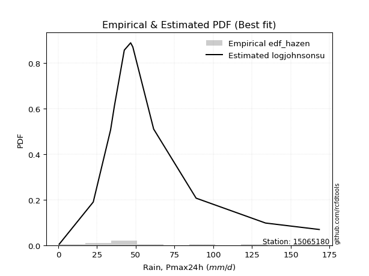</img>

</div>


### 3. Empirical - EDF Weibull (1939)

Weibull plotting position formula is an empirical method used to estimate the non-exceedance probability or plotting position for a set of observed data, is often recommended or widely used in practice, particularly in flood frequency analysis.

<div align="center">


$P=m/(n+1)$


</div>


**3.1. Empirical values**

<div align="center">

|                | 0                   | 1                   | 2                   | 3                  | 4                   | 5                   | 6                  | 7                  | 8                  | 9                  | 10                 | 11                 |
|:---------------|:--------------------|:--------------------|:--------------------|:-------------------|:--------------------|:--------------------|:-------------------|:-------------------|:-------------------|:-------------------|:-------------------|:-------------------|
| date           | 2014                | 2016                | 2018                | 2015               | 2017                | 2020                | 2023               | 2025               | 2022               | 2021               | 2019               | 2024               |
| x              | 0.6                 | 22.59               | 33.77               | 36.25              | 42.61               | 46.7                | 48.1               | 55.1               | 61.55              | 88.93              | 133.69             | 168.4              |
| m              | 1                   | 2                   | 3                   | 4                  | 5                   | 6                   | 7                  | 8                  | 9                  | 10                 | 11                 | 12                 |
| empirical_dist | edf_weibull         | edf_weibull         | edf_weibull         | edf_weibull        | edf_weibull         | edf_weibull         | edf_weibull        | edf_weibull        | edf_weibull        | edf_weibull        | edf_weibull        | edf_weibull        |
| empirical      | 0.07692307692307693 | 0.15384615384615385 | 0.23076923076923078 | 0.3076923076923077 | 0.38461538461538464 | 0.46153846153846156 | 0.5384615384615384 | 0.6153846153846154 | 0.6923076923076923 | 0.7692307692307693 | 0.8461538461538461 | 0.9230769230769231 |
| empirical_tr   | 1.0833333333333333  | 1.1818181818181819  | 1.3                 | 1.4444444444444444 | 1.625               | 1.8571428571428572  | 2.1666666666666665 | 2.6                | 3.25               | 4.333333333333334  | 6.5                | 13.000000000000009 |

</div>


**3.2. Kolmogorov-Smirnov fit test (sorted by Δ)**


<div align="center">

|                | 0                   | 1                   | 2                   | 3                   | 4                   | 5                   | 6                   | 7                   | 8                   | 9                   | 10                  | 11                  | 12                  | 13                  | 14                  | 15                  | 16                  | 17                  | 18                  | 19                  | 20                  | 21                  | 22                  | 23                  | 24                  | 25                  | 26                  | 27                  | 28                  | 29                  | 30                  | 31                  | 32                    | 33                  | 34                  | 35                  | 36                  | 37                  | 38                  | 39                  | 40                  | 41                  | 42                  | 43                  | 44                  | 45                  | 46                  | 47                  | 48                  | 49                  | 50                  | 51                  | 52                  | 53                  | 54                  | 55                  | 56                  | 57                  | 58                  | 59                  | 60                  | 61                  | 62                  | 63                  | 64                  | 65                  | 66                  | 67                  | 68                  | 69                  | 70                  | 71                  | 72                  | 73                  | 74                  | 75                  | 76                  | 77                  | 78                  | 79                  | 80                  | 81                  | 82                  | 83                  | 84                  | 85                  | 86                  | 87                  | 88                  | 89                  |
|:---------------|:--------------------|:--------------------|:--------------------|:--------------------|:--------------------|:--------------------|:--------------------|:--------------------|:--------------------|:--------------------|:--------------------|:--------------------|:--------------------|:--------------------|:--------------------|:--------------------|:--------------------|:--------------------|:--------------------|:--------------------|:--------------------|:--------------------|:--------------------|:--------------------|:--------------------|:--------------------|:--------------------|:--------------------|:--------------------|:--------------------|:--------------------|:--------------------|:----------------------|:--------------------|:--------------------|:--------------------|:--------------------|:--------------------|:--------------------|:--------------------|:--------------------|:--------------------|:--------------------|:--------------------|:--------------------|:--------------------|:--------------------|:--------------------|:--------------------|:--------------------|:--------------------|:--------------------|:--------------------|:--------------------|:--------------------|:--------------------|:--------------------|:--------------------|:--------------------|:--------------------|:--------------------|:--------------------|:--------------------|:--------------------|:--------------------|:--------------------|:--------------------|:--------------------|:--------------------|:--------------------|:--------------------|:--------------------|:--------------------|:--------------------|:--------------------|:--------------------|:--------------------|:--------------------|:--------------------|:--------------------|:--------------------|:--------------------|:--------------------|:--------------------|:--------------------|:--------------------|:--------------------|:--------------------|:--------------------|:--------------------|
| station        | 15065180            | 15065180            | 15065180            | 15065180            | 15065180            | 15065180            | 15065180            | 15065180            | 15065180            | 15065180            | 15065180            | 15065180            | 15065180            | 15065180            | 15065180            | 15065180            | 15065180            | 15065180            | 15065180            | 15065180            | 15065180            | 15065180            | 15065180            | 15065180            | 15065180            | 15065180            | 15065180            | 15065180            | 15065180            | 15065180            | 15065180            | 15065180            | 15065180              | 15065180            | 15065180            | 15065180            | 15065180            | 15065180            | 15065180            | 15065180            | 15065180            | 15065180            | 15065180            | 15065180            | 15065180            | 15065180            | 15065180            | 15065180            | 15065180            | 15065180            | 15065180            | 15065180            | 15065180            | 15065180            | 15065180            | 15065180            | 15065180            | 15065180            | 15065180            | 15065180            | 15065180            | 15065180            | 15065180            | 15065180            | 15065180            | 15065180            | 15065180            | 15065180            | 15065180            | 15065180            | 15065180            | 15065180            | 15065180            | 15065180            | 15065180            | 15065180            | 15065180            | 15065180            | 15065180            | 15065180            | 15065180            | 15065180            | 15065180            | 15065180            | 15065180            | 15065180            | 15065180            | 15065180            | 15065180            | 15065180            |
| empirical_dist | edf_weibull         | edf_weibull         | edf_weibull         | edf_weibull         | edf_weibull         | edf_weibull         | edf_weibull         | edf_weibull         | edf_weibull         | edf_weibull         | edf_weibull         | edf_weibull         | edf_weibull         | edf_weibull         | edf_weibull         | edf_weibull         | edf_weibull         | edf_weibull         | edf_weibull         | edf_weibull         | edf_weibull         | edf_weibull         | edf_weibull         | edf_weibull         | edf_weibull         | edf_weibull         | edf_weibull         | edf_weibull         | edf_weibull         | edf_weibull         | edf_weibull         | edf_weibull         | edf_weibull           | edf_weibull         | edf_weibull         | edf_weibull         | edf_weibull         | edf_weibull         | edf_weibull         | edf_weibull         | edf_weibull         | edf_weibull         | edf_weibull         | edf_weibull         | edf_weibull         | edf_weibull         | edf_weibull         | edf_weibull         | edf_weibull         | edf_weibull         | edf_weibull         | edf_weibull         | edf_weibull         | edf_weibull         | edf_weibull         | edf_weibull         | edf_weibull         | edf_weibull         | edf_weibull         | edf_weibull         | edf_weibull         | edf_weibull         | edf_weibull         | edf_weibull         | edf_weibull         | edf_weibull         | edf_weibull         | edf_weibull         | edf_weibull         | edf_weibull         | edf_weibull         | edf_weibull         | edf_weibull         | edf_weibull         | edf_weibull         | edf_weibull         | edf_weibull         | edf_weibull         | edf_weibull         | edf_weibull         | edf_weibull         | edf_weibull         | edf_weibull         | edf_weibull         | edf_weibull         | edf_weibull         | edf_weibull         | edf_weibull         | edf_weibull         | edf_weibull         |
| p_dist         | logt                | logjohnsonsu        | johnsonsu           | nct                 | fisk                | laplace_asymmetric  | exponnorm           | alpha               | invweibull          | halflogistic        | invgamma            | moyal               | logfisk             | betaprime           | invgauss            | fatiguelife         | f                   | erlang              | chi2                | gamma               | weibull_min         | genlogistic         | pearson3            | halfnorm            | gompertz            | gumbel_r            | logloggamma         | loggenlogistic      | wald                | loggompertz         | kstwobign           | ncf                 | loglaplace_asymmetric | rayleigh            | nakagami            | gibrat              | logmielke           | mielke              | maxwell             | loggumbel_l         | rice                | logpearson3         | genexpon            | expon               | t                   | hypsecant           | logistic            | norm                | crystalball         | truncnorm           | loglaplace          | laplace             | loghypsecant        | loglogistic         | lognakagami         | loglognorm          | logfatiguelife      | logrice             | logexponnorm        | logcrystalball      | lognorm             | lognorm             | lognct              | loginvgamma         | logalpha            | loginvgauss         | gumbel_l            | logmaxwell          | loginvweibull       | lograyleigh         | loggumbel_r         | loghalfnorm         | logkstwobign        | logmoyal            | loghalflogistic     | loggenexpon         | logwald             | loggibrat           | logexpon            | logncf              | pareto              | logbetaprime        | logtruncnorm        | logpareto           | logf                | logweibull_min      | loggamma            | loggamma            | logchi2             | logerlang           |
| delta          | 0.0733208621088326  | 0.07949317773868747 | 0.07968968042079694 | 0.08373027095605912 | 0.08470731580438118 | 0.08707029481286765 | 0.08763465459268116 | 0.08887607760981064 | 0.09047452953549384 | 0.09334031119182834 | 0.09353642862350853 | 0.0958526221648025  | 0.09701156490963109 | 0.09838581095723409 | 0.1014870627875265  | 0.10293521147330909 | 0.10602772968090513 | 0.10606409508601922 | 0.1060647475220724  | 0.10606489850033807 | 0.10767780032477026 | 0.10948069692732088 | 0.11653427794961524 | 0.11704635869209257 | 0.11816574818580383 | 0.12169840931276554 | 0.12388513666053907 | 0.128265741749859   | 0.1323816347945952  | 0.13301291173060598 | 0.13584324131821335 | 0.1361990887579887  | 0.14759759207912532   | 0.14803317457485887 | 0.1538461538450765  | 0.15384615384615385 | 0.15498067099184043 | 0.15622972957081355 | 0.15903992878237527 | 0.1602321743567373  | 0.17072683502892894 | 0.18359605508254861 | 0.18854175736524453 | 0.18906843736008477 | 0.19193780105579805 | 0.19202366153428718 | 0.19205010487818552 | 0.19208106852091422 | 0.1920810745658692  | 0.1920810788328433  | 0.20529243280007942 | 0.20910339928964194 | 0.2210411689916586  | 0.22547196760277816 | 0.22947626723030506 | 0.22972413118355212 | 0.2306188320599437  | 0.23066110595300532 | 0.23069283873444962 | 0.23069340657742488 | 0.2306934393316752  | 0.2306934393316752  | 0.23161698195374048 | 0.23675807043803543 | 0.26024664938804914 | 0.2622928061316441  | 0.26245033811605867 | 0.26485664553515664 | 0.26561764320111975 | 0.27658625531554165 | 0.29882946775360036 | 0.30966511952902415 | 0.318401062116097   | 0.3244558389737669  | 0.33178624892260017 | 0.35791631405036595 | 0.39576548328235656 | 0.41144471002554944 | 0.42786967904586637 | 0.4471667514770844  | 0.48068993846214547 | 0.4847375058824799  | 0.5028907428705693  | 0.5035586962003825  | 0.5358148327786922  | 0.6155655334569948  | 0.644824520150892   | 0.644824520150892   | 0.6926336149919476  | 0.846071775031767   |
| deltao         | 0.36218414519599995 | 0.36218414519599995 | 0.36218414519599995 | 0.36218414519599995 | 0.36218414519599995 | 0.36218414519599995 | 0.36218414519599995 | 0.36218414519599995 | 0.36218414519599995 | 0.36218414519599995 | 0.36218414519599995 | 0.36218414519599995 | 0.36218414519599995 | 0.36218414519599995 | 0.36218414519599995 | 0.36218414519599995 | 0.36218414519599995 | 0.36218414519599995 | 0.36218414519599995 | 0.36218414519599995 | 0.36218414519599995 | 0.36218414519599995 | 0.36218414519599995 | 0.36218414519599995 | 0.36218414519599995 | 0.36218414519599995 | 0.36218414519599995 | 0.36218414519599995 | 0.36218414519599995 | 0.36218414519599995 | 0.36218414519599995 | 0.36218414519599995 | 0.36218414519599995   | 0.36218414519599995 | 0.36218414519599995 | 0.36218414519599995 | 0.36218414519599995 | 0.36218414519599995 | 0.36218414519599995 | 0.36218414519599995 | 0.36218414519599995 | 0.36218414519599995 | 0.36218414519599995 | 0.36218414519599995 | 0.36218414519599995 | 0.36218414519599995 | 0.36218414519599995 | 0.36218414519599995 | 0.36218414519599995 | 0.36218414519599995 | 0.36218414519599995 | 0.36218414519599995 | 0.36218414519599995 | 0.36218414519599995 | 0.36218414519599995 | 0.36218414519599995 | 0.36218414519599995 | 0.36218414519599995 | 0.36218414519599995 | 0.36218414519599995 | 0.36218414519599995 | 0.36218414519599995 | 0.36218414519599995 | 0.36218414519599995 | 0.36218414519599995 | 0.36218414519599995 | 0.36218414519599995 | 0.36218414519599995 | 0.36218414519599995 | 0.36218414519599995 | 0.36218414519599995 | 0.36218414519599995 | 0.36218414519599995 | 0.36218414519599995 | 0.36218414519599995 | 0.36218414519599995 | 0.36218414519599995 | 0.36218414519599995 | 0.36218414519599995 | 0.36218414519599995 | 0.36218414519599995 | 0.36218414519599995 | 0.36218414519599995 | 0.36218414519599995 | 0.36218414519599995 | 0.36218414519599995 | 0.36218414519599995 | 0.36218414519599995 | 0.36218414519599995 | 0.36218414519599995 |
| eval           | Δo > Δ              | Δo > Δ              | Δo > Δ              | Δo > Δ              | Δo > Δ              | Δo > Δ              | Δo > Δ              | Δo > Δ              | Δo > Δ              | Δo > Δ              | Δo > Δ              | Δo > Δ              | Δo > Δ              | Δo > Δ              | Δo > Δ              | Δo > Δ              | Δo > Δ              | Δo > Δ              | Δo > Δ              | Δo > Δ              | Δo > Δ              | Δo > Δ              | Δo > Δ              | Δo > Δ              | Δo > Δ              | Δo > Δ              | Δo > Δ              | Δo > Δ              | Δo > Δ              | Δo > Δ              | Δo > Δ              | Δo > Δ              | Δo > Δ                | Δo > Δ              | Δo > Δ              | Δo > Δ              | Δo > Δ              | Δo > Δ              | Δo > Δ              | Δo > Δ              | Δo > Δ              | Δo > Δ              | Δo > Δ              | Δo > Δ              | Δo > Δ              | Δo > Δ              | Δo > Δ              | Δo > Δ              | Δo > Δ              | Δo > Δ              | Δo > Δ              | Δo > Δ              | Δo > Δ              | Δo > Δ              | Δo > Δ              | Δo > Δ              | Δo > Δ              | Δo > Δ              | Δo > Δ              | Δo > Δ              | Δo > Δ              | Δo > Δ              | Δo > Δ              | Δo > Δ              | Δo > Δ              | Δo > Δ              | Δo > Δ              | Δo > Δ              | Δo > Δ              | Δo > Δ              | Δo > Δ              | Δo > Δ              | Δo > Δ              | Δo > Δ              | Δo > Δ              | Δo > Δ              | Δo <= Δ             | Δo <= Δ             | Δo <= Δ             | Δo <= Δ             | Δo <= Δ             | Δo <= Δ             | Δo <= Δ             | Δo <= Δ             | Δo <= Δ             | Δo <= Δ             | Δo <= Δ             | Δo <= Δ             | Δo <= Δ             | Δo <= Δ             |
| fit            | 1                   | 1                   | 1                   | 1                   | 1                   | 1                   | 1                   | 1                   | 1                   | 1                   | 1                   | 1                   | 1                   | 1                   | 1                   | 1                   | 1                   | 1                   | 1                   | 1                   | 1                   | 1                   | 1                   | 1                   | 1                   | 1                   | 1                   | 1                   | 1                   | 1                   | 1                   | 1                   | 1                     | 1                   | 1                   | 1                   | 1                   | 1                   | 1                   | 1                   | 1                   | 1                   | 1                   | 1                   | 1                   | 1                   | 1                   | 1                   | 1                   | 1                   | 1                   | 1                   | 1                   | 1                   | 1                   | 1                   | 1                   | 1                   | 1                   | 1                   | 1                   | 1                   | 1                   | 1                   | 1                   | 1                   | 1                   | 1                   | 1                   | 1                   | 1                   | 1                   | 1                   | 1                   | 1                   | 1                   | 0                   | 0                   | 0                   | 0                   | 0                   | 0                   | 0                   | 0                   | 0                   | 0                   | 0                   | 0                   | 0                   | 0                   |
| n              | 12                  | 12                  | 12                  | 12                  | 12                  | 12                  | 12                  | 12                  | 12                  | 12                  | 12                  | 12                  | 12                  | 12                  | 12                  | 12                  | 12                  | 12                  | 12                  | 12                  | 12                  | 12                  | 12                  | 12                  | 12                  | 12                  | 12                  | 12                  | 12                  | 12                  | 12                  | 12                  | 12                    | 12                  | 12                  | 12                  | 12                  | 12                  | 12                  | 12                  | 12                  | 12                  | 12                  | 12                  | 12                  | 12                  | 12                  | 12                  | 12                  | 12                  | 12                  | 12                  | 12                  | 12                  | 12                  | 12                  | 12                  | 12                  | 12                  | 12                  | 12                  | 12                  | 12                  | 12                  | 12                  | 12                  | 12                  | 12                  | 12                  | 12                  | 12                  | 12                  | 12                  | 12                  | 12                  | 12                  | 12                  | 12                  | 12                  | 12                  | 12                  | 12                  | 12                  | 12                  | 12                  | 12                  | 12                  | 12                  | 12                  | 12                  |
| best_fit       | 1                   | 0                   | 0                   | 0                   | 0                   | 0                   | 0                   | 0                   | 0                   | 0                   | 0                   | 0                   | 0                   | 0                   | 0                   | 0                   | 0                   | 0                   | 0                   | 0                   | 0                   | 0                   | 0                   | 0                   | 0                   | 0                   | 0                   | 0                   | 0                   | 0                   | 0                   | 0                   | 0                     | 0                   | 0                   | 0                   | 0                   | 0                   | 0                   | 0                   | 0                   | 0                   | 0                   | 0                   | 0                   | 0                   | 0                   | 0                   | 0                   | 0                   | 0                   | 0                   | 0                   | 0                   | 0                   | 0                   | 0                   | 0                   | 0                   | 0                   | 0                   | 0                   | 0                   | 0                   | 0                   | 0                   | 0                   | 0                   | 0                   | 0                   | 0                   | 0                   | 0                   | 0                   | 0                   | 0                   | 0                   | 0                   | 0                   | 0                   | 0                   | 0                   | 0                   | 0                   | 0                   | 0                   | 0                   | 0                   | 0                   | 0                   |
| best_fit_sort  | 1                   | 2                   | 3                   | 4                   | 5                   | 6                   | 7                   | 8                   | 9                   | 10                  | 11                  | 12                  | 13                  | 14                  | 15                  | 16                  | 17                  | 18                  | 19                  | 20                  | 21                  | 22                  | 23                  | 24                  | 25                  | 26                  | 27                  | 28                  | 29                  | 30                  | 31                  | 32                  | 33                    | 34                  | 35                  | 36                  | 37                  | 38                  | 39                  | 40                  | 41                  | 42                  | 43                  | 44                  | 45                  | 46                  | 47                  | 48                  | 49                  | 50                  | 51                  | 52                  | 53                  | 54                  | 55                  | 56                  | 57                  | 58                  | 59                  | 60                  | 61                  | 62                  | 63                  | 64                  | 65                  | 66                  | 67                  | 68                  | 69                  | 70                  | 71                  | 72                  | 73                  | 74                  | 75                  | 76                  | 77                  | 78                  | 79                  | 80                  | 81                  | 82                  | 83                  | 84                  | 85                  | 86                  | 87                  | 88                  | 89                  | 90                  |

</div>


<div align="center">

</img>

</div>


**3.3. Best fit**

<div align="center">

|   id |   station | empirical_dist   | p_dist   |     delta |   deltao | eval   |   fit |   n |   best_fit |   best_fit_sort |
|-----:|----------:|:-----------------|:---------|----------:|---------:|:-------|------:|----:|-----------:|----------------:|
|    0 |  15065180 | edf_weibull      | logt     | 0.0733209 | 0.362184 | Δo > Δ |     1 |  12 |          1 |               1 |

</div>


<div align="center">

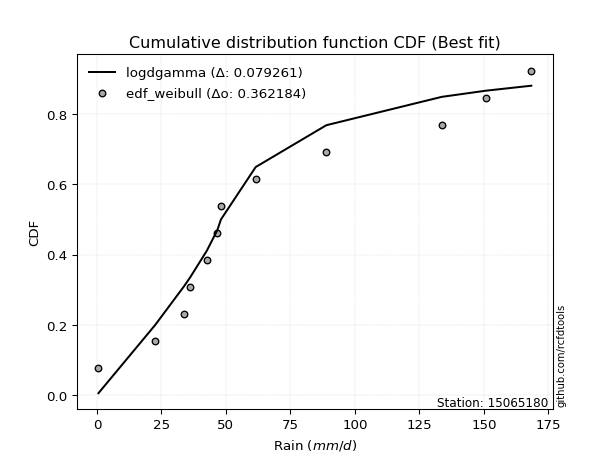</img></img>

</div>


### 4. Empirical - EDF Beard (1943)

The Beard formula (or Beard´s plotting position formula) in hydrology is used to estimate the empirical non-exceedance probability _(P)_ of a flood event (or other extreme hydrological data point) within a given dataset.

<div align="center">


$P=(m-0.31)/(n+0.38)$


</div>


**4.1. Empirical values**

<div align="center">

|                | 0                    | 1                   | 2                   | 3                  | 4                  | 5                  | 6                  | 7                  | 8                  | 9                  | 10                 | 11                 |
|:---------------|:---------------------|:--------------------|:--------------------|:-------------------|:-------------------|:-------------------|:-------------------|:-------------------|:-------------------|:-------------------|:-------------------|:-------------------|
| date           | 2014                 | 2016                | 2018                | 2015               | 2017               | 2020               | 2023               | 2025               | 2022               | 2021               | 2019               | 2024               |
| x              | 0.6                  | 22.59               | 33.77               | 36.25              | 42.61              | 46.7               | 48.1               | 55.1               | 61.55              | 88.93              | 133.69             | 168.4              |
| m              | 1                    | 2                   | 3                   | 4                  | 5                  | 6                  | 7                  | 8                  | 9                  | 10                 | 11                 | 12                 |
| empirical_dist | edf_beard            | edf_beard           | edf_beard           | edf_beard          | edf_beard          | edf_beard          | edf_beard          | edf_beard          | edf_beard          | edf_beard          | edf_beard          | edf_beard          |
| empirical      | 0.055735056542810975 | 0.13651050080775443 | 0.21728594507269788 | 0.2980613893376413 | 0.3788368336025848 | 0.4596122778675283 | 0.5403877221324718 | 0.6211631663974152 | 0.7019386106623585 | 0.7827140549273021 | 0.8634894991922455 | 0.9442649434571889 |
| empirical_tr   | 1.0590248075278015   | 1.1580916744621141  | 1.2776057791537667  | 1.424626006904488  | 1.6098829648894668 | 1.850523168908819  | 2.1757469244288226 | 2.6396588486140726 | 3.3550135501355    | 4.6022304832713745 | 7.325443786982245  | 17.942028985507218 |

</div>


**4.2. Kolmogorov-Smirnov fit test (sorted by Δ)**


<div align="center">

|                | 0                   | 1                   | 2                   | 3                   | 4                   | 5                   | 6                   | 7                   | 8                   | 9                   | 10                  | 11                  | 12                  | 13                  | 14                  | 15                  | 16                  | 17                  | 18                  | 19                  | 20                  | 21                  | 22                  | 23                  | 24                  | 25                  | 26                  | 27                  | 28                  | 29                  | 30                  | 31                  | 32                  | 33                  | 34                  | 35                    | 36                  | 37                  | 38                  | 39                  | 40                  | 41                  | 42                  | 43                  | 44                  | 45                  | 46                  | 47                  | 48                  | 49                  | 50                  | 51                  | 52                  | 53                  | 54                  | 55                  | 56                  | 57                  | 58                  | 59                  | 60                  | 61                  | 62                  | 63                  | 64                  | 65                  | 66                  | 67                  | 68                  | 69                  | 70                  | 71                  | 72                  | 73                  | 74                  | 75                  | 76                  | 77                  | 78                  | 79                  | 80                  | 81                  | 82                  | 83                  | 84                  | 85                  | 86                  | 87                  | 88                  | 89                  |
|:---------------|:--------------------|:--------------------|:--------------------|:--------------------|:--------------------|:--------------------|:--------------------|:--------------------|:--------------------|:--------------------|:--------------------|:--------------------|:--------------------|:--------------------|:--------------------|:--------------------|:--------------------|:--------------------|:--------------------|:--------------------|:--------------------|:--------------------|:--------------------|:--------------------|:--------------------|:--------------------|:--------------------|:--------------------|:--------------------|:--------------------|:--------------------|:--------------------|:--------------------|:--------------------|:--------------------|:----------------------|:--------------------|:--------------------|:--------------------|:--------------------|:--------------------|:--------------------|:--------------------|:--------------------|:--------------------|:--------------------|:--------------------|:--------------------|:--------------------|:--------------------|:--------------------|:--------------------|:--------------------|:--------------------|:--------------------|:--------------------|:--------------------|:--------------------|:--------------------|:--------------------|:--------------------|:--------------------|:--------------------|:--------------------|:--------------------|:--------------------|:--------------------|:--------------------|:--------------------|:--------------------|:--------------------|:--------------------|:--------------------|:--------------------|:--------------------|:--------------------|:--------------------|:--------------------|:--------------------|:--------------------|:--------------------|:--------------------|:--------------------|:--------------------|:--------------------|:--------------------|:--------------------|:--------------------|:--------------------|:--------------------|
| station        | 15065180            | 15065180            | 15065180            | 15065180            | 15065180            | 15065180            | 15065180            | 15065180            | 15065180            | 15065180            | 15065180            | 15065180            | 15065180            | 15065180            | 15065180            | 15065180            | 15065180            | 15065180            | 15065180            | 15065180            | 15065180            | 15065180            | 15065180            | 15065180            | 15065180            | 15065180            | 15065180            | 15065180            | 15065180            | 15065180            | 15065180            | 15065180            | 15065180            | 15065180            | 15065180            | 15065180              | 15065180            | 15065180            | 15065180            | 15065180            | 15065180            | 15065180            | 15065180            | 15065180            | 15065180            | 15065180            | 15065180            | 15065180            | 15065180            | 15065180            | 15065180            | 15065180            | 15065180            | 15065180            | 15065180            | 15065180            | 15065180            | 15065180            | 15065180            | 15065180            | 15065180            | 15065180            | 15065180            | 15065180            | 15065180            | 15065180            | 15065180            | 15065180            | 15065180            | 15065180            | 15065180            | 15065180            | 15065180            | 15065180            | 15065180            | 15065180            | 15065180            | 15065180            | 15065180            | 15065180            | 15065180            | 15065180            | 15065180            | 15065180            | 15065180            | 15065180            | 15065180            | 15065180            | 15065180            | 15065180            |
| empirical_dist | edf_beard           | edf_beard           | edf_beard           | edf_beard           | edf_beard           | edf_beard           | edf_beard           | edf_beard           | edf_beard           | edf_beard           | edf_beard           | edf_beard           | edf_beard           | edf_beard           | edf_beard           | edf_beard           | edf_beard           | edf_beard           | edf_beard           | edf_beard           | edf_beard           | edf_beard           | edf_beard           | edf_beard           | edf_beard           | edf_beard           | edf_beard           | edf_beard           | edf_beard           | edf_beard           | edf_beard           | edf_beard           | edf_beard           | edf_beard           | edf_beard           | edf_beard             | edf_beard           | edf_beard           | edf_beard           | edf_beard           | edf_beard           | edf_beard           | edf_beard           | edf_beard           | edf_beard           | edf_beard           | edf_beard           | edf_beard           | edf_beard           | edf_beard           | edf_beard           | edf_beard           | edf_beard           | edf_beard           | edf_beard           | edf_beard           | edf_beard           | edf_beard           | edf_beard           | edf_beard           | edf_beard           | edf_beard           | edf_beard           | edf_beard           | edf_beard           | edf_beard           | edf_beard           | edf_beard           | edf_beard           | edf_beard           | edf_beard           | edf_beard           | edf_beard           | edf_beard           | edf_beard           | edf_beard           | edf_beard           | edf_beard           | edf_beard           | edf_beard           | edf_beard           | edf_beard           | edf_beard           | edf_beard           | edf_beard           | edf_beard           | edf_beard           | edf_beard           | edf_beard           | edf_beard           |
| p_dist         | logt                | johnsonsu           | logjohnsonsu        | nct                 | fisk                | laplace_asymmetric  | exponnorm           | alpha               | invweibull          | invgamma            | moyal               | halflogistic        | betaprime           | logfisk             | invgauss            | fatiguelife         | wald                | f                   | erlang              | chi2                | gamma               | weibull_min         | genlogistic         | pearson3            | halfnorm            | gompertz            | gumbel_r            | nakagami            | gibrat              | logloggamma         | loggenlogistic      | kstwobign           | ncf                 | loggompertz         | rayleigh            | loglaplace_asymmetric | logmielke           | maxwell             | mielke              | loggumbel_l         | rice                | logpearson3         | t                   | hypsecant           | logistic            | norm                | crystalball         | truncnorm           | genexpon            | expon               | laplace             | loglaplace          | loghypsecant        | loglogistic         | lognakagami         | loglognorm          | logfatiguelife      | logrice             | logexponnorm        | logcrystalball      | lognorm             | lognorm             | lognct              | loginvgamma         | gumbel_l            | logalpha            | loginvgauss         | logmaxwell          | loginvweibull       | lograyleigh         | loggumbel_r         | loghalfnorm         | logkstwobign        | logmoyal            | loghalflogistic     | loggenexpon         | logwald             | loggibrat           | logexpon            | logncf              | pareto              | logbetaprime        | logtruncnorm        | logpareto           | logf                | logweibull_min      | loggamma            | loggamma            | logchi2             | logerlang           |
| delta          | 0.05983757641229981 | 0.06235402738239759 | 0.06600989204215468 | 0.08236236998308077 | 0.0830148008783721  | 0.09171141875427435 | 0.09726557294734739 | 0.09850699596447687 | 0.10010544789016007 | 0.10316734697817476 | 0.10548354051946873 | 0.10682359688836124 | 0.10801672931190032 | 0.11049485060616399 | 0.11111798114219273 | 0.11256612982797531 | 0.11504598175619576 | 0.11565864803557135 | 0.11569501344068545 | 0.11569566587673863 | 0.1156958168550043  | 0.11730871867943649 | 0.1191116152819871  | 0.12616519630428147 | 0.1266772770467588  | 0.12779666654047006 | 0.13132932766743177 | 0.13651050080667707 | 0.13651050080775443 | 0.13736842235707197 | 0.1417490274463919  | 0.14547415967287958 | 0.14583000711265492 | 0.14649619742713887 | 0.1576640929295251  | 0.16108087777565822   | 0.16846395668837333 | 0.1686708471370415  | 0.16971301526734645 | 0.1737154600532702  | 0.18035775338359517 | 0.19322697343721484 | 0.20156871941046428 | 0.2016545798889534  | 0.20168102323285175 | 0.20171198687558045 | 0.20171199292053543 | 0.20171199718750954 | 0.20202504306177743 | 0.20255172305661767 | 0.21170673835200293 | 0.21877571849661231 | 0.2345244546881915  | 0.23895525329931105 | 0.24295955292683796 | 0.24320741688008501 | 0.2441021177564766  | 0.24414439164953822 | 0.24417612443098252 | 0.24417669227395777 | 0.24417672502820809 | 0.24417672502820809 | 0.24510026765027337 | 0.2502413561345683  | 0.2720812564707249  | 0.27372993508458204 | 0.275776091828177   | 0.27833993123168954 | 0.28295329623951915 | 0.29006954101207455 | 0.31231275345013326 | 0.32314840522555704 | 0.33573671515449643 | 0.3379391246702998  | 0.34526953461913307 | 0.3752519670887654  | 0.40924876897888945 | 0.42492799572208234 | 0.4452053320842658  | 0.46450240451548386 | 0.49802559150054493 | 0.5020731589208793  | 0.5202263959089688  | 0.520894349238782   | 0.5531504858170917  | 0.6329011864953943  | 0.6621601731892914  | 0.6621601731892914  | 0.7099692680303471  | 0.8634074280701665  |
| deltao         | 0.36218414519599995 | 0.36218414519599995 | 0.36218414519599995 | 0.36218414519599995 | 0.36218414519599995 | 0.36218414519599995 | 0.36218414519599995 | 0.36218414519599995 | 0.36218414519599995 | 0.36218414519599995 | 0.36218414519599995 | 0.36218414519599995 | 0.36218414519599995 | 0.36218414519599995 | 0.36218414519599995 | 0.36218414519599995 | 0.36218414519599995 | 0.36218414519599995 | 0.36218414519599995 | 0.36218414519599995 | 0.36218414519599995 | 0.36218414519599995 | 0.36218414519599995 | 0.36218414519599995 | 0.36218414519599995 | 0.36218414519599995 | 0.36218414519599995 | 0.36218414519599995 | 0.36218414519599995 | 0.36218414519599995 | 0.36218414519599995 | 0.36218414519599995 | 0.36218414519599995 | 0.36218414519599995 | 0.36218414519599995 | 0.36218414519599995   | 0.36218414519599995 | 0.36218414519599995 | 0.36218414519599995 | 0.36218414519599995 | 0.36218414519599995 | 0.36218414519599995 | 0.36218414519599995 | 0.36218414519599995 | 0.36218414519599995 | 0.36218414519599995 | 0.36218414519599995 | 0.36218414519599995 | 0.36218414519599995 | 0.36218414519599995 | 0.36218414519599995 | 0.36218414519599995 | 0.36218414519599995 | 0.36218414519599995 | 0.36218414519599995 | 0.36218414519599995 | 0.36218414519599995 | 0.36218414519599995 | 0.36218414519599995 | 0.36218414519599995 | 0.36218414519599995 | 0.36218414519599995 | 0.36218414519599995 | 0.36218414519599995 | 0.36218414519599995 | 0.36218414519599995 | 0.36218414519599995 | 0.36218414519599995 | 0.36218414519599995 | 0.36218414519599995 | 0.36218414519599995 | 0.36218414519599995 | 0.36218414519599995 | 0.36218414519599995 | 0.36218414519599995 | 0.36218414519599995 | 0.36218414519599995 | 0.36218414519599995 | 0.36218414519599995 | 0.36218414519599995 | 0.36218414519599995 | 0.36218414519599995 | 0.36218414519599995 | 0.36218414519599995 | 0.36218414519599995 | 0.36218414519599995 | 0.36218414519599995 | 0.36218414519599995 | 0.36218414519599995 | 0.36218414519599995 |
| eval           | Δo > Δ              | Δo > Δ              | Δo > Δ              | Δo > Δ              | Δo > Δ              | Δo > Δ              | Δo > Δ              | Δo > Δ              | Δo > Δ              | Δo > Δ              | Δo > Δ              | Δo > Δ              | Δo > Δ              | Δo > Δ              | Δo > Δ              | Δo > Δ              | Δo > Δ              | Δo > Δ              | Δo > Δ              | Δo > Δ              | Δo > Δ              | Δo > Δ              | Δo > Δ              | Δo > Δ              | Δo > Δ              | Δo > Δ              | Δo > Δ              | Δo > Δ              | Δo > Δ              | Δo > Δ              | Δo > Δ              | Δo > Δ              | Δo > Δ              | Δo > Δ              | Δo > Δ              | Δo > Δ                | Δo > Δ              | Δo > Δ              | Δo > Δ              | Δo > Δ              | Δo > Δ              | Δo > Δ              | Δo > Δ              | Δo > Δ              | Δo > Δ              | Δo > Δ              | Δo > Δ              | Δo > Δ              | Δo > Δ              | Δo > Δ              | Δo > Δ              | Δo > Δ              | Δo > Δ              | Δo > Δ              | Δo > Δ              | Δo > Δ              | Δo > Δ              | Δo > Δ              | Δo > Δ              | Δo > Δ              | Δo > Δ              | Δo > Δ              | Δo > Δ              | Δo > Δ              | Δo > Δ              | Δo > Δ              | Δo > Δ              | Δo > Δ              | Δo > Δ              | Δo > Δ              | Δo > Δ              | Δo > Δ              | Δo > Δ              | Δo > Δ              | Δo > Δ              | Δo <= Δ             | Δo <= Δ             | Δo <= Δ             | Δo <= Δ             | Δo <= Δ             | Δo <= Δ             | Δo <= Δ             | Δo <= Δ             | Δo <= Δ             | Δo <= Δ             | Δo <= Δ             | Δo <= Δ             | Δo <= Δ             | Δo <= Δ             | Δo <= Δ             |
| fit            | 1                   | 1                   | 1                   | 1                   | 1                   | 1                   | 1                   | 1                   | 1                   | 1                   | 1                   | 1                   | 1                   | 1                   | 1                   | 1                   | 1                   | 1                   | 1                   | 1                   | 1                   | 1                   | 1                   | 1                   | 1                   | 1                   | 1                   | 1                   | 1                   | 1                   | 1                   | 1                   | 1                   | 1                   | 1                   | 1                     | 1                   | 1                   | 1                   | 1                   | 1                   | 1                   | 1                   | 1                   | 1                   | 1                   | 1                   | 1                   | 1                   | 1                   | 1                   | 1                   | 1                   | 1                   | 1                   | 1                   | 1                   | 1                   | 1                   | 1                   | 1                   | 1                   | 1                   | 1                   | 1                   | 1                   | 1                   | 1                   | 1                   | 1                   | 1                   | 1                   | 1                   | 1                   | 1                   | 0                   | 0                   | 0                   | 0                   | 0                   | 0                   | 0                   | 0                   | 0                   | 0                   | 0                   | 0                   | 0                   | 0                   | 0                   |
| n              | 12                  | 12                  | 12                  | 12                  | 12                  | 12                  | 12                  | 12                  | 12                  | 12                  | 12                  | 12                  | 12                  | 12                  | 12                  | 12                  | 12                  | 12                  | 12                  | 12                  | 12                  | 12                  | 12                  | 12                  | 12                  | 12                  | 12                  | 12                  | 12                  | 12                  | 12                  | 12                  | 12                  | 12                  | 12                  | 12                    | 12                  | 12                  | 12                  | 12                  | 12                  | 12                  | 12                  | 12                  | 12                  | 12                  | 12                  | 12                  | 12                  | 12                  | 12                  | 12                  | 12                  | 12                  | 12                  | 12                  | 12                  | 12                  | 12                  | 12                  | 12                  | 12                  | 12                  | 12                  | 12                  | 12                  | 12                  | 12                  | 12                  | 12                  | 12                  | 12                  | 12                  | 12                  | 12                  | 12                  | 12                  | 12                  | 12                  | 12                  | 12                  | 12                  | 12                  | 12                  | 12                  | 12                  | 12                  | 12                  | 12                  | 12                  |
| best_fit       | 1                   | 0                   | 0                   | 0                   | 0                   | 0                   | 0                   | 0                   | 0                   | 0                   | 0                   | 0                   | 0                   | 0                   | 0                   | 0                   | 0                   | 0                   | 0                   | 0                   | 0                   | 0                   | 0                   | 0                   | 0                   | 0                   | 0                   | 0                   | 0                   | 0                   | 0                   | 0                   | 0                   | 0                   | 0                   | 0                     | 0                   | 0                   | 0                   | 0                   | 0                   | 0                   | 0                   | 0                   | 0                   | 0                   | 0                   | 0                   | 0                   | 0                   | 0                   | 0                   | 0                   | 0                   | 0                   | 0                   | 0                   | 0                   | 0                   | 0                   | 0                   | 0                   | 0                   | 0                   | 0                   | 0                   | 0                   | 0                   | 0                   | 0                   | 0                   | 0                   | 0                   | 0                   | 0                   | 0                   | 0                   | 0                   | 0                   | 0                   | 0                   | 0                   | 0                   | 0                   | 0                   | 0                   | 0                   | 0                   | 0                   | 0                   |
| best_fit_sort  | 1                   | 2                   | 3                   | 4                   | 5                   | 6                   | 7                   | 8                   | 9                   | 10                  | 11                  | 12                  | 13                  | 14                  | 15                  | 16                  | 17                  | 18                  | 19                  | 20                  | 21                  | 22                  | 23                  | 24                  | 25                  | 26                  | 27                  | 28                  | 29                  | 30                  | 31                  | 32                  | 33                  | 34                  | 35                  | 36                    | 37                  | 38                  | 39                  | 40                  | 41                  | 42                  | 43                  | 44                  | 45                  | 46                  | 47                  | 48                  | 49                  | 50                  | 51                  | 52                  | 53                  | 54                  | 55                  | 56                  | 57                  | 58                  | 59                  | 60                  | 61                  | 62                  | 63                  | 64                  | 65                  | 66                  | 67                  | 68                  | 69                  | 70                  | 71                  | 72                  | 73                  | 74                  | 75                  | 76                  | 77                  | 78                  | 79                  | 80                  | 81                  | 82                  | 83                  | 84                  | 85                  | 86                  | 87                  | 88                  | 89                  | 90                  |

</div>


<div align="center">

</img>

</div>


**4.3. Best fit**

<div align="center">

|   id |   station | empirical_dist   | p_dist   |     delta |   deltao | eval   |   fit |   n |   best_fit |   best_fit_sort |
|-----:|----------:|:-----------------|:---------|----------:|---------:|:-------|------:|----:|-----------:|----------------:|
|    0 |  15065180 | edf_beard        | logt     | 0.0598376 | 0.362184 | Δo > Δ |     1 |  12 |          1 |               1 |

</div>


<div align="center">

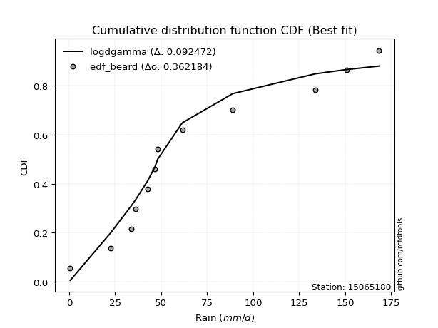</img></img>

</div>


### 5. Empirical - EDF Chegodayev (1955)

The Chegodayev formula is an empirical plotting position formula used in hydrological frequency analysis to estimate the exceedance probability or return period of a specific event from a set of observed data. It is primarily used for plotting observed data points on probability paper to fit a theoretical distribution, particularly for analyzing extreme events like maximum flood flows or rainfall intensities. The constant _b_ value in the generalized plotting position formula is 0.3.

<div align="center">


$P=(m-b)/(n+1-2b)$


</div>


**5.1. Empirical values**

<div align="center">

|                | 0                  | 1                   | 2                   | 3                   | 4                  | 5                  | 6                  | 7                  | 8                  | 9                 | 10                 | 11                 |
|:---------------|:-------------------|:--------------------|:--------------------|:--------------------|:-------------------|:-------------------|:-------------------|:-------------------|:-------------------|:------------------|:-------------------|:-------------------|
| date           | 2014               | 2016                | 2018                | 2015                | 2017               | 2020               | 2023               | 2025               | 2022               | 2021              | 2019               | 2024               |
| x              | 0.6                | 22.59               | 33.77               | 36.25               | 42.61              | 46.7               | 48.1               | 55.1               | 61.55              | 88.93             | 133.69             | 168.4              |
| m              | 1                  | 2                   | 3                   | 4                   | 5                  | 6                  | 7                  | 8                  | 9                  | 10                | 11                 | 12                 |
| empirical_dist | edf_chegodayev     | edf_chegodayev      | edf_chegodayev      | edf_chegodayev      | edf_chegodayev     | edf_chegodayev     | edf_chegodayev     | edf_chegodayev     | edf_chegodayev     | edf_chegodayev    | edf_chegodayev     | edf_chegodayev     |
| empirical      | 0.0564516129032258 | 0.13709677419354838 | 0.21774193548387097 | 0.29838709677419356 | 0.3790322580645161 | 0.4596774193548387 | 0.5403225806451613 | 0.6209677419354839 | 0.7016129032258064 | 0.782258064516129 | 0.8629032258064515 | 0.9435483870967741 |
| empirical_tr   | 1.0598290598290598 | 1.158878504672897   | 1.2783505154639176  | 1.425287356321839   | 1.6103896103896105 | 1.8507462686567164 | 2.1754385964912277 | 2.6382978723404253 | 3.3513513513513504 | 4.592592592592592 | 7.294117647058818  | 17.714285714285694 |

</div>


**5.2. Kolmogorov-Smirnov fit test (sorted by Δ)**


<div align="center">

|                | 0                    | 1                   | 2                   | 3                   | 4                   | 5                   | 6                   | 7                   | 8                   | 9                   | 10                  | 11                  | 12                  | 13                  | 14                  | 15                  | 16                  | 17                  | 18                  | 19                  | 20                  | 21                  | 22                  | 23                  | 24                  | 25                  | 26                  | 27                  | 28                  | 29                  | 30                  | 31                  | 32                  | 33                  | 34                  | 35                    | 36                  | 37                  | 38                  | 39                  | 40                  | 41                  | 42                  | 43                  | 44                  | 45                  | 46                  | 47                  | 48                  | 49                  | 50                  | 51                  | 52                  | 53                  | 54                  | 55                  | 56                  | 57                  | 58                  | 59                  | 60                  | 61                  | 62                  | 63                  | 64                  | 65                  | 66                  | 67                  | 68                  | 69                  | 70                  | 71                  | 72                  | 73                  | 74                  | 75                  | 76                  | 77                  | 78                  | 79                  | 80                  | 81                  | 82                  | 83                  | 84                  | 85                  | 86                  | 87                  | 88                  | 89                  |
|:---------------|:---------------------|:--------------------|:--------------------|:--------------------|:--------------------|:--------------------|:--------------------|:--------------------|:--------------------|:--------------------|:--------------------|:--------------------|:--------------------|:--------------------|:--------------------|:--------------------|:--------------------|:--------------------|:--------------------|:--------------------|:--------------------|:--------------------|:--------------------|:--------------------|:--------------------|:--------------------|:--------------------|:--------------------|:--------------------|:--------------------|:--------------------|:--------------------|:--------------------|:--------------------|:--------------------|:----------------------|:--------------------|:--------------------|:--------------------|:--------------------|:--------------------|:--------------------|:--------------------|:--------------------|:--------------------|:--------------------|:--------------------|:--------------------|:--------------------|:--------------------|:--------------------|:--------------------|:--------------------|:--------------------|:--------------------|:--------------------|:--------------------|:--------------------|:--------------------|:--------------------|:--------------------|:--------------------|:--------------------|:--------------------|:--------------------|:--------------------|:--------------------|:--------------------|:--------------------|:--------------------|:--------------------|:--------------------|:--------------------|:--------------------|:--------------------|:--------------------|:--------------------|:--------------------|:--------------------|:--------------------|:--------------------|:--------------------|:--------------------|:--------------------|:--------------------|:--------------------|:--------------------|:--------------------|:--------------------|:--------------------|
| station        | 15065180             | 15065180            | 15065180            | 15065180            | 15065180            | 15065180            | 15065180            | 15065180            | 15065180            | 15065180            | 15065180            | 15065180            | 15065180            | 15065180            | 15065180            | 15065180            | 15065180            | 15065180            | 15065180            | 15065180            | 15065180            | 15065180            | 15065180            | 15065180            | 15065180            | 15065180            | 15065180            | 15065180            | 15065180            | 15065180            | 15065180            | 15065180            | 15065180            | 15065180            | 15065180            | 15065180              | 15065180            | 15065180            | 15065180            | 15065180            | 15065180            | 15065180            | 15065180            | 15065180            | 15065180            | 15065180            | 15065180            | 15065180            | 15065180            | 15065180            | 15065180            | 15065180            | 15065180            | 15065180            | 15065180            | 15065180            | 15065180            | 15065180            | 15065180            | 15065180            | 15065180            | 15065180            | 15065180            | 15065180            | 15065180            | 15065180            | 15065180            | 15065180            | 15065180            | 15065180            | 15065180            | 15065180            | 15065180            | 15065180            | 15065180            | 15065180            | 15065180            | 15065180            | 15065180            | 15065180            | 15065180            | 15065180            | 15065180            | 15065180            | 15065180            | 15065180            | 15065180            | 15065180            | 15065180            | 15065180            |
| empirical_dist | edf_chegodayev       | edf_chegodayev      | edf_chegodayev      | edf_chegodayev      | edf_chegodayev      | edf_chegodayev      | edf_chegodayev      | edf_chegodayev      | edf_chegodayev      | edf_chegodayev      | edf_chegodayev      | edf_chegodayev      | edf_chegodayev      | edf_chegodayev      | edf_chegodayev      | edf_chegodayev      | edf_chegodayev      | edf_chegodayev      | edf_chegodayev      | edf_chegodayev      | edf_chegodayev      | edf_chegodayev      | edf_chegodayev      | edf_chegodayev      | edf_chegodayev      | edf_chegodayev      | edf_chegodayev      | edf_chegodayev      | edf_chegodayev      | edf_chegodayev      | edf_chegodayev      | edf_chegodayev      | edf_chegodayev      | edf_chegodayev      | edf_chegodayev      | edf_chegodayev        | edf_chegodayev      | edf_chegodayev      | edf_chegodayev      | edf_chegodayev      | edf_chegodayev      | edf_chegodayev      | edf_chegodayev      | edf_chegodayev      | edf_chegodayev      | edf_chegodayev      | edf_chegodayev      | edf_chegodayev      | edf_chegodayev      | edf_chegodayev      | edf_chegodayev      | edf_chegodayev      | edf_chegodayev      | edf_chegodayev      | edf_chegodayev      | edf_chegodayev      | edf_chegodayev      | edf_chegodayev      | edf_chegodayev      | edf_chegodayev      | edf_chegodayev      | edf_chegodayev      | edf_chegodayev      | edf_chegodayev      | edf_chegodayev      | edf_chegodayev      | edf_chegodayev      | edf_chegodayev      | edf_chegodayev      | edf_chegodayev      | edf_chegodayev      | edf_chegodayev      | edf_chegodayev      | edf_chegodayev      | edf_chegodayev      | edf_chegodayev      | edf_chegodayev      | edf_chegodayev      | edf_chegodayev      | edf_chegodayev      | edf_chegodayev      | edf_chegodayev      | edf_chegodayev      | edf_chegodayev      | edf_chegodayev      | edf_chegodayev      | edf_chegodayev      | edf_chegodayev      | edf_chegodayev      | edf_chegodayev      |
| p_dist         | logt                 | johnsonsu           | logjohnsonsu        | nct                 | fisk                | laplace_asymmetric  | exponnorm           | alpha               | invweibull          | invgamma            | moyal               | halflogistic        | betaprime           | logfisk             | invgauss            | fatiguelife         | f                   | erlang              | chi2                | gamma               | wald                | weibull_min         | genlogistic         | pearson3            | halfnorm            | gompertz            | gumbel_r            | logloggamma         | nakagami            | gibrat              | loggenlogistic      | kstwobign           | ncf                 | loggompertz         | rayleigh            | loglaplace_asymmetric | logmielke           | maxwell             | mielke              | loggumbel_l         | rice                | logpearson3         | t                   | hypsecant           | logistic            | norm                | crystalball         | truncnorm           | genexpon            | expon               | laplace             | loglaplace          | loghypsecant        | loglogistic         | lognakagami         | loglognorm          | logfatiguelife      | logrice             | logexponnorm        | logcrystalball      | lognorm             | lognorm             | lognct              | loginvgamma         | gumbel_l            | logalpha            | loginvgauss         | logmaxwell          | loginvweibull       | lograyleigh         | loggumbel_r         | loghalfnorm         | logkstwobign        | logmoyal            | loghalflogistic     | loggenexpon         | logwald             | loggibrat           | logexpon            | logncf              | pareto              | logbetaprime        | logtruncnorm        | logpareto           | logf                | logweibull_min      | loggamma            | loggamma            | logchi2             | logerlang           |
| delta          | 0.060293566823472866 | 0.06294030076819157 | 0.06646588245332774 | 0.08203666254652864 | 0.08268909344181996 | 0.09138571131772222 | 0.09693986551079525 | 0.09818128852792474 | 0.09977974045360793 | 0.10284163954162262 | 0.1051578330829166  | 0.10636760647718815 | 0.10769102187534818 | 0.1100388601949909  | 0.1107922737056406  | 0.11224042239142318 | 0.11533294059901922 | 0.11536930600413331 | 0.11536995844018649 | 0.11537010941845216 | 0.11563225514198971 | 0.11698301124288435 | 0.11878590784543497 | 0.12583948886772933 | 0.12635156961020666 | 0.12747095910391792 | 0.13100362023087964 | 0.1369124319458989  | 0.13709677419247102 | 0.13709677419354838 | 0.1412930370352188  | 0.14514845223632744 | 0.1455042996761028  | 0.1460402070159658  | 0.15733838549297297 | 0.16062488736448513   | 0.16800796627720024 | 0.16834513970048937 | 0.16925702485617336 | 0.17325946964209712 | 0.18003204594704303 | 0.1929012660006627  | 0.20124301197391214 | 0.20132887245240128 | 0.20135531579629962 | 0.20138627943902832 | 0.2013862854839833  | 0.2013862897509574  | 0.20156905265060435 | 0.2020957326454446  | 0.2115113138900716  | 0.21831972808543923 | 0.2340684642770184  | 0.23849926288813797 | 0.24250356251566488 | 0.24275142646891193 | 0.24364612734530353 | 0.24368840123836513 | 0.24372013401980944 | 0.2437207018627847  | 0.243720734617035   | 0.243720734617035   | 0.2446442772391003  | 0.24978536572339524 | 0.27175554903417276 | 0.27327394467340893 | 0.2753201014170039  | 0.2778839408205165  | 0.2823670228537252  | 0.28961355060090144 | 0.31185676303896015 | 0.32269241481438393 | 0.33515044176870246 | 0.3374831342591267  | 0.34481354420795995 | 0.3746656937029714  | 0.40879277856771634 | 0.42447200531090923 | 0.44461905869847185 | 0.4639161311296899  | 0.49743931811475095 | 0.5014868855350854  | 0.5196401225231748  | 0.520308075852988   | 0.5525642124312977  | 0.6323149131096003  | 0.6615738998034975  | 0.6615738998034975  | 0.7093829946445531  | 0.8628211546843725  |
| deltao         | 0.36218414519599995  | 0.36218414519599995 | 0.36218414519599995 | 0.36218414519599995 | 0.36218414519599995 | 0.36218414519599995 | 0.36218414519599995 | 0.36218414519599995 | 0.36218414519599995 | 0.36218414519599995 | 0.36218414519599995 | 0.36218414519599995 | 0.36218414519599995 | 0.36218414519599995 | 0.36218414519599995 | 0.36218414519599995 | 0.36218414519599995 | 0.36218414519599995 | 0.36218414519599995 | 0.36218414519599995 | 0.36218414519599995 | 0.36218414519599995 | 0.36218414519599995 | 0.36218414519599995 | 0.36218414519599995 | 0.36218414519599995 | 0.36218414519599995 | 0.36218414519599995 | 0.36218414519599995 | 0.36218414519599995 | 0.36218414519599995 | 0.36218414519599995 | 0.36218414519599995 | 0.36218414519599995 | 0.36218414519599995 | 0.36218414519599995   | 0.36218414519599995 | 0.36218414519599995 | 0.36218414519599995 | 0.36218414519599995 | 0.36218414519599995 | 0.36218414519599995 | 0.36218414519599995 | 0.36218414519599995 | 0.36218414519599995 | 0.36218414519599995 | 0.36218414519599995 | 0.36218414519599995 | 0.36218414519599995 | 0.36218414519599995 | 0.36218414519599995 | 0.36218414519599995 | 0.36218414519599995 | 0.36218414519599995 | 0.36218414519599995 | 0.36218414519599995 | 0.36218414519599995 | 0.36218414519599995 | 0.36218414519599995 | 0.36218414519599995 | 0.36218414519599995 | 0.36218414519599995 | 0.36218414519599995 | 0.36218414519599995 | 0.36218414519599995 | 0.36218414519599995 | 0.36218414519599995 | 0.36218414519599995 | 0.36218414519599995 | 0.36218414519599995 | 0.36218414519599995 | 0.36218414519599995 | 0.36218414519599995 | 0.36218414519599995 | 0.36218414519599995 | 0.36218414519599995 | 0.36218414519599995 | 0.36218414519599995 | 0.36218414519599995 | 0.36218414519599995 | 0.36218414519599995 | 0.36218414519599995 | 0.36218414519599995 | 0.36218414519599995 | 0.36218414519599995 | 0.36218414519599995 | 0.36218414519599995 | 0.36218414519599995 | 0.36218414519599995 | 0.36218414519599995 |
| eval           | Δo > Δ               | Δo > Δ              | Δo > Δ              | Δo > Δ              | Δo > Δ              | Δo > Δ              | Δo > Δ              | Δo > Δ              | Δo > Δ              | Δo > Δ              | Δo > Δ              | Δo > Δ              | Δo > Δ              | Δo > Δ              | Δo > Δ              | Δo > Δ              | Δo > Δ              | Δo > Δ              | Δo > Δ              | Δo > Δ              | Δo > Δ              | Δo > Δ              | Δo > Δ              | Δo > Δ              | Δo > Δ              | Δo > Δ              | Δo > Δ              | Δo > Δ              | Δo > Δ              | Δo > Δ              | Δo > Δ              | Δo > Δ              | Δo > Δ              | Δo > Δ              | Δo > Δ              | Δo > Δ                | Δo > Δ              | Δo > Δ              | Δo > Δ              | Δo > Δ              | Δo > Δ              | Δo > Δ              | Δo > Δ              | Δo > Δ              | Δo > Δ              | Δo > Δ              | Δo > Δ              | Δo > Δ              | Δo > Δ              | Δo > Δ              | Δo > Δ              | Δo > Δ              | Δo > Δ              | Δo > Δ              | Δo > Δ              | Δo > Δ              | Δo > Δ              | Δo > Δ              | Δo > Δ              | Δo > Δ              | Δo > Δ              | Δo > Δ              | Δo > Δ              | Δo > Δ              | Δo > Δ              | Δo > Δ              | Δo > Δ              | Δo > Δ              | Δo > Δ              | Δo > Δ              | Δo > Δ              | Δo > Δ              | Δo > Δ              | Δo > Δ              | Δo > Δ              | Δo <= Δ             | Δo <= Δ             | Δo <= Δ             | Δo <= Δ             | Δo <= Δ             | Δo <= Δ             | Δo <= Δ             | Δo <= Δ             | Δo <= Δ             | Δo <= Δ             | Δo <= Δ             | Δo <= Δ             | Δo <= Δ             | Δo <= Δ             | Δo <= Δ             |
| fit            | 1                    | 1                   | 1                   | 1                   | 1                   | 1                   | 1                   | 1                   | 1                   | 1                   | 1                   | 1                   | 1                   | 1                   | 1                   | 1                   | 1                   | 1                   | 1                   | 1                   | 1                   | 1                   | 1                   | 1                   | 1                   | 1                   | 1                   | 1                   | 1                   | 1                   | 1                   | 1                   | 1                   | 1                   | 1                   | 1                     | 1                   | 1                   | 1                   | 1                   | 1                   | 1                   | 1                   | 1                   | 1                   | 1                   | 1                   | 1                   | 1                   | 1                   | 1                   | 1                   | 1                   | 1                   | 1                   | 1                   | 1                   | 1                   | 1                   | 1                   | 1                   | 1                   | 1                   | 1                   | 1                   | 1                   | 1                   | 1                   | 1                   | 1                   | 1                   | 1                   | 1                   | 1                   | 1                   | 0                   | 0                   | 0                   | 0                   | 0                   | 0                   | 0                   | 0                   | 0                   | 0                   | 0                   | 0                   | 0                   | 0                   | 0                   |
| n              | 12                   | 12                  | 12                  | 12                  | 12                  | 12                  | 12                  | 12                  | 12                  | 12                  | 12                  | 12                  | 12                  | 12                  | 12                  | 12                  | 12                  | 12                  | 12                  | 12                  | 12                  | 12                  | 12                  | 12                  | 12                  | 12                  | 12                  | 12                  | 12                  | 12                  | 12                  | 12                  | 12                  | 12                  | 12                  | 12                    | 12                  | 12                  | 12                  | 12                  | 12                  | 12                  | 12                  | 12                  | 12                  | 12                  | 12                  | 12                  | 12                  | 12                  | 12                  | 12                  | 12                  | 12                  | 12                  | 12                  | 12                  | 12                  | 12                  | 12                  | 12                  | 12                  | 12                  | 12                  | 12                  | 12                  | 12                  | 12                  | 12                  | 12                  | 12                  | 12                  | 12                  | 12                  | 12                  | 12                  | 12                  | 12                  | 12                  | 12                  | 12                  | 12                  | 12                  | 12                  | 12                  | 12                  | 12                  | 12                  | 12                  | 12                  |
| best_fit       | 1                    | 0                   | 0                   | 0                   | 0                   | 0                   | 0                   | 0                   | 0                   | 0                   | 0                   | 0                   | 0                   | 0                   | 0                   | 0                   | 0                   | 0                   | 0                   | 0                   | 0                   | 0                   | 0                   | 0                   | 0                   | 0                   | 0                   | 0                   | 0                   | 0                   | 0                   | 0                   | 0                   | 0                   | 0                   | 0                     | 0                   | 0                   | 0                   | 0                   | 0                   | 0                   | 0                   | 0                   | 0                   | 0                   | 0                   | 0                   | 0                   | 0                   | 0                   | 0                   | 0                   | 0                   | 0                   | 0                   | 0                   | 0                   | 0                   | 0                   | 0                   | 0                   | 0                   | 0                   | 0                   | 0                   | 0                   | 0                   | 0                   | 0                   | 0                   | 0                   | 0                   | 0                   | 0                   | 0                   | 0                   | 0                   | 0                   | 0                   | 0                   | 0                   | 0                   | 0                   | 0                   | 0                   | 0                   | 0                   | 0                   | 0                   |
| best_fit_sort  | 1                    | 2                   | 3                   | 4                   | 5                   | 6                   | 7                   | 8                   | 9                   | 10                  | 11                  | 12                  | 13                  | 14                  | 15                  | 16                  | 17                  | 18                  | 19                  | 20                  | 21                  | 22                  | 23                  | 24                  | 25                  | 26                  | 27                  | 28                  | 29                  | 30                  | 31                  | 32                  | 33                  | 34                  | 35                  | 36                    | 37                  | 38                  | 39                  | 40                  | 41                  | 42                  | 43                  | 44                  | 45                  | 46                  | 47                  | 48                  | 49                  | 50                  | 51                  | 52                  | 53                  | 54                  | 55                  | 56                  | 57                  | 58                  | 59                  | 60                  | 61                  | 62                  | 63                  | 64                  | 65                  | 66                  | 67                  | 68                  | 69                  | 70                  | 71                  | 72                  | 73                  | 74                  | 75                  | 76                  | 77                  | 78                  | 79                  | 80                  | 81                  | 82                  | 83                  | 84                  | 85                  | 86                  | 87                  | 88                  | 89                  | 90                  |

</div>


<div align="center">

</img>

</div>


**5.3. Best fit**

<div align="center">

|   id |   station | empirical_dist   | p_dist   |     delta |   deltao | eval   |   fit |   n |   best_fit |   best_fit_sort |
|-----:|----------:|:-----------------|:---------|----------:|---------:|:-------|------:|----:|-----------:|----------------:|
|    0 |  15065180 | edf_chegodayev   | logt     | 0.0602936 | 0.362184 | Δo > Δ |     1 |  12 |          1 |               1 |

</div>


<div align="center">

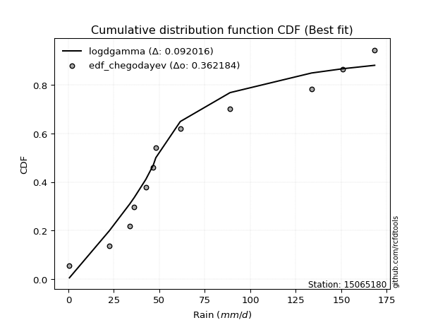</img>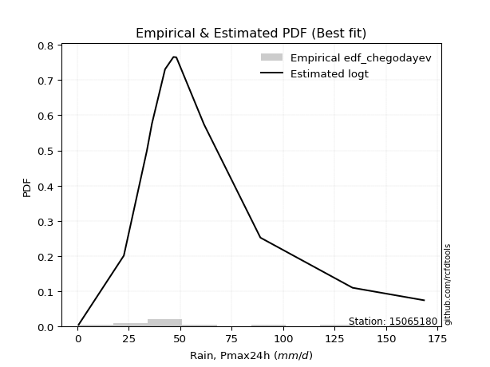</img>

</div>


### 6. Empirical - EDF Blom (1958)

The Blom formula is a specific "plotting position" formula used in hydrology and statistical analysis to estimate the empirical cumulative probability (or non-exceedance probability) of a data series. It is particularly recommended for data that are approximately normally distributed. The constant _a_ is set to 0.375 (or 3/8).

<div align="center">


$P=(m-a)/(n+1-2a)$


</div>


**6.1. Empirical values**

<div align="center">

|                | 0                   | 1                  | 2                   | 3                   | 4                   | 5                   | 6                  | 7                  | 8                  | 9                  | 10                 | 11                 |
|:---------------|:--------------------|:-------------------|:--------------------|:--------------------|:--------------------|:--------------------|:-------------------|:-------------------|:-------------------|:-------------------|:-------------------|:-------------------|
| date           | 2014                | 2016               | 2018                | 2015                | 2017                | 2020                | 2023               | 2025               | 2022               | 2021               | 2019               | 2024               |
| x              | 0.6                 | 22.59              | 33.77               | 36.25               | 42.61               | 46.7                | 48.1               | 55.1               | 61.55              | 88.93              | 133.69             | 168.4              |
| m              | 1                   | 2                  | 3                   | 4                   | 5                   | 6                   | 7                  | 8                  | 9                  | 10                 | 11                 | 12                 |
| empirical_dist | edf_blom            | edf_blom           | edf_blom            | edf_blom            | edf_blom            | edf_blom            | edf_blom           | edf_blom           | edf_blom           | edf_blom           | edf_blom           | edf_blom           |
| empirical      | 0.05102040816326531 | 0.1326530612244898 | 0.21428571428571427 | 0.29591836734693877 | 0.37755102040816324 | 0.45918367346938777 | 0.5408163265306123 | 0.6224489795918368 | 0.7040816326530612 | 0.7857142857142857 | 0.8673469387755102 | 0.9489795918367347 |
| empirical_tr   | 1.053763440860215   | 1.1529411764705884 | 1.2727272727272727  | 1.4202898550724639  | 1.6065573770491803  | 1.8490566037735847  | 2.177777777777778  | 2.6486486486486487 | 3.3793103448275863 | 4.666666666666666  | 7.5384615384615365 | 19.60000000000002  |

</div>


**6.2. Kolmogorov-Smirnov fit test (sorted by Δ)**


<div align="center">

|                | 0                   | 1                    | 2                   | 3                   | 4                   | 5                   | 6                   | 7                   | 8                   | 9                   | 10                  | 11                  | 12                  | 13                  | 14                  | 15                  | 16                  | 17                  | 18                  | 19                  | 20                  | 21                  | 22                  | 23                  | 24                  | 25                  | 26                  | 27                  | 28                  | 29                  | 30                  | 31                  | 32                  | 33                  | 34                  | 35                    | 36                  | 37                  | 38                  | 39                  | 40                  | 41                  | 42                  | 43                  | 44                  | 45                  | 46                  | 47                  | 48                  | 49                  | 50                  | 51                  | 52                  | 53                  | 54                  | 55                  | 56                  | 57                  | 58                  | 59                  | 60                  | 61                  | 62                  | 63                  | 64                  | 65                  | 66                  | 67                  | 68                  | 69                  | 70                  | 71                  | 72                  | 73                  | 74                  | 75                  | 76                  | 77                  | 78                  | 79                  | 80                  | 81                  | 82                  | 83                  | 84                  | 85                  | 86                  | 87                  | 88                  | 89                  |
|:---------------|:--------------------|:---------------------|:--------------------|:--------------------|:--------------------|:--------------------|:--------------------|:--------------------|:--------------------|:--------------------|:--------------------|:--------------------|:--------------------|:--------------------|:--------------------|:--------------------|:--------------------|:--------------------|:--------------------|:--------------------|:--------------------|:--------------------|:--------------------|:--------------------|:--------------------|:--------------------|:--------------------|:--------------------|:--------------------|:--------------------|:--------------------|:--------------------|:--------------------|:--------------------|:--------------------|:----------------------|:--------------------|:--------------------|:--------------------|:--------------------|:--------------------|:--------------------|:--------------------|:--------------------|:--------------------|:--------------------|:--------------------|:--------------------|:--------------------|:--------------------|:--------------------|:--------------------|:--------------------|:--------------------|:--------------------|:--------------------|:--------------------|:--------------------|:--------------------|:--------------------|:--------------------|:--------------------|:--------------------|:--------------------|:--------------------|:--------------------|:--------------------|:--------------------|:--------------------|:--------------------|:--------------------|:--------------------|:--------------------|:--------------------|:--------------------|:--------------------|:--------------------|:--------------------|:--------------------|:--------------------|:--------------------|:--------------------|:--------------------|:--------------------|:--------------------|:--------------------|:--------------------|:--------------------|:--------------------|:--------------------|
| station        | 15065180            | 15065180             | 15065180            | 15065180            | 15065180            | 15065180            | 15065180            | 15065180            | 15065180            | 15065180            | 15065180            | 15065180            | 15065180            | 15065180            | 15065180            | 15065180            | 15065180            | 15065180            | 15065180            | 15065180            | 15065180            | 15065180            | 15065180            | 15065180            | 15065180            | 15065180            | 15065180            | 15065180            | 15065180            | 15065180            | 15065180            | 15065180            | 15065180            | 15065180            | 15065180            | 15065180              | 15065180            | 15065180            | 15065180            | 15065180            | 15065180            | 15065180            | 15065180            | 15065180            | 15065180            | 15065180            | 15065180            | 15065180            | 15065180            | 15065180            | 15065180            | 15065180            | 15065180            | 15065180            | 15065180            | 15065180            | 15065180            | 15065180            | 15065180            | 15065180            | 15065180            | 15065180            | 15065180            | 15065180            | 15065180            | 15065180            | 15065180            | 15065180            | 15065180            | 15065180            | 15065180            | 15065180            | 15065180            | 15065180            | 15065180            | 15065180            | 15065180            | 15065180            | 15065180            | 15065180            | 15065180            | 15065180            | 15065180            | 15065180            | 15065180            | 15065180            | 15065180            | 15065180            | 15065180            | 15065180            |
| empirical_dist | edf_blom            | edf_blom             | edf_blom            | edf_blom            | edf_blom            | edf_blom            | edf_blom            | edf_blom            | edf_blom            | edf_blom            | edf_blom            | edf_blom            | edf_blom            | edf_blom            | edf_blom            | edf_blom            | edf_blom            | edf_blom            | edf_blom            | edf_blom            | edf_blom            | edf_blom            | edf_blom            | edf_blom            | edf_blom            | edf_blom            | edf_blom            | edf_blom            | edf_blom            | edf_blom            | edf_blom            | edf_blom            | edf_blom            | edf_blom            | edf_blom            | edf_blom              | edf_blom            | edf_blom            | edf_blom            | edf_blom            | edf_blom            | edf_blom            | edf_blom            | edf_blom            | edf_blom            | edf_blom            | edf_blom            | edf_blom            | edf_blom            | edf_blom            | edf_blom            | edf_blom            | edf_blom            | edf_blom            | edf_blom            | edf_blom            | edf_blom            | edf_blom            | edf_blom            | edf_blom            | edf_blom            | edf_blom            | edf_blom            | edf_blom            | edf_blom            | edf_blom            | edf_blom            | edf_blom            | edf_blom            | edf_blom            | edf_blom            | edf_blom            | edf_blom            | edf_blom            | edf_blom            | edf_blom            | edf_blom            | edf_blom            | edf_blom            | edf_blom            | edf_blom            | edf_blom            | edf_blom            | edf_blom            | edf_blom            | edf_blom            | edf_blom            | edf_blom            | edf_blom            | edf_blom            |
| p_dist         | logt                | johnsonsu            | logjohnsonsu        | nct                 | fisk                | laplace_asymmetric  | exponnorm           | alpha               | invweibull          | invgamma            | moyal               | halflogistic        | betaprime           | wald                | invgauss            | logfisk             | fatiguelife         | f                   | erlang              | chi2                | gamma               | weibull_min         | genlogistic         | pearson3            | halfnorm            | gompertz            | nakagami            | gibrat              | gumbel_r            | logloggamma         | loggenlogistic      | kstwobign           | ncf                 | loggompertz         | rayleigh            | loglaplace_asymmetric | maxwell             | logmielke           | mielke              | loggumbel_l         | rice                | logpearson3         | t                   | hypsecant           | logistic            | norm                | crystalball         | truncnorm           | genexpon            | expon               | laplace             | loglaplace          | loghypsecant        | loglogistic         | lognakagami         | loglognorm          | logfatiguelife      | logrice             | logexponnorm        | logcrystalball      | lognorm             | lognorm             | lognct              | loginvgamma         | gumbel_l            | logalpha            | loginvgauss         | logmaxwell          | loginvweibull       | lograyleigh         | loggumbel_r         | loghalfnorm         | logkstwobign        | logmoyal            | loghalflogistic     | loggenexpon         | logwald             | loggibrat           | logexpon            | logncf              | pareto              | logbetaprime        | logtruncnorm        | logpareto           | logf                | logweibull_min      | loggamma            | loggamma            | logchi2             | logerlang           |
| delta          | 0.05683734562531617 | 0.058496587799132915 | 0.06300966125517105 | 0.08450539197378348 | 0.0851578228690748  | 0.09385444074497706 | 0.0994085949380501  | 0.10065001795517958 | 0.10224846988086278 | 0.10531036896887747 | 0.10762656251017144 | 0.10982382767534485 | 0.11015975130260303 | 0.11118854217293114 | 0.11326100313289544 | 0.1134950813931476  | 0.11470915181867802 | 0.11780167002627406 | 0.11783803543138816 | 0.11783868786744134 | 0.117838838845707   | 0.1194517406701392  | 0.12125463727268981 | 0.12830821829498418 | 0.1288202990374615  | 0.12993968853117277 | 0.13265306122341244 | 0.1326530612244898  | 0.13347234965813448 | 0.14036865314405558 | 0.1447492582333755  | 0.1476171816635823  | 0.14797302910335763 | 0.14949642821412248 | 0.1598071149202278  | 0.16408110856264183   | 0.1708138691277442  | 0.17146418747535694 | 0.17271324605433006 | 0.17671569084025382 | 0.18250077537429787 | 0.19536999542791755 | 0.203711741401167   | 0.20379760187965612 | 0.20382404522355446 | 0.20385500886628316 | 0.20385501491123814 | 0.20385501917821225 | 0.20502527384876104 | 0.20555195384360128 | 0.2129925515464245  | 0.22177594928359592 | 0.2375246854751751  | 0.24195548408629466 | 0.24595978371382157 | 0.24620764766706862 | 0.24710234854346022 | 0.24714462243652183 | 0.24717635521796613 | 0.24717692306094138 | 0.2471769558151917  | 0.2471769558151917  | 0.24810049843725698 | 0.25324158692155196 | 0.2742242784614276  | 0.2767301658715656  | 0.2787763226151606  | 0.2813401620186732  | 0.2868107358227838  | 0.29306977179905813 | 0.31531298423711684 | 0.3261486360125406  | 0.339594154737761   | 0.3409393554572834  | 0.34826976540611665 | 0.37910940667202997 | 0.41224899976587304 | 0.4279282265090659  | 0.4490627716675304  | 0.4683598440987484  | 0.5018830310838095  | 0.5059305985041439  | 0.5240838354922334  | 0.5247517888220465  | 0.5570079254003563  | 0.6367586260786589  | 0.666017612772556   | 0.666017612772556   | 0.7138267076136117  | 0.867264867653431   |
| deltao         | 0.36218414519599995 | 0.36218414519599995  | 0.36218414519599995 | 0.36218414519599995 | 0.36218414519599995 | 0.36218414519599995 | 0.36218414519599995 | 0.36218414519599995 | 0.36218414519599995 | 0.36218414519599995 | 0.36218414519599995 | 0.36218414519599995 | 0.36218414519599995 | 0.36218414519599995 | 0.36218414519599995 | 0.36218414519599995 | 0.36218414519599995 | 0.36218414519599995 | 0.36218414519599995 | 0.36218414519599995 | 0.36218414519599995 | 0.36218414519599995 | 0.36218414519599995 | 0.36218414519599995 | 0.36218414519599995 | 0.36218414519599995 | 0.36218414519599995 | 0.36218414519599995 | 0.36218414519599995 | 0.36218414519599995 | 0.36218414519599995 | 0.36218414519599995 | 0.36218414519599995 | 0.36218414519599995 | 0.36218414519599995 | 0.36218414519599995   | 0.36218414519599995 | 0.36218414519599995 | 0.36218414519599995 | 0.36218414519599995 | 0.36218414519599995 | 0.36218414519599995 | 0.36218414519599995 | 0.36218414519599995 | 0.36218414519599995 | 0.36218414519599995 | 0.36218414519599995 | 0.36218414519599995 | 0.36218414519599995 | 0.36218414519599995 | 0.36218414519599995 | 0.36218414519599995 | 0.36218414519599995 | 0.36218414519599995 | 0.36218414519599995 | 0.36218414519599995 | 0.36218414519599995 | 0.36218414519599995 | 0.36218414519599995 | 0.36218414519599995 | 0.36218414519599995 | 0.36218414519599995 | 0.36218414519599995 | 0.36218414519599995 | 0.36218414519599995 | 0.36218414519599995 | 0.36218414519599995 | 0.36218414519599995 | 0.36218414519599995 | 0.36218414519599995 | 0.36218414519599995 | 0.36218414519599995 | 0.36218414519599995 | 0.36218414519599995 | 0.36218414519599995 | 0.36218414519599995 | 0.36218414519599995 | 0.36218414519599995 | 0.36218414519599995 | 0.36218414519599995 | 0.36218414519599995 | 0.36218414519599995 | 0.36218414519599995 | 0.36218414519599995 | 0.36218414519599995 | 0.36218414519599995 | 0.36218414519599995 | 0.36218414519599995 | 0.36218414519599995 | 0.36218414519599995 |
| eval           | Δo > Δ              | Δo > Δ               | Δo > Δ              | Δo > Δ              | Δo > Δ              | Δo > Δ              | Δo > Δ              | Δo > Δ              | Δo > Δ              | Δo > Δ              | Δo > Δ              | Δo > Δ              | Δo > Δ              | Δo > Δ              | Δo > Δ              | Δo > Δ              | Δo > Δ              | Δo > Δ              | Δo > Δ              | Δo > Δ              | Δo > Δ              | Δo > Δ              | Δo > Δ              | Δo > Δ              | Δo > Δ              | Δo > Δ              | Δo > Δ              | Δo > Δ              | Δo > Δ              | Δo > Δ              | Δo > Δ              | Δo > Δ              | Δo > Δ              | Δo > Δ              | Δo > Δ              | Δo > Δ                | Δo > Δ              | Δo > Δ              | Δo > Δ              | Δo > Δ              | Δo > Δ              | Δo > Δ              | Δo > Δ              | Δo > Δ              | Δo > Δ              | Δo > Δ              | Δo > Δ              | Δo > Δ              | Δo > Δ              | Δo > Δ              | Δo > Δ              | Δo > Δ              | Δo > Δ              | Δo > Δ              | Δo > Δ              | Δo > Δ              | Δo > Δ              | Δo > Δ              | Δo > Δ              | Δo > Δ              | Δo > Δ              | Δo > Δ              | Δo > Δ              | Δo > Δ              | Δo > Δ              | Δo > Δ              | Δo > Δ              | Δo > Δ              | Δo > Δ              | Δo > Δ              | Δo > Δ              | Δo > Δ              | Δo > Δ              | Δo > Δ              | Δo > Δ              | Δo <= Δ             | Δo <= Δ             | Δo <= Δ             | Δo <= Δ             | Δo <= Δ             | Δo <= Δ             | Δo <= Δ             | Δo <= Δ             | Δo <= Δ             | Δo <= Δ             | Δo <= Δ             | Δo <= Δ             | Δo <= Δ             | Δo <= Δ             | Δo <= Δ             |
| fit            | 1                   | 1                    | 1                   | 1                   | 1                   | 1                   | 1                   | 1                   | 1                   | 1                   | 1                   | 1                   | 1                   | 1                   | 1                   | 1                   | 1                   | 1                   | 1                   | 1                   | 1                   | 1                   | 1                   | 1                   | 1                   | 1                   | 1                   | 1                   | 1                   | 1                   | 1                   | 1                   | 1                   | 1                   | 1                   | 1                     | 1                   | 1                   | 1                   | 1                   | 1                   | 1                   | 1                   | 1                   | 1                   | 1                   | 1                   | 1                   | 1                   | 1                   | 1                   | 1                   | 1                   | 1                   | 1                   | 1                   | 1                   | 1                   | 1                   | 1                   | 1                   | 1                   | 1                   | 1                   | 1                   | 1                   | 1                   | 1                   | 1                   | 1                   | 1                   | 1                   | 1                   | 1                   | 1                   | 0                   | 0                   | 0                   | 0                   | 0                   | 0                   | 0                   | 0                   | 0                   | 0                   | 0                   | 0                   | 0                   | 0                   | 0                   |
| n              | 12                  | 12                   | 12                  | 12                  | 12                  | 12                  | 12                  | 12                  | 12                  | 12                  | 12                  | 12                  | 12                  | 12                  | 12                  | 12                  | 12                  | 12                  | 12                  | 12                  | 12                  | 12                  | 12                  | 12                  | 12                  | 12                  | 12                  | 12                  | 12                  | 12                  | 12                  | 12                  | 12                  | 12                  | 12                  | 12                    | 12                  | 12                  | 12                  | 12                  | 12                  | 12                  | 12                  | 12                  | 12                  | 12                  | 12                  | 12                  | 12                  | 12                  | 12                  | 12                  | 12                  | 12                  | 12                  | 12                  | 12                  | 12                  | 12                  | 12                  | 12                  | 12                  | 12                  | 12                  | 12                  | 12                  | 12                  | 12                  | 12                  | 12                  | 12                  | 12                  | 12                  | 12                  | 12                  | 12                  | 12                  | 12                  | 12                  | 12                  | 12                  | 12                  | 12                  | 12                  | 12                  | 12                  | 12                  | 12                  | 12                  | 12                  |
| best_fit       | 1                   | 0                    | 0                   | 0                   | 0                   | 0                   | 0                   | 0                   | 0                   | 0                   | 0                   | 0                   | 0                   | 0                   | 0                   | 0                   | 0                   | 0                   | 0                   | 0                   | 0                   | 0                   | 0                   | 0                   | 0                   | 0                   | 0                   | 0                   | 0                   | 0                   | 0                   | 0                   | 0                   | 0                   | 0                   | 0                     | 0                   | 0                   | 0                   | 0                   | 0                   | 0                   | 0                   | 0                   | 0                   | 0                   | 0                   | 0                   | 0                   | 0                   | 0                   | 0                   | 0                   | 0                   | 0                   | 0                   | 0                   | 0                   | 0                   | 0                   | 0                   | 0                   | 0                   | 0                   | 0                   | 0                   | 0                   | 0                   | 0                   | 0                   | 0                   | 0                   | 0                   | 0                   | 0                   | 0                   | 0                   | 0                   | 0                   | 0                   | 0                   | 0                   | 0                   | 0                   | 0                   | 0                   | 0                   | 0                   | 0                   | 0                   |
| best_fit_sort  | 1                   | 2                    | 3                   | 4                   | 5                   | 6                   | 7                   | 8                   | 9                   | 10                  | 11                  | 12                  | 13                  | 14                  | 15                  | 16                  | 17                  | 18                  | 19                  | 20                  | 21                  | 22                  | 23                  | 24                  | 25                  | 26                  | 27                  | 28                  | 29                  | 30                  | 31                  | 32                  | 33                  | 34                  | 35                  | 36                    | 37                  | 38                  | 39                  | 40                  | 41                  | 42                  | 43                  | 44                  | 45                  | 46                  | 47                  | 48                  | 49                  | 50                  | 51                  | 52                  | 53                  | 54                  | 55                  | 56                  | 57                  | 58                  | 59                  | 60                  | 61                  | 62                  | 63                  | 64                  | 65                  | 66                  | 67                  | 68                  | 69                  | 70                  | 71                  | 72                  | 73                  | 74                  | 75                  | 76                  | 77                  | 78                  | 79                  | 80                  | 81                  | 82                  | 83                  | 84                  | 85                  | 86                  | 87                  | 88                  | 89                  | 90                  |

</div>


<div align="center">

</img>

</div>


**6.3. Best fit**

<div align="center">

|   id |   station | empirical_dist   | p_dist   |     delta |   deltao | eval   |   fit |   n |   best_fit |   best_fit_sort |
|-----:|----------:|:-----------------|:---------|----------:|---------:|:-------|------:|----:|-----------:|----------------:|
|    0 |  15065180 | edf_blom         | logt     | 0.0568373 | 0.362184 | Δo > Δ |     1 |  12 |          1 |               1 |

</div>


<div align="center">

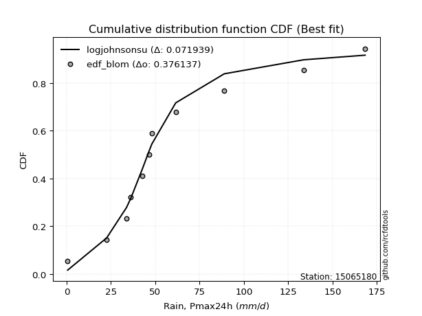</img></img>

</div>


### 7. Empirical - EDF Tukey (1962)

In hydrology, the Tukey formula is used as a plotting position formula to estimate the empirical probability or frequency of a flood event (or other hydrological data). The formula parameter is given as _c=0.333_ (or 1/3).

<div align="center">


$P=(m-c)/(n+1-2c)$


</div>


**7.1. Empirical values**

<div align="center">

|                | 0                   | 1                   | 2                   | 3                  | 4                  | 5                  | 6                  | 7                  | 8                  | 9                  | 10                 | 11                 |
|:---------------|:--------------------|:--------------------|:--------------------|:-------------------|:-------------------|:-------------------|:-------------------|:-------------------|:-------------------|:-------------------|:-------------------|:-------------------|
| date           | 2014                | 2016                | 2018                | 2015               | 2017               | 2020               | 2023               | 2025               | 2022               | 2021               | 2019               | 2024               |
| x              | 0.6                 | 22.59               | 33.77               | 36.25              | 42.61              | 46.7               | 48.1               | 55.1               | 61.55              | 88.93              | 133.69             | 168.4              |
| m              | 1                   | 2                   | 3                   | 4                  | 5                  | 6                  | 7                  | 8                  | 9                  | 10                 | 11                 | 12                 |
| empirical_dist | edf_tukey           | edf_tukey           | edf_tukey           | edf_tukey          | edf_tukey          | edf_tukey          | edf_tukey          | edf_tukey          | edf_tukey          | edf_tukey          | edf_tukey          | edf_tukey          |
| empirical      | 0.05405405405405406 | 0.13513513513513514 | 0.21621621621621623 | 0.2972972972972973 | 0.3783783783783784 | 0.4594594594594595 | 0.5405405405405406 | 0.6216216216216216 | 0.7027027027027027 | 0.7837837837837838 | 0.8648648648648649 | 0.9459459459459459 |
| empirical_tr   | 1.0571428571428572  | 1.15625             | 1.2758620689655173  | 1.4230769230769231 | 1.608695652173913  | 1.8499999999999999 | 2.1764705882352944 | 2.642857142857143  | 3.363636363636364  | 4.625              | 7.400000000000003  | 18.5               |

</div>


**7.2. Kolmogorov-Smirnov fit test (sorted by Δ)**


<div align="center">

|                | 0                   | 1                   | 2                   | 3                   | 4                   | 5                   | 6                   | 7                   | 8                   | 9                   | 10                  | 11                  | 12                  | 13                  | 14                  | 15                  | 16                  | 17                  | 18                  | 19                  | 20                  | 21                  | 22                  | 23                  | 24                  | 25                  | 26                  | 27                  | 28                  | 29                  | 30                  | 31                  | 32                  | 33                  | 34                  | 35                    | 36                  | 37                  | 38                  | 39                  | 40                  | 41                  | 42                  | 43                  | 44                  | 45                  | 46                  | 47                  | 48                  | 49                  | 50                  | 51                  | 52                  | 53                  | 54                  | 55                  | 56                  | 57                  | 58                  | 59                  | 60                  | 61                  | 62                  | 63                  | 64                  | 65                  | 66                  | 67                  | 68                  | 69                  | 70                  | 71                  | 72                  | 73                  | 74                  | 75                  | 76                  | 77                  | 78                  | 79                  | 80                  | 81                  | 82                  | 83                  | 84                  | 85                  | 86                  | 87                  | 88                  | 89                  |
|:---------------|:--------------------|:--------------------|:--------------------|:--------------------|:--------------------|:--------------------|:--------------------|:--------------------|:--------------------|:--------------------|:--------------------|:--------------------|:--------------------|:--------------------|:--------------------|:--------------------|:--------------------|:--------------------|:--------------------|:--------------------|:--------------------|:--------------------|:--------------------|:--------------------|:--------------------|:--------------------|:--------------------|:--------------------|:--------------------|:--------------------|:--------------------|:--------------------|:--------------------|:--------------------|:--------------------|:----------------------|:--------------------|:--------------------|:--------------------|:--------------------|:--------------------|:--------------------|:--------------------|:--------------------|:--------------------|:--------------------|:--------------------|:--------------------|:--------------------|:--------------------|:--------------------|:--------------------|:--------------------|:--------------------|:--------------------|:--------------------|:--------------------|:--------------------|:--------------------|:--------------------|:--------------------|:--------------------|:--------------------|:--------------------|:--------------------|:--------------------|:--------------------|:--------------------|:--------------------|:--------------------|:--------------------|:--------------------|:--------------------|:--------------------|:--------------------|:--------------------|:--------------------|:--------------------|:--------------------|:--------------------|:--------------------|:--------------------|:--------------------|:--------------------|:--------------------|:--------------------|:--------------------|:--------------------|:--------------------|:--------------------|
| station        | 15065180            | 15065180            | 15065180            | 15065180            | 15065180            | 15065180            | 15065180            | 15065180            | 15065180            | 15065180            | 15065180            | 15065180            | 15065180            | 15065180            | 15065180            | 15065180            | 15065180            | 15065180            | 15065180            | 15065180            | 15065180            | 15065180            | 15065180            | 15065180            | 15065180            | 15065180            | 15065180            | 15065180            | 15065180            | 15065180            | 15065180            | 15065180            | 15065180            | 15065180            | 15065180            | 15065180              | 15065180            | 15065180            | 15065180            | 15065180            | 15065180            | 15065180            | 15065180            | 15065180            | 15065180            | 15065180            | 15065180            | 15065180            | 15065180            | 15065180            | 15065180            | 15065180            | 15065180            | 15065180            | 15065180            | 15065180            | 15065180            | 15065180            | 15065180            | 15065180            | 15065180            | 15065180            | 15065180            | 15065180            | 15065180            | 15065180            | 15065180            | 15065180            | 15065180            | 15065180            | 15065180            | 15065180            | 15065180            | 15065180            | 15065180            | 15065180            | 15065180            | 15065180            | 15065180            | 15065180            | 15065180            | 15065180            | 15065180            | 15065180            | 15065180            | 15065180            | 15065180            | 15065180            | 15065180            | 15065180            |
| empirical_dist | edf_tukey           | edf_tukey           | edf_tukey           | edf_tukey           | edf_tukey           | edf_tukey           | edf_tukey           | edf_tukey           | edf_tukey           | edf_tukey           | edf_tukey           | edf_tukey           | edf_tukey           | edf_tukey           | edf_tukey           | edf_tukey           | edf_tukey           | edf_tukey           | edf_tukey           | edf_tukey           | edf_tukey           | edf_tukey           | edf_tukey           | edf_tukey           | edf_tukey           | edf_tukey           | edf_tukey           | edf_tukey           | edf_tukey           | edf_tukey           | edf_tukey           | edf_tukey           | edf_tukey           | edf_tukey           | edf_tukey           | edf_tukey             | edf_tukey           | edf_tukey           | edf_tukey           | edf_tukey           | edf_tukey           | edf_tukey           | edf_tukey           | edf_tukey           | edf_tukey           | edf_tukey           | edf_tukey           | edf_tukey           | edf_tukey           | edf_tukey           | edf_tukey           | edf_tukey           | edf_tukey           | edf_tukey           | edf_tukey           | edf_tukey           | edf_tukey           | edf_tukey           | edf_tukey           | edf_tukey           | edf_tukey           | edf_tukey           | edf_tukey           | edf_tukey           | edf_tukey           | edf_tukey           | edf_tukey           | edf_tukey           | edf_tukey           | edf_tukey           | edf_tukey           | edf_tukey           | edf_tukey           | edf_tukey           | edf_tukey           | edf_tukey           | edf_tukey           | edf_tukey           | edf_tukey           | edf_tukey           | edf_tukey           | edf_tukey           | edf_tukey           | edf_tukey           | edf_tukey           | edf_tukey           | edf_tukey           | edf_tukey           | edf_tukey           | edf_tukey           |
| p_dist         | logt                | johnsonsu           | logjohnsonsu        | nct                 | fisk                | laplace_asymmetric  | exponnorm           | alpha               | invweibull          | invgamma            | moyal               | halflogistic        | betaprime           | logfisk             | invgauss            | fatiguelife         | wald                | f                   | erlang              | chi2                | gamma               | weibull_min         | genlogistic         | pearson3            | halfnorm            | gompertz            | gumbel_r            | nakagami            | gibrat              | logloggamma         | loggenlogistic      | kstwobign           | ncf                 | loggompertz         | rayleigh            | loglaplace_asymmetric | maxwell             | logmielke           | mielke              | loggumbel_l         | rice                | logpearson3         | t                   | hypsecant           | logistic            | norm                | crystalball         | truncnorm           | genexpon            | expon               | laplace             | loglaplace          | loghypsecant        | loglogistic         | lognakagami         | loglognorm          | logfatiguelife      | logrice             | logexponnorm        | logcrystalball      | lognorm             | lognorm             | lognct              | loginvgamma         | gumbel_l            | logalpha            | loginvgauss         | logmaxwell          | loginvweibull       | lograyleigh         | loggumbel_r         | loghalfnorm         | logkstwobign        | logmoyal            | loghalflogistic     | loggenexpon         | logwald             | loggibrat           | logexpon            | logncf              | pareto              | logbetaprime        | logtruncnorm        | logpareto           | logf                | logweibull_min      | loggamma            | loggamma            | logchi2             | logerlang           |
| delta          | 0.0587678475558181  | 0.06097866170977817 | 0.06494016318567297 | 0.083126462023425   | 0.08377889291871632 | 0.09247551079461858 | 0.09802966498769161 | 0.0992710880048211  | 0.10086953993050429 | 0.10393143901851898 | 0.10624763255981295 | 0.1078933257448429  | 0.10878082135224454 | 0.11156457946264564 | 0.11188207318253696 | 0.11333022186831954 | 0.11367061608357648 | 0.11642274007591558 | 0.11645910548102967 | 0.11645975791708285 | 0.11645990889534852 | 0.11807281071978071 | 0.11987570732233133 | 0.1269292883446257  | 0.12744136908710302 | 0.12856075858081428 | 0.132093419707776   | 0.13513513513405778 | 0.13513513513513514 | 0.13843815121355363 | 0.14281875630287355 | 0.1462382517132238  | 0.14659409915299915 | 0.14756592628362053 | 0.15842818496986932 | 0.16215060663213987   | 0.16943493917738572 | 0.16953368554485498 | 0.1707827441238281  | 0.17478518890975187 | 0.1811218454239394  | 0.19399106547755907 | 0.2023328114508085  | 0.20241867192929763 | 0.20244511527319597 | 0.20247607891592467 | 0.20247608496087965 | 0.20247608922785376 | 0.2030947719182591  | 0.20362145191309933 | 0.21216519357620933 | 0.21984544735309397 | 0.23559418354467315 | 0.2400249821557927  | 0.24402928178331962 | 0.24427714573656667 | 0.24517184661295827 | 0.24521412050601987 | 0.24524585328746418 | 0.24524642113043943 | 0.24524645388468974 | 0.24524645388468974 | 0.24616999650675503 | 0.25131108499105    | 0.2728453485110691  | 0.2747996639410637  | 0.27684582068465863 | 0.2794096600881712  | 0.28432866191213846 | 0.2911392698685562  | 0.3133824823066149  | 0.3242181340820387  | 0.3371120808271157  | 0.33900885352678145 | 0.3463392634756147  | 0.37662733276138466 | 0.4103184978353711  | 0.425997724578564   | 0.4465806977568851  | 0.4658777701881031  | 0.4994009571731642  | 0.5034485245934985  | 0.521601761581588   | 0.5222697149114013  | 0.5545258514897109  | 0.6342765521680136  | 0.6635355388619106  | 0.6635355388619106  | 0.7113446337029663  | 0.8647827937427857  |
| deltao         | 0.36218414519599995 | 0.36218414519599995 | 0.36218414519599995 | 0.36218414519599995 | 0.36218414519599995 | 0.36218414519599995 | 0.36218414519599995 | 0.36218414519599995 | 0.36218414519599995 | 0.36218414519599995 | 0.36218414519599995 | 0.36218414519599995 | 0.36218414519599995 | 0.36218414519599995 | 0.36218414519599995 | 0.36218414519599995 | 0.36218414519599995 | 0.36218414519599995 | 0.36218414519599995 | 0.36218414519599995 | 0.36218414519599995 | 0.36218414519599995 | 0.36218414519599995 | 0.36218414519599995 | 0.36218414519599995 | 0.36218414519599995 | 0.36218414519599995 | 0.36218414519599995 | 0.36218414519599995 | 0.36218414519599995 | 0.36218414519599995 | 0.36218414519599995 | 0.36218414519599995 | 0.36218414519599995 | 0.36218414519599995 | 0.36218414519599995   | 0.36218414519599995 | 0.36218414519599995 | 0.36218414519599995 | 0.36218414519599995 | 0.36218414519599995 | 0.36218414519599995 | 0.36218414519599995 | 0.36218414519599995 | 0.36218414519599995 | 0.36218414519599995 | 0.36218414519599995 | 0.36218414519599995 | 0.36218414519599995 | 0.36218414519599995 | 0.36218414519599995 | 0.36218414519599995 | 0.36218414519599995 | 0.36218414519599995 | 0.36218414519599995 | 0.36218414519599995 | 0.36218414519599995 | 0.36218414519599995 | 0.36218414519599995 | 0.36218414519599995 | 0.36218414519599995 | 0.36218414519599995 | 0.36218414519599995 | 0.36218414519599995 | 0.36218414519599995 | 0.36218414519599995 | 0.36218414519599995 | 0.36218414519599995 | 0.36218414519599995 | 0.36218414519599995 | 0.36218414519599995 | 0.36218414519599995 | 0.36218414519599995 | 0.36218414519599995 | 0.36218414519599995 | 0.36218414519599995 | 0.36218414519599995 | 0.36218414519599995 | 0.36218414519599995 | 0.36218414519599995 | 0.36218414519599995 | 0.36218414519599995 | 0.36218414519599995 | 0.36218414519599995 | 0.36218414519599995 | 0.36218414519599995 | 0.36218414519599995 | 0.36218414519599995 | 0.36218414519599995 | 0.36218414519599995 |
| eval           | Δo > Δ              | Δo > Δ              | Δo > Δ              | Δo > Δ              | Δo > Δ              | Δo > Δ              | Δo > Δ              | Δo > Δ              | Δo > Δ              | Δo > Δ              | Δo > Δ              | Δo > Δ              | Δo > Δ              | Δo > Δ              | Δo > Δ              | Δo > Δ              | Δo > Δ              | Δo > Δ              | Δo > Δ              | Δo > Δ              | Δo > Δ              | Δo > Δ              | Δo > Δ              | Δo > Δ              | Δo > Δ              | Δo > Δ              | Δo > Δ              | Δo > Δ              | Δo > Δ              | Δo > Δ              | Δo > Δ              | Δo > Δ              | Δo > Δ              | Δo > Δ              | Δo > Δ              | Δo > Δ                | Δo > Δ              | Δo > Δ              | Δo > Δ              | Δo > Δ              | Δo > Δ              | Δo > Δ              | Δo > Δ              | Δo > Δ              | Δo > Δ              | Δo > Δ              | Δo > Δ              | Δo > Δ              | Δo > Δ              | Δo > Δ              | Δo > Δ              | Δo > Δ              | Δo > Δ              | Δo > Δ              | Δo > Δ              | Δo > Δ              | Δo > Δ              | Δo > Δ              | Δo > Δ              | Δo > Δ              | Δo > Δ              | Δo > Δ              | Δo > Δ              | Δo > Δ              | Δo > Δ              | Δo > Δ              | Δo > Δ              | Δo > Δ              | Δo > Δ              | Δo > Δ              | Δo > Δ              | Δo > Δ              | Δo > Δ              | Δo > Δ              | Δo > Δ              | Δo <= Δ             | Δo <= Δ             | Δo <= Δ             | Δo <= Δ             | Δo <= Δ             | Δo <= Δ             | Δo <= Δ             | Δo <= Δ             | Δo <= Δ             | Δo <= Δ             | Δo <= Δ             | Δo <= Δ             | Δo <= Δ             | Δo <= Δ             | Δo <= Δ             |
| fit            | 1                   | 1                   | 1                   | 1                   | 1                   | 1                   | 1                   | 1                   | 1                   | 1                   | 1                   | 1                   | 1                   | 1                   | 1                   | 1                   | 1                   | 1                   | 1                   | 1                   | 1                   | 1                   | 1                   | 1                   | 1                   | 1                   | 1                   | 1                   | 1                   | 1                   | 1                   | 1                   | 1                   | 1                   | 1                   | 1                     | 1                   | 1                   | 1                   | 1                   | 1                   | 1                   | 1                   | 1                   | 1                   | 1                   | 1                   | 1                   | 1                   | 1                   | 1                   | 1                   | 1                   | 1                   | 1                   | 1                   | 1                   | 1                   | 1                   | 1                   | 1                   | 1                   | 1                   | 1                   | 1                   | 1                   | 1                   | 1                   | 1                   | 1                   | 1                   | 1                   | 1                   | 1                   | 1                   | 0                   | 0                   | 0                   | 0                   | 0                   | 0                   | 0                   | 0                   | 0                   | 0                   | 0                   | 0                   | 0                   | 0                   | 0                   |
| n              | 12                  | 12                  | 12                  | 12                  | 12                  | 12                  | 12                  | 12                  | 12                  | 12                  | 12                  | 12                  | 12                  | 12                  | 12                  | 12                  | 12                  | 12                  | 12                  | 12                  | 12                  | 12                  | 12                  | 12                  | 12                  | 12                  | 12                  | 12                  | 12                  | 12                  | 12                  | 12                  | 12                  | 12                  | 12                  | 12                    | 12                  | 12                  | 12                  | 12                  | 12                  | 12                  | 12                  | 12                  | 12                  | 12                  | 12                  | 12                  | 12                  | 12                  | 12                  | 12                  | 12                  | 12                  | 12                  | 12                  | 12                  | 12                  | 12                  | 12                  | 12                  | 12                  | 12                  | 12                  | 12                  | 12                  | 12                  | 12                  | 12                  | 12                  | 12                  | 12                  | 12                  | 12                  | 12                  | 12                  | 12                  | 12                  | 12                  | 12                  | 12                  | 12                  | 12                  | 12                  | 12                  | 12                  | 12                  | 12                  | 12                  | 12                  |
| best_fit       | 1                   | 0                   | 0                   | 0                   | 0                   | 0                   | 0                   | 0                   | 0                   | 0                   | 0                   | 0                   | 0                   | 0                   | 0                   | 0                   | 0                   | 0                   | 0                   | 0                   | 0                   | 0                   | 0                   | 0                   | 0                   | 0                   | 0                   | 0                   | 0                   | 0                   | 0                   | 0                   | 0                   | 0                   | 0                   | 0                     | 0                   | 0                   | 0                   | 0                   | 0                   | 0                   | 0                   | 0                   | 0                   | 0                   | 0                   | 0                   | 0                   | 0                   | 0                   | 0                   | 0                   | 0                   | 0                   | 0                   | 0                   | 0                   | 0                   | 0                   | 0                   | 0                   | 0                   | 0                   | 0                   | 0                   | 0                   | 0                   | 0                   | 0                   | 0                   | 0                   | 0                   | 0                   | 0                   | 0                   | 0                   | 0                   | 0                   | 0                   | 0                   | 0                   | 0                   | 0                   | 0                   | 0                   | 0                   | 0                   | 0                   | 0                   |
| best_fit_sort  | 1                   | 2                   | 3                   | 4                   | 5                   | 6                   | 7                   | 8                   | 9                   | 10                  | 11                  | 12                  | 13                  | 14                  | 15                  | 16                  | 17                  | 18                  | 19                  | 20                  | 21                  | 22                  | 23                  | 24                  | 25                  | 26                  | 27                  | 28                  | 29                  | 30                  | 31                  | 32                  | 33                  | 34                  | 35                  | 36                    | 37                  | 38                  | 39                  | 40                  | 41                  | 42                  | 43                  | 44                  | 45                  | 46                  | 47                  | 48                  | 49                  | 50                  | 51                  | 52                  | 53                  | 54                  | 55                  | 56                  | 57                  | 58                  | 59                  | 60                  | 61                  | 62                  | 63                  | 64                  | 65                  | 66                  | 67                  | 68                  | 69                  | 70                  | 71                  | 72                  | 73                  | 74                  | 75                  | 76                  | 77                  | 78                  | 79                  | 80                  | 81                  | 82                  | 83                  | 84                  | 85                  | 86                  | 87                  | 88                  | 89                  | 90                  |

</div>


<div align="center">

</img>

</div>


**7.3. Best fit**

<div align="center">

|   id |   station | empirical_dist   | p_dist   |     delta |   deltao | eval   |   fit |   n |   best_fit |   best_fit_sort |
|-----:|----------:|:-----------------|:---------|----------:|---------:|:-------|------:|----:|-----------:|----------------:|
|    0 |  15065180 | edf_tukey        | logt     | 0.0587678 | 0.362184 | Δo > Δ |     1 |  12 |          1 |               1 |

</div>


<div align="center">

</img>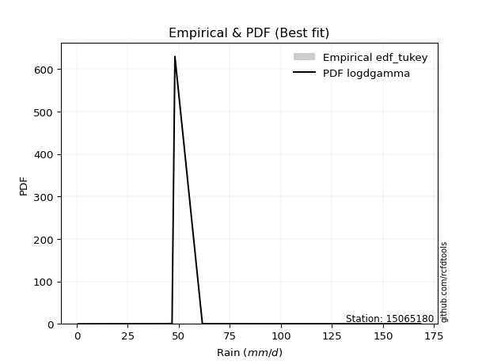</img>

</div>


### 8. Empirical - EDF Gringorten (1963)

Gringorten plotting position formula is essential for estimating the probability and return periods of extreme events like floods and heavy rainfall. The constant _a=0.44_.

<div align="center">


$P=(m-a)/(n+1-2a)$


</div>


**8.1. Empirical values**

<div align="center">

|                | 0                   | 1                   | 2                   | 3                   | 4                   | 5                   | 6                  | 7                  | 8                  | 9                  | 10                 | 11                 |
|:---------------|:--------------------|:--------------------|:--------------------|:--------------------|:--------------------|:--------------------|:-------------------|:-------------------|:-------------------|:-------------------|:-------------------|:-------------------|
| date           | 2014                | 2016                | 2018                | 2015                | 2017                | 2020                | 2023               | 2025               | 2022               | 2021               | 2019               | 2024               |
| x              | 0.6                 | 22.59               | 33.77               | 36.25               | 42.61               | 46.7                | 48.1               | 55.1               | 61.55              | 88.93              | 133.69             | 168.4              |
| m              | 1                   | 2                   | 3                   | 4                   | 5                   | 6                   | 7                  | 8                  | 9                  | 10                 | 11                 | 12                 |
| empirical_dist | edf_gringorten      | edf_gringorten      | edf_gringorten      | edf_gringorten      | edf_gringorten      | edf_gringorten      | edf_gringorten     | edf_gringorten     | edf_gringorten     | edf_gringorten     | edf_gringorten     | edf_gringorten     |
| empirical      | 0.04620462046204621 | 0.12871287128712872 | 0.21122112211221125 | 0.29372937293729373 | 0.37623762376237624 | 0.45874587458745875 | 0.5412541254125413 | 0.6237623762376238 | 0.7062706270627064 | 0.7887788778877889 | 0.8712871287128714 | 0.9537953795379539 |
| empirical_tr   | 1.0484429065743945  | 1.1477272727272727  | 1.2677824267782427  | 1.4158878504672898  | 1.6031746031746033  | 1.8475609756097562  | 2.179856115107914  | 2.6578947368421053 | 3.4044943820224733 | 4.734375000000003  | 7.769230769230775  | 21.642857142857192 |

</div>


**8.2. Kolmogorov-Smirnov fit test (sorted by Δ)**


<div align="center">

|                | 0                   | 1                   | 2                   | 3                   | 4                   | 5                   | 6                   | 7                   | 8                   | 9                   | 10                  | 11                  | 12                  | 13                  | 14                  | 15                  | 16                  | 17                  | 18                  | 19                  | 20                  | 21                  | 22                  | 23                  | 24                  | 25                  | 26                  | 27                  | 28                  | 29                  | 30                  | 31                  | 32                  | 33                  | 34                  | 35                    | 36                  | 37                  | 38                  | 39                  | 40                  | 41                  | 42                  | 43                  | 44                  | 45                  | 46                  | 47                  | 48                  | 49                  | 50                  | 51                  | 52                  | 53                  | 54                  | 55                  | 56                  | 57                  | 58                  | 59                  | 60                  | 61                  | 62                  | 63                  | 64                  | 65                  | 66                  | 67                  | 68                  | 69                  | 70                  | 71                  | 72                  | 73                  | 74                  | 75                  | 76                  | 77                  | 78                  | 79                  | 80                  | 81                  | 82                  | 83                  | 84                  | 85                  | 86                  | 87                  | 88                  | 89                  |
|:---------------|:--------------------|:--------------------|:--------------------|:--------------------|:--------------------|:--------------------|:--------------------|:--------------------|:--------------------|:--------------------|:--------------------|:--------------------|:--------------------|:--------------------|:--------------------|:--------------------|:--------------------|:--------------------|:--------------------|:--------------------|:--------------------|:--------------------|:--------------------|:--------------------|:--------------------|:--------------------|:--------------------|:--------------------|:--------------------|:--------------------|:--------------------|:--------------------|:--------------------|:--------------------|:--------------------|:----------------------|:--------------------|:--------------------|:--------------------|:--------------------|:--------------------|:--------------------|:--------------------|:--------------------|:--------------------|:--------------------|:--------------------|:--------------------|:--------------------|:--------------------|:--------------------|:--------------------|:--------------------|:--------------------|:--------------------|:--------------------|:--------------------|:--------------------|:--------------------|:--------------------|:--------------------|:--------------------|:--------------------|:--------------------|:--------------------|:--------------------|:--------------------|:--------------------|:--------------------|:--------------------|:--------------------|:--------------------|:--------------------|:--------------------|:--------------------|:--------------------|:--------------------|:--------------------|:--------------------|:--------------------|:--------------------|:--------------------|:--------------------|:--------------------|:--------------------|:--------------------|:--------------------|:--------------------|:--------------------|:--------------------|
| station        | 15065180            | 15065180            | 15065180            | 15065180            | 15065180            | 15065180            | 15065180            | 15065180            | 15065180            | 15065180            | 15065180            | 15065180            | 15065180            | 15065180            | 15065180            | 15065180            | 15065180            | 15065180            | 15065180            | 15065180            | 15065180            | 15065180            | 15065180            | 15065180            | 15065180            | 15065180            | 15065180            | 15065180            | 15065180            | 15065180            | 15065180            | 15065180            | 15065180            | 15065180            | 15065180            | 15065180              | 15065180            | 15065180            | 15065180            | 15065180            | 15065180            | 15065180            | 15065180            | 15065180            | 15065180            | 15065180            | 15065180            | 15065180            | 15065180            | 15065180            | 15065180            | 15065180            | 15065180            | 15065180            | 15065180            | 15065180            | 15065180            | 15065180            | 15065180            | 15065180            | 15065180            | 15065180            | 15065180            | 15065180            | 15065180            | 15065180            | 15065180            | 15065180            | 15065180            | 15065180            | 15065180            | 15065180            | 15065180            | 15065180            | 15065180            | 15065180            | 15065180            | 15065180            | 15065180            | 15065180            | 15065180            | 15065180            | 15065180            | 15065180            | 15065180            | 15065180            | 15065180            | 15065180            | 15065180            | 15065180            |
| empirical_dist | edf_gringorten      | edf_gringorten      | edf_gringorten      | edf_gringorten      | edf_gringorten      | edf_gringorten      | edf_gringorten      | edf_gringorten      | edf_gringorten      | edf_gringorten      | edf_gringorten      | edf_gringorten      | edf_gringorten      | edf_gringorten      | edf_gringorten      | edf_gringorten      | edf_gringorten      | edf_gringorten      | edf_gringorten      | edf_gringorten      | edf_gringorten      | edf_gringorten      | edf_gringorten      | edf_gringorten      | edf_gringorten      | edf_gringorten      | edf_gringorten      | edf_gringorten      | edf_gringorten      | edf_gringorten      | edf_gringorten      | edf_gringorten      | edf_gringorten      | edf_gringorten      | edf_gringorten      | edf_gringorten        | edf_gringorten      | edf_gringorten      | edf_gringorten      | edf_gringorten      | edf_gringorten      | edf_gringorten      | edf_gringorten      | edf_gringorten      | edf_gringorten      | edf_gringorten      | edf_gringorten      | edf_gringorten      | edf_gringorten      | edf_gringorten      | edf_gringorten      | edf_gringorten      | edf_gringorten      | edf_gringorten      | edf_gringorten      | edf_gringorten      | edf_gringorten      | edf_gringorten      | edf_gringorten      | edf_gringorten      | edf_gringorten      | edf_gringorten      | edf_gringorten      | edf_gringorten      | edf_gringorten      | edf_gringorten      | edf_gringorten      | edf_gringorten      | edf_gringorten      | edf_gringorten      | edf_gringorten      | edf_gringorten      | edf_gringorten      | edf_gringorten      | edf_gringorten      | edf_gringorten      | edf_gringorten      | edf_gringorten      | edf_gringorten      | edf_gringorten      | edf_gringorten      | edf_gringorten      | edf_gringorten      | edf_gringorten      | edf_gringorten      | edf_gringorten      | edf_gringorten      | edf_gringorten      | edf_gringorten      | edf_gringorten      |
| p_dist         | logt                | johnsonsu           | logjohnsonsu        | nct                 | fisk                | laplace_asymmetric  | exponnorm           | alpha               | invweibull          | wald                | invgamma            | moyal               | betaprime           | halflogistic        | invgauss            | logfisk             | fatiguelife         | f                   | erlang              | chi2                | gamma               | weibull_min         | genlogistic         | nakagami            | gibrat              | pearson3            | halfnorm            | gompertz            | gumbel_r            | logloggamma         | loggenlogistic      | kstwobign           | ncf                 | loggompertz         | rayleigh            | loglaplace_asymmetric | maxwell             | logmielke           | mielke              | loggumbel_l         | rice                | logpearson3         | t                   | hypsecant           | logistic            | norm                | crystalball         | truncnorm           | genexpon            | expon               | laplace             | loglaplace          | loghypsecant        | loglogistic         | lognakagami         | loglognorm          | logfatiguelife      | logrice             | logexponnorm        | logcrystalball      | lognorm             | lognorm             | lognct              | loginvgamma         | gumbel_l            | logalpha            | loginvgauss         | logmaxwell          | loginvweibull       | lograyleigh         | loggumbel_r         | loghalfnorm         | logkstwobign        | logmoyal            | loghalflogistic     | loggenexpon         | logwald             | loggibrat           | logexpon            | logncf              | pareto              | logbetaprime        | logtruncnorm        | logpareto           | logf                | logweibull_min      | loggamma            | loggamma            | logchi2             | logerlang           |
| delta          | 0.05377275345181298 | 0.05455639786177169 | 0.05994506908166786 | 0.08669438638342863 | 0.08734681727871996 | 0.09604343515462221 | 0.10159758934769525 | 0.10283901236482473 | 0.10443746429050793 | 0.10724835223557005 | 0.10749936337852262 | 0.10981555691981659 | 0.11234874571224818 | 0.11288841984884787 | 0.1154499975425406  | 0.11655967356665062 | 0.11689814622832317 | 0.11999066443591921 | 0.1200270298410333  | 0.12002768227708649 | 0.12002783325535216 | 0.12164073507978435 | 0.12344363168233496 | 0.12871287128605136 | 0.12871287128712872 | 0.13049721270462933 | 0.13100929344710666 | 0.13212868294081792 | 0.13566134406777963 | 0.1434332453175586  | 0.14781385040687853 | 0.14980617607322744 | 0.15016202351300278 | 0.1525610203876255  | 0.16199610932987296 | 0.16714570073614485   | 0.17300286353738936 | 0.17452877964885996 | 0.17577783822783308 | 0.17978028301375684 | 0.18468976978394303 | 0.1975589898375627  | 0.20590073581081214 | 0.20598659628930127 | 0.2060130396331996  | 0.2060440032759283  | 0.2060440093208833  | 0.2060440135878574  | 0.20808986602226406 | 0.2086165460171043  | 0.2143059481922115  | 0.22484054145709895 | 0.24058927764867813 | 0.2450200762597977  | 0.2490243758873246  | 0.24927223984057165 | 0.2501669407169632  | 0.2502092146100249  | 0.2502409473914692  | 0.2502415152344444  | 0.2502415479886947  | 0.2502415479886947  | 0.25116509061076    | 0.25630617909505493 | 0.27641327287107276 | 0.2797947580450687  | 0.2818409147886636  | 0.28440475419217615 | 0.2907509257601449  | 0.2961343639725612  | 0.3183775764106199  | 0.3292132281860437  | 0.3435343446751221  | 0.34400394763078646 | 0.3513343575796197  | 0.3830495966093911  | 0.4153135919393761  | 0.430992818682569   | 0.4530029616048915  | 0.47230003403610954 | 0.5058232210211706  | 0.509870788441505   | 0.5280240254295945  | 0.5286919787594077  | 0.5609481153377174  | 0.64069881601602    | 0.6699578027099171  | 0.6699578027099171  | 0.7177668975509728  | 0.8712050575907921  |
| deltao         | 0.36218414519599995 | 0.36218414519599995 | 0.36218414519599995 | 0.36218414519599995 | 0.36218414519599995 | 0.36218414519599995 | 0.36218414519599995 | 0.36218414519599995 | 0.36218414519599995 | 0.36218414519599995 | 0.36218414519599995 | 0.36218414519599995 | 0.36218414519599995 | 0.36218414519599995 | 0.36218414519599995 | 0.36218414519599995 | 0.36218414519599995 | 0.36218414519599995 | 0.36218414519599995 | 0.36218414519599995 | 0.36218414519599995 | 0.36218414519599995 | 0.36218414519599995 | 0.36218414519599995 | 0.36218414519599995 | 0.36218414519599995 | 0.36218414519599995 | 0.36218414519599995 | 0.36218414519599995 | 0.36218414519599995 | 0.36218414519599995 | 0.36218414519599995 | 0.36218414519599995 | 0.36218414519599995 | 0.36218414519599995 | 0.36218414519599995   | 0.36218414519599995 | 0.36218414519599995 | 0.36218414519599995 | 0.36218414519599995 | 0.36218414519599995 | 0.36218414519599995 | 0.36218414519599995 | 0.36218414519599995 | 0.36218414519599995 | 0.36218414519599995 | 0.36218414519599995 | 0.36218414519599995 | 0.36218414519599995 | 0.36218414519599995 | 0.36218414519599995 | 0.36218414519599995 | 0.36218414519599995 | 0.36218414519599995 | 0.36218414519599995 | 0.36218414519599995 | 0.36218414519599995 | 0.36218414519599995 | 0.36218414519599995 | 0.36218414519599995 | 0.36218414519599995 | 0.36218414519599995 | 0.36218414519599995 | 0.36218414519599995 | 0.36218414519599995 | 0.36218414519599995 | 0.36218414519599995 | 0.36218414519599995 | 0.36218414519599995 | 0.36218414519599995 | 0.36218414519599995 | 0.36218414519599995 | 0.36218414519599995 | 0.36218414519599995 | 0.36218414519599995 | 0.36218414519599995 | 0.36218414519599995 | 0.36218414519599995 | 0.36218414519599995 | 0.36218414519599995 | 0.36218414519599995 | 0.36218414519599995 | 0.36218414519599995 | 0.36218414519599995 | 0.36218414519599995 | 0.36218414519599995 | 0.36218414519599995 | 0.36218414519599995 | 0.36218414519599995 | 0.36218414519599995 |
| eval           | Δo > Δ              | Δo > Δ              | Δo > Δ              | Δo > Δ              | Δo > Δ              | Δo > Δ              | Δo > Δ              | Δo > Δ              | Δo > Δ              | Δo > Δ              | Δo > Δ              | Δo > Δ              | Δo > Δ              | Δo > Δ              | Δo > Δ              | Δo > Δ              | Δo > Δ              | Δo > Δ              | Δo > Δ              | Δo > Δ              | Δo > Δ              | Δo > Δ              | Δo > Δ              | Δo > Δ              | Δo > Δ              | Δo > Δ              | Δo > Δ              | Δo > Δ              | Δo > Δ              | Δo > Δ              | Δo > Δ              | Δo > Δ              | Δo > Δ              | Δo > Δ              | Δo > Δ              | Δo > Δ                | Δo > Δ              | Δo > Δ              | Δo > Δ              | Δo > Δ              | Δo > Δ              | Δo > Δ              | Δo > Δ              | Δo > Δ              | Δo > Δ              | Δo > Δ              | Δo > Δ              | Δo > Δ              | Δo > Δ              | Δo > Δ              | Δo > Δ              | Δo > Δ              | Δo > Δ              | Δo > Δ              | Δo > Δ              | Δo > Δ              | Δo > Δ              | Δo > Δ              | Δo > Δ              | Δo > Δ              | Δo > Δ              | Δo > Δ              | Δo > Δ              | Δo > Δ              | Δo > Δ              | Δo > Δ              | Δo > Δ              | Δo > Δ              | Δo > Δ              | Δo > Δ              | Δo > Δ              | Δo > Δ              | Δo > Δ              | Δo > Δ              | Δo > Δ              | Δo <= Δ             | Δo <= Δ             | Δo <= Δ             | Δo <= Δ             | Δo <= Δ             | Δo <= Δ             | Δo <= Δ             | Δo <= Δ             | Δo <= Δ             | Δo <= Δ             | Δo <= Δ             | Δo <= Δ             | Δo <= Δ             | Δo <= Δ             | Δo <= Δ             |
| fit            | 1                   | 1                   | 1                   | 1                   | 1                   | 1                   | 1                   | 1                   | 1                   | 1                   | 1                   | 1                   | 1                   | 1                   | 1                   | 1                   | 1                   | 1                   | 1                   | 1                   | 1                   | 1                   | 1                   | 1                   | 1                   | 1                   | 1                   | 1                   | 1                   | 1                   | 1                   | 1                   | 1                   | 1                   | 1                   | 1                     | 1                   | 1                   | 1                   | 1                   | 1                   | 1                   | 1                   | 1                   | 1                   | 1                   | 1                   | 1                   | 1                   | 1                   | 1                   | 1                   | 1                   | 1                   | 1                   | 1                   | 1                   | 1                   | 1                   | 1                   | 1                   | 1                   | 1                   | 1                   | 1                   | 1                   | 1                   | 1                   | 1                   | 1                   | 1                   | 1                   | 1                   | 1                   | 1                   | 0                   | 0                   | 0                   | 0                   | 0                   | 0                   | 0                   | 0                   | 0                   | 0                   | 0                   | 0                   | 0                   | 0                   | 0                   |
| n              | 12                  | 12                  | 12                  | 12                  | 12                  | 12                  | 12                  | 12                  | 12                  | 12                  | 12                  | 12                  | 12                  | 12                  | 12                  | 12                  | 12                  | 12                  | 12                  | 12                  | 12                  | 12                  | 12                  | 12                  | 12                  | 12                  | 12                  | 12                  | 12                  | 12                  | 12                  | 12                  | 12                  | 12                  | 12                  | 12                    | 12                  | 12                  | 12                  | 12                  | 12                  | 12                  | 12                  | 12                  | 12                  | 12                  | 12                  | 12                  | 12                  | 12                  | 12                  | 12                  | 12                  | 12                  | 12                  | 12                  | 12                  | 12                  | 12                  | 12                  | 12                  | 12                  | 12                  | 12                  | 12                  | 12                  | 12                  | 12                  | 12                  | 12                  | 12                  | 12                  | 12                  | 12                  | 12                  | 12                  | 12                  | 12                  | 12                  | 12                  | 12                  | 12                  | 12                  | 12                  | 12                  | 12                  | 12                  | 12                  | 12                  | 12                  |
| best_fit       | 1                   | 0                   | 0                   | 0                   | 0                   | 0                   | 0                   | 0                   | 0                   | 0                   | 0                   | 0                   | 0                   | 0                   | 0                   | 0                   | 0                   | 0                   | 0                   | 0                   | 0                   | 0                   | 0                   | 0                   | 0                   | 0                   | 0                   | 0                   | 0                   | 0                   | 0                   | 0                   | 0                   | 0                   | 0                   | 0                     | 0                   | 0                   | 0                   | 0                   | 0                   | 0                   | 0                   | 0                   | 0                   | 0                   | 0                   | 0                   | 0                   | 0                   | 0                   | 0                   | 0                   | 0                   | 0                   | 0                   | 0                   | 0                   | 0                   | 0                   | 0                   | 0                   | 0                   | 0                   | 0                   | 0                   | 0                   | 0                   | 0                   | 0                   | 0                   | 0                   | 0                   | 0                   | 0                   | 0                   | 0                   | 0                   | 0                   | 0                   | 0                   | 0                   | 0                   | 0                   | 0                   | 0                   | 0                   | 0                   | 0                   | 0                   |
| best_fit_sort  | 1                   | 2                   | 3                   | 4                   | 5                   | 6                   | 7                   | 8                   | 9                   | 10                  | 11                  | 12                  | 13                  | 14                  | 15                  | 16                  | 17                  | 18                  | 19                  | 20                  | 21                  | 22                  | 23                  | 24                  | 25                  | 26                  | 27                  | 28                  | 29                  | 30                  | 31                  | 32                  | 33                  | 34                  | 35                  | 36                    | 37                  | 38                  | 39                  | 40                  | 41                  | 42                  | 43                  | 44                  | 45                  | 46                  | 47                  | 48                  | 49                  | 50                  | 51                  | 52                  | 53                  | 54                  | 55                  | 56                  | 57                  | 58                  | 59                  | 60                  | 61                  | 62                  | 63                  | 64                  | 65                  | 66                  | 67                  | 68                  | 69                  | 70                  | 71                  | 72                  | 73                  | 74                  | 75                  | 76                  | 77                  | 78                  | 79                  | 80                  | 81                  | 82                  | 83                  | 84                  | 85                  | 86                  | 87                  | 88                  | 89                  | 90                  |

</div>


<div align="center">

</img>

</div>


**8.3. Best fit**

<div align="center">

|   id |   station | empirical_dist   | p_dist   |     delta |   deltao | eval   |   fit |   n |   best_fit |   best_fit_sort |
|-----:|----------:|:-----------------|:---------|----------:|---------:|:-------|------:|----:|-----------:|----------------:|
|    0 |  15065180 | edf_gringorten   | logt     | 0.0537728 | 0.362184 | Δo > Δ |     1 |  12 |          1 |               1 |

</div>


<div align="center">

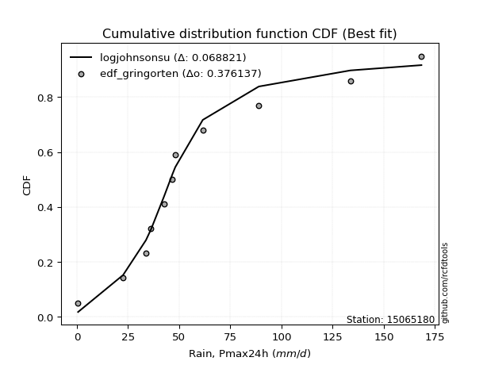</img></img>

</div>


### 9. Empirical - EDF Filliben (1975)

The specific values of the constants (0.3175) (often denoted as $alpha$) and (0.365) are derived from a method proposed by James J. Filliben in a 1975 paper. This particular formula is the mean value of the $i$-th order statistic of the normal distribution and is considered a robust and effective plotting position formula for the normal probability plot correlation coefficient test for normality.

<div align="center">


$P=(m-0.3175)/(n+0.365)$


</div>


**9.1. Empirical values**

<div align="center">

|                | 0                   | 1                   | 2                   | 3                   | 4                  | 5                  | 6                  | 7                  | 8                  | 9                  | 10                 | 11                 |
|:---------------|:--------------------|:--------------------|:--------------------|:--------------------|:-------------------|:-------------------|:-------------------|:-------------------|:-------------------|:-------------------|:-------------------|:-------------------|
| date           | 2014                | 2016                | 2018                | 2015                | 2017               | 2020               | 2023               | 2025               | 2022               | 2021               | 2019               | 2024               |
| x              | 0.6                 | 22.59               | 33.77               | 36.25               | 42.61              | 46.7               | 48.1               | 55.1               | 61.55              | 88.93              | 133.69             | 168.4              |
| m              | 1                   | 2                   | 3                   | 4                   | 5                  | 6                  | 7                  | 8                  | 9                  | 10                 | 11                 | 12                 |
| empirical_dist | edf_filliben        | edf_filliben        | edf_filliben        | edf_filliben        | edf_filliben       | edf_filliben       | edf_filliben       | edf_filliben       | edf_filliben       | edf_filliben       | edf_filliben       | edf_filliben       |
| empirical      | 0.05519611807521229 | 0.13606955115244643 | 0.21694298422968056 | 0.29781641730691466 | 0.3786898503841488 | 0.4595632834613829 | 0.540436716538617  | 0.6213101496158512 | 0.7021835826930852 | 0.7830570157703194 | 0.8639304488475535 | 0.9448038819247876 |
| empirical_tr   | 1.0584207147442757  | 1.1575005850690383  | 1.2770462174025305  | 1.4241289951050964  | 1.609502115196876  | 1.8503554059109617 | 2.1759788825340958 | 2.6406833956219966 | 3.357773251866937  | 4.6095060577819185 | 7.349182763744426  | 18.117216117216078 |

</div>


**9.2. Kolmogorov-Smirnov fit test (sorted by Δ)**


<div align="center">

|                | 0                   | 1                   | 2                   | 3                   | 4                   | 5                   | 6                   | 7                   | 8                   | 9                   | 10                  | 11                  | 12                  | 13                  | 14                  | 15                  | 16                  | 17                  | 18                  | 19                  | 20                  | 21                  | 22                  | 23                  | 24                  | 25                  | 26                  | 27                  | 28                  | 29                  | 30                  | 31                  | 32                  | 33                  | 34                  | 35                    | 36                  | 37                  | 38                  | 39                  | 40                  | 41                  | 42                  | 43                  | 44                  | 45                  | 46                  | 47                  | 48                  | 49                  | 50                  | 51                  | 52                  | 53                  | 54                  | 55                  | 56                  | 57                  | 58                  | 59                  | 60                  | 61                  | 62                  | 63                  | 64                  | 65                  | 66                  | 67                  | 68                  | 69                  | 70                  | 71                  | 72                  | 73                  | 74                  | 75                  | 76                  | 77                  | 78                  | 79                  | 80                  | 81                  | 82                  | 83                  | 84                  | 85                  | 86                  | 87                  | 88                  | 89                  |
|:---------------|:--------------------|:--------------------|:--------------------|:--------------------|:--------------------|:--------------------|:--------------------|:--------------------|:--------------------|:--------------------|:--------------------|:--------------------|:--------------------|:--------------------|:--------------------|:--------------------|:--------------------|:--------------------|:--------------------|:--------------------|:--------------------|:--------------------|:--------------------|:--------------------|:--------------------|:--------------------|:--------------------|:--------------------|:--------------------|:--------------------|:--------------------|:--------------------|:--------------------|:--------------------|:--------------------|:----------------------|:--------------------|:--------------------|:--------------------|:--------------------|:--------------------|:--------------------|:--------------------|:--------------------|:--------------------|:--------------------|:--------------------|:--------------------|:--------------------|:--------------------|:--------------------|:--------------------|:--------------------|:--------------------|:--------------------|:--------------------|:--------------------|:--------------------|:--------------------|:--------------------|:--------------------|:--------------------|:--------------------|:--------------------|:--------------------|:--------------------|:--------------------|:--------------------|:--------------------|:--------------------|:--------------------|:--------------------|:--------------------|:--------------------|:--------------------|:--------------------|:--------------------|:--------------------|:--------------------|:--------------------|:--------------------|:--------------------|:--------------------|:--------------------|:--------------------|:--------------------|:--------------------|:--------------------|:--------------------|:--------------------|
| station        | 15065180            | 15065180            | 15065180            | 15065180            | 15065180            | 15065180            | 15065180            | 15065180            | 15065180            | 15065180            | 15065180            | 15065180            | 15065180            | 15065180            | 15065180            | 15065180            | 15065180            | 15065180            | 15065180            | 15065180            | 15065180            | 15065180            | 15065180            | 15065180            | 15065180            | 15065180            | 15065180            | 15065180            | 15065180            | 15065180            | 15065180            | 15065180            | 15065180            | 15065180            | 15065180            | 15065180              | 15065180            | 15065180            | 15065180            | 15065180            | 15065180            | 15065180            | 15065180            | 15065180            | 15065180            | 15065180            | 15065180            | 15065180            | 15065180            | 15065180            | 15065180            | 15065180            | 15065180            | 15065180            | 15065180            | 15065180            | 15065180            | 15065180            | 15065180            | 15065180            | 15065180            | 15065180            | 15065180            | 15065180            | 15065180            | 15065180            | 15065180            | 15065180            | 15065180            | 15065180            | 15065180            | 15065180            | 15065180            | 15065180            | 15065180            | 15065180            | 15065180            | 15065180            | 15065180            | 15065180            | 15065180            | 15065180            | 15065180            | 15065180            | 15065180            | 15065180            | 15065180            | 15065180            | 15065180            | 15065180            |
| empirical_dist | edf_filliben        | edf_filliben        | edf_filliben        | edf_filliben        | edf_filliben        | edf_filliben        | edf_filliben        | edf_filliben        | edf_filliben        | edf_filliben        | edf_filliben        | edf_filliben        | edf_filliben        | edf_filliben        | edf_filliben        | edf_filliben        | edf_filliben        | edf_filliben        | edf_filliben        | edf_filliben        | edf_filliben        | edf_filliben        | edf_filliben        | edf_filliben        | edf_filliben        | edf_filliben        | edf_filliben        | edf_filliben        | edf_filliben        | edf_filliben        | edf_filliben        | edf_filliben        | edf_filliben        | edf_filliben        | edf_filliben        | edf_filliben          | edf_filliben        | edf_filliben        | edf_filliben        | edf_filliben        | edf_filliben        | edf_filliben        | edf_filliben        | edf_filliben        | edf_filliben        | edf_filliben        | edf_filliben        | edf_filliben        | edf_filliben        | edf_filliben        | edf_filliben        | edf_filliben        | edf_filliben        | edf_filliben        | edf_filliben        | edf_filliben        | edf_filliben        | edf_filliben        | edf_filliben        | edf_filliben        | edf_filliben        | edf_filliben        | edf_filliben        | edf_filliben        | edf_filliben        | edf_filliben        | edf_filliben        | edf_filliben        | edf_filliben        | edf_filliben        | edf_filliben        | edf_filliben        | edf_filliben        | edf_filliben        | edf_filliben        | edf_filliben        | edf_filliben        | edf_filliben        | edf_filliben        | edf_filliben        | edf_filliben        | edf_filliben        | edf_filliben        | edf_filliben        | edf_filliben        | edf_filliben        | edf_filliben        | edf_filliben        | edf_filliben        | edf_filliben        |
| p_dist         | logt                | johnsonsu           | logjohnsonsu        | nct                 | fisk                | laplace_asymmetric  | exponnorm           | alpha               | invweibull          | invgamma            | moyal               | halflogistic        | betaprime           | logfisk             | invgauss            | fatiguelife         | wald                | f                   | erlang              | chi2                | gamma               | weibull_min         | genlogistic         | pearson3            | halfnorm            | gompertz            | gumbel_r            | nakagami            | gibrat              | logloggamma         | loggenlogistic      | kstwobign           | ncf                 | loggompertz         | rayleigh            | loglaplace_asymmetric | logmielke           | maxwell             | mielke              | loggumbel_l         | rice                | logpearson3         | t                   | hypsecant           | logistic            | norm                | crystalball         | truncnorm           | genexpon            | expon               | laplace             | loglaplace          | loghypsecant        | loglogistic         | lognakagami         | loglognorm          | logfatiguelife      | logrice             | logexponnorm        | logcrystalball      | lognorm             | lognorm             | lognct              | loginvgamma         | gumbel_l            | logalpha            | loginvgauss         | logmaxwell          | loginvweibull       | lograyleigh         | loggumbel_r         | loghalfnorm         | logkstwobign        | logmoyal            | loghalflogistic     | loggenexpon         | logwald             | loggibrat           | logexpon            | logncf              | pareto              | logbetaprime        | logtruncnorm        | logpareto           | logf                | logweibull_min      | loggamma            | loggamma            | logchi2             | logerlang           |
| delta          | 0.05949461556928248 | 0.06191307772708954 | 0.06566693119913736 | 0.08260734201380748 | 0.0832597729090988  | 0.09195639078500106 | 0.0975105449780741  | 0.09875196799520358 | 0.10035041992088678 | 0.10341231900890147 | 0.10572851255019544 | 0.10716655773137856 | 0.10826170134262703 | 0.11083781144918131 | 0.11136295317291944 | 0.11281110185870202 | 0.11460503210088777 | 0.11590362006629806 | 0.11593998547141215 | 0.11594063790746534 | 0.115940788885731   | 0.1175536907101632  | 0.11935658731271381 | 0.12641016833500818 | 0.1269222490774855  | 0.12804163857119677 | 0.13157429969815848 | 0.13606955115136907 | 0.13606955115244643 | 0.1377113832000893  | 0.14209198828940922 | 0.14571913170360629 | 0.14607497914338163 | 0.1468391582701562  | 0.1579090649602518  | 0.16142383861867554   | 0.16880691753139065 | 0.1689158191677682  | 0.17005597611036377 | 0.17405842089628754 | 0.18060272541432187 | 0.19347194546794155 | 0.201813691441191   | 0.20189955191968012 | 0.20192599526357846 | 0.20195695890630716 | 0.20195696495126214 | 0.20195696921823625 | 0.20236800390479476 | 0.202894683899635   | 0.2118537215704389  | 0.21911867933962964 | 0.23486741553120882 | 0.23929821414232838 | 0.2433025137698553  | 0.24355037772310234 | 0.24444507859949394 | 0.24448735249255554 | 0.24451908527399985 | 0.2445196531169751  | 0.2445196858712254  | 0.2445196858712254  | 0.2454432284932907  | 0.25058431697758565 | 0.2723262285014516  | 0.27407289592759937 | 0.2761190526711943  | 0.27868289207470687 | 0.2833942458948272  | 0.2904125018550919  | 0.3126557142931506  | 0.32349136606857437 | 0.3361776648098044  | 0.3382820855133171  | 0.3456124954621504  | 0.37569291674407335 | 0.4095917298219068  | 0.42527095656509967 | 0.44564628173957377 | 0.4649433541707918  | 0.49846654115585287 | 0.5025141085761873  | 0.5206673455642767  | 0.5213352988940899  | 0.5535914354723996  | 0.6333421361507022  | 0.6626011228445994  | 0.6626011228445994  | 0.710410217685655   | 0.8638483777254744  |
| deltao         | 0.36218414519599995 | 0.36218414519599995 | 0.36218414519599995 | 0.36218414519599995 | 0.36218414519599995 | 0.36218414519599995 | 0.36218414519599995 | 0.36218414519599995 | 0.36218414519599995 | 0.36218414519599995 | 0.36218414519599995 | 0.36218414519599995 | 0.36218414519599995 | 0.36218414519599995 | 0.36218414519599995 | 0.36218414519599995 | 0.36218414519599995 | 0.36218414519599995 | 0.36218414519599995 | 0.36218414519599995 | 0.36218414519599995 | 0.36218414519599995 | 0.36218414519599995 | 0.36218414519599995 | 0.36218414519599995 | 0.36218414519599995 | 0.36218414519599995 | 0.36218414519599995 | 0.36218414519599995 | 0.36218414519599995 | 0.36218414519599995 | 0.36218414519599995 | 0.36218414519599995 | 0.36218414519599995 | 0.36218414519599995 | 0.36218414519599995   | 0.36218414519599995 | 0.36218414519599995 | 0.36218414519599995 | 0.36218414519599995 | 0.36218414519599995 | 0.36218414519599995 | 0.36218414519599995 | 0.36218414519599995 | 0.36218414519599995 | 0.36218414519599995 | 0.36218414519599995 | 0.36218414519599995 | 0.36218414519599995 | 0.36218414519599995 | 0.36218414519599995 | 0.36218414519599995 | 0.36218414519599995 | 0.36218414519599995 | 0.36218414519599995 | 0.36218414519599995 | 0.36218414519599995 | 0.36218414519599995 | 0.36218414519599995 | 0.36218414519599995 | 0.36218414519599995 | 0.36218414519599995 | 0.36218414519599995 | 0.36218414519599995 | 0.36218414519599995 | 0.36218414519599995 | 0.36218414519599995 | 0.36218414519599995 | 0.36218414519599995 | 0.36218414519599995 | 0.36218414519599995 | 0.36218414519599995 | 0.36218414519599995 | 0.36218414519599995 | 0.36218414519599995 | 0.36218414519599995 | 0.36218414519599995 | 0.36218414519599995 | 0.36218414519599995 | 0.36218414519599995 | 0.36218414519599995 | 0.36218414519599995 | 0.36218414519599995 | 0.36218414519599995 | 0.36218414519599995 | 0.36218414519599995 | 0.36218414519599995 | 0.36218414519599995 | 0.36218414519599995 | 0.36218414519599995 |
| eval           | Δo > Δ              | Δo > Δ              | Δo > Δ              | Δo > Δ              | Δo > Δ              | Δo > Δ              | Δo > Δ              | Δo > Δ              | Δo > Δ              | Δo > Δ              | Δo > Δ              | Δo > Δ              | Δo > Δ              | Δo > Δ              | Δo > Δ              | Δo > Δ              | Δo > Δ              | Δo > Δ              | Δo > Δ              | Δo > Δ              | Δo > Δ              | Δo > Δ              | Δo > Δ              | Δo > Δ              | Δo > Δ              | Δo > Δ              | Δo > Δ              | Δo > Δ              | Δo > Δ              | Δo > Δ              | Δo > Δ              | Δo > Δ              | Δo > Δ              | Δo > Δ              | Δo > Δ              | Δo > Δ                | Δo > Δ              | Δo > Δ              | Δo > Δ              | Δo > Δ              | Δo > Δ              | Δo > Δ              | Δo > Δ              | Δo > Δ              | Δo > Δ              | Δo > Δ              | Δo > Δ              | Δo > Δ              | Δo > Δ              | Δo > Δ              | Δo > Δ              | Δo > Δ              | Δo > Δ              | Δo > Δ              | Δo > Δ              | Δo > Δ              | Δo > Δ              | Δo > Δ              | Δo > Δ              | Δo > Δ              | Δo > Δ              | Δo > Δ              | Δo > Δ              | Δo > Δ              | Δo > Δ              | Δo > Δ              | Δo > Δ              | Δo > Δ              | Δo > Δ              | Δo > Δ              | Δo > Δ              | Δo > Δ              | Δo > Δ              | Δo > Δ              | Δo > Δ              | Δo <= Δ             | Δo <= Δ             | Δo <= Δ             | Δo <= Δ             | Δo <= Δ             | Δo <= Δ             | Δo <= Δ             | Δo <= Δ             | Δo <= Δ             | Δo <= Δ             | Δo <= Δ             | Δo <= Δ             | Δo <= Δ             | Δo <= Δ             | Δo <= Δ             |
| fit            | 1                   | 1                   | 1                   | 1                   | 1                   | 1                   | 1                   | 1                   | 1                   | 1                   | 1                   | 1                   | 1                   | 1                   | 1                   | 1                   | 1                   | 1                   | 1                   | 1                   | 1                   | 1                   | 1                   | 1                   | 1                   | 1                   | 1                   | 1                   | 1                   | 1                   | 1                   | 1                   | 1                   | 1                   | 1                   | 1                     | 1                   | 1                   | 1                   | 1                   | 1                   | 1                   | 1                   | 1                   | 1                   | 1                   | 1                   | 1                   | 1                   | 1                   | 1                   | 1                   | 1                   | 1                   | 1                   | 1                   | 1                   | 1                   | 1                   | 1                   | 1                   | 1                   | 1                   | 1                   | 1                   | 1                   | 1                   | 1                   | 1                   | 1                   | 1                   | 1                   | 1                   | 1                   | 1                   | 0                   | 0                   | 0                   | 0                   | 0                   | 0                   | 0                   | 0                   | 0                   | 0                   | 0                   | 0                   | 0                   | 0                   | 0                   |
| n              | 12                  | 12                  | 12                  | 12                  | 12                  | 12                  | 12                  | 12                  | 12                  | 12                  | 12                  | 12                  | 12                  | 12                  | 12                  | 12                  | 12                  | 12                  | 12                  | 12                  | 12                  | 12                  | 12                  | 12                  | 12                  | 12                  | 12                  | 12                  | 12                  | 12                  | 12                  | 12                  | 12                  | 12                  | 12                  | 12                    | 12                  | 12                  | 12                  | 12                  | 12                  | 12                  | 12                  | 12                  | 12                  | 12                  | 12                  | 12                  | 12                  | 12                  | 12                  | 12                  | 12                  | 12                  | 12                  | 12                  | 12                  | 12                  | 12                  | 12                  | 12                  | 12                  | 12                  | 12                  | 12                  | 12                  | 12                  | 12                  | 12                  | 12                  | 12                  | 12                  | 12                  | 12                  | 12                  | 12                  | 12                  | 12                  | 12                  | 12                  | 12                  | 12                  | 12                  | 12                  | 12                  | 12                  | 12                  | 12                  | 12                  | 12                  |
| best_fit       | 1                   | 0                   | 0                   | 0                   | 0                   | 0                   | 0                   | 0                   | 0                   | 0                   | 0                   | 0                   | 0                   | 0                   | 0                   | 0                   | 0                   | 0                   | 0                   | 0                   | 0                   | 0                   | 0                   | 0                   | 0                   | 0                   | 0                   | 0                   | 0                   | 0                   | 0                   | 0                   | 0                   | 0                   | 0                   | 0                     | 0                   | 0                   | 0                   | 0                   | 0                   | 0                   | 0                   | 0                   | 0                   | 0                   | 0                   | 0                   | 0                   | 0                   | 0                   | 0                   | 0                   | 0                   | 0                   | 0                   | 0                   | 0                   | 0                   | 0                   | 0                   | 0                   | 0                   | 0                   | 0                   | 0                   | 0                   | 0                   | 0                   | 0                   | 0                   | 0                   | 0                   | 0                   | 0                   | 0                   | 0                   | 0                   | 0                   | 0                   | 0                   | 0                   | 0                   | 0                   | 0                   | 0                   | 0                   | 0                   | 0                   | 0                   |
| best_fit_sort  | 1                   | 2                   | 3                   | 4                   | 5                   | 6                   | 7                   | 8                   | 9                   | 10                  | 11                  | 12                  | 13                  | 14                  | 15                  | 16                  | 17                  | 18                  | 19                  | 20                  | 21                  | 22                  | 23                  | 24                  | 25                  | 26                  | 27                  | 28                  | 29                  | 30                  | 31                  | 32                  | 33                  | 34                  | 35                  | 36                    | 37                  | 38                  | 39                  | 40                  | 41                  | 42                  | 43                  | 44                  | 45                  | 46                  | 47                  | 48                  | 49                  | 50                  | 51                  | 52                  | 53                  | 54                  | 55                  | 56                  | 57                  | 58                  | 59                  | 60                  | 61                  | 62                  | 63                  | 64                  | 65                  | 66                  | 67                  | 68                  | 69                  | 70                  | 71                  | 72                  | 73                  | 74                  | 75                  | 76                  | 77                  | 78                  | 79                  | 80                  | 81                  | 82                  | 83                  | 84                  | 85                  | 86                  | 87                  | 88                  | 89                  | 90                  |

</div>


<div align="center">

</img>

</div>


**9.3. Best fit**

<div align="center">

|   id |   station | empirical_dist   | p_dist   |     delta |   deltao | eval   |   fit |   n |   best_fit |   best_fit_sort |
|-----:|----------:|:-----------------|:---------|----------:|---------:|:-------|------:|----:|-----------:|----------------:|
|    0 |  15065180 | edf_filliben     | logt     | 0.0594946 | 0.362184 | Δo > Δ |     1 |  12 |          1 |               1 |

</div>


<div align="center">

</img>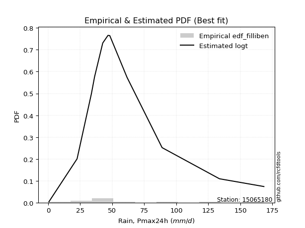</img>

</div>


### 10. Empirical - EDF Jenkinson (1977)

The Jenkinson formula in hydrology is an empirical plotting position formula used to estimate the non-exceedance probability _(P)_ or return period _(T)_ of a given ordered observation within a sample. It is a widely used method in the frequency analysis of extreme events such as floods and rainfall, as it provides a distribution-free way to plot data. _a≈0.31_ and _b≈0.38_ are constants derived to approximate the median of the probability distribution for the given rank.

<div align="center">


$P=(m-a)/(n+b)$


</div>


**10.1. Empirical values**

<div align="center">

|                | 0                    | 1                   | 2                   | 3                  | 4                  | 5                  | 6                  | 7                  | 8                  | 9                  | 10                 | 11                 |
|:---------------|:---------------------|:--------------------|:--------------------|:-------------------|:-------------------|:-------------------|:-------------------|:-------------------|:-------------------|:-------------------|:-------------------|:-------------------|
| date           | 2014                 | 2016                | 2018                | 2015               | 2017               | 2020               | 2023               | 2025               | 2022               | 2021               | 2019               | 2024               |
| x              | 0.6                  | 22.59               | 33.77               | 36.25              | 42.61              | 46.7               | 48.1               | 55.1               | 61.55              | 88.93              | 133.69             | 168.4              |
| m              | 1                    | 2                   | 3                   | 4                  | 5                  | 6                  | 7                  | 8                  | 9                  | 10                 | 11                 | 12                 |
| empirical_dist | edf_jenkinson        | edf_jenkinson       | edf_jenkinson       | edf_jenkinson      | edf_jenkinson      | edf_jenkinson      | edf_jenkinson      | edf_jenkinson      | edf_jenkinson      | edf_jenkinson      | edf_jenkinson      | edf_jenkinson      |
| empirical      | 0.055735056542810975 | 0.13651050080775443 | 0.21728594507269788 | 0.2980613893376413 | 0.3788368336025848 | 0.4596122778675283 | 0.5403877221324718 | 0.6211631663974152 | 0.7019386106623585 | 0.7827140549273021 | 0.8634894991922455 | 0.9442649434571889 |
| empirical_tr   | 1.0590248075278015   | 1.1580916744621141  | 1.2776057791537667  | 1.424626006904488  | 1.6098829648894668 | 1.850523168908819  | 2.1757469244288226 | 2.6396588486140726 | 3.3550135501355    | 4.6022304832713745 | 7.325443786982245  | 17.942028985507218 |

</div>


**10.2. Kolmogorov-Smirnov fit test (sorted by Δ)**


<div align="center">

|                | 0                   | 1                   | 2                   | 3                   | 4                   | 5                   | 6                   | 7                   | 8                   | 9                   | 10                  | 11                  | 12                  | 13                  | 14                  | 15                  | 16                  | 17                  | 18                  | 19                  | 20                  | 21                  | 22                  | 23                  | 24                  | 25                  | 26                  | 27                  | 28                  | 29                  | 30                  | 31                  | 32                  | 33                  | 34                  | 35                    | 36                  | 37                  | 38                  | 39                  | 40                  | 41                  | 42                  | 43                  | 44                  | 45                  | 46                  | 47                  | 48                  | 49                  | 50                  | 51                  | 52                  | 53                  | 54                  | 55                  | 56                  | 57                  | 58                  | 59                  | 60                  | 61                  | 62                  | 63                  | 64                  | 65                  | 66                  | 67                  | 68                  | 69                  | 70                  | 71                  | 72                  | 73                  | 74                  | 75                  | 76                  | 77                  | 78                  | 79                  | 80                  | 81                  | 82                  | 83                  | 84                  | 85                  | 86                  | 87                  | 88                  | 89                  |
|:---------------|:--------------------|:--------------------|:--------------------|:--------------------|:--------------------|:--------------------|:--------------------|:--------------------|:--------------------|:--------------------|:--------------------|:--------------------|:--------------------|:--------------------|:--------------------|:--------------------|:--------------------|:--------------------|:--------------------|:--------------------|:--------------------|:--------------------|:--------------------|:--------------------|:--------------------|:--------------------|:--------------------|:--------------------|:--------------------|:--------------------|:--------------------|:--------------------|:--------------------|:--------------------|:--------------------|:----------------------|:--------------------|:--------------------|:--------------------|:--------------------|:--------------------|:--------------------|:--------------------|:--------------------|:--------------------|:--------------------|:--------------------|:--------------------|:--------------------|:--------------------|:--------------------|:--------------------|:--------------------|:--------------------|:--------------------|:--------------------|:--------------------|:--------------------|:--------------------|:--------------------|:--------------------|:--------------------|:--------------------|:--------------------|:--------------------|:--------------------|:--------------------|:--------------------|:--------------------|:--------------------|:--------------------|:--------------------|:--------------------|:--------------------|:--------------------|:--------------------|:--------------------|:--------------------|:--------------------|:--------------------|:--------------------|:--------------------|:--------------------|:--------------------|:--------------------|:--------------------|:--------------------|:--------------------|:--------------------|:--------------------|
| station        | 15065180            | 15065180            | 15065180            | 15065180            | 15065180            | 15065180            | 15065180            | 15065180            | 15065180            | 15065180            | 15065180            | 15065180            | 15065180            | 15065180            | 15065180            | 15065180            | 15065180            | 15065180            | 15065180            | 15065180            | 15065180            | 15065180            | 15065180            | 15065180            | 15065180            | 15065180            | 15065180            | 15065180            | 15065180            | 15065180            | 15065180            | 15065180            | 15065180            | 15065180            | 15065180            | 15065180              | 15065180            | 15065180            | 15065180            | 15065180            | 15065180            | 15065180            | 15065180            | 15065180            | 15065180            | 15065180            | 15065180            | 15065180            | 15065180            | 15065180            | 15065180            | 15065180            | 15065180            | 15065180            | 15065180            | 15065180            | 15065180            | 15065180            | 15065180            | 15065180            | 15065180            | 15065180            | 15065180            | 15065180            | 15065180            | 15065180            | 15065180            | 15065180            | 15065180            | 15065180            | 15065180            | 15065180            | 15065180            | 15065180            | 15065180            | 15065180            | 15065180            | 15065180            | 15065180            | 15065180            | 15065180            | 15065180            | 15065180            | 15065180            | 15065180            | 15065180            | 15065180            | 15065180            | 15065180            | 15065180            |
| empirical_dist | edf_jenkinson       | edf_jenkinson       | edf_jenkinson       | edf_jenkinson       | edf_jenkinson       | edf_jenkinson       | edf_jenkinson       | edf_jenkinson       | edf_jenkinson       | edf_jenkinson       | edf_jenkinson       | edf_jenkinson       | edf_jenkinson       | edf_jenkinson       | edf_jenkinson       | edf_jenkinson       | edf_jenkinson       | edf_jenkinson       | edf_jenkinson       | edf_jenkinson       | edf_jenkinson       | edf_jenkinson       | edf_jenkinson       | edf_jenkinson       | edf_jenkinson       | edf_jenkinson       | edf_jenkinson       | edf_jenkinson       | edf_jenkinson       | edf_jenkinson       | edf_jenkinson       | edf_jenkinson       | edf_jenkinson       | edf_jenkinson       | edf_jenkinson       | edf_jenkinson         | edf_jenkinson       | edf_jenkinson       | edf_jenkinson       | edf_jenkinson       | edf_jenkinson       | edf_jenkinson       | edf_jenkinson       | edf_jenkinson       | edf_jenkinson       | edf_jenkinson       | edf_jenkinson       | edf_jenkinson       | edf_jenkinson       | edf_jenkinson       | edf_jenkinson       | edf_jenkinson       | edf_jenkinson       | edf_jenkinson       | edf_jenkinson       | edf_jenkinson       | edf_jenkinson       | edf_jenkinson       | edf_jenkinson       | edf_jenkinson       | edf_jenkinson       | edf_jenkinson       | edf_jenkinson       | edf_jenkinson       | edf_jenkinson       | edf_jenkinson       | edf_jenkinson       | edf_jenkinson       | edf_jenkinson       | edf_jenkinson       | edf_jenkinson       | edf_jenkinson       | edf_jenkinson       | edf_jenkinson       | edf_jenkinson       | edf_jenkinson       | edf_jenkinson       | edf_jenkinson       | edf_jenkinson       | edf_jenkinson       | edf_jenkinson       | edf_jenkinson       | edf_jenkinson       | edf_jenkinson       | edf_jenkinson       | edf_jenkinson       | edf_jenkinson       | edf_jenkinson       | edf_jenkinson       | edf_jenkinson       |
| p_dist         | logt                | johnsonsu           | logjohnsonsu        | nct                 | fisk                | laplace_asymmetric  | exponnorm           | alpha               | invweibull          | invgamma            | moyal               | halflogistic        | betaprime           | logfisk             | invgauss            | fatiguelife         | wald                | f                   | erlang              | chi2                | gamma               | weibull_min         | genlogistic         | pearson3            | halfnorm            | gompertz            | gumbel_r            | nakagami            | gibrat              | logloggamma         | loggenlogistic      | kstwobign           | ncf                 | loggompertz         | rayleigh            | loglaplace_asymmetric | logmielke           | maxwell             | mielke              | loggumbel_l         | rice                | logpearson3         | t                   | hypsecant           | logistic            | norm                | crystalball         | truncnorm           | genexpon            | expon               | laplace             | loglaplace          | loghypsecant        | loglogistic         | lognakagami         | loglognorm          | logfatiguelife      | logrice             | logexponnorm        | logcrystalball      | lognorm             | lognorm             | lognct              | loginvgamma         | gumbel_l            | logalpha            | loginvgauss         | logmaxwell          | loginvweibull       | lograyleigh         | loggumbel_r         | loghalfnorm         | logkstwobign        | logmoyal            | loghalflogistic     | loggenexpon         | logwald             | loggibrat           | logexpon            | logncf              | pareto              | logbetaprime        | logtruncnorm        | logpareto           | logf                | logweibull_min      | loggamma            | loggamma            | logchi2             | logerlang           |
| delta          | 0.05983757641229981 | 0.06235402738239759 | 0.06600989204215468 | 0.08236236998308077 | 0.0830148008783721  | 0.09171141875427435 | 0.09726557294734739 | 0.09850699596447687 | 0.10010544789016007 | 0.10316734697817476 | 0.10548354051946873 | 0.10682359688836124 | 0.10801672931190032 | 0.11049485060616399 | 0.11111798114219273 | 0.11256612982797531 | 0.11504598175619576 | 0.11565864803557135 | 0.11569501344068545 | 0.11569566587673863 | 0.1156958168550043  | 0.11730871867943649 | 0.1191116152819871  | 0.12616519630428147 | 0.1266772770467588  | 0.12779666654047006 | 0.13132932766743177 | 0.13651050080667707 | 0.13651050080775443 | 0.13736842235707197 | 0.1417490274463919  | 0.14547415967287958 | 0.14583000711265492 | 0.14649619742713887 | 0.1576640929295251  | 0.16108087777565822   | 0.16846395668837333 | 0.1686708471370415  | 0.16971301526734645 | 0.1737154600532702  | 0.18035775338359517 | 0.19322697343721484 | 0.20156871941046428 | 0.2016545798889534  | 0.20168102323285175 | 0.20171198687558045 | 0.20171199292053543 | 0.20171199718750954 | 0.20202504306177743 | 0.20255172305661767 | 0.21170673835200293 | 0.21877571849661231 | 0.2345244546881915  | 0.23895525329931105 | 0.24295955292683796 | 0.24320741688008501 | 0.2441021177564766  | 0.24414439164953822 | 0.24417612443098252 | 0.24417669227395777 | 0.24417672502820809 | 0.24417672502820809 | 0.24510026765027337 | 0.2502413561345683  | 0.2720812564707249  | 0.27372993508458204 | 0.275776091828177   | 0.27833993123168954 | 0.28295329623951915 | 0.29006954101207455 | 0.31231275345013326 | 0.32314840522555704 | 0.33573671515449643 | 0.3379391246702998  | 0.34526953461913307 | 0.3752519670887654  | 0.40924876897888945 | 0.42492799572208234 | 0.4452053320842658  | 0.46450240451548386 | 0.49802559150054493 | 0.5020731589208793  | 0.5202263959089688  | 0.520894349238782   | 0.5531504858170917  | 0.6329011864953943  | 0.6621601731892914  | 0.6621601731892914  | 0.7099692680303471  | 0.8634074280701665  |
| deltao         | 0.36218414519599995 | 0.36218414519599995 | 0.36218414519599995 | 0.36218414519599995 | 0.36218414519599995 | 0.36218414519599995 | 0.36218414519599995 | 0.36218414519599995 | 0.36218414519599995 | 0.36218414519599995 | 0.36218414519599995 | 0.36218414519599995 | 0.36218414519599995 | 0.36218414519599995 | 0.36218414519599995 | 0.36218414519599995 | 0.36218414519599995 | 0.36218414519599995 | 0.36218414519599995 | 0.36218414519599995 | 0.36218414519599995 | 0.36218414519599995 | 0.36218414519599995 | 0.36218414519599995 | 0.36218414519599995 | 0.36218414519599995 | 0.36218414519599995 | 0.36218414519599995 | 0.36218414519599995 | 0.36218414519599995 | 0.36218414519599995 | 0.36218414519599995 | 0.36218414519599995 | 0.36218414519599995 | 0.36218414519599995 | 0.36218414519599995   | 0.36218414519599995 | 0.36218414519599995 | 0.36218414519599995 | 0.36218414519599995 | 0.36218414519599995 | 0.36218414519599995 | 0.36218414519599995 | 0.36218414519599995 | 0.36218414519599995 | 0.36218414519599995 | 0.36218414519599995 | 0.36218414519599995 | 0.36218414519599995 | 0.36218414519599995 | 0.36218414519599995 | 0.36218414519599995 | 0.36218414519599995 | 0.36218414519599995 | 0.36218414519599995 | 0.36218414519599995 | 0.36218414519599995 | 0.36218414519599995 | 0.36218414519599995 | 0.36218414519599995 | 0.36218414519599995 | 0.36218414519599995 | 0.36218414519599995 | 0.36218414519599995 | 0.36218414519599995 | 0.36218414519599995 | 0.36218414519599995 | 0.36218414519599995 | 0.36218414519599995 | 0.36218414519599995 | 0.36218414519599995 | 0.36218414519599995 | 0.36218414519599995 | 0.36218414519599995 | 0.36218414519599995 | 0.36218414519599995 | 0.36218414519599995 | 0.36218414519599995 | 0.36218414519599995 | 0.36218414519599995 | 0.36218414519599995 | 0.36218414519599995 | 0.36218414519599995 | 0.36218414519599995 | 0.36218414519599995 | 0.36218414519599995 | 0.36218414519599995 | 0.36218414519599995 | 0.36218414519599995 | 0.36218414519599995 |
| eval           | Δo > Δ              | Δo > Δ              | Δo > Δ              | Δo > Δ              | Δo > Δ              | Δo > Δ              | Δo > Δ              | Δo > Δ              | Δo > Δ              | Δo > Δ              | Δo > Δ              | Δo > Δ              | Δo > Δ              | Δo > Δ              | Δo > Δ              | Δo > Δ              | Δo > Δ              | Δo > Δ              | Δo > Δ              | Δo > Δ              | Δo > Δ              | Δo > Δ              | Δo > Δ              | Δo > Δ              | Δo > Δ              | Δo > Δ              | Δo > Δ              | Δo > Δ              | Δo > Δ              | Δo > Δ              | Δo > Δ              | Δo > Δ              | Δo > Δ              | Δo > Δ              | Δo > Δ              | Δo > Δ                | Δo > Δ              | Δo > Δ              | Δo > Δ              | Δo > Δ              | Δo > Δ              | Δo > Δ              | Δo > Δ              | Δo > Δ              | Δo > Δ              | Δo > Δ              | Δo > Δ              | Δo > Δ              | Δo > Δ              | Δo > Δ              | Δo > Δ              | Δo > Δ              | Δo > Δ              | Δo > Δ              | Δo > Δ              | Δo > Δ              | Δo > Δ              | Δo > Δ              | Δo > Δ              | Δo > Δ              | Δo > Δ              | Δo > Δ              | Δo > Δ              | Δo > Δ              | Δo > Δ              | Δo > Δ              | Δo > Δ              | Δo > Δ              | Δo > Δ              | Δo > Δ              | Δo > Δ              | Δo > Δ              | Δo > Δ              | Δo > Δ              | Δo > Δ              | Δo <= Δ             | Δo <= Δ             | Δo <= Δ             | Δo <= Δ             | Δo <= Δ             | Δo <= Δ             | Δo <= Δ             | Δo <= Δ             | Δo <= Δ             | Δo <= Δ             | Δo <= Δ             | Δo <= Δ             | Δo <= Δ             | Δo <= Δ             | Δo <= Δ             |
| fit            | 1                   | 1                   | 1                   | 1                   | 1                   | 1                   | 1                   | 1                   | 1                   | 1                   | 1                   | 1                   | 1                   | 1                   | 1                   | 1                   | 1                   | 1                   | 1                   | 1                   | 1                   | 1                   | 1                   | 1                   | 1                   | 1                   | 1                   | 1                   | 1                   | 1                   | 1                   | 1                   | 1                   | 1                   | 1                   | 1                     | 1                   | 1                   | 1                   | 1                   | 1                   | 1                   | 1                   | 1                   | 1                   | 1                   | 1                   | 1                   | 1                   | 1                   | 1                   | 1                   | 1                   | 1                   | 1                   | 1                   | 1                   | 1                   | 1                   | 1                   | 1                   | 1                   | 1                   | 1                   | 1                   | 1                   | 1                   | 1                   | 1                   | 1                   | 1                   | 1                   | 1                   | 1                   | 1                   | 0                   | 0                   | 0                   | 0                   | 0                   | 0                   | 0                   | 0                   | 0                   | 0                   | 0                   | 0                   | 0                   | 0                   | 0                   |
| n              | 12                  | 12                  | 12                  | 12                  | 12                  | 12                  | 12                  | 12                  | 12                  | 12                  | 12                  | 12                  | 12                  | 12                  | 12                  | 12                  | 12                  | 12                  | 12                  | 12                  | 12                  | 12                  | 12                  | 12                  | 12                  | 12                  | 12                  | 12                  | 12                  | 12                  | 12                  | 12                  | 12                  | 12                  | 12                  | 12                    | 12                  | 12                  | 12                  | 12                  | 12                  | 12                  | 12                  | 12                  | 12                  | 12                  | 12                  | 12                  | 12                  | 12                  | 12                  | 12                  | 12                  | 12                  | 12                  | 12                  | 12                  | 12                  | 12                  | 12                  | 12                  | 12                  | 12                  | 12                  | 12                  | 12                  | 12                  | 12                  | 12                  | 12                  | 12                  | 12                  | 12                  | 12                  | 12                  | 12                  | 12                  | 12                  | 12                  | 12                  | 12                  | 12                  | 12                  | 12                  | 12                  | 12                  | 12                  | 12                  | 12                  | 12                  |
| best_fit       | 1                   | 0                   | 0                   | 0                   | 0                   | 0                   | 0                   | 0                   | 0                   | 0                   | 0                   | 0                   | 0                   | 0                   | 0                   | 0                   | 0                   | 0                   | 0                   | 0                   | 0                   | 0                   | 0                   | 0                   | 0                   | 0                   | 0                   | 0                   | 0                   | 0                   | 0                   | 0                   | 0                   | 0                   | 0                   | 0                     | 0                   | 0                   | 0                   | 0                   | 0                   | 0                   | 0                   | 0                   | 0                   | 0                   | 0                   | 0                   | 0                   | 0                   | 0                   | 0                   | 0                   | 0                   | 0                   | 0                   | 0                   | 0                   | 0                   | 0                   | 0                   | 0                   | 0                   | 0                   | 0                   | 0                   | 0                   | 0                   | 0                   | 0                   | 0                   | 0                   | 0                   | 0                   | 0                   | 0                   | 0                   | 0                   | 0                   | 0                   | 0                   | 0                   | 0                   | 0                   | 0                   | 0                   | 0                   | 0                   | 0                   | 0                   |
| best_fit_sort  | 1                   | 2                   | 3                   | 4                   | 5                   | 6                   | 7                   | 8                   | 9                   | 10                  | 11                  | 12                  | 13                  | 14                  | 15                  | 16                  | 17                  | 18                  | 19                  | 20                  | 21                  | 22                  | 23                  | 24                  | 25                  | 26                  | 27                  | 28                  | 29                  | 30                  | 31                  | 32                  | 33                  | 34                  | 35                  | 36                    | 37                  | 38                  | 39                  | 40                  | 41                  | 42                  | 43                  | 44                  | 45                  | 46                  | 47                  | 48                  | 49                  | 50                  | 51                  | 52                  | 53                  | 54                  | 55                  | 56                  | 57                  | 58                  | 59                  | 60                  | 61                  | 62                  | 63                  | 64                  | 65                  | 66                  | 67                  | 68                  | 69                  | 70                  | 71                  | 72                  | 73                  | 74                  | 75                  | 76                  | 77                  | 78                  | 79                  | 80                  | 81                  | 82                  | 83                  | 84                  | 85                  | 86                  | 87                  | 88                  | 89                  | 90                  |

</div>


<div align="center">

</img>

</div>


**10.3. Best fit**

<div align="center">

|   id |   station | empirical_dist   | p_dist   |     delta |   deltao | eval   |   fit |   n |   best_fit |   best_fit_sort |
|-----:|----------:|:-----------------|:---------|----------:|---------:|:-------|------:|----:|-----------:|----------------:|
|    0 |  15065180 | edf_jenkinson    | logt     | 0.0598376 | 0.362184 | Δo > Δ |     1 |  12 |          1 |               1 |

</div>


<div align="center">

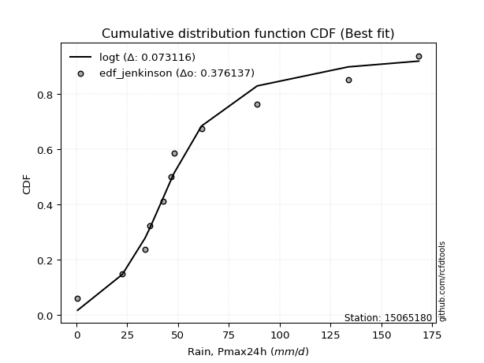</img></img>

</div>


### 11. Empirical - EDF Cunnane (1978)

Cunnane´s work in statistical hydrology has focused on the performance and evaluation of different probability distributions (such as GEV, Gumbel, Lognormal) for flood frequency estimation. _b_ is a constant, typically set to 0.4.

<div align="center">


$P=(m-b)/(n+1-2b)$


</div>


**11.1. Empirical values**

<div align="center">

|                | 0                   | 1                   | 2                   | 3                  | 4                  | 5                   | 6                  | 7                  | 8                  | 9                  | 10                 | 11                 |
|:---------------|:--------------------|:--------------------|:--------------------|:-------------------|:-------------------|:--------------------|:-------------------|:-------------------|:-------------------|:-------------------|:-------------------|:-------------------|
| date           | 2014                | 2016                | 2018                | 2015               | 2017               | 2020                | 2023               | 2025               | 2022               | 2021               | 2019               | 2024               |
| x              | 0.6                 | 22.59               | 33.77               | 36.25              | 42.61              | 46.7                | 48.1               | 55.1               | 61.55              | 88.93              | 133.69             | 168.4              |
| m              | 1                   | 2                   | 3                   | 4                  | 5                  | 6                   | 7                  | 8                  | 9                  | 10                 | 11                 | 12                 |
| empirical_dist | edf_cunnane         | edf_cunnane         | edf_cunnane         | edf_cunnane        | edf_cunnane        | edf_cunnane         | edf_cunnane        | edf_cunnane        | edf_cunnane        | edf_cunnane        | edf_cunnane        | edf_cunnane        |
| empirical      | 0.04918032786885246 | 0.13114754098360656 | 0.21311475409836067 | 0.2950819672131148 | 0.3770491803278688 | 0.45901639344262296 | 0.5409836065573771 | 0.6229508196721312 | 0.7049180327868853 | 0.7868852459016393 | 0.8688524590163935 | 0.9508196721311476 |
| empirical_tr   | 1.0517241379310345  | 1.150943396226415   | 1.2708333333333333  | 1.418604651162791  | 1.6052631578947367 | 1.8484848484848486  | 2.178571428571429  | 2.6521739130434785 | 3.388888888888889  | 4.692307692307692  | 7.625000000000004  | 20.333333333333357 |

</div>


**11.2. Kolmogorov-Smirnov fit test (sorted by Δ)**


<div align="center">

|                | 0                   | 1                    | 2                    | 3                   | 4                   | 5                   | 6                   | 7                   | 8                   | 9                   | 10                  | 11                  | 12                  | 13                  | 14                  | 15                  | 16                  | 17                  | 18                  | 19                  | 20                  | 21                  | 22                  | 23                  | 24                  | 25                  | 26                  | 27                  | 28                  | 29                  | 30                  | 31                  | 32                  | 33                  | 34                  | 35                    | 36                  | 37                  | 38                  | 39                  | 40                  | 41                  | 42                  | 43                  | 44                  | 45                  | 46                  | 47                  | 48                  | 49                  | 50                  | 51                  | 52                  | 53                  | 54                  | 55                  | 56                  | 57                  | 58                  | 59                  | 60                  | 61                  | 62                  | 63                  | 64                  | 65                  | 66                  | 67                  | 68                  | 69                  | 70                  | 71                  | 72                  | 73                  | 74                  | 75                  | 76                  | 77                  | 78                  | 79                  | 80                  | 81                  | 82                  | 83                  | 84                  | 85                  | 86                  | 87                  | 88                  | 89                  |
|:---------------|:--------------------|:---------------------|:---------------------|:--------------------|:--------------------|:--------------------|:--------------------|:--------------------|:--------------------|:--------------------|:--------------------|:--------------------|:--------------------|:--------------------|:--------------------|:--------------------|:--------------------|:--------------------|:--------------------|:--------------------|:--------------------|:--------------------|:--------------------|:--------------------|:--------------------|:--------------------|:--------------------|:--------------------|:--------------------|:--------------------|:--------------------|:--------------------|:--------------------|:--------------------|:--------------------|:----------------------|:--------------------|:--------------------|:--------------------|:--------------------|:--------------------|:--------------------|:--------------------|:--------------------|:--------------------|:--------------------|:--------------------|:--------------------|:--------------------|:--------------------|:--------------------|:--------------------|:--------------------|:--------------------|:--------------------|:--------------------|:--------------------|:--------------------|:--------------------|:--------------------|:--------------------|:--------------------|:--------------------|:--------------------|:--------------------|:--------------------|:--------------------|:--------------------|:--------------------|:--------------------|:--------------------|:--------------------|:--------------------|:--------------------|:--------------------|:--------------------|:--------------------|:--------------------|:--------------------|:--------------------|:--------------------|:--------------------|:--------------------|:--------------------|:--------------------|:--------------------|:--------------------|:--------------------|:--------------------|:--------------------|
| station        | 15065180            | 15065180             | 15065180             | 15065180            | 15065180            | 15065180            | 15065180            | 15065180            | 15065180            | 15065180            | 15065180            | 15065180            | 15065180            | 15065180            | 15065180            | 15065180            | 15065180            | 15065180            | 15065180            | 15065180            | 15065180            | 15065180            | 15065180            | 15065180            | 15065180            | 15065180            | 15065180            | 15065180            | 15065180            | 15065180            | 15065180            | 15065180            | 15065180            | 15065180            | 15065180            | 15065180              | 15065180            | 15065180            | 15065180            | 15065180            | 15065180            | 15065180            | 15065180            | 15065180            | 15065180            | 15065180            | 15065180            | 15065180            | 15065180            | 15065180            | 15065180            | 15065180            | 15065180            | 15065180            | 15065180            | 15065180            | 15065180            | 15065180            | 15065180            | 15065180            | 15065180            | 15065180            | 15065180            | 15065180            | 15065180            | 15065180            | 15065180            | 15065180            | 15065180            | 15065180            | 15065180            | 15065180            | 15065180            | 15065180            | 15065180            | 15065180            | 15065180            | 15065180            | 15065180            | 15065180            | 15065180            | 15065180            | 15065180            | 15065180            | 15065180            | 15065180            | 15065180            | 15065180            | 15065180            | 15065180            |
| empirical_dist | edf_cunnane         | edf_cunnane          | edf_cunnane          | edf_cunnane         | edf_cunnane         | edf_cunnane         | edf_cunnane         | edf_cunnane         | edf_cunnane         | edf_cunnane         | edf_cunnane         | edf_cunnane         | edf_cunnane         | edf_cunnane         | edf_cunnane         | edf_cunnane         | edf_cunnane         | edf_cunnane         | edf_cunnane         | edf_cunnane         | edf_cunnane         | edf_cunnane         | edf_cunnane         | edf_cunnane         | edf_cunnane         | edf_cunnane         | edf_cunnane         | edf_cunnane         | edf_cunnane         | edf_cunnane         | edf_cunnane         | edf_cunnane         | edf_cunnane         | edf_cunnane         | edf_cunnane         | edf_cunnane           | edf_cunnane         | edf_cunnane         | edf_cunnane         | edf_cunnane         | edf_cunnane         | edf_cunnane         | edf_cunnane         | edf_cunnane         | edf_cunnane         | edf_cunnane         | edf_cunnane         | edf_cunnane         | edf_cunnane         | edf_cunnane         | edf_cunnane         | edf_cunnane         | edf_cunnane         | edf_cunnane         | edf_cunnane         | edf_cunnane         | edf_cunnane         | edf_cunnane         | edf_cunnane         | edf_cunnane         | edf_cunnane         | edf_cunnane         | edf_cunnane         | edf_cunnane         | edf_cunnane         | edf_cunnane         | edf_cunnane         | edf_cunnane         | edf_cunnane         | edf_cunnane         | edf_cunnane         | edf_cunnane         | edf_cunnane         | edf_cunnane         | edf_cunnane         | edf_cunnane         | edf_cunnane         | edf_cunnane         | edf_cunnane         | edf_cunnane         | edf_cunnane         | edf_cunnane         | edf_cunnane         | edf_cunnane         | edf_cunnane         | edf_cunnane         | edf_cunnane         | edf_cunnane         | edf_cunnane         | edf_cunnane         |
| p_dist         | logt                | johnsonsu            | logjohnsonsu         | nct                 | fisk                | laplace_asymmetric  | exponnorm           | alpha               | invweibull          | invgamma            | moyal               | wald                | halflogistic        | betaprime           | invgauss            | logfisk             | fatiguelife         | f                   | erlang              | chi2                | gamma               | weibull_min         | genlogistic         | pearson3            | halfnorm            | gompertz            | nakagami            | gibrat              | gumbel_r            | logloggamma         | loggenlogistic      | kstwobign           | ncf                 | loggompertz         | rayleigh            | loglaplace_asymmetric | maxwell             | logmielke           | mielke              | loggumbel_l         | rice                | logpearson3         | t                   | hypsecant           | logistic            | norm                | crystalball         | truncnorm           | genexpon            | expon               | laplace             | loglaplace          | loghypsecant        | loglogistic         | lognakagami         | loglognorm          | logfatiguelife      | logrice             | logexponnorm        | logcrystalball      | lognorm             | lognorm             | lognct              | loginvgamma         | gumbel_l            | logalpha            | loginvgauss         | logmaxwell          | loginvweibull       | lograyleigh         | loggumbel_r         | loghalfnorm         | logkstwobign        | logmoyal            | loghalflogistic     | loggenexpon         | logwald             | loggibrat           | logexpon            | logncf              | pareto              | logbetaprime        | logtruncnorm        | logpareto           | logf                | logweibull_min      | loggamma            | loggamma            | logchi2             | logerlang           |
| delta          | 0.05566638543796254 | 0.056991067558249564 | 0.061838701067817414 | 0.0853417921076075  | 0.08599422300289883 | 0.09469084087880109 | 0.10024499507187412 | 0.1014864180890036  | 0.1030848700146868  | 0.10614676910270149 | 0.10846296264399546 | 0.1096830219320479  | 0.11099478786269845 | 0.11099615143642705 | 0.11409740326671947 | 0.1146660415805012  | 0.11554555195250205 | 0.11863807016009809 | 0.11867443556521218 | 0.11867508800126536 | 0.11867523897953103 | 0.12028814080396322 | 0.12209103740651384 | 0.1291446184288082  | 0.12965669917128553 | 0.1307760886649968  | 0.1311475409825292  | 0.13114754098360656 | 0.1343087497919585  | 0.1415396133314092  | 0.1459202184207291  | 0.1484535817974063  | 0.14880942923718166 | 0.1506673884014761  | 0.16064351505405183 | 0.16525206874999543   | 0.17165026926156823 | 0.17263514766271054 | 0.17388420624168366 | 0.17788665102760742 | 0.1833371755081219  | 0.19620639556174158 | 0.204548141534991   | 0.20463400201348014 | 0.20466044535737848 | 0.20469140900010718 | 0.20469141504506216 | 0.20469141931203627 | 0.20619623403611465 | 0.20672291403095489 | 0.2134943916267189  | 0.22294690947094953 | 0.2386956456625287  | 0.24312644427364827 | 0.24713074390117518 | 0.24737860785442223 | 0.24827330873081382 | 0.24831558262387543 | 0.24834731540531974 | 0.248347883248295   | 0.2483479160025453  | 0.2483479160025453  | 0.2492714586246106  | 0.25441254710890554 | 0.27506067859525163 | 0.27790112605891926 | 0.2799472828025142  | 0.28251112220602675 | 0.28831625606366706 | 0.29424073198641176 | 0.3164839444244705  | 0.32731959619989426 | 0.34109967497864424 | 0.342110315644637   | 0.3494407255934703  | 0.3806149269129132  | 0.41341995995322667 | 0.42909918669641955 | 0.45056829190841363 | 0.46986536433963166 | 0.5033885513246927  | 0.5074361187450271  | 0.5255893557331166  | 0.5262573090629298  | 0.5585134456412395  | 0.6382641463195421  | 0.6675231330134392  | 0.6675231330134392  | 0.7153322278544949  | 0.8687703878943143  |
| deltao         | 0.36218414519599995 | 0.36218414519599995  | 0.36218414519599995  | 0.36218414519599995 | 0.36218414519599995 | 0.36218414519599995 | 0.36218414519599995 | 0.36218414519599995 | 0.36218414519599995 | 0.36218414519599995 | 0.36218414519599995 | 0.36218414519599995 | 0.36218414519599995 | 0.36218414519599995 | 0.36218414519599995 | 0.36218414519599995 | 0.36218414519599995 | 0.36218414519599995 | 0.36218414519599995 | 0.36218414519599995 | 0.36218414519599995 | 0.36218414519599995 | 0.36218414519599995 | 0.36218414519599995 | 0.36218414519599995 | 0.36218414519599995 | 0.36218414519599995 | 0.36218414519599995 | 0.36218414519599995 | 0.36218414519599995 | 0.36218414519599995 | 0.36218414519599995 | 0.36218414519599995 | 0.36218414519599995 | 0.36218414519599995 | 0.36218414519599995   | 0.36218414519599995 | 0.36218414519599995 | 0.36218414519599995 | 0.36218414519599995 | 0.36218414519599995 | 0.36218414519599995 | 0.36218414519599995 | 0.36218414519599995 | 0.36218414519599995 | 0.36218414519599995 | 0.36218414519599995 | 0.36218414519599995 | 0.36218414519599995 | 0.36218414519599995 | 0.36218414519599995 | 0.36218414519599995 | 0.36218414519599995 | 0.36218414519599995 | 0.36218414519599995 | 0.36218414519599995 | 0.36218414519599995 | 0.36218414519599995 | 0.36218414519599995 | 0.36218414519599995 | 0.36218414519599995 | 0.36218414519599995 | 0.36218414519599995 | 0.36218414519599995 | 0.36218414519599995 | 0.36218414519599995 | 0.36218414519599995 | 0.36218414519599995 | 0.36218414519599995 | 0.36218414519599995 | 0.36218414519599995 | 0.36218414519599995 | 0.36218414519599995 | 0.36218414519599995 | 0.36218414519599995 | 0.36218414519599995 | 0.36218414519599995 | 0.36218414519599995 | 0.36218414519599995 | 0.36218414519599995 | 0.36218414519599995 | 0.36218414519599995 | 0.36218414519599995 | 0.36218414519599995 | 0.36218414519599995 | 0.36218414519599995 | 0.36218414519599995 | 0.36218414519599995 | 0.36218414519599995 | 0.36218414519599995 |
| eval           | Δo > Δ              | Δo > Δ               | Δo > Δ               | Δo > Δ              | Δo > Δ              | Δo > Δ              | Δo > Δ              | Δo > Δ              | Δo > Δ              | Δo > Δ              | Δo > Δ              | Δo > Δ              | Δo > Δ              | Δo > Δ              | Δo > Δ              | Δo > Δ              | Δo > Δ              | Δo > Δ              | Δo > Δ              | Δo > Δ              | Δo > Δ              | Δo > Δ              | Δo > Δ              | Δo > Δ              | Δo > Δ              | Δo > Δ              | Δo > Δ              | Δo > Δ              | Δo > Δ              | Δo > Δ              | Δo > Δ              | Δo > Δ              | Δo > Δ              | Δo > Δ              | Δo > Δ              | Δo > Δ                | Δo > Δ              | Δo > Δ              | Δo > Δ              | Δo > Δ              | Δo > Δ              | Δo > Δ              | Δo > Δ              | Δo > Δ              | Δo > Δ              | Δo > Δ              | Δo > Δ              | Δo > Δ              | Δo > Δ              | Δo > Δ              | Δo > Δ              | Δo > Δ              | Δo > Δ              | Δo > Δ              | Δo > Δ              | Δo > Δ              | Δo > Δ              | Δo > Δ              | Δo > Δ              | Δo > Δ              | Δo > Δ              | Δo > Δ              | Δo > Δ              | Δo > Δ              | Δo > Δ              | Δo > Δ              | Δo > Δ              | Δo > Δ              | Δo > Δ              | Δo > Δ              | Δo > Δ              | Δo > Δ              | Δo > Δ              | Δo > Δ              | Δo > Δ              | Δo <= Δ             | Δo <= Δ             | Δo <= Δ             | Δo <= Δ             | Δo <= Δ             | Δo <= Δ             | Δo <= Δ             | Δo <= Δ             | Δo <= Δ             | Δo <= Δ             | Δo <= Δ             | Δo <= Δ             | Δo <= Δ             | Δo <= Δ             | Δo <= Δ             |
| fit            | 1                   | 1                    | 1                    | 1                   | 1                   | 1                   | 1                   | 1                   | 1                   | 1                   | 1                   | 1                   | 1                   | 1                   | 1                   | 1                   | 1                   | 1                   | 1                   | 1                   | 1                   | 1                   | 1                   | 1                   | 1                   | 1                   | 1                   | 1                   | 1                   | 1                   | 1                   | 1                   | 1                   | 1                   | 1                   | 1                     | 1                   | 1                   | 1                   | 1                   | 1                   | 1                   | 1                   | 1                   | 1                   | 1                   | 1                   | 1                   | 1                   | 1                   | 1                   | 1                   | 1                   | 1                   | 1                   | 1                   | 1                   | 1                   | 1                   | 1                   | 1                   | 1                   | 1                   | 1                   | 1                   | 1                   | 1                   | 1                   | 1                   | 1                   | 1                   | 1                   | 1                   | 1                   | 1                   | 0                   | 0                   | 0                   | 0                   | 0                   | 0                   | 0                   | 0                   | 0                   | 0                   | 0                   | 0                   | 0                   | 0                   | 0                   |
| n              | 12                  | 12                   | 12                   | 12                  | 12                  | 12                  | 12                  | 12                  | 12                  | 12                  | 12                  | 12                  | 12                  | 12                  | 12                  | 12                  | 12                  | 12                  | 12                  | 12                  | 12                  | 12                  | 12                  | 12                  | 12                  | 12                  | 12                  | 12                  | 12                  | 12                  | 12                  | 12                  | 12                  | 12                  | 12                  | 12                    | 12                  | 12                  | 12                  | 12                  | 12                  | 12                  | 12                  | 12                  | 12                  | 12                  | 12                  | 12                  | 12                  | 12                  | 12                  | 12                  | 12                  | 12                  | 12                  | 12                  | 12                  | 12                  | 12                  | 12                  | 12                  | 12                  | 12                  | 12                  | 12                  | 12                  | 12                  | 12                  | 12                  | 12                  | 12                  | 12                  | 12                  | 12                  | 12                  | 12                  | 12                  | 12                  | 12                  | 12                  | 12                  | 12                  | 12                  | 12                  | 12                  | 12                  | 12                  | 12                  | 12                  | 12                  |
| best_fit       | 1                   | 0                    | 0                    | 0                   | 0                   | 0                   | 0                   | 0                   | 0                   | 0                   | 0                   | 0                   | 0                   | 0                   | 0                   | 0                   | 0                   | 0                   | 0                   | 0                   | 0                   | 0                   | 0                   | 0                   | 0                   | 0                   | 0                   | 0                   | 0                   | 0                   | 0                   | 0                   | 0                   | 0                   | 0                   | 0                     | 0                   | 0                   | 0                   | 0                   | 0                   | 0                   | 0                   | 0                   | 0                   | 0                   | 0                   | 0                   | 0                   | 0                   | 0                   | 0                   | 0                   | 0                   | 0                   | 0                   | 0                   | 0                   | 0                   | 0                   | 0                   | 0                   | 0                   | 0                   | 0                   | 0                   | 0                   | 0                   | 0                   | 0                   | 0                   | 0                   | 0                   | 0                   | 0                   | 0                   | 0                   | 0                   | 0                   | 0                   | 0                   | 0                   | 0                   | 0                   | 0                   | 0                   | 0                   | 0                   | 0                   | 0                   |
| best_fit_sort  | 1                   | 2                    | 3                    | 4                   | 5                   | 6                   | 7                   | 8                   | 9                   | 10                  | 11                  | 12                  | 13                  | 14                  | 15                  | 16                  | 17                  | 18                  | 19                  | 20                  | 21                  | 22                  | 23                  | 24                  | 25                  | 26                  | 27                  | 28                  | 29                  | 30                  | 31                  | 32                  | 33                  | 34                  | 35                  | 36                    | 37                  | 38                  | 39                  | 40                  | 41                  | 42                  | 43                  | 44                  | 45                  | 46                  | 47                  | 48                  | 49                  | 50                  | 51                  | 52                  | 53                  | 54                  | 55                  | 56                  | 57                  | 58                  | 59                  | 60                  | 61                  | 62                  | 63                  | 64                  | 65                  | 66                  | 67                  | 68                  | 69                  | 70                  | 71                  | 72                  | 73                  | 74                  | 75                  | 76                  | 77                  | 78                  | 79                  | 80                  | 81                  | 82                  | 83                  | 84                  | 85                  | 86                  | 87                  | 88                  | 89                  | 90                  |

</div>


<div align="center">

</img>

</div>


**11.3. Best fit**

<div align="center">

|   id |   station | empirical_dist   | p_dist   |     delta |   deltao | eval   |   fit |   n |   best_fit |   best_fit_sort |
|-----:|----------:|:-----------------|:---------|----------:|---------:|:-------|------:|----:|-----------:|----------------:|
|    0 |  15065180 | edf_cunnane      | logt     | 0.0556664 | 0.362184 | Δo > Δ |     1 |  12 |          1 |               1 |

</div>


<div align="center">

</img>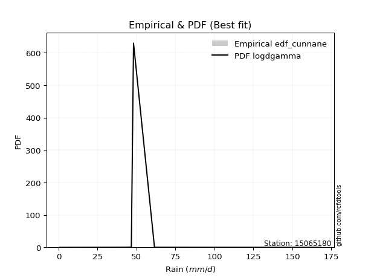</img>

</div>


### 12. Empirical - EDF Adamowski (1981)

The Adamowski formula in hydrology refers to a specific plotting position formula used for estimating the non-parametric empirical distribution of hydrological events (like flood peaks) to calculate their return periods. This formula provides an alternative to traditional parametric methods (like the Gumbel or Log Pearson Type III distributions). 

<div align="center">


$P=(m-0.25)/(n+0.5)$


</div>


**12.1. Empirical values**

<div align="center">

|                | 0                  | 1                  | 2                 | 3                  | 4                  | 5                  | 6                 | 7                  | 8                 | 9                 | 10                | 11                 |
|:---------------|:-------------------|:-------------------|:------------------|:-------------------|:-------------------|:-------------------|:------------------|:-------------------|:------------------|:------------------|:------------------|:-------------------|
| date           | 2014               | 2016               | 2018              | 2015               | 2017               | 2020               | 2023              | 2025               | 2022              | 2021              | 2019              | 2024               |
| x              | 0.6                | 22.59              | 33.77             | 36.25              | 42.61              | 46.7               | 48.1              | 55.1               | 61.55             | 88.93             | 133.69            | 168.4              |
| m              | 1                  | 2                  | 3                 | 4                  | 5                  | 6                  | 7                 | 8                  | 9                 | 10                | 11                | 12                 |
| empirical_dist | edf_adamowski      | edf_adamowski      | edf_adamowski     | edf_adamowski      | edf_adamowski      | edf_adamowski      | edf_adamowski     | edf_adamowski      | edf_adamowski     | edf_adamowski     | edf_adamowski     | edf_adamowski      |
| empirical      | 0.06               | 0.14               | 0.22              | 0.3                | 0.38               | 0.46               | 0.54              | 0.62               | 0.7               | 0.78              | 0.86              | 0.94               |
| empirical_tr   | 1.0638297872340425 | 1.1627906976744187 | 1.282051282051282 | 1.4285714285714286 | 1.6129032258064517 | 1.8518518518518516 | 2.173913043478261 | 2.6315789473684212 | 3.333333333333333 | 4.545454545454546 | 7.142857142857142 | 16.666666666666654 |

</div>


**12.2. Kolmogorov-Smirnov fit test (sorted by Δ)**


<div align="center">

|                | 0                   | 1                   | 2                   | 3                   | 4                   | 5                   | 6                   | 7                   | 8                   | 9                   | 10                  | 11                  | 12                  | 13                  | 14                  | 15                  | 16                  | 17                  | 18                  | 19                  | 20                  | 21                  | 22                  | 23                  | 24                  | 25                  | 26                  | 27                  | 28                  | 29                  | 30                  | 31                  | 32                  | 33                  | 34                  | 35                    | 36                  | 37                  | 38                  | 39                  | 40                  | 41                  | 42                  | 43                  | 44                  | 45                  | 46                  | 47                  | 48                  | 49                  | 50                  | 51                  | 52                  | 53                  | 54                  | 55                  | 56                  | 57                  | 58                  | 59                  | 60                  | 61                  | 62                  | 63                  | 64                  | 65                  | 66                  | 67                  | 68                  | 69                  | 70                  | 71                  | 72                  | 73                  | 74                  | 75                  | 76                  | 77                  | 78                  | 79                  | 80                  | 81                  | 82                  | 83                  | 84                  | 85                  | 86                  | 87                  | 88                  | 89                  |
|:---------------|:--------------------|:--------------------|:--------------------|:--------------------|:--------------------|:--------------------|:--------------------|:--------------------|:--------------------|:--------------------|:--------------------|:--------------------|:--------------------|:--------------------|:--------------------|:--------------------|:--------------------|:--------------------|:--------------------|:--------------------|:--------------------|:--------------------|:--------------------|:--------------------|:--------------------|:--------------------|:--------------------|:--------------------|:--------------------|:--------------------|:--------------------|:--------------------|:--------------------|:--------------------|:--------------------|:----------------------|:--------------------|:--------------------|:--------------------|:--------------------|:--------------------|:--------------------|:--------------------|:--------------------|:--------------------|:--------------------|:--------------------|:--------------------|:--------------------|:--------------------|:--------------------|:--------------------|:--------------------|:--------------------|:--------------------|:--------------------|:--------------------|:--------------------|:--------------------|:--------------------|:--------------------|:--------------------|:--------------------|:--------------------|:--------------------|:--------------------|:--------------------|:--------------------|:--------------------|:--------------------|:--------------------|:--------------------|:--------------------|:--------------------|:--------------------|:--------------------|:--------------------|:--------------------|:--------------------|:--------------------|:--------------------|:--------------------|:--------------------|:--------------------|:--------------------|:--------------------|:--------------------|:--------------------|:--------------------|:--------------------|
| station        | 15065180            | 15065180            | 15065180            | 15065180            | 15065180            | 15065180            | 15065180            | 15065180            | 15065180            | 15065180            | 15065180            | 15065180            | 15065180            | 15065180            | 15065180            | 15065180            | 15065180            | 15065180            | 15065180            | 15065180            | 15065180            | 15065180            | 15065180            | 15065180            | 15065180            | 15065180            | 15065180            | 15065180            | 15065180            | 15065180            | 15065180            | 15065180            | 15065180            | 15065180            | 15065180            | 15065180              | 15065180            | 15065180            | 15065180            | 15065180            | 15065180            | 15065180            | 15065180            | 15065180            | 15065180            | 15065180            | 15065180            | 15065180            | 15065180            | 15065180            | 15065180            | 15065180            | 15065180            | 15065180            | 15065180            | 15065180            | 15065180            | 15065180            | 15065180            | 15065180            | 15065180            | 15065180            | 15065180            | 15065180            | 15065180            | 15065180            | 15065180            | 15065180            | 15065180            | 15065180            | 15065180            | 15065180            | 15065180            | 15065180            | 15065180            | 15065180            | 15065180            | 15065180            | 15065180            | 15065180            | 15065180            | 15065180            | 15065180            | 15065180            | 15065180            | 15065180            | 15065180            | 15065180            | 15065180            | 15065180            |
| empirical_dist | edf_adamowski       | edf_adamowski       | edf_adamowski       | edf_adamowski       | edf_adamowski       | edf_adamowski       | edf_adamowski       | edf_adamowski       | edf_adamowski       | edf_adamowski       | edf_adamowski       | edf_adamowski       | edf_adamowski       | edf_adamowski       | edf_adamowski       | edf_adamowski       | edf_adamowski       | edf_adamowski       | edf_adamowski       | edf_adamowski       | edf_adamowski       | edf_adamowski       | edf_adamowski       | edf_adamowski       | edf_adamowski       | edf_adamowski       | edf_adamowski       | edf_adamowski       | edf_adamowski       | edf_adamowski       | edf_adamowski       | edf_adamowski       | edf_adamowski       | edf_adamowski       | edf_adamowski       | edf_adamowski         | edf_adamowski       | edf_adamowski       | edf_adamowski       | edf_adamowski       | edf_adamowski       | edf_adamowski       | edf_adamowski       | edf_adamowski       | edf_adamowski       | edf_adamowski       | edf_adamowski       | edf_adamowski       | edf_adamowski       | edf_adamowski       | edf_adamowski       | edf_adamowski       | edf_adamowski       | edf_adamowski       | edf_adamowski       | edf_adamowski       | edf_adamowski       | edf_adamowski       | edf_adamowski       | edf_adamowski       | edf_adamowski       | edf_adamowski       | edf_adamowski       | edf_adamowski       | edf_adamowski       | edf_adamowski       | edf_adamowski       | edf_adamowski       | edf_adamowski       | edf_adamowski       | edf_adamowski       | edf_adamowski       | edf_adamowski       | edf_adamowski       | edf_adamowski       | edf_adamowski       | edf_adamowski       | edf_adamowski       | edf_adamowski       | edf_adamowski       | edf_adamowski       | edf_adamowski       | edf_adamowski       | edf_adamowski       | edf_adamowski       | edf_adamowski       | edf_adamowski       | edf_adamowski       | edf_adamowski       | edf_adamowski       |
| p_dist         | logt                | johnsonsu           | logjohnsonsu        | nct                 | fisk                | laplace_asymmetric  | exponnorm           | alpha               | invweibull          | invgamma            | moyal               | halflogistic        | betaprime           | logfisk             | invgauss            | fatiguelife         | f                   | erlang              | chi2                | gamma               | weibull_min         | genlogistic         | wald                | pearson3            | halfnorm            | gompertz            | gumbel_r            | logloggamma         | loggenlogistic      | nakagami            | gibrat              | kstwobign           | loggompertz         | ncf                 | rayleigh            | loglaplace_asymmetric | logmielke           | maxwell             | mielke              | loggumbel_l         | rice                | logpearson3         | genexpon            | t                   | hypsecant           | logistic            | norm                | crystalball         | truncnorm           | expon               | laplace             | loglaplace          | loghypsecant        | loglogistic         | lognakagami         | loglognorm          | logfatiguelife      | logrice             | logexponnorm        | logcrystalball      | lognorm             | lognorm             | lognct              | loginvgamma         | gumbel_l            | logalpha            | loginvgauss         | logmaxwell          | loginvweibull       | lograyleigh         | loggumbel_r         | loghalfnorm         | logkstwobign        | logmoyal            | loghalflogistic     | loggenexpon         | logwald             | loggibrat           | logexpon            | logncf              | pareto              | logbetaprime        | logtruncnorm        | logpareto           | logf                | logweibull_min      | loggamma            | loggamma            | logchi2             | logerlang           |
| delta          | 0.06255163133960184 | 0.0658435265746431  | 0.06872394696945672 | 0.08042375932072221 | 0.08107619021601353 | 0.08977280809191579 | 0.09532696228498883 | 0.09656838530211831 | 0.0981668372278015  | 0.10122873631581619 | 0.10354492985711017 | 0.10410954196105912 | 0.10607811864954175 | 0.10778079567886187 | 0.10917937047983417 | 0.11062751916561675 | 0.11372003737321279 | 0.11375640277832688 | 0.11375705521438007 | 0.11375720619264573 | 0.11537010801707792 | 0.11717300461962854 | 0.11853548094844135 | 0.1242265856419229  | 0.12473866638440023 | 0.1258580558781115  | 0.1293907170050732  | 0.13465436742976986 | 0.13903497251908978 | 0.13999999999892265 | 0.14                | 0.143535549010521   | 0.14378214249983676 | 0.14389139645029636 | 0.15572548226716654 | 0.1583668228483561    | 0.1657499017610712  | 0.16673223647468294 | 0.16699896034004433 | 0.1710014051259681  | 0.1784191427212366  | 0.19128836277485628 | 0.19931098813447531 | 0.19963010874810572 | 0.19971596922659485 | 0.1997424125704932  | 0.1997733762132219  | 0.19977338225817687 | 0.19977338652515098 | 0.19983766812931555 | 0.21064186082810354 | 0.2160616635693102  | 0.23181039976088938 | 0.23624119837200894 | 0.24024549799953585 | 0.2404933619527829  | 0.2413880628291745  | 0.2414303367222361  | 0.2414620695036804  | 0.24146263734665566 | 0.24146267010090597 | 0.24146267010090597 | 0.24238621272297126 | 0.2475273012072662  | 0.27014264580836633 | 0.27101588015727995 | 0.2730620369008748  | 0.2756258763043874  | 0.2794637970472736  | 0.28735548608477246 | 0.3095986985228312  | 0.32043435029825496 | 0.3322472159622508  | 0.3352250697429977  | 0.342555479691831   | 0.3717624678965198  | 0.40653471405158736 | 0.42221394079478025 | 0.4417158328920202  | 0.46101290532323824 | 0.4945360923082993  | 0.4985836597286337  | 0.5167368967167232  | 0.5174048500465364  | 0.5496609866248461  | 0.6294116873031487  | 0.6586706739970458  | 0.6586706739970458  | 0.7064797688381015  | 0.8599179288779208  |
| deltao         | 0.36218414519599995 | 0.36218414519599995 | 0.36218414519599995 | 0.36218414519599995 | 0.36218414519599995 | 0.36218414519599995 | 0.36218414519599995 | 0.36218414519599995 | 0.36218414519599995 | 0.36218414519599995 | 0.36218414519599995 | 0.36218414519599995 | 0.36218414519599995 | 0.36218414519599995 | 0.36218414519599995 | 0.36218414519599995 | 0.36218414519599995 | 0.36218414519599995 | 0.36218414519599995 | 0.36218414519599995 | 0.36218414519599995 | 0.36218414519599995 | 0.36218414519599995 | 0.36218414519599995 | 0.36218414519599995 | 0.36218414519599995 | 0.36218414519599995 | 0.36218414519599995 | 0.36218414519599995 | 0.36218414519599995 | 0.36218414519599995 | 0.36218414519599995 | 0.36218414519599995 | 0.36218414519599995 | 0.36218414519599995 | 0.36218414519599995   | 0.36218414519599995 | 0.36218414519599995 | 0.36218414519599995 | 0.36218414519599995 | 0.36218414519599995 | 0.36218414519599995 | 0.36218414519599995 | 0.36218414519599995 | 0.36218414519599995 | 0.36218414519599995 | 0.36218414519599995 | 0.36218414519599995 | 0.36218414519599995 | 0.36218414519599995 | 0.36218414519599995 | 0.36218414519599995 | 0.36218414519599995 | 0.36218414519599995 | 0.36218414519599995 | 0.36218414519599995 | 0.36218414519599995 | 0.36218414519599995 | 0.36218414519599995 | 0.36218414519599995 | 0.36218414519599995 | 0.36218414519599995 | 0.36218414519599995 | 0.36218414519599995 | 0.36218414519599995 | 0.36218414519599995 | 0.36218414519599995 | 0.36218414519599995 | 0.36218414519599995 | 0.36218414519599995 | 0.36218414519599995 | 0.36218414519599995 | 0.36218414519599995 | 0.36218414519599995 | 0.36218414519599995 | 0.36218414519599995 | 0.36218414519599995 | 0.36218414519599995 | 0.36218414519599995 | 0.36218414519599995 | 0.36218414519599995 | 0.36218414519599995 | 0.36218414519599995 | 0.36218414519599995 | 0.36218414519599995 | 0.36218414519599995 | 0.36218414519599995 | 0.36218414519599995 | 0.36218414519599995 | 0.36218414519599995 |
| eval           | Δo > Δ              | Δo > Δ              | Δo > Δ              | Δo > Δ              | Δo > Δ              | Δo > Δ              | Δo > Δ              | Δo > Δ              | Δo > Δ              | Δo > Δ              | Δo > Δ              | Δo > Δ              | Δo > Δ              | Δo > Δ              | Δo > Δ              | Δo > Δ              | Δo > Δ              | Δo > Δ              | Δo > Δ              | Δo > Δ              | Δo > Δ              | Δo > Δ              | Δo > Δ              | Δo > Δ              | Δo > Δ              | Δo > Δ              | Δo > Δ              | Δo > Δ              | Δo > Δ              | Δo > Δ              | Δo > Δ              | Δo > Δ              | Δo > Δ              | Δo > Δ              | Δo > Δ              | Δo > Δ                | Δo > Δ              | Δo > Δ              | Δo > Δ              | Δo > Δ              | Δo > Δ              | Δo > Δ              | Δo > Δ              | Δo > Δ              | Δo > Δ              | Δo > Δ              | Δo > Δ              | Δo > Δ              | Δo > Δ              | Δo > Δ              | Δo > Δ              | Δo > Δ              | Δo > Δ              | Δo > Δ              | Δo > Δ              | Δo > Δ              | Δo > Δ              | Δo > Δ              | Δo > Δ              | Δo > Δ              | Δo > Δ              | Δo > Δ              | Δo > Δ              | Δo > Δ              | Δo > Δ              | Δo > Δ              | Δo > Δ              | Δo > Δ              | Δo > Δ              | Δo > Δ              | Δo > Δ              | Δo > Δ              | Δo > Δ              | Δo > Δ              | Δo > Δ              | Δo <= Δ             | Δo <= Δ             | Δo <= Δ             | Δo <= Δ             | Δo <= Δ             | Δo <= Δ             | Δo <= Δ             | Δo <= Δ             | Δo <= Δ             | Δo <= Δ             | Δo <= Δ             | Δo <= Δ             | Δo <= Δ             | Δo <= Δ             | Δo <= Δ             |
| fit            | 1                   | 1                   | 1                   | 1                   | 1                   | 1                   | 1                   | 1                   | 1                   | 1                   | 1                   | 1                   | 1                   | 1                   | 1                   | 1                   | 1                   | 1                   | 1                   | 1                   | 1                   | 1                   | 1                   | 1                   | 1                   | 1                   | 1                   | 1                   | 1                   | 1                   | 1                   | 1                   | 1                   | 1                   | 1                   | 1                     | 1                   | 1                   | 1                   | 1                   | 1                   | 1                   | 1                   | 1                   | 1                   | 1                   | 1                   | 1                   | 1                   | 1                   | 1                   | 1                   | 1                   | 1                   | 1                   | 1                   | 1                   | 1                   | 1                   | 1                   | 1                   | 1                   | 1                   | 1                   | 1                   | 1                   | 1                   | 1                   | 1                   | 1                   | 1                   | 1                   | 1                   | 1                   | 1                   | 0                   | 0                   | 0                   | 0                   | 0                   | 0                   | 0                   | 0                   | 0                   | 0                   | 0                   | 0                   | 0                   | 0                   | 0                   |
| n              | 12                  | 12                  | 12                  | 12                  | 12                  | 12                  | 12                  | 12                  | 12                  | 12                  | 12                  | 12                  | 12                  | 12                  | 12                  | 12                  | 12                  | 12                  | 12                  | 12                  | 12                  | 12                  | 12                  | 12                  | 12                  | 12                  | 12                  | 12                  | 12                  | 12                  | 12                  | 12                  | 12                  | 12                  | 12                  | 12                    | 12                  | 12                  | 12                  | 12                  | 12                  | 12                  | 12                  | 12                  | 12                  | 12                  | 12                  | 12                  | 12                  | 12                  | 12                  | 12                  | 12                  | 12                  | 12                  | 12                  | 12                  | 12                  | 12                  | 12                  | 12                  | 12                  | 12                  | 12                  | 12                  | 12                  | 12                  | 12                  | 12                  | 12                  | 12                  | 12                  | 12                  | 12                  | 12                  | 12                  | 12                  | 12                  | 12                  | 12                  | 12                  | 12                  | 12                  | 12                  | 12                  | 12                  | 12                  | 12                  | 12                  | 12                  |
| best_fit       | 1                   | 0                   | 0                   | 0                   | 0                   | 0                   | 0                   | 0                   | 0                   | 0                   | 0                   | 0                   | 0                   | 0                   | 0                   | 0                   | 0                   | 0                   | 0                   | 0                   | 0                   | 0                   | 0                   | 0                   | 0                   | 0                   | 0                   | 0                   | 0                   | 0                   | 0                   | 0                   | 0                   | 0                   | 0                   | 0                     | 0                   | 0                   | 0                   | 0                   | 0                   | 0                   | 0                   | 0                   | 0                   | 0                   | 0                   | 0                   | 0                   | 0                   | 0                   | 0                   | 0                   | 0                   | 0                   | 0                   | 0                   | 0                   | 0                   | 0                   | 0                   | 0                   | 0                   | 0                   | 0                   | 0                   | 0                   | 0                   | 0                   | 0                   | 0                   | 0                   | 0                   | 0                   | 0                   | 0                   | 0                   | 0                   | 0                   | 0                   | 0                   | 0                   | 0                   | 0                   | 0                   | 0                   | 0                   | 0                   | 0                   | 0                   |
| best_fit_sort  | 1                   | 2                   | 3                   | 4                   | 5                   | 6                   | 7                   | 8                   | 9                   | 10                  | 11                  | 12                  | 13                  | 14                  | 15                  | 16                  | 17                  | 18                  | 19                  | 20                  | 21                  | 22                  | 23                  | 24                  | 25                  | 26                  | 27                  | 28                  | 29                  | 30                  | 31                  | 32                  | 33                  | 34                  | 35                  | 36                    | 37                  | 38                  | 39                  | 40                  | 41                  | 42                  | 43                  | 44                  | 45                  | 46                  | 47                  | 48                  | 49                  | 50                  | 51                  | 52                  | 53                  | 54                  | 55                  | 56                  | 57                  | 58                  | 59                  | 60                  | 61                  | 62                  | 63                  | 64                  | 65                  | 66                  | 67                  | 68                  | 69                  | 70                  | 71                  | 72                  | 73                  | 74                  | 75                  | 76                  | 77                  | 78                  | 79                  | 80                  | 81                  | 82                  | 83                  | 84                  | 85                  | 86                  | 87                  | 88                  | 89                  | 90                  |

</div>


<div align="center">

</img>

</div>


**12.3. Best fit**

<div align="center">

|   id |   station | empirical_dist   | p_dist   |     delta |   deltao | eval   |   fit |   n |   best_fit |   best_fit_sort |
|-----:|----------:|:-----------------|:---------|----------:|---------:|:-------|------:|----:|-----------:|----------------:|
|    0 |  15065180 | edf_adamowski    | logt     | 0.0625516 | 0.362184 | Δo > Δ |     1 |  12 |          1 |               1 |

</div>


<div align="center">

</img>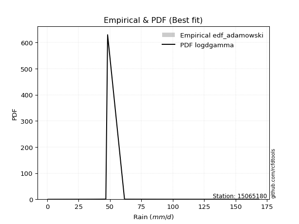</img>

</div>


## C. Best fit & Estimate extreme values for specific return periods - Tr


### 1. Best fit (ordered by delta Δ)

<div align="center">

|   id |   station | empirical_dist   | p_dist       |     delta |   deltao | eval   |   fit |   n |   best_fit |   best_fit_sort |
|-----:|----------:|:-----------------|:-------------|----------:|---------:|:-------|------:|----:|-----------:|----------------:|
|    0 |  15065180 | edf_hazen        | johnsonsu    | 0.0508435 | 0.362184 | Δo > Δ |     1 |  12 |          1 |               1 |
|    1 |  15065180 | edf_gringorten   | logt         | 0.0537728 | 0.362184 | Δo > Δ |     1 |  12 |          1 |               2 |
|    2 |  15065180 | edf_cunnane      | logt         | 0.0556664 | 0.362184 | Δo > Δ |     1 |  12 |          1 |               3 |
|    3 |  15065180 | edf_blom         | logt         | 0.0568373 | 0.362184 | Δo > Δ |     1 |  12 |          1 |               4 |
|    4 |  15065180 | edf_tukey        | logt         | 0.0587678 | 0.362184 | Δo > Δ |     1 |  12 |          1 |               5 |
|    5 |  15065180 | edf_filliben     | logt         | 0.0594946 | 0.362184 | Δo > Δ |     1 |  12 |          1 |               6 |
|    6 |  15065180 | edf_beard        | logt         | 0.0598376 | 0.362184 | Δo > Δ |     1 |  12 |          1 |               7 |
|    7 |  15065180 | edf_jenkinson    | logt         | 0.0598376 | 0.362184 | Δo > Δ |     1 |  12 |          1 |               8 |
|    8 |  15065180 | edf_chegodayev   | logt         | 0.0602936 | 0.362184 | Δo > Δ |     1 |  12 |          1 |               9 |
|    9 |  15065180 | edf_adamowski    | logt         | 0.0625516 | 0.362184 | Δo > Δ |     1 |  12 |          1 |              10 |
|   10 |  15065180 | edf_california   | logjohnsonsu | 0.0731902 | 0.362184 | Δo > Δ |     1 |  12 |          1 |              11 |
|   11 |  15065180 | edf_weibull      | logt         | 0.0733209 | 0.362184 | Δo > Δ |     1 |  12 |          1 |              12 |

</div>

:file_folder:Tables: [bestfit_15065180.csv](table/bestfit_15065180.csv) | [extreme_15065180.csv](table/extreme_15065180.csv)


### 2. Extreme values

In hydrology, a return period (or recurrence interval $Tr$) is the statistical average time between extreme events like floods or droughts of a specific magnitude, indicating how rare an event is, with a 100-year flood, for example, having a 1% chance of occurring in any given year, not that it happens exactly every century. It is a key tool for infrastructure design (like bridges or dams) and risk assessment, calculated from historical data to determine the probability of future events, although it is important to remember it is statistical average, and events can cluster or be missed.

> risk_rate: assuming the return period as the project useful life.

|   id |      tr |   prob_l |     prob_g |    alpha |   betaprime |     chi2 |   crystalball |   erlang |    expon |   exponnorm |        f |   fatiguelife |     fisk |    gamma |   genexpon |   genlogistic |   gibrat |   gompertz |   gumbel_l |   gumbel_r |   halflogistic |   halfnorm |   hypsecant |   invgamma |   invgauss |   invweibull |   johnsonsu |   kstwobign |   laplace |   laplace_asymmetric |         loggamma |   logistic |   lognorm |   maxwell |   mielke |    moyal |   nakagami |      ncf |      nct |     norm |          pareto |   pearson3 |   rayleigh |     rice |        t |   truncnorm |     wald |   weibull_min |   logalpha |    logbetaprime |          logchi2 |   logcrystalball |   logerlang |         logexpon |   logexponnorm |            logf |   logfatiguelife |   logfisk |   loggenexpon |   loggenlogistic |        loggibrat |   loggompertz |   loggumbel_l |   loggumbel_r |   loghalflogistic |   loghalfnorm |   loghypsecant |   loginvgamma |   loginvgauss |    loginvweibull |     logjohnsonsu |   logkstwobign |   loglaplace |   loglaplace_asymmetric |   logloggamma |   loglogistic |   loglognorm |   logmaxwell |   logmielke |   logmoyal |   lognakagami |            logncf |    lognct |   logpareto |   logpearson3 |   lograyleigh |   logrice |            logt |   logtruncnorm |     logwald |   logweibull_min |   station |   n |   risk_rate |
|-----:|--------:|---------:|-----------:|---------:|------------:|---------:|--------------:|---------:|---------:|------------:|---------:|--------------:|---------:|---------:|-----------:|--------------:|---------:|-----------:|-----------:|-----------:|---------------:|-----------:|------------:|-----------:|-----------:|-------------:|------------:|------------:|----------:|---------------------:|-----------------:|-----------:|----------:|----------:|---------:|---------:|-----------:|---------:|---------:|---------:|----------------:|-----------:|-----------:|---------:|---------:|------------:|---------:|--------------:|-----------:|----------------:|-----------------:|-----------------:|------------:|-----------------:|---------------:|----------------:|-----------------:|----------:|--------------:|-----------------:|-----------------:|--------------:|--------------:|--------------:|------------------:|--------------:|---------------:|--------------:|--------------:|-----------------:|-----------------:|---------------:|-------------:|------------------------:|--------------:|--------------:|-------------:|-------------:|------------:|-----------:|--------------:|------------------:|----------:|------------:|--------------:|--------------:|----------:|----------------:|---------------:|------------:|-----------------:|----------:|----:|------------:|
|    0 |    2    | 0.5      | 0.5        |  51.3183 |     51.5876 |  52.0175 |       61.5242 |  52.0174 |  42.8294 |     51.435  |  52.0164 |       52.0299 |  50.4454 |  52.0175 |    42.8999 |       53.4893 |  47.8736 |    51.9295 |    68.9952 |    54.0531 |        50.3389 |    52.2152 |     61.5242 |    51.4805 |    51.9205 |      51.3506 |     48.6509 |     55.6269 |   61.5242 |              51.3665 |      2.19145     |    61.5242 |   38.5534 |   57.6347 |  45.1946 |  51.6412 |    48.1712 |  55.4184 |  50.5761 |  61.5242 |     1.29947     |    53.0999 |    56.2553 |  59.2376 |  61.5076 |     61.5242 |  46.7827 |       51.6532 |    34.9296 |    4.08066      |      1.63547     |          38.5534 |    0.6      |     10.7473      |        38.5534 |    1.89719      |          38.5514 |   48.8357 |       21.1073 |          48.3402 |     25.5607      |       47.9559 |       48.2784 |       30.7873 |           27.5301 |       29.13   |        38.5534 |       38.084  |       34.7188 |     34.7539      |     47.4959      |        26.5509 |      38.5534 |                 42.8695 |       50.6913 |       38.5534 |      38.665  |      34.2928 |     46.1444 |    28.6309 |       38.7156 |      4.89679      |   38.4538 |    0.635001 |       60.172  |       32.8978 |   38.554  |    48.2773      |        9.55268 |     24.734  |      2.50623     |  15065180 |  12 |    0.75     |
|    1 |    2.33 | 0.570815 | 0.429185   |  58.1375 |     58.9647 |  59.755  |       69.6394 |  59.7549 |  52.1338 |     58.0515 |  59.7512 |       59.4649 |  56.7821 |  59.755  |    52.2198 |       60.3294 |  51.9845 |    61.0985 |    76.0556 |    61.5728 |        58.0703 |    60.9737 |     68.0188 |    58.5364 |    59.3114 |      58.2619 |     53.4381 |     63.1173 |   66.4352 |              57.6113 |      3.16551     |    68.6743 |   49.224  |   66.066  |  52.9373 |  58.7596 |    53.8546 |  63.2348 |  56.7806 |  69.6394 |     4.35373     |    60.9714 |    64.8112 |  66.9629 |  69.6772 |     69.6394 |  52.1039 |       59.8522 |    45.7136 |    8.46401      |      2.2214      |          49.224  |    0.6      |     20.2958      |        49.224  |    3.40142      |          49.1953 |   56.539  |       32.0483 |          56.3551 |     28.9284      |       56.4905 |       59.7136 |       38.6099 |           34.7459 |       37.9197 |        46.8798 |       49.6442 |       46.2531 |     52.0815      |     51.1417      |        40.926  |      44.697  |                 48.016  |       59.8916 |       47.8142 |      49.3279 |      44.2028 |     55.3359 |    35.4742 |       49.4319 |     12.9771       |   49.1553 |    0.813381 |       71.4936 |       42.564  |   49.2161 |    52.3838      |       14.0634  |     29.0319 |      3.7432      |  15065180 |  12 |    0.729209 |
|    2 |    5    | 0.8      | 0.2        |  89.7401 |     92.3177 |  94.2064 |       99.798  |  94.2063 |  98.6537 |     90.1723 |  94.1943 |       93.0352 |  86.9191 |  94.2064 |    98.8172 |       90.0394 |  75.652  |    99.6684 |    98.8647 |    94.2419 |        93.0536 |    98.0122 |     94.0703 |    91.0284 |    92.803  |      90.2982 |     81.1617 |     94.9347 |   90.989  |              88.8341 |     22.9982      |    96.2819 |  122.047  |   99.2506 |  85.8721 |  91.7325 |    79.0201 |  97.7882 |  86.8659 |  99.798  | 16670.9         |    95.2159 |    99.0644 |  97.8906 | 100.298  |     99.798  |  81.8924 |       95.8021 |   127.366  | 3880.33         |     12.0768      |         122.047  |    0.6      |    487.385       |       122.046  | 3149.35         |         121.782  |   99.5306 |      171.255  |          91.4034 |     58.9919      |       95.9672 |      118.665  |      103.246  |           99.6187 |      115.657  |       102.715  |      135.949  |      139.979  |    301.938       |     74.4441      |       257.182  |      93.6139 |                 78.3046 |       98.5744 |      109.787  |     121.998  |     120.052  |    105.779  |    95.7333 |      122.582  | 447794            |  122.502  |  inf        |      108.807  |      119.38   |  121.947  |    77.0216      |       50.7563  |     71.1867 |     35.1529      |  15065180 |  12 |    0.67232  |
|    3 |   10    | 0.9      | 0.1        | 118.499  |    120.556  | 122.309  |      119.804  | 122.309  | 140.883  |    119.22   | 122.298  |      121.136  | 116.281  | 122.309  |   141.117  |      114.234  | 102.63   |   127.371  |   111.564  |   120.85   |       122.106  |   125.42   |    114.873  |   119.711  |   121.044  |     118.986  |    115.453  |    119.16   |  113.278  |             117.177  |    156.228       |   116.614  |  222.909  |  122.604  | 113.306  | 120.441  |    98.1814 | 126.033  | 116.649  | 119.804  |     3.41186e+07 |   122.502  |   123.488  | 119.943  | 121.13   |    119.804  | 113.505  |      124.147  |   257.024  |    5.3734e+08   |     64.0392      |         222.909  |    0.6      |   8730.13        |       222.907  |    3.12004e+12  |         222.268  |  150.952  |      567.041  |         121.967  |    132.908       |      128.948  |      173.93   |      230.04   |          238.904  |      263.967  |       192.154  |      270.553  |      302.8    |   1263.46        |    123.501       |      1042.32   |     183.144  |                122.067  |      126.774  |      202.492  |     222.525  |     242.516  |    164.694  |   227.22   |      223.931  |      1.30478e+18  |  224.637  |  inf        |      124.339  |      249.05   |  222.631  |   124.86        |       91.2706  |    184.405  |    343.905       |  15065180 |  12 |    0.651322 |
|    4 |   15    | 0.933333 | 0.0666667  | 136.294  |    136.821  | 137.978  |      129.788  | 137.978  | 165.586  |    136.211  | 137.971  |      137.088  | 135.491  | 137.978  |   165.861  |      127.883  | 121.238  |   141.359  |   117.315  |   135.863  |       138.547  |   139.683  |    126.745  |   136.829  |   137.168  |     136.283  |    140.749  |    132.02   |  126.317  |             133.757  |    493.295       |   127.692  |  301.073  |  134.587  | 129.955  | 137.101  |   108.221  | 141.914  | 136.232  | 129.788  |     2.95005e+09 |   137.543  |   136.072  | 131.305  | 131.774  |    129.788  | 133.805  |      139.542  |   367.407  |    9.23696e+13  |    175.641       |         301.073  |    0.6      |  47213.4         |       301.07   |    1.46745e+25  |         300.132  |  189.405  |     1051.32   |         141.011  |    232.738       |      147.414  |      206.812  |      361.495  |          391.926  |      405.552  |       274.717  |      383.751  |      450.094  |   2833.26        |    187           |      2191.02   |     271.194  |                158.265  |      141.289  |      282.657  |     300.387  |     347.875  |    208.274  |   375.233  |      302.493  |      3.33325e+34  |  304.069  |  inf        |      129.164  |      363.774  |  300.633  |   188.253       |      111.581   |    339.801  |   1419.35        |  15065180 |  12 |    0.644736 |
|    5 |   20    | 0.95     | 0.05       | 149.573  |    148.349  | 148.847  |      136.326  | 148.847  | 183.112  |    148.267  | 148.845  |      148.269  | 150.309  | 148.847  |   183.417  |      137.44   | 135.835  |   150.502  |   120.895  |   146.374  |       150.066  |   149.192  |    135.12   |   149.244  |   148.51   |     148.899  |    161.412  |    140.683  |  135.567  |             145.52   |   1125.83        |   135.348  |  366.575  |  142.539  | 142.381  | 148.901  |   114.927  | 153.01   | 151.368  | 136.326  |     6.98292e+10 |   147.92   |   144.436  | 138.857  | 138.856  |    136.326  | 148.933  |      150.055  |   465.457  |    1.81951e+19  |    363.214       |         366.574  |    0.6      | 156376           |       366.57   |    1.06593e+41  |         365.382  |  221.568  |     1584.92   |         155.417  |    361.186       |      160.223  |      230.348  |      496.073  |          554.402  |      539.992  |       353.508  |      483.539  |      585.93   |   4987.18        |    268.494       |      3614.03   |     358.297  |                190.286  |      150.907  |      355.941  |     365.618  |     441.985  |    244.563  |   535.291  |      368.338  |      1.45334e+54  |  370.776  |  inf        |      131.459  |      467.951  |  365.986  |   274.717       |      123.515   |    535.844  |   4007.52        |  15065180 |  12 |    0.641514 |
|    6 |   25    | 0.96     | 0.04       | 160.325  |    157.308  | 157.16   |      141.139  | 157.16   | 196.707  |    157.618  | 157.162  |      156.881  | 162.58   | 157.16   |   197.034  |      144.801  | 148.004  |   157.206  |   123.442  |   154.47   |       158.941  |   156.267  |    141.602  |   159.06   |   157.267  |     158.91   |    179.139  |    147.173  |  142.743  |             154.645  |   2144.74        |   141.206  |  423.735  |  148.443  | 152.475  | 158.047  |   119.92   | 161.548  | 163.92   | 141.139  |     8.12748e+11 |   155.828  |   150.65   | 144.468  | 144.132  |    141.139  | 161.05   |      158.007  |   554.722  |    3.96516e+24  |    641.381       |         423.735  |    0.6      | 395907           |       423.73   |    6.00721e+59  |         422.325  |  249.814  |     2150.26   |         167.222  |    521.008       |      170.011  |      248.711  |      633.013  |          724.221  |      668.191  |       429.688  |      573.884  |      712.998  |   7709.18        |    371.587       |      5257.66   |     444.703  |                219.522  |      158.034  |      424.587  |     422.535  |     527.965  |    276.353  |   704.985  |      425.806  |      4.15469e+76  |  429.078  |  inf        |      132.784  |      564.234  |  423.011  |   392.716       |      131.332   |    771.761  |   9117.7         |  15065180 |  12 |    0.639603 |
|    7 |   50    | 0.98     | 0.02       | 196.843  |    185.368  | 182.447  |      154.921  | 182.447  | 238.937  |    186.665  | 182.469  |      183.382  | 205.763  | 182.447  |   239.334  |      167.477  | 190.899  |   176.199  |   130.357  |   179.411  |       186.285  |   176.832  |    161.698  |   190.785  |   184.336  |     191.434  |    244.808  |    166.228  |  165.032  |             182.988  |  16201.8         |   159.101  |  641.666  |  165.565  | 187.04   | 186.439  |   134.442  | 187.831  | 208.209  | 154.921  |     1.66342e+15 |   179.753  |   168.689  | 160.756  | 159.579  |    154.921  | 200.612  |      181.742  |   922.557  |    5.26328e+51  |   3838.54        |         641.665  |    0.600186 |      7.09155e+06 |       641.656  |    8.90066e+190 |         639.448  |  360.434  |     5214.23   |         208.228  |   1895.51        |      199.707  |      306.277  |     1341.34   |         1649.79   |     1241.09   |       786.912  |      942.362  |     1263.48   |  29491.6         |   1370.48        |     15807.1    |     870.005  |                342.207  |      178.611  |      727.731  |     639.493  |     884.083  |    400.466  |  1657.43   |      644.955  |      2.18064e+223 |  651.974  |  inf        |      135.27   |      971.268  |  640.378  |  1974.34        |      148.619   |   2539.83   | 127680           |  15065180 |  12 |    0.63583  |
|    8 |   75    | 0.986667 | 0.0133333  | 220.921  |    202.022  | 196.933  |      162.316  | 196.933  | 263.639  |    203.656  | 196.97   |      198.757  | 235.17   | 196.933  |   264.078  |      180.657  | 219.87   |   186.225  |   133.854  |   193.908  |       202.181  |   188.027  |    173.442  |   210.333  |   200.119  |     211.568  |    291.608  |    176.712  |  178.071  |             199.568  |  53484.4         |   169.437  |  801.689  |  174.874  | 210.013  | 203.043  |   142.348  | 203.124  | 238.484  | 162.316  |     1.43827e+17 |   193.383  |   178.504  | 169.618  | 168.098  |    162.316  | 224.956  |      195.049  |  1216.81   |    2.02601e+79  |  11075.2         |         801.689  |    0.602701 |      3.83518e+07 |       801.676  |  inf            |         798.905  |  445.429  |     8444.07   |         235.89   |   4534.69        |      216.647  |      340.282  |     2075.38   |         2662.41   |     1738.54   |      1120.7    |     1233.82   |     1728.23   |  64324.9         |   3774.66        |     28965.3    |    1288.28   |                443.686  |      189.729  |      993.396  |     798.779  |    1170.08   |    495.61   |  2732.37   |      805.913  |    inf            |  816.138  |  inf        |      136.027  |     1305.17   |  799.951  |  8463.96        |      154.917   |   5286.16   | 631615           |  15065180 |  12 |    0.634587 |
|    9 |  100    | 0.99     | 0.01       | 239.51   |    213.975  | 207.099  |      167.318  | 207.099  | 281.166  |    215.712  | 207.148  |      209.624  | 258.194  | 207.098  |   281.634  |      189.986  | 242.313  |   192.929  |   136.141  |   204.168  |       213.431  |   195.653  |    181.773  |   224.701  |   211.308  |     226.393  |    329.047  |    183.895  |  187.321  |             211.331  | 125322           |   176.735  |  931.982  |  181.215  | 227.78   | 214.822  |   147.733  | 213.97   | 262.256  | 167.318  |     3.40446e+18 |   202.92   |   185.19   | 175.655  | 173.963  |    167.318  | 242.706  |      204.269  |  1469.69   |    1.57116e+107 |  23599.8         |         931.982  |    0.610339 |      1.27025e+08 |       931.967  |  inf            |         928.756  |  517.249  |    11727.7    |         257.47   |   8912.6         |      228.498  |      364.541  |     2826.56   |         3735.81   |     2187.27   |      1440.18   |     1482.51   |     2141.37   | 111708           |   8859.18        |     43862.4    |    1702.05   |                533.457  |      197.272  |     1237.49   |     928.466  |    1416.21   |    575.933  |  3895.52   |      936.989  |    inf            |  950.053  |  inf        |      136.384  |     1596.22   |  929.862  | 33077.2         |      158.174   |   9020.65   |      2.0084e+06  |  15065180 |  12 |    0.633968 |
|   10 |  200    | 0.995    | 0.005      | 290.695  |    243.32   | 231.269  |      178.663  | 231.269  | 323.396  |    244.759  | 231.354  |      235.705  | 322.186  | 231.269  |   323.934  |      212.412  | 303.372  |   207.877  |   141.113  |   228.835  |       240.479  |   213.095  |    201.842  |   261.185  |   238.268  |     264.093  |    435.496  |    200.44   |  209.611  |             239.674  | 986669           |   194.24   | 1311.47   |  195.721  | 276.432  | 243.202  |   160.043  | 240.162  | 328.663  | 178.663  |     6.96778e+21 |   225.512  |   200.488  | 189.468  | 187.605  |    178.663  | 286.918  |      225.818  |  2266.24   |    4.52959e+220 | 148038           |        1311.47   |    0.685707 |      2.2753e+09  |      1311.45   |  inf            |        1307.05   |  740.342  |    24871.6    |         317.276  |  56026.2         |      256.545  |      423.402  |     5940.14   |         8434.42   |     3698.05   |      2635.36   |     2257.65   |     3508.53   | 421078           | 119727           |    114069      |    3329.85   |                831.59   |      214.433  |     2096.23   |    1306.18   |    2191.88   |    825.229  |  9155.12   |     1318.85   |    inf            | 1341.13   |  inf        |      136.883  |     2530.09   | 1308.17   |     4.60776e+06 |      163.2     |  34148.1    |      3.50062e+07 |  15065180 |  12 |    0.633042 |
|   11 |  250    | 0.996    | 0.004      | 309.508  |    252.948  | 238.966  |      182.13   | 238.966  | 336.99   |    254.11   | 239.063  |      244.077  | 345.684  | 238.966  |   337.551  |      219.621  | 325.28   |   212.37   |   142.575  |   236.765  |       249.174  |   218.461  |    208.302  |   273.535  |   246.952  |     276.86   |    475.16   |    205.56   |  216.786  |             248.799  |      1.92309e+06 |   199.86   | 1455.78   |  200.187  | 294.086  | 252.339  |   163.828  | 248.63   | 353.174  | 182.13   |     8.10985e+22 |   232.683  |   205.198  | 193.72   | 191.875  |    182.13   | 301.545  |      232.576  |  2590.38   |    1.45764e+278 | 268296           |        1455.78   |    0.738218 |      5.76053e+09 |      1455.75   |  inf            |        1450.93   |  830.672  |    31349.2    |         339.204  | 108357           |      265.435  |      442.466  |     7542.02   |        10958.6    |     4346.47   |      3201.23   |     2570.23   |     4088.55   | 645100           | 335280           |    153329      |    4132.87   |                959.358  |      219.688  |     2482.7    |    1449.81   |    2507.31   |    926.119  | 12053.9    |     1464.08   |    inf            | 1490.19   |  inf        |      136.975  |     2915.5    | 1452      |     4.4888e+07  |      164.226   |  53043      |      8.96321e+07 |  15065180 |  12 |    0.632858 |
|   12 |  500    | 0.998    | 0.002      | 377.465  |    283.483  | 262.653  |      192.412  | 262.653  | 379.22   |    283.157  | 262.796  |      270.029  | 429.268  | 262.653  |   379.851  |      241.999  | 400.994  |   225.475  |   146.769  |   261.378  |       276.163  |   234.46   |    228.37   |   313.954  |   273.962  |     318.615  |    617.447  |    220.904  |  239.076  |             277.142  |      1.54079e+07 |   217.289  | 1983.99   |  213.512  | 356.185  | 280.718  |   175.108  | 275.097  | 440.89   | 192.412  |     1.65981e+26 |   254.695  |   219.249  | 206.407  | 204.846  |    192.412  | 348.053  |      253.077  |  3865.16   |  inf            |      1.71672e+06 |        1983.99   |    1.04623  |      1.03184e+11 |      1983.95   |  inf            |        1977.74   | 1187.1    |    62546.5    |         417.154  |      1.05892e+06 |      292.665  |      502.007  |    15824.3    |        24697.9    |     7036.09   |      5857.59   |     3787.54   |     6473.71   |      2.42466e+06 |      1.69229e+07 |    372033      |    8085.42   |               1495.51   |      235.291  |     4195.9    |    1975.58   |    3744.97   |   1324.1    | 28328.1    |     1995.82   |    inf            | 2037.08   |  inf        |      137.148  |     4450.84   | 1978.4    |     1.43465e+12 |      166.299   | 215168      |      1.76161e+09 |  15065180 |  12 |    0.632489 |
|   13 |  750    | 0.998667 | 0.00133333 | 425.696  |    301.815  | 276.373  |      198.124  | 276.372  | 403.922  |    300.149  | 276.545  |      285.181  | 486.642  | 276.372  |   404.595  |      255.08   | 451.067  |   232.61   |   149.01   |   275.766  |       291.941  |   243.398  |    240.109  |   339.144  |   289.791  |     344.594  |    715.529  |    229.524  |  252.114  |             293.722  |      5.23018e+07 |   227.472  | 2356.27   |  220.965  | 398.296  | 297.319  |   181.405  | 290.723  | 501.558  | 198.124  |     1.43515e+28 |   267.407  |   227.106  | 213.501  | 212.265  |    198.124  | 375.938  |      264.757  |  4839.32   |  inf            |      5.11243e+06 |        2356.27   |    1.38194  |      5.58027e+11 |      2356.22   |  inf            |        2349.15   | 1462.43   |    92040.6    |         470.655  |      4.78185e+06 |      308.347  |      537.049  |    24404.4    |        39716.2    |     9208.73   |      8340.9    |     4707.6    |     8388.43   |      5.25785e+06 |      3.0333e+08  |    612126      |   11972.7    |               1939      |      243.968  |     5701.3    |    2346.17   |    4687.08   |   1631.47   | 46697.2    |     2370.67   |    inf            | 2423.57   |  inf        |      137.2    |     5638.73   | 2349.34   |     1.71711e+16 |      166.996   | 498206      |      1.0451e+10  |  15065180 |  12 |    0.632366 |
|   14 | 1000    | 0.999    | 0.001      | 464.828  |    315.047  | 286.053  |      202.056  | 286.053  | 421.449  |    312.205  | 286.248  |      295.921  | 531.7    | 286.052  |   422.151  |      264.36   | 489.385  |   237.462  |   150.518  |   285.973  |       303.133  |   249.57   |    248.437  |   357.758  |   301.036  |     363.761  |    792.51   |    235.496  |  261.365  |             305.485  |      1.24719e+08 |   234.693  | 2652.44   |  226.116  | 431.123  | 309.098  |   185.752  | 301.885  | 549.45   | 202.056  |     3.39708e+29 |   276.361  |   232.536  | 218.404  | 217.468  |    202.056  | 395.996  |      272.917  |  5655.13   |  inf            |      1.11127e+07 |        2652.44   |    1.73065  |      1.84824e+12 |      2652.38   |  inf            |        2644.7    | 1695.59   |   120208      |         512.678  |      1.51576e+07 |      319.372  |      562      |    33183.9    |        55630.1    |    11089.5    |     10718.1    |     5472.68   |    10042.7    |      9.10454e+06 |      3.20575e+09 |    864296      |   15818.1    |               2331.32   |      249.944  |     7085.94   |    2641.02   |    5473.41   |   1891.72   | 66574.2    |     2668.93   |    inf            | 2731.55   |  inf        |      137.224  |     6640.18   | 2644.41   |     1.1443e+20  |      167.346   | 911379      |      3.75688e+10 |  15065180 |  12 |    0.632305 |

<div align="center">

</img>

</div>


<div align="center">

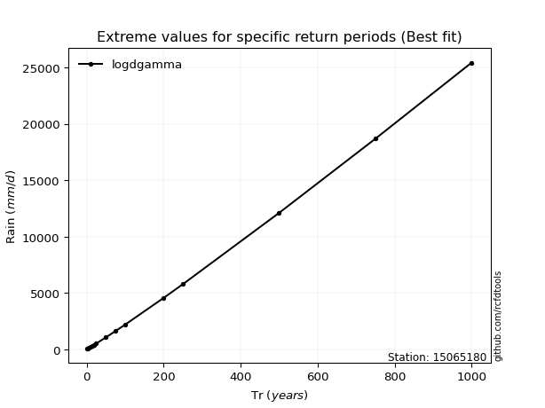</img>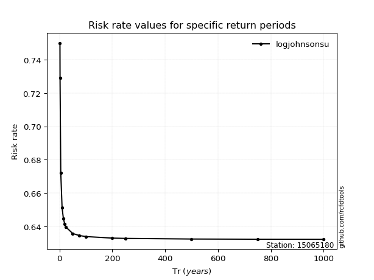</img>

</div>


<sub>**APP DISCLAIMER**: NO WARRANTY - This software is provided by [github.com/rcfdtools](https://github.com/rcfdtools) "as is", without any express or implied warranty, including warranties of merchantability, fitness for a particular purpose, or non-infringement. There is no guarantee that the software will be error-free or operate without interruption. LIMITATION OF LIABILITY - Neither the authors nor copyright holders will be liable for claims or damages arising from the software or its use. You are responsible for determining if the software is appropriate for your use and assume all associated risks, including errors, legal compliance, and data loss. NO PROFESSIONAL ADVICE - The software provides general information and does not offer professional advice. It should not replace consultation with professional advisors.</sub>