<div align="center">


</div>

# Station (rain, Pmax24h): 15065190

Probable Maximum Precipitation (PMP) is the greatest amount of rainfall for a specific duration that is meteorologically possible for a given location, acting as a "worst-case" scenario for extreme storms, crucial for designing safety-critical infrastructure like bridges, river deviations, dams, spillways, and nuclear plants to prevent catastrophic failure. PMP is calculated by hydrologists using meteorological data to determine the upper limit of extreme rainfall, often leading to the Probable Maximum Flood (PMF) for flood control design, and is increasingly being studied for climate change impacts.

<div align="center">

</img>

</div>


## A. General information


### 1. General running parameters

• app_version: _v20251225_. • runtime: _2025-12-26 14:29:50.888910_. • Python version: _3.14.0_. • SciPy version: _1.16.3_. • Pandas version: _2.3.3_. • NumPy version: _2.3.5_. • Stations dataset (station_dataset_file): _dataset/pmax24h_in/automatic_colombia.csv_. • Stations catalog (station_catalog_file): _dataset/CNE_IDEAM.xls_. • Plot only fit distributions with Δo > Δ (plot_only_fit): _True_. • Eval low extreme values, if False, evaluates high extreme values (low_extreme): _False_. • Eval every SciPy distribution as logarithmic (pdist_logarithmic_on): _True_. • Standard deviation normalized (ddof): _1.0_. • Return periods to eval in years (Tr): _[2, 2.33, 5, 10, 15, 20, 25, 50, 75, 100, 200, 250, 500, 750, 1000]_. • Minimum data sample per station, 0 means any (minimum_sample): _5_. • Z-Score threshold to adjust a value, 0 means disable (zscore): _3.5_. • Avoid zeros, e.g. rain = 0 (avoid_zeros): _True_. • Avoid null values (avoid_nans): _True_. [:file_folder:Dataset file.](../../dataset/pmax24h_in/automatic_colombia.csv)


### 2. Station info and location

|   id |   CODIGO | NOMBRE                  | CATEGORIA               | TECNOLOGIA                | ESTADO   | FECHA_INSTALACION   |   FECHA_SUSPENSION |   ALTITUD |   LATITUD |   LONGITUD | DEPARTAMENTO   | MUNICIPIO   | AREA_OPERATIVA                                         | ENTIDAD                                                     | AREA_HIDROGRAFICA   | ZONA_HIDROGRAFICA   | SUBZONA_HIDROGRAFICA   |   CORRIENTE |   OBSERVACION |   SUBRED | Catalogo   |
|-----:|---------:|:------------------------|:------------------------|:--------------------------|:---------|:--------------------|-------------------:|----------:|----------:|-----------:|:---------------|:------------|:-------------------------------------------------------|:------------------------------------------------------------|:--------------------|:--------------------|:-----------------------|------------:|--------------:|---------:|:-----------|
|    0 | 15065190 | MONGUI - AUT [15065190] | Climatológica Principal | Automática con Telemetría | Activa   | 22/11/2011          |                nan |        60 |   11.2268 |   -72.8206 | La Guajira     | Riohacha    | Area Operativa 05 - Magdalena-Cesar-Guajira-San Andrés | INSTITUTO DE HIDROLOGIA METEOROLOGIA Y ESTUDIOS AMBIENTALES | Caribe              | Caribe - Guajira    | Río Ranchería          |         nan |           nan |      nan | CNE_IDEAM  |

<div align="center">

Map location in: [:earth_americas:Google](http://maps.google.com/maps?q=11.22677778,-72.82063889) [:earth_americas:OSM](https://www.openstreetmap.org/#map=18/11.22677778/-72.82063889&layers=P) [:earth_americas:Bing](https://www.bing.com/maps?cp=11.22677778~-72.82063889&lvl=18) [:earth_americas:Apple](https://maps.apple.com/frame?center=11.22677778%2C-72.82063889&span=0.003%2C0.006)

</div>


<div align="center">

```geojson
{
  "type": "Feature",
  "geometry": {
    "type": "Point", 
    "coordinates": [-72.82063889, 11.22677778]
  }, 
  "properties": {
    "Name": "15065190"
  }
}
```

</div>


### 3. Discrete values table and plot

|               |           0 |            1 |           2 |           3 |          4 |           5 |           6 |          7 |           8 |          9 |        10 |         11 |         12 |          13 |
|:--------------|------------:|-------------:|------------:|------------:|-----------:|------------:|------------:|-----------:|------------:|-----------:|----------:|-----------:|-----------:|------------:|
| Date          | 2012        | 2013         | 2014        | 2015        | 2016       | 2017        | 2018        | 2019       | 2020        | 2021       | 2022      | 2023       | 2024       | 2025        |
| Value         |   77        |  110         |   48        |  191.5      |  288.6     |  100.7      |   58.8      |    2.6     |  171.3      |    0.5     |  228.9    |    0.2     |  322.4     |   38.6      |
| Value_initial |   77        |  110         |   48        |  191.5      |  288.6     |  100.7      |   58.8      |    2.6     |  171.3      |    0.5     |  228.9    |    0.2     |  322.4     |   38.6      |
| count         |   14        |   14         |   14        |   14        |   14       |   14        |   14        |   14       |   14        |   14       |   14      |   14       |   14       |   14        |
| mean          |  117.079    |  117.079     |  117.079    |  117.079    |  117.079   |  117.079    |  117.079    |  117.079   |  117.079    |  117.079   |  117.079  |  117.079   |  117.079   |  117.079    |
| std           |  107.119    |  107.119     |  107.119    |  107.119    |  107.119   |  107.119    |  107.119    |  107.119   |  107.119    |  107.119   |  107.119  |  107.119   |  107.119   |  107.119    |
| zscore        |   -0.374151 |   -0.0660816 |   -0.644879 |    0.694757 |    1.60123 |   -0.152901 |   -0.544056 |   -1.06871 |    0.506181 |   -1.08831 |    1.0439 |   -1.09111 |    1.91677 |   -0.732632 |

<div align="center">

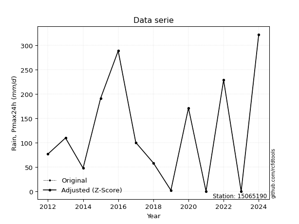</img>

</div>

> If Z-Score is active, values out of range or outliers are replaced with the station mean value.


### 4. Active continuous probability distributions from SciPy (45 of 104 available)

[scipy.stats](https://docs.scipy.org/doc/scipy/reference/stats.html) is a Python´s powerful submodule within the SciPy library for comprehensive statistical analysis, offering over 130 probability distributions (like Normal, Poisson), functions for descriptive stats (mean, variance), hypothesis testing (t-tests, chi-square), random variable generation, and statistical tests, making it essential for data science, modeling, and research. It provides tools to explore, model, and draw conclusions from data efficiently, working seamlessly with NumPy.

<div align="center">

|   id | p_dist             |   n_parameter | fit_method   | label                                                                       | active   | ref                                                                                                        |
|-----:|:-------------------|--------------:|:-------------|:----------------------------------------------------------------------------|:---------|:-----------------------------------------------------------------------------------------------------------|
|    0 | alpha              |             3 | MLE          | Alpha                                                                       | True     | [:mortar_board:](https://docs.scipy.org/doc/scipy/reference/generated/scipy.stats.alpha.html)              |
|    1 | betaprime          |             4 | MLE          | Beta prime                                                                  | True     | [:mortar_board:](https://docs.scipy.org/doc/scipy/reference/generated/scipy.stats.betaprime.html)          |
|    2 | chi2               |             3 | MLE          | Chi²                                                                        | True     | [:mortar_board:](https://docs.scipy.org/doc/scipy/reference/generated/scipy.stats.chi2.html)               |
|    3 | crystalball        |             4 | MLE          | Crystalball                                                                 | True     | [:mortar_board:](https://docs.scipy.org/doc/scipy/reference/generated/scipy.stats.crystalball.html)        |
|    4 | erlang             |             3 | MLE          | Erlang                                                                      | True     | [:mortar_board:](https://docs.scipy.org/doc/scipy/reference/generated/scipy.stats.erlang.html)             |
|    5 | expon              |             2 | MLE          | Exponential                                                                 | True     | [:mortar_board:](https://docs.scipy.org/doc/scipy/reference/generated/scipy.stats.expon.html)              |
|    6 | exponnorm          |             3 | MLE          | Exponentially modified Normal                                               | True     | [:mortar_board:](https://docs.scipy.org/doc/scipy/reference/generated/scipy.stats.exponnorm.html)          |
|    7 | f                  |             4 | MLE          | F                                                                           | True     | [:mortar_board:](https://docs.scipy.org/doc/scipy/reference/generated/scipy.stats.f.html)                  |
|    8 | fatiguelife        |             3 | MLE          | Fatigue-life (Birnbaum-Saunders)                                            | True     | [:mortar_board:](https://docs.scipy.org/doc/scipy/reference/generated/scipy.stats.fatiguelife.html)        |
|    9 | fisk               |             3 | MLE          | Fisk                                                                        | True     | [:mortar_board:](https://docs.scipy.org/doc/scipy/reference/generated/scipy.stats.fisk.html)               |
|   10 | gamma              |             3 | MLE          | Gamma                                                                       | True     | [:mortar_board:](https://docs.scipy.org/doc/scipy/reference/generated/scipy.stats.gamma.html)              |
|   11 | genexpon           |             5 | MLE          | Generalized exponential                                                     | True     | [:mortar_board:](https://docs.scipy.org/doc/scipy/reference/generated/scipy.stats.genexpon.html)           |
|   12 | genlogistic        |             3 | MLE          | Generalized logistic                                                        | True     | [:mortar_board:](https://docs.scipy.org/doc/scipy/reference/generated/scipy.stats.genlogistic.html)        |
|   13 | gibrat             |             2 | MM           | Gibrat                                                                      | True     | [:mortar_board:](https://docs.scipy.org/doc/scipy/reference/generated/scipy.stats.gibrat.html)             |
|   14 | gompertz           |             3 | MLE          | Gompertz (or truncated Gumbel)                                              | True     | [:mortar_board:](https://docs.scipy.org/doc/scipy/reference/generated/scipy.stats.gompertz.html)           |
|   15 | gumbel_l           |             2 | MM           | Gumbel Left Skew                                                            | True     | [:mortar_board:](https://docs.scipy.org/doc/scipy/reference/generated/scipy.stats.gumbel_l.html)           |
|   16 | gumbel_r           |             2 | MM           | Gumbel Right Skew                                                           | True     | [:mortar_board:](https://docs.scipy.org/doc/scipy/reference/generated/scipy.stats.gumbel_r.html)           |
|   17 | halflogistic       |             2 | MM           | Half-logistic                                                               | True     | [:mortar_board:](https://docs.scipy.org/doc/scipy/reference/generated/scipy.stats.halflogistic.html)       |
|   18 | halfnorm           |             2 | MM           | Half Normal                                                                 | True     | [:mortar_board:](https://docs.scipy.org/doc/scipy/reference/generated/scipy.stats.halfnorm.html)           |
|   19 | hypsecant          |             2 | MM           | hyperbolic secant                                                           | True     | [:mortar_board:](https://docs.scipy.org/doc/scipy/reference/generated/scipy.stats.hypsecant.html)          |
|   20 | invgamma           |             3 | MLE          | Inverted gamma                                                              | True     | [:mortar_board:](https://docs.scipy.org/doc/scipy/reference/generated/scipy.stats.invgamma.html)           |
|   21 | invgauss           |             3 | MLE          | Inverse Gaussian                                                            | True     | [:mortar_board:](https://docs.scipy.org/doc/scipy/reference/generated/scipy.stats.invgauss.html)           |
|   22 | invweibull         |             3 | MLE          | Inverted Weibull                                                            | True     | [:mortar_board:](https://docs.scipy.org/doc/scipy/reference/generated/scipy.stats.invweibull.html)         |
|   23 | johnsonsu          |             4 | MLE          | Johnson Su                                                                  | True     | [:mortar_board:](https://docs.scipy.org/doc/scipy/reference/generated/scipy.stats.johnsonsu.html)          |
|   24 | kstwobign          |             2 | MLE          | Limiting distribution of scaled Kolmogorov-Smirnov two-sided test statistic | True     | [:mortar_board:](https://docs.scipy.org/doc/scipy/reference/generated/scipy.stats.kstwobign.html)          |
|   25 | laplace            |             2 | MM           | Laplace                                                                     | True     | [:mortar_board:](https://docs.scipy.org/doc/scipy/reference/generated/scipy.stats.laplace.html)            |
|   26 | laplace_asymmetric |             3 | MLE          | Asymmetric Laplace                                                          | True     | [:mortar_board:](https://docs.scipy.org/doc/scipy/reference/generated/scipy.stats.laplace_asymmetric.html) |
|   27 | loggamma           |             3 | MLE          | Log gamma                                                                   | True     | [:mortar_board:](https://docs.scipy.org/doc/scipy/reference/generated/scipy.stats.loggamma.html)           |
|   28 | logistic           |             2 | MM           | Logistic (or Sech-squared)                                                  | True     | [:mortar_board:](https://docs.scipy.org/doc/scipy/reference/generated/scipy.stats.logistic.html)           |
|   29 | lognorm            |             3 | MLE          | Log Normal                                                                  | True     | [:mortar_board:](https://docs.scipy.org/doc/scipy/reference/generated/scipy.stats.lognorm.html)            |
|   30 | maxwell            |             2 | MM           | Maxwell                                                                     | True     | [:mortar_board:](https://docs.scipy.org/doc/scipy/reference/generated/scipy.stats.maxwell.html)            |
|   31 | mielke             |             4 | MLE          | Mielke Beta-Kappa / Dagum                                                   | True     | [:mortar_board:](https://docs.scipy.org/doc/scipy/reference/generated/scipy.stats.mielke.html)             |
|   32 | moyal              |             2 | MM           | Moyal                                                                       | True     | [:mortar_board:](https://docs.scipy.org/doc/scipy/reference/generated/scipy.stats.moyal.html)              |
|   33 | nakagami           |             3 | MLE          | Nakagami                                                                    | True     | [:mortar_board:](https://docs.scipy.org/doc/scipy/reference/generated/scipy.stats.nakagami.html)           |
|   34 | ncf                |             5 | MLE          | Non-central F distribution                                                  | True     | [:mortar_board:](https://docs.scipy.org/doc/scipy/reference/generated/scipy.stats.ncf.html)                |
|   35 | nct                |             4 | MLE          | Non-central Student’s t                                                     | True     | [:mortar_board:](https://docs.scipy.org/doc/scipy/reference/generated/scipy.stats.nct.html)                |
|   36 | norm               |             2 | MM           | Normal                                                                      | True     | [:mortar_board:](https://docs.scipy.org/doc/scipy/reference/generated/scipy.stats.norm.html)               |
|   37 | pareto             |             3 | MLE          | Pareto                                                                      | True     | [:mortar_board:](https://docs.scipy.org/doc/scipy/reference/generated/scipy.stats.pareto.html)             |
|   38 | pearson3           |             3 | MM           | Pearson type III                                                            | True     | [:mortar_board:](https://docs.scipy.org/doc/scipy/reference/generated/scipy.stats.pearson3.html)           |
|   39 | rayleigh           |             2 | MM           | Rayleigh                                                                    | True     | [:mortar_board:](https://docs.scipy.org/doc/scipy/reference/generated/scipy.stats.rayleigh.html)           |
|   40 | rice               |             3 | MLE          | Rice                                                                        | True     | [:mortar_board:](https://docs.scipy.org/doc/scipy/reference/generated/scipy.stats.rice.html)               |
|   41 | t                  |             3 | MLE          | Student’s t                                                                 | True     | [:mortar_board:](https://docs.scipy.org/doc/scipy/reference/generated/scipy.stats.t.html)                  |
|   42 | truncnorm          |             4 | MLE          | Truncated normal                                                            | True     | [:mortar_board:](https://docs.scipy.org/doc/scipy/reference/generated/scipy.stats.truncnorm.html)          |
|   43 | wald               |             2 | MM           | Wald                                                                        | True     | [:mortar_board:](https://docs.scipy.org/doc/scipy/reference/generated/scipy.stats.wald.html)               |
|   44 | weibull_min        |             3 | MLE          | Weibull minimum                                                             | True     | [:mortar_board:](https://docs.scipy.org/doc/scipy/reference/generated/scipy.stats.weibull_min.html)        |

</div>

> **n_parameter:** # arguments & localization & scale.
>
> **Fit methods:** (MLE) maximum likelihood, (MM) L-moments.
>
>**Inactive:** foldnorm, gennorm, norminvgauss, powernorm, powerlognorm, skewnorm, genextreme, anglit, arcsine, argus, beta, bradford, burr, burr12, cauchy, cosine, halfcauchy, foldcauchy, skewcauchy, wrapcauchy, dgamma, gengamma, exponweib, exponpow, truncexpon, gausshyper, genhalflogistic, genhyperbolic, geninvgauss, halfgennorm, johnsonsb, kappa4, kappa3, ksone, kstwo, loglaplace, levy, levy_l, levy_stable, ncx2, genpareto, truncpareto, lomax, powerlaw, rdist, rel_breitwigner, recipinvgauss, semicircular, studentized_range, trapezoid, triang, truncweibull_min, tukeylambda, uniform, loguniform, vonmises, vonmises_line, weibull_max, dweibull, 


## B. Probability distributions vs. Empirical distributions

A continuous probability distribution (CPD) describes probabilities for variables that can take any value within a range (like rain any time), unlike discrete variables with specific outcomes (like temperature). It uses a Probability Density Function (PDF), a curve where the total area under it equals 1, and the probability of the variable falling within an interval (a to b) is found by calculating the area under the curve between those points. A key feature is that the probability of hitting any single exact value is zero, so probabilities are always expressed for ranges, e.g., $P(a ≤ X ≤ b)$.

<div align="center">

Distributions parameters
|    |   station | p_dist                |   n |              loc |           scale | shape                  | shape1             | shape2                 | shape3   |
|---:|----------:|:----------------------|----:|-----------------:|----------------:|:-----------------------|:-------------------|:-----------------------|:---------|
|  0 |  15065190 | alpha                 |  14 |    -37.1901      |    71.7082      | 1.4539138207153355e-09 |                    |                        |          |
|  1 |  15065190 | betaprime             |  14 |      0.2         |   168.636       | 0.7453924513698822     | 1.634777913808363  |                        |          |
|  2 |  15065190 | chi2                  |  14 |      0.2         |    66.3071      | 1.0867909389496564     |                    |                        |          |
|  3 |  15065190 | crystalball           |  14 |    117.079       |   103.222       | 10431.949942720454     | 4650.008390667157  |                        |          |
|  4 |  15065190 | erlang                |  14 |      0.2         |   176.516       | 0.5508720933077684     |                    |                        |          |
|  5 |  15065190 | expon                 |  14 |      0.2         |   116.879       |                        |                    |                        |          |
|  6 |  15065190 | exponnorm             |  14 |      0.114536    |     0.0287481   | 4077.501587697947      |                    |                        |          |
|  7 |  15065190 | f                     |  14 |      0.2         |    99.5641      | 1.1580088722188693     | 113.35325073577562 |                        |          |
|  8 |  15065190 | fatiguelife           |  14 |      0.199852    |     0.215502    | 22.32710256267852      |                    |                        |          |
|  9 |  15065190 | fisk                  |  14 |      0.2         |    52.2634      | 0.6407681283036577     |                    |                        |          |
| 10 |  15065190 | gamma                 |  14 |      0.2         |    84.9394      | 0.44142357050224856    |                    |                        |          |
| 11 |  15065190 | genexpon              |  14 |      0.0261832   |     6.63811     | 0.048738864163798634   | 3.6540719793747876 | 0.00013837539461992467 |          |
| 12 |  15065190 | genlogistic           |  14 |   -476.707       |    78.1559      | 1080.3849558945471     |                    |                        |          |
| 13 |  15065190 | gibrat                |  14 |     38.3331      |    47.7615      |                        |                    |                        |          |
| 14 |  15065190 | gompertz              |  14 |      0.2         |   255.104       | 1.3276428303652055     |                    |                        |          |
| 15 |  15065190 | gumbel_l              |  14 |    163.534       |    80.482       |                        |                    |                        |          |
| 16 |  15065190 | gumbel_r              |  14 |     70.6231      |    80.482       |                        |                    |                        |          |
| 17 |  15065190 | halflogistic          |  14 |     -5.26364     |    88.2513      |                        |                    |                        |          |
| 18 |  15065190 | halfnorm              |  14 |    -19.5471      |   171.235       |                        |                    |                        |          |
| 19 |  15065190 | hypsecant             |  14 |    117.079       |    65.7133      |                        |                    |                        |          |
| 20 |  15065190 | invgamma              |  14 |    -80.2275      |   569.31        | 3.803441319746475      |                    |                        |          |
| 21 |  15065190 | invgauss              |  14 |    -34.1529      |   195.446       | 0.7737751231017884     |                    |                        |          |
| 22 |  15065190 | invweibull            |  14 |      0.113602    |     5.82967     | 0.3466742586631659     |                    |                        |          |
| 23 |  15065190 | johnsonsu             |  14 |    -18.8497      |     0.626078    | -5.923921945938464     | 1.0405630160675234 |                        |          |
| 24 |  15065190 | kstwobign             |  14 |   -203.979       |   368.339       |                        |                    |                        |          |
| 25 |  15065190 | laplace               |  14 |    117.079       |    72.9891      |                        |                    |                        |          |
| 26 |  15065190 | laplace_asymmetric    |  14 |      0.2         |     0.001323    | 1.1319423662173805e-05 |                    |                        |          |
| 27 |  15065190 | loggamma              |  14 | -27795.1         |  3865.48        | 1368.4835747136713     |                    |                        |          |
| 28 |  15065190 | logistic              |  14 |    117.079       |    56.9093      |                        |                    |                        |          |
| 29 |  15065190 | lognorm               |  14 |      0.2         |     2.72845     | 11.011311990194686     |                    |                        |          |
| 30 |  15065190 | maxwell               |  14 |   -127.515       |   153.276       |                        |                    |                        |          |
| 31 |  15065190 | mielke                |  14 |      0.2         |   338.549       | 0.5315101683289587     | 17.039368283078968 |                        |          |
| 32 |  15065190 | moyal                 |  14 |     58.0495      |    46.4663      |                        |                    |                        |          |
| 33 |  15065190 | nakagami              |  14 |      0.2         |   209.099       | 0.19097247362467973    |                    |                        |          |
| 34 |  15065190 | ncf                   |  14 |      0.2         |     5.86067     | 0.2015941550848035     | 132.0679980209245  | 3.7921688762060564     |          |
| 35 |  15065190 | nct                   |  14 |     -0.152858    |     0.0211028   | 0.22369063679414167    | 54.73615200129265  |                        |          |
| 36 |  15065190 | norm                  |  14 |    117.079       |   103.222       |                        |                    |                        |          |
| 37 |  15065190 | pareto                |  14 |      0.199954    |     4.61411e-05 | 0.07693786038266753    |                    |                        |          |
| 38 |  15065190 | pearson3              |  14 |    117.079       |   103.222       | 0.6436390511641246     |                    |                        |          |
| 39 |  15065190 | rayleigh              |  14 |    -80.3914      |   157.558       |                        |                    |                        |          |
| 40 |  15065190 | rice                  |  14 |    -55.575       |   142.239       | 0.0009703293187899649  |                    |                        |          |
| 41 |  15065190 | t                     |  14 |    117.098       |   103.217       | 1377001.4422666058     |                    |                        |          |
| 42 |  15065190 | truncnorm             |  14 |    -62.1494      |   177.772       | 0.35072729928862023    | 511.11934821801015 |                        |          |
| 43 |  15065190 | wald                  |  14 |     13.8565      |   103.222       |                        |                    |                        |          |
| 44 |  15065190 | weibull_min           |  14 |      0.2         |   122.635       | 0.6585715170327295     |                    |                        |          |
| 45 |  15065190 | logalpha              |  14 |     -2.30286     |     1.67351     | 1.0187694316351599e-08 |                    |                        |          |
| 46 |  15065190 | logbetaprime          |  14 |  -1020.95        |  3526.85        | 256922.68967378954     | 884354.7642005729  |                        |          |
| 47 |  15065190 | logchi2               |  14 |     -1.60944     |     1.84261     | 1.2220773209348952     |                    |                        |          |
| 48 |  15065190 | logcrystalball        |  14 |      3.65574     |     2.28488     | 12.96803887552995      | 762.0873310204872  |                        |          |
| 49 |  15065190 | logerlang             |  14 |    -30.867       |     0.168614    | 204.5389500783465      |                    |                        |          |
| 50 |  15065190 | logexpon              |  14 |     -1.60944     |     5.26518     |                        |                    |                        |          |
| 51 |  15065190 | logexponnorm          |  14 |      3.65417     |     2.28487     | 0.0006880122750178019  |                    |                        |          |
| 52 |  15065190 | logf                  |  14 |     -1.60944     |     1.14101     | 1.0995036015020465     | 1.09723111713909   |                        |          |
| 53 |  15065190 | logfatiguelife        |  14 |   -668.177       |   671.833       | 0.0033943911616003426  |                    |                        |          |
| 54 |  15065190 | logfisk               |  14 |     -4.79961e+08 |     4.79961e+08 | 398803649.4701531      |                    |                        |          |
| 55 |  15065190 | loggamma              |  14 |    -34.9122      |     0.145317    | 265.23775043364634     |                    |                        |          |
| 56 |  15065190 | loggenexpon           |  14 |     -2.18796     |     0.167006    | 0.00047779329840388343 | 7.094564448954241  | 0.00019678464998370247 |          |
| 57 |  15065190 | loggenlogistic        |  14 |      5.77583     |     3.68861e-06 | 1.739296881993773e-06  |                    |                        |          |
| 58 |  15065190 | loggibrat             |  14 |      1.91271     |     1.05721     |                        |                    |                        |          |
| 59 |  15065190 | loggompertz           |  14 |     -1.61841     |     1.42388     | 0.012805508229161478   |                    |                        |          |
| 60 |  15065190 | loggumbel_l           |  14 |      4.68406     |     1.78151     |                        |                    |                        |          |
| 61 |  15065190 | loggumbel_r           |  14 |      2.62742     |     1.78151     |                        |                    |                        |          |
| 62 |  15065190 | loghalflogistic       |  14 |      0.947675    |     1.95347     |                        |                    |                        |          |
| 63 |  15065190 | loghalfnorm           |  14 |      0.631445    |     3.79039     |                        |                    |                        |          |
| 64 |  15065190 | loghypsecant          |  14 |      3.65574     |     1.4546      |                        |                    |                        |          |
| 65 |  15065190 | loginvgamma           |  14 |    -57.9435      | 42793.5         | 695.921037450805       |                    |                        |          |
| 66 |  15065190 | loginvgauss           |  14 |    -18.3237      |  1669.23        | 0.013173234283052997   |                    |                        |          |
| 67 |  15065190 | loginvweibull         |  14 |     -4.50465e+08 |     4.50465e+08 | 166149435.2905047      |                    |                        |          |
| 68 |  15065190 | logjohnsonsu          |  14 |      5.90133     |     0.00433018  | 5.571998685963532      | 0.8725876730557776 |                        |          |
| 69 |  15065190 | logkstwobign          |  14 |     -7.18761     |    12.3932      |                        |                    |                        |          |
| 70 |  15065190 | loglaplace            |  14 |      3.65574     |     1.61565     |                        |                    |                        |          |
| 71 |  15065190 | loglaplace_asymmetric |  14 |      5.77579     |     0.0160394   | 132.21479176846537     |                    |                        |          |
| 72 |  15065190 | logloggamma           |  14 |      5.77588     |     1.02396e-06 | 4.825676888549188e-07  |                    |                        |          |
| 73 |  15065190 | loglogistic           |  14 |      3.65574     |     1.25972     |                        |                    |                        |          |
| 74 |  15065190 | loglognorm            |  14 |   -866.366       |   870.015       | 0.0026350814633381413  |                    |                        |          |
| 75 |  15065190 | logmaxwell            |  14 |     -1.75846     |     3.39285     |                        |                    |                        |          |
| 76 |  15065190 | logmielke             |  14 |     -1.60944     |     4.33282     | 0.28616442725120717    | 1.2519012221654948 |                        |          |
| 77 |  15065190 | logmoyal              |  14 |      2.3491      |     1.02856     |                        |                    |                        |          |
| 78 |  15065190 | lognakagami           |  14 |  -1999.85        |  2003.51        | 192385.12008441158     |                    |                        |          |
| 79 |  15065190 | logncf                |  14 |     -1.60944     |     1.08835     | 1.0856937494178305     | 1.1179271117590135 | 1.080353531691399      |          |
| 80 |  15065190 | lognct                |  14 |    136.75        |     2.25041     | 62185.503235033204     | -59.14115064814894 |                        |          |
| 81 |  15065190 | lognorm               |  14 |      3.65574     |     2.28488     |                        |                    |                        |          |
| 82 |  15065190 | logpareto             |  14 |     -1.60944     |     4.2417e-06  | 0.07692421068013636    |                    |                        |          |
| 83 |  15065190 | logpearson3           |  14 |      3.65574     |     2.28487     | -1.286389344134876     |                    |                        |          |
| 84 |  15065190 | lograyleigh           |  14 |     -0.715331    |     3.48761     |                        |                    |                        |          |
| 85 |  15065190 | logrice               |  14 |   -588.223       |     2.28488     | 259.0394820447759      |                    |                        |          |
| 86 |  15065190 | logt                  |  14 |      4.66316     |     0.860691    | 1.3191159023988681     |                    |                        |          |
| 87 |  15065190 | logtruncnorm          |  14 |      2.24289     |     6.47743     | -0.5997071876765045    | 0.5454169378033373 |                        |          |
| 88 |  15065190 | logwald               |  14 |      1.37086     |     2.28487     |                        |                    |                        |          |
| 89 |  15065190 | logweibull_min        |  14 |     -1.60944     |     1.83324     | 0.5606811765200783     |                    |                        |          |

</div>

> **loc** (Location parameter): This shifts the distribution along the x-axis. For many common distributions, like the normal (Gaussian) distribution, loc represents the mean $μ$. For others, like the uniform distribution, it might represent the minimum value, or for the beta distribution, the left end of the support interval.
>
> **scale** (Scale parameter): This determines the width or spread of the distribution. For the normal distribution, scale represents the standard deviation $σ$. For a uniform distribution, it defines the length of the interval (from $loc$ to $loc + scale$).
>
> **shape** (Shape parameters): Refers to parameters that define the specific form of a probability distribution, distinct from its location (loc) and scale (scale). These parameters are required arguments for most distribution functions. For example, a normal (Gaussian) distribution is fully defined by its location (mean) and scale (standard deviation), so it has no specific shape parameters beyond loc and scale. However, other distributions have intrinsic properties that need specification, as Gamma distribution that takes a shape parameter, often named $a$ or $alpha$.


### 0. Cumulative distribution values - CDF (90 evaluated)

> Ordered by x ascending and calculating $log(f(x))$ separately. 

|   id |   Station |   date |     x |   count |    mean |     std |     zscore |   Value_initial |   station |   m |     alpha |   alpha_pdf |   betaprime |   betaprime_pdf |        chi2 |      chi2_pdf |   crystalball |   crystalball_pdf |      erlang |       erlang_pdf |      expon |   expon_pdf |   exponnorm |   exponnorm_pdf |           f |            f_pdf |   fatiguelife |   fatiguelife_pdf |        fisk |        fisk_pdf |       gamma |   gamma_pdf |   genexpon |   genexpon_pdf |   genlogistic |   genlogistic_pdf |      gibrat |   gibrat_pdf |    gompertz |   gompertz_pdf |   gumbel_l |   gumbel_l_pdf |   gumbel_r |   gumbel_r_pdf |   halflogistic |   halflogistic_pdf |   halfnorm |   halfnorm_pdf |   hypsecant |   hypsecant_pdf |   invgamma |   invgamma_pdf |   invgauss |   invgauss_pdf |   invweibull |   invweibull_pdf |   johnsonsu |   johnsonsu_pdf |   kstwobign |   kstwobign_pdf |   laplace |   laplace_pdf |   laplace_asymmetric |   laplace_asymmetric_pdf |   loggamma |   loggamma_pdf |   logistic |   logistic_pdf |   lognorm |   lognorm_pdf |   maxwell |   maxwell_pdf |      mielke |      mielke_pdf |     moyal |   moyal_pdf |    nakagami |   nakagami_pdf |        ncf |     ncf_pdf |       nct |     nct_pdf |     norm |    norm_pdf |   pareto |     pareto_pdf |   pearson3 |   pearson3_pdf |   rayleigh |   rayleigh_pdf |      rice |    rice_pdf |        t |       t_pdf |   truncnorm |   truncnorm_pdf |     wald |    wald_pdf |   weibull_min |   weibull_min_pdf |   logalpha |   logalpha_pdf |   logbetaprime |   logbetaprime_pdf |     logchi2 |    logchi2_pdf |   logcrystalball |   logcrystalball_pdf |   logerlang |   logerlang_pdf |   logexpon |   logexpon_pdf |   logexponnorm |   logexponnorm_pdf |        logf |   logf_pdf |   logfatiguelife |   logfatiguelife_pdf |    logfisk |   logfisk_pdf |   loggenexpon |   loggenexpon_pdf |   loggenlogistic |   loggenlogistic_pdf |   loggibrat |   loggibrat_pdf |   loggompertz |   loggompertz_pdf |   loggumbel_l |   loggumbel_l_pdf |   loggumbel_r |   loggumbel_r_pdf |   loghalflogistic |   loghalflogistic_pdf |   loghalfnorm |   loghalfnorm_pdf |   loghypsecant |   loghypsecant_pdf |   loginvgamma |   loginvgamma_pdf |   loginvgauss |   loginvgauss_pdf |   loginvweibull |   loginvweibull_pdf |   logjohnsonsu |   logjohnsonsu_pdf |   logkstwobign |   logkstwobign_pdf |   loglaplace |   loglaplace_pdf |   loglaplace_asymmetric |   loglaplace_asymmetric_pdf |   logloggamma |   logloggamma_pdf |   loglogistic |   loglogistic_pdf |   loglognorm |   loglognorm_pdf |   logmaxwell |   logmaxwell_pdf |   logmielke |   logmielke_pdf |    logmoyal |   logmoyal_pdf |   lognakagami |   lognakagami_pdf |      logncf |   logncf_pdf |    lognct |   lognct_pdf |   logpareto |   logpareto_pdf |   logpearson3 |   logpearson3_pdf |   lograyleigh |   lograyleigh_pdf |   logrice |   logrice_pdf |      logt |   logt_pdf |   logtruncnorm |   logtruncnorm_pdf |   logwald |   logwald_pdf |   logweibull_min |   logweibull_min_pdf |
|-----:|----------:|-------:|------:|--------:|--------:|--------:|-----------:|----------------:|----------:|----:|----------:|------------:|------------:|----------------:|------------:|--------------:|--------------:|------------------:|------------:|-----------------:|-----------:|------------:|------------:|----------------:|------------:|-----------------:|--------------:|------------------:|------------:|----------------:|------------:|------------:|-----------:|---------------:|--------------:|------------------:|------------:|-------------:|------------:|---------------:|-----------:|---------------:|-----------:|---------------:|---------------:|-------------------:|-----------:|---------------:|------------:|----------------:|-----------:|---------------:|-----------:|---------------:|-------------:|-----------------:|------------:|----------------:|------------:|----------------:|----------:|--------------:|---------------------:|-------------------------:|-----------:|---------------:|-----------:|---------------:|----------:|--------------:|----------:|--------------:|------------:|----------------:|----------:|------------:|------------:|---------------:|-----------:|------------:|----------:|------------:|---------:|------------:|---------:|---------------:|-----------:|---------------:|-----------:|---------------:|----------:|------------:|---------:|------------:|------------:|----------------:|---------:|------------:|--------------:|------------------:|-----------:|---------------:|---------------:|-------------------:|------------:|---------------:|-----------------:|---------------------:|------------:|----------------:|-----------:|---------------:|---------------:|-------------------:|------------:|-----------:|-----------------:|---------------------:|-----------:|--------------:|--------------:|------------------:|-----------------:|---------------------:|------------:|----------------:|--------------:|------------------:|--------------:|------------------:|--------------:|------------------:|------------------:|----------------------:|--------------:|------------------:|---------------:|-------------------:|--------------:|------------------:|--------------:|------------------:|----------------:|--------------------:|---------------:|-------------------:|---------------:|-------------------:|-------------:|-----------------:|------------------------:|----------------------------:|--------------:|------------------:|--------------:|------------------:|-------------:|-----------------:|-------------:|-----------------:|------------:|----------------:|------------:|---------------:|--------------:|------------------:|------------:|-------------:|----------:|-------------:|------------:|----------------:|--------------:|------------------:|--------------:|------------------:|----------:|--------------:|----------:|-----------:|---------------:|-------------------:|----------:|--------------:|-----------------:|---------------------:|
|    0 |  15065190 |   2023 |   0.2 |      14 | 117.079 | 107.119 | -1.09111   |             0.2 |  15065190 |   1 | 0.0551314 | 0.00650586  | 9.73961e-12 |    43.4634      | 6.06987e-07 | 853.041       |      0.128754 |       0.00203578  | 4.92997e-11 | 978465           | 0          | 0.00855589  | 0.000728899 |     0.00851213  | 1.47346e-11 | 307376           |     0.0439679 |     536.094       | 1.95012e-12 | 45020.6         | 7.80953e-09 | 1.24202e+08 | 0.00127557 |    0.00733491  |     0.0893131 |       0.00275737  | 0           |  0           | 2.48857e-13 |    0.00520431  |   0.12314  |    0.0014317   |  0.0908163 |    0.00270695  |      0.0309452 |        0.00566022  |  0.0918098 |    0.00462871  |    0.106502 |     0.00159064  |  0.0651153 |    0.00380001  |  0.0553201 |    0.00506487  |    0.0134818 |      0.23296     |   0.0496239 |     0.00559679  |   0.0815904 |     0.0028092   |  0.100815 |   0.00138124  |          1.77616e-10 |              0.00855589  |  0.0106424 |      0.013113  |   0.113672 |    0.00177037  | 0.0106012 |     0.0122738 |  0.125451 |   0.0025541   | 4.67142e-10 | 263107          | 0.0623834 | 0.00281834  | 4.88238e-08 |    6.71866e+08 | 0.00224559 | 8.15507e+12 | 0.0200742 | 0.206195    | 0.128754 | 0.00203578  | 0        | 1667.45        |   0.115416 |    0.00255802  |   0.122622 |    0.00284835  | 0.0739984 | 0.00255277  | 0.128703 | 0.00203532  |   7.927e-14 |     0.00581505  | 0        | 0           |   5.25726e-13 |   12474.2         |  0.0158043 |      0.150937  |      0.010615  |          0.0122779 | 1.37155e-10 | 377432         |        0.0106012 |            0.0122738 |   0.011728  |       0.0141773 |   0        |      0.189927  |      0.010601  |          0.0122736 | 1.52658e-09 | 3.7796e+06 |        0.0102245 |            0.01201   | 0.00864925 |    0.00712458 |     0.0099795 |         0.0314917 |         0        |            0.014492  |    0        |       0         |   8.09861e-05 |        0.00904956 |     0.0288038 |         0.015933  |   2.06891e-05 |       0.000125259 |        0          |             0         |     0         |         0         |      0.0170518 |          0.0117171 |    0.00919026 |         0.0119383 |     0.0095366 |         0.013478  |       0.0122613 |           0.0199047 |      0.0616566 |          0.0141374 |      0.0126204 |          0.0252927 |    0.0192162 |        0.0118937 |               0.0307278 |                   0.0144898 |     0.0307918 |         0.0145114 |     0.0150732 |         0.0117852 |    0.0107154 |        0.0124224 |  2.25226e-05 |      0.000453235 | 2.17915e-05 |     2.80842e+10 | 7.36035e-12 |    1.71352e-10 |     0.0105489 |         0.012237  | 1.17136e-09 |  2.86369e+06 | 0.0105614 |    0.0122228 |    0        |  18135.2        |     0.0312862 |         0.0170127 |   0           |        0          | 0.0106009 |     0.0122735 | 0.0251412 | 0.00519737 |     0.00383605 |           0.119206 |  0        |     0         |      1.19059e-09 |          3.00633e+06 |
|    1 |  15065190 |   2021 |   0.5 |      14 | 117.079 | 107.119 | -1.08831   |             0.5 |  15065190 |   2 | 0.0570962 | 0.00659216  | 0.0132444   |     0.032828    | 0.0410684   |   0.074279    |      0.129366 |       0.00204248  | 0.0335073   |      0.0614601   | 0.00256348 | 0.00853396  | 0.00328294  |     0.00850293  | 0.0282932   |      0.0545455   |     0.505947  |       0.0603428   | 0.0353477   |     0.0728301   | 0.093291    | 0.136933    | 0.00347414 |    0.00732219  |     0.0901425 |       0.00277234  | 0           |  0           | 0.00156099  |    0.0052023   |   0.12357  |    0.00143635  |  0.0916305 |    0.00272106  |      0.0326431 |        0.0056596   |  0.0931983 |    0.00462777  |    0.106981 |     0.00159752  |  0.0662602 |    0.00383214  |  0.0568475 |    0.00511732  |    0.0771437 |      0.177329    |   0.0513123 |     0.00565897  |   0.0824355 |     0.00282464  |  0.101231 |   0.00138693  |          0.00256348  |              0.00853396  |  0.0300679 |      0.0311917 |   0.114204 |    0.0017776   | 0.0284984 |     0.0285359 |  0.126218 |   0.00256193  | 0.0238542   |      0.0422625  | 0.0632322 | 0.00284083  | 0.0649606   |    0.0827045   | 0.0935687  | 0.0340431   | 0.0909673 | 0.226748    | 0.129366 | 0.00204248  | 0.491105 |    0.130491    |   0.116185 |    0.00256749  |   0.123478 |    0.00285616  | 0.074766  | 0.00256437  | 0.129315 | 0.00204203  |   0.001744  |     0.0058116   | 0        | 0           |   0.0188804   |       0.0410533   |  0.298512  |      0.300173  |      0.0284999 |          0.0284933 | 0.435694    |      0.24831   |        0.0284984 |            0.0285358 |   0.0324414 |       0.0329193 |   0.159727 |      0.159591  |      0.0284979 |          0.0285356 | 0.462586    | 0.184044   |        0.0278545 |            0.0282352 | 0.0183385  |    0.0149582  |     0.0583929 |         0.0730861 |         0        |            0.0223239 |    0        |       0         |   0.0116512   |        0.0170235  |     0.0477069 |         0.0261297 |   0.00158229  |       0.00572772  |        0          |             0         |     0         |         0         |      0.0319949 |          0.0219587 |    0.0273826  |         0.0297645 |     0.0304173 |         0.0342792 |       0.0433216 |           0.0501589 |      0.0767198 |          0.019057  |      0.0535364 |          0.0658239 |    0.033882  |        0.0209711 |               0.0473349 |                   0.0223209 |     0.0474213 |         0.0223484 |     0.0307013 |         0.0236233 |    0.028821  |        0.0288517 |  0.0079937   |      0.0220695   | 0.621795    |     0.169898    | 1.14353e-05 |    0.000112131 |     0.0284089 |         0.0284941 | 0.333272    |  0.170568    | 0.0283879 |    0.0284297 |    0.61127  |      0.0326344  |     0.051193  |         0.0271656 |   2.02287e-05 |        0.00182375 | 0.0284977 |     0.0285354 | 0.0308357 | 0.00741857 |     0.117403   |           0.128378 |  0        |     0         |      0.49229     |          0.210586    |
|    2 |  15065190 |   2019 |   2.6 |      14 | 117.079 | 107.119 | -1.06871   |             2.6 |  15065190 |   3 | 0.07152   | 0.00712379  | 0.0616229   |     0.0187733   | 0.126424    |   0.0282901   |      0.133704 |       0.00208953  | 0.104905    |      0.0238684   | 0.0203247  | 0.00838199  | 0.0209801   |     0.00835196  | 0.0938891   |      0.0224494   |     0.55411   |       0.013413    | 0.12195     |     0.0285884   | 0.231852    | 0.0418145   | 0.0187575  |    0.00723354  |     0.0960741 |       0.00287659  | 0           |  0           | 0.0124709   |    0.00518799  |   0.126621 |    0.00146919  |  0.097448  |    0.00281928  |      0.0445231 |        0.00565441  |  0.102909  |    0.00462078  |    0.110386 |     0.00164635  |  0.0745391 |    0.00405062  |  0.0679574 |    0.00545503  |    0.260885  |      0.0488758   |   0.0636174 |     0.00604651  |   0.0884799 |     0.00293156  |  0.104186 |   0.00142741  |          0.0203248   |              0.008382    |  0.127698  |      0.092627  |   0.117991 |    0.00182868  | 0.118646  |     0.0868514 |  0.131655 |   0.00261631  | 0.0720388   |      0.0159539  | 0.0693626 | 0.00299737  | 0.14374     |    0.0228749   | 0.122118   | 0.00832578  | 0.320563  | 0.0542393   | 0.133704 | 0.00208953  | 0.566338 |    0.0139018   |   0.121646 |    0.00263342  |   0.129532 |    0.00291007  | 0.0802358 | 0.00264468  | 0.133652 | 0.00208907  |   0.0139227 |     0.00578705  | 0        | 0           |   0.0722297   |       0.0190865   |  0.60753   |      0.110226  |      0.118337  |          0.0864441 | 0.702447    |      0.10637   |        0.118646  |            0.0868514 |   0.133121  |       0.0940897 |   0.385627 |      0.116686  |      0.118645  |          0.0868514 | 0.633284    | 0.0606249  |        0.117704  |            0.08688   | 0.0684749  |    0.0530005  |     0.225856  |         0.123799  |         0        |            0.0485723 |    0        |       0         |   0.0631774   |        0.0513631  |     0.116026  |         0.0611943 |   0.0776073   |       0.11135     |        0.00200581 |             0.255954  |     0.0681336 |         0.209734  |      0.0986698 |          0.0667519 |    0.123574   |         0.092787  |     0.137548  |         0.0997686 |       0.181066  |           0.114127  |      0.119707  |          0.0352322 |      0.219008  |          0.126812  |    0.0940018 |        0.058182  |               0.102995  |                   0.0485675 |     0.103135  |         0.048605  |     0.104939  |         0.0745614 |    0.119726  |        0.0873864 |  0.112749    |      0.109273    | 0.782273    |     0.057466    | 0.0489703   |    0.109939    |     0.118519  |         0.0868621 | 0.51031     |  0.0697288   | 0.118289  |    0.0866844 |    0.640863 |      0.0107707  |     0.119863  |         0.0598665 |   0.108419    |        0.122473   | 0.118644  |     0.0868508 | 0.049286  | 0.0167156  |     0.339278   |           0.139485 |  0        |     0         |      0.700968    |          0.0789107   |
|    3 |  15065190 |   2025 |  38.6 |      14 | 117.079 | 107.119 | -0.732632  |            38.6 |  15065190 |   4 | 0.344076  | 0.00636644  | 0.40195     |     0.00588176  | 0.520274    |   0.0060804   |      0.223541 |       0.0028948   | 0.450358    |      0.00560333  | 0.28003    | 0.00615998  | 0.279865    |     0.00614342  | 0.433656    |      0.0056574   |     0.723917  |       0.00261719  | 0.450783    |     0.00413125  | 0.698364    | 0.00581657  | 0.253048   |    0.00581482  |     0.227969  |       0.00430975  | 1.06808e-07 |  2.14799e-06 | 0.193999    |    0.00487609  |   0.190837 |    0.00212898  |  0.22567   |    0.00417423  |      0.243523  |        0.00532965  |  0.265823  |    0.00439854  |    0.187256 |     0.00268805  |  0.262146  |    0.00574095  |  0.298299  |    0.00625977  |    0.594634  |      0.00278425  |   0.308493  |     0.00637604  |   0.221386  |     0.00427928  |  0.170613 |   0.00233752  |          0.28003     |              0.00615998  |  0.511853  |      0.168413  |   0.201168 |    0.00282378  | 0.499565  |     0.174601  |  0.240883 |   0.00339848  | 0.314462    |      0.0043526  | 0.217651  | 0.00495046  | 0.414038    |    0.004096    | 0.305253   | 0.00451733  | 0.623219  | 0.00217467  | 0.223541 | 0.0028948   | 0.649644 |    0.000701968 |   0.2348   |    0.00358575  |   0.248121 |    0.00360397  | 0.196823  | 0.00373859  | 0.223474 | 0.00289445  |   0.21342   |     0.00526647  | 0.10212  | 0.00986227  |   0.372161    |       0.00501202  |  0.778731  |      0.0361825 |      0.497095  |          0.173724  | 0.879976    |      0.0386804 |        0.499565  |            0.174601  |   0.51461   |       0.165199  |   0.631947 |      0.0699033 |      0.499566  |          0.174602  | 0.735153    | 0.0240487  |        0.499532  |            0.17494   | 0.408836   |    0.200822   |     0.580501  |         0.123434  |         0        |            0.173317  |    0.690957 |       0.202418  |   0.397311    |        0.219746   |     0.429177  |         0.179649  |   0.569928    |       0.179869    |        0.59959    |             0.163937  |     0.574682  |         0.153194  |      0.499455  |          0.21883   |    0.512881   |         0.170664  |     0.520899  |         0.158202  |       0.531635  |           0.123888  |      0.312617  |          0.137436  |      0.571467  |          0.117273  |    0.49923   |        0.308996  |               0.367531  |                   0.17331   |     0.367755  |         0.173314  |     0.499506  |         0.198457  |    0.500878  |        0.174015  |  0.532633    |      0.167673    | 0.876067    |     0.0209341   | 0.595779    |    0.178749    |     0.499619  |         0.174676  | 0.634161    |  0.0307537   | 0.499209  |    0.174832  |    0.66018  |      0.00496712 |     0.414037  |         0.168598  |   0.543654    |        0.1639     | 0.499563  |     0.174602  | 0.205131  | 0.169503   |     0.720304   |           0.138934 |  0.667669 |     0.174886  |      0.835736    |          0.0316108   |
|    4 |  15065190 |   2014 |  48   |      14 | 117.079 | 107.119 | -0.644879  |            48   |  15065190 |   5 | 0.399932  | 0.00553191  | 0.452934    |     0.00500492  | 0.572718    |   0.00512539  |      0.251677 |       0.00308948  | 0.499143    |      0.00481513  | 0.335667   | 0.00568396  | 0.335359    |     0.00567001  | 0.483024    |      0.0048832   |     0.746667  |       0.0022429   | 0.485704    |     0.00334856  | 0.747029    | 0.00460772  | 0.306107   |    0.00547655  |     0.269524  |       0.00451864  | 0.0550758   |  0.01152     | 0.239363    |    0.00477438  |   0.211789 |    0.00233079  |  0.265915  |    0.00437645  |      0.292934  |        0.00517947  |  0.306766  |    0.0043108   |    0.214058 |     0.00301743  |  0.315837  |    0.00565841  |  0.355236  |    0.00584391  |    0.617618  |      0.00215463  |   0.366006  |     0.00585591  |   0.262475  |     0.00445036  |  0.194063 |   0.0026588   |          0.335667    |              0.00568396  |  0.548388  |      0.166619  |   0.229023 |    0.00310268  | 0.537564  |     0.173827  |  0.273531 |   0.00354335  | 0.353275    |      0.00392823 | 0.265193  | 0.00514232  | 0.4499      |    0.00356491  | 0.346984   | 0.00436103  | 0.641084  | 0.00166722  | 0.251677 | 0.00308948  | 0.655497 |    0.000554504 |   0.269338 |    0.00375648  |   0.282524 |    0.00371074  | 0.232885  | 0.00392714  | 0.251607 | 0.00308918  |   0.262168  |     0.00510385  | 0.198679 | 0.0103235   |   0.415896    |       0.00432699  |  0.786349  |      0.0337654 |      0.534911  |          0.173033  | 0.888098    |      0.0358881 |        0.537564  |            0.173827  |   0.550432  |       0.163301  |   0.646871 |      0.0670688 |      0.537565  |          0.173827  | 0.740252    | 0.0227607  |        0.537597  |            0.174106  | 0.453217   |    0.205909   |     0.607023  |         0.119887  |         0        |            0.192077  |    0.731232 |       0.16844   |   0.446904    |        0.23502    |     0.469344  |         0.188742  |   0.608048    |       0.169802    |        0.634129   |             0.153031  |     0.607299  |         0.146089  |      0.546978  |          0.216451  |    0.54988    |         0.168621  |     0.55509   |         0.155366  |       0.558223  |           0.120036  |      0.344776  |          0.158323  |      0.59659   |          0.113228  |    0.562424  |        0.270835  |               0.407313  |                   0.19207   |     0.407537  |         0.192062  |     0.542656  |         0.197013  |    0.538739  |        0.173151  |  0.568736    |      0.163442    | 0.880486    |     0.0196295   | 0.633254    |    0.165158    |     0.537633  |         0.173892  | 0.640697    |  0.0292417   | 0.537261  |    0.174085  |    0.661239 |      0.00475472 |     0.4519    |         0.17878   |   0.578837    |        0.15881    | 0.537562  |     0.173827  | 0.247209  | 0.218495   |     0.750469   |           0.137842 |  0.703209 |     0.151907  |      0.842424    |          0.0297879   |
|    5 |  15065190 |   2018 |  58.8 |      14 | 117.079 | 107.119 | -0.544056  |            58.8 |  15065190 |   6 | 0.455041  | 0.00469757  | 0.50263     |     0.00423191  | 0.623433    |   0.00430489  |      0.286175 |       0.00329548  | 0.547296    |      0.00413335  | 0.394303   | 0.00518228  | 0.393859    |     0.00517095  | 0.531953    |      0.00420778  |     0.76909   |       0.0019248   | 0.518324    |     0.00272998  | 0.791166    | 0.00362117  | 0.363229   |    0.00510454  |     0.319189  |       0.00466136  | 0.198383    |  0.013612    | 0.290251    |    0.00464761  |   0.238274 |    0.00257595  |  0.314038  |    0.00451942  |      0.34782   |        0.00498022  |  0.352718  |    0.00419652  |    0.248767 |     0.00341188  |  0.375758  |    0.00541735  |  0.415555  |    0.00532385  |    0.638216  |      0.00169307  |   0.425979  |     0.00525366  |   0.311197  |     0.00455692  |  0.225012 |   0.00308281  |          0.394303    |              0.00518228  |  0.581928  |      0.163733  |   0.264237 |    0.00341624  | 0.572647  |     0.171698  |  0.312541 |   0.0036742   | 0.393673    |      0.00357067 | 0.321218  | 0.00520711  | 0.485913    |    0.00312744  | 0.393081   | 0.00417385  | 0.656968  | 0.00130155  | 0.286175 | 0.00329548  | 0.660855 |    0.000445275 |   0.310753 |    0.00390422  |   0.323094 |    0.00379541  | 0.276236  | 0.00409156  | 0.286102 | 0.00329524  |   0.316232  |     0.00490624  | 0.305474 | 0.00932866  |   0.45929     |       0.00373641  |  0.792991  |      0.0317234 |      0.569842  |          0.171002  | 0.895134    |      0.0334883 |        0.572647  |            0.171698  |   0.583295  |       0.160393  |   0.660223 |      0.0645329 |      0.572648  |          0.171699  | 0.744758    | 0.0216607  |        0.572731  |            0.171917  | 0.495236   |    0.207708   |     0.630993  |         0.116296  |         0        |            0.211365  |    0.762739 |       0.142927  |   0.495862    |        0.247032   |     0.508402  |         0.195946  |   0.641506    |       0.159858    |        0.664169   |             0.143048  |     0.636264  |         0.139354  |      0.590322  |          0.210079  |    0.5838     |         0.165463  |     0.586272  |         0.151798  |       0.582194  |           0.116162  |      0.379208  |          0.181716  |      0.619173  |          0.109315  |    0.614076  |        0.238866  |               0.448217  |                   0.211358  |     0.448439  |         0.211338  |     0.58228   |         0.193083  |    0.573678  |        0.170956  |  0.601426    |      0.158579    | 0.884355    |     0.0185176   | 0.665504    |    0.152724    |     0.572728  |         0.171754  | 0.646497    |  0.0279407   | 0.572398  |    0.171975  |    0.662185 |      0.00457214 |     0.489106  |         0.18779   |   0.610523    |        0.15336    | 0.572645  |     0.171699  | 0.296968  | 0.272976   |     0.778328   |           0.136694 |  0.732148 |     0.133767  |      0.848309    |          0.0282212   |
|    6 |  15065190 |   2012 |  77   |      14 | 117.079 | 107.119 | -0.374151  |            77   |  15065190 |   7 | 0.530022  | 0.00360263  | 0.570518    |     0.00328841  | 0.692209    |   0.00331685  |      0.348906 |       0.00358427  | 0.61449     |      0.00330192  | 0.481644   | 0.004435    | 0.481028    |     0.00442732  | 0.600517    |      0.00337665  |     0.800426  |       0.00154344  | 0.561349    |     0.00205443  | 0.846186    | 0.00251293  | 0.450716   |    0.00451777  |     0.404608  |       0.00468232  | 0.416351    |  0.0100898   | 0.372729    |    0.00441128  |   0.289105 |    0.00301408  |  0.396998  |    0.004557    |      0.435024  |        0.00459344  |  0.427129  |    0.00397481  |    0.316887 |     0.00406428  |  0.46915   |    0.0048196   |  0.504595  |    0.00447431  |    0.664358  |      0.00122498  |   0.512959  |     0.00432862  |   0.394377  |     0.00454792  |  0.288734 |   0.00395585  |          0.481644    |              0.004435    |  0.625378  |      0.158215  |   0.33087  |    0.00389031  | 0.618345  |     0.166861  |  0.380775 |   0.00380516  | 0.454537    |      0.00314571 | 0.414769  | 0.005021    | 0.537873    |    0.00261768  | 0.466033   | 0.00383944  | 0.677004  | 0.000936448 | 0.348906 | 0.00358427  | 0.667839 |    0.000332757 |   0.383209 |    0.00403285  |   0.392827 |    0.00384956  | 0.352324  | 0.00424405  | 0.34883  | 0.00358416  |   0.402338  |     0.00455221  | 0.455109 | 0.00714147  |   0.520377    |       0.00302193  |  0.80121   |      0.0292815 |      0.615373  |          0.166321  | 0.903765    |      0.0305691 |        0.618345  |            0.166861  |   0.625853  |       0.154957  |   0.677187 |      0.0613109 |      0.618347  |          0.166862  | 0.750416    | 0.020329   |        0.618477  |            0.166996  | 0.551074   |    0.20556    |     0.66167   |         0.11116   |         0        |            0.240025  |    0.797496 |       0.116021  |   0.564118    |        0.25812    |     0.562264  |         0.202991  |   0.682783    |       0.146244    |        0.700997   |             0.13018   |     0.672624  |         0.130304  |      0.645249  |          0.19644   |    0.627663   |         0.159545  |     0.626431  |         0.145828  |       0.612788  |           0.11069   |      0.433202  |          0.220362  |      0.647933  |          0.103962  |    0.673401  |        0.202147  |               0.508996  |                   0.240018  |     0.509209  |         0.239977  |     0.633255  |         0.184361  |    0.619168  |        0.166061  |  0.643186    |      0.150936    | 0.889164    |     0.0171756   | 0.704531    |    0.136879    |     0.61844   |         0.166901  | 0.653814    |  0.0263537   | 0.618174  |    0.167152  |    0.663387 |      0.0043495  |     0.54124   |         0.198602  |   0.650805    |        0.145241   | 0.618344  |     0.166862  | 0.380692  | 0.34605    |     0.814963   |           0.134977 |  0.765412 |     0.113612  |      0.855657    |          0.0263127   |
|    7 |  15065190 |   2017 | 100.7 |      14 | 117.079 | 107.119 | -0.152901  |           100.7 |  15065190 |   8 | 0.603037  | 0.00262856  | 0.638021    |     0.00246581  | 0.759887    |   0.00245345  |      0.436963 |       0.00381654  | 0.683376    |      0.00255856  | 0.576782   | 0.00362101  | 0.576028    |     0.00361688  | 0.671102    |      0.00262657  |     0.832764  |       0.00120752  | 0.603238    |     0.001526    | 0.894446    | 0.0016359   | 0.549449   |    0.00382801  |     0.512618  |       0.00438147  | 0.605194    |  0.00617301  | 0.473252    |    0.00406499  |   0.3675   |    0.00359997  |  0.502491  |    0.00429665  |      0.5373    |        0.00403002  |  0.517467  |    0.00364137  |    0.421472 |     0.00469726  |  0.573004  |    0.00394555  |  0.599051  |    0.00353136  |    0.688966  |      0.000884668 |   0.603493  |     0.00335485  |   0.499363  |     0.00427156  |  0.399499 |   0.0054734   |          0.576782    |              0.00362101  |  0.666904  |      0.151027  |   0.428542 |    0.00430323  | 0.662239  |     0.159956  |  0.471365 |   0.00380907  | 0.524387    |      0.0027733  | 0.527417  | 0.00444361  | 0.594335    |    0.00217647  | 0.55167    | 0.00338604  | 0.695789  | 0.000674728 | 0.436963 | 0.00381654  | 0.674642 |    0.000249078 |   0.478678 |    0.00398559  |   0.483415 |    0.0037684   | 0.45313   | 0.0042241   | 0.436887 | 0.00381662  |   0.504492  |     0.00406483  | 0.596475 | 0.00493392  |   0.584028    |       0.00239094  |  0.808772  |      0.0271184 |      0.659145  |          0.159593  | 0.911609    |      0.0279391 |        0.662239  |            0.159956  |   0.666528  |       0.147966  |   0.693227 |      0.0582645 |      0.66224   |          0.159957  | 0.755708    | 0.0191328  |        0.662395  |            0.160009  | 0.60539    |    0.198498   |     0.690775  |         0.105719  |         0        |            0.2724    |    0.825727 |       0.0952404 |   0.634047    |        0.261652   |     0.617275  |         0.206333  |   0.720203    |       0.132689    |        0.734275   |             0.117955  |     0.706378  |         0.121271  |      0.69566   |          0.178775  |    0.66949    |         0.15194   |     0.664631  |         0.138707  |       0.641731  |           0.104995  |      0.498711  |          0.270022  |      0.675103  |          0.0985351 |    0.72338   |        0.171213  |               0.577655  |                   0.272395  |     0.577853  |         0.272327  |     0.681184  |         0.172397  |    0.662842  |        0.159133  |  0.682543    |      0.142244    | 0.893609    |     0.0159747   | 0.739259    |    0.122139    |     0.662341  |         0.159981  | 0.66069     |  0.0249167   | 0.662145  |    0.160248  |    0.664527 |      0.00414781 |     0.595762  |         0.207366  |   0.688605    |        0.136388   | 0.662237  |     0.159957  | 0.480212  | 0.387073   |     0.85093    |           0.133061 |  0.793619 |     0.0971504 |      0.862483    |          0.0245875   |
|    8 |  15065190 |   2013 | 110   |      14 | 117.079 | 107.119 | -0.0660816 |           110   |  15065190 |   9 | 0.62613   | 0.00234538  | 0.659799    |     0.00222361  | 0.781482    |   0.0021967   |      0.472664 |       0.00385581  | 0.706098    |      0.00233266  | 0.609152   | 0.00334405  | 0.608365    |     0.00334101  | 0.694441    |      0.00239736  |     0.843512  |       0.00110611  | 0.616728    |     0.00137943  | 0.908507    | 0.00139552  | 0.583886   |    0.00357973  |     0.552513  |       0.00419296  | 0.657558    |  0.00512662  | 0.510381    |    0.00391875  |   0.402014 |    0.00382045  |  0.541681  |    0.0041263   |      0.573715  |        0.0038008   |  0.550678  |    0.00349994  |    0.465778 |     0.00481595  |  0.608158  |    0.00361703  |  0.63041   |    0.00321769  |    0.696759  |      0.000794231 |   0.633204  |     0.00304044  |   0.538346  |     0.00410779  |  0.453787 |   0.00621718  |          0.609152    |              0.00334405  |  0.680127  |      0.148336  |   0.468944 |    0.004376    | 0.676251  |     0.157271  |  0.506593 |   0.00376253  | 0.549644    |      0.00266067 | 0.567476  | 0.00416874  | 0.613943    |    0.00204309  | 0.582332   | 0.00320825  | 0.701732  | 0.000605694 | 0.472664 | 0.00385581  | 0.67685  |    0.000226434 |   0.51541  |    0.00390882  |   0.518139 |    0.00369561  | 0.492123  | 0.00415636  | 0.472588 | 0.00385596  |   0.541387  |     0.00386933  | 0.639276 | 0.00428864  |   0.60536     |       0.00220081  |  0.811138  |      0.026458  |      0.673128  |          0.15697   | 0.914041    |      0.0271282 |        0.676251  |            0.157271  |   0.679485  |       0.145362  |   0.698331 |      0.0572951 |      0.676252  |          0.157271  | 0.757382    | 0.0187642  |        0.676411  |            0.157299  | 0.622782   |    0.195201   |     0.700032  |         0.10387   |         0        |            0.283986  |    0.83388  |       0.0894341 |   0.657131    |        0.260837   |     0.635512  |         0.20649   |   0.73173     |       0.128291    |        0.744522   |             0.114076  |     0.716959  |         0.118307  |      0.711172  |          0.172415  |    0.682788   |         0.149112  |     0.676771  |         0.136147  |       0.650922  |           0.103085  |      0.523406  |          0.289387  |      0.683728  |          0.0967384 |    0.738098  |        0.162103  |               0.602225  |                   0.283981  |     0.602417  |         0.283903  |     0.696216  |         0.167894  |    0.676782  |        0.156449  |  0.694974    |      0.139193    | 0.895004    |     0.0156058   | 0.749844    |    0.11754     |     0.676356  |         0.15729   | 0.662872    |  0.0244716   | 0.676183  |    0.15756   |    0.664891 |      0.00408532 |     0.614184  |         0.209669  |   0.700519    |        0.133345   | 0.67625   |     0.157272  | 0.514481  | 0.387628   |     0.862654   |           0.132387 |  0.801988 |     0.0923835 |      0.864631    |          0.024054    |
|    9 |  15065190 |   2020 | 171.3 |      14 | 117.079 | 107.119 |  0.506181  |           171.3 |  15065190 |  10 | 0.730891  | 0.00124065  | 0.761694    |     0.00123687  | 0.879115    |   0.00112995  |      0.700309 |       0.00336682  | 0.815452    |      0.00135054  | 0.768671   | 0.00197923  | 0.76785     |     0.00198046  | 0.807102    |      0.0013946   |     0.896243  |       0.000665677 | 0.681336    |     0.000813102 | 0.962782    | 0.000529301 | 0.759647   |    0.00223627  |     0.762748  |       0.00264276  | 0.847054    |  0.00177633  | 0.718808    |    0.00286187  |   0.667562 |    0.00454903  |  0.751082  |    0.00267128  |      0.76174   |        0.00237817  |  0.73495   |    0.00250386  |    0.737087 |     0.00356126  |  0.774424  |    0.00196065  |  0.778771  |    0.00178156  |    0.733561  |      0.00046029  |   0.771954  |     0.00165372  |   0.74965   |     0.00275348  |  0.762127 |   0.00325902  |          0.768671    |              0.00197923  |  0.74252   |      0.132905  |   0.721672 |    0.0035295   | 0.742508  |     0.141251  |  0.716187 |   0.00295819  | 0.695785    |      0.00216139 | 0.767509  | 0.00242968  | 0.718867    |    0.00144064  | 0.745003   | 0.00213626  | 0.729838  | 0.000352473 | 0.700309 | 0.00336682  | 0.687692 |    0.000140434 |   0.727214 |    0.00289494  |   0.720827 |    0.00283048  | 0.719743  | 0.0031427   | 0.700253 | 0.00336727  |   0.739435  |     0.00261094  | 0.81574  | 0.00187425  |   0.712128    |       0.00137977  |  0.822178  |      0.0234812 |      0.739323  |          0.141274  | 0.925216    |      0.0234294 |        0.742508  |            0.141251  |   0.74068   |       0.130504  |   0.722671 |      0.0526723 |      0.742509  |          0.141252  | 0.765311    | 0.0170809  |        0.742655  |            0.14117   | 0.704624   |    0.172936   |     0.743935  |         0.0942972 |         0        |            0.349948  |    0.868018 |       0.0661678 |   0.769076    |        0.239778   |     0.725867  |         0.199138  |   0.783811    |       0.107171    |        0.790934   |             0.0958355 |     0.766099  |         0.103648  |      0.780233  |          0.139364  |    0.745377   |         0.133028  |     0.734029  |         0.122094  |       0.69444   |           0.0934002 |      0.677341  |          0.413131  |      0.724582  |          0.0877468 |    0.800898  |        0.123233  |               0.742111  |                   0.349945  |     0.742256  |         0.349806  |     0.76512   |         0.14266   |    0.742684  |        0.140487  |  0.753072    |      0.122912    | 0.901535    |     0.0139286   | 0.797117    |    0.0964715   |     0.742616  |         0.141247  | 0.673247    |  0.0224249   | 0.742562  |    0.141509  |    0.666635 |      0.00379748 |     0.70869   |         0.215182  |   0.756098    |        0.11748    | 0.742507  |     0.141252  | 0.671669  | 0.303683   |     0.920494   |           0.128695 |  0.838258 |     0.0723824 |      0.87473     |          0.0216059   |
|   10 |  15065190 |   2015 | 191.5 |      14 | 117.079 | 107.119 |  0.694757  |           191.5 |  15065190 |  11 | 0.753855  | 0.00104151  | 0.784695    |     0.0010478   | 0.899759    |   0.000922096 |      0.76454  |       0.0029803   | 0.840594    |      0.00114562  | 0.805387   | 0.00166509  | 0.804598    |     0.00166696  | 0.833079    |      0.00118427  |     0.908724  |       0.000572984 | 0.696657    |     0.000707847 | 0.972013    | 0.000392056 | 0.801293   |    0.00189468  |     0.811273  |       0.00217081  | 0.878053    |  0.00132091  | 0.772968    |    0.00250105  |   0.757195 |    0.00427039  |  0.800352  |    0.00221468  |      0.80575   |        0.00198732  |  0.782238  |    0.00218016  |    0.801555 |     0.00282801  |  0.810264  |    0.00160076  |  0.811622  |    0.00148155  |    0.742234  |      0.000400775 |   0.802435  |     0.00137472  |   0.800796  |     0.00231575  |  0.819635 |   0.00247113  |          0.805387    |              0.00166509  |  0.757098  |      0.128622  |   0.787131 |    0.00294426  | 0.758     |     0.136672  |  0.772211 |   0.00258518  | 0.738302    |      0.00205119 | 0.811975  | 0.00198537  | 0.746538    |    0.00130232  | 0.785105   | 0.00183952  | 0.736486  | 0.000307564 | 0.76454  | 0.0029803   | 0.690362 |    0.000124531 |   0.781521 |    0.00248192  |   0.774389 |    0.002471    | 0.778791  | 0.00270142  | 0.764494 | 0.00298077  |   0.788328  |     0.00223454  | 0.849337 | 0.00147192  |   0.738207    |       0.00120786  |  0.824758  |      0.0228105 |      0.754822  |          0.136776  | 0.927781    |      0.022587  |        0.758     |            0.136672  |   0.754999  |       0.126392  |   0.72848  |      0.0515689 |      0.758001  |          0.136673  | 0.767193    | 0.0166962  |        0.758137  |            0.13657   | 0.723529   |    0.166211   |     0.75431   |         0.0918358 |         0        |            0.368834  |    0.875132 |       0.0615471 |   0.79527     |        0.229891   |     0.747843  |         0.195001  |   0.795477    |       0.102169    |        0.801379   |             0.0915788 |     0.777452  |         0.100039  |      0.795313  |          0.131218  |    0.75996    |         0.128596  |     0.747429  |         0.118322  |       0.704715  |           0.0909643 |      0.725444  |          0.450031  |      0.734239  |          0.0855056 |    0.814171  |        0.115018  |               0.782163  |                   0.368831  |     0.782291  |         0.368674  |     0.780648  |         0.135932  |    0.758092  |        0.135935  |  0.766536    |      0.118645    | 0.903066    |     0.0135474   | 0.807603    |    0.0916937   |     0.758107  |         0.136662  | 0.67572     |  0.0219539   | 0.758082  |    0.136917  |    0.667055 |      0.00373111 |     0.732652  |         0.214579  |   0.768966    |        0.113399   | 0.757999  |     0.136673  | 0.703768  | 0.272215   |     0.934784   |           0.127688 |  0.846091 |     0.0682093 |      0.877107    |          0.021044    |
|   11 |  15065190 |   2022 | 228.9 |      14 | 117.079 | 107.119 |  1.0439    |           228.9 |  15065190 |  12 | 0.787554  | 0.000779258 | 0.818773    |     0.000791312 | 0.928637    |   0.000641041 |      0.860664 |       0.00214933  | 0.877706    |      0.000855445 | 0.85868    | 0.00120911  | 0.857975    |     0.0012116   | 0.871477    |      0.000885913 |     0.927537  |       0.00044024  | 0.720279    |     0.000564495 | 0.983326    | 0.000228457 | 0.862003   |    0.00137477  |     0.878435  |       0.00145671  | 0.916787    |  0.000803632 | 0.85433     |    0.00185814  |   0.894897 |    0.00294199  |  0.869419  |    0.00151162  |      0.868437  |        0.00139271  |  0.853196  |    0.00162637  |    0.885155 |     0.00171     |  0.86034   |    0.0011102   |  0.858791  |    0.00106697  |    0.755629  |      0.00032083  |   0.846287  |     0.000995317 |   0.873735  |     0.00161021  |  0.891952 |   0.00148034  |          0.858681    |              0.00120911  |  0.779415  |      0.121537  |   0.877063 |    0.00189466  | 0.781704  |     0.12901   |  0.855697 |   0.00188494  | 0.811778    |      0.00188426 | 0.873617  | 0.00134851  | 0.791107    |    0.0010889   | 0.844851   | 0.00137325  | 0.746787  | 0.000247285 | 0.860664 | 0.00214933  | 0.694587 |    0.000102745 |   0.860559 |    0.00176099  |   0.854378 |    0.00181431  | 0.864658  | 0.001903    | 0.860635 | 0.00214974  |   0.860033  |     0.00161887  | 0.894213 | 0.000969806 |   0.778526    |       0.000961396 |  0.828736  |      0.021795  |      0.778556  |          0.129242  | 0.931695    |      0.021306  |        0.781704  |            0.12901   |   0.776945  |       0.119596  |   0.737526 |      0.0498509 |      0.781705  |          0.129011  | 0.770119    | 0.0161096  |        0.78182   |            0.12888   | 0.752179   |    0.154886   |     0.77034   |         0.0878765 |         0        |            0.401203  |    0.885511 |       0.0549595 |   0.834615    |        0.210499   |     0.781902  |         0.186427  |   0.813012    |       0.0944712   |        0.817129   |             0.085054  |     0.79479   |         0.0943533 |      0.817591  |          0.11865   |    0.782253   |         0.121291  |     0.76799   |         0.112165  |       0.720597  |           0.087091  |      0.810802  |          0.504575  |      0.749175  |          0.0819512 |    0.833598  |        0.102994  |               0.850808  |                   0.401201  |     0.850906  |         0.40101   |     0.803934  |         0.125127  |    0.781669  |        0.128327  |  0.787088    |      0.111755    | 0.905431    |     0.0129678   | 0.823309    |    0.0844748   |     0.781808  |         0.128992  | 0.679572    |  0.0212332   | 0.781828  |    0.129232  |    0.667711 |      0.00362943 |     0.7707    |         0.211522  |   0.788613    |        0.106856   | 0.781703  |     0.129011  | 0.747959  | 0.224009   |     0.957416   |           0.126016 |  0.857706 |     0.0621218 |      0.880784    |          0.0201856   |
|   12 |  15065190 |   2016 | 288.6 |      14 | 117.079 | 107.119 |  1.60123   |           288.6 |  15065190 |  13 | 0.825789  | 0.000526154 | 0.857655    |     0.00053457  | 0.957933    |   0.000367606 |      0.951711 |       0.000971761 | 0.918894    |      0.000549627 | 0.915205   | 0.000725497 | 0.914655    |     0.000728075 | 0.91419     |      0.000570956 |     0.949211  |       0.00029687  | 0.749222    |     0.000417451 | 0.992561    | 9.93789e-05 | 0.9254     |    0.000794017 |     0.941402  |       0.000727324 | 0.95117     |  0.000404385 | 0.938235    |    0.000995603 |   0.991175 |    0.000518667 |  0.935528  |    0.000774672 |      0.930878  |        0.000756175 |  0.92807   |    0.000922861 |    0.953278 |     0.000708455 |  0.911132  |    0.000640486 |  0.90893   |    0.000651586 |    0.77216   |      0.000239922 |   0.893487  |     0.00062182  |   0.944067  |     0.000812233 |  0.952314 |   0.000653337 |          0.915205    |              0.000725497 |  0.806487  |      0.112045  |   0.9532   |    0.000783874 | 0.810405  |     0.11861   |  0.93901  |   0.00096279  | 0.916512    |      0.00158585 | 0.933316  | 0.000715877 | 0.847845    |    0.000824465 | 0.909574   | 0.000833421 | 0.759572  | 0.000186254 | 0.951711 | 0.000971761 | 0.699989 |    8.00354e-05 |   0.937823 |    0.000893799 |   0.93558  |    0.000957533 | 0.946467  | 0.000910679 | 0.9517   | 0.000971976 |   0.933188  |     0.00088296  | 0.93743  | 0.000529836 |   0.827305    |       0.000692578 |  0.833643  |      0.0205731 |      0.807329  |          0.118997  | 0.936451    |      0.0197569 |        0.810405  |            0.11861   |   0.803612  |       0.110497  |   0.748829 |      0.0477042 |      0.810407  |          0.11861   | 0.773769    | 0.0153967  |        0.810488  |            0.118454  | 0.786312   |    0.139614   |     0.790109  |         0.082725  |         0        |            0.447532  |    0.897377 |       0.0476611 |   0.879946    |        0.179811   |     0.823489  |         0.17184   |   0.833803    |       0.0850685   |        0.835908   |             0.0771083 |     0.815818  |         0.0871576 |      0.843299  |          0.103429  |    0.809238   |         0.111554  |     0.793045  |         0.10404   |       0.740204  |           0.0821313 |      0.930192  |          0.494704  |      0.767639  |          0.0774081 |    0.855835  |        0.0892305 |               0.94906   |                   0.447532  |     0.949108  |         0.44729   |     0.831324  |         0.111314  |    0.810222  |        0.118009  |  0.811947    |      0.102783    | 0.908354    |     0.0122667   | 0.841871    |    0.0758548   |     0.810504  |         0.118583  | 0.68439     |  0.0203534   | 0.810577  |    0.118798  |    0.668538 |      0.00350506 |     0.818851  |         0.203104  |   0.812396    |        0.0984082  | 0.810405  |     0.118611  | 0.793501  | 0.171108   |     0.986359   |           0.123735 |  0.871278 |     0.0551655 |      0.885339    |          0.01914     |
|   13 |  15065190 |   2024 | 322.4 |      14 | 117.079 | 107.119 |  1.91677   |           322.4 |  15065190 |  14 | 0.841937  | 0.000433769 | 0.874026    |     0.000438529 | 0.968635    |   0.000270842 |      0.976656 |       0.000534529 | 0.935393    |      0.000431808 | 0.936499   | 0.000543303 | 0.936034    |     0.000545694 | 0.931346    |      0.000449492 |     0.958245  |       0.000239964 | 0.762327    |     0.000360327 | 0.995252    | 6.27467e-05 | 0.948279   |    0.000570437 |     0.961574  |       0.000482086 | 0.962706    |  0.000286528 | 0.965506    |    0.000634779 |   0.999253 |    6.68518e-05 |  0.957156  |    0.000520778 |      0.952347  |        0.0005271   |  0.954169  |    0.000634465 |    0.972033 |     0.000425043 |  0.929887  |    0.000478487 |  0.928262  |    0.000499845 |    0.77972   |      0.000208691 |   0.912103  |     0.000486532 |   0.966334  |     0.000522447 |  0.969989 |   0.000411171 |          0.9365      |              0.000543303 |  0.818642  |      0.107446  |   0.973606 |    0.00045155  | 0.823261  |     0.113527  |  0.965145 |   0.000603686 | 0.963223    |      0.00111097 | 0.95362   | 0.000498505 | 0.873619    |    0.000703518 | 0.933967   | 0.000619477 | 0.765452  | 0.000162659 | 0.976656 | 0.000534529 | 0.702536 |    7.10312e-05 |   0.962311 |    0.000574085 |   0.961908 |    0.000618065 | 0.970715  | 0.00054711  | 0.976651 | 0.000534648 |   0.957938  |     0.000595898 | 0.952757 | 0.000385825 |   0.848807    |       0.00058383  |  0.835891  |      0.0200249 |      0.820231  |          0.113983  | 0.9386      |      0.0190597 |        0.82326   |            0.113527  |   0.815606  |       0.106089  |   0.754057 |      0.0467112 |      0.823262  |          0.113527  | 0.775456    | 0.0150742  |        0.823325  |            0.113363  | 0.801367   |    0.132262   |     0.799135  |         0.0802708 |         0.999983 |            0.471497  |    0.902484 |       0.0446011 |   0.898968    |        0.163562   |     0.842072  |         0.163611  |   0.842988    |       0.0808216   |        0.844248   |             0.0735218 |     0.825285  |         0.0838046 |      0.854375  |          0.0966574 |    0.821333   |         0.106854  |     0.804352  |         0.100142  |       0.749171  |           0.079799  |      0.978766  |          0.353842  |      0.776094  |          0.0752722 |    0.865386  |        0.0833188 |               0.999942  |                   0.471526  |     0.999961  |         0.471256  |     0.843296  |         0.104903  |    0.823013  |        0.11297   |  0.823094    |      0.098522    | 0.909695    |     0.0119507   | 0.850059    |    0.0720251   |     0.823356  |         0.113497  | 0.686622    |  0.0199539   | 0.823452  |    0.113697  |    0.668923 |      0.00344848 |     0.841024  |         0.197064  |   0.823074    |        0.0944182  | 0.82326   |     0.113527  | 0.811273  | 0.150314   |     1          |           0.122605 |  0.87722  |     0.0521745 |      0.887433    |          0.0186663   |

An Empirical Distribution Function (EDF) is a step-function estimate of a true cumulative distribution function (CDF) based on observed sample data, representing the proportion of data points less than or equal to a given value. It is calculated by ordering your data and jumping up by $1/n$ (where $n$ is sample size) at each unique data point, allowing analysis without assuming an underlying population distribution, and it gets closer to the true CDF as the sample size grows.


### 1. Empirical - EDF California (1923)

California´s estimates the true probability distribution of water-related data (like rainfall, streamflow) using observed samples, crucial for risk assessment.

<div align="center">


$P=m/n$


</div>


**1.1. Empirical values**

<div align="center">

|                | 0                   | 1                   | 2                   | 3                  | 4                   | 5                   | 6              | 7                  | 8                  | 9                  | 10                 | 11                 | 12                 | 13             |
|:---------------|:--------------------|:--------------------|:--------------------|:-------------------|:--------------------|:--------------------|:---------------|:-------------------|:-------------------|:-------------------|:-------------------|:-------------------|:-------------------|:---------------|
| date           | 2023                | 2021                | 2019                | 2025               | 2014                | 2018                | 2012           | 2017               | 2013               | 2020               | 2015               | 2022               | 2016               | 2024           |
| x              | 0.2                 | 0.5                 | 2.6                 | 38.6               | 48.0                | 58.8                | 77.0           | 100.7              | 110.0              | 171.3              | 191.5              | 228.9              | 288.6              | 322.4          |
| m              | 1                   | 2                   | 3                   | 4                  | 5                   | 6                   | 7              | 8                  | 9                  | 10                 | 11                 | 12                 | 13                 | 14             |
| empirical_dist | edf_california      | edf_california      | edf_california      | edf_california     | edf_california      | edf_california      | edf_california | edf_california     | edf_california     | edf_california     | edf_california     | edf_california     | edf_california     | edf_california |
| empirical      | 0.07142857142857142 | 0.14285714285714285 | 0.21428571428571427 | 0.2857142857142857 | 0.35714285714285715 | 0.42857142857142855 | 0.5            | 0.5714285714285714 | 0.6428571428571429 | 0.7142857142857143 | 0.7857142857142857 | 0.8571428571428571 | 0.9285714285714286 | 1.0            |
| empirical_tr   | 1.0769230769230769  | 1.1666666666666665  | 1.2727272727272727  | 1.4                | 1.5555555555555558  | 1.75                | 2.0            | 2.333333333333333  | 2.8000000000000003 | 3.5                | 4.666666666666666  | 6.999999999999997  | 14.000000000000007 | inf            |

</div>


**1.2. Kolmogorov-Smirnov fit test (sorted by Δ)**


<div align="center">

|                | 0                   | 1                   | 2                     | 3                   | 4                   | 5                   | 6                   | 7                   | 8                   | 9                   | 10                 | 11                  | 12                  | 13                 | 14                  | 15                  | 16                  | 17                 | 18                 | 19                  | 20                  | 21                 | 22                  | 23                  | 24                  | 25                  | 26                  | 27                  | 28                  | 29                  | 30                 | 31                  | 32                  | 33                  | 34                 | 35                 | 36                  | 37                 | 38                  | 39                 | 40                  | 41                  | 42                 | 43                 | 44                 | 45                 | 46                  | 47                  | 48                 | 49                | 50                | 51                  | 52                  | 53                  | 54                 | 55                  | 56                  | 57                  | 58                  | 59                  | 60                  | 61                  | 62                  | 63                  | 64                 | 65                  | 66                 | 67                 | 68                 | 69                 | 70                  | 71                 | 72                  | 73                  | 74                  | 75                  | 76                 | 77                 | 78                 | 79                 | 80                 | 81                  | 82                  | 83                  | 84                  | 85                  | 86                 | 87                 | 88                 | 89                 |
|:---------------|:--------------------|:--------------------|:----------------------|:--------------------|:--------------------|:--------------------|:--------------------|:--------------------|:--------------------|:--------------------|:-------------------|:--------------------|:--------------------|:-------------------|:--------------------|:--------------------|:--------------------|:-------------------|:-------------------|:--------------------|:--------------------|:-------------------|:--------------------|:--------------------|:--------------------|:--------------------|:--------------------|:--------------------|:--------------------|:--------------------|:-------------------|:--------------------|:--------------------|:--------------------|:-------------------|:-------------------|:--------------------|:-------------------|:--------------------|:-------------------|:--------------------|:--------------------|:-------------------|:-------------------|:-------------------|:-------------------|:--------------------|:--------------------|:-------------------|:------------------|:------------------|:--------------------|:--------------------|:--------------------|:-------------------|:--------------------|:--------------------|:--------------------|:--------------------|:--------------------|:--------------------|:--------------------|:--------------------|:--------------------|:-------------------|:--------------------|:-------------------|:-------------------|:-------------------|:-------------------|:--------------------|:-------------------|:--------------------|:--------------------|:--------------------|:--------------------|:-------------------|:-------------------|:-------------------|:-------------------|:-------------------|:--------------------|:--------------------|:--------------------|:--------------------|:--------------------|:-------------------|:-------------------|:-------------------|:-------------------|
| station        | 15065190            | 15065190            | 15065190              | 15065190            | 15065190            | 15065190            | 15065190            | 15065190            | 15065190            | 15065190            | 15065190           | 15065190            | 15065190            | 15065190           | 15065190            | 15065190            | 15065190            | 15065190           | 15065190           | 15065190            | 15065190            | 15065190           | 15065190            | 15065190            | 15065190            | 15065190            | 15065190            | 15065190            | 15065190            | 15065190            | 15065190           | 15065190            | 15065190            | 15065190            | 15065190           | 15065190           | 15065190            | 15065190           | 15065190            | 15065190           | 15065190            | 15065190            | 15065190           | 15065190           | 15065190           | 15065190           | 15065190            | 15065190            | 15065190           | 15065190          | 15065190          | 15065190            | 15065190            | 15065190            | 15065190           | 15065190            | 15065190            | 15065190            | 15065190            | 15065190            | 15065190            | 15065190            | 15065190            | 15065190            | 15065190           | 15065190            | 15065190           | 15065190           | 15065190           | 15065190           | 15065190            | 15065190           | 15065190            | 15065190            | 15065190            | 15065190            | 15065190           | 15065190           | 15065190           | 15065190           | 15065190           | 15065190            | 15065190            | 15065190            | 15065190            | 15065190            | 15065190           | 15065190           | 15065190           | 15065190           |
| empirical_dist | edf_california      | edf_california      | edf_california        | edf_california      | edf_california      | edf_california      | edf_california      | edf_california      | edf_california      | edf_california      | edf_california     | edf_california      | edf_california      | edf_california     | edf_california      | edf_california      | edf_california      | edf_california     | edf_california     | edf_california      | edf_california      | edf_california     | edf_california      | edf_california      | edf_california      | edf_california      | edf_california      | edf_california      | edf_california      | edf_california      | edf_california     | edf_california      | edf_california      | edf_california      | edf_california     | edf_california     | edf_california      | edf_california     | edf_california      | edf_california     | edf_california      | edf_california      | edf_california     | edf_california     | edf_california     | edf_california     | edf_california      | edf_california      | edf_california     | edf_california    | edf_california    | edf_california      | edf_california      | edf_california      | edf_california     | edf_california      | edf_california      | edf_california      | edf_california      | edf_california      | edf_california      | edf_california      | edf_california      | edf_california      | edf_california     | edf_california      | edf_california     | edf_california     | edf_california     | edf_california     | edf_california      | edf_california     | edf_california      | edf_california      | edf_california      | edf_california      | edf_california     | edf_california     | edf_california     | edf_california     | edf_california     | edf_california      | edf_california      | edf_california      | edf_california      | edf_california      | edf_california     | edf_california     | edf_california     | edf_california     |
| p_dist         | ncf                 | logloggamma         | loglaplace_asymmetric | halfnorm            | gumbel_r            | genlogistic         | logjohnsonsu        | rayleigh            | kstwobign           | pearson3            | nakagami           | maxwell             | invgamma            | mielke             | moyal               | invgauss            | f                   | johnsonsu          | loggompertz        | weibull_min         | rice                | betaprime          | loggumbel_l         | alpha               | logpearson3         | erlang              | halflogistic        | crystalball         | norm                | t                   | logistic           | hypsecant           | logt                | exponnorm           | laplace_asymmetric | expon              | genexpon            | logfisk            | truncnorm           | gompertz           | laplace             | logbetaprime        | lognct             | loglaplace         | loghypsecant       | loglogistic        | logfatiguelife      | logrice             | logcrystalball     | lognorm           | lognorm           | logexponnorm        | lognakagami         | wald                | loglognorm         | loggamma            | loggamma            | loginvgamma         | logerlang           | chi2                | loginvgauss         | fisk                | gumbel_l            | logmaxwell          | loginvweibull      | lograyleigh         | loggumbel_r        | logkstwobign       | loghalfnorm        | loggenexpon        | gibrat              | invweibull         | logmoyal            | loghalflogistic     | nct                 | logexpon            | logncf             | pareto             | logwald            | loggibrat          | gamma              | logtruncnorm        | fatiguelife         | logf                | logpareto           | logalpha            | logweibull_min     | logmielke          | logchi2            | loggenlogistic     |
| delta          | 0.09216803773342737 | 0.11115034071598964 | 0.11129089983505588   | 0.11137635420234436 | 0.11683772896721058 | 0.11821164149751598 | 0.11945114491297337 | 0.12471789559440694 | 0.12580585136054984 | 0.12744734746562214 | 0.1283234905019504 | 0.13626457813504467 | 0.13974661166921237 | 0.1422469126357359 | 0.14492309184114027 | 0.14632831452355544 | 0.14794129766690228 | 0.1506683537483099 | 0.1511083517715649 | 0.15119282979840076 | 0.15233513437680812 | 0.1526628081457746 | 0.15792773239630575 | 0.15806305210701288 | 0.15897643110336912 | 0.16464325173319155 | 0.16976258247377218 | 0.17019362030146368 | 0.17019362143236255 | 0.17026898202106533 | 0.1739129359930029 | 0.18311260624427028 | 0.18872665928085597 | 0.19330561799203813 | 0.1939609640637817 | 0.1939609720283882 | 0.19552817333783803 | 0.1986328535332037 | 0.20036300323708509 | 0.2018148394492729 | 0.21126642973993665 | 0.21138027040661467 | 0.2134944729437297 | 0.2135160454634028 | 0.2137410571945484 | 0.2137917648625286 | 0.21381725232103682 | 0.21384916292204842 | 0.2138511145689984 | 0.213851140675626 | 0.213851140675626 | 0.21385175861594236 | 0.21390449178682874 | 0.21428571428571427 | 0.2151639900761807 | 0.22613874352874286 | 0.22613874352874286 | 0.22716659519436355 | 0.22889558757533202 | 0.23456021416940565 | 0.23518514857323547 | 0.23767329175918506 | 0.24084359994424165 | 0.24691863659718194 | 0.2508288283223813 | 0.25793970008956923 | 0.2842141673080556 | 0.2857530410051582 | 0.2889674020634053 | 0.2947870381406684 | 0.30206709818826327 | 0.3089197197529072 | 0.31006432615478063 | 0.31387577367217145 | 0.33750483486743754 | 0.34623232837286355 | 0.3484465420835047 | 0.3639300919658318 | 0.3819547993359649 | 0.4052429351109893 | 0.4126499530998835 | 0.43459010026455935 | 0.43820239359105284 | 0.44943873884053875 | 0.46841277495034145 | 0.49301686360956365 | 0.5500219373062459 | 0.5903531293168143 | 0.5942617278172497 | 0.9285714285714286 |
| deltao         | 0.343224222286      | 0.343224222286      | 0.343224222286        | 0.343224222286      | 0.343224222286      | 0.343224222286      | 0.343224222286      | 0.343224222286      | 0.343224222286      | 0.343224222286      | 0.343224222286     | 0.343224222286      | 0.343224222286      | 0.343224222286     | 0.343224222286      | 0.343224222286      | 0.343224222286      | 0.343224222286     | 0.343224222286     | 0.343224222286      | 0.343224222286      | 0.343224222286     | 0.343224222286      | 0.343224222286      | 0.343224222286      | 0.343224222286      | 0.343224222286      | 0.343224222286      | 0.343224222286      | 0.343224222286      | 0.343224222286     | 0.343224222286      | 0.343224222286      | 0.343224222286      | 0.343224222286     | 0.343224222286     | 0.343224222286      | 0.343224222286     | 0.343224222286      | 0.343224222286     | 0.343224222286      | 0.343224222286      | 0.343224222286     | 0.343224222286     | 0.343224222286     | 0.343224222286     | 0.343224222286      | 0.343224222286      | 0.343224222286     | 0.343224222286    | 0.343224222286    | 0.343224222286      | 0.343224222286      | 0.343224222286      | 0.343224222286     | 0.343224222286      | 0.343224222286      | 0.343224222286      | 0.343224222286      | 0.343224222286      | 0.343224222286      | 0.343224222286      | 0.343224222286      | 0.343224222286      | 0.343224222286     | 0.343224222286      | 0.343224222286     | 0.343224222286     | 0.343224222286     | 0.343224222286     | 0.343224222286      | 0.343224222286     | 0.343224222286      | 0.343224222286      | 0.343224222286      | 0.343224222286      | 0.343224222286     | 0.343224222286     | 0.343224222286     | 0.343224222286     | 0.343224222286     | 0.343224222286      | 0.343224222286      | 0.343224222286      | 0.343224222286      | 0.343224222286      | 0.343224222286     | 0.343224222286     | 0.343224222286     | 0.343224222286     |
| eval           | Δo > Δ              | Δo > Δ              | Δo > Δ                | Δo > Δ              | Δo > Δ              | Δo > Δ              | Δo > Δ              | Δo > Δ              | Δo > Δ              | Δo > Δ              | Δo > Δ             | Δo > Δ              | Δo > Δ              | Δo > Δ             | Δo > Δ              | Δo > Δ              | Δo > Δ              | Δo > Δ             | Δo > Δ             | Δo > Δ              | Δo > Δ              | Δo > Δ             | Δo > Δ              | Δo > Δ              | Δo > Δ              | Δo > Δ              | Δo > Δ              | Δo > Δ              | Δo > Δ              | Δo > Δ              | Δo > Δ             | Δo > Δ              | Δo > Δ              | Δo > Δ              | Δo > Δ             | Δo > Δ             | Δo > Δ              | Δo > Δ             | Δo > Δ              | Δo > Δ             | Δo > Δ              | Δo > Δ              | Δo > Δ             | Δo > Δ             | Δo > Δ             | Δo > Δ             | Δo > Δ              | Δo > Δ              | Δo > Δ             | Δo > Δ            | Δo > Δ            | Δo > Δ              | Δo > Δ              | Δo > Δ              | Δo > Δ             | Δo > Δ              | Δo > Δ              | Δo > Δ              | Δo > Δ              | Δo > Δ              | Δo > Δ              | Δo > Δ              | Δo > Δ              | Δo > Δ              | Δo > Δ             | Δo > Δ              | Δo > Δ             | Δo > Δ             | Δo > Δ             | Δo > Δ             | Δo > Δ              | Δo > Δ             | Δo > Δ              | Δo > Δ              | Δo > Δ              | Δo <= Δ             | Δo <= Δ            | Δo <= Δ            | Δo <= Δ            | Δo <= Δ            | Δo <= Δ            | Δo <= Δ             | Δo <= Δ             | Δo <= Δ             | Δo <= Δ             | Δo <= Δ             | Δo <= Δ            | Δo <= Δ            | Δo <= Δ            | Δo <= Δ            |
| fit            | 1                   | 1                   | 1                     | 1                   | 1                   | 1                   | 1                   | 1                   | 1                   | 1                   | 1                  | 1                   | 1                   | 1                  | 1                   | 1                   | 1                   | 1                  | 1                  | 1                   | 1                   | 1                  | 1                   | 1                   | 1                   | 1                   | 1                   | 1                   | 1                   | 1                   | 1                  | 1                   | 1                   | 1                   | 1                  | 1                  | 1                   | 1                  | 1                   | 1                  | 1                   | 1                   | 1                  | 1                  | 1                  | 1                  | 1                   | 1                   | 1                  | 1                 | 1                 | 1                   | 1                   | 1                   | 1                  | 1                   | 1                   | 1                   | 1                   | 1                   | 1                   | 1                   | 1                   | 1                   | 1                  | 1                   | 1                  | 1                  | 1                  | 1                  | 1                   | 1                  | 1                   | 1                   | 1                   | 0                   | 0                  | 0                  | 0                  | 0                  | 0                  | 0                   | 0                   | 0                   | 0                   | 0                   | 0                  | 0                  | 0                  | 0                  |
| n              | 14                  | 14                  | 14                    | 14                  | 14                  | 14                  | 14                  | 14                  | 14                  | 14                  | 14                 | 14                  | 14                  | 14                 | 14                  | 14                  | 14                  | 14                 | 14                 | 14                  | 14                  | 14                 | 14                  | 14                  | 14                  | 14                  | 14                  | 14                  | 14                  | 14                  | 14                 | 14                  | 14                  | 14                  | 14                 | 14                 | 14                  | 14                 | 14                  | 14                 | 14                  | 14                  | 14                 | 14                 | 14                 | 14                 | 14                  | 14                  | 14                 | 14                | 14                | 14                  | 14                  | 14                  | 14                 | 14                  | 14                  | 14                  | 14                  | 14                  | 14                  | 14                  | 14                  | 14                  | 14                 | 14                  | 14                 | 14                 | 14                 | 14                 | 14                  | 14                 | 14                  | 14                  | 14                  | 14                  | 14                 | 14                 | 14                 | 14                 | 14                 | 14                  | 14                  | 14                  | 14                  | 14                  | 14                 | 14                 | 14                 | 14                 |
| best_fit       | 1                   | 0                   | 0                     | 0                   | 0                   | 0                   | 0                   | 0                   | 0                   | 0                   | 0                  | 0                   | 0                   | 0                  | 0                   | 0                   | 0                   | 0                  | 0                  | 0                   | 0                   | 0                  | 0                   | 0                   | 0                   | 0                   | 0                   | 0                   | 0                   | 0                   | 0                  | 0                   | 0                   | 0                   | 0                  | 0                  | 0                   | 0                  | 0                   | 0                  | 0                   | 0                   | 0                  | 0                  | 0                  | 0                  | 0                   | 0                   | 0                  | 0                 | 0                 | 0                   | 0                   | 0                   | 0                  | 0                   | 0                   | 0                   | 0                   | 0                   | 0                   | 0                   | 0                   | 0                   | 0                  | 0                   | 0                  | 0                  | 0                  | 0                  | 0                   | 0                  | 0                   | 0                   | 0                   | 0                   | 0                  | 0                  | 0                  | 0                  | 0                  | 0                   | 0                   | 0                   | 0                   | 0                   | 0                  | 0                  | 0                  | 0                  |
| best_fit_sort  | 1                   | 2                   | 3                     | 4                   | 5                   | 6                   | 7                   | 8                   | 9                   | 10                  | 11                 | 12                  | 13                  | 14                 | 15                  | 16                  | 17                  | 18                 | 19                 | 20                  | 21                  | 22                 | 23                  | 24                  | 25                  | 26                  | 27                  | 28                  | 29                  | 30                  | 31                 | 32                  | 33                  | 34                  | 35                 | 36                 | 37                  | 38                 | 39                  | 40                 | 41                  | 42                  | 43                 | 44                 | 45                 | 46                 | 47                  | 48                  | 49                 | 50                | 51                | 52                  | 53                  | 54                  | 55                 | 56                  | 57                  | 58                  | 59                  | 60                  | 61                  | 62                  | 63                  | 64                  | 65                 | 66                  | 67                 | 68                 | 69                 | 70                 | 71                  | 72                 | 73                  | 74                  | 75                  | 76                  | 77                 | 78                 | 79                 | 80                 | 81                 | 82                  | 83                  | 84                  | 85                  | 86                  | 87                 | 88                 | 89                 | 90                 |

</div>


<div align="center">

</img>

</div>


**1.3. Best fit**

<div align="center">

|   id |   station | empirical_dist   | p_dist   |    delta |   deltao | eval   |   fit |   n |   best_fit |   best_fit_sort |
|-----:|----------:|:-----------------|:---------|---------:|---------:|:-------|------:|----:|-----------:|----------------:|
|    0 |  15065190 | edf_california   | ncf      | 0.092168 | 0.343224 | Δo > Δ |     1 |  14 |          1 |               1 |

</div>


<div align="center">

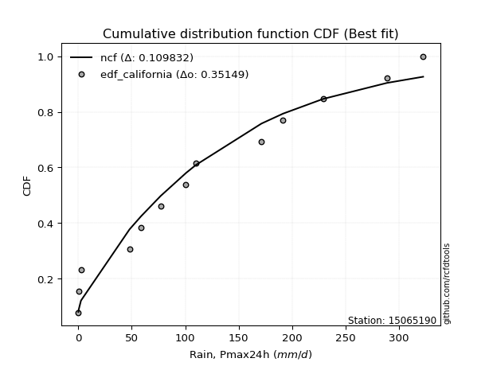</img>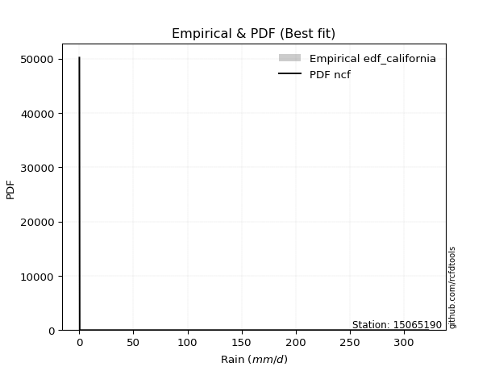</img>

</div>


### 2. Empirical - EDF Hazen (1930)

Hazen method for plotting positions is a formula used to estimate the empirical cumulative probability distribution of flood events or other hydrological data. This formula often results in biased estimations, particularly when extrapolating to extreme events (high return periods).

<div align="center">


$P=(m-0.5)/n$


</div>


**2.1. Empirical values**

<div align="center">

|                | 0                   | 1                   | 2                   | 3                  | 4                   | 5                   | 6                  | 7                  | 8                  | 9                  | 10        | 11                 | 12                 | 13                 |
|:---------------|:--------------------|:--------------------|:--------------------|:-------------------|:--------------------|:--------------------|:-------------------|:-------------------|:-------------------|:-------------------|:----------|:-------------------|:-------------------|:-------------------|
| date           | 2023                | 2021                | 2019                | 2025               | 2014                | 2018                | 2012               | 2017               | 2013               | 2020               | 2015      | 2022               | 2016               | 2024               |
| x              | 0.2                 | 0.5                 | 2.6                 | 38.6               | 48.0                | 58.8                | 77.0               | 100.7              | 110.0              | 171.3              | 191.5     | 228.9              | 288.6              | 322.4              |
| m              | 1                   | 2                   | 3                   | 4                  | 5                   | 6                   | 7                  | 8                  | 9                  | 10                 | 11        | 12                 | 13                 | 14                 |
| empirical_dist | edf_hazen           | edf_hazen           | edf_hazen           | edf_hazen          | edf_hazen           | edf_hazen           | edf_hazen          | edf_hazen          | edf_hazen          | edf_hazen          | edf_hazen | edf_hazen          | edf_hazen          | edf_hazen          |
| empirical      | 0.03571428571428571 | 0.10714285714285714 | 0.17857142857142858 | 0.25               | 0.32142857142857145 | 0.39285714285714285 | 0.4642857142857143 | 0.5357142857142857 | 0.6071428571428571 | 0.6785714285714286 | 0.75      | 0.8214285714285714 | 0.8928571428571429 | 0.9642857142857143 |
| empirical_tr   | 1.037037037037037   | 1.1199999999999999  | 1.2173913043478262  | 1.3333333333333333 | 1.4736842105263157  | 1.6470588235294117  | 1.8666666666666667 | 2.1538461538461537 | 2.545454545454545  | 3.1111111111111116 | 4.0       | 5.599999999999999  | 9.333333333333337  | 28.000000000000014 |

</div>


**2.2. Kolmogorov-Smirnov fit test (sorted by Δ)**


<div align="center">

|                | 0                   | 1                   | 2                   | 3                   | 4                   | 5                   | 6                   | 7                   | 8                   | 9                   | 10                 | 11                  | 12                  | 13                  | 14                  | 15                    | 16                  | 17                  | 18                  | 19                  | 20                  | 21                  | 22                  | 23                  | 24                  | 25                  | 26                  | 27                  | 28                  | 29                 | 30                 | 31                  | 32                | 33                  | 34                 | 35                 | 36                 | 37                  | 38                  | 39                  | 40                  | 41                  | 42                  | 43                  | 44                  | 45                 | 46                 | 47                 | 48                 | 49                  | 50                  | 51                 | 52                 | 53                 | 54                  | 55                  | 56                 | 57                  | 58                  | 59                  | 60                 | 61                 | 62                  | 63                  | 64                 | 65                  | 66                  | 67                 | 68                 | 69                | 70                 | 71                 | 72                  | 73                  | 74                  | 75                  | 76                  | 77                 | 78                 | 79                | 80                 | 81                  | 82                  | 83                  | 84                 | 85                 | 86                 | 87              | 88                 | 89                 |
|:---------------|:--------------------|:--------------------|:--------------------|:--------------------|:--------------------|:--------------------|:--------------------|:--------------------|:--------------------|:--------------------|:-------------------|:--------------------|:--------------------|:--------------------|:--------------------|:----------------------|:--------------------|:--------------------|:--------------------|:--------------------|:--------------------|:--------------------|:--------------------|:--------------------|:--------------------|:--------------------|:--------------------|:--------------------|:--------------------|:-------------------|:-------------------|:--------------------|:------------------|:--------------------|:-------------------|:-------------------|:-------------------|:--------------------|:--------------------|:--------------------|:--------------------|:--------------------|:--------------------|:--------------------|:--------------------|:-------------------|:-------------------|:-------------------|:-------------------|:--------------------|:--------------------|:-------------------|:-------------------|:-------------------|:--------------------|:--------------------|:-------------------|:--------------------|:--------------------|:--------------------|:-------------------|:-------------------|:--------------------|:--------------------|:-------------------|:--------------------|:--------------------|:-------------------|:-------------------|:------------------|:-------------------|:-------------------|:--------------------|:--------------------|:--------------------|:--------------------|:--------------------|:-------------------|:-------------------|:------------------|:-------------------|:--------------------|:--------------------|:--------------------|:-------------------|:-------------------|:-------------------|:----------------|:-------------------|:-------------------|
| station        | 15065190            | 15065190            | 15065190            | 15065190            | 15065190            | 15065190            | 15065190            | 15065190            | 15065190            | 15065190            | 15065190           | 15065190            | 15065190            | 15065190            | 15065190            | 15065190              | 15065190            | 15065190            | 15065190            | 15065190            | 15065190            | 15065190            | 15065190            | 15065190            | 15065190            | 15065190            | 15065190            | 15065190            | 15065190            | 15065190           | 15065190           | 15065190            | 15065190          | 15065190            | 15065190           | 15065190           | 15065190           | 15065190            | 15065190            | 15065190            | 15065190            | 15065190            | 15065190            | 15065190            | 15065190            | 15065190           | 15065190           | 15065190           | 15065190           | 15065190            | 15065190            | 15065190           | 15065190           | 15065190           | 15065190            | 15065190            | 15065190           | 15065190            | 15065190            | 15065190            | 15065190           | 15065190           | 15065190            | 15065190            | 15065190           | 15065190            | 15065190            | 15065190           | 15065190           | 15065190          | 15065190           | 15065190           | 15065190            | 15065190            | 15065190            | 15065190            | 15065190            | 15065190           | 15065190           | 15065190          | 15065190           | 15065190            | 15065190            | 15065190            | 15065190           | 15065190           | 15065190           | 15065190        | 15065190           | 15065190           |
| empirical_dist | edf_hazen           | edf_hazen           | edf_hazen           | edf_hazen           | edf_hazen           | edf_hazen           | edf_hazen           | edf_hazen           | edf_hazen           | edf_hazen           | edf_hazen          | edf_hazen           | edf_hazen           | edf_hazen           | edf_hazen           | edf_hazen             | edf_hazen           | edf_hazen           | edf_hazen           | edf_hazen           | edf_hazen           | edf_hazen           | edf_hazen           | edf_hazen           | edf_hazen           | edf_hazen           | edf_hazen           | edf_hazen           | edf_hazen           | edf_hazen          | edf_hazen          | edf_hazen           | edf_hazen         | edf_hazen           | edf_hazen          | edf_hazen          | edf_hazen          | edf_hazen           | edf_hazen           | edf_hazen           | edf_hazen           | edf_hazen           | edf_hazen           | edf_hazen           | edf_hazen           | edf_hazen          | edf_hazen          | edf_hazen          | edf_hazen          | edf_hazen           | edf_hazen           | edf_hazen          | edf_hazen          | edf_hazen          | edf_hazen           | edf_hazen           | edf_hazen          | edf_hazen           | edf_hazen           | edf_hazen           | edf_hazen          | edf_hazen          | edf_hazen           | edf_hazen           | edf_hazen          | edf_hazen           | edf_hazen           | edf_hazen          | edf_hazen          | edf_hazen         | edf_hazen          | edf_hazen          | edf_hazen           | edf_hazen           | edf_hazen           | edf_hazen           | edf_hazen           | edf_hazen          | edf_hazen          | edf_hazen         | edf_hazen          | edf_hazen           | edf_hazen           | edf_hazen           | edf_hazen          | edf_hazen          | edf_hazen          | edf_hazen       | edf_hazen          | edf_hazen          |
| p_dist         | ncf                 | halfnorm            | gumbel_r            | logjohnsonsu        | genlogistic         | rayleigh            | kstwobign           | pearson3            | maxwell             | invgamma            | mielke             | moyal               | invgauss            | johnsonsu           | rice                | loglaplace_asymmetric | logloggamma         | weibull_min         | alpha               | halflogistic        | crystalball         | norm                | t                   | logistic            | loggompertz         | hypsecant           | betaprime           | logt                | exponnorm           | laplace_asymmetric | expon              | genexpon            | logfisk           | logpearson3         | nakagami           | truncnorm          | gompertz           | laplace             | wald                | loggumbel_l         | f                   | erlang              | fisk                | gumbel_l            | logbetaprime        | lognct             | loglaplace         | loghypsecant       | loglogistic        | logfatiguelife      | logrice             | logcrystalball     | lognorm            | lognorm            | logexponnorm        | lognakagami         | loglognorm         | loggamma            | loggamma            | loginvgamma         | logerlang          | gibrat             | chi2                | loginvgauss         | loginvweibull      | logmaxwell          | lograyleigh         | loggumbel_r        | logkstwobign       | loghalfnorm       | loggenexpon        | invweibull         | logmoyal            | loghalflogistic     | nct                 | logexpon            | logncf              | pareto             | logwald            | loggibrat         | gamma              | logtruncnorm        | fatiguelife         | logf                | logpareto          | logalpha           | logweibull_min     | logmielke       | logchi2            | loggenlogistic     |
| delta          | 0.06643140880427756 | 0.07566206848805866 | 0.08112344325292488 | 0.08373685919868756 | 0.08417629530963677 | 0.08900360988012113 | 0.09009156564626412 | 0.09173306175133633 | 0.10055029242075886 | 0.10403232595492669 | 0.1065326269214502 | 0.10920880612685457 | 0.11061402880926972 | 0.11495406803402418 | 0.11662084866252242 | 0.11753065870676993   | 0.11775533856418535 | 0.12216102130067802 | 0.12234876639272718 | 0.13404829675948648 | 0.13447933458717787 | 0.13447933571807674 | 0.13455469630677952 | 0.13819865027871708 | 0.14731080334522584 | 0.14739832052998458 | 0.15194977495219408 | 0.15301237356657027 | 0.15759133227775243 | 0.158246678349496  | 0.1582466863141025 | 0.15981388762355234 | 0.162918567818918 | 0.16403749658443717 | 0.1640377762162361 | 0.1646487175227994 | 0.1661005537349872 | 0.17555214402565095 | 0.17857142857142858 | 0.17917672379463445 | 0.18365558338118798 | 0.20035753744747725 | 0.20195900604489936 | 0.20512931422995584 | 0.24709455612090037 | 0.2492087586580154 | 0.2492303311776885 | 0.2494553429088341 | 0.2495060505768143 | 0.24953153803532252 | 0.24956344863633412 | 0.2495654002832841 | 0.2495654263899117 | 0.2495654263899117 | 0.24956604433022805 | 0.24961877750111444 | 0.2508782757904664 | 0.26185302924302856 | 0.26185302924302856 | 0.26288088090864925 | 0.2646098732896177 | 0.2663528124739776 | 0.27027449988369134 | 0.27089943428752117 | 0.2816353598989644 | 0.28263292231146764 | 0.29365398580385493 | 0.3199284530223413 | 0.3214673267194439 | 0.324681687777691 | 0.3305013238549541 | 0.3446340054671929 | 0.34577861186906633 | 0.34959005938645715 | 0.37321912058172324 | 0.38194661408714925 | 0.38416082779779037 | 0.3996443776801175 | 0.4176690850502506 | 0.440957220825275 | 0.4483642388141692 | 0.47030438597884505 | 0.47391667930533854 | 0.48515302455482445 | 0.5041270606646272 | 0.5287311493238493 | 0.5857362230205316 | 0.6260674150311 | 0.6299760135315354 | 0.8928571428571429 |
| deltao         | 0.343224222286      | 0.343224222286      | 0.343224222286      | 0.343224222286      | 0.343224222286      | 0.343224222286      | 0.343224222286      | 0.343224222286      | 0.343224222286      | 0.343224222286      | 0.343224222286     | 0.343224222286      | 0.343224222286      | 0.343224222286      | 0.343224222286      | 0.343224222286        | 0.343224222286      | 0.343224222286      | 0.343224222286      | 0.343224222286      | 0.343224222286      | 0.343224222286      | 0.343224222286      | 0.343224222286      | 0.343224222286      | 0.343224222286      | 0.343224222286      | 0.343224222286      | 0.343224222286      | 0.343224222286     | 0.343224222286     | 0.343224222286      | 0.343224222286    | 0.343224222286      | 0.343224222286     | 0.343224222286     | 0.343224222286     | 0.343224222286      | 0.343224222286      | 0.343224222286      | 0.343224222286      | 0.343224222286      | 0.343224222286      | 0.343224222286      | 0.343224222286      | 0.343224222286     | 0.343224222286     | 0.343224222286     | 0.343224222286     | 0.343224222286      | 0.343224222286      | 0.343224222286     | 0.343224222286     | 0.343224222286     | 0.343224222286      | 0.343224222286      | 0.343224222286     | 0.343224222286      | 0.343224222286      | 0.343224222286      | 0.343224222286     | 0.343224222286     | 0.343224222286      | 0.343224222286      | 0.343224222286     | 0.343224222286      | 0.343224222286      | 0.343224222286     | 0.343224222286     | 0.343224222286    | 0.343224222286     | 0.343224222286     | 0.343224222286      | 0.343224222286      | 0.343224222286      | 0.343224222286      | 0.343224222286      | 0.343224222286     | 0.343224222286     | 0.343224222286    | 0.343224222286     | 0.343224222286      | 0.343224222286      | 0.343224222286      | 0.343224222286     | 0.343224222286     | 0.343224222286     | 0.343224222286  | 0.343224222286     | 0.343224222286     |
| eval           | Δo > Δ              | Δo > Δ              | Δo > Δ              | Δo > Δ              | Δo > Δ              | Δo > Δ              | Δo > Δ              | Δo > Δ              | Δo > Δ              | Δo > Δ              | Δo > Δ             | Δo > Δ              | Δo > Δ              | Δo > Δ              | Δo > Δ              | Δo > Δ                | Δo > Δ              | Δo > Δ              | Δo > Δ              | Δo > Δ              | Δo > Δ              | Δo > Δ              | Δo > Δ              | Δo > Δ              | Δo > Δ              | Δo > Δ              | Δo > Δ              | Δo > Δ              | Δo > Δ              | Δo > Δ             | Δo > Δ             | Δo > Δ              | Δo > Δ            | Δo > Δ              | Δo > Δ             | Δo > Δ             | Δo > Δ             | Δo > Δ              | Δo > Δ              | Δo > Δ              | Δo > Δ              | Δo > Δ              | Δo > Δ              | Δo > Δ              | Δo > Δ              | Δo > Δ             | Δo > Δ             | Δo > Δ             | Δo > Δ             | Δo > Δ              | Δo > Δ              | Δo > Δ             | Δo > Δ             | Δo > Δ             | Δo > Δ              | Δo > Δ              | Δo > Δ             | Δo > Δ              | Δo > Δ              | Δo > Δ              | Δo > Δ             | Δo > Δ             | Δo > Δ              | Δo > Δ              | Δo > Δ             | Δo > Δ              | Δo > Δ              | Δo > Δ             | Δo > Δ             | Δo > Δ            | Δo > Δ             | Δo <= Δ            | Δo <= Δ             | Δo <= Δ             | Δo <= Δ             | Δo <= Δ             | Δo <= Δ             | Δo <= Δ            | Δo <= Δ            | Δo <= Δ           | Δo <= Δ            | Δo <= Δ             | Δo <= Δ             | Δo <= Δ             | Δo <= Δ            | Δo <= Δ            | Δo <= Δ            | Δo <= Δ         | Δo <= Δ            | Δo <= Δ            |
| fit            | 1                   | 1                   | 1                   | 1                   | 1                   | 1                   | 1                   | 1                   | 1                   | 1                   | 1                  | 1                   | 1                   | 1                   | 1                   | 1                     | 1                   | 1                   | 1                   | 1                   | 1                   | 1                   | 1                   | 1                   | 1                   | 1                   | 1                   | 1                   | 1                   | 1                  | 1                  | 1                   | 1                 | 1                   | 1                  | 1                  | 1                  | 1                   | 1                   | 1                   | 1                   | 1                   | 1                   | 1                   | 1                   | 1                  | 1                  | 1                  | 1                  | 1                   | 1                   | 1                  | 1                  | 1                  | 1                   | 1                   | 1                  | 1                   | 1                   | 1                   | 1                  | 1                  | 1                   | 1                   | 1                  | 1                   | 1                   | 1                  | 1                  | 1                 | 1                  | 0                  | 0                   | 0                   | 0                   | 0                   | 0                   | 0                  | 0                  | 0                 | 0                  | 0                   | 0                   | 0                   | 0                  | 0                  | 0                  | 0               | 0                  | 0                  |
| n              | 14                  | 14                  | 14                  | 14                  | 14                  | 14                  | 14                  | 14                  | 14                  | 14                  | 14                 | 14                  | 14                  | 14                  | 14                  | 14                    | 14                  | 14                  | 14                  | 14                  | 14                  | 14                  | 14                  | 14                  | 14                  | 14                  | 14                  | 14                  | 14                  | 14                 | 14                 | 14                  | 14                | 14                  | 14                 | 14                 | 14                 | 14                  | 14                  | 14                  | 14                  | 14                  | 14                  | 14                  | 14                  | 14                 | 14                 | 14                 | 14                 | 14                  | 14                  | 14                 | 14                 | 14                 | 14                  | 14                  | 14                 | 14                  | 14                  | 14                  | 14                 | 14                 | 14                  | 14                  | 14                 | 14                  | 14                  | 14                 | 14                 | 14                | 14                 | 14                 | 14                  | 14                  | 14                  | 14                  | 14                  | 14                 | 14                 | 14                | 14                 | 14                  | 14                  | 14                  | 14                 | 14                 | 14                 | 14              | 14                 | 14                 |
| best_fit       | 1                   | 0                   | 0                   | 0                   | 0                   | 0                   | 0                   | 0                   | 0                   | 0                   | 0                  | 0                   | 0                   | 0                   | 0                   | 0                     | 0                   | 0                   | 0                   | 0                   | 0                   | 0                   | 0                   | 0                   | 0                   | 0                   | 0                   | 0                   | 0                   | 0                  | 0                  | 0                   | 0                 | 0                   | 0                  | 0                  | 0                  | 0                   | 0                   | 0                   | 0                   | 0                   | 0                   | 0                   | 0                   | 0                  | 0                  | 0                  | 0                  | 0                   | 0                   | 0                  | 0                  | 0                  | 0                   | 0                   | 0                  | 0                   | 0                   | 0                   | 0                  | 0                  | 0                   | 0                   | 0                  | 0                   | 0                   | 0                  | 0                  | 0                 | 0                  | 0                  | 0                   | 0                   | 0                   | 0                   | 0                   | 0                  | 0                  | 0                 | 0                  | 0                   | 0                   | 0                   | 0                  | 0                  | 0                  | 0               | 0                  | 0                  |
| best_fit_sort  | 1                   | 2                   | 3                   | 4                   | 5                   | 6                   | 7                   | 8                   | 9                   | 10                  | 11                 | 12                  | 13                  | 14                  | 15                  | 16                    | 17                  | 18                  | 19                  | 20                  | 21                  | 22                  | 23                  | 24                  | 25                  | 26                  | 27                  | 28                  | 29                  | 30                 | 31                 | 32                  | 33                | 34                  | 35                 | 36                 | 37                 | 38                  | 39                  | 40                  | 41                  | 42                  | 43                  | 44                  | 45                  | 46                 | 47                 | 48                 | 49                 | 50                  | 51                  | 52                 | 53                 | 54                 | 55                  | 56                  | 57                 | 58                  | 59                  | 60                  | 61                 | 62                 | 63                  | 64                  | 65                 | 66                  | 67                  | 68                 | 69                 | 70                | 71                 | 72                 | 73                  | 74                  | 75                  | 76                  | 77                  | 78                 | 79                 | 80                | 81                 | 82                  | 83                  | 84                  | 85                 | 86                 | 87                 | 88              | 89                 | 90                 |

</div>


<div align="center">

</img>

</div>


**2.3. Best fit**

<div align="center">

|   id |   station | empirical_dist   | p_dist   |     delta |   deltao | eval   |   fit |   n |   best_fit |   best_fit_sort |
|-----:|----------:|:-----------------|:---------|----------:|---------:|:-------|------:|----:|-----------:|----------------:|
|    0 |  15065190 | edf_hazen        | ncf      | 0.0664314 | 0.343224 | Δo > Δ |     1 |  14 |          1 |               1 |

</div>


<div align="center">

</img>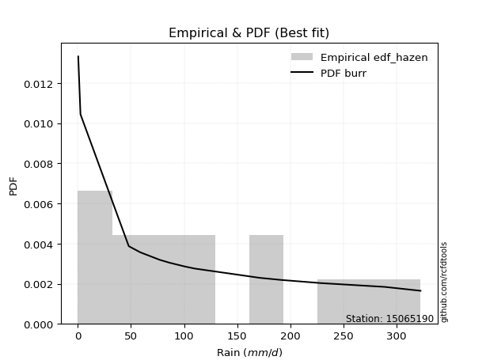</img>

</div>


### 3. Empirical - EDF Weibull (1939)

Weibull plotting position formula is an empirical method used to estimate the non-exceedance probability or plotting position for a set of observed data, is often recommended or widely used in practice, particularly in flood frequency analysis.

<div align="center">


$P=m/(n+1)$


</div>


**3.1. Empirical values**

<div align="center">

|                | 0                   | 1                   | 2           | 3                   | 4                  | 5                  | 6                  | 7                  | 8           | 9                  | 10                 | 11                | 12                 | 13                 |
|:---------------|:--------------------|:--------------------|:------------|:--------------------|:-------------------|:-------------------|:-------------------|:-------------------|:------------|:-------------------|:-------------------|:------------------|:-------------------|:-------------------|
| date           | 2023                | 2021                | 2019        | 2025                | 2014               | 2018               | 2012               | 2017               | 2013        | 2020               | 2015               | 2022              | 2016               | 2024               |
| x              | 0.2                 | 0.5                 | 2.6         | 38.6                | 48.0               | 58.8               | 77.0               | 100.7              | 110.0       | 171.3              | 191.5              | 228.9             | 288.6              | 322.4              |
| m              | 1                   | 2                   | 3           | 4                   | 5                  | 6                  | 7                  | 8                  | 9           | 10                 | 11                 | 12                | 13                 | 14                 |
| empirical_dist | edf_weibull         | edf_weibull         | edf_weibull | edf_weibull         | edf_weibull        | edf_weibull        | edf_weibull        | edf_weibull        | edf_weibull | edf_weibull        | edf_weibull        | edf_weibull       | edf_weibull        | edf_weibull        |
| empirical      | 0.06666666666666667 | 0.13333333333333333 | 0.2         | 0.26666666666666666 | 0.3333333333333333 | 0.4                | 0.4666666666666667 | 0.5333333333333333 | 0.6         | 0.6666666666666666 | 0.7333333333333333 | 0.8               | 0.8666666666666667 | 0.9333333333333333 |
| empirical_tr   | 1.0714285714285714  | 1.1538461538461537  | 1.25        | 1.3636363636363635  | 1.4999999999999998 | 1.6666666666666667 | 1.875              | 2.142857142857143  | 2.5         | 2.9999999999999996 | 3.749999999999999  | 5.000000000000001 | 7.500000000000002  | 15.000000000000004 |

</div>


**3.2. Kolmogorov-Smirnov fit test (sorted by Δ)**


<div align="center">

|                | 0                   | 1                   | 2                   | 3                   | 4                   | 5                  | 6                     | 7                   | 8                   | 9                   | 10                  | 11                 | 12                  | 13                  | 14                  | 15                 | 16                  | 17                  | 18                  | 19                | 20                  | 21                  | 22                 | 23                  | 24                  | 25                  | 26                 | 27                  | 28                  | 29                  | 30                 | 31                 | 32                  | 33                  | 34                  | 35                  | 36                  | 37                  | 38                 | 39                  | 40                  | 41                  | 42                  | 43             | 44                 | 45                  | 46                  | 47                  | 48                  | 49                  | 50                  | 51                  | 52                  | 53                  | 54                 | 55                  | 56                  | 57                 | 58                 | 59                 | 60                  | 61                 | 62                 | 63                 | 64                | 65                  | 66                  | 67                  | 68                  | 69                  | 70                  | 71                  | 72                  | 73                 | 74                 | 75                 | 76                 | 77                  | 78                 | 79                  | 80                  | 81                 | 82                 | 83                 | 84                | 85                 | 86                | 87                 | 88                 | 89                 |
|:---------------|:--------------------|:--------------------|:--------------------|:--------------------|:--------------------|:-------------------|:----------------------|:--------------------|:--------------------|:--------------------|:--------------------|:-------------------|:--------------------|:--------------------|:--------------------|:-------------------|:--------------------|:--------------------|:--------------------|:------------------|:--------------------|:--------------------|:-------------------|:--------------------|:--------------------|:--------------------|:-------------------|:--------------------|:--------------------|:--------------------|:-------------------|:-------------------|:--------------------|:--------------------|:--------------------|:--------------------|:--------------------|:--------------------|:-------------------|:--------------------|:--------------------|:--------------------|:--------------------|:---------------|:-------------------|:--------------------|:--------------------|:--------------------|:--------------------|:--------------------|:--------------------|:--------------------|:--------------------|:--------------------|:-------------------|:--------------------|:--------------------|:-------------------|:-------------------|:-------------------|:--------------------|:-------------------|:-------------------|:-------------------|:------------------|:--------------------|:--------------------|:--------------------|:--------------------|:--------------------|:--------------------|:--------------------|:--------------------|:-------------------|:-------------------|:-------------------|:-------------------|:--------------------|:-------------------|:--------------------|:--------------------|:-------------------|:-------------------|:-------------------|:------------------|:-------------------|:------------------|:-------------------|:-------------------|:-------------------|
| station        | 15065190            | 15065190            | 15065190            | 15065190            | 15065190            | 15065190           | 15065190              | 15065190            | 15065190            | 15065190            | 15065190            | 15065190           | 15065190            | 15065190            | 15065190            | 15065190           | 15065190            | 15065190            | 15065190            | 15065190          | 15065190            | 15065190            | 15065190           | 15065190            | 15065190            | 15065190            | 15065190           | 15065190            | 15065190            | 15065190            | 15065190           | 15065190           | 15065190            | 15065190            | 15065190            | 15065190            | 15065190            | 15065190            | 15065190           | 15065190            | 15065190            | 15065190            | 15065190            | 15065190       | 15065190           | 15065190            | 15065190            | 15065190            | 15065190            | 15065190            | 15065190            | 15065190            | 15065190            | 15065190            | 15065190           | 15065190            | 15065190            | 15065190           | 15065190           | 15065190           | 15065190            | 15065190           | 15065190           | 15065190           | 15065190          | 15065190            | 15065190            | 15065190            | 15065190            | 15065190            | 15065190            | 15065190            | 15065190            | 15065190           | 15065190           | 15065190           | 15065190           | 15065190            | 15065190           | 15065190            | 15065190            | 15065190           | 15065190           | 15065190           | 15065190          | 15065190           | 15065190          | 15065190           | 15065190           | 15065190           |
| empirical_dist | edf_weibull         | edf_weibull         | edf_weibull         | edf_weibull         | edf_weibull         | edf_weibull        | edf_weibull           | edf_weibull         | edf_weibull         | edf_weibull         | edf_weibull         | edf_weibull        | edf_weibull         | edf_weibull         | edf_weibull         | edf_weibull        | edf_weibull         | edf_weibull         | edf_weibull         | edf_weibull       | edf_weibull         | edf_weibull         | edf_weibull        | edf_weibull         | edf_weibull         | edf_weibull         | edf_weibull        | edf_weibull         | edf_weibull         | edf_weibull         | edf_weibull        | edf_weibull        | edf_weibull         | edf_weibull         | edf_weibull         | edf_weibull         | edf_weibull         | edf_weibull         | edf_weibull        | edf_weibull         | edf_weibull         | edf_weibull         | edf_weibull         | edf_weibull    | edf_weibull        | edf_weibull         | edf_weibull         | edf_weibull         | edf_weibull         | edf_weibull         | edf_weibull         | edf_weibull         | edf_weibull         | edf_weibull         | edf_weibull        | edf_weibull         | edf_weibull         | edf_weibull        | edf_weibull        | edf_weibull        | edf_weibull         | edf_weibull        | edf_weibull        | edf_weibull        | edf_weibull       | edf_weibull         | edf_weibull         | edf_weibull         | edf_weibull         | edf_weibull         | edf_weibull         | edf_weibull         | edf_weibull         | edf_weibull        | edf_weibull        | edf_weibull        | edf_weibull        | edf_weibull         | edf_weibull        | edf_weibull         | edf_weibull         | edf_weibull        | edf_weibull        | edf_weibull        | edf_weibull       | edf_weibull        | edf_weibull       | edf_weibull        | edf_weibull        | edf_weibull        |
| p_dist         | ncf                 | logjohnsonsu        | rayleigh            | pearson3            | maxwell             | halfnorm           | loglaplace_asymmetric | logloggamma         | gumbel_r            | genlogistic         | kstwobign           | rice               | invgamma            | crystalball         | norm                | t                  | weibull_min         | mielke              | alpha               | moyal             | invgauss            | logistic            | johnsonsu          | loggompertz         | betaprime           | logfisk             | logpearson3        | nakagami            | logt                | hypsecant           | halflogistic       | loggumbel_l        | f                   | laplace             | exponnorm           | laplace_asymmetric  | expon               | genexpon            | erlang             | fisk                | truncnorm           | gompertz            | gumbel_l            | wald           | logbetaprime       | lognct              | loglaplace          | loghypsecant        | loglogistic         | logfatiguelife      | logrice             | logcrystalball      | lognorm             | lognorm             | logexponnorm       | lognakagami         | loglognorm          | loggamma           | loggamma           | loginvgamma        | logerlang           | chi2               | loginvgauss        | loginvweibull      | logmaxwell        | lograyleigh         | gibrat              | loggumbel_r         | logkstwobign        | loghalfnorm         | loggenexpon         | invweibull          | logmoyal            | loghalflogistic    | nct                | logexpon           | logncf             | pareto              | logwald            | loggibrat           | gamma               | logtruncnorm       | fatiguelife        | logf               | logpareto         | logalpha           | logweibull_min    | logmielke          | logchi2            | loggenlogistic     |
| delta          | 0.07833617070903953 | 0.08029286700649618 | 0.08186075273726401 | 0.08924673352194762 | 0.09340743527790174 | 0.0970906399166301 | 0.10086399204010327   | 0.10108867189751869 | 0.10255201468149631 | 0.10392592721180172 | 0.11152013707483556 | 0.1237637058053796 | 0.12546089738349814 | 0.12733647744432075 | 0.12733647857521962 | 0.1274118391639224 | 0.12777027706566169 | 0.12796119835002162 | 0.12848002240066492 | 0.130637377555426 | 0.13204260023784115 | 0.13579668735190836 | 0.1363826394625956 | 0.13682263748585063 | 0.13837709386006034 | 0.14216974621520218 | 0.1473708299177705 | 0.14737110954956945 | 0.15071404281398426 | 0.15123288261571033 | 0.1554768681880579 | 0.1625100571279678 | 0.16698891671452132 | 0.17793309640660332 | 0.17901990370632387 | 0.17967524977806743 | 0.17967525774267393 | 0.18124245905212377 | 0.1836908707808106 | 0.18411590261756705 | 0.18607728895137082 | 0.18752912516355863 | 0.19798645708709872 | 0.2            | 0.2304278894542337 | 0.23254209199134873 | 0.23256366451102184 | 0.23278867624216742 | 0.23283938391014763 | 0.23286487136865586 | 0.23289678196966745 | 0.23289873361661745 | 0.23289875972324503 | 0.23289875972324503 | 0.2328993776635614 | 0.23295211083444778 | 0.23421160912379974 | 0.2451863625763619 | 0.2451863625763619 | 0.2462142142419826 | 0.24794320662295105 | 0.2536078332170247 | 0.2542327676208545 | 0.2649686932322977 | 0.265966255644801 | 0.27698731913718827 | 0.27825757437873944 | 0.30326178635567463 | 0.30480066005277723 | 0.30801502111102436 | 0.31383465718828746 | 0.32796733880052625 | 0.32911194520239967 | 0.3329233927197905 | 0.3565524539150566 | 0.3652799474204826 | 0.3674941611311237 | 0.38297771101345085 | 0.4010024183835839 | 0.42429055415860834 | 0.43169757214750254 | 0.4536377193121784 | 0.4572500126386719 | 0.4684863578881578 | 0.477936584474151 | 0.5120644826571827 | 0.569069556353865 | 0.6094007483644333 | 0.6133093468648687 | 0.8666666666666667 |
| deltao         | 0.343224222286      | 0.343224222286      | 0.343224222286      | 0.343224222286      | 0.343224222286      | 0.343224222286     | 0.343224222286        | 0.343224222286      | 0.343224222286      | 0.343224222286      | 0.343224222286      | 0.343224222286     | 0.343224222286      | 0.343224222286      | 0.343224222286      | 0.343224222286     | 0.343224222286      | 0.343224222286      | 0.343224222286      | 0.343224222286    | 0.343224222286      | 0.343224222286      | 0.343224222286     | 0.343224222286      | 0.343224222286      | 0.343224222286      | 0.343224222286     | 0.343224222286      | 0.343224222286      | 0.343224222286      | 0.343224222286     | 0.343224222286     | 0.343224222286      | 0.343224222286      | 0.343224222286      | 0.343224222286      | 0.343224222286      | 0.343224222286      | 0.343224222286     | 0.343224222286      | 0.343224222286      | 0.343224222286      | 0.343224222286      | 0.343224222286 | 0.343224222286     | 0.343224222286      | 0.343224222286      | 0.343224222286      | 0.343224222286      | 0.343224222286      | 0.343224222286      | 0.343224222286      | 0.343224222286      | 0.343224222286      | 0.343224222286     | 0.343224222286      | 0.343224222286      | 0.343224222286     | 0.343224222286     | 0.343224222286     | 0.343224222286      | 0.343224222286     | 0.343224222286     | 0.343224222286     | 0.343224222286    | 0.343224222286      | 0.343224222286      | 0.343224222286      | 0.343224222286      | 0.343224222286      | 0.343224222286      | 0.343224222286      | 0.343224222286      | 0.343224222286     | 0.343224222286     | 0.343224222286     | 0.343224222286     | 0.343224222286      | 0.343224222286     | 0.343224222286      | 0.343224222286      | 0.343224222286     | 0.343224222286     | 0.343224222286     | 0.343224222286    | 0.343224222286     | 0.343224222286    | 0.343224222286     | 0.343224222286     | 0.343224222286     |
| eval           | Δo > Δ              | Δo > Δ              | Δo > Δ              | Δo > Δ              | Δo > Δ              | Δo > Δ             | Δo > Δ                | Δo > Δ              | Δo > Δ              | Δo > Δ              | Δo > Δ              | Δo > Δ             | Δo > Δ              | Δo > Δ              | Δo > Δ              | Δo > Δ             | Δo > Δ              | Δo > Δ              | Δo > Δ              | Δo > Δ            | Δo > Δ              | Δo > Δ              | Δo > Δ             | Δo > Δ              | Δo > Δ              | Δo > Δ              | Δo > Δ             | Δo > Δ              | Δo > Δ              | Δo > Δ              | Δo > Δ             | Δo > Δ             | Δo > Δ              | Δo > Δ              | Δo > Δ              | Δo > Δ              | Δo > Δ              | Δo > Δ              | Δo > Δ             | Δo > Δ              | Δo > Δ              | Δo > Δ              | Δo > Δ              | Δo > Δ         | Δo > Δ             | Δo > Δ              | Δo > Δ              | Δo > Δ              | Δo > Δ              | Δo > Δ              | Δo > Δ              | Δo > Δ              | Δo > Δ              | Δo > Δ              | Δo > Δ             | Δo > Δ              | Δo > Δ              | Δo > Δ             | Δo > Δ             | Δo > Δ             | Δo > Δ              | Δo > Δ             | Δo > Δ             | Δo > Δ             | Δo > Δ            | Δo > Δ              | Δo > Δ              | Δo > Δ              | Δo > Δ              | Δo > Δ              | Δo > Δ              | Δo > Δ              | Δo > Δ              | Δo > Δ             | Δo <= Δ            | Δo <= Δ            | Δo <= Δ            | Δo <= Δ             | Δo <= Δ            | Δo <= Δ             | Δo <= Δ             | Δo <= Δ            | Δo <= Δ            | Δo <= Δ            | Δo <= Δ           | Δo <= Δ            | Δo <= Δ           | Δo <= Δ            | Δo <= Δ            | Δo <= Δ            |
| fit            | 1                   | 1                   | 1                   | 1                   | 1                   | 1                  | 1                     | 1                   | 1                   | 1                   | 1                   | 1                  | 1                   | 1                   | 1                   | 1                  | 1                   | 1                   | 1                   | 1                 | 1                   | 1                   | 1                  | 1                   | 1                   | 1                   | 1                  | 1                   | 1                   | 1                   | 1                  | 1                  | 1                   | 1                   | 1                   | 1                   | 1                   | 1                   | 1                  | 1                   | 1                   | 1                   | 1                   | 1              | 1                  | 1                   | 1                   | 1                   | 1                   | 1                   | 1                   | 1                   | 1                   | 1                   | 1                  | 1                   | 1                   | 1                  | 1                  | 1                  | 1                   | 1                  | 1                  | 1                  | 1                 | 1                   | 1                   | 1                   | 1                   | 1                   | 1                   | 1                   | 1                   | 1                  | 0                  | 0                  | 0                  | 0                   | 0                  | 0                   | 0                   | 0                  | 0                  | 0                  | 0                 | 0                  | 0                 | 0                  | 0                  | 0                  |
| n              | 14                  | 14                  | 14                  | 14                  | 14                  | 14                 | 14                    | 14                  | 14                  | 14                  | 14                  | 14                 | 14                  | 14                  | 14                  | 14                 | 14                  | 14                  | 14                  | 14                | 14                  | 14                  | 14                 | 14                  | 14                  | 14                  | 14                 | 14                  | 14                  | 14                  | 14                 | 14                 | 14                  | 14                  | 14                  | 14                  | 14                  | 14                  | 14                 | 14                  | 14                  | 14                  | 14                  | 14             | 14                 | 14                  | 14                  | 14                  | 14                  | 14                  | 14                  | 14                  | 14                  | 14                  | 14                 | 14                  | 14                  | 14                 | 14                 | 14                 | 14                  | 14                 | 14                 | 14                 | 14                | 14                  | 14                  | 14                  | 14                  | 14                  | 14                  | 14                  | 14                  | 14                 | 14                 | 14                 | 14                 | 14                  | 14                 | 14                  | 14                  | 14                 | 14                 | 14                 | 14                | 14                 | 14                | 14                 | 14                 | 14                 |
| best_fit       | 1                   | 0                   | 0                   | 0                   | 0                   | 0                  | 0                     | 0                   | 0                   | 0                   | 0                   | 0                  | 0                   | 0                   | 0                   | 0                  | 0                   | 0                   | 0                   | 0                 | 0                   | 0                   | 0                  | 0                   | 0                   | 0                   | 0                  | 0                   | 0                   | 0                   | 0                  | 0                  | 0                   | 0                   | 0                   | 0                   | 0                   | 0                   | 0                  | 0                   | 0                   | 0                   | 0                   | 0              | 0                  | 0                   | 0                   | 0                   | 0                   | 0                   | 0                   | 0                   | 0                   | 0                   | 0                  | 0                   | 0                   | 0                  | 0                  | 0                  | 0                   | 0                  | 0                  | 0                  | 0                 | 0                   | 0                   | 0                   | 0                   | 0                   | 0                   | 0                   | 0                   | 0                  | 0                  | 0                  | 0                  | 0                   | 0                  | 0                   | 0                   | 0                  | 0                  | 0                  | 0                 | 0                  | 0                 | 0                  | 0                  | 0                  |
| best_fit_sort  | 1                   | 2                   | 3                   | 4                   | 5                   | 6                  | 7                     | 8                   | 9                   | 10                  | 11                  | 12                 | 13                  | 14                  | 15                  | 16                 | 17                  | 18                  | 19                  | 20                | 21                  | 22                  | 23                 | 24                  | 25                  | 26                  | 27                 | 28                  | 29                  | 30                  | 31                 | 32                 | 33                  | 34                  | 35                  | 36                  | 37                  | 38                  | 39                 | 40                  | 41                  | 42                  | 43                  | 44             | 45                 | 46                  | 47                  | 48                  | 49                  | 50                  | 51                  | 52                  | 53                  | 54                  | 55                 | 56                  | 57                  | 58                 | 59                 | 60                 | 61                  | 62                 | 63                 | 64                 | 65                | 66                  | 67                  | 68                  | 69                  | 70                  | 71                  | 72                  | 73                  | 74                 | 75                 | 76                 | 77                 | 78                  | 79                 | 80                  | 81                  | 82                 | 83                 | 84                 | 85                | 86                 | 87                | 88                 | 89                 | 90                 |

</div>


<div align="center">

</img>

</div>


**3.3. Best fit**

<div align="center">

|   id |   station | empirical_dist   | p_dist   |     delta |   deltao | eval   |   fit |   n |   best_fit |   best_fit_sort |
|-----:|----------:|:-----------------|:---------|----------:|---------:|:-------|------:|----:|-----------:|----------------:|
|    0 |  15065190 | edf_weibull      | ncf      | 0.0783362 | 0.343224 | Δo > Δ |     1 |  14 |          1 |               1 |

</div>


<div align="center">

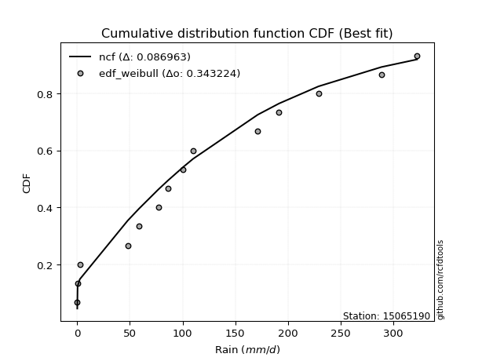</img>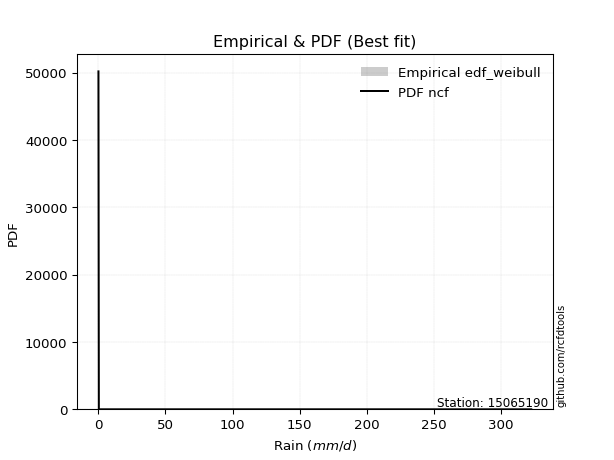</img>

</div>


### 4. Empirical - EDF Beard (1943)

The Beard formula (or Beard´s plotting position formula) in hydrology is used to estimate the empirical non-exceedance probability _(P)_ of a flood event (or other extreme hydrological data point) within a given dataset.

<div align="center">


$P=(m-0.31)/(n+0.38)$


</div>


**4.1. Empirical values**

<div align="center">

|                | 0                   | 1                   | 2                  | 3                  | 4                   | 5                  | 6                   | 7                  | 8                  | 9                  | 10                 | 11                 | 12                 | 13                 |
|:---------------|:--------------------|:--------------------|:-------------------|:-------------------|:--------------------|:-------------------|:--------------------|:-------------------|:-------------------|:-------------------|:-------------------|:-------------------|:-------------------|:-------------------|
| date           | 2023                | 2021                | 2019               | 2025               | 2014                | 2018               | 2012                | 2017               | 2013               | 2020               | 2015               | 2022               | 2016               | 2024               |
| x              | 0.2                 | 0.5                 | 2.6                | 38.6               | 48.0                | 58.8               | 77.0                | 100.7              | 110.0              | 171.3              | 191.5              | 228.9              | 288.6              | 322.4              |
| m              | 1                   | 2                   | 3                  | 4                  | 5                   | 6                  | 7                   | 8                  | 9                  | 10                 | 11                 | 12                 | 13                 | 14                 |
| empirical_dist | edf_beard           | edf_beard           | edf_beard          | edf_beard          | edf_beard           | edf_beard          | edf_beard           | edf_beard          | edf_beard          | edf_beard          | edf_beard          | edf_beard          | edf_beard          | edf_beard          |
| empirical      | 0.04798331015299026 | 0.11752433936022252 | 0.1870653685674548 | 0.256606397774687  | 0.32614742698191934 | 0.3956884561891516 | 0.46522948539638387 | 0.5347705146036161 | 0.6043115438108483 | 0.6738525730180805 | 0.7433936022253128 | 0.8129346314325451 | 0.8824756606397773 | 0.9520166898470096 |
| empirical_tr   | 1.0504017531044558  | 1.1331757289204099  | 1.2301112061591104 | 1.3451824134705332 | 1.4840041279669762  | 1.6547756041426929 | 1.869960988296489   | 2.1494768310911807 | 2.527240773286467  | 3.066098081023453  | 3.8970189701897002 | 5.345724907063193  | 8.50887573964496   | 20.84057971014487  |

</div>


**4.2. Kolmogorov-Smirnov fit test (sorted by Δ)**


<div align="center">

|                | 0                   | 1                   | 2                   | 3                   | 4                   | 5                   | 6                   | 7                   | 8                   | 9                     | 10                  | 11                 | 12                  | 13                 | 14                | 15                  | 16                  | 17                  | 18                  | 19                  | 20                  | 21                 | 22                  | 23                  | 24                  | 25                 | 26                  | 27                  | 28                  | 29                  | 30                  | 31                  | 32                 | 33                 | 34                  | 35                  | 36                 | 37                 | 38                 | 39                  | 40                 | 41                  | 42                 | 43                  | 44                  | 45                  | 46                  | 47                  | 48                  | 49                 | 50                 | 51                 | 52                  | 53                  | 54                  | 55                  | 56                  | 57                  | 58                  | 59                 | 60                 | 61                 | 62                  | 63                  | 64                  | 65                 | 66                 | 67                 | 68                  | 69                | 70                 | 71                 | 72                 | 73                  | 74                 | 75                 | 76                  | 77                 | 78                  | 79                | 80                 | 81                  | 82                 | 83                  | 84                  | 85                 | 86                 | 87                | 88                 | 89                 |
|:---------------|:--------------------|:--------------------|:--------------------|:--------------------|:--------------------|:--------------------|:--------------------|:--------------------|:--------------------|:----------------------|:--------------------|:-------------------|:--------------------|:-------------------|:------------------|:--------------------|:--------------------|:--------------------|:--------------------|:--------------------|:--------------------|:-------------------|:--------------------|:--------------------|:--------------------|:-------------------|:--------------------|:--------------------|:--------------------|:--------------------|:--------------------|:--------------------|:-------------------|:-------------------|:--------------------|:--------------------|:-------------------|:-------------------|:-------------------|:--------------------|:-------------------|:--------------------|:-------------------|:--------------------|:--------------------|:--------------------|:--------------------|:--------------------|:--------------------|:-------------------|:-------------------|:-------------------|:--------------------|:--------------------|:--------------------|:--------------------|:--------------------|:--------------------|:--------------------|:-------------------|:-------------------|:-------------------|:--------------------|:--------------------|:--------------------|:-------------------|:-------------------|:-------------------|:--------------------|:------------------|:-------------------|:-------------------|:-------------------|:--------------------|:-------------------|:-------------------|:--------------------|:-------------------|:--------------------|:------------------|:-------------------|:--------------------|:-------------------|:--------------------|:--------------------|:-------------------|:-------------------|:------------------|:-------------------|:-------------------|
| station        | 15065190            | 15065190            | 15065190            | 15065190            | 15065190            | 15065190            | 15065190            | 15065190            | 15065190            | 15065190              | 15065190            | 15065190           | 15065190            | 15065190           | 15065190          | 15065190            | 15065190            | 15065190            | 15065190            | 15065190            | 15065190            | 15065190           | 15065190            | 15065190            | 15065190            | 15065190           | 15065190            | 15065190            | 15065190            | 15065190            | 15065190            | 15065190            | 15065190           | 15065190           | 15065190            | 15065190            | 15065190           | 15065190           | 15065190           | 15065190            | 15065190           | 15065190            | 15065190           | 15065190            | 15065190            | 15065190            | 15065190            | 15065190            | 15065190            | 15065190           | 15065190           | 15065190           | 15065190            | 15065190            | 15065190            | 15065190            | 15065190            | 15065190            | 15065190            | 15065190           | 15065190           | 15065190           | 15065190            | 15065190            | 15065190            | 15065190           | 15065190           | 15065190           | 15065190            | 15065190          | 15065190           | 15065190           | 15065190           | 15065190            | 15065190           | 15065190           | 15065190            | 15065190           | 15065190            | 15065190          | 15065190           | 15065190            | 15065190           | 15065190            | 15065190            | 15065190           | 15065190           | 15065190          | 15065190           | 15065190           |
| empirical_dist | edf_beard           | edf_beard           | edf_beard           | edf_beard           | edf_beard           | edf_beard           | edf_beard           | edf_beard           | edf_beard           | edf_beard             | edf_beard           | edf_beard          | edf_beard           | edf_beard          | edf_beard         | edf_beard           | edf_beard           | edf_beard           | edf_beard           | edf_beard           | edf_beard           | edf_beard          | edf_beard           | edf_beard           | edf_beard           | edf_beard          | edf_beard           | edf_beard           | edf_beard           | edf_beard           | edf_beard           | edf_beard           | edf_beard          | edf_beard          | edf_beard           | edf_beard           | edf_beard          | edf_beard          | edf_beard          | edf_beard           | edf_beard          | edf_beard           | edf_beard          | edf_beard           | edf_beard           | edf_beard           | edf_beard           | edf_beard           | edf_beard           | edf_beard          | edf_beard          | edf_beard          | edf_beard           | edf_beard           | edf_beard           | edf_beard           | edf_beard           | edf_beard           | edf_beard           | edf_beard          | edf_beard          | edf_beard          | edf_beard           | edf_beard           | edf_beard           | edf_beard          | edf_beard          | edf_beard          | edf_beard           | edf_beard         | edf_beard          | edf_beard          | edf_beard          | edf_beard           | edf_beard          | edf_beard          | edf_beard           | edf_beard          | edf_beard           | edf_beard         | edf_beard          | edf_beard           | edf_beard          | edf_beard           | edf_beard           | edf_beard          | edf_beard          | edf_beard         | edf_beard          | edf_beard          |
| p_dist         | ncf                 | logjohnsonsu        | halfnorm            | rayleigh            | pearson3            | gumbel_r            | genlogistic         | maxwell             | kstwobign           | loglaplace_asymmetric | logloggamma         | invgamma           | mielke              | alpha              | weibull_min       | moyal               | invgauss            | rice                | johnsonsu           | crystalball         | norm                | t                  | logistic            | loggompertz         | logt                | halflogistic       | betaprime           | hypsecant           | logfisk             | logpearson3         | nakagami            | exponnorm           | laplace_asymmetric | expon              | genexpon            | loggumbel_l         | truncnorm          | gompertz           | laplace            | f                   | wald               | erlang              | fisk               | gumbel_l            | logbetaprime        | lognct              | loglaplace          | loghypsecant        | loglogistic         | logfatiguelife     | logrice            | logcrystalball     | lognorm             | lognorm             | logexponnorm        | lognakagami         | loglognorm          | loggamma            | loggamma            | loginvgamma        | logerlang          | chi2               | loginvgauss         | gibrat              | loginvweibull       | logmaxwell         | lograyleigh        | loggumbel_r        | logkstwobign        | loghalfnorm       | loggenexpon        | invweibull         | logmoyal           | loghalflogistic     | nct                | logexpon           | logncf              | pareto             | logwald             | loggibrat         | gamma              | logtruncnorm        | fatiguelife        | logf                | logpareto           | logalpha           | logweibull_min     | logmielke         | logchi2            | loggenlogistic     |
| delta          | 0.07115026435762561 | 0.08090554586667875 | 0.08415600848408487 | 0.08617229654811231 | 0.08890174841932752 | 0.08961738324895109 | 0.09099129577925649 | 0.09771897908875005 | 0.09858550564229034 | 0.11092426093208291   | 0.11114894078949833 | 0.1125262659509529 | 0.11502656691747641 | 0.1155453909681197 | 0.115554623525991 | 0.11770274612288079 | 0.11910796880529594 | 0.11945216199453118 | 0.12344800803005039 | 0.13164802125516906 | 0.13164802238606793 | 0.1317233829747707 | 0.13536733694670827 | 0.14070440557053882 | 0.14074334912786557 | 0.1425422367555127 | 0.14534337717750706 | 0.14834209164065415 | 0.15223001510718182 | 0.15743109880975015 | 0.15743137844154909 | 0.16608527227377864 | 0.1667406183455222 | 0.1667406263101287 | 0.16830782761957855 | 0.17257032601994743 | 0.1731426575188256 | 0.1745944937310134 | 0.1764959151363205 | 0.17704918560650096 | 0.1870653685674548 | 0.19375113967279023 | 0.1941761715095467 | 0.20229800089794703 | 0.24048815834621334 | 0.24260236088332837 | 0.24262393340300148 | 0.24284894513414707 | 0.24289965280212727 | 0.2429251402606355 | 0.2429570508616471 | 0.2429590025085971 | 0.24295902861522467 | 0.24295902861522467 | 0.24295964655554103 | 0.24301237972642742 | 0.24427187801577938 | 0.25524663146834153 | 0.25524663146834153 | 0.2562744831339622 | 0.2580034755149307 | 0.2636681021090043 | 0.26429303651283415 | 0.27107166802732546 | 0.27502896212427735 | 0.2760265245367806 | 0.2870475880291679 | 0.3133220552476543 | 0.31486092894475687 | 0.318075290003004 | 0.3238949260802671 | 0.3380276076925059 | 0.3391722140943793 | 0.34298366161177013 | 0.3666127228070362 | 0.3753402163124622 | 0.37755443002310335 | 0.3930379799054305 | 0.41106268727556355 | 0.434350823050588 | 0.4417578410394822 | 0.46369798820415803 | 0.4673102815306515 | 0.47854662678013743 | 0.49374557844726175 | 0.5221247515491623 | 0.5791298252458446 | 0.619461017256413 | 0.6233696157568485 | 0.8824756606397773 |
| deltao         | 0.343224222286      | 0.343224222286      | 0.343224222286      | 0.343224222286      | 0.343224222286      | 0.343224222286      | 0.343224222286      | 0.343224222286      | 0.343224222286      | 0.343224222286        | 0.343224222286      | 0.343224222286     | 0.343224222286      | 0.343224222286     | 0.343224222286    | 0.343224222286      | 0.343224222286      | 0.343224222286      | 0.343224222286      | 0.343224222286      | 0.343224222286      | 0.343224222286     | 0.343224222286      | 0.343224222286      | 0.343224222286      | 0.343224222286     | 0.343224222286      | 0.343224222286      | 0.343224222286      | 0.343224222286      | 0.343224222286      | 0.343224222286      | 0.343224222286     | 0.343224222286     | 0.343224222286      | 0.343224222286      | 0.343224222286     | 0.343224222286     | 0.343224222286     | 0.343224222286      | 0.343224222286     | 0.343224222286      | 0.343224222286     | 0.343224222286      | 0.343224222286      | 0.343224222286      | 0.343224222286      | 0.343224222286      | 0.343224222286      | 0.343224222286     | 0.343224222286     | 0.343224222286     | 0.343224222286      | 0.343224222286      | 0.343224222286      | 0.343224222286      | 0.343224222286      | 0.343224222286      | 0.343224222286      | 0.343224222286     | 0.343224222286     | 0.343224222286     | 0.343224222286      | 0.343224222286      | 0.343224222286      | 0.343224222286     | 0.343224222286     | 0.343224222286     | 0.343224222286      | 0.343224222286    | 0.343224222286     | 0.343224222286     | 0.343224222286     | 0.343224222286      | 0.343224222286     | 0.343224222286     | 0.343224222286      | 0.343224222286     | 0.343224222286      | 0.343224222286    | 0.343224222286     | 0.343224222286      | 0.343224222286     | 0.343224222286      | 0.343224222286      | 0.343224222286     | 0.343224222286     | 0.343224222286    | 0.343224222286     | 0.343224222286     |
| eval           | Δo > Δ              | Δo > Δ              | Δo > Δ              | Δo > Δ              | Δo > Δ              | Δo > Δ              | Δo > Δ              | Δo > Δ              | Δo > Δ              | Δo > Δ                | Δo > Δ              | Δo > Δ             | Δo > Δ              | Δo > Δ             | Δo > Δ            | Δo > Δ              | Δo > Δ              | Δo > Δ              | Δo > Δ              | Δo > Δ              | Δo > Δ              | Δo > Δ             | Δo > Δ              | Δo > Δ              | Δo > Δ              | Δo > Δ             | Δo > Δ              | Δo > Δ              | Δo > Δ              | Δo > Δ              | Δo > Δ              | Δo > Δ              | Δo > Δ             | Δo > Δ             | Δo > Δ              | Δo > Δ              | Δo > Δ             | Δo > Δ             | Δo > Δ             | Δo > Δ              | Δo > Δ             | Δo > Δ              | Δo > Δ             | Δo > Δ              | Δo > Δ              | Δo > Δ              | Δo > Δ              | Δo > Δ              | Δo > Δ              | Δo > Δ             | Δo > Δ             | Δo > Δ             | Δo > Δ              | Δo > Δ              | Δo > Δ              | Δo > Δ              | Δo > Δ              | Δo > Δ              | Δo > Δ              | Δo > Δ             | Δo > Δ             | Δo > Δ             | Δo > Δ              | Δo > Δ              | Δo > Δ              | Δo > Δ             | Δo > Δ             | Δo > Δ             | Δo > Δ              | Δo > Δ            | Δo > Δ             | Δo > Δ             | Δo > Δ             | Δo > Δ              | Δo <= Δ            | Δo <= Δ            | Δo <= Δ             | Δo <= Δ            | Δo <= Δ             | Δo <= Δ           | Δo <= Δ            | Δo <= Δ             | Δo <= Δ            | Δo <= Δ             | Δo <= Δ             | Δo <= Δ            | Δo <= Δ            | Δo <= Δ           | Δo <= Δ            | Δo <= Δ            |
| fit            | 1                   | 1                   | 1                   | 1                   | 1                   | 1                   | 1                   | 1                   | 1                   | 1                     | 1                   | 1                  | 1                   | 1                  | 1                 | 1                   | 1                   | 1                   | 1                   | 1                   | 1                   | 1                  | 1                   | 1                   | 1                   | 1                  | 1                   | 1                   | 1                   | 1                   | 1                   | 1                   | 1                  | 1                  | 1                   | 1                   | 1                  | 1                  | 1                  | 1                   | 1                  | 1                   | 1                  | 1                   | 1                   | 1                   | 1                   | 1                   | 1                   | 1                  | 1                  | 1                  | 1                   | 1                   | 1                   | 1                   | 1                   | 1                   | 1                   | 1                  | 1                  | 1                  | 1                   | 1                   | 1                   | 1                  | 1                  | 1                  | 1                   | 1                 | 1                  | 1                  | 1                  | 1                   | 0                  | 0                  | 0                   | 0                  | 0                   | 0                 | 0                  | 0                   | 0                  | 0                   | 0                   | 0                  | 0                  | 0                 | 0                  | 0                  |
| n              | 14                  | 14                  | 14                  | 14                  | 14                  | 14                  | 14                  | 14                  | 14                  | 14                    | 14                  | 14                 | 14                  | 14                 | 14                | 14                  | 14                  | 14                  | 14                  | 14                  | 14                  | 14                 | 14                  | 14                  | 14                  | 14                 | 14                  | 14                  | 14                  | 14                  | 14                  | 14                  | 14                 | 14                 | 14                  | 14                  | 14                 | 14                 | 14                 | 14                  | 14                 | 14                  | 14                 | 14                  | 14                  | 14                  | 14                  | 14                  | 14                  | 14                 | 14                 | 14                 | 14                  | 14                  | 14                  | 14                  | 14                  | 14                  | 14                  | 14                 | 14                 | 14                 | 14                  | 14                  | 14                  | 14                 | 14                 | 14                 | 14                  | 14                | 14                 | 14                 | 14                 | 14                  | 14                 | 14                 | 14                  | 14                 | 14                  | 14                | 14                 | 14                  | 14                 | 14                  | 14                  | 14                 | 14                 | 14                | 14                 | 14                 |
| best_fit       | 1                   | 0                   | 0                   | 0                   | 0                   | 0                   | 0                   | 0                   | 0                   | 0                     | 0                   | 0                  | 0                   | 0                  | 0                 | 0                   | 0                   | 0                   | 0                   | 0                   | 0                   | 0                  | 0                   | 0                   | 0                   | 0                  | 0                   | 0                   | 0                   | 0                   | 0                   | 0                   | 0                  | 0                  | 0                   | 0                   | 0                  | 0                  | 0                  | 0                   | 0                  | 0                   | 0                  | 0                   | 0                   | 0                   | 0                   | 0                   | 0                   | 0                  | 0                  | 0                  | 0                   | 0                   | 0                   | 0                   | 0                   | 0                   | 0                   | 0                  | 0                  | 0                  | 0                   | 0                   | 0                   | 0                  | 0                  | 0                  | 0                   | 0                 | 0                  | 0                  | 0                  | 0                   | 0                  | 0                  | 0                   | 0                  | 0                   | 0                 | 0                  | 0                   | 0                  | 0                   | 0                   | 0                  | 0                  | 0                 | 0                  | 0                  |
| best_fit_sort  | 1                   | 2                   | 3                   | 4                   | 5                   | 6                   | 7                   | 8                   | 9                   | 10                    | 11                  | 12                 | 13                  | 14                 | 15                | 16                  | 17                  | 18                  | 19                  | 20                  | 21                  | 22                 | 23                  | 24                  | 25                  | 26                 | 27                  | 28                  | 29                  | 30                  | 31                  | 32                  | 33                 | 34                 | 35                  | 36                  | 37                 | 38                 | 39                 | 40                  | 41                 | 42                  | 43                 | 44                  | 45                  | 46                  | 47                  | 48                  | 49                  | 50                 | 51                 | 52                 | 53                  | 54                  | 55                  | 56                  | 57                  | 58                  | 59                  | 60                 | 61                 | 62                 | 63                  | 64                  | 65                  | 66                 | 67                 | 68                 | 69                  | 70                | 71                 | 72                 | 73                 | 74                  | 75                 | 76                 | 77                  | 78                 | 79                  | 80                | 81                 | 82                  | 83                 | 84                  | 85                  | 86                 | 87                 | 88                | 89                 | 90                 |

</div>


<div align="center">

</img>

</div>


**4.3. Best fit**

<div align="center">

|   id |   station | empirical_dist   | p_dist   |     delta |   deltao | eval   |   fit |   n |   best_fit |   best_fit_sort |
|-----:|----------:|:-----------------|:---------|----------:|---------:|:-------|------:|----:|-----------:|----------------:|
|    0 |  15065190 | edf_beard        | ncf      | 0.0711503 | 0.343224 | Δo > Δ |     1 |  14 |          1 |               1 |

</div>


<div align="center">

</img></img>

</div>


### 5. Empirical - EDF Chegodayev (1955)

The Chegodayev formula is an empirical plotting position formula used in hydrological frequency analysis to estimate the exceedance probability or return period of a specific event from a set of observed data. It is primarily used for plotting observed data points on probability paper to fit a theoretical distribution, particularly for analyzing extreme events like maximum flood flows or rainfall intensities. The constant _b_ value in the generalized plotting position formula is 0.3.

<div align="center">


$P=(m-b)/(n+1-2b)$


</div>


**5.1. Empirical values**

<div align="center">

|                | 0                    | 1                   | 2                  | 3                  | 4                  | 5                  | 6                  | 7                  | 8                  | 9                 | 10                 | 11                 | 12                 | 13                 |
|:---------------|:---------------------|:--------------------|:-------------------|:-------------------|:-------------------|:-------------------|:-------------------|:-------------------|:-------------------|:------------------|:-------------------|:-------------------|:-------------------|:-------------------|
| date           | 2023                 | 2021                | 2019               | 2025               | 2014               | 2018               | 2012               | 2017               | 2013               | 2020              | 2015               | 2022               | 2016               | 2024               |
| x              | 0.2                  | 0.5                 | 2.6                | 38.6               | 48.0               | 58.8               | 77.0               | 100.7              | 110.0              | 171.3             | 191.5              | 228.9              | 288.6              | 322.4              |
| m              | 1                    | 2                   | 3                  | 4                  | 5                  | 6                  | 7                  | 8                  | 9                  | 10                | 11                 | 12                 | 13                 | 14                 |
| empirical_dist | edf_chegodayev       | edf_chegodayev      | edf_chegodayev     | edf_chegodayev     | edf_chegodayev     | edf_chegodayev     | edf_chegodayev     | edf_chegodayev     | edf_chegodayev     | edf_chegodayev    | edf_chegodayev     | edf_chegodayev     | edf_chegodayev     | edf_chegodayev     |
| empirical      | 0.048611111111111105 | 0.11805555555555555 | 0.1875             | 0.2569444444444445 | 0.3263888888888889 | 0.3958333333333333 | 0.4652777777777778 | 0.5347222222222222 | 0.6041666666666666 | 0.673611111111111 | 0.7430555555555555 | 0.8124999999999999 | 0.8819444444444444 | 0.9513888888888888 |
| empirical_tr   | 1.051094890510949    | 1.1338582677165354  | 1.2307692307692308 | 1.3457943925233644 | 1.4845360824742266 | 1.6551724137931032 | 1.87012987012987   | 2.1492537313432836 | 2.526315789473684  | 3.063829787234042 | 3.8918918918918908 | 5.33333333333333   | 8.470588235294116  | 20.57142857142855  |

</div>


**5.2. Kolmogorov-Smirnov fit test (sorted by Δ)**


<div align="center">

|                | 0                   | 1                  | 2                   | 3                   | 4                   | 5                  | 6                  | 7                   | 8                   | 9                     | 10                  | 11                  | 12                  | 13                  | 14                 | 15                | 16                  | 17                  | 18                 | 19                 | 20                  | 21                  | 22                  | 23                 | 24                  | 25                  | 26                 | 27                  | 28                  | 29                 | 30                  | 31                  | 32                  | 33                  | 34                  | 35                  | 36                 | 37                  | 38                  | 39                 | 40             | 41                  | 42                  | 43                  | 44                 | 45                  | 46                  | 47                 | 48                  | 49                  | 50                  | 51                  | 52                  | 53                  | 54                  | 55                  | 56                  | 57                 | 58                 | 59                 | 60                  | 61                  | 62                 | 63                | 64                 | 65                  | 66                  | 67                 | 68                 | 69                  | 70                  | 71                  | 72                  | 73                 | 74                  | 75                 | 76                 | 77                  | 78                 | 79                 | 80                 | 81                 | 82                  | 83               | 84                 | 85                 | 86                 | 87                 | 88                 | 89                 |
|:---------------|:--------------------|:-------------------|:--------------------|:--------------------|:--------------------|:-------------------|:-------------------|:--------------------|:--------------------|:----------------------|:--------------------|:--------------------|:--------------------|:--------------------|:-------------------|:------------------|:--------------------|:--------------------|:-------------------|:-------------------|:--------------------|:--------------------|:--------------------|:-------------------|:--------------------|:--------------------|:-------------------|:--------------------|:--------------------|:-------------------|:--------------------|:--------------------|:--------------------|:--------------------|:--------------------|:--------------------|:-------------------|:--------------------|:--------------------|:-------------------|:---------------|:--------------------|:--------------------|:--------------------|:-------------------|:--------------------|:--------------------|:-------------------|:--------------------|:--------------------|:--------------------|:--------------------|:--------------------|:--------------------|:--------------------|:--------------------|:--------------------|:-------------------|:-------------------|:-------------------|:--------------------|:--------------------|:-------------------|:------------------|:-------------------|:--------------------|:--------------------|:-------------------|:-------------------|:--------------------|:--------------------|:--------------------|:--------------------|:-------------------|:--------------------|:-------------------|:-------------------|:--------------------|:-------------------|:-------------------|:-------------------|:-------------------|:--------------------|:-----------------|:-------------------|:-------------------|:-------------------|:-------------------|:-------------------|:-------------------|
| station        | 15065190            | 15065190           | 15065190            | 15065190            | 15065190            | 15065190           | 15065190           | 15065190            | 15065190            | 15065190              | 15065190            | 15065190            | 15065190            | 15065190            | 15065190           | 15065190          | 15065190            | 15065190            | 15065190           | 15065190           | 15065190            | 15065190            | 15065190            | 15065190           | 15065190            | 15065190            | 15065190           | 15065190            | 15065190            | 15065190           | 15065190            | 15065190            | 15065190            | 15065190            | 15065190            | 15065190            | 15065190           | 15065190            | 15065190            | 15065190           | 15065190       | 15065190            | 15065190            | 15065190            | 15065190           | 15065190            | 15065190            | 15065190           | 15065190            | 15065190            | 15065190            | 15065190            | 15065190            | 15065190            | 15065190            | 15065190            | 15065190            | 15065190           | 15065190           | 15065190           | 15065190            | 15065190            | 15065190           | 15065190          | 15065190           | 15065190            | 15065190            | 15065190           | 15065190           | 15065190            | 15065190            | 15065190            | 15065190            | 15065190           | 15065190            | 15065190           | 15065190           | 15065190            | 15065190           | 15065190           | 15065190           | 15065190           | 15065190            | 15065190         | 15065190           | 15065190           | 15065190           | 15065190           | 15065190           | 15065190           |
| empirical_dist | edf_chegodayev      | edf_chegodayev     | edf_chegodayev      | edf_chegodayev      | edf_chegodayev      | edf_chegodayev     | edf_chegodayev     | edf_chegodayev      | edf_chegodayev      | edf_chegodayev        | edf_chegodayev      | edf_chegodayev      | edf_chegodayev      | edf_chegodayev      | edf_chegodayev     | edf_chegodayev    | edf_chegodayev      | edf_chegodayev      | edf_chegodayev     | edf_chegodayev     | edf_chegodayev      | edf_chegodayev      | edf_chegodayev      | edf_chegodayev     | edf_chegodayev      | edf_chegodayev      | edf_chegodayev     | edf_chegodayev      | edf_chegodayev      | edf_chegodayev     | edf_chegodayev      | edf_chegodayev      | edf_chegodayev      | edf_chegodayev      | edf_chegodayev      | edf_chegodayev      | edf_chegodayev     | edf_chegodayev      | edf_chegodayev      | edf_chegodayev     | edf_chegodayev | edf_chegodayev      | edf_chegodayev      | edf_chegodayev      | edf_chegodayev     | edf_chegodayev      | edf_chegodayev      | edf_chegodayev     | edf_chegodayev      | edf_chegodayev      | edf_chegodayev      | edf_chegodayev      | edf_chegodayev      | edf_chegodayev      | edf_chegodayev      | edf_chegodayev      | edf_chegodayev      | edf_chegodayev     | edf_chegodayev     | edf_chegodayev     | edf_chegodayev      | edf_chegodayev      | edf_chegodayev     | edf_chegodayev    | edf_chegodayev     | edf_chegodayev      | edf_chegodayev      | edf_chegodayev     | edf_chegodayev     | edf_chegodayev      | edf_chegodayev      | edf_chegodayev      | edf_chegodayev      | edf_chegodayev     | edf_chegodayev      | edf_chegodayev     | edf_chegodayev     | edf_chegodayev      | edf_chegodayev     | edf_chegodayev     | edf_chegodayev     | edf_chegodayev     | edf_chegodayev      | edf_chegodayev   | edf_chegodayev     | edf_chegodayev     | edf_chegodayev     | edf_chegodayev     | edf_chegodayev     | edf_chegodayev     |
| p_dist         | ncf                 | logjohnsonsu       | halfnorm            | rayleigh            | pearson3            | gumbel_r           | genlogistic        | maxwell             | kstwobign           | loglaplace_asymmetric | logloggamma         | invgamma            | weibull_min         | mielke              | alpha              | moyal             | invgauss            | rice                | johnsonsu          | crystalball        | norm                | t                   | logistic            | logt               | loggompertz         | halflogistic        | betaprime          | hypsecant           | logfisk             | logpearson3        | nakagami            | exponnorm           | laplace_asymmetric  | expon               | genexpon            | loggumbel_l         | truncnorm          | gompertz            | laplace             | f                  | wald           | erlang              | fisk                | gumbel_l            | logbetaprime       | lognct              | loglaplace          | loghypsecant       | loglogistic         | logfatiguelife      | logrice             | logcrystalball      | lognorm             | lognorm             | logexponnorm        | lognakagami         | loglognorm          | loggamma           | loggamma           | loginvgamma        | logerlang           | chi2                | loginvgauss        | gibrat            | loginvweibull      | logmaxwell          | lograyleigh         | loggumbel_r        | logkstwobign       | loghalfnorm         | loggenexpon         | invweibull          | logmoyal            | loghalflogistic    | nct                 | logexpon           | logncf             | pareto              | logwald            | loggibrat          | gamma              | logtruncnorm       | fatiguelife         | logf             | logpareto          | logalpha           | logweibull_min     | logmielke          | logchi2            | loggenlogistic     |
| delta          | 0.07139172626459511 | 0.0807606687224971 | 0.08459063991663009 | 0.08602741940393066 | 0.08875687127514587 | 0.0900520146814963 | 0.0914259272118017 | 0.09757410194456839 | 0.09902013707483555 | 0.11058621426232546   | 0.11081089411974088 | 0.11296089738349811 | 0.11527027706566166 | 0.11546119835002162 | 0.1159800224006649 | 0.118137377555426 | 0.11954260023784115 | 0.11959703913871289 | 0.1238826394625956 | 0.1315031441109874 | 0.13150314524188628 | 0.13157850583058905 | 0.13522245980252662 | 0.1401155481697448 | 0.14036635890078136 | 0.14297686818805788 | 0.1450053305077496 | 0.14839038402204807 | 0.15189196843742436 | 0.1570930521399927 | 0.15709333177179163 | 0.16651990370632386 | 0.16717524977806741 | 0.16717525774267392 | 0.16874245905212376 | 0.17223227935018998 | 0.1735772889513708 | 0.17502912516355862 | 0.17654420751771444 | 0.1767111389367435 | 0.1875         | 0.19341309300303278 | 0.19383812483978924 | 0.20215312375376537 | 0.2401501116764559 | 0.24226431421357092 | 0.24228588673324403 | 0.2425108984643896 | 0.24256160613236982 | 0.24258709359087804 | 0.24261900419188964 | 0.24262095583883964 | 0.24262098194546722 | 0.24262098194546722 | 0.24262159988578358 | 0.24267433305666997 | 0.24393383134602192 | 0.2549085847985841 | 0.2549085847985841 | 0.2559364364642048 | 0.25766542884517324 | 0.26333005543924687 | 0.2639549898430767 | 0.271313129934295 | 0.2746909154545199 | 0.27568847786702316 | 0.28670954135941046 | 0.3129840085778968 | 0.3145228822749994 | 0.31773724333324654 | 0.32355687941050965 | 0.33768956102274844 | 0.33883416742462186 | 0.3426456149420127 | 0.36627467613727877 | 0.3750021696427048 | 0.3772163833533459 | 0.39269993323567304 | 0.4107246406058061 | 0.4340127763808305 | 0.4414197943697247 | 0.4633599415344006 | 0.46697223486089406 | 0.47820858011038 | 0.4932143622519287 | 0.5217867048794049 | 0.5787917785760872 | 0.6191229705866554 | 0.6230315690870909 | 0.8819444444444444 |
| deltao         | 0.343224222286      | 0.343224222286     | 0.343224222286      | 0.343224222286      | 0.343224222286      | 0.343224222286     | 0.343224222286     | 0.343224222286      | 0.343224222286      | 0.343224222286        | 0.343224222286      | 0.343224222286      | 0.343224222286      | 0.343224222286      | 0.343224222286     | 0.343224222286    | 0.343224222286      | 0.343224222286      | 0.343224222286     | 0.343224222286     | 0.343224222286      | 0.343224222286      | 0.343224222286      | 0.343224222286     | 0.343224222286      | 0.343224222286      | 0.343224222286     | 0.343224222286      | 0.343224222286      | 0.343224222286     | 0.343224222286      | 0.343224222286      | 0.343224222286      | 0.343224222286      | 0.343224222286      | 0.343224222286      | 0.343224222286     | 0.343224222286      | 0.343224222286      | 0.343224222286     | 0.343224222286 | 0.343224222286      | 0.343224222286      | 0.343224222286      | 0.343224222286     | 0.343224222286      | 0.343224222286      | 0.343224222286     | 0.343224222286      | 0.343224222286      | 0.343224222286      | 0.343224222286      | 0.343224222286      | 0.343224222286      | 0.343224222286      | 0.343224222286      | 0.343224222286      | 0.343224222286     | 0.343224222286     | 0.343224222286     | 0.343224222286      | 0.343224222286      | 0.343224222286     | 0.343224222286    | 0.343224222286     | 0.343224222286      | 0.343224222286      | 0.343224222286     | 0.343224222286     | 0.343224222286      | 0.343224222286      | 0.343224222286      | 0.343224222286      | 0.343224222286     | 0.343224222286      | 0.343224222286     | 0.343224222286     | 0.343224222286      | 0.343224222286     | 0.343224222286     | 0.343224222286     | 0.343224222286     | 0.343224222286      | 0.343224222286   | 0.343224222286     | 0.343224222286     | 0.343224222286     | 0.343224222286     | 0.343224222286     | 0.343224222286     |
| eval           | Δo > Δ              | Δo > Δ             | Δo > Δ              | Δo > Δ              | Δo > Δ              | Δo > Δ             | Δo > Δ             | Δo > Δ              | Δo > Δ              | Δo > Δ                | Δo > Δ              | Δo > Δ              | Δo > Δ              | Δo > Δ              | Δo > Δ             | Δo > Δ            | Δo > Δ              | Δo > Δ              | Δo > Δ             | Δo > Δ             | Δo > Δ              | Δo > Δ              | Δo > Δ              | Δo > Δ             | Δo > Δ              | Δo > Δ              | Δo > Δ             | Δo > Δ              | Δo > Δ              | Δo > Δ             | Δo > Δ              | Δo > Δ              | Δo > Δ              | Δo > Δ              | Δo > Δ              | Δo > Δ              | Δo > Δ             | Δo > Δ              | Δo > Δ              | Δo > Δ             | Δo > Δ         | Δo > Δ              | Δo > Δ              | Δo > Δ              | Δo > Δ             | Δo > Δ              | Δo > Δ              | Δo > Δ             | Δo > Δ              | Δo > Δ              | Δo > Δ              | Δo > Δ              | Δo > Δ              | Δo > Δ              | Δo > Δ              | Δo > Δ              | Δo > Δ              | Δo > Δ             | Δo > Δ             | Δo > Δ             | Δo > Δ              | Δo > Δ              | Δo > Δ             | Δo > Δ            | Δo > Δ             | Δo > Δ              | Δo > Δ              | Δo > Δ             | Δo > Δ             | Δo > Δ              | Δo > Δ              | Δo > Δ              | Δo > Δ              | Δo > Δ             | Δo <= Δ             | Δo <= Δ            | Δo <= Δ            | Δo <= Δ             | Δo <= Δ            | Δo <= Δ            | Δo <= Δ            | Δo <= Δ            | Δo <= Δ             | Δo <= Δ          | Δo <= Δ            | Δo <= Δ            | Δo <= Δ            | Δo <= Δ            | Δo <= Δ            | Δo <= Δ            |
| fit            | 1                   | 1                  | 1                   | 1                   | 1                   | 1                  | 1                  | 1                   | 1                   | 1                     | 1                   | 1                   | 1                   | 1                   | 1                  | 1                 | 1                   | 1                   | 1                  | 1                  | 1                   | 1                   | 1                   | 1                  | 1                   | 1                   | 1                  | 1                   | 1                   | 1                  | 1                   | 1                   | 1                   | 1                   | 1                   | 1                   | 1                  | 1                   | 1                   | 1                  | 1              | 1                   | 1                   | 1                   | 1                  | 1                   | 1                   | 1                  | 1                   | 1                   | 1                   | 1                   | 1                   | 1                   | 1                   | 1                   | 1                   | 1                  | 1                  | 1                  | 1                   | 1                   | 1                  | 1                 | 1                  | 1                   | 1                   | 1                  | 1                  | 1                   | 1                   | 1                   | 1                   | 1                  | 0                   | 0                  | 0                  | 0                   | 0                  | 0                  | 0                  | 0                  | 0                   | 0                | 0                  | 0                  | 0                  | 0                  | 0                  | 0                  |
| n              | 14                  | 14                 | 14                  | 14                  | 14                  | 14                 | 14                 | 14                  | 14                  | 14                    | 14                  | 14                  | 14                  | 14                  | 14                 | 14                | 14                  | 14                  | 14                 | 14                 | 14                  | 14                  | 14                  | 14                 | 14                  | 14                  | 14                 | 14                  | 14                  | 14                 | 14                  | 14                  | 14                  | 14                  | 14                  | 14                  | 14                 | 14                  | 14                  | 14                 | 14             | 14                  | 14                  | 14                  | 14                 | 14                  | 14                  | 14                 | 14                  | 14                  | 14                  | 14                  | 14                  | 14                  | 14                  | 14                  | 14                  | 14                 | 14                 | 14                 | 14                  | 14                  | 14                 | 14                | 14                 | 14                  | 14                  | 14                 | 14                 | 14                  | 14                  | 14                  | 14                  | 14                 | 14                  | 14                 | 14                 | 14                  | 14                 | 14                 | 14                 | 14                 | 14                  | 14               | 14                 | 14                 | 14                 | 14                 | 14                 | 14                 |
| best_fit       | 1                   | 0                  | 0                   | 0                   | 0                   | 0                  | 0                  | 0                   | 0                   | 0                     | 0                   | 0                   | 0                   | 0                   | 0                  | 0                 | 0                   | 0                   | 0                  | 0                  | 0                   | 0                   | 0                   | 0                  | 0                   | 0                   | 0                  | 0                   | 0                   | 0                  | 0                   | 0                   | 0                   | 0                   | 0                   | 0                   | 0                  | 0                   | 0                   | 0                  | 0              | 0                   | 0                   | 0                   | 0                  | 0                   | 0                   | 0                  | 0                   | 0                   | 0                   | 0                   | 0                   | 0                   | 0                   | 0                   | 0                   | 0                  | 0                  | 0                  | 0                   | 0                   | 0                  | 0                 | 0                  | 0                   | 0                   | 0                  | 0                  | 0                   | 0                   | 0                   | 0                   | 0                  | 0                   | 0                  | 0                  | 0                   | 0                  | 0                  | 0                  | 0                  | 0                   | 0                | 0                  | 0                  | 0                  | 0                  | 0                  | 0                  |
| best_fit_sort  | 1                   | 2                  | 3                   | 4                   | 5                   | 6                  | 7                  | 8                   | 9                   | 10                    | 11                  | 12                  | 13                  | 14                  | 15                 | 16                | 17                  | 18                  | 19                 | 20                 | 21                  | 22                  | 23                  | 24                 | 25                  | 26                  | 27                 | 28                  | 29                  | 30                 | 31                  | 32                  | 33                  | 34                  | 35                  | 36                  | 37                 | 38                  | 39                  | 40                 | 41             | 42                  | 43                  | 44                  | 45                 | 46                  | 47                  | 48                 | 49                  | 50                  | 51                  | 52                  | 53                  | 54                  | 55                  | 56                  | 57                  | 58                 | 59                 | 60                 | 61                  | 62                  | 63                 | 64                | 65                 | 66                  | 67                  | 68                 | 69                 | 70                  | 71                  | 72                  | 73                  | 74                 | 75                  | 76                 | 77                 | 78                  | 79                 | 80                 | 81                 | 82                 | 83                  | 84               | 85                 | 86                 | 87                 | 88                 | 89                 | 90                 |

</div>


<div align="center">

</img>

</div>


**5.3. Best fit**

<div align="center">

|   id |   station | empirical_dist   | p_dist   |     delta |   deltao | eval   |   fit |   n |   best_fit |   best_fit_sort |
|-----:|----------:|:-----------------|:---------|----------:|---------:|:-------|------:|----:|-----------:|----------------:|
|    0 |  15065190 | edf_chegodayev   | ncf      | 0.0713917 | 0.343224 | Δo > Δ |     1 |  14 |          1 |               1 |

</div>


<div align="center">

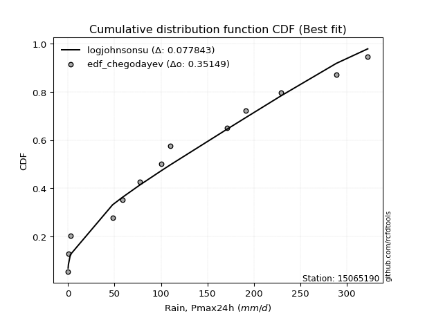</img>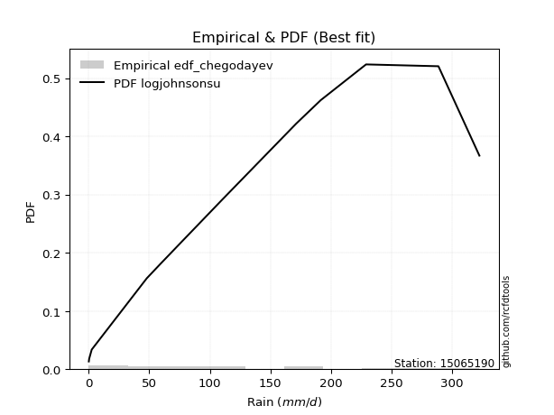</img>

</div>


### 6. Empirical - EDF Blom (1958)

The Blom formula is a specific "plotting position" formula used in hydrology and statistical analysis to estimate the empirical cumulative probability (or non-exceedance probability) of a data series. It is particularly recommended for data that are approximately normally distributed. The constant _a_ is set to 0.375 (or 3/8).

<div align="center">


$P=(m-a)/(n+1-2a)$


</div>


**6.1. Empirical values**

<div align="center">

|                | 0                    | 1                   | 2                   | 3                  | 4                   | 5                   | 6                  | 7                  | 8                  | 9                  | 10                 | 11                 | 12                 | 13                 |
|:---------------|:---------------------|:--------------------|:--------------------|:-------------------|:--------------------|:--------------------|:-------------------|:-------------------|:-------------------|:-------------------|:-------------------|:-------------------|:-------------------|:-------------------|
| date           | 2023                 | 2021                | 2019                | 2025               | 2014                | 2018                | 2012               | 2017               | 2013               | 2020               | 2015               | 2022               | 2016               | 2024               |
| x              | 0.2                  | 0.5                 | 2.6                 | 38.6               | 48.0                | 58.8                | 77.0               | 100.7              | 110.0              | 171.3              | 191.5              | 228.9              | 288.6              | 322.4              |
| m              | 1                    | 2                   | 3                   | 4                  | 5                   | 6                   | 7                  | 8                  | 9                  | 10                 | 11                 | 12                 | 13                 | 14                 |
| empirical_dist | edf_blom             | edf_blom            | edf_blom            | edf_blom           | edf_blom            | edf_blom            | edf_blom           | edf_blom           | edf_blom           | edf_blom           | edf_blom           | edf_blom           | edf_blom           | edf_blom           |
| empirical      | 0.043859649122807015 | 0.11403508771929824 | 0.18421052631578946 | 0.2543859649122807 | 0.32456140350877194 | 0.39473684210526316 | 0.4649122807017544 | 0.5350877192982456 | 0.6052631578947368 | 0.6754385964912281 | 0.7456140350877193 | 0.8157894736842105 | 0.8859649122807017 | 0.956140350877193  |
| empirical_tr   | 1.0458715596330275   | 1.1287128712871288  | 1.2258064516129032  | 1.3411764705882354 | 1.4805194805194806  | 1.6521739130434783  | 1.8688524590163935 | 2.150943396226415  | 2.533333333333333  | 3.081081081081081  | 3.9310344827586206 | 5.428571428571428  | 8.769230769230768  | 22.799999999999986 |

</div>


**6.2. Kolmogorov-Smirnov fit test (sorted by Δ)**


<div align="center">

|                | 0                  | 1                   | 2                  | 3                   | 4                   | 5                   | 6                   | 7                   | 8                  | 9                   | 10                  | 11                    | 12                  | 13                  | 14                  | 15                  | 16                 | 17                  | 18                  | 19                 | 20                  | 21                  | 22                  | 23                  | 24                  | 25                  | 26                  | 27                  | 28                  | 29                  | 30                 | 31                  | 32                  | 33                  | 34                  | 35                  | 36                  | 37                  | 38                  | 39                  | 40                  | 41                  | 42                | 43                  | 44                  | 45                  | 46                 | 47                  | 48                  | 49                 | 50                 | 51                 | 52                  | 53                  | 54                  | 55                  | 56                  | 57                  | 58                  | 59                  | 60                | 61                  | 62                  | 63                  | 64                  | 65                 | 66                 | 67                 | 68                 | 69                 | 70                 | 71                 | 72                 | 73                  | 74                 | 75                  | 76                  | 77                 | 78                  | 79                 | 80                 | 81                  | 82                 | 83                  | 84                  | 85                 | 86                 | 87                 | 88                 | 89                 |
|:---------------|:-------------------|:--------------------|:-------------------|:--------------------|:--------------------|:--------------------|:--------------------|:--------------------|:-------------------|:--------------------|:--------------------|:----------------------|:--------------------|:--------------------|:--------------------|:--------------------|:-------------------|:--------------------|:--------------------|:-------------------|:--------------------|:--------------------|:--------------------|:--------------------|:--------------------|:--------------------|:--------------------|:--------------------|:--------------------|:--------------------|:-------------------|:--------------------|:--------------------|:--------------------|:--------------------|:--------------------|:--------------------|:--------------------|:--------------------|:--------------------|:--------------------|:--------------------|:------------------|:--------------------|:--------------------|:--------------------|:-------------------|:--------------------|:--------------------|:-------------------|:-------------------|:-------------------|:--------------------|:--------------------|:--------------------|:--------------------|:--------------------|:--------------------|:--------------------|:--------------------|:------------------|:--------------------|:--------------------|:--------------------|:--------------------|:-------------------|:-------------------|:-------------------|:-------------------|:-------------------|:-------------------|:-------------------|:-------------------|:--------------------|:-------------------|:--------------------|:--------------------|:-------------------|:--------------------|:-------------------|:-------------------|:--------------------|:-------------------|:--------------------|:--------------------|:-------------------|:-------------------|:-------------------|:-------------------|:-------------------|
| station        | 15065190           | 15065190            | 15065190           | 15065190            | 15065190            | 15065190            | 15065190            | 15065190            | 15065190           | 15065190            | 15065190            | 15065190              | 15065190            | 15065190            | 15065190            | 15065190            | 15065190           | 15065190            | 15065190            | 15065190           | 15065190            | 15065190            | 15065190            | 15065190            | 15065190            | 15065190            | 15065190            | 15065190            | 15065190            | 15065190            | 15065190           | 15065190            | 15065190            | 15065190            | 15065190            | 15065190            | 15065190            | 15065190            | 15065190            | 15065190            | 15065190            | 15065190            | 15065190          | 15065190            | 15065190            | 15065190            | 15065190           | 15065190            | 15065190            | 15065190           | 15065190           | 15065190           | 15065190            | 15065190            | 15065190            | 15065190            | 15065190            | 15065190            | 15065190            | 15065190            | 15065190          | 15065190            | 15065190            | 15065190            | 15065190            | 15065190           | 15065190           | 15065190           | 15065190           | 15065190           | 15065190           | 15065190           | 15065190           | 15065190            | 15065190           | 15065190            | 15065190            | 15065190           | 15065190            | 15065190           | 15065190           | 15065190            | 15065190           | 15065190            | 15065190            | 15065190           | 15065190           | 15065190           | 15065190           | 15065190           |
| empirical_dist | edf_blom           | edf_blom            | edf_blom           | edf_blom            | edf_blom            | edf_blom            | edf_blom            | edf_blom            | edf_blom           | edf_blom            | edf_blom            | edf_blom              | edf_blom            | edf_blom            | edf_blom            | edf_blom            | edf_blom           | edf_blom            | edf_blom            | edf_blom           | edf_blom            | edf_blom            | edf_blom            | edf_blom            | edf_blom            | edf_blom            | edf_blom            | edf_blom            | edf_blom            | edf_blom            | edf_blom           | edf_blom            | edf_blom            | edf_blom            | edf_blom            | edf_blom            | edf_blom            | edf_blom            | edf_blom            | edf_blom            | edf_blom            | edf_blom            | edf_blom          | edf_blom            | edf_blom            | edf_blom            | edf_blom           | edf_blom            | edf_blom            | edf_blom           | edf_blom           | edf_blom           | edf_blom            | edf_blom            | edf_blom            | edf_blom            | edf_blom            | edf_blom            | edf_blom            | edf_blom            | edf_blom          | edf_blom            | edf_blom            | edf_blom            | edf_blom            | edf_blom           | edf_blom           | edf_blom           | edf_blom           | edf_blom           | edf_blom           | edf_blom           | edf_blom           | edf_blom            | edf_blom           | edf_blom            | edf_blom            | edf_blom           | edf_blom            | edf_blom           | edf_blom           | edf_blom            | edf_blom           | edf_blom            | edf_blom            | edf_blom           | edf_blom           | edf_blom           | edf_blom           | edf_blom           |
| p_dist         | ncf                | halfnorm            | logjohnsonsu       | gumbel_r            | rayleigh            | genlogistic         | pearson3            | kstwobign           | maxwell            | invgamma            | mielke              | loglaplace_asymmetric | logloggamma         | alpha               | moyal               | invgauss            | weibull_min        | rice                | johnsonsu           | crystalball        | norm                | t                   | logistic            | halflogistic        | loggompertz         | logt                | betaprime           | hypsecant           | logfisk             | logpearson3         | nakagami           | exponnorm           | laplace_asymmetric  | expon               | genexpon            | truncnorm           | gompertz            | loggumbel_l         | laplace             | f                   | wald                | erlang              | fisk              | gumbel_l            | logbetaprime        | lognct              | loglaplace         | loghypsecant        | loglogistic         | logfatiguelife     | logrice            | logcrystalball     | lognorm             | lognorm             | logexponnorm        | lognakagami         | loglognorm          | loggamma            | loggamma            | loginvgamma         | logerlang         | chi2                | loginvgauss         | gibrat              | loginvweibull       | logmaxwell         | lograyleigh        | loggumbel_r        | logkstwobign       | loghalfnorm        | loggenexpon        | invweibull         | logmoyal           | loghalflogistic     | nct                | logexpon            | logncf              | pareto             | logwald             | loggibrat          | gamma              | logtruncnorm        | fatiguelife        | logf                | logpareto           | logalpha           | logweibull_min     | logmielke          | logchi2            | loggenlogistic     |
| delta          | 0.0695642408844781 | 0.08130116623241955 | 0.0818571599505673 | 0.08676254099728577 | 0.08712391063200087 | 0.08813645352759117 | 0.08985336250321607 | 0.09573066339062501 | 0.0986705931726386 | 0.10967142369928758 | 0.11217172466581109 | 0.11314469379448922   | 0.11336937365190464 | 0.11420340298420584 | 0.11484790387121546 | 0.11625312655363061 | 0.1177750563883973 | 0.11850054791064274 | 0.12059316577838507 | 0.1325996353390576 | 0.13259963646995648 | 0.13267499705865926 | 0.13631895103059682 | 0.13968739450384737 | 0.14292483843294512 | 0.14486701015804893 | 0.14756381003991337 | 0.14802488694602467 | 0.15477320441039666 | 0.15965153167215645 | 0.1596518113039554 | 0.16323043002211332 | 0.16388577609385688 | 0.16388578405846338 | 0.16545298536791322 | 0.17028781526716028 | 0.17173965147934808 | 0.17479075888235374 | 0.17617871044169103 | 0.17926961846890727 | 0.18421052631578946 | 0.19597157253519654 | 0.196396604371953 | 0.20324961498183558 | 0.24270859120861965 | 0.24482279374573468 | 0.2448443662654078 | 0.24506937799655337 | 0.24512008566453358 | 0.2451455731230418 | 0.2451774837240534 | 0.2451794353710034 | 0.24517946147763098 | 0.24517946147763098 | 0.24518007941794734 | 0.24523281258883373 | 0.24649231087818568 | 0.25746706433074784 | 0.25746706433074784 | 0.25849491599636854 | 0.260223908377337 | 0.26588853497141063 | 0.26651346937524045 | 0.26948564455417806 | 0.27724939498668366 | 0.2782469573991869 | 0.2892680208915742 | 0.3155424881100606 | 0.3170813618071632 | 0.3202957228654103 | 0.3261153589426734 | 0.3402480405549122 | 0.3413926469567856 | 0.34520409447417644 | 0.3688331556694425 | 0.37756064917486853 | 0.37977486288550966 | 0.3952584127678368 | 0.41328312013796986 | 0.4365712559129943 | 0.4439782739018885 | 0.46591842106656434 | 0.4695307143930578 | 0.48076705964254374 | 0.49723483008818603 | 0.5243451844115686 | 0.5813502581082509 | 0.6216814501188193 | 0.6255900486192547 | 0.8859649122807017 |
| deltao         | 0.343224222286     | 0.343224222286      | 0.343224222286     | 0.343224222286      | 0.343224222286      | 0.343224222286      | 0.343224222286      | 0.343224222286      | 0.343224222286     | 0.343224222286      | 0.343224222286      | 0.343224222286        | 0.343224222286      | 0.343224222286      | 0.343224222286      | 0.343224222286      | 0.343224222286     | 0.343224222286      | 0.343224222286      | 0.343224222286     | 0.343224222286      | 0.343224222286      | 0.343224222286      | 0.343224222286      | 0.343224222286      | 0.343224222286      | 0.343224222286      | 0.343224222286      | 0.343224222286      | 0.343224222286      | 0.343224222286     | 0.343224222286      | 0.343224222286      | 0.343224222286      | 0.343224222286      | 0.343224222286      | 0.343224222286      | 0.343224222286      | 0.343224222286      | 0.343224222286      | 0.343224222286      | 0.343224222286      | 0.343224222286    | 0.343224222286      | 0.343224222286      | 0.343224222286      | 0.343224222286     | 0.343224222286      | 0.343224222286      | 0.343224222286     | 0.343224222286     | 0.343224222286     | 0.343224222286      | 0.343224222286      | 0.343224222286      | 0.343224222286      | 0.343224222286      | 0.343224222286      | 0.343224222286      | 0.343224222286      | 0.343224222286    | 0.343224222286      | 0.343224222286      | 0.343224222286      | 0.343224222286      | 0.343224222286     | 0.343224222286     | 0.343224222286     | 0.343224222286     | 0.343224222286     | 0.343224222286     | 0.343224222286     | 0.343224222286     | 0.343224222286      | 0.343224222286     | 0.343224222286      | 0.343224222286      | 0.343224222286     | 0.343224222286      | 0.343224222286     | 0.343224222286     | 0.343224222286      | 0.343224222286     | 0.343224222286      | 0.343224222286      | 0.343224222286     | 0.343224222286     | 0.343224222286     | 0.343224222286     | 0.343224222286     |
| eval           | Δo > Δ             | Δo > Δ              | Δo > Δ             | Δo > Δ              | Δo > Δ              | Δo > Δ              | Δo > Δ              | Δo > Δ              | Δo > Δ             | Δo > Δ              | Δo > Δ              | Δo > Δ                | Δo > Δ              | Δo > Δ              | Δo > Δ              | Δo > Δ              | Δo > Δ             | Δo > Δ              | Δo > Δ              | Δo > Δ             | Δo > Δ              | Δo > Δ              | Δo > Δ              | Δo > Δ              | Δo > Δ              | Δo > Δ              | Δo > Δ              | Δo > Δ              | Δo > Δ              | Δo > Δ              | Δo > Δ             | Δo > Δ              | Δo > Δ              | Δo > Δ              | Δo > Δ              | Δo > Δ              | Δo > Δ              | Δo > Δ              | Δo > Δ              | Δo > Δ              | Δo > Δ              | Δo > Δ              | Δo > Δ            | Δo > Δ              | Δo > Δ              | Δo > Δ              | Δo > Δ             | Δo > Δ              | Δo > Δ              | Δo > Δ             | Δo > Δ             | Δo > Δ             | Δo > Δ              | Δo > Δ              | Δo > Δ              | Δo > Δ              | Δo > Δ              | Δo > Δ              | Δo > Δ              | Δo > Δ              | Δo > Δ            | Δo > Δ              | Δo > Δ              | Δo > Δ              | Δo > Δ              | Δo > Δ             | Δo > Δ             | Δo > Δ             | Δo > Δ             | Δo > Δ             | Δo > Δ             | Δo > Δ             | Δo > Δ             | Δo <= Δ             | Δo <= Δ            | Δo <= Δ             | Δo <= Δ             | Δo <= Δ            | Δo <= Δ             | Δo <= Δ            | Δo <= Δ            | Δo <= Δ             | Δo <= Δ            | Δo <= Δ             | Δo <= Δ             | Δo <= Δ            | Δo <= Δ            | Δo <= Δ            | Δo <= Δ            | Δo <= Δ            |
| fit            | 1                  | 1                   | 1                  | 1                   | 1                   | 1                   | 1                   | 1                   | 1                  | 1                   | 1                   | 1                     | 1                   | 1                   | 1                   | 1                   | 1                  | 1                   | 1                   | 1                  | 1                   | 1                   | 1                   | 1                   | 1                   | 1                   | 1                   | 1                   | 1                   | 1                   | 1                  | 1                   | 1                   | 1                   | 1                   | 1                   | 1                   | 1                   | 1                   | 1                   | 1                   | 1                   | 1                 | 1                   | 1                   | 1                   | 1                  | 1                   | 1                   | 1                  | 1                  | 1                  | 1                   | 1                   | 1                   | 1                   | 1                   | 1                   | 1                   | 1                   | 1                 | 1                   | 1                   | 1                   | 1                   | 1                  | 1                  | 1                  | 1                  | 1                  | 1                  | 1                  | 1                  | 0                   | 0                  | 0                   | 0                   | 0                  | 0                   | 0                  | 0                  | 0                   | 0                  | 0                   | 0                   | 0                  | 0                  | 0                  | 0                  | 0                  |
| n              | 14                 | 14                  | 14                 | 14                  | 14                  | 14                  | 14                  | 14                  | 14                 | 14                  | 14                  | 14                    | 14                  | 14                  | 14                  | 14                  | 14                 | 14                  | 14                  | 14                 | 14                  | 14                  | 14                  | 14                  | 14                  | 14                  | 14                  | 14                  | 14                  | 14                  | 14                 | 14                  | 14                  | 14                  | 14                  | 14                  | 14                  | 14                  | 14                  | 14                  | 14                  | 14                  | 14                | 14                  | 14                  | 14                  | 14                 | 14                  | 14                  | 14                 | 14                 | 14                 | 14                  | 14                  | 14                  | 14                  | 14                  | 14                  | 14                  | 14                  | 14                | 14                  | 14                  | 14                  | 14                  | 14                 | 14                 | 14                 | 14                 | 14                 | 14                 | 14                 | 14                 | 14                  | 14                 | 14                  | 14                  | 14                 | 14                  | 14                 | 14                 | 14                  | 14                 | 14                  | 14                  | 14                 | 14                 | 14                 | 14                 | 14                 |
| best_fit       | 1                  | 0                   | 0                  | 0                   | 0                   | 0                   | 0                   | 0                   | 0                  | 0                   | 0                   | 0                     | 0                   | 0                   | 0                   | 0                   | 0                  | 0                   | 0                   | 0                  | 0                   | 0                   | 0                   | 0                   | 0                   | 0                   | 0                   | 0                   | 0                   | 0                   | 0                  | 0                   | 0                   | 0                   | 0                   | 0                   | 0                   | 0                   | 0                   | 0                   | 0                   | 0                   | 0                 | 0                   | 0                   | 0                   | 0                  | 0                   | 0                   | 0                  | 0                  | 0                  | 0                   | 0                   | 0                   | 0                   | 0                   | 0                   | 0                   | 0                   | 0                 | 0                   | 0                   | 0                   | 0                   | 0                  | 0                  | 0                  | 0                  | 0                  | 0                  | 0                  | 0                  | 0                   | 0                  | 0                   | 0                   | 0                  | 0                   | 0                  | 0                  | 0                   | 0                  | 0                   | 0                   | 0                  | 0                  | 0                  | 0                  | 0                  |
| best_fit_sort  | 1                  | 2                   | 3                  | 4                   | 5                   | 6                   | 7                   | 8                   | 9                  | 10                  | 11                  | 12                    | 13                  | 14                  | 15                  | 16                  | 17                 | 18                  | 19                  | 20                 | 21                  | 22                  | 23                  | 24                  | 25                  | 26                  | 27                  | 28                  | 29                  | 30                  | 31                 | 32                  | 33                  | 34                  | 35                  | 36                  | 37                  | 38                  | 39                  | 40                  | 41                  | 42                  | 43                | 44                  | 45                  | 46                  | 47                 | 48                  | 49                  | 50                 | 51                 | 52                 | 53                  | 54                  | 55                  | 56                  | 57                  | 58                  | 59                  | 60                  | 61                | 62                  | 63                  | 64                  | 65                  | 66                 | 67                 | 68                 | 69                 | 70                 | 71                 | 72                 | 73                 | 74                  | 75                 | 76                  | 77                  | 78                 | 79                  | 80                 | 81                 | 82                  | 83                 | 84                  | 85                  | 86                 | 87                 | 88                 | 89                 | 90                 |

</div>


<div align="center">

</img>

</div>


**6.3. Best fit**

<div align="center">

|   id |   station | empirical_dist   | p_dist   |     delta |   deltao | eval   |   fit |   n |   best_fit |   best_fit_sort |
|-----:|----------:|:-----------------|:---------|----------:|---------:|:-------|------:|----:|-----------:|----------------:|
|    0 |  15065190 | edf_blom         | ncf      | 0.0695642 | 0.343224 | Δo > Δ |     1 |  14 |          1 |               1 |

</div>


<div align="center">

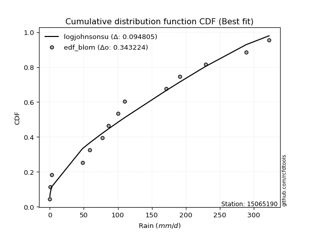</img></img>

</div>


### 7. Empirical - EDF Tukey (1962)

In hydrology, the Tukey formula is used as a plotting position formula to estimate the empirical probability or frequency of a flood event (or other hydrological data). The formula parameter is given as _c=0.333_ (or 1/3).

<div align="center">


$P=(m-c)/(n+1-2c)$


</div>


**7.1. Empirical values**

<div align="center">

|                | 0                    | 1                   | 2                   | 3                  | 4                   | 5                  | 6                   | 7                  | 8                  | 9                  | 10                 | 11                | 12                 | 13                 |
|:---------------|:---------------------|:--------------------|:--------------------|:-------------------|:--------------------|:-------------------|:--------------------|:-------------------|:-------------------|:-------------------|:-------------------|:------------------|:-------------------|:-------------------|
| date           | 2023                 | 2021                | 2019                | 2025               | 2014                | 2018               | 2012                | 2017               | 2013               | 2020               | 2015               | 2022              | 2016               | 2024               |
| x              | 0.2                  | 0.5                 | 2.6                 | 38.6               | 48.0                | 58.8               | 77.0                | 100.7              | 110.0              | 171.3              | 191.5              | 228.9             | 288.6              | 322.4              |
| m              | 1                    | 2                   | 3                   | 4                  | 5                   | 6                  | 7                   | 8                  | 9                  | 10                 | 11                 | 12                | 13                 | 14                 |
| empirical_dist | edf_tukey            | edf_tukey           | edf_tukey           | edf_tukey          | edf_tukey           | edf_tukey          | edf_tukey           | edf_tukey          | edf_tukey          | edf_tukey          | edf_tukey          | edf_tukey         | edf_tukey          | edf_tukey          |
| empirical      | 0.046511627906976744 | 0.11627906976744186 | 0.18604651162790697 | 0.2558139534883721 | 0.32558139534883723 | 0.3953488372093023 | 0.46511627906976744 | 0.5348837209302325 | 0.6046511627906976 | 0.6744186046511628 | 0.7441860465116279 | 0.813953488372093 | 0.8837209302325582 | 0.9534883720930233 |
| empirical_tr   | 1.048780487804878    | 1.131578947368421   | 1.2285714285714286  | 1.34375            | 1.4827586206896552  | 1.653846153846154  | 1.8695652173913042  | 2.15               | 2.5294117647058822 | 3.071428571428571  | 3.9090909090909087 | 5.375             | 8.600000000000001  | 21.500000000000014 |

</div>


**7.2. Kolmogorov-Smirnov fit test (sorted by Δ)**


<div align="center">

|                | 0                  | 1                  | 2                   | 3                   | 4                   | 5                   | 6                   | 7                   | 8                  | 9                   | 10                    | 11                  | 12                 | 13                  | 14                  | 15                  | 16                  | 17                  | 18                  | 19                 | 20                  | 21                  | 22                  | 23                  | 24                  | 25                  | 26                  | 27                  | 28                  | 29                  | 30                | 31                  | 32                 | 33                 | 34                  | 35                  | 36                  | 37                 | 38                  | 39                  | 40                  | 41                  | 42                 | 43                  | 44                  | 45                 | 46                 | 47                  | 48                 | 49                  | 50                  | 51                | 52                 | 53                 | 54                  | 55                  | 56                 | 57                  | 58                  | 59                  | 60                 | 61                  | 62                  | 63                  | 64                 | 65                  | 66                  | 67                 | 68                 | 69                 | 70                | 71                 | 72                  | 73                  | 74                  | 75                  | 76                  | 77                 | 78                 | 79                 | 80                 | 81                  | 82                  | 83                  | 84                  | 85                 | 86                 | 87                 | 88                 | 89                 |
|:---------------|:-------------------|:-------------------|:--------------------|:--------------------|:--------------------|:--------------------|:--------------------|:--------------------|:-------------------|:--------------------|:----------------------|:--------------------|:-------------------|:--------------------|:--------------------|:--------------------|:--------------------|:--------------------|:--------------------|:-------------------|:--------------------|:--------------------|:--------------------|:--------------------|:--------------------|:--------------------|:--------------------|:--------------------|:--------------------|:--------------------|:------------------|:--------------------|:-------------------|:-------------------|:--------------------|:--------------------|:--------------------|:-------------------|:--------------------|:--------------------|:--------------------|:--------------------|:-------------------|:--------------------|:--------------------|:-------------------|:-------------------|:--------------------|:-------------------|:--------------------|:--------------------|:------------------|:-------------------|:-------------------|:--------------------|:--------------------|:-------------------|:--------------------|:--------------------|:--------------------|:-------------------|:--------------------|:--------------------|:--------------------|:-------------------|:--------------------|:--------------------|:-------------------|:-------------------|:-------------------|:------------------|:-------------------|:--------------------|:--------------------|:--------------------|:--------------------|:--------------------|:-------------------|:-------------------|:-------------------|:-------------------|:--------------------|:--------------------|:--------------------|:--------------------|:-------------------|:-------------------|:-------------------|:-------------------|:-------------------|
| station        | 15065190           | 15065190           | 15065190            | 15065190            | 15065190            | 15065190            | 15065190            | 15065190            | 15065190           | 15065190            | 15065190              | 15065190            | 15065190           | 15065190            | 15065190            | 15065190            | 15065190            | 15065190            | 15065190            | 15065190           | 15065190            | 15065190            | 15065190            | 15065190            | 15065190            | 15065190            | 15065190            | 15065190            | 15065190            | 15065190            | 15065190          | 15065190            | 15065190           | 15065190           | 15065190            | 15065190            | 15065190            | 15065190           | 15065190            | 15065190            | 15065190            | 15065190            | 15065190           | 15065190            | 15065190            | 15065190           | 15065190           | 15065190            | 15065190           | 15065190            | 15065190            | 15065190          | 15065190           | 15065190           | 15065190            | 15065190            | 15065190           | 15065190            | 15065190            | 15065190            | 15065190           | 15065190            | 15065190            | 15065190            | 15065190           | 15065190            | 15065190            | 15065190           | 15065190           | 15065190           | 15065190          | 15065190           | 15065190            | 15065190            | 15065190            | 15065190            | 15065190            | 15065190           | 15065190           | 15065190           | 15065190           | 15065190            | 15065190            | 15065190            | 15065190            | 15065190           | 15065190           | 15065190           | 15065190           | 15065190           |
| empirical_dist | edf_tukey          | edf_tukey          | edf_tukey           | edf_tukey           | edf_tukey           | edf_tukey           | edf_tukey           | edf_tukey           | edf_tukey          | edf_tukey           | edf_tukey             | edf_tukey           | edf_tukey          | edf_tukey           | edf_tukey           | edf_tukey           | edf_tukey           | edf_tukey           | edf_tukey           | edf_tukey          | edf_tukey           | edf_tukey           | edf_tukey           | edf_tukey           | edf_tukey           | edf_tukey           | edf_tukey           | edf_tukey           | edf_tukey           | edf_tukey           | edf_tukey         | edf_tukey           | edf_tukey          | edf_tukey          | edf_tukey           | edf_tukey           | edf_tukey           | edf_tukey          | edf_tukey           | edf_tukey           | edf_tukey           | edf_tukey           | edf_tukey          | edf_tukey           | edf_tukey           | edf_tukey          | edf_tukey          | edf_tukey           | edf_tukey          | edf_tukey           | edf_tukey           | edf_tukey         | edf_tukey          | edf_tukey          | edf_tukey           | edf_tukey           | edf_tukey          | edf_tukey           | edf_tukey           | edf_tukey           | edf_tukey          | edf_tukey           | edf_tukey           | edf_tukey           | edf_tukey          | edf_tukey           | edf_tukey           | edf_tukey          | edf_tukey          | edf_tukey          | edf_tukey         | edf_tukey          | edf_tukey           | edf_tukey           | edf_tukey           | edf_tukey           | edf_tukey           | edf_tukey          | edf_tukey          | edf_tukey          | edf_tukey          | edf_tukey           | edf_tukey           | edf_tukey           | edf_tukey           | edf_tukey          | edf_tukey          | edf_tukey          | edf_tukey          | edf_tukey          |
| p_dist         | ncf                | logjohnsonsu       | halfnorm            | rayleigh            | gumbel_r            | pearson3            | genlogistic         | kstwobign           | maxwell            | invgamma            | loglaplace_asymmetric | logloggamma         | mielke             | alpha               | weibull_min         | moyal               | invgauss            | rice                | johnsonsu           | crystalball        | norm                | t                   | logistic            | loggompertz         | halflogistic        | logt                | betaprime           | hypsecant           | logfisk             | logpearson3         | nakagami          | exponnorm           | laplace_asymmetric | expon              | genexpon            | truncnorm           | loggumbel_l         | gompertz           | laplace             | f                   | wald                | erlang              | fisk               | gumbel_l            | logbetaprime        | lognct             | loglaplace         | loghypsecant        | loglogistic        | logfatiguelife      | logrice             | logcrystalball    | lognorm            | lognorm            | logexponnorm        | lognakagami         | loglognorm         | loggamma            | loggamma            | loginvgamma         | logerlang          | chi2                | loginvgauss         | gibrat              | loginvweibull      | logmaxwell          | lograyleigh         | loggumbel_r        | logkstwobign       | loghalfnorm        | loggenexpon       | invweibull         | logmoyal            | loghalflogistic     | nct                 | logexpon            | logncf              | pareto             | logwald            | loggibrat          | gamma              | logtruncnorm        | fatiguelife         | logf                | logpareto           | logalpha           | logweibull_min     | logmielke          | logchi2            | loggenlogistic     |
| delta          | 0.0705842327245434 | 0.0812451648465281 | 0.08313715154453706 | 0.08651191552796167 | 0.08859852630940328 | 0.08924136739917687 | 0.08997243883970868 | 0.09756664870274252 | 0.0980585980685994 | 0.11150740901140509 | 0.11171670521839783   | 0.11194138507581325 | 0.1140077099779286 | 0.11452653402857188 | 0.11634706781230592 | 0.11668388918333297 | 0.11808911186574812 | 0.11911254301468188 | 0.12242915109050258 | 0.1319876402350184 | 0.13198764136591729 | 0.13206300195462006 | 0.13570695592655763 | 0.14149684985685373 | 0.14152337981596486 | 0.14221503137387925 | 0.14613582146382198 | 0.14822888531403772 | 0.15302245939349673 | 0.15822354309606507 | 0.158223822727864 | 0.16506641533423083 | 0.1657217614059744 | 0.1657217693705809 | 0.16728897068003074 | 0.17212380057927779 | 0.17336277030626235 | 0.1735756367914656 | 0.17638270880970408 | 0.17784162989281588 | 0.18604651162790697 | 0.19454358395910515 | 0.1949686157958616 | 0.20263761987779638 | 0.24128060263252826 | 0.2433948051696433 | 0.2434163776893164 | 0.24364138942046198 | 0.2436920970884422 | 0.24371758454695042 | 0.24374949514796201 | 0.243751446794912 | 0.2437514729015396 | 0.2437514729015396 | 0.24375209084185595 | 0.24380482401274234 | 0.2450643223020943 | 0.25603907575465645 | 0.25603907575465645 | 0.25706692742027715 | 0.2587959198012456 | 0.26446054639531924 | 0.26508548079914906 | 0.27050563639424335 | 0.2758214064105923 | 0.27681896882309553 | 0.28784003231548283 | 0.3141144995339692 | 0.3156533732310718 | 0.3188677342893189 | 0.324687370366582 | 0.3388200519788208 | 0.33996465838069423 | 0.34377610589808505 | 0.36740516709335114 | 0.37613266059877715 | 0.37834687430941827 | 0.3938304241917454 | 0.4118551315618785 | 0.4351432673369029 | 0.4425502853257971 | 0.46449043249047295 | 0.46810272581696644 | 0.47933907106645235 | 0.49499084804004245 | 0.5229171958354772 | 0.5799222695321595 | 0.6202534615427279 | 0.6241620600431633 | 0.8837209302325582 |
| deltao         | 0.343224222286     | 0.343224222286     | 0.343224222286      | 0.343224222286      | 0.343224222286      | 0.343224222286      | 0.343224222286      | 0.343224222286      | 0.343224222286     | 0.343224222286      | 0.343224222286        | 0.343224222286      | 0.343224222286     | 0.343224222286      | 0.343224222286      | 0.343224222286      | 0.343224222286      | 0.343224222286      | 0.343224222286      | 0.343224222286     | 0.343224222286      | 0.343224222286      | 0.343224222286      | 0.343224222286      | 0.343224222286      | 0.343224222286      | 0.343224222286      | 0.343224222286      | 0.343224222286      | 0.343224222286      | 0.343224222286    | 0.343224222286      | 0.343224222286     | 0.343224222286     | 0.343224222286      | 0.343224222286      | 0.343224222286      | 0.343224222286     | 0.343224222286      | 0.343224222286      | 0.343224222286      | 0.343224222286      | 0.343224222286     | 0.343224222286      | 0.343224222286      | 0.343224222286     | 0.343224222286     | 0.343224222286      | 0.343224222286     | 0.343224222286      | 0.343224222286      | 0.343224222286    | 0.343224222286     | 0.343224222286     | 0.343224222286      | 0.343224222286      | 0.343224222286     | 0.343224222286      | 0.343224222286      | 0.343224222286      | 0.343224222286     | 0.343224222286      | 0.343224222286      | 0.343224222286      | 0.343224222286     | 0.343224222286      | 0.343224222286      | 0.343224222286     | 0.343224222286     | 0.343224222286     | 0.343224222286    | 0.343224222286     | 0.343224222286      | 0.343224222286      | 0.343224222286      | 0.343224222286      | 0.343224222286      | 0.343224222286     | 0.343224222286     | 0.343224222286     | 0.343224222286     | 0.343224222286      | 0.343224222286      | 0.343224222286      | 0.343224222286      | 0.343224222286     | 0.343224222286     | 0.343224222286     | 0.343224222286     | 0.343224222286     |
| eval           | Δo > Δ             | Δo > Δ             | Δo > Δ              | Δo > Δ              | Δo > Δ              | Δo > Δ              | Δo > Δ              | Δo > Δ              | Δo > Δ             | Δo > Δ              | Δo > Δ                | Δo > Δ              | Δo > Δ             | Δo > Δ              | Δo > Δ              | Δo > Δ              | Δo > Δ              | Δo > Δ              | Δo > Δ              | Δo > Δ             | Δo > Δ              | Δo > Δ              | Δo > Δ              | Δo > Δ              | Δo > Δ              | Δo > Δ              | Δo > Δ              | Δo > Δ              | Δo > Δ              | Δo > Δ              | Δo > Δ            | Δo > Δ              | Δo > Δ             | Δo > Δ             | Δo > Δ              | Δo > Δ              | Δo > Δ              | Δo > Δ             | Δo > Δ              | Δo > Δ              | Δo > Δ              | Δo > Δ              | Δo > Δ             | Δo > Δ              | Δo > Δ              | Δo > Δ             | Δo > Δ             | Δo > Δ              | Δo > Δ             | Δo > Δ              | Δo > Δ              | Δo > Δ            | Δo > Δ             | Δo > Δ             | Δo > Δ              | Δo > Δ              | Δo > Δ             | Δo > Δ              | Δo > Δ              | Δo > Δ              | Δo > Δ             | Δo > Δ              | Δo > Δ              | Δo > Δ              | Δo > Δ             | Δo > Δ              | Δo > Δ              | Δo > Δ             | Δo > Δ             | Δo > Δ             | Δo > Δ            | Δo > Δ             | Δo > Δ              | Δo <= Δ             | Δo <= Δ             | Δo <= Δ             | Δo <= Δ             | Δo <= Δ            | Δo <= Δ            | Δo <= Δ            | Δo <= Δ            | Δo <= Δ             | Δo <= Δ             | Δo <= Δ             | Δo <= Δ             | Δo <= Δ            | Δo <= Δ            | Δo <= Δ            | Δo <= Δ            | Δo <= Δ            |
| fit            | 1                  | 1                  | 1                   | 1                   | 1                   | 1                   | 1                   | 1                   | 1                  | 1                   | 1                     | 1                   | 1                  | 1                   | 1                   | 1                   | 1                   | 1                   | 1                   | 1                  | 1                   | 1                   | 1                   | 1                   | 1                   | 1                   | 1                   | 1                   | 1                   | 1                   | 1                 | 1                   | 1                  | 1                  | 1                   | 1                   | 1                   | 1                  | 1                   | 1                   | 1                   | 1                   | 1                  | 1                   | 1                   | 1                  | 1                  | 1                   | 1                  | 1                   | 1                   | 1                 | 1                  | 1                  | 1                   | 1                   | 1                  | 1                   | 1                   | 1                   | 1                  | 1                   | 1                   | 1                   | 1                  | 1                   | 1                   | 1                  | 1                  | 1                  | 1                 | 1                  | 1                   | 0                   | 0                   | 0                   | 0                   | 0                  | 0                  | 0                  | 0                  | 0                   | 0                   | 0                   | 0                   | 0                  | 0                  | 0                  | 0                  | 0                  |
| n              | 14                 | 14                 | 14                  | 14                  | 14                  | 14                  | 14                  | 14                  | 14                 | 14                  | 14                    | 14                  | 14                 | 14                  | 14                  | 14                  | 14                  | 14                  | 14                  | 14                 | 14                  | 14                  | 14                  | 14                  | 14                  | 14                  | 14                  | 14                  | 14                  | 14                  | 14                | 14                  | 14                 | 14                 | 14                  | 14                  | 14                  | 14                 | 14                  | 14                  | 14                  | 14                  | 14                 | 14                  | 14                  | 14                 | 14                 | 14                  | 14                 | 14                  | 14                  | 14                | 14                 | 14                 | 14                  | 14                  | 14                 | 14                  | 14                  | 14                  | 14                 | 14                  | 14                  | 14                  | 14                 | 14                  | 14                  | 14                 | 14                 | 14                 | 14                | 14                 | 14                  | 14                  | 14                  | 14                  | 14                  | 14                 | 14                 | 14                 | 14                 | 14                  | 14                  | 14                  | 14                  | 14                 | 14                 | 14                 | 14                 | 14                 |
| best_fit       | 1                  | 0                  | 0                   | 0                   | 0                   | 0                   | 0                   | 0                   | 0                  | 0                   | 0                     | 0                   | 0                  | 0                   | 0                   | 0                   | 0                   | 0                   | 0                   | 0                  | 0                   | 0                   | 0                   | 0                   | 0                   | 0                   | 0                   | 0                   | 0                   | 0                   | 0                 | 0                   | 0                  | 0                  | 0                   | 0                   | 0                   | 0                  | 0                   | 0                   | 0                   | 0                   | 0                  | 0                   | 0                   | 0                  | 0                  | 0                   | 0                  | 0                   | 0                   | 0                 | 0                  | 0                  | 0                   | 0                   | 0                  | 0                   | 0                   | 0                   | 0                  | 0                   | 0                   | 0                   | 0                  | 0                   | 0                   | 0                  | 0                  | 0                  | 0                 | 0                  | 0                   | 0                   | 0                   | 0                   | 0                   | 0                  | 0                  | 0                  | 0                  | 0                   | 0                   | 0                   | 0                   | 0                  | 0                  | 0                  | 0                  | 0                  |
| best_fit_sort  | 1                  | 2                  | 3                   | 4                   | 5                   | 6                   | 7                   | 8                   | 9                  | 10                  | 11                    | 12                  | 13                 | 14                  | 15                  | 16                  | 17                  | 18                  | 19                  | 20                 | 21                  | 22                  | 23                  | 24                  | 25                  | 26                  | 27                  | 28                  | 29                  | 30                  | 31                | 32                  | 33                 | 34                 | 35                  | 36                  | 37                  | 38                 | 39                  | 40                  | 41                  | 42                  | 43                 | 44                  | 45                  | 46                 | 47                 | 48                  | 49                 | 50                  | 51                  | 52                | 53                 | 54                 | 55                  | 56                  | 57                 | 58                  | 59                  | 60                  | 61                 | 62                  | 63                  | 64                  | 65                 | 66                  | 67                  | 68                 | 69                 | 70                 | 71                | 72                 | 73                  | 74                  | 75                  | 76                  | 77                  | 78                 | 79                 | 80                 | 81                 | 82                  | 83                  | 84                  | 85                  | 86                 | 87                 | 88                 | 89                 | 90                 |

</div>


<div align="center">

</img>

</div>


**7.3. Best fit**

<div align="center">

|   id |   station | empirical_dist   | p_dist   |     delta |   deltao | eval   |   fit |   n |   best_fit |   best_fit_sort |
|-----:|----------:|:-----------------|:---------|----------:|---------:|:-------|------:|----:|-----------:|----------------:|
|    0 |  15065190 | edf_tukey        | ncf      | 0.0705842 | 0.343224 | Δo > Δ |     1 |  14 |          1 |               1 |

</div>


<div align="center">

</img>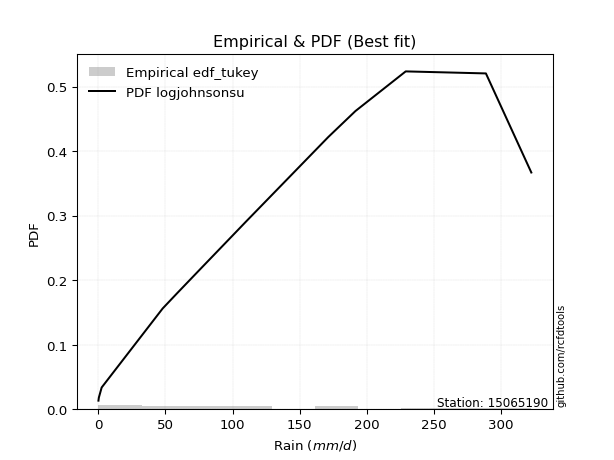</img>

</div>


### 8. Empirical - EDF Gringorten (1963)

Gringorten plotting position formula is essential for estimating the probability and return periods of extreme events like floods and heavy rainfall. The constant _a=0.44_.

<div align="center">


$P=(m-a)/(n+1-2a)$


</div>


**8.1. Empirical values**

<div align="center">

|                | 0                  | 1                  | 2                  | 3                  | 4                   | 5                  | 6                   | 7                  | 8                  | 9                  | 10                 | 11                 | 12                 | 13                 |
|:---------------|:-------------------|:-------------------|:-------------------|:-------------------|:--------------------|:-------------------|:--------------------|:-------------------|:-------------------|:-------------------|:-------------------|:-------------------|:-------------------|:-------------------|
| date           | 2023               | 2021               | 2019               | 2025               | 2014                | 2018               | 2012                | 2017               | 2013               | 2020               | 2015               | 2022               | 2016               | 2024               |
| x              | 0.2                | 0.5                | 2.6                | 38.6               | 48.0                | 58.8               | 77.0                | 100.7              | 110.0              | 171.3              | 191.5              | 228.9              | 288.6              | 322.4              |
| m              | 1                  | 2                  | 3                  | 4                  | 5                   | 6                  | 7                   | 8                  | 9                  | 10                 | 11                 | 12                 | 13                 | 14                 |
| empirical_dist | edf_gringorten     | edf_gringorten     | edf_gringorten     | edf_gringorten     | edf_gringorten      | edf_gringorten     | edf_gringorten      | edf_gringorten     | edf_gringorten     | edf_gringorten     | edf_gringorten     | edf_gringorten     | edf_gringorten     | edf_gringorten     |
| empirical      | 0.0396600566572238 | 0.1104815864022663 | 0.1813031161473088 | 0.2521246458923513 | 0.32294617563739375 | 0.3937677053824363 | 0.46458923512747874 | 0.5354107648725213 | 0.6062322946175638 | 0.6770538243626063 | 0.7478753541076488 | 0.8186968838526913 | 0.8895184135977338 | 0.9603399433427763 |
| empirical_tr   | 1.041297935103245  | 1.124203821656051  | 1.221453287197232  | 1.3371212121212122 | 1.4769874476987446  | 1.6495327102803736 | 1.8677248677248677  | 2.152439024390244  | 2.539568345323741  | 3.096491228070176  | 3.966292134831462  | 5.5156250000000036 | 9.051282051282055  | 25.214285714285765 |

</div>


**8.2. Kolmogorov-Smirnov fit test (sorted by Δ)**


<div align="center">

|                | 0                   | 1                   | 2                   | 3                  | 4                   | 5                   | 6                   | 7                   | 8                   | 9                  | 10                  | 11                  | 12                  | 13                    | 14                  | 15                  | 16                 | 17                  | 18                  | 19                  | 20                  | 21                 | 22                 | 23                  | 24                  | 25                  | 26                  | 27                 | 28                  | 29                  | 30                 | 31                 | 32                  | 33                  | 34                  | 35                 | 36                 | 37                  | 38                  | 39                 | 40                 | 41                  | 42                  | 43                  | 44                  | 45                 | 46                  | 47                 | 48                | 49                  | 50                  | 51                  | 52                 | 53                 | 54                  | 55                  | 56                  | 57                  | 58                  | 59                  | 60                  | 61                 | 62                  | 63                 | 64                 | 65                  | 66                  | 67               | 68                 | 69                  | 70                  | 71                  | 72                  | 73                  | 74                  | 75                  | 76                 | 77                  | 78                 | 79                 | 80                 | 81                  | 82                  | 83                  | 84                | 85                 | 86                 | 87                 | 88                 | 89                 |
|:---------------|:--------------------|:--------------------|:--------------------|:-------------------|:--------------------|:--------------------|:--------------------|:--------------------|:--------------------|:-------------------|:--------------------|:--------------------|:--------------------|:----------------------|:--------------------|:--------------------|:-------------------|:--------------------|:--------------------|:--------------------|:--------------------|:-------------------|:-------------------|:--------------------|:--------------------|:--------------------|:--------------------|:-------------------|:--------------------|:--------------------|:-------------------|:-------------------|:--------------------|:--------------------|:--------------------|:-------------------|:-------------------|:--------------------|:--------------------|:-------------------|:-------------------|:--------------------|:--------------------|:--------------------|:--------------------|:-------------------|:--------------------|:-------------------|:------------------|:--------------------|:--------------------|:--------------------|:-------------------|:-------------------|:--------------------|:--------------------|:--------------------|:--------------------|:--------------------|:--------------------|:--------------------|:-------------------|:--------------------|:-------------------|:-------------------|:--------------------|:--------------------|:-----------------|:-------------------|:--------------------|:--------------------|:--------------------|:--------------------|:--------------------|:--------------------|:--------------------|:-------------------|:--------------------|:-------------------|:-------------------|:-------------------|:--------------------|:--------------------|:--------------------|:------------------|:-------------------|:-------------------|:-------------------|:-------------------|:-------------------|
| station        | 15065190            | 15065190            | 15065190            | 15065190           | 15065190            | 15065190            | 15065190            | 15065190            | 15065190            | 15065190           | 15065190            | 15065190            | 15065190            | 15065190              | 15065190            | 15065190            | 15065190           | 15065190            | 15065190            | 15065190            | 15065190            | 15065190           | 15065190           | 15065190            | 15065190            | 15065190            | 15065190            | 15065190           | 15065190            | 15065190            | 15065190           | 15065190           | 15065190            | 15065190            | 15065190            | 15065190           | 15065190           | 15065190            | 15065190            | 15065190           | 15065190           | 15065190            | 15065190            | 15065190            | 15065190            | 15065190           | 15065190            | 15065190           | 15065190          | 15065190            | 15065190            | 15065190            | 15065190           | 15065190           | 15065190            | 15065190            | 15065190            | 15065190            | 15065190            | 15065190            | 15065190            | 15065190           | 15065190            | 15065190           | 15065190           | 15065190            | 15065190            | 15065190         | 15065190           | 15065190            | 15065190            | 15065190            | 15065190            | 15065190            | 15065190            | 15065190            | 15065190           | 15065190            | 15065190           | 15065190           | 15065190           | 15065190            | 15065190            | 15065190            | 15065190          | 15065190           | 15065190           | 15065190           | 15065190           | 15065190           |
| empirical_dist | edf_gringorten      | edf_gringorten      | edf_gringorten      | edf_gringorten     | edf_gringorten      | edf_gringorten      | edf_gringorten      | edf_gringorten      | edf_gringorten      | edf_gringorten     | edf_gringorten      | edf_gringorten      | edf_gringorten      | edf_gringorten        | edf_gringorten      | edf_gringorten      | edf_gringorten     | edf_gringorten      | edf_gringorten      | edf_gringorten      | edf_gringorten      | edf_gringorten     | edf_gringorten     | edf_gringorten      | edf_gringorten      | edf_gringorten      | edf_gringorten      | edf_gringorten     | edf_gringorten      | edf_gringorten      | edf_gringorten     | edf_gringorten     | edf_gringorten      | edf_gringorten      | edf_gringorten      | edf_gringorten     | edf_gringorten     | edf_gringorten      | edf_gringorten      | edf_gringorten     | edf_gringorten     | edf_gringorten      | edf_gringorten      | edf_gringorten      | edf_gringorten      | edf_gringorten     | edf_gringorten      | edf_gringorten     | edf_gringorten    | edf_gringorten      | edf_gringorten      | edf_gringorten      | edf_gringorten     | edf_gringorten     | edf_gringorten      | edf_gringorten      | edf_gringorten      | edf_gringorten      | edf_gringorten      | edf_gringorten      | edf_gringorten      | edf_gringorten     | edf_gringorten      | edf_gringorten     | edf_gringorten     | edf_gringorten      | edf_gringorten      | edf_gringorten   | edf_gringorten     | edf_gringorten      | edf_gringorten      | edf_gringorten      | edf_gringorten      | edf_gringorten      | edf_gringorten      | edf_gringorten      | edf_gringorten     | edf_gringorten      | edf_gringorten     | edf_gringorten     | edf_gringorten     | edf_gringorten      | edf_gringorten      | edf_gringorten      | edf_gringorten    | edf_gringorten     | edf_gringorten     | edf_gringorten     | edf_gringorten     | edf_gringorten     |
| p_dist         | ncf                 | halfnorm            | logjohnsonsu        | gumbel_r           | genlogistic         | rayleigh            | pearson3            | kstwobign           | maxwell             | invgamma           | mielke              | moyal               | invgauss            | loglaplace_asymmetric | logloggamma         | rice                | johnsonsu          | alpha               | weibull_min         | crystalball         | norm                | t                  | halflogistic       | logistic            | loggompertz         | hypsecant           | logt                | betaprime          | logfisk             | exponnorm           | laplace_asymmetric | expon              | logpearson3         | nakagami            | genexpon            | truncnorm          | gompertz           | laplace             | loggumbel_l         | wald               | f                  | erlang              | fisk                | gumbel_l            | logbetaprime        | lognct             | loglaplace          | loghypsecant       | loglogistic       | logfatiguelife      | logrice             | logcrystalball      | lognorm            | lognorm            | logexponnorm        | lognakagami         | loglognorm          | loggamma            | loggamma            | loginvgamma         | logerlang           | gibrat             | chi2                | loginvgauss        | loginvweibull      | logmaxwell          | lograyleigh         | loggumbel_r      | logkstwobign       | loghalfnorm         | loggenexpon         | invweibull          | logmoyal            | loghalflogistic     | nct                 | logexpon            | logncf             | pareto              | logwald            | loggibrat          | gamma              | logtruncnorm        | fatiguelife         | logf                | logpareto         | logalpha           | logweibull_min     | logmielke          | logchi2            | loggenlogistic     |
| delta          | 0.06794901301309986 | 0.07839375606393888 | 0.08282629667339425 | 0.0838551308288051 | 0.08569389951845907 | 0.08809304735482781 | 0.09082249922604302 | 0.09282325322214434 | 0.09963972989546555 | 0.1067640135308069 | 0.10926431449733041 | 0.11194049370273479 | 0.11334571638514994 | 0.11540601281441865   | 0.11563069267183407 | 0.11753141118781585 | 0.1176857556099044 | 0.11840299544978916 | 0.12003637540832673 | 0.13356877206188456 | 0.13356877319278343 | 0.1336441337814862 | 0.1367799843353667 | 0.13728808775342377 | 0.14518615745287455 | 0.14770184137174902 | 0.14906660262363225 | 0.1498251290598428 | 0.15897279687597998 | 0.16032301985363265 | 0.1609783659253762 | 0.1609783738899827 | 0.16191285069208589 | 0.16191313032388482 | 0.16254557519943255 | 0.1673804050986796 | 0.1688322413108674 | 0.17585566486741538 | 0.17705207790228317 | 0.1813031161473088 | 0.1815309374888367 | 0.19823289155512597 | 0.19865792339188243 | 0.20421875170466253 | 0.24496991022854908 | 0.2470841127656641 | 0.24710568528533722 | 0.2473306970164828 | 0.247381404684463 | 0.24740689214297124 | 0.24743880274398283 | 0.24744075439093283 | 0.2474407804975604 | 0.2474407804975604 | 0.24744139843787677 | 0.24749413160876316 | 0.24875362989811511 | 0.25972838335067727 | 0.25972838335067727 | 0.26075623501629797 | 0.26248522739726643 | 0.2678704166827999 | 0.26814985399134006 | 0.2687747883951699 | 0.2795107140066131 | 0.28050827641911635 | 0.29152933991150365 | 0.31780380712999 | 0.3193426808270926 | 0.32255704188533973 | 0.32837667796260284 | 0.34250935957484163 | 0.34365396597671505 | 0.34746541349410587 | 0.37109447468937196 | 0.37982196819479797 | 0.3820361819054391 | 0.39751973178776623 | 0.4155444391578993 | 0.4388325749329237 | 0.4462395929218179 | 0.46817974008649377 | 0.47179203341298726 | 0.48302837866247317 | 0.500788331405218 | 0.5266065034314981 | 0.5836115771281803 | 0.6239427691387487 | 0.6278513676391841 | 0.8895184135977338 |
| deltao         | 0.343224222286      | 0.343224222286      | 0.343224222286      | 0.343224222286     | 0.343224222286      | 0.343224222286      | 0.343224222286      | 0.343224222286      | 0.343224222286      | 0.343224222286     | 0.343224222286      | 0.343224222286      | 0.343224222286      | 0.343224222286        | 0.343224222286      | 0.343224222286      | 0.343224222286     | 0.343224222286      | 0.343224222286      | 0.343224222286      | 0.343224222286      | 0.343224222286     | 0.343224222286     | 0.343224222286      | 0.343224222286      | 0.343224222286      | 0.343224222286      | 0.343224222286     | 0.343224222286      | 0.343224222286      | 0.343224222286     | 0.343224222286     | 0.343224222286      | 0.343224222286      | 0.343224222286      | 0.343224222286     | 0.343224222286     | 0.343224222286      | 0.343224222286      | 0.343224222286     | 0.343224222286     | 0.343224222286      | 0.343224222286      | 0.343224222286      | 0.343224222286      | 0.343224222286     | 0.343224222286      | 0.343224222286     | 0.343224222286    | 0.343224222286      | 0.343224222286      | 0.343224222286      | 0.343224222286     | 0.343224222286     | 0.343224222286      | 0.343224222286      | 0.343224222286      | 0.343224222286      | 0.343224222286      | 0.343224222286      | 0.343224222286      | 0.343224222286     | 0.343224222286      | 0.343224222286     | 0.343224222286     | 0.343224222286      | 0.343224222286      | 0.343224222286   | 0.343224222286     | 0.343224222286      | 0.343224222286      | 0.343224222286      | 0.343224222286      | 0.343224222286      | 0.343224222286      | 0.343224222286      | 0.343224222286     | 0.343224222286      | 0.343224222286     | 0.343224222286     | 0.343224222286     | 0.343224222286      | 0.343224222286      | 0.343224222286      | 0.343224222286    | 0.343224222286     | 0.343224222286     | 0.343224222286     | 0.343224222286     | 0.343224222286     |
| eval           | Δo > Δ              | Δo > Δ              | Δo > Δ              | Δo > Δ             | Δo > Δ              | Δo > Δ              | Δo > Δ              | Δo > Δ              | Δo > Δ              | Δo > Δ             | Δo > Δ              | Δo > Δ              | Δo > Δ              | Δo > Δ                | Δo > Δ              | Δo > Δ              | Δo > Δ             | Δo > Δ              | Δo > Δ              | Δo > Δ              | Δo > Δ              | Δo > Δ             | Δo > Δ             | Δo > Δ              | Δo > Δ              | Δo > Δ              | Δo > Δ              | Δo > Δ             | Δo > Δ              | Δo > Δ              | Δo > Δ             | Δo > Δ             | Δo > Δ              | Δo > Δ              | Δo > Δ              | Δo > Δ             | Δo > Δ             | Δo > Δ              | Δo > Δ              | Δo > Δ             | Δo > Δ             | Δo > Δ              | Δo > Δ              | Δo > Δ              | Δo > Δ              | Δo > Δ             | Δo > Δ              | Δo > Δ             | Δo > Δ            | Δo > Δ              | Δo > Δ              | Δo > Δ              | Δo > Δ             | Δo > Δ             | Δo > Δ              | Δo > Δ              | Δo > Δ              | Δo > Δ              | Δo > Δ              | Δo > Δ              | Δo > Δ              | Δo > Δ             | Δo > Δ              | Δo > Δ             | Δo > Δ             | Δo > Δ              | Δo > Δ              | Δo > Δ           | Δo > Δ             | Δo > Δ              | Δo > Δ              | Δo > Δ              | Δo <= Δ             | Δo <= Δ             | Δo <= Δ             | Δo <= Δ             | Δo <= Δ            | Δo <= Δ             | Δo <= Δ            | Δo <= Δ            | Δo <= Δ            | Δo <= Δ             | Δo <= Δ             | Δo <= Δ             | Δo <= Δ           | Δo <= Δ            | Δo <= Δ            | Δo <= Δ            | Δo <= Δ            | Δo <= Δ            |
| fit            | 1                   | 1                   | 1                   | 1                  | 1                   | 1                   | 1                   | 1                   | 1                   | 1                  | 1                   | 1                   | 1                   | 1                     | 1                   | 1                   | 1                  | 1                   | 1                   | 1                   | 1                   | 1                  | 1                  | 1                   | 1                   | 1                   | 1                   | 1                  | 1                   | 1                   | 1                  | 1                  | 1                   | 1                   | 1                   | 1                  | 1                  | 1                   | 1                   | 1                  | 1                  | 1                   | 1                   | 1                   | 1                   | 1                  | 1                   | 1                  | 1                 | 1                   | 1                   | 1                   | 1                  | 1                  | 1                   | 1                   | 1                   | 1                   | 1                   | 1                   | 1                   | 1                  | 1                   | 1                  | 1                  | 1                   | 1                   | 1                | 1                  | 1                   | 1                   | 1                   | 0                   | 0                   | 0                   | 0                   | 0                  | 0                   | 0                  | 0                  | 0                  | 0                   | 0                   | 0                   | 0                 | 0                  | 0                  | 0                  | 0                  | 0                  |
| n              | 14                  | 14                  | 14                  | 14                 | 14                  | 14                  | 14                  | 14                  | 14                  | 14                 | 14                  | 14                  | 14                  | 14                    | 14                  | 14                  | 14                 | 14                  | 14                  | 14                  | 14                  | 14                 | 14                 | 14                  | 14                  | 14                  | 14                  | 14                 | 14                  | 14                  | 14                 | 14                 | 14                  | 14                  | 14                  | 14                 | 14                 | 14                  | 14                  | 14                 | 14                 | 14                  | 14                  | 14                  | 14                  | 14                 | 14                  | 14                 | 14                | 14                  | 14                  | 14                  | 14                 | 14                 | 14                  | 14                  | 14                  | 14                  | 14                  | 14                  | 14                  | 14                 | 14                  | 14                 | 14                 | 14                  | 14                  | 14               | 14                 | 14                  | 14                  | 14                  | 14                  | 14                  | 14                  | 14                  | 14                 | 14                  | 14                 | 14                 | 14                 | 14                  | 14                  | 14                  | 14                | 14                 | 14                 | 14                 | 14                 | 14                 |
| best_fit       | 1                   | 0                   | 0                   | 0                  | 0                   | 0                   | 0                   | 0                   | 0                   | 0                  | 0                   | 0                   | 0                   | 0                     | 0                   | 0                   | 0                  | 0                   | 0                   | 0                   | 0                   | 0                  | 0                  | 0                   | 0                   | 0                   | 0                   | 0                  | 0                   | 0                   | 0                  | 0                  | 0                   | 0                   | 0                   | 0                  | 0                  | 0                   | 0                   | 0                  | 0                  | 0                   | 0                   | 0                   | 0                   | 0                  | 0                   | 0                  | 0                 | 0                   | 0                   | 0                   | 0                  | 0                  | 0                   | 0                   | 0                   | 0                   | 0                   | 0                   | 0                   | 0                  | 0                   | 0                  | 0                  | 0                   | 0                   | 0                | 0                  | 0                   | 0                   | 0                   | 0                   | 0                   | 0                   | 0                   | 0                  | 0                   | 0                  | 0                  | 0                  | 0                   | 0                   | 0                   | 0                 | 0                  | 0                  | 0                  | 0                  | 0                  |
| best_fit_sort  | 1                   | 2                   | 3                   | 4                  | 5                   | 6                   | 7                   | 8                   | 9                   | 10                 | 11                  | 12                  | 13                  | 14                    | 15                  | 16                  | 17                 | 18                  | 19                  | 20                  | 21                  | 22                 | 23                 | 24                  | 25                  | 26                  | 27                  | 28                 | 29                  | 30                  | 31                 | 32                 | 33                  | 34                  | 35                  | 36                 | 37                 | 38                  | 39                  | 40                 | 41                 | 42                  | 43                  | 44                  | 45                  | 46                 | 47                  | 48                 | 49                | 50                  | 51                  | 52                  | 53                 | 54                 | 55                  | 56                  | 57                  | 58                  | 59                  | 60                  | 61                  | 62                 | 63                  | 64                 | 65                 | 66                  | 67                  | 68               | 69                 | 70                  | 71                  | 72                  | 73                  | 74                  | 75                  | 76                  | 77                 | 78                  | 79                 | 80                 | 81                 | 82                  | 83                  | 84                  | 85                | 86                 | 87                 | 88                 | 89                 | 90                 |

</div>


<div align="center">

</img>

</div>


**8.3. Best fit**

<div align="center">

|   id |   station | empirical_dist   | p_dist   |    delta |   deltao | eval   |   fit |   n |   best_fit |   best_fit_sort |
|-----:|----------:|:-----------------|:---------|---------:|---------:|:-------|------:|----:|-----------:|----------------:|
|    0 |  15065190 | edf_gringorten   | ncf      | 0.067949 | 0.343224 | Δo > Δ |     1 |  14 |          1 |               1 |

</div>


<div align="center">

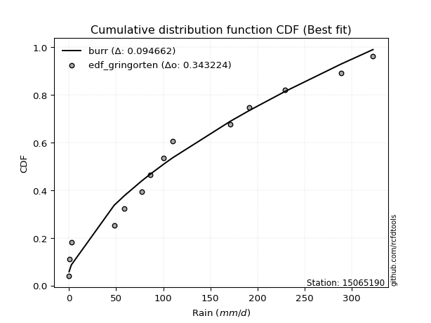</img>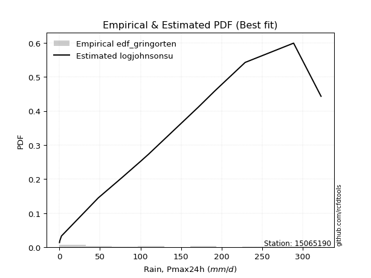</img>

</div>


### 9. Empirical - EDF Filliben (1975)

The specific values of the constants (0.3175) (often denoted as $alpha$) and (0.365) are derived from a method proposed by James J. Filliben in a 1975 paper. This particular formula is the mean value of the $i$-th order statistic of the normal distribution and is considered a robust and effective plotting position formula for the normal probability plot correlation coefficient test for normality.

<div align="center">


$P=(m-0.3175)/(n+0.365)$


</div>


**9.1. Empirical values**

<div align="center">

|                | 0                   | 1                   | 2                   | 3                   | 4                  | 5                  | 6                   | 7                  | 8                  | 9                  | 10                | 11                 | 12                 | 13                 |
|:---------------|:--------------------|:--------------------|:--------------------|:--------------------|:-------------------|:-------------------|:--------------------|:-------------------|:-------------------|:-------------------|:------------------|:-------------------|:-------------------|:-------------------|
| date           | 2023                | 2021                | 2019                | 2025                | 2014               | 2018               | 2012                | 2017               | 2013               | 2020               | 2015              | 2022               | 2016               | 2024               |
| x              | 0.2                 | 0.5                 | 2.6                 | 38.6                | 48.0               | 58.8               | 77.0                | 100.7              | 110.0              | 171.3              | 191.5             | 228.9              | 288.6              | 322.4              |
| m              | 1                   | 2                   | 3                   | 4                   | 5                  | 6                  | 7                   | 8                  | 9                  | 10                 | 11                | 12                 | 13                 | 14                 |
| empirical_dist | edf_filliben        | edf_filliben        | edf_filliben        | edf_filliben        | edf_filliben       | edf_filliben       | edf_filliben        | edf_filliben       | edf_filliben       | edf_filliben       | edf_filliben      | edf_filliben       | edf_filliben       | edf_filliben       |
| empirical      | 0.04751131221719457 | 0.11712495649147234 | 0.18673860076575008 | 0.25635224504002785 | 0.3259658893143056 | 0.3955795335885834 | 0.46519317786286113 | 0.5348068221371389 | 0.6044204664114166 | 0.6740341106856943 | 0.743647754959972 | 0.8132613992342499 | 0.8828750435085276 | 0.9524886877828054 |
| empirical_tr   | 1.0498812351543945  | 1.132663118470333   | 1.2296169484271346  | 1.3447226772759187  | 1.4836044410018074 | 1.6544773970630582 | 1.8698340383989585  | 2.1496445940890387 | 2.5279366476022873 | 3.0678056593699936 | 3.900882552613712 | 5.355079217148182  | 8.537890044576521  | 21.047619047619023 |

</div>


**9.2. Kolmogorov-Smirnov fit test (sorted by Δ)**


<div align="center">

|                | 0                   | 1                   | 2                   | 3                   | 4                   | 5                   | 6                   | 7                   | 8                   | 9                     | 10                 | 11                  | 12                 | 13                  | 14                  | 15                  | 16                  | 17                  | 18                  | 19                  | 20                 | 21                  | 22                  | 23                | 24                  | 25                | 26                  | 27                 | 28                | 29                  | 30                  | 31                  | 32                 | 33                | 34                  | 35                 | 36                 | 37                 | 38                  | 39                  | 40                  | 41                 | 42                  | 43                 | 44                  | 45                  | 46                  | 47                  | 48                  | 49                  | 50                  | 51                  | 52                  | 53                  | 54                 | 55                 | 56                  | 57                 | 58                 | 59                 | 60                  | 61                 | 62                 | 63                 | 64                  | 65                 | 66                 | 67                  | 68                  | 69                  | 70                 | 71                  | 72                 | 73                 | 74                 | 75                 | 76                 | 77                  | 78                  | 79                  | 80                  | 81                 | 82                 | 83                 | 84                  | 85                 | 86                 | 87                 | 88                 | 89                 |
|:---------------|:--------------------|:--------------------|:--------------------|:--------------------|:--------------------|:--------------------|:--------------------|:--------------------|:--------------------|:----------------------|:-------------------|:--------------------|:-------------------|:--------------------|:--------------------|:--------------------|:--------------------|:--------------------|:--------------------|:--------------------|:-------------------|:--------------------|:--------------------|:------------------|:--------------------|:------------------|:--------------------|:-------------------|:------------------|:--------------------|:--------------------|:--------------------|:-------------------|:------------------|:--------------------|:-------------------|:-------------------|:-------------------|:--------------------|:--------------------|:--------------------|:-------------------|:--------------------|:-------------------|:--------------------|:--------------------|:--------------------|:--------------------|:--------------------|:--------------------|:--------------------|:--------------------|:--------------------|:--------------------|:-------------------|:-------------------|:--------------------|:-------------------|:-------------------|:-------------------|:--------------------|:-------------------|:-------------------|:-------------------|:--------------------|:-------------------|:-------------------|:--------------------|:--------------------|:--------------------|:-------------------|:--------------------|:-------------------|:-------------------|:-------------------|:-------------------|:-------------------|:--------------------|:--------------------|:--------------------|:--------------------|:-------------------|:-------------------|:-------------------|:--------------------|:-------------------|:-------------------|:-------------------|:-------------------|:-------------------|
| station        | 15065190            | 15065190            | 15065190            | 15065190            | 15065190            | 15065190            | 15065190            | 15065190            | 15065190            | 15065190              | 15065190           | 15065190            | 15065190           | 15065190            | 15065190            | 15065190            | 15065190            | 15065190            | 15065190            | 15065190            | 15065190           | 15065190            | 15065190            | 15065190          | 15065190            | 15065190          | 15065190            | 15065190           | 15065190          | 15065190            | 15065190            | 15065190            | 15065190           | 15065190          | 15065190            | 15065190           | 15065190           | 15065190           | 15065190            | 15065190            | 15065190            | 15065190           | 15065190            | 15065190           | 15065190            | 15065190            | 15065190            | 15065190            | 15065190            | 15065190            | 15065190            | 15065190            | 15065190            | 15065190            | 15065190           | 15065190           | 15065190            | 15065190           | 15065190           | 15065190           | 15065190            | 15065190           | 15065190           | 15065190           | 15065190            | 15065190           | 15065190           | 15065190            | 15065190            | 15065190            | 15065190           | 15065190            | 15065190           | 15065190           | 15065190           | 15065190           | 15065190           | 15065190            | 15065190            | 15065190            | 15065190            | 15065190           | 15065190           | 15065190           | 15065190            | 15065190           | 15065190           | 15065190           | 15065190           | 15065190           |
| empirical_dist | edf_filliben        | edf_filliben        | edf_filliben        | edf_filliben        | edf_filliben        | edf_filliben        | edf_filliben        | edf_filliben        | edf_filliben        | edf_filliben          | edf_filliben       | edf_filliben        | edf_filliben       | edf_filliben        | edf_filliben        | edf_filliben        | edf_filliben        | edf_filliben        | edf_filliben        | edf_filliben        | edf_filliben       | edf_filliben        | edf_filliben        | edf_filliben      | edf_filliben        | edf_filliben      | edf_filliben        | edf_filliben       | edf_filliben      | edf_filliben        | edf_filliben        | edf_filliben        | edf_filliben       | edf_filliben      | edf_filliben        | edf_filliben       | edf_filliben       | edf_filliben       | edf_filliben        | edf_filliben        | edf_filliben        | edf_filliben       | edf_filliben        | edf_filliben       | edf_filliben        | edf_filliben        | edf_filliben        | edf_filliben        | edf_filliben        | edf_filliben        | edf_filliben        | edf_filliben        | edf_filliben        | edf_filliben        | edf_filliben       | edf_filliben       | edf_filliben        | edf_filliben       | edf_filliben       | edf_filliben       | edf_filliben        | edf_filliben       | edf_filliben       | edf_filliben       | edf_filliben        | edf_filliben       | edf_filliben       | edf_filliben        | edf_filliben        | edf_filliben        | edf_filliben       | edf_filliben        | edf_filliben       | edf_filliben       | edf_filliben       | edf_filliben       | edf_filliben       | edf_filliben        | edf_filliben        | edf_filliben        | edf_filliben        | edf_filliben       | edf_filliben       | edf_filliben       | edf_filliben        | edf_filliben       | edf_filliben       | edf_filliben       | edf_filliben       | edf_filliben       |
| p_dist         | ncf                 | logjohnsonsu        | halfnorm            | rayleigh            | pearson3            | gumbel_r            | genlogistic         | maxwell             | kstwobign           | loglaplace_asymmetric | logloggamma        | invgamma            | mielke             | alpha               | weibull_min         | moyal               | invgauss            | rice                | johnsonsu           | crystalball         | norm               | t                   | logistic            | loggompertz       | logt                | halflogistic      | betaprime           | hypsecant          | logfisk           | logpearson3         | nakagami            | exponnorm           | laplace_asymmetric | expon             | genexpon            | truncnorm          | loggumbel_l        | gompertz           | laplace             | f                   | wald                | erlang             | fisk                | gumbel_l           | logbetaprime        | lognct              | loglaplace          | loghypsecant        | loglogistic         | logfatiguelife      | logrice             | logcrystalball      | lognorm             | lognorm             | logexponnorm       | lognakagami        | loglognorm          | loggamma           | loggamma           | loginvgamma        | logerlang           | chi2               | loginvgauss        | gibrat             | loginvweibull       | logmaxwell         | lograyleigh        | loggumbel_r         | logkstwobign        | loghalfnorm         | loggenexpon        | invweibull          | logmoyal           | loghalflogistic    | nct                | logexpon           | logncf             | pareto              | logwald             | loggibrat           | gamma               | logtruncnorm       | fatiguelife        | logf               | logpareto           | logalpha           | logweibull_min     | logmielke          | logchi2            | loggenlogistic     |
| delta          | 0.07096872669001186 | 0.08101446846724702 | 0.08382924068238017 | 0.08628121914868059 | 0.08901067101989579 | 0.08929061544724638 | 0.09066452797755178 | 0.09782790168931832 | 0.09825873784058563 | 0.11117841366674208   | 0.1114030935241575 | 0.11219949814924819 | 0.1146997991157717 | 0.11521862316641499 | 0.11580877626065017 | 0.11737597832117608 | 0.11878120100359123 | 0.11934323939396296 | 0.12312124022834568 | 0.13175694385573733 | 0.1317569449866362 | 0.13183230557533898 | 0.13547625954727655 | 0.140958558305198 | 0.14121534706366135 | 0.142215468953808 | 0.14559752991216623 | 0.1483057841071314 | 0.152484167841841 | 0.15768525154440932 | 0.15768553117620826 | 0.16575850447207394 | 0.1664138505438175 | 0.166413858508424 | 0.16798105981787384 | 0.1728158897171209 | 0.1728244787546066 | 0.1742677259293087 | 0.17645960760279777 | 0.17730333834116013 | 0.18673860076575008 | 0.1940052924074494 | 0.19443032424420587 | 0.2024069234985153 | 0.24074231108087252 | 0.24285651361798755 | 0.24287808613766065 | 0.24310309786880624 | 0.24315380553678645 | 0.24317929299529467 | 0.24321120359630627 | 0.24321315524325626 | 0.24321318134988384 | 0.24321318134988384 | 0.2432137992902002 | 0.2432665324610866 | 0.24452603075043855 | 0.2555007842030007 | 0.2555007842030007 | 0.2565286358686214 | 0.25825762824958987 | 0.2639222548436635 | 0.2645471892474933 | 0.2708901303597117 | 0.27528311485893653 | 0.2762806772714398 | 0.2873017407638271 | 0.31357620798231345 | 0.31511508167941604 | 0.31832944273766317 | 0.3241490788149263 | 0.33828176042716507 | 0.3394263668290385 | 0.3432378143464293 | 0.3668668755416954 | 0.3755943690471214 | 0.3778085827577625 | 0.39329213264008966 | 0.41131684001022273 | 0.43460497578524715 | 0.44201199377414135 | 0.4639521409388172 | 0.4675644342653107 | 0.4788007795147966 | 0.49414496131601193 | 0.5223789042838215 | 0.5793839779805038 | 0.6197151699910721 | 0.6236237684915076 | 0.8828750435085276 |
| deltao         | 0.343224222286      | 0.343224222286      | 0.343224222286      | 0.343224222286      | 0.343224222286      | 0.343224222286      | 0.343224222286      | 0.343224222286      | 0.343224222286      | 0.343224222286        | 0.343224222286     | 0.343224222286      | 0.343224222286     | 0.343224222286      | 0.343224222286      | 0.343224222286      | 0.343224222286      | 0.343224222286      | 0.343224222286      | 0.343224222286      | 0.343224222286     | 0.343224222286      | 0.343224222286      | 0.343224222286    | 0.343224222286      | 0.343224222286    | 0.343224222286      | 0.343224222286     | 0.343224222286    | 0.343224222286      | 0.343224222286      | 0.343224222286      | 0.343224222286     | 0.343224222286    | 0.343224222286      | 0.343224222286     | 0.343224222286     | 0.343224222286     | 0.343224222286      | 0.343224222286      | 0.343224222286      | 0.343224222286     | 0.343224222286      | 0.343224222286     | 0.343224222286      | 0.343224222286      | 0.343224222286      | 0.343224222286      | 0.343224222286      | 0.343224222286      | 0.343224222286      | 0.343224222286      | 0.343224222286      | 0.343224222286      | 0.343224222286     | 0.343224222286     | 0.343224222286      | 0.343224222286     | 0.343224222286     | 0.343224222286     | 0.343224222286      | 0.343224222286     | 0.343224222286     | 0.343224222286     | 0.343224222286      | 0.343224222286     | 0.343224222286     | 0.343224222286      | 0.343224222286      | 0.343224222286      | 0.343224222286     | 0.343224222286      | 0.343224222286     | 0.343224222286     | 0.343224222286     | 0.343224222286     | 0.343224222286     | 0.343224222286      | 0.343224222286      | 0.343224222286      | 0.343224222286      | 0.343224222286     | 0.343224222286     | 0.343224222286     | 0.343224222286      | 0.343224222286     | 0.343224222286     | 0.343224222286     | 0.343224222286     | 0.343224222286     |
| eval           | Δo > Δ              | Δo > Δ              | Δo > Δ              | Δo > Δ              | Δo > Δ              | Δo > Δ              | Δo > Δ              | Δo > Δ              | Δo > Δ              | Δo > Δ                | Δo > Δ             | Δo > Δ              | Δo > Δ             | Δo > Δ              | Δo > Δ              | Δo > Δ              | Δo > Δ              | Δo > Δ              | Δo > Δ              | Δo > Δ              | Δo > Δ             | Δo > Δ              | Δo > Δ              | Δo > Δ            | Δo > Δ              | Δo > Δ            | Δo > Δ              | Δo > Δ             | Δo > Δ            | Δo > Δ              | Δo > Δ              | Δo > Δ              | Δo > Δ             | Δo > Δ            | Δo > Δ              | Δo > Δ             | Δo > Δ             | Δo > Δ             | Δo > Δ              | Δo > Δ              | Δo > Δ              | Δo > Δ             | Δo > Δ              | Δo > Δ             | Δo > Δ              | Δo > Δ              | Δo > Δ              | Δo > Δ              | Δo > Δ              | Δo > Δ              | Δo > Δ              | Δo > Δ              | Δo > Δ              | Δo > Δ              | Δo > Δ             | Δo > Δ             | Δo > Δ              | Δo > Δ             | Δo > Δ             | Δo > Δ             | Δo > Δ              | Δo > Δ             | Δo > Δ             | Δo > Δ             | Δo > Δ              | Δo > Δ             | Δo > Δ             | Δo > Δ              | Δo > Δ              | Δo > Δ              | Δo > Δ             | Δo > Δ              | Δo > Δ             | Δo <= Δ            | Δo <= Δ            | Δo <= Δ            | Δo <= Δ            | Δo <= Δ             | Δo <= Δ             | Δo <= Δ             | Δo <= Δ             | Δo <= Δ            | Δo <= Δ            | Δo <= Δ            | Δo <= Δ             | Δo <= Δ            | Δo <= Δ            | Δo <= Δ            | Δo <= Δ            | Δo <= Δ            |
| fit            | 1                   | 1                   | 1                   | 1                   | 1                   | 1                   | 1                   | 1                   | 1                   | 1                     | 1                  | 1                   | 1                  | 1                   | 1                   | 1                   | 1                   | 1                   | 1                   | 1                   | 1                  | 1                   | 1                   | 1                 | 1                   | 1                 | 1                   | 1                  | 1                 | 1                   | 1                   | 1                   | 1                  | 1                 | 1                   | 1                  | 1                  | 1                  | 1                   | 1                   | 1                   | 1                  | 1                   | 1                  | 1                   | 1                   | 1                   | 1                   | 1                   | 1                   | 1                   | 1                   | 1                   | 1                   | 1                  | 1                  | 1                   | 1                  | 1                  | 1                  | 1                   | 1                  | 1                  | 1                  | 1                   | 1                  | 1                  | 1                   | 1                   | 1                   | 1                  | 1                   | 1                  | 0                  | 0                  | 0                  | 0                  | 0                   | 0                   | 0                   | 0                   | 0                  | 0                  | 0                  | 0                   | 0                  | 0                  | 0                  | 0                  | 0                  |
| n              | 14                  | 14                  | 14                  | 14                  | 14                  | 14                  | 14                  | 14                  | 14                  | 14                    | 14                 | 14                  | 14                 | 14                  | 14                  | 14                  | 14                  | 14                  | 14                  | 14                  | 14                 | 14                  | 14                  | 14                | 14                  | 14                | 14                  | 14                 | 14                | 14                  | 14                  | 14                  | 14                 | 14                | 14                  | 14                 | 14                 | 14                 | 14                  | 14                  | 14                  | 14                 | 14                  | 14                 | 14                  | 14                  | 14                  | 14                  | 14                  | 14                  | 14                  | 14                  | 14                  | 14                  | 14                 | 14                 | 14                  | 14                 | 14                 | 14                 | 14                  | 14                 | 14                 | 14                 | 14                  | 14                 | 14                 | 14                  | 14                  | 14                  | 14                 | 14                  | 14                 | 14                 | 14                 | 14                 | 14                 | 14                  | 14                  | 14                  | 14                  | 14                 | 14                 | 14                 | 14                  | 14                 | 14                 | 14                 | 14                 | 14                 |
| best_fit       | 1                   | 0                   | 0                   | 0                   | 0                   | 0                   | 0                   | 0                   | 0                   | 0                     | 0                  | 0                   | 0                  | 0                   | 0                   | 0                   | 0                   | 0                   | 0                   | 0                   | 0                  | 0                   | 0                   | 0                 | 0                   | 0                 | 0                   | 0                  | 0                 | 0                   | 0                   | 0                   | 0                  | 0                 | 0                   | 0                  | 0                  | 0                  | 0                   | 0                   | 0                   | 0                  | 0                   | 0                  | 0                   | 0                   | 0                   | 0                   | 0                   | 0                   | 0                   | 0                   | 0                   | 0                   | 0                  | 0                  | 0                   | 0                  | 0                  | 0                  | 0                   | 0                  | 0                  | 0                  | 0                   | 0                  | 0                  | 0                   | 0                   | 0                   | 0                  | 0                   | 0                  | 0                  | 0                  | 0                  | 0                  | 0                   | 0                   | 0                   | 0                   | 0                  | 0                  | 0                  | 0                   | 0                  | 0                  | 0                  | 0                  | 0                  |
| best_fit_sort  | 1                   | 2                   | 3                   | 4                   | 5                   | 6                   | 7                   | 8                   | 9                   | 10                    | 11                 | 12                  | 13                 | 14                  | 15                  | 16                  | 17                  | 18                  | 19                  | 20                  | 21                 | 22                  | 23                  | 24                | 25                  | 26                | 27                  | 28                 | 29                | 30                  | 31                  | 32                  | 33                 | 34                | 35                  | 36                 | 37                 | 38                 | 39                  | 40                  | 41                  | 42                 | 43                  | 44                 | 45                  | 46                  | 47                  | 48                  | 49                  | 50                  | 51                  | 52                  | 53                  | 54                  | 55                 | 56                 | 57                  | 58                 | 59                 | 60                 | 61                  | 62                 | 63                 | 64                 | 65                  | 66                 | 67                 | 68                  | 69                  | 70                  | 71                 | 72                  | 73                 | 74                 | 75                 | 76                 | 77                 | 78                  | 79                  | 80                  | 81                  | 82                 | 83                 | 84                 | 85                  | 86                 | 87                 | 88                 | 89                 | 90                 |

</div>


<div align="center">

</img>

</div>


**9.3. Best fit**

<div align="center">

|   id |   station | empirical_dist   | p_dist   |     delta |   deltao | eval   |   fit |   n |   best_fit |   best_fit_sort |
|-----:|----------:|:-----------------|:---------|----------:|---------:|:-------|------:|----:|-----------:|----------------:|
|    0 |  15065190 | edf_filliben     | ncf      | 0.0709687 | 0.343224 | Δo > Δ |     1 |  14 |          1 |               1 |

</div>


<div align="center">

</img>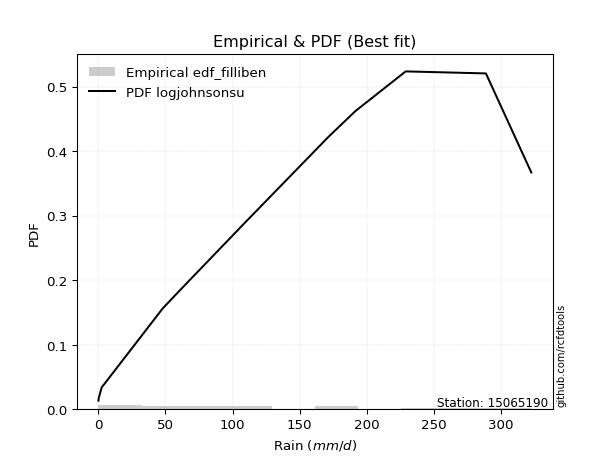</img>

</div>


### 10. Empirical - EDF Jenkinson (1977)

The Jenkinson formula in hydrology is an empirical plotting position formula used to estimate the non-exceedance probability _(P)_ or return period _(T)_ of a given ordered observation within a sample. It is a widely used method in the frequency analysis of extreme events such as floods and rainfall, as it provides a distribution-free way to plot data. _a≈0.31_ and _b≈0.38_ are constants derived to approximate the median of the probability distribution for the given rank.

<div align="center">


$P=(m-a)/(n+b)$


</div>


**10.1. Empirical values**

<div align="center">

|                | 0                   | 1                   | 2                  | 3                  | 4                   | 5                  | 6                   | 7                  | 8                  | 9                  | 10                 | 11                 | 12                 | 13                 |
|:---------------|:--------------------|:--------------------|:-------------------|:-------------------|:--------------------|:-------------------|:--------------------|:-------------------|:-------------------|:-------------------|:-------------------|:-------------------|:-------------------|:-------------------|
| date           | 2023                | 2021                | 2019               | 2025               | 2014                | 2018               | 2012                | 2017               | 2013               | 2020               | 2015               | 2022               | 2016               | 2024               |
| x              | 0.2                 | 0.5                 | 2.6                | 38.6               | 48.0                | 58.8               | 77.0                | 100.7              | 110.0              | 171.3              | 191.5              | 228.9              | 288.6              | 322.4              |
| m              | 1                   | 2                   | 3                  | 4                  | 5                   | 6                  | 7                   | 8                  | 9                  | 10                 | 11                 | 12                 | 13                 | 14                 |
| empirical_dist | edf_jenkinson       | edf_jenkinson       | edf_jenkinson      | edf_jenkinson      | edf_jenkinson       | edf_jenkinson      | edf_jenkinson       | edf_jenkinson      | edf_jenkinson      | edf_jenkinson      | edf_jenkinson      | edf_jenkinson      | edf_jenkinson      | edf_jenkinson      |
| empirical      | 0.04798331015299026 | 0.11752433936022252 | 0.1870653685674548 | 0.256606397774687  | 0.32614742698191934 | 0.3956884561891516 | 0.46522948539638387 | 0.5347705146036161 | 0.6043115438108483 | 0.6738525730180805 | 0.7433936022253128 | 0.8129346314325451 | 0.8824756606397773 | 0.9520166898470096 |
| empirical_tr   | 1.0504017531044558  | 1.1331757289204099  | 1.2301112061591104 | 1.3451824134705332 | 1.4840041279669762  | 1.6547756041426929 | 1.869960988296489   | 2.1494768310911807 | 2.527240773286467  | 3.066098081023453  | 3.8970189701897002 | 5.345724907063193  | 8.50887573964496   | 20.84057971014487  |

</div>


**10.2. Kolmogorov-Smirnov fit test (sorted by Δ)**


<div align="center">

|                | 0                   | 1                   | 2                   | 3                   | 4                   | 5                   | 6                   | 7                   | 8                   | 9                     | 10                  | 11                 | 12                  | 13                 | 14                | 15                  | 16                  | 17                  | 18                  | 19                  | 20                  | 21                 | 22                  | 23                  | 24                  | 25                 | 26                  | 27                  | 28                  | 29                  | 30                  | 31                  | 32                 | 33                 | 34                  | 35                  | 36                 | 37                 | 38                 | 39                  | 40                 | 41                  | 42                 | 43                  | 44                  | 45                  | 46                  | 47                  | 48                  | 49                 | 50                 | 51                 | 52                  | 53                  | 54                  | 55                  | 56                  | 57                  | 58                  | 59                 | 60                 | 61                 | 62                  | 63                  | 64                  | 65                 | 66                 | 67                 | 68                  | 69                | 70                 | 71                 | 72                 | 73                  | 74                 | 75                 | 76                  | 77                 | 78                  | 79                | 80                 | 81                  | 82                 | 83                  | 84                  | 85                 | 86                 | 87                | 88                 | 89                 |
|:---------------|:--------------------|:--------------------|:--------------------|:--------------------|:--------------------|:--------------------|:--------------------|:--------------------|:--------------------|:----------------------|:--------------------|:-------------------|:--------------------|:-------------------|:------------------|:--------------------|:--------------------|:--------------------|:--------------------|:--------------------|:--------------------|:-------------------|:--------------------|:--------------------|:--------------------|:-------------------|:--------------------|:--------------------|:--------------------|:--------------------|:--------------------|:--------------------|:-------------------|:-------------------|:--------------------|:--------------------|:-------------------|:-------------------|:-------------------|:--------------------|:-------------------|:--------------------|:-------------------|:--------------------|:--------------------|:--------------------|:--------------------|:--------------------|:--------------------|:-------------------|:-------------------|:-------------------|:--------------------|:--------------------|:--------------------|:--------------------|:--------------------|:--------------------|:--------------------|:-------------------|:-------------------|:-------------------|:--------------------|:--------------------|:--------------------|:-------------------|:-------------------|:-------------------|:--------------------|:------------------|:-------------------|:-------------------|:-------------------|:--------------------|:-------------------|:-------------------|:--------------------|:-------------------|:--------------------|:------------------|:-------------------|:--------------------|:-------------------|:--------------------|:--------------------|:-------------------|:-------------------|:------------------|:-------------------|:-------------------|
| station        | 15065190            | 15065190            | 15065190            | 15065190            | 15065190            | 15065190            | 15065190            | 15065190            | 15065190            | 15065190              | 15065190            | 15065190           | 15065190            | 15065190           | 15065190          | 15065190            | 15065190            | 15065190            | 15065190            | 15065190            | 15065190            | 15065190           | 15065190            | 15065190            | 15065190            | 15065190           | 15065190            | 15065190            | 15065190            | 15065190            | 15065190            | 15065190            | 15065190           | 15065190           | 15065190            | 15065190            | 15065190           | 15065190           | 15065190           | 15065190            | 15065190           | 15065190            | 15065190           | 15065190            | 15065190            | 15065190            | 15065190            | 15065190            | 15065190            | 15065190           | 15065190           | 15065190           | 15065190            | 15065190            | 15065190            | 15065190            | 15065190            | 15065190            | 15065190            | 15065190           | 15065190           | 15065190           | 15065190            | 15065190            | 15065190            | 15065190           | 15065190           | 15065190           | 15065190            | 15065190          | 15065190           | 15065190           | 15065190           | 15065190            | 15065190           | 15065190           | 15065190            | 15065190           | 15065190            | 15065190          | 15065190           | 15065190            | 15065190           | 15065190            | 15065190            | 15065190           | 15065190           | 15065190          | 15065190           | 15065190           |
| empirical_dist | edf_jenkinson       | edf_jenkinson       | edf_jenkinson       | edf_jenkinson       | edf_jenkinson       | edf_jenkinson       | edf_jenkinson       | edf_jenkinson       | edf_jenkinson       | edf_jenkinson         | edf_jenkinson       | edf_jenkinson      | edf_jenkinson       | edf_jenkinson      | edf_jenkinson     | edf_jenkinson       | edf_jenkinson       | edf_jenkinson       | edf_jenkinson       | edf_jenkinson       | edf_jenkinson       | edf_jenkinson      | edf_jenkinson       | edf_jenkinson       | edf_jenkinson       | edf_jenkinson      | edf_jenkinson       | edf_jenkinson       | edf_jenkinson       | edf_jenkinson       | edf_jenkinson       | edf_jenkinson       | edf_jenkinson      | edf_jenkinson      | edf_jenkinson       | edf_jenkinson       | edf_jenkinson      | edf_jenkinson      | edf_jenkinson      | edf_jenkinson       | edf_jenkinson      | edf_jenkinson       | edf_jenkinson      | edf_jenkinson       | edf_jenkinson       | edf_jenkinson       | edf_jenkinson       | edf_jenkinson       | edf_jenkinson       | edf_jenkinson      | edf_jenkinson      | edf_jenkinson      | edf_jenkinson       | edf_jenkinson       | edf_jenkinson       | edf_jenkinson       | edf_jenkinson       | edf_jenkinson       | edf_jenkinson       | edf_jenkinson      | edf_jenkinson      | edf_jenkinson      | edf_jenkinson       | edf_jenkinson       | edf_jenkinson       | edf_jenkinson      | edf_jenkinson      | edf_jenkinson      | edf_jenkinson       | edf_jenkinson     | edf_jenkinson      | edf_jenkinson      | edf_jenkinson      | edf_jenkinson       | edf_jenkinson      | edf_jenkinson      | edf_jenkinson       | edf_jenkinson      | edf_jenkinson       | edf_jenkinson     | edf_jenkinson      | edf_jenkinson       | edf_jenkinson      | edf_jenkinson       | edf_jenkinson       | edf_jenkinson      | edf_jenkinson      | edf_jenkinson     | edf_jenkinson      | edf_jenkinson      |
| p_dist         | ncf                 | logjohnsonsu        | halfnorm            | rayleigh            | pearson3            | gumbel_r            | genlogistic         | maxwell             | kstwobign           | loglaplace_asymmetric | logloggamma         | invgamma           | mielke              | alpha              | weibull_min       | moyal               | invgauss            | rice                | johnsonsu           | crystalball         | norm                | t                  | logistic            | loggompertz         | logt                | halflogistic       | betaprime           | hypsecant           | logfisk             | logpearson3         | nakagami            | exponnorm           | laplace_asymmetric | expon              | genexpon            | loggumbel_l         | truncnorm          | gompertz           | laplace            | f                   | wald               | erlang              | fisk               | gumbel_l            | logbetaprime        | lognct              | loglaplace          | loghypsecant        | loglogistic         | logfatiguelife     | logrice            | logcrystalball     | lognorm             | lognorm             | logexponnorm        | lognakagami         | loglognorm          | loggamma            | loggamma            | loginvgamma        | logerlang          | chi2               | loginvgauss         | gibrat              | loginvweibull       | logmaxwell         | lograyleigh        | loggumbel_r        | logkstwobign        | loghalfnorm       | loggenexpon        | invweibull         | logmoyal           | loghalflogistic     | nct                | logexpon           | logncf              | pareto             | logwald             | loggibrat         | gamma              | logtruncnorm        | fatiguelife        | logf                | logpareto           | logalpha           | logweibull_min     | logmielke         | logchi2            | loggenlogistic     |
| delta          | 0.07115026435762561 | 0.08090554586667875 | 0.08415600848408487 | 0.08617229654811231 | 0.08890174841932752 | 0.08961738324895109 | 0.09099129577925649 | 0.09771897908875005 | 0.09858550564229034 | 0.11092426093208291   | 0.11114894078949833 | 0.1125262659509529 | 0.11502656691747641 | 0.1155453909681197 | 0.115554623525991 | 0.11770274612288079 | 0.11910796880529594 | 0.11945216199453118 | 0.12344800803005039 | 0.13164802125516906 | 0.13164802238606793 | 0.1317233829747707 | 0.13536733694670827 | 0.14070440557053882 | 0.14074334912786557 | 0.1425422367555127 | 0.14534337717750706 | 0.14834209164065415 | 0.15223001510718182 | 0.15743109880975015 | 0.15743137844154909 | 0.16608527227377864 | 0.1667406183455222 | 0.1667406263101287 | 0.16830782761957855 | 0.17257032601994743 | 0.1731426575188256 | 0.1745944937310134 | 0.1764959151363205 | 0.17704918560650096 | 0.1870653685674548 | 0.19375113967279023 | 0.1941761715095467 | 0.20229800089794703 | 0.24048815834621334 | 0.24260236088332837 | 0.24262393340300148 | 0.24284894513414707 | 0.24289965280212727 | 0.2429251402606355 | 0.2429570508616471 | 0.2429590025085971 | 0.24295902861522467 | 0.24295902861522467 | 0.24295964655554103 | 0.24301237972642742 | 0.24427187801577938 | 0.25524663146834153 | 0.25524663146834153 | 0.2562744831339622 | 0.2580034755149307 | 0.2636681021090043 | 0.26429303651283415 | 0.27107166802732546 | 0.27502896212427735 | 0.2760265245367806 | 0.2870475880291679 | 0.3133220552476543 | 0.31486092894475687 | 0.318075290003004 | 0.3238949260802671 | 0.3380276076925059 | 0.3391722140943793 | 0.34298366161177013 | 0.3666127228070362 | 0.3753402163124622 | 0.37755443002310335 | 0.3930379799054305 | 0.41106268727556355 | 0.434350823050588 | 0.4417578410394822 | 0.46369798820415803 | 0.4673102815306515 | 0.47854662678013743 | 0.49374557844726175 | 0.5221247515491623 | 0.5791298252458446 | 0.619461017256413 | 0.6233696157568485 | 0.8824756606397773 |
| deltao         | 0.343224222286      | 0.343224222286      | 0.343224222286      | 0.343224222286      | 0.343224222286      | 0.343224222286      | 0.343224222286      | 0.343224222286      | 0.343224222286      | 0.343224222286        | 0.343224222286      | 0.343224222286     | 0.343224222286      | 0.343224222286     | 0.343224222286    | 0.343224222286      | 0.343224222286      | 0.343224222286      | 0.343224222286      | 0.343224222286      | 0.343224222286      | 0.343224222286     | 0.343224222286      | 0.343224222286      | 0.343224222286      | 0.343224222286     | 0.343224222286      | 0.343224222286      | 0.343224222286      | 0.343224222286      | 0.343224222286      | 0.343224222286      | 0.343224222286     | 0.343224222286     | 0.343224222286      | 0.343224222286      | 0.343224222286     | 0.343224222286     | 0.343224222286     | 0.343224222286      | 0.343224222286     | 0.343224222286      | 0.343224222286     | 0.343224222286      | 0.343224222286      | 0.343224222286      | 0.343224222286      | 0.343224222286      | 0.343224222286      | 0.343224222286     | 0.343224222286     | 0.343224222286     | 0.343224222286      | 0.343224222286      | 0.343224222286      | 0.343224222286      | 0.343224222286      | 0.343224222286      | 0.343224222286      | 0.343224222286     | 0.343224222286     | 0.343224222286     | 0.343224222286      | 0.343224222286      | 0.343224222286      | 0.343224222286     | 0.343224222286     | 0.343224222286     | 0.343224222286      | 0.343224222286    | 0.343224222286     | 0.343224222286     | 0.343224222286     | 0.343224222286      | 0.343224222286     | 0.343224222286     | 0.343224222286      | 0.343224222286     | 0.343224222286      | 0.343224222286    | 0.343224222286     | 0.343224222286      | 0.343224222286     | 0.343224222286      | 0.343224222286      | 0.343224222286     | 0.343224222286     | 0.343224222286    | 0.343224222286     | 0.343224222286     |
| eval           | Δo > Δ              | Δo > Δ              | Δo > Δ              | Δo > Δ              | Δo > Δ              | Δo > Δ              | Δo > Δ              | Δo > Δ              | Δo > Δ              | Δo > Δ                | Δo > Δ              | Δo > Δ             | Δo > Δ              | Δo > Δ             | Δo > Δ            | Δo > Δ              | Δo > Δ              | Δo > Δ              | Δo > Δ              | Δo > Δ              | Δo > Δ              | Δo > Δ             | Δo > Δ              | Δo > Δ              | Δo > Δ              | Δo > Δ             | Δo > Δ              | Δo > Δ              | Δo > Δ              | Δo > Δ              | Δo > Δ              | Δo > Δ              | Δo > Δ             | Δo > Δ             | Δo > Δ              | Δo > Δ              | Δo > Δ             | Δo > Δ             | Δo > Δ             | Δo > Δ              | Δo > Δ             | Δo > Δ              | Δo > Δ             | Δo > Δ              | Δo > Δ              | Δo > Δ              | Δo > Δ              | Δo > Δ              | Δo > Δ              | Δo > Δ             | Δo > Δ             | Δo > Δ             | Δo > Δ              | Δo > Δ              | Δo > Δ              | Δo > Δ              | Δo > Δ              | Δo > Δ              | Δo > Δ              | Δo > Δ             | Δo > Δ             | Δo > Δ             | Δo > Δ              | Δo > Δ              | Δo > Δ              | Δo > Δ             | Δo > Δ             | Δo > Δ             | Δo > Δ              | Δo > Δ            | Δo > Δ             | Δo > Δ             | Δo > Δ             | Δo > Δ              | Δo <= Δ            | Δo <= Δ            | Δo <= Δ             | Δo <= Δ            | Δo <= Δ             | Δo <= Δ           | Δo <= Δ            | Δo <= Δ             | Δo <= Δ            | Δo <= Δ             | Δo <= Δ             | Δo <= Δ            | Δo <= Δ            | Δo <= Δ           | Δo <= Δ            | Δo <= Δ            |
| fit            | 1                   | 1                   | 1                   | 1                   | 1                   | 1                   | 1                   | 1                   | 1                   | 1                     | 1                   | 1                  | 1                   | 1                  | 1                 | 1                   | 1                   | 1                   | 1                   | 1                   | 1                   | 1                  | 1                   | 1                   | 1                   | 1                  | 1                   | 1                   | 1                   | 1                   | 1                   | 1                   | 1                  | 1                  | 1                   | 1                   | 1                  | 1                  | 1                  | 1                   | 1                  | 1                   | 1                  | 1                   | 1                   | 1                   | 1                   | 1                   | 1                   | 1                  | 1                  | 1                  | 1                   | 1                   | 1                   | 1                   | 1                   | 1                   | 1                   | 1                  | 1                  | 1                  | 1                   | 1                   | 1                   | 1                  | 1                  | 1                  | 1                   | 1                 | 1                  | 1                  | 1                  | 1                   | 0                  | 0                  | 0                   | 0                  | 0                   | 0                 | 0                  | 0                   | 0                  | 0                   | 0                   | 0                  | 0                  | 0                 | 0                  | 0                  |
| n              | 14                  | 14                  | 14                  | 14                  | 14                  | 14                  | 14                  | 14                  | 14                  | 14                    | 14                  | 14                 | 14                  | 14                 | 14                | 14                  | 14                  | 14                  | 14                  | 14                  | 14                  | 14                 | 14                  | 14                  | 14                  | 14                 | 14                  | 14                  | 14                  | 14                  | 14                  | 14                  | 14                 | 14                 | 14                  | 14                  | 14                 | 14                 | 14                 | 14                  | 14                 | 14                  | 14                 | 14                  | 14                  | 14                  | 14                  | 14                  | 14                  | 14                 | 14                 | 14                 | 14                  | 14                  | 14                  | 14                  | 14                  | 14                  | 14                  | 14                 | 14                 | 14                 | 14                  | 14                  | 14                  | 14                 | 14                 | 14                 | 14                  | 14                | 14                 | 14                 | 14                 | 14                  | 14                 | 14                 | 14                  | 14                 | 14                  | 14                | 14                 | 14                  | 14                 | 14                  | 14                  | 14                 | 14                 | 14                | 14                 | 14                 |
| best_fit       | 1                   | 0                   | 0                   | 0                   | 0                   | 0                   | 0                   | 0                   | 0                   | 0                     | 0                   | 0                  | 0                   | 0                  | 0                 | 0                   | 0                   | 0                   | 0                   | 0                   | 0                   | 0                  | 0                   | 0                   | 0                   | 0                  | 0                   | 0                   | 0                   | 0                   | 0                   | 0                   | 0                  | 0                  | 0                   | 0                   | 0                  | 0                  | 0                  | 0                   | 0                  | 0                   | 0                  | 0                   | 0                   | 0                   | 0                   | 0                   | 0                   | 0                  | 0                  | 0                  | 0                   | 0                   | 0                   | 0                   | 0                   | 0                   | 0                   | 0                  | 0                  | 0                  | 0                   | 0                   | 0                   | 0                  | 0                  | 0                  | 0                   | 0                 | 0                  | 0                  | 0                  | 0                   | 0                  | 0                  | 0                   | 0                  | 0                   | 0                 | 0                  | 0                   | 0                  | 0                   | 0                   | 0                  | 0                  | 0                 | 0                  | 0                  |
| best_fit_sort  | 1                   | 2                   | 3                   | 4                   | 5                   | 6                   | 7                   | 8                   | 9                   | 10                    | 11                  | 12                 | 13                  | 14                 | 15                | 16                  | 17                  | 18                  | 19                  | 20                  | 21                  | 22                 | 23                  | 24                  | 25                  | 26                 | 27                  | 28                  | 29                  | 30                  | 31                  | 32                  | 33                 | 34                 | 35                  | 36                  | 37                 | 38                 | 39                 | 40                  | 41                 | 42                  | 43                 | 44                  | 45                  | 46                  | 47                  | 48                  | 49                  | 50                 | 51                 | 52                 | 53                  | 54                  | 55                  | 56                  | 57                  | 58                  | 59                  | 60                 | 61                 | 62                 | 63                  | 64                  | 65                  | 66                 | 67                 | 68                 | 69                  | 70                | 71                 | 72                 | 73                 | 74                  | 75                 | 76                 | 77                  | 78                 | 79                  | 80                | 81                 | 82                  | 83                 | 84                  | 85                  | 86                 | 87                 | 88                | 89                 | 90                 |

</div>


<div align="center">

</img>

</div>


**10.3. Best fit**

<div align="center">

|   id |   station | empirical_dist   | p_dist   |     delta |   deltao | eval   |   fit |   n |   best_fit |   best_fit_sort |
|-----:|----------:|:-----------------|:---------|----------:|---------:|:-------|------:|----:|-----------:|----------------:|
|    0 |  15065190 | edf_jenkinson    | ncf      | 0.0711503 | 0.343224 | Δo > Δ |     1 |  14 |          1 |               1 |

</div>


<div align="center">

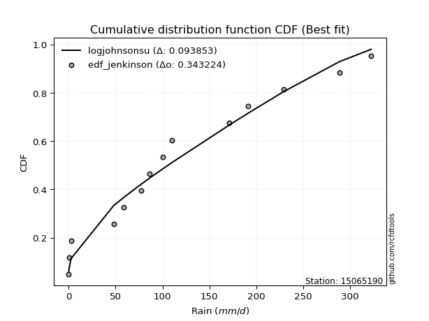</img></img>

</div>


### 11. Empirical - EDF Cunnane (1978)

Cunnane´s work in statistical hydrology has focused on the performance and evaluation of different probability distributions (such as GEV, Gumbel, Lognormal) for flood frequency estimation. _b_ is a constant, typically set to 0.4.

<div align="center">


$P=(m-b)/(n+1-2b)$


</div>


**11.1. Empirical values**

<div align="center">

|                | 0                   | 1                   | 2                   | 3                  | 4                  | 5                   | 6                  | 7                  | 8                  | 9                  | 10                 | 11                 | 12                 | 13                 |
|:---------------|:--------------------|:--------------------|:--------------------|:-------------------|:-------------------|:--------------------|:-------------------|:-------------------|:-------------------|:-------------------|:-------------------|:-------------------|:-------------------|:-------------------|
| date           | 2023                | 2021                | 2019                | 2025               | 2014               | 2018                | 2012               | 2017               | 2013               | 2020               | 2015               | 2022               | 2016               | 2024               |
| x              | 0.2                 | 0.5                 | 2.6                 | 38.6               | 48.0               | 58.8                | 77.0               | 100.7              | 110.0              | 171.3              | 191.5              | 228.9              | 288.6              | 322.4              |
| m              | 1                   | 2                   | 3                   | 4                  | 5                  | 6                   | 7                  | 8                  | 9                  | 10                 | 11                 | 12                 | 13                 | 14                 |
| empirical_dist | edf_cunnane         | edf_cunnane         | edf_cunnane         | edf_cunnane        | edf_cunnane        | edf_cunnane         | edf_cunnane        | edf_cunnane        | edf_cunnane        | edf_cunnane        | edf_cunnane        | edf_cunnane        | edf_cunnane        | edf_cunnane        |
| empirical      | 0.04225352112676056 | 0.11267605633802819 | 0.18309859154929578 | 0.2535211267605634 | 0.323943661971831  | 0.39436619718309857 | 0.4647887323943662 | 0.5352112676056338 | 0.6056338028169014 | 0.676056338028169  | 0.7464788732394366 | 0.8169014084507042 | 0.8873239436619719 | 0.9577464788732395 |
| empirical_tr   | 1.0441176470588234  | 1.126984126984127   | 1.2241379310344827  | 1.3396226415094339 | 1.4791666666666667 | 1.6511627906976742  | 1.8684210526315792 | 2.1515151515151514 | 2.5357142857142856 | 3.0869565217391304 | 3.9444444444444446 | 5.461538461538463  | 8.875000000000004  | 23.6666666666667   |

</div>


**11.2. Kolmogorov-Smirnov fit test (sorted by Δ)**


<div align="center">

|                | 0                   | 1                   | 2                   | 3                   | 4                   | 5                   | 6                   | 7                   | 8                   | 9                  | 10                 | 11                  | 12                    | 13                  | 14                  | 15                  | 16                  | 17                  | 18                  | 19                  | 20                  | 21                 | 22                  | 23                 | 24                  | 25                  | 26                  | 27                 | 28                 | 29                 | 30                  | 31                  | 32                 | 33                 | 34                  | 35                 | 36                 | 37                  | 38                  | 39                 | 40                  | 41                  | 42                  | 43                  | 44                | 45                  | 46                  | 47                 | 48                  | 49                  | 50                  | 51                  | 52                  | 53                  | 54                  | 55                  | 56                  | 57                 | 58                 | 59                 | 60                  | 61                  | 62                 | 63                 | 64                | 65                  | 66                  | 67                 | 68                 | 69                  | 70                  | 71                  | 72                  | 73                 | 74                  | 75                 | 76                | 77                  | 78                 | 79                 | 80                 | 81                 | 82                  | 83                 | 84                 | 85                | 86                 | 87                 | 88                | 89                 |
|:---------------|:--------------------|:--------------------|:--------------------|:--------------------|:--------------------|:--------------------|:--------------------|:--------------------|:--------------------|:-------------------|:-------------------|:--------------------|:----------------------|:--------------------|:--------------------|:--------------------|:--------------------|:--------------------|:--------------------|:--------------------|:--------------------|:-------------------|:--------------------|:-------------------|:--------------------|:--------------------|:--------------------|:-------------------|:-------------------|:-------------------|:--------------------|:--------------------|:-------------------|:-------------------|:--------------------|:-------------------|:-------------------|:--------------------|:--------------------|:-------------------|:--------------------|:--------------------|:--------------------|:--------------------|:------------------|:--------------------|:--------------------|:-------------------|:--------------------|:--------------------|:--------------------|:--------------------|:--------------------|:--------------------|:--------------------|:--------------------|:--------------------|:-------------------|:-------------------|:-------------------|:--------------------|:--------------------|:-------------------|:-------------------|:------------------|:--------------------|:--------------------|:-------------------|:-------------------|:--------------------|:--------------------|:--------------------|:--------------------|:-------------------|:--------------------|:-------------------|:------------------|:--------------------|:-------------------|:-------------------|:-------------------|:-------------------|:--------------------|:-------------------|:-------------------|:------------------|:-------------------|:-------------------|:------------------|:-------------------|
| station        | 15065190            | 15065190            | 15065190            | 15065190            | 15065190            | 15065190            | 15065190            | 15065190            | 15065190            | 15065190           | 15065190           | 15065190            | 15065190              | 15065190            | 15065190            | 15065190            | 15065190            | 15065190            | 15065190            | 15065190            | 15065190            | 15065190           | 15065190            | 15065190           | 15065190            | 15065190            | 15065190            | 15065190           | 15065190           | 15065190           | 15065190            | 15065190            | 15065190           | 15065190           | 15065190            | 15065190           | 15065190           | 15065190            | 15065190            | 15065190           | 15065190            | 15065190            | 15065190            | 15065190            | 15065190          | 15065190            | 15065190            | 15065190           | 15065190            | 15065190            | 15065190            | 15065190            | 15065190            | 15065190            | 15065190            | 15065190            | 15065190            | 15065190           | 15065190           | 15065190           | 15065190            | 15065190            | 15065190           | 15065190           | 15065190          | 15065190            | 15065190            | 15065190           | 15065190           | 15065190            | 15065190            | 15065190            | 15065190            | 15065190           | 15065190            | 15065190           | 15065190          | 15065190            | 15065190           | 15065190           | 15065190           | 15065190           | 15065190            | 15065190           | 15065190           | 15065190          | 15065190           | 15065190           | 15065190          | 15065190           |
| empirical_dist | edf_cunnane         | edf_cunnane         | edf_cunnane         | edf_cunnane         | edf_cunnane         | edf_cunnane         | edf_cunnane         | edf_cunnane         | edf_cunnane         | edf_cunnane        | edf_cunnane        | edf_cunnane         | edf_cunnane           | edf_cunnane         | edf_cunnane         | edf_cunnane         | edf_cunnane         | edf_cunnane         | edf_cunnane         | edf_cunnane         | edf_cunnane         | edf_cunnane        | edf_cunnane         | edf_cunnane        | edf_cunnane         | edf_cunnane         | edf_cunnane         | edf_cunnane        | edf_cunnane        | edf_cunnane        | edf_cunnane         | edf_cunnane         | edf_cunnane        | edf_cunnane        | edf_cunnane         | edf_cunnane        | edf_cunnane        | edf_cunnane         | edf_cunnane         | edf_cunnane        | edf_cunnane         | edf_cunnane         | edf_cunnane         | edf_cunnane         | edf_cunnane       | edf_cunnane         | edf_cunnane         | edf_cunnane        | edf_cunnane         | edf_cunnane         | edf_cunnane         | edf_cunnane         | edf_cunnane         | edf_cunnane         | edf_cunnane         | edf_cunnane         | edf_cunnane         | edf_cunnane        | edf_cunnane        | edf_cunnane        | edf_cunnane         | edf_cunnane         | edf_cunnane        | edf_cunnane        | edf_cunnane       | edf_cunnane         | edf_cunnane         | edf_cunnane        | edf_cunnane        | edf_cunnane         | edf_cunnane         | edf_cunnane         | edf_cunnane         | edf_cunnane        | edf_cunnane         | edf_cunnane        | edf_cunnane       | edf_cunnane         | edf_cunnane        | edf_cunnane        | edf_cunnane        | edf_cunnane        | edf_cunnane         | edf_cunnane        | edf_cunnane        | edf_cunnane       | edf_cunnane        | edf_cunnane        | edf_cunnane       | edf_cunnane        |
| p_dist         | ncf                 | halfnorm            | logjohnsonsu        | gumbel_r            | genlogistic         | rayleigh            | pearson3            | kstwobign           | maxwell             | invgamma           | mielke             | moyal               | loglaplace_asymmetric | logloggamma         | invgauss            | alpha               | rice                | weibull_min         | johnsonsu           | crystalball         | norm                | t                  | logistic            | halflogistic       | loggompertz         | logt                | hypsecant           | betaprime          | logfisk            | logpearson3        | nakagami            | exponnorm           | laplace_asymmetric | expon              | genexpon            | truncnorm          | gompertz           | loggumbel_l         | laplace             | f                  | wald                | erlang              | fisk                | gumbel_l            | logbetaprime      | lognct              | loglaplace          | loghypsecant       | loglogistic         | logfatiguelife      | logrice             | logcrystalball      | lognorm             | lognorm             | logexponnorm        | lognakagami         | loglognorm          | loggamma           | loggamma           | loginvgamma        | logerlang           | chi2                | loginvgauss        | gibrat             | loginvweibull     | logmaxwell          | lograyleigh         | loggumbel_r        | logkstwobign       | loghalfnorm         | loggenexpon         | invweibull          | logmoyal            | loghalflogistic    | nct                 | logexpon           | logncf            | pareto              | logwald            | loggibrat          | gamma              | logtruncnorm       | fatiguelife         | logf               | logpareto          | logalpha          | logweibull_min     | logmielke          | logchi2           | loggenlogistic     |
| delta          | 0.06894649934753716 | 0.08018923146592587 | 0.08222780487273185 | 0.08565060623079208 | 0.08702451876109749 | 0.08749455555416541 | 0.09022400742538061 | 0.09461872862413133 | 0.09904123809480314 | 0.1085594889327939 | 0.1110597898993174 | 0.11373596910472178 | 0.11400953194620655   | 0.11423421180362198 | 0.11514119178713693 | 0.11580953098025237 | 0.11812990298847814 | 0.11863989454011464 | 0.11948123101189138 | 0.13297028026122215 | 0.13297028139212103 | 0.1330456419808238 | 0.13668959595276137 | 0.1385754597373537 | 0.14378967658466246 | 0.14647313815409546 | 0.14790133863863647 | 0.1484286481916307 | 0.1563793324064432 | 0.1605163698238738 | 0.16051664945567273 | 0.16211849525561964 | 0.1627738413273632 | 0.1627738492919697 | 0.16434105060141954 | 0.1691758805006666 | 0.1706277167128544 | 0.17565559703407108 | 0.17605516213430283 | 0.1801344566206246 | 0.18309859154929578 | 0.19683641068691388 | 0.19726144252367034 | 0.20362025990400012 | 0.243573429360337 | 0.24568763189745202 | 0.24570920441712513 | 0.2459342161482707 | 0.24598492381625092 | 0.24601041127475914 | 0.24604232187577074 | 0.24604427352272074 | 0.24604429962934832 | 0.24604429962934832 | 0.24604491756966468 | 0.24609765074055107 | 0.24735714902990302 | 0.2583319024824652 | 0.2583319024824652 | 0.2593597541480859 | 0.26108874652905434 | 0.26675337312312797 | 0.2673783075269578 | 0.2688679030172371 | 0.278114233138401 | 0.27911179555090426 | 0.29013285904329156 | 0.3164073262617779 | 0.3179461999588805 | 0.32116056101712764 | 0.32698019709439075 | 0.34111287870662954 | 0.34225748510850296 | 0.3460689326258938 | 0.36969799382115986 | 0.3784254873265859 | 0.380639701037227 | 0.39612325091955414 | 0.4141479582896872 | 0.4374360940647116 | 0.4448431120536058 | 0.4667832592182817 | 0.47039555254477516 | 0.4816318977942611 | 0.4985938614694561 | 0.525210022563286 | 0.5822150962599683 | 0.6225462882705366 | 0.626454886770972 | 0.8873239436619719 |
| deltao         | 0.343224222286      | 0.343224222286      | 0.343224222286      | 0.343224222286      | 0.343224222286      | 0.343224222286      | 0.343224222286      | 0.343224222286      | 0.343224222286      | 0.343224222286     | 0.343224222286     | 0.343224222286      | 0.343224222286        | 0.343224222286      | 0.343224222286      | 0.343224222286      | 0.343224222286      | 0.343224222286      | 0.343224222286      | 0.343224222286      | 0.343224222286      | 0.343224222286     | 0.343224222286      | 0.343224222286     | 0.343224222286      | 0.343224222286      | 0.343224222286      | 0.343224222286     | 0.343224222286     | 0.343224222286     | 0.343224222286      | 0.343224222286      | 0.343224222286     | 0.343224222286     | 0.343224222286      | 0.343224222286     | 0.343224222286     | 0.343224222286      | 0.343224222286      | 0.343224222286     | 0.343224222286      | 0.343224222286      | 0.343224222286      | 0.343224222286      | 0.343224222286    | 0.343224222286      | 0.343224222286      | 0.343224222286     | 0.343224222286      | 0.343224222286      | 0.343224222286      | 0.343224222286      | 0.343224222286      | 0.343224222286      | 0.343224222286      | 0.343224222286      | 0.343224222286      | 0.343224222286     | 0.343224222286     | 0.343224222286     | 0.343224222286      | 0.343224222286      | 0.343224222286     | 0.343224222286     | 0.343224222286    | 0.343224222286      | 0.343224222286      | 0.343224222286     | 0.343224222286     | 0.343224222286      | 0.343224222286      | 0.343224222286      | 0.343224222286      | 0.343224222286     | 0.343224222286      | 0.343224222286     | 0.343224222286    | 0.343224222286      | 0.343224222286     | 0.343224222286     | 0.343224222286     | 0.343224222286     | 0.343224222286      | 0.343224222286     | 0.343224222286     | 0.343224222286    | 0.343224222286     | 0.343224222286     | 0.343224222286    | 0.343224222286     |
| eval           | Δo > Δ              | Δo > Δ              | Δo > Δ              | Δo > Δ              | Δo > Δ              | Δo > Δ              | Δo > Δ              | Δo > Δ              | Δo > Δ              | Δo > Δ             | Δo > Δ             | Δo > Δ              | Δo > Δ                | Δo > Δ              | Δo > Δ              | Δo > Δ              | Δo > Δ              | Δo > Δ              | Δo > Δ              | Δo > Δ              | Δo > Δ              | Δo > Δ             | Δo > Δ              | Δo > Δ             | Δo > Δ              | Δo > Δ              | Δo > Δ              | Δo > Δ             | Δo > Δ             | Δo > Δ             | Δo > Δ              | Δo > Δ              | Δo > Δ             | Δo > Δ             | Δo > Δ              | Δo > Δ             | Δo > Δ             | Δo > Δ              | Δo > Δ              | Δo > Δ             | Δo > Δ              | Δo > Δ              | Δo > Δ              | Δo > Δ              | Δo > Δ            | Δo > Δ              | Δo > Δ              | Δo > Δ             | Δo > Δ              | Δo > Δ              | Δo > Δ              | Δo > Δ              | Δo > Δ              | Δo > Δ              | Δo > Δ              | Δo > Δ              | Δo > Δ              | Δo > Δ             | Δo > Δ             | Δo > Δ             | Δo > Δ              | Δo > Δ              | Δo > Δ             | Δo > Δ             | Δo > Δ            | Δo > Δ              | Δo > Δ              | Δo > Δ             | Δo > Δ             | Δo > Δ              | Δo > Δ              | Δo > Δ              | Δo > Δ              | Δo <= Δ            | Δo <= Δ             | Δo <= Δ            | Δo <= Δ           | Δo <= Δ             | Δo <= Δ            | Δo <= Δ            | Δo <= Δ            | Δo <= Δ            | Δo <= Δ             | Δo <= Δ            | Δo <= Δ            | Δo <= Δ           | Δo <= Δ            | Δo <= Δ            | Δo <= Δ           | Δo <= Δ            |
| fit            | 1                   | 1                   | 1                   | 1                   | 1                   | 1                   | 1                   | 1                   | 1                   | 1                  | 1                  | 1                   | 1                     | 1                   | 1                   | 1                   | 1                   | 1                   | 1                   | 1                   | 1                   | 1                  | 1                   | 1                  | 1                   | 1                   | 1                   | 1                  | 1                  | 1                  | 1                   | 1                   | 1                  | 1                  | 1                   | 1                  | 1                  | 1                   | 1                   | 1                  | 1                   | 1                   | 1                   | 1                   | 1                 | 1                   | 1                   | 1                  | 1                   | 1                   | 1                   | 1                   | 1                   | 1                   | 1                   | 1                   | 1                   | 1                  | 1                  | 1                  | 1                   | 1                   | 1                  | 1                  | 1                 | 1                   | 1                   | 1                  | 1                  | 1                   | 1                   | 1                   | 1                   | 0                  | 0                   | 0                  | 0                 | 0                   | 0                  | 0                  | 0                  | 0                  | 0                   | 0                  | 0                  | 0                 | 0                  | 0                  | 0                 | 0                  |
| n              | 14                  | 14                  | 14                  | 14                  | 14                  | 14                  | 14                  | 14                  | 14                  | 14                 | 14                 | 14                  | 14                    | 14                  | 14                  | 14                  | 14                  | 14                  | 14                  | 14                  | 14                  | 14                 | 14                  | 14                 | 14                  | 14                  | 14                  | 14                 | 14                 | 14                 | 14                  | 14                  | 14                 | 14                 | 14                  | 14                 | 14                 | 14                  | 14                  | 14                 | 14                  | 14                  | 14                  | 14                  | 14                | 14                  | 14                  | 14                 | 14                  | 14                  | 14                  | 14                  | 14                  | 14                  | 14                  | 14                  | 14                  | 14                 | 14                 | 14                 | 14                  | 14                  | 14                 | 14                 | 14                | 14                  | 14                  | 14                 | 14                 | 14                  | 14                  | 14                  | 14                  | 14                 | 14                  | 14                 | 14                | 14                  | 14                 | 14                 | 14                 | 14                 | 14                  | 14                 | 14                 | 14                | 14                 | 14                 | 14                | 14                 |
| best_fit       | 1                   | 0                   | 0                   | 0                   | 0                   | 0                   | 0                   | 0                   | 0                   | 0                  | 0                  | 0                   | 0                     | 0                   | 0                   | 0                   | 0                   | 0                   | 0                   | 0                   | 0                   | 0                  | 0                   | 0                  | 0                   | 0                   | 0                   | 0                  | 0                  | 0                  | 0                   | 0                   | 0                  | 0                  | 0                   | 0                  | 0                  | 0                   | 0                   | 0                  | 0                   | 0                   | 0                   | 0                   | 0                 | 0                   | 0                   | 0                  | 0                   | 0                   | 0                   | 0                   | 0                   | 0                   | 0                   | 0                   | 0                   | 0                  | 0                  | 0                  | 0                   | 0                   | 0                  | 0                  | 0                 | 0                   | 0                   | 0                  | 0                  | 0                   | 0                   | 0                   | 0                   | 0                  | 0                   | 0                  | 0                 | 0                   | 0                  | 0                  | 0                  | 0                  | 0                   | 0                  | 0                  | 0                 | 0                  | 0                  | 0                 | 0                  |
| best_fit_sort  | 1                   | 2                   | 3                   | 4                   | 5                   | 6                   | 7                   | 8                   | 9                   | 10                 | 11                 | 12                  | 13                    | 14                  | 15                  | 16                  | 17                  | 18                  | 19                  | 20                  | 21                  | 22                 | 23                  | 24                 | 25                  | 26                  | 27                  | 28                 | 29                 | 30                 | 31                  | 32                  | 33                 | 34                 | 35                  | 36                 | 37                 | 38                  | 39                  | 40                 | 41                  | 42                  | 43                  | 44                  | 45                | 46                  | 47                  | 48                 | 49                  | 50                  | 51                  | 52                  | 53                  | 54                  | 55                  | 56                  | 57                  | 58                 | 59                 | 60                 | 61                  | 62                  | 63                 | 64                 | 65                | 66                  | 67                  | 68                 | 69                 | 70                  | 71                  | 72                  | 73                  | 74                 | 75                  | 76                 | 77                | 78                  | 79                 | 80                 | 81                 | 82                 | 83                  | 84                 | 85                 | 86                | 87                 | 88                 | 89                | 90                 |

</div>


<div align="center">

</img>

</div>


**11.3. Best fit**

<div align="center">

|   id |   station | empirical_dist   | p_dist   |     delta |   deltao | eval   |   fit |   n |   best_fit |   best_fit_sort |
|-----:|----------:|:-----------------|:---------|----------:|---------:|:-------|------:|----:|-----------:|----------------:|
|    0 |  15065190 | edf_cunnane      | ncf      | 0.0689465 | 0.343224 | Δo > Δ |     1 |  14 |          1 |               1 |

</div>


<div align="center">

</img></img>

</div>


### 12. Empirical - EDF Adamowski (1981)

The Adamowski formula in hydrology refers to a specific plotting position formula used for estimating the non-parametric empirical distribution of hydrological events (like flood peaks) to calculate their return periods. This formula provides an alternative to traditional parametric methods (like the Gumbel or Log Pearson Type III distributions). 

<div align="center">


$P=(m-0.25)/(n+0.5)$


</div>


**12.1. Empirical values**

<div align="center">

|                | 0                   | 1                  | 2                  | 3                   | 4                  | 5                   | 6                   | 7                  | 8                  | 9                  | 10                 | 11                 | 12                 | 13                 |
|:---------------|:--------------------|:-------------------|:-------------------|:--------------------|:-------------------|:--------------------|:--------------------|:-------------------|:-------------------|:-------------------|:-------------------|:-------------------|:-------------------|:-------------------|
| date           | 2023                | 2021               | 2019               | 2025                | 2014               | 2018                | 2012                | 2017               | 2013               | 2020               | 2015               | 2022               | 2016               | 2024               |
| x              | 0.2                 | 0.5                | 2.6                | 38.6                | 48.0               | 58.8                | 77.0                | 100.7              | 110.0              | 171.3              | 191.5              | 228.9              | 288.6              | 322.4              |
| m              | 1                   | 2                  | 3                  | 4                   | 5                  | 6                   | 7                   | 8                  | 9                  | 10                 | 11                 | 12                 | 13                 | 14                 |
| empirical_dist | edf_adamowski       | edf_adamowski      | edf_adamowski      | edf_adamowski       | edf_adamowski      | edf_adamowski       | edf_adamowski       | edf_adamowski      | edf_adamowski      | edf_adamowski      | edf_adamowski      | edf_adamowski      | edf_adamowski      | edf_adamowski      |
| empirical      | 0.05172413793103448 | 0.1206896551724138 | 0.1896551724137931 | 0.25862068965517243 | 0.3275862068965517 | 0.39655172413793105 | 0.46551724137931033 | 0.5344827586206896 | 0.603448275862069  | 0.6724137931034483 | 0.7413793103448276 | 0.8103448275862069 | 0.8793103448275862 | 0.9482758620689655 |
| empirical_tr   | 1.0545454545454545  | 1.1372549019607843 | 1.2340425531914894 | 1.3488372093023255  | 1.4871794871794872 | 1.6571428571428573  | 1.8709677419354835  | 2.148148148148148  | 2.5217391304347827 | 3.0526315789473686 | 3.866666666666667  | 5.272727272727272  | 8.285714285714285  | 19.333333333333336 |

</div>


**12.2. Kolmogorov-Smirnov fit test (sorted by Δ)**


<div align="center">

|                | 0                   | 1                   | 2                   | 3                   | 4                   | 5                  | 6                  | 7                   | 8                   | 9                     | 10                  | 11                 | 12                  | 13                  | 14                | 15                  | 16                  | 17                  | 18                  | 19                  | 20                 | 21                  | 22                  | 23                 | 24                  | 25                  | 26                  | 27                 | 28                 | 29                  | 30                  | 31                  | 32                 | 33                | 34                  | 35                  | 36                  | 37                 | 38                  | 39                 | 40                 | 41                  | 42                  | 43                 | 44                  | 45                  | 46                  | 47                  | 48                  | 49                 | 50                 | 51                  | 52                  | 53                  | 54                  | 55                | 56                  | 57                 | 58                 | 59                 | 60                 | 61                 | 62                  | 63                  | 64                  | 65                 | 66                 | 67                  | 68                  | 69                 | 70                 | 71                 | 72                 | 73                 | 74                 | 75                 | 76                  | 77                 | 78                  | 79                  | 80                  | 81                 | 82                 | 83                | 84                 | 85                | 86                 | 87                 | 88                 | 89                 |
|:---------------|:--------------------|:--------------------|:--------------------|:--------------------|:--------------------|:-------------------|:-------------------|:--------------------|:--------------------|:----------------------|:--------------------|:-------------------|:--------------------|:--------------------|:------------------|:--------------------|:--------------------|:--------------------|:--------------------|:--------------------|:-------------------|:--------------------|:--------------------|:-------------------|:--------------------|:--------------------|:--------------------|:-------------------|:-------------------|:--------------------|:--------------------|:--------------------|:-------------------|:------------------|:--------------------|:--------------------|:--------------------|:-------------------|:--------------------|:-------------------|:-------------------|:--------------------|:--------------------|:-------------------|:--------------------|:--------------------|:--------------------|:--------------------|:--------------------|:-------------------|:-------------------|:--------------------|:--------------------|:--------------------|:--------------------|:------------------|:--------------------|:-------------------|:-------------------|:-------------------|:-------------------|:-------------------|:--------------------|:--------------------|:--------------------|:-------------------|:-------------------|:--------------------|:--------------------|:-------------------|:-------------------|:-------------------|:-------------------|:-------------------|:-------------------|:-------------------|:--------------------|:-------------------|:--------------------|:--------------------|:--------------------|:-------------------|:-------------------|:------------------|:-------------------|:------------------|:-------------------|:-------------------|:-------------------|:-------------------|
| station        | 15065190            | 15065190            | 15065190            | 15065190            | 15065190            | 15065190           | 15065190           | 15065190            | 15065190            | 15065190              | 15065190            | 15065190           | 15065190            | 15065190            | 15065190          | 15065190            | 15065190            | 15065190            | 15065190            | 15065190            | 15065190           | 15065190            | 15065190            | 15065190           | 15065190            | 15065190            | 15065190            | 15065190           | 15065190           | 15065190            | 15065190            | 15065190            | 15065190           | 15065190          | 15065190            | 15065190            | 15065190            | 15065190           | 15065190            | 15065190           | 15065190           | 15065190            | 15065190            | 15065190           | 15065190            | 15065190            | 15065190            | 15065190            | 15065190            | 15065190           | 15065190           | 15065190            | 15065190            | 15065190            | 15065190            | 15065190          | 15065190            | 15065190           | 15065190           | 15065190           | 15065190           | 15065190           | 15065190            | 15065190            | 15065190            | 15065190           | 15065190           | 15065190            | 15065190            | 15065190           | 15065190           | 15065190           | 15065190           | 15065190           | 15065190           | 15065190           | 15065190            | 15065190           | 15065190            | 15065190            | 15065190            | 15065190           | 15065190           | 15065190          | 15065190           | 15065190          | 15065190           | 15065190           | 15065190           | 15065190           |
| empirical_dist | edf_adamowski       | edf_adamowski       | edf_adamowski       | edf_adamowski       | edf_adamowski       | edf_adamowski      | edf_adamowski      | edf_adamowski       | edf_adamowski       | edf_adamowski         | edf_adamowski       | edf_adamowski      | edf_adamowski       | edf_adamowski       | edf_adamowski     | edf_adamowski       | edf_adamowski       | edf_adamowski       | edf_adamowski       | edf_adamowski       | edf_adamowski      | edf_adamowski       | edf_adamowski       | edf_adamowski      | edf_adamowski       | edf_adamowski       | edf_adamowski       | edf_adamowski      | edf_adamowski      | edf_adamowski       | edf_adamowski       | edf_adamowski       | edf_adamowski      | edf_adamowski     | edf_adamowski       | edf_adamowski       | edf_adamowski       | edf_adamowski      | edf_adamowski       | edf_adamowski      | edf_adamowski      | edf_adamowski       | edf_adamowski       | edf_adamowski      | edf_adamowski       | edf_adamowski       | edf_adamowski       | edf_adamowski       | edf_adamowski       | edf_adamowski      | edf_adamowski      | edf_adamowski       | edf_adamowski       | edf_adamowski       | edf_adamowski       | edf_adamowski     | edf_adamowski       | edf_adamowski      | edf_adamowski      | edf_adamowski      | edf_adamowski      | edf_adamowski      | edf_adamowski       | edf_adamowski       | edf_adamowski       | edf_adamowski      | edf_adamowski      | edf_adamowski       | edf_adamowski       | edf_adamowski      | edf_adamowski      | edf_adamowski      | edf_adamowski      | edf_adamowski      | edf_adamowski      | edf_adamowski      | edf_adamowski       | edf_adamowski      | edf_adamowski       | edf_adamowski       | edf_adamowski       | edf_adamowski      | edf_adamowski      | edf_adamowski     | edf_adamowski      | edf_adamowski     | edf_adamowski      | edf_adamowski      | edf_adamowski      | edf_adamowski      |
| p_dist         | ncf                 | logjohnsonsu        | rayleigh            | halfnorm            | pearson3            | gumbel_r           | genlogistic        | maxwell             | kstwobign           | loglaplace_asymmetric | logloggamma         | invgamma           | weibull_min         | mielke              | alpha             | moyal               | rice                | invgauss            | johnsonsu           | crystalball         | norm               | t                   | logistic            | loggompertz        | logt                | betaprime           | halflogistic        | hypsecant          | logfisk            | logpearson3         | nakagami            | exponnorm           | laplace_asymmetric | expon             | loggumbel_l         | genexpon            | f                   | truncnorm          | laplace             | gompertz           | wald               | erlang              | fisk                | gumbel_l           | logbetaprime        | lognct              | loglaplace          | loghypsecant        | loglogistic         | logfatiguelife     | logrice            | logcrystalball      | lognorm             | lognorm             | logexponnorm        | lognakagami       | loglognorm          | loggamma           | loggamma           | loginvgamma        | logerlang          | chi2               | loginvgauss         | gibrat              | loginvweibull       | logmaxwell         | lograyleigh        | loggumbel_r         | logkstwobign        | loghalfnorm        | loggenexpon        | invweibull         | logmoyal           | loghalflogistic    | nct                | logexpon           | logncf              | pareto             | logwald             | loggibrat           | gamma               | logtruncnorm       | fatiguelife        | logf              | logpareto          | logalpha          | logweibull_min     | logmielke          | logchi2            | loggenlogistic     |
| delta          | 0.07258904427225787 | 0.08004227791789942 | 0.08530902859933298 | 0.08674581233042318 | 0.08803848047054819 | 0.0922071870952894 | 0.0935810996255948 | 0.09685571113997071 | 0.10117530948862864 | 0.1089099690515975    | 0.10913464890901292 | 0.1151160697972912 | 0.11742544947945475 | 0.11761637076381472 | 0.118135194814458 | 0.12029254996921909 | 0.12031542994331063 | 0.12169777265163424 | 0.12603781187638868 | 0.13078475330638972 | 0.1307847544372886 | 0.13086011502599137 | 0.13464726206455202 | 0.1386901136900534 | 0.14036921522777734 | 0.14332908529702165 | 0.14513204060185098 | 0.1486298476235806 | 0.1502157232266964 | 0.15541680692926474 | 0.15541708656106368 | 0.16867507612011695 | 0.1693304221918605 | 0.169330430156467 | 0.17055603413946202 | 0.17089763146591685 | 0.17503489372601555 | 0.1757324613651639 | 0.17678367111924698 | 0.1771842975773517 | 0.1896551724137931 | 0.19173684779230482 | 0.19216187962906128 | 0.2014347329491677 | 0.23847386646572794 | 0.24058806900284296 | 0.24060964152251607 | 0.24083465325366166 | 0.24088536092164187 | 0.2409108483801501 | 0.2409427589811617 | 0.24094471062811168 | 0.24094473673473926 | 0.24094473673473926 | 0.24094535467505562 | 0.240998087845942 | 0.24225758613529397 | 0.2532323395878561 | 0.2532323395878561 | 0.2542601912534768 | 0.2559891836344453 | 0.2616538102285189 | 0.26227874463234874 | 0.27251044794195783 | 0.27301467024379195 | 0.2740122326562952 | 0.2850332961486825 | 0.31130776336716887 | 0.31284663706427146 | 0.3160609981225186 | 0.3218806341997817 | 0.3360133158120205 | 0.3371579222138939 | 0.3409693697312847 | 0.3645984309265508 | 0.3733259244319768 | 0.37554013814261794 | 0.3910236880249451 | 0.40904839539507815 | 0.43233653117010257 | 0.43974354915899677 | 0.4616836963236726 | 0.4652959896501661 | 0.476532334899652 | 0.4905802626350705 | 0.520110459668677 | 0.5771155333653593 | 0.6174467253759275 | 0.6213553238763629 | 0.8793103448275862 |
| deltao         | 0.343224222286      | 0.343224222286      | 0.343224222286      | 0.343224222286      | 0.343224222286      | 0.343224222286     | 0.343224222286     | 0.343224222286      | 0.343224222286      | 0.343224222286        | 0.343224222286      | 0.343224222286     | 0.343224222286      | 0.343224222286      | 0.343224222286    | 0.343224222286      | 0.343224222286      | 0.343224222286      | 0.343224222286      | 0.343224222286      | 0.343224222286     | 0.343224222286      | 0.343224222286      | 0.343224222286     | 0.343224222286      | 0.343224222286      | 0.343224222286      | 0.343224222286     | 0.343224222286     | 0.343224222286      | 0.343224222286      | 0.343224222286      | 0.343224222286     | 0.343224222286    | 0.343224222286      | 0.343224222286      | 0.343224222286      | 0.343224222286     | 0.343224222286      | 0.343224222286     | 0.343224222286     | 0.343224222286      | 0.343224222286      | 0.343224222286     | 0.343224222286      | 0.343224222286      | 0.343224222286      | 0.343224222286      | 0.343224222286      | 0.343224222286     | 0.343224222286     | 0.343224222286      | 0.343224222286      | 0.343224222286      | 0.343224222286      | 0.343224222286    | 0.343224222286      | 0.343224222286     | 0.343224222286     | 0.343224222286     | 0.343224222286     | 0.343224222286     | 0.343224222286      | 0.343224222286      | 0.343224222286      | 0.343224222286     | 0.343224222286     | 0.343224222286      | 0.343224222286      | 0.343224222286     | 0.343224222286     | 0.343224222286     | 0.343224222286     | 0.343224222286     | 0.343224222286     | 0.343224222286     | 0.343224222286      | 0.343224222286     | 0.343224222286      | 0.343224222286      | 0.343224222286      | 0.343224222286     | 0.343224222286     | 0.343224222286    | 0.343224222286     | 0.343224222286    | 0.343224222286     | 0.343224222286     | 0.343224222286     | 0.343224222286     |
| eval           | Δo > Δ              | Δo > Δ              | Δo > Δ              | Δo > Δ              | Δo > Δ              | Δo > Δ             | Δo > Δ             | Δo > Δ              | Δo > Δ              | Δo > Δ                | Δo > Δ              | Δo > Δ             | Δo > Δ              | Δo > Δ              | Δo > Δ            | Δo > Δ              | Δo > Δ              | Δo > Δ              | Δo > Δ              | Δo > Δ              | Δo > Δ             | Δo > Δ              | Δo > Δ              | Δo > Δ             | Δo > Δ              | Δo > Δ              | Δo > Δ              | Δo > Δ             | Δo > Δ             | Δo > Δ              | Δo > Δ              | Δo > Δ              | Δo > Δ             | Δo > Δ            | Δo > Δ              | Δo > Δ              | Δo > Δ              | Δo > Δ             | Δo > Δ              | Δo > Δ             | Δo > Δ             | Δo > Δ              | Δo > Δ              | Δo > Δ             | Δo > Δ              | Δo > Δ              | Δo > Δ              | Δo > Δ              | Δo > Δ              | Δo > Δ             | Δo > Δ             | Δo > Δ              | Δo > Δ              | Δo > Δ              | Δo > Δ              | Δo > Δ            | Δo > Δ              | Δo > Δ             | Δo > Δ             | Δo > Δ             | Δo > Δ             | Δo > Δ             | Δo > Δ              | Δo > Δ              | Δo > Δ              | Δo > Δ             | Δo > Δ             | Δo > Δ              | Δo > Δ              | Δo > Δ             | Δo > Δ             | Δo > Δ             | Δo > Δ             | Δo > Δ             | Δo <= Δ            | Δo <= Δ            | Δo <= Δ             | Δo <= Δ            | Δo <= Δ             | Δo <= Δ             | Δo <= Δ             | Δo <= Δ            | Δo <= Δ            | Δo <= Δ           | Δo <= Δ            | Δo <= Δ           | Δo <= Δ            | Δo <= Δ            | Δo <= Δ            | Δo <= Δ            |
| fit            | 1                   | 1                   | 1                   | 1                   | 1                   | 1                  | 1                  | 1                   | 1                   | 1                     | 1                   | 1                  | 1                   | 1                   | 1                 | 1                   | 1                   | 1                   | 1                   | 1                   | 1                  | 1                   | 1                   | 1                  | 1                   | 1                   | 1                   | 1                  | 1                  | 1                   | 1                   | 1                   | 1                  | 1                 | 1                   | 1                   | 1                   | 1                  | 1                   | 1                  | 1                  | 1                   | 1                   | 1                  | 1                   | 1                   | 1                   | 1                   | 1                   | 1                  | 1                  | 1                   | 1                   | 1                   | 1                   | 1                 | 1                   | 1                  | 1                  | 1                  | 1                  | 1                  | 1                   | 1                   | 1                   | 1                  | 1                  | 1                   | 1                   | 1                  | 1                  | 1                  | 1                  | 1                  | 0                  | 0                  | 0                   | 0                  | 0                   | 0                   | 0                   | 0                  | 0                  | 0                 | 0                  | 0                 | 0                  | 0                  | 0                  | 0                  |
| n              | 14                  | 14                  | 14                  | 14                  | 14                  | 14                 | 14                 | 14                  | 14                  | 14                    | 14                  | 14                 | 14                  | 14                  | 14                | 14                  | 14                  | 14                  | 14                  | 14                  | 14                 | 14                  | 14                  | 14                 | 14                  | 14                  | 14                  | 14                 | 14                 | 14                  | 14                  | 14                  | 14                 | 14                | 14                  | 14                  | 14                  | 14                 | 14                  | 14                 | 14                 | 14                  | 14                  | 14                 | 14                  | 14                  | 14                  | 14                  | 14                  | 14                 | 14                 | 14                  | 14                  | 14                  | 14                  | 14                | 14                  | 14                 | 14                 | 14                 | 14                 | 14                 | 14                  | 14                  | 14                  | 14                 | 14                 | 14                  | 14                  | 14                 | 14                 | 14                 | 14                 | 14                 | 14                 | 14                 | 14                  | 14                 | 14                  | 14                  | 14                  | 14                 | 14                 | 14                | 14                 | 14                | 14                 | 14                 | 14                 | 14                 |
| best_fit       | 1                   | 0                   | 0                   | 0                   | 0                   | 0                  | 0                  | 0                   | 0                   | 0                     | 0                   | 0                  | 0                   | 0                   | 0                 | 0                   | 0                   | 0                   | 0                   | 0                   | 0                  | 0                   | 0                   | 0                  | 0                   | 0                   | 0                   | 0                  | 0                  | 0                   | 0                   | 0                   | 0                  | 0                 | 0                   | 0                   | 0                   | 0                  | 0                   | 0                  | 0                  | 0                   | 0                   | 0                  | 0                   | 0                   | 0                   | 0                   | 0                   | 0                  | 0                  | 0                   | 0                   | 0                   | 0                   | 0                 | 0                   | 0                  | 0                  | 0                  | 0                  | 0                  | 0                   | 0                   | 0                   | 0                  | 0                  | 0                   | 0                   | 0                  | 0                  | 0                  | 0                  | 0                  | 0                  | 0                  | 0                   | 0                  | 0                   | 0                   | 0                   | 0                  | 0                  | 0                 | 0                  | 0                 | 0                  | 0                  | 0                  | 0                  |
| best_fit_sort  | 1                   | 2                   | 3                   | 4                   | 5                   | 6                  | 7                  | 8                   | 9                   | 10                    | 11                  | 12                 | 13                  | 14                  | 15                | 16                  | 17                  | 18                  | 19                  | 20                  | 21                 | 22                  | 23                  | 24                 | 25                  | 26                  | 27                  | 28                 | 29                 | 30                  | 31                  | 32                  | 33                 | 34                | 35                  | 36                  | 37                  | 38                 | 39                  | 40                 | 41                 | 42                  | 43                  | 44                 | 45                  | 46                  | 47                  | 48                  | 49                  | 50                 | 51                 | 52                  | 53                  | 54                  | 55                  | 56                | 57                  | 58                 | 59                 | 60                 | 61                 | 62                 | 63                  | 64                  | 65                  | 66                 | 67                 | 68                  | 69                  | 70                 | 71                 | 72                 | 73                 | 74                 | 75                 | 76                 | 77                  | 78                 | 79                  | 80                  | 81                  | 82                 | 83                 | 84                | 85                 | 86                | 87                 | 88                 | 89                 | 90                 |

</div>


<div align="center">

</img>

</div>


**12.3. Best fit**

<div align="center">

|   id |   station | empirical_dist   | p_dist   |    delta |   deltao | eval   |   fit |   n |   best_fit |   best_fit_sort |
|-----:|----------:|:-----------------|:---------|---------:|---------:|:-------|------:|----:|-----------:|----------------:|
|    0 |  15065190 | edf_adamowski    | ncf      | 0.072589 | 0.343224 | Δo > Δ |     1 |  14 |          1 |               1 |

</div>


<div align="center">

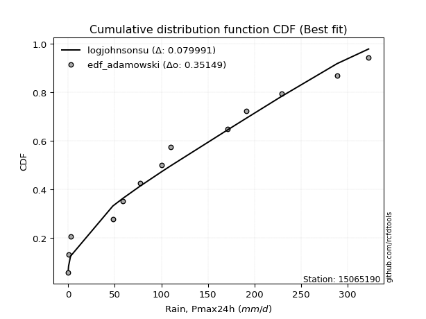</img>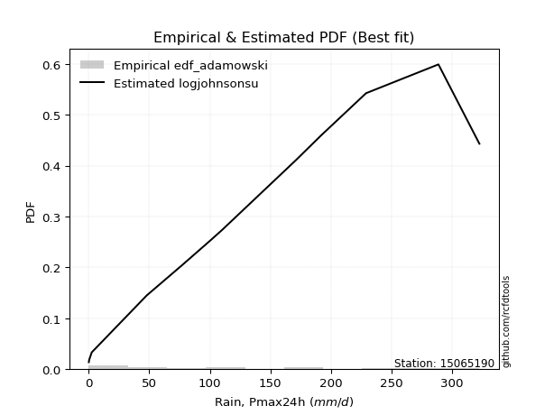</img>

</div>


## C. Best fit & Estimate extreme values for specific return periods - Tr


### 1. Best fit (ordered by delta Δ)

<div align="center">

|   id |   station | empirical_dist   | p_dist   |     delta |   deltao | eval   |   fit |   n |   best_fit |   best_fit_sort |
|-----:|----------:|:-----------------|:---------|----------:|---------:|:-------|------:|----:|-----------:|----------------:|
|    0 |  15065190 | edf_hazen        | ncf      | 0.0664314 | 0.343224 | Δo > Δ |     1 |  14 |          1 |               1 |
|    1 |  15065190 | edf_gringorten   | ncf      | 0.067949  | 0.343224 | Δo > Δ |     1 |  14 |          1 |               2 |
|    2 |  15065190 | edf_cunnane      | ncf      | 0.0689465 | 0.343224 | Δo > Δ |     1 |  14 |          1 |               3 |
|    3 |  15065190 | edf_blom         | ncf      | 0.0695642 | 0.343224 | Δo > Δ |     1 |  14 |          1 |               4 |
|    4 |  15065190 | edf_tukey        | ncf      | 0.0705842 | 0.343224 | Δo > Δ |     1 |  14 |          1 |               5 |
|    5 |  15065190 | edf_filliben     | ncf      | 0.0709687 | 0.343224 | Δo > Δ |     1 |  14 |          1 |               6 |
|    6 |  15065190 | edf_beard        | ncf      | 0.0711503 | 0.343224 | Δo > Δ |     1 |  14 |          1 |               7 |
|    7 |  15065190 | edf_jenkinson    | ncf      | 0.0711503 | 0.343224 | Δo > Δ |     1 |  14 |          1 |               8 |
|    8 |  15065190 | edf_chegodayev   | ncf      | 0.0713917 | 0.343224 | Δo > Δ |     1 |  14 |          1 |               9 |
|    9 |  15065190 | edf_adamowski    | ncf      | 0.072589  | 0.343224 | Δo > Δ |     1 |  14 |          1 |              10 |
|   10 |  15065190 | edf_weibull      | ncf      | 0.0783362 | 0.343224 | Δo > Δ |     1 |  14 |          1 |              11 |
|   11 |  15065190 | edf_california   | ncf      | 0.092168  | 0.343224 | Δo > Δ |     1 |  14 |          1 |              12 |

</div>

:file_folder:Tables: [bestfit_15065190.csv](table/bestfit_15065190.csv) | [extreme_15065190.csv](table/extreme_15065190.csv)


### 2. Extreme values

In hydrology, a return period (or recurrence interval $Tr$) is the statistical average time between extreme events like floods or droughts of a specific magnitude, indicating how rare an event is, with a 100-year flood, for example, having a 1% chance of occurring in any given year, not that it happens exactly every century. It is a key tool for infrastructure design (like bridges or dams) and risk assessment, calculated from historical data to determine the probability of future events, although it is important to remember it is statistical average, and events can cluster or be missed.

> risk_rate: assuming the return period as the project useful life.

|   id |      tr |   prob_l |     prob_g |      alpha |   betaprime |     chi2 |   crystalball |   erlang |    expon |   exponnorm |         f |   fatiguelife |             fisk |    gamma |   genexpon |   genlogistic |    gibrat |   gompertz |   gumbel_l |   gumbel_r |   halflogistic |   halfnorm |   hypsecant |   invgamma |   invgauss |       invweibull |   johnsonsu |   kstwobign |   laplace |   laplace_asymmetric |   loggamma |   logistic |    lognorm |   maxwell |   mielke |    moyal |   nakagami |      ncf |              nct |    norm |          pareto |   pearson3 |   rayleigh |    rice |       t |   truncnorm |     wald |   weibull_min |         logalpha |   logbetaprime |          logchi2 |   logcrystalball |   logerlang |         logexpon |   logexponnorm |            logf |   logfatiguelife |     logfisk |      loggenexpon |   loggenlogistic |        loggibrat |   loggompertz |   loggumbel_l |      loggumbel_r |   loghalflogistic |   loghalfnorm |   loghypsecant |   loginvgamma |   loginvgauss |    loginvweibull |   logjohnsonsu |     logkstwobign |   loglaplace |   loglaplace_asymmetric |   logloggamma |   loglogistic |   loglognorm |   logmaxwell |        logmielke |         logmoyal |   lognakagami |         logncf |     lognct |   logpareto |   logpearson3 |   lograyleigh |    logrice |             logt |   logtruncnorm |          logwald |   logweibull_min |   station |   n |   risk_rate |
|-----:|--------:|---------:|-----------:|-----------:|------------:|---------:|--------------:|---------:|---------:|------------:|----------:|--------------:|-----------------:|---------:|-----------:|--------------:|----------:|-----------:|-----------:|-----------:|---------------:|-----------:|------------:|-----------:|-----------:|-----------------:|------------:|------------:|----------:|---------------------:|-----------:|-----------:|-----------:|----------:|---------:|---------:|-----------:|---------:|-----------------:|--------:|----------------:|-----------:|-----------:|--------:|--------:|------------:|---------:|--------------:|-----------------:|---------------:|-----------------:|-----------------:|------------:|-----------------:|---------------:|----------------:|-----------------:|------------:|-----------------:|-----------------:|-----------------:|--------------:|--------------:|-----------------:|------------------:|--------------:|---------------:|--------------:|--------------:|-----------------:|---------------:|-----------------:|-------------:|------------------------:|--------------:|--------------:|-------------:|-------------:|-----------------:|-----------------:|--------------:|---------------:|-----------:|------------:|--------------:|--------------:|-----------:|-----------------:|---------------:|-----------------:|-----------------:|----------:|----:|------------:|
|    0 |    2    | 0.5      | 0.5        |    69.1246 |     58.1815 |  35.371  |       117.079 |  48.1782 |  81.2141 |     81.3656 |   51.5667 |      0.415354 |     52.4634      |  15.3426 |    88.3402 |       97.8371 |   86.0946 |    107.365 |    134.036 |    100.121 |        91.6903 |    95.9491 |     117.079 |    83.5647 |    75.9782 |     16.8936      |     74.0535 |     100.849 |   117.079 |              81.214  |    35.979  |    117.079 |    38.6962 |   108.25  |  92.0871 |  94.6463 |    63.4176 |  86.0493 |     10.7803      | 117.079 |     0.577288    |    106.076 |    105.119 | 111.899 | 117.098 |     99.5979 |  83.6182 |       70.494  |     1.19517      |        39.251  |      0.66417     |          38.6962 |      35.337 |      7.69143     |        38.6961 |    0.627094     |          38.7035 |     60.1641 |     20.5546      |          inf     |     19.4903      |       59.7915 |       56.3234 |     26.5857      |      22.0602      |       24.2405 |        38.6962 |        35.797 |       33.8407 |     30.0239      |        101.181 |     21.5136      |      38.6962 |                 74.1427 |       74.0752 |       38.6962 |      38.4057 |      31.8273 |     0.298338     |     23.5515      |       38.6843 |   2.25228      |    38.7751 |    0.20707  |       62.2887 |       29.6961 |    38.6966 |    105.971       |        8.11444 |     18.4501      |      0.518959    |  15065190 |  14 |    0.75     |
|    1 |    2.33 | 0.570815 | 0.429185   |    89.3126 |     77.0904 |  47.6299 |       135.499 |  64.713  |  99.0639 |     99.2676 |   68.6217 |      4.03976  |     81.7612      |  21.6576 |   106.396  |      114.417  |   95.4255 |    125.951 |    150.062 |    117.189 |       109.239  |   115.829  |     131.82  |   100.147  |    93.0086 |     31.0499      |     91.434  |     118.058 |   128.226 |              99.0638 |    54.9541 |    133.308 |    58.1764 |   127.388 | 118.092  | 110.804  |    90.2946 | 106.448  |     21.4959      | 135.499 |     2.94656     |    124.476 |    124.54  | 129.431 | 135.517 |    117.77   |  95.6965 |       95.3105 |     1.91444      |        59.1357 |      0.971486    |          58.1764 |      54.415 |     17.188       |        58.176  |    1.13976      |          58.1487 |     84.7995 |     35.7003      |          inf     |     23.9617      |       79.0212 |       80.3063 |     38.7909      |      32.532       |       37.6405 |        53.627  |        54.38  |       53.1414 |     53.3554      |        128.313 |     38.3861      |      49.5254 |                 98.1885 |       98.1154 |       55.4225 |      57.8244 |      48.6152 |     0.385504     |     33.6778      |       58.1491 |   7.40517      |    58.2615 |    0.257572 |       89.1925 |       45.6449 |    58.177  |    127.484       |       13.351   |     24.1052      |      0.779291    |  15065190 |  14 |    0.729209 |
|    2 |    5    | 0.8      | 0.2        |   245.853  |    207.01   | 118.871  |       203.953 | 160.373  | 188.309  |    188.774  |  166.311  |     76.7242   |    454.967       |  61.3047 |   190.82   |      186.438  |  149.146  |    202.756 |    201.834 |    191.341 |       188.644  |   199.899  |     190.952 |   185.285  |   183.921  |    441.366       |    189.742  |     191.157 |   183.958 |             188.309  |   272.531  |    195.972 |   264.739  |   202.71  | 222.691  | 185.645  |   237.228  | 199.857  |    657.448       | 203.953 | 56098.8         |    199.186 |    202.287 | 199.62  | 203.967 |    196.837  | 163.311  |      252.802  |    73.9011       |       271.551  |      8.18242     |         264.739  |     279.372 |    957.706       |       264.735  | 2199.38         |         264.531  |    319.093  |    325.898       |          inf     |     78.6938      |      195.498  |      252.611  |    200.254       |     188.647       |      242.021  |       198.535  |       265.998 |      308.791  |    648.687       |        224.025 |    449.08        |     170.06   |                200.88   |      200.815  |      221.868  |     265.022  |     257.556  |     3.62843      |    176.533       |      264.52   |   1.63171e+07  |   264.405  |  inf        |      263.265  |      255.155  |   264.74   |    300.035       |       68.9412  |    107.672       |     14.5035      |  15065190 |  14 |    0.67232  |
|    3 |   10    | 0.9      | 0.1        |   533.456  |    393.706  | 191.761  |       249.363 | 257.921  | 269.323  |    270.025  |  265.739  |    177.067    |   1612.38        | 104.199  |   260.65   |      245.093  |  210.381  |    256.807 |    230.659 |    251.737 |       254.587  |   262.109  |     238.17  |   272.441  |   275.597  |   3844.09        |    299.504  |     246.813 |   234.55  |             269.323  |   807.35   |    242.121 |   723.376  |   255.718 | 278.438  | 250.807  |   363.719  | 277.646  |  14578.1         | 249.363 |     4.58764e+08 |    254.422 |    257.723 | 249.666 | 249.376 |    257.034  | 235.065  |      435.328  | 60762.7          |       747.221  |     68.2473      |         723.376  |     850.134 |  36830.6         |       723.363  |    2.99086e+14  |         724.024  |    846.778  |   1579.04        |          inf     |    305.213       |      324.447  |      478.136  |    762.407       |     812.029       |      959.183  |       564.631  |       785.718 |     1068.9    |   4961.75        |        271.955 |   2921.35        |     521.148  |                257.877  |      257.833  |      616.234  |     728.658  |     832.639  |   153.659        |    746.87        |      722.759  |   1.38226e+28  |   720.794  |  inf        |      443.217  |      870.409  |   723.379  |    835.735       |      146.207   |    527.11        |    668.336       |  15065190 |  14 |    0.651322 |
|    4 |   15    | 0.933333 | 0.0666667  |   820.033  |    546.35   | 236.494  |       272.024 | 317.71   | 316.713  |    317.553  |  326.892  |    242.693    |   3212.94        | 131.077  |   299.104  |      278.184  |  252.618  |    283.818 |    243.712 |    285.812 |       291.904  |   294.483  |     265.118 |   329.829  |   332.964  |  13037           |    374.28   |     276.359 |   264.144 |             316.713  |  1398.06   |    267.266 |  1194.57   |   282.916 | 299.567  | 288.624  |   431.832  | 321.381  |  89312.7         | 272.024 |     8.91941e+10 |    283.728 |    286.286 | 275.452 | 272.035 |    288.765  | 281.142  |      556.844  |     4.87775e+07  |      1238.65   |    247.442       |        1194.57   |    1493.73  | 311431           |      1194.54   |    2.87658e+31  |        1197.31   |   1441.13   |   3561.75        |          inf     |    777.383       |      408.255  |      638.327  |   1620.91        |    1854.88        |     1963.92   |      1025.22   |      1361.43  |     2032.48   |  15637           |        290.446 |   7894.51        |    1003.37   |                278.552  |      278.517  |     1075.15   |    1207.55   |    1520.26   |  4271.9          |   1725.01        |     1193.61   |   3.32184e+59  |  1188.75   |  inf        |      546.003  |     1637.98   |  1194.57   |   1938.88        |      189.337   |   1461.7         |  10166.8         |  15065190 |  14 |    0.644736 |
|    5 |   20    | 0.95     | 0.05       |  1106.36   |    680.215  | 268.908  |       286.864 | 361.011  | 350.337  |    351.276  |  371.328  |    291.281    |   5174.54        | 150.726  |   325.464  |      301.353  |  285.75   |    301.384 |    251.838 |    309.67  |       318.05   |   316.067  |     284.128 |   373.971  |   375.182  |  30658           |    432.528  |     296.262 |   285.142 |             350.337  |  2008.22   |    284.645 |  1659.1    |   300.966 | 311.5    | 315.406  |   477.655  | 351.848  | 323182           | 286.864 |     3.7517e+12  |    303.558 |    305.271 | 292.591 | 286.875 |    310.045  | 315.479  |      649.066  |     3.89267e+10  |      1724.82   |    626.601       |        1659.1    |    2167.12  |      1.4164e+06  |      1659.06   |    7.41375e+53  |        1664.77   |   2081.22   |   6116.94        |          inf     |   1618.59        |      471.068  |      764.11   |   2748.64        |    3308.72        |     3166.79   |      1561.59   |      1957.93  |     3122.27   |  34930.5         |        300.771 |  15422.7         |    1597.06   |                289.206  |      289.176  |     1579.57   |    1681.29   |    2266.94   | 92766.9          |   3120.77        |     1657.85   |   2.92776e+100 |  1649.52   |  inf        |      615.498  |     2493.54   |  1659.1    |   4140.71        |      215.847   |   3125.71        |  86237.3         |  15065190 |  14 |    0.641514 |
|    6 |   25    | 0.96     | 0.04       |  1392.58   |    801.612  | 294.372  |       297.788 | 395.017  | 376.418  |    377.433  |  406.321  |    329.886    |   7450.82        | 166.241  |   345.427  |      319.2    |  313.37   |    314.222 |    257.62  |    328.047 |       338.194  |   332.126  |     298.84  |   410.378  |   408.734  |  59237           |    480.852  |     311.171 |   301.429 |             376.417  |  2625.21   |    297.94  |  2112.96   |   314.366 | 319.57   | 336.166  |   511.874  | 375.216  | 876355           | 297.788 |     6.82049e+13 |    318.481 |    319.377 | 305.325 | 297.798 |    325.936  | 342.982  |      723.856  |     3.09927e+13  |      2201      |   1297.57        |        2112.96   |    2854.39  |      4.58601e+06 |      2112.91   |    2.72092e+81  |        2122.15   |   2756.91   |   9142.64        |          inf     |   2983.03        |      521.588  |      868.443  |   4128.42        |    5167.86        |     4518.59   |      2162.73   |      2562.78  |     4301.29   |  64873.3         |        307.546 |  25468.8         |    2290.31   |                295.7    |      295.673  |     2120.05   |    2145.29   |    3049.75   |     1.70204e+06  |   4941.14        |     2111.48   |   2.52966e+150 |  2099.3    |  inf        |      666.926  |     3407.34   |  2112.96   |   8395.06        |      233.647   |   5745.71        | 508156           |  15065190 |  14 |    0.639603 |
|    7 |   50    | 0.98     | 0.02       |  2823.25   |   1304.34   | 374.918  |       329.071 | 502.532  | 457.432  |    458.684  |  517.575  |    453.749    |  22696.9         | 215.671  |   405.023  |      374.176  |  410.734  |    350.421 |    273.316 |    384.659 |       400.261  |   378.805  |     344.454 |   537.138  |   517.028  | 450587           |    649.799  |     354.949 |   352.021 |             457.431  |  5688.93   |    338.56  |  4223.02   |   353.23  | 340.605  | 400.611  |   611.61   | 446.645  |      1.94278e+07 | 329.071 |     5.57768e+17 |    362.76  |    360.323 | 342.29  | 329.08  |    372.367  | 432.78   |      973.26   |     9.81189e+27  |      4425.07   |  12862.7         |        4223.02   |    6327.09  |      1.76365e+08 |      4222.91   |    5.57692e+290 |        4254.71   |   6508.64   |  29368.3         |          inf     |  25740.9         |      687.846  |     1229.22   |  14454.7         |   20416.2         |    12698.1    |      5936.13   |      5585.43  |    10988.8    | 436815           |        323.539 | 111100           |    7018.65   |                308.917  |      308.897  |     5210.03   |    4312.66   |    7208.99   |     8.1614e+11   |  20576           |     4220.92   | inf            |  4186.86   |  inf        |      810.953  |     8434.1    |  4223.02   | 187687           |      274.173   |  41936.8         |      2.3465e+08  |  15065190 |  14 |    0.63583  |
|    8 |   75    | 0.986667 | 0.0133333  |  4253.73   |   1714      | 422.854  |       345.856 | 566.491  | 504.822  |    506.212  |  584.235  |    528.344    |  43189           | 245.283  |   438.368  |      406.13   |  476.493  |    369.435 |    281.253 |    417.564 |       436.341  |   404.215  |     371.11  |   622.195  |   582.939  |      1.46541e+06 |    762.9    |     379.036 |   381.616 |             504.822  |  8647.42   |    362.02  |  6123.31   |   374.36  | 351.302  | 438.297  |   665.926  | 487.798  |      1.19023e+08 | 345.856 |     1.08443e+20 |    387.471 |    382.599 | 362.4   | 345.864 |    397.773  | 488.037  |     1130.45   |     3.09186e+42  |      6437.69   |  50132           |        6123.31   |    9740.95  |      1.49129e+09 |      6123.14   |  inf            |        6181.47   |  10689.6    |  55424.3         |          inf     | 110352           |      791.2    |     1465.32   |  29945.6         |   45374.9         |    22285.1    |     10709.3    |      8527.06  |    18410.5    |      1.32342e+06 |        330.326 | 249849           |   13513.1    |                313.391  |      313.373  |     8757.39   |    6274.29   |   11508      |     9.84339e+16  |  47386.2         |     6121.14   | inf            |  6063.53   |  inf        |      883.694  |    13809.7    |  6123.3    |      2.84875e+06 |      289.32    | 142495           |      1.3018e+10  |  15065190 |  14 |    0.634587 |
|    9 |  100    | 0.99     | 0.01       |  5684.15   |   2072.88   | 457.163  |       357.209 | 612.259  | 538.446  |    539.935  |  632.164  |    582.019    |  68020.6         | 266.546  |   461.419  |      428.745  |  527.434  |    382.115 |    286.444 |    440.852 |       461.877  |   421.525  |     390.019 |   688.1    |   630.727  |      3.37644e+06 |    850.054  |     395.539 |   402.613 |             538.446  | 11495.7    |    378.584 |  7872.74   |   388.752 | 358.521  | 465.034  |   702.899  | 516.78   |      4.3069e+08  | 357.209 |     4.56133e+21 |    404.566 |    397.775 | 376.101 | 357.217 |    415.127  | 528.325  |     1246.76   |     9.73151e+56  |      8296.14   | 132497           |        7872.74   |   13065     |      6.78248e+09 |      7872.51   |  inf            |        7959.08   |  15173.5    |  85437.8         |          inf     | 340787           |      867.084  |     1643.77   |  50143.5         |   79854.9         |    32690.6    |     16275.6    |     11375.1   |    26234.4    |      2.90011e+06 |        334.314 | 435339           |   21508.6    |                315.64   |      315.623  |    12635.9    |    8085.89   |   15825.5    |     5.32874e+21  |  85641.3         |     7870.79   | inf            |  7789.25   |  inf        |      930.242  |    19323.2    |  7872.72   |      3.47115e+07 |      297.23    | 347616           |      2.71032e+11 |  15065190 |  14 |    0.633968 |
|   10 |  200    | 0.995    | 0.005      | 11405.7    |   3247.46   | 540.671  |       382.961 | 723.632  | 619.46   |    621.186  |  749.626  |    713.403    | 202232           | 318.493  |   515.084  |      483.116  |  666.025  |    410.303 |    297.729 |    496.84  |       523.27   |   461.115  |     435.572 |   868.415  |   748.996  |      2.51158e+07 |   1085.47   |     433.55  |   453.206 |             619.46   | 22027.7    |    418.317 | 13921.6    |   421.679 | 375.298  | 529.452  |   787.304  | 586.04   |      9.54789e+09 | 382.961 |     3.73018e+25 |    444.49  |    432.5   | 407.449 | 382.967 |    454.941  | 628.678  |     1542.52   |     9.52263e+114 |     14750.4    |      1.40446e+06 |       13921.6    |   25562.8   |      2.60835e+11 |     13921.1    |  inf            |       14125.7    |  35156.8    | 230048           |          inf     |      7.32462e+06 |     1058.13   |     2110.19   | 173161           |  310801           |    78527      |     44612.2    |     22004.5   |    59495.5    |      1.91219e+07 |        341.827 |      1.56406e+06 |   65913.3    |                319.03   |      319.015  |    30449.3    |   14379.1    |   32801.8    |     5.48756e+38  | 356413           |    13922.1    | inf            | 13746.2    |  inf        |     1026.28   |    41677      | 13921.5    |      2.32112e+11 |      309.538   |      3.20494e+06 |      7.58418e+14 |  15065190 |  14 |    0.633042 |
|   11 |  250    | 0.996    | 0.004      | 14266.5    |   3744.59   | 567.773  |       390.831 | 759.771  | 645.54   |    647.343  |  787.999  |    756.221    | 286927           | 335.401  |   531.842  |      500.595  |  715.752  |    418.753 |    301.049 |    514.84  |       543.007  |   473.295  |     450.236 |   933.68   |   787.926  |      4.7876e+07  |   1169.42   |     445.313 |   469.493 |             645.54   | 26904.3    |    431.073 | 16570.8    |   431.815 | 380.621  | 550.189  |   813.217  | 608.202  |      2.58905e+10 | 390.831 |     6.78138e+26 |    457.011 |    443.189 | 417.099 | 390.837 |    467.221  | 661.877  |     1642.22   |     9.41494e+143 |     17587.5    |      3.01813e+06 |       16570.8    |   31428.4   |      8.44527e+11 |     16570.2    |  inf            |       16834.1    |  46043.2    | 312082           |          inf     |      2.20201e+07 |     1121.99   |     2271.11   | 257919           |  481081           |   102827      |     61719.7    |     26966.6   |    76743.5    |      3.50643e+07 |        343.754 |      2.32351e+06 |   94524.8    |                319.711  |      319.696  |    40383.7    |   17146.1    |   41052.2    |     3.43921e+46  | 564040           |    16573      | inf            | 16351.5    |  inf        |     1052.73   |    52802.4    | 16570.7    |      1.22914e+13 |      312.065   |      6.68308e+06 |      1.17321e+16 |  15065190 |  14 |    0.632858 |
|   12 |  500    | 0.998    | 0.002      | 28570.2    |   5802.1    | 652.527  |       414.169 | 872.767  | 726.555  |    728.594  |  908.82   |    890.543    | 849036           | 388.398  |   582.443  |      554.847  |  887.608  |    443.346 |    310.567 |    570.706 |       604.266  |   509.608  |     495.785 |  1162.31   |   911.206  |      3.54577e+08 |   1457.81   |     480.566 |   520.085 |             726.554  | 48851.3    |    470.634 | 27777.7    |   462.061 | 397.199  | 614.606  |   890.307  | 676.74   |      5.73961e+11 | 414.169 |     5.54569e+30 |    495.029 |    475.082 | 445.891 | 414.173 |    503.91   | 767.441  |     1965.21   |     8.88516e+288 |     29636.7    |      3.29089e+07 |       27777.7    |   58225.1   |      3.24781e+13 |     27776.7    |  inf            |       28328.2    | 106293      | 775449           |          inf     |      9.88303e+08 |     1327.27   |     2803.73   | 888277           |       1.86689e+06 |   229723      |    169164      |     49521.6   |   165253      |      2.3025e+08  |        348.62  |      7.60791e+06 |  289671      |                321.074  |      321.06   |    96943      |   28901.5    |   80186.2    |     6.74022e+81  |      2.34728e+06 |    27790.3    | inf            | 27356.2    |  inf        |     1122.79   |   106967      | 27777.5    |      5.54876e+20 |      317.187   |      6.91499e+07 |      1.01592e+20 |  15065190 |  14 |    0.632489 |
|   13 |  750    | 0.998667 | 0.00133333 | 42873.9    |   7478.09   | 702.449  |       427.133 | 939.314  | 773.945  |    776.122  |  980.583  |    969.905    |      1.60026e+06 | 419.689  |   611.103  |      586.562  | 1001.26   |    456.704 |    315.654 |    603.366 |       640.078  |   529.895  |     522.43  |  1316.48   |   984.819  |      1.14307e+09 |   1647.24   |     500.37  |   549.679 |             773.944  | 68195      |    493.747 | 37010.7    |   478.977 | 407.025  | 652.287  |   933.256  | 716.676  |      3.51634e+12 | 427.133 |     1.07821e+33 |    516.726 |    492.916 | 461.991 | 427.137 |    524.452  | 830.735  |     2163.14   |   inf            |     39606.3    |      1.34174e+08 |       37010.7    |   82224.1   |      2.74627e+14 |     37009.3    |  inf            |       37831.6    | 173292      |      1.29019e+06 |          inf     |      1.22311e+10 |     1452      |     3137.88   |      1.83027e+06 |       4.12468e+06 |   359941      |    305106      |     69628     |   255046      |      6.91852e+08 |        350.85  |      1.48131e+07 |  557709      |                321.529  |      321.515  |   161699      |   38631.6    |  116607      |     3.6118e+113  |      5.40512e+06 |    37034.8    | inf            | 36407.7    |  inf        |     1156.3    |   158743      | 37010.4    |      3.0369e+27  |      318.914   |      2.80705e+08 |      3.00334e+22 |  15065190 |  14 |    0.632366 |
|   14 | 1000    | 0.999    | 0.001      | 57177.7    |   8946.17   | 738.005  |       436.059 | 986.706  | 807.569  |    809.845  | 1031.97   |   1026.52     |      2.50842e+06 | 442.004  |   631.049  |      609.059  | 1088.24   |    465.775 |    319.077 |    626.533 |       665.481  |   543.906  |     541.335 |  1436.2    |  1037.66   |      2.62225e+09 |   1791.62   |     514.09  |   570.677 |             807.568  | 85882.1    |    510.137 | 45095.8    |   490.669 | 414.087  | 679.022  |   962.868  | 744.963  |      1.2724e+13  | 436.059 |     4.53517e+34 |    531.906 |    505.24  | 473.118 | 436.063 |    538.656  | 876.263  |     2307.46   |   inf            |     48360.1    |      3.64796e+08 |       45095.8    |  104392     |      1.24901e+15 |     45094      |  inf            |       46172.9    | 245085      |      1.83431e+06 |          321.728 |      8.38616e+10 |     1542.49   |     3384.92   |      3.0565e+06  |       7.23762e+06 |   490816      |    463646      |     88153.7   |   344996      |      1.50989e+09 |        352.217 |      2.35032e+07 |  887698      |                321.756  |      321.743  |   232422      |   47177.4    |  151051      |     1.50763e+143 |      9.76829e+06 |    45131.6    | inf            | 44325.5    |  inf        |     1177.17   |   208532      | 45095.4    |      4.86803e+33 |      319.782   |      7.6901e+08  |      2.01563e+24 |  15065190 |  14 |    0.632305 |

<div align="center">

</img>

</div>


<div align="center">

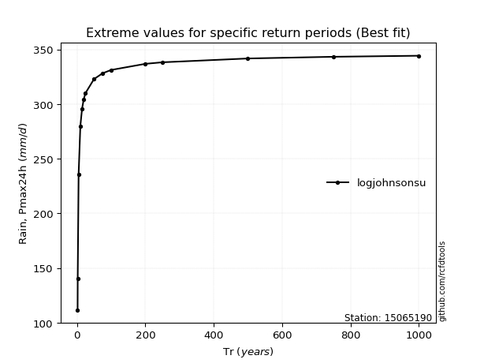</img>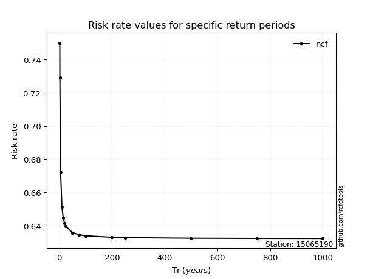</img>

</div>


<sub>**APP DISCLAIMER**: NO WARRANTY - This software is provided by [github.com/rcfdtools](https://github.com/rcfdtools) "as is", without any express or implied warranty, including warranties of merchantability, fitness for a particular purpose, or non-infringement. There is no guarantee that the software will be error-free or operate without interruption. LIMITATION OF LIABILITY - Neither the authors nor copyright holders will be liable for claims or damages arising from the software or its use. You are responsible for determining if the software is appropriate for your use and assume all associated risks, including errors, legal compliance, and data loss. NO PROFESSIONAL ADVICE - The software provides general information and does not offer professional advice. It should not replace consultation with professional advisors.</sub>