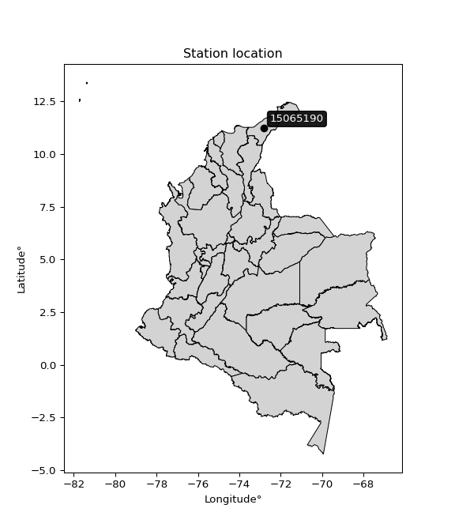

<div align="center">


</div>

# PMP Station (Rain, Pmax24h): 15065190

Probable Maximum Precipitation (PMP) is the greatest amount of rainfall for a specific duration that is meteorologically possible for a given location, acting as a "worst-case" scenario for extreme storms, crucial for designing safety-critical infrastructure like bridges, river deviations, dams, spillways, and nuclear plants to prevent catastrophic failure. PMP is calculated by hydrologists using meteorological data to determine the upper limit of extreme rainfall, often leading to the Probable Maximum Flood (PMF) for flood control design, and is increasingly being studied for climate change impacts. Probable Maximum Precipitation (PMP) is the theoretical upper limit of rainfall, a deterministic estimate for extreme events, while probability distributions (like GEV, Gumbel) describe the likelihood and frequency of various precipitation amounts, including rare ones, showing how often events occur, with PMP representing the extreme end of these distributions, used for critical infrastructure design to ensure safety against the worst conceivable weather, unlike standard statistical forecasts which cover typical probabilities.

The most common probability distributions in hydrology, used for analyzing floods, rainfall, and streamflow, include the Normal, Log-Normal, Gumbel, Gamma (including Log-Pearson Type III), and Generalized Extreme Value (GEV) distributions, often chosen based on the data´s skewness and whether modeling extremes or general conditions, with Gumbel and GEV popular for extreme events like floods, while the Normal distribution serves as a baseline, though often requiring transformations for skewed hydrological data. These distributions help in designing water infrastructure, managing water resources, and forecasting hydrologic events.

> Hydrological data often isn´t perfectly normal (it´s skewed), so different distributions are needed for different applications, such as: **Flood Frequency Analysis**: Using Gumbel, GEV, or Log-Pearson Type III for predicting extreme flood magnitudes and their return periods, **Rainfall Analysis**: Normal for annual totals, but Log-Normal, Weibull, or GEV for intensity or extreme daily rainfall, **Streamflow Modeling**: Gamma and Log-Normal for maximum flows, GEV for minimum flows, and Kappa for daily flows.

<div align="center">

</img>

</div>


## A. General information


### 1. General running parameters

• app_version: _v20260108_. • runtime: _2026-01-08 18:05:13.093906_. • Python version: _3.14.0_. • SciPy version: _1.16.3_. • Pandas version: _2.3.3_. • NumPy version: _2.3.5_. • Stations dataset (station_dataset_file): _dataset/pmax24h_in/automatic_colombia_2003_2024.csv_. • Stations catalog (station_catalog_file): _dataset/CNE.xls_. • Minimum year to eval til year_max (date_min): _1900_. • Maximum year to eval since year_min (date_max): _2024_. • Creates, save and include plots into reports (create_plot): _False_. • Plot only fit distributions with Δo > Δ (plot_only_fit): _True_. • Plot only simple graphs avoiding multiple CDFs and multiple Extreme values plots (plot_only_simple): _False_. • Eval low extreme values, if False, evaluates high extreme values (low_extreme): _False_. • Eval every SciPy distribution as logarithmic (pdist_logarithmic_on): _True_. • Standard deviation normalized (ddof): _1.0_. • Return periods to eval in years (Tr): _[2, 2.33, 5, 10, 15, 20, 25, 50, 75, 100, 200, 250, 500, 750, 1000]_. • Minimum data sample per station, 0 means any (minimum_sample): _5_. • Z-Score maximum threshold to adjust a value, 0 means disable (zscore_max): _3.5_. • Z-Score minimum threshold to adjust a value, 0 means disable (zscore_min): _-2.5_. • Avoid zeros, e.g. rain = 0 (avoid_zeros): _True_. • Avoid null values (avoid_nans): _True_. 

:file_folder:Table: [dataset.csv](../../dataset/pmax24h_in/automatic_colombia_2003_2024.csv)

> Delta Degrees of Freedom (DDOF): is a parameter used in the formulas for calculating variance and standard deviation. When ddof=0, the divisor is $N$ (the total number of observations) and this is used when your data set is the entire population. When ddof=1, the divisor is $N-1$ and this is used when your data set is a sample drawn from a larger population. Using $N-1$ provides an unbiased estimate of the population variance (known as Bessel´s correction).


### 2. Station info and location

|   id |   CODIGO | NOMBRE                  | CATEGORIA               | TECNOLOGIA                | ESTADO   | FECHA_INSTALACION   |   FECHA_SUSPENSION |   ALTITUD |   LATITUD |   LONGITUD | DEPARTAMENTO   | MUNICIPIO   | AREA_OPERATIVA                                         | ENTIDAD                                                     | AREA_HIDROGRAFICA   | ZONA_HIDROGRAFICA   | SUBZONA_HIDROGRAFICA   |   CORRIENTE | Catalogo   |   Version |
|-----:|---------:|:------------------------|:------------------------|:--------------------------|:---------|:--------------------|-------------------:|----------:|----------:|-----------:|:---------------|:------------|:-------------------------------------------------------|:------------------------------------------------------------|:--------------------|:--------------------|:-----------------------|------------:|:-----------|----------:|
|    0 | 15065190 | MONGUI - AUT [15065190] | Climatológica Principal | Automática con Telemetría | Activa   | 22/11/2011          |                nan |        60 |   11.2268 |   -72.8206 | La Guajira     | Riohacha    | Area Operativa 05 - Magdalena-Cesar-Guajira-San Andrés | INSTITUTO DE HIDROLOGIA METEOROLOGIA Y ESTUDIOS AMBIENTALES | Caribe              | Caribe - Guajira    | Río Ranchería          |         nan | CNE_IDEAM  |  20251226 |

<div align="center">

Dynamic map: [:earth_americas:Google](http://maps.google.com/maps?q=11.22677778,-72.82063889) [:earth_americas:OSM](https://www.openstreetmap.org/#map=18/11.22677778/-72.82063889&layers=P) [:earth_americas:Bing](https://www.bing.com/maps?cp=11.22677778~-72.82063889&lvl=18) [:earth_americas:Apple](https://maps.apple.com/frame?center=11.22677778%2C-72.82063889&span=0.003%2C0.006)

</div>


<div align="center">

```geojson
{
  "type": "Feature",
  "geometry": {
    "type": "Point", 
    "coordinates": [-72.82063889, 11.22677778]
  }, 
  "properties": {
    "Name": "15065190"
  }
}
```

</div>


### 3. Discrete values table and plot

<div align="center">

|               |           0 |          1 |           2 |           3 |          4 |           5 |           6 |          7 |           8 |          9 |          10 |         11 |         12 |
|:--------------|------------:|-----------:|------------:|------------:|-----------:|------------:|------------:|-----------:|------------:|-----------:|------------:|-----------:|-----------:|
| Date          | 2012        | 2013       | 2014        | 2015        | 2016       | 2017        | 2018        | 2019       | 2020        | 2021       | 2022        | 2023       | 2024       |
| Value         |   77        |  110       |   48        |  191.5      |  288.6     |  100.7      |   58.8      |    2.6     |  171.3      |    0.5     |  228.9      |    0.2     |  322.4     |
| Value_initial |   77        |  110       |   48        |  191.5      |  288.6     |  100.7      |   58.8      |    2.6     |  171.3      |    0.5     |  228.9      |    0.2     |  322.4     |
| count         |   13        |   13       |   13        |   13        |   13       |   13        |   13        |   13       |   13        |   13       |   13        |   13       |   13       |
| mean          |  123.115    |  123.115   |  123.115    |  123.115    |  123.115   |  123.115    |  123.115    |  123.115   |  123.115    |  123.115   |  123.115    |  123.115   |  123.115   |
| std           |  108.986    |  108.986   |  108.986    |  108.986    |  108.986   |  108.986    |  108.986    |  108.986   |  108.986    |  108.986   |  108.986    |  108.986   |  108.986   |
| zscore        |   -0.423132 |   -0.12034 |   -0.689222 |    0.627464 |    1.51841 |   -0.205673 |   -0.590127 |   -1.10579 |    0.442119 |   -1.12506 |    0.970628 |   -1.12781 |    1.82854 |


</div>


> The initial value (value_initial) correspond to the initial obtained or null completed value, and value (value) is adjusted only when the initial value is outside the valid range (outlier) definite through the Z-Score value. If Z-Score is active, values out of range or outliers are replaced with the station mean value. A Z-Score (or standard score) measures how many standard deviations a data point is from the mean of a dataset, indicating its relative position; positive scores mean above the mean, negative mean below, and a score of zero is exactly at the mean, allowing for comparison of values from different distributions. It´s calculated using the formula $z=(x–μ)/σ$, where $x$ is the data point, $μ$ is the mean, and $σ$ is the standard deviation, helping identify outliers and understand probability.
>
> <sub>**Note**: In this study, "completing" (filling gaps in) and "extending" (forecasting or lengthening the historical record) rainfall data series are avoided for certain critical analyses because they introduce artificial bias and uncertainty, which can distort the statistics of rare events (extremes), alter day-to-day variability, and compromise the integrity and homogeneity of the original data. Some reasons against Completing/Extending rainfall data are: **Distortion of Extremes and Variability**: The primary issue is that most gap-filling or extension methods rely on averaging or regression with nearby stations, which inherently smooths the data. Rainfall is highly variable in space and time, with a large percentage of zero values and occasional large storms. Infilling methods often underestimate the highest values and overestimate the lowest (zero) values, which severely distorts analyses focused on flood frequency, drought severity, and intensity-duration-frequency (IDF) curves, **Loss of Data Homogeneity**: Infilled or extended data are synthetic estimates, not actual measurements. Combining these estimates with observed data can violate the assumption of data homogeneity, which requires that the data properties do not change over time. Inhomogeneity can lead to incorrect conclusions about long-term trends or changes in climate patterns, **Propagation of Errors**: Errors and biases from the original data (e.g., wind-induced undercatch, instrument errors, site changes) or the data used for imputation can propagate through the analysis, leading to unreliable hydrological models and inaccurate predictions, **Compromised Statistical Integrity**: For statistical analyses, especially those involving the frequency of events, using artificial data can introduce time bias or autocorrelation that doesn´t exist in reality, making it difficult to assess the true probability of events, **Difficulty in Validation**: It is difficult to accurately validate the quality of filled or extended data, especially for past periods where ground-truth measurements are unavailable. The reliability of imputation techniques heavily depends on the density of the surrounding station network and the complexity of the local topography.</sub>


### 4. Active continuous probability distributions from SciPy (43 of 104 available)

A Probability Density Function (PDF) describes the relative likelihood of a continuous random variable falling within a specific range, where the total area under its curve equals 1, and the area over any interval gives the actual probability for that range. Unlike discrete probabilities (like rolling a die), a PDF shows density, not direct probability for a single point (which is zero), with higher points indicating higher likelihood, often visualized as a bell curve for normal distributions.

A log of a probability density function (log-PDF) is simply the logarithm of the PDF´s value, denoted as $log(f(x))$, useful for converting multiplication of probabilities into addition, improving numerical stability with tiny numbers, and connecting to information theory concepts like entropy. Instead of dealing with very small probabilities (e.g., 0.000001), log-PDFs use negative numbers (e.g., $log(0.00001) ≈ -11.51$ that are easier for computers to handle, preventing underflow errors and simplifying complex calculations. In this study, each active probability distribution from SciPy is also evaluated in the $log$ form.

[scipy.stats](https://docs.scipy.org/doc/scipy/reference/stats.html) is a Python´s powerful submodule within the SciPy library for comprehensive statistical analysis, offering over 130 probability distributions (like Normal, Poisson), functions for descriptive stats (mean, variance), hypothesis testing (t-tests, chi-square), random variable generation, and statistical tests, making it essential for data science, modeling, and research. It provides tools to explore, model, and draw conclusions from data efficiently, working seamlessly with NumPy.

<div align="center">

|   id | p_dist             |   n_parameter | fit_method   | label                                                                       | active   | ref                                                                                                        |
|-----:|:-------------------|--------------:|:-------------|:----------------------------------------------------------------------------|:---------|:-----------------------------------------------------------------------------------------------------------|
|    0 | alpha              |             3 | MLE          | Alpha                                                                       | True     | [:mortar_board:](https://docs.scipy.org/doc/scipy/reference/generated/scipy.stats.alpha.html)              |
|    1 | betaprime          |             4 | MLE          | Beta prime                                                                  | True     | [:mortar_board:](https://docs.scipy.org/doc/scipy/reference/generated/scipy.stats.betaprime.html)          |
|    2 | chi2               |             3 | MLE          | Chi²                                                                        | True     | [:mortar_board:](https://docs.scipy.org/doc/scipy/reference/generated/scipy.stats.chi2.html)               |
|    3 | crystalball        |             4 | MLE          | Crystalball                                                                 | True     | [:mortar_board:](https://docs.scipy.org/doc/scipy/reference/generated/scipy.stats.crystalball.html)        |
|    4 | erlang             |             3 | MLE          | Erlang                                                                      | True     | [:mortar_board:](https://docs.scipy.org/doc/scipy/reference/generated/scipy.stats.erlang.html)             |
|    5 | expon              |             2 | MLE          | Exponential                                                                 | True     | [:mortar_board:](https://docs.scipy.org/doc/scipy/reference/generated/scipy.stats.expon.html)              |
|    6 | exponnorm          |             3 | MLE          | Exponentially modified Normal                                               | True     | [:mortar_board:](https://docs.scipy.org/doc/scipy/reference/generated/scipy.stats.exponnorm.html)          |
|    7 | f                  |             4 | MLE          | F                                                                           | True     | [:mortar_board:](https://docs.scipy.org/doc/scipy/reference/generated/scipy.stats.f.html)                  |
|    8 | fatiguelife        |             3 | MLE          | Fatigue-life (Birnbaum-Saunders)                                            | True     | [:mortar_board:](https://docs.scipy.org/doc/scipy/reference/generated/scipy.stats.fatiguelife.html)        |
|    9 | fisk               |             3 | MLE          | Fisk                                                                        | True     | [:mortar_board:](https://docs.scipy.org/doc/scipy/reference/generated/scipy.stats.fisk.html)               |
|   10 | gamma              |             3 | MLE          | Gamma                                                                       | True     | [:mortar_board:](https://docs.scipy.org/doc/scipy/reference/generated/scipy.stats.gamma.html)              |
|   11 | genexpon           |             5 | MLE          | Generalized exponential                                                     | True     | [:mortar_board:](https://docs.scipy.org/doc/scipy/reference/generated/scipy.stats.genexpon.html)           |
|   12 | genlogistic        |             3 | MLE          | Generalized logistic                                                        | True     | [:mortar_board:](https://docs.scipy.org/doc/scipy/reference/generated/scipy.stats.genlogistic.html)        |
|   13 | gibrat             |             2 | MM           | Gibrat                                                                      | True     | [:mortar_board:](https://docs.scipy.org/doc/scipy/reference/generated/scipy.stats.gibrat.html)             |
|   14 | gompertz           |             3 | MLE          | Gompertz (or truncated Gumbel)                                              | True     | [:mortar_board:](https://docs.scipy.org/doc/scipy/reference/generated/scipy.stats.gompertz.html)           |
|   15 | gumbel_l           |             2 | MM           | Gumbel Left Skew                                                            | True     | [:mortar_board:](https://docs.scipy.org/doc/scipy/reference/generated/scipy.stats.gumbel_l.html)           |
|   16 | gumbel_r           |             2 | MM           | Gumbel Right Skew                                                           | True     | [:mortar_board:](https://docs.scipy.org/doc/scipy/reference/generated/scipy.stats.gumbel_r.html)           |
|   17 | halflogistic       |             2 | MM           | Half-logistic                                                               | True     | [:mortar_board:](https://docs.scipy.org/doc/scipy/reference/generated/scipy.stats.halflogistic.html)       |
|   18 | halfnorm           |             2 | MM           | Half Normal                                                                 | True     | [:mortar_board:](https://docs.scipy.org/doc/scipy/reference/generated/scipy.stats.halfnorm.html)           |
|   19 | hypsecant          |             2 | MM           | hyperbolic secant                                                           | True     | [:mortar_board:](https://docs.scipy.org/doc/scipy/reference/generated/scipy.stats.hypsecant.html)          |
|   20 | invgamma           |             3 | MLE          | Inverted gamma                                                              | True     | [:mortar_board:](https://docs.scipy.org/doc/scipy/reference/generated/scipy.stats.invgamma.html)           |
|   21 | invgauss           |             3 | MLE          | Inverse Gaussian                                                            | True     | [:mortar_board:](https://docs.scipy.org/doc/scipy/reference/generated/scipy.stats.invgauss.html)           |
|   22 | invweibull         |             3 | MLE          | Inverted Weibull                                                            | True     | [:mortar_board:](https://docs.scipy.org/doc/scipy/reference/generated/scipy.stats.invweibull.html)         |
|   23 | kstwobign          |             2 | MLE          | Limiting distribution of scaled Kolmogorov-Smirnov two-sided test statistic | True     | [:mortar_board:](https://docs.scipy.org/doc/scipy/reference/generated/scipy.stats.kstwobign.html)          |
|   24 | laplace            |             2 | MM           | Laplace                                                                     | True     | [:mortar_board:](https://docs.scipy.org/doc/scipy/reference/generated/scipy.stats.laplace.html)            |
|   25 | laplace_asymmetric |             3 | MLE          | Asymmetric Laplace                                                          | True     | [:mortar_board:](https://docs.scipy.org/doc/scipy/reference/generated/scipy.stats.laplace_asymmetric.html) |
|   26 | loggamma           |             3 | MLE          | Log gamma                                                                   | True     | [:mortar_board:](https://docs.scipy.org/doc/scipy/reference/generated/scipy.stats.loggamma.html)           |
|   27 | logistic           |             2 | MM           | Logistic (or Sech-squared)                                                  | True     | [:mortar_board:](https://docs.scipy.org/doc/scipy/reference/generated/scipy.stats.logistic.html)           |
|   28 | lognorm            |             3 | MLE          | Log Normal                                                                  | True     | [:mortar_board:](https://docs.scipy.org/doc/scipy/reference/generated/scipy.stats.lognorm.html)            |
|   29 | maxwell            |             2 | MM           | Maxwell                                                                     | True     | [:mortar_board:](https://docs.scipy.org/doc/scipy/reference/generated/scipy.stats.maxwell.html)            |
|   30 | mielke             |             4 | MLE          | Mielke Beta-Kappa / Dagum                                                   | True     | [:mortar_board:](https://docs.scipy.org/doc/scipy/reference/generated/scipy.stats.mielke.html)             |
|   31 | moyal              |             2 | MM           | Moyal                                                                       | True     | [:mortar_board:](https://docs.scipy.org/doc/scipy/reference/generated/scipy.stats.moyal.html)              |
|   32 | nakagami           |             3 | MLE          | Nakagami                                                                    | True     | [:mortar_board:](https://docs.scipy.org/doc/scipy/reference/generated/scipy.stats.nakagami.html)           |
|   33 | ncf                |             5 | MLE          | Non-central F distribution                                                  | True     | [:mortar_board:](https://docs.scipy.org/doc/scipy/reference/generated/scipy.stats.ncf.html)                |
|   34 | nct                |             4 | MLE          | Non-central Student’s t                                                     | True     | [:mortar_board:](https://docs.scipy.org/doc/scipy/reference/generated/scipy.stats.nct.html)                |
|   35 | norm               |             2 | MM           | Normal                                                                      | True     | [:mortar_board:](https://docs.scipy.org/doc/scipy/reference/generated/scipy.stats.norm.html)               |
|   36 | pearson3           |             3 | MM           | Pearson type III                                                            | True     | [:mortar_board:](https://docs.scipy.org/doc/scipy/reference/generated/scipy.stats.pearson3.html)           |
|   37 | rayleigh           |             2 | MM           | Rayleigh                                                                    | True     | [:mortar_board:](https://docs.scipy.org/doc/scipy/reference/generated/scipy.stats.rayleigh.html)           |
|   38 | rice               |             3 | MLE          | Rice                                                                        | True     | [:mortar_board:](https://docs.scipy.org/doc/scipy/reference/generated/scipy.stats.rice.html)               |
|   39 | t                  |             3 | MLE          | Student’s t                                                                 | True     | [:mortar_board:](https://docs.scipy.org/doc/scipy/reference/generated/scipy.stats.t.html)                  |
|   40 | truncnorm          |             4 | MLE          | Truncated normal                                                            | True     | [:mortar_board:](https://docs.scipy.org/doc/scipy/reference/generated/scipy.stats.truncnorm.html)          |
|   41 | wald               |             2 | MM           | Wald                                                                        | True     | [:mortar_board:](https://docs.scipy.org/doc/scipy/reference/generated/scipy.stats.wald.html)               |
|   42 | weibull_min        |             3 | MLE          | Weibull minimum                                                             | True     | [:mortar_board:](https://docs.scipy.org/doc/scipy/reference/generated/scipy.stats.weibull_min.html)        |

</div>

> **n_parameter:** # arguments & localization & scale.
>
> **Fit methods:** (MLE) maximum likelihood, (MM) L-moments.
>
>**Inactive** (With the only purpose of prevent loops, zero divisions, infinite values, over high estimated values or horizontal trending for recurrence intervals estimations, the follow distributions were disabled.)**:** foldnorm, gennorm, norminvgauss, powernorm, powerlognorm, skewnorm, genextreme, anglit, arcsine, argus, beta, bradford, burr, burr12, cauchy, cosine, halfcauchy, foldcauchy, skewcauchy, wrapcauchy, dgamma, gengamma, exponweib, exponpow, truncexpon, gausshyper, genhalflogistic, genhyperbolic, geninvgauss, halfgennorm, johnsonsb, johnsonsu, kappa4, kappa3, ksone, kstwo, loglaplace, levy, levy_l, levy_stable, ncx2, pareto, genpareto, truncpareto, lomax, powerlaw, rdist, rel_breitwigner, recipinvgauss, semicircular, studentized_range, trapezoid, triang, truncweibull_min, tukeylambda, uniform, loguniform, vonmises, vonmises_line, weibull_max, dweibull, 


## B. Probability (PDF) vs. Empirical (EDF) distributions functions

A continuous probability distribution (CPD) describes probabilities for variables that can take any value within a range (like rain any time), unlike discrete variables with specific outcomes (like temperature). It uses a Probability Density Function (PDF), a curve where the total area under it equals 1, and the probability of the variable falling within an interval (a to b) is found by calculating the area under the curve between those points. A key feature is that the probability of hitting any single exact value is zero, so probabilities are always expressed for ranges, e.g., $P(a ≤ X ≤ b)$.

<div align="center">

Distributions parameters from station values
|    |   station | p_dist                |   n |               loc |            scale | shape                  | shape1                | shape2               | shape3   |
|---:|----------:|:----------------------|----:|------------------:|-----------------:|:-----------------------|:----------------------|:---------------------|:---------|
|  0 |  15065190 | alpha                 |  13 |     -41.1396      |     77.817       | 2.8737916454880404e-11 |                       |                      |          |
|  1 |  15065190 | betaprime             |  13 |       0.2         |     97.295       | 0.518202711745589      | 0.8088793589699528    |                      |          |
|  2 |  15065190 | chi2                  |  13 |       0.2         |     61.9157      | 1.2206053836672002     |                       |                      |          |
|  3 |  15065190 | crystalball           |  13 |     123.115       |    104.71        | 10852.667306802634     | 5366.906240960384     |                      |          |
|  4 |  15065190 | erlang                |  13 |       0.2         |    140.262       | 0.4831740626191665     |                       |                      |          |
|  5 |  15065190 | expon                 |  13 |       0.2         |    122.915       |                        |                       |                      |          |
|  6 |  15065190 | exponnorm             |  13 |       0.0375461   |      0.0513353   | 2383.4952426979344     |                       |                      |          |
|  7 |  15065190 | f                     |  13 |       0.2         |    157.775       | 1.0975651277896956     | 33.398287148257594    |                      |          |
|  8 |  15065190 | fatiguelife           |  13 |       0.199996    |      0.0365227   | 52.67602433719294      |                       |                      |          |
|  9 |  15065190 | fisk                  |  13 |       0.2         |     30.6764      | 0.6938941125694702     |                       |                      |          |
| 10 |  15065190 | gamma                 |  13 |       0.2         |    125.104       | 0.6048223115932101     |                       |                      |          |
| 11 |  15065190 | genexpon              |  13 |       0.199984    |      2.5162      | 0.020479139290346768   | 7.844359427411468e-07 | 1.9419664518973885   |          |
| 12 |  15065190 | genlogistic           |  13 |    -488.81        |     82.2767      | 934.0320428106581      |                       |                      |          |
| 13 |  15065190 | gibrat                |  13 |      43.2348      |     48.45        |                        |                       |                      |          |
| 14 |  15065190 | gompertz              |  13 |       0.2         |    262.551       | 1.3248759644306896     |                       |                      |          |
| 15 |  15065190 | gumbel_l              |  13 |     170.241       |     81.6421      |                        |                       |                      |          |
| 16 |  15065190 | gumbel_r              |  13 |      75.9903      |     81.6421      |                        |                       |                      |          |
| 17 |  15065190 | halflogistic          |  13 |      -0.990421    |     89.5234      |                        |                       |                      |          |
| 18 |  15065190 | halfnorm              |  13 |     -15.4798      |    173.703       |                        |                       |                      |          |
| 19 |  15065190 | hypsecant             |  13 |     123.115       |     66.6605      |                        |                       |                      |          |
| 20 |  15065190 | invgamma              |  13 |    -120.152       |   1114.84        | 5.525744880411498      |                       |                      |          |
| 21 |  15065190 | invgauss              |  13 |     -46.2069      |    280.939       | 0.6027004151353482     |                       |                      |          |
| 22 |  15065190 | invweibull            |  13 |       0.0354192   |      9.65695     | 0.35746900502200973    |                       |                      |          |
| 23 |  15065190 | kstwobign             |  13 |    -211.925       |    383.849       |                        |                       |                      |          |
| 24 |  15065190 | laplace               |  13 |     123.115       |     74.0412      |                        |                       |                      |          |
| 25 |  15065190 | laplace_asymmetric    |  13 |      48           |     69.3633      | 0.5957179944760194     |                       |                      |          |
| 26 |  15065190 | loggamma              |  13 |  -25892.6         |   3675.02        | 1187.4026579522993     |                       |                      |          |
| 27 |  15065190 | logistic              |  13 |     123.115       |     57.7297      |                        |                       |                      |          |
| 28 |  15065190 | lognorm               |  13 |       0.2         |      2.22626     | 11.401604316218593     |                       |                      |          |
| 29 |  15065190 | maxwell               |  13 |    -125.004       |    155.486       |                        |                       |                      |          |
| 30 |  15065190 | mielke                |  13 |       0.199999    |    319.973       | 0.38031223446454865    | 25.093250547284107    |                      |          |
| 31 |  15065190 | moyal                 |  13 |      63.2354      |     47.1361      |                        |                       |                      |          |
| 32 |  15065190 | nakagami              |  13 |       0.2         |    216.61        | 0.19661145297276014    |                       |                      |          |
| 33 |  15065190 | ncf                   |  13 |      -0.361307    |     13.0219      | 0.4391186380260552     | 23.081738837134708    | 3.1858484552644235   |          |
| 34 |  15065190 | nct                   |  13 |      -0.00785088  |      0.0126448   | 0.20123457789982552    | 54.73617657842999     |                      |          |
| 35 |  15065190 | norm                  |  13 |     123.115       |    104.71        |                        |                       |                      |          |
| 36 |  15065190 | pearson3              |  13 |     123.115       |    104.71        | 0.5232519455584081     |                       |                      |          |
| 37 |  15065190 | rayleigh              |  13 |     -77.2012      |    159.829       |                        |                       |                      |          |
| 38 |  15065190 | rice                  |  13 |     -56.1189      |    146.781       | 0.000980115042083756   |                       |                      |          |
| 39 |  15065190 | t                     |  13 |     123.099       |    104.715       | 1889896.1777493428     |                       |                      |          |
| 40 |  15065190 | truncnorm             |  13 |     -66.8927      |    181.472       | 0.36971373813978076    | 916.1162122874526     |                      |          |
| 41 |  15065190 | wald                  |  13 |      18.4053      |    104.71        |                        |                       |                      |          |
| 42 |  15065190 | weibull_min           |  13 |       0.2         |    114.756       | 0.6257934188782526     |                       |                      |          |
| 43 |  15065190 | logalpha              |  13 |     -35.5261      |    595.164       | 15.301277288117632     |                       |                      |          |
| 44 |  15065190 | logbetaprime          |  13 |     -10.1243      |      1.29911e+07 | 24.254623714306398     | 22799052.6977505      |                      |          |
| 45 |  15065190 | logchi2               |  13 |      -1.60944     |      3.53205     | 1.2865296864958915     |                       |                      |          |
| 46 |  15065190 | logcrystalball        |  13 |       3.65593     |      2.37113     | 256.5801703143443      | 39.94053946939911     |                      |          |
| 47 |  15065190 | logerlang             |  13 |     -35.3224      |      0.1583      | 246.0257408835496      |                       |                      |          |
| 48 |  15065190 | logexpon              |  13 |      -1.60944     |      5.26537     |                        |                       |                      |          |
| 49 |  15065190 | logexponnorm          |  13 |       3.65434     |      2.37113     | 0.0006660508521964633  |                       |                      |          |
| 50 |  15065190 | logf                  |  13 |      -1.60944     |      1.14101     | 1.0995036015020465     | 1.09723111713909      |                      |          |
| 51 |  15065190 | logfatiguelife        |  13 |    -515.089       |    518.763       | 0.004541747012987487   |                       |                      |          |
| 52 |  15065190 | logfisk               |  13 | -730669           | 730673           | 577404.3985565801      |                       |                      |          |
| 53 |  15065190 | loggamma              |  13 |     -29.9201      |      0.183114    | 183.39152061930588     |                       |                      |          |
| 54 |  15065190 | loggenexpon           |  13 |      -1.60944     |      0.43013     | 0.022166768135916913   | 1.5521456800611617    | 0.005346207229559034 |          |
| 55 |  15065190 | loggenlogistic        |  13 |       5.77594     |      7.66992e-06 | 3.633749978569354e-06  |                       |                      |          |
| 56 |  15065190 | loggibrat             |  13 |       1.84709     |      1.09713     |                        |                       |                      |          |
| 57 |  15065190 | loggompertz           |  13 |      -1.61837     |      1.42372     | 0.012336012472218938   |                       |                      |          |
| 58 |  15065190 | loggumbel_l           |  13 |       4.72307     |      1.84876     |                        |                       |                      |          |
| 59 |  15065190 | loggumbel_r           |  13 |       2.5888      |      1.84876     |                        |                       |                      |          |
| 60 |  15065190 | loghalflogistic       |  13 |       0.845613    |      2.02722     |                        |                       |                      |          |
| 61 |  15065190 | loghalfnorm           |  13 |       0.517489    |      3.93345     |                        |                       |                      |          |
| 62 |  15065190 | loghypsecant          |  13 |       3.65593     |      1.50951     |                        |                       |                      |          |
| 63 |  15065190 | loginvgamma           |  13 |     -54.9556      |  32427.4         | 554.3396646143899      |                       |                      |          |
| 64 |  15065190 | loginvgauss           |  13 |     -17.1142      |   1282.29        | 0.016153003090940934   |                       |                      |          |
| 65 |  15065190 | loginvweibull         |  13 |      -3.50953e+08 |      3.50953e+08 | 125384409.81395942     |                       |                      |          |
| 66 |  15065190 | logkstwobign          |  13 |      -7.38742     |     12.6101      |                        |                       |                      |          |
| 67 |  15065190 | loglaplace            |  13 |       3.65593     |      1.67664     |                        |                       |                      |          |
| 68 |  15065190 | loglaplace_asymmetric |  13 |       5.77596     |      0.02087     | 101.4633707579859      |                       |                      |          |
| 69 |  15065190 | logloggamma           |  13 |       5.77583     |      2.5854e-06  | 1.2207746166269162e-06 |                       |                      |          |
| 70 |  15065190 | loglogistic           |  13 |       3.65593     |      1.30727     |                        |                       |                      |          |
| 71 |  15065190 | loglognorm            |  13 |    -990.798       |    994.45        | 0.0023839585136919174  |                       |                      |          |
| 72 |  15065190 | logmaxwell            |  13 |      -1.96265     |      3.52092     |                        |                       |                      |          |
| 73 |  15065190 | logmielke             |  13 |      -1.60944     |      3.64992     | 0.273930147359301      | 1.0628533802582416    |                      |          |
| 74 |  15065190 | logmoyal              |  13 |       2.29997     |      1.06738     |                        |                       |                      |          |
| 75 |  15065190 | lognakagami           |  13 |   -2183.99        |   2187.65        | 211945.45866714267     |                       |                      |          |
| 76 |  15065190 | logncf                |  13 |      -1.60944     |      1.08835     | 1.0856937494178305     | 1.1179271117590135    | 1.080353531691399    |          |
| 77 |  15065190 | lognct                |  13 |     130.723       |      2.33409     | 49666.48029518718      | -54.43872143478407    |                      |          |
| 78 |  15065190 | lognorm               |  13 |       3.65593     |      2.37113     |                        |                       |                      |          |
| 79 |  15065190 | logpearson3           |  13 |       3.65594     |      2.37111     | -1.2398865338593796    |                       |                      |          |
| 80 |  15065190 | lograyleigh           |  13 |      -0.880182    |      3.61929     |                        |                       |                      |          |
| 81 |  15065190 | logrice               |  13 |   -1139.54        |      2.37111     | 482.1352821357609      |                       |                      |          |
| 82 |  15065190 | logt                  |  13 |       4.68143     |      0.723034    | 1.120751747694509      |                       |                      |          |
| 83 |  15065190 | logtruncnorm          |  13 |      27.4509      |      7.4876      | -6.313017552320879     | -2.8947981072220337   |                      |          |
| 84 |  15065190 | logwald               |  13 |       1.28482     |      2.37112     |                        |                       |                      |          |
| 85 |  15065190 | logweibull_min        |  13 |      -1.60944     |      1.86118     | 0.5649669875770293     |                       |                      |          |

</div>

> **loc** (Location parameter): This shifts the distribution along the x-axis. For many common distributions, like the normal (Gaussian) distribution, loc represents the mean $μ$. For others, like the uniform distribution, it might represent the minimum value, or for the beta distribution, the left end of the support interval.
>
> **scale** (Scale parameter): This determines the width or spread of the distribution. For the normal distribution, scale represents the standard deviation $σ$. For a uniform distribution, it defines the length of the interval (from $loc$ to $loc + scale$).
>
> **shape** (Shape parameters): Refers to parameters that define the specific form of a probability distribution, distinct from its location (loc) and scale (scale). These parameters are required arguments for most distribution functions. For example, a normal (Gaussian) distribution is fully defined by its location (mean) and scale (standard deviation), so it has no specific shape parameters beyond loc and scale. However, other distributions have intrinsic properties that need specification, as Gamma distribution that takes a shape parameter, often named $a$ or $alpha$.


### 0. Cumulative distribution values - CDF (86 evaluated)

Cumulative Distribution Function (CDF), denoted as $F$<sub>$X$</sub>$(x)$, is a function that gives the probability that a random variable $X$ will take a value less than or equal to a specific value, $x$ (i.e., $(P(X≥x)$. It essentially "accumulates" probabilities from a given point up to the far right (positive infinity), providing a complete picture of the distribution´s probabilities for both discrete (like rain) and continuous (like temperature) variables, helping to find probabilities over ranges or above certain values. Each station is evaluated separately ordering the $x$ values ascending, calculating the CDF and PDF values for the activated distributions and their logarithmic forms.

<div align="center">

CDF ordered by x ascending and calculating $log(f(x))$ separately
|   id |   Station |   date |     x |   count |    mean |     std |    zscore |   Value_initial |   station |   m |     alpha |   alpha_pdf |   betaprime |   betaprime_pdf |        chi2 |     chi2_pdf |   crystalball |   crystalball_pdf |      erlang |   erlang_pdf |      expon |   expon_pdf |   exponnorm |   exponnorm_pdf |           f |          f_pdf |   fatiguelife |   fatiguelife_pdf |        fisk |       fisk_pdf |       gamma |        gamma_pdf |    genexpon |   genexpon_pdf |   genlogistic |   genlogistic_pdf |    gibrat |   gibrat_pdf |    gompertz |   gompertz_pdf |   gumbel_l |   gumbel_l_pdf |   gumbel_r |   gumbel_r_pdf |   halflogistic |   halflogistic_pdf |   halfnorm |   halfnorm_pdf |   hypsecant |   hypsecant_pdf |   invgamma |   invgamma_pdf |   invgauss |   invgauss_pdf |   invweibull |   invweibull_pdf |   kstwobign |   kstwobign_pdf |   laplace |   laplace_pdf |   laplace_asymmetric |   laplace_asymmetric_pdf |   loggamma |   loggamma_pdf |   logistic |   logistic_pdf |   lognorm |   lognorm_pdf |   maxwell |   maxwell_pdf |      mielke |    mielke_pdf |     moyal |   moyal_pdf |    nakagami |   nakagami_pdf |       ncf |     ncf_pdf |       nct |     nct_pdf |     norm |    norm_pdf |   pearson3 |   pearson3_pdf |   rayleigh |   rayleigh_pdf |      rice |    rice_pdf |        t |      t_pdf |   truncnorm |   truncnorm_pdf |     wald |    wald_pdf |   weibull_min |   weibull_min_pdf |   logalpha |   logalpha_pdf |   logbetaprime |   logbetaprime_pdf |     logchi2 |   logchi2_pdf |   logcrystalball |   logcrystalball_pdf |   logerlang |   logerlang_pdf |   logexpon |   logexpon_pdf |   logexponnorm |   logexponnorm_pdf |        logf |   logf_pdf |   logfatiguelife |   logfatiguelife_pdf |   logfisk |   logfisk_pdf |   loggenexpon |   loggenexpon_pdf |   loggenlogistic |   loggenlogistic_pdf |   loggibrat |   loggibrat_pdf |   loggompertz |   loggompertz_pdf |   loggumbel_l |   loggumbel_l_pdf |   loggumbel_r |   loggumbel_r_pdf |   loghalflogistic |   loghalflogistic_pdf |   loghalfnorm |   loghalfnorm_pdf |   loghypsecant |   loghypsecant_pdf |   loginvgamma |   loginvgamma_pdf |   loginvgauss |   loginvgauss_pdf |   loginvweibull |   loginvweibull_pdf |   logkstwobign |   logkstwobign_pdf |   loglaplace |   loglaplace_pdf |   loglaplace_asymmetric |   loglaplace_asymmetric_pdf |   logloggamma |   logloggamma_pdf |   loglogistic |   loglogistic_pdf |   loglognorm |   loglognorm_pdf |   logmaxwell |   logmaxwell_pdf |   logmielke |   logmielke_pdf |    logmoyal |   logmoyal_pdf |   lognakagami |   lognakagami_pdf |      logncf |   logncf_pdf |    lognct |   lognct_pdf |   logpearson3 |   logpearson3_pdf |   lograyleigh |   lograyleigh_pdf |   logrice |   logrice_pdf |      logt |   logt_pdf |   logtruncnorm |   logtruncnorm_pdf |   logwald |   logwald_pdf |   logweibull_min |   logweibull_min_pdf |
|-----:|----------:|-------:|------:|--------:|--------:|--------:|----------:|----------------:|----------:|----:|----------:|------------:|------------:|----------------:|------------:|-------------:|--------------:|------------------:|------------:|-------------:|-----------:|------------:|------------:|----------------:|------------:|---------------:|--------------:|------------------:|------------:|---------------:|------------:|-----------------:|------------:|---------------:|--------------:|------------------:|----------:|-------------:|------------:|---------------:|-----------:|---------------:|-----------:|---------------:|---------------:|-------------------:|-----------:|---------------:|------------:|----------------:|-----------:|---------------:|-----------:|---------------:|-------------:|-----------------:|------------:|----------------:|----------:|--------------:|---------------------:|-------------------------:|-----------:|---------------:|-----------:|---------------:|----------:|--------------:|----------:|--------------:|------------:|--------------:|----------:|------------:|------------:|---------------:|----------:|------------:|----------:|------------:|---------:|------------:|-----------:|---------------:|-----------:|---------------:|----------:|------------:|---------:|-----------:|------------:|----------------:|---------:|------------:|--------------:|------------------:|-----------:|---------------:|---------------:|-------------------:|------------:|--------------:|-----------------:|---------------------:|------------:|----------------:|-----------:|---------------:|---------------:|-------------------:|------------:|-----------:|-----------------:|---------------------:|----------:|--------------:|--------------:|------------------:|-----------------:|---------------------:|------------:|----------------:|--------------:|------------------:|--------------:|------------------:|--------------:|------------------:|------------------:|----------------------:|--------------:|------------------:|---------------:|-------------------:|--------------:|------------------:|--------------:|------------------:|----------------:|--------------------:|---------------:|-------------------:|-------------:|-----------------:|------------------------:|----------------------------:|--------------:|------------------:|--------------:|------------------:|-------------:|-----------------:|-------------:|-----------------:|------------:|----------------:|------------:|---------------:|--------------:|------------------:|------------:|-------------:|----------:|-------------:|--------------:|------------------:|--------------:|------------------:|----------:|--------------:|----------:|-----------:|---------------:|-------------------:|----------:|--------------:|-----------------:|---------------------:|
|    0 |  15065190 |   2023 |   0.2 |      13 | 123.115 | 108.986 | -1.12781  |             0.2 |  15065190 |   1 | 0.0597838 | 0.00617801  | 4.39549e-10 |     2.05162e+06 | 3.22792e-06 | 18.9716      |      0.120225 |       0.00191294  | 1.03651e-09 |  1.80438e+07 | 0          | 0.00813568  |  0.00132682 |     0.00815559  | 8.24574e-08 | 1558.1         |      0.03323  |   17395.1         | 3.01824e-13 | 7545.64        | 5.83877e-12 | 127233           | 1.30954e-07 |    0.00813892  |     0.0865847 |       0.00257137  | 0         |  0           | 3.31769e-13 |    0.00504617  |   0.117138 |    0.00134725  |  0.0796381 |    0.00246815  |     0.00664856 |        0.00558488  |  0.0719253 |    0.0045747   |   0.0998849 |     0.00147394  |  0.0715348 |    0.00317517  |  0.0607869 |    0.00429146  |    0.0137439 |      0.127979    |   0.079846  |     0.00266473  | 0.0950606 |   0.00128389  |            0.0823739 |              0.00199351  |  0.0130999 |      0.0152373 |   0.106295 |    0.00164554  | 0.0131884 |     0.0142946 |  0.114735 |   0.00240604  | 0.000539594 | 251.106       | 0.0509849 | 0.00245971  | 2.94353e-08 |    4.1702e+08  | 0.0802957 | 0.0329395   | 0.0202757 | 0.337359    | 0.120225 | 0.00191294  |   0.109016 |    0.00228305  |   0.110646 |    0.00269469  | 0.0709667 | 0.00242855  | 0.120267 | 0.00191333 | 2.47588e-08 |     0.00577053  | 0        | 0           |   2.23853e-12 |   50471.3         |  0.012335  |      0.0165501 |      0.0162932 |          0.0201188 | 2.69545e-11 | 78087.5       |        0.0131884 |            0.0142946 |   0.0143129 |       0.0161357 |   0        |      0.18992   |      0.0131886 |          0.0142947 | 1.52658e-09 | 3.7796e+06 |        0.0121016 |            0.0134915 | 0.0106791 |    0.00834898 |   2.03851e-08 |         0.051535  |         0        |            0.0143216 |    0        |       0         |   7.76144e-05 |        0.00871845 |     0.0320168 |         0.0170377 |   6.20542e-05 |       0.000325164 |          0        |             0         |     0         |         0         |      0.0194476 |          0.0128754 |     0.01327   |         0.0155113 |     0.0129377 |         0.0171314 |       0.0156666 |           0.0232631 |      0.0153482 |          0.0285615 |    0.0216322 |        0.0129021 |               0.0305675 |                   0.0144354 |      0.030587 |         0.0144426 |     0.0175025 |         0.0131542 |    0.0130274 |        0.0142212 |  0.000267694 |       0.00226909 | 3.61403e-05 |     4.45852e+10 | 4.3195e-10  |    8.07684e-09 |     0.0133057 |         0.0143867 | 1.17136e-09 |  2.86369e+06 | 0.013182  |    0.0142683 |     0.0342178 |         0.0181447 |    0          |         0         | 0.0131881 |     0.0142944 | 0.028814  | 0.00508238 |      0.0274046 |          0.0150514 |  0        |     0         |      1.00887e-09 |          2.56695e+06 |
|    1 |  15065190 |   2021 |   0.5 |      13 | 123.115 | 108.986 | -1.12506  |             0.5 |  15065190 |   2 | 0.0616475 | 0.00624619  | 0.0435668   |     0.0750526   | 0.028284    |  0.0574529   |      0.1208   |       0.00191938  | 0.0578595   |  0.0930531   | 0.00243773 | 0.00811585  |  0.00377231 |     0.00814195  | 0.0258      |    0.0471625   |      0.519056 |       0.0405339   | 0.0387549   |    0.0861653   | 0.0290744   |      0.0585287   | 0.00243884  |    0.00811913  |     0.0873582 |       0.00258492  | 0         |  0           | 0.00151357  |    0.00504429  |   0.117543 |    0.00135159  |  0.0803807 |    0.00248203  |     0.008324   |        0.00558474  |  0.0732977 |    0.00457398  |   0.100328  |     0.00148026  |  0.0724906 |    0.00319679  |  0.0620797 |    0.00432725  |    0.051899  |      0.118141    |   0.0806476 |     0.00267902  | 0.0954465 |   0.0012891   |            0.0829741 |              0.00200804  |  0.0348882 |      0.0341067 |   0.10679  |    0.00165229  | 0.0333136 |     0.0312913 |  0.115458 |   0.00241382  | 0.0705371   |   0.0894202   | 0.0517261 | 0.0024817   | 0.0593901   |    0.0778452   | 0.0887148 | 0.0242935   | 0.126352  | 0.291907    | 0.1208   | 0.00191938  |   0.109702 |    0.00229166  |   0.111456 |    0.00270267  | 0.0716969 | 0.00243957  | 0.120842 | 0.00191977 | 0.00173065  |     0.005767    | 0        | 0           |   0.0239083   |       0.0492711   |  0.0371363 |      0.0397868 |      0.0446    |          0.0433944 | 0.284361    |     0.184339  |        0.0333135 |            0.0312913 |   0.0370668 |       0.0352839 |   0.159722 |      0.159586  |      0.0333139 |          0.0312915 | 0.462586    | 0.184044   |        0.0313488 |            0.0302048 | 0.0217823 |    0.0168383  |   0.0638488   |         0.0864995 |         0        |            0.0221066 |    0        |       0         |   0.0112273   |        0.0164088  |     0.0520145 |         0.02739   |   0.00273524  |       0.00873131  |          0        |             0         |     0         |         0         |      0.035659  |          0.0235736 |     0.0354712 |         0.0347608 |     0.038241  |         0.0401596 |       0.0499915 |           0.053508  |      0.0592829 |          0.0686785 |    0.0373631 |        0.0222845 |               0.0471178 |                   0.0222512 |      0.047145 |         0.022261  |     0.0346619 |         0.0255957 |    0.0331036 |        0.0312707 |  0.0119915   |       0.0276062  | 0.649214    |     0.157774    | 4.83115e-05 |    0.000394186 |     0.0335328 |         0.031418  | 0.333272    |  0.170568    | 0.0332651 |    0.0312232 |     0.0552819 |         0.028546  |    0.00133437 |         0.0142592 | 0.033313  |     0.0312912 | 0.034303  | 0.00705628 |      0.0450084 |          0.0240212 |  0        |     0         |      0.488334    |          0.2114      |
|    2 |  15065190 |   2019 |   2.6 |      13 | 123.115 | 108.986 | -1.10579  |             2.6 |  15065190 |   3 | 0.0752237 | 0.00666735  | 0.12675     |     0.026791    | 0.0999805   |  0.0251197   |      0.124878 |       0.00196459  | 0.157258    |  0.0312959   | 0.0193362  | 0.00797836  |  0.0207245  |     0.0080034   | 0.0805491   |    0.018316    |      0.560228 |       0.0128366   | 0.145784    |    0.0360047   | 0.10162     |      0.0253045   | 0.0193444   |    0.00798173  |     0.0928858 |       0.0026794   | 0         |  0           | 0.0120926   |    0.00503093  |   0.120414 |    0.0013823   |  0.0856947 |    0.00257892  |     0.0200503  |        0.00558289  |  0.0828974 |    0.00456856  |   0.103484  |     0.00152519  |  0.0793609 |    0.00334551  |  0.0714193 |    0.00456344  |    0.200619  |      0.0449194   |   0.0863778 |     0.00277808  | 0.0981924 |   0.00132619  |            0.0873    |              0.00211273  |  0.136283  |      0.0932059 |   0.11031  |    0.00170002  | 0.127378  |     0.0879644 |  0.120584 |   0.002468    | 0.155551    |   0.0246492   | 0.0570993 | 0.00263564  | 0.134533    |    0.0220418   | 0.120937  | 0.0111374   | 0.361441  | 0.0489579   | 0.124878 | 0.00196459  |   0.114577 |    0.0023518   |   0.11719  |    0.0027578   | 0.0769004 | 0.00251587  | 0.124921 | 0.00196498 | 0.0138151   |     0.00574188  | 0        | 0           |   0.0850701   |       0.0212103   |  0.155583  |      0.106823  |      0.163312  |          0.101844  | 0.505794    |     0.101107  |        0.127377  |            0.0879643 |   0.140357  |       0.0941494 |   0.385616 |      0.116684  |      0.127378  |          0.0879648 | 0.633284    | 0.0606249  |        0.123683  |            0.0871832 | 0.0757321 |    0.0553142  |   0.24283     |         0.124753  |         0        |            0.0482771 |    0        |       0         |   0.0609444   |        0.0496111  |     0.122172  |         0.0618712 |   0.0889902   |       0.11645     |          0.027099 |             0.246462  |     0.0886678 |         0.201592  |      0.105428  |          0.0685728 |     0.138557  |         0.0944836 |     0.15533   |         0.104364  |       0.189693  |           0.11266   |      0.226183  |          0.125709  |    0.0998825 |        0.059573  |               0.10264   |                   0.0484711 |      0.102688 |         0.0484872 |     0.112476  |         0.0763616 |    0.127326  |        0.0881936 |  0.123723    |       0.110414   | 0.79337     |     0.0502154   | 0.0604881   |    0.120473    |     0.127777  |         0.088014  | 0.51031     |  0.0697288   | 0.127156  |    0.0878398 |     0.126274  |         0.0610821 |    0.120696   |         0.123223  | 0.127377  |     0.0879652 | 0.0513012 | 0.0150045  |      0.106037  |          0.0536412 |  0        |     0         |      0.698401    |          0.0796286   |
|    3 |  15065190 |   2014 |  48   |      13 | 123.115 | 108.986 | -0.689222 |            48   |  15065190 |   4 | 0.382674  | 0.0053381   | 0.50305     |     0.00385251  | 0.543677    |  0.00542612  |      0.236574 |       0.00294561  | 0.603584    |  0.00482444  | 0.322188   | 0.00551446  |  0.324287   |     0.00552246  | 0.39318     |    0.00403771  |      0.753725 |       0.00226641  | 0.576339    |    0.00354456  | 0.544723    |      0.00539724  | 0.322303    |    0.00551593  |     0.254277  |       0.00422883  | 0.0101925 |  0.00568686  | 0.232456    |    0.00464657  |   0.200477 |    0.00219109  |  0.244401  |    0.00421777  |     0.266988   |        0.00518701  |  0.285224  |    0.00429666  |   0.199503  |     0.0028007   |  0.280335  |    0.00498315  |  0.321157  |    0.00545318  |    0.569007  |      0.00239116  |   0.251149  |     0.00423308  | 0.18129   |   0.00244851  |            0.261927  |              0.00633885  |  0.543411  |      0.159239  |   0.21397  |    0.00291335  | 0.536169  |     0.167558  |  0.256101 |   0.00342095  | 0.485268    |   0.00386095  | 0.239834  | 0.00498584  | 0.435542    |    0.00355439  | 0.377307  | 0.00450778  | 0.644439  | 0.00149038  | 0.236574 | 0.00294561  |   0.248531 |    0.00347273  |   0.264211 |    0.00360618  | 0.222436  | 0.00375775  | 0.236633 | 0.00294588 | 0.259891    |     0.00505658  | 0.147125 | 0.0102025   |   0.439021    |       0.00424552  |  0.577139  |      0.150104  |      0.55163   |          0.139633  | 0.715724    |     0.0510381 |        0.536169  |            0.167558  |   0.548066  |       0.158813  |   0.646858 |      0.0670689 |      0.536171  |          0.167558  | 0.740252    | 0.0227607  |        0.533376  |            0.168667  | 0.450733  |    0.195641   |   0.60977     |         0.112841  |         0        |            0.192157  |    0.729875 |       0.163392  |   0.434888    |        0.231434   |     0.467831  |         0.181575  |   0.606685    |       0.163995    |          0.632901 |             0.147847  |     0.606126  |         0.14103   |      0.545241  |          0.208744  |     0.546943  |         0.158259  |     0.56608   |         0.147819  |       0.556228  |           0.116566  |      0.597291  |          0.111166  |    0.560246  |        0.262283  |               0.406728  |                   0.192076  |      0.406842 |         0.192103  |     0.541075  |         0.189947  |    0.536763  |        0.167526  |  0.567424    |       0.157665   | 0.879031    |     0.0172944   | 0.631927    |    0.15963     |     0.536033  |         0.167219  | 0.640697    |  0.0292417   | 0.535976  |    0.167756  |     0.453595  |         0.171954  |    0.577563   |         0.153227  | 0.536174  |     0.167559  | 0.223854  | 0.202656   |      0.431568  |          0.197241  |  0.701984 |     0.147132  |      0.841301    |          0.0301134   |
|    4 |  15065190 |   2018 |  58.8 |      13 | 123.115 | 108.986 | -0.590127 |            58.8 |  15065190 |   5 | 0.436191  | 0.00459079  | 0.540796    |     0.00317498  | 0.597585    |  0.00459342  |      0.269534 |       0.00315499  | 0.65113     |  0.00402053  | 0.379203   | 0.00505061  |  0.381373   |     0.0050559   | 0.434002    |    0.00354446  |      0.776357 |       0.00194044  | 0.610429    |    0.0028159   | 0.598337    |      0.00456793  | 0.379332    |    0.00505176  |     0.300895  |       0.00438935  | 0.128084  |  0.0134517   | 0.282013    |    0.00452909  |   0.225381 |    0.00242308  |  0.29102   |    0.00439999  |     0.322054   |        0.00500585  |  0.331075  |    0.00419203  |   0.231772  |     0.00317771  |  0.334099  |    0.00495287  |  0.378327  |    0.00512353  |    0.591922  |      0.00188814  |   0.29759   |     0.00435323  | 0.20976   |   0.00283302  |            0.327308  |              0.00577733  |  0.575485  |      0.156686  |   0.247111 |    0.00322273  | 0.570001  |     0.165653  |  0.293861 |   0.00356559  | 0.524358    |   0.00340307  | 0.294559  | 0.00512173  | 0.471494    |    0.00312602  | 0.424436  | 0.00422235  | 0.658665  | 0.001168    | 0.269534 | 0.00315499  |   0.287047 |    0.00365268  |   0.303737 |    0.00370683  | 0.263974  | 0.00392597  | 0.269595 | 0.00315521 | 0.313455    |     0.00486098  | 0.2562   | 0.0097512   |   0.481423    |       0.00363657  |  0.607188  |      0.14591   |      0.579678  |          0.13668   | 0.725868    |     0.0489536 |        0.57      |            0.165653  |   0.580048  |       0.156206  |   0.66021  |      0.064533  |      0.570002  |          0.165653  | 0.744758    | 0.0216607  |        0.567434  |            0.16677   | 0.490666  |    0.19749    |   0.632328    |         0.10944   |         0        |            0.21155   |    0.760522 |       0.139424  |   0.483179    |        0.244083   |     0.505387  |         0.188341  |   0.639037    |       0.154782    |          0.661961 |             0.138566  |     0.634114  |         0.134781  |      0.587081  |          0.203028  |     0.5788    |         0.155529  |     0.595719  |         0.144156  |       0.579522  |           0.112954  |      0.619469  |          0.107383  |    0.610379  |        0.232382  |               0.447637  |                   0.211395  |      0.447757 |         0.211422  |     0.579302  |         0.186427  |    0.570583  |        0.165567  |  0.59898     |       0.153194   | 0.882444    |     0.0163509   | 0.663144    |    0.148066    |     0.569797  |         0.165323  | 0.646497    |  0.0279407   | 0.569849  |    0.165868  |     0.489311  |         0.179933  |    0.608159   |         0.1482    | 0.570006  |     0.165654  | 0.271325  | 0.267947   |      0.473349  |          0.214737  |  0.730075 |     0.130136  |      0.847249    |          0.0285298   |
|    5 |  15065190 |   2012 |  77   |      13 | 123.115 | 108.986 | -0.423132 |            77   |  15065190 |   6 | 0.510097  | 0.00358105  | 0.591056    |     0.00240718  | 0.671295    |  0.00356887  |      0.32982  |       0.00345783  | 0.71507     |  0.00307059  | 0.464642   | 0.0043555   |  0.466874   |     0.00435712  | 0.49269     |    0.00294135  |      0.807883 |       0.0015492   | 0.654028    |    0.00204442  | 0.671636    |      0.00354911  | 0.464788    |    0.00435621  |     0.38183   |       0.00446577  | 0.359012  |  0.0110694   | 0.362489    |    0.0043101   |   0.273241 |    0.00284109  |  0.372429  |    0.00450566  |     0.40998    |        0.00464636  |  0.405552  |    0.00398641  |   0.295512  |     0.00382317  |  0.422089  |    0.00467863  |  0.465893  |    0.004493    |    0.62116   |      0.00137376  |   0.377386  |     0.00438222  | 0.268211  |   0.00362246  |            0.424649  |              0.00494133  |  0.617118  |      0.151824  |   0.310279 |    0.00370703  | 0.614131  |     0.161317  |  0.360366 |   0.00372454  | 0.581166    |   0.00287793  | 0.387505  | 0.00503489  | 0.523521    |    0.00262563  | 0.4971    | 0.00376728  | 0.676692  | 0.000844853 | 0.32982  | 0.00345783  |   0.35556  |    0.00385433  |   0.37212  |    0.0037901   | 0.337182  | 0.0040954   | 0.329884 | 0.00345795 | 0.398781    |     0.00451203  | 0.415021 | 0.00765333  |   0.540572    |       0.00291166  |  0.645667  |      0.139296  |      0.615909  |          0.131883  | 0.738714    |     0.0463473 |        0.614131  |            0.161317  |   0.621543  |       0.15128   |   0.677174 |      0.0613112 |      0.614133  |          0.161317  | 0.750416    | 0.020329   |        0.611864  |            0.162413  | 0.543827  |    0.196041   |   0.661202    |         0.104658  |         0        |            0.240379  |    0.794541 |       0.113951  |   0.550794    |        0.25639    |     0.557153  |         0.19511   |   0.67908     |       0.142157    |          0.697701 |             0.126581  |     0.669329  |         0.126382  |      0.640277  |          0.190723  |     0.620093  |         0.150474  |     0.633823  |         0.138269  |       0.6093    |           0.10785   |      0.647732  |          0.102212  |    0.668264  |        0.197858  |               0.508431  |                   0.240105  |      0.508559 |         0.240132  |     0.628594  |         0.178588  |    0.614681  |        0.161165  |  0.63937     |       0.146183   | 0.886697    |     0.0152126   | 0.701062    |    0.133289    |     0.613841  |         0.161009  | 0.653814    |  0.0263537   | 0.61404   |    0.161546  |     0.539145  |         0.189412  |    0.647133   |         0.140723  | 0.614137  |     0.161318  | 0.357521  | 0.372414   |      0.534623  |          0.240136  |  0.762523 |     0.111136  |      0.854678    |          0.0266004   |
|    6 |  15065190 |   2017 | 100.7 |      13 | 123.115 | 108.986 | -0.205673 |           100.7 |  15065190 |   7 | 0.583261  | 0.00265497  | 0.640137    |     0.00178514  | 0.744329    |  0.00265395  |      0.415246 |       0.00372366  | 0.777509    |  0.00225669  | 0.558526   | 0.00359169  |  0.560752   |     0.00358987  | 0.555547    |    0.00239627  |      0.840247 |       0.00120468  | 0.694962    |    0.00146367  | 0.744279    |      0.00264051  | 0.558683    |    0.00359198  |     0.485823  |       0.00426106  | 0.567749  |  0.00684197  | 0.460908    |    0.00398901  |   0.347313 |    0.00341091  |  0.477662  |    0.00432278  |     0.513855   |        0.00411039  |  0.496403  |    0.00367275  |   0.394926  |     0.00451728  |  0.526332  |    0.00409201  |  0.562735  |    0.00369297  |    0.648822  |      0.000996714 |   0.479177  |     0.00416869  | 0.369395  |   0.00498904  |            0.53061   |              0.0040313   |  0.65704   |      0.145495  |   0.404131 |    0.00417132  | 0.656626  |     0.15511   |  0.449534 |   0.00377037  | 0.643758    |   0.00243611  | 0.501546  | 0.00453823  | 0.580262    |    0.00219135  | 0.579759  | 0.00321645  | 0.693686  | 0.000612075 | 0.415246 | 0.00372366  |   0.448107 |    0.00391865  |   0.461765 |    0.00374832  | 0.434886  | 0.00411336  | 0.415311 | 0.00372364 | 0.500085    |     0.00403362  | 0.566986 | 0.0053111   |   0.601617    |       0.00228305  |  0.682052  |      0.131751  |      0.650562  |          0.126259  | 0.750822    |     0.0439234 |        0.656626  |            0.15511   |   0.661311  |       0.144894  |   0.693214 |      0.0582649 |      0.656628  |          0.15511   | 0.755708    | 0.0191328  |        0.654647  |            0.156154  | 0.595756  |    0.190313   |   0.68862     |         0.0996624 |         0        |            0.272966  |    0.822352 |       0.0941164 |   0.620469    |        0.261553   |     0.610062  |         0.198636  |   0.715532    |       0.129551    |          0.730123 |             0.115163  |     0.702116  |         0.117993  |      0.689364  |          0.174643  |     0.659633  |         0.144006  |     0.67003   |         0.131444  |       0.637531  |           0.102531  |      0.674458  |          0.0969713 |    0.717326  |        0.168595  |               0.577122  |                   0.272543  |      0.577256 |         0.272569  |     0.675125  |         0.167778  |    0.657128  |        0.154902  |  0.677547    |       0.138211   | 0.89064     |     0.0141942   | 0.734954    |    0.119486    |     0.656258  |         0.154836  | 0.66069     |  0.0249167   | 0.656598  |    0.155344  |     0.591039  |         0.197003  |    0.683815   |         0.132572  | 0.656632  |     0.155111  | 0.468936  | 0.445795   |      0.602745  |          0.268046  |  0.790184 |     0.0955167 |      0.861579    |          0.024856    |
|    7 |  15065190 |   2013 | 110   |      13 | 123.115 | 108.986 | -0.12034  |           110   |  15065190 |   8 | 0.606645  | 0.00238065  | 0.655899    |     0.00160944  | 0.767701    |  0.00237847  |      0.450161 |       0.0037802   | 0.797356    |  0.00201749  | 0.590696   | 0.00332996  |  0.592901   |     0.00332713  | 0.577035    |    0.0022284   |      0.850957 |       0.00110082  | 0.707822    |    0.00130696  | 0.767536    |      0.00236708  | 0.590856    |    0.00333012  |     0.524778  |       0.00411113  | 0.625762  |  0.00567588  | 0.497378    |    0.00385325  |   0.380062 |    0.00363066  |  0.517211  |    0.00417676  |     0.551056   |        0.00388914  |  0.529939  |    0.00353849  |   0.437773  |     0.00468413  |  0.563191  |    0.00383376  |  0.595733  |    0.00340661  |    0.657608  |      0.000896021 |   0.51732   |     0.00403016  | 0.418833  |   0.00565675  |            0.566642  |              0.00372184  |  0.669788  |      0.143123  |   0.443447 |    0.00427512  | 0.670222  |     0.152691  |  0.484481 |   0.00374086  | 0.665795    |   0.0023061   | 0.542574  | 0.00428158  | 0.600017    |    0.00205982  | 0.608727  | 0.00301463  | 0.699082  | 0.000550459 | 0.450161 | 0.0037802   |   0.48442  |    0.00388536  |   0.496373 |    0.00369066  | 0.472933  | 0.00406394  | 0.450226 | 0.00378011 | 0.536708    |     0.00384212  | 0.613055 | 0.00461534  |   0.621958    |       0.0020959   |  0.693574  |      0.129098  |      0.661626  |          0.124249  | 0.754668    |     0.04316   |        0.670222  |            0.152691  |   0.674006  |       0.142506  |   0.698318 |      0.0572956 |      0.670224  |          0.152691  | 0.757382    | 0.0187642  |        0.668334  |            0.153713  | 0.612448  |    0.187567   |   0.697349    |         0.0979777 |         0        |            0.284632  |    0.830416 |       0.088546  |   0.643572    |        0.261354   |     0.627626  |         0.198972  |   0.726794    |       0.125451    |          0.740135 |             0.111532  |     0.712418  |         0.115237  |      0.704535  |          0.168814  |     0.672249  |         0.141601  |     0.681534  |         0.129021  |       0.646509  |           0.100745  |      0.682947  |          0.0952361 |    0.731833  |        0.159943  |               0.601706  |                   0.284153  |      0.601842 |         0.284178  |     0.689767  |         0.163691  |    0.670704  |        0.152467  |  0.689633    |       0.135411   | 0.89188     |     0.0138812   | 0.745317    |    0.115165    |     0.66983   |         0.152431  | 0.662872    |  0.0244716   | 0.670214  |    0.152924  |     0.608531  |         0.198981  |    0.695402   |         0.129768  | 0.670228  |     0.152692  | 0.508565  | 0.449373   |      0.626853  |          0.277848  |  0.798419 |     0.0909751 |      0.86375     |          0.0243164   |
|    8 |  15065190 |   2020 | 171.3 |      13 | 123.115 | 108.986 |  0.442119 |           171.3 |  15065190 |   9 | 0.71414   | 0.00128649  | 0.730369    |     0.000921342 | 0.873382    |  0.00121965  |      0.677303 |       0.0034272   | 0.886876    |  0.00103619  | 0.751426   | 0.00202232  |  0.753327   |     0.00201601  | 0.688035    |    0.00147279  |      0.903043 |       0.000651614 | 0.767212    |    0.000724302 | 0.872824    |      0.00121698  | 0.751577    |    0.00202197  |     0.736283  |       0.00273916  | 0.834476  |  0.00194231  | 0.703958    |    0.00286641  |   0.636895 |    0.00450562  |  0.732588  |    0.0027922   |     0.745285   |        0.00248287  |  0.717751  |    0.00257668  |   0.712325  |     0.00375158  |  0.748069  |    0.00227435  |  0.756884  |    0.00197831  |    0.699246  |      0.000522136 |   0.728254  |     0.00280571  | 0.739181  |   0.00352262  |            0.744021  |              0.00219844  |  0.730259  |      0.129478  |   0.697339 |    0.00365596  | 0.734779  |     0.138197  |  0.695905 |   0.00303221  | 0.788146    |   0.00175185  | 0.75063   | 0.00255735  | 0.706211    |    0.0014642   | 0.757684  | 0.00191187  | 0.724742  | 0.000323344 | 0.677303 | 0.0034272   |   0.70174  |    0.00306534  |   0.70141  |    0.00290462  | 0.698892  | 0.00317841  | 0.677353 | 0.00342683 | 0.733934    |     0.00261092  | 0.802604 | 0.00200828  |   0.723068    |       0.00130051  |  0.74766   |      0.114911  |      0.714275  |          0.113247  | 0.772975    |     0.0395676 |        0.734779  |            0.138197  |   0.734185  |       0.128783  |   0.722658 |      0.0526729 |      0.734781  |          0.138196  | 0.765311    | 0.0170809  |        0.733313  |            0.139074  | 0.691606  |    0.168547   |   0.738842    |         0.089329  |         0        |            0.351091  |    0.864359 |       0.0660813 |   0.756492    |        0.243716   |     0.715007  |         0.193507  |   0.777924    |       0.105669    |          0.785673 |             0.0943947 |     0.760424  |         0.101586  |      0.772557  |          0.138176  |     0.732024  |         0.127885  |     0.735829  |         0.115905  |       0.689127  |           0.0916689 |      0.723204  |          0.0865486 |    0.794092  |        0.12281   |               0.741699  |                   0.350264  |      0.741846 |         0.350285  |     0.757285  |         0.140601  |    0.735147  |        0.137916  |  0.746342    |       0.120427   | 0.897705    |     0.0124579   | 0.791814    |    0.095278    |     0.734288  |         0.138015  | 0.673247    |  0.0224249   | 0.73487   |    0.138409  |     0.698061  |         0.203676  |    0.749665   |         0.115115  | 0.734785  |     0.138197  | 0.685771  | 0.323477   |      0.761594  |          0.331977  |  0.834268 |     0.0718175 |      0.873959    |          0.0218403   |
|    9 |  15065190 |   2015 | 191.5 |      13 | 123.115 | 108.986 |  0.627464 |           191.5 |  15065190 |  10 | 0.738005  | 0.0010848   | 0.747632    |     0.000792954 | 0.895631    |  0.000991983 |      0.743149 |       0.00307825  | 0.905821    |  0.00084693  | 0.789097   | 0.00171584  |  0.790866   |     0.00170921  | 0.716052    |    0.00130588  |      0.915227 |       0.000557783 | 0.780754    |    0.000620903 | 0.895035    |      0.00099085  | 0.78924     |    0.00171543  |     0.787019  |       0.00229068  | 0.868317  |  0.00143954  | 0.758421    |    0.00252614  |   0.726772 |    0.00434211  |  0.784297  |    0.00233407  |     0.791369   |        0.00208736  |  0.766571  |    0.00225849  |   0.780866  |     0.00303374  |  0.789937  |    0.00188197  |  0.793497  |    0.00165688  |    0.709089  |      0.000455118 |   0.780714  |     0.00239212  | 0.801457  |   0.00268152  |            0.784791  |              0.0018483   |  0.744481  |      0.125673  |   0.765768 |    0.00310702  | 0.749953  |     0.134032  |  0.75363  |   0.00267829  | 0.822316    |   0.00163479  | 0.797555  | 0.00210076  | 0.73437     |    0.001327    | 0.793426  | 0.00163344  | 0.730848  | 0.000282822 | 0.743149 | 0.00307825  |   0.759714 |    0.00267104  |   0.75663  |    0.0025599   | 0.759006  | 0.00276982  | 0.743191 | 0.00307785 | 0.782905    |     0.00224208  | 0.838585 | 0.00157562  |   0.747629    |       0.00113669  |  0.760262  |      0.111185  |      0.726735  |          0.11029   | 0.777339    |     0.0387213 |        0.749953  |            0.134032  |   0.748329  |       0.12496   |   0.728468 |      0.0515695 |      0.749955  |          0.134032  | 0.767193    | 0.0166962  |        0.748583  |            0.134868  | 0.710071  |    0.162686   |   0.748676    |         0.0871197 |         0        |            0.370131  |    0.871471 |       0.0615892 |   0.783173    |        0.234686   |     0.736396  |         0.190108  |   0.78944     |       0.100959    |          0.795971 |             0.0903777 |     0.77156   |         0.0982163 |      0.787532  |          0.130532  |     0.746068  |         0.124086  |     0.748556  |         0.112419  |       0.699218  |           0.0893798 |      0.732731  |          0.084382  |    0.807337  |        0.11491   |               0.781789  |                   0.369197  |      0.781938 |         0.369216  |     0.772613  |         0.134388  |    0.75029   |        0.133744  |  0.759547    |       0.116487   | 0.899075    |     0.0121342   | 0.80218     |    0.0907435   |     0.749444  |         0.133873  | 0.67572     |  0.0219539   | 0.750068  |    0.134236  |     0.720745  |         0.203177  |    0.762286   |         0.111334  | 0.749959  |     0.134032  | 0.719402  | 0.280369   |      0.799431  |          0.346994  |  0.842047 |     0.0677978 |      0.876362    |          0.0212719   |
|   10 |  15065190 |   2022 | 228.9 |      13 | 123.115 | 108.986 |  0.970628 |           228.9 |  15065190 |  11 | 0.773217  | 0.000816822 | 0.773824    |     0.000618945 | 0.926586    |  0.000684094 |      0.843815 |       0.00228715  | 0.932398    |  0.000591514 | 0.844425   | 0.00126571  |  0.845944   |     0.00125906  | 0.760063    |    0.00105926  |      0.933451 |       0.000424169 | 0.801226    |    0.000483216 | 0.925985    |      0.000684745 | 0.844552    |    0.00126523  |     0.858966  |       0.00158702  | 0.910431  |  0.000871529 | 0.841321    |    0.0019133   |   0.871438 |    0.00323025  |  0.857552  |    0.00161415  |     0.857539   |        0.00147798  |  0.840537  |    0.00170738  |   0.871548  |     0.00187508  |  0.849164  |    0.00131787  |  0.846438  |    0.00120064  |    0.724312  |      0.000364888 |   0.857016  |     0.00170929  | 0.880193  |   0.00161811  |            0.843914  |              0.00134052  |  0.766341  |      0.119359  |   0.862049 |    0.00205996  | 0.773246  |     0.127042  |  0.840968 |   0.00199371  | 0.880098    |   0.00146322  | 0.863037  | 0.0014385   | 0.779889    |    0.00111488  | 0.846311  | 0.00121411  | 0.740339  | 0.00022827  | 0.843815 | 0.00228715  |   0.845769 |    0.00193918  |   0.840218 |    0.00191461  | 0.848216  | 0.00200799  | 0.843842 | 0.00228679 | 0.855102    |     0.00163676  | 0.886596 | 0.00103704  |   0.785542    |       0.000903497 |  0.77956   |      0.105161  |      0.74598   |          0.105449  | 0.784129    |     0.0374116 |        0.773246  |            0.127042  |   0.770059  |       0.118621  |   0.737513 |      0.0498515 |      0.773248  |          0.127041  | 0.770119    | 0.0161096  |        0.772019  |            0.127809  | 0.738214  |    0.152716   |   0.763902    |         0.0835744 |         0        |            0.402775  |    0.881872 |       0.055165  |   0.823488    |        0.216555   |     0.769701  |         0.182915  |   0.806797    |       0.0936876   |          0.811539 |             0.0842053 |     0.788606  |         0.0928997 |      0.809752  |          0.118662  |     0.767648  |         0.117802  |     0.768107  |         0.10675   |       0.714837  |           0.0857342 |      0.747477  |          0.0809442 |    0.826784  |        0.103311  |               0.850507  |                   0.401648  |      0.850659 |         0.401665  |     0.795693  |         0.124355  |    0.773531  |        0.126746  |  0.77976     |       0.110108   | 0.901195    |     0.0116417   | 0.817748    |    0.0838726   |     0.772711  |         0.126919  | 0.679572    |  0.0212332   | 0.773396  |    0.127228  |     0.7568    |         0.200659  |    0.781606   |         0.10526   | 0.773252  |     0.127041  | 0.763826  | 0.219716   |      0.863566  |          0.372282  |  0.853608 |     0.0619185 |      0.880079    |          0.0204034   |
|   11 |  15065190 |   2016 | 288.6 |      13 | 123.115 | 108.986 |  1.51841  |           288.6 |  15065190 |  12 | 0.813436  | 0.000555365 | 0.805058    |     0.000442793 | 0.957627    |  0.000385909 |      0.942993 |       0.00109284  | 0.959553    |  0.000342812 | 0.90428    | 0.000778746 |  0.905425   |     0.000772944 | 0.814364    |    0.000778332 |      0.954173 |       0.000281345 | 0.825623    |    0.000346394 | 0.957106    |      0.000387684 | 0.904378    |    0.000778289 |     0.929054  |       0.000830918 | 0.947621  |  0.000436171 | 0.929287    |    0.00107032  |   0.985906 |    0.000735767 |  0.928704  |    0.000841372 |     0.924246   |        0.000814139 |  0.91998   |    0.000992396 |   0.946944  |     0.000792239 |  0.909226  |    0.000749889 |  0.902842  |    0.000731106 |    0.743129  |      0.000273306 |   0.933299  |     0.000906254 | 0.946506  |   0.000722493 |            0.906526  |              0.000802786 |  0.793024  |      0.110858  |   0.946167 |    0.000882294 | 0.801592  |     0.117504  |  0.930486 |   0.00105561  | 0.960224    |   0.00117926  | 0.927034  | 0.000771832 | 0.838202    |    0.000850994 | 0.903888  | 0.000751002 | 0.75217   | 0.000172802 | 0.942993 | 0.00109284  |   0.931662 |    0.00100083  |   0.927129 |    0.00104348  | 0.936569  | 0.00101492  | 0.943003 | 0.00109263 | 0.929567    |     0.000906997 | 0.932801 | 0.000566504 |   0.831386    |       0.000651305 |  0.803021  |      0.0973058 |      0.769676  |          0.0990242 | 0.79261     |     0.0357884 |        0.801592  |            0.117504  |   0.796567  |       0.110089  |   0.748816 |      0.0477049 |      0.801593  |          0.117504  | 0.773769    | 0.0153967  |        0.800532  |            0.118181  | 0.772036  |    0.139078   |   0.782737    |         0.0789732 |         0        |            0.449518  |    0.893805 |       0.048018  |   0.87038     |        0.187137   |     0.810712  |         0.170421  |   0.827464    |       0.0847666   |          0.830169 |             0.0766615 |     0.80935   |         0.0861552 |      0.83555   |          0.104161  |     0.793976  |         0.109369  |     0.791984  |         0.0992966 |       0.734163  |           0.081055  |      0.765725  |          0.0765473 |    0.849146  |        0.0899741 |               0.948876  |                   0.448103  |      0.949032 |         0.448115  |     0.823009  |         0.111427  |    0.801808  |        0.11721   |  0.804312    |       0.101773   | 0.903823    |     0.0110454   | 0.836217    |    0.0756349   |     0.801034  |         0.117429  | 0.68439     |  0.0203534   | 0.801782  |    0.117665  |     0.802592  |         0.1938    |    0.805088   |         0.0973906 | 0.801598  |     0.117503  | 0.807413  | 0.159908   |      0.953878  |          0.40756   |  0.867158 |     0.055176  |      0.884683    |          0.0193456   |
|   12 |  15065190 |   2024 | 322.4 |      13 | 123.115 | 108.986 |  1.82854  |           322.4 |  15065190 |  13 | 0.830505  | 0.000459158 | 0.818838    |     0.000375488 | 0.968806    |  0.000281312 |      0.971493 |       0.000622837 | 0.969567    |  0.000254405 | 0.927293   | 0.000591522 |  0.928252   |     0.00058638  | 0.838613    |    0.000660488 |      0.962696 |       0.000225291 | 0.836418    |    0.000294663 | 0.968347    |      0.000283219 | 0.927376    |    0.000591104 |     0.952373  |       0.000564838 | 0.96005   |  0.000308368 | 0.959038    |    0.000705185 |   0.998416 |    0.0001251   |  0.952285  |    0.000570268 |     0.947442   |        0.000571658 |  0.948244  |    0.000692672 |   0.967998  |     0.00047926  |  0.931004  |    0.000549916 |  0.924473  |    0.000557332 |    0.751743  |      0.000237878 |   0.95851   |     0.000601837 | 0.966112  |   0.000457696 |            0.930077  |              0.000600523 |  0.805072  |      0.106719  |   0.969292 |    0.000515599 | 0.814347  |     0.112821  |  0.95943  |   0.000676607 | 0.990799    |   0.000534002 | 0.948982  | 0.000540436 | 0.864869    |    0.000729732 | 0.926106  | 0.000571827 | 0.757632  | 0.000151277 | 0.971493 | 0.000622837 |   0.959082 |    0.000641977 |   0.956082 |    0.000686999 | 0.964032  | 0.000631929 | 0.971498 | 0.00062272 | 0.955119    |     0.000618893 | 0.949192 | 0.000412745 |   0.851621    |       0.000549861 |  0.813591  |      0.09357   |      0.780472  |          0.0959228 | 0.796532    |     0.0350423 |        0.814347  |            0.112821  |   0.80853   |       0.105937  |   0.754044 |      0.0467119 |      0.814348  |          0.112821  | 0.775456    | 0.0150742  |        0.813359  |            0.113456  | 0.787072  |    0.132435   |   0.791363    |         0.0767842 |         0.999931 |            0.473734  |    0.898954 |       0.0450113 |   0.890236    |        0.171289   |     0.829197  |         0.163272  |   0.836627    |       0.0807218   |          0.838469 |             0.0732455 |     0.818717  |         0.0830055 |      0.846723  |          0.097662  |     0.805863  |         0.105275  |     0.802784  |         0.0957276 |       0.743017  |           0.0788501 |      0.774088  |          0.0744788 |    0.858788  |        0.0842228 |               0.999825  |                   0.472163  |      0.999982 |         0.472172  |     0.835014  |         0.105384  |    0.814531  |        0.112531  |  0.815364    |       0.097801   | 0.905032    |     0.0107765   | 0.844389    |    0.0719624   |     0.813782  |         0.112769  | 0.686622    |  0.0199539   | 0.814554  |    0.112968  |     0.823796  |         0.188924  |    0.815667   |         0.0936629 | 0.814353  |     0.11282   | 0.823881  | 0.138117   |      1         |          0.425436  |  0.873106 |     0.0522685 |      0.886799    |          0.0188662   |


</div>

An Empirical Distribution Function (EDF) is a step-function estimate of a true cumulative distribution function (CDF) based on observed sample data, representing the proportion of data points less than or equal to a given value. It is calculated by ordering your data and jumping up by $1/n$ (where $n$ is sample size) at each unique data point, allowing analysis without assuming an underlying population distribution, and it gets closer to the true CDF as the sample size grows. For the empirical probability calculations, the parameter $m$ correspond to the order number which means the position of the $x$ values in an ascending order list.

The Kolmogorov-Smirnov (K-S) test is a non-parametric statistical test used to determine if a sample data set comes from a specific theoretical distribution (one-sample) or if two different samples come from the same underlying distribution (two-sample), by comparing their cumulative distribution functions (CDFs). It calculates the maximum vertical difference (D statistic) between these functions, with a small p-value indicating a significant difference and rejection of the null hypothesis (that the data/samples match).


### 1. EDF California (1923)

California´s estimates the true probability distribution of water-related data (like rainfall, streamflow) using observed samples, crucial for risk assessment.

<div align="center">


$P=m/n$


</div>


**1.1. Empirical values**

<div align="center">

|                | 0                   | 1                   | 2                   | 3                  | 4                   | 5                   | 6                  | 7                  | 8                  | 9                  | 10                 | 11                 | 12             |
|:---------------|:--------------------|:--------------------|:--------------------|:-------------------|:--------------------|:--------------------|:-------------------|:-------------------|:-------------------|:-------------------|:-------------------|:-------------------|:---------------|
| date           | 2023                | 2021                | 2019                | 2014               | 2018                | 2012                | 2017               | 2013               | 2020               | 2015               | 2022               | 2016               | 2024           |
| x              | 0.2                 | 0.5                 | 2.6                 | 48.0               | 58.8                | 77.0                | 100.7              | 110.0              | 171.3              | 191.5              | 228.9              | 288.6              | 322.4          |
| m              | 1                   | 2                   | 3                   | 4                  | 5                   | 6                   | 7                  | 8                  | 9                  | 10                 | 11                 | 12                 | 13             |
| empirical_dist | edf_california      | edf_california      | edf_california      | edf_california     | edf_california      | edf_california      | edf_california     | edf_california     | edf_california     | edf_california     | edf_california     | edf_california     | edf_california |
| empirical      | 0.07692307692307693 | 0.15384615384615385 | 0.23076923076923078 | 0.3076923076923077 | 0.38461538461538464 | 0.46153846153846156 | 0.5384615384615384 | 0.6153846153846154 | 0.6923076923076923 | 0.7692307692307693 | 0.8461538461538461 | 0.9230769230769231 | 1.0            |
| empirical_tr   | 1.0833333333333333  | 1.1818181818181819  | 1.3                 | 1.4444444444444444 | 1.625               | 1.8571428571428572  | 2.1666666666666665 | 2.6                | 3.25               | 4.333333333333334  | 6.5                | 13.000000000000009 | inf            |

</div>


**1.2. Kolmogorov-Smirnov fit test (sorted by Δ)**


<div align="center">

|                | 0                   | 1                   | 2                   | 3                   | 4                     | 5                   | 6                   | 7                   | 8                   | 9                   | 10                  | 11                  | 12                  | 13                  | 14                  | 15                  | 16                  | 17                  | 18                  | 19                  | 20                  | 21                  | 22                  | 23                  | 24                  | 25                  | 26                  | 27                  | 28                  | 29                  | 30                  | 31                  | 32                  | 33                  | 34                  | 35                  | 36                  | 37                  | 38                  | 39                  | 40                  | 41                  | 42                  | 43                  | 44                  | 45                  | 46                  | 47                  | 48                  | 49                  | 50                  | 51                  | 52                  | 53                  | 54                  | 55                  | 56                  | 57                  | 58                  | 59                  | 60                  | 61                  | 62                  | 63                  | 64                  | 65                  | 66                  | 67                  | 68                  | 69                  | 70                  | 71                  | 72                  | 73                  | 74                  | 75                  | 76                  | 77                  | 78                  | 79                  | 80                  | 81                  | 82                  | 83                  | 84                  | 85                  |
|:---------------|:--------------------|:--------------------|:--------------------|:--------------------|:----------------------|:--------------------|:--------------------|:--------------------|:--------------------|:--------------------|:--------------------|:--------------------|:--------------------|:--------------------|:--------------------|:--------------------|:--------------------|:--------------------|:--------------------|:--------------------|:--------------------|:--------------------|:--------------------|:--------------------|:--------------------|:--------------------|:--------------------|:--------------------|:--------------------|:--------------------|:--------------------|:--------------------|:--------------------|:--------------------|:--------------------|:--------------------|:--------------------|:--------------------|:--------------------|:--------------------|:--------------------|:--------------------|:--------------------|:--------------------|:--------------------|:--------------------|:--------------------|:--------------------|:--------------------|:--------------------|:--------------------|:--------------------|:--------------------|:--------------------|:--------------------|:--------------------|:--------------------|:--------------------|:--------------------|:--------------------|:--------------------|:--------------------|:--------------------|:--------------------|:--------------------|:--------------------|:--------------------|:--------------------|:--------------------|:--------------------|:--------------------|:--------------------|:--------------------|:--------------------|:--------------------|:--------------------|:--------------------|:--------------------|:--------------------|:--------------------|:--------------------|:--------------------|:--------------------|:--------------------|:--------------------|:--------------------|
| station        | 15065190            | 15065190            | 15065190            | 15065190            | 15065190              | 15065190            | 15065190            | 15065190            | 15065190            | 15065190            | 15065190            | 15065190            | 15065190            | 15065190            | 15065190            | 15065190            | 15065190            | 15065190            | 15065190            | 15065190            | 15065190            | 15065190            | 15065190            | 15065190            | 15065190            | 15065190            | 15065190            | 15065190            | 15065190            | 15065190            | 15065190            | 15065190            | 15065190            | 15065190            | 15065190            | 15065190            | 15065190            | 15065190            | 15065190            | 15065190            | 15065190            | 15065190            | 15065190            | 15065190            | 15065190            | 15065190            | 15065190            | 15065190            | 15065190            | 15065190            | 15065190            | 15065190            | 15065190            | 15065190            | 15065190            | 15065190            | 15065190            | 15065190            | 15065190            | 15065190            | 15065190            | 15065190            | 15065190            | 15065190            | 15065190            | 15065190            | 15065190            | 15065190            | 15065190            | 15065190            | 15065190            | 15065190            | 15065190            | 15065190            | 15065190            | 15065190            | 15065190            | 15065190            | 15065190            | 15065190            | 15065190            | 15065190            | 15065190            | 15065190            | 15065190            | 15065190            |
| empirical_dist | edf_california      | edf_california      | edf_california      | edf_california      | edf_california        | edf_california      | edf_california      | edf_california      | edf_california      | edf_california      | edf_california      | edf_california      | edf_california      | edf_california      | edf_california      | edf_california      | edf_california      | edf_california      | edf_california      | edf_california      | edf_california      | edf_california      | edf_california      | edf_california      | edf_california      | edf_california      | edf_california      | edf_california      | edf_california      | edf_california      | edf_california      | edf_california      | edf_california      | edf_california      | edf_california      | edf_california      | edf_california      | edf_california      | edf_california      | edf_california      | edf_california      | edf_california      | edf_california      | edf_california      | edf_california      | edf_california      | edf_california      | edf_california      | edf_california      | edf_california      | edf_california      | edf_california      | edf_california      | edf_california      | edf_california      | edf_california      | edf_california      | edf_california      | edf_california      | edf_california      | edf_california      | edf_california      | edf_california      | edf_california      | edf_california      | edf_california      | edf_california      | edf_california      | edf_california      | edf_california      | edf_california      | edf_california      | edf_california      | edf_california      | edf_california      | edf_california      | edf_california      | edf_california      | edf_california      | edf_california      | edf_california      | edf_california      | edf_california      | edf_california      | edf_california      | edf_california      |
| p_dist         | ncf                 | rayleigh            | logtruncnorm        | logloggamma         | loglaplace_asymmetric | maxwell             | pearson3            | nakagami            | genlogistic         | laplace_asymmetric  | kstwobign           | gumbel_r            | halfnorm            | weibull_min         | invgamma            | rice                | invgauss            | f                   | t                   | norm                | crystalball         | alpha               | loggompertz         | loggumbel_l         | logistic            | moyal               | logpearson3         | mielke              | hypsecant           | logt                | betaprime           | laplace             | exponnorm           | halflogistic        | genexpon            | expon               | logfisk             | truncnorm           | gompertz            | logfatiguelife      | lognct              | lognakagami         | logcrystalball      | lognorm             | lognorm             | logexponnorm        | logrice             | loglognorm          | wald                | loglogistic         | gumbel_l            | loggamma            | loggamma            | chi2                | gamma               | loghypsecant        | loginvgamma         | logerlang           | logbetaprime        | loglaplace          | loginvweibull       | loginvgauss         | logmaxwell          | invweibull          | fisk                | logalpha            | lograyleigh         | logkstwobign        | erlang              | gibrat              | loghalfnorm         | loggumbel_r         | loggenexpon         | logmoyal            | loghalflogistic     | logncf              | nct                 | logexpon            | logwald             | logchi2             | loggibrat           | logf                | fatiguelife         | logweibull_min      | logmielke           | loggenlogistic      |
| delta          | 0.10983210166810202 | 0.11901141834006457 | 0.12473263337615485 | 0.1280814024119426  | 0.12812969584865858   | 0.1309036881666117  | 0.1309643864587034  | 0.13513143689481255 | 0.13788339979461992 | 0.14346922258568778 | 0.14439140157931857 | 0.14507448973946363 | 0.14787179102393605 | 0.14837922443672658 | 0.15140834531978964 | 0.15386883322918965 | 0.15934990620473832 | 0.16138693319272546 | 0.16515859722800919 | 0.16522347675145943 | 0.16522348474618276 | 0.1694948883641696  | 0.1698248313465618  | 0.17080281024308608 | 0.17193809638427826 | 0.1736699385743554  | 0.1762040579180728  | 0.17757551465940202 | 0.17761155195402    | 0.17946807154696792 | 0.19535794295621112 | 0.19655179141280943 | 0.2100447163624441  | 0.21071894612579622 | 0.21142484357615876 | 0.21143299378712624 | 0.2129279701065394  | 0.21695413580006723 | 0.21867660842248957 | 0.2256841209701489  | 0.22828367979883024 | 0.22834108767732386 | 0.22847679251433684 | 0.22847687470814415 | 0.22847687470814415 | 0.22847876668541078 | 0.22848179653587697 | 0.22907087462508202 | 0.23076923076923078 | 0.23338238607035655 | 0.2353226142959296  | 0.23571849463746908 | 0.23571849463746908 | 0.2359850759818528  | 0.23703030635437994 | 0.23754823614834475 | 0.23925071753910576 | 0.24037391385105755 | 0.2439374669317399  | 0.2525536712949654  | 0.25698251171549147 | 0.2583879084769589  | 0.2597317152266545  | 0.26131502151867825 | 0.26864696781822306 | 0.26944631273621267 | 0.26987070882829345 | 0.2895987751049096  | 0.2958920146268753  | 0.297499820356402   | 0.2984335612732819  | 0.2989922900227725  | 0.3020779873864756  | 0.3242347452796157  | 0.3252089559098035  | 0.3330041989571818  | 0.3367468668882704  | 0.33916525342422865 | 0.39429147755798055 | 0.40803163000574727 | 0.4221823646950543  | 0.43255962344583165 | 0.4460324825742841  | 0.5336085432472876  | 0.5713387647857239  | 0.9230769230769231  |
| deltao         | 0.35149047353100005 | 0.35149047353100005 | 0.35149047353100005 | 0.35149047353100005 | 0.35149047353100005   | 0.35149047353100005 | 0.35149047353100005 | 0.35149047353100005 | 0.35149047353100005 | 0.35149047353100005 | 0.35149047353100005 | 0.35149047353100005 | 0.35149047353100005 | 0.35149047353100005 | 0.35149047353100005 | 0.35149047353100005 | 0.35149047353100005 | 0.35149047353100005 | 0.35149047353100005 | 0.35149047353100005 | 0.35149047353100005 | 0.35149047353100005 | 0.35149047353100005 | 0.35149047353100005 | 0.35149047353100005 | 0.35149047353100005 | 0.35149047353100005 | 0.35149047353100005 | 0.35149047353100005 | 0.35149047353100005 | 0.35149047353100005 | 0.35149047353100005 | 0.35149047353100005 | 0.35149047353100005 | 0.35149047353100005 | 0.35149047353100005 | 0.35149047353100005 | 0.35149047353100005 | 0.35149047353100005 | 0.35149047353100005 | 0.35149047353100005 | 0.35149047353100005 | 0.35149047353100005 | 0.35149047353100005 | 0.35149047353100005 | 0.35149047353100005 | 0.35149047353100005 | 0.35149047353100005 | 0.35149047353100005 | 0.35149047353100005 | 0.35149047353100005 | 0.35149047353100005 | 0.35149047353100005 | 0.35149047353100005 | 0.35149047353100005 | 0.35149047353100005 | 0.35149047353100005 | 0.35149047353100005 | 0.35149047353100005 | 0.35149047353100005 | 0.35149047353100005 | 0.35149047353100005 | 0.35149047353100005 | 0.35149047353100005 | 0.35149047353100005 | 0.35149047353100005 | 0.35149047353100005 | 0.35149047353100005 | 0.35149047353100005 | 0.35149047353100005 | 0.35149047353100005 | 0.35149047353100005 | 0.35149047353100005 | 0.35149047353100005 | 0.35149047353100005 | 0.35149047353100005 | 0.35149047353100005 | 0.35149047353100005 | 0.35149047353100005 | 0.35149047353100005 | 0.35149047353100005 | 0.35149047353100005 | 0.35149047353100005 | 0.35149047353100005 | 0.35149047353100005 | 0.35149047353100005 |
| eval           | Δo > Δ              | Δo > Δ              | Δo > Δ              | Δo > Δ              | Δo > Δ                | Δo > Δ              | Δo > Δ              | Δo > Δ              | Δo > Δ              | Δo > Δ              | Δo > Δ              | Δo > Δ              | Δo > Δ              | Δo > Δ              | Δo > Δ              | Δo > Δ              | Δo > Δ              | Δo > Δ              | Δo > Δ              | Δo > Δ              | Δo > Δ              | Δo > Δ              | Δo > Δ              | Δo > Δ              | Δo > Δ              | Δo > Δ              | Δo > Δ              | Δo > Δ              | Δo > Δ              | Δo > Δ              | Δo > Δ              | Δo > Δ              | Δo > Δ              | Δo > Δ              | Δo > Δ              | Δo > Δ              | Δo > Δ              | Δo > Δ              | Δo > Δ              | Δo > Δ              | Δo > Δ              | Δo > Δ              | Δo > Δ              | Δo > Δ              | Δo > Δ              | Δo > Δ              | Δo > Δ              | Δo > Δ              | Δo > Δ              | Δo > Δ              | Δo > Δ              | Δo > Δ              | Δo > Δ              | Δo > Δ              | Δo > Δ              | Δo > Δ              | Δo > Δ              | Δo > Δ              | Δo > Δ              | Δo > Δ              | Δo > Δ              | Δo > Δ              | Δo > Δ              | Δo > Δ              | Δo > Δ              | Δo > Δ              | Δo > Δ              | Δo > Δ              | Δo > Δ              | Δo > Δ              | Δo > Δ              | Δo > Δ              | Δo > Δ              | Δo > Δ              | Δo > Δ              | Δo > Δ              | Δo > Δ              | Δo > Δ              | Δo <= Δ             | Δo <= Δ             | Δo <= Δ             | Δo <= Δ             | Δo <= Δ             | Δo <= Δ             | Δo <= Δ             | Δo <= Δ             |
| fit            | 1                   | 1                   | 1                   | 1                   | 1                     | 1                   | 1                   | 1                   | 1                   | 1                   | 1                   | 1                   | 1                   | 1                   | 1                   | 1                   | 1                   | 1                   | 1                   | 1                   | 1                   | 1                   | 1                   | 1                   | 1                   | 1                   | 1                   | 1                   | 1                   | 1                   | 1                   | 1                   | 1                   | 1                   | 1                   | 1                   | 1                   | 1                   | 1                   | 1                   | 1                   | 1                   | 1                   | 1                   | 1                   | 1                   | 1                   | 1                   | 1                   | 1                   | 1                   | 1                   | 1                   | 1                   | 1                   | 1                   | 1                   | 1                   | 1                   | 1                   | 1                   | 1                   | 1                   | 1                   | 1                   | 1                   | 1                   | 1                   | 1                   | 1                   | 1                   | 1                   | 1                   | 1                   | 1                   | 1                   | 1                   | 1                   | 0                   | 0                   | 0                   | 0                   | 0                   | 0                   | 0                   | 0                   |
| n              | 13                  | 13                  | 13                  | 13                  | 13                    | 13                  | 13                  | 13                  | 13                  | 13                  | 13                  | 13                  | 13                  | 13                  | 13                  | 13                  | 13                  | 13                  | 13                  | 13                  | 13                  | 13                  | 13                  | 13                  | 13                  | 13                  | 13                  | 13                  | 13                  | 13                  | 13                  | 13                  | 13                  | 13                  | 13                  | 13                  | 13                  | 13                  | 13                  | 13                  | 13                  | 13                  | 13                  | 13                  | 13                  | 13                  | 13                  | 13                  | 13                  | 13                  | 13                  | 13                  | 13                  | 13                  | 13                  | 13                  | 13                  | 13                  | 13                  | 13                  | 13                  | 13                  | 13                  | 13                  | 13                  | 13                  | 13                  | 13                  | 13                  | 13                  | 13                  | 13                  | 13                  | 13                  | 13                  | 13                  | 13                  | 13                  | 13                  | 13                  | 13                  | 13                  | 13                  | 13                  | 13                  | 13                  |
| best_fit       | 1                   | 0                   | 0                   | 0                   | 0                     | 0                   | 0                   | 0                   | 0                   | 0                   | 0                   | 0                   | 0                   | 0                   | 0                   | 0                   | 0                   | 0                   | 0                   | 0                   | 0                   | 0                   | 0                   | 0                   | 0                   | 0                   | 0                   | 0                   | 0                   | 0                   | 0                   | 0                   | 0                   | 0                   | 0                   | 0                   | 0                   | 0                   | 0                   | 0                   | 0                   | 0                   | 0                   | 0                   | 0                   | 0                   | 0                   | 0                   | 0                   | 0                   | 0                   | 0                   | 0                   | 0                   | 0                   | 0                   | 0                   | 0                   | 0                   | 0                   | 0                   | 0                   | 0                   | 0                   | 0                   | 0                   | 0                   | 0                   | 0                   | 0                   | 0                   | 0                   | 0                   | 0                   | 0                   | 0                   | 0                   | 0                   | 0                   | 0                   | 0                   | 0                   | 0                   | 0                   | 0                   | 0                   |
| best_fit_sort  | 1                   | 2                   | 3                   | 4                   | 5                     | 6                   | 7                   | 8                   | 9                   | 10                  | 11                  | 12                  | 13                  | 14                  | 15                  | 16                  | 17                  | 18                  | 19                  | 20                  | 21                  | 22                  | 23                  | 24                  | 25                  | 26                  | 27                  | 28                  | 29                  | 30                  | 31                  | 32                  | 33                  | 34                  | 35                  | 36                  | 37                  | 38                  | 39                  | 40                  | 41                  | 42                  | 43                  | 44                  | 45                  | 46                  | 47                  | 48                  | 49                  | 50                  | 51                  | 52                  | 53                  | 54                  | 55                  | 56                  | 57                  | 58                  | 59                  | 60                  | 61                  | 62                  | 63                  | 64                  | 65                  | 66                  | 67                  | 68                  | 69                  | 70                  | 71                  | 72                  | 73                  | 74                  | 75                  | 76                  | 77                  | 78                  | 79                  | 80                  | 81                  | 82                  | 83                  | 84                  | 85                  | 86                  |

</div>


**1.3. Best fit**

<div align="center">

|   id |   station | empirical_dist   | p_dist   |    delta |   deltao | eval   |   fit |   n |   best_fit |   best_fit_sort |
|-----:|----------:|:-----------------|:---------|---------:|---------:|:-------|------:|----:|-----------:|----------------:|
|    0 |  15065190 | edf_california   | ncf      | 0.109832 |  0.35149 | Δo > Δ |     1 |  13 |          1 |               1 |

</div>


### 2. EDF Hazen (1930)

Hazen method for plotting positions is a formula used to estimate the empirical cumulative probability distribution of flood events or other hydrological data. This formula often results in biased estimations, particularly when extrapolating to extreme events (high return periods).

<div align="center">


$P=(m-0.5)/n$


</div>


**2.1. Empirical values**

<div align="center">

|                | 0                    | 1                   | 2                   | 3                  | 4                   | 5                  | 6         | 7                  | 8                  | 9                  | 10                 | 11                 | 12                 |
|:---------------|:---------------------|:--------------------|:--------------------|:-------------------|:--------------------|:-------------------|:----------|:-------------------|:-------------------|:-------------------|:-------------------|:-------------------|:-------------------|
| date           | 2023                 | 2021                | 2019                | 2014               | 2018                | 2012               | 2017      | 2013               | 2020               | 2015               | 2022               | 2016               | 2024               |
| x              | 0.2                  | 0.5                 | 2.6                 | 48.0               | 58.8                | 77.0               | 100.7     | 110.0              | 171.3              | 191.5              | 228.9              | 288.6              | 322.4              |
| m              | 1                    | 2                   | 3                   | 4                  | 5                   | 6                  | 7         | 8                  | 9                  | 10                 | 11                 | 12                 | 13                 |
| empirical_dist | edf_hazen            | edf_hazen           | edf_hazen           | edf_hazen          | edf_hazen           | edf_hazen          | edf_hazen | edf_hazen          | edf_hazen          | edf_hazen          | edf_hazen          | edf_hazen          | edf_hazen          |
| empirical      | 0.038461538461538464 | 0.11538461538461539 | 0.19230769230769232 | 0.2692307692307692 | 0.34615384615384615 | 0.4230769230769231 | 0.5       | 0.5769230769230769 | 0.6538461538461539 | 0.7307692307692307 | 0.8076923076923077 | 0.8846153846153846 | 0.9615384615384616 |
| empirical_tr   | 1.04                 | 1.1304347826086958  | 1.2380952380952381  | 1.3684210526315788 | 1.5294117647058822  | 1.7333333333333334 | 2.0       | 2.3636363636363633 | 2.888888888888889  | 3.7142857142857135 | 5.2                | 8.666666666666664  | 26.000000000000018 |

</div>


**2.2. Kolmogorov-Smirnov fit test (sorted by Δ)**


<div align="center">

|                | 0                   | 1                   | 2                   | 3                   | 4                   | 5                   | 6                   | 7                   | 8                   | 9                   | 10                  | 11                  | 12                  | 13                  | 14                  | 15                  | 16                  | 17                  | 18                  | 19                    | 20                  | 21                  | 22                  | 23                  | 24                  | 25                  | 26                  | 27                  | 28                  | 29                  | 30                  | 31                  | 32                  | 33                  | 34                  | 35                  | 36                  | 37                  | 38                  | 39                  | 40                  | 41                  | 42                  | 43                  | 44                  | 45                  | 46                  | 47                  | 48                  | 49                  | 50                  | 51                  | 52                  | 53                  | 54                  | 55                  | 56                  | 57                  | 58                  | 59                  | 60                  | 61                  | 62                  | 63                  | 64                  | 65                  | 66                  | 67                  | 68                  | 69                  | 70                  | 71                  | 72                  | 73                  | 74                  | 75                  | 76                  | 77                  | 78                  | 79                  | 80                  | 81                  | 82                  | 83                  | 84                  | 85                  |
|:---------------|:--------------------|:--------------------|:--------------------|:--------------------|:--------------------|:--------------------|:--------------------|:--------------------|:--------------------|:--------------------|:--------------------|:--------------------|:--------------------|:--------------------|:--------------------|:--------------------|:--------------------|:--------------------|:--------------------|:----------------------|:--------------------|:--------------------|:--------------------|:--------------------|:--------------------|:--------------------|:--------------------|:--------------------|:--------------------|:--------------------|:--------------------|:--------------------|:--------------------|:--------------------|:--------------------|:--------------------|:--------------------|:--------------------|:--------------------|:--------------------|:--------------------|:--------------------|:--------------------|:--------------------|:--------------------|:--------------------|:--------------------|:--------------------|:--------------------|:--------------------|:--------------------|:--------------------|:--------------------|:--------------------|:--------------------|:--------------------|:--------------------|:--------------------|:--------------------|:--------------------|:--------------------|:--------------------|:--------------------|:--------------------|:--------------------|:--------------------|:--------------------|:--------------------|:--------------------|:--------------------|:--------------------|:--------------------|:--------------------|:--------------------|:--------------------|:--------------------|:--------------------|:--------------------|:--------------------|:--------------------|:--------------------|:--------------------|:--------------------|:--------------------|:--------------------|:--------------------|
| station        | 15065190            | 15065190            | 15065190            | 15065190            | 15065190            | 15065190            | 15065190            | 15065190            | 15065190            | 15065190            | 15065190            | 15065190            | 15065190            | 15065190            | 15065190            | 15065190            | 15065190            | 15065190            | 15065190            | 15065190              | 15065190            | 15065190            | 15065190            | 15065190            | 15065190            | 15065190            | 15065190            | 15065190            | 15065190            | 15065190            | 15065190            | 15065190            | 15065190            | 15065190            | 15065190            | 15065190            | 15065190            | 15065190            | 15065190            | 15065190            | 15065190            | 15065190            | 15065190            | 15065190            | 15065190            | 15065190            | 15065190            | 15065190            | 15065190            | 15065190            | 15065190            | 15065190            | 15065190            | 15065190            | 15065190            | 15065190            | 15065190            | 15065190            | 15065190            | 15065190            | 15065190            | 15065190            | 15065190            | 15065190            | 15065190            | 15065190            | 15065190            | 15065190            | 15065190            | 15065190            | 15065190            | 15065190            | 15065190            | 15065190            | 15065190            | 15065190            | 15065190            | 15065190            | 15065190            | 15065190            | 15065190            | 15065190            | 15065190            | 15065190            | 15065190            | 15065190            |
| empirical_dist | edf_hazen           | edf_hazen           | edf_hazen           | edf_hazen           | edf_hazen           | edf_hazen           | edf_hazen           | edf_hazen           | edf_hazen           | edf_hazen           | edf_hazen           | edf_hazen           | edf_hazen           | edf_hazen           | edf_hazen           | edf_hazen           | edf_hazen           | edf_hazen           | edf_hazen           | edf_hazen             | edf_hazen           | edf_hazen           | edf_hazen           | edf_hazen           | edf_hazen           | edf_hazen           | edf_hazen           | edf_hazen           | edf_hazen           | edf_hazen           | edf_hazen           | edf_hazen           | edf_hazen           | edf_hazen           | edf_hazen           | edf_hazen           | edf_hazen           | edf_hazen           | edf_hazen           | edf_hazen           | edf_hazen           | edf_hazen           | edf_hazen           | edf_hazen           | edf_hazen           | edf_hazen           | edf_hazen           | edf_hazen           | edf_hazen           | edf_hazen           | edf_hazen           | edf_hazen           | edf_hazen           | edf_hazen           | edf_hazen           | edf_hazen           | edf_hazen           | edf_hazen           | edf_hazen           | edf_hazen           | edf_hazen           | edf_hazen           | edf_hazen           | edf_hazen           | edf_hazen           | edf_hazen           | edf_hazen           | edf_hazen           | edf_hazen           | edf_hazen           | edf_hazen           | edf_hazen           | edf_hazen           | edf_hazen           | edf_hazen           | edf_hazen           | edf_hazen           | edf_hazen           | edf_hazen           | edf_hazen           | edf_hazen           | edf_hazen           | edf_hazen           | edf_hazen           | edf_hazen           | edf_hazen           |
| p_dist         | rayleigh            | maxwell             | pearson3            | genlogistic         | laplace_asymmetric  | kstwobign           | gumbel_r            | ncf                 | halfnorm            | invgamma            | rice                | invgauss            | f                   | t                   | norm                | crystalball         | alpha               | logistic            | moyal               | loglaplace_asymmetric | logloggamma         | hypsecant           | logt                | laplace             | logtruncnorm        | loggompertz         | nakagami            | weibull_min         | exponnorm           | halflogistic        | genexpon            | expon               | truncnorm           | gompertz            | logfisk             | logpearson3         | wald                | gumbel_l            | loggumbel_l         | mielke              | betaprime           | gibrat              | logfatiguelife      | lognct              | lognakagami         | logcrystalball      | lognorm             | lognorm             | logexponnorm        | logrice             | loglognorm          | loglogistic         | loggamma            | loggamma            | chi2                | gamma               | loghypsecant        | loginvgamma         | logerlang           | logbetaprime        | loginvweibull       | loglaplace          | loginvgauss         | logmaxwell          | invweibull          | fisk                | logalpha            | lograyleigh         | logkstwobign        | erlang              | loghalfnorm         | loggumbel_r         | loggenexpon         | logmoyal            | loghalflogistic     | logncf              | nct                 | logexpon            | logwald             | logchi2             | loggibrat           | logf                | fatiguelife         | logweibull_min      | logmielke           | loggenlogistic      |
| delta          | 0.08054987987852602 | 0.09244214970507314 | 0.09250284799716485 | 0.09942186133308145 | 0.10500768412414933 | 0.1059298631177801  | 0.10661295127792518 | 0.10807649025881144 | 0.1094102525623976  | 0.11294680685825119 | 0.1154072947676512  | 0.12088836774319987 | 0.12394927119497606 | 0.12669705876647064 | 0.12676193828992088 | 0.1267619462846442  | 0.13103334990263116 | 0.1334765579227397  | 0.13520840011281693 | 0.1374973705877608    | 0.1376116056895728  | 0.13915001349248146 | 0.14100653308542946 | 0.15809025295127088 | 0.1623376559146122  | 0.16565728296697607 | 0.1663110816434114  | 0.16978978273156914 | 0.17158317790090563 | 0.17225740766425776 | 0.1729633051146203  | 0.17297145532558778 | 0.17849259733852876 | 0.1802150699609511  | 0.1815020048140718  | 0.1843644250970075  | 0.19230769230769232 | 0.19686107583439105 | 0.19859995605174258 | 0.21603705312094051 | 0.2338194814177496  | 0.2590382818948635  | 0.2641456594316874  | 0.26674521826036873 | 0.26680262613886235 | 0.2669383309758753  | 0.26693841316968264 | 0.26693841316968264 | 0.2669403051469493  | 0.26694333499741546 | 0.2675324130866205  | 0.27184392453189504 | 0.27418003309900757 | 0.27418003309900757 | 0.2744466144433913  | 0.27549184481591843 | 0.27600977460988324 | 0.27771225600064425 | 0.27883545231259604 | 0.2823990053932784  | 0.2869975163808038  | 0.2910152097565039  | 0.2968494469384974  | 0.298193253688193   | 0.29977655998021674 | 0.30710850627976155 | 0.30790785119775116 | 0.30833224728983194 | 0.3280603135664481  | 0.3343535530884138  | 0.3368950997348204  | 0.337453828484311   | 0.3405395258480141  | 0.3626962837411542  | 0.36367049437134197 | 0.3714657374187203  | 0.37520840534980887 | 0.37762679188576714 | 0.43275301601951904 | 0.44649316846728576 | 0.4606439031565928  | 0.47102116190737015 | 0.48449402103582256 | 0.572070081708826   | 0.6098003032472623  | 0.8846153846153846  |
| deltao         | 0.35149047353100005 | 0.35149047353100005 | 0.35149047353100005 | 0.35149047353100005 | 0.35149047353100005 | 0.35149047353100005 | 0.35149047353100005 | 0.35149047353100005 | 0.35149047353100005 | 0.35149047353100005 | 0.35149047353100005 | 0.35149047353100005 | 0.35149047353100005 | 0.35149047353100005 | 0.35149047353100005 | 0.35149047353100005 | 0.35149047353100005 | 0.35149047353100005 | 0.35149047353100005 | 0.35149047353100005   | 0.35149047353100005 | 0.35149047353100005 | 0.35149047353100005 | 0.35149047353100005 | 0.35149047353100005 | 0.35149047353100005 | 0.35149047353100005 | 0.35149047353100005 | 0.35149047353100005 | 0.35149047353100005 | 0.35149047353100005 | 0.35149047353100005 | 0.35149047353100005 | 0.35149047353100005 | 0.35149047353100005 | 0.35149047353100005 | 0.35149047353100005 | 0.35149047353100005 | 0.35149047353100005 | 0.35149047353100005 | 0.35149047353100005 | 0.35149047353100005 | 0.35149047353100005 | 0.35149047353100005 | 0.35149047353100005 | 0.35149047353100005 | 0.35149047353100005 | 0.35149047353100005 | 0.35149047353100005 | 0.35149047353100005 | 0.35149047353100005 | 0.35149047353100005 | 0.35149047353100005 | 0.35149047353100005 | 0.35149047353100005 | 0.35149047353100005 | 0.35149047353100005 | 0.35149047353100005 | 0.35149047353100005 | 0.35149047353100005 | 0.35149047353100005 | 0.35149047353100005 | 0.35149047353100005 | 0.35149047353100005 | 0.35149047353100005 | 0.35149047353100005 | 0.35149047353100005 | 0.35149047353100005 | 0.35149047353100005 | 0.35149047353100005 | 0.35149047353100005 | 0.35149047353100005 | 0.35149047353100005 | 0.35149047353100005 | 0.35149047353100005 | 0.35149047353100005 | 0.35149047353100005 | 0.35149047353100005 | 0.35149047353100005 | 0.35149047353100005 | 0.35149047353100005 | 0.35149047353100005 | 0.35149047353100005 | 0.35149047353100005 | 0.35149047353100005 | 0.35149047353100005 |
| eval           | Δo > Δ              | Δo > Δ              | Δo > Δ              | Δo > Δ              | Δo > Δ              | Δo > Δ              | Δo > Δ              | Δo > Δ              | Δo > Δ              | Δo > Δ              | Δo > Δ              | Δo > Δ              | Δo > Δ              | Δo > Δ              | Δo > Δ              | Δo > Δ              | Δo > Δ              | Δo > Δ              | Δo > Δ              | Δo > Δ                | Δo > Δ              | Δo > Δ              | Δo > Δ              | Δo > Δ              | Δo > Δ              | Δo > Δ              | Δo > Δ              | Δo > Δ              | Δo > Δ              | Δo > Δ              | Δo > Δ              | Δo > Δ              | Δo > Δ              | Δo > Δ              | Δo > Δ              | Δo > Δ              | Δo > Δ              | Δo > Δ              | Δo > Δ              | Δo > Δ              | Δo > Δ              | Δo > Δ              | Δo > Δ              | Δo > Δ              | Δo > Δ              | Δo > Δ              | Δo > Δ              | Δo > Δ              | Δo > Δ              | Δo > Δ              | Δo > Δ              | Δo > Δ              | Δo > Δ              | Δo > Δ              | Δo > Δ              | Δo > Δ              | Δo > Δ              | Δo > Δ              | Δo > Δ              | Δo > Δ              | Δo > Δ              | Δo > Δ              | Δo > Δ              | Δo > Δ              | Δo > Δ              | Δo > Δ              | Δo > Δ              | Δo > Δ              | Δo > Δ              | Δo > Δ              | Δo > Δ              | Δo > Δ              | Δo > Δ              | Δo <= Δ             | Δo <= Δ             | Δo <= Δ             | Δo <= Δ             | Δo <= Δ             | Δo <= Δ             | Δo <= Δ             | Δo <= Δ             | Δo <= Δ             | Δo <= Δ             | Δo <= Δ             | Δo <= Δ             | Δo <= Δ             |
| fit            | 1                   | 1                   | 1                   | 1                   | 1                   | 1                   | 1                   | 1                   | 1                   | 1                   | 1                   | 1                   | 1                   | 1                   | 1                   | 1                   | 1                   | 1                   | 1                   | 1                     | 1                   | 1                   | 1                   | 1                   | 1                   | 1                   | 1                   | 1                   | 1                   | 1                   | 1                   | 1                   | 1                   | 1                   | 1                   | 1                   | 1                   | 1                   | 1                   | 1                   | 1                   | 1                   | 1                   | 1                   | 1                   | 1                   | 1                   | 1                   | 1                   | 1                   | 1                   | 1                   | 1                   | 1                   | 1                   | 1                   | 1                   | 1                   | 1                   | 1                   | 1                   | 1                   | 1                   | 1                   | 1                   | 1                   | 1                   | 1                   | 1                   | 1                   | 1                   | 1                   | 1                   | 0                   | 0                   | 0                   | 0                   | 0                   | 0                   | 0                   | 0                   | 0                   | 0                   | 0                   | 0                   | 0                   |
| n              | 13                  | 13                  | 13                  | 13                  | 13                  | 13                  | 13                  | 13                  | 13                  | 13                  | 13                  | 13                  | 13                  | 13                  | 13                  | 13                  | 13                  | 13                  | 13                  | 13                    | 13                  | 13                  | 13                  | 13                  | 13                  | 13                  | 13                  | 13                  | 13                  | 13                  | 13                  | 13                  | 13                  | 13                  | 13                  | 13                  | 13                  | 13                  | 13                  | 13                  | 13                  | 13                  | 13                  | 13                  | 13                  | 13                  | 13                  | 13                  | 13                  | 13                  | 13                  | 13                  | 13                  | 13                  | 13                  | 13                  | 13                  | 13                  | 13                  | 13                  | 13                  | 13                  | 13                  | 13                  | 13                  | 13                  | 13                  | 13                  | 13                  | 13                  | 13                  | 13                  | 13                  | 13                  | 13                  | 13                  | 13                  | 13                  | 13                  | 13                  | 13                  | 13                  | 13                  | 13                  | 13                  | 13                  |
| best_fit       | 1                   | 0                   | 0                   | 0                   | 0                   | 0                   | 0                   | 0                   | 0                   | 0                   | 0                   | 0                   | 0                   | 0                   | 0                   | 0                   | 0                   | 0                   | 0                   | 0                     | 0                   | 0                   | 0                   | 0                   | 0                   | 0                   | 0                   | 0                   | 0                   | 0                   | 0                   | 0                   | 0                   | 0                   | 0                   | 0                   | 0                   | 0                   | 0                   | 0                   | 0                   | 0                   | 0                   | 0                   | 0                   | 0                   | 0                   | 0                   | 0                   | 0                   | 0                   | 0                   | 0                   | 0                   | 0                   | 0                   | 0                   | 0                   | 0                   | 0                   | 0                   | 0                   | 0                   | 0                   | 0                   | 0                   | 0                   | 0                   | 0                   | 0                   | 0                   | 0                   | 0                   | 0                   | 0                   | 0                   | 0                   | 0                   | 0                   | 0                   | 0                   | 0                   | 0                   | 0                   | 0                   | 0                   |
| best_fit_sort  | 1                   | 2                   | 3                   | 4                   | 5                   | 6                   | 7                   | 8                   | 9                   | 10                  | 11                  | 12                  | 13                  | 14                  | 15                  | 16                  | 17                  | 18                  | 19                  | 20                    | 21                  | 22                  | 23                  | 24                  | 25                  | 26                  | 27                  | 28                  | 29                  | 30                  | 31                  | 32                  | 33                  | 34                  | 35                  | 36                  | 37                  | 38                  | 39                  | 40                  | 41                  | 42                  | 43                  | 44                  | 45                  | 46                  | 47                  | 48                  | 49                  | 50                  | 51                  | 52                  | 53                  | 54                  | 55                  | 56                  | 57                  | 58                  | 59                  | 60                  | 61                  | 62                  | 63                  | 64                  | 65                  | 66                  | 67                  | 68                  | 69                  | 70                  | 71                  | 72                  | 73                  | 74                  | 75                  | 76                  | 77                  | 78                  | 79                  | 80                  | 81                  | 82                  | 83                  | 84                  | 85                  | 86                  |

</div>


**2.3. Best fit**

<div align="center">

|   id |   station | empirical_dist   | p_dist   |     delta |   deltao | eval   |   fit |   n |   best_fit |   best_fit_sort |
|-----:|----------:|:-----------------|:---------|----------:|---------:|:-------|------:|----:|-----------:|----------------:|
|    0 |  15065190 | edf_hazen        | rayleigh | 0.0805499 |  0.35149 | Δo > Δ |     1 |  13 |          1 |               1 |

</div>


### 3. EDF Weibull (1939)

Weibull plotting position formula is an empirical method used to estimate the non-exceedance probability or plotting position for a set of observed data, is often recommended or widely used in practice, particularly in flood frequency analysis.

<div align="center">


$P=m/(n+1)$


</div>


**3.1. Empirical values**

<div align="center">

|                | 0                   | 1                   | 2                   | 3                  | 4                   | 5                   | 6           | 7                  | 8                  | 9                  | 10                 | 11                 | 12                 |
|:---------------|:--------------------|:--------------------|:--------------------|:-------------------|:--------------------|:--------------------|:------------|:-------------------|:-------------------|:-------------------|:-------------------|:-------------------|:-------------------|
| date           | 2023                | 2021                | 2019                | 2014               | 2018                | 2012                | 2017        | 2013               | 2020               | 2015               | 2022               | 2016               | 2024               |
| x              | 0.2                 | 0.5                 | 2.6                 | 48.0               | 58.8                | 77.0                | 100.7       | 110.0              | 171.3              | 191.5              | 228.9              | 288.6              | 322.4              |
| m              | 1                   | 2                   | 3                   | 4                  | 5                   | 6                   | 7           | 8                  | 9                  | 10                 | 11                 | 12                 | 13                 |
| empirical_dist | edf_weibull         | edf_weibull         | edf_weibull         | edf_weibull        | edf_weibull         | edf_weibull         | edf_weibull | edf_weibull        | edf_weibull        | edf_weibull        | edf_weibull        | edf_weibull        | edf_weibull        |
| empirical      | 0.07142857142857142 | 0.14285714285714285 | 0.21428571428571427 | 0.2857142857142857 | 0.35714285714285715 | 0.42857142857142855 | 0.5         | 0.5714285714285714 | 0.6428571428571429 | 0.7142857142857143 | 0.7857142857142857 | 0.8571428571428571 | 0.9285714285714286 |
| empirical_tr   | 1.0769230769230769  | 1.1666666666666665  | 1.2727272727272727  | 1.4                | 1.5555555555555558  | 1.75                | 2.0         | 2.333333333333333  | 2.8000000000000003 | 3.5                | 4.666666666666666  | 6.999999999999997  | 14.000000000000007 |

</div>


**3.2. Kolmogorov-Smirnov fit test (sorted by Δ)**


<div align="center">

|                | 0                   | 1                   | 2                   | 3                   | 4                     | 5                   | 6                   | 7                   | 8                   | 9                   | 10                  | 11                  | 12                  | 13                  | 14                  | 15                  | 16                  | 17                  | 18                  | 19                  | 20                  | 21                  | 22                  | 23                  | 24                  | 25                  | 26                  | 27                  | 28                  | 29                  | 30                  | 31                  | 32                  | 33                  | 34                  | 35                  | 36                  | 37                  | 38                  | 39                  | 40                  | 41                  | 42                  | 43                  | 44                  | 45                  | 46                  | 47                  | 48                  | 49                  | 50                  | 51                  | 52                  | 53                  | 54                  | 55                  | 56                  | 57                  | 58                  | 59                  | 60                  | 61                  | 62                  | 63                  | 64                  | 65                  | 66                  | 67                  | 68                  | 69                  | 70                  | 71                  | 72                  | 73                  | 74                  | 75                  | 76                  | 77                  | 78                  | 79                  | 80                  | 81                  | 82                  | 83                  | 84                  | 85                  |
|:---------------|:--------------------|:--------------------|:--------------------|:--------------------|:----------------------|:--------------------|:--------------------|:--------------------|:--------------------|:--------------------|:--------------------|:--------------------|:--------------------|:--------------------|:--------------------|:--------------------|:--------------------|:--------------------|:--------------------|:--------------------|:--------------------|:--------------------|:--------------------|:--------------------|:--------------------|:--------------------|:--------------------|:--------------------|:--------------------|:--------------------|:--------------------|:--------------------|:--------------------|:--------------------|:--------------------|:--------------------|:--------------------|:--------------------|:--------------------|:--------------------|:--------------------|:--------------------|:--------------------|:--------------------|:--------------------|:--------------------|:--------------------|:--------------------|:--------------------|:--------------------|:--------------------|:--------------------|:--------------------|:--------------------|:--------------------|:--------------------|:--------------------|:--------------------|:--------------------|:--------------------|:--------------------|:--------------------|:--------------------|:--------------------|:--------------------|:--------------------|:--------------------|:--------------------|:--------------------|:--------------------|:--------------------|:--------------------|:--------------------|:--------------------|:--------------------|:--------------------|:--------------------|:--------------------|:--------------------|:--------------------|:--------------------|:--------------------|:--------------------|:--------------------|:--------------------|:--------------------|
| station        | 15065190            | 15065190            | 15065190            | 15065190            | 15065190              | 15065190            | 15065190            | 15065190            | 15065190            | 15065190            | 15065190            | 15065190            | 15065190            | 15065190            | 15065190            | 15065190            | 15065190            | 15065190            | 15065190            | 15065190            | 15065190            | 15065190            | 15065190            | 15065190            | 15065190            | 15065190            | 15065190            | 15065190            | 15065190            | 15065190            | 15065190            | 15065190            | 15065190            | 15065190            | 15065190            | 15065190            | 15065190            | 15065190            | 15065190            | 15065190            | 15065190            | 15065190            | 15065190            | 15065190            | 15065190            | 15065190            | 15065190            | 15065190            | 15065190            | 15065190            | 15065190            | 15065190            | 15065190            | 15065190            | 15065190            | 15065190            | 15065190            | 15065190            | 15065190            | 15065190            | 15065190            | 15065190            | 15065190            | 15065190            | 15065190            | 15065190            | 15065190            | 15065190            | 15065190            | 15065190            | 15065190            | 15065190            | 15065190            | 15065190            | 15065190            | 15065190            | 15065190            | 15065190            | 15065190            | 15065190            | 15065190            | 15065190            | 15065190            | 15065190            | 15065190            | 15065190            |
| empirical_dist | edf_weibull         | edf_weibull         | edf_weibull         | edf_weibull         | edf_weibull           | edf_weibull         | edf_weibull         | edf_weibull         | edf_weibull         | edf_weibull         | edf_weibull         | edf_weibull         | edf_weibull         | edf_weibull         | edf_weibull         | edf_weibull         | edf_weibull         | edf_weibull         | edf_weibull         | edf_weibull         | edf_weibull         | edf_weibull         | edf_weibull         | edf_weibull         | edf_weibull         | edf_weibull         | edf_weibull         | edf_weibull         | edf_weibull         | edf_weibull         | edf_weibull         | edf_weibull         | edf_weibull         | edf_weibull         | edf_weibull         | edf_weibull         | edf_weibull         | edf_weibull         | edf_weibull         | edf_weibull         | edf_weibull         | edf_weibull         | edf_weibull         | edf_weibull         | edf_weibull         | edf_weibull         | edf_weibull         | edf_weibull         | edf_weibull         | edf_weibull         | edf_weibull         | edf_weibull         | edf_weibull         | edf_weibull         | edf_weibull         | edf_weibull         | edf_weibull         | edf_weibull         | edf_weibull         | edf_weibull         | edf_weibull         | edf_weibull         | edf_weibull         | edf_weibull         | edf_weibull         | edf_weibull         | edf_weibull         | edf_weibull         | edf_weibull         | edf_weibull         | edf_weibull         | edf_weibull         | edf_weibull         | edf_weibull         | edf_weibull         | edf_weibull         | edf_weibull         | edf_weibull         | edf_weibull         | edf_weibull         | edf_weibull         | edf_weibull         | edf_weibull         | edf_weibull         | edf_weibull         | edf_weibull         |
| p_dist         | maxwell             | rayleigh            | pearson3            | ncf                 | loglaplace_asymmetric | logloggamma         | t                   | norm                | crystalball         | genlogistic         | laplace_asymmetric  | kstwobign           | logistic            | gumbel_r            | halfnorm            | hypsecant           | f                   | invgamma            | rice                | alpha               | invgauss            | logtruncnorm        | nakagami            | weibull_min         | loggompertz         | moyal               | laplace             | logt                | logfisk             | logpearson3         | loggumbel_l         | gumbel_l            | exponnorm           | halflogistic        | genexpon            | expon               | mielke              | truncnorm           | gompertz            | wald                | betaprime           | logfatiguelife      | lognct              | lognakagami         | logcrystalball      | lognorm             | lognorm             | logexponnorm        | logrice             | loglognorm          | loglogistic         | loggamma            | loggamma            | chi2                | gamma               | loghypsecant        | loginvgamma         | logerlang           | logbetaprime        | loginvweibull       | loglaplace          | gibrat              | loginvgauss         | logmaxwell          | invweibull          | fisk                | logalpha            | lograyleigh         | logkstwobign        | erlang              | loghalfnorm         | loggumbel_r         | loggenexpon         | logmoyal            | loghalflogistic     | logncf              | nct                 | logexpon            | logwald             | logchi2             | loggibrat           | logf                | fatiguelife         | logweibull_min      | logmielke           | loggenlogistic      |
| delta          | 0.0937012776278663  | 0.09709601649797071 | 0.09970829342806717 | 0.11482691107256104 | 0.12101385410424431   | 0.12112808920605633 | 0.12120255327196516 | 0.12126743279541541 | 0.12126744079013874 | 0.12139988331110341 | 0.1269857061021713  | 0.12790788509580206 | 0.12798205242823424 | 0.12859097325594715 | 0.13138827454041957 | 0.133655507997976   | 0.13373661772871048 | 0.13492482883627316 | 0.13738531674567317 | 0.13906199086347917 | 0.14286638972122184 | 0.1458541394310957  | 0.14982756515989493 | 0.15330626624805266 | 0.1533413148630453  | 0.15718642209083888 | 0.16036037060072833 | 0.16298455506345141 | 0.16501848833055532 | 0.16788090861349103 | 0.1821164395682261  | 0.19136657033988558 | 0.1935611998789276  | 0.19423542964227972 | 0.19494132709264225 | 0.19494947730360973 | 0.19955353663742403 | 0.20047061931655072 | 0.20219309193897306 | 0.21428571428571427 | 0.21733596493423313 | 0.2476621429481709  | 0.25026170177685225 | 0.2503191096553459  | 0.25045481449235885 | 0.25045489668616616 | 0.25045489668616616 | 0.2504567886634328  | 0.250459818513899   | 0.25104889660310403 | 0.25536040804837856 | 0.2576965166154911  | 0.2576965166154911  | 0.2579630979598748  | 0.25900832833240195 | 0.25952625812636676 | 0.2612287395171278  | 0.26235193582907956 | 0.2659154889097619  | 0.2705139998972873  | 0.27453169327298743 | 0.27552179837838    | 0.2803659304549809  | 0.2817097372046765  | 0.28329304349670026 | 0.29062498979624507 | 0.2914243347142347  | 0.29184873080631546 | 0.3115767970829316  | 0.3178700366048973  | 0.3204115832513039  | 0.3209703120007945  | 0.32405600936449763 | 0.3462127672576377  | 0.3471869778878255  | 0.3549822209352038  | 0.3587248888662924  | 0.36114327540225066 | 0.41626949953600256 | 0.4300096519837693  | 0.44416038667307634 | 0.45453764542385366 | 0.4680105045523061  | 0.5555865652253096  | 0.5933167867637459  | 0.8571428571428571  |
| deltao         | 0.35149047353100005 | 0.35149047353100005 | 0.35149047353100005 | 0.35149047353100005 | 0.35149047353100005   | 0.35149047353100005 | 0.35149047353100005 | 0.35149047353100005 | 0.35149047353100005 | 0.35149047353100005 | 0.35149047353100005 | 0.35149047353100005 | 0.35149047353100005 | 0.35149047353100005 | 0.35149047353100005 | 0.35149047353100005 | 0.35149047353100005 | 0.35149047353100005 | 0.35149047353100005 | 0.35149047353100005 | 0.35149047353100005 | 0.35149047353100005 | 0.35149047353100005 | 0.35149047353100005 | 0.35149047353100005 | 0.35149047353100005 | 0.35149047353100005 | 0.35149047353100005 | 0.35149047353100005 | 0.35149047353100005 | 0.35149047353100005 | 0.35149047353100005 | 0.35149047353100005 | 0.35149047353100005 | 0.35149047353100005 | 0.35149047353100005 | 0.35149047353100005 | 0.35149047353100005 | 0.35149047353100005 | 0.35149047353100005 | 0.35149047353100005 | 0.35149047353100005 | 0.35149047353100005 | 0.35149047353100005 | 0.35149047353100005 | 0.35149047353100005 | 0.35149047353100005 | 0.35149047353100005 | 0.35149047353100005 | 0.35149047353100005 | 0.35149047353100005 | 0.35149047353100005 | 0.35149047353100005 | 0.35149047353100005 | 0.35149047353100005 | 0.35149047353100005 | 0.35149047353100005 | 0.35149047353100005 | 0.35149047353100005 | 0.35149047353100005 | 0.35149047353100005 | 0.35149047353100005 | 0.35149047353100005 | 0.35149047353100005 | 0.35149047353100005 | 0.35149047353100005 | 0.35149047353100005 | 0.35149047353100005 | 0.35149047353100005 | 0.35149047353100005 | 0.35149047353100005 | 0.35149047353100005 | 0.35149047353100005 | 0.35149047353100005 | 0.35149047353100005 | 0.35149047353100005 | 0.35149047353100005 | 0.35149047353100005 | 0.35149047353100005 | 0.35149047353100005 | 0.35149047353100005 | 0.35149047353100005 | 0.35149047353100005 | 0.35149047353100005 | 0.35149047353100005 | 0.35149047353100005 |
| eval           | Δo > Δ              | Δo > Δ              | Δo > Δ              | Δo > Δ              | Δo > Δ                | Δo > Δ              | Δo > Δ              | Δo > Δ              | Δo > Δ              | Δo > Δ              | Δo > Δ              | Δo > Δ              | Δo > Δ              | Δo > Δ              | Δo > Δ              | Δo > Δ              | Δo > Δ              | Δo > Δ              | Δo > Δ              | Δo > Δ              | Δo > Δ              | Δo > Δ              | Δo > Δ              | Δo > Δ              | Δo > Δ              | Δo > Δ              | Δo > Δ              | Δo > Δ              | Δo > Δ              | Δo > Δ              | Δo > Δ              | Δo > Δ              | Δo > Δ              | Δo > Δ              | Δo > Δ              | Δo > Δ              | Δo > Δ              | Δo > Δ              | Δo > Δ              | Δo > Δ              | Δo > Δ              | Δo > Δ              | Δo > Δ              | Δo > Δ              | Δo > Δ              | Δo > Δ              | Δo > Δ              | Δo > Δ              | Δo > Δ              | Δo > Δ              | Δo > Δ              | Δo > Δ              | Δo > Δ              | Δo > Δ              | Δo > Δ              | Δo > Δ              | Δo > Δ              | Δo > Δ              | Δo > Δ              | Δo > Δ              | Δo > Δ              | Δo > Δ              | Δo > Δ              | Δo > Δ              | Δo > Δ              | Δo > Δ              | Δo > Δ              | Δo > Δ              | Δo > Δ              | Δo > Δ              | Δo > Δ              | Δo > Δ              | Δo > Δ              | Δo > Δ              | Δo > Δ              | Δo <= Δ             | Δo <= Δ             | Δo <= Δ             | Δo <= Δ             | Δo <= Δ             | Δo <= Δ             | Δo <= Δ             | Δo <= Δ             | Δo <= Δ             | Δo <= Δ             | Δo <= Δ             |
| fit            | 1                   | 1                   | 1                   | 1                   | 1                     | 1                   | 1                   | 1                   | 1                   | 1                   | 1                   | 1                   | 1                   | 1                   | 1                   | 1                   | 1                   | 1                   | 1                   | 1                   | 1                   | 1                   | 1                   | 1                   | 1                   | 1                   | 1                   | 1                   | 1                   | 1                   | 1                   | 1                   | 1                   | 1                   | 1                   | 1                   | 1                   | 1                   | 1                   | 1                   | 1                   | 1                   | 1                   | 1                   | 1                   | 1                   | 1                   | 1                   | 1                   | 1                   | 1                   | 1                   | 1                   | 1                   | 1                   | 1                   | 1                   | 1                   | 1                   | 1                   | 1                   | 1                   | 1                   | 1                   | 1                   | 1                   | 1                   | 1                   | 1                   | 1                   | 1                   | 1                   | 1                   | 1                   | 1                   | 0                   | 0                   | 0                   | 0                   | 0                   | 0                   | 0                   | 0                   | 0                   | 0                   | 0                   |
| n              | 13                  | 13                  | 13                  | 13                  | 13                    | 13                  | 13                  | 13                  | 13                  | 13                  | 13                  | 13                  | 13                  | 13                  | 13                  | 13                  | 13                  | 13                  | 13                  | 13                  | 13                  | 13                  | 13                  | 13                  | 13                  | 13                  | 13                  | 13                  | 13                  | 13                  | 13                  | 13                  | 13                  | 13                  | 13                  | 13                  | 13                  | 13                  | 13                  | 13                  | 13                  | 13                  | 13                  | 13                  | 13                  | 13                  | 13                  | 13                  | 13                  | 13                  | 13                  | 13                  | 13                  | 13                  | 13                  | 13                  | 13                  | 13                  | 13                  | 13                  | 13                  | 13                  | 13                  | 13                  | 13                  | 13                  | 13                  | 13                  | 13                  | 13                  | 13                  | 13                  | 13                  | 13                  | 13                  | 13                  | 13                  | 13                  | 13                  | 13                  | 13                  | 13                  | 13                  | 13                  | 13                  | 13                  |
| best_fit       | 1                   | 0                   | 0                   | 0                   | 0                     | 0                   | 0                   | 0                   | 0                   | 0                   | 0                   | 0                   | 0                   | 0                   | 0                   | 0                   | 0                   | 0                   | 0                   | 0                   | 0                   | 0                   | 0                   | 0                   | 0                   | 0                   | 0                   | 0                   | 0                   | 0                   | 0                   | 0                   | 0                   | 0                   | 0                   | 0                   | 0                   | 0                   | 0                   | 0                   | 0                   | 0                   | 0                   | 0                   | 0                   | 0                   | 0                   | 0                   | 0                   | 0                   | 0                   | 0                   | 0                   | 0                   | 0                   | 0                   | 0                   | 0                   | 0                   | 0                   | 0                   | 0                   | 0                   | 0                   | 0                   | 0                   | 0                   | 0                   | 0                   | 0                   | 0                   | 0                   | 0                   | 0                   | 0                   | 0                   | 0                   | 0                   | 0                   | 0                   | 0                   | 0                   | 0                   | 0                   | 0                   | 0                   |
| best_fit_sort  | 1                   | 2                   | 3                   | 4                   | 5                     | 6                   | 7                   | 8                   | 9                   | 10                  | 11                  | 12                  | 13                  | 14                  | 15                  | 16                  | 17                  | 18                  | 19                  | 20                  | 21                  | 22                  | 23                  | 24                  | 25                  | 26                  | 27                  | 28                  | 29                  | 30                  | 31                  | 32                  | 33                  | 34                  | 35                  | 36                  | 37                  | 38                  | 39                  | 40                  | 41                  | 42                  | 43                  | 44                  | 45                  | 46                  | 47                  | 48                  | 49                  | 50                  | 51                  | 52                  | 53                  | 54                  | 55                  | 56                  | 57                  | 58                  | 59                  | 60                  | 61                  | 62                  | 63                  | 64                  | 65                  | 66                  | 67                  | 68                  | 69                  | 70                  | 71                  | 72                  | 73                  | 74                  | 75                  | 76                  | 77                  | 78                  | 79                  | 80                  | 81                  | 82                  | 83                  | 84                  | 85                  | 86                  |

</div>


**3.3. Best fit**

<div align="center">

|   id |   station | empirical_dist   | p_dist   |     delta |   deltao | eval   |   fit |   n |   best_fit |   best_fit_sort |
|-----:|----------:|:-----------------|:---------|----------:|---------:|:-------|------:|----:|-----------:|----------------:|
|    0 |  15065190 | edf_weibull      | maxwell  | 0.0937013 |  0.35149 | Δo > Δ |     1 |  13 |          1 |               1 |

</div>


### 4. EDF Beard (1943)

The Beard formula (or Beard´s plotting position formula) in hydrology is used to estimate the empirical non-exceedance probability _(P)_ of a flood event (or other extreme hydrological data point) within a given dataset.

<div align="center">


$P=(m-0.31)/(n+0.38)$


</div>


**4.1. Empirical values**

<div align="center">

|                | 0                    | 1                   | 2                   | 3                   | 4                  | 5                  | 6         | 7                  | 8                  | 9                  | 10                 | 11                 | 12                 |
|:---------------|:---------------------|:--------------------|:--------------------|:--------------------|:-------------------|:-------------------|:----------|:-------------------|:-------------------|:-------------------|:-------------------|:-------------------|:-------------------|
| date           | 2023                 | 2021                | 2019                | 2014                | 2018               | 2012               | 2017      | 2013               | 2020               | 2015               | 2022               | 2016               | 2024               |
| x              | 0.2                  | 0.5                 | 2.6                 | 48.0                | 58.8               | 77.0               | 100.7     | 110.0              | 171.3              | 191.5              | 228.9              | 288.6              | 322.4              |
| m              | 1                    | 2                   | 3                   | 4                   | 5                  | 6                  | 7         | 8                  | 9                  | 10                 | 11                 | 12                 | 13                 |
| empirical_dist | edf_beard            | edf_beard           | edf_beard           | edf_beard           | edf_beard          | edf_beard          | edf_beard | edf_beard          | edf_beard          | edf_beard          | edf_beard          | edf_beard          | edf_beard          |
| empirical      | 0.051569506726457395 | 0.12630792227204782 | 0.20104633781763825 | 0.27578475336322866 | 0.3505231689088191 | 0.4252615844544096 | 0.5       | 0.5747384155455905 | 0.6494768310911808 | 0.7242152466367712 | 0.7989536621823616 | 0.8736920777279521 | 0.9484304932735426 |
| empirical_tr   | 1.0543735224586288   | 1.1445680068434558  | 1.2516370439663236  | 1.3808049535603715  | 1.5397008055235901 | 1.739921976592978  | 2.0       | 2.351493848857645  | 2.852878464818763  | 3.6260162601626    | 4.973977695167283  | 7.917159763313605  | 19.391304347826072 |

</div>


**4.2. Kolmogorov-Smirnov fit test (sorted by Δ)**


<div align="center">

|                | 0                   | 1                   | 2                   | 3                   | 4                   | 5                   | 6                   | 7                   | 8                   | 9                   | 10                  | 11                  | 12                  | 13                  | 14                  | 15                  | 16                  | 17                    | 18                  | 19                  | 20                  | 21                  | 22                  | 23                  | 24                  | 25                  | 26                  | 27                  | 28                  | 29                  | 30                  | 31                  | 32                  | 33                  | 34                  | 35                  | 36                  | 37                  | 38                  | 39                  | 40                  | 41                  | 42                  | 43                  | 44                  | 45                  | 46                  | 47                  | 48                  | 49                  | 50                  | 51                  | 52                  | 53                  | 54                  | 55                  | 56                  | 57                  | 58                  | 59                  | 60                  | 61                  | 62                  | 63                  | 64                  | 65                  | 66                  | 67                  | 68                  | 69                  | 70                  | 71                  | 72                  | 73                  | 74                  | 75                  | 76                  | 77                  | 78                  | 79                  | 80                  | 81                  | 82                  | 83                  | 84                  | 85                  |
|:---------------|:--------------------|:--------------------|:--------------------|:--------------------|:--------------------|:--------------------|:--------------------|:--------------------|:--------------------|:--------------------|:--------------------|:--------------------|:--------------------|:--------------------|:--------------------|:--------------------|:--------------------|:----------------------|:--------------------|:--------------------|:--------------------|:--------------------|:--------------------|:--------------------|:--------------------|:--------------------|:--------------------|:--------------------|:--------------------|:--------------------|:--------------------|:--------------------|:--------------------|:--------------------|:--------------------|:--------------------|:--------------------|:--------------------|:--------------------|:--------------------|:--------------------|:--------------------|:--------------------|:--------------------|:--------------------|:--------------------|:--------------------|:--------------------|:--------------------|:--------------------|:--------------------|:--------------------|:--------------------|:--------------------|:--------------------|:--------------------|:--------------------|:--------------------|:--------------------|:--------------------|:--------------------|:--------------------|:--------------------|:--------------------|:--------------------|:--------------------|:--------------------|:--------------------|:--------------------|:--------------------|:--------------------|:--------------------|:--------------------|:--------------------|:--------------------|:--------------------|:--------------------|:--------------------|:--------------------|:--------------------|:--------------------|:--------------------|:--------------------|:--------------------|:--------------------|:--------------------|
| station        | 15065190            | 15065190            | 15065190            | 15065190            | 15065190            | 15065190            | 15065190            | 15065190            | 15065190            | 15065190            | 15065190            | 15065190            | 15065190            | 15065190            | 15065190            | 15065190            | 15065190            | 15065190              | 15065190            | 15065190            | 15065190            | 15065190            | 15065190            | 15065190            | 15065190            | 15065190            | 15065190            | 15065190            | 15065190            | 15065190            | 15065190            | 15065190            | 15065190            | 15065190            | 15065190            | 15065190            | 15065190            | 15065190            | 15065190            | 15065190            | 15065190            | 15065190            | 15065190            | 15065190            | 15065190            | 15065190            | 15065190            | 15065190            | 15065190            | 15065190            | 15065190            | 15065190            | 15065190            | 15065190            | 15065190            | 15065190            | 15065190            | 15065190            | 15065190            | 15065190            | 15065190            | 15065190            | 15065190            | 15065190            | 15065190            | 15065190            | 15065190            | 15065190            | 15065190            | 15065190            | 15065190            | 15065190            | 15065190            | 15065190            | 15065190            | 15065190            | 15065190            | 15065190            | 15065190            | 15065190            | 15065190            | 15065190            | 15065190            | 15065190            | 15065190            | 15065190            |
| empirical_dist | edf_beard           | edf_beard           | edf_beard           | edf_beard           | edf_beard           | edf_beard           | edf_beard           | edf_beard           | edf_beard           | edf_beard           | edf_beard           | edf_beard           | edf_beard           | edf_beard           | edf_beard           | edf_beard           | edf_beard           | edf_beard             | edf_beard           | edf_beard           | edf_beard           | edf_beard           | edf_beard           | edf_beard           | edf_beard           | edf_beard           | edf_beard           | edf_beard           | edf_beard           | edf_beard           | edf_beard           | edf_beard           | edf_beard           | edf_beard           | edf_beard           | edf_beard           | edf_beard           | edf_beard           | edf_beard           | edf_beard           | edf_beard           | edf_beard           | edf_beard           | edf_beard           | edf_beard           | edf_beard           | edf_beard           | edf_beard           | edf_beard           | edf_beard           | edf_beard           | edf_beard           | edf_beard           | edf_beard           | edf_beard           | edf_beard           | edf_beard           | edf_beard           | edf_beard           | edf_beard           | edf_beard           | edf_beard           | edf_beard           | edf_beard           | edf_beard           | edf_beard           | edf_beard           | edf_beard           | edf_beard           | edf_beard           | edf_beard           | edf_beard           | edf_beard           | edf_beard           | edf_beard           | edf_beard           | edf_beard           | edf_beard           | edf_beard           | edf_beard           | edf_beard           | edf_beard           | edf_beard           | edf_beard           | edf_beard           | edf_beard           |
| p_dist         | rayleigh            | maxwell             | pearson3            | genlogistic         | ncf                 | laplace_asymmetric  | kstwobign           | gumbel_r            | halfnorm            | f                   | invgamma            | rice                | t                   | norm                | crystalball         | alpha               | invgauss            | loglaplace_asymmetric | logloggamma         | logistic            | hypsecant           | moyal               | logt                | logtruncnorm        | laplace             | loggompertz         | nakagami            | weibull_min         | logfisk             | logpearson3         | exponnorm           | halflogistic        | genexpon            | expon               | truncnorm           | gompertz            | loggumbel_l         | gumbel_l            | wald                | mielke              | betaprime           | logfatiguelife      | lognct              | lognakagami         | logcrystalball      | lognorm             | lognorm             | logexponnorm        | logrice             | loglognorm          | loglogistic         | gibrat              | loggamma            | loggamma            | chi2                | gamma               | loghypsecant        | loginvgamma         | logerlang           | logbetaprime        | loginvweibull       | loglaplace          | loginvgauss         | logmaxwell          | invweibull          | fisk                | logalpha            | lograyleigh         | logkstwobign        | erlang              | loghalfnorm         | loggumbel_r         | loggenexpon         | logmoyal            | loghalflogistic     | logncf              | nct                 | logexpon            | logwald             | logchi2             | loggibrat           | logf                | fatiguelife         | logweibull_min      | logmielke           | loggenlogistic      |
| delta          | 0.0838566400298947  | 0.09025748832758673 | 0.09031818661967844 | 0.10816050684302739 | 0.10820722283852313 | 0.11374632963409527 | 0.11466850862772604 | 0.11535159678787112 | 0.11814889807234354 | 0.12049724126063445 | 0.12168545236819713 | 0.12414594027759714 | 0.12451239738898423 | 0.12457727691243448 | 0.1245772849071578  | 0.12582261439540315 | 0.1296270132531458  | 0.13094338645530135   | 0.13105762155711337 | 0.1312918965452533  | 0.13696535211499505 | 0.14394704562276286 | 0.1497451785953754  | 0.15578367178215274 | 0.15705052648370937 | 0.15910329883451663 | 0.15975709751095196 | 0.1632357985991097  | 0.17494802068161236 | 0.17781044096454807 | 0.18032182341085157 | 0.1809960531742037  | 0.18170195062456623 | 0.1817101008355337  | 0.1872312428484747  | 0.18895371547089704 | 0.19204597191928313 | 0.19467641445690465 | 0.20104633781763825 | 0.20948306898848107 | 0.22726549728529016 | 0.25759167529922794 | 0.2601912341279093  | 0.2602486420064029  | 0.2603843468434159  | 0.2603844290372232  | 0.2603844290372232  | 0.26038632101448983 | 0.260389350864956   | 0.26097842895416107 | 0.2652899403994356  | 0.26559226602732294 | 0.2676260489665481  | 0.2676260489665481  | 0.26789263031093186 | 0.268937860683459   | 0.2694557904774238  | 0.2711582718681848  | 0.2722814681801366  | 0.27584502126081895 | 0.28044353224834434 | 0.28446122562404447 | 0.29029546280603796 | 0.29163926955573355 | 0.2932225758477573  | 0.3005545221473021  | 0.3013538670652917  | 0.3017782631573725  | 0.32150632943398866 | 0.32779956895595436 | 0.33034111560236096 | 0.33089984435185155 | 0.33398554171555467 | 0.35614229960869476 | 0.3571165102388825  | 0.36491175328626085 | 0.3686544212173494  | 0.3710728077533077  | 0.4261990318870596  | 0.4399391843348263  | 0.45408991902413337 | 0.4644671777749107  | 0.4779400369033631  | 0.5655160975763667  | 0.603246319114803   | 0.8736920777279521  |
| deltao         | 0.35149047353100005 | 0.35149047353100005 | 0.35149047353100005 | 0.35149047353100005 | 0.35149047353100005 | 0.35149047353100005 | 0.35149047353100005 | 0.35149047353100005 | 0.35149047353100005 | 0.35149047353100005 | 0.35149047353100005 | 0.35149047353100005 | 0.35149047353100005 | 0.35149047353100005 | 0.35149047353100005 | 0.35149047353100005 | 0.35149047353100005 | 0.35149047353100005   | 0.35149047353100005 | 0.35149047353100005 | 0.35149047353100005 | 0.35149047353100005 | 0.35149047353100005 | 0.35149047353100005 | 0.35149047353100005 | 0.35149047353100005 | 0.35149047353100005 | 0.35149047353100005 | 0.35149047353100005 | 0.35149047353100005 | 0.35149047353100005 | 0.35149047353100005 | 0.35149047353100005 | 0.35149047353100005 | 0.35149047353100005 | 0.35149047353100005 | 0.35149047353100005 | 0.35149047353100005 | 0.35149047353100005 | 0.35149047353100005 | 0.35149047353100005 | 0.35149047353100005 | 0.35149047353100005 | 0.35149047353100005 | 0.35149047353100005 | 0.35149047353100005 | 0.35149047353100005 | 0.35149047353100005 | 0.35149047353100005 | 0.35149047353100005 | 0.35149047353100005 | 0.35149047353100005 | 0.35149047353100005 | 0.35149047353100005 | 0.35149047353100005 | 0.35149047353100005 | 0.35149047353100005 | 0.35149047353100005 | 0.35149047353100005 | 0.35149047353100005 | 0.35149047353100005 | 0.35149047353100005 | 0.35149047353100005 | 0.35149047353100005 | 0.35149047353100005 | 0.35149047353100005 | 0.35149047353100005 | 0.35149047353100005 | 0.35149047353100005 | 0.35149047353100005 | 0.35149047353100005 | 0.35149047353100005 | 0.35149047353100005 | 0.35149047353100005 | 0.35149047353100005 | 0.35149047353100005 | 0.35149047353100005 | 0.35149047353100005 | 0.35149047353100005 | 0.35149047353100005 | 0.35149047353100005 | 0.35149047353100005 | 0.35149047353100005 | 0.35149047353100005 | 0.35149047353100005 | 0.35149047353100005 |
| eval           | Δo > Δ              | Δo > Δ              | Δo > Δ              | Δo > Δ              | Δo > Δ              | Δo > Δ              | Δo > Δ              | Δo > Δ              | Δo > Δ              | Δo > Δ              | Δo > Δ              | Δo > Δ              | Δo > Δ              | Δo > Δ              | Δo > Δ              | Δo > Δ              | Δo > Δ              | Δo > Δ                | Δo > Δ              | Δo > Δ              | Δo > Δ              | Δo > Δ              | Δo > Δ              | Δo > Δ              | Δo > Δ              | Δo > Δ              | Δo > Δ              | Δo > Δ              | Δo > Δ              | Δo > Δ              | Δo > Δ              | Δo > Δ              | Δo > Δ              | Δo > Δ              | Δo > Δ              | Δo > Δ              | Δo > Δ              | Δo > Δ              | Δo > Δ              | Δo > Δ              | Δo > Δ              | Δo > Δ              | Δo > Δ              | Δo > Δ              | Δo > Δ              | Δo > Δ              | Δo > Δ              | Δo > Δ              | Δo > Δ              | Δo > Δ              | Δo > Δ              | Δo > Δ              | Δo > Δ              | Δo > Δ              | Δo > Δ              | Δo > Δ              | Δo > Δ              | Δo > Δ              | Δo > Δ              | Δo > Δ              | Δo > Δ              | Δo > Δ              | Δo > Δ              | Δo > Δ              | Δo > Δ              | Δo > Δ              | Δo > Δ              | Δo > Δ              | Δo > Δ              | Δo > Δ              | Δo > Δ              | Δo > Δ              | Δo > Δ              | Δo <= Δ             | Δo <= Δ             | Δo <= Δ             | Δo <= Δ             | Δo <= Δ             | Δo <= Δ             | Δo <= Δ             | Δo <= Δ             | Δo <= Δ             | Δo <= Δ             | Δo <= Δ             | Δo <= Δ             | Δo <= Δ             |
| fit            | 1                   | 1                   | 1                   | 1                   | 1                   | 1                   | 1                   | 1                   | 1                   | 1                   | 1                   | 1                   | 1                   | 1                   | 1                   | 1                   | 1                   | 1                     | 1                   | 1                   | 1                   | 1                   | 1                   | 1                   | 1                   | 1                   | 1                   | 1                   | 1                   | 1                   | 1                   | 1                   | 1                   | 1                   | 1                   | 1                   | 1                   | 1                   | 1                   | 1                   | 1                   | 1                   | 1                   | 1                   | 1                   | 1                   | 1                   | 1                   | 1                   | 1                   | 1                   | 1                   | 1                   | 1                   | 1                   | 1                   | 1                   | 1                   | 1                   | 1                   | 1                   | 1                   | 1                   | 1                   | 1                   | 1                   | 1                   | 1                   | 1                   | 1                   | 1                   | 1                   | 1                   | 0                   | 0                   | 0                   | 0                   | 0                   | 0                   | 0                   | 0                   | 0                   | 0                   | 0                   | 0                   | 0                   |
| n              | 13                  | 13                  | 13                  | 13                  | 13                  | 13                  | 13                  | 13                  | 13                  | 13                  | 13                  | 13                  | 13                  | 13                  | 13                  | 13                  | 13                  | 13                    | 13                  | 13                  | 13                  | 13                  | 13                  | 13                  | 13                  | 13                  | 13                  | 13                  | 13                  | 13                  | 13                  | 13                  | 13                  | 13                  | 13                  | 13                  | 13                  | 13                  | 13                  | 13                  | 13                  | 13                  | 13                  | 13                  | 13                  | 13                  | 13                  | 13                  | 13                  | 13                  | 13                  | 13                  | 13                  | 13                  | 13                  | 13                  | 13                  | 13                  | 13                  | 13                  | 13                  | 13                  | 13                  | 13                  | 13                  | 13                  | 13                  | 13                  | 13                  | 13                  | 13                  | 13                  | 13                  | 13                  | 13                  | 13                  | 13                  | 13                  | 13                  | 13                  | 13                  | 13                  | 13                  | 13                  | 13                  | 13                  |
| best_fit       | 1                   | 0                   | 0                   | 0                   | 0                   | 0                   | 0                   | 0                   | 0                   | 0                   | 0                   | 0                   | 0                   | 0                   | 0                   | 0                   | 0                   | 0                     | 0                   | 0                   | 0                   | 0                   | 0                   | 0                   | 0                   | 0                   | 0                   | 0                   | 0                   | 0                   | 0                   | 0                   | 0                   | 0                   | 0                   | 0                   | 0                   | 0                   | 0                   | 0                   | 0                   | 0                   | 0                   | 0                   | 0                   | 0                   | 0                   | 0                   | 0                   | 0                   | 0                   | 0                   | 0                   | 0                   | 0                   | 0                   | 0                   | 0                   | 0                   | 0                   | 0                   | 0                   | 0                   | 0                   | 0                   | 0                   | 0                   | 0                   | 0                   | 0                   | 0                   | 0                   | 0                   | 0                   | 0                   | 0                   | 0                   | 0                   | 0                   | 0                   | 0                   | 0                   | 0                   | 0                   | 0                   | 0                   |
| best_fit_sort  | 1                   | 2                   | 3                   | 4                   | 5                   | 6                   | 7                   | 8                   | 9                   | 10                  | 11                  | 12                  | 13                  | 14                  | 15                  | 16                  | 17                  | 18                    | 19                  | 20                  | 21                  | 22                  | 23                  | 24                  | 25                  | 26                  | 27                  | 28                  | 29                  | 30                  | 31                  | 32                  | 33                  | 34                  | 35                  | 36                  | 37                  | 38                  | 39                  | 40                  | 41                  | 42                  | 43                  | 44                  | 45                  | 46                  | 47                  | 48                  | 49                  | 50                  | 51                  | 52                  | 53                  | 54                  | 55                  | 56                  | 57                  | 58                  | 59                  | 60                  | 61                  | 62                  | 63                  | 64                  | 65                  | 66                  | 67                  | 68                  | 69                  | 70                  | 71                  | 72                  | 73                  | 74                  | 75                  | 76                  | 77                  | 78                  | 79                  | 80                  | 81                  | 82                  | 83                  | 84                  | 85                  | 86                  |

</div>


**4.3. Best fit**

<div align="center">

|   id |   station | empirical_dist   | p_dist   |     delta |   deltao | eval   |   fit |   n |   best_fit |   best_fit_sort |
|-----:|----------:|:-----------------|:---------|----------:|---------:|:-------|------:|----:|-----------:|----------------:|
|    0 |  15065190 | edf_beard        | rayleigh | 0.0838566 |  0.35149 | Δo > Δ |     1 |  13 |          1 |               1 |

</div>


### 5. EDF Chegodayev (1955)

The Chegodayev formula is an empirical plotting position formula used in hydrological frequency analysis to estimate the exceedance probability or return period of a specific event from a set of observed data. It is primarily used for plotting observed data points on probability paper to fit a theoretical distribution, particularly for analyzing extreme events like maximum flood flows or rainfall intensities. The constant _b_ value in the generalized plotting position formula is 0.3.

<div align="center">


$P=(m-b)/(n+1-2b)$


</div>


**5.1. Empirical values**

<div align="center">

|                | 0                   | 1                   | 2                   | 3                   | 4                   | 5                  | 6              | 7                  | 8                  | 9                  | 10                 | 11                 | 12                 |
|:---------------|:--------------------|:--------------------|:--------------------|:--------------------|:--------------------|:-------------------|:---------------|:-------------------|:-------------------|:-------------------|:-------------------|:-------------------|:-------------------|
| date           | 2023                | 2021                | 2019                | 2014                | 2018                | 2012               | 2017           | 2013               | 2020               | 2015               | 2022               | 2016               | 2024               |
| x              | 0.2                 | 0.5                 | 2.6                 | 48.0                | 58.8                | 77.0               | 100.7          | 110.0              | 171.3              | 191.5              | 228.9              | 288.6              | 322.4              |
| m              | 1                   | 2                   | 3                   | 4                   | 5                   | 6                  | 7              | 8                  | 9                  | 10                 | 11                 | 12                 | 13                 |
| empirical_dist | edf_chegodayev      | edf_chegodayev      | edf_chegodayev      | edf_chegodayev      | edf_chegodayev      | edf_chegodayev     | edf_chegodayev | edf_chegodayev     | edf_chegodayev     | edf_chegodayev     | edf_chegodayev     | edf_chegodayev     | edf_chegodayev     |
| empirical      | 0.05223880597014925 | 0.12686567164179105 | 0.20149253731343283 | 0.27611940298507465 | 0.35074626865671643 | 0.4253731343283582 | 0.5            | 0.5746268656716418 | 0.6492537313432835 | 0.7238805970149254 | 0.7985074626865671 | 0.8731343283582089 | 0.9477611940298507 |
| empirical_tr   | 1.0551181102362206  | 1.1452991452991454  | 1.252336448598131   | 1.3814432989690721  | 1.5402298850574714  | 1.7402597402597402 | 2.0            | 2.350877192982456  | 2.851063829787233  | 3.6216216216216215 | 4.962962962962962  | 7.882352941176468  | 19.142857142857128 |

</div>


**5.2. Kolmogorov-Smirnov fit test (sorted by Δ)**


<div align="center">

|                | 0                   | 1                   | 2                   | 3                   | 4                   | 5                   | 6                   | 7                   | 8                   | 9                   | 10                  | 11                  | 12                  | 13                  | 14                  | 15                  | 16                  | 17                    | 18                  | 19                  | 20                  | 21                  | 22                  | 23                  | 24                  | 25                  | 26                  | 27                  | 28                  | 29                  | 30                  | 31                  | 32                  | 33                  | 34                  | 35                  | 36                  | 37                  | 38                  | 39                  | 40                  | 41                  | 42                  | 43                  | 44                  | 45                  | 46                  | 47                  | 48                  | 49                  | 50                  | 51                  | 52                  | 53                  | 54                  | 55                  | 56                  | 57                  | 58                  | 59                  | 60                  | 61                  | 62                  | 63                  | 64                  | 65                  | 66                  | 67                  | 68                  | 69                  | 70                  | 71                  | 72                  | 73                  | 74                  | 75                  | 76                  | 77                  | 78                  | 79                  | 80                  | 81                  | 82                  | 83                  | 84                  | 85                  |
|:---------------|:--------------------|:--------------------|:--------------------|:--------------------|:--------------------|:--------------------|:--------------------|:--------------------|:--------------------|:--------------------|:--------------------|:--------------------|:--------------------|:--------------------|:--------------------|:--------------------|:--------------------|:----------------------|:--------------------|:--------------------|:--------------------|:--------------------|:--------------------|:--------------------|:--------------------|:--------------------|:--------------------|:--------------------|:--------------------|:--------------------|:--------------------|:--------------------|:--------------------|:--------------------|:--------------------|:--------------------|:--------------------|:--------------------|:--------------------|:--------------------|:--------------------|:--------------------|:--------------------|:--------------------|:--------------------|:--------------------|:--------------------|:--------------------|:--------------------|:--------------------|:--------------------|:--------------------|:--------------------|:--------------------|:--------------------|:--------------------|:--------------------|:--------------------|:--------------------|:--------------------|:--------------------|:--------------------|:--------------------|:--------------------|:--------------------|:--------------------|:--------------------|:--------------------|:--------------------|:--------------------|:--------------------|:--------------------|:--------------------|:--------------------|:--------------------|:--------------------|:--------------------|:--------------------|:--------------------|:--------------------|:--------------------|:--------------------|:--------------------|:--------------------|:--------------------|:--------------------|
| station        | 15065190            | 15065190            | 15065190            | 15065190            | 15065190            | 15065190            | 15065190            | 15065190            | 15065190            | 15065190            | 15065190            | 15065190            | 15065190            | 15065190            | 15065190            | 15065190            | 15065190            | 15065190              | 15065190            | 15065190            | 15065190            | 15065190            | 15065190            | 15065190            | 15065190            | 15065190            | 15065190            | 15065190            | 15065190            | 15065190            | 15065190            | 15065190            | 15065190            | 15065190            | 15065190            | 15065190            | 15065190            | 15065190            | 15065190            | 15065190            | 15065190            | 15065190            | 15065190            | 15065190            | 15065190            | 15065190            | 15065190            | 15065190            | 15065190            | 15065190            | 15065190            | 15065190            | 15065190            | 15065190            | 15065190            | 15065190            | 15065190            | 15065190            | 15065190            | 15065190            | 15065190            | 15065190            | 15065190            | 15065190            | 15065190            | 15065190            | 15065190            | 15065190            | 15065190            | 15065190            | 15065190            | 15065190            | 15065190            | 15065190            | 15065190            | 15065190            | 15065190            | 15065190            | 15065190            | 15065190            | 15065190            | 15065190            | 15065190            | 15065190            | 15065190            | 15065190            |
| empirical_dist | edf_chegodayev      | edf_chegodayev      | edf_chegodayev      | edf_chegodayev      | edf_chegodayev      | edf_chegodayev      | edf_chegodayev      | edf_chegodayev      | edf_chegodayev      | edf_chegodayev      | edf_chegodayev      | edf_chegodayev      | edf_chegodayev      | edf_chegodayev      | edf_chegodayev      | edf_chegodayev      | edf_chegodayev      | edf_chegodayev        | edf_chegodayev      | edf_chegodayev      | edf_chegodayev      | edf_chegodayev      | edf_chegodayev      | edf_chegodayev      | edf_chegodayev      | edf_chegodayev      | edf_chegodayev      | edf_chegodayev      | edf_chegodayev      | edf_chegodayev      | edf_chegodayev      | edf_chegodayev      | edf_chegodayev      | edf_chegodayev      | edf_chegodayev      | edf_chegodayev      | edf_chegodayev      | edf_chegodayev      | edf_chegodayev      | edf_chegodayev      | edf_chegodayev      | edf_chegodayev      | edf_chegodayev      | edf_chegodayev      | edf_chegodayev      | edf_chegodayev      | edf_chegodayev      | edf_chegodayev      | edf_chegodayev      | edf_chegodayev      | edf_chegodayev      | edf_chegodayev      | edf_chegodayev      | edf_chegodayev      | edf_chegodayev      | edf_chegodayev      | edf_chegodayev      | edf_chegodayev      | edf_chegodayev      | edf_chegodayev      | edf_chegodayev      | edf_chegodayev      | edf_chegodayev      | edf_chegodayev      | edf_chegodayev      | edf_chegodayev      | edf_chegodayev      | edf_chegodayev      | edf_chegodayev      | edf_chegodayev      | edf_chegodayev      | edf_chegodayev      | edf_chegodayev      | edf_chegodayev      | edf_chegodayev      | edf_chegodayev      | edf_chegodayev      | edf_chegodayev      | edf_chegodayev      | edf_chegodayev      | edf_chegodayev      | edf_chegodayev      | edf_chegodayev      | edf_chegodayev      | edf_chegodayev      | edf_chegodayev      |
| p_dist         | rayleigh            | maxwell             | pearson3            | ncf                 | genlogistic         | laplace_asymmetric  | kstwobign           | gumbel_r            | halfnorm            | f                   | invgamma            | t                   | norm                | crystalball         | rice                | alpha               | invgauss            | loglaplace_asymmetric | logloggamma         | logistic            | hypsecant           | moyal               | logt                | logtruncnorm        | laplace             | loggompertz         | nakagami            | weibull_min         | logfisk             | logpearson3         | exponnorm           | halflogistic        | genexpon            | expon               | truncnorm           | gompertz            | loggumbel_l         | gumbel_l            | wald                | mielke              | betaprime           | logfatiguelife      | lognct              | lognakagami         | logcrystalball      | lognorm             | lognorm             | logexponnorm        | logrice             | loglognorm          | loglogistic         | gibrat              | loggamma            | loggamma            | chi2                | gamma               | loghypsecant        | loginvgamma         | logerlang           | logbetaprime        | loginvweibull       | loglaplace          | loginvgauss         | logmaxwell          | invweibull          | fisk                | logalpha            | lograyleigh         | logkstwobign        | erlang              | loghalfnorm         | loggumbel_r         | loggenexpon         | logmoyal            | loghalflogistic     | logncf              | nct                 | logexpon            | logwald             | logchi2             | loggibrat           | logf                | fatiguelife         | logweibull_min      | logmielke           | loggenlogistic      |
| delta          | 0.08430283952568927 | 0.09014593845363805 | 0.09020663674572976 | 0.10843032258642049 | 0.10860670633882197 | 0.11419252912988985 | 0.11511470812352062 | 0.1157977962836657  | 0.11859509756813812 | 0.12094344075642903 | 0.1221316518639917  | 0.12440084751503555 | 0.1244657270384858  | 0.12446573503320912 | 0.12459213977339172 | 0.12626881389119773 | 0.1300732127489404  | 0.13060873683345536   | 0.13072297193526738 | 0.13118034667130463 | 0.13685380224104637 | 0.14439324511855745 | 0.15019137809116997 | 0.15544902216030676 | 0.157162076357658   | 0.15876864921267064 | 0.15942244788910598 | 0.1629011489772637  | 0.17461337105976638 | 0.17747579134270208 | 0.18076802290664615 | 0.18144225266999828 | 0.1821481501203608  | 0.1821563003313283  | 0.18767744234426928 | 0.18939991496669162 | 0.19171132229743715 | 0.19456486458295597 | 0.20149253731343283 | 0.20914841936663509 | 0.22693084766344418 | 0.25725702567738196 | 0.2598565845060633  | 0.2599139923845569  | 0.2600496972215699  | 0.2600497794153772  | 0.2600497794153772  | 0.26005167139264385 | 0.26005470124311003 | 0.2606437793323151  | 0.2649552907775896  | 0.2659269156491689  | 0.26729139934470214 | 0.26729139934470214 | 0.2675579806890859  | 0.268603211061613   | 0.2691211408555778  | 0.2708236222463388  | 0.2719468185582906  | 0.27551037163897296 | 0.28010888262649836 | 0.2841265760021985  | 0.289960813184192   | 0.29130461993388757 | 0.2928879262259113  | 0.3002198725254561  | 0.30101921744344573 | 0.3014436135355265  | 0.3211716798121427  | 0.3274649193341084  | 0.330006465980515   | 0.33056519473000556 | 0.3336508920937087  | 0.3558076499868488  | 0.35678186061703654 | 0.36457710366441487 | 0.36831977159550344 | 0.3707381581314617  | 0.4258643822652136  | 0.43960453471298033 | 0.4537552694022874  | 0.4641325281530647  | 0.47760538728151714 | 0.5651814479545206  | 0.6029116694929569  | 0.8731343283582089  |
| deltao         | 0.35149047353100005 | 0.35149047353100005 | 0.35149047353100005 | 0.35149047353100005 | 0.35149047353100005 | 0.35149047353100005 | 0.35149047353100005 | 0.35149047353100005 | 0.35149047353100005 | 0.35149047353100005 | 0.35149047353100005 | 0.35149047353100005 | 0.35149047353100005 | 0.35149047353100005 | 0.35149047353100005 | 0.35149047353100005 | 0.35149047353100005 | 0.35149047353100005   | 0.35149047353100005 | 0.35149047353100005 | 0.35149047353100005 | 0.35149047353100005 | 0.35149047353100005 | 0.35149047353100005 | 0.35149047353100005 | 0.35149047353100005 | 0.35149047353100005 | 0.35149047353100005 | 0.35149047353100005 | 0.35149047353100005 | 0.35149047353100005 | 0.35149047353100005 | 0.35149047353100005 | 0.35149047353100005 | 0.35149047353100005 | 0.35149047353100005 | 0.35149047353100005 | 0.35149047353100005 | 0.35149047353100005 | 0.35149047353100005 | 0.35149047353100005 | 0.35149047353100005 | 0.35149047353100005 | 0.35149047353100005 | 0.35149047353100005 | 0.35149047353100005 | 0.35149047353100005 | 0.35149047353100005 | 0.35149047353100005 | 0.35149047353100005 | 0.35149047353100005 | 0.35149047353100005 | 0.35149047353100005 | 0.35149047353100005 | 0.35149047353100005 | 0.35149047353100005 | 0.35149047353100005 | 0.35149047353100005 | 0.35149047353100005 | 0.35149047353100005 | 0.35149047353100005 | 0.35149047353100005 | 0.35149047353100005 | 0.35149047353100005 | 0.35149047353100005 | 0.35149047353100005 | 0.35149047353100005 | 0.35149047353100005 | 0.35149047353100005 | 0.35149047353100005 | 0.35149047353100005 | 0.35149047353100005 | 0.35149047353100005 | 0.35149047353100005 | 0.35149047353100005 | 0.35149047353100005 | 0.35149047353100005 | 0.35149047353100005 | 0.35149047353100005 | 0.35149047353100005 | 0.35149047353100005 | 0.35149047353100005 | 0.35149047353100005 | 0.35149047353100005 | 0.35149047353100005 | 0.35149047353100005 |
| eval           | Δo > Δ              | Δo > Δ              | Δo > Δ              | Δo > Δ              | Δo > Δ              | Δo > Δ              | Δo > Δ              | Δo > Δ              | Δo > Δ              | Δo > Δ              | Δo > Δ              | Δo > Δ              | Δo > Δ              | Δo > Δ              | Δo > Δ              | Δo > Δ              | Δo > Δ              | Δo > Δ                | Δo > Δ              | Δo > Δ              | Δo > Δ              | Δo > Δ              | Δo > Δ              | Δo > Δ              | Δo > Δ              | Δo > Δ              | Δo > Δ              | Δo > Δ              | Δo > Δ              | Δo > Δ              | Δo > Δ              | Δo > Δ              | Δo > Δ              | Δo > Δ              | Δo > Δ              | Δo > Δ              | Δo > Δ              | Δo > Δ              | Δo > Δ              | Δo > Δ              | Δo > Δ              | Δo > Δ              | Δo > Δ              | Δo > Δ              | Δo > Δ              | Δo > Δ              | Δo > Δ              | Δo > Δ              | Δo > Δ              | Δo > Δ              | Δo > Δ              | Δo > Δ              | Δo > Δ              | Δo > Δ              | Δo > Δ              | Δo > Δ              | Δo > Δ              | Δo > Δ              | Δo > Δ              | Δo > Δ              | Δo > Δ              | Δo > Δ              | Δo > Δ              | Δo > Δ              | Δo > Δ              | Δo > Δ              | Δo > Δ              | Δo > Δ              | Δo > Δ              | Δo > Δ              | Δo > Δ              | Δo > Δ              | Δo > Δ              | Δo <= Δ             | Δo <= Δ             | Δo <= Δ             | Δo <= Δ             | Δo <= Δ             | Δo <= Δ             | Δo <= Δ             | Δo <= Δ             | Δo <= Δ             | Δo <= Δ             | Δo <= Δ             | Δo <= Δ             | Δo <= Δ             |
| fit            | 1                   | 1                   | 1                   | 1                   | 1                   | 1                   | 1                   | 1                   | 1                   | 1                   | 1                   | 1                   | 1                   | 1                   | 1                   | 1                   | 1                   | 1                     | 1                   | 1                   | 1                   | 1                   | 1                   | 1                   | 1                   | 1                   | 1                   | 1                   | 1                   | 1                   | 1                   | 1                   | 1                   | 1                   | 1                   | 1                   | 1                   | 1                   | 1                   | 1                   | 1                   | 1                   | 1                   | 1                   | 1                   | 1                   | 1                   | 1                   | 1                   | 1                   | 1                   | 1                   | 1                   | 1                   | 1                   | 1                   | 1                   | 1                   | 1                   | 1                   | 1                   | 1                   | 1                   | 1                   | 1                   | 1                   | 1                   | 1                   | 1                   | 1                   | 1                   | 1                   | 1                   | 0                   | 0                   | 0                   | 0                   | 0                   | 0                   | 0                   | 0                   | 0                   | 0                   | 0                   | 0                   | 0                   |
| n              | 13                  | 13                  | 13                  | 13                  | 13                  | 13                  | 13                  | 13                  | 13                  | 13                  | 13                  | 13                  | 13                  | 13                  | 13                  | 13                  | 13                  | 13                    | 13                  | 13                  | 13                  | 13                  | 13                  | 13                  | 13                  | 13                  | 13                  | 13                  | 13                  | 13                  | 13                  | 13                  | 13                  | 13                  | 13                  | 13                  | 13                  | 13                  | 13                  | 13                  | 13                  | 13                  | 13                  | 13                  | 13                  | 13                  | 13                  | 13                  | 13                  | 13                  | 13                  | 13                  | 13                  | 13                  | 13                  | 13                  | 13                  | 13                  | 13                  | 13                  | 13                  | 13                  | 13                  | 13                  | 13                  | 13                  | 13                  | 13                  | 13                  | 13                  | 13                  | 13                  | 13                  | 13                  | 13                  | 13                  | 13                  | 13                  | 13                  | 13                  | 13                  | 13                  | 13                  | 13                  | 13                  | 13                  |
| best_fit       | 1                   | 0                   | 0                   | 0                   | 0                   | 0                   | 0                   | 0                   | 0                   | 0                   | 0                   | 0                   | 0                   | 0                   | 0                   | 0                   | 0                   | 0                     | 0                   | 0                   | 0                   | 0                   | 0                   | 0                   | 0                   | 0                   | 0                   | 0                   | 0                   | 0                   | 0                   | 0                   | 0                   | 0                   | 0                   | 0                   | 0                   | 0                   | 0                   | 0                   | 0                   | 0                   | 0                   | 0                   | 0                   | 0                   | 0                   | 0                   | 0                   | 0                   | 0                   | 0                   | 0                   | 0                   | 0                   | 0                   | 0                   | 0                   | 0                   | 0                   | 0                   | 0                   | 0                   | 0                   | 0                   | 0                   | 0                   | 0                   | 0                   | 0                   | 0                   | 0                   | 0                   | 0                   | 0                   | 0                   | 0                   | 0                   | 0                   | 0                   | 0                   | 0                   | 0                   | 0                   | 0                   | 0                   |
| best_fit_sort  | 1                   | 2                   | 3                   | 4                   | 5                   | 6                   | 7                   | 8                   | 9                   | 10                  | 11                  | 12                  | 13                  | 14                  | 15                  | 16                  | 17                  | 18                    | 19                  | 20                  | 21                  | 22                  | 23                  | 24                  | 25                  | 26                  | 27                  | 28                  | 29                  | 30                  | 31                  | 32                  | 33                  | 34                  | 35                  | 36                  | 37                  | 38                  | 39                  | 40                  | 41                  | 42                  | 43                  | 44                  | 45                  | 46                  | 47                  | 48                  | 49                  | 50                  | 51                  | 52                  | 53                  | 54                  | 55                  | 56                  | 57                  | 58                  | 59                  | 60                  | 61                  | 62                  | 63                  | 64                  | 65                  | 66                  | 67                  | 68                  | 69                  | 70                  | 71                  | 72                  | 73                  | 74                  | 75                  | 76                  | 77                  | 78                  | 79                  | 80                  | 81                  | 82                  | 83                  | 84                  | 85                  | 86                  |

</div>


**5.3. Best fit**

<div align="center">

|   id |   station | empirical_dist   | p_dist   |     delta |   deltao | eval   |   fit |   n |   best_fit |   best_fit_sort |
|-----:|----------:|:-----------------|:---------|----------:|---------:|:-------|------:|----:|-----------:|----------------:|
|    0 |  15065190 | edf_chegodayev   | rayleigh | 0.0843028 |  0.35149 | Δo > Δ |     1 |  13 |          1 |               1 |

</div>


### 6. EDF Blom (1958)

The Blom formula is a specific "plotting position" formula used in hydrology and statistical analysis to estimate the empirical cumulative probability (or non-exceedance probability) of a data series. It is particularly recommended for data that are approximately normally distributed. The constant _a_ is set to 0.375 (or 3/8).

<div align="center">


$P=(m-a)/(n+1-2a)$


</div>


**6.1. Empirical values**

<div align="center">

|                | 0                   | 1                   | 2                   | 3                   | 4                  | 5                   | 6        | 7                  | 8                  | 9                  | 10                 | 11                 | 12                 |
|:---------------|:--------------------|:--------------------|:--------------------|:--------------------|:-------------------|:--------------------|:---------|:-------------------|:-------------------|:-------------------|:-------------------|:-------------------|:-------------------|
| date           | 2023                | 2021                | 2019                | 2014                | 2018               | 2012                | 2017     | 2013               | 2020               | 2015               | 2022               | 2016               | 2024               |
| x              | 0.2                 | 0.5                 | 2.6                 | 48.0                | 58.8               | 77.0                | 100.7    | 110.0              | 171.3              | 191.5              | 228.9              | 288.6              | 322.4              |
| m              | 1                   | 2                   | 3                   | 4                   | 5                  | 6                   | 7        | 8                  | 9                  | 10                 | 11                 | 12                 | 13                 |
| empirical_dist | edf_blom            | edf_blom            | edf_blom            | edf_blom            | edf_blom           | edf_blom            | edf_blom | edf_blom           | edf_blom           | edf_blom           | edf_blom           | edf_blom           | edf_blom           |
| empirical      | 0.04716981132075472 | 0.12264150943396226 | 0.19811320754716982 | 0.27358490566037735 | 0.3490566037735849 | 0.42452830188679247 | 0.5      | 0.5754716981132075 | 0.6509433962264151 | 0.7264150943396226 | 0.8018867924528302 | 0.8773584905660378 | 0.9528301886792453 |
| empirical_tr   | 1.0495049504950495  | 1.139784946236559   | 1.2470588235294118  | 1.3766233766233766  | 1.5362318840579712 | 1.737704918032787   | 2.0      | 2.3555555555555556 | 2.8648648648648645 | 3.6551724137931028 | 5.047619047619048  | 8.153846153846155  | 21.200000000000006 |

</div>


**6.2. Kolmogorov-Smirnov fit test (sorted by Δ)**


<div align="center">

|                | 0                   | 1                   | 2                   | 3                   | 4                   | 5                   | 6                   | 7                   | 8                   | 9                   | 10                  | 11                  | 12                  | 13                  | 14                  | 15                  | 16                  | 17                  | 18                    | 19                  | 20                  | 21                  | 22                  | 23                  | 24                  | 25                  | 26                  | 27                  | 28                  | 29                  | 30                  | 31                  | 32                  | 33                  | 34                  | 35                  | 36                  | 37                  | 38                  | 39                  | 40                  | 41                  | 42                  | 43                  | 44                  | 45                  | 46                  | 47                  | 48                  | 49                  | 50                  | 51                  | 52                  | 53                  | 54                  | 55                  | 56                  | 57                  | 58                  | 59                  | 60                  | 61                  | 62                  | 63                  | 64                  | 65                  | 66                  | 67                  | 68                  | 69                  | 70                  | 71                  | 72                  | 73                  | 74                  | 75                  | 76                  | 77                  | 78                  | 79                  | 80                  | 81                  | 82                  | 83                  | 84                  | 85                  |
|:---------------|:--------------------|:--------------------|:--------------------|:--------------------|:--------------------|:--------------------|:--------------------|:--------------------|:--------------------|:--------------------|:--------------------|:--------------------|:--------------------|:--------------------|:--------------------|:--------------------|:--------------------|:--------------------|:----------------------|:--------------------|:--------------------|:--------------------|:--------------------|:--------------------|:--------------------|:--------------------|:--------------------|:--------------------|:--------------------|:--------------------|:--------------------|:--------------------|:--------------------|:--------------------|:--------------------|:--------------------|:--------------------|:--------------------|:--------------------|:--------------------|:--------------------|:--------------------|:--------------------|:--------------------|:--------------------|:--------------------|:--------------------|:--------------------|:--------------------|:--------------------|:--------------------|:--------------------|:--------------------|:--------------------|:--------------------|:--------------------|:--------------------|:--------------------|:--------------------|:--------------------|:--------------------|:--------------------|:--------------------|:--------------------|:--------------------|:--------------------|:--------------------|:--------------------|:--------------------|:--------------------|:--------------------|:--------------------|:--------------------|:--------------------|:--------------------|:--------------------|:--------------------|:--------------------|:--------------------|:--------------------|:--------------------|:--------------------|:--------------------|:--------------------|:--------------------|:--------------------|
| station        | 15065190            | 15065190            | 15065190            | 15065190            | 15065190            | 15065190            | 15065190            | 15065190            | 15065190            | 15065190            | 15065190            | 15065190            | 15065190            | 15065190            | 15065190            | 15065190            | 15065190            | 15065190            | 15065190              | 15065190            | 15065190            | 15065190            | 15065190            | 15065190            | 15065190            | 15065190            | 15065190            | 15065190            | 15065190            | 15065190            | 15065190            | 15065190            | 15065190            | 15065190            | 15065190            | 15065190            | 15065190            | 15065190            | 15065190            | 15065190            | 15065190            | 15065190            | 15065190            | 15065190            | 15065190            | 15065190            | 15065190            | 15065190            | 15065190            | 15065190            | 15065190            | 15065190            | 15065190            | 15065190            | 15065190            | 15065190            | 15065190            | 15065190            | 15065190            | 15065190            | 15065190            | 15065190            | 15065190            | 15065190            | 15065190            | 15065190            | 15065190            | 15065190            | 15065190            | 15065190            | 15065190            | 15065190            | 15065190            | 15065190            | 15065190            | 15065190            | 15065190            | 15065190            | 15065190            | 15065190            | 15065190            | 15065190            | 15065190            | 15065190            | 15065190            | 15065190            |
| empirical_dist | edf_blom            | edf_blom            | edf_blom            | edf_blom            | edf_blom            | edf_blom            | edf_blom            | edf_blom            | edf_blom            | edf_blom            | edf_blom            | edf_blom            | edf_blom            | edf_blom            | edf_blom            | edf_blom            | edf_blom            | edf_blom            | edf_blom              | edf_blom            | edf_blom            | edf_blom            | edf_blom            | edf_blom            | edf_blom            | edf_blom            | edf_blom            | edf_blom            | edf_blom            | edf_blom            | edf_blom            | edf_blom            | edf_blom            | edf_blom            | edf_blom            | edf_blom            | edf_blom            | edf_blom            | edf_blom            | edf_blom            | edf_blom            | edf_blom            | edf_blom            | edf_blom            | edf_blom            | edf_blom            | edf_blom            | edf_blom            | edf_blom            | edf_blom            | edf_blom            | edf_blom            | edf_blom            | edf_blom            | edf_blom            | edf_blom            | edf_blom            | edf_blom            | edf_blom            | edf_blom            | edf_blom            | edf_blom            | edf_blom            | edf_blom            | edf_blom            | edf_blom            | edf_blom            | edf_blom            | edf_blom            | edf_blom            | edf_blom            | edf_blom            | edf_blom            | edf_blom            | edf_blom            | edf_blom            | edf_blom            | edf_blom            | edf_blom            | edf_blom            | edf_blom            | edf_blom            | edf_blom            | edf_blom            | edf_blom            | edf_blom            |
| p_dist         | rayleigh            | maxwell             | pearson3            | genlogistic         | ncf                 | laplace_asymmetric  | kstwobign           | gumbel_r            | halfnorm            | invgamma            | f                   | rice                | alpha               | t                   | norm                | crystalball         | invgauss            | logistic            | loglaplace_asymmetric | logloggamma         | hypsecant           | moyal               | logt                | laplace             | logtruncnorm        | loggompertz         | nakagami            | weibull_min         | logfisk             | exponnorm           | halflogistic        | genexpon            | expon               | logpearson3         | truncnorm           | gompertz            | loggumbel_l         | gumbel_l            | wald                | mielke              | betaprime           | logfatiguelife      | lognct              | lognakagami         | logcrystalball      | lognorm             | lognorm             | logexponnorm        | logrice             | loglognorm          | gibrat              | loglogistic         | loggamma            | loggamma            | chi2                | gamma               | loghypsecant        | loginvgamma         | logerlang           | logbetaprime        | loginvweibull       | loglaplace          | loginvgauss         | logmaxwell          | invweibull          | fisk                | logalpha            | lograyleigh         | logkstwobign        | erlang              | loghalfnorm         | loggumbel_r         | loggenexpon         | logmoyal            | loghalflogistic     | logncf              | nct                 | logexpon            | logwald             | logchi2             | loggibrat           | logf                | fatiguelife         | logweibull_min      | logmielke           | loggenlogistic      |
| delta          | 0.08092350975942626 | 0.0909907708952038  | 0.09105146918729551 | 0.10522737657255896 | 0.10674065770328889 | 0.11081319936362684 | 0.11173537835725761 | 0.11241846651740268 | 0.1152157678018751  | 0.1187523220977287  | 0.11959513476536793 | 0.1212128100071287  | 0.12288948412493472 | 0.1252456799566013  | 0.12531055948005154 | 0.12531056747477487 | 0.12669388298267736 | 0.13202517911287037 | 0.13314323415815266   | 0.13325746925996468 | 0.13769863468261212 | 0.14101391535229443 | 0.14681204832490696 | 0.15663887414140154 | 0.15798351948500405 | 0.16130314653736794 | 0.16195694521380327 | 0.165435646301961   | 0.17714786838446367 | 0.17738869314038314 | 0.17806292290373527 | 0.1787688203540978  | 0.17877697056506528 | 0.18001028866739938 | 0.18429811257800627 | 0.1860205852004286  | 0.19424581962213444 | 0.1954096970245217  | 0.19811320754716982 | 0.21168291669133238 | 0.22946534498814147 | 0.25979152300207925 | 0.2623910818307606  | 0.2624484897092542  | 0.2625841945462672  | 0.2625842767400745  | 0.2625842767400745  | 0.26258616871734114 | 0.2625891985678073  | 0.2631782766570124  | 0.26339241832447163 | 0.2674897881022869  | 0.26982589666939943 | 0.26982589666939943 | 0.27009247801378317 | 0.2711377083863103  | 0.2716556381802751  | 0.2733581195710361  | 0.2744813158829879  | 0.27804486896367026 | 0.28264337995119565 | 0.2866610733268958  | 0.2924953105088893  | 0.29383911725858486 | 0.2954224235506086  | 0.3027543698501534  | 0.303553714768143   | 0.3039781108602238  | 0.32370617713683997 | 0.32999941665880567 | 0.33254096330521227 | 0.33309969205470286 | 0.336185389418406   | 0.35834214731154607 | 0.35931635794173383 | 0.36711160098911216 | 0.37085426892020074 | 0.373272655456159   | 0.4283988795899109  | 0.4421390320376776  | 0.4562897667269847  | 0.466667025477762   | 0.48013988460621443 | 0.567715945279218   | 0.6054461668176543  | 0.8773584905660378  |
| deltao         | 0.35149047353100005 | 0.35149047353100005 | 0.35149047353100005 | 0.35149047353100005 | 0.35149047353100005 | 0.35149047353100005 | 0.35149047353100005 | 0.35149047353100005 | 0.35149047353100005 | 0.35149047353100005 | 0.35149047353100005 | 0.35149047353100005 | 0.35149047353100005 | 0.35149047353100005 | 0.35149047353100005 | 0.35149047353100005 | 0.35149047353100005 | 0.35149047353100005 | 0.35149047353100005   | 0.35149047353100005 | 0.35149047353100005 | 0.35149047353100005 | 0.35149047353100005 | 0.35149047353100005 | 0.35149047353100005 | 0.35149047353100005 | 0.35149047353100005 | 0.35149047353100005 | 0.35149047353100005 | 0.35149047353100005 | 0.35149047353100005 | 0.35149047353100005 | 0.35149047353100005 | 0.35149047353100005 | 0.35149047353100005 | 0.35149047353100005 | 0.35149047353100005 | 0.35149047353100005 | 0.35149047353100005 | 0.35149047353100005 | 0.35149047353100005 | 0.35149047353100005 | 0.35149047353100005 | 0.35149047353100005 | 0.35149047353100005 | 0.35149047353100005 | 0.35149047353100005 | 0.35149047353100005 | 0.35149047353100005 | 0.35149047353100005 | 0.35149047353100005 | 0.35149047353100005 | 0.35149047353100005 | 0.35149047353100005 | 0.35149047353100005 | 0.35149047353100005 | 0.35149047353100005 | 0.35149047353100005 | 0.35149047353100005 | 0.35149047353100005 | 0.35149047353100005 | 0.35149047353100005 | 0.35149047353100005 | 0.35149047353100005 | 0.35149047353100005 | 0.35149047353100005 | 0.35149047353100005 | 0.35149047353100005 | 0.35149047353100005 | 0.35149047353100005 | 0.35149047353100005 | 0.35149047353100005 | 0.35149047353100005 | 0.35149047353100005 | 0.35149047353100005 | 0.35149047353100005 | 0.35149047353100005 | 0.35149047353100005 | 0.35149047353100005 | 0.35149047353100005 | 0.35149047353100005 | 0.35149047353100005 | 0.35149047353100005 | 0.35149047353100005 | 0.35149047353100005 | 0.35149047353100005 |
| eval           | Δo > Δ              | Δo > Δ              | Δo > Δ              | Δo > Δ              | Δo > Δ              | Δo > Δ              | Δo > Δ              | Δo > Δ              | Δo > Δ              | Δo > Δ              | Δo > Δ              | Δo > Δ              | Δo > Δ              | Δo > Δ              | Δo > Δ              | Δo > Δ              | Δo > Δ              | Δo > Δ              | Δo > Δ                | Δo > Δ              | Δo > Δ              | Δo > Δ              | Δo > Δ              | Δo > Δ              | Δo > Δ              | Δo > Δ              | Δo > Δ              | Δo > Δ              | Δo > Δ              | Δo > Δ              | Δo > Δ              | Δo > Δ              | Δo > Δ              | Δo > Δ              | Δo > Δ              | Δo > Δ              | Δo > Δ              | Δo > Δ              | Δo > Δ              | Δo > Δ              | Δo > Δ              | Δo > Δ              | Δo > Δ              | Δo > Δ              | Δo > Δ              | Δo > Δ              | Δo > Δ              | Δo > Δ              | Δo > Δ              | Δo > Δ              | Δo > Δ              | Δo > Δ              | Δo > Δ              | Δo > Δ              | Δo > Δ              | Δo > Δ              | Δo > Δ              | Δo > Δ              | Δo > Δ              | Δo > Δ              | Δo > Δ              | Δo > Δ              | Δo > Δ              | Δo > Δ              | Δo > Δ              | Δo > Δ              | Δo > Δ              | Δo > Δ              | Δo > Δ              | Δo > Δ              | Δo > Δ              | Δo > Δ              | Δo > Δ              | Δo <= Δ             | Δo <= Δ             | Δo <= Δ             | Δo <= Δ             | Δo <= Δ             | Δo <= Δ             | Δo <= Δ             | Δo <= Δ             | Δo <= Δ             | Δo <= Δ             | Δo <= Δ             | Δo <= Δ             | Δo <= Δ             |
| fit            | 1                   | 1                   | 1                   | 1                   | 1                   | 1                   | 1                   | 1                   | 1                   | 1                   | 1                   | 1                   | 1                   | 1                   | 1                   | 1                   | 1                   | 1                   | 1                     | 1                   | 1                   | 1                   | 1                   | 1                   | 1                   | 1                   | 1                   | 1                   | 1                   | 1                   | 1                   | 1                   | 1                   | 1                   | 1                   | 1                   | 1                   | 1                   | 1                   | 1                   | 1                   | 1                   | 1                   | 1                   | 1                   | 1                   | 1                   | 1                   | 1                   | 1                   | 1                   | 1                   | 1                   | 1                   | 1                   | 1                   | 1                   | 1                   | 1                   | 1                   | 1                   | 1                   | 1                   | 1                   | 1                   | 1                   | 1                   | 1                   | 1                   | 1                   | 1                   | 1                   | 1                   | 0                   | 0                   | 0                   | 0                   | 0                   | 0                   | 0                   | 0                   | 0                   | 0                   | 0                   | 0                   | 0                   |
| n              | 13                  | 13                  | 13                  | 13                  | 13                  | 13                  | 13                  | 13                  | 13                  | 13                  | 13                  | 13                  | 13                  | 13                  | 13                  | 13                  | 13                  | 13                  | 13                    | 13                  | 13                  | 13                  | 13                  | 13                  | 13                  | 13                  | 13                  | 13                  | 13                  | 13                  | 13                  | 13                  | 13                  | 13                  | 13                  | 13                  | 13                  | 13                  | 13                  | 13                  | 13                  | 13                  | 13                  | 13                  | 13                  | 13                  | 13                  | 13                  | 13                  | 13                  | 13                  | 13                  | 13                  | 13                  | 13                  | 13                  | 13                  | 13                  | 13                  | 13                  | 13                  | 13                  | 13                  | 13                  | 13                  | 13                  | 13                  | 13                  | 13                  | 13                  | 13                  | 13                  | 13                  | 13                  | 13                  | 13                  | 13                  | 13                  | 13                  | 13                  | 13                  | 13                  | 13                  | 13                  | 13                  | 13                  |
| best_fit       | 1                   | 0                   | 0                   | 0                   | 0                   | 0                   | 0                   | 0                   | 0                   | 0                   | 0                   | 0                   | 0                   | 0                   | 0                   | 0                   | 0                   | 0                   | 0                     | 0                   | 0                   | 0                   | 0                   | 0                   | 0                   | 0                   | 0                   | 0                   | 0                   | 0                   | 0                   | 0                   | 0                   | 0                   | 0                   | 0                   | 0                   | 0                   | 0                   | 0                   | 0                   | 0                   | 0                   | 0                   | 0                   | 0                   | 0                   | 0                   | 0                   | 0                   | 0                   | 0                   | 0                   | 0                   | 0                   | 0                   | 0                   | 0                   | 0                   | 0                   | 0                   | 0                   | 0                   | 0                   | 0                   | 0                   | 0                   | 0                   | 0                   | 0                   | 0                   | 0                   | 0                   | 0                   | 0                   | 0                   | 0                   | 0                   | 0                   | 0                   | 0                   | 0                   | 0                   | 0                   | 0                   | 0                   |
| best_fit_sort  | 1                   | 2                   | 3                   | 4                   | 5                   | 6                   | 7                   | 8                   | 9                   | 10                  | 11                  | 12                  | 13                  | 14                  | 15                  | 16                  | 17                  | 18                  | 19                    | 20                  | 21                  | 22                  | 23                  | 24                  | 25                  | 26                  | 27                  | 28                  | 29                  | 30                  | 31                  | 32                  | 33                  | 34                  | 35                  | 36                  | 37                  | 38                  | 39                  | 40                  | 41                  | 42                  | 43                  | 44                  | 45                  | 46                  | 47                  | 48                  | 49                  | 50                  | 51                  | 52                  | 53                  | 54                  | 55                  | 56                  | 57                  | 58                  | 59                  | 60                  | 61                  | 62                  | 63                  | 64                  | 65                  | 66                  | 67                  | 68                  | 69                  | 70                  | 71                  | 72                  | 73                  | 74                  | 75                  | 76                  | 77                  | 78                  | 79                  | 80                  | 81                  | 82                  | 83                  | 84                  | 85                  | 86                  |

</div>


**6.3. Best fit**

<div align="center">

|   id |   station | empirical_dist   | p_dist   |     delta |   deltao | eval   |   fit |   n |   best_fit |   best_fit_sort |
|-----:|----------:|:-----------------|:---------|----------:|---------:|:-------|------:|----:|-----------:|----------------:|
|    0 |  15065190 | edf_blom         | rayleigh | 0.0809235 |  0.35149 | Δo > Δ |     1 |  13 |          1 |               1 |

</div>


### 7. EDF Tukey (1962)

In hydrology, the Tukey formula is used as a plotting position formula to estimate the empirical probability or frequency of a flood event (or other hydrological data). The formula parameter is given as _c=0.333_ (or 1/3).

<div align="center">


$P=(m-c)/(n+1-2c)$


</div>


**7.1. Empirical values**

<div align="center">

|                | 0                  | 1                  | 2         | 3                  | 4                  | 5                  | 6         | 7                 | 8                 | 9                  | 10                | 11        | 12                 |
|:---------------|:-------------------|:-------------------|:----------|:-------------------|:-------------------|:-------------------|:----------|:------------------|:------------------|:-------------------|:------------------|:----------|:-------------------|
| date           | 2023               | 2021               | 2019      | 2014               | 2018               | 2012               | 2017      | 2013              | 2020              | 2015               | 2022              | 2016      | 2024               |
| x              | 0.2                | 0.5                | 2.6       | 48.0               | 58.8               | 77.0               | 100.7     | 110.0             | 171.3             | 191.5              | 228.9             | 288.6     | 322.4              |
| m              | 1                  | 2                  | 3         | 4                  | 5                  | 6                  | 7         | 8                 | 9                 | 10                 | 11                | 12        | 13                 |
| empirical_dist | edf_tukey          | edf_tukey          | edf_tukey | edf_tukey          | edf_tukey          | edf_tukey          | edf_tukey | edf_tukey         | edf_tukey         | edf_tukey          | edf_tukey         | edf_tukey | edf_tukey          |
| empirical      | 0.05               | 0.125              | 0.2       | 0.275              | 0.35               | 0.425              | 0.5       | 0.575             | 0.65              | 0.725              | 0.8               | 0.875     | 0.95               |
| empirical_tr   | 1.0526315789473684 | 1.1428571428571428 | 1.25      | 1.3793103448275863 | 1.5384615384615383 | 1.7391304347826089 | 2.0       | 2.352941176470588 | 2.857142857142857 | 3.6363636363636362 | 5.000000000000001 | 8.0       | 19.999999999999982 |

</div>


**7.2. Kolmogorov-Smirnov fit test (sorted by Δ)**


<div align="center">

|                | 0                   | 1                   | 2                   | 3                   | 4                   | 5                   | 6                   | 7                   | 8                   | 9                   | 10                  | 11                  | 12                  | 13                  | 14                  | 15                  | 16                  | 17                  | 18                    | 19                  | 20                  | 21                  | 22                  | 23                  | 24                  | 25                  | 26                  | 27                  | 28                  | 29                  | 30                  | 31                  | 32                  | 33                  | 34                  | 35                  | 36                  | 37                  | 38                  | 39                  | 40                  | 41                  | 42                  | 43                  | 44                  | 45                  | 46                  | 47                  | 48                  | 49                  | 50                  | 51                  | 52                  | 53                  | 54                  | 55                  | 56                  | 57                  | 58                  | 59                  | 60                  | 61                  | 62                  | 63                  | 64                  | 65                  | 66                  | 67                  | 68                  | 69                  | 70                  | 71                  | 72                  | 73                  | 74                  | 75                  | 76                  | 77                  | 78                  | 79                  | 80                  | 81                  | 82                  | 83                  | 84                  | 85                  |
|:---------------|:--------------------|:--------------------|:--------------------|:--------------------|:--------------------|:--------------------|:--------------------|:--------------------|:--------------------|:--------------------|:--------------------|:--------------------|:--------------------|:--------------------|:--------------------|:--------------------|:--------------------|:--------------------|:----------------------|:--------------------|:--------------------|:--------------------|:--------------------|:--------------------|:--------------------|:--------------------|:--------------------|:--------------------|:--------------------|:--------------------|:--------------------|:--------------------|:--------------------|:--------------------|:--------------------|:--------------------|:--------------------|:--------------------|:--------------------|:--------------------|:--------------------|:--------------------|:--------------------|:--------------------|:--------------------|:--------------------|:--------------------|:--------------------|:--------------------|:--------------------|:--------------------|:--------------------|:--------------------|:--------------------|:--------------------|:--------------------|:--------------------|:--------------------|:--------------------|:--------------------|:--------------------|:--------------------|:--------------------|:--------------------|:--------------------|:--------------------|:--------------------|:--------------------|:--------------------|:--------------------|:--------------------|:--------------------|:--------------------|:--------------------|:--------------------|:--------------------|:--------------------|:--------------------|:--------------------|:--------------------|:--------------------|:--------------------|:--------------------|:--------------------|:--------------------|:--------------------|
| station        | 15065190            | 15065190            | 15065190            | 15065190            | 15065190            | 15065190            | 15065190            | 15065190            | 15065190            | 15065190            | 15065190            | 15065190            | 15065190            | 15065190            | 15065190            | 15065190            | 15065190            | 15065190            | 15065190              | 15065190            | 15065190            | 15065190            | 15065190            | 15065190            | 15065190            | 15065190            | 15065190            | 15065190            | 15065190            | 15065190            | 15065190            | 15065190            | 15065190            | 15065190            | 15065190            | 15065190            | 15065190            | 15065190            | 15065190            | 15065190            | 15065190            | 15065190            | 15065190            | 15065190            | 15065190            | 15065190            | 15065190            | 15065190            | 15065190            | 15065190            | 15065190            | 15065190            | 15065190            | 15065190            | 15065190            | 15065190            | 15065190            | 15065190            | 15065190            | 15065190            | 15065190            | 15065190            | 15065190            | 15065190            | 15065190            | 15065190            | 15065190            | 15065190            | 15065190            | 15065190            | 15065190            | 15065190            | 15065190            | 15065190            | 15065190            | 15065190            | 15065190            | 15065190            | 15065190            | 15065190            | 15065190            | 15065190            | 15065190            | 15065190            | 15065190            | 15065190            |
| empirical_dist | edf_tukey           | edf_tukey           | edf_tukey           | edf_tukey           | edf_tukey           | edf_tukey           | edf_tukey           | edf_tukey           | edf_tukey           | edf_tukey           | edf_tukey           | edf_tukey           | edf_tukey           | edf_tukey           | edf_tukey           | edf_tukey           | edf_tukey           | edf_tukey           | edf_tukey             | edf_tukey           | edf_tukey           | edf_tukey           | edf_tukey           | edf_tukey           | edf_tukey           | edf_tukey           | edf_tukey           | edf_tukey           | edf_tukey           | edf_tukey           | edf_tukey           | edf_tukey           | edf_tukey           | edf_tukey           | edf_tukey           | edf_tukey           | edf_tukey           | edf_tukey           | edf_tukey           | edf_tukey           | edf_tukey           | edf_tukey           | edf_tukey           | edf_tukey           | edf_tukey           | edf_tukey           | edf_tukey           | edf_tukey           | edf_tukey           | edf_tukey           | edf_tukey           | edf_tukey           | edf_tukey           | edf_tukey           | edf_tukey           | edf_tukey           | edf_tukey           | edf_tukey           | edf_tukey           | edf_tukey           | edf_tukey           | edf_tukey           | edf_tukey           | edf_tukey           | edf_tukey           | edf_tukey           | edf_tukey           | edf_tukey           | edf_tukey           | edf_tukey           | edf_tukey           | edf_tukey           | edf_tukey           | edf_tukey           | edf_tukey           | edf_tukey           | edf_tukey           | edf_tukey           | edf_tukey           | edf_tukey           | edf_tukey           | edf_tukey           | edf_tukey           | edf_tukey           | edf_tukey           | edf_tukey           |
| p_dist         | rayleigh            | maxwell             | pearson3            | genlogistic         | ncf                 | laplace_asymmetric  | kstwobign           | gumbel_r            | halfnorm            | f                   | invgamma            | rice                | t                   | alpha               | norm                | crystalball         | invgauss            | logistic            | loglaplace_asymmetric | logloggamma         | hypsecant           | moyal               | logt                | logtruncnorm        | laplace             | loggompertz         | nakagami            | weibull_min         | logfisk             | logpearson3         | exponnorm           | halflogistic        | genexpon            | expon               | truncnorm           | gompertz            | loggumbel_l         | gumbel_l            | wald                | mielke              | betaprime           | logfatiguelife      | lognct              | lognakagami         | logcrystalball      | lognorm             | lognorm             | logexponnorm        | logrice             | loglognorm          | gibrat              | loglogistic         | loggamma            | loggamma            | chi2                | gamma               | loghypsecant        | loginvgamma         | logerlang           | logbetaprime        | loginvweibull       | loglaplace          | loginvgauss         | logmaxwell          | invweibull          | fisk                | logalpha            | lograyleigh         | logkstwobign        | erlang              | loghalfnorm         | loggumbel_r         | loggenexpon         | logmoyal            | loghalflogistic     | logncf              | nct                 | logexpon            | logwald             | logchi2             | loggibrat           | logf                | fatiguelife         | logweibull_min      | logmielke           | loggenlogistic      |
| delta          | 0.08281030221225645 | 0.09051907278199622 | 0.09057977107408793 | 0.10711416902538914 | 0.10768405392970393 | 0.11269999181645703 | 0.1136221708100878  | 0.11430525897023287 | 0.11710256025470529 | 0.1194509034429962  | 0.12063911455055888 | 0.12309960245995889 | 0.12477398184339372 | 0.12477627657776491 | 0.12483886136684397 | 0.1248388693615673  | 0.12858067543550755 | 0.1315534809996628  | 0.13172813981853      | 0.131842374920342   | 0.13722693656940455 | 0.14290070780512462 | 0.14869884077773715 | 0.15656842514538138 | 0.15678894202929977 | 0.15988805219774527 | 0.1605418508741806  | 0.16402055196233833 | 0.175732774044841   | 0.1785951943277767  | 0.17927548559321332 | 0.17994971535656545 | 0.180655612806928   | 0.18066376301789547 | 0.18618490503083646 | 0.1879073776532588  | 0.19283072528251177 | 0.19493799891131414 | 0.2                 | 0.2102678223517097  | 0.2280502506485188  | 0.2583764286624566  | 0.26097598749113793 | 0.26103339536963155 | 0.2611691002066445  | 0.26116918240045184 | 0.26116918240045184 | 0.26117107437771847 | 0.26117410422818466 | 0.2617631823173897  | 0.2648075126640943  | 0.26607469376266424 | 0.26841080232977677 | 0.26841080232977677 | 0.2686773836741605  | 0.2697226140466876  | 0.27024054384065244 | 0.27194302523141345 | 0.27306622154336524 | 0.2766297746240476  | 0.281228285611573   | 0.2852459789872731  | 0.2910802161692666  | 0.2924240229189622  | 0.29400732921098593 | 0.30133927551053075 | 0.30213862042852035 | 0.30256301652060114 | 0.3222910827972173  | 0.328584322319183   | 0.3311258689655896  | 0.3316845977150802  | 0.3347702950787833  | 0.3569270529719234  | 0.35790126360211116 | 0.3656965066494895  | 0.36943917458057807 | 0.37185756111653634 | 0.42698378525028824 | 0.44072393769805496 | 0.454874672387362   | 0.46525193113813934 | 0.47872479026659176 | 0.5663008509395953  | 0.6040310724780316  | 0.875               |
| deltao         | 0.35149047353100005 | 0.35149047353100005 | 0.35149047353100005 | 0.35149047353100005 | 0.35149047353100005 | 0.35149047353100005 | 0.35149047353100005 | 0.35149047353100005 | 0.35149047353100005 | 0.35149047353100005 | 0.35149047353100005 | 0.35149047353100005 | 0.35149047353100005 | 0.35149047353100005 | 0.35149047353100005 | 0.35149047353100005 | 0.35149047353100005 | 0.35149047353100005 | 0.35149047353100005   | 0.35149047353100005 | 0.35149047353100005 | 0.35149047353100005 | 0.35149047353100005 | 0.35149047353100005 | 0.35149047353100005 | 0.35149047353100005 | 0.35149047353100005 | 0.35149047353100005 | 0.35149047353100005 | 0.35149047353100005 | 0.35149047353100005 | 0.35149047353100005 | 0.35149047353100005 | 0.35149047353100005 | 0.35149047353100005 | 0.35149047353100005 | 0.35149047353100005 | 0.35149047353100005 | 0.35149047353100005 | 0.35149047353100005 | 0.35149047353100005 | 0.35149047353100005 | 0.35149047353100005 | 0.35149047353100005 | 0.35149047353100005 | 0.35149047353100005 | 0.35149047353100005 | 0.35149047353100005 | 0.35149047353100005 | 0.35149047353100005 | 0.35149047353100005 | 0.35149047353100005 | 0.35149047353100005 | 0.35149047353100005 | 0.35149047353100005 | 0.35149047353100005 | 0.35149047353100005 | 0.35149047353100005 | 0.35149047353100005 | 0.35149047353100005 | 0.35149047353100005 | 0.35149047353100005 | 0.35149047353100005 | 0.35149047353100005 | 0.35149047353100005 | 0.35149047353100005 | 0.35149047353100005 | 0.35149047353100005 | 0.35149047353100005 | 0.35149047353100005 | 0.35149047353100005 | 0.35149047353100005 | 0.35149047353100005 | 0.35149047353100005 | 0.35149047353100005 | 0.35149047353100005 | 0.35149047353100005 | 0.35149047353100005 | 0.35149047353100005 | 0.35149047353100005 | 0.35149047353100005 | 0.35149047353100005 | 0.35149047353100005 | 0.35149047353100005 | 0.35149047353100005 | 0.35149047353100005 |
| eval           | Δo > Δ              | Δo > Δ              | Δo > Δ              | Δo > Δ              | Δo > Δ              | Δo > Δ              | Δo > Δ              | Δo > Δ              | Δo > Δ              | Δo > Δ              | Δo > Δ              | Δo > Δ              | Δo > Δ              | Δo > Δ              | Δo > Δ              | Δo > Δ              | Δo > Δ              | Δo > Δ              | Δo > Δ                | Δo > Δ              | Δo > Δ              | Δo > Δ              | Δo > Δ              | Δo > Δ              | Δo > Δ              | Δo > Δ              | Δo > Δ              | Δo > Δ              | Δo > Δ              | Δo > Δ              | Δo > Δ              | Δo > Δ              | Δo > Δ              | Δo > Δ              | Δo > Δ              | Δo > Δ              | Δo > Δ              | Δo > Δ              | Δo > Δ              | Δo > Δ              | Δo > Δ              | Δo > Δ              | Δo > Δ              | Δo > Δ              | Δo > Δ              | Δo > Δ              | Δo > Δ              | Δo > Δ              | Δo > Δ              | Δo > Δ              | Δo > Δ              | Δo > Δ              | Δo > Δ              | Δo > Δ              | Δo > Δ              | Δo > Δ              | Δo > Δ              | Δo > Δ              | Δo > Δ              | Δo > Δ              | Δo > Δ              | Δo > Δ              | Δo > Δ              | Δo > Δ              | Δo > Δ              | Δo > Δ              | Δo > Δ              | Δo > Δ              | Δo > Δ              | Δo > Δ              | Δo > Δ              | Δo > Δ              | Δo > Δ              | Δo <= Δ             | Δo <= Δ             | Δo <= Δ             | Δo <= Δ             | Δo <= Δ             | Δo <= Δ             | Δo <= Δ             | Δo <= Δ             | Δo <= Δ             | Δo <= Δ             | Δo <= Δ             | Δo <= Δ             | Δo <= Δ             |
| fit            | 1                   | 1                   | 1                   | 1                   | 1                   | 1                   | 1                   | 1                   | 1                   | 1                   | 1                   | 1                   | 1                   | 1                   | 1                   | 1                   | 1                   | 1                   | 1                     | 1                   | 1                   | 1                   | 1                   | 1                   | 1                   | 1                   | 1                   | 1                   | 1                   | 1                   | 1                   | 1                   | 1                   | 1                   | 1                   | 1                   | 1                   | 1                   | 1                   | 1                   | 1                   | 1                   | 1                   | 1                   | 1                   | 1                   | 1                   | 1                   | 1                   | 1                   | 1                   | 1                   | 1                   | 1                   | 1                   | 1                   | 1                   | 1                   | 1                   | 1                   | 1                   | 1                   | 1                   | 1                   | 1                   | 1                   | 1                   | 1                   | 1                   | 1                   | 1                   | 1                   | 1                   | 0                   | 0                   | 0                   | 0                   | 0                   | 0                   | 0                   | 0                   | 0                   | 0                   | 0                   | 0                   | 0                   |
| n              | 13                  | 13                  | 13                  | 13                  | 13                  | 13                  | 13                  | 13                  | 13                  | 13                  | 13                  | 13                  | 13                  | 13                  | 13                  | 13                  | 13                  | 13                  | 13                    | 13                  | 13                  | 13                  | 13                  | 13                  | 13                  | 13                  | 13                  | 13                  | 13                  | 13                  | 13                  | 13                  | 13                  | 13                  | 13                  | 13                  | 13                  | 13                  | 13                  | 13                  | 13                  | 13                  | 13                  | 13                  | 13                  | 13                  | 13                  | 13                  | 13                  | 13                  | 13                  | 13                  | 13                  | 13                  | 13                  | 13                  | 13                  | 13                  | 13                  | 13                  | 13                  | 13                  | 13                  | 13                  | 13                  | 13                  | 13                  | 13                  | 13                  | 13                  | 13                  | 13                  | 13                  | 13                  | 13                  | 13                  | 13                  | 13                  | 13                  | 13                  | 13                  | 13                  | 13                  | 13                  | 13                  | 13                  |
| best_fit       | 1                   | 0                   | 0                   | 0                   | 0                   | 0                   | 0                   | 0                   | 0                   | 0                   | 0                   | 0                   | 0                   | 0                   | 0                   | 0                   | 0                   | 0                   | 0                     | 0                   | 0                   | 0                   | 0                   | 0                   | 0                   | 0                   | 0                   | 0                   | 0                   | 0                   | 0                   | 0                   | 0                   | 0                   | 0                   | 0                   | 0                   | 0                   | 0                   | 0                   | 0                   | 0                   | 0                   | 0                   | 0                   | 0                   | 0                   | 0                   | 0                   | 0                   | 0                   | 0                   | 0                   | 0                   | 0                   | 0                   | 0                   | 0                   | 0                   | 0                   | 0                   | 0                   | 0                   | 0                   | 0                   | 0                   | 0                   | 0                   | 0                   | 0                   | 0                   | 0                   | 0                   | 0                   | 0                   | 0                   | 0                   | 0                   | 0                   | 0                   | 0                   | 0                   | 0                   | 0                   | 0                   | 0                   |
| best_fit_sort  | 1                   | 2                   | 3                   | 4                   | 5                   | 6                   | 7                   | 8                   | 9                   | 10                  | 11                  | 12                  | 13                  | 14                  | 15                  | 16                  | 17                  | 18                  | 19                    | 20                  | 21                  | 22                  | 23                  | 24                  | 25                  | 26                  | 27                  | 28                  | 29                  | 30                  | 31                  | 32                  | 33                  | 34                  | 35                  | 36                  | 37                  | 38                  | 39                  | 40                  | 41                  | 42                  | 43                  | 44                  | 45                  | 46                  | 47                  | 48                  | 49                  | 50                  | 51                  | 52                  | 53                  | 54                  | 55                  | 56                  | 57                  | 58                  | 59                  | 60                  | 61                  | 62                  | 63                  | 64                  | 65                  | 66                  | 67                  | 68                  | 69                  | 70                  | 71                  | 72                  | 73                  | 74                  | 75                  | 76                  | 77                  | 78                  | 79                  | 80                  | 81                  | 82                  | 83                  | 84                  | 85                  | 86                  |

</div>


**7.3. Best fit**

<div align="center">

|   id |   station | empirical_dist   | p_dist   |     delta |   deltao | eval   |   fit |   n |   best_fit |   best_fit_sort |
|-----:|----------:|:-----------------|:---------|----------:|---------:|:-------|------:|----:|-----------:|----------------:|
|    0 |  15065190 | edf_tukey        | rayleigh | 0.0828103 |  0.35149 | Δo > Δ |     1 |  13 |          1 |               1 |

</div>


### 8. EDF Gringorten (1963)

Gringorten plotting position formula is essential for estimating the probability and return periods of extreme events like floods and heavy rainfall. The constant _a=0.44_.

<div align="center">


$P=(m-a)/(n+1-2a)$


</div>


**8.1. Empirical values**

<div align="center">

|                | 0                    | 1                   | 2                  | 3                   | 4                  | 5                   | 6              | 7                  | 8                  | 9                  | 10                 | 11                 | 12                 |
|:---------------|:---------------------|:--------------------|:-------------------|:--------------------|:-------------------|:--------------------|:---------------|:-------------------|:-------------------|:-------------------|:-------------------|:-------------------|:-------------------|
| date           | 2023                 | 2021                | 2019               | 2014                | 2018               | 2012                | 2017           | 2013               | 2020               | 2015               | 2022               | 2016               | 2024               |
| x              | 0.2                  | 0.5                 | 2.6                | 48.0                | 58.8               | 77.0                | 100.7          | 110.0              | 171.3              | 191.5              | 228.9              | 288.6              | 322.4              |
| m              | 1                    | 2                   | 3                  | 4                   | 5                  | 6                   | 7              | 8                  | 9                  | 10                 | 11                 | 12                 | 13                 |
| empirical_dist | edf_gringorten       | edf_gringorten      | edf_gringorten     | edf_gringorten      | edf_gringorten     | edf_gringorten      | edf_gringorten | edf_gringorten     | edf_gringorten     | edf_gringorten     | edf_gringorten     | edf_gringorten     | edf_gringorten     |
| empirical      | 0.042682926829268296 | 0.11890243902439025 | 0.1951219512195122 | 0.27134146341463417 | 0.3475609756097561 | 0.42378048780487804 | 0.5            | 0.5762195121951219 | 0.6524390243902439 | 0.728658536585366  | 0.8048780487804879 | 0.8810975609756099 | 0.9573170731707318 |
| empirical_tr   | 1.0445859872611465   | 1.1349480968858132  | 1.2424242424242424 | 1.3723849372384938  | 1.5327102803738317 | 1.7354497354497356  | 2.0            | 2.359712230215827  | 2.8771929824561404 | 3.6853932584269677 | 5.125000000000001  | 8.410256410256418  | 23.42857142857147  |

</div>


**8.2. Kolmogorov-Smirnov fit test (sorted by Δ)**


<div align="center">

|                | 0                   | 1                   | 2                   | 3                   | 4                   | 5                   | 6                   | 7                   | 8                   | 9                   | 10                  | 11                  | 12                  | 13                  | 14                  | 15                  | 16                  | 17                  | 18                    | 19                  | 20                  | 21                  | 22                  | 23                  | 24                  | 25                  | 26                  | 27                  | 28                  | 29                  | 30                  | 31                  | 32                  | 33                  | 34                  | 35                  | 36                  | 37                  | 38                  | 39                  | 40                  | 41                  | 42                  | 43                  | 44                  | 45                  | 46                  | 47                  | 48                  | 49                  | 50                  | 51                  | 52                  | 53                  | 54                  | 55                  | 56                  | 57                  | 58                  | 59                  | 60                  | 61                  | 62                  | 63                  | 64                  | 65                  | 66                  | 67                  | 68                  | 69                  | 70                  | 71                  | 72                  | 73                  | 74                  | 75                  | 76                  | 77                  | 78                  | 79                  | 80                  | 81                  | 82                  | 83                  | 84                  | 85                  |
|:---------------|:--------------------|:--------------------|:--------------------|:--------------------|:--------------------|:--------------------|:--------------------|:--------------------|:--------------------|:--------------------|:--------------------|:--------------------|:--------------------|:--------------------|:--------------------|:--------------------|:--------------------|:--------------------|:----------------------|:--------------------|:--------------------|:--------------------|:--------------------|:--------------------|:--------------------|:--------------------|:--------------------|:--------------------|:--------------------|:--------------------|:--------------------|:--------------------|:--------------------|:--------------------|:--------------------|:--------------------|:--------------------|:--------------------|:--------------------|:--------------------|:--------------------|:--------------------|:--------------------|:--------------------|:--------------------|:--------------------|:--------------------|:--------------------|:--------------------|:--------------------|:--------------------|:--------------------|:--------------------|:--------------------|:--------------------|:--------------------|:--------------------|:--------------------|:--------------------|:--------------------|:--------------------|:--------------------|:--------------------|:--------------------|:--------------------|:--------------------|:--------------------|:--------------------|:--------------------|:--------------------|:--------------------|:--------------------|:--------------------|:--------------------|:--------------------|:--------------------|:--------------------|:--------------------|:--------------------|:--------------------|:--------------------|:--------------------|:--------------------|:--------------------|:--------------------|:--------------------|
| station        | 15065190            | 15065190            | 15065190            | 15065190            | 15065190            | 15065190            | 15065190            | 15065190            | 15065190            | 15065190            | 15065190            | 15065190            | 15065190            | 15065190            | 15065190            | 15065190            | 15065190            | 15065190            | 15065190              | 15065190            | 15065190            | 15065190            | 15065190            | 15065190            | 15065190            | 15065190            | 15065190            | 15065190            | 15065190            | 15065190            | 15065190            | 15065190            | 15065190            | 15065190            | 15065190            | 15065190            | 15065190            | 15065190            | 15065190            | 15065190            | 15065190            | 15065190            | 15065190            | 15065190            | 15065190            | 15065190            | 15065190            | 15065190            | 15065190            | 15065190            | 15065190            | 15065190            | 15065190            | 15065190            | 15065190            | 15065190            | 15065190            | 15065190            | 15065190            | 15065190            | 15065190            | 15065190            | 15065190            | 15065190            | 15065190            | 15065190            | 15065190            | 15065190            | 15065190            | 15065190            | 15065190            | 15065190            | 15065190            | 15065190            | 15065190            | 15065190            | 15065190            | 15065190            | 15065190            | 15065190            | 15065190            | 15065190            | 15065190            | 15065190            | 15065190            | 15065190            |
| empirical_dist | edf_gringorten      | edf_gringorten      | edf_gringorten      | edf_gringorten      | edf_gringorten      | edf_gringorten      | edf_gringorten      | edf_gringorten      | edf_gringorten      | edf_gringorten      | edf_gringorten      | edf_gringorten      | edf_gringorten      | edf_gringorten      | edf_gringorten      | edf_gringorten      | edf_gringorten      | edf_gringorten      | edf_gringorten        | edf_gringorten      | edf_gringorten      | edf_gringorten      | edf_gringorten      | edf_gringorten      | edf_gringorten      | edf_gringorten      | edf_gringorten      | edf_gringorten      | edf_gringorten      | edf_gringorten      | edf_gringorten      | edf_gringorten      | edf_gringorten      | edf_gringorten      | edf_gringorten      | edf_gringorten      | edf_gringorten      | edf_gringorten      | edf_gringorten      | edf_gringorten      | edf_gringorten      | edf_gringorten      | edf_gringorten      | edf_gringorten      | edf_gringorten      | edf_gringorten      | edf_gringorten      | edf_gringorten      | edf_gringorten      | edf_gringorten      | edf_gringorten      | edf_gringorten      | edf_gringorten      | edf_gringorten      | edf_gringorten      | edf_gringorten      | edf_gringorten      | edf_gringorten      | edf_gringorten      | edf_gringorten      | edf_gringorten      | edf_gringorten      | edf_gringorten      | edf_gringorten      | edf_gringorten      | edf_gringorten      | edf_gringorten      | edf_gringorten      | edf_gringorten      | edf_gringorten      | edf_gringorten      | edf_gringorten      | edf_gringorten      | edf_gringorten      | edf_gringorten      | edf_gringorten      | edf_gringorten      | edf_gringorten      | edf_gringorten      | edf_gringorten      | edf_gringorten      | edf_gringorten      | edf_gringorten      | edf_gringorten      | edf_gringorten      | edf_gringorten      |
| p_dist         | rayleigh            | maxwell             | pearson3            | genlogistic         | ncf                 | laplace_asymmetric  | kstwobign           | gumbel_r            | halfnorm            | invgamma            | rice                | f                   | invgauss            | t                   | norm                | crystalball         | alpha               | logistic            | loglaplace_asymmetric | logloggamma         | moyal               | hypsecant           | logt                | laplace             | logtruncnorm        | loggompertz         | nakagami            | weibull_min         | exponnorm           | halflogistic        | genexpon            | expon               | logfisk             | truncnorm           | logpearson3         | gompertz            | wald                | gumbel_l            | loggumbel_l         | mielke              | betaprime           | gibrat              | logfatiguelife      | lognct              | lognakagami         | logcrystalball      | lognorm             | lognorm             | logexponnorm        | logrice             | loglognorm          | loglogistic         | loggamma            | loggamma            | chi2                | gamma               | loghypsecant        | loginvgamma         | logerlang           | logbetaprime        | loginvweibull       | loglaplace          | loginvgauss         | logmaxwell          | invweibull          | fisk                | logalpha            | lograyleigh         | logkstwobign        | erlang              | loghalfnorm         | loggumbel_r         | loggenexpon         | logmoyal            | loghalflogistic     | logncf              | nct                 | logexpon            | logwald             | logchi2             | loggibrat           | logf                | fatiguelife         | logweibull_min      | logmielke           | loggenlogistic      |
| delta          | 0.07984631515057106 | 0.09173858497711818 | 0.09179928326920989 | 0.10223612024490134 | 0.1059657960749465  | 0.10782194303596922 | 0.10874412202959999 | 0.10942721018974506 | 0.11222451147421748 | 0.11576106577007107 | 0.11822155367947108 | 0.12183857701111112 | 0.12370262665501976 | 0.12599349403851567 | 0.12605837356196592 | 0.12605838155668925 | 0.12681196153490137 | 0.13277299319478475 | 0.13538667640389584   | 0.13550091150570787 | 0.1380226590246368  | 0.1384464487645265  | 0.14382079199724934 | 0.15738668822331592 | 0.16022696173074724 | 0.16354658878311112 | 0.16420038745954646 | 0.1676790885477042  | 0.17439743681272551 | 0.17507166657607764 | 0.17577756402644018 | 0.17578571423740766 | 0.17939131063020686 | 0.18130685625034865 | 0.18225373091314256 | 0.18302932887277099 | 0.1951219512195122  | 0.1961575111064361  | 0.19648926186787763 | 0.21392635893707557 | 0.23170878723388466 | 0.26114897607872845 | 0.26203496524782244 | 0.2646345240765038  | 0.2646919319549974  | 0.2648276367920104  | 0.2648277189858177  | 0.2648277189858177  | 0.2648296109630843  | 0.2648326408135505  | 0.26542171890275557 | 0.2697332303480301  | 0.2720693389151426  | 0.2720693389151426  | 0.27233592025952635 | 0.2733811506320535  | 0.2738990804260183  | 0.2756015618167793  | 0.2767247581287311  | 0.28028831120941344 | 0.28488682219693884 | 0.28890451557263896 | 0.29473875275463246 | 0.29608255950432805 | 0.2976658657963518  | 0.3049978120958966  | 0.3057971570138862  | 0.306221553105967   | 0.32594961938258316 | 0.33224285890454885 | 0.33478440555095546 | 0.33534313430044604 | 0.33842883166414917 | 0.36058558955728925 | 0.361559800187477   | 0.36935504323485535 | 0.3730977111659439  | 0.3755160977019022  | 0.4306423218356541  | 0.4443824742834208  | 0.45853320897272787 | 0.4689104677235052  | 0.4823833268519576  | 0.5699593875249611  | 0.6076896090633974  | 0.8810975609756099  |
| deltao         | 0.35149047353100005 | 0.35149047353100005 | 0.35149047353100005 | 0.35149047353100005 | 0.35149047353100005 | 0.35149047353100005 | 0.35149047353100005 | 0.35149047353100005 | 0.35149047353100005 | 0.35149047353100005 | 0.35149047353100005 | 0.35149047353100005 | 0.35149047353100005 | 0.35149047353100005 | 0.35149047353100005 | 0.35149047353100005 | 0.35149047353100005 | 0.35149047353100005 | 0.35149047353100005   | 0.35149047353100005 | 0.35149047353100005 | 0.35149047353100005 | 0.35149047353100005 | 0.35149047353100005 | 0.35149047353100005 | 0.35149047353100005 | 0.35149047353100005 | 0.35149047353100005 | 0.35149047353100005 | 0.35149047353100005 | 0.35149047353100005 | 0.35149047353100005 | 0.35149047353100005 | 0.35149047353100005 | 0.35149047353100005 | 0.35149047353100005 | 0.35149047353100005 | 0.35149047353100005 | 0.35149047353100005 | 0.35149047353100005 | 0.35149047353100005 | 0.35149047353100005 | 0.35149047353100005 | 0.35149047353100005 | 0.35149047353100005 | 0.35149047353100005 | 0.35149047353100005 | 0.35149047353100005 | 0.35149047353100005 | 0.35149047353100005 | 0.35149047353100005 | 0.35149047353100005 | 0.35149047353100005 | 0.35149047353100005 | 0.35149047353100005 | 0.35149047353100005 | 0.35149047353100005 | 0.35149047353100005 | 0.35149047353100005 | 0.35149047353100005 | 0.35149047353100005 | 0.35149047353100005 | 0.35149047353100005 | 0.35149047353100005 | 0.35149047353100005 | 0.35149047353100005 | 0.35149047353100005 | 0.35149047353100005 | 0.35149047353100005 | 0.35149047353100005 | 0.35149047353100005 | 0.35149047353100005 | 0.35149047353100005 | 0.35149047353100005 | 0.35149047353100005 | 0.35149047353100005 | 0.35149047353100005 | 0.35149047353100005 | 0.35149047353100005 | 0.35149047353100005 | 0.35149047353100005 | 0.35149047353100005 | 0.35149047353100005 | 0.35149047353100005 | 0.35149047353100005 | 0.35149047353100005 |
| eval           | Δo > Δ              | Δo > Δ              | Δo > Δ              | Δo > Δ              | Δo > Δ              | Δo > Δ              | Δo > Δ              | Δo > Δ              | Δo > Δ              | Δo > Δ              | Δo > Δ              | Δo > Δ              | Δo > Δ              | Δo > Δ              | Δo > Δ              | Δo > Δ              | Δo > Δ              | Δo > Δ              | Δo > Δ                | Δo > Δ              | Δo > Δ              | Δo > Δ              | Δo > Δ              | Δo > Δ              | Δo > Δ              | Δo > Δ              | Δo > Δ              | Δo > Δ              | Δo > Δ              | Δo > Δ              | Δo > Δ              | Δo > Δ              | Δo > Δ              | Δo > Δ              | Δo > Δ              | Δo > Δ              | Δo > Δ              | Δo > Δ              | Δo > Δ              | Δo > Δ              | Δo > Δ              | Δo > Δ              | Δo > Δ              | Δo > Δ              | Δo > Δ              | Δo > Δ              | Δo > Δ              | Δo > Δ              | Δo > Δ              | Δo > Δ              | Δo > Δ              | Δo > Δ              | Δo > Δ              | Δo > Δ              | Δo > Δ              | Δo > Δ              | Δo > Δ              | Δo > Δ              | Δo > Δ              | Δo > Δ              | Δo > Δ              | Δo > Δ              | Δo > Δ              | Δo > Δ              | Δo > Δ              | Δo > Δ              | Δo > Δ              | Δo > Δ              | Δo > Δ              | Δo > Δ              | Δo > Δ              | Δo > Δ              | Δo > Δ              | Δo <= Δ             | Δo <= Δ             | Δo <= Δ             | Δo <= Δ             | Δo <= Δ             | Δo <= Δ             | Δo <= Δ             | Δo <= Δ             | Δo <= Δ             | Δo <= Δ             | Δo <= Δ             | Δo <= Δ             | Δo <= Δ             |
| fit            | 1                   | 1                   | 1                   | 1                   | 1                   | 1                   | 1                   | 1                   | 1                   | 1                   | 1                   | 1                   | 1                   | 1                   | 1                   | 1                   | 1                   | 1                   | 1                     | 1                   | 1                   | 1                   | 1                   | 1                   | 1                   | 1                   | 1                   | 1                   | 1                   | 1                   | 1                   | 1                   | 1                   | 1                   | 1                   | 1                   | 1                   | 1                   | 1                   | 1                   | 1                   | 1                   | 1                   | 1                   | 1                   | 1                   | 1                   | 1                   | 1                   | 1                   | 1                   | 1                   | 1                   | 1                   | 1                   | 1                   | 1                   | 1                   | 1                   | 1                   | 1                   | 1                   | 1                   | 1                   | 1                   | 1                   | 1                   | 1                   | 1                   | 1                   | 1                   | 1                   | 1                   | 0                   | 0                   | 0                   | 0                   | 0                   | 0                   | 0                   | 0                   | 0                   | 0                   | 0                   | 0                   | 0                   |
| n              | 13                  | 13                  | 13                  | 13                  | 13                  | 13                  | 13                  | 13                  | 13                  | 13                  | 13                  | 13                  | 13                  | 13                  | 13                  | 13                  | 13                  | 13                  | 13                    | 13                  | 13                  | 13                  | 13                  | 13                  | 13                  | 13                  | 13                  | 13                  | 13                  | 13                  | 13                  | 13                  | 13                  | 13                  | 13                  | 13                  | 13                  | 13                  | 13                  | 13                  | 13                  | 13                  | 13                  | 13                  | 13                  | 13                  | 13                  | 13                  | 13                  | 13                  | 13                  | 13                  | 13                  | 13                  | 13                  | 13                  | 13                  | 13                  | 13                  | 13                  | 13                  | 13                  | 13                  | 13                  | 13                  | 13                  | 13                  | 13                  | 13                  | 13                  | 13                  | 13                  | 13                  | 13                  | 13                  | 13                  | 13                  | 13                  | 13                  | 13                  | 13                  | 13                  | 13                  | 13                  | 13                  | 13                  |
| best_fit       | 1                   | 0                   | 0                   | 0                   | 0                   | 0                   | 0                   | 0                   | 0                   | 0                   | 0                   | 0                   | 0                   | 0                   | 0                   | 0                   | 0                   | 0                   | 0                     | 0                   | 0                   | 0                   | 0                   | 0                   | 0                   | 0                   | 0                   | 0                   | 0                   | 0                   | 0                   | 0                   | 0                   | 0                   | 0                   | 0                   | 0                   | 0                   | 0                   | 0                   | 0                   | 0                   | 0                   | 0                   | 0                   | 0                   | 0                   | 0                   | 0                   | 0                   | 0                   | 0                   | 0                   | 0                   | 0                   | 0                   | 0                   | 0                   | 0                   | 0                   | 0                   | 0                   | 0                   | 0                   | 0                   | 0                   | 0                   | 0                   | 0                   | 0                   | 0                   | 0                   | 0                   | 0                   | 0                   | 0                   | 0                   | 0                   | 0                   | 0                   | 0                   | 0                   | 0                   | 0                   | 0                   | 0                   |
| best_fit_sort  | 1                   | 2                   | 3                   | 4                   | 5                   | 6                   | 7                   | 8                   | 9                   | 10                  | 11                  | 12                  | 13                  | 14                  | 15                  | 16                  | 17                  | 18                  | 19                    | 20                  | 21                  | 22                  | 23                  | 24                  | 25                  | 26                  | 27                  | 28                  | 29                  | 30                  | 31                  | 32                  | 33                  | 34                  | 35                  | 36                  | 37                  | 38                  | 39                  | 40                  | 41                  | 42                  | 43                  | 44                  | 45                  | 46                  | 47                  | 48                  | 49                  | 50                  | 51                  | 52                  | 53                  | 54                  | 55                  | 56                  | 57                  | 58                  | 59                  | 60                  | 61                  | 62                  | 63                  | 64                  | 65                  | 66                  | 67                  | 68                  | 69                  | 70                  | 71                  | 72                  | 73                  | 74                  | 75                  | 76                  | 77                  | 78                  | 79                  | 80                  | 81                  | 82                  | 83                  | 84                  | 85                  | 86                  |

</div>


**8.3. Best fit**

<div align="center">

|   id |   station | empirical_dist   | p_dist   |     delta |   deltao | eval   |   fit |   n |   best_fit |   best_fit_sort |
|-----:|----------:|:-----------------|:---------|----------:|---------:|:-------|------:|----:|-----------:|----------------:|
|    0 |  15065190 | edf_gringorten   | rayleigh | 0.0798463 |  0.35149 | Δo > Δ |     1 |  13 |          1 |               1 |

</div>


### 9. EDF Filliben (1975)

The specific values of the constants (0.3175) (often denoted as $alpha$) and (0.365) are derived from a method proposed by James J. Filliben in a 1975 paper. This particular formula is the mean value of the $i$-th order statistic of the normal distribution and is considered a robust and effective plotting position formula for the normal probability plot correlation coefficient test for normality.

<div align="center">


$P=(m-0.3175)/(n+0.365)$


</div>


**9.1. Empirical values**

<div align="center">

|                | 0                    | 1                   | 2                   | 3                  | 4                  | 5                   | 6            | 7                  | 8                  | 9                  | 10                | 11                 | 12                 |
|:---------------|:---------------------|:--------------------|:--------------------|:-------------------|:-------------------|:--------------------|:-------------|:-------------------|:-------------------|:-------------------|:------------------|:-------------------|:-------------------|
| date           | 2023                 | 2021                | 2019                | 2014               | 2018               | 2012                | 2017         | 2013               | 2020               | 2015               | 2022              | 2016               | 2024               |
| x              | 0.2                  | 0.5                 | 2.6                 | 48.0               | 58.8               | 77.0                | 100.7        | 110.0              | 171.3              | 191.5              | 228.9             | 288.6              | 322.4              |
| m              | 1                    | 2                   | 3                   | 4                  | 5                  | 6                   | 7            | 8                  | 9                  | 10                 | 11                | 12                 | 13                 |
| empirical_dist | edf_filliben         | edf_filliben        | edf_filliben        | edf_filliben       | edf_filliben       | edf_filliben        | edf_filliben | edf_filliben       | edf_filliben       | edf_filliben       | edf_filliben      | edf_filliben       | edf_filliben       |
| empirical      | 0.051066217732884396 | 0.12588851477740368 | 0.20071081182192294 | 0.2755331088664422 | 0.3503554059109615 | 0.42517770295548074 | 0.5          | 0.5748222970445193 | 0.6496445940890385 | 0.7244668911335578 | 0.799289188178077 | 0.8741114852225963 | 0.9489337822671156 |
| empirical_tr   | 1.0538143110585454   | 1.1440188315857052  | 1.2511116311724784  | 1.3803253292021689 | 1.5393031960840773 | 1.7396680767979174  | 2.0          | 2.351957765068192  | 2.8542445274959958 | 3.6293279022403255 | 4.982292637465051 | 7.943536404160473  | 19.582417582417566 |

</div>


**9.2. Kolmogorov-Smirnov fit test (sorted by Δ)**


<div align="center">

|                | 0                   | 1                   | 2                   | 3                   | 4                   | 5                   | 6                   | 7                   | 8                   | 9                   | 10                  | 11                  | 12                  | 13                  | 14                  | 15                  | 16                  | 17                    | 18                  | 19                  | 20                  | 21                  | 22                  | 23                  | 24                  | 25                  | 26                  | 27                  | 28                  | 29                  | 30                  | 31                  | 32                  | 33                  | 34                  | 35                  | 36                  | 37                  | 38                  | 39                  | 40                  | 41                  | 42                  | 43                  | 44                  | 45                  | 46                  | 47                  | 48                  | 49                  | 50                  | 51                  | 52                  | 53                  | 54                  | 55                  | 56                  | 57                  | 58                  | 59                  | 60                  | 61                  | 62                  | 63                  | 64                  | 65                  | 66                  | 67                  | 68                  | 69                  | 70                  | 71                  | 72                  | 73                  | 74                  | 75                  | 76                  | 77                  | 78                  | 79                  | 80                  | 81                  | 82                  | 83                  | 84                  | 85                  |
|:---------------|:--------------------|:--------------------|:--------------------|:--------------------|:--------------------|:--------------------|:--------------------|:--------------------|:--------------------|:--------------------|:--------------------|:--------------------|:--------------------|:--------------------|:--------------------|:--------------------|:--------------------|:----------------------|:--------------------|:--------------------|:--------------------|:--------------------|:--------------------|:--------------------|:--------------------|:--------------------|:--------------------|:--------------------|:--------------------|:--------------------|:--------------------|:--------------------|:--------------------|:--------------------|:--------------------|:--------------------|:--------------------|:--------------------|:--------------------|:--------------------|:--------------------|:--------------------|:--------------------|:--------------------|:--------------------|:--------------------|:--------------------|:--------------------|:--------------------|:--------------------|:--------------------|:--------------------|:--------------------|:--------------------|:--------------------|:--------------------|:--------------------|:--------------------|:--------------------|:--------------------|:--------------------|:--------------------|:--------------------|:--------------------|:--------------------|:--------------------|:--------------------|:--------------------|:--------------------|:--------------------|:--------------------|:--------------------|:--------------------|:--------------------|:--------------------|:--------------------|:--------------------|:--------------------|:--------------------|:--------------------|:--------------------|:--------------------|:--------------------|:--------------------|:--------------------|:--------------------|
| station        | 15065190            | 15065190            | 15065190            | 15065190            | 15065190            | 15065190            | 15065190            | 15065190            | 15065190            | 15065190            | 15065190            | 15065190            | 15065190            | 15065190            | 15065190            | 15065190            | 15065190            | 15065190              | 15065190            | 15065190            | 15065190            | 15065190            | 15065190            | 15065190            | 15065190            | 15065190            | 15065190            | 15065190            | 15065190            | 15065190            | 15065190            | 15065190            | 15065190            | 15065190            | 15065190            | 15065190            | 15065190            | 15065190            | 15065190            | 15065190            | 15065190            | 15065190            | 15065190            | 15065190            | 15065190            | 15065190            | 15065190            | 15065190            | 15065190            | 15065190            | 15065190            | 15065190            | 15065190            | 15065190            | 15065190            | 15065190            | 15065190            | 15065190            | 15065190            | 15065190            | 15065190            | 15065190            | 15065190            | 15065190            | 15065190            | 15065190            | 15065190            | 15065190            | 15065190            | 15065190            | 15065190            | 15065190            | 15065190            | 15065190            | 15065190            | 15065190            | 15065190            | 15065190            | 15065190            | 15065190            | 15065190            | 15065190            | 15065190            | 15065190            | 15065190            | 15065190            |
| empirical_dist | edf_filliben        | edf_filliben        | edf_filliben        | edf_filliben        | edf_filliben        | edf_filliben        | edf_filliben        | edf_filliben        | edf_filliben        | edf_filliben        | edf_filliben        | edf_filliben        | edf_filliben        | edf_filliben        | edf_filliben        | edf_filliben        | edf_filliben        | edf_filliben          | edf_filliben        | edf_filliben        | edf_filliben        | edf_filliben        | edf_filliben        | edf_filliben        | edf_filliben        | edf_filliben        | edf_filliben        | edf_filliben        | edf_filliben        | edf_filliben        | edf_filliben        | edf_filliben        | edf_filliben        | edf_filliben        | edf_filliben        | edf_filliben        | edf_filliben        | edf_filliben        | edf_filliben        | edf_filliben        | edf_filliben        | edf_filliben        | edf_filliben        | edf_filliben        | edf_filliben        | edf_filliben        | edf_filliben        | edf_filliben        | edf_filliben        | edf_filliben        | edf_filliben        | edf_filliben        | edf_filliben        | edf_filliben        | edf_filliben        | edf_filliben        | edf_filliben        | edf_filliben        | edf_filliben        | edf_filliben        | edf_filliben        | edf_filliben        | edf_filliben        | edf_filliben        | edf_filliben        | edf_filliben        | edf_filliben        | edf_filliben        | edf_filliben        | edf_filliben        | edf_filliben        | edf_filliben        | edf_filliben        | edf_filliben        | edf_filliben        | edf_filliben        | edf_filliben        | edf_filliben        | edf_filliben        | edf_filliben        | edf_filliben        | edf_filliben        | edf_filliben        | edf_filliben        | edf_filliben        | edf_filliben        |
| p_dist         | rayleigh            | maxwell             | pearson3            | genlogistic         | ncf                 | laplace_asymmetric  | kstwobign           | gumbel_r            | halfnorm            | f                   | invgamma            | rice                | t                   | norm                | crystalball         | alpha               | invgauss            | loglaplace_asymmetric | logloggamma         | logistic            | hypsecant           | moyal               | logt                | logtruncnorm        | laplace             | loggompertz         | nakagami            | weibull_min         | logfisk             | logpearson3         | exponnorm           | halflogistic        | genexpon            | expon               | truncnorm           | gompertz            | loggumbel_l         | gumbel_l            | wald                | mielke              | betaprime           | logfatiguelife      | lognct              | lognakagami         | logcrystalball      | lognorm             | lognorm             | logexponnorm        | logrice             | loglognorm          | gibrat              | loglogistic         | loggamma            | loggamma            | chi2                | gamma               | loghypsecant        | loginvgamma         | logerlang           | logbetaprime        | loginvweibull       | loglaplace          | loginvgauss         | logmaxwell          | invweibull          | fisk                | logalpha            | lograyleigh         | logkstwobign        | erlang              | loghalfnorm         | loggumbel_r         | loggenexpon         | logmoyal            | loghalflogistic     | logncf              | nct                 | logexpon            | logwald             | logchi2             | loggibrat           | logf                | fatiguelife         | logweibull_min      | logmielke           | loggenlogistic      |
| delta          | 0.08352111403417938 | 0.09034136982651553 | 0.09040206811860724 | 0.10782498084731207 | 0.10803945984066543 | 0.11341080363837995 | 0.11433298263201072 | 0.1150160707921558  | 0.11781337207662822 | 0.12016171526491913 | 0.1213499263724818  | 0.12381041428188182 | 0.12459627888791303 | 0.12466115841136327 | 0.1246611664060866  | 0.12548708839968784 | 0.1292914872574305  | 0.1311950309520878    | 0.1313092660538998  | 0.1313757780441821  | 0.13704923361392385 | 0.14361151962704755 | 0.14940965259966008 | 0.15603531627893918 | 0.15696664498478052 | 0.15935494333130307 | 0.1600087420077384  | 0.16348744309589613 | 0.1751996651783988  | 0.1780620854613345  | 0.17998629741513625 | 0.18066052717848838 | 0.18136642462885091 | 0.1813745748398184  | 0.18689571685275938 | 0.18861818947518172 | 0.19229761641606957 | 0.19476029595583344 | 0.20071081182192294 | 0.2097347134852675  | 0.2275171417820766  | 0.2578433197960144  | 0.26044287862469573 | 0.26050028650318935 | 0.2606359913402023  | 0.26063607353400964 | 0.26063607353400964 | 0.26063796551127627 | 0.26064099536174246 | 0.2612300734509475  | 0.2653406215305365  | 0.26554158489622204 | 0.26787769346333457 | 0.26787769346333457 | 0.2681442748077183  | 0.2691895051802454  | 0.26970743497421024 | 0.27140991636497125 | 0.27253311267692304 | 0.2760966657576054  | 0.2806951767451308  | 0.2847128701208309  | 0.2905471073028244  | 0.29189091405252    | 0.29347422034454373 | 0.30080616664408855 | 0.30160551156207815 | 0.30202990765415894 | 0.3217579739307751  | 0.3280512134527408  | 0.3305927600991474  | 0.331151488848638   | 0.3342371862123411  | 0.3563939441054812  | 0.35736815473566896 | 0.3651633977830473  | 0.36890606571413587 | 0.37132445225009414 | 0.42645067638384604 | 0.44019082883161276 | 0.4543415635209198  | 0.46471882227169714 | 0.47819168140014956 | 0.5657677420731531  | 0.6034979636115894  | 0.8741114852225963  |
| deltao         | 0.35149047353100005 | 0.35149047353100005 | 0.35149047353100005 | 0.35149047353100005 | 0.35149047353100005 | 0.35149047353100005 | 0.35149047353100005 | 0.35149047353100005 | 0.35149047353100005 | 0.35149047353100005 | 0.35149047353100005 | 0.35149047353100005 | 0.35149047353100005 | 0.35149047353100005 | 0.35149047353100005 | 0.35149047353100005 | 0.35149047353100005 | 0.35149047353100005   | 0.35149047353100005 | 0.35149047353100005 | 0.35149047353100005 | 0.35149047353100005 | 0.35149047353100005 | 0.35149047353100005 | 0.35149047353100005 | 0.35149047353100005 | 0.35149047353100005 | 0.35149047353100005 | 0.35149047353100005 | 0.35149047353100005 | 0.35149047353100005 | 0.35149047353100005 | 0.35149047353100005 | 0.35149047353100005 | 0.35149047353100005 | 0.35149047353100005 | 0.35149047353100005 | 0.35149047353100005 | 0.35149047353100005 | 0.35149047353100005 | 0.35149047353100005 | 0.35149047353100005 | 0.35149047353100005 | 0.35149047353100005 | 0.35149047353100005 | 0.35149047353100005 | 0.35149047353100005 | 0.35149047353100005 | 0.35149047353100005 | 0.35149047353100005 | 0.35149047353100005 | 0.35149047353100005 | 0.35149047353100005 | 0.35149047353100005 | 0.35149047353100005 | 0.35149047353100005 | 0.35149047353100005 | 0.35149047353100005 | 0.35149047353100005 | 0.35149047353100005 | 0.35149047353100005 | 0.35149047353100005 | 0.35149047353100005 | 0.35149047353100005 | 0.35149047353100005 | 0.35149047353100005 | 0.35149047353100005 | 0.35149047353100005 | 0.35149047353100005 | 0.35149047353100005 | 0.35149047353100005 | 0.35149047353100005 | 0.35149047353100005 | 0.35149047353100005 | 0.35149047353100005 | 0.35149047353100005 | 0.35149047353100005 | 0.35149047353100005 | 0.35149047353100005 | 0.35149047353100005 | 0.35149047353100005 | 0.35149047353100005 | 0.35149047353100005 | 0.35149047353100005 | 0.35149047353100005 | 0.35149047353100005 |
| eval           | Δo > Δ              | Δo > Δ              | Δo > Δ              | Δo > Δ              | Δo > Δ              | Δo > Δ              | Δo > Δ              | Δo > Δ              | Δo > Δ              | Δo > Δ              | Δo > Δ              | Δo > Δ              | Δo > Δ              | Δo > Δ              | Δo > Δ              | Δo > Δ              | Δo > Δ              | Δo > Δ                | Δo > Δ              | Δo > Δ              | Δo > Δ              | Δo > Δ              | Δo > Δ              | Δo > Δ              | Δo > Δ              | Δo > Δ              | Δo > Δ              | Δo > Δ              | Δo > Δ              | Δo > Δ              | Δo > Δ              | Δo > Δ              | Δo > Δ              | Δo > Δ              | Δo > Δ              | Δo > Δ              | Δo > Δ              | Δo > Δ              | Δo > Δ              | Δo > Δ              | Δo > Δ              | Δo > Δ              | Δo > Δ              | Δo > Δ              | Δo > Δ              | Δo > Δ              | Δo > Δ              | Δo > Δ              | Δo > Δ              | Δo > Δ              | Δo > Δ              | Δo > Δ              | Δo > Δ              | Δo > Δ              | Δo > Δ              | Δo > Δ              | Δo > Δ              | Δo > Δ              | Δo > Δ              | Δo > Δ              | Δo > Δ              | Δo > Δ              | Δo > Δ              | Δo > Δ              | Δo > Δ              | Δo > Δ              | Δo > Δ              | Δo > Δ              | Δo > Δ              | Δo > Δ              | Δo > Δ              | Δo > Δ              | Δo > Δ              | Δo <= Δ             | Δo <= Δ             | Δo <= Δ             | Δo <= Δ             | Δo <= Δ             | Δo <= Δ             | Δo <= Δ             | Δo <= Δ             | Δo <= Δ             | Δo <= Δ             | Δo <= Δ             | Δo <= Δ             | Δo <= Δ             |
| fit            | 1                   | 1                   | 1                   | 1                   | 1                   | 1                   | 1                   | 1                   | 1                   | 1                   | 1                   | 1                   | 1                   | 1                   | 1                   | 1                   | 1                   | 1                     | 1                   | 1                   | 1                   | 1                   | 1                   | 1                   | 1                   | 1                   | 1                   | 1                   | 1                   | 1                   | 1                   | 1                   | 1                   | 1                   | 1                   | 1                   | 1                   | 1                   | 1                   | 1                   | 1                   | 1                   | 1                   | 1                   | 1                   | 1                   | 1                   | 1                   | 1                   | 1                   | 1                   | 1                   | 1                   | 1                   | 1                   | 1                   | 1                   | 1                   | 1                   | 1                   | 1                   | 1                   | 1                   | 1                   | 1                   | 1                   | 1                   | 1                   | 1                   | 1                   | 1                   | 1                   | 1                   | 0                   | 0                   | 0                   | 0                   | 0                   | 0                   | 0                   | 0                   | 0                   | 0                   | 0                   | 0                   | 0                   |
| n              | 13                  | 13                  | 13                  | 13                  | 13                  | 13                  | 13                  | 13                  | 13                  | 13                  | 13                  | 13                  | 13                  | 13                  | 13                  | 13                  | 13                  | 13                    | 13                  | 13                  | 13                  | 13                  | 13                  | 13                  | 13                  | 13                  | 13                  | 13                  | 13                  | 13                  | 13                  | 13                  | 13                  | 13                  | 13                  | 13                  | 13                  | 13                  | 13                  | 13                  | 13                  | 13                  | 13                  | 13                  | 13                  | 13                  | 13                  | 13                  | 13                  | 13                  | 13                  | 13                  | 13                  | 13                  | 13                  | 13                  | 13                  | 13                  | 13                  | 13                  | 13                  | 13                  | 13                  | 13                  | 13                  | 13                  | 13                  | 13                  | 13                  | 13                  | 13                  | 13                  | 13                  | 13                  | 13                  | 13                  | 13                  | 13                  | 13                  | 13                  | 13                  | 13                  | 13                  | 13                  | 13                  | 13                  |
| best_fit       | 1                   | 0                   | 0                   | 0                   | 0                   | 0                   | 0                   | 0                   | 0                   | 0                   | 0                   | 0                   | 0                   | 0                   | 0                   | 0                   | 0                   | 0                     | 0                   | 0                   | 0                   | 0                   | 0                   | 0                   | 0                   | 0                   | 0                   | 0                   | 0                   | 0                   | 0                   | 0                   | 0                   | 0                   | 0                   | 0                   | 0                   | 0                   | 0                   | 0                   | 0                   | 0                   | 0                   | 0                   | 0                   | 0                   | 0                   | 0                   | 0                   | 0                   | 0                   | 0                   | 0                   | 0                   | 0                   | 0                   | 0                   | 0                   | 0                   | 0                   | 0                   | 0                   | 0                   | 0                   | 0                   | 0                   | 0                   | 0                   | 0                   | 0                   | 0                   | 0                   | 0                   | 0                   | 0                   | 0                   | 0                   | 0                   | 0                   | 0                   | 0                   | 0                   | 0                   | 0                   | 0                   | 0                   |
| best_fit_sort  | 1                   | 2                   | 3                   | 4                   | 5                   | 6                   | 7                   | 8                   | 9                   | 10                  | 11                  | 12                  | 13                  | 14                  | 15                  | 16                  | 17                  | 18                    | 19                  | 20                  | 21                  | 22                  | 23                  | 24                  | 25                  | 26                  | 27                  | 28                  | 29                  | 30                  | 31                  | 32                  | 33                  | 34                  | 35                  | 36                  | 37                  | 38                  | 39                  | 40                  | 41                  | 42                  | 43                  | 44                  | 45                  | 46                  | 47                  | 48                  | 49                  | 50                  | 51                  | 52                  | 53                  | 54                  | 55                  | 56                  | 57                  | 58                  | 59                  | 60                  | 61                  | 62                  | 63                  | 64                  | 65                  | 66                  | 67                  | 68                  | 69                  | 70                  | 71                  | 72                  | 73                  | 74                  | 75                  | 76                  | 77                  | 78                  | 79                  | 80                  | 81                  | 82                  | 83                  | 84                  | 85                  | 86                  |

</div>


**9.3. Best fit**

<div align="center">

|   id |   station | empirical_dist   | p_dist   |     delta |   deltao | eval   |   fit |   n |   best_fit |   best_fit_sort |
|-----:|----------:|:-----------------|:---------|----------:|---------:|:-------|------:|----:|-----------:|----------------:|
|    0 |  15065190 | edf_filliben     | rayleigh | 0.0835211 |  0.35149 | Δo > Δ |     1 |  13 |          1 |               1 |

</div>


### 10. EDF Jenkinson (1977)

The Jenkinson formula in hydrology is an empirical plotting position formula used to estimate the non-exceedance probability _(P)_ or return period _(T)_ of a given ordered observation within a sample. It is a widely used method in the frequency analysis of extreme events such as floods and rainfall, as it provides a distribution-free way to plot data. _a≈0.31_ and _b≈0.38_ are constants derived to approximate the median of the probability distribution for the given rank.

<div align="center">


$P=(m-a)/(n+b)$


</div>


**10.1. Empirical values**

<div align="center">

|                | 0                    | 1                   | 2                   | 3                   | 4                  | 5                  | 6             | 7                  | 8                  | 9                  | 10                 | 11                 | 12                 |
|:---------------|:---------------------|:--------------------|:--------------------|:--------------------|:-------------------|:-------------------|:--------------|:-------------------|:-------------------|:-------------------|:-------------------|:-------------------|:-------------------|
| date           | 2023                 | 2021                | 2019                | 2014                | 2018               | 2012               | 2017          | 2013               | 2020               | 2015               | 2022               | 2016               | 2024               |
| x              | 0.2                  | 0.5                 | 2.6                 | 48.0                | 58.8               | 77.0               | 100.7         | 110.0              | 171.3              | 191.5              | 228.9              | 288.6              | 322.4              |
| m              | 1                    | 2                   | 3                   | 4                   | 5                  | 6                  | 7             | 8                  | 9                  | 10                 | 11                 | 12                 | 13                 |
| empirical_dist | edf_jenkinson        | edf_jenkinson       | edf_jenkinson       | edf_jenkinson       | edf_jenkinson      | edf_jenkinson      | edf_jenkinson | edf_jenkinson      | edf_jenkinson      | edf_jenkinson      | edf_jenkinson      | edf_jenkinson      | edf_jenkinson      |
| empirical      | 0.051569506726457395 | 0.12630792227204782 | 0.20104633781763825 | 0.27578475336322866 | 0.3505231689088191 | 0.4252615844544096 | 0.5           | 0.5747384155455905 | 0.6494768310911808 | 0.7242152466367712 | 0.7989536621823616 | 0.8736920777279521 | 0.9484304932735426 |
| empirical_tr   | 1.0543735224586288   | 1.1445680068434558  | 1.2516370439663236  | 1.3808049535603715  | 1.5397008055235901 | 1.739921976592978  | 2.0           | 2.351493848857645  | 2.852878464818763  | 3.6260162601626    | 4.973977695167283  | 7.917159763313605  | 19.391304347826072 |

</div>


**10.2. Kolmogorov-Smirnov fit test (sorted by Δ)**


<div align="center">

|                | 0                   | 1                   | 2                   | 3                   | 4                   | 5                   | 6                   | 7                   | 8                   | 9                   | 10                  | 11                  | 12                  | 13                  | 14                  | 15                  | 16                  | 17                    | 18                  | 19                  | 20                  | 21                  | 22                  | 23                  | 24                  | 25                  | 26                  | 27                  | 28                  | 29                  | 30                  | 31                  | 32                  | 33                  | 34                  | 35                  | 36                  | 37                  | 38                  | 39                  | 40                  | 41                  | 42                  | 43                  | 44                  | 45                  | 46                  | 47                  | 48                  | 49                  | 50                  | 51                  | 52                  | 53                  | 54                  | 55                  | 56                  | 57                  | 58                  | 59                  | 60                  | 61                  | 62                  | 63                  | 64                  | 65                  | 66                  | 67                  | 68                  | 69                  | 70                  | 71                  | 72                  | 73                  | 74                  | 75                  | 76                  | 77                  | 78                  | 79                  | 80                  | 81                  | 82                  | 83                  | 84                  | 85                  |
|:---------------|:--------------------|:--------------------|:--------------------|:--------------------|:--------------------|:--------------------|:--------------------|:--------------------|:--------------------|:--------------------|:--------------------|:--------------------|:--------------------|:--------------------|:--------------------|:--------------------|:--------------------|:----------------------|:--------------------|:--------------------|:--------------------|:--------------------|:--------------------|:--------------------|:--------------------|:--------------------|:--------------------|:--------------------|:--------------------|:--------------------|:--------------------|:--------------------|:--------------------|:--------------------|:--------------------|:--------------------|:--------------------|:--------------------|:--------------------|:--------------------|:--------------------|:--------------------|:--------------------|:--------------------|:--------------------|:--------------------|:--------------------|:--------------------|:--------------------|:--------------------|:--------------------|:--------------------|:--------------------|:--------------------|:--------------------|:--------------------|:--------------------|:--------------------|:--------------------|:--------------------|:--------------------|:--------------------|:--------------------|:--------------------|:--------------------|:--------------------|:--------------------|:--------------------|:--------------------|:--------------------|:--------------------|:--------------------|:--------------------|:--------------------|:--------------------|:--------------------|:--------------------|:--------------------|:--------------------|:--------------------|:--------------------|:--------------------|:--------------------|:--------------------|:--------------------|:--------------------|
| station        | 15065190            | 15065190            | 15065190            | 15065190            | 15065190            | 15065190            | 15065190            | 15065190            | 15065190            | 15065190            | 15065190            | 15065190            | 15065190            | 15065190            | 15065190            | 15065190            | 15065190            | 15065190              | 15065190            | 15065190            | 15065190            | 15065190            | 15065190            | 15065190            | 15065190            | 15065190            | 15065190            | 15065190            | 15065190            | 15065190            | 15065190            | 15065190            | 15065190            | 15065190            | 15065190            | 15065190            | 15065190            | 15065190            | 15065190            | 15065190            | 15065190            | 15065190            | 15065190            | 15065190            | 15065190            | 15065190            | 15065190            | 15065190            | 15065190            | 15065190            | 15065190            | 15065190            | 15065190            | 15065190            | 15065190            | 15065190            | 15065190            | 15065190            | 15065190            | 15065190            | 15065190            | 15065190            | 15065190            | 15065190            | 15065190            | 15065190            | 15065190            | 15065190            | 15065190            | 15065190            | 15065190            | 15065190            | 15065190            | 15065190            | 15065190            | 15065190            | 15065190            | 15065190            | 15065190            | 15065190            | 15065190            | 15065190            | 15065190            | 15065190            | 15065190            | 15065190            |
| empirical_dist | edf_jenkinson       | edf_jenkinson       | edf_jenkinson       | edf_jenkinson       | edf_jenkinson       | edf_jenkinson       | edf_jenkinson       | edf_jenkinson       | edf_jenkinson       | edf_jenkinson       | edf_jenkinson       | edf_jenkinson       | edf_jenkinson       | edf_jenkinson       | edf_jenkinson       | edf_jenkinson       | edf_jenkinson       | edf_jenkinson         | edf_jenkinson       | edf_jenkinson       | edf_jenkinson       | edf_jenkinson       | edf_jenkinson       | edf_jenkinson       | edf_jenkinson       | edf_jenkinson       | edf_jenkinson       | edf_jenkinson       | edf_jenkinson       | edf_jenkinson       | edf_jenkinson       | edf_jenkinson       | edf_jenkinson       | edf_jenkinson       | edf_jenkinson       | edf_jenkinson       | edf_jenkinson       | edf_jenkinson       | edf_jenkinson       | edf_jenkinson       | edf_jenkinson       | edf_jenkinson       | edf_jenkinson       | edf_jenkinson       | edf_jenkinson       | edf_jenkinson       | edf_jenkinson       | edf_jenkinson       | edf_jenkinson       | edf_jenkinson       | edf_jenkinson       | edf_jenkinson       | edf_jenkinson       | edf_jenkinson       | edf_jenkinson       | edf_jenkinson       | edf_jenkinson       | edf_jenkinson       | edf_jenkinson       | edf_jenkinson       | edf_jenkinson       | edf_jenkinson       | edf_jenkinson       | edf_jenkinson       | edf_jenkinson       | edf_jenkinson       | edf_jenkinson       | edf_jenkinson       | edf_jenkinson       | edf_jenkinson       | edf_jenkinson       | edf_jenkinson       | edf_jenkinson       | edf_jenkinson       | edf_jenkinson       | edf_jenkinson       | edf_jenkinson       | edf_jenkinson       | edf_jenkinson       | edf_jenkinson       | edf_jenkinson       | edf_jenkinson       | edf_jenkinson       | edf_jenkinson       | edf_jenkinson       | edf_jenkinson       |
| p_dist         | rayleigh            | maxwell             | pearson3            | genlogistic         | ncf                 | laplace_asymmetric  | kstwobign           | gumbel_r            | halfnorm            | f                   | invgamma            | rice                | t                   | norm                | crystalball         | alpha               | invgauss            | loglaplace_asymmetric | logloggamma         | logistic            | hypsecant           | moyal               | logt                | logtruncnorm        | laplace             | loggompertz         | nakagami            | weibull_min         | logfisk             | logpearson3         | exponnorm           | halflogistic        | genexpon            | expon               | truncnorm           | gompertz            | loggumbel_l         | gumbel_l            | wald                | mielke              | betaprime           | logfatiguelife      | lognct              | lognakagami         | logcrystalball      | lognorm             | lognorm             | logexponnorm        | logrice             | loglognorm          | loglogistic         | gibrat              | loggamma            | loggamma            | chi2                | gamma               | loghypsecant        | loginvgamma         | logerlang           | logbetaprime        | loginvweibull       | loglaplace          | loginvgauss         | logmaxwell          | invweibull          | fisk                | logalpha            | lograyleigh         | logkstwobign        | erlang              | loghalfnorm         | loggumbel_r         | loggenexpon         | logmoyal            | loghalflogistic     | logncf              | nct                 | logexpon            | logwald             | logchi2             | loggibrat           | logf                | fatiguelife         | logweibull_min      | logmielke           | loggenlogistic      |
| delta          | 0.0838566400298947  | 0.09025748832758673 | 0.09031818661967844 | 0.10816050684302739 | 0.10820722283852313 | 0.11374632963409527 | 0.11466850862772604 | 0.11535159678787112 | 0.11814889807234354 | 0.12049724126063445 | 0.12168545236819713 | 0.12414594027759714 | 0.12451239738898423 | 0.12457727691243448 | 0.1245772849071578  | 0.12582261439540315 | 0.1296270132531458  | 0.13094338645530135   | 0.13105762155711337 | 0.1312918965452533  | 0.13696535211499505 | 0.14394704562276286 | 0.1497451785953754  | 0.15578367178215274 | 0.15705052648370937 | 0.15910329883451663 | 0.15975709751095196 | 0.1632357985991097  | 0.17494802068161236 | 0.17781044096454807 | 0.18032182341085157 | 0.1809960531742037  | 0.18170195062456623 | 0.1817101008355337  | 0.1872312428484747  | 0.18895371547089704 | 0.19204597191928313 | 0.19467641445690465 | 0.20104633781763825 | 0.20948306898848107 | 0.22726549728529016 | 0.25759167529922794 | 0.2601912341279093  | 0.2602486420064029  | 0.2603843468434159  | 0.2603844290372232  | 0.2603844290372232  | 0.26038632101448983 | 0.260389350864956   | 0.26097842895416107 | 0.2652899403994356  | 0.26559226602732294 | 0.2676260489665481  | 0.2676260489665481  | 0.26789263031093186 | 0.268937860683459   | 0.2694557904774238  | 0.2711582718681848  | 0.2722814681801366  | 0.27584502126081895 | 0.28044353224834434 | 0.28446122562404447 | 0.29029546280603796 | 0.29163926955573355 | 0.2932225758477573  | 0.3005545221473021  | 0.3013538670652917  | 0.3017782631573725  | 0.32150632943398866 | 0.32779956895595436 | 0.33034111560236096 | 0.33089984435185155 | 0.33398554171555467 | 0.35614229960869476 | 0.3571165102388825  | 0.36491175328626085 | 0.3686544212173494  | 0.3710728077533077  | 0.4261990318870596  | 0.4399391843348263  | 0.45408991902413337 | 0.4644671777749107  | 0.4779400369033631  | 0.5655160975763667  | 0.603246319114803   | 0.8736920777279521  |
| deltao         | 0.35149047353100005 | 0.35149047353100005 | 0.35149047353100005 | 0.35149047353100005 | 0.35149047353100005 | 0.35149047353100005 | 0.35149047353100005 | 0.35149047353100005 | 0.35149047353100005 | 0.35149047353100005 | 0.35149047353100005 | 0.35149047353100005 | 0.35149047353100005 | 0.35149047353100005 | 0.35149047353100005 | 0.35149047353100005 | 0.35149047353100005 | 0.35149047353100005   | 0.35149047353100005 | 0.35149047353100005 | 0.35149047353100005 | 0.35149047353100005 | 0.35149047353100005 | 0.35149047353100005 | 0.35149047353100005 | 0.35149047353100005 | 0.35149047353100005 | 0.35149047353100005 | 0.35149047353100005 | 0.35149047353100005 | 0.35149047353100005 | 0.35149047353100005 | 0.35149047353100005 | 0.35149047353100005 | 0.35149047353100005 | 0.35149047353100005 | 0.35149047353100005 | 0.35149047353100005 | 0.35149047353100005 | 0.35149047353100005 | 0.35149047353100005 | 0.35149047353100005 | 0.35149047353100005 | 0.35149047353100005 | 0.35149047353100005 | 0.35149047353100005 | 0.35149047353100005 | 0.35149047353100005 | 0.35149047353100005 | 0.35149047353100005 | 0.35149047353100005 | 0.35149047353100005 | 0.35149047353100005 | 0.35149047353100005 | 0.35149047353100005 | 0.35149047353100005 | 0.35149047353100005 | 0.35149047353100005 | 0.35149047353100005 | 0.35149047353100005 | 0.35149047353100005 | 0.35149047353100005 | 0.35149047353100005 | 0.35149047353100005 | 0.35149047353100005 | 0.35149047353100005 | 0.35149047353100005 | 0.35149047353100005 | 0.35149047353100005 | 0.35149047353100005 | 0.35149047353100005 | 0.35149047353100005 | 0.35149047353100005 | 0.35149047353100005 | 0.35149047353100005 | 0.35149047353100005 | 0.35149047353100005 | 0.35149047353100005 | 0.35149047353100005 | 0.35149047353100005 | 0.35149047353100005 | 0.35149047353100005 | 0.35149047353100005 | 0.35149047353100005 | 0.35149047353100005 | 0.35149047353100005 |
| eval           | Δo > Δ              | Δo > Δ              | Δo > Δ              | Δo > Δ              | Δo > Δ              | Δo > Δ              | Δo > Δ              | Δo > Δ              | Δo > Δ              | Δo > Δ              | Δo > Δ              | Δo > Δ              | Δo > Δ              | Δo > Δ              | Δo > Δ              | Δo > Δ              | Δo > Δ              | Δo > Δ                | Δo > Δ              | Δo > Δ              | Δo > Δ              | Δo > Δ              | Δo > Δ              | Δo > Δ              | Δo > Δ              | Δo > Δ              | Δo > Δ              | Δo > Δ              | Δo > Δ              | Δo > Δ              | Δo > Δ              | Δo > Δ              | Δo > Δ              | Δo > Δ              | Δo > Δ              | Δo > Δ              | Δo > Δ              | Δo > Δ              | Δo > Δ              | Δo > Δ              | Δo > Δ              | Δo > Δ              | Δo > Δ              | Δo > Δ              | Δo > Δ              | Δo > Δ              | Δo > Δ              | Δo > Δ              | Δo > Δ              | Δo > Δ              | Δo > Δ              | Δo > Δ              | Δo > Δ              | Δo > Δ              | Δo > Δ              | Δo > Δ              | Δo > Δ              | Δo > Δ              | Δo > Δ              | Δo > Δ              | Δo > Δ              | Δo > Δ              | Δo > Δ              | Δo > Δ              | Δo > Δ              | Δo > Δ              | Δo > Δ              | Δo > Δ              | Δo > Δ              | Δo > Δ              | Δo > Δ              | Δo > Δ              | Δo > Δ              | Δo <= Δ             | Δo <= Δ             | Δo <= Δ             | Δo <= Δ             | Δo <= Δ             | Δo <= Δ             | Δo <= Δ             | Δo <= Δ             | Δo <= Δ             | Δo <= Δ             | Δo <= Δ             | Δo <= Δ             | Δo <= Δ             |
| fit            | 1                   | 1                   | 1                   | 1                   | 1                   | 1                   | 1                   | 1                   | 1                   | 1                   | 1                   | 1                   | 1                   | 1                   | 1                   | 1                   | 1                   | 1                     | 1                   | 1                   | 1                   | 1                   | 1                   | 1                   | 1                   | 1                   | 1                   | 1                   | 1                   | 1                   | 1                   | 1                   | 1                   | 1                   | 1                   | 1                   | 1                   | 1                   | 1                   | 1                   | 1                   | 1                   | 1                   | 1                   | 1                   | 1                   | 1                   | 1                   | 1                   | 1                   | 1                   | 1                   | 1                   | 1                   | 1                   | 1                   | 1                   | 1                   | 1                   | 1                   | 1                   | 1                   | 1                   | 1                   | 1                   | 1                   | 1                   | 1                   | 1                   | 1                   | 1                   | 1                   | 1                   | 0                   | 0                   | 0                   | 0                   | 0                   | 0                   | 0                   | 0                   | 0                   | 0                   | 0                   | 0                   | 0                   |
| n              | 13                  | 13                  | 13                  | 13                  | 13                  | 13                  | 13                  | 13                  | 13                  | 13                  | 13                  | 13                  | 13                  | 13                  | 13                  | 13                  | 13                  | 13                    | 13                  | 13                  | 13                  | 13                  | 13                  | 13                  | 13                  | 13                  | 13                  | 13                  | 13                  | 13                  | 13                  | 13                  | 13                  | 13                  | 13                  | 13                  | 13                  | 13                  | 13                  | 13                  | 13                  | 13                  | 13                  | 13                  | 13                  | 13                  | 13                  | 13                  | 13                  | 13                  | 13                  | 13                  | 13                  | 13                  | 13                  | 13                  | 13                  | 13                  | 13                  | 13                  | 13                  | 13                  | 13                  | 13                  | 13                  | 13                  | 13                  | 13                  | 13                  | 13                  | 13                  | 13                  | 13                  | 13                  | 13                  | 13                  | 13                  | 13                  | 13                  | 13                  | 13                  | 13                  | 13                  | 13                  | 13                  | 13                  |
| best_fit       | 1                   | 0                   | 0                   | 0                   | 0                   | 0                   | 0                   | 0                   | 0                   | 0                   | 0                   | 0                   | 0                   | 0                   | 0                   | 0                   | 0                   | 0                     | 0                   | 0                   | 0                   | 0                   | 0                   | 0                   | 0                   | 0                   | 0                   | 0                   | 0                   | 0                   | 0                   | 0                   | 0                   | 0                   | 0                   | 0                   | 0                   | 0                   | 0                   | 0                   | 0                   | 0                   | 0                   | 0                   | 0                   | 0                   | 0                   | 0                   | 0                   | 0                   | 0                   | 0                   | 0                   | 0                   | 0                   | 0                   | 0                   | 0                   | 0                   | 0                   | 0                   | 0                   | 0                   | 0                   | 0                   | 0                   | 0                   | 0                   | 0                   | 0                   | 0                   | 0                   | 0                   | 0                   | 0                   | 0                   | 0                   | 0                   | 0                   | 0                   | 0                   | 0                   | 0                   | 0                   | 0                   | 0                   |
| best_fit_sort  | 1                   | 2                   | 3                   | 4                   | 5                   | 6                   | 7                   | 8                   | 9                   | 10                  | 11                  | 12                  | 13                  | 14                  | 15                  | 16                  | 17                  | 18                    | 19                  | 20                  | 21                  | 22                  | 23                  | 24                  | 25                  | 26                  | 27                  | 28                  | 29                  | 30                  | 31                  | 32                  | 33                  | 34                  | 35                  | 36                  | 37                  | 38                  | 39                  | 40                  | 41                  | 42                  | 43                  | 44                  | 45                  | 46                  | 47                  | 48                  | 49                  | 50                  | 51                  | 52                  | 53                  | 54                  | 55                  | 56                  | 57                  | 58                  | 59                  | 60                  | 61                  | 62                  | 63                  | 64                  | 65                  | 66                  | 67                  | 68                  | 69                  | 70                  | 71                  | 72                  | 73                  | 74                  | 75                  | 76                  | 77                  | 78                  | 79                  | 80                  | 81                  | 82                  | 83                  | 84                  | 85                  | 86                  |

</div>


**10.3. Best fit**

<div align="center">

|   id |   station | empirical_dist   | p_dist   |     delta |   deltao | eval   |   fit |   n |   best_fit |   best_fit_sort |
|-----:|----------:|:-----------------|:---------|----------:|---------:|:-------|------:|----:|-----------:|----------------:|
|    0 |  15065190 | edf_jenkinson    | rayleigh | 0.0838566 |  0.35149 | Δo > Δ |     1 |  13 |          1 |               1 |

</div>


### 11. EDF Cunnane (1978)

Cunnane´s work in statistical hydrology has focused on the performance and evaluation of different probability distributions (such as GEV, Gumbel, Lognormal) for flood frequency estimation. _b_ is a constant, typically set to 0.4.

<div align="center">


$P=(m-b)/(n+1-2b)$


</div>


**11.1. Empirical values**

<div align="center">

|                | 0                    | 1                   | 2                  | 3                   | 4                   | 5                   | 6           | 7                  | 8                  | 9                  | 10                 | 11                 | 12                 |
|:---------------|:---------------------|:--------------------|:-------------------|:--------------------|:--------------------|:--------------------|:------------|:-------------------|:-------------------|:-------------------|:-------------------|:-------------------|:-------------------|
| date           | 2023                 | 2021                | 2019               | 2014                | 2018                | 2012                | 2017        | 2013               | 2020               | 2015               | 2022               | 2016               | 2024               |
| x              | 0.2                  | 0.5                 | 2.6                | 48.0                | 58.8                | 77.0                | 100.7       | 110.0              | 171.3              | 191.5              | 228.9              | 288.6              | 322.4              |
| m              | 1                    | 2                   | 3                  | 4                   | 5                   | 6                   | 7           | 8                  | 9                  | 10                 | 11                 | 12                 | 13                 |
| empirical_dist | edf_cunnane          | edf_cunnane         | edf_cunnane        | edf_cunnane         | edf_cunnane         | edf_cunnane         | edf_cunnane | edf_cunnane        | edf_cunnane        | edf_cunnane        | edf_cunnane        | edf_cunnane        | edf_cunnane        |
| empirical      | 0.045454545454545456 | 0.12121212121212123 | 0.196969696969697  | 0.27272727272727276 | 0.34848484848484845 | 0.42424242424242425 | 0.5         | 0.5757575757575758 | 0.6515151515151515 | 0.7272727272727273 | 0.8030303030303031 | 0.8787878787878788 | 0.9545454545454546 |
| empirical_tr   | 1.0476190476190477   | 1.1379310344827587  | 1.2452830188679247 | 1.375               | 1.5348837209302324  | 1.7368421052631582  | 2.0         | 2.357142857142857  | 2.869565217391304  | 3.666666666666667  | 5.076923076923078  | 8.25               | 22.00000000000002  |

</div>


**11.2. Kolmogorov-Smirnov fit test (sorted by Δ)**


<div align="center">

|                | 0                   | 1                   | 2                   | 3                   | 4                   | 5                   | 6                   | 7                   | 8                   | 9                   | 10                  | 11                  | 12                  | 13                  | 14                  | 15                  | 16                  | 17                  | 18                    | 19                  | 20                  | 21                  | 22                  | 23                  | 24                  | 25                  | 26                  | 27                  | 28                  | 29                  | 30                  | 31                  | 32                  | 33                  | 34                  | 35                  | 36                  | 37                  | 38                  | 39                  | 40                  | 41                  | 42                  | 43                  | 44                  | 45                  | 46                  | 47                  | 48                  | 49                  | 50                  | 51                  | 52                  | 53                  | 54                  | 55                  | 56                  | 57                  | 58                  | 59                  | 60                  | 61                  | 62                  | 63                  | 64                  | 65                  | 66                  | 67                  | 68                  | 69                  | 70                  | 71                  | 72                  | 73                  | 74                  | 75                  | 76                  | 77                  | 78                  | 79                  | 80                  | 81                  | 82                  | 83                  | 84                  | 85                  |
|:---------------|:--------------------|:--------------------|:--------------------|:--------------------|:--------------------|:--------------------|:--------------------|:--------------------|:--------------------|:--------------------|:--------------------|:--------------------|:--------------------|:--------------------|:--------------------|:--------------------|:--------------------|:--------------------|:----------------------|:--------------------|:--------------------|:--------------------|:--------------------|:--------------------|:--------------------|:--------------------|:--------------------|:--------------------|:--------------------|:--------------------|:--------------------|:--------------------|:--------------------|:--------------------|:--------------------|:--------------------|:--------------------|:--------------------|:--------------------|:--------------------|:--------------------|:--------------------|:--------------------|:--------------------|:--------------------|:--------------------|:--------------------|:--------------------|:--------------------|:--------------------|:--------------------|:--------------------|:--------------------|:--------------------|:--------------------|:--------------------|:--------------------|:--------------------|:--------------------|:--------------------|:--------------------|:--------------------|:--------------------|:--------------------|:--------------------|:--------------------|:--------------------|:--------------------|:--------------------|:--------------------|:--------------------|:--------------------|:--------------------|:--------------------|:--------------------|:--------------------|:--------------------|:--------------------|:--------------------|:--------------------|:--------------------|:--------------------|:--------------------|:--------------------|:--------------------|:--------------------|
| station        | 15065190            | 15065190            | 15065190            | 15065190            | 15065190            | 15065190            | 15065190            | 15065190            | 15065190            | 15065190            | 15065190            | 15065190            | 15065190            | 15065190            | 15065190            | 15065190            | 15065190            | 15065190            | 15065190              | 15065190            | 15065190            | 15065190            | 15065190            | 15065190            | 15065190            | 15065190            | 15065190            | 15065190            | 15065190            | 15065190            | 15065190            | 15065190            | 15065190            | 15065190            | 15065190            | 15065190            | 15065190            | 15065190            | 15065190            | 15065190            | 15065190            | 15065190            | 15065190            | 15065190            | 15065190            | 15065190            | 15065190            | 15065190            | 15065190            | 15065190            | 15065190            | 15065190            | 15065190            | 15065190            | 15065190            | 15065190            | 15065190            | 15065190            | 15065190            | 15065190            | 15065190            | 15065190            | 15065190            | 15065190            | 15065190            | 15065190            | 15065190            | 15065190            | 15065190            | 15065190            | 15065190            | 15065190            | 15065190            | 15065190            | 15065190            | 15065190            | 15065190            | 15065190            | 15065190            | 15065190            | 15065190            | 15065190            | 15065190            | 15065190            | 15065190            | 15065190            |
| empirical_dist | edf_cunnane         | edf_cunnane         | edf_cunnane         | edf_cunnane         | edf_cunnane         | edf_cunnane         | edf_cunnane         | edf_cunnane         | edf_cunnane         | edf_cunnane         | edf_cunnane         | edf_cunnane         | edf_cunnane         | edf_cunnane         | edf_cunnane         | edf_cunnane         | edf_cunnane         | edf_cunnane         | edf_cunnane           | edf_cunnane         | edf_cunnane         | edf_cunnane         | edf_cunnane         | edf_cunnane         | edf_cunnane         | edf_cunnane         | edf_cunnane         | edf_cunnane         | edf_cunnane         | edf_cunnane         | edf_cunnane         | edf_cunnane         | edf_cunnane         | edf_cunnane         | edf_cunnane         | edf_cunnane         | edf_cunnane         | edf_cunnane         | edf_cunnane         | edf_cunnane         | edf_cunnane         | edf_cunnane         | edf_cunnane         | edf_cunnane         | edf_cunnane         | edf_cunnane         | edf_cunnane         | edf_cunnane         | edf_cunnane         | edf_cunnane         | edf_cunnane         | edf_cunnane         | edf_cunnane         | edf_cunnane         | edf_cunnane         | edf_cunnane         | edf_cunnane         | edf_cunnane         | edf_cunnane         | edf_cunnane         | edf_cunnane         | edf_cunnane         | edf_cunnane         | edf_cunnane         | edf_cunnane         | edf_cunnane         | edf_cunnane         | edf_cunnane         | edf_cunnane         | edf_cunnane         | edf_cunnane         | edf_cunnane         | edf_cunnane         | edf_cunnane         | edf_cunnane         | edf_cunnane         | edf_cunnane         | edf_cunnane         | edf_cunnane         | edf_cunnane         | edf_cunnane         | edf_cunnane         | edf_cunnane         | edf_cunnane         | edf_cunnane         | edf_cunnane         |
| p_dist         | rayleigh            | maxwell             | pearson3            | genlogistic         | ncf                 | laplace_asymmetric  | kstwobign           | gumbel_r            | halfnorm            | invgamma            | rice                | f                   | alpha               | t                   | invgauss            | norm                | crystalball         | logistic            | loglaplace_asymmetric | logloggamma         | hypsecant           | moyal               | logt                | laplace             | logtruncnorm        | loggompertz         | nakagami            | weibull_min         | exponnorm           | halflogistic        | genexpon            | expon               | logfisk             | logpearson3         | truncnorm           | gompertz            | loggumbel_l         | gumbel_l            | wald                | mielke              | betaprime           | logfatiguelife      | gibrat              | lognct              | lognakagami         | logcrystalball      | lognorm             | lognorm             | logexponnorm        | logrice             | loglognorm          | loglogistic         | loggamma            | loggamma            | chi2                | gamma               | loghypsecant        | loginvgamma         | logerlang           | logbetaprime        | loginvweibull       | loglaplace          | loginvgauss         | logmaxwell          | invweibull          | fisk                | logalpha            | lograyleigh         | logkstwobign        | erlang              | loghalfnorm         | loggumbel_r         | loggenexpon         | logmoyal            | loghalflogistic     | logncf              | nct                 | logexpon            | logwald             | logchi2             | loggibrat           | logf                | fatiguelife         | logweibull_min      | logmielke           | loggenlogistic      |
| delta          | 0.07977999918195343 | 0.09127664853957207 | 0.09133734683166378 | 0.10408386599508612 | 0.10616890241455246 | 0.109669688786154   | 0.11059186777978477 | 0.11127495593992985 | 0.11407225722440227 | 0.11760881152025586 | 0.12006929942965587 | 0.12045276769847252 | 0.12404034290962418 | 0.12553155760096957 | 0.12555037240520456 | 0.1255964371244198  | 0.12559644511914314 | 0.13231105675723864 | 0.13400086709125725   | 0.13411510219306927 | 0.1379845123269804  | 0.1398704047748216  | 0.14566853774743413 | 0.1569247517857698  | 0.15884115241810864 | 0.16216077947047253 | 0.16281457814690786 | 0.1662932792350656  | 0.1762451825629103  | 0.17691941232626243 | 0.17762530977662497 | 0.17763345998759245 | 0.17800550131756826 | 0.18086792160050397 | 0.18315460200053343 | 0.18487707462295577 | 0.19510345255523903 | 0.19569557466888998 | 0.196969696969697   | 0.21254054962443697 | 0.23032297792124606 | 0.26064915593518384 | 0.26253478539136704 | 0.2632487147638652  | 0.2633061226423588  | 0.2634418274793718  | 0.2634419096731791  | 0.2634419096731791  | 0.26344380165044573 | 0.2634468315009119  | 0.26403590959011697 | 0.2683474210353915  | 0.270683529602504   | 0.270683529602504   | 0.27095011094688776 | 0.2719953413194149  | 0.2725132711133797  | 0.2742157525041407  | 0.2753389488160925  | 0.27890250189677485 | 0.28350101288430024 | 0.28751870626000037 | 0.29335294344199386 | 0.29469675019168945 | 0.2962800564837132  | 0.303612002783258   | 0.3044113477012476  | 0.3048357437933284  | 0.32456381006994456 | 0.33085704959191026 | 0.33339859623831686 | 0.33395732498780745 | 0.33704302235151057 | 0.35919978024465066 | 0.3601739908748384  | 0.36796923392221675 | 0.3717119018533053  | 0.3741302883892636  | 0.4292565125230155  | 0.4429966649707822  | 0.45714739966008927 | 0.4675246584108666  | 0.480997517539319   | 0.5685735782123225  | 0.6063037997507588  | 0.8787878787878788  |
| deltao         | 0.35149047353100005 | 0.35149047353100005 | 0.35149047353100005 | 0.35149047353100005 | 0.35149047353100005 | 0.35149047353100005 | 0.35149047353100005 | 0.35149047353100005 | 0.35149047353100005 | 0.35149047353100005 | 0.35149047353100005 | 0.35149047353100005 | 0.35149047353100005 | 0.35149047353100005 | 0.35149047353100005 | 0.35149047353100005 | 0.35149047353100005 | 0.35149047353100005 | 0.35149047353100005   | 0.35149047353100005 | 0.35149047353100005 | 0.35149047353100005 | 0.35149047353100005 | 0.35149047353100005 | 0.35149047353100005 | 0.35149047353100005 | 0.35149047353100005 | 0.35149047353100005 | 0.35149047353100005 | 0.35149047353100005 | 0.35149047353100005 | 0.35149047353100005 | 0.35149047353100005 | 0.35149047353100005 | 0.35149047353100005 | 0.35149047353100005 | 0.35149047353100005 | 0.35149047353100005 | 0.35149047353100005 | 0.35149047353100005 | 0.35149047353100005 | 0.35149047353100005 | 0.35149047353100005 | 0.35149047353100005 | 0.35149047353100005 | 0.35149047353100005 | 0.35149047353100005 | 0.35149047353100005 | 0.35149047353100005 | 0.35149047353100005 | 0.35149047353100005 | 0.35149047353100005 | 0.35149047353100005 | 0.35149047353100005 | 0.35149047353100005 | 0.35149047353100005 | 0.35149047353100005 | 0.35149047353100005 | 0.35149047353100005 | 0.35149047353100005 | 0.35149047353100005 | 0.35149047353100005 | 0.35149047353100005 | 0.35149047353100005 | 0.35149047353100005 | 0.35149047353100005 | 0.35149047353100005 | 0.35149047353100005 | 0.35149047353100005 | 0.35149047353100005 | 0.35149047353100005 | 0.35149047353100005 | 0.35149047353100005 | 0.35149047353100005 | 0.35149047353100005 | 0.35149047353100005 | 0.35149047353100005 | 0.35149047353100005 | 0.35149047353100005 | 0.35149047353100005 | 0.35149047353100005 | 0.35149047353100005 | 0.35149047353100005 | 0.35149047353100005 | 0.35149047353100005 | 0.35149047353100005 |
| eval           | Δo > Δ              | Δo > Δ              | Δo > Δ              | Δo > Δ              | Δo > Δ              | Δo > Δ              | Δo > Δ              | Δo > Δ              | Δo > Δ              | Δo > Δ              | Δo > Δ              | Δo > Δ              | Δo > Δ              | Δo > Δ              | Δo > Δ              | Δo > Δ              | Δo > Δ              | Δo > Δ              | Δo > Δ                | Δo > Δ              | Δo > Δ              | Δo > Δ              | Δo > Δ              | Δo > Δ              | Δo > Δ              | Δo > Δ              | Δo > Δ              | Δo > Δ              | Δo > Δ              | Δo > Δ              | Δo > Δ              | Δo > Δ              | Δo > Δ              | Δo > Δ              | Δo > Δ              | Δo > Δ              | Δo > Δ              | Δo > Δ              | Δo > Δ              | Δo > Δ              | Δo > Δ              | Δo > Δ              | Δo > Δ              | Δo > Δ              | Δo > Δ              | Δo > Δ              | Δo > Δ              | Δo > Δ              | Δo > Δ              | Δo > Δ              | Δo > Δ              | Δo > Δ              | Δo > Δ              | Δo > Δ              | Δo > Δ              | Δo > Δ              | Δo > Δ              | Δo > Δ              | Δo > Δ              | Δo > Δ              | Δo > Δ              | Δo > Δ              | Δo > Δ              | Δo > Δ              | Δo > Δ              | Δo > Δ              | Δo > Δ              | Δo > Δ              | Δo > Δ              | Δo > Δ              | Δo > Δ              | Δo > Δ              | Δo > Δ              | Δo <= Δ             | Δo <= Δ             | Δo <= Δ             | Δo <= Δ             | Δo <= Δ             | Δo <= Δ             | Δo <= Δ             | Δo <= Δ             | Δo <= Δ             | Δo <= Δ             | Δo <= Δ             | Δo <= Δ             | Δo <= Δ             |
| fit            | 1                   | 1                   | 1                   | 1                   | 1                   | 1                   | 1                   | 1                   | 1                   | 1                   | 1                   | 1                   | 1                   | 1                   | 1                   | 1                   | 1                   | 1                   | 1                     | 1                   | 1                   | 1                   | 1                   | 1                   | 1                   | 1                   | 1                   | 1                   | 1                   | 1                   | 1                   | 1                   | 1                   | 1                   | 1                   | 1                   | 1                   | 1                   | 1                   | 1                   | 1                   | 1                   | 1                   | 1                   | 1                   | 1                   | 1                   | 1                   | 1                   | 1                   | 1                   | 1                   | 1                   | 1                   | 1                   | 1                   | 1                   | 1                   | 1                   | 1                   | 1                   | 1                   | 1                   | 1                   | 1                   | 1                   | 1                   | 1                   | 1                   | 1                   | 1                   | 1                   | 1                   | 0                   | 0                   | 0                   | 0                   | 0                   | 0                   | 0                   | 0                   | 0                   | 0                   | 0                   | 0                   | 0                   |
| n              | 13                  | 13                  | 13                  | 13                  | 13                  | 13                  | 13                  | 13                  | 13                  | 13                  | 13                  | 13                  | 13                  | 13                  | 13                  | 13                  | 13                  | 13                  | 13                    | 13                  | 13                  | 13                  | 13                  | 13                  | 13                  | 13                  | 13                  | 13                  | 13                  | 13                  | 13                  | 13                  | 13                  | 13                  | 13                  | 13                  | 13                  | 13                  | 13                  | 13                  | 13                  | 13                  | 13                  | 13                  | 13                  | 13                  | 13                  | 13                  | 13                  | 13                  | 13                  | 13                  | 13                  | 13                  | 13                  | 13                  | 13                  | 13                  | 13                  | 13                  | 13                  | 13                  | 13                  | 13                  | 13                  | 13                  | 13                  | 13                  | 13                  | 13                  | 13                  | 13                  | 13                  | 13                  | 13                  | 13                  | 13                  | 13                  | 13                  | 13                  | 13                  | 13                  | 13                  | 13                  | 13                  | 13                  |
| best_fit       | 1                   | 0                   | 0                   | 0                   | 0                   | 0                   | 0                   | 0                   | 0                   | 0                   | 0                   | 0                   | 0                   | 0                   | 0                   | 0                   | 0                   | 0                   | 0                     | 0                   | 0                   | 0                   | 0                   | 0                   | 0                   | 0                   | 0                   | 0                   | 0                   | 0                   | 0                   | 0                   | 0                   | 0                   | 0                   | 0                   | 0                   | 0                   | 0                   | 0                   | 0                   | 0                   | 0                   | 0                   | 0                   | 0                   | 0                   | 0                   | 0                   | 0                   | 0                   | 0                   | 0                   | 0                   | 0                   | 0                   | 0                   | 0                   | 0                   | 0                   | 0                   | 0                   | 0                   | 0                   | 0                   | 0                   | 0                   | 0                   | 0                   | 0                   | 0                   | 0                   | 0                   | 0                   | 0                   | 0                   | 0                   | 0                   | 0                   | 0                   | 0                   | 0                   | 0                   | 0                   | 0                   | 0                   |
| best_fit_sort  | 1                   | 2                   | 3                   | 4                   | 5                   | 6                   | 7                   | 8                   | 9                   | 10                  | 11                  | 12                  | 13                  | 14                  | 15                  | 16                  | 17                  | 18                  | 19                    | 20                  | 21                  | 22                  | 23                  | 24                  | 25                  | 26                  | 27                  | 28                  | 29                  | 30                  | 31                  | 32                  | 33                  | 34                  | 35                  | 36                  | 37                  | 38                  | 39                  | 40                  | 41                  | 42                  | 43                  | 44                  | 45                  | 46                  | 47                  | 48                  | 49                  | 50                  | 51                  | 52                  | 53                  | 54                  | 55                  | 56                  | 57                  | 58                  | 59                  | 60                  | 61                  | 62                  | 63                  | 64                  | 65                  | 66                  | 67                  | 68                  | 69                  | 70                  | 71                  | 72                  | 73                  | 74                  | 75                  | 76                  | 77                  | 78                  | 79                  | 80                  | 81                  | 82                  | 83                  | 84                  | 85                  | 86                  |

</div>


**11.3. Best fit**

<div align="center">

|   id |   station | empirical_dist   | p_dist   |   delta |   deltao | eval   |   fit |   n |   best_fit |   best_fit_sort |
|-----:|----------:|:-----------------|:---------|--------:|---------:|:-------|------:|----:|-----------:|----------------:|
|    0 |  15065190 | edf_cunnane      | rayleigh | 0.07978 |  0.35149 | Δo > Δ |     1 |  13 |          1 |               1 |

</div>


### 12. EDF Adamowski (1981)

The Adamowski formula in hydrology refers to a specific plotting position formula used for estimating the non-parametric empirical distribution of hydrological events (like flood peaks) to calculate their return periods. This formula provides an alternative to traditional parametric methods (like the Gumbel or Log Pearson Type III distributions). 

<div align="center">


$P=(m-0.25)/(n+0.5)$


</div>


**12.1. Empirical values**

<div align="center">

|                | 0                   | 1                   | 2                  | 3                  | 4                   | 5                   | 6             | 7                  | 8                  | 9                  | 10                 | 11                 | 12                 |
|:---------------|:--------------------|:--------------------|:-------------------|:-------------------|:--------------------|:--------------------|:--------------|:-------------------|:-------------------|:-------------------|:-------------------|:-------------------|:-------------------|
| date           | 2023                | 2021                | 2019               | 2014               | 2018                | 2012                | 2017          | 2013               | 2020               | 2015               | 2022               | 2016               | 2024               |
| x              | 0.2                 | 0.5                 | 2.6                | 48.0               | 58.8                | 77.0                | 100.7         | 110.0              | 171.3              | 191.5              | 228.9              | 288.6              | 322.4              |
| m              | 1                   | 2                   | 3                  | 4                  | 5                   | 6                   | 7             | 8                  | 9                  | 10                 | 11                 | 12                 | 13                 |
| empirical_dist | edf_adamowski       | edf_adamowski       | edf_adamowski      | edf_adamowski      | edf_adamowski       | edf_adamowski       | edf_adamowski | edf_adamowski      | edf_adamowski      | edf_adamowski      | edf_adamowski      | edf_adamowski      | edf_adamowski      |
| empirical      | 0.05555555555555555 | 0.12962962962962962 | 0.2037037037037037 | 0.2777777777777778 | 0.35185185185185186 | 0.42592592592592593 | 0.5           | 0.5740740740740741 | 0.6481481481481481 | 0.7222222222222222 | 0.7962962962962963 | 0.8703703703703703 | 0.9444444444444444 |
| empirical_tr   | 1.0588235294117647  | 1.148936170212766   | 1.255813953488372  | 1.3846153846153846 | 1.542857142857143   | 1.7419354838709677  | 2.0           | 2.3478260869565215 | 2.8421052631578947 | 3.5999999999999996 | 4.909090909090908  | 7.714285714285713  | 17.999999999999993 |

</div>


**12.2. Kolmogorov-Smirnov fit test (sorted by Δ)**


<div align="center">

|                | 0                   | 1                   | 2                   | 3                   | 4                   | 5                   | 6                   | 7                   | 8                   | 9                   | 10                  | 11                  | 12                  | 13                  | 14                  | 15                  | 16                    | 17                  | 18                  | 19                  | 20                  | 21                  | 22                  | 23                  | 24                  | 25                  | 26                  | 27                  | 28                  | 29                  | 30                  | 31                  | 32                  | 33                  | 34                  | 35                  | 36                  | 37                  | 38                  | 39                  | 40                  | 41                  | 42                  | 43                  | 44                  | 45                  | 46                  | 47                  | 48                  | 49                  | 50                  | 51                  | 52                  | 53                  | 54                  | 55                  | 56                  | 57                  | 58                  | 59                  | 60                  | 61                  | 62                  | 63                  | 64                  | 65                  | 66                  | 67                  | 68                  | 69                  | 70                  | 71                  | 72                  | 73                  | 74                  | 75                  | 76                  | 77                  | 78                  | 79                  | 80                  | 81                  | 82                  | 83                  | 84                  | 85                  |
|:---------------|:--------------------|:--------------------|:--------------------|:--------------------|:--------------------|:--------------------|:--------------------|:--------------------|:--------------------|:--------------------|:--------------------|:--------------------|:--------------------|:--------------------|:--------------------|:--------------------|:----------------------|:--------------------|:--------------------|:--------------------|:--------------------|:--------------------|:--------------------|:--------------------|:--------------------|:--------------------|:--------------------|:--------------------|:--------------------|:--------------------|:--------------------|:--------------------|:--------------------|:--------------------|:--------------------|:--------------------|:--------------------|:--------------------|:--------------------|:--------------------|:--------------------|:--------------------|:--------------------|:--------------------|:--------------------|:--------------------|:--------------------|:--------------------|:--------------------|:--------------------|:--------------------|:--------------------|:--------------------|:--------------------|:--------------------|:--------------------|:--------------------|:--------------------|:--------------------|:--------------------|:--------------------|:--------------------|:--------------------|:--------------------|:--------------------|:--------------------|:--------------------|:--------------------|:--------------------|:--------------------|:--------------------|:--------------------|:--------------------|:--------------------|:--------------------|:--------------------|:--------------------|:--------------------|:--------------------|:--------------------|:--------------------|:--------------------|:--------------------|:--------------------|:--------------------|:--------------------|
| station        | 15065190            | 15065190            | 15065190            | 15065190            | 15065190            | 15065190            | 15065190            | 15065190            | 15065190            | 15065190            | 15065190            | 15065190            | 15065190            | 15065190            | 15065190            | 15065190            | 15065190              | 15065190            | 15065190            | 15065190            | 15065190            | 15065190            | 15065190            | 15065190            | 15065190            | 15065190            | 15065190            | 15065190            | 15065190            | 15065190            | 15065190            | 15065190            | 15065190            | 15065190            | 15065190            | 15065190            | 15065190            | 15065190            | 15065190            | 15065190            | 15065190            | 15065190            | 15065190            | 15065190            | 15065190            | 15065190            | 15065190            | 15065190            | 15065190            | 15065190            | 15065190            | 15065190            | 15065190            | 15065190            | 15065190            | 15065190            | 15065190            | 15065190            | 15065190            | 15065190            | 15065190            | 15065190            | 15065190            | 15065190            | 15065190            | 15065190            | 15065190            | 15065190            | 15065190            | 15065190            | 15065190            | 15065190            | 15065190            | 15065190            | 15065190            | 15065190            | 15065190            | 15065190            | 15065190            | 15065190            | 15065190            | 15065190            | 15065190            | 15065190            | 15065190            | 15065190            |
| empirical_dist | edf_adamowski       | edf_adamowski       | edf_adamowski       | edf_adamowski       | edf_adamowski       | edf_adamowski       | edf_adamowski       | edf_adamowski       | edf_adamowski       | edf_adamowski       | edf_adamowski       | edf_adamowski       | edf_adamowski       | edf_adamowski       | edf_adamowski       | edf_adamowski       | edf_adamowski         | edf_adamowski       | edf_adamowski       | edf_adamowski       | edf_adamowski       | edf_adamowski       | edf_adamowski       | edf_adamowski       | edf_adamowski       | edf_adamowski       | edf_adamowski       | edf_adamowski       | edf_adamowski       | edf_adamowski       | edf_adamowski       | edf_adamowski       | edf_adamowski       | edf_adamowski       | edf_adamowski       | edf_adamowski       | edf_adamowski       | edf_adamowski       | edf_adamowski       | edf_adamowski       | edf_adamowski       | edf_adamowski       | edf_adamowski       | edf_adamowski       | edf_adamowski       | edf_adamowski       | edf_adamowski       | edf_adamowski       | edf_adamowski       | edf_adamowski       | edf_adamowski       | edf_adamowski       | edf_adamowski       | edf_adamowski       | edf_adamowski       | edf_adamowski       | edf_adamowski       | edf_adamowski       | edf_adamowski       | edf_adamowski       | edf_adamowski       | edf_adamowski       | edf_adamowski       | edf_adamowski       | edf_adamowski       | edf_adamowski       | edf_adamowski       | edf_adamowski       | edf_adamowski       | edf_adamowski       | edf_adamowski       | edf_adamowski       | edf_adamowski       | edf_adamowski       | edf_adamowski       | edf_adamowski       | edf_adamowski       | edf_adamowski       | edf_adamowski       | edf_adamowski       | edf_adamowski       | edf_adamowski       | edf_adamowski       | edf_adamowski       | edf_adamowski       | edf_adamowski       |
| p_dist         | rayleigh            | maxwell             | pearson3            | ncf                 | genlogistic         | laplace_asymmetric  | kstwobign           | gumbel_r            | halfnorm            | f                   | t                   | norm                | crystalball         | invgamma            | rice                | alpha               | loglaplace_asymmetric | logloggamma         | logistic            | invgauss            | hypsecant           | moyal               | logt                | logtruncnorm        | loggompertz         | laplace             | nakagami            | weibull_min         | logfisk             | logpearson3         | exponnorm           | halflogistic        | genexpon            | expon               | truncnorm           | loggumbel_l         | gompertz            | gumbel_l            | wald                | mielke              | betaprime           | logfatiguelife      | lognct              | lognakagami         | logcrystalball      | lognorm             | lognorm             | logexponnorm        | logrice             | loglognorm          | loglogistic         | loggamma            | loggamma            | chi2                | gamma               | loghypsecant        | gibrat              | loginvgamma         | logerlang           | logbetaprime        | loginvweibull       | loglaplace          | loginvgauss         | logmaxwell          | invweibull          | fisk                | logalpha            | lograyleigh         | logkstwobign        | erlang              | loghalfnorm         | loggumbel_r         | loggenexpon         | logmoyal            | loghalflogistic     | logncf              | nct                 | logexpon            | logwald             | logchi2             | loggibrat           | logf                | fatiguelife         | logweibull_min      | logmielke           | loggenlogistic      |
| delta          | 0.08651400591596013 | 0.08959314685607034 | 0.08965384514816205 | 0.10953590578155581 | 0.11081787272909283 | 0.11640369552016071 | 0.11732587451379148 | 0.11800896267393655 | 0.12080626395840897 | 0.12315460714669989 | 0.12384805591746784 | 0.12391293544091808 | 0.12391294343564141 | 0.12434281825426256 | 0.1268033061636626  | 0.1284799802814686  | 0.12895036204075222   | 0.12906459714256424 | 0.1306275550737369  | 0.13228437913921126 | 0.13630101064347866 | 0.1466044115088283  | 0.15240254448144083 | 0.15379064736760362 | 0.1571102744199675  | 0.1577148679552257  | 0.15776407309640283 | 0.16124277418456057 | 0.17295499626706323 | 0.17581741654999894 | 0.182979189296917   | 0.18365341906026914 | 0.18435931651063167 | 0.18436746672159915 | 0.18988860873454014 | 0.190052947504734   | 0.19161108135696248 | 0.19401207298538825 | 0.2037037037037037  | 0.20749004457393194 | 0.22527247287074104 | 0.2555986508846788  | 0.25819820971336016 | 0.2582556175918538  | 0.25839132242886675 | 0.25839140462267407 | 0.25839140462267407 | 0.2583932965999407  | 0.2583963264504069  | 0.25898540453961194 | 0.26329691598488647 | 0.265633024551999   | 0.265633024551999   | 0.26589960589638273 | 0.26694483626890986 | 0.26746276606287467 | 0.26758529044187207 | 0.2691652474536357  | 0.27028844376558747 | 0.2738519968462698  | 0.2784505078337952  | 0.28246820120949534 | 0.28830243839148884 | 0.2896462451411844  | 0.29122955143320817 | 0.298561497732753   | 0.2993608426507426  | 0.29978523874282337 | 0.31951330501943953 | 0.32580654454140523 | 0.32834809118781183 | 0.3289068199373024  | 0.33199251730100554 | 0.35414927519414563 | 0.3551234858243334  | 0.3629187288717117  | 0.3666613968028003  | 0.36907978333875857 | 0.42420600747251047 | 0.4379461599202772  | 0.45209689460958424 | 0.4624741533603616  | 0.475947012488814   | 0.5635230731618175  | 0.6012532947002538  | 0.8703703703703703  |
| deltao         | 0.35149047353100005 | 0.35149047353100005 | 0.35149047353100005 | 0.35149047353100005 | 0.35149047353100005 | 0.35149047353100005 | 0.35149047353100005 | 0.35149047353100005 | 0.35149047353100005 | 0.35149047353100005 | 0.35149047353100005 | 0.35149047353100005 | 0.35149047353100005 | 0.35149047353100005 | 0.35149047353100005 | 0.35149047353100005 | 0.35149047353100005   | 0.35149047353100005 | 0.35149047353100005 | 0.35149047353100005 | 0.35149047353100005 | 0.35149047353100005 | 0.35149047353100005 | 0.35149047353100005 | 0.35149047353100005 | 0.35149047353100005 | 0.35149047353100005 | 0.35149047353100005 | 0.35149047353100005 | 0.35149047353100005 | 0.35149047353100005 | 0.35149047353100005 | 0.35149047353100005 | 0.35149047353100005 | 0.35149047353100005 | 0.35149047353100005 | 0.35149047353100005 | 0.35149047353100005 | 0.35149047353100005 | 0.35149047353100005 | 0.35149047353100005 | 0.35149047353100005 | 0.35149047353100005 | 0.35149047353100005 | 0.35149047353100005 | 0.35149047353100005 | 0.35149047353100005 | 0.35149047353100005 | 0.35149047353100005 | 0.35149047353100005 | 0.35149047353100005 | 0.35149047353100005 | 0.35149047353100005 | 0.35149047353100005 | 0.35149047353100005 | 0.35149047353100005 | 0.35149047353100005 | 0.35149047353100005 | 0.35149047353100005 | 0.35149047353100005 | 0.35149047353100005 | 0.35149047353100005 | 0.35149047353100005 | 0.35149047353100005 | 0.35149047353100005 | 0.35149047353100005 | 0.35149047353100005 | 0.35149047353100005 | 0.35149047353100005 | 0.35149047353100005 | 0.35149047353100005 | 0.35149047353100005 | 0.35149047353100005 | 0.35149047353100005 | 0.35149047353100005 | 0.35149047353100005 | 0.35149047353100005 | 0.35149047353100005 | 0.35149047353100005 | 0.35149047353100005 | 0.35149047353100005 | 0.35149047353100005 | 0.35149047353100005 | 0.35149047353100005 | 0.35149047353100005 | 0.35149047353100005 |
| eval           | Δo > Δ              | Δo > Δ              | Δo > Δ              | Δo > Δ              | Δo > Δ              | Δo > Δ              | Δo > Δ              | Δo > Δ              | Δo > Δ              | Δo > Δ              | Δo > Δ              | Δo > Δ              | Δo > Δ              | Δo > Δ              | Δo > Δ              | Δo > Δ              | Δo > Δ                | Δo > Δ              | Δo > Δ              | Δo > Δ              | Δo > Δ              | Δo > Δ              | Δo > Δ              | Δo > Δ              | Δo > Δ              | Δo > Δ              | Δo > Δ              | Δo > Δ              | Δo > Δ              | Δo > Δ              | Δo > Δ              | Δo > Δ              | Δo > Δ              | Δo > Δ              | Δo > Δ              | Δo > Δ              | Δo > Δ              | Δo > Δ              | Δo > Δ              | Δo > Δ              | Δo > Δ              | Δo > Δ              | Δo > Δ              | Δo > Δ              | Δo > Δ              | Δo > Δ              | Δo > Δ              | Δo > Δ              | Δo > Δ              | Δo > Δ              | Δo > Δ              | Δo > Δ              | Δo > Δ              | Δo > Δ              | Δo > Δ              | Δo > Δ              | Δo > Δ              | Δo > Δ              | Δo > Δ              | Δo > Δ              | Δo > Δ              | Δo > Δ              | Δo > Δ              | Δo > Δ              | Δo > Δ              | Δo > Δ              | Δo > Δ              | Δo > Δ              | Δo > Δ              | Δo > Δ              | Δo > Δ              | Δo > Δ              | Δo > Δ              | Δo <= Δ             | Δo <= Δ             | Δo <= Δ             | Δo <= Δ             | Δo <= Δ             | Δo <= Δ             | Δo <= Δ             | Δo <= Δ             | Δo <= Δ             | Δo <= Δ             | Δo <= Δ             | Δo <= Δ             | Δo <= Δ             |
| fit            | 1                   | 1                   | 1                   | 1                   | 1                   | 1                   | 1                   | 1                   | 1                   | 1                   | 1                   | 1                   | 1                   | 1                   | 1                   | 1                   | 1                     | 1                   | 1                   | 1                   | 1                   | 1                   | 1                   | 1                   | 1                   | 1                   | 1                   | 1                   | 1                   | 1                   | 1                   | 1                   | 1                   | 1                   | 1                   | 1                   | 1                   | 1                   | 1                   | 1                   | 1                   | 1                   | 1                   | 1                   | 1                   | 1                   | 1                   | 1                   | 1                   | 1                   | 1                   | 1                   | 1                   | 1                   | 1                   | 1                   | 1                   | 1                   | 1                   | 1                   | 1                   | 1                   | 1                   | 1                   | 1                   | 1                   | 1                   | 1                   | 1                   | 1                   | 1                   | 1                   | 1                   | 0                   | 0                   | 0                   | 0                   | 0                   | 0                   | 0                   | 0                   | 0                   | 0                   | 0                   | 0                   | 0                   |
| n              | 13                  | 13                  | 13                  | 13                  | 13                  | 13                  | 13                  | 13                  | 13                  | 13                  | 13                  | 13                  | 13                  | 13                  | 13                  | 13                  | 13                    | 13                  | 13                  | 13                  | 13                  | 13                  | 13                  | 13                  | 13                  | 13                  | 13                  | 13                  | 13                  | 13                  | 13                  | 13                  | 13                  | 13                  | 13                  | 13                  | 13                  | 13                  | 13                  | 13                  | 13                  | 13                  | 13                  | 13                  | 13                  | 13                  | 13                  | 13                  | 13                  | 13                  | 13                  | 13                  | 13                  | 13                  | 13                  | 13                  | 13                  | 13                  | 13                  | 13                  | 13                  | 13                  | 13                  | 13                  | 13                  | 13                  | 13                  | 13                  | 13                  | 13                  | 13                  | 13                  | 13                  | 13                  | 13                  | 13                  | 13                  | 13                  | 13                  | 13                  | 13                  | 13                  | 13                  | 13                  | 13                  | 13                  |
| best_fit       | 1                   | 0                   | 0                   | 0                   | 0                   | 0                   | 0                   | 0                   | 0                   | 0                   | 0                   | 0                   | 0                   | 0                   | 0                   | 0                   | 0                     | 0                   | 0                   | 0                   | 0                   | 0                   | 0                   | 0                   | 0                   | 0                   | 0                   | 0                   | 0                   | 0                   | 0                   | 0                   | 0                   | 0                   | 0                   | 0                   | 0                   | 0                   | 0                   | 0                   | 0                   | 0                   | 0                   | 0                   | 0                   | 0                   | 0                   | 0                   | 0                   | 0                   | 0                   | 0                   | 0                   | 0                   | 0                   | 0                   | 0                   | 0                   | 0                   | 0                   | 0                   | 0                   | 0                   | 0                   | 0                   | 0                   | 0                   | 0                   | 0                   | 0                   | 0                   | 0                   | 0                   | 0                   | 0                   | 0                   | 0                   | 0                   | 0                   | 0                   | 0                   | 0                   | 0                   | 0                   | 0                   | 0                   |
| best_fit_sort  | 1                   | 2                   | 3                   | 4                   | 5                   | 6                   | 7                   | 8                   | 9                   | 10                  | 11                  | 12                  | 13                  | 14                  | 15                  | 16                  | 17                    | 18                  | 19                  | 20                  | 21                  | 22                  | 23                  | 24                  | 25                  | 26                  | 27                  | 28                  | 29                  | 30                  | 31                  | 32                  | 33                  | 34                  | 35                  | 36                  | 37                  | 38                  | 39                  | 40                  | 41                  | 42                  | 43                  | 44                  | 45                  | 46                  | 47                  | 48                  | 49                  | 50                  | 51                  | 52                  | 53                  | 54                  | 55                  | 56                  | 57                  | 58                  | 59                  | 60                  | 61                  | 62                  | 63                  | 64                  | 65                  | 66                  | 67                  | 68                  | 69                  | 70                  | 71                  | 72                  | 73                  | 74                  | 75                  | 76                  | 77                  | 78                  | 79                  | 80                  | 81                  | 82                  | 83                  | 84                  | 85                  | 86                  |

</div>


**12.3. Best fit**

<div align="center">

|   id |   station | empirical_dist   | p_dist   |    delta |   deltao | eval   |   fit |   n |   best_fit |   best_fit_sort |
|-----:|----------:|:-----------------|:---------|---------:|---------:|:-------|------:|----:|-----------:|----------------:|
|    0 |  15065190 | edf_adamowski    | rayleigh | 0.086514 |  0.35149 | Δo > Δ |     1 |  13 |          1 |               1 |

</div>


## C. Best fit & Estimate extreme values for specific return periods - Tr

Best fit in probability distribution analysis means finding the theoretical distribution (like Normal, Poisson, Exponential) that most accurately mirrors your real-world data´s patterns (shape, center, spread) for better predictions, using methods like visual checks (Q-Q plots), goodness-of-fit tests (Kolmogorov-Smirnov, Chi-Squared), and information criteria (AIC) to score and select the simplest, most representative model.


### 1. Best fit (ordered by delta Δ)

:file_folder:Table: [bestfit_15065190.csv](table/bestfit_15065190.csv)

<div align="center">

|   id |   station | empirical_dist   | p_dist   |     delta |   deltao | eval   |   fit |   n |   best_fit |   best_fit_sort |
|-----:|----------:|:-----------------|:---------|----------:|---------:|:-------|------:|----:|-----------:|----------------:|
|    0 |  15065190 | edf_cunnane      | rayleigh | 0.07978   |  0.35149 | Δo > Δ |     1 |  13 |          1 |               1 |
|    1 |  15065190 | edf_gringorten   | rayleigh | 0.0798463 |  0.35149 | Δo > Δ |     1 |  13 |          1 |               2 |
|    2 |  15065190 | edf_hazen        | rayleigh | 0.0805499 |  0.35149 | Δo > Δ |     1 |  13 |          1 |               3 |
|    3 |  15065190 | edf_blom         | rayleigh | 0.0809235 |  0.35149 | Δo > Δ |     1 |  13 |          1 |               4 |
|    4 |  15065190 | edf_tukey        | rayleigh | 0.0828103 |  0.35149 | Δo > Δ |     1 |  13 |          1 |               5 |
|    5 |  15065190 | edf_filliben     | rayleigh | 0.0835211 |  0.35149 | Δo > Δ |     1 |  13 |          1 |               6 |
|    6 |  15065190 | edf_beard        | rayleigh | 0.0838566 |  0.35149 | Δo > Δ |     1 |  13 |          1 |               7 |
|    7 |  15065190 | edf_jenkinson    | rayleigh | 0.0838566 |  0.35149 | Δo > Δ |     1 |  13 |          1 |               8 |
|    8 |  15065190 | edf_chegodayev   | rayleigh | 0.0843028 |  0.35149 | Δo > Δ |     1 |  13 |          1 |               9 |
|    9 |  15065190 | edf_adamowski    | rayleigh | 0.086514  |  0.35149 | Δo > Δ |     1 |  13 |          1 |              10 |
|   10 |  15065190 | edf_weibull      | maxwell  | 0.0937013 |  0.35149 | Δo > Δ |     1 |  13 |          1 |              11 |
|   11 |  15065190 | edf_california   | ncf      | 0.109832  |  0.35149 | Δo > Δ |     1 |  13 |          1 |              12 |

</div>


### 2. Extreme values and % difference analysis

In hydrology, a return period (or recurrence interval $Tr$) is the statistical average time between extreme events like floods or droughts of a specific magnitude, indicating how rare an event is, with a 100-year flood, for example, having a 1% chance of occurring in any given year, not that it happens exactly every century. It is a key tool for infrastructure design (like bridges or dams) and risk assessment, calculated from historical data to determine the probability of future events, although it is important to remember it is statistical average, and events can cluster or be missed.

> risk_rate: assuming the return period as the project useful life.

:file_folder:Table: [extreme_15065190.csv](table/extreme_15065190.csv), all PDFs.  
:file_folder:Table: [extremepdiff_15065190.csv](table/extremepdiff_15065190.csv), % difference between bestfit and most used PDFs in Hydrology.

<div align="center">

Extreme values table for only best fit PDFs
|   id |      tr |   prob_l |     prob_g |      alpha |   betaprime |     chi2 |   crystalball |   erlang |    expon |   exponnorm |         f |   fatiguelife |        fisk |    gamma |   genexpon |   genlogistic |    gibrat |   gompertz |   gumbel_l |   gumbel_r |   halflogistic |   halfnorm |   hypsecant |   invgamma |   invgauss |       invweibull |   kstwobign |   laplace |   laplace_asymmetric |    loggamma |   logistic |    lognorm |   maxwell |   mielke |   moyal |   nakagami |      ncf |              nct |    norm |   pearson3 |   rayleigh |    rice |       t |   truncnorm |     wald |   weibull_min |    logalpha |     logbetaprime |          logchi2 |   logcrystalball |   logerlang |         logexpon |   logexponnorm |            logf |   logfatiguelife |     logfisk |      loggenexpon |   loggenlogistic |        loggibrat |   loggompertz |   loggumbel_l |      loggumbel_r |   loghalflogistic |   loghalfnorm |   loghypsecant |   loginvgamma |   loginvgauss |    loginvweibull |     logkstwobign |       loglaplace |   loglaplace_asymmetric |   logloggamma |   loglogistic |   loglognorm |   logmaxwell |         logmielke |         logmoyal |   lognakagami |         logncf |     lognct |   logpearson3 |   lograyleigh |    logrice |             logt |   logtruncnorm |          logwald |   logweibull_min |   station |   n |   risk_rate |
|-----:|--------:|---------:|-----------:|-----------:|------------:|---------:|--------------:|---------:|---------:|------------:|----------:|--------------:|------------:|---------:|-----------:|--------------:|----------:|-----------:|-----------:|-----------:|---------------:|-----------:|------------:|-----------:|-----------:|-----------------:|------------:|----------:|---------------------:|------------:|-----------:|-----------:|----------:|---------:|--------:|-----------:|---------:|-----------------:|--------:|-----------:|-----------:|--------:|--------:|------------:|---------:|--------------:|------------:|-----------------:|-----------------:|-----------------:|------------:|-----------------:|---------------:|----------------:|-----------------:|------------:|-----------------:|-----------------:|-----------------:|--------------:|--------------:|-----------------:|------------------:|--------------:|---------------:|--------------:|--------------:|-----------------:|-----------------:|-----------------:|------------------------:|--------------:|--------------:|-------------:|-------------:|------------------:|-----------------:|--------------:|---------------:|-----------:|--------------:|--------------:|-----------:|-----------------:|---------------:|-----------------:|-----------------:|----------:|----:|------------:|
|    0 |    2    | 0.5      | 0.5        |    74.2321 |     47.2142 |  40.4475 |       123.115 |  30.0909 |  85.3985 |     84.8492 |   79.5147 |      0.236519 |     30.8764 |  40.2407 |    85.3613 |       104.047 |   91.6848 |    110.681 |    140.318 |    105.913 |        97.3611 |    101.681 |     123.115 |    94.3967 |    84.8297 |     26.9583      |     105.738 |   123.115 |              93.3443 |     36.6126 |    123.115 |    38.7036 |   114.16  |  51.9107 | 100.36  |    68.3786 |  77.7717 |      8.81188     | 123.115 |    114.022 |    110.984 | 116.702 | 123.099 |     100.679 |  89.1727 |       64.0879 |     29.0845 |     33.3391      |      2.45631     |          38.7036 |     35.5444 |      7.69245     |        38.7032 |    0.627094     |          39.402  |     61.645  |     19.1565      |          inf     |     18.9959      |       62.9622 |       57.1381 |     26.2166      |      21.601       |       23.8209 |        38.7036 |       35.7638 |       30.9668 |     30.0823      |     21.0803      |     38.7036      |                 74.3211 |       74.2814 |       38.7036 |      38.5671 |      31.5994 |      0.272828     |     23.1186      |       38.718  |   2.25228      |    38.7573 |       62.3762 |       29.4062 |    38.7026 |    107.924       |        66.3637 |     17.9452      |      0.529096    |  15065190 |  13 |    0.75     |
|    1 |    2.33 | 0.570815 | 0.429185   |    96.1399 |     69.0582 |  53.2121 |       141.801 |  41.6011 | 104.17   |    103.536  |  107.238  |      3.49983  |     46.4693 |  53.0315 |   104.125  |       121.501 |  101.15   |    129.835 |    156.574 |    123.227 |       115.163  |    121.848 |     138.069 |   112.003  |   102.909  |     48.7631      |     123.671 |   134.423 |             111.127  |     57.076  |    139.579 |    59.09   |   133.573 |  73.4553 | 116.75  |    96.4526 |  97.9457 |     18.835       | 141.801 |    132.749 |    130.684 | 134.794 | 141.785 |     119.1   | 101.425  |       88.0227 |     46.025  |     55.1217      |      5.26856     |          59.0901 |     55.4345 |     17.1908      |        59.0894 |    1.13976      |          60.0053 |     88.4353 |     34.257       |          inf     |     23.5367      |       83.2232 |       82.5661 |     38.8019      |      32.3254      |       37.6085 |        54.3021 |       55.8649 |       49.5654 |     54.4639      |     37.9959      |     49.9984      |                 98.3842 |       98.3354 |       56.19   |      58.8828 |      49.0451 |      0.339097     |     33.5081      |       59.1636 |   7.40517      |    59.1436 |       90.8134 |       45.9388 |    59.0882 |    126.636       |        89.1245 |     23.6834      |      0.798109    |  15065190 |  13 |    0.729209 |
|    2 |    5    | 0.8      | 0.2        |   266.016  |    277.501  | 124.763  |       211.242 | 111.321  | 198.025  |    196.964  |  270.946  |     72.0562   |    226.382  | 124.919  |   197.938  |       197.322 |  155.645  |    208.968 |    209.093 |    198.449 |       195.713  |    207.13  |     198.054 |   196.987  |   195.494  |    641.452       |     199.848 |   190.959 |             200.034  |    307.555  |    203.146 |   284.725  |   209.981 | 178.15   | 192.671 |   247.723  | 195.59   |    837.658       | 211.242 |    207.544 |    209.553 | 207.224 | 211.229 |     199.365 | 170.014  |      245.69   |    279.823  |    397.754       |    356.277       |         284.725  |    297.791  |    958.001       |       284.722  | 2199.38         |         287.306  |    356.264  |    361.389       |          inf     |     80.8476      |      205.95   |      271.202  |    213.115       |     200.31        |      259.411  |       211.217  |      305.1    |      313.204  |    717.961       |    464.062       |    179.868       |                201.069  |      200.989  |      237.032  |     284.194  |     276.714  |      2.9802       |    186.978       |      286.073  |   1.63171e+07  |   284.275  |      284.77   |      274.038  |   284.712  |    275.91        |       191.814  |    111.938       |     15.0559      |  15065190 |  13 |    0.67232  |
|    3 |   10    | 0.9      | 0.1        |   578.12   |    746.702  | 196.005  |       257.307 | 184.85   | 283.223  |    281.776  |  443.659  |    166.714    |    727.986  | 196.641  |   283.1    |       259.07  |  217.763  |    264.645 |    238.333 |    259.715 |       262.606  |    270.237 |     245.953 |   276.952  |   284.772  |   5234.18        |     257.848 |   242.28  |             280.742  |    968.727  |    249.961 |   808.077  |   263.753 | 242.758  | 258.772 |   376.879  | 283.528  |  26241.4         | 257.307 |    261.797 |    265.787 | 258.867 | 257.296 |     260.566 | 242.803  |      435.296  |   1018.15   |   1623.58        |  22548.3         |         808.077  |    932.216  |  36846.9         |       808.066  |    2.99086e+14  |         814.088  |    994.125  |   1982.43        |          inf     |    330.032       |      341.816  |      525.839  |    853.369       |     911.082       |     1082.95   |       624.873  |      975.45   |     1159.99   |   5865.67        |   3119.36        |    575.008       |                258.025  |      257.932  |      684.236  |     808.562  |     935.086  |    206.81         |    835.329       |      813.948  |   1.38226e+28  |   804.98   |      498.004  |      979.153  |   808.03   |    786.821       |       251.972  |    581.852       |    689.539       |  15065190 |  13 |    0.651322 |
|    4 |   15    | 0.933333 | 0.0666667  |   889.11   |   1278.2    | 239.27   |       280.294 | 230.493  | 333.061  |    331.388  |  552.444  |    228.623    |   1375.95   | 240.232  |   332.916  |       293.906 |  260.609  |    292.464 |    251.575 |    294.281 |       300.461  |    303.077 |     273.288 |   326.72   |   339.39   |  17108.9         |     288.638 |   272.301 |             327.952  |   1732.9    |    275.467 |  1359.95   |   291.343 | 267.2    | 297.134 |   446.299  | 335.73   | 196807           | 280.294 |    290.288 |    294.762 | 285.477 | 280.285 |     292.849 | 289.544  |      564.03   |   2000.34   |   3372.31        | 276785           |        1359.95   |   1660.4    | 311592           |      1359.93   |    2.87658e+31  |        1370.03   |   1738.85   |   4794.51        |          inf     |    870.804       |      430.118  |      709.71   |   1866.7         |    2147.06        |     2278.12   |      1160.44   |     1761.61   |     2290.01   |  19185.9         |   8577.52        |   1134.79        |                278.681  |      278.583  |     1219.14   |    1363      |    1746.56   |  13088            |   1991.26        |     1371.63   |   3.32184e+59  |  1352.97   |      624.621  |     1887.13   |  1359.86   |   2009.46        |       274.275  |   1676.84        |  10350.1         |  15065190 |  13 |    0.644736 |
|    5 |   20    | 0.95     | 0.05       |  1199.83   |   1854.22   | 270.481  |       295.348 | 263.728  | 368.422  |    366.588  |  632.646  |    274.458    |   2136.54   | 271.689  |   368.261  |       318.297 |  294.218  |    310.555 |    259.817 |    318.483 |       326.984  |    324.972 |     292.572 |   363.725  |   379.143  |  39208.1         |     309.38  |   293.602 |             361.449  |   2544.48   |    293.097 |  1912.36   |   309.654 | 280.186  | 324.302 |   492.979  | 373.313  | 822058           | 295.348 |    309.464 |    314.021 | 303.163 | 295.339 |     314.506 | 324.376  |      662.742  |   3149.79   |   5500.78        |      1.68354e+06 |        1912.36   |   2430.04   |      1.41721e+06 |      1912.33   |    7.41375e+53  |        1927.05   |   2559.14   |   8642.13        |          inf     |   1864.01        |      496.299  |      855.347  |   3229.18        |    3914.53        |     3740.28   |      1795.86   |     2604.88   |     3610.48   |  43988.4         |  16954.6         |   1838.2         |                289.324  |      289.224  |     1817.32   |    1919      |    2643.97   | 764433            |   3683.97        |     1930.5    |   2.92776e+100 |  1900.8    |      712.139  |     2918.78   |  1912.23   |   4895.97        |       285.862  |   3690.14        |  86552.5         |  15065190 |  13 |    0.641514 |
|    6 |   25    | 0.96     | 0.04       |  1510.44   |   2465.69   | 294.934  |       306.43  | 289.911  | 395.849  |    393.891  |  696.475  |    310.876    |   2991.67   | 296.34   |   395.677  |       337.085 |  322.237  |    323.777 |    265.683 |    337.125 |       347.419  |    341.263 |     307.497 |   393.509  |   410.519  |  74265.6         |     324.916 |   310.123 |             387.431  |   3381.62   |    306.583 |  2457.83   |   323.247 | 288.411  | 345.361 |   527.832  | 402.835  |      2.49161e+06 | 306.43  |    323.844 |    328.33  | 316.304 | 306.421 |     330.682 | 352.276  |      743.342  |   4426.96   |   7928.55        |      6.91544e+06 |        2457.83   |   3221      |      4.58883e+06 |      2457.8    |    2.72092e+81  |        2477.54   |   3439.4    |  13403.2         |          inf     |   3515.56        |      549.527  |      976.846  |   4925.23        |    6217.86        |     5408.97   |      2517.94   |     3481.35   |     5073.6    |  83350.2         |  28245.3         |   2672.25        |                295.811  |      295.709  |     2466.4    |    2468.77   |    3597.01   |      4.19796e+07  |   5934.93        |     2482.8    |   2.52966e+150 |  2441.25   |      777.902  |     4035.72   |  2457.66   |  11583.3         |       292.955  |   6940.95        | 503007           |  15065190 |  13 |    0.639603 |
|    7 |   50    | 0.98     | 0.02       |  3062.99   |   5904.97   | 371.993  |       338.164 | 373.06   | 481.048  |    478.703  |  903.274  |    427.722    |   8368.12   | 374.043  |   480.838  |       394.959 |  421.003  |    361.053 |    281.605 |    394.553 |       410.38   |    388.614 |     353.768 |   492.811  |   510.755  | 531330           |     370.538 |   361.445 |             468.139  |   7695.67   |    347.789 |  5042.4    |   362.671 | 307.344  | 410.735 |   629.401  | 496.931  |      7.80541e+07 | 338.164 |    366.274 |    369.866 | 354.449 | 338.157 |     377.96  | 443.368  |     1015.08   |  12091.5    |  23169.7         |      5.89177e+08 |        5042.39   |   7266.92   |      1.76497e+08 |      5042.33   |    5.57692e+290 |        5091.13   |   8487      |  48161.2         |          inf     |  32908.1         |      724.697  |     1400.91   |  18079.9         |   25872.1         |    15804.8    |      7179.59   |     8067.67   |    13768.3    | 596984           | 126429           |   8542.71        |                309.013  |      308.908  |     6270.43   |    5080.78   |    8783.26   |      1.15508e+16  |  26081.7         |     5103.57   | inf            |  4997.49   |      966.763  |    10337.3    |  5042.01   | 670625           |       307.461  |  54608.3         |      2.18915e+08 |  15065190 |  13 |    0.63583  |
|    8 |   75    | 0.986667 | 0.0133333  |  4615.32   |   9794.22   | 417.693  |       355.191 | 422.727  | 530.886  |    528.314  | 1029.97   |    498.091    |  15157.9    | 420.138  |   530.654  |       428.598 |  487.711  |    380.632 |    289.656 |    427.932 |       446.98   |    414.391 |     380.809 |   556.223  |   571.159  |      1.66754e+06 |     395.639 |   391.466 |             515.35   |  12021.1    |    371.588 |  7414.67   |   384.105 | 315.693  | 448.964 |   684.713  | 553.875  |      5.85397e+08 | 355.191 |    389.81  |    392.463 | 375.201 | 355.185 |     403.837 | 499.422  |     1188.31   |  21132.9    |  41843.7         |      8.19078e+09 |        7414.66   |  11291.2    |      1.49253e+09 |      7414.56   |  inf            |        7495.95   |  14299.3    |  96890.9         |          inf     | 149048           |      833.588  |     1681.1    |  38499.9         |   59260.8         |    28332.4    |     13244.3    |    12742.7    |    23878.5    |      1.8748e+06  | 288381           |  16859.2         |                313.481  |      313.376  |    10748.5    |    7485.33   |   14270.8    |      1.72142e+24  |  61987.4         |     7512.72   | inf            |  7339.4    |     1064.95   |    17244      |  7414.07   |      3.07076e+07 |       312.393  | 194320           |      1.15939e+10 |  15065190 |  13 |    0.634587 |
|    9 |  100    | 0.99     | 0.01       |  6167.6    |  14007.8    | 450.344  |       366.708 | 458.34   | 566.246  |    563.514  | 1122.36   |    548.725    |  23057      | 453.075  |   565.999  |       452.406 |  539.386  |    393.688 |    294.923 |    451.556 |       472.884  |    431.95  |     399.99  |   603.865  |   614.732  |      3.74654e+06 |     412.837 |   412.766 |             548.846  |  16284.7    |    388.39  |  9623.89   |   398.705 | 320.952  | 476.087 |   722.365  | 595.219  |      2.44518e+09 | 366.708 |    406.037 |    407.858 | 389.339 | 366.702 |     421.515 | 540.29   |     1317.31   |  31074.7    |  62802.2         |      5.36281e+10 |        9623.89   |  15237      |      6.78846e+09 |      9623.76   |  inf            |        9739.41   |  20666.8    | 156191           |          inf     | 480312           |      913.538  |     1894.02   |  65734.5         |  106542           |    42167      |     20448.8    |    17401.8    |    34861.8    |      4.21411e+06 | 507383           |  27309.6         |                315.728  |      315.622  |    15725      |    9728.95   |   19862.2    |      1.74655e+32  | 114561           |     9758.42   | inf            |  9517.75   |     1128.85   |    24436.4    |  9623.09   |      1.22155e+09 |       314.876  | 490273           |      2.32293e+11 |  15065190 |  13 |    0.633968 |
|   10 |  200    | 0.995    | 0.005      | 12376.6    |  33097.5    | 529.66   |       392.831 | 545.201  | 651.445  |    648.326  | 1353.35   |    672.666    |  63063.8    | 533.099  |   651.161  |       509.643 |  679.975  |    422.712 |    306.37  |    508.352 |       535.162  |    472.111 |     446.2   |   728.633  |   721.93   |      2.62302e+07 |     452.448 |   464.088 |             629.554  |  32606.2    |    428.696 | 17388.4    |   432.107 | 332.341  | 541.433 |   808.326  | 698.321  |      7.65997e+10 | 392.831 |    443.77  |    443.083 | 421.689 | 392.826 |     462.081 | 642.09   |     1648.09   |  76376.6    | 160754           |      5.12829e+12 |       17388.4    |  30218.3    |      2.61099e+11 |     17388.1    |  inf            |       17646.8    |  50001.4    | 467521           |          inf     |      1.15913e+07 |     1114.82   |     2454.49   | 237873           |  436500           |   104697      |     58225.9    |    35548.1    |    83759.8    |      2.9536e+07  |      1.86415e+06 |  87304.1         |                319.114  |      319.008  |    39172.2    |   17637.5    |   42317.3    |      1.88654e+63  | 503135           |    17661.9    | inf            | 17160.2    |     1263.67   |    54257.5    | 17386.8    |      1.35683e+15 |       318.625  |      4.9156e+06  |      5.81475e+14 |  15065190 |  13 |    0.633042 |
|   11 |  250    | 0.996    | 0.004      | 15481      |  43634.3    | 555.361  |       400.814 | 573.438  | 678.872  |    675.629  | 1430.22   |    713.059    |  87110.3    | 559.033  |   678.576  |       528.044 |  730.419  |    431.412 |    309.738 |    526.611 |       555.183  |    484.466 |     461.075 |   772.058  |   757.051  |      4.90357e+07 |     464.707 |   480.61  |             655.536  |  40376.7    |    441.636 | 20833.8    |   442.389 | 335.779  | 562.47  |   834.719  | 732.629  |      2.32169e+11 | 400.814 |    455.56  |    453.926 | 431.646 | 400.81  |     474.594 | 675.768  |     1760.38   | 101248      | 215367           |      2.2454e+13  |       20833.8    |  37302.4    |      8.45421e+11 |     20833.5    |  inf            |       21164.5    |  66400.2    | 655887           |          inf     |      3.63259e+07 |     1182.1    |     2649.01   | 359677           |  686883           |   138497      |     81546.9    |    44312.3    |   110048      |      5.52349e+07 |      2.78855e+06 | 126916           |                319.794  |      319.687  |    52509.3    |   21155.5    |   53411.6    |      2.53282e+78  | 810152           |    21172.9    | inf            | 20546.5    |     1301.58   |    69358      | 20831.9    |      1.04605e+18 |       319.377  |      1.05386e+07 |      8.62785e+15 |  15065190 |  13 |    0.632858 |
|   12 |  500    | 0.998    | 0.002      | 31003.3    | 102895      | 635.628  |       424.488 | 661.853  | 764.071  |    760.441  | 1676.81   |    839.771    | 237220      | 640.034  |   763.738  |       585.156 |  904.752  |    456.732 |    319.393 |    583.282 |       617.326  |    521.304 |     507.281 |   918.198  |   867.841  |      3.41858e+08 |     501.443 |   531.931 |             736.244  |  76439.8    |    481.767 | 35611.6    |   473.071 | 346.133  | 627.814 |   913.243  | 842.931  |      7.27312e+12 | 424.488 |    491.237 |    486.279 | 461.358 | 424.485 |     511.986 | 782.853  |     2126.52   | 238382      | 520181           |      2.25452e+15 |       35611.6    |  69921.6    |      3.25168e+13 |     35611      |  inf            |       36297.1    | 160034      |      1.80633e+06 |          321.087 |      1.88221e+09 |     1398.37   |     3296.36   |      1.29793e+06 |       2.80555e+06 |   318945      |    232178      |    85678.9    |   250790      |      3.85496e+08 |      9.32209e+06 | 405730           |                321.155  |      321.048  |   130288      |   36286.6    |  106998      |      7.15086e+151 |      3.55794e+06 |    36250      | inf            | 35047.3    |     1403.89   |   144301      | 35608.1    |      5.1086e+31  |       320.887  |      1.19098e+08 |      6.44472e+19 |  15065190 |  13 |    0.632489 |
|   13 |  750    | 0.998667 | 0.00133333 | 46525.6    | 169906      | 682.846  |       437.639 | 714.003  | 813.909  |    810.053  | 1826.58   |    914.637    | 425933      | 687.689  |   813.554  |       618.544 | 1020.04   |    470.485 |    324.553 |    616.413 |       653.654  |    541.883 |     534.31  |  1012.28   |   933.737  |      1.06379e+09 |     522.081 |   561.952 |             783.455  | 109277      |    505.213 | 47965.3    |   490.231 | 352.088  | 666.038 |   956.996  | 910.22   |      5.45475e+13 | 437.639 |    511.521 |    504.371 | 477.972 | 437.637 |     532.924 | 847.059  |     2352.49   | 388839      | 857032           |      3.38766e+16 |       47965.2    |  99369.4    |      2.74975e+14 |     47964.6    |  inf            |       48990.6    | 267556      |      3.18901e+06 |          321.54  |      2.56153e+10 |     1529.77   |     3704.95   |      2.74833e+06 |       6.38685e+06 |   508280      |    428187      |   124049      |   399999      |      1.20035e+09 |      1.83636e+07 | 800717           |                321.61   |      321.503  |   221555      |   48974.5    |  157812      |      1.12844e+223 |      8.45498e+06 |    48870.1    | inf            | 47148.1    |     1453.93   |   217364      | 47960.5    |      4.40685e+44 |       321.391  |      5.09723e+08 |      1.72481e+22 |  15065190 |  13 |    0.632366 |
|   14 | 1000    | 0.999    | 0.001      | 62047.9    | 242506      | 716.451  |       446.694 | 751.172  | 849.269  |    845.253  | 1935.34   |    968.041    | 645067      | 721.607  |   848.899  |       642.227 | 1108.27   |    479.824 |    328.026 |    639.913 |       679.424  |    556.095 |     553.487 |  1083.23   |   980.936  |      2.37995e+09 |     536.379 |   583.253 |             816.951  | 139928      |    521.84  | 58881      |   502.092 | 356.306  | 693.159 |   987.164  | 959.271  |      2.27843e+14 | 446.694 |    525.681 |    516.873 | 489.454 | 446.692 |     547.403 | 893.244  |     2517.94   | 547791      |      1.21339e+06 |      2.32908e+17 |       58880.9    | 126703      |      1.25067e+15 |     58880.1    |  inf            |       60231.9    | 385216      |      4.7271e+06  |          321.767 |      1.88872e+11 |     1625.1    |     4008.08   |      4.67934e+06 |       1.14475e+07 |   701252      |    661043      |   160303      |   553786      |      2.68668e+09 |      2.93729e+07 |      1.29705e+06 |                321.837  |      321.73   |   322849      |   60207.6    |  206434      |      6.74086e+292 |      1.56253e+07 |    60030.2    | inf            | 57828.2    |     1485.54   |   288495      | 58874.9    |      1.30099e+57 |       321.643  |      1.45057e+09 |      1.07232e+24 |  15065190 |  13 |    0.632305 |


</div>


<sub>**APP DISCLAIMER**: NO WARRANTY - This software is provided by [github.com/rcfdtools](https://github.com/rcfdtools) "as is", without any express or implied warranty, including warranties of merchantability, fitness for a particular purpose, or non-infringement. There is no guarantee that the software will be error-free or operate without interruption. LIMITATION OF LIABILITY - Neither the authors nor copyright holders will be liable for claims or damages arising from the software or its use. You are responsible for determining if the software is appropriate for your use and assume all associated risks, including errors, legal compliance, and data loss. NO PROFESSIONAL ADVICE - The software provides general information and does not offer professional advice. It should not replace consultation with professional advisors.</sub>