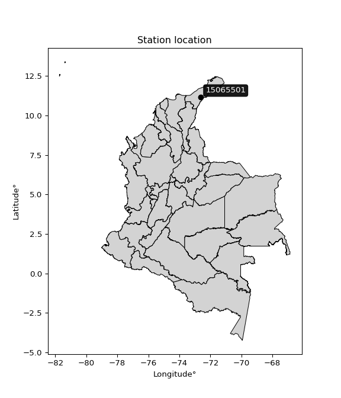

<div align="center">


</div>

# PMP Station (Rain, Pmax24h): 15065501

Probable Maximum Precipitation (PMP) is the greatest amount of rainfall for a specific duration that is meteorologically possible for a given location, acting as a "worst-case" scenario for extreme storms, crucial for designing safety-critical infrastructure like bridges, river deviations, dams, spillways, and nuclear plants to prevent catastrophic failure. PMP is calculated by hydrologists using meteorological data to determine the upper limit of extreme rainfall, often leading to the Probable Maximum Flood (PMF) for flood control design, and is increasingly being studied for climate change impacts. Probable Maximum Precipitation (PMP) is the theoretical upper limit of rainfall, a deterministic estimate for extreme events, while probability distributions (like GEV, Gumbel) describe the likelihood and frequency of various precipitation amounts, including rare ones, showing how often events occur, with PMP representing the extreme end of these distributions, used for critical infrastructure design to ensure safety against the worst conceivable weather, unlike standard statistical forecasts which cover typical probabilities.

The most common probability distributions in hydrology, used for analyzing floods, rainfall, and streamflow, include the Normal, Log-Normal, Gumbel, Gamma (including Log-Pearson Type III), and Generalized Extreme Value (GEV) distributions, often chosen based on the data´s skewness and whether modeling extremes or general conditions, with Gumbel and GEV popular for extreme events like floods, while the Normal distribution serves as a baseline, though often requiring transformations for skewed hydrological data. These distributions help in designing water infrastructure, managing water resources, and forecasting hydrologic events.

> Hydrological data often isn´t perfectly normal (it´s skewed), so different distributions are needed for different applications, such as: **Flood Frequency Analysis**: Using Gumbel, GEV, or Log-Pearson Type III for predicting extreme flood magnitudes and their return periods, **Rainfall Analysis**: Normal for annual totals, but Log-Normal, Weibull, or GEV for intensity or extreme daily rainfall, **Streamflow Modeling**: Gamma and Log-Normal for maximum flows, GEV for minimum flows, and Kappa for daily flows.

<div align="center">

</img>

</div>


## A. General information


### 1. General running parameters

• app_version: _v20260108_. • runtime: _2026-01-08 18:05:13.093906_. • Python version: _3.14.0_. • SciPy version: _1.16.3_. • Pandas version: _2.3.3_. • NumPy version: _2.3.5_. • Stations dataset (station_dataset_file): _dataset/pmax24h_in/automatic_colombia_2003_2024.csv_. • Stations catalog (station_catalog_file): _dataset/CNE.xls_. • Minimum year to eval til year_max (date_min): _1900_. • Maximum year to eval since year_min (date_max): _2024_. • Creates, save and include plots into reports (create_plot): _False_. • Plot only fit distributions with Δo > Δ (plot_only_fit): _True_. • Plot only simple graphs avoiding multiple CDFs and multiple Extreme values plots (plot_only_simple): _False_. • Eval low extreme values, if False, evaluates high extreme values (low_extreme): _False_. • Eval every SciPy distribution as logarithmic (pdist_logarithmic_on): _True_. • Standard deviation normalized (ddof): _1.0_. • Return periods to eval in years (Tr): _[2, 2.33, 5, 10, 15, 20, 25, 50, 75, 100, 200, 250, 500, 750, 1000]_. • Minimum data sample per station, 0 means any (minimum_sample): _5_. • Z-Score maximum threshold to adjust a value, 0 means disable (zscore_max): _3.5_. • Z-Score minimum threshold to adjust a value, 0 means disable (zscore_min): _-2.5_. • Avoid zeros, e.g. rain = 0 (avoid_zeros): _True_. • Avoid null values (avoid_nans): _True_. 

:file_folder:Table: [dataset.csv](../../dataset/pmax24h_in/automatic_colombia_2003_2024.csv)

> Delta Degrees of Freedom (DDOF): is a parameter used in the formulas for calculating variance and standard deviation. When ddof=0, the divisor is $N$ (the total number of observations) and this is used when your data set is the entire population. When ddof=1, the divisor is $N-1$ and this is used when your data set is a sample drawn from a larger population. Using $N-1$ provides an unbiased estimate of the population variance (known as Bessel´s correction).


### 2. Station info and location

|   id |   CODIGO | NOMBRE                             | CATEGORIA               | TECNOLOGIA                              | ESTADO   | FECHA_INSTALACION   |   FECHA_SUSPENSION |   ALTITUD |   LATITUD |   LONGITUD | DEPARTAMENTO   | MUNICIPIO   | AREA_OPERATIVA                                         | ENTIDAD                                                     | AREA_HIDROGRAFICA   | ZONA_HIDROGRAFICA   | SUBZONA_HIDROGRAFICA   |   CORRIENTE | Catalogo   |   Version |
|-----:|---------:|:-----------------------------------|:------------------------|:----------------------------------------|:---------|:--------------------|-------------------:|----------:|----------:|-----------:|:---------------|:------------|:-------------------------------------------------------|:------------------------------------------------------------|:--------------------|:--------------------|:-----------------------|------------:|:-----------|----------:|
|    0 | 15065501 | LA MINA CERREJON  - AUT [15065501] | Climatológica Principal | Automática con Telemetría, Convencional | Activa   | 27/08/2014          |                nan |        80 |   11.1376 |   -72.6159 | La Guajira     | Albania     | Area Operativa 05 - Magdalena-Cesar-Guajira-San Andrés | INSTITUTO DE HIDROLOGIA METEOROLOGIA Y ESTUDIOS AMBIENTALES | Caribe              | Caribe - Guajira    | Río Ranchería          |         nan | CNE_IDEAM  |  20251226 |

<div align="center">

Dynamic map: [:earth_americas:Google](http://maps.google.com/maps?q=11.13758333,-72.61594444) [:earth_americas:OSM](https://www.openstreetmap.org/#map=18/11.13758333/-72.61594444&layers=P) [:earth_americas:Bing](https://www.bing.com/maps?cp=11.13758333~-72.61594444&lvl=18) [:earth_americas:Apple](https://maps.apple.com/frame?center=11.13758333%2C-72.61594444&span=0.003%2C0.006)

</div>


<div align="center">

```geojson
{
  "type": "Feature",
  "geometry": {
    "type": "Point", 
    "coordinates": [-72.61594444, 11.13758333]
  }, 
  "properties": {
    "Name": "15065501"
  }
}
```

</div>


### 3. Discrete values table and plot

<div align="center">

|               |           0 |          1 |         2 |           3 |           4 |           5 |           6 |
|:--------------|------------:|-----------:|----------:|------------:|------------:|------------:|------------:|
| Date          | 2015        | 2018       | 2019      | 2020        | 2021        | 2022        | 2023        |
| Value         |    2.6      |   73.706   |   13.8    |   11.8      |    5.5      |   11.9      |   11.5      |
| Value_initial |    2.6      |   73.706   |   13.8    |   11.8      |    5.5      |   11.9      |   11.5      |
| count         |    7        |    7       |    7      |    7        |    7        |    7        |    7        |
| mean          |   18.6866   |   18.6866  |   18.6866 |   18.6866   |   18.6866   |   18.6866   |   18.6866   |
| std           |   24.5927   |   24.5927  |   24.5927 |   24.5927   |   24.5927   |   24.5927   |   24.5927   |
| zscore        |   -0.654119 |    2.23722 |   -0.1987 |   -0.280025 |   -0.536198 |   -0.275959 |   -0.292224 |


</div>


> The initial value (value_initial) correspond to the initial obtained or null completed value, and value (value) is adjusted only when the initial value is outside the valid range (outlier) definite through the Z-Score value. If Z-Score is active, values out of range or outliers are replaced with the station mean value. A Z-Score (or standard score) measures how many standard deviations a data point is from the mean of a dataset, indicating its relative position; positive scores mean above the mean, negative mean below, and a score of zero is exactly at the mean, allowing for comparison of values from different distributions. It´s calculated using the formula $z=(x–μ)/σ$, where $x$ is the data point, $μ$ is the mean, and $σ$ is the standard deviation, helping identify outliers and understand probability.
>
> <sub>**Note**: In this study, "completing" (filling gaps in) and "extending" (forecasting or lengthening the historical record) rainfall data series are avoided for certain critical analyses because they introduce artificial bias and uncertainty, which can distort the statistics of rare events (extremes), alter day-to-day variability, and compromise the integrity and homogeneity of the original data. Some reasons against Completing/Extending rainfall data are: **Distortion of Extremes and Variability**: The primary issue is that most gap-filling or extension methods rely on averaging or regression with nearby stations, which inherently smooths the data. Rainfall is highly variable in space and time, with a large percentage of zero values and occasional large storms. Infilling methods often underestimate the highest values and overestimate the lowest (zero) values, which severely distorts analyses focused on flood frequency, drought severity, and intensity-duration-frequency (IDF) curves, **Loss of Data Homogeneity**: Infilled or extended data are synthetic estimates, not actual measurements. Combining these estimates with observed data can violate the assumption of data homogeneity, which requires that the data properties do not change over time. Inhomogeneity can lead to incorrect conclusions about long-term trends or changes in climate patterns, **Propagation of Errors**: Errors and biases from the original data (e.g., wind-induced undercatch, instrument errors, site changes) or the data used for imputation can propagate through the analysis, leading to unreliable hydrological models and inaccurate predictions, **Compromised Statistical Integrity**: For statistical analyses, especially those involving the frequency of events, using artificial data can introduce time bias or autocorrelation that doesn´t exist in reality, making it difficult to assess the true probability of events, **Difficulty in Validation**: It is difficult to accurately validate the quality of filled or extended data, especially for past periods where ground-truth measurements are unavailable. The reliability of imputation techniques heavily depends on the density of the surrounding station network and the complexity of the local topography.</sub>


### 4. Active continuous probability distributions from SciPy (43 of 104 available)

A Probability Density Function (PDF) describes the relative likelihood of a continuous random variable falling within a specific range, where the total area under its curve equals 1, and the area over any interval gives the actual probability for that range. Unlike discrete probabilities (like rolling a die), a PDF shows density, not direct probability for a single point (which is zero), with higher points indicating higher likelihood, often visualized as a bell curve for normal distributions.

A log of a probability density function (log-PDF) is simply the logarithm of the PDF´s value, denoted as $log(f(x))$, useful for converting multiplication of probabilities into addition, improving numerical stability with tiny numbers, and connecting to information theory concepts like entropy. Instead of dealing with very small probabilities (e.g., 0.000001), log-PDFs use negative numbers (e.g., $log(0.00001) ≈ -11.51$ that are easier for computers to handle, preventing underflow errors and simplifying complex calculations. In this study, each active probability distribution from SciPy is also evaluated in the $log$ form.

[scipy.stats](https://docs.scipy.org/doc/scipy/reference/stats.html) is a Python´s powerful submodule within the SciPy library for comprehensive statistical analysis, offering over 130 probability distributions (like Normal, Poisson), functions for descriptive stats (mean, variance), hypothesis testing (t-tests, chi-square), random variable generation, and statistical tests, making it essential for data science, modeling, and research. It provides tools to explore, model, and draw conclusions from data efficiently, working seamlessly with NumPy.

<div align="center">

|   id | p_dist             |   n_parameter | fit_method   | label                                                                       | active   | ref                                                                                                        |
|-----:|:-------------------|--------------:|:-------------|:----------------------------------------------------------------------------|:---------|:-----------------------------------------------------------------------------------------------------------|
|    0 | alpha              |             3 | MLE          | Alpha                                                                       | True     | [:mortar_board:](https://docs.scipy.org/doc/scipy/reference/generated/scipy.stats.alpha.html)              |
|    1 | betaprime          |             4 | MLE          | Beta prime                                                                  | True     | [:mortar_board:](https://docs.scipy.org/doc/scipy/reference/generated/scipy.stats.betaprime.html)          |
|    2 | chi2               |             3 | MLE          | Chi²                                                                        | True     | [:mortar_board:](https://docs.scipy.org/doc/scipy/reference/generated/scipy.stats.chi2.html)               |
|    3 | crystalball        |             4 | MLE          | Crystalball                                                                 | True     | [:mortar_board:](https://docs.scipy.org/doc/scipy/reference/generated/scipy.stats.crystalball.html)        |
|    4 | erlang             |             3 | MLE          | Erlang                                                                      | True     | [:mortar_board:](https://docs.scipy.org/doc/scipy/reference/generated/scipy.stats.erlang.html)             |
|    5 | expon              |             2 | MLE          | Exponential                                                                 | True     | [:mortar_board:](https://docs.scipy.org/doc/scipy/reference/generated/scipy.stats.expon.html)              |
|    6 | exponnorm          |             3 | MLE          | Exponentially modified Normal                                               | True     | [:mortar_board:](https://docs.scipy.org/doc/scipy/reference/generated/scipy.stats.exponnorm.html)          |
|    7 | f                  |             4 | MLE          | F                                                                           | True     | [:mortar_board:](https://docs.scipy.org/doc/scipy/reference/generated/scipy.stats.f.html)                  |
|    8 | fatiguelife        |             3 | MLE          | Fatigue-life (Birnbaum-Saunders)                                            | True     | [:mortar_board:](https://docs.scipy.org/doc/scipy/reference/generated/scipy.stats.fatiguelife.html)        |
|    9 | fisk               |             3 | MLE          | Fisk                                                                        | True     | [:mortar_board:](https://docs.scipy.org/doc/scipy/reference/generated/scipy.stats.fisk.html)               |
|   10 | gamma              |             3 | MLE          | Gamma                                                                       | True     | [:mortar_board:](https://docs.scipy.org/doc/scipy/reference/generated/scipy.stats.gamma.html)              |
|   11 | genexpon           |             5 | MLE          | Generalized exponential                                                     | True     | [:mortar_board:](https://docs.scipy.org/doc/scipy/reference/generated/scipy.stats.genexpon.html)           |
|   12 | genlogistic        |             3 | MLE          | Generalized logistic                                                        | True     | [:mortar_board:](https://docs.scipy.org/doc/scipy/reference/generated/scipy.stats.genlogistic.html)        |
|   13 | gibrat             |             2 | MM           | Gibrat                                                                      | True     | [:mortar_board:](https://docs.scipy.org/doc/scipy/reference/generated/scipy.stats.gibrat.html)             |
|   14 | gompertz           |             3 | MLE          | Gompertz (or truncated Gumbel)                                              | True     | [:mortar_board:](https://docs.scipy.org/doc/scipy/reference/generated/scipy.stats.gompertz.html)           |
|   15 | gumbel_l           |             2 | MM           | Gumbel Left Skew                                                            | True     | [:mortar_board:](https://docs.scipy.org/doc/scipy/reference/generated/scipy.stats.gumbel_l.html)           |
|   16 | gumbel_r           |             2 | MM           | Gumbel Right Skew                                                           | True     | [:mortar_board:](https://docs.scipy.org/doc/scipy/reference/generated/scipy.stats.gumbel_r.html)           |
|   17 | halflogistic       |             2 | MM           | Half-logistic                                                               | True     | [:mortar_board:](https://docs.scipy.org/doc/scipy/reference/generated/scipy.stats.halflogistic.html)       |
|   18 | halfnorm           |             2 | MM           | Half Normal                                                                 | True     | [:mortar_board:](https://docs.scipy.org/doc/scipy/reference/generated/scipy.stats.halfnorm.html)           |
|   19 | hypsecant          |             2 | MM           | hyperbolic secant                                                           | True     | [:mortar_board:](https://docs.scipy.org/doc/scipy/reference/generated/scipy.stats.hypsecant.html)          |
|   20 | invgamma           |             3 | MLE          | Inverted gamma                                                              | True     | [:mortar_board:](https://docs.scipy.org/doc/scipy/reference/generated/scipy.stats.invgamma.html)           |
|   21 | invgauss           |             3 | MLE          | Inverse Gaussian                                                            | True     | [:mortar_board:](https://docs.scipy.org/doc/scipy/reference/generated/scipy.stats.invgauss.html)           |
|   22 | invweibull         |             3 | MLE          | Inverted Weibull                                                            | True     | [:mortar_board:](https://docs.scipy.org/doc/scipy/reference/generated/scipy.stats.invweibull.html)         |
|   23 | kstwobign          |             2 | MLE          | Limiting distribution of scaled Kolmogorov-Smirnov two-sided test statistic | True     | [:mortar_board:](https://docs.scipy.org/doc/scipy/reference/generated/scipy.stats.kstwobign.html)          |
|   24 | laplace            |             2 | MM           | Laplace                                                                     | True     | [:mortar_board:](https://docs.scipy.org/doc/scipy/reference/generated/scipy.stats.laplace.html)            |
|   25 | laplace_asymmetric |             3 | MLE          | Asymmetric Laplace                                                          | True     | [:mortar_board:](https://docs.scipy.org/doc/scipy/reference/generated/scipy.stats.laplace_asymmetric.html) |
|   26 | loggamma           |             3 | MLE          | Log gamma                                                                   | True     | [:mortar_board:](https://docs.scipy.org/doc/scipy/reference/generated/scipy.stats.loggamma.html)           |
|   27 | logistic           |             2 | MM           | Logistic (or Sech-squared)                                                  | True     | [:mortar_board:](https://docs.scipy.org/doc/scipy/reference/generated/scipy.stats.logistic.html)           |
|   28 | lognorm            |             3 | MLE          | Log Normal                                                                  | True     | [:mortar_board:](https://docs.scipy.org/doc/scipy/reference/generated/scipy.stats.lognorm.html)            |
|   29 | maxwell            |             2 | MM           | Maxwell                                                                     | True     | [:mortar_board:](https://docs.scipy.org/doc/scipy/reference/generated/scipy.stats.maxwell.html)            |
|   30 | mielke             |             4 | MLE          | Mielke Beta-Kappa / Dagum                                                   | True     | [:mortar_board:](https://docs.scipy.org/doc/scipy/reference/generated/scipy.stats.mielke.html)             |
|   31 | moyal              |             2 | MM           | Moyal                                                                       | True     | [:mortar_board:](https://docs.scipy.org/doc/scipy/reference/generated/scipy.stats.moyal.html)              |
|   32 | nakagami           |             3 | MLE          | Nakagami                                                                    | True     | [:mortar_board:](https://docs.scipy.org/doc/scipy/reference/generated/scipy.stats.nakagami.html)           |
|   33 | ncf                |             5 | MLE          | Non-central F distribution                                                  | True     | [:mortar_board:](https://docs.scipy.org/doc/scipy/reference/generated/scipy.stats.ncf.html)                |
|   34 | nct                |             4 | MLE          | Non-central Student’s t                                                     | True     | [:mortar_board:](https://docs.scipy.org/doc/scipy/reference/generated/scipy.stats.nct.html)                |
|   35 | norm               |             2 | MM           | Normal                                                                      | True     | [:mortar_board:](https://docs.scipy.org/doc/scipy/reference/generated/scipy.stats.norm.html)               |
|   36 | pearson3           |             3 | MM           | Pearson type III                                                            | True     | [:mortar_board:](https://docs.scipy.org/doc/scipy/reference/generated/scipy.stats.pearson3.html)           |
|   37 | rayleigh           |             2 | MM           | Rayleigh                                                                    | True     | [:mortar_board:](https://docs.scipy.org/doc/scipy/reference/generated/scipy.stats.rayleigh.html)           |
|   38 | rice               |             3 | MLE          | Rice                                                                        | True     | [:mortar_board:](https://docs.scipy.org/doc/scipy/reference/generated/scipy.stats.rice.html)               |
|   39 | t                  |             3 | MLE          | Student’s t                                                                 | True     | [:mortar_board:](https://docs.scipy.org/doc/scipy/reference/generated/scipy.stats.t.html)                  |
|   40 | truncnorm          |             4 | MLE          | Truncated normal                                                            | True     | [:mortar_board:](https://docs.scipy.org/doc/scipy/reference/generated/scipy.stats.truncnorm.html)          |
|   41 | wald               |             2 | MM           | Wald                                                                        | True     | [:mortar_board:](https://docs.scipy.org/doc/scipy/reference/generated/scipy.stats.wald.html)               |
|   42 | weibull_min        |             3 | MLE          | Weibull minimum                                                             | True     | [:mortar_board:](https://docs.scipy.org/doc/scipy/reference/generated/scipy.stats.weibull_min.html)        |

</div>

> **n_parameter:** # arguments & localization & scale.
>
> **Fit methods:** (MLE) maximum likelihood, (MM) L-moments.
>
>**Inactive** (With the only purpose of prevent loops, zero divisions, infinite values, over high estimated values or horizontal trending for recurrence intervals estimations, the follow distributions were disabled.)**:** foldnorm, gennorm, norminvgauss, powernorm, powerlognorm, skewnorm, genextreme, anglit, arcsine, argus, beta, bradford, burr, burr12, cauchy, cosine, halfcauchy, foldcauchy, skewcauchy, wrapcauchy, dgamma, gengamma, exponweib, exponpow, truncexpon, gausshyper, genhalflogistic, genhyperbolic, geninvgauss, halfgennorm, johnsonsb, johnsonsu, kappa4, kappa3, ksone, kstwo, loglaplace, levy, levy_l, levy_stable, ncx2, pareto, genpareto, truncpareto, lomax, powerlaw, rdist, rel_breitwigner, recipinvgauss, semicircular, studentized_range, trapezoid, triang, truncweibull_min, tukeylambda, uniform, loguniform, vonmises, vonmises_line, weibull_max, dweibull, 


## B. Probability (PDF) vs. Empirical (EDF) distributions functions

A continuous probability distribution (CPD) describes probabilities for variables that can take any value within a range (like rain any time), unlike discrete variables with specific outcomes (like temperature). It uses a Probability Density Function (PDF), a curve where the total area under it equals 1, and the probability of the variable falling within an interval (a to b) is found by calculating the area under the curve between those points. A key feature is that the probability of hitting any single exact value is zero, so probabilities are always expressed for ranges, e.g., $P(a ≤ X ≤ b)$.

<div align="center">

Distributions parameters from station values
|    |   station | p_dist                |   n |             loc |          scale | shape                  | shape1                | shape2                | shape3   |
|---:|----------:|:----------------------|----:|----------------:|---------------:|:-----------------------|:----------------------|:----------------------|:---------|
|  0 |  15065501 | alpha                 |   7 |    -0.0104457   |    5.81981     | 3.732168490702807e-09  |                       |                       |          |
|  1 |  15065501 | betaprime             |   7 |     2.6         |    9.74816     | 0.8371368970556905     | 1.7043264864189114    |                       |          |
|  2 |  15065501 | chi2                  |   7 |     2.6         |   15.9339      | 0.9717248923713622     |                       |                       |          |
|  3 |  15065501 | crystalball           |   7 |    18.6866      |   22.7684      | 5.602521733566884      | 8522.112377306425     |                       |          |
|  4 |  15065501 | erlang                |   7 |     2.6         |   21.7536      | 0.5813131192316024     |                       |                       |          |
|  5 |  15065501 | expon                 |   7 |     2.6         |   16.0866      |                        |                       |                       |          |
|  6 |  15065501 | exponnorm             |   7 |     2.58702     |    0.00394385  | 4085.609183189148      |                       |                       |          |
|  7 |  15065501 | f                     |   7 |     2.6         |    8.30982     | 1.0535180425728359     | 4.412910533402698     |                       |          |
|  8 |  15065501 | fatiguelife           |   7 |     1.47339     |    8.89003     | 1.3678395915039316     |                       |                       |          |
|  9 |  15065501 | fisk                  |   7 |     2.6         |    1.08895     | 0.614212123026117      |                       |                       |          |
| 10 |  15065501 | gamma                 |   7 |     2.6         |   31.4081      | 0.15881006076564705    |                       |                       |          |
| 11 |  15065501 | genexpon              |   7 |     2.6         |   26.0206      | 1.617535472461472      | 6.746276264415788e-11 | 2.2760595350575223    |          |
| 12 |  15065501 | genlogistic           |   7 |   -72.5976      |   10.8036      | 2159.999020340343      |                       |                       |          |
| 13 |  15065501 | gibrat                |   7 |     1.31713     |   10.5351      |                        |                       |                       |          |
| 14 |  15065501 | gompertz              |   7 |     2.01805     |  229.026       | 12.104677088511103     |                       |                       |          |
| 15 |  15065501 | gumbel_l              |   7 |    28.9336      |   17.7525      |                        |                       |                       |          |
| 16 |  15065501 | gumbel_r              |   7 |     8.43957     |   17.7525      |                        |                       |                       |          |
| 17 |  15065501 | halflogistic          |   7 |    -8.29931     |   19.4662      |                        |                       |                       |          |
| 18 |  15065501 | halfnorm              |   7 |   -11.4499      |   37.7705      |                        |                       |                       |          |
| 19 |  15065501 | hypsecant             |   7 |    18.6866      |   14.4948      |                        |                       |                       |          |
| 20 |  15065501 | invgamma              |   7 |    -0.844101    |   15.7901      | 1.7329510681389833     |                       |                       |          |
| 21 |  15065501 | invgauss              |   7 |     0.755411    |    9.63892     | 1.8602891816995322     |                       |                       |          |
| 22 |  15065501 | invweibull            |   7 |    -2.28604     |   10.0747      | 1.613986424044084      |                       |                       |          |
| 23 |  15065501 | kstwobign             |   7 |   -35.2495      |   63.684       |                        |                       |                       |          |
| 24 |  15065501 | laplace               |   7 |    18.6866      |   16.0997      |                        |                       |                       |          |
| 25 |  15065501 | laplace_asymmetric    |   7 |     2.6         |    0.00219939  | 0.00013672961804086494 |                       |                       |          |
| 26 |  15065501 | loggamma              |   7 | -8113.33        | 1068.2         | 2024.360927275382      |                       |                       |          |
| 27 |  15065501 | logistic              |   7 |    18.6866      |   12.5529      |                        |                       |                       |          |
| 28 |  15065501 | lognorm               |   7 |     2.6         |    0.0499978   | 13.237746770050034     |                       |                       |          |
| 29 |  15065501 | maxwell               |   7 |   -35.265       |   33.8092      |                        |                       |                       |          |
| 30 |  15065501 | mielke                |   7 |     2.59774     |   10.4255      | 0.8676487018934022     | 1.8748883631172268    |                       |          |
| 31 |  15065501 | moyal                 |   7 |     5.66612     |   10.2494      |                        |                       |                       |          |
| 32 |  15065501 | nakagami              |   7 |     2.6         |   40.1546      | 0.20771619638521277    |                       |                       |          |
| 33 |  15065501 | ncf                   |   7 |     0.0292424   |    5.8178      | 13.045642179427498     | 3.5249661733678046    | 6.833456894939108     |          |
| 34 |  15065501 | nct                   |   7 |    -3.02017     |    0.859179    | 1.6197288666951308     | 12.394445632773891    |                       |          |
| 35 |  15065501 | norm                  |   7 |    18.6866      |   22.7684      |                        |                       |                       |          |
| 36 |  15065501 | pearson3              |   7 |    18.6866      |   22.7685      | 1.9240232008680662     |                       |                       |          |
| 37 |  15065501 | rayleigh              |   7 |   -24.8708      |   34.7537      |                        |                       |                       |          |
| 38 |  15065501 | rice                  |   7 |   -12.7134      |   27.4259      | 0.00020800326978993405 |                       |                       |          |
| 39 |  15065501 | t                     |   7 |    11.8249      |    0.166918    | 0.29598309332182005    |                       |                       |          |
| 40 |  15065501 | truncnorm             |   7 |  -185.23        |   61.6338      | 3.047523315689064      | 108.99962186589116    |                       |          |
| 41 |  15065501 | wald                  |   7 |    -4.08186     |   22.7684      |                        |                       |                       |          |
| 42 |  15065501 | weibull_min           |   7 |     2.6         |   16.7059      | 0.8003885304566687     |                       |                       |          |
| 43 |  15065501 | logalpha              |   7 |    -7.71635     |  110.631       | 11.001700192173201     |                       |                       |          |
| 44 |  15065501 | logbetaprime          |   7 |    -1.0267      |   70.6834      | 14.02988967896719      | 288.3419247817302     |                       |          |
| 45 |  15065501 | logchi2               |   7 |     0.955511    |    1.56243     | 0.3380572484353444     |                       |                       |          |
| 46 |  15065501 | logcrystalball        |   7 |     2.42457     |    0.944063    | 120.86270161522827     | 93.45830678563358     |                       |          |
| 47 |  15065501 | logerlang             |   7 |    -0.850201    |    0.274099    | 11.947425119387667     |                       |                       |          |
| 48 |  15065501 | logexpon              |   7 |     0.955511    |    1.46906     |                        |                       |                       |          |
| 49 |  15065501 | logexponnorm          |   7 |     1.70517     |    0.633197    | 1.136139549820264      |                       |                       |          |
| 50 |  15065501 | logf                  |   7 |    -0.852829    |    3.27747     | 23.94576717352774      | 399640.22235289216    |                       |          |
| 51 |  15065501 | logfatiguelife        |   7 |    -2.55608     |    4.89316     | 0.18910596970724983    |                       |                       |          |
| 52 |  15065501 | logfisk               |   7 |    -3.04788     |    5.39858     | 10.665445324625452     |                       |                       |          |
| 53 |  15065501 | loggamma              |   7 |    -0.850189    |    0.2741      | 11.94732968716737      |                       |                       |          |
| 54 |  15065501 | loggenexpon           |   7 |     0.950962    |    0.0124107   | 0.003739851966541372   | 1.1328213634998021    | 4.932653519683011e-05 |          |
| 55 |  15065501 | loggenlogistic        |   7 |     1.86231     |    0.612152    | 1.8697550817070825     |                       |                       |          |
| 56 |  15065501 | loggibrat             |   7 |     1.70434     |    0.436834    |                        |                       |                       |          |
| 57 |  15065501 | loggompertz           |   7 |     0.955511    |    1.80494     | 0.6178163120681648     |                       |                       |          |
| 58 |  15065501 | loggumbel_l           |   7 |     2.84945     |    0.736083    |                        |                       |                       |          |
| 59 |  15065501 | loggumbel_r           |   7 |     1.99969     |    0.736083    |                        |                       |                       |          |
| 60 |  15065501 | loghalflogistic       |   7 |     1.30568     |    0.807118    |                        |                       |                       |          |
| 61 |  15065501 | loghalfnorm           |   7 |     1.17504     |    1.56606     |                        |                       |                       |          |
| 62 |  15065501 | loghypsecant          |   7 |     2.42457     |    0.601009    |                        |                       |                       |          |
| 63 |  15065501 | loginvgamma           |   7 |    -4.28819     |  344.875       | 52.37542121963271      |                       |                       |          |
| 64 |  15065501 | loginvgauss           |   7 |    -2.58759     |  140.774       | 0.03560422294431241    |                       |                       |          |
| 65 |  15065501 | loginvweibull         |   7 |    -5.04844e+07 |    5.04844e+07 | 61135978.466559604     |                       |                       |          |
| 66 |  15065501 | logkstwobign          |   7 |    -0.988986    |    3.92297     |                        |                       |                       |          |
| 67 |  15065501 | loglaplace            |   7 |     2.42457     |    0.667553    |                        |                       |                       |          |
| 68 |  15065501 | loglaplace_asymmetric |   7 |     2.4681      |    0.612623    | 1.036213234180016      |                       |                       |          |
| 69 |  15065501 | logloggamma           |   7 |  -306.178       |   40.9635      | 1870.264831616254      |                       |                       |          |
| 70 |  15065501 | loglogistic           |   7 |     2.42457     |    0.520489    |                        |                       |                       |          |
| 71 |  15065501 | loglognorm            |   7 |     0.955511    |    0.00768874  | 13.016575379273306     |                       |                       |          |
| 72 |  15065501 | logmaxwell            |   7 |     0.187539    |    1.40185     |                        |                       |                       |          |
| 73 |  15065501 | logmielke             |   7 |     0.955511    |    2.42662     | 0.35457756010367536    | 4.217902234210609     |                       |          |
| 74 |  15065501 | logmoyal              |   7 |     1.8847      |    0.424978    |                        |                       |                       |          |
| 75 |  15065501 | lognakagami           |   7 |     1.70475     |    1.28055     | 0.2934246143645199     |                       |                       |          |
| 76 |  15065501 | logncf                |   7 |    -0.0242473   |    0.000131341 | 0.0014601613695309924  | 973.1365353255155     | 27.17461899736636     |          |
| 77 |  15065501 | lognct                |   7 |    -3.28834     |    0.556719    | 31.08891862119244      | 10.008864656260158    |                       |          |
| 78 |  15065501 | lognorm               |   7 |     2.42457     |    0.944063    |                        |                       |                       |          |
| 79 |  15065501 | logpearson3           |   7 |     2.42457     |    0.94406     | 0.5199263141638517     |                       |                       |          |
| 80 |  15065501 | lograyleigh           |   7 |     0.618524    |    1.44102     |                        |                       |                       |          |
| 81 |  15065501 | logrice               |   7 |     0.561442    |    1.20746     | 0.9960834620863123     |                       |                       |          |
| 82 |  15065501 | logt                  |   7 |     2.47037     |    0.0141931   | 0.29794039700094466    |                       |                       |          |
| 83 |  15065501 | logtruncnorm          |   7 |    -0.0495699   |    2.65837     | 0.37807712142843264    | 1.636210114223669     |                       |          |
| 84 |  15065501 | logwald               |   7 |     1.48052     |    0.944057    |                        |                       |                       |          |
| 85 |  15065501 | logweibull_min        |   7 |     0.59051     |    2.06446     | 2.0081927919184492     |                       |                       |          |

</div>

> **loc** (Location parameter): This shifts the distribution along the x-axis. For many common distributions, like the normal (Gaussian) distribution, loc represents the mean $μ$. For others, like the uniform distribution, it might represent the minimum value, or for the beta distribution, the left end of the support interval.
>
> **scale** (Scale parameter): This determines the width or spread of the distribution. For the normal distribution, scale represents the standard deviation $σ$. For a uniform distribution, it defines the length of the interval (from $loc$ to $loc + scale$).
>
> **shape** (Shape parameters): Refers to parameters that define the specific form of a probability distribution, distinct from its location (loc) and scale (scale). These parameters are required arguments for most distribution functions. For example, a normal (Gaussian) distribution is fully defined by its location (mean) and scale (standard deviation), so it has no specific shape parameters beyond loc and scale. However, other distributions have intrinsic properties that need specification, as Gamma distribution that takes a shape parameter, often named $a$ or $alpha$.


### 0. Cumulative distribution values - CDF (86 evaluated)

Cumulative Distribution Function (CDF), denoted as $F$<sub>$X$</sub>$(x)$, is a function that gives the probability that a random variable $X$ will take a value less than or equal to a specific value, $x$ (i.e., $(P(X≥x)$. It essentially "accumulates" probabilities from a given point up to the far right (positive infinity), providing a complete picture of the distribution´s probabilities for both discrete (like rain) and continuous (like temperature) variables, helping to find probabilities over ranges or above certain values. Each station is evaluated separately ordering the $x$ values ascending, calculating the CDF and PDF values for the activated distributions and their logarithmic forms.

<div align="center">

CDF ordered by x ascending and calculating $log(f(x))$ separately
|   id |   Station |   date |      x |   count |    mean |     std |    zscore |   Value_initial |   station |   m |     alpha |   alpha_pdf |   betaprime |   betaprime_pdf |        chi2 |    chi2_pdf |   crystalball |   crystalball_pdf |      erlang |       erlang_pdf |    expon |   expon_pdf |   exponnorm |   exponnorm_pdf |           f |       f_pdf |   fatiguelife |   fatiguelife_pdf |        fisk |         fisk_pdf |      gamma |   gamma_pdf |    genexpon |   genexpon_pdf |   genlogistic |   genlogistic_pdf |   gibrat |   gibrat_pdf |   gompertz |   gompertz_pdf |   gumbel_l |   gumbel_l_pdf |   gumbel_r |   gumbel_r_pdf |   halflogistic |   halflogistic_pdf |   halfnorm |   halfnorm_pdf |   hypsecant |   hypsecant_pdf |   invgamma |   invgamma_pdf |   invgauss |   invgauss_pdf |   invweibull |   invweibull_pdf |   kstwobign |   kstwobign_pdf |   laplace |   laplace_pdf |   laplace_asymmetric |   laplace_asymmetric_pdf |   loggamma |   loggamma_pdf |   logistic |   logistic_pdf |   lognorm |   lognorm_pdf |   maxwell |   maxwell_pdf |      mielke |   mielke_pdf |    moyal |   moyal_pdf |    nakagami |   nakagami_pdf |       ncf |     ncf_pdf |       nct |     nct_pdf |     norm |    norm_pdf |   pearson3 |   pearson3_pdf |   rayleigh |   rayleigh_pdf |     rice |    rice_pdf |        t |       t_pdf |   truncnorm |   truncnorm_pdf |     wald |   wald_pdf |   weibull_min |   weibull_min_pdf |   logalpha |   logalpha_pdf |   logbetaprime |   logbetaprime_pdf |    logchi2 |   logchi2_pdf |   logcrystalball |   logcrystalball_pdf |   logerlang |   logerlang_pdf |   logexpon |   logexpon_pdf |   logexponnorm |   logexponnorm_pdf |      logf |   logf_pdf |   logfatiguelife |   logfatiguelife_pdf |   logfisk |   logfisk_pdf |   loggenexpon |   loggenexpon_pdf |   loggenlogistic |   loggenlogistic_pdf |   loggibrat |   loggibrat_pdf |   loggompertz |   loggompertz_pdf |   loggumbel_l |   loggumbel_l_pdf |   loggumbel_r |   loggumbel_r_pdf |   loghalflogistic |   loghalflogistic_pdf |   loghalfnorm |   loghalfnorm_pdf |   loghypsecant |   loghypsecant_pdf |   loginvgamma |   loginvgamma_pdf |   loginvgauss |   loginvgauss_pdf |   loginvweibull |   loginvweibull_pdf |   logkstwobign |   logkstwobign_pdf |   loglaplace |   loglaplace_pdf |   loglaplace_asymmetric |   loglaplace_asymmetric_pdf |   logloggamma |   logloggamma_pdf |   loglogistic |   loglogistic_pdf |   loglognorm |   loglognorm_pdf |   logmaxwell |   logmaxwell_pdf |   logmielke |   logmielke_pdf |   logmoyal |   logmoyal_pdf |   lognakagami |   lognakagami_pdf |    logncf |   logncf_pdf |    lognct |   lognct_pdf |   logpearson3 |   logpearson3_pdf |   lograyleigh |   lograyleigh_pdf |   logrice |   logrice_pdf |      logt |   logt_pdf |   logtruncnorm |   logtruncnorm_pdf |   logwald |   logwald_pdf |   logweibull_min |   logweibull_min_pdf |
|-----:|----------:|-------:|-------:|--------:|--------:|--------:|----------:|----------------:|----------:|----:|----------:|------------:|------------:|----------------:|------------:|------------:|--------------:|------------------:|------------:|-----------------:|---------:|------------:|------------:|----------------:|------------:|------------:|--------------:|------------------:|------------:|-----------------:|-----------:|------------:|------------:|---------------:|--------------:|------------------:|---------:|-------------:|-----------:|---------------:|-----------:|---------------:|-----------:|---------------:|---------------:|-------------------:|-----------:|---------------:|------------:|----------------:|-----------:|---------------:|-----------:|---------------:|-------------:|-----------------:|------------:|----------------:|----------:|--------------:|---------------------:|-------------------------:|-----------:|---------------:|-----------:|---------------:|----------:|--------------:|----------:|--------------:|------------:|-------------:|---------:|------------:|------------:|---------------:|----------:|------------:|----------:|------------:|---------:|------------:|-----------:|---------------:|-----------:|---------------:|---------:|------------:|---------:|------------:|------------:|----------------:|---------:|-----------:|--------------:|------------------:|-----------:|---------------:|---------------:|-------------------:|-----------:|--------------:|-----------------:|---------------------:|------------:|----------------:|-----------:|---------------:|---------------:|-------------------:|----------:|-----------:|-----------------:|---------------------:|----------:|--------------:|--------------:|------------------:|-----------------:|---------------------:|------------:|----------------:|--------------:|------------------:|--------------:|------------------:|--------------:|------------------:|------------------:|----------------------:|--------------:|------------------:|---------------:|-------------------:|--------------:|------------------:|--------------:|------------------:|----------------:|--------------------:|---------------:|-------------------:|-------------:|-----------------:|------------------------:|----------------------------:|--------------:|------------------:|--------------:|------------------:|-------------:|-----------------:|-------------:|-----------------:|------------:|----------------:|-----------:|---------------:|--------------:|------------------:|----------:|-------------:|----------:|-------------:|--------------:|------------------:|--------------:|------------------:|----------:|--------------:|----------:|-----------:|---------------:|-------------------:|----------:|--------------:|-----------------:|---------------------:|
|    0 |  15065501 |   2015 |  2.6   |       7 | 18.6866 | 24.5927 | -0.654119 |           2.6   |  15065501 |   1 | 0.0257852 | 0.0567699   | 1.91326e-07 |      3.04985    | 7.29456e-09 | 7.98072e+06 |      0.239929 |       0.0136515   | 2.22692e-10 | 291504           | 0        | 0.0621637   | 0.000805268 |      0.0619807  | 2.03947e-09 | 2.41913e+06 |     0.0364539 |        0.0820429  | 3.52824e-10 | 487985           | 0.00226752 | 8.10884e+11 | 1.12978e-11 |    0.0621636   |      0.128961 |       0.024438    | 0.017619 |   0.033883   |  0.0303273 |    0.0513804   |   0.202976 |    0.0101857   |   0.2492   |      0.0195051 |       0.272863 |         0.0237732  |   0.290093 |     0.0197125  |    0.202703 |     0.0130583   |  0.0392311 |    0.0453188   |  0.0372849 |     0.0603694  |    0.0401386 |      0.0426326   |    0.128304 |     0.020289    |  0.18409  |    0.0114344  |          1.87398e-08 |              0.0621672   |   0.038246 |      0.131438  |   0.217294 |    0.0135489   | 0.0598417 |     0.12592   |  0.259992 |    0.0158104  | 0.000663285 |  0.254134    | 0.245503 |  0.0230304  | 7.11338e-08 |    6.65435e+07 | 0.0395015 | 0.0456358   | 0.0406006 | 0.041238    | 0.239929 | 0.0136515   |   0.257315 |     0.0309045  |   0.26831  |      0.0166416 | 0.144338 | 0.0174202   | 0.106851 | 0.00342813  | 3.01981e-13 |     0.0539851   | 0.158723 |  0.0470836 |   5.41054e-14 |       97.515      |  0.0395658 |      0.125653  |      0.0382236 |          0.129986  | 0.00178854 |   2.72301e+12 |        0.0598416 |            0.12592   |    0.038246 |       0.131437  |   0        |      0.680708  |      0.0367674 |          0.113226  | 0.0382236 |  0.131347  |        0.0389955 |            0.128863  | 0.0395857 |     0.101286  |    0.00137383 |         0.302575  |        0.0427346 |            0.106351  | 0           |     0           |   9.44462e-11 |         0.342292  |     0.0734679 |        0.0960496  |     0.0160638 |         0.0901563 |          0        |             0         |      0        |         0         |      0.0551109 |          0.0912399 |      0.03936  |         0.126754  |     0.0390097 |         0.1288    |       0.0321979 |           0.133968  |      0.0333528 |          0.155106  |    0.0553649 |        0.082937  |               0.0477892 |                   0.0752813 |      0.061298 |         0.126358  |     0.0561225 |         0.101775  |   0.00717611 |      1.37835e+13 |    0.0399931 |        0.147013  | 1.60823e-06 |     5.13628e+09 | 0.00284644 |      0.0326571 |   0           |         0         | 0.0368787 |    0.133518  | 0.0402295 |    0.12581   |     0.0404373 |         0.130861  |     0.0269734 |         0.157907  | 0.0319947 |     0.160194  | 0.0870331 |  0.0171173 |    5.51588e-06 |           0.462968 | 0         |     0         |        0.0303486 |            0.164414  |
|    1 |  15065501 |   2021 |  5.5   |       7 | 18.6866 | 24.5927 | -0.536198 |           5.5   |  15065501 |   2 | 0.290904  | 0.0875511   | 0.430802    |      0.0862827  | 0.342069    | 0.0538856   |      0.28124  |       0.0148163   | 0.331277    |      0.0609881   | 0.164959 | 0.0519092   | 0.165385    |      0.0517976  | 0.405327    | 0.0637375   |     0.276165  |        0.0655309  | 0.646026    |      0.048433    | 0.727319   | 0.0367706   | 0.164959    |    0.0519092   |      0.208833 |       0.0302639   | 0.177817 |   0.0622523  |  0.169259  |    0.0445797   |   0.234427 |    0.01152     |   0.307253 |      0.0204244 |       0.34031  |         0.0227109  |   0.346396 |     0.019101   |    0.243679 |     0.0152168   |  0.225045  |    0.069408    |  0.251992  |     0.0691907  |    0.21964   |      0.0690123   |    0.192482 |     0.0237422   |  0.220424 |    0.0136912  |          0.164968    |              0.0519116   |   0.234108 |      0.381715  |   0.259133 |    0.0152939   | 0.222889  |     0.315986  |  0.307028 |    0.0165853  | 0.3167      |  0.0867868   | 0.313389 |  0.0236067  | 0.264258    |    0.0378217   | 0.224548  | 0.0688866   | 0.216655  | 0.06874     | 0.28124  | 0.0148163   |   0.342399 |     0.0277876  |   0.317394 |      0.0171642 | 0.197891 | 0.0194224   | 0.119478 | 0.00559047  | 0.145798    |     0.0467217   | 0.291316 |  0.0430851 |   0.218252    |        0.0531248  |  0.229293  |      0.377828  |      0.232867  |          0.381202  | 0.819823   |   0.150418    |        0.222888  |            0.315985  |    0.234108 |       0.381715  |   0.399511 |      0.408757  |      0.220863  |          0.387648  | 0.234009  |  0.381657  |        0.231989  |            0.379575  | 0.204374  |     0.364905  |    0.281155   |         0.412899  |        0.211804  |            0.364869  | 1.63295e-12 |     2.81421e-08 |   0.272312    |         0.377241  |     0.190358  |        0.232265   |     0.224729  |         0.455776  |          0.242304 |             0.583117  |      0.264819 |         0.481159  |      0.186651  |          0.293068  |      0.230247 |         0.378497  |     0.231934  |         0.379528  |       0.249891  |           0.419645  |      0.266682  |          0.419082  |    0.170087  |        0.254791  |               0.155564  |                   0.245057  |      0.223615 |         0.31365   |     0.200532  |         0.308016  |   0.637508   |      0.038452    |    0.240116  |        0.371167  | 0.658831    |     0.309615    | 0.216535   |      0.540587  |   6.57038e-10 |    868255         | 0.235388  |    0.38405   | 0.229716  |    0.377525  |     0.232292  |         0.374568  |     0.247308  |         0.39373   | 0.243442  |     0.376676  | 0.106654  |  0.041502  |    0.324845    |           0.399967 | 0.0998889 |     1.07361   |        0.251613  |            0.390935  |
|    2 |  15065501 |   2023 | 11.5   |       7 | 18.6866 | 24.5927 | -0.292224 |          11.5   |  15065501 |   3 | 0.61313   | 0.0308427   | 0.721601    |      0.0267977  | 0.556288    | 0.0250798   |      0.376139 |       0.0166703   | 0.578241    |      0.0289442   | 0.424926 | 0.0357487   | 0.424867    |      0.0356937  | 0.640738    | 0.0250412   |     0.535066  |        0.0290285  | 0.784208    |      0.0116787   | 0.848221   | 0.0118272   | 0.424926    |    0.0357487   |      0.407005 |       0.0338584   | 0.486436 |   0.0391551  |  0.400505  |    0.0330244   |   0.3124   |    0.0145072   |   0.431    |      0.0204338 |       0.468819 |         0.0200401  |   0.456557 |     0.0175638  |    0.348276 |     0.0195124   |  0.547449  |    0.0377349   |  0.542367  |     0.0327227  |    0.547283  |      0.0386222   |    0.346005 |     0.0264872   |  0.319971 |    0.0198743  |          0.424944    |              0.0357496   |   0.5459   |      0.415825  |   0.360659 |    0.018369    | 0.507511  |     0.422505  |  0.409396 |    0.0173468  | 0.674119    |  0.0376802   | 0.45186  |  0.0220654  | 0.420398    |    0.0194581   | 0.545613  | 0.0377614   | 0.547267  | 0.0391674   | 0.376139 | 0.0166703   |   0.49101  |     0.0219138  |   0.42167  |      0.0174151 | 0.322758 | 0.0218011   | 0.285857 | 0.249585    | 0.387489    |     0.0344055   | 0.505622 |  0.0287764 |   0.453435    |        0.0296936  |  0.544368  |      0.425024  |      0.545521  |          0.417934  | 0.893579   |   0.0672134   |        0.507511  |            0.422505  |    0.5459   |       0.415825  |   0.636545 |      0.247406  |      0.554377  |          0.449619  | 0.545826  |  0.41593   |        0.54481   |            0.419416  | 0.544767  |     0.481763  |    0.573471   |         0.358621  |        0.541931  |            0.462453  | 0.700002    |     0.47112     |   0.546254    |         0.353967  |     0.437398  |        0.439623   |     0.578068  |         0.430411  |          0.606998 |             0.39124   |      0.581618 |         0.367225  |      0.509413  |          0.529394  |      0.544523 |         0.422973  |     0.54479   |         0.419519  |       0.566864  |           0.389663  |      0.571374  |          0.370528  |    0.513139  |        0.729322  |               0.497194  |                   0.78322   |      0.506533 |         0.421142  |     0.508537  |         0.480177  |   0.657062   |      0.0189945   |    0.540246  |        0.403895  | 0.832172    |     0.176142    | 0.603849   |      0.425739  |   0.549801    |         0.405572  | 0.546846  |    0.413559  | 0.544858  |    0.425269  |     0.542032  |         0.418088  |     0.551091  |         0.394278  | 0.540973  |     0.396628  | 0.283969  |  2.89645   |    0.591163    |           0.320469 | 0.675506  |     0.410855  |        0.552424  |            0.39019   |
|    3 |  15065501 |   2020 | 11.8   |       7 | 18.6866 | 24.5927 | -0.280025 |          11.8   |  15065501 |   4 | 0.622176  | 0.0294841   | 0.729458    |      0.025594   | 0.563713    | 0.0244249   |      0.38115  |       0.0167383   | 0.586805    |      0.0281543   | 0.435551 | 0.0350882   | 0.435476    |      0.0350353  | 0.648123    | 0.0241948   |     0.543642  |        0.028153   | 0.787634    |      0.0111671   | 0.851703   | 0.0113926   | 0.435551    |    0.0350882   |      0.417147 |       0.0337521   | 0.498017 |   0.0380561  |  0.410337  |    0.0325254   |   0.316775 |    0.0146606   |   0.437122 |      0.0203767 |       0.47481  |         0.0198949  |   0.461814 |     0.0174787  |    0.354157 |     0.0196953   |  0.558572  |    0.036427    |  0.55202   |     0.0316408  |    0.558666  |      0.0372682   |    0.353951 |     0.0264848   |  0.325989 |    0.0202481  |          0.435569    |              0.035089    |   0.556563 |      0.412238  |   0.366188 |    0.0184893   | 0.518388  |     0.422131  |  0.414602 |    0.0173551  | 0.685179    |  0.0360637   | 0.458458 |  0.0219231  | 0.426177    |    0.0190713   | 0.556746  | 0.0364664   | 0.558809  | 0.0377888   | 0.38115  | 0.0167383   |   0.497544 |     0.0216471  |   0.426893 |      0.0174002 | 0.329307 | 0.0218578   | 0.466455 | 1.30455     | 0.39773     |     0.0338746   | 0.514163 |  0.0281673 |   0.462242    |        0.0290225  |  0.555268  |      0.421422  |      0.556238  |          0.414346  | 0.895291   |   0.0657172   |        0.518388  |            0.422131  |    0.556562 |       0.412239  |   0.642861 |      0.243107  |      0.565894  |          0.444792  | 0.556492  |  0.412346  |        0.555566  |            0.415851  | 0.557114  |     0.477081  |    0.582657   |         0.354773  |        0.553789  |            0.458379  | 0.711819    |     0.446856    |   0.555343    |         0.351862  |     0.448803  |        0.446047   |     0.589064  |         0.423518  |          0.616976 |             0.383674  |      0.591012 |         0.362321  |      0.523034  |          0.52824   |      0.55537  |         0.419381  |     0.555548  |         0.415954  |       0.57683   |           0.384339  |      0.580856  |          0.365829  |    0.531563  |        0.701723  |               0.517779  |                   0.815647  |      0.517375 |         0.420887  |     0.520895  |         0.479479  |   0.657547   |      0.0186611   |    0.550612  |        0.401077  | 0.836663    |     0.17262     | 0.614692   |      0.416315  |   0.560136    |         0.397106  | 0.55745   |    0.409941  | 0.555764  |    0.421655  |     0.552757  |         0.414794  |     0.561201  |         0.390841  | 0.551153  |     0.393914  | 0.464085  | 15.2803    |    0.599378    |           0.317557 | 0.685875  |     0.394557  |        0.56243   |            0.386816  |
|    4 |  15065501 |   2022 | 11.9   |       7 | 18.6866 | 24.5927 | -0.275959 |          11.9   |  15065501 |   5 | 0.625103  | 0.02905     | 0.731998    |      0.0252095  | 0.566145    | 0.0242134   |      0.382825 |       0.0167604   | 0.589608    |      0.0278986   | 0.439049 | 0.0348708   | 0.438969    |      0.0348185  | 0.650528    | 0.0239224   |     0.546443  |        0.0278711  | 0.788742    |      0.0110048   | 0.852836   | 0.0112536   | 0.439049    |    0.0348708   |      0.42052  |       0.0337117   | 0.501805 |   0.0376966  |  0.413581  |    0.0323605   |   0.318243 |    0.0147117   |   0.439158 |      0.0203567 |       0.476797 |         0.0198463  |   0.46356  |     0.0174501  |    0.35613  |     0.0197551   |  0.562193  |    0.0360022   |  0.555167  |     0.0312914  |    0.56237   |      0.036828    |    0.3566   |     0.0264815   |  0.32802  |    0.0203743  |          0.439067    |              0.0348716   |   0.560036 |      0.411011  |   0.368039 |    0.0185285   | 0.521949  |     0.421941  |  0.416337 |    0.0173572  | 0.688759    |  0.035541    | 0.460648 |  0.0218747  | 0.428078    |    0.0189466   | 0.560371  | 0.0360455   | 0.562565  | 0.0373403   | 0.382825 | 0.0167604   |   0.499704 |     0.0215588  |   0.428632 |      0.0173946 | 0.331493 | 0.0218754   | 0.591127 | 0.975695    | 0.401109    |     0.0336994   | 0.51697  |  0.0279673 |   0.465133    |        0.0288042  |  0.558819  |      0.420181  |      0.559729  |          0.413116  | 0.895843   |   0.0652377   |        0.521949  |            0.421941  |    0.560036 |       0.411011  |   0.644907 |      0.241715  |      0.569641  |          0.443132  | 0.559966  |  0.411119  |        0.55907   |            0.414627  | 0.561133  |     0.475435  |    0.585646   |         0.353494  |        0.557651  |            0.456952  | 0.715558    |     0.439241    |   0.558309    |         0.351152  |     0.452576  |        0.448102   |     0.592629  |         0.421224  |          0.620203 |             0.381201  |      0.594063 |         0.360707  |      0.527489  |          0.527652  |      0.558904 |         0.418146  |     0.559053  |         0.414731  |       0.580066  |           0.382565  |      0.583937  |          0.364271  |    0.537447  |        0.692908  |               0.524613  |                   0.804087  |      0.520927 |         0.420736  |     0.52494   |         0.479122  |   0.657704   |      0.0185544   |    0.553992  |        0.400105  | 0.838115    |     0.171472    | 0.618192   |      0.41323   |   0.563476    |         0.394391  | 0.560904  |    0.408705  | 0.559317  |    0.420411  |     0.556252  |         0.413659  |     0.564494  |         0.389677  | 0.554473  |     0.392982  | 0.588899  | 11.7184    |    0.602054    |           0.316602 | 0.689183  |     0.38939   |        0.565689  |            0.385675  |
|    5 |  15065501 |   2019 | 13.8   |       7 | 18.6866 | 24.5927 | -0.1987   |          13.8   |  15065501 |   6 | 0.673458  | 0.0222778   | 0.773836    |      0.0192075  | 0.608695    | 0.0207326   |      0.415032 |       0.0171228   | 0.63841     |      0.0236509   | 0.50154  | 0.0309861   | 0.501372    |      0.0309456  | 0.691587    | 0.0195226   |     0.594836  |        0.0232968  | 0.807141    |      0.00853668  | 0.872011   | 0.00905954  | 0.50154     |    0.0309861   |      0.483558 |       0.0325156   | 0.567355 |   0.0315026  |  0.472183  |    0.0293693   |   0.347117 |    0.0156802   |   0.477414 |      0.0198838 |       0.513619 |         0.0189096  |   0.496191 |     0.0168944  |    0.394667 |     0.0207688   |  0.623583  |    0.0289202   |  0.608933  |     0.0255777  |    0.62506   |      0.0294703   |    0.406709 |     0.0261971   |  0.369108 |    0.0229264  |          0.50156     |              0.0309866   |   0.619129 |      0.385719  |   0.403891 |    0.0191799   | 0.583928  |     0.413194  |  0.449317 |    0.0173401  | 0.74778     |  0.0270111   | 0.501285 |  0.0208779  | 0.462051    |    0.0169105   | 0.621898  | 0.0290146   | 0.626082  | 0.0298318   | 0.415032 | 0.0171228   |   0.539109 |     0.0199381  |   0.46155  |      0.0172395 | 0.373297 | 0.0220905   | 0.831411 | 0.0252345   | 0.462073    |     0.0305207   | 0.56668  |  0.0244468 |   0.51622     |        0.025104   |  0.619226  |      0.394153  |      0.619125  |          0.387688  | 0.904924   |   0.0575935   |        0.583928  |            0.413194  |    0.619128 |       0.385719  |   0.678966 |      0.21853   |      0.63284   |          0.408579  | 0.619075  |  0.385835  |        0.618693  |            0.389205  | 0.629011  |     0.438753  |    0.636277   |         0.329722  |        0.623144  |            0.4254    | 0.771919    |     0.328385    |   0.609325    |         0.337159  |     0.52138   |        0.479118   |     0.65193   |         0.378908  |          0.673488 |             0.338497  |      0.645373 |         0.33195   |      0.604072  |          0.50157   |      0.619023 |         0.392328  |     0.618691  |         0.389301  |       0.634334  |           0.349656  |      0.635806  |          0.335719  |    0.629497  |        0.555016  |               0.629973  |                   0.625877  |      0.58278  |         0.41271   |     0.594944  |         0.462999  |   0.660323   |      0.0168584   |    0.611817  |        0.379563  | 0.862047    |     0.151802    | 0.675436   |      0.360063  |   0.618576    |         0.350711  | 0.619651  |    0.383406  | 0.619752  |    0.394282  |     0.615844  |         0.389727  |     0.620565  |         0.366574  | 0.611315  |     0.373541  | 0.828149  |  0.331357  |    0.647709    |           0.299809 | 0.740782  |     0.310912  |        0.6212    |            0.363025  |
|    6 |  15065501 |   2018 | 73.706 |       7 | 18.6866 | 24.5927 |  2.23722  |          73.706 |  15065501 |   7 | 0.937073  | 0.000851857 | 0.978386    |      0.00045923 | 0.966841    | 0.00122338  |      0.992164 |       0.000945309 | 0.986309    |      0.000694695 | 0.987968 | 0.000747936 | 0.98789     |      0.00075154 | 0.962476    | 0.000833518 |     0.966183  |        0.00121693 | 0.928692    |      0.000572037 | 0.993075   | 0.000284148 | 0.987968    |    0.000747937 |      0.997165 |       0.000262057 | 0.973031 |   0.00086023 |  0.988309  |    0.000845004 |   0.999996 |    2.73753e-06 |   0.975006 |      0.0013902 |       0.970819 |         0.00147716 |   0.975839 |     0.00166348 |    0.985701 |     0.000986176 |  0.962519  |    0.000805166 |  0.963507  |     0.00106722 |    0.962384  |      0.000783702 |    0.994264 |     0.000616351 |  0.983601 |    0.00101856 |          0.987971    |              0.000747792 |   0.962903 |      0.0634602 |   0.987666 |    0.000970421 | 0.976519  |     0.0587334 |  0.984463 |    0.00136026 | 0.987599    |  0.000320606 | 0.971138 |  0.00140738 | 0.903943    |    0.0030414   | 0.962978  | 0.000805281 | 0.963303  | 0.000767864 | 0.992164 | 0.000945309 |   0.967606 |     0.00145211 |   0.982095 |      0.0014613 | 0.993018 | 0.000802153 | 0.939169 | 0.000290959 | 0.988494    |     0.000824753 | 0.966804 |  0.0011805 |   0.958732    |        0.00148074 |  0.963679  |      0.0610271 |      0.963313  |          0.0628938 | 0.961214   |   0.0189104   |        0.976519  |            0.0587335 |    0.962903 |       0.0634602 |   0.897375 |      0.0698575 |      0.960038  |          0.0555198 | 0.962932  |  0.0634449 |        0.963448  |            0.0626348 | 0.964016  |     0.0503509 |    0.951917   |         0.0725231 |        0.966053  |            0.0540026 | 0.962632    |     0.0314073   |   0.963964    |         0.0786844 |     0.999235  |        0.00745484 |     0.957022  |         0.0571145 |          0.952215 |             0.0577904 |      0.95401  |         0.0695767 |      0.971924  |          0.0466543 |      0.963596 |         0.0616368 |     0.963459  |         0.0626077 |       0.941909  |           0.0682634 |      0.947257  |          0.0725018 |    0.969883  |        0.0451148 |               0.978248  |                   0.0367925 |      0.976852 |         0.0587253 |     0.97349   |         0.0495826 |   0.679657   |      0.00821804  |    0.96499   |        0.0662549 | 0.980864    |     0.0213523   | 0.953493   |      0.0546556 |   0.938771    |         0.0796457 | 0.962508  |    0.0639242 | 0.96375   |    0.0608218 |     0.964427  |         0.0630224 |     0.961749  |         0.0678164 | 0.965231  |     0.0675996 | 0.917728  |  0.0133965 |    1           |           0.130391 | 0.952658  |     0.0422846 |        0.961004  |            0.0684887 |


</div>

An Empirical Distribution Function (EDF) is a step-function estimate of a true cumulative distribution function (CDF) based on observed sample data, representing the proportion of data points less than or equal to a given value. It is calculated by ordering your data and jumping up by $1/n$ (where $n$ is sample size) at each unique data point, allowing analysis without assuming an underlying population distribution, and it gets closer to the true CDF as the sample size grows. For the empirical probability calculations, the parameter $m$ correspond to the order number which means the position of the $x$ values in an ascending order list.

The Kolmogorov-Smirnov (K-S) test is a non-parametric statistical test used to determine if a sample data set comes from a specific theoretical distribution (one-sample) or if two different samples come from the same underlying distribution (two-sample), by comparing their cumulative distribution functions (CDFs). It calculates the maximum vertical difference (D statistic) between these functions, with a small p-value indicating a significant difference and rejection of the null hypothesis (that the data/samples match).


### 1. EDF California (1923)

California´s estimates the true probability distribution of water-related data (like rainfall, streamflow) using observed samples, crucial for risk assessment.

<div align="center">


$P=m/n$


</div>


**1.1. Empirical values**

<div align="center">

|                | 0                   | 1                  | 2                   | 3                  | 4                  | 5                  | 6              |
|:---------------|:--------------------|:-------------------|:--------------------|:-------------------|:-------------------|:-------------------|:---------------|
| date           | 2015                | 2021               | 2023                | 2020               | 2022               | 2019               | 2018           |
| x              | 2.6                 | 5.5                | 11.5                | 11.8               | 11.9               | 13.8               | 73.706         |
| m              | 1                   | 2                  | 3                   | 4                  | 5                  | 6                  | 7              |
| empirical_dist | edf_california      | edf_california     | edf_california      | edf_california     | edf_california     | edf_california     | edf_california |
| empirical      | 0.14285714285714285 | 0.2857142857142857 | 0.42857142857142855 | 0.5714285714285714 | 0.7142857142857143 | 0.8571428571428571 | 1.0            |
| empirical_tr   | 1.1666666666666665  | 1.4                | 1.75                | 2.333333333333333  | 3.5                | 6.999999999999997  | inf            |

</div>


**1.2. Kolmogorov-Smirnov fit test (sorted by Δ)**


<div align="center">

|                | 0                   | 1                   | 2                   | 3                   | 4                   | 5                   | 6                   | 7                   | 8                   | 9                   | 10                  | 11                  | 12                  | 13                  | 14                  | 15                    | 16                  | 17                  | 18                  | 19                  | 20                  | 21                  | 22                  | 23                  | 24                  | 25                  | 26                  | 27                  | 28                  | 29                  | 30                  | 31                  | 32                  | 33                  | 34                  | 35                  | 36                  | 37                  | 38                  | 39                  | 40                  | 41                  | 42                  | 43                  | 44                  | 45                  | 46                  | 47                  | 48                  | 49                  | 50                  | 51                  | 52                  | 53                  | 54                  | 55                  | 56                  | 57                  | 58                  | 59                  | 60                  | 61                  | 62                  | 63                  | 64                  | 65                  | 66                  | 67                  | 68                  | 69                  | 70                  | 71                  | 72                  | 73                  | 74                  | 75                  | 76                  | 77                  | 78                  | 79                  | 80                  | 81                  | 82                  | 83                  | 84                  | 85                  |
|:---------------|:--------------------|:--------------------|:--------------------|:--------------------|:--------------------|:--------------------|:--------------------|:--------------------|:--------------------|:--------------------|:--------------------|:--------------------|:--------------------|:--------------------|:--------------------|:----------------------|:--------------------|:--------------------|:--------------------|:--------------------|:--------------------|:--------------------|:--------------------|:--------------------|:--------------------|:--------------------|:--------------------|:--------------------|:--------------------|:--------------------|:--------------------|:--------------------|:--------------------|:--------------------|:--------------------|:--------------------|:--------------------|:--------------------|:--------------------|:--------------------|:--------------------|:--------------------|:--------------------|:--------------------|:--------------------|:--------------------|:--------------------|:--------------------|:--------------------|:--------------------|:--------------------|:--------------------|:--------------------|:--------------------|:--------------------|:--------------------|:--------------------|:--------------------|:--------------------|:--------------------|:--------------------|:--------------------|:--------------------|:--------------------|:--------------------|:--------------------|:--------------------|:--------------------|:--------------------|:--------------------|:--------------------|:--------------------|:--------------------|:--------------------|:--------------------|:--------------------|:--------------------|:--------------------|:--------------------|:--------------------|:--------------------|:--------------------|:--------------------|:--------------------|:--------------------|:--------------------|
| station        | 15065501            | 15065501            | 15065501            | 15065501            | 15065501            | 15065501            | 15065501            | 15065501            | 15065501            | 15065501            | 15065501            | 15065501            | 15065501            | 15065501            | 15065501            | 15065501              | 15065501            | 15065501            | 15065501            | 15065501            | 15065501            | 15065501            | 15065501            | 15065501            | 15065501            | 15065501            | 15065501            | 15065501            | 15065501            | 15065501            | 15065501            | 15065501            | 15065501            | 15065501            | 15065501            | 15065501            | 15065501            | 15065501            | 15065501            | 15065501            | 15065501            | 15065501            | 15065501            | 15065501            | 15065501            | 15065501            | 15065501            | 15065501            | 15065501            | 15065501            | 15065501            | 15065501            | 15065501            | 15065501            | 15065501            | 15065501            | 15065501            | 15065501            | 15065501            | 15065501            | 15065501            | 15065501            | 15065501            | 15065501            | 15065501            | 15065501            | 15065501            | 15065501            | 15065501            | 15065501            | 15065501            | 15065501            | 15065501            | 15065501            | 15065501            | 15065501            | 15065501            | 15065501            | 15065501            | 15065501            | 15065501            | 15065501            | 15065501            | 15065501            | 15065501            | 15065501            |
| empirical_dist | edf_california      | edf_california      | edf_california      | edf_california      | edf_california      | edf_california      | edf_california      | edf_california      | edf_california      | edf_california      | edf_california      | edf_california      | edf_california      | edf_california      | edf_california      | edf_california        | edf_california      | edf_california      | edf_california      | edf_california      | edf_california      | edf_california      | edf_california      | edf_california      | edf_california      | edf_california      | edf_california      | edf_california      | edf_california      | edf_california      | edf_california      | edf_california      | edf_california      | edf_california      | edf_california      | edf_california      | edf_california      | edf_california      | edf_california      | edf_california      | edf_california      | edf_california      | edf_california      | edf_california      | edf_california      | edf_california      | edf_california      | edf_california      | edf_california      | edf_california      | edf_california      | edf_california      | edf_california      | edf_california      | edf_california      | edf_california      | edf_california      | edf_california      | edf_california      | edf_california      | edf_california      | edf_california      | edf_california      | edf_california      | edf_california      | edf_california      | edf_california      | edf_california      | edf_california      | edf_california      | edf_california      | edf_california      | edf_california      | edf_california      | edf_california      | edf_california      | edf_california      | edf_california      | edf_california      | edf_california      | edf_california      | edf_california      | edf_california      | edf_california      | edf_california      | edf_california      |
| p_dist         | t                   | logt                | logmoyal            | loghalflogistic     | alpha               | loggumbel_r         | logexpon            | logtruncnorm        | loghalfnorm         | f                   | erlang              | loggenexpon         | logkstwobign        | loginvweibull       | logexponnorm        | loglaplace_asymmetric | loglaplace          | logfisk             | nct                 | invweibull          | invgamma            | loggenlogistic      | ncf                 | logweibull_min      | lograyleigh         | lognct              | logncf              | logalpha            | loggamma            | loggamma            | logerlang           | logbetaprime        | logf                | loginvgamma         | logfatiguelife      | loginvgauss         | logpearson3         | logmaxwell          | mielke              | logrice             | logwald             | loggompertz         | invgauss            | chi2                | loghypsecant        | loglogistic         | fatiguelife         | lognorm             | lognorm             | logcrystalball      | logloggamma         | lognakagami         | loggibrat           | gibrat              | wald                | betaprime           | pearson3            | loggumbel_l         | weibull_min         | halflogistic        | loglognorm          | laplace_asymmetric  | expon               | genexpon            | exponnorm           | moyal               | fisk                | halfnorm            | genlogistic         | gumbel_r            | gompertz            | truncnorm           | nakagami            | rayleigh            | logmielke           | maxwell             | gamma               | norm                | crystalball         | kstwobign           | logistic            | hypsecant           | rice                | laplace             | gumbel_l            | logchi2             |
| delta          | 0.16623643356899437 | 0.1790599395773459  | 0.18170680730706934 | 0.18365453593304282 | 0.18455814783184205 | 0.20521297390680093 | 0.2079737409331342  | 0.20943386496736027 | 0.2117696883785367  | 0.21216686328247442 | 0.21873292601109828 | 0.2208659549064408  | 0.2213372411295318  | 0.22280881307796707 | 0.2243031486387287  | 0.22716977552656237   | 0.2276454204543159  | 0.22813209634315368 | 0.23106041752964324 | 0.23208282330308616 | 0.23356007657208788 | 0.23399880140229823 | 0.2352447108354755  | 0.23594325954997553 | 0.2365776971799255  | 0.23739097137751586 | 0.23749146532111542 | 0.23791653679413405 | 0.23801411360751434 | 0.23801411360751434 | 0.2380144740618545  | 0.23801736021836906 | 0.2380675594186108  | 0.23811989590689575 | 0.23845007385581374 | 0.23845177596053302 | 0.24129895083496355 | 0.24532620487358991 | 0.24554732149710073 | 0.24582737816138445 | 0.24693498329383573 | 0.24781807733810923 | 0.24821032781504948 | 0.24844743381179613 | 0.2530713199379153  | 0.26219898907198713 | 0.26230637156093917 | 0.27321445205459305 | 0.27321445205459305 | 0.2732146896043801  | 0.2743625220763637  | 0.2857142850572473  | 0.2857142857126527  | 0.28978757936928756 | 0.29046265032677776 | 0.29302933083159904 | 0.31803367653720793 | 0.3357633220268472  | 0.34092253609526524 | 0.3435241179847328  | 0.35179349441009655 | 0.35558281272267955 | 0.3556023839684579  | 0.35560247472326323 | 0.3557705553575373  | 0.35585824335102223 | 0.3603117298407349  | 0.36095152587187324 | 0.3735849078903505  | 0.37972919885942397 | 0.3849597336228332  | 0.39506966674838107 | 0.3950921348145761  | 0.39559318586303227 | 0.4036009529531431  | 0.4078258662258291  | 0.44160492806602636 | 0.4421112576285964  | 0.4421112611980578  | 0.4504340635459975  | 0.4532518702727234  | 0.46247633384530384 | 0.4838462728903377  | 0.4880350147099852  | 0.5100257756918041  | 0.5341082586925298  |
| deltao         | 0.48442053926100004 | 0.48442053926100004 | 0.48442053926100004 | 0.48442053926100004 | 0.48442053926100004 | 0.48442053926100004 | 0.48442053926100004 | 0.48442053926100004 | 0.48442053926100004 | 0.48442053926100004 | 0.48442053926100004 | 0.48442053926100004 | 0.48442053926100004 | 0.48442053926100004 | 0.48442053926100004 | 0.48442053926100004   | 0.48442053926100004 | 0.48442053926100004 | 0.48442053926100004 | 0.48442053926100004 | 0.48442053926100004 | 0.48442053926100004 | 0.48442053926100004 | 0.48442053926100004 | 0.48442053926100004 | 0.48442053926100004 | 0.48442053926100004 | 0.48442053926100004 | 0.48442053926100004 | 0.48442053926100004 | 0.48442053926100004 | 0.48442053926100004 | 0.48442053926100004 | 0.48442053926100004 | 0.48442053926100004 | 0.48442053926100004 | 0.48442053926100004 | 0.48442053926100004 | 0.48442053926100004 | 0.48442053926100004 | 0.48442053926100004 | 0.48442053926100004 | 0.48442053926100004 | 0.48442053926100004 | 0.48442053926100004 | 0.48442053926100004 | 0.48442053926100004 | 0.48442053926100004 | 0.48442053926100004 | 0.48442053926100004 | 0.48442053926100004 | 0.48442053926100004 | 0.48442053926100004 | 0.48442053926100004 | 0.48442053926100004 | 0.48442053926100004 | 0.48442053926100004 | 0.48442053926100004 | 0.48442053926100004 | 0.48442053926100004 | 0.48442053926100004 | 0.48442053926100004 | 0.48442053926100004 | 0.48442053926100004 | 0.48442053926100004 | 0.48442053926100004 | 0.48442053926100004 | 0.48442053926100004 | 0.48442053926100004 | 0.48442053926100004 | 0.48442053926100004 | 0.48442053926100004 | 0.48442053926100004 | 0.48442053926100004 | 0.48442053926100004 | 0.48442053926100004 | 0.48442053926100004 | 0.48442053926100004 | 0.48442053926100004 | 0.48442053926100004 | 0.48442053926100004 | 0.48442053926100004 | 0.48442053926100004 | 0.48442053926100004 | 0.48442053926100004 | 0.48442053926100004 |
| eval           | Δo > Δ              | Δo > Δ              | Δo > Δ              | Δo > Δ              | Δo > Δ              | Δo > Δ              | Δo > Δ              | Δo > Δ              | Δo > Δ              | Δo > Δ              | Δo > Δ              | Δo > Δ              | Δo > Δ              | Δo > Δ              | Δo > Δ              | Δo > Δ                | Δo > Δ              | Δo > Δ              | Δo > Δ              | Δo > Δ              | Δo > Δ              | Δo > Δ              | Δo > Δ              | Δo > Δ              | Δo > Δ              | Δo > Δ              | Δo > Δ              | Δo > Δ              | Δo > Δ              | Δo > Δ              | Δo > Δ              | Δo > Δ              | Δo > Δ              | Δo > Δ              | Δo > Δ              | Δo > Δ              | Δo > Δ              | Δo > Δ              | Δo > Δ              | Δo > Δ              | Δo > Δ              | Δo > Δ              | Δo > Δ              | Δo > Δ              | Δo > Δ              | Δo > Δ              | Δo > Δ              | Δo > Δ              | Δo > Δ              | Δo > Δ              | Δo > Δ              | Δo > Δ              | Δo > Δ              | Δo > Δ              | Δo > Δ              | Δo > Δ              | Δo > Δ              | Δo > Δ              | Δo > Δ              | Δo > Δ              | Δo > Δ              | Δo > Δ              | Δo > Δ              | Δo > Δ              | Δo > Δ              | Δo > Δ              | Δo > Δ              | Δo > Δ              | Δo > Δ              | Δo > Δ              | Δo > Δ              | Δo > Δ              | Δo > Δ              | Δo > Δ              | Δo > Δ              | Δo > Δ              | Δo > Δ              | Δo > Δ              | Δo > Δ              | Δo > Δ              | Δo > Δ              | Δo > Δ              | Δo > Δ              | Δo <= Δ             | Δo <= Δ             | Δo <= Δ             |
| fit            | 1                   | 1                   | 1                   | 1                   | 1                   | 1                   | 1                   | 1                   | 1                   | 1                   | 1                   | 1                   | 1                   | 1                   | 1                   | 1                     | 1                   | 1                   | 1                   | 1                   | 1                   | 1                   | 1                   | 1                   | 1                   | 1                   | 1                   | 1                   | 1                   | 1                   | 1                   | 1                   | 1                   | 1                   | 1                   | 1                   | 1                   | 1                   | 1                   | 1                   | 1                   | 1                   | 1                   | 1                   | 1                   | 1                   | 1                   | 1                   | 1                   | 1                   | 1                   | 1                   | 1                   | 1                   | 1                   | 1                   | 1                   | 1                   | 1                   | 1                   | 1                   | 1                   | 1                   | 1                   | 1                   | 1                   | 1                   | 1                   | 1                   | 1                   | 1                   | 1                   | 1                   | 1                   | 1                   | 1                   | 1                   | 1                   | 1                   | 1                   | 1                   | 1                   | 1                   | 0                   | 0                   | 0                   |
| n              | 7                   | 7                   | 7                   | 7                   | 7                   | 7                   | 7                   | 7                   | 7                   | 7                   | 7                   | 7                   | 7                   | 7                   | 7                   | 7                     | 7                   | 7                   | 7                   | 7                   | 7                   | 7                   | 7                   | 7                   | 7                   | 7                   | 7                   | 7                   | 7                   | 7                   | 7                   | 7                   | 7                   | 7                   | 7                   | 7                   | 7                   | 7                   | 7                   | 7                   | 7                   | 7                   | 7                   | 7                   | 7                   | 7                   | 7                   | 7                   | 7                   | 7                   | 7                   | 7                   | 7                   | 7                   | 7                   | 7                   | 7                   | 7                   | 7                   | 7                   | 7                   | 7                   | 7                   | 7                   | 7                   | 7                   | 7                   | 7                   | 7                   | 7                   | 7                   | 7                   | 7                   | 7                   | 7                   | 7                   | 7                   | 7                   | 7                   | 7                   | 7                   | 7                   | 7                   | 7                   | 7                   | 7                   |
| best_fit       | 1                   | 0                   | 0                   | 0                   | 0                   | 0                   | 0                   | 0                   | 0                   | 0                   | 0                   | 0                   | 0                   | 0                   | 0                   | 0                     | 0                   | 0                   | 0                   | 0                   | 0                   | 0                   | 0                   | 0                   | 0                   | 0                   | 0                   | 0                   | 0                   | 0                   | 0                   | 0                   | 0                   | 0                   | 0                   | 0                   | 0                   | 0                   | 0                   | 0                   | 0                   | 0                   | 0                   | 0                   | 0                   | 0                   | 0                   | 0                   | 0                   | 0                   | 0                   | 0                   | 0                   | 0                   | 0                   | 0                   | 0                   | 0                   | 0                   | 0                   | 0                   | 0                   | 0                   | 0                   | 0                   | 0                   | 0                   | 0                   | 0                   | 0                   | 0                   | 0                   | 0                   | 0                   | 0                   | 0                   | 0                   | 0                   | 0                   | 0                   | 0                   | 0                   | 0                   | 0                   | 0                   | 0                   |
| best_fit_sort  | 1                   | 2                   | 3                   | 4                   | 5                   | 6                   | 7                   | 8                   | 9                   | 10                  | 11                  | 12                  | 13                  | 14                  | 15                  | 16                    | 17                  | 18                  | 19                  | 20                  | 21                  | 22                  | 23                  | 24                  | 25                  | 26                  | 27                  | 28                  | 29                  | 30                  | 31                  | 32                  | 33                  | 34                  | 35                  | 36                  | 37                  | 38                  | 39                  | 40                  | 41                  | 42                  | 43                  | 44                  | 45                  | 46                  | 47                  | 48                  | 49                  | 50                  | 51                  | 52                  | 53                  | 54                  | 55                  | 56                  | 57                  | 58                  | 59                  | 60                  | 61                  | 62                  | 63                  | 64                  | 65                  | 66                  | 67                  | 68                  | 69                  | 70                  | 71                  | 72                  | 73                  | 74                  | 75                  | 76                  | 77                  | 78                  | 79                  | 80                  | 81                  | 82                  | 83                  | 84                  | 85                  | 86                  |

</div>


**1.3. Best fit**

<div align="center">

|   id |   station | empirical_dist   | p_dist   |    delta |   deltao | eval   |   fit |   n |   best_fit |   best_fit_sort |
|-----:|----------:|:-----------------|:---------|---------:|---------:|:-------|------:|----:|-----------:|----------------:|
|    0 |  15065501 | edf_california   | t        | 0.166236 | 0.484421 | Δo > Δ |     1 |   7 |          1 |               1 |

</div>


### 2. EDF Hazen (1930)

Hazen method for plotting positions is a formula used to estimate the empirical cumulative probability distribution of flood events or other hydrological data. This formula often results in biased estimations, particularly when extrapolating to extreme events (high return periods).

<div align="center">


$P=(m-0.5)/n$


</div>


**2.1. Empirical values**

<div align="center">

|                | 0                   | 1                   | 2                   | 3         | 4                  | 5                  | 6                  |
|:---------------|:--------------------|:--------------------|:--------------------|:----------|:-------------------|:-------------------|:-------------------|
| date           | 2015                | 2021                | 2023                | 2020      | 2022               | 2019               | 2018               |
| x              | 2.6                 | 5.5                 | 11.5                | 11.8      | 11.9               | 13.8               | 73.706             |
| m              | 1                   | 2                   | 3                   | 4         | 5                  | 6                  | 7                  |
| empirical_dist | edf_hazen           | edf_hazen           | edf_hazen           | edf_hazen | edf_hazen          | edf_hazen          | edf_hazen          |
| empirical      | 0.07142857142857142 | 0.21428571428571427 | 0.35714285714285715 | 0.5       | 0.6428571428571429 | 0.7857142857142857 | 0.9285714285714286 |
| empirical_tr   | 1.0769230769230769  | 1.2727272727272727  | 1.5555555555555558  | 2.0       | 2.8000000000000003 | 4.666666666666666  | 14.000000000000007 |

</div>


**2.2. Kolmogorov-Smirnov fit test (sorted by Δ)**


<div align="center">

|                | 0                   | 1                   | 2                     | 3                   | 4                   | 5                   | 6                   | 7                   | 8                   | 9                   | 10                  | 11                  | 12                  | 13                  | 14                  | 15                  | 16                  | 17                  | 18                  | 19                  | 20                  | 21                  | 22                  | 23                  | 24                  | 25                  | 26                  | 27                  | 28                  | 29                  | 30                  | 31                  | 32                  | 33                  | 34                  | 35                  | 36                  | 37                  | 38                  | 39                  | 40                  | 41                  | 42                  | 43                  | 44                  | 45                  | 46                  | 47                  | 48                  | 49                  | 50                  | 51                  | 52                  | 53                  | 54                  | 55                  | 56                  | 57                  | 58                  | 59                  | 60                  | 61                  | 62                  | 63                  | 64                  | 65                  | 66                  | 67                  | 68                  | 69                  | 70                  | 71                  | 72                  | 73                  | 74                  | 75                  | 76                  | 77                  | 78                  | 79                  | 80                  | 81                  | 82                  | 83                  | 84                  | 85                  |
|:---------------|:--------------------|:--------------------|:----------------------|:--------------------|:--------------------|:--------------------|:--------------------|:--------------------|:--------------------|:--------------------|:--------------------|:--------------------|:--------------------|:--------------------|:--------------------|:--------------------|:--------------------|:--------------------|:--------------------|:--------------------|:--------------------|:--------------------|:--------------------|:--------------------|:--------------------|:--------------------|:--------------------|:--------------------|:--------------------|:--------------------|:--------------------|:--------------------|:--------------------|:--------------------|:--------------------|:--------------------|:--------------------|:--------------------|:--------------------|:--------------------|:--------------------|:--------------------|:--------------------|:--------------------|:--------------------|:--------------------|:--------------------|:--------------------|:--------------------|:--------------------|:--------------------|:--------------------|:--------------------|:--------------------|:--------------------|:--------------------|:--------------------|:--------------------|:--------------------|:--------------------|:--------------------|:--------------------|:--------------------|:--------------------|:--------------------|:--------------------|:--------------------|:--------------------|:--------------------|:--------------------|:--------------------|:--------------------|:--------------------|:--------------------|:--------------------|:--------------------|:--------------------|:--------------------|:--------------------|:--------------------|:--------------------|:--------------------|:--------------------|:--------------------|:--------------------|:--------------------|
| station        | 15065501            | 15065501            | 15065501              | 15065501            | 15065501            | 15065501            | 15065501            | 15065501            | 15065501            | 15065501            | 15065501            | 15065501            | 15065501            | 15065501            | 15065501            | 15065501            | 15065501            | 15065501            | 15065501            | 15065501            | 15065501            | 15065501            | 15065501            | 15065501            | 15065501            | 15065501            | 15065501            | 15065501            | 15065501            | 15065501            | 15065501            | 15065501            | 15065501            | 15065501            | 15065501            | 15065501            | 15065501            | 15065501            | 15065501            | 15065501            | 15065501            | 15065501            | 15065501            | 15065501            | 15065501            | 15065501            | 15065501            | 15065501            | 15065501            | 15065501            | 15065501            | 15065501            | 15065501            | 15065501            | 15065501            | 15065501            | 15065501            | 15065501            | 15065501            | 15065501            | 15065501            | 15065501            | 15065501            | 15065501            | 15065501            | 15065501            | 15065501            | 15065501            | 15065501            | 15065501            | 15065501            | 15065501            | 15065501            | 15065501            | 15065501            | 15065501            | 15065501            | 15065501            | 15065501            | 15065501            | 15065501            | 15065501            | 15065501            | 15065501            | 15065501            | 15065501            |
| empirical_dist | edf_hazen           | edf_hazen           | edf_hazen             | edf_hazen           | edf_hazen           | edf_hazen           | edf_hazen           | edf_hazen           | edf_hazen           | edf_hazen           | edf_hazen           | edf_hazen           | edf_hazen           | edf_hazen           | edf_hazen           | edf_hazen           | edf_hazen           | edf_hazen           | edf_hazen           | edf_hazen           | edf_hazen           | edf_hazen           | edf_hazen           | edf_hazen           | edf_hazen           | edf_hazen           | edf_hazen           | edf_hazen           | edf_hazen           | edf_hazen           | edf_hazen           | edf_hazen           | edf_hazen           | edf_hazen           | edf_hazen           | edf_hazen           | edf_hazen           | edf_hazen           | edf_hazen           | edf_hazen           | edf_hazen           | edf_hazen           | edf_hazen           | edf_hazen           | edf_hazen           | edf_hazen           | edf_hazen           | edf_hazen           | edf_hazen           | edf_hazen           | edf_hazen           | edf_hazen           | edf_hazen           | edf_hazen           | edf_hazen           | edf_hazen           | edf_hazen           | edf_hazen           | edf_hazen           | edf_hazen           | edf_hazen           | edf_hazen           | edf_hazen           | edf_hazen           | edf_hazen           | edf_hazen           | edf_hazen           | edf_hazen           | edf_hazen           | edf_hazen           | edf_hazen           | edf_hazen           | edf_hazen           | edf_hazen           | edf_hazen           | edf_hazen           | edf_hazen           | edf_hazen           | edf_hazen           | edf_hazen           | edf_hazen           | edf_hazen           | edf_hazen           | edf_hazen           | edf_hazen           | edf_hazen           |
| p_dist         | t                   | logt                | loglaplace_asymmetric | loglaplace          | loghypsecant        | logmaxwell          | logrice             | loggenlogistic      | logpearson3         | invgauss            | logalpha            | loginvgamma         | logfisk             | loginvgauss         | logfatiguelife      | lognct              | logbetaprime        | ncf                 | logf                | logerlang           | loggamma            | loggamma            | loggompertz         | logncf              | nct                 | invweibull          | invgamma            | loglogistic         | fatiguelife         | lograyleigh         | logweibull_min      | logexponnorm        | chi2                | lognorm             | lognorm             | logcrystalball      | logloggamma         | loginvweibull       | logkstwobign        | lognakagami         | loggenexpon         | gibrat              | wald                | loggumbel_r         | erlang              | loghalfnorm         | logtruncnorm        | pearson3            | logmoyal            | loghalflogistic     | alpha               | loggumbel_l         | weibull_min         | halflogistic        | logexpon            | f                   | laplace_asymmetric  | expon               | genexpon            | exponnorm           | moyal               | halfnorm            | genlogistic         | gumbel_r            | gompertz            | mielke              | logwald             | truncnorm           | nakagami            | rayleigh            | maxwell             | loggibrat           | betaprime           | norm                | crystalball         | kstwobign           | logistic            | hypsecant           | rice                | laplace             | loglognorm          | fisk                | gumbel_l            | logmielke           | gamma               | logchi2             |
| delta          | 0.09480786214042294 | 0.10763136814877446 | 0.15574120409799097   | 0.1562168490257445  | 0.18164274850934392 | 0.18310328430572492 | 0.18383034161193262 | 0.18478806526562824 | 0.18488876222420886 | 0.18522419015611052 | 0.18722513710713412 | 0.18738016941301588 | 0.18762369603644075 | 0.18764712428932823 | 0.18766726089067015 | 0.18771539126969078 | 0.18837770012399774 | 0.18846985448178383 | 0.18868325441670414 | 0.18875666990713952 | 0.18875706630762018 | 0.18875706630762018 | 0.1891113047760528  | 0.18970325142118055 | 0.1901240482902689  | 0.19014050627871965 | 0.19030606118109    | 0.19077041764341574 | 0.19087780013236777 | 0.1939480097837974  | 0.19528155515765305 | 0.19723400961081666 | 0.19914562154921106 | 0.20178588062602165 | 0.20178588062602165 | 0.20178611817580872 | 0.2029339506477923  | 0.20972078943266664 | 0.2142313393067546  | 0.21428571362867588 | 0.21632846450729576 | 0.21835900794071617 | 0.21903407889820636 | 0.2209256132339515  | 0.22109842899396775 | 0.2244751350230781  | 0.23401990091556418 | 0.24660510510863654 | 0.2467062085887099  | 0.24985495184608392 | 0.25598671926041344 | 0.2643347505982758  | 0.26949396466669384 | 0.2720955465561614  | 0.2794023123617056  | 0.2835954347110458  | 0.28415424129410816 | 0.2841738125398865  | 0.28417390329469183 | 0.2843419839289659  | 0.28442967192245083 | 0.28952295444330184 | 0.3021563364617791  | 0.30830062743085257 | 0.3135311621942618  | 0.31697589292567213 | 0.3183635547224071  | 0.32364109531980967 | 0.3236635633860047  | 0.3241646144344609  | 0.3363972947972577  | 0.34285926565454333 | 0.36445790226017044 | 0.370682686200025   | 0.37068268976948643 | 0.3790054921174261  | 0.381823298844152   | 0.39104776241673245 | 0.4124177014617663  | 0.41660644328141383 | 0.42322206583866795 | 0.4317403012693063  | 0.4385972042632326  | 0.4750295243817145  | 0.5130334994945978  | 0.6055368301211012  |
| deltao         | 0.48442053926100004 | 0.48442053926100004 | 0.48442053926100004   | 0.48442053926100004 | 0.48442053926100004 | 0.48442053926100004 | 0.48442053926100004 | 0.48442053926100004 | 0.48442053926100004 | 0.48442053926100004 | 0.48442053926100004 | 0.48442053926100004 | 0.48442053926100004 | 0.48442053926100004 | 0.48442053926100004 | 0.48442053926100004 | 0.48442053926100004 | 0.48442053926100004 | 0.48442053926100004 | 0.48442053926100004 | 0.48442053926100004 | 0.48442053926100004 | 0.48442053926100004 | 0.48442053926100004 | 0.48442053926100004 | 0.48442053926100004 | 0.48442053926100004 | 0.48442053926100004 | 0.48442053926100004 | 0.48442053926100004 | 0.48442053926100004 | 0.48442053926100004 | 0.48442053926100004 | 0.48442053926100004 | 0.48442053926100004 | 0.48442053926100004 | 0.48442053926100004 | 0.48442053926100004 | 0.48442053926100004 | 0.48442053926100004 | 0.48442053926100004 | 0.48442053926100004 | 0.48442053926100004 | 0.48442053926100004 | 0.48442053926100004 | 0.48442053926100004 | 0.48442053926100004 | 0.48442053926100004 | 0.48442053926100004 | 0.48442053926100004 | 0.48442053926100004 | 0.48442053926100004 | 0.48442053926100004 | 0.48442053926100004 | 0.48442053926100004 | 0.48442053926100004 | 0.48442053926100004 | 0.48442053926100004 | 0.48442053926100004 | 0.48442053926100004 | 0.48442053926100004 | 0.48442053926100004 | 0.48442053926100004 | 0.48442053926100004 | 0.48442053926100004 | 0.48442053926100004 | 0.48442053926100004 | 0.48442053926100004 | 0.48442053926100004 | 0.48442053926100004 | 0.48442053926100004 | 0.48442053926100004 | 0.48442053926100004 | 0.48442053926100004 | 0.48442053926100004 | 0.48442053926100004 | 0.48442053926100004 | 0.48442053926100004 | 0.48442053926100004 | 0.48442053926100004 | 0.48442053926100004 | 0.48442053926100004 | 0.48442053926100004 | 0.48442053926100004 | 0.48442053926100004 | 0.48442053926100004 |
| eval           | Δo > Δ              | Δo > Δ              | Δo > Δ                | Δo > Δ              | Δo > Δ              | Δo > Δ              | Δo > Δ              | Δo > Δ              | Δo > Δ              | Δo > Δ              | Δo > Δ              | Δo > Δ              | Δo > Δ              | Δo > Δ              | Δo > Δ              | Δo > Δ              | Δo > Δ              | Δo > Δ              | Δo > Δ              | Δo > Δ              | Δo > Δ              | Δo > Δ              | Δo > Δ              | Δo > Δ              | Δo > Δ              | Δo > Δ              | Δo > Δ              | Δo > Δ              | Δo > Δ              | Δo > Δ              | Δo > Δ              | Δo > Δ              | Δo > Δ              | Δo > Δ              | Δo > Δ              | Δo > Δ              | Δo > Δ              | Δo > Δ              | Δo > Δ              | Δo > Δ              | Δo > Δ              | Δo > Δ              | Δo > Δ              | Δo > Δ              | Δo > Δ              | Δo > Δ              | Δo > Δ              | Δo > Δ              | Δo > Δ              | Δo > Δ              | Δo > Δ              | Δo > Δ              | Δo > Δ              | Δo > Δ              | Δo > Δ              | Δo > Δ              | Δo > Δ              | Δo > Δ              | Δo > Δ              | Δo > Δ              | Δo > Δ              | Δo > Δ              | Δo > Δ              | Δo > Δ              | Δo > Δ              | Δo > Δ              | Δo > Δ              | Δo > Δ              | Δo > Δ              | Δo > Δ              | Δo > Δ              | Δo > Δ              | Δo > Δ              | Δo > Δ              | Δo > Δ              | Δo > Δ              | Δo > Δ              | Δo > Δ              | Δo > Δ              | Δo > Δ              | Δo > Δ              | Δo > Δ              | Δo > Δ              | Δo > Δ              | Δo <= Δ             | Δo <= Δ             |
| fit            | 1                   | 1                   | 1                     | 1                   | 1                   | 1                   | 1                   | 1                   | 1                   | 1                   | 1                   | 1                   | 1                   | 1                   | 1                   | 1                   | 1                   | 1                   | 1                   | 1                   | 1                   | 1                   | 1                   | 1                   | 1                   | 1                   | 1                   | 1                   | 1                   | 1                   | 1                   | 1                   | 1                   | 1                   | 1                   | 1                   | 1                   | 1                   | 1                   | 1                   | 1                   | 1                   | 1                   | 1                   | 1                   | 1                   | 1                   | 1                   | 1                   | 1                   | 1                   | 1                   | 1                   | 1                   | 1                   | 1                   | 1                   | 1                   | 1                   | 1                   | 1                   | 1                   | 1                   | 1                   | 1                   | 1                   | 1                   | 1                   | 1                   | 1                   | 1                   | 1                   | 1                   | 1                   | 1                   | 1                   | 1                   | 1                   | 1                   | 1                   | 1                   | 1                   | 1                   | 1                   | 0                   | 0                   |
| n              | 7                   | 7                   | 7                     | 7                   | 7                   | 7                   | 7                   | 7                   | 7                   | 7                   | 7                   | 7                   | 7                   | 7                   | 7                   | 7                   | 7                   | 7                   | 7                   | 7                   | 7                   | 7                   | 7                   | 7                   | 7                   | 7                   | 7                   | 7                   | 7                   | 7                   | 7                   | 7                   | 7                   | 7                   | 7                   | 7                   | 7                   | 7                   | 7                   | 7                   | 7                   | 7                   | 7                   | 7                   | 7                   | 7                   | 7                   | 7                   | 7                   | 7                   | 7                   | 7                   | 7                   | 7                   | 7                   | 7                   | 7                   | 7                   | 7                   | 7                   | 7                   | 7                   | 7                   | 7                   | 7                   | 7                   | 7                   | 7                   | 7                   | 7                   | 7                   | 7                   | 7                   | 7                   | 7                   | 7                   | 7                   | 7                   | 7                   | 7                   | 7                   | 7                   | 7                   | 7                   | 7                   | 7                   |
| best_fit       | 1                   | 0                   | 0                     | 0                   | 0                   | 0                   | 0                   | 0                   | 0                   | 0                   | 0                   | 0                   | 0                   | 0                   | 0                   | 0                   | 0                   | 0                   | 0                   | 0                   | 0                   | 0                   | 0                   | 0                   | 0                   | 0                   | 0                   | 0                   | 0                   | 0                   | 0                   | 0                   | 0                   | 0                   | 0                   | 0                   | 0                   | 0                   | 0                   | 0                   | 0                   | 0                   | 0                   | 0                   | 0                   | 0                   | 0                   | 0                   | 0                   | 0                   | 0                   | 0                   | 0                   | 0                   | 0                   | 0                   | 0                   | 0                   | 0                   | 0                   | 0                   | 0                   | 0                   | 0                   | 0                   | 0                   | 0                   | 0                   | 0                   | 0                   | 0                   | 0                   | 0                   | 0                   | 0                   | 0                   | 0                   | 0                   | 0                   | 0                   | 0                   | 0                   | 0                   | 0                   | 0                   | 0                   |
| best_fit_sort  | 1                   | 2                   | 3                     | 4                   | 5                   | 6                   | 7                   | 8                   | 9                   | 10                  | 11                  | 12                  | 13                  | 14                  | 15                  | 16                  | 17                  | 18                  | 19                  | 20                  | 21                  | 22                  | 23                  | 24                  | 25                  | 26                  | 27                  | 28                  | 29                  | 30                  | 31                  | 32                  | 33                  | 34                  | 35                  | 36                  | 37                  | 38                  | 39                  | 40                  | 41                  | 42                  | 43                  | 44                  | 45                  | 46                  | 47                  | 48                  | 49                  | 50                  | 51                  | 52                  | 53                  | 54                  | 55                  | 56                  | 57                  | 58                  | 59                  | 60                  | 61                  | 62                  | 63                  | 64                  | 65                  | 66                  | 67                  | 68                  | 69                  | 70                  | 71                  | 72                  | 73                  | 74                  | 75                  | 76                  | 77                  | 78                  | 79                  | 80                  | 81                  | 82                  | 83                  | 84                  | 85                  | 86                  |

</div>


**2.3. Best fit**

<div align="center">

|   id |   station | empirical_dist   | p_dist   |     delta |   deltao | eval   |   fit |   n |   best_fit |   best_fit_sort |
|-----:|----------:|:-----------------|:---------|----------:|---------:|:-------|------:|----:|-----------:|----------------:|
|    0 |  15065501 | edf_hazen        | t        | 0.0948079 | 0.484421 | Δo > Δ |     1 |   7 |          1 |               1 |

</div>


### 3. EDF Weibull (1939)

Weibull plotting position formula is an empirical method used to estimate the non-exceedance probability or plotting position for a set of observed data, is often recommended or widely used in practice, particularly in flood frequency analysis.

<div align="center">


$P=m/(n+1)$


</div>


**3.1. Empirical values**

<div align="center">

|                | 0                  | 1                  | 2           | 3           | 4                  | 5           | 6           |
|:---------------|:-------------------|:-------------------|:------------|:------------|:-------------------|:------------|:------------|
| date           | 2015               | 2021               | 2023        | 2020        | 2022               | 2019        | 2018        |
| x              | 2.6                | 5.5                | 11.5        | 11.8        | 11.9               | 13.8        | 73.706      |
| m              | 1                  | 2                  | 3           | 4           | 5                  | 6           | 7           |
| empirical_dist | edf_weibull        | edf_weibull        | edf_weibull | edf_weibull | edf_weibull        | edf_weibull | edf_weibull |
| empirical      | 0.125              | 0.25               | 0.375       | 0.5         | 0.625              | 0.75        | 0.875       |
| empirical_tr   | 1.1428571428571428 | 1.3333333333333333 | 1.6         | 2.0         | 2.6666666666666665 | 4.0         | 8.0         |

</div>


**3.2. Kolmogorov-Smirnov fit test (sorted by Δ)**


<div align="center">

|                | 0                     | 1                   | 2                   | 3                   | 4                   | 5                   | 6                   | 7                   | 8                   | 9                   | 10                  | 11                  | 12                  | 13                  | 14                  | 15                  | 16                  | 17                  | 18                  | 19                  | 20                  | 21                  | 22                  | 23                  | 24                  | 25                  | 26                  | 27                  | 28                  | 29                  | 30                  | 31                  | 32                  | 33                  | 34                  | 35                  | 36                  | 37                  | 38                  | 39                  | 40                  | 41                  | 42                  | 43                  | 44                  | 45                  | 46                  | 47                  | 48                  | 49                  | 50                  | 51                  | 52                  | 53                  | 54                  | 55                  | 56                  | 57                  | 58                  | 59                  | 60                  | 61                  | 62                  | 63                  | 64                  | 65                  | 66                  | 67                  | 68                  | 69                  | 70                  | 71                  | 72                  | 73                  | 74                  | 75                  | 76                  | 77                  | 78                  | 79                  | 80                  | 81                  | 82                  | 83                  | 84                  | 85                  |
|:---------------|:----------------------|:--------------------|:--------------------|:--------------------|:--------------------|:--------------------|:--------------------|:--------------------|:--------------------|:--------------------|:--------------------|:--------------------|:--------------------|:--------------------|:--------------------|:--------------------|:--------------------|:--------------------|:--------------------|:--------------------|:--------------------|:--------------------|:--------------------|:--------------------|:--------------------|:--------------------|:--------------------|:--------------------|:--------------------|:--------------------|:--------------------|:--------------------|:--------------------|:--------------------|:--------------------|:--------------------|:--------------------|:--------------------|:--------------------|:--------------------|:--------------------|:--------------------|:--------------------|:--------------------|:--------------------|:--------------------|:--------------------|:--------------------|:--------------------|:--------------------|:--------------------|:--------------------|:--------------------|:--------------------|:--------------------|:--------------------|:--------------------|:--------------------|:--------------------|:--------------------|:--------------------|:--------------------|:--------------------|:--------------------|:--------------------|:--------------------|:--------------------|:--------------------|:--------------------|:--------------------|:--------------------|:--------------------|:--------------------|:--------------------|:--------------------|:--------------------|:--------------------|:--------------------|:--------------------|:--------------------|:--------------------|:--------------------|:--------------------|:--------------------|:--------------------|:--------------------|
| station        | 15065501              | 15065501            | 15065501            | 15065501            | 15065501            | 15065501            | 15065501            | 15065501            | 15065501            | 15065501            | 15065501            | 15065501            | 15065501            | 15065501            | 15065501            | 15065501            | 15065501            | 15065501            | 15065501            | 15065501            | 15065501            | 15065501            | 15065501            | 15065501            | 15065501            | 15065501            | 15065501            | 15065501            | 15065501            | 15065501            | 15065501            | 15065501            | 15065501            | 15065501            | 15065501            | 15065501            | 15065501            | 15065501            | 15065501            | 15065501            | 15065501            | 15065501            | 15065501            | 15065501            | 15065501            | 15065501            | 15065501            | 15065501            | 15065501            | 15065501            | 15065501            | 15065501            | 15065501            | 15065501            | 15065501            | 15065501            | 15065501            | 15065501            | 15065501            | 15065501            | 15065501            | 15065501            | 15065501            | 15065501            | 15065501            | 15065501            | 15065501            | 15065501            | 15065501            | 15065501            | 15065501            | 15065501            | 15065501            | 15065501            | 15065501            | 15065501            | 15065501            | 15065501            | 15065501            | 15065501            | 15065501            | 15065501            | 15065501            | 15065501            | 15065501            | 15065501            |
| empirical_dist | edf_weibull           | edf_weibull         | edf_weibull         | edf_weibull         | edf_weibull         | edf_weibull         | edf_weibull         | edf_weibull         | edf_weibull         | edf_weibull         | edf_weibull         | edf_weibull         | edf_weibull         | edf_weibull         | edf_weibull         | edf_weibull         | edf_weibull         | edf_weibull         | edf_weibull         | edf_weibull         | edf_weibull         | edf_weibull         | edf_weibull         | edf_weibull         | edf_weibull         | edf_weibull         | edf_weibull         | edf_weibull         | edf_weibull         | edf_weibull         | edf_weibull         | edf_weibull         | edf_weibull         | edf_weibull         | edf_weibull         | edf_weibull         | edf_weibull         | edf_weibull         | edf_weibull         | edf_weibull         | edf_weibull         | edf_weibull         | edf_weibull         | edf_weibull         | edf_weibull         | edf_weibull         | edf_weibull         | edf_weibull         | edf_weibull         | edf_weibull         | edf_weibull         | edf_weibull         | edf_weibull         | edf_weibull         | edf_weibull         | edf_weibull         | edf_weibull         | edf_weibull         | edf_weibull         | edf_weibull         | edf_weibull         | edf_weibull         | edf_weibull         | edf_weibull         | edf_weibull         | edf_weibull         | edf_weibull         | edf_weibull         | edf_weibull         | edf_weibull         | edf_weibull         | edf_weibull         | edf_weibull         | edf_weibull         | edf_weibull         | edf_weibull         | edf_weibull         | edf_weibull         | edf_weibull         | edf_weibull         | edf_weibull         | edf_weibull         | edf_weibull         | edf_weibull         | edf_weibull         | edf_weibull         |
| p_dist         | loglaplace_asymmetric | t                   | loglaplace          | logt                | loghypsecant        | loglogistic         | fatiguelife         | logmaxwell          | logrice             | lognorm             | lognorm             | logcrystalball      | loggenlogistic      | logpearson3         | logloggamma         | invgauss            | logalpha            | loginvgamma         | logfisk             | loginvgauss         | logfatiguelife      | lognct              | logbetaprime        | ncf                 | logf                | logerlang           | loggamma            | loggamma            | loggompertz         | logncf              | nct                 | invweibull          | invgamma            | lograyleigh         | logweibull_min      | logexponnorm        | chi2                | gibrat              | wald                | loginvweibull       | logkstwobign        | loggenexpon         | loggumbel_r         | erlang              | loghalfnorm         | pearson3            | logtruncnorm        | loggumbel_l         | logmoyal            | loghalflogistic     | weibull_min         | halflogistic        | alpha               | laplace_asymmetric  | expon               | genexpon            | exponnorm           | moyal               | lognakagami         | halfnorm            | logexpon            | f                   | genlogistic         | gumbel_r            | gompertz            | truncnorm           | nakagami            | rayleigh            | mielke              | logwald             | maxwell             | loggibrat           | norm                | crystalball         | kstwobign           | logistic            | betaprime           | hypsecant           | rice                | laplace             | loglognorm          | gumbel_l            | fisk                | logmielke           | gamma               | logchi2             |
| delta          | 0.12219441943208514   | 0.13052214785470867 | 0.13813858217451536 | 0.1433456538630602  | 0.14592846279505822 | 0.15505613192913004 | 0.16006618179879784 | 0.16524614144858207 | 0.16597319875478977 | 0.16607159491173595 | 0.16607159491173595 | 0.16607183246152302 | 0.1669309224084854  | 0.167031619367066   | 0.1672196649335066  | 0.16736704729896767 | 0.16936799424999127 | 0.16952302655587304 | 0.1697665531792979  | 0.16978998143218538 | 0.1698101180335273  | 0.16985824841254793 | 0.1705205572668549  | 0.17061271162464098 | 0.1708261115595613  | 0.17089952704999667 | 0.17089992345047733 | 0.17089992345047733 | 0.17125416191890996 | 0.1718461085640377  | 0.17226690543312606 | 0.1722833634215768  | 0.17244891832394715 | 0.17609086692665454 | 0.1774244123005102  | 0.1793768667536738  | 0.1812884786920682  | 0.18264472222643047 | 0.18331979318392067 | 0.1918636465755238  | 0.19637419644961174 | 0.1984713216501529  | 0.20306847037680864 | 0.2032412861368249  | 0.20661799216593524 | 0.21089081939435084 | 0.21616275805842133 | 0.22862046488399013 | 0.22884906573156705 | 0.23199780898894107 | 0.23377967895240814 | 0.23638126084187572 | 0.2381295764032706  | 0.24843995557982246 | 0.2484595268256008  | 0.24845961758040613 | 0.24862769821468023 | 0.24871538620816513 | 0.2499999993429616  | 0.25380866872901614 | 0.26154516950456275 | 0.26573829185390296 | 0.2664420507474934  | 0.27258634171656687 | 0.2778168764799761  | 0.28792680960552397 | 0.287949277671719   | 0.2884503287201752  | 0.2991187500685293  | 0.3005064118652643  | 0.300683009082972   | 0.3250021227974005  | 0.3349684004857393  | 0.33496840405520073 | 0.3432912064031404  | 0.3461090131298663  | 0.3466007594030276  | 0.35533347670244675 | 0.3767034157474806  | 0.38089215756712813 | 0.38750778012438225 | 0.4028829185489469  | 0.4092076611429586  | 0.4571723815245716  | 0.47731921378031206 | 0.5698225444068155  |
| deltao         | 0.48442053926100004   | 0.48442053926100004 | 0.48442053926100004 | 0.48442053926100004 | 0.48442053926100004 | 0.48442053926100004 | 0.48442053926100004 | 0.48442053926100004 | 0.48442053926100004 | 0.48442053926100004 | 0.48442053926100004 | 0.48442053926100004 | 0.48442053926100004 | 0.48442053926100004 | 0.48442053926100004 | 0.48442053926100004 | 0.48442053926100004 | 0.48442053926100004 | 0.48442053926100004 | 0.48442053926100004 | 0.48442053926100004 | 0.48442053926100004 | 0.48442053926100004 | 0.48442053926100004 | 0.48442053926100004 | 0.48442053926100004 | 0.48442053926100004 | 0.48442053926100004 | 0.48442053926100004 | 0.48442053926100004 | 0.48442053926100004 | 0.48442053926100004 | 0.48442053926100004 | 0.48442053926100004 | 0.48442053926100004 | 0.48442053926100004 | 0.48442053926100004 | 0.48442053926100004 | 0.48442053926100004 | 0.48442053926100004 | 0.48442053926100004 | 0.48442053926100004 | 0.48442053926100004 | 0.48442053926100004 | 0.48442053926100004 | 0.48442053926100004 | 0.48442053926100004 | 0.48442053926100004 | 0.48442053926100004 | 0.48442053926100004 | 0.48442053926100004 | 0.48442053926100004 | 0.48442053926100004 | 0.48442053926100004 | 0.48442053926100004 | 0.48442053926100004 | 0.48442053926100004 | 0.48442053926100004 | 0.48442053926100004 | 0.48442053926100004 | 0.48442053926100004 | 0.48442053926100004 | 0.48442053926100004 | 0.48442053926100004 | 0.48442053926100004 | 0.48442053926100004 | 0.48442053926100004 | 0.48442053926100004 | 0.48442053926100004 | 0.48442053926100004 | 0.48442053926100004 | 0.48442053926100004 | 0.48442053926100004 | 0.48442053926100004 | 0.48442053926100004 | 0.48442053926100004 | 0.48442053926100004 | 0.48442053926100004 | 0.48442053926100004 | 0.48442053926100004 | 0.48442053926100004 | 0.48442053926100004 | 0.48442053926100004 | 0.48442053926100004 | 0.48442053926100004 | 0.48442053926100004 |
| eval           | Δo > Δ                | Δo > Δ              | Δo > Δ              | Δo > Δ              | Δo > Δ              | Δo > Δ              | Δo > Δ              | Δo > Δ              | Δo > Δ              | Δo > Δ              | Δo > Δ              | Δo > Δ              | Δo > Δ              | Δo > Δ              | Δo > Δ              | Δo > Δ              | Δo > Δ              | Δo > Δ              | Δo > Δ              | Δo > Δ              | Δo > Δ              | Δo > Δ              | Δo > Δ              | Δo > Δ              | Δo > Δ              | Δo > Δ              | Δo > Δ              | Δo > Δ              | Δo > Δ              | Δo > Δ              | Δo > Δ              | Δo > Δ              | Δo > Δ              | Δo > Δ              | Δo > Δ              | Δo > Δ              | Δo > Δ              | Δo > Δ              | Δo > Δ              | Δo > Δ              | Δo > Δ              | Δo > Δ              | Δo > Δ              | Δo > Δ              | Δo > Δ              | Δo > Δ              | Δo > Δ              | Δo > Δ              | Δo > Δ              | Δo > Δ              | Δo > Δ              | Δo > Δ              | Δo > Δ              | Δo > Δ              | Δo > Δ              | Δo > Δ              | Δo > Δ              | Δo > Δ              | Δo > Δ              | Δo > Δ              | Δo > Δ              | Δo > Δ              | Δo > Δ              | Δo > Δ              | Δo > Δ              | Δo > Δ              | Δo > Δ              | Δo > Δ              | Δo > Δ              | Δo > Δ              | Δo > Δ              | Δo > Δ              | Δo > Δ              | Δo > Δ              | Δo > Δ              | Δo > Δ              | Δo > Δ              | Δo > Δ              | Δo > Δ              | Δo > Δ              | Δo > Δ              | Δo > Δ              | Δo > Δ              | Δo > Δ              | Δo > Δ              | Δo <= Δ             |
| fit            | 1                     | 1                   | 1                   | 1                   | 1                   | 1                   | 1                   | 1                   | 1                   | 1                   | 1                   | 1                   | 1                   | 1                   | 1                   | 1                   | 1                   | 1                   | 1                   | 1                   | 1                   | 1                   | 1                   | 1                   | 1                   | 1                   | 1                   | 1                   | 1                   | 1                   | 1                   | 1                   | 1                   | 1                   | 1                   | 1                   | 1                   | 1                   | 1                   | 1                   | 1                   | 1                   | 1                   | 1                   | 1                   | 1                   | 1                   | 1                   | 1                   | 1                   | 1                   | 1                   | 1                   | 1                   | 1                   | 1                   | 1                   | 1                   | 1                   | 1                   | 1                   | 1                   | 1                   | 1                   | 1                   | 1                   | 1                   | 1                   | 1                   | 1                   | 1                   | 1                   | 1                   | 1                   | 1                   | 1                   | 1                   | 1                   | 1                   | 1                   | 1                   | 1                   | 1                   | 1                   | 1                   | 0                   |
| n              | 7                     | 7                   | 7                   | 7                   | 7                   | 7                   | 7                   | 7                   | 7                   | 7                   | 7                   | 7                   | 7                   | 7                   | 7                   | 7                   | 7                   | 7                   | 7                   | 7                   | 7                   | 7                   | 7                   | 7                   | 7                   | 7                   | 7                   | 7                   | 7                   | 7                   | 7                   | 7                   | 7                   | 7                   | 7                   | 7                   | 7                   | 7                   | 7                   | 7                   | 7                   | 7                   | 7                   | 7                   | 7                   | 7                   | 7                   | 7                   | 7                   | 7                   | 7                   | 7                   | 7                   | 7                   | 7                   | 7                   | 7                   | 7                   | 7                   | 7                   | 7                   | 7                   | 7                   | 7                   | 7                   | 7                   | 7                   | 7                   | 7                   | 7                   | 7                   | 7                   | 7                   | 7                   | 7                   | 7                   | 7                   | 7                   | 7                   | 7                   | 7                   | 7                   | 7                   | 7                   | 7                   | 7                   |
| best_fit       | 1                     | 0                   | 0                   | 0                   | 0                   | 0                   | 0                   | 0                   | 0                   | 0                   | 0                   | 0                   | 0                   | 0                   | 0                   | 0                   | 0                   | 0                   | 0                   | 0                   | 0                   | 0                   | 0                   | 0                   | 0                   | 0                   | 0                   | 0                   | 0                   | 0                   | 0                   | 0                   | 0                   | 0                   | 0                   | 0                   | 0                   | 0                   | 0                   | 0                   | 0                   | 0                   | 0                   | 0                   | 0                   | 0                   | 0                   | 0                   | 0                   | 0                   | 0                   | 0                   | 0                   | 0                   | 0                   | 0                   | 0                   | 0                   | 0                   | 0                   | 0                   | 0                   | 0                   | 0                   | 0                   | 0                   | 0                   | 0                   | 0                   | 0                   | 0                   | 0                   | 0                   | 0                   | 0                   | 0                   | 0                   | 0                   | 0                   | 0                   | 0                   | 0                   | 0                   | 0                   | 0                   | 0                   |
| best_fit_sort  | 1                     | 2                   | 3                   | 4                   | 5                   | 6                   | 7                   | 8                   | 9                   | 10                  | 11                  | 12                  | 13                  | 14                  | 15                  | 16                  | 17                  | 18                  | 19                  | 20                  | 21                  | 22                  | 23                  | 24                  | 25                  | 26                  | 27                  | 28                  | 29                  | 30                  | 31                  | 32                  | 33                  | 34                  | 35                  | 36                  | 37                  | 38                  | 39                  | 40                  | 41                  | 42                  | 43                  | 44                  | 45                  | 46                  | 47                  | 48                  | 49                  | 50                  | 51                  | 52                  | 53                  | 54                  | 55                  | 56                  | 57                  | 58                  | 59                  | 60                  | 61                  | 62                  | 63                  | 64                  | 65                  | 66                  | 67                  | 68                  | 69                  | 70                  | 71                  | 72                  | 73                  | 74                  | 75                  | 76                  | 77                  | 78                  | 79                  | 80                  | 81                  | 82                  | 83                  | 84                  | 85                  | 86                  |

</div>


**3.3. Best fit**

<div align="center">

|   id |   station | empirical_dist   | p_dist                |    delta |   deltao | eval   |   fit |   n |   best_fit |   best_fit_sort |
|-----:|----------:|:-----------------|:----------------------|---------:|---------:|:-------|------:|----:|-----------:|----------------:|
|    0 |  15065501 | edf_weibull      | loglaplace_asymmetric | 0.122194 | 0.484421 | Δo > Δ |     1 |   7 |          1 |               1 |

</div>


### 4. EDF Beard (1943)

The Beard formula (or Beard´s plotting position formula) in hydrology is used to estimate the empirical non-exceedance probability _(P)_ of a flood event (or other extreme hydrological data point) within a given dataset.

<div align="center">


$P=(m-0.31)/(n+0.38)$


</div>


**4.1. Empirical values**

<div align="center">

|                | 0                   | 1                   | 2                   | 3         | 4                  | 5                  | 6                  |
|:---------------|:--------------------|:--------------------|:--------------------|:----------|:-------------------|:-------------------|:-------------------|
| date           | 2015                | 2021                | 2023                | 2020      | 2022               | 2019               | 2018               |
| x              | 2.6                 | 5.5                 | 11.5                | 11.8      | 11.9               | 13.8               | 73.706             |
| m              | 1                   | 2                   | 3                   | 4         | 5                  | 6                  | 7                  |
| empirical_dist | edf_beard           | edf_beard           | edf_beard           | edf_beard | edf_beard          | edf_beard          | edf_beard          |
| empirical      | 0.09349593495934959 | 0.22899728997289973 | 0.36449864498644985 | 0.5       | 0.6355013550135502 | 0.7710027100271003 | 0.9065040650406505 |
| empirical_tr   | 1.1031390134529149  | 1.29701230228471    | 1.5735607675906182  | 2.0       | 2.743494423791822  | 4.366863905325444  | 10.695652173913055 |

</div>


**4.2. Kolmogorov-Smirnov fit test (sorted by Δ)**


<div align="center">

|                | 0                   | 1                   | 2                     | 3                   | 4                   | 5                   | 6                   | 7                   | 8                   | 9                   | 10                  | 11                  | 12                  | 13                  | 14                  | 15                  | 16                  | 17                  | 18                  | 19                  | 20                  | 21                  | 22                  | 23                  | 24                  | 25                  | 26                  | 27                  | 28                  | 29                  | 30                  | 31                  | 32                  | 33                  | 34                  | 35                  | 36                  | 37                  | 38                  | 39                  | 40                  | 41                  | 42                  | 43                  | 44                  | 45                  | 46                  | 47                  | 48                  | 49                  | 50                  | 51                  | 52                  | 53                  | 54                  | 55                  | 56                  | 57                  | 58                  | 59                  | 60                  | 61                  | 62                  | 63                  | 64                  | 65                  | 66                  | 67                  | 68                  | 69                  | 70                  | 71                  | 72                  | 73                  | 74                  | 75                  | 76                  | 77                  | 78                  | 79                  | 80                  | 81                  | 82                  | 83                  | 84                  | 85                  |
|:---------------|:--------------------|:--------------------|:----------------------|:--------------------|:--------------------|:--------------------|:--------------------|:--------------------|:--------------------|:--------------------|:--------------------|:--------------------|:--------------------|:--------------------|:--------------------|:--------------------|:--------------------|:--------------------|:--------------------|:--------------------|:--------------------|:--------------------|:--------------------|:--------------------|:--------------------|:--------------------|:--------------------|:--------------------|:--------------------|:--------------------|:--------------------|:--------------------|:--------------------|:--------------------|:--------------------|:--------------------|:--------------------|:--------------------|:--------------------|:--------------------|:--------------------|:--------------------|:--------------------|:--------------------|:--------------------|:--------------------|:--------------------|:--------------------|:--------------------|:--------------------|:--------------------|:--------------------|:--------------------|:--------------------|:--------------------|:--------------------|:--------------------|:--------------------|:--------------------|:--------------------|:--------------------|:--------------------|:--------------------|:--------------------|:--------------------|:--------------------|:--------------------|:--------------------|:--------------------|:--------------------|:--------------------|:--------------------|:--------------------|:--------------------|:--------------------|:--------------------|:--------------------|:--------------------|:--------------------|:--------------------|:--------------------|:--------------------|:--------------------|:--------------------|:--------------------|:--------------------|
| station        | 15065501            | 15065501            | 15065501              | 15065501            | 15065501            | 15065501            | 15065501            | 15065501            | 15065501            | 15065501            | 15065501            | 15065501            | 15065501            | 15065501            | 15065501            | 15065501            | 15065501            | 15065501            | 15065501            | 15065501            | 15065501            | 15065501            | 15065501            | 15065501            | 15065501            | 15065501            | 15065501            | 15065501            | 15065501            | 15065501            | 15065501            | 15065501            | 15065501            | 15065501            | 15065501            | 15065501            | 15065501            | 15065501            | 15065501            | 15065501            | 15065501            | 15065501            | 15065501            | 15065501            | 15065501            | 15065501            | 15065501            | 15065501            | 15065501            | 15065501            | 15065501            | 15065501            | 15065501            | 15065501            | 15065501            | 15065501            | 15065501            | 15065501            | 15065501            | 15065501            | 15065501            | 15065501            | 15065501            | 15065501            | 15065501            | 15065501            | 15065501            | 15065501            | 15065501            | 15065501            | 15065501            | 15065501            | 15065501            | 15065501            | 15065501            | 15065501            | 15065501            | 15065501            | 15065501            | 15065501            | 15065501            | 15065501            | 15065501            | 15065501            | 15065501            | 15065501            |
| empirical_dist | edf_beard           | edf_beard           | edf_beard             | edf_beard           | edf_beard           | edf_beard           | edf_beard           | edf_beard           | edf_beard           | edf_beard           | edf_beard           | edf_beard           | edf_beard           | edf_beard           | edf_beard           | edf_beard           | edf_beard           | edf_beard           | edf_beard           | edf_beard           | edf_beard           | edf_beard           | edf_beard           | edf_beard           | edf_beard           | edf_beard           | edf_beard           | edf_beard           | edf_beard           | edf_beard           | edf_beard           | edf_beard           | edf_beard           | edf_beard           | edf_beard           | edf_beard           | edf_beard           | edf_beard           | edf_beard           | edf_beard           | edf_beard           | edf_beard           | edf_beard           | edf_beard           | edf_beard           | edf_beard           | edf_beard           | edf_beard           | edf_beard           | edf_beard           | edf_beard           | edf_beard           | edf_beard           | edf_beard           | edf_beard           | edf_beard           | edf_beard           | edf_beard           | edf_beard           | edf_beard           | edf_beard           | edf_beard           | edf_beard           | edf_beard           | edf_beard           | edf_beard           | edf_beard           | edf_beard           | edf_beard           | edf_beard           | edf_beard           | edf_beard           | edf_beard           | edf_beard           | edf_beard           | edf_beard           | edf_beard           | edf_beard           | edf_beard           | edf_beard           | edf_beard           | edf_beard           | edf_beard           | edf_beard           | edf_beard           | edf_beard           |
| p_dist         | t                   | logt                | loglaplace_asymmetric | loglaplace          | loghypsecant        | logmaxwell          | loglogistic         | fatiguelife         | logrice             | loggenlogistic      | logpearson3         | invgauss            | logalpha            | loginvgamma         | logfisk             | loginvgauss         | logfatiguelife      | lognct              | logbetaprime        | ncf                 | logf                | logerlang           | loggamma            | loggamma            | loggompertz         | logncf              | nct                 | invweibull          | invgamma            | lograyleigh         | lognorm             | lognorm             | logcrystalball      | logweibull_min      | logloggamma         | logexponnorm        | chi2                | loginvweibull       | gibrat              | wald                | logkstwobign        | loggenexpon         | loggumbel_r         | erlang              | loghalfnorm         | logtruncnorm        | lognakagami         | pearson3            | logmoyal            | loghalflogistic     | alpha               | loggumbel_l         | weibull_min         | halflogistic        | laplace_asymmetric  | expon               | genexpon            | exponnorm           | moyal               | logexpon            | halfnorm            | f                   | genlogistic         | gumbel_r            | gompertz            | truncnorm           | nakagami            | rayleigh            | mielke              | logwald             | maxwell             | loggibrat           | norm                | crystalball         | betaprime           | kstwobign           | logistic            | hypsecant           | rice                | laplace             | loglognorm          | fisk                | gumbel_l            | logmielke           | gamma               | logchi2             |
| delta          | 0.1095194378276084  | 0.12234294383595991 | 0.14102962841080557   | 0.1486399371880655  | 0.16693117282215852 | 0.17574749646213222 | 0.17605884195623034 | 0.17616622444518237 | 0.17647455376833993 | 0.17743227742203554 | 0.17753297438061616 | 0.17786840231251783 | 0.17986934926354142 | 0.1800243815694232  | 0.18026790819284805 | 0.18029133644573553 | 0.18031147304707745 | 0.18035960342609808 | 0.18102191228040504 | 0.18111406663819113 | 0.18132746657311144 | 0.18140088206354682 | 0.18140127846402748 | 0.18140127846402748 | 0.18175551693246011 | 0.18234746357758785 | 0.1827682604466762  | 0.18278471843512695 | 0.1829502733374973  | 0.1865922219402047  | 0.18707430493883626 | 0.18707430493883626 | 0.18707454248862332 | 0.18792576731406035 | 0.1882223749606069  | 0.18987822176722396 | 0.19178983370561836 | 0.20236500158907395 | 0.20364743225353077 | 0.20432250321102097 | 0.2068755514631619  | 0.20897267666370306 | 0.2135698253903588  | 0.21374264115037506 | 0.2171193471794854  | 0.22666411307197148 | 0.22899728931586133 | 0.23189352942145114 | 0.2393504207451172  | 0.24249916400249122 | 0.24863093141682074 | 0.24962317491109043 | 0.25478238897950845 | 0.257383970868976   | 0.26944266560692276 | 0.2694622368527011  | 0.26946232760750644 | 0.26963040824178053 | 0.26971809623526544 | 0.2720465245181129  | 0.27481137875611644 | 0.2762396468674531  | 0.2874447607745937  | 0.2935890517436672  | 0.2988195865070764  | 0.30892951963262427 | 0.3089519876988193  | 0.3094530387472755  | 0.30962010508207943 | 0.31100776687881443 | 0.3216857191100723  | 0.33550347781095063 | 0.3559711105128396  | 0.35597111408230103 | 0.35710211441657774 | 0.3642939164302407  | 0.3671117231569666  | 0.37633618672954705 | 0.3977061257745809  | 0.40189486759422843 | 0.40851049015148255 | 0.41970901615650874 | 0.4238856285760472  | 0.4676737365381218  | 0.49832192380741236 | 0.5908252544339158  |
| deltao         | 0.48442053926100004 | 0.48442053926100004 | 0.48442053926100004   | 0.48442053926100004 | 0.48442053926100004 | 0.48442053926100004 | 0.48442053926100004 | 0.48442053926100004 | 0.48442053926100004 | 0.48442053926100004 | 0.48442053926100004 | 0.48442053926100004 | 0.48442053926100004 | 0.48442053926100004 | 0.48442053926100004 | 0.48442053926100004 | 0.48442053926100004 | 0.48442053926100004 | 0.48442053926100004 | 0.48442053926100004 | 0.48442053926100004 | 0.48442053926100004 | 0.48442053926100004 | 0.48442053926100004 | 0.48442053926100004 | 0.48442053926100004 | 0.48442053926100004 | 0.48442053926100004 | 0.48442053926100004 | 0.48442053926100004 | 0.48442053926100004 | 0.48442053926100004 | 0.48442053926100004 | 0.48442053926100004 | 0.48442053926100004 | 0.48442053926100004 | 0.48442053926100004 | 0.48442053926100004 | 0.48442053926100004 | 0.48442053926100004 | 0.48442053926100004 | 0.48442053926100004 | 0.48442053926100004 | 0.48442053926100004 | 0.48442053926100004 | 0.48442053926100004 | 0.48442053926100004 | 0.48442053926100004 | 0.48442053926100004 | 0.48442053926100004 | 0.48442053926100004 | 0.48442053926100004 | 0.48442053926100004 | 0.48442053926100004 | 0.48442053926100004 | 0.48442053926100004 | 0.48442053926100004 | 0.48442053926100004 | 0.48442053926100004 | 0.48442053926100004 | 0.48442053926100004 | 0.48442053926100004 | 0.48442053926100004 | 0.48442053926100004 | 0.48442053926100004 | 0.48442053926100004 | 0.48442053926100004 | 0.48442053926100004 | 0.48442053926100004 | 0.48442053926100004 | 0.48442053926100004 | 0.48442053926100004 | 0.48442053926100004 | 0.48442053926100004 | 0.48442053926100004 | 0.48442053926100004 | 0.48442053926100004 | 0.48442053926100004 | 0.48442053926100004 | 0.48442053926100004 | 0.48442053926100004 | 0.48442053926100004 | 0.48442053926100004 | 0.48442053926100004 | 0.48442053926100004 | 0.48442053926100004 |
| eval           | Δo > Δ              | Δo > Δ              | Δo > Δ                | Δo > Δ              | Δo > Δ              | Δo > Δ              | Δo > Δ              | Δo > Δ              | Δo > Δ              | Δo > Δ              | Δo > Δ              | Δo > Δ              | Δo > Δ              | Δo > Δ              | Δo > Δ              | Δo > Δ              | Δo > Δ              | Δo > Δ              | Δo > Δ              | Δo > Δ              | Δo > Δ              | Δo > Δ              | Δo > Δ              | Δo > Δ              | Δo > Δ              | Δo > Δ              | Δo > Δ              | Δo > Δ              | Δo > Δ              | Δo > Δ              | Δo > Δ              | Δo > Δ              | Δo > Δ              | Δo > Δ              | Δo > Δ              | Δo > Δ              | Δo > Δ              | Δo > Δ              | Δo > Δ              | Δo > Δ              | Δo > Δ              | Δo > Δ              | Δo > Δ              | Δo > Δ              | Δo > Δ              | Δo > Δ              | Δo > Δ              | Δo > Δ              | Δo > Δ              | Δo > Δ              | Δo > Δ              | Δo > Δ              | Δo > Δ              | Δo > Δ              | Δo > Δ              | Δo > Δ              | Δo > Δ              | Δo > Δ              | Δo > Δ              | Δo > Δ              | Δo > Δ              | Δo > Δ              | Δo > Δ              | Δo > Δ              | Δo > Δ              | Δo > Δ              | Δo > Δ              | Δo > Δ              | Δo > Δ              | Δo > Δ              | Δo > Δ              | Δo > Δ              | Δo > Δ              | Δo > Δ              | Δo > Δ              | Δo > Δ              | Δo > Δ              | Δo > Δ              | Δo > Δ              | Δo > Δ              | Δo > Δ              | Δo > Δ              | Δo > Δ              | Δo > Δ              | Δo <= Δ             | Δo <= Δ             |
| fit            | 1                   | 1                   | 1                     | 1                   | 1                   | 1                   | 1                   | 1                   | 1                   | 1                   | 1                   | 1                   | 1                   | 1                   | 1                   | 1                   | 1                   | 1                   | 1                   | 1                   | 1                   | 1                   | 1                   | 1                   | 1                   | 1                   | 1                   | 1                   | 1                   | 1                   | 1                   | 1                   | 1                   | 1                   | 1                   | 1                   | 1                   | 1                   | 1                   | 1                   | 1                   | 1                   | 1                   | 1                   | 1                   | 1                   | 1                   | 1                   | 1                   | 1                   | 1                   | 1                   | 1                   | 1                   | 1                   | 1                   | 1                   | 1                   | 1                   | 1                   | 1                   | 1                   | 1                   | 1                   | 1                   | 1                   | 1                   | 1                   | 1                   | 1                   | 1                   | 1                   | 1                   | 1                   | 1                   | 1                   | 1                   | 1                   | 1                   | 1                   | 1                   | 1                   | 1                   | 1                   | 0                   | 0                   |
| n              | 7                   | 7                   | 7                     | 7                   | 7                   | 7                   | 7                   | 7                   | 7                   | 7                   | 7                   | 7                   | 7                   | 7                   | 7                   | 7                   | 7                   | 7                   | 7                   | 7                   | 7                   | 7                   | 7                   | 7                   | 7                   | 7                   | 7                   | 7                   | 7                   | 7                   | 7                   | 7                   | 7                   | 7                   | 7                   | 7                   | 7                   | 7                   | 7                   | 7                   | 7                   | 7                   | 7                   | 7                   | 7                   | 7                   | 7                   | 7                   | 7                   | 7                   | 7                   | 7                   | 7                   | 7                   | 7                   | 7                   | 7                   | 7                   | 7                   | 7                   | 7                   | 7                   | 7                   | 7                   | 7                   | 7                   | 7                   | 7                   | 7                   | 7                   | 7                   | 7                   | 7                   | 7                   | 7                   | 7                   | 7                   | 7                   | 7                   | 7                   | 7                   | 7                   | 7                   | 7                   | 7                   | 7                   |
| best_fit       | 1                   | 0                   | 0                     | 0                   | 0                   | 0                   | 0                   | 0                   | 0                   | 0                   | 0                   | 0                   | 0                   | 0                   | 0                   | 0                   | 0                   | 0                   | 0                   | 0                   | 0                   | 0                   | 0                   | 0                   | 0                   | 0                   | 0                   | 0                   | 0                   | 0                   | 0                   | 0                   | 0                   | 0                   | 0                   | 0                   | 0                   | 0                   | 0                   | 0                   | 0                   | 0                   | 0                   | 0                   | 0                   | 0                   | 0                   | 0                   | 0                   | 0                   | 0                   | 0                   | 0                   | 0                   | 0                   | 0                   | 0                   | 0                   | 0                   | 0                   | 0                   | 0                   | 0                   | 0                   | 0                   | 0                   | 0                   | 0                   | 0                   | 0                   | 0                   | 0                   | 0                   | 0                   | 0                   | 0                   | 0                   | 0                   | 0                   | 0                   | 0                   | 0                   | 0                   | 0                   | 0                   | 0                   |
| best_fit_sort  | 1                   | 2                   | 3                     | 4                   | 5                   | 6                   | 7                   | 8                   | 9                   | 10                  | 11                  | 12                  | 13                  | 14                  | 15                  | 16                  | 17                  | 18                  | 19                  | 20                  | 21                  | 22                  | 23                  | 24                  | 25                  | 26                  | 27                  | 28                  | 29                  | 30                  | 31                  | 32                  | 33                  | 34                  | 35                  | 36                  | 37                  | 38                  | 39                  | 40                  | 41                  | 42                  | 43                  | 44                  | 45                  | 46                  | 47                  | 48                  | 49                  | 50                  | 51                  | 52                  | 53                  | 54                  | 55                  | 56                  | 57                  | 58                  | 59                  | 60                  | 61                  | 62                  | 63                  | 64                  | 65                  | 66                  | 67                  | 68                  | 69                  | 70                  | 71                  | 72                  | 73                  | 74                  | 75                  | 76                  | 77                  | 78                  | 79                  | 80                  | 81                  | 82                  | 83                  | 84                  | 85                  | 86                  |

</div>


**4.3. Best fit**

<div align="center">

|   id |   station | empirical_dist   | p_dist   |    delta |   deltao | eval   |   fit |   n |   best_fit |   best_fit_sort |
|-----:|----------:|:-----------------|:---------|---------:|---------:|:-------|------:|----:|-----------:|----------------:|
|    0 |  15065501 | edf_beard        | t        | 0.109519 | 0.484421 | Δo > Δ |     1 |   7 |          1 |               1 |

</div>


### 5. EDF Chegodayev (1955)

The Chegodayev formula is an empirical plotting position formula used in hydrological frequency analysis to estimate the exceedance probability or return period of a specific event from a set of observed data. It is primarily used for plotting observed data points on probability paper to fit a theoretical distribution, particularly for analyzing extreme events like maximum flood flows or rainfall intensities. The constant _b_ value in the generalized plotting position formula is 0.3.

<div align="center">


$P=(m-b)/(n+1-2b)$


</div>


**5.1. Empirical values**

<div align="center">

|                | 0                   | 1                   | 2                   | 3              | 4                  | 5                  | 6                  |
|:---------------|:--------------------|:--------------------|:--------------------|:---------------|:-------------------|:-------------------|:-------------------|
| date           | 2015                | 2021                | 2023                | 2020           | 2022               | 2019               | 2018               |
| x              | 2.6                 | 5.5                 | 11.5                | 11.8           | 11.9               | 13.8               | 73.706             |
| m              | 1                   | 2                   | 3                   | 4              | 5                  | 6                  | 7                  |
| empirical_dist | edf_chegodayev      | edf_chegodayev      | edf_chegodayev      | edf_chegodayev | edf_chegodayev     | edf_chegodayev     | edf_chegodayev     |
| empirical      | 0.09459459459459459 | 0.22972972972972971 | 0.36486486486486486 | 0.5            | 0.6351351351351351 | 0.7702702702702703 | 0.9054054054054054 |
| empirical_tr   | 1.1044776119402986  | 1.2982456140350878  | 1.574468085106383   | 2.0            | 2.7407407407407405 | 4.352941176470589  | 10.571428571428568 |

</div>


**5.2. Kolmogorov-Smirnov fit test (sorted by Δ)**


<div align="center">

|                | 0                   | 1                   | 2                     | 3                   | 4                   | 5                   | 6                   | 7                   | 8                   | 9                   | 10                  | 11                  | 12                  | 13                  | 14                  | 15                  | 16                  | 17                  | 18                  | 19                  | 20                  | 21                  | 22                  | 23                  | 24                  | 25                  | 26                  | 27                  | 28                  | 29                  | 30                  | 31                  | 32                  | 33                  | 34                  | 35                  | 36                  | 37                  | 38                  | 39                  | 40                  | 41                  | 42                  | 43                  | 44                  | 45                  | 46                  | 47                  | 48                  | 49                  | 50                  | 51                  | 52                  | 53                  | 54                  | 55                  | 56                  | 57                  | 58                  | 59                  | 60                  | 61                  | 62                  | 63                  | 64                  | 65                  | 66                  | 67                  | 68                  | 69                  | 70                  | 71                  | 72                  | 73                  | 74                  | 75                  | 76                  | 77                  | 78                  | 79                  | 80                  | 81                  | 82                  | 83                  | 84                  | 85                  |
|:---------------|:--------------------|:--------------------|:----------------------|:--------------------|:--------------------|:--------------------|:--------------------|:--------------------|:--------------------|:--------------------|:--------------------|:--------------------|:--------------------|:--------------------|:--------------------|:--------------------|:--------------------|:--------------------|:--------------------|:--------------------|:--------------------|:--------------------|:--------------------|:--------------------|:--------------------|:--------------------|:--------------------|:--------------------|:--------------------|:--------------------|:--------------------|:--------------------|:--------------------|:--------------------|:--------------------|:--------------------|:--------------------|:--------------------|:--------------------|:--------------------|:--------------------|:--------------------|:--------------------|:--------------------|:--------------------|:--------------------|:--------------------|:--------------------|:--------------------|:--------------------|:--------------------|:--------------------|:--------------------|:--------------------|:--------------------|:--------------------|:--------------------|:--------------------|:--------------------|:--------------------|:--------------------|:--------------------|:--------------------|:--------------------|:--------------------|:--------------------|:--------------------|:--------------------|:--------------------|:--------------------|:--------------------|:--------------------|:--------------------|:--------------------|:--------------------|:--------------------|:--------------------|:--------------------|:--------------------|:--------------------|:--------------------|:--------------------|:--------------------|:--------------------|:--------------------|:--------------------|
| station        | 15065501            | 15065501            | 15065501              | 15065501            | 15065501            | 15065501            | 15065501            | 15065501            | 15065501            | 15065501            | 15065501            | 15065501            | 15065501            | 15065501            | 15065501            | 15065501            | 15065501            | 15065501            | 15065501            | 15065501            | 15065501            | 15065501            | 15065501            | 15065501            | 15065501            | 15065501            | 15065501            | 15065501            | 15065501            | 15065501            | 15065501            | 15065501            | 15065501            | 15065501            | 15065501            | 15065501            | 15065501            | 15065501            | 15065501            | 15065501            | 15065501            | 15065501            | 15065501            | 15065501            | 15065501            | 15065501            | 15065501            | 15065501            | 15065501            | 15065501            | 15065501            | 15065501            | 15065501            | 15065501            | 15065501            | 15065501            | 15065501            | 15065501            | 15065501            | 15065501            | 15065501            | 15065501            | 15065501            | 15065501            | 15065501            | 15065501            | 15065501            | 15065501            | 15065501            | 15065501            | 15065501            | 15065501            | 15065501            | 15065501            | 15065501            | 15065501            | 15065501            | 15065501            | 15065501            | 15065501            | 15065501            | 15065501            | 15065501            | 15065501            | 15065501            | 15065501            |
| empirical_dist | edf_chegodayev      | edf_chegodayev      | edf_chegodayev        | edf_chegodayev      | edf_chegodayev      | edf_chegodayev      | edf_chegodayev      | edf_chegodayev      | edf_chegodayev      | edf_chegodayev      | edf_chegodayev      | edf_chegodayev      | edf_chegodayev      | edf_chegodayev      | edf_chegodayev      | edf_chegodayev      | edf_chegodayev      | edf_chegodayev      | edf_chegodayev      | edf_chegodayev      | edf_chegodayev      | edf_chegodayev      | edf_chegodayev      | edf_chegodayev      | edf_chegodayev      | edf_chegodayev      | edf_chegodayev      | edf_chegodayev      | edf_chegodayev      | edf_chegodayev      | edf_chegodayev      | edf_chegodayev      | edf_chegodayev      | edf_chegodayev      | edf_chegodayev      | edf_chegodayev      | edf_chegodayev      | edf_chegodayev      | edf_chegodayev      | edf_chegodayev      | edf_chegodayev      | edf_chegodayev      | edf_chegodayev      | edf_chegodayev      | edf_chegodayev      | edf_chegodayev      | edf_chegodayev      | edf_chegodayev      | edf_chegodayev      | edf_chegodayev      | edf_chegodayev      | edf_chegodayev      | edf_chegodayev      | edf_chegodayev      | edf_chegodayev      | edf_chegodayev      | edf_chegodayev      | edf_chegodayev      | edf_chegodayev      | edf_chegodayev      | edf_chegodayev      | edf_chegodayev      | edf_chegodayev      | edf_chegodayev      | edf_chegodayev      | edf_chegodayev      | edf_chegodayev      | edf_chegodayev      | edf_chegodayev      | edf_chegodayev      | edf_chegodayev      | edf_chegodayev      | edf_chegodayev      | edf_chegodayev      | edf_chegodayev      | edf_chegodayev      | edf_chegodayev      | edf_chegodayev      | edf_chegodayev      | edf_chegodayev      | edf_chegodayev      | edf_chegodayev      | edf_chegodayev      | edf_chegodayev      | edf_chegodayev      | edf_chegodayev      |
| p_dist         | t                   | logt                | loglaplace_asymmetric | loglaplace          | loghypsecant        | loglogistic         | logmaxwell          | fatiguelife         | logrice             | loggenlogistic      | logpearson3         | invgauss            | logalpha            | loginvgamma         | logfisk             | loginvgauss         | logfatiguelife      | lognct              | logbetaprime        | ncf                 | logf                | logerlang           | loggamma            | loggamma            | loggompertz         | logncf              | nct                 | invweibull          | invgamma            | lograyleigh         | lognorm             | lognorm             | logcrystalball      | logloggamma         | logweibull_min      | logexponnorm        | chi2                | loginvweibull       | gibrat              | wald                | logkstwobign        | loggenexpon         | loggumbel_r         | erlang              | loghalfnorm         | logtruncnorm        | lognakagami         | pearson3            | logmoyal            | loghalflogistic     | alpha               | loggumbel_l         | weibull_min         | halflogistic        | laplace_asymmetric  | expon               | genexpon            | exponnorm           | moyal               | logexpon            | halfnorm            | f                   | genlogistic         | gumbel_r            | gompertz            | truncnorm           | nakagami            | rayleigh            | mielke              | logwald             | maxwell             | loggibrat           | norm                | crystalball         | betaprime           | kstwobign           | logistic            | hypsecant           | rice                | laplace             | loglognorm          | fisk                | gumbel_l            | logmielke           | gamma               | logchi2             |
| delta          | 0.11025187758443838 | 0.1230753835927899  | 0.14029718865397556   | 0.1482737173096505  | 0.1661987330653285  | 0.17532640219940032 | 0.17538127658371722 | 0.17543378468835236 | 0.17610833388992492 | 0.17706605754362054 | 0.17716675450220115 | 0.17750218243410282 | 0.17950312938512641 | 0.17965816169100818 | 0.17990168831443304 | 0.17992511656732052 | 0.17994525316866244 | 0.17999338354768307 | 0.18065569240199003 | 0.18074784675977612 | 0.18096124669469643 | 0.1810346621851318  | 0.18103505858561247 | 0.18103505858561247 | 0.1813892970540451  | 0.18198124369917285 | 0.1824020405682612  | 0.18241849855671194 | 0.1825840534590823  | 0.18622600206178969 | 0.18634186518200624 | 0.18634186518200624 | 0.1863421027317933  | 0.18748993520377688 | 0.18755954743564535 | 0.18951200188880896 | 0.19142361382720335 | 0.20199878171065894 | 0.20291499249670075 | 0.20359006345419095 | 0.20650933158474688 | 0.20860645678528805 | 0.21320360551194378 | 0.21337642127196005 | 0.21675312730107038 | 0.22629789319355648 | 0.22972972907269132 | 0.23116108966462112 | 0.2389842008667022  | 0.2421329441240762  | 0.24826471153840574 | 0.2488907351542604  | 0.25404994922267843 | 0.256651531112146   | 0.26871022585009274 | 0.2687297970958711  | 0.2687298878506764  | 0.2688979684849505  | 0.2689856564784354  | 0.2716803046396979  | 0.2740789389992864  | 0.2758734269890381  | 0.28671232101776367 | 0.29285661198683716 | 0.2980871467502464  | 0.30819707987579426 | 0.3082195479419893  | 0.30872059899044546 | 0.3092538852036644  | 0.3106415470003994  | 0.3209532793532423  | 0.3351372579325356  | 0.35523867075600957 | 0.355238674325471   | 0.35673589453816273 | 0.3635614766734107  | 0.3663792834001366  | 0.37560374697271703 | 0.3969736860177509  | 0.4011624278373984  | 0.40777805039465254 | 0.41934279627809373 | 0.4231531888192172  | 0.46730751665970677 | 0.49758948405058234 | 0.5900928146770857  |
| deltao         | 0.48442053926100004 | 0.48442053926100004 | 0.48442053926100004   | 0.48442053926100004 | 0.48442053926100004 | 0.48442053926100004 | 0.48442053926100004 | 0.48442053926100004 | 0.48442053926100004 | 0.48442053926100004 | 0.48442053926100004 | 0.48442053926100004 | 0.48442053926100004 | 0.48442053926100004 | 0.48442053926100004 | 0.48442053926100004 | 0.48442053926100004 | 0.48442053926100004 | 0.48442053926100004 | 0.48442053926100004 | 0.48442053926100004 | 0.48442053926100004 | 0.48442053926100004 | 0.48442053926100004 | 0.48442053926100004 | 0.48442053926100004 | 0.48442053926100004 | 0.48442053926100004 | 0.48442053926100004 | 0.48442053926100004 | 0.48442053926100004 | 0.48442053926100004 | 0.48442053926100004 | 0.48442053926100004 | 0.48442053926100004 | 0.48442053926100004 | 0.48442053926100004 | 0.48442053926100004 | 0.48442053926100004 | 0.48442053926100004 | 0.48442053926100004 | 0.48442053926100004 | 0.48442053926100004 | 0.48442053926100004 | 0.48442053926100004 | 0.48442053926100004 | 0.48442053926100004 | 0.48442053926100004 | 0.48442053926100004 | 0.48442053926100004 | 0.48442053926100004 | 0.48442053926100004 | 0.48442053926100004 | 0.48442053926100004 | 0.48442053926100004 | 0.48442053926100004 | 0.48442053926100004 | 0.48442053926100004 | 0.48442053926100004 | 0.48442053926100004 | 0.48442053926100004 | 0.48442053926100004 | 0.48442053926100004 | 0.48442053926100004 | 0.48442053926100004 | 0.48442053926100004 | 0.48442053926100004 | 0.48442053926100004 | 0.48442053926100004 | 0.48442053926100004 | 0.48442053926100004 | 0.48442053926100004 | 0.48442053926100004 | 0.48442053926100004 | 0.48442053926100004 | 0.48442053926100004 | 0.48442053926100004 | 0.48442053926100004 | 0.48442053926100004 | 0.48442053926100004 | 0.48442053926100004 | 0.48442053926100004 | 0.48442053926100004 | 0.48442053926100004 | 0.48442053926100004 | 0.48442053926100004 |
| eval           | Δo > Δ              | Δo > Δ              | Δo > Δ                | Δo > Δ              | Δo > Δ              | Δo > Δ              | Δo > Δ              | Δo > Δ              | Δo > Δ              | Δo > Δ              | Δo > Δ              | Δo > Δ              | Δo > Δ              | Δo > Δ              | Δo > Δ              | Δo > Δ              | Δo > Δ              | Δo > Δ              | Δo > Δ              | Δo > Δ              | Δo > Δ              | Δo > Δ              | Δo > Δ              | Δo > Δ              | Δo > Δ              | Δo > Δ              | Δo > Δ              | Δo > Δ              | Δo > Δ              | Δo > Δ              | Δo > Δ              | Δo > Δ              | Δo > Δ              | Δo > Δ              | Δo > Δ              | Δo > Δ              | Δo > Δ              | Δo > Δ              | Δo > Δ              | Δo > Δ              | Δo > Δ              | Δo > Δ              | Δo > Δ              | Δo > Δ              | Δo > Δ              | Δo > Δ              | Δo > Δ              | Δo > Δ              | Δo > Δ              | Δo > Δ              | Δo > Δ              | Δo > Δ              | Δo > Δ              | Δo > Δ              | Δo > Δ              | Δo > Δ              | Δo > Δ              | Δo > Δ              | Δo > Δ              | Δo > Δ              | Δo > Δ              | Δo > Δ              | Δo > Δ              | Δo > Δ              | Δo > Δ              | Δo > Δ              | Δo > Δ              | Δo > Δ              | Δo > Δ              | Δo > Δ              | Δo > Δ              | Δo > Δ              | Δo > Δ              | Δo > Δ              | Δo > Δ              | Δo > Δ              | Δo > Δ              | Δo > Δ              | Δo > Δ              | Δo > Δ              | Δo > Δ              | Δo > Δ              | Δo > Δ              | Δo > Δ              | Δo <= Δ             | Δo <= Δ             |
| fit            | 1                   | 1                   | 1                     | 1                   | 1                   | 1                   | 1                   | 1                   | 1                   | 1                   | 1                   | 1                   | 1                   | 1                   | 1                   | 1                   | 1                   | 1                   | 1                   | 1                   | 1                   | 1                   | 1                   | 1                   | 1                   | 1                   | 1                   | 1                   | 1                   | 1                   | 1                   | 1                   | 1                   | 1                   | 1                   | 1                   | 1                   | 1                   | 1                   | 1                   | 1                   | 1                   | 1                   | 1                   | 1                   | 1                   | 1                   | 1                   | 1                   | 1                   | 1                   | 1                   | 1                   | 1                   | 1                   | 1                   | 1                   | 1                   | 1                   | 1                   | 1                   | 1                   | 1                   | 1                   | 1                   | 1                   | 1                   | 1                   | 1                   | 1                   | 1                   | 1                   | 1                   | 1                   | 1                   | 1                   | 1                   | 1                   | 1                   | 1                   | 1                   | 1                   | 1                   | 1                   | 0                   | 0                   |
| n              | 7                   | 7                   | 7                     | 7                   | 7                   | 7                   | 7                   | 7                   | 7                   | 7                   | 7                   | 7                   | 7                   | 7                   | 7                   | 7                   | 7                   | 7                   | 7                   | 7                   | 7                   | 7                   | 7                   | 7                   | 7                   | 7                   | 7                   | 7                   | 7                   | 7                   | 7                   | 7                   | 7                   | 7                   | 7                   | 7                   | 7                   | 7                   | 7                   | 7                   | 7                   | 7                   | 7                   | 7                   | 7                   | 7                   | 7                   | 7                   | 7                   | 7                   | 7                   | 7                   | 7                   | 7                   | 7                   | 7                   | 7                   | 7                   | 7                   | 7                   | 7                   | 7                   | 7                   | 7                   | 7                   | 7                   | 7                   | 7                   | 7                   | 7                   | 7                   | 7                   | 7                   | 7                   | 7                   | 7                   | 7                   | 7                   | 7                   | 7                   | 7                   | 7                   | 7                   | 7                   | 7                   | 7                   |
| best_fit       | 1                   | 0                   | 0                     | 0                   | 0                   | 0                   | 0                   | 0                   | 0                   | 0                   | 0                   | 0                   | 0                   | 0                   | 0                   | 0                   | 0                   | 0                   | 0                   | 0                   | 0                   | 0                   | 0                   | 0                   | 0                   | 0                   | 0                   | 0                   | 0                   | 0                   | 0                   | 0                   | 0                   | 0                   | 0                   | 0                   | 0                   | 0                   | 0                   | 0                   | 0                   | 0                   | 0                   | 0                   | 0                   | 0                   | 0                   | 0                   | 0                   | 0                   | 0                   | 0                   | 0                   | 0                   | 0                   | 0                   | 0                   | 0                   | 0                   | 0                   | 0                   | 0                   | 0                   | 0                   | 0                   | 0                   | 0                   | 0                   | 0                   | 0                   | 0                   | 0                   | 0                   | 0                   | 0                   | 0                   | 0                   | 0                   | 0                   | 0                   | 0                   | 0                   | 0                   | 0                   | 0                   | 0                   |
| best_fit_sort  | 1                   | 2                   | 3                     | 4                   | 5                   | 6                   | 7                   | 8                   | 9                   | 10                  | 11                  | 12                  | 13                  | 14                  | 15                  | 16                  | 17                  | 18                  | 19                  | 20                  | 21                  | 22                  | 23                  | 24                  | 25                  | 26                  | 27                  | 28                  | 29                  | 30                  | 31                  | 32                  | 33                  | 34                  | 35                  | 36                  | 37                  | 38                  | 39                  | 40                  | 41                  | 42                  | 43                  | 44                  | 45                  | 46                  | 47                  | 48                  | 49                  | 50                  | 51                  | 52                  | 53                  | 54                  | 55                  | 56                  | 57                  | 58                  | 59                  | 60                  | 61                  | 62                  | 63                  | 64                  | 65                  | 66                  | 67                  | 68                  | 69                  | 70                  | 71                  | 72                  | 73                  | 74                  | 75                  | 76                  | 77                  | 78                  | 79                  | 80                  | 81                  | 82                  | 83                  | 84                  | 85                  | 86                  |

</div>


**5.3. Best fit**

<div align="center">

|   id |   station | empirical_dist   | p_dist   |    delta |   deltao | eval   |   fit |   n |   best_fit |   best_fit_sort |
|-----:|----------:|:-----------------|:---------|---------:|---------:|:-------|------:|----:|-----------:|----------------:|
|    0 |  15065501 | edf_chegodayev   | t        | 0.110252 | 0.484421 | Δo > Δ |     1 |   7 |          1 |               1 |

</div>


### 6. EDF Blom (1958)

The Blom formula is a specific "plotting position" formula used in hydrology and statistical analysis to estimate the empirical cumulative probability (or non-exceedance probability) of a data series. It is particularly recommended for data that are approximately normally distributed. The constant _a_ is set to 0.375 (or 3/8).

<div align="center">


$P=(m-a)/(n+1-2a)$


</div>


**6.1. Empirical values**

<div align="center">

|                | 0                   | 1                   | 2                  | 3        | 4                  | 5                  | 6                  |
|:---------------|:--------------------|:--------------------|:-------------------|:---------|:-------------------|:-------------------|:-------------------|
| date           | 2015                | 2021                | 2023               | 2020     | 2022               | 2019               | 2018               |
| x              | 2.6                 | 5.5                 | 11.5               | 11.8     | 11.9               | 13.8               | 73.706             |
| m              | 1                   | 2                   | 3                  | 4        | 5                  | 6                  | 7                  |
| empirical_dist | edf_blom            | edf_blom            | edf_blom           | edf_blom | edf_blom           | edf_blom           | edf_blom           |
| empirical      | 0.08620689655172414 | 0.22413793103448276 | 0.3620689655172414 | 0.5      | 0.6379310344827587 | 0.7758620689655172 | 0.9137931034482759 |
| empirical_tr   | 1.0943396226415094  | 1.288888888888889   | 1.5675675675675675 | 2.0      | 2.7619047619047623 | 4.461538461538462  | 11.600000000000007 |

</div>


**6.2. Kolmogorov-Smirnov fit test (sorted by Δ)**


<div align="center">

|                | 0                   | 1                   | 2                     | 3                   | 4                   | 5                   | 6                   | 7                   | 8                   | 9                   | 10                  | 11                  | 12                  | 13                  | 14                  | 15                  | 16                  | 17                  | 18                  | 19                  | 20                  | 21                  | 22                  | 23                  | 24                  | 25                  | 26                  | 27                  | 28                  | 29                  | 30                  | 31                  | 32                  | 33                  | 34                  | 35                  | 36                  | 37                  | 38                  | 39                  | 40                  | 41                  | 42                  | 43                  | 44                  | 45                  | 46                  | 47                  | 48                  | 49                  | 50                  | 51                  | 52                  | 53                  | 54                  | 55                  | 56                  | 57                  | 58                  | 59                  | 60                  | 61                  | 62                  | 63                  | 64                  | 65                  | 66                  | 67                  | 68                  | 69                  | 70                  | 71                  | 72                  | 73                  | 74                  | 75                  | 76                  | 77                  | 78                  | 79                  | 80                  | 81                  | 82                  | 83                  | 84                  | 85                  |
|:---------------|:--------------------|:--------------------|:----------------------|:--------------------|:--------------------|:--------------------|:--------------------|:--------------------|:--------------------|:--------------------|:--------------------|:--------------------|:--------------------|:--------------------|:--------------------|:--------------------|:--------------------|:--------------------|:--------------------|:--------------------|:--------------------|:--------------------|:--------------------|:--------------------|:--------------------|:--------------------|:--------------------|:--------------------|:--------------------|:--------------------|:--------------------|:--------------------|:--------------------|:--------------------|:--------------------|:--------------------|:--------------------|:--------------------|:--------------------|:--------------------|:--------------------|:--------------------|:--------------------|:--------------------|:--------------------|:--------------------|:--------------------|:--------------------|:--------------------|:--------------------|:--------------------|:--------------------|:--------------------|:--------------------|:--------------------|:--------------------|:--------------------|:--------------------|:--------------------|:--------------------|:--------------------|:--------------------|:--------------------|:--------------------|:--------------------|:--------------------|:--------------------|:--------------------|:--------------------|:--------------------|:--------------------|:--------------------|:--------------------|:--------------------|:--------------------|:--------------------|:--------------------|:--------------------|:--------------------|:--------------------|:--------------------|:--------------------|:--------------------|:--------------------|:--------------------|:--------------------|
| station        | 15065501            | 15065501            | 15065501              | 15065501            | 15065501            | 15065501            | 15065501            | 15065501            | 15065501            | 15065501            | 15065501            | 15065501            | 15065501            | 15065501            | 15065501            | 15065501            | 15065501            | 15065501            | 15065501            | 15065501            | 15065501            | 15065501            | 15065501            | 15065501            | 15065501            | 15065501            | 15065501            | 15065501            | 15065501            | 15065501            | 15065501            | 15065501            | 15065501            | 15065501            | 15065501            | 15065501            | 15065501            | 15065501            | 15065501            | 15065501            | 15065501            | 15065501            | 15065501            | 15065501            | 15065501            | 15065501            | 15065501            | 15065501            | 15065501            | 15065501            | 15065501            | 15065501            | 15065501            | 15065501            | 15065501            | 15065501            | 15065501            | 15065501            | 15065501            | 15065501            | 15065501            | 15065501            | 15065501            | 15065501            | 15065501            | 15065501            | 15065501            | 15065501            | 15065501            | 15065501            | 15065501            | 15065501            | 15065501            | 15065501            | 15065501            | 15065501            | 15065501            | 15065501            | 15065501            | 15065501            | 15065501            | 15065501            | 15065501            | 15065501            | 15065501            | 15065501            |
| empirical_dist | edf_blom            | edf_blom            | edf_blom              | edf_blom            | edf_blom            | edf_blom            | edf_blom            | edf_blom            | edf_blom            | edf_blom            | edf_blom            | edf_blom            | edf_blom            | edf_blom            | edf_blom            | edf_blom            | edf_blom            | edf_blom            | edf_blom            | edf_blom            | edf_blom            | edf_blom            | edf_blom            | edf_blom            | edf_blom            | edf_blom            | edf_blom            | edf_blom            | edf_blom            | edf_blom            | edf_blom            | edf_blom            | edf_blom            | edf_blom            | edf_blom            | edf_blom            | edf_blom            | edf_blom            | edf_blom            | edf_blom            | edf_blom            | edf_blom            | edf_blom            | edf_blom            | edf_blom            | edf_blom            | edf_blom            | edf_blom            | edf_blom            | edf_blom            | edf_blom            | edf_blom            | edf_blom            | edf_blom            | edf_blom            | edf_blom            | edf_blom            | edf_blom            | edf_blom            | edf_blom            | edf_blom            | edf_blom            | edf_blom            | edf_blom            | edf_blom            | edf_blom            | edf_blom            | edf_blom            | edf_blom            | edf_blom            | edf_blom            | edf_blom            | edf_blom            | edf_blom            | edf_blom            | edf_blom            | edf_blom            | edf_blom            | edf_blom            | edf_blom            | edf_blom            | edf_blom            | edf_blom            | edf_blom            | edf_blom            | edf_blom            |
| p_dist         | t                   | logt                | loglaplace_asymmetric | loglaplace          | loghypsecant        | logmaxwell          | logrice             | loggenlogistic      | logpearson3         | invgauss            | loglogistic         | fatiguelife         | logalpha            | loginvgamma         | logfisk             | loginvgauss         | logfatiguelife      | lognct              | logbetaprime        | ncf                 | logf                | logerlang           | loggamma            | loggamma            | loggompertz         | logncf              | nct                 | invweibull          | invgamma            | lograyleigh         | logweibull_min      | lognorm             | lognorm             | logcrystalball      | logexponnorm        | logloggamma         | chi2                | loginvweibull       | gibrat              | wald                | logkstwobign        | loggenexpon         | loggumbel_r         | erlang              | loghalfnorm         | lognakagami         | logtruncnorm        | pearson3            | logmoyal            | loghalflogistic     | alpha               | loggumbel_l         | weibull_min         | halflogistic        | laplace_asymmetric  | expon               | genexpon            | logexpon            | exponnorm           | moyal               | f                   | halfnorm            | genlogistic         | gumbel_r            | gompertz            | mielke              | logwald             | truncnorm           | nakagami            | rayleigh            | maxwell             | loggibrat           | betaprime           | norm                | crystalball         | kstwobign           | logistic            | hypsecant           | rice                | laplace             | loglognorm          | fisk                | gumbel_l            | logmielke           | gamma               | logchi2             |
| delta          | 0.10466007888919143 | 0.11748358489754294 | 0.1458889873492225    | 0.15106961665727398 | 0.17179053176057546 | 0.1781771759313407  | 0.1789042332375484  | 0.179861956891244   | 0.17996265384982463 | 0.1802980817817263  | 0.18091820089464727 | 0.1810255833835993  | 0.1822990287327499  | 0.18245406103863165 | 0.18269758766205652 | 0.182721015914944   | 0.18274115251628592 | 0.18278928289530655 | 0.1834515917496135  | 0.1835437461073996  | 0.1837571460423199  | 0.1838305615327553  | 0.18383095793323595 | 0.18383095793323595 | 0.18418519640166858 | 0.18477714304679632 | 0.18519793991588468 | 0.18521439790433541 | 0.18537995280670577 | 0.18902190140941316 | 0.19035544678326882 | 0.1919336638772532  | 0.1919336638772532  | 0.19193390142704025 | 0.19230790123643243 | 0.19308173389902383 | 0.19421951317482683 | 0.2047946810582824  | 0.2085067911919477  | 0.2091818621494379  | 0.20930523093237036 | 0.21140235613291153 | 0.21599950485956726 | 0.21617232061958352 | 0.21954902664869386 | 0.22413793037744437 | 0.22909379254117995 | 0.23675288835986807 | 0.24178010021432567 | 0.2449288434716997  | 0.2510606108860292  | 0.25448253384950736 | 0.2596417479179254  | 0.26224332980739296 | 0.2743020245453397  | 0.27432159579111803 | 0.27432168654592337 | 0.27447620398732137 | 0.27448976718019746 | 0.27457745517368237 | 0.2786693263366616  | 0.2796707376945334  | 0.2923041197130106  | 0.2984484106820841  | 0.30367894544549334 | 0.3120497845512879  | 0.3134374463480229  | 0.3137888785710412  | 0.31381134663723625 | 0.3143123976856924  | 0.32654507804848926 | 0.3379331572801591  | 0.3595317938857862  | 0.3608304694512565  | 0.36083047302071797 | 0.36915327536865766 | 0.37197108209538354 | 0.381195545667964   | 0.40256548471299786 | 0.40675422653264537 | 0.4133698490898995  | 0.4221386956257172  | 0.42874498751446416 | 0.47010341600733024 | 0.5031812827458293  | 0.5956846133723327  |
| deltao         | 0.48442053926100004 | 0.48442053926100004 | 0.48442053926100004   | 0.48442053926100004 | 0.48442053926100004 | 0.48442053926100004 | 0.48442053926100004 | 0.48442053926100004 | 0.48442053926100004 | 0.48442053926100004 | 0.48442053926100004 | 0.48442053926100004 | 0.48442053926100004 | 0.48442053926100004 | 0.48442053926100004 | 0.48442053926100004 | 0.48442053926100004 | 0.48442053926100004 | 0.48442053926100004 | 0.48442053926100004 | 0.48442053926100004 | 0.48442053926100004 | 0.48442053926100004 | 0.48442053926100004 | 0.48442053926100004 | 0.48442053926100004 | 0.48442053926100004 | 0.48442053926100004 | 0.48442053926100004 | 0.48442053926100004 | 0.48442053926100004 | 0.48442053926100004 | 0.48442053926100004 | 0.48442053926100004 | 0.48442053926100004 | 0.48442053926100004 | 0.48442053926100004 | 0.48442053926100004 | 0.48442053926100004 | 0.48442053926100004 | 0.48442053926100004 | 0.48442053926100004 | 0.48442053926100004 | 0.48442053926100004 | 0.48442053926100004 | 0.48442053926100004 | 0.48442053926100004 | 0.48442053926100004 | 0.48442053926100004 | 0.48442053926100004 | 0.48442053926100004 | 0.48442053926100004 | 0.48442053926100004 | 0.48442053926100004 | 0.48442053926100004 | 0.48442053926100004 | 0.48442053926100004 | 0.48442053926100004 | 0.48442053926100004 | 0.48442053926100004 | 0.48442053926100004 | 0.48442053926100004 | 0.48442053926100004 | 0.48442053926100004 | 0.48442053926100004 | 0.48442053926100004 | 0.48442053926100004 | 0.48442053926100004 | 0.48442053926100004 | 0.48442053926100004 | 0.48442053926100004 | 0.48442053926100004 | 0.48442053926100004 | 0.48442053926100004 | 0.48442053926100004 | 0.48442053926100004 | 0.48442053926100004 | 0.48442053926100004 | 0.48442053926100004 | 0.48442053926100004 | 0.48442053926100004 | 0.48442053926100004 | 0.48442053926100004 | 0.48442053926100004 | 0.48442053926100004 | 0.48442053926100004 |
| eval           | Δo > Δ              | Δo > Δ              | Δo > Δ                | Δo > Δ              | Δo > Δ              | Δo > Δ              | Δo > Δ              | Δo > Δ              | Δo > Δ              | Δo > Δ              | Δo > Δ              | Δo > Δ              | Δo > Δ              | Δo > Δ              | Δo > Δ              | Δo > Δ              | Δo > Δ              | Δo > Δ              | Δo > Δ              | Δo > Δ              | Δo > Δ              | Δo > Δ              | Δo > Δ              | Δo > Δ              | Δo > Δ              | Δo > Δ              | Δo > Δ              | Δo > Δ              | Δo > Δ              | Δo > Δ              | Δo > Δ              | Δo > Δ              | Δo > Δ              | Δo > Δ              | Δo > Δ              | Δo > Δ              | Δo > Δ              | Δo > Δ              | Δo > Δ              | Δo > Δ              | Δo > Δ              | Δo > Δ              | Δo > Δ              | Δo > Δ              | Δo > Δ              | Δo > Δ              | Δo > Δ              | Δo > Δ              | Δo > Δ              | Δo > Δ              | Δo > Δ              | Δo > Δ              | Δo > Δ              | Δo > Δ              | Δo > Δ              | Δo > Δ              | Δo > Δ              | Δo > Δ              | Δo > Δ              | Δo > Δ              | Δo > Δ              | Δo > Δ              | Δo > Δ              | Δo > Δ              | Δo > Δ              | Δo > Δ              | Δo > Δ              | Δo > Δ              | Δo > Δ              | Δo > Δ              | Δo > Δ              | Δo > Δ              | Δo > Δ              | Δo > Δ              | Δo > Δ              | Δo > Δ              | Δo > Δ              | Δo > Δ              | Δo > Δ              | Δo > Δ              | Δo > Δ              | Δo > Δ              | Δo > Δ              | Δo > Δ              | Δo <= Δ             | Δo <= Δ             |
| fit            | 1                   | 1                   | 1                     | 1                   | 1                   | 1                   | 1                   | 1                   | 1                   | 1                   | 1                   | 1                   | 1                   | 1                   | 1                   | 1                   | 1                   | 1                   | 1                   | 1                   | 1                   | 1                   | 1                   | 1                   | 1                   | 1                   | 1                   | 1                   | 1                   | 1                   | 1                   | 1                   | 1                   | 1                   | 1                   | 1                   | 1                   | 1                   | 1                   | 1                   | 1                   | 1                   | 1                   | 1                   | 1                   | 1                   | 1                   | 1                   | 1                   | 1                   | 1                   | 1                   | 1                   | 1                   | 1                   | 1                   | 1                   | 1                   | 1                   | 1                   | 1                   | 1                   | 1                   | 1                   | 1                   | 1                   | 1                   | 1                   | 1                   | 1                   | 1                   | 1                   | 1                   | 1                   | 1                   | 1                   | 1                   | 1                   | 1                   | 1                   | 1                   | 1                   | 1                   | 1                   | 0                   | 0                   |
| n              | 7                   | 7                   | 7                     | 7                   | 7                   | 7                   | 7                   | 7                   | 7                   | 7                   | 7                   | 7                   | 7                   | 7                   | 7                   | 7                   | 7                   | 7                   | 7                   | 7                   | 7                   | 7                   | 7                   | 7                   | 7                   | 7                   | 7                   | 7                   | 7                   | 7                   | 7                   | 7                   | 7                   | 7                   | 7                   | 7                   | 7                   | 7                   | 7                   | 7                   | 7                   | 7                   | 7                   | 7                   | 7                   | 7                   | 7                   | 7                   | 7                   | 7                   | 7                   | 7                   | 7                   | 7                   | 7                   | 7                   | 7                   | 7                   | 7                   | 7                   | 7                   | 7                   | 7                   | 7                   | 7                   | 7                   | 7                   | 7                   | 7                   | 7                   | 7                   | 7                   | 7                   | 7                   | 7                   | 7                   | 7                   | 7                   | 7                   | 7                   | 7                   | 7                   | 7                   | 7                   | 7                   | 7                   |
| best_fit       | 1                   | 0                   | 0                     | 0                   | 0                   | 0                   | 0                   | 0                   | 0                   | 0                   | 0                   | 0                   | 0                   | 0                   | 0                   | 0                   | 0                   | 0                   | 0                   | 0                   | 0                   | 0                   | 0                   | 0                   | 0                   | 0                   | 0                   | 0                   | 0                   | 0                   | 0                   | 0                   | 0                   | 0                   | 0                   | 0                   | 0                   | 0                   | 0                   | 0                   | 0                   | 0                   | 0                   | 0                   | 0                   | 0                   | 0                   | 0                   | 0                   | 0                   | 0                   | 0                   | 0                   | 0                   | 0                   | 0                   | 0                   | 0                   | 0                   | 0                   | 0                   | 0                   | 0                   | 0                   | 0                   | 0                   | 0                   | 0                   | 0                   | 0                   | 0                   | 0                   | 0                   | 0                   | 0                   | 0                   | 0                   | 0                   | 0                   | 0                   | 0                   | 0                   | 0                   | 0                   | 0                   | 0                   |
| best_fit_sort  | 1                   | 2                   | 3                     | 4                   | 5                   | 6                   | 7                   | 8                   | 9                   | 10                  | 11                  | 12                  | 13                  | 14                  | 15                  | 16                  | 17                  | 18                  | 19                  | 20                  | 21                  | 22                  | 23                  | 24                  | 25                  | 26                  | 27                  | 28                  | 29                  | 30                  | 31                  | 32                  | 33                  | 34                  | 35                  | 36                  | 37                  | 38                  | 39                  | 40                  | 41                  | 42                  | 43                  | 44                  | 45                  | 46                  | 47                  | 48                  | 49                  | 50                  | 51                  | 52                  | 53                  | 54                  | 55                  | 56                  | 57                  | 58                  | 59                  | 60                  | 61                  | 62                  | 63                  | 64                  | 65                  | 66                  | 67                  | 68                  | 69                  | 70                  | 71                  | 72                  | 73                  | 74                  | 75                  | 76                  | 77                  | 78                  | 79                  | 80                  | 81                  | 82                  | 83                  | 84                  | 85                  | 86                  |

</div>


**6.3. Best fit**

<div align="center">

|   id |   station | empirical_dist   | p_dist   |   delta |   deltao | eval   |   fit |   n |   best_fit |   best_fit_sort |
|-----:|----------:|:-----------------|:---------|--------:|---------:|:-------|------:|----:|-----------:|----------------:|
|    0 |  15065501 | edf_blom         | t        | 0.10466 | 0.484421 | Δo > Δ |     1 |   7 |          1 |               1 |

</div>


### 7. EDF Tukey (1962)

In hydrology, the Tukey formula is used as a plotting position formula to estimate the empirical probability or frequency of a flood event (or other hydrological data). The formula parameter is given as _c=0.333_ (or 1/3).

<div align="center">


$P=(m-c)/(n+1-2c)$


</div>


**7.1. Empirical values**

<div align="center">

|                | 0                   | 1                   | 2                   | 3         | 4                  | 5                  | 6                  |
|:---------------|:--------------------|:--------------------|:--------------------|:----------|:-------------------|:-------------------|:-------------------|
| date           | 2015                | 2021                | 2023                | 2020      | 2022               | 2019               | 2018               |
| x              | 2.6                 | 5.5                 | 11.5                | 11.8      | 11.9               | 13.8               | 73.706             |
| m              | 1                   | 2                   | 3                   | 4         | 5                  | 6                  | 7                  |
| empirical_dist | edf_tukey           | edf_tukey           | edf_tukey           | edf_tukey | edf_tukey          | edf_tukey          | edf_tukey          |
| empirical      | 0.09090909090909091 | 0.22727272727272727 | 0.36363636363636365 | 0.5       | 0.6363636363636364 | 0.7727272727272727 | 0.9090909090909091 |
| empirical_tr   | 1.1                 | 1.2941176470588236  | 1.5714285714285714  | 2.0       | 2.75               | 4.3999999999999995 | 10.999999999999996 |

</div>


**7.2. Kolmogorov-Smirnov fit test (sorted by Δ)**


<div align="center">

|                | 0                   | 1                   | 2                     | 3                   | 4                   | 5                   | 6                   | 7                   | 8                   | 9                   | 10                  | 11                  | 12                  | 13                  | 14                  | 15                  | 16                  | 17                  | 18                  | 19                  | 20                  | 21                  | 22                  | 23                  | 24                  | 25                  | 26                  | 27                  | 28                  | 29                  | 30                  | 31                  | 32                  | 33                  | 34                  | 35                  | 36                  | 37                  | 38                  | 39                  | 40                  | 41                  | 42                  | 43                  | 44                  | 45                  | 46                  | 47                  | 48                  | 49                  | 50                  | 51                  | 52                  | 53                  | 54                  | 55                  | 56                  | 57                  | 58                  | 59                  | 60                  | 61                  | 62                  | 63                  | 64                  | 65                  | 66                  | 67                  | 68                  | 69                  | 70                  | 71                  | 72                  | 73                  | 74                  | 75                  | 76                  | 77                  | 78                  | 79                  | 80                  | 81                  | 82                  | 83                  | 84                  | 85                  |
|:---------------|:--------------------|:--------------------|:----------------------|:--------------------|:--------------------|:--------------------|:--------------------|:--------------------|:--------------------|:--------------------|:--------------------|:--------------------|:--------------------|:--------------------|:--------------------|:--------------------|:--------------------|:--------------------|:--------------------|:--------------------|:--------------------|:--------------------|:--------------------|:--------------------|:--------------------|:--------------------|:--------------------|:--------------------|:--------------------|:--------------------|:--------------------|:--------------------|:--------------------|:--------------------|:--------------------|:--------------------|:--------------------|:--------------------|:--------------------|:--------------------|:--------------------|:--------------------|:--------------------|:--------------------|:--------------------|:--------------------|:--------------------|:--------------------|:--------------------|:--------------------|:--------------------|:--------------------|:--------------------|:--------------------|:--------------------|:--------------------|:--------------------|:--------------------|:--------------------|:--------------------|:--------------------|:--------------------|:--------------------|:--------------------|:--------------------|:--------------------|:--------------------|:--------------------|:--------------------|:--------------------|:--------------------|:--------------------|:--------------------|:--------------------|:--------------------|:--------------------|:--------------------|:--------------------|:--------------------|:--------------------|:--------------------|:--------------------|:--------------------|:--------------------|:--------------------|:--------------------|
| station        | 15065501            | 15065501            | 15065501              | 15065501            | 15065501            | 15065501            | 15065501            | 15065501            | 15065501            | 15065501            | 15065501            | 15065501            | 15065501            | 15065501            | 15065501            | 15065501            | 15065501            | 15065501            | 15065501            | 15065501            | 15065501            | 15065501            | 15065501            | 15065501            | 15065501            | 15065501            | 15065501            | 15065501            | 15065501            | 15065501            | 15065501            | 15065501            | 15065501            | 15065501            | 15065501            | 15065501            | 15065501            | 15065501            | 15065501            | 15065501            | 15065501            | 15065501            | 15065501            | 15065501            | 15065501            | 15065501            | 15065501            | 15065501            | 15065501            | 15065501            | 15065501            | 15065501            | 15065501            | 15065501            | 15065501            | 15065501            | 15065501            | 15065501            | 15065501            | 15065501            | 15065501            | 15065501            | 15065501            | 15065501            | 15065501            | 15065501            | 15065501            | 15065501            | 15065501            | 15065501            | 15065501            | 15065501            | 15065501            | 15065501            | 15065501            | 15065501            | 15065501            | 15065501            | 15065501            | 15065501            | 15065501            | 15065501            | 15065501            | 15065501            | 15065501            | 15065501            |
| empirical_dist | edf_tukey           | edf_tukey           | edf_tukey             | edf_tukey           | edf_tukey           | edf_tukey           | edf_tukey           | edf_tukey           | edf_tukey           | edf_tukey           | edf_tukey           | edf_tukey           | edf_tukey           | edf_tukey           | edf_tukey           | edf_tukey           | edf_tukey           | edf_tukey           | edf_tukey           | edf_tukey           | edf_tukey           | edf_tukey           | edf_tukey           | edf_tukey           | edf_tukey           | edf_tukey           | edf_tukey           | edf_tukey           | edf_tukey           | edf_tukey           | edf_tukey           | edf_tukey           | edf_tukey           | edf_tukey           | edf_tukey           | edf_tukey           | edf_tukey           | edf_tukey           | edf_tukey           | edf_tukey           | edf_tukey           | edf_tukey           | edf_tukey           | edf_tukey           | edf_tukey           | edf_tukey           | edf_tukey           | edf_tukey           | edf_tukey           | edf_tukey           | edf_tukey           | edf_tukey           | edf_tukey           | edf_tukey           | edf_tukey           | edf_tukey           | edf_tukey           | edf_tukey           | edf_tukey           | edf_tukey           | edf_tukey           | edf_tukey           | edf_tukey           | edf_tukey           | edf_tukey           | edf_tukey           | edf_tukey           | edf_tukey           | edf_tukey           | edf_tukey           | edf_tukey           | edf_tukey           | edf_tukey           | edf_tukey           | edf_tukey           | edf_tukey           | edf_tukey           | edf_tukey           | edf_tukey           | edf_tukey           | edf_tukey           | edf_tukey           | edf_tukey           | edf_tukey           | edf_tukey           | edf_tukey           |
| p_dist         | t                   | logt                | loglaplace_asymmetric | loglaplace          | loghypsecant        | logmaxwell          | logrice             | loglogistic         | fatiguelife         | loggenlogistic      | logpearson3         | invgauss            | logalpha            | loginvgamma         | logfisk             | loginvgauss         | logfatiguelife      | lognct              | logbetaprime        | ncf                 | logf                | logerlang           | loggamma            | loggamma            | loggompertz         | logncf              | nct                 | invweibull          | invgamma            | lograyleigh         | logweibull_min      | lognorm             | lognorm             | logcrystalball      | logloggamma         | logexponnorm        | chi2                | loginvweibull       | gibrat              | wald                | logkstwobign        | loggenexpon         | loggumbel_r         | erlang              | loghalfnorm         | lognakagami         | logtruncnorm        | pearson3            | logmoyal            | loghalflogistic     | alpha               | loggumbel_l         | weibull_min         | halflogistic        | laplace_asymmetric  | expon               | genexpon            | exponnorm           | moyal               | logexpon            | halfnorm            | f                   | genlogistic         | gumbel_r            | gompertz            | mielke              | truncnorm           | nakagami            | rayleigh            | logwald             | maxwell             | loggibrat           | norm                | crystalball         | betaprime           | kstwobign           | logistic            | hypsecant           | rice                | laplace             | loglognorm          | fisk                | gumbel_l            | logmielke           | gamma               | logchi2             |
| delta          | 0.10779487512743594 | 0.12061838113578745 | 0.14275419111097798   | 0.1495022185381517  | 0.16865573552233093 | 0.17660977781221843 | 0.17733683511842613 | 0.17778340465640274 | 0.17789078714535478 | 0.17829455877212175 | 0.17839525573070236 | 0.17873068366260403 | 0.18073163061362763 | 0.1808866629195094  | 0.18113018954293425 | 0.18115361779582173 | 0.18117375439716366 | 0.18122188477618428 | 0.18188419363049124 | 0.18197634798827733 | 0.18218974792319764 | 0.18226316341363302 | 0.18226355981411368 | 0.18226355981411368 | 0.18261779828254632 | 0.18320974492767406 | 0.18363054179676241 | 0.18364699978521315 | 0.1838125546875835  | 0.1874545032902909  | 0.18878804866414656 | 0.18879886763900866 | 0.18879886763900866 | 0.18879910518879572 | 0.1899469376607793  | 0.19074050311731017 | 0.19265211505570456 | 0.20322728293916015 | 0.20537199495370317 | 0.20604706591119337 | 0.2077378328132481  | 0.20983495801378926 | 0.214432106740445   | 0.21460492250046126 | 0.2179816285295716  | 0.22727272661568887 | 0.2275263944220577  | 0.23361809212162354 | 0.2402127020952034  | 0.24336144535257742 | 0.24949321276690695 | 0.25134773761126283 | 0.25650695167968085 | 0.2591085335691484  | 0.27116722830709517 | 0.2711867995528735  | 0.27118689030767884 | 0.27135497094195293 | 0.27144265893543784 | 0.2729088058681991  | 0.27653594145628885 | 0.2771019282175393  | 0.2891693234747661  | 0.2953136144438396  | 0.3005441492072488  | 0.31048238643216564 | 0.3106540823327967  | 0.3106765503989917  | 0.3111776014474479  | 0.31187004822890063 | 0.3234102818102447  | 0.33636575916103684 | 0.357695673213012   | 0.35769567678247344 | 0.35796439576666395 | 0.36601847913041313 | 0.368836285857139   | 0.37806074942971946 | 0.3994306884747533  | 0.40361943029440084 | 0.41023505285165496 | 0.42057129750659494 | 0.42561019127621963 | 0.468536017888208   | 0.5000464865075848  | 0.5925498171340882  |
| deltao         | 0.48442053926100004 | 0.48442053926100004 | 0.48442053926100004   | 0.48442053926100004 | 0.48442053926100004 | 0.48442053926100004 | 0.48442053926100004 | 0.48442053926100004 | 0.48442053926100004 | 0.48442053926100004 | 0.48442053926100004 | 0.48442053926100004 | 0.48442053926100004 | 0.48442053926100004 | 0.48442053926100004 | 0.48442053926100004 | 0.48442053926100004 | 0.48442053926100004 | 0.48442053926100004 | 0.48442053926100004 | 0.48442053926100004 | 0.48442053926100004 | 0.48442053926100004 | 0.48442053926100004 | 0.48442053926100004 | 0.48442053926100004 | 0.48442053926100004 | 0.48442053926100004 | 0.48442053926100004 | 0.48442053926100004 | 0.48442053926100004 | 0.48442053926100004 | 0.48442053926100004 | 0.48442053926100004 | 0.48442053926100004 | 0.48442053926100004 | 0.48442053926100004 | 0.48442053926100004 | 0.48442053926100004 | 0.48442053926100004 | 0.48442053926100004 | 0.48442053926100004 | 0.48442053926100004 | 0.48442053926100004 | 0.48442053926100004 | 0.48442053926100004 | 0.48442053926100004 | 0.48442053926100004 | 0.48442053926100004 | 0.48442053926100004 | 0.48442053926100004 | 0.48442053926100004 | 0.48442053926100004 | 0.48442053926100004 | 0.48442053926100004 | 0.48442053926100004 | 0.48442053926100004 | 0.48442053926100004 | 0.48442053926100004 | 0.48442053926100004 | 0.48442053926100004 | 0.48442053926100004 | 0.48442053926100004 | 0.48442053926100004 | 0.48442053926100004 | 0.48442053926100004 | 0.48442053926100004 | 0.48442053926100004 | 0.48442053926100004 | 0.48442053926100004 | 0.48442053926100004 | 0.48442053926100004 | 0.48442053926100004 | 0.48442053926100004 | 0.48442053926100004 | 0.48442053926100004 | 0.48442053926100004 | 0.48442053926100004 | 0.48442053926100004 | 0.48442053926100004 | 0.48442053926100004 | 0.48442053926100004 | 0.48442053926100004 | 0.48442053926100004 | 0.48442053926100004 | 0.48442053926100004 |
| eval           | Δo > Δ              | Δo > Δ              | Δo > Δ                | Δo > Δ              | Δo > Δ              | Δo > Δ              | Δo > Δ              | Δo > Δ              | Δo > Δ              | Δo > Δ              | Δo > Δ              | Δo > Δ              | Δo > Δ              | Δo > Δ              | Δo > Δ              | Δo > Δ              | Δo > Δ              | Δo > Δ              | Δo > Δ              | Δo > Δ              | Δo > Δ              | Δo > Δ              | Δo > Δ              | Δo > Δ              | Δo > Δ              | Δo > Δ              | Δo > Δ              | Δo > Δ              | Δo > Δ              | Δo > Δ              | Δo > Δ              | Δo > Δ              | Δo > Δ              | Δo > Δ              | Δo > Δ              | Δo > Δ              | Δo > Δ              | Δo > Δ              | Δo > Δ              | Δo > Δ              | Δo > Δ              | Δo > Δ              | Δo > Δ              | Δo > Δ              | Δo > Δ              | Δo > Δ              | Δo > Δ              | Δo > Δ              | Δo > Δ              | Δo > Δ              | Δo > Δ              | Δo > Δ              | Δo > Δ              | Δo > Δ              | Δo > Δ              | Δo > Δ              | Δo > Δ              | Δo > Δ              | Δo > Δ              | Δo > Δ              | Δo > Δ              | Δo > Δ              | Δo > Δ              | Δo > Δ              | Δo > Δ              | Δo > Δ              | Δo > Δ              | Δo > Δ              | Δo > Δ              | Δo > Δ              | Δo > Δ              | Δo > Δ              | Δo > Δ              | Δo > Δ              | Δo > Δ              | Δo > Δ              | Δo > Δ              | Δo > Δ              | Δo > Δ              | Δo > Δ              | Δo > Δ              | Δo > Δ              | Δo > Δ              | Δo > Δ              | Δo <= Δ             | Δo <= Δ             |
| fit            | 1                   | 1                   | 1                     | 1                   | 1                   | 1                   | 1                   | 1                   | 1                   | 1                   | 1                   | 1                   | 1                   | 1                   | 1                   | 1                   | 1                   | 1                   | 1                   | 1                   | 1                   | 1                   | 1                   | 1                   | 1                   | 1                   | 1                   | 1                   | 1                   | 1                   | 1                   | 1                   | 1                   | 1                   | 1                   | 1                   | 1                   | 1                   | 1                   | 1                   | 1                   | 1                   | 1                   | 1                   | 1                   | 1                   | 1                   | 1                   | 1                   | 1                   | 1                   | 1                   | 1                   | 1                   | 1                   | 1                   | 1                   | 1                   | 1                   | 1                   | 1                   | 1                   | 1                   | 1                   | 1                   | 1                   | 1                   | 1                   | 1                   | 1                   | 1                   | 1                   | 1                   | 1                   | 1                   | 1                   | 1                   | 1                   | 1                   | 1                   | 1                   | 1                   | 1                   | 1                   | 0                   | 0                   |
| n              | 7                   | 7                   | 7                     | 7                   | 7                   | 7                   | 7                   | 7                   | 7                   | 7                   | 7                   | 7                   | 7                   | 7                   | 7                   | 7                   | 7                   | 7                   | 7                   | 7                   | 7                   | 7                   | 7                   | 7                   | 7                   | 7                   | 7                   | 7                   | 7                   | 7                   | 7                   | 7                   | 7                   | 7                   | 7                   | 7                   | 7                   | 7                   | 7                   | 7                   | 7                   | 7                   | 7                   | 7                   | 7                   | 7                   | 7                   | 7                   | 7                   | 7                   | 7                   | 7                   | 7                   | 7                   | 7                   | 7                   | 7                   | 7                   | 7                   | 7                   | 7                   | 7                   | 7                   | 7                   | 7                   | 7                   | 7                   | 7                   | 7                   | 7                   | 7                   | 7                   | 7                   | 7                   | 7                   | 7                   | 7                   | 7                   | 7                   | 7                   | 7                   | 7                   | 7                   | 7                   | 7                   | 7                   |
| best_fit       | 1                   | 0                   | 0                     | 0                   | 0                   | 0                   | 0                   | 0                   | 0                   | 0                   | 0                   | 0                   | 0                   | 0                   | 0                   | 0                   | 0                   | 0                   | 0                   | 0                   | 0                   | 0                   | 0                   | 0                   | 0                   | 0                   | 0                   | 0                   | 0                   | 0                   | 0                   | 0                   | 0                   | 0                   | 0                   | 0                   | 0                   | 0                   | 0                   | 0                   | 0                   | 0                   | 0                   | 0                   | 0                   | 0                   | 0                   | 0                   | 0                   | 0                   | 0                   | 0                   | 0                   | 0                   | 0                   | 0                   | 0                   | 0                   | 0                   | 0                   | 0                   | 0                   | 0                   | 0                   | 0                   | 0                   | 0                   | 0                   | 0                   | 0                   | 0                   | 0                   | 0                   | 0                   | 0                   | 0                   | 0                   | 0                   | 0                   | 0                   | 0                   | 0                   | 0                   | 0                   | 0                   | 0                   |
| best_fit_sort  | 1                   | 2                   | 3                     | 4                   | 5                   | 6                   | 7                   | 8                   | 9                   | 10                  | 11                  | 12                  | 13                  | 14                  | 15                  | 16                  | 17                  | 18                  | 19                  | 20                  | 21                  | 22                  | 23                  | 24                  | 25                  | 26                  | 27                  | 28                  | 29                  | 30                  | 31                  | 32                  | 33                  | 34                  | 35                  | 36                  | 37                  | 38                  | 39                  | 40                  | 41                  | 42                  | 43                  | 44                  | 45                  | 46                  | 47                  | 48                  | 49                  | 50                  | 51                  | 52                  | 53                  | 54                  | 55                  | 56                  | 57                  | 58                  | 59                  | 60                  | 61                  | 62                  | 63                  | 64                  | 65                  | 66                  | 67                  | 68                  | 69                  | 70                  | 71                  | 72                  | 73                  | 74                  | 75                  | 76                  | 77                  | 78                  | 79                  | 80                  | 81                  | 82                  | 83                  | 84                  | 85                  | 86                  |

</div>


**7.3. Best fit**

<div align="center">

|   id |   station | empirical_dist   | p_dist   |    delta |   deltao | eval   |   fit |   n |   best_fit |   best_fit_sort |
|-----:|----------:|:-----------------|:---------|---------:|---------:|:-------|------:|----:|-----------:|----------------:|
|    0 |  15065501 | edf_tukey        | t        | 0.107795 | 0.484421 | Δo > Δ |     1 |   7 |          1 |               1 |

</div>


### 8. EDF Gringorten (1963)

Gringorten plotting position formula is essential for estimating the probability and return periods of extreme events like floods and heavy rainfall. The constant _a=0.44_.

<div align="center">


$P=(m-a)/(n+1-2a)$


</div>


**8.1. Empirical values**

<div align="center">

|                | 0                   | 1                   | 2                  | 3              | 4                  | 5                  | 6                  |
|:---------------|:--------------------|:--------------------|:-------------------|:---------------|:-------------------|:-------------------|:-------------------|
| date           | 2015                | 2021                | 2023               | 2020           | 2022               | 2019               | 2018               |
| x              | 2.6                 | 5.5                 | 11.5               | 11.8           | 11.9               | 13.8               | 73.706             |
| m              | 1                   | 2                   | 3                  | 4              | 5                  | 6                  | 7                  |
| empirical_dist | edf_gringorten      | edf_gringorten      | edf_gringorten     | edf_gringorten | edf_gringorten     | edf_gringorten     | edf_gringorten     |
| empirical      | 0.07865168539325844 | 0.21910112359550563 | 0.3595505617977528 | 0.5            | 0.6404494382022471 | 0.7808988764044943 | 0.9213483146067415 |
| empirical_tr   | 1.0853658536585364  | 1.2805755395683454  | 1.5614035087719298 | 2.0            | 2.781249999999999  | 4.564102564102562  | 12.714285714285701 |

</div>


**8.2. Kolmogorov-Smirnov fit test (sorted by Δ)**


<div align="center">

|                | 0                   | 1                   | 2                     | 3                   | 4                   | 5                   | 6                   | 7                   | 8                   | 9                   | 10                  | 11                  | 12                  | 13                  | 14                  | 15                  | 16                  | 17                  | 18                  | 19                  | 20                  | 21                  | 22                  | 23                  | 24                  | 25                  | 26                  | 27                  | 28                  | 29                  | 30                  | 31                  | 32                  | 33                  | 34                  | 35                  | 36                  | 37                  | 38                  | 39                  | 40                  | 41                  | 42                  | 43                  | 44                  | 45                  | 46                  | 47                  | 48                  | 49                  | 50                  | 51                  | 52                  | 53                  | 54                  | 55                  | 56                  | 57                  | 58                  | 59                  | 60                  | 61                  | 62                  | 63                  | 64                  | 65                  | 66                  | 67                  | 68                  | 69                  | 70                  | 71                  | 72                  | 73                  | 74                  | 75                  | 76                  | 77                  | 78                  | 79                  | 80                  | 81                  | 82                  | 83                  | 84                  | 85                  |
|:---------------|:--------------------|:--------------------|:----------------------|:--------------------|:--------------------|:--------------------|:--------------------|:--------------------|:--------------------|:--------------------|:--------------------|:--------------------|:--------------------|:--------------------|:--------------------|:--------------------|:--------------------|:--------------------|:--------------------|:--------------------|:--------------------|:--------------------|:--------------------|:--------------------|:--------------------|:--------------------|:--------------------|:--------------------|:--------------------|:--------------------|:--------------------|:--------------------|:--------------------|:--------------------|:--------------------|:--------------------|:--------------------|:--------------------|:--------------------|:--------------------|:--------------------|:--------------------|:--------------------|:--------------------|:--------------------|:--------------------|:--------------------|:--------------------|:--------------------|:--------------------|:--------------------|:--------------------|:--------------------|:--------------------|:--------------------|:--------------------|:--------------------|:--------------------|:--------------------|:--------------------|:--------------------|:--------------------|:--------------------|:--------------------|:--------------------|:--------------------|:--------------------|:--------------------|:--------------------|:--------------------|:--------------------|:--------------------|:--------------------|:--------------------|:--------------------|:--------------------|:--------------------|:--------------------|:--------------------|:--------------------|:--------------------|:--------------------|:--------------------|:--------------------|:--------------------|:--------------------|
| station        | 15065501            | 15065501            | 15065501              | 15065501            | 15065501            | 15065501            | 15065501            | 15065501            | 15065501            | 15065501            | 15065501            | 15065501            | 15065501            | 15065501            | 15065501            | 15065501            | 15065501            | 15065501            | 15065501            | 15065501            | 15065501            | 15065501            | 15065501            | 15065501            | 15065501            | 15065501            | 15065501            | 15065501            | 15065501            | 15065501            | 15065501            | 15065501            | 15065501            | 15065501            | 15065501            | 15065501            | 15065501            | 15065501            | 15065501            | 15065501            | 15065501            | 15065501            | 15065501            | 15065501            | 15065501            | 15065501            | 15065501            | 15065501            | 15065501            | 15065501            | 15065501            | 15065501            | 15065501            | 15065501            | 15065501            | 15065501            | 15065501            | 15065501            | 15065501            | 15065501            | 15065501            | 15065501            | 15065501            | 15065501            | 15065501            | 15065501            | 15065501            | 15065501            | 15065501            | 15065501            | 15065501            | 15065501            | 15065501            | 15065501            | 15065501            | 15065501            | 15065501            | 15065501            | 15065501            | 15065501            | 15065501            | 15065501            | 15065501            | 15065501            | 15065501            | 15065501            |
| empirical_dist | edf_gringorten      | edf_gringorten      | edf_gringorten        | edf_gringorten      | edf_gringorten      | edf_gringorten      | edf_gringorten      | edf_gringorten      | edf_gringorten      | edf_gringorten      | edf_gringorten      | edf_gringorten      | edf_gringorten      | edf_gringorten      | edf_gringorten      | edf_gringorten      | edf_gringorten      | edf_gringorten      | edf_gringorten      | edf_gringorten      | edf_gringorten      | edf_gringorten      | edf_gringorten      | edf_gringorten      | edf_gringorten      | edf_gringorten      | edf_gringorten      | edf_gringorten      | edf_gringorten      | edf_gringorten      | edf_gringorten      | edf_gringorten      | edf_gringorten      | edf_gringorten      | edf_gringorten      | edf_gringorten      | edf_gringorten      | edf_gringorten      | edf_gringorten      | edf_gringorten      | edf_gringorten      | edf_gringorten      | edf_gringorten      | edf_gringorten      | edf_gringorten      | edf_gringorten      | edf_gringorten      | edf_gringorten      | edf_gringorten      | edf_gringorten      | edf_gringorten      | edf_gringorten      | edf_gringorten      | edf_gringorten      | edf_gringorten      | edf_gringorten      | edf_gringorten      | edf_gringorten      | edf_gringorten      | edf_gringorten      | edf_gringorten      | edf_gringorten      | edf_gringorten      | edf_gringorten      | edf_gringorten      | edf_gringorten      | edf_gringorten      | edf_gringorten      | edf_gringorten      | edf_gringorten      | edf_gringorten      | edf_gringorten      | edf_gringorten      | edf_gringorten      | edf_gringorten      | edf_gringorten      | edf_gringorten      | edf_gringorten      | edf_gringorten      | edf_gringorten      | edf_gringorten      | edf_gringorten      | edf_gringorten      | edf_gringorten      | edf_gringorten      | edf_gringorten      |
| p_dist         | t                   | logt                | loglaplace_asymmetric | loglaplace          | loghypsecant        | logmaxwell          | logrice             | loggenlogistic      | logpearson3         | invgauss            | logalpha            | loginvgamma         | logfisk             | loginvgauss         | logfatiguelife      | lognct              | loglogistic         | logbetaprime        | ncf                 | fatiguelife         | logf                | logerlang           | loggamma            | loggamma            | loggompertz         | logncf              | nct                 | invweibull          | invgamma            | lograyleigh         | logweibull_min      | logexponnorm        | chi2                | lognorm             | lognorm             | logcrystalball      | logloggamma         | loginvweibull       | logkstwobign        | gibrat              | loggenexpon         | wald                | loggumbel_r         | erlang              | lognakagami         | loghalfnorm         | logtruncnorm        | pearson3            | logmoyal            | loghalflogistic     | alpha               | loggumbel_l         | weibull_min         | halflogistic        | logexpon            | laplace_asymmetric  | expon               | genexpon            | exponnorm           | moyal               | f                   | halfnorm            | genlogistic         | gumbel_r            | gompertz            | mielke              | logwald             | truncnorm           | nakagami            | rayleigh            | maxwell             | loggibrat           | betaprime           | norm                | crystalball         | kstwobign           | logistic            | hypsecant           | rice                | laplace             | loglognorm          | fisk                | gumbel_l            | logmielke           | gamma               | logchi2             |
| delta          | 0.0996232714502143  | 0.11244677745856581 | 0.15092579478819956   | 0.15358802037676256 | 0.1768273391995525  | 0.18069557965082927 | 0.18142263695703698 | 0.1823803606107326  | 0.1824810575693132  | 0.18281648550121488 | 0.18481743245223847 | 0.18497246475812024 | 0.1852159913815451  | 0.18523941963443258 | 0.1852595562357745  | 0.18530768661479513 | 0.18595500833362433 | 0.1859699954691021  | 0.18606214982688818 | 0.18606239082257636 | 0.1862755497618085  | 0.18634896525224387 | 0.18634936165272453 | 0.18634936165272453 | 0.18670360012115716 | 0.1872955467662849  | 0.18771634363537326 | 0.187732801623824   | 0.18789835652619435 | 0.19154030512890174 | 0.1928738505027574  | 0.19482630495592101 | 0.1967379168943154  | 0.19697047131623024 | 0.19697047131623024 | 0.1969707088660173  | 0.1981185413380009  | 0.207313084777771   | 0.21182363465185894 | 0.21354359863092476 | 0.2139207598524001  | 0.21421866958841496 | 0.21851790857905584 | 0.2186907243390721  | 0.21910112293846723 | 0.22206743036818244 | 0.23161219626066853 | 0.24178969579884513 | 0.24429850393381425 | 0.24744724719118827 | 0.2535790146055178  | 0.2595193412884844  | 0.26467855535690243 | 0.26728013724637    | 0.27699460770680995 | 0.27933883198431675 | 0.2793584032300951  | 0.2793584939849004  | 0.2795265746191745  | 0.2796142626126594  | 0.28118773005615016 | 0.28470754513351043 | 0.2973409271519877  | 0.30348521812106116 | 0.3087157528844704  | 0.3145681882707765  | 0.3159558500675115  | 0.31882568601001826 | 0.3188481540762133  | 0.31934920512466947 | 0.3315818854874663  | 0.3404515609996477  | 0.3620501976052748  | 0.3658672768902336  | 0.365867280459695   | 0.3741900828076347  | 0.3770078895343606  | 0.38623235310694104 | 0.4076022921519749  | 0.4117910339716224  | 0.41840665652887665 | 0.426924891959515   | 0.4337817949534412  | 0.4726218197268188  | 0.5082180901848065  | 0.6007214208113099  |
| deltao         | 0.48442053926100004 | 0.48442053926100004 | 0.48442053926100004   | 0.48442053926100004 | 0.48442053926100004 | 0.48442053926100004 | 0.48442053926100004 | 0.48442053926100004 | 0.48442053926100004 | 0.48442053926100004 | 0.48442053926100004 | 0.48442053926100004 | 0.48442053926100004 | 0.48442053926100004 | 0.48442053926100004 | 0.48442053926100004 | 0.48442053926100004 | 0.48442053926100004 | 0.48442053926100004 | 0.48442053926100004 | 0.48442053926100004 | 0.48442053926100004 | 0.48442053926100004 | 0.48442053926100004 | 0.48442053926100004 | 0.48442053926100004 | 0.48442053926100004 | 0.48442053926100004 | 0.48442053926100004 | 0.48442053926100004 | 0.48442053926100004 | 0.48442053926100004 | 0.48442053926100004 | 0.48442053926100004 | 0.48442053926100004 | 0.48442053926100004 | 0.48442053926100004 | 0.48442053926100004 | 0.48442053926100004 | 0.48442053926100004 | 0.48442053926100004 | 0.48442053926100004 | 0.48442053926100004 | 0.48442053926100004 | 0.48442053926100004 | 0.48442053926100004 | 0.48442053926100004 | 0.48442053926100004 | 0.48442053926100004 | 0.48442053926100004 | 0.48442053926100004 | 0.48442053926100004 | 0.48442053926100004 | 0.48442053926100004 | 0.48442053926100004 | 0.48442053926100004 | 0.48442053926100004 | 0.48442053926100004 | 0.48442053926100004 | 0.48442053926100004 | 0.48442053926100004 | 0.48442053926100004 | 0.48442053926100004 | 0.48442053926100004 | 0.48442053926100004 | 0.48442053926100004 | 0.48442053926100004 | 0.48442053926100004 | 0.48442053926100004 | 0.48442053926100004 | 0.48442053926100004 | 0.48442053926100004 | 0.48442053926100004 | 0.48442053926100004 | 0.48442053926100004 | 0.48442053926100004 | 0.48442053926100004 | 0.48442053926100004 | 0.48442053926100004 | 0.48442053926100004 | 0.48442053926100004 | 0.48442053926100004 | 0.48442053926100004 | 0.48442053926100004 | 0.48442053926100004 | 0.48442053926100004 |
| eval           | Δo > Δ              | Δo > Δ              | Δo > Δ                | Δo > Δ              | Δo > Δ              | Δo > Δ              | Δo > Δ              | Δo > Δ              | Δo > Δ              | Δo > Δ              | Δo > Δ              | Δo > Δ              | Δo > Δ              | Δo > Δ              | Δo > Δ              | Δo > Δ              | Δo > Δ              | Δo > Δ              | Δo > Δ              | Δo > Δ              | Δo > Δ              | Δo > Δ              | Δo > Δ              | Δo > Δ              | Δo > Δ              | Δo > Δ              | Δo > Δ              | Δo > Δ              | Δo > Δ              | Δo > Δ              | Δo > Δ              | Δo > Δ              | Δo > Δ              | Δo > Δ              | Δo > Δ              | Δo > Δ              | Δo > Δ              | Δo > Δ              | Δo > Δ              | Δo > Δ              | Δo > Δ              | Δo > Δ              | Δo > Δ              | Δo > Δ              | Δo > Δ              | Δo > Δ              | Δo > Δ              | Δo > Δ              | Δo > Δ              | Δo > Δ              | Δo > Δ              | Δo > Δ              | Δo > Δ              | Δo > Δ              | Δo > Δ              | Δo > Δ              | Δo > Δ              | Δo > Δ              | Δo > Δ              | Δo > Δ              | Δo > Δ              | Δo > Δ              | Δo > Δ              | Δo > Δ              | Δo > Δ              | Δo > Δ              | Δo > Δ              | Δo > Δ              | Δo > Δ              | Δo > Δ              | Δo > Δ              | Δo > Δ              | Δo > Δ              | Δo > Δ              | Δo > Δ              | Δo > Δ              | Δo > Δ              | Δo > Δ              | Δo > Δ              | Δo > Δ              | Δo > Δ              | Δo > Δ              | Δo > Δ              | Δo > Δ              | Δo <= Δ             | Δo <= Δ             |
| fit            | 1                   | 1                   | 1                     | 1                   | 1                   | 1                   | 1                   | 1                   | 1                   | 1                   | 1                   | 1                   | 1                   | 1                   | 1                   | 1                   | 1                   | 1                   | 1                   | 1                   | 1                   | 1                   | 1                   | 1                   | 1                   | 1                   | 1                   | 1                   | 1                   | 1                   | 1                   | 1                   | 1                   | 1                   | 1                   | 1                   | 1                   | 1                   | 1                   | 1                   | 1                   | 1                   | 1                   | 1                   | 1                   | 1                   | 1                   | 1                   | 1                   | 1                   | 1                   | 1                   | 1                   | 1                   | 1                   | 1                   | 1                   | 1                   | 1                   | 1                   | 1                   | 1                   | 1                   | 1                   | 1                   | 1                   | 1                   | 1                   | 1                   | 1                   | 1                   | 1                   | 1                   | 1                   | 1                   | 1                   | 1                   | 1                   | 1                   | 1                   | 1                   | 1                   | 1                   | 1                   | 0                   | 0                   |
| n              | 7                   | 7                   | 7                     | 7                   | 7                   | 7                   | 7                   | 7                   | 7                   | 7                   | 7                   | 7                   | 7                   | 7                   | 7                   | 7                   | 7                   | 7                   | 7                   | 7                   | 7                   | 7                   | 7                   | 7                   | 7                   | 7                   | 7                   | 7                   | 7                   | 7                   | 7                   | 7                   | 7                   | 7                   | 7                   | 7                   | 7                   | 7                   | 7                   | 7                   | 7                   | 7                   | 7                   | 7                   | 7                   | 7                   | 7                   | 7                   | 7                   | 7                   | 7                   | 7                   | 7                   | 7                   | 7                   | 7                   | 7                   | 7                   | 7                   | 7                   | 7                   | 7                   | 7                   | 7                   | 7                   | 7                   | 7                   | 7                   | 7                   | 7                   | 7                   | 7                   | 7                   | 7                   | 7                   | 7                   | 7                   | 7                   | 7                   | 7                   | 7                   | 7                   | 7                   | 7                   | 7                   | 7                   |
| best_fit       | 1                   | 0                   | 0                     | 0                   | 0                   | 0                   | 0                   | 0                   | 0                   | 0                   | 0                   | 0                   | 0                   | 0                   | 0                   | 0                   | 0                   | 0                   | 0                   | 0                   | 0                   | 0                   | 0                   | 0                   | 0                   | 0                   | 0                   | 0                   | 0                   | 0                   | 0                   | 0                   | 0                   | 0                   | 0                   | 0                   | 0                   | 0                   | 0                   | 0                   | 0                   | 0                   | 0                   | 0                   | 0                   | 0                   | 0                   | 0                   | 0                   | 0                   | 0                   | 0                   | 0                   | 0                   | 0                   | 0                   | 0                   | 0                   | 0                   | 0                   | 0                   | 0                   | 0                   | 0                   | 0                   | 0                   | 0                   | 0                   | 0                   | 0                   | 0                   | 0                   | 0                   | 0                   | 0                   | 0                   | 0                   | 0                   | 0                   | 0                   | 0                   | 0                   | 0                   | 0                   | 0                   | 0                   |
| best_fit_sort  | 1                   | 2                   | 3                     | 4                   | 5                   | 6                   | 7                   | 8                   | 9                   | 10                  | 11                  | 12                  | 13                  | 14                  | 15                  | 16                  | 17                  | 18                  | 19                  | 20                  | 21                  | 22                  | 23                  | 24                  | 25                  | 26                  | 27                  | 28                  | 29                  | 30                  | 31                  | 32                  | 33                  | 34                  | 35                  | 36                  | 37                  | 38                  | 39                  | 40                  | 41                  | 42                  | 43                  | 44                  | 45                  | 46                  | 47                  | 48                  | 49                  | 50                  | 51                  | 52                  | 53                  | 54                  | 55                  | 56                  | 57                  | 58                  | 59                  | 60                  | 61                  | 62                  | 63                  | 64                  | 65                  | 66                  | 67                  | 68                  | 69                  | 70                  | 71                  | 72                  | 73                  | 74                  | 75                  | 76                  | 77                  | 78                  | 79                  | 80                  | 81                  | 82                  | 83                  | 84                  | 85                  | 86                  |

</div>


**8.3. Best fit**

<div align="center">

|   id |   station | empirical_dist   | p_dist   |     delta |   deltao | eval   |   fit |   n |   best_fit |   best_fit_sort |
|-----:|----------:|:-----------------|:---------|----------:|---------:|:-------|------:|----:|-----------:|----------------:|
|    0 |  15065501 | edf_gringorten   | t        | 0.0996233 | 0.484421 | Δo > Δ |     1 |   7 |          1 |               1 |

</div>


### 9. EDF Filliben (1975)

The specific values of the constants (0.3175) (often denoted as $alpha$) and (0.365) are derived from a method proposed by James J. Filliben in a 1975 paper. This particular formula is the mean value of the $i$-th order statistic of the normal distribution and is considered a robust and effective plotting position formula for the normal probability plot correlation coefficient test for normality.

<div align="center">


$P=(m-0.3175)/(n+0.365)$


</div>


**9.1. Empirical values**

<div align="center">

|                | 0                   | 1                   | 2                   | 3            | 4                  | 5                  | 6                  |
|:---------------|:--------------------|:--------------------|:--------------------|:-------------|:-------------------|:-------------------|:-------------------|
| date           | 2015                | 2021                | 2023                | 2020         | 2022               | 2019               | 2018               |
| x              | 2.6                 | 5.5                 | 11.5                | 11.8         | 11.9               | 13.8               | 73.706             |
| m              | 1                   | 2                   | 3                   | 4            | 5                  | 6                  | 7                  |
| empirical_dist | edf_filliben        | edf_filliben        | edf_filliben        | edf_filliben | edf_filliben       | edf_filliben       | edf_filliben       |
| empirical      | 0.09266802443991853 | 0.22844534962661237 | 0.36422267481330617 | 0.5          | 0.6357773251866938 | 0.7715546503733877 | 0.9073319755600815 |
| empirical_tr   | 1.1021324354657687  | 1.2960844698636163  | 1.5728777362520021  | 2.0          | 2.7455731593662627 | 4.377414561664191  | 10.791208791208794 |

</div>


**9.2. Kolmogorov-Smirnov fit test (sorted by Δ)**


<div align="center">

|                | 0                   | 1                   | 2                     | 3                   | 4                   | 5                   | 6                   | 7                   | 8                   | 9                   | 10                  | 11                  | 12                  | 13                  | 14                  | 15                  | 16                  | 17                  | 18                  | 19                  | 20                  | 21                  | 22                  | 23                  | 24                  | 25                  | 26                  | 27                  | 28                  | 29                  | 30                  | 31                  | 32                  | 33                  | 34                  | 35                  | 36                  | 37                  | 38                  | 39                  | 40                  | 41                  | 42                  | 43                  | 44                  | 45                  | 46                  | 47                  | 48                  | 49                  | 50                  | 51                  | 52                  | 53                  | 54                  | 55                  | 56                  | 57                  | 58                  | 59                  | 60                  | 61                  | 62                  | 63                  | 64                  | 65                  | 66                  | 67                  | 68                  | 69                  | 70                  | 71                  | 72                  | 73                  | 74                  | 75                  | 76                  | 77                  | 78                  | 79                  | 80                  | 81                  | 82                  | 83                  | 84                  | 85                  |
|:---------------|:--------------------|:--------------------|:----------------------|:--------------------|:--------------------|:--------------------|:--------------------|:--------------------|:--------------------|:--------------------|:--------------------|:--------------------|:--------------------|:--------------------|:--------------------|:--------------------|:--------------------|:--------------------|:--------------------|:--------------------|:--------------------|:--------------------|:--------------------|:--------------------|:--------------------|:--------------------|:--------------------|:--------------------|:--------------------|:--------------------|:--------------------|:--------------------|:--------------------|:--------------------|:--------------------|:--------------------|:--------------------|:--------------------|:--------------------|:--------------------|:--------------------|:--------------------|:--------------------|:--------------------|:--------------------|:--------------------|:--------------------|:--------------------|:--------------------|:--------------------|:--------------------|:--------------------|:--------------------|:--------------------|:--------------------|:--------------------|:--------------------|:--------------------|:--------------------|:--------------------|:--------------------|:--------------------|:--------------------|:--------------------|:--------------------|:--------------------|:--------------------|:--------------------|:--------------------|:--------------------|:--------------------|:--------------------|:--------------------|:--------------------|:--------------------|:--------------------|:--------------------|:--------------------|:--------------------|:--------------------|:--------------------|:--------------------|:--------------------|:--------------------|:--------------------|:--------------------|
| station        | 15065501            | 15065501            | 15065501              | 15065501            | 15065501            | 15065501            | 15065501            | 15065501            | 15065501            | 15065501            | 15065501            | 15065501            | 15065501            | 15065501            | 15065501            | 15065501            | 15065501            | 15065501            | 15065501            | 15065501            | 15065501            | 15065501            | 15065501            | 15065501            | 15065501            | 15065501            | 15065501            | 15065501            | 15065501            | 15065501            | 15065501            | 15065501            | 15065501            | 15065501            | 15065501            | 15065501            | 15065501            | 15065501            | 15065501            | 15065501            | 15065501            | 15065501            | 15065501            | 15065501            | 15065501            | 15065501            | 15065501            | 15065501            | 15065501            | 15065501            | 15065501            | 15065501            | 15065501            | 15065501            | 15065501            | 15065501            | 15065501            | 15065501            | 15065501            | 15065501            | 15065501            | 15065501            | 15065501            | 15065501            | 15065501            | 15065501            | 15065501            | 15065501            | 15065501            | 15065501            | 15065501            | 15065501            | 15065501            | 15065501            | 15065501            | 15065501            | 15065501            | 15065501            | 15065501            | 15065501            | 15065501            | 15065501            | 15065501            | 15065501            | 15065501            | 15065501            |
| empirical_dist | edf_filliben        | edf_filliben        | edf_filliben          | edf_filliben        | edf_filliben        | edf_filliben        | edf_filliben        | edf_filliben        | edf_filliben        | edf_filliben        | edf_filliben        | edf_filliben        | edf_filliben        | edf_filliben        | edf_filliben        | edf_filliben        | edf_filliben        | edf_filliben        | edf_filliben        | edf_filliben        | edf_filliben        | edf_filliben        | edf_filliben        | edf_filliben        | edf_filliben        | edf_filliben        | edf_filliben        | edf_filliben        | edf_filliben        | edf_filliben        | edf_filliben        | edf_filliben        | edf_filliben        | edf_filliben        | edf_filliben        | edf_filliben        | edf_filliben        | edf_filliben        | edf_filliben        | edf_filliben        | edf_filliben        | edf_filliben        | edf_filliben        | edf_filliben        | edf_filliben        | edf_filliben        | edf_filliben        | edf_filliben        | edf_filliben        | edf_filliben        | edf_filliben        | edf_filliben        | edf_filliben        | edf_filliben        | edf_filliben        | edf_filliben        | edf_filliben        | edf_filliben        | edf_filliben        | edf_filliben        | edf_filliben        | edf_filliben        | edf_filliben        | edf_filliben        | edf_filliben        | edf_filliben        | edf_filliben        | edf_filliben        | edf_filliben        | edf_filliben        | edf_filliben        | edf_filliben        | edf_filliben        | edf_filliben        | edf_filliben        | edf_filliben        | edf_filliben        | edf_filliben        | edf_filliben        | edf_filliben        | edf_filliben        | edf_filliben        | edf_filliben        | edf_filliben        | edf_filliben        | edf_filliben        |
| p_dist         | t                   | logt                | loglaplace_asymmetric | loglaplace          | loghypsecant        | logmaxwell          | loglogistic         | fatiguelife         | logrice             | loggenlogistic      | logpearson3         | invgauss            | logalpha            | loginvgamma         | logfisk             | loginvgauss         | logfatiguelife      | lognct              | logbetaprime        | ncf                 | logf                | logerlang           | loggamma            | loggamma            | loggompertz         | logncf              | nct                 | invweibull          | invgamma            | lograyleigh         | lognorm             | lognorm             | logcrystalball      | logweibull_min      | logloggamma         | logexponnorm        | chi2                | loginvweibull       | gibrat              | wald                | logkstwobign        | loggenexpon         | loggumbel_r         | erlang              | loghalfnorm         | logtruncnorm        | lognakagami         | pearson3            | logmoyal            | loghalflogistic     | alpha               | loggumbel_l         | weibull_min         | halflogistic        | laplace_asymmetric  | expon               | genexpon            | exponnorm           | moyal               | logexpon            | halfnorm            | f                   | genlogistic         | gumbel_r            | gompertz            | truncnorm           | nakagami            | mielke              | rayleigh            | logwald             | maxwell             | loggibrat           | norm                | crystalball         | betaprime           | kstwobign           | logistic            | hypsecant           | rice                | laplace             | loglognorm          | fisk                | gumbel_l            | logmielke           | gamma               | logchi2             |
| delta          | 0.10896749748132104 | 0.12179100348967255 | 0.14158156875709293   | 0.1489159073612092  | 0.16748311316844589 | 0.1760234666352759  | 0.1766107823025177  | 0.17671816479146973 | 0.1767505239414836  | 0.17770824759517923 | 0.17780894455375984 | 0.1781443724856615  | 0.1801453194366851  | 0.18030035174256687 | 0.18054387836599173 | 0.1805673066188792  | 0.18058744322022113 | 0.18063557359924176 | 0.18129788245354872 | 0.1813900368113348  | 0.18160343674625512 | 0.1816768522366905  | 0.18167724863717116 | 0.18167724863717116 | 0.1820314871056038  | 0.18262343375073153 | 0.1830442306198199  | 0.18306068860827063 | 0.18322624351064098 | 0.18686819211334837 | 0.18762624528512362 | 0.18762624528512362 | 0.18762648283491068 | 0.18820173748720403 | 0.18877431530689426 | 0.19015419194036765 | 0.19206580387876204 | 0.20264097176221763 | 0.20419937259981813 | 0.20487444355730833 | 0.20715152163630557 | 0.20924864683684674 | 0.21384579556350247 | 0.21401861132351874 | 0.21739531735262907 | 0.22694008324511517 | 0.22844534896957397 | 0.2324454697677385  | 0.23962639091826088 | 0.2427751341756349  | 0.24890690158996442 | 0.2501751152573778  | 0.2553343293257958  | 0.2579359112152634  | 0.2699946059532101  | 0.27001417719898846 | 0.2700142679537938  | 0.2701823485880679  | 0.2702700365815528  | 0.2723224946912566  | 0.2753633191024038  | 0.2765156170405968  | 0.28799670112088105 | 0.29414099208995453 | 0.29937152685336377 | 0.30948145997891163 | 0.3095039280451067  | 0.3098960752552231  | 0.31000497909356284 | 0.3112837370519581  | 0.3222376594563597  | 0.3357794479840943  | 0.35652305085912694 | 0.3565230544285884  | 0.3573780845897214  | 0.3648458567765281  | 0.36766366350325397 | 0.3768881270758344  | 0.3982580661208683  | 0.4024468079405158  | 0.4090624304977699  | 0.4199849863296524  | 0.4244375689223346  | 0.46794970671126546 | 0.4988738641536997  | 0.5913771947802031  |
| deltao         | 0.48442053926100004 | 0.48442053926100004 | 0.48442053926100004   | 0.48442053926100004 | 0.48442053926100004 | 0.48442053926100004 | 0.48442053926100004 | 0.48442053926100004 | 0.48442053926100004 | 0.48442053926100004 | 0.48442053926100004 | 0.48442053926100004 | 0.48442053926100004 | 0.48442053926100004 | 0.48442053926100004 | 0.48442053926100004 | 0.48442053926100004 | 0.48442053926100004 | 0.48442053926100004 | 0.48442053926100004 | 0.48442053926100004 | 0.48442053926100004 | 0.48442053926100004 | 0.48442053926100004 | 0.48442053926100004 | 0.48442053926100004 | 0.48442053926100004 | 0.48442053926100004 | 0.48442053926100004 | 0.48442053926100004 | 0.48442053926100004 | 0.48442053926100004 | 0.48442053926100004 | 0.48442053926100004 | 0.48442053926100004 | 0.48442053926100004 | 0.48442053926100004 | 0.48442053926100004 | 0.48442053926100004 | 0.48442053926100004 | 0.48442053926100004 | 0.48442053926100004 | 0.48442053926100004 | 0.48442053926100004 | 0.48442053926100004 | 0.48442053926100004 | 0.48442053926100004 | 0.48442053926100004 | 0.48442053926100004 | 0.48442053926100004 | 0.48442053926100004 | 0.48442053926100004 | 0.48442053926100004 | 0.48442053926100004 | 0.48442053926100004 | 0.48442053926100004 | 0.48442053926100004 | 0.48442053926100004 | 0.48442053926100004 | 0.48442053926100004 | 0.48442053926100004 | 0.48442053926100004 | 0.48442053926100004 | 0.48442053926100004 | 0.48442053926100004 | 0.48442053926100004 | 0.48442053926100004 | 0.48442053926100004 | 0.48442053926100004 | 0.48442053926100004 | 0.48442053926100004 | 0.48442053926100004 | 0.48442053926100004 | 0.48442053926100004 | 0.48442053926100004 | 0.48442053926100004 | 0.48442053926100004 | 0.48442053926100004 | 0.48442053926100004 | 0.48442053926100004 | 0.48442053926100004 | 0.48442053926100004 | 0.48442053926100004 | 0.48442053926100004 | 0.48442053926100004 | 0.48442053926100004 |
| eval           | Δo > Δ              | Δo > Δ              | Δo > Δ                | Δo > Δ              | Δo > Δ              | Δo > Δ              | Δo > Δ              | Δo > Δ              | Δo > Δ              | Δo > Δ              | Δo > Δ              | Δo > Δ              | Δo > Δ              | Δo > Δ              | Δo > Δ              | Δo > Δ              | Δo > Δ              | Δo > Δ              | Δo > Δ              | Δo > Δ              | Δo > Δ              | Δo > Δ              | Δo > Δ              | Δo > Δ              | Δo > Δ              | Δo > Δ              | Δo > Δ              | Δo > Δ              | Δo > Δ              | Δo > Δ              | Δo > Δ              | Δo > Δ              | Δo > Δ              | Δo > Δ              | Δo > Δ              | Δo > Δ              | Δo > Δ              | Δo > Δ              | Δo > Δ              | Δo > Δ              | Δo > Δ              | Δo > Δ              | Δo > Δ              | Δo > Δ              | Δo > Δ              | Δo > Δ              | Δo > Δ              | Δo > Δ              | Δo > Δ              | Δo > Δ              | Δo > Δ              | Δo > Δ              | Δo > Δ              | Δo > Δ              | Δo > Δ              | Δo > Δ              | Δo > Δ              | Δo > Δ              | Δo > Δ              | Δo > Δ              | Δo > Δ              | Δo > Δ              | Δo > Δ              | Δo > Δ              | Δo > Δ              | Δo > Δ              | Δo > Δ              | Δo > Δ              | Δo > Δ              | Δo > Δ              | Δo > Δ              | Δo > Δ              | Δo > Δ              | Δo > Δ              | Δo > Δ              | Δo > Δ              | Δo > Δ              | Δo > Δ              | Δo > Δ              | Δo > Δ              | Δo > Δ              | Δo > Δ              | Δo > Δ              | Δo > Δ              | Δo <= Δ             | Δo <= Δ             |
| fit            | 1                   | 1                   | 1                     | 1                   | 1                   | 1                   | 1                   | 1                   | 1                   | 1                   | 1                   | 1                   | 1                   | 1                   | 1                   | 1                   | 1                   | 1                   | 1                   | 1                   | 1                   | 1                   | 1                   | 1                   | 1                   | 1                   | 1                   | 1                   | 1                   | 1                   | 1                   | 1                   | 1                   | 1                   | 1                   | 1                   | 1                   | 1                   | 1                   | 1                   | 1                   | 1                   | 1                   | 1                   | 1                   | 1                   | 1                   | 1                   | 1                   | 1                   | 1                   | 1                   | 1                   | 1                   | 1                   | 1                   | 1                   | 1                   | 1                   | 1                   | 1                   | 1                   | 1                   | 1                   | 1                   | 1                   | 1                   | 1                   | 1                   | 1                   | 1                   | 1                   | 1                   | 1                   | 1                   | 1                   | 1                   | 1                   | 1                   | 1                   | 1                   | 1                   | 1                   | 1                   | 0                   | 0                   |
| n              | 7                   | 7                   | 7                     | 7                   | 7                   | 7                   | 7                   | 7                   | 7                   | 7                   | 7                   | 7                   | 7                   | 7                   | 7                   | 7                   | 7                   | 7                   | 7                   | 7                   | 7                   | 7                   | 7                   | 7                   | 7                   | 7                   | 7                   | 7                   | 7                   | 7                   | 7                   | 7                   | 7                   | 7                   | 7                   | 7                   | 7                   | 7                   | 7                   | 7                   | 7                   | 7                   | 7                   | 7                   | 7                   | 7                   | 7                   | 7                   | 7                   | 7                   | 7                   | 7                   | 7                   | 7                   | 7                   | 7                   | 7                   | 7                   | 7                   | 7                   | 7                   | 7                   | 7                   | 7                   | 7                   | 7                   | 7                   | 7                   | 7                   | 7                   | 7                   | 7                   | 7                   | 7                   | 7                   | 7                   | 7                   | 7                   | 7                   | 7                   | 7                   | 7                   | 7                   | 7                   | 7                   | 7                   |
| best_fit       | 1                   | 0                   | 0                     | 0                   | 0                   | 0                   | 0                   | 0                   | 0                   | 0                   | 0                   | 0                   | 0                   | 0                   | 0                   | 0                   | 0                   | 0                   | 0                   | 0                   | 0                   | 0                   | 0                   | 0                   | 0                   | 0                   | 0                   | 0                   | 0                   | 0                   | 0                   | 0                   | 0                   | 0                   | 0                   | 0                   | 0                   | 0                   | 0                   | 0                   | 0                   | 0                   | 0                   | 0                   | 0                   | 0                   | 0                   | 0                   | 0                   | 0                   | 0                   | 0                   | 0                   | 0                   | 0                   | 0                   | 0                   | 0                   | 0                   | 0                   | 0                   | 0                   | 0                   | 0                   | 0                   | 0                   | 0                   | 0                   | 0                   | 0                   | 0                   | 0                   | 0                   | 0                   | 0                   | 0                   | 0                   | 0                   | 0                   | 0                   | 0                   | 0                   | 0                   | 0                   | 0                   | 0                   |
| best_fit_sort  | 1                   | 2                   | 3                     | 4                   | 5                   | 6                   | 7                   | 8                   | 9                   | 10                  | 11                  | 12                  | 13                  | 14                  | 15                  | 16                  | 17                  | 18                  | 19                  | 20                  | 21                  | 22                  | 23                  | 24                  | 25                  | 26                  | 27                  | 28                  | 29                  | 30                  | 31                  | 32                  | 33                  | 34                  | 35                  | 36                  | 37                  | 38                  | 39                  | 40                  | 41                  | 42                  | 43                  | 44                  | 45                  | 46                  | 47                  | 48                  | 49                  | 50                  | 51                  | 52                  | 53                  | 54                  | 55                  | 56                  | 57                  | 58                  | 59                  | 60                  | 61                  | 62                  | 63                  | 64                  | 65                  | 66                  | 67                  | 68                  | 69                  | 70                  | 71                  | 72                  | 73                  | 74                  | 75                  | 76                  | 77                  | 78                  | 79                  | 80                  | 81                  | 82                  | 83                  | 84                  | 85                  | 86                  |

</div>


**9.3. Best fit**

<div align="center">

|   id |   station | empirical_dist   | p_dist   |    delta |   deltao | eval   |   fit |   n |   best_fit |   best_fit_sort |
|-----:|----------:|:-----------------|:---------|---------:|---------:|:-------|------:|----:|-----------:|----------------:|
|    0 |  15065501 | edf_filliben     | t        | 0.108967 | 0.484421 | Δo > Δ |     1 |   7 |          1 |               1 |

</div>


### 10. EDF Jenkinson (1977)

The Jenkinson formula in hydrology is an empirical plotting position formula used to estimate the non-exceedance probability _(P)_ or return period _(T)_ of a given ordered observation within a sample. It is a widely used method in the frequency analysis of extreme events such as floods and rainfall, as it provides a distribution-free way to plot data. _a≈0.31_ and _b≈0.38_ are constants derived to approximate the median of the probability distribution for the given rank.

<div align="center">


$P=(m-a)/(n+b)$


</div>


**10.1. Empirical values**

<div align="center">

|                | 0                   | 1                   | 2                   | 3             | 4                  | 5                  | 6                  |
|:---------------|:--------------------|:--------------------|:--------------------|:--------------|:-------------------|:-------------------|:-------------------|
| date           | 2015                | 2021                | 2023                | 2020          | 2022               | 2019               | 2018               |
| x              | 2.6                 | 5.5                 | 11.5                | 11.8          | 11.9               | 13.8               | 73.706             |
| m              | 1                   | 2                   | 3                   | 4             | 5                  | 6                  | 7                  |
| empirical_dist | edf_jenkinson       | edf_jenkinson       | edf_jenkinson       | edf_jenkinson | edf_jenkinson      | edf_jenkinson      | edf_jenkinson      |
| empirical      | 0.09349593495934959 | 0.22899728997289973 | 0.36449864498644985 | 0.5           | 0.6355013550135502 | 0.7710027100271003 | 0.9065040650406505 |
| empirical_tr   | 1.1031390134529149  | 1.29701230228471    | 1.5735607675906182  | 2.0           | 2.743494423791822  | 4.366863905325444  | 10.695652173913055 |

</div>


**10.2. Kolmogorov-Smirnov fit test (sorted by Δ)**


<div align="center">

|                | 0                   | 1                   | 2                     | 3                   | 4                   | 5                   | 6                   | 7                   | 8                   | 9                   | 10                  | 11                  | 12                  | 13                  | 14                  | 15                  | 16                  | 17                  | 18                  | 19                  | 20                  | 21                  | 22                  | 23                  | 24                  | 25                  | 26                  | 27                  | 28                  | 29                  | 30                  | 31                  | 32                  | 33                  | 34                  | 35                  | 36                  | 37                  | 38                  | 39                  | 40                  | 41                  | 42                  | 43                  | 44                  | 45                  | 46                  | 47                  | 48                  | 49                  | 50                  | 51                  | 52                  | 53                  | 54                  | 55                  | 56                  | 57                  | 58                  | 59                  | 60                  | 61                  | 62                  | 63                  | 64                  | 65                  | 66                  | 67                  | 68                  | 69                  | 70                  | 71                  | 72                  | 73                  | 74                  | 75                  | 76                  | 77                  | 78                  | 79                  | 80                  | 81                  | 82                  | 83                  | 84                  | 85                  |
|:---------------|:--------------------|:--------------------|:----------------------|:--------------------|:--------------------|:--------------------|:--------------------|:--------------------|:--------------------|:--------------------|:--------------------|:--------------------|:--------------------|:--------------------|:--------------------|:--------------------|:--------------------|:--------------------|:--------------------|:--------------------|:--------------------|:--------------------|:--------------------|:--------------------|:--------------------|:--------------------|:--------------------|:--------------------|:--------------------|:--------------------|:--------------------|:--------------------|:--------------------|:--------------------|:--------------------|:--------------------|:--------------------|:--------------------|:--------------------|:--------------------|:--------------------|:--------------------|:--------------------|:--------------------|:--------------------|:--------------------|:--------------------|:--------------------|:--------------------|:--------------------|:--------------------|:--------------------|:--------------------|:--------------------|:--------------------|:--------------------|:--------------------|:--------------------|:--------------------|:--------------------|:--------------------|:--------------------|:--------------------|:--------------------|:--------------------|:--------------------|:--------------------|:--------------------|:--------------------|:--------------------|:--------------------|:--------------------|:--------------------|:--------------------|:--------------------|:--------------------|:--------------------|:--------------------|:--------------------|:--------------------|:--------------------|:--------------------|:--------------------|:--------------------|:--------------------|:--------------------|
| station        | 15065501            | 15065501            | 15065501              | 15065501            | 15065501            | 15065501            | 15065501            | 15065501            | 15065501            | 15065501            | 15065501            | 15065501            | 15065501            | 15065501            | 15065501            | 15065501            | 15065501            | 15065501            | 15065501            | 15065501            | 15065501            | 15065501            | 15065501            | 15065501            | 15065501            | 15065501            | 15065501            | 15065501            | 15065501            | 15065501            | 15065501            | 15065501            | 15065501            | 15065501            | 15065501            | 15065501            | 15065501            | 15065501            | 15065501            | 15065501            | 15065501            | 15065501            | 15065501            | 15065501            | 15065501            | 15065501            | 15065501            | 15065501            | 15065501            | 15065501            | 15065501            | 15065501            | 15065501            | 15065501            | 15065501            | 15065501            | 15065501            | 15065501            | 15065501            | 15065501            | 15065501            | 15065501            | 15065501            | 15065501            | 15065501            | 15065501            | 15065501            | 15065501            | 15065501            | 15065501            | 15065501            | 15065501            | 15065501            | 15065501            | 15065501            | 15065501            | 15065501            | 15065501            | 15065501            | 15065501            | 15065501            | 15065501            | 15065501            | 15065501            | 15065501            | 15065501            |
| empirical_dist | edf_jenkinson       | edf_jenkinson       | edf_jenkinson         | edf_jenkinson       | edf_jenkinson       | edf_jenkinson       | edf_jenkinson       | edf_jenkinson       | edf_jenkinson       | edf_jenkinson       | edf_jenkinson       | edf_jenkinson       | edf_jenkinson       | edf_jenkinson       | edf_jenkinson       | edf_jenkinson       | edf_jenkinson       | edf_jenkinson       | edf_jenkinson       | edf_jenkinson       | edf_jenkinson       | edf_jenkinson       | edf_jenkinson       | edf_jenkinson       | edf_jenkinson       | edf_jenkinson       | edf_jenkinson       | edf_jenkinson       | edf_jenkinson       | edf_jenkinson       | edf_jenkinson       | edf_jenkinson       | edf_jenkinson       | edf_jenkinson       | edf_jenkinson       | edf_jenkinson       | edf_jenkinson       | edf_jenkinson       | edf_jenkinson       | edf_jenkinson       | edf_jenkinson       | edf_jenkinson       | edf_jenkinson       | edf_jenkinson       | edf_jenkinson       | edf_jenkinson       | edf_jenkinson       | edf_jenkinson       | edf_jenkinson       | edf_jenkinson       | edf_jenkinson       | edf_jenkinson       | edf_jenkinson       | edf_jenkinson       | edf_jenkinson       | edf_jenkinson       | edf_jenkinson       | edf_jenkinson       | edf_jenkinson       | edf_jenkinson       | edf_jenkinson       | edf_jenkinson       | edf_jenkinson       | edf_jenkinson       | edf_jenkinson       | edf_jenkinson       | edf_jenkinson       | edf_jenkinson       | edf_jenkinson       | edf_jenkinson       | edf_jenkinson       | edf_jenkinson       | edf_jenkinson       | edf_jenkinson       | edf_jenkinson       | edf_jenkinson       | edf_jenkinson       | edf_jenkinson       | edf_jenkinson       | edf_jenkinson       | edf_jenkinson       | edf_jenkinson       | edf_jenkinson       | edf_jenkinson       | edf_jenkinson       | edf_jenkinson       |
| p_dist         | t                   | logt                | loglaplace_asymmetric | loglaplace          | loghypsecant        | logmaxwell          | loglogistic         | fatiguelife         | logrice             | loggenlogistic      | logpearson3         | invgauss            | logalpha            | loginvgamma         | logfisk             | loginvgauss         | logfatiguelife      | lognct              | logbetaprime        | ncf                 | logf                | logerlang           | loggamma            | loggamma            | loggompertz         | logncf              | nct                 | invweibull          | invgamma            | lograyleigh         | lognorm             | lognorm             | logcrystalball      | logweibull_min      | logloggamma         | logexponnorm        | chi2                | loginvweibull       | gibrat              | wald                | logkstwobign        | loggenexpon         | loggumbel_r         | erlang              | loghalfnorm         | logtruncnorm        | lognakagami         | pearson3            | logmoyal            | loghalflogistic     | alpha               | loggumbel_l         | weibull_min         | halflogistic        | laplace_asymmetric  | expon               | genexpon            | exponnorm           | moyal               | logexpon            | halfnorm            | f                   | genlogistic         | gumbel_r            | gompertz            | truncnorm           | nakagami            | rayleigh            | mielke              | logwald             | maxwell             | loggibrat           | norm                | crystalball         | betaprime           | kstwobign           | logistic            | hypsecant           | rice                | laplace             | loglognorm          | fisk                | gumbel_l            | logmielke           | gamma               | logchi2             |
| delta          | 0.1095194378276084  | 0.12234294383595991 | 0.14102962841080557   | 0.1486399371880655  | 0.16693117282215852 | 0.17574749646213222 | 0.17605884195623034 | 0.17616622444518237 | 0.17647455376833993 | 0.17743227742203554 | 0.17753297438061616 | 0.17786840231251783 | 0.17986934926354142 | 0.1800243815694232  | 0.18026790819284805 | 0.18029133644573553 | 0.18031147304707745 | 0.18035960342609808 | 0.18102191228040504 | 0.18111406663819113 | 0.18132746657311144 | 0.18140088206354682 | 0.18140127846402748 | 0.18140127846402748 | 0.18175551693246011 | 0.18234746357758785 | 0.1827682604466762  | 0.18278471843512695 | 0.1829502733374973  | 0.1865922219402047  | 0.18707430493883626 | 0.18707430493883626 | 0.18707454248862332 | 0.18792576731406035 | 0.1882223749606069  | 0.18987822176722396 | 0.19178983370561836 | 0.20236500158907395 | 0.20364743225353077 | 0.20432250321102097 | 0.2068755514631619  | 0.20897267666370306 | 0.2135698253903588  | 0.21374264115037506 | 0.2171193471794854  | 0.22666411307197148 | 0.22899728931586133 | 0.23189352942145114 | 0.2393504207451172  | 0.24249916400249122 | 0.24863093141682074 | 0.24962317491109043 | 0.25478238897950845 | 0.257383970868976   | 0.26944266560692276 | 0.2694622368527011  | 0.26946232760750644 | 0.26963040824178053 | 0.26971809623526544 | 0.2720465245181129  | 0.27481137875611644 | 0.2762396468674531  | 0.2874447607745937  | 0.2935890517436672  | 0.2988195865070764  | 0.30892951963262427 | 0.3089519876988193  | 0.3094530387472755  | 0.30962010508207943 | 0.31100776687881443 | 0.3216857191100723  | 0.33550347781095063 | 0.3559711105128396  | 0.35597111408230103 | 0.35710211441657774 | 0.3642939164302407  | 0.3671117231569666  | 0.37633618672954705 | 0.3977061257745809  | 0.40189486759422843 | 0.40851049015148255 | 0.41970901615650874 | 0.4238856285760472  | 0.4676737365381218  | 0.49832192380741236 | 0.5908252544339158  |
| deltao         | 0.48442053926100004 | 0.48442053926100004 | 0.48442053926100004   | 0.48442053926100004 | 0.48442053926100004 | 0.48442053926100004 | 0.48442053926100004 | 0.48442053926100004 | 0.48442053926100004 | 0.48442053926100004 | 0.48442053926100004 | 0.48442053926100004 | 0.48442053926100004 | 0.48442053926100004 | 0.48442053926100004 | 0.48442053926100004 | 0.48442053926100004 | 0.48442053926100004 | 0.48442053926100004 | 0.48442053926100004 | 0.48442053926100004 | 0.48442053926100004 | 0.48442053926100004 | 0.48442053926100004 | 0.48442053926100004 | 0.48442053926100004 | 0.48442053926100004 | 0.48442053926100004 | 0.48442053926100004 | 0.48442053926100004 | 0.48442053926100004 | 0.48442053926100004 | 0.48442053926100004 | 0.48442053926100004 | 0.48442053926100004 | 0.48442053926100004 | 0.48442053926100004 | 0.48442053926100004 | 0.48442053926100004 | 0.48442053926100004 | 0.48442053926100004 | 0.48442053926100004 | 0.48442053926100004 | 0.48442053926100004 | 0.48442053926100004 | 0.48442053926100004 | 0.48442053926100004 | 0.48442053926100004 | 0.48442053926100004 | 0.48442053926100004 | 0.48442053926100004 | 0.48442053926100004 | 0.48442053926100004 | 0.48442053926100004 | 0.48442053926100004 | 0.48442053926100004 | 0.48442053926100004 | 0.48442053926100004 | 0.48442053926100004 | 0.48442053926100004 | 0.48442053926100004 | 0.48442053926100004 | 0.48442053926100004 | 0.48442053926100004 | 0.48442053926100004 | 0.48442053926100004 | 0.48442053926100004 | 0.48442053926100004 | 0.48442053926100004 | 0.48442053926100004 | 0.48442053926100004 | 0.48442053926100004 | 0.48442053926100004 | 0.48442053926100004 | 0.48442053926100004 | 0.48442053926100004 | 0.48442053926100004 | 0.48442053926100004 | 0.48442053926100004 | 0.48442053926100004 | 0.48442053926100004 | 0.48442053926100004 | 0.48442053926100004 | 0.48442053926100004 | 0.48442053926100004 | 0.48442053926100004 |
| eval           | Δo > Δ              | Δo > Δ              | Δo > Δ                | Δo > Δ              | Δo > Δ              | Δo > Δ              | Δo > Δ              | Δo > Δ              | Δo > Δ              | Δo > Δ              | Δo > Δ              | Δo > Δ              | Δo > Δ              | Δo > Δ              | Δo > Δ              | Δo > Δ              | Δo > Δ              | Δo > Δ              | Δo > Δ              | Δo > Δ              | Δo > Δ              | Δo > Δ              | Δo > Δ              | Δo > Δ              | Δo > Δ              | Δo > Δ              | Δo > Δ              | Δo > Δ              | Δo > Δ              | Δo > Δ              | Δo > Δ              | Δo > Δ              | Δo > Δ              | Δo > Δ              | Δo > Δ              | Δo > Δ              | Δo > Δ              | Δo > Δ              | Δo > Δ              | Δo > Δ              | Δo > Δ              | Δo > Δ              | Δo > Δ              | Δo > Δ              | Δo > Δ              | Δo > Δ              | Δo > Δ              | Δo > Δ              | Δo > Δ              | Δo > Δ              | Δo > Δ              | Δo > Δ              | Δo > Δ              | Δo > Δ              | Δo > Δ              | Δo > Δ              | Δo > Δ              | Δo > Δ              | Δo > Δ              | Δo > Δ              | Δo > Δ              | Δo > Δ              | Δo > Δ              | Δo > Δ              | Δo > Δ              | Δo > Δ              | Δo > Δ              | Δo > Δ              | Δo > Δ              | Δo > Δ              | Δo > Δ              | Δo > Δ              | Δo > Δ              | Δo > Δ              | Δo > Δ              | Δo > Δ              | Δo > Δ              | Δo > Δ              | Δo > Δ              | Δo > Δ              | Δo > Δ              | Δo > Δ              | Δo > Δ              | Δo > Δ              | Δo <= Δ             | Δo <= Δ             |
| fit            | 1                   | 1                   | 1                     | 1                   | 1                   | 1                   | 1                   | 1                   | 1                   | 1                   | 1                   | 1                   | 1                   | 1                   | 1                   | 1                   | 1                   | 1                   | 1                   | 1                   | 1                   | 1                   | 1                   | 1                   | 1                   | 1                   | 1                   | 1                   | 1                   | 1                   | 1                   | 1                   | 1                   | 1                   | 1                   | 1                   | 1                   | 1                   | 1                   | 1                   | 1                   | 1                   | 1                   | 1                   | 1                   | 1                   | 1                   | 1                   | 1                   | 1                   | 1                   | 1                   | 1                   | 1                   | 1                   | 1                   | 1                   | 1                   | 1                   | 1                   | 1                   | 1                   | 1                   | 1                   | 1                   | 1                   | 1                   | 1                   | 1                   | 1                   | 1                   | 1                   | 1                   | 1                   | 1                   | 1                   | 1                   | 1                   | 1                   | 1                   | 1                   | 1                   | 1                   | 1                   | 0                   | 0                   |
| n              | 7                   | 7                   | 7                     | 7                   | 7                   | 7                   | 7                   | 7                   | 7                   | 7                   | 7                   | 7                   | 7                   | 7                   | 7                   | 7                   | 7                   | 7                   | 7                   | 7                   | 7                   | 7                   | 7                   | 7                   | 7                   | 7                   | 7                   | 7                   | 7                   | 7                   | 7                   | 7                   | 7                   | 7                   | 7                   | 7                   | 7                   | 7                   | 7                   | 7                   | 7                   | 7                   | 7                   | 7                   | 7                   | 7                   | 7                   | 7                   | 7                   | 7                   | 7                   | 7                   | 7                   | 7                   | 7                   | 7                   | 7                   | 7                   | 7                   | 7                   | 7                   | 7                   | 7                   | 7                   | 7                   | 7                   | 7                   | 7                   | 7                   | 7                   | 7                   | 7                   | 7                   | 7                   | 7                   | 7                   | 7                   | 7                   | 7                   | 7                   | 7                   | 7                   | 7                   | 7                   | 7                   | 7                   |
| best_fit       | 1                   | 0                   | 0                     | 0                   | 0                   | 0                   | 0                   | 0                   | 0                   | 0                   | 0                   | 0                   | 0                   | 0                   | 0                   | 0                   | 0                   | 0                   | 0                   | 0                   | 0                   | 0                   | 0                   | 0                   | 0                   | 0                   | 0                   | 0                   | 0                   | 0                   | 0                   | 0                   | 0                   | 0                   | 0                   | 0                   | 0                   | 0                   | 0                   | 0                   | 0                   | 0                   | 0                   | 0                   | 0                   | 0                   | 0                   | 0                   | 0                   | 0                   | 0                   | 0                   | 0                   | 0                   | 0                   | 0                   | 0                   | 0                   | 0                   | 0                   | 0                   | 0                   | 0                   | 0                   | 0                   | 0                   | 0                   | 0                   | 0                   | 0                   | 0                   | 0                   | 0                   | 0                   | 0                   | 0                   | 0                   | 0                   | 0                   | 0                   | 0                   | 0                   | 0                   | 0                   | 0                   | 0                   |
| best_fit_sort  | 1                   | 2                   | 3                     | 4                   | 5                   | 6                   | 7                   | 8                   | 9                   | 10                  | 11                  | 12                  | 13                  | 14                  | 15                  | 16                  | 17                  | 18                  | 19                  | 20                  | 21                  | 22                  | 23                  | 24                  | 25                  | 26                  | 27                  | 28                  | 29                  | 30                  | 31                  | 32                  | 33                  | 34                  | 35                  | 36                  | 37                  | 38                  | 39                  | 40                  | 41                  | 42                  | 43                  | 44                  | 45                  | 46                  | 47                  | 48                  | 49                  | 50                  | 51                  | 52                  | 53                  | 54                  | 55                  | 56                  | 57                  | 58                  | 59                  | 60                  | 61                  | 62                  | 63                  | 64                  | 65                  | 66                  | 67                  | 68                  | 69                  | 70                  | 71                  | 72                  | 73                  | 74                  | 75                  | 76                  | 77                  | 78                  | 79                  | 80                  | 81                  | 82                  | 83                  | 84                  | 85                  | 86                  |

</div>


**10.3. Best fit**

<div align="center">

|   id |   station | empirical_dist   | p_dist   |    delta |   deltao | eval   |   fit |   n |   best_fit |   best_fit_sort |
|-----:|----------:|:-----------------|:---------|---------:|---------:|:-------|------:|----:|-----------:|----------------:|
|    0 |  15065501 | edf_jenkinson    | t        | 0.109519 | 0.484421 | Δo > Δ |     1 |   7 |          1 |               1 |

</div>


### 11. EDF Cunnane (1978)

Cunnane´s work in statistical hydrology has focused on the performance and evaluation of different probability distributions (such as GEV, Gumbel, Lognormal) for flood frequency estimation. _b_ is a constant, typically set to 0.4.

<div align="center">


$P=(m-b)/(n+1-2b)$


</div>


**11.1. Empirical values**

<div align="center">

|                | 0                   | 1                   | 2                  | 3           | 4                  | 5                  | 6                  |
|:---------------|:--------------------|:--------------------|:-------------------|:------------|:-------------------|:-------------------|:-------------------|
| date           | 2015                | 2021                | 2023               | 2020        | 2022               | 2019               | 2018               |
| x              | 2.6                 | 5.5                 | 11.5               | 11.8        | 11.9               | 13.8               | 73.706             |
| m              | 1                   | 2                   | 3                  | 4           | 5                  | 6                  | 7                  |
| empirical_dist | edf_cunnane         | edf_cunnane         | edf_cunnane        | edf_cunnane | edf_cunnane        | edf_cunnane        | edf_cunnane        |
| empirical      | 0.08333333333333333 | 0.22222222222222224 | 0.3611111111111111 | 0.5         | 0.6388888888888888 | 0.7777777777777777 | 0.9166666666666666 |
| empirical_tr   | 1.090909090909091   | 1.2857142857142856  | 1.565217391304348  | 2.0         | 2.7692307692307687 | 4.499999999999998  | 11.999999999999995 |

</div>


**11.2. Kolmogorov-Smirnov fit test (sorted by Δ)**


<div align="center">

|                | 0                   | 1                   | 2                     | 3                   | 4                   | 5                   | 6                   | 7                   | 8                   | 9                   | 10                  | 11                  | 12                  | 13                  | 14                  | 15                  | 16                  | 17                  | 18                  | 19                  | 20                  | 21                  | 22                  | 23                  | 24                  | 25                  | 26                  | 27                  | 28                  | 29                  | 30                  | 31                  | 32                  | 33                  | 34                  | 35                  | 36                  | 37                  | 38                  | 39                  | 40                  | 41                  | 42                  | 43                  | 44                  | 45                  | 46                  | 47                  | 48                  | 49                  | 50                  | 51                  | 52                  | 53                  | 54                  | 55                  | 56                  | 57                  | 58                  | 59                  | 60                  | 61                  | 62                  | 63                  | 64                  | 65                  | 66                  | 67                  | 68                  | 69                  | 70                  | 71                  | 72                  | 73                  | 74                  | 75                  | 76                  | 77                  | 78                  | 79                  | 80                  | 81                  | 82                  | 83                  | 84                  | 85                  |
|:---------------|:--------------------|:--------------------|:----------------------|:--------------------|:--------------------|:--------------------|:--------------------|:--------------------|:--------------------|:--------------------|:--------------------|:--------------------|:--------------------|:--------------------|:--------------------|:--------------------|:--------------------|:--------------------|:--------------------|:--------------------|:--------------------|:--------------------|:--------------------|:--------------------|:--------------------|:--------------------|:--------------------|:--------------------|:--------------------|:--------------------|:--------------------|:--------------------|:--------------------|:--------------------|:--------------------|:--------------------|:--------------------|:--------------------|:--------------------|:--------------------|:--------------------|:--------------------|:--------------------|:--------------------|:--------------------|:--------------------|:--------------------|:--------------------|:--------------------|:--------------------|:--------------------|:--------------------|:--------------------|:--------------------|:--------------------|:--------------------|:--------------------|:--------------------|:--------------------|:--------------------|:--------------------|:--------------------|:--------------------|:--------------------|:--------------------|:--------------------|:--------------------|:--------------------|:--------------------|:--------------------|:--------------------|:--------------------|:--------------------|:--------------------|:--------------------|:--------------------|:--------------------|:--------------------|:--------------------|:--------------------|:--------------------|:--------------------|:--------------------|:--------------------|:--------------------|:--------------------|
| station        | 15065501            | 15065501            | 15065501              | 15065501            | 15065501            | 15065501            | 15065501            | 15065501            | 15065501            | 15065501            | 15065501            | 15065501            | 15065501            | 15065501            | 15065501            | 15065501            | 15065501            | 15065501            | 15065501            | 15065501            | 15065501            | 15065501            | 15065501            | 15065501            | 15065501            | 15065501            | 15065501            | 15065501            | 15065501            | 15065501            | 15065501            | 15065501            | 15065501            | 15065501            | 15065501            | 15065501            | 15065501            | 15065501            | 15065501            | 15065501            | 15065501            | 15065501            | 15065501            | 15065501            | 15065501            | 15065501            | 15065501            | 15065501            | 15065501            | 15065501            | 15065501            | 15065501            | 15065501            | 15065501            | 15065501            | 15065501            | 15065501            | 15065501            | 15065501            | 15065501            | 15065501            | 15065501            | 15065501            | 15065501            | 15065501            | 15065501            | 15065501            | 15065501            | 15065501            | 15065501            | 15065501            | 15065501            | 15065501            | 15065501            | 15065501            | 15065501            | 15065501            | 15065501            | 15065501            | 15065501            | 15065501            | 15065501            | 15065501            | 15065501            | 15065501            | 15065501            |
| empirical_dist | edf_cunnane         | edf_cunnane         | edf_cunnane           | edf_cunnane         | edf_cunnane         | edf_cunnane         | edf_cunnane         | edf_cunnane         | edf_cunnane         | edf_cunnane         | edf_cunnane         | edf_cunnane         | edf_cunnane         | edf_cunnane         | edf_cunnane         | edf_cunnane         | edf_cunnane         | edf_cunnane         | edf_cunnane         | edf_cunnane         | edf_cunnane         | edf_cunnane         | edf_cunnane         | edf_cunnane         | edf_cunnane         | edf_cunnane         | edf_cunnane         | edf_cunnane         | edf_cunnane         | edf_cunnane         | edf_cunnane         | edf_cunnane         | edf_cunnane         | edf_cunnane         | edf_cunnane         | edf_cunnane         | edf_cunnane         | edf_cunnane         | edf_cunnane         | edf_cunnane         | edf_cunnane         | edf_cunnane         | edf_cunnane         | edf_cunnane         | edf_cunnane         | edf_cunnane         | edf_cunnane         | edf_cunnane         | edf_cunnane         | edf_cunnane         | edf_cunnane         | edf_cunnane         | edf_cunnane         | edf_cunnane         | edf_cunnane         | edf_cunnane         | edf_cunnane         | edf_cunnane         | edf_cunnane         | edf_cunnane         | edf_cunnane         | edf_cunnane         | edf_cunnane         | edf_cunnane         | edf_cunnane         | edf_cunnane         | edf_cunnane         | edf_cunnane         | edf_cunnane         | edf_cunnane         | edf_cunnane         | edf_cunnane         | edf_cunnane         | edf_cunnane         | edf_cunnane         | edf_cunnane         | edf_cunnane         | edf_cunnane         | edf_cunnane         | edf_cunnane         | edf_cunnane         | edf_cunnane         | edf_cunnane         | edf_cunnane         | edf_cunnane         | edf_cunnane         |
| p_dist         | t                   | logt                | loglaplace_asymmetric | loglaplace          | loghypsecant        | logmaxwell          | logrice             | loggenlogistic      | logpearson3         | invgauss            | loglogistic         | fatiguelife         | logalpha            | loginvgamma         | logfisk             | loginvgauss         | logfatiguelife      | lognct              | logbetaprime        | ncf                 | logf                | logerlang           | loggamma            | loggamma            | loggompertz         | logncf              | nct                 | invweibull          | invgamma            | lograyleigh         | logweibull_min      | logexponnorm        | lognorm             | lognorm             | logcrystalball      | logloggamma         | chi2                | loginvweibull       | logkstwobign        | gibrat              | wald                | loggenexpon         | loggumbel_r         | erlang              | loghalfnorm         | lognakagami         | logtruncnorm        | pearson3            | logmoyal            | loghalflogistic     | alpha               | loggumbel_l         | weibull_min         | halflogistic        | logexpon            | laplace_asymmetric  | expon               | genexpon            | exponnorm           | moyal               | f                   | halfnorm            | genlogistic         | gumbel_r            | gompertz            | mielke              | logwald             | truncnorm           | nakagami            | rayleigh            | maxwell             | loggibrat           | betaprime           | norm                | crystalball         | kstwobign           | logistic            | hypsecant           | rice                | laplace             | loglognorm          | fisk                | gumbel_l            | logmielke           | gamma               | logchi2             |
| delta          | 0.10274437007693091 | 0.11556787608528242 | 0.14780469616148295   | 0.15202747106340425 | 0.1737062405728359  | 0.17913503033747097 | 0.17986208764367867 | 0.1808198112973743  | 0.1809205082559549  | 0.18125593618785657 | 0.18283390970690772 | 0.18294129219585975 | 0.18325688313888017 | 0.18341191544476193 | 0.1836554420681868  | 0.18367887032107427 | 0.1836990069224162  | 0.18374713730143682 | 0.18440944615574378 | 0.18450160051352987 | 0.18471500044845018 | 0.18478841593888556 | 0.18478881233936623 | 0.18478881233936623 | 0.18514305080779886 | 0.1857349974529266  | 0.18615579432201496 | 0.1861722523104657  | 0.18633780721283605 | 0.18997975581554344 | 0.1913133011893991  | 0.1932657556425627  | 0.19384937268951363 | 0.19384937268951363 | 0.1938496102393007  | 0.19499744271128427 | 0.1951773675809571  | 0.2057525354644127  | 0.21026308533850063 | 0.21042250000420815 | 0.21109757096169834 | 0.2123602105390418  | 0.21695735926569754 | 0.2171301750257138  | 0.22050688105482413 | 0.22222222156518384 | 0.23005164694731023 | 0.23866859717212852 | 0.24273795462045594 | 0.24588669787782996 | 0.2520184652921595  | 0.2563982426617678  | 0.2615574567301858  | 0.2641590386196534  | 0.27543405839345164 | 0.27621773335760014 | 0.2762373046033785  | 0.2762373953581838  | 0.2764054759924579  | 0.2764931639859428  | 0.27962718074279186 | 0.2815864465067938  | 0.29421982852527107 | 0.30036411949434455 | 0.3055946542577538  | 0.3130076389574182  | 0.3143953007541532  | 0.31570458738330165 | 0.3157270554494967  | 0.31622810649795285 | 0.3284607868607497  | 0.3388910116862894  | 0.3604896482919165  | 0.36274617826351696 | 0.3627461818329784  | 0.3710689841809181  | 0.373886790907644   | 0.38311125448022443 | 0.4044811935252583  | 0.4086699353449058  | 0.41528555790216004 | 0.4238037933327984  | 0.4306606963267246  | 0.4710612704134605  | 0.5050969915580898  | 0.5976003221845932  |
| deltao         | 0.48442053926100004 | 0.48442053926100004 | 0.48442053926100004   | 0.48442053926100004 | 0.48442053926100004 | 0.48442053926100004 | 0.48442053926100004 | 0.48442053926100004 | 0.48442053926100004 | 0.48442053926100004 | 0.48442053926100004 | 0.48442053926100004 | 0.48442053926100004 | 0.48442053926100004 | 0.48442053926100004 | 0.48442053926100004 | 0.48442053926100004 | 0.48442053926100004 | 0.48442053926100004 | 0.48442053926100004 | 0.48442053926100004 | 0.48442053926100004 | 0.48442053926100004 | 0.48442053926100004 | 0.48442053926100004 | 0.48442053926100004 | 0.48442053926100004 | 0.48442053926100004 | 0.48442053926100004 | 0.48442053926100004 | 0.48442053926100004 | 0.48442053926100004 | 0.48442053926100004 | 0.48442053926100004 | 0.48442053926100004 | 0.48442053926100004 | 0.48442053926100004 | 0.48442053926100004 | 0.48442053926100004 | 0.48442053926100004 | 0.48442053926100004 | 0.48442053926100004 | 0.48442053926100004 | 0.48442053926100004 | 0.48442053926100004 | 0.48442053926100004 | 0.48442053926100004 | 0.48442053926100004 | 0.48442053926100004 | 0.48442053926100004 | 0.48442053926100004 | 0.48442053926100004 | 0.48442053926100004 | 0.48442053926100004 | 0.48442053926100004 | 0.48442053926100004 | 0.48442053926100004 | 0.48442053926100004 | 0.48442053926100004 | 0.48442053926100004 | 0.48442053926100004 | 0.48442053926100004 | 0.48442053926100004 | 0.48442053926100004 | 0.48442053926100004 | 0.48442053926100004 | 0.48442053926100004 | 0.48442053926100004 | 0.48442053926100004 | 0.48442053926100004 | 0.48442053926100004 | 0.48442053926100004 | 0.48442053926100004 | 0.48442053926100004 | 0.48442053926100004 | 0.48442053926100004 | 0.48442053926100004 | 0.48442053926100004 | 0.48442053926100004 | 0.48442053926100004 | 0.48442053926100004 | 0.48442053926100004 | 0.48442053926100004 | 0.48442053926100004 | 0.48442053926100004 | 0.48442053926100004 |
| eval           | Δo > Δ              | Δo > Δ              | Δo > Δ                | Δo > Δ              | Δo > Δ              | Δo > Δ              | Δo > Δ              | Δo > Δ              | Δo > Δ              | Δo > Δ              | Δo > Δ              | Δo > Δ              | Δo > Δ              | Δo > Δ              | Δo > Δ              | Δo > Δ              | Δo > Δ              | Δo > Δ              | Δo > Δ              | Δo > Δ              | Δo > Δ              | Δo > Δ              | Δo > Δ              | Δo > Δ              | Δo > Δ              | Δo > Δ              | Δo > Δ              | Δo > Δ              | Δo > Δ              | Δo > Δ              | Δo > Δ              | Δo > Δ              | Δo > Δ              | Δo > Δ              | Δo > Δ              | Δo > Δ              | Δo > Δ              | Δo > Δ              | Δo > Δ              | Δo > Δ              | Δo > Δ              | Δo > Δ              | Δo > Δ              | Δo > Δ              | Δo > Δ              | Δo > Δ              | Δo > Δ              | Δo > Δ              | Δo > Δ              | Δo > Δ              | Δo > Δ              | Δo > Δ              | Δo > Δ              | Δo > Δ              | Δo > Δ              | Δo > Δ              | Δo > Δ              | Δo > Δ              | Δo > Δ              | Δo > Δ              | Δo > Δ              | Δo > Δ              | Δo > Δ              | Δo > Δ              | Δo > Δ              | Δo > Δ              | Δo > Δ              | Δo > Δ              | Δo > Δ              | Δo > Δ              | Δo > Δ              | Δo > Δ              | Δo > Δ              | Δo > Δ              | Δo > Δ              | Δo > Δ              | Δo > Δ              | Δo > Δ              | Δo > Δ              | Δo > Δ              | Δo > Δ              | Δo > Δ              | Δo > Δ              | Δo > Δ              | Δo <= Δ             | Δo <= Δ             |
| fit            | 1                   | 1                   | 1                     | 1                   | 1                   | 1                   | 1                   | 1                   | 1                   | 1                   | 1                   | 1                   | 1                   | 1                   | 1                   | 1                   | 1                   | 1                   | 1                   | 1                   | 1                   | 1                   | 1                   | 1                   | 1                   | 1                   | 1                   | 1                   | 1                   | 1                   | 1                   | 1                   | 1                   | 1                   | 1                   | 1                   | 1                   | 1                   | 1                   | 1                   | 1                   | 1                   | 1                   | 1                   | 1                   | 1                   | 1                   | 1                   | 1                   | 1                   | 1                   | 1                   | 1                   | 1                   | 1                   | 1                   | 1                   | 1                   | 1                   | 1                   | 1                   | 1                   | 1                   | 1                   | 1                   | 1                   | 1                   | 1                   | 1                   | 1                   | 1                   | 1                   | 1                   | 1                   | 1                   | 1                   | 1                   | 1                   | 1                   | 1                   | 1                   | 1                   | 1                   | 1                   | 0                   | 0                   |
| n              | 7                   | 7                   | 7                     | 7                   | 7                   | 7                   | 7                   | 7                   | 7                   | 7                   | 7                   | 7                   | 7                   | 7                   | 7                   | 7                   | 7                   | 7                   | 7                   | 7                   | 7                   | 7                   | 7                   | 7                   | 7                   | 7                   | 7                   | 7                   | 7                   | 7                   | 7                   | 7                   | 7                   | 7                   | 7                   | 7                   | 7                   | 7                   | 7                   | 7                   | 7                   | 7                   | 7                   | 7                   | 7                   | 7                   | 7                   | 7                   | 7                   | 7                   | 7                   | 7                   | 7                   | 7                   | 7                   | 7                   | 7                   | 7                   | 7                   | 7                   | 7                   | 7                   | 7                   | 7                   | 7                   | 7                   | 7                   | 7                   | 7                   | 7                   | 7                   | 7                   | 7                   | 7                   | 7                   | 7                   | 7                   | 7                   | 7                   | 7                   | 7                   | 7                   | 7                   | 7                   | 7                   | 7                   |
| best_fit       | 1                   | 0                   | 0                     | 0                   | 0                   | 0                   | 0                   | 0                   | 0                   | 0                   | 0                   | 0                   | 0                   | 0                   | 0                   | 0                   | 0                   | 0                   | 0                   | 0                   | 0                   | 0                   | 0                   | 0                   | 0                   | 0                   | 0                   | 0                   | 0                   | 0                   | 0                   | 0                   | 0                   | 0                   | 0                   | 0                   | 0                   | 0                   | 0                   | 0                   | 0                   | 0                   | 0                   | 0                   | 0                   | 0                   | 0                   | 0                   | 0                   | 0                   | 0                   | 0                   | 0                   | 0                   | 0                   | 0                   | 0                   | 0                   | 0                   | 0                   | 0                   | 0                   | 0                   | 0                   | 0                   | 0                   | 0                   | 0                   | 0                   | 0                   | 0                   | 0                   | 0                   | 0                   | 0                   | 0                   | 0                   | 0                   | 0                   | 0                   | 0                   | 0                   | 0                   | 0                   | 0                   | 0                   |
| best_fit_sort  | 1                   | 2                   | 3                     | 4                   | 5                   | 6                   | 7                   | 8                   | 9                   | 10                  | 11                  | 12                  | 13                  | 14                  | 15                  | 16                  | 17                  | 18                  | 19                  | 20                  | 21                  | 22                  | 23                  | 24                  | 25                  | 26                  | 27                  | 28                  | 29                  | 30                  | 31                  | 32                  | 33                  | 34                  | 35                  | 36                  | 37                  | 38                  | 39                  | 40                  | 41                  | 42                  | 43                  | 44                  | 45                  | 46                  | 47                  | 48                  | 49                  | 50                  | 51                  | 52                  | 53                  | 54                  | 55                  | 56                  | 57                  | 58                  | 59                  | 60                  | 61                  | 62                  | 63                  | 64                  | 65                  | 66                  | 67                  | 68                  | 69                  | 70                  | 71                  | 72                  | 73                  | 74                  | 75                  | 76                  | 77                  | 78                  | 79                  | 80                  | 81                  | 82                  | 83                  | 84                  | 85                  | 86                  |

</div>


**11.3. Best fit**

<div align="center">

|   id |   station | empirical_dist   | p_dist   |    delta |   deltao | eval   |   fit |   n |   best_fit |   best_fit_sort |
|-----:|----------:|:-----------------|:---------|---------:|---------:|:-------|------:|----:|-----------:|----------------:|
|    0 |  15065501 | edf_cunnane      | t        | 0.102744 | 0.484421 | Δo > Δ |     1 |   7 |          1 |               1 |

</div>


### 12. EDF Adamowski (1981)

The Adamowski formula in hydrology refers to a specific plotting position formula used for estimating the non-parametric empirical distribution of hydrological events (like flood peaks) to calculate their return periods. This formula provides an alternative to traditional parametric methods (like the Gumbel or Log Pearson Type III distributions). 

<div align="center">


$P=(m-0.25)/(n+0.5)$


</div>


**12.1. Empirical values**

<div align="center">

|                | 0                  | 1                   | 2                   | 3             | 4                  | 5                  | 6                  |
|:---------------|:-------------------|:--------------------|:--------------------|:--------------|:-------------------|:-------------------|:-------------------|
| date           | 2015               | 2021                | 2023                | 2020          | 2022               | 2019               | 2018               |
| x              | 2.6                | 5.5                 | 11.5                | 11.8          | 11.9               | 13.8               | 73.706             |
| m              | 1                  | 2                   | 3                   | 4             | 5                  | 6                  | 7                  |
| empirical_dist | edf_adamowski      | edf_adamowski       | edf_adamowski       | edf_adamowski | edf_adamowski      | edf_adamowski      | edf_adamowski      |
| empirical      | 0.1                | 0.23333333333333334 | 0.36666666666666664 | 0.5           | 0.6333333333333333 | 0.7666666666666667 | 0.9                |
| empirical_tr   | 1.1111111111111112 | 1.3043478260869565  | 1.5789473684210527  | 2.0           | 2.727272727272727  | 4.2857142857142865 | 10.000000000000002 |

</div>


**12.2. Kolmogorov-Smirnov fit test (sorted by Δ)**


<div align="center">

|                | 0                   | 1                   | 2                     | 3                   | 4                   | 5                   | 6                   | 7                   | 8                   | 9                   | 10                  | 11                  | 12                  | 13                  | 14                  | 15                  | 16                  | 17                  | 18                  | 19                  | 20                  | 21                  | 22                  | 23                  | 24                  | 25                  | 26                  | 27                  | 28                  | 29                  | 30                  | 31                  | 32                  | 33                  | 34                  | 35                  | 36                  | 37                  | 38                  | 39                  | 40                  | 41                  | 42                  | 43                  | 44                  | 45                  | 46                  | 47                  | 48                  | 49                  | 50                  | 51                  | 52                  | 53                  | 54                  | 55                  | 56                  | 57                  | 58                  | 59                  | 60                  | 61                  | 62                  | 63                  | 64                  | 65                  | 66                  | 67                  | 68                  | 69                  | 70                  | 71                  | 72                  | 73                  | 74                  | 75                  | 76                  | 77                  | 78                  | 79                  | 80                  | 81                  | 82                  | 83                  | 84                  | 85                  |
|:---------------|:--------------------|:--------------------|:----------------------|:--------------------|:--------------------|:--------------------|:--------------------|:--------------------|:--------------------|:--------------------|:--------------------|:--------------------|:--------------------|:--------------------|:--------------------|:--------------------|:--------------------|:--------------------|:--------------------|:--------------------|:--------------------|:--------------------|:--------------------|:--------------------|:--------------------|:--------------------|:--------------------|:--------------------|:--------------------|:--------------------|:--------------------|:--------------------|:--------------------|:--------------------|:--------------------|:--------------------|:--------------------|:--------------------|:--------------------|:--------------------|:--------------------|:--------------------|:--------------------|:--------------------|:--------------------|:--------------------|:--------------------|:--------------------|:--------------------|:--------------------|:--------------------|:--------------------|:--------------------|:--------------------|:--------------------|:--------------------|:--------------------|:--------------------|:--------------------|:--------------------|:--------------------|:--------------------|:--------------------|:--------------------|:--------------------|:--------------------|:--------------------|:--------------------|:--------------------|:--------------------|:--------------------|:--------------------|:--------------------|:--------------------|:--------------------|:--------------------|:--------------------|:--------------------|:--------------------|:--------------------|:--------------------|:--------------------|:--------------------|:--------------------|:--------------------|:--------------------|
| station        | 15065501            | 15065501            | 15065501              | 15065501            | 15065501            | 15065501            | 15065501            | 15065501            | 15065501            | 15065501            | 15065501            | 15065501            | 15065501            | 15065501            | 15065501            | 15065501            | 15065501            | 15065501            | 15065501            | 15065501            | 15065501            | 15065501            | 15065501            | 15065501            | 15065501            | 15065501            | 15065501            | 15065501            | 15065501            | 15065501            | 15065501            | 15065501            | 15065501            | 15065501            | 15065501            | 15065501            | 15065501            | 15065501            | 15065501            | 15065501            | 15065501            | 15065501            | 15065501            | 15065501            | 15065501            | 15065501            | 15065501            | 15065501            | 15065501            | 15065501            | 15065501            | 15065501            | 15065501            | 15065501            | 15065501            | 15065501            | 15065501            | 15065501            | 15065501            | 15065501            | 15065501            | 15065501            | 15065501            | 15065501            | 15065501            | 15065501            | 15065501            | 15065501            | 15065501            | 15065501            | 15065501            | 15065501            | 15065501            | 15065501            | 15065501            | 15065501            | 15065501            | 15065501            | 15065501            | 15065501            | 15065501            | 15065501            | 15065501            | 15065501            | 15065501            | 15065501            |
| empirical_dist | edf_adamowski       | edf_adamowski       | edf_adamowski         | edf_adamowski       | edf_adamowski       | edf_adamowski       | edf_adamowski       | edf_adamowski       | edf_adamowski       | edf_adamowski       | edf_adamowski       | edf_adamowski       | edf_adamowski       | edf_adamowski       | edf_adamowski       | edf_adamowski       | edf_adamowski       | edf_adamowski       | edf_adamowski       | edf_adamowski       | edf_adamowski       | edf_adamowski       | edf_adamowski       | edf_adamowski       | edf_adamowski       | edf_adamowski       | edf_adamowski       | edf_adamowski       | edf_adamowski       | edf_adamowski       | edf_adamowski       | edf_adamowski       | edf_adamowski       | edf_adamowski       | edf_adamowski       | edf_adamowski       | edf_adamowski       | edf_adamowski       | edf_adamowski       | edf_adamowski       | edf_adamowski       | edf_adamowski       | edf_adamowski       | edf_adamowski       | edf_adamowski       | edf_adamowski       | edf_adamowski       | edf_adamowski       | edf_adamowski       | edf_adamowski       | edf_adamowski       | edf_adamowski       | edf_adamowski       | edf_adamowski       | edf_adamowski       | edf_adamowski       | edf_adamowski       | edf_adamowski       | edf_adamowski       | edf_adamowski       | edf_adamowski       | edf_adamowski       | edf_adamowski       | edf_adamowski       | edf_adamowski       | edf_adamowski       | edf_adamowski       | edf_adamowski       | edf_adamowski       | edf_adamowski       | edf_adamowski       | edf_adamowski       | edf_adamowski       | edf_adamowski       | edf_adamowski       | edf_adamowski       | edf_adamowski       | edf_adamowski       | edf_adamowski       | edf_adamowski       | edf_adamowski       | edf_adamowski       | edf_adamowski       | edf_adamowski       | edf_adamowski       | edf_adamowski       |
| p_dist         | t                   | logt                | loglaplace_asymmetric | loglaplace          | loghypsecant        | loglogistic         | fatiguelife         | logmaxwell          | logrice             | loggenlogistic      | logpearson3         | invgauss            | logalpha            | loginvgamma         | logfisk             | loginvgauss         | logfatiguelife      | lognct              | logbetaprime        | ncf                 | logf                | logerlang           | loggamma            | loggamma            | loggompertz         | logncf              | nct                 | invweibull          | invgamma            | lognorm             | lognorm             | logcrystalball      | logloggamma         | lograyleigh         | logweibull_min      | logexponnorm        | chi2                | gibrat              | wald                | loginvweibull       | logkstwobign        | loggenexpon         | loggumbel_r         | erlang              | loghalfnorm         | logtruncnorm        | pearson3            | lognakagami         | logmoyal            | loghalflogistic     | loggumbel_l         | alpha               | weibull_min         | halflogistic        | laplace_asymmetric  | expon               | genexpon            | exponnorm           | moyal               | logexpon            | halfnorm            | f                   | genlogistic         | gumbel_r            | gompertz            | truncnorm           | nakagami            | rayleigh            | mielke              | logwald             | maxwell             | loggibrat           | norm                | crystalball         | betaprime           | kstwobign           | logistic            | hypsecant           | rice                | laplace             | loglognorm          | fisk                | gumbel_l            | logmielke           | gamma               | logchi2             |
| delta          | 0.11385548118804201 | 0.12667898719639353 | 0.136693585050372     | 0.14647191550784872 | 0.16259512946172494 | 0.17172279859579676 | 0.1718301810847488  | 0.17357947478191543 | 0.17430653208812313 | 0.17526425574181875 | 0.17536495270039937 | 0.17570038063230103 | 0.17770132758332463 | 0.1778563598892064  | 0.17809988651263126 | 0.17812331476551874 | 0.17814345136686066 | 0.1781915817458813  | 0.17885389060018825 | 0.17894604495797434 | 0.17915944489289465 | 0.17923286038333003 | 0.1792332567838107  | 0.1792332567838107  | 0.17958749525224332 | 0.18017944189737106 | 0.18060023876645942 | 0.18061669675491016 | 0.1807822516572805  | 0.18273826157840267 | 0.18273826157840267 | 0.18273849912818974 | 0.18388633160017331 | 0.1844242002599879  | 0.18575774563384356 | 0.18771020008700717 | 0.18962181202540157 | 0.19931138889309719 | 0.19998645985058738 | 0.20019697990885715 | 0.2047075297829451  | 0.20680465498348627 | 0.211401803710142   | 0.21157461947015826 | 0.2149513254992686  | 0.2244960913917547  | 0.22755748606101756 | 0.23333333267629494 | 0.2371823990649004  | 0.24033114232227443 | 0.24528713155065685 | 0.24646290973660395 | 0.25044634561907486 | 0.25304792750854244 | 0.2651066222464892  | 0.2651261934922675  | 0.26512628424707285 | 0.26529436488134694 | 0.26538205287483185 | 0.2698785028378961  | 0.27047533539568286 | 0.2740716251872363  | 0.2831087174141601  | 0.2892530083832336  | 0.2944835431466428  | 0.3045934762721907  | 0.30461594433838574 | 0.3051169953868419  | 0.30745208340186264 | 0.30883974519859764 | 0.31734967574963874 | 0.33333545613073384 | 0.351635067152406   | 0.35163507072186745 | 0.35493409273636095 | 0.35995787306980714 | 0.362775679796533   | 0.37200014336911347 | 0.39337008241414734 | 0.39755882423379485 | 0.4041744467910489  | 0.41754099447629195 | 0.41954958521561364 | 0.465505714857905   | 0.4939858804469787  | 0.5864892110734821  |
| deltao         | 0.48442053926100004 | 0.48442053926100004 | 0.48442053926100004   | 0.48442053926100004 | 0.48442053926100004 | 0.48442053926100004 | 0.48442053926100004 | 0.48442053926100004 | 0.48442053926100004 | 0.48442053926100004 | 0.48442053926100004 | 0.48442053926100004 | 0.48442053926100004 | 0.48442053926100004 | 0.48442053926100004 | 0.48442053926100004 | 0.48442053926100004 | 0.48442053926100004 | 0.48442053926100004 | 0.48442053926100004 | 0.48442053926100004 | 0.48442053926100004 | 0.48442053926100004 | 0.48442053926100004 | 0.48442053926100004 | 0.48442053926100004 | 0.48442053926100004 | 0.48442053926100004 | 0.48442053926100004 | 0.48442053926100004 | 0.48442053926100004 | 0.48442053926100004 | 0.48442053926100004 | 0.48442053926100004 | 0.48442053926100004 | 0.48442053926100004 | 0.48442053926100004 | 0.48442053926100004 | 0.48442053926100004 | 0.48442053926100004 | 0.48442053926100004 | 0.48442053926100004 | 0.48442053926100004 | 0.48442053926100004 | 0.48442053926100004 | 0.48442053926100004 | 0.48442053926100004 | 0.48442053926100004 | 0.48442053926100004 | 0.48442053926100004 | 0.48442053926100004 | 0.48442053926100004 | 0.48442053926100004 | 0.48442053926100004 | 0.48442053926100004 | 0.48442053926100004 | 0.48442053926100004 | 0.48442053926100004 | 0.48442053926100004 | 0.48442053926100004 | 0.48442053926100004 | 0.48442053926100004 | 0.48442053926100004 | 0.48442053926100004 | 0.48442053926100004 | 0.48442053926100004 | 0.48442053926100004 | 0.48442053926100004 | 0.48442053926100004 | 0.48442053926100004 | 0.48442053926100004 | 0.48442053926100004 | 0.48442053926100004 | 0.48442053926100004 | 0.48442053926100004 | 0.48442053926100004 | 0.48442053926100004 | 0.48442053926100004 | 0.48442053926100004 | 0.48442053926100004 | 0.48442053926100004 | 0.48442053926100004 | 0.48442053926100004 | 0.48442053926100004 | 0.48442053926100004 | 0.48442053926100004 |
| eval           | Δo > Δ              | Δo > Δ              | Δo > Δ                | Δo > Δ              | Δo > Δ              | Δo > Δ              | Δo > Δ              | Δo > Δ              | Δo > Δ              | Δo > Δ              | Δo > Δ              | Δo > Δ              | Δo > Δ              | Δo > Δ              | Δo > Δ              | Δo > Δ              | Δo > Δ              | Δo > Δ              | Δo > Δ              | Δo > Δ              | Δo > Δ              | Δo > Δ              | Δo > Δ              | Δo > Δ              | Δo > Δ              | Δo > Δ              | Δo > Δ              | Δo > Δ              | Δo > Δ              | Δo > Δ              | Δo > Δ              | Δo > Δ              | Δo > Δ              | Δo > Δ              | Δo > Δ              | Δo > Δ              | Δo > Δ              | Δo > Δ              | Δo > Δ              | Δo > Δ              | Δo > Δ              | Δo > Δ              | Δo > Δ              | Δo > Δ              | Δo > Δ              | Δo > Δ              | Δo > Δ              | Δo > Δ              | Δo > Δ              | Δo > Δ              | Δo > Δ              | Δo > Δ              | Δo > Δ              | Δo > Δ              | Δo > Δ              | Δo > Δ              | Δo > Δ              | Δo > Δ              | Δo > Δ              | Δo > Δ              | Δo > Δ              | Δo > Δ              | Δo > Δ              | Δo > Δ              | Δo > Δ              | Δo > Δ              | Δo > Δ              | Δo > Δ              | Δo > Δ              | Δo > Δ              | Δo > Δ              | Δo > Δ              | Δo > Δ              | Δo > Δ              | Δo > Δ              | Δo > Δ              | Δo > Δ              | Δo > Δ              | Δo > Δ              | Δo > Δ              | Δo > Δ              | Δo > Δ              | Δo > Δ              | Δo > Δ              | Δo <= Δ             | Δo <= Δ             |
| fit            | 1                   | 1                   | 1                     | 1                   | 1                   | 1                   | 1                   | 1                   | 1                   | 1                   | 1                   | 1                   | 1                   | 1                   | 1                   | 1                   | 1                   | 1                   | 1                   | 1                   | 1                   | 1                   | 1                   | 1                   | 1                   | 1                   | 1                   | 1                   | 1                   | 1                   | 1                   | 1                   | 1                   | 1                   | 1                   | 1                   | 1                   | 1                   | 1                   | 1                   | 1                   | 1                   | 1                   | 1                   | 1                   | 1                   | 1                   | 1                   | 1                   | 1                   | 1                   | 1                   | 1                   | 1                   | 1                   | 1                   | 1                   | 1                   | 1                   | 1                   | 1                   | 1                   | 1                   | 1                   | 1                   | 1                   | 1                   | 1                   | 1                   | 1                   | 1                   | 1                   | 1                   | 1                   | 1                   | 1                   | 1                   | 1                   | 1                   | 1                   | 1                   | 1                   | 1                   | 1                   | 0                   | 0                   |
| n              | 7                   | 7                   | 7                     | 7                   | 7                   | 7                   | 7                   | 7                   | 7                   | 7                   | 7                   | 7                   | 7                   | 7                   | 7                   | 7                   | 7                   | 7                   | 7                   | 7                   | 7                   | 7                   | 7                   | 7                   | 7                   | 7                   | 7                   | 7                   | 7                   | 7                   | 7                   | 7                   | 7                   | 7                   | 7                   | 7                   | 7                   | 7                   | 7                   | 7                   | 7                   | 7                   | 7                   | 7                   | 7                   | 7                   | 7                   | 7                   | 7                   | 7                   | 7                   | 7                   | 7                   | 7                   | 7                   | 7                   | 7                   | 7                   | 7                   | 7                   | 7                   | 7                   | 7                   | 7                   | 7                   | 7                   | 7                   | 7                   | 7                   | 7                   | 7                   | 7                   | 7                   | 7                   | 7                   | 7                   | 7                   | 7                   | 7                   | 7                   | 7                   | 7                   | 7                   | 7                   | 7                   | 7                   |
| best_fit       | 1                   | 0                   | 0                     | 0                   | 0                   | 0                   | 0                   | 0                   | 0                   | 0                   | 0                   | 0                   | 0                   | 0                   | 0                   | 0                   | 0                   | 0                   | 0                   | 0                   | 0                   | 0                   | 0                   | 0                   | 0                   | 0                   | 0                   | 0                   | 0                   | 0                   | 0                   | 0                   | 0                   | 0                   | 0                   | 0                   | 0                   | 0                   | 0                   | 0                   | 0                   | 0                   | 0                   | 0                   | 0                   | 0                   | 0                   | 0                   | 0                   | 0                   | 0                   | 0                   | 0                   | 0                   | 0                   | 0                   | 0                   | 0                   | 0                   | 0                   | 0                   | 0                   | 0                   | 0                   | 0                   | 0                   | 0                   | 0                   | 0                   | 0                   | 0                   | 0                   | 0                   | 0                   | 0                   | 0                   | 0                   | 0                   | 0                   | 0                   | 0                   | 0                   | 0                   | 0                   | 0                   | 0                   |
| best_fit_sort  | 1                   | 2                   | 3                     | 4                   | 5                   | 6                   | 7                   | 8                   | 9                   | 10                  | 11                  | 12                  | 13                  | 14                  | 15                  | 16                  | 17                  | 18                  | 19                  | 20                  | 21                  | 22                  | 23                  | 24                  | 25                  | 26                  | 27                  | 28                  | 29                  | 30                  | 31                  | 32                  | 33                  | 34                  | 35                  | 36                  | 37                  | 38                  | 39                  | 40                  | 41                  | 42                  | 43                  | 44                  | 45                  | 46                  | 47                  | 48                  | 49                  | 50                  | 51                  | 52                  | 53                  | 54                  | 55                  | 56                  | 57                  | 58                  | 59                  | 60                  | 61                  | 62                  | 63                  | 64                  | 65                  | 66                  | 67                  | 68                  | 69                  | 70                  | 71                  | 72                  | 73                  | 74                  | 75                  | 76                  | 77                  | 78                  | 79                  | 80                  | 81                  | 82                  | 83                  | 84                  | 85                  | 86                  |

</div>


**12.3. Best fit**

<div align="center">

|   id |   station | empirical_dist   | p_dist   |    delta |   deltao | eval   |   fit |   n |   best_fit |   best_fit_sort |
|-----:|----------:|:-----------------|:---------|---------:|---------:|:-------|------:|----:|-----------:|----------------:|
|    0 |  15065501 | edf_adamowski    | t        | 0.113855 | 0.484421 | Δo > Δ |     1 |   7 |          1 |               1 |

</div>


## C. Best fit & Estimate extreme values for specific return periods - Tr

Best fit in probability distribution analysis means finding the theoretical distribution (like Normal, Poisson, Exponential) that most accurately mirrors your real-world data´s patterns (shape, center, spread) for better predictions, using methods like visual checks (Q-Q plots), goodness-of-fit tests (Kolmogorov-Smirnov, Chi-Squared), and information criteria (AIC) to score and select the simplest, most representative model.


### 1. Best fit (ordered by delta Δ)

:file_folder:Table: [bestfit_15065501.csv](table/bestfit_15065501.csv)

<div align="center">

|   id |   station | empirical_dist   | p_dist                |     delta |   deltao | eval   |   fit |   n |   best_fit |   best_fit_sort |
|-----:|----------:|:-----------------|:----------------------|----------:|---------:|:-------|------:|----:|-----------:|----------------:|
|    0 |  15065501 | edf_hazen        | t                     | 0.0948079 | 0.484421 | Δo > Δ |     1 |   7 |          1 |               1 |
|    1 |  15065501 | edf_gringorten   | t                     | 0.0996233 | 0.484421 | Δo > Δ |     1 |   7 |          1 |               2 |
|    2 |  15065501 | edf_cunnane      | t                     | 0.102744  | 0.484421 | Δo > Δ |     1 |   7 |          1 |               3 |
|    3 |  15065501 | edf_blom         | t                     | 0.10466   | 0.484421 | Δo > Δ |     1 |   7 |          1 |               4 |
|    4 |  15065501 | edf_tukey        | t                     | 0.107795  | 0.484421 | Δo > Δ |     1 |   7 |          1 |               5 |
|    5 |  15065501 | edf_filliben     | t                     | 0.108967  | 0.484421 | Δo > Δ |     1 |   7 |          1 |               6 |
|    6 |  15065501 | edf_beard        | t                     | 0.109519  | 0.484421 | Δo > Δ |     1 |   7 |          1 |               7 |
|    7 |  15065501 | edf_jenkinson    | t                     | 0.109519  | 0.484421 | Δo > Δ |     1 |   7 |          1 |               8 |
|    8 |  15065501 | edf_chegodayev   | t                     | 0.110252  | 0.484421 | Δo > Δ |     1 |   7 |          1 |               9 |
|    9 |  15065501 | edf_adamowski    | t                     | 0.113855  | 0.484421 | Δo > Δ |     1 |   7 |          1 |              10 |
|   10 |  15065501 | edf_weibull      | loglaplace_asymmetric | 0.122194  | 0.484421 | Δo > Δ |     1 |   7 |          1 |              11 |
|   11 |  15065501 | edf_california   | t                     | 0.166236  | 0.484421 | Δo > Δ |     1 |   7 |          1 |              12 |

</div>


### 2. Extreme values and % difference analysis

In hydrology, a return period (or recurrence interval $Tr$) is the statistical average time between extreme events like floods or droughts of a specific magnitude, indicating how rare an event is, with a 100-year flood, for example, having a 1% chance of occurring in any given year, not that it happens exactly every century. It is a key tool for infrastructure design (like bridges or dams) and risk assessment, calculated from historical data to determine the probability of future events, although it is important to remember it is statistical average, and events can cluster or be missed.

> risk_rate: assuming the return period as the project useful life.

:file_folder:Table: [extreme_15065501.csv](table/extreme_15065501.csv), all PDFs.  
:file_folder:Table: [extremepdiff_15065501.csv](table/extremepdiff_15065501.csv), % difference between bestfit and most used PDFs in Hydrology.

<div align="center">

Extreme values table for only best fit PDFs
|   id |      tr |   prob_l |     prob_g |      alpha |   betaprime |      chi2 |   crystalball |    erlang |    expon |   exponnorm |         f |   fatiguelife |        fisk |     gamma |   genexpon |   genlogistic |   gibrat |   gompertz |   gumbel_l |   gumbel_r |   halflogistic |   halfnorm |   hypsecant |   invgamma |   invgauss |   invweibull |   kstwobign |   laplace |   laplace_asymmetric |   loggamma |   logistic |   lognorm |   maxwell |    mielke |    moyal |   nakagami |      ncf |      nct |    norm |   pearson3 |   rayleigh |    rice |                t |   truncnorm |     wald |   weibull_min |   logalpha |   logbetaprime |      logchi2 |   logcrystalball |   logerlang |    logexpon |   logexponnorm |     logf |   logfatiguelife |   logfisk |   loggenexpon |   loggenlogistic |   loggibrat |   loggompertz |   loggumbel_l |   loggumbel_r |   loghalflogistic |   loghalfnorm |   loghypsecant |   loginvgamma |   loginvgauss |   loginvweibull |   logkstwobign |   loglaplace |   loglaplace_asymmetric |   logloggamma |   loglogistic |     loglognorm |   logmaxwell |   logmielke |   logmoyal |   lognakagami |   logncf |   lognct |   logpearson3 |   lograyleigh |   logrice |             logt |   logtruncnorm |     logwald |   logweibull_min |   station |   n |   risk_rate |
|-----:|--------:|---------:|-----------:|-----------:|------------:|----------:|--------------:|----------:|---------:|------------:|----------:|--------------:|------------:|----------:|-----------:|--------------:|---------:|-----------:|-----------:|-----------:|---------------:|-----------:|------------:|-----------:|-----------:|-------------:|------------:|----------:|---------------------:|-----------:|-----------:|----------:|----------:|----------:|---------:|-----------:|---------:|---------:|--------:|-----------:|-----------:|--------:|-----------------:|------------:|---------:|--------------:|-----------:|---------------:|-------------:|-----------------:|------------:|------------:|---------------:|---------:|-----------------:|----------:|--------------:|-----------------:|------------:|--------------:|--------------:|--------------:|------------------:|--------------:|---------------:|--------------:|--------------:|----------------:|---------------:|-------------:|------------------------:|--------------:|--------------:|---------------:|-------------:|------------:|-----------:|--------------:|---------:|---------:|--------------:|--------------:|----------:|-----------------:|---------------:|------------:|-----------------:|----------:|----:|------------:|
|    0 |    2    | 0.5      | 0.5        |    8.61802 |     6.39407 |   9.46402 |       18.6866 |   9.10209 |  13.7504 |     13.7557 |   7.27926 |       10.3634 |     3.68895 |   2.85505 |    13.7504 |       14.3091 |  11.8522 |    14.771  |    22.4271 |    14.9461 |        13.0865 |    14.0259 |     18.6866 |    10.3276 |    10.293  |      10.3571 |     17.4536 |   18.6866 |              13.7497 |    10.3157 |    18.6866 |   11.2974 |   16.7393 |   7.96533 |  13.7385 |    16.1861 |  10.37   |  10.3725 | 18.6866 |    11.9137 |    16.0486 | 19.5781 |     11.8249      |     15.0851 |  11.306  |       13.1681 |    10.3754 |        10.3303 |      2.68817 |          11.2974 |     10.3158 |     7.19788 |        10.2149 |  10.3178 |          10.351  |   10.4929 |        9.4401 |          10.5149 |     8.50938 |       10.1089 |       13.1927 |       9.67433 |           8.95656 |       9.31228 |        11.2974 |       10.3667 |       10.3517 |          9.7512 |        9.55973 |      11.2974 |                 11.5412 |       11.323  |       11.2974 |   2.62007      |      10.4211 |     3.66602 |    9.20187 |       10.2318 |  10.2872 |  10.3644 |       10.4135 |       10.1269 |   10.3838 |     11.8268      |        8.76529 |     8.31909 |          10.0802 |  15065501 |   7 |    0.75     |
|    1 |    2.33 | 0.570815 | 0.429185   |   10.2565  |     7.55049 |  12.0945  |       22.7496 |  11.2465  |  16.2071 |     16.2165 |   9.09864 |       12.8143 |     4.33242 |   3.19273 |    16.2071 |       16.6006 |  13.9104 |    17.4878 |    25.962  |    18.7109 |        16.9574 |    18.411  |     21.9382 |    12.1429 |    12.4144 |      12.1325 |     20.429  |   21.1453 |              16.2064 |    12.2178 |    22.2664 |   13.3704 |   20.9605 |   9.1943  |  17.3024 |    21.4572 |  12.1947 |  12.1239 | 22.7496 |    15.4451 |    20.3323 | 22.9586 |     11.8805      |     17.7465 |  13.9702 |       16.1532 |    12.2465 |        12.2253 |      2.7992  |          13.3704 |     12.2178 |     9.00826 |        11.9316 |  12.2198 |          12.2437 |   12.1459 |       11.4153 |          12.2498 |     9.26748 |       12.3334 |       15.2753 |      11.3088  |          10.5158  |      11.1691  |        12.928  |       12.2457 |       12.2441 |         11.6175 |       11.4827  |      12.5099 |                 12.6415 |       13.4068 |       13.1051 |   2.81221      |      12.4144 |     4.2838  |   10.6673  |       12.1253 |  12.1934 |  12.2316 |       12.329  |       12.0952 |   12.4085 |     11.8827      |       10.8     |     9.29075 |          12.0596 |  15065501 |   7 |    0.729209 |
|    2 |    5    | 0.8      | 0.2        |   22.9612  |    15.3023  |  27.9947  |       37.849  |  23.4431  |  28.4903 |     28.5199 |  21.5649  |       28.0628 |    13.0046  |   8.27903 |    28.4903 |       26.5554 |  25.7599 |    30.6082 |    37.3817 |    35.0672 |        34.4723 |    36.9549 |     34.9813 |    23.5    |    26.0102 |      23.2316 |     33.0674 |   33.4386 |              28.4889 |    24.14   |    36.0886 |   25.006  |   37.5749 |  16.0555  |  33.8108 |    49.1398 |  23.5583 |  23.0283 | 37.849  |    32.8607 |    37.4817 | 36.492  |     12.9324      |     30.6221 |  28.8843 |       32.8752 |    23.8653 |        24.0712 |      4.87665 |          25.006  |     24.1401 |    27.6568  |        22.7105 |  24.1396 |          24.0537 |   22.199  |       24.9074 |          22.7987 |    15.1476  |       26.3126 |       24.5262 |      22.2819  |          21.7387  |      24.0956  |        22.2027 |       23.9353 |       24.0506 |         24.862  |       25.0125  |      20.8269 |                 19.8542 |       25.0659 |       23.2457 |   3.57284e+191 |      24.7234 |     9.6924  |   21.1508  |       26.7391 |  24.1825 |  23.8228 |       24.1925 |       24.628  |   24.9213 |     12.9745      |       24.3692  |    17.243   |          24.7052 |  15065501 |   7 |    0.67232  |
|    3 |   10    | 0.9      | 0.1        |   46.303   |    26.1716  |  44.7386  |       47.8655 |  35.7226  |  39.6407 |     39.6886 |  38.2743  |       44.7448 |    41.5595  |  17.4955  |    39.6407 |       34.663  |  39.2669 |    41.9007 |    43.7397 |    48.3891 |        49.0177 |    50.677  |     45.3966 |    38.7582 |    42.7278 |      38.3364 |     42.69   |   44.5981 |              39.6386 |    39.734  |    46.2681 |   37.8805 |   49.2672 |  24.1761  |  48.184  |    72.4315 |  38.7161 |  37.8433 | 47.8655 |    48.4838 |    49.7095 | 46.1416 |     23.3646      |     41.7511 |  44.7117 |       49.9608 |    39.0658 |        39.5353 |     12.7059  |          37.8805 |     39.734  |    76.5655  |        38.0045 |  39.7263 |          39.4605 |   36.0795 |       43.9403 |          36.8053 |    26.5202  |       42.9097 |       31.9243 |      38.712   |          39.7332  |      42.5628  |        34.1946 |       39.2137 |       39.4527 |         46.2021 |       45.2467  |      33.0809 |                 29.9107 |       37.8964 |       35.4528 | inf            |      40.1474 |    18.319   |   38.3841  |       49.7387 |  39.9019 |  38.9951 |       39.4385 |       40.8905 |   40.4285 |     30.5941      |       39.1138  |    33.2371  |          41.1757 |  15065501 |   7 |    0.651322 |
|    4 |   15    | 0.933333 | 0.0666667  |   69.5615  |    34.9277  |  55.1265  |       52.8639 |  43.212   |  46.1632 |     46.2219 |  50.9921  |       55.2628 |    82.5877  |  24.3658  |    46.1633 |       39.2372 |  48.5835 |    48.2572 |    46.6191 |    55.9053 |        57.2491 |    57.8179 |     51.3406 |    50.8757 |    54.3078 |      50.521  |     47.7984 |   51.1259 |              46.1608 |    51.6845 |    51.8144 |   46.6042 |   55.2664 |  30.2339  |  56.5255 |    84.9101 |  50.6904 |  49.7936 | 52.8639 |    57.5766 |    56.0099 | 51.1136 |     57.2335      |     48.042  |  54.8753 |       60.5999 |    50.8177 |        51.3836 |     25.6505  |          46.6042 |     51.6845 |   138.906   |        50.9752 |  51.669  |          51.2715 |   47.7656 |       59.0007 |          47.9815 |    39.0255  |       54.2584 |       35.9726 |      52.8678  |          55.8954  |      57.2291  |        43.7515 |       50.9881 |       51.2609 |         65.5389 |       61.98    |      43.3638 |                 38.0131 |       46.5536 |       44.6195 | inf            |      51.4858 |    25.727   |   54.2451  |       69.0071 |  51.9554 |  50.7347 |       50.9733 |       53.0977 |   51.6868 |    481.467       |       47.1628  |    50.6574  |          53.566  |  15065501 |   7 |    0.644736 |
|    5 |   20    | 0.95     | 0.05       |   92.7995  |    42.5376  |  62.6886  |       56.1373 |  48.6249  |  50.7911 |     50.8573 |  61.6047  |       62.9699 |   134.108   |  29.7385  |    50.7911 |       42.4399 |  55.8916 |    52.6625 |    48.4114 |    61.1679 |        63.0163 |    62.5789 |     55.5337 |    61.3416 |    63.2597 |      61.168  |     51.2396 |   55.7575 |              50.7883 |    61.7183 |    55.6478 |   53.3789 |   59.2479 |  35.307   |  62.4331 |    93.2941 |  60.9978 |  60.2363 | 56.1373 |    64.0132 |    60.1976 | 54.4182 |    131.845       |     52.415  |  62.4492 |       68.3974 |    60.7741 |        61.3348 |     44.2869  |          53.379  |     61.7183 |   211.965   |        62.7234 |  61.6952 |          61.198  |   58.3897 |       71.8141 |          57.6965 |    52.8387  |       63.0227 |       38.7477 |      65.7594  |          70.9946  |      69.7183  |        52.0597 |       60.9327 |       61.1859 |         83.7167 |       76.615   |      52.545  |                 45.0608 |       53.2585 |       52.3064 | inf            |      60.7273 |    32.5904  |   69.3013  |       85.9114 |  62.0759 |  60.6867 |       60.5795 |       63.1662 |   60.782  | 199708           |       52.1903  |    69.3472  |          63.798  |  15065501 |   7 |    0.641514 |
|    6 |   25    | 0.96     | 0.04       |  116.029   |    49.3938  |  68.6454  |       58.5469 |  52.8704  |  54.3807 |     54.4528 |  70.8717  |       69.063  |   194.969   |  34.1435  |    54.3807 |       44.9068 |  61.984  |    56.0221 |    49.6868 |    65.2214 |        67.4596 |    66.1212 |     58.7789 |    70.7344 |    70.5951 |      70.8112 |     53.8172 |   59.3501 |              54.3778 |    70.5169 |    58.5803 |   58.9877 |   62.2037 |  39.7707  |  67.0121 |    99.5517 |  70.2255 |  69.6944 | 58.5469 |    68.9988 |    63.3089 | 56.8736 |    266.901       |     55.758  |  68.5158 |       74.5766 |    69.5765 |        70.0646 |     69.2007  |          58.9877 |     70.5169 |   294.192   |        73.6553 |  70.4864 |          69.9116 |   68.3543 |       83.1286 |          66.4664 |    68.0243  |       70.221  |       40.8519 |      77.7951  |          85.3564  |      80.7482  |        59.5578 |       69.7002 |       69.8988 |        101.088  |       89.799   |      60.9851 |                 51.4154 |       58.7981 |       59.0694 | inf            |      68.6453 |    39.174   |   83.7911  |      101.148  |  70.9495 |  69.4892 |       68.9526 |       71.8641 |   68.5218 |      1.03083e+10 |       55.6219  |    89.1808  |          72.6444 |  15065501 |   7 |    0.639603 |
|    7 |   50    | 0.98     | 0.02       |  232.142   |    77.4421  |  87.5586  |       65.4472 |  66.2698  |  65.531  |     65.6215 | 106.558   |       88.5018 |   617.524   |  48.8894  |    65.5311 |       52.5062 |  83.4601 |    66.1544 |    53.1489 |    77.7086 |        81.1502 |    76.4173 |     68.8403 |   108.922  |    95.3544 |     110.739  |     61.3863 |   70.5095 |              65.5275 |   104.596  |    67.5402 |   78.5267 |   70.7762 |  57.3471  |  81.2273 |   117.783  | 107.567  | 108.848  | 65.4472 |    84.4535 |    72.3406 | 64.0009 |   2664.73        |     65.8859 |  88.3231 |       94.4356 |   104.32   |       103.919  |    306.449   |          78.5268 |    104.596  |   814.445   |       121.284  | 104.531  |         103.751  |  113.077  |      127.267  |         102.583  |   165.73    |       94.7655 |       47.1581 |     130.561   |         150.578   |     123.747   |        90.3896 |      104.084  |      103.742  |        180.701  |      143.141   |      96.8673 |                 77.458  |       78.0252 |       85.6459 | inf            |      97.9442 |    70.8537  |  151.069   |      162.666  | 105.302  | 104.264  |      101.022  |      104.508  |   96.7922 |      4.32984e+92 |       63.6527  |   202.744   |         105.892  |  15065501 |   7 |    0.63583  |
|    8 |   75    | 0.986667 | 0.0133333  |  348.239   |    99.9921  |  98.854   |       69.1497 |  74.228   |  72.0536 |     72.1548 | 133.328   |      100.159  |  1205.72    |  58.1092  |    72.0536 |       56.9232 |  97.9651 |    71.8801 |    54.8996 |    84.9666 |        89.1085 |    82.0222 |     74.7201 |   139.434  |   111.07   |     143.323  |     65.5507 |   77.0374 |              72.0497 |   130.246  |    72.715  |   91.5565 |   75.4369 |  70.9558  |  89.54   |   127.711  | 137.248  | 140.787  | 69.1497 |    93.4757 |    77.2542 | 67.8785 |  10450.8         |     71.6426 | 100.512  |      106.478  |   131.146  |       129.45   |    774.585   |          91.5566 |    130.246  |  1477.58    |       162.362  | 130.152  |         129.317  |  153.624  |      160.554  |         131.902  |   302.416   |      110.624  |       50.7087 |     176.406   |         209.443   |     156.121   |       115.345  |      130.402  |      129.316  |        253.271  |      185.002   |     126.978  |                 98.4405 |       90.7918 |      106.143  | inf            |     118.824  |   102.84    |  213.239   |      210.685  | 131.136  | 131.141  |      124.856  |      128.124  |  116.636  |    inf           |       66.746   |   336.071   |         129.979  |  15065501 |   7 |    0.634587 |
|    9 |  100    | 0.99     | 0.01       |  464.331   |   119.578   | 106.952   |       71.6539 |  79.9181  |  76.6814 |     76.7902 | 155.558   |      108.532  |  1935.05    |  64.8625  |    76.6814 |       60.0494 | 109.202  |    75.8574 |    56.0448 |    90.1036 |        94.7412 |    85.8404 |     78.8909 |   165.839  |   122.707  |     171.915  |     68.404  |   81.669  |              76.6772 |   151.543  |    76.3686 |  101.574  |   78.6114 |  82.5195  |  95.4375 |   134.469  | 162.848  | 168.802  | 71.6539 |    99.8704 |    80.6017 | 70.5202 |  27603.2         |     75.6569 | 109.398  |      115.196  |   153.848  |       150.68   |   1526.17    |         101.574  |    151.543  |  2254.72    |       199.694  | 151.422  |         150.606  |  192.118  |      188.132  |         157.55   |   481.891   |      122.535  |       53.1746 |     218.281   |         264.542   |     182.901   |       137.121  |      152.527  |      150.615  |        321.632  |      220.551   |     153.862  |                116.692  |      100.58   |      123.505  | inf            |     135.541  |   136.122   |  272.312   |      251.266  | 152.572  | 153.897  |      144.486  |      147.201  |  132.369  |    inf           |       68.3839  |   485.796   |         149.453  |  15065501 |   7 |    0.633968 |
|   10 |  200    | 0.995    | 0.005      |  928.691   |   182.868   | 126.703   |       77.3342 |  93.7517  |  87.8318 |     87.9589 | 222.74    |      128.993  |  6025.1     |  81.7237  |    87.8318 |       67.5651 | 139.772  |    85.1659 |    58.5339 |   102.453  |       108.283  |    94.5731 |     88.9389 |   250.715  |   152.21   |     265.779  |     74.9759 |   92.8285 |              87.827  |   215.674  |    85.1329 |  128.55   |   85.8744 | 118.762   | 109.647  |   149.901  | 244.734  | 260.705  | 77.3342 |   115.259  |    88.2612 | 76.5647 | 286974           |     85.1054 | 131.534  |      136.753  |   224.426  |       214.784  |   8275.95    |         128.55   |    215.674  |  6242       |       328.795  | 215.462  |         215.021  |  336.983  |      270.548  |         241.392  |  1711.79    |      153.441  |       58.9557 |     364.253   |         463.81    |     262.703   |       207.99   |      220.549  |      215.081  |        571.273  |      330.617   |     244.39   |                175.797  |      126.834  |      177.626  | inf            |     183.172  |   286.303   |  490.836   |      375.788  | 217.043  | 224.695  |      202.898  |      202.227  |  176.56   |    inf           |       70.9647  |  1216.34    |         205.687  |  15065501 |   7 |    0.633042 |
|   11 |  250    | 0.996    | 0.004      | 1160.87    |   209.363   | 133.123   |       79.07   |  98.2372  |  91.4214 |     91.5544 | 249.274   |      135.653  |  8677.54    |  87.3021  |    91.4214 |       69.9813 | 150.74   |    88.0838 |    59.2662 |   106.424  |       112.636  |    97.2596 |     92.1734 |   286.092  |   162.103  |     305.621  |     77.0097 |   96.421  |              91.4164 |   240.862  |    87.9466 |  138.143  |   88.1102 | 133.554   | 114.221  |   154.639  | 278.719  | 299.687  | 79.07   |   120.208  |    90.619  | 78.4253 | 609888           |     88.0835 | 138.857  |      143.849  |   253.011  |       240.028  |  14469.2     |         138.143  |    240.861  |  8663.44    |       386.049  | 240.611  |         240.438  |  406.821  |      302.608  |         276.854  |  2697.57    |      164.046  |       60.7734 |     429.435   |         555.564   |     293.658   |       237.842  |      247.801  |      240.524  |        687.147  |      374.745   |     283.646  |                200.589  |      136.138  |      199.606  | inf            |     200.965  |   372.47    |  593.343   |      425.275  | 242.335  | 253.384  |      225.601  |      222.996  |  192.859  |    inf           |       71.4997  |  1647.87    |         226.932  |  15065501 |   7 |    0.632858 |
|   12 |  500    | 0.998    | 0.002      | 2321.76    |   317.717   | 153.224   |       84.2178 | 112.254   | 102.572  |    102.723  | 351.126   |      156.529  | 26905.1     | 105.01    |   102.572  |       77.4806 | 188.648  |    96.9177 |    61.3656 |   118.746  |       126.149  |   105.27   |    102.221  |   430.083  |   193.901  |     471.086  |     83.1047 |  107.58   |             102.566  |   336.64   |    96.6727 |  171.012  |   94.7817 | 192.452   | 128.43   |   168.74   | 416.408  | 461.437  | 84.2178 |   135.568  |    97.6538 | 83.9768 |      6.34299e+06 |     97.1498 | 162.142  |      166.34   |   365.841  |       336.344  |  85109.7     |         171.013  |    336.639  | 23984       |       635.628  | 336.228  |         337.627  |  748.675  |      422.83   |         423.581  | 12989.8     |      198.984  |       66.3007 |     715.815   |         972.863   |     409.334   |       360.755  |      353.936  |      337.849  |       1218.96   |      545.498   |     450.537  |                302.19   |      167.897  |      286.622  | inf            |     265.007  |   920.534   | 1069.47    |      614.734  | 338.38   | 366.653  |      310.977  |      298.522  |  250.747  |    inf           |       72.5893  |  4327.36    |         304.258  |  15065501 |   7 |    0.632489 |
|   13 |  750    | 0.998667 | 0.00133333 | 3482.64    |   404.811   | 165.079   |       87.0774 | 120.503   | 109.094  |    109.256  | 427.361   |      168.855  | 52117.2     | 115.597   |   109.094  |       81.8647 | 213.717  |   101.931  |    62.4876 |   125.95   |       134.048  |   109.744  |    108.098  |   545.216  |   213.17   |     606.403  |     86.5287 |  114.108  |             109.088  |   407.362  |   101.771  |  192.541  |   98.5131 | 238.421   | 136.741  |   176.599  | 525.935  | 593.579  | 87.0774 |   144.546  |   101.588  | 87.0812 |      2.49592e+07 |    102.331  | 176.103  |      179.794  |   453.076  |       407.759  | 245284       |         192.541  |    407.361  | 43512.1     |       850.909  | 406.819  |         409.88   | 1089.51   |      509.929  |         543.084  | 36732.4     |      220.805  |       69.4581 |     964.995   |        1349.88    |     492.783   |       460.305  |      434.634  |      410.231  |       1704.21   |      673.588   |     590.582  |                384.049  |      188.608  |      354.09   | inf            |     309.35   |  1675.41    | 1509.52    |      755.032  | 409.179  | 454.235  |      373.223  |      351.41   |  290.22   |    inf           |       72.9585  |  7720.14    |         358.459  |  15065501 |   7 |    0.632366 |
|   14 | 1000    | 0.999    | 0.001      | 4643.53    |   480.452   | 173.528   |       89.0463 | 126.376   | 113.722  |    113.892  | 490.612   |      177.643  | 83295.6     | 123.196   |   113.722  |       84.9745 | 232.902  |   105.423  |    63.2428 |   131.06   |       139.652  |   112.835  |    112.268  |   644.875  |   227.109  |     725.243  |     88.9008 |  118.74   |             113.716  |   465.426  |   105.386  |  208.918  |  101.092  | 277.607   | 142.638  |   182.018  | 620.428  | 709.55   | 89.0463 |   150.912  |   104.306  | 89.2265 |      6.59697e+07 |    105.956  | 186.145  |      189.466  |   527.026  |       466.564  | 524184       |         208.919  |    465.425  | 66397.6     |      1046.56   | 464.771  |         469.479  | 1434.17   |      580.445  |         647.764  | 81380.6     |      236.898  |       71.6674 |    1192.73    |        1702.92    |     560.149   |       547.186  |      502.241  |      469.953  |       2161.49   |      779.569   |     715.622  |                455.253  |      204.322  |      411.357  | inf            |     344.264  |  2654.24    | 1927.66    |      870.105  | 467.242  | 528.469  |      423.915  |      393.339  |  320.999  |    inf           |       73.1442  | 11707.5     |         401.454  |  15065501 |   7 |    0.632305 |


</div>


<sub>**APP DISCLAIMER**: NO WARRANTY - This software is provided by [github.com/rcfdtools](https://github.com/rcfdtools) "as is", without any express or implied warranty, including warranties of merchantability, fitness for a particular purpose, or non-infringement. There is no guarantee that the software will be error-free or operate without interruption. LIMITATION OF LIABILITY - Neither the authors nor copyright holders will be liable for claims or damages arising from the software or its use. You are responsible for determining if the software is appropriate for your use and assume all associated risks, including errors, legal compliance, and data loss. NO PROFESSIONAL ADVICE - The software provides general information and does not offer professional advice. It should not replace consultation with professional advisors.</sub>