<div align="center">


</div>

# PMax24h Station (Rain): 15067020

Maximum Precipitation in 24 hours (PMax24h) is the greatest amount of rainfall for a specific duration that is meteorologically possible for a given location, acting as a "worst-case" scenario for extreme storms, crucial for designing safety-critical infrastructure like bridges, river deviations, dams, spillways, and nuclear plants to prevent catastrophic failure. The PMax24h is related with the Probable Maximum Precipitation (PMP) and it is calculated by hydrologists using meteorological data to determine the upper limit of extreme rainfall, often leading to the Probable Maximum Flood (PMF) for flood control design, and is increasingly being studied for climate change impacts. Probable Maximum Precipitation (PMP) is the theoretical upper limit of rainfall, a deterministic estimate for extreme events, while probability distributions (like GEV, Gumbel) describe the likelihood and frequency of various precipitation amounts, including rare ones, showing how often events occur, with PMP representing the extreme end of these distributions, used for critical infrastructure design to ensure safety against the worst conceivable weather, unlike standard statistical forecasts which cover typical probabilities.

The most common probability distributions in hydrology, used for analyzing floods, rainfall, and streamflow, include the Normal, Log-Normal, Gumbel, Gamma (including Log-Pearson Type III), and Generalized Extreme Value (GEV) distributions, often chosen based on the data´s skewness and whether modeling extremes or general conditions, with Gumbel and GEV popular for extreme events like floods, while the Normal distribution serves as a baseline, though often requiring transformations for skewed hydrological data. These distributions help in designing water infrastructure, managing water resources, and forecasting hydrologic events.

> Hydrological data often isn´t perfectly normal (it´s skewed), so different distributions are needed for different applications, such as: **Flood Frequency Analysis**: Using Gumbel, GEV, or Log-Pearson Type III for predicting extreme flood magnitudes and their return periods, **Rainfall Analysis**: Normal for annual totals, but Log-Normal, Weibull, or GEV for intensity or extreme daily rainfall, **Streamflow Modeling**: Gamma and Log-Normal for maximum flows, GEV for minimum flows, and Kappa for daily flows.

<div align="center">

</img>

</div>


## A. General information


### 1. General running parameters

• app_version: _v20260312_. • runtime: _2026-03-12 07:15:23.203550_. • Python version: _3.14.0_. • SciPy version: _1.16.3_. • Pandas version: _2.3.3_. • NumPy version: _2.3.5_. • Stations dataset (station_dataset_file): _dataset/pmax24h_in/automatic_colombia_2003_2025.csv_. • Stations catalog (station_catalog_file): _dataset/CNE.xls_. • Minimum year to eval til year_max (date_min): _1900_. • Maximum year to eval since year_min (date_max): _2025_. • Creates, save and include plots into reports (create_plot): _True_. • Plot only fit distributions with Δo > Δ (plot_only_fit): _True_. • Plot only simple graphs avoiding multiple CDFs and multiple Extreme values plots (plot_only_simple): _True_. • Eval low extreme values, if False, evaluates high extreme values (low_extreme): _False_. • Eval every SciPy distribution as logarithmic (pdist_logarithmic_on): _True_. • Standard deviation normalized (ddof): _1.0_. • Return periods to eval in years (Tr): _[2, 2.33, 5, 10, 15, 20, 25, 50, 75, 100, 200, 250, 500, 750, 1000]_. • Minimum data sample per station, 0 means any (minimum_sample): _5_. • Z-Score maximum threshold to adjust a value, 0 means disable (zscore_max): _3.5_. • Z-Score minimum threshold to adjust a value, 0 means disable (zscore_min): _-2.5_. • Avoid zeros, e.g. rain = 0 (avoid_zeros): _True_. • Avoid null values (avoid_nans): _True_. 

:file_folder:Table: [dataset.csv](../../dataset/pmax24h_in/automatic_colombia_2003_2025.csv)

> Delta Degrees of Freedom (DDOF): is a parameter used in the formulas for calculating variance and standard deviation. When ddof=0, the divisor is $N$ (the total number of observations) and this is used when your data set is the entire population. When ddof=1, the divisor is $N-1$ and this is used when your data set is a sample drawn from a larger population. Using $N-1$ provides an unbiased estimate of the population variance (known as Bessel´s correction).


### 2. Station info and location

|   id |   CODIGO | NOMBRE                          | CATEGORIA    | TECNOLOGIA                              | ESTADO   | FECHA_INSTALACION   |   FECHA_SUSPENSION |   ALTITUD |   LATITUD |   LONGITUD | DEPARTAMENTO   | MUNICIPIO   | AREA_OPERATIVA                                         | ENTIDAD                                                     | AREA_HIDROGRAFICA   | ZONA_HIDROGRAFICA   | SUBZONA_HIDROGRAFICA   | CORRIENTE   | Catalogo   |   Version |
|-----:|---------:|:--------------------------------|:-------------|:----------------------------------------|:---------|:--------------------|-------------------:|----------:|----------:|-----------:|:---------------|:------------|:-------------------------------------------------------|:------------------------------------------------------------|:--------------------|:--------------------|:-----------------------|:------------|:-----------|----------:|
|    0 | 15067020 | EL CERCADO - AUTOMAT [15067020] | Limnigráfica | Automática con Telemetría, Convencional | Activa   | 04/09/2004          |                nan |       335 |   10.9075 |   -73.0083 | La Guajira     | Fonseca     | Area Operativa 05 - Magdalena-Cesar-Guajira-San Andrés | INSTITUTO DE HIDROLOGIA METEOROLOGIA Y ESTUDIOS AMBIENTALES | Caribe              | Caribe - Guajira    | Río Ranchería          | Rancheria   | CNE_IDEAM  |  20251226 |

<div align="center">

Dynamic map: [:earth_americas:Google](http://maps.google.com/maps?q=10.9075,-73.00833333) [:earth_americas:OSM](https://www.openstreetmap.org/#map=18/10.9075/-73.00833333&layers=P) [:earth_americas:Bing](https://www.bing.com/maps?cp=10.9075~-73.00833333&lvl=18) [:earth_americas:Apple](https://maps.apple.com/frame?center=10.9075%2C-73.00833333&span=0.003%2C0.006)

</div>


<div align="center">

```geojson
{
  "type": "Feature",
  "geometry": {
    "type": "Point", 
    "coordinates": [-73.00833333, 10.9075]
  }, 
  "properties": {
    "Name": "15067020"
  }
}
```

</div>


### 3. Discrete values table and plot

<div align="center">

|               |           0 |          1 |           2 |          3 |          4 |           5 |           6 |           7 |           8 |           9 |          10 |          11 |          12 |          13 |         14 |
|:--------------|------------:|-----------:|------------:|-----------:|-----------:|------------:|------------:|------------:|------------:|------------:|------------:|------------:|------------:|------------:|-----------:|
| Date          | 2005        | 2007       | 2008        | 2011       | 2012       | 2013        | 2014        | 2015        | 2016        | 2017        | 2018        | 2019        | 2020        | 2024        | 2025       |
| Value         |   22.7      |  132.8     |   40.4      |  187.2     |  200.2     |   48.6      |   40.5      |   51.8      |   30.7      |   19.1      |   79.5      |  104.1      |   73.9      |   11.4      |    4.5     |
| Value_initial |   22.7      |  132.8     |   40.4      |  187.2     |  200.2     |   48.6      |   40.5      |   51.8      |   30.7      |   19.1      |   79.5      |  104.1      |   73.9      |   11.4      |    4.5     |
| count         |   15        |   15       |   15        |   15       |   15       |   15        |   15        |   15        |   15        |   15        |   15        |   15        |   15        |   15        |   15       |
| mean          |   69.8267   |   69.8267  |   69.8267   |   69.8267  |   69.8267  |   69.8267   |   69.8267   |   69.8267   |   69.8267   |   69.8267   |   69.8267   |   69.8267   |   69.8267   |   69.8267   |   69.8267  |
| std           |   61.2559   |   61.2559  |   61.2559   |   61.2559  |   61.2559  |   61.2559   |   61.2559   |   61.2559   |   61.2559   |   61.2559   |   61.2559   |   61.2559   |   61.2559   |   61.2559   |   61.2559  |
| zscore        |   -0.769341 |    1.02804 |   -0.480389 |    1.91612 |    2.12834 |   -0.346525 |   -0.478757 |   -0.294285 |   -0.638741 |   -0.828111 |    0.157917 |    0.559511 |    0.066497 |   -0.953813 |   -1.06646 |


</div>


<div align="center">

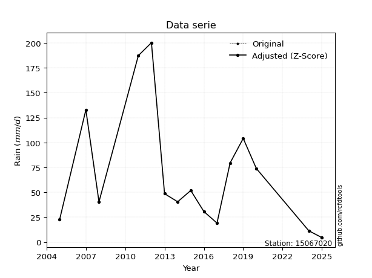</img>

</div>


> The initial value (value_initial) correspond to the initial obtained or null completed value, and value (value) is adjusted only when the initial value is outside the valid range (outlier) definite through the Z-Score value. If Z-Score is active, values out of range or outliers are replaced with the station mean value. A Z-Score (or standard score) measures how many standard deviations a data point is from the mean of a dataset, indicating its relative position; positive scores mean above the mean, negative mean below, and a score of zero is exactly at the mean, allowing for comparison of values from different distributions. It´s calculated using the formula $z=(x–μ)/σ$, where $x$ is the data point, $μ$ is the mean, and $σ$ is the standard deviation, helping identify outliers and understand probability.
>
> <sub>**Note**: In this study, "completing" (filling gaps in) and "extending" (forecasting or lengthening the historical record) rainfall data series are avoided for certain critical analyses because they introduce artificial bias and uncertainty, which can distort the statistics of rare events (extremes), alter day-to-day variability, and compromise the integrity and homogeneity of the original data. Some reasons against Completing/Extending rainfall data are: **Distortion of Extremes and Variability**: The primary issue is that most gap-filling or extension methods rely on averaging or regression with nearby stations, which inherently smooths the data. Rainfall is highly variable in space and time, with a large percentage of zero values and occasional large storms. Infilling methods often underestimate the highest values and overestimate the lowest (zero) values, which severely distorts analyses focused on flood frequency, drought severity, and intensity-duration-frequency (IDF) curves, **Loss of Data Homogeneity**: Infilled or extended data are synthetic estimates, not actual measurements. Combining these estimates with observed data can violate the assumption of data homogeneity, which requires that the data properties do not change over time. Inhomogeneity can lead to incorrect conclusions about long-term trends or changes in climate patterns, **Propagation of Errors**: Errors and biases from the original data (e.g., wind-induced undercatch, instrument errors, site changes) or the data used for imputation can propagate through the analysis, leading to unreliable hydrological models and inaccurate predictions, **Compromised Statistical Integrity**: For statistical analyses, especially those involving the frequency of events, using artificial data can introduce time bias or autocorrelation that doesn´t exist in reality, making it difficult to assess the true probability of events, **Difficulty in Validation**: It is difficult to accurately validate the quality of filled or extended data, especially for past periods where ground-truth measurements are unavailable. The reliability of imputation techniques heavily depends on the density of the surrounding station network and the complexity of the local topography.</sub>


### 4. Active continuous probability distributions from SciPy (80 of 104 available)

A Probability Density Function (PDF) describes the relative likelihood of a continuous random variable falling within a specific range, where the total area under its curve equals 1, and the area over any interval gives the actual probability for that range. Unlike discrete probabilities (like rolling a die), a PDF shows density, not direct probability for a single point (which is zero), with higher points indicating higher likelihood, often visualized as a bell curve for normal distributions.

A log of a probability density function (log-PDF) is simply the logarithm of the PDF´s value, denoted as $log(f(x))$, useful for converting multiplication of probabilities into addition, improving numerical stability with tiny numbers, and connecting to information theory concepts like entropy. Instead of dealing with very small probabilities (e.g., 0.000001), log-PDFs use negative numbers (e.g., $log(0.00001) ≈ -11.51$ that are easier for computers to handle, preventing underflow errors and simplifying complex calculations. In this study, each active probability distribution from SciPy is also evaluated in the $log$ form.

[scipy.stats](https://docs.scipy.org/doc/scipy/reference/stats.html) is a Python´s powerful submodule within the SciPy library for comprehensive statistical analysis, offering over 130 probability distributions (like Normal, Poisson, etc.), functions for descriptive stats (mean, variance), hypothesis testing (t-tests, chi-square), random variable generation, and statistical tests, making it essential for data science, modeling, and research. It provides tools to explore, model, and draw conclusions from data efficiently, working seamlessly with [NumPy](https://numpy.org/).

<div align="center">

|   id | p_dist           |   n_parameter | fit_method   | label                                                                       | active   | ref                                                                                                      |
|-----:|:-----------------|--------------:|:-------------|:----------------------------------------------------------------------------|:---------|:---------------------------------------------------------------------------------------------------------|
|    0 | alpha            |             3 | MLE          | Alpha                                                                       | True     | [:mortar_board:](https://docs.scipy.org/doc/scipy/reference/generated/scipy.stats.alpha.html)            |
|    1 | anglit           |             2 | MM           | Anglit                                                                      | True     | [:mortar_board:](https://docs.scipy.org/doc/scipy/reference/generated/scipy.stats.anglit.html)           |
|    2 | arcsine          |             2 | MM           | Arcsine                                                                     | True     | [:mortar_board:](https://docs.scipy.org/doc/scipy/reference/generated/scipy.stats.arcsine.html)          |
|    3 | argus            |             3 | MLE          | Argus                                                                       | True     | [:mortar_board:](https://docs.scipy.org/doc/scipy/reference/generated/scipy.stats.argus.html)            |
|    4 | beta             |             4 | MLE          | Beta                                                                        | True     | [:mortar_board:](https://docs.scipy.org/doc/scipy/reference/generated/scipy.stats.beta.html)             |
|    5 | betaprime        |             4 | MLE          | Beta prime                                                                  | True     | [:mortar_board:](https://docs.scipy.org/doc/scipy/reference/generated/scipy.stats.betaprime.html)        |
|    6 | bradford         |             3 | MLE          | Bradford                                                                    | True     | [:mortar_board:](https://docs.scipy.org/doc/scipy/reference/generated/scipy.stats.bradford.html)         |
|    7 | burr             |             4 | MLE          | Burr (Type III)                                                             | True     | [:mortar_board:](https://docs.scipy.org/doc/scipy/reference/generated/scipy.stats.burr.html)             |
|    8 | burr12           |             4 | MLE          | Burr (Type III) 12                                                          | True     | [:mortar_board:](https://docs.scipy.org/doc/scipy/reference/generated/scipy.stats.burr12.html)           |
|    9 | cosine           |             2 | MLE          | Cosine                                                                      | True     | [:mortar_board:](https://docs.scipy.org/doc/scipy/reference/generated/scipy.stats.cosine.html)           |
|   10 | crystalball      |             4 | MLE          | Crystalball                                                                 | True     | [:mortar_board:](https://docs.scipy.org/doc/scipy/reference/generated/scipy.stats.crystalball.html)      |
|   11 | dgamma           |             3 | MLE          | Double gamma                                                                | True     | [:mortar_board:](https://docs.scipy.org/doc/scipy/reference/generated/scipy.stats.dgamma.html)           |
|   12 | dweibull         |             3 | MLE          | Double Weibull                                                              | True     | [:mortar_board:](https://docs.scipy.org/doc/scipy/reference/generated/scipy.stats.dweibull.html)         |
|   13 | erlang           |             3 | MLE          | Erlang                                                                      | True     | [:mortar_board:](https://docs.scipy.org/doc/scipy/reference/generated/scipy.stats.erlang.html)           |
|   14 | exponnorm        |             3 | MLE          | Exponentially modified Normal                                               | True     | [:mortar_board:](https://docs.scipy.org/doc/scipy/reference/generated/scipy.stats.exponnorm.html)        |
|   15 | exponpow         |             3 | MLE          | Exponential power                                                           | True     | [:mortar_board:](https://docs.scipy.org/doc/scipy/reference/generated/scipy.stats.exponpow.html)         |
|   16 | exponweib        |             4 | MLE          | Exponentiated Weibull                                                       | True     | [:mortar_board:](https://docs.scipy.org/doc/scipy/reference/generated/scipy.stats.exponweib.html)        |
|   17 | f                |             4 | MLE          | F                                                                           | True     | [:mortar_board:](https://docs.scipy.org/doc/scipy/reference/generated/scipy.stats.f.html)                |
|   18 | fatiguelife      |             3 | MLE          | Fatigue-life (Birnbaum-Saunders)                                            | True     | [:mortar_board:](https://docs.scipy.org/doc/scipy/reference/generated/scipy.stats.fatiguelife.html)      |
|   19 | foldnorm         |             3 | MM           | Fold Normal                                                                 | True     | [:mortar_board:](https://docs.scipy.org/doc/scipy/reference/generated/scipy.stats.foldnorm.html)         |
|   20 | gamma            |             3 | MLE          | Gamma                                                                       | True     | [:mortar_board:](https://docs.scipy.org/doc/scipy/reference/generated/scipy.stats.gamma.html)            |
|   21 | gausshyper       |             6 | MLE          | Gauss hypergeometric                                                        | True     | [:mortar_board:](https://docs.scipy.org/doc/scipy/reference/generated/scipy.stats.gausshyper.html)       |
|   22 | genexpon         |             5 | MLE          | Generalized exponential                                                     | True     | [:mortar_board:](https://docs.scipy.org/doc/scipy/reference/generated/scipy.stats.genexpon.html)         |
|   23 | genextreme       |             3 | MLE          | Generalized exponential                                                     | True     | [:mortar_board:](https://docs.scipy.org/doc/scipy/reference/generated/scipy.stats.genextreme.html)       |
|   24 | gengamma         |             4 | MLE          | Generalized gamma                                                           | True     | [:mortar_board:](https://docs.scipy.org/doc/scipy/reference/generated/scipy.stats.gengamma.html)         |
|   25 | genhalflogistic  |             3 | MLE          | Generalized half-logistic                                                   | True     | [:mortar_board:](https://docs.scipy.org/doc/scipy/reference/generated/scipy.stats.genhalflogistic.html)  |
|   26 | genlogistic      |             3 | MLE          | Generalized logistic                                                        | True     | [:mortar_board:](https://docs.scipy.org/doc/scipy/reference/generated/scipy.stats.genlogistic.html)      |
|   27 | gennorm          |             3 | MLE          | Generalized Normal                                                          | True     | [:mortar_board:](https://docs.scipy.org/doc/scipy/reference/generated/scipy.stats.gennorm.html)          |
|   28 | genpareto        |             3 | MLE          | Generalized Pareto                                                          | True     | [:mortar_board:](https://docs.scipy.org/doc/scipy/reference/generated/scipy.stats.genpareto.html)        |
|   29 | gompertz         |             3 | MLE          | Gompertz (or truncated Gumbel)                                              | True     | [:mortar_board:](https://docs.scipy.org/doc/scipy/reference/generated/scipy.stats.gompertz.html)         |
|   30 | gumbel_l         |             2 | MM           | Gumbel Left Skew                                                            | True     | [:mortar_board:](https://docs.scipy.org/doc/scipy/reference/generated/scipy.stats.gumbel_l.html)         |
|   31 | gumbel_r         |             2 | MM           | Gumbel Right Skew                                                           | True     | [:mortar_board:](https://docs.scipy.org/doc/scipy/reference/generated/scipy.stats.gumbel_r.html)         |
|   32 | halfgennorm      |             3 | MLE          | Upper half of a generalized normal                                          | True     | [:mortar_board:](https://docs.scipy.org/doc/scipy/reference/generated/scipy.stats.halfgennorm.html)      |
|   33 | halflogistic     |             2 | MM           | Half-logistic                                                               | True     | [:mortar_board:](https://docs.scipy.org/doc/scipy/reference/generated/scipy.stats.halflogistic.html)     |
|   34 | halfnorm         |             2 | MM           | Half Normal                                                                 | True     | [:mortar_board:](https://docs.scipy.org/doc/scipy/reference/generated/scipy.stats.halfnorm.html)         |
|   35 | hypsecant        |             2 | MM           | hyperbolic secant                                                           | True     | [:mortar_board:](https://docs.scipy.org/doc/scipy/reference/generated/scipy.stats.hypsecant.html)        |
|   36 | invgamma         |             3 | MLE          | Inverted gamma                                                              | True     | [:mortar_board:](https://docs.scipy.org/doc/scipy/reference/generated/scipy.stats.invgamma.html)         |
|   37 | invgauss         |             3 | MLE          | Inverse Gaussian                                                            | True     | [:mortar_board:](https://docs.scipy.org/doc/scipy/reference/generated/scipy.stats.invgauss.html)         |
|   38 | invweibull       |             3 | MLE          | Inverted Weibull                                                            | True     | [:mortar_board:](https://docs.scipy.org/doc/scipy/reference/generated/scipy.stats.invweibull.html)       |
|   39 | johnsonsb        |             4 | MLE          | Johnson SB                                                                  | True     | [:mortar_board:](https://docs.scipy.org/doc/scipy/reference/generated/scipy.stats.johnsonsb.html)        |
|   40 | johnsonsu        |             4 | MLE          | Johnson Su                                                                  | True     | [:mortar_board:](https://docs.scipy.org/doc/scipy/reference/generated/scipy.stats.johnsonsu.html)        |
|   41 | kappa3           |             3 | MLE          | Kappa 3                                                                     | True     | [:mortar_board:](https://docs.scipy.org/doc/scipy/reference/generated/scipy.stats.kappa3.html)           |
|   42 | kappa4           |             4 | MLE          | Kappa 4                                                                     | True     | [:mortar_board:](https://docs.scipy.org/doc/scipy/reference/generated/scipy.stats.kappa4.html)           |
|   43 | ksone            |             3 | MLE          | Kolmogorov-Smirnov one-sided test statistic distribution                    | True     | [:mortar_board:](https://docs.scipy.org/doc/scipy/reference/generated/scipy.stats.ksone.html)            |
|   44 | kstwobign        |             2 | MLE          | Limiting distribution of scaled Kolmogorov-Smirnov two-sided test statistic | True     | [:mortar_board:](https://docs.scipy.org/doc/scipy/reference/generated/scipy.stats.kstwobign.html)        |
|   45 | laplace          |             2 | MM           | Laplace                                                                     | True     | [:mortar_board:](https://docs.scipy.org/doc/scipy/reference/generated/scipy.stats.laplace.html)          |
|   46 | levy_l           |             2 | MLE          | Left-skewed Levy                                                            | True     | [:mortar_board:](https://docs.scipy.org/doc/scipy/reference/generated/scipy.stats.levy_l.html)           |
|   47 | loggamma         |             3 | MLE          | Log gamma                                                                   | True     | [:mortar_board:](https://docs.scipy.org/doc/scipy/reference/generated/scipy.stats.loggamma.html)         |
|   48 | logistic         |             2 | MM           | Logistic (or Sech-squared)                                                  | True     | [:mortar_board:](https://docs.scipy.org/doc/scipy/reference/generated/scipy.stats.logistic.html)         |
|   49 | loglaplace       |             3 | MLE          | Log-Laplace                                                                 | True     | [:mortar_board:](https://docs.scipy.org/doc/scipy/reference/generated/scipy.stats.loglaplace.html)       |
|   50 | lomax            |             3 | MLE          | Lomax (Pareto of the second kind)                                           | True     | [:mortar_board:](https://docs.scipy.org/doc/scipy/reference/generated/scipy.stats.lomax.html)            |
|   51 | maxwell          |             2 | MM           | Maxwell                                                                     | True     | [:mortar_board:](https://docs.scipy.org/doc/scipy/reference/generated/scipy.stats.maxwell.html)          |
|   52 | mielke           |             4 | MLE          | Mielke Beta-Kappa / Dagum                                                   | True     | [:mortar_board:](https://docs.scipy.org/doc/scipy/reference/generated/scipy.stats.mielke.html)           |
|   53 | moyal            |             2 | MM           | Moyal                                                                       | True     | [:mortar_board:](https://docs.scipy.org/doc/scipy/reference/generated/scipy.stats.moyal.html)            |
|   54 | nakagami         |             3 | MLE          | Nakagami                                                                    | True     | [:mortar_board:](https://docs.scipy.org/doc/scipy/reference/generated/scipy.stats.nakagami.html)         |
|   55 | ncf              |             5 | MLE          | Non-central F distribution                                                  | True     | [:mortar_board:](https://docs.scipy.org/doc/scipy/reference/generated/scipy.stats.ncf.html)              |
|   56 | nct              |             4 | MLE          | Non-central Student’s t                                                     | True     | [:mortar_board:](https://docs.scipy.org/doc/scipy/reference/generated/scipy.stats.nct.html)              |
|   57 | norm             |             2 | MM           | Normal                                                                      | True     | [:mortar_board:](https://docs.scipy.org/doc/scipy/reference/generated/scipy.stats.norm.html)             |
|   58 | pearson3         |             3 | MM           | Pearson type III                                                            | True     | [:mortar_board:](https://docs.scipy.org/doc/scipy/reference/generated/scipy.stats.pearson3.html)         |
|   59 | powerlaw         |             3 | MLE          | Power-function                                                              | True     | [:mortar_board:](https://docs.scipy.org/doc/scipy/reference/generated/scipy.stats.powerlaw.html)         |
|   60 | rayleigh         |             2 | MM           | Rayleigh                                                                    | True     | [:mortar_board:](https://docs.scipy.org/doc/scipy/reference/generated/scipy.stats.rayleigh.html)         |
|   61 | rdist            |             3 | MLE          | R-distributed (symmetric beta)                                              | True     | [:mortar_board:](https://docs.scipy.org/doc/scipy/reference/generated/scipy.stats.rdist.html)            |
|   62 | rice             |             3 | MLE          | Rice                                                                        | True     | [:mortar_board:](https://docs.scipy.org/doc/scipy/reference/generated/scipy.stats.rice.html)             |
|   63 | semicircular     |             2 | MM           | Semicircular                                                                | True     | [:mortar_board:](https://docs.scipy.org/doc/scipy/reference/generated/scipy.stats.semicircular.html)     |
|   64 | skewnorm         |             3 | MLE          | Skew normal                                                                 | True     | [:mortar_board:](https://docs.scipy.org/doc/scipy/reference/generated/scipy.stats.skewnorm.html)         |
|   65 | t                |             3 | MLE          | Student’s t                                                                 | True     | [:mortar_board:](https://docs.scipy.org/doc/scipy/reference/generated/scipy.stats.t.html)                |
|   66 | trapezoid        |             4 | MLE          | Trapezoid                                                                   | True     | [:mortar_board:](https://docs.scipy.org/doc/scipy/reference/generated/scipy.stats.trapezoid.html)        |
|   67 | triang           |             3 | MLE          | Triangular                                                                  | True     | [:mortar_board:](https://docs.scipy.org/doc/scipy/reference/generated/scipy.stats.triang.html)           |
|   68 | truncexpon       |             3 | MLE          | Truncated exponential                                                       | True     | [:mortar_board:](https://docs.scipy.org/doc/scipy/reference/generated/scipy.stats.truncexpon.html)       |
|   69 | truncnorm        |             4 | MLE          | Truncated normal                                                            | True     | [:mortar_board:](https://docs.scipy.org/doc/scipy/reference/generated/scipy.stats.truncnorm.html)        |
|   70 | truncpareto      |             4 | MLE          | Upper truncated Pareto                                                      | True     | [:mortar_board:](https://docs.scipy.org/doc/scipy/reference/generated/scipy.stats.truncpareto.html)      |
|   71 | truncweibull_min |             5 | MLE          | Doubly truncated Weibull minimum                                            | True     | [:mortar_board:](https://docs.scipy.org/doc/scipy/reference/generated/scipy.stats.truncweibull_min.html) |
|   72 | tukeylambda      |             3 | MLE          | Tukey-Lamdba                                                                | True     | [:mortar_board:](https://docs.scipy.org/doc/scipy/reference/generated/scipy.stats.tukeylambda.html)      |
|   73 | uniform          |             2 | MLE          | Uniform                                                                     | True     | [:mortar_board:](https://docs.scipy.org/doc/scipy/reference/generated/scipy.stats.uniform.html)          |
|   74 | vonmises         |             3 | MLE          | Von Mises                                                                   | True     | [:mortar_board:](https://docs.scipy.org/doc/scipy/reference/generated/scipy.stats.vonmises.html)         |
|   75 | vonmises_line    |             3 | MLE          | Von Mises line                                                              | True     | [:mortar_board:](https://docs.scipy.org/doc/scipy/reference/generated/scipy.stats.vonmises_line.html)    |
|   76 | wald             |             2 | MM           | Wald                                                                        | True     | [:mortar_board:](https://docs.scipy.org/doc/scipy/reference/generated/scipy.stats.wald.html)             |
|   77 | weibull_max      |             3 | MLE          | Weibull maximum                                                             | True     | [:mortar_board:](https://docs.scipy.org/doc/scipy/reference/generated/scipy.stats.weibull_max.html)      |
|   78 | weibull_min      |             3 | MLE          | Weibull minimum                                                             | True     | [:mortar_board:](https://docs.scipy.org/doc/scipy/reference/generated/scipy.stats.weibull_min.html)      |
|   79 | wrapcauchy       |             3 | MLE          | Wrapped  Cauchy                                                             | True     | [:mortar_board:](https://docs.scipy.org/doc/scipy/reference/generated/scipy.stats.wrapcauchy.html)       |

</div>

> **n_parameter:** # arguments & localization & scale.
>
> **Fit methods:** (MLE) maximum likelihood, (MM) L-moments.
>
>**Inactive** (With the only purpose of prevent loops, zero divisions, infinite values, over high estimated values or horizontal trending for recurrence intervals estimations, the follow distributions were disabled.)**:** lognorm, norminvgauss, powernorm, powerlognorm, cauchy, halfcauchy, foldcauchy, skewcauchy, chi2, expon, fisk, genhyperbolic, geninvgauss, gibrat, kstwo, laplace_asymmetric, levy, levy_stable, ncx2, pareto, rel_breitwigner, recipinvgauss, studentized_range, loguniform, 


## B. Probability (PDF) vs. Empirical (EDF) distributions functions

A continuous probability distribution (CPD) describes probabilities for variables that can take any value within a range (like rain any time), unlike discrete variables with specific outcomes (like temperature). It uses a Probability Density Function (PDF), a curve where the total area under it equals 1, and the probability of the variable falling within an interval (a to b) is found by calculating the area under the curve between those points. A key feature is that the probability of hitting any single exact value is zero, so probabilities are always expressed for ranges, e.g., $P(a ≤ X ≤ b)$.

<div align="center">

Distributions parameters from station values
|     |   station | p_dist              |   n |              loc |          scale | shape                  | shape1                 | shape2                | shape3             |
|----:|----------:|:--------------------|----:|-----------------:|---------------:|:-----------------------|:-----------------------|:----------------------|:-------------------|
|   0 |  15067020 | alpha               |  15 |    -58.2277      |  272.304       | 2.4992686778147526     |                        |                       |                    |
|   1 |  15067020 | anglit              |  15 |     69.8267      |  173.122       |                        |                        |                       |                    |
|   2 |  15067020 | arcsine             |  15 |    -13.8648      |  167.383       |                        |                        |                       |                    |
|   3 |  15067020 | argus               |  15 |    -67.9523      |  274.83        | 4.996495056845345e-07  |                        |                       |                    |
|   4 |  15067020 | beta                |  15 |      0.559262    |  199.641       | 0.8312821922177653     | 0.8176394576166792     |                       |                    |
|   5 |  15067020 | betaprime           |  15 |      0.978843    |  733.999       | 1.3113011980535885     | 14.964441904564598     |                       |                    |
|   6 |  15067020 | bradford            |  15 |      4.49145     |  195.709       | 7.922281159450971      |                        |                       |                    |
|   7 |  15067020 | burr                |  15 |      4.5         |  122.212       | 2.7663792434843337     | 0.2198274340942785     |                       |                    |
|   8 |  15067020 | burr12              |  15 |      2.42182     |  594.989       | 1.1803898909202744     | 14.004559497784207     |                       |                    |
|   9 |  15067020 | cosine              |  15 |     79.5028      |   51.5923      |                        |                        |                       |                    |
|  10 |  15067020 | crystalball         |  15 |     69.8267      |   59.1788      | 6294.330864310117      | 350.6965474795617      |                       |                    |
|  11 |  15067020 | dgamma              |  15 |     63.5458      |   24.9028      | 1.8703089217372248     |                        |                       |                    |
|  12 |  15067020 | dweibull            |  15 |     64.4752      |   51.5637      | 1.3773116505726466     |                        |                       |                    |
|  13 |  15067020 | erlang              |  15 |      4.5         |   55.2528      | 0.9033579283595962     |                        |                       |                    |
|  14 |  15067020 | exponnorm           |  15 |      4.43534     |    0.0233661   | 2781.342507078084      |                        |                       |                    |
|  15 |  15067020 | exponpow            |  15 |      4.5         |  119.036       | 0.7565405232469022     |                        |                       |                    |
|  16 |  15067020 | exponweib           |  15 |      4.5         |   45.8083      | 0.8520957286122233     | 0.8006107455547024     |                       |                    |
|  17 |  15067020 | f                   |  15 |      4.5         |   73.9765      | 1.1936981452602642     | 1097.0709523443422     |                       |                    |
|  18 |  15067020 | fatiguelife         |  15 |      4.5         |    0.000576544 | 310.03015743419996     |                        |                       |                    |
|  19 |  15067020 | foldnorm            |  15 |     -9.10488     |   98.6698      | 0.04913647462575925    |                        |                       |                    |
|  20 |  15067020 | gamma               |  15 |      4.5         |   75.5781      | 0.7644687614086345     |                        |                       |                    |
|  21 |  15067020 | gausshyper          |  15 |    -13.1577      |  213.358       | 1.0775935851164915     | 0.85326776975077       | 1.3054682403949491    | 1.0855575535820825 |
|  22 |  15067020 | genexpon            |  15 |      4.49896     |    3.96505     | 0.053962640032302146   | 4.8191876010954955     | 9.333294440895124e-05 |                    |
|  23 |  15067020 | genextreme          |  15 |     36.411       |   32.1614      | -0.3931334812006684    |                        |                       |                    |
|  24 |  15067020 | gengamma            |  15 |      4.5         |   80.3653      | 0.7342208688045677     | 1.0054462943946159     |                       |                    |
|  25 |  15067020 | genhalflogistic     |  15 |    -15.5904      |  221.278       | 1.0254293259623677     |                        |                       |                    |
|  26 |  15067020 | genlogistic         |  15 |   -263.437       |   40.2794      | 2058.797026826118      |                        |                       |                    |
|  27 |  15067020 | gennorm             |  15 |     48.6         |   33.218       | 0.8419284833224767     |                        |                       |                    |
|  28 |  15067020 | genpareto           |  15 |      4.5         |   79.6775      | -0.20857753483355274   |                        |                       |                    |
|  29 |  15067020 | gompertz            |  15 |      4.5         |  157.593       | 1.4988373664231625     |                        |                       |                    |
|  30 |  15067020 | gumbel_l            |  15 |     96.4603      |   46.1415      |                        |                        |                       |                    |
|  31 |  15067020 | gumbel_r            |  15 |     43.1931      |   46.1415      |                        |                        |                       |                    |
|  32 |  15067020 | halfgennorm         |  15 |      4.5         |    4.04071     | 0.39203541505018646    |                        |                       |                    |
|  33 |  15067020 | halflogistic        |  15 |     -0.313959    |   50.5958      |                        |                        |                       |                    |
|  34 |  15067020 | halfnorm            |  15 |     -8.50287     |   98.1715      |                        |                        |                       |                    |
|  35 |  15067020 | hypsecant           |  15 |     69.8267      |   37.6744      |                        |                        |                       |                    |
|  36 |  15067020 | invgamma            |  15 |    -22.5675      |  191.638       | 2.9925427082568428     |                        |                       |                    |
|  37 |  15067020 | invgauss            |  15 |    -10.0773      |  108.554       | 0.7360784513428666     |                        |                       |                    |
|  38 |  15067020 | invweibull          |  15 |    -45.397       |   81.8081      | 2.543669747213264      |                        |                       |                    |
|  39 |  15067020 | johnsonsb           |  15 |      4.5         |  196.368       | 0.6288162529915697     | 0.12309649141798917    |                       |                    |
|  40 |  15067020 | johnsonsu           |  15 |     -5.25865     |    0.575936    | -6.193468808445395     | 1.182558974703225      |                       |                    |
|  41 |  15067020 | kappa3              |  15 |      4.5         |   60.7324      | 2.364362540278261      |                        |                       |                    |
|  42 |  15067020 | kappa4              |  15 |    -15.787       |  214.969       | 1.104166117677092      | 0.992917667343383      |                       |                    |
|  43 |  15067020 | ksone               |  15 |    -15.07        |  234.84        | 1.0                    |                        |                       |                    |
|  44 |  15067020 | kstwobign           |  15 |   -101.193       |  197.443       |                        |                        |                       |                    |
|  45 |  15067020 | laplace             |  15 |     69.8267      |   41.8457      |                        |                        |                       |                    |
|  46 |  15067020 | levy_l              |  15 |    213.016       |   74.0326      |                        |                        |                       |                    |
|  47 |  15067020 | loggamma            |  15 | -14809.6         | 2091.85        | 1228.430416652941      |                        |                       |                    |
|  48 |  15067020 | logistic            |  15 |     69.8267      |   32.627       |                        |                        |                       |                    |
|  49 |  15067020 | loglaplace          |  15 |     -0.132907    |   48.7329      | 1.2720789316963899     |                        |                       |                    |
|  50 |  15067020 | lomax               |  15 |      4.5         |    1.09729e+11 | 1663178974.6048756     |                        |                       |                    |
|  51 |  15067020 | maxwell             |  15 |    -70.4022      |   87.8754      |                        |                        |                       |                    |
|  52 |  15067020 | mielke              |  15 |      4.5         |   90.4175      | 0.7510254865500506     | 2.4857352844659415     |                       |                    |
|  53 |  15067020 | moyal               |  15 |     35.9844      |   26.6398      |                        |                        |                       |                    |
|  54 |  15067020 | nakagami            |  15 |      4.5         |  120.346       | 0.1964417327111684     |                        |                       |                    |
|  55 |  15067020 | ncf                 |  15 |     -0.352006    |   59.9731      | 2.814095971362647      | 52.25675971133336      | 0.3578948780378213    |                    |
|  56 |  15067020 | nct                 |  15 |    -34.8786      |    7.48275     | 2.539391909911073      | 9.758547443476525      |                       |                    |
|  57 |  15067020 | norm                |  15 |     69.8267      |   59.1788      |                        |                        |                       |                    |
|  58 |  15067020 | pearson3            |  15 |     69.8267      |   59.1788      | 1.0565212075554733     |                        |                       |                    |
|  59 |  15067020 | powerlaw            |  15 |      4.5         |  195.7         | 0.25116450273435836    |                        |                       |                    |
|  60 |  15067020 | rayleigh            |  15 |    -43.3858      |   90.3305      |                        |                        |                       |                    |
|  61 |  15067020 | rdist               |  15 |    -13.3209      |  117.421       | 1.2333927065778405     |                        |                       |                    |
|  62 |  15067020 | rice                |  15 |    -23.6452      |   78.2276      | 0.00044762768784490444 |                        |                       |                    |
|  63 |  15067020 | semicircular        |  15 |     69.8267      |  118.358       |                        |                        |                       |                    |
|  64 |  15067020 | skewnorm            |  15 |      4.5         |   88.1473      | 120580870.75540414     |                        |                       |                    |
|  65 |  15067020 | t                   |  15 |     52.4769      |   40.2675      | 2.813135679233791      |                        |                       |                    |
|  66 |  15067020 | trapezoid           |  15 |    -15.8235      |  234.84        | 1.0                    | 1.0                    |                       |                    |
|  67 |  15067020 | triang              |  15 |      4.5         |  216.968       | 4.9316120900090424e-09 |                        |                       |                    |
|  68 |  15067020 | truncexpon          |  15 |      4.49995     |  264.097       | 0.7410159714220981     |                        |                       |                    |
|  69 |  15067020 | truncnorm           |  15 |    -79.6506      |   48.9061      | -144.6304313608453     | 5.722207311341757      |                       |                    |
|  70 |  15067020 | truncpareto         |  15 |      4.49999     |    1.45673e-05 | 0.07142908658563096    | 13434155.33791813      |                       |                    |
|  71 |  15067020 | truncweibull_min    |  15 |     -9.45062     |  158.877       | 1.2078218714774396     | 0.001094903493532055   | 1.3195765152907373    |                    |
|  72 |  15067020 | tukeylambda         |  15 |     51.5015      |   22.9413      | -0.23124810938782697   |                        |                       |                    |
|  73 |  15067020 | uniform             |  15 |      4.5         |  195.7         |                        |                        |                       |                    |
|  74 |  15067020 | vonmises            |  15 |     -1.67959     |    1           | 0.7762312034953927     |                        |                       |                    |
|  75 |  15067020 | vonmises_line       |  15 |     57.7772      |   45.3365      | 1.1071728151864089     |                        |                       |                    |
|  76 |  15067020 | wald                |  15 |     10.6479      |   59.1788      |                        |                        |                       |                    |
|  77 |  15067020 | weibull_max         |  15 |    200.2         |    1.60045     | 0.19625725319914736    |                        |                       |                    |
|  78 |  15067020 | weibull_min         |  15 |      4.5         |   67.3303      | 0.8803789246783404     |                        |                       |                    |
|  79 |  15067020 | wrapcauchy          |  15 |      4.4986      |   31.1468      | 0.30527503729054495    |                        |                       |                    |
|  80 |  15067020 | logalpha            |  15 |    -18.0315      |  450.964       | 20.63503521873082      |                        |                       |                    |
|  81 |  15067020 | loganglit           |  15 |      3.82729     |    2.9528      |                        |                        |                       |                    |
|  82 |  15067020 | logarcsine          |  15 |      2.39982     |    2.85494     |                        |                        |                       |                    |
|  83 |  15067020 | logargus            |  15 |      0.965596    |    4.44611     | 1.3644381776490175     |                        |                       |                    |
|  84 |  15067020 | logbeta             |  15 |     -1.22346     |    6.52278     | 3.6364816956810495     | 0.9332542806266418     |                       |                    |
|  85 |  15067020 | logbetaprime        |  15 |     -0.332238    |    2.78713e+06 | 11.848204009386457     | 7883912.642810365      |                       |                    |
|  86 |  15067020 | logbradford         |  15 |      1.50295     |    3.79975     | 8.710716191156554e-06  |                        |                       |                    |
|  87 |  15067020 | logburr             |  15 |     -1.04247     |    6.36814     | 723.0735605956813      | 0.004692622535416776   |                       |                    |
|  88 |  15067020 | logburr12           |  15 |     -5.37017     |   17.2658      | 11.066833882984753     | 639.0866058179743      |                       |                    |
|  89 |  15067020 | logcosine           |  15 |      3.71242     |    0.898706    |                        |                        |                       |                    |
|  90 |  15067020 | logcrystalball      |  15 |      3.82729     |    1.00938     | 919.5449753771117      | 10.47206234935976      |                       |                    |
|  91 |  15067020 | logdgamma           |  15 |      3.81473     |    0.61777     | 1.2869985917272038     |                        |                       |                    |
|  92 |  15067020 | logdweibull         |  15 |      3.81598     |    0.844287    | 1.2038511375859915     |                        |                       |                    |
|  93 |  15067020 | logerlang           |  15 |    -13.6018      |    0.0610826   | 285.3629783535025      |                        |                       |                    |
|  94 |  15067020 | logexponnorm        |  15 |      3.82663     |    1.00938     | 0.0006539060898852972  |                        |                       |                    |
|  95 |  15067020 | logexponpow         |  15 |      1.50408     |    1.27711     | 0.3603033957358442     |                        |                       |                    |
|  96 |  15067020 | logexponweib        |  15 |      1.50408     |    0.96492     | 1.3707020963459065     | 0.5890670555796        |                       |                    |
|  97 |  15067020 | logf                |  15 |    -92.0842      |   95.904       | 46310.272170608994     | 28139.56218588169      |                       |                    |
|  98 |  15067020 | logfatiguelife      |  15 |   -323.764       |  327.589       | 0.0030845051631434714  |                        |                       |                    |
|  99 |  15067020 | logfoldnorm         |  15 |     -2.83659     |    0.975501    | 6.836828933387018      |                        |                       |                    |
| 100 |  15067020 | loggamma            |  15 |    -11.5171      |    0.0694763   | 220.61925237980313     |                        |                       |                    |
| 101 |  15067020 | loggausshyper       |  15 |      1.4536      |    3.84572     | 1.3309160378163498     | 0.9070890656091235     | 0.6409881145267158    | 1.0584798332412184 |
| 102 |  15067020 | loggenexpon         |  15 |      1.47268     |    0.044587    | 0.0029553455437286644  | 2.5410271034166696     | 0.0002006426430435917 |                    |
| 103 |  15067020 | loggenextreme       |  15 |      3.65335     |    1.14486     | 0.637868899127522      |                        |                       |                    |
| 104 |  15067020 | loggengamma         |  15 |      1.50408     |    1.0815      | 1.3496609124950876     | 0.7137641469740006     |                       |                    |
| 105 |  15067020 | loggenhalflogistic  |  15 |      1.13545     |    4.36801     | 1.0490275154065363     |                        |                       |                    |
| 106 |  15067020 | loggenlogistic      |  15 |      4.40161     |    0.426751    | 0.5124919940124373     |                        |                       |                    |
| 107 |  15067020 | loggennorm          |  15 |      3.8314      |    1.40964     | 1.952998151147916      |                        |                       |                    |
| 108 |  15067020 | loggenpareto        |  15 |      0.00383913  |    9.61351     | -1.815418338282719     |                        |                       |                    |
| 109 |  15067020 | loggompertz         |  15 |      1.50408     |    0.961783    | 0.06045341508297759    |                        |                       |                    |
| 110 |  15067020 | loggumbel_l         |  15 |      4.28156     |    0.78701     |                        |                        |                       |                    |
| 111 |  15067020 | loggumbel_r         |  15 |      3.37301     |    0.78701     |                        |                        |                       |                    |
| 112 |  15067020 | loghalfgennorm      |  15 |      1.50407     |    3.79535     | 396722.8912639903      |                        |                       |                    |
| 113 |  15067020 | loghalflogistic     |  15 |      2.63099     |    0.862952    |                        |                        |                       |                    |
| 114 |  15067020 | loghalfnorm         |  15 |      2.49121     |    1.67452     |                        |                        |                       |                    |
| 115 |  15067020 | loghypsecant        |  15 |      3.82729     |    0.642591    |                        |                        |                       |                    |
| 116 |  15067020 | loginvgamma         |  15 |    -15.71        | 6793.79        | 348.8294943273589      |                        |                       |                    |
| 117 |  15067020 | loginvgauss         |  15 |     -6.2039      |  871.423       | 0.011503706439900986   |                        |                       |                    |
| 118 |  15067020 | loginvweibull       |  15 |     -4.26791e+07 |    4.26791e+07 | 39252457.53798303      |                        |                       |                    |
| 119 |  15067020 | logjohnsonsb        |  15 |     -5.12105e+07 |    1.32438e+08 | 14329745.522741783     | 31063467.43177198      |                       |                    |
| 120 |  15067020 | logjohnsonsu        |  15 |      7.3415      |    0.350199    | 10.330181694383967     | 3.489840895698878      |                       |                    |
| 121 |  15067020 | logkappa3           |  15 |      1.50407     |    3.79518     | 121710.42968297921     |                        |                       |                    |
| 122 |  15067020 | logkappa4           |  15 |      1.21655     |    4.1655      | 1.0741987758186102     | 1.019638056542345      |                       |                    |
| 123 |  15067020 | logksone            |  15 |      1.12455     |    4.55429     | 1.0                    |                        |                       |                    |
| 124 |  15067020 | logkstwobign        |  15 |     -0.6955      |    5.19214     |                        |                        |                       |                    |
| 125 |  15067020 | loglaplace          |  15 |      3.82729     |    0.713739    |                        |                        |                       |                    |
| 126 |  15067020 | loglevy_l           |  15 |      5.41982     |    0.649952    |                        |                        |                       |                    |
| 127 |  15067020 | logloggamma         |  15 |      3.56062     |    1.16593     | 1.7256712361626931     |                        |                       |                    |
| 128 |  15067020 | loglogistic         |  15 |      3.82729     |    0.5565      |                        |                        |                       |                    |
| 129 |  15067020 | logloglaplace       |  15 |     -0.0288054   |    3.91243     | 4.469241482243316      |                        |                       |                    |
| 130 |  15067020 | loglomax            |  15 |      1.50408     |  208.65        | 90.44849015948861      |                        |                       |                    |
| 131 |  15067020 | logmaxwell          |  15 |      1.43548     |    1.49884     |                        |                        |                       |                    |
| 132 |  15067020 | logmielke           |  15 |      1.12979     |    4.16955     | 1.8006678504559885     | 1609112.479043804      |                       |                    |
| 133 |  15067020 | logmoyal            |  15 |      3.25006     |    0.45438     |                        |                        |                       |                    |
| 134 |  15067020 | lognakagami         |  15 |      2.10746     |    2.02921     | 1.2574653103508613     |                        |                       |                    |
| 135 |  15067020 | logncf              |  15 |     -1.95513     |    3.1517e-07  | 6.908313537245445e-06  | 503.3941535314234      | 126.27797998225913    |                    |
| 136 |  15067020 | lognct              |  15 |    -92.4402      |    1.00739     | 1141490.5699098161     | 95.56119912829905      |                       |                    |
| 137 |  15067020 | lognorm             |  15 |      3.82729     |    1.00938     |                        |                        |                       |                    |
| 138 |  15067020 | logpearson3         |  15 |      3.82729     |    1.00938     | -0.5419739367188898    |                        |                       |                    |
| 139 |  15067020 | logpowerlaw         |  15 |      1.50408     |    3.79524     | 0.339447185760437      |                        |                       |                    |
| 140 |  15067020 | lograyleigh         |  15 |      1.89629     |    1.54071     |                        |                        |                       |                    |
| 141 |  15067020 | logrdist            |  15 |      2.12214     |    2.25361     | 1.0415223662465525     |                        |                       |                    |
| 142 |  15067020 | logrice             |  15 |   -492.452       |    1.00909     | 491.80618155454465     |                        |                       |                    |
| 143 |  15067020 | logsemicircular     |  15 |      3.82728     |    2.01877     |                        |                        |                       |                    |
| 144 |  15067020 | logskewnorm         |  15 |      5.29932     |    1.7849      | -16525089.689600646    |                        |                       |                    |
| 145 |  15067020 | logt                |  15 |      3.82729     |    1.00938     | 5330810901.157715      |                        |                       |                    |
| 146 |  15067020 | logtrapezoid        |  15 |      1.12455     |    4.55429     | 1.0                    | 1.0                    |                       |                    |
| 147 |  15067020 | logtriang           |  15 |      1.06429     |    4.23503     | 0.9999999788335878     |                        |                       |                    |
| 148 |  15067020 | logtruncexpon       |  15 |      1.50408     |    5.98359     | 0.6342750311721321     |                        |                       |                    |
| 149 |  15067020 | logtruncnorm        |  15 |     -0.464369    |    4.0007      | 0.491275094232699      | 1.4406694221829766     |                       |                    |
| 150 |  15067020 | logtruncpareto      |  15 |      1.50408     |    7.13734e-07 | 0.07142892634127591    | 5317445.2777420515     |                       |                    |
| 151 |  15067020 | logtruncweibull_min |  15 |      1.46444     |    4.31195     | 1.3278370978913818     | 1.2042574937800731e-05 | 0.8893597432045208    |                    |
| 152 |  15067020 | logtukeylambda      |  15 |      3.07486     |    1.66141     | 1.0576972275152676     |                        |                       |                    |
| 153 |  15067020 | loguniform          |  15 |      1.50408     |    3.79524     |                        |                        |                       |                    |
| 154 |  15067020 | logvonmises         |  15 |     -2.34901     |    1           | 1.5204354108989115     |                        |                       |                    |
| 155 |  15067020 | logvonmises_line    |  15 |      3.39985     |    0.604621    | 0.1906349940954815     |                        |                       |                    |
| 156 |  15067020 | logwald             |  15 |      2.81787     |    1.00941     |                        |                        |                       |                    |
| 157 |  15067020 | logweibull_max      |  15 |      5.29932     |    1.52662     | 0.8811781664488967     |                        |                       |                    |
| 158 |  15067020 | logweibull_min      |  15 |     -5.27475     |    9.53793     | 10.958235466266991     |                        |                       |                    |
| 159 |  15067020 | logwrapcauchy       |  15 |      1.50407     |    0.60725     | 8.438662491971956e-06  |                        |                       |                    |

</div>

> **loc** (Location parameter): This shifts the distribution along the x-axis. For many common distributions, like the normal (Gaussian) distribution, loc represents the mean $μ$. For others, like the uniform distribution, it might represent the minimum value, or for the beta distribution, the left end of the support interval.
>
> **scale** (Scale parameter): This determines the width or spread of the distribution. For the normal distribution, scale represents the standard deviation $σ$. For a uniform distribution, it defines the length of the interval (from $loc$ to $loc + scale$).
>
> **shape** (Shape parameters): Refers to parameters that define the specific form of a probability distribution, distinct from its location (loc) and scale (scale). These parameters are required arguments for most distribution functions. For example, a normal (Gaussian) distribution is fully defined by its location (mean) and scale (standard deviation), so it has no specific shape parameters beyond loc and scale. However, other distributions have intrinsic properties that need specification, as Gamma distribution that takes a shape parameter, often named $a$ or $alpha$.


### 0. Cumulative distribution values - CDF (160 evaluated)

Cumulative Distribution Function (CDF), denoted as $F$<sub>$X$</sub>$(x)$, is a function that gives the probability that a random variable $X$ will take a value less than or equal to a specific value, $x$ (i.e., $(P(X≥x)$. It essentially "accumulates" probabilities from a given point up to the far right (positive infinity), providing a complete picture of the distribution´s probabilities for both discrete (like rain) and continuous (like temperature) variables, helping to find probabilities over ranges or above certain values. Each station is evaluated separately ordering the $x$ values ascending, calculating the CDF and PDF values for the activated distributions and their logarithmic forms.

<div align="center">

CDF ordered by x ascending and calculating $log(f(x))$ separately
|   id |   Station |   date |     x |   count |    mean |     std |    zscore |   Value_initial |   station |   m |     alpha |   alpha_pdf |   anglit |   anglit_pdf |   arcsine |   arcsine_pdf |    argus |   argus_pdf |      beta |   beta_pdf |   betaprime |   betaprime_pdf |    bradford |   bradford_pdf |        burr |      burr_pdf |    burr12 |   burr12_pdf |   cosine |   cosine_pdf |   crystalball |   crystalball_pdf |   dgamma |   dgamma_pdf |   dweibull |   dweibull_pdf |      erlang |   erlang_pdf |   exponnorm |   exponnorm_pdf |    exponpow |   exponpow_pdf |   exponweib |   exponweib_pdf |           f |          f_pdf |   fatiguelife |   fatiguelife_pdf |   foldnorm |   foldnorm_pdf |       gamma |     gamma_pdf |   gausshyper |   gausshyper_pdf |    genexpon |   genexpon_pdf |   genextreme |   genextreme_pdf |    gengamma |   gengamma_pdf |   genhalflogistic |   genhalflogistic_pdf |   genlogistic |   genlogistic_pdf |   gennorm |   gennorm_pdf |   genpareto |   genpareto_pdf |   gompertz |   gompertz_pdf |   gumbel_l |   gumbel_l_pdf |   gumbel_r |   gumbel_r_pdf |   halfgennorm |   halfgennorm_pdf |   halflogistic |   halflogistic_pdf |   halfnorm |   halfnorm_pdf |   hypsecant |   hypsecant_pdf |   invgamma |   invgamma_pdf |   invgauss |   invgauss_pdf |   invweibull |   invweibull_pdf |   johnsonsb |   johnsonsb_pdf |   johnsonsu |   johnsonsu_pdf |      kappa3 |   kappa3_pdf |      kappa4 |   kappa4_pdf |     ksone |   ksone_pdf |   kstwobign |   kstwobign_pdf |   laplace |   laplace_pdf |   levy_l |   levy_l_pdf |   loggamma |   loggamma_pdf |   logistic |   logistic_pdf |   loglaplace |   loglaplace_pdf |       lomax |   lomax_pdf |   maxwell |   maxwell_pdf |      mielke |   mielke_pdf |     moyal |   moyal_pdf |    nakagami |   nakagami_pdf |       ncf |     ncf_pdf |       nct |     nct_pdf |     norm |    norm_pdf |   pearson3 |   pearson3_pdf |    powerlaw |   powerlaw_pdf |   rayleigh |   rayleigh_pdf |    rdist |     rdist_pdf |      rice |    rice_pdf |   semicircular |   semicircular_pdf |   skewnorm |   skewnorm_pdf |        t |       t_pdf |   trapezoid |   trapezoid_pdf |      triang |   triang_pdf |   truncexpon |   truncexpon_pdf |   truncnorm |   truncnorm_pdf |   truncpareto |   truncpareto_pdf |   truncweibull_min |   truncweibull_min_pdf |   tukeylambda |   tukeylambda_pdf |   uniform |   uniform_pdf |   vonmises |   vonmises_pdf |   vonmises_line |   vonmises_line_pdf |        wald |    wald_pdf |   weibull_max |   weibull_max_pdf |   weibull_min |   weibull_min_pdf |   wrapcauchy |   wrapcauchy_pdf |   logalpha |   logalpha_pdf |   loganglit |   loganglit_pdf |   logarcsine |   logarcsine_pdf |   logargus |   logargus_pdf |   logbeta |   logbeta_pdf |   logbetaprime |   logbetaprime_pdf |   logbradford |   logbradford_pdf |   logburr |   logburr_pdf |   logburr12 |   logburr12_pdf |   logcosine |   logcosine_pdf |   logcrystalball |   logcrystalball_pdf |   logdgamma |   logdgamma_pdf |   logdweibull |   logdweibull_pdf |   logerlang |   logerlang_pdf |   logexponnorm |   logexponnorm_pdf |   logexponpow |   logexponpow_pdf |   logexponweib |   logexponweib_pdf |      logf |   logf_pdf |   logfatiguelife |   logfatiguelife_pdf |   logfoldnorm |   logfoldnorm_pdf |   loggausshyper |   loggausshyper_pdf |   loggenexpon |   loggenexpon_pdf |   loggenextreme |   loggenextreme_pdf |   loggengamma |   loggengamma_pdf |   loggenhalflogistic |   loggenhalflogistic_pdf |   loggenlogistic |   loggenlogistic_pdf |   loggennorm |   loggennorm_pdf |   loggenpareto |   loggenpareto_pdf |   loggompertz |   loggompertz_pdf |   loggumbel_l |   loggumbel_l_pdf |   loggumbel_r |   loggumbel_r_pdf |   loghalfgennorm |   loghalfgennorm_pdf |   loghalflogistic |   loghalflogistic_pdf |   loghalfnorm |   loghalfnorm_pdf |   loghypsecant |   loghypsecant_pdf |   loginvgamma |   loginvgamma_pdf |   loginvgauss |   loginvgauss_pdf |   loginvweibull |   loginvweibull_pdf |   logjohnsonsb |   logjohnsonsb_pdf |   logjohnsonsu |   logjohnsonsu_pdf |   logkappa3 |   logkappa3_pdf |   logkappa4 |   logkappa4_pdf |   logksone |   logksone_pdf |   logkstwobign |   logkstwobign_pdf |   loglevy_l |   loglevy_l_pdf |   logloggamma |   logloggamma_pdf |   loglogistic |   loglogistic_pdf |   logloglaplace |   logloglaplace_pdf |    loglomax |   loglomax_pdf |   logmaxwell |   logmaxwell_pdf |   logmielke |   logmielke_pdf |    logmoyal |   logmoyal_pdf |   lognakagami |   lognakagami_pdf |     logncf |   logncf_pdf |    lognct |   lognct_pdf |   lognorm |   lognorm_pdf |   logpearson3 |   logpearson3_pdf |   logpowerlaw |   logpowerlaw_pdf |   lograyleigh |   lograyleigh_pdf |   logrdist |   logrdist_pdf |   logrice |   logrice_pdf |   logsemicircular |   logsemicircular_pdf |   logskewnorm |   logskewnorm_pdf |      logt |   logt_pdf |   logtrapezoid |   logtrapezoid_pdf |   logtriang |   logtriang_pdf |   logtruncexpon |   logtruncexpon_pdf |   logtruncnorm |   logtruncnorm_pdf |   logtruncpareto |   logtruncpareto_pdf |   logtruncweibull_min |   logtruncweibull_min_pdf |   logtukeylambda |   logtukeylambda_pdf |   loguniform |   loguniform_pdf |   logvonmises |   logvonmises_pdf |   logvonmises_line |   logvonmises_line_pdf |   logwald |   logwald_pdf |   logweibull_max |   logweibull_max_pdf |   logweibull_min |   logweibull_min_pdf |   logwrapcauchy |   logwrapcauchy_pdf |
|-----:|----------:|-------:|------:|--------:|--------:|--------:|----------:|----------------:|----------:|----:|----------:|------------:|---------:|-------------:|----------:|--------------:|---------:|------------:|----------:|-----------:|------------:|----------------:|------------:|---------------:|------------:|--------------:|----------:|-------------:|---------:|-------------:|--------------:|------------------:|---------:|-------------:|-----------:|---------------:|------------:|-------------:|------------:|----------------:|------------:|---------------:|------------:|----------------:|------------:|---------------:|--------------:|------------------:|-----------:|---------------:|------------:|--------------:|-------------:|-----------------:|------------:|---------------:|-------------:|-----------------:|------------:|---------------:|------------------:|----------------------:|--------------:|------------------:|----------:|--------------:|------------:|----------------:|-----------:|---------------:|-----------:|---------------:|-----------:|---------------:|--------------:|------------------:|---------------:|-------------------:|-----------:|---------------:|------------:|----------------:|-----------:|---------------:|-----------:|---------------:|-------------:|-----------------:|------------:|----------------:|------------:|----------------:|------------:|-------------:|------------:|-------------:|----------:|------------:|------------:|----------------:|----------:|--------------:|---------:|-------------:|-----------:|---------------:|-----------:|---------------:|-------------:|-----------------:|------------:|------------:|----------:|--------------:|------------:|-------------:|----------:|------------:|------------:|---------------:|----------:|------------:|----------:|------------:|---------:|------------:|-----------:|---------------:|------------:|---------------:|-----------:|---------------:|---------:|--------------:|----------:|------------:|---------------:|-------------------:|-----------:|---------------:|---------:|------------:|------------:|----------------:|------------:|-------------:|-------------:|-----------------:|------------:|----------------:|--------------:|------------------:|-------------------:|-----------------------:|--------------:|------------------:|----------:|--------------:|-----------:|---------------:|----------------:|--------------------:|------------:|------------:|--------------:|------------------:|--------------:|------------------:|-------------:|-----------------:|-----------:|---------------:|------------:|----------------:|-------------:|-----------------:|-----------:|---------------:|----------:|--------------:|---------------:|-------------------:|--------------:|------------------:|----------:|--------------:|------------:|----------------:|------------:|----------------:|-----------------:|---------------------:|------------:|----------------:|--------------:|------------------:|------------:|----------------:|---------------:|-------------------:|--------------:|------------------:|---------------:|-------------------:|----------:|-----------:|-----------------:|---------------------:|--------------:|------------------:|----------------:|--------------------:|--------------:|------------------:|----------------:|--------------------:|--------------:|------------------:|---------------------:|-------------------------:|-----------------:|---------------------:|-------------:|-----------------:|---------------:|-------------------:|--------------:|------------------:|--------------:|------------------:|--------------:|------------------:|-----------------:|---------------------:|------------------:|----------------------:|--------------:|------------------:|---------------:|-------------------:|--------------:|------------------:|--------------:|------------------:|----------------:|--------------------:|---------------:|-------------------:|---------------:|-------------------:|------------:|----------------:|------------:|----------------:|-----------:|---------------:|---------------:|-------------------:|------------:|----------------:|--------------:|------------------:|--------------:|------------------:|----------------:|--------------------:|------------:|---------------:|-------------:|-----------------:|------------:|----------------:|------------:|---------------:|--------------:|------------------:|-----------:|-------------:|----------:|-------------:|----------:|--------------:|--------------:|------------------:|--------------:|------------------:|--------------:|------------------:|-----------:|---------------:|----------:|--------------:|------------------:|----------------------:|--------------:|------------------:|----------:|-----------:|---------------:|-------------------:|------------:|----------------:|----------------:|--------------------:|---------------:|-------------------:|-----------------:|---------------------:|----------------------:|--------------------------:|-----------------:|---------------------:|-------------:|-----------------:|--------------:|------------------:|-------------------:|-----------------------:|----------:|--------------:|-----------------:|---------------------:|-----------------:|---------------------:|----------------:|--------------------:|
|    0 |  15067020 |   2025 |   4.5 |      15 | 69.8267 | 61.2559 | -1.06646  |             4.5 |  15067020 |   1 | 0.0329591 | 0.00509522  | 0.157468 |   0.00420793 |  0.214931 |    0.00608468 | 0.102415 |  0.00277591 | 0.0320565 | 0.00677566 |   0.026105  |     0.00939769  | 0.000158167 |     0.0184898  | 1.28979e-08 | 603.71        | 0.0174647 |  0.00982654  | 0.110561 |   0.00344508 |      0.134821 |       0.00366552  | 0.140628 |  0.00417535  |   0.145946 |    0.00412706  | 7.00726e-16 |  0.712702    | 0.000994739 |     0.0153284   | 1.10305e-13 |   93.9566      | 7.55679e-10 |   264.431       | 2.58825e-10 | 17392.9        |     0.0244409 |       3.65263e+07 |   0.109536 |     0.00800043 | 1.23791e-13 | 106.549       |    0.0954224 |       0.00555344 | 1.41613e-05 |    0.0136094   |    0.0296864 |      0.00532261  | 1.00167e-09 |   16.0786      |         0.0476146 |            0.00248592 |     0.0701452 |       0.00462441  |  0.17575  |   0.0038642   | 1.25281e-11 |     0.0125506   | 2.8214e-15 |     0.00951082 |   0.127406 |    0.00257732  |  0.0989575 |    0.00496072  |   3.63343e-12 |       0.0703761   |      0.0475369 |        0.00985992  |   0.105372 |    0.00805648  |    0.111267 |     0.00289362  |  0.0276524 |    0.005476    |  0.0223161 |    0.0061996   |    0.0296864 |      0.0053226   | 9.04162e-06 |     5.63931e+09 |   0.0213714 |     0.00619557  | 1.67829e-09 |  0.0114424   | 3.55265e-15 |   0.148752   | 0.0833333 |  0.00425822 |   0.0632033 |     0.00455097  |  0.104949 |   0.002508    | 0.448729 |  0.000954585 | 0.00975472 |      0.0281932 |   0.118969 |    0.00321254  |    0.0192907 |        0.0270276 | 1.93204e-12 | 0.0151571   |  0.133054 |   0.00458736  | 2.49373e-08 |  2.75387     | 0.0709709 | 0.00529693  | 1.46871e-07 |     6.4968e+07 | 0.0299607 | 0.00831602  | 0.0293152 | 0.00524787  | 0.134821 | 0.00366552  |   0.104015 |    0.00555209  | 4.40587e-05 |    1.24592e+10 |   0.131087 |    0.00509934  | 0.55588  |    0.0031544  | 0.0626729 | 0.00431097  |       0.167383 |        0.00448527  |  0         |    0.00905172  | 0.162115 | 0.0041668   |   0.0074895 |     0.000737029 | 2.22697e-08 |  0.00921797  |   3.3364e-07 |       0.00723481 |    0.957344 |     0.0018563   |      0        |    7102.49        |           0.068189 |             0.00577847 |      0.165223 |       0.00418044  | 0         |    0.00510986 |    1.46906 |      0.297863  |        0.157829 |         0.00404197  | 0           | 0           |     0.0766604 |       0.000197453 |   1.37866e-15 |       1.36656     |  1.34366e-05 |       0.00960053 |  0.0071581 |      0.0234851 |    0        |        0        |    0         |         0        |   0.014755 |      0.0549738 | 0.0376117 |     0.0506106 |     0.00833475 |           0.032914 |    0.00029584 |          0.263176 | 0.0445997 |     0.0594264 |   0.0236619 |       0.0376382 |  0.00830454 |       0.0398754 |        0.0106782 |            0.0279592 |   0.0205506 |        0.0312   |     0.0173246 |         0.0303338 |  0.00959226 |       0.0274143 |      0.0106781 |           0.027959 |   2.09747e-06 |       3.40348e+09 |    2.36202e-13 |        858.917     | 0.011019  |  0.0290489 |        0.0105717 |            0.0278846 |    0.00848989 |         0.0236743 |      0.00372486 |           0.0978913 |    0.00220515 |         0.0741706 |       0.0321954 |           0.0439704 |   6.41705e-16 |         2.78403   |            0.0441539 |                 0.125342 |        0.0307992 |            0.0369457 |    0.0109227 |        0.0279169 |       0.167637 |         0.120808   |   3.98348e-10 |         0.0628556 |     0.0289036 |         0.0361899 |    2.1486e-05 |       0.000293431 |         0        |             0.263481 |          0        |             0         |      0        |          0        |      0.0171252 |          0.0266374 |    0.00885114 |         0.0270905 |    0.00803571 |         0.0268887 |      0.00547367 |           0.0262171 |      0.0107896 |          0.0281646 |      0.0280189 |          0.0383641 | 1.53419e-06 |        0.263467 | 1.40427e-15 |        3.04077  |  0.0833333 |       0.219573 |     0.00611868 |          0.0354631 |    0.316294 |       0.038202  |     0.0271371 |         0.0376826 |     0.0151471 |         0.0268063 |      0.00759046 |           0.0221306 | 1.00875e-12 |      0.433495  |  2.54773e-05 |       0.00111379 |   0.0130288 |       0.0626809 | 8.51013e-12 |    4.45806e-10 |     0         |         0         | 0.00831056 |    0.0279654 | 0.0106754 |    0.0279574 | 0.0106782 |     0.0279592 |     0.0210666 |         0.0364461 |   3.08903e-06 |       4.72231e+09 |     0         |          0        |   0.409098 |    0.150815    | 0.01066   |     0.0279256 |         0         |              0        |     0.0334776 |         0.0466191 | 0.0106783 |  0.0279594 |     0.00694444 |          0.0365956 |   0.0107839 |       0.0490413 |     9.71039e-08 |            0.355824 |     0.00112041 |           0.373135 |         0        |      149553          |            0.00343179 |                  0.114875 |      2.13163e-14 |             0.517704 |     0        |         0.263488 |       1.01693 |         0.0301835 |         0.00079845 |               0.215581 |  0        |     0         |         0.107413 |            0.0556411 |        0.0234294 |            0.0374273 |     6.46548e-07 |            0.262096 |
|    1 |  15067020 |   2024 |  11.4 |      15 | 69.8267 | 61.2559 | -0.953813 |            11.4 |  15067020 |   2 | 0.079531  | 0.00832586  | 0.18756  |   0.00450967 |  0.25402  |    0.00531212 | 0.122406 |  0.00301753 | 0.0745631 | 0.00574971 |   0.0995293 |     0.0113212   | 0.112674    |     0.0144541  | 0.174126    |   0.0153411   | 0.0940989 |  0.0117288   | 0.135736 |   0.00385039 |      0.16175  |       0.00414077  | 0.172049 |  0.00494374  |   0.176622 |    0.00476944  | 0.149545    |  0.018323    | 0.101624    |     0.0138235   | 0.115688    |    0.0126251   | 0.250763    |     0.0221689   | 0.195575    |     0.0163347  |     0.637893  |       0.00958603  |   0.164429 |     0.00790454 | 0.167242    |   0.0175884   |    0.133562  |       0.00549528 | 0.0902645   |    0.0125607   |    0.0796701 |      0.00902667  | 0.172095    |    0.0175287   |         0.0650608 |            0.0025717  |     0.106556  |       0.0059201   |  0.204794 |   0.00457763  | 0.083681    |     0.0117119   | 0.064882   |     0.00929179 |   0.146379 |    0.00292797  |  0.136451  |    0.00589018  |   0.207539    |       0.0205016   |      0.115246  |        0.009751    |   0.160658 |    0.00796213  |    0.133038 |     0.00342934  |  0.0793987 |    0.00931832  |  0.0829294 |    0.0108129   |    0.07967   |      0.00902666  | 0.587467    |     0.00719834  |   0.0815856 |     0.0107046   | 0.0788704   |  0.0114023   | 0.048531    |   0.00636913 | 0.112715  |  0.00425822 |   0.0989504 |     0.00578927  |  0.123763 |   0.0029576   | 0.455463 |  0.000997925 | 0.087855   |      0.164594  |   0.142981 |    0.00375571  |    0.0709496 |        0.0994055 | 0.0993008   | 0.013652    |  0.166509 |   0.0051015   | 0.144738    |  0.0157277   | 0.112665  | 0.00675047  | 0.257007    |     0.014626   | 0.0955606 | 0.0102789   | 0.0787565 | 0.0089536   | 0.16175  | 0.00414077  |   0.145205 |    0.00635651  | 0.431641    |    0.015712    |   0.168001 |    0.00558628  | 0.577732 |    0.00318115 | 0.095477  | 0.00517998  |       0.199012 |        0.00467773  |  0.0623932 |    0.00902403  | 0.193626 | 0.00498273  |   0.0134383 |     0.000987256 | 0.0625926   |  0.00892482  |   0.0492741  |       0.00704824 |    0.96868  |     0.00144177  |      0.878954 |       0.00589586  |           0.109206 |             0.00607732 |      0.196854 |       0.00500606  | 0.035258  |    0.00510986 |    2.6485  |      0.27064   |        0.187947 |         0.00469589  | 1.97204e-18 | 1.04411e-16 |     0.0780551 |       0.00020693  |   0.125919    |       0.0150093   |  0.0655854   |       0.00931252 |  0.0806473 |      0.161054  |    0.095054 |        0.198652 |    0.0694009 |         1.03089  |   0.111809 |      0.155597  | 0.110665  |     0.111731  |     0.108208   |           0.201909 |    0.244928   |          0.263176 | 0.128196  |     0.125136  |   0.092851  |       0.125354  |  0.116113   |       0.203182  |        0.0836819 |            0.152365  |   0.0825843 |        0.121193 |     0.0817913 |         0.128956  |  0.0853009  |       0.15987   |      0.0836813 |           0.152365 |   0.762987    |       0.199891    |    0.523942    |          0.26824   | 0.0863334 |  0.156005  |        0.0837559 |            0.152955  |    0.0757484  |         0.146213  |      0.179808   |           0.232116  |    0.166339   |         0.260261  |       0.104924  |           0.123019  |   0.442091    |         0.303505  |            0.176226  |                 0.161158 |        0.0936245 |            0.111329  |    0.0827625 |        0.149592  |       0.286973 |         0.137056   |   0.093766    |         0.149733  |     0.0911308 |         0.11035   |    0.0369186  |       0.154758    |         0        |             0.263481 |          0        |             0         |      0        |          0        |      0.0724579 |          0.111788  |    0.0873888  |         0.167457  |    0.0903926  |         0.176607  |      0.109153   |           0.222363  |      0.0840441 |          0.152599  |      0.0956506 |          0.120483  | 0.244903    |        0.263467 | 0.265547    |        0.266698 |  0.287435  |       0.219573 |     0.139264   |          0.257842  |    0.359165 |       0.0558996 |     0.0944458 |         0.121025  |     0.0755533 |         0.125508  |      0.0631356  |           0.11459   | 0.331055    |      0.288698  |  0.0688766   |       0.189125   |   0.12328   |       0.170259  | 0.0140605   |    0.10572     |     0.0116029 |         0.0881863 | 0.0926155  |    0.178737  | 0.0836845 |    0.152383  | 0.0836819 |     0.152365  |     0.0923468 |         0.132769  |   0.620307    |       0.226523    |     0.0590004 |          0.213001 |   0.545386 |    0.146617    | 0.0836228 |     0.152328  |         0.0984726 |              0.228146 |     0.108377  |         0.123192  | 0.0836823 |  0.152366  |     0.0826187  |          0.126226  |   0.104544  |       0.152695  |     0.306341    |            0.304628 |     0.32603    |           0.323963 |         0.947741 |           0.0420044  |            0.223823   |                  0.286014 |      0.298834    |             0.314734 |     0.244922 |         0.263488 |       1.07101 |         0.106224  |         0.21552    |               0.259503 |  0        |     0         |         0.175201 |            0.0938368 |        0.0923792 |            0.125065  |     0.243626    |            0.262091 |
|    2 |  15067020 |   2017 |  19.1 |      15 | 69.8267 | 61.2559 | -0.828111 |            19.1 |  15067020 |   3 | 0.154314  | 0.0108425   | 0.223474 |   0.00481249 |  0.292727 |    0.00478185 | 0.146655 |  0.00327956 | 0.116877  | 0.00529201 |   0.18759   |     0.011375    | 0.21228     |     0.011623   | 0.274522    |   0.0114026   | 0.184949  |  0.0117111   | 0.167076 |   0.00428623 |      0.195674 |       0.00466869  | 0.213623 |  0.00586072  |   0.21617  |    0.00550217  | 0.276121    |  0.0148257   | 0.202001    |     0.0122789   | 0.20294     |    0.0103585   | 0.388705    |     0.014769    | 0.299023    |     0.0113469  |     0.696116  |       0.00614746  |   0.224744 |     0.00775409 | 0.284164    |   0.0133141   |    0.175523  |       0.00540039 | 0.182712    |    0.0114643   |    0.160279  |      0.0115731   | 0.287759    |    0.0130967   |         0.0852486 |            0.00267287 |     0.157292  |       0.00721969  |  0.243692 |   0.00556391  | 0.170417    |     0.0108255   | 0.135404   |     0.00902123 |   0.170566 |    0.00336169  |  0.185323  |    0.00677027  |   0.334336    |       0.0134533   |      0.189534  |        0.00952725  |   0.22142  |    0.00781246  |    0.162033 |     0.00411752  |  0.161693  |    0.011691    |  0.174395  |    0.0124612   |    0.160279  |      0.011573    | 0.62491     |     0.00345415  |   0.17224   |     0.012385    | 0.166043    |  0.0112098   | 0.0956662   |   0.00593267 | 0.145503  |  0.00425822 |   0.148206  |     0.00695756  |  0.148766 |   0.00355512  | 0.463346 |  0.00105026  | 0.203833   |      0.285169  |   0.174402 |    0.00441309  |    0.146208  |        0.204848  | 0.198519    | 0.0121481   |  0.207789 |   0.00560717  | 0.253431    |  0.0128978   | 0.169793  | 0.0080119   | 0.344882    |     0.0092583  | 0.177023  | 0.0107036   | 0.158966  | 0.0115461   | 0.195674 | 0.00466869  |   0.196893 |    0.0070284   | 0.521048    |    0.00896362  |   0.212787 |    0.00602844  | 0.602379 |    0.00322283 | 0.138679  | 0.00601634  |       0.235752 |        0.00485973  |  0.131553  |    0.0089284   | 0.235809 | 0.00598615  |   0.0221152 |     0.0012665   | 0.130054    |  0.00859768  |   0.102762   |       0.00684571 |    0.978266 |     0.00106221  |      0.908643 |       0.00264115  |           0.156697 |             0.00623481 |      0.23932  |       0.00604021  | 0.074604  |    0.00510986 |    3.90737 |      0.10476   |        0.227049 |         0.0054638   | 0.0208771   | 0.00953757  |     0.0796922 |       0.00021846  |   0.229216    |       0.0121005   |  0.134238    |       0.00844763 |  0.195248  |      0.282663  |    0.219986 |        0.280572 |    0.289239  |         0.282734 |   0.207726 |      0.216825  | 0.180369  |     0.160354  |     0.239482   |           0.300046 |    0.380746   |          0.263176 | 0.205049  |     0.174281  |   0.179575  |       0.215972  |  0.245491   |       0.294145  |        0.192302  |            0.270836  |   0.173694  |        0.244322 |     0.178244  |         0.255491  |  0.198477   |       0.27955   |      0.192301  |           0.270835 |   0.842021    |       0.117148    |    0.636054    |          0.176306  | 0.19661   |  0.272965  |        0.192771  |            0.271679  |    0.182672   |         0.271484  |      0.305687   |           0.254094  |    0.314098   |         0.304415  |       0.186445  |           0.196496  |   0.573786    |         0.214141  |            0.266157  |                 0.188484 |        0.171973  |            0.19987   |    0.189817  |        0.268163  |       0.360845 |         0.149841   |   0.190476    |         0.22874   |     0.16814   |         0.194583  |    0.180434   |       0.392592    |         0        |             0.263481 |          0.182584 |             0.560091  |      0.215762 |          0.458956 |      0.159068  |          0.237367  |    0.20521    |         0.288643  |    0.213164   |         0.296876  |      0.252089   |           0.319482  |      0.192706  |          0.270719  |      0.178757  |          0.206946  | 0.380872    |        0.263467 | 0.401195    |        0.259646 |  0.400751  |       0.219573 |     0.292195   |          0.321119  |    0.392018 |       0.072633  |     0.178459  |         0.210197  |     0.171221  |         0.254995  |      0.147771   |           0.221731  | 0.464473    |      0.230551  |  0.203734    |       0.326153   |   0.224741  |       0.222367  | 0.164012    |    0.463936    |     0.114011  |         0.308741  | 0.215729   |    0.2956    | 0.192316  |    0.270862  | 0.192302  |     0.270836  |     0.184571  |         0.229147  |   0.720623    |       0.169211    |     0.208423  |          0.351272 |   0.622974 |    0.15571     | 0.192237  |     0.270857  |         0.232231  |              0.283994 |     0.188041  |         0.187946  | 0.192303  |  0.270836  |     0.160601   |          0.175988  |   0.198196  |       0.210243  |     0.456963    |            0.279455 |     0.485214   |           0.292618 |         0.964714 |           0.0261704  |            0.374962   |                  0.296161 |      0.460792    |             0.313282 |     0.380901 |         0.263488 |       1.15284 |         0.221428  |         0.36031    |               0.300114 |  0.014556 |     0.463544  |         0.231718 |            0.127069  |        0.178957  |            0.215706  |     0.378884    |            0.262088 |
|    3 |  15067020 |   2005 |  22.7 |      15 | 69.8267 | 61.2559 | -0.769341 |            22.7 |  15067020 |   4 | 0.194591  | 0.0114766   | 0.241033 |   0.00494115 |  0.309608 |    0.0046024  | 0.158678 |  0.00339907 | 0.135672  | 0.00515477 |   0.228141  |     0.0111352   | 0.252316    |     0.0106479  | 0.313735    |   0.0104292   | 0.226698  |  0.0114668   | 0.18286  |   0.00448141 |      0.212916 |       0.0049095   | 0.235501 |  0.00629228  |   0.236584 |    0.00583683  | 0.327232    |  0.0135978   | 0.245003    |     0.0116173   | 0.23905     |    0.00972678  | 0.438195    |     0.0128138   | 0.337493    |     0.0100847  |     0.716699  |       0.00532999  |   0.252508 |     0.00766874 | 0.329743    |   0.0120526   |    0.194876  |       0.0053508  | 0.223102    |    0.0109777   |    0.202992  |      0.012091    | 0.332527    |    0.0118226   |         0.0949594 |            0.00272227 |     0.184229  |       0.00773371  |  0.26469  |   0.00611176  | 0.208671    |     0.0104285   | 0.167638   |     0.00888558 |   0.183057 |    0.00357974  |  0.210317  |    0.00710669  |   0.37925     |       0.0115871   |      0.223588  |        0.00938822  |   0.249394 |    0.00772712  |    0.177486 |     0.00447069  |  0.204643  |    0.0121063   |  0.219339  |    0.0124512   |    0.202992  |      0.0120909   | 0.636078    |     0.00279917  |   0.216993  |     0.0124223   | 0.206133    |  0.0110553   | 0.116794    |   0.00580979 | 0.160833  |  0.00425822 |   0.17407   |     0.00739945  |  0.162132 |   0.00387451  | 0.467173 |  0.00107631  | 0.256299   |      0.321679  |   0.190864 |    0.00473334  |    0.186226  |        0.260916  | 0.24108     | 0.011503    |  0.228354 |   0.00581448  | 0.298354    |  0.0120868   | 0.199432  | 0.00843576  | 0.375978    |     0.00808581 | 0.215447  | 0.0106226   | 0.201626  | 0.0120882   | 0.212916 | 0.0049095   |   0.222626 |    0.00725897  | 0.550705    |    0.00759986  |   0.234801 |    0.00619746  | 0.614024 |    0.00324706 | 0.160957  | 0.00635432  |       0.253383 |        0.00493402  |  0.163578  |    0.00886082  | 0.258232 | 0.00647142  |   0.0269096 |     0.00139705  | 0.160731    |  0.00844473  |   0.127239   |       0.00675302 |    0.981816 |     0.000913027 |      0.917075 |       0.00208563  |           0.179208 |             0.00626782 |      0.261977 |       0.00654823  | 0.0929995 |    0.00510986 |    4.28983 |      0.242465  |        0.247368 |         0.00582413  | 0.0670727   | 0.0154605   |     0.0804889 |       0.000224234 |   0.271012    |       0.0111466   |  0.163738    |       0.00793485 |  0.24722   |      0.318344  |    0.270237 |        0.300787 |    0.335598  |         0.256439 |   0.247007 |      0.238198  | 0.209678  |     0.179357  |     0.293218   |           0.321099 |    0.42619    |          0.263175 | 0.236733  |     0.192867  |   0.219988  |       0.252485  |  0.298357   |       0.317368  |        0.242472  |            0.309705  |   0.220832  |        0.303111 |     0.227089  |         0.311082  |  0.25001    |       0.316574  |      0.242471  |           0.309704 |   0.860747    |       0.100332    |    0.664702    |          0.15611   | 0.247034  |  0.310454  |        0.243081  |            0.310463  |    0.233241   |         0.313711  |      0.350059   |           0.25975   |    0.367107   |         0.30872   |       0.222854  |           0.22551   |   0.608838    |         0.192352  |            0.299623  |                 0.199289 |        0.20988   |            0.240067  |    0.239605  |        0.308046  |       0.387162 |         0.155067   |   0.232606    |         0.259479  |     0.204876  |         0.23162   |    0.25283    |       0.441736    |         0        |             0.263481 |          0.277254 |             0.534868  |      0.293767 |          0.443813 |      0.205141  |          0.297596  |    0.258197   |         0.324127  |    0.267351   |         0.329612  |      0.308626   |           0.333698  |      0.242842  |          0.30943   |      0.217522  |          0.242487  | 0.426366    |        0.263467 | 0.445884    |        0.257998 |  0.438666  |       0.219573 |     0.34808    |          0.324883  |    0.405194 |       0.0801769 |     0.217887  |         0.246927  |     0.219821  |         0.308176  |      0.190097   |           0.26961   | 0.502825    |      0.213864  |  0.262934    |       0.357925   |   0.264588  |       0.239106  | 0.249787    |    0.521081    |     0.172908  |         0.371335  | 0.269564   |    0.32681   | 0.242491  |    0.309728  | 0.242472  |     0.309705  |     0.2273    |         0.265908  |   0.748759    |       0.157058    |     0.271404  |          0.376324 |   0.650326 |    0.161373    | 0.242413  |     0.309751  |         0.282307  |              0.295501 |     0.222597  |         0.212476  | 0.242473  |  0.309705  |     0.192428   |          0.192639  |   0.236162  |       0.229498  |     0.504529    |            0.271506 |     0.534808   |           0.281774 |         0.968966 |           0.0231903  |            0.42607    |                  0.29553  |      0.514881    |             0.313237 |     0.426399 |         0.263488 |       1.19538 |         0.271835  |         0.412993   |               0.309475 |  0.167503 |     1.06295   |         0.254841 |            0.141023  |        0.219326  |            0.252247  |     0.424141    |            0.262087 |
|    4 |  15067020 |   2016 |  30.7 |      15 | 69.8267 | 61.2559 | -0.638741 |            30.7 |  15067020 |   5 | 0.288577  | 0.0117982   | 0.281611 |   0.00519617 |  0.345151 |    0.00430252 | 0.18691  |  0.00365719 | 0.175968  | 0.00493469 |   0.314222  |     0.0103433   | 0.330426    |     0.00897474 | 0.390786    |   0.00894422  | 0.315464  |  0.0106847   | 0.220369 |   0.00488946 |      0.254255 |       0.00541778  | 0.289486 |  0.00717687  |   0.286069 |    0.00651374  | 0.42668     |  0.0113579   | 0.332448    |     0.0102717   | 0.312448    |    0.00868331  | 0.527779    |     0.00981423  | 0.409887    |     0.00816247 |     0.75414   |       0.00413295  |   0.312999 |     0.00744693 | 0.417259    |   0.00995045  |    0.237224  |       0.00523547 | 0.306777    |    0.00995395  |    0.30056   |      0.0120772   | 0.418221    |    0.00973037  |         0.117192  |            0.00283719 |     0.249831  |       0.00859972  |  0.319231 |   0.00759131  | 0.288689    |     0.00958475  | 0.237455   |     0.00856417 |   0.213737 |    0.00409756  |  0.269563  |    0.00765871  |   0.459804    |       0.00878382  |      0.297238  |        0.00900915  |   0.31035  |    0.00750459  |    0.216582 |     0.00531536  |  0.301636  |    0.0119388   |  0.316073  |    0.011601    |    0.30056   |      0.0120772   | 0.654869    |     0.00199785  |   0.31389   |     0.0116634   | 0.292734    |  0.0105611   | 0.162428    |   0.00561174 | 0.194899  |  0.00425822 |   0.236383  |     0.0081177   |  0.196289 |   0.00469077  | 0.476027 |  0.00113817  | 0.361212   |      0.369147  |   0.231615 |    0.00545468  |    0.284275  |        0.398289  | 0.327744    | 0.0101894   |  0.276485 |   0.00620045  | 0.38912     |  0.0106636   | 0.269477  | 0.00898798  | 0.433497    |     0.00645011 | 0.298639  | 0.0101185   | 0.299354  | 0.0121166   | 0.254255 | 0.00541778  |   0.28218  |    0.00758857  | 0.603477    |    0.00578519  |   0.285616 |    0.00648632  | 0.640253 |    0.00331322 | 0.214401  | 0.00697657  |       0.293445 |        0.00507638  |  0.233709  |    0.00866058  | 0.314253 | 0.00751937  |   0.0392465 |     0.00168717  | 0.226929    |  0.00810485  |   0.180453   |       0.00655153 |    0.987977 |     0.000639732 |      0.930727 |       0.00141158  |           0.229439 |             0.00627712 |      0.318863 |       0.00766152  | 0.133878  |    0.00510986 |    5.75828 |      0.214308  |        0.297071 |         0.00658983  | 0.207253    | 0.0179314   |     0.0823371 |       0.000238045 |   0.353147    |       0.00946887  |  0.222468    |       0.0067523  |  0.350748  |      0.363129  |    0.365199 |        0.326121 |    0.408891  |         0.232446 |   0.324649 |      0.276267  | 0.269272  |     0.216245  |     0.393501   |           0.339218 |    0.505642   |          0.263175 | 0.30018   |     0.228029  |   0.306264  |       0.31913   |  0.398808   |       0.345161  |        0.344843  |            0.364953  |   0.329773  |        0.419223 |     0.336259  |         0.409985  |  0.353642   |       0.365966  |      0.344842  |           0.364953 |   0.887462    |       0.0778889   |    0.707412    |          0.128169  | 0.349179  |  0.362618  |        0.34563   |            0.365324  |    0.337705   |         0.374635  |      0.429836   |           0.268572  |    0.460068   |         0.30484   |       0.299027  |           0.279625  |   0.661955    |         0.16076   |            0.362934  |                 0.220713 |        0.294306  |            0.320943  |    0.341883  |        0.366177  |       0.435541 |         0.165822   |   0.319327    |         0.315025  |     0.285697  |         0.305366  |    0.391819   |       0.466471    |         0        |             0.263481 |          0.42978  |             0.472384  |      0.422616 |          0.407972 |      0.312292  |          0.411692  |    0.363413   |         0.368497  |    0.373248   |         0.36726   |      0.410409   |           0.336164  |      0.345091  |          0.364426  |      0.300679  |          0.308842  | 0.505906    |        0.263467 | 0.523406    |        0.25568  |  0.504955  |       0.219573 |     0.445183   |          0.315441  |    0.431798 |       0.096946  |     0.302681  |         0.315128  |     0.326466  |         0.395123  |      0.286123   |           0.370323  | 0.563333    |      0.187567  |  0.376455    |       0.38863    |   0.34111   |       0.267698  | 0.409054    |    0.515517    |     0.297337  |         0.444362  | 0.374246   |    0.362152  | 0.344868  |    0.364966  | 0.344843  |     0.364953  |     0.317241  |         0.329059  |   0.793522    |       0.140277    |     0.388454  |          0.393643 |   0.701122 |    0.17649     | 0.344805  |     0.365041  |         0.373756  |              0.309003 |     0.293483  |         0.257448  | 0.344844  |  0.364953  |     0.254979   |          0.221749  |   0.310529  |       0.263163  |     0.584462    |            0.258147 |     0.616984   |           0.262593 |         0.975346 |           0.0193069  |            0.514717   |                  0.291111 |      0.609493    |             0.313648 |     0.505946 |         0.263488 |       1.29099 |         0.359916  |         0.507707   |               0.315591 |  0.446938 |     0.743348  |         0.301616 |            0.169894  |        0.305542  |            0.318978  |     0.503264    |            0.262087 |
|    5 |  15067020 |   2008 |  40.4 |      15 | 69.8267 | 61.2559 | -0.480389 |            40.4 |  15067020 |   6 | 0.399277  | 0.0108595   | 0.333278 |   0.00544571 |  0.385635 |    0.0040628  | 0.223843 |  0.00395502 | 0.222922  | 0.00475864 |   0.409057  |     0.00919671  | 0.41011     |     0.00753848 | 0.471299    |   0.00772292  | 0.413664  |  0.00954587  | 0.269968 |   0.00532529 |      0.309506 |       0.00595734  | 0.36279  |  0.00781278  |   0.352244 |    0.00705873  | 0.526165    |  0.00924343  | 0.425005    |     0.00884754  | 0.391946    |    0.0077482   | 0.610856    |     0.00748034  | 0.481227    |     0.00664758 |     0.78955   |       0.00323483  |   0.383712 |     0.00712364 | 0.504462    |   0.00812614  |    0.287319  |       0.00509352 | 0.397718    |    0.00881515  |    0.412325  |      0.0108301   | 0.503451    |    0.00794124  |         0.145429  |            0.00298678 |     0.336144  |       0.00909577  |  0.40424  |   0.0101072   | 0.376973    |     0.00863043  | 0.318499   |     0.00813987 |   0.256748 |    0.0047796   |  0.345625  |    0.00795796  |   0.534025    |       0.00668192  |      0.381954  |        0.00844054  |   0.381613 |    0.00717913  |    0.273373 |     0.00639652  |  0.411776  |    0.0106556   |  0.421091  |    0.0100173   |    0.412324  |      0.0108301   | 0.671658    |     0.00151649  |   0.419779  |     0.0101222   | 0.391259    |  0.00971334  | 0.216009    |   0.00544526 | 0.236203  |  0.00425822 |   0.317446  |     0.00851439  |  0.247495 |   0.00591446  | 0.487464 |  0.00122143  | 0.46563    |      0.386994  |   0.288658 |    0.00629339  |    0.417644  |        0.58515   | 0.419659    | 0.00879628  |  0.338311 |   0.00651926  | 0.485441    |  0.00922669  | 0.357329  | 0.00902416  | 0.489948    |     0.00528408 | 0.392532  | 0.00920864  | 0.411637  | 0.0108931   | 0.309506 | 0.00595734  |   0.356498 |    0.00768365  | 0.653158    |    0.00456964  |   0.349603 |    0.00667852  | 0.672886 |    0.00342084 | 0.28476   | 0.00748545  |       0.343367 |        0.00520989  |  0.316192  |    0.00833129  | 0.392511 | 0.00855104  |   0.0573181 |     0.00203894  | 0.303547    |  0.00769274  |   0.24285    |       0.00631526 |    0.99295  |     0.000400956 |      0.942246 |       0.00100726  |           0.290033 |             0.00620382 |      0.398888 |       0.00876697  | 0.183444  |    0.00510986 |    7.09553 |      0.106872  |        0.364939 |         0.00736586  | 0.367387    | 0.0147884   |     0.0847354 |       0.000256861 |   0.43721     |       0.00793369  |  0.281583    |       0.00548184 |  0.45314   |      0.378364  |    0.456551 |        0.33738  |    0.471316  |         0.223897 |   0.405273 |      0.310915  | 0.33376   |     0.254246  |     0.486528   |           0.335374 |    0.577901   |          0.263175 | 0.367527  |     0.263021  |   0.40178   |       0.374923  |  0.495186   |       0.354167  |        0.449366  |            0.392048  |   0.454839  |        0.461394 |     0.455703  |         0.434421  |  0.457522   |       0.386323  |      0.449364  |           0.392048 |   0.906681    |       0.062782    |    0.739811    |          0.108602  | 0.452668  |  0.386939  |        0.450183  |            0.391886  |    0.445408   |         0.405126  |      0.504601   |           0.275982  |    0.542011   |         0.290524  |       0.382679  |           0.329423  |   0.702808    |         0.137584  |            0.426594  |                 0.243609 |        0.392872  |            0.39559   |    0.447146  |        0.396099  |       0.482684 |         0.178044   |   0.412419    |         0.361789  |     0.379298  |         0.376127  |    0.516332   |       0.433665    |         0        |             0.263481 |          0.550231 |             0.403989  |      0.5292   |          0.367378 |      0.436788  |          0.485618  |    0.467192   |         0.38301   |    0.475799   |         0.375464  |      0.500647   |           0.318565  |      0.449447  |          0.391386  |      0.393608  |          0.36684   | 0.578246    |        0.263467 | 0.593378    |        0.254083 |  0.565242  |       0.219573 |     0.529108   |          0.294358  |    0.461143 |       0.117944  |     0.39744   |         0.373582  |     0.442547  |         0.443305  |      0.40277    |           0.482901  | 0.611882    |      0.166496  |  0.483694    |       0.388164   |   0.418105  |       0.293055  | 0.541672    |    0.444783    |     0.423057  |         0.463917  | 0.475218   |    0.369263  | 0.449392  |    0.392046  | 0.449366  |     0.392048  |     0.414471  |         0.376736  |   0.83035     |       0.128425    |     0.495597  |          0.38302  |   0.752556 |    0.200494    | 0.449354  |     0.392157  |         0.459519  |              0.314712 |     0.369888  |         0.299042  | 0.449366  |  0.392047  |     0.319499   |          0.248224  |   0.386988  |       0.29378   |     0.653739    |            0.246569 |     0.686678   |           0.24507  |         0.980277 |           0.0167311  |            0.59376    |                  0.284275 |      0.695731    |             0.314646 |     0.578291 |         0.263488 |       1.39864 |         0.418794  |         0.593652   |               0.308514 |  0.612087 |     0.480265  |         0.352566 |            0.202365  |        0.401032  |            0.374897  |     0.575225    |            0.262087 |
|    6 |  15067020 |   2014 |  40.5 |      15 | 69.8267 | 61.2559 | -0.478757 |            40.5 |  15067020 |   7 | 0.400363  | 0.0108454   | 0.333823 |   0.00544793 |  0.386041 |    0.00406085 | 0.224239 |  0.003958   | 0.223398  | 0.00475717 |   0.409976  |     0.00918462  | 0.410863    |     0.00752606 | 0.472071    |   0.00771213  | 0.414618  |  0.00953375  | 0.270501 |   0.0053294  |      0.310102 |       0.00596234  | 0.363572 |  0.00781471  |   0.35295  |    0.00706178  | 0.527088    |  0.00922424  | 0.425889    |     0.00883394  | 0.39272     |    0.00773968  | 0.611603    |     0.00746091  | 0.481891    |     0.00663477 |     0.789873  |       0.00322742  |   0.384424 |     0.00712002 | 0.505274    |   0.00811008  |    0.287828  |       0.00509206 | 0.398599    |    0.00880397  |    0.413407  |      0.0108138   | 0.504245    |    0.00792558  |         0.145728  |            0.00298839 |     0.337054  |       0.00909778  |  0.405252 |   0.0101392   | 0.377836    |     0.00862097  | 0.319313   |     0.00813531 |   0.257227 |    0.00478689  |  0.34642   |    0.00795901  |   0.534692    |       0.00666478  |      0.382798  |        0.00843416  |   0.38233  |    0.00717548  |    0.274014 |     0.00640761  |  0.412841  |    0.0106395   |  0.422092  |    0.0100004   |    0.413406  |      0.0108138   | 0.67181     |     0.00151294  |   0.42079   |     0.0101053   | 0.39223     |  0.00970343  | 0.216553    |   0.00544381 | 0.236629  |  0.00425822 |   0.318298  |     0.008516    |  0.248087 |   0.00592861  | 0.487586 |  0.00122234  | 0.466587   |      0.387031  |   0.289287 |    0.00630154  |    0.419093  |        0.58718   | 0.420538    | 0.00878296  |  0.338964 |   0.00652167  | 0.486363    |  0.00921269  | 0.358232  | 0.00902155  | 0.490476    |     0.00527465 | 0.393452  | 0.00919844  | 0.412726  | 0.0108769   | 0.310102 | 0.00596234  |   0.357267 |    0.00768309  | 0.653614    |    0.00456013  |   0.350271 |    0.00667963  | 0.673228 |    0.00342213 | 0.285509  | 0.00748929  |       0.343888 |        0.00521105  |  0.317025  |    0.00832744  | 0.393367 | 0.00855937  |   0.0575222 |     0.00204256  | 0.304316    |  0.00768849  |   0.243482   |       0.00631287 |    0.99299  |     0.000398947 |      0.942346 |       0.00100426  |           0.290653 |             0.00620269 |      0.399765 |       0.00877581  | 0.183955  |    0.00510986 |    7.10662 |      0.115141  |        0.365676 |         0.00737257  | 0.368864    | 0.0147508   |     0.0847611 |       0.000257068 |   0.438003    |       0.00791988  |  0.282131    |       0.00547024 |  0.454076  |      0.378382  |    0.457385 |        0.337429 |    0.47187   |         0.223863 |   0.406042 |      0.311223  | 0.334389  |     0.254609  |     0.487357   |           0.335259 |    0.578552   |          0.263175 | 0.368178  |     0.263349  |   0.402708  |       0.375369  |  0.496061   |       0.354173  |        0.450335  |            0.392169  |   0.455979  |        0.460386 |     0.456776  |         0.433554  |  0.458477   |       0.386384  |      0.450334  |           0.392169 |   0.906836    |       0.0626635   |    0.740079    |          0.108445  | 0.453624  |  0.387038  |        0.451152  |            0.392002  |    0.446409   |         0.405266  |      0.505283   |           0.276047  |    0.542729   |         0.290356  |       0.383494  |           0.329859  |   0.703148    |         0.137395  |            0.427196  |                 0.243833 |        0.39385   |            0.396204  |    0.448126  |        0.396241  |       0.483124 |         0.178167   |   0.413314    |         0.362168  |     0.380229  |         0.376745  |    0.517403   |       0.433202    |         0        |             0.263481 |          0.551229 |             0.403352  |      0.530107 |          0.366986 |      0.437989  |          0.485984  |    0.468139   |         0.383019  |    0.476727   |         0.375422  |      0.501434   |           0.318341  |      0.450414  |          0.391507  |      0.394516  |          0.36732   | 0.578897    |        0.263467 | 0.594006    |        0.254071 |  0.565785  |       0.219573 |     0.529835   |          0.294131  |    0.461435 |       0.118166  |     0.398364  |         0.374057  |     0.443643  |         0.443529  |      0.403966   |           0.484013  | 0.612293    |      0.166318  |  0.484653    |       0.388045   |   0.41883   |       0.293281  | 0.542771    |    0.444023    |     0.424204  |         0.463892  | 0.476131   |    0.369217  | 0.450361  |    0.392167  | 0.450335  |     0.392169  |     0.415403  |         0.37709   |   0.830667    |       0.128329    |     0.496544  |          0.382825 |   0.753052 |    0.200784    | 0.450324  |     0.392279  |         0.460297  |              0.314736 |     0.370627  |         0.299413  | 0.450336  |  0.392168  |     0.320113   |          0.248463  |   0.387715  |       0.294056  |     0.654349    |            0.246467 |     0.687283   |           0.244912 |         0.980319 |           0.0167109  |            0.594463   |                  0.284204 |      0.696509    |             0.314659 |     0.578942 |         0.263488 |       1.39968 |         0.419159  |         0.594415   |               0.308399 |  0.613272 |     0.478432  |         0.353067 |            0.20269   |        0.40196   |            0.375345  |     0.575873    |            0.262087 |
|    7 |  15067020 |   2013 |  48.6 |      15 | 69.8267 | 61.2559 | -0.346525 |            48.6 |  15067020 |   8 | 0.483175  | 0.00956686  | 0.378614 |   0.00560348 |  0.418375 |    0.00393194 | 0.257257 |  0.00419238 | 0.261496  | 0.00465523 |   0.480427  |     0.0082155   | 0.468087    |     0.00664016 | 0.531213    |   0.00691311  | 0.487865  |  0.00855408  | 0.314938 |   0.00563268 |      0.359915 |       0.0063213   | 0.426107 |  0.00742151  |   0.410433 |    0.00702893  | 0.595902    |  0.00781171  | 0.493165    |     0.00779876  | 0.452757    |    0.00709936  | 0.666272    |     0.00610362  | 0.531795    |     0.00572661 |     0.813819  |       0.00271049  |   0.440862 |     0.00680991 | 0.566079    |   0.00694579  |    0.328602  |       0.00497605 | 0.466346    |    0.00793577  |    0.495406  |      0.00941626  | 0.563688    |    0.00679384  |         0.170473  |            0.00312289 |     0.410882  |       0.00907112  |  0.5      |   0.0137521   | 0.444631    |     0.00787989  | 0.383682   |     0.0077545  |   0.298425 |    0.00538902  |  0.410893  |    0.00792036  |   0.583637    |       0.00548297  |      0.448946  |        0.00789045  |   0.439207 |    0.00686256  |    0.329455 |     0.00726501  |  0.493564  |    0.00928125  |  0.497618  |    0.00866318  |    0.495406  |      0.00941627  | 0.683062    |     0.0012821   |   0.497148  |     0.00875874  | 0.467415    |  0.0088438   | 0.260207    |   0.00533869 | 0.271121  |  0.00425822 |   0.387401  |     0.00850058  |  0.301072 |   0.0071948   | 0.497796 |  0.00129995  | 0.537026   |      0.383662  |   0.342857 |    0.00690552  |    0.537948  |        0.647368  | 0.487486    | 0.00776822  |  0.392414 |   0.00665613  | 0.556494    |  0.00811504  | 0.430016  | 0.00865588  | 0.530423    |     0.00462235 | 0.464551  | 0.00835215  | 0.495253  | 0.00948176  | 0.359915 | 0.0063213   |   0.419068 |    0.00754829  | 0.687794    |    0.00391722  |   0.404583 |    0.00671233  | 0.701412 |    0.00354226 | 0.347177  | 0.00770698  |       0.386441 |        0.00529157  |  0.383135  |    0.00798692  | 0.464872 | 0.00902311  |   0.0752566 |     0.00233631  | 0.365199    |  0.00734436  |   0.29384    |       0.00612219 |    0.995634 |     0.000261966 |      0.94963  |       0.000808009 |           0.340472 |             0.00609224 |      0.4731   |       0.00924657  | 0.225345  |    0.00510986 |    8.50422 |      0.299082  |        0.427296 |         0.00780362  | 0.476406    | 0.0118734   |     0.086914  |       0.000274859 |   0.497915    |       0.00690588  |  0.322928    |       0.00463822 |  0.522832  |      0.373984  |    0.519074 |        0.338415 |    0.512565  |         0.223163 |   0.464832 |      0.333534  | 0.383318  |     0.282495  |     0.547497   |           0.323361 |    0.626535   |          0.263175 | 0.41844   |     0.288223  |   0.473888  |       0.403889  |  0.560454   |       0.350983  |        0.522254  |            0.39462   |   0.524116  |        0.428835 |     0.523382  |         0.406238  |  0.528959   |       0.384768  |      0.522253  |           0.39462  |   0.917508    |       0.0546285   |    0.758851    |          0.0977289 | 0.524477  |  0.388141  |        0.523007  |            0.39409   |    0.5208     |         0.408406  |      0.556056   |           0.280919  |    0.594432   |         0.276292  |       0.446494  |           0.360752  |   0.726981    |         0.124317  |            0.473213  |                 0.261285 |        0.469842  |            0.435012  |    0.520882  |        0.399393  |       0.51649  |         0.188131   |   0.481694    |         0.386739  |     0.4529    |         0.419269  |    0.592933   |       0.393782    |         0        |             0.263481 |          0.620479 |             0.356339  |      0.594328 |          0.337213 |      0.527871  |          0.493456  |    0.537669   |         0.377792  |    0.544561   |         0.366951  |      0.557821   |           0.299467  |      0.522211  |          0.393947  |      0.464495  |          0.398994  | 0.626933    |        0.263467 | 0.640252    |        0.253251 |  0.605818  |       0.219573 |     0.581848   |          0.276028  |    0.484602 |       0.136712  |     0.469502  |         0.404757  |     0.525287  |         0.448087  |      0.5        |           0.571159  | 0.641449    |      0.153678  |  0.554282    |       0.374136   |   0.473812  |       0.309815  | 0.61849     |    0.386243    |     0.508059  |         0.453093  | 0.542822   |    0.360724  | 0.522279  |    0.394608  | 0.522254  |     0.39462   |     0.486239  |         0.398231  |   0.853451    |       0.121747    |     0.564777  |          0.364369 |   0.791963 |    0.228376    | 0.522264  |     0.394732  |         0.517764  |              0.315228 |     0.427689  |         0.326379  | 0.522255  |  0.39462   |     0.367016   |          0.266043  |   0.443181  |       0.314387  |     0.698607    |            0.239071 |     0.730878   |           0.233319 |         0.983237 |           0.0153429  |            0.645774   |                  0.278526 |      0.753973    |             0.315773 |     0.626982 |         0.263488 |       1.47794 |         0.435873  |         0.649744   |               0.297902 |  0.689468 |     0.363763  |         0.392316 |            0.228487  |        0.473145  |            0.403977  |     0.623657    |            0.262088 |
|    8 |  15067020 |   2015 |  51.8 |      15 | 69.8267 | 61.2559 | -0.294285 |            51.8 |  15067020 |   9 | 0.512926  | 0.00902695  | 0.396624 |   0.00565148 |  0.430896 |    0.0038948  | 0.270815 |  0.00428112 | 0.27634   | 0.0046228  |   0.50612   |     0.00784417  | 0.488856    |     0.00634509 | 0.552876    |   0.00662851  | 0.514628  |  0.00817424  | 0.333129 |   0.00573558 |      0.38033  |       0.00643569  | 0.449014 |  0.00684278  |   0.43261  |    0.00680543  | 0.620108    |  0.0073224   | 0.517516    |     0.00742406  | 0.475102    |    0.00686844  | 0.685088    |     0.00566397  | 0.549631    |     0.0054252  |     0.82222   |       0.00254271  |   0.462445 |     0.00667876 | 0.587662    |   0.00654889  |    0.344453  |       0.00493135 | 0.49122     |    0.0076124   |    0.52464   |      0.00885641  | 0.584805    |    0.0064094   |         0.180555  |            0.0031786  |     0.439757  |       0.00896743  |  0.540829 |   0.0119621   | 0.469398    |     0.00760047  | 0.408247   |     0.00759815 |   0.316057 |    0.00563087  |  0.436123  |    0.00784344  |   0.600569    |       0.00510686  |      0.473834  |        0.0076635   |   0.460957 |    0.0067301   |    0.353193 |     0.00756619  |  0.522401  |    0.00874307  |  0.52454   |    0.00816669  |    0.52464   |      0.00885642  | 0.687053    |     0.00121443  |   0.52436   |     0.00825237  | 0.495138    |  0.00848154  | 0.277232    |   0.00530275 | 0.284747  |  0.00425822 |   0.41449   |     0.008424    |  0.324998 |   0.00776658  | 0.502008 |  0.00133288  | 0.561372   |      0.379707  |   0.365283 |    0.00710612  |    0.577438  |        0.59204   | 0.511751    | 0.00740043  |  0.413751 |   0.00667675  | 0.581794    |  0.00769953  | 0.457383  | 0.00844373  | 0.544873    |     0.00441235 | 0.490738  | 0.00801496  | 0.524695  | 0.00892026  | 0.38033  | 0.00643569  |   0.443074 |    0.00745168  | 0.700002    |    0.00371703  |   0.42604  |    0.00669553  | 0.712837 |    0.00359934 | 0.371905  | 0.00774349  |       0.403415 |        0.00531603  |  0.408457  |    0.007838    | 0.493854 | 0.00907814  |   0.0829184 |     0.00245236  | 0.388484    |  0.00720841  |   0.313313   |       0.00604846 |    0.996404 |     0.000220189 |      0.95212  |       0.000749585 |           0.359884 |             0.0060395  |      0.502771 |       0.00928306  | 0.241696  |    0.00510986 |    9.0046  |      0.0634577 |        0.452442 |         0.00790572  | 0.51278     | 0.010875    |     0.0878057 |       0.000282482 |   0.519446    |       0.00655459  |  0.337326    |       0.00436569 |  0.546555  |      0.369888  |    0.540629 |        0.337541 |    0.526813  |         0.223782 |   0.486342 |      0.341066  | 0.401658  |     0.292789  |     0.567942   |           0.317744 |    0.643316   |          0.263175 | 0.437105  |     0.297232  |   0.499889  |       0.411376  |  0.58275    |       0.348169  |        0.547357  |            0.392447  |   0.552946  |        0.466796 |     0.550525  |         0.438638  |  0.553395   |       0.381398  |      0.547356  |           0.392448 |   0.92091     |       0.0521172   |    0.764973    |          0.0943287 | 0.549155  |  0.385641  |        0.548072  |            0.391801  |    0.54678    |         0.406147  |      0.574024   |           0.282652  |    0.611873   |         0.270688  |       0.469819  |           0.370736  |   0.734773    |         0.12011   |            0.490083  |                 0.26788  |        0.4979    |            0.444579  |    0.546282  |        0.396999  |       0.52861  |         0.192066   |   0.506574    |         0.393412  |     0.480051  |         0.432091  |    0.61755    |       0.378211    |         0        |             0.263481 |          0.642682 |             0.340088  |      0.615489 |          0.326465 |      0.55915   |          0.486826  |    0.561624   |         0.373328  |    0.567796   |         0.36163   |      0.576679   |           0.291957  |      0.547271  |          0.391785  |      0.490228  |          0.407906  | 0.643733    |        0.263467 | 0.656393    |        0.253007 |  0.61982   |       0.219573 |     0.599233   |          0.269206  |    0.49356  |       0.14436   |     0.495583  |         0.413025  |     0.553746  |         0.444046  |      0.534853   |           0.522825  | 0.651114    |      0.14949   |  0.57792     |       0.367106   |   0.493751  |       0.315546  | 0.642472    |    0.365963    |     0.536717  |         0.445464  | 0.565664   |    0.355526  | 0.547381  |    0.392431  | 0.547357  |     0.392447  |     0.511793  |         0.402988  |   0.861147    |       0.119638    |     0.587755  |          0.356206 |   0.806952 |    0.242244    | 0.547373  |     0.392557  |         0.537853  |              0.314792 |     0.448795  |         0.335545  | 0.547357  |  0.392447  |     0.384176   |          0.272192  |   0.463455  |       0.321497  |     0.713771    |            0.236536 |     0.745628   |           0.229283 |         0.984202 |           0.0149143  |            0.663466   |                  0.276365 |      0.774125    |             0.316277 |     0.643784 |         0.263488 |       1.50577 |         0.436662  |         0.668599   |               0.293427 |  0.711625 |     0.331784  |         0.4072   |            0.238458  |        0.499154  |            0.411508  |     0.640369    |            0.262088 |
|    9 |  15067020 |   2020 |  73.9 |      15 | 69.8267 | 61.2559 |  0.066497 |            73.9 |  15067020 |  10 | 0.673627  | 0.00568802  | 0.52352  |   0.00576989 |  0.515499 |    0.00380789 | 0.371677 |  0.00482567 | 0.376711  | 0.00448128 |   0.653454  |     0.0055856   | 0.611153    |     0.00485509 | 0.679877    |   0.00492763  | 0.668227  |  0.00581291  | 0.465466 |   0.00615155 |      0.527438 |       0.00672535  | 0.541705 |  0.00648394  |   0.545886 |    0.00638807  | 0.751051    |  0.00472992  | 0.656602    |     0.00528393  | 0.611014    |    0.00548123  | 0.784434    |     0.00354518  | 0.65111     |     0.00388899 |     0.868444  |       0.00171968  |   0.599217 |     0.00567455 | 0.707571    |   0.00446641  |    0.450205  |       0.00464635 | 0.63701     |    0.00566028  |    0.681775  |      0.00556844  | 0.702477    |    0.00439912  |         0.255401  |            0.00360883 |     0.622099  |       0.00733002  |  0.731614 |   0.00620938  | 0.617583    |     0.00586509  | 0.563642   |     0.00644635 |   0.458427 |    0.00719817  |  0.598087  |    0.00666272  |   0.691739    |       0.00333721  |      0.625142  |        0.00602025  |   0.598742 |    0.0057143   |    0.534349 |     0.00839983  |  0.678591  |    0.00558343  |  0.672265  |    0.00539213  |    0.681775  |      0.00556845  | 0.710368    |     0.00093846  |   0.673004  |     0.0053901   | 0.654456    |  0.00596925  | 0.392136    |   0.00510878 | 0.378854  |  0.00425822 |   0.588794  |     0.00718817  |  0.546377 |   0.0108404   | 0.534301 |  0.00160323  | 0.689387   |      0.335001  |   0.531171 |    0.00763259  |    0.743147  |        0.359869  | 0.650727    | 0.00529396  |  0.559189 |   0.00635816  | 0.722663    |  0.0051515   | 0.623538  | 0.00651634  | 0.629883    |     0.00337594 | 0.643233  | 0.00584806  | 0.682983  | 0.00560717  | 0.527438 | 0.00672535  |   0.596621 |    0.00634096  | 0.770758    |    0.00278944  |   0.569553 |    0.00618723  | 0.798534 |    0.00425221 | 0.540415  | 0.00732575  |       0.521905 |        0.0053756   |  0.568904  |    0.00663938  | 0.683079 | 0.00756308  |   0.145972  |     0.00325381  | 0.537414    |  0.00626948  |   0.441543   |       0.00556291 |    0.999154 |     5.90154e-05 |      0.965529 |       0.000497084 |           0.488559 |             0.00558335 |      0.693201 |       0.0074464   | 0.354624  |    0.00510986 |   12.554   |      0.295321  |        0.62577  |         0.00744779  | 0.694202    | 0.0060872   |     0.0947181 |       0.000346887 |   0.641925    |       0.00466509  |  0.418581    |       0.00316013 |  0.671259  |      0.326904  |    0.658239 |        0.321254 |    0.608079  |         0.236491 |   0.614404 |      0.377957  | 0.516614  |     0.356032  |     0.673912   |           0.276275 |    0.736828   |          0.263175 | 0.552017  |     0.35042   |   0.649431  |       0.420076  |  0.701717   |       0.31734   |        0.681182  |            0.353738  |   0.709297  |        0.381659 |     0.701333  |         0.380636  |  0.68251    |       0.33928   |      0.681181  |           0.353739 |   0.937242    |       0.0403943   |    0.795478    |          0.0780721 | 0.680445  |  0.346744  |        0.681579  |            0.352665  |    0.685018   |         0.36415   |      0.676259   |           0.293093  |    0.701873   |         0.234765  |       0.609833  |           0.41279   |   0.773672    |         0.0996201 |            0.592501  |                 0.310361 |        0.658331  |            0.4409    |    0.681287  |        0.355615  |       0.601496 |         0.220259   |   0.649748    |         0.404067  |     0.642006  |         0.467269  |    0.735741   |       0.286886    |         0        |             0.263481 |          0.748091 |             0.255147  |      0.720662 |          0.265412 |      0.71656   |          0.385067  |    0.687092   |         0.327579  |    0.68865    |         0.314188  |      0.672323   |           0.245492  |      0.68089   |          0.353269  |      0.640256  |          0.42672   | 0.737349    |        0.263467 | 0.746106    |        0.252087 |  0.697839  |       0.219573 |     0.687796   |          0.228855  |    0.554399 |       0.203643  |     0.646413  |         0.425374  |     0.701471  |         0.376297  |      0.682709   |           0.32738   | 0.700347    |      0.128179  |  0.699335    |       0.312581   |   0.611486  |       0.347025  | 0.753516    |    0.262434    |     0.683769  |         0.375686  | 0.684606   |    0.309778  | 0.681198  |    0.353709  | 0.681182  |     0.353738  |     0.655868  |         0.398834  |   0.901765    |       0.109375    |     0.704697  |          0.299363 |   0.924187 |    0.543293    | 0.681233  |     0.353815  |         0.648529  |              0.306481 |     0.576603  |         0.382498  | 0.681183  |  0.353738  |     0.486979   |          0.306454  |   0.584729  |       0.36112   |     0.795371    |            0.222899 |     0.823135   |           0.207074 |         0.989126 |           0.0128951  |            0.759352   |                  0.263008 |      0.887224    |             0.321046 |     0.737407 |         0.263488 |       1.65561 |         0.394337  |         0.767872   |               0.264735 |  0.804865 |     0.205436  |         0.503209 |            0.305554  |        0.648789  |            0.420477  |     0.733496    |            0.262091 |
|   10 |  15067020 |   2018 |  79.5 |      15 | 69.8267 | 61.2559 |  0.157917 |            79.5 |  15067020 |  11 | 0.703596  | 0.00502838  | 0.55576  |   0.00574026 |  0.536874 |    0.00382904 | 0.399032 |  0.0049423  | 0.401752  | 0.00446274 |   0.683376  |     0.00510725  | 0.637563    |     0.00458242 | 0.706404    |   0.00454928  | 0.699333  |  0.00530267  | 0.499983 |   0.00616972 |      0.564922 |       0.00665184  | 0.581441 |  0.00754371  |   0.583607 |    0.00698437  | 0.776146    |  0.00424209  | 0.684953    |     0.00484769  | 0.640831    |    0.00517007  | 0.803238    |     0.00317915  | 0.672072    |     0.0036027  |     0.877654  |       0.00157273  |   0.630234 |     0.00540192 | 0.73146     |   0.00407232  |    0.476042  |       0.0045816  | 0.667512    |    0.00523783  |    0.711153  |      0.00493693  | 0.726029    |    0.00401915  |         0.275953  |            0.00373215 |     0.661627  |       0.0067841   |  0.763958 |   0.00536705  | 0.649329    |     0.0054763   | 0.598886   |     0.00614004 |   0.499633 |    0.00750866  |  0.634276  |    0.00625831  |   0.709567    |       0.00303727  |      0.657695  |        0.00560755  |   0.629971 |    0.00543829  |    0.580846 |     0.00817792  |  0.708107  |    0.00497042  |  0.70094   |    0.00485936  |    0.711153  |      0.00493693  | 0.715514    |     0.000900777 |   0.701616  |     0.00483904  | 0.686253    |  0.00539329  | 0.420635    |   0.00506995 | 0.4027    |  0.00425822 |   0.627867  |     0.00676267  |  0.603196 |   0.00948254  | 0.543509 |  0.00168623  | 0.713387   |      0.32198   |   0.573582 |    0.00749642  |    0.768133  |        0.324862  | 0.67915     | 0.00486315  |  0.594277 |   0.00616698  | 0.74998     |  0.00461215  | 0.658583  | 0.00600172  | 0.648246    |     0.00318545 | 0.674623  | 0.00536766  | 0.712559  | 0.00496901  | 0.564922 | 0.00665184  |   0.631146 |    0.00598705  | 0.785928    |    0.00263196  |   0.603606 |    0.0059698   | 0.823144 |    0.00455263 | 0.580737  | 0.00706668  |       0.551973 |        0.00536079  |  0.605146  |    0.00630273  | 0.723437 | 0.00684101  |   0.164762  |     0.00345689  | 0.571857    |  0.00603156  |   0.472368   |       0.0054462  |    0.999431 |     4.09245e-05 |      0.968198 |       0.000457426 |           0.519458 |             0.00545109 |      0.73272  |       0.00666219  | 0.38324   |    0.00510986 |   13.3546  |      0.271808  |        0.666395 |         0.00704638  | 0.726054    | 0.00531044  |     0.0967171 |       0.000367357 |   0.667005    |       0.00429825  |  0.435797    |       0.00299583 |  0.694699  |      0.314752  |    0.681502 |        0.31556  |    0.625531  |         0.241529 |   0.642231 |      0.383847  | 0.543144  |     0.370451  |     0.693728   |           0.266242 |    0.756052   |          0.263175 | 0.578034  |     0.361989  |   0.6799    |       0.413685  |  0.724565   |       0.308098  |        0.706563  |            0.34099   |   0.736126  |        0.352948 |     0.728254  |         0.35634   |  0.706836   |       0.326602  |      0.706562  |           0.340991 |   0.940118    |       0.0383848   |    0.801075    |          0.0752116 | 0.705326  |  0.3343    |        0.70688   |            0.339888  |    0.711119   |         0.350264  |      0.697756   |           0.295526  |    0.718727   |         0.226694  |       0.640165  |           0.41741   |   0.780814    |         0.0959506 |            0.615539  |                 0.320544 |        0.690051  |            0.426892  |    0.706783  |        0.34227   |       0.61786  |         0.227919   |   0.679108    |         0.399405  |     0.676043  |         0.463967  |    0.756028   |       0.268667    |         0        |             0.263481 |          0.766146 |             0.239307  |      0.739593 |          0.252938 |      0.743671  |          0.357163  |    0.710556   |         0.31474   |    0.711146   |         0.301635  |      0.689892   |           0.23554   |      0.706239  |          0.340581  |      0.671291  |          0.42254   | 0.756593    |        0.263467 | 0.764516    |        0.252    |  0.713878  |       0.219573 |     0.704203   |          0.220387  |    0.569888 |       0.220842  |     0.677286  |         0.41943   |     0.728212  |         0.35565   |      0.705558   |           0.298766  | 0.709563    |      0.124194  |  0.721678    |       0.299095   |   0.637068  |       0.353407  | 0.772003    |    0.243945    |     0.710547  |         0.357371  | 0.706797   |    0.297727  | 0.706577  |    0.34096   | 0.706564  |     0.34099   |     0.684729  |         0.391004  |   0.909687    |       0.10753     |     0.726082  |          0.286113 |   1        |    3.30902e+06 | 0.706619  |     0.341057  |         0.670809  |              0.303489 |     0.604855  |         0.391011  | 0.706564  |  0.34099   |     0.509621   |          0.313497  |   0.611404  |       0.369265  |     0.811554    |            0.220195 |     0.838097   |           0.202584 |         0.990055 |           0.012544   |            0.778455   |                  0.260036 |      0.910737    |             0.322822 |     0.756653 |         0.263488 |       1.68381 |         0.377454  |         0.786988   |               0.258712 |  0.819197 |     0.187327  |         0.526134 |            0.322377  |        0.67929   |            0.414139  |     0.75264     |            0.262091 |
|   11 |  15067020 |   2019 | 104.1 |      15 | 69.8267 | 61.2559 |  0.559511 |           104.1 |  15067020 |  12 | 0.799371  | 0.00295969  | 0.69284  |   0.00532939 |  0.634304 |    0.00416899 | 0.525818 |  0.00532888 | 0.511105  | 0.00444402 |   0.786972  |     0.00342139  | 0.738318    |     0.00367561 | 0.799899    |   0.00311515  | 0.80606   |  0.00348482  | 0.648916 |   0.00582571 |      0.718756 |       0.00570046  | 0.762659 |  0.00632681  |   0.750655 |    0.00603021  | 0.859253    |  0.00264432  | 0.784233    |     0.00332004  | 0.752434    |    0.00393725  | 0.866043    |     0.00203118  | 0.74797     |     0.002635   |     0.909979  |       0.0010931   |   0.748175 |     0.00418876 | 0.814194    |   0.00275084  |    0.585603  |       0.00433701 | 0.776272    |    0.00368161  |    0.805927  |      0.00295868  | 0.80806     |    0.0027426   |         0.375172  |            0.00435972 |     0.799093  |       0.00444916  |  0.862803 |   0.00294651  | 0.765041    |     0.0039889   | 0.733146   |     0.00477496 |   0.692742 |    0.00785811  |  0.76557   |    0.00443224  |   0.771698    |       0.00209856  |      0.774647  |        0.00395213  |   0.748619 |    0.00420991  |    0.756317 |     0.00585459  |  0.804211  |    0.00302234  |  0.797335  |    0.00312161  |    0.805927  |      0.00295868  | 0.736426    |     0.00081922  |   0.796842  |     0.0030559   | 0.79229     |  0.00336749  | 0.543532    |   0.00492839 | 0.507452  |  0.00425822 |   0.770207  |     0.00481831  |  0.779573 |   0.00526762  | 0.590317 |  0.00214973  | 0.793001   |      0.267288  |   0.740863 |    0.00588424  |    0.841074  |        0.222667  | 0.779012    | 0.00334954  |  0.732355 |   0.00498481  | 0.839222    |  0.0027855   | 0.780654  | 0.00401157  | 0.718044    |     0.00252973 | 0.784033  | 0.00362515  | 0.807828  | 0.00296892  | 0.718756 | 0.00570046  |   0.758637 |    0.00438556  | 0.843967    |    0.00212826  |   0.736292 |    0.00476656  | 1        | 2397.28       | 0.736403  | 0.00550256  |       0.681739 |        0.00514833  |  0.741493  |    0.0047807   | 0.852358 | 0.00377667  |   0.260774  |     0.00434901  | 0.707378    |  0.00498642  |   0.600294   |       0.00496181 |    0.999914 |     7.01701e-06 |      0.977832 |       0.000337538 |           0.646074 |             0.00483716 |      0.856499 |       0.00359426  | 0.508942  |    0.00510986 |   17.2269  |      0.204619  |        0.811797 |         0.00470121  | 0.825814    | 0.00305483  |     0.107123  |       0.00048868  |   0.756243    |       0.0030414   |  0.504762    |       0.00272121 |  0.772915  |      0.264384  |    0.763086 |        0.28799  |    0.694254  |         0.272105 |   0.747795 |      0.396427  | 0.650711  |     0.429122  |     0.760292   |           0.22721  |    0.827002   |          0.263175 | 0.68157   |     0.406596  |   0.785665  |       0.364336  |  0.802317   |       0.267035  |        0.791163  |            0.284592  |   0.817711  |        0.255326 |     0.812114  |         0.266931  |  0.787805   |       0.272556  |      0.791162  |           0.284593 |   0.949562    |       0.031901    |    0.820045    |          0.0657967 | 0.788355  |  0.279812  |        0.791186  |            0.283562  |    0.797584   |         0.289067  |      0.778793   |           0.306188  |    0.775731   |         0.196047  |       0.753302  |           0.416728  |   0.804991    |         0.0837423 |            0.707577  |                 0.363932 |        0.794935  |            0.344599  |    0.791472  |        0.284125  |       0.684029 |         0.266143   |   0.782152    |         0.358876  |     0.795591  |         0.412354  |    0.819912   |       0.206859    |         0        |             0.263481 |          0.823351 |             0.186623  |      0.801706 |          0.208302 |      0.826215  |          0.257208  |    0.788413   |         0.26172   |    0.785762   |         0.251127  |      0.748488   |           0.199428  |      0.79076   |          0.284427  |      0.780402  |          0.379667  | 0.827623    |        0.263467 | 0.832448    |        0.252078 |  0.773073  |       0.219573 |     0.759446   |          0.189627  |    0.640381 |       0.310178  |     0.784689  |         0.370372  |     0.81306   |         0.273124  |      0.774217   |           0.215884  | 0.741168    |      0.110538  |  0.79528     |       0.246458   |   0.735495  |       0.37672   | 0.829476    |    0.184761    |     0.797257  |         0.285207  | 0.78063    |    0.249248  | 0.791168  |    0.284562  | 0.791163  |     0.284592  |     0.784227  |         0.342135  |   0.937821    |       0.101341    |     0.796448  |          0.235732 |   1        |    0           | 0.791231  |     0.284618  |         0.750733  |              0.288298 |     0.714075  |         0.418001  | 0.791163  |  0.284592  |     0.597643   |          0.339493  |   0.715009  |       0.399328  |     0.869599    |            0.210494 |     0.890506   |           0.1863   |         0.993277 |           0.0113941  |            0.847031   |                  0.248584 |      0.999891    |             0.378371 |     0.827688 |         0.263488 |       1.77574 |         0.302093  |         0.85392    |               0.238504 |  0.862228 |     0.135327  |         0.622648 |            0.397487  |        0.7852    |            0.364946  |     0.823299    |            0.262093 |
|   12 |  15067020 |   2007 | 132.8 |      15 | 69.8267 | 61.2559 |  1.02804  |           132.8 |  15067020 |  13 | 0.86392   | 0.00168306  | 0.832504 |   0.00431394 |  0.771126 |    0.00577447 | 0.681451 |  0.00544561 | 0.639799  | 0.0045493  |   0.86524   |     0.00213365  | 0.833231    |     0.00298619 | 0.871022    |   0.00192567  | 0.884493  |  0.00209184  | 0.801107 |   0.00466494 |      0.856363 |       0.00382699  | 0.896775 |  0.00318373  |   0.885441 |    0.00340282  | 0.91776     |  0.00153498  | 0.861262    |     0.00213478  | 0.84765     |    0.00273969  | 0.912234    |     0.00125933  | 0.812138    |     0.00188775 |     0.935941  |       0.000743389 |   0.849124 |     0.00287857 | 0.878002    |   0.00177275  |    0.707054  |       0.00414531 | 0.862118    |    0.00238186  |    0.871072  |      0.00171628  | 0.872066    |    0.00179119  |         0.513449  |            0.00532722 |     0.895843  |       0.0024462   |  0.924831 |   0.00154186  | 0.859445    |     0.00265613  | 0.84807    |     0.00326161 |   0.888981 |    0.00528865  |  0.866393  |    0.00269291  |   0.821885    |       0.00145451  |      0.865652  |        0.00247696  |   0.849948 |    0.00288461  |    0.88172  |     0.00306779  |  0.871069  |    0.00176847  |  0.868137  |    0.00192227  |    0.871072  |      0.00171628  | 0.760168    |     0.00086013  |   0.865633  |     0.00185375  | 0.866459    |  0.00194128  | 0.683071    |   0.00480038 | 0.629663  |  0.00425822 |   0.879497  |     0.00289129  |  0.888979 |   0.00265309  | 0.663289 |  0.00301176  | 0.851642   |      0.21435   |   0.87326  |    0.00339218  |    0.887011  |        0.158306  | 0.856963    | 0.00216802  |  0.851928 |   0.00335025  | 0.899662    |  0.00155508  | 0.870918  | 0.00240148  | 0.782427    |     0.0019851  | 0.866874  | 0.00225007  | 0.873066  | 0.00171435  | 0.856363 | 0.00382699  |   0.860446 |    0.00278162  | 0.899385    |    0.00176067  |   0.850752 |    0.00322264  | 1        |    0          | 0.86463   | 0.0034607   |       0.82198  |        0.00455425  |  0.854474  |    0.00313832  | 0.926953 | 0.00169129  |   0.400526  |     0.00538981  | 0.832991    |  0.00376708  |   0.735233   |       0.00445086 |    0.999993 |     6.51332e-07 |      0.986268 |       0.000257336 |           0.774477 |             0.0041151  |      0.927897 |       0.00164036  | 0.655595  |    0.00510986 |   21.9595  |      0.0728086 |        0.910951 |         0.00240398  | 0.892272    | 0.00172789  |     0.124487  |       0.000755258 |   0.828657    |       0.0020741   |  0.587813    |       0.00323019 |  0.831408  |      0.21607   |    0.829322 |        0.254827 |    0.766913  |         0.333539 |   0.843691 |      0.38658   | 0.762673  |     0.492752  |     0.811257   |           0.191562 |    0.891083   |          0.263174 | 0.785745  |     0.449499  |   0.86581   |       0.290287  |  0.862069   |       0.222925  |        0.85353   |            0.227341  |   0.870989  |        0.185336 |     0.868334  |         0.197136  |  0.847719   |       0.219435  |      0.853529  |           0.227342 |   0.956726    |       0.0270958   |    0.835167    |          0.0585992 | 0.849836  |  0.22489   |        0.853331  |            0.226572  |    0.860513   |         0.227597  |      0.854934   |           0.320323  |    0.820081   |         0.168347  |       0.851498  |           0.383674  |   0.824203    |         0.0742805 |            0.80204   |                 0.41423  |        0.867623  |            0.252152  |    0.85362   |        0.226142  |       0.755528 |         0.328071   |   0.86199     |         0.292855  |     0.885054  |         0.315957  |    0.864399   |       0.16005     |         0        |             0.263481 |          0.863823 |             0.147059  |      0.84781  |          0.170948 |      0.879443  |          0.183158  |    0.845978   |         0.211172  |    0.84116    |         0.204075  |      0.793283   |           0.168955  |      0.853113  |          0.227385  |      0.864519  |          0.30658   | 0.891775    |        0.263467 | 0.893916    |        0.252997 |  0.826538  |       0.219573 |     0.802375   |          0.163274  |    0.731437 |       0.450749  |     0.866142  |         0.294728  |     0.870745  |         0.202243  |      0.820061   |           0.163531  | 0.766717    |      0.0995125 |  0.849449    |       0.198806   |   0.829756  |       0.397471  | 0.86914     |    0.1427      |     0.858755  |         0.220627  | 0.835791   |    0.203968  | 0.853528  |    0.227318  | 0.85353   |     0.227341  |     0.859842  |         0.276313  |   0.961891    |       0.0964649   |     0.848369  |          0.191156 |   1        |    0           | 0.8536    |     0.227333  |         0.818623  |              0.268231 |     0.818115  |         0.435354  | 0.85353   |  0.227341  |     0.683165   |          0.362971  |   0.815548  |       0.42648   |     0.919824    |            0.2021   |     0.934124   |           0.172047 |         0.995942 |           0.0105182  |            0.906248   |                  0.237759 |      1           |             0        |     0.891845 |         0.263488 |       1.84043 |         0.229864  |         0.910228   |               0.224888 |  0.890989 |     0.102713  |         0.730305 |            0.492741  |        0.8655    |            0.290929  |     0.887116    |            0.262095 |
|   13 |  15067020 |   2011 | 187.2 |      15 | 69.8267 | 61.2559 |  1.91612  |           187.2 |  15067020 |  14 | 0.923445  | 0.00069091  | 0.988506 |   0.00123141 |  1        |    0          | 0.948696 |  0.00376569 | 0.908446  | 0.00579473 |   0.942144  |     0.000881274 | 0.972223    |     0.00220297 | 0.939422    |   0.000773715 | 0.956793  |  0.000776772 | 0.970611 |   0.00156098 |      0.976337 |       0.000943064 | 0.98269  |  0.00059338  |   0.981582 |    0.000682389 | 0.97008     |  0.00055421  | 0.939929    |     0.000924321 | 0.949515    |    0.0011523   | 0.958553    |     0.000551805 | 0.889702    |     0.00105601 |     0.965293  |       0.000381326 |   0.953091 |     0.0011215  | 0.944135    |   0.000794129 |    0.933372  |       0.00446198 | 0.948351    |    0.000972307 |    0.932309  |      0.000714625 | 0.939679    |    0.000824745 |         0.878657  |            0.00855035 |     0.971904  |       0.000687634 |  0.974492 |   0.000492686 | 0.955808    |     0.00106306  | 0.962337   |     0.00114186 |   0.999212 |    0.00012204  |  0.956845  |    0.000914795 |   0.881402    |       0.000817159 |      0.952033  |        0.000925301 |   0.953791 |    0.00111435  |    0.971779 |     0.000748083 |  0.934202  |    0.000734477 |  0.938317  |    0.000828499 |    0.932309  |      0.000714626 | 0.82843     |     0.00246398  |   0.933041  |     0.000797213 | 0.934099    |  0.000761113 | 0.938596    |   0.0045909  | 0.86131   |  0.00425822 |   0.971951  |     0.000830001 |  0.969744 |   0.000723042 | 0.909624 |  0.00623841  | 0.912972   |      0.144678  |   0.973336 |    0.000795434 |    0.930157  |        0.0978556 | 0.937288    | 0.000950533 |  0.964785 |   0.0010622   | 0.952679    |  0.000580528 | 0.953323  | 0.000875069 | 0.869657    |     0.00127328 | 0.946848  | 0.000893271 | 0.933994  | 0.000707348 | 0.976337 | 0.000943064 |   0.955968 |    0.00098235  | 0.982884    |    0.00135121  |   0.961539 |    0.00108688  | 1        |    0          | 0.973544  | 0.000911532 |       0.999545 |        0.000692231 |  0.961797  |    0.00105652  | 0.975703 | 0.000425514 |   0.747392  |     0.00736262  | 0.975055    |  0.00145587  |   0.95405    |       0.00362231 |    1        |     2.79637e-09 |      0.997793 |       0.000176207 |           0.96401  |             0.00289541 |      0.976191 |       0.000432793 | 0.933572  |    0.00510986 |   30.6127  |      0.282663  |        0.988487 |         0.000912193 | 0.952527    | 0.000676647 |     0.221249  |       0.00503848  |   0.910011    |       0.00104421  |  0.879462    |       0.00866009 |  0.894372  |      0.152173  |    0.907162 |        0.196563 |    0.943309  |         1.25868  |   0.96388  |      0.286933  | 0.953139  |     0.642223  |     0.868824   |           0.144737 |    0.98144    |          0.263174 | 0.951051  |     0.514284  |   0.944383  |       0.167353  |  0.927144   |       0.155849  |        0.918014  |            0.150036  |   0.921709  |        0.115124 |     0.922468  |         0.122845  |  0.91063    |       0.148692  |      0.918013  |           0.150037 |   0.965053    |       0.0216326   |    0.85378     |          0.0501153 | 0.914033  |  0.150679  |        0.917634  |            0.149757  |    0.924297   |         0.146146  |      0.971915   |           0.37943   |    0.871443   |         0.131428  |       0.964477  |           0.253204  |   0.847706    |         0.0629992 |            0.96164   |                 0.534195 |        0.933877  |            0.140145  |    0.917685  |        0.148976  |       0.909822 |         0.739857   |   0.9425      |         0.174358  |     0.964789  |         0.149719  |    0.910099   |       0.108935    |         0        |             0.263481 |          0.906431 |             0.103356  |      0.898343 |          0.124806 |      0.928785  |          0.109902  |    0.906838   |         0.145037  |    0.900484   |         0.143077  |      0.844618   |           0.13118   |      0.91765   |          0.150279  |      0.947489  |          0.175023  | 0.982232    |        0.263467 | 0.981548    |        0.26001  |  0.901925  |       0.219573 |     0.852518   |          0.129559  |    0.937273 |       0.70017   |     0.945611  |         0.168076  |     0.925842  |         0.123375  |      0.866913   |           0.113058  | 0.798475    |      0.0858264 |  0.906987    |       0.138087   |   0.971181  |       0.426282  | 0.910098    |    0.0985083   |     0.920426  |         0.141679  | 0.89543    |    0.144878  | 0.918006  |    0.150026  | 0.918014  |     0.150036  |     0.936483  |         0.169916  |   0.99396     |       0.090501    |     0.904054  |          0.134834 |   1        |    0           | 0.918075  |     0.149995  |         0.904078  |              0.226461 |     0.969994  |         0.446704  | 0.918014  |  0.150036  |     0.813468   |          0.396077  |   0.968545  |       0.464765  |     0.987259    |            0.19083  |     0.989862   |           0.152819 |         0.999369 |           0.00948389 |            0.985195   |                  0.222066 |      1           |             0        |     0.98231  |         0.263488 |       1.90383 |         0.143811  |         0.98552    |               0.215833 |  0.920467 |     0.0712672 |         0.938243 |            0.784983  |        0.94427   |            0.167817  |     0.977102    |            0.262096 |
|   14 |  15067020 |   2012 | 200.2 |      15 | 69.8267 | 61.2559 |  2.12834  |           200.2 |  15067020 |  15 | 0.931649  | 0.000575741 | 0.998955 |   0.00037317 |  1        |    0          | 0.989483 |  0.0023335  | 1         | 2.82652    |   0.95249   |     0.000716269 | 1           |     0.00207304 | 0.948509    |   0.000630008 | 0.965781  |  0.000612494 | 0.986743 |   0.00094038 |      0.986204 |       0.000595448 | 0.988949 |  0.000384062 |   0.988728 |    0.000433776 | 0.97648     |  0.000435119 | 0.95082     |     0.000756745 | 0.962799    |    0.000898961 | 0.965097    |     0.000458089 | 0.902558    |     0.00092504 |     0.969892  |       0.000327665 |   0.965885 |     0.000856   | 0.953544    |   0.000657897 |    1         |       0.625348   | 0.95966     |    0.000774342 |    0.94079   |      0.000594721 | 0.949483    |    0.000687924 |         1         |            0.0224774  |     0.979574  |       0.000501888 |  0.980128 |   0.000379503 | 0.968019    |     0.000823009 | 0.975026   |     0.00082226 |   0.999923 |    1.58081e-05 |  0.967265  |    0.0006977   |   0.8914      |       0.000723519 |      0.962699  |        0.000723484 |   0.966488 |    0.000848336 |    0.980008 |     0.000530294 |  0.942906  |    0.000609357 |  0.948127  |    0.000685662 |    0.94079   |      0.000594721 | 0.907909    |     0.0305379   |   0.942502  |     0.000663095 | 0.943064    |  0.000623693 | 0.997719    |   0.00445673 | 0.916667  |  0.00425822 |   0.981073  |     0.000585327 |  0.977823 |   0.000529961 | 0.983758 |  0.00416522  | 0.922274   |      0.13252   |   0.981941 |    0.00054351  |    0.936427  |        0.0890703 | 0.948504    | 0.000780536 |  0.976483 |   0.000751412 | 0.959484    |  0.000471074 | 0.963421  | 0.000686062 | 0.885346    |     0.00114242 | 0.957264  | 0.000715794 | 0.94238   | 0.000587448 | 0.986204 | 0.000595447 |   0.967149 |    0.000747334 | 1           |    0.00128342  |   0.973638 |    0.000786967 | 1        |    0          | 0.983327  | 0.000609868 |       1        |        0           |  0.973591  |    0.000769841 | 0.980508 | 0.000319764 |   0.84617   |     0.00783406  | 0.990392    |  0.000903561 |   1          |       0.00344833 |    1        |     6.32926e-10 |      1        |       0.000163696 |           1        |             0.00264434 |      0.98109  |       0.000326743 | 1         |    0.00510986 |   32.7255  |      0.23403   |        0.999995 |         0.000871838 | 0.960477    | 0.000551276 |     0.998001  |       1.37928e+10 |   0.922563    |       0.000891204 |  1           |       0.00960053 |  0.904207  |      0.140888  |    0.919933 |        0.183823 |    1         |         0        |   0.981606 |      0.237866  | 1         |     5.64649   |     0.878258   |           0.136335 |    0.999109   |          0.263174 | 0.9858    |     0.502407  |   0.954853  |       0.144716  |  0.937169   |       0.142786  |        0.927628  |            0.136468  |   0.929081  |        0.104649 |     0.930327  |         0.111439  |  0.920193   |       0.136267  |      0.927628  |           0.136468 |   0.966474    |       0.0207129   |    0.857095    |          0.0486477 | 0.923707  |  0.137594  |        0.927233  |            0.13628   |    0.933633   |         0.132092  |      1          |           7.90989   |    0.880039   |         0.12467   |       0.980025  |           0.208269  |   0.85187     |         0.0610354 |            1         |                 2.54919  |        0.942705  |            0.123115  |    0.927233  |        0.135533  |       1        |         1.5252e+06 |   0.953431    |         0.15142   |     0.973863  |         0.121033  |    0.917137   |       0.100801    |         0.999975 |             0.263474 |          0.913131 |             0.0962931 |      0.906451 |          0.116784 |      0.9358    |          0.099232  |    0.916185   |         0.133481  |    0.909729   |         0.132406  |      0.853202   |           0.124578  |      0.927282  |          0.136733  |      0.95839   |          0.149866  | 0.999921    |        0.26345  | 0.999292    |        0.27683  |  0.916667  |       0.219573 |     0.861012   |          0.123505  |    0.97979  |       0.518365  |     0.956106  |         0.144776  |     0.933712  |         0.11122   |      0.874246   |           0.105483  | 0.804155    |      0.083381  |  0.915901    |       0.127545   |   0.999989  |       0.431843  | 0.916476    |    0.091573    |     0.929493  |         0.128543  | 0.904805   |    0.134472  | 0.92762   |    0.13646   | 0.927628  |     0.136468  |     0.947216  |         0.149937  |   1           |       0.0894403   |     0.912775  |          0.125044 |   1        |    0           | 0.927686  |     0.136422  |         0.918931  |              0.215803 |     1         |         0.44702   | 0.927628  |  0.136468  |     0.840278   |          0.402551  |   1         |       0.472252  |     0.999999    |            0.188701 |     1          |           0.14919  |         1        |           0.00930425 |            1          |                  0.218968 |      1           |             0        |     1        |         0.263488 |       1.91303 |         0.130236  |         1          |               0.21558  |  0.925091 |     0.0665325 |         1        |           37.2916    |        0.954769  |            0.145122  |     0.994699    |            0.262096 |


</div>

An Empirical Distribution Function (EDF) is a step-function estimate of a true cumulative distribution function (CDF) based on observed sample data, representing the proportion of data points less than or equal to a given value. It is calculated by ordering your data and jumping up by $1/n$ (where $n$ is sample size) at each unique data point, allowing analysis without assuming an underlying population distribution, and it gets closer to the true CDF as the sample size grows. For the empirical probability calculations, the parameter $m$ correspond to the order number which means the position of the $x$ values in an ascending order list.

The Kolmogorov-Smirnov (K-S) test is a non-parametric statistical test used to determine if a sample data set comes from a specific theoretical distribution (one-sample) or if two different samples come from the same underlying distribution (two-sample), by comparing their cumulative distribution functions (CDFs). It calculates the maximum vertical difference (D statistic) between these functions, with a small p-value indicating a significant difference and rejection of the null hypothesis (that the data/samples match).


### 1. EDF California (1923)

California´s estimates the true probability distribution of water-related data (like rainfall, streamflow) using observed samples, crucial for risk assessment.

<div align="center">


$P=m/n$


</div>


**1.1. Empirical values**

<div align="center">

|                | 0                   | 1                   | 2              | 3                   | 4                  | 5                  | 6                  | 7                  | 8              | 9                  | 10                 | 11                | 12                 | 13                 | 14             |
|:---------------|:--------------------|:--------------------|:---------------|:--------------------|:-------------------|:-------------------|:-------------------|:-------------------|:---------------|:-------------------|:-------------------|:------------------|:-------------------|:-------------------|:---------------|
| date           | 2025                | 2024                | 2017           | 2005                | 2016               | 2008               | 2014               | 2013               | 2015           | 2020               | 2018               | 2019              | 2007               | 2011               | 2012           |
| x              | 4.5                 | 11.4                | 19.1           | 22.7                | 30.7               | 40.4               | 40.5               | 48.6               | 51.8           | 73.9               | 79.5               | 104.1             | 132.8              | 187.2              | 200.2          |
| m              | 1                   | 2                   | 3              | 4                   | 5                  | 6                  | 7                  | 8                  | 9              | 10                 | 11                 | 12                | 13                 | 14                 | 15             |
| empirical_dist | edf_california      | edf_california      | edf_california | edf_california      | edf_california     | edf_california     | edf_california     | edf_california     | edf_california | edf_california     | edf_california     | edf_california    | edf_california     | edf_california     | edf_california |
| empirical      | 0.06666666666666667 | 0.13333333333333333 | 0.2            | 0.26666666666666666 | 0.3333333333333333 | 0.4                | 0.4666666666666667 | 0.5333333333333333 | 0.6            | 0.6666666666666666 | 0.7333333333333333 | 0.8               | 0.8666666666666667 | 0.9333333333333333 | 1.0            |
| empirical_tr   | 1.0714285714285714  | 1.1538461538461537  | 1.25           | 1.3636363636363635  | 1.4999999999999998 | 1.6666666666666667 | 1.875              | 2.142857142857143  | 2.5            | 2.9999999999999996 | 3.749999999999999  | 5.000000000000001 | 7.500000000000002  | 15.000000000000004 | inf            |

</div>


**1.2. Kolmogorov-Smirnov fit test (sorted by Δ)**


<div align="center">

|                | 0                   | 1                   | 2                  | 3                   | 4                   | 5                   | 6                   | 7                   | 8                   | 9                   | 10                  | 11                  | 12                  | 13                  | 14                  | 15                  | 16                  | 17                  | 18                  | 19                 | 20                  | 21                  | 22                  | 23                  | 24                  | 25                 | 26                  | 27                  | 28                  | 29                  | 30                  | 31                  | 32                  | 33                  | 34                 | 35                 | 36                  | 37                  | 38                  | 39                  | 40                  | 41                  | 42                  | 43                  | 44                  | 45                  | 46                  | 47                  | 48                 | 49                  | 50                  | 51                 | 52                  | 53                  | 54                  | 55                  | 56                  | 57                  | 58                  | 59                  | 60                  | 61                  | 62                  | 63                  | 64                  | 65                  | 66                  | 67                  | 68                  | 69                  | 70                  | 71                 | 72                  | 73                  | 74                 | 75                  | 76                  | 77                  | 78                  | 79                  | 80                 | 81                  | 82                  | 83                  | 84                 | 85                  | 86                  | 87                 | 88                  | 89                 | 90                  | 91                  | 92                  | 93                  | 94                  | 95                  | 96                  | 97                  | 98                  | 99                 | 100                 | 101                 | 102                | 103                 | 104                 | 105                 | 106                 | 107                 | 108                | 109                | 110                 | 111                 | 112                 | 113                | 114                 | 115                 | 116                | 117                 | 118                | 119                | 120                 | 121                | 122                | 123                | 124                | 125                | 126                 | 127                 | 128                 | 129                 | 130                 | 131                | 132                | 133                 | 134                | 135                | 136                 | 137                | 138                 | 139                | 140                | 141                 | 142                 | 143                | 144                | 145                | 146                 | 147                 | 148                 | 149                | 150                | 151                | 152                | 153                | 154                | 155                | 156                | 157                | 158                | 159                |
|:---------------|:--------------------|:--------------------|:-------------------|:--------------------|:--------------------|:--------------------|:--------------------|:--------------------|:--------------------|:--------------------|:--------------------|:--------------------|:--------------------|:--------------------|:--------------------|:--------------------|:--------------------|:--------------------|:--------------------|:-------------------|:--------------------|:--------------------|:--------------------|:--------------------|:--------------------|:-------------------|:--------------------|:--------------------|:--------------------|:--------------------|:--------------------|:--------------------|:--------------------|:--------------------|:-------------------|:-------------------|:--------------------|:--------------------|:--------------------|:--------------------|:--------------------|:--------------------|:--------------------|:--------------------|:--------------------|:--------------------|:--------------------|:--------------------|:-------------------|:--------------------|:--------------------|:-------------------|:--------------------|:--------------------|:--------------------|:--------------------|:--------------------|:--------------------|:--------------------|:--------------------|:--------------------|:--------------------|:--------------------|:--------------------|:--------------------|:--------------------|:--------------------|:--------------------|:--------------------|:--------------------|:--------------------|:-------------------|:--------------------|:--------------------|:-------------------|:--------------------|:--------------------|:--------------------|:--------------------|:--------------------|:-------------------|:--------------------|:--------------------|:--------------------|:-------------------|:--------------------|:--------------------|:-------------------|:--------------------|:-------------------|:--------------------|:--------------------|:--------------------|:--------------------|:--------------------|:--------------------|:--------------------|:--------------------|:--------------------|:-------------------|:--------------------|:--------------------|:-------------------|:--------------------|:--------------------|:--------------------|:--------------------|:--------------------|:-------------------|:-------------------|:--------------------|:--------------------|:--------------------|:-------------------|:--------------------|:--------------------|:-------------------|:--------------------|:-------------------|:-------------------|:--------------------|:-------------------|:-------------------|:-------------------|:-------------------|:-------------------|:--------------------|:--------------------|:--------------------|:--------------------|:--------------------|:-------------------|:-------------------|:--------------------|:-------------------|:-------------------|:--------------------|:-------------------|:--------------------|:-------------------|:-------------------|:--------------------|:--------------------|:-------------------|:-------------------|:-------------------|:--------------------|:--------------------|:--------------------|:-------------------|:-------------------|:-------------------|:-------------------|:-------------------|:-------------------|:-------------------|:-------------------|:-------------------|:-------------------|:-------------------|
| station        | 15067020            | 15067020            | 15067020           | 15067020            | 15067020            | 15067020            | 15067020            | 15067020            | 15067020            | 15067020            | 15067020            | 15067020            | 15067020            | 15067020            | 15067020            | 15067020            | 15067020            | 15067020            | 15067020            | 15067020           | 15067020            | 15067020            | 15067020            | 15067020            | 15067020            | 15067020           | 15067020            | 15067020            | 15067020            | 15067020            | 15067020            | 15067020            | 15067020            | 15067020            | 15067020           | 15067020           | 15067020            | 15067020            | 15067020            | 15067020            | 15067020            | 15067020            | 15067020            | 15067020            | 15067020            | 15067020            | 15067020            | 15067020            | 15067020           | 15067020            | 15067020            | 15067020           | 15067020            | 15067020            | 15067020            | 15067020            | 15067020            | 15067020            | 15067020            | 15067020            | 15067020            | 15067020            | 15067020            | 15067020            | 15067020            | 15067020            | 15067020            | 15067020            | 15067020            | 15067020            | 15067020            | 15067020           | 15067020            | 15067020            | 15067020           | 15067020            | 15067020            | 15067020            | 15067020            | 15067020            | 15067020           | 15067020            | 15067020            | 15067020            | 15067020           | 15067020            | 15067020            | 15067020           | 15067020            | 15067020           | 15067020            | 15067020            | 15067020            | 15067020            | 15067020            | 15067020            | 15067020            | 15067020            | 15067020            | 15067020           | 15067020            | 15067020            | 15067020           | 15067020            | 15067020            | 15067020            | 15067020            | 15067020            | 15067020           | 15067020           | 15067020            | 15067020            | 15067020            | 15067020           | 15067020            | 15067020            | 15067020           | 15067020            | 15067020           | 15067020           | 15067020            | 15067020           | 15067020           | 15067020           | 15067020           | 15067020           | 15067020            | 15067020            | 15067020            | 15067020            | 15067020            | 15067020           | 15067020           | 15067020            | 15067020           | 15067020           | 15067020            | 15067020           | 15067020            | 15067020           | 15067020           | 15067020            | 15067020            | 15067020           | 15067020           | 15067020           | 15067020            | 15067020            | 15067020            | 15067020           | 15067020           | 15067020           | 15067020           | 15067020           | 15067020           | 15067020           | 15067020           | 15067020           | 15067020           | 15067020           |
| empirical_dist | edf_california      | edf_california      | edf_california     | edf_california      | edf_california      | edf_california      | edf_california      | edf_california      | edf_california      | edf_california      | edf_california      | edf_california      | edf_california      | edf_california      | edf_california      | edf_california      | edf_california      | edf_california      | edf_california      | edf_california     | edf_california      | edf_california      | edf_california      | edf_california      | edf_california      | edf_california     | edf_california      | edf_california      | edf_california      | edf_california      | edf_california      | edf_california      | edf_california      | edf_california      | edf_california     | edf_california     | edf_california      | edf_california      | edf_california      | edf_california      | edf_california      | edf_california      | edf_california      | edf_california      | edf_california      | edf_california      | edf_california      | edf_california      | edf_california     | edf_california      | edf_california      | edf_california     | edf_california      | edf_california      | edf_california      | edf_california      | edf_california      | edf_california      | edf_california      | edf_california      | edf_california      | edf_california      | edf_california      | edf_california      | edf_california      | edf_california      | edf_california      | edf_california      | edf_california      | edf_california      | edf_california      | edf_california     | edf_california      | edf_california      | edf_california     | edf_california      | edf_california      | edf_california      | edf_california      | edf_california      | edf_california     | edf_california      | edf_california      | edf_california      | edf_california     | edf_california      | edf_california      | edf_california     | edf_california      | edf_california     | edf_california      | edf_california      | edf_california      | edf_california      | edf_california      | edf_california      | edf_california      | edf_california      | edf_california      | edf_california     | edf_california      | edf_california      | edf_california     | edf_california      | edf_california      | edf_california      | edf_california      | edf_california      | edf_california     | edf_california     | edf_california      | edf_california      | edf_california      | edf_california     | edf_california      | edf_california      | edf_california     | edf_california      | edf_california     | edf_california     | edf_california      | edf_california     | edf_california     | edf_california     | edf_california     | edf_california     | edf_california      | edf_california      | edf_california      | edf_california      | edf_california      | edf_california     | edf_california     | edf_california      | edf_california     | edf_california     | edf_california      | edf_california     | edf_california      | edf_california     | edf_california     | edf_california      | edf_california      | edf_california     | edf_california     | edf_california     | edf_california      | edf_california      | edf_california      | edf_california     | edf_california     | edf_california     | edf_california     | edf_california     | edf_california     | edf_california     | edf_california     | edf_california     | edf_california     | edf_california     |
| p_dist         | loghypsecant        | loglogistic         | logfoldnorm        | logdweibull         | logdgamma           | logrice             | lognorm             | logt                | logcrystalball      | logexponnorm        | lognct              | logjohnsonsb        | logfatiguelife      | loggennorm          | burr                | nct                 | genextreme          | invweibull          | invgauss            | johnsonsu          | logf                | invgamma            | loggamma            | loggamma            | logerlang           | loganglit          | loglaplace          | loglaplace          | weibull_min         | logsemicircular     | exponnorm           | loginvgamma         | logmaxwell          | burr12              | mielke             | alpha              | logpearson3         | lomax               | loginvgauss         | loggompertz         | betaprime           | logcosine           | logncf              | lograyleigh         | logalpha            | tukeylambda         | f                   | logburr12           | logweibull_min     | loggenlogistic      | gengamma            | logloggamma        | gamma               | kappa3              | loggausshyper       | t                   | logmielke           | logarcsine          | genexpon            | gennorm             | ncf                 | logjohnsonsu        | bradford            | logargus            | loggumbel_r         | loggenhalflogistic  | loggumbel_l         | lognakagami         | logbetaprime        | exponpow            | logloglaplace       | erlang             | halflogistic        | loggenextreme       | genpareto          | loghalfnorm         | halfgennorm         | logtriang           | foldnorm            | logkstwobign        | halfnorm           | logmoyal            | loggenexpon         | moyal               | nakagami           | loginvweibull       | vonmises_line       | loghalflogistic    | logskewnorm         | dgamma             | pearson3            | genlogistic         | loggenpareto        | logburr             | gumbel_r            | dweibull            | rayleigh            | logwrapcauchy       | logbradford         | logkappa3          | loguniform          | kstwobign           | maxwell            | skewnorm            | gompertz            | logvonmises_line    | logtruncweibull_min | arcsine             | semicircular       | logbeta            | wald                | logksone            | logkappa4           | anglit             | logweibull_max      | exponweib           | triang             | logwald             | norm               | crystalball        | logtrapezoid        | rice               | logistic           | truncweibull_min   | hypsecant          | loglevy_l          | logtruncexpon       | gausshyper          | loglomax            | cosine              | laplace             | gumbel_l           | logtruncnorm       | truncexpon          | logtukeylambda     | wrapcauchy         | powerlaw            | kappa4             | ksone               | beta               | argus              | uniform             | loggengamma         | levy_l             | logrdist           | logexponweib       | johnsonsb           | genhalflogistic     | rdist               | fatiguelife        | logpowerlaw        | trapezoid          | logexponpow        | weibull_max        | truncpareto        | logtruncpareto     | truncnorm          | loghalfgennorm     | logvonmises        | vonmises           |
| delta          | 0.06419992268417207 | 0.06628817361381212 | 0.066366634813674  | 0.06967258325620684 | 0.07091879402177093 | 0.07231382601765945 | 0.07237189207119443 | 0.07237190766202684 | 0.07237192288420624 | 0.07237228351344605 | 0.07238014774589985 | 0.07271831625953751 | 0.07276698936902981 | 0.07276748750218032 | 0.07452238599390149 | 0.07530527617049643 | 0.07535989068076743 | 0.07536022192621061 | 0.07545965146817879 | 0.0756399792923792 | 0.07629326980124351 | 0.07759932262295477 | 0.07772597007862814 | 0.07772597007862814 | 0.07980713154984476 | 0.0800667831104972 | 0.08044077433471264 | 0.08044077433471264 | 0.08055443384900796 | 0.08106946784168778 | 0.08248389403213197 | 0.08381541894408617 | 0.08409879889315408 | 0.08537170746018263 | 0.0854405352827694 | 0.0870738575262594 | 0.08820746040598537 | 0.08824858347445586 | 0.09027110481093781 | 0.09342577116207618 | 0.09387974594605675 | 0.09518588328944244 | 0.09519461607193735 | 0.09559714621414672 | 0.09579285473896348 | 0.09855658566840807 | 0.09902297183851788 | 0.10011072354260353 | 0.1008463517070991 | 0.10210018785466668 | 0.10345129374111395 | 0.1044168634016378 | 0.10446188966736913 | 0.10486202628975289 | 0.10568675680011153 | 0.10614587287748212 | 0.10624925118262851 | 0.10780214759448215 | 0.10877969030299683 | 0.10908337557196433 | 0.10926224940763146 | 0.10977155465545291 | 0.11114392066702361 | 0.11365810103842622 | 0.11633190897548262 | 0.11779428910296852 | 0.11994865360486595 | 0.12173047806300825 | 0.12174186723641478 | 0.12489776434644873 | 0.12575373542233614 | 0.1261646756178353 | 0.12616575905997596 | 0.13018066349613788 | 0.1306024886092756 | 0.13333333333333333 | 0.13433556542082326 | 0.13654533643773586 | 0.13755466057095583 | 0.13898816237705547 | 0.1390433001112561 | 0.14167196119309622 | 0.14201067964295355 | 0.14261659569915686 | 0.1448817024846893 | 0.14679815758500803 | 0.14755764676903582 | 0.1502308234089419 | 0.15120537679548485 | 0.1518925922986788 | 0.15692588185599676 | 0.16024328930985532 | 0.16084488078442916 | 0.16289498502107275 | 0.16387689877960632 | 0.16739002225846517 | 0.17396018445904726 | 0.17888435775128309 | 0.18074593359972602 | 0.1808718693715557 | 0.18090111300312084 | 0.18550972416165284 | 0.1862487249811856 | 0.19154277652966212 | 0.19175303407471656 | 0.19365214884570459 | 0.19376034734384706 | 0.19645962706899867 | 0.1965852550723785 | 0.1983420682786598 | 0.19959393120934327 | 0.20075092750260065 | 0.20119502680066526 | 0.2033761611604762 | 0.20719888290549682 | 0.21085609798654525 | 0.2115162254676739 | 0.21208732886722226 | 0.2196697723511047 | 0.2196697745822025 | 0.22371215612426254 | 0.2280946832246465 | 0.2347172625159366 | 0.2401157850491999 | 0.2468070706482316 | 0.2496278107368941 | 0.25696305328359553 | 0.25729164104333063 | 0.26447298271572856 | 0.26687059241228006 | 0.27500187795904923 | 0.2839429395150633 | 0.2866777341257748 | 0.28668737545348805 | 0.2957314069911078 | 0.2975364856136742 | 0.32104812309661884 | 0.3227676971048319 | 0.33063362289218184 | 0.3315815601425369 | 0.3343013389320105 | 0.35830352580480324 | 0.37378635371189356 | 0.3820621213529285 | 0.422974335805319  | 0.4360544021856451 | 0.45413391807128534 | 0.45738077640782004 | 0.48921336701642615 | 0.5045595033424877 | 0.5206226280260606 | 0.5685718032034901 | 0.6420209034901945 | 0.7421792325786944 | 0.7456207990096096 | 0.8144076212223273 | 0.8906768479912448 | 0.9333333333333333 | 0.9986393490717892 | 31.72554548116902  |
| deltao         | 0.3366456264050002  | 0.3366456264050002  | 0.3366456264050002 | 0.3366456264050002  | 0.3366456264050002  | 0.3366456264050002  | 0.3366456264050002  | 0.3366456264050002  | 0.3366456264050002  | 0.3366456264050002  | 0.3366456264050002  | 0.3366456264050002  | 0.3366456264050002  | 0.3366456264050002  | 0.3366456264050002  | 0.3366456264050002  | 0.3366456264050002  | 0.3366456264050002  | 0.3366456264050002  | 0.3366456264050002 | 0.3366456264050002  | 0.3366456264050002  | 0.3366456264050002  | 0.3366456264050002  | 0.3366456264050002  | 0.3366456264050002 | 0.3366456264050002  | 0.3366456264050002  | 0.3366456264050002  | 0.3366456264050002  | 0.3366456264050002  | 0.3366456264050002  | 0.3366456264050002  | 0.3366456264050002  | 0.3366456264050002 | 0.3366456264050002 | 0.3366456264050002  | 0.3366456264050002  | 0.3366456264050002  | 0.3366456264050002  | 0.3366456264050002  | 0.3366456264050002  | 0.3366456264050002  | 0.3366456264050002  | 0.3366456264050002  | 0.3366456264050002  | 0.3366456264050002  | 0.3366456264050002  | 0.3366456264050002 | 0.3366456264050002  | 0.3366456264050002  | 0.3366456264050002 | 0.3366456264050002  | 0.3366456264050002  | 0.3366456264050002  | 0.3366456264050002  | 0.3366456264050002  | 0.3366456264050002  | 0.3366456264050002  | 0.3366456264050002  | 0.3366456264050002  | 0.3366456264050002  | 0.3366456264050002  | 0.3366456264050002  | 0.3366456264050002  | 0.3366456264050002  | 0.3366456264050002  | 0.3366456264050002  | 0.3366456264050002  | 0.3366456264050002  | 0.3366456264050002  | 0.3366456264050002 | 0.3366456264050002  | 0.3366456264050002  | 0.3366456264050002 | 0.3366456264050002  | 0.3366456264050002  | 0.3366456264050002  | 0.3366456264050002  | 0.3366456264050002  | 0.3366456264050002 | 0.3366456264050002  | 0.3366456264050002  | 0.3366456264050002  | 0.3366456264050002 | 0.3366456264050002  | 0.3366456264050002  | 0.3366456264050002 | 0.3366456264050002  | 0.3366456264050002 | 0.3366456264050002  | 0.3366456264050002  | 0.3366456264050002  | 0.3366456264050002  | 0.3366456264050002  | 0.3366456264050002  | 0.3366456264050002  | 0.3366456264050002  | 0.3366456264050002  | 0.3366456264050002 | 0.3366456264050002  | 0.3366456264050002  | 0.3366456264050002 | 0.3366456264050002  | 0.3366456264050002  | 0.3366456264050002  | 0.3366456264050002  | 0.3366456264050002  | 0.3366456264050002 | 0.3366456264050002 | 0.3366456264050002  | 0.3366456264050002  | 0.3366456264050002  | 0.3366456264050002 | 0.3366456264050002  | 0.3366456264050002  | 0.3366456264050002 | 0.3366456264050002  | 0.3366456264050002 | 0.3366456264050002 | 0.3366456264050002  | 0.3366456264050002 | 0.3366456264050002 | 0.3366456264050002 | 0.3366456264050002 | 0.3366456264050002 | 0.3366456264050002  | 0.3366456264050002  | 0.3366456264050002  | 0.3366456264050002  | 0.3366456264050002  | 0.3366456264050002 | 0.3366456264050002 | 0.3366456264050002  | 0.3366456264050002 | 0.3366456264050002 | 0.3366456264050002  | 0.3366456264050002 | 0.3366456264050002  | 0.3366456264050002 | 0.3366456264050002 | 0.3366456264050002  | 0.3366456264050002  | 0.3366456264050002 | 0.3366456264050002 | 0.3366456264050002 | 0.3366456264050002  | 0.3366456264050002  | 0.3366456264050002  | 0.3366456264050002 | 0.3366456264050002 | 0.3366456264050002 | 0.3366456264050002 | 0.3366456264050002 | 0.3366456264050002 | 0.3366456264050002 | 0.3366456264050002 | 0.3366456264050002 | 0.3366456264050002 | 0.3366456264050002 |
| eval           | Δo > Δ              | Δo > Δ              | Δo > Δ             | Δo > Δ              | Δo > Δ              | Δo > Δ              | Δo > Δ              | Δo > Δ              | Δo > Δ              | Δo > Δ              | Δo > Δ              | Δo > Δ              | Δo > Δ              | Δo > Δ              | Δo > Δ              | Δo > Δ              | Δo > Δ              | Δo > Δ              | Δo > Δ              | Δo > Δ             | Δo > Δ              | Δo > Δ              | Δo > Δ              | Δo > Δ              | Δo > Δ              | Δo > Δ             | Δo > Δ              | Δo > Δ              | Δo > Δ              | Δo > Δ              | Δo > Δ              | Δo > Δ              | Δo > Δ              | Δo > Δ              | Δo > Δ             | Δo > Δ             | Δo > Δ              | Δo > Δ              | Δo > Δ              | Δo > Δ              | Δo > Δ              | Δo > Δ              | Δo > Δ              | Δo > Δ              | Δo > Δ              | Δo > Δ              | Δo > Δ              | Δo > Δ              | Δo > Δ             | Δo > Δ              | Δo > Δ              | Δo > Δ             | Δo > Δ              | Δo > Δ              | Δo > Δ              | Δo > Δ              | Δo > Δ              | Δo > Δ              | Δo > Δ              | Δo > Δ              | Δo > Δ              | Δo > Δ              | Δo > Δ              | Δo > Δ              | Δo > Δ              | Δo > Δ              | Δo > Δ              | Δo > Δ              | Δo > Δ              | Δo > Δ              | Δo > Δ              | Δo > Δ             | Δo > Δ              | Δo > Δ              | Δo > Δ             | Δo > Δ              | Δo > Δ              | Δo > Δ              | Δo > Δ              | Δo > Δ              | Δo > Δ             | Δo > Δ              | Δo > Δ              | Δo > Δ              | Δo > Δ             | Δo > Δ              | Δo > Δ              | Δo > Δ             | Δo > Δ              | Δo > Δ             | Δo > Δ              | Δo > Δ              | Δo > Δ              | Δo > Δ              | Δo > Δ              | Δo > Δ              | Δo > Δ              | Δo > Δ              | Δo > Δ              | Δo > Δ             | Δo > Δ              | Δo > Δ              | Δo > Δ             | Δo > Δ              | Δo > Δ              | Δo > Δ              | Δo > Δ              | Δo > Δ              | Δo > Δ             | Δo > Δ             | Δo > Δ              | Δo > Δ              | Δo > Δ              | Δo > Δ             | Δo > Δ              | Δo > Δ              | Δo > Δ             | Δo > Δ              | Δo > Δ             | Δo > Δ             | Δo > Δ              | Δo > Δ             | Δo > Δ             | Δo > Δ             | Δo > Δ             | Δo > Δ             | Δo > Δ              | Δo > Δ              | Δo > Δ              | Δo > Δ              | Δo > Δ              | Δo > Δ             | Δo > Δ             | Δo > Δ              | Δo > Δ             | Δo > Δ             | Δo > Δ              | Δo > Δ             | Δo > Δ              | Δo > Δ             | Δo > Δ             | Δo <= Δ             | Δo <= Δ             | Δo <= Δ            | Δo <= Δ            | Δo <= Δ            | Δo <= Δ             | Δo <= Δ             | Δo <= Δ             | Δo <= Δ            | Δo <= Δ            | Δo <= Δ            | Δo <= Δ            | Δo <= Δ            | Δo <= Δ            | Δo <= Δ            | Δo <= Δ            | Δo <= Δ            | Δo <= Δ            | Δo <= Δ            |
| fit            | 1                   | 1                   | 1                  | 1                   | 1                   | 1                   | 1                   | 1                   | 1                   | 1                   | 1                   | 1                   | 1                   | 1                   | 1                   | 1                   | 1                   | 1                   | 1                   | 1                  | 1                   | 1                   | 1                   | 1                   | 1                   | 1                  | 1                   | 1                   | 1                   | 1                   | 1                   | 1                   | 1                   | 1                   | 1                  | 1                  | 1                   | 1                   | 1                   | 1                   | 1                   | 1                   | 1                   | 1                   | 1                   | 1                   | 1                   | 1                   | 1                  | 1                   | 1                   | 1                  | 1                   | 1                   | 1                   | 1                   | 1                   | 1                   | 1                   | 1                   | 1                   | 1                   | 1                   | 1                   | 1                   | 1                   | 1                   | 1                   | 1                   | 1                   | 1                   | 1                  | 1                   | 1                   | 1                  | 1                   | 1                   | 1                   | 1                   | 1                   | 1                  | 1                   | 1                   | 1                   | 1                  | 1                   | 1                   | 1                  | 1                   | 1                  | 1                   | 1                   | 1                   | 1                   | 1                   | 1                   | 1                   | 1                   | 1                   | 1                  | 1                   | 1                   | 1                  | 1                   | 1                   | 1                   | 1                   | 1                   | 1                  | 1                  | 1                   | 1                   | 1                   | 1                  | 1                   | 1                   | 1                  | 1                   | 1                  | 1                  | 1                   | 1                  | 1                  | 1                  | 1                  | 1                  | 1                   | 1                   | 1                   | 1                   | 1                   | 1                  | 1                  | 1                   | 1                  | 1                  | 1                   | 1                  | 1                   | 1                  | 1                  | 0                   | 0                   | 0                  | 0                  | 0                  | 0                   | 0                   | 0                   | 0                  | 0                  | 0                  | 0                  | 0                  | 0                  | 0                  | 0                  | 0                  | 0                  | 0                  |
| n              | 15                  | 15                  | 15                 | 15                  | 15                  | 15                  | 15                  | 15                  | 15                  | 15                  | 15                  | 15                  | 15                  | 15                  | 15                  | 15                  | 15                  | 15                  | 15                  | 15                 | 15                  | 15                  | 15                  | 15                  | 15                  | 15                 | 15                  | 15                  | 15                  | 15                  | 15                  | 15                  | 15                  | 15                  | 15                 | 15                 | 15                  | 15                  | 15                  | 15                  | 15                  | 15                  | 15                  | 15                  | 15                  | 15                  | 15                  | 15                  | 15                 | 15                  | 15                  | 15                 | 15                  | 15                  | 15                  | 15                  | 15                  | 15                  | 15                  | 15                  | 15                  | 15                  | 15                  | 15                  | 15                  | 15                  | 15                  | 15                  | 15                  | 15                  | 15                  | 15                 | 15                  | 15                  | 15                 | 15                  | 15                  | 15                  | 15                  | 15                  | 15                 | 15                  | 15                  | 15                  | 15                 | 15                  | 15                  | 15                 | 15                  | 15                 | 15                  | 15                  | 15                  | 15                  | 15                  | 15                  | 15                  | 15                  | 15                  | 15                 | 15                  | 15                  | 15                 | 15                  | 15                  | 15                  | 15                  | 15                  | 15                 | 15                 | 15                  | 15                  | 15                  | 15                 | 15                  | 15                  | 15                 | 15                  | 15                 | 15                 | 15                  | 15                 | 15                 | 15                 | 15                 | 15                 | 15                  | 15                  | 15                  | 15                  | 15                  | 15                 | 15                 | 15                  | 15                 | 15                 | 15                  | 15                 | 15                  | 15                 | 15                 | 15                  | 15                  | 15                 | 15                 | 15                 | 15                  | 15                  | 15                  | 15                 | 15                 | 15                 | 15                 | 15                 | 15                 | 15                 | 15                 | 15                 | 15                 | 15                 |
| best_fit       | 1                   | 0                   | 0                  | 0                   | 0                   | 0                   | 0                   | 0                   | 0                   | 0                   | 0                   | 0                   | 0                   | 0                   | 0                   | 0                   | 0                   | 0                   | 0                   | 0                  | 0                   | 0                   | 0                   | 0                   | 0                   | 0                  | 0                   | 0                   | 0                   | 0                   | 0                   | 0                   | 0                   | 0                   | 0                  | 0                  | 0                   | 0                   | 0                   | 0                   | 0                   | 0                   | 0                   | 0                   | 0                   | 0                   | 0                   | 0                   | 0                  | 0                   | 0                   | 0                  | 0                   | 0                   | 0                   | 0                   | 0                   | 0                   | 0                   | 0                   | 0                   | 0                   | 0                   | 0                   | 0                   | 0                   | 0                   | 0                   | 0                   | 0                   | 0                   | 0                  | 0                   | 0                   | 0                  | 0                   | 0                   | 0                   | 0                   | 0                   | 0                  | 0                   | 0                   | 0                   | 0                  | 0                   | 0                   | 0                  | 0                   | 0                  | 0                   | 0                   | 0                   | 0                   | 0                   | 0                   | 0                   | 0                   | 0                   | 0                  | 0                   | 0                   | 0                  | 0                   | 0                   | 0                   | 0                   | 0                   | 0                  | 0                  | 0                   | 0                   | 0                   | 0                  | 0                   | 0                   | 0                  | 0                   | 0                  | 0                  | 0                   | 0                  | 0                  | 0                  | 0                  | 0                  | 0                   | 0                   | 0                   | 0                   | 0                   | 0                  | 0                  | 0                   | 0                  | 0                  | 0                   | 0                  | 0                   | 0                  | 0                  | 0                   | 0                   | 0                  | 0                  | 0                  | 0                   | 0                   | 0                   | 0                  | 0                  | 0                  | 0                  | 0                  | 0                  | 0                  | 0                  | 0                  | 0                  | 0                  |
| best_fit_sort  | 1                   | 2                   | 3                  | 4                   | 5                   | 6                   | 7                   | 8                   | 9                   | 10                  | 11                  | 12                  | 13                  | 14                  | 15                  | 16                  | 17                  | 18                  | 19                  | 20                 | 21                  | 22                  | 23                  | 24                  | 25                  | 26                 | 27                  | 28                  | 29                  | 30                  | 31                  | 32                  | 33                  | 34                  | 35                 | 36                 | 37                  | 38                  | 39                  | 40                  | 41                  | 42                  | 43                  | 44                  | 45                  | 46                  | 47                  | 48                  | 49                 | 50                  | 51                  | 52                 | 53                  | 54                  | 55                  | 56                  | 57                  | 58                  | 59                  | 60                  | 61                  | 62                  | 63                  | 64                  | 65                  | 66                  | 67                  | 68                  | 69                  | 70                  | 71                  | 72                 | 73                  | 74                  | 75                 | 76                  | 77                  | 78                  | 79                  | 80                  | 81                 | 82                  | 83                  | 84                  | 85                 | 86                  | 87                  | 88                 | 89                  | 90                 | 91                  | 92                  | 93                  | 94                  | 95                  | 96                  | 97                  | 98                  | 99                  | 100                | 101                 | 102                 | 103                | 104                 | 105                 | 106                 | 107                 | 108                 | 109                | 110                | 111                 | 112                 | 113                 | 114                | 115                 | 116                 | 117                | 118                 | 119                | 120                | 121                 | 122                | 123                | 124                | 125                | 126                | 127                 | 128                 | 129                 | 130                 | 131                 | 132                | 133                | 134                 | 135                | 136                | 137                 | 138                | 139                 | 140                | 141                | 142                 | 143                 | 144                | 145                | 146                | 147                 | 148                 | 149                 | 150                | 151                | 152                | 153                | 154                | 155                | 156                | 157                | 158                | 159                | 160                |

</div>


**1.3. Best fit**

<div align="center">

|   id |   station | empirical_dist   | p_dist       |     delta |   deltao | eval   |   fit |   n |   best_fit |   best_fit_sort |
|-----:|----------:|:-----------------|:-------------|----------:|---------:|:-------|------:|----:|-----------:|----------------:|
|    0 |  15067020 | edf_california   | loghypsecant | 0.0641999 | 0.336646 | Δo > Δ |     1 |  15 |          1 |               1 |

</div>


<div align="center">

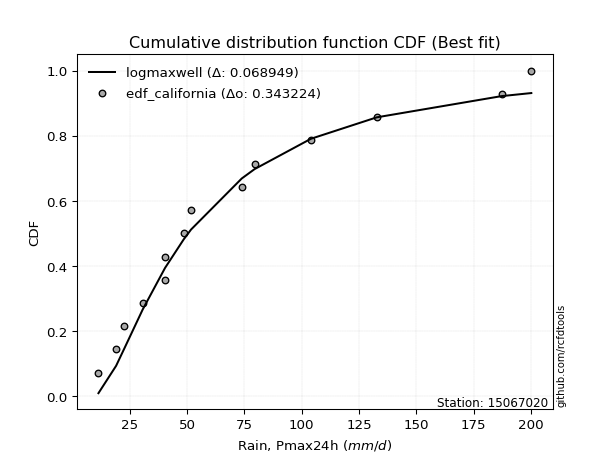</img>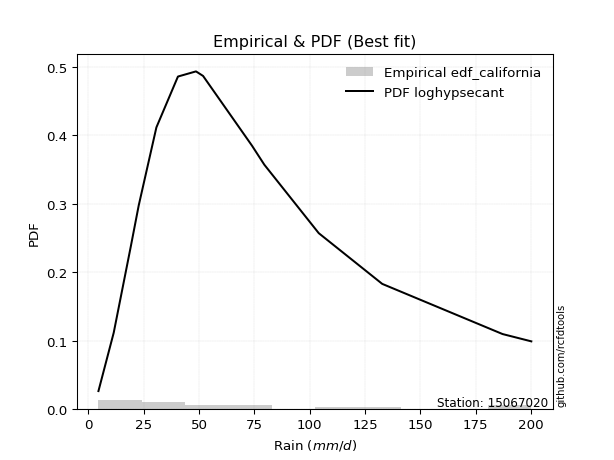</img>

</div>


### 2. EDF Hazen (1930)

Hazen method for plotting positions is a formula used to estimate the empirical cumulative probability distribution of flood events or other hydrological data. This formula often results in biased estimations, particularly when extrapolating to extreme events (high return periods).

<div align="center">


$P=(m-0.5)/n$


</div>


**2.1. Empirical values**

<div align="center">

|                | 0                   | 1                  | 2                   | 3                   | 4                  | 5                   | 6                   | 7         | 8                  | 9                  | 10                | 11                 | 12                 | 13                 | 14                 |
|:---------------|:--------------------|:-------------------|:--------------------|:--------------------|:-------------------|:--------------------|:--------------------|:----------|:-------------------|:-------------------|:------------------|:-------------------|:-------------------|:-------------------|:-------------------|
| date           | 2025                | 2024               | 2017                | 2005                | 2016               | 2008                | 2014                | 2013      | 2015               | 2020               | 2018              | 2019               | 2007               | 2011               | 2012               |
| x              | 4.5                 | 11.4               | 19.1                | 22.7                | 30.7               | 40.4                | 40.5                | 48.6      | 51.8               | 73.9               | 79.5              | 104.1              | 132.8              | 187.2              | 200.2              |
| m              | 1                   | 2                  | 3                   | 4                   | 5                  | 6                   | 7                   | 8         | 9                  | 10                 | 11                | 12                 | 13                 | 14                 | 15                 |
| empirical_dist | edf_hazen           | edf_hazen          | edf_hazen           | edf_hazen           | edf_hazen          | edf_hazen           | edf_hazen           | edf_hazen | edf_hazen          | edf_hazen          | edf_hazen         | edf_hazen          | edf_hazen          | edf_hazen          | edf_hazen          |
| empirical      | 0.03333333333333333 | 0.1                | 0.16666666666666666 | 0.23333333333333334 | 0.3                | 0.36666666666666664 | 0.43333333333333335 | 0.5       | 0.5666666666666667 | 0.6333333333333333 | 0.7               | 0.7666666666666667 | 0.8333333333333334 | 0.9                | 0.9666666666666667 |
| empirical_tr   | 1.0344827586206897  | 1.1111111111111112 | 1.2                 | 1.3043478260869565  | 1.4285714285714286 | 1.5789473684210527  | 1.7647058823529411  | 2.0       | 2.3076923076923075 | 2.727272727272727  | 3.333333333333333 | 4.2857142857142865 | 6.000000000000002  | 10.000000000000002 | 30.000000000000007 |

</div>


**2.2. Kolmogorov-Smirnov fit test (sorted by Δ)**


<div align="center">

|                | 0                    | 1                    | 2                   | 3                    | 4                   | 5                    | 6                    | 7                    | 8                   | 9                   | 10                  | 11                  | 12                  | 13                 | 14                  | 15                  | 16                  | 17                  | 18                  | 19                  | 20                  | 21                  | 22                  | 23                  | 24                  | 25                  | 26                  | 27                  | 28                  | 29                  | 30                  | 31                  | 32                  | 33                  | 34                  | 35                  | 36                 | 37                  | 38                  | 39                  | 40                  | 41                  | 42                  | 43                  | 44                  | 45                 | 46                  | 47                  | 48                  | 49                  | 50                  | 51                  | 52                  | 53                  | 54                 | 55                  | 56                  | 57                  | 58                  | 59                  | 60                  | 61                  | 62                  | 63                  | 64                 | 65                  | 66                  | 67                  | 68                  | 69                  | 70                  | 71                 | 72                 | 73                  | 74                 | 75                 | 76                  | 77                 | 78                 | 79                  | 80                  | 81                  | 82                  | 83                  | 84                  | 85                  | 86                  | 87                 | 88                  | 89                  | 90                 | 91                  | 92                  | 93                  | 94                 | 95                  | 96                  | 97                  | 98                 | 99                  | 100                | 101                | 102                 | 103                 | 104                 | 105                 | 106                 | 107                 | 108                 | 109                 | 110                | 111                 | 112                 | 113                 | 114                 | 115                 | 116                 | 117                 | 118                | 119                | 120                 | 121                 | 122                 | 123                | 124                | 125                | 126                 | 127                 | 128                 | 129                | 130                 | 131                 | 132                 | 133                | 134                | 135                 | 136                | 137                | 138                | 139                | 140                 | 141                | 142                 | 143                | 144                | 145                | 146                | 147                 | 148                | 149                | 150                | 151                | 152                | 153                | 154                | 155                | 156                | 157                | 158                | 159                |
|:---------------|:---------------------|:---------------------|:--------------------|:---------------------|:--------------------|:---------------------|:---------------------|:---------------------|:--------------------|:--------------------|:--------------------|:--------------------|:--------------------|:-------------------|:--------------------|:--------------------|:--------------------|:--------------------|:--------------------|:--------------------|:--------------------|:--------------------|:--------------------|:--------------------|:--------------------|:--------------------|:--------------------|:--------------------|:--------------------|:--------------------|:--------------------|:--------------------|:--------------------|:--------------------|:--------------------|:--------------------|:-------------------|:--------------------|:--------------------|:--------------------|:--------------------|:--------------------|:--------------------|:--------------------|:--------------------|:-------------------|:--------------------|:--------------------|:--------------------|:--------------------|:--------------------|:--------------------|:--------------------|:--------------------|:-------------------|:--------------------|:--------------------|:--------------------|:--------------------|:--------------------|:--------------------|:--------------------|:--------------------|:--------------------|:-------------------|:--------------------|:--------------------|:--------------------|:--------------------|:--------------------|:--------------------|:-------------------|:-------------------|:--------------------|:-------------------|:-------------------|:--------------------|:-------------------|:-------------------|:--------------------|:--------------------|:--------------------|:--------------------|:--------------------|:--------------------|:--------------------|:--------------------|:-------------------|:--------------------|:--------------------|:-------------------|:--------------------|:--------------------|:--------------------|:-------------------|:--------------------|:--------------------|:--------------------|:-------------------|:--------------------|:-------------------|:-------------------|:--------------------|:--------------------|:--------------------|:--------------------|:--------------------|:--------------------|:--------------------|:--------------------|:-------------------|:--------------------|:--------------------|:--------------------|:--------------------|:--------------------|:--------------------|:--------------------|:-------------------|:-------------------|:--------------------|:--------------------|:--------------------|:-------------------|:-------------------|:-------------------|:--------------------|:--------------------|:--------------------|:-------------------|:--------------------|:--------------------|:--------------------|:-------------------|:-------------------|:--------------------|:-------------------|:-------------------|:-------------------|:-------------------|:--------------------|:-------------------|:--------------------|:-------------------|:-------------------|:-------------------|:-------------------|:--------------------|:-------------------|:-------------------|:-------------------|:-------------------|:-------------------|:-------------------|:-------------------|:-------------------|:-------------------|:-------------------|:-------------------|:-------------------|
| station        | 15067020             | 15067020             | 15067020            | 15067020             | 15067020            | 15067020             | 15067020             | 15067020             | 15067020            | 15067020            | 15067020            | 15067020            | 15067020            | 15067020           | 15067020            | 15067020            | 15067020            | 15067020            | 15067020            | 15067020            | 15067020            | 15067020            | 15067020            | 15067020            | 15067020            | 15067020            | 15067020            | 15067020            | 15067020            | 15067020            | 15067020            | 15067020            | 15067020            | 15067020            | 15067020            | 15067020            | 15067020           | 15067020            | 15067020            | 15067020            | 15067020            | 15067020            | 15067020            | 15067020            | 15067020            | 15067020           | 15067020            | 15067020            | 15067020            | 15067020            | 15067020            | 15067020            | 15067020            | 15067020            | 15067020           | 15067020            | 15067020            | 15067020            | 15067020            | 15067020            | 15067020            | 15067020            | 15067020            | 15067020            | 15067020           | 15067020            | 15067020            | 15067020            | 15067020            | 15067020            | 15067020            | 15067020           | 15067020           | 15067020            | 15067020           | 15067020           | 15067020            | 15067020           | 15067020           | 15067020            | 15067020            | 15067020            | 15067020            | 15067020            | 15067020            | 15067020            | 15067020            | 15067020           | 15067020            | 15067020            | 15067020           | 15067020            | 15067020            | 15067020            | 15067020           | 15067020            | 15067020            | 15067020            | 15067020           | 15067020            | 15067020           | 15067020           | 15067020            | 15067020            | 15067020            | 15067020            | 15067020            | 15067020            | 15067020            | 15067020            | 15067020           | 15067020            | 15067020            | 15067020            | 15067020            | 15067020            | 15067020            | 15067020            | 15067020           | 15067020           | 15067020            | 15067020            | 15067020            | 15067020           | 15067020           | 15067020           | 15067020            | 15067020            | 15067020            | 15067020           | 15067020            | 15067020            | 15067020            | 15067020           | 15067020           | 15067020            | 15067020           | 15067020           | 15067020           | 15067020           | 15067020            | 15067020           | 15067020            | 15067020           | 15067020           | 15067020           | 15067020           | 15067020            | 15067020           | 15067020           | 15067020           | 15067020           | 15067020           | 15067020           | 15067020           | 15067020           | 15067020           | 15067020           | 15067020           | 15067020           |
| empirical_dist | edf_hazen            | edf_hazen            | edf_hazen           | edf_hazen            | edf_hazen           | edf_hazen            | edf_hazen            | edf_hazen            | edf_hazen           | edf_hazen           | edf_hazen           | edf_hazen           | edf_hazen           | edf_hazen          | edf_hazen           | edf_hazen           | edf_hazen           | edf_hazen           | edf_hazen           | edf_hazen           | edf_hazen           | edf_hazen           | edf_hazen           | edf_hazen           | edf_hazen           | edf_hazen           | edf_hazen           | edf_hazen           | edf_hazen           | edf_hazen           | edf_hazen           | edf_hazen           | edf_hazen           | edf_hazen           | edf_hazen           | edf_hazen           | edf_hazen          | edf_hazen           | edf_hazen           | edf_hazen           | edf_hazen           | edf_hazen           | edf_hazen           | edf_hazen           | edf_hazen           | edf_hazen          | edf_hazen           | edf_hazen           | edf_hazen           | edf_hazen           | edf_hazen           | edf_hazen           | edf_hazen           | edf_hazen           | edf_hazen          | edf_hazen           | edf_hazen           | edf_hazen           | edf_hazen           | edf_hazen           | edf_hazen           | edf_hazen           | edf_hazen           | edf_hazen           | edf_hazen          | edf_hazen           | edf_hazen           | edf_hazen           | edf_hazen           | edf_hazen           | edf_hazen           | edf_hazen          | edf_hazen          | edf_hazen           | edf_hazen          | edf_hazen          | edf_hazen           | edf_hazen          | edf_hazen          | edf_hazen           | edf_hazen           | edf_hazen           | edf_hazen           | edf_hazen           | edf_hazen           | edf_hazen           | edf_hazen           | edf_hazen          | edf_hazen           | edf_hazen           | edf_hazen          | edf_hazen           | edf_hazen           | edf_hazen           | edf_hazen          | edf_hazen           | edf_hazen           | edf_hazen           | edf_hazen          | edf_hazen           | edf_hazen          | edf_hazen          | edf_hazen           | edf_hazen           | edf_hazen           | edf_hazen           | edf_hazen           | edf_hazen           | edf_hazen           | edf_hazen           | edf_hazen          | edf_hazen           | edf_hazen           | edf_hazen           | edf_hazen           | edf_hazen           | edf_hazen           | edf_hazen           | edf_hazen          | edf_hazen          | edf_hazen           | edf_hazen           | edf_hazen           | edf_hazen          | edf_hazen          | edf_hazen          | edf_hazen           | edf_hazen           | edf_hazen           | edf_hazen          | edf_hazen           | edf_hazen           | edf_hazen           | edf_hazen          | edf_hazen          | edf_hazen           | edf_hazen          | edf_hazen          | edf_hazen          | edf_hazen          | edf_hazen           | edf_hazen          | edf_hazen           | edf_hazen          | edf_hazen          | edf_hazen          | edf_hazen          | edf_hazen           | edf_hazen          | edf_hazen          | edf_hazen          | edf_hazen          | edf_hazen          | edf_hazen          | edf_hazen          | edf_hazen          | edf_hazen          | edf_hazen          | edf_hazen          | edf_hazen          |
| p_dist         | invgamma             | invweibull           | genextreme          | nct                  | johnsonsu           | alpha                | invgauss             | logpearson3          | lomax               | burr12              | exponnorm           | loggompertz         | betaprime           | logburr12          | logweibull_min      | loggenlogistic      | weibull_min         | logloggamma         | kappa3              | logmielke           | genexpon            | loglogistic         | ncf                 | logjohnsonsu        | bradford            | logfoldnorm         | logargus            | loggennorm          | logrice             | logexponnorm        | logcrystalball      | lognorm             | logt                | lognct              | logjohnsonsb        | loghypsecant        | logfatiguelife     | logf                | logalpha            | loggumbel_l         | logdgamma           | lognakagami         | logdweibull         | loganglit           | logerlang           | exponpow           | logloglaplace       | halflogistic        | logsemicircular     | loggenextreme       | genpareto           | loggamma            | loggamma            | loggenhalflogistic  | loginvgamma        | logtriang           | foldnorm            | halfnorm            | burr                | logncf              | loginvgauss         | moyal               | loglaplace          | loglaplace          | logmaxwell         | logskewnorm         | dgamma              | mielke              | logbetaprime        | logarcsine          | pearson3            | vonmises_line      | genlogistic        | logcosine           | t                  | lograyleigh        | logburr             | gumbel_r           | tukeylambda        | f                   | loginvweibull       | dweibull            | gengamma            | gamma               | loggausshyper       | rayleigh            | gennorm             | loggumbel_r        | kstwobign           | maxwell             | skewnorm           | gompertz            | erlang              | logkstwobign        | loghalfnorm        | semicircular        | logbeta             | wald                | halfgennorm        | anglit              | logweibull_max     | logmoyal           | loggenexpon         | triang              | nakagami            | arcsine             | loghalflogistic     | norm                | crystalball         | logtrapezoid        | loggenpareto       | rice                | logistic            | truncweibull_min    | logwrapcauchy       | hypsecant           | logbradford         | logkappa3           | loguniform         | gausshyper         | logvonmises_line    | logtruncweibull_min | cosine              | logksone           | logkappa4          | laplace            | exponweib           | logwald             | gumbel_l            | truncexpon         | wrapcauchy          | loglevy_l           | kappa4              | logtruncexpon      | ksone              | loglomax            | beta               | argus              | logtruncnorm       | uniform            | logtukeylambda      | powerlaw           | loggengamma         | levy_l             | genhalflogistic    | logrdist           | logexponweib       | johnsonsb           | rdist              | trapezoid          | fatiguelife        | logpowerlaw        | logexponpow        | weibull_max        | truncpareto        | logtruncpareto     | loghalfgennorm     | truncnorm          | logvonmises        | vonmises           |
| delta          | 0.045257230091933054 | 0.048441728887834046 | 0.04844193650100459 | 0.049649915386605015 | 0.05311183464443475 | 0.053740524192926076 | 0.054424284673056544 | 0.054874127072652046 | 0.05491525014112253 | 0.05679348996600042 | 0.05833841768623643 | 0.06009243782874285 | 0.06054641261272342 | 0.0667773902092702 | 0.06751301837376578 | 0.06876685452133335 | 0.07054375996653012 | 0.07108353006830448 | 0.07152869295641956 | 0.07291591784929519 | 0.07544635696966351 | 0.07588033648034725 | 0.07592891607429814 | 0.07643822132211958 | 0.07781058733369028 | 0.07874107339811637 | 0.08032476770509289 | 0.08047966304474691 | 0.08268775373183557 | 0.08269764735300233 | 0.08269899788028301 | 0.08269902762253367 | 0.08269949278341743 | 0.08272508320436034 | 0.08278008479953364 | 0.08322619737292403 | 0.0835159463619663 | 0.08600085661520596 | 0.08647373542228881 | 0.08661532027153263 | 0.08817264947684011 | 0.08839714472967493 | 0.08903652540501383 | 0.08988389081349751 | 0.09085529300727546 | 0.0915644310131154 | 0.09242040208900282 | 0.09283242572664263 | 0.09285239635686365 | 0.09684733016280456 | 0.09726915527594227 | 0.09896331130593577 | 0.09896331130593577 | 0.09949007288985975 | 0.1005252357849426 | 0.10321200310440254 | 0.10422132723762251 | 0.10570996677792277 | 0.10785571932723484 | 0.10855103662977661 | 0.10913246933438969 | 0.10928326236582353 | 0.10981397758225264 | 0.10981397758225264 | 0.1170268946121471 | 0.11787204346215152 | 0.11855925896534547 | 0.11877386861610278 | 0.11986179131398789 | 0.12257241001785982 | 0.12359254852266344 | 0.1244953035504564 | 0.126909955976522  | 0.12851921662277582 | 0.1287814584385674 | 0.1289304795474801 | 0.12956165168773942 | 0.130543565446273  | 0.1318899190017414 | 0.13235630517185124 | 0.13398042820234574 | 0.13405668892513184 | 0.13678462707444733 | 0.13779522300070252 | 0.13902009013344488 | 0.14062685112571394 | 0.14241670890529767 | 0.149665242308816  | 0.15217639082831952 | 0.15291539164785228 | 0.1582094431963288 | 0.15841970074138323 | 0.15949800895116867 | 0.16244126304677448 | 0.1625328943704129 | 0.16325192173904518 | 0.16500873494532647 | 0.16626059787600994 | 0.1676688987541566 | 0.17004282782714286 | 0.1738655495721635 | 0.1750052945264296 | 0.17534401297628693 | 0.17818289213434058 | 0.17821503581802264 | 0.18159775298879718 | 0.18356415674227528 | 0.18633643901777136 | 0.18633644124886917 | 0.19037882279092921 | 0.1941782141177625 | 0.19476134989131316 | 0.20138392918260328 | 0.20678245171586657 | 0.21221769108461644 | 0.21347373731489827 | 0.21407926693305937 | 0.21420520270488905 | 0.2142344463364542 | 0.2239583077099973 | 0.22698548217903797 | 0.22709368067718044 | 0.23353725907894674 | 0.234084260835934  | 0.2345283601339986 | 0.2416685446257159 | 0.24418943131987864 | 0.24542066220055564 | 0.25060960618172995 | 0.2533540421201547 | 0.26420315228034086 | 0.28296114407022743 | 0.28943436377149856 | 0.2902963866169289 | 0.2973002895588485 | 0.29780631604906194 | 0.2982482268092036 | 0.3009680055986772 | 0.3200110674591082 | 0.3249701924714699 | 0.32906474032444116 | 0.3543814564299522 | 0.40711968704522694 | 0.4153954546862618 | 0.4240474430744867 | 0.4563076691386524 | 0.4693877355189785 | 0.48746725140461866 | 0.5225467003497595 | 0.5352384698701567 | 0.537892836675821  | 0.5539559613593941 | 0.6753542368235278 | 0.7088458992453611 | 0.778954132342943  | 0.8477409545556607 | 0.9                | 0.9240101813245781 | 1.0319726824051225 | 31.758878814502356 |
| deltao         | 0.3366456264050002   | 0.3366456264050002   | 0.3366456264050002  | 0.3366456264050002   | 0.3366456264050002  | 0.3366456264050002   | 0.3366456264050002   | 0.3366456264050002   | 0.3366456264050002  | 0.3366456264050002  | 0.3366456264050002  | 0.3366456264050002  | 0.3366456264050002  | 0.3366456264050002 | 0.3366456264050002  | 0.3366456264050002  | 0.3366456264050002  | 0.3366456264050002  | 0.3366456264050002  | 0.3366456264050002  | 0.3366456264050002  | 0.3366456264050002  | 0.3366456264050002  | 0.3366456264050002  | 0.3366456264050002  | 0.3366456264050002  | 0.3366456264050002  | 0.3366456264050002  | 0.3366456264050002  | 0.3366456264050002  | 0.3366456264050002  | 0.3366456264050002  | 0.3366456264050002  | 0.3366456264050002  | 0.3366456264050002  | 0.3366456264050002  | 0.3366456264050002 | 0.3366456264050002  | 0.3366456264050002  | 0.3366456264050002  | 0.3366456264050002  | 0.3366456264050002  | 0.3366456264050002  | 0.3366456264050002  | 0.3366456264050002  | 0.3366456264050002 | 0.3366456264050002  | 0.3366456264050002  | 0.3366456264050002  | 0.3366456264050002  | 0.3366456264050002  | 0.3366456264050002  | 0.3366456264050002  | 0.3366456264050002  | 0.3366456264050002 | 0.3366456264050002  | 0.3366456264050002  | 0.3366456264050002  | 0.3366456264050002  | 0.3366456264050002  | 0.3366456264050002  | 0.3366456264050002  | 0.3366456264050002  | 0.3366456264050002  | 0.3366456264050002 | 0.3366456264050002  | 0.3366456264050002  | 0.3366456264050002  | 0.3366456264050002  | 0.3366456264050002  | 0.3366456264050002  | 0.3366456264050002 | 0.3366456264050002 | 0.3366456264050002  | 0.3366456264050002 | 0.3366456264050002 | 0.3366456264050002  | 0.3366456264050002 | 0.3366456264050002 | 0.3366456264050002  | 0.3366456264050002  | 0.3366456264050002  | 0.3366456264050002  | 0.3366456264050002  | 0.3366456264050002  | 0.3366456264050002  | 0.3366456264050002  | 0.3366456264050002 | 0.3366456264050002  | 0.3366456264050002  | 0.3366456264050002 | 0.3366456264050002  | 0.3366456264050002  | 0.3366456264050002  | 0.3366456264050002 | 0.3366456264050002  | 0.3366456264050002  | 0.3366456264050002  | 0.3366456264050002 | 0.3366456264050002  | 0.3366456264050002 | 0.3366456264050002 | 0.3366456264050002  | 0.3366456264050002  | 0.3366456264050002  | 0.3366456264050002  | 0.3366456264050002  | 0.3366456264050002  | 0.3366456264050002  | 0.3366456264050002  | 0.3366456264050002 | 0.3366456264050002  | 0.3366456264050002  | 0.3366456264050002  | 0.3366456264050002  | 0.3366456264050002  | 0.3366456264050002  | 0.3366456264050002  | 0.3366456264050002 | 0.3366456264050002 | 0.3366456264050002  | 0.3366456264050002  | 0.3366456264050002  | 0.3366456264050002 | 0.3366456264050002 | 0.3366456264050002 | 0.3366456264050002  | 0.3366456264050002  | 0.3366456264050002  | 0.3366456264050002 | 0.3366456264050002  | 0.3366456264050002  | 0.3366456264050002  | 0.3366456264050002 | 0.3366456264050002 | 0.3366456264050002  | 0.3366456264050002 | 0.3366456264050002 | 0.3366456264050002 | 0.3366456264050002 | 0.3366456264050002  | 0.3366456264050002 | 0.3366456264050002  | 0.3366456264050002 | 0.3366456264050002 | 0.3366456264050002 | 0.3366456264050002 | 0.3366456264050002  | 0.3366456264050002 | 0.3366456264050002 | 0.3366456264050002 | 0.3366456264050002 | 0.3366456264050002 | 0.3366456264050002 | 0.3366456264050002 | 0.3366456264050002 | 0.3366456264050002 | 0.3366456264050002 | 0.3366456264050002 | 0.3366456264050002 |
| eval           | Δo > Δ               | Δo > Δ               | Δo > Δ              | Δo > Δ               | Δo > Δ              | Δo > Δ               | Δo > Δ               | Δo > Δ               | Δo > Δ              | Δo > Δ              | Δo > Δ              | Δo > Δ              | Δo > Δ              | Δo > Δ             | Δo > Δ              | Δo > Δ              | Δo > Δ              | Δo > Δ              | Δo > Δ              | Δo > Δ              | Δo > Δ              | Δo > Δ              | Δo > Δ              | Δo > Δ              | Δo > Δ              | Δo > Δ              | Δo > Δ              | Δo > Δ              | Δo > Δ              | Δo > Δ              | Δo > Δ              | Δo > Δ              | Δo > Δ              | Δo > Δ              | Δo > Δ              | Δo > Δ              | Δo > Δ             | Δo > Δ              | Δo > Δ              | Δo > Δ              | Δo > Δ              | Δo > Δ              | Δo > Δ              | Δo > Δ              | Δo > Δ              | Δo > Δ             | Δo > Δ              | Δo > Δ              | Δo > Δ              | Δo > Δ              | Δo > Δ              | Δo > Δ              | Δo > Δ              | Δo > Δ              | Δo > Δ             | Δo > Δ              | Δo > Δ              | Δo > Δ              | Δo > Δ              | Δo > Δ              | Δo > Δ              | Δo > Δ              | Δo > Δ              | Δo > Δ              | Δo > Δ             | Δo > Δ              | Δo > Δ              | Δo > Δ              | Δo > Δ              | Δo > Δ              | Δo > Δ              | Δo > Δ             | Δo > Δ             | Δo > Δ              | Δo > Δ             | Δo > Δ             | Δo > Δ              | Δo > Δ             | Δo > Δ             | Δo > Δ              | Δo > Δ              | Δo > Δ              | Δo > Δ              | Δo > Δ              | Δo > Δ              | Δo > Δ              | Δo > Δ              | Δo > Δ             | Δo > Δ              | Δo > Δ              | Δo > Δ             | Δo > Δ              | Δo > Δ              | Δo > Δ              | Δo > Δ             | Δo > Δ              | Δo > Δ              | Δo > Δ              | Δo > Δ             | Δo > Δ              | Δo > Δ             | Δo > Δ             | Δo > Δ              | Δo > Δ              | Δo > Δ              | Δo > Δ              | Δo > Δ              | Δo > Δ              | Δo > Δ              | Δo > Δ              | Δo > Δ             | Δo > Δ              | Δo > Δ              | Δo > Δ              | Δo > Δ              | Δo > Δ              | Δo > Δ              | Δo > Δ              | Δo > Δ             | Δo > Δ             | Δo > Δ              | Δo > Δ              | Δo > Δ              | Δo > Δ             | Δo > Δ             | Δo > Δ             | Δo > Δ              | Δo > Δ              | Δo > Δ              | Δo > Δ             | Δo > Δ              | Δo > Δ              | Δo > Δ              | Δo > Δ             | Δo > Δ             | Δo > Δ              | Δo > Δ             | Δo > Δ             | Δo > Δ             | Δo > Δ             | Δo > Δ              | Δo <= Δ            | Δo <= Δ             | Δo <= Δ            | Δo <= Δ            | Δo <= Δ            | Δo <= Δ            | Δo <= Δ             | Δo <= Δ            | Δo <= Δ            | Δo <= Δ            | Δo <= Δ            | Δo <= Δ            | Δo <= Δ            | Δo <= Δ            | Δo <= Δ            | Δo <= Δ            | Δo <= Δ            | Δo <= Δ            | Δo <= Δ            |
| fit            | 1                    | 1                    | 1                   | 1                    | 1                   | 1                    | 1                    | 1                    | 1                   | 1                   | 1                   | 1                   | 1                   | 1                  | 1                   | 1                   | 1                   | 1                   | 1                   | 1                   | 1                   | 1                   | 1                   | 1                   | 1                   | 1                   | 1                   | 1                   | 1                   | 1                   | 1                   | 1                   | 1                   | 1                   | 1                   | 1                   | 1                  | 1                   | 1                   | 1                   | 1                   | 1                   | 1                   | 1                   | 1                   | 1                  | 1                   | 1                   | 1                   | 1                   | 1                   | 1                   | 1                   | 1                   | 1                  | 1                   | 1                   | 1                   | 1                   | 1                   | 1                   | 1                   | 1                   | 1                   | 1                  | 1                   | 1                   | 1                   | 1                   | 1                   | 1                   | 1                  | 1                  | 1                   | 1                  | 1                  | 1                   | 1                  | 1                  | 1                   | 1                   | 1                   | 1                   | 1                   | 1                   | 1                   | 1                   | 1                  | 1                   | 1                   | 1                  | 1                   | 1                   | 1                   | 1                  | 1                   | 1                   | 1                   | 1                  | 1                   | 1                  | 1                  | 1                   | 1                   | 1                   | 1                   | 1                   | 1                   | 1                   | 1                   | 1                  | 1                   | 1                   | 1                   | 1                   | 1                   | 1                   | 1                   | 1                  | 1                  | 1                   | 1                   | 1                   | 1                  | 1                  | 1                  | 1                   | 1                   | 1                   | 1                  | 1                   | 1                   | 1                   | 1                  | 1                  | 1                   | 1                  | 1                  | 1                  | 1                  | 1                   | 0                  | 0                   | 0                  | 0                  | 0                  | 0                  | 0                   | 0                  | 0                  | 0                  | 0                  | 0                  | 0                  | 0                  | 0                  | 0                  | 0                  | 0                  | 0                  |
| n              | 15                   | 15                   | 15                  | 15                   | 15                  | 15                   | 15                   | 15                   | 15                  | 15                  | 15                  | 15                  | 15                  | 15                 | 15                  | 15                  | 15                  | 15                  | 15                  | 15                  | 15                  | 15                  | 15                  | 15                  | 15                  | 15                  | 15                  | 15                  | 15                  | 15                  | 15                  | 15                  | 15                  | 15                  | 15                  | 15                  | 15                 | 15                  | 15                  | 15                  | 15                  | 15                  | 15                  | 15                  | 15                  | 15                 | 15                  | 15                  | 15                  | 15                  | 15                  | 15                  | 15                  | 15                  | 15                 | 15                  | 15                  | 15                  | 15                  | 15                  | 15                  | 15                  | 15                  | 15                  | 15                 | 15                  | 15                  | 15                  | 15                  | 15                  | 15                  | 15                 | 15                 | 15                  | 15                 | 15                 | 15                  | 15                 | 15                 | 15                  | 15                  | 15                  | 15                  | 15                  | 15                  | 15                  | 15                  | 15                 | 15                  | 15                  | 15                 | 15                  | 15                  | 15                  | 15                 | 15                  | 15                  | 15                  | 15                 | 15                  | 15                 | 15                 | 15                  | 15                  | 15                  | 15                  | 15                  | 15                  | 15                  | 15                  | 15                 | 15                  | 15                  | 15                  | 15                  | 15                  | 15                  | 15                  | 15                 | 15                 | 15                  | 15                  | 15                  | 15                 | 15                 | 15                 | 15                  | 15                  | 15                  | 15                 | 15                  | 15                  | 15                  | 15                 | 15                 | 15                  | 15                 | 15                 | 15                 | 15                 | 15                  | 15                 | 15                  | 15                 | 15                 | 15                 | 15                 | 15                  | 15                 | 15                 | 15                 | 15                 | 15                 | 15                 | 15                 | 15                 | 15                 | 15                 | 15                 | 15                 |
| best_fit       | 1                    | 0                    | 0                   | 0                    | 0                   | 0                    | 0                    | 0                    | 0                   | 0                   | 0                   | 0                   | 0                   | 0                  | 0                   | 0                   | 0                   | 0                   | 0                   | 0                   | 0                   | 0                   | 0                   | 0                   | 0                   | 0                   | 0                   | 0                   | 0                   | 0                   | 0                   | 0                   | 0                   | 0                   | 0                   | 0                   | 0                  | 0                   | 0                   | 0                   | 0                   | 0                   | 0                   | 0                   | 0                   | 0                  | 0                   | 0                   | 0                   | 0                   | 0                   | 0                   | 0                   | 0                   | 0                  | 0                   | 0                   | 0                   | 0                   | 0                   | 0                   | 0                   | 0                   | 0                   | 0                  | 0                   | 0                   | 0                   | 0                   | 0                   | 0                   | 0                  | 0                  | 0                   | 0                  | 0                  | 0                   | 0                  | 0                  | 0                   | 0                   | 0                   | 0                   | 0                   | 0                   | 0                   | 0                   | 0                  | 0                   | 0                   | 0                  | 0                   | 0                   | 0                   | 0                  | 0                   | 0                   | 0                   | 0                  | 0                   | 0                  | 0                  | 0                   | 0                   | 0                   | 0                   | 0                   | 0                   | 0                   | 0                   | 0                  | 0                   | 0                   | 0                   | 0                   | 0                   | 0                   | 0                   | 0                  | 0                  | 0                   | 0                   | 0                   | 0                  | 0                  | 0                  | 0                   | 0                   | 0                   | 0                  | 0                   | 0                   | 0                   | 0                  | 0                  | 0                   | 0                  | 0                  | 0                  | 0                  | 0                   | 0                  | 0                   | 0                  | 0                  | 0                  | 0                  | 0                   | 0                  | 0                  | 0                  | 0                  | 0                  | 0                  | 0                  | 0                  | 0                  | 0                  | 0                  | 0                  |
| best_fit_sort  | 1                    | 2                    | 3                   | 4                    | 5                   | 6                    | 7                    | 8                    | 9                   | 10                  | 11                  | 12                  | 13                  | 14                 | 15                  | 16                  | 17                  | 18                  | 19                  | 20                  | 21                  | 22                  | 23                  | 24                  | 25                  | 26                  | 27                  | 28                  | 29                  | 30                  | 31                  | 32                  | 33                  | 34                  | 35                  | 36                  | 37                 | 38                  | 39                  | 40                  | 41                  | 42                  | 43                  | 44                  | 45                  | 46                 | 47                  | 48                  | 49                  | 50                  | 51                  | 52                  | 53                  | 54                  | 55                 | 56                  | 57                  | 58                  | 59                  | 60                  | 61                  | 62                  | 63                  | 64                  | 65                 | 66                  | 67                  | 68                  | 69                  | 70                  | 71                  | 72                 | 73                 | 74                  | 75                 | 76                 | 77                  | 78                 | 79                 | 80                  | 81                  | 82                  | 83                  | 84                  | 85                  | 86                  | 87                  | 88                 | 89                  | 90                  | 91                 | 92                  | 93                  | 94                  | 95                 | 96                  | 97                  | 98                  | 99                 | 100                 | 101                | 102                | 103                 | 104                 | 105                 | 106                 | 107                 | 108                 | 109                 | 110                 | 111                | 112                 | 113                 | 114                 | 115                 | 116                 | 117                 | 118                 | 119                | 120                | 121                 | 122                 | 123                 | 124                | 125                | 126                | 127                 | 128                 | 129                 | 130                | 131                 | 132                 | 133                 | 134                | 135                | 136                 | 137                | 138                | 139                | 140                | 141                 | 142                | 143                 | 144                | 145                | 146                | 147                | 148                 | 149                | 150                | 151                | 152                | 153                | 154                | 155                | 156                | 157                | 158                | 159                | 160                |

</div>


**2.3. Best fit**

<div align="center">

|   id |   station | empirical_dist   | p_dist   |     delta |   deltao | eval   |   fit |   n |   best_fit |   best_fit_sort |
|-----:|----------:|:-----------------|:---------|----------:|---------:|:-------|------:|----:|-----------:|----------------:|
|    0 |  15067020 | edf_hazen        | invgamma | 0.0452572 | 0.336646 | Δo > Δ |     1 |  15 |          1 |               1 |

</div>


<div align="center">

</img></img>

</div>


### 3. EDF Weibull (1939)

Weibull plotting position formula is an empirical method used to estimate the non-exceedance probability or plotting position for a set of observed data, is often recommended or widely used in practice, particularly in flood frequency analysis.

<div align="center">


$P=m/(n+1)$


</div>


**3.1. Empirical values**

<div align="center">

|                | 0                  | 1                  | 2                  | 3                  | 4                  | 5           | 6                  | 7           | 8                  | 9                  | 10          | 11          | 12                | 13          | 14          |
|:---------------|:-------------------|:-------------------|:-------------------|:-------------------|:-------------------|:------------|:-------------------|:------------|:-------------------|:-------------------|:------------|:------------|:------------------|:------------|:------------|
| date           | 2025               | 2024               | 2017               | 2005               | 2016               | 2008        | 2014               | 2013        | 2015               | 2020               | 2018        | 2019        | 2007              | 2011        | 2012        |
| x              | 4.5                | 11.4               | 19.1               | 22.7               | 30.7               | 40.4        | 40.5               | 48.6        | 51.8               | 73.9               | 79.5        | 104.1       | 132.8             | 187.2       | 200.2       |
| m              | 1                  | 2                  | 3                  | 4                  | 5                  | 6           | 7                  | 8           | 9                  | 10                 | 11          | 12          | 13                | 14          | 15          |
| empirical_dist | edf_weibull        | edf_weibull        | edf_weibull        | edf_weibull        | edf_weibull        | edf_weibull | edf_weibull        | edf_weibull | edf_weibull        | edf_weibull        | edf_weibull | edf_weibull | edf_weibull       | edf_weibull | edf_weibull |
| empirical      | 0.0625             | 0.125              | 0.1875             | 0.25               | 0.3125             | 0.375       | 0.4375             | 0.5         | 0.5625             | 0.625              | 0.6875      | 0.75        | 0.8125            | 0.875       | 0.9375      |
| empirical_tr   | 1.0666666666666667 | 1.1428571428571428 | 1.2307692307692308 | 1.3333333333333333 | 1.4545454545454546 | 1.6         | 1.7777777777777777 | 2.0         | 2.2857142857142856 | 2.6666666666666665 | 3.2         | 4.0         | 5.333333333333333 | 8.0         | 16.0        |

</div>


**3.2. Kolmogorov-Smirnov fit test (sorted by Δ)**


<div align="center">

|                | 0                    | 1                   | 2                    | 3                   | 4                    | 5                   | 6                   | 7                    | 8                   | 9                   | 10                  | 11                 | 12                  | 13                 | 14                  | 15                  | 16                  | 17                  | 18                  | 19                 | 20                 | 21                  | 22                 | 23                  | 24                  | 25                  | 26                  | 27                  | 28                  | 29                  | 30                  | 31                  | 32                 | 33                 | 34                  | 35                  | 36                  | 37                  | 38                 | 39                 | 40                 | 41                  | 42                  | 43                  | 44                  | 45                 | 46                  | 47                  | 48                  | 49                  | 50                 | 51                  | 52                  | 53                  | 54                  | 55                  | 56                  | 57                  | 58                  | 59                  | 60                  | 61                  | 62                  | 63                  | 64                  | 65                  | 66                 | 67                  | 68                  | 69                  | 70                  | 71                  | 72                  | 73                  | 74                  | 75                  | 76                  | 77                  | 78                  | 79                  | 80                  | 81                  | 82                  | 83                  | 84                 | 85                 | 86                  | 87                  | 88                  | 89                  | 90                 | 91                 | 92                  | 93                  | 94                  | 95                  | 96                 | 97                  | 98                  | 99                  | 100                 | 101                | 102                 | 103                 | 104                 | 105                 | 106                 | 107                 | 108                | 109                 | 110                | 111                | 112                 | 113                | 114                 | 115                 | 116                 | 117                 | 118                 | 119                 | 120                | 121                | 122                | 123                 | 124                 | 125                 | 126                 | 127                 | 128                | 129                 | 130                | 131                 | 132                 | 133                | 134                 | 135                | 136                | 137                | 138                | 139                | 140                 | 141                 | 142                 | 143                 | 144                 | 145                | 146                 | 147                 | 148                | 149                | 150                | 151                | 152                | 153                | 154                | 155                | 156                | 157                | 158                | 159                |
|:---------------|:---------------------|:--------------------|:---------------------|:--------------------|:---------------------|:--------------------|:--------------------|:---------------------|:--------------------|:--------------------|:--------------------|:-------------------|:--------------------|:-------------------|:--------------------|:--------------------|:--------------------|:--------------------|:--------------------|:-------------------|:-------------------|:--------------------|:-------------------|:--------------------|:--------------------|:--------------------|:--------------------|:--------------------|:--------------------|:--------------------|:--------------------|:--------------------|:-------------------|:-------------------|:--------------------|:--------------------|:--------------------|:--------------------|:-------------------|:-------------------|:-------------------|:--------------------|:--------------------|:--------------------|:--------------------|:-------------------|:--------------------|:--------------------|:--------------------|:--------------------|:-------------------|:--------------------|:--------------------|:--------------------|:--------------------|:--------------------|:--------------------|:--------------------|:--------------------|:--------------------|:--------------------|:--------------------|:--------------------|:--------------------|:--------------------|:--------------------|:-------------------|:--------------------|:--------------------|:--------------------|:--------------------|:--------------------|:--------------------|:--------------------|:--------------------|:--------------------|:--------------------|:--------------------|:--------------------|:--------------------|:--------------------|:--------------------|:--------------------|:--------------------|:-------------------|:-------------------|:--------------------|:--------------------|:--------------------|:--------------------|:-------------------|:-------------------|:--------------------|:--------------------|:--------------------|:--------------------|:-------------------|:--------------------|:--------------------|:--------------------|:--------------------|:-------------------|:--------------------|:--------------------|:--------------------|:--------------------|:--------------------|:--------------------|:-------------------|:--------------------|:-------------------|:-------------------|:--------------------|:-------------------|:--------------------|:--------------------|:--------------------|:--------------------|:--------------------|:--------------------|:-------------------|:-------------------|:-------------------|:--------------------|:--------------------|:--------------------|:--------------------|:--------------------|:-------------------|:--------------------|:-------------------|:--------------------|:--------------------|:-------------------|:--------------------|:-------------------|:-------------------|:-------------------|:-------------------|:-------------------|:--------------------|:--------------------|:--------------------|:--------------------|:--------------------|:-------------------|:--------------------|:--------------------|:-------------------|:-------------------|:-------------------|:-------------------|:-------------------|:-------------------|:-------------------|:-------------------|:-------------------|:-------------------|:-------------------|:-------------------|
| station        | 15067020             | 15067020            | 15067020             | 15067020            | 15067020             | 15067020            | 15067020            | 15067020             | 15067020            | 15067020            | 15067020            | 15067020           | 15067020            | 15067020           | 15067020            | 15067020            | 15067020            | 15067020            | 15067020            | 15067020           | 15067020           | 15067020            | 15067020           | 15067020            | 15067020            | 15067020            | 15067020            | 15067020            | 15067020            | 15067020            | 15067020            | 15067020            | 15067020           | 15067020           | 15067020            | 15067020            | 15067020            | 15067020            | 15067020           | 15067020           | 15067020           | 15067020            | 15067020            | 15067020            | 15067020            | 15067020           | 15067020            | 15067020            | 15067020            | 15067020            | 15067020           | 15067020            | 15067020            | 15067020            | 15067020            | 15067020            | 15067020            | 15067020            | 15067020            | 15067020            | 15067020            | 15067020            | 15067020            | 15067020            | 15067020            | 15067020            | 15067020           | 15067020            | 15067020            | 15067020            | 15067020            | 15067020            | 15067020            | 15067020            | 15067020            | 15067020            | 15067020            | 15067020            | 15067020            | 15067020            | 15067020            | 15067020            | 15067020            | 15067020            | 15067020           | 15067020           | 15067020            | 15067020            | 15067020            | 15067020            | 15067020           | 15067020           | 15067020            | 15067020            | 15067020            | 15067020            | 15067020           | 15067020            | 15067020            | 15067020            | 15067020            | 15067020           | 15067020            | 15067020            | 15067020            | 15067020            | 15067020            | 15067020            | 15067020           | 15067020            | 15067020           | 15067020           | 15067020            | 15067020           | 15067020            | 15067020            | 15067020            | 15067020            | 15067020            | 15067020            | 15067020           | 15067020           | 15067020           | 15067020            | 15067020            | 15067020            | 15067020            | 15067020            | 15067020           | 15067020            | 15067020           | 15067020            | 15067020            | 15067020           | 15067020            | 15067020           | 15067020           | 15067020           | 15067020           | 15067020           | 15067020            | 15067020            | 15067020            | 15067020            | 15067020            | 15067020           | 15067020            | 15067020            | 15067020           | 15067020           | 15067020           | 15067020           | 15067020           | 15067020           | 15067020           | 15067020           | 15067020           | 15067020           | 15067020           | 15067020           |
| empirical_dist | edf_weibull          | edf_weibull         | edf_weibull          | edf_weibull         | edf_weibull          | edf_weibull         | edf_weibull         | edf_weibull          | edf_weibull         | edf_weibull         | edf_weibull         | edf_weibull        | edf_weibull         | edf_weibull        | edf_weibull         | edf_weibull         | edf_weibull         | edf_weibull         | edf_weibull         | edf_weibull        | edf_weibull        | edf_weibull         | edf_weibull        | edf_weibull         | edf_weibull         | edf_weibull         | edf_weibull         | edf_weibull         | edf_weibull         | edf_weibull         | edf_weibull         | edf_weibull         | edf_weibull        | edf_weibull        | edf_weibull         | edf_weibull         | edf_weibull         | edf_weibull         | edf_weibull        | edf_weibull        | edf_weibull        | edf_weibull         | edf_weibull         | edf_weibull         | edf_weibull         | edf_weibull        | edf_weibull         | edf_weibull         | edf_weibull         | edf_weibull         | edf_weibull        | edf_weibull         | edf_weibull         | edf_weibull         | edf_weibull         | edf_weibull         | edf_weibull         | edf_weibull         | edf_weibull         | edf_weibull         | edf_weibull         | edf_weibull         | edf_weibull         | edf_weibull         | edf_weibull         | edf_weibull         | edf_weibull        | edf_weibull         | edf_weibull         | edf_weibull         | edf_weibull         | edf_weibull         | edf_weibull         | edf_weibull         | edf_weibull         | edf_weibull         | edf_weibull         | edf_weibull         | edf_weibull         | edf_weibull         | edf_weibull         | edf_weibull         | edf_weibull         | edf_weibull         | edf_weibull        | edf_weibull        | edf_weibull         | edf_weibull         | edf_weibull         | edf_weibull         | edf_weibull        | edf_weibull        | edf_weibull         | edf_weibull         | edf_weibull         | edf_weibull         | edf_weibull        | edf_weibull         | edf_weibull         | edf_weibull         | edf_weibull         | edf_weibull        | edf_weibull         | edf_weibull         | edf_weibull         | edf_weibull         | edf_weibull         | edf_weibull         | edf_weibull        | edf_weibull         | edf_weibull        | edf_weibull        | edf_weibull         | edf_weibull        | edf_weibull         | edf_weibull         | edf_weibull         | edf_weibull         | edf_weibull         | edf_weibull         | edf_weibull        | edf_weibull        | edf_weibull        | edf_weibull         | edf_weibull         | edf_weibull         | edf_weibull         | edf_weibull         | edf_weibull        | edf_weibull         | edf_weibull        | edf_weibull         | edf_weibull         | edf_weibull        | edf_weibull         | edf_weibull        | edf_weibull        | edf_weibull        | edf_weibull        | edf_weibull        | edf_weibull         | edf_weibull         | edf_weibull         | edf_weibull         | edf_weibull         | edf_weibull        | edf_weibull         | edf_weibull         | edf_weibull        | edf_weibull        | edf_weibull        | edf_weibull        | edf_weibull        | edf_weibull        | edf_weibull        | edf_weibull        | edf_weibull        | edf_weibull        | edf_weibull        | edf_weibull        |
| p_dist         | alpha                | johnsonsu           | invweibull           | genextreme          | invgamma             | nct                 | logpearson3         | lomax                | weibull_min         | logloglaplace       | invgauss            | loggenlogistic     | exponnorm           | betaprime          | kappa3              | loggompertz         | logweibull_min      | logburr12           | logfoldnorm         | logloggamma        | ncf                | loggennorm          | logjohnsonsu       | genexpon            | logrice             | logexponnorm        | logcrystalball      | lognorm             | logt                | lognct              | logjohnsonsb        | logfatiguelife      | loglogistic        | logf               | logalpha            | logdweibull         | loganglit           | burr12              | logerlang          | logdgamma          | logsemicircular    | loggenhalflogistic  | exponpow            | halflogistic        | logargus            | loggumbel_l        | loggamma            | loggamma            | loghypsecant        | loginvgamma         | loggenextreme      | genpareto           | logmielke           | burr                | bradford            | logtriang           | foldnorm            | logncf              | loginvgauss         | halfnorm            | logarcsine          | moyal               | logmaxwell          | mielke              | f                   | logbetaprime        | gennorm            | lognakagami         | dgamma              | vonmises_line       | logskewnorm         | t                   | tukeylambda         | loglaplace          | loglaplace          | pearson3            | logcosine           | lograyleigh         | genlogistic         | logburr             | loginvweibull       | gumbel_r            | gengamma            | gamma               | loggausshyper      | dweibull           | rayleigh            | loggumbel_r         | kstwobign           | maxwell             | erlang             | arcsine            | skewnorm            | logkstwobign        | loghalfnorm         | gompertz            | nakagami           | halfgennorm         | semicircular        | logbeta             | logweibull_max      | anglit             | logmoyal            | loggenexpon         | loggenpareto        | triang              | loghalflogistic     | logtrapezoid        | norm               | crystalball         | wald               | rice               | logistic            | logwrapcauchy      | truncweibull_min    | logbradford         | logkappa3           | loguniform          | hypsecant           | logksone            | gausshyper         | logkappa4          | logvonmises_line   | logtruncweibull_min | cosine              | exponweib           | logwald             | laplace             | gumbel_l           | truncexpon          | wrapcauchy         | loglevy_l           | loglomax            | logtruncexpon      | ksone               | kappa4             | beta               | argus              | logtruncnorm       | logtukeylambda     | uniform             | powerlaw            | levy_l              | loggengamma         | genhalflogistic     | logrdist           | logexponweib        | johnsonsb           | rdist              | fatiguelife        | trapezoid          | logpowerlaw        | logexponpow        | weibull_max        | truncpareto        | logtruncpareto     | loghalfgennorm     | truncnorm          | logvonmises        | vonmises           |
| delta          | 0.055409472605823906 | 0.05804103199706234 | 0.058572365444412244 | 0.05857237375957369 | 0.059202148140727884 | 0.06056602031256475 | 0.06148290832131731 | 0.062499999998067955 | 0.06249999999999862 | 0.06325373542233614 | 0.06331718685646903 | 0.0646001878546667 | 0.06492909184223628 | 0.0671442010183535 | 0.06736202628975291 | 0.06749993631162454 | 0.06927016448377454 | 0.06938311259957242 | 0.07040774006478301 | 0.0706105152071359 | 0.071848091123345  | 0.07214632971141355 | 0.0724893501428252 | 0.07335114100795259 | 0.07435442039850221 | 0.07436431401966898 | 0.07436566454694965 | 0.07436569428920031 | 0.07436615945008407 | 0.07439174987102698 | 0.07444675146620028 | 0.07518261302863294 | 0.0764711787693948 | 0.0776675232818726 | 0.07814040208895545 | 0.08070319207168047 | 0.08155055748016415 | 0.08179348996600044 | 0.0825219596739421 | 0.084297470077487  | 0.0845190630235303 | 0.08664036015402343 | 0.08739776434644875 | 0.08866575905997598 | 0.08888037157241502 | 0.0897888579335655 | 0.09062997797260242 | 0.09062997797260242 | 0.09155953070625733 | 0.09219190245160924 | 0.0926806634961379 | 0.09310248860927561 | 0.09618096039116364 | 0.09629876990899533 | 0.09722291792169935 | 0.09904533643773589 | 0.10005466057095586 | 0.10021770329644325 | 0.10079913600105633 | 0.10154330011125612 | 0.10173907668452647 | 0.10511659569915688 | 0.10869356127881374 | 0.11044053528276943 | 0.11152297183851789 | 0.11152845798065453 | 0.113250042238631  | 0.11339714472967492 | 0.11348634510337707 | 0.11348702819212131 | 0.11370537679548487 | 0.11445263178021026 | 0.11539691804596686 | 0.11814731091558595 | 0.11814731091558595 | 0.11942588185599678 | 0.12018588328944246 | 0.12059714621414674 | 0.12274328930985534 | 0.12539498502107277 | 0.12564709486901238 | 0.12637689877960634 | 0.12845129374111397 | 0.12946188966736916 | 0.1296007339216071 | 0.1298900222584652 | 0.13646018445904728 | 0.14133190897548265 | 0.14800972416165287 | 0.14874872498118563 | 0.1511646756178353 | 0.1524310863221305 | 0.15404277652966214 | 0.15410792971344112 | 0.15419956103707955 | 0.15425303407471658 | 0.1573817024846893 | 0.15902489387835328 | 0.15908525507237853 | 0.16084206827865982 | 0.16136554957216354 | 0.1658761611604762 | 0.16667196119309624 | 0.16701067964295357 | 0.17334488078442917 | 0.17401622546767392 | 0.17523082340894192 | 0.17832362883791952 | 0.1821697723511047 | 0.18216977458220251 | 0.1829272645426766 | 0.1905946832246465 | 0.19721726251593663 | 0.2002246397657803 | 0.20261578504919991 | 0.20290148223302962 | 0.20324569075951981 | 0.20329088400848627 | 0.20930707064823162 | 0.21325092750260066 | 0.2180466569042231 | 0.2183783684091094 | 0.2186521488457046 | 0.21876034734384708 | 0.22937059241228008 | 0.23585609798654528 | 0.23708732886722228 | 0.23750187795904926 | 0.2464429395150633 | 0.24918737545348807 | 0.2517031522803409 | 0.25379447740356076 | 0.27697298271572857 | 0.2787393401977504 | 0.28480028955884856 | 0.2852676971048319 | 0.2861597715186559 | 0.2916848037689709 | 0.3116777341257748 | 0.3207314069911078 | 0.32080352580480326 | 0.33354812309661885 | 0.38622878801959515 | 0.38628635371189357 | 0.41154744307448676 | 0.435474335805319  | 0.44855440218564513 | 0.46246725140461864 | 0.4933800336830928 | 0.512892836675821  | 0.5227384698701567 | 0.5331226280260607 | 0.6545209034901944 | 0.6880125659120278 | 0.753954132342943  | 0.8227409545556607 | 0.875              | 0.8948435146579115 | 1.030609547495703  | 31.78804548116902  |
| deltao         | 0.3366456264050002   | 0.3366456264050002  | 0.3366456264050002   | 0.3366456264050002  | 0.3366456264050002   | 0.3366456264050002  | 0.3366456264050002  | 0.3366456264050002   | 0.3366456264050002  | 0.3366456264050002  | 0.3366456264050002  | 0.3366456264050002 | 0.3366456264050002  | 0.3366456264050002 | 0.3366456264050002  | 0.3366456264050002  | 0.3366456264050002  | 0.3366456264050002  | 0.3366456264050002  | 0.3366456264050002 | 0.3366456264050002 | 0.3366456264050002  | 0.3366456264050002 | 0.3366456264050002  | 0.3366456264050002  | 0.3366456264050002  | 0.3366456264050002  | 0.3366456264050002  | 0.3366456264050002  | 0.3366456264050002  | 0.3366456264050002  | 0.3366456264050002  | 0.3366456264050002 | 0.3366456264050002 | 0.3366456264050002  | 0.3366456264050002  | 0.3366456264050002  | 0.3366456264050002  | 0.3366456264050002 | 0.3366456264050002 | 0.3366456264050002 | 0.3366456264050002  | 0.3366456264050002  | 0.3366456264050002  | 0.3366456264050002  | 0.3366456264050002 | 0.3366456264050002  | 0.3366456264050002  | 0.3366456264050002  | 0.3366456264050002  | 0.3366456264050002 | 0.3366456264050002  | 0.3366456264050002  | 0.3366456264050002  | 0.3366456264050002  | 0.3366456264050002  | 0.3366456264050002  | 0.3366456264050002  | 0.3366456264050002  | 0.3366456264050002  | 0.3366456264050002  | 0.3366456264050002  | 0.3366456264050002  | 0.3366456264050002  | 0.3366456264050002  | 0.3366456264050002  | 0.3366456264050002 | 0.3366456264050002  | 0.3366456264050002  | 0.3366456264050002  | 0.3366456264050002  | 0.3366456264050002  | 0.3366456264050002  | 0.3366456264050002  | 0.3366456264050002  | 0.3366456264050002  | 0.3366456264050002  | 0.3366456264050002  | 0.3366456264050002  | 0.3366456264050002  | 0.3366456264050002  | 0.3366456264050002  | 0.3366456264050002  | 0.3366456264050002  | 0.3366456264050002 | 0.3366456264050002 | 0.3366456264050002  | 0.3366456264050002  | 0.3366456264050002  | 0.3366456264050002  | 0.3366456264050002 | 0.3366456264050002 | 0.3366456264050002  | 0.3366456264050002  | 0.3366456264050002  | 0.3366456264050002  | 0.3366456264050002 | 0.3366456264050002  | 0.3366456264050002  | 0.3366456264050002  | 0.3366456264050002  | 0.3366456264050002 | 0.3366456264050002  | 0.3366456264050002  | 0.3366456264050002  | 0.3366456264050002  | 0.3366456264050002  | 0.3366456264050002  | 0.3366456264050002 | 0.3366456264050002  | 0.3366456264050002 | 0.3366456264050002 | 0.3366456264050002  | 0.3366456264050002 | 0.3366456264050002  | 0.3366456264050002  | 0.3366456264050002  | 0.3366456264050002  | 0.3366456264050002  | 0.3366456264050002  | 0.3366456264050002 | 0.3366456264050002 | 0.3366456264050002 | 0.3366456264050002  | 0.3366456264050002  | 0.3366456264050002  | 0.3366456264050002  | 0.3366456264050002  | 0.3366456264050002 | 0.3366456264050002  | 0.3366456264050002 | 0.3366456264050002  | 0.3366456264050002  | 0.3366456264050002 | 0.3366456264050002  | 0.3366456264050002 | 0.3366456264050002 | 0.3366456264050002 | 0.3366456264050002 | 0.3366456264050002 | 0.3366456264050002  | 0.3366456264050002  | 0.3366456264050002  | 0.3366456264050002  | 0.3366456264050002  | 0.3366456264050002 | 0.3366456264050002  | 0.3366456264050002  | 0.3366456264050002 | 0.3366456264050002 | 0.3366456264050002 | 0.3366456264050002 | 0.3366456264050002 | 0.3366456264050002 | 0.3366456264050002 | 0.3366456264050002 | 0.3366456264050002 | 0.3366456264050002 | 0.3366456264050002 | 0.3366456264050002 |
| eval           | Δo > Δ               | Δo > Δ              | Δo > Δ               | Δo > Δ              | Δo > Δ               | Δo > Δ              | Δo > Δ              | Δo > Δ               | Δo > Δ              | Δo > Δ              | Δo > Δ              | Δo > Δ             | Δo > Δ              | Δo > Δ             | Δo > Δ              | Δo > Δ              | Δo > Δ              | Δo > Δ              | Δo > Δ              | Δo > Δ             | Δo > Δ             | Δo > Δ              | Δo > Δ             | Δo > Δ              | Δo > Δ              | Δo > Δ              | Δo > Δ              | Δo > Δ              | Δo > Δ              | Δo > Δ              | Δo > Δ              | Δo > Δ              | Δo > Δ             | Δo > Δ             | Δo > Δ              | Δo > Δ              | Δo > Δ              | Δo > Δ              | Δo > Δ             | Δo > Δ             | Δo > Δ             | Δo > Δ              | Δo > Δ              | Δo > Δ              | Δo > Δ              | Δo > Δ             | Δo > Δ              | Δo > Δ              | Δo > Δ              | Δo > Δ              | Δo > Δ             | Δo > Δ              | Δo > Δ              | Δo > Δ              | Δo > Δ              | Δo > Δ              | Δo > Δ              | Δo > Δ              | Δo > Δ              | Δo > Δ              | Δo > Δ              | Δo > Δ              | Δo > Δ              | Δo > Δ              | Δo > Δ              | Δo > Δ              | Δo > Δ             | Δo > Δ              | Δo > Δ              | Δo > Δ              | Δo > Δ              | Δo > Δ              | Δo > Δ              | Δo > Δ              | Δo > Δ              | Δo > Δ              | Δo > Δ              | Δo > Δ              | Δo > Δ              | Δo > Δ              | Δo > Δ              | Δo > Δ              | Δo > Δ              | Δo > Δ              | Δo > Δ             | Δo > Δ             | Δo > Δ              | Δo > Δ              | Δo > Δ              | Δo > Δ              | Δo > Δ             | Δo > Δ             | Δo > Δ              | Δo > Δ              | Δo > Δ              | Δo > Δ              | Δo > Δ             | Δo > Δ              | Δo > Δ              | Δo > Δ              | Δo > Δ              | Δo > Δ             | Δo > Δ              | Δo > Δ              | Δo > Δ              | Δo > Δ              | Δo > Δ              | Δo > Δ              | Δo > Δ             | Δo > Δ              | Δo > Δ             | Δo > Δ             | Δo > Δ              | Δo > Δ             | Δo > Δ              | Δo > Δ              | Δo > Δ              | Δo > Δ              | Δo > Δ              | Δo > Δ              | Δo > Δ             | Δo > Δ             | Δo > Δ             | Δo > Δ              | Δo > Δ              | Δo > Δ              | Δo > Δ              | Δo > Δ              | Δo > Δ             | Δo > Δ              | Δo > Δ             | Δo > Δ              | Δo > Δ              | Δo > Δ             | Δo > Δ              | Δo > Δ             | Δo > Δ             | Δo > Δ             | Δo > Δ             | Δo > Δ             | Δo > Δ              | Δo > Δ              | Δo <= Δ             | Δo <= Δ             | Δo <= Δ             | Δo <= Δ            | Δo <= Δ             | Δo <= Δ             | Δo <= Δ            | Δo <= Δ            | Δo <= Δ            | Δo <= Δ            | Δo <= Δ            | Δo <= Δ            | Δo <= Δ            | Δo <= Δ            | Δo <= Δ            | Δo <= Δ            | Δo <= Δ            | Δo <= Δ            |
| fit            | 1                    | 1                   | 1                    | 1                   | 1                    | 1                   | 1                   | 1                    | 1                   | 1                   | 1                   | 1                  | 1                   | 1                  | 1                   | 1                   | 1                   | 1                   | 1                   | 1                  | 1                  | 1                   | 1                  | 1                   | 1                   | 1                   | 1                   | 1                   | 1                   | 1                   | 1                   | 1                   | 1                  | 1                  | 1                   | 1                   | 1                   | 1                   | 1                  | 1                  | 1                  | 1                   | 1                   | 1                   | 1                   | 1                  | 1                   | 1                   | 1                   | 1                   | 1                  | 1                   | 1                   | 1                   | 1                   | 1                   | 1                   | 1                   | 1                   | 1                   | 1                   | 1                   | 1                   | 1                   | 1                   | 1                   | 1                  | 1                   | 1                   | 1                   | 1                   | 1                   | 1                   | 1                   | 1                   | 1                   | 1                   | 1                   | 1                   | 1                   | 1                   | 1                   | 1                   | 1                   | 1                  | 1                  | 1                   | 1                   | 1                   | 1                   | 1                  | 1                  | 1                   | 1                   | 1                   | 1                   | 1                  | 1                   | 1                   | 1                   | 1                   | 1                  | 1                   | 1                   | 1                   | 1                   | 1                   | 1                   | 1                  | 1                   | 1                  | 1                  | 1                   | 1                  | 1                   | 1                   | 1                   | 1                   | 1                   | 1                   | 1                  | 1                  | 1                  | 1                   | 1                   | 1                   | 1                   | 1                   | 1                  | 1                   | 1                  | 1                   | 1                   | 1                  | 1                   | 1                  | 1                  | 1                  | 1                  | 1                  | 1                   | 1                   | 0                   | 0                   | 0                   | 0                  | 0                   | 0                   | 0                  | 0                  | 0                  | 0                  | 0                  | 0                  | 0                  | 0                  | 0                  | 0                  | 0                  | 0                  |
| n              | 15                   | 15                  | 15                   | 15                  | 15                   | 15                  | 15                  | 15                   | 15                  | 15                  | 15                  | 15                 | 15                  | 15                 | 15                  | 15                  | 15                  | 15                  | 15                  | 15                 | 15                 | 15                  | 15                 | 15                  | 15                  | 15                  | 15                  | 15                  | 15                  | 15                  | 15                  | 15                  | 15                 | 15                 | 15                  | 15                  | 15                  | 15                  | 15                 | 15                 | 15                 | 15                  | 15                  | 15                  | 15                  | 15                 | 15                  | 15                  | 15                  | 15                  | 15                 | 15                  | 15                  | 15                  | 15                  | 15                  | 15                  | 15                  | 15                  | 15                  | 15                  | 15                  | 15                  | 15                  | 15                  | 15                  | 15                 | 15                  | 15                  | 15                  | 15                  | 15                  | 15                  | 15                  | 15                  | 15                  | 15                  | 15                  | 15                  | 15                  | 15                  | 15                  | 15                  | 15                  | 15                 | 15                 | 15                  | 15                  | 15                  | 15                  | 15                 | 15                 | 15                  | 15                  | 15                  | 15                  | 15                 | 15                  | 15                  | 15                  | 15                  | 15                 | 15                  | 15                  | 15                  | 15                  | 15                  | 15                  | 15                 | 15                  | 15                 | 15                 | 15                  | 15                 | 15                  | 15                  | 15                  | 15                  | 15                  | 15                  | 15                 | 15                 | 15                 | 15                  | 15                  | 15                  | 15                  | 15                  | 15                 | 15                  | 15                 | 15                  | 15                  | 15                 | 15                  | 15                 | 15                 | 15                 | 15                 | 15                 | 15                  | 15                  | 15                  | 15                  | 15                  | 15                 | 15                  | 15                  | 15                 | 15                 | 15                 | 15                 | 15                 | 15                 | 15                 | 15                 | 15                 | 15                 | 15                 | 15                 |
| best_fit       | 1                    | 0                   | 0                    | 0                   | 0                    | 0                   | 0                   | 0                    | 0                   | 0                   | 0                   | 0                  | 0                   | 0                  | 0                   | 0                   | 0                   | 0                   | 0                   | 0                  | 0                  | 0                   | 0                  | 0                   | 0                   | 0                   | 0                   | 0                   | 0                   | 0                   | 0                   | 0                   | 0                  | 0                  | 0                   | 0                   | 0                   | 0                   | 0                  | 0                  | 0                  | 0                   | 0                   | 0                   | 0                   | 0                  | 0                   | 0                   | 0                   | 0                   | 0                  | 0                   | 0                   | 0                   | 0                   | 0                   | 0                   | 0                   | 0                   | 0                   | 0                   | 0                   | 0                   | 0                   | 0                   | 0                   | 0                  | 0                   | 0                   | 0                   | 0                   | 0                   | 0                   | 0                   | 0                   | 0                   | 0                   | 0                   | 0                   | 0                   | 0                   | 0                   | 0                   | 0                   | 0                  | 0                  | 0                   | 0                   | 0                   | 0                   | 0                  | 0                  | 0                   | 0                   | 0                   | 0                   | 0                  | 0                   | 0                   | 0                   | 0                   | 0                  | 0                   | 0                   | 0                   | 0                   | 0                   | 0                   | 0                  | 0                   | 0                  | 0                  | 0                   | 0                  | 0                   | 0                   | 0                   | 0                   | 0                   | 0                   | 0                  | 0                  | 0                  | 0                   | 0                   | 0                   | 0                   | 0                   | 0                  | 0                   | 0                  | 0                   | 0                   | 0                  | 0                   | 0                  | 0                  | 0                  | 0                  | 0                  | 0                   | 0                   | 0                   | 0                   | 0                   | 0                  | 0                   | 0                   | 0                  | 0                  | 0                  | 0                  | 0                  | 0                  | 0                  | 0                  | 0                  | 0                  | 0                  | 0                  |
| best_fit_sort  | 1                    | 2                   | 3                    | 4                   | 5                    | 6                   | 7                   | 8                    | 9                   | 10                  | 11                  | 12                 | 13                  | 14                 | 15                  | 16                  | 17                  | 18                  | 19                  | 20                 | 21                 | 22                  | 23                 | 24                  | 25                  | 26                  | 27                  | 28                  | 29                  | 30                  | 31                  | 32                  | 33                 | 34                 | 35                  | 36                  | 37                  | 38                  | 39                 | 40                 | 41                 | 42                  | 43                  | 44                  | 45                  | 46                 | 47                  | 48                  | 49                  | 50                  | 51                 | 52                  | 53                  | 54                  | 55                  | 56                  | 57                  | 58                  | 59                  | 60                  | 61                  | 62                  | 63                  | 64                  | 65                  | 66                  | 67                 | 68                  | 69                  | 70                  | 71                  | 72                  | 73                  | 74                  | 75                  | 76                  | 77                  | 78                  | 79                  | 80                  | 81                  | 82                  | 83                  | 84                  | 85                 | 86                 | 87                  | 88                  | 89                  | 90                  | 91                 | 92                 | 93                  | 94                  | 95                  | 96                  | 97                 | 98                  | 99                  | 100                 | 101                 | 102                | 103                 | 104                 | 105                 | 106                 | 107                 | 108                 | 109                | 110                 | 111                | 112                | 113                 | 114                | 115                 | 116                 | 117                 | 118                 | 119                 | 120                 | 121                | 122                | 123                | 124                 | 125                 | 126                 | 127                 | 128                 | 129                | 130                 | 131                | 132                 | 133                 | 134                | 135                 | 136                | 137                | 138                | 139                | 140                | 141                 | 142                 | 143                 | 144                 | 145                 | 146                | 147                 | 148                 | 149                | 150                | 151                | 152                | 153                | 154                | 155                | 156                | 157                | 158                | 159                | 160                |

</div>


**3.3. Best fit**

<div align="center">

|   id |   station | empirical_dist   | p_dist   |     delta |   deltao | eval   |   fit |   n |   best_fit |   best_fit_sort |
|-----:|----------:|:-----------------|:---------|----------:|---------:|:-------|------:|----:|-----------:|----------------:|
|    0 |  15067020 | edf_weibull      | alpha    | 0.0554095 | 0.336646 | Δo > Δ |     1 |  15 |          1 |               1 |

</div>


<div align="center">

</img>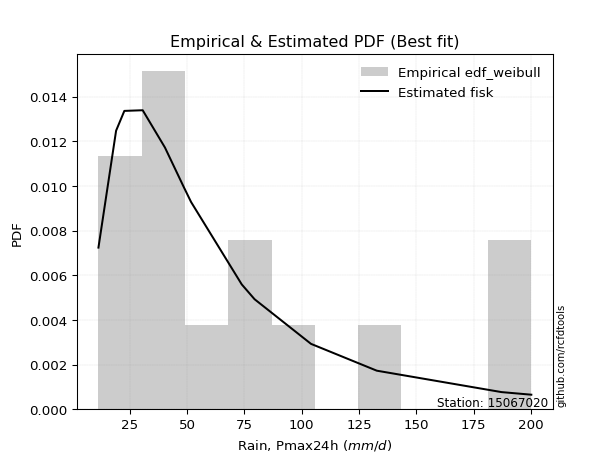</img>

</div>


### 4. EDF Beard (1943)

The Beard formula (or Beard´s plotting position formula) in hydrology is used to estimate the empirical non-exceedance probability _(P)_ of a flood event (or other extreme hydrological data point) within a given dataset.

<div align="center">


$P=(m-0.31)/(n+0.38)$


</div>


**4.1. Empirical values**

<div align="center">

|                | 0                   | 1                   | 2                   | 3                   | 4                  | 5                   | 6                   | 7         | 8                  | 9                  | 10                 | 11                | 12                 | 13                 | 14                 |
|:---------------|:--------------------|:--------------------|:--------------------|:--------------------|:-------------------|:--------------------|:--------------------|:----------|:-------------------|:-------------------|:-------------------|:------------------|:-------------------|:-------------------|:-------------------|
| date           | 2025                | 2024                | 2017                | 2005                | 2016               | 2008                | 2014                | 2013      | 2015               | 2020               | 2018               | 2019              | 2007               | 2011               | 2012               |
| x              | 4.5                 | 11.4                | 19.1                | 22.7                | 30.7               | 40.4                | 40.5                | 48.6      | 51.8               | 73.9               | 79.5               | 104.1             | 132.8              | 187.2              | 200.2              |
| m              | 1                   | 2                   | 3                   | 4                   | 5                  | 6                   | 7                   | 8         | 9                  | 10                 | 11                 | 12                | 13                 | 14                 | 15                 |
| empirical_dist | edf_beard           | edf_beard           | edf_beard           | edf_beard           | edf_beard          | edf_beard           | edf_beard           | edf_beard | edf_beard          | edf_beard          | edf_beard          | edf_beard         | edf_beard          | edf_beard          | edf_beard          |
| empirical      | 0.04486345903771131 | 0.10988296488946683 | 0.17490247074122237 | 0.23992197659297787 | 0.3049414824447334 | 0.36996098829648894 | 0.43498049414824447 | 0.5       | 0.5650195058517554 | 0.630039011703511  | 0.6950585175552665 | 0.760078023407022 | 0.8250975292587776 | 0.8901170351105331 | 0.9551365409622886 |
| empirical_tr   | 1.0469707283866576  | 1.1234477720964207  | 1.2119779353821907  | 1.3156544054747648  | 1.4387277829747427 | 1.587203302373581   | 1.7698504027617952  | 2.0       | 2.298953662182361  | 2.7029876977152894 | 3.279317697228144  | 4.168021680216801 | 5.717472118959106  | 9.100591715976325  | 22.289855072463734 |

</div>


**4.2. Kolmogorov-Smirnov fit test (sorted by Δ)**


<div align="center">

|                | 0                    | 1                   | 2                   | 3                    | 4                   | 5                    | 6                    | 7                    | 8                  | 9                   | 10                  | 11                  | 12                  | 13                  | 14                  | 15                  | 16                  | 17                  | 18                  | 19                  | 20                  | 21                 | 22                  | 23                  | 24                  | 25                  | 26                  | 27                  | 28                  | 29                  | 30                  | 31                  | 32                  | 33                 | 34                  | 35                  | 36                  | 37                  | 38                  | 39                  | 40                 | 41                  | 42                  | 43                  | 44                  | 45                  | 46                  | 47                 | 48                  | 49                  | 50                  | 51                  | 52                  | 53                  | 54                  | 55                 | 56                  | 57                  | 58                  | 59                  | 60                 | 61                 | 62                  | 63                  | 64                  | 65                  | 66                  | 67                  | 68                 | 69                  | 70                  | 71                  | 72                  | 73                 | 74                  | 75                  | 76                  | 77                 | 78                 | 79                  | 80                  | 81                 | 82                 | 83                  | 84                  | 85                  | 86                 | 87                 | 88                 | 89                  | 90                  | 91                  | 92                 | 93                  | 94                 | 95                  | 96                  | 97                  | 98                  | 99                  | 100                 | 101                | 102                | 103                 | 104                 | 105                 | 106                 | 107                 | 108                 | 109                 | 110                | 111                 | 112                 | 113                 | 114                 | 115                 | 116                 | 117                 | 118                 | 119                | 120                 | 121                 | 122                | 123                | 124                | 125                 | 126                 | 127                 | 128                 | 129                | 130                | 131                 | 132                 | 133                 | 134                 | 135                 | 136                 | 137                 | 138                | 139                | 140                 | 141                | 142                 | 143                | 144                 | 145                | 146                | 147                 | 148                | 149                | 150                | 151                | 152                | 153                | 154                | 155                | 156                | 157                | 158                | 159                |
|:---------------|:---------------------|:--------------------|:--------------------|:---------------------|:--------------------|:---------------------|:---------------------|:---------------------|:-------------------|:--------------------|:--------------------|:--------------------|:--------------------|:--------------------|:--------------------|:--------------------|:--------------------|:--------------------|:--------------------|:--------------------|:--------------------|:-------------------|:--------------------|:--------------------|:--------------------|:--------------------|:--------------------|:--------------------|:--------------------|:--------------------|:--------------------|:--------------------|:--------------------|:-------------------|:--------------------|:--------------------|:--------------------|:--------------------|:--------------------|:--------------------|:-------------------|:--------------------|:--------------------|:--------------------|:--------------------|:--------------------|:--------------------|:-------------------|:--------------------|:--------------------|:--------------------|:--------------------|:--------------------|:--------------------|:--------------------|:-------------------|:--------------------|:--------------------|:--------------------|:--------------------|:-------------------|:-------------------|:--------------------|:--------------------|:--------------------|:--------------------|:--------------------|:--------------------|:-------------------|:--------------------|:--------------------|:--------------------|:--------------------|:-------------------|:--------------------|:--------------------|:--------------------|:-------------------|:-------------------|:--------------------|:--------------------|:-------------------|:-------------------|:--------------------|:--------------------|:--------------------|:-------------------|:-------------------|:-------------------|:--------------------|:--------------------|:--------------------|:-------------------|:--------------------|:-------------------|:--------------------|:--------------------|:--------------------|:--------------------|:--------------------|:--------------------|:-------------------|:-------------------|:--------------------|:--------------------|:--------------------|:--------------------|:--------------------|:--------------------|:--------------------|:-------------------|:--------------------|:--------------------|:--------------------|:--------------------|:--------------------|:--------------------|:--------------------|:--------------------|:-------------------|:--------------------|:--------------------|:-------------------|:-------------------|:-------------------|:--------------------|:--------------------|:--------------------|:--------------------|:-------------------|:-------------------|:--------------------|:--------------------|:--------------------|:--------------------|:--------------------|:--------------------|:--------------------|:-------------------|:-------------------|:--------------------|:-------------------|:--------------------|:-------------------|:--------------------|:-------------------|:-------------------|:--------------------|:-------------------|:-------------------|:-------------------|:-------------------|:-------------------|:-------------------|:-------------------|:-------------------|:-------------------|:-------------------|:-------------------|:-------------------|
| station        | 15067020             | 15067020            | 15067020            | 15067020             | 15067020            | 15067020             | 15067020             | 15067020             | 15067020           | 15067020            | 15067020            | 15067020            | 15067020            | 15067020            | 15067020            | 15067020            | 15067020            | 15067020            | 15067020            | 15067020            | 15067020            | 15067020           | 15067020            | 15067020            | 15067020            | 15067020            | 15067020            | 15067020            | 15067020            | 15067020            | 15067020            | 15067020            | 15067020            | 15067020           | 15067020            | 15067020            | 15067020            | 15067020            | 15067020            | 15067020            | 15067020           | 15067020            | 15067020            | 15067020            | 15067020            | 15067020            | 15067020            | 15067020           | 15067020            | 15067020            | 15067020            | 15067020            | 15067020            | 15067020            | 15067020            | 15067020           | 15067020            | 15067020            | 15067020            | 15067020            | 15067020           | 15067020           | 15067020            | 15067020            | 15067020            | 15067020            | 15067020            | 15067020            | 15067020           | 15067020            | 15067020            | 15067020            | 15067020            | 15067020           | 15067020            | 15067020            | 15067020            | 15067020           | 15067020           | 15067020            | 15067020            | 15067020           | 15067020           | 15067020            | 15067020            | 15067020            | 15067020           | 15067020           | 15067020           | 15067020            | 15067020            | 15067020            | 15067020           | 15067020            | 15067020           | 15067020            | 15067020            | 15067020            | 15067020            | 15067020            | 15067020            | 15067020           | 15067020           | 15067020            | 15067020            | 15067020            | 15067020            | 15067020            | 15067020            | 15067020            | 15067020           | 15067020            | 15067020            | 15067020            | 15067020            | 15067020            | 15067020            | 15067020            | 15067020            | 15067020           | 15067020            | 15067020            | 15067020           | 15067020           | 15067020           | 15067020            | 15067020            | 15067020            | 15067020            | 15067020           | 15067020           | 15067020            | 15067020            | 15067020            | 15067020            | 15067020            | 15067020            | 15067020            | 15067020           | 15067020           | 15067020            | 15067020           | 15067020            | 15067020           | 15067020            | 15067020           | 15067020           | 15067020            | 15067020           | 15067020           | 15067020           | 15067020           | 15067020           | 15067020           | 15067020           | 15067020           | 15067020           | 15067020           | 15067020           | 15067020           |
| empirical_dist | edf_beard            | edf_beard           | edf_beard           | edf_beard            | edf_beard           | edf_beard            | edf_beard            | edf_beard            | edf_beard          | edf_beard           | edf_beard           | edf_beard           | edf_beard           | edf_beard           | edf_beard           | edf_beard           | edf_beard           | edf_beard           | edf_beard           | edf_beard           | edf_beard           | edf_beard          | edf_beard           | edf_beard           | edf_beard           | edf_beard           | edf_beard           | edf_beard           | edf_beard           | edf_beard           | edf_beard           | edf_beard           | edf_beard           | edf_beard          | edf_beard           | edf_beard           | edf_beard           | edf_beard           | edf_beard           | edf_beard           | edf_beard          | edf_beard           | edf_beard           | edf_beard           | edf_beard           | edf_beard           | edf_beard           | edf_beard          | edf_beard           | edf_beard           | edf_beard           | edf_beard           | edf_beard           | edf_beard           | edf_beard           | edf_beard          | edf_beard           | edf_beard           | edf_beard           | edf_beard           | edf_beard          | edf_beard          | edf_beard           | edf_beard           | edf_beard           | edf_beard           | edf_beard           | edf_beard           | edf_beard          | edf_beard           | edf_beard           | edf_beard           | edf_beard           | edf_beard          | edf_beard           | edf_beard           | edf_beard           | edf_beard          | edf_beard          | edf_beard           | edf_beard           | edf_beard          | edf_beard          | edf_beard           | edf_beard           | edf_beard           | edf_beard          | edf_beard          | edf_beard          | edf_beard           | edf_beard           | edf_beard           | edf_beard          | edf_beard           | edf_beard          | edf_beard           | edf_beard           | edf_beard           | edf_beard           | edf_beard           | edf_beard           | edf_beard          | edf_beard          | edf_beard           | edf_beard           | edf_beard           | edf_beard           | edf_beard           | edf_beard           | edf_beard           | edf_beard          | edf_beard           | edf_beard           | edf_beard           | edf_beard           | edf_beard           | edf_beard           | edf_beard           | edf_beard           | edf_beard          | edf_beard           | edf_beard           | edf_beard          | edf_beard          | edf_beard          | edf_beard           | edf_beard           | edf_beard           | edf_beard           | edf_beard          | edf_beard          | edf_beard           | edf_beard           | edf_beard           | edf_beard           | edf_beard           | edf_beard           | edf_beard           | edf_beard          | edf_beard          | edf_beard           | edf_beard          | edf_beard           | edf_beard          | edf_beard           | edf_beard          | edf_beard          | edf_beard           | edf_beard          | edf_beard          | edf_beard          | edf_beard          | edf_beard          | edf_beard          | edf_beard          | edf_beard          | edf_beard          | edf_beard          | edf_beard          | edf_beard          |
| p_dist         | invgamma             | johnsonsu           | invgauss            | invweibull           | genextreme          | alpha                | nct                  | logpearson3          | lomax              | exponnorm           | loggompertz         | betaprime           | logburr12           | logweibull_min      | burr12              | loggenlogistic      | weibull_min         | logloggamma         | kappa3              | loglogistic         | genexpon            | ncf                | logjohnsonsu        | logfoldnorm         | loggennorm          | logargus            | logrice             | logexponnorm        | logcrystalball      | lognorm             | logt                | lognct              | logjohnsonsb        | logfatiguelife     | logloglaplace       | logmielke           | bradford            | logf                | logalpha            | logdgamma           | loggumbel_l        | logdweibull         | loghypsecant        | loganglit           | logerlang           | logsemicircular     | exponpow            | halflogistic       | loggenhalflogistic  | loggenextreme       | genpareto           | loggamma            | loggamma            | loginvgamma         | lognakagami         | burr               | logtriang           | foldnorm            | halfnorm            | logncf              | loginvgauss        | moyal              | vonmises_line       | loglaplace          | loglaplace          | logmaxwell          | logarcsine          | mielke              | dgamma             | logskewnorm         | logbetaprime        | t                   | tukeylambda         | pearson3           | f                   | logcosine           | genlogistic         | lograyleigh        | logburr            | gumbel_r            | loginvweibull       | gennorm            | dweibull           | gengamma            | gamma               | loggausshyper       | rayleigh           | loggumbel_r        | kstwobign          | maxwell             | erlang              | skewnorm            | gompertz           | logkstwobign        | loghalfnorm        | semicircular        | logbeta             | halfgennorm         | anglit              | logweibull_max      | nakagami            | arcsine            | logmoyal           | loggenexpon         | wald                | triang              | loghalflogistic     | norm                | crystalball         | logtrapezoid        | loggenpareto       | rice                | logistic            | truncweibull_min    | logwrapcauchy       | logbradford         | logkappa3           | loguniform          | hypsecant           | gausshyper         | logvonmises_line    | logtruncweibull_min | logksone           | logkappa4          | cosine             | laplace             | exponweib           | logwald             | gumbel_l            | truncexpon         | wrapcauchy         | loglevy_l           | logtruncexpon       | kappa4              | loglomax            | ksone               | beta                | argus               | logtruncnorm       | uniform            | logtukeylambda      | powerlaw           | loggengamma         | levy_l             | genhalflogistic     | logrdist           | logexponweib       | johnsonsb           | rdist              | fatiguelife        | trapezoid          | logpowerlaw        | logexponpow        | weibull_max        | truncpareto        | logtruncpareto     | loghalfgennorm     | truncnorm          | logvonmises        | vonmises           |
| delta          | 0.048551551721755404 | 0.04981751301461246 | 0.05112996304323425 | 0.051736050517656396 | 0.05173625813082694 | 0.052093363378014845 | 0.052944237016427365 | 0.053226966257740815 | 0.0532680893262113 | 0.05504409605641414 | 0.05844527701383162 | 0.05889925179781219 | 0.06513022939435897 | 0.06586585755885455 | 0.06667645485546736 | 0.06711969370642212 | 0.06724943833670782 | 0.06943636925339325 | 0.06988153214150833 | 0.07258601485052496 | 0.07379919615475228 | 0.0742817552593869 | 0.07479106050720835 | 0.07544675176829407 | 0.07718534141492461 | 0.07867760689018166 | 0.07939343210201327 | 0.07940332572318004 | 0.07940467625046072 | 0.07940470599271138 | 0.07940517115359513 | 0.07943076157453804 | 0.07948576316971134 | 0.080221624732144  | 0.08089027638462476 | 0.08106392528063056 | 0.08210588281116626 | 0.08270653498538366 | 0.08317941379246652 | 0.08487832784701782 | 0.0849681594566214 | 0.08574220377519154 | 0.08652051900274638 | 0.08658956918367522 | 0.08756097137745317 | 0.08955807472704136 | 0.08991727019820417 | 0.0911852649117314 | 0.09125426881530405 | 0.09520016934789333 | 0.09562199446103103 | 0.09566898967611348 | 0.09566898967611348 | 0.09723091415512031 | 0.09828010961914176 | 0.1013377816125064 | 0.10156484228949131 | 0.10257416642271128 | 0.10406280596301154 | 0.10525671499995432 | 0.1058381477045674 | 0.1076361015509123 | 0.11296517784607843 | 0.11310829921207499 | 0.11310829921207499 | 0.11373257298232481 | 0.11433660594330411 | 0.11547954698628049 | 0.1160058509551325 | 0.11622488264724029 | 0.11656746968416559 | 0.11725133273418942 | 0.12035979329736343 | 0.1219453877077522 | 0.12412050109729553 | 0.12522489499295353 | 0.12526279516161076 | 0.1256361579176578 | 0.1279144908728282 | 0.12889640463136176 | 0.13068610657252344 | 0.1308865832009197 | 0.1324095281102206 | 0.13349030544462503 | 0.13450090137088022 | 0.13463974562511816 | 0.1389796903108027 | 0.1463709206789937 | 0.1505292300134083 | 0.15126823083294105 | 0.15620368732134637 | 0.15656228238141756 | 0.156772539926472  | 0.15914694141695218 | 0.1592385727405906 | 0.16160476092413395 | 0.16336157413041524 | 0.16406390558186434 | 0.16839566701223163 | 0.16892406712743002 | 0.16997923174346694 | 0.1700676272844192 | 0.1717109728966073 | 0.17204969134646464 | 0.17284924113565447 | 0.17653573131942935 | 0.18026983511245298 | 0.18468927820286013 | 0.18468928043395794 | 0.18543734034619574 | 0.1859424100432068 | 0.19311418907640193 | 0.19973676836769205 | 0.20513529090095534 | 0.20526365146929137 | 0.20794049393654068 | 0.20828470246303088 | 0.20832989571199734 | 0.21182657649998704 | 0.2205661627559785 | 0.22369116054921567 | 0.22379935904735815 | 0.2258484567613783 | 0.2262925560594429 | 0.2318900982640355 | 0.24002138381080468 | 0.24089510969005634 | 0.24212634057073334 | 0.24896244536681872 | 0.2517068813052435 | 0.2592616698356074 | 0.27143101836584943 | 0.28377835190126144 | 0.28778720295658733 | 0.28957051197450623 | 0.29235880711411505 | 0.29330674436447013 | 0.29602652315394373 | 0.3167167458292859 | 0.3233230316565587 | 0.32577041869461887 | 0.3461456523553965 | 0.39888388297067123 | 0.4038653289818838 | 0.41910596062975325 | 0.4480718650640967 | 0.4611519314444228 | 0.47758428651515183 | 0.5110165746453815 | 0.5280098717863542 | 0.5302969874254233 | 0.5457201572848384 | 0.6671184327489721 | 0.7006100951708053 | 0.7690711674534761 | 0.8378579896661938 | 0.8901170351105331 | 0.9124800556202002 | 1.0286783607753003 | 31.770408940206732 |
| deltao         | 0.3366456264050002   | 0.3366456264050002  | 0.3366456264050002  | 0.3366456264050002   | 0.3366456264050002  | 0.3366456264050002   | 0.3366456264050002   | 0.3366456264050002   | 0.3366456264050002 | 0.3366456264050002  | 0.3366456264050002  | 0.3366456264050002  | 0.3366456264050002  | 0.3366456264050002  | 0.3366456264050002  | 0.3366456264050002  | 0.3366456264050002  | 0.3366456264050002  | 0.3366456264050002  | 0.3366456264050002  | 0.3366456264050002  | 0.3366456264050002 | 0.3366456264050002  | 0.3366456264050002  | 0.3366456264050002  | 0.3366456264050002  | 0.3366456264050002  | 0.3366456264050002  | 0.3366456264050002  | 0.3366456264050002  | 0.3366456264050002  | 0.3366456264050002  | 0.3366456264050002  | 0.3366456264050002 | 0.3366456264050002  | 0.3366456264050002  | 0.3366456264050002  | 0.3366456264050002  | 0.3366456264050002  | 0.3366456264050002  | 0.3366456264050002 | 0.3366456264050002  | 0.3366456264050002  | 0.3366456264050002  | 0.3366456264050002  | 0.3366456264050002  | 0.3366456264050002  | 0.3366456264050002 | 0.3366456264050002  | 0.3366456264050002  | 0.3366456264050002  | 0.3366456264050002  | 0.3366456264050002  | 0.3366456264050002  | 0.3366456264050002  | 0.3366456264050002 | 0.3366456264050002  | 0.3366456264050002  | 0.3366456264050002  | 0.3366456264050002  | 0.3366456264050002 | 0.3366456264050002 | 0.3366456264050002  | 0.3366456264050002  | 0.3366456264050002  | 0.3366456264050002  | 0.3366456264050002  | 0.3366456264050002  | 0.3366456264050002 | 0.3366456264050002  | 0.3366456264050002  | 0.3366456264050002  | 0.3366456264050002  | 0.3366456264050002 | 0.3366456264050002  | 0.3366456264050002  | 0.3366456264050002  | 0.3366456264050002 | 0.3366456264050002 | 0.3366456264050002  | 0.3366456264050002  | 0.3366456264050002 | 0.3366456264050002 | 0.3366456264050002  | 0.3366456264050002  | 0.3366456264050002  | 0.3366456264050002 | 0.3366456264050002 | 0.3366456264050002 | 0.3366456264050002  | 0.3366456264050002  | 0.3366456264050002  | 0.3366456264050002 | 0.3366456264050002  | 0.3366456264050002 | 0.3366456264050002  | 0.3366456264050002  | 0.3366456264050002  | 0.3366456264050002  | 0.3366456264050002  | 0.3366456264050002  | 0.3366456264050002 | 0.3366456264050002 | 0.3366456264050002  | 0.3366456264050002  | 0.3366456264050002  | 0.3366456264050002  | 0.3366456264050002  | 0.3366456264050002  | 0.3366456264050002  | 0.3366456264050002 | 0.3366456264050002  | 0.3366456264050002  | 0.3366456264050002  | 0.3366456264050002  | 0.3366456264050002  | 0.3366456264050002  | 0.3366456264050002  | 0.3366456264050002  | 0.3366456264050002 | 0.3366456264050002  | 0.3366456264050002  | 0.3366456264050002 | 0.3366456264050002 | 0.3366456264050002 | 0.3366456264050002  | 0.3366456264050002  | 0.3366456264050002  | 0.3366456264050002  | 0.3366456264050002 | 0.3366456264050002 | 0.3366456264050002  | 0.3366456264050002  | 0.3366456264050002  | 0.3366456264050002  | 0.3366456264050002  | 0.3366456264050002  | 0.3366456264050002  | 0.3366456264050002 | 0.3366456264050002 | 0.3366456264050002  | 0.3366456264050002 | 0.3366456264050002  | 0.3366456264050002 | 0.3366456264050002  | 0.3366456264050002 | 0.3366456264050002 | 0.3366456264050002  | 0.3366456264050002 | 0.3366456264050002 | 0.3366456264050002 | 0.3366456264050002 | 0.3366456264050002 | 0.3366456264050002 | 0.3366456264050002 | 0.3366456264050002 | 0.3366456264050002 | 0.3366456264050002 | 0.3366456264050002 | 0.3366456264050002 |
| eval           | Δo > Δ               | Δo > Δ              | Δo > Δ              | Δo > Δ               | Δo > Δ              | Δo > Δ               | Δo > Δ               | Δo > Δ               | Δo > Δ             | Δo > Δ              | Δo > Δ              | Δo > Δ              | Δo > Δ              | Δo > Δ              | Δo > Δ              | Δo > Δ              | Δo > Δ              | Δo > Δ              | Δo > Δ              | Δo > Δ              | Δo > Δ              | Δo > Δ             | Δo > Δ              | Δo > Δ              | Δo > Δ              | Δo > Δ              | Δo > Δ              | Δo > Δ              | Δo > Δ              | Δo > Δ              | Δo > Δ              | Δo > Δ              | Δo > Δ              | Δo > Δ             | Δo > Δ              | Δo > Δ              | Δo > Δ              | Δo > Δ              | Δo > Δ              | Δo > Δ              | Δo > Δ             | Δo > Δ              | Δo > Δ              | Δo > Δ              | Δo > Δ              | Δo > Δ              | Δo > Δ              | Δo > Δ             | Δo > Δ              | Δo > Δ              | Δo > Δ              | Δo > Δ              | Δo > Δ              | Δo > Δ              | Δo > Δ              | Δo > Δ             | Δo > Δ              | Δo > Δ              | Δo > Δ              | Δo > Δ              | Δo > Δ             | Δo > Δ             | Δo > Δ              | Δo > Δ              | Δo > Δ              | Δo > Δ              | Δo > Δ              | Δo > Δ              | Δo > Δ             | Δo > Δ              | Δo > Δ              | Δo > Δ              | Δo > Δ              | Δo > Δ             | Δo > Δ              | Δo > Δ              | Δo > Δ              | Δo > Δ             | Δo > Δ             | Δo > Δ              | Δo > Δ              | Δo > Δ             | Δo > Δ             | Δo > Δ              | Δo > Δ              | Δo > Δ              | Δo > Δ             | Δo > Δ             | Δo > Δ             | Δo > Δ              | Δo > Δ              | Δo > Δ              | Δo > Δ             | Δo > Δ              | Δo > Δ             | Δo > Δ              | Δo > Δ              | Δo > Δ              | Δo > Δ              | Δo > Δ              | Δo > Δ              | Δo > Δ             | Δo > Δ             | Δo > Δ              | Δo > Δ              | Δo > Δ              | Δo > Δ              | Δo > Δ              | Δo > Δ              | Δo > Δ              | Δo > Δ             | Δo > Δ              | Δo > Δ              | Δo > Δ              | Δo > Δ              | Δo > Δ              | Δo > Δ              | Δo > Δ              | Δo > Δ              | Δo > Δ             | Δo > Δ              | Δo > Δ              | Δo > Δ             | Δo > Δ             | Δo > Δ             | Δo > Δ              | Δo > Δ              | Δo > Δ              | Δo > Δ              | Δo > Δ             | Δo > Δ             | Δo > Δ              | Δo > Δ              | Δo > Δ              | Δo > Δ              | Δo > Δ              | Δo > Δ              | Δo > Δ              | Δo > Δ             | Δo > Δ             | Δo > Δ              | Δo <= Δ            | Δo <= Δ             | Δo <= Δ            | Δo <= Δ             | Δo <= Δ            | Δo <= Δ            | Δo <= Δ             | Δo <= Δ            | Δo <= Δ            | Δo <= Δ            | Δo <= Δ            | Δo <= Δ            | Δo <= Δ            | Δo <= Δ            | Δo <= Δ            | Δo <= Δ            | Δo <= Δ            | Δo <= Δ            | Δo <= Δ            |
| fit            | 1                    | 1                   | 1                   | 1                    | 1                   | 1                    | 1                    | 1                    | 1                  | 1                   | 1                   | 1                   | 1                   | 1                   | 1                   | 1                   | 1                   | 1                   | 1                   | 1                   | 1                   | 1                  | 1                   | 1                   | 1                   | 1                   | 1                   | 1                   | 1                   | 1                   | 1                   | 1                   | 1                   | 1                  | 1                   | 1                   | 1                   | 1                   | 1                   | 1                   | 1                  | 1                   | 1                   | 1                   | 1                   | 1                   | 1                   | 1                  | 1                   | 1                   | 1                   | 1                   | 1                   | 1                   | 1                   | 1                  | 1                   | 1                   | 1                   | 1                   | 1                  | 1                  | 1                   | 1                   | 1                   | 1                   | 1                   | 1                   | 1                  | 1                   | 1                   | 1                   | 1                   | 1                  | 1                   | 1                   | 1                   | 1                  | 1                  | 1                   | 1                   | 1                  | 1                  | 1                   | 1                   | 1                   | 1                  | 1                  | 1                  | 1                   | 1                   | 1                   | 1                  | 1                   | 1                  | 1                   | 1                   | 1                   | 1                   | 1                   | 1                   | 1                  | 1                  | 1                   | 1                   | 1                   | 1                   | 1                   | 1                   | 1                   | 1                  | 1                   | 1                   | 1                   | 1                   | 1                   | 1                   | 1                   | 1                   | 1                  | 1                   | 1                   | 1                  | 1                  | 1                  | 1                   | 1                   | 1                   | 1                   | 1                  | 1                  | 1                   | 1                   | 1                   | 1                   | 1                   | 1                   | 1                   | 1                  | 1                  | 1                   | 0                  | 0                   | 0                  | 0                   | 0                  | 0                  | 0                   | 0                  | 0                  | 0                  | 0                  | 0                  | 0                  | 0                  | 0                  | 0                  | 0                  | 0                  | 0                  |
| n              | 15                   | 15                  | 15                  | 15                   | 15                  | 15                   | 15                   | 15                   | 15                 | 15                  | 15                  | 15                  | 15                  | 15                  | 15                  | 15                  | 15                  | 15                  | 15                  | 15                  | 15                  | 15                 | 15                  | 15                  | 15                  | 15                  | 15                  | 15                  | 15                  | 15                  | 15                  | 15                  | 15                  | 15                 | 15                  | 15                  | 15                  | 15                  | 15                  | 15                  | 15                 | 15                  | 15                  | 15                  | 15                  | 15                  | 15                  | 15                 | 15                  | 15                  | 15                  | 15                  | 15                  | 15                  | 15                  | 15                 | 15                  | 15                  | 15                  | 15                  | 15                 | 15                 | 15                  | 15                  | 15                  | 15                  | 15                  | 15                  | 15                 | 15                  | 15                  | 15                  | 15                  | 15                 | 15                  | 15                  | 15                  | 15                 | 15                 | 15                  | 15                  | 15                 | 15                 | 15                  | 15                  | 15                  | 15                 | 15                 | 15                 | 15                  | 15                  | 15                  | 15                 | 15                  | 15                 | 15                  | 15                  | 15                  | 15                  | 15                  | 15                  | 15                 | 15                 | 15                  | 15                  | 15                  | 15                  | 15                  | 15                  | 15                  | 15                 | 15                  | 15                  | 15                  | 15                  | 15                  | 15                  | 15                  | 15                  | 15                 | 15                  | 15                  | 15                 | 15                 | 15                 | 15                  | 15                  | 15                  | 15                  | 15                 | 15                 | 15                  | 15                  | 15                  | 15                  | 15                  | 15                  | 15                  | 15                 | 15                 | 15                  | 15                 | 15                  | 15                 | 15                  | 15                 | 15                 | 15                  | 15                 | 15                 | 15                 | 15                 | 15                 | 15                 | 15                 | 15                 | 15                 | 15                 | 15                 | 15                 |
| best_fit       | 1                    | 0                   | 0                   | 0                    | 0                   | 0                    | 0                    | 0                    | 0                  | 0                   | 0                   | 0                   | 0                   | 0                   | 0                   | 0                   | 0                   | 0                   | 0                   | 0                   | 0                   | 0                  | 0                   | 0                   | 0                   | 0                   | 0                   | 0                   | 0                   | 0                   | 0                   | 0                   | 0                   | 0                  | 0                   | 0                   | 0                   | 0                   | 0                   | 0                   | 0                  | 0                   | 0                   | 0                   | 0                   | 0                   | 0                   | 0                  | 0                   | 0                   | 0                   | 0                   | 0                   | 0                   | 0                   | 0                  | 0                   | 0                   | 0                   | 0                   | 0                  | 0                  | 0                   | 0                   | 0                   | 0                   | 0                   | 0                   | 0                  | 0                   | 0                   | 0                   | 0                   | 0                  | 0                   | 0                   | 0                   | 0                  | 0                  | 0                   | 0                   | 0                  | 0                  | 0                   | 0                   | 0                   | 0                  | 0                  | 0                  | 0                   | 0                   | 0                   | 0                  | 0                   | 0                  | 0                   | 0                   | 0                   | 0                   | 0                   | 0                   | 0                  | 0                  | 0                   | 0                   | 0                   | 0                   | 0                   | 0                   | 0                   | 0                  | 0                   | 0                   | 0                   | 0                   | 0                   | 0                   | 0                   | 0                   | 0                  | 0                   | 0                   | 0                  | 0                  | 0                  | 0                   | 0                   | 0                   | 0                   | 0                  | 0                  | 0                   | 0                   | 0                   | 0                   | 0                   | 0                   | 0                   | 0                  | 0                  | 0                   | 0                  | 0                   | 0                  | 0                   | 0                  | 0                  | 0                   | 0                  | 0                  | 0                  | 0                  | 0                  | 0                  | 0                  | 0                  | 0                  | 0                  | 0                  | 0                  |
| best_fit_sort  | 1                    | 2                   | 3                   | 4                    | 5                   | 6                    | 7                    | 8                    | 9                  | 10                  | 11                  | 12                  | 13                  | 14                  | 15                  | 16                  | 17                  | 18                  | 19                  | 20                  | 21                  | 22                 | 23                  | 24                  | 25                  | 26                  | 27                  | 28                  | 29                  | 30                  | 31                  | 32                  | 33                  | 34                 | 35                  | 36                  | 37                  | 38                  | 39                  | 40                  | 41                 | 42                  | 43                  | 44                  | 45                  | 46                  | 47                  | 48                 | 49                  | 50                  | 51                  | 52                  | 53                  | 54                  | 55                  | 56                 | 57                  | 58                  | 59                  | 60                  | 61                 | 62                 | 63                  | 64                  | 65                  | 66                  | 67                  | 68                  | 69                 | 70                  | 71                  | 72                  | 73                  | 74                 | 75                  | 76                  | 77                  | 78                 | 79                 | 80                  | 81                  | 82                 | 83                 | 84                  | 85                  | 86                  | 87                 | 88                 | 89                 | 90                  | 91                  | 92                  | 93                 | 94                  | 95                 | 96                  | 97                  | 98                  | 99                  | 100                 | 101                 | 102                | 103                | 104                 | 105                 | 106                 | 107                 | 108                 | 109                 | 110                 | 111                | 112                 | 113                 | 114                 | 115                 | 116                 | 117                 | 118                 | 119                 | 120                | 121                 | 122                 | 123                | 124                | 125                | 126                 | 127                 | 128                 | 129                 | 130                | 131                | 132                 | 133                 | 134                 | 135                 | 136                 | 137                 | 138                 | 139                | 140                | 141                 | 142                | 143                 | 144                | 145                 | 146                | 147                | 148                 | 149                | 150                | 151                | 152                | 153                | 154                | 155                | 156                | 157                | 158                | 159                | 160                |

</div>


**4.3. Best fit**

<div align="center">

|   id |   station | empirical_dist   | p_dist   |     delta |   deltao | eval   |   fit |   n |   best_fit |   best_fit_sort |
|-----:|----------:|:-----------------|:---------|----------:|---------:|:-------|------:|----:|-----------:|----------------:|
|    0 |  15067020 | edf_beard        | invgamma | 0.0485516 | 0.336646 | Δo > Δ |     1 |  15 |          1 |               1 |

</div>


<div align="center">

</img>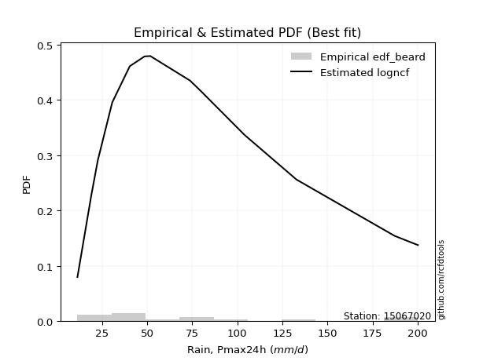</img>

</div>


### 5. EDF Chegodayev (1955)

The Chegodayev formula is an empirical plotting position formula used in hydrological frequency analysis to estimate the exceedance probability or return period of a specific event from a set of observed data. It is primarily used for plotting observed data points on probability paper to fit a theoretical distribution, particularly for analyzing extreme events like maximum flood flows or rainfall intensities. The constant _b_ value in the generalized plotting position formula is 0.3.

<div align="center">


$P=(m-b)/(n+1-2b)$


</div>


**5.1. Empirical values**

<div align="center">

|                | 0                   | 1                   | 2                   | 3                   | 4                  | 5                   | 6                   | 7              | 8                  | 9                  | 10                 | 11                 | 12                 | 13                 | 14                 |
|:---------------|:--------------------|:--------------------|:--------------------|:--------------------|:-------------------|:--------------------|:--------------------|:---------------|:-------------------|:-------------------|:-------------------|:-------------------|:-------------------|:-------------------|:-------------------|
| date           | 2025                | 2024                | 2017                | 2005                | 2016               | 2008                | 2014                | 2013           | 2015               | 2020               | 2018               | 2019               | 2007               | 2011               | 2012               |
| x              | 4.5                 | 11.4                | 19.1                | 22.7                | 30.7               | 40.4                | 40.5                | 48.6           | 51.8               | 73.9               | 79.5               | 104.1              | 132.8              | 187.2              | 200.2              |
| m              | 1                   | 2                   | 3                   | 4                   | 5                  | 6                   | 7                   | 8              | 9                  | 10                 | 11                 | 12                 | 13                 | 14                 | 15                 |
| empirical_dist | edf_chegodayev      | edf_chegodayev      | edf_chegodayev      | edf_chegodayev      | edf_chegodayev     | edf_chegodayev      | edf_chegodayev      | edf_chegodayev | edf_chegodayev     | edf_chegodayev     | edf_chegodayev     | edf_chegodayev     | edf_chegodayev     | edf_chegodayev     | edf_chegodayev     |
| empirical      | 0.04545454545454545 | 0.11038961038961038 | 0.17532467532467533 | 0.24025974025974026 | 0.3051948051948052 | 0.37012987012987014 | 0.43506493506493504 | 0.5            | 0.5649350649350648 | 0.6298701298701298 | 0.6948051948051948 | 0.7597402597402597 | 0.8246753246753246 | 0.8896103896103895 | 0.9545454545454545 |
| empirical_tr   | 1.0476190476190477  | 1.1240875912408759  | 1.2125984251968505  | 1.3162393162393162  | 1.4392523364485983 | 1.5876288659793814  | 1.7701149425287355  | 2.0            | 2.2985074626865667 | 2.701754385964912  | 3.2765957446808507 | 4.162162162162161  | 5.7037037037037    | 9.058823529411757  | 21.999999999999964 |

</div>


**5.2. Kolmogorov-Smirnov fit test (sorted by Δ)**


<div align="center">

|                | 0                    | 1                   | 2                   | 3                   | 4                   | 5                   | 6                    | 7                   | 8                   | 9                   | 10                   | 11                   | 12                 | 13                  | 14                  | 15                  | 16                  | 17                  | 18                  | 19                  | 20                 | 21                  | 22                  | 23                  | 24                 | 25                  | 26                  | 27                  | 28                  | 29                  | 30                  | 31                  | 32                  | 33                 | 34                  | 35                  | 36                  | 37                  | 38                  | 39                  | 40                  | 41                  | 42                  | 43                  | 44                  | 45                  | 46                 | 47                  | 48                  | 49                  | 50                  | 51                  | 52                  | 53                 | 54                  | 55                  | 56                  | 57                 | 58                  | 59                  | 60                  | 61                  | 62                  | 63                  | 64                  | 65                 | 66                  | 67                  | 68                  | 69                  | 70                  | 71                  | 72                  | 73                  | 74                  | 75                  | 76                 | 77                 | 78                  | 79                  | 80                  | 81                  | 82                  | 83                  | 84                  | 85                  | 86                  | 87                 | 88                 | 89                  | 90                  | 91                  | 92                  | 93                  | 94                 | 95                  | 96                  | 97                  | 98                  | 99                 | 100                 | 101                 | 102                | 103                 | 104                 | 105                 | 106                 | 107                 | 108                 | 109                 | 110                 | 111                 | 112                 | 113                 | 114                 | 115                 | 116                 | 117                 | 118                 | 119                 | 120                 | 121                 | 122                 | 123                 | 124                 | 125                | 126                 | 127                 | 128                 | 129                | 130                 | 131                | 132                 | 133                 | 134                 | 135                | 136                | 137                | 138                | 139                | 140                 | 141                | 142                 | 143                | 144                | 145                | 146                | 147                 | 148                | 149                | 150                | 151                | 152                | 153                | 154                | 155                | 156                | 157                | 158                | 159                |
|:---------------|:---------------------|:--------------------|:--------------------|:--------------------|:--------------------|:--------------------|:---------------------|:--------------------|:--------------------|:--------------------|:---------------------|:---------------------|:-------------------|:--------------------|:--------------------|:--------------------|:--------------------|:--------------------|:--------------------|:--------------------|:-------------------|:--------------------|:--------------------|:--------------------|:-------------------|:--------------------|:--------------------|:--------------------|:--------------------|:--------------------|:--------------------|:--------------------|:--------------------|:-------------------|:--------------------|:--------------------|:--------------------|:--------------------|:--------------------|:--------------------|:--------------------|:--------------------|:--------------------|:--------------------|:--------------------|:--------------------|:-------------------|:--------------------|:--------------------|:--------------------|:--------------------|:--------------------|:--------------------|:-------------------|:--------------------|:--------------------|:--------------------|:-------------------|:--------------------|:--------------------|:--------------------|:--------------------|:--------------------|:--------------------|:--------------------|:-------------------|:--------------------|:--------------------|:--------------------|:--------------------|:--------------------|:--------------------|:--------------------|:--------------------|:--------------------|:--------------------|:-------------------|:-------------------|:--------------------|:--------------------|:--------------------|:--------------------|:--------------------|:--------------------|:--------------------|:--------------------|:--------------------|:-------------------|:-------------------|:--------------------|:--------------------|:--------------------|:--------------------|:--------------------|:-------------------|:--------------------|:--------------------|:--------------------|:--------------------|:-------------------|:--------------------|:--------------------|:-------------------|:--------------------|:--------------------|:--------------------|:--------------------|:--------------------|:--------------------|:--------------------|:--------------------|:--------------------|:--------------------|:--------------------|:--------------------|:--------------------|:--------------------|:--------------------|:--------------------|:--------------------|:--------------------|:--------------------|:--------------------|:--------------------|:--------------------|:-------------------|:--------------------|:--------------------|:--------------------|:-------------------|:--------------------|:-------------------|:--------------------|:--------------------|:--------------------|:-------------------|:-------------------|:-------------------|:-------------------|:-------------------|:--------------------|:-------------------|:--------------------|:-------------------|:-------------------|:-------------------|:-------------------|:--------------------|:-------------------|:-------------------|:-------------------|:-------------------|:-------------------|:-------------------|:-------------------|:-------------------|:-------------------|:-------------------|:-------------------|:-------------------|
| station        | 15067020             | 15067020            | 15067020            | 15067020            | 15067020            | 15067020            | 15067020             | 15067020            | 15067020            | 15067020            | 15067020             | 15067020             | 15067020           | 15067020            | 15067020            | 15067020            | 15067020            | 15067020            | 15067020            | 15067020            | 15067020           | 15067020            | 15067020            | 15067020            | 15067020           | 15067020            | 15067020            | 15067020            | 15067020            | 15067020            | 15067020            | 15067020            | 15067020            | 15067020           | 15067020            | 15067020            | 15067020            | 15067020            | 15067020            | 15067020            | 15067020            | 15067020            | 15067020            | 15067020            | 15067020            | 15067020            | 15067020           | 15067020            | 15067020            | 15067020            | 15067020            | 15067020            | 15067020            | 15067020           | 15067020            | 15067020            | 15067020            | 15067020           | 15067020            | 15067020            | 15067020            | 15067020            | 15067020            | 15067020            | 15067020            | 15067020           | 15067020            | 15067020            | 15067020            | 15067020            | 15067020            | 15067020            | 15067020            | 15067020            | 15067020            | 15067020            | 15067020           | 15067020           | 15067020            | 15067020            | 15067020            | 15067020            | 15067020            | 15067020            | 15067020            | 15067020            | 15067020            | 15067020           | 15067020           | 15067020            | 15067020            | 15067020            | 15067020            | 15067020            | 15067020           | 15067020            | 15067020            | 15067020            | 15067020            | 15067020           | 15067020            | 15067020            | 15067020           | 15067020            | 15067020            | 15067020            | 15067020            | 15067020            | 15067020            | 15067020            | 15067020            | 15067020            | 15067020            | 15067020            | 15067020            | 15067020            | 15067020            | 15067020            | 15067020            | 15067020            | 15067020            | 15067020            | 15067020            | 15067020            | 15067020            | 15067020           | 15067020            | 15067020            | 15067020            | 15067020           | 15067020            | 15067020           | 15067020            | 15067020            | 15067020            | 15067020           | 15067020           | 15067020           | 15067020           | 15067020           | 15067020            | 15067020           | 15067020            | 15067020           | 15067020           | 15067020           | 15067020           | 15067020            | 15067020           | 15067020           | 15067020           | 15067020           | 15067020           | 15067020           | 15067020           | 15067020           | 15067020           | 15067020           | 15067020           | 15067020           |
| empirical_dist | edf_chegodayev       | edf_chegodayev      | edf_chegodayev      | edf_chegodayev      | edf_chegodayev      | edf_chegodayev      | edf_chegodayev       | edf_chegodayev      | edf_chegodayev      | edf_chegodayev      | edf_chegodayev       | edf_chegodayev       | edf_chegodayev     | edf_chegodayev      | edf_chegodayev      | edf_chegodayev      | edf_chegodayev      | edf_chegodayev      | edf_chegodayev      | edf_chegodayev      | edf_chegodayev     | edf_chegodayev      | edf_chegodayev      | edf_chegodayev      | edf_chegodayev     | edf_chegodayev      | edf_chegodayev      | edf_chegodayev      | edf_chegodayev      | edf_chegodayev      | edf_chegodayev      | edf_chegodayev      | edf_chegodayev      | edf_chegodayev     | edf_chegodayev      | edf_chegodayev      | edf_chegodayev      | edf_chegodayev      | edf_chegodayev      | edf_chegodayev      | edf_chegodayev      | edf_chegodayev      | edf_chegodayev      | edf_chegodayev      | edf_chegodayev      | edf_chegodayev      | edf_chegodayev     | edf_chegodayev      | edf_chegodayev      | edf_chegodayev      | edf_chegodayev      | edf_chegodayev      | edf_chegodayev      | edf_chegodayev     | edf_chegodayev      | edf_chegodayev      | edf_chegodayev      | edf_chegodayev     | edf_chegodayev      | edf_chegodayev      | edf_chegodayev      | edf_chegodayev      | edf_chegodayev      | edf_chegodayev      | edf_chegodayev      | edf_chegodayev     | edf_chegodayev      | edf_chegodayev      | edf_chegodayev      | edf_chegodayev      | edf_chegodayev      | edf_chegodayev      | edf_chegodayev      | edf_chegodayev      | edf_chegodayev      | edf_chegodayev      | edf_chegodayev     | edf_chegodayev     | edf_chegodayev      | edf_chegodayev      | edf_chegodayev      | edf_chegodayev      | edf_chegodayev      | edf_chegodayev      | edf_chegodayev      | edf_chegodayev      | edf_chegodayev      | edf_chegodayev     | edf_chegodayev     | edf_chegodayev      | edf_chegodayev      | edf_chegodayev      | edf_chegodayev      | edf_chegodayev      | edf_chegodayev     | edf_chegodayev      | edf_chegodayev      | edf_chegodayev      | edf_chegodayev      | edf_chegodayev     | edf_chegodayev      | edf_chegodayev      | edf_chegodayev     | edf_chegodayev      | edf_chegodayev      | edf_chegodayev      | edf_chegodayev      | edf_chegodayev      | edf_chegodayev      | edf_chegodayev      | edf_chegodayev      | edf_chegodayev      | edf_chegodayev      | edf_chegodayev      | edf_chegodayev      | edf_chegodayev      | edf_chegodayev      | edf_chegodayev      | edf_chegodayev      | edf_chegodayev      | edf_chegodayev      | edf_chegodayev      | edf_chegodayev      | edf_chegodayev      | edf_chegodayev      | edf_chegodayev     | edf_chegodayev      | edf_chegodayev      | edf_chegodayev      | edf_chegodayev     | edf_chegodayev      | edf_chegodayev     | edf_chegodayev      | edf_chegodayev      | edf_chegodayev      | edf_chegodayev     | edf_chegodayev     | edf_chegodayev     | edf_chegodayev     | edf_chegodayev     | edf_chegodayev      | edf_chegodayev     | edf_chegodayev      | edf_chegodayev     | edf_chegodayev     | edf_chegodayev     | edf_chegodayev     | edf_chegodayev      | edf_chegodayev     | edf_chegodayev     | edf_chegodayev     | edf_chegodayev     | edf_chegodayev     | edf_chegodayev     | edf_chegodayev     | edf_chegodayev     | edf_chegodayev     | edf_chegodayev     | edf_chegodayev     | edf_chegodayev     |
| p_dist         | invgamma             | johnsonsu           | invgauss            | invweibull          | genextreme          | alpha               | nct                  | logpearson3         | lomax               | exponnorm           | loggompertz          | betaprime            | logburr12          | logweibull_min      | loggenlogistic      | weibull_min         | burr12              | logloggamma         | kappa3              | loglogistic         | genexpon           | ncf                 | logjohnsonsu        | logfoldnorm         | loggennorm         | logargus            | logrice             | logexponnorm        | logcrystalball      | lognorm             | logt                | lognct              | logjohnsonsb        | logfatiguelife     | logloglaplace       | logmielke           | logf                | bradford            | logalpha            | logdgamma           | loggumbel_l         | logdweibull         | loganglit           | loghypsecant        | logerlang           | logsemicircular     | exponpow           | loggenhalflogistic  | halflogistic        | loggenextreme       | loggamma            | loggamma            | genpareto           | loginvgamma        | lognakagami         | burr                | logtriang           | foldnorm           | halfnorm            | logncf              | loginvgauss         | moyal               | vonmises_line       | loglaplace          | loglaplace          | logmaxwell         | logarcsine          | mielke              | dgamma              | logskewnorm         | logbetaprime        | t                   | tukeylambda         | pearson3            | f                   | logcosine           | genlogistic        | lograyleigh        | logburr             | gumbel_r            | gennorm             | loginvweibull       | dweibull            | gengamma            | gamma               | loggausshyper       | rayleigh            | loggumbel_r        | kstwobign          | maxwell             | erlang              | skewnorm            | gompertz            | logkstwobign        | loghalfnorm        | semicircular        | logbeta             | halfgennorm         | anglit              | logweibull_max     | arcsine             | nakagami            | logmoyal           | loggenexpon         | wald                | triang              | loghalflogistic     | norm                | crystalball         | logtrapezoid        | loggenpareto        | rice                | logistic            | truncweibull_min    | logwrapcauchy       | logbradford         | logkappa3           | loguniform          | hypsecant           | gausshyper          | logvonmises_line    | logtruncweibull_min | logksone            | logkappa4           | cosine              | laplace            | exponweib           | logwald             | gumbel_l            | truncexpon         | wrapcauchy          | loglevy_l          | logtruncexpon       | kappa4              | loglomax            | ksone              | beta               | argus              | logtruncnorm       | uniform            | logtukeylambda      | powerlaw           | loggengamma         | levy_l             | genhalflogistic    | logrdist           | logexponweib       | johnsonsb           | rdist              | fatiguelife        | trapezoid          | logpowerlaw        | logexponpow        | weibull_max        | truncpareto        | logtruncpareto     | loghalfgennorm     | truncnorm          | logvonmises        | vonmises           |
| delta          | 0.048720433555136555 | 0.04964863118123125 | 0.05096108120985304 | 0.05190493235103755 | 0.05190513996420809 | 0.05200892246132427 | 0.053113118849808516 | 0.05314252534105024 | 0.05318364840952072 | 0.05487521422303293 | 0.058360836097141044 | 0.058814810881121615 | 0.0650457884776684 | 0.06578141664216397 | 0.06703525278973155 | 0.06708055650332662 | 0.06718310035561093 | 0.06935192833670267 | 0.06979709122481775 | 0.07241713301714375 | 0.0737147552380617 | 0.07419731434269633 | 0.07470661959051778 | 0.07527786993491287 | 0.0770164595815434 | 0.07859316597349109 | 0.07922455026863207 | 0.07923444388979883 | 0.07923579441707951 | 0.07923582415933017 | 0.07923628932021393 | 0.07926187974115684 | 0.07931688133633014 | 0.0800527428987628 | 0.08029918996779062 | 0.08157057078077412 | 0.08253765315200245 | 0.08261252831130983 | 0.08301053195908531 | 0.08470944601363661 | 0.08488371853993082 | 0.08557332194181033 | 0.08642068735029401 | 0.08668940083612753 | 0.08739208954407196 | 0.08938919289366015 | 0.0898328292815136 | 0.09083206423185108 | 0.09110082399504082 | 0.09511572843120275 | 0.09550010784273227 | 0.09550010784273227 | 0.09553755354434046 | 0.0970620323217391 | 0.09878675511928531 | 0.10116889977912519 | 0.10148040137280073 | 0.1024897255060207 | 0.10397836504632096 | 0.10508783316657311 | 0.10566926587118619 | 0.10755166063422172 | 0.11249271170410069 | 0.11327718104545614 | 0.11327718104545614 | 0.1135636911489436 | 0.11391440135985115 | 0.11531066515289928 | 0.11592141003844192 | 0.11614044173054971 | 0.11639858785078439 | 0.11666024631735528 | 0.11976870688052929 | 0.12186094679106163 | 0.12369829651384256 | 0.12505601315957232 | 0.1251783542449202 | 0.1254672760842766 | 0.12783004995613761 | 0.12881196371467118 | 0.13029549678408556 | 0.13051722473914223 | 0.13232508719353003 | 0.13332142361124383 | 0.13433201953749901 | 0.13447086379173695 | 0.13889524939411213 | 0.1462020388456125 | 0.1504447890967177 | 0.15118378991625048 | 0.15603480548796517 | 0.15647784146472699 | 0.15668809900978142 | 0.15897805958357097 | 0.1590696909072094 | 0.16152032000744337 | 0.16327713321372467 | 0.16389502374848314 | 0.16831122609554106 | 0.1686707443773583 | 0.16947654086758507 | 0.16955702716001397 | 0.1715420910632261 | 0.17188080951308343 | 0.17318700480241683 | 0.17645129040273877 | 0.18010095327907177 | 0.18460483728616955 | 0.18460483951726736 | 0.18518401759612402 | 0.18552020545975384 | 0.19302974815971136 | 0.19965232745100148 | 0.20505084998426476 | 0.20509476963591017 | 0.20777161210315948 | 0.20811582062964967 | 0.20816101387861613 | 0.21174213558329646 | 0.22048172183928794 | 0.22352227871583447 | 0.22363047721397694 | 0.22542625217792533 | 0.22587035147598994 | 0.23180565734734493 | 0.2399369428941141 | 0.24072622785667513 | 0.24195745873735214 | 0.24887800445012814 | 0.2516224403885529 | 0.25900834708553566 | 0.2708399319490153 | 0.28360947006788023 | 0.28770276203989675 | 0.28914830739105324 | 0.2921054843640433 | 0.2930534216143984 | 0.295773200403872  | 0.3165478639959047 | 0.3232385907398681 | 0.32560153686123766 | 0.3457234477719435 | 0.39846167838721824 | 0.4032742425650497 | 0.4188526378796815 | 0.4476496604806437 | 0.4607297268609698 | 0.47707764101500827 | 0.5104254882285474 | 0.5275032262862106 | 0.5300436646753515 | 0.5452979527013854 | 0.6666962281655191 | 0.7001878905873523 | 0.7685645219533326 | 0.8373513441660503 | 0.8896103896103895 | 0.911888969203366  | 1.0285094789419191 | 31.771000026623568 |
| deltao         | 0.3366456264050002   | 0.3366456264050002  | 0.3366456264050002  | 0.3366456264050002  | 0.3366456264050002  | 0.3366456264050002  | 0.3366456264050002   | 0.3366456264050002  | 0.3366456264050002  | 0.3366456264050002  | 0.3366456264050002   | 0.3366456264050002   | 0.3366456264050002 | 0.3366456264050002  | 0.3366456264050002  | 0.3366456264050002  | 0.3366456264050002  | 0.3366456264050002  | 0.3366456264050002  | 0.3366456264050002  | 0.3366456264050002 | 0.3366456264050002  | 0.3366456264050002  | 0.3366456264050002  | 0.3366456264050002 | 0.3366456264050002  | 0.3366456264050002  | 0.3366456264050002  | 0.3366456264050002  | 0.3366456264050002  | 0.3366456264050002  | 0.3366456264050002  | 0.3366456264050002  | 0.3366456264050002 | 0.3366456264050002  | 0.3366456264050002  | 0.3366456264050002  | 0.3366456264050002  | 0.3366456264050002  | 0.3366456264050002  | 0.3366456264050002  | 0.3366456264050002  | 0.3366456264050002  | 0.3366456264050002  | 0.3366456264050002  | 0.3366456264050002  | 0.3366456264050002 | 0.3366456264050002  | 0.3366456264050002  | 0.3366456264050002  | 0.3366456264050002  | 0.3366456264050002  | 0.3366456264050002  | 0.3366456264050002 | 0.3366456264050002  | 0.3366456264050002  | 0.3366456264050002  | 0.3366456264050002 | 0.3366456264050002  | 0.3366456264050002  | 0.3366456264050002  | 0.3366456264050002  | 0.3366456264050002  | 0.3366456264050002  | 0.3366456264050002  | 0.3366456264050002 | 0.3366456264050002  | 0.3366456264050002  | 0.3366456264050002  | 0.3366456264050002  | 0.3366456264050002  | 0.3366456264050002  | 0.3366456264050002  | 0.3366456264050002  | 0.3366456264050002  | 0.3366456264050002  | 0.3366456264050002 | 0.3366456264050002 | 0.3366456264050002  | 0.3366456264050002  | 0.3366456264050002  | 0.3366456264050002  | 0.3366456264050002  | 0.3366456264050002  | 0.3366456264050002  | 0.3366456264050002  | 0.3366456264050002  | 0.3366456264050002 | 0.3366456264050002 | 0.3366456264050002  | 0.3366456264050002  | 0.3366456264050002  | 0.3366456264050002  | 0.3366456264050002  | 0.3366456264050002 | 0.3366456264050002  | 0.3366456264050002  | 0.3366456264050002  | 0.3366456264050002  | 0.3366456264050002 | 0.3366456264050002  | 0.3366456264050002  | 0.3366456264050002 | 0.3366456264050002  | 0.3366456264050002  | 0.3366456264050002  | 0.3366456264050002  | 0.3366456264050002  | 0.3366456264050002  | 0.3366456264050002  | 0.3366456264050002  | 0.3366456264050002  | 0.3366456264050002  | 0.3366456264050002  | 0.3366456264050002  | 0.3366456264050002  | 0.3366456264050002  | 0.3366456264050002  | 0.3366456264050002  | 0.3366456264050002  | 0.3366456264050002  | 0.3366456264050002  | 0.3366456264050002  | 0.3366456264050002  | 0.3366456264050002  | 0.3366456264050002 | 0.3366456264050002  | 0.3366456264050002  | 0.3366456264050002  | 0.3366456264050002 | 0.3366456264050002  | 0.3366456264050002 | 0.3366456264050002  | 0.3366456264050002  | 0.3366456264050002  | 0.3366456264050002 | 0.3366456264050002 | 0.3366456264050002 | 0.3366456264050002 | 0.3366456264050002 | 0.3366456264050002  | 0.3366456264050002 | 0.3366456264050002  | 0.3366456264050002 | 0.3366456264050002 | 0.3366456264050002 | 0.3366456264050002 | 0.3366456264050002  | 0.3366456264050002 | 0.3366456264050002 | 0.3366456264050002 | 0.3366456264050002 | 0.3366456264050002 | 0.3366456264050002 | 0.3366456264050002 | 0.3366456264050002 | 0.3366456264050002 | 0.3366456264050002 | 0.3366456264050002 | 0.3366456264050002 |
| eval           | Δo > Δ               | Δo > Δ              | Δo > Δ              | Δo > Δ              | Δo > Δ              | Δo > Δ              | Δo > Δ               | Δo > Δ              | Δo > Δ              | Δo > Δ              | Δo > Δ               | Δo > Δ               | Δo > Δ             | Δo > Δ              | Δo > Δ              | Δo > Δ              | Δo > Δ              | Δo > Δ              | Δo > Δ              | Δo > Δ              | Δo > Δ             | Δo > Δ              | Δo > Δ              | Δo > Δ              | Δo > Δ             | Δo > Δ              | Δo > Δ              | Δo > Δ              | Δo > Δ              | Δo > Δ              | Δo > Δ              | Δo > Δ              | Δo > Δ              | Δo > Δ             | Δo > Δ              | Δo > Δ              | Δo > Δ              | Δo > Δ              | Δo > Δ              | Δo > Δ              | Δo > Δ              | Δo > Δ              | Δo > Δ              | Δo > Δ              | Δo > Δ              | Δo > Δ              | Δo > Δ             | Δo > Δ              | Δo > Δ              | Δo > Δ              | Δo > Δ              | Δo > Δ              | Δo > Δ              | Δo > Δ             | Δo > Δ              | Δo > Δ              | Δo > Δ              | Δo > Δ             | Δo > Δ              | Δo > Δ              | Δo > Δ              | Δo > Δ              | Δo > Δ              | Δo > Δ              | Δo > Δ              | Δo > Δ             | Δo > Δ              | Δo > Δ              | Δo > Δ              | Δo > Δ              | Δo > Δ              | Δo > Δ              | Δo > Δ              | Δo > Δ              | Δo > Δ              | Δo > Δ              | Δo > Δ             | Δo > Δ             | Δo > Δ              | Δo > Δ              | Δo > Δ              | Δo > Δ              | Δo > Δ              | Δo > Δ              | Δo > Δ              | Δo > Δ              | Δo > Δ              | Δo > Δ             | Δo > Δ             | Δo > Δ              | Δo > Δ              | Δo > Δ              | Δo > Δ              | Δo > Δ              | Δo > Δ             | Δo > Δ              | Δo > Δ              | Δo > Δ              | Δo > Δ              | Δo > Δ             | Δo > Δ              | Δo > Δ              | Δo > Δ             | Δo > Δ              | Δo > Δ              | Δo > Δ              | Δo > Δ              | Δo > Δ              | Δo > Δ              | Δo > Δ              | Δo > Δ              | Δo > Δ              | Δo > Δ              | Δo > Δ              | Δo > Δ              | Δo > Δ              | Δo > Δ              | Δo > Δ              | Δo > Δ              | Δo > Δ              | Δo > Δ              | Δo > Δ              | Δo > Δ              | Δo > Δ              | Δo > Δ              | Δo > Δ             | Δo > Δ              | Δo > Δ              | Δo > Δ              | Δo > Δ             | Δo > Δ              | Δo > Δ             | Δo > Δ              | Δo > Δ              | Δo > Δ              | Δo > Δ             | Δo > Δ             | Δo > Δ             | Δo > Δ             | Δo > Δ             | Δo > Δ              | Δo <= Δ            | Δo <= Δ             | Δo <= Δ            | Δo <= Δ            | Δo <= Δ            | Δo <= Δ            | Δo <= Δ             | Δo <= Δ            | Δo <= Δ            | Δo <= Δ            | Δo <= Δ            | Δo <= Δ            | Δo <= Δ            | Δo <= Δ            | Δo <= Δ            | Δo <= Δ            | Δo <= Δ            | Δo <= Δ            | Δo <= Δ            |
| fit            | 1                    | 1                   | 1                   | 1                   | 1                   | 1                   | 1                    | 1                   | 1                   | 1                   | 1                    | 1                    | 1                  | 1                   | 1                   | 1                   | 1                   | 1                   | 1                   | 1                   | 1                  | 1                   | 1                   | 1                   | 1                  | 1                   | 1                   | 1                   | 1                   | 1                   | 1                   | 1                   | 1                   | 1                  | 1                   | 1                   | 1                   | 1                   | 1                   | 1                   | 1                   | 1                   | 1                   | 1                   | 1                   | 1                   | 1                  | 1                   | 1                   | 1                   | 1                   | 1                   | 1                   | 1                  | 1                   | 1                   | 1                   | 1                  | 1                   | 1                   | 1                   | 1                   | 1                   | 1                   | 1                   | 1                  | 1                   | 1                   | 1                   | 1                   | 1                   | 1                   | 1                   | 1                   | 1                   | 1                   | 1                  | 1                  | 1                   | 1                   | 1                   | 1                   | 1                   | 1                   | 1                   | 1                   | 1                   | 1                  | 1                  | 1                   | 1                   | 1                   | 1                   | 1                   | 1                  | 1                   | 1                   | 1                   | 1                   | 1                  | 1                   | 1                   | 1                  | 1                   | 1                   | 1                   | 1                   | 1                   | 1                   | 1                   | 1                   | 1                   | 1                   | 1                   | 1                   | 1                   | 1                   | 1                   | 1                   | 1                   | 1                   | 1                   | 1                   | 1                   | 1                   | 1                  | 1                   | 1                   | 1                   | 1                  | 1                   | 1                  | 1                   | 1                   | 1                   | 1                  | 1                  | 1                  | 1                  | 1                  | 1                   | 0                  | 0                   | 0                  | 0                  | 0                  | 0                  | 0                   | 0                  | 0                  | 0                  | 0                  | 0                  | 0                  | 0                  | 0                  | 0                  | 0                  | 0                  | 0                  |
| n              | 15                   | 15                  | 15                  | 15                  | 15                  | 15                  | 15                   | 15                  | 15                  | 15                  | 15                   | 15                   | 15                 | 15                  | 15                  | 15                  | 15                  | 15                  | 15                  | 15                  | 15                 | 15                  | 15                  | 15                  | 15                 | 15                  | 15                  | 15                  | 15                  | 15                  | 15                  | 15                  | 15                  | 15                 | 15                  | 15                  | 15                  | 15                  | 15                  | 15                  | 15                  | 15                  | 15                  | 15                  | 15                  | 15                  | 15                 | 15                  | 15                  | 15                  | 15                  | 15                  | 15                  | 15                 | 15                  | 15                  | 15                  | 15                 | 15                  | 15                  | 15                  | 15                  | 15                  | 15                  | 15                  | 15                 | 15                  | 15                  | 15                  | 15                  | 15                  | 15                  | 15                  | 15                  | 15                  | 15                  | 15                 | 15                 | 15                  | 15                  | 15                  | 15                  | 15                  | 15                  | 15                  | 15                  | 15                  | 15                 | 15                 | 15                  | 15                  | 15                  | 15                  | 15                  | 15                 | 15                  | 15                  | 15                  | 15                  | 15                 | 15                  | 15                  | 15                 | 15                  | 15                  | 15                  | 15                  | 15                  | 15                  | 15                  | 15                  | 15                  | 15                  | 15                  | 15                  | 15                  | 15                  | 15                  | 15                  | 15                  | 15                  | 15                  | 15                  | 15                  | 15                  | 15                 | 15                  | 15                  | 15                  | 15                 | 15                  | 15                 | 15                  | 15                  | 15                  | 15                 | 15                 | 15                 | 15                 | 15                 | 15                  | 15                 | 15                  | 15                 | 15                 | 15                 | 15                 | 15                  | 15                 | 15                 | 15                 | 15                 | 15                 | 15                 | 15                 | 15                 | 15                 | 15                 | 15                 | 15                 |
| best_fit       | 1                    | 0                   | 0                   | 0                   | 0                   | 0                   | 0                    | 0                   | 0                   | 0                   | 0                    | 0                    | 0                  | 0                   | 0                   | 0                   | 0                   | 0                   | 0                   | 0                   | 0                  | 0                   | 0                   | 0                   | 0                  | 0                   | 0                   | 0                   | 0                   | 0                   | 0                   | 0                   | 0                   | 0                  | 0                   | 0                   | 0                   | 0                   | 0                   | 0                   | 0                   | 0                   | 0                   | 0                   | 0                   | 0                   | 0                  | 0                   | 0                   | 0                   | 0                   | 0                   | 0                   | 0                  | 0                   | 0                   | 0                   | 0                  | 0                   | 0                   | 0                   | 0                   | 0                   | 0                   | 0                   | 0                  | 0                   | 0                   | 0                   | 0                   | 0                   | 0                   | 0                   | 0                   | 0                   | 0                   | 0                  | 0                  | 0                   | 0                   | 0                   | 0                   | 0                   | 0                   | 0                   | 0                   | 0                   | 0                  | 0                  | 0                   | 0                   | 0                   | 0                   | 0                   | 0                  | 0                   | 0                   | 0                   | 0                   | 0                  | 0                   | 0                   | 0                  | 0                   | 0                   | 0                   | 0                   | 0                   | 0                   | 0                   | 0                   | 0                   | 0                   | 0                   | 0                   | 0                   | 0                   | 0                   | 0                   | 0                   | 0                   | 0                   | 0                   | 0                   | 0                   | 0                  | 0                   | 0                   | 0                   | 0                  | 0                   | 0                  | 0                   | 0                   | 0                   | 0                  | 0                  | 0                  | 0                  | 0                  | 0                   | 0                  | 0                   | 0                  | 0                  | 0                  | 0                  | 0                   | 0                  | 0                  | 0                  | 0                  | 0                  | 0                  | 0                  | 0                  | 0                  | 0                  | 0                  | 0                  |
| best_fit_sort  | 1                    | 2                   | 3                   | 4                   | 5                   | 6                   | 7                    | 8                   | 9                   | 10                  | 11                   | 12                   | 13                 | 14                  | 15                  | 16                  | 17                  | 18                  | 19                  | 20                  | 21                 | 22                  | 23                  | 24                  | 25                 | 26                  | 27                  | 28                  | 29                  | 30                  | 31                  | 32                  | 33                  | 34                 | 35                  | 36                  | 37                  | 38                  | 39                  | 40                  | 41                  | 42                  | 43                  | 44                  | 45                  | 46                  | 47                 | 48                  | 49                  | 50                  | 51                  | 52                  | 53                  | 54                 | 55                  | 56                  | 57                  | 58                 | 59                  | 60                  | 61                  | 62                  | 63                  | 64                  | 65                  | 66                 | 67                  | 68                  | 69                  | 70                  | 71                  | 72                  | 73                  | 74                  | 75                  | 76                  | 77                 | 78                 | 79                  | 80                  | 81                  | 82                  | 83                  | 84                  | 85                  | 86                  | 87                  | 88                 | 89                 | 90                  | 91                  | 92                  | 93                  | 94                  | 95                 | 96                  | 97                  | 98                  | 99                  | 100                | 101                 | 102                 | 103                | 104                 | 105                 | 106                 | 107                 | 108                 | 109                 | 110                 | 111                 | 112                 | 113                 | 114                 | 115                 | 116                 | 117                 | 118                 | 119                 | 120                 | 121                 | 122                 | 123                 | 124                 | 125                 | 126                | 127                 | 128                 | 129                 | 130                | 131                 | 132                | 133                 | 134                 | 135                 | 136                | 137                | 138                | 139                | 140                | 141                 | 142                | 143                 | 144                | 145                | 146                | 147                | 148                 | 149                | 150                | 151                | 152                | 153                | 154                | 155                | 156                | 157                | 158                | 159                | 160                |

</div>


**5.3. Best fit**

<div align="center">

|   id |   station | empirical_dist   | p_dist   |     delta |   deltao | eval   |   fit |   n |   best_fit |   best_fit_sort |
|-----:|----------:|:-----------------|:---------|----------:|---------:|:-------|------:|----:|-----------:|----------------:|
|    0 |  15067020 | edf_chegodayev   | invgamma | 0.0487204 | 0.336646 | Δo > Δ |     1 |  15 |          1 |               1 |

</div>


<div align="center">

</img>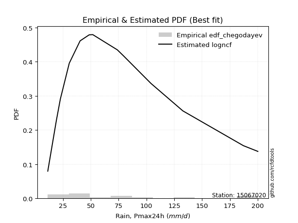</img>

</div>


### 6. EDF Blom (1958)

The Blom formula is a specific "plotting position" formula used in hydrology and statistical analysis to estimate the empirical cumulative probability (or non-exceedance probability) of a data series. It is particularly recommended for data that are approximately normally distributed. The constant _a_ is set to 0.375 (or 3/8).

<div align="center">


$P=(m-a)/(n+1-2a)$


</div>


**6.1. Empirical values**

<div align="center">

|                | 0                    | 1                   | 2                  | 3                   | 4                   | 5                   | 6                  | 7        | 8                  | 9                  | 10                 | 11                 | 12                 | 13                 | 14                 |
|:---------------|:---------------------|:--------------------|:-------------------|:--------------------|:--------------------|:--------------------|:-------------------|:---------|:-------------------|:-------------------|:-------------------|:-------------------|:-------------------|:-------------------|:-------------------|
| date           | 2025                 | 2024                | 2017               | 2005                | 2016                | 2008                | 2014               | 2013     | 2015               | 2020               | 2018               | 2019               | 2007               | 2011               | 2012               |
| x              | 4.5                  | 11.4                | 19.1               | 22.7                | 30.7                | 40.4                | 40.5               | 48.6     | 51.8               | 73.9               | 79.5               | 104.1              | 132.8              | 187.2              | 200.2              |
| m              | 1                    | 2                   | 3                  | 4                   | 5                   | 6                   | 7                  | 8        | 9                  | 10                 | 11                 | 12                 | 13                 | 14                 | 15                 |
| empirical_dist | edf_blom             | edf_blom            | edf_blom           | edf_blom            | edf_blom            | edf_blom            | edf_blom           | edf_blom | edf_blom           | edf_blom           | edf_blom           | edf_blom           | edf_blom           | edf_blom           | edf_blom           |
| empirical      | 0.040983606557377046 | 0.10655737704918032 | 0.1721311475409836 | 0.23770491803278687 | 0.30327868852459017 | 0.36885245901639346 | 0.4344262295081967 | 0.5      | 0.5655737704918032 | 0.6311475409836066 | 0.6967213114754098 | 0.7622950819672131 | 0.8278688524590164 | 0.8934426229508197 | 0.9590163934426229 |
| empirical_tr   | 1.0427350427350428   | 1.1192660550458715  | 1.2079207920792079 | 1.3118279569892473  | 1.4352941176470588  | 1.5844155844155845  | 1.7681159420289854 | 2.0      | 2.30188679245283   | 2.7111111111111112 | 3.2972972972972974 | 4.206896551724137  | 5.80952380952381   | 9.384615384615383  | 24.399999999999974 |

</div>


**6.2. Kolmogorov-Smirnov fit test (sorted by Δ)**


<div align="center">

|                | 0                    | 1                   | 2                  | 3                   | 4                    | 5                   | 6                    | 7                    | 8                   | 9                   | 10                  | 11                  | 12                  | 13                  | 14                  | 15                  | 16                 | 17                  | 18                  | 19                  | 20                 | 21                  | 22                  | 23                  | 24                  | 25                  | 26                  | 27                  | 28                  | 29                  | 30                  | 31                  | 32                 | 33                  | 34                  | 35                  | 36                  | 37                  | 38                  | 39                  | 40                  | 41                  | 42                  | 43                  | 44                  | 45                  | 46                  | 47                  | 48                  | 49                  | 50                  | 51                  | 52                  | 53                  | 54                  | 55                  | 56                  | 57                 | 58                  | 59                  | 60                  | 61                  | 62                  | 63                  | 64                  | 65                  | 66                  | 67                  | 68                  | 69                  | 70                  | 71                  | 72                  | 73                 | 74                  | 75                 | 76                  | 77                 | 78                 | 79                  | 80                 | 81                  | 82                 | 83                  | 84                 | 85                  | 86                  | 87                  | 88                 | 89                  | 90                  | 91                  | 92                  | 93                  | 94                  | 95                  | 96                  | 97                  | 98                  | 99                  | 100                 | 101                | 102                 | 103                | 104                 | 105                 | 106                 | 107                 | 108                 | 109                | 110                 | 111                 | 112                 | 113                 | 114                | 115                 | 116                 | 117                | 118                 | 119                 | 120                 | 121                 | 122                 | 123                 | 124                 | 125                | 126                | 127                 | 128                 | 129                | 130                 | 131                | 132                | 133                 | 134                | 135                | 136                | 137                | 138                 | 139                | 140                 | 141                | 142                | 143                | 144                | 145                 | 146                 | 147                | 148                | 149                | 150                | 151                | 152                | 153                | 154                | 155                | 156                | 157                | 158                | 159                |
|:---------------|:---------------------|:--------------------|:-------------------|:--------------------|:---------------------|:--------------------|:---------------------|:---------------------|:--------------------|:--------------------|:--------------------|:--------------------|:--------------------|:--------------------|:--------------------|:--------------------|:-------------------|:--------------------|:--------------------|:--------------------|:-------------------|:--------------------|:--------------------|:--------------------|:--------------------|:--------------------|:--------------------|:--------------------|:--------------------|:--------------------|:--------------------|:--------------------|:-------------------|:--------------------|:--------------------|:--------------------|:--------------------|:--------------------|:--------------------|:--------------------|:--------------------|:--------------------|:--------------------|:--------------------|:--------------------|:--------------------|:--------------------|:--------------------|:--------------------|:--------------------|:--------------------|:--------------------|:--------------------|:--------------------|:--------------------|:--------------------|:--------------------|:-------------------|:--------------------|:--------------------|:--------------------|:--------------------|:--------------------|:--------------------|:--------------------|:--------------------|:--------------------|:--------------------|:--------------------|:--------------------|:--------------------|:--------------------|:--------------------|:-------------------|:--------------------|:-------------------|:--------------------|:-------------------|:-------------------|:--------------------|:-------------------|:--------------------|:-------------------|:--------------------|:-------------------|:--------------------|:--------------------|:--------------------|:-------------------|:--------------------|:--------------------|:--------------------|:--------------------|:--------------------|:--------------------|:--------------------|:--------------------|:--------------------|:--------------------|:--------------------|:--------------------|:-------------------|:--------------------|:-------------------|:--------------------|:--------------------|:--------------------|:--------------------|:--------------------|:-------------------|:--------------------|:--------------------|:--------------------|:--------------------|:-------------------|:--------------------|:--------------------|:-------------------|:--------------------|:--------------------|:--------------------|:--------------------|:--------------------|:--------------------|:--------------------|:-------------------|:-------------------|:--------------------|:--------------------|:-------------------|:--------------------|:-------------------|:-------------------|:--------------------|:-------------------|:-------------------|:-------------------|:-------------------|:--------------------|:-------------------|:--------------------|:-------------------|:-------------------|:-------------------|:-------------------|:--------------------|:--------------------|:-------------------|:-------------------|:-------------------|:-------------------|:-------------------|:-------------------|:-------------------|:-------------------|:-------------------|:-------------------|:-------------------|:-------------------|:-------------------|
| station        | 15067020             | 15067020            | 15067020           | 15067020            | 15067020             | 15067020            | 15067020             | 15067020             | 15067020            | 15067020            | 15067020            | 15067020            | 15067020            | 15067020            | 15067020            | 15067020            | 15067020           | 15067020            | 15067020            | 15067020            | 15067020           | 15067020            | 15067020            | 15067020            | 15067020            | 15067020            | 15067020            | 15067020            | 15067020            | 15067020            | 15067020            | 15067020            | 15067020           | 15067020            | 15067020            | 15067020            | 15067020            | 15067020            | 15067020            | 15067020            | 15067020            | 15067020            | 15067020            | 15067020            | 15067020            | 15067020            | 15067020            | 15067020            | 15067020            | 15067020            | 15067020            | 15067020            | 15067020            | 15067020            | 15067020            | 15067020            | 15067020            | 15067020           | 15067020            | 15067020            | 15067020            | 15067020            | 15067020            | 15067020            | 15067020            | 15067020            | 15067020            | 15067020            | 15067020            | 15067020            | 15067020            | 15067020            | 15067020            | 15067020           | 15067020            | 15067020           | 15067020            | 15067020           | 15067020           | 15067020            | 15067020           | 15067020            | 15067020           | 15067020            | 15067020           | 15067020            | 15067020            | 15067020            | 15067020           | 15067020            | 15067020            | 15067020            | 15067020            | 15067020            | 15067020            | 15067020            | 15067020            | 15067020            | 15067020            | 15067020            | 15067020            | 15067020           | 15067020            | 15067020           | 15067020            | 15067020            | 15067020            | 15067020            | 15067020            | 15067020           | 15067020            | 15067020            | 15067020            | 15067020            | 15067020           | 15067020            | 15067020            | 15067020           | 15067020            | 15067020            | 15067020            | 15067020            | 15067020            | 15067020            | 15067020            | 15067020           | 15067020           | 15067020            | 15067020            | 15067020           | 15067020            | 15067020           | 15067020           | 15067020            | 15067020           | 15067020           | 15067020           | 15067020           | 15067020            | 15067020           | 15067020            | 15067020           | 15067020           | 15067020           | 15067020           | 15067020            | 15067020            | 15067020           | 15067020           | 15067020           | 15067020           | 15067020           | 15067020           | 15067020           | 15067020           | 15067020           | 15067020           | 15067020           | 15067020           | 15067020           |
| empirical_dist | edf_blom             | edf_blom            | edf_blom           | edf_blom            | edf_blom             | edf_blom            | edf_blom             | edf_blom             | edf_blom            | edf_blom            | edf_blom            | edf_blom            | edf_blom            | edf_blom            | edf_blom            | edf_blom            | edf_blom           | edf_blom            | edf_blom            | edf_blom            | edf_blom           | edf_blom            | edf_blom            | edf_blom            | edf_blom            | edf_blom            | edf_blom            | edf_blom            | edf_blom            | edf_blom            | edf_blom            | edf_blom            | edf_blom           | edf_blom            | edf_blom            | edf_blom            | edf_blom            | edf_blom            | edf_blom            | edf_blom            | edf_blom            | edf_blom            | edf_blom            | edf_blom            | edf_blom            | edf_blom            | edf_blom            | edf_blom            | edf_blom            | edf_blom            | edf_blom            | edf_blom            | edf_blom            | edf_blom            | edf_blom            | edf_blom            | edf_blom            | edf_blom           | edf_blom            | edf_blom            | edf_blom            | edf_blom            | edf_blom            | edf_blom            | edf_blom            | edf_blom            | edf_blom            | edf_blom            | edf_blom            | edf_blom            | edf_blom            | edf_blom            | edf_blom            | edf_blom           | edf_blom            | edf_blom           | edf_blom            | edf_blom           | edf_blom           | edf_blom            | edf_blom           | edf_blom            | edf_blom           | edf_blom            | edf_blom           | edf_blom            | edf_blom            | edf_blom            | edf_blom           | edf_blom            | edf_blom            | edf_blom            | edf_blom            | edf_blom            | edf_blom            | edf_blom            | edf_blom            | edf_blom            | edf_blom            | edf_blom            | edf_blom            | edf_blom           | edf_blom            | edf_blom           | edf_blom            | edf_blom            | edf_blom            | edf_blom            | edf_blom            | edf_blom           | edf_blom            | edf_blom            | edf_blom            | edf_blom            | edf_blom           | edf_blom            | edf_blom            | edf_blom           | edf_blom            | edf_blom            | edf_blom            | edf_blom            | edf_blom            | edf_blom            | edf_blom            | edf_blom           | edf_blom           | edf_blom            | edf_blom            | edf_blom           | edf_blom            | edf_blom           | edf_blom           | edf_blom            | edf_blom           | edf_blom           | edf_blom           | edf_blom           | edf_blom            | edf_blom           | edf_blom            | edf_blom           | edf_blom           | edf_blom           | edf_blom           | edf_blom            | edf_blom            | edf_blom           | edf_blom           | edf_blom           | edf_blom           | edf_blom           | edf_blom           | edf_blom           | edf_blom           | edf_blom           | edf_blom           | edf_blom           | edf_blom           | edf_blom           |
| p_dist         | invgamma             | invweibull          | genextreme         | johnsonsu           | nct                  | invgauss            | alpha                | logpearson3          | lomax               | exponnorm           | loggompertz         | betaprime           | burr12              | logburr12           | logweibull_min      | loggenlogistic      | weibull_min        | logloggamma         | kappa3              | loglogistic         | genexpon           | ncf                 | logjohnsonsu        | logfoldnorm         | logmielke           | loggennorm          | bradford            | logargus            | logrice             | logexponnorm        | logcrystalball      | lognorm             | logt               | lognct              | logjohnsonsb        | logfatiguelife      | logf                | logalpha            | logloglaplace       | loghypsecant        | loggumbel_l         | logdgamma           | logdweibull         | loganglit           | logerlang           | exponpow            | logsemicircular     | halflogistic        | loggenhalflogistic  | lognakagami         | loggenextreme       | genpareto           | loggamma            | loggamma            | loginvgamma         | logtriang           | burr                | foldnorm           | halfnorm            | logncf              | loginvgauss         | moyal               | loglaplace          | loglaplace          | logmaxwell          | dgamma              | mielke              | logskewnorm         | vonmises_line       | logarcsine          | logbetaprime        | t                   | pearson3            | tukeylambda        | genlogistic         | logcosine          | lograyleigh         | f                  | logburr            | gumbel_r            | loginvweibull      | dweibull            | gengamma           | gennorm             | gamma              | loggausshyper       | rayleigh            | loggumbel_r         | kstwobign          | maxwell             | skewnorm            | erlang              | gompertz            | logkstwobign        | loghalfnorm         | semicircular        | logbeta             | halfgennorm         | anglit              | logweibull_max      | wald                | nakagami           | logmoyal            | loggenexpon        | arcsine             | triang              | loghalflogistic     | norm                | crystalball         | logtrapezoid       | loggenpareto        | rice                | logistic            | truncweibull_min    | logwrapcauchy      | logbradford         | logkappa3           | loguniform         | hypsecant           | gausshyper          | logvonmises_line    | logtruncweibull_min | logksone            | logkappa4           | cosine              | laplace            | exponweib          | logwald             | gumbel_l            | truncexpon         | wrapcauchy          | loglevy_l          | logtruncexpon      | kappa4              | loglomax           | ksone              | beta               | argus              | logtruncnorm        | uniform            | logtukeylambda      | powerlaw           | loggengamma        | levy_l             | genhalflogistic    | logrdist            | logexponweib        | johnsonsb          | rdist              | fatiguelife        | trapezoid          | logpowerlaw        | logexponpow        | weibull_max        | truncpareto        | logtruncpareto     | loghalfgennorm     | truncnorm          | logvonmises        | vonmises           |
| delta          | 0.047443022441659766 | 0.05062752123756076 | 0.0506277288507313 | 0.05092604229470793 | 0.051835707736331726 | 0.05223849232332972 | 0.052647628018062664 | 0.053781230897788634 | 0.05382235396625912 | 0.05615262533650961 | 0.05899954165387944 | 0.05945351643786001 | 0.06335086701518078 | 0.06568449403440679 | 0.06642012219890236 | 0.06767395834646994 | 0.0683579676168033 | 0.06999063389344107 | 0.07043579678155615 | 0.07369454413062043 | 0.0743534607948001 | 0.07483601989943472 | 0.07534532514725617 | 0.07655528104838955 | 0.07773833744034397 | 0.07829387069502008 | 0.07878029497087968 | 0.07923187153022948 | 0.08050196138210874 | 0.08051185500327551 | 0.08051320553055619 | 0.08051323527280685 | 0.0805137004336906 | 0.08053929085463352 | 0.08059429244980681 | 0.08133015401223948 | 0.08381506426547913 | 0.08428794307256199 | 0.08477012886495905 | 0.08541198972265074 | 0.08552242409666921 | 0.08598685712711329 | 0.08685073305528701 | 0.08769809846377069 | 0.08866950065754864 | 0.09047153483825199 | 0.09066660400713683 | 0.09173952955177922 | 0.09402559201554281 | 0.09495452177885524 | 0.09575443398794115 | 0.09617625910107885 | 0.09677751895620895 | 0.09677751895620895 | 0.09833944343521578 | 0.10211910692953913 | 0.10244631089260187 | 0.1031284310627591 | 0.10461707060305936 | 0.10636524428004979 | 0.10694667698466287 | 0.10819036619096012 | 0.11199976993197935 | 0.11199976993197935 | 0.11484110226242028 | 0.11656011559518031 | 0.11658807626637596 | 0.11677914728728811 | 0.11684503032641269 | 0.11710792914354287 | 0.11767599896426106 | 0.12113118521452368 | 0.12249965234780003 | 0.1242396457776977 | 0.12581705980165858 | 0.126333424273049  | 0.12674468719775328 | 0.1268918242975343 | 0.128468755512876  | 0.12945066927140958 | 0.1317946358526189 | 0.13296379275026843 | 0.1345988347247205 | 0.13476643568125396 | 0.1356094306509757 | 0.13574827490521363 | 0.13953395495085053 | 0.14747944995908918 | 0.1510834946534561 | 0.15182249547298887 | 0.15711654702146538 | 0.15731221660144185 | 0.15732680456651982 | 0.16025547069704765 | 0.16034710202068608 | 0.16215902556418177 | 0.16391583877046306 | 0.16517243486195982 | 0.16894993165227945 | 0.17058686104757337 | 0.17063218257546348 | 0.1727505549437057 | 0.17281950217670278 | 0.1731582206265601 | 0.17394747976475347 | 0.17708999595947716 | 0.18137836439254845 | 0.18524354284290795 | 0.18524354507400576 | 0.1871001342663391 | 0.18871373324344556 | 0.19366845371644975 | 0.20029103300773987 | 0.20568955554100316 | 0.2067532102102995 | 0.20904902321663615 | 0.20939323174312635 | 0.2094384249920928 | 0.21238084114003486 | 0.22112042739602633 | 0.22479968982931114 | 0.22490788832745362 | 0.22861977996161706 | 0.22906387925968166 | 0.23244436290408332 | 0.2405756484508525 | 0.2420036389701518 | 0.24323486985082882 | 0.24951671000686654 | 0.2522611459452913 | 0.26092446375575074 | 0.2753108708461837 | 0.2848868811813569 | 0.28834146759663515 | 0.292341835174745  | 0.2940216010342584 | 0.2949695382846135 | 0.2976893170740871 | 0.31782527510938136 | 0.3238772962966065 | 0.32687894797471434 | 0.3489169755556353 | 0.40165520617091   | 0.4077451814622181 | 0.4207687545498966 | 0.45084318826433545 | 0.46392325464466155 | 0.4809098743554383 | 0.5148964271257157 | 0.5313354596266406 | 0.5319597813455665 | 0.5484914804850771 | 0.6698897559492109 | 0.7033814183710442 | 0.7723967552937626 | 0.8411835775064803 | 0.8934426229508197 | 0.9163599081005344 | 1.0297868900553957 | 31.766529087726397 |
| deltao         | 0.3366456264050002   | 0.3366456264050002  | 0.3366456264050002 | 0.3366456264050002  | 0.3366456264050002   | 0.3366456264050002  | 0.3366456264050002   | 0.3366456264050002   | 0.3366456264050002  | 0.3366456264050002  | 0.3366456264050002  | 0.3366456264050002  | 0.3366456264050002  | 0.3366456264050002  | 0.3366456264050002  | 0.3366456264050002  | 0.3366456264050002 | 0.3366456264050002  | 0.3366456264050002  | 0.3366456264050002  | 0.3366456264050002 | 0.3366456264050002  | 0.3366456264050002  | 0.3366456264050002  | 0.3366456264050002  | 0.3366456264050002  | 0.3366456264050002  | 0.3366456264050002  | 0.3366456264050002  | 0.3366456264050002  | 0.3366456264050002  | 0.3366456264050002  | 0.3366456264050002 | 0.3366456264050002  | 0.3366456264050002  | 0.3366456264050002  | 0.3366456264050002  | 0.3366456264050002  | 0.3366456264050002  | 0.3366456264050002  | 0.3366456264050002  | 0.3366456264050002  | 0.3366456264050002  | 0.3366456264050002  | 0.3366456264050002  | 0.3366456264050002  | 0.3366456264050002  | 0.3366456264050002  | 0.3366456264050002  | 0.3366456264050002  | 0.3366456264050002  | 0.3366456264050002  | 0.3366456264050002  | 0.3366456264050002  | 0.3366456264050002  | 0.3366456264050002  | 0.3366456264050002  | 0.3366456264050002 | 0.3366456264050002  | 0.3366456264050002  | 0.3366456264050002  | 0.3366456264050002  | 0.3366456264050002  | 0.3366456264050002  | 0.3366456264050002  | 0.3366456264050002  | 0.3366456264050002  | 0.3366456264050002  | 0.3366456264050002  | 0.3366456264050002  | 0.3366456264050002  | 0.3366456264050002  | 0.3366456264050002  | 0.3366456264050002 | 0.3366456264050002  | 0.3366456264050002 | 0.3366456264050002  | 0.3366456264050002 | 0.3366456264050002 | 0.3366456264050002  | 0.3366456264050002 | 0.3366456264050002  | 0.3366456264050002 | 0.3366456264050002  | 0.3366456264050002 | 0.3366456264050002  | 0.3366456264050002  | 0.3366456264050002  | 0.3366456264050002 | 0.3366456264050002  | 0.3366456264050002  | 0.3366456264050002  | 0.3366456264050002  | 0.3366456264050002  | 0.3366456264050002  | 0.3366456264050002  | 0.3366456264050002  | 0.3366456264050002  | 0.3366456264050002  | 0.3366456264050002  | 0.3366456264050002  | 0.3366456264050002 | 0.3366456264050002  | 0.3366456264050002 | 0.3366456264050002  | 0.3366456264050002  | 0.3366456264050002  | 0.3366456264050002  | 0.3366456264050002  | 0.3366456264050002 | 0.3366456264050002  | 0.3366456264050002  | 0.3366456264050002  | 0.3366456264050002  | 0.3366456264050002 | 0.3366456264050002  | 0.3366456264050002  | 0.3366456264050002 | 0.3366456264050002  | 0.3366456264050002  | 0.3366456264050002  | 0.3366456264050002  | 0.3366456264050002  | 0.3366456264050002  | 0.3366456264050002  | 0.3366456264050002 | 0.3366456264050002 | 0.3366456264050002  | 0.3366456264050002  | 0.3366456264050002 | 0.3366456264050002  | 0.3366456264050002 | 0.3366456264050002 | 0.3366456264050002  | 0.3366456264050002 | 0.3366456264050002 | 0.3366456264050002 | 0.3366456264050002 | 0.3366456264050002  | 0.3366456264050002 | 0.3366456264050002  | 0.3366456264050002 | 0.3366456264050002 | 0.3366456264050002 | 0.3366456264050002 | 0.3366456264050002  | 0.3366456264050002  | 0.3366456264050002 | 0.3366456264050002 | 0.3366456264050002 | 0.3366456264050002 | 0.3366456264050002 | 0.3366456264050002 | 0.3366456264050002 | 0.3366456264050002 | 0.3366456264050002 | 0.3366456264050002 | 0.3366456264050002 | 0.3366456264050002 | 0.3366456264050002 |
| eval           | Δo > Δ               | Δo > Δ              | Δo > Δ             | Δo > Δ              | Δo > Δ               | Δo > Δ              | Δo > Δ               | Δo > Δ               | Δo > Δ              | Δo > Δ              | Δo > Δ              | Δo > Δ              | Δo > Δ              | Δo > Δ              | Δo > Δ              | Δo > Δ              | Δo > Δ             | Δo > Δ              | Δo > Δ              | Δo > Δ              | Δo > Δ             | Δo > Δ              | Δo > Δ              | Δo > Δ              | Δo > Δ              | Δo > Δ              | Δo > Δ              | Δo > Δ              | Δo > Δ              | Δo > Δ              | Δo > Δ              | Δo > Δ              | Δo > Δ             | Δo > Δ              | Δo > Δ              | Δo > Δ              | Δo > Δ              | Δo > Δ              | Δo > Δ              | Δo > Δ              | Δo > Δ              | Δo > Δ              | Δo > Δ              | Δo > Δ              | Δo > Δ              | Δo > Δ              | Δo > Δ              | Δo > Δ              | Δo > Δ              | Δo > Δ              | Δo > Δ              | Δo > Δ              | Δo > Δ              | Δo > Δ              | Δo > Δ              | Δo > Δ              | Δo > Δ              | Δo > Δ             | Δo > Δ              | Δo > Δ              | Δo > Δ              | Δo > Δ              | Δo > Δ              | Δo > Δ              | Δo > Δ              | Δo > Δ              | Δo > Δ              | Δo > Δ              | Δo > Δ              | Δo > Δ              | Δo > Δ              | Δo > Δ              | Δo > Δ              | Δo > Δ             | Δo > Δ              | Δo > Δ             | Δo > Δ              | Δo > Δ             | Δo > Δ             | Δo > Δ              | Δo > Δ             | Δo > Δ              | Δo > Δ             | Δo > Δ              | Δo > Δ             | Δo > Δ              | Δo > Δ              | Δo > Δ              | Δo > Δ             | Δo > Δ              | Δo > Δ              | Δo > Δ              | Δo > Δ              | Δo > Δ              | Δo > Δ              | Δo > Δ              | Δo > Δ              | Δo > Δ              | Δo > Δ              | Δo > Δ              | Δo > Δ              | Δo > Δ             | Δo > Δ              | Δo > Δ             | Δo > Δ              | Δo > Δ              | Δo > Δ              | Δo > Δ              | Δo > Δ              | Δo > Δ             | Δo > Δ              | Δo > Δ              | Δo > Δ              | Δo > Δ              | Δo > Δ             | Δo > Δ              | Δo > Δ              | Δo > Δ             | Δo > Δ              | Δo > Δ              | Δo > Δ              | Δo > Δ              | Δo > Δ              | Δo > Δ              | Δo > Δ              | Δo > Δ             | Δo > Δ             | Δo > Δ              | Δo > Δ              | Δo > Δ             | Δo > Δ              | Δo > Δ             | Δo > Δ             | Δo > Δ              | Δo > Δ             | Δo > Δ             | Δo > Δ             | Δo > Δ             | Δo > Δ              | Δo > Δ             | Δo > Δ              | Δo <= Δ            | Δo <= Δ            | Δo <= Δ            | Δo <= Δ            | Δo <= Δ             | Δo <= Δ             | Δo <= Δ            | Δo <= Δ            | Δo <= Δ            | Δo <= Δ            | Δo <= Δ            | Δo <= Δ            | Δo <= Δ            | Δo <= Δ            | Δo <= Δ            | Δo <= Δ            | Δo <= Δ            | Δo <= Δ            | Δo <= Δ            |
| fit            | 1                    | 1                   | 1                  | 1                   | 1                    | 1                   | 1                    | 1                    | 1                   | 1                   | 1                   | 1                   | 1                   | 1                   | 1                   | 1                   | 1                  | 1                   | 1                   | 1                   | 1                  | 1                   | 1                   | 1                   | 1                   | 1                   | 1                   | 1                   | 1                   | 1                   | 1                   | 1                   | 1                  | 1                   | 1                   | 1                   | 1                   | 1                   | 1                   | 1                   | 1                   | 1                   | 1                   | 1                   | 1                   | 1                   | 1                   | 1                   | 1                   | 1                   | 1                   | 1                   | 1                   | 1                   | 1                   | 1                   | 1                   | 1                  | 1                   | 1                   | 1                   | 1                   | 1                   | 1                   | 1                   | 1                   | 1                   | 1                   | 1                   | 1                   | 1                   | 1                   | 1                   | 1                  | 1                   | 1                  | 1                   | 1                  | 1                  | 1                   | 1                  | 1                   | 1                  | 1                   | 1                  | 1                   | 1                   | 1                   | 1                  | 1                   | 1                   | 1                   | 1                   | 1                   | 1                   | 1                   | 1                   | 1                   | 1                   | 1                   | 1                   | 1                  | 1                   | 1                  | 1                   | 1                   | 1                   | 1                   | 1                   | 1                  | 1                   | 1                   | 1                   | 1                   | 1                  | 1                   | 1                   | 1                  | 1                   | 1                   | 1                   | 1                   | 1                   | 1                   | 1                   | 1                  | 1                  | 1                   | 1                   | 1                  | 1                   | 1                  | 1                  | 1                   | 1                  | 1                  | 1                  | 1                  | 1                   | 1                  | 1                   | 0                  | 0                  | 0                  | 0                  | 0                   | 0                   | 0                  | 0                  | 0                  | 0                  | 0                  | 0                  | 0                  | 0                  | 0                  | 0                  | 0                  | 0                  | 0                  |
| n              | 15                   | 15                  | 15                 | 15                  | 15                   | 15                  | 15                   | 15                   | 15                  | 15                  | 15                  | 15                  | 15                  | 15                  | 15                  | 15                  | 15                 | 15                  | 15                  | 15                  | 15                 | 15                  | 15                  | 15                  | 15                  | 15                  | 15                  | 15                  | 15                  | 15                  | 15                  | 15                  | 15                 | 15                  | 15                  | 15                  | 15                  | 15                  | 15                  | 15                  | 15                  | 15                  | 15                  | 15                  | 15                  | 15                  | 15                  | 15                  | 15                  | 15                  | 15                  | 15                  | 15                  | 15                  | 15                  | 15                  | 15                  | 15                 | 15                  | 15                  | 15                  | 15                  | 15                  | 15                  | 15                  | 15                  | 15                  | 15                  | 15                  | 15                  | 15                  | 15                  | 15                  | 15                 | 15                  | 15                 | 15                  | 15                 | 15                 | 15                  | 15                 | 15                  | 15                 | 15                  | 15                 | 15                  | 15                  | 15                  | 15                 | 15                  | 15                  | 15                  | 15                  | 15                  | 15                  | 15                  | 15                  | 15                  | 15                  | 15                  | 15                  | 15                 | 15                  | 15                 | 15                  | 15                  | 15                  | 15                  | 15                  | 15                 | 15                  | 15                  | 15                  | 15                  | 15                 | 15                  | 15                  | 15                 | 15                  | 15                  | 15                  | 15                  | 15                  | 15                  | 15                  | 15                 | 15                 | 15                  | 15                  | 15                 | 15                  | 15                 | 15                 | 15                  | 15                 | 15                 | 15                 | 15                 | 15                  | 15                 | 15                  | 15                 | 15                 | 15                 | 15                 | 15                  | 15                  | 15                 | 15                 | 15                 | 15                 | 15                 | 15                 | 15                 | 15                 | 15                 | 15                 | 15                 | 15                 | 15                 |
| best_fit       | 1                    | 0                   | 0                  | 0                   | 0                    | 0                   | 0                    | 0                    | 0                   | 0                   | 0                   | 0                   | 0                   | 0                   | 0                   | 0                   | 0                  | 0                   | 0                   | 0                   | 0                  | 0                   | 0                   | 0                   | 0                   | 0                   | 0                   | 0                   | 0                   | 0                   | 0                   | 0                   | 0                  | 0                   | 0                   | 0                   | 0                   | 0                   | 0                   | 0                   | 0                   | 0                   | 0                   | 0                   | 0                   | 0                   | 0                   | 0                   | 0                   | 0                   | 0                   | 0                   | 0                   | 0                   | 0                   | 0                   | 0                   | 0                  | 0                   | 0                   | 0                   | 0                   | 0                   | 0                   | 0                   | 0                   | 0                   | 0                   | 0                   | 0                   | 0                   | 0                   | 0                   | 0                  | 0                   | 0                  | 0                   | 0                  | 0                  | 0                   | 0                  | 0                   | 0                  | 0                   | 0                  | 0                   | 0                   | 0                   | 0                  | 0                   | 0                   | 0                   | 0                   | 0                   | 0                   | 0                   | 0                   | 0                   | 0                   | 0                   | 0                   | 0                  | 0                   | 0                  | 0                   | 0                   | 0                   | 0                   | 0                   | 0                  | 0                   | 0                   | 0                   | 0                   | 0                  | 0                   | 0                   | 0                  | 0                   | 0                   | 0                   | 0                   | 0                   | 0                   | 0                   | 0                  | 0                  | 0                   | 0                   | 0                  | 0                   | 0                  | 0                  | 0                   | 0                  | 0                  | 0                  | 0                  | 0                   | 0                  | 0                   | 0                  | 0                  | 0                  | 0                  | 0                   | 0                   | 0                  | 0                  | 0                  | 0                  | 0                  | 0                  | 0                  | 0                  | 0                  | 0                  | 0                  | 0                  | 0                  |
| best_fit_sort  | 1                    | 2                   | 3                  | 4                   | 5                    | 6                   | 7                    | 8                    | 9                   | 10                  | 11                  | 12                  | 13                  | 14                  | 15                  | 16                  | 17                 | 18                  | 19                  | 20                  | 21                 | 22                  | 23                  | 24                  | 25                  | 26                  | 27                  | 28                  | 29                  | 30                  | 31                  | 32                  | 33                 | 34                  | 35                  | 36                  | 37                  | 38                  | 39                  | 40                  | 41                  | 42                  | 43                  | 44                  | 45                  | 46                  | 47                  | 48                  | 49                  | 50                  | 51                  | 52                  | 53                  | 54                  | 55                  | 56                  | 57                  | 58                 | 59                  | 60                  | 61                  | 62                  | 63                  | 64                  | 65                  | 66                  | 67                  | 68                  | 69                  | 70                  | 71                  | 72                  | 73                  | 74                 | 75                  | 76                 | 77                  | 78                 | 79                 | 80                  | 81                 | 82                  | 83                 | 84                  | 85                 | 86                  | 87                  | 88                  | 89                 | 90                  | 91                  | 92                  | 93                  | 94                  | 95                  | 96                  | 97                  | 98                  | 99                  | 100                 | 101                 | 102                | 103                 | 104                | 105                 | 106                 | 107                 | 108                 | 109                 | 110                | 111                 | 112                 | 113                 | 114                 | 115                | 116                 | 117                 | 118                | 119                 | 120                 | 121                 | 122                 | 123                 | 124                 | 125                 | 126                | 127                | 128                 | 129                 | 130                | 131                 | 132                | 133                | 134                 | 135                | 136                | 137                | 138                | 139                 | 140                | 141                 | 142                | 143                | 144                | 145                | 146                 | 147                 | 148                | 149                | 150                | 151                | 152                | 153                | 154                | 155                | 156                | 157                | 158                | 159                | 160                |

</div>


**6.3. Best fit**

<div align="center">

|   id |   station | empirical_dist   | p_dist   |    delta |   deltao | eval   |   fit |   n |   best_fit |   best_fit_sort |
|-----:|----------:|:-----------------|:---------|---------:|---------:|:-------|------:|----:|-----------:|----------------:|
|    0 |  15067020 | edf_blom         | invgamma | 0.047443 | 0.336646 | Δo > Δ |     1 |  15 |          1 |               1 |

</div>


<div align="center">

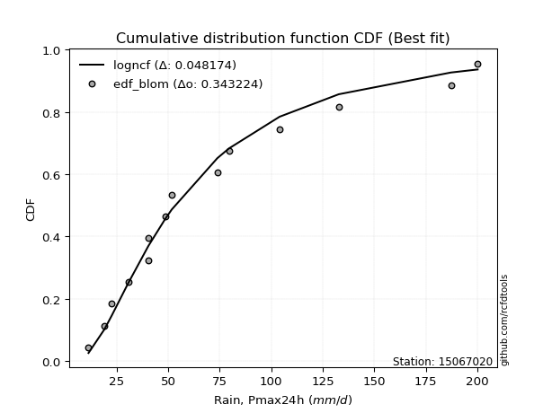</img>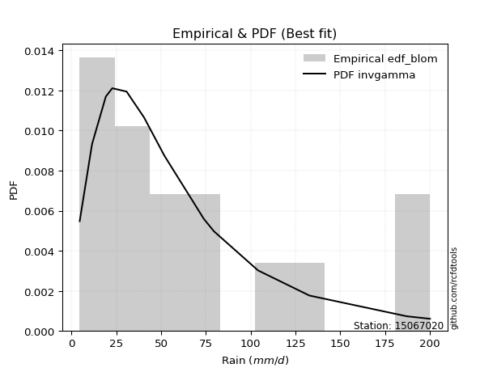</img>

</div>


### 7. EDF Tukey (1962)

In hydrology, the Tukey formula is used as a plotting position formula to estimate the empirical probability or frequency of a flood event (or other hydrological data). The formula parameter is given as _c=0.333_ (or 1/3).

<div align="center">


$P=(m-c)/(n+1-2c)$


</div>


**7.1. Empirical values**

<div align="center">

|                | 0                    | 1                   | 2                   | 3                  | 4                   | 5                  | 6                   | 7         | 8                  | 9                  | 10                 | 11                 | 12                 | 13                 | 14                 |
|:---------------|:---------------------|:--------------------|:--------------------|:-------------------|:--------------------|:-------------------|:--------------------|:----------|:-------------------|:-------------------|:-------------------|:-------------------|:-------------------|:-------------------|:-------------------|
| date           | 2025                 | 2024                | 2017                | 2005               | 2016                | 2008               | 2014                | 2013      | 2015               | 2020               | 2018               | 2019               | 2007               | 2011               | 2012               |
| x              | 4.5                  | 11.4                | 19.1                | 22.7               | 30.7                | 40.4               | 40.5                | 48.6      | 51.8               | 73.9               | 79.5               | 104.1              | 132.8              | 187.2              | 200.2              |
| m              | 1                    | 2                   | 3                   | 4                  | 5                   | 6                  | 7                   | 8         | 9                  | 10                 | 11                 | 12                 | 13                 | 14                 | 15                 |
| empirical_dist | edf_tukey            | edf_tukey           | edf_tukey           | edf_tukey          | edf_tukey           | edf_tukey          | edf_tukey           | edf_tukey | edf_tukey          | edf_tukey          | edf_tukey          | edf_tukey          | edf_tukey          | edf_tukey          | edf_tukey          |
| empirical      | 0.043478260869565216 | 0.10869565217391304 | 0.17391304347826086 | 0.2391304347826087 | 0.30434782608695654 | 0.3695652173913043 | 0.43478260869565216 | 0.5       | 0.5652173913043478 | 0.6304347826086957 | 0.6956521739130435 | 0.7608695652173914 | 0.8260869565217391 | 0.8913043478260869 | 0.9565217391304348 |
| empirical_tr   | 1.0454545454545454   | 1.1219512195121952  | 1.2105263157894737  | 1.3142857142857143 | 1.4375              | 1.586206896551724  | 1.769230769230769   | 2.0       | 2.3                | 2.7058823529411766 | 3.2857142857142856 | 4.1818181818181825 | 5.75               | 9.199999999999998  | 23.000000000000014 |

</div>


**7.2. Kolmogorov-Smirnov fit test (sorted by Δ)**


<div align="center">

|                | 0                   | 1                   | 2                   | 3                   | 4                   | 5                    | 6                   | 7                   | 8                   | 9                   | 10                  | 11                  | 12                  | 13                  | 14                  | 15                  | 16                  | 17                  | 18                  | 19                  | 20                  | 21                  | 22                  | 23                  | 24                  | 25                  | 26                  | 27                  | 28                  | 29                  | 30                  | 31                  | 32                  | 33                  | 34                  | 35                  | 36                  | 37                  | 38                  | 39                  | 40                  | 41                  | 42                  | 43                  | 44                  | 45                  | 46                  | 47                  | 48                  | 49                  | 50                 | 51                  | 52                  | 53                  | 54                  | 55                 | 56                  | 57                  | 58                 | 59                  | 60                  | 61                  | 62                  | 63                  | 64                  | 65                  | 66                  | 67                 | 68                  | 69                  | 70                 | 71                 | 72                  | 73                  | 74                  | 75                  | 76                  | 77                  | 78                  | 79                  | 80                  | 81                  | 82                  | 83                  | 84                  | 85                  | 86                  | 87                  | 88                  | 89                  | 90                  | 91                  | 92                  | 93                 | 94                  | 95                 | 96                 | 97                  | 98                 | 99                 | 100                 | 101                | 102                | 103                 | 104                 | 105                | 106                | 107                | 108                | 109                 | 110                | 111                | 112                | 113                | 114                | 115                | 116                | 117                 | 118                | 119                 | 120                 | 121                 | 122                | 123                | 124                 | 125                 | 126                 | 127                 | 128                 | 129                 | 130                 | 131                 | 132                 | 133                | 134                | 135                | 136                | 137                | 138                | 139                 | 140                | 141                | 142                | 143                 | 144                | 145                 | 146                 | 147                | 148                | 149                | 150                | 151                | 152                | 153                | 154                | 155                | 156                | 157                | 158                | 159                |
|:---------------|:--------------------|:--------------------|:--------------------|:--------------------|:--------------------|:---------------------|:--------------------|:--------------------|:--------------------|:--------------------|:--------------------|:--------------------|:--------------------|:--------------------|:--------------------|:--------------------|:--------------------|:--------------------|:--------------------|:--------------------|:--------------------|:--------------------|:--------------------|:--------------------|:--------------------|:--------------------|:--------------------|:--------------------|:--------------------|:--------------------|:--------------------|:--------------------|:--------------------|:--------------------|:--------------------|:--------------------|:--------------------|:--------------------|:--------------------|:--------------------|:--------------------|:--------------------|:--------------------|:--------------------|:--------------------|:--------------------|:--------------------|:--------------------|:--------------------|:--------------------|:-------------------|:--------------------|:--------------------|:--------------------|:--------------------|:-------------------|:--------------------|:--------------------|:-------------------|:--------------------|:--------------------|:--------------------|:--------------------|:--------------------|:--------------------|:--------------------|:--------------------|:-------------------|:--------------------|:--------------------|:-------------------|:-------------------|:--------------------|:--------------------|:--------------------|:--------------------|:--------------------|:--------------------|:--------------------|:--------------------|:--------------------|:--------------------|:--------------------|:--------------------|:--------------------|:--------------------|:--------------------|:--------------------|:--------------------|:--------------------|:--------------------|:--------------------|:--------------------|:-------------------|:--------------------|:-------------------|:-------------------|:--------------------|:-------------------|:-------------------|:--------------------|:-------------------|:-------------------|:--------------------|:--------------------|:-------------------|:-------------------|:-------------------|:-------------------|:--------------------|:-------------------|:-------------------|:-------------------|:-------------------|:-------------------|:-------------------|:-------------------|:--------------------|:-------------------|:--------------------|:--------------------|:--------------------|:-------------------|:-------------------|:--------------------|:--------------------|:--------------------|:--------------------|:--------------------|:--------------------|:--------------------|:--------------------|:--------------------|:-------------------|:-------------------|:-------------------|:-------------------|:-------------------|:-------------------|:--------------------|:-------------------|:-------------------|:-------------------|:--------------------|:-------------------|:--------------------|:--------------------|:-------------------|:-------------------|:-------------------|:-------------------|:-------------------|:-------------------|:-------------------|:-------------------|:-------------------|:-------------------|:-------------------|:-------------------|:-------------------|
| station        | 15067020            | 15067020            | 15067020            | 15067020            | 15067020            | 15067020             | 15067020            | 15067020            | 15067020            | 15067020            | 15067020            | 15067020            | 15067020            | 15067020            | 15067020            | 15067020            | 15067020            | 15067020            | 15067020            | 15067020            | 15067020            | 15067020            | 15067020            | 15067020            | 15067020            | 15067020            | 15067020            | 15067020            | 15067020            | 15067020            | 15067020            | 15067020            | 15067020            | 15067020            | 15067020            | 15067020            | 15067020            | 15067020            | 15067020            | 15067020            | 15067020            | 15067020            | 15067020            | 15067020            | 15067020            | 15067020            | 15067020            | 15067020            | 15067020            | 15067020            | 15067020           | 15067020            | 15067020            | 15067020            | 15067020            | 15067020           | 15067020            | 15067020            | 15067020           | 15067020            | 15067020            | 15067020            | 15067020            | 15067020            | 15067020            | 15067020            | 15067020            | 15067020           | 15067020            | 15067020            | 15067020           | 15067020           | 15067020            | 15067020            | 15067020            | 15067020            | 15067020            | 15067020            | 15067020            | 15067020            | 15067020            | 15067020            | 15067020            | 15067020            | 15067020            | 15067020            | 15067020            | 15067020            | 15067020            | 15067020            | 15067020            | 15067020            | 15067020            | 15067020           | 15067020            | 15067020           | 15067020           | 15067020            | 15067020           | 15067020           | 15067020            | 15067020           | 15067020           | 15067020            | 15067020            | 15067020           | 15067020           | 15067020           | 15067020           | 15067020            | 15067020           | 15067020           | 15067020           | 15067020           | 15067020           | 15067020           | 15067020           | 15067020            | 15067020           | 15067020            | 15067020            | 15067020            | 15067020           | 15067020           | 15067020            | 15067020            | 15067020            | 15067020            | 15067020            | 15067020            | 15067020            | 15067020            | 15067020            | 15067020           | 15067020           | 15067020           | 15067020           | 15067020           | 15067020           | 15067020            | 15067020           | 15067020           | 15067020           | 15067020            | 15067020           | 15067020            | 15067020            | 15067020           | 15067020           | 15067020           | 15067020           | 15067020           | 15067020           | 15067020           | 15067020           | 15067020           | 15067020           | 15067020           | 15067020           | 15067020           |
| empirical_dist | edf_tukey           | edf_tukey           | edf_tukey           | edf_tukey           | edf_tukey           | edf_tukey            | edf_tukey           | edf_tukey           | edf_tukey           | edf_tukey           | edf_tukey           | edf_tukey           | edf_tukey           | edf_tukey           | edf_tukey           | edf_tukey           | edf_tukey           | edf_tukey           | edf_tukey           | edf_tukey           | edf_tukey           | edf_tukey           | edf_tukey           | edf_tukey           | edf_tukey           | edf_tukey           | edf_tukey           | edf_tukey           | edf_tukey           | edf_tukey           | edf_tukey           | edf_tukey           | edf_tukey           | edf_tukey           | edf_tukey           | edf_tukey           | edf_tukey           | edf_tukey           | edf_tukey           | edf_tukey           | edf_tukey           | edf_tukey           | edf_tukey           | edf_tukey           | edf_tukey           | edf_tukey           | edf_tukey           | edf_tukey           | edf_tukey           | edf_tukey           | edf_tukey          | edf_tukey           | edf_tukey           | edf_tukey           | edf_tukey           | edf_tukey          | edf_tukey           | edf_tukey           | edf_tukey          | edf_tukey           | edf_tukey           | edf_tukey           | edf_tukey           | edf_tukey           | edf_tukey           | edf_tukey           | edf_tukey           | edf_tukey          | edf_tukey           | edf_tukey           | edf_tukey          | edf_tukey          | edf_tukey           | edf_tukey           | edf_tukey           | edf_tukey           | edf_tukey           | edf_tukey           | edf_tukey           | edf_tukey           | edf_tukey           | edf_tukey           | edf_tukey           | edf_tukey           | edf_tukey           | edf_tukey           | edf_tukey           | edf_tukey           | edf_tukey           | edf_tukey           | edf_tukey           | edf_tukey           | edf_tukey           | edf_tukey          | edf_tukey           | edf_tukey          | edf_tukey          | edf_tukey           | edf_tukey          | edf_tukey          | edf_tukey           | edf_tukey          | edf_tukey          | edf_tukey           | edf_tukey           | edf_tukey          | edf_tukey          | edf_tukey          | edf_tukey          | edf_tukey           | edf_tukey          | edf_tukey          | edf_tukey          | edf_tukey          | edf_tukey          | edf_tukey          | edf_tukey          | edf_tukey           | edf_tukey          | edf_tukey           | edf_tukey           | edf_tukey           | edf_tukey          | edf_tukey          | edf_tukey           | edf_tukey           | edf_tukey           | edf_tukey           | edf_tukey           | edf_tukey           | edf_tukey           | edf_tukey           | edf_tukey           | edf_tukey          | edf_tukey          | edf_tukey          | edf_tukey          | edf_tukey          | edf_tukey          | edf_tukey           | edf_tukey          | edf_tukey          | edf_tukey          | edf_tukey           | edf_tukey          | edf_tukey           | edf_tukey           | edf_tukey          | edf_tukey          | edf_tukey          | edf_tukey          | edf_tukey          | edf_tukey          | edf_tukey          | edf_tukey          | edf_tukey          | edf_tukey          | edf_tukey          | edf_tukey          | edf_tukey          |
| p_dist         | invgamma            | johnsonsu           | invweibull          | genextreme          | invgauss            | alpha                | nct                 | logpearson3         | lomax               | exponnorm           | loggompertz         | betaprime           | logburr12           | burr12              | logweibull_min      | loggenlogistic      | weibull_min         | logloggamma         | kappa3              | loglogistic         | genexpon            | ncf                 | logjohnsonsu        | logfoldnorm         | loggennorm          | logargus            | logrice             | logexponnorm        | logcrystalball      | lognorm             | logt                | lognct              | logmielke           | logjohnsonsb        | logfatiguelife      | bradford            | logloglaplace       | logf                | logalpha            | loggumbel_l         | logdgamma           | loghypsecant        | logdweibull         | loganglit           | logerlang           | logsemicircular     | exponpow            | halflogistic        | loggenhalflogistic  | loggenextreme       | genpareto          | loggamma            | loggamma            | lognakagami         | loginvgamma         | burr               | logtriang           | foldnorm            | halfnorm           | logncf              | loginvgauss         | moyal               | loglaplace          | loglaplace          | logmaxwell          | vonmises_line       | logarcsine          | mielke             | dgamma              | logskewnorm         | logbetaprime       | t                  | tukeylambda         | pearson3            | f                   | genlogistic         | logcosine           | lograyleigh         | logburr             | gumbel_r            | loginvweibull       | gennorm             | dweibull            | gengamma            | gamma               | loggausshyper       | rayleigh            | loggumbel_r         | kstwobign           | maxwell             | erlang              | skewnorm            | gompertz            | logkstwobign       | loghalfnorm         | semicircular       | logbeta            | halfgennorm         | anglit             | logweibull_max     | nakagami            | arcsine            | wald               | logmoyal            | loggenexpon         | triang             | loghalflogistic    | norm               | crystalball        | logtrapezoid        | loggenpareto       | rice               | logistic           | truncweibull_min   | logwrapcauchy      | logbradford        | logkappa3          | loguniform          | hypsecant          | gausshyper          | logvonmises_line    | logtruncweibull_min | logksone           | logkappa4          | cosine              | laplace             | exponweib           | logwald             | gumbel_l            | truncexpon          | wrapcauchy          | loglevy_l           | logtruncexpon       | kappa4             | loglomax           | ksone              | beta               | argus              | logtruncnorm       | uniform             | logtukeylambda     | powerlaw           | loggengamma        | levy_l              | genhalflogistic    | logrdist            | logexponweib        | johnsonsb          | rdist              | fatiguelife        | trapezoid          | logpowerlaw        | logexponpow        | weibull_max        | truncpareto        | logtruncpareto     | loghalfgennorm     | truncnorm          | logvonmises        | vonmises           |
| delta          | 0.04815578081657068 | 0.05021328391979707 | 0.05134027961247167 | 0.05134048722564222 | 0.05152573394841886 | 0.052291248830607207 | 0.05254846611124264 | 0.05342485171033318 | 0.05346597477880366 | 0.05543986696159875 | 0.05864316246642398 | 0.05909713725040455 | 0.06532811484695134 | 0.06548914213991353 | 0.06606374301144691 | 0.06731757915901448 | 0.06764520924189243 | 0.06963425470598561 | 0.07007941759410069 | 0.07298178575570957 | 0.07399708160734464 | 0.07447964071197927 | 0.07498894595980071 | 0.07584252267347869 | 0.07758111232010922 | 0.07887549234277402 | 0.07978920300719788 | 0.07979909662836465 | 0.07980044715564533 | 0.07980047689789599 | 0.07980094205877974 | 0.07982653247972266 | 0.07987661256507672 | 0.07988153407489595 | 0.08061739563732861 | 0.08091857009561243 | 0.08227547455277096 | 0.08310230589056827 | 0.08357518469765113 | 0.08516604490921376 | 0.08527409875220243 | 0.08612474809756165 | 0.08613797468037615 | 0.08698534008885983 | 0.08795674228263778 | 0.08995384563222597 | 0.09011515565079653 | 0.09138315036432376 | 0.09224369607826555 | 0.09539805480048569 | 0.0958198799136234 | 0.09606476058129809 | 0.09606476058129809 | 0.09709279690358796 | 0.09762668506030492 | 0.101733552517691  | 0.10176272774208367 | 0.10277205187530364 | 0.1042606914156039 | 0.10565248590513893 | 0.10623391860975201 | 0.10783398700350466 | 0.11271252830689027 | 0.11271252830689027 | 0.11412834388750942 | 0.11435037601422451 | 0.11532603320626561 | 0.1158753178914651 | 0.11620373640772486 | 0.11642276809983265 | 0.1169632405893502 | 0.1186365309023355 | 0.12174499146550952 | 0.12214327316034457 | 0.12510992836025703 | 0.12546068061420312 | 0.12562066589813814 | 0.12603192882284242 | 0.12811237632542055 | 0.12909429008395412 | 0.13108187747770805 | 0.13227178136906578 | 0.13260741356281297 | 0.13388607634980965 | 0.13489667227606483 | 0.13503551653030277 | 0.13917757576339507 | 0.14676669158417832 | 0.15072711546600065 | 0.15146611628553341 | 0.15659945822653099 | 0.15676016783400992 | 0.15697042537906436 | 0.1595427123221368 | 0.15963434364577522 | 0.1618026463767263 | 0.1635594595830076 | 0.16445967648704896 | 0.168593552464824  | 0.169517723485207  | 0.17096865900642844 | 0.1714528254525653 | 0.1720576993252853 | 0.17210674380179192 | 0.17244546225164925 | 0.1767336167720217 | 0.1806656060176376 | 0.1848871636554525 | 0.1848871658865503 | 0.18603099670397272 | 0.1869318373061683 | 0.1933120745289943 | 0.1999346538202844 | 0.2053331763535477 | 0.205659422374476  | 0.2083362648417253 | 0.2086804733682155 | 0.20872566661718195 | 0.2120244619525794 | 0.22076404820857087 | 0.22408693145440028 | 0.22419512995254276 | 0.2268378840243398 | 0.2272819833224044 | 0.23208798371662787 | 0.24021926926339704 | 0.24129088059524095 | 0.24252211147591796 | 0.24916033081941108 | 0.25190476675783585 | 0.25985532619338436 | 0.27281621653399557 | 0.28417412280644605 | 0.2879850884091797 | 0.2905599392374677 | 0.292952463471892  | 0.2939004007222471 | 0.2966201795117207 | 0.3171125167344705 | 0.32352091710915104 | 0.3261661895998035 | 0.347135079618358  | 0.3998733102336327 | 0.40525052715002996 | 0.4196996169875302 | 0.44906129232705816 | 0.46214135870738426 | 0.4787715992307056 | 0.5124017728135276 | 0.5291971845019079 | 0.5308906437832002 | 0.5467095845477998 | 0.6681078600119336 | 0.7015995224337669 | 0.7702584801690299 | 0.8390453023817476 | 0.8913043478260869 | 0.9138652537883463 | 1.0290741316804848 | 31.769023742038588 |
| deltao         | 0.3366456264050002  | 0.3366456264050002  | 0.3366456264050002  | 0.3366456264050002  | 0.3366456264050002  | 0.3366456264050002   | 0.3366456264050002  | 0.3366456264050002  | 0.3366456264050002  | 0.3366456264050002  | 0.3366456264050002  | 0.3366456264050002  | 0.3366456264050002  | 0.3366456264050002  | 0.3366456264050002  | 0.3366456264050002  | 0.3366456264050002  | 0.3366456264050002  | 0.3366456264050002  | 0.3366456264050002  | 0.3366456264050002  | 0.3366456264050002  | 0.3366456264050002  | 0.3366456264050002  | 0.3366456264050002  | 0.3366456264050002  | 0.3366456264050002  | 0.3366456264050002  | 0.3366456264050002  | 0.3366456264050002  | 0.3366456264050002  | 0.3366456264050002  | 0.3366456264050002  | 0.3366456264050002  | 0.3366456264050002  | 0.3366456264050002  | 0.3366456264050002  | 0.3366456264050002  | 0.3366456264050002  | 0.3366456264050002  | 0.3366456264050002  | 0.3366456264050002  | 0.3366456264050002  | 0.3366456264050002  | 0.3366456264050002  | 0.3366456264050002  | 0.3366456264050002  | 0.3366456264050002  | 0.3366456264050002  | 0.3366456264050002  | 0.3366456264050002 | 0.3366456264050002  | 0.3366456264050002  | 0.3366456264050002  | 0.3366456264050002  | 0.3366456264050002 | 0.3366456264050002  | 0.3366456264050002  | 0.3366456264050002 | 0.3366456264050002  | 0.3366456264050002  | 0.3366456264050002  | 0.3366456264050002  | 0.3366456264050002  | 0.3366456264050002  | 0.3366456264050002  | 0.3366456264050002  | 0.3366456264050002 | 0.3366456264050002  | 0.3366456264050002  | 0.3366456264050002 | 0.3366456264050002 | 0.3366456264050002  | 0.3366456264050002  | 0.3366456264050002  | 0.3366456264050002  | 0.3366456264050002  | 0.3366456264050002  | 0.3366456264050002  | 0.3366456264050002  | 0.3366456264050002  | 0.3366456264050002  | 0.3366456264050002  | 0.3366456264050002  | 0.3366456264050002  | 0.3366456264050002  | 0.3366456264050002  | 0.3366456264050002  | 0.3366456264050002  | 0.3366456264050002  | 0.3366456264050002  | 0.3366456264050002  | 0.3366456264050002  | 0.3366456264050002 | 0.3366456264050002  | 0.3366456264050002 | 0.3366456264050002 | 0.3366456264050002  | 0.3366456264050002 | 0.3366456264050002 | 0.3366456264050002  | 0.3366456264050002 | 0.3366456264050002 | 0.3366456264050002  | 0.3366456264050002  | 0.3366456264050002 | 0.3366456264050002 | 0.3366456264050002 | 0.3366456264050002 | 0.3366456264050002  | 0.3366456264050002 | 0.3366456264050002 | 0.3366456264050002 | 0.3366456264050002 | 0.3366456264050002 | 0.3366456264050002 | 0.3366456264050002 | 0.3366456264050002  | 0.3366456264050002 | 0.3366456264050002  | 0.3366456264050002  | 0.3366456264050002  | 0.3366456264050002 | 0.3366456264050002 | 0.3366456264050002  | 0.3366456264050002  | 0.3366456264050002  | 0.3366456264050002  | 0.3366456264050002  | 0.3366456264050002  | 0.3366456264050002  | 0.3366456264050002  | 0.3366456264050002  | 0.3366456264050002 | 0.3366456264050002 | 0.3366456264050002 | 0.3366456264050002 | 0.3366456264050002 | 0.3366456264050002 | 0.3366456264050002  | 0.3366456264050002 | 0.3366456264050002 | 0.3366456264050002 | 0.3366456264050002  | 0.3366456264050002 | 0.3366456264050002  | 0.3366456264050002  | 0.3366456264050002 | 0.3366456264050002 | 0.3366456264050002 | 0.3366456264050002 | 0.3366456264050002 | 0.3366456264050002 | 0.3366456264050002 | 0.3366456264050002 | 0.3366456264050002 | 0.3366456264050002 | 0.3366456264050002 | 0.3366456264050002 | 0.3366456264050002 |
| eval           | Δo > Δ              | Δo > Δ              | Δo > Δ              | Δo > Δ              | Δo > Δ              | Δo > Δ               | Δo > Δ              | Δo > Δ              | Δo > Δ              | Δo > Δ              | Δo > Δ              | Δo > Δ              | Δo > Δ              | Δo > Δ              | Δo > Δ              | Δo > Δ              | Δo > Δ              | Δo > Δ              | Δo > Δ              | Δo > Δ              | Δo > Δ              | Δo > Δ              | Δo > Δ              | Δo > Δ              | Δo > Δ              | Δo > Δ              | Δo > Δ              | Δo > Δ              | Δo > Δ              | Δo > Δ              | Δo > Δ              | Δo > Δ              | Δo > Δ              | Δo > Δ              | Δo > Δ              | Δo > Δ              | Δo > Δ              | Δo > Δ              | Δo > Δ              | Δo > Δ              | Δo > Δ              | Δo > Δ              | Δo > Δ              | Δo > Δ              | Δo > Δ              | Δo > Δ              | Δo > Δ              | Δo > Δ              | Δo > Δ              | Δo > Δ              | Δo > Δ             | Δo > Δ              | Δo > Δ              | Δo > Δ              | Δo > Δ              | Δo > Δ             | Δo > Δ              | Δo > Δ              | Δo > Δ             | Δo > Δ              | Δo > Δ              | Δo > Δ              | Δo > Δ              | Δo > Δ              | Δo > Δ              | Δo > Δ              | Δo > Δ              | Δo > Δ             | Δo > Δ              | Δo > Δ              | Δo > Δ             | Δo > Δ             | Δo > Δ              | Δo > Δ              | Δo > Δ              | Δo > Δ              | Δo > Δ              | Δo > Δ              | Δo > Δ              | Δo > Δ              | Δo > Δ              | Δo > Δ              | Δo > Δ              | Δo > Δ              | Δo > Δ              | Δo > Δ              | Δo > Δ              | Δo > Δ              | Δo > Δ              | Δo > Δ              | Δo > Δ              | Δo > Δ              | Δo > Δ              | Δo > Δ             | Δo > Δ              | Δo > Δ             | Δo > Δ             | Δo > Δ              | Δo > Δ             | Δo > Δ             | Δo > Δ              | Δo > Δ             | Δo > Δ             | Δo > Δ              | Δo > Δ              | Δo > Δ             | Δo > Δ             | Δo > Δ             | Δo > Δ             | Δo > Δ              | Δo > Δ             | Δo > Δ             | Δo > Δ             | Δo > Δ             | Δo > Δ             | Δo > Δ             | Δo > Δ             | Δo > Δ              | Δo > Δ             | Δo > Δ              | Δo > Δ              | Δo > Δ              | Δo > Δ             | Δo > Δ             | Δo > Δ              | Δo > Δ              | Δo > Δ              | Δo > Δ              | Δo > Δ              | Δo > Δ              | Δo > Δ              | Δo > Δ              | Δo > Δ              | Δo > Δ             | Δo > Δ             | Δo > Δ             | Δo > Δ             | Δo > Δ             | Δo > Δ             | Δo > Δ              | Δo > Δ             | Δo <= Δ            | Δo <= Δ            | Δo <= Δ             | Δo <= Δ            | Δo <= Δ             | Δo <= Δ             | Δo <= Δ            | Δo <= Δ            | Δo <= Δ            | Δo <= Δ            | Δo <= Δ            | Δo <= Δ            | Δo <= Δ            | Δo <= Δ            | Δo <= Δ            | Δo <= Δ            | Δo <= Δ            | Δo <= Δ            | Δo <= Δ            |
| fit            | 1                   | 1                   | 1                   | 1                   | 1                   | 1                    | 1                   | 1                   | 1                   | 1                   | 1                   | 1                   | 1                   | 1                   | 1                   | 1                   | 1                   | 1                   | 1                   | 1                   | 1                   | 1                   | 1                   | 1                   | 1                   | 1                   | 1                   | 1                   | 1                   | 1                   | 1                   | 1                   | 1                   | 1                   | 1                   | 1                   | 1                   | 1                   | 1                   | 1                   | 1                   | 1                   | 1                   | 1                   | 1                   | 1                   | 1                   | 1                   | 1                   | 1                   | 1                  | 1                   | 1                   | 1                   | 1                   | 1                  | 1                   | 1                   | 1                  | 1                   | 1                   | 1                   | 1                   | 1                   | 1                   | 1                   | 1                   | 1                  | 1                   | 1                   | 1                  | 1                  | 1                   | 1                   | 1                   | 1                   | 1                   | 1                   | 1                   | 1                   | 1                   | 1                   | 1                   | 1                   | 1                   | 1                   | 1                   | 1                   | 1                   | 1                   | 1                   | 1                   | 1                   | 1                  | 1                   | 1                  | 1                  | 1                   | 1                  | 1                  | 1                   | 1                  | 1                  | 1                   | 1                   | 1                  | 1                  | 1                  | 1                  | 1                   | 1                  | 1                  | 1                  | 1                  | 1                  | 1                  | 1                  | 1                   | 1                  | 1                   | 1                   | 1                   | 1                  | 1                  | 1                   | 1                   | 1                   | 1                   | 1                   | 1                   | 1                   | 1                   | 1                   | 1                  | 1                  | 1                  | 1                  | 1                  | 1                  | 1                   | 1                  | 0                  | 0                  | 0                   | 0                  | 0                   | 0                   | 0                  | 0                  | 0                  | 0                  | 0                  | 0                  | 0                  | 0                  | 0                  | 0                  | 0                  | 0                  | 0                  |
| n              | 15                  | 15                  | 15                  | 15                  | 15                  | 15                   | 15                  | 15                  | 15                  | 15                  | 15                  | 15                  | 15                  | 15                  | 15                  | 15                  | 15                  | 15                  | 15                  | 15                  | 15                  | 15                  | 15                  | 15                  | 15                  | 15                  | 15                  | 15                  | 15                  | 15                  | 15                  | 15                  | 15                  | 15                  | 15                  | 15                  | 15                  | 15                  | 15                  | 15                  | 15                  | 15                  | 15                  | 15                  | 15                  | 15                  | 15                  | 15                  | 15                  | 15                  | 15                 | 15                  | 15                  | 15                  | 15                  | 15                 | 15                  | 15                  | 15                 | 15                  | 15                  | 15                  | 15                  | 15                  | 15                  | 15                  | 15                  | 15                 | 15                  | 15                  | 15                 | 15                 | 15                  | 15                  | 15                  | 15                  | 15                  | 15                  | 15                  | 15                  | 15                  | 15                  | 15                  | 15                  | 15                  | 15                  | 15                  | 15                  | 15                  | 15                  | 15                  | 15                  | 15                  | 15                 | 15                  | 15                 | 15                 | 15                  | 15                 | 15                 | 15                  | 15                 | 15                 | 15                  | 15                  | 15                 | 15                 | 15                 | 15                 | 15                  | 15                 | 15                 | 15                 | 15                 | 15                 | 15                 | 15                 | 15                  | 15                 | 15                  | 15                  | 15                  | 15                 | 15                 | 15                  | 15                  | 15                  | 15                  | 15                  | 15                  | 15                  | 15                  | 15                  | 15                 | 15                 | 15                 | 15                 | 15                 | 15                 | 15                  | 15                 | 15                 | 15                 | 15                  | 15                 | 15                  | 15                  | 15                 | 15                 | 15                 | 15                 | 15                 | 15                 | 15                 | 15                 | 15                 | 15                 | 15                 | 15                 | 15                 |
| best_fit       | 1                   | 0                   | 0                   | 0                   | 0                   | 0                    | 0                   | 0                   | 0                   | 0                   | 0                   | 0                   | 0                   | 0                   | 0                   | 0                   | 0                   | 0                   | 0                   | 0                   | 0                   | 0                   | 0                   | 0                   | 0                   | 0                   | 0                   | 0                   | 0                   | 0                   | 0                   | 0                   | 0                   | 0                   | 0                   | 0                   | 0                   | 0                   | 0                   | 0                   | 0                   | 0                   | 0                   | 0                   | 0                   | 0                   | 0                   | 0                   | 0                   | 0                   | 0                  | 0                   | 0                   | 0                   | 0                   | 0                  | 0                   | 0                   | 0                  | 0                   | 0                   | 0                   | 0                   | 0                   | 0                   | 0                   | 0                   | 0                  | 0                   | 0                   | 0                  | 0                  | 0                   | 0                   | 0                   | 0                   | 0                   | 0                   | 0                   | 0                   | 0                   | 0                   | 0                   | 0                   | 0                   | 0                   | 0                   | 0                   | 0                   | 0                   | 0                   | 0                   | 0                   | 0                  | 0                   | 0                  | 0                  | 0                   | 0                  | 0                  | 0                   | 0                  | 0                  | 0                   | 0                   | 0                  | 0                  | 0                  | 0                  | 0                   | 0                  | 0                  | 0                  | 0                  | 0                  | 0                  | 0                  | 0                   | 0                  | 0                   | 0                   | 0                   | 0                  | 0                  | 0                   | 0                   | 0                   | 0                   | 0                   | 0                   | 0                   | 0                   | 0                   | 0                  | 0                  | 0                  | 0                  | 0                  | 0                  | 0                   | 0                  | 0                  | 0                  | 0                   | 0                  | 0                   | 0                   | 0                  | 0                  | 0                  | 0                  | 0                  | 0                  | 0                  | 0                  | 0                  | 0                  | 0                  | 0                  | 0                  |
| best_fit_sort  | 1                   | 2                   | 3                   | 4                   | 5                   | 6                    | 7                   | 8                   | 9                   | 10                  | 11                  | 12                  | 13                  | 14                  | 15                  | 16                  | 17                  | 18                  | 19                  | 20                  | 21                  | 22                  | 23                  | 24                  | 25                  | 26                  | 27                  | 28                  | 29                  | 30                  | 31                  | 32                  | 33                  | 34                  | 35                  | 36                  | 37                  | 38                  | 39                  | 40                  | 41                  | 42                  | 43                  | 44                  | 45                  | 46                  | 47                  | 48                  | 49                  | 50                  | 51                 | 52                  | 53                  | 54                  | 55                  | 56                 | 57                  | 58                  | 59                 | 60                  | 61                  | 62                  | 63                  | 64                  | 65                  | 66                  | 67                  | 68                 | 69                  | 70                  | 71                 | 72                 | 73                  | 74                  | 75                  | 76                  | 77                  | 78                  | 79                  | 80                  | 81                  | 82                  | 83                  | 84                  | 85                  | 86                  | 87                  | 88                  | 89                  | 90                  | 91                  | 92                  | 93                  | 94                 | 95                  | 96                 | 97                 | 98                  | 99                 | 100                | 101                 | 102                | 103                | 104                 | 105                 | 106                | 107                | 108                | 109                | 110                 | 111                | 112                | 113                | 114                | 115                | 116                | 117                | 118                 | 119                | 120                 | 121                 | 122                 | 123                | 124                | 125                 | 126                 | 127                 | 128                 | 129                 | 130                 | 131                 | 132                 | 133                 | 134                | 135                | 136                | 137                | 138                | 139                | 140                 | 141                | 142                | 143                | 144                 | 145                | 146                 | 147                 | 148                | 149                | 150                | 151                | 152                | 153                | 154                | 155                | 156                | 157                | 158                | 159                | 160                |

</div>


**7.3. Best fit**

<div align="center">

|   id |   station | empirical_dist   | p_dist   |     delta |   deltao | eval   |   fit |   n |   best_fit |   best_fit_sort |
|-----:|----------:|:-----------------|:---------|----------:|---------:|:-------|------:|----:|-----------:|----------------:|
|    0 |  15067020 | edf_tukey        | invgamma | 0.0481558 | 0.336646 | Δo > Δ |     1 |  15 |          1 |               1 |

</div>


<div align="center">

</img></img>

</div>


### 8. EDF Gringorten (1963)

Gringorten plotting position formula is essential for estimating the probability and return periods of extreme events like floods and heavy rainfall. The constant _a=0.44_.

<div align="center">


$P=(m-a)/(n+1-2a)$


</div>


**8.1. Empirical values**

<div align="center">

|                | 0                   | 1                   | 2                   | 3                   | 4                   | 5                   | 6                   | 7              | 8                  | 9                  | 10                 | 11                 | 12                 | 13                 | 14                 |
|:---------------|:--------------------|:--------------------|:--------------------|:--------------------|:--------------------|:--------------------|:--------------------|:---------------|:-------------------|:-------------------|:-------------------|:-------------------|:-------------------|:-------------------|:-------------------|
| date           | 2025                | 2024                | 2017                | 2005                | 2016                | 2008                | 2014                | 2013           | 2015               | 2020               | 2018               | 2019               | 2007               | 2011               | 2012               |
| x              | 4.5                 | 11.4                | 19.1                | 22.7                | 30.7                | 40.4                | 40.5                | 48.6           | 51.8               | 73.9               | 79.5               | 104.1              | 132.8              | 187.2              | 200.2              |
| m              | 1                   | 2                   | 3                   | 4                   | 5                   | 6                   | 7                   | 8              | 9                  | 10                 | 11                 | 12                 | 13                 | 14                 | 15                 |
| empirical_dist | edf_gringorten      | edf_gringorten      | edf_gringorten      | edf_gringorten      | edf_gringorten      | edf_gringorten      | edf_gringorten      | edf_gringorten | edf_gringorten     | edf_gringorten     | edf_gringorten     | edf_gringorten     | edf_gringorten     | edf_gringorten     | edf_gringorten     |
| empirical      | 0.03703703703703704 | 0.10317460317460318 | 0.16931216931216933 | 0.23544973544973546 | 0.30158730158730157 | 0.36772486772486773 | 0.43386243386243384 | 0.5            | 0.5661375661375662 | 0.6322751322751323 | 0.6984126984126985 | 0.7645502645502646 | 0.8306878306878308 | 0.8968253968253969 | 0.962962962962963  |
| empirical_tr   | 1.0384615384615385  | 1.1150442477876106  | 1.2038216560509554  | 1.3079584775086506  | 1.4318181818181819  | 1.5815899581589956  | 1.7663551401869158  | 2.0            | 2.304878048780488  | 2.719424460431655  | 3.3157894736842115 | 4.247191011235957  | 5.906250000000004  | 9.692307692307695  | 27.000000000000043 |

</div>


**8.2. Kolmogorov-Smirnov fit test (sorted by Δ)**


<div align="center">

|                | 0                    | 1                    | 2                   | 3                    | 4                   | 5                    | 6                   | 7                    | 8                   | 9                   | 10                  | 11                   | 12                  | 13                  | 14                  | 15                  | 16                  | 17                  | 18                  | 19                  | 20                  | 21                  | 22                  | 23                  | 24                 | 25                  | 26                  | 27                 | 28                  | 29                  | 30                  | 31                  | 32                  | 33                  | 34                  | 35                 | 36                  | 37                  | 38                  | 39                  | 40                  | 41                  | 42                  | 43                  | 44                  | 45                  | 46                 | 47                  | 48                  | 49                  | 50                  | 51                  | 52                  | 53                  | 54                  | 55                  | 56                  | 57                  | 58                  | 59                  | 60                 | 61                  | 62                  | 63                  | 64                  | 65                  | 66                  | 67                 | 68                 | 69                  | 70                 | 71                  | 72                  | 73                 | 74                  | 75                 | 76                 | 77                  | 78                  | 79                 | 80                  | 81                  | 82                  | 83                  | 84                  | 85                  | 86                  | 87                 | 88                  | 89                 | 90                 | 91                  | 92                  | 93                  | 94                  | 95                 | 96                  | 97                  | 98                  | 99                  | 100                 | 101                | 102                 | 103                 | 104                 | 105                 | 106                 | 107                 | 108                 | 109                 | 110                 | 111                 | 112                | 113                 | 114                 | 115                | 116                 | 117                 | 118                 | 119                 | 120                 | 121                 | 122                 | 123                 | 124                 | 125                 | 126                 | 127                 | 128                 | 129                 | 130                | 131                | 132                 | 133                 | 134                 | 135                 | 136                | 137                 | 138                | 139                | 140                 | 141                 | 142                 | 143                | 144                 | 145                | 146                | 147                 | 148                | 149                | 150                | 151                | 152                | 153                | 154                | 155                | 156                | 157                | 158                | 159                |
|:---------------|:---------------------|:---------------------|:--------------------|:---------------------|:--------------------|:---------------------|:--------------------|:---------------------|:--------------------|:--------------------|:--------------------|:---------------------|:--------------------|:--------------------|:--------------------|:--------------------|:--------------------|:--------------------|:--------------------|:--------------------|:--------------------|:--------------------|:--------------------|:--------------------|:-------------------|:--------------------|:--------------------|:-------------------|:--------------------|:--------------------|:--------------------|:--------------------|:--------------------|:--------------------|:--------------------|:-------------------|:--------------------|:--------------------|:--------------------|:--------------------|:--------------------|:--------------------|:--------------------|:--------------------|:--------------------|:--------------------|:-------------------|:--------------------|:--------------------|:--------------------|:--------------------|:--------------------|:--------------------|:--------------------|:--------------------|:--------------------|:--------------------|:--------------------|:--------------------|:--------------------|:-------------------|:--------------------|:--------------------|:--------------------|:--------------------|:--------------------|:--------------------|:-------------------|:-------------------|:--------------------|:-------------------|:--------------------|:--------------------|:-------------------|:--------------------|:-------------------|:-------------------|:--------------------|:--------------------|:-------------------|:--------------------|:--------------------|:--------------------|:--------------------|:--------------------|:--------------------|:--------------------|:-------------------|:--------------------|:-------------------|:-------------------|:--------------------|:--------------------|:--------------------|:--------------------|:-------------------|:--------------------|:--------------------|:--------------------|:--------------------|:--------------------|:-------------------|:--------------------|:--------------------|:--------------------|:--------------------|:--------------------|:--------------------|:--------------------|:--------------------|:--------------------|:--------------------|:-------------------|:--------------------|:--------------------|:-------------------|:--------------------|:--------------------|:--------------------|:--------------------|:--------------------|:--------------------|:--------------------|:--------------------|:--------------------|:--------------------|:--------------------|:--------------------|:--------------------|:--------------------|:-------------------|:-------------------|:--------------------|:--------------------|:--------------------|:--------------------|:-------------------|:--------------------|:-------------------|:-------------------|:--------------------|:--------------------|:--------------------|:-------------------|:--------------------|:-------------------|:-------------------|:--------------------|:-------------------|:-------------------|:-------------------|:-------------------|:-------------------|:-------------------|:-------------------|:-------------------|:-------------------|:-------------------|:-------------------|:-------------------|
| station        | 15067020             | 15067020             | 15067020            | 15067020             | 15067020            | 15067020             | 15067020            | 15067020             | 15067020            | 15067020            | 15067020            | 15067020             | 15067020            | 15067020            | 15067020            | 15067020            | 15067020            | 15067020            | 15067020            | 15067020            | 15067020            | 15067020            | 15067020            | 15067020            | 15067020           | 15067020            | 15067020            | 15067020           | 15067020            | 15067020            | 15067020            | 15067020            | 15067020            | 15067020            | 15067020            | 15067020           | 15067020            | 15067020            | 15067020            | 15067020            | 15067020            | 15067020            | 15067020            | 15067020            | 15067020            | 15067020            | 15067020           | 15067020            | 15067020            | 15067020            | 15067020            | 15067020            | 15067020            | 15067020            | 15067020            | 15067020            | 15067020            | 15067020            | 15067020            | 15067020            | 15067020           | 15067020            | 15067020            | 15067020            | 15067020            | 15067020            | 15067020            | 15067020           | 15067020           | 15067020            | 15067020           | 15067020            | 15067020            | 15067020           | 15067020            | 15067020           | 15067020           | 15067020            | 15067020            | 15067020           | 15067020            | 15067020            | 15067020            | 15067020            | 15067020            | 15067020            | 15067020            | 15067020           | 15067020            | 15067020           | 15067020           | 15067020            | 15067020            | 15067020            | 15067020            | 15067020           | 15067020            | 15067020            | 15067020            | 15067020            | 15067020            | 15067020           | 15067020            | 15067020            | 15067020            | 15067020            | 15067020            | 15067020            | 15067020            | 15067020            | 15067020            | 15067020            | 15067020           | 15067020            | 15067020            | 15067020           | 15067020            | 15067020            | 15067020            | 15067020            | 15067020            | 15067020            | 15067020            | 15067020            | 15067020            | 15067020            | 15067020            | 15067020            | 15067020            | 15067020            | 15067020           | 15067020           | 15067020            | 15067020            | 15067020            | 15067020            | 15067020           | 15067020            | 15067020           | 15067020           | 15067020            | 15067020            | 15067020            | 15067020           | 15067020            | 15067020           | 15067020           | 15067020            | 15067020           | 15067020           | 15067020           | 15067020           | 15067020           | 15067020           | 15067020           | 15067020           | 15067020           | 15067020           | 15067020           | 15067020           |
| empirical_dist | edf_gringorten       | edf_gringorten       | edf_gringorten      | edf_gringorten       | edf_gringorten      | edf_gringorten       | edf_gringorten      | edf_gringorten       | edf_gringorten      | edf_gringorten      | edf_gringorten      | edf_gringorten       | edf_gringorten      | edf_gringorten      | edf_gringorten      | edf_gringorten      | edf_gringorten      | edf_gringorten      | edf_gringorten      | edf_gringorten      | edf_gringorten      | edf_gringorten      | edf_gringorten      | edf_gringorten      | edf_gringorten     | edf_gringorten      | edf_gringorten      | edf_gringorten     | edf_gringorten      | edf_gringorten      | edf_gringorten      | edf_gringorten      | edf_gringorten      | edf_gringorten      | edf_gringorten      | edf_gringorten     | edf_gringorten      | edf_gringorten      | edf_gringorten      | edf_gringorten      | edf_gringorten      | edf_gringorten      | edf_gringorten      | edf_gringorten      | edf_gringorten      | edf_gringorten      | edf_gringorten     | edf_gringorten      | edf_gringorten      | edf_gringorten      | edf_gringorten      | edf_gringorten      | edf_gringorten      | edf_gringorten      | edf_gringorten      | edf_gringorten      | edf_gringorten      | edf_gringorten      | edf_gringorten      | edf_gringorten      | edf_gringorten     | edf_gringorten      | edf_gringorten      | edf_gringorten      | edf_gringorten      | edf_gringorten      | edf_gringorten      | edf_gringorten     | edf_gringorten     | edf_gringorten      | edf_gringorten     | edf_gringorten      | edf_gringorten      | edf_gringorten     | edf_gringorten      | edf_gringorten     | edf_gringorten     | edf_gringorten      | edf_gringorten      | edf_gringorten     | edf_gringorten      | edf_gringorten      | edf_gringorten      | edf_gringorten      | edf_gringorten      | edf_gringorten      | edf_gringorten      | edf_gringorten     | edf_gringorten      | edf_gringorten     | edf_gringorten     | edf_gringorten      | edf_gringorten      | edf_gringorten      | edf_gringorten      | edf_gringorten     | edf_gringorten      | edf_gringorten      | edf_gringorten      | edf_gringorten      | edf_gringorten      | edf_gringorten     | edf_gringorten      | edf_gringorten      | edf_gringorten      | edf_gringorten      | edf_gringorten      | edf_gringorten      | edf_gringorten      | edf_gringorten      | edf_gringorten      | edf_gringorten      | edf_gringorten     | edf_gringorten      | edf_gringorten      | edf_gringorten     | edf_gringorten      | edf_gringorten      | edf_gringorten      | edf_gringorten      | edf_gringorten      | edf_gringorten      | edf_gringorten      | edf_gringorten      | edf_gringorten      | edf_gringorten      | edf_gringorten      | edf_gringorten      | edf_gringorten      | edf_gringorten      | edf_gringorten     | edf_gringorten     | edf_gringorten      | edf_gringorten      | edf_gringorten      | edf_gringorten      | edf_gringorten     | edf_gringorten      | edf_gringorten     | edf_gringorten     | edf_gringorten      | edf_gringorten      | edf_gringorten      | edf_gringorten     | edf_gringorten      | edf_gringorten     | edf_gringorten     | edf_gringorten      | edf_gringorten     | edf_gringorten     | edf_gringorten     | edf_gringorten     | edf_gringorten     | edf_gringorten     | edf_gringorten     | edf_gringorten     | edf_gringorten     | edf_gringorten     | edf_gringorten     | edf_gringorten     |
| p_dist         | invgamma             | invweibull           | genextreme          | nct                  | johnsonsu           | alpha                | invgauss            | logpearson3          | lomax               | exponnorm           | loggompertz         | burr12               | betaprime           | logburr12           | logweibull_min      | loggenlogistic      | weibull_min         | logloggamma         | kappa3              | logmielke           | loglogistic         | genexpon            | ncf                 | logjohnsonsu        | bradford           | logfoldnorm         | loggennorm          | logargus           | logrice             | logexponnorm        | logcrystalball      | lognorm             | logt                | lognct              | logjohnsonsb        | logfatiguelife     | loghypsecant        | logf                | logalpha            | loggumbel_l         | logdgamma           | logdweibull         | logloglaplace       | loganglit           | logerlang           | exponpow            | lognakagami        | logsemicircular     | halflogistic        | loggenextreme       | genpareto           | loggenhalflogistic  | loggamma            | loggamma            | loginvgamma         | logtriang           | foldnorm            | halfnorm            | burr                | logncf              | loginvgauss        | moyal               | loglaplace          | loglaplace          | logmaxwell          | dgamma              | logskewnorm         | mielke             | logbetaprime       | logarcsine          | vonmises_line      | pearson3            | t                   | genlogistic        | logcosine           | lograyleigh        | tukeylambda        | logburr             | f                   | gumbel_r           | loginvweibull       | dweibull            | gengamma            | gamma               | loggausshyper       | gennorm             | rayleigh            | loggumbel_r        | kstwobign           | maxwell            | skewnorm           | gompertz            | erlang              | logkstwobign        | loghalfnorm         | semicircular       | logbeta             | halfgennorm         | wald                | anglit              | logweibull_max      | logmoyal           | loggenexpon         | nakagami            | triang              | arcsine             | loghalflogistic     | norm                | crystalball         | logtrapezoid        | loggenpareto        | rice                | logistic           | truncweibull_min    | logwrapcauchy       | logbradford        | logkappa3           | loguniform          | hypsecant           | gausshyper          | logvonmises_line    | logtruncweibull_min | logksone            | logkappa4           | cosine              | laplace             | exponweib           | logwald             | gumbel_l            | truncexpon          | wrapcauchy         | loglevy_l          | logtruncexpon       | kappa4              | loglomax            | ksone               | beta               | argus               | logtruncnorm       | uniform            | logtukeylambda      | powerlaw            | loggengamma         | levy_l             | genhalflogistic     | logrdist           | logexponweib       | johnsonsb           | rdist              | trapezoid          | fatiguelife        | logpowerlaw        | logexponpow        | weibull_max        | truncpareto        | logtruncpareto     | loghalfgennorm     | truncnorm          | logvonmises        | vonmises           |
| delta          | 0.046315431150134034 | 0.049499929946035026 | 0.04950013755920557 | 0.050708116444805995 | 0.05205363358623366 | 0.053211423663825586 | 0.05336608361485545 | 0.054345026543551556 | 0.05438614961202204 | 0.05728021662803534 | 0.05956333729964236 | 0.059968093140603584 | 0.06001731208362293 | 0.06624828968016971 | 0.06698391784466529 | 0.06823775399223286 | 0.06948555890832903 | 0.07055442953920399 | 0.07099959242731907 | 0.07435556356576678 | 0.07482213542214616 | 0.07491725644056302 | 0.07539981554519765 | 0.07590912079301909 | 0.0772814868045898 | 0.07768287233991528 | 0.07942146198654582 | 0.0797956671759924 | 0.08162955267363448 | 0.08163944629480124 | 0.08164079682208192 | 0.08164082656433258 | 0.08164129172521634 | 0.08166688214615925 | 0.08172188374133255 | 0.0824577453037652 | 0.08428439843112501 | 0.08494265555700486 | 0.08541553436408772 | 0.08608621974243214 | 0.08711444841863902 | 0.08797832434681274 | 0.08871669838529916 | 0.08882568975529642 | 0.08979709194907437 | 0.09103533048401491 | 0.0915717479042781 | 0.09179419529866256 | 0.09230332519754214 | 0.09631822963370407 | 0.09674005474684177 | 0.09684457024435708 | 0.09790511024773468 | 0.09790511024773468 | 0.09946703472674151 | 0.10268290257530205 | 0.10369222670852202 | 0.10518086624882228 | 0.10521021668173217 | 0.10749283557157552 | 0.1080742682761886 | 0.10875416183672304 | 0.11087217864045362 | 0.11087217864045362 | 0.11596869355394601 | 0.11712391124094323 | 0.11734294293305103 | 0.1177156675579017 | 0.1188035902557868 | 0.11992690737235714 | 0.1207915998467527 | 0.12306344799356295 | 0.12507775473486368 | 0.1263808554474215 | 0.12746101556457473 | 0.127872278489279  | 0.1281862152980377 | 0.12903255115863893 | 0.12971080252634856 | 0.1300144649171725 | 0.13292222714414464 | 0.13352758839603135 | 0.13572642601624624 | 0.13673702194250142 | 0.13687586619673936 | 0.13871300520159396 | 0.14009775059661345 | 0.1486070412506149 | 0.15164729029921903 | 0.1523862911187518 | 0.1576803426672283 | 0.15789060021228274 | 0.15843980789296758 | 0.16138306198857338 | 0.16147469331221181 | 0.1627228212099447 | 0.16447963441622598 | 0.16630002615348555 | 0.16837699999241207 | 0.16951372729804237 | 0.17227824798486202 | 0.1739470934682285 | 0.17428581191808584 | 0.17556953317251997 | 0.17765379160524009 | 0.17789404928509348 | 0.18250595568407418 | 0.18580733848867087 | 0.18580734071976868 | 0.18879152120362774 | 0.19153271147225984 | 0.19423224936221267 | 0.2008548286535028 | 0.20625335118676608 | 0.20957218843911377 | 0.2114337642875567 | 0.21155970005938637 | 0.21158894369095152 | 0.21294463678579778 | 0.22237100612269584 | 0.22592728112083688 | 0.22603547961897935 | 0.23143875819043133 | 0.23188285748849594 | 0.23300815854984624 | 0.24113944409661542 | 0.24313123026167754 | 0.24436246114235455 | 0.25008050565262946 | 0.25282494159105423 | 0.2626158506930394 | 0.2792574403665237 | 0.28765088397142624 | 0.28890526324239807 | 0.29516081340355926 | 0.29571298797154705 | 0.2966609252219021 | 0.29938070401137573 | 0.3189528664009071 | 0.3244410919423694 | 0.32800653926624007 | 0.35173595378444955 | 0.40447418439972427 | 0.4116917509825581 | 0.42246014148718525 | 0.4536621664931497 | 0.4667422328734758 | 0.48429264823001544 | 0.5188429966460557 | 0.5336511682828553 | 0.5347182335012178 | 0.5513104587138914 | 0.6727087341780251 | 0.7062003965998586 | 0.7757795291683398 | 0.8445663513810575 | 0.8968253968253969 | 0.9203064776208744 | 1.0309144813469215 | 31.76258251820606  |
| deltao         | 0.3366456264050002   | 0.3366456264050002   | 0.3366456264050002  | 0.3366456264050002   | 0.3366456264050002  | 0.3366456264050002   | 0.3366456264050002  | 0.3366456264050002   | 0.3366456264050002  | 0.3366456264050002  | 0.3366456264050002  | 0.3366456264050002   | 0.3366456264050002  | 0.3366456264050002  | 0.3366456264050002  | 0.3366456264050002  | 0.3366456264050002  | 0.3366456264050002  | 0.3366456264050002  | 0.3366456264050002  | 0.3366456264050002  | 0.3366456264050002  | 0.3366456264050002  | 0.3366456264050002  | 0.3366456264050002 | 0.3366456264050002  | 0.3366456264050002  | 0.3366456264050002 | 0.3366456264050002  | 0.3366456264050002  | 0.3366456264050002  | 0.3366456264050002  | 0.3366456264050002  | 0.3366456264050002  | 0.3366456264050002  | 0.3366456264050002 | 0.3366456264050002  | 0.3366456264050002  | 0.3366456264050002  | 0.3366456264050002  | 0.3366456264050002  | 0.3366456264050002  | 0.3366456264050002  | 0.3366456264050002  | 0.3366456264050002  | 0.3366456264050002  | 0.3366456264050002 | 0.3366456264050002  | 0.3366456264050002  | 0.3366456264050002  | 0.3366456264050002  | 0.3366456264050002  | 0.3366456264050002  | 0.3366456264050002  | 0.3366456264050002  | 0.3366456264050002  | 0.3366456264050002  | 0.3366456264050002  | 0.3366456264050002  | 0.3366456264050002  | 0.3366456264050002 | 0.3366456264050002  | 0.3366456264050002  | 0.3366456264050002  | 0.3366456264050002  | 0.3366456264050002  | 0.3366456264050002  | 0.3366456264050002 | 0.3366456264050002 | 0.3366456264050002  | 0.3366456264050002 | 0.3366456264050002  | 0.3366456264050002  | 0.3366456264050002 | 0.3366456264050002  | 0.3366456264050002 | 0.3366456264050002 | 0.3366456264050002  | 0.3366456264050002  | 0.3366456264050002 | 0.3366456264050002  | 0.3366456264050002  | 0.3366456264050002  | 0.3366456264050002  | 0.3366456264050002  | 0.3366456264050002  | 0.3366456264050002  | 0.3366456264050002 | 0.3366456264050002  | 0.3366456264050002 | 0.3366456264050002 | 0.3366456264050002  | 0.3366456264050002  | 0.3366456264050002  | 0.3366456264050002  | 0.3366456264050002 | 0.3366456264050002  | 0.3366456264050002  | 0.3366456264050002  | 0.3366456264050002  | 0.3366456264050002  | 0.3366456264050002 | 0.3366456264050002  | 0.3366456264050002  | 0.3366456264050002  | 0.3366456264050002  | 0.3366456264050002  | 0.3366456264050002  | 0.3366456264050002  | 0.3366456264050002  | 0.3366456264050002  | 0.3366456264050002  | 0.3366456264050002 | 0.3366456264050002  | 0.3366456264050002  | 0.3366456264050002 | 0.3366456264050002  | 0.3366456264050002  | 0.3366456264050002  | 0.3366456264050002  | 0.3366456264050002  | 0.3366456264050002  | 0.3366456264050002  | 0.3366456264050002  | 0.3366456264050002  | 0.3366456264050002  | 0.3366456264050002  | 0.3366456264050002  | 0.3366456264050002  | 0.3366456264050002  | 0.3366456264050002 | 0.3366456264050002 | 0.3366456264050002  | 0.3366456264050002  | 0.3366456264050002  | 0.3366456264050002  | 0.3366456264050002 | 0.3366456264050002  | 0.3366456264050002 | 0.3366456264050002 | 0.3366456264050002  | 0.3366456264050002  | 0.3366456264050002  | 0.3366456264050002 | 0.3366456264050002  | 0.3366456264050002 | 0.3366456264050002 | 0.3366456264050002  | 0.3366456264050002 | 0.3366456264050002 | 0.3366456264050002 | 0.3366456264050002 | 0.3366456264050002 | 0.3366456264050002 | 0.3366456264050002 | 0.3366456264050002 | 0.3366456264050002 | 0.3366456264050002 | 0.3366456264050002 | 0.3366456264050002 |
| eval           | Δo > Δ               | Δo > Δ               | Δo > Δ              | Δo > Δ               | Δo > Δ              | Δo > Δ               | Δo > Δ              | Δo > Δ               | Δo > Δ              | Δo > Δ              | Δo > Δ              | Δo > Δ               | Δo > Δ              | Δo > Δ              | Δo > Δ              | Δo > Δ              | Δo > Δ              | Δo > Δ              | Δo > Δ              | Δo > Δ              | Δo > Δ              | Δo > Δ              | Δo > Δ              | Δo > Δ              | Δo > Δ             | Δo > Δ              | Δo > Δ              | Δo > Δ             | Δo > Δ              | Δo > Δ              | Δo > Δ              | Δo > Δ              | Δo > Δ              | Δo > Δ              | Δo > Δ              | Δo > Δ             | Δo > Δ              | Δo > Δ              | Δo > Δ              | Δo > Δ              | Δo > Δ              | Δo > Δ              | Δo > Δ              | Δo > Δ              | Δo > Δ              | Δo > Δ              | Δo > Δ             | Δo > Δ              | Δo > Δ              | Δo > Δ              | Δo > Δ              | Δo > Δ              | Δo > Δ              | Δo > Δ              | Δo > Δ              | Δo > Δ              | Δo > Δ              | Δo > Δ              | Δo > Δ              | Δo > Δ              | Δo > Δ             | Δo > Δ              | Δo > Δ              | Δo > Δ              | Δo > Δ              | Δo > Δ              | Δo > Δ              | Δo > Δ             | Δo > Δ             | Δo > Δ              | Δo > Δ             | Δo > Δ              | Δo > Δ              | Δo > Δ             | Δo > Δ              | Δo > Δ             | Δo > Δ             | Δo > Δ              | Δo > Δ              | Δo > Δ             | Δo > Δ              | Δo > Δ              | Δo > Δ              | Δo > Δ              | Δo > Δ              | Δo > Δ              | Δo > Δ              | Δo > Δ             | Δo > Δ              | Δo > Δ             | Δo > Δ             | Δo > Δ              | Δo > Δ              | Δo > Δ              | Δo > Δ              | Δo > Δ             | Δo > Δ              | Δo > Δ              | Δo > Δ              | Δo > Δ              | Δo > Δ              | Δo > Δ             | Δo > Δ              | Δo > Δ              | Δo > Δ              | Δo > Δ              | Δo > Δ              | Δo > Δ              | Δo > Δ              | Δo > Δ              | Δo > Δ              | Δo > Δ              | Δo > Δ             | Δo > Δ              | Δo > Δ              | Δo > Δ             | Δo > Δ              | Δo > Δ              | Δo > Δ              | Δo > Δ              | Δo > Δ              | Δo > Δ              | Δo > Δ              | Δo > Δ              | Δo > Δ              | Δo > Δ              | Δo > Δ              | Δo > Δ              | Δo > Δ              | Δo > Δ              | Δo > Δ             | Δo > Δ             | Δo > Δ              | Δo > Δ              | Δo > Δ              | Δo > Δ              | Δo > Δ             | Δo > Δ              | Δo > Δ             | Δo > Δ             | Δo > Δ              | Δo <= Δ             | Δo <= Δ             | Δo <= Δ            | Δo <= Δ             | Δo <= Δ            | Δo <= Δ            | Δo <= Δ             | Δo <= Δ            | Δo <= Δ            | Δo <= Δ            | Δo <= Δ            | Δo <= Δ            | Δo <= Δ            | Δo <= Δ            | Δo <= Δ            | Δo <= Δ            | Δo <= Δ            | Δo <= Δ            | Δo <= Δ            |
| fit            | 1                    | 1                    | 1                   | 1                    | 1                   | 1                    | 1                   | 1                    | 1                   | 1                   | 1                   | 1                    | 1                   | 1                   | 1                   | 1                   | 1                   | 1                   | 1                   | 1                   | 1                   | 1                   | 1                   | 1                   | 1                  | 1                   | 1                   | 1                  | 1                   | 1                   | 1                   | 1                   | 1                   | 1                   | 1                   | 1                  | 1                   | 1                   | 1                   | 1                   | 1                   | 1                   | 1                   | 1                   | 1                   | 1                   | 1                  | 1                   | 1                   | 1                   | 1                   | 1                   | 1                   | 1                   | 1                   | 1                   | 1                   | 1                   | 1                   | 1                   | 1                  | 1                   | 1                   | 1                   | 1                   | 1                   | 1                   | 1                  | 1                  | 1                   | 1                  | 1                   | 1                   | 1                  | 1                   | 1                  | 1                  | 1                   | 1                   | 1                  | 1                   | 1                   | 1                   | 1                   | 1                   | 1                   | 1                   | 1                  | 1                   | 1                  | 1                  | 1                   | 1                   | 1                   | 1                   | 1                  | 1                   | 1                   | 1                   | 1                   | 1                   | 1                  | 1                   | 1                   | 1                   | 1                   | 1                   | 1                   | 1                   | 1                   | 1                   | 1                   | 1                  | 1                   | 1                   | 1                  | 1                   | 1                   | 1                   | 1                   | 1                   | 1                   | 1                   | 1                   | 1                   | 1                   | 1                   | 1                   | 1                   | 1                   | 1                  | 1                  | 1                   | 1                   | 1                   | 1                   | 1                  | 1                   | 1                  | 1                  | 1                   | 0                   | 0                   | 0                  | 0                   | 0                  | 0                  | 0                   | 0                  | 0                  | 0                  | 0                  | 0                  | 0                  | 0                  | 0                  | 0                  | 0                  | 0                  | 0                  |
| n              | 15                   | 15                   | 15                  | 15                   | 15                  | 15                   | 15                  | 15                   | 15                  | 15                  | 15                  | 15                   | 15                  | 15                  | 15                  | 15                  | 15                  | 15                  | 15                  | 15                  | 15                  | 15                  | 15                  | 15                  | 15                 | 15                  | 15                  | 15                 | 15                  | 15                  | 15                  | 15                  | 15                  | 15                  | 15                  | 15                 | 15                  | 15                  | 15                  | 15                  | 15                  | 15                  | 15                  | 15                  | 15                  | 15                  | 15                 | 15                  | 15                  | 15                  | 15                  | 15                  | 15                  | 15                  | 15                  | 15                  | 15                  | 15                  | 15                  | 15                  | 15                 | 15                  | 15                  | 15                  | 15                  | 15                  | 15                  | 15                 | 15                 | 15                  | 15                 | 15                  | 15                  | 15                 | 15                  | 15                 | 15                 | 15                  | 15                  | 15                 | 15                  | 15                  | 15                  | 15                  | 15                  | 15                  | 15                  | 15                 | 15                  | 15                 | 15                 | 15                  | 15                  | 15                  | 15                  | 15                 | 15                  | 15                  | 15                  | 15                  | 15                  | 15                 | 15                  | 15                  | 15                  | 15                  | 15                  | 15                  | 15                  | 15                  | 15                  | 15                  | 15                 | 15                  | 15                  | 15                 | 15                  | 15                  | 15                  | 15                  | 15                  | 15                  | 15                  | 15                  | 15                  | 15                  | 15                  | 15                  | 15                  | 15                  | 15                 | 15                 | 15                  | 15                  | 15                  | 15                  | 15                 | 15                  | 15                 | 15                 | 15                  | 15                  | 15                  | 15                 | 15                  | 15                 | 15                 | 15                  | 15                 | 15                 | 15                 | 15                 | 15                 | 15                 | 15                 | 15                 | 15                 | 15                 | 15                 | 15                 |
| best_fit       | 1                    | 0                    | 0                   | 0                    | 0                   | 0                    | 0                   | 0                    | 0                   | 0                   | 0                   | 0                    | 0                   | 0                   | 0                   | 0                   | 0                   | 0                   | 0                   | 0                   | 0                   | 0                   | 0                   | 0                   | 0                  | 0                   | 0                   | 0                  | 0                   | 0                   | 0                   | 0                   | 0                   | 0                   | 0                   | 0                  | 0                   | 0                   | 0                   | 0                   | 0                   | 0                   | 0                   | 0                   | 0                   | 0                   | 0                  | 0                   | 0                   | 0                   | 0                   | 0                   | 0                   | 0                   | 0                   | 0                   | 0                   | 0                   | 0                   | 0                   | 0                  | 0                   | 0                   | 0                   | 0                   | 0                   | 0                   | 0                  | 0                  | 0                   | 0                  | 0                   | 0                   | 0                  | 0                   | 0                  | 0                  | 0                   | 0                   | 0                  | 0                   | 0                   | 0                   | 0                   | 0                   | 0                   | 0                   | 0                  | 0                   | 0                  | 0                  | 0                   | 0                   | 0                   | 0                   | 0                  | 0                   | 0                   | 0                   | 0                   | 0                   | 0                  | 0                   | 0                   | 0                   | 0                   | 0                   | 0                   | 0                   | 0                   | 0                   | 0                   | 0                  | 0                   | 0                   | 0                  | 0                   | 0                   | 0                   | 0                   | 0                   | 0                   | 0                   | 0                   | 0                   | 0                   | 0                   | 0                   | 0                   | 0                   | 0                  | 0                  | 0                   | 0                   | 0                   | 0                   | 0                  | 0                   | 0                  | 0                  | 0                   | 0                   | 0                   | 0                  | 0                   | 0                  | 0                  | 0                   | 0                  | 0                  | 0                  | 0                  | 0                  | 0                  | 0                  | 0                  | 0                  | 0                  | 0                  | 0                  |
| best_fit_sort  | 1                    | 2                    | 3                   | 4                    | 5                   | 6                    | 7                   | 8                    | 9                   | 10                  | 11                  | 12                   | 13                  | 14                  | 15                  | 16                  | 17                  | 18                  | 19                  | 20                  | 21                  | 22                  | 23                  | 24                  | 25                 | 26                  | 27                  | 28                 | 29                  | 30                  | 31                  | 32                  | 33                  | 34                  | 35                  | 36                 | 37                  | 38                  | 39                  | 40                  | 41                  | 42                  | 43                  | 44                  | 45                  | 46                  | 47                 | 48                  | 49                  | 50                  | 51                  | 52                  | 53                  | 54                  | 55                  | 56                  | 57                  | 58                  | 59                  | 60                  | 61                 | 62                  | 63                  | 64                  | 65                  | 66                  | 67                  | 68                 | 69                 | 70                  | 71                 | 72                  | 73                  | 74                 | 75                  | 76                 | 77                 | 78                  | 79                  | 80                 | 81                  | 82                  | 83                  | 84                  | 85                  | 86                  | 87                  | 88                 | 89                  | 90                 | 91                 | 92                  | 93                  | 94                  | 95                  | 96                 | 97                  | 98                  | 99                  | 100                 | 101                 | 102                | 103                 | 104                 | 105                 | 106                 | 107                 | 108                 | 109                 | 110                 | 111                 | 112                 | 113                | 114                 | 115                 | 116                | 117                 | 118                 | 119                 | 120                 | 121                 | 122                 | 123                 | 124                 | 125                 | 126                 | 127                 | 128                 | 129                 | 130                 | 131                | 132                | 133                 | 134                 | 135                 | 136                 | 137                | 138                 | 139                | 140                | 141                 | 142                 | 143                 | 144                | 145                 | 146                | 147                | 148                 | 149                | 150                | 151                | 152                | 153                | 154                | 155                | 156                | 157                | 158                | 159                | 160                |

</div>


**8.3. Best fit**

<div align="center">

|   id |   station | empirical_dist   | p_dist   |     delta |   deltao | eval   |   fit |   n |   best_fit |   best_fit_sort |
|-----:|----------:|:-----------------|:---------|----------:|---------:|:-------|------:|----:|-----------:|----------------:|
|    0 |  15067020 | edf_gringorten   | invgamma | 0.0463154 | 0.336646 | Δo > Δ |     1 |  15 |          1 |               1 |

</div>


<div align="center">

</img></img>

</div>


### 9. EDF Filliben (1975)

The specific values of the constants (0.3175) (often denoted as $alpha$) and (0.365) are derived from a method proposed by James J. Filliben in a 1975 paper. This particular formula is the mean value of the $i$-th order statistic of the normal distribution and is considered a robust and effective plotting position formula for the normal probability plot correlation coefficient test for normality.

<div align="center">


$P=(m-0.3175)/(n+0.365)$


</div>


**9.1. Empirical values**

<div align="center">

|                | 0                   | 1                   | 2                  | 3                   | 4                  | 5                  | 6                   | 7            | 8                  | 9                  | 10                 | 11                 | 12                 | 13                | 14                 |
|:---------------|:--------------------|:--------------------|:-------------------|:--------------------|:-------------------|:-------------------|:--------------------|:-------------|:-------------------|:-------------------|:-------------------|:-------------------|:-------------------|:------------------|:-------------------|
| date           | 2025                | 2024                | 2017               | 2005                | 2016               | 2008               | 2014                | 2013         | 2015               | 2020               | 2018               | 2019               | 2007               | 2011              | 2012               |
| x              | 4.5                 | 11.4                | 19.1               | 22.7                | 30.7               | 40.4               | 40.5                | 48.6         | 51.8               | 73.9               | 79.5               | 104.1              | 132.8              | 187.2             | 200.2              |
| m              | 1                   | 2                   | 3                  | 4                   | 5                  | 6                  | 7                   | 8            | 9                  | 10                 | 11                 | 12                 | 13                 | 14                | 15                 |
| empirical_dist | edf_filliben        | edf_filliben        | edf_filliben       | edf_filliben        | edf_filliben       | edf_filliben       | edf_filliben        | edf_filliben | edf_filliben       | edf_filliben       | edf_filliben       | edf_filliben       | edf_filliben       | edf_filliben      | edf_filliben       |
| empirical      | 0.04441913439635535 | 0.10950211519687603 | 0.1745850959973967 | 0.23966807679791735 | 0.304751057598438  | 0.3698340383989587 | 0.43491701919947934 | 0.5          | 0.5650829808005206 | 0.6301659616010412 | 0.6952489424015619 | 0.7603319232020826 | 0.8254149040026033 | 0.890497884803124 | 0.9555808656036446 |
| empirical_tr   | 1.0464839094159715  | 1.1229672939886717  | 1.211511925882121  | 1.3152150652685641  | 1.4383337233793587 | 1.586883552801446  | 1.7696515980420386  | 2.0          | 2.2992891881780766 | 2.7039155301363826 | 3.2813667912439923 | 4.172437202987101  | 5.727865796831314  | 9.13224368499257  | 22.512820512820507 |

</div>


**9.2. Kolmogorov-Smirnov fit test (sorted by Δ)**


<div align="center">

|                | 0                    | 1                   | 2                   | 3                    | 4                   | 5                    | 6                    | 7                    | 8                   | 9                  | 10                  | 11                  | 12                 | 13                  | 14                  | 15                  | 16                  | 17                  | 18                  | 19                  | 20                  | 21                  | 22                  | 23                  | 24                  | 25                  | 26                  | 27                 | 28                  | 29                  | 30                  | 31                 | 32                 | 33                  | 34                  | 35                  | 36                  | 37                  | 38                  | 39                  | 40                  | 41                 | 42                  | 43                  | 44                  | 45                  | 46                 | 47                  | 48                  | 49                  | 50                  | 51                  | 52                  | 53                  | 54                  | 55                  | 56                  | 57                 | 58                  | 59                  | 60                  | 61                  | 62                  | 63                  | 64                  | 65                  | 66                  | 67                  | 68                  | 69                  | 70                  | 71                  | 72                  | 73                  | 74                 | 75                 | 76                 | 77                  | 78                  | 79                 | 80                 | 81                  | 82                  | 83                 | 84                  | 85                  | 86                  | 87                  | 88                  | 89                  | 90                  | 91                 | 92                  | 93                  | 94                  | 95                  | 96                  | 97                 | 98                  | 99                 | 100                | 101                 | 102                 | 103                | 104                 | 105                 | 106                 | 107                 | 108                 | 109                 | 110                 | 111                 | 112                 | 113                 | 114                 | 115                 | 116                 | 117                | 118                 | 119                 | 120                 | 121                 | 122                 | 123                 | 124                 | 125                | 126                | 127                | 128                 | 129                | 130                | 131                | 132                | 133                 | 134                | 135                 | 136                | 137                | 138                 | 139                | 140                 | 141                 | 142                | 143                | 144                 | 145                 | 146                 | 147                | 148                | 149                | 150                | 151                | 152                | 153                | 154                | 155                | 156                | 157                | 158                | 159                |
|:---------------|:---------------------|:--------------------|:--------------------|:---------------------|:--------------------|:---------------------|:---------------------|:---------------------|:--------------------|:-------------------|:--------------------|:--------------------|:-------------------|:--------------------|:--------------------|:--------------------|:--------------------|:--------------------|:--------------------|:--------------------|:--------------------|:--------------------|:--------------------|:--------------------|:--------------------|:--------------------|:--------------------|:-------------------|:--------------------|:--------------------|:--------------------|:-------------------|:-------------------|:--------------------|:--------------------|:--------------------|:--------------------|:--------------------|:--------------------|:--------------------|:--------------------|:-------------------|:--------------------|:--------------------|:--------------------|:--------------------|:-------------------|:--------------------|:--------------------|:--------------------|:--------------------|:--------------------|:--------------------|:--------------------|:--------------------|:--------------------|:--------------------|:-------------------|:--------------------|:--------------------|:--------------------|:--------------------|:--------------------|:--------------------|:--------------------|:--------------------|:--------------------|:--------------------|:--------------------|:--------------------|:--------------------|:--------------------|:--------------------|:--------------------|:-------------------|:-------------------|:-------------------|:--------------------|:--------------------|:-------------------|:-------------------|:--------------------|:--------------------|:-------------------|:--------------------|:--------------------|:--------------------|:--------------------|:--------------------|:--------------------|:--------------------|:-------------------|:--------------------|:--------------------|:--------------------|:--------------------|:--------------------|:-------------------|:--------------------|:-------------------|:-------------------|:--------------------|:--------------------|:-------------------|:--------------------|:--------------------|:--------------------|:--------------------|:--------------------|:--------------------|:--------------------|:--------------------|:--------------------|:--------------------|:--------------------|:--------------------|:--------------------|:-------------------|:--------------------|:--------------------|:--------------------|:--------------------|:--------------------|:--------------------|:--------------------|:-------------------|:-------------------|:-------------------|:--------------------|:-------------------|:-------------------|:-------------------|:-------------------|:--------------------|:-------------------|:--------------------|:-------------------|:-------------------|:--------------------|:-------------------|:--------------------|:--------------------|:-------------------|:-------------------|:--------------------|:--------------------|:--------------------|:-------------------|:-------------------|:-------------------|:-------------------|:-------------------|:-------------------|:-------------------|:-------------------|:-------------------|:-------------------|:-------------------|:-------------------|:-------------------|
| station        | 15067020             | 15067020            | 15067020            | 15067020             | 15067020            | 15067020             | 15067020             | 15067020             | 15067020            | 15067020           | 15067020            | 15067020            | 15067020           | 15067020            | 15067020            | 15067020            | 15067020            | 15067020            | 15067020            | 15067020            | 15067020            | 15067020            | 15067020            | 15067020            | 15067020            | 15067020            | 15067020            | 15067020           | 15067020            | 15067020            | 15067020            | 15067020           | 15067020           | 15067020            | 15067020            | 15067020            | 15067020            | 15067020            | 15067020            | 15067020            | 15067020            | 15067020           | 15067020            | 15067020            | 15067020            | 15067020            | 15067020           | 15067020            | 15067020            | 15067020            | 15067020            | 15067020            | 15067020            | 15067020            | 15067020            | 15067020            | 15067020            | 15067020           | 15067020            | 15067020            | 15067020            | 15067020            | 15067020            | 15067020            | 15067020            | 15067020            | 15067020            | 15067020            | 15067020            | 15067020            | 15067020            | 15067020            | 15067020            | 15067020            | 15067020           | 15067020           | 15067020           | 15067020            | 15067020            | 15067020           | 15067020           | 15067020            | 15067020            | 15067020           | 15067020            | 15067020            | 15067020            | 15067020            | 15067020            | 15067020            | 15067020            | 15067020           | 15067020            | 15067020            | 15067020            | 15067020            | 15067020            | 15067020           | 15067020            | 15067020           | 15067020           | 15067020            | 15067020            | 15067020           | 15067020            | 15067020            | 15067020            | 15067020            | 15067020            | 15067020            | 15067020            | 15067020            | 15067020            | 15067020            | 15067020            | 15067020            | 15067020            | 15067020           | 15067020            | 15067020            | 15067020            | 15067020            | 15067020            | 15067020            | 15067020            | 15067020           | 15067020           | 15067020           | 15067020            | 15067020           | 15067020           | 15067020           | 15067020           | 15067020            | 15067020           | 15067020            | 15067020           | 15067020           | 15067020            | 15067020           | 15067020            | 15067020            | 15067020           | 15067020           | 15067020            | 15067020            | 15067020            | 15067020           | 15067020           | 15067020           | 15067020           | 15067020           | 15067020           | 15067020           | 15067020           | 15067020           | 15067020           | 15067020           | 15067020           | 15067020           |
| empirical_dist | edf_filliben         | edf_filliben        | edf_filliben        | edf_filliben         | edf_filliben        | edf_filliben         | edf_filliben         | edf_filliben         | edf_filliben        | edf_filliben       | edf_filliben        | edf_filliben        | edf_filliben       | edf_filliben        | edf_filliben        | edf_filliben        | edf_filliben        | edf_filliben        | edf_filliben        | edf_filliben        | edf_filliben        | edf_filliben        | edf_filliben        | edf_filliben        | edf_filliben        | edf_filliben        | edf_filliben        | edf_filliben       | edf_filliben        | edf_filliben        | edf_filliben        | edf_filliben       | edf_filliben       | edf_filliben        | edf_filliben        | edf_filliben        | edf_filliben        | edf_filliben        | edf_filliben        | edf_filliben        | edf_filliben        | edf_filliben       | edf_filliben        | edf_filliben        | edf_filliben        | edf_filliben        | edf_filliben       | edf_filliben        | edf_filliben        | edf_filliben        | edf_filliben        | edf_filliben        | edf_filliben        | edf_filliben        | edf_filliben        | edf_filliben        | edf_filliben        | edf_filliben       | edf_filliben        | edf_filliben        | edf_filliben        | edf_filliben        | edf_filliben        | edf_filliben        | edf_filliben        | edf_filliben        | edf_filliben        | edf_filliben        | edf_filliben        | edf_filliben        | edf_filliben        | edf_filliben        | edf_filliben        | edf_filliben        | edf_filliben       | edf_filliben       | edf_filliben       | edf_filliben        | edf_filliben        | edf_filliben       | edf_filliben       | edf_filliben        | edf_filliben        | edf_filliben       | edf_filliben        | edf_filliben        | edf_filliben        | edf_filliben        | edf_filliben        | edf_filliben        | edf_filliben        | edf_filliben       | edf_filliben        | edf_filliben        | edf_filliben        | edf_filliben        | edf_filliben        | edf_filliben       | edf_filliben        | edf_filliben       | edf_filliben       | edf_filliben        | edf_filliben        | edf_filliben       | edf_filliben        | edf_filliben        | edf_filliben        | edf_filliben        | edf_filliben        | edf_filliben        | edf_filliben        | edf_filliben        | edf_filliben        | edf_filliben        | edf_filliben        | edf_filliben        | edf_filliben        | edf_filliben       | edf_filliben        | edf_filliben        | edf_filliben        | edf_filliben        | edf_filliben        | edf_filliben        | edf_filliben        | edf_filliben       | edf_filliben       | edf_filliben       | edf_filliben        | edf_filliben       | edf_filliben       | edf_filliben       | edf_filliben       | edf_filliben        | edf_filliben       | edf_filliben        | edf_filliben       | edf_filliben       | edf_filliben        | edf_filliben       | edf_filliben        | edf_filliben        | edf_filliben       | edf_filliben       | edf_filliben        | edf_filliben        | edf_filliben        | edf_filliben       | edf_filliben       | edf_filliben       | edf_filliben       | edf_filliben       | edf_filliben       | edf_filliben       | edf_filliben       | edf_filliben       | edf_filliben       | edf_filliben       | edf_filliben       | edf_filliben       |
| p_dist         | invgamma             | johnsonsu           | invgauss            | invweibull           | genextreme          | alpha                | nct                  | logpearson3          | lomax               | exponnorm          | loggompertz         | betaprime           | logburr12          | logweibull_min      | burr12              | loggenlogistic      | weibull_min         | logloggamma         | kappa3              | loglogistic         | genexpon            | ncf                 | logjohnsonsu        | logfoldnorm         | loggennorm          | logargus            | logrice             | logexponnorm       | logcrystalball      | lognorm             | logt                | lognct             | logjohnsonsb       | logfatiguelife      | logmielke           | logloglaplace       | bradford            | logf                | logalpha            | logdgamma           | loggumbel_l         | logdweibull        | loghypsecant        | loganglit           | logerlang           | logsemicircular     | exponpow           | halflogistic        | loggenhalflogistic  | loggenextreme       | genpareto           | loggamma            | loggamma            | loginvgamma         | lognakagami         | burr                | logtriang           | foldnorm           | halfnorm            | logncf              | loginvgauss         | moyal               | loglaplace          | loglaplace          | vonmises_line       | logmaxwell          | logarcsine          | mielke              | dgamma              | logskewnorm         | logbetaprime        | t                   | tukeylambda         | pearson3            | f                  | genlogistic        | logcosine          | lograyleigh         | logburr             | gumbel_r           | loginvweibull      | gennorm             | dweibull            | gengamma           | gamma               | loggausshyper       | rayleigh            | loggumbel_r         | kstwobign           | maxwell             | erlang              | skewnorm           | gompertz            | logkstwobign        | loghalfnorm         | semicircular        | logbeta             | halfgennorm        | anglit              | logweibull_max     | nakagami           | arcsine             | logmoyal            | loggenexpon        | wald                | triang              | loghalflogistic     | norm                | crystalball         | logtrapezoid        | loggenpareto        | rice                | logistic            | truncweibull_min    | logwrapcauchy       | logbradford         | logkappa3           | loguniform         | hypsecant           | gausshyper          | logvonmises_line    | logtruncweibull_min | logksone            | logkappa4           | cosine              | laplace            | exponweib          | logwald            | gumbel_l            | truncexpon         | wrapcauchy         | loglevy_l          | logtruncexpon      | kappa4              | loglomax           | ksone               | beta               | argus              | logtruncnorm        | uniform            | logtukeylambda      | powerlaw            | loggengamma        | levy_l             | genhalflogistic     | logrdist            | logexponweib        | johnsonsb          | rdist              | fatiguelife        | trapezoid          | logpowerlaw        | logexponpow        | weibull_max        | truncpareto        | logtruncpareto     | loghalfgennorm     | truncnorm          | logvonmises        | vonmises           |
| delta          | 0.048424601824225144 | 0.04994446291214272 | 0.05125691294076451 | 0.051609100620126136 | 0.05160930823329668 | 0.052156838326779975 | 0.052817287118897105 | 0.053290441206505945 | 0.05333156427497643 | 0.0551710459539444 | 0.05850875196259675 | 0.05896272674657732 | 0.0651937043431241 | 0.06592933250761968 | 0.06629560516287647 | 0.06718316865518725 | 0.06737638823423808 | 0.06949984420215838 | 0.06994500709027346 | 0.07271296474805522 | 0.07386267110351741 | 0.07434523020815204 | 0.07485453545597348 | 0.07557370166582433 | 0.07731229131245487 | 0.07874108183894679 | 0.07952038199954353 | 0.0795302756207103 | 0.07953162614799097 | 0.07953165589024164 | 0.07953212105112539 | 0.0795577114720683 | 0.0796127130672416 | 0.08034857462967426 | 0.08068307558803967 | 0.08133460102598078 | 0.08172503311857537 | 0.08283348488291392 | 0.08330636368999678 | 0.08500527774454808 | 0.08503163440538652 | 0.0858691536727218 | 0.08639356910521612 | 0.08671651908120548 | 0.08768792127498343 | 0.08968502462457162 | 0.0899807451469693 | 0.09124873986049653 | 0.09157164355912972 | 0.09526364429665846 | 0.09568546940979616 | 0.09579593957364374 | 0.09579593957364374 | 0.09735786405265057 | 0.09789925992655095 | 0.10146473151003665 | 0.10162831723825644 | 0.1026376413714764 | 0.10412628091177667 | 0.10538366489748457 | 0.10596509760209766 | 0.10769957649967743 | 0.11298134931454473 | 0.11298134931454473 | 0.11340950248743438 | 0.11385952287985507 | 0.11465398068712979 | 0.11560649688381075 | 0.11606932590389762 | 0.11628835759600542 | 0.11669441958169585 | 0.11769565737554537 | 0.12080411793871938 | 0.12200886265651734 | 0.1244378758411212 | 0.1253262701103759 | 0.1253518448904838 | 0.12576310781518807 | 0.12797796582159332 | 0.1289598795801269 | 0.1308130564700537 | 0.13133090784227563 | 0.13247300305898574 | 0.1336172553421553 | 0.13462785126841048 | 0.13476669552264842 | 0.13904316525956784 | 0.14649787057652397 | 0.15059270496217342 | 0.15133170578170618 | 0.15633063721887663 | 0.1566257573301827 | 0.15683601487523713 | 0.15927389131448244 | 0.15936552263812087 | 0.16166823587289908 | 0.16342504907918037 | 0.1641908554793946 | 0.16845914196099676 | 0.1691144919737254 | 0.1702966064872926 | 0.17051195192577517 | 0.17183792279413757 | 0.1721766412439949 | 0.17259534134059396 | 0.17659920626819448 | 0.18039678500998324 | 0.18475275315162526 | 0.18475275538272307 | 0.18562776519249113 | 0.18625978478703248 | 0.19317766402516706 | 0.19980024331645718 | 0.20519876584972047 | 0.20539060136682163 | 0.20806744383407094 | 0.20841165236056114 | 0.2084568456095276 | 0.21189005144875217 | 0.22062963770474364 | 0.22381811044674593 | 0.2239263089448884  | 0.22616583150520397 | 0.22660993080326858 | 0.23195357321280063 | 0.2400848587595698 | 0.2410220595875866 | 0.2422532904682636 | 0.24902592031558385 | 0.2517703562540086 | 0.2594520946819028 | 0.2718753430072054 | 0.2839053017987917 | 0.28785067790535246 | 0.2898878867183319 | 0.29254923196041044 | 0.2934971692107655 | 0.2962169480002391 | 0.31684369572681614 | 0.3233865066053238 | 0.32589736859214913 | 0.34646302709922217 | 0.3992012577144969 | 0.4043096536232398 | 0.41929638547604864 | 0.44838923980792234 | 0.46146930618824844 | 0.4779651362077426 | 0.5114608992867374 | 0.528390721478945  | 0.5304874122717187 | 0.546037532028664  | 0.6674358074927977 | 0.7009274699146311 | 0.7694520171460669 | 0.8382388393587846 | 0.890497884803124  | 0.9129243802615561 | 1.0288053106728305 | 31.769964615565378 |
| deltao         | 0.3366456264050002   | 0.3366456264050002  | 0.3366456264050002  | 0.3366456264050002   | 0.3366456264050002  | 0.3366456264050002   | 0.3366456264050002   | 0.3366456264050002   | 0.3366456264050002  | 0.3366456264050002 | 0.3366456264050002  | 0.3366456264050002  | 0.3366456264050002 | 0.3366456264050002  | 0.3366456264050002  | 0.3366456264050002  | 0.3366456264050002  | 0.3366456264050002  | 0.3366456264050002  | 0.3366456264050002  | 0.3366456264050002  | 0.3366456264050002  | 0.3366456264050002  | 0.3366456264050002  | 0.3366456264050002  | 0.3366456264050002  | 0.3366456264050002  | 0.3366456264050002 | 0.3366456264050002  | 0.3366456264050002  | 0.3366456264050002  | 0.3366456264050002 | 0.3366456264050002 | 0.3366456264050002  | 0.3366456264050002  | 0.3366456264050002  | 0.3366456264050002  | 0.3366456264050002  | 0.3366456264050002  | 0.3366456264050002  | 0.3366456264050002  | 0.3366456264050002 | 0.3366456264050002  | 0.3366456264050002  | 0.3366456264050002  | 0.3366456264050002  | 0.3366456264050002 | 0.3366456264050002  | 0.3366456264050002  | 0.3366456264050002  | 0.3366456264050002  | 0.3366456264050002  | 0.3366456264050002  | 0.3366456264050002  | 0.3366456264050002  | 0.3366456264050002  | 0.3366456264050002  | 0.3366456264050002 | 0.3366456264050002  | 0.3366456264050002  | 0.3366456264050002  | 0.3366456264050002  | 0.3366456264050002  | 0.3366456264050002  | 0.3366456264050002  | 0.3366456264050002  | 0.3366456264050002  | 0.3366456264050002  | 0.3366456264050002  | 0.3366456264050002  | 0.3366456264050002  | 0.3366456264050002  | 0.3366456264050002  | 0.3366456264050002  | 0.3366456264050002 | 0.3366456264050002 | 0.3366456264050002 | 0.3366456264050002  | 0.3366456264050002  | 0.3366456264050002 | 0.3366456264050002 | 0.3366456264050002  | 0.3366456264050002  | 0.3366456264050002 | 0.3366456264050002  | 0.3366456264050002  | 0.3366456264050002  | 0.3366456264050002  | 0.3366456264050002  | 0.3366456264050002  | 0.3366456264050002  | 0.3366456264050002 | 0.3366456264050002  | 0.3366456264050002  | 0.3366456264050002  | 0.3366456264050002  | 0.3366456264050002  | 0.3366456264050002 | 0.3366456264050002  | 0.3366456264050002 | 0.3366456264050002 | 0.3366456264050002  | 0.3366456264050002  | 0.3366456264050002 | 0.3366456264050002  | 0.3366456264050002  | 0.3366456264050002  | 0.3366456264050002  | 0.3366456264050002  | 0.3366456264050002  | 0.3366456264050002  | 0.3366456264050002  | 0.3366456264050002  | 0.3366456264050002  | 0.3366456264050002  | 0.3366456264050002  | 0.3366456264050002  | 0.3366456264050002 | 0.3366456264050002  | 0.3366456264050002  | 0.3366456264050002  | 0.3366456264050002  | 0.3366456264050002  | 0.3366456264050002  | 0.3366456264050002  | 0.3366456264050002 | 0.3366456264050002 | 0.3366456264050002 | 0.3366456264050002  | 0.3366456264050002 | 0.3366456264050002 | 0.3366456264050002 | 0.3366456264050002 | 0.3366456264050002  | 0.3366456264050002 | 0.3366456264050002  | 0.3366456264050002 | 0.3366456264050002 | 0.3366456264050002  | 0.3366456264050002 | 0.3366456264050002  | 0.3366456264050002  | 0.3366456264050002 | 0.3366456264050002 | 0.3366456264050002  | 0.3366456264050002  | 0.3366456264050002  | 0.3366456264050002 | 0.3366456264050002 | 0.3366456264050002 | 0.3366456264050002 | 0.3366456264050002 | 0.3366456264050002 | 0.3366456264050002 | 0.3366456264050002 | 0.3366456264050002 | 0.3366456264050002 | 0.3366456264050002 | 0.3366456264050002 | 0.3366456264050002 |
| eval           | Δo > Δ               | Δo > Δ              | Δo > Δ              | Δo > Δ               | Δo > Δ              | Δo > Δ               | Δo > Δ               | Δo > Δ               | Δo > Δ              | Δo > Δ             | Δo > Δ              | Δo > Δ              | Δo > Δ             | Δo > Δ              | Δo > Δ              | Δo > Δ              | Δo > Δ              | Δo > Δ              | Δo > Δ              | Δo > Δ              | Δo > Δ              | Δo > Δ              | Δo > Δ              | Δo > Δ              | Δo > Δ              | Δo > Δ              | Δo > Δ              | Δo > Δ             | Δo > Δ              | Δo > Δ              | Δo > Δ              | Δo > Δ             | Δo > Δ             | Δo > Δ              | Δo > Δ              | Δo > Δ              | Δo > Δ              | Δo > Δ              | Δo > Δ              | Δo > Δ              | Δo > Δ              | Δo > Δ             | Δo > Δ              | Δo > Δ              | Δo > Δ              | Δo > Δ              | Δo > Δ             | Δo > Δ              | Δo > Δ              | Δo > Δ              | Δo > Δ              | Δo > Δ              | Δo > Δ              | Δo > Δ              | Δo > Δ              | Δo > Δ              | Δo > Δ              | Δo > Δ             | Δo > Δ              | Δo > Δ              | Δo > Δ              | Δo > Δ              | Δo > Δ              | Δo > Δ              | Δo > Δ              | Δo > Δ              | Δo > Δ              | Δo > Δ              | Δo > Δ              | Δo > Δ              | Δo > Δ              | Δo > Δ              | Δo > Δ              | Δo > Δ              | Δo > Δ             | Δo > Δ             | Δo > Δ             | Δo > Δ              | Δo > Δ              | Δo > Δ             | Δo > Δ             | Δo > Δ              | Δo > Δ              | Δo > Δ             | Δo > Δ              | Δo > Δ              | Δo > Δ              | Δo > Δ              | Δo > Δ              | Δo > Δ              | Δo > Δ              | Δo > Δ             | Δo > Δ              | Δo > Δ              | Δo > Δ              | Δo > Δ              | Δo > Δ              | Δo > Δ             | Δo > Δ              | Δo > Δ             | Δo > Δ             | Δo > Δ              | Δo > Δ              | Δo > Δ             | Δo > Δ              | Δo > Δ              | Δo > Δ              | Δo > Δ              | Δo > Δ              | Δo > Δ              | Δo > Δ              | Δo > Δ              | Δo > Δ              | Δo > Δ              | Δo > Δ              | Δo > Δ              | Δo > Δ              | Δo > Δ             | Δo > Δ              | Δo > Δ              | Δo > Δ              | Δo > Δ              | Δo > Δ              | Δo > Δ              | Δo > Δ              | Δo > Δ             | Δo > Δ             | Δo > Δ             | Δo > Δ              | Δo > Δ             | Δo > Δ             | Δo > Δ             | Δo > Δ             | Δo > Δ              | Δo > Δ             | Δo > Δ              | Δo > Δ             | Δo > Δ             | Δo > Δ              | Δo > Δ             | Δo > Δ              | Δo <= Δ             | Δo <= Δ            | Δo <= Δ            | Δo <= Δ             | Δo <= Δ             | Δo <= Δ             | Δo <= Δ            | Δo <= Δ            | Δo <= Δ            | Δo <= Δ            | Δo <= Δ            | Δo <= Δ            | Δo <= Δ            | Δo <= Δ            | Δo <= Δ            | Δo <= Δ            | Δo <= Δ            | Δo <= Δ            | Δo <= Δ            |
| fit            | 1                    | 1                   | 1                   | 1                    | 1                   | 1                    | 1                    | 1                    | 1                   | 1                  | 1                   | 1                   | 1                  | 1                   | 1                   | 1                   | 1                   | 1                   | 1                   | 1                   | 1                   | 1                   | 1                   | 1                   | 1                   | 1                   | 1                   | 1                  | 1                   | 1                   | 1                   | 1                  | 1                  | 1                   | 1                   | 1                   | 1                   | 1                   | 1                   | 1                   | 1                   | 1                  | 1                   | 1                   | 1                   | 1                   | 1                  | 1                   | 1                   | 1                   | 1                   | 1                   | 1                   | 1                   | 1                   | 1                   | 1                   | 1                  | 1                   | 1                   | 1                   | 1                   | 1                   | 1                   | 1                   | 1                   | 1                   | 1                   | 1                   | 1                   | 1                   | 1                   | 1                   | 1                   | 1                  | 1                  | 1                  | 1                   | 1                   | 1                  | 1                  | 1                   | 1                   | 1                  | 1                   | 1                   | 1                   | 1                   | 1                   | 1                   | 1                   | 1                  | 1                   | 1                   | 1                   | 1                   | 1                   | 1                  | 1                   | 1                  | 1                  | 1                   | 1                   | 1                  | 1                   | 1                   | 1                   | 1                   | 1                   | 1                   | 1                   | 1                   | 1                   | 1                   | 1                   | 1                   | 1                   | 1                  | 1                   | 1                   | 1                   | 1                   | 1                   | 1                   | 1                   | 1                  | 1                  | 1                  | 1                   | 1                  | 1                  | 1                  | 1                  | 1                   | 1                  | 1                   | 1                  | 1                  | 1                   | 1                  | 1                   | 0                   | 0                  | 0                  | 0                   | 0                   | 0                   | 0                  | 0                  | 0                  | 0                  | 0                  | 0                  | 0                  | 0                  | 0                  | 0                  | 0                  | 0                  | 0                  |
| n              | 15                   | 15                  | 15                  | 15                   | 15                  | 15                   | 15                   | 15                   | 15                  | 15                 | 15                  | 15                  | 15                 | 15                  | 15                  | 15                  | 15                  | 15                  | 15                  | 15                  | 15                  | 15                  | 15                  | 15                  | 15                  | 15                  | 15                  | 15                 | 15                  | 15                  | 15                  | 15                 | 15                 | 15                  | 15                  | 15                  | 15                  | 15                  | 15                  | 15                  | 15                  | 15                 | 15                  | 15                  | 15                  | 15                  | 15                 | 15                  | 15                  | 15                  | 15                  | 15                  | 15                  | 15                  | 15                  | 15                  | 15                  | 15                 | 15                  | 15                  | 15                  | 15                  | 15                  | 15                  | 15                  | 15                  | 15                  | 15                  | 15                  | 15                  | 15                  | 15                  | 15                  | 15                  | 15                 | 15                 | 15                 | 15                  | 15                  | 15                 | 15                 | 15                  | 15                  | 15                 | 15                  | 15                  | 15                  | 15                  | 15                  | 15                  | 15                  | 15                 | 15                  | 15                  | 15                  | 15                  | 15                  | 15                 | 15                  | 15                 | 15                 | 15                  | 15                  | 15                 | 15                  | 15                  | 15                  | 15                  | 15                  | 15                  | 15                  | 15                  | 15                  | 15                  | 15                  | 15                  | 15                  | 15                 | 15                  | 15                  | 15                  | 15                  | 15                  | 15                  | 15                  | 15                 | 15                 | 15                 | 15                  | 15                 | 15                 | 15                 | 15                 | 15                  | 15                 | 15                  | 15                 | 15                 | 15                  | 15                 | 15                  | 15                  | 15                 | 15                 | 15                  | 15                  | 15                  | 15                 | 15                 | 15                 | 15                 | 15                 | 15                 | 15                 | 15                 | 15                 | 15                 | 15                 | 15                 | 15                 |
| best_fit       | 1                    | 0                   | 0                   | 0                    | 0                   | 0                    | 0                    | 0                    | 0                   | 0                  | 0                   | 0                   | 0                  | 0                   | 0                   | 0                   | 0                   | 0                   | 0                   | 0                   | 0                   | 0                   | 0                   | 0                   | 0                   | 0                   | 0                   | 0                  | 0                   | 0                   | 0                   | 0                  | 0                  | 0                   | 0                   | 0                   | 0                   | 0                   | 0                   | 0                   | 0                   | 0                  | 0                   | 0                   | 0                   | 0                   | 0                  | 0                   | 0                   | 0                   | 0                   | 0                   | 0                   | 0                   | 0                   | 0                   | 0                   | 0                  | 0                   | 0                   | 0                   | 0                   | 0                   | 0                   | 0                   | 0                   | 0                   | 0                   | 0                   | 0                   | 0                   | 0                   | 0                   | 0                   | 0                  | 0                  | 0                  | 0                   | 0                   | 0                  | 0                  | 0                   | 0                   | 0                  | 0                   | 0                   | 0                   | 0                   | 0                   | 0                   | 0                   | 0                  | 0                   | 0                   | 0                   | 0                   | 0                   | 0                  | 0                   | 0                  | 0                  | 0                   | 0                   | 0                  | 0                   | 0                   | 0                   | 0                   | 0                   | 0                   | 0                   | 0                   | 0                   | 0                   | 0                   | 0                   | 0                   | 0                  | 0                   | 0                   | 0                   | 0                   | 0                   | 0                   | 0                   | 0                  | 0                  | 0                  | 0                   | 0                  | 0                  | 0                  | 0                  | 0                   | 0                  | 0                   | 0                  | 0                  | 0                   | 0                  | 0                   | 0                   | 0                  | 0                  | 0                   | 0                   | 0                   | 0                  | 0                  | 0                  | 0                  | 0                  | 0                  | 0                  | 0                  | 0                  | 0                  | 0                  | 0                  | 0                  |
| best_fit_sort  | 1                    | 2                   | 3                   | 4                    | 5                   | 6                    | 7                    | 8                    | 9                   | 10                 | 11                  | 12                  | 13                 | 14                  | 15                  | 16                  | 17                  | 18                  | 19                  | 20                  | 21                  | 22                  | 23                  | 24                  | 25                  | 26                  | 27                  | 28                 | 29                  | 30                  | 31                  | 32                 | 33                 | 34                  | 35                  | 36                  | 37                  | 38                  | 39                  | 40                  | 41                  | 42                 | 43                  | 44                  | 45                  | 46                  | 47                 | 48                  | 49                  | 50                  | 51                  | 52                  | 53                  | 54                  | 55                  | 56                  | 57                  | 58                 | 59                  | 60                  | 61                  | 62                  | 63                  | 64                  | 65                  | 66                  | 67                  | 68                  | 69                  | 70                  | 71                  | 72                  | 73                  | 74                  | 75                 | 76                 | 77                 | 78                  | 79                  | 80                 | 81                 | 82                  | 83                  | 84                 | 85                  | 86                  | 87                  | 88                  | 89                  | 90                  | 91                  | 92                 | 93                  | 94                  | 95                  | 96                  | 97                  | 98                 | 99                  | 100                | 101                | 102                 | 103                 | 104                | 105                 | 106                 | 107                 | 108                 | 109                 | 110                 | 111                 | 112                 | 113                 | 114                 | 115                 | 116                 | 117                 | 118                | 119                 | 120                 | 121                 | 122                 | 123                 | 124                 | 125                 | 126                | 127                | 128                | 129                 | 130                | 131                | 132                | 133                | 134                 | 135                | 136                 | 137                | 138                | 139                 | 140                | 141                 | 142                 | 143                | 144                | 145                 | 146                 | 147                 | 148                | 149                | 150                | 151                | 152                | 153                | 154                | 155                | 156                | 157                | 158                | 159                | 160                |

</div>


**9.3. Best fit**

<div align="center">

|   id |   station | empirical_dist   | p_dist   |     delta |   deltao | eval   |   fit |   n |   best_fit |   best_fit_sort |
|-----:|----------:|:-----------------|:---------|----------:|---------:|:-------|------:|----:|-----------:|----------------:|
|    0 |  15067020 | edf_filliben     | invgamma | 0.0484246 | 0.336646 | Δo > Δ |     1 |  15 |          1 |               1 |

</div>


<div align="center">

</img></img>

</div>


### 10. EDF Jenkinson (1977)

The Jenkinson formula in hydrology is an empirical plotting position formula used to estimate the non-exceedance probability _(P)_ or return period _(T)_ of a given ordered observation within a sample. It is a widely used method in the frequency analysis of extreme events such as floods and rainfall, as it provides a distribution-free way to plot data. _a≈0.31_ and _b≈0.38_ are constants derived to approximate the median of the probability distribution for the given rank.

<div align="center">


$P=(m-a)/(n+b)$


</div>


**10.1. Empirical values**

<div align="center">

|                | 0                   | 1                   | 2                   | 3                   | 4                  | 5                   | 6                   | 7             | 8                  | 9                  | 10                 | 11                | 12                 | 13                 | 14                 |
|:---------------|:--------------------|:--------------------|:--------------------|:--------------------|:-------------------|:--------------------|:--------------------|:--------------|:-------------------|:-------------------|:-------------------|:------------------|:-------------------|:-------------------|:-------------------|
| date           | 2025                | 2024                | 2017                | 2005                | 2016               | 2008                | 2014                | 2013          | 2015               | 2020               | 2018               | 2019              | 2007               | 2011               | 2012               |
| x              | 4.5                 | 11.4                | 19.1                | 22.7                | 30.7               | 40.4                | 40.5                | 48.6          | 51.8               | 73.9               | 79.5               | 104.1             | 132.8              | 187.2              | 200.2              |
| m              | 1                   | 2                   | 3                   | 4                   | 5                  | 6                   | 7                   | 8             | 9                  | 10                 | 11                 | 12                | 13                 | 14                 | 15                 |
| empirical_dist | edf_jenkinson       | edf_jenkinson       | edf_jenkinson       | edf_jenkinson       | edf_jenkinson      | edf_jenkinson       | edf_jenkinson       | edf_jenkinson | edf_jenkinson      | edf_jenkinson      | edf_jenkinson      | edf_jenkinson     | edf_jenkinson      | edf_jenkinson      | edf_jenkinson      |
| empirical      | 0.04486345903771131 | 0.10988296488946683 | 0.17490247074122237 | 0.23992197659297787 | 0.3049414824447334 | 0.36996098829648894 | 0.43498049414824447 | 0.5           | 0.5650195058517554 | 0.630039011703511  | 0.6950585175552665 | 0.760078023407022 | 0.8250975292587776 | 0.8901170351105331 | 0.9551365409622886 |
| empirical_tr   | 1.0469707283866576  | 1.1234477720964207  | 1.2119779353821907  | 1.3156544054747648  | 1.4387277829747427 | 1.587203302373581   | 1.7698504027617952  | 2.0           | 2.298953662182361  | 2.7029876977152894 | 3.279317697228144  | 4.168021680216801 | 5.717472118959106  | 9.100591715976325  | 22.289855072463734 |

</div>


**10.2. Kolmogorov-Smirnov fit test (sorted by Δ)**


<div align="center">

|                | 0                    | 1                   | 2                   | 3                    | 4                   | 5                    | 6                    | 7                    | 8                  | 9                   | 10                  | 11                  | 12                  | 13                  | 14                  | 15                  | 16                  | 17                  | 18                  | 19                  | 20                  | 21                 | 22                  | 23                  | 24                  | 25                  | 26                  | 27                  | 28                  | 29                  | 30                  | 31                  | 32                  | 33                 | 34                  | 35                  | 36                  | 37                  | 38                  | 39                  | 40                 | 41                  | 42                  | 43                  | 44                  | 45                  | 46                  | 47                 | 48                  | 49                  | 50                  | 51                  | 52                  | 53                  | 54                  | 55                 | 56                  | 57                  | 58                  | 59                  | 60                 | 61                 | 62                  | 63                  | 64                  | 65                  | 66                  | 67                  | 68                 | 69                  | 70                  | 71                  | 72                  | 73                 | 74                  | 75                  | 76                  | 77                 | 78                 | 79                  | 80                  | 81                 | 82                 | 83                  | 84                  | 85                  | 86                 | 87                 | 88                 | 89                  | 90                  | 91                  | 92                 | 93                  | 94                 | 95                  | 96                  | 97                  | 98                  | 99                  | 100                 | 101                | 102                | 103                 | 104                 | 105                 | 106                 | 107                 | 108                 | 109                 | 110                | 111                 | 112                 | 113                 | 114                 | 115                 | 116                 | 117                 | 118                 | 119                | 120                 | 121                 | 122                | 123                | 124                | 125                 | 126                 | 127                 | 128                 | 129                | 130                | 131                 | 132                 | 133                 | 134                 | 135                 | 136                 | 137                 | 138                | 139                | 140                 | 141                | 142                 | 143                | 144                 | 145                | 146                | 147                 | 148                | 149                | 150                | 151                | 152                | 153                | 154                | 155                | 156                | 157                | 158                | 159                |
|:---------------|:---------------------|:--------------------|:--------------------|:---------------------|:--------------------|:---------------------|:---------------------|:---------------------|:-------------------|:--------------------|:--------------------|:--------------------|:--------------------|:--------------------|:--------------------|:--------------------|:--------------------|:--------------------|:--------------------|:--------------------|:--------------------|:-------------------|:--------------------|:--------------------|:--------------------|:--------------------|:--------------------|:--------------------|:--------------------|:--------------------|:--------------------|:--------------------|:--------------------|:-------------------|:--------------------|:--------------------|:--------------------|:--------------------|:--------------------|:--------------------|:-------------------|:--------------------|:--------------------|:--------------------|:--------------------|:--------------------|:--------------------|:-------------------|:--------------------|:--------------------|:--------------------|:--------------------|:--------------------|:--------------------|:--------------------|:-------------------|:--------------------|:--------------------|:--------------------|:--------------------|:-------------------|:-------------------|:--------------------|:--------------------|:--------------------|:--------------------|:--------------------|:--------------------|:-------------------|:--------------------|:--------------------|:--------------------|:--------------------|:-------------------|:--------------------|:--------------------|:--------------------|:-------------------|:-------------------|:--------------------|:--------------------|:-------------------|:-------------------|:--------------------|:--------------------|:--------------------|:-------------------|:-------------------|:-------------------|:--------------------|:--------------------|:--------------------|:-------------------|:--------------------|:-------------------|:--------------------|:--------------------|:--------------------|:--------------------|:--------------------|:--------------------|:-------------------|:-------------------|:--------------------|:--------------------|:--------------------|:--------------------|:--------------------|:--------------------|:--------------------|:-------------------|:--------------------|:--------------------|:--------------------|:--------------------|:--------------------|:--------------------|:--------------------|:--------------------|:-------------------|:--------------------|:--------------------|:-------------------|:-------------------|:-------------------|:--------------------|:--------------------|:--------------------|:--------------------|:-------------------|:-------------------|:--------------------|:--------------------|:--------------------|:--------------------|:--------------------|:--------------------|:--------------------|:-------------------|:-------------------|:--------------------|:-------------------|:--------------------|:-------------------|:--------------------|:-------------------|:-------------------|:--------------------|:-------------------|:-------------------|:-------------------|:-------------------|:-------------------|:-------------------|:-------------------|:-------------------|:-------------------|:-------------------|:-------------------|:-------------------|
| station        | 15067020             | 15067020            | 15067020            | 15067020             | 15067020            | 15067020             | 15067020             | 15067020             | 15067020           | 15067020            | 15067020            | 15067020            | 15067020            | 15067020            | 15067020            | 15067020            | 15067020            | 15067020            | 15067020            | 15067020            | 15067020            | 15067020           | 15067020            | 15067020            | 15067020            | 15067020            | 15067020            | 15067020            | 15067020            | 15067020            | 15067020            | 15067020            | 15067020            | 15067020           | 15067020            | 15067020            | 15067020            | 15067020            | 15067020            | 15067020            | 15067020           | 15067020            | 15067020            | 15067020            | 15067020            | 15067020            | 15067020            | 15067020           | 15067020            | 15067020            | 15067020            | 15067020            | 15067020            | 15067020            | 15067020            | 15067020           | 15067020            | 15067020            | 15067020            | 15067020            | 15067020           | 15067020           | 15067020            | 15067020            | 15067020            | 15067020            | 15067020            | 15067020            | 15067020           | 15067020            | 15067020            | 15067020            | 15067020            | 15067020           | 15067020            | 15067020            | 15067020            | 15067020           | 15067020           | 15067020            | 15067020            | 15067020           | 15067020           | 15067020            | 15067020            | 15067020            | 15067020           | 15067020           | 15067020           | 15067020            | 15067020            | 15067020            | 15067020           | 15067020            | 15067020           | 15067020            | 15067020            | 15067020            | 15067020            | 15067020            | 15067020            | 15067020           | 15067020           | 15067020            | 15067020            | 15067020            | 15067020            | 15067020            | 15067020            | 15067020            | 15067020           | 15067020            | 15067020            | 15067020            | 15067020            | 15067020            | 15067020            | 15067020            | 15067020            | 15067020           | 15067020            | 15067020            | 15067020           | 15067020           | 15067020           | 15067020            | 15067020            | 15067020            | 15067020            | 15067020           | 15067020           | 15067020            | 15067020            | 15067020            | 15067020            | 15067020            | 15067020            | 15067020            | 15067020           | 15067020           | 15067020            | 15067020           | 15067020            | 15067020           | 15067020            | 15067020           | 15067020           | 15067020            | 15067020           | 15067020           | 15067020           | 15067020           | 15067020           | 15067020           | 15067020           | 15067020           | 15067020           | 15067020           | 15067020           | 15067020           |
| empirical_dist | edf_jenkinson        | edf_jenkinson       | edf_jenkinson       | edf_jenkinson        | edf_jenkinson       | edf_jenkinson        | edf_jenkinson        | edf_jenkinson        | edf_jenkinson      | edf_jenkinson       | edf_jenkinson       | edf_jenkinson       | edf_jenkinson       | edf_jenkinson       | edf_jenkinson       | edf_jenkinson       | edf_jenkinson       | edf_jenkinson       | edf_jenkinson       | edf_jenkinson       | edf_jenkinson       | edf_jenkinson      | edf_jenkinson       | edf_jenkinson       | edf_jenkinson       | edf_jenkinson       | edf_jenkinson       | edf_jenkinson       | edf_jenkinson       | edf_jenkinson       | edf_jenkinson       | edf_jenkinson       | edf_jenkinson       | edf_jenkinson      | edf_jenkinson       | edf_jenkinson       | edf_jenkinson       | edf_jenkinson       | edf_jenkinson       | edf_jenkinson       | edf_jenkinson      | edf_jenkinson       | edf_jenkinson       | edf_jenkinson       | edf_jenkinson       | edf_jenkinson       | edf_jenkinson       | edf_jenkinson      | edf_jenkinson       | edf_jenkinson       | edf_jenkinson       | edf_jenkinson       | edf_jenkinson       | edf_jenkinson       | edf_jenkinson       | edf_jenkinson      | edf_jenkinson       | edf_jenkinson       | edf_jenkinson       | edf_jenkinson       | edf_jenkinson      | edf_jenkinson      | edf_jenkinson       | edf_jenkinson       | edf_jenkinson       | edf_jenkinson       | edf_jenkinson       | edf_jenkinson       | edf_jenkinson      | edf_jenkinson       | edf_jenkinson       | edf_jenkinson       | edf_jenkinson       | edf_jenkinson      | edf_jenkinson       | edf_jenkinson       | edf_jenkinson       | edf_jenkinson      | edf_jenkinson      | edf_jenkinson       | edf_jenkinson       | edf_jenkinson      | edf_jenkinson      | edf_jenkinson       | edf_jenkinson       | edf_jenkinson       | edf_jenkinson      | edf_jenkinson      | edf_jenkinson      | edf_jenkinson       | edf_jenkinson       | edf_jenkinson       | edf_jenkinson      | edf_jenkinson       | edf_jenkinson      | edf_jenkinson       | edf_jenkinson       | edf_jenkinson       | edf_jenkinson       | edf_jenkinson       | edf_jenkinson       | edf_jenkinson      | edf_jenkinson      | edf_jenkinson       | edf_jenkinson       | edf_jenkinson       | edf_jenkinson       | edf_jenkinson       | edf_jenkinson       | edf_jenkinson       | edf_jenkinson      | edf_jenkinson       | edf_jenkinson       | edf_jenkinson       | edf_jenkinson       | edf_jenkinson       | edf_jenkinson       | edf_jenkinson       | edf_jenkinson       | edf_jenkinson      | edf_jenkinson       | edf_jenkinson       | edf_jenkinson      | edf_jenkinson      | edf_jenkinson      | edf_jenkinson       | edf_jenkinson       | edf_jenkinson       | edf_jenkinson       | edf_jenkinson      | edf_jenkinson      | edf_jenkinson       | edf_jenkinson       | edf_jenkinson       | edf_jenkinson       | edf_jenkinson       | edf_jenkinson       | edf_jenkinson       | edf_jenkinson      | edf_jenkinson      | edf_jenkinson       | edf_jenkinson      | edf_jenkinson       | edf_jenkinson      | edf_jenkinson       | edf_jenkinson      | edf_jenkinson      | edf_jenkinson       | edf_jenkinson      | edf_jenkinson      | edf_jenkinson      | edf_jenkinson      | edf_jenkinson      | edf_jenkinson      | edf_jenkinson      | edf_jenkinson      | edf_jenkinson      | edf_jenkinson      | edf_jenkinson      | edf_jenkinson      |
| p_dist         | invgamma             | johnsonsu           | invgauss            | invweibull           | genextreme          | alpha                | nct                  | logpearson3          | lomax              | exponnorm           | loggompertz         | betaprime           | logburr12           | logweibull_min      | burr12              | loggenlogistic      | weibull_min         | logloggamma         | kappa3              | loglogistic         | genexpon            | ncf                | logjohnsonsu        | logfoldnorm         | loggennorm          | logargus            | logrice             | logexponnorm        | logcrystalball      | lognorm             | logt                | lognct              | logjohnsonsb        | logfatiguelife     | logloglaplace       | logmielke           | bradford            | logf                | logalpha            | logdgamma           | loggumbel_l        | logdweibull         | loghypsecant        | loganglit           | logerlang           | logsemicircular     | exponpow            | halflogistic       | loggenhalflogistic  | loggenextreme       | genpareto           | loggamma            | loggamma            | loginvgamma         | lognakagami         | burr               | logtriang           | foldnorm            | halfnorm            | logncf              | loginvgauss        | moyal              | vonmises_line       | loglaplace          | loglaplace          | logmaxwell          | logarcsine          | mielke              | dgamma             | logskewnorm         | logbetaprime        | t                   | tukeylambda         | pearson3           | f                   | logcosine           | genlogistic         | lograyleigh        | logburr            | gumbel_r            | loginvweibull       | gennorm            | dweibull           | gengamma            | gamma               | loggausshyper       | rayleigh           | loggumbel_r        | kstwobign          | maxwell             | erlang              | skewnorm            | gompertz           | logkstwobign        | loghalfnorm        | semicircular        | logbeta             | halfgennorm         | anglit              | logweibull_max      | nakagami            | arcsine            | logmoyal           | loggenexpon         | wald                | triang              | loghalflogistic     | norm                | crystalball         | logtrapezoid        | loggenpareto       | rice                | logistic            | truncweibull_min    | logwrapcauchy       | logbradford         | logkappa3           | loguniform          | hypsecant           | gausshyper         | logvonmises_line    | logtruncweibull_min | logksone           | logkappa4          | cosine             | laplace             | exponweib           | logwald             | gumbel_l            | truncexpon         | wrapcauchy         | loglevy_l           | logtruncexpon       | kappa4              | loglomax            | ksone               | beta                | argus               | logtruncnorm       | uniform            | logtukeylambda      | powerlaw           | loggengamma         | levy_l             | genhalflogistic     | logrdist           | logexponweib       | johnsonsb           | rdist              | fatiguelife        | trapezoid          | logpowerlaw        | logexponpow        | weibull_max        | truncpareto        | logtruncpareto     | loghalfgennorm     | truncnorm          | logvonmises        | vonmises           |
| delta          | 0.048551551721755404 | 0.04981751301461246 | 0.05112996304323425 | 0.051736050517656396 | 0.05173625813082694 | 0.052093363378014845 | 0.052944237016427365 | 0.053226966257740815 | 0.0532680893262113 | 0.05504409605641414 | 0.05844527701383162 | 0.05889925179781219 | 0.06513022939435897 | 0.06586585755885455 | 0.06667645485546736 | 0.06711969370642212 | 0.06724943833670782 | 0.06943636925339325 | 0.06988153214150833 | 0.07258601485052496 | 0.07379919615475228 | 0.0742817552593869 | 0.07479106050720835 | 0.07544675176829407 | 0.07718534141492461 | 0.07867760689018166 | 0.07939343210201327 | 0.07940332572318004 | 0.07940467625046072 | 0.07940470599271138 | 0.07940517115359513 | 0.07943076157453804 | 0.07948576316971134 | 0.080221624732144  | 0.08089027638462476 | 0.08106392528063056 | 0.08210588281116626 | 0.08270653498538366 | 0.08317941379246652 | 0.08487832784701782 | 0.0849681594566214 | 0.08574220377519154 | 0.08652051900274638 | 0.08658956918367522 | 0.08756097137745317 | 0.08955807472704136 | 0.08991727019820417 | 0.0911852649117314 | 0.09125426881530405 | 0.09520016934789333 | 0.09562199446103103 | 0.09566898967611348 | 0.09566898967611348 | 0.09723091415512031 | 0.09828010961914176 | 0.1013377816125064 | 0.10156484228949131 | 0.10257416642271128 | 0.10406280596301154 | 0.10525671499995432 | 0.1058381477045674 | 0.1076361015509123 | 0.11296517784607843 | 0.11310829921207499 | 0.11310829921207499 | 0.11373257298232481 | 0.11433660594330411 | 0.11547954698628049 | 0.1160058509551325 | 0.11622488264724029 | 0.11656746968416559 | 0.11725133273418942 | 0.12035979329736343 | 0.1219453877077522 | 0.12412050109729553 | 0.12522489499295353 | 0.12526279516161076 | 0.1256361579176578 | 0.1279144908728282 | 0.12889640463136176 | 0.13068610657252344 | 0.1308865832009197 | 0.1324095281102206 | 0.13349030544462503 | 0.13450090137088022 | 0.13463974562511816 | 0.1389796903108027 | 0.1463709206789937 | 0.1505292300134083 | 0.15126823083294105 | 0.15620368732134637 | 0.15656228238141756 | 0.156772539926472  | 0.15914694141695218 | 0.1592385727405906 | 0.16160476092413395 | 0.16336157413041524 | 0.16406390558186434 | 0.16839566701223163 | 0.16892406712743002 | 0.16997923174346694 | 0.1700676272844192 | 0.1717109728966073 | 0.17204969134646464 | 0.17284924113565447 | 0.17653573131942935 | 0.18026983511245298 | 0.18468927820286013 | 0.18468928043395794 | 0.18543734034619574 | 0.1859424100432068 | 0.19311418907640193 | 0.19973676836769205 | 0.20513529090095534 | 0.20526365146929137 | 0.20794049393654068 | 0.20828470246303088 | 0.20832989571199734 | 0.21182657649998704 | 0.2205661627559785 | 0.22369116054921567 | 0.22379935904735815 | 0.2258484567613783 | 0.2262925560594429 | 0.2318900982640355 | 0.24002138381080468 | 0.24089510969005634 | 0.24212634057073334 | 0.24896244536681872 | 0.2517068813052435 | 0.2592616698356074 | 0.27143101836584943 | 0.28377835190126144 | 0.28778720295658733 | 0.28957051197450623 | 0.29235880711411505 | 0.29330674436447013 | 0.29602652315394373 | 0.3167167458292859 | 0.3233230316565587 | 0.32577041869461887 | 0.3461456523553965 | 0.39888388297067123 | 0.4038653289818838 | 0.41910596062975325 | 0.4480718650640967 | 0.4611519314444228 | 0.47758428651515183 | 0.5110165746453815 | 0.5280098717863542 | 0.5302969874254233 | 0.5457201572848384 | 0.6671184327489721 | 0.7006100951708053 | 0.7690711674534761 | 0.8378579896661938 | 0.8901170351105331 | 0.9124800556202002 | 1.0286783607753003 | 31.770408940206732 |
| deltao         | 0.3366456264050002   | 0.3366456264050002  | 0.3366456264050002  | 0.3366456264050002   | 0.3366456264050002  | 0.3366456264050002   | 0.3366456264050002   | 0.3366456264050002   | 0.3366456264050002 | 0.3366456264050002  | 0.3366456264050002  | 0.3366456264050002  | 0.3366456264050002  | 0.3366456264050002  | 0.3366456264050002  | 0.3366456264050002  | 0.3366456264050002  | 0.3366456264050002  | 0.3366456264050002  | 0.3366456264050002  | 0.3366456264050002  | 0.3366456264050002 | 0.3366456264050002  | 0.3366456264050002  | 0.3366456264050002  | 0.3366456264050002  | 0.3366456264050002  | 0.3366456264050002  | 0.3366456264050002  | 0.3366456264050002  | 0.3366456264050002  | 0.3366456264050002  | 0.3366456264050002  | 0.3366456264050002 | 0.3366456264050002  | 0.3366456264050002  | 0.3366456264050002  | 0.3366456264050002  | 0.3366456264050002  | 0.3366456264050002  | 0.3366456264050002 | 0.3366456264050002  | 0.3366456264050002  | 0.3366456264050002  | 0.3366456264050002  | 0.3366456264050002  | 0.3366456264050002  | 0.3366456264050002 | 0.3366456264050002  | 0.3366456264050002  | 0.3366456264050002  | 0.3366456264050002  | 0.3366456264050002  | 0.3366456264050002  | 0.3366456264050002  | 0.3366456264050002 | 0.3366456264050002  | 0.3366456264050002  | 0.3366456264050002  | 0.3366456264050002  | 0.3366456264050002 | 0.3366456264050002 | 0.3366456264050002  | 0.3366456264050002  | 0.3366456264050002  | 0.3366456264050002  | 0.3366456264050002  | 0.3366456264050002  | 0.3366456264050002 | 0.3366456264050002  | 0.3366456264050002  | 0.3366456264050002  | 0.3366456264050002  | 0.3366456264050002 | 0.3366456264050002  | 0.3366456264050002  | 0.3366456264050002  | 0.3366456264050002 | 0.3366456264050002 | 0.3366456264050002  | 0.3366456264050002  | 0.3366456264050002 | 0.3366456264050002 | 0.3366456264050002  | 0.3366456264050002  | 0.3366456264050002  | 0.3366456264050002 | 0.3366456264050002 | 0.3366456264050002 | 0.3366456264050002  | 0.3366456264050002  | 0.3366456264050002  | 0.3366456264050002 | 0.3366456264050002  | 0.3366456264050002 | 0.3366456264050002  | 0.3366456264050002  | 0.3366456264050002  | 0.3366456264050002  | 0.3366456264050002  | 0.3366456264050002  | 0.3366456264050002 | 0.3366456264050002 | 0.3366456264050002  | 0.3366456264050002  | 0.3366456264050002  | 0.3366456264050002  | 0.3366456264050002  | 0.3366456264050002  | 0.3366456264050002  | 0.3366456264050002 | 0.3366456264050002  | 0.3366456264050002  | 0.3366456264050002  | 0.3366456264050002  | 0.3366456264050002  | 0.3366456264050002  | 0.3366456264050002  | 0.3366456264050002  | 0.3366456264050002 | 0.3366456264050002  | 0.3366456264050002  | 0.3366456264050002 | 0.3366456264050002 | 0.3366456264050002 | 0.3366456264050002  | 0.3366456264050002  | 0.3366456264050002  | 0.3366456264050002  | 0.3366456264050002 | 0.3366456264050002 | 0.3366456264050002  | 0.3366456264050002  | 0.3366456264050002  | 0.3366456264050002  | 0.3366456264050002  | 0.3366456264050002  | 0.3366456264050002  | 0.3366456264050002 | 0.3366456264050002 | 0.3366456264050002  | 0.3366456264050002 | 0.3366456264050002  | 0.3366456264050002 | 0.3366456264050002  | 0.3366456264050002 | 0.3366456264050002 | 0.3366456264050002  | 0.3366456264050002 | 0.3366456264050002 | 0.3366456264050002 | 0.3366456264050002 | 0.3366456264050002 | 0.3366456264050002 | 0.3366456264050002 | 0.3366456264050002 | 0.3366456264050002 | 0.3366456264050002 | 0.3366456264050002 | 0.3366456264050002 |
| eval           | Δo > Δ               | Δo > Δ              | Δo > Δ              | Δo > Δ               | Δo > Δ              | Δo > Δ               | Δo > Δ               | Δo > Δ               | Δo > Δ             | Δo > Δ              | Δo > Δ              | Δo > Δ              | Δo > Δ              | Δo > Δ              | Δo > Δ              | Δo > Δ              | Δo > Δ              | Δo > Δ              | Δo > Δ              | Δo > Δ              | Δo > Δ              | Δo > Δ             | Δo > Δ              | Δo > Δ              | Δo > Δ              | Δo > Δ              | Δo > Δ              | Δo > Δ              | Δo > Δ              | Δo > Δ              | Δo > Δ              | Δo > Δ              | Δo > Δ              | Δo > Δ             | Δo > Δ              | Δo > Δ              | Δo > Δ              | Δo > Δ              | Δo > Δ              | Δo > Δ              | Δo > Δ             | Δo > Δ              | Δo > Δ              | Δo > Δ              | Δo > Δ              | Δo > Δ              | Δo > Δ              | Δo > Δ             | Δo > Δ              | Δo > Δ              | Δo > Δ              | Δo > Δ              | Δo > Δ              | Δo > Δ              | Δo > Δ              | Δo > Δ             | Δo > Δ              | Δo > Δ              | Δo > Δ              | Δo > Δ              | Δo > Δ             | Δo > Δ             | Δo > Δ              | Δo > Δ              | Δo > Δ              | Δo > Δ              | Δo > Δ              | Δo > Δ              | Δo > Δ             | Δo > Δ              | Δo > Δ              | Δo > Δ              | Δo > Δ              | Δo > Δ             | Δo > Δ              | Δo > Δ              | Δo > Δ              | Δo > Δ             | Δo > Δ             | Δo > Δ              | Δo > Δ              | Δo > Δ             | Δo > Δ             | Δo > Δ              | Δo > Δ              | Δo > Δ              | Δo > Δ             | Δo > Δ             | Δo > Δ             | Δo > Δ              | Δo > Δ              | Δo > Δ              | Δo > Δ             | Δo > Δ              | Δo > Δ             | Δo > Δ              | Δo > Δ              | Δo > Δ              | Δo > Δ              | Δo > Δ              | Δo > Δ              | Δo > Δ             | Δo > Δ             | Δo > Δ              | Δo > Δ              | Δo > Δ              | Δo > Δ              | Δo > Δ              | Δo > Δ              | Δo > Δ              | Δo > Δ             | Δo > Δ              | Δo > Δ              | Δo > Δ              | Δo > Δ              | Δo > Δ              | Δo > Δ              | Δo > Δ              | Δo > Δ              | Δo > Δ             | Δo > Δ              | Δo > Δ              | Δo > Δ             | Δo > Δ             | Δo > Δ             | Δo > Δ              | Δo > Δ              | Δo > Δ              | Δo > Δ              | Δo > Δ             | Δo > Δ             | Δo > Δ              | Δo > Δ              | Δo > Δ              | Δo > Δ              | Δo > Δ              | Δo > Δ              | Δo > Δ              | Δo > Δ             | Δo > Δ             | Δo > Δ              | Δo <= Δ            | Δo <= Δ             | Δo <= Δ            | Δo <= Δ             | Δo <= Δ            | Δo <= Δ            | Δo <= Δ             | Δo <= Δ            | Δo <= Δ            | Δo <= Δ            | Δo <= Δ            | Δo <= Δ            | Δo <= Δ            | Δo <= Δ            | Δo <= Δ            | Δo <= Δ            | Δo <= Δ            | Δo <= Δ            | Δo <= Δ            |
| fit            | 1                    | 1                   | 1                   | 1                    | 1                   | 1                    | 1                    | 1                    | 1                  | 1                   | 1                   | 1                   | 1                   | 1                   | 1                   | 1                   | 1                   | 1                   | 1                   | 1                   | 1                   | 1                  | 1                   | 1                   | 1                   | 1                   | 1                   | 1                   | 1                   | 1                   | 1                   | 1                   | 1                   | 1                  | 1                   | 1                   | 1                   | 1                   | 1                   | 1                   | 1                  | 1                   | 1                   | 1                   | 1                   | 1                   | 1                   | 1                  | 1                   | 1                   | 1                   | 1                   | 1                   | 1                   | 1                   | 1                  | 1                   | 1                   | 1                   | 1                   | 1                  | 1                  | 1                   | 1                   | 1                   | 1                   | 1                   | 1                   | 1                  | 1                   | 1                   | 1                   | 1                   | 1                  | 1                   | 1                   | 1                   | 1                  | 1                  | 1                   | 1                   | 1                  | 1                  | 1                   | 1                   | 1                   | 1                  | 1                  | 1                  | 1                   | 1                   | 1                   | 1                  | 1                   | 1                  | 1                   | 1                   | 1                   | 1                   | 1                   | 1                   | 1                  | 1                  | 1                   | 1                   | 1                   | 1                   | 1                   | 1                   | 1                   | 1                  | 1                   | 1                   | 1                   | 1                   | 1                   | 1                   | 1                   | 1                   | 1                  | 1                   | 1                   | 1                  | 1                  | 1                  | 1                   | 1                   | 1                   | 1                   | 1                  | 1                  | 1                   | 1                   | 1                   | 1                   | 1                   | 1                   | 1                   | 1                  | 1                  | 1                   | 0                  | 0                   | 0                  | 0                   | 0                  | 0                  | 0                   | 0                  | 0                  | 0                  | 0                  | 0                  | 0                  | 0                  | 0                  | 0                  | 0                  | 0                  | 0                  |
| n              | 15                   | 15                  | 15                  | 15                   | 15                  | 15                   | 15                   | 15                   | 15                 | 15                  | 15                  | 15                  | 15                  | 15                  | 15                  | 15                  | 15                  | 15                  | 15                  | 15                  | 15                  | 15                 | 15                  | 15                  | 15                  | 15                  | 15                  | 15                  | 15                  | 15                  | 15                  | 15                  | 15                  | 15                 | 15                  | 15                  | 15                  | 15                  | 15                  | 15                  | 15                 | 15                  | 15                  | 15                  | 15                  | 15                  | 15                  | 15                 | 15                  | 15                  | 15                  | 15                  | 15                  | 15                  | 15                  | 15                 | 15                  | 15                  | 15                  | 15                  | 15                 | 15                 | 15                  | 15                  | 15                  | 15                  | 15                  | 15                  | 15                 | 15                  | 15                  | 15                  | 15                  | 15                 | 15                  | 15                  | 15                  | 15                 | 15                 | 15                  | 15                  | 15                 | 15                 | 15                  | 15                  | 15                  | 15                 | 15                 | 15                 | 15                  | 15                  | 15                  | 15                 | 15                  | 15                 | 15                  | 15                  | 15                  | 15                  | 15                  | 15                  | 15                 | 15                 | 15                  | 15                  | 15                  | 15                  | 15                  | 15                  | 15                  | 15                 | 15                  | 15                  | 15                  | 15                  | 15                  | 15                  | 15                  | 15                  | 15                 | 15                  | 15                  | 15                 | 15                 | 15                 | 15                  | 15                  | 15                  | 15                  | 15                 | 15                 | 15                  | 15                  | 15                  | 15                  | 15                  | 15                  | 15                  | 15                 | 15                 | 15                  | 15                 | 15                  | 15                 | 15                  | 15                 | 15                 | 15                  | 15                 | 15                 | 15                 | 15                 | 15                 | 15                 | 15                 | 15                 | 15                 | 15                 | 15                 | 15                 |
| best_fit       | 1                    | 0                   | 0                   | 0                    | 0                   | 0                    | 0                    | 0                    | 0                  | 0                   | 0                   | 0                   | 0                   | 0                   | 0                   | 0                   | 0                   | 0                   | 0                   | 0                   | 0                   | 0                  | 0                   | 0                   | 0                   | 0                   | 0                   | 0                   | 0                   | 0                   | 0                   | 0                   | 0                   | 0                  | 0                   | 0                   | 0                   | 0                   | 0                   | 0                   | 0                  | 0                   | 0                   | 0                   | 0                   | 0                   | 0                   | 0                  | 0                   | 0                   | 0                   | 0                   | 0                   | 0                   | 0                   | 0                  | 0                   | 0                   | 0                   | 0                   | 0                  | 0                  | 0                   | 0                   | 0                   | 0                   | 0                   | 0                   | 0                  | 0                   | 0                   | 0                   | 0                   | 0                  | 0                   | 0                   | 0                   | 0                  | 0                  | 0                   | 0                   | 0                  | 0                  | 0                   | 0                   | 0                   | 0                  | 0                  | 0                  | 0                   | 0                   | 0                   | 0                  | 0                   | 0                  | 0                   | 0                   | 0                   | 0                   | 0                   | 0                   | 0                  | 0                  | 0                   | 0                   | 0                   | 0                   | 0                   | 0                   | 0                   | 0                  | 0                   | 0                   | 0                   | 0                   | 0                   | 0                   | 0                   | 0                   | 0                  | 0                   | 0                   | 0                  | 0                  | 0                  | 0                   | 0                   | 0                   | 0                   | 0                  | 0                  | 0                   | 0                   | 0                   | 0                   | 0                   | 0                   | 0                   | 0                  | 0                  | 0                   | 0                  | 0                   | 0                  | 0                   | 0                  | 0                  | 0                   | 0                  | 0                  | 0                  | 0                  | 0                  | 0                  | 0                  | 0                  | 0                  | 0                  | 0                  | 0                  |
| best_fit_sort  | 1                    | 2                   | 3                   | 4                    | 5                   | 6                    | 7                    | 8                    | 9                  | 10                  | 11                  | 12                  | 13                  | 14                  | 15                  | 16                  | 17                  | 18                  | 19                  | 20                  | 21                  | 22                 | 23                  | 24                  | 25                  | 26                  | 27                  | 28                  | 29                  | 30                  | 31                  | 32                  | 33                  | 34                 | 35                  | 36                  | 37                  | 38                  | 39                  | 40                  | 41                 | 42                  | 43                  | 44                  | 45                  | 46                  | 47                  | 48                 | 49                  | 50                  | 51                  | 52                  | 53                  | 54                  | 55                  | 56                 | 57                  | 58                  | 59                  | 60                  | 61                 | 62                 | 63                  | 64                  | 65                  | 66                  | 67                  | 68                  | 69                 | 70                  | 71                  | 72                  | 73                  | 74                 | 75                  | 76                  | 77                  | 78                 | 79                 | 80                  | 81                  | 82                 | 83                 | 84                  | 85                  | 86                  | 87                 | 88                 | 89                 | 90                  | 91                  | 92                  | 93                 | 94                  | 95                 | 96                  | 97                  | 98                  | 99                  | 100                 | 101                 | 102                | 103                | 104                 | 105                 | 106                 | 107                 | 108                 | 109                 | 110                 | 111                | 112                 | 113                 | 114                 | 115                 | 116                 | 117                 | 118                 | 119                 | 120                | 121                 | 122                 | 123                | 124                | 125                | 126                 | 127                 | 128                 | 129                 | 130                | 131                | 132                 | 133                 | 134                 | 135                 | 136                 | 137                 | 138                 | 139                | 140                | 141                 | 142                | 143                 | 144                | 145                 | 146                | 147                | 148                 | 149                | 150                | 151                | 152                | 153                | 154                | 155                | 156                | 157                | 158                | 159                | 160                |

</div>


**10.3. Best fit**

<div align="center">

|   id |   station | empirical_dist   | p_dist   |     delta |   deltao | eval   |   fit |   n |   best_fit |   best_fit_sort |
|-----:|----------:|:-----------------|:---------|----------:|---------:|:-------|------:|----:|-----------:|----------------:|
|    0 |  15067020 | edf_jenkinson    | invgamma | 0.0485516 | 0.336646 | Δo > Δ |     1 |  15 |          1 |               1 |

</div>


<div align="center">

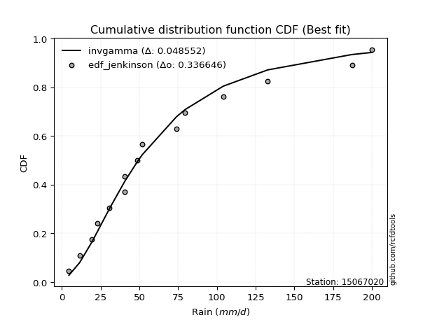</img>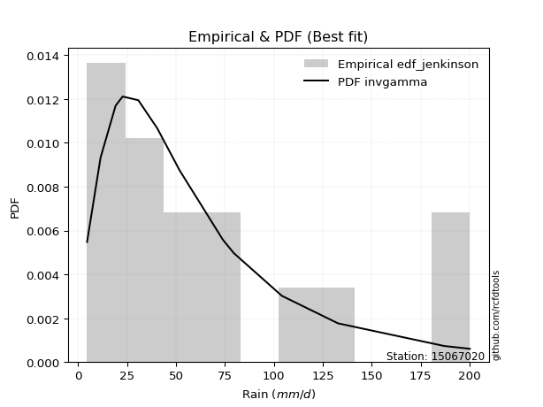</img>

</div>


### 11. EDF Cunnane (1978)

Cunnane´s work in statistical hydrology has focused on the performance and evaluation of different probability distributions (such as GEV, Gumbel, Lognormal) for flood frequency estimation. _b_ is a constant, typically set to 0.4.

<div align="center">


$P=(m-b)/(n+1-2b)$


</div>


**11.1. Empirical values**

<div align="center">

|                | 0                    | 1                   | 2                   | 3                  | 4                  | 5                  | 6                  | 7           | 8                  | 9                 | 10                 | 11                 | 12                 | 13                 | 14                 |
|:---------------|:---------------------|:--------------------|:--------------------|:-------------------|:-------------------|:-------------------|:-------------------|:------------|:-------------------|:------------------|:-------------------|:-------------------|:-------------------|:-------------------|:-------------------|
| date           | 2025                 | 2024                | 2017                | 2005               | 2016               | 2008               | 2014               | 2013        | 2015               | 2020              | 2018               | 2019               | 2007               | 2011               | 2012               |
| x              | 4.5                  | 11.4                | 19.1                | 22.7               | 30.7               | 40.4               | 40.5               | 48.6        | 51.8               | 73.9              | 79.5               | 104.1              | 132.8              | 187.2              | 200.2              |
| m              | 1                    | 2                   | 3                   | 4                  | 5                  | 6                  | 7                  | 8           | 9                  | 10                | 11                 | 12                 | 13                 | 14                 | 15                 |
| empirical_dist | edf_cunnane          | edf_cunnane         | edf_cunnane         | edf_cunnane        | edf_cunnane        | edf_cunnane        | edf_cunnane        | edf_cunnane | edf_cunnane        | edf_cunnane       | edf_cunnane        | edf_cunnane        | edf_cunnane        | edf_cunnane        | edf_cunnane        |
| empirical      | 0.039473684210526314 | 0.10526315789473685 | 0.17105263157894737 | 0.2368421052631579 | 0.3026315789473684 | 0.3684210526315789 | 0.4342105263157895 | 0.5         | 0.5657894736842105 | 0.631578947368421 | 0.6973684210526316 | 0.7631578947368421 | 0.8289473684210527 | 0.8947368421052632 | 0.9605263157894737 |
| empirical_tr   | 1.0410958904109588   | 1.1176470588235294  | 1.2063492063492063  | 1.310344827586207  | 1.4339622641509433 | 1.5833333333333335 | 1.7674418604651163 | 2.0         | 2.3030303030303028 | 2.714285714285714 | 3.304347826086957  | 4.222222222222223  | 5.846153846153847  | 9.5                | 25.333333333333325 |

</div>


**11.2. Kolmogorov-Smirnov fit test (sorted by Δ)**


<div align="center">

|                | 0                   | 1                   | 2                    | 3                    | 4                  | 5                   | 6                   | 7                  | 8                    | 9                    | 10                  | 11                  | 12                  | 13                  | 14                  | 15                  | 16                  | 17                  | 18                  | 19                  | 20                  | 21                 | 22                  | 23                  | 24                  | 25                  | 26                  | 27                  | 28                  | 29                  | 30                  | 31                  | 32                  | 33                  | 34                  | 35                  | 36                  | 37                  | 38                  | 39                  | 40                  | 41                  | 42                  | 43                  | 44                  | 45                  | 46                  | 47                  | 48                  | 49                  | 50                  | 51                  | 52                  | 53                  | 54                  | 55                 | 56                  | 57                  | 58                  | 59                  | 60                 | 61                  | 62                  | 63                  | 64                  | 65                  | 66                  | 67                 | 68                 | 69                 | 70                  | 71                 | 72                 | 73                 | 74                  | 75                  | 76                  | 77                  | 78                  | 79                  | 80                  | 81                 | 82                  | 83                  | 84                  | 85                  | 86                 | 87                  | 88                  | 89                  | 90                  | 91                 | 92                  | 93                 | 94                  | 95                  | 96                  | 97                  | 98                  | 99                 | 100                 | 101                 | 102                 | 103                 | 104                | 105                 | 106                | 107                 | 108                 | 109                | 110                | 111                 | 112                 | 113                 | 114                 | 115                 | 116                | 117                 | 118                 | 119                | 120                 | 121                 | 122                | 123                | 124                | 125                 | 126                 | 127                 | 128                | 129                | 130                 | 131                 | 132                | 133                | 134                | 135                | 136                | 137                | 138                | 139                 | 140                | 141                | 142                | 143                | 144                | 145                | 146                | 147                | 148                | 149                | 150                | 151                | 152                | 153                | 154                | 155                | 156                | 157                | 158                | 159                |
|:---------------|:--------------------|:--------------------|:---------------------|:---------------------|:-------------------|:--------------------|:--------------------|:-------------------|:---------------------|:---------------------|:--------------------|:--------------------|:--------------------|:--------------------|:--------------------|:--------------------|:--------------------|:--------------------|:--------------------|:--------------------|:--------------------|:-------------------|:--------------------|:--------------------|:--------------------|:--------------------|:--------------------|:--------------------|:--------------------|:--------------------|:--------------------|:--------------------|:--------------------|:--------------------|:--------------------|:--------------------|:--------------------|:--------------------|:--------------------|:--------------------|:--------------------|:--------------------|:--------------------|:--------------------|:--------------------|:--------------------|:--------------------|:--------------------|:--------------------|:--------------------|:--------------------|:--------------------|:--------------------|:--------------------|:--------------------|:-------------------|:--------------------|:--------------------|:--------------------|:--------------------|:-------------------|:--------------------|:--------------------|:--------------------|:--------------------|:--------------------|:--------------------|:-------------------|:-------------------|:-------------------|:--------------------|:-------------------|:-------------------|:-------------------|:--------------------|:--------------------|:--------------------|:--------------------|:--------------------|:--------------------|:--------------------|:-------------------|:--------------------|:--------------------|:--------------------|:--------------------|:-------------------|:--------------------|:--------------------|:--------------------|:--------------------|:-------------------|:--------------------|:-------------------|:--------------------|:--------------------|:--------------------|:--------------------|:--------------------|:-------------------|:--------------------|:--------------------|:--------------------|:--------------------|:-------------------|:--------------------|:-------------------|:--------------------|:--------------------|:-------------------|:-------------------|:--------------------|:--------------------|:--------------------|:--------------------|:--------------------|:-------------------|:--------------------|:--------------------|:-------------------|:--------------------|:--------------------|:-------------------|:-------------------|:-------------------|:--------------------|:--------------------|:--------------------|:-------------------|:-------------------|:--------------------|:--------------------|:-------------------|:-------------------|:-------------------|:-------------------|:-------------------|:-------------------|:-------------------|:--------------------|:-------------------|:-------------------|:-------------------|:-------------------|:-------------------|:-------------------|:-------------------|:-------------------|:-------------------|:-------------------|:-------------------|:-------------------|:-------------------|:-------------------|:-------------------|:-------------------|:-------------------|:-------------------|:-------------------|:-------------------|
| station        | 15067020            | 15067020            | 15067020             | 15067020             | 15067020           | 15067020            | 15067020            | 15067020           | 15067020             | 15067020             | 15067020            | 15067020            | 15067020            | 15067020            | 15067020            | 15067020            | 15067020            | 15067020            | 15067020            | 15067020            | 15067020            | 15067020           | 15067020            | 15067020            | 15067020            | 15067020            | 15067020            | 15067020            | 15067020            | 15067020            | 15067020            | 15067020            | 15067020            | 15067020            | 15067020            | 15067020            | 15067020            | 15067020            | 15067020            | 15067020            | 15067020            | 15067020            | 15067020            | 15067020            | 15067020            | 15067020            | 15067020            | 15067020            | 15067020            | 15067020            | 15067020            | 15067020            | 15067020            | 15067020            | 15067020            | 15067020           | 15067020            | 15067020            | 15067020            | 15067020            | 15067020           | 15067020            | 15067020            | 15067020            | 15067020            | 15067020            | 15067020            | 15067020           | 15067020           | 15067020           | 15067020            | 15067020           | 15067020           | 15067020           | 15067020            | 15067020            | 15067020            | 15067020            | 15067020            | 15067020            | 15067020            | 15067020           | 15067020            | 15067020            | 15067020            | 15067020            | 15067020           | 15067020            | 15067020            | 15067020            | 15067020            | 15067020           | 15067020            | 15067020           | 15067020            | 15067020            | 15067020            | 15067020            | 15067020            | 15067020           | 15067020            | 15067020            | 15067020            | 15067020            | 15067020           | 15067020            | 15067020           | 15067020            | 15067020            | 15067020           | 15067020           | 15067020            | 15067020            | 15067020            | 15067020            | 15067020            | 15067020           | 15067020            | 15067020            | 15067020           | 15067020            | 15067020            | 15067020           | 15067020           | 15067020           | 15067020            | 15067020            | 15067020            | 15067020           | 15067020           | 15067020            | 15067020            | 15067020           | 15067020           | 15067020           | 15067020           | 15067020           | 15067020           | 15067020           | 15067020            | 15067020           | 15067020           | 15067020           | 15067020           | 15067020           | 15067020           | 15067020           | 15067020           | 15067020           | 15067020           | 15067020           | 15067020           | 15067020           | 15067020           | 15067020           | 15067020           | 15067020           | 15067020           | 15067020           | 15067020           |
| empirical_dist | edf_cunnane         | edf_cunnane         | edf_cunnane          | edf_cunnane          | edf_cunnane        | edf_cunnane         | edf_cunnane         | edf_cunnane        | edf_cunnane          | edf_cunnane          | edf_cunnane         | edf_cunnane         | edf_cunnane         | edf_cunnane         | edf_cunnane         | edf_cunnane         | edf_cunnane         | edf_cunnane         | edf_cunnane         | edf_cunnane         | edf_cunnane         | edf_cunnane        | edf_cunnane         | edf_cunnane         | edf_cunnane         | edf_cunnane         | edf_cunnane         | edf_cunnane         | edf_cunnane         | edf_cunnane         | edf_cunnane         | edf_cunnane         | edf_cunnane         | edf_cunnane         | edf_cunnane         | edf_cunnane         | edf_cunnane         | edf_cunnane         | edf_cunnane         | edf_cunnane         | edf_cunnane         | edf_cunnane         | edf_cunnane         | edf_cunnane         | edf_cunnane         | edf_cunnane         | edf_cunnane         | edf_cunnane         | edf_cunnane         | edf_cunnane         | edf_cunnane         | edf_cunnane         | edf_cunnane         | edf_cunnane         | edf_cunnane         | edf_cunnane        | edf_cunnane         | edf_cunnane         | edf_cunnane         | edf_cunnane         | edf_cunnane        | edf_cunnane         | edf_cunnane         | edf_cunnane         | edf_cunnane         | edf_cunnane         | edf_cunnane         | edf_cunnane        | edf_cunnane        | edf_cunnane        | edf_cunnane         | edf_cunnane        | edf_cunnane        | edf_cunnane        | edf_cunnane         | edf_cunnane         | edf_cunnane         | edf_cunnane         | edf_cunnane         | edf_cunnane         | edf_cunnane         | edf_cunnane        | edf_cunnane         | edf_cunnane         | edf_cunnane         | edf_cunnane         | edf_cunnane        | edf_cunnane         | edf_cunnane         | edf_cunnane         | edf_cunnane         | edf_cunnane        | edf_cunnane         | edf_cunnane        | edf_cunnane         | edf_cunnane         | edf_cunnane         | edf_cunnane         | edf_cunnane         | edf_cunnane        | edf_cunnane         | edf_cunnane         | edf_cunnane         | edf_cunnane         | edf_cunnane        | edf_cunnane         | edf_cunnane        | edf_cunnane         | edf_cunnane         | edf_cunnane        | edf_cunnane        | edf_cunnane         | edf_cunnane         | edf_cunnane         | edf_cunnane         | edf_cunnane         | edf_cunnane        | edf_cunnane         | edf_cunnane         | edf_cunnane        | edf_cunnane         | edf_cunnane         | edf_cunnane        | edf_cunnane        | edf_cunnane        | edf_cunnane         | edf_cunnane         | edf_cunnane         | edf_cunnane        | edf_cunnane        | edf_cunnane         | edf_cunnane         | edf_cunnane        | edf_cunnane        | edf_cunnane        | edf_cunnane        | edf_cunnane        | edf_cunnane        | edf_cunnane        | edf_cunnane         | edf_cunnane        | edf_cunnane        | edf_cunnane        | edf_cunnane        | edf_cunnane        | edf_cunnane        | edf_cunnane        | edf_cunnane        | edf_cunnane        | edf_cunnane        | edf_cunnane        | edf_cunnane        | edf_cunnane        | edf_cunnane        | edf_cunnane        | edf_cunnane        | edf_cunnane        | edf_cunnane        | edf_cunnane        | edf_cunnane        |
| p_dist         | invgamma            | invweibull          | genextreme           | johnsonsu            | nct                | invgauss            | alpha               | logpearson3        | lomax                | exponnorm            | loggompertz         | betaprime           | burr12              | logburr12           | logweibull_min      | loggenlogistic      | weibull_min         | logloggamma         | kappa3              | loglogistic         | genexpon            | ncf                | logjohnsonsu        | logmielke           | logfoldnorm         | bradford            | loggennorm          | logargus            | logrice             | logexponnorm        | logcrystalball      | lognorm             | logt                | lognct              | logjohnsonsb        | logfatiguelife      | logf                | logalpha            | loghypsecant        | loggumbel_l         | logloglaplace       | logdgamma           | logdweibull         | loganglit           | logerlang           | exponpow            | logsemicircular     | halflogistic        | lognakagami         | loggenhalflogistic  | loggenextreme       | genpareto           | loggamma            | loggamma            | loginvgamma         | logtriang          | foldnorm            | burr                | halfnorm            | logncf              | loginvgauss        | moyal               | loglaplace          | loglaplace          | logmaxwell          | dgamma              | logskewnorm         | mielke             | logbetaprime       | logarcsine         | vonmises_line       | t                  | pearson3           | tukeylambda        | genlogistic         | logcosine           | lograyleigh         | f                   | logburr             | gumbel_r            | loginvweibull       | dweibull           | gengamma            | gamma               | loggausshyper       | gennorm             | rayleigh           | loggumbel_r         | kstwobign           | maxwell             | skewnorm            | gompertz           | erlang              | logkstwobign       | loghalfnorm         | semicircular        | logbeta             | halfgennorm         | anglit              | wald               | logweibull_max      | logmoyal            | loggenexpon         | nakagami            | arcsine            | triang              | loghalflogistic    | norm                | crystalball         | logtrapezoid       | loggenpareto       | rice                | logistic            | truncweibull_min    | logwrapcauchy       | logbradford         | logkappa3          | loguniform          | hypsecant           | gausshyper         | logvonmises_line    | logtruncweibull_min | logksone           | logkappa4          | cosine             | laplace             | exponweib           | logwald             | gumbel_l           | truncexpon         | wrapcauchy          | loglevy_l           | logtruncexpon      | kappa4             | loglomax           | ksone              | beta               | argus              | logtruncnorm       | uniform             | logtukeylambda     | powerlaw           | loggengamma        | levy_l             | genhalflogistic    | logrdist           | logexponweib       | johnsonsb          | rdist              | trapezoid          | fatiguelife        | logpowerlaw        | logexponpow        | weibull_max        | truncpareto        | logtruncpareto     | loghalfgennorm     | truncnorm          | logvonmises        | vonmises           |
| delta          | 0.04701161605684534 | 0.05019611485274633 | 0.050196322465916876 | 0.051357448679522466 | 0.0514043013515173 | 0.05266989870814426 | 0.05286333121046993 | 0.0539969340901959 | 0.054038057158666386 | 0.056584031721324146 | 0.05921524484628671 | 0.05966921963026728 | 0.06205664786073728 | 0.06590019722681406 | 0.06663582539130963 | 0.06788966153887721 | 0.06878937400161783 | 0.07020633708584834 | 0.07065149997396342 | 0.07412595051543497 | 0.07456916398720737 | 0.075051723091842  | 0.07556102833966344 | 0.07644411828590048 | 0.07698668743320408 | 0.07748607581643618 | 0.07872527707983462 | 0.07944757472263675 | 0.08093336776692328 | 0.08094326138809005 | 0.08094461191537072 | 0.08094464165762139 | 0.08094510681850514 | 0.08097069723944805 | 0.08102569883462135 | 0.08176156039705401 | 0.08424647065029367 | 0.08471934945737652 | 0.08498058333783631 | 0.08573812728907648 | 0.08628005121180982 | 0.08641826351192783 | 0.08728213944010155 | 0.08812950484858523 | 0.08910090704236318 | 0.09068723803065926 | 0.09109801039195137 | 0.09195523274418649 | 0.09366030262441177 | 0.09510410797757904 | 0.09597013718034841 | 0.09639196229348612 | 0.09720892534102349 | 0.09720892534102349 | 0.09877084982003032 | 0.1023348101219464 | 0.10334413425516636 | 0.10346975441495412 | 0.10483277379546663 | 0.10679665066486432 | 0.1073780833694774 | 0.10840606938336739 | 0.11156836354716493 | 0.11156836354716493 | 0.11527250864723482 | 0.11677581878758758 | 0.11699485047969538 | 0.1170194826511905 | 0.1181074053490756 | 0.1181864451055791 | 0.11835495267326342 | 0.1226411075613744 | 0.1227153555402073 | 0.1257495681245484 | 0.12603276299406585 | 0.12676483065786354 | 0.12717609358256782 | 0.12797034025957052 | 0.12868445870528328 | 0.12966637246381685 | 0.13222604223743345 | 0.1331794959426757 | 0.13503024110953504 | 0.13604083703579023 | 0.13617968129002817 | 0.13627635802810467 | 0.1397496581432578 | 0.14791085634390372 | 0.15129919784586338 | 0.15203819866539614 | 0.15733225021387265 | 0.1575425077589271 | 0.15774362298625638 | 0.1606868770818622 | 0.16077850840550062 | 0.16237472875658904 | 0.16413154196287033 | 0.16560384124677435 | 0.16916563484468672 | 0.1697693698058345 | 0.17123397062479517 | 0.17325090856151731 | 0.17358962701137465 | 0.17382907090574193 | 0.1754574021116042 | 0.17730569915188443 | 0.181809770777363  | 0.18545924603531522 | 0.18545924826641302 | 0.1877472438435609 | 0.1897922492054818 | 0.19388415690885702 | 0.20050673620014714 | 0.20590525873341042 | 0.20783172617233572 | 0.20969330202077865 | 0.2098246381279409 | 0.20986983137690735 | 0.21259654433244213 | 0.2213361305884336 | 0.22523109621412568 | 0.22533929471226816 | 0.2296982959236533 | 0.2301423952217179 | 0.2326600660964906 | 0.24079135164325977 | 0.24243504535496635 | 0.24366627623564335 | 0.2497324131992738 | 0.2524768491376986 | 0.26157157333297254 | 0.27682079319303443 | 0.2859104217046482 | 0.2885571707890424 | 0.2934203511367812 | 0.2946687106114802 | 0.2956166478618353 | 0.2983364266513089 | 0.3182566814941959 | 0.32409299948901377 | 0.3273103543595289 | 0.3499954915176715 | 0.4027337221329462 | 0.4092551038090688 | 0.4214158641271184 | 0.4519217042263717 | 0.4650017706066978 | 0.4822040935098818 | 0.5164063494725665 | 0.5326068909227883 | 0.5326296787810841 | 0.5495699964471134 | 0.6709682719112471 | 0.7044599343330804 | 0.7736909744482061 | 0.8424777966609238 | 0.8947368421052632 | 0.9178698304473851 | 1.0302182964402102 | 31.76501916537955  |
| deltao         | 0.3366456264050002  | 0.3366456264050002  | 0.3366456264050002   | 0.3366456264050002   | 0.3366456264050002 | 0.3366456264050002  | 0.3366456264050002  | 0.3366456264050002 | 0.3366456264050002   | 0.3366456264050002   | 0.3366456264050002  | 0.3366456264050002  | 0.3366456264050002  | 0.3366456264050002  | 0.3366456264050002  | 0.3366456264050002  | 0.3366456264050002  | 0.3366456264050002  | 0.3366456264050002  | 0.3366456264050002  | 0.3366456264050002  | 0.3366456264050002 | 0.3366456264050002  | 0.3366456264050002  | 0.3366456264050002  | 0.3366456264050002  | 0.3366456264050002  | 0.3366456264050002  | 0.3366456264050002  | 0.3366456264050002  | 0.3366456264050002  | 0.3366456264050002  | 0.3366456264050002  | 0.3366456264050002  | 0.3366456264050002  | 0.3366456264050002  | 0.3366456264050002  | 0.3366456264050002  | 0.3366456264050002  | 0.3366456264050002  | 0.3366456264050002  | 0.3366456264050002  | 0.3366456264050002  | 0.3366456264050002  | 0.3366456264050002  | 0.3366456264050002  | 0.3366456264050002  | 0.3366456264050002  | 0.3366456264050002  | 0.3366456264050002  | 0.3366456264050002  | 0.3366456264050002  | 0.3366456264050002  | 0.3366456264050002  | 0.3366456264050002  | 0.3366456264050002 | 0.3366456264050002  | 0.3366456264050002  | 0.3366456264050002  | 0.3366456264050002  | 0.3366456264050002 | 0.3366456264050002  | 0.3366456264050002  | 0.3366456264050002  | 0.3366456264050002  | 0.3366456264050002  | 0.3366456264050002  | 0.3366456264050002 | 0.3366456264050002 | 0.3366456264050002 | 0.3366456264050002  | 0.3366456264050002 | 0.3366456264050002 | 0.3366456264050002 | 0.3366456264050002  | 0.3366456264050002  | 0.3366456264050002  | 0.3366456264050002  | 0.3366456264050002  | 0.3366456264050002  | 0.3366456264050002  | 0.3366456264050002 | 0.3366456264050002  | 0.3366456264050002  | 0.3366456264050002  | 0.3366456264050002  | 0.3366456264050002 | 0.3366456264050002  | 0.3366456264050002  | 0.3366456264050002  | 0.3366456264050002  | 0.3366456264050002 | 0.3366456264050002  | 0.3366456264050002 | 0.3366456264050002  | 0.3366456264050002  | 0.3366456264050002  | 0.3366456264050002  | 0.3366456264050002  | 0.3366456264050002 | 0.3366456264050002  | 0.3366456264050002  | 0.3366456264050002  | 0.3366456264050002  | 0.3366456264050002 | 0.3366456264050002  | 0.3366456264050002 | 0.3366456264050002  | 0.3366456264050002  | 0.3366456264050002 | 0.3366456264050002 | 0.3366456264050002  | 0.3366456264050002  | 0.3366456264050002  | 0.3366456264050002  | 0.3366456264050002  | 0.3366456264050002 | 0.3366456264050002  | 0.3366456264050002  | 0.3366456264050002 | 0.3366456264050002  | 0.3366456264050002  | 0.3366456264050002 | 0.3366456264050002 | 0.3366456264050002 | 0.3366456264050002  | 0.3366456264050002  | 0.3366456264050002  | 0.3366456264050002 | 0.3366456264050002 | 0.3366456264050002  | 0.3366456264050002  | 0.3366456264050002 | 0.3366456264050002 | 0.3366456264050002 | 0.3366456264050002 | 0.3366456264050002 | 0.3366456264050002 | 0.3366456264050002 | 0.3366456264050002  | 0.3366456264050002 | 0.3366456264050002 | 0.3366456264050002 | 0.3366456264050002 | 0.3366456264050002 | 0.3366456264050002 | 0.3366456264050002 | 0.3366456264050002 | 0.3366456264050002 | 0.3366456264050002 | 0.3366456264050002 | 0.3366456264050002 | 0.3366456264050002 | 0.3366456264050002 | 0.3366456264050002 | 0.3366456264050002 | 0.3366456264050002 | 0.3366456264050002 | 0.3366456264050002 | 0.3366456264050002 |
| eval           | Δo > Δ              | Δo > Δ              | Δo > Δ               | Δo > Δ               | Δo > Δ             | Δo > Δ              | Δo > Δ              | Δo > Δ             | Δo > Δ               | Δo > Δ               | Δo > Δ              | Δo > Δ              | Δo > Δ              | Δo > Δ              | Δo > Δ              | Δo > Δ              | Δo > Δ              | Δo > Δ              | Δo > Δ              | Δo > Δ              | Δo > Δ              | Δo > Δ             | Δo > Δ              | Δo > Δ              | Δo > Δ              | Δo > Δ              | Δo > Δ              | Δo > Δ              | Δo > Δ              | Δo > Δ              | Δo > Δ              | Δo > Δ              | Δo > Δ              | Δo > Δ              | Δo > Δ              | Δo > Δ              | Δo > Δ              | Δo > Δ              | Δo > Δ              | Δo > Δ              | Δo > Δ              | Δo > Δ              | Δo > Δ              | Δo > Δ              | Δo > Δ              | Δo > Δ              | Δo > Δ              | Δo > Δ              | Δo > Δ              | Δo > Δ              | Δo > Δ              | Δo > Δ              | Δo > Δ              | Δo > Δ              | Δo > Δ              | Δo > Δ             | Δo > Δ              | Δo > Δ              | Δo > Δ              | Δo > Δ              | Δo > Δ             | Δo > Δ              | Δo > Δ              | Δo > Δ              | Δo > Δ              | Δo > Δ              | Δo > Δ              | Δo > Δ             | Δo > Δ             | Δo > Δ             | Δo > Δ              | Δo > Δ             | Δo > Δ             | Δo > Δ             | Δo > Δ              | Δo > Δ              | Δo > Δ              | Δo > Δ              | Δo > Δ              | Δo > Δ              | Δo > Δ              | Δo > Δ             | Δo > Δ              | Δo > Δ              | Δo > Δ              | Δo > Δ              | Δo > Δ             | Δo > Δ              | Δo > Δ              | Δo > Δ              | Δo > Δ              | Δo > Δ             | Δo > Δ              | Δo > Δ             | Δo > Δ              | Δo > Δ              | Δo > Δ              | Δo > Δ              | Δo > Δ              | Δo > Δ             | Δo > Δ              | Δo > Δ              | Δo > Δ              | Δo > Δ              | Δo > Δ             | Δo > Δ              | Δo > Δ             | Δo > Δ              | Δo > Δ              | Δo > Δ             | Δo > Δ             | Δo > Δ              | Δo > Δ              | Δo > Δ              | Δo > Δ              | Δo > Δ              | Δo > Δ             | Δo > Δ              | Δo > Δ              | Δo > Δ             | Δo > Δ              | Δo > Δ              | Δo > Δ             | Δo > Δ             | Δo > Δ             | Δo > Δ              | Δo > Δ              | Δo > Δ              | Δo > Δ             | Δo > Δ             | Δo > Δ              | Δo > Δ              | Δo > Δ             | Δo > Δ             | Δo > Δ             | Δo > Δ             | Δo > Δ             | Δo > Δ             | Δo > Δ             | Δo > Δ              | Δo > Δ             | Δo <= Δ            | Δo <= Δ            | Δo <= Δ            | Δo <= Δ            | Δo <= Δ            | Δo <= Δ            | Δo <= Δ            | Δo <= Δ            | Δo <= Δ            | Δo <= Δ            | Δo <= Δ            | Δo <= Δ            | Δo <= Δ            | Δo <= Δ            | Δo <= Δ            | Δo <= Δ            | Δo <= Δ            | Δo <= Δ            | Δo <= Δ            |
| fit            | 1                   | 1                   | 1                    | 1                    | 1                  | 1                   | 1                   | 1                  | 1                    | 1                    | 1                   | 1                   | 1                   | 1                   | 1                   | 1                   | 1                   | 1                   | 1                   | 1                   | 1                   | 1                  | 1                   | 1                   | 1                   | 1                   | 1                   | 1                   | 1                   | 1                   | 1                   | 1                   | 1                   | 1                   | 1                   | 1                   | 1                   | 1                   | 1                   | 1                   | 1                   | 1                   | 1                   | 1                   | 1                   | 1                   | 1                   | 1                   | 1                   | 1                   | 1                   | 1                   | 1                   | 1                   | 1                   | 1                  | 1                   | 1                   | 1                   | 1                   | 1                  | 1                   | 1                   | 1                   | 1                   | 1                   | 1                   | 1                  | 1                  | 1                  | 1                   | 1                  | 1                  | 1                  | 1                   | 1                   | 1                   | 1                   | 1                   | 1                   | 1                   | 1                  | 1                   | 1                   | 1                   | 1                   | 1                  | 1                   | 1                   | 1                   | 1                   | 1                  | 1                   | 1                  | 1                   | 1                   | 1                   | 1                   | 1                   | 1                  | 1                   | 1                   | 1                   | 1                   | 1                  | 1                   | 1                  | 1                   | 1                   | 1                  | 1                  | 1                   | 1                   | 1                   | 1                   | 1                   | 1                  | 1                   | 1                   | 1                  | 1                   | 1                   | 1                  | 1                  | 1                  | 1                   | 1                   | 1                   | 1                  | 1                  | 1                   | 1                   | 1                  | 1                  | 1                  | 1                  | 1                  | 1                  | 1                  | 1                   | 1                  | 0                  | 0                  | 0                  | 0                  | 0                  | 0                  | 0                  | 0                  | 0                  | 0                  | 0                  | 0                  | 0                  | 0                  | 0                  | 0                  | 0                  | 0                  | 0                  |
| n              | 15                  | 15                  | 15                   | 15                   | 15                 | 15                  | 15                  | 15                 | 15                   | 15                   | 15                  | 15                  | 15                  | 15                  | 15                  | 15                  | 15                  | 15                  | 15                  | 15                  | 15                  | 15                 | 15                  | 15                  | 15                  | 15                  | 15                  | 15                  | 15                  | 15                  | 15                  | 15                  | 15                  | 15                  | 15                  | 15                  | 15                  | 15                  | 15                  | 15                  | 15                  | 15                  | 15                  | 15                  | 15                  | 15                  | 15                  | 15                  | 15                  | 15                  | 15                  | 15                  | 15                  | 15                  | 15                  | 15                 | 15                  | 15                  | 15                  | 15                  | 15                 | 15                  | 15                  | 15                  | 15                  | 15                  | 15                  | 15                 | 15                 | 15                 | 15                  | 15                 | 15                 | 15                 | 15                  | 15                  | 15                  | 15                  | 15                  | 15                  | 15                  | 15                 | 15                  | 15                  | 15                  | 15                  | 15                 | 15                  | 15                  | 15                  | 15                  | 15                 | 15                  | 15                 | 15                  | 15                  | 15                  | 15                  | 15                  | 15                 | 15                  | 15                  | 15                  | 15                  | 15                 | 15                  | 15                 | 15                  | 15                  | 15                 | 15                 | 15                  | 15                  | 15                  | 15                  | 15                  | 15                 | 15                  | 15                  | 15                 | 15                  | 15                  | 15                 | 15                 | 15                 | 15                  | 15                  | 15                  | 15                 | 15                 | 15                  | 15                  | 15                 | 15                 | 15                 | 15                 | 15                 | 15                 | 15                 | 15                  | 15                 | 15                 | 15                 | 15                 | 15                 | 15                 | 15                 | 15                 | 15                 | 15                 | 15                 | 15                 | 15                 | 15                 | 15                 | 15                 | 15                 | 15                 | 15                 | 15                 |
| best_fit       | 1                   | 0                   | 0                    | 0                    | 0                  | 0                   | 0                   | 0                  | 0                    | 0                    | 0                   | 0                   | 0                   | 0                   | 0                   | 0                   | 0                   | 0                   | 0                   | 0                   | 0                   | 0                  | 0                   | 0                   | 0                   | 0                   | 0                   | 0                   | 0                   | 0                   | 0                   | 0                   | 0                   | 0                   | 0                   | 0                   | 0                   | 0                   | 0                   | 0                   | 0                   | 0                   | 0                   | 0                   | 0                   | 0                   | 0                   | 0                   | 0                   | 0                   | 0                   | 0                   | 0                   | 0                   | 0                   | 0                  | 0                   | 0                   | 0                   | 0                   | 0                  | 0                   | 0                   | 0                   | 0                   | 0                   | 0                   | 0                  | 0                  | 0                  | 0                   | 0                  | 0                  | 0                  | 0                   | 0                   | 0                   | 0                   | 0                   | 0                   | 0                   | 0                  | 0                   | 0                   | 0                   | 0                   | 0                  | 0                   | 0                   | 0                   | 0                   | 0                  | 0                   | 0                  | 0                   | 0                   | 0                   | 0                   | 0                   | 0                  | 0                   | 0                   | 0                   | 0                   | 0                  | 0                   | 0                  | 0                   | 0                   | 0                  | 0                  | 0                   | 0                   | 0                   | 0                   | 0                   | 0                  | 0                   | 0                   | 0                  | 0                   | 0                   | 0                  | 0                  | 0                  | 0                   | 0                   | 0                   | 0                  | 0                  | 0                   | 0                   | 0                  | 0                  | 0                  | 0                  | 0                  | 0                  | 0                  | 0                   | 0                  | 0                  | 0                  | 0                  | 0                  | 0                  | 0                  | 0                  | 0                  | 0                  | 0                  | 0                  | 0                  | 0                  | 0                  | 0                  | 0                  | 0                  | 0                  | 0                  |
| best_fit_sort  | 1                   | 2                   | 3                    | 4                    | 5                  | 6                   | 7                   | 8                  | 9                    | 10                   | 11                  | 12                  | 13                  | 14                  | 15                  | 16                  | 17                  | 18                  | 19                  | 20                  | 21                  | 22                 | 23                  | 24                  | 25                  | 26                  | 27                  | 28                  | 29                  | 30                  | 31                  | 32                  | 33                  | 34                  | 35                  | 36                  | 37                  | 38                  | 39                  | 40                  | 41                  | 42                  | 43                  | 44                  | 45                  | 46                  | 47                  | 48                  | 49                  | 50                  | 51                  | 52                  | 53                  | 54                  | 55                  | 56                 | 57                  | 58                  | 59                  | 60                  | 61                 | 62                  | 63                  | 64                  | 65                  | 66                  | 67                  | 68                 | 69                 | 70                 | 71                  | 72                 | 73                 | 74                 | 75                  | 76                  | 77                  | 78                  | 79                  | 80                  | 81                  | 82                 | 83                  | 84                  | 85                  | 86                  | 87                 | 88                  | 89                  | 90                  | 91                  | 92                 | 93                  | 94                 | 95                  | 96                  | 97                  | 98                  | 99                  | 100                | 101                 | 102                 | 103                 | 104                 | 105                | 106                 | 107                | 108                 | 109                 | 110                | 111                | 112                 | 113                 | 114                 | 115                 | 116                 | 117                | 118                 | 119                 | 120                | 121                 | 122                 | 123                | 124                | 125                | 126                 | 127                 | 128                 | 129                | 130                | 131                 | 132                 | 133                | 134                | 135                | 136                | 137                | 138                | 139                | 140                 | 141                | 142                | 143                | 144                | 145                | 146                | 147                | 148                | 149                | 150                | 151                | 152                | 153                | 154                | 155                | 156                | 157                | 158                | 159                | 160                |

</div>


**11.3. Best fit**

<div align="center">

|   id |   station | empirical_dist   | p_dist   |     delta |   deltao | eval   |   fit |   n |   best_fit |   best_fit_sort |
|-----:|----------:|:-----------------|:---------|----------:|---------:|:-------|------:|----:|-----------:|----------------:|
|    0 |  15067020 | edf_cunnane      | invgamma | 0.0470116 | 0.336646 | Δo > Δ |     1 |  15 |          1 |               1 |

</div>


<div align="center">

</img>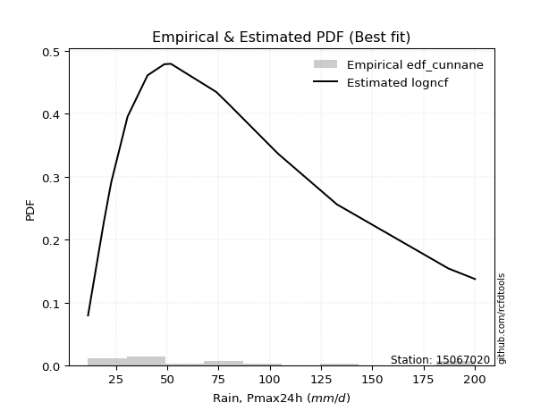</img>

</div>


### 12. EDF Adamowski (1981)

The Adamowski formula in hydrology refers to a specific plotting position formula used for estimating the non-parametric empirical distribution of hydrological events (like flood peaks) to calculate their return periods. This formula provides an alternative to traditional parametric methods (like the Gumbel or Log Pearson Type III distributions). 

<div align="center">


$P=(m-0.25)/(n+0.5)$


</div>


**12.1. Empirical values**

<div align="center">

|                | 0                   | 1                   | 2                  | 3                   | 4                  | 5                  | 6                   | 7             | 8                  | 9                  | 10                 | 11                 | 12                 | 13                 | 14                 |
|:---------------|:--------------------|:--------------------|:-------------------|:--------------------|:-------------------|:-------------------|:--------------------|:--------------|:-------------------|:-------------------|:-------------------|:-------------------|:-------------------|:-------------------|:-------------------|
| date           | 2025                | 2024                | 2017               | 2005                | 2016               | 2008               | 2014                | 2013          | 2015               | 2020               | 2018               | 2019               | 2007               | 2011               | 2012               |
| x              | 4.5                 | 11.4                | 19.1               | 22.7                | 30.7               | 40.4               | 40.5                | 48.6          | 51.8               | 73.9               | 79.5               | 104.1              | 132.8              | 187.2              | 200.2              |
| m              | 1                   | 2                   | 3                  | 4                   | 5                  | 6                  | 7                   | 8             | 9                  | 10                 | 11                 | 12                 | 13                 | 14                 | 15                 |
| empirical_dist | edf_adamowski       | edf_adamowski       | edf_adamowski      | edf_adamowski       | edf_adamowski      | edf_adamowski      | edf_adamowski       | edf_adamowski | edf_adamowski      | edf_adamowski      | edf_adamowski      | edf_adamowski      | edf_adamowski      | edf_adamowski      | edf_adamowski      |
| empirical      | 0.04838709677419355 | 0.11290322580645161 | 0.1774193548387097 | 0.24193548387096775 | 0.3064516129032258 | 0.3709677419354839 | 0.43548387096774194 | 0.5           | 0.5645161290322581 | 0.6290322580645161 | 0.6935483870967742 | 0.7580645161290323 | 0.8225806451612904 | 0.8870967741935484 | 0.9516129032258065 |
| empirical_tr   | 1.0508474576271185  | 1.1272727272727272  | 1.215686274509804  | 1.3191489361702127  | 1.441860465116279  | 1.5897435897435896 | 1.7714285714285716  | 2.0           | 2.2962962962962967 | 2.6956521739130435 | 3.2631578947368425 | 4.133333333333333  | 5.636363636363638  | 8.857142857142856  | 20.666666666666686 |

</div>


**12.2. Kolmogorov-Smirnov fit test (sorted by Δ)**


<div align="center">

|                | 0                   | 1                   | 2                    | 3                   | 4                   | 5                    | 6                   | 7                    | 8                   | 9                  | 10                  | 11                  | 12                  | 13                  | 14                  | 15                  | 16                  | 17                  | 18                  | 19                  | 20                  | 21                 | 22                  | 23                  | 24                  | 25                  | 26                  | 27                  | 28                 | 29                  | 30                  | 31                 | 32                 | 33                 | 34                  | 35                  | 36                  | 37                  | 38                  | 39                  | 40                 | 41                  | 42                  | 43                  | 44                 | 45                  | 46                  | 47                  | 48                 | 49                  | 50                  | 51                  | 52                  | 53                  | 54                  | 55                 | 56                  | 57                  | 58                  | 59                  | 60                  | 61                 | 62                  | 63                  | 64                  | 65                  | 66                  | 67                  | 68                  | 69                  | 70                  | 71                  | 72                  | 73                 | 74                 | 75                  | 76                  | 77                  | 78                  | 79                 | 80                  | 81                 | 82                 | 83                 | 84                  | 85                  | 86                 | 87                  | 88                  | 89                  | 90                  | 91                  | 92                 | 93                  | 94                  | 95                  | 96                  | 97                 | 98                  | 99                  | 100                 | 101                 | 102                 | 103                | 104                 | 105                 | 106                 | 107                 | 108                | 109                 | 110                 | 111                 | 112                 | 113                 | 114                 | 115                 | 116                 | 117                | 118                 | 119                | 120                 | 121                 | 122                 | 123                 | 124                | 125                 | 126                | 127                | 128                 | 129                | 130                 | 131                | 132                | 133                | 134                | 135                | 136                | 137                | 138                 | 139                | 140                 | 141                 | 142                | 143                | 144                | 145                 | 146                 | 147                | 148                | 149                | 150                | 151                | 152                | 153                | 154                | 155                | 156                | 157                | 158                | 159                |
|:---------------|:--------------------|:--------------------|:---------------------|:--------------------|:--------------------|:---------------------|:--------------------|:---------------------|:--------------------|:-------------------|:--------------------|:--------------------|:--------------------|:--------------------|:--------------------|:--------------------|:--------------------|:--------------------|:--------------------|:--------------------|:--------------------|:-------------------|:--------------------|:--------------------|:--------------------|:--------------------|:--------------------|:--------------------|:-------------------|:--------------------|:--------------------|:-------------------|:-------------------|:-------------------|:--------------------|:--------------------|:--------------------|:--------------------|:--------------------|:--------------------|:-------------------|:--------------------|:--------------------|:--------------------|:-------------------|:--------------------|:--------------------|:--------------------|:-------------------|:--------------------|:--------------------|:--------------------|:--------------------|:--------------------|:--------------------|:-------------------|:--------------------|:--------------------|:--------------------|:--------------------|:--------------------|:-------------------|:--------------------|:--------------------|:--------------------|:--------------------|:--------------------|:--------------------|:--------------------|:--------------------|:--------------------|:--------------------|:--------------------|:-------------------|:-------------------|:--------------------|:--------------------|:--------------------|:--------------------|:-------------------|:--------------------|:-------------------|:-------------------|:-------------------|:--------------------|:--------------------|:-------------------|:--------------------|:--------------------|:--------------------|:--------------------|:--------------------|:-------------------|:--------------------|:--------------------|:--------------------|:--------------------|:-------------------|:--------------------|:--------------------|:--------------------|:--------------------|:--------------------|:-------------------|:--------------------|:--------------------|:--------------------|:--------------------|:-------------------|:--------------------|:--------------------|:--------------------|:--------------------|:--------------------|:--------------------|:--------------------|:--------------------|:-------------------|:--------------------|:-------------------|:--------------------|:--------------------|:--------------------|:--------------------|:-------------------|:--------------------|:-------------------|:-------------------|:--------------------|:-------------------|:--------------------|:-------------------|:-------------------|:-------------------|:-------------------|:-------------------|:-------------------|:-------------------|:--------------------|:-------------------|:--------------------|:--------------------|:-------------------|:-------------------|:-------------------|:--------------------|:--------------------|:-------------------|:-------------------|:-------------------|:-------------------|:-------------------|:-------------------|:-------------------|:-------------------|:-------------------|:-------------------|:-------------------|:-------------------|:-------------------|
| station        | 15067020            | 15067020            | 15067020             | 15067020            | 15067020            | 15067020             | 15067020            | 15067020             | 15067020            | 15067020           | 15067020            | 15067020            | 15067020            | 15067020            | 15067020            | 15067020            | 15067020            | 15067020            | 15067020            | 15067020            | 15067020            | 15067020           | 15067020            | 15067020            | 15067020            | 15067020            | 15067020            | 15067020            | 15067020           | 15067020            | 15067020            | 15067020           | 15067020           | 15067020           | 15067020            | 15067020            | 15067020            | 15067020            | 15067020            | 15067020            | 15067020           | 15067020            | 15067020            | 15067020            | 15067020           | 15067020            | 15067020            | 15067020            | 15067020           | 15067020            | 15067020            | 15067020            | 15067020            | 15067020            | 15067020            | 15067020           | 15067020            | 15067020            | 15067020            | 15067020            | 15067020            | 15067020           | 15067020            | 15067020            | 15067020            | 15067020            | 15067020            | 15067020            | 15067020            | 15067020            | 15067020            | 15067020            | 15067020            | 15067020           | 15067020           | 15067020            | 15067020            | 15067020            | 15067020            | 15067020           | 15067020            | 15067020           | 15067020           | 15067020           | 15067020            | 15067020            | 15067020           | 15067020            | 15067020            | 15067020            | 15067020            | 15067020            | 15067020           | 15067020            | 15067020            | 15067020            | 15067020            | 15067020           | 15067020            | 15067020            | 15067020            | 15067020            | 15067020            | 15067020           | 15067020            | 15067020            | 15067020            | 15067020            | 15067020           | 15067020            | 15067020            | 15067020            | 15067020            | 15067020            | 15067020            | 15067020            | 15067020            | 15067020           | 15067020            | 15067020           | 15067020            | 15067020            | 15067020            | 15067020            | 15067020           | 15067020            | 15067020           | 15067020           | 15067020            | 15067020           | 15067020            | 15067020           | 15067020           | 15067020           | 15067020           | 15067020           | 15067020           | 15067020           | 15067020            | 15067020           | 15067020            | 15067020            | 15067020           | 15067020           | 15067020           | 15067020            | 15067020            | 15067020           | 15067020           | 15067020           | 15067020           | 15067020           | 15067020           | 15067020           | 15067020           | 15067020           | 15067020           | 15067020           | 15067020           | 15067020           |
| empirical_dist | edf_adamowski       | edf_adamowski       | edf_adamowski        | edf_adamowski       | edf_adamowski       | edf_adamowski        | edf_adamowski       | edf_adamowski        | edf_adamowski       | edf_adamowski      | edf_adamowski       | edf_adamowski       | edf_adamowski       | edf_adamowski       | edf_adamowski       | edf_adamowski       | edf_adamowski       | edf_adamowski       | edf_adamowski       | edf_adamowski       | edf_adamowski       | edf_adamowski      | edf_adamowski       | edf_adamowski       | edf_adamowski       | edf_adamowski       | edf_adamowski       | edf_adamowski       | edf_adamowski      | edf_adamowski       | edf_adamowski       | edf_adamowski      | edf_adamowski      | edf_adamowski      | edf_adamowski       | edf_adamowski       | edf_adamowski       | edf_adamowski       | edf_adamowski       | edf_adamowski       | edf_adamowski      | edf_adamowski       | edf_adamowski       | edf_adamowski       | edf_adamowski      | edf_adamowski       | edf_adamowski       | edf_adamowski       | edf_adamowski      | edf_adamowski       | edf_adamowski       | edf_adamowski       | edf_adamowski       | edf_adamowski       | edf_adamowski       | edf_adamowski      | edf_adamowski       | edf_adamowski       | edf_adamowski       | edf_adamowski       | edf_adamowski       | edf_adamowski      | edf_adamowski       | edf_adamowski       | edf_adamowski       | edf_adamowski       | edf_adamowski       | edf_adamowski       | edf_adamowski       | edf_adamowski       | edf_adamowski       | edf_adamowski       | edf_adamowski       | edf_adamowski      | edf_adamowski      | edf_adamowski       | edf_adamowski       | edf_adamowski       | edf_adamowski       | edf_adamowski      | edf_adamowski       | edf_adamowski      | edf_adamowski      | edf_adamowski      | edf_adamowski       | edf_adamowski       | edf_adamowski      | edf_adamowski       | edf_adamowski       | edf_adamowski       | edf_adamowski       | edf_adamowski       | edf_adamowski      | edf_adamowski       | edf_adamowski       | edf_adamowski       | edf_adamowski       | edf_adamowski      | edf_adamowski       | edf_adamowski       | edf_adamowski       | edf_adamowski       | edf_adamowski       | edf_adamowski      | edf_adamowski       | edf_adamowski       | edf_adamowski       | edf_adamowski       | edf_adamowski      | edf_adamowski       | edf_adamowski       | edf_adamowski       | edf_adamowski       | edf_adamowski       | edf_adamowski       | edf_adamowski       | edf_adamowski       | edf_adamowski      | edf_adamowski       | edf_adamowski      | edf_adamowski       | edf_adamowski       | edf_adamowski       | edf_adamowski       | edf_adamowski      | edf_adamowski       | edf_adamowski      | edf_adamowski      | edf_adamowski       | edf_adamowski      | edf_adamowski       | edf_adamowski      | edf_adamowski      | edf_adamowski      | edf_adamowski      | edf_adamowski      | edf_adamowski      | edf_adamowski      | edf_adamowski       | edf_adamowski      | edf_adamowski       | edf_adamowski       | edf_adamowski      | edf_adamowski      | edf_adamowski      | edf_adamowski       | edf_adamowski       | edf_adamowski      | edf_adamowski      | edf_adamowski      | edf_adamowski      | edf_adamowski      | edf_adamowski      | edf_adamowski      | edf_adamowski      | edf_adamowski      | edf_adamowski      | edf_adamowski      | edf_adamowski      | edf_adamowski      |
| p_dist         | johnsonsu           | invgamma            | invgauss             | alpha               | logpearson3         | invweibull           | genextreme          | lomax                | nct                 | exponnorm          | loggompertz         | betaprime           | logburr12           | logweibull_min      | weibull_min         | loggenlogistic      | logloggamma         | kappa3              | burr12              | loglogistic         | genexpon            | ncf                | logjohnsonsu        | logfoldnorm         | loggennorm          | logloglaplace       | logargus            | logrice             | logexponnorm       | logcrystalball      | lognorm             | logt               | lognct             | logjohnsonsb       | logfatiguelife      | logf                | logalpha            | logdgamma           | logmielke           | loggumbel_l         | logdweibull        | bradford            | loganglit           | logerlang           | loghypsecant       | logsemicircular     | loggenhalflogistic  | exponpow            | halflogistic       | loggamma            | loggamma            | loggenextreme       | genpareto           | loginvgamma         | burr                | logtriang          | lognakagami         | foldnorm            | halfnorm            | logncf              | loginvgauss         | moyal              | logarcsine          | vonmises_line       | logmaxwell          | t                   | loglaplace          | loglaplace          | mielke              | dgamma              | logbetaprime        | logskewnorm         | tukeylambda         | pearson3           | f                  | logcosine           | lograyleigh         | genlogistic         | gennorm             | logburr            | gumbel_r            | loginvweibull      | dweibull           | gengamma           | gamma               | loggausshyper       | rayleigh           | loggumbel_r         | kstwobign           | maxwell             | erlang              | skewnorm            | gompertz           | logkstwobign        | loghalfnorm         | semicircular        | logbeta             | halfgennorm        | arcsine             | logweibull_max      | nakagami            | anglit              | logmoyal            | loggenexpon        | wald                | triang              | loghalflogistic     | loggenpareto        | logtrapezoid       | norm                | crystalball         | rice                | logistic            | logwrapcauchy       | truncweibull_min    | logbradford         | logkappa3           | loguniform         | hypsecant           | gausshyper         | logvonmises_line    | logtruncweibull_min | logksone            | logkappa4           | cosine             | laplace             | exponweib          | logwald            | gumbel_l            | truncexpon         | wrapcauchy          | loglevy_l          | logtruncexpon      | loglomax           | kappa4             | ksone              | beta               | argus              | logtruncnorm        | uniform            | logtukeylambda      | powerlaw            | loggengamma        | levy_l             | genhalflogistic    | logrdist            | logexponweib        | johnsonsb          | rdist              | fatiguelife        | trapezoid          | logpowerlaw        | logexponpow        | weibull_max        | truncpareto        | logtruncpareto     | loghalfgennorm     | truncnorm          | logvonmises        | vonmises           |
| delta          | 0.04881075937561752 | 0.04955830536075023 | 0.051220412662920656 | 0.05158998655851754 | 0.05272358943824351 | 0.052742804156651224 | 0.05274301176982177 | 0.052764712506713995 | 0.05395099065542219 | 0.0540373424174192 | 0.05794190019433432 | 0.05839587497831489 | 0.06462685257486167 | 0.06536248073935724 | 0.06624268469771288 | 0.06661631688692482 | 0.06893299243389595 | 0.06937815532201103 | 0.06969671577245207 | 0.07243892070487867 | 0.07329581933525497 | 0.0737783784398896 | 0.07428768368771105 | 0.07443999812929913 | 0.07617858777592967 | 0.07736663864814264 | 0.07817423007068436 | 0.07838667846301833 | 0.0783965720841851 | 0.07839792261146578 | 0.07839795235371644 | 0.0783984175146002 | 0.0784240079355431 | 0.0784790095307164 | 0.07921487109314906 | 0.08169978134638872 | 0.08217266015347158 | 0.08387157420802288 | 0.08408418619761526 | 0.08446478263712409 | 0.0847354501361966 | 0.08512614372815097 | 0.08558281554468028 | 0.08655421773845823 | 0.0875272726417412 | 0.08855132108804642 | 0.08873738471781673 | 0.08941389337870687 | 0.0906818880922341 | 0.09466223603711854 | 0.09466223603711854 | 0.09469679252839602 | 0.09511861764153373 | 0.09622416051612537 | 0.10033102797351146 | 0.101061465469994  | 0.10130037053612653 | 0.10207078960321397 | 0.10355942914351424 | 0.10424996136095938 | 0.10483139406557246 | 0.107132724731415  | 0.11181972184581679 | 0.11207377580129396 | 0.11272581934332987 | 0.11372769499770717 | 0.11411505285106982 | 0.11411505285106982 | 0.11447279334728555 | 0.11550247413563519 | 0.11556071604517065 | 0.11572150582774299 | 0.11683615556088119 | 0.1214420108882549 | 0.1216036169998082 | 0.12421814135395859 | 0.12462940427866287 | 0.12475941834211346 | 0.12736294546443744 | 0.1274111140533309 | 0.12839302781186446 | 0.1296793529335285 | 0.1319061512907233 | 0.1324835518056301 | 0.13349414773188528 | 0.13363299198612322 | 0.1384763134913054 | 0.14536416703999877 | 0.15002585319391099 | 0.15076485401344375 | 0.15519693368235143 | 0.15605890556192026 | 0.1562691631069747 | 0.15814018777795724 | 0.15823181910159567 | 0.16110138410463665 | 0.16285819731091794 | 0.1630571519428694 | 0.16654398954793698 | 0.16741393666893778 | 0.16746234764597961 | 0.16789229019273433 | 0.17070421925761237 | 0.1710429377074697 | 0.17486274841364435 | 0.17603235449993204 | 0.17926308147345804 | 0.18342552594571948 | 0.1839272098877035 | 0.18418590138336283 | 0.18418590361446063 | 0.19261081225690463 | 0.19923339154819475 | 0.20425689783029644 | 0.20463191408145803 | 0.20693374029754574 | 0.20727794882403594 | 0.2073231420730024 | 0.21132319968048974 | 0.2200627859364812 | 0.22268440691022073 | 0.2227926054083632  | 0.22333157266389098 | 0.22377567196195558 | 0.2313867214445382 | 0.23951800699130738 | 0.2398883560510614 | 0.2411195869317384 | 0.24845906854732142 | 0.2512035044857462 | 0.25775153937711515 | 0.2679073806293672 | 0.2827715982622665 | 0.2870536278770189 | 0.28728382613709   | 0.2908486766556228 | 0.2917966139059779 | 0.2945163926954515 | 0.31570999219029094 | 0.3228196548370614 | 0.32476366505562393 | 0.34362876825790917 | 0.3963669988731839 | 0.4003416912454016 | 0.417595830171261  | 0.44555498096660934 | 0.45863504734693544 | 0.474564025598167  | 0.5074929369088993 | 0.5249896108693693 | 0.528786856966931  | 0.5432032731873511 | 0.6646015486514847 | 0.6980932110733181 | 0.7660509065364913 | 0.834837728749209  | 0.8870967741935484 | 0.908956417883718  | 1.0276716071363055 | 31.773932577943214 |
| deltao         | 0.3366456264050002  | 0.3366456264050002  | 0.3366456264050002   | 0.3366456264050002  | 0.3366456264050002  | 0.3366456264050002   | 0.3366456264050002  | 0.3366456264050002   | 0.3366456264050002  | 0.3366456264050002 | 0.3366456264050002  | 0.3366456264050002  | 0.3366456264050002  | 0.3366456264050002  | 0.3366456264050002  | 0.3366456264050002  | 0.3366456264050002  | 0.3366456264050002  | 0.3366456264050002  | 0.3366456264050002  | 0.3366456264050002  | 0.3366456264050002 | 0.3366456264050002  | 0.3366456264050002  | 0.3366456264050002  | 0.3366456264050002  | 0.3366456264050002  | 0.3366456264050002  | 0.3366456264050002 | 0.3366456264050002  | 0.3366456264050002  | 0.3366456264050002 | 0.3366456264050002 | 0.3366456264050002 | 0.3366456264050002  | 0.3366456264050002  | 0.3366456264050002  | 0.3366456264050002  | 0.3366456264050002  | 0.3366456264050002  | 0.3366456264050002 | 0.3366456264050002  | 0.3366456264050002  | 0.3366456264050002  | 0.3366456264050002 | 0.3366456264050002  | 0.3366456264050002  | 0.3366456264050002  | 0.3366456264050002 | 0.3366456264050002  | 0.3366456264050002  | 0.3366456264050002  | 0.3366456264050002  | 0.3366456264050002  | 0.3366456264050002  | 0.3366456264050002 | 0.3366456264050002  | 0.3366456264050002  | 0.3366456264050002  | 0.3366456264050002  | 0.3366456264050002  | 0.3366456264050002 | 0.3366456264050002  | 0.3366456264050002  | 0.3366456264050002  | 0.3366456264050002  | 0.3366456264050002  | 0.3366456264050002  | 0.3366456264050002  | 0.3366456264050002  | 0.3366456264050002  | 0.3366456264050002  | 0.3366456264050002  | 0.3366456264050002 | 0.3366456264050002 | 0.3366456264050002  | 0.3366456264050002  | 0.3366456264050002  | 0.3366456264050002  | 0.3366456264050002 | 0.3366456264050002  | 0.3366456264050002 | 0.3366456264050002 | 0.3366456264050002 | 0.3366456264050002  | 0.3366456264050002  | 0.3366456264050002 | 0.3366456264050002  | 0.3366456264050002  | 0.3366456264050002  | 0.3366456264050002  | 0.3366456264050002  | 0.3366456264050002 | 0.3366456264050002  | 0.3366456264050002  | 0.3366456264050002  | 0.3366456264050002  | 0.3366456264050002 | 0.3366456264050002  | 0.3366456264050002  | 0.3366456264050002  | 0.3366456264050002  | 0.3366456264050002  | 0.3366456264050002 | 0.3366456264050002  | 0.3366456264050002  | 0.3366456264050002  | 0.3366456264050002  | 0.3366456264050002 | 0.3366456264050002  | 0.3366456264050002  | 0.3366456264050002  | 0.3366456264050002  | 0.3366456264050002  | 0.3366456264050002  | 0.3366456264050002  | 0.3366456264050002  | 0.3366456264050002 | 0.3366456264050002  | 0.3366456264050002 | 0.3366456264050002  | 0.3366456264050002  | 0.3366456264050002  | 0.3366456264050002  | 0.3366456264050002 | 0.3366456264050002  | 0.3366456264050002 | 0.3366456264050002 | 0.3366456264050002  | 0.3366456264050002 | 0.3366456264050002  | 0.3366456264050002 | 0.3366456264050002 | 0.3366456264050002 | 0.3366456264050002 | 0.3366456264050002 | 0.3366456264050002 | 0.3366456264050002 | 0.3366456264050002  | 0.3366456264050002 | 0.3366456264050002  | 0.3366456264050002  | 0.3366456264050002 | 0.3366456264050002 | 0.3366456264050002 | 0.3366456264050002  | 0.3366456264050002  | 0.3366456264050002 | 0.3366456264050002 | 0.3366456264050002 | 0.3366456264050002 | 0.3366456264050002 | 0.3366456264050002 | 0.3366456264050002 | 0.3366456264050002 | 0.3366456264050002 | 0.3366456264050002 | 0.3366456264050002 | 0.3366456264050002 | 0.3366456264050002 |
| eval           | Δo > Δ              | Δo > Δ              | Δo > Δ               | Δo > Δ              | Δo > Δ              | Δo > Δ               | Δo > Δ              | Δo > Δ               | Δo > Δ              | Δo > Δ             | Δo > Δ              | Δo > Δ              | Δo > Δ              | Δo > Δ              | Δo > Δ              | Δo > Δ              | Δo > Δ              | Δo > Δ              | Δo > Δ              | Δo > Δ              | Δo > Δ              | Δo > Δ             | Δo > Δ              | Δo > Δ              | Δo > Δ              | Δo > Δ              | Δo > Δ              | Δo > Δ              | Δo > Δ             | Δo > Δ              | Δo > Δ              | Δo > Δ             | Δo > Δ             | Δo > Δ             | Δo > Δ              | Δo > Δ              | Δo > Δ              | Δo > Δ              | Δo > Δ              | Δo > Δ              | Δo > Δ             | Δo > Δ              | Δo > Δ              | Δo > Δ              | Δo > Δ             | Δo > Δ              | Δo > Δ              | Δo > Δ              | Δo > Δ             | Δo > Δ              | Δo > Δ              | Δo > Δ              | Δo > Δ              | Δo > Δ              | Δo > Δ              | Δo > Δ             | Δo > Δ              | Δo > Δ              | Δo > Δ              | Δo > Δ              | Δo > Δ              | Δo > Δ             | Δo > Δ              | Δo > Δ              | Δo > Δ              | Δo > Δ              | Δo > Δ              | Δo > Δ              | Δo > Δ              | Δo > Δ              | Δo > Δ              | Δo > Δ              | Δo > Δ              | Δo > Δ             | Δo > Δ             | Δo > Δ              | Δo > Δ              | Δo > Δ              | Δo > Δ              | Δo > Δ             | Δo > Δ              | Δo > Δ             | Δo > Δ             | Δo > Δ             | Δo > Δ              | Δo > Δ              | Δo > Δ             | Δo > Δ              | Δo > Δ              | Δo > Δ              | Δo > Δ              | Δo > Δ              | Δo > Δ             | Δo > Δ              | Δo > Δ              | Δo > Δ              | Δo > Δ              | Δo > Δ             | Δo > Δ              | Δo > Δ              | Δo > Δ              | Δo > Δ              | Δo > Δ              | Δo > Δ             | Δo > Δ              | Δo > Δ              | Δo > Δ              | Δo > Δ              | Δo > Δ             | Δo > Δ              | Δo > Δ              | Δo > Δ              | Δo > Δ              | Δo > Δ              | Δo > Δ              | Δo > Δ              | Δo > Δ              | Δo > Δ             | Δo > Δ              | Δo > Δ             | Δo > Δ              | Δo > Δ              | Δo > Δ              | Δo > Δ              | Δo > Δ             | Δo > Δ              | Δo > Δ             | Δo > Δ             | Δo > Δ              | Δo > Δ             | Δo > Δ              | Δo > Δ             | Δo > Δ             | Δo > Δ             | Δo > Δ             | Δo > Δ             | Δo > Δ             | Δo > Δ             | Δo > Δ              | Δo > Δ             | Δo > Δ              | Δo <= Δ             | Δo <= Δ            | Δo <= Δ            | Δo <= Δ            | Δo <= Δ             | Δo <= Δ             | Δo <= Δ            | Δo <= Δ            | Δo <= Δ            | Δo <= Δ            | Δo <= Δ            | Δo <= Δ            | Δo <= Δ            | Δo <= Δ            | Δo <= Δ            | Δo <= Δ            | Δo <= Δ            | Δo <= Δ            | Δo <= Δ            |
| fit            | 1                   | 1                   | 1                    | 1                   | 1                   | 1                    | 1                   | 1                    | 1                   | 1                  | 1                   | 1                   | 1                   | 1                   | 1                   | 1                   | 1                   | 1                   | 1                   | 1                   | 1                   | 1                  | 1                   | 1                   | 1                   | 1                   | 1                   | 1                   | 1                  | 1                   | 1                   | 1                  | 1                  | 1                  | 1                   | 1                   | 1                   | 1                   | 1                   | 1                   | 1                  | 1                   | 1                   | 1                   | 1                  | 1                   | 1                   | 1                   | 1                  | 1                   | 1                   | 1                   | 1                   | 1                   | 1                   | 1                  | 1                   | 1                   | 1                   | 1                   | 1                   | 1                  | 1                   | 1                   | 1                   | 1                   | 1                   | 1                   | 1                   | 1                   | 1                   | 1                   | 1                   | 1                  | 1                  | 1                   | 1                   | 1                   | 1                   | 1                  | 1                   | 1                  | 1                  | 1                  | 1                   | 1                   | 1                  | 1                   | 1                   | 1                   | 1                   | 1                   | 1                  | 1                   | 1                   | 1                   | 1                   | 1                  | 1                   | 1                   | 1                   | 1                   | 1                   | 1                  | 1                   | 1                   | 1                   | 1                   | 1                  | 1                   | 1                   | 1                   | 1                   | 1                   | 1                   | 1                   | 1                   | 1                  | 1                   | 1                  | 1                   | 1                   | 1                   | 1                   | 1                  | 1                   | 1                  | 1                  | 1                   | 1                  | 1                   | 1                  | 1                  | 1                  | 1                  | 1                  | 1                  | 1                  | 1                   | 1                  | 1                   | 0                   | 0                  | 0                  | 0                  | 0                   | 0                   | 0                  | 0                  | 0                  | 0                  | 0                  | 0                  | 0                  | 0                  | 0                  | 0                  | 0                  | 0                  | 0                  |
| n              | 15                  | 15                  | 15                   | 15                  | 15                  | 15                   | 15                  | 15                   | 15                  | 15                 | 15                  | 15                  | 15                  | 15                  | 15                  | 15                  | 15                  | 15                  | 15                  | 15                  | 15                  | 15                 | 15                  | 15                  | 15                  | 15                  | 15                  | 15                  | 15                 | 15                  | 15                  | 15                 | 15                 | 15                 | 15                  | 15                  | 15                  | 15                  | 15                  | 15                  | 15                 | 15                  | 15                  | 15                  | 15                 | 15                  | 15                  | 15                  | 15                 | 15                  | 15                  | 15                  | 15                  | 15                  | 15                  | 15                 | 15                  | 15                  | 15                  | 15                  | 15                  | 15                 | 15                  | 15                  | 15                  | 15                  | 15                  | 15                  | 15                  | 15                  | 15                  | 15                  | 15                  | 15                 | 15                 | 15                  | 15                  | 15                  | 15                  | 15                 | 15                  | 15                 | 15                 | 15                 | 15                  | 15                  | 15                 | 15                  | 15                  | 15                  | 15                  | 15                  | 15                 | 15                  | 15                  | 15                  | 15                  | 15                 | 15                  | 15                  | 15                  | 15                  | 15                  | 15                 | 15                  | 15                  | 15                  | 15                  | 15                 | 15                  | 15                  | 15                  | 15                  | 15                  | 15                  | 15                  | 15                  | 15                 | 15                  | 15                 | 15                  | 15                  | 15                  | 15                  | 15                 | 15                  | 15                 | 15                 | 15                  | 15                 | 15                  | 15                 | 15                 | 15                 | 15                 | 15                 | 15                 | 15                 | 15                  | 15                 | 15                  | 15                  | 15                 | 15                 | 15                 | 15                  | 15                  | 15                 | 15                 | 15                 | 15                 | 15                 | 15                 | 15                 | 15                 | 15                 | 15                 | 15                 | 15                 | 15                 |
| best_fit       | 1                   | 0                   | 0                    | 0                   | 0                   | 0                    | 0                   | 0                    | 0                   | 0                  | 0                   | 0                   | 0                   | 0                   | 0                   | 0                   | 0                   | 0                   | 0                   | 0                   | 0                   | 0                  | 0                   | 0                   | 0                   | 0                   | 0                   | 0                   | 0                  | 0                   | 0                   | 0                  | 0                  | 0                  | 0                   | 0                   | 0                   | 0                   | 0                   | 0                   | 0                  | 0                   | 0                   | 0                   | 0                  | 0                   | 0                   | 0                   | 0                  | 0                   | 0                   | 0                   | 0                   | 0                   | 0                   | 0                  | 0                   | 0                   | 0                   | 0                   | 0                   | 0                  | 0                   | 0                   | 0                   | 0                   | 0                   | 0                   | 0                   | 0                   | 0                   | 0                   | 0                   | 0                  | 0                  | 0                   | 0                   | 0                   | 0                   | 0                  | 0                   | 0                  | 0                  | 0                  | 0                   | 0                   | 0                  | 0                   | 0                   | 0                   | 0                   | 0                   | 0                  | 0                   | 0                   | 0                   | 0                   | 0                  | 0                   | 0                   | 0                   | 0                   | 0                   | 0                  | 0                   | 0                   | 0                   | 0                   | 0                  | 0                   | 0                   | 0                   | 0                   | 0                   | 0                   | 0                   | 0                   | 0                  | 0                   | 0                  | 0                   | 0                   | 0                   | 0                   | 0                  | 0                   | 0                  | 0                  | 0                   | 0                  | 0                   | 0                  | 0                  | 0                  | 0                  | 0                  | 0                  | 0                  | 0                   | 0                  | 0                   | 0                   | 0                  | 0                  | 0                  | 0                   | 0                   | 0                  | 0                  | 0                  | 0                  | 0                  | 0                  | 0                  | 0                  | 0                  | 0                  | 0                  | 0                  | 0                  |
| best_fit_sort  | 1                   | 2                   | 3                    | 4                   | 5                   | 6                    | 7                   | 8                    | 9                   | 10                 | 11                  | 12                  | 13                  | 14                  | 15                  | 16                  | 17                  | 18                  | 19                  | 20                  | 21                  | 22                 | 23                  | 24                  | 25                  | 26                  | 27                  | 28                  | 29                 | 30                  | 31                  | 32                 | 33                 | 34                 | 35                  | 36                  | 37                  | 38                  | 39                  | 40                  | 41                 | 42                  | 43                  | 44                  | 45                 | 46                  | 47                  | 48                  | 49                 | 50                  | 51                  | 52                  | 53                  | 54                  | 55                  | 56                 | 57                  | 58                  | 59                  | 60                  | 61                  | 62                 | 63                  | 64                  | 65                  | 66                  | 67                  | 68                  | 69                  | 70                  | 71                  | 72                  | 73                  | 74                 | 75                 | 76                  | 77                  | 78                  | 79                  | 80                 | 81                  | 82                 | 83                 | 84                 | 85                  | 86                  | 87                 | 88                  | 89                  | 90                  | 91                  | 92                  | 93                 | 94                  | 95                  | 96                  | 97                  | 98                 | 99                  | 100                 | 101                 | 102                 | 103                 | 104                | 105                 | 106                 | 107                 | 108                 | 109                | 110                 | 111                 | 112                 | 113                 | 114                 | 115                 | 116                 | 117                 | 118                | 119                 | 120                | 121                 | 122                 | 123                 | 124                 | 125                | 126                 | 127                | 128                | 129                 | 130                | 131                 | 132                | 133                | 134                | 135                | 136                | 137                | 138                | 139                 | 140                | 141                 | 142                 | 143                | 144                | 145                | 146                 | 147                 | 148                | 149                | 150                | 151                | 152                | 153                | 154                | 155                | 156                | 157                | 158                | 159                | 160                |

</div>


**12.3. Best fit**

<div align="center">

|   id |   station | empirical_dist   | p_dist    |     delta |   deltao | eval   |   fit |   n |   best_fit |   best_fit_sort |
|-----:|----------:|:-----------------|:----------|----------:|---------:|:-------|------:|----:|-----------:|----------------:|
|    0 |  15067020 | edf_adamowski    | johnsonsu | 0.0488108 | 0.336646 | Δo > Δ |     1 |  15 |          1 |               1 |

</div>


<div align="center">

</img></img>

</div>


## C. Best fit & Estimate extreme values for specific return periods - Tr

Best fit in probability distribution analysis means finding the theoretical distribution (like Normal, Poisson, Exponential, etc.) that most accurately mirrors your real-world data´s patterns (shape, center, spread) for better predictions, using methods like visual checks (Q-Q plots), goodness-of-fit tests (Kolmogorov-Smirnov, Chi-Squared), and information criteria (AIC) to score and select the simplest, most representative model.


### 1. Best fit (ordered by delta Δ)

:file_folder:Table: [bestfit_15067020.csv](table/bestfit_15067020.csv)

<div align="center">

|   id |   station | empirical_dist   | p_dist       |     delta |   deltao | eval   |   fit |   n |   best_fit |   best_fit_sort |
|-----:|----------:|:-----------------|:-------------|----------:|---------:|:-------|------:|----:|-----------:|----------------:|
|    0 |  15067020 | edf_hazen        | invgamma     | 0.0452572 | 0.336646 | Δo > Δ |     1 |  15 |          1 |               1 |
|    1 |  15067020 | edf_gringorten   | invgamma     | 0.0463154 | 0.336646 | Δo > Δ |     1 |  15 |          1 |               2 |
|    2 |  15067020 | edf_cunnane      | invgamma     | 0.0470116 | 0.336646 | Δo > Δ |     1 |  15 |          1 |               3 |
|    3 |  15067020 | edf_blom         | invgamma     | 0.047443  | 0.336646 | Δo > Δ |     1 |  15 |          1 |               4 |
|    4 |  15067020 | edf_tukey        | invgamma     | 0.0481558 | 0.336646 | Δo > Δ |     1 |  15 |          1 |               5 |
|    5 |  15067020 | edf_filliben     | invgamma     | 0.0484246 | 0.336646 | Δo > Δ |     1 |  15 |          1 |               6 |
|    6 |  15067020 | edf_beard        | invgamma     | 0.0485516 | 0.336646 | Δo > Δ |     1 |  15 |          1 |               7 |
|    7 |  15067020 | edf_jenkinson    | invgamma     | 0.0485516 | 0.336646 | Δo > Δ |     1 |  15 |          1 |               8 |
|    8 |  15067020 | edf_chegodayev   | invgamma     | 0.0487204 | 0.336646 | Δo > Δ |     1 |  15 |          1 |               9 |
|    9 |  15067020 | edf_adamowski    | johnsonsu    | 0.0488108 | 0.336646 | Δo > Δ |     1 |  15 |          1 |              10 |
|   10 |  15067020 | edf_weibull      | alpha        | 0.0554095 | 0.336646 | Δo > Δ |     1 |  15 |          1 |              11 |
|   11 |  15067020 | edf_california   | loghypsecant | 0.0641999 | 0.336646 | Δo > Δ |     1 |  15 |          1 |              12 |

</div>


### 2. Extreme values and % difference analysis

In hydrology, a return period (or recurrence interval $Tr$) is the statistical average time between extreme events like floods or droughts of a specific magnitude, indicating how rare an event is, with a 100-year flood, for example, having a 1% chance of occurring in any given year, not that it happens exactly every century. It is a key tool for infrastructure design (like bridges or dams) and risk assessment, calculated from historical data to determine the probability of future events, although it is important to remember it is statistical average, and events can cluster or be missed.

The extreme value porcentage difference is evaluated as $pdiff = 1 - (ETrBf / ETr) * 100$, where _ETrBf_ correspond to the bestfit extreme value for a specific recurrence interval and _ETr_ correspond to the extreme value for one of the most used PDFsused in hydrology.

> risk_rate: assuming the return period as the project useful life.

:file_folder:Table: [extreme_15067020.csv](table/extreme_15067020.csv), all PDFs.  
:file_folder:Table: [extremepdiff_15067020.csv](table/extremepdiff_15067020.csv), % difference between bestfit and most used PDFs in Hydrology.

<div align="center">

Extreme values table for only best fit PDFs
|   id |      tr |   prob_l |     prob_g |     alpha |   anglit |   arcsine |   argus |    beta |   betaprime |   bradford |     burr |   burr12 |   cosine |   crystalball |   dgamma |   dweibull |   erlang |   exponnorm |   exponpow |   exponweib |        f |   fatiguelife |   foldnorm |    gamma |   gausshyper |   genexpon |   genextreme |   gengamma |   genhalflogistic |   genlogistic |   gennorm |   genpareto |   gompertz |   gumbel_l |   gumbel_r |   halfgennorm |   halflogistic |   halfnorm |   hypsecant |   invgamma |   invgauss |   invweibull |   johnsonsb |   johnsonsu |    kappa3 |   kappa4 |   ksone |   kstwobign |   laplace |   levy_l |   loggamma |   logistic |   loglaplace |    lomax |   maxwell |   mielke |    moyal |   nakagami |      ncf |       nct |     norm |   pearson3 |   powerlaw |   rayleigh |    rdist |     rice |   semicircular |   skewnorm |        t |   trapezoid |   triang |   truncexpon |   truncnorm |   truncpareto |   truncweibull_min |   tukeylambda |   uniform |   vonmises |   vonmises_line |     wald |   weibull_max |   weibull_min |   wrapcauchy |   logalpha |   loganglit |   logarcsine |   logargus |   logbeta |   logbetaprime |   logbradford |   logburr |   logburr12 |   logcosine |   logcrystalball |   logdgamma |   logdweibull |   logerlang |   logexponnorm |   logexponpow |     logexponweib |      logf |   logfatiguelife |   logfoldnorm |   loggausshyper |   loggenexpon |   loggenextreme |      loggengamma |   loggenhalflogistic |   loggenlogistic |   loggennorm |   loggenpareto |   loggompertz |   loggumbel_l |   loggumbel_r |   loghalfgennorm |   loghalflogistic |   loghalfnorm |   loghypsecant |   loginvgamma |   loginvgauss |   loginvweibull |   logjohnsonsb |   logjohnsonsu |   logkappa3 |   logkappa4 |   logksone |   logkstwobign |   loglevy_l |   logloggamma |   loglogistic |    logloglaplace |         loglomax |   logmaxwell |   logmielke |   logmoyal |   lognakagami |    logncf |    lognct |   lognorm |   logpearson3 |   logpowerlaw |   lograyleigh |   logrdist |   logrice |   logsemicircular |   logskewnorm |      logt |   logtrapezoid |   logtriang |   logtruncexpon |   logtruncnorm |   logtruncpareto |   logtruncweibull_min |   logtukeylambda |   loguniform |   logvonmises |   logvonmises_line |    logwald |   logweibull_max |   logweibull_min |   logwrapcauchy |   station |   n |   risk_rate |
|-----:|--------:|---------:|-----------:|----------:|---------:|----------:|--------:|--------:|------------:|-----------:|---------:|---------:|---------:|--------------:|---------:|-----------:|---------:|------------:|-----------:|------------:|---------:|--------------:|-----------:|---------:|-------------:|-----------:|-------------:|-----------:|------------------:|--------------:|----------:|------------:|-----------:|-----------:|-----------:|--------------:|---------------:|-----------:|------------:|-----------:|-----------:|-------------:|------------:|------------:|----------:|---------:|--------:|------------:|----------:|---------:|-----------:|-----------:|-------------:|---------:|----------:|---------:|---------:|-----------:|---------:|----------:|---------:|-----------:|-----------:|-----------:|---------:|---------:|---------------:|-----------:|---------:|------------:|---------:|-------------:|------------:|--------------:|-------------------:|--------------:|----------:|-----------:|----------------:|---------:|--------------:|--------------:|-------------:|-----------:|------------:|-------------:|-----------:|----------:|---------------:|--------------:|----------:|------------:|------------:|-----------------:|------------:|--------------:|------------:|---------------:|--------------:|-----------------:|----------:|-----------------:|--------------:|----------------:|--------------:|----------------:|-----------------:|---------------------:|-----------------:|-------------:|---------------:|--------------:|--------------:|--------------:|-----------------:|------------------:|--------------:|---------------:|--------------:|--------------:|----------------:|---------------:|---------------:|------------:|------------:|-----------:|---------------:|------------:|--------------:|--------------:|-----------------:|-----------------:|-------------:|------------:|-----------:|--------------:|----------:|----------:|----------:|--------------:|--------------:|--------------:|-----------:|----------:|------------------:|--------------:|----------:|---------------:|------------:|----------------:|---------------:|-----------------:|----------------------:|-----------------:|-------------:|--------------:|-------------------:|-----------:|-----------------:|-----------------:|----------------:|----------:|----:|------------:|
|    0 |    2    | 0.5      | 0.5        |   50.3868 |  69.8267 |   69.8267 |  99.229 | 101.6   |     51.0242 |    53.5779 |  44.2151 |  50.033  |  79.5028 |       69.8267 |  63.5458 |    64.4752 |  37.6498 |     49.4824 |    55.494  |     27.9867 |  43.3027 |       4.50058 |    57.5273 |  39.8539 |      84.7628 |    52.9621 |      49.0901 |    39.9673 |           130.252 |       58.646  |   48.6    |     55.9216 |    64.4038 |    79.5488 |    60.1045 |       35.6229 |        55.2712 |    57.7128 |     69.8267 |    49.2978 |    48.8756 |      49.0902 |     5.68015 |     48.9267 |   52.3755 |  95.3077 | 102.35  |     62.2053 |   69.8267 |  50.2845 |    44.1501 |    69.8267 |      45.9378 |  50.2309 |   64.7653 |  41.9972 |  56.9659 |     42.335 |  52.9645 |   49.1029 |  69.8267 |    59.5962 |    16.8895 |    62.9702 | -13.3209 |  68.4608 |        69.8267 |    63.9545 |  52.4769 |     150.233 |  68.0483 |      84.623  |  -79.6506   |       4.50545 |            75.9579 |       51.5015 |   102.35  |  -1.67959  |         57.7772 |  50.6433 |       199.953 |       48.9026 |      102.349 |    45.7325 |     45.9379 |      45.9378 |    53.9019 |   70.4882 |        42.0608 |       30.0488 |   63.3742 |     51.8139 |     40.9529 |          45.9378 |     45.3643 |       45.4212 |     45.0873 |        45.9379 |       5.58146 |     10.4636      |   45.6345 |          45.8472 |       46.1889 |         39.7316 |       35.0375 |         56.1212 |     13.995       |              53.7391 |          52.0451 |      46.1269 |        44.4674 |       50.9398 |       54.2234 |       38.9182 |          4.49997 |           35.8392 |       37.3619 |        45.9378 |       44.0157 |       43.0954 |         40.318  |        45.9384 |        53.0512 |     4.49997 |     28.0175 |    30.015  |        36.6487 |     54.1173 |       52.3561 |       45.9378 |     48.6         |     22.403       |      42.1384 |     3.09502 |    36.8896 |       47.7449 |   43.2111 |   45.9348 |   45.9378 |       50.3026 |       7.36388 |       40.8676 |     8.349  |   45.9374 |           45.9376 |       60.0647 |   45.9377 |        77.0859 |     57.9109 |         22.325  |        20.0955 |          4.50096 |               29.1891 |          21.6468 |      30.015  |     0.0954639 |            29.9595 |    33.1178 |          73.1251 |          51.9066 |         30.32   |  15067020 |  15 |    0.75     |
|    1 |    2.33 | 0.570815 | 0.429185   |   58.648  |  82.1277 |   88.2926 | 112.479 | 117.497 |     60.5984 |    65.9479 |  54.5555 |  59.0451 |  91.0285 |       80.3872 |  78.0753 |    77.6521 |  45.4891 |     59.4077 |    66.8298 |     35.396  |  55.8352 |       6.26588 |    68.9965 |  49.2863 |     100.702  |    63.0498 |      57.3056 |    49.6594 |           143.154 |       67.1895 |   54.425  |     66.2861 |    75.0181 |    88.7366 |    69.89   |       46.3222 |        65.3322 |    69.1103 |     78.2782 |    57.658  |    57.7891 |      57.3056 |     9.43282 |     57.753  |   61.3443 | 109.651  | 118.98  |     71.4298 |   76.2174 |  94.5696 |    53.1077 |    79.1312 |      51.2282 |  60.3068 |   75.7369 |  50.3907 |  66.2291 |     57.929 |  62.5348 |   57.2563 |  80.3872 |    69.9068 |    25.4937 |    74.1041 |   9.2224 |  78.1029 |        83.0197 |    74.1882 |  60.3431 |     161.604 |  79.3274 |      98.2248 |  -70.9233   |       4.51618 |            89.1286 |       59.2007 |   116.209 |  -1.4411   |         66.7125 |  57.568  |       200.116 |       60.1719 |      127.385 |    55.3376 |     56.6617 |      62.9442 |    65.7424 |   85.5396 |        52.2713 |       39.3267 |   77.9234 |     61.3706 |     50.0585 |          55.0043 |     53.8072 |       54.2296 |     54.2312 |        55.0045 |       6.24857 |     13.7849      |   54.8057 |          54.9091 |       54.9717 |         51.215  |       44.6662 |         67.1724 |     18.838       |              68.8384 |          60.8695 |      55.1179 |        64.0117 |       60.8325 |       63.4228 |       45.9874 |          4.49997 |           42.5483 |       45.3794 |        53.0609 |       53.0947 |       52.2347 |         50.7742 |        55.0221 |        62.8147 |     4.49997 |     36.9701 |    41.4385 |        46.7098 |     79.8336 |       61.9274 |       53.8385 |     55.6804      |     31.9607      |      50.8101 |     3.09502 |    43.2037 |       55.9753 |   52.5574 |   55.0011 |   55.0043 |       59.9021 |       9.31534 |       49.4144 |    13.5446 |   55.0011 |           57.5303 |       72.7877 |   55.0043 |        96.1033 |     71.0903 |         29.126  |        25.8431 |          4.50271 |               37.2792 |          27.137  |      39.2699 |     0.112392  |            37.5316 |    37.2699 |          90.704  |          61.4725 |         39.726  |  15067020 |  15 |    0.729209 |
|    2 |    5    | 0.8      | 0.2        |  104.313  | 125.529  |  137.534  | 154.983 | 166.743 |    108.032  |   122.067  | 104.133  | 102.387  | 132.563  |      119.633  | 110.374  |   112.868  |  85.4533 |    109.031  |   117.149  |     78.4912 | 126.592  |      43.7542  |   117.498  |  99.1378 |     155.413  |   110.873  |     102.136  |   101.225  |           177.526 |      104.304  |   86.8611 |    113.431  |   119.445  |   118.418  |   112.403  |      118.98   |       110.856  |   117.309  |    112.179  |   102.725  |   104.96   |     102.136  |   171.266   |    105.143  |  106.442  | 157.402  | 172.802 |    110.614  |  108.17   | 167.94   |   106.892  |   115.057  |      88.3477 | 110.684  |  118.92   |  91.7428 | 109.137  |    141.99  | 108.671  |  101.531  | 119.633  |   114.254  |    84.9911 |   118.678  |  74.2441 | 116.705  |       128.042  |   117.465  |  92.2945 |     194.224 | 124.437  |     147.768  |  -38.4902   |       5.62073 |           139.121  |       90.9794 |   161.06  |  -0.507445 |        101.653  |  96.3321 |       200.199 |      120.102  |      177.214 |   115.823  |    118.79   |     145.785  |   118.766  |  143.01   |       125.377  |       93.9488 |  137.051  |    108.339  |    103.203  |         107.426  |     97.4033 |       99.5966 |    108.953  |       107.426  |      14.0347  |     78.3759      |  108.601  |         107.429  |      104.977  |        111.524  |      118.389  |        116.596  |     98.1619      |             132.147  |         105.654  |     107.313  |       150.54   |      109.496  |      105.224  |       94.9624 |          4.49997 |           92.4891 |      103.253  |        94.6015 |      108.9    |      110.316  |        138.265  |       107.584  |       109.714  |     4.49997 |     91.5229 |   117.682  |       130.891  |    152.03   |      108.562  |       99.3611 |    118.38        |    190.568       |     106.129  |     3.09502 |    89.8178 |      105.111  |  112.783  |  107.424  |  107.426  |      109.095  |      32.1628  |      105.69   |    50.314  |  107.399  |          123.995  |      127.373  |  107.426  |       180.916  |    128.023  |         75.4534 |        66.2074 |          4.64928 |               86.4154 |          56.2107 |      93.716  |     0.211393  |            83.6342 |    72.196  |         151.569  |         108.474  |         95.2455 |  15067020 |  15 |    0.67232  |
|    3 |   10    | 0.9      | 0.1        |  159.79   | 150.094  |  149.422  | 175.479 | 185.729 |    151.756  |   156.875  | 150.197  | 140.758  | 157.657  |      145.667  | 133.827  |   137.32   | 122.335  |    154.079  |   155.092  |    123.776  | 197.473  |      95.5161  |   153.388  | 146.531  |     179.529  |   151.118  |     152.762  |   150.479  |           189.662 |      134.532  |  119.021  |    150.19   |   151.169  |   134.944  |   147.028  |      212.776  |       148.662  |   152.975  |    139.25   |   152.046  |   152.086  |     152.762  |   199.895   |    154.897  |  153.581  | 178.827  | 196.286 |    140.447  |  137.175  | 185.653  |   171.954  |   141.515  |     144.895  | 156.415  |  149.311  | 133.018  | 146.495  |    213.778 | 149.724  |  151.202  | 145.667  |   149.174  |   133.15   |   150.46   |  94.1869 | 144.229  |       151.144  |   149.489  | 119.625  |     206.965 | 152.856  |     172.685  |  -16.9749   |      16.1891  |           166.603  |      118.81   |   180.63  |   0.181887 |        128.48   | 137.47   |       200.2   |      178.137  |      189.533 |   194.408  |    180.612  |     178.554  |   154.264  |  171.62   |       237.888  |      137.377  |  169.182  |    150.885  |    159.783  |         167.479  |    158.37   |      159.111  |    174.812  |       167.48   |      36.4723  |    603.298       |  171.443  |         167.808  |      161.24   |        152.475  |      237.668  |        151.56   |    533.041       |             165.608  |         153.249  |     167.675  |       184.623  |      152.904  |      139.485  |      171.413  |          4.49997 |          176.25   |      189.719  |       150.116  |      178.81   |      186.569  |        312.658  |       167.853  |       150.49   |     4.49997 |    136.031  |   185.566  |       286.83   |    177.61   |      150.39   |      156.029  |    264.975       |    976.47        |     178.217  |     3.09502 |   169.861  |      164.148  |  193.307  |  167.485  |  167.479  |      155.749  |      72.719   |      181.744  |    70.2383 |  167.416  |          183.879  |      159.976  |  167.479  |       231.627  |    161.094  |        120.488  |       109.588  |          6.001   |              129.364  |          76.8959 |     136.974  |     0.340563  |           126.922  |   145.631  |         177.784  |         151.026  |        139.491  |  15067020 |  15 |    0.651322 |
|    4 |   15    | 0.933333 | 0.0666667  |  203.185  | 160.584  |  151.689  | 183.271 | 191.363 |    177.927  |   170.277  | 179.792  | 163.152  | 169.087  |      158.659  | 146.69   |   150.228  | 144.059  |    180.429  |   174.681  |    152.262  | 240.638  |     129.369   |   172.065  | 174.79   |     187.191  |   173.5    |     188.648  |   179.894  |           193.37  |      151.586  |  138.675  |    169.353  |   167.141  |   142.428  |   166.564  |      280.224  |       170.057  |   171.535  |    154.7    |   186.027  |   181.437  |     188.648  |   200.704   |    187.568  |  186.202  | 186.054  | 204.114 |    156.285  |  154.142  | 191.004  |   218.74   |   155.931  |     193.524  | 183.166  |  164.904  | 160.799  | 168.176  |    252.366 | 173.74   |  186.272  | 158.659  |   168.312  |   153.194  |   166.836  |  98.9382 | 158.41   |       160.153  |   166.155  | 136.785  |     211.053 | 165.447  |     181.542  |   -6.23838  |      32.6182  |           176.972  |      136.27   |   187.153 |   0.522617 |        143.342  | 163.887  |       200.2   |      213.263  |      193.182 |   253.994  |    215.998  |     185.594  |   169.74   |  181.402  |       333.559  |      155.926  |  180.819  |    175.944  |    194.986  |         209.025  |    208.758  |      205.786  |    221.994  |       209.025  |      67.2966  |   2400.6         |  215.501  |         209.684  |      199.747  |        168.204  |      340.498  |        167.684  |   1540.34        |             177.254  |         186.478  |     209.741  |       192.581  |      178.059  |      158.476  |      239.196  |          4.49997 |          253.866  |      260.376  |       195.374  |      230.392  |      244.721  |        495.444  |       209.571  |       173.722  |     4.49997 |    155.127  |   215.988  |       435.014  |    186.153  |      174.881  |      199.522  |    451.352       |   2554.35        |     232.517  |     3.09502 |   245.864  |      206.412  |  255.48   |  209.039  |  209.025  |      183.817  |      99.611   |      240.305  |    75.0855 |  208.933  |          214.42   |      172.433  |  209.025  |       250.739  |    173.42   |        142.034  |       132.191  |          8.58365 |              149.012  |          85.2443 |     155.446  |     0.446549  |           147.314  |   228.53   |         186.024  |         176.077  |        158.409  |  15067020 |  15 |    0.644736 |
|    5 |   20    | 0.95     | 0.05       |  241.266  | 166.755  |  152.488  | 187.548 | 193.976 |    196.817  |   177.354  | 202.611  | 179.087  | 176.117  |      167.167  | 155.576  |   158.953  | 159.521  |    199.126  |   187.623  |    173.224  | 271.821  |     154.433   |   184.518  | 195.012  |     190.861  |   188.921  |     217.578  |   200.955  |           195.159 |      163.527  |  152.936  |    182      |   177.565  |   147.086  |   180.242  |      333.84   |       185.047  |   183.91   |    165.598  |   212.897  |   202.987  |     217.577  |   200.817   |    212.495  |  212.348  | 189.687  | 208.028 |    166.954  |  166.18   | 193.744  |   256.396  |   165.895  |     237.634  | 202.146  |  175.252  | 182.752  | 183.531  |    278.314 | 190.839  |  214.484  | 167.167  |   181.476  |   164.051  |   177.72   | 100.856  | 167.836  |       165.15   |   177.266  | 149.863  |     213.07  | 172.952  |     186.084  |    0.792726 |      49.0601  |           182.44   |      149.447  |   190.415 |   0.725889 |        153.299  | 183.573  |       200.2   |      238.631  |      194.961 |   303.61   |    239.971  |     188.139  |   178.73   |  186.284  |       419.02   |      166.121  |  186.818  |    193.83   |    220.386  |         241.669  |    253.379  |      245.666  |    259.877  |       241.67   |     105.547   |   6927.97        |  250.4    |         242.64   |      229.82   |        176.357  |      432.483  |        177.375  |   3366.27        |             183.113  |         213.223  |     242.946  |       195.645  |      195.821  |      171.582  |      302.048  |          4.49997 |          327.822  |      321.565  |       235.288  |      272.595  |      293.284  |        683.876  |       242.361  |       189.949  |     4.49997 |    165.604  |   233.021  |       575.902  |    190.686  |      192.299  |      236.481  |    678.947       |   5066.71        |     277.402  |     3.09502 |   319.474  |      240.333  |  307.8    |  241.691  |  241.669  |      204.023  |     117.572   |      289.326  |    76.9242 |  241.553  |          233.496  |      179.001  |  241.669  |       260.74   |    179.843  |        154.478  |       145.851  |         12.0504  |              160.166  |          89.7128 |     165.597  |     0.541607  |           158.928  |   319.721  |         189.968  |         193.951  |        168.81   |  15067020 |  15 |    0.641514 |
|    6 |   25    | 0.96     | 0.04       |  276.276  | 170.937  |  152.858  | 190.306 | 195.459 |    211.666  |   181.725  | 221.582  | 191.492  | 181.046  |      173.43   | 162.362  |   165.516  | 171.538  |    213.628  |   197.178  |    189.873  | 296.274  |     174.348   |   193.782  | 210.78   |     192.987  |   200.64   |     242.276  |   217.382  |           196.211 |      172.725  |  164.162  |    191.3    |   185.201  |   150.401  |   190.778  |      378.771  |       196.596  |   193.117  |    174.033  |   235.506  |   220.09   |     242.276  |   200.846   |    232.881  |  234.646  | 191.874  | 210.376 |    174.945  |  175.518  | 195.464  |   288.38   |   173.517  |     278.662  | 216.868  |  182.935  | 201.304  | 195.433  |    297.688 | 204.152  |  238.538  | 173.43   |   191.49   |   170.843  |   185.807  | 101.839  | 174.84   |       168.392  |   185.532  | 160.649  |     214.272 | 178.074  |     188.848  |    5.96857  |      63.6774  |           185.822  |      160.193  |   192.372 |   0.859359 |        160.47   | 199.341  |       200.2   |      258.538  |      196.018 |   346.828  |    257.713  |     189.332  |   184.719  |  189.195  |       497.338  |      172.554  |  190.475  |    207.769  |    240.147  |         268.915  |    294.158  |      281.12   |    291.997  |       268.915  |     150.62    |  16480.6         |  279.697  |         270.177  |      254.814  |        181.302  |      516.611  |        183.984  |   6270.29        |             186.625  |         236.088  |     270.752  |       197.151  |      209.553  |      181.563  |      361.51   |          4.49997 |          399.193  |      376.247  |       271.694  |      308.878  |      335.664  |        876.598  |       269.734  |       202.392  |     4.49997 |    172.201  |   243.878  |       710.585  |    193.587  |      205.841  |      269.313  |    949.414       |   8631.68        |     316.242  |     3.09502 |   391.379  |      269.083  |  353.713  |  268.943  |  268.915  |      219.841  |     130.227   |      332.117  |    77.8109 |  268.778  |          246.77   |      183.057  |  268.915  |       266.887  |    183.782  |        162.554  |       154.965  |         16.1357  |              167.34   |          92.4876 |     172.002  |     0.629245  |           166.388  |   418.384  |         192.256  |         207.878  |        175.375  |  15067020 |  15 |    0.639603 |
|    7 |   50    | 0.98     | 0.02       |  429.986  | 181.231  |  153.353  | 196.559 | 198.167 |    258.983  |   190.76   | 289.329  | 230.387  | 193.955  |      191.365  | 182.976  |   184.969  | 208.968  |    258.675  |   224.537  |    243.541  | 373.444  |     238.242   |   220.712  | 260.13   |     196.979  |   235.81   |     333.914  |   268.814  |           198.261 |      201.057  |  199.864  |    217.576  |   206.805  |   159.4    |   223.234  |      537.363  |       232.18   |   219.878  |    200.184  |   317.114  |   275.173  |     333.914  |   200.866   |    302.445  |  317.639  | 196.268  | 215.073 |    198.412  |  204.523  | 199.337  |   404.991  |   196.805  |     457.019  | 262.598  |  205.216  | 269.345  | 232.38   |    354.147 | 245.864  |  327.609  | 191.365  |   221.701  |   185.075  |   209.282  | 103.364  | 195.169  |       175.797  |   209.561  | 198.639  |     216.656 | 190.784  |     194.463  |   20.7902   |     110.75    |           192.831  |      196.976  |   196.286 |   1.15013  |        178.243  | 250.823  |       200.2   |      321.533  |      198.115 |   511.997  |    307.176  |     190.936  |   198.869  |  194.919  |       825.692  |      186.179  |  197.945  |    251.466  |    300.698  |         365.147  |    465.569  |      422.234  |    408.725  |       365.148  |     465.712   | 309471           |  384.259  |         367.641  |      342.466  |        191.165  |      865.767  |        200.176  |  46967           |             193.59   |         321.518  |     369.558  |       199.329  |      251.992  |      211.682  |      628.84   |          4.49997 |          732.424  |      593.903  |       424.42   |      444.166  |      498.073  |       1883.45   |       366.452  |       240.272  |     4.49997 |    186.088  |   267.135  |      1317.11   |    200.281  |      248.109  |      400.649  |   3013.5         |  45545.3         |     462.453  |     3.09502 |   734.997  |      373.478  |  531.46   |  365.206  |  365.147  |      269.637  |     160.779   |      495.656  |    79.0497 |  364.929  |          279.994  |      191.44   |  365.147  |       279.518  |    191.858  |        180.235  |       175.629  |         39.7388  |              182.882  |          98.2345 |     185.566  |     0.984618  |           182.475  |  1006.8    |         196.585  |         251.513  |        189.281  |  15067020 |  15 |    0.63583  |
|    8 |   75    | 0.986667 | 0.0133333  |  568.466  | 185.761  |  153.445  | 199.039 | 198.961 |    287.553  |   193.861  | 336.564  | 253.459  | 200.119  |      200.988  | 194.783  |   195.808  | 230.922  |    285.026  |   239.145  |    276.167  | 419.282  |     276.722   |   235.371  | 289.208  |     198.193  |   255.597  |     400.054  |   299.127  |           198.925 |      217.526  |  221.274  |    231.275  |   218.193  |   163.95   |   242.099  |      643.776  |       252.865  |   234.446  |    215.467  |   374.165  |   308.63   |     400.054  |   200.868   |    347.804  |  378.024  | 197.741  | 216.639 |    211.324  |  221.49   | 200.928  |   486.817  |   210.255  |     610.404  | 289.349  |  217.33   | 318.118  | 253.986  |    384.894 | 270.564  |  391.783  | 200.988  |   238.862  |   190.016  |   222.053  | 103.718  | 206.229  |       178.755  |   222.642  | 224.749  |     217.446 | 196.414  |     196.361  |   28.743    |     134.358   |           195.245  |      221.229  |   197.591 |   1.25265  |        185.219  | 282.503  |       200.2   |      359.112  |      198.811 |   634.344  |    331.853  |     191.235  |   204.705  |  196.77   |      1094.74   |      190.955  |  200.547  |    277.319  |    334.784  |         430.281  |    607.552  |      531.913  |    490.33   |       430.282  |     910.478   |      2.02678e+06 |  455.866  |         433.766  |      401.337  |        194.374  |     1146.8    |        207.14   | 160921           |             195.87   |         383.894  |     436.89   |       199.782  |      276.683  |      228.766  |      867.523  |          4.49997 |         1042.27   |      761.432  |       550.809  |      541.574  |      618.644  |       2937.74   |       431.941  |       261.9    |     4.49997 |    190.911  |   275.37   |      1849.59   |    203.099  |      272.991  |      503.961  |   6466.26        | 121217           |     568.593  |     3.09502 |  1062.51   |      446.374  |  664.93   |  430.366  |  430.281  |      299.117  |     172.806   |      616.287  |    79.2929 |  430.004  |          294.485  |      194.317  |  430.281  |       283.83   |    194.608  |        186.62   |       183.341  |         61.486   |              188.446  |         100.2    |     190.321  |     1.23081   |           188.197  |  1728.31   |         197.919  |         277.314  |        194.157  |  15067020 |  15 |    0.634587 |
|    9 |  100    | 0.99     | 0.01       |  700.606  | 188.455  |  153.477  | 200.423 | 199.328 |    308.248  |   195.429  | 374.212  | 270      | 203.983  |      207.497  | 203.071  |   203.297  | 246.52   |    303.722  |   248.974  |    299.816  | 452.062  |     304.41    |   245.358  | 309.916  |     198.766  |   269.318  |     453.723  |   320.717  |           199.252 |      229.181  |  236.679  |    240.316  |   225.801  |   166.927  |   255.451  |      725.527  |       267.505  |   244.37   |    226.307  |   419.522  |   332.862  |     453.722  |   200.868   |    382.217  |  427.369  | 198.48   | 217.422 |    220.17   |  233.528  | 201.858  |   551.737  |   219.752  |     749.533  | 308.329  |  225.581  | 357.634  | 269.315  |    405.823 | 288.241  |  443.815  | 207.497  |   250.849  |   192.524  |   230.754  | 103.861  | 213.764  |       180.412  |   231.552  | 245.395  |     217.839 | 199.771  |     197.316  |   34.1219   |     148.219   |           196.468  |      239.828  |   198.243 |   1.3046   |        188.868  | 305.601  |       200.2   |      386.07   |      199.158 |   734.855  |    347.457  |     191.34   |   208.019  |  197.677  |      1330.16   |      193.389  |  201.933  |    295.796  |    358.092  |         480.802  |    733.223  |      624.938  |    554.922  |       480.803  |    1468.16    |      8.25727e+06 |  511.812  |         485.131  |      446.792  |        195.94   |     1388.99   |        211.186  | 394339           |             196.994  |         434.964  |     489.338  |       199.952  |      294.148  |      240.68   |     1089.39   |          4.49997 |         1337.9    |      901.877  |       662.68   |      620.141  |      717.787  |       4023.96   |       482.749  |       277.013  |     4.49997 |    193.353  |   279.583  |      2334.02   |    204.764  |      290.718  |      592.571  |  11610.2         | 243416           |     654.52   |     3.09502 |  1380.01   |      504.019  |  775.473  |  480.908  |  480.802  |      320.144  |     179.217   |      714.881  |    79.3807 |  480.478  |          302.925  |      195.771  |  480.802  |       286.006  |    195.995  |        189.912  |       187.369  |         79.1553  |              191.304  |         101.188  |     192.744  |     1.40235   |           191.127  |  2562.85   |         198.555  |         295.746  |        196.642  |  15067020 |  15 |    0.633968 |
|   10 |  200    | 0.995    | 0.005      | 1205.6    | 193.544  |  153.508  | 202.83  | 199.827 |    359.629  |   197.801  | 481.903  | 310.512  | 211.839  |      222.261  | 222.793  |   220.752  | 284.165  |    348.769  |   271.066  |    358.361  | 531.785  |     372.185   |   268.198  | 360.029  |     199.563  |   301.381  |     610.717  |   372.965  |           199.736 |      257.202  |  274.47   |    259.994  |   242.751  |   173.396  |   287.55   |      944.282  |       302.702  |   267.068  |    252.424  |   548.29   |   392.761  |     610.716  |   200.868   |    473.224  |  573.463  | 199.592  | 218.596 |    240.545  |  262.533  | 203.621  |   734.496  |   242.531  |    1229.27   | 354.06   |  244.459  | 473.253  | 306.246  |    453.607 | 331.404  |  595.892  | 222.261  |   279.189  |   196.333  |   250.662  | 104.022  | 231.005  |       183.3    |   251.933  | 303.853  |     218.429 | 206.126  |     198.754  |   46.3231   |     172.065   |           198.322  |      289.971  |   199.221 |   1.38311  |        194.488  | 363.134  |       200.2   |      451.946  |      199.679 |  1032.71   |    378.966  |     191.441  |   213.877  |  198.997  |      2094.26   |      197.098  |  204.379  |    340.778  |    410.607  |         618.487  |   1150.67   |      914.237  |    736.139  |       618.488  |    4650.34    |      3.0859e+08  |  665.864  |         625.418  |      569.901  |        198.205  |     2153.78   |        218.533  |      3.67613e+06 |             198.648  |         586.54   |     633.135  |       200.13   |      336.065  |      268.759  |     1883.47   |          4.49997 |         2438.6    |     1328.27   |      1034.57   |      846.707  |     1011.77   |       8573.35   |       621.26   |       312.649  |   196.496   |    197.043  |   286.022  |      3988.42   |    207.957  |      333.687  |      873.94   |  56089.7         |      1.31781e+06 |     903.149  |     3.09502 |  2590.91   |      665.483  | 1106.73   |  618.66   |  618.487  |      371.03   |     189.367   |     1003.93   |    79.4685 |  618.026  |          318.221  |      197.973  |  618.488  |       289.293  |    198.089  |        194.977  |       193.64   |        121.581   |              195.691  |         102.672  |     196.437  |     1.74439   |           195.61   |  6837.82   |         199.451  |         340.593  |        200.43   |  15067020 |  15 |    0.633042 |
|   11 |  250    | 0.996    | 0.004      | 1452.29   | 194.84   |  153.512  | 203.393 | 199.916 |    376.644  |   198.279  | 522.53   | 323.77   | 213.993  |      226.773  | 229.079  |   226.214  | 296.3    |    363.271  |   277.752  |    377.649  | 557.645  |     394.273   |   275.225  | 376.219  |     199.709  |   311.425  |     671.016  |   389.845  |           199.831 |      266.21   |  286.825  |    265.747  |   247.842  |   175.3    |   297.869  |     1021.38   |       314.018  |   274.051  |    260.831  |   596.454  |   412.459  |     671.015  |   200.868   |    505.088  |  630.224  | 199.815  | 218.831 |    246.851  |  271.871  | 204.079  |   802.088  |   249.844  |    1441.5    | 368.782  |  250.27   | 517.727  | 318.136  |    468.278 | 345.482  |  654.272  | 226.773  |   288.171  |   197.102  |   256.79   | 104.046  | 236.312  |       183.978  |   258.202  | 325.733  |     218.546 | 207.745  |     199.043  |   50.0517   |     177.324   |           198.695  |      307.883  |   199.417 |   1.39887  |        195.627  | 382.168  |       200.2   |      473.412  |      199.783 |  1148.04   |    387.432  |     191.453  |   215.266  |  199.253  |      2413.98   |      197.849  |  205.006  |    355.4    |    426.303  |         667.963  |   1329.53   |     1031.16   |    802.958  |       667.964  |    6736.42    |      1.06137e+09 |  721.728  |         675.923  |      613.902  |        198.638  |     2465.32   |        220.319  |      7.70222e+06 |             198.972  |         645.548  |     685.082  |       200.153  |      349.513  |      277.627  |     2245.94   |          4.49997 |         2957.71   |     1496.28   |      1194.09   |      932.32   |     1125.6    |      10933.5    |       671.045  |       323.892  |   197.243   |    197.782  |   287.328  |      4707.77   |    208.796  |      347.597  |      990.044  |  98321.4         |      2.27608e+06 |     997.252  |     3.09502 |  3173.38   |      724.919  | 1236.18   |  668.162  |  667.962  |      387.444  |     191.477   |     1114.55   |    79.4795 |  667.45   |          321.92   |      198.417  |  667.963  |       289.954  |    198.51   |        196.009  |       194.929  |        133.541   |              196.583  |         102.968  |     197.184  |     1.82703   |           196.52   |  9460.52   |         199.619  |         355.163  |        201.196  |  15067020 |  15 |    0.632858 |
|   12 |  500    | 0.998    | 0.002      | 2669.53   | 198.051  |  153.516  | 204.687 | 200.078 |    431.048  |   199.237  | 671.38   | 365.689  | 219.724  |      240.153  | 248.443  |   242.76   | 334.036  |    408.318  |   297.376  |    438.827  | 638.494  |     463.563   |   296.175  | 426.655  |     199.982  |   341.839  |     895.798  |   442.429  |           200.019 |      294.17   |  325.749  |    282.003  |   262.68   |   180.756  |   329.898  |     1282.12   |       349.139  |   294.87   |    286.945  |   771.033  |   474.789  |     895.796  |   200.868   |    612.612  |  844.584  | 200.263  | 219.3   |    265.747  |  300.876  | 205.264  |  1043.08   |   272.525  |    2364.14   | 414.513  |  267.61   | 683.967  | 355.066  |    511.927 | 389.817  |  871.834  | 240.153  |   315.698  |   198.646  |   275.075  | 104.082  | 252.147  |       185.538  |   276.896  | 405.336  |     218.782 | 211.764  |     199.621  |   61.1089   |     188.381   |           199.446  |      369.764  |   199.809 |   1.43042  |        197.913  | 442.689  |       200.2   |      540.826  |      199.992 |  1579.9    |    409.247  |     191.47   |   218.485  |  199.749  |      3713.43   |      199.358  |  206.693  |    401.253  |    471.059  |         839.196  |   2079.41   |     1489.95   |   1040.44   |       839.198  |   21192       |      6.07815e+10 |  916.882  |         851.065  |      765.392  |        199.471  |     3689.85   |        224.544  |      8.15194e+07 |             199.606  |         868.845  |     865.84   |       200.187  |      391.161  |      304.707  |     3878.42   |          4.49997 |         5384.01   |     2134.22   |      1864.13   |     1244.59   |     1551.52   |      23256.3    |       843.399  |       358.115  |   198.746   |    199.257  |   289.957  |      7737.93   |    210.979  |      391.048  |     1457.68   | 679743           |      1.25361e+07 |    1340.46   |     3.09502 |  5957.82   |      935.731  | 1725.36   |  839.496  |  839.196  |      438.395  |     195.781   |     1522.44   |    79.4946 |  838.498  |          330.601  |      199.306  |  839.197  |       291.28   |    199.354  |        198.092  |       197.54   |        162.511   |              198.381  |         103.556  |     198.686  |     2.00769   |           198.351  | 26560.8    |         199.935  |         400.826  |        202.737  |  15067020 |  15 |    0.632489 |
|   13 |  750    | 0.998667 | 0.00133333 | 3878.02   | 199.473  |  153.517  | 205.208 | 200.126 |    463.999  |   199.558  | 777.168  | 390.761  | 222.501  |      247.585  | 259.672  |   252.173  | 356.135  |    434.669  |   308.135  |    475.449  | 686.111  |     504.502   |   307.878  | 456.249  |     200.065  |   359.116  |    1058.59   |   473.281  |           200.08  |      310.516  |  348.877  |    290.477  |   270.754  |   183.673  |   348.623  |     1449.83   |       369.67   |   306.501  |    302.221  |   893.476  |   511.977  |    1058.59   |   200.868   |    681.847  | 1002.22   | 200.413  | 219.457 |    276.363  |  317.843  | 205.826  |  1208.27   |   285.776  |    3157.59   | 441.264  |  277.309  | 804.815  | 376.669  |    536.248 | 416.197  | 1029.37   | 247.585  |   331.569  |   199.163  |   285.3    | 104.091  | 261.002  |       186.166  |   287.339  | 461.514  |     218.86  | 213.545  |     199.814  |   67.2514   |     192.234   |           199.697  |      410.82   |   199.939 |   1.44094  |        198.677  | 478.976  |       200.2   |      580.746  |      200.061 |  1893.21   |    419.293  |     191.473  |   219.789  |  199.908  |      4745.88   |      199.864  |  207.572  |    428.38   |    494.408  |         952.623  |   2698.76   |     1841.13   |   1202.63   |       952.625  |   41230.2     |      7.49738e+11 | 1047.54   |         967.344  |      865.154  |        199.734  |     4623.77   |        226.297  |      3.37843e+08 |             199.812  |        1033.41   |     986.318  |       200.194  |      415.441  |      320.247  |     5337.7    |        199.208   |         7641.69   |     2602.54   |      2418.98   |     1464.34   |     1860.07   |      36154.4    |       957.603  |       377.654  |   199.249   |    199.745  |   290.839  |     10229.7    |    212.022  |      416.633  |     1827.34   |      2.4401e+06  |      3.42171e+07 |    1581.6    |     3.09502 |  8612.16   |     1079.33   | 2083.75   |  952.997  |  952.623  |      468.106  |     197.241   |     1812.51   |    79.4975 |  951.796  |          334.161  |      199.604  |  952.624  |       291.723  |    199.635  |        198.792  |       198.422  |        173.968   |              198.985  |         103.751  |     199.189  |     2.07253   |           198.966  | 49322.8    |         200.033  |         427.822  |        203.253  |  15067020 |  15 |    0.632366 |
|   14 | 1000    | 0.999    | 0.001      | 5083.92   | 200.321  |  153.518  | 205.5   | 200.148 |    487.902  |   199.718  | 862.134  | 408.813  | 224.253  |      252.703  | 267.601  |   258.744  | 371.825  |    453.365  |   315.48   |    501.785  | 720.024  |     533.705   |   315.961  | 477.282  |     200.103  |   371.162  |    1190.86   |   495.206  |           200.111 |      322.11   |  365.439  |    296.07   |   276.241  |   185.635  |   361.904  |     1575.75   |       384.234  |   314.533  |    313.059  |   990.953  |   538.658  |    1190.86   |   200.868   |    733.973  | 1131.57   | 200.488  | 219.535 |    283.717  |  329.881  | 206.179  |  1337.57   |   295.173  |    3877.3    | 460.244  |  284.012  | 903.271  | 391.997  |    553.017 | 435.122  | 1157.37   | 252.703  |   342.739  |   199.422  |   292.366  | 104.094  | 267.121  |       186.519  |   294.551  | 506.458  |     218.899 | 214.606  |     199.91   |   71.4804   |     194.192   |           199.822  |      442.371  |   200.004 |   1.44621  |        199.059  | 505.079  |       200.2   |      609.273  |      200.096 |  2147.57   |    425.398  |     191.474  |   220.524  |  199.985  |      5633.4    |      200.117  |  208.168  |    447.763  |    509.729  |        1039.51   |   3245.95   |     2136.23   |   1329.28   |      1039.51   |   65939.1     |      4.74942e+12 | 1148.3    |        1056.54   |      941.301  |        199.86   |     5404.21   |        227.298  |      9.43154e+08 |             199.913  |        1168.64   |    1078.96   |       200.196  |      432.633  |      331.15   |     6694.83   |        199.461   |         9796.43   |     2984.69   |      2910.16   |     1639.26   |     2110.22   |      49440.8    |      1045.1    |       391.306  |   199.502   |    199.988  |   291.28   |     12412.3    |    212.681  |      434.86   |     2145      |      6.50002e+06 |      6.99577e+07 |    1773.17   |     3.09502 | 11185.4    |     1191.25   | 2376.4    | 1039.94   | 1039.51   |      489.114  |     197.976   |     2044.65   |    79.4986 | 1038.58   |          336.177  |      199.753  | 1039.51   |       291.944  |    199.776  |        199.143  |       198.864  |        180.089   |              199.288  |         103.847  |     199.442  |     2.10582   |           199.273  | 76985.2    |         200.08   |         447.103  |        203.512  |  15067020 |  15 |    0.632305 |


</div>


<div align="center">

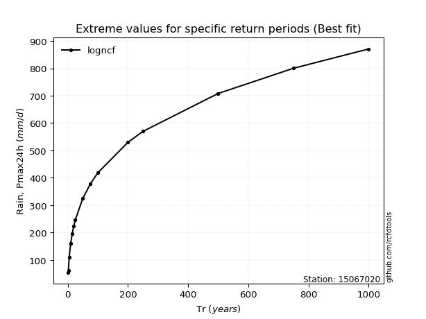</img>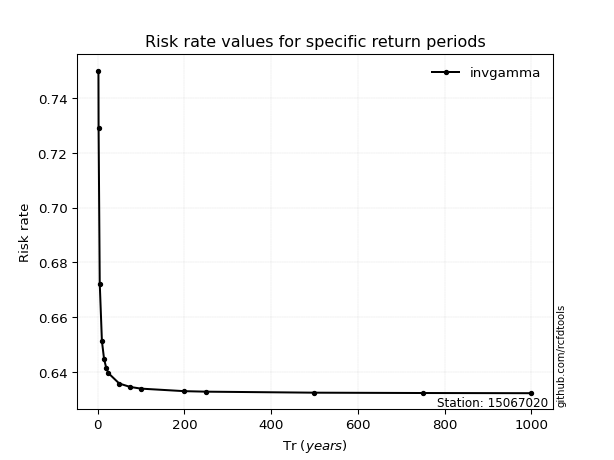</img>

</div>


<sub>**APP DISCLAIMER**: NO WARRANTY - This software is provided by [github.com/rcfdtools](https://github.com/rcfdtools) "as is", without any express or implied warranty, including warranties of merchantability, fitness for a particular purpose, or non-infringement. There is no guarantee that the software will be error-free or operate without interruption. LIMITATION OF LIABILITY - Neither the authors nor copyright holders will be liable for claims or damages arising from the software or its use. You are responsible for determining if the software is appropriate for your use and assume all associated risks, including errors, legal compliance, and data loss. NO PROFESSIONAL ADVICE - The software provides general information and does not offer professional advice. It should not replace consultation with professional advisors.</sub>