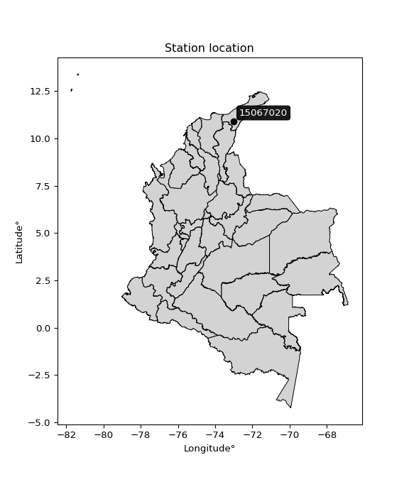

<div align="center">


</div>

# Station (rain, Pmax24h): 15067020

Probable Maximum Precipitation (PMP) is the greatest amount of rainfall for a specific duration that is meteorologically possible for a given location, acting as a "worst-case" scenario for extreme storms, crucial for designing safety-critical infrastructure like bridges, river deviations, dams, spillways, and nuclear plants to prevent catastrophic failure. PMP is calculated by hydrologists using meteorological data to determine the upper limit of extreme rainfall, often leading to the Probable Maximum Flood (PMF) for flood control design, and is increasingly being studied for climate change impacts.

<div align="center">

</img>

</div>


## A. General information


### 1. General running parameters

• app_version: _v20251226_. • runtime: _2025-12-26 15:38:16.554582_. • Python version: _3.14.0_. • SciPy version: _1.16.3_. • Pandas version: _2.3.3_. • NumPy version: _2.3.5_. • Stations dataset (station_dataset_file): _dataset/pmax24h_in/automatic_colombia_2003_2024.csv_. • Stations catalog (station_catalog_file): _dataset/CNE_IDEAM.xls_. • Minimum year to eval til year_max (date_min): _2003_. • Maximum year to eval since year_min (date_max): _2024_. • Creates, save and include plots into reports (create_plot): _False_. • Plot only fit distributions with Δo > Δ (plot_only_fit): _True_. • Eval low extreme values, if False, evaluates high extreme values (low_extreme): _False_. • Eval every SciPy distribution as logarithmic (pdist_logarithmic_on): _True_. • Standard deviation normalized (ddof): _1.0_. • Return periods to eval in years (Tr): _[2, 2.33, 5, 10, 15, 20, 25, 50, 75, 100, 200, 250, 500, 750, 1000]_. • Minimum data sample per station, 0 means any (minimum_sample): _5_. • Z-Score threshold to adjust a value, 0 means disable (zscore): _3.5_. • Avoid zeros, e.g. rain = 0 (avoid_zeros): _True_. • Avoid null values (avoid_nans): _True_. [:file_folder:Dataset file.](../../dataset/pmax24h_in/automatic_colombia_2003_2024.csv)


### 2. Station info and location

|   id |   CODIGO | NOMBRE                          | CATEGORIA    | TECNOLOGIA                              | ESTADO   | FECHA_INSTALACION   |   FECHA_SUSPENSION |   ALTITUD |   LATITUD |   LONGITUD | DEPARTAMENTO   | MUNICIPIO   | AREA_OPERATIVA                                         | ENTIDAD                                                     | AREA_HIDROGRAFICA   | ZONA_HIDROGRAFICA   | SUBZONA_HIDROGRAFICA   | CORRIENTE   | OBSERVACION                                                                                                                                                                           |   SUBRED | Catalogo   |
|-----:|---------:|:--------------------------------|:-------------|:----------------------------------------|:---------|:--------------------|-------------------:|----------:|----------:|-----------:|:---------------|:------------|:-------------------------------------------------------|:------------------------------------------------------------|:--------------------|:--------------------|:-----------------------|:------------|:--------------------------------------------------------------------------------------------------------------------------------------------------------------------------------------|---------:|:-----------|
|    0 | 15067020 | EL CERCADO - AUTOMAT [15067020] | Limnigráfica | Automática con Telemetría, Convencional | Activa   | 04/09/2004          |                nan |       335 |   10.9075 |   -73.0083 | La Guajira     | Fonseca     | Area Operativa 05 - Magdalena-Cesar-Guajira-San Andrés | INSTITUTO DE HIDROLOGIA METEOROLOGIA Y ESTUDIOS AMBIENTALES | Caribe              | Caribe - Guajira    | Río Ranchería          | Rancheria   | Actualizada Tecnologia. Tipo de Transmision y Estado por solicitud del coordinador del AO. (16022023)|01/11/2024$mvelez$Se cambia el sentido del nombre según radicado 20243120200713 |      nan | CNE_IDEAM  |

<div align="center">

Map location in: [:earth_americas:Google](http://maps.google.com/maps?q=10.9075,-73.00833333) [:earth_americas:OSM](https://www.openstreetmap.org/#map=18/10.9075/-73.00833333&layers=P) [:earth_americas:Bing](https://www.bing.com/maps?cp=10.9075~-73.00833333&lvl=18) [:earth_americas:Apple](https://maps.apple.com/frame?center=10.9075%2C-73.00833333&span=0.003%2C0.006)

</div>


<div align="center">

```geojson
{
  "type": "Feature",
  "geometry": {
    "type": "Point", 
    "coordinates": [-73.00833333, 10.9075]
  }, 
  "properties": {
    "Name": "15067020"
  }
}
```

</div>


### 3. Discrete values table and plot

|               |           0 |           1 |           2 |          3 |          4 |           5 |           6 |           7 |           8 |           9 |           10 |          11 |            12 |         13 |
|:--------------|------------:|------------:|------------:|-----------:|-----------:|------------:|------------:|------------:|------------:|------------:|-------------:|------------:|--------------:|-----------:|
| Date          | 2005        | 2007        | 2008        | 2011       | 2012       | 2013        | 2014        | 2015        | 2016        | 2017        | 2018         | 2019        | 2020          | 2024       |
| Value         |   22.7      |  132.8      |   40.4      |  187.2     |  200.2     |   48.6      |   40.5      |   51.8      |   30.7      |   19.1      |   79.5       |  104.1      |   73.9        |   11.4     |
| Value_initial |   22.7      |  132.8      |   40.4      |  187.2     |  200.2     |   48.6      |   40.5      |   51.8      |   30.7      |   19.1      |   79.5       |  104.1      |   73.9        |   11.4     |
| count         |   14        |   14        |   14        |   14       |   14       |   14        |   14        |   14        |   14        |   14        |   14         |   14        |   14          |   14       |
| mean          |   74.4929   |   74.4929   |   74.4929   |   74.4929  |   74.4929  |   74.4929   |   74.4929   |   74.4929   |   74.4929   |   74.4929   |   74.4929    |   74.4929   |   74.4929     |   74.4929  |
| std           |   60.7388   |   60.7388   |   60.7388   |   60.7388  |   60.7388  |   60.7388   |   60.7388   |   60.7388   |   60.7388   |   60.7388   |   60.7388    |   60.7388   |   60.7388     |   60.7388  |
| zscore        |   -0.852715 |    0.959966 |   -0.561303 |    1.85561 |    2.06964 |   -0.426299 |   -0.559657 |   -0.373614 |   -0.721004 |   -0.911985 |    0.0824374 |    0.487451 |   -0.00976077 |   -1.03876 |
> If Z-Score is active, values out of range or outliers are replaced with the station mean value.


### 4. Active continuous probability distributions from SciPy (45 of 104 available)

[scipy.stats](https://docs.scipy.org/doc/scipy/reference/stats.html) is a Python´s powerful submodule within the SciPy library for comprehensive statistical analysis, offering over 130 probability distributions (like Normal, Poisson), functions for descriptive stats (mean, variance), hypothesis testing (t-tests, chi-square), random variable generation, and statistical tests, making it essential for data science, modeling, and research. It provides tools to explore, model, and draw conclusions from data efficiently, working seamlessly with NumPy.

<div align="center">

|   id | p_dist             |   n_parameter | fit_method   | label                                                                       | active   | ref                                                                                                        |
|-----:|:-------------------|--------------:|:-------------|:----------------------------------------------------------------------------|:---------|:-----------------------------------------------------------------------------------------------------------|
|    0 | alpha              |             3 | MLE          | Alpha                                                                       | True     | [:mortar_board:](https://docs.scipy.org/doc/scipy/reference/generated/scipy.stats.alpha.html)              |
|    1 | betaprime          |             4 | MLE          | Beta prime                                                                  | True     | [:mortar_board:](https://docs.scipy.org/doc/scipy/reference/generated/scipy.stats.betaprime.html)          |
|    2 | chi2               |             3 | MLE          | Chi²                                                                        | True     | [:mortar_board:](https://docs.scipy.org/doc/scipy/reference/generated/scipy.stats.chi2.html)               |
|    3 | crystalball        |             4 | MLE          | Crystalball                                                                 | True     | [:mortar_board:](https://docs.scipy.org/doc/scipy/reference/generated/scipy.stats.crystalball.html)        |
|    4 | erlang             |             3 | MLE          | Erlang                                                                      | True     | [:mortar_board:](https://docs.scipy.org/doc/scipy/reference/generated/scipy.stats.erlang.html)             |
|    5 | expon              |             2 | MLE          | Exponential                                                                 | True     | [:mortar_board:](https://docs.scipy.org/doc/scipy/reference/generated/scipy.stats.expon.html)              |
|    6 | exponnorm          |             3 | MLE          | Exponentially modified Normal                                               | True     | [:mortar_board:](https://docs.scipy.org/doc/scipy/reference/generated/scipy.stats.exponnorm.html)          |
|    7 | f                  |             4 | MLE          | F                                                                           | True     | [:mortar_board:](https://docs.scipy.org/doc/scipy/reference/generated/scipy.stats.f.html)                  |
|    8 | fatiguelife        |             3 | MLE          | Fatigue-life (Birnbaum-Saunders)                                            | True     | [:mortar_board:](https://docs.scipy.org/doc/scipy/reference/generated/scipy.stats.fatiguelife.html)        |
|    9 | fisk               |             3 | MLE          | Fisk                                                                        | True     | [:mortar_board:](https://docs.scipy.org/doc/scipy/reference/generated/scipy.stats.fisk.html)               |
|   10 | gamma              |             3 | MLE          | Gamma                                                                       | True     | [:mortar_board:](https://docs.scipy.org/doc/scipy/reference/generated/scipy.stats.gamma.html)              |
|   11 | genexpon           |             5 | MLE          | Generalized exponential                                                     | True     | [:mortar_board:](https://docs.scipy.org/doc/scipy/reference/generated/scipy.stats.genexpon.html)           |
|   12 | genlogistic        |             3 | MLE          | Generalized logistic                                                        | True     | [:mortar_board:](https://docs.scipy.org/doc/scipy/reference/generated/scipy.stats.genlogistic.html)        |
|   13 | gibrat             |             2 | MM           | Gibrat                                                                      | True     | [:mortar_board:](https://docs.scipy.org/doc/scipy/reference/generated/scipy.stats.gibrat.html)             |
|   14 | gompertz           |             3 | MLE          | Gompertz (or truncated Gumbel)                                              | True     | [:mortar_board:](https://docs.scipy.org/doc/scipy/reference/generated/scipy.stats.gompertz.html)           |
|   15 | gumbel_l           |             2 | MM           | Gumbel Left Skew                                                            | True     | [:mortar_board:](https://docs.scipy.org/doc/scipy/reference/generated/scipy.stats.gumbel_l.html)           |
|   16 | gumbel_r           |             2 | MM           | Gumbel Right Skew                                                           | True     | [:mortar_board:](https://docs.scipy.org/doc/scipy/reference/generated/scipy.stats.gumbel_r.html)           |
|   17 | halflogistic       |             2 | MM           | Half-logistic                                                               | True     | [:mortar_board:](https://docs.scipy.org/doc/scipy/reference/generated/scipy.stats.halflogistic.html)       |
|   18 | halfnorm           |             2 | MM           | Half Normal                                                                 | True     | [:mortar_board:](https://docs.scipy.org/doc/scipy/reference/generated/scipy.stats.halfnorm.html)           |
|   19 | hypsecant          |             2 | MM           | hyperbolic secant                                                           | True     | [:mortar_board:](https://docs.scipy.org/doc/scipy/reference/generated/scipy.stats.hypsecant.html)          |
|   20 | invgamma           |             3 | MLE          | Inverted gamma                                                              | True     | [:mortar_board:](https://docs.scipy.org/doc/scipy/reference/generated/scipy.stats.invgamma.html)           |
|   21 | invgauss           |             3 | MLE          | Inverse Gaussian                                                            | True     | [:mortar_board:](https://docs.scipy.org/doc/scipy/reference/generated/scipy.stats.invgauss.html)           |
|   22 | invweibull         |             3 | MLE          | Inverted Weibull                                                            | True     | [:mortar_board:](https://docs.scipy.org/doc/scipy/reference/generated/scipy.stats.invweibull.html)         |
|   23 | johnsonsu          |             4 | MLE          | Johnson Su                                                                  | True     | [:mortar_board:](https://docs.scipy.org/doc/scipy/reference/generated/scipy.stats.johnsonsu.html)          |
|   24 | kstwobign          |             2 | MLE          | Limiting distribution of scaled Kolmogorov-Smirnov two-sided test statistic | True     | [:mortar_board:](https://docs.scipy.org/doc/scipy/reference/generated/scipy.stats.kstwobign.html)          |
|   25 | laplace            |             2 | MM           | Laplace                                                                     | True     | [:mortar_board:](https://docs.scipy.org/doc/scipy/reference/generated/scipy.stats.laplace.html)            |
|   26 | laplace_asymmetric |             3 | MLE          | Asymmetric Laplace                                                          | True     | [:mortar_board:](https://docs.scipy.org/doc/scipy/reference/generated/scipy.stats.laplace_asymmetric.html) |
|   27 | loggamma           |             3 | MLE          | Log gamma                                                                   | True     | [:mortar_board:](https://docs.scipy.org/doc/scipy/reference/generated/scipy.stats.loggamma.html)           |
|   28 | logistic           |             2 | MM           | Logistic (or Sech-squared)                                                  | True     | [:mortar_board:](https://docs.scipy.org/doc/scipy/reference/generated/scipy.stats.logistic.html)           |
|   29 | lognorm            |             3 | MLE          | Log Normal                                                                  | True     | [:mortar_board:](https://docs.scipy.org/doc/scipy/reference/generated/scipy.stats.lognorm.html)            |
|   30 | maxwell            |             2 | MM           | Maxwell                                                                     | True     | [:mortar_board:](https://docs.scipy.org/doc/scipy/reference/generated/scipy.stats.maxwell.html)            |
|   31 | mielke             |             4 | MLE          | Mielke Beta-Kappa / Dagum                                                   | True     | [:mortar_board:](https://docs.scipy.org/doc/scipy/reference/generated/scipy.stats.mielke.html)             |
|   32 | moyal              |             2 | MM           | Moyal                                                                       | True     | [:mortar_board:](https://docs.scipy.org/doc/scipy/reference/generated/scipy.stats.moyal.html)              |
|   33 | nakagami           |             3 | MLE          | Nakagami                                                                    | True     | [:mortar_board:](https://docs.scipy.org/doc/scipy/reference/generated/scipy.stats.nakagami.html)           |
|   34 | ncf                |             5 | MLE          | Non-central F distribution                                                  | True     | [:mortar_board:](https://docs.scipy.org/doc/scipy/reference/generated/scipy.stats.ncf.html)                |
|   35 | nct                |             4 | MLE          | Non-central Student’s t                                                     | True     | [:mortar_board:](https://docs.scipy.org/doc/scipy/reference/generated/scipy.stats.nct.html)                |
|   36 | norm               |             2 | MM           | Normal                                                                      | True     | [:mortar_board:](https://docs.scipy.org/doc/scipy/reference/generated/scipy.stats.norm.html)               |
|   37 | pareto             |             3 | MLE          | Pareto                                                                      | True     | [:mortar_board:](https://docs.scipy.org/doc/scipy/reference/generated/scipy.stats.pareto.html)             |
|   38 | pearson3           |             3 | MM           | Pearson type III                                                            | True     | [:mortar_board:](https://docs.scipy.org/doc/scipy/reference/generated/scipy.stats.pearson3.html)           |
|   39 | rayleigh           |             2 | MM           | Rayleigh                                                                    | True     | [:mortar_board:](https://docs.scipy.org/doc/scipy/reference/generated/scipy.stats.rayleigh.html)           |
|   40 | rice               |             3 | MLE          | Rice                                                                        | True     | [:mortar_board:](https://docs.scipy.org/doc/scipy/reference/generated/scipy.stats.rice.html)               |
|   41 | t                  |             3 | MLE          | Student’s t                                                                 | True     | [:mortar_board:](https://docs.scipy.org/doc/scipy/reference/generated/scipy.stats.t.html)                  |
|   42 | truncnorm          |             4 | MLE          | Truncated normal                                                            | True     | [:mortar_board:](https://docs.scipy.org/doc/scipy/reference/generated/scipy.stats.truncnorm.html)          |
|   43 | wald               |             2 | MM           | Wald                                                                        | True     | [:mortar_board:](https://docs.scipy.org/doc/scipy/reference/generated/scipy.stats.wald.html)               |
|   44 | weibull_min        |             3 | MLE          | Weibull minimum                                                             | True     | [:mortar_board:](https://docs.scipy.org/doc/scipy/reference/generated/scipy.stats.weibull_min.html)        |

</div>

> **n_parameter:** # arguments & localization & scale.
>
> **Fit methods:** (MLE) maximum likelihood, (MM) L-moments.
>
>**Inactive:** foldnorm, gennorm, norminvgauss, powernorm, powerlognorm, skewnorm, genextreme, anglit, arcsine, argus, beta, bradford, burr, burr12, cauchy, cosine, halfcauchy, foldcauchy, skewcauchy, wrapcauchy, dgamma, gengamma, exponweib, exponpow, truncexpon, gausshyper, genhalflogistic, genhyperbolic, geninvgauss, halfgennorm, johnsonsb, kappa4, kappa3, ksone, kstwo, loglaplace, levy, levy_l, levy_stable, ncx2, genpareto, truncpareto, lomax, powerlaw, rdist, rel_breitwigner, recipinvgauss, semicircular, studentized_range, trapezoid, triang, truncweibull_min, tukeylambda, uniform, loguniform, vonmises, vonmises_line, weibull_max, dweibull, 


## B. Probability distributions vs. Empirical distributions

A continuous probability distribution (CPD) describes probabilities for variables that can take any value within a range (like rain any time), unlike discrete variables with specific outcomes (like temperature). It uses a Probability Density Function (PDF), a curve where the total area under it equals 1, and the probability of the variable falling within an interval (a to b) is found by calculating the area under the curve between those points. A key feature is that the probability of hitting any single exact value is zero, so probabilities are always expressed for ranges, e.g., $P(a ≤ X ≤ b)$.

<div align="center">

Distributions parameters
|    |   station | p_dist                |   n |              loc |            scale | shape                  | shape1             | shape2                 | shape3   |
|---:|----------:|:----------------------|----:|-----------------:|-----------------:|:-----------------------|:-------------------|:-----------------------|:---------|
|  0 |  15067020 | alpha                 |  14 |     -0.0774718   |     29.7336      | 6.00166171296016e-11   |                    |                        |          |
|  1 |  15067020 | betaprime             |  14 |     -0.342557    |     76.856       | 2.9708216623316144     | 3.982454222435766  |                        |          |
|  2 |  15067020 | chi2                  |  14 |     11.4         |     27.9352      | 1.5190221235609365     |                    |                        |          |
|  3 |  15067020 | crystalball           |  14 |     74.4929      |     58.5293      | 5960.8521621812815     | 1905.6245070327655 |                        |          |
|  4 |  15067020 | erlang                |  14 |     11.4         |     65.6163      | 0.8394063237796368     |                    |                        |          |
|  5 |  15067020 | expon                 |  14 |     11.4         |     63.0929      |                        |                    |                        |          |
|  6 |  15067020 | exponnorm             |  14 |     11.2992      |      0.0325069   | 1928.0531955646757     |                    |                        |          |
|  7 |  15067020 | f                     |  14 |     11.4         |     84.2519      | 1.778582776992756      | 34.218983674573394 |                        |          |
|  8 |  15067020 | fatiguelife           |  14 |     11.4         |      3.46449e-06 | 4216.319824845748      |                    |                        |          |
|  9 |  15067020 | fisk                  |  14 |      7.63342     |     44.8216      | 1.6404310811202332     |                    |                        |          |
| 10 |  15067020 | gamma                 |  14 |     11.4         |     86.4102      | 0.2938575429148027     |                    |                        |          |
| 11 |  15067020 | genexpon              |  14 |     11.3978      |      1.52785     | 0.022233849516237254   | 2.7322886087196423 | 1.8793941758825825e-05 |          |
| 12 |  15067020 | genlogistic           |  14 |   -234.296       |     39.7691      | 1235.530893477685      |                    |                        |          |
| 13 |  15067020 | gibrat                |  14 |     29.8423      |     27.0819      |                        |                    |                        |          |
| 14 |  15067020 | gompertz              |  14 |     11.4         |    565.113       | 8.042254445294308      |                    |                        |          |
| 15 |  15067020 | gumbel_l              |  14 |    100.834       |     45.6351      |                        |                    |                        |          |
| 16 |  15067020 | gumbel_r              |  14 |     48.1515      |     45.6351      |                        |                    |                        |          |
| 17 |  15067020 | halflogistic          |  14 |      5.122       |     50.0405      |                        |                    |                        |          |
| 18 |  15067020 | halfnorm              |  14 |     -2.97703     |     97.0941      |                        |                    |                        |          |
| 19 |  15067020 | hypsecant             |  14 |     74.4929      |     37.2609      |                        |                    |                        |          |
| 20 |  15067020 | invgamma              |  14 |    -11.5944      |    148.235       | 2.6225046397715666     |                    |                        |          |
| 21 |  15067020 | invgauss              |  14 |     -1.07487     |     88.4902      | 0.8539668133884377     |                    |                        |          |
| 22 |  15067020 | invweibull            |  14 |    -26.9068      |     67.4086      | 2.213873681188308      |                    |                        |          |
| 23 |  15067020 | johnsonsu             |  14 |      3.62582     |      0.527657    | -5.741607880844846     | 1.0991876888890024 |                        |          |
| 24 |  15067020 | kstwobign             |  14 |    -94.0028      |    194.457       |                        |                    |                        |          |
| 25 |  15067020 | laplace               |  14 |     74.4929      |     41.3865      |                        |                    |                        |          |
| 26 |  15067020 | laplace_asymmetric    |  14 |     11.4         |      0.00590219  | 9.354702635566147e-05  |                    |                        |          |
| 27 |  15067020 | loggamma              |  14 | -17100.4         |   2336.82        | 1556.0977264402045     |                    |                        |          |
| 28 |  15067020 | logistic              |  14 |     74.4929      |     32.2689      |                        |                    |                        |          |
| 29 |  15067020 | lognorm               |  14 |     11.4         |      3.04951     | 9.772705679629457      |                    |                        |          |
| 30 |  15067020 | maxwell               |  14 |    -64.1971      |     86.911       |                        |                    |                        |          |
| 31 |  15067020 | mielke                |  14 |     11.3838      |     57.2619      | 0.8864086622331757     | 1.773267442934677  |                        |          |
| 32 |  15067020 | moyal                 |  14 |     41.022       |     26.3475      |                        |                    |                        |          |
| 33 |  15067020 | nakagami              |  14 |     11.4         |    121.477       | 0.11670710792845679    |                    |                        |          |
| 34 |  15067020 | ncf                   |  14 |     -0.150245    |      0.0936431   | 0.03606280638828174    | 5.495270996576647  | 19.3738748904045       |          |
| 35 |  15067020 | nct                   |  14 |    -24.5155      |      5.56103     | 2.2760013593179567     | 11.90182218681853  |                        |          |
| 36 |  15067020 | norm                  |  14 |     74.4929      |     58.5293      |                        |                    |                        |          |
| 37 |  15067020 | pareto                |  14 |     11.4         |      3.76807e-05 | 0.07692448581211334    |                    |                        |          |
| 38 |  15067020 | pearson3              |  14 |     74.4929      |     58.5294      | 1.0297185628410979     |                    |                        |          |
| 39 |  15067020 | rayleigh              |  14 |    -37.4772      |     89.3391      |                        |                    |                        |          |
| 40 |  15067020 | rice                  |  14 |    -17.6646      |     77.1968      | 0.00023556652571557918 |                    |                        |          |
| 41 |  15067020 | t                     |  14 |     74.489       |     58.5259      | 15357.807356302194     |                    |                        |          |
| 42 |  15067020 | truncnorm             |  14 |     78.2939      |     62.432       | -1043.7823086391882    | 1.9526217301067597 |                        |          |
| 43 |  15067020 | wald                  |  14 |     15.9636      |     58.5293      |                        |                    |                        |          |
| 44 |  15067020 | weibull_min           |  14 |     11.4         |     15.3798      | 0.43409147578521456    |                    |                        |          |
| 45 |  15067020 | logalpha              |  14 |    -12.6416      |    327.7         | 19.75938008676009      |                    |                        |          |
| 46 |  15067020 | logbetaprime          |  14 |     -2.85313     |    142.199       | 68.90796549066874      | 1433.2784619761342 |                        |          |
| 47 |  15067020 | logchi2               |  14 |      2.43361     |      0.988076    | 1.0677603909911433     |                    |                        |          |
| 48 |  15067020 | logcrystalball        |  14 |      3.99323     |      0.823749    | 263.01519110184597     | 795.5648068918698  |                        |          |
| 49 |  15067020 | logerlang             |  14 |    -23.4225      |      0.0248908   | 1101.3731715568233     |                    |                        |          |
| 50 |  15067020 | logexpon              |  14 |      2.43361     |      1.55962     |                        |                    |                        |          |
| 51 |  15067020 | logexponnorm          |  14 |      3.99238     |      0.823749    | 0.0010337473122017835  |                    |                        |          |
| 52 |  15067020 | logf                  |  14 |   -194.347       |    198.339       | 341834.4806727123      | 173997.8561190006  |                        |          |
| 53 |  15067020 | logfatiguelife        |  14 |    -93.9706      |     97.9599      | 0.008416959139775783   |                    |                        |          |
| 54 |  15067020 | logfisk               |  14 |     -9.8777e+06  |      9.87771e+06 | 20249030.783470944     |                    |                        |          |
| 55 |  15067020 | loggamma              |  14 |    -23.1681      |      0.0250773   | 1083.0261101195892     |                    |                        |          |
| 56 |  15067020 | loggenexpon           |  14 |      2.43361     | 515715           | 92775.04991662518      | 908533.5691342654  | 155737.4958148257      |          |
| 57 |  15067020 | loggenlogistic        |  14 |      3.78654     |      0.530122    | 1.3051413437449835     |                    |                        |          |
| 58 |  15067020 | loggibrat             |  14 |      3.36483     |      0.381147    |                        |                    |                        |          |
| 59 |  15067020 | loggompertz           |  14 |      2.43361     |      0.986006    | 0.174281885774756      |                    |                        |          |
| 60 |  15067020 | loggumbel_l           |  14 |      4.36396     |      0.642274    |                        |                    |                        |          |
| 61 |  15067020 | loggumbel_r           |  14 |      3.6225      |      0.642274    |                        |                    |                        |          |
| 62 |  15067020 | loghalflogistic       |  14 |      3.01686     |      0.704302    |                        |                    |                        |          |
| 63 |  15067020 | loghalfnorm           |  14 |      2.90295     |      1.36647     |                        |                    |                        |          |
| 64 |  15067020 | loghypsecant          |  14 |      3.99323     |      0.524415    |                        |                    |                        |          |
| 65 |  15067020 | loginvgamma           |  14 |     -7.81417     |   2373.25        | 202.07349889050738     |                    |                        |          |
| 66 |  15067020 | loginvgauss           |  14 |     -2.37598     |    353.754       | 0.01798677050000833    |                    |                        |          |
| 67 |  15067020 | loginvweibull         |  14 |     -8.91117e+07 |      8.91117e+07 | 113499472.31801662     |                    |                        |          |
| 68 |  15067020 | logjohnsonsu          |  14 |     -1.66644e+07 |      2.33574e+07 | -22855118.601759367    | 34438296.70969646  |                        |          |
| 69 |  15067020 | logkstwobign          |  14 |      0.77334     |      3.68792     |                        |                    |                        |          |
| 70 |  15067020 | loglaplace            |  14 |      3.99323     |      0.582478    |                        |                    |                        |          |
| 71 |  15067020 | loglaplace_asymmetric |  14 |      3.88362     |      0.670316    | 0.9215596084208846     |                    |                        |          |
| 72 |  15067020 | logloggamma           |  14 |    -19.5105      |      5.94705     | 52.54741543376163      |                    |                        |          |
| 73 |  15067020 | loglogistic           |  14 |      3.99323     |      0.454157    |                        |                    |                        |          |
| 74 |  15067020 | loglognorm            |  14 | -32765.6         |  32769.6         | 2.5137647676704623e-05 |                    |                        |          |
| 75 |  15067020 | logmaxwell            |  14 |      2.04129     |      1.2232      |                        |                    |                        |          |
| 76 |  15067020 | logmielke             |  14 |      2.43361     |      2.985       | 0.8653198135326843     | 10.25572566622602  |                        |          |
| 77 |  15067020 | logmoyal              |  14 |      3.52216     |      0.370817    |                        |                    |                        |          |
| 78 |  15067020 | lognakagami           |  14 |      2.94969     |      1.38648     | 0.3190982794794184     |                    |                        |          |
| 79 |  15067020 | logncf                |  14 |     -9.42684     |      3.78996     | 381.6202898250337      | 1520.8475682550725 | 968.2359385010775      |          |
| 80 |  15067020 | lognct                |  14 |    -30.3219      |      0.743495    | 4604.508783740828      | 46.14559837842688  |                        |          |
| 81 |  15067020 | lognorm               |  14 |      3.99323     |      0.823749    |                        |                    |                        |          |
| 82 |  15067020 | logpareto             |  14 |      2.43361     |      1.2482e-06  | 0.07692410624301625    |                    |                        |          |
| 83 |  15067020 | logpearson3           |  14 |      3.99323     |      0.823748    | -0.07864742391376967   |                    |                        |          |
| 84 |  15067020 | lograyleigh           |  14 |      2.41735     |      1.25737     |                        |                    |                        |          |
| 85 |  15067020 | logrice               |  14 |      2.07797     |      0.918107    | 1.7767560332857433     |                    |                        |          |
| 86 |  15067020 | logt                  |  14 |      3.99323     |      0.823748    | 1927398348.6527038     |                    |                        |          |
| 87 |  15067020 | logtruncnorm          |  14 |     -0.77472     |      2.54922     | 1.4592660484263789     | 2.3827011428194735 |                        |          |
| 88 |  15067020 | logwald               |  14 |      3.16951     |      0.823726    |                        |                    |                        |          |
| 89 |  15067020 | logweibull_min        |  14 |      1.51931     |      2.75968     | 3.3892235361639202     |                    |                        |          |

</div>

> **loc** (Location parameter): This shifts the distribution along the x-axis. For many common distributions, like the normal (Gaussian) distribution, loc represents the mean $μ$. For others, like the uniform distribution, it might represent the minimum value, or for the beta distribution, the left end of the support interval.
>
> **scale** (Scale parameter): This determines the width or spread of the distribution. For the normal distribution, scale represents the standard deviation $σ$. For a uniform distribution, it defines the length of the interval (from $loc$ to $loc + scale$).
>
> **shape** (Shape parameters): Refers to parameters that define the specific form of a probability distribution, distinct from its location (loc) and scale (scale). These parameters are required arguments for most distribution functions. For example, a normal (Gaussian) distribution is fully defined by its location (mean) and scale (standard deviation), so it has no specific shape parameters beyond loc and scale. However, other distributions have intrinsic properties that need specification, as Gamma distribution that takes a shape parameter, often named $a$ or $alpha$.


### 0. Cumulative distribution values - CDF (90 evaluated)

> Ordered by x ascending and calculating $log(f(x))$ separately. 

|   id |   Station |   date |     x |   count |    mean |     std |      zscore |   Value_initial |   station |   m |      alpha |   alpha_pdf |   betaprime |   betaprime_pdf |        chi2 |      chi2_pdf |   crystalball |   crystalball_pdf |      erlang |   erlang_pdf |    expon |   expon_pdf |   exponnorm |   exponnorm_pdf |           f |      f_pdf |   fatiguelife |   fatiguelife_pdf |      fisk |    fisk_pdf |       gamma |   gamma_pdf |    genexpon |   genexpon_pdf |   genlogistic |   genlogistic_pdf |     gibrat |   gibrat_pdf |    gompertz |   gompertz_pdf |   gumbel_l |   gumbel_l_pdf |   gumbel_r |   gumbel_r_pdf |   halflogistic |   halflogistic_pdf |   halfnorm |   halfnorm_pdf |   hypsecant |   hypsecant_pdf |   invgamma |   invgamma_pdf |   invgauss |   invgauss_pdf |   invweibull |   invweibull_pdf |   johnsonsu |   johnsonsu_pdf |   kstwobign |   kstwobign_pdf |   laplace |   laplace_pdf |   laplace_asymmetric |   laplace_asymmetric_pdf |   loggamma |   loggamma_pdf |   logistic |   logistic_pdf |   lognorm |   lognorm_pdf |   maxwell |   maxwell_pdf |      mielke |   mielke_pdf |     moyal |   moyal_pdf |    nakagami |   nakagami_pdf |       ncf |     ncf_pdf |       nct |     nct_pdf |     norm |    norm_pdf |   pareto |     pareto_pdf |   pearson3 |   pearson3_pdf |   rayleigh |   rayleigh_pdf |      rice |   rice_pdf |        t |       t_pdf |   truncnorm |   truncnorm_pdf |        wald |    wald_pdf |   weibull_min |   weibull_min_pdf |   logalpha |   logalpha_pdf |   logbetaprime |   logbetaprime_pdf |     logchi2 |   logchi2_pdf |   logcrystalball |   logcrystalball_pdf |   logerlang |   logerlang_pdf |   logexpon |   logexpon_pdf |   logexponnorm |   logexponnorm_pdf |     logf |   logf_pdf |   logfatiguelife |   logfatiguelife_pdf |   logfisk |   logfisk_pdf |   loggenexpon |   loggenexpon_pdf |   loggenlogistic |   loggenlogistic_pdf |   loggibrat |   loggibrat_pdf |   loggompertz |   loggompertz_pdf |   loggumbel_l |   loggumbel_l_pdf |   loggumbel_r |   loggumbel_r_pdf |   loghalflogistic |   loghalflogistic_pdf |   loghalfnorm |   loghalfnorm_pdf |   loghypsecant |   loghypsecant_pdf |   loginvgamma |   loginvgamma_pdf |   loginvgauss |   loginvgauss_pdf |   loginvweibull |   loginvweibull_pdf |   logjohnsonsu |   logjohnsonsu_pdf |   logkstwobign |   logkstwobign_pdf |   loglaplace |   loglaplace_pdf |   loglaplace_asymmetric |   loglaplace_asymmetric_pdf |   logloggamma |   logloggamma_pdf |   loglogistic |   loglogistic_pdf |   loglognorm |   loglognorm_pdf |   logmaxwell |   logmaxwell_pdf |   logmielke |   logmielke_pdf |   logmoyal |   logmoyal_pdf |   lognakagami |   lognakagami_pdf |    logncf |   logncf_pdf |    lognct |   lognct_pdf |   logpareto |   logpareto_pdf |   logpearson3 |   logpearson3_pdf |   lograyleigh |   lograyleigh_pdf |   logrice |   logrice_pdf |      logt |   logt_pdf |   logtruncnorm |   logtruncnorm_pdf |   logwald |   logwald_pdf |   logweibull_min |   logweibull_min_pdf |
|-----:|----------:|-------:|------:|--------:|--------:|--------:|------------:|----------------:|----------:|----:|-----------:|------------:|------------:|----------------:|------------:|--------------:|--------------:|------------------:|------------:|-------------:|---------:|------------:|------------:|----------------:|------------:|-----------:|--------------:|------------------:|----------:|------------:|------------:|------------:|------------:|---------------:|--------------:|------------------:|-----------:|-------------:|------------:|---------------:|-----------:|---------------:|-----------:|---------------:|---------------:|-------------------:|-----------:|---------------:|------------:|----------------:|-----------:|---------------:|-----------:|---------------:|-------------:|-----------------:|------------:|----------------:|------------:|----------------:|----------:|--------------:|---------------------:|-------------------------:|-----------:|---------------:|-----------:|---------------:|----------:|--------------:|----------:|--------------:|------------:|-------------:|----------:|------------:|------------:|---------------:|----------:|------------:|----------:|------------:|---------:|------------:|---------:|---------------:|-----------:|---------------:|-----------:|---------------:|----------:|-----------:|---------:|------------:|------------:|----------------:|------------:|------------:|--------------:|------------------:|-----------:|---------------:|---------------:|-------------------:|------------:|--------------:|-----------------:|---------------------:|------------:|----------------:|-----------:|---------------:|---------------:|-------------------:|---------:|-----------:|-----------------:|---------------------:|----------:|--------------:|--------------:|------------------:|-----------------:|---------------------:|------------:|----------------:|--------------:|------------------:|--------------:|------------------:|--------------:|------------------:|------------------:|----------------------:|--------------:|------------------:|---------------:|-------------------:|--------------:|------------------:|--------------:|------------------:|----------------:|--------------------:|---------------:|-------------------:|---------------:|-------------------:|-------------:|-----------------:|------------------------:|----------------------------:|--------------:|------------------:|--------------:|------------------:|-------------:|-----------------:|-------------:|-----------------:|------------:|----------------:|-----------:|---------------:|--------------:|------------------:|----------:|-------------:|----------:|-------------:|------------:|----------------:|--------------:|------------------:|--------------:|------------------:|----------:|--------------:|----------:|-----------:|---------------:|-------------------:|----------:|--------------:|-----------------:|---------------------:|
|    0 |  15067020 |   2024 |  11.4 |      14 | 74.4929 | 60.7388 | -1.03876    |            11.4 |  15067020 |   1 | 0.00958062 | 0.00628297  |   0.0352318 |     0.00689185  | 3.20235e-13 | 136.922       |      0.140524 |       0.00381248  | 1.31492e-14 |  6.21357     | 0        | 0.0158497   |  0.00160688 |     0.0159143   | 5.59653e-11 | 0.185475   |     0.0808053 |       1.05385e+12 | 0.0169138 | 0.00724176  | 1.38966e-05 | 2.29887e+09 | 3.19026e-05 |    0.0145519   |     0.0772747 |       0.0049699   | 0          |  0           | 7.83672e-16 |    0.0142312   |   0.131416 |    0.00268162  |   0.106731 |    0.00523291  |       0.062647 |        0.00995269  |   0.117715 |    0.00812804  |    0.115791 |     0.00303949  |  0.0285931 |    0.00628821  |  0.0230474 |    0.00718718  |    0.0303668 |      0.00613267  |   0.0216139 |     0.00729397  |    0.06941  |     0.00487186  |  0.108867 |   0.0026305   |          8.87178e-09 |              0.0158495   |  0.0277768 |      0.0804472 |   0.123985 |    0.00336587  | 0.0291579 |     0.0806712 |  0.14018  |    0.00475811 | 0.000714753 |  0.0391652   | 0.0793574 | 0.00570065  | 9.68838e-05 |    1.27306e+10 | 0.0297155 | 0.00634629  | 0.0326348 | 0.00618218  | 0.140524 | 0.00381248  | 0        | 2041.48        |   0.114242 |    0.00573251  |   0.138997 |    0.00527263  | 0.0684228 | 0.00454344 | 0.140533 | 0.00381259  |    0.145685 |     0.00369315  | 0           | 0           |   1.20698e-07 |       2.94953e+07 |  0.0239515 |      0.0812972 |      0.0245555 |          0.0817192 | 4.98131e-09 |   5.98848e+06 |        0.0291579 |            0.0806713 |   0.0278883 |        0.080611 |   0        |       0.641183 |       0.029158 |          0.0806716 | 0.029045 |  0.0808932 |        0.0285926 |            0.0805765 | 0.0390747 |     0.0769722 |   2.45984e-10 |          0.179896 |        0.0324266 |            0.0740624 |   0         |       0         |   3.35438e-11 |          0.176755 |     0.0483087 |         0.0733683 |    0.00171808 |         0.0170304 |         0         |              0        |     0         |          0        |      0.0325015 |          0.0618692 |      0.022425 |         0.0774593 |     0.0210938 |         0.0794845 |       0.0135354 |           0.0741731 |      0.0306088 |          0.0830382 |      0.0126497 |          0.0851375 |    0.0343655 |        0.0589988 |               0.0439166 |                   0.0710927 |     0.0330387 |         0.0821701 |     0.0312467 |         0.0666517 |    0.0291558 |        0.0806703 |   0.00850927 |        0.0637378 | 1.33818e-05 |        1.66246  | 1.4279e-05 |    0.000380178 |   0           |          0        | 0.0258222 |    0.0798185 | 0.0286614 |    0.0806976 |    0        |  61628.2        |     0.0313508 |          0.081672 |   8.36309e-05 |         0.0102851 | 0.0158008 |     0.0905999 | 0.0291575 |  0.0806705 |      0         |           0        |  0        |     0         |        0.0233796 |            0.0856442 |
|    1 |  15067020 |   2017 |  19.1 |      14 | 74.4929 | 60.7388 | -0.911985   |            19.1 |  15067020 |   2 | 0.121034   | 0.0193914   |   0.103481  |     0.0104296   | 0.227217    |   0.0207063   |      0.171969 |       0.00435551  | 0.166597    |  0.0170287   | 0.114889 | 0.0140287   |  0.11703    |     0.0140881   | 0.107312    | 0.0118433  |     0.638174  |       0.00860465  | 0.0965357 | 0.0124774   | 0.536152    | 0.0190938   | 0.106615    |    0.0131522   |     0.121229  |       0.0064267   | 0          |  0           | 0.104462    |    0.0129194   |   0.15362  |    0.00309335  |   0.151064 |    0.00625655  |       0.138766 |        0.0097995   |   0.17987  |    0.00800793  |    0.141581 |     0.00367567  |  0.0973707 |    0.0111292   |  0.103808  |    0.012746    |    0.0973416 |      0.0109118   |   0.102792  |     0.0127115   |    0.112371 |     0.00625289  |  0.131129 |   0.00316839  |          0.114888    |              0.0140286   |  0.102333  |      0.221974  |   0.152309 |    0.0040011   | 0.10261   |     0.217085  |  0.179054 |    0.00532735 | 0.166836    |  0.0186326   | 0.129541  | 0.00727517  | 0.432632    |    0.0131091   | 0.0979295 | 0.0109471   | 0.0988365 | 0.0106913   | 0.171969 | 0.00435551  | 0.609607 |    0.00390008  |   0.161776 |    0.00657609  |   0.181699 |    0.00580057  | 0.107211  | 0.00550783 | 0.171979 | 0.00435566  |    0.176007 |     0.00418297  | 4.14153e-05 | 0.000128941 |   0.523163    |       0.0199082   |  0.104067  |      0.243547  |      0.104025  |          0.240115  | 0.503742    |   0.43822     |        0.10261   |            0.217085  |   0.102502  |        0.221979 |   0.281722 |       0.460548 |       0.10261  |          0.217085  | 0.102813 |  0.218066  |        0.102476  |            0.219003  | 0.104848  |     0.1924    |   0.147979    |          0.369884 |        0.0997547 |            0.203598  |   0         |       0         |   0.112958    |          0.264622 |     0.104689  |         0.154151  |    0.0578069  |         0.256568  |         0         |              0        |     0.0272842 |          0.583561 |      0.0864939 |          0.162912  |      0.100105 |         0.238806  |     0.10297   |         0.252588  |       0.10756   |           0.305462  |      0.105193  |          0.218538  |      0.122923  |          0.343695  |    0.0833503 |        0.143096  |               0.101263  |                   0.163926  |     0.104851  |         0.208262  |     0.0913086 |         0.182693  |    0.102608  |        0.21709   |   0.0925638  |        0.27305   | 0.218994    |        0.367189 | 0.0304735  |    0.223984    |   1.00345e-10 |     144205        | 0.101667  |    0.227942  | 0.102612  |    0.219119  |    0.630205 |      0.0551201  |     0.103937  |          0.212137 |   0.0857237   |         0.307849  | 0.102468  |     0.251273  | 0.102609  |  0.217084  |      0.0037371 |           0.84563  |  0        |     0         |        0.10221   |            0.22936   |
|    2 |  15067020 |   2005 |  22.7 |      14 | 74.4929 | 60.7388 | -0.852715   |            22.7 |  15067020 |   3 | 0.191758   | 0.019505    |   0.142718  |     0.0112937   | 0.296011    |   0.0177034   |      0.188104 |       0.00460785  | 0.224351    |  0.0151565   | 0.163979 | 0.0132507   |  0.166318   |     0.0133017   | 0.148186    | 0.0109086  |     0.665797  |       0.00689838  | 0.143267  | 0.0133639   | 0.594677    | 0.013969    | 0.152851    |    0.0125386   |     0.145497  |       0.00704672  | 0          |  0           | 0.149926    |    0.0123419   |   0.165128 |    0.00330174  |   0.174351 |    0.00667329  |       0.173854 |        0.0096899   |   0.208571 |    0.00793525  |    0.155403 |     0.00400696  |  0.139859  |    0.012364    |  0.151319  |    0.0135057   |    0.139226  |      0.0122508   |   0.1501    |     0.0134371   |    0.13591  |     0.00681347  |  0.143046 |   0.00345634  |          0.163978    |              0.0132506   |  0.145924  |      0.283438  |   0.167279 |    0.00431674  | 0.14521   |     0.27696   |  0.19867  |    0.00556735 | 0.231158    |  0.01714     | 0.156832  | 0.00786867  | 0.473128    |    0.00976415  | 0.139666  | 0.0121365   | 0.139825  | 0.0119825   | 0.188104 | 0.00460785  | 0.620958 |    0.00258031  |   0.186031 |    0.00689041  |   0.202964 |    0.00600933  | 0.127769  | 0.00590791 | 0.188115 | 0.00460803  |    0.191476 |     0.00441069  | 0.00829153  | 0.00581535  |   0.583036    |       0.0140116   |  0.151862  |      0.309999  |      0.151099  |          0.305145  | 0.571385    |   0.351007    |        0.145211  |            0.27696   |   0.146084  |        0.283326 |   0.357003 |       0.412278 |       0.145211 |          0.27696   | 0.145594 |  0.278035  |        0.145465  |            0.279502  | 0.143012  |     0.251243  |   0.214769    |          0.401032 |        0.140417  |            0.268886  |   0         |       0         |   0.161518    |          0.298011 |     0.134714  |         0.194937  |    0.113197   |         0.38397   |         0.0747636 |              0.705954 |     0.127567  |          0.576424 |      0.119543  |          0.222634  |      0.147168 |         0.306416  |     0.152553  |         0.321354  |       0.167043  |           0.380733  |      0.147954  |          0.277292  |      0.188084  |          0.40689   |    0.112113  |        0.192475  |               0.133921  |                   0.216793  |     0.145603  |         0.264522  |     0.128135  |         0.245987  |    0.14521   |        0.276967  |   0.146023   |        0.344781  | 0.281124    |        0.353189 | 0.0864528  |    0.424252    |   0.20517     |          0.755449 | 0.146447  |    0.291076  | 0.145618  |    0.279577  |    0.638325 |      0.0403941  |     0.145494  |          0.269895 |   0.145463    |         0.381068  | 0.150912  |     0.309645  | 0.145209  |  0.276958  |      0.142661  |           0.764196 |  0        |     0         |        0.146709  |            0.28622   |
|    3 |  15067020 |   2016 |  30.7 |      14 | 74.4929 | 60.7388 | -0.721004   |            30.7 |  15067020 |   4 | 0.334002   | 0.0157056   |   0.236481  |     0.0118928   | 0.419306    |   0.0134884   |      0.227164 |       0.00515193  | 0.333412    |  0.0123116   | 0.263539 | 0.0116727   |  0.26622    |     0.0117077   | 0.229117    | 0.00941488 |     0.712189  |       0.00494654  | 0.251666  | 0.0133935   | 0.682328    | 0.00872557  | 0.247978    |    0.011263    |     0.206682  |       0.00818831  | 0.00027779 |  0.00120053  | 0.243768    |    0.011136    |   0.193506 |    0.00380065  |   0.230889 |    0.00741624  |       0.25015  |        0.00936666  |   0.271296 |    0.0077379   |    0.190631 |     0.00481572  |  0.243266  |    0.0131029   |  0.259136  |    0.0131261   |    0.24267   |      0.0132061   |   0.257483  |     0.0131003   |    0.194625 |     0.00780324  |  0.17355  |   0.00419339  |          0.263537    |              0.0116726   |  0.247723  |      0.388606  |   0.204708 |    0.00504519  | 0.244875  |     0.381522  |  0.245129 |    0.00603023 | 0.356581    |  0.0142838   | 0.223839  | 0.00878928  | 0.535987    |    0.00646515  | 0.241281  | 0.0129039   | 0.241177  | 0.012975    | 0.227164 | 0.00515193  | 0.636249 |    0.00144981  |   0.24337  |    0.00740159  |   0.25262  |    0.00638406  | 0.1782    | 0.00666954 | 0.227176 | 0.00515217  |    0.228749 |     0.00490338  | 0.114536    | 0.0177491   |   0.668319    |       0.00823283  |  0.261785  |      0.413265  |      0.259364  |          0.407608  | 0.661513    |   0.254324    |        0.244875  |            0.381522  |   0.247815  |        0.388271 |   0.470164 |       0.339722 |       0.244876 |          0.381522  | 0.245548 |  0.382241  |        0.245967  |            0.384294  | 0.236563  |     0.370227  |   0.339705    |          0.419551 |        0.240422  |            0.393321  |   0.0315632 |       1.19398   |   0.260441    |          0.357014 |     0.206675  |         0.285972  |    0.256254   |         0.543245  |         0.281424  |              0.653697 |     0.297169  |          0.54292  |      0.207455  |          0.368176  |      0.256532 |         0.413428  |     0.265873  |         0.423187  |       0.295747  |           0.458898  |      0.247336  |          0.37924   |      0.320267  |          0.456118  |    0.188256  |        0.323198  |               0.218321  |                   0.353422  |     0.240973  |         0.366597  |     0.222215  |         0.380564  |    0.244877  |        0.38153   |   0.265708   |        0.440046  | 0.385029    |        0.336311 | 0.253825   |    0.640211    |   0.3881      |          0.507295 | 0.250603  |    0.395723  | 0.246126  |    0.384245  |    0.648297 |      0.0273097  |     0.242704  |          0.372961 |   0.27432     |         0.462179  | 0.258771  |     0.40121   | 0.244874  |  0.381521  |      0.353221  |           0.633188 |  0.175672 |     1.30206   |        0.247779  |            0.381054  |
|    4 |  15067020 |   2008 |  40.4 |      14 | 74.4929 | 60.7388 | -0.561303   |            40.4 |  15067020 |   5 | 0.4626     | 0.0110558   |   0.349181  |     0.0111702   | 0.533505    |   0.0102809   |      0.280118 |       0.00575253  | 0.440723    |  0.00994752  | 0.368489 | 0.0100092   |  0.371433   |     0.010029    | 0.313739    | 0.0080937  |     0.753704  |       0.00372977  | 0.374276  | 0.0117247   | 0.751417    | 0.00585016  | 0.350336    |    0.00986853  |     0.290686  |       0.00902627  | 0.173093   |  0.0242464   | 0.345235    |    0.00980877  |   0.233554 |    0.00446735  |   0.305704 |    0.00793909  |       0.338586 |        0.00884643  |   0.344946 |    0.00743716  |    0.242527 |     0.00589714  |  0.365739  |    0.0119259   |  0.378084  |    0.0113078   |    0.366648  |      0.0121003   |   0.376539  |     0.0113476   |    0.274116 |     0.00849463  |  0.219388 |   0.00530095  |          0.368487    |              0.0100092   |  0.364888  |      0.458696  |   0.257974 |    0.00593214  | 0.360399  |     0.454338  |  0.305771 |    0.00644522 | 0.480204    |  0.0112881   | 0.311598  | 0.00918255  | 0.589201    |    0.00471418  | 0.362365  | 0.0118398   | 0.363537  | 0.0119991   | 0.280118 | 0.00575253  | 0.647466 |    0.000935119 |   0.31685  |    0.00769168  |   0.316093 |    0.00667304  | 0.246386  | 0.00734281 | 0.280133 | 0.00575283  |    0.279035 |     0.00545372  | 0.28804     | 0.0168295   |   0.732049    |       0.00528212  |  0.383951  |      0.468754  |      0.380185  |          0.465023  | 0.723067    |   0.19748     |        0.360399  |            0.454338  |   0.364867  |        0.458231 |   0.555691 |       0.284883 |       0.3604   |          0.454338  | 0.361155 |  0.454152  |        0.362129  |            0.456008  | 0.352342  |     0.467798  |   0.453376    |          0.404138 |        0.361649  |            0.481927  |   0.447478  |       1.18406   |   0.36526     |          0.404803 |     0.298839  |         0.387567  |    0.411499   |         0.5689    |         0.44956   |              0.566444 |     0.439726  |          0.492808 |      0.330012  |          0.522466  |      0.379302 |         0.472928  |     0.389939  |         0.472106  |       0.423697  |           0.46342   |      0.361913  |          0.449851  |      0.444859  |          0.444188  |    0.301623  |        0.517828  |               0.340509  |                   0.55122   |     0.352847  |         0.443793  |     0.343387  |         0.496464  |    0.360403  |        0.454344  |   0.392924   |        0.478233  | 0.475799    |        0.325362 | 0.430679   |    0.621508    |   0.51255     |          0.406731 | 0.369142  |    0.46099   | 0.362255  |    0.455819  |    0.654854 |      0.0209846  |     0.356129  |          0.448249 |   0.405097    |         0.482204  | 0.377225  |     0.455558  | 0.360398  |  0.454338  |      0.512231  |           0.527188 |  0.477305 |     0.85125   |        0.361977  |            0.445852  |
|    5 |  15067020 |   2014 |  40.5 |      14 | 74.4929 | 60.7388 | -0.559657   |            40.5 |  15067020 |   6 | 0.463703   | 0.011016    |   0.350297  |     0.0111582   | 0.534531    |   0.0102541   |      0.280693 |       0.00575825  | 0.441717    |  0.00992688  | 0.369489 | 0.00999338  |  0.372435   |     0.010013    | 0.314548    | 0.0080818  |     0.754076  |       0.00372033  | 0.375447  | 0.0117037   | 0.752001    | 0.0058292   | 0.351322    |    0.00985498  |     0.291589  |       0.00903159  | 0.175516   |  0.0242321   | 0.346215    |    0.00979582  |   0.234002 |    0.00447454  |   0.306498 |    0.00794229  |       0.33947  |        0.00884044  |   0.34569  |    0.00743374  |    0.243117 |     0.0059086   |  0.366931  |    0.0119081   |  0.379214  |    0.0112872   |    0.367857  |      0.0120824   |   0.377672  |     0.0113274   |    0.274966 |     0.00849893  |  0.219918 |   0.00531377  |          0.369487    |              0.00999334  |  0.366023  |      0.459144  |   0.258568 |    0.00594103  | 0.361523  |     0.454824  |  0.306416 |    0.00644861 | 0.481331    |  0.0112599   | 0.312516  | 0.00918293  | 0.589672    |    0.00470154  | 0.363548  | 0.0118232   | 0.364737  | 0.0119825   | 0.280693 | 0.00575825  | 0.647559 |    0.000931659 |   0.317619 |    0.00769293  |   0.31676  |    0.00667509  | 0.247121  | 0.00734828 | 0.280708 | 0.00575855  |    0.27958  |     0.00545902  | 0.289722    | 0.0167942   |   0.732576    |       0.00526147  |  0.38511   |      0.469029  |      0.381335  |          0.465326  | 0.723554    |   0.197054    |        0.361523  |            0.454824  |   0.366001  |        0.458679 |   0.556395 |       0.284432 |       0.361524 |          0.454824  | 0.362278 |  0.454627  |        0.363257  |            0.456479  | 0.353499  |     0.468496  |   0.454375    |          0.403889 |        0.362841  |            0.482481  |   0.450395  |       1.17648   |   0.366261    |          0.405179 |     0.299798  |         0.388529  |    0.412906   |         0.568651  |         0.450959  |              0.56555  |     0.440943  |          0.492288 |      0.331305  |          0.523717  |      0.380472 |         0.473237  |     0.391106  |         0.472311  |       0.424842  |           0.463212  |      0.363026  |          0.450321  |      0.445956  |          0.4439    |    0.302906  |        0.52003   |               0.341874  |                   0.553431  |     0.353945  |         0.444348  |     0.344615  |         0.497308  |    0.361527  |        0.454829  |   0.394106   |        0.478348  | 0.476603    |        0.325276 | 0.432214   |    0.620719    |   0.513554    |          0.405997 | 0.370282  |    0.461381  | 0.363383  |    0.456288  |    0.654906 |      0.0209405  |     0.357238  |          0.448774 |   0.406289    |         0.482166  | 0.378351  |     0.455872  | 0.361521  |  0.454823  |      0.513534  |           0.526292 |  0.479404 |     0.847112  |        0.36308   |            0.446288  |
|    6 |  15067020 |   2013 |  48.6 |      14 | 74.4929 | 60.7388 | -0.426299   |            48.6 |  15067020 |   7 | 0.541312   | 0.00830829  |   0.436285  |     0.0100338   | 0.609573    |   0.00836151  |      0.329103 |       0.00618071  | 0.515858    |  0.00843479  | 0.445455 | 0.00878935  |  0.448518   |     0.00879907  | 0.37634     | 0.0072015  |     0.781472  |       0.00308105  | 0.463184  | 0.00995651  | 0.79329     | 0.00446261  | 0.426845    |    0.00880969  |     0.365897  |       0.0092465   | 0.356711   |  0.0198812   | 0.421441    |    0.00879384  |   0.272652 |    0.00507397  |   0.371495 |    0.00806093  |       0.409015 |        0.00832033  |   0.404724 |    0.00713629  |    0.294719 |     0.00682696  |  0.457174  |    0.0103459   |  0.463957  |    0.00965467  |    0.459371  |      0.0104774   |   0.462815  |     0.00970726  |    0.344741 |     0.00867421  |  0.267461 |   0.00646251  |          0.445453    |              0.00878932  |  0.452081  |      0.481172  |   0.30951  |    0.0066229   | 0.447073  |     0.480033  |  0.359593 |    0.00666113 | 0.563784    |  0.0091612   | 0.386461  | 0.0090125   | 0.624183    |    0.00387828  | 0.453438  | 0.0103385   | 0.455815  | 0.0104639   | 0.329103 | 0.00618071  | 0.654155 |    0.00071516  |   0.380054 |    0.00768981  |   0.371333 |    0.00677992  | 0.308169  | 0.00769279 | 0.32912  | 0.00618105  |    0.32545  |     0.00585557  | 0.413431    | 0.013735    |   0.769449    |       0.00394747  |  0.471754  |      0.477528  |      0.467513  |          0.476211  | 0.756814    |   0.168778    |        0.447073  |            0.480032  |   0.451973  |        0.480699 |   0.605336 |       0.253051 |       0.447074 |          0.480032  | 0.447725 |  0.4791    |        0.448996  |            0.480404  | 0.442767  |     0.505778  |   0.526074    |          0.381315 |        0.45357   |            0.507351  |   0.621083  |       0.733281  |   0.442425    |          0.428889 |     0.377102  |         0.459092  |    0.513792   |         0.532721  |         0.547874  |              0.496828 |     0.527038  |          0.451335 |      0.433949  |          0.59396   |      0.468085 |         0.483821  |     0.477867  |         0.475561  |       0.507305  |           0.4385    |      0.44767   |          0.474704  |      0.524555  |          0.416403  |    0.414235  |        0.71116   |               0.459247  |                   0.743435  |     0.438117  |         0.475716  |     0.439955  |         0.542532  |    0.447078  |        0.480034  |   0.481422   |        0.475974  | 0.535351    |        0.319285 | 0.539065   |    0.547211    |   0.582946    |          0.35665  | 0.45634   |    0.478871  | 0.449079  |    0.480132  |    0.658455 |      0.0181192  |     0.441988  |          0.477487 |   0.493354    |         0.469886  | 0.462978  |     0.46916   | 0.447072  |  0.480033  |      0.603633  |           0.462997 |  0.609256 |     0.593902  |        0.446843  |            0.469513  |
|    7 |  15067020 |   2015 |  51.8 |      14 | 74.4929 | 60.7388 | -0.373614   |            51.8 |  15067020 |   8 | 0.566542   | 0.00747992  |   0.467616  |     0.00954599  | 0.635321    |   0.00774091  |      0.349112 |       0.00632257  | 0.542027    |  0.00792755  | 0.472879 | 0.00835468  |  0.475968   |     0.00836109  | 0.398885    | 0.00689263 |     0.791004  |       0.00288069  | 0.493963  | 0.00928412  | 0.806906    | 0.00405694  | 0.454415    |    0.00842431  |     0.395462  |       0.00922156  | 0.416931   |  0.0177734   | 0.448984    |    0.00842276  |   0.289278 |    0.00531812  |   0.39726  |    0.00803627  |       0.435288 |        0.00809869  |   0.427358 |    0.00700863  |    0.317121 |     0.00717117  |  0.489263  |    0.00971106  |  0.493878  |    0.00905131  |    0.49184   |      0.00981701  |   0.4929    |     0.00910066  |    0.372484 |     0.0086577   |  0.288961 |   0.00698202  |          0.472877    |              0.00835466  |  0.482852  |      0.483465  |   0.331094 |    0.00686328  | 0.477811  |     0.483552  |  0.380994 |    0.00671118 | 0.591922    |  0.00843472  | 0.415057  | 0.00885317  | 0.636192    |    0.0036334   | 0.48554   | 0.00972602  | 0.488282  | 0.00982784  | 0.349112 | 0.00632257  | 0.656343 |    0.000654347 |   0.404584 |    0.00763672  |   0.393049 |    0.00678908  | 0.332926  | 0.0077757  | 0.349131 | 0.00632292  |    0.344409 |     0.00599219  | 0.45552     | 0.0125834   |   0.781462    |       0.00357106  |  0.50214   |      0.475049  |      0.497844  |          0.474659  | 0.767299    |   0.160173    |        0.477811  |            0.483551  |   0.482714  |        0.483005 |   0.621147 |       0.242914 |       0.477811 |          0.483551  | 0.478396 |  0.482373  |        0.479742  |            0.483428  | 0.475216  |     0.511234  |   0.550088    |          0.37175  |        0.485969  |            0.508151  |   0.664309  |       0.625869  |   0.469973    |          0.434936 |     0.407132  |         0.482569  |    0.547169   |         0.513708  |         0.578767  |              0.472119 |     0.555332  |          0.435995 |      0.472211  |          0.604669  |      0.498889 |         0.481868  |     0.508073  |         0.471378  |       0.534885  |           0.426273  |      0.478063  |          0.478105  |      0.550732  |          0.404462  |    0.462159  |        0.793435  |               0.504634  |                   0.681035  |     0.468659  |         0.481746  |     0.474787  |         0.549071  |    0.477816  |        0.483552  |   0.511607   |        0.47038   | 0.555648    |        0.317323 | 0.573011   |    0.517318    |   0.605191    |          0.341181 | 0.486913  |    0.479565  | 0.479806  |    0.483134  |    0.659583 |      0.0172986  |     0.472608  |          0.482435 |   0.523062    |         0.46157   | 0.492905  |     0.469087  | 0.477809  |  0.483552  |      0.632489  |           0.442171 |  0.644939 |     0.526889  |        0.476911  |            0.47314   |
|    8 |  15067020 |   2020 |  73.9 |      14 | 74.4929 | 60.7388 | -0.00976077 |            73.9 |  15067020 |   9 | 0.687737   | 0.00399862  |   0.642292  |     0.00637889  | 0.769403    |   0.00469279  |      0.495959 |       0.00681576  | 0.685597    |  0.00527756  | 0.628647 | 0.00588581  |  0.631684   |     0.00587659  | 0.531089    | 0.00517738 |     0.84312   |       0.00193566  | 0.65507   | 0.00559348  | 0.874674    | 0.0023084   | 0.614228    |    0.00614408  |     0.587267  |       0.00785839  | 0.686741   |  0.00804388  | 0.609568    |    0.00620611  |   0.425476 |    0.00697727  |   0.566204 |    0.00705723  |       0.596195 |        0.0064403   |   0.57151  |    0.00600641  |    0.494936 |     0.00854164  |  0.66033   |    0.00601529  |  0.654936  |    0.00578054  |    0.66347   |      0.00597801  |   0.654397  |     0.0057665   |    0.554869 |     0.00763265  |  0.492889 |   0.0119094   |          0.628645    |              0.00588581  |  0.650302  |      0.445268  |   0.495407 |    0.00774674  | 0.64643   |     0.4513    |  0.529166 |    0.00655905 | 0.734115    |  0.00480018  | 0.592073  | 0.00702837  | 0.703091    |    0.00255408  | 0.657831  | 0.00608914  | 0.661088  | 0.00604973  | 0.495959 | 0.00681576  | 0.667686 |    0.000409009 |   0.564543 |    0.00670213  |   0.540264 |    0.00641536  | 0.50512   | 0.00760378 | 0.495985 | 0.00681605  |    0.484262 |     0.00654056  | 0.66403     | 0.00692065  |   0.840855    |       0.00203154  |  0.662613  |      0.416969  |      0.659055  |          0.421205  | 0.816898    |   0.121288    |        0.64643   |            0.451299  |   0.650032  |        0.445012 |   0.698334 |       0.193423 |       0.64643  |          0.451299  | 0.646413 |  0.449279  |        0.647858  |            0.448785  | 0.652304  |     0.464941  |   0.671368    |          0.308832 |        0.658248  |            0.444275  |   0.816058  |       0.283595  |   0.626883    |          0.439013 |     0.59709   |         0.570258  |    0.706962   |         0.381705  |         0.722502  |              0.339337 |     0.694336  |          0.345528 |      0.677809  |          0.514718  |      0.662011 |         0.424398  |     0.66597   |         0.40728   |       0.6717    |           0.340452  |      0.644852  |          0.446908  |      0.681044  |          0.32698   |    0.706085  |        0.504593  |               0.696071  |                   0.417845  |     0.639108  |         0.462696  |     0.664061  |         0.491205  |    0.646434  |        0.451293  |   0.668444   |        0.403653  | 0.666456    |        0.306026 | 0.727036   |    0.35335     |   0.712586    |          0.266012 | 0.651671  |    0.434968  | 0.647808  |    0.44846   |    0.66506  |      0.0137847  |     0.642236  |          0.457687 |   0.675079    |         0.387477  | 0.65395   |     0.425953  | 0.646428  |  0.451301  |      0.77054   |           0.338252 |  0.783826 |     0.285141  |        0.642794  |            0.447759  |
|    9 |  15067020 |   2018 |  79.5 |      14 | 74.4929 | 60.7388 |  0.0824374  |            79.5 |  15067020 |  10 | 0.708669   | 0.00349375  |   0.676127  |     0.005716    | 0.794153    |   0.00415852  |      0.534088 |       0.00679121  | 0.713731    |  0.00477951  | 0.660188 | 0.00538591  |  0.663166   |     0.00537429  | 0.559099    | 0.00483086 |     0.853491  |       0.00177195  | 0.684489  | 0.0049296   | 0.886818    | 0.00203634  | 0.647267    |    0.0056613   |     0.629786  |       0.00732084  | 0.727838   |  0.00668504  | 0.642978    |    0.00573155  |   0.465578 |    0.00733761  |   0.604644 |    0.00666604  |       0.631061 |        0.00601274  |   0.604372 |    0.00572875  |    0.542646 |     0.00846617  |  0.69202   |    0.0053178   |  0.685579  |    0.0051762   |    0.694897  |      0.00526254  |   0.684917  |     0.00514677  |    0.596466 |     0.00721762  |  0.556976 |   0.0107045   |          0.660185    |              0.00538591  |  0.682213  |      0.42802   |   0.538715 |    0.00770095  | 0.678809  |     0.4348    |  0.565464 |    0.00639738 | 0.759229    |  0.00418567  | 0.62994   | 0.0064959   | 0.716888    |    0.00237769  | 0.689935  | 0.00539138  | 0.692917  | 0.00533345  | 0.534088 | 0.00679121  | 0.669873 |    0.000372905 |   0.601138 |    0.00636357  |   0.575657 |    0.0062192   | 0.547114  | 0.00738412 | 0.534115 | 0.00679146  |    0.520956 |     0.00655556  | 0.700151    | 0.00600618  |   0.851577    |       0.00180486  |  0.692384  |      0.397872  |      0.689159  |          0.402743  | 0.825518    |   0.114817    |        0.678809  |            0.4348    |   0.681926  |        0.427824 |   0.712137 |       0.184573 |       0.67881  |          0.434799  | 0.678644 |  0.432762  |        0.680043  |            0.43199   | 0.685448  |     0.441993  |   0.693416    |          0.294814 |        0.689846  |            0.420509  |   0.835329  |       0.245232  |   0.658727    |          0.432422 |     0.638876  |         0.572679  |    0.733813   |         0.353611  |         0.746372  |              0.314445 |     0.718885  |          0.32665  |      0.713972  |          0.47493   |      0.692312 |         0.404966  |     0.695018  |         0.387838  |       0.695871  |           0.32137   |      0.67693   |          0.430929  |      0.704315  |          0.310195  |    0.740726  |        0.445123  |               0.72511   |                   0.377923  |     0.672391  |         0.448048  |     0.698945  |         0.463323  |    0.678813  |        0.434792  |   0.697237   |        0.384502  | 0.688707    |        0.303159 | 0.751752   |    0.323714    |   0.731515    |          0.252351 | 0.682809  |    0.417246  | 0.679969  |    0.431679  |    0.666046 |      0.0132272  |     0.675122  |          0.442242 |   0.702686    |         0.368291  | 0.68447   |     0.409358  | 0.678808  |  0.434801  |      0.794552  |           0.319357 |  0.803486 |     0.253904  |        0.674993  |            0.433408  |
|   10 |  15067020 |   2019 | 104.1 |      14 | 74.4929 | 60.7388 |  0.487451   |           104.1 |  15067020 |  11 | 0.775327   | 0.00209871  |   0.787514  |     0.0035207   | 0.873972    |   0.00248604  |      0.69352  |       0.00599752  | 0.809419    |  0.00312647  | 0.769905 | 0.00364693  |  0.772514   |     0.00362961  | 0.66192     | 0.00359892 |     0.890058  |       0.00124381  | 0.778578  | 0.00293159  | 0.925975    | 0.00123207  | 0.763905    |    0.00391692  |     0.779495  |       0.00488218  | 0.843435   |  0.00323026  | 0.761552    |    0.00399831  |   0.658425 |    0.00804021  |   0.745675 |    0.00479521  |       0.756927 |        0.00426716  |   0.729893 |    0.00447354  |    0.729868 |     0.00641033  |  0.793678  |    0.00316162  |  0.787238  |    0.0032617   |    0.794787  |      0.00308485  |   0.785285  |     0.00319406  |    0.749555 |     0.00521708  |  0.755497 |   0.00590779  |          0.769903    |              0.00364694  |  0.787119  |      0.34647   |   0.714535 |    0.00632109  | 0.785718  |     0.354019  |  0.710216 |    0.00527981 | 0.837606    |  0.00239019  | 0.762586  | 0.00437006  | 0.767934    |    0.00181927  | 0.793186  | 0.00321496  | 0.794315  | 0.00313441  | 0.69352  | 0.00599752  | 0.677612 |    0.000267524 |   0.737878 |    0.00474202  |   0.715113 |    0.00505339  | 0.711766  | 0.00588937 | 0.693549 | 0.00599744  |    0.677556 |     0.0060199   | 0.811933    | 0.00338816  |   0.887067    |       0.00115338  |  0.788993  |      0.316922  |      0.787264  |          0.322792  | 0.853595    |   0.094285    |        0.785718  |            0.354019  |   0.786809  |        0.346494 |   0.757833 |       0.155273 |       0.785718 |          0.354019  | 0.785044 |  0.352398  |        0.786129  |            0.350943  | 0.791102  |     0.338777  |   0.765893    |          0.243057 |        0.790049  |            0.321326  |   0.887213  |       0.149496  |   0.769599    |          0.383738 |     0.787706  |         0.512257  |    0.815946   |         0.258408  |         0.819767  |              0.232842 |     0.79773   |          0.258987 |      0.821269  |          0.323192  |      0.790571 |         0.32187   |     0.788992  |         0.30795   |       0.773204  |           0.253305  |      0.783102  |          0.352491  |      0.779719  |          0.249838  |    0.836789  |        0.280201  |               0.810246  |                   0.260876  |     0.783367  |         0.369767  |     0.807818  |         0.341838  |    0.785719  |        0.354011  |   0.790564   |        0.306618  | 0.768551    |        0.287409 | 0.825932   |    0.230949    |   0.793174    |          0.206122 | 0.784857  |    0.336732  | 0.785984  |    0.350738  |    0.669369 |      0.0114993  |     0.784323  |          0.362923 |   0.791936    |         0.293215  | 0.785024  |     0.333536  | 0.785717  |  0.35402   |      0.871936  |           0.256479 |  0.859635 |     0.169544  |        0.782541  |            0.35972   |
|   11 |  15067020 |   2007 | 132.8 |      14 | 74.4929 | 60.7388 |  0.959966   |           132.8 |  15067020 |  12 | 0.822938   | 0.00131043  |   0.865252  |     0.00204484  | 0.928069    |   0.00139394  |      0.840424 |       0.00414987  | 0.88059     |  0.00193324  | 0.854    | 0.00231405  |  0.856092   |     0.00229609  | 0.749851    | 0.00259045 |     0.919835  |       0.000860984 | 0.843519  | 0.00172992  | 0.953398    | 0.000730591 | 0.854665    |    0.00250281  |     0.885982  |       0.00269684  | 0.909136   |  0.00158849  | 0.854456    |    0.00256764  |   0.866638 |    0.00588763  |   0.855158 |    0.00293208  |       0.855348 |        0.00268163  |   0.838009 |    0.00309106  |    0.86876  |     0.00342325  |  0.863158  |    0.00182762  |  0.860835  |    0.00199002  |    0.862312  |      0.00177076  |   0.856866  |     0.00192259  |    0.868378 |     0.00315513  |  0.877787 |   0.00295296  |          0.853998    |              0.00231407  |  0.861265  |      0.262292  |   0.858988 |    0.00375368  | 0.861535  |     0.268181  |  0.838014 |    0.00361406 | 0.889576    |  0.0013554   | 0.860903  | 0.00261276  | 0.81385     |    0.00140927  | 0.863815  | 0.00185592  | 0.862892  | 0.00179621  | 0.840424 | 0.00414987  | 0.684232 |    0.000200085 |   0.848511 |    0.00303504  |   0.837382 |    0.00346931  | 0.850357  | 0.00377826 | 0.840447 | 0.00414947  |    0.829785 |     0.00447897  | 0.885058    | 0.00188484  |   0.913867    |       0.000755141 |  0.85684   |      0.240955  |      0.856477  |          0.246083  | 0.874679    |   0.0793941   |        0.861535  |            0.268181  |   0.86098   |        0.262467 |   0.792837 |       0.132829 |       0.861535 |          0.26818   | 0.860561 |  0.267377  |        0.861271  |            0.265837  | 0.861849  |     0.24408   |   0.819616    |          0.198832 |        0.857498  |            0.234589  |   0.917114  |       0.100191  |   0.854553    |          0.310102 |     0.896088  |         0.366322  |    0.870031   |         0.188597  |         0.868997  |              0.173821 |     0.85386   |          0.203098 |      0.885847  |          0.213041  |      0.859325 |         0.243447  |     0.854994  |         0.234948  |       0.828096  |           0.198949  |      0.858804  |          0.268694  |      0.834383  |          0.200117  |    0.892551  |        0.184469  |               0.864229  |                   0.18666   |     0.862704  |         0.280616  |     0.87783   |         0.23614   |    0.861534  |        0.268174  |   0.85646    |        0.235281  | 0.835492    |        0.259474 | 0.874163   |    0.168262    |   0.838813    |          0.169526 | 0.85705   |    0.256278  | 0.861093  |    0.265765  |    0.672015 |      0.010276   |     0.862139  |          0.275289 |   0.855113    |         0.226497  | 0.856872  |     0.256372  | 0.861534  |  0.268182  |      0.928372  |           0.208388 |  0.894609 |     0.120998  |        0.860176  |            0.276693  |
|   12 |  15067020 |   2011 | 187.2 |      14 | 74.4929 | 60.7388 |  1.85561    |           187.2 |  15067020 |  13 | 0.873852   | 0.000667949 |   0.93696   |     0.000809579 | 0.974642    |   0.000481627 |      0.972926 |       0.00106739  | 0.950147    |  0.00079507  | 0.938355 | 0.000977046 |  0.939587   |     0.000963907 | 0.855806    | 0.00142972 |     0.954437  |       0.000460041 | 0.906927  | 0.00077113  | 0.979494    | 0.000299719 | 0.944868    |    0.00101528  |     0.969643  |       0.000751628 | 0.960767   |  0.000539076 | 0.946853    |    0.00103234  |   0.998688 |    0.0001908   |   0.953608 |    0.000992641 |       0.948769 |        0.000997561 |   0.949851 |    0.0012069   |    0.969105 |     0.000827839 |  0.928319  |    0.000760138 |  0.933493  |    0.000861265 |    0.925506  |      0.000740842 |   0.926841  |     0.000831648 |    0.969475 |     0.000907997 |  0.967171 |   0.000793239 |          0.938354    |              0.000977058 |  0.932082  |      0.154292  |   0.970481 |    0.000887787 | 0.933714  |     0.15628   |  0.960995 |    0.00117101 | 0.93792     |  0.000569029 | 0.950237  | 0.000943135 | 0.876388    |    0.000933676 | 0.929765  | 0.000765173 | 0.926788  | 0.000745333 | 0.972926 | 0.00106739  | 0.693099 |    0.00013429  |   0.952803 |    0.00106921  |   0.957672 |    0.00119152  | 0.97044   | 0.0010162  | 0.972928 | 0.00106718  |    0.984493 |     0.00143196  | 0.950152    | 0.000722732 |   0.94383     |       0.00039936  |  0.922965  |      0.14819   |      0.923967  |          0.150891  | 0.898959    |   0.0627826   |        0.933714  |            0.15628   |   0.931876  |        0.154551 |   0.833771 |       0.106583 |       0.933714 |          0.156279  | 0.932675 |  0.156647  |        0.932927  |            0.155593  | 0.926529  |     0.139547  |   0.878222    |          0.144299 |        0.920627  |            0.139164  |   0.94398   |       0.0604424 |   0.939406    |          0.182999 |     0.979023  |         0.126213  |    0.921662   |         0.117062  |         0.917455  |              0.112364 |     0.911723  |          0.136589 |      0.940219  |          0.113328  |      0.925772 |         0.14778   |     0.919867  |         0.146769  |       0.885315  |           0.137355  |      0.931499  |          0.15849   |      0.892532  |          0.140863  |    0.940404  |        0.102314  |               0.915314  |                   0.116428  |     0.937677  |         0.159913  |     0.93866   |         0.126779  |    0.933711  |        0.156278  |   0.921621   |        0.147768  | 0.913093    |        0.186216 | 0.920595   |    0.106714    |   0.889231    |          0.125641 | 0.926886  |    0.154436  | 0.932754  |    0.155683  |    0.6753   |      0.00892501 |     0.935943  |          0.158509 |   0.91839     |         0.145301  | 0.927113  |     0.156132  | 0.933713  |  0.15628   |      0.990034  |           0.153103 |  0.928093 |     0.0778005 |        0.935004  |            0.162176  |
|   13 |  15067020 |   2012 | 200.2 |      14 | 74.4929 | 60.7388 |  2.06964    |           200.2 |  15067020 |  14 | 0.881978   | 0.000584976 |   0.946486  |     0.000661731 | 0.980182    |   0.000375152 |      0.984134 |       0.000678986 | 0.959471    |  0.000644743 | 0.949834 | 0.000795116 |  0.950904   |     0.000783347 | 0.873168    | 0.00124586 |     0.960014  |       0.000399457 | 0.916165  | 0.000654302 | 0.983023    | 0.000245188 | 0.956686    |    0.000810004 |     0.978013  |       0.000546731 | 0.967045   |  0.000431664 | 0.958834    |    0.000818235 |   0.999853 |    2.84718e-05 |   0.964903 |    0.000755422 |       0.960257 |        0.00077843  |   0.963613 |    0.000920205 |    0.978196 |     0.000584707 |  0.93734   |    0.000632577 |  0.943707  |    0.000715301 |    0.934313  |      0.000618821 |   0.936727  |     0.000694304 |    0.979449 |     0.000639577 |  0.97602  |   0.000579412 |          0.949833    |              0.000795127 |  0.941837  |      0.136521  |   0.980074 |    0.000605189 | 0.943578  |     0.137791  |  0.973911 |    0.00083098 | 0.944696    |  0.000477088 | 0.961107  | 0.000737499 | 0.887982    |    0.000851461 | 0.938835  | 0.000635104 | 0.935638  | 0.000621139 | 0.984134 | 0.000678986 | 0.694779 |    0.000124359 |   0.964955 |    0.000810842 |   0.970953 |    0.000864976 | 0.981359  | 0.00068148 | 0.984134 | 0.000678868 |    1        |     0.000974466 | 0.958627    | 0.000586563 |   0.948694    |       0.000350347 |  0.932401  |      0.133067  |      0.933567  |          0.135257  | 0.90308     |   0.0600185   |        0.943578  |            0.137791  |   0.941649  |        0.13678  |   0.840775 |       0.102092 |       0.943578 |          0.137791  | 0.94257  |  0.138328  |        0.942756  |            0.137405  | 0.935366  |     0.123934  |   0.887592    |          0.134903 |        0.929478  |            0.124699  |   0.947856  |       0.0551255 |   0.950875    |          0.158816 |     0.986297  |         0.0915314 |    0.929155   |         0.1063    |         0.924678  |              0.102918 |     0.920517  |          0.125464 |      0.947368  |          0.0999074 |      0.935167 |         0.13225   |     0.929233  |         0.132386  |       0.894198  |           0.127363  |      0.941516  |          0.140136  |      0.901651  |          0.130866  |    0.946893  |        0.091175  |               0.922781  |                   0.106162  |     0.947729  |         0.13978   |     0.94664   |         0.111224  |    0.943576  |        0.13779   |   0.931051   |        0.133299  | 0.925001    |        0.168442 | 0.927447   |    0.0975578   |   0.897411    |          0.118074 | 0.936685  |    0.137657  | 0.942589  |    0.137516  |    0.675892 |      0.00870003 |     0.945925  |          0.139097 |   0.927688    |         0.131817  | 0.937025  |     0.139314  | 0.943578  |  0.137792  |      1         |           0.143841 |  0.933107 |     0.0716392 |        0.945229  |            0.142641  |

An Empirical Distribution Function (EDF) is a step-function estimate of a true cumulative distribution function (CDF) based on observed sample data, representing the proportion of data points less than or equal to a given value. It is calculated by ordering your data and jumping up by $1/n$ (where $n$ is sample size) at each unique data point, allowing analysis without assuming an underlying population distribution, and it gets closer to the true CDF as the sample size grows.


### 1. Empirical - EDF California (1923)

California´s estimates the true probability distribution of water-related data (like rainfall, streamflow) using observed samples, crucial for risk assessment.

<div align="center">


$P=m/n$


</div>


**1.1. Empirical values**

<div align="center">

|                | 0                   | 1                   | 2                   | 3                  | 4                   | 5                   | 6              | 7                  | 8                  | 9                  | 10                 | 11                 | 12                 | 13             |
|:---------------|:--------------------|:--------------------|:--------------------|:-------------------|:--------------------|:--------------------|:---------------|:-------------------|:-------------------|:-------------------|:-------------------|:-------------------|:-------------------|:---------------|
| date           | 2024                | 2017                | 2005                | 2016               | 2008                | 2014                | 2013           | 2015               | 2020               | 2018               | 2019               | 2007               | 2011               | 2012           |
| x              | 11.4                | 19.1                | 22.7                | 30.7               | 40.4                | 40.5                | 48.6           | 51.8               | 73.9               | 79.5               | 104.1              | 132.8              | 187.2              | 200.2          |
| m              | 1                   | 2                   | 3                   | 4                  | 5                   | 6                   | 7              | 8                  | 9                  | 10                 | 11                 | 12                 | 13                 | 14             |
| empirical_dist | edf_california      | edf_california      | edf_california      | edf_california     | edf_california      | edf_california      | edf_california | edf_california     | edf_california     | edf_california     | edf_california     | edf_california     | edf_california     | edf_california |
| empirical      | 0.07142857142857142 | 0.14285714285714285 | 0.21428571428571427 | 0.2857142857142857 | 0.35714285714285715 | 0.42857142857142855 | 0.5            | 0.5714285714285714 | 0.6428571428571429 | 0.7142857142857143 | 0.7857142857142857 | 0.8571428571428571 | 0.9285714285714286 | 1.0            |
| empirical_tr   | 1.0769230769230769  | 1.1666666666666665  | 1.2727272727272727  | 1.4                | 1.5555555555555558  | 1.75                | 2.0            | 2.333333333333333  | 2.8000000000000003 | 3.5                | 4.666666666666666  | 6.999999999999997  | 14.000000000000007 | inf            |

</div>


**1.2. Kolmogorov-Smirnov fit test (sorted by Δ)**


<div align="center">

|                | 0                   | 1                   | 2                   | 3                   | 4                   | 5                   | 6                   | 7                   | 8                   | 9                   | 10                  | 11                  | 12                  | 13                  | 14                  | 15                  | 16                  | 17                    | 18                  | 19                  | 20                  | 21                  | 22                  | 23                  | 24                  | 25                  | 26                  | 27                  | 28                  | 29                  | 30                  | 31                  | 32                 | 33                  | 34                  | 35                  | 36                  | 37                  | 38                  | 39                 | 40                  | 41                 | 42                  | 43                 | 44                  | 45                  | 46                  | 47                  | 48                  | 49                  | 50                  | 51                  | 52                 | 53                  | 54                  | 55                  | 56                  | 57                  | 58                | 59                  | 60                  | 61                  | 62                 | 63                  | 64                 | 65                  | 66                  | 67                  | 68                  | 69                  | 70                 | 71                  | 72                  | 73                 | 74                 | 75                  | 76                 | 77                  | 78                 | 79                 | 80                 | 81                 | 82                  | 83                  | 84                 | 85                  | 86                  | 87                  | 88                  | 89                 |
|:---------------|:--------------------|:--------------------|:--------------------|:--------------------|:--------------------|:--------------------|:--------------------|:--------------------|:--------------------|:--------------------|:--------------------|:--------------------|:--------------------|:--------------------|:--------------------|:--------------------|:--------------------|:----------------------|:--------------------|:--------------------|:--------------------|:--------------------|:--------------------|:--------------------|:--------------------|:--------------------|:--------------------|:--------------------|:--------------------|:--------------------|:--------------------|:--------------------|:-------------------|:--------------------|:--------------------|:--------------------|:--------------------|:--------------------|:--------------------|:-------------------|:--------------------|:-------------------|:--------------------|:-------------------|:--------------------|:--------------------|:--------------------|:--------------------|:--------------------|:--------------------|:--------------------|:--------------------|:-------------------|:--------------------|:--------------------|:--------------------|:--------------------|:--------------------|:------------------|:--------------------|:--------------------|:--------------------|:-------------------|:--------------------|:-------------------|:--------------------|:--------------------|:--------------------|:--------------------|:--------------------|:-------------------|:--------------------|:--------------------|:-------------------|:-------------------|:--------------------|:-------------------|:--------------------|:-------------------|:-------------------|:-------------------|:-------------------|:--------------------|:--------------------|:-------------------|:--------------------|:--------------------|:--------------------|:--------------------|:-------------------|
| station        | 15067020            | 15067020            | 15067020            | 15067020            | 15067020            | 15067020            | 15067020            | 15067020            | 15067020            | 15067020            | 15067020            | 15067020            | 15067020            | 15067020            | 15067020            | 15067020            | 15067020            | 15067020              | 15067020            | 15067020            | 15067020            | 15067020            | 15067020            | 15067020            | 15067020            | 15067020            | 15067020            | 15067020            | 15067020            | 15067020            | 15067020            | 15067020            | 15067020           | 15067020            | 15067020            | 15067020            | 15067020            | 15067020            | 15067020            | 15067020           | 15067020            | 15067020           | 15067020            | 15067020           | 15067020            | 15067020            | 15067020            | 15067020            | 15067020            | 15067020            | 15067020            | 15067020            | 15067020           | 15067020            | 15067020            | 15067020            | 15067020            | 15067020            | 15067020          | 15067020            | 15067020            | 15067020            | 15067020           | 15067020            | 15067020           | 15067020            | 15067020            | 15067020            | 15067020            | 15067020            | 15067020           | 15067020            | 15067020            | 15067020           | 15067020           | 15067020            | 15067020           | 15067020            | 15067020           | 15067020           | 15067020           | 15067020           | 15067020            | 15067020            | 15067020           | 15067020            | 15067020            | 15067020            | 15067020            | 15067020           |
| empirical_dist | edf_california      | edf_california      | edf_california      | edf_california      | edf_california      | edf_california      | edf_california      | edf_california      | edf_california      | edf_california      | edf_california      | edf_california      | edf_california      | edf_california      | edf_california      | edf_california      | edf_california      | edf_california        | edf_california      | edf_california      | edf_california      | edf_california      | edf_california      | edf_california      | edf_california      | edf_california      | edf_california      | edf_california      | edf_california      | edf_california      | edf_california      | edf_california      | edf_california     | edf_california      | edf_california      | edf_california      | edf_california      | edf_california      | edf_california      | edf_california     | edf_california      | edf_california     | edf_california      | edf_california     | edf_california      | edf_california      | edf_california      | edf_california      | edf_california      | edf_california      | edf_california      | edf_california      | edf_california     | edf_california      | edf_california      | edf_california      | edf_california      | edf_california      | edf_california    | edf_california      | edf_california      | edf_california      | edf_california     | edf_california      | edf_california     | edf_california      | edf_california      | edf_california      | edf_california      | edf_california      | edf_california     | edf_california      | edf_california      | edf_california     | edf_california     | edf_california      | edf_california     | edf_california      | edf_california     | edf_california     | edf_california     | edf_california     | edf_california      | edf_california      | edf_california     | edf_california      | edf_california      | edf_california      | edf_california      | edf_california     |
| p_dist         | logmaxwell          | logalpha            | loginvgauss         | lograyleigh         | loginvgamma         | logbetaprime        | invgauss            | logrice             | johnsonsu           | invweibull          | invgamma            | nct                 | erlang              | fisk                | logncf              | loggenlogistic      | ncf                 | loglaplace_asymmetric | loggamma            | loggamma            | logerlang           | lognct              | logfatiguelife      | logf                | logjohnsonsu        | loglognorm          | logexponnorm        | logcrystalball      | lognorm             | lognorm             | logt                | logweibull_min      | exponnorm          | logfisk             | loglogistic         | logkstwobign        | expon               | laplace_asymmetric  | logpearson3         | loghypsecant       | loggumbel_r         | loggompertz        | logloggamma         | betaprime          | loginvweibull       | loggenexpon         | loghalfnorm         | genexpon            | alpha               | logmielke           | gompertz            | mielke              | loglaplace         | logmoyal            | halflogistic        | loghalflogistic     | halfnorm            | logtruncnorm        | lognakagami       | moyal               | loggumbel_l         | pearson3            | f                  | gumbel_r            | genlogistic        | chi2                | rayleigh            | maxwell             | logexpon            | kstwobign           | wald               | logwald             | t                   | norm               | crystalball        | truncnorm           | rice               | logistic            | loggibrat          | hypsecant          | gumbel_l           | laplace            | gibrat              | nakagami            | logchi2            | weibull_min         | gamma               | pareto              | logpareto           | fatiguelife        |
| delta          | 0.06894864357447061 | 0.06928846891065077 | 0.07076706081297646 | 0.07231196456708233 | 0.07253925301616604 | 0.07358417161158182 | 0.07755026043837221 | 0.07852330625037479 | 0.07852822799338371 | 0.07958810507986419 | 0.08216523456748981 | 0.08314667859029135 | 0.08358027233834497 | 0.08383542571343439 | 0.08451519062649365 | 0.08545915046757308 | 0.08588827282186234 | 0.08669720276119153   | 0.08857635586801987 | 0.08857635586801987 | 0.08871443076422075 | 0.09162207690403423 | 0.09168689558521487 | 0.09303300602573777 | 0.09336542648960816 | 0.09361291094115776 | 0.09361736062313558 | 0.09361790207271958 | 0.09361792384571799 | 0.09361792384571799 | 0.09361950143746389 | 0.09451778578828984 | 0.0954605209841628 | 0.09621299924760152 | 0.09664127529220085 | 0.09834946437649239 | 0.09854909978068849 | 0.09855149524176265 | 0.09882030756355753 | 0.0992177875466948 | 0.10108873268440893 | 0.1014552107649136 | 0.10276973176777904 | 0.1038128910314447 | 0.10580175675345871 | 0.11240803376677477 | 0.11557289358256415 | 0.11701326668120393 | 0.11802202397708328 | 0.11865589267867188 | 0.12244465729905096 | 0.12306075577486714 | 0.1256650905234114 | 0.12783290755850213 | 0.13614075692555028 | 0.14285714285714285 | 0.14407086877570358 | 0.15508844443843667 | 0.155406922689952 | 0.15637112173277645 | 0.16429676978114005 | 0.16684484253963228 | 0.1725432939962811 | 0.17416845565338124 | 0.1759669502963137 | 0.17636173097038238 | 0.17838006961542202 | 0.19043477076087895 | 0.19854812013838546 | 0.19894480168617368 | 0.2059941856374186 | 0.21428571428571427 | 0.22229759881706723 | 0.2223161010467436 | 0.2223161068754974 | 0.22701909048730368 | 0.2385024068435918 | 0.24033477860540503 | 0.2541511249039924 | 0.2543073396300668 | 0.2821503291538646 | 0.2824673665140528 | 0.28543649587438685 | 0.28977505797239356 | 0.3757987964491811 | 0.38260437042805007 | 0.39661415555916857 | 0.46674967438663567 | 0.48734781968130053 | 0.4953172494797588 |
| deltao         | 0.343224222286      | 0.343224222286      | 0.343224222286      | 0.343224222286      | 0.343224222286      | 0.343224222286      | 0.343224222286      | 0.343224222286      | 0.343224222286      | 0.343224222286      | 0.343224222286      | 0.343224222286      | 0.343224222286      | 0.343224222286      | 0.343224222286      | 0.343224222286      | 0.343224222286      | 0.343224222286        | 0.343224222286      | 0.343224222286      | 0.343224222286      | 0.343224222286      | 0.343224222286      | 0.343224222286      | 0.343224222286      | 0.343224222286      | 0.343224222286      | 0.343224222286      | 0.343224222286      | 0.343224222286      | 0.343224222286      | 0.343224222286      | 0.343224222286     | 0.343224222286      | 0.343224222286      | 0.343224222286      | 0.343224222286      | 0.343224222286      | 0.343224222286      | 0.343224222286     | 0.343224222286      | 0.343224222286     | 0.343224222286      | 0.343224222286     | 0.343224222286      | 0.343224222286      | 0.343224222286      | 0.343224222286      | 0.343224222286      | 0.343224222286      | 0.343224222286      | 0.343224222286      | 0.343224222286     | 0.343224222286      | 0.343224222286      | 0.343224222286      | 0.343224222286      | 0.343224222286      | 0.343224222286    | 0.343224222286      | 0.343224222286      | 0.343224222286      | 0.343224222286     | 0.343224222286      | 0.343224222286     | 0.343224222286      | 0.343224222286      | 0.343224222286      | 0.343224222286      | 0.343224222286      | 0.343224222286     | 0.343224222286      | 0.343224222286      | 0.343224222286     | 0.343224222286     | 0.343224222286      | 0.343224222286     | 0.343224222286      | 0.343224222286     | 0.343224222286     | 0.343224222286     | 0.343224222286     | 0.343224222286      | 0.343224222286      | 0.343224222286     | 0.343224222286      | 0.343224222286      | 0.343224222286      | 0.343224222286      | 0.343224222286     |
| eval           | Δo > Δ              | Δo > Δ              | Δo > Δ              | Δo > Δ              | Δo > Δ              | Δo > Δ              | Δo > Δ              | Δo > Δ              | Δo > Δ              | Δo > Δ              | Δo > Δ              | Δo > Δ              | Δo > Δ              | Δo > Δ              | Δo > Δ              | Δo > Δ              | Δo > Δ              | Δo > Δ                | Δo > Δ              | Δo > Δ              | Δo > Δ              | Δo > Δ              | Δo > Δ              | Δo > Δ              | Δo > Δ              | Δo > Δ              | Δo > Δ              | Δo > Δ              | Δo > Δ              | Δo > Δ              | Δo > Δ              | Δo > Δ              | Δo > Δ             | Δo > Δ              | Δo > Δ              | Δo > Δ              | Δo > Δ              | Δo > Δ              | Δo > Δ              | Δo > Δ             | Δo > Δ              | Δo > Δ             | Δo > Δ              | Δo > Δ             | Δo > Δ              | Δo > Δ              | Δo > Δ              | Δo > Δ              | Δo > Δ              | Δo > Δ              | Δo > Δ              | Δo > Δ              | Δo > Δ             | Δo > Δ              | Δo > Δ              | Δo > Δ              | Δo > Δ              | Δo > Δ              | Δo > Δ            | Δo > Δ              | Δo > Δ              | Δo > Δ              | Δo > Δ             | Δo > Δ              | Δo > Δ             | Δo > Δ              | Δo > Δ              | Δo > Δ              | Δo > Δ              | Δo > Δ              | Δo > Δ             | Δo > Δ              | Δo > Δ              | Δo > Δ             | Δo > Δ             | Δo > Δ              | Δo > Δ             | Δo > Δ              | Δo > Δ             | Δo > Δ             | Δo > Δ             | Δo > Δ             | Δo > Δ              | Δo > Δ              | Δo <= Δ            | Δo <= Δ             | Δo <= Δ             | Δo <= Δ             | Δo <= Δ             | Δo <= Δ            |
| fit            | 1                   | 1                   | 1                   | 1                   | 1                   | 1                   | 1                   | 1                   | 1                   | 1                   | 1                   | 1                   | 1                   | 1                   | 1                   | 1                   | 1                   | 1                     | 1                   | 1                   | 1                   | 1                   | 1                   | 1                   | 1                   | 1                   | 1                   | 1                   | 1                   | 1                   | 1                   | 1                   | 1                  | 1                   | 1                   | 1                   | 1                   | 1                   | 1                   | 1                  | 1                   | 1                  | 1                   | 1                  | 1                   | 1                   | 1                   | 1                   | 1                   | 1                   | 1                   | 1                   | 1                  | 1                   | 1                   | 1                   | 1                   | 1                   | 1                 | 1                   | 1                   | 1                   | 1                  | 1                   | 1                  | 1                   | 1                   | 1                   | 1                   | 1                   | 1                  | 1                   | 1                   | 1                  | 1                  | 1                   | 1                  | 1                   | 1                  | 1                  | 1                  | 1                  | 1                   | 1                   | 0                  | 0                   | 0                   | 0                   | 0                   | 0                  |
| n              | 14                  | 14                  | 14                  | 14                  | 14                  | 14                  | 14                  | 14                  | 14                  | 14                  | 14                  | 14                  | 14                  | 14                  | 14                  | 14                  | 14                  | 14                    | 14                  | 14                  | 14                  | 14                  | 14                  | 14                  | 14                  | 14                  | 14                  | 14                  | 14                  | 14                  | 14                  | 14                  | 14                 | 14                  | 14                  | 14                  | 14                  | 14                  | 14                  | 14                 | 14                  | 14                 | 14                  | 14                 | 14                  | 14                  | 14                  | 14                  | 14                  | 14                  | 14                  | 14                  | 14                 | 14                  | 14                  | 14                  | 14                  | 14                  | 14                | 14                  | 14                  | 14                  | 14                 | 14                  | 14                 | 14                  | 14                  | 14                  | 14                  | 14                  | 14                 | 14                  | 14                  | 14                 | 14                 | 14                  | 14                 | 14                  | 14                 | 14                 | 14                 | 14                 | 14                  | 14                  | 14                 | 14                  | 14                  | 14                  | 14                  | 14                 |
| best_fit       | 1                   | 0                   | 0                   | 0                   | 0                   | 0                   | 0                   | 0                   | 0                   | 0                   | 0                   | 0                   | 0                   | 0                   | 0                   | 0                   | 0                   | 0                     | 0                   | 0                   | 0                   | 0                   | 0                   | 0                   | 0                   | 0                   | 0                   | 0                   | 0                   | 0                   | 0                   | 0                   | 0                  | 0                   | 0                   | 0                   | 0                   | 0                   | 0                   | 0                  | 0                   | 0                  | 0                   | 0                  | 0                   | 0                   | 0                   | 0                   | 0                   | 0                   | 0                   | 0                   | 0                  | 0                   | 0                   | 0                   | 0                   | 0                   | 0                 | 0                   | 0                   | 0                   | 0                  | 0                   | 0                  | 0                   | 0                   | 0                   | 0                   | 0                   | 0                  | 0                   | 0                   | 0                  | 0                  | 0                   | 0                  | 0                   | 0                  | 0                  | 0                  | 0                  | 0                   | 0                   | 0                  | 0                   | 0                   | 0                   | 0                   | 0                  |
| best_fit_sort  | 1                   | 2                   | 3                   | 4                   | 5                   | 6                   | 7                   | 8                   | 9                   | 10                  | 11                  | 12                  | 13                  | 14                  | 15                  | 16                  | 17                  | 18                    | 19                  | 20                  | 21                  | 22                  | 23                  | 24                  | 25                  | 26                  | 27                  | 28                  | 29                  | 30                  | 31                  | 32                  | 33                 | 34                  | 35                  | 36                  | 37                  | 38                  | 39                  | 40                 | 41                  | 42                 | 43                  | 44                 | 45                  | 46                  | 47                  | 48                  | 49                  | 50                  | 51                  | 52                  | 53                 | 54                  | 55                  | 56                  | 57                  | 58                  | 59                | 60                  | 61                  | 62                  | 63                 | 64                  | 65                 | 66                  | 67                  | 68                  | 69                  | 70                  | 71                 | 72                  | 73                  | 74                 | 75                 | 76                  | 77                 | 78                  | 79                 | 80                 | 81                 | 82                 | 83                  | 84                  | 85                 | 86                  | 87                  | 88                  | 89                  | 90                 |

</div>


**1.3. Best fit**

<div align="center">

|   id |   station | empirical_dist   | p_dist     |     delta |   deltao | eval   |   fit |   n |   best_fit |   best_fit_sort |
|-----:|----------:|:-----------------|:-----------|----------:|---------:|:-------|------:|----:|-----------:|----------------:|
|    0 |  15067020 | edf_california   | logmaxwell | 0.0689486 | 0.343224 | Δo > Δ |     1 |  14 |          1 |               1 |

</div>


### 2. Empirical - EDF Hazen (1930)

Hazen method for plotting positions is a formula used to estimate the empirical cumulative probability distribution of flood events or other hydrological data. This formula often results in biased estimations, particularly when extrapolating to extreme events (high return periods).

<div align="center">


$P=(m-0.5)/n$


</div>


**2.1. Empirical values**

<div align="center">

|                | 0                   | 1                   | 2                   | 3                  | 4                   | 5                   | 6                  | 7                  | 8                  | 9                  | 10        | 11                 | 12                 | 13                 |
|:---------------|:--------------------|:--------------------|:--------------------|:-------------------|:--------------------|:--------------------|:-------------------|:-------------------|:-------------------|:-------------------|:----------|:-------------------|:-------------------|:-------------------|
| date           | 2024                | 2017                | 2005                | 2016               | 2008                | 2014                | 2013               | 2015               | 2020               | 2018               | 2019      | 2007               | 2011               | 2012               |
| x              | 11.4                | 19.1                | 22.7                | 30.7               | 40.4                | 40.5                | 48.6               | 51.8               | 73.9               | 79.5               | 104.1     | 132.8              | 187.2              | 200.2              |
| m              | 1                   | 2                   | 3                   | 4                  | 5                   | 6                   | 7                  | 8                  | 9                  | 10                 | 11        | 12                 | 13                 | 14                 |
| empirical_dist | edf_hazen           | edf_hazen           | edf_hazen           | edf_hazen          | edf_hazen           | edf_hazen           | edf_hazen          | edf_hazen          | edf_hazen          | edf_hazen          | edf_hazen | edf_hazen          | edf_hazen          | edf_hazen          |
| empirical      | 0.03571428571428571 | 0.10714285714285714 | 0.17857142857142858 | 0.25               | 0.32142857142857145 | 0.39285714285714285 | 0.4642857142857143 | 0.5357142857142857 | 0.6071428571428571 | 0.6785714285714286 | 0.75      | 0.8214285714285714 | 0.8928571428571429 | 0.9642857142857143 |
| empirical_tr   | 1.037037037037037   | 1.1199999999999999  | 1.2173913043478262  | 1.3333333333333333 | 1.4736842105263157  | 1.6470588235294117  | 1.8666666666666667 | 2.1538461538461537 | 2.545454545454545  | 3.1111111111111116 | 4.0       | 5.599999999999999  | 9.333333333333337  | 28.000000000000014 |

</div>


**2.2. Kolmogorov-Smirnov fit test (sorted by Δ)**


<div align="center">

|                | 0                    | 1                   | 2                    | 3                   | 4                    | 5                    | 6                    | 7                    | 8                    | 9                  | 10                  | 11                   | 12                  | 13                  | 14                 | 15                   | 16                  | 17                 | 18                  | 19                  | 20                   | 21                  | 22                  | 23                   | 24                  | 25                   | 26                 | 27                  | 28                  | 29                 | 30                  | 31                  | 32                  | 33                 | 34                  | 35                | 36                  | 37                 | 38                  | 39                  | 40                 | 41                  | 42                    | 43                  | 44                  | 45                  | 46                  | 47                  | 48                  | 49                  | 50                  | 51                  | 52                 | 53                 | 54                  | 55                  | 56                  | 57                 | 58                  | 59                | 60                 | 61                  | 62                  | 63                  | 64                  | 65                  | 66                 | 67                  | 68                  | 69                 | 70                 | 71                  | 72                  | 73                  | 74                 | 75                  | 76                  | 77                 | 78                 | 79                  | 80                  | 81                 | 82                  | 83                  | 84                 | 85                  | 86                  | 87                 | 88                 | 89                 |
|:---------------|:---------------------|:--------------------|:---------------------|:--------------------|:---------------------|:---------------------|:---------------------|:---------------------|:---------------------|:-------------------|:--------------------|:---------------------|:--------------------|:--------------------|:-------------------|:---------------------|:--------------------|:-------------------|:--------------------|:--------------------|:---------------------|:--------------------|:--------------------|:---------------------|:--------------------|:---------------------|:-------------------|:--------------------|:--------------------|:-------------------|:--------------------|:--------------------|:--------------------|:-------------------|:--------------------|:------------------|:--------------------|:-------------------|:--------------------|:--------------------|:-------------------|:--------------------|:----------------------|:--------------------|:--------------------|:--------------------|:--------------------|:--------------------|:--------------------|:--------------------|:--------------------|:--------------------|:-------------------|:-------------------|:--------------------|:--------------------|:--------------------|:-------------------|:--------------------|:------------------|:-------------------|:--------------------|:--------------------|:--------------------|:--------------------|:--------------------|:-------------------|:--------------------|:--------------------|:-------------------|:-------------------|:--------------------|:--------------------|:--------------------|:-------------------|:--------------------|:--------------------|:-------------------|:-------------------|:--------------------|:--------------------|:-------------------|:--------------------|:--------------------|:-------------------|:--------------------|:--------------------|:-------------------|:-------------------|:-------------------|
| station        | 15067020             | 15067020            | 15067020             | 15067020            | 15067020             | 15067020             | 15067020             | 15067020             | 15067020             | 15067020           | 15067020            | 15067020             | 15067020            | 15067020            | 15067020           | 15067020             | 15067020            | 15067020           | 15067020            | 15067020            | 15067020             | 15067020            | 15067020            | 15067020             | 15067020            | 15067020             | 15067020           | 15067020            | 15067020            | 15067020           | 15067020            | 15067020            | 15067020            | 15067020           | 15067020            | 15067020          | 15067020            | 15067020           | 15067020            | 15067020            | 15067020           | 15067020            | 15067020              | 15067020            | 15067020            | 15067020            | 15067020            | 15067020            | 15067020            | 15067020            | 15067020            | 15067020            | 15067020           | 15067020           | 15067020            | 15067020            | 15067020            | 15067020           | 15067020            | 15067020          | 15067020           | 15067020            | 15067020            | 15067020            | 15067020            | 15067020            | 15067020           | 15067020            | 15067020            | 15067020           | 15067020           | 15067020            | 15067020            | 15067020            | 15067020           | 15067020            | 15067020            | 15067020           | 15067020           | 15067020            | 15067020            | 15067020           | 15067020            | 15067020            | 15067020           | 15067020            | 15067020            | 15067020           | 15067020           | 15067020           |
| empirical_dist | edf_hazen            | edf_hazen           | edf_hazen            | edf_hazen           | edf_hazen            | edf_hazen            | edf_hazen            | edf_hazen            | edf_hazen            | edf_hazen          | edf_hazen           | edf_hazen            | edf_hazen           | edf_hazen           | edf_hazen          | edf_hazen            | edf_hazen           | edf_hazen          | edf_hazen           | edf_hazen           | edf_hazen            | edf_hazen           | edf_hazen           | edf_hazen            | edf_hazen           | edf_hazen            | edf_hazen          | edf_hazen           | edf_hazen           | edf_hazen          | edf_hazen           | edf_hazen           | edf_hazen           | edf_hazen          | edf_hazen           | edf_hazen         | edf_hazen           | edf_hazen          | edf_hazen           | edf_hazen           | edf_hazen          | edf_hazen           | edf_hazen             | edf_hazen           | edf_hazen           | edf_hazen           | edf_hazen           | edf_hazen           | edf_hazen           | edf_hazen           | edf_hazen           | edf_hazen           | edf_hazen          | edf_hazen          | edf_hazen           | edf_hazen           | edf_hazen           | edf_hazen          | edf_hazen           | edf_hazen         | edf_hazen          | edf_hazen           | edf_hazen           | edf_hazen           | edf_hazen           | edf_hazen           | edf_hazen          | edf_hazen           | edf_hazen           | edf_hazen          | edf_hazen          | edf_hazen           | edf_hazen           | edf_hazen           | edf_hazen          | edf_hazen           | edf_hazen           | edf_hazen          | edf_hazen          | edf_hazen           | edf_hazen           | edf_hazen          | edf_hazen           | edf_hazen           | edf_hazen          | edf_hazen           | edf_hazen           | edf_hazen          | edf_hazen          | edf_hazen          |
| p_dist         | logncf               | ncf                 | loggenlogistic       | fisk                | loggamma             | loggamma             | logerlang            | invgamma             | nct                  | johnsonsu          | logrice             | lognct               | logfatiguelife      | invweibull          | invgauss           | logf                 | logjohnsonsu        | loginvgamma        | loglognorm          | logexponnorm        | logcrystalball       | lognorm             | lognorm             | logt                 | logbetaprime        | logweibull_min       | exponnorm          | logfisk             | loglogistic         | logalpha           | expon               | laplace_asymmetric  | logpearson3         | loggompertz        | logloggamma         | betaprime         | loginvgauss         | loghypsecant       | logmaxwell          | genexpon            | lograyleigh        | gompertz            | loglaplace_asymmetric | loglaplace          | loggumbel_r         | halflogistic        | loginvweibull       | halfnorm            | loghalfnorm         | erlang              | logmoyal            | moyal               | logkstwobign       | loghalflogistic    | loggumbel_l         | pearson3            | loggenexpon         | f                  | gumbel_r            | genlogistic       | alpha              | rayleigh            | logmielke           | maxwell             | mielke              | kstwobign           | wald               | logwald             | t                   | norm               | crystalball        | logtruncnorm        | lognakagami         | truncnorm           | rice               | logistic            | chi2                | loggibrat          | hypsecant          | logexpon            | gumbel_l            | laplace            | gibrat              | nakagami            | logchi2            | weibull_min         | gamma               | pareto             | logpareto          | fatiguelife        |
| delta          | 0.048800904912207954 | 0.05068783269708965 | 0.051105327927728594 | 0.05284718738721933 | 0.052862070153734175 | 0.052862070153734175 | 0.053000145049935055 | 0.053187630590420976 | 0.053945412296037776 | 0.0551101399055452 | 0.05579603120158516 | 0.055907791189748535 | 0.05597260987092917 | 0.05632665155503347 | 0.0566553796870462 | 0.057318720311452076 | 0.05765114077532246 | 0.0578737136155511 | 0.05789862522687206 | 0.05790307490884988 | 0.057903616358433885 | 0.05790363813143229 | 0.05790363813143229 | 0.057905215723178194 | 0.05875668761126962 | 0.058803500074004145 | 0.0597462352698771 | 0.06049871353331582 | 0.06092698957791515 | 0.0625223660877901 | 0.06283481406640279 | 0.06283720952747696 | 0.06310602184927183 | 0.0657409250506279 | 0.06705544605349334 | 0.068098605317159 | 0.06851050585034507 | 0.0712686899592132 | 0.07149535979414967 | 0.08129898096691823 | 0.0836687208679287 | 0.08673037158476526 | 0.0889282691730019    | 0.09894254164167882 | 0.09981892949594817 | 0.10042647121126458 | 0.10226837023355023 | 0.10835658306141788 | 0.11829703817814846 | 0.11929455805263067 | 0.11989271242263755 | 0.12065683601849075 | 0.1234299657830582 | 0.1281314860356973 | 0.12858248406685435 | 0.13113055682534658 | 0.13194746878532565 | 0.1368290082819954 | 0.13845416993909554 | 0.140252664582028 | 0.1411712232808161 | 0.14266578390113632 | 0.15437017839295758 | 0.15472048504659325 | 0.15877504148915283 | 0.16323051597188798 | 0.1702798999231329 | 0.17857142857142858 | 0.18658331310278153 | 0.1866018153324579 | 0.1866018211612117 | 0.19080273015272237 | 0.19112120840423769 | 0.19130480477301798 | 0.2027881211293061 | 0.20462049289111933 | 0.21207601668466808 | 0.2184368391897067 | 0.2185930539157811 | 0.23426240585267116 | 0.24643604343957892 | 0.2467530807997671 | 0.24972221016010113 | 0.32548934368667926 | 0.4115130821634668 | 0.41831865614233577 | 0.43232844127345427 | 0.5024639601009214 | 0.5230621053955863 | 0.5310315351940446 |
| deltao         | 0.343224222286       | 0.343224222286      | 0.343224222286       | 0.343224222286      | 0.343224222286       | 0.343224222286       | 0.343224222286       | 0.343224222286       | 0.343224222286       | 0.343224222286     | 0.343224222286      | 0.343224222286       | 0.343224222286      | 0.343224222286      | 0.343224222286     | 0.343224222286       | 0.343224222286      | 0.343224222286     | 0.343224222286      | 0.343224222286      | 0.343224222286       | 0.343224222286      | 0.343224222286      | 0.343224222286       | 0.343224222286      | 0.343224222286       | 0.343224222286     | 0.343224222286      | 0.343224222286      | 0.343224222286     | 0.343224222286      | 0.343224222286      | 0.343224222286      | 0.343224222286     | 0.343224222286      | 0.343224222286    | 0.343224222286      | 0.343224222286     | 0.343224222286      | 0.343224222286      | 0.343224222286     | 0.343224222286      | 0.343224222286        | 0.343224222286      | 0.343224222286      | 0.343224222286      | 0.343224222286      | 0.343224222286      | 0.343224222286      | 0.343224222286      | 0.343224222286      | 0.343224222286      | 0.343224222286     | 0.343224222286     | 0.343224222286      | 0.343224222286      | 0.343224222286      | 0.343224222286     | 0.343224222286      | 0.343224222286    | 0.343224222286     | 0.343224222286      | 0.343224222286      | 0.343224222286      | 0.343224222286      | 0.343224222286      | 0.343224222286     | 0.343224222286      | 0.343224222286      | 0.343224222286     | 0.343224222286     | 0.343224222286      | 0.343224222286      | 0.343224222286      | 0.343224222286     | 0.343224222286      | 0.343224222286      | 0.343224222286     | 0.343224222286     | 0.343224222286      | 0.343224222286      | 0.343224222286     | 0.343224222286      | 0.343224222286      | 0.343224222286     | 0.343224222286      | 0.343224222286      | 0.343224222286     | 0.343224222286     | 0.343224222286     |
| eval           | Δo > Δ               | Δo > Δ              | Δo > Δ               | Δo > Δ              | Δo > Δ               | Δo > Δ               | Δo > Δ               | Δo > Δ               | Δo > Δ               | Δo > Δ             | Δo > Δ              | Δo > Δ               | Δo > Δ              | Δo > Δ              | Δo > Δ             | Δo > Δ               | Δo > Δ              | Δo > Δ             | Δo > Δ              | Δo > Δ              | Δo > Δ               | Δo > Δ              | Δo > Δ              | Δo > Δ               | Δo > Δ              | Δo > Δ               | Δo > Δ             | Δo > Δ              | Δo > Δ              | Δo > Δ             | Δo > Δ              | Δo > Δ              | Δo > Δ              | Δo > Δ             | Δo > Δ              | Δo > Δ            | Δo > Δ              | Δo > Δ             | Δo > Δ              | Δo > Δ              | Δo > Δ             | Δo > Δ              | Δo > Δ                | Δo > Δ              | Δo > Δ              | Δo > Δ              | Δo > Δ              | Δo > Δ              | Δo > Δ              | Δo > Δ              | Δo > Δ              | Δo > Δ              | Δo > Δ             | Δo > Δ             | Δo > Δ              | Δo > Δ              | Δo > Δ              | Δo > Δ             | Δo > Δ              | Δo > Δ            | Δo > Δ             | Δo > Δ              | Δo > Δ              | Δo > Δ              | Δo > Δ              | Δo > Δ              | Δo > Δ             | Δo > Δ              | Δo > Δ              | Δo > Δ             | Δo > Δ             | Δo > Δ              | Δo > Δ              | Δo > Δ              | Δo > Δ             | Δo > Δ              | Δo > Δ              | Δo > Δ             | Δo > Δ             | Δo > Δ              | Δo > Δ              | Δo > Δ             | Δo > Δ              | Δo > Δ              | Δo <= Δ            | Δo <= Δ             | Δo <= Δ             | Δo <= Δ            | Δo <= Δ            | Δo <= Δ            |
| fit            | 1                    | 1                   | 1                    | 1                   | 1                    | 1                    | 1                    | 1                    | 1                    | 1                  | 1                   | 1                    | 1                   | 1                   | 1                  | 1                    | 1                   | 1                  | 1                   | 1                   | 1                    | 1                   | 1                   | 1                    | 1                   | 1                    | 1                  | 1                   | 1                   | 1                  | 1                   | 1                   | 1                   | 1                  | 1                   | 1                 | 1                   | 1                  | 1                   | 1                   | 1                  | 1                   | 1                     | 1                   | 1                   | 1                   | 1                   | 1                   | 1                   | 1                   | 1                   | 1                   | 1                  | 1                  | 1                   | 1                   | 1                   | 1                  | 1                   | 1                 | 1                  | 1                   | 1                   | 1                   | 1                   | 1                   | 1                  | 1                   | 1                   | 1                  | 1                  | 1                   | 1                   | 1                   | 1                  | 1                   | 1                   | 1                  | 1                  | 1                   | 1                   | 1                  | 1                   | 1                   | 0                  | 0                   | 0                   | 0                  | 0                  | 0                  |
| n              | 14                   | 14                  | 14                   | 14                  | 14                   | 14                   | 14                   | 14                   | 14                   | 14                 | 14                  | 14                   | 14                  | 14                  | 14                 | 14                   | 14                  | 14                 | 14                  | 14                  | 14                   | 14                  | 14                  | 14                   | 14                  | 14                   | 14                 | 14                  | 14                  | 14                 | 14                  | 14                  | 14                  | 14                 | 14                  | 14                | 14                  | 14                 | 14                  | 14                  | 14                 | 14                  | 14                    | 14                  | 14                  | 14                  | 14                  | 14                  | 14                  | 14                  | 14                  | 14                  | 14                 | 14                 | 14                  | 14                  | 14                  | 14                 | 14                  | 14                | 14                 | 14                  | 14                  | 14                  | 14                  | 14                  | 14                 | 14                  | 14                  | 14                 | 14                 | 14                  | 14                  | 14                  | 14                 | 14                  | 14                  | 14                 | 14                 | 14                  | 14                  | 14                 | 14                  | 14                  | 14                 | 14                  | 14                  | 14                 | 14                 | 14                 |
| best_fit       | 1                    | 0                   | 0                    | 0                   | 0                    | 0                    | 0                    | 0                    | 0                    | 0                  | 0                   | 0                    | 0                   | 0                   | 0                  | 0                    | 0                   | 0                  | 0                   | 0                   | 0                    | 0                   | 0                   | 0                    | 0                   | 0                    | 0                  | 0                   | 0                   | 0                  | 0                   | 0                   | 0                   | 0                  | 0                   | 0                 | 0                   | 0                  | 0                   | 0                   | 0                  | 0                   | 0                     | 0                   | 0                   | 0                   | 0                   | 0                   | 0                   | 0                   | 0                   | 0                   | 0                  | 0                  | 0                   | 0                   | 0                   | 0                  | 0                   | 0                 | 0                  | 0                   | 0                   | 0                   | 0                   | 0                   | 0                  | 0                   | 0                   | 0                  | 0                  | 0                   | 0                   | 0                   | 0                  | 0                   | 0                   | 0                  | 0                  | 0                   | 0                   | 0                  | 0                   | 0                   | 0                  | 0                   | 0                   | 0                  | 0                  | 0                  |
| best_fit_sort  | 1                    | 2                   | 3                    | 4                   | 5                    | 6                    | 7                    | 8                    | 9                    | 10                 | 11                  | 12                   | 13                  | 14                  | 15                 | 16                   | 17                  | 18                 | 19                  | 20                  | 21                   | 22                  | 23                  | 24                   | 25                  | 26                   | 27                 | 28                  | 29                  | 30                 | 31                  | 32                  | 33                  | 34                 | 35                  | 36                | 37                  | 38                 | 39                  | 40                  | 41                 | 42                  | 43                    | 44                  | 45                  | 46                  | 47                  | 48                  | 49                  | 50                  | 51                  | 52                  | 53                 | 54                 | 55                  | 56                  | 57                  | 58                 | 59                  | 60                | 61                 | 62                  | 63                  | 64                  | 65                  | 66                  | 67                 | 68                  | 69                  | 70                 | 71                 | 72                  | 73                  | 74                  | 75                 | 76                  | 77                  | 78                 | 79                 | 80                  | 81                  | 82                 | 83                  | 84                  | 85                 | 86                  | 87                  | 88                 | 89                 | 90                 |

</div>


**2.3. Best fit**

<div align="center">

|   id |   station | empirical_dist   | p_dist   |     delta |   deltao | eval   |   fit |   n |   best_fit |   best_fit_sort |
|-----:|----------:|:-----------------|:---------|----------:|---------:|:-------|------:|----:|-----------:|----------------:|
|    0 |  15067020 | edf_hazen        | logncf   | 0.0488009 | 0.343224 | Δo > Δ |     1 |  14 |          1 |               1 |

</div>


### 3. Empirical - EDF Weibull (1939)

Weibull plotting position formula is an empirical method used to estimate the non-exceedance probability or plotting position for a set of observed data, is often recommended or widely used in practice, particularly in flood frequency analysis.

<div align="center">


$P=m/(n+1)$


</div>


**3.1. Empirical values**

<div align="center">

|                | 0                   | 1                   | 2           | 3                   | 4                  | 5                  | 6                  | 7                  | 8           | 9                  | 10                 | 11                | 12                 | 13                 |
|:---------------|:--------------------|:--------------------|:------------|:--------------------|:-------------------|:-------------------|:-------------------|:-------------------|:------------|:-------------------|:-------------------|:------------------|:-------------------|:-------------------|
| date           | 2024                | 2017                | 2005        | 2016                | 2008               | 2014               | 2013               | 2015               | 2020        | 2018               | 2019               | 2007              | 2011               | 2012               |
| x              | 11.4                | 19.1                | 22.7        | 30.7                | 40.4               | 40.5               | 48.6               | 51.8               | 73.9        | 79.5               | 104.1              | 132.8             | 187.2              | 200.2              |
| m              | 1                   | 2                   | 3           | 4                   | 5                  | 6                  | 7                  | 8                  | 9           | 10                 | 11                 | 12                | 13                 | 14                 |
| empirical_dist | edf_weibull         | edf_weibull         | edf_weibull | edf_weibull         | edf_weibull        | edf_weibull        | edf_weibull        | edf_weibull        | edf_weibull | edf_weibull        | edf_weibull        | edf_weibull       | edf_weibull        | edf_weibull        |
| empirical      | 0.06666666666666667 | 0.13333333333333333 | 0.2         | 0.26666666666666666 | 0.3333333333333333 | 0.4                | 0.4666666666666667 | 0.5333333333333333 | 0.6         | 0.6666666666666666 | 0.7333333333333333 | 0.8               | 0.8666666666666667 | 0.9333333333333333 |
| empirical_tr   | 1.0714285714285714  | 1.1538461538461537  | 1.25        | 1.3636363636363635  | 1.4999999999999998 | 1.6666666666666667 | 1.875              | 2.142857142857143  | 2.5         | 2.9999999999999996 | 3.749999999999999  | 5.000000000000001 | 7.500000000000002  | 15.000000000000004 |

</div>


**3.2. Kolmogorov-Smirnov fit test (sorted by Δ)**


<div align="center">

|                | 0                   | 1                    | 2                    | 3                   | 4                  | 5                   | 6                   | 7                    | 8                 | 9                   | 10                 | 11                  | 12                 | 13                  | 14                  | 15                  | 16                  | 17                  | 18                  | 19                  | 20                  | 21                  | 22                  | 23                 | 24                  | 25                  | 26                  | 27                  | 28                  | 29                  | 30                  | 31                  | 32                  | 33                  | 34                  | 35                  | 36                  | 37                  | 38                  | 39                  | 40                  | 41                  | 42                  | 43                    | 44                 | 45                 | 46                  | 47                 | 48                  | 49                  | 50                  | 51                  | 52                  | 53                  | 54                  | 55                 | 56                  | 57                  | 58                  | 59                  | 60                  | 61                  | 62                  | 63                  | 64                  | 65                 | 66                 | 67                  | 68                  | 69                  | 70                  | 71                 | 72                  | 73             | 74                  | 75                  | 76                  | 77                  | 78                 | 79                  | 80                  | 81                  | 82                 | 83                  | 84                  | 85                 | 86                 | 87                 | 88                 | 89                 |
|:---------------|:--------------------|:---------------------|:---------------------|:--------------------|:-------------------|:--------------------|:--------------------|:---------------------|:------------------|:--------------------|:-------------------|:--------------------|:-------------------|:--------------------|:--------------------|:--------------------|:--------------------|:--------------------|:--------------------|:--------------------|:--------------------|:--------------------|:--------------------|:-------------------|:--------------------|:--------------------|:--------------------|:--------------------|:--------------------|:--------------------|:--------------------|:--------------------|:--------------------|:--------------------|:--------------------|:--------------------|:--------------------|:--------------------|:--------------------|:--------------------|:--------------------|:--------------------|:--------------------|:----------------------|:-------------------|:-------------------|:--------------------|:-------------------|:--------------------|:--------------------|:--------------------|:--------------------|:--------------------|:--------------------|:--------------------|:-------------------|:--------------------|:--------------------|:--------------------|:--------------------|:--------------------|:--------------------|:--------------------|:--------------------|:--------------------|:-------------------|:-------------------|:--------------------|:--------------------|:--------------------|:--------------------|:-------------------|:--------------------|:---------------|:--------------------|:--------------------|:--------------------|:--------------------|:-------------------|:--------------------|:--------------------|:--------------------|:-------------------|:--------------------|:--------------------|:-------------------|:-------------------|:-------------------|:-------------------|:-------------------|
| station        | 15067020            | 15067020             | 15067020             | 15067020            | 15067020           | 15067020            | 15067020            | 15067020             | 15067020          | 15067020            | 15067020           | 15067020            | 15067020           | 15067020            | 15067020            | 15067020            | 15067020            | 15067020            | 15067020            | 15067020            | 15067020            | 15067020            | 15067020            | 15067020           | 15067020            | 15067020            | 15067020            | 15067020            | 15067020            | 15067020            | 15067020            | 15067020            | 15067020            | 15067020            | 15067020            | 15067020            | 15067020            | 15067020            | 15067020            | 15067020            | 15067020            | 15067020            | 15067020            | 15067020              | 15067020           | 15067020           | 15067020            | 15067020           | 15067020            | 15067020            | 15067020            | 15067020            | 15067020            | 15067020            | 15067020            | 15067020           | 15067020            | 15067020            | 15067020            | 15067020            | 15067020            | 15067020            | 15067020            | 15067020            | 15067020            | 15067020           | 15067020           | 15067020            | 15067020            | 15067020            | 15067020            | 15067020           | 15067020            | 15067020       | 15067020            | 15067020            | 15067020            | 15067020            | 15067020           | 15067020            | 15067020            | 15067020            | 15067020           | 15067020            | 15067020            | 15067020           | 15067020           | 15067020           | 15067020           | 15067020           |
| empirical_dist | edf_weibull         | edf_weibull          | edf_weibull          | edf_weibull         | edf_weibull        | edf_weibull         | edf_weibull         | edf_weibull          | edf_weibull       | edf_weibull         | edf_weibull        | edf_weibull         | edf_weibull        | edf_weibull         | edf_weibull         | edf_weibull         | edf_weibull         | edf_weibull         | edf_weibull         | edf_weibull         | edf_weibull         | edf_weibull         | edf_weibull         | edf_weibull        | edf_weibull         | edf_weibull         | edf_weibull         | edf_weibull         | edf_weibull         | edf_weibull         | edf_weibull         | edf_weibull         | edf_weibull         | edf_weibull         | edf_weibull         | edf_weibull         | edf_weibull         | edf_weibull         | edf_weibull         | edf_weibull         | edf_weibull         | edf_weibull         | edf_weibull         | edf_weibull           | edf_weibull        | edf_weibull        | edf_weibull         | edf_weibull        | edf_weibull         | edf_weibull         | edf_weibull         | edf_weibull         | edf_weibull         | edf_weibull         | edf_weibull         | edf_weibull        | edf_weibull         | edf_weibull         | edf_weibull         | edf_weibull         | edf_weibull         | edf_weibull         | edf_weibull         | edf_weibull         | edf_weibull         | edf_weibull        | edf_weibull        | edf_weibull         | edf_weibull         | edf_weibull         | edf_weibull         | edf_weibull        | edf_weibull         | edf_weibull    | edf_weibull         | edf_weibull         | edf_weibull         | edf_weibull         | edf_weibull        | edf_weibull         | edf_weibull         | edf_weibull         | edf_weibull        | edf_weibull         | edf_weibull         | edf_weibull        | edf_weibull        | edf_weibull        | edf_weibull        | edf_weibull        |
| p_dist         | fisk                | logbetaprime         | loggenlogistic       | johnsonsu           | logncf             | logrice             | logfisk             | loginvgamma          | logalpha          | nct                 | invgamma           | invweibull          | ncf                | logjohnsonsu        | logerlang           | loggamma            | loggamma            | loginvgauss         | logf                | lognct              | logfatiguelife      | invgauss            | loglognorm          | logt               | logcrystalball      | lognorm             | lognorm             | logexponnorm        | logweibull_min      | logmaxwell          | logpearson3         | betaprime           | logloggamma         | laplace_asymmetric  | expon               | loggompertz         | exponnorm           | lograyleigh         | loglogistic         | genexpon            | gompertz            | loghypsecant        | loginvweibull       | loglaplace_asymmetric | halflogistic       | halfnorm           | loglaplace          | loghalfnorm        | loggumbel_r         | erlang              | logkstwobign        | moyal               | loggenexpon         | loggumbel_l         | logmoyal            | pearson3           | alpha               | loghalflogistic     | f                   | gumbel_r            | genlogistic         | rayleigh            | logmielke           | mielke              | maxwell             | kstwobign          | logtruncnorm       | lognakagami         | t                   | norm                | crystalball         | truncnorm          | wald                | logwald        | chi2                | rice                | logistic            | hypsecant           | logexpon           | loggibrat           | gumbel_l            | laplace             | gibrat             | nakagami            | logchi2             | weibull_min        | gamma              | pareto             | logpareto          | fatiguelife        |
| delta          | 0.05673308387227649 | 0.059055005927265425 | 0.059582844599950335 | 0.06017433853526255 | 0.0602194751957561 | 0.06044674833928276 | 0.06184941010109202 | 0.062010702440343235 | 0.062613218796988 | 0.06289197825362913 | 0.0631580140493464 | 0.06346950869789059 | 0.0638154996822683 | 0.06483204747122906 | 0.06520944104888893 | 0.06541510222138747 | 0.06541510222138747 | 0.06597003355733477 | 0.06600840595058133 | 0.06608710100621285 | 0.06626053719672964 | 0.06682623242973806 | 0.06704482959617752 | 0.0670466747188283 | 0.06704701909705946 | 0.06704706317847631 | 0.06704706317847631 | 0.06704708944211546 | 0.06833694817707026 | 0.06844423632992458 | 0.06927615389725994 | 0.07029357010319914 | 0.07101010976135469 | 0.07168749104698424 | 0.07168871191217663 | 0.07273974894841728 | 0.07292038567892056 | 0.07507881598454225 | 0.07782965984294776 | 0.07891802858596586 | 0.08434941920381289 | 0.08793535662587992 | 0.09036360832878837 | 0.09607112631585901   | 0.0980455188303122 | 0.1059756306804655 | 0.10608539878453593 | 0.1063922762733866 | 0.10696178663880529 | 0.10738979614786881 | 0.11152520387829634 | 0.11827588363753838 | 0.12004270688056379 | 0.12620153168590198 | 0.12703556956549467 | 0.1287496044443942 | 0.12926646137605424 | 0.13333333333333333 | 0.13444805590104303 | 0.13607321755814317 | 0.13787171220107564 | 0.14028483152018395 | 0.14246541648819572 | 0.14687027958439097 | 0.15233953266564088 | 0.1608495635909356 | 0.1788979682479605 | 0.17921644649947582 | 0.18420236072182916 | 0.18422086295150553 | 0.18422086878025934 | 0.1889238523920656 | 0.19170847135170432 | 0.2            | 0.20017125477990622 | 0.20040716874835374 | 0.20223954051016696 | 0.21621210153482873 | 0.2223576439479093 | 0.23510350585637335 | 0.24405509105862655 | 0.24437212841881473 | 0.2663888768267678 | 0.29929886749620305 | 0.39484641549680016 | 0.4016519894756691 | 0.4180839111814703 | 0.4762734839104452 | 0.4968716292051101 | 0.5048410590035683 |
| deltao         | 0.343224222286      | 0.343224222286       | 0.343224222286       | 0.343224222286      | 0.343224222286     | 0.343224222286      | 0.343224222286      | 0.343224222286       | 0.343224222286    | 0.343224222286      | 0.343224222286     | 0.343224222286      | 0.343224222286     | 0.343224222286      | 0.343224222286      | 0.343224222286      | 0.343224222286      | 0.343224222286      | 0.343224222286      | 0.343224222286      | 0.343224222286      | 0.343224222286      | 0.343224222286      | 0.343224222286     | 0.343224222286      | 0.343224222286      | 0.343224222286      | 0.343224222286      | 0.343224222286      | 0.343224222286      | 0.343224222286      | 0.343224222286      | 0.343224222286      | 0.343224222286      | 0.343224222286      | 0.343224222286      | 0.343224222286      | 0.343224222286      | 0.343224222286      | 0.343224222286      | 0.343224222286      | 0.343224222286      | 0.343224222286      | 0.343224222286        | 0.343224222286     | 0.343224222286     | 0.343224222286      | 0.343224222286     | 0.343224222286      | 0.343224222286      | 0.343224222286      | 0.343224222286      | 0.343224222286      | 0.343224222286      | 0.343224222286      | 0.343224222286     | 0.343224222286      | 0.343224222286      | 0.343224222286      | 0.343224222286      | 0.343224222286      | 0.343224222286      | 0.343224222286      | 0.343224222286      | 0.343224222286      | 0.343224222286     | 0.343224222286     | 0.343224222286      | 0.343224222286      | 0.343224222286      | 0.343224222286      | 0.343224222286     | 0.343224222286      | 0.343224222286 | 0.343224222286      | 0.343224222286      | 0.343224222286      | 0.343224222286      | 0.343224222286     | 0.343224222286      | 0.343224222286      | 0.343224222286      | 0.343224222286     | 0.343224222286      | 0.343224222286      | 0.343224222286     | 0.343224222286     | 0.343224222286     | 0.343224222286     | 0.343224222286     |
| eval           | Δo > Δ              | Δo > Δ               | Δo > Δ               | Δo > Δ              | Δo > Δ             | Δo > Δ              | Δo > Δ              | Δo > Δ               | Δo > Δ            | Δo > Δ              | Δo > Δ             | Δo > Δ              | Δo > Δ             | Δo > Δ              | Δo > Δ              | Δo > Δ              | Δo > Δ              | Δo > Δ              | Δo > Δ              | Δo > Δ              | Δo > Δ              | Δo > Δ              | Δo > Δ              | Δo > Δ             | Δo > Δ              | Δo > Δ              | Δo > Δ              | Δo > Δ              | Δo > Δ              | Δo > Δ              | Δo > Δ              | Δo > Δ              | Δo > Δ              | Δo > Δ              | Δo > Δ              | Δo > Δ              | Δo > Δ              | Δo > Δ              | Δo > Δ              | Δo > Δ              | Δo > Δ              | Δo > Δ              | Δo > Δ              | Δo > Δ                | Δo > Δ             | Δo > Δ             | Δo > Δ              | Δo > Δ             | Δo > Δ              | Δo > Δ              | Δo > Δ              | Δo > Δ              | Δo > Δ              | Δo > Δ              | Δo > Δ              | Δo > Δ             | Δo > Δ              | Δo > Δ              | Δo > Δ              | Δo > Δ              | Δo > Δ              | Δo > Δ              | Δo > Δ              | Δo > Δ              | Δo > Δ              | Δo > Δ             | Δo > Δ             | Δo > Δ              | Δo > Δ              | Δo > Δ              | Δo > Δ              | Δo > Δ             | Δo > Δ              | Δo > Δ         | Δo > Δ              | Δo > Δ              | Δo > Δ              | Δo > Δ              | Δo > Δ             | Δo > Δ              | Δo > Δ              | Δo > Δ              | Δo > Δ             | Δo > Δ              | Δo <= Δ             | Δo <= Δ            | Δo <= Δ            | Δo <= Δ            | Δo <= Δ            | Δo <= Δ            |
| fit            | 1                   | 1                    | 1                    | 1                   | 1                  | 1                   | 1                   | 1                    | 1                 | 1                   | 1                  | 1                   | 1                  | 1                   | 1                   | 1                   | 1                   | 1                   | 1                   | 1                   | 1                   | 1                   | 1                   | 1                  | 1                   | 1                   | 1                   | 1                   | 1                   | 1                   | 1                   | 1                   | 1                   | 1                   | 1                   | 1                   | 1                   | 1                   | 1                   | 1                   | 1                   | 1                   | 1                   | 1                     | 1                  | 1                  | 1                   | 1                  | 1                   | 1                   | 1                   | 1                   | 1                   | 1                   | 1                   | 1                  | 1                   | 1                   | 1                   | 1                   | 1                   | 1                   | 1                   | 1                   | 1                   | 1                  | 1                  | 1                   | 1                   | 1                   | 1                   | 1                  | 1                   | 1              | 1                   | 1                   | 1                   | 1                   | 1                  | 1                   | 1                   | 1                   | 1                  | 1                   | 0                   | 0                  | 0                  | 0                  | 0                  | 0                  |
| n              | 14                  | 14                   | 14                   | 14                  | 14                 | 14                  | 14                  | 14                   | 14                | 14                  | 14                 | 14                  | 14                 | 14                  | 14                  | 14                  | 14                  | 14                  | 14                  | 14                  | 14                  | 14                  | 14                  | 14                 | 14                  | 14                  | 14                  | 14                  | 14                  | 14                  | 14                  | 14                  | 14                  | 14                  | 14                  | 14                  | 14                  | 14                  | 14                  | 14                  | 14                  | 14                  | 14                  | 14                    | 14                 | 14                 | 14                  | 14                 | 14                  | 14                  | 14                  | 14                  | 14                  | 14                  | 14                  | 14                 | 14                  | 14                  | 14                  | 14                  | 14                  | 14                  | 14                  | 14                  | 14                  | 14                 | 14                 | 14                  | 14                  | 14                  | 14                  | 14                 | 14                  | 14             | 14                  | 14                  | 14                  | 14                  | 14                 | 14                  | 14                  | 14                  | 14                 | 14                  | 14                  | 14                 | 14                 | 14                 | 14                 | 14                 |
| best_fit       | 1                   | 0                    | 0                    | 0                   | 0                  | 0                   | 0                   | 0                    | 0                 | 0                   | 0                  | 0                   | 0                  | 0                   | 0                   | 0                   | 0                   | 0                   | 0                   | 0                   | 0                   | 0                   | 0                   | 0                  | 0                   | 0                   | 0                   | 0                   | 0                   | 0                   | 0                   | 0                   | 0                   | 0                   | 0                   | 0                   | 0                   | 0                   | 0                   | 0                   | 0                   | 0                   | 0                   | 0                     | 0                  | 0                  | 0                   | 0                  | 0                   | 0                   | 0                   | 0                   | 0                   | 0                   | 0                   | 0                  | 0                   | 0                   | 0                   | 0                   | 0                   | 0                   | 0                   | 0                   | 0                   | 0                  | 0                  | 0                   | 0                   | 0                   | 0                   | 0                  | 0                   | 0              | 0                   | 0                   | 0                   | 0                   | 0                  | 0                   | 0                   | 0                   | 0                  | 0                   | 0                   | 0                  | 0                  | 0                  | 0                  | 0                  |
| best_fit_sort  | 1                   | 2                    | 3                    | 4                   | 5                  | 6                   | 7                   | 8                    | 9                 | 10                  | 11                 | 12                  | 13                 | 14                  | 15                  | 16                  | 17                  | 18                  | 19                  | 20                  | 21                  | 22                  | 23                  | 24                 | 25                  | 26                  | 27                  | 28                  | 29                  | 30                  | 31                  | 32                  | 33                  | 34                  | 35                  | 36                  | 37                  | 38                  | 39                  | 40                  | 41                  | 42                  | 43                  | 44                    | 45                 | 46                 | 47                  | 48                 | 49                  | 50                  | 51                  | 52                  | 53                  | 54                  | 55                  | 56                 | 57                  | 58                  | 59                  | 60                  | 61                  | 62                  | 63                  | 64                  | 65                  | 66                 | 67                 | 68                  | 69                  | 70                  | 71                  | 72                 | 73                  | 74             | 75                  | 76                  | 77                  | 78                  | 79                 | 80                  | 81                  | 82                  | 83                 | 84                  | 85                  | 86                 | 87                 | 88                 | 89                 | 90                 |

</div>


**3.3. Best fit**

<div align="center">

|   id |   station | empirical_dist   | p_dist   |     delta |   deltao | eval   |   fit |   n |   best_fit |   best_fit_sort |
|-----:|----------:|:-----------------|:---------|----------:|---------:|:-------|------:|----:|-----------:|----------------:|
|    0 |  15067020 | edf_weibull      | fisk     | 0.0567331 | 0.343224 | Δo > Δ |     1 |  14 |          1 |               1 |

</div>


### 4. Empirical - EDF Beard (1943)

The Beard formula (or Beard´s plotting position formula) in hydrology is used to estimate the empirical non-exceedance probability _(P)_ of a flood event (or other extreme hydrological data point) within a given dataset.

<div align="center">


$P=(m-0.31)/(n+0.38)$


</div>


**4.1. Empirical values**

<div align="center">

|                | 0                   | 1                   | 2                  | 3                  | 4                   | 5                  | 6                   | 7                  | 8                  | 9                  | 10                 | 11                 | 12                 | 13                 |
|:---------------|:--------------------|:--------------------|:-------------------|:-------------------|:--------------------|:-------------------|:--------------------|:-------------------|:-------------------|:-------------------|:-------------------|:-------------------|:-------------------|:-------------------|
| date           | 2024                | 2017                | 2005               | 2016               | 2008                | 2014               | 2013                | 2015               | 2020               | 2018               | 2019               | 2007               | 2011               | 2012               |
| x              | 11.4                | 19.1                | 22.7               | 30.7               | 40.4                | 40.5               | 48.6                | 51.8               | 73.9               | 79.5               | 104.1              | 132.8              | 187.2              | 200.2              |
| m              | 1                   | 2                   | 3                  | 4                  | 5                   | 6                  | 7                   | 8                  | 9                  | 10                 | 11                 | 12                 | 13                 | 14                 |
| empirical_dist | edf_beard           | edf_beard           | edf_beard          | edf_beard          | edf_beard           | edf_beard          | edf_beard           | edf_beard          | edf_beard          | edf_beard          | edf_beard          | edf_beard          | edf_beard          | edf_beard          |
| empirical      | 0.04798331015299026 | 0.11752433936022252 | 0.1870653685674548 | 0.256606397774687  | 0.32614742698191934 | 0.3956884561891516 | 0.46522948539638387 | 0.5347705146036161 | 0.6043115438108483 | 0.6738525730180805 | 0.7433936022253128 | 0.8129346314325451 | 0.8824756606397773 | 0.9520166898470096 |
| empirical_tr   | 1.0504017531044558  | 1.1331757289204099  | 1.2301112061591104 | 1.3451824134705332 | 1.4840041279669762  | 1.6547756041426929 | 1.869960988296489   | 2.1494768310911807 | 2.527240773286467  | 3.066098081023453  | 3.8970189701897002 | 5.345724907063193  | 8.50887573964496   | 20.84057971014487  |

</div>


**4.2. Kolmogorov-Smirnov fit test (sorted by Δ)**


<div align="center">

|                | 0                   | 1                   | 2                    | 3                   | 4                   | 5                   | 6                    | 7                   | 8                   | 9                    | 10                  | 11                  | 12                 | 13                  | 14                  | 15                   | 16                  | 17                  | 18                   | 19                  | 20                  | 21                  | 22                  | 23                  | 24                  | 25                   | 26                   | 27                  | 28                  | 29                  | 30                  | 31                   | 32                  | 33                  | 34                  | 35                  | 36                  | 37                  | 38                 | 39                  | 40                  | 41                 | 42                    | 43                  | 44                  | 45                  | 46                  | 47                  | 48                  | 49                  | 50                  | 51                  | 52                  | 53                 | 54                  | 55                  | 56                | 57                  | 58                  | 59                  | 60                  | 61                  | 62                 | 63                  | 64                  | 65                 | 66                 | 67                  | 68                  | 69                  | 70                  | 71                 | 72                 | 73                 | 74                  | 75                  | 76                 | 77                  | 78                 | 79                  | 80                  | 81                  | 82                 | 83                 | 84                 | 85                  | 86                  | 87                  | 88                 | 89                 |
|:---------------|:--------------------|:--------------------|:---------------------|:--------------------|:--------------------|:--------------------|:---------------------|:--------------------|:--------------------|:---------------------|:--------------------|:--------------------|:-------------------|:--------------------|:--------------------|:---------------------|:--------------------|:--------------------|:---------------------|:--------------------|:--------------------|:--------------------|:--------------------|:--------------------|:--------------------|:---------------------|:---------------------|:--------------------|:--------------------|:--------------------|:--------------------|:---------------------|:--------------------|:--------------------|:--------------------|:--------------------|:--------------------|:--------------------|:-------------------|:--------------------|:--------------------|:-------------------|:----------------------|:--------------------|:--------------------|:--------------------|:--------------------|:--------------------|:--------------------|:--------------------|:--------------------|:--------------------|:--------------------|:-------------------|:--------------------|:--------------------|:------------------|:--------------------|:--------------------|:--------------------|:--------------------|:--------------------|:-------------------|:--------------------|:--------------------|:-------------------|:-------------------|:--------------------|:--------------------|:--------------------|:--------------------|:-------------------|:-------------------|:-------------------|:--------------------|:--------------------|:-------------------|:--------------------|:-------------------|:--------------------|:--------------------|:--------------------|:-------------------|:-------------------|:-------------------|:--------------------|:--------------------|:--------------------|:-------------------|:-------------------|
| station        | 15067020            | 15067020            | 15067020             | 15067020            | 15067020            | 15067020            | 15067020             | 15067020            | 15067020            | 15067020             | 15067020            | 15067020            | 15067020           | 15067020            | 15067020            | 15067020             | 15067020            | 15067020            | 15067020             | 15067020            | 15067020            | 15067020            | 15067020            | 15067020            | 15067020            | 15067020             | 15067020             | 15067020            | 15067020            | 15067020            | 15067020            | 15067020             | 15067020            | 15067020            | 15067020            | 15067020            | 15067020            | 15067020            | 15067020           | 15067020            | 15067020            | 15067020           | 15067020              | 15067020            | 15067020            | 15067020            | 15067020            | 15067020            | 15067020            | 15067020            | 15067020            | 15067020            | 15067020            | 15067020           | 15067020            | 15067020            | 15067020          | 15067020            | 15067020            | 15067020            | 15067020            | 15067020            | 15067020           | 15067020            | 15067020            | 15067020           | 15067020           | 15067020            | 15067020            | 15067020            | 15067020            | 15067020           | 15067020           | 15067020           | 15067020            | 15067020            | 15067020           | 15067020            | 15067020           | 15067020            | 15067020            | 15067020            | 15067020           | 15067020           | 15067020           | 15067020            | 15067020            | 15067020            | 15067020           | 15067020           |
| empirical_dist | edf_beard           | edf_beard           | edf_beard            | edf_beard           | edf_beard           | edf_beard           | edf_beard            | edf_beard           | edf_beard           | edf_beard            | edf_beard           | edf_beard           | edf_beard          | edf_beard           | edf_beard           | edf_beard            | edf_beard           | edf_beard           | edf_beard            | edf_beard           | edf_beard           | edf_beard           | edf_beard           | edf_beard           | edf_beard           | edf_beard            | edf_beard            | edf_beard           | edf_beard           | edf_beard           | edf_beard           | edf_beard            | edf_beard           | edf_beard           | edf_beard           | edf_beard           | edf_beard           | edf_beard           | edf_beard          | edf_beard           | edf_beard           | edf_beard          | edf_beard             | edf_beard           | edf_beard           | edf_beard           | edf_beard           | edf_beard           | edf_beard           | edf_beard           | edf_beard           | edf_beard           | edf_beard           | edf_beard          | edf_beard           | edf_beard           | edf_beard         | edf_beard           | edf_beard           | edf_beard           | edf_beard           | edf_beard           | edf_beard          | edf_beard           | edf_beard           | edf_beard          | edf_beard          | edf_beard           | edf_beard           | edf_beard           | edf_beard           | edf_beard          | edf_beard          | edf_beard          | edf_beard           | edf_beard           | edf_beard          | edf_beard           | edf_beard          | edf_beard           | edf_beard           | edf_beard           | edf_beard          | edf_beard          | edf_beard          | edf_beard           | edf_beard           | edf_beard           | edf_beard          | edf_beard          |
| p_dist         | logncf              | johnsonsu           | fisk                 | logrice             | loggamma            | loggamma            | invgauss             | logerlang           | ncf                 | loggenlogistic       | logbetaprime        | lognct              | logfatiguelife     | invgamma            | logf                | logjohnsonsu         | nct                 | loglognorm          | logexponnorm         | logcrystalball      | lognorm             | lognorm             | logt                | loginvgamma         | logweibull_min      | logalpha             | exponnorm            | invweibull          | logfisk             | expon               | laplace_asymmetric  | logpearson3          | loginvgauss         | loggompertz         | loglogistic         | logloggamma         | logmaxwell          | betaprime           | loghypsecant       | lograyleigh         | genexpon            | gompertz           | loglaplace_asymmetric | loginvweibull       | halflogistic        | loglaplace          | loggumbel_r         | halfnorm            | loghalfnorm         | erlang              | logkstwobign        | moyal               | logmoyal            | loghalflogistic    | loggenexpon         | loggumbel_l         | pearson3          | f                   | alpha               | gumbel_r            | genlogistic         | rayleigh            | logmielke          | maxwell             | mielke              | kstwobign          | wald               | t                   | norm                | crystalball         | logtruncnorm        | lognakagami        | logwald            | truncnorm          | rice                | logistic            | chi2               | hypsecant           | loggibrat          | logexpon            | gumbel_l            | laplace             | gibrat             | nakagami           | logchi2            | weibull_min         | gamma               | pareto              | logpareto          | fatiguelife        |
| delta          | 0.04785713380153839 | 0.05039128435219731 | 0.050758378240757795 | 0.05107717564823727 | 0.05191829904306461 | 0.05191829904306461 | 0.051936524133698314 | 0.05205637393926549 | 0.05351914602909846 | 0.053936641259737406 | 0.05474346211641712 | 0.05496402007907897 | 0.0550288387602596 | 0.05601894392242979 | 0.05637494920078251 | 0.056707369664652896 | 0.05677672562804659 | 0.05695485411620249 | 0.056959303798180316 | 0.05695984524776432 | 0.05695986702076272 | 0.05695986702076272 | 0.05696144461250863 | 0.05769915862949493 | 0.05785972896333458 | 0.058301674986139695 | 0.058802464159207535 | 0.05915796488704228 | 0.05955494242264625 | 0.06189104295573322 | 0.06189343841680739 | 0.062162250738602265 | 0.06379165029699718 | 0.06479715393995833 | 0.06489502841040273 | 0.06611167494282377 | 0.06677650424080178 | 0.06715483420648943 | 0.0778750877339004 | 0.07894986531458081 | 0.08035520985624867 | 0.0857866004740957 | 0.0917595825050107    | 0.09754951468020234 | 0.09948270010059501 | 0.10177385497368763 | 0.10265024282795698 | 0.10741281195074831 | 0.11357818262480057 | 0.11457570249928278 | 0.11871111022971031 | 0.11971306490782119 | 0.12272402575464636 | 0.1234126304823494 | 0.12722861323197776 | 0.12763871295618479 | 0.130186785714677 | 0.13588523717132583 | 0.13645236772746822 | 0.13751039882842597 | 0.13930889347135844 | 0.14172201279046676 | 0.1496513228396097 | 0.15377671393592368 | 0.15405618593580495 | 0.1622867448612184 | 0.1787738399191591 | 0.18563954199211197 | 0.18565804422178833 | 0.18565805005054214 | 0.18608387459937448 | 0.1864023528508898 | 0.1870653685674548 | 0.1903610336623484 | 0.20184435001863654 | 0.20367672178044977 | 0.2073571611313202 | 0.21764928280511153 | 0.2250432369643937 | 0.22954355029932327 | 0.24549227232890936 | 0.24580930968909753 | 0.2563286079347882 | 0.3151078614693139 | 0.4049066843887798 | 0.41171225836764874 | 0.42572204349876724 | 0.49208247788355597 | 0.5126806231782208 | 0.5206500529766791 |
| deltao         | 0.343224222286      | 0.343224222286      | 0.343224222286       | 0.343224222286      | 0.343224222286      | 0.343224222286      | 0.343224222286       | 0.343224222286      | 0.343224222286      | 0.343224222286       | 0.343224222286      | 0.343224222286      | 0.343224222286     | 0.343224222286      | 0.343224222286      | 0.343224222286       | 0.343224222286      | 0.343224222286      | 0.343224222286       | 0.343224222286      | 0.343224222286      | 0.343224222286      | 0.343224222286      | 0.343224222286      | 0.343224222286      | 0.343224222286       | 0.343224222286       | 0.343224222286      | 0.343224222286      | 0.343224222286      | 0.343224222286      | 0.343224222286       | 0.343224222286      | 0.343224222286      | 0.343224222286      | 0.343224222286      | 0.343224222286      | 0.343224222286      | 0.343224222286     | 0.343224222286      | 0.343224222286      | 0.343224222286     | 0.343224222286        | 0.343224222286      | 0.343224222286      | 0.343224222286      | 0.343224222286      | 0.343224222286      | 0.343224222286      | 0.343224222286      | 0.343224222286      | 0.343224222286      | 0.343224222286      | 0.343224222286     | 0.343224222286      | 0.343224222286      | 0.343224222286    | 0.343224222286      | 0.343224222286      | 0.343224222286      | 0.343224222286      | 0.343224222286      | 0.343224222286     | 0.343224222286      | 0.343224222286      | 0.343224222286     | 0.343224222286     | 0.343224222286      | 0.343224222286      | 0.343224222286      | 0.343224222286      | 0.343224222286     | 0.343224222286     | 0.343224222286     | 0.343224222286      | 0.343224222286      | 0.343224222286     | 0.343224222286      | 0.343224222286     | 0.343224222286      | 0.343224222286      | 0.343224222286      | 0.343224222286     | 0.343224222286     | 0.343224222286     | 0.343224222286      | 0.343224222286      | 0.343224222286      | 0.343224222286     | 0.343224222286     |
| eval           | Δo > Δ              | Δo > Δ              | Δo > Δ               | Δo > Δ              | Δo > Δ              | Δo > Δ              | Δo > Δ               | Δo > Δ              | Δo > Δ              | Δo > Δ               | Δo > Δ              | Δo > Δ              | Δo > Δ             | Δo > Δ              | Δo > Δ              | Δo > Δ               | Δo > Δ              | Δo > Δ              | Δo > Δ               | Δo > Δ              | Δo > Δ              | Δo > Δ              | Δo > Δ              | Δo > Δ              | Δo > Δ              | Δo > Δ               | Δo > Δ               | Δo > Δ              | Δo > Δ              | Δo > Δ              | Δo > Δ              | Δo > Δ               | Δo > Δ              | Δo > Δ              | Δo > Δ              | Δo > Δ              | Δo > Δ              | Δo > Δ              | Δo > Δ             | Δo > Δ              | Δo > Δ              | Δo > Δ             | Δo > Δ                | Δo > Δ              | Δo > Δ              | Δo > Δ              | Δo > Δ              | Δo > Δ              | Δo > Δ              | Δo > Δ              | Δo > Δ              | Δo > Δ              | Δo > Δ              | Δo > Δ             | Δo > Δ              | Δo > Δ              | Δo > Δ            | Δo > Δ              | Δo > Δ              | Δo > Δ              | Δo > Δ              | Δo > Δ              | Δo > Δ             | Δo > Δ              | Δo > Δ              | Δo > Δ             | Δo > Δ             | Δo > Δ              | Δo > Δ              | Δo > Δ              | Δo > Δ              | Δo > Δ             | Δo > Δ             | Δo > Δ             | Δo > Δ              | Δo > Δ              | Δo > Δ             | Δo > Δ              | Δo > Δ             | Δo > Δ              | Δo > Δ              | Δo > Δ              | Δo > Δ             | Δo > Δ             | Δo <= Δ            | Δo <= Δ             | Δo <= Δ             | Δo <= Δ             | Δo <= Δ            | Δo <= Δ            |
| fit            | 1                   | 1                   | 1                    | 1                   | 1                   | 1                   | 1                    | 1                   | 1                   | 1                    | 1                   | 1                   | 1                  | 1                   | 1                   | 1                    | 1                   | 1                   | 1                    | 1                   | 1                   | 1                   | 1                   | 1                   | 1                   | 1                    | 1                    | 1                   | 1                   | 1                   | 1                   | 1                    | 1                   | 1                   | 1                   | 1                   | 1                   | 1                   | 1                  | 1                   | 1                   | 1                  | 1                     | 1                   | 1                   | 1                   | 1                   | 1                   | 1                   | 1                   | 1                   | 1                   | 1                   | 1                  | 1                   | 1                   | 1                 | 1                   | 1                   | 1                   | 1                   | 1                   | 1                  | 1                   | 1                   | 1                  | 1                  | 1                   | 1                   | 1                   | 1                   | 1                  | 1                  | 1                  | 1                   | 1                   | 1                  | 1                   | 1                  | 1                   | 1                   | 1                   | 1                  | 1                  | 0                  | 0                   | 0                   | 0                   | 0                  | 0                  |
| n              | 14                  | 14                  | 14                   | 14                  | 14                  | 14                  | 14                   | 14                  | 14                  | 14                   | 14                  | 14                  | 14                 | 14                  | 14                  | 14                   | 14                  | 14                  | 14                   | 14                  | 14                  | 14                  | 14                  | 14                  | 14                  | 14                   | 14                   | 14                  | 14                  | 14                  | 14                  | 14                   | 14                  | 14                  | 14                  | 14                  | 14                  | 14                  | 14                 | 14                  | 14                  | 14                 | 14                    | 14                  | 14                  | 14                  | 14                  | 14                  | 14                  | 14                  | 14                  | 14                  | 14                  | 14                 | 14                  | 14                  | 14                | 14                  | 14                  | 14                  | 14                  | 14                  | 14                 | 14                  | 14                  | 14                 | 14                 | 14                  | 14                  | 14                  | 14                  | 14                 | 14                 | 14                 | 14                  | 14                  | 14                 | 14                  | 14                 | 14                  | 14                  | 14                  | 14                 | 14                 | 14                 | 14                  | 14                  | 14                  | 14                 | 14                 |
| best_fit       | 1                   | 0                   | 0                    | 0                   | 0                   | 0                   | 0                    | 0                   | 0                   | 0                    | 0                   | 0                   | 0                  | 0                   | 0                   | 0                    | 0                   | 0                   | 0                    | 0                   | 0                   | 0                   | 0                   | 0                   | 0                   | 0                    | 0                    | 0                   | 0                   | 0                   | 0                   | 0                    | 0                   | 0                   | 0                   | 0                   | 0                   | 0                   | 0                  | 0                   | 0                   | 0                  | 0                     | 0                   | 0                   | 0                   | 0                   | 0                   | 0                   | 0                   | 0                   | 0                   | 0                   | 0                  | 0                   | 0                   | 0                 | 0                   | 0                   | 0                   | 0                   | 0                   | 0                  | 0                   | 0                   | 0                  | 0                  | 0                   | 0                   | 0                   | 0                   | 0                  | 0                  | 0                  | 0                   | 0                   | 0                  | 0                   | 0                  | 0                   | 0                   | 0                   | 0                  | 0                  | 0                  | 0                   | 0                   | 0                   | 0                  | 0                  |
| best_fit_sort  | 1                   | 2                   | 3                    | 4                   | 5                   | 6                   | 7                    | 8                   | 9                   | 10                   | 11                  | 12                  | 13                 | 14                  | 15                  | 16                   | 17                  | 18                  | 19                   | 20                  | 21                  | 22                  | 23                  | 24                  | 25                  | 26                   | 27                   | 28                  | 29                  | 30                  | 31                  | 32                   | 33                  | 34                  | 35                  | 36                  | 37                  | 38                  | 39                 | 40                  | 41                  | 42                 | 43                    | 44                  | 45                  | 46                  | 47                  | 48                  | 49                  | 50                  | 51                  | 52                  | 53                  | 54                 | 55                  | 56                  | 57                | 58                  | 59                  | 60                  | 61                  | 62                  | 63                 | 64                  | 65                  | 66                 | 67                 | 68                  | 69                  | 70                  | 71                  | 72                 | 73                 | 74                 | 75                  | 76                  | 77                 | 78                  | 79                 | 80                  | 81                  | 82                  | 83                 | 84                 | 85                 | 86                  | 87                  | 88                  | 89                 | 90                 |

</div>


**4.3. Best fit**

<div align="center">

|   id |   station | empirical_dist   | p_dist   |     delta |   deltao | eval   |   fit |   n |   best_fit |   best_fit_sort |
|-----:|----------:|:-----------------|:---------|----------:|---------:|:-------|------:|----:|-----------:|----------------:|
|    0 |  15067020 | edf_beard        | logncf   | 0.0478571 | 0.343224 | Δo > Δ |     1 |  14 |          1 |               1 |

</div>


### 5. Empirical - EDF Chegodayev (1955)

The Chegodayev formula is an empirical plotting position formula used in hydrological frequency analysis to estimate the exceedance probability or return period of a specific event from a set of observed data. It is primarily used for plotting observed data points on probability paper to fit a theoretical distribution, particularly for analyzing extreme events like maximum flood flows or rainfall intensities. The constant _b_ value in the generalized plotting position formula is 0.3.

<div align="center">


$P=(m-b)/(n+1-2b)$


</div>


**5.1. Empirical values**

<div align="center">

|                | 0                    | 1                   | 2                  | 3                  | 4                  | 5                  | 6                  | 7                  | 8                  | 9                 | 10                 | 11                 | 12                 | 13                 |
|:---------------|:---------------------|:--------------------|:-------------------|:-------------------|:-------------------|:-------------------|:-------------------|:-------------------|:-------------------|:------------------|:-------------------|:-------------------|:-------------------|:-------------------|
| date           | 2024                 | 2017                | 2005               | 2016               | 2008               | 2014               | 2013               | 2015               | 2020               | 2018              | 2019               | 2007               | 2011               | 2012               |
| x              | 11.4                 | 19.1                | 22.7               | 30.7               | 40.4               | 40.5               | 48.6               | 51.8               | 73.9               | 79.5              | 104.1              | 132.8              | 187.2              | 200.2              |
| m              | 1                    | 2                   | 3                  | 4                  | 5                  | 6                  | 7                  | 8                  | 9                  | 10                | 11                 | 12                 | 13                 | 14                 |
| empirical_dist | edf_chegodayev       | edf_chegodayev      | edf_chegodayev     | edf_chegodayev     | edf_chegodayev     | edf_chegodayev     | edf_chegodayev     | edf_chegodayev     | edf_chegodayev     | edf_chegodayev    | edf_chegodayev     | edf_chegodayev     | edf_chegodayev     | edf_chegodayev     |
| empirical      | 0.048611111111111105 | 0.11805555555555555 | 0.1875             | 0.2569444444444445 | 0.3263888888888889 | 0.3958333333333333 | 0.4652777777777778 | 0.5347222222222222 | 0.6041666666666666 | 0.673611111111111 | 0.7430555555555555 | 0.8124999999999999 | 0.8819444444444444 | 0.9513888888888888 |
| empirical_tr   | 1.051094890510949    | 1.1338582677165354  | 1.2307692307692308 | 1.3457943925233644 | 1.4845360824742266 | 1.6551724137931032 | 1.87012987012987   | 2.1492537313432836 | 2.526315789473684  | 3.063829787234042 | 3.8918918918918908 | 5.33333333333333   | 8.470588235294116  | 20.57142857142855  |

</div>


**5.2. Kolmogorov-Smirnov fit test (sorted by Δ)**


<div align="center">

|                | 0                    | 1                   | 2                   | 3                   | 4                   | 5                   | 6                   | 7                    | 8                   | 9                   | 10                  | 11                   | 12                  | 13                  | 14                  | 15                   | 16                  | 17                   | 18                   | 19                 | 20                 | 21                   | 22                  | 23                   | 24                  | 25                  | 26                  | 27                   | 28                  | 29                 | 30                  | 31                  | 32                  | 33                  | 34                  | 35                  | 36                  | 37                  | 38                  | 39                  | 40                  | 41                  | 42                    | 43                  | 44                  | 45                  | 46                  | 47                  | 48                  | 49                  | 50                  | 51                  | 52                  | 53                  | 54                 | 55                  | 56                 | 57                 | 58                  | 59                  | 60                  | 61                  | 62                  | 63                  | 64                 | 65                 | 66                 | 67                  | 68                 | 69                  | 70                  | 71                  | 72             | 73                 | 74                  | 75                  | 76                  | 77                 | 78                  | 79                  | 80                  | 81                 | 82                  | 83                 | 84                  | 85                 | 86                 | 87                  | 88                 | 89                 |
|:---------------|:---------------------|:--------------------|:--------------------|:--------------------|:--------------------|:--------------------|:--------------------|:---------------------|:--------------------|:--------------------|:--------------------|:---------------------|:--------------------|:--------------------|:--------------------|:---------------------|:--------------------|:---------------------|:---------------------|:-------------------|:-------------------|:---------------------|:--------------------|:---------------------|:--------------------|:--------------------|:--------------------|:---------------------|:--------------------|:-------------------|:--------------------|:--------------------|:--------------------|:--------------------|:--------------------|:--------------------|:--------------------|:--------------------|:--------------------|:--------------------|:--------------------|:--------------------|:----------------------|:--------------------|:--------------------|:--------------------|:--------------------|:--------------------|:--------------------|:--------------------|:--------------------|:--------------------|:--------------------|:--------------------|:-------------------|:--------------------|:-------------------|:-------------------|:--------------------|:--------------------|:--------------------|:--------------------|:--------------------|:--------------------|:-------------------|:-------------------|:-------------------|:--------------------|:-------------------|:--------------------|:--------------------|:--------------------|:---------------|:-------------------|:--------------------|:--------------------|:--------------------|:-------------------|:--------------------|:--------------------|:--------------------|:-------------------|:--------------------|:-------------------|:--------------------|:-------------------|:-------------------|:--------------------|:-------------------|:-------------------|
| station        | 15067020             | 15067020            | 15067020            | 15067020            | 15067020            | 15067020            | 15067020            | 15067020             | 15067020            | 15067020            | 15067020            | 15067020             | 15067020            | 15067020            | 15067020            | 15067020             | 15067020            | 15067020             | 15067020             | 15067020           | 15067020           | 15067020             | 15067020            | 15067020             | 15067020            | 15067020            | 15067020            | 15067020             | 15067020            | 15067020           | 15067020            | 15067020            | 15067020            | 15067020            | 15067020            | 15067020            | 15067020            | 15067020            | 15067020            | 15067020            | 15067020            | 15067020            | 15067020              | 15067020            | 15067020            | 15067020            | 15067020            | 15067020            | 15067020            | 15067020            | 15067020            | 15067020            | 15067020            | 15067020            | 15067020           | 15067020            | 15067020           | 15067020           | 15067020            | 15067020            | 15067020            | 15067020            | 15067020            | 15067020            | 15067020           | 15067020           | 15067020           | 15067020            | 15067020           | 15067020            | 15067020            | 15067020            | 15067020       | 15067020           | 15067020            | 15067020            | 15067020            | 15067020           | 15067020            | 15067020            | 15067020            | 15067020           | 15067020            | 15067020           | 15067020            | 15067020           | 15067020           | 15067020            | 15067020           | 15067020           |
| empirical_dist | edf_chegodayev       | edf_chegodayev      | edf_chegodayev      | edf_chegodayev      | edf_chegodayev      | edf_chegodayev      | edf_chegodayev      | edf_chegodayev       | edf_chegodayev      | edf_chegodayev      | edf_chegodayev      | edf_chegodayev       | edf_chegodayev      | edf_chegodayev      | edf_chegodayev      | edf_chegodayev       | edf_chegodayev      | edf_chegodayev       | edf_chegodayev       | edf_chegodayev     | edf_chegodayev     | edf_chegodayev       | edf_chegodayev      | edf_chegodayev       | edf_chegodayev      | edf_chegodayev      | edf_chegodayev      | edf_chegodayev       | edf_chegodayev      | edf_chegodayev     | edf_chegodayev      | edf_chegodayev      | edf_chegodayev      | edf_chegodayev      | edf_chegodayev      | edf_chegodayev      | edf_chegodayev      | edf_chegodayev      | edf_chegodayev      | edf_chegodayev      | edf_chegodayev      | edf_chegodayev      | edf_chegodayev        | edf_chegodayev      | edf_chegodayev      | edf_chegodayev      | edf_chegodayev      | edf_chegodayev      | edf_chegodayev      | edf_chegodayev      | edf_chegodayev      | edf_chegodayev      | edf_chegodayev      | edf_chegodayev      | edf_chegodayev     | edf_chegodayev      | edf_chegodayev     | edf_chegodayev     | edf_chegodayev      | edf_chegodayev      | edf_chegodayev      | edf_chegodayev      | edf_chegodayev      | edf_chegodayev      | edf_chegodayev     | edf_chegodayev     | edf_chegodayev     | edf_chegodayev      | edf_chegodayev     | edf_chegodayev      | edf_chegodayev      | edf_chegodayev      | edf_chegodayev | edf_chegodayev     | edf_chegodayev      | edf_chegodayev      | edf_chegodayev      | edf_chegodayev     | edf_chegodayev      | edf_chegodayev      | edf_chegodayev      | edf_chegodayev     | edf_chegodayev      | edf_chegodayev     | edf_chegodayev      | edf_chegodayev     | edf_chegodayev     | edf_chegodayev      | edf_chegodayev     | edf_chegodayev     |
| p_dist         | logncf               | johnsonsu           | logrice             | fisk                | invgauss            | loggamma            | loggamma            | logerlang            | ncf                 | loggenlogistic      | logbetaprime        | lognct               | logfatiguelife      | invgamma            | logf                | logjohnsonsu         | loglognorm          | logexponnorm         | logcrystalball       | lognorm            | lognorm            | logt                 | nct                 | logweibull_min       | loginvgamma         | logalpha            | exponnorm           | invweibull           | logfisk             | expon              | laplace_asymmetric  | logpearson3         | loginvgauss         | loggompertz         | loglogistic         | logloggamma         | logmaxwell          | betaprime           | loghypsecant        | lograyleigh         | genexpon            | gompertz            | loglaplace_asymmetric | loginvweibull       | halflogistic        | loglaplace          | loggumbel_r         | halfnorm            | loghalfnorm         | erlang              | logkstwobign        | moyal               | logmoyal            | loghalflogistic     | loggenexpon        | loggumbel_l         | pearson3           | f                  | alpha               | gumbel_r            | genlogistic         | rayleigh            | logmielke           | maxwell             | mielke             | kstwobign          | wald               | t                   | norm               | crystalball         | logtruncnorm        | lognakagami         | logwald        | truncnorm          | rice                | logistic            | chi2                | hypsecant          | loggibrat           | logexpon            | gumbel_l            | laplace            | gibrat              | nakagami           | logchi2             | weibull_min        | gamma              | pareto              | logpareto          | fatiguelife        |
| delta          | 0.047808841420144466 | 0.05023000041576575 | 0.05083571374126772 | 0.05090325538493945 | 0.05169506222672876 | 0.05187000666167069 | 0.05187000666167069 | 0.052008081557871566 | 0.05366402317328012 | 0.05408151840391906 | 0.05488833926059877 | 0.054915727697685046 | 0.05498054637886568 | 0.05616382106661144 | 0.05632665681938859 | 0.056659077283258974 | 0.05690656173480857 | 0.056911011416786395 | 0.056911552866370396 | 0.0569115746393688 | 0.0569115746393688 | 0.056913152231114705 | 0.05692160277222824 | 0.057811436581940656 | 0.05784403577367658 | 0.05844655213032135 | 0.05875417177781361 | 0.059302842031223935 | 0.05950665004125233 | 0.0618427505743393 | 0.06184514603541347 | 0.06211395835720834 | 0.06355018839002763 | 0.06474886155856441 | 0.06532965984294792 | 0.06606338256142985 | 0.06653504233383223 | 0.06710654182509551 | 0.07821313440365774 | 0.07870840340761126 | 0.08030691747485474 | 0.08573830809270178 | 0.09190445964919236   | 0.09730805277323279 | 0.09943440771920109 | 0.10191873211786928 | 0.10279511997213864 | 0.10736451956935439 | 0.11333672071783102 | 0.11433424059231323 | 0.11846964832274076 | 0.11966477252642727 | 0.12286890289882801 | 0.12317116857537985 | 0.1269871513250082 | 0.12759042057479086 | 0.1301384933332831 | 0.1358369447899319 | 0.13621090582049866 | 0.13746210644703205 | 0.13926060108996452 | 0.14167372040907283 | 0.14940986093264014 | 0.15372842155452976 | 0.1538147240288354 | 0.1622384524798245 | 0.1792084713517043 | 0.18559124961071805 | 0.1856097518403944 | 0.18560975766914822 | 0.18584241269240492 | 0.18616089094392024 | 0.1875         | 0.1903127412809545 | 0.20179605763724262 | 0.20362842939905584 | 0.20711569922435064 | 0.2176009904237176 | 0.22538128363415116 | 0.22930208839235372 | 0.24544397994751543 | 0.2457610173077036 | 0.25666665460454563 | 0.3145766452739809 | 0.40456863771902235 | 0.4113742116978913 | 0.4253839968290098 | 0.49155126168822294 | 0.5121494069828878 | 0.5201188367813461 |
| deltao         | 0.343224222286       | 0.343224222286      | 0.343224222286      | 0.343224222286      | 0.343224222286      | 0.343224222286      | 0.343224222286      | 0.343224222286       | 0.343224222286      | 0.343224222286      | 0.343224222286      | 0.343224222286       | 0.343224222286      | 0.343224222286      | 0.343224222286      | 0.343224222286       | 0.343224222286      | 0.343224222286       | 0.343224222286       | 0.343224222286     | 0.343224222286     | 0.343224222286       | 0.343224222286      | 0.343224222286       | 0.343224222286      | 0.343224222286      | 0.343224222286      | 0.343224222286       | 0.343224222286      | 0.343224222286     | 0.343224222286      | 0.343224222286      | 0.343224222286      | 0.343224222286      | 0.343224222286      | 0.343224222286      | 0.343224222286      | 0.343224222286      | 0.343224222286      | 0.343224222286      | 0.343224222286      | 0.343224222286      | 0.343224222286        | 0.343224222286      | 0.343224222286      | 0.343224222286      | 0.343224222286      | 0.343224222286      | 0.343224222286      | 0.343224222286      | 0.343224222286      | 0.343224222286      | 0.343224222286      | 0.343224222286      | 0.343224222286     | 0.343224222286      | 0.343224222286     | 0.343224222286     | 0.343224222286      | 0.343224222286      | 0.343224222286      | 0.343224222286      | 0.343224222286      | 0.343224222286      | 0.343224222286     | 0.343224222286     | 0.343224222286     | 0.343224222286      | 0.343224222286     | 0.343224222286      | 0.343224222286      | 0.343224222286      | 0.343224222286 | 0.343224222286     | 0.343224222286      | 0.343224222286      | 0.343224222286      | 0.343224222286     | 0.343224222286      | 0.343224222286      | 0.343224222286      | 0.343224222286     | 0.343224222286      | 0.343224222286     | 0.343224222286      | 0.343224222286     | 0.343224222286     | 0.343224222286      | 0.343224222286     | 0.343224222286     |
| eval           | Δo > Δ               | Δo > Δ              | Δo > Δ              | Δo > Δ              | Δo > Δ              | Δo > Δ              | Δo > Δ              | Δo > Δ               | Δo > Δ              | Δo > Δ              | Δo > Δ              | Δo > Δ               | Δo > Δ              | Δo > Δ              | Δo > Δ              | Δo > Δ               | Δo > Δ              | Δo > Δ               | Δo > Δ               | Δo > Δ             | Δo > Δ             | Δo > Δ               | Δo > Δ              | Δo > Δ               | Δo > Δ              | Δo > Δ              | Δo > Δ              | Δo > Δ               | Δo > Δ              | Δo > Δ             | Δo > Δ              | Δo > Δ              | Δo > Δ              | Δo > Δ              | Δo > Δ              | Δo > Δ              | Δo > Δ              | Δo > Δ              | Δo > Δ              | Δo > Δ              | Δo > Δ              | Δo > Δ              | Δo > Δ                | Δo > Δ              | Δo > Δ              | Δo > Δ              | Δo > Δ              | Δo > Δ              | Δo > Δ              | Δo > Δ              | Δo > Δ              | Δo > Δ              | Δo > Δ              | Δo > Δ              | Δo > Δ             | Δo > Δ              | Δo > Δ             | Δo > Δ             | Δo > Δ              | Δo > Δ              | Δo > Δ              | Δo > Δ              | Δo > Δ              | Δo > Δ              | Δo > Δ             | Δo > Δ             | Δo > Δ             | Δo > Δ              | Δo > Δ             | Δo > Δ              | Δo > Δ              | Δo > Δ              | Δo > Δ         | Δo > Δ             | Δo > Δ              | Δo > Δ              | Δo > Δ              | Δo > Δ             | Δo > Δ              | Δo > Δ              | Δo > Δ              | Δo > Δ             | Δo > Δ              | Δo > Δ             | Δo <= Δ             | Δo <= Δ            | Δo <= Δ            | Δo <= Δ             | Δo <= Δ            | Δo <= Δ            |
| fit            | 1                    | 1                   | 1                   | 1                   | 1                   | 1                   | 1                   | 1                    | 1                   | 1                   | 1                   | 1                    | 1                   | 1                   | 1                   | 1                    | 1                   | 1                    | 1                    | 1                  | 1                  | 1                    | 1                   | 1                    | 1                   | 1                   | 1                   | 1                    | 1                   | 1                  | 1                   | 1                   | 1                   | 1                   | 1                   | 1                   | 1                   | 1                   | 1                   | 1                   | 1                   | 1                   | 1                     | 1                   | 1                   | 1                   | 1                   | 1                   | 1                   | 1                   | 1                   | 1                   | 1                   | 1                   | 1                  | 1                   | 1                  | 1                  | 1                   | 1                   | 1                   | 1                   | 1                   | 1                   | 1                  | 1                  | 1                  | 1                   | 1                  | 1                   | 1                   | 1                   | 1              | 1                  | 1                   | 1                   | 1                   | 1                  | 1                   | 1                   | 1                   | 1                  | 1                   | 1                  | 0                   | 0                  | 0                  | 0                   | 0                  | 0                  |
| n              | 14                   | 14                  | 14                  | 14                  | 14                  | 14                  | 14                  | 14                   | 14                  | 14                  | 14                  | 14                   | 14                  | 14                  | 14                  | 14                   | 14                  | 14                   | 14                   | 14                 | 14                 | 14                   | 14                  | 14                   | 14                  | 14                  | 14                  | 14                   | 14                  | 14                 | 14                  | 14                  | 14                  | 14                  | 14                  | 14                  | 14                  | 14                  | 14                  | 14                  | 14                  | 14                  | 14                    | 14                  | 14                  | 14                  | 14                  | 14                  | 14                  | 14                  | 14                  | 14                  | 14                  | 14                  | 14                 | 14                  | 14                 | 14                 | 14                  | 14                  | 14                  | 14                  | 14                  | 14                  | 14                 | 14                 | 14                 | 14                  | 14                 | 14                  | 14                  | 14                  | 14             | 14                 | 14                  | 14                  | 14                  | 14                 | 14                  | 14                  | 14                  | 14                 | 14                  | 14                 | 14                  | 14                 | 14                 | 14                  | 14                 | 14                 |
| best_fit       | 1                    | 0                   | 0                   | 0                   | 0                   | 0                   | 0                   | 0                    | 0                   | 0                   | 0                   | 0                    | 0                   | 0                   | 0                   | 0                    | 0                   | 0                    | 0                    | 0                  | 0                  | 0                    | 0                   | 0                    | 0                   | 0                   | 0                   | 0                    | 0                   | 0                  | 0                   | 0                   | 0                   | 0                   | 0                   | 0                   | 0                   | 0                   | 0                   | 0                   | 0                   | 0                   | 0                     | 0                   | 0                   | 0                   | 0                   | 0                   | 0                   | 0                   | 0                   | 0                   | 0                   | 0                   | 0                  | 0                   | 0                  | 0                  | 0                   | 0                   | 0                   | 0                   | 0                   | 0                   | 0                  | 0                  | 0                  | 0                   | 0                  | 0                   | 0                   | 0                   | 0              | 0                  | 0                   | 0                   | 0                   | 0                  | 0                   | 0                   | 0                   | 0                  | 0                   | 0                  | 0                   | 0                  | 0                  | 0                   | 0                  | 0                  |
| best_fit_sort  | 1                    | 2                   | 3                   | 4                   | 5                   | 6                   | 7                   | 8                    | 9                   | 10                  | 11                  | 12                   | 13                  | 14                  | 15                  | 16                   | 17                  | 18                   | 19                   | 20                 | 21                 | 22                   | 23                  | 24                   | 25                  | 26                  | 27                  | 28                   | 29                  | 30                 | 31                  | 32                  | 33                  | 34                  | 35                  | 36                  | 37                  | 38                  | 39                  | 40                  | 41                  | 42                  | 43                    | 44                  | 45                  | 46                  | 47                  | 48                  | 49                  | 50                  | 51                  | 52                  | 53                  | 54                  | 55                 | 56                  | 57                 | 58                 | 59                  | 60                  | 61                  | 62                  | 63                  | 64                  | 65                 | 66                 | 67                 | 68                  | 69                 | 70                  | 71                  | 72                  | 73             | 74                 | 75                  | 76                  | 77                  | 78                 | 79                  | 80                  | 81                  | 82                 | 83                  | 84                 | 85                  | 86                 | 87                 | 88                  | 89                 | 90                 |

</div>


**5.3. Best fit**

<div align="center">

|   id |   station | empirical_dist   | p_dist   |     delta |   deltao | eval   |   fit |   n |   best_fit |   best_fit_sort |
|-----:|----------:|:-----------------|:---------|----------:|---------:|:-------|------:|----:|-----------:|----------------:|
|    0 |  15067020 | edf_chegodayev   | logncf   | 0.0478088 | 0.343224 | Δo > Δ |     1 |  14 |          1 |               1 |

</div>


### 6. Empirical - EDF Blom (1958)

The Blom formula is a specific "plotting position" formula used in hydrology and statistical analysis to estimate the empirical cumulative probability (or non-exceedance probability) of a data series. It is particularly recommended for data that are approximately normally distributed. The constant _a_ is set to 0.375 (or 3/8).

<div align="center">


$P=(m-a)/(n+1-2a)$


</div>


**6.1. Empirical values**

<div align="center">

|                | 0                    | 1                   | 2                   | 3                  | 4                   | 5                   | 6                  | 7                  | 8                  | 9                  | 10                 | 11                 | 12                 | 13                 |
|:---------------|:---------------------|:--------------------|:--------------------|:-------------------|:--------------------|:--------------------|:-------------------|:-------------------|:-------------------|:-------------------|:-------------------|:-------------------|:-------------------|:-------------------|
| date           | 2024                 | 2017                | 2005                | 2016               | 2008                | 2014                | 2013               | 2015               | 2020               | 2018               | 2019               | 2007               | 2011               | 2012               |
| x              | 11.4                 | 19.1                | 22.7                | 30.7               | 40.4                | 40.5                | 48.6               | 51.8               | 73.9               | 79.5               | 104.1              | 132.8              | 187.2              | 200.2              |
| m              | 1                    | 2                   | 3                   | 4                  | 5                   | 6                   | 7                  | 8                  | 9                  | 10                 | 11                 | 12                 | 13                 | 14                 |
| empirical_dist | edf_blom             | edf_blom            | edf_blom            | edf_blom           | edf_blom            | edf_blom            | edf_blom           | edf_blom           | edf_blom           | edf_blom           | edf_blom           | edf_blom           | edf_blom           | edf_blom           |
| empirical      | 0.043859649122807015 | 0.11403508771929824 | 0.18421052631578946 | 0.2543859649122807 | 0.32456140350877194 | 0.39473684210526316 | 0.4649122807017544 | 0.5350877192982456 | 0.6052631578947368 | 0.6754385964912281 | 0.7456140350877193 | 0.8157894736842105 | 0.8859649122807017 | 0.956140350877193  |
| empirical_tr   | 1.0458715596330275   | 1.1287128712871288  | 1.2258064516129032  | 1.3411764705882354 | 1.4805194805194806  | 1.6521739130434783  | 1.8688524590163935 | 2.150943396226415  | 2.533333333333333  | 3.081081081081081  | 3.9310344827586206 | 5.428571428571428  | 8.769230769230768  | 22.799999999999986 |

</div>


**6.2. Kolmogorov-Smirnov fit test (sorted by Δ)**


<div align="center">

|                | 0                   | 1                   | 2                   | 3                   | 4                   | 5                   | 6                   | 7                    | 8                   | 9                    | 10                   | 11                  | 12                  | 13                  | 14                   | 15                  | 16                   | 17                   | 18                  | 19                 | 20                 | 21                 | 22                 | 23                  | 24                  | 25                  | 26                   | 27                  | 28                  | 29                  | 30                 | 31                  | 32                   | 33                  | 34                  | 35                  | 36                  | 37                  | 38                  | 39                  | 40                  | 41                  | 42                    | 43                  | 44                  | 45                  | 46                  | 47                  | 48                  | 49                  | 50                  | 51                  | 52                  | 53                  | 54                  | 55                  | 56                 | 57                  | 58                  | 59                  | 60                  | 61                  | 62                 | 63                  | 64                  | 65                 | 66                  | 67                  | 68                  | 69                 | 70                  | 71                  | 72                 | 73                 | 74                  | 75                  | 76                 | 77                | 78                 | 79                  | 80                  | 81                | 82                  | 83                 | 84                 | 85                  | 86                  | 87                  | 88                 | 89                 |
|:---------------|:--------------------|:--------------------|:--------------------|:--------------------|:--------------------|:--------------------|:--------------------|:---------------------|:--------------------|:---------------------|:---------------------|:--------------------|:--------------------|:--------------------|:---------------------|:--------------------|:---------------------|:---------------------|:--------------------|:-------------------|:-------------------|:-------------------|:-------------------|:--------------------|:--------------------|:--------------------|:---------------------|:--------------------|:--------------------|:--------------------|:-------------------|:--------------------|:---------------------|:--------------------|:--------------------|:--------------------|:--------------------|:--------------------|:--------------------|:--------------------|:--------------------|:--------------------|:----------------------|:--------------------|:--------------------|:--------------------|:--------------------|:--------------------|:--------------------|:--------------------|:--------------------|:--------------------|:--------------------|:--------------------|:--------------------|:--------------------|:-------------------|:--------------------|:--------------------|:--------------------|:--------------------|:--------------------|:-------------------|:--------------------|:--------------------|:-------------------|:--------------------|:--------------------|:--------------------|:-------------------|:--------------------|:--------------------|:-------------------|:-------------------|:--------------------|:--------------------|:-------------------|:------------------|:-------------------|:--------------------|:--------------------|:------------------|:--------------------|:-------------------|:-------------------|:--------------------|:--------------------|:--------------------|:-------------------|:-------------------|
| station        | 15067020            | 15067020            | 15067020            | 15067020            | 15067020            | 15067020            | 15067020            | 15067020             | 15067020            | 15067020             | 15067020             | 15067020            | 15067020            | 15067020            | 15067020             | 15067020            | 15067020             | 15067020             | 15067020            | 15067020           | 15067020           | 15067020           | 15067020           | 15067020            | 15067020            | 15067020            | 15067020             | 15067020            | 15067020            | 15067020            | 15067020           | 15067020            | 15067020             | 15067020            | 15067020            | 15067020            | 15067020            | 15067020            | 15067020            | 15067020            | 15067020            | 15067020            | 15067020              | 15067020            | 15067020            | 15067020            | 15067020            | 15067020            | 15067020            | 15067020            | 15067020            | 15067020            | 15067020            | 15067020            | 15067020            | 15067020            | 15067020           | 15067020            | 15067020            | 15067020            | 15067020            | 15067020            | 15067020           | 15067020            | 15067020            | 15067020           | 15067020            | 15067020            | 15067020            | 15067020           | 15067020            | 15067020            | 15067020           | 15067020           | 15067020            | 15067020            | 15067020           | 15067020          | 15067020           | 15067020            | 15067020            | 15067020          | 15067020            | 15067020           | 15067020           | 15067020            | 15067020            | 15067020            | 15067020           | 15067020           |
| empirical_dist | edf_blom            | edf_blom            | edf_blom            | edf_blom            | edf_blom            | edf_blom            | edf_blom            | edf_blom             | edf_blom            | edf_blom             | edf_blom             | edf_blom            | edf_blom            | edf_blom            | edf_blom             | edf_blom            | edf_blom             | edf_blom             | edf_blom            | edf_blom           | edf_blom           | edf_blom           | edf_blom           | edf_blom            | edf_blom            | edf_blom            | edf_blom             | edf_blom            | edf_blom            | edf_blom            | edf_blom           | edf_blom            | edf_blom             | edf_blom            | edf_blom            | edf_blom            | edf_blom            | edf_blom            | edf_blom            | edf_blom            | edf_blom            | edf_blom            | edf_blom              | edf_blom            | edf_blom            | edf_blom            | edf_blom            | edf_blom            | edf_blom            | edf_blom            | edf_blom            | edf_blom            | edf_blom            | edf_blom            | edf_blom            | edf_blom            | edf_blom           | edf_blom            | edf_blom            | edf_blom            | edf_blom            | edf_blom            | edf_blom           | edf_blom            | edf_blom            | edf_blom           | edf_blom            | edf_blom            | edf_blom            | edf_blom           | edf_blom            | edf_blom            | edf_blom           | edf_blom           | edf_blom            | edf_blom            | edf_blom           | edf_blom          | edf_blom           | edf_blom            | edf_blom            | edf_blom          | edf_blom            | edf_blom           | edf_blom           | edf_blom            | edf_blom            | edf_blom            | edf_blom           | edf_blom           |
| p_dist         | logncf              | fisk                | johnsonsu           | loggamma            | loggamma            | logerlang           | ncf                 | logrice              | loggenlogistic      | invgauss             | invgamma             | lognct              | logfatiguelife      | logbetaprime        | nct                  | logf                | loginvgamma          | logjohnsonsu         | loglognorm          | logexponnorm       | logcrystalball     | lognorm            | lognorm            | logt                | logweibull_min      | invweibull          | exponnorm            | logalpha            | logfisk             | loglogistic         | expon              | laplace_asymmetric  | logpearson3          | loggompertz         | loginvgauss         | logloggamma         | betaprime           | logmaxwell          | loghypsecant        | lograyleigh         | genexpon            | gompertz            | loglaplace_asymmetric | loginvweibull       | halflogistic        | loglaplace          | loggumbel_r         | halfnorm            | loghalfnorm         | erlang              | moyal               | logkstwobign        | logmoyal            | loghalflogistic     | loggumbel_l         | loggenexpon         | pearson3           | f                   | gumbel_r            | alpha               | genlogistic         | rayleigh            | logmielke          | maxwell             | mielke              | kstwobign          | wald                | logwald             | t                   | norm               | crystalball         | logtruncnorm        | lognakagami        | truncnorm          | rice                | logistic            | chi2               | hypsecant         | loggibrat          | logexpon            | gumbel_l            | laplace           | gibrat              | nakagami           | logchi2            | weibull_min         | gamma               | pareto              | logpareto          | fatiguelife        |
| delta          | 0.04817433849616787 | 0.04980676415686924 | 0.05197730782534471 | 0.05223550373769409 | 0.05223550373769409 | 0.05237357863389497 | 0.05256753194520991 | 0.052663199121384674 | 0.05298502717584885 | 0.053522547606845716 | 0.055067329838541235 | 0.05528122477370845 | 0.05534604345488908 | 0.05562385553106913 | 0.055825111544158035 | 0.05669215389541199 | 0.056747544545606377 | 0.057024574359282376 | 0.05727205881083197 | 0.0572765084928098 | 0.0572770499423938 | 0.0572770717153922 | 0.0572770717153922 | 0.05727864930713811 | 0.05817693365796406 | 0.05820635080315373 | 0.059119668853837015 | 0.05938953400758962 | 0.05987214711727573 | 0.06220405874881474 | 0.0622082476503627 | 0.06221064311143687 | 0.062479455433231745 | 0.06511435863458781 | 0.06537767377014458 | 0.06642887963745325 | 0.06747203890111891 | 0.06836252771394918 | 0.07565465487149392 | 0.08053588878772822 | 0.08067241455087815 | 0.08610380516872518 | 0.09080796842112215   | 0.09913553815334974 | 0.09979990479522449 | 0.10082224088979908 | 0.10169862874406843 | 0.10773001664537779 | 0.11516420609794797 | 0.11616172597243019 | 0.12003026960245067 | 0.12029713370285772 | 0.12177241167075781 | 0.12499865395549681 | 0.12795591765081427 | 0.12881463670512516 | 0.1305039904093065 | 0.13620244186595531 | 0.13782760352305545 | 0.13803839120061562 | 0.13962609816598792 | 0.14203921748509624 | 0.1512373463127571 | 0.15409391863055316 | 0.15564220940895235 | 0.1626039495558479 | 0.17591899766749378 | 0.18421052631578946 | 0.18595674668674145 | 0.1859752489164178 | 0.18597525474517163 | 0.18766989807252188 | 0.1879883763240372 | 0.1906782383569779 | 0.20216155471326602 | 0.20399392647507925 | 0.2089431846044676 | 0.217966487499741 | 0.2228228041019874 | 0.23112957377247068 | 0.24580947702353884 | 0.246126514383727 | 0.25410817507238187 | 0.3185971131102382 | 0.4071271172511861 | 0.41393269123005505 | 0.42794247636117355 | 0.49557172952448025 | 0.5161698748191451 | 0.5241393046176034 |
| deltao         | 0.343224222286      | 0.343224222286      | 0.343224222286      | 0.343224222286      | 0.343224222286      | 0.343224222286      | 0.343224222286      | 0.343224222286       | 0.343224222286      | 0.343224222286       | 0.343224222286       | 0.343224222286      | 0.343224222286      | 0.343224222286      | 0.343224222286       | 0.343224222286      | 0.343224222286       | 0.343224222286       | 0.343224222286      | 0.343224222286     | 0.343224222286     | 0.343224222286     | 0.343224222286     | 0.343224222286      | 0.343224222286      | 0.343224222286      | 0.343224222286       | 0.343224222286      | 0.343224222286      | 0.343224222286      | 0.343224222286     | 0.343224222286      | 0.343224222286       | 0.343224222286      | 0.343224222286      | 0.343224222286      | 0.343224222286      | 0.343224222286      | 0.343224222286      | 0.343224222286      | 0.343224222286      | 0.343224222286      | 0.343224222286        | 0.343224222286      | 0.343224222286      | 0.343224222286      | 0.343224222286      | 0.343224222286      | 0.343224222286      | 0.343224222286      | 0.343224222286      | 0.343224222286      | 0.343224222286      | 0.343224222286      | 0.343224222286      | 0.343224222286      | 0.343224222286     | 0.343224222286      | 0.343224222286      | 0.343224222286      | 0.343224222286      | 0.343224222286      | 0.343224222286     | 0.343224222286      | 0.343224222286      | 0.343224222286     | 0.343224222286      | 0.343224222286      | 0.343224222286      | 0.343224222286     | 0.343224222286      | 0.343224222286      | 0.343224222286     | 0.343224222286     | 0.343224222286      | 0.343224222286      | 0.343224222286     | 0.343224222286    | 0.343224222286     | 0.343224222286      | 0.343224222286      | 0.343224222286    | 0.343224222286      | 0.343224222286     | 0.343224222286     | 0.343224222286      | 0.343224222286      | 0.343224222286      | 0.343224222286     | 0.343224222286     |
| eval           | Δo > Δ              | Δo > Δ              | Δo > Δ              | Δo > Δ              | Δo > Δ              | Δo > Δ              | Δo > Δ              | Δo > Δ               | Δo > Δ              | Δo > Δ               | Δo > Δ               | Δo > Δ              | Δo > Δ              | Δo > Δ              | Δo > Δ               | Δo > Δ              | Δo > Δ               | Δo > Δ               | Δo > Δ              | Δo > Δ             | Δo > Δ             | Δo > Δ             | Δo > Δ             | Δo > Δ              | Δo > Δ              | Δo > Δ              | Δo > Δ               | Δo > Δ              | Δo > Δ              | Δo > Δ              | Δo > Δ             | Δo > Δ              | Δo > Δ               | Δo > Δ              | Δo > Δ              | Δo > Δ              | Δo > Δ              | Δo > Δ              | Δo > Δ              | Δo > Δ              | Δo > Δ              | Δo > Δ              | Δo > Δ                | Δo > Δ              | Δo > Δ              | Δo > Δ              | Δo > Δ              | Δo > Δ              | Δo > Δ              | Δo > Δ              | Δo > Δ              | Δo > Δ              | Δo > Δ              | Δo > Δ              | Δo > Δ              | Δo > Δ              | Δo > Δ             | Δo > Δ              | Δo > Δ              | Δo > Δ              | Δo > Δ              | Δo > Δ              | Δo > Δ             | Δo > Δ              | Δo > Δ              | Δo > Δ             | Δo > Δ              | Δo > Δ              | Δo > Δ              | Δo > Δ             | Δo > Δ              | Δo > Δ              | Δo > Δ             | Δo > Δ             | Δo > Δ              | Δo > Δ              | Δo > Δ             | Δo > Δ            | Δo > Δ             | Δo > Δ              | Δo > Δ              | Δo > Δ            | Δo > Δ              | Δo > Δ             | Δo <= Δ            | Δo <= Δ             | Δo <= Δ             | Δo <= Δ             | Δo <= Δ            | Δo <= Δ            |
| fit            | 1                   | 1                   | 1                   | 1                   | 1                   | 1                   | 1                   | 1                    | 1                   | 1                    | 1                    | 1                   | 1                   | 1                   | 1                    | 1                   | 1                    | 1                    | 1                   | 1                  | 1                  | 1                  | 1                  | 1                   | 1                   | 1                   | 1                    | 1                   | 1                   | 1                   | 1                  | 1                   | 1                    | 1                   | 1                   | 1                   | 1                   | 1                   | 1                   | 1                   | 1                   | 1                   | 1                     | 1                   | 1                   | 1                   | 1                   | 1                   | 1                   | 1                   | 1                   | 1                   | 1                   | 1                   | 1                   | 1                   | 1                  | 1                   | 1                   | 1                   | 1                   | 1                   | 1                  | 1                   | 1                   | 1                  | 1                   | 1                   | 1                   | 1                  | 1                   | 1                   | 1                  | 1                  | 1                   | 1                   | 1                  | 1                 | 1                  | 1                   | 1                   | 1                 | 1                   | 1                  | 0                  | 0                   | 0                   | 0                   | 0                  | 0                  |
| n              | 14                  | 14                  | 14                  | 14                  | 14                  | 14                  | 14                  | 14                   | 14                  | 14                   | 14                   | 14                  | 14                  | 14                  | 14                   | 14                  | 14                   | 14                   | 14                  | 14                 | 14                 | 14                 | 14                 | 14                  | 14                  | 14                  | 14                   | 14                  | 14                  | 14                  | 14                 | 14                  | 14                   | 14                  | 14                  | 14                  | 14                  | 14                  | 14                  | 14                  | 14                  | 14                  | 14                    | 14                  | 14                  | 14                  | 14                  | 14                  | 14                  | 14                  | 14                  | 14                  | 14                  | 14                  | 14                  | 14                  | 14                 | 14                  | 14                  | 14                  | 14                  | 14                  | 14                 | 14                  | 14                  | 14                 | 14                  | 14                  | 14                  | 14                 | 14                  | 14                  | 14                 | 14                 | 14                  | 14                  | 14                 | 14                | 14                 | 14                  | 14                  | 14                | 14                  | 14                 | 14                 | 14                  | 14                  | 14                  | 14                 | 14                 |
| best_fit       | 1                   | 0                   | 0                   | 0                   | 0                   | 0                   | 0                   | 0                    | 0                   | 0                    | 0                    | 0                   | 0                   | 0                   | 0                    | 0                   | 0                    | 0                    | 0                   | 0                  | 0                  | 0                  | 0                  | 0                   | 0                   | 0                   | 0                    | 0                   | 0                   | 0                   | 0                  | 0                   | 0                    | 0                   | 0                   | 0                   | 0                   | 0                   | 0                   | 0                   | 0                   | 0                   | 0                     | 0                   | 0                   | 0                   | 0                   | 0                   | 0                   | 0                   | 0                   | 0                   | 0                   | 0                   | 0                   | 0                   | 0                  | 0                   | 0                   | 0                   | 0                   | 0                   | 0                  | 0                   | 0                   | 0                  | 0                   | 0                   | 0                   | 0                  | 0                   | 0                   | 0                  | 0                  | 0                   | 0                   | 0                  | 0                 | 0                  | 0                   | 0                   | 0                 | 0                   | 0                  | 0                  | 0                   | 0                   | 0                   | 0                  | 0                  |
| best_fit_sort  | 1                   | 2                   | 3                   | 4                   | 5                   | 6                   | 7                   | 8                    | 9                   | 10                   | 11                   | 12                  | 13                  | 14                  | 15                   | 16                  | 17                   | 18                   | 19                  | 20                 | 21                 | 22                 | 23                 | 24                  | 25                  | 26                  | 27                   | 28                  | 29                  | 30                  | 31                 | 32                  | 33                   | 34                  | 35                  | 36                  | 37                  | 38                  | 39                  | 40                  | 41                  | 42                  | 43                    | 44                  | 45                  | 46                  | 47                  | 48                  | 49                  | 50                  | 51                  | 52                  | 53                  | 54                  | 55                  | 56                  | 57                 | 58                  | 59                  | 60                  | 61                  | 62                  | 63                 | 64                  | 65                  | 66                 | 67                  | 68                  | 69                  | 70                 | 71                  | 72                  | 73                 | 74                 | 75                  | 76                  | 77                 | 78                | 79                 | 80                  | 81                  | 82                | 83                  | 84                 | 85                 | 86                  | 87                  | 88                  | 89                 | 90                 |

</div>


**6.3. Best fit**

<div align="center">

|   id |   station | empirical_dist   | p_dist   |     delta |   deltao | eval   |   fit |   n |   best_fit |   best_fit_sort |
|-----:|----------:|:-----------------|:---------|----------:|---------:|:-------|------:|----:|-----------:|----------------:|
|    0 |  15067020 | edf_blom         | logncf   | 0.0481743 | 0.343224 | Δo > Δ |     1 |  14 |          1 |               1 |

</div>


### 7. Empirical - EDF Tukey (1962)

In hydrology, the Tukey formula is used as a plotting position formula to estimate the empirical probability or frequency of a flood event (or other hydrological data). The formula parameter is given as _c=0.333_ (or 1/3).

<div align="center">


$P=(m-c)/(n+1-2c)$


</div>


**7.1. Empirical values**

<div align="center">

|                | 0                    | 1                   | 2                   | 3                  | 4                   | 5                  | 6                   | 7                  | 8                  | 9                  | 10                 | 11                | 12                 | 13                 |
|:---------------|:---------------------|:--------------------|:--------------------|:-------------------|:--------------------|:-------------------|:--------------------|:-------------------|:-------------------|:-------------------|:-------------------|:------------------|:-------------------|:-------------------|
| date           | 2024                 | 2017                | 2005                | 2016               | 2008                | 2014               | 2013                | 2015               | 2020               | 2018               | 2019               | 2007              | 2011               | 2012               |
| x              | 11.4                 | 19.1                | 22.7                | 30.7               | 40.4                | 40.5               | 48.6                | 51.8               | 73.9               | 79.5               | 104.1              | 132.8             | 187.2              | 200.2              |
| m              | 1                    | 2                   | 3                   | 4                  | 5                   | 6                  | 7                   | 8                  | 9                  | 10                 | 11                 | 12                | 13                 | 14                 |
| empirical_dist | edf_tukey            | edf_tukey           | edf_tukey           | edf_tukey          | edf_tukey           | edf_tukey          | edf_tukey           | edf_tukey          | edf_tukey          | edf_tukey          | edf_tukey          | edf_tukey         | edf_tukey          | edf_tukey          |
| empirical      | 0.046511627906976744 | 0.11627906976744186 | 0.18604651162790697 | 0.2558139534883721 | 0.32558139534883723 | 0.3953488372093023 | 0.46511627906976744 | 0.5348837209302325 | 0.6046511627906976 | 0.6744186046511628 | 0.7441860465116279 | 0.813953488372093 | 0.8837209302325582 | 0.9534883720930233 |
| empirical_tr   | 1.048780487804878    | 1.131578947368421   | 1.2285714285714286  | 1.34375            | 1.4827586206896552  | 1.653846153846154  | 1.8695652173913042  | 2.15               | 2.5294117647058822 | 3.071428571428571  | 3.9090909090909087 | 5.375             | 8.600000000000001  | 21.500000000000014 |

</div>


**7.2. Kolmogorov-Smirnov fit test (sorted by Δ)**


<div align="center">

|                | 0                    | 1                   | 2                   | 3                   | 4                    | 5                    | 6                    | 7                   | 8                   | 9                   | 10                  | 11                   | 12                  | 13                  | 14                  | 15                  | 16                  | 17                  | 18                   | 19                   | 20                 | 21                 | 22                   | 23                   | 24                   | 25                   | 26                   | 27                  | 28                  | 29                 | 30                  | 31                  | 32                  | 33                  | 34                  | 35                  | 36                  | 37                  | 38                  | 39                  | 40                  | 41                  | 42                    | 43                  | 44                  | 45                  | 46                  | 47                  | 48                  | 49                  | 50                  | 51                  | 52                | 53                  | 54                  | 55                  | 56                 | 57                 | 58                  | 59                  | 60                  | 61                  | 62                 | 63                  | 64                  | 65                 | 66                 | 67                  | 68                 | 69                  | 70                  | 71                  | 72                 | 73                 | 74                  | 75                  | 76                 | 77                 | 78                 | 79                  | 80                  | 81                 | 82                  | 83                  | 84                 | 85                  | 86                  | 87                 | 88                 | 89                 |
|:---------------|:---------------------|:--------------------|:--------------------|:--------------------|:---------------------|:---------------------|:---------------------|:--------------------|:--------------------|:--------------------|:--------------------|:---------------------|:--------------------|:--------------------|:--------------------|:--------------------|:--------------------|:--------------------|:---------------------|:---------------------|:-------------------|:-------------------|:---------------------|:---------------------|:---------------------|:---------------------|:---------------------|:--------------------|:--------------------|:-------------------|:--------------------|:--------------------|:--------------------|:--------------------|:--------------------|:--------------------|:--------------------|:--------------------|:--------------------|:--------------------|:--------------------|:--------------------|:----------------------|:--------------------|:--------------------|:--------------------|:--------------------|:--------------------|:--------------------|:--------------------|:--------------------|:--------------------|:------------------|:--------------------|:--------------------|:--------------------|:-------------------|:-------------------|:--------------------|:--------------------|:--------------------|:--------------------|:-------------------|:--------------------|:--------------------|:-------------------|:-------------------|:--------------------|:-------------------|:--------------------|:--------------------|:--------------------|:-------------------|:-------------------|:--------------------|:--------------------|:-------------------|:-------------------|:-------------------|:--------------------|:--------------------|:-------------------|:--------------------|:--------------------|:-------------------|:--------------------|:--------------------|:-------------------|:-------------------|:-------------------|
| station        | 15067020             | 15067020            | 15067020            | 15067020            | 15067020             | 15067020             | 15067020             | 15067020            | 15067020            | 15067020            | 15067020            | 15067020             | 15067020            | 15067020            | 15067020            | 15067020            | 15067020            | 15067020            | 15067020             | 15067020             | 15067020           | 15067020           | 15067020             | 15067020             | 15067020             | 15067020             | 15067020             | 15067020            | 15067020            | 15067020           | 15067020            | 15067020            | 15067020            | 15067020            | 15067020            | 15067020            | 15067020            | 15067020            | 15067020            | 15067020            | 15067020            | 15067020            | 15067020              | 15067020            | 15067020            | 15067020            | 15067020            | 15067020            | 15067020            | 15067020            | 15067020            | 15067020            | 15067020          | 15067020            | 15067020            | 15067020            | 15067020           | 15067020           | 15067020            | 15067020            | 15067020            | 15067020            | 15067020           | 15067020            | 15067020            | 15067020           | 15067020           | 15067020            | 15067020           | 15067020            | 15067020            | 15067020            | 15067020           | 15067020           | 15067020            | 15067020            | 15067020           | 15067020           | 15067020           | 15067020            | 15067020            | 15067020           | 15067020            | 15067020            | 15067020           | 15067020            | 15067020            | 15067020           | 15067020           | 15067020           |
| empirical_dist | edf_tukey            | edf_tukey           | edf_tukey           | edf_tukey           | edf_tukey            | edf_tukey            | edf_tukey            | edf_tukey           | edf_tukey           | edf_tukey           | edf_tukey           | edf_tukey            | edf_tukey           | edf_tukey           | edf_tukey           | edf_tukey           | edf_tukey           | edf_tukey           | edf_tukey            | edf_tukey            | edf_tukey          | edf_tukey          | edf_tukey            | edf_tukey            | edf_tukey            | edf_tukey            | edf_tukey            | edf_tukey           | edf_tukey           | edf_tukey          | edf_tukey           | edf_tukey           | edf_tukey           | edf_tukey           | edf_tukey           | edf_tukey           | edf_tukey           | edf_tukey           | edf_tukey           | edf_tukey           | edf_tukey           | edf_tukey           | edf_tukey             | edf_tukey           | edf_tukey           | edf_tukey           | edf_tukey           | edf_tukey           | edf_tukey           | edf_tukey           | edf_tukey           | edf_tukey           | edf_tukey         | edf_tukey           | edf_tukey           | edf_tukey           | edf_tukey          | edf_tukey          | edf_tukey           | edf_tukey           | edf_tukey           | edf_tukey           | edf_tukey          | edf_tukey           | edf_tukey           | edf_tukey          | edf_tukey          | edf_tukey           | edf_tukey          | edf_tukey           | edf_tukey           | edf_tukey           | edf_tukey          | edf_tukey          | edf_tukey           | edf_tukey           | edf_tukey          | edf_tukey          | edf_tukey          | edf_tukey           | edf_tukey           | edf_tukey          | edf_tukey           | edf_tukey           | edf_tukey          | edf_tukey           | edf_tukey           | edf_tukey          | edf_tukey          | edf_tukey          |
| p_dist         | logncf               | fisk                | johnsonsu           | logrice             | loggamma             | loggamma             | logerlang            | invgauss            | ncf                 | loggenlogistic      | logbetaprime        | lognct               | logfatiguelife      | invgamma            | nct                 | logf                | logjohnsonsu        | loglognorm          | logexponnorm         | logcrystalball       | lognorm            | lognorm            | logt                 | loginvgamma          | logweibull_min       | logalpha             | invweibull           | exponnorm           | logfisk             | expon              | laplace_asymmetric  | logpearson3         | loglogistic         | loginvgauss         | loggompertz         | logloggamma         | betaprime           | logmaxwell          | loghypsecant        | lograyleigh         | genexpon            | gompertz            | loglaplace_asymmetric | loginvweibull       | halflogistic        | loglaplace          | loggumbel_r         | halfnorm            | loghalfnorm         | erlang              | logkstwobign        | moyal               | logmoyal          | loghalflogistic     | loggumbel_l         | loggenexpon         | pearson3           | f                  | alpha               | gumbel_r            | genlogistic         | rayleigh            | logmielke          | maxwell             | mielke              | kstwobign          | wald               | t                   | norm               | crystalball         | logwald             | logtruncnorm        | lognakagami        | truncnorm          | rice                | logistic            | chi2               | hypsecant          | loggibrat          | logexpon            | gumbel_l            | laplace            | gibrat              | nakagami            | logchi2            | weibull_min         | gamma               | pareto             | logpareto          | fatiguelife        |
| delta          | 0.047970340128154765 | 0.05041875926090844 | 0.05095731598527942 | 0.05164320728131938 | 0.052031505369680986 | 0.052031505369680986 | 0.052169580265881865 | 0.05250255576678042 | 0.05317952704924911 | 0.05359702227988805 | 0.05460386369100384 | 0.055077226405695345 | 0.05514204508687598 | 0.05567932494258043 | 0.05643710664819723 | 0.05648815552739889 | 0.05682057599126927 | 0.05706806044281887 | 0.057072510124796694 | 0.057073051574380695 | 0.0570730733473791 | 0.0570730733473791 | 0.057074650939125005 | 0.057359539649645574 | 0.057972935289950955 | 0.058369542167524324 | 0.058818345907192926 | 0.05891567048582391 | 0.05966814874926263 | 0.0620042492823496 | 0.06200664474342377 | 0.06227545706521864 | 0.06387617147085478 | 0.06435768193007929 | 0.06491036026657471 | 0.06622488126944015 | 0.06726804053310581 | 0.06734253587388389 | 0.07708264344758531 | 0.07951589694766292 | 0.08046841618286504 | 0.08589980680071208 | 0.09141996352516135   | 0.09811554631328445 | 0.09959590642721139 | 0.10143423599383827 | 0.10231062384810763 | 0.10752601827736469 | 0.11414421425788268 | 0.11514173413236489 | 0.11927714186279242 | 0.11982627123443756 | 0.122384406774797 | 0.12397866211543151 | 0.12775191928280116 | 0.12779464486505987 | 0.1302999920412934 | 0.1359984434979422 | 0.13701839936055032 | 0.13762360515504235 | 0.13942209979797482 | 0.14183521911708313 | 0.1502173544726918 | 0.15388992026254006 | 0.15462221756888705 | 0.1623999511878348 | 0.1777549829796113 | 0.18575274831872834 | 0.1857712505484047 | 0.18577125637715852 | 0.18604651162790697 | 0.18664990623245659 | 0.1869683844839719 | 0.1904742399889648 | 0.20195755634525292 | 0.20378992810706614 | 0.2079231927644023 | 0.2177624891317279 | 0.2242507926780788 | 0.23010958193240538 | 0.24560547865552573 | 0.2459225160157139 | 0.25553616364847326 | 0.31635313106209456 | 0.4056991286750947 | 0.41250470265396366 | 0.42651448778508216 | 0.4933277474763367 | 0.5139258927710015 | 0.5218953225694598 |
| deltao         | 0.343224222286       | 0.343224222286      | 0.343224222286      | 0.343224222286      | 0.343224222286       | 0.343224222286       | 0.343224222286       | 0.343224222286      | 0.343224222286      | 0.343224222286      | 0.343224222286      | 0.343224222286       | 0.343224222286      | 0.343224222286      | 0.343224222286      | 0.343224222286      | 0.343224222286      | 0.343224222286      | 0.343224222286       | 0.343224222286       | 0.343224222286     | 0.343224222286     | 0.343224222286       | 0.343224222286       | 0.343224222286       | 0.343224222286       | 0.343224222286       | 0.343224222286      | 0.343224222286      | 0.343224222286     | 0.343224222286      | 0.343224222286      | 0.343224222286      | 0.343224222286      | 0.343224222286      | 0.343224222286      | 0.343224222286      | 0.343224222286      | 0.343224222286      | 0.343224222286      | 0.343224222286      | 0.343224222286      | 0.343224222286        | 0.343224222286      | 0.343224222286      | 0.343224222286      | 0.343224222286      | 0.343224222286      | 0.343224222286      | 0.343224222286      | 0.343224222286      | 0.343224222286      | 0.343224222286    | 0.343224222286      | 0.343224222286      | 0.343224222286      | 0.343224222286     | 0.343224222286     | 0.343224222286      | 0.343224222286      | 0.343224222286      | 0.343224222286      | 0.343224222286     | 0.343224222286      | 0.343224222286      | 0.343224222286     | 0.343224222286     | 0.343224222286      | 0.343224222286     | 0.343224222286      | 0.343224222286      | 0.343224222286      | 0.343224222286     | 0.343224222286     | 0.343224222286      | 0.343224222286      | 0.343224222286     | 0.343224222286     | 0.343224222286     | 0.343224222286      | 0.343224222286      | 0.343224222286     | 0.343224222286      | 0.343224222286      | 0.343224222286     | 0.343224222286      | 0.343224222286      | 0.343224222286     | 0.343224222286     | 0.343224222286     |
| eval           | Δo > Δ               | Δo > Δ              | Δo > Δ              | Δo > Δ              | Δo > Δ               | Δo > Δ               | Δo > Δ               | Δo > Δ              | Δo > Δ              | Δo > Δ              | Δo > Δ              | Δo > Δ               | Δo > Δ              | Δo > Δ              | Δo > Δ              | Δo > Δ              | Δo > Δ              | Δo > Δ              | Δo > Δ               | Δo > Δ               | Δo > Δ             | Δo > Δ             | Δo > Δ               | Δo > Δ               | Δo > Δ               | Δo > Δ               | Δo > Δ               | Δo > Δ              | Δo > Δ              | Δo > Δ             | Δo > Δ              | Δo > Δ              | Δo > Δ              | Δo > Δ              | Δo > Δ              | Δo > Δ              | Δo > Δ              | Δo > Δ              | Δo > Δ              | Δo > Δ              | Δo > Δ              | Δo > Δ              | Δo > Δ                | Δo > Δ              | Δo > Δ              | Δo > Δ              | Δo > Δ              | Δo > Δ              | Δo > Δ              | Δo > Δ              | Δo > Δ              | Δo > Δ              | Δo > Δ            | Δo > Δ              | Δo > Δ              | Δo > Δ              | Δo > Δ             | Δo > Δ             | Δo > Δ              | Δo > Δ              | Δo > Δ              | Δo > Δ              | Δo > Δ             | Δo > Δ              | Δo > Δ              | Δo > Δ             | Δo > Δ             | Δo > Δ              | Δo > Δ             | Δo > Δ              | Δo > Δ              | Δo > Δ              | Δo > Δ             | Δo > Δ             | Δo > Δ              | Δo > Δ              | Δo > Δ             | Δo > Δ             | Δo > Δ             | Δo > Δ              | Δo > Δ              | Δo > Δ             | Δo > Δ              | Δo > Δ              | Δo <= Δ            | Δo <= Δ             | Δo <= Δ             | Δo <= Δ            | Δo <= Δ            | Δo <= Δ            |
| fit            | 1                    | 1                   | 1                   | 1                   | 1                    | 1                    | 1                    | 1                   | 1                   | 1                   | 1                   | 1                    | 1                   | 1                   | 1                   | 1                   | 1                   | 1                   | 1                    | 1                    | 1                  | 1                  | 1                    | 1                    | 1                    | 1                    | 1                    | 1                   | 1                   | 1                  | 1                   | 1                   | 1                   | 1                   | 1                   | 1                   | 1                   | 1                   | 1                   | 1                   | 1                   | 1                   | 1                     | 1                   | 1                   | 1                   | 1                   | 1                   | 1                   | 1                   | 1                   | 1                   | 1                 | 1                   | 1                   | 1                   | 1                  | 1                  | 1                   | 1                   | 1                   | 1                   | 1                  | 1                   | 1                   | 1                  | 1                  | 1                   | 1                  | 1                   | 1                   | 1                   | 1                  | 1                  | 1                   | 1                   | 1                  | 1                  | 1                  | 1                   | 1                   | 1                  | 1                   | 1                   | 0                  | 0                   | 0                   | 0                  | 0                  | 0                  |
| n              | 14                   | 14                  | 14                  | 14                  | 14                   | 14                   | 14                   | 14                  | 14                  | 14                  | 14                  | 14                   | 14                  | 14                  | 14                  | 14                  | 14                  | 14                  | 14                   | 14                   | 14                 | 14                 | 14                   | 14                   | 14                   | 14                   | 14                   | 14                  | 14                  | 14                 | 14                  | 14                  | 14                  | 14                  | 14                  | 14                  | 14                  | 14                  | 14                  | 14                  | 14                  | 14                  | 14                    | 14                  | 14                  | 14                  | 14                  | 14                  | 14                  | 14                  | 14                  | 14                  | 14                | 14                  | 14                  | 14                  | 14                 | 14                 | 14                  | 14                  | 14                  | 14                  | 14                 | 14                  | 14                  | 14                 | 14                 | 14                  | 14                 | 14                  | 14                  | 14                  | 14                 | 14                 | 14                  | 14                  | 14                 | 14                 | 14                 | 14                  | 14                  | 14                 | 14                  | 14                  | 14                 | 14                  | 14                  | 14                 | 14                 | 14                 |
| best_fit       | 1                    | 0                   | 0                   | 0                   | 0                    | 0                    | 0                    | 0                   | 0                   | 0                   | 0                   | 0                    | 0                   | 0                   | 0                   | 0                   | 0                   | 0                   | 0                    | 0                    | 0                  | 0                  | 0                    | 0                    | 0                    | 0                    | 0                    | 0                   | 0                   | 0                  | 0                   | 0                   | 0                   | 0                   | 0                   | 0                   | 0                   | 0                   | 0                   | 0                   | 0                   | 0                   | 0                     | 0                   | 0                   | 0                   | 0                   | 0                   | 0                   | 0                   | 0                   | 0                   | 0                 | 0                   | 0                   | 0                   | 0                  | 0                  | 0                   | 0                   | 0                   | 0                   | 0                  | 0                   | 0                   | 0                  | 0                  | 0                   | 0                  | 0                   | 0                   | 0                   | 0                  | 0                  | 0                   | 0                   | 0                  | 0                  | 0                  | 0                   | 0                   | 0                  | 0                   | 0                   | 0                  | 0                   | 0                   | 0                  | 0                  | 0                  |
| best_fit_sort  | 1                    | 2                   | 3                   | 4                   | 5                    | 6                    | 7                    | 8                   | 9                   | 10                  | 11                  | 12                   | 13                  | 14                  | 15                  | 16                  | 17                  | 18                  | 19                   | 20                   | 21                 | 22                 | 23                   | 24                   | 25                   | 26                   | 27                   | 28                  | 29                  | 30                 | 31                  | 32                  | 33                  | 34                  | 35                  | 36                  | 37                  | 38                  | 39                  | 40                  | 41                  | 42                  | 43                    | 44                  | 45                  | 46                  | 47                  | 48                  | 49                  | 50                  | 51                  | 52                  | 53                | 54                  | 55                  | 56                  | 57                 | 58                 | 59                  | 60                  | 61                  | 62                  | 63                 | 64                  | 65                  | 66                 | 67                 | 68                  | 69                 | 70                  | 71                  | 72                  | 73                 | 74                 | 75                  | 76                  | 77                 | 78                 | 79                 | 80                  | 81                  | 82                 | 83                  | 84                  | 85                 | 86                  | 87                  | 88                 | 89                 | 90                 |

</div>


**7.3. Best fit**

<div align="center">

|   id |   station | empirical_dist   | p_dist   |     delta |   deltao | eval   |   fit |   n |   best_fit |   best_fit_sort |
|-----:|----------:|:-----------------|:---------|----------:|---------:|:-------|------:|----:|-----------:|----------------:|
|    0 |  15067020 | edf_tukey        | logncf   | 0.0479703 | 0.343224 | Δo > Δ |     1 |  14 |          1 |               1 |

</div>


### 8. Empirical - EDF Gringorten (1963)

Gringorten plotting position formula is essential for estimating the probability and return periods of extreme events like floods and heavy rainfall. The constant _a=0.44_.

<div align="center">


$P=(m-a)/(n+1-2a)$


</div>


**8.1. Empirical values**

<div align="center">

|                | 0                  | 1                  | 2                  | 3                  | 4                   | 5                  | 6                   | 7                  | 8                  | 9                  | 10                 | 11                 | 12                 | 13                 |
|:---------------|:-------------------|:-------------------|:-------------------|:-------------------|:--------------------|:-------------------|:--------------------|:-------------------|:-------------------|:-------------------|:-------------------|:-------------------|:-------------------|:-------------------|
| date           | 2024               | 2017               | 2005               | 2016               | 2008                | 2014               | 2013                | 2015               | 2020               | 2018               | 2019               | 2007               | 2011               | 2012               |
| x              | 11.4               | 19.1               | 22.7               | 30.7               | 40.4                | 40.5               | 48.6                | 51.8               | 73.9               | 79.5               | 104.1              | 132.8              | 187.2              | 200.2              |
| m              | 1                  | 2                  | 3                  | 4                  | 5                   | 6                  | 7                   | 8                  | 9                  | 10                 | 11                 | 12                 | 13                 | 14                 |
| empirical_dist | edf_gringorten     | edf_gringorten     | edf_gringorten     | edf_gringorten     | edf_gringorten      | edf_gringorten     | edf_gringorten      | edf_gringorten     | edf_gringorten     | edf_gringorten     | edf_gringorten     | edf_gringorten     | edf_gringorten     | edf_gringorten     |
| empirical      | 0.0396600566572238 | 0.1104815864022663 | 0.1813031161473088 | 0.2521246458923513 | 0.32294617563739375 | 0.3937677053824363 | 0.46458923512747874 | 0.5354107648725213 | 0.6062322946175638 | 0.6770538243626063 | 0.7478753541076488 | 0.8186968838526913 | 0.8895184135977338 | 0.9603399433427763 |
| empirical_tr   | 1.041297935103245  | 1.124203821656051  | 1.221453287197232  | 1.3371212121212122 | 1.4769874476987446  | 1.6495327102803736 | 1.8677248677248677  | 2.152439024390244  | 2.539568345323741  | 3.096491228070176  | 3.966292134831462  | 5.5156250000000036 | 9.051282051282055  | 25.214285714285765 |

</div>


**8.2. Kolmogorov-Smirnov fit test (sorted by Δ)**


<div align="center">

|                | 0                   | 1                   | 2                    | 3                   | 4                   | 5                   | 6                   | 7                  | 8                   | 9                   | 10                  | 11                   | 12                 | 13                  | 14                   | 15                  | 16                  | 17                  | 18                   | 19                  | 20                   | 21                  | 22                  | 23                  | 24                   | 25                  | 26                   | 27                  | 28                  | 29                   | 30                  | 31                  | 32                 | 33                  | 34                 | 35                  | 36                  | 37                  | 38                  | 39                 | 40                 | 41                  | 42                    | 43                  | 44                  | 45                  | 46                  | 47                  | 48                  | 49                  | 50                  | 51                  | 52                 | 53                | 54                  | 55                  | 56                  | 57                  | 58                 | 59                 | 60                  | 61                  | 62                  | 63                 | 64                  | 65                  | 66                 | 67                 | 68                 | 69                  | 70                  | 71                  | 72                 | 73                  | 74                  | 75                 | 76                  | 77                  | 78                  | 79                  | 80                  | 81                  | 82                  | 83                 | 84                  | 85                 | 86                | 87                 | 88                | 89                 |
|:---------------|:--------------------|:--------------------|:---------------------|:--------------------|:--------------------|:--------------------|:--------------------|:-------------------|:--------------------|:--------------------|:--------------------|:---------------------|:-------------------|:--------------------|:---------------------|:--------------------|:--------------------|:--------------------|:---------------------|:--------------------|:---------------------|:--------------------|:--------------------|:--------------------|:---------------------|:--------------------|:---------------------|:--------------------|:--------------------|:---------------------|:--------------------|:--------------------|:-------------------|:--------------------|:-------------------|:--------------------|:--------------------|:--------------------|:--------------------|:-------------------|:-------------------|:--------------------|:----------------------|:--------------------|:--------------------|:--------------------|:--------------------|:--------------------|:--------------------|:--------------------|:--------------------|:--------------------|:-------------------|:------------------|:--------------------|:--------------------|:--------------------|:--------------------|:-------------------|:-------------------|:--------------------|:--------------------|:--------------------|:-------------------|:--------------------|:--------------------|:-------------------|:-------------------|:-------------------|:--------------------|:--------------------|:--------------------|:-------------------|:--------------------|:--------------------|:-------------------|:--------------------|:--------------------|:--------------------|:--------------------|:--------------------|:--------------------|:--------------------|:-------------------|:--------------------|:-------------------|:------------------|:-------------------|:------------------|:-------------------|
| station        | 15067020            | 15067020            | 15067020             | 15067020            | 15067020            | 15067020            | 15067020            | 15067020           | 15067020            | 15067020            | 15067020            | 15067020             | 15067020           | 15067020            | 15067020             | 15067020            | 15067020            | 15067020            | 15067020             | 15067020            | 15067020             | 15067020            | 15067020            | 15067020            | 15067020             | 15067020            | 15067020             | 15067020            | 15067020            | 15067020             | 15067020            | 15067020            | 15067020           | 15067020            | 15067020           | 15067020            | 15067020            | 15067020            | 15067020            | 15067020           | 15067020           | 15067020            | 15067020              | 15067020            | 15067020            | 15067020            | 15067020            | 15067020            | 15067020            | 15067020            | 15067020            | 15067020            | 15067020           | 15067020          | 15067020            | 15067020            | 15067020            | 15067020            | 15067020           | 15067020           | 15067020            | 15067020            | 15067020            | 15067020           | 15067020            | 15067020            | 15067020           | 15067020           | 15067020           | 15067020            | 15067020            | 15067020            | 15067020           | 15067020            | 15067020            | 15067020           | 15067020            | 15067020            | 15067020            | 15067020            | 15067020            | 15067020            | 15067020            | 15067020           | 15067020            | 15067020           | 15067020          | 15067020           | 15067020          | 15067020           |
| empirical_dist | edf_gringorten      | edf_gringorten      | edf_gringorten       | edf_gringorten      | edf_gringorten      | edf_gringorten      | edf_gringorten      | edf_gringorten     | edf_gringorten      | edf_gringorten      | edf_gringorten      | edf_gringorten       | edf_gringorten     | edf_gringorten      | edf_gringorten       | edf_gringorten      | edf_gringorten      | edf_gringorten      | edf_gringorten       | edf_gringorten      | edf_gringorten       | edf_gringorten      | edf_gringorten      | edf_gringorten      | edf_gringorten       | edf_gringorten      | edf_gringorten       | edf_gringorten      | edf_gringorten      | edf_gringorten       | edf_gringorten      | edf_gringorten      | edf_gringorten     | edf_gringorten      | edf_gringorten     | edf_gringorten      | edf_gringorten      | edf_gringorten      | edf_gringorten      | edf_gringorten     | edf_gringorten     | edf_gringorten      | edf_gringorten        | edf_gringorten      | edf_gringorten      | edf_gringorten      | edf_gringorten      | edf_gringorten      | edf_gringorten      | edf_gringorten      | edf_gringorten      | edf_gringorten      | edf_gringorten     | edf_gringorten    | edf_gringorten      | edf_gringorten      | edf_gringorten      | edf_gringorten      | edf_gringorten     | edf_gringorten     | edf_gringorten      | edf_gringorten      | edf_gringorten      | edf_gringorten     | edf_gringorten      | edf_gringorten      | edf_gringorten     | edf_gringorten     | edf_gringorten     | edf_gringorten      | edf_gringorten      | edf_gringorten      | edf_gringorten     | edf_gringorten      | edf_gringorten      | edf_gringorten     | edf_gringorten      | edf_gringorten      | edf_gringorten      | edf_gringorten      | edf_gringorten      | edf_gringorten      | edf_gringorten      | edf_gringorten     | edf_gringorten      | edf_gringorten     | edf_gringorten    | edf_gringorten     | edf_gringorten    | edf_gringorten     |
| p_dist         | logncf              | fisk                | ncf                  | loggenlogistic      | loggamma            | loggamma            | logerlang           | johnsonsu          | invgamma            | logrice             | nct                 | invgauss             | lognct             | logfatiguelife      | loginvgamma          | logf                | invweibull          | logbetaprime        | logjohnsonsu         | loglognorm          | logexponnorm         | logcrystalball      | lognorm             | lognorm             | logt                 | logweibull_min      | exponnorm            | logfisk             | loglogistic         | logalpha             | expon               | laplace_asymmetric  | logpearson3        | loggompertz         | logloggamma        | loginvgauss         | betaprime           | logmaxwell          | loghypsecant        | genexpon           | lograyleigh        | gompertz            | loglaplace_asymmetric | loglaplace          | halflogistic        | loggumbel_r         | loginvweibull       | halfnorm            | loghalfnorm         | erlang              | moyal               | logmoyal            | logkstwobign       | loghalflogistic   | loggumbel_l         | loggenexpon         | pearson3            | f                   | gumbel_r           | alpha              | genlogistic         | rayleigh            | logmielke           | maxwell            | mielke              | kstwobign           | wald               | logwald            | t                  | norm                | crystalball         | logtruncnorm        | lognakagami        | truncnorm           | rice                | logistic           | chi2                | hypsecant           | loggibrat           | logexpon            | gumbel_l            | laplace             | gibrat              | nakagami           | logchi2             | weibull_min        | gamma             | pareto             | logpareto         | fatiguelife        |
| delta          | 0.04849738407044352 | 0.05132958317839703 | 0.051598395222382964 | 0.05201589045302191 | 0.05255854931196974 | 0.05255854931196974 | 0.05269662420817062 | 0.0535925356967229 | 0.05409819311571429 | 0.05427842699276286 | 0.05485597482133109 | 0.055137775478223905 | 0.0556042703479841 | 0.05566908902916473 | 0.056356109406728805 | 0.05701519946968764 | 0.05723721408032678 | 0.05723908340244732 | 0.057347619933558025 | 0.05759510438510762 | 0.057599554067085446 | 0.05760009551666945 | 0.05760011728966785 | 0.05760011728966785 | 0.057601694881413756 | 0.05849997923223971 | 0.059442714428112664 | 0.06019519269155138 | 0.06062346873615071 | 0.061004761878967806 | 0.06253129322463835 | 0.06253368868571252 | 0.0628025010075074 | 0.06543740420886346 | 0.0667519252117289 | 0.06699290164152277 | 0.06779508447539456 | 0.06997775558532737 | 0.07339333585156438 | 0.0809954601251538 | 0.0821511166591064 | 0.08642685074300083 | 0.08983883169829521   | 0.09985310416697213 | 0.10012295036950014 | 0.10072949202124148 | 0.10075076602472793 | 0.10805306221965344 | 0.11677943396932616 | 0.11777695384380837 | 0.12035331517672632 | 0.12080327494793086 | 0.1219123615742359 | 0.126613881826875 | 0.12827896322508991 | 0.13042986457650335 | 0.13082703598358214 | 0.13652548744023096 | 0.1381506490973311 | 0.1396536190719938 | 0.13994914374026357 | 0.14236226305937189 | 0.15285257418413528 | 0.1544169642048288 | 0.15725743728033054 | 0.16292699513012354 | 0.1730115874990131 | 0.1813031161473088 | 0.1862797922610171 | 0.18629829449069346 | 0.18629830031944727 | 0.18928512594390007 | 0.1896036041954154 | 0.19100128393125354 | 0.20248460028754167 | 0.2043169720493549 | 0.21055841247584578 | 0.21828953307401666 | 0.22056148508205797 | 0.23274480164384886 | 0.24613252259781448 | 0.24644955995800266 | 0.25184685605245244 | 0.3221506144272701 | 0.40938843627111554 | 0.4161940102499845 | 0.430203795381103 | 0.4991252308415122 | 0.519723376136177 | 0.5276928059346353 |
| deltao         | 0.343224222286      | 0.343224222286      | 0.343224222286       | 0.343224222286      | 0.343224222286      | 0.343224222286      | 0.343224222286      | 0.343224222286     | 0.343224222286      | 0.343224222286      | 0.343224222286      | 0.343224222286       | 0.343224222286     | 0.343224222286      | 0.343224222286       | 0.343224222286      | 0.343224222286      | 0.343224222286      | 0.343224222286       | 0.343224222286      | 0.343224222286       | 0.343224222286      | 0.343224222286      | 0.343224222286      | 0.343224222286       | 0.343224222286      | 0.343224222286       | 0.343224222286      | 0.343224222286      | 0.343224222286       | 0.343224222286      | 0.343224222286      | 0.343224222286     | 0.343224222286      | 0.343224222286     | 0.343224222286      | 0.343224222286      | 0.343224222286      | 0.343224222286      | 0.343224222286     | 0.343224222286     | 0.343224222286      | 0.343224222286        | 0.343224222286      | 0.343224222286      | 0.343224222286      | 0.343224222286      | 0.343224222286      | 0.343224222286      | 0.343224222286      | 0.343224222286      | 0.343224222286      | 0.343224222286     | 0.343224222286    | 0.343224222286      | 0.343224222286      | 0.343224222286      | 0.343224222286      | 0.343224222286     | 0.343224222286     | 0.343224222286      | 0.343224222286      | 0.343224222286      | 0.343224222286     | 0.343224222286      | 0.343224222286      | 0.343224222286     | 0.343224222286     | 0.343224222286     | 0.343224222286      | 0.343224222286      | 0.343224222286      | 0.343224222286     | 0.343224222286      | 0.343224222286      | 0.343224222286     | 0.343224222286      | 0.343224222286      | 0.343224222286      | 0.343224222286      | 0.343224222286      | 0.343224222286      | 0.343224222286      | 0.343224222286     | 0.343224222286      | 0.343224222286     | 0.343224222286    | 0.343224222286     | 0.343224222286    | 0.343224222286     |
| eval           | Δo > Δ              | Δo > Δ              | Δo > Δ               | Δo > Δ              | Δo > Δ              | Δo > Δ              | Δo > Δ              | Δo > Δ             | Δo > Δ              | Δo > Δ              | Δo > Δ              | Δo > Δ               | Δo > Δ             | Δo > Δ              | Δo > Δ               | Δo > Δ              | Δo > Δ              | Δo > Δ              | Δo > Δ               | Δo > Δ              | Δo > Δ               | Δo > Δ              | Δo > Δ              | Δo > Δ              | Δo > Δ               | Δo > Δ              | Δo > Δ               | Δo > Δ              | Δo > Δ              | Δo > Δ               | Δo > Δ              | Δo > Δ              | Δo > Δ             | Δo > Δ              | Δo > Δ             | Δo > Δ              | Δo > Δ              | Δo > Δ              | Δo > Δ              | Δo > Δ             | Δo > Δ             | Δo > Δ              | Δo > Δ                | Δo > Δ              | Δo > Δ              | Δo > Δ              | Δo > Δ              | Δo > Δ              | Δo > Δ              | Δo > Δ              | Δo > Δ              | Δo > Δ              | Δo > Δ             | Δo > Δ            | Δo > Δ              | Δo > Δ              | Δo > Δ              | Δo > Δ              | Δo > Δ             | Δo > Δ             | Δo > Δ              | Δo > Δ              | Δo > Δ              | Δo > Δ             | Δo > Δ              | Δo > Δ              | Δo > Δ             | Δo > Δ             | Δo > Δ             | Δo > Δ              | Δo > Δ              | Δo > Δ              | Δo > Δ             | Δo > Δ              | Δo > Δ              | Δo > Δ             | Δo > Δ              | Δo > Δ              | Δo > Δ              | Δo > Δ              | Δo > Δ              | Δo > Δ              | Δo > Δ              | Δo > Δ             | Δo <= Δ             | Δo <= Δ            | Δo <= Δ           | Δo <= Δ            | Δo <= Δ           | Δo <= Δ            |
| fit            | 1                   | 1                   | 1                    | 1                   | 1                   | 1                   | 1                   | 1                  | 1                   | 1                   | 1                   | 1                    | 1                  | 1                   | 1                    | 1                   | 1                   | 1                   | 1                    | 1                   | 1                    | 1                   | 1                   | 1                   | 1                    | 1                   | 1                    | 1                   | 1                   | 1                    | 1                   | 1                   | 1                  | 1                   | 1                  | 1                   | 1                   | 1                   | 1                   | 1                  | 1                  | 1                   | 1                     | 1                   | 1                   | 1                   | 1                   | 1                   | 1                   | 1                   | 1                   | 1                   | 1                  | 1                 | 1                   | 1                   | 1                   | 1                   | 1                  | 1                  | 1                   | 1                   | 1                   | 1                  | 1                   | 1                   | 1                  | 1                  | 1                  | 1                   | 1                   | 1                   | 1                  | 1                   | 1                   | 1                  | 1                   | 1                   | 1                   | 1                   | 1                   | 1                   | 1                   | 1                  | 0                   | 0                  | 0                 | 0                  | 0                 | 0                  |
| n              | 14                  | 14                  | 14                   | 14                  | 14                  | 14                  | 14                  | 14                 | 14                  | 14                  | 14                  | 14                   | 14                 | 14                  | 14                   | 14                  | 14                  | 14                  | 14                   | 14                  | 14                   | 14                  | 14                  | 14                  | 14                   | 14                  | 14                   | 14                  | 14                  | 14                   | 14                  | 14                  | 14                 | 14                  | 14                 | 14                  | 14                  | 14                  | 14                  | 14                 | 14                 | 14                  | 14                    | 14                  | 14                  | 14                  | 14                  | 14                  | 14                  | 14                  | 14                  | 14                  | 14                 | 14                | 14                  | 14                  | 14                  | 14                  | 14                 | 14                 | 14                  | 14                  | 14                  | 14                 | 14                  | 14                  | 14                 | 14                 | 14                 | 14                  | 14                  | 14                  | 14                 | 14                  | 14                  | 14                 | 14                  | 14                  | 14                  | 14                  | 14                  | 14                  | 14                  | 14                 | 14                  | 14                 | 14                | 14                 | 14                | 14                 |
| best_fit       | 1                   | 0                   | 0                    | 0                   | 0                   | 0                   | 0                   | 0                  | 0                   | 0                   | 0                   | 0                    | 0                  | 0                   | 0                    | 0                   | 0                   | 0                   | 0                    | 0                   | 0                    | 0                   | 0                   | 0                   | 0                    | 0                   | 0                    | 0                   | 0                   | 0                    | 0                   | 0                   | 0                  | 0                   | 0                  | 0                   | 0                   | 0                   | 0                   | 0                  | 0                  | 0                   | 0                     | 0                   | 0                   | 0                   | 0                   | 0                   | 0                   | 0                   | 0                   | 0                   | 0                  | 0                 | 0                   | 0                   | 0                   | 0                   | 0                  | 0                  | 0                   | 0                   | 0                   | 0                  | 0                   | 0                   | 0                  | 0                  | 0                  | 0                   | 0                   | 0                   | 0                  | 0                   | 0                   | 0                  | 0                   | 0                   | 0                   | 0                   | 0                   | 0                   | 0                   | 0                  | 0                   | 0                  | 0                 | 0                  | 0                 | 0                  |
| best_fit_sort  | 1                   | 2                   | 3                    | 4                   | 5                   | 6                   | 7                   | 8                  | 9                   | 10                  | 11                  | 12                   | 13                 | 14                  | 15                   | 16                  | 17                  | 18                  | 19                   | 20                  | 21                   | 22                  | 23                  | 24                  | 25                   | 26                  | 27                   | 28                  | 29                  | 30                   | 31                  | 32                  | 33                 | 34                  | 35                 | 36                  | 37                  | 38                  | 39                  | 40                 | 41                 | 42                  | 43                    | 44                  | 45                  | 46                  | 47                  | 48                  | 49                  | 50                  | 51                  | 52                  | 53                 | 54                | 55                  | 56                  | 57                  | 58                  | 59                 | 60                 | 61                  | 62                  | 63                  | 64                 | 65                  | 66                  | 67                 | 68                 | 69                 | 70                  | 71                  | 72                  | 73                 | 74                  | 75                  | 76                 | 77                  | 78                  | 79                  | 80                  | 81                  | 82                  | 83                  | 84                 | 85                  | 86                 | 87                | 88                 | 89                | 90                 |

</div>


**8.3. Best fit**

<div align="center">

|   id |   station | empirical_dist   | p_dist   |     delta |   deltao | eval   |   fit |   n |   best_fit |   best_fit_sort |
|-----:|----------:|:-----------------|:---------|----------:|---------:|:-------|------:|----:|-----------:|----------------:|
|    0 |  15067020 | edf_gringorten   | logncf   | 0.0484974 | 0.343224 | Δo > Δ |     1 |  14 |          1 |               1 |

</div>


### 9. Empirical - EDF Filliben (1975)

The specific values of the constants (0.3175) (often denoted as $alpha$) and (0.365) are derived from a method proposed by James J. Filliben in a 1975 paper. This particular formula is the mean value of the $i$-th order statistic of the normal distribution and is considered a robust and effective plotting position formula for the normal probability plot correlation coefficient test for normality.

<div align="center">


$P=(m-0.3175)/(n+0.365)$


</div>


**9.1. Empirical values**

<div align="center">

|                | 0                   | 1                   | 2                   | 3                   | 4                  | 5                  | 6                   | 7                  | 8                  | 9                  | 10                | 11                 | 12                 | 13                 |
|:---------------|:--------------------|:--------------------|:--------------------|:--------------------|:-------------------|:-------------------|:--------------------|:-------------------|:-------------------|:-------------------|:------------------|:-------------------|:-------------------|:-------------------|
| date           | 2024                | 2017                | 2005                | 2016                | 2008               | 2014               | 2013                | 2015               | 2020               | 2018               | 2019              | 2007               | 2011               | 2012               |
| x              | 11.4                | 19.1                | 22.7                | 30.7                | 40.4               | 40.5               | 48.6                | 51.8               | 73.9               | 79.5               | 104.1             | 132.8              | 187.2              | 200.2              |
| m              | 1                   | 2                   | 3                   | 4                   | 5                  | 6                  | 7                   | 8                  | 9                  | 10                 | 11                | 12                 | 13                 | 14                 |
| empirical_dist | edf_filliben        | edf_filliben        | edf_filliben        | edf_filliben        | edf_filliben       | edf_filliben       | edf_filliben        | edf_filliben       | edf_filliben       | edf_filliben       | edf_filliben      | edf_filliben       | edf_filliben       | edf_filliben       |
| empirical      | 0.04751131221719457 | 0.11712495649147234 | 0.18673860076575008 | 0.25635224504002785 | 0.3259658893143056 | 0.3955795335885834 | 0.46519317786286113 | 0.5348068221371389 | 0.6044204664114166 | 0.6740341106856943 | 0.743647754959972 | 0.8132613992342499 | 0.8828750435085276 | 0.9524886877828054 |
| empirical_tr   | 1.0498812351543945  | 1.132663118470333   | 1.2296169484271346  | 1.3447226772759187  | 1.4836044410018074 | 1.6544773970630582 | 1.8698340383989585  | 2.1496445940890387 | 2.5279366476022873 | 3.0678056593699936 | 3.900882552613712 | 5.355079217148182  | 8.537890044576521  | 21.047619047619023 |

</div>


**9.2. Kolmogorov-Smirnov fit test (sorted by Δ)**


<div align="center">

|                | 0                   | 1                   | 2                   | 3                   | 4                  | 5                  | 6                   | 7                    | 8                   | 9                   | 10                   | 11                  | 12                 | 13                   | 14                   | 15                   | 16                  | 17                   | 18                  | 19                  | 20                  | 21                  | 22                  | 23                   | 24                  | 25                  | 26                  | 27                  | 28                   | 29                  | 30                   | 31                  | 32                  | 33                  | 34                  | 35                  | 36                  | 37                  | 38                  | 39                  | 40                  | 41                  | 42                    | 43                 | 44                 | 45                  | 46                  | 47                 | 48                  | 49                  | 50                  | 51                  | 52                  | 53                  | 54                 | 55                  | 56                 | 57                  | 58                  | 59                  | 60                  | 61                  | 62                  | 63                  | 64                 | 65                 | 66                 | 67                  | 68                  | 69                  | 70                  | 71                  | 72                  | 73                 | 74                  | 75                  | 76                  | 77                  | 78                  | 79                  | 80                  | 81                  | 82                | 83                 | 84                | 85                 | 86                 | 87                  | 88                | 89                 |
|:---------------|:--------------------|:--------------------|:--------------------|:--------------------|:-------------------|:-------------------|:--------------------|:---------------------|:--------------------|:--------------------|:---------------------|:--------------------|:-------------------|:---------------------|:---------------------|:---------------------|:--------------------|:---------------------|:--------------------|:--------------------|:--------------------|:--------------------|:--------------------|:---------------------|:--------------------|:--------------------|:--------------------|:--------------------|:---------------------|:--------------------|:---------------------|:--------------------|:--------------------|:--------------------|:--------------------|:--------------------|:--------------------|:--------------------|:--------------------|:--------------------|:--------------------|:--------------------|:----------------------|:-------------------|:-------------------|:--------------------|:--------------------|:-------------------|:--------------------|:--------------------|:--------------------|:--------------------|:--------------------|:--------------------|:-------------------|:--------------------|:-------------------|:--------------------|:--------------------|:--------------------|:--------------------|:--------------------|:--------------------|:--------------------|:-------------------|:-------------------|:-------------------|:--------------------|:--------------------|:--------------------|:--------------------|:--------------------|:--------------------|:-------------------|:--------------------|:--------------------|:--------------------|:--------------------|:--------------------|:--------------------|:--------------------|:--------------------|:------------------|:-------------------|:------------------|:-------------------|:-------------------|:--------------------|:------------------|:-------------------|
| station        | 15067020            | 15067020            | 15067020            | 15067020            | 15067020           | 15067020           | 15067020            | 15067020             | 15067020            | 15067020            | 15067020             | 15067020            | 15067020           | 15067020             | 15067020             | 15067020             | 15067020            | 15067020             | 15067020            | 15067020            | 15067020            | 15067020            | 15067020            | 15067020             | 15067020            | 15067020            | 15067020            | 15067020            | 15067020             | 15067020            | 15067020             | 15067020            | 15067020            | 15067020            | 15067020            | 15067020            | 15067020            | 15067020            | 15067020            | 15067020            | 15067020            | 15067020            | 15067020              | 15067020           | 15067020           | 15067020            | 15067020            | 15067020           | 15067020            | 15067020            | 15067020            | 15067020            | 15067020            | 15067020            | 15067020           | 15067020            | 15067020           | 15067020            | 15067020            | 15067020            | 15067020            | 15067020            | 15067020            | 15067020            | 15067020           | 15067020           | 15067020           | 15067020            | 15067020            | 15067020            | 15067020            | 15067020            | 15067020            | 15067020           | 15067020            | 15067020            | 15067020            | 15067020            | 15067020            | 15067020            | 15067020            | 15067020            | 15067020          | 15067020           | 15067020          | 15067020           | 15067020           | 15067020            | 15067020          | 15067020           |
| empirical_dist | edf_filliben        | edf_filliben        | edf_filliben        | edf_filliben        | edf_filliben       | edf_filliben       | edf_filliben        | edf_filliben         | edf_filliben        | edf_filliben        | edf_filliben         | edf_filliben        | edf_filliben       | edf_filliben         | edf_filliben         | edf_filliben         | edf_filliben        | edf_filliben         | edf_filliben        | edf_filliben        | edf_filliben        | edf_filliben        | edf_filliben        | edf_filliben         | edf_filliben        | edf_filliben        | edf_filliben        | edf_filliben        | edf_filliben         | edf_filliben        | edf_filliben         | edf_filliben        | edf_filliben        | edf_filliben        | edf_filliben        | edf_filliben        | edf_filliben        | edf_filliben        | edf_filliben        | edf_filliben        | edf_filliben        | edf_filliben        | edf_filliben          | edf_filliben       | edf_filliben       | edf_filliben        | edf_filliben        | edf_filliben       | edf_filliben        | edf_filliben        | edf_filliben        | edf_filliben        | edf_filliben        | edf_filliben        | edf_filliben       | edf_filliben        | edf_filliben       | edf_filliben        | edf_filliben        | edf_filliben        | edf_filliben        | edf_filliben        | edf_filliben        | edf_filliben        | edf_filliben       | edf_filliben       | edf_filliben       | edf_filliben        | edf_filliben        | edf_filliben        | edf_filliben        | edf_filliben        | edf_filliben        | edf_filliben       | edf_filliben        | edf_filliben        | edf_filliben        | edf_filliben        | edf_filliben        | edf_filliben        | edf_filliben        | edf_filliben        | edf_filliben      | edf_filliben       | edf_filliben      | edf_filliben       | edf_filliben       | edf_filliben        | edf_filliben      | edf_filliben       |
| p_dist         | logncf              | johnsonsu           | fisk                | logrice             | loggamma           | loggamma           | logerlang           | invgauss             | ncf                 | loggenlogistic      | logbetaprime         | lognct              | logfatiguelife     | invgamma             | logf                 | nct                  | logjohnsonsu        | loglognorm           | logexponnorm        | logcrystalball      | lognorm             | lognorm             | logt                | loginvgamma          | logweibull_min      | logalpha            | exponnorm           | invweibull          | logfisk              | expon               | laplace_asymmetric   | logpearson3         | loginvgauss         | loglogistic         | loggompertz         | logloggamma         | logmaxwell          | betaprime           | loghypsecant        | lograyleigh         | genexpon            | gompertz            | loglaplace_asymmetric | loginvweibull      | halflogistic       | loglaplace          | loggumbel_r         | halfnorm           | loghalfnorm         | erlang              | logkstwobign        | moyal               | logmoyal            | loghalflogistic     | loggenexpon        | loggumbel_l         | pearson3           | f                   | alpha               | gumbel_r            | genlogistic         | rayleigh            | logmielke           | maxwell             | mielke             | kstwobign          | wald               | t                   | norm                | crystalball         | logtruncnorm        | lognakagami         | logwald             | truncnorm          | rice                | logistic            | chi2                | hypsecant           | loggibrat           | logexpon            | gumbel_l            | laplace             | gibrat            | nakagami           | logchi2           | weibull_min        | gamma              | pareto              | logpareto         | fatiguelife        |
| delta          | 0.04789344133506118 | 0.05057282201981106 | 0.05064945564018952 | 0.05125871331585102 | 0.0519546065765874 | 0.0519546065765874 | 0.05209268147278828 | 0.052118061801312066 | 0.05341022342853019 | 0.05382771865916913 | 0.054634539515848846 | 0.05500032761260176 | 0.0550651462937824 | 0.055910021321861514 | 0.056411256734305304 | 0.056667803027478314 | 0.05674367719817569 | 0.056991161649725286 | 0.05699561133170311 | 0.05699615278128711 | 0.05699617455428552 | 0.05699617455428552 | 0.05699775214603142 | 0.057590236028926656 | 0.05789603649685737 | 0.05819275238557142 | 0.05883877169273033 | 0.05904904228647401 | 0.059591249956169046 | 0.06192735048925602 | 0.061929745950330184 | 0.06219855827212506 | 0.06397318796461093 | 0.06456826060869791 | 0.06483346147348112 | 0.06614798247634657 | 0.06695804190841553 | 0.06719114174001223 | 0.07762093499924116 | 0.07913140298219457 | 0.08039151738977146 | 0.08582290800761849 | 0.09165065990444243   | 0.0977310523478161 | 0.0995190076341178 | 0.10166493237311935 | 0.10254132022738871 | 0.1074491194842711 | 0.11375972029241432 | 0.11475724016689653 | 0.11889264789732407 | 0.11974937244134398 | 0.12261510315407809 | 0.12359416814996316 | 0.1274101508995915 | 0.12767502048970758 | 0.1302230932481998 | 0.13592154470484863 | 0.13663390539508197 | 0.13754670636194877 | 0.13934520100488124 | 0.14175832032398955 | 0.14983286050722344 | 0.15381302146944648 | 0.1542377236034187 | 0.1623230523947412 | 0.1784470721174544 | 0.18567584952563476 | 0.18569435175531113 | 0.18569435758406494 | 0.18626541226698823 | 0.18658389051850355 | 0.18673860076575008 | 0.1903973411958712 | 0.20188065755215934 | 0.20371302931397256 | 0.20753869879893394 | 0.21768559033863433 | 0.22478908422973454 | 0.22972508796693702 | 0.24552857986243215 | 0.24584561722262033 | 0.256074455200129 | 0.3155072443380641 | 0.405160837123439 | 0.4119664111023079 | 0.4259761962334264 | 0.49248186075230616 | 0.513080006046971 | 0.5210494358454293 |
| deltao         | 0.343224222286      | 0.343224222286      | 0.343224222286      | 0.343224222286      | 0.343224222286     | 0.343224222286     | 0.343224222286      | 0.343224222286       | 0.343224222286      | 0.343224222286      | 0.343224222286       | 0.343224222286      | 0.343224222286     | 0.343224222286       | 0.343224222286       | 0.343224222286       | 0.343224222286      | 0.343224222286       | 0.343224222286      | 0.343224222286      | 0.343224222286      | 0.343224222286      | 0.343224222286      | 0.343224222286       | 0.343224222286      | 0.343224222286      | 0.343224222286      | 0.343224222286      | 0.343224222286       | 0.343224222286      | 0.343224222286       | 0.343224222286      | 0.343224222286      | 0.343224222286      | 0.343224222286      | 0.343224222286      | 0.343224222286      | 0.343224222286      | 0.343224222286      | 0.343224222286      | 0.343224222286      | 0.343224222286      | 0.343224222286        | 0.343224222286     | 0.343224222286     | 0.343224222286      | 0.343224222286      | 0.343224222286     | 0.343224222286      | 0.343224222286      | 0.343224222286      | 0.343224222286      | 0.343224222286      | 0.343224222286      | 0.343224222286     | 0.343224222286      | 0.343224222286     | 0.343224222286      | 0.343224222286      | 0.343224222286      | 0.343224222286      | 0.343224222286      | 0.343224222286      | 0.343224222286      | 0.343224222286     | 0.343224222286     | 0.343224222286     | 0.343224222286      | 0.343224222286      | 0.343224222286      | 0.343224222286      | 0.343224222286      | 0.343224222286      | 0.343224222286     | 0.343224222286      | 0.343224222286      | 0.343224222286      | 0.343224222286      | 0.343224222286      | 0.343224222286      | 0.343224222286      | 0.343224222286      | 0.343224222286    | 0.343224222286     | 0.343224222286    | 0.343224222286     | 0.343224222286     | 0.343224222286      | 0.343224222286    | 0.343224222286     |
| eval           | Δo > Δ              | Δo > Δ              | Δo > Δ              | Δo > Δ              | Δo > Δ             | Δo > Δ             | Δo > Δ              | Δo > Δ               | Δo > Δ              | Δo > Δ              | Δo > Δ               | Δo > Δ              | Δo > Δ             | Δo > Δ               | Δo > Δ               | Δo > Δ               | Δo > Δ              | Δo > Δ               | Δo > Δ              | Δo > Δ              | Δo > Δ              | Δo > Δ              | Δo > Δ              | Δo > Δ               | Δo > Δ              | Δo > Δ              | Δo > Δ              | Δo > Δ              | Δo > Δ               | Δo > Δ              | Δo > Δ               | Δo > Δ              | Δo > Δ              | Δo > Δ              | Δo > Δ              | Δo > Δ              | Δo > Δ              | Δo > Δ              | Δo > Δ              | Δo > Δ              | Δo > Δ              | Δo > Δ              | Δo > Δ                | Δo > Δ             | Δo > Δ             | Δo > Δ              | Δo > Δ              | Δo > Δ             | Δo > Δ              | Δo > Δ              | Δo > Δ              | Δo > Δ              | Δo > Δ              | Δo > Δ              | Δo > Δ             | Δo > Δ              | Δo > Δ             | Δo > Δ              | Δo > Δ              | Δo > Δ              | Δo > Δ              | Δo > Δ              | Δo > Δ              | Δo > Δ              | Δo > Δ             | Δo > Δ             | Δo > Δ             | Δo > Δ              | Δo > Δ              | Δo > Δ              | Δo > Δ              | Δo > Δ              | Δo > Δ              | Δo > Δ             | Δo > Δ              | Δo > Δ              | Δo > Δ              | Δo > Δ              | Δo > Δ              | Δo > Δ              | Δo > Δ              | Δo > Δ              | Δo > Δ            | Δo > Δ             | Δo <= Δ           | Δo <= Δ            | Δo <= Δ            | Δo <= Δ             | Δo <= Δ           | Δo <= Δ            |
| fit            | 1                   | 1                   | 1                   | 1                   | 1                  | 1                  | 1                   | 1                    | 1                   | 1                   | 1                    | 1                   | 1                  | 1                    | 1                    | 1                    | 1                   | 1                    | 1                   | 1                   | 1                   | 1                   | 1                   | 1                    | 1                   | 1                   | 1                   | 1                   | 1                    | 1                   | 1                    | 1                   | 1                   | 1                   | 1                   | 1                   | 1                   | 1                   | 1                   | 1                   | 1                   | 1                   | 1                     | 1                  | 1                  | 1                   | 1                   | 1                  | 1                   | 1                   | 1                   | 1                   | 1                   | 1                   | 1                  | 1                   | 1                  | 1                   | 1                   | 1                   | 1                   | 1                   | 1                   | 1                   | 1                  | 1                  | 1                  | 1                   | 1                   | 1                   | 1                   | 1                   | 1                   | 1                  | 1                   | 1                   | 1                   | 1                   | 1                   | 1                   | 1                   | 1                   | 1                 | 1                  | 0                 | 0                  | 0                  | 0                   | 0                 | 0                  |
| n              | 14                  | 14                  | 14                  | 14                  | 14                 | 14                 | 14                  | 14                   | 14                  | 14                  | 14                   | 14                  | 14                 | 14                   | 14                   | 14                   | 14                  | 14                   | 14                  | 14                  | 14                  | 14                  | 14                  | 14                   | 14                  | 14                  | 14                  | 14                  | 14                   | 14                  | 14                   | 14                  | 14                  | 14                  | 14                  | 14                  | 14                  | 14                  | 14                  | 14                  | 14                  | 14                  | 14                    | 14                 | 14                 | 14                  | 14                  | 14                 | 14                  | 14                  | 14                  | 14                  | 14                  | 14                  | 14                 | 14                  | 14                 | 14                  | 14                  | 14                  | 14                  | 14                  | 14                  | 14                  | 14                 | 14                 | 14                 | 14                  | 14                  | 14                  | 14                  | 14                  | 14                  | 14                 | 14                  | 14                  | 14                  | 14                  | 14                  | 14                  | 14                  | 14                  | 14                | 14                 | 14                | 14                 | 14                 | 14                  | 14                | 14                 |
| best_fit       | 1                   | 0                   | 0                   | 0                   | 0                  | 0                  | 0                   | 0                    | 0                   | 0                   | 0                    | 0                   | 0                  | 0                    | 0                    | 0                    | 0                   | 0                    | 0                   | 0                   | 0                   | 0                   | 0                   | 0                    | 0                   | 0                   | 0                   | 0                   | 0                    | 0                   | 0                    | 0                   | 0                   | 0                   | 0                   | 0                   | 0                   | 0                   | 0                   | 0                   | 0                   | 0                   | 0                     | 0                  | 0                  | 0                   | 0                   | 0                  | 0                   | 0                   | 0                   | 0                   | 0                   | 0                   | 0                  | 0                   | 0                  | 0                   | 0                   | 0                   | 0                   | 0                   | 0                   | 0                   | 0                  | 0                  | 0                  | 0                   | 0                   | 0                   | 0                   | 0                   | 0                   | 0                  | 0                   | 0                   | 0                   | 0                   | 0                   | 0                   | 0                   | 0                   | 0                 | 0                  | 0                 | 0                  | 0                  | 0                   | 0                 | 0                  |
| best_fit_sort  | 1                   | 2                   | 3                   | 4                   | 5                  | 6                  | 7                   | 8                    | 9                   | 10                  | 11                   | 12                  | 13                 | 14                   | 15                   | 16                   | 17                  | 18                   | 19                  | 20                  | 21                  | 22                  | 23                  | 24                   | 25                  | 26                  | 27                  | 28                  | 29                   | 30                  | 31                   | 32                  | 33                  | 34                  | 35                  | 36                  | 37                  | 38                  | 39                  | 40                  | 41                  | 42                  | 43                    | 44                 | 45                 | 46                  | 47                  | 48                 | 49                  | 50                  | 51                  | 52                  | 53                  | 54                  | 55                 | 56                  | 57                 | 58                  | 59                  | 60                  | 61                  | 62                  | 63                  | 64                  | 65                 | 66                 | 67                 | 68                  | 69                  | 70                  | 71                  | 72                  | 73                  | 74                 | 75                  | 76                  | 77                  | 78                  | 79                  | 80                  | 81                  | 82                  | 83                | 84                 | 85                | 86                 | 87                 | 88                  | 89                | 90                 |

</div>


**9.3. Best fit**

<div align="center">

|   id |   station | empirical_dist   | p_dist   |     delta |   deltao | eval   |   fit |   n |   best_fit |   best_fit_sort |
|-----:|----------:|:-----------------|:---------|----------:|---------:|:-------|------:|----:|-----------:|----------------:|
|    0 |  15067020 | edf_filliben     | logncf   | 0.0478934 | 0.343224 | Δo > Δ |     1 |  14 |          1 |               1 |

</div>


### 10. Empirical - EDF Jenkinson (1977)

The Jenkinson formula in hydrology is an empirical plotting position formula used to estimate the non-exceedance probability _(P)_ or return period _(T)_ of a given ordered observation within a sample. It is a widely used method in the frequency analysis of extreme events such as floods and rainfall, as it provides a distribution-free way to plot data. _a≈0.31_ and _b≈0.38_ are constants derived to approximate the median of the probability distribution for the given rank.

<div align="center">


$P=(m-a)/(n+b)$


</div>


**10.1. Empirical values**

<div align="center">

|                | 0                   | 1                   | 2                  | 3                  | 4                   | 5                  | 6                   | 7                  | 8                  | 9                  | 10                 | 11                 | 12                 | 13                 |
|:---------------|:--------------------|:--------------------|:-------------------|:-------------------|:--------------------|:-------------------|:--------------------|:-------------------|:-------------------|:-------------------|:-------------------|:-------------------|:-------------------|:-------------------|
| date           | 2024                | 2017                | 2005               | 2016               | 2008                | 2014               | 2013                | 2015               | 2020               | 2018               | 2019               | 2007               | 2011               | 2012               |
| x              | 11.4                | 19.1                | 22.7               | 30.7               | 40.4                | 40.5               | 48.6                | 51.8               | 73.9               | 79.5               | 104.1              | 132.8              | 187.2              | 200.2              |
| m              | 1                   | 2                   | 3                  | 4                  | 5                   | 6                  | 7                   | 8                  | 9                  | 10                 | 11                 | 12                 | 13                 | 14                 |
| empirical_dist | edf_jenkinson       | edf_jenkinson       | edf_jenkinson      | edf_jenkinson      | edf_jenkinson       | edf_jenkinson      | edf_jenkinson       | edf_jenkinson      | edf_jenkinson      | edf_jenkinson      | edf_jenkinson      | edf_jenkinson      | edf_jenkinson      | edf_jenkinson      |
| empirical      | 0.04798331015299026 | 0.11752433936022252 | 0.1870653685674548 | 0.256606397774687  | 0.32614742698191934 | 0.3956884561891516 | 0.46522948539638387 | 0.5347705146036161 | 0.6043115438108483 | 0.6738525730180805 | 0.7433936022253128 | 0.8129346314325451 | 0.8824756606397773 | 0.9520166898470096 |
| empirical_tr   | 1.0504017531044558  | 1.1331757289204099  | 1.2301112061591104 | 1.3451824134705332 | 1.4840041279669762  | 1.6547756041426929 | 1.869960988296489   | 2.1494768310911807 | 2.527240773286467  | 3.066098081023453  | 3.8970189701897002 | 5.345724907063193  | 8.50887573964496   | 20.84057971014487  |

</div>


**10.2. Kolmogorov-Smirnov fit test (sorted by Δ)**


<div align="center">

|                | 0                   | 1                   | 2                    | 3                   | 4                   | 5                   | 6                    | 7                   | 8                   | 9                    | 10                  | 11                  | 12                 | 13                  | 14                  | 15                   | 16                  | 17                  | 18                   | 19                  | 20                  | 21                  | 22                  | 23                  | 24                  | 25                   | 26                   | 27                  | 28                  | 29                  | 30                  | 31                   | 32                  | 33                  | 34                  | 35                  | 36                  | 37                  | 38                 | 39                  | 40                  | 41                 | 42                    | 43                  | 44                  | 45                  | 46                  | 47                  | 48                  | 49                  | 50                  | 51                  | 52                  | 53                 | 54                  | 55                  | 56                | 57                  | 58                  | 59                  | 60                  | 61                  | 62                 | 63                  | 64                  | 65                 | 66                 | 67                  | 68                  | 69                  | 70                  | 71                 | 72                 | 73                 | 74                  | 75                  | 76                 | 77                  | 78                 | 79                  | 80                  | 81                  | 82                 | 83                 | 84                 | 85                  | 86                  | 87                  | 88                 | 89                 |
|:---------------|:--------------------|:--------------------|:---------------------|:--------------------|:--------------------|:--------------------|:---------------------|:--------------------|:--------------------|:---------------------|:--------------------|:--------------------|:-------------------|:--------------------|:--------------------|:---------------------|:--------------------|:--------------------|:---------------------|:--------------------|:--------------------|:--------------------|:--------------------|:--------------------|:--------------------|:---------------------|:---------------------|:--------------------|:--------------------|:--------------------|:--------------------|:---------------------|:--------------------|:--------------------|:--------------------|:--------------------|:--------------------|:--------------------|:-------------------|:--------------------|:--------------------|:-------------------|:----------------------|:--------------------|:--------------------|:--------------------|:--------------------|:--------------------|:--------------------|:--------------------|:--------------------|:--------------------|:--------------------|:-------------------|:--------------------|:--------------------|:------------------|:--------------------|:--------------------|:--------------------|:--------------------|:--------------------|:-------------------|:--------------------|:--------------------|:-------------------|:-------------------|:--------------------|:--------------------|:--------------------|:--------------------|:-------------------|:-------------------|:-------------------|:--------------------|:--------------------|:-------------------|:--------------------|:-------------------|:--------------------|:--------------------|:--------------------|:-------------------|:-------------------|:-------------------|:--------------------|:--------------------|:--------------------|:-------------------|:-------------------|
| station        | 15067020            | 15067020            | 15067020             | 15067020            | 15067020            | 15067020            | 15067020             | 15067020            | 15067020            | 15067020             | 15067020            | 15067020            | 15067020           | 15067020            | 15067020            | 15067020             | 15067020            | 15067020            | 15067020             | 15067020            | 15067020            | 15067020            | 15067020            | 15067020            | 15067020            | 15067020             | 15067020             | 15067020            | 15067020            | 15067020            | 15067020            | 15067020             | 15067020            | 15067020            | 15067020            | 15067020            | 15067020            | 15067020            | 15067020           | 15067020            | 15067020            | 15067020           | 15067020              | 15067020            | 15067020            | 15067020            | 15067020            | 15067020            | 15067020            | 15067020            | 15067020            | 15067020            | 15067020            | 15067020           | 15067020            | 15067020            | 15067020          | 15067020            | 15067020            | 15067020            | 15067020            | 15067020            | 15067020           | 15067020            | 15067020            | 15067020           | 15067020           | 15067020            | 15067020            | 15067020            | 15067020            | 15067020           | 15067020           | 15067020           | 15067020            | 15067020            | 15067020           | 15067020            | 15067020           | 15067020            | 15067020            | 15067020            | 15067020           | 15067020           | 15067020           | 15067020            | 15067020            | 15067020            | 15067020           | 15067020           |
| empirical_dist | edf_jenkinson       | edf_jenkinson       | edf_jenkinson        | edf_jenkinson       | edf_jenkinson       | edf_jenkinson       | edf_jenkinson        | edf_jenkinson       | edf_jenkinson       | edf_jenkinson        | edf_jenkinson       | edf_jenkinson       | edf_jenkinson      | edf_jenkinson       | edf_jenkinson       | edf_jenkinson        | edf_jenkinson       | edf_jenkinson       | edf_jenkinson        | edf_jenkinson       | edf_jenkinson       | edf_jenkinson       | edf_jenkinson       | edf_jenkinson       | edf_jenkinson       | edf_jenkinson        | edf_jenkinson        | edf_jenkinson       | edf_jenkinson       | edf_jenkinson       | edf_jenkinson       | edf_jenkinson        | edf_jenkinson       | edf_jenkinson       | edf_jenkinson       | edf_jenkinson       | edf_jenkinson       | edf_jenkinson       | edf_jenkinson      | edf_jenkinson       | edf_jenkinson       | edf_jenkinson      | edf_jenkinson         | edf_jenkinson       | edf_jenkinson       | edf_jenkinson       | edf_jenkinson       | edf_jenkinson       | edf_jenkinson       | edf_jenkinson       | edf_jenkinson       | edf_jenkinson       | edf_jenkinson       | edf_jenkinson      | edf_jenkinson       | edf_jenkinson       | edf_jenkinson     | edf_jenkinson       | edf_jenkinson       | edf_jenkinson       | edf_jenkinson       | edf_jenkinson       | edf_jenkinson      | edf_jenkinson       | edf_jenkinson       | edf_jenkinson      | edf_jenkinson      | edf_jenkinson       | edf_jenkinson       | edf_jenkinson       | edf_jenkinson       | edf_jenkinson      | edf_jenkinson      | edf_jenkinson      | edf_jenkinson       | edf_jenkinson       | edf_jenkinson      | edf_jenkinson       | edf_jenkinson      | edf_jenkinson       | edf_jenkinson       | edf_jenkinson       | edf_jenkinson      | edf_jenkinson      | edf_jenkinson      | edf_jenkinson       | edf_jenkinson       | edf_jenkinson       | edf_jenkinson      | edf_jenkinson      |
| p_dist         | logncf              | johnsonsu           | fisk                 | logrice             | loggamma            | loggamma            | invgauss             | logerlang           | ncf                 | loggenlogistic       | logbetaprime        | lognct              | logfatiguelife     | invgamma            | logf                | logjohnsonsu         | nct                 | loglognorm          | logexponnorm         | logcrystalball      | lognorm             | lognorm             | logt                | loginvgamma         | logweibull_min      | logalpha             | exponnorm            | invweibull          | logfisk             | expon               | laplace_asymmetric  | logpearson3          | loginvgauss         | loggompertz         | loglogistic         | logloggamma         | logmaxwell          | betaprime           | loghypsecant       | lograyleigh         | genexpon            | gompertz           | loglaplace_asymmetric | loginvweibull       | halflogistic        | loglaplace          | loggumbel_r         | halfnorm            | loghalfnorm         | erlang              | logkstwobign        | moyal               | logmoyal            | loghalflogistic    | loggenexpon         | loggumbel_l         | pearson3          | f                   | alpha               | gumbel_r            | genlogistic         | rayleigh            | logmielke          | maxwell             | mielke              | kstwobign          | wald               | t                   | norm                | crystalball         | logtruncnorm        | lognakagami        | logwald            | truncnorm          | rice                | logistic            | chi2               | hypsecant           | loggibrat          | logexpon            | gumbel_l            | laplace             | gibrat             | nakagami           | logchi2            | weibull_min         | gamma               | pareto              | logpareto          | fatiguelife        |
| delta          | 0.04785713380153839 | 0.05039128435219731 | 0.050758378240757795 | 0.05107717564823727 | 0.05191829904306461 | 0.05191829904306461 | 0.051936524133698314 | 0.05205637393926549 | 0.05351914602909846 | 0.053936641259737406 | 0.05474346211641712 | 0.05496402007907897 | 0.0550288387602596 | 0.05601894392242979 | 0.05637494920078251 | 0.056707369664652896 | 0.05677672562804659 | 0.05695485411620249 | 0.056959303798180316 | 0.05695984524776432 | 0.05695986702076272 | 0.05695986702076272 | 0.05696144461250863 | 0.05769915862949493 | 0.05785972896333458 | 0.058301674986139695 | 0.058802464159207535 | 0.05915796488704228 | 0.05955494242264625 | 0.06189104295573322 | 0.06189343841680739 | 0.062162250738602265 | 0.06379165029699718 | 0.06479715393995833 | 0.06489502841040273 | 0.06611167494282377 | 0.06677650424080178 | 0.06715483420648943 | 0.0778750877339004 | 0.07894986531458081 | 0.08035520985624867 | 0.0857866004740957 | 0.0917595825050107    | 0.09754951468020234 | 0.09948270010059501 | 0.10177385497368763 | 0.10265024282795698 | 0.10741281195074831 | 0.11357818262480057 | 0.11457570249928278 | 0.11871111022971031 | 0.11971306490782119 | 0.12272402575464636 | 0.1234126304823494 | 0.12722861323197776 | 0.12763871295618479 | 0.130186785714677 | 0.13588523717132583 | 0.13645236772746822 | 0.13751039882842597 | 0.13930889347135844 | 0.14172201279046676 | 0.1496513228396097 | 0.15377671393592368 | 0.15405618593580495 | 0.1622867448612184 | 0.1787738399191591 | 0.18563954199211197 | 0.18565804422178833 | 0.18565805005054214 | 0.18608387459937448 | 0.1864023528508898 | 0.1870653685674548 | 0.1903610336623484 | 0.20184435001863654 | 0.20367672178044977 | 0.2073571611313202 | 0.21764928280511153 | 0.2250432369643937 | 0.22954355029932327 | 0.24549227232890936 | 0.24580930968909753 | 0.2563286079347882 | 0.3151078614693139 | 0.4049066843887798 | 0.41171225836764874 | 0.42572204349876724 | 0.49208247788355597 | 0.5126806231782208 | 0.5206500529766791 |
| deltao         | 0.343224222286      | 0.343224222286      | 0.343224222286       | 0.343224222286      | 0.343224222286      | 0.343224222286      | 0.343224222286       | 0.343224222286      | 0.343224222286      | 0.343224222286       | 0.343224222286      | 0.343224222286      | 0.343224222286     | 0.343224222286      | 0.343224222286      | 0.343224222286       | 0.343224222286      | 0.343224222286      | 0.343224222286       | 0.343224222286      | 0.343224222286      | 0.343224222286      | 0.343224222286      | 0.343224222286      | 0.343224222286      | 0.343224222286       | 0.343224222286       | 0.343224222286      | 0.343224222286      | 0.343224222286      | 0.343224222286      | 0.343224222286       | 0.343224222286      | 0.343224222286      | 0.343224222286      | 0.343224222286      | 0.343224222286      | 0.343224222286      | 0.343224222286     | 0.343224222286      | 0.343224222286      | 0.343224222286     | 0.343224222286        | 0.343224222286      | 0.343224222286      | 0.343224222286      | 0.343224222286      | 0.343224222286      | 0.343224222286      | 0.343224222286      | 0.343224222286      | 0.343224222286      | 0.343224222286      | 0.343224222286     | 0.343224222286      | 0.343224222286      | 0.343224222286    | 0.343224222286      | 0.343224222286      | 0.343224222286      | 0.343224222286      | 0.343224222286      | 0.343224222286     | 0.343224222286      | 0.343224222286      | 0.343224222286     | 0.343224222286     | 0.343224222286      | 0.343224222286      | 0.343224222286      | 0.343224222286      | 0.343224222286     | 0.343224222286     | 0.343224222286     | 0.343224222286      | 0.343224222286      | 0.343224222286     | 0.343224222286      | 0.343224222286     | 0.343224222286      | 0.343224222286      | 0.343224222286      | 0.343224222286     | 0.343224222286     | 0.343224222286     | 0.343224222286      | 0.343224222286      | 0.343224222286      | 0.343224222286     | 0.343224222286     |
| eval           | Δo > Δ              | Δo > Δ              | Δo > Δ               | Δo > Δ              | Δo > Δ              | Δo > Δ              | Δo > Δ               | Δo > Δ              | Δo > Δ              | Δo > Δ               | Δo > Δ              | Δo > Δ              | Δo > Δ             | Δo > Δ              | Δo > Δ              | Δo > Δ               | Δo > Δ              | Δo > Δ              | Δo > Δ               | Δo > Δ              | Δo > Δ              | Δo > Δ              | Δo > Δ              | Δo > Δ              | Δo > Δ              | Δo > Δ               | Δo > Δ               | Δo > Δ              | Δo > Δ              | Δo > Δ              | Δo > Δ              | Δo > Δ               | Δo > Δ              | Δo > Δ              | Δo > Δ              | Δo > Δ              | Δo > Δ              | Δo > Δ              | Δo > Δ             | Δo > Δ              | Δo > Δ              | Δo > Δ             | Δo > Δ                | Δo > Δ              | Δo > Δ              | Δo > Δ              | Δo > Δ              | Δo > Δ              | Δo > Δ              | Δo > Δ              | Δo > Δ              | Δo > Δ              | Δo > Δ              | Δo > Δ             | Δo > Δ              | Δo > Δ              | Δo > Δ            | Δo > Δ              | Δo > Δ              | Δo > Δ              | Δo > Δ              | Δo > Δ              | Δo > Δ             | Δo > Δ              | Δo > Δ              | Δo > Δ             | Δo > Δ             | Δo > Δ              | Δo > Δ              | Δo > Δ              | Δo > Δ              | Δo > Δ             | Δo > Δ             | Δo > Δ             | Δo > Δ              | Δo > Δ              | Δo > Δ             | Δo > Δ              | Δo > Δ             | Δo > Δ              | Δo > Δ              | Δo > Δ              | Δo > Δ             | Δo > Δ             | Δo <= Δ            | Δo <= Δ             | Δo <= Δ             | Δo <= Δ             | Δo <= Δ            | Δo <= Δ            |
| fit            | 1                   | 1                   | 1                    | 1                   | 1                   | 1                   | 1                    | 1                   | 1                   | 1                    | 1                   | 1                   | 1                  | 1                   | 1                   | 1                    | 1                   | 1                   | 1                    | 1                   | 1                   | 1                   | 1                   | 1                   | 1                   | 1                    | 1                    | 1                   | 1                   | 1                   | 1                   | 1                    | 1                   | 1                   | 1                   | 1                   | 1                   | 1                   | 1                  | 1                   | 1                   | 1                  | 1                     | 1                   | 1                   | 1                   | 1                   | 1                   | 1                   | 1                   | 1                   | 1                   | 1                   | 1                  | 1                   | 1                   | 1                 | 1                   | 1                   | 1                   | 1                   | 1                   | 1                  | 1                   | 1                   | 1                  | 1                  | 1                   | 1                   | 1                   | 1                   | 1                  | 1                  | 1                  | 1                   | 1                   | 1                  | 1                   | 1                  | 1                   | 1                   | 1                   | 1                  | 1                  | 0                  | 0                   | 0                   | 0                   | 0                  | 0                  |
| n              | 14                  | 14                  | 14                   | 14                  | 14                  | 14                  | 14                   | 14                  | 14                  | 14                   | 14                  | 14                  | 14                 | 14                  | 14                  | 14                   | 14                  | 14                  | 14                   | 14                  | 14                  | 14                  | 14                  | 14                  | 14                  | 14                   | 14                   | 14                  | 14                  | 14                  | 14                  | 14                   | 14                  | 14                  | 14                  | 14                  | 14                  | 14                  | 14                 | 14                  | 14                  | 14                 | 14                    | 14                  | 14                  | 14                  | 14                  | 14                  | 14                  | 14                  | 14                  | 14                  | 14                  | 14                 | 14                  | 14                  | 14                | 14                  | 14                  | 14                  | 14                  | 14                  | 14                 | 14                  | 14                  | 14                 | 14                 | 14                  | 14                  | 14                  | 14                  | 14                 | 14                 | 14                 | 14                  | 14                  | 14                 | 14                  | 14                 | 14                  | 14                  | 14                  | 14                 | 14                 | 14                 | 14                  | 14                  | 14                  | 14                 | 14                 |
| best_fit       | 1                   | 0                   | 0                    | 0                   | 0                   | 0                   | 0                    | 0                   | 0                   | 0                    | 0                   | 0                   | 0                  | 0                   | 0                   | 0                    | 0                   | 0                   | 0                    | 0                   | 0                   | 0                   | 0                   | 0                   | 0                   | 0                    | 0                    | 0                   | 0                   | 0                   | 0                   | 0                    | 0                   | 0                   | 0                   | 0                   | 0                   | 0                   | 0                  | 0                   | 0                   | 0                  | 0                     | 0                   | 0                   | 0                   | 0                   | 0                   | 0                   | 0                   | 0                   | 0                   | 0                   | 0                  | 0                   | 0                   | 0                 | 0                   | 0                   | 0                   | 0                   | 0                   | 0                  | 0                   | 0                   | 0                  | 0                  | 0                   | 0                   | 0                   | 0                   | 0                  | 0                  | 0                  | 0                   | 0                   | 0                  | 0                   | 0                  | 0                   | 0                   | 0                   | 0                  | 0                  | 0                  | 0                   | 0                   | 0                   | 0                  | 0                  |
| best_fit_sort  | 1                   | 2                   | 3                    | 4                   | 5                   | 6                   | 7                    | 8                   | 9                   | 10                   | 11                  | 12                  | 13                 | 14                  | 15                  | 16                   | 17                  | 18                  | 19                   | 20                  | 21                  | 22                  | 23                  | 24                  | 25                  | 26                   | 27                   | 28                  | 29                  | 30                  | 31                  | 32                   | 33                  | 34                  | 35                  | 36                  | 37                  | 38                  | 39                 | 40                  | 41                  | 42                 | 43                    | 44                  | 45                  | 46                  | 47                  | 48                  | 49                  | 50                  | 51                  | 52                  | 53                  | 54                 | 55                  | 56                  | 57                | 58                  | 59                  | 60                  | 61                  | 62                  | 63                 | 64                  | 65                  | 66                 | 67                 | 68                  | 69                  | 70                  | 71                  | 72                 | 73                 | 74                 | 75                  | 76                  | 77                 | 78                  | 79                 | 80                  | 81                  | 82                  | 83                 | 84                 | 85                 | 86                  | 87                  | 88                  | 89                 | 90                 |

</div>


**10.3. Best fit**

<div align="center">

|   id |   station | empirical_dist   | p_dist   |     delta |   deltao | eval   |   fit |   n |   best_fit |   best_fit_sort |
|-----:|----------:|:-----------------|:---------|----------:|---------:|:-------|------:|----:|-----------:|----------------:|
|    0 |  15067020 | edf_jenkinson    | logncf   | 0.0478571 | 0.343224 | Δo > Δ |     1 |  14 |          1 |               1 |

</div>


### 11. Empirical - EDF Cunnane (1978)

Cunnane´s work in statistical hydrology has focused on the performance and evaluation of different probability distributions (such as GEV, Gumbel, Lognormal) for flood frequency estimation. _b_ is a constant, typically set to 0.4.

<div align="center">


$P=(m-b)/(n+1-2b)$


</div>


**11.1. Empirical values**

<div align="center">

|                | 0                   | 1                   | 2                   | 3                  | 4                  | 5                   | 6                  | 7                  | 8                  | 9                  | 10                 | 11                 | 12                 | 13                 |
|:---------------|:--------------------|:--------------------|:--------------------|:-------------------|:-------------------|:--------------------|:-------------------|:-------------------|:-------------------|:-------------------|:-------------------|:-------------------|:-------------------|:-------------------|
| date           | 2024                | 2017                | 2005                | 2016               | 2008               | 2014                | 2013               | 2015               | 2020               | 2018               | 2019               | 2007               | 2011               | 2012               |
| x              | 11.4                | 19.1                | 22.7                | 30.7               | 40.4               | 40.5                | 48.6               | 51.8               | 73.9               | 79.5               | 104.1              | 132.8              | 187.2              | 200.2              |
| m              | 1                   | 2                   | 3                   | 4                  | 5                  | 6                   | 7                  | 8                  | 9                  | 10                 | 11                 | 12                 | 13                 | 14                 |
| empirical_dist | edf_cunnane         | edf_cunnane         | edf_cunnane         | edf_cunnane        | edf_cunnane        | edf_cunnane         | edf_cunnane        | edf_cunnane        | edf_cunnane        | edf_cunnane        | edf_cunnane        | edf_cunnane        | edf_cunnane        | edf_cunnane        |
| empirical      | 0.04225352112676056 | 0.11267605633802819 | 0.18309859154929578 | 0.2535211267605634 | 0.323943661971831  | 0.39436619718309857 | 0.4647887323943662 | 0.5352112676056338 | 0.6056338028169014 | 0.676056338028169  | 0.7464788732394366 | 0.8169014084507042 | 0.8873239436619719 | 0.9577464788732395 |
| empirical_tr   | 1.0441176470588234  | 1.126984126984127   | 1.2241379310344827  | 1.3396226415094339 | 1.4791666666666667 | 1.6511627906976742  | 1.8684210526315792 | 2.1515151515151514 | 2.5357142857142856 | 3.0869565217391304 | 3.9444444444444446 | 5.461538461538463  | 8.875000000000004  | 23.6666666666667   |

</div>


**11.2. Kolmogorov-Smirnov fit test (sorted by Δ)**


<div align="center">

|                | 0                   | 1                    | 2                   | 3                   | 4                   | 5                   | 6                   | 7                   | 8                    | 9                   | 10                  | 11                  | 12                  | 13                   | 14                   | 15                   | 16                   | 17                  | 18                   | 19                  | 20                  | 21                   | 22                   | 23                  | 24                   | 25                 | 26                  | 27                   | 28                  | 29                 | 30                   | 31                  | 32                  | 33                  | 34                  | 35                 | 36                  | 37                  | 38                  | 39                  | 40                  | 41                  | 42                    | 43                  | 44                  | 45                  | 46                  | 47                  | 48                  | 49                  | 50                  | 51                  | 52                  | 53                  | 54                 | 55                 | 56                  | 57                  | 58                 | 59                  | 60                  | 61                  | 62                  | 63                 | 64                 | 65                  | 66                 | 67                  | 68                 | 69                  | 70                  | 71                  | 72                  | 73                  | 74                  | 75                 | 76                  | 77                  | 78                  | 79                  | 80                  | 81                  | 82                  | 83                 | 84                  | 85                 | 86                 | 87                  | 88                 | 89                 |
|:---------------|:--------------------|:---------------------|:--------------------|:--------------------|:--------------------|:--------------------|:--------------------|:--------------------|:---------------------|:--------------------|:--------------------|:--------------------|:--------------------|:---------------------|:---------------------|:---------------------|:---------------------|:--------------------|:---------------------|:--------------------|:--------------------|:---------------------|:---------------------|:--------------------|:---------------------|:-------------------|:--------------------|:---------------------|:--------------------|:-------------------|:---------------------|:--------------------|:--------------------|:--------------------|:--------------------|:-------------------|:--------------------|:--------------------|:--------------------|:--------------------|:--------------------|:--------------------|:----------------------|:--------------------|:--------------------|:--------------------|:--------------------|:--------------------|:--------------------|:--------------------|:--------------------|:--------------------|:--------------------|:--------------------|:-------------------|:-------------------|:--------------------|:--------------------|:-------------------|:--------------------|:--------------------|:--------------------|:--------------------|:-------------------|:-------------------|:--------------------|:-------------------|:--------------------|:-------------------|:--------------------|:--------------------|:--------------------|:--------------------|:--------------------|:--------------------|:-------------------|:--------------------|:--------------------|:--------------------|:--------------------|:--------------------|:--------------------|:--------------------|:-------------------|:--------------------|:-------------------|:-------------------|:--------------------|:-------------------|:-------------------|
| station        | 15067020            | 15067020             | 15067020            | 15067020            | 15067020            | 15067020            | 15067020            | 15067020            | 15067020             | 15067020            | 15067020            | 15067020            | 15067020            | 15067020             | 15067020             | 15067020             | 15067020             | 15067020            | 15067020             | 15067020            | 15067020            | 15067020             | 15067020             | 15067020            | 15067020             | 15067020           | 15067020            | 15067020             | 15067020            | 15067020           | 15067020             | 15067020            | 15067020            | 15067020            | 15067020            | 15067020           | 15067020            | 15067020            | 15067020            | 15067020            | 15067020            | 15067020            | 15067020              | 15067020            | 15067020            | 15067020            | 15067020            | 15067020            | 15067020            | 15067020            | 15067020            | 15067020            | 15067020            | 15067020            | 15067020           | 15067020           | 15067020            | 15067020            | 15067020           | 15067020            | 15067020            | 15067020            | 15067020            | 15067020           | 15067020           | 15067020            | 15067020           | 15067020            | 15067020           | 15067020            | 15067020            | 15067020            | 15067020            | 15067020            | 15067020            | 15067020           | 15067020            | 15067020            | 15067020            | 15067020            | 15067020            | 15067020            | 15067020            | 15067020           | 15067020            | 15067020           | 15067020           | 15067020            | 15067020           | 15067020           |
| empirical_dist | edf_cunnane         | edf_cunnane          | edf_cunnane         | edf_cunnane         | edf_cunnane         | edf_cunnane         | edf_cunnane         | edf_cunnane         | edf_cunnane          | edf_cunnane         | edf_cunnane         | edf_cunnane         | edf_cunnane         | edf_cunnane          | edf_cunnane          | edf_cunnane          | edf_cunnane          | edf_cunnane         | edf_cunnane          | edf_cunnane         | edf_cunnane         | edf_cunnane          | edf_cunnane          | edf_cunnane         | edf_cunnane          | edf_cunnane        | edf_cunnane         | edf_cunnane          | edf_cunnane         | edf_cunnane        | edf_cunnane          | edf_cunnane         | edf_cunnane         | edf_cunnane         | edf_cunnane         | edf_cunnane        | edf_cunnane         | edf_cunnane         | edf_cunnane         | edf_cunnane         | edf_cunnane         | edf_cunnane         | edf_cunnane           | edf_cunnane         | edf_cunnane         | edf_cunnane         | edf_cunnane         | edf_cunnane         | edf_cunnane         | edf_cunnane         | edf_cunnane         | edf_cunnane         | edf_cunnane         | edf_cunnane         | edf_cunnane        | edf_cunnane        | edf_cunnane         | edf_cunnane         | edf_cunnane        | edf_cunnane         | edf_cunnane         | edf_cunnane         | edf_cunnane         | edf_cunnane        | edf_cunnane        | edf_cunnane         | edf_cunnane        | edf_cunnane         | edf_cunnane        | edf_cunnane         | edf_cunnane         | edf_cunnane         | edf_cunnane         | edf_cunnane         | edf_cunnane         | edf_cunnane        | edf_cunnane         | edf_cunnane         | edf_cunnane         | edf_cunnane         | edf_cunnane         | edf_cunnane         | edf_cunnane         | edf_cunnane        | edf_cunnane         | edf_cunnane        | edf_cunnane        | edf_cunnane         | edf_cunnane        | edf_cunnane        |
| p_dist         | logncf              | fisk                 | ncf                 | loggamma            | loggamma            | logerlang           | johnsonsu           | loggenlogistic      | logrice              | invgauss            | invgamma            | lognct              | nct                 | logfatiguelife       | logbetaprime         | loginvgamma          | logf                 | logjohnsonsu        | loglognorm           | logexponnorm        | logcrystalball      | lognorm              | lognorm              | logt                | invweibull           | logweibull_min     | exponnorm           | logfisk              | logalpha            | loglogistic        | expon                | laplace_asymmetric  | logpearson3         | loggompertz         | loginvgauss         | logloggamma        | betaprime           | logmaxwell          | loghypsecant        | genexpon            | lograyleigh         | gompertz            | loglaplace_asymmetric | loginvweibull       | halflogistic        | loglaplace          | loggumbel_r         | halfnorm            | loghalfnorm         | erlang              | moyal               | logkstwobign        | logmoyal            | loghalflogistic     | loggumbel_l        | loggenexpon        | pearson3            | f                   | gumbel_r           | alpha               | genlogistic         | rayleigh            | logmielke           | maxwell            | mielke             | kstwobign           | wald               | logwald             | t                  | norm                | crystalball         | logtruncnorm        | lognakagami         | truncnorm           | rice                | logistic           | chi2                | hypsecant           | loggibrat           | logexpon            | gumbel_l            | laplace             | gibrat              | nakagami           | logchi2             | weibull_min        | gamma              | pareto              | logpareto          | fatiguelife        |
| delta          | 0.04829788680355601 | 0.050332096843959784 | 0.05219688702304537 | 0.05235905204508223 | 0.05235905204508223 | 0.05249712694128311 | 0.05259504936228565 | 0.05261438225368431 | 0.053280940658325615 | 0.05414028914378666 | 0.05469668491637669 | 0.05540477308109659 | 0.05545446662199349 | 0.055469591762277226 | 0.056241597068010074 | 0.056376899623441834 | 0.056815702202800134 | 0.05714812266667052 | 0.057395607118220116 | 0.05740005680019794 | 0.05740059824978194 | 0.057400620022780346 | 0.057400620022780346 | 0.05740219761452625 | 0.057835705880989186 | 0.0583004819653522 | 0.05924321716122516 | 0.059995695424663875 | 0.06000727554453056 | 0.0613392205970974 | 0.062331795957750846 | 0.06233419141882501 | 0.06260300374061989 | 0.06523790694197595 | 0.06599541530708553 | 0.0665524279448414 | 0.06759558720850706 | 0.06898026925089012 | 0.07478981671977658 | 0.08079596285826629 | 0.08115363032466916 | 0.08622735347611332 | 0.09043732349895761   | 0.09975327969029069 | 0.09992345310261264 | 0.10045159596763453 | 0.10132798382190389 | 0.10785356495276593 | 0.11578194763488892 | 0.11677946750937113 | 0.12015381790983881 | 0.12091487523979866 | 0.12140176674859326 | 0.12561639549243775 | 0.1280794659582024 | 0.1294323782420661 | 0.13062753871669464 | 0.13632599017334346 | 0.1379511518304436 | 0.13865613273755656 | 0.13974964647337607 | 0.14216276579248438 | 0.15185508784969803 | 0.1542174669379413 | 0.1562599509458933 | 0.16272749786323604 | 0.1748070629010001 | 0.18309859154929578 | 0.1860802949941296 | 0.18609879722380596 | 0.18609880305255977 | 0.18828763960946282 | 0.18860611786097814 | 0.19080178666436604 | 0.20228510302065417 | 0.2041174747824674 | 0.20956092614140853 | 0.21809003580712916 | 0.22195796595027006 | 0.23174731530941162 | 0.24593302533092698 | 0.24625006269111516 | 0.25324333692066453 | 0.3199561444915082 | 0.40799195540290345 | 0.4147975293817724 | 0.4288073145128909 | 0.49693076090575033 | 0.5175289062004151 | 0.5254983359988734 |
| deltao         | 0.343224222286      | 0.343224222286       | 0.343224222286      | 0.343224222286      | 0.343224222286      | 0.343224222286      | 0.343224222286      | 0.343224222286      | 0.343224222286       | 0.343224222286      | 0.343224222286      | 0.343224222286      | 0.343224222286      | 0.343224222286       | 0.343224222286       | 0.343224222286       | 0.343224222286       | 0.343224222286      | 0.343224222286       | 0.343224222286      | 0.343224222286      | 0.343224222286       | 0.343224222286       | 0.343224222286      | 0.343224222286       | 0.343224222286     | 0.343224222286      | 0.343224222286       | 0.343224222286      | 0.343224222286     | 0.343224222286       | 0.343224222286      | 0.343224222286      | 0.343224222286      | 0.343224222286      | 0.343224222286     | 0.343224222286      | 0.343224222286      | 0.343224222286      | 0.343224222286      | 0.343224222286      | 0.343224222286      | 0.343224222286        | 0.343224222286      | 0.343224222286      | 0.343224222286      | 0.343224222286      | 0.343224222286      | 0.343224222286      | 0.343224222286      | 0.343224222286      | 0.343224222286      | 0.343224222286      | 0.343224222286      | 0.343224222286     | 0.343224222286     | 0.343224222286      | 0.343224222286      | 0.343224222286     | 0.343224222286      | 0.343224222286      | 0.343224222286      | 0.343224222286      | 0.343224222286     | 0.343224222286     | 0.343224222286      | 0.343224222286     | 0.343224222286      | 0.343224222286     | 0.343224222286      | 0.343224222286      | 0.343224222286      | 0.343224222286      | 0.343224222286      | 0.343224222286      | 0.343224222286     | 0.343224222286      | 0.343224222286      | 0.343224222286      | 0.343224222286      | 0.343224222286      | 0.343224222286      | 0.343224222286      | 0.343224222286     | 0.343224222286      | 0.343224222286     | 0.343224222286     | 0.343224222286      | 0.343224222286     | 0.343224222286     |
| eval           | Δo > Δ              | Δo > Δ               | Δo > Δ              | Δo > Δ              | Δo > Δ              | Δo > Δ              | Δo > Δ              | Δo > Δ              | Δo > Δ               | Δo > Δ              | Δo > Δ              | Δo > Δ              | Δo > Δ              | Δo > Δ               | Δo > Δ               | Δo > Δ               | Δo > Δ               | Δo > Δ              | Δo > Δ               | Δo > Δ              | Δo > Δ              | Δo > Δ               | Δo > Δ               | Δo > Δ              | Δo > Δ               | Δo > Δ             | Δo > Δ              | Δo > Δ               | Δo > Δ              | Δo > Δ             | Δo > Δ               | Δo > Δ              | Δo > Δ              | Δo > Δ              | Δo > Δ              | Δo > Δ             | Δo > Δ              | Δo > Δ              | Δo > Δ              | Δo > Δ              | Δo > Δ              | Δo > Δ              | Δo > Δ                | Δo > Δ              | Δo > Δ              | Δo > Δ              | Δo > Δ              | Δo > Δ              | Δo > Δ              | Δo > Δ              | Δo > Δ              | Δo > Δ              | Δo > Δ              | Δo > Δ              | Δo > Δ             | Δo > Δ             | Δo > Δ              | Δo > Δ              | Δo > Δ             | Δo > Δ              | Δo > Δ              | Δo > Δ              | Δo > Δ              | Δo > Δ             | Δo > Δ             | Δo > Δ              | Δo > Δ             | Δo > Δ              | Δo > Δ             | Δo > Δ              | Δo > Δ              | Δo > Δ              | Δo > Δ              | Δo > Δ              | Δo > Δ              | Δo > Δ             | Δo > Δ              | Δo > Δ              | Δo > Δ              | Δo > Δ              | Δo > Δ              | Δo > Δ              | Δo > Δ              | Δo > Δ             | Δo <= Δ             | Δo <= Δ            | Δo <= Δ            | Δo <= Δ             | Δo <= Δ            | Δo <= Δ            |
| fit            | 1                   | 1                    | 1                   | 1                   | 1                   | 1                   | 1                   | 1                   | 1                    | 1                   | 1                   | 1                   | 1                   | 1                    | 1                    | 1                    | 1                    | 1                   | 1                    | 1                   | 1                   | 1                    | 1                    | 1                   | 1                    | 1                  | 1                   | 1                    | 1                   | 1                  | 1                    | 1                   | 1                   | 1                   | 1                   | 1                  | 1                   | 1                   | 1                   | 1                   | 1                   | 1                   | 1                     | 1                   | 1                   | 1                   | 1                   | 1                   | 1                   | 1                   | 1                   | 1                   | 1                   | 1                   | 1                  | 1                  | 1                   | 1                   | 1                  | 1                   | 1                   | 1                   | 1                   | 1                  | 1                  | 1                   | 1                  | 1                   | 1                  | 1                   | 1                   | 1                   | 1                   | 1                   | 1                   | 1                  | 1                   | 1                   | 1                   | 1                   | 1                   | 1                   | 1                   | 1                  | 0                   | 0                  | 0                  | 0                   | 0                  | 0                  |
| n              | 14                  | 14                   | 14                  | 14                  | 14                  | 14                  | 14                  | 14                  | 14                   | 14                  | 14                  | 14                  | 14                  | 14                   | 14                   | 14                   | 14                   | 14                  | 14                   | 14                  | 14                  | 14                   | 14                   | 14                  | 14                   | 14                 | 14                  | 14                   | 14                  | 14                 | 14                   | 14                  | 14                  | 14                  | 14                  | 14                 | 14                  | 14                  | 14                  | 14                  | 14                  | 14                  | 14                    | 14                  | 14                  | 14                  | 14                  | 14                  | 14                  | 14                  | 14                  | 14                  | 14                  | 14                  | 14                 | 14                 | 14                  | 14                  | 14                 | 14                  | 14                  | 14                  | 14                  | 14                 | 14                 | 14                  | 14                 | 14                  | 14                 | 14                  | 14                  | 14                  | 14                  | 14                  | 14                  | 14                 | 14                  | 14                  | 14                  | 14                  | 14                  | 14                  | 14                  | 14                 | 14                  | 14                 | 14                 | 14                  | 14                 | 14                 |
| best_fit       | 1                   | 0                    | 0                   | 0                   | 0                   | 0                   | 0                   | 0                   | 0                    | 0                   | 0                   | 0                   | 0                   | 0                    | 0                    | 0                    | 0                    | 0                   | 0                    | 0                   | 0                   | 0                    | 0                    | 0                   | 0                    | 0                  | 0                   | 0                    | 0                   | 0                  | 0                    | 0                   | 0                   | 0                   | 0                   | 0                  | 0                   | 0                   | 0                   | 0                   | 0                   | 0                   | 0                     | 0                   | 0                   | 0                   | 0                   | 0                   | 0                   | 0                   | 0                   | 0                   | 0                   | 0                   | 0                  | 0                  | 0                   | 0                   | 0                  | 0                   | 0                   | 0                   | 0                   | 0                  | 0                  | 0                   | 0                  | 0                   | 0                  | 0                   | 0                   | 0                   | 0                   | 0                   | 0                   | 0                  | 0                   | 0                   | 0                   | 0                   | 0                   | 0                   | 0                   | 0                  | 0                   | 0                  | 0                  | 0                   | 0                  | 0                  |
| best_fit_sort  | 1                   | 2                    | 3                   | 4                   | 5                   | 6                   | 7                   | 8                   | 9                    | 10                  | 11                  | 12                  | 13                  | 14                   | 15                   | 16                   | 17                   | 18                  | 19                   | 20                  | 21                  | 22                   | 23                   | 24                  | 25                   | 26                 | 27                  | 28                   | 29                  | 30                 | 31                   | 32                  | 33                  | 34                  | 35                  | 36                 | 37                  | 38                  | 39                  | 40                  | 41                  | 42                  | 43                    | 44                  | 45                  | 46                  | 47                  | 48                  | 49                  | 50                  | 51                  | 52                  | 53                  | 54                  | 55                 | 56                 | 57                  | 58                  | 59                 | 60                  | 61                  | 62                  | 63                  | 64                 | 65                 | 66                  | 67                 | 68                  | 69                 | 70                  | 71                  | 72                  | 73                  | 74                  | 75                  | 76                 | 77                  | 78                  | 79                  | 80                  | 81                  | 82                  | 83                  | 84                 | 85                  | 86                 | 87                 | 88                  | 89                 | 90                 |

</div>


**11.3. Best fit**

<div align="center">

|   id |   station | empirical_dist   | p_dist   |     delta |   deltao | eval   |   fit |   n |   best_fit |   best_fit_sort |
|-----:|----------:|:-----------------|:---------|----------:|---------:|:-------|------:|----:|-----------:|----------------:|
|    0 |  15067020 | edf_cunnane      | logncf   | 0.0482979 | 0.343224 | Δo > Δ |     1 |  14 |          1 |               1 |

</div>


### 12. Empirical - EDF Adamowski (1981)

The Adamowski formula in hydrology refers to a specific plotting position formula used for estimating the non-parametric empirical distribution of hydrological events (like flood peaks) to calculate their return periods. This formula provides an alternative to traditional parametric methods (like the Gumbel or Log Pearson Type III distributions). 

<div align="center">


$P=(m-0.25)/(n+0.5)$


</div>


**12.1. Empirical values**

<div align="center">

|                | 0                   | 1                  | 2                  | 3                   | 4                  | 5                   | 6                   | 7                  | 8                  | 9                  | 10                 | 11                 | 12                 | 13                 |
|:---------------|:--------------------|:-------------------|:-------------------|:--------------------|:-------------------|:--------------------|:--------------------|:-------------------|:-------------------|:-------------------|:-------------------|:-------------------|:-------------------|:-------------------|
| date           | 2024                | 2017               | 2005               | 2016                | 2008               | 2014                | 2013                | 2015               | 2020               | 2018               | 2019               | 2007               | 2011               | 2012               |
| x              | 11.4                | 19.1               | 22.7               | 30.7                | 40.4               | 40.5                | 48.6                | 51.8               | 73.9               | 79.5               | 104.1              | 132.8              | 187.2              | 200.2              |
| m              | 1                   | 2                  | 3                  | 4                   | 5                  | 6                   | 7                   | 8                  | 9                  | 10                 | 11                 | 12                 | 13                 | 14                 |
| empirical_dist | edf_adamowski       | edf_adamowski      | edf_adamowski      | edf_adamowski       | edf_adamowski      | edf_adamowski       | edf_adamowski       | edf_adamowski      | edf_adamowski      | edf_adamowski      | edf_adamowski      | edf_adamowski      | edf_adamowski      | edf_adamowski      |
| empirical      | 0.05172413793103448 | 0.1206896551724138 | 0.1896551724137931 | 0.25862068965517243 | 0.3275862068965517 | 0.39655172413793105 | 0.46551724137931033 | 0.5344827586206896 | 0.603448275862069  | 0.6724137931034483 | 0.7413793103448276 | 0.8103448275862069 | 0.8793103448275862 | 0.9482758620689655 |
| empirical_tr   | 1.0545454545454545  | 1.1372549019607843 | 1.2340425531914894 | 1.3488372093023255  | 1.4871794871794872 | 1.6571428571428573  | 1.8709677419354835  | 2.148148148148148  | 2.5217391304347827 | 3.0526315789473686 | 3.866666666666667  | 5.272727272727272  | 8.285714285714285  | 19.333333333333336 |

</div>


**12.2. Kolmogorov-Smirnov fit test (sorted by Δ)**


<div align="center">

|                | 0                   | 1                    | 2                   | 3                   | 4                    | 5                    | 6                    | 7                   | 8                  | 9                   | 10                  | 11                  | 12                  | 13                  | 14                  | 15                  | 16                 | 17                 | 18                   | 19                   | 20                  | 21                  | 22                  | 23                  | 24                  | 25                  | 26                  | 27                   | 28                  | 29                 | 30                  | 31                   | 32                 | 33                  | 34                  | 35                  | 36                  | 37                  | 38                  | 39                  | 40                  | 41                  | 42                    | 43                  | 44                 | 45                  | 46                  | 47                  | 48                 | 49                  | 50                  | 51                  | 52                  | 53                 | 54                 | 55                  | 56                 | 57                  | 58                  | 59                  | 60                  | 61                  | 62                  | 63                  | 64                  | 65                 | 66                 | 67                 | 68                  | 69                  | 70                 | 71                  | 72                 | 73                 | 74                  | 75                  | 76                  | 77                | 78                  | 79                 | 80                  | 81                  | 82                 | 83                 | 84                 | 85                  | 86                 | 87                 | 88                 | 89                 |
|:---------------|:--------------------|:---------------------|:--------------------|:--------------------|:---------------------|:---------------------|:---------------------|:--------------------|:-------------------|:--------------------|:--------------------|:--------------------|:--------------------|:--------------------|:--------------------|:--------------------|:-------------------|:-------------------|:---------------------|:---------------------|:--------------------|:--------------------|:--------------------|:--------------------|:--------------------|:--------------------|:--------------------|:---------------------|:--------------------|:-------------------|:--------------------|:---------------------|:-------------------|:--------------------|:--------------------|:--------------------|:--------------------|:--------------------|:--------------------|:--------------------|:--------------------|:--------------------|:----------------------|:--------------------|:-------------------|:--------------------|:--------------------|:--------------------|:-------------------|:--------------------|:--------------------|:--------------------|:--------------------|:-------------------|:-------------------|:--------------------|:-------------------|:--------------------|:--------------------|:--------------------|:--------------------|:--------------------|:--------------------|:--------------------|:--------------------|:-------------------|:-------------------|:-------------------|:--------------------|:--------------------|:-------------------|:--------------------|:-------------------|:-------------------|:--------------------|:--------------------|:--------------------|:------------------|:--------------------|:-------------------|:--------------------|:--------------------|:-------------------|:-------------------|:-------------------|:--------------------|:-------------------|:-------------------|:-------------------|:-------------------|
| station        | 15067020            | 15067020             | 15067020            | 15067020            | 15067020             | 15067020             | 15067020             | 15067020            | 15067020           | 15067020            | 15067020            | 15067020            | 15067020            | 15067020            | 15067020            | 15067020            | 15067020           | 15067020           | 15067020             | 15067020             | 15067020            | 15067020            | 15067020            | 15067020            | 15067020            | 15067020            | 15067020            | 15067020             | 15067020            | 15067020           | 15067020            | 15067020             | 15067020           | 15067020            | 15067020            | 15067020            | 15067020            | 15067020            | 15067020            | 15067020            | 15067020            | 15067020            | 15067020              | 15067020            | 15067020           | 15067020            | 15067020            | 15067020            | 15067020           | 15067020            | 15067020            | 15067020            | 15067020            | 15067020           | 15067020           | 15067020            | 15067020           | 15067020            | 15067020            | 15067020            | 15067020            | 15067020            | 15067020            | 15067020            | 15067020            | 15067020           | 15067020           | 15067020           | 15067020            | 15067020            | 15067020           | 15067020            | 15067020           | 15067020           | 15067020            | 15067020            | 15067020            | 15067020          | 15067020            | 15067020           | 15067020            | 15067020            | 15067020           | 15067020           | 15067020           | 15067020            | 15067020           | 15067020           | 15067020           | 15067020           |
| empirical_dist | edf_adamowski       | edf_adamowski        | edf_adamowski       | edf_adamowski       | edf_adamowski        | edf_adamowski        | edf_adamowski        | edf_adamowski       | edf_adamowski      | edf_adamowski       | edf_adamowski       | edf_adamowski       | edf_adamowski       | edf_adamowski       | edf_adamowski       | edf_adamowski       | edf_adamowski      | edf_adamowski      | edf_adamowski        | edf_adamowski        | edf_adamowski       | edf_adamowski       | edf_adamowski       | edf_adamowski       | edf_adamowski       | edf_adamowski       | edf_adamowski       | edf_adamowski        | edf_adamowski       | edf_adamowski      | edf_adamowski       | edf_adamowski        | edf_adamowski      | edf_adamowski       | edf_adamowski       | edf_adamowski       | edf_adamowski       | edf_adamowski       | edf_adamowski       | edf_adamowski       | edf_adamowski       | edf_adamowski       | edf_adamowski         | edf_adamowski       | edf_adamowski      | edf_adamowski       | edf_adamowski       | edf_adamowski       | edf_adamowski      | edf_adamowski       | edf_adamowski       | edf_adamowski       | edf_adamowski       | edf_adamowski      | edf_adamowski      | edf_adamowski       | edf_adamowski      | edf_adamowski       | edf_adamowski       | edf_adamowski       | edf_adamowski       | edf_adamowski       | edf_adamowski       | edf_adamowski       | edf_adamowski       | edf_adamowski      | edf_adamowski      | edf_adamowski      | edf_adamowski       | edf_adamowski       | edf_adamowski      | edf_adamowski       | edf_adamowski      | edf_adamowski      | edf_adamowski       | edf_adamowski       | edf_adamowski       | edf_adamowski     | edf_adamowski       | edf_adamowski      | edf_adamowski       | edf_adamowski       | edf_adamowski      | edf_adamowski      | edf_adamowski      | edf_adamowski       | edf_adamowski      | edf_adamowski      | edf_adamowski      | edf_adamowski      |
| p_dist         | logncf              | logrice              | johnsonsu           | fisk                | logerlang            | loggamma             | loggamma             | invgauss            | ncf                | lognct              | logfatiguelife      | loggenlogistic      | logbetaprime        | logf                | logjohnsonsu        | loglognorm          | logexponnorm       | logcrystalball     | lognorm              | lognorm              | logt                | invgamma            | logweibull_min      | nct                 | loginvgamma         | logalpha            | logfisk             | invweibull           | exponnorm           | expon              | laplace_asymmetric  | logpearson3          | loginvgauss        | loggompertz         | logmaxwell          | logloggamma         | betaprime           | loglogistic         | lograyleigh         | loghypsecant        | genexpon            | gompertz            | loglaplace_asymmetric | loginvweibull       | halflogistic       | loglaplace          | loggumbel_r         | halfnorm            | loghalfnorm        | erlang              | logkstwobign        | moyal               | loghalflogistic     | logmoyal           | loggenexpon        | loggumbel_l         | pearson3           | alpha               | f                   | gumbel_r            | genlogistic         | rayleigh            | logmielke           | mielke              | maxwell             | kstwobign          | wald               | logtruncnorm       | lognakagami         | t                   | norm               | crystalball         | logwald            | truncnorm          | rice                | logistic            | chi2                | hypsecant         | loggibrat           | logexpon           | gumbel_l            | laplace             | gibrat             | nakagami           | logchi2            | weibull_min         | gamma              | pareto             | logpareto          | fatiguelife        |
| delta          | 0.04822244974987566 | 0.050501365240184004 | 0.05094839122036343 | 0.05162164618953713 | 0.052565762887969436 | 0.052771424060467975 | 0.052771424060467975 | 0.05418255426881857 | 0.0543824139778778 | 0.05467626409615245 | 0.05474108277733308 | 0.05479990920851674 | 0.05560673006519645 | 0.05608719321785599 | 0.05641961368172638 | 0.05666709813327597 | 0.0566715478152538 | 0.0566720892648378 | 0.056672111037836204 | 0.056672111037836204 | 0.05667368862958211 | 0.05688221187120912 | 0.05757197298040806 | 0.05763999357682592 | 0.05856242657827426 | 0.05916494293491903 | 0.05926718643971973 | 0.060021232835821614 | 0.06027670751800107 | 0.0616032869728067 | 0.06160568243388087 | 0.061874494755675746 | 0.0625217576952658 | 0.06450939795703181 | 0.06533772432616941 | 0.06582391895989725 | 0.06686707822356291 | 0.06748483225674096 | 0.07751108539994844 | 0.07988937961438558 | 0.08006745387332215 | 0.08549884449116918 | 0.09262285045379004   | 0.09611073476556997 | 0.0991949441176685 | 0.10263712292246696 | 0.10351351077673632 | 0.10712505596782179 | 0.1121394027101682 | 0.11313692258465041 | 0.11727233031507794 | 0.11942530892489467 | 0.12197385056771703 | 0.1235872937034257 | 0.1257898333173454 | 0.12735095697325827 | 0.1298990297317505 | 0.13501358781283584 | 0.13559748118839932 | 0.13722264284549945 | 0.13902113748843192 | 0.14143425680754024 | 0.14821254292497732 | 0.15261740602117257 | 0.15348895795299716 | 0.1619989888782919 | 0.1813636437654974 | 0.1846450946847421 | 0.18496357293625743 | 0.18535178600918545 | 0.1853702882388618 | 0.18537029406761563 | 0.1896551724137931 | 0.1900732776794219 | 0.20155659403571002 | 0.20338896579752325 | 0.20591838121668782 | 0.217361526822185 | 0.22705752884487912 | 0.2281047703846909 | 0.24520451634598284 | 0.24552155370617101 | 0.2583428998152736 | 0.3119425456571226 | 0.4028923925082944 | 0.40969796648716333 | 0.4238310376182519 | 0.4889171620713647 | 0.5095153073660296 | 0.5174847371644878 |
| deltao         | 0.343224222286      | 0.343224222286       | 0.343224222286      | 0.343224222286      | 0.343224222286       | 0.343224222286       | 0.343224222286       | 0.343224222286      | 0.343224222286     | 0.343224222286      | 0.343224222286      | 0.343224222286      | 0.343224222286      | 0.343224222286      | 0.343224222286      | 0.343224222286      | 0.343224222286     | 0.343224222286     | 0.343224222286       | 0.343224222286       | 0.343224222286      | 0.343224222286      | 0.343224222286      | 0.343224222286      | 0.343224222286      | 0.343224222286      | 0.343224222286      | 0.343224222286       | 0.343224222286      | 0.343224222286     | 0.343224222286      | 0.343224222286       | 0.343224222286     | 0.343224222286      | 0.343224222286      | 0.343224222286      | 0.343224222286      | 0.343224222286      | 0.343224222286      | 0.343224222286      | 0.343224222286      | 0.343224222286      | 0.343224222286        | 0.343224222286      | 0.343224222286     | 0.343224222286      | 0.343224222286      | 0.343224222286      | 0.343224222286     | 0.343224222286      | 0.343224222286      | 0.343224222286      | 0.343224222286      | 0.343224222286     | 0.343224222286     | 0.343224222286      | 0.343224222286     | 0.343224222286      | 0.343224222286      | 0.343224222286      | 0.343224222286      | 0.343224222286      | 0.343224222286      | 0.343224222286      | 0.343224222286      | 0.343224222286     | 0.343224222286     | 0.343224222286     | 0.343224222286      | 0.343224222286      | 0.343224222286     | 0.343224222286      | 0.343224222286     | 0.343224222286     | 0.343224222286      | 0.343224222286      | 0.343224222286      | 0.343224222286    | 0.343224222286      | 0.343224222286     | 0.343224222286      | 0.343224222286      | 0.343224222286     | 0.343224222286     | 0.343224222286     | 0.343224222286      | 0.343224222286     | 0.343224222286     | 0.343224222286     | 0.343224222286     |
| eval           | Δo > Δ              | Δo > Δ               | Δo > Δ              | Δo > Δ              | Δo > Δ               | Δo > Δ               | Δo > Δ               | Δo > Δ              | Δo > Δ             | Δo > Δ              | Δo > Δ              | Δo > Δ              | Δo > Δ              | Δo > Δ              | Δo > Δ              | Δo > Δ              | Δo > Δ             | Δo > Δ             | Δo > Δ               | Δo > Δ               | Δo > Δ              | Δo > Δ              | Δo > Δ              | Δo > Δ              | Δo > Δ              | Δo > Δ              | Δo > Δ              | Δo > Δ               | Δo > Δ              | Δo > Δ             | Δo > Δ              | Δo > Δ               | Δo > Δ             | Δo > Δ              | Δo > Δ              | Δo > Δ              | Δo > Δ              | Δo > Δ              | Δo > Δ              | Δo > Δ              | Δo > Δ              | Δo > Δ              | Δo > Δ                | Δo > Δ              | Δo > Δ             | Δo > Δ              | Δo > Δ              | Δo > Δ              | Δo > Δ             | Δo > Δ              | Δo > Δ              | Δo > Δ              | Δo > Δ              | Δo > Δ             | Δo > Δ             | Δo > Δ              | Δo > Δ             | Δo > Δ              | Δo > Δ              | Δo > Δ              | Δo > Δ              | Δo > Δ              | Δo > Δ              | Δo > Δ              | Δo > Δ              | Δo > Δ             | Δo > Δ             | Δo > Δ             | Δo > Δ              | Δo > Δ              | Δo > Δ             | Δo > Δ              | Δo > Δ             | Δo > Δ             | Δo > Δ              | Δo > Δ              | Δo > Δ              | Δo > Δ            | Δo > Δ              | Δo > Δ             | Δo > Δ              | Δo > Δ              | Δo > Δ             | Δo > Δ             | Δo <= Δ            | Δo <= Δ             | Δo <= Δ            | Δo <= Δ            | Δo <= Δ            | Δo <= Δ            |
| fit            | 1                   | 1                    | 1                   | 1                   | 1                    | 1                    | 1                    | 1                   | 1                  | 1                   | 1                   | 1                   | 1                   | 1                   | 1                   | 1                   | 1                  | 1                  | 1                    | 1                    | 1                   | 1                   | 1                   | 1                   | 1                   | 1                   | 1                   | 1                    | 1                   | 1                  | 1                   | 1                    | 1                  | 1                   | 1                   | 1                   | 1                   | 1                   | 1                   | 1                   | 1                   | 1                   | 1                     | 1                   | 1                  | 1                   | 1                   | 1                   | 1                  | 1                   | 1                   | 1                   | 1                   | 1                  | 1                  | 1                   | 1                  | 1                   | 1                   | 1                   | 1                   | 1                   | 1                   | 1                   | 1                   | 1                  | 1                  | 1                  | 1                   | 1                   | 1                  | 1                   | 1                  | 1                  | 1                   | 1                   | 1                   | 1                 | 1                   | 1                  | 1                   | 1                   | 1                  | 1                  | 0                  | 0                   | 0                  | 0                  | 0                  | 0                  |
| n              | 14                  | 14                   | 14                  | 14                  | 14                   | 14                   | 14                   | 14                  | 14                 | 14                  | 14                  | 14                  | 14                  | 14                  | 14                  | 14                  | 14                 | 14                 | 14                   | 14                   | 14                  | 14                  | 14                  | 14                  | 14                  | 14                  | 14                  | 14                   | 14                  | 14                 | 14                  | 14                   | 14                 | 14                  | 14                  | 14                  | 14                  | 14                  | 14                  | 14                  | 14                  | 14                  | 14                    | 14                  | 14                 | 14                  | 14                  | 14                  | 14                 | 14                  | 14                  | 14                  | 14                  | 14                 | 14                 | 14                  | 14                 | 14                  | 14                  | 14                  | 14                  | 14                  | 14                  | 14                  | 14                  | 14                 | 14                 | 14                 | 14                  | 14                  | 14                 | 14                  | 14                 | 14                 | 14                  | 14                  | 14                  | 14                | 14                  | 14                 | 14                  | 14                  | 14                 | 14                 | 14                 | 14                  | 14                 | 14                 | 14                 | 14                 |
| best_fit       | 1                   | 0                    | 0                   | 0                   | 0                    | 0                    | 0                    | 0                   | 0                  | 0                   | 0                   | 0                   | 0                   | 0                   | 0                   | 0                   | 0                  | 0                  | 0                    | 0                    | 0                   | 0                   | 0                   | 0                   | 0                   | 0                   | 0                   | 0                    | 0                   | 0                  | 0                   | 0                    | 0                  | 0                   | 0                   | 0                   | 0                   | 0                   | 0                   | 0                   | 0                   | 0                   | 0                     | 0                   | 0                  | 0                   | 0                   | 0                   | 0                  | 0                   | 0                   | 0                   | 0                   | 0                  | 0                  | 0                   | 0                  | 0                   | 0                   | 0                   | 0                   | 0                   | 0                   | 0                   | 0                   | 0                  | 0                  | 0                  | 0                   | 0                   | 0                  | 0                   | 0                  | 0                  | 0                   | 0                   | 0                   | 0                 | 0                   | 0                  | 0                   | 0                   | 0                  | 0                  | 0                  | 0                   | 0                  | 0                  | 0                  | 0                  |
| best_fit_sort  | 1                   | 2                    | 3                   | 4                   | 5                    | 6                    | 7                    | 8                   | 9                  | 10                  | 11                  | 12                  | 13                  | 14                  | 15                  | 16                  | 17                 | 18                 | 19                   | 20                   | 21                  | 22                  | 23                  | 24                  | 25                  | 26                  | 27                  | 28                   | 29                  | 30                 | 31                  | 32                   | 33                 | 34                  | 35                  | 36                  | 37                  | 38                  | 39                  | 40                  | 41                  | 42                  | 43                    | 44                  | 45                 | 46                  | 47                  | 48                  | 49                 | 50                  | 51                  | 52                  | 53                  | 54                 | 55                 | 56                  | 57                 | 58                  | 59                  | 60                  | 61                  | 62                  | 63                  | 64                  | 65                  | 66                 | 67                 | 68                 | 69                  | 70                  | 71                 | 72                  | 73                 | 74                 | 75                  | 76                  | 77                  | 78                | 79                  | 80                 | 81                  | 82                  | 83                 | 84                 | 85                 | 86                  | 87                 | 88                 | 89                 | 90                 |

</div>


**12.3. Best fit**

<div align="center">

|   id |   station | empirical_dist   | p_dist   |     delta |   deltao | eval   |   fit |   n |   best_fit |   best_fit_sort |
|-----:|----------:|:-----------------|:---------|----------:|---------:|:-------|------:|----:|-----------:|----------------:|
|    0 |  15067020 | edf_adamowski    | logncf   | 0.0482224 | 0.343224 | Δo > Δ |     1 |  14 |          1 |               1 |

</div>


## C. Best fit & Estimate extreme values for specific return periods - Tr


### 1. Best fit (ordered by delta Δ)

<div align="center">

|   id |   station | empirical_dist   | p_dist     |     delta |   deltao | eval   |   fit |   n |   best_fit |   best_fit_sort |
|-----:|----------:|:-----------------|:-----------|----------:|---------:|:-------|------:|----:|-----------:|----------------:|
|    0 |  15067020 | edf_chegodayev   | logncf     | 0.0478088 | 0.343224 | Δo > Δ |     1 |  14 |          1 |               1 |
|    1 |  15067020 | edf_jenkinson    | logncf     | 0.0478571 | 0.343224 | Δo > Δ |     1 |  14 |          1 |               2 |
|    2 |  15067020 | edf_beard        | logncf     | 0.0478571 | 0.343224 | Δo > Δ |     1 |  14 |          1 |               3 |
|    3 |  15067020 | edf_filliben     | logncf     | 0.0478934 | 0.343224 | Δo > Δ |     1 |  14 |          1 |               4 |
|    4 |  15067020 | edf_tukey        | logncf     | 0.0479703 | 0.343224 | Δo > Δ |     1 |  14 |          1 |               5 |
|    5 |  15067020 | edf_blom         | logncf     | 0.0481743 | 0.343224 | Δo > Δ |     1 |  14 |          1 |               6 |
|    6 |  15067020 | edf_adamowski    | logncf     | 0.0482224 | 0.343224 | Δo > Δ |     1 |  14 |          1 |               7 |
|    7 |  15067020 | edf_cunnane      | logncf     | 0.0482979 | 0.343224 | Δo > Δ |     1 |  14 |          1 |               8 |
|    8 |  15067020 | edf_gringorten   | logncf     | 0.0484974 | 0.343224 | Δo > Δ |     1 |  14 |          1 |               9 |
|    9 |  15067020 | edf_hazen        | logncf     | 0.0488009 | 0.343224 | Δo > Δ |     1 |  14 |          1 |              10 |
|   10 |  15067020 | edf_weibull      | fisk       | 0.0567331 | 0.343224 | Δo > Δ |     1 |  14 |          1 |              11 |
|   11 |  15067020 | edf_california   | logmaxwell | 0.0689486 | 0.343224 | Δo > Δ |     1 |  14 |          1 |              12 |

</div>

:file_folder:Tables: [bestfit_15067020.csv](table/bestfit_15067020.csv) | [extreme_15067020.csv](table/extreme_15067020.csv)


### 2. Extreme values

In hydrology, a return period (or recurrence interval $Tr$) is the statistical average time between extreme events like floods or droughts of a specific magnitude, indicating how rare an event is, with a 100-year flood, for example, having a 1% chance of occurring in any given year, not that it happens exactly every century. It is a key tool for infrastructure design (like bridges or dams) and risk assessment, calculated from historical data to determine the probability of future events, although it is important to remember it is statistical average, and events can cluster or be missed.

> risk_rate: assuming the return period as the project useful life.

|   id |      tr |   prob_l |     prob_g |      alpha |   betaprime |     chi2 |   crystalball |   erlang |    expon |   exponnorm |        f |   fatiguelife |      fisk |    gamma |   genexpon |   genlogistic |   gibrat |   gompertz |   gumbel_l |   gumbel_r |   halflogistic |   halfnorm |   hypsecant |   invgamma |   invgauss |   invweibull |   johnsonsu |   kstwobign |   laplace |   laplace_asymmetric |   loggamma |   logistic |   lognorm |   maxwell |    mielke |    moyal |   nakagami |       ncf |       nct |     norm |          pareto |   pearson3 |   rayleigh |     rice |        t |   truncnorm |     wald |   weibull_min |   logalpha |   logbetaprime |     logchi2 |   logcrystalball |   logerlang |    logexpon |   logexponnorm |     logf |   logfatiguelife |   logfisk |   loggenexpon |   loggenlogistic |   loggibrat |   loggompertz |   loggumbel_l |   loggumbel_r |   loghalflogistic |   loghalfnorm |   loghypsecant |   loginvgamma |   loginvgauss |   loginvweibull |   logjohnsonsu |   logkstwobign |   loglaplace |   loglaplace_asymmetric |   logloggamma |   loglogistic |   loglognorm |   logmaxwell |   logmielke |   logmoyal |   lognakagami |   logncf |   lognct |   logpareto |   logpearson3 |   lograyleigh |   logrice |     logt |   logtruncnorm |    logwald |   logweibull_min |   station |   n |   risk_rate |
|-----:|--------:|---------:|-----------:|-----------:|------------:|---------:|--------------:|---------:|---------:|------------:|---------:|--------------:|----------:|---------:|-----------:|--------------:|---------:|-----------:|-----------:|-----------:|---------------:|-----------:|------------:|-----------:|-----------:|-------------:|------------:|------------:|----------:|---------------------:|-----------:|-----------:|----------:|----------:|----------:|---------:|-----------:|----------:|----------:|---------:|----------------:|-----------:|-----------:|---------:|---------:|------------:|---------:|--------------:|-----------:|---------------:|------------:|-----------------:|------------:|------------:|---------------:|---------:|-----------------:|----------:|--------------:|-----------------:|------------:|--------------:|--------------:|--------------:|------------------:|--------------:|---------------:|--------------:|--------------:|----------------:|---------------:|---------------:|-------------:|------------------------:|--------------:|--------------:|-------------:|-------------:|------------:|-----------:|--------------:|---------:|---------:|------------:|--------------:|--------------:|----------:|---------:|---------------:|-----------:|-----------------:|----------:|----:|------------:|
|    0 |    2    | 0.5      | 0.5        |    44.0057 |     55.2907 |  37.2742 |       74.4929 |  46.7538 |  55.1326 |     54.7423 |  68.1104 |       11.4    |   52.455  |  17.3816 |     57.428 |       63.3952 |  56.9243 |    58.1205 |    84.1083 |    64.8774 |        60.0971 |    62.5119 |     74.4929 |    52.9182 |    52.481  |      52.6385 |     52.5864 |     66.9251 |   74.4929 |              55.1329 |    53.6699 |    74.4929 |   54.2298 |   69.4871 |   42.1935 |  61.7732 |    25.7213 |   53.3089 |   53.007  |  74.4929 |    11.7086      |    64.6213 |    67.7116 |  73.2276 |  74.489  |     76.3035 |  55.5201 |       18.011  |    51.5672 |        52.0358 |     18.9386 |          54.2298 |     53.687  |     33.6044 |        54.2298 |  54.1707 |          54.0154 |   54.3688 |       45.4258 |          53.2514 |     42.3502 |       55.4796 |       62.0885 |       47.3659 |           44.2834 |       45.8154 |        54.2298 |       51.9195 |       50.9217 |         47.7997 |        54.2296 |        45.8495 |      54.2298 |                 51.4503 |       55.2681 |       54.2298 |      54.2293 |      50.5407 |     43.5325 |    45.3411 |       39.186  |  53.2337 |  54.0095 |     11.5171 |       54.8185 |       49.2935 |   52.5897 |  54.23   |        39.4807 |    41.5217 |          54.3868 |  15067020 |  14 |    0.75     |
|    1 |    2.33 | 0.570815 | 0.429185   |    52.3766 |     63.7529 |  44.2108 |       84.9375 |  55.5635 |  64.7682 |     64.3141 |  81.9622 |       13.3613 |   60.9653 |  21.0955 |     67.173 |       71.8313 |  62.2151 |    67.915  |    93.1952 |    74.5555 |        70.0477 |    73.7844 |     82.8517 |    61.0339 |    61.1352 |      60.6353 |     61.2171 |     76.0101 |   80.8134 |              64.7686 |    62.2005 |    83.6953 |   62.8172 |   80.3383 |   49.3753 |  70.9348 |    36.6991 |   61.4548 |   61.0362 |  84.9375 |    13.6472      |    74.8398 |    78.7234 |  82.7427 |  84.9332 |     87.1337 |  62.3687 |       21.8588 |    59.9811 |        60.5301 |     22.6632 |          62.8172 |     62.2288 |     42.6422 |        62.8172 |  62.7781 |          62.5844 |   62.4836 |       54.8075 |          61.3439 |     45.6241 |       65.0995 |       70.5591 |       54.2777 |           50.9407 |       53.6921 |        61      |       60.2631 |       59.3049 |         56.4597 |        62.9226 |        54.4707 |      59.275  |                 57.4952 |       63.9681 |       61.7286 |      62.8166 |      58.8799 |     54.342  |    51.581  |       46.9935 |  61.8069 |  62.5838 |     12.2811 |       63.4745 |       57.5568 |   61.2579 |  62.8174 |        45.353  |    45.7231 |          63.1805 |  15067020 |  14 |    0.729209 |
|    2 |    5    | 0.8      | 0.2        |   117.286  |    107.775  |  80.9277 |      123.752  | 101.162  | 112.944  |    112.171  | 154.609  |       55.0255 |  111.985  |  50.1389 |    114.036 |      108.478  |  92.6758 |   114.49   |   122.551  |   116.602  |       115.072  |   121.454  |    116.381  |   106.141  |   108.157  |     105.82   |    108.915  |    114.601  |  112.415  |             112.945  |   108.119  |   119.227  |  108.475  |  123.048  |   90.5797 | 113.372  |   123.355  |  106.266  |  105.948  | 123.752  | 45990.7         |   118.623  |   122.808  | 120.836  | 123.747  |    126.431  | 100.707  |       57.4319 |   107.846  |       108.375  |     64.7348 |         108.475  |    108.219  |    140.291  |       108.474  | 108.712  |         108.383  |  106.916  |      120.802  |         107.437  |     70.0448 |      112.939  |      106.656  |       98.0888 |           96.0017 |      105.02   |        97.7845 |      107.243  |      107.96   |        116.385  |       109.337  |       113.245  |      92.4761 |                100.193  |      108.998  |      101.781  |     108.474  |     107.404  |    116.364  |    93.7301 |      107.652  | 109      | 108.432  |    inf      |      108.796  |      107.043  |  108.988  | 108.475  |        80.8772 |    78.4273 |         109.398  |  15067020 |  14 |    0.67232  |
|    3 |   10    | 0.9      | 0.1        |   236.54   |    153.083  | 115.877  |      149.501  | 143.779  | 156.677  |    155.614  | 224.604  |      112.553  |  178.71   |  86.4732 |    154.218 |      138.324  | 127.397  |   153.683  |   138.895  |   150.847  |       152.463  |   156.729  |    143.155  |   157.623  |   156.482  |     159.374  |    160.736  |    143.984  |  141.102  |             156.678  |   156.659  |   145.395  |  155.852  |  153.105  |  141.078  | 150.32   |   215.064  |  156.661  |  158.449  | 149.501  |     3.76601e+08 |   152.96   |   154.242  | 147.997  | 149.496  |    150.757  | 141.394  |      116.445  |   162.898  |       162.418  |    190.348  |         155.852  |    156.848  |    413.545  |       155.852  | 156.63   |         156.281  |  158.796  |      220.504  |         163.881  |    114.183  |      156.108  |      134.241  |      158.833  |          162.492  |      172.534  |       142.535  |      160.462  |      165.468  |        209.786  |       157.743  |       197.708  |     138.476  |                165.882  |      153.877  |      147.1    |     155.853  |     163.96   |    175.035  |   157.658  |      204.685  | 160.575  | 156.417  |    inf      |      154.737  |      166.605  |  160.59   | 155.853  |       116.761  |   139.043  |         155.859  |  15067020 |  14 |    0.651322 |
|    4 |   15    | 0.933333 | 0.0666667  |   355.368  |    182.872  | 136.726  |      162.35   | 169.013  | 182.259  |    181.026  | 267.173  |      150.177  |  231.589  | 110.439  |    176.82  |      155.162  | 151.347  |   175.41   |   146.297  |   170.169  |       173.623  |   175.085  |    158.434  |   194.129  |   187.015  |     198.634  |    195.468  |    159.582  |  157.883  |             182.26   |   188.736  |   159.652  |  186.746  |  168.526  |  179.567  | 171.763  |   266.827  |  192.029  |  196.581  | 162.35   |     7.32867e+10 |   171.741  |   170.438  | 161.992  | 162.346  |    161.845  | 167.521  |      164.032  |   201.616  |       199.855  |    369.393  |         186.746  |    188.989  |    778.319  |       186.746  | 187.991  |         187.69   |  196.99   |      304.564  |         206.656  |    159.951  |      181.278  |      148.98   |      208.467  |          218.864  |      223.394  |       176.732  |      197.475  |      206.659  |        292.51   |       189.403  |       265.767  |     175.365  |                222.783  |      182.309  |      179.788  |     186.749  |     203.704  |    210.798  |   213.198  |      287.012  | 195.483  | 187.901  |    inf      |      184.189  |      209.258  |  195.079  | 186.746  |       136.034  |   200.836  |         185.3    |  15067020 |  14 |    0.644736 |
|    5 |   20    | 0.95     | 0.05       |   474.092  |    205.737  | 151.649  |      170.765  | 187.015  | 200.409  |    199.057  | 298.086  |      178.033  |  277.414  | 128.328  |    192.489 |      166.952  | 170.133  |   190.334  |   150.905  |   183.697  |       188.448  |   187.324  |    169.214  |   223.511  |   209.589  |     230.949  |    222.275  |    170.09   |  169.789  |             200.411  |   213.317  |   169.507  |  210.225  |  178.761  |  212.204  | 186.949  |   302.077  |  220.312  |  227.794  | 170.765  |     3.0846e+12  |   184.647  |   181.202  | 171.294  | 170.761  |    168.539  | 186.991  |      203.999  |   232.482  |       229.395  |    597.431  |         210.225  |    213.62   |   1219.03   |       210.225  | 211.88   |         211.645  |  228.634  |      379.388  |         242.7    |    208.359  |      199.106  |      158.961  |      252.189  |          269.646  |      265.385  |       205.684  |      226.772  |      239.856  |        369.166  |       213.504  |       324.374  |     207.356  |                274.637  |      203.536  |      206.534  |     210.229  |     235.266  |    237.693  |   264.002  |      359.809  | 222.634  | 211.92   |    inf      |      206.337  |      243.49   |  221.66   | 210.225  |       148.067  |   264.145  |         207.251  |  15067020 |  14 |    0.641514 |
|    6 |   25    | 0.96     | 0.04       |   592.774  |    224.558  | 163.287  |      176.959  | 201.025  | 214.488  |    213.042  | 322.469  |      200.166  |  318.704  | 142.623  |    204.446 |      176.033  | 185.795  |   201.644  |   154.183  |   194.117  |       199.871  |   196.43   |    177.556  |   248.553  |   227.583  |     258.964  |    244.374  |    177.96   |  179.024  |             214.49   |   233.487  |   177.045  |  229.375  |  186.36   |  241.176  | 198.72   |   328.533  |  244.306  |  254.747  | 176.959  |     5.61056e+13 |   194.458  |   189.201  | 178.205  | 176.956  |    173.111  | 202.585  |      238.664  |   258.559  |       254.156  |    871.733  |         229.375  |    233.833  |   1726.46   |       229.375  | 231.396  |         231.233  |  256.231  |      447.835  |         274.517  |    259.74   |      212.919  |      166.468  |      292.024  |          316.674  |      301.671  |       231.308  |      251.393  |      268.123  |        441.652  |       233.185  |       376.593  |     236.137  |                323.035  |      220.627  |      229.652  |     229.38   |     261.82   |    259.803  |   311.57   |      425.8    | 245.158  | 231.566  |    inf      |      224.263  |      272.501  |  243.552  | 229.375  |       156.296  |   328.974  |         224.9    |  15067020 |  14 |    0.639603 |
|    7 |   50    | 0.98     | 0.02       |  1186      |    289.822  | 199.717  |      194.697  | 244.757  | 258.221  |    256.485  | 400.469  |      271.178  |  488.278  | 188.909  |    240.566 |      204.007  | 241.002  |   235.399  |   163.083  |   226.217  |       235.064  |   222.898  |    203.42   |   341.084  |   285.908  |     365.88   |    320.805  |    201.072  |  207.711  |             258.222  |   302.748  |   200.078  |  294.419  |  208.396  |  357.092  | 235.262  |   405.956  |  332.208  |  356.882  | 194.697  |     4.59541e+17 |   224.029  |   212.418  | 198.266  | 194.697  |    184.191  | 253.503  |      367.559  |   353.044  |       342.522  |   2882.31   |         294.419  |    303.245  |   5089.19   |       294.419  | 297.876  |         298.072  |  362.95   |      734.362  |         400.257  |    564.905  |      255.747  |      188.681  |      458.8    |          519.678  |      437.831  |       332.874  |      339.722  |      371.951  |        767.229  |       300.165  |       583.759  |     353.597  |                534.823  |      277.355  |      317.579  |     294.429  |     357.024  |    338.468  |   521.087  |      694.982  | 324.041  | 298.634  |    inf      |      284.308  |      377.815  |  319.153  | 294.42   |       175.658  |   673.559  |         283.28   |  15067020 |  14 |    0.63583  |
|    8 |   75    | 0.986667 | 0.0133333  |  1779.14   |    333.385  | 221.186  |      204.215  | 270.458  | 283.803  |    281.898  | 447.695  |      313.944  |  625.598  | 217.043  |    261.032 |      220.266  | 278.289  |   254.249  |   167.583  |   244.875  |       255.522  |   237.306  |    218.535  |   407.509  |   321.553  |     445.548  |    371.378  |    213.788  |  224.492  |             283.805  |   348.253  |   213.38   |  336.621  |  220.377  |  448.413  | 256.631  |   448.184  |  394.702  |  432.402  | 204.215  |     8.94271e+19 |   240.808  |   225.049  | 209.181  | 204.216  |    188.751  | 284.835  |      458.402  |   419.119  |       403.199  |   5874.86   |         336.621  |    348.853  |   9578.19   |       336.621  | 341.154  |         341.668  |  443.795  |      969.213  |         497.813  |    954.731  |      280.752  |      201.019  |      596.576  |          693.08   |      536.253  |       411.781  |      400.779  |      445.654  |       1057.63   |       343.716  |       742.966  |     447.793  |                718.28   |      313.195  |      382.968  |     336.635  |     422.6    |    394.117  |   703.922  |      907.423  | 377.061  | 342.404  |    inf      |      322.646  |      451.319  |  369.102  | 336.622  |       183.168  |  1046.85   |         319.99   |  15067020 |  14 |    0.634587 |
|    9 |  100    | 0.99     | 0.01       |  2372.26   |    367.019  | 236.477  |      210.652  | 288.737  | 301.953  |    299.928  | 481.929  |      344.716  |  745.569  | 237.386  |    275.28  |      231.774  | 307.174  |   267.252  |   170.527  |   258.08   |       270.002  |   247.121  |    229.256  |   461.208  |   347.452  |     511.517  |    410.079  |    222.501  |  236.398  |             301.955  |   382.945  |   222.772  |  368.543  |  228.538  |  526.861  | 271.792  |   476.918  |  444.915  |  494.641  | 210.652  |     3.76394e+21 |   252.523  |   233.654  | 216.616  | 210.655  |    191.272  | 307.679  |      530.015  |   471.541  |       450.76   |   9781.33   |         368.543  |    383.626  |  15001.7    |       368.543  | 373.958  |         374.754  |  511.497  |     1174.99   |         580.744  |   1433.61   |      298.474  |      209.522  |      718.423  |          849.75   |      615.689  |       478.852  |      448.858  |      504.66   |       1327.39   |       376.701  |       876.454  |     529.482  |                885.463  |      339.86   |      437.088  |     368.561  |     474.034  |    439.357  |   871.345  |     1088.17   | 418.067  | 375.634  |    inf      |      351.354  |      509.427  |  407.296  | 368.544  |       187.158  |  1443.81   |         347.211  |  15067020 |  14 |    0.633968 |
|   10 |  200    | 0.995    | 0.005      |  4744.69   |    458.547  | 273.485  |      225.254  | 332.904  | 345.686  |    343.372  | 566.933  |      420.04   | 1137.06   | 287.472  |    308.742 |      259.44   | 385.758  |   297.404  |   176.926  |   289.827  |       304.813  |   269.569  |    255.086  |   617.396  |   411.703  |     710.305  |    513.64   |    242.568  |  265.085  |             345.688  |   475.356  |   245.302  |  452.627  |  247.208  |  776.668  | 308.318  |   542.437  |  589.671  |  680.913  | 225.254  |     3.08291e+25 |   280.199  |   253.344  | 233.63   | 225.26   |    195.437  | 364.581  |      727.742  |   619.506  |       582.576  |  33842.4    |         452.627  |    476.256  |  44221.4    |       452.627  | 460.62   |         462.317  |  719.046  |     1845.42   |         840.604  |   4332.66   |      341.113  |      229.266  |     1123.12   |         1386.99   |      844.442  |       688.778  |      583.066  |      673.317  |       2291.94   |       463.734  |      1282.36   |     792.857  |               1465.99   |      408.476  |      600.174  |     452.654  |     616.495  |    574.311  |  1456.97   |     1648.14   | 529.561  | 463.622  |    inf      |      425.898  |      672.096  |  509.395  | 452.627  |       193.467  |  3215.91   |         416.9    |  15067020 |  14 |    0.633042 |
|   11 |  250    | 0.996    | 0.004      |  5930.9    |    491.511  | 285.441  |      229.717  | 347.156  | 359.765  |    357.357  | 595.07   |      444.588  | 1302.43   | 303.872  |    319.269 |      268.334  | 413.955  |   306.778  |   178.808  |   300.033  |       316.004  |   276.476  |    263.401  |   677.077  |   432.893  |     788.67   |    550.27   |    248.778  |  274.32   |             359.767  |   507.926  |   252.535  |  481.965  |  252.956  |  880.029  | 320.077  |   562.522  |  644.552  |  753.917  | 229.717  |     5.60749e+26 |   288.965  |   259.405  | 238.867  | 229.724  |    196.336  | 383.406  |      799.158  |   674.46   |       630.716  |  50635.6    |         481.965  |    508.905  |  62628.9    |       481.965  | 490.937  |         492.999  |  802.127  |     2127.17   |         946.607  |   6443.13   |      354.824  |      235.422  |     1296.61   |         1623.61   |      930.638  |       774.288  |      632.411  |      736.631  |       2731.88   |       494.146  |      1442.65   |     902.907  |               1724.33   |      431.917  |      664.489  |     481.996  |     668.434  |    627.617  |  1719.19   |     1872.48   | 569.591  | 494.468  |    inf      |      451.573  |      731.944  |  545.48   | 481.965  |       194.779  |  4191.45   |         440.592  |  15067020 |  14 |    0.632858 |
|   12 |  500    | 0.998    | 0.002      | 11861.9    |    606.379  | 322.693  |      242.95   | 391.508  | 403.497  |    400.8    | 684.926  |      521.596  | 1985.69   | 355.52   |    351.266 |      295.94   | 511.401  |   334.944  |   184.205  |   331.71   |       350.739  |   297.066  |    289.228  |   898.323  |   500.099  |    1089.02   |    675.109  |    267.389  |  303.007  |             403.5    |   618.595  |   274.967  |  580.63   |  270.106  | 1297.68   | 356.602  |   622.179  |  846.329  | 1032.01   | 242.95   |     4.59289e+30 |   315.817  |   277.489  | 254.493  | 242.961  |    198.21   | 443.263  |     1045.85   |   871.716  |       800.374  | 178565      |         580.63   |    619.846  | 184615      |       580.63   | 593.168  |         596.633  | 1125.94   |     3279.54   |        1368.23   |  25392.5    |      397.365  |      254      |     2025.03   |         2647.31   |     1243.47   |      1113.7    |      807.625  |      966.333  |       4711.41   |       596.573  |      2053.28   |    1352.03   |               2854.84   |      509.098  |      911.167  |     580.675  |     850.913  |    835.162  |  2874.61   |     2738.55   | 708.22   | 598.706  |    inf      |      536.792  |      944.09   |  668.37   | 580.631  |       197.453  |  9732.4    |         518.196  |  15067020 |  14 |    0.632489 |
|   13 |  750    | 0.998667 | 0.00133333 | 17792.9    |    683.361  | 344.553  |      250.301  | 417.504  | 429.079  |    426.213  | 739.25   |      567.096  | 2541.36   | 386.161  |    369.52  |      312.078  | 575.845  |   350.791  |   187.089  |   350.229  |       371.046  |   308.57   |    304.336  |  1057.54   |   540.292  |    1313.51   |    756.39   |    277.844  |  319.787  |             429.082  |   690.439  |   288.072  |  643.92   |  279.698  | 1629.05   | 377.968  |   655.35   |  990.166  | 1238.45   | 250.301  |     8.93781e+32 |   331.29   |   287.601  | 263.231  | 250.315  |    198.86   | 479.152  |     1207.98   |  1008.25   |       915.272  | 375200      |         643.92   |    691.87   | 347457      |       643.92   | 658.948  |         663.446  | 1372.63   |     4202.86   |        1696.86   |  62893.2    |      422.22   |      264.523  |     2627.99   |         3523.12   |     1461.98   |      1377.57   |      927.368  |     1127.2    |       6479.17   |       662.384  |      2503.58   |    1712.21   |               3834.12   |      557.399  |     1095.73   |     643.975  |     973.901  |    994.925  |  3883.06   |     3385.78   | 800.23   | 665.948  |    inf      |      590.625  |     1088.49   |  748.325  | 643.921  |       198.361  | 16127.9    |         566.46   |  15067020 |  14 |    0.632366 |
|   14 | 1000    | 0.999    | 0.001      | 23723.9    |    742.902  | 360.089  |      255.362  | 435.969  | 447.23   |    444.243  | 778.6    |      599.551  | 3027.66   | 408.066  |    382.276 |      323.525  | 625.162  |   361.772  |   189.031  |   363.365  |       385.45   |   316.514  |    315.056  |  1186.37   |   569.165  |    1499.63   |    818.002  |    285.087  |  331.694  |             447.233  |   744.814  |   297.366  |  691.461  |  286.327  | 1914.51   | 393.127  |   678.192  | 1105.86   | 1408.85   | 255.362  |     3.76188e+34 |   342.177  |   294.59   | 269.27   | 255.379  |    199.19   | 504.968  |     1331.17   |  1115.92   |      1004.59   | 636725      |         691.461  |    746.382  | 544199      |       691.461  | 708.456  |         713.793  | 1579.69   |     5001.54   |        1976.72   | 125903      |      439.842  |      271.85   |     3161.66   |         4314.93   |     1634.93   |      1601.9    |     1021.01   |     1254.96   |       8122.11   |       711.867  |      2872.23   |    2024.56   |               4726.53   |      593.125  |     1248.85   |     691.524  |    1069.15   |   1130.9    |  4806.54   |     3919.65   | 870.85   | 716.637  |    inf      |      630.674  |     1200.99   |  808.907  | 691.462  |       198.817  | 23193.6    |         602.017  |  15067020 |  14 |    0.632305 |

<sub>**APP DISCLAIMER**: NO WARRANTY - This software is provided by [github.com/rcfdtools](https://github.com/rcfdtools) "as is", without any express or implied warranty, including warranties of merchantability, fitness for a particular purpose, or non-infringement. There is no guarantee that the software will be error-free or operate without interruption. LIMITATION OF LIABILITY - Neither the authors nor copyright holders will be liable for claims or damages arising from the software or its use. You are responsible for determining if the software is appropriate for your use and assume all associated risks, including errors, legal compliance, and data loss. NO PROFESSIONAL ADVICE - The software provides general information and does not offer professional advice. It should not replace consultation with professional advisors.</sub>