<div align="center">


</div>

# Station (rain, Pmax24h): 15067220

Probable Maximum Precipitation (PMP) is the greatest amount of rainfall for a specific duration that is meteorologically possible for a given location, acting as a "worst-case" scenario for extreme storms, crucial for designing safety-critical infrastructure like bridges, river deviations, dams, spillways, and nuclear plants to prevent catastrophic failure. PMP is calculated by hydrologists using meteorological data to determine the upper limit of extreme rainfall, often leading to the Probable Maximum Flood (PMF) for flood control design, and is increasingly being studied for climate change impacts.

<div align="center">

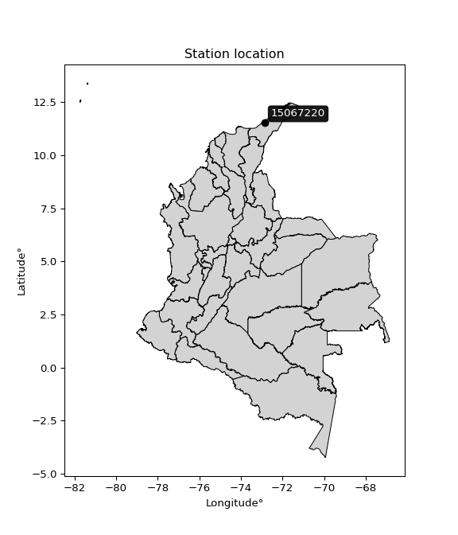</img>

</div>


## A. General information


### 1. General running parameters

• app_version: _v20251225_. • runtime: _2025-12-26 14:29:50.888910_. • Python version: _3.14.0_. • SciPy version: _1.16.3_. • Pandas version: _2.3.3_. • NumPy version: _2.3.5_. • Stations dataset (station_dataset_file): _dataset/pmax24h_in/automatic_colombia.csv_. • Stations catalog (station_catalog_file): _dataset/CNE_IDEAM.xls_. • Plot only fit distributions with Δo > Δ (plot_only_fit): _True_. • Eval low extreme values, if False, evaluates high extreme values (low_extreme): _False_. • Eval every SciPy distribution as logarithmic (pdist_logarithmic_on): _True_. • Standard deviation normalized (ddof): _1.0_. • Return periods to eval in years (Tr): _[2, 2.33, 5, 10, 15, 20, 25, 50, 75, 100, 200, 250, 500, 750, 1000]_. • Minimum data sample per station, 0 means any (minimum_sample): _5_. • Z-Score threshold to adjust a value, 0 means disable (zscore): _3.5_. • Avoid zeros, e.g. rain = 0 (avoid_zeros): _True_. • Avoid null values (avoid_nans): _True_. [:file_folder:Dataset file.](../../dataset/pmax24h_in/automatic_colombia.csv)


### 2. Station info and location

|   id |   CODIGO | NOMBRE                                  | CATEGORIA    | TECNOLOGIA                              | ESTADO   | FECHA_INSTALACION   |   FECHA_SUSPENSION |   ALTITUD |   LATITUD |   LONGITUD | DEPARTAMENTO   | MUNICIPIO   | AREA_OPERATIVA                                         | ENTIDAD                                                     | AREA_HIDROGRAFICA   | ZONA_HIDROGRAFICA   | SUBZONA_HIDROGRAFICA   | CORRIENTE     | OBSERVACION                                                                                                                                                                                                                                                                                                                                                                                                                                                                                                      |   SUBRED | Catalogo   |
|-----:|---------:|:----------------------------------------|:-------------|:----------------------------------------|:---------|:--------------------|-------------------:|----------:|----------:|-----------:|:---------------|:------------|:-------------------------------------------------------|:------------------------------------------------------------|:--------------------|:--------------------|:-----------------------|:--------------|:-----------------------------------------------------------------------------------------------------------------------------------------------------------------------------------------------------------------------------------------------------------------------------------------------------------------------------------------------------------------------------------------------------------------------------------------------------------------------------------------------------------------|---------:|:-----------|
|    0 | 15067220 | PUENTE CARRETERA - RANCHERIA [15067220] | Limnimétrica | Automática con Telemetría, Convencional | Activa   | 01/12/2011          |                nan |         7 |    11.511 |   -72.8559 | La Guajira     | Riohacha    | Area Operativa 05 - Magdalena-Cesar-Guajira-San Andrés | INSTITUTO DE HIDROLOGIA METEOROLOGIA Y ESTUDIOS AMBIENTALES | Caribe              | Caribe - Guajira    | Río Ranchería          | Rio Rancheria | Actualizada Tecnologia y Tipo de Transmision por solicitud del coordinador del AO. Componente automático actualmente siniestrado (16022023)|29/01/2025$mvelez$Se realiza el cambio de categoría de la estación que en su momento fue limnigráfica, pero actualmente los insumos para el instrumento no se tienen por tal razón se retiraron de la estación y se deja como estación Limnimétrica para continuar con los datos de Nivel y no perder la información bajo el memorando 20243120241083 del 17/12/2024 |      nan | CNE_IDEAM  |

<div align="center">

Map location in: [:earth_americas:Google](http://maps.google.com/maps?q=11.51097222,-72.85594444) [:earth_americas:OSM](https://www.openstreetmap.org/#map=18/11.51097222/-72.85594444&layers=P) [:earth_americas:Bing](https://www.bing.com/maps?cp=11.51097222~-72.85594444&lvl=18) [:earth_americas:Apple](https://maps.apple.com/frame?center=11.51097222%2C-72.85594444&span=0.003%2C0.006)

</div>


<div align="center">

```geojson
{
  "type": "Feature",
  "geometry": {
    "type": "Point", 
    "coordinates": [-72.85594444, 11.51097222]
  }, 
  "properties": {
    "Name": "15067220"
  }
}
```

</div>


### 3. Discrete values table and plot

|               |           0 |            1 |           2 |          3 |           4 |            5 |           6 |           7 |          8 |
|:--------------|------------:|-------------:|------------:|-----------:|------------:|-------------:|------------:|------------:|-----------:|
| Date          | 2011        | 2012         | 2013        | 2014       | 2015        | 2016         | 2017        | 2018        | 2019       |
| Value         |   61.4      |   75.7       |   72.3      |  278.5     |   61.1      |   87.3       |   58.8      |   48.9      |    0.6     |
| Value_initial |   61.4      |   75.7       |   72.3      |  278.5     |   61.1      |   87.3       |   58.8      |   48.9      |    0.6     |
| count         |    9        |    9         |    9        |    9       |    9        |    9         |    9        |    9        |    9       |
| mean          |   82.7333   |   82.7333    |   82.7333   |   82.7333  |   82.7333   |   82.7333    |   82.7333   |   82.7333   |   82.7333  |
| std           |   77.3711   |   77.3711    |   77.3711   |   77.3711  |   77.3711   |   77.3711    |   77.3711   |   77.3711   |   77.3711  |
| zscore        |   -0.275728 |   -0.0909039 |   -0.134848 |    2.53023 |   -0.279605 |    0.0590229 |   -0.309332 |   -0.437287 |   -1.06155 |

<div align="center">

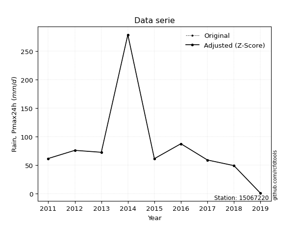</img>

</div>

> If Z-Score is active, values out of range or outliers are replaced with the station mean value.


### 4. Active continuous probability distributions from SciPy (45 of 104 available)

[scipy.stats](https://docs.scipy.org/doc/scipy/reference/stats.html) is a Python´s powerful submodule within the SciPy library for comprehensive statistical analysis, offering over 130 probability distributions (like Normal, Poisson), functions for descriptive stats (mean, variance), hypothesis testing (t-tests, chi-square), random variable generation, and statistical tests, making it essential for data science, modeling, and research. It provides tools to explore, model, and draw conclusions from data efficiently, working seamlessly with NumPy.

<div align="center">

|   id | p_dist             |   n_parameter | fit_method   | label                                                                       | active   | ref                                                                                                        |
|-----:|:-------------------|--------------:|:-------------|:----------------------------------------------------------------------------|:---------|:-----------------------------------------------------------------------------------------------------------|
|    0 | alpha              |             3 | MLE          | Alpha                                                                       | True     | [:mortar_board:](https://docs.scipy.org/doc/scipy/reference/generated/scipy.stats.alpha.html)              |
|    1 | betaprime          |             4 | MLE          | Beta prime                                                                  | True     | [:mortar_board:](https://docs.scipy.org/doc/scipy/reference/generated/scipy.stats.betaprime.html)          |
|    2 | chi2               |             3 | MLE          | Chi²                                                                        | True     | [:mortar_board:](https://docs.scipy.org/doc/scipy/reference/generated/scipy.stats.chi2.html)               |
|    3 | crystalball        |             4 | MLE          | Crystalball                                                                 | True     | [:mortar_board:](https://docs.scipy.org/doc/scipy/reference/generated/scipy.stats.crystalball.html)        |
|    4 | erlang             |             3 | MLE          | Erlang                                                                      | True     | [:mortar_board:](https://docs.scipy.org/doc/scipy/reference/generated/scipy.stats.erlang.html)             |
|    5 | expon              |             2 | MLE          | Exponential                                                                 | True     | [:mortar_board:](https://docs.scipy.org/doc/scipy/reference/generated/scipy.stats.expon.html)              |
|    6 | exponnorm          |             3 | MLE          | Exponentially modified Normal                                               | True     | [:mortar_board:](https://docs.scipy.org/doc/scipy/reference/generated/scipy.stats.exponnorm.html)          |
|    7 | f                  |             4 | MLE          | F                                                                           | True     | [:mortar_board:](https://docs.scipy.org/doc/scipy/reference/generated/scipy.stats.f.html)                  |
|    8 | fatiguelife        |             3 | MLE          | Fatigue-life (Birnbaum-Saunders)                                            | True     | [:mortar_board:](https://docs.scipy.org/doc/scipy/reference/generated/scipy.stats.fatiguelife.html)        |
|    9 | fisk               |             3 | MLE          | Fisk                                                                        | True     | [:mortar_board:](https://docs.scipy.org/doc/scipy/reference/generated/scipy.stats.fisk.html)               |
|   10 | gamma              |             3 | MLE          | Gamma                                                                       | True     | [:mortar_board:](https://docs.scipy.org/doc/scipy/reference/generated/scipy.stats.gamma.html)              |
|   11 | genexpon           |             5 | MLE          | Generalized exponential                                                     | True     | [:mortar_board:](https://docs.scipy.org/doc/scipy/reference/generated/scipy.stats.genexpon.html)           |
|   12 | genlogistic        |             3 | MLE          | Generalized logistic                                                        | True     | [:mortar_board:](https://docs.scipy.org/doc/scipy/reference/generated/scipy.stats.genlogistic.html)        |
|   13 | gibrat             |             2 | MM           | Gibrat                                                                      | True     | [:mortar_board:](https://docs.scipy.org/doc/scipy/reference/generated/scipy.stats.gibrat.html)             |
|   14 | gompertz           |             3 | MLE          | Gompertz (or truncated Gumbel)                                              | True     | [:mortar_board:](https://docs.scipy.org/doc/scipy/reference/generated/scipy.stats.gompertz.html)           |
|   15 | gumbel_l           |             2 | MM           | Gumbel Left Skew                                                            | True     | [:mortar_board:](https://docs.scipy.org/doc/scipy/reference/generated/scipy.stats.gumbel_l.html)           |
|   16 | gumbel_r           |             2 | MM           | Gumbel Right Skew                                                           | True     | [:mortar_board:](https://docs.scipy.org/doc/scipy/reference/generated/scipy.stats.gumbel_r.html)           |
|   17 | halflogistic       |             2 | MM           | Half-logistic                                                               | True     | [:mortar_board:](https://docs.scipy.org/doc/scipy/reference/generated/scipy.stats.halflogistic.html)       |
|   18 | halfnorm           |             2 | MM           | Half Normal                                                                 | True     | [:mortar_board:](https://docs.scipy.org/doc/scipy/reference/generated/scipy.stats.halfnorm.html)           |
|   19 | hypsecant          |             2 | MM           | hyperbolic secant                                                           | True     | [:mortar_board:](https://docs.scipy.org/doc/scipy/reference/generated/scipy.stats.hypsecant.html)          |
|   20 | invgamma           |             3 | MLE          | Inverted gamma                                                              | True     | [:mortar_board:](https://docs.scipy.org/doc/scipy/reference/generated/scipy.stats.invgamma.html)           |
|   21 | invgauss           |             3 | MLE          | Inverse Gaussian                                                            | True     | [:mortar_board:](https://docs.scipy.org/doc/scipy/reference/generated/scipy.stats.invgauss.html)           |
|   22 | invweibull         |             3 | MLE          | Inverted Weibull                                                            | True     | [:mortar_board:](https://docs.scipy.org/doc/scipy/reference/generated/scipy.stats.invweibull.html)         |
|   23 | johnsonsu          |             4 | MLE          | Johnson Su                                                                  | True     | [:mortar_board:](https://docs.scipy.org/doc/scipy/reference/generated/scipy.stats.johnsonsu.html)          |
|   24 | kstwobign          |             2 | MLE          | Limiting distribution of scaled Kolmogorov-Smirnov two-sided test statistic | True     | [:mortar_board:](https://docs.scipy.org/doc/scipy/reference/generated/scipy.stats.kstwobign.html)          |
|   25 | laplace            |             2 | MM           | Laplace                                                                     | True     | [:mortar_board:](https://docs.scipy.org/doc/scipy/reference/generated/scipy.stats.laplace.html)            |
|   26 | laplace_asymmetric |             3 | MLE          | Asymmetric Laplace                                                          | True     | [:mortar_board:](https://docs.scipy.org/doc/scipy/reference/generated/scipy.stats.laplace_asymmetric.html) |
|   27 | loggamma           |             3 | MLE          | Log gamma                                                                   | True     | [:mortar_board:](https://docs.scipy.org/doc/scipy/reference/generated/scipy.stats.loggamma.html)           |
|   28 | logistic           |             2 | MM           | Logistic (or Sech-squared)                                                  | True     | [:mortar_board:](https://docs.scipy.org/doc/scipy/reference/generated/scipy.stats.logistic.html)           |
|   29 | lognorm            |             3 | MLE          | Log Normal                                                                  | True     | [:mortar_board:](https://docs.scipy.org/doc/scipy/reference/generated/scipy.stats.lognorm.html)            |
|   30 | maxwell            |             2 | MM           | Maxwell                                                                     | True     | [:mortar_board:](https://docs.scipy.org/doc/scipy/reference/generated/scipy.stats.maxwell.html)            |
|   31 | mielke             |             4 | MLE          | Mielke Beta-Kappa / Dagum                                                   | True     | [:mortar_board:](https://docs.scipy.org/doc/scipy/reference/generated/scipy.stats.mielke.html)             |
|   32 | moyal              |             2 | MM           | Moyal                                                                       | True     | [:mortar_board:](https://docs.scipy.org/doc/scipy/reference/generated/scipy.stats.moyal.html)              |
|   33 | nakagami           |             3 | MLE          | Nakagami                                                                    | True     | [:mortar_board:](https://docs.scipy.org/doc/scipy/reference/generated/scipy.stats.nakagami.html)           |
|   34 | ncf                |             5 | MLE          | Non-central F distribution                                                  | True     | [:mortar_board:](https://docs.scipy.org/doc/scipy/reference/generated/scipy.stats.ncf.html)                |
|   35 | nct                |             4 | MLE          | Non-central Student’s t                                                     | True     | [:mortar_board:](https://docs.scipy.org/doc/scipy/reference/generated/scipy.stats.nct.html)                |
|   36 | norm               |             2 | MM           | Normal                                                                      | True     | [:mortar_board:](https://docs.scipy.org/doc/scipy/reference/generated/scipy.stats.norm.html)               |
|   37 | pareto             |             3 | MLE          | Pareto                                                                      | True     | [:mortar_board:](https://docs.scipy.org/doc/scipy/reference/generated/scipy.stats.pareto.html)             |
|   38 | pearson3           |             3 | MM           | Pearson type III                                                            | True     | [:mortar_board:](https://docs.scipy.org/doc/scipy/reference/generated/scipy.stats.pearson3.html)           |
|   39 | rayleigh           |             2 | MM           | Rayleigh                                                                    | True     | [:mortar_board:](https://docs.scipy.org/doc/scipy/reference/generated/scipy.stats.rayleigh.html)           |
|   40 | rice               |             3 | MLE          | Rice                                                                        | True     | [:mortar_board:](https://docs.scipy.org/doc/scipy/reference/generated/scipy.stats.rice.html)               |
|   41 | t                  |             3 | MLE          | Student’s t                                                                 | True     | [:mortar_board:](https://docs.scipy.org/doc/scipy/reference/generated/scipy.stats.t.html)                  |
|   42 | truncnorm          |             4 | MLE          | Truncated normal                                                            | True     | [:mortar_board:](https://docs.scipy.org/doc/scipy/reference/generated/scipy.stats.truncnorm.html)          |
|   43 | wald               |             2 | MM           | Wald                                                                        | True     | [:mortar_board:](https://docs.scipy.org/doc/scipy/reference/generated/scipy.stats.wald.html)               |
|   44 | weibull_min        |             3 | MLE          | Weibull minimum                                                             | True     | [:mortar_board:](https://docs.scipy.org/doc/scipy/reference/generated/scipy.stats.weibull_min.html)        |

</div>

> **n_parameter:** # arguments & localization & scale.
>
> **Fit methods:** (MLE) maximum likelihood, (MM) L-moments.
>
>**Inactive:** foldnorm, gennorm, norminvgauss, powernorm, powerlognorm, skewnorm, genextreme, anglit, arcsine, argus, beta, bradford, burr, burr12, cauchy, cosine, halfcauchy, foldcauchy, skewcauchy, wrapcauchy, dgamma, gengamma, exponweib, exponpow, truncexpon, gausshyper, genhalflogistic, genhyperbolic, geninvgauss, halfgennorm, johnsonsb, kappa4, kappa3, ksone, kstwo, loglaplace, levy, levy_l, levy_stable, ncx2, genpareto, truncpareto, lomax, powerlaw, rdist, rel_breitwigner, recipinvgauss, semicircular, studentized_range, trapezoid, triang, truncweibull_min, tukeylambda, uniform, loguniform, vonmises, vonmises_line, weibull_max, dweibull, 


## B. Probability distributions vs. Empirical distributions

A continuous probability distribution (CPD) describes probabilities for variables that can take any value within a range (like rain any time), unlike discrete variables with specific outcomes (like temperature). It uses a Probability Density Function (PDF), a curve where the total area under it equals 1, and the probability of the variable falling within an interval (a to b) is found by calculating the area under the curve between those points. A key feature is that the probability of hitting any single exact value is zero, so probabilities are always expressed for ranges, e.g., $P(a ≤ X ≤ b)$.

<div align="center">

Distributions parameters
|    |   station | p_dist                |   n |              loc |            scale | shape                 | shape1              | shape2                | shape3   |
|---:|----------:|:----------------------|----:|-----------------:|-----------------:|:----------------------|:--------------------|:----------------------|:---------|
|  0 |  15067220 | alpha                 |   9 |    -121.817      |    730.795       | 3.8959545054416806    |                     |                       |          |
|  1 |  15067220 | betaprime             |   9 |     -31.2187     |    108.605       | 6.827220950349659     | 7.617995216930577   |                       |          |
|  2 |  15067220 | chi2                  |   9 |      -6.97609    |     25.5603      | 3.509714801185447     |                     |                       |          |
|  3 |  15067220 | crystalball           |   9 |      82.7333     |     72.9461      | 5733.936402587706     | 5979.568457536352   |                       |          |
|  4 |  15067220 | erlang                |   9 |      -6.97608    |     51.1206      | 1.7548578495060445    |                     |                       |          |
|  5 |  15067220 | expon                 |   9 |       0.6        |     82.1333      |                       |                     |                       |          |
|  6 |  15067220 | exponnorm             |   9 |      28.9864     |     23.6261      | 2.274900341143987     |                     |                       |          |
|  7 |  15067220 | f                     |   9 |      -7.00453    |     89.6532      | 3.5197399327278243    | 2455.257284016123   |                       |          |
|  8 |  15067220 | fatiguelife           |   9 |       0.6        |      5.77138e-05 | 1170.1339308649817    |                     |                       |          |
|  9 |  15067220 | fisk                  |   9 |     -36.1437     |    102.035       | 3.977756670033216     |                     |                       |          |
| 10 |  15067220 | gamma                 |   9 |      -6.97606    |     51.1206      | 1.754856316755244     |                     |                       |          |
| 11 |  15067220 | genexpon              |   9 |       0.6        |    104.602       | 0.6560289831214304    | 1.036866397572403   | 2.146097856344023     |          |
| 12 |  15067220 | genlogistic           |   9 |    -212.368      |     43.3154      | 475.2009092410707     |                     |                       |          |
| 13 |  15067220 | gibrat                |   9 |      27.0846     |     33.7526      |                       |                     |                       |          |
| 14 |  15067220 | gompertz              |   9 |       0.599998   |    653.908       | 7.069783726607486     |                     |                       |          |
| 15 |  15067220 | gumbel_l              |   9 |     115.563      |     56.8759      |                       |                     |                       |          |
| 16 |  15067220 | gumbel_r              |   9 |      49.9037     |     56.8759      |                       |                     |                       |          |
| 17 |  15067220 | halflogistic          |   9 |      -3.7248     |     62.3664      |                       |                     |                       |          |
| 18 |  15067220 | halfnorm              |   9 |     -13.8188     |    121.01        |                       |                     |                       |          |
| 19 |  15067220 | hypsecant             |   9 |      82.7333     |     46.439       |                       |                     |                       |          |
| 20 |  15067220 | invgamma              |   9 |     -62.8414     |    818.394       | 6.661503221023869     |                     |                       |          |
| 21 |  15067220 | invgauss              |   9 |     -39.9323     |    428.335       | 0.28637802287714137   |                     |                       |          |
| 22 |  15067220 | invweibull            |   9 |       0.6        |      2.4805      | 0.047302028686033185  |                     |                       |          |
| 23 |  15067220 | johnsonsu             |   9 |      60.5782     |      2.12968     | -0.2825878578308823   | 0.3614811696447704  |                       |          |
| 24 |  15067220 | kstwobign             |   9 |    -116.613      |    233.847       |                       |                     |                       |          |
| 25 |  15067220 | laplace               |   9 |      82.7333     |     51.5807      |                       |                     |                       |          |
| 26 |  15067220 | laplace_asymmetric    |   9 |      61.1        |     33.2367      | 0.7261830085756128    |                     |                       |          |
| 27 |  15067220 | loggamma              |   9 |  -20252.1        |   2799.81        | 1426.7061548596944    |                     |                       |          |
| 28 |  15067220 | logistic              |   9 |      82.7333     |     40.2173      |                       |                     |                       |          |
| 29 |  15067220 | lognorm               |   9 |       0.6        |      0.809304    | 12.922543560729926    |                     |                       |          |
| 30 |  15067220 | maxwell               |   9 |     -90.1184     |    108.319       |                       |                     |                       |          |
| 31 |  15067220 | mielke                |   9 |       0.6        |    111.882       | 0.7484226398573999    | 2.871316624486745   |                       |          |
| 32 |  15067220 | moyal                 |   9 |      41.018      |     32.8373      |                       |                     |                       |          |
| 33 |  15067220 | nakagami              |   9 |      48.9        |     61.5396      | 0.20385165733593114   |                     |                       |          |
| 34 |  15067220 | ncf                   |   9 |       0.6        |     14.997       | 0.8423971202594711    | 86.30523628073725   | 3.2119920662448886    |          |
| 35 |  15067220 | nct                   |   9 |      -0.0602731  |      0.0361794   | 0.25041613606287816   | 54.73618431282579   |                       |          |
| 36 |  15067220 | norm                  |   9 |      82.7333     |     72.9461      |                       |                     |                       |          |
| 37 |  15067220 | pareto                |   9 |       0.590291   |      0.00970931  | 0.12515463595258094   |                     |                       |          |
| 38 |  15067220 | pearson3              |   9 |      82.7333     |     72.9461      | 1.9679789273570505    |                     |                       |          |
| 39 |  15067220 | rayleigh              |   9 |     -56.8169     |    111.345       |                       |                     |                       |          |
| 40 |  15067220 | rice                  |   9 |     -28.0536     |     93.7947      | 0.0009366578769873032 |                     |                       |          |
| 41 |  15067220 | t                     |   9 |      63.2602     |     10.6564      | 0.869869809873351     |                     |                       |          |
| 42 |  15067220 | truncnorm             |   9 |    -108.216      |    142.642       | 0.7628644893113362    | 99.17260904602865   |                       |          |
| 43 |  15067220 | wald                  |   9 |       9.7872     |     72.9461      |                       |                     |                       |          |
| 44 |  15067220 | weibull_min           |   9 |      48.9        |     47.6778      | 0.8144045856530582    |                     |                       |          |
| 45 |  15067220 | logalpha              |   9 |      -1.25066    |      1.65868     | 6.361901872311321e-08 |                     |                       |          |
| 46 |  15067220 | logbetaprime          |   9 |      -0.510826   |      2.58445     | 0.7374489294412604    | 0.9345346248195885  |                       |          |
| 47 |  15067220 | logchi2               |   9 |      -0.510826   |      1.53124     | 1.294217559036278     |                     |                       |          |
| 48 |  15067220 | logcrystalball        |   9 |       3.82105    |      1.60432     | 18.698779882618517    | 8.903739864413303   |                       |          |
| 49 |  15067220 | logerlang             |   9 |      -0.510826   |     25.3424      | 0.3377153655369081    |                     |                       |          |
| 50 |  15067220 | logexpon              |   9 |      -0.510826   |      4.33187     |                       |                     |                       |          |
| 51 |  15067220 | logexponnorm          |   9 |       3.82002    |      1.60431     | 0.0006362081264115483 |                     |                       |          |
| 52 |  15067220 | logf                  |   9 |      -0.510826   |      1.25446     | 1.090895883607804     | 1.2454783174274646  |                       |          |
| 53 |  15067220 | logfatiguelife        |   9 |   -1209.37       |   1213.19        | 0.0013248292297066062 |                     |                       |          |
| 54 |  15067220 | logfisk               |   9 |      -0.510826   |      1.63277     | 0.6786047260050351    |                     |                       |          |
| 55 |  15067220 | loggamma              |   9 |      -0.510826   |      4.03184     | 0.9603387201855488    |                     |                       |          |
| 56 |  15067220 | loggenexpon           |   9 |      -0.570762   |      0.044789    | 0.002046529835334956  | 1.7051734990504763  | 8.584606106984356e-05 |          |
| 57 |  15067220 | loggenlogistic        |   9 |       4.73802    |      0.317844    | 0.29910569438176476   |                     |                       |          |
| 58 |  15067220 | loggibrat             |   9 |       2.59715    |      0.742329    |                       |                     |                       |          |
| 59 |  15067220 | loggompertz           |   9 |      -0.510827   |      0.967273    | 0.006106789899941047  |                     |                       |          |
| 60 |  15067220 | loggumbel_l           |   9 |       4.54307    |      1.25088     |                       |                     |                       |          |
| 61 |  15067220 | loggumbel_r           |   9 |       3.09902    |      1.25088     |                       |                     |                       |          |
| 62 |  15067220 | loghalflogistic       |   9 |       1.91959    |      1.37161     |                       |                     |                       |          |
| 63 |  15067220 | loghalfnorm           |   9 |       1.6976     |      2.66135     |                       |                     |                       |          |
| 64 |  15067220 | loghypsecant          |   9 |       3.82104    |      1.02134     |                       |                     |                       |          |
| 65 |  15067220 | loginvgamma           |   9 |     -41.9459     |  33578.1         | 735.2436583946801     |                     |                       |          |
| 66 |  15067220 | loginvgauss           |   9 |     -13.669      |   1496.75        | 0.01161883584898626   |                     |                       |          |
| 67 |  15067220 | loginvweibull         |   9 |      -2.1257e+08 |      2.1257e+08  | 99302673.41816592     |                     |                       |          |
| 68 |  15067220 | logjohnsonsu          |   9 |       4.11422    |      0.00598161  | -0.13334072776756783  | 0.22838315789676122 |                       |          |
| 69 |  15067220 | logkstwobign          |   9 |      -5.04962    |     10.1861      |                       |                     |                       |          |
| 70 |  15067220 | loglaplace            |   9 |       3.82104    |      1.13442     |                       |                     |                       |          |
| 71 |  15067220 | loglaplace_asymmetric |   9 |       4.28082    |      0.703605    | 1.3785551975863963    |                     |                       |          |
| 72 |  15067220 | logloggamma           |   9 |       5.00914    |      0.628162    | 0.5149942411800584    |                     |                       |          |
| 73 |  15067220 | loglogistic           |   9 |       3.82104    |      0.884503    |                       |                     |                       |          |
| 74 |  15067220 | loglognorm            |   9 |   -1992.44       |   1996.25        | 0.0008026842348188424 |                     |                       |          |
| 75 |  15067220 | logmaxwell            |   9 |       0.019518   |      2.38225     |                       |                     |                       |          |
| 76 |  15067220 | logmielke             |   9 | -931486          | 931491           | 874186.1508448898     | 2926898.236725562   |                       |          |
| 77 |  15067220 | logmoyal              |   9 |       2.90359    |      0.722194    |                       |                     |                       |          |
| 78 |  15067220 | lognakagami           |   9 |   -1708.78       |   1712.61        | 284034.69643982925    |                     |                       |          |
| 79 |  15067220 | logncf                |   9 |      -0.510826   |      0.957165    | 1.0539896925976762    | 1.329560470113499   | 1.175689676316796     |          |
| 80 |  15067220 | lognct                |   9 |     -97.4755     |      1.55975     | 30155.92138547644     | 64.9418194276954    |                       |          |
| 81 |  15067220 | lognorm               |   9 |       3.82104    |      1.60431     |                       |                     |                       |          |
| 82 |  15067220 | logpareto             |   9 |      -0.51143    |      0.000604679 | 0.12514088006557067   |                     |                       |          |
| 83 |  15067220 | logpearson3           |   9 |       3.82105    |      1.60428     | -2.0128956005052965   |                     |                       |          |
| 84 |  15067220 | lograyleigh           |   9 |       0.751924   |      2.44881     |                       |                     |                       |          |
| 85 |  15067220 | logrice               |   9 |    -391.134      |      1.60432     | 246.18040684899108    |                     |                       |          |
| 86 |  15067220 | logt                  |   9 |       4.15867    |      0.15871     | 0.7673853254166549    |                     |                       |          |
| 87 |  15067220 | logtruncnorm          |   9 |       2.41431    |      6.37163     | -0.45917551406971346  | 0.5045974325247167  |                       |          |
| 88 |  15067220 | logwald               |   9 |       2.21675    |      1.6043      |                       |                     |                       |          |
| 89 |  15067220 | logweibull_min        |   9 |      -0.510826   |      2.84995     | 0.2492488683665592    |                     |                       |          |

</div>

> **loc** (Location parameter): This shifts the distribution along the x-axis. For many common distributions, like the normal (Gaussian) distribution, loc represents the mean $μ$. For others, like the uniform distribution, it might represent the minimum value, or for the beta distribution, the left end of the support interval.
>
> **scale** (Scale parameter): This determines the width or spread of the distribution. For the normal distribution, scale represents the standard deviation $σ$. For a uniform distribution, it defines the length of the interval (from $loc$ to $loc + scale$).
>
> **shape** (Shape parameters): Refers to parameters that define the specific form of a probability distribution, distinct from its location (loc) and scale (scale). These parameters are required arguments for most distribution functions. For example, a normal (Gaussian) distribution is fully defined by its location (mean) and scale (standard deviation), so it has no specific shape parameters beyond loc and scale. However, other distributions have intrinsic properties that need specification, as Gamma distribution that takes a shape parameter, often named $a$ or $alpha$.


### 0. Cumulative distribution values - CDF (90 evaluated)

> Ordered by x ascending and calculating $log(f(x))$ separately. 

|   id |   Station |   date |     x |   count |    mean |     std |     zscore |   Value_initial |   station |   m |     alpha |   alpha_pdf |   betaprime |   betaprime_pdf |      chi2 |    chi2_pdf |   crystalball |   crystalball_pdf |    erlang |   erlang_pdf |    expon |   expon_pdf |   exponnorm |   exponnorm_pdf |         f |       f_pdf |   fatiguelife |   fatiguelife_pdf |      fisk |    fisk_pdf |    gamma |   gamma_pdf |    genexpon |   genexpon_pdf |   genlogistic |   genlogistic_pdf |   gibrat |   gibrat_pdf |    gompertz |   gompertz_pdf |   gumbel_l |   gumbel_l_pdf |   gumbel_r |   gumbel_r_pdf |   halflogistic |   halflogistic_pdf |   halfnorm |   halfnorm_pdf |   hypsecant |   hypsecant_pdf |   invgamma |   invgamma_pdf |   invgauss |   invgauss_pdf |   invweibull |   invweibull_pdf |   johnsonsu |   johnsonsu_pdf |   kstwobign |   kstwobign_pdf |   laplace |   laplace_pdf |   laplace_asymmetric |   laplace_asymmetric_pdf |    loggamma |   loggamma_pdf |   logistic |   logistic_pdf |   lognorm |   lognorm_pdf |   maxwell |   maxwell_pdf |      mielke |   mielke_pdf |     moyal |   moyal_pdf |    nakagami |   nakagami_pdf |         ncf |     ncf_pdf |       nct |     nct_pdf |     norm |   norm_pdf |   pareto |   pareto_pdf |   pearson3 |   pearson3_pdf |   rayleigh |   rayleigh_pdf |      rice |    rice_pdf |         t |       t_pdf |   truncnorm |   truncnorm_pdf |     wald |    wald_pdf |   weibull_min |   weibull_min_pdf |   logalpha |   logalpha_pdf |   logbetaprime |   logbetaprime_pdf |     logchi2 |    logchi2_pdf |   logcrystalball |   logcrystalball_pdf |   logerlang |   logerlang_pdf |   logexpon |   logexpon_pdf |   logexponnorm |   logexponnorm_pdf |        logf |    logf_pdf |   logfatiguelife |   logfatiguelife_pdf |     logfisk |   logfisk_pdf |   loggenexpon |   loggenexpon_pdf |   loggenlogistic |   loggenlogistic_pdf |   loggibrat |   loggibrat_pdf |   loggompertz |   loggompertz_pdf |   loggumbel_l |   loggumbel_l_pdf |   loggumbel_r |   loggumbel_r_pdf |   loghalflogistic |   loghalflogistic_pdf |   loghalfnorm |   loghalfnorm_pdf |   loghypsecant |   loghypsecant_pdf |   loginvgamma |   loginvgamma_pdf |   loginvgauss |   loginvgauss_pdf |   loginvweibull |   loginvweibull_pdf |   logjohnsonsu |   logjohnsonsu_pdf |   logkstwobign |   logkstwobign_pdf |   loglaplace |   loglaplace_pdf |   loglaplace_asymmetric |   loglaplace_asymmetric_pdf |   logloggamma |   logloggamma_pdf |   loglogistic |   loglogistic_pdf |   loglognorm |   loglognorm_pdf |   logmaxwell |   logmaxwell_pdf |   logmielke |   logmielke_pdf |    logmoyal |   logmoyal_pdf |   lognakagami |   lognakagami_pdf |      logncf |   logncf_pdf |     lognct |   lognct_pdf |   logpareto |   logpareto_pdf |   logpearson3 |   logpearson3_pdf |   lograyleigh |   lograyleigh_pdf |   logrice |   logrice_pdf |      logt |   logt_pdf |   logtruncnorm |   logtruncnorm_pdf |   logwald |   logwald_pdf |   logweibull_min |   logweibull_min_pdf |
|-----:|----------:|-------:|------:|--------:|--------:|--------:|-----------:|----------------:|----------:|----:|----------:|------------:|------------:|----------------:|----------:|------------:|--------------:|------------------:|----------:|-------------:|---------:|------------:|------------:|----------------:|----------:|------------:|--------------:|------------------:|----------:|------------:|---------:|------------:|------------:|---------------:|--------------:|------------------:|---------:|-------------:|------------:|---------------:|-----------:|---------------:|-----------:|---------------:|---------------:|-------------------:|-----------:|---------------:|------------:|----------------:|-----------:|---------------:|-----------:|---------------:|-------------:|-----------------:|------------:|----------------:|------------:|----------------:|----------:|--------------:|---------------------:|-------------------------:|------------:|---------------:|-----------:|---------------:|----------:|--------------:|----------:|--------------:|------------:|-------------:|----------:|------------:|------------:|---------------:|------------:|------------:|----------:|------------:|---------:|-----------:|---------:|-------------:|-----------:|---------------:|-----------:|---------------:|----------:|------------:|----------:|------------:|------------:|----------------:|---------:|------------:|--------------:|------------------:|-----------:|---------------:|---------------:|-------------------:|------------:|---------------:|-----------------:|---------------------:|------------:|----------------:|-----------:|---------------:|---------------:|-------------------:|------------:|------------:|-----------------:|---------------------:|------------:|--------------:|--------------:|------------------:|-----------------:|---------------------:|------------:|----------------:|--------------:|------------------:|--------------:|------------------:|--------------:|------------------:|------------------:|----------------------:|--------------:|------------------:|---------------:|-------------------:|--------------:|------------------:|--------------:|------------------:|----------------:|--------------------:|---------------:|-------------------:|---------------:|-------------------:|-------------:|-----------------:|------------------------:|----------------------------:|--------------:|------------------:|--------------:|------------------:|-------------:|-----------------:|-------------:|-----------------:|------------:|----------------:|------------:|---------------:|--------------:|------------------:|------------:|-------------:|-----------:|-------------:|------------:|----------------:|--------------:|------------------:|--------------:|------------------:|----------:|--------------:|----------:|-----------:|---------------:|-------------------:|----------:|--------------:|-----------------:|---------------------:|
|    0 |  15067220 |   2019 |   0.6 |       9 | 82.7333 | 77.3711 | -1.06155   |             0.6 |  15067220 |   1 | 0.0190505 | 0.00226561  |   0.0223967 |     0.00285695  | 0.0197761 | 0.0043379   |      0.130094 |        0.00290148 | 0.0197761 |  0.00433789  | 0        | 0.0121753   |   0.0206592 |     0.00175122  | 0.0197498 | 0.00432662  |     0.0162316 |       4.70212e+09 | 0.0169118 | 0.00179985  | 0.019776 | 0.0043379   | 2.65658e-12 |    0.00627166  |      0.031198 |       0.00248831  | 0        |  0           | 2.08297e-08 |    0.0108116   |   0.124083 |    0.00204032  |  0.0926025 |    0.00387409  |      0.0346586 |        0.00800751  |  0.0948462 |    0.0065469   |    0.107551 |     0.00227215  |   0.020777 |    0.00255576  |  0.0229839 |    0.00299436  |   0.00264789 |      6.69447e+12 |   0.0409392 |     0.000528905 |   0.0368519 |     0.00277331  |  0.101726 |   0.00197217  |            0.0281539 |              0.00116647  | 1.26988e-16 |      1.09844   |   0.114839 |    0.00252754  | 0.0034655 |     0.0064931 |  0.127132 |   0.00363837  | 7.49824e-09 |  3.6022      | 0.0642487 | 0.00405763  | 0           |    0           | 3.76832e-08 | 5.49858e+06 | 0.0254076 | 0.132577    | 0.130094 | 0.00290148 | 0        | 12.8902      |   0        |    0           |   0.124496 |    0.00405468  | 0.0455909 | 0.00310855  | 0.0664079 | 0.000907103 | 1.21595e-10 |      0.00938493 | 0        | 0           |   0           |       0           |  0.0249648 |      0.195874  |    8.05711e-13 |       5351.81      | 2.55278e-11 | 148792         |       0.00346556 |           0.00649317 | 1.53884e-06 |     4.68096e+09 |   0        |      0.230847  |     0.00346547 |         0.00649306 | 1.18274e-09 | 5.81075e+06 |       0.00346482 |           0.00650324 | 1.06819e-11 | 65291.3       |    0.00286563 |         0.0499226 |       0.00715889 |           0.00673683 |    0        |       0         |   8.12586e-09 |        0.00631342 |     0.0174387 |         0.0138189 |   1.65183e-08 |       2.36625e-07 |          0        |             0         |      0        |          0        |     0.00915895 |         0.00896637 |    0.00352995 |        0.00716076 |    0.00545132 |          0.011134 |       0.0075376 |           0.0172112 |      0.0351078 |          0.0038252 |      0.0112617 |          0.0283536 |    0.0109795 |       0.00967853 |              0.00468756 |                  0.00483275 |     0.0122109 |          0.01001  |     0.0074098 |        0.00831528 |   0.00342594 |       0.00644827 |     0        |         0        |  0.00724705 |      0.00680125 | 2.10247e-26 |     1.6599e-24 |    0.00348183 |        0.00651628 | 1.50208e-09 |  7.12998e+06 | 0.00356489 |   0.00665835 |    0        |    206.954      |     0.0247961 |         0.0154007 |      0        |          0        | 0.0034655 |     0.0064931 | 0.0231679 | 0.00380526 |    8.60602e-05 |           0.152287 |  0        |     0         |      0.000144273 |          3.23876e+10 |
|    1 |  15067220 |   2018 |  48.9 |       9 | 82.7333 | 77.3711 | -0.437287  |            48.9 |  15067220 |   2 | 0.350211  | 0.00929016  |   0.362301  |     0.00867672  | 0.374847  | 0.00762076  |      0.321391 |        0.00491128 | 0.374847  |  0.00762076  | 0.444601 | 0.00676217  |   0.301037  |     0.00929004  | 0.374816  | 0.00762672  |     0.782835  |       0.00237852  | 0.32639   | 0.0102835   | 0.374847 | 0.00762076  | 0.379919    |    0.00775376  |      0.319909 |       0.00840738  | 0.331258 |  0.0166259   | 0.418398    |    0.00677008  |   0.26635  |    0.00399516  |  0.361388  |    0.0064671   |      0.39853   |        0.00674381  |  0.395747  |    0.00576483  |    0.286247 |     0.00536611  |   0.353014 |    0.00882327  |  0.354937  |    0.00820901  |   0.41938    |      0.000356902 |   0.124811  |     0.00626188  |   0.301758  |     0.00715662  |  0.25948  |   0.00503056  |            0.208273  |              0.00862917  | 0.680597    |      0.0809949 |   0.301269 |    0.00523421  | 0.517087  |     0.248441  |  0.351257 |   0.00532471  | 0.521493    |  0.00741592  | 0.375129  | 0.0072713   | 2.50589e-07 |    1.43786e+07 | 0.460036    | 0.00660524  | 0.633361  | 0.0018749   | 0.321391 | 0.00491128 | 0.655394 |  0.000892761 |   0.413677 |    0.00793954  |   0.362838 |    0.00543317  | 0.285782  | 0.00624746  | 0.214955  | 0.0101212   | 0.392451    |      0.00684462 | 0.395917 | 0.0113976   |   1.29015e-13 |      14.7874      |  0.746944  |      0.0475436 |    0.68861     |          0.0445334 | 0.871322    |      0.0491135 |       0.517085   |           0.24844    | 0.594441    |     0.0400178   |   0.637912 |      0.0835871 |     0.517087   |         0.248441   | 0.722307    | 0.0321433   |       0.516971   |           0.247972   | 0.662133    |     0.0344981 |    0.604528   |         0.146243  |       0.441186   |           0.388254   |    0.710429 |       0.26463   |   0.435324    |        0.337198   |     0.44743   |         0.262033  |   0.587758    |       0.249711    |          0.615794 |             0.226303  |      0.589896 |          0.213552 |     0.521406   |         0.310956   |    0.53435    |        0.234837   |    0.556934   |          0.208936 |       0.534927  |           0.156339  |      0.131451  |          0.21684   |      0.575618  |          0.141898  |    0.529395  |       0.414842   |              0.437823   |                  0.451384   |     0.425908  |          0.312073 |     0.519418  |        0.282218   |   0.518065   |       0.248707   |     0.549374 |         0.236221 |  0.441632   |      0.387604   | 0.613407    |     0.245645   |    0.51652    |        0.248079   | 0.644285    |  0.0397381   | 0.517602   |   0.247008   |    0.671375 |      0.00934388 |     0.383145  |         0.239178  |      0.559995 |          0.23024  | 0.517087  |     0.248441  | 0.195271  | 0.479524   |    0.725652    |           0.164734 |  0.684656 |     0.233301  |      0.671876    |          0.0207103   |
|    2 |  15067220 |   2017 |  58.8 |       9 | 82.7333 | 77.3711 | -0.309332  |            58.8 |  15067220 |   3 | 0.440341  | 0.00883722  |   0.445977  |     0.0081744   | 0.447816  | 0.0071018   |      0.37142  |        0.00518242 | 0.447816  |  0.00710181  | 0.507669 | 0.00599429  |   0.39396   |     0.00935024  | 0.447842  | 0.00710732  |     0.804607  |       0.00203524  | 0.428853  | 0.0102619   | 0.447816 | 0.00710181  | 0.454013    |    0.00719655  |      0.403703 |       0.00844595  | 0.475179 |  0.0125545   | 0.482159    |    0.00611984  |   0.308305 |    0.00448285  |  0.425197  |    0.00639339  |      0.463116  |        0.00629766  |  0.451564  |    0.00550704  |    0.342766 |     0.006035    |   0.438362 |    0.00835686  |  0.434134  |    0.00774908  |   0.422593   |      0.00029584  |   0.288689  |     0.0445039   |   0.373033  |     0.00719876  |  0.314382 |   0.00609496  |            0.313885  |              0.0130049   | 0.695181    |      0.0772488 |   0.355465 |    0.00569679  | 0.562678  |     0.245593  |  0.404477 |   0.00541117  | 0.590804    |  0.00658863  | 0.445582  | 0.00692793  | 0.373982    |    0.015334    | 0.522559    | 0.0060264   | 0.649882  | 0.00148936  | 0.37142  | 0.00518242 | 0.663341 |  0.000723838 |   0.487368 |    0.00696666  |   0.416729 |    0.0054394   | 0.348668  | 0.00643034  | 0.377771  | 0.0244622   | 0.457636    |      0.00632561 | 0.497376 | 0.00916553  |   0.242692    |       0.0173181   |  0.755421  |      0.0444656 |    0.696601    |          0.0421783 | 0.880046    |      0.0455791 |       0.562675   |           0.245593   | 0.601693    |     0.0386624   |   0.652999 |      0.0801043 |     0.562678   |         0.245594   | 0.728072    | 0.0304229   |       0.562474   |           0.24511    | 0.668335    |     0.0328076 |    0.631045   |         0.141357  |       0.517025   |           0.432926   |    0.754264 |       0.213185  |   0.49982     |        0.361401   |     0.497104  |         0.276348  |   0.632161    |       0.23177     |          0.655801 |             0.207758  |      0.628135 |          0.201224 |     0.578086   |         0.302329   |    0.577244   |        0.230044   |    0.59493    |          0.202961 |       0.563269  |           0.151038  |      0.233513  |          1.72586   |      0.601312  |          0.136793  |    0.599986  |       0.352615   |              0.529477   |                  0.545876   |     0.486311  |          0.342741 |     0.571053  |        0.276937   |   0.563696   |       0.24576    |     0.592195 |         0.227948 |  0.517331   |      0.432067   | 0.656554    |     0.222516   |    0.562048   |        0.245274   | 0.651427    |  0.0377636   | 0.562923   |   0.244109   |    0.673059 |      0.00892227 |     0.429895  |         0.26855   |      0.60159  |          0.220724 | 0.562678  |     0.245593  | 0.354199  | 1.43654    |    0.755917    |           0.163566 |  0.724254 |     0.197483  |      0.675614    |          0.0198531   |
|    3 |  15067220 |   2015 |  61.1 |       9 | 82.7333 | 77.3711 | -0.279605  |            61.1 |  15067220 |   4 | 0.460479  | 0.00867123  |   0.464601  |     0.0080182   | 0.463996  | 0.00696781  |      0.383399 |        0.00523371 | 0.463996  |  0.00696782  | 0.521265 | 0.00582876  |   0.415366  |     0.00925818  | 0.464035  | 0.00697314  |     0.80921   |       0.00196734  | 0.452315  | 0.0101332   | 0.463997 | 0.00696782  | 0.470402    |    0.00705385  |      0.423074 |       0.0083943   | 0.503094 |  0.0117279   | 0.496069    |    0.00597643  |   0.318747 |    0.00459738  |  0.439855  |    0.00635168  |      0.477476  |        0.00618937  |  0.464157  |    0.0054436   |    0.356806 |     0.00617243  |   0.457407 |    0.00820236  |  0.451801  |    0.00761163  |   0.42326    |      0.00028452  |   0.422742  |     0.064532    |   0.389563  |     0.00717326  |  0.328718 |   0.00637289  |            0.345268  |              0.0143051   | 0.698131    |      0.0764918 |   0.368674 |    0.00578739  | 0.572082  |     0.244599  |  0.416932 |   0.00541786  | 0.605739    |  0.00639836  | 0.461397  | 0.00682246  | 0.407042    |    0.0135124   | 0.536266    | 0.005893    | 0.653227  | 0.00141967  | 0.383399 | 0.00523371 | 0.66497  |  0.000692956 |   0.503149 |    0.00675689  |   0.429228 |    0.00542872  | 0.363482  | 0.00645049  | 0.438167  | 0.0278132   | 0.472048    |      0.0062065  | 0.517926 | 0.00870808  |   0.280745    |       0.0158224   |  0.757115  |      0.0438619 |    0.69821     |          0.0417122 | 0.881782    |      0.0448794 |       0.57208    |           0.244598   | 0.603171    |     0.0383915   |   0.656059 |      0.0793979 |     0.572083   |         0.244599   | 0.729233    | 0.0300836   |       0.57186    |           0.244115   | 0.669588    |     0.0324732 |    0.636449   |         0.140296  |       0.533788   |           0.440731   |    0.762267 |       0.204086  |   0.513768    |        0.365539   |     0.507758  |         0.278919  |   0.64098     |       0.227904    |          0.663699 |             0.203959  |      0.635806 |          0.198629 |     0.589631   |         0.299386   |    0.586046   |        0.228724   |    0.60269    |          0.20151  |       0.569042  |           0.149875  |      0.42163   |         14.3626    |      0.60654   |          0.135703  |    0.61329   |       0.340888   |              0.550842   |                  0.567903   |     0.499577  |          0.348701 |     0.581645  |        0.275108   |   0.573107   |       0.244743   |     0.600904 |         0.225972 |  0.534061   |      0.439837   | 0.665002    |     0.217794   |    0.57144    |        0.244289   | 0.652868    |  0.0373725   | 0.57227    |   0.243111   |    0.673399 |      0.00883901 |     0.440325  |         0.27511   |      0.610018 |          0.21855  | 0.572082  |     0.244599  | 0.415122  | 1.72945    |    0.762188    |           0.163306 |  0.731705 |     0.190903  |      0.676373    |          0.0196831   |
|    4 |  15067220 |   2011 |  61.4 |       9 | 82.7333 | 77.3711 | -0.275728  |            61.4 |  15067220 |   5 | 0.463077  | 0.00864828  |   0.467003  |     0.00799701  | 0.466084  | 0.00695007  |      0.38497  |        0.00524005 | 0.466084  |  0.00695008  | 0.52301  | 0.00580751  |   0.418141  |     0.00924364  | 0.466124  | 0.00695537  |     0.809798  |       0.00195876  | 0.455352  | 0.0101135   | 0.466084 | 0.00695007  | 0.472515    |    0.00703498  |      0.425591 |       0.00838606  | 0.506596 |  0.0116242   | 0.497859    |    0.00595794  |   0.320129 |    0.00461232  |  0.44176   |    0.00634562  |      0.479331  |        0.00617514  |  0.465789  |    0.00543523  |    0.358661 |     0.00618969  |   0.459865 |    0.00818124  |  0.454081  |    0.00759306  |   0.423345   |      0.000283107 |   0.441823  |     0.0625013   |   0.391714  |     0.00716906  |  0.330636 |   0.00641006  |            0.349545  |              0.0142117   | 0.698505    |      0.0763957 |   0.370412 |    0.00579867  | 0.57328   |     0.244462  |  0.418557 |   0.00541837  | 0.607655    |  0.0063736   | 0.463441  | 0.00680814  | 0.411066    |    0.0133141   | 0.538031    | 0.00587564  | 0.653651  | 0.00141101  | 0.38497  | 0.00524005 | 0.665177 |  0.00068911  |   0.505172 |    0.00672997  |   0.430856 |    0.00542701  | 0.365418  | 0.00645252  | 0.446558  | 0.0281199   | 0.473907    |      0.00619101 | 0.52053  | 0.0086502   |   0.285466    |       0.0156478   |  0.75733   |      0.0437858 |    0.698414    |          0.0416533 | 0.882001    |      0.044791  |       0.573278   |           0.244461   | 0.603359    |     0.0383571   |   0.656448 |      0.0793081 |     0.573281   |         0.244462   | 0.72938     | 0.0300408   |       0.573055   |           0.243978   | 0.669746    |     0.0324309 |    0.637135   |         0.140159  |       0.535949   |           0.441674   |    0.763264 |       0.202959  |   0.51556     |        0.366041   |     0.509125  |         0.279236  |   0.642095    |       0.227409    |          0.664697 |             0.203476  |      0.636778 |          0.198298 |     0.591096   |         0.298984   |    0.587166   |        0.228548   |    0.603676   |          0.20132  |       0.569776  |           0.149725  |      0.493335  |         13.439     |      0.607204  |          0.135564  |    0.614956  |       0.33942    |              0.553631   |                  0.570778   |     0.501286  |          0.349447 |     0.582991  |        0.274858   |   0.574305   |       0.244604   |     0.60201  |         0.225714 |  0.536217   |      0.440776   | 0.666067    |     0.217194   |    0.572637   |        0.244154   | 0.653051    |  0.037323    | 0.573461   |   0.242974   |    0.673443 |      0.00882849 |     0.441674  |         0.275959  |      0.611088 |          0.218268 | 0.57328   |     0.244462  | 0.42367   | 1.76052    |    0.762988    |           0.163273 |  0.732638 |     0.190083  |      0.676469    |          0.0196616   |
|    5 |  15067220 |   2013 |  72.3 |       9 | 82.7333 | 77.3711 | -0.134848  |            72.3 |  15067220 |   6 | 0.552231  | 0.00767118  |   0.549618  |     0.00713771  | 0.538219  | 0.00627884  |      0.443134 |        0.00541334 | 0.538219  |  0.00627884  | 0.582291 | 0.00508574  |   0.514813  |     0.0084062   | 0.538311  | 0.006283    |     0.829589  |       0.00168353  | 0.56028   | 0.00903681  | 0.538219 | 0.00627884  | 0.545352    |    0.00632297  |      0.514606 |       0.00788729  | 0.615001 |  0.00845397  | 0.559254    |    0.00531738  |   0.373345 |    0.00514934  |  0.509408  |    0.0060412   |      0.543776  |        0.00564653  |  0.523328  |    0.00511847  |    0.42908  |     0.00668495  |   0.544434 |    0.00730706  |  0.532894  |    0.00684903  |   0.426182   |      0.000239799 |   0.721538  |     0.0101864   |   0.468574  |     0.00689734  |  0.408436 |   0.00791839  |            0.487388  |              0.0112      | 0.710731    |      0.0732604 |   0.435505 |    0.0061128   | 0.612787  |     0.238664  |  0.477511 |   0.00538118  | 0.672272    |  0.00548784  | 0.534556  | 0.00622188  | 0.528924    |    0.00899243  | 0.598677    | 0.00525584  | 0.667525  | 0.0011505   | 0.443134 | 0.00541334 | 0.672016 |  0.00057243  |   0.573441 |    0.0058175   |   0.489492 |    0.00531673  | 0.435815  | 0.00643573  | 0.715723  | 0.0165283   | 0.538353    |      0.00563678 | 0.604345 | 0.00681199  |   0.428849    |       0.0111338   |  0.764283  |      0.0413516 |    0.705064    |          0.039758  | 0.889086    |      0.0419468 |       0.612785   |           0.238663   | 0.609536    |     0.0372448   |   0.669166 |      0.0763721 |     0.612788   |         0.238664   | 0.734176    | 0.0286657   |       0.612484   |           0.238188   | 0.674934    |     0.0310717 |    0.65966    |         0.13548   |       0.610222   |           0.464112   |    0.79359  |       0.169442  |   0.576533    |        0.378862   |     0.555528  |         0.288125  |   0.677894    |       0.210685    |          0.696645 |             0.187621  |      0.668275 |          0.187177 |     0.638687   |         0.282543   |    0.62398    |        0.22171    |    0.636023   |          0.194388 |       0.593827  |           0.144576  |      0.783729  |          0.401652  |      0.628973  |          0.130837  |    0.666612  |       0.293884   |              0.655222   |                  0.675516   |     0.560294  |          0.371845 |     0.627105  |        0.264379   |   0.613828   |       0.238712   |     0.638152 |         0.216399 |  0.610334   |      0.463128   | 0.69995     |     0.197653   |    0.612097   |        0.238406   | 0.659019    |  0.0357313   | 0.612725   |   0.237192   |    0.674857 |      0.0084905  |     0.489172  |         0.305877  |      0.645958 |          0.208346 | 0.612787  |     0.238664  | 0.694242  | 1.14414    |    0.789575    |           0.162104 |  0.761595 |     0.165046  |      0.679625    |          0.0189692   |
|    6 |  15067220 |   2012 |  75.7 |       9 | 82.7333 | 77.3711 | -0.0909039 |            75.7 |  15067220 |   7 | 0.577737  | 0.0073312   |   0.573396  |     0.00684836  | 0.559202  | 0.00606403  |      0.461594 |        0.00544364 | 0.559202  |  0.00606403  | 0.59923  | 0.00487951  |   0.542812  |     0.00805959  | 0.559308  | 0.0060678   |     0.835186  |       0.00160997  | 0.590274  | 0.0086015   | 0.559202 | 0.00606403  | 0.566464    |    0.00609586  |      0.541056 |       0.00766746  | 0.6424   |  0.0076776   | 0.577013    |    0.00512973  |   0.39113  |    0.00531141  |  0.529742  |    0.00591779  |      0.562689  |        0.00547876  |  0.540556  |    0.00501516  |    0.451974 |     0.0067765   |   0.568772 |    0.00700826  |  0.555758  |    0.00659991  |   0.426978   |      0.000228869 |   0.751214  |     0.00750267  |   0.491817  |     0.00677265  |  0.436266 |   0.00845793  |            0.524088  |              0.0103981   | 0.714078    |      0.0724027 |   0.45639  |    0.00616894  | 0.623708  |     0.236615  |  0.495754 |   0.00534833  | 0.690473    |  0.00521938  | 0.555371  | 0.00602111  | 0.558146    |    0.00822223  | 0.616226    | 0.00506793  | 0.671325  | 0.00108631  | 0.461594 | 0.00544364 | 0.673912 |  0.000543358 |   0.592776 |    0.00555783  |   0.507482 |    0.00526444  | 0.457634  | 0.00639645  | 0.763841  | 0.0120303   | 0.55723     |      0.00546773 | 0.626683 | 0.00633465  |   0.465024    |       0.0101693   |  0.766169  |      0.040703  |    0.70688     |          0.0392488 | 0.890996    |      0.0411831 |       0.623706   |           0.236615   | 0.61124     |     0.036943    |   0.672657 |      0.0755662 |     0.623709   |         0.236615   | 0.735484    | 0.0282974   |       0.623383   |           0.236145   | 0.676353    |     0.0307066 |    0.665855   |         0.134124  |       0.631611   |           0.466464   |    0.801187 |       0.161284  |   0.593993    |        0.380914   |     0.568813  |         0.289973  |   0.687467    |       0.205953    |          0.705167 |             0.183266  |      0.676805 |          0.184038 |     0.651545   |         0.277001   |    0.634118   |        0.219469   |    0.644907   |          0.192246 |       0.600436  |           0.143081  |      0.799673  |          0.300982  |      0.634954  |          0.129489  |    0.679847  |       0.282217   |              0.684908   |                  0.617353   |     0.577503  |          0.377038 |     0.639172  |        0.260746   |   0.62475    |       0.236637   |     0.648031 |         0.213553 |  0.631679   |      0.465481   | 0.70891     |     0.192342   |    0.623007   |        0.236373   | 0.660651    |  0.0353033   | 0.623579   |   0.235157   |    0.675246 |      0.00839982 |     0.503434  |         0.314873  |      0.655465 |          0.205392 | 0.623708  |     0.236615  | 0.739857  | 0.855566   |    0.797016    |           0.161758 |  0.769033 |     0.158751  |      0.680492    |          0.0187828   |
|    7 |  15067220 |   2016 |  87.3 |       9 | 82.7333 | 77.3711 |  0.0590229 |            87.3 |  15067220 |   8 | 0.655924  | 0.00615155  |   0.647049  |     0.00585298  | 0.625307  | 0.00533651  |      0.524959 |        0.00545829 | 0.625307  |  0.00533651  | 0.652017 | 0.00423681  |   0.628929  |     0.00677771  | 0.625448  | 0.00533892  |     0.852554  |       0.00139236  | 0.68084   | 0.00700202  | 0.625307 | 0.00533651  | 0.632708    |    0.0053296   |      0.625006 |       0.00677828  | 0.718661 |  0.00560323  | 0.632983    |    0.00453063  |   0.455779 |    0.00582152  |  0.595627  |    0.00542618  |      0.622918  |        0.00490628  |  0.596633  |    0.00465042  |    0.531251 |     0.00682136  |   0.64406  |    0.00597411  |  0.627323  |    0.00573974  |   0.429446   |      0.000198043 |   0.811359  |     0.00364318  |   0.567463  |     0.00624768  |  0.542364 |   0.00887223  |            0.630634  |              0.00807021  | 0.724214    |      0.0698067 |   0.528357 |    0.00619623  | 0.656932  |     0.229172  |  0.556844 |   0.00516727  | 0.745888    |  0.00434794  | 0.62113   | 0.00531426  | 0.64195     |    0.00637961  | 0.671404    | 0.00445247  | 0.682844  | 0.000909069 | 0.524959 | 0.00545829 | 0.679721 |  0.000462283 |   0.652463 |    0.00475326  |   0.56727  |    0.00503026  | 0.530585  | 0.00615505  | 0.852917  | 0.00480457  | 0.617379    |      0.0049072  | 0.691948 | 0.00498368  |   0.567604    |       0.00768863  |  0.771833  |      0.0387836 |    0.712366    |          0.037731  | 0.896703    |      0.0389089 |       0.656929   |           0.229172   | 0.616442    |     0.0360359   |   0.683256 |      0.0731196 |     0.656932   |         0.229172   | 0.73944     | 0.0272022   |       0.656541   |           0.228726   | 0.680653    |     0.0296184 |    0.684672   |         0.129821  |       0.697888   |           0.459445   |    0.822537 |       0.138909  |   0.648486    |        0.382164   |     0.610453  |         0.293597  |   0.715787    |       0.191338    |          0.73035  |             0.170088  |      0.702349 |          0.174301 |     0.689708   |         0.257929   |    0.664869   |        0.211709   |    0.671817   |          0.185122 |       0.620499  |           0.138334  |      0.83088   |          0.162174  |      0.653115  |          0.125262  |    0.717658  |       0.248887   |              0.761701   |                  0.466894   |     0.632186  |          0.388872 |     0.675455  |        0.24784    |   0.657971   |       0.229113   |     0.677819 |         0.204183 |  0.697821   |      0.458554   | 0.735189    |     0.176452   |    0.656199   |        0.228982   | 0.665592    |  0.0340265   | 0.656599   |   0.227777   |    0.676424 |      0.00812978 |     0.550409  |         0.344559  |      0.684074 |          0.195848 | 0.656932  |     0.229172  | 0.822799  | 0.389767   |    0.819999    |           0.160635 |  0.790372 |     0.141018  |      0.68313     |          0.0182259   |
|    8 |  15067220 |   2014 | 278.5 |       9 | 82.7333 | 77.3711 |  2.53023   |           278.5 |  15067220 |   9 | 0.980841  | 0.000213352 |   0.983586  |     0.000232695 | 0.9831    | 0.000292505 |      0.99636  |        0.00014926 | 0.9831    |  0.000292505 | 0.966072 | 0.000413081 |   0.989388  |     0.000197446 | 0.983096  | 0.000292159 |     0.969624  |       0.000231961 | 0.988787  | 0.000140161 | 0.9831   | 0.000292505 | 0.981976    |    0.000291108 |      0.994324 |       0.000130664 | 0.977681 |  0.000211312 | 0.976339    |    0.000391289 |   1        |    7.40339e-09 |  0.982193  |    0.000310275 |      0.978569  |        0.000339954 |  0.984293  |    0.000356434 |    0.990602 |     0.000202351 |   0.982877 |    0.000234157 |  0.984305  |    0.000262006 |   0.449352   |      6.11843e-05 |   0.949599  |     0.000172163 |   0.993372  |     0.000191547 |  0.988762 |   0.000217864 |            0.994335  |              0.000123772 | 0.794299    |      0.0519197 |   0.992368 |    0.000188325 | 0.87017   |     0.131741  |  0.991035 |   0.000260734 | 0.981717    |  0.000180699 | 0.978548  | 0.000326557 | 0.99537     |    0.000140255 | 0.98155     | 0.00029224  | 0.762772  | 0.000213258 | 0.99636  | 0.00014926 | 0.723165 |  0.000124671 |   0.975066 |    0.000344901 |   0.989269 |    0.000290241 | 0.995209  | 0.000166941 | 0.977153  | 9.22062e-05 | 0.984949    |      0.00031824 | 0.973199 | 0.000291016 |   0.972598    |       0.000349628 |  0.80949   |      0.0271577 |    0.750154    |          0.0281333 | 0.932959    |      0.0247427 |       0.870168   |           0.131742   | 0.654525    |     0.0299658   |   0.757671 |      0.055941  |     0.870171   |         0.131741   | 0.766721    | 0.0203659   |       0.869509   |           0.131765   | 0.710718    |     0.0227222 |    0.813689   |         0.0923069 |       0.982574   |           0.0527801  |    0.920327 |       0.0488766 |   0.969285    |        0.110795   |     0.907751  |         0.17576   |   0.876103    |       0.0926415   |          0.87461  |             0.0856868 |      0.860426 |          0.100666 |     0.892656   |         0.10312    |    0.861882   |        0.123993   |    0.846442   |          0.114158 |       0.757623  |           0.0982392 |      0.901297  |          0.0262012 |      0.778309  |          0.0908941 |    0.898454  |       0.0895135  |              0.975452   |                  0.0480965  |     0.9785    |          0.10494  |     0.885392  |        0.114723   |   0.870859   |       0.131297   |     0.864053 |         0.116069 |  0.98247    |      0.0530104  | 0.879583    |     0.0827331  |    0.869482   |        0.131978   | 0.700013    |  0.0259074   | 0.868875   |   0.131595   |    0.684792 |      0.00642345 |     1         |         0         |      0.862427 |          0.111897 | 0.87017   |     0.131741  | 0.943888  | 0.0291115  |    1           |           0.148984 |  0.898502 |     0.0594581 |      0.702053    |          0.0146445   |

An Empirical Distribution Function (EDF) is a step-function estimate of a true cumulative distribution function (CDF) based on observed sample data, representing the proportion of data points less than or equal to a given value. It is calculated by ordering your data and jumping up by $1/n$ (where $n$ is sample size) at each unique data point, allowing analysis without assuming an underlying population distribution, and it gets closer to the true CDF as the sample size grows.


### 1. Empirical - EDF California (1923)

California´s estimates the true probability distribution of water-related data (like rainfall, streamflow) using observed samples, crucial for risk assessment.

<div align="center">


$P=m/n$


</div>


**1.1. Empirical values**

<div align="center">

|                | 0                  | 1                  | 2                  | 3                  | 4                  | 5                  | 6                  | 7                  | 8              |
|:---------------|:-------------------|:-------------------|:-------------------|:-------------------|:-------------------|:-------------------|:-------------------|:-------------------|:---------------|
| date           | 2019               | 2018               | 2017               | 2015               | 2011               | 2013               | 2012               | 2016               | 2014           |
| x              | 0.6                | 48.9               | 58.8               | 61.1               | 61.4               | 72.3               | 75.7               | 87.3               | 278.5          |
| m              | 1                  | 2                  | 3                  | 4                  | 5                  | 6                  | 7                  | 8                  | 9              |
| empirical_dist | edf_california     | edf_california     | edf_california     | edf_california     | edf_california     | edf_california     | edf_california     | edf_california     | edf_california |
| empirical      | 0.1111111111111111 | 0.2222222222222222 | 0.3333333333333333 | 0.4444444444444444 | 0.5555555555555556 | 0.6666666666666666 | 0.7777777777777778 | 0.8888888888888888 | 1.0            |
| empirical_tr   | 1.125              | 1.2857142857142856 | 1.4999999999999998 | 1.7999999999999998 | 2.25               | 2.9999999999999996 | 4.5                | 8.999999999999996  | inf            |

</div>


**1.2. Kolmogorov-Smirnov fit test (sorted by Δ)**


<div align="center">

|                | 0                   | 1                   | 2                   | 3                   | 4                   | 5                   | 6                   | 7                     | 8                   | 9                   | 10                  | 11                  | 12                  | 13                  | 14                  | 15                  | 16                  | 17                  | 18                  | 19                  | 20                  | 21                  | 22                  | 23                  | 24                  | 25                  | 26                  | 27                  | 28                  | 29                  | 30                  | 31                  | 32                  | 33                  | 34                  | 35                  | 36                  | 37                  | 38                  | 39                  | 40                  | 41                  | 42                  | 43                  | 44                  | 45                  | 46                  | 47                  | 48                  | 49                  | 50                  | 51                  | 52                  | 53                  | 54                  | 55                  | 56                  | 57                  | 58                  | 59                  | 60                  | 61                  | 62                  | 63                  | 64                  | 65                  | 66                  | 67                  | 68                  | 69                  | 70                  | 71                  | 72                  | 73                  | 74                  | 75                  | 76                  | 77                  | 78                  | 79                  | 80                  | 81                  | 82                  | 83                  | 84                  | 85                  | 86                  | 87                  | 88                  | 89                  |
|:---------------|:--------------------|:--------------------|:--------------------|:--------------------|:--------------------|:--------------------|:--------------------|:----------------------|:--------------------|:--------------------|:--------------------|:--------------------|:--------------------|:--------------------|:--------------------|:--------------------|:--------------------|:--------------------|:--------------------|:--------------------|:--------------------|:--------------------|:--------------------|:--------------------|:--------------------|:--------------------|:--------------------|:--------------------|:--------------------|:--------------------|:--------------------|:--------------------|:--------------------|:--------------------|:--------------------|:--------------------|:--------------------|:--------------------|:--------------------|:--------------------|:--------------------|:--------------------|:--------------------|:--------------------|:--------------------|:--------------------|:--------------------|:--------------------|:--------------------|:--------------------|:--------------------|:--------------------|:--------------------|:--------------------|:--------------------|:--------------------|:--------------------|:--------------------|:--------------------|:--------------------|:--------------------|:--------------------|:--------------------|:--------------------|:--------------------|:--------------------|:--------------------|:--------------------|:--------------------|:--------------------|:--------------------|:--------------------|:--------------------|:--------------------|:--------------------|:--------------------|:--------------------|:--------------------|:--------------------|:--------------------|:--------------------|:--------------------|:--------------------|:--------------------|:--------------------|:--------------------|:--------------------|:--------------------|:--------------------|:--------------------|
| station        | 15067220            | 15067220            | 15067220            | 15067220            | 15067220            | 15067220            | 15067220            | 15067220              | 15067220            | 15067220            | 15067220            | 15067220            | 15067220            | 15067220            | 15067220            | 15067220            | 15067220            | 15067220            | 15067220            | 15067220            | 15067220            | 15067220            | 15067220            | 15067220            | 15067220            | 15067220            | 15067220            | 15067220            | 15067220            | 15067220            | 15067220            | 15067220            | 15067220            | 15067220            | 15067220            | 15067220            | 15067220            | 15067220            | 15067220            | 15067220            | 15067220            | 15067220            | 15067220            | 15067220            | 15067220            | 15067220            | 15067220            | 15067220            | 15067220            | 15067220            | 15067220            | 15067220            | 15067220            | 15067220            | 15067220            | 15067220            | 15067220            | 15067220            | 15067220            | 15067220            | 15067220            | 15067220            | 15067220            | 15067220            | 15067220            | 15067220            | 15067220            | 15067220            | 15067220            | 15067220            | 15067220            | 15067220            | 15067220            | 15067220            | 15067220            | 15067220            | 15067220            | 15067220            | 15067220            | 15067220            | 15067220            | 15067220            | 15067220            | 15067220            | 15067220            | 15067220            | 15067220            | 15067220            | 15067220            | 15067220            |
| empirical_dist | edf_california      | edf_california      | edf_california      | edf_california      | edf_california      | edf_california      | edf_california      | edf_california        | edf_california      | edf_california      | edf_california      | edf_california      | edf_california      | edf_california      | edf_california      | edf_california      | edf_california      | edf_california      | edf_california      | edf_california      | edf_california      | edf_california      | edf_california      | edf_california      | edf_california      | edf_california      | edf_california      | edf_california      | edf_california      | edf_california      | edf_california      | edf_california      | edf_california      | edf_california      | edf_california      | edf_california      | edf_california      | edf_california      | edf_california      | edf_california      | edf_california      | edf_california      | edf_california      | edf_california      | edf_california      | edf_california      | edf_california      | edf_california      | edf_california      | edf_california      | edf_california      | edf_california      | edf_california      | edf_california      | edf_california      | edf_california      | edf_california      | edf_california      | edf_california      | edf_california      | edf_california      | edf_california      | edf_california      | edf_california      | edf_california      | edf_california      | edf_california      | edf_california      | edf_california      | edf_california      | edf_california      | edf_california      | edf_california      | edf_california      | edf_california      | edf_california      | edf_california      | edf_california      | edf_california      | edf_california      | edf_california      | edf_california      | edf_california      | edf_california      | edf_california      | edf_california      | edf_california      | edf_california      | edf_california      | edf_california      |
| p_dist         | t                   | johnsonsu           | logjohnsonsu        | logt                | gibrat              | wald                | fisk                | loglaplace_asymmetric | loggenlogistic      | logmielke           | alpha               | pearson3            | expon               | ncf                 | loggompertz         | betaprime           | invgamma            | nakagami            | gompertz            | genexpon            | logloggamma         | laplace_asymmetric  | exponnorm           | invgauss            | f                   | gamma               | chi2                | erlang              | genlogistic         | halflogistic        | moyal               | truncnorm           | loggumbel_l         | halfnorm            | gumbel_r            | lognakagami         | logfatiguelife      | logcrystalball      | logrice             | lognorm             | lognorm             | logexponnorm        | lognct              | loglognorm          | loglogistic         | loghypsecant        | mielke              | loglaplace          | loginvgamma         | loginvweibull       | weibull_min         | kstwobign           | rayleigh            | logmaxwell          | maxwell             | loginvgauss         | lograyleigh         | logpearson3         | laplace             | logkstwobign        | hypsecant           | rice                | logistic            | crystalball         | norm                | loggumbel_r         | loghalfnorm         | logerlang           | loggenexpon         | logmoyal            | loghalflogistic     | nct                 | logexpon            | logncf              | gumbel_l            | pareto              | logfisk             | logpareto           | logweibull_min      | loggamma            | loggamma            | logwald             | logbetaprime        | loggibrat           | logf                | logtruncnorm        | logalpha            | invweibull          | fatiguelife         | logchi2             |
| delta          | 0.108997704445012   | 0.11373209789415617 | 0.11706259554981135 | 0.1318855356057443  | 0.17022760584059204 | 0.19694096899755265 | 0.2080493595830516  | 0.21560085662053013   | 0.21896353533633245 | 0.2194097919367527  | 0.2329653005407626  | 0.23642566595216685 | 0.23687223743751984 | 0.23781384702855762 | 0.24040256538460347 | 0.24184026836875128 | 0.24482905086021467 | 0.24693845878753573 | 0.25590623113700706 | 0.2561810048730948  | 0.25670243659429426 | 0.2582546225766029  | 0.2599602917642785  | 0.26156615734775424 | 0.2634405781703205  | 0.2635817530962967  | 0.26358187926356014 | 0.26358193283710074 | 0.26388322394515606 | 0.26597112593282335 | 0.26775843739070404 | 0.27150955484182526 | 0.27843626137377364 | 0.2922562233027992  | 0.29326222391359047 | 0.2942978075353211  | 0.29474891665061276 | 0.29486256082346396 | 0.2948646526638544  | 0.2948646737810363  | 0.2948646737810363  | 0.29486507872191026 | 0.29537947916767104 | 0.2958427641036304  | 0.29719543082996425 | 0.2991834258958811  | 0.29927117865167985 | 0.3071732497601837  | 0.3121280668318116  | 0.31270479196650347 | 0.32128489544363026 | 0.3214261427322188  | 0.32161848181890307 | 0.327152261538316   | 0.3320453139257844  | 0.33471168055354195 | 0.3377723844343815  | 0.33847953552092036 | 0.34652470885725606 | 0.35339595287813297 | 0.35763758442689864 | 0.35830385885950466 | 0.3605319112111711  | 0.3639300974258748  | 0.3639301044166845  | 0.36553568548399107 | 0.3676734674855605  | 0.3722192328891848  | 0.38230554467465905 | 0.3911847267372234  | 0.3935721597530376  | 0.4111385728848447  | 0.4156894760383021  | 0.42206260617120606 | 0.4331101933468111  | 0.43317199854528565 | 0.43991072531510844 | 0.449153194182803   | 0.44965394938758696 | 0.458374506850187   | 0.458374506850187   | 0.46243420562633    | 0.4663881897336649  | 0.48820640623184797 | 0.5000849895102906  | 0.5034294099219244  | 0.524721475444182   | 0.5506475657874654  | 0.5606126690352393  | 0.6490995727157763  |
| deltao         | 0.41761268023100007 | 0.41761268023100007 | 0.41761268023100007 | 0.41761268023100007 | 0.41761268023100007 | 0.41761268023100007 | 0.41761268023100007 | 0.41761268023100007   | 0.41761268023100007 | 0.41761268023100007 | 0.41761268023100007 | 0.41761268023100007 | 0.41761268023100007 | 0.41761268023100007 | 0.41761268023100007 | 0.41761268023100007 | 0.41761268023100007 | 0.41761268023100007 | 0.41761268023100007 | 0.41761268023100007 | 0.41761268023100007 | 0.41761268023100007 | 0.41761268023100007 | 0.41761268023100007 | 0.41761268023100007 | 0.41761268023100007 | 0.41761268023100007 | 0.41761268023100007 | 0.41761268023100007 | 0.41761268023100007 | 0.41761268023100007 | 0.41761268023100007 | 0.41761268023100007 | 0.41761268023100007 | 0.41761268023100007 | 0.41761268023100007 | 0.41761268023100007 | 0.41761268023100007 | 0.41761268023100007 | 0.41761268023100007 | 0.41761268023100007 | 0.41761268023100007 | 0.41761268023100007 | 0.41761268023100007 | 0.41761268023100007 | 0.41761268023100007 | 0.41761268023100007 | 0.41761268023100007 | 0.41761268023100007 | 0.41761268023100007 | 0.41761268023100007 | 0.41761268023100007 | 0.41761268023100007 | 0.41761268023100007 | 0.41761268023100007 | 0.41761268023100007 | 0.41761268023100007 | 0.41761268023100007 | 0.41761268023100007 | 0.41761268023100007 | 0.41761268023100007 | 0.41761268023100007 | 0.41761268023100007 | 0.41761268023100007 | 0.41761268023100007 | 0.41761268023100007 | 0.41761268023100007 | 0.41761268023100007 | 0.41761268023100007 | 0.41761268023100007 | 0.41761268023100007 | 0.41761268023100007 | 0.41761268023100007 | 0.41761268023100007 | 0.41761268023100007 | 0.41761268023100007 | 0.41761268023100007 | 0.41761268023100007 | 0.41761268023100007 | 0.41761268023100007 | 0.41761268023100007 | 0.41761268023100007 | 0.41761268023100007 | 0.41761268023100007 | 0.41761268023100007 | 0.41761268023100007 | 0.41761268023100007 | 0.41761268023100007 | 0.41761268023100007 | 0.41761268023100007 |
| eval           | Δo > Δ              | Δo > Δ              | Δo > Δ              | Δo > Δ              | Δo > Δ              | Δo > Δ              | Δo > Δ              | Δo > Δ                | Δo > Δ              | Δo > Δ              | Δo > Δ              | Δo > Δ              | Δo > Δ              | Δo > Δ              | Δo > Δ              | Δo > Δ              | Δo > Δ              | Δo > Δ              | Δo > Δ              | Δo > Δ              | Δo > Δ              | Δo > Δ              | Δo > Δ              | Δo > Δ              | Δo > Δ              | Δo > Δ              | Δo > Δ              | Δo > Δ              | Δo > Δ              | Δo > Δ              | Δo > Δ              | Δo > Δ              | Δo > Δ              | Δo > Δ              | Δo > Δ              | Δo > Δ              | Δo > Δ              | Δo > Δ              | Δo > Δ              | Δo > Δ              | Δo > Δ              | Δo > Δ              | Δo > Δ              | Δo > Δ              | Δo > Δ              | Δo > Δ              | Δo > Δ              | Δo > Δ              | Δo > Δ              | Δo > Δ              | Δo > Δ              | Δo > Δ              | Δo > Δ              | Δo > Δ              | Δo > Δ              | Δo > Δ              | Δo > Δ              | Δo > Δ              | Δo > Δ              | Δo > Δ              | Δo > Δ              | Δo > Δ              | Δo > Δ              | Δo > Δ              | Δo > Δ              | Δo > Δ              | Δo > Δ              | Δo > Δ              | Δo > Δ              | Δo > Δ              | Δo > Δ              | Δo > Δ              | Δo > Δ              | Δo <= Δ             | Δo <= Δ             | Δo <= Δ             | Δo <= Δ             | Δo <= Δ             | Δo <= Δ             | Δo <= Δ             | Δo <= Δ             | Δo <= Δ             | Δo <= Δ             | Δo <= Δ             | Δo <= Δ             | Δo <= Δ             | Δo <= Δ             | Δo <= Δ             | Δo <= Δ             | Δo <= Δ             |
| fit            | 1                   | 1                   | 1                   | 1                   | 1                   | 1                   | 1                   | 1                     | 1                   | 1                   | 1                   | 1                   | 1                   | 1                   | 1                   | 1                   | 1                   | 1                   | 1                   | 1                   | 1                   | 1                   | 1                   | 1                   | 1                   | 1                   | 1                   | 1                   | 1                   | 1                   | 1                   | 1                   | 1                   | 1                   | 1                   | 1                   | 1                   | 1                   | 1                   | 1                   | 1                   | 1                   | 1                   | 1                   | 1                   | 1                   | 1                   | 1                   | 1                   | 1                   | 1                   | 1                   | 1                   | 1                   | 1                   | 1                   | 1                   | 1                   | 1                   | 1                   | 1                   | 1                   | 1                   | 1                   | 1                   | 1                   | 1                   | 1                   | 1                   | 1                   | 1                   | 1                   | 1                   | 0                   | 0                   | 0                   | 0                   | 0                   | 0                   | 0                   | 0                   | 0                   | 0                   | 0                   | 0                   | 0                   | 0                   | 0                   | 0                   | 0                   |
| n              | 9                   | 9                   | 9                   | 9                   | 9                   | 9                   | 9                   | 9                     | 9                   | 9                   | 9                   | 9                   | 9                   | 9                   | 9                   | 9                   | 9                   | 9                   | 9                   | 9                   | 9                   | 9                   | 9                   | 9                   | 9                   | 9                   | 9                   | 9                   | 9                   | 9                   | 9                   | 9                   | 9                   | 9                   | 9                   | 9                   | 9                   | 9                   | 9                   | 9                   | 9                   | 9                   | 9                   | 9                   | 9                   | 9                   | 9                   | 9                   | 9                   | 9                   | 9                   | 9                   | 9                   | 9                   | 9                   | 9                   | 9                   | 9                   | 9                   | 9                   | 9                   | 9                   | 9                   | 9                   | 9                   | 9                   | 9                   | 9                   | 9                   | 9                   | 9                   | 9                   | 9                   | 9                   | 9                   | 9                   | 9                   | 9                   | 9                   | 9                   | 9                   | 9                   | 9                   | 9                   | 9                   | 9                   | 9                   | 9                   | 9                   | 9                   |
| best_fit       | 1                   | 0                   | 0                   | 0                   | 0                   | 0                   | 0                   | 0                     | 0                   | 0                   | 0                   | 0                   | 0                   | 0                   | 0                   | 0                   | 0                   | 0                   | 0                   | 0                   | 0                   | 0                   | 0                   | 0                   | 0                   | 0                   | 0                   | 0                   | 0                   | 0                   | 0                   | 0                   | 0                   | 0                   | 0                   | 0                   | 0                   | 0                   | 0                   | 0                   | 0                   | 0                   | 0                   | 0                   | 0                   | 0                   | 0                   | 0                   | 0                   | 0                   | 0                   | 0                   | 0                   | 0                   | 0                   | 0                   | 0                   | 0                   | 0                   | 0                   | 0                   | 0                   | 0                   | 0                   | 0                   | 0                   | 0                   | 0                   | 0                   | 0                   | 0                   | 0                   | 0                   | 0                   | 0                   | 0                   | 0                   | 0                   | 0                   | 0                   | 0                   | 0                   | 0                   | 0                   | 0                   | 0                   | 0                   | 0                   | 0                   | 0                   |
| best_fit_sort  | 1                   | 2                   | 3                   | 4                   | 5                   | 6                   | 7                   | 8                     | 9                   | 10                  | 11                  | 12                  | 13                  | 14                  | 15                  | 16                  | 17                  | 18                  | 19                  | 20                  | 21                  | 22                  | 23                  | 24                  | 25                  | 26                  | 27                  | 28                  | 29                  | 30                  | 31                  | 32                  | 33                  | 34                  | 35                  | 36                  | 37                  | 38                  | 39                  | 40                  | 41                  | 42                  | 43                  | 44                  | 45                  | 46                  | 47                  | 48                  | 49                  | 50                  | 51                  | 52                  | 53                  | 54                  | 55                  | 56                  | 57                  | 58                  | 59                  | 60                  | 61                  | 62                  | 63                  | 64                  | 65                  | 66                  | 67                  | 68                  | 69                  | 70                  | 71                  | 72                  | 73                  | 74                  | 75                  | 76                  | 77                  | 78                  | 79                  | 80                  | 81                  | 82                  | 83                  | 84                  | 85                  | 86                  | 87                  | 88                  | 89                  | 90                  |

</div>


<div align="center">

</img>

</div>


**1.3. Best fit**

<div align="center">

|   id |   station | empirical_dist   | p_dist   |    delta |   deltao | eval   |   fit |   n |   best_fit |   best_fit_sort |
|-----:|----------:|:-----------------|:---------|---------:|---------:|:-------|------:|----:|-----------:|----------------:|
|    0 |  15067220 | edf_california   | t        | 0.108998 | 0.417613 | Δo > Δ |     1 |   9 |          1 |               1 |

</div>


<div align="center">

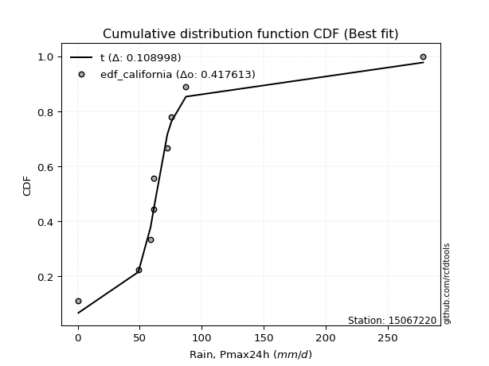</img>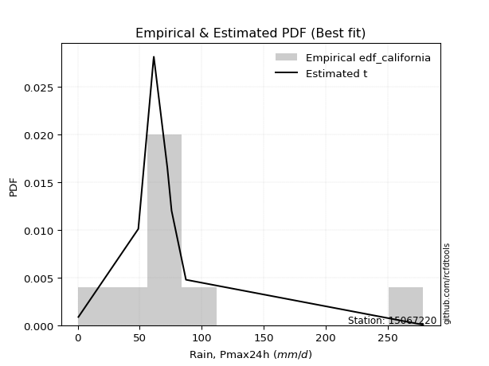</img>

</div>


### 2. Empirical - EDF Hazen (1930)

Hazen method for plotting positions is a formula used to estimate the empirical cumulative probability distribution of flood events or other hydrological data. This formula often results in biased estimations, particularly when extrapolating to extreme events (high return periods).

<div align="center">


$P=(m-0.5)/n$


</div>


**2.1. Empirical values**

<div align="center">

|                | 0                   | 1                   | 2                  | 3                  | 4         | 5                  | 6                  | 7                  | 8                  |
|:---------------|:--------------------|:--------------------|:-------------------|:-------------------|:----------|:-------------------|:-------------------|:-------------------|:-------------------|
| date           | 2019                | 2018                | 2017               | 2015               | 2011      | 2013               | 2012               | 2016               | 2014               |
| x              | 0.6                 | 48.9                | 58.8               | 61.1               | 61.4      | 72.3               | 75.7               | 87.3               | 278.5              |
| m              | 1                   | 2                   | 3                  | 4                  | 5         | 6                  | 7                  | 8                  | 9                  |
| empirical_dist | edf_hazen           | edf_hazen           | edf_hazen          | edf_hazen          | edf_hazen | edf_hazen          | edf_hazen          | edf_hazen          | edf_hazen          |
| empirical      | 0.05555555555555555 | 0.16666666666666666 | 0.2777777777777778 | 0.3888888888888889 | 0.5       | 0.6111111111111112 | 0.7222222222222222 | 0.8333333333333334 | 0.9444444444444444 |
| empirical_tr   | 1.0588235294117647  | 1.2                 | 1.3846153846153846 | 1.6363636363636362 | 2.0       | 2.5714285714285716 | 3.5999999999999996 | 6.000000000000002  | 17.999999999999993 |

</div>


**2.2. Kolmogorov-Smirnov fit test (sorted by Δ)**


<div align="center">

|                | 0                   | 1                   | 2                   | 3                   | 4                   | 5                   | 6                   | 7                   | 8                   | 9                   | 10                  | 11                  | 12                  | 13                  | 14                  | 15                  | 16                  | 17                  | 18                  | 19                  | 20                  | 21                  | 22                  | 23                  | 24                  | 25                  | 26                  | 27                  | 28                  | 29                  | 30                  | 31                  | 32                    | 33                  | 34                  | 35                  | 36                  | 37                  | 38                  | 39                  | 40                  | 41                  | 42                  | 43                  | 44                  | 45                  | 46                  | 47                  | 48                  | 49                  | 50                  | 51                  | 52                  | 53                  | 54                  | 55                  | 56                  | 57                  | 58                  | 59                  | 60                  | 61                  | 62                  | 63                  | 64                  | 65                  | 66                  | 67                  | 68                  | 69                  | 70                  | 71                  | 72                  | 73                  | 74                  | 75                  | 76                  | 77                  | 78                  | 79                  | 80                  | 81                  | 82                  | 83                  | 84                  | 85                  | 86                  | 87                  | 88                  | 89                  |
|:---------------|:--------------------|:--------------------|:--------------------|:--------------------|:--------------------|:--------------------|:--------------------|:--------------------|:--------------------|:--------------------|:--------------------|:--------------------|:--------------------|:--------------------|:--------------------|:--------------------|:--------------------|:--------------------|:--------------------|:--------------------|:--------------------|:--------------------|:--------------------|:--------------------|:--------------------|:--------------------|:--------------------|:--------------------|:--------------------|:--------------------|:--------------------|:--------------------|:----------------------|:--------------------|:--------------------|:--------------------|:--------------------|:--------------------|:--------------------|:--------------------|:--------------------|:--------------------|:--------------------|:--------------------|:--------------------|:--------------------|:--------------------|:--------------------|:--------------------|:--------------------|:--------------------|:--------------------|:--------------------|:--------------------|:--------------------|:--------------------|:--------------------|:--------------------|:--------------------|:--------------------|:--------------------|:--------------------|:--------------------|:--------------------|:--------------------|:--------------------|:--------------------|:--------------------|:--------------------|:--------------------|:--------------------|:--------------------|:--------------------|:--------------------|:--------------------|:--------------------|:--------------------|:--------------------|:--------------------|:--------------------|:--------------------|:--------------------|:--------------------|:--------------------|:--------------------|:--------------------|:--------------------|:--------------------|:--------------------|:--------------------|
| station        | 15067220            | 15067220            | 15067220            | 15067220            | 15067220            | 15067220            | 15067220            | 15067220            | 15067220            | 15067220            | 15067220            | 15067220            | 15067220            | 15067220            | 15067220            | 15067220            | 15067220            | 15067220            | 15067220            | 15067220            | 15067220            | 15067220            | 15067220            | 15067220            | 15067220            | 15067220            | 15067220            | 15067220            | 15067220            | 15067220            | 15067220            | 15067220            | 15067220              | 15067220            | 15067220            | 15067220            | 15067220            | 15067220            | 15067220            | 15067220            | 15067220            | 15067220            | 15067220            | 15067220            | 15067220            | 15067220            | 15067220            | 15067220            | 15067220            | 15067220            | 15067220            | 15067220            | 15067220            | 15067220            | 15067220            | 15067220            | 15067220            | 15067220            | 15067220            | 15067220            | 15067220            | 15067220            | 15067220            | 15067220            | 15067220            | 15067220            | 15067220            | 15067220            | 15067220            | 15067220            | 15067220            | 15067220            | 15067220            | 15067220            | 15067220            | 15067220            | 15067220            | 15067220            | 15067220            | 15067220            | 15067220            | 15067220            | 15067220            | 15067220            | 15067220            | 15067220            | 15067220            | 15067220            | 15067220            | 15067220            |
| empirical_dist | edf_hazen           | edf_hazen           | edf_hazen           | edf_hazen           | edf_hazen           | edf_hazen           | edf_hazen           | edf_hazen           | edf_hazen           | edf_hazen           | edf_hazen           | edf_hazen           | edf_hazen           | edf_hazen           | edf_hazen           | edf_hazen           | edf_hazen           | edf_hazen           | edf_hazen           | edf_hazen           | edf_hazen           | edf_hazen           | edf_hazen           | edf_hazen           | edf_hazen           | edf_hazen           | edf_hazen           | edf_hazen           | edf_hazen           | edf_hazen           | edf_hazen           | edf_hazen           | edf_hazen             | edf_hazen           | edf_hazen           | edf_hazen           | edf_hazen           | edf_hazen           | edf_hazen           | edf_hazen           | edf_hazen           | edf_hazen           | edf_hazen           | edf_hazen           | edf_hazen           | edf_hazen           | edf_hazen           | edf_hazen           | edf_hazen           | edf_hazen           | edf_hazen           | edf_hazen           | edf_hazen           | edf_hazen           | edf_hazen           | edf_hazen           | edf_hazen           | edf_hazen           | edf_hazen           | edf_hazen           | edf_hazen           | edf_hazen           | edf_hazen           | edf_hazen           | edf_hazen           | edf_hazen           | edf_hazen           | edf_hazen           | edf_hazen           | edf_hazen           | edf_hazen           | edf_hazen           | edf_hazen           | edf_hazen           | edf_hazen           | edf_hazen           | edf_hazen           | edf_hazen           | edf_hazen           | edf_hazen           | edf_hazen           | edf_hazen           | edf_hazen           | edf_hazen           | edf_hazen           | edf_hazen           | edf_hazen           | edf_hazen           | edf_hazen           | edf_hazen           |
| p_dist         | logt                | t                   | johnsonsu           | fisk                | logjohnsonsu        | alpha               | invgamma            | nakagami            | betaprime           | gibrat              | laplace_asymmetric  | exponnorm           | invgauss            | f                   | erlang              | chi2                | gamma               | genlogistic         | moyal               | genexpon            | truncnorm           | wald                | halflogistic        | halfnorm            | gumbel_r            | pearson3            | gompertz            | logloggamma         | weibull_min         | kstwobign           | rayleigh            | loggompertz         | loglaplace_asymmetric | loggenlogistic      | logmielke           | maxwell             | expon               | loggumbel_l         | logpearson3         | laplace             | ncf                 | hypsecant           | rice                | logistic            | crystalball         | norm                | lognakagami         | logfatiguelife      | logcrystalball      | logrice             | lognorm             | lognorm             | logexponnorm        | lognct              | loglognorm          | loglogistic         | loghypsecant        | mielke              | loglaplace          | loginvgamma         | loginvweibull       | gumbel_l            | logmaxwell          | loginvgauss         | lograyleigh         | logkstwobign        | loggumbel_r         | loghalfnorm         | logerlang           | loggenexpon         | logmoyal            | loghalflogistic     | nct                 | logexpon            | logncf              | pareto              | invweibull          | logfisk             | logpareto           | logweibull_min      | loggamma            | loggamma            | logwald             | logbetaprime        | loggibrat           | logf                | logtruncnorm        | logalpha            | fatiguelife         | logchi2             |
| delta          | 0.08313121064994144 | 0.10461152090915071 | 0.11042722300200636 | 0.15972312542758185 | 0.17261815110536682 | 0.18354437440828617 | 0.1892734953046592  | 0.19138290323198026 | 0.19563442444878945 | 0.19740144370238272 | 0.20269906702104745 | 0.20440473620872301 | 0.20601060179219877 | 0.2081491924043026  | 0.20818037890428256 | 0.20818050398395857 | 0.2081805877127821  | 0.2083276683896006  | 0.21220288183514857 | 0.2132522003426164  | 0.2257843137421692  | 0.2292501127709107  | 0.2318636429341159  | 0.23670066774724374 | 0.237706668358035   | 0.24701072776896846 | 0.2517315761808031  | 0.25924136445876966 | 0.2657293398880748  | 0.26587058717666334 | 0.2660629262633476  | 0.268657130779      | 0.27115641217608566   | 0.274519090891888   | 0.2749653474923083  | 0.27648975837022893 | 0.2779341540521634  | 0.2807629848403209  | 0.2829239799653649  | 0.2909691533017006  | 0.29336940258411315 | 0.30208202887134317 | 0.3027483033039492  | 0.30497635565561565 | 0.3083745418703193  | 0.308374548861129   | 0.34985336309087667 | 0.35030447220616834 | 0.35041811637901954 | 0.35042020821941    | 0.3504202293365919  | 0.3504202293365919  | 0.35042063427746584 | 0.3509350347232266  | 0.351398319659186   | 0.3527509863855198  | 0.3547389814514367  | 0.35482673420723543 | 0.36272880531573926 | 0.3676836223873672  | 0.36826034752205905 | 0.37755463779125564 | 0.3827078170938716  | 0.3902672361090975  | 0.3933279399899371  | 0.40895150843368855 | 0.42109124103954665 | 0.4232290230411161  | 0.4277747884447404  | 0.43786110023021463 | 0.44674028229277896 | 0.4491277153085932  | 0.46669412844040026 | 0.47124503159385767 | 0.47761816172676164 | 0.48872755410084123 | 0.4950920102319099  | 0.495466280870664   | 0.5047087497383586  | 0.5052095049431425  | 0.5139300624057426  | 0.5139300624057426  | 0.5179897611818856  | 0.5219437452892205  | 0.5437619617874035  | 0.5556405450658461  | 0.55898496547748    | 0.5802770309997376  | 0.6161682245907949  | 0.7046551282713319  |
| deltao         | 0.41761268023100007 | 0.41761268023100007 | 0.41761268023100007 | 0.41761268023100007 | 0.41761268023100007 | 0.41761268023100007 | 0.41761268023100007 | 0.41761268023100007 | 0.41761268023100007 | 0.41761268023100007 | 0.41761268023100007 | 0.41761268023100007 | 0.41761268023100007 | 0.41761268023100007 | 0.41761268023100007 | 0.41761268023100007 | 0.41761268023100007 | 0.41761268023100007 | 0.41761268023100007 | 0.41761268023100007 | 0.41761268023100007 | 0.41761268023100007 | 0.41761268023100007 | 0.41761268023100007 | 0.41761268023100007 | 0.41761268023100007 | 0.41761268023100007 | 0.41761268023100007 | 0.41761268023100007 | 0.41761268023100007 | 0.41761268023100007 | 0.41761268023100007 | 0.41761268023100007   | 0.41761268023100007 | 0.41761268023100007 | 0.41761268023100007 | 0.41761268023100007 | 0.41761268023100007 | 0.41761268023100007 | 0.41761268023100007 | 0.41761268023100007 | 0.41761268023100007 | 0.41761268023100007 | 0.41761268023100007 | 0.41761268023100007 | 0.41761268023100007 | 0.41761268023100007 | 0.41761268023100007 | 0.41761268023100007 | 0.41761268023100007 | 0.41761268023100007 | 0.41761268023100007 | 0.41761268023100007 | 0.41761268023100007 | 0.41761268023100007 | 0.41761268023100007 | 0.41761268023100007 | 0.41761268023100007 | 0.41761268023100007 | 0.41761268023100007 | 0.41761268023100007 | 0.41761268023100007 | 0.41761268023100007 | 0.41761268023100007 | 0.41761268023100007 | 0.41761268023100007 | 0.41761268023100007 | 0.41761268023100007 | 0.41761268023100007 | 0.41761268023100007 | 0.41761268023100007 | 0.41761268023100007 | 0.41761268023100007 | 0.41761268023100007 | 0.41761268023100007 | 0.41761268023100007 | 0.41761268023100007 | 0.41761268023100007 | 0.41761268023100007 | 0.41761268023100007 | 0.41761268023100007 | 0.41761268023100007 | 0.41761268023100007 | 0.41761268023100007 | 0.41761268023100007 | 0.41761268023100007 | 0.41761268023100007 | 0.41761268023100007 | 0.41761268023100007 | 0.41761268023100007 |
| eval           | Δo > Δ              | Δo > Δ              | Δo > Δ              | Δo > Δ              | Δo > Δ              | Δo > Δ              | Δo > Δ              | Δo > Δ              | Δo > Δ              | Δo > Δ              | Δo > Δ              | Δo > Δ              | Δo > Δ              | Δo > Δ              | Δo > Δ              | Δo > Δ              | Δo > Δ              | Δo > Δ              | Δo > Δ              | Δo > Δ              | Δo > Δ              | Δo > Δ              | Δo > Δ              | Δo > Δ              | Δo > Δ              | Δo > Δ              | Δo > Δ              | Δo > Δ              | Δo > Δ              | Δo > Δ              | Δo > Δ              | Δo > Δ              | Δo > Δ                | Δo > Δ              | Δo > Δ              | Δo > Δ              | Δo > Δ              | Δo > Δ              | Δo > Δ              | Δo > Δ              | Δo > Δ              | Δo > Δ              | Δo > Δ              | Δo > Δ              | Δo > Δ              | Δo > Δ              | Δo > Δ              | Δo > Δ              | Δo > Δ              | Δo > Δ              | Δo > Δ              | Δo > Δ              | Δo > Δ              | Δo > Δ              | Δo > Δ              | Δo > Δ              | Δo > Δ              | Δo > Δ              | Δo > Δ              | Δo > Δ              | Δo > Δ              | Δo > Δ              | Δo > Δ              | Δo > Δ              | Δo > Δ              | Δo > Δ              | Δo <= Δ             | Δo <= Δ             | Δo <= Δ             | Δo <= Δ             | Δo <= Δ             | Δo <= Δ             | Δo <= Δ             | Δo <= Δ             | Δo <= Δ             | Δo <= Δ             | Δo <= Δ             | Δo <= Δ             | Δo <= Δ             | Δo <= Δ             | Δo <= Δ             | Δo <= Δ             | Δo <= Δ             | Δo <= Δ             | Δo <= Δ             | Δo <= Δ             | Δo <= Δ             | Δo <= Δ             | Δo <= Δ             | Δo <= Δ             |
| fit            | 1                   | 1                   | 1                   | 1                   | 1                   | 1                   | 1                   | 1                   | 1                   | 1                   | 1                   | 1                   | 1                   | 1                   | 1                   | 1                   | 1                   | 1                   | 1                   | 1                   | 1                   | 1                   | 1                   | 1                   | 1                   | 1                   | 1                   | 1                   | 1                   | 1                   | 1                   | 1                   | 1                     | 1                   | 1                   | 1                   | 1                   | 1                   | 1                   | 1                   | 1                   | 1                   | 1                   | 1                   | 1                   | 1                   | 1                   | 1                   | 1                   | 1                   | 1                   | 1                   | 1                   | 1                   | 1                   | 1                   | 1                   | 1                   | 1                   | 1                   | 1                   | 1                   | 1                   | 1                   | 1                   | 1                   | 0                   | 0                   | 0                   | 0                   | 0                   | 0                   | 0                   | 0                   | 0                   | 0                   | 0                   | 0                   | 0                   | 0                   | 0                   | 0                   | 0                   | 0                   | 0                   | 0                   | 0                   | 0                   | 0                   | 0                   |
| n              | 9                   | 9                   | 9                   | 9                   | 9                   | 9                   | 9                   | 9                   | 9                   | 9                   | 9                   | 9                   | 9                   | 9                   | 9                   | 9                   | 9                   | 9                   | 9                   | 9                   | 9                   | 9                   | 9                   | 9                   | 9                   | 9                   | 9                   | 9                   | 9                   | 9                   | 9                   | 9                   | 9                     | 9                   | 9                   | 9                   | 9                   | 9                   | 9                   | 9                   | 9                   | 9                   | 9                   | 9                   | 9                   | 9                   | 9                   | 9                   | 9                   | 9                   | 9                   | 9                   | 9                   | 9                   | 9                   | 9                   | 9                   | 9                   | 9                   | 9                   | 9                   | 9                   | 9                   | 9                   | 9                   | 9                   | 9                   | 9                   | 9                   | 9                   | 9                   | 9                   | 9                   | 9                   | 9                   | 9                   | 9                   | 9                   | 9                   | 9                   | 9                   | 9                   | 9                   | 9                   | 9                   | 9                   | 9                   | 9                   | 9                   | 9                   |
| best_fit       | 1                   | 0                   | 0                   | 0                   | 0                   | 0                   | 0                   | 0                   | 0                   | 0                   | 0                   | 0                   | 0                   | 0                   | 0                   | 0                   | 0                   | 0                   | 0                   | 0                   | 0                   | 0                   | 0                   | 0                   | 0                   | 0                   | 0                   | 0                   | 0                   | 0                   | 0                   | 0                   | 0                     | 0                   | 0                   | 0                   | 0                   | 0                   | 0                   | 0                   | 0                   | 0                   | 0                   | 0                   | 0                   | 0                   | 0                   | 0                   | 0                   | 0                   | 0                   | 0                   | 0                   | 0                   | 0                   | 0                   | 0                   | 0                   | 0                   | 0                   | 0                   | 0                   | 0                   | 0                   | 0                   | 0                   | 0                   | 0                   | 0                   | 0                   | 0                   | 0                   | 0                   | 0                   | 0                   | 0                   | 0                   | 0                   | 0                   | 0                   | 0                   | 0                   | 0                   | 0                   | 0                   | 0                   | 0                   | 0                   | 0                   | 0                   |
| best_fit_sort  | 1                   | 2                   | 3                   | 4                   | 5                   | 6                   | 7                   | 8                   | 9                   | 10                  | 11                  | 12                  | 13                  | 14                  | 15                  | 16                  | 17                  | 18                  | 19                  | 20                  | 21                  | 22                  | 23                  | 24                  | 25                  | 26                  | 27                  | 28                  | 29                  | 30                  | 31                  | 32                  | 33                    | 34                  | 35                  | 36                  | 37                  | 38                  | 39                  | 40                  | 41                  | 42                  | 43                  | 44                  | 45                  | 46                  | 47                  | 48                  | 49                  | 50                  | 51                  | 52                  | 53                  | 54                  | 55                  | 56                  | 57                  | 58                  | 59                  | 60                  | 61                  | 62                  | 63                  | 64                  | 65                  | 66                  | 67                  | 68                  | 69                  | 70                  | 71                  | 72                  | 73                  | 74                  | 75                  | 76                  | 77                  | 78                  | 79                  | 80                  | 81                  | 82                  | 83                  | 84                  | 85                  | 86                  | 87                  | 88                  | 89                  | 90                  |

</div>


<div align="center">

</img>

</div>


**2.3. Best fit**

<div align="center">

|   id |   station | empirical_dist   | p_dist   |     delta |   deltao | eval   |   fit |   n |   best_fit |   best_fit_sort |
|-----:|----------:|:-----------------|:---------|----------:|---------:|:-------|------:|----:|-----------:|----------------:|
|    0 |  15067220 | edf_hazen        | logt     | 0.0831312 | 0.417613 | Δo > Δ |     1 |   9 |          1 |               1 |

</div>


<div align="center">

</img>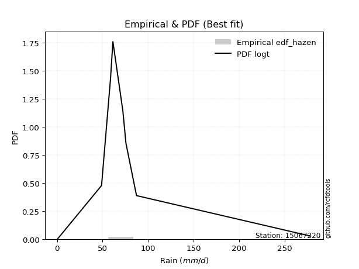</img>

</div>


### 3. Empirical - EDF Weibull (1939)

Weibull plotting position formula is an empirical method used to estimate the non-exceedance probability or plotting position for a set of observed data, is often recommended or widely used in practice, particularly in flood frequency analysis.

<div align="center">


$P=m/(n+1)$


</div>


**3.1. Empirical values**

<div align="center">

|                | 0                  | 1           | 2                  | 3                  | 4           | 5           | 6                 | 7                 | 8                  |
|:---------------|:-------------------|:------------|:-------------------|:-------------------|:------------|:------------|:------------------|:------------------|:-------------------|
| date           | 2019               | 2018        | 2017               | 2015               | 2011        | 2013        | 2012              | 2016              | 2014               |
| x              | 0.6                | 48.9        | 58.8               | 61.1               | 61.4        | 72.3        | 75.7              | 87.3              | 278.5              |
| m              | 1                  | 2           | 3                  | 4                  | 5           | 6           | 7                 | 8                 | 9                  |
| empirical_dist | edf_weibull        | edf_weibull | edf_weibull        | edf_weibull        | edf_weibull | edf_weibull | edf_weibull       | edf_weibull       | edf_weibull        |
| empirical      | 0.1                | 0.2         | 0.3                | 0.4                | 0.5         | 0.6         | 0.7               | 0.8               | 0.9                |
| empirical_tr   | 1.1111111111111112 | 1.25        | 1.4285714285714286 | 1.6666666666666667 | 2.0         | 2.5         | 3.333333333333333 | 5.000000000000001 | 10.000000000000002 |

</div>


**3.2. Kolmogorov-Smirnov fit test (sorted by Δ)**


<div align="center">

|                | 0                   | 1                   | 2                   | 3                   | 4                   | 5                   | 6                   | 7                   | 8                   | 9                   | 10                  | 11                  | 12                  | 13                  | 14                  | 15                  | 16                  | 17                  | 18                  | 19                  | 20                  | 21                  | 22                  | 23                  | 24                  | 25                  | 26                  | 27                  | 28                  | 29                  | 30                  | 31                  | 32                    | 33                  | 34                  | 35                  | 36                  | 37                  | 38                  | 39                  | 40                  | 41                  | 42                  | 43                  | 44                  | 45                  | 46                  | 47                  | 48                  | 49                  | 50                  | 51                  | 52                  | 53                  | 54                  | 55                  | 56                  | 57                  | 58                  | 59                  | 60                  | 61                  | 62                  | 63                  | 64                  | 65                  | 66                  | 67                  | 68                  | 69                  | 70                  | 71                  | 72                  | 73                  | 74                  | 75                  | 76                  | 77                  | 78                  | 79                  | 80                  | 81                  | 82                  | 83                  | 84                  | 85                  | 86                  | 87                  | 88                  | 89                  |
|:---------------|:--------------------|:--------------------|:--------------------|:--------------------|:--------------------|:--------------------|:--------------------|:--------------------|:--------------------|:--------------------|:--------------------|:--------------------|:--------------------|:--------------------|:--------------------|:--------------------|:--------------------|:--------------------|:--------------------|:--------------------|:--------------------|:--------------------|:--------------------|:--------------------|:--------------------|:--------------------|:--------------------|:--------------------|:--------------------|:--------------------|:--------------------|:--------------------|:----------------------|:--------------------|:--------------------|:--------------------|:--------------------|:--------------------|:--------------------|:--------------------|:--------------------|:--------------------|:--------------------|:--------------------|:--------------------|:--------------------|:--------------------|:--------------------|:--------------------|:--------------------|:--------------------|:--------------------|:--------------------|:--------------------|:--------------------|:--------------------|:--------------------|:--------------------|:--------------------|:--------------------|:--------------------|:--------------------|:--------------------|:--------------------|:--------------------|:--------------------|:--------------------|:--------------------|:--------------------|:--------------------|:--------------------|:--------------------|:--------------------|:--------------------|:--------------------|:--------------------|:--------------------|:--------------------|:--------------------|:--------------------|:--------------------|:--------------------|:--------------------|:--------------------|:--------------------|:--------------------|:--------------------|:--------------------|:--------------------|:--------------------|
| station        | 15067220            | 15067220            | 15067220            | 15067220            | 15067220            | 15067220            | 15067220            | 15067220            | 15067220            | 15067220            | 15067220            | 15067220            | 15067220            | 15067220            | 15067220            | 15067220            | 15067220            | 15067220            | 15067220            | 15067220            | 15067220            | 15067220            | 15067220            | 15067220            | 15067220            | 15067220            | 15067220            | 15067220            | 15067220            | 15067220            | 15067220            | 15067220            | 15067220              | 15067220            | 15067220            | 15067220            | 15067220            | 15067220            | 15067220            | 15067220            | 15067220            | 15067220            | 15067220            | 15067220            | 15067220            | 15067220            | 15067220            | 15067220            | 15067220            | 15067220            | 15067220            | 15067220            | 15067220            | 15067220            | 15067220            | 15067220            | 15067220            | 15067220            | 15067220            | 15067220            | 15067220            | 15067220            | 15067220            | 15067220            | 15067220            | 15067220            | 15067220            | 15067220            | 15067220            | 15067220            | 15067220            | 15067220            | 15067220            | 15067220            | 15067220            | 15067220            | 15067220            | 15067220            | 15067220            | 15067220            | 15067220            | 15067220            | 15067220            | 15067220            | 15067220            | 15067220            | 15067220            | 15067220            | 15067220            | 15067220            |
| empirical_dist | edf_weibull         | edf_weibull         | edf_weibull         | edf_weibull         | edf_weibull         | edf_weibull         | edf_weibull         | edf_weibull         | edf_weibull         | edf_weibull         | edf_weibull         | edf_weibull         | edf_weibull         | edf_weibull         | edf_weibull         | edf_weibull         | edf_weibull         | edf_weibull         | edf_weibull         | edf_weibull         | edf_weibull         | edf_weibull         | edf_weibull         | edf_weibull         | edf_weibull         | edf_weibull         | edf_weibull         | edf_weibull         | edf_weibull         | edf_weibull         | edf_weibull         | edf_weibull         | edf_weibull           | edf_weibull         | edf_weibull         | edf_weibull         | edf_weibull         | edf_weibull         | edf_weibull         | edf_weibull         | edf_weibull         | edf_weibull         | edf_weibull         | edf_weibull         | edf_weibull         | edf_weibull         | edf_weibull         | edf_weibull         | edf_weibull         | edf_weibull         | edf_weibull         | edf_weibull         | edf_weibull         | edf_weibull         | edf_weibull         | edf_weibull         | edf_weibull         | edf_weibull         | edf_weibull         | edf_weibull         | edf_weibull         | edf_weibull         | edf_weibull         | edf_weibull         | edf_weibull         | edf_weibull         | edf_weibull         | edf_weibull         | edf_weibull         | edf_weibull         | edf_weibull         | edf_weibull         | edf_weibull         | edf_weibull         | edf_weibull         | edf_weibull         | edf_weibull         | edf_weibull         | edf_weibull         | edf_weibull         | edf_weibull         | edf_weibull         | edf_weibull         | edf_weibull         | edf_weibull         | edf_weibull         | edf_weibull         | edf_weibull         | edf_weibull         | edf_weibull         |
| p_dist         | logt                | t                   | johnsonsu           | fisk                | alpha               | invgamma            | betaprime           | exponnorm           | invgauss            | f                   | erlang              | chi2                | gamma               | genlogistic         | gibrat              | laplace_asymmetric  | moyal               | genexpon            | logjohnsonsu        | truncnorm           | wald                | halflogistic        | nakagami            | halfnorm            | gumbel_r            | pearson3            | gompertz            | logloggamma         | kstwobign           | rayleigh            | weibull_min         | loggompertz         | loglaplace_asymmetric | loggenlogistic      | logmielke           | maxwell             | expon               | loggumbel_l         | logpearson3         | ncf                 | laplace             | hypsecant           | rice                | logistic            | crystalball         | norm                | lognakagami         | logfatiguelife      | logcrystalball      | logrice             | lognorm             | lognorm             | logexponnorm        | lognct              | loglognorm          | loglogistic         | loghypsecant        | mielke              | loglaplace          | loginvgamma         | loginvweibull       | gumbel_l            | logmaxwell          | loginvgauss         | lograyleigh         | logkstwobign        | loggumbel_r         | loghalfnorm         | logerlang           | loggenexpon         | logmoyal            | loghalflogistic     | nct                 | logexpon            | logncf              | invweibull          | pareto              | logfisk             | logpareto           | logweibull_min      | loggamma            | loggamma            | logwald             | logbetaprime        | loggibrat           | logf                | logtruncnorm        | logalpha            | fatiguelife         | logchi2             |
| delta          | 0.09424232176105263 | 0.1157226320202619  | 0.12153833411311754 | 0.12885281735225945 | 0.1502110410749528  | 0.15594016197132587 | 0.1623010911154561  | 0.1710714028753897  | 0.17267726845886544 | 0.17481585907096925 | 0.1748470455709492  | 0.17484717065062522 | 0.17484725437944876 | 0.17499433505626727 | 0.17517922148016052 | 0.1759123261550778  | 0.17886954850181525 | 0.17991886700928306 | 0.183729262216478   | 0.19245098040883585 | 0.1973759843337281  | 0.19853030960078255 | 0.19999974941128776 | 0.20336733441391042 | 0.20437333502470167 | 0.2136773944356351  | 0.21839824284746973 | 0.22590803112543634 | 0.23253725384333002 | 0.23272959293001427 | 0.23497550839561565 | 0.23532379744566662 | 0.23782307884275233   | 0.24118575755855465 | 0.2416320141589749  | 0.2431564250368956  | 0.24460082071883    | 0.24742965150698754 | 0.24959064663203157 | 0.2600360692507798  | 0.2637339677092268  | 0.26874869553800984 | 0.26941496997061587 | 0.2716430223222823  | 0.275041208536986   | 0.2750412155277957  | 0.3165200297575433  | 0.31697113887283496 | 0.31708478304568616 | 0.3170868748860766  | 0.3170868960032585  | 0.3170868960032585  | 0.31708730094413246 | 0.31760170138989324 | 0.3180649863258526  | 0.31941765305218645 | 0.3214056481181033  | 0.32149340087390205 | 0.3293954719824059  | 0.3343502890540338  | 0.33492701418872567 | 0.3442213044579223  | 0.3493744837605382  | 0.35693390277576414 | 0.3599946066566037  | 0.37561817510035517 | 0.38775790770621327 | 0.3898956897077827  | 0.394441455111407   | 0.40452776689688125 | 0.4134069489594456  | 0.4157943819752598  | 0.4333607951070669  | 0.4379116982605243  | 0.44428482839342825 | 0.4506475657874655  | 0.45539422076750785 | 0.46213294753733064 | 0.47137541640502517 | 0.47187617160980916 | 0.4805967290724092  | 0.4805967290724092  | 0.4846564278485522  | 0.4886104119558871  | 0.5104286284540702  | 0.5223072117325127  | 0.5256516321441467  | 0.5469436976664042  | 0.5828348912574615  | 0.6713217949379986  |
| deltao         | 0.41761268023100007 | 0.41761268023100007 | 0.41761268023100007 | 0.41761268023100007 | 0.41761268023100007 | 0.41761268023100007 | 0.41761268023100007 | 0.41761268023100007 | 0.41761268023100007 | 0.41761268023100007 | 0.41761268023100007 | 0.41761268023100007 | 0.41761268023100007 | 0.41761268023100007 | 0.41761268023100007 | 0.41761268023100007 | 0.41761268023100007 | 0.41761268023100007 | 0.41761268023100007 | 0.41761268023100007 | 0.41761268023100007 | 0.41761268023100007 | 0.41761268023100007 | 0.41761268023100007 | 0.41761268023100007 | 0.41761268023100007 | 0.41761268023100007 | 0.41761268023100007 | 0.41761268023100007 | 0.41761268023100007 | 0.41761268023100007 | 0.41761268023100007 | 0.41761268023100007   | 0.41761268023100007 | 0.41761268023100007 | 0.41761268023100007 | 0.41761268023100007 | 0.41761268023100007 | 0.41761268023100007 | 0.41761268023100007 | 0.41761268023100007 | 0.41761268023100007 | 0.41761268023100007 | 0.41761268023100007 | 0.41761268023100007 | 0.41761268023100007 | 0.41761268023100007 | 0.41761268023100007 | 0.41761268023100007 | 0.41761268023100007 | 0.41761268023100007 | 0.41761268023100007 | 0.41761268023100007 | 0.41761268023100007 | 0.41761268023100007 | 0.41761268023100007 | 0.41761268023100007 | 0.41761268023100007 | 0.41761268023100007 | 0.41761268023100007 | 0.41761268023100007 | 0.41761268023100007 | 0.41761268023100007 | 0.41761268023100007 | 0.41761268023100007 | 0.41761268023100007 | 0.41761268023100007 | 0.41761268023100007 | 0.41761268023100007 | 0.41761268023100007 | 0.41761268023100007 | 0.41761268023100007 | 0.41761268023100007 | 0.41761268023100007 | 0.41761268023100007 | 0.41761268023100007 | 0.41761268023100007 | 0.41761268023100007 | 0.41761268023100007 | 0.41761268023100007 | 0.41761268023100007 | 0.41761268023100007 | 0.41761268023100007 | 0.41761268023100007 | 0.41761268023100007 | 0.41761268023100007 | 0.41761268023100007 | 0.41761268023100007 | 0.41761268023100007 | 0.41761268023100007 |
| eval           | Δo > Δ              | Δo > Δ              | Δo > Δ              | Δo > Δ              | Δo > Δ              | Δo > Δ              | Δo > Δ              | Δo > Δ              | Δo > Δ              | Δo > Δ              | Δo > Δ              | Δo > Δ              | Δo > Δ              | Δo > Δ              | Δo > Δ              | Δo > Δ              | Δo > Δ              | Δo > Δ              | Δo > Δ              | Δo > Δ              | Δo > Δ              | Δo > Δ              | Δo > Δ              | Δo > Δ              | Δo > Δ              | Δo > Δ              | Δo > Δ              | Δo > Δ              | Δo > Δ              | Δo > Δ              | Δo > Δ              | Δo > Δ              | Δo > Δ                | Δo > Δ              | Δo > Δ              | Δo > Δ              | Δo > Δ              | Δo > Δ              | Δo > Δ              | Δo > Δ              | Δo > Δ              | Δo > Δ              | Δo > Δ              | Δo > Δ              | Δo > Δ              | Δo > Δ              | Δo > Δ              | Δo > Δ              | Δo > Δ              | Δo > Δ              | Δo > Δ              | Δo > Δ              | Δo > Δ              | Δo > Δ              | Δo > Δ              | Δo > Δ              | Δo > Δ              | Δo > Δ              | Δo > Δ              | Δo > Δ              | Δo > Δ              | Δo > Δ              | Δo > Δ              | Δo > Δ              | Δo > Δ              | Δo > Δ              | Δo > Δ              | Δo > Δ              | Δo > Δ              | Δo > Δ              | Δo > Δ              | Δo > Δ              | Δo <= Δ             | Δo <= Δ             | Δo <= Δ             | Δo <= Δ             | Δo <= Δ             | Δo <= Δ             | Δo <= Δ             | Δo <= Δ             | Δo <= Δ             | Δo <= Δ             | Δo <= Δ             | Δo <= Δ             | Δo <= Δ             | Δo <= Δ             | Δo <= Δ             | Δo <= Δ             | Δo <= Δ             | Δo <= Δ             |
| fit            | 1                   | 1                   | 1                   | 1                   | 1                   | 1                   | 1                   | 1                   | 1                   | 1                   | 1                   | 1                   | 1                   | 1                   | 1                   | 1                   | 1                   | 1                   | 1                   | 1                   | 1                   | 1                   | 1                   | 1                   | 1                   | 1                   | 1                   | 1                   | 1                   | 1                   | 1                   | 1                   | 1                     | 1                   | 1                   | 1                   | 1                   | 1                   | 1                   | 1                   | 1                   | 1                   | 1                   | 1                   | 1                   | 1                   | 1                   | 1                   | 1                   | 1                   | 1                   | 1                   | 1                   | 1                   | 1                   | 1                   | 1                   | 1                   | 1                   | 1                   | 1                   | 1                   | 1                   | 1                   | 1                   | 1                   | 1                   | 1                   | 1                   | 1                   | 1                   | 1                   | 0                   | 0                   | 0                   | 0                   | 0                   | 0                   | 0                   | 0                   | 0                   | 0                   | 0                   | 0                   | 0                   | 0                   | 0                   | 0                   | 0                   | 0                   |
| n              | 9                   | 9                   | 9                   | 9                   | 9                   | 9                   | 9                   | 9                   | 9                   | 9                   | 9                   | 9                   | 9                   | 9                   | 9                   | 9                   | 9                   | 9                   | 9                   | 9                   | 9                   | 9                   | 9                   | 9                   | 9                   | 9                   | 9                   | 9                   | 9                   | 9                   | 9                   | 9                   | 9                     | 9                   | 9                   | 9                   | 9                   | 9                   | 9                   | 9                   | 9                   | 9                   | 9                   | 9                   | 9                   | 9                   | 9                   | 9                   | 9                   | 9                   | 9                   | 9                   | 9                   | 9                   | 9                   | 9                   | 9                   | 9                   | 9                   | 9                   | 9                   | 9                   | 9                   | 9                   | 9                   | 9                   | 9                   | 9                   | 9                   | 9                   | 9                   | 9                   | 9                   | 9                   | 9                   | 9                   | 9                   | 9                   | 9                   | 9                   | 9                   | 9                   | 9                   | 9                   | 9                   | 9                   | 9                   | 9                   | 9                   | 9                   |
| best_fit       | 1                   | 0                   | 0                   | 0                   | 0                   | 0                   | 0                   | 0                   | 0                   | 0                   | 0                   | 0                   | 0                   | 0                   | 0                   | 0                   | 0                   | 0                   | 0                   | 0                   | 0                   | 0                   | 0                   | 0                   | 0                   | 0                   | 0                   | 0                   | 0                   | 0                   | 0                   | 0                   | 0                     | 0                   | 0                   | 0                   | 0                   | 0                   | 0                   | 0                   | 0                   | 0                   | 0                   | 0                   | 0                   | 0                   | 0                   | 0                   | 0                   | 0                   | 0                   | 0                   | 0                   | 0                   | 0                   | 0                   | 0                   | 0                   | 0                   | 0                   | 0                   | 0                   | 0                   | 0                   | 0                   | 0                   | 0                   | 0                   | 0                   | 0                   | 0                   | 0                   | 0                   | 0                   | 0                   | 0                   | 0                   | 0                   | 0                   | 0                   | 0                   | 0                   | 0                   | 0                   | 0                   | 0                   | 0                   | 0                   | 0                   | 0                   |
| best_fit_sort  | 1                   | 2                   | 3                   | 4                   | 5                   | 6                   | 7                   | 8                   | 9                   | 10                  | 11                  | 12                  | 13                  | 14                  | 15                  | 16                  | 17                  | 18                  | 19                  | 20                  | 21                  | 22                  | 23                  | 24                  | 25                  | 26                  | 27                  | 28                  | 29                  | 30                  | 31                  | 32                  | 33                    | 34                  | 35                  | 36                  | 37                  | 38                  | 39                  | 40                  | 41                  | 42                  | 43                  | 44                  | 45                  | 46                  | 47                  | 48                  | 49                  | 50                  | 51                  | 52                  | 53                  | 54                  | 55                  | 56                  | 57                  | 58                  | 59                  | 60                  | 61                  | 62                  | 63                  | 64                  | 65                  | 66                  | 67                  | 68                  | 69                  | 70                  | 71                  | 72                  | 73                  | 74                  | 75                  | 76                  | 77                  | 78                  | 79                  | 80                  | 81                  | 82                  | 83                  | 84                  | 85                  | 86                  | 87                  | 88                  | 89                  | 90                  |

</div>


<div align="center">

</img>

</div>


**3.3. Best fit**

<div align="center">

|   id |   station | empirical_dist   | p_dist   |     delta |   deltao | eval   |   fit |   n |   best_fit |   best_fit_sort |
|-----:|----------:|:-----------------|:---------|----------:|---------:|:-------|------:|----:|-----------:|----------------:|
|    0 |  15067220 | edf_weibull      | logt     | 0.0942423 | 0.417613 | Δo > Δ |     1 |   9 |          1 |               1 |

</div>


<div align="center">

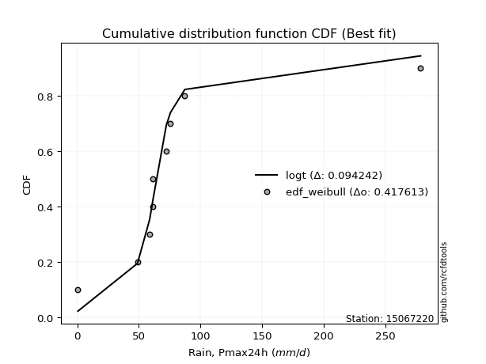</img></img>

</div>


### 4. Empirical - EDF Beard (1943)

The Beard formula (or Beard´s plotting position formula) in hydrology is used to estimate the empirical non-exceedance probability _(P)_ of a flood event (or other extreme hydrological data point) within a given dataset.

<div align="center">


$P=(m-0.31)/(n+0.38)$


</div>


**4.1. Empirical values**

<div align="center">

|                | 0                   | 1                   | 2                  | 3                   | 4         | 5                  | 6                  | 7                  | 8                  |
|:---------------|:--------------------|:--------------------|:-------------------|:--------------------|:----------|:-------------------|:-------------------|:-------------------|:-------------------|
| date           | 2019                | 2018                | 2017               | 2015                | 2011      | 2013               | 2012               | 2016               | 2014               |
| x              | 0.6                 | 48.9                | 58.8               | 61.1                | 61.4      | 72.3               | 75.7               | 87.3               | 278.5              |
| m              | 1                   | 2                   | 3                  | 4                   | 5         | 6                  | 7                  | 8                  | 9                  |
| empirical_dist | edf_beard           | edf_beard           | edf_beard          | edf_beard           | edf_beard | edf_beard          | edf_beard          | edf_beard          | edf_beard          |
| empirical      | 0.07356076759061833 | 0.18017057569296374 | 0.2867803837953091 | 0.39339019189765456 | 0.5       | 0.6066098081023454 | 0.7132196162046908 | 0.8198294243070362 | 0.9264392324093815 |
| empirical_tr   | 1.0794016110471807  | 1.2197659297789336  | 1.4020926756352765 | 1.6485061511423549  | 2.0       | 2.542005420054201  | 3.486988847583642  | 5.550295857988164  | 13.5942028985507   |

</div>


**4.2. Kolmogorov-Smirnov fit test (sorted by Δ)**


<div align="center">

|                | 0                   | 1                   | 2                   | 3                   | 4                   | 5                   | 6                   | 7                   | 8                   | 9                   | 10                  | 11                  | 12                  | 13                  | 14                  | 15                  | 16                  | 17                  | 18                  | 19                  | 20                  | 21                  | 22                  | 23                  | 24                  | 25                  | 26                  | 27                  | 28                  | 29                  | 30                  | 31                  | 32                    | 33                  | 34                  | 35                  | 36                  | 37                  | 38                  | 39                  | 40                  | 41                  | 42                  | 43                  | 44                  | 45                  | 46                  | 47                  | 48                  | 49                  | 50                  | 51                  | 52                  | 53                  | 54                  | 55                  | 56                  | 57                  | 58                  | 59                  | 60                  | 61                  | 62                  | 63                  | 64                  | 65                  | 66                  | 67                  | 68                  | 69                  | 70                  | 71                  | 72                  | 73                  | 74                  | 75                  | 76                  | 77                  | 78                  | 79                  | 80                  | 81                  | 82                  | 83                  | 84                  | 85                  | 86                  | 87                  | 88                  | 89                  |
|:---------------|:--------------------|:--------------------|:--------------------|:--------------------|:--------------------|:--------------------|:--------------------|:--------------------|:--------------------|:--------------------|:--------------------|:--------------------|:--------------------|:--------------------|:--------------------|:--------------------|:--------------------|:--------------------|:--------------------|:--------------------|:--------------------|:--------------------|:--------------------|:--------------------|:--------------------|:--------------------|:--------------------|:--------------------|:--------------------|:--------------------|:--------------------|:--------------------|:----------------------|:--------------------|:--------------------|:--------------------|:--------------------|:--------------------|:--------------------|:--------------------|:--------------------|:--------------------|:--------------------|:--------------------|:--------------------|:--------------------|:--------------------|:--------------------|:--------------------|:--------------------|:--------------------|:--------------------|:--------------------|:--------------------|:--------------------|:--------------------|:--------------------|:--------------------|:--------------------|:--------------------|:--------------------|:--------------------|:--------------------|:--------------------|:--------------------|:--------------------|:--------------------|:--------------------|:--------------------|:--------------------|:--------------------|:--------------------|:--------------------|:--------------------|:--------------------|:--------------------|:--------------------|:--------------------|:--------------------|:--------------------|:--------------------|:--------------------|:--------------------|:--------------------|:--------------------|:--------------------|:--------------------|:--------------------|:--------------------|:--------------------|
| station        | 15067220            | 15067220            | 15067220            | 15067220            | 15067220            | 15067220            | 15067220            | 15067220            | 15067220            | 15067220            | 15067220            | 15067220            | 15067220            | 15067220            | 15067220            | 15067220            | 15067220            | 15067220            | 15067220            | 15067220            | 15067220            | 15067220            | 15067220            | 15067220            | 15067220            | 15067220            | 15067220            | 15067220            | 15067220            | 15067220            | 15067220            | 15067220            | 15067220              | 15067220            | 15067220            | 15067220            | 15067220            | 15067220            | 15067220            | 15067220            | 15067220            | 15067220            | 15067220            | 15067220            | 15067220            | 15067220            | 15067220            | 15067220            | 15067220            | 15067220            | 15067220            | 15067220            | 15067220            | 15067220            | 15067220            | 15067220            | 15067220            | 15067220            | 15067220            | 15067220            | 15067220            | 15067220            | 15067220            | 15067220            | 15067220            | 15067220            | 15067220            | 15067220            | 15067220            | 15067220            | 15067220            | 15067220            | 15067220            | 15067220            | 15067220            | 15067220            | 15067220            | 15067220            | 15067220            | 15067220            | 15067220            | 15067220            | 15067220            | 15067220            | 15067220            | 15067220            | 15067220            | 15067220            | 15067220            | 15067220            |
| empirical_dist | edf_beard           | edf_beard           | edf_beard           | edf_beard           | edf_beard           | edf_beard           | edf_beard           | edf_beard           | edf_beard           | edf_beard           | edf_beard           | edf_beard           | edf_beard           | edf_beard           | edf_beard           | edf_beard           | edf_beard           | edf_beard           | edf_beard           | edf_beard           | edf_beard           | edf_beard           | edf_beard           | edf_beard           | edf_beard           | edf_beard           | edf_beard           | edf_beard           | edf_beard           | edf_beard           | edf_beard           | edf_beard           | edf_beard             | edf_beard           | edf_beard           | edf_beard           | edf_beard           | edf_beard           | edf_beard           | edf_beard           | edf_beard           | edf_beard           | edf_beard           | edf_beard           | edf_beard           | edf_beard           | edf_beard           | edf_beard           | edf_beard           | edf_beard           | edf_beard           | edf_beard           | edf_beard           | edf_beard           | edf_beard           | edf_beard           | edf_beard           | edf_beard           | edf_beard           | edf_beard           | edf_beard           | edf_beard           | edf_beard           | edf_beard           | edf_beard           | edf_beard           | edf_beard           | edf_beard           | edf_beard           | edf_beard           | edf_beard           | edf_beard           | edf_beard           | edf_beard           | edf_beard           | edf_beard           | edf_beard           | edf_beard           | edf_beard           | edf_beard           | edf_beard           | edf_beard           | edf_beard           | edf_beard           | edf_beard           | edf_beard           | edf_beard           | edf_beard           | edf_beard           | edf_beard           |
| p_dist         | logt                | t                   | johnsonsu           | fisk                | alpha               | invgamma            | logjohnsonsu        | nakagami            | betaprime           | gibrat              | laplace_asymmetric  | exponnorm           | invgauss            | f                   | erlang              | chi2                | gamma               | genlogistic         | moyal               | genexpon            | truncnorm           | wald                | halflogistic        | halfnorm            | gumbel_r            | pearson3            | gompertz            | logloggamma         | weibull_min         | kstwobign           | rayleigh            | loggompertz         | loglaplace_asymmetric | loggenlogistic      | logmielke           | maxwell             | expon               | loggumbel_l         | logpearson3         | laplace             | ncf                 | hypsecant           | rice                | logistic            | crystalball         | norm                | lognakagami         | logfatiguelife      | logcrystalball      | logrice             | lognorm             | lognorm             | logexponnorm        | lognct              | loglognorm          | loglogistic         | loghypsecant        | mielke              | loglaplace          | loginvgamma         | loginvweibull       | gumbel_l            | logmaxwell          | loginvgauss         | lograyleigh         | logkstwobign        | loggumbel_r         | loghalfnorm         | logerlang           | loggenexpon         | logmoyal            | loghalflogistic     | nct                 | logexpon            | logncf              | pareto              | invweibull          | logfisk             | logpareto           | logweibull_min      | loggamma            | loggamma            | logwald             | logbetaprime        | loggibrat           | logf                | logtruncnorm        | logalpha            | fatiguelife         | logchi2             |
| delta          | 0.08763251365870717 | 0.10911282391791643 | 0.11492852601077208 | 0.14621921640128477 | 0.17004046538198908 | 0.17576958627836203 | 0.17711945411413255 | 0.1801703251042515  | 0.18213051542249237 | 0.18839883768485138 | 0.18919515799475028 | 0.19090082718242585 | 0.1925066927659016  | 0.19464528337800552 | 0.19467646987798548 | 0.1946765949576615  | 0.19467667868648503 | 0.19482375936330343 | 0.1986989728088514  | 0.19974829131631933 | 0.21228040471587212 | 0.21574620374461362 | 0.21835973390781882 | 0.22319675872094658 | 0.22420275933173783 | 0.23350681874267137 | 0.238227667154506   | 0.2457374554324726  | 0.2522254308617776  | 0.2523666781503662  | 0.25255901723705043 | 0.2551532217527029  | 0.2576525031497886    | 0.2610151818655909  | 0.26146143846601116 | 0.26298584934393177 | 0.26443024502586626 | 0.2672590758140238  | 0.2694200709390677  | 0.2774652442754034  | 0.2798654935578161  | 0.288578119845046   | 0.28924439427765203 | 0.2914724466293185  | 0.29487063284402215 | 0.29487063983483186 | 0.33634945406457956 | 0.3368005631798712  | 0.33691420735272243 | 0.3369162991931129  | 0.3369163203102948  | 0.3369163203102948  | 0.3369167252511687  | 0.3374311256969295  | 0.3378944106328889  | 0.3392470773592227  | 0.34123507242513956 | 0.3413228251809383  | 0.34922489628944214 | 0.35417971336107007 | 0.35475643849576194 | 0.3640507287649585  | 0.36920390806757447 | 0.3767633270828004  | 0.37982403096364    | 0.39544759940739144 | 0.40758733201324954 | 0.409725114014819   | 0.41427087941844326 | 0.4243571912039175  | 0.43323637326648184 | 0.4356238062822961  | 0.45319021941410315 | 0.45774112256756055 | 0.4641142527004645  | 0.4752236450745441  | 0.477086798196847   | 0.4819623718443669  | 0.49120484071206144 | 0.49170559591684543 | 0.5004261533794454  | 0.5004261533794454  | 0.5044858521555884  | 0.5084398362629234  | 0.5302580527611065  | 0.542136636039549   | 0.5454810564511829  | 0.5667731219734404  | 0.6026643155644977  | 0.6911512192450349  |
| deltao         | 0.41761268023100007 | 0.41761268023100007 | 0.41761268023100007 | 0.41761268023100007 | 0.41761268023100007 | 0.41761268023100007 | 0.41761268023100007 | 0.41761268023100007 | 0.41761268023100007 | 0.41761268023100007 | 0.41761268023100007 | 0.41761268023100007 | 0.41761268023100007 | 0.41761268023100007 | 0.41761268023100007 | 0.41761268023100007 | 0.41761268023100007 | 0.41761268023100007 | 0.41761268023100007 | 0.41761268023100007 | 0.41761268023100007 | 0.41761268023100007 | 0.41761268023100007 | 0.41761268023100007 | 0.41761268023100007 | 0.41761268023100007 | 0.41761268023100007 | 0.41761268023100007 | 0.41761268023100007 | 0.41761268023100007 | 0.41761268023100007 | 0.41761268023100007 | 0.41761268023100007   | 0.41761268023100007 | 0.41761268023100007 | 0.41761268023100007 | 0.41761268023100007 | 0.41761268023100007 | 0.41761268023100007 | 0.41761268023100007 | 0.41761268023100007 | 0.41761268023100007 | 0.41761268023100007 | 0.41761268023100007 | 0.41761268023100007 | 0.41761268023100007 | 0.41761268023100007 | 0.41761268023100007 | 0.41761268023100007 | 0.41761268023100007 | 0.41761268023100007 | 0.41761268023100007 | 0.41761268023100007 | 0.41761268023100007 | 0.41761268023100007 | 0.41761268023100007 | 0.41761268023100007 | 0.41761268023100007 | 0.41761268023100007 | 0.41761268023100007 | 0.41761268023100007 | 0.41761268023100007 | 0.41761268023100007 | 0.41761268023100007 | 0.41761268023100007 | 0.41761268023100007 | 0.41761268023100007 | 0.41761268023100007 | 0.41761268023100007 | 0.41761268023100007 | 0.41761268023100007 | 0.41761268023100007 | 0.41761268023100007 | 0.41761268023100007 | 0.41761268023100007 | 0.41761268023100007 | 0.41761268023100007 | 0.41761268023100007 | 0.41761268023100007 | 0.41761268023100007 | 0.41761268023100007 | 0.41761268023100007 | 0.41761268023100007 | 0.41761268023100007 | 0.41761268023100007 | 0.41761268023100007 | 0.41761268023100007 | 0.41761268023100007 | 0.41761268023100007 | 0.41761268023100007 |
| eval           | Δo > Δ              | Δo > Δ              | Δo > Δ              | Δo > Δ              | Δo > Δ              | Δo > Δ              | Δo > Δ              | Δo > Δ              | Δo > Δ              | Δo > Δ              | Δo > Δ              | Δo > Δ              | Δo > Δ              | Δo > Δ              | Δo > Δ              | Δo > Δ              | Δo > Δ              | Δo > Δ              | Δo > Δ              | Δo > Δ              | Δo > Δ              | Δo > Δ              | Δo > Δ              | Δo > Δ              | Δo > Δ              | Δo > Δ              | Δo > Δ              | Δo > Δ              | Δo > Δ              | Δo > Δ              | Δo > Δ              | Δo > Δ              | Δo > Δ                | Δo > Δ              | Δo > Δ              | Δo > Δ              | Δo > Δ              | Δo > Δ              | Δo > Δ              | Δo > Δ              | Δo > Δ              | Δo > Δ              | Δo > Δ              | Δo > Δ              | Δo > Δ              | Δo > Δ              | Δo > Δ              | Δo > Δ              | Δo > Δ              | Δo > Δ              | Δo > Δ              | Δo > Δ              | Δo > Δ              | Δo > Δ              | Δo > Δ              | Δo > Δ              | Δo > Δ              | Δo > Δ              | Δo > Δ              | Δo > Δ              | Δo > Δ              | Δo > Δ              | Δo > Δ              | Δo > Δ              | Δo > Δ              | Δo > Δ              | Δo > Δ              | Δo > Δ              | Δo > Δ              | Δo <= Δ             | Δo <= Δ             | Δo <= Δ             | Δo <= Δ             | Δo <= Δ             | Δo <= Δ             | Δo <= Δ             | Δo <= Δ             | Δo <= Δ             | Δo <= Δ             | Δo <= Δ             | Δo <= Δ             | Δo <= Δ             | Δo <= Δ             | Δo <= Δ             | Δo <= Δ             | Δo <= Δ             | Δo <= Δ             | Δo <= Δ             | Δo <= Δ             | Δo <= Δ             |
| fit            | 1                   | 1                   | 1                   | 1                   | 1                   | 1                   | 1                   | 1                   | 1                   | 1                   | 1                   | 1                   | 1                   | 1                   | 1                   | 1                   | 1                   | 1                   | 1                   | 1                   | 1                   | 1                   | 1                   | 1                   | 1                   | 1                   | 1                   | 1                   | 1                   | 1                   | 1                   | 1                   | 1                     | 1                   | 1                   | 1                   | 1                   | 1                   | 1                   | 1                   | 1                   | 1                   | 1                   | 1                   | 1                   | 1                   | 1                   | 1                   | 1                   | 1                   | 1                   | 1                   | 1                   | 1                   | 1                   | 1                   | 1                   | 1                   | 1                   | 1                   | 1                   | 1                   | 1                   | 1                   | 1                   | 1                   | 1                   | 1                   | 1                   | 0                   | 0                   | 0                   | 0                   | 0                   | 0                   | 0                   | 0                   | 0                   | 0                   | 0                   | 0                   | 0                   | 0                   | 0                   | 0                   | 0                   | 0                   | 0                   | 0                   | 0                   |
| n              | 9                   | 9                   | 9                   | 9                   | 9                   | 9                   | 9                   | 9                   | 9                   | 9                   | 9                   | 9                   | 9                   | 9                   | 9                   | 9                   | 9                   | 9                   | 9                   | 9                   | 9                   | 9                   | 9                   | 9                   | 9                   | 9                   | 9                   | 9                   | 9                   | 9                   | 9                   | 9                   | 9                     | 9                   | 9                   | 9                   | 9                   | 9                   | 9                   | 9                   | 9                   | 9                   | 9                   | 9                   | 9                   | 9                   | 9                   | 9                   | 9                   | 9                   | 9                   | 9                   | 9                   | 9                   | 9                   | 9                   | 9                   | 9                   | 9                   | 9                   | 9                   | 9                   | 9                   | 9                   | 9                   | 9                   | 9                   | 9                   | 9                   | 9                   | 9                   | 9                   | 9                   | 9                   | 9                   | 9                   | 9                   | 9                   | 9                   | 9                   | 9                   | 9                   | 9                   | 9                   | 9                   | 9                   | 9                   | 9                   | 9                   | 9                   |
| best_fit       | 1                   | 0                   | 0                   | 0                   | 0                   | 0                   | 0                   | 0                   | 0                   | 0                   | 0                   | 0                   | 0                   | 0                   | 0                   | 0                   | 0                   | 0                   | 0                   | 0                   | 0                   | 0                   | 0                   | 0                   | 0                   | 0                   | 0                   | 0                   | 0                   | 0                   | 0                   | 0                   | 0                     | 0                   | 0                   | 0                   | 0                   | 0                   | 0                   | 0                   | 0                   | 0                   | 0                   | 0                   | 0                   | 0                   | 0                   | 0                   | 0                   | 0                   | 0                   | 0                   | 0                   | 0                   | 0                   | 0                   | 0                   | 0                   | 0                   | 0                   | 0                   | 0                   | 0                   | 0                   | 0                   | 0                   | 0                   | 0                   | 0                   | 0                   | 0                   | 0                   | 0                   | 0                   | 0                   | 0                   | 0                   | 0                   | 0                   | 0                   | 0                   | 0                   | 0                   | 0                   | 0                   | 0                   | 0                   | 0                   | 0                   | 0                   |
| best_fit_sort  | 1                   | 2                   | 3                   | 4                   | 5                   | 6                   | 7                   | 8                   | 9                   | 10                  | 11                  | 12                  | 13                  | 14                  | 15                  | 16                  | 17                  | 18                  | 19                  | 20                  | 21                  | 22                  | 23                  | 24                  | 25                  | 26                  | 27                  | 28                  | 29                  | 30                  | 31                  | 32                  | 33                    | 34                  | 35                  | 36                  | 37                  | 38                  | 39                  | 40                  | 41                  | 42                  | 43                  | 44                  | 45                  | 46                  | 47                  | 48                  | 49                  | 50                  | 51                  | 52                  | 53                  | 54                  | 55                  | 56                  | 57                  | 58                  | 59                  | 60                  | 61                  | 62                  | 63                  | 64                  | 65                  | 66                  | 67                  | 68                  | 69                  | 70                  | 71                  | 72                  | 73                  | 74                  | 75                  | 76                  | 77                  | 78                  | 79                  | 80                  | 81                  | 82                  | 83                  | 84                  | 85                  | 86                  | 87                  | 88                  | 89                  | 90                  |

</div>


<div align="center">

</img>

</div>


**4.3. Best fit**

<div align="center">

|   id |   station | empirical_dist   | p_dist   |     delta |   deltao | eval   |   fit |   n |   best_fit |   best_fit_sort |
|-----:|----------:|:-----------------|:---------|----------:|---------:|:-------|------:|----:|-----------:|----------------:|
|    0 |  15067220 | edf_beard        | logt     | 0.0876325 | 0.417613 | Δo > Δ |     1 |   9 |          1 |               1 |

</div>


<div align="center">

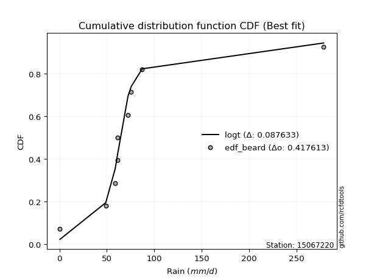</img>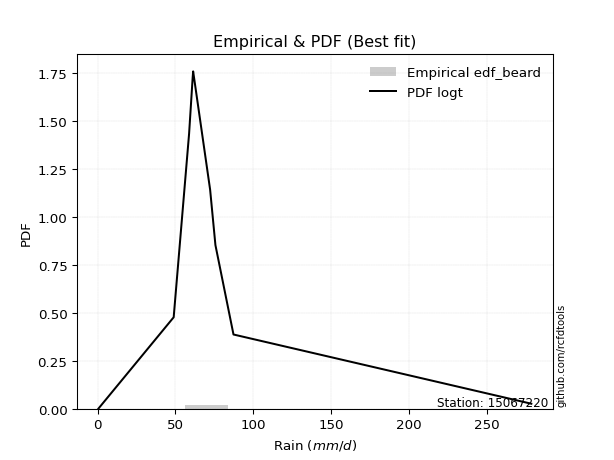</img>

</div>


### 5. Empirical - EDF Chegodayev (1955)

The Chegodayev formula is an empirical plotting position formula used in hydrological frequency analysis to estimate the exceedance probability or return period of a specific event from a set of observed data. It is primarily used for plotting observed data points on probability paper to fit a theoretical distribution, particularly for analyzing extreme events like maximum flood flows or rainfall intensities. The constant _b_ value in the generalized plotting position formula is 0.3.

<div align="center">


$P=(m-b)/(n+1-2b)$


</div>


**5.1. Empirical values**

<div align="center">

|                | 0                   | 1                   | 2                  | 3                   | 4              | 5                  | 6                  | 7                  | 8                  |
|:---------------|:--------------------|:--------------------|:-------------------|:--------------------|:---------------|:-------------------|:-------------------|:-------------------|:-------------------|
| date           | 2019                | 2018                | 2017               | 2015                | 2011           | 2013               | 2012               | 2016               | 2014               |
| x              | 0.6                 | 48.9                | 58.8               | 61.1                | 61.4           | 72.3               | 75.7               | 87.3               | 278.5              |
| m              | 1                   | 2                   | 3                  | 4                   | 5              | 6                  | 7                  | 8                  | 9                  |
| empirical_dist | edf_chegodayev      | edf_chegodayev      | edf_chegodayev     | edf_chegodayev      | edf_chegodayev | edf_chegodayev     | edf_chegodayev     | edf_chegodayev     | edf_chegodayev     |
| empirical      | 0.07446808510638298 | 0.18085106382978722 | 0.2872340425531915 | 0.39361702127659576 | 0.5            | 0.6063829787234043 | 0.7127659574468085 | 0.8191489361702128 | 0.9255319148936169 |
| empirical_tr   | 1.0804597701149425  | 1.2207792207792207  | 1.4029850746268657 | 1.6491228070175437  | 2.0            | 2.540540540540541  | 3.481481481481481  | 5.529411764705883  | 13.428571428571399 |

</div>


**5.2. Kolmogorov-Smirnov fit test (sorted by Δ)**


<div align="center">

|                | 0                   | 1                   | 2                   | 3                   | 4                   | 5                   | 6                   | 7                   | 8                   | 9                   | 10                  | 11                  | 12                  | 13                  | 14                  | 15                  | 16                  | 17                  | 18                  | 19                  | 20                  | 21                  | 22                  | 23                  | 24                  | 25                  | 26                  | 27                  | 28                  | 29                  | 30                  | 31                  | 32                    | 33                  | 34                  | 35                  | 36                  | 37                  | 38                  | 39                  | 40                  | 41                  | 42                  | 43                  | 44                  | 45                  | 46                  | 47                  | 48                  | 49                  | 50                  | 51                  | 52                  | 53                  | 54                  | 55                  | 56                  | 57                  | 58                  | 59                  | 60                  | 61                  | 62                  | 63                  | 64                  | 65                  | 66                  | 67                  | 68                  | 69                  | 70                  | 71                  | 72                  | 73                  | 74                  | 75                  | 76                  | 77                  | 78                  | 79                  | 80                  | 81                  | 82                  | 83                  | 84                  | 85                  | 86                  | 87                  | 88                  | 89                  |
|:---------------|:--------------------|:--------------------|:--------------------|:--------------------|:--------------------|:--------------------|:--------------------|:--------------------|:--------------------|:--------------------|:--------------------|:--------------------|:--------------------|:--------------------|:--------------------|:--------------------|:--------------------|:--------------------|:--------------------|:--------------------|:--------------------|:--------------------|:--------------------|:--------------------|:--------------------|:--------------------|:--------------------|:--------------------|:--------------------|:--------------------|:--------------------|:--------------------|:----------------------|:--------------------|:--------------------|:--------------------|:--------------------|:--------------------|:--------------------|:--------------------|:--------------------|:--------------------|:--------------------|:--------------------|:--------------------|:--------------------|:--------------------|:--------------------|:--------------------|:--------------------|:--------------------|:--------------------|:--------------------|:--------------------|:--------------------|:--------------------|:--------------------|:--------------------|:--------------------|:--------------------|:--------------------|:--------------------|:--------------------|:--------------------|:--------------------|:--------------------|:--------------------|:--------------------|:--------------------|:--------------------|:--------------------|:--------------------|:--------------------|:--------------------|:--------------------|:--------------------|:--------------------|:--------------------|:--------------------|:--------------------|:--------------------|:--------------------|:--------------------|:--------------------|:--------------------|:--------------------|:--------------------|:--------------------|:--------------------|:--------------------|
| station        | 15067220            | 15067220            | 15067220            | 15067220            | 15067220            | 15067220            | 15067220            | 15067220            | 15067220            | 15067220            | 15067220            | 15067220            | 15067220            | 15067220            | 15067220            | 15067220            | 15067220            | 15067220            | 15067220            | 15067220            | 15067220            | 15067220            | 15067220            | 15067220            | 15067220            | 15067220            | 15067220            | 15067220            | 15067220            | 15067220            | 15067220            | 15067220            | 15067220              | 15067220            | 15067220            | 15067220            | 15067220            | 15067220            | 15067220            | 15067220            | 15067220            | 15067220            | 15067220            | 15067220            | 15067220            | 15067220            | 15067220            | 15067220            | 15067220            | 15067220            | 15067220            | 15067220            | 15067220            | 15067220            | 15067220            | 15067220            | 15067220            | 15067220            | 15067220            | 15067220            | 15067220            | 15067220            | 15067220            | 15067220            | 15067220            | 15067220            | 15067220            | 15067220            | 15067220            | 15067220            | 15067220            | 15067220            | 15067220            | 15067220            | 15067220            | 15067220            | 15067220            | 15067220            | 15067220            | 15067220            | 15067220            | 15067220            | 15067220            | 15067220            | 15067220            | 15067220            | 15067220            | 15067220            | 15067220            | 15067220            |
| empirical_dist | edf_chegodayev      | edf_chegodayev      | edf_chegodayev      | edf_chegodayev      | edf_chegodayev      | edf_chegodayev      | edf_chegodayev      | edf_chegodayev      | edf_chegodayev      | edf_chegodayev      | edf_chegodayev      | edf_chegodayev      | edf_chegodayev      | edf_chegodayev      | edf_chegodayev      | edf_chegodayev      | edf_chegodayev      | edf_chegodayev      | edf_chegodayev      | edf_chegodayev      | edf_chegodayev      | edf_chegodayev      | edf_chegodayev      | edf_chegodayev      | edf_chegodayev      | edf_chegodayev      | edf_chegodayev      | edf_chegodayev      | edf_chegodayev      | edf_chegodayev      | edf_chegodayev      | edf_chegodayev      | edf_chegodayev        | edf_chegodayev      | edf_chegodayev      | edf_chegodayev      | edf_chegodayev      | edf_chegodayev      | edf_chegodayev      | edf_chegodayev      | edf_chegodayev      | edf_chegodayev      | edf_chegodayev      | edf_chegodayev      | edf_chegodayev      | edf_chegodayev      | edf_chegodayev      | edf_chegodayev      | edf_chegodayev      | edf_chegodayev      | edf_chegodayev      | edf_chegodayev      | edf_chegodayev      | edf_chegodayev      | edf_chegodayev      | edf_chegodayev      | edf_chegodayev      | edf_chegodayev      | edf_chegodayev      | edf_chegodayev      | edf_chegodayev      | edf_chegodayev      | edf_chegodayev      | edf_chegodayev      | edf_chegodayev      | edf_chegodayev      | edf_chegodayev      | edf_chegodayev      | edf_chegodayev      | edf_chegodayev      | edf_chegodayev      | edf_chegodayev      | edf_chegodayev      | edf_chegodayev      | edf_chegodayev      | edf_chegodayev      | edf_chegodayev      | edf_chegodayev      | edf_chegodayev      | edf_chegodayev      | edf_chegodayev      | edf_chegodayev      | edf_chegodayev      | edf_chegodayev      | edf_chegodayev      | edf_chegodayev      | edf_chegodayev      | edf_chegodayev      | edf_chegodayev      | edf_chegodayev      |
| p_dist         | logt                | t                   | johnsonsu           | fisk                | alpha               | invgamma            | logjohnsonsu        | nakagami            | betaprime           | gibrat              | laplace_asymmetric  | exponnorm           | invgauss            | f                   | erlang              | chi2                | gamma               | genlogistic         | moyal               | genexpon            | truncnorm           | wald                | halflogistic        | halfnorm            | gumbel_r            | pearson3            | gompertz            | logloggamma         | weibull_min         | kstwobign           | rayleigh            | loggompertz         | loglaplace_asymmetric | loggenlogistic      | logmielke           | maxwell             | expon               | loggumbel_l         | logpearson3         | laplace             | ncf                 | hypsecant           | rice                | logistic            | crystalball         | norm                | lognakagami         | logfatiguelife      | logcrystalball      | logrice             | lognorm             | lognorm             | logexponnorm        | lognct              | loglognorm          | loglogistic         | loghypsecant        | mielke              | loglaplace          | loginvgamma         | loginvweibull       | gumbel_l            | logmaxwell          | loginvgauss         | lograyleigh         | logkstwobign        | loggumbel_r         | loghalfnorm         | logerlang           | loggenexpon         | logmoyal            | loghalflogistic     | nct                 | logexpon            | logncf              | pareto              | invweibull          | logfisk             | logpareto           | logweibull_min      | loggamma            | loggamma            | logwald             | logbetaprime        | loggibrat           | logf                | logtruncnorm        | logalpha            | fatiguelife         | logchi2             |
| delta          | 0.08785934303764831 | 0.10933965329685758 | 0.11515535538971322 | 0.1455387282644613  | 0.1693599772451656  | 0.1750890981415386  | 0.1773462834930737  | 0.18085081324107496 | 0.1814500272856689  | 0.187945178926969   | 0.18867828360188632 | 0.19022033904560243 | 0.19182620462907818 | 0.19396479524118204 | 0.193995981741162   | 0.193996106820838   | 0.19399619054966155 | 0.19414327122648    | 0.19801848467202798 | 0.19906780317949585 | 0.21159991657904864 | 0.21506571560779014 | 0.21767924577099534 | 0.22251627058412315 | 0.2235222711949144  | 0.2328263306058479  | 0.23754717901768252 | 0.24505696729564913 | 0.2515449427249542  | 0.25168619001354275 | 0.251878529100227   | 0.2544727336158794  | 0.2569720150129651    | 0.26033469372876744 | 0.2607809503291877  | 0.26230536120710835 | 0.2637497568890428  | 0.26657858767720033 | 0.2687395828022443  | 0.27678475613858    | 0.2791850054209926  | 0.2878976317082226  | 0.2885639061408286  | 0.29079195849249506 | 0.29419014470719873 | 0.29419015169800844 | 0.3356689659277561  | 0.33612007504304775 | 0.33623371921589895 | 0.3362358110562894  | 0.3362358321734713  | 0.3362358321734713  | 0.33623623711434525 | 0.33675063756010604 | 0.3372139224960654  | 0.33856658922239924 | 0.3405545842883161  | 0.34064233704411484 | 0.34854440815261867 | 0.3534992252242466  | 0.35407595035893846 | 0.36337024062813505 | 0.368523419930751   | 0.37608283894597694 | 0.3791435428268165  | 0.39476711127056796 | 0.40690684387642606 | 0.4090446258779955  | 0.4135903912816198  | 0.42367670306709404 | 0.43255588512965837 | 0.4349433181454726  | 0.45250973127727967 | 0.4570606344307371  | 0.46343376456364105 | 0.47454315693772064 | 0.47617948068108235 | 0.48128188370754343 | 0.49052435257523797 | 0.49102510778002195 | 0.499745665242622   | 0.499745665242622   | 0.503805364018765   | 0.5077593481260999  | 0.529577564624283   | 0.5414561479027256  | 0.5448005683143594  | 0.566092633836617   | 0.6019838274276743  | 0.6904707311082113  |
| deltao         | 0.41761268023100007 | 0.41761268023100007 | 0.41761268023100007 | 0.41761268023100007 | 0.41761268023100007 | 0.41761268023100007 | 0.41761268023100007 | 0.41761268023100007 | 0.41761268023100007 | 0.41761268023100007 | 0.41761268023100007 | 0.41761268023100007 | 0.41761268023100007 | 0.41761268023100007 | 0.41761268023100007 | 0.41761268023100007 | 0.41761268023100007 | 0.41761268023100007 | 0.41761268023100007 | 0.41761268023100007 | 0.41761268023100007 | 0.41761268023100007 | 0.41761268023100007 | 0.41761268023100007 | 0.41761268023100007 | 0.41761268023100007 | 0.41761268023100007 | 0.41761268023100007 | 0.41761268023100007 | 0.41761268023100007 | 0.41761268023100007 | 0.41761268023100007 | 0.41761268023100007   | 0.41761268023100007 | 0.41761268023100007 | 0.41761268023100007 | 0.41761268023100007 | 0.41761268023100007 | 0.41761268023100007 | 0.41761268023100007 | 0.41761268023100007 | 0.41761268023100007 | 0.41761268023100007 | 0.41761268023100007 | 0.41761268023100007 | 0.41761268023100007 | 0.41761268023100007 | 0.41761268023100007 | 0.41761268023100007 | 0.41761268023100007 | 0.41761268023100007 | 0.41761268023100007 | 0.41761268023100007 | 0.41761268023100007 | 0.41761268023100007 | 0.41761268023100007 | 0.41761268023100007 | 0.41761268023100007 | 0.41761268023100007 | 0.41761268023100007 | 0.41761268023100007 | 0.41761268023100007 | 0.41761268023100007 | 0.41761268023100007 | 0.41761268023100007 | 0.41761268023100007 | 0.41761268023100007 | 0.41761268023100007 | 0.41761268023100007 | 0.41761268023100007 | 0.41761268023100007 | 0.41761268023100007 | 0.41761268023100007 | 0.41761268023100007 | 0.41761268023100007 | 0.41761268023100007 | 0.41761268023100007 | 0.41761268023100007 | 0.41761268023100007 | 0.41761268023100007 | 0.41761268023100007 | 0.41761268023100007 | 0.41761268023100007 | 0.41761268023100007 | 0.41761268023100007 | 0.41761268023100007 | 0.41761268023100007 | 0.41761268023100007 | 0.41761268023100007 | 0.41761268023100007 |
| eval           | Δo > Δ              | Δo > Δ              | Δo > Δ              | Δo > Δ              | Δo > Δ              | Δo > Δ              | Δo > Δ              | Δo > Δ              | Δo > Δ              | Δo > Δ              | Δo > Δ              | Δo > Δ              | Δo > Δ              | Δo > Δ              | Δo > Δ              | Δo > Δ              | Δo > Δ              | Δo > Δ              | Δo > Δ              | Δo > Δ              | Δo > Δ              | Δo > Δ              | Δo > Δ              | Δo > Δ              | Δo > Δ              | Δo > Δ              | Δo > Δ              | Δo > Δ              | Δo > Δ              | Δo > Δ              | Δo > Δ              | Δo > Δ              | Δo > Δ                | Δo > Δ              | Δo > Δ              | Δo > Δ              | Δo > Δ              | Δo > Δ              | Δo > Δ              | Δo > Δ              | Δo > Δ              | Δo > Δ              | Δo > Δ              | Δo > Δ              | Δo > Δ              | Δo > Δ              | Δo > Δ              | Δo > Δ              | Δo > Δ              | Δo > Δ              | Δo > Δ              | Δo > Δ              | Δo > Δ              | Δo > Δ              | Δo > Δ              | Δo > Δ              | Δo > Δ              | Δo > Δ              | Δo > Δ              | Δo > Δ              | Δo > Δ              | Δo > Δ              | Δo > Δ              | Δo > Δ              | Δo > Δ              | Δo > Δ              | Δo > Δ              | Δo > Δ              | Δo > Δ              | Δo <= Δ             | Δo <= Δ             | Δo <= Δ             | Δo <= Δ             | Δo <= Δ             | Δo <= Δ             | Δo <= Δ             | Δo <= Δ             | Δo <= Δ             | Δo <= Δ             | Δo <= Δ             | Δo <= Δ             | Δo <= Δ             | Δo <= Δ             | Δo <= Δ             | Δo <= Δ             | Δo <= Δ             | Δo <= Δ             | Δo <= Δ             | Δo <= Δ             | Δo <= Δ             |
| fit            | 1                   | 1                   | 1                   | 1                   | 1                   | 1                   | 1                   | 1                   | 1                   | 1                   | 1                   | 1                   | 1                   | 1                   | 1                   | 1                   | 1                   | 1                   | 1                   | 1                   | 1                   | 1                   | 1                   | 1                   | 1                   | 1                   | 1                   | 1                   | 1                   | 1                   | 1                   | 1                   | 1                     | 1                   | 1                   | 1                   | 1                   | 1                   | 1                   | 1                   | 1                   | 1                   | 1                   | 1                   | 1                   | 1                   | 1                   | 1                   | 1                   | 1                   | 1                   | 1                   | 1                   | 1                   | 1                   | 1                   | 1                   | 1                   | 1                   | 1                   | 1                   | 1                   | 1                   | 1                   | 1                   | 1                   | 1                   | 1                   | 1                   | 0                   | 0                   | 0                   | 0                   | 0                   | 0                   | 0                   | 0                   | 0                   | 0                   | 0                   | 0                   | 0                   | 0                   | 0                   | 0                   | 0                   | 0                   | 0                   | 0                   | 0                   |
| n              | 9                   | 9                   | 9                   | 9                   | 9                   | 9                   | 9                   | 9                   | 9                   | 9                   | 9                   | 9                   | 9                   | 9                   | 9                   | 9                   | 9                   | 9                   | 9                   | 9                   | 9                   | 9                   | 9                   | 9                   | 9                   | 9                   | 9                   | 9                   | 9                   | 9                   | 9                   | 9                   | 9                     | 9                   | 9                   | 9                   | 9                   | 9                   | 9                   | 9                   | 9                   | 9                   | 9                   | 9                   | 9                   | 9                   | 9                   | 9                   | 9                   | 9                   | 9                   | 9                   | 9                   | 9                   | 9                   | 9                   | 9                   | 9                   | 9                   | 9                   | 9                   | 9                   | 9                   | 9                   | 9                   | 9                   | 9                   | 9                   | 9                   | 9                   | 9                   | 9                   | 9                   | 9                   | 9                   | 9                   | 9                   | 9                   | 9                   | 9                   | 9                   | 9                   | 9                   | 9                   | 9                   | 9                   | 9                   | 9                   | 9                   | 9                   |
| best_fit       | 1                   | 0                   | 0                   | 0                   | 0                   | 0                   | 0                   | 0                   | 0                   | 0                   | 0                   | 0                   | 0                   | 0                   | 0                   | 0                   | 0                   | 0                   | 0                   | 0                   | 0                   | 0                   | 0                   | 0                   | 0                   | 0                   | 0                   | 0                   | 0                   | 0                   | 0                   | 0                   | 0                     | 0                   | 0                   | 0                   | 0                   | 0                   | 0                   | 0                   | 0                   | 0                   | 0                   | 0                   | 0                   | 0                   | 0                   | 0                   | 0                   | 0                   | 0                   | 0                   | 0                   | 0                   | 0                   | 0                   | 0                   | 0                   | 0                   | 0                   | 0                   | 0                   | 0                   | 0                   | 0                   | 0                   | 0                   | 0                   | 0                   | 0                   | 0                   | 0                   | 0                   | 0                   | 0                   | 0                   | 0                   | 0                   | 0                   | 0                   | 0                   | 0                   | 0                   | 0                   | 0                   | 0                   | 0                   | 0                   | 0                   | 0                   |
| best_fit_sort  | 1                   | 2                   | 3                   | 4                   | 5                   | 6                   | 7                   | 8                   | 9                   | 10                  | 11                  | 12                  | 13                  | 14                  | 15                  | 16                  | 17                  | 18                  | 19                  | 20                  | 21                  | 22                  | 23                  | 24                  | 25                  | 26                  | 27                  | 28                  | 29                  | 30                  | 31                  | 32                  | 33                    | 34                  | 35                  | 36                  | 37                  | 38                  | 39                  | 40                  | 41                  | 42                  | 43                  | 44                  | 45                  | 46                  | 47                  | 48                  | 49                  | 50                  | 51                  | 52                  | 53                  | 54                  | 55                  | 56                  | 57                  | 58                  | 59                  | 60                  | 61                  | 62                  | 63                  | 64                  | 65                  | 66                  | 67                  | 68                  | 69                  | 70                  | 71                  | 72                  | 73                  | 74                  | 75                  | 76                  | 77                  | 78                  | 79                  | 80                  | 81                  | 82                  | 83                  | 84                  | 85                  | 86                  | 87                  | 88                  | 89                  | 90                  |

</div>


<div align="center">

</img>

</div>


**5.3. Best fit**

<div align="center">

|   id |   station | empirical_dist   | p_dist   |     delta |   deltao | eval   |   fit |   n |   best_fit |   best_fit_sort |
|-----:|----------:|:-----------------|:---------|----------:|---------:|:-------|------:|----:|-----------:|----------------:|
|    0 |  15067220 | edf_chegodayev   | logt     | 0.0878593 | 0.417613 | Δo > Δ |     1 |   9 |          1 |               1 |

</div>


<div align="center">

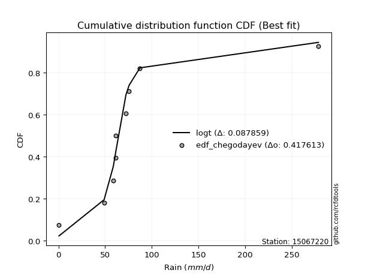</img>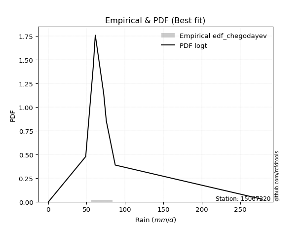</img>

</div>


### 6. Empirical - EDF Blom (1958)

The Blom formula is a specific "plotting position" formula used in hydrology and statistical analysis to estimate the empirical cumulative probability (or non-exceedance probability) of a data series. It is particularly recommended for data that are approximately normally distributed. The constant _a_ is set to 0.375 (or 3/8).

<div align="center">


$P=(m-a)/(n+1-2a)$


</div>


**6.1. Empirical values**

<div align="center">

|                | 0                   | 1                   | 2                   | 3                  | 4        | 5                  | 6                  | 7                  | 8                  |
|:---------------|:--------------------|:--------------------|:--------------------|:-------------------|:---------|:-------------------|:-------------------|:-------------------|:-------------------|
| date           | 2019                | 2018                | 2017                | 2015               | 2011     | 2013               | 2012               | 2016               | 2014               |
| x              | 0.6                 | 48.9                | 58.8                | 61.1               | 61.4     | 72.3               | 75.7               | 87.3               | 278.5              |
| m              | 1                   | 2                   | 3                   | 4                  | 5        | 6                  | 7                  | 8                  | 9                  |
| empirical_dist | edf_blom            | edf_blom            | edf_blom            | edf_blom           | edf_blom | edf_blom           | edf_blom           | edf_blom           | edf_blom           |
| empirical      | 0.06756756756756757 | 0.17567567567567569 | 0.28378378378378377 | 0.3918918918918919 | 0.5      | 0.6081081081081081 | 0.7162162162162162 | 0.8243243243243243 | 0.9324324324324325 |
| empirical_tr   | 1.072463768115942   | 1.2131147540983607  | 1.3962264150943395  | 1.6444444444444444 | 2.0      | 2.5517241379310347 | 3.523809523809524  | 5.6923076923076925 | 14.800000000000006 |

</div>


**6.2. Kolmogorov-Smirnov fit test (sorted by Δ)**


<div align="center">

|                | 0                   | 1                   | 2                   | 3                   | 4                   | 5                   | 6                   | 7                   | 8                   | 9                   | 10                  | 11                  | 12                  | 13                  | 14                  | 15                  | 16                  | 17                  | 18                  | 19                  | 20                  | 21                  | 22                  | 23                  | 24                  | 25                  | 26                  | 27                  | 28                  | 29                  | 30                  | 31                  | 32                    | 33                  | 34                  | 35                  | 36                  | 37                  | 38                  | 39                  | 40                  | 41                  | 42                  | 43                  | 44                  | 45                  | 46                  | 47                  | 48                  | 49                  | 50                  | 51                  | 52                  | 53                  | 54                  | 55                  | 56                  | 57                  | 58                  | 59                  | 60                  | 61                  | 62                  | 63                  | 64                  | 65                  | 66                  | 67                  | 68                  | 69                  | 70                  | 71                  | 72                  | 73                  | 74                  | 75                  | 76                  | 77                  | 78                  | 79                  | 80                  | 81                  | 82                  | 83                  | 84                  | 85                  | 86                  | 87                  | 88                  | 89                  |
|:---------------|:--------------------|:--------------------|:--------------------|:--------------------|:--------------------|:--------------------|:--------------------|:--------------------|:--------------------|:--------------------|:--------------------|:--------------------|:--------------------|:--------------------|:--------------------|:--------------------|:--------------------|:--------------------|:--------------------|:--------------------|:--------------------|:--------------------|:--------------------|:--------------------|:--------------------|:--------------------|:--------------------|:--------------------|:--------------------|:--------------------|:--------------------|:--------------------|:----------------------|:--------------------|:--------------------|:--------------------|:--------------------|:--------------------|:--------------------|:--------------------|:--------------------|:--------------------|:--------------------|:--------------------|:--------------------|:--------------------|:--------------------|:--------------------|:--------------------|:--------------------|:--------------------|:--------------------|:--------------------|:--------------------|:--------------------|:--------------------|:--------------------|:--------------------|:--------------------|:--------------------|:--------------------|:--------------------|:--------------------|:--------------------|:--------------------|:--------------------|:--------------------|:--------------------|:--------------------|:--------------------|:--------------------|:--------------------|:--------------------|:--------------------|:--------------------|:--------------------|:--------------------|:--------------------|:--------------------|:--------------------|:--------------------|:--------------------|:--------------------|:--------------------|:--------------------|:--------------------|:--------------------|:--------------------|:--------------------|:--------------------|
| station        | 15067220            | 15067220            | 15067220            | 15067220            | 15067220            | 15067220            | 15067220            | 15067220            | 15067220            | 15067220            | 15067220            | 15067220            | 15067220            | 15067220            | 15067220            | 15067220            | 15067220            | 15067220            | 15067220            | 15067220            | 15067220            | 15067220            | 15067220            | 15067220            | 15067220            | 15067220            | 15067220            | 15067220            | 15067220            | 15067220            | 15067220            | 15067220            | 15067220              | 15067220            | 15067220            | 15067220            | 15067220            | 15067220            | 15067220            | 15067220            | 15067220            | 15067220            | 15067220            | 15067220            | 15067220            | 15067220            | 15067220            | 15067220            | 15067220            | 15067220            | 15067220            | 15067220            | 15067220            | 15067220            | 15067220            | 15067220            | 15067220            | 15067220            | 15067220            | 15067220            | 15067220            | 15067220            | 15067220            | 15067220            | 15067220            | 15067220            | 15067220            | 15067220            | 15067220            | 15067220            | 15067220            | 15067220            | 15067220            | 15067220            | 15067220            | 15067220            | 15067220            | 15067220            | 15067220            | 15067220            | 15067220            | 15067220            | 15067220            | 15067220            | 15067220            | 15067220            | 15067220            | 15067220            | 15067220            | 15067220            |
| empirical_dist | edf_blom            | edf_blom            | edf_blom            | edf_blom            | edf_blom            | edf_blom            | edf_blom            | edf_blom            | edf_blom            | edf_blom            | edf_blom            | edf_blom            | edf_blom            | edf_blom            | edf_blom            | edf_blom            | edf_blom            | edf_blom            | edf_blom            | edf_blom            | edf_blom            | edf_blom            | edf_blom            | edf_blom            | edf_blom            | edf_blom            | edf_blom            | edf_blom            | edf_blom            | edf_blom            | edf_blom            | edf_blom            | edf_blom              | edf_blom            | edf_blom            | edf_blom            | edf_blom            | edf_blom            | edf_blom            | edf_blom            | edf_blom            | edf_blom            | edf_blom            | edf_blom            | edf_blom            | edf_blom            | edf_blom            | edf_blom            | edf_blom            | edf_blom            | edf_blom            | edf_blom            | edf_blom            | edf_blom            | edf_blom            | edf_blom            | edf_blom            | edf_blom            | edf_blom            | edf_blom            | edf_blom            | edf_blom            | edf_blom            | edf_blom            | edf_blom            | edf_blom            | edf_blom            | edf_blom            | edf_blom            | edf_blom            | edf_blom            | edf_blom            | edf_blom            | edf_blom            | edf_blom            | edf_blom            | edf_blom            | edf_blom            | edf_blom            | edf_blom            | edf_blom            | edf_blom            | edf_blom            | edf_blom            | edf_blom            | edf_blom            | edf_blom            | edf_blom            | edf_blom            | edf_blom            |
| p_dist         | logt                | t                   | johnsonsu           | fisk                | alpha               | logjohnsonsu        | invgamma            | nakagami            | betaprime           | gibrat              | laplace_asymmetric  | exponnorm           | invgauss            | f                   | erlang              | chi2                | gamma               | genlogistic         | moyal               | genexpon            | truncnorm           | wald                | halflogistic        | halfnorm            | gumbel_r            | pearson3            | gompertz            | logloggamma         | weibull_min         | kstwobign           | rayleigh            | loggompertz         | loglaplace_asymmetric | loggenlogistic      | logmielke           | maxwell             | expon               | loggumbel_l         | logpearson3         | laplace             | ncf                 | hypsecant           | rice                | logistic            | crystalball         | norm                | lognakagami         | logfatiguelife      | logcrystalball      | logrice             | lognorm             | lognorm             | logexponnorm        | lognct              | loglognorm          | loglogistic         | loghypsecant        | mielke              | loglaplace          | loginvgamma         | loginvweibull       | gumbel_l            | logmaxwell          | loginvgauss         | lograyleigh         | logkstwobign        | loggumbel_r         | loghalfnorm         | logerlang           | loggenexpon         | logmoyal            | loghalflogistic     | nct                 | logexpon            | logncf              | pareto              | invweibull          | logfisk             | logpareto           | logweibull_min      | loggamma            | loggamma            | logwald             | logbetaprime        | loggibrat           | logf                | logtruncnorm        | logalpha            | fatiguelife         | logchi2             |
| delta          | 0.08613421365294449 | 0.10761452391215376 | 0.1134302260050094  | 0.15071411641857282 | 0.17453536539927714 | 0.17562115410836987 | 0.18026448629565017 | 0.18237389422297123 | 0.18662541543978042 | 0.19139543769637674 | 0.19369005801203842 | 0.195395727199714   | 0.19700159278318974 | 0.19914018339529357 | 0.19917136989527354 | 0.19917149497494954 | 0.19917157870377308 | 0.19931865938059157 | 0.20319387282613954 | 0.20424319133360738 | 0.21677530473316017 | 0.22024110376190167 | 0.22285463392510688 | 0.22769165873823471 | 0.22869765934902597 | 0.23800171875995943 | 0.24272256717179405 | 0.25023235544976064 | 0.25672033087906576 | 0.2568615781676543  | 0.25705391725433857 | 0.25964812176999097 | 0.26214740316707663   | 0.26551008188287895 | 0.26595633848329925 | 0.2674807493612199  | 0.26892514504315435 | 0.2717539758313119  | 0.27391497095635586 | 0.28196014429269156 | 0.2843603935751041  | 0.29307301986233414 | 0.29373929429494017 | 0.2959673466466066  | 0.2993655328613103  | 0.29936553985212    | 0.34084435408186764 | 0.3412954631971593  | 0.3414091073700105  | 0.341411199210401   | 0.34141122032758286 | 0.34141122032758286 | 0.3414116252684568  | 0.3419260257142176  | 0.34238931065017697 | 0.3437419773765108  | 0.34572997244242765 | 0.3458177251982264  | 0.3537197963067302  | 0.35867461337835815 | 0.35925133851305    | 0.3685456287822466  | 0.37369880808486255 | 0.3812582271000885  | 0.38431893098092806 | 0.3999424994246795  | 0.4120822320305376  | 0.41422001403210706 | 0.41876577943573134 | 0.4288520912212056  | 0.43773127328376993 | 0.44011870629958416 | 0.45768511943139123 | 0.46223602258484864 | 0.4686091527177526  | 0.4797185450918322  | 0.48307999821989794 | 0.486457271861655   | 0.4956997407293495  | 0.4962004959341335  | 0.5049210533967335  | 0.5049210533967335  | 0.5089807521728765  | 0.5129347362802115  | 0.5347529527783945  | 0.5466315360568371  | 0.549975956468471   | 0.5712680219907286  | 0.6071592155817859  | 0.6956461192623229  |
| deltao         | 0.41761268023100007 | 0.41761268023100007 | 0.41761268023100007 | 0.41761268023100007 | 0.41761268023100007 | 0.41761268023100007 | 0.41761268023100007 | 0.41761268023100007 | 0.41761268023100007 | 0.41761268023100007 | 0.41761268023100007 | 0.41761268023100007 | 0.41761268023100007 | 0.41761268023100007 | 0.41761268023100007 | 0.41761268023100007 | 0.41761268023100007 | 0.41761268023100007 | 0.41761268023100007 | 0.41761268023100007 | 0.41761268023100007 | 0.41761268023100007 | 0.41761268023100007 | 0.41761268023100007 | 0.41761268023100007 | 0.41761268023100007 | 0.41761268023100007 | 0.41761268023100007 | 0.41761268023100007 | 0.41761268023100007 | 0.41761268023100007 | 0.41761268023100007 | 0.41761268023100007   | 0.41761268023100007 | 0.41761268023100007 | 0.41761268023100007 | 0.41761268023100007 | 0.41761268023100007 | 0.41761268023100007 | 0.41761268023100007 | 0.41761268023100007 | 0.41761268023100007 | 0.41761268023100007 | 0.41761268023100007 | 0.41761268023100007 | 0.41761268023100007 | 0.41761268023100007 | 0.41761268023100007 | 0.41761268023100007 | 0.41761268023100007 | 0.41761268023100007 | 0.41761268023100007 | 0.41761268023100007 | 0.41761268023100007 | 0.41761268023100007 | 0.41761268023100007 | 0.41761268023100007 | 0.41761268023100007 | 0.41761268023100007 | 0.41761268023100007 | 0.41761268023100007 | 0.41761268023100007 | 0.41761268023100007 | 0.41761268023100007 | 0.41761268023100007 | 0.41761268023100007 | 0.41761268023100007 | 0.41761268023100007 | 0.41761268023100007 | 0.41761268023100007 | 0.41761268023100007 | 0.41761268023100007 | 0.41761268023100007 | 0.41761268023100007 | 0.41761268023100007 | 0.41761268023100007 | 0.41761268023100007 | 0.41761268023100007 | 0.41761268023100007 | 0.41761268023100007 | 0.41761268023100007 | 0.41761268023100007 | 0.41761268023100007 | 0.41761268023100007 | 0.41761268023100007 | 0.41761268023100007 | 0.41761268023100007 | 0.41761268023100007 | 0.41761268023100007 | 0.41761268023100007 |
| eval           | Δo > Δ              | Δo > Δ              | Δo > Δ              | Δo > Δ              | Δo > Δ              | Δo > Δ              | Δo > Δ              | Δo > Δ              | Δo > Δ              | Δo > Δ              | Δo > Δ              | Δo > Δ              | Δo > Δ              | Δo > Δ              | Δo > Δ              | Δo > Δ              | Δo > Δ              | Δo > Δ              | Δo > Δ              | Δo > Δ              | Δo > Δ              | Δo > Δ              | Δo > Δ              | Δo > Δ              | Δo > Δ              | Δo > Δ              | Δo > Δ              | Δo > Δ              | Δo > Δ              | Δo > Δ              | Δo > Δ              | Δo > Δ              | Δo > Δ                | Δo > Δ              | Δo > Δ              | Δo > Δ              | Δo > Δ              | Δo > Δ              | Δo > Δ              | Δo > Δ              | Δo > Δ              | Δo > Δ              | Δo > Δ              | Δo > Δ              | Δo > Δ              | Δo > Δ              | Δo > Δ              | Δo > Δ              | Δo > Δ              | Δo > Δ              | Δo > Δ              | Δo > Δ              | Δo > Δ              | Δo > Δ              | Δo > Δ              | Δo > Δ              | Δo > Δ              | Δo > Δ              | Δo > Δ              | Δo > Δ              | Δo > Δ              | Δo > Δ              | Δo > Δ              | Δo > Δ              | Δo > Δ              | Δo > Δ              | Δo > Δ              | Δo > Δ              | Δo <= Δ             | Δo <= Δ             | Δo <= Δ             | Δo <= Δ             | Δo <= Δ             | Δo <= Δ             | Δo <= Δ             | Δo <= Δ             | Δo <= Δ             | Δo <= Δ             | Δo <= Δ             | Δo <= Δ             | Δo <= Δ             | Δo <= Δ             | Δo <= Δ             | Δo <= Δ             | Δo <= Δ             | Δo <= Δ             | Δo <= Δ             | Δo <= Δ             | Δo <= Δ             | Δo <= Δ             |
| fit            | 1                   | 1                   | 1                   | 1                   | 1                   | 1                   | 1                   | 1                   | 1                   | 1                   | 1                   | 1                   | 1                   | 1                   | 1                   | 1                   | 1                   | 1                   | 1                   | 1                   | 1                   | 1                   | 1                   | 1                   | 1                   | 1                   | 1                   | 1                   | 1                   | 1                   | 1                   | 1                   | 1                     | 1                   | 1                   | 1                   | 1                   | 1                   | 1                   | 1                   | 1                   | 1                   | 1                   | 1                   | 1                   | 1                   | 1                   | 1                   | 1                   | 1                   | 1                   | 1                   | 1                   | 1                   | 1                   | 1                   | 1                   | 1                   | 1                   | 1                   | 1                   | 1                   | 1                   | 1                   | 1                   | 1                   | 1                   | 1                   | 0                   | 0                   | 0                   | 0                   | 0                   | 0                   | 0                   | 0                   | 0                   | 0                   | 0                   | 0                   | 0                   | 0                   | 0                   | 0                   | 0                   | 0                   | 0                   | 0                   | 0                   | 0                   |
| n              | 9                   | 9                   | 9                   | 9                   | 9                   | 9                   | 9                   | 9                   | 9                   | 9                   | 9                   | 9                   | 9                   | 9                   | 9                   | 9                   | 9                   | 9                   | 9                   | 9                   | 9                   | 9                   | 9                   | 9                   | 9                   | 9                   | 9                   | 9                   | 9                   | 9                   | 9                   | 9                   | 9                     | 9                   | 9                   | 9                   | 9                   | 9                   | 9                   | 9                   | 9                   | 9                   | 9                   | 9                   | 9                   | 9                   | 9                   | 9                   | 9                   | 9                   | 9                   | 9                   | 9                   | 9                   | 9                   | 9                   | 9                   | 9                   | 9                   | 9                   | 9                   | 9                   | 9                   | 9                   | 9                   | 9                   | 9                   | 9                   | 9                   | 9                   | 9                   | 9                   | 9                   | 9                   | 9                   | 9                   | 9                   | 9                   | 9                   | 9                   | 9                   | 9                   | 9                   | 9                   | 9                   | 9                   | 9                   | 9                   | 9                   | 9                   |
| best_fit       | 1                   | 0                   | 0                   | 0                   | 0                   | 0                   | 0                   | 0                   | 0                   | 0                   | 0                   | 0                   | 0                   | 0                   | 0                   | 0                   | 0                   | 0                   | 0                   | 0                   | 0                   | 0                   | 0                   | 0                   | 0                   | 0                   | 0                   | 0                   | 0                   | 0                   | 0                   | 0                   | 0                     | 0                   | 0                   | 0                   | 0                   | 0                   | 0                   | 0                   | 0                   | 0                   | 0                   | 0                   | 0                   | 0                   | 0                   | 0                   | 0                   | 0                   | 0                   | 0                   | 0                   | 0                   | 0                   | 0                   | 0                   | 0                   | 0                   | 0                   | 0                   | 0                   | 0                   | 0                   | 0                   | 0                   | 0                   | 0                   | 0                   | 0                   | 0                   | 0                   | 0                   | 0                   | 0                   | 0                   | 0                   | 0                   | 0                   | 0                   | 0                   | 0                   | 0                   | 0                   | 0                   | 0                   | 0                   | 0                   | 0                   | 0                   |
| best_fit_sort  | 1                   | 2                   | 3                   | 4                   | 5                   | 6                   | 7                   | 8                   | 9                   | 10                  | 11                  | 12                  | 13                  | 14                  | 15                  | 16                  | 17                  | 18                  | 19                  | 20                  | 21                  | 22                  | 23                  | 24                  | 25                  | 26                  | 27                  | 28                  | 29                  | 30                  | 31                  | 32                  | 33                    | 34                  | 35                  | 36                  | 37                  | 38                  | 39                  | 40                  | 41                  | 42                  | 43                  | 44                  | 45                  | 46                  | 47                  | 48                  | 49                  | 50                  | 51                  | 52                  | 53                  | 54                  | 55                  | 56                  | 57                  | 58                  | 59                  | 60                  | 61                  | 62                  | 63                  | 64                  | 65                  | 66                  | 67                  | 68                  | 69                  | 70                  | 71                  | 72                  | 73                  | 74                  | 75                  | 76                  | 77                  | 78                  | 79                  | 80                  | 81                  | 82                  | 83                  | 84                  | 85                  | 86                  | 87                  | 88                  | 89                  | 90                  |

</div>


<div align="center">

</img>

</div>


**6.3. Best fit**

<div align="center">

|   id |   station | empirical_dist   | p_dist   |     delta |   deltao | eval   |   fit |   n |   best_fit |   best_fit_sort |
|-----:|----------:|:-----------------|:---------|----------:|---------:|:-------|------:|----:|-----------:|----------------:|
|    0 |  15067220 | edf_blom         | logt     | 0.0861342 | 0.417613 | Δo > Δ |     1 |   9 |          1 |               1 |

</div>


<div align="center">

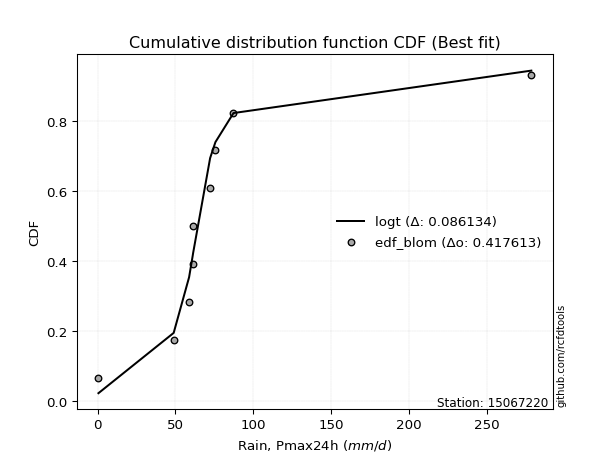</img></img>

</div>


### 7. Empirical - EDF Tukey (1962)

In hydrology, the Tukey formula is used as a plotting position formula to estimate the empirical probability or frequency of a flood event (or other hydrological data). The formula parameter is given as _c=0.333_ (or 1/3).

<div align="center">


$P=(m-c)/(n+1-2c)$


</div>


**7.1. Empirical values**

<div align="center">

|                | 0                   | 1                   | 2                  | 3                   | 4         | 5                  | 6                  | 7                  | 8                  |
|:---------------|:--------------------|:--------------------|:-------------------|:--------------------|:----------|:-------------------|:-------------------|:-------------------|:-------------------|
| date           | 2019                | 2018                | 2017               | 2015                | 2011      | 2013               | 2012               | 2016               | 2014               |
| x              | 0.6                 | 48.9                | 58.8               | 61.1                | 61.4      | 72.3               | 75.7               | 87.3               | 278.5              |
| m              | 1                   | 2                   | 3                  | 4                   | 5         | 6                  | 7                  | 8                  | 9                  |
| empirical_dist | edf_tukey           | edf_tukey           | edf_tukey          | edf_tukey           | edf_tukey | edf_tukey          | edf_tukey          | edf_tukey          | edf_tukey          |
| empirical      | 0.07142857142857142 | 0.17857142857142858 | 0.2857142857142857 | 0.39285714285714285 | 0.5       | 0.6071428571428571 | 0.7142857142857143 | 0.8214285714285714 | 0.9285714285714286 |
| empirical_tr   | 1.0769230769230769  | 1.2173913043478262  | 1.4                | 1.6470588235294117  | 2.0       | 2.545454545454545  | 3.5                | 5.599999999999999  | 14.000000000000007 |

</div>


**7.2. Kolmogorov-Smirnov fit test (sorted by Δ)**


<div align="center">

|                | 0                   | 1                   | 2                   | 3                   | 4                   | 5                   | 6                   | 7                   | 8                   | 9                   | 10                  | 11                  | 12                  | 13                  | 14                  | 15                  | 16                  | 17                  | 18                  | 19                  | 20                  | 21                  | 22                  | 23                  | 24                  | 25                  | 26                  | 27                  | 28                  | 29                  | 30                  | 31                  | 32                    | 33                  | 34                  | 35                  | 36                  | 37                  | 38                  | 39                  | 40                  | 41                  | 42                  | 43                  | 44                  | 45                  | 46                  | 47                  | 48                  | 49                  | 50                  | 51                  | 52                  | 53                  | 54                  | 55                  | 56                  | 57                  | 58                  | 59                  | 60                  | 61                  | 62                  | 63                  | 64                  | 65                  | 66                  | 67                  | 68                  | 69                  | 70                  | 71                  | 72                  | 73                  | 74                  | 75                  | 76                  | 77                  | 78                  | 79                  | 80                  | 81                  | 82                  | 83                  | 84                  | 85                  | 86                  | 87                  | 88                  | 89                  |
|:---------------|:--------------------|:--------------------|:--------------------|:--------------------|:--------------------|:--------------------|:--------------------|:--------------------|:--------------------|:--------------------|:--------------------|:--------------------|:--------------------|:--------------------|:--------------------|:--------------------|:--------------------|:--------------------|:--------------------|:--------------------|:--------------------|:--------------------|:--------------------|:--------------------|:--------------------|:--------------------|:--------------------|:--------------------|:--------------------|:--------------------|:--------------------|:--------------------|:----------------------|:--------------------|:--------------------|:--------------------|:--------------------|:--------------------|:--------------------|:--------------------|:--------------------|:--------------------|:--------------------|:--------------------|:--------------------|:--------------------|:--------------------|:--------------------|:--------------------|:--------------------|:--------------------|:--------------------|:--------------------|:--------------------|:--------------------|:--------------------|:--------------------|:--------------------|:--------------------|:--------------------|:--------------------|:--------------------|:--------------------|:--------------------|:--------------------|:--------------------|:--------------------|:--------------------|:--------------------|:--------------------|:--------------------|:--------------------|:--------------------|:--------------------|:--------------------|:--------------------|:--------------------|:--------------------|:--------------------|:--------------------|:--------------------|:--------------------|:--------------------|:--------------------|:--------------------|:--------------------|:--------------------|:--------------------|:--------------------|:--------------------|
| station        | 15067220            | 15067220            | 15067220            | 15067220            | 15067220            | 15067220            | 15067220            | 15067220            | 15067220            | 15067220            | 15067220            | 15067220            | 15067220            | 15067220            | 15067220            | 15067220            | 15067220            | 15067220            | 15067220            | 15067220            | 15067220            | 15067220            | 15067220            | 15067220            | 15067220            | 15067220            | 15067220            | 15067220            | 15067220            | 15067220            | 15067220            | 15067220            | 15067220              | 15067220            | 15067220            | 15067220            | 15067220            | 15067220            | 15067220            | 15067220            | 15067220            | 15067220            | 15067220            | 15067220            | 15067220            | 15067220            | 15067220            | 15067220            | 15067220            | 15067220            | 15067220            | 15067220            | 15067220            | 15067220            | 15067220            | 15067220            | 15067220            | 15067220            | 15067220            | 15067220            | 15067220            | 15067220            | 15067220            | 15067220            | 15067220            | 15067220            | 15067220            | 15067220            | 15067220            | 15067220            | 15067220            | 15067220            | 15067220            | 15067220            | 15067220            | 15067220            | 15067220            | 15067220            | 15067220            | 15067220            | 15067220            | 15067220            | 15067220            | 15067220            | 15067220            | 15067220            | 15067220            | 15067220            | 15067220            | 15067220            |
| empirical_dist | edf_tukey           | edf_tukey           | edf_tukey           | edf_tukey           | edf_tukey           | edf_tukey           | edf_tukey           | edf_tukey           | edf_tukey           | edf_tukey           | edf_tukey           | edf_tukey           | edf_tukey           | edf_tukey           | edf_tukey           | edf_tukey           | edf_tukey           | edf_tukey           | edf_tukey           | edf_tukey           | edf_tukey           | edf_tukey           | edf_tukey           | edf_tukey           | edf_tukey           | edf_tukey           | edf_tukey           | edf_tukey           | edf_tukey           | edf_tukey           | edf_tukey           | edf_tukey           | edf_tukey             | edf_tukey           | edf_tukey           | edf_tukey           | edf_tukey           | edf_tukey           | edf_tukey           | edf_tukey           | edf_tukey           | edf_tukey           | edf_tukey           | edf_tukey           | edf_tukey           | edf_tukey           | edf_tukey           | edf_tukey           | edf_tukey           | edf_tukey           | edf_tukey           | edf_tukey           | edf_tukey           | edf_tukey           | edf_tukey           | edf_tukey           | edf_tukey           | edf_tukey           | edf_tukey           | edf_tukey           | edf_tukey           | edf_tukey           | edf_tukey           | edf_tukey           | edf_tukey           | edf_tukey           | edf_tukey           | edf_tukey           | edf_tukey           | edf_tukey           | edf_tukey           | edf_tukey           | edf_tukey           | edf_tukey           | edf_tukey           | edf_tukey           | edf_tukey           | edf_tukey           | edf_tukey           | edf_tukey           | edf_tukey           | edf_tukey           | edf_tukey           | edf_tukey           | edf_tukey           | edf_tukey           | edf_tukey           | edf_tukey           | edf_tukey           | edf_tukey           |
| p_dist         | logt                | t                   | johnsonsu           | fisk                | alpha               | logjohnsonsu        | invgamma            | nakagami            | betaprime           | gibrat              | laplace_asymmetric  | exponnorm           | invgauss            | f                   | erlang              | chi2                | gamma               | genlogistic         | moyal               | genexpon            | truncnorm           | wald                | halflogistic        | halfnorm            | gumbel_r            | pearson3            | gompertz            | logloggamma         | weibull_min         | kstwobign           | rayleigh            | loggompertz         | loglaplace_asymmetric | loggenlogistic      | logmielke           | maxwell             | expon               | loggumbel_l         | logpearson3         | laplace             | ncf                 | hypsecant           | rice                | logistic            | crystalball         | norm                | lognakagami         | logfatiguelife      | logcrystalball      | logrice             | lognorm             | lognorm             | logexponnorm        | lognct              | loglognorm          | loglogistic         | loghypsecant        | mielke              | loglaplace          | loginvgamma         | loginvweibull       | gumbel_l            | logmaxwell          | loginvgauss         | lograyleigh         | logkstwobign        | loggumbel_r         | loghalfnorm         | logerlang           | loggenexpon         | logmoyal            | loghalflogistic     | nct                 | logexpon            | logncf              | pareto              | invweibull          | logfisk             | logpareto           | logweibull_min      | loggamma            | loggamma            | logwald             | logbetaprime        | loggibrat           | logf                | logtruncnorm        | logalpha            | fatiguelife         | logchi2             |
| delta          | 0.08709946461819551 | 0.10857977487740478 | 0.11439547697026042 | 0.14781836352281993 | 0.17163961250352425 | 0.1765864050736209  | 0.17736873339989723 | 0.1794781413272183  | 0.18372966254402753 | 0.1894649357658748  | 0.19079430511628548 | 0.19249997430396104 | 0.1941058398874368  | 0.19624443049954068 | 0.19627561699952065 | 0.19627574207919665 | 0.1962758258080202  | 0.19642290648483862 | 0.2002981199303866  | 0.2013474384378545  | 0.21387955183740728 | 0.21734535086614878 | 0.219958881029354   | 0.22479590584248177 | 0.22580190645327303 | 0.23510596586420654 | 0.23982681427604116 | 0.24733660255400777 | 0.2538245779833128  | 0.25396582527190137 | 0.2541581643585856  | 0.256752368874238   | 0.2592516502713238    | 0.2626143289871261  | 0.2630605855875463  | 0.26458499646546696 | 0.2660293921474014  | 0.26885822293555894 | 0.2710192180606029  | 0.2790643913969386  | 0.2814646406793513  | 0.2901772669665812  | 0.2908435413991872  | 0.2930715937508537  | 0.29646977996555735 | 0.29646978695636705 | 0.3379486011861147  | 0.33839971030140636 | 0.33851335447425757 | 0.338515446314648   | 0.3385154674318299  | 0.3385154674318299  | 0.33851587237270386 | 0.33903027281846465 | 0.339493557754424   | 0.34084622448075785 | 0.3428342195466747  | 0.34292197230247345 | 0.3508240434109773  | 0.3557788604826052  | 0.3563555856172971  | 0.36564987588649367 | 0.3708030551891096  | 0.37836247420433555 | 0.3814231780851751  | 0.3970467465289266  | 0.4091864791347847  | 0.4113242611363541  | 0.4158700265399784  | 0.42595633832545265 | 0.434835520388017   | 0.4372229534038312  | 0.4547893665356383  | 0.4593402696890957  | 0.46571339982199966 | 0.47682279219607926 | 0.4792189943588941  | 0.48356151896590205 | 0.4928039878335966  | 0.49330474303838057 | 0.5020253005009806  | 0.5020253005009806  | 0.5060849992771236  | 0.5100389833844585  | 0.5318571998826416  | 0.5437357831610842  | 0.547080203572718   | 0.5683722690949756  | 0.6042634626860329  | 0.69275036636657    |
| deltao         | 0.41761268023100007 | 0.41761268023100007 | 0.41761268023100007 | 0.41761268023100007 | 0.41761268023100007 | 0.41761268023100007 | 0.41761268023100007 | 0.41761268023100007 | 0.41761268023100007 | 0.41761268023100007 | 0.41761268023100007 | 0.41761268023100007 | 0.41761268023100007 | 0.41761268023100007 | 0.41761268023100007 | 0.41761268023100007 | 0.41761268023100007 | 0.41761268023100007 | 0.41761268023100007 | 0.41761268023100007 | 0.41761268023100007 | 0.41761268023100007 | 0.41761268023100007 | 0.41761268023100007 | 0.41761268023100007 | 0.41761268023100007 | 0.41761268023100007 | 0.41761268023100007 | 0.41761268023100007 | 0.41761268023100007 | 0.41761268023100007 | 0.41761268023100007 | 0.41761268023100007   | 0.41761268023100007 | 0.41761268023100007 | 0.41761268023100007 | 0.41761268023100007 | 0.41761268023100007 | 0.41761268023100007 | 0.41761268023100007 | 0.41761268023100007 | 0.41761268023100007 | 0.41761268023100007 | 0.41761268023100007 | 0.41761268023100007 | 0.41761268023100007 | 0.41761268023100007 | 0.41761268023100007 | 0.41761268023100007 | 0.41761268023100007 | 0.41761268023100007 | 0.41761268023100007 | 0.41761268023100007 | 0.41761268023100007 | 0.41761268023100007 | 0.41761268023100007 | 0.41761268023100007 | 0.41761268023100007 | 0.41761268023100007 | 0.41761268023100007 | 0.41761268023100007 | 0.41761268023100007 | 0.41761268023100007 | 0.41761268023100007 | 0.41761268023100007 | 0.41761268023100007 | 0.41761268023100007 | 0.41761268023100007 | 0.41761268023100007 | 0.41761268023100007 | 0.41761268023100007 | 0.41761268023100007 | 0.41761268023100007 | 0.41761268023100007 | 0.41761268023100007 | 0.41761268023100007 | 0.41761268023100007 | 0.41761268023100007 | 0.41761268023100007 | 0.41761268023100007 | 0.41761268023100007 | 0.41761268023100007 | 0.41761268023100007 | 0.41761268023100007 | 0.41761268023100007 | 0.41761268023100007 | 0.41761268023100007 | 0.41761268023100007 | 0.41761268023100007 | 0.41761268023100007 |
| eval           | Δo > Δ              | Δo > Δ              | Δo > Δ              | Δo > Δ              | Δo > Δ              | Δo > Δ              | Δo > Δ              | Δo > Δ              | Δo > Δ              | Δo > Δ              | Δo > Δ              | Δo > Δ              | Δo > Δ              | Δo > Δ              | Δo > Δ              | Δo > Δ              | Δo > Δ              | Δo > Δ              | Δo > Δ              | Δo > Δ              | Δo > Δ              | Δo > Δ              | Δo > Δ              | Δo > Δ              | Δo > Δ              | Δo > Δ              | Δo > Δ              | Δo > Δ              | Δo > Δ              | Δo > Δ              | Δo > Δ              | Δo > Δ              | Δo > Δ                | Δo > Δ              | Δo > Δ              | Δo > Δ              | Δo > Δ              | Δo > Δ              | Δo > Δ              | Δo > Δ              | Δo > Δ              | Δo > Δ              | Δo > Δ              | Δo > Δ              | Δo > Δ              | Δo > Δ              | Δo > Δ              | Δo > Δ              | Δo > Δ              | Δo > Δ              | Δo > Δ              | Δo > Δ              | Δo > Δ              | Δo > Δ              | Δo > Δ              | Δo > Δ              | Δo > Δ              | Δo > Δ              | Δo > Δ              | Δo > Δ              | Δo > Δ              | Δo > Δ              | Δo > Δ              | Δo > Δ              | Δo > Δ              | Δo > Δ              | Δo > Δ              | Δo > Δ              | Δo > Δ              | Δo <= Δ             | Δo <= Δ             | Δo <= Δ             | Δo <= Δ             | Δo <= Δ             | Δo <= Δ             | Δo <= Δ             | Δo <= Δ             | Δo <= Δ             | Δo <= Δ             | Δo <= Δ             | Δo <= Δ             | Δo <= Δ             | Δo <= Δ             | Δo <= Δ             | Δo <= Δ             | Δo <= Δ             | Δo <= Δ             | Δo <= Δ             | Δo <= Δ             | Δo <= Δ             |
| fit            | 1                   | 1                   | 1                   | 1                   | 1                   | 1                   | 1                   | 1                   | 1                   | 1                   | 1                   | 1                   | 1                   | 1                   | 1                   | 1                   | 1                   | 1                   | 1                   | 1                   | 1                   | 1                   | 1                   | 1                   | 1                   | 1                   | 1                   | 1                   | 1                   | 1                   | 1                   | 1                   | 1                     | 1                   | 1                   | 1                   | 1                   | 1                   | 1                   | 1                   | 1                   | 1                   | 1                   | 1                   | 1                   | 1                   | 1                   | 1                   | 1                   | 1                   | 1                   | 1                   | 1                   | 1                   | 1                   | 1                   | 1                   | 1                   | 1                   | 1                   | 1                   | 1                   | 1                   | 1                   | 1                   | 1                   | 1                   | 1                   | 1                   | 0                   | 0                   | 0                   | 0                   | 0                   | 0                   | 0                   | 0                   | 0                   | 0                   | 0                   | 0                   | 0                   | 0                   | 0                   | 0                   | 0                   | 0                   | 0                   | 0                   | 0                   |
| n              | 9                   | 9                   | 9                   | 9                   | 9                   | 9                   | 9                   | 9                   | 9                   | 9                   | 9                   | 9                   | 9                   | 9                   | 9                   | 9                   | 9                   | 9                   | 9                   | 9                   | 9                   | 9                   | 9                   | 9                   | 9                   | 9                   | 9                   | 9                   | 9                   | 9                   | 9                   | 9                   | 9                     | 9                   | 9                   | 9                   | 9                   | 9                   | 9                   | 9                   | 9                   | 9                   | 9                   | 9                   | 9                   | 9                   | 9                   | 9                   | 9                   | 9                   | 9                   | 9                   | 9                   | 9                   | 9                   | 9                   | 9                   | 9                   | 9                   | 9                   | 9                   | 9                   | 9                   | 9                   | 9                   | 9                   | 9                   | 9                   | 9                   | 9                   | 9                   | 9                   | 9                   | 9                   | 9                   | 9                   | 9                   | 9                   | 9                   | 9                   | 9                   | 9                   | 9                   | 9                   | 9                   | 9                   | 9                   | 9                   | 9                   | 9                   |
| best_fit       | 1                   | 0                   | 0                   | 0                   | 0                   | 0                   | 0                   | 0                   | 0                   | 0                   | 0                   | 0                   | 0                   | 0                   | 0                   | 0                   | 0                   | 0                   | 0                   | 0                   | 0                   | 0                   | 0                   | 0                   | 0                   | 0                   | 0                   | 0                   | 0                   | 0                   | 0                   | 0                   | 0                     | 0                   | 0                   | 0                   | 0                   | 0                   | 0                   | 0                   | 0                   | 0                   | 0                   | 0                   | 0                   | 0                   | 0                   | 0                   | 0                   | 0                   | 0                   | 0                   | 0                   | 0                   | 0                   | 0                   | 0                   | 0                   | 0                   | 0                   | 0                   | 0                   | 0                   | 0                   | 0                   | 0                   | 0                   | 0                   | 0                   | 0                   | 0                   | 0                   | 0                   | 0                   | 0                   | 0                   | 0                   | 0                   | 0                   | 0                   | 0                   | 0                   | 0                   | 0                   | 0                   | 0                   | 0                   | 0                   | 0                   | 0                   |
| best_fit_sort  | 1                   | 2                   | 3                   | 4                   | 5                   | 6                   | 7                   | 8                   | 9                   | 10                  | 11                  | 12                  | 13                  | 14                  | 15                  | 16                  | 17                  | 18                  | 19                  | 20                  | 21                  | 22                  | 23                  | 24                  | 25                  | 26                  | 27                  | 28                  | 29                  | 30                  | 31                  | 32                  | 33                    | 34                  | 35                  | 36                  | 37                  | 38                  | 39                  | 40                  | 41                  | 42                  | 43                  | 44                  | 45                  | 46                  | 47                  | 48                  | 49                  | 50                  | 51                  | 52                  | 53                  | 54                  | 55                  | 56                  | 57                  | 58                  | 59                  | 60                  | 61                  | 62                  | 63                  | 64                  | 65                  | 66                  | 67                  | 68                  | 69                  | 70                  | 71                  | 72                  | 73                  | 74                  | 75                  | 76                  | 77                  | 78                  | 79                  | 80                  | 81                  | 82                  | 83                  | 84                  | 85                  | 86                  | 87                  | 88                  | 89                  | 90                  |

</div>


<div align="center">

</img>

</div>


**7.3. Best fit**

<div align="center">

|   id |   station | empirical_dist   | p_dist   |     delta |   deltao | eval   |   fit |   n |   best_fit |   best_fit_sort |
|-----:|----------:|:-----------------|:---------|----------:|---------:|:-------|------:|----:|-----------:|----------------:|
|    0 |  15067220 | edf_tukey        | logt     | 0.0870995 | 0.417613 | Δo > Δ |     1 |   9 |          1 |               1 |

</div>


<div align="center">

</img>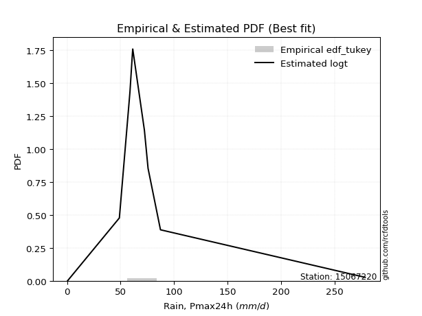</img>

</div>


### 8. Empirical - EDF Gringorten (1963)

Gringorten plotting position formula is essential for estimating the probability and return periods of extreme events like floods and heavy rainfall. The constant _a=0.44_.

<div align="center">


$P=(m-a)/(n+1-2a)$


</div>


**8.1. Empirical values**

<div align="center">

|                | 0                    | 1                  | 2                   | 3                  | 4              | 5                  | 6                  | 7                  | 8                  |
|:---------------|:---------------------|:-------------------|:--------------------|:-------------------|:---------------|:-------------------|:-------------------|:-------------------|:-------------------|
| date           | 2019                 | 2018               | 2017                | 2015               | 2011           | 2013               | 2012               | 2016               | 2014               |
| x              | 0.6                  | 48.9               | 58.8                | 61.1               | 61.4           | 72.3               | 75.7               | 87.3               | 278.5              |
| m              | 1                    | 2                  | 3                   | 4                  | 5              | 6                  | 7                  | 8                  | 9                  |
| empirical_dist | edf_gringorten       | edf_gringorten     | edf_gringorten      | edf_gringorten     | edf_gringorten | edf_gringorten     | edf_gringorten     | edf_gringorten     | edf_gringorten     |
| empirical      | 0.061403508771929835 | 0.1710526315789474 | 0.28070175438596495 | 0.3903508771929825 | 0.5            | 0.6096491228070176 | 0.7192982456140351 | 0.8289473684210527 | 0.9385964912280703 |
| empirical_tr   | 1.0654205607476634   | 1.2063492063492063 | 1.3902439024390243  | 1.6402877697841727 | 2.0            | 2.561797752808989  | 3.5625             | 5.846153846153847  | 16.285714285714324 |

</div>


**8.2. Kolmogorov-Smirnov fit test (sorted by Δ)**


<div align="center">

|                | 0                   | 1                   | 2                   | 3                   | 4                   | 5                   | 6                   | 7                   | 8                   | 9                   | 10                  | 11                  | 12                  | 13                  | 14                  | 15                  | 16                  | 17                  | 18                  | 19                  | 20                  | 21                  | 22                  | 23                  | 24                  | 25                  | 26                  | 27                  | 28                  | 29                  | 30                  | 31                  | 32                    | 33                  | 34                  | 35                  | 36                  | 37                  | 38                  | 39                  | 40                  | 41                  | 42                  | 43                  | 44                  | 45                  | 46                  | 47                  | 48                  | 49                  | 50                  | 51                  | 52                  | 53                  | 54                  | 55                  | 56                  | 57                  | 58                  | 59                  | 60                  | 61                  | 62                  | 63                  | 64                  | 65                  | 66                  | 67                  | 68                  | 69                  | 70                  | 71                  | 72                  | 73                  | 74                  | 75                  | 76                  | 77                  | 78                  | 79                  | 80                  | 81                  | 82                  | 83                  | 84                  | 85                  | 86                  | 87                  | 88                  | 89                  |
|:---------------|:--------------------|:--------------------|:--------------------|:--------------------|:--------------------|:--------------------|:--------------------|:--------------------|:--------------------|:--------------------|:--------------------|:--------------------|:--------------------|:--------------------|:--------------------|:--------------------|:--------------------|:--------------------|:--------------------|:--------------------|:--------------------|:--------------------|:--------------------|:--------------------|:--------------------|:--------------------|:--------------------|:--------------------|:--------------------|:--------------------|:--------------------|:--------------------|:----------------------|:--------------------|:--------------------|:--------------------|:--------------------|:--------------------|:--------------------|:--------------------|:--------------------|:--------------------|:--------------------|:--------------------|:--------------------|:--------------------|:--------------------|:--------------------|:--------------------|:--------------------|:--------------------|:--------------------|:--------------------|:--------------------|:--------------------|:--------------------|:--------------------|:--------------------|:--------------------|:--------------------|:--------------------|:--------------------|:--------------------|:--------------------|:--------------------|:--------------------|:--------------------|:--------------------|:--------------------|:--------------------|:--------------------|:--------------------|:--------------------|:--------------------|:--------------------|:--------------------|:--------------------|:--------------------|:--------------------|:--------------------|:--------------------|:--------------------|:--------------------|:--------------------|:--------------------|:--------------------|:--------------------|:--------------------|:--------------------|:--------------------|
| station        | 15067220            | 15067220            | 15067220            | 15067220            | 15067220            | 15067220            | 15067220            | 15067220            | 15067220            | 15067220            | 15067220            | 15067220            | 15067220            | 15067220            | 15067220            | 15067220            | 15067220            | 15067220            | 15067220            | 15067220            | 15067220            | 15067220            | 15067220            | 15067220            | 15067220            | 15067220            | 15067220            | 15067220            | 15067220            | 15067220            | 15067220            | 15067220            | 15067220              | 15067220            | 15067220            | 15067220            | 15067220            | 15067220            | 15067220            | 15067220            | 15067220            | 15067220            | 15067220            | 15067220            | 15067220            | 15067220            | 15067220            | 15067220            | 15067220            | 15067220            | 15067220            | 15067220            | 15067220            | 15067220            | 15067220            | 15067220            | 15067220            | 15067220            | 15067220            | 15067220            | 15067220            | 15067220            | 15067220            | 15067220            | 15067220            | 15067220            | 15067220            | 15067220            | 15067220            | 15067220            | 15067220            | 15067220            | 15067220            | 15067220            | 15067220            | 15067220            | 15067220            | 15067220            | 15067220            | 15067220            | 15067220            | 15067220            | 15067220            | 15067220            | 15067220            | 15067220            | 15067220            | 15067220            | 15067220            | 15067220            |
| empirical_dist | edf_gringorten      | edf_gringorten      | edf_gringorten      | edf_gringorten      | edf_gringorten      | edf_gringorten      | edf_gringorten      | edf_gringorten      | edf_gringorten      | edf_gringorten      | edf_gringorten      | edf_gringorten      | edf_gringorten      | edf_gringorten      | edf_gringorten      | edf_gringorten      | edf_gringorten      | edf_gringorten      | edf_gringorten      | edf_gringorten      | edf_gringorten      | edf_gringorten      | edf_gringorten      | edf_gringorten      | edf_gringorten      | edf_gringorten      | edf_gringorten      | edf_gringorten      | edf_gringorten      | edf_gringorten      | edf_gringorten      | edf_gringorten      | edf_gringorten        | edf_gringorten      | edf_gringorten      | edf_gringorten      | edf_gringorten      | edf_gringorten      | edf_gringorten      | edf_gringorten      | edf_gringorten      | edf_gringorten      | edf_gringorten      | edf_gringorten      | edf_gringorten      | edf_gringorten      | edf_gringorten      | edf_gringorten      | edf_gringorten      | edf_gringorten      | edf_gringorten      | edf_gringorten      | edf_gringorten      | edf_gringorten      | edf_gringorten      | edf_gringorten      | edf_gringorten      | edf_gringorten      | edf_gringorten      | edf_gringorten      | edf_gringorten      | edf_gringorten      | edf_gringorten      | edf_gringorten      | edf_gringorten      | edf_gringorten      | edf_gringorten      | edf_gringorten      | edf_gringorten      | edf_gringorten      | edf_gringorten      | edf_gringorten      | edf_gringorten      | edf_gringorten      | edf_gringorten      | edf_gringorten      | edf_gringorten      | edf_gringorten      | edf_gringorten      | edf_gringorten      | edf_gringorten      | edf_gringorten      | edf_gringorten      | edf_gringorten      | edf_gringorten      | edf_gringorten      | edf_gringorten      | edf_gringorten      | edf_gringorten      | edf_gringorten      |
| p_dist         | logt                | t                   | johnsonsu           | fisk                | logjohnsonsu        | alpha               | invgamma            | nakagami            | betaprime           | gibrat              | laplace_asymmetric  | exponnorm           | invgauss            | f                   | erlang              | chi2                | gamma               | genlogistic         | moyal               | genexpon            | truncnorm           | wald                | halflogistic        | halfnorm            | gumbel_r            | pearson3            | gompertz            | logloggamma         | weibull_min         | kstwobign           | rayleigh            | loggompertz         | loglaplace_asymmetric | loggenlogistic      | logmielke           | maxwell             | expon               | loggumbel_l         | logpearson3         | laplace             | ncf                 | hypsecant           | rice                | logistic            | crystalball         | norm                | lognakagami         | logfatiguelife      | logcrystalball      | logrice             | lognorm             | lognorm             | logexponnorm        | lognct              | loglognorm          | loglogistic         | loghypsecant        | mielke              | loglaplace          | loginvgamma         | loginvweibull       | gumbel_l            | logmaxwell          | loginvgauss         | lograyleigh         | logkstwobign        | loggumbel_r         | loghalfnorm         | logerlang           | loggenexpon         | logmoyal            | loghalflogistic     | nct                 | logexpon            | logncf              | pareto              | invweibull          | logfisk             | logpareto           | logweibull_min      | loggamma            | loggamma            | logwald             | logbetaprime        | loggibrat           | logf                | logtruncnorm        | logalpha            | fatiguelife         | logchi2             |
| delta          | 0.08459319895403505 | 0.10607350921324432 | 0.11188921130609997 | 0.1553371605153011  | 0.17408013940946043 | 0.17915840949600542 | 0.18488753039237849 | 0.18699693831969955 | 0.1912484595365087  | 0.19447746709419556 | 0.19831310210876674 | 0.2000187712964423  | 0.20162463687991805 | 0.20376322749202186 | 0.20379441399200182 | 0.20379453907167783 | 0.20379462280050137 | 0.20394170347731988 | 0.20781691692286786 | 0.20886623543033567 | 0.22139834882988846 | 0.22486414785862996 | 0.22747767802183516 | 0.23231470283496303 | 0.23332070344575428 | 0.24262476285668771 | 0.24734561126852234 | 0.25485539954648895 | 0.2613433749757941  | 0.2614846222643826  | 0.2616769613510669  | 0.2642711658667192  | 0.26677044726380494   | 0.27013312597960726 | 0.2705793825800275  | 0.2721037934579482  | 0.2735481891398826  | 0.27637701992804015 | 0.2785380150530842  | 0.2865831883894199  | 0.28898343767183243 | 0.29769606395906245 | 0.2983623383916685  | 0.30059039074333493 | 0.3039885769580386  | 0.3039885839488483  | 0.3454673981785959  | 0.34591850729388757 | 0.34603215146673877 | 0.34603424330712923 | 0.3460342644243111  | 0.3460342644243111  | 0.34603466936518507 | 0.34654906981094585 | 0.3470123547469052  | 0.34836502147323906 | 0.3503530165391559  | 0.35044076929495466 | 0.3583428404034585  | 0.3632976574750864  | 0.3638743826097783  | 0.3731686728789749  | 0.3783218521815908  | 0.38588127119681676 | 0.3889419750776563  | 0.4045655435214078  | 0.4167052761272659  | 0.4188430581288353  | 0.4233888235324596  | 0.43347513531793386 | 0.4423543173804982  | 0.4447417503963124  | 0.4623081635281195  | 0.4668590666815769  | 0.47323219681448087 | 0.48434158918856046 | 0.4892440570155358  | 0.49108031595838325 | 0.5003227848260778  | 0.5008235400308618  | 0.5095440974934617  | 0.5095440974934617  | 0.5136037962696047  | 0.5175577803769398  | 0.5393759968751228  | 0.5512545801535653  | 0.5545990005651993  | 0.5758910660874568  | 0.6117822596785141  | 0.7002691633590512  |
| deltao         | 0.41761268023100007 | 0.41761268023100007 | 0.41761268023100007 | 0.41761268023100007 | 0.41761268023100007 | 0.41761268023100007 | 0.41761268023100007 | 0.41761268023100007 | 0.41761268023100007 | 0.41761268023100007 | 0.41761268023100007 | 0.41761268023100007 | 0.41761268023100007 | 0.41761268023100007 | 0.41761268023100007 | 0.41761268023100007 | 0.41761268023100007 | 0.41761268023100007 | 0.41761268023100007 | 0.41761268023100007 | 0.41761268023100007 | 0.41761268023100007 | 0.41761268023100007 | 0.41761268023100007 | 0.41761268023100007 | 0.41761268023100007 | 0.41761268023100007 | 0.41761268023100007 | 0.41761268023100007 | 0.41761268023100007 | 0.41761268023100007 | 0.41761268023100007 | 0.41761268023100007   | 0.41761268023100007 | 0.41761268023100007 | 0.41761268023100007 | 0.41761268023100007 | 0.41761268023100007 | 0.41761268023100007 | 0.41761268023100007 | 0.41761268023100007 | 0.41761268023100007 | 0.41761268023100007 | 0.41761268023100007 | 0.41761268023100007 | 0.41761268023100007 | 0.41761268023100007 | 0.41761268023100007 | 0.41761268023100007 | 0.41761268023100007 | 0.41761268023100007 | 0.41761268023100007 | 0.41761268023100007 | 0.41761268023100007 | 0.41761268023100007 | 0.41761268023100007 | 0.41761268023100007 | 0.41761268023100007 | 0.41761268023100007 | 0.41761268023100007 | 0.41761268023100007 | 0.41761268023100007 | 0.41761268023100007 | 0.41761268023100007 | 0.41761268023100007 | 0.41761268023100007 | 0.41761268023100007 | 0.41761268023100007 | 0.41761268023100007 | 0.41761268023100007 | 0.41761268023100007 | 0.41761268023100007 | 0.41761268023100007 | 0.41761268023100007 | 0.41761268023100007 | 0.41761268023100007 | 0.41761268023100007 | 0.41761268023100007 | 0.41761268023100007 | 0.41761268023100007 | 0.41761268023100007 | 0.41761268023100007 | 0.41761268023100007 | 0.41761268023100007 | 0.41761268023100007 | 0.41761268023100007 | 0.41761268023100007 | 0.41761268023100007 | 0.41761268023100007 | 0.41761268023100007 |
| eval           | Δo > Δ              | Δo > Δ              | Δo > Δ              | Δo > Δ              | Δo > Δ              | Δo > Δ              | Δo > Δ              | Δo > Δ              | Δo > Δ              | Δo > Δ              | Δo > Δ              | Δo > Δ              | Δo > Δ              | Δo > Δ              | Δo > Δ              | Δo > Δ              | Δo > Δ              | Δo > Δ              | Δo > Δ              | Δo > Δ              | Δo > Δ              | Δo > Δ              | Δo > Δ              | Δo > Δ              | Δo > Δ              | Δo > Δ              | Δo > Δ              | Δo > Δ              | Δo > Δ              | Δo > Δ              | Δo > Δ              | Δo > Δ              | Δo > Δ                | Δo > Δ              | Δo > Δ              | Δo > Δ              | Δo > Δ              | Δo > Δ              | Δo > Δ              | Δo > Δ              | Δo > Δ              | Δo > Δ              | Δo > Δ              | Δo > Δ              | Δo > Δ              | Δo > Δ              | Δo > Δ              | Δo > Δ              | Δo > Δ              | Δo > Δ              | Δo > Δ              | Δo > Δ              | Δo > Δ              | Δo > Δ              | Δo > Δ              | Δo > Δ              | Δo > Δ              | Δo > Δ              | Δo > Δ              | Δo > Δ              | Δo > Δ              | Δo > Δ              | Δo > Δ              | Δo > Δ              | Δo > Δ              | Δo > Δ              | Δo > Δ              | Δo <= Δ             | Δo <= Δ             | Δo <= Δ             | Δo <= Δ             | Δo <= Δ             | Δo <= Δ             | Δo <= Δ             | Δo <= Δ             | Δo <= Δ             | Δo <= Δ             | Δo <= Δ             | Δo <= Δ             | Δo <= Δ             | Δo <= Δ             | Δo <= Δ             | Δo <= Δ             | Δo <= Δ             | Δo <= Δ             | Δo <= Δ             | Δo <= Δ             | Δo <= Δ             | Δo <= Δ             | Δo <= Δ             |
| fit            | 1                   | 1                   | 1                   | 1                   | 1                   | 1                   | 1                   | 1                   | 1                   | 1                   | 1                   | 1                   | 1                   | 1                   | 1                   | 1                   | 1                   | 1                   | 1                   | 1                   | 1                   | 1                   | 1                   | 1                   | 1                   | 1                   | 1                   | 1                   | 1                   | 1                   | 1                   | 1                   | 1                     | 1                   | 1                   | 1                   | 1                   | 1                   | 1                   | 1                   | 1                   | 1                   | 1                   | 1                   | 1                   | 1                   | 1                   | 1                   | 1                   | 1                   | 1                   | 1                   | 1                   | 1                   | 1                   | 1                   | 1                   | 1                   | 1                   | 1                   | 1                   | 1                   | 1                   | 1                   | 1                   | 1                   | 1                   | 0                   | 0                   | 0                   | 0                   | 0                   | 0                   | 0                   | 0                   | 0                   | 0                   | 0                   | 0                   | 0                   | 0                   | 0                   | 0                   | 0                   | 0                   | 0                   | 0                   | 0                   | 0                   | 0                   |
| n              | 9                   | 9                   | 9                   | 9                   | 9                   | 9                   | 9                   | 9                   | 9                   | 9                   | 9                   | 9                   | 9                   | 9                   | 9                   | 9                   | 9                   | 9                   | 9                   | 9                   | 9                   | 9                   | 9                   | 9                   | 9                   | 9                   | 9                   | 9                   | 9                   | 9                   | 9                   | 9                   | 9                     | 9                   | 9                   | 9                   | 9                   | 9                   | 9                   | 9                   | 9                   | 9                   | 9                   | 9                   | 9                   | 9                   | 9                   | 9                   | 9                   | 9                   | 9                   | 9                   | 9                   | 9                   | 9                   | 9                   | 9                   | 9                   | 9                   | 9                   | 9                   | 9                   | 9                   | 9                   | 9                   | 9                   | 9                   | 9                   | 9                   | 9                   | 9                   | 9                   | 9                   | 9                   | 9                   | 9                   | 9                   | 9                   | 9                   | 9                   | 9                   | 9                   | 9                   | 9                   | 9                   | 9                   | 9                   | 9                   | 9                   | 9                   |
| best_fit       | 1                   | 0                   | 0                   | 0                   | 0                   | 0                   | 0                   | 0                   | 0                   | 0                   | 0                   | 0                   | 0                   | 0                   | 0                   | 0                   | 0                   | 0                   | 0                   | 0                   | 0                   | 0                   | 0                   | 0                   | 0                   | 0                   | 0                   | 0                   | 0                   | 0                   | 0                   | 0                   | 0                     | 0                   | 0                   | 0                   | 0                   | 0                   | 0                   | 0                   | 0                   | 0                   | 0                   | 0                   | 0                   | 0                   | 0                   | 0                   | 0                   | 0                   | 0                   | 0                   | 0                   | 0                   | 0                   | 0                   | 0                   | 0                   | 0                   | 0                   | 0                   | 0                   | 0                   | 0                   | 0                   | 0                   | 0                   | 0                   | 0                   | 0                   | 0                   | 0                   | 0                   | 0                   | 0                   | 0                   | 0                   | 0                   | 0                   | 0                   | 0                   | 0                   | 0                   | 0                   | 0                   | 0                   | 0                   | 0                   | 0                   | 0                   |
| best_fit_sort  | 1                   | 2                   | 3                   | 4                   | 5                   | 6                   | 7                   | 8                   | 9                   | 10                  | 11                  | 12                  | 13                  | 14                  | 15                  | 16                  | 17                  | 18                  | 19                  | 20                  | 21                  | 22                  | 23                  | 24                  | 25                  | 26                  | 27                  | 28                  | 29                  | 30                  | 31                  | 32                  | 33                    | 34                  | 35                  | 36                  | 37                  | 38                  | 39                  | 40                  | 41                  | 42                  | 43                  | 44                  | 45                  | 46                  | 47                  | 48                  | 49                  | 50                  | 51                  | 52                  | 53                  | 54                  | 55                  | 56                  | 57                  | 58                  | 59                  | 60                  | 61                  | 62                  | 63                  | 64                  | 65                  | 66                  | 67                  | 68                  | 69                  | 70                  | 71                  | 72                  | 73                  | 74                  | 75                  | 76                  | 77                  | 78                  | 79                  | 80                  | 81                  | 82                  | 83                  | 84                  | 85                  | 86                  | 87                  | 88                  | 89                  | 90                  |

</div>


<div align="center">

</img>

</div>


**8.3. Best fit**

<div align="center">

|   id |   station | empirical_dist   | p_dist   |     delta |   deltao | eval   |   fit |   n |   best_fit |   best_fit_sort |
|-----:|----------:|:-----------------|:---------|----------:|---------:|:-------|------:|----:|-----------:|----------------:|
|    0 |  15067220 | edf_gringorten   | logt     | 0.0845932 | 0.417613 | Δo > Δ |     1 |   9 |          1 |               1 |

</div>


<div align="center">

</img></img>

</div>


### 9. Empirical - EDF Filliben (1975)

The specific values of the constants (0.3175) (often denoted as $alpha$) and (0.365) are derived from a method proposed by James J. Filliben in a 1975 paper. This particular formula is the mean value of the $i$-th order statistic of the normal distribution and is considered a robust and effective plotting position formula for the normal probability plot correlation coefficient test for normality.

<div align="center">


$P=(m-0.3175)/(n+0.365)$


</div>


**9.1. Empirical values**

<div align="center">

|                | 0                   | 1                  | 2                   | 3                   | 4            | 5                  | 6                  | 7                  | 8                  |
|:---------------|:--------------------|:-------------------|:--------------------|:--------------------|:-------------|:-------------------|:-------------------|:-------------------|:-------------------|
| date           | 2019                | 2018               | 2017                | 2015                | 2011         | 2013               | 2012               | 2016               | 2014               |
| x              | 0.6                 | 48.9               | 58.8                | 61.1                | 61.4         | 72.3               | 75.7               | 87.3               | 278.5              |
| m              | 1                   | 2                  | 3                   | 4                   | 5            | 6                  | 7                  | 8                  | 9                  |
| empirical_dist | edf_filliben        | edf_filliben       | edf_filliben        | edf_filliben        | edf_filliben | edf_filliben       | edf_filliben       | edf_filliben       | edf_filliben       |
| empirical      | 0.07287773625200214 | 0.1796583021890016 | 0.28643886812600106 | 0.39321943406300053 | 0.5          | 0.6067805659369995 | 0.7135611318739989 | 0.8203416978109984 | 0.9271222637479978 |
| empirical_tr   | 1.0786063921681543  | 1.219004230393752  | 1.401421623643846   | 1.6480422349318082  | 2.0          | 2.5431093007467753 | 3.491146318732526  | 5.566121842496286  | 13.721611721611705 |

</div>


**9.2. Kolmogorov-Smirnov fit test (sorted by Δ)**


<div align="center">

|                | 0                   | 1                   | 2                   | 3                   | 4                   | 5                   | 6                   | 7                   | 8                   | 9                   | 10                  | 11                  | 12                  | 13                  | 14                  | 15                  | 16                  | 17                  | 18                  | 19                  | 20                  | 21                  | 22                  | 23                  | 24                  | 25                  | 26                  | 27                  | 28                  | 29                  | 30                  | 31                  | 32                    | 33                  | 34                  | 35                  | 36                  | 37                  | 38                  | 39                  | 40                  | 41                  | 42                  | 43                  | 44                  | 45                  | 46                  | 47                  | 48                  | 49                  | 50                  | 51                  | 52                  | 53                  | 54                  | 55                  | 56                  | 57                  | 58                  | 59                  | 60                  | 61                  | 62                  | 63                  | 64                  | 65                  | 66                  | 67                  | 68                  | 69                  | 70                  | 71                  | 72                  | 73                  | 74                  | 75                  | 76                  | 77                  | 78                  | 79                  | 80                  | 81                  | 82                  | 83                  | 84                  | 85                  | 86                  | 87                  | 88                  | 89                  |
|:---------------|:--------------------|:--------------------|:--------------------|:--------------------|:--------------------|:--------------------|:--------------------|:--------------------|:--------------------|:--------------------|:--------------------|:--------------------|:--------------------|:--------------------|:--------------------|:--------------------|:--------------------|:--------------------|:--------------------|:--------------------|:--------------------|:--------------------|:--------------------|:--------------------|:--------------------|:--------------------|:--------------------|:--------------------|:--------------------|:--------------------|:--------------------|:--------------------|:----------------------|:--------------------|:--------------------|:--------------------|:--------------------|:--------------------|:--------------------|:--------------------|:--------------------|:--------------------|:--------------------|:--------------------|:--------------------|:--------------------|:--------------------|:--------------------|:--------------------|:--------------------|:--------------------|:--------------------|:--------------------|:--------------------|:--------------------|:--------------------|:--------------------|:--------------------|:--------------------|:--------------------|:--------------------|:--------------------|:--------------------|:--------------------|:--------------------|:--------------------|:--------------------|:--------------------|:--------------------|:--------------------|:--------------------|:--------------------|:--------------------|:--------------------|:--------------------|:--------------------|:--------------------|:--------------------|:--------------------|:--------------------|:--------------------|:--------------------|:--------------------|:--------------------|:--------------------|:--------------------|:--------------------|:--------------------|:--------------------|:--------------------|
| station        | 15067220            | 15067220            | 15067220            | 15067220            | 15067220            | 15067220            | 15067220            | 15067220            | 15067220            | 15067220            | 15067220            | 15067220            | 15067220            | 15067220            | 15067220            | 15067220            | 15067220            | 15067220            | 15067220            | 15067220            | 15067220            | 15067220            | 15067220            | 15067220            | 15067220            | 15067220            | 15067220            | 15067220            | 15067220            | 15067220            | 15067220            | 15067220            | 15067220              | 15067220            | 15067220            | 15067220            | 15067220            | 15067220            | 15067220            | 15067220            | 15067220            | 15067220            | 15067220            | 15067220            | 15067220            | 15067220            | 15067220            | 15067220            | 15067220            | 15067220            | 15067220            | 15067220            | 15067220            | 15067220            | 15067220            | 15067220            | 15067220            | 15067220            | 15067220            | 15067220            | 15067220            | 15067220            | 15067220            | 15067220            | 15067220            | 15067220            | 15067220            | 15067220            | 15067220            | 15067220            | 15067220            | 15067220            | 15067220            | 15067220            | 15067220            | 15067220            | 15067220            | 15067220            | 15067220            | 15067220            | 15067220            | 15067220            | 15067220            | 15067220            | 15067220            | 15067220            | 15067220            | 15067220            | 15067220            | 15067220            |
| empirical_dist | edf_filliben        | edf_filliben        | edf_filliben        | edf_filliben        | edf_filliben        | edf_filliben        | edf_filliben        | edf_filliben        | edf_filliben        | edf_filliben        | edf_filliben        | edf_filliben        | edf_filliben        | edf_filliben        | edf_filliben        | edf_filliben        | edf_filliben        | edf_filliben        | edf_filliben        | edf_filliben        | edf_filliben        | edf_filliben        | edf_filliben        | edf_filliben        | edf_filliben        | edf_filliben        | edf_filliben        | edf_filliben        | edf_filliben        | edf_filliben        | edf_filliben        | edf_filliben        | edf_filliben          | edf_filliben        | edf_filliben        | edf_filliben        | edf_filliben        | edf_filliben        | edf_filliben        | edf_filliben        | edf_filliben        | edf_filliben        | edf_filliben        | edf_filliben        | edf_filliben        | edf_filliben        | edf_filliben        | edf_filliben        | edf_filliben        | edf_filliben        | edf_filliben        | edf_filliben        | edf_filliben        | edf_filliben        | edf_filliben        | edf_filliben        | edf_filliben        | edf_filliben        | edf_filliben        | edf_filliben        | edf_filliben        | edf_filliben        | edf_filliben        | edf_filliben        | edf_filliben        | edf_filliben        | edf_filliben        | edf_filliben        | edf_filliben        | edf_filliben        | edf_filliben        | edf_filliben        | edf_filliben        | edf_filliben        | edf_filliben        | edf_filliben        | edf_filliben        | edf_filliben        | edf_filliben        | edf_filliben        | edf_filliben        | edf_filliben        | edf_filliben        | edf_filliben        | edf_filliben        | edf_filliben        | edf_filliben        | edf_filliben        | edf_filliben        | edf_filliben        |
| p_dist         | logt                | t                   | johnsonsu           | fisk                | alpha               | invgamma            | logjohnsonsu        | nakagami            | betaprime           | gibrat              | laplace_asymmetric  | exponnorm           | invgauss            | f                   | erlang              | chi2                | gamma               | genlogistic         | moyal               | genexpon            | truncnorm           | wald                | halflogistic        | halfnorm            | gumbel_r            | pearson3            | gompertz            | logloggamma         | weibull_min         | kstwobign           | rayleigh            | loggompertz         | loglaplace_asymmetric | loggenlogistic      | logmielke           | maxwell             | expon               | loggumbel_l         | logpearson3         | laplace             | ncf                 | hypsecant           | rice                | logistic            | crystalball         | norm                | lognakagami         | logfatiguelife      | logcrystalball      | logrice             | lognorm             | lognorm             | logexponnorm        | lognct              | loglognorm          | loglogistic         | loghypsecant        | mielke              | loglaplace          | loginvgamma         | loginvweibull       | gumbel_l            | logmaxwell          | loginvgauss         | lograyleigh         | logkstwobign        | loggumbel_r         | loghalfnorm         | logerlang           | loggenexpon         | logmoyal            | loghalflogistic     | nct                 | logexpon            | logncf              | pareto              | invweibull          | logfisk             | logpareto           | logweibull_min      | loggamma            | loggamma            | logwald             | logbetaprime        | loggibrat           | logf                | logtruncnorm        | logalpha            | fatiguelife         | logchi2             |
| delta          | 0.08746175582405313 | 0.1089420660832624  | 0.11475776817611805 | 0.1467314899052469  | 0.1705527388859512  | 0.17628185978232425 | 0.1769486962794785  | 0.17965805160028936 | 0.1826427889264545  | 0.18874035335415945 | 0.1897074314987125  | 0.19141310068638806 | 0.1930189662698638  | 0.19515755688196765 | 0.1951887433819476  | 0.19518886846162362 | 0.19518895219044716 | 0.19533603286726564 | 0.19921124631281362 | 0.20026056482028146 | 0.21279267821983425 | 0.21625847724857575 | 0.21887200741178095 | 0.2237090322249088  | 0.22471503283570005 | 0.2340190922466335  | 0.23873994065846812 | 0.24624972893643474 | 0.25273770436573983 | 0.2528789516543284  | 0.25307129074101264 | 0.25566549525666504 | 0.2581647766537507    | 0.261527455369553   | 0.2619737119699733  | 0.263498122847894   | 0.2649425185298284  | 0.26777134931798596 | 0.26993234444302994 | 0.27797751777936563 | 0.2803777670617782  | 0.2890903933490082  | 0.28975666778161424 | 0.2919847201332807  | 0.29538290634798436 | 0.2953829133387941  | 0.3368617275685417  | 0.3373128366838334  | 0.3374264808566846  | 0.33742857269707505 | 0.33742859381425694 | 0.33742859381425694 | 0.3374289987551309  | 0.33794339920089167 | 0.33840668413685104 | 0.3397593508631849  | 0.3417473459291017  | 0.3418350986849005  | 0.3497371697934043  | 0.3546919868650322  | 0.3552687119997241  | 0.3645630022689207  | 0.36971618157153663 | 0.37727560058676257 | 0.38033630446760214 | 0.3959598729113536  | 0.4080996055172117  | 0.41023738751878114 | 0.4147831529224054  | 0.4248694647078797  | 0.433748646770444   | 0.43613607978625824 | 0.4537024929180653  | 0.4582533960715227  | 0.4646265262044267  | 0.4757359185785063  | 0.47776982953546326 | 0.48247464534832907 | 0.4917171142160236  | 0.4922178694208076  | 0.5009384268834076  | 0.5009384268834076  | 0.5049981256595506  | 0.5089521097668855  | 0.5307703262650686  | 0.5426489095435112  | 0.545993329955145   | 0.5672853954774026  | 0.60317658906846    | 0.691663492748997   |
| deltao         | 0.41761268023100007 | 0.41761268023100007 | 0.41761268023100007 | 0.41761268023100007 | 0.41761268023100007 | 0.41761268023100007 | 0.41761268023100007 | 0.41761268023100007 | 0.41761268023100007 | 0.41761268023100007 | 0.41761268023100007 | 0.41761268023100007 | 0.41761268023100007 | 0.41761268023100007 | 0.41761268023100007 | 0.41761268023100007 | 0.41761268023100007 | 0.41761268023100007 | 0.41761268023100007 | 0.41761268023100007 | 0.41761268023100007 | 0.41761268023100007 | 0.41761268023100007 | 0.41761268023100007 | 0.41761268023100007 | 0.41761268023100007 | 0.41761268023100007 | 0.41761268023100007 | 0.41761268023100007 | 0.41761268023100007 | 0.41761268023100007 | 0.41761268023100007 | 0.41761268023100007   | 0.41761268023100007 | 0.41761268023100007 | 0.41761268023100007 | 0.41761268023100007 | 0.41761268023100007 | 0.41761268023100007 | 0.41761268023100007 | 0.41761268023100007 | 0.41761268023100007 | 0.41761268023100007 | 0.41761268023100007 | 0.41761268023100007 | 0.41761268023100007 | 0.41761268023100007 | 0.41761268023100007 | 0.41761268023100007 | 0.41761268023100007 | 0.41761268023100007 | 0.41761268023100007 | 0.41761268023100007 | 0.41761268023100007 | 0.41761268023100007 | 0.41761268023100007 | 0.41761268023100007 | 0.41761268023100007 | 0.41761268023100007 | 0.41761268023100007 | 0.41761268023100007 | 0.41761268023100007 | 0.41761268023100007 | 0.41761268023100007 | 0.41761268023100007 | 0.41761268023100007 | 0.41761268023100007 | 0.41761268023100007 | 0.41761268023100007 | 0.41761268023100007 | 0.41761268023100007 | 0.41761268023100007 | 0.41761268023100007 | 0.41761268023100007 | 0.41761268023100007 | 0.41761268023100007 | 0.41761268023100007 | 0.41761268023100007 | 0.41761268023100007 | 0.41761268023100007 | 0.41761268023100007 | 0.41761268023100007 | 0.41761268023100007 | 0.41761268023100007 | 0.41761268023100007 | 0.41761268023100007 | 0.41761268023100007 | 0.41761268023100007 | 0.41761268023100007 | 0.41761268023100007 |
| eval           | Δo > Δ              | Δo > Δ              | Δo > Δ              | Δo > Δ              | Δo > Δ              | Δo > Δ              | Δo > Δ              | Δo > Δ              | Δo > Δ              | Δo > Δ              | Δo > Δ              | Δo > Δ              | Δo > Δ              | Δo > Δ              | Δo > Δ              | Δo > Δ              | Δo > Δ              | Δo > Δ              | Δo > Δ              | Δo > Δ              | Δo > Δ              | Δo > Δ              | Δo > Δ              | Δo > Δ              | Δo > Δ              | Δo > Δ              | Δo > Δ              | Δo > Δ              | Δo > Δ              | Δo > Δ              | Δo > Δ              | Δo > Δ              | Δo > Δ                | Δo > Δ              | Δo > Δ              | Δo > Δ              | Δo > Δ              | Δo > Δ              | Δo > Δ              | Δo > Δ              | Δo > Δ              | Δo > Δ              | Δo > Δ              | Δo > Δ              | Δo > Δ              | Δo > Δ              | Δo > Δ              | Δo > Δ              | Δo > Δ              | Δo > Δ              | Δo > Δ              | Δo > Δ              | Δo > Δ              | Δo > Δ              | Δo > Δ              | Δo > Δ              | Δo > Δ              | Δo > Δ              | Δo > Δ              | Δo > Δ              | Δo > Δ              | Δo > Δ              | Δo > Δ              | Δo > Δ              | Δo > Δ              | Δo > Δ              | Δo > Δ              | Δo > Δ              | Δo > Δ              | Δo <= Δ             | Δo <= Δ             | Δo <= Δ             | Δo <= Δ             | Δo <= Δ             | Δo <= Δ             | Δo <= Δ             | Δo <= Δ             | Δo <= Δ             | Δo <= Δ             | Δo <= Δ             | Δo <= Δ             | Δo <= Δ             | Δo <= Δ             | Δo <= Δ             | Δo <= Δ             | Δo <= Δ             | Δo <= Δ             | Δo <= Δ             | Δo <= Δ             | Δo <= Δ             |
| fit            | 1                   | 1                   | 1                   | 1                   | 1                   | 1                   | 1                   | 1                   | 1                   | 1                   | 1                   | 1                   | 1                   | 1                   | 1                   | 1                   | 1                   | 1                   | 1                   | 1                   | 1                   | 1                   | 1                   | 1                   | 1                   | 1                   | 1                   | 1                   | 1                   | 1                   | 1                   | 1                   | 1                     | 1                   | 1                   | 1                   | 1                   | 1                   | 1                   | 1                   | 1                   | 1                   | 1                   | 1                   | 1                   | 1                   | 1                   | 1                   | 1                   | 1                   | 1                   | 1                   | 1                   | 1                   | 1                   | 1                   | 1                   | 1                   | 1                   | 1                   | 1                   | 1                   | 1                   | 1                   | 1                   | 1                   | 1                   | 1                   | 1                   | 0                   | 0                   | 0                   | 0                   | 0                   | 0                   | 0                   | 0                   | 0                   | 0                   | 0                   | 0                   | 0                   | 0                   | 0                   | 0                   | 0                   | 0                   | 0                   | 0                   | 0                   |
| n              | 9                   | 9                   | 9                   | 9                   | 9                   | 9                   | 9                   | 9                   | 9                   | 9                   | 9                   | 9                   | 9                   | 9                   | 9                   | 9                   | 9                   | 9                   | 9                   | 9                   | 9                   | 9                   | 9                   | 9                   | 9                   | 9                   | 9                   | 9                   | 9                   | 9                   | 9                   | 9                   | 9                     | 9                   | 9                   | 9                   | 9                   | 9                   | 9                   | 9                   | 9                   | 9                   | 9                   | 9                   | 9                   | 9                   | 9                   | 9                   | 9                   | 9                   | 9                   | 9                   | 9                   | 9                   | 9                   | 9                   | 9                   | 9                   | 9                   | 9                   | 9                   | 9                   | 9                   | 9                   | 9                   | 9                   | 9                   | 9                   | 9                   | 9                   | 9                   | 9                   | 9                   | 9                   | 9                   | 9                   | 9                   | 9                   | 9                   | 9                   | 9                   | 9                   | 9                   | 9                   | 9                   | 9                   | 9                   | 9                   | 9                   | 9                   |
| best_fit       | 1                   | 0                   | 0                   | 0                   | 0                   | 0                   | 0                   | 0                   | 0                   | 0                   | 0                   | 0                   | 0                   | 0                   | 0                   | 0                   | 0                   | 0                   | 0                   | 0                   | 0                   | 0                   | 0                   | 0                   | 0                   | 0                   | 0                   | 0                   | 0                   | 0                   | 0                   | 0                   | 0                     | 0                   | 0                   | 0                   | 0                   | 0                   | 0                   | 0                   | 0                   | 0                   | 0                   | 0                   | 0                   | 0                   | 0                   | 0                   | 0                   | 0                   | 0                   | 0                   | 0                   | 0                   | 0                   | 0                   | 0                   | 0                   | 0                   | 0                   | 0                   | 0                   | 0                   | 0                   | 0                   | 0                   | 0                   | 0                   | 0                   | 0                   | 0                   | 0                   | 0                   | 0                   | 0                   | 0                   | 0                   | 0                   | 0                   | 0                   | 0                   | 0                   | 0                   | 0                   | 0                   | 0                   | 0                   | 0                   | 0                   | 0                   |
| best_fit_sort  | 1                   | 2                   | 3                   | 4                   | 5                   | 6                   | 7                   | 8                   | 9                   | 10                  | 11                  | 12                  | 13                  | 14                  | 15                  | 16                  | 17                  | 18                  | 19                  | 20                  | 21                  | 22                  | 23                  | 24                  | 25                  | 26                  | 27                  | 28                  | 29                  | 30                  | 31                  | 32                  | 33                    | 34                  | 35                  | 36                  | 37                  | 38                  | 39                  | 40                  | 41                  | 42                  | 43                  | 44                  | 45                  | 46                  | 47                  | 48                  | 49                  | 50                  | 51                  | 52                  | 53                  | 54                  | 55                  | 56                  | 57                  | 58                  | 59                  | 60                  | 61                  | 62                  | 63                  | 64                  | 65                  | 66                  | 67                  | 68                  | 69                  | 70                  | 71                  | 72                  | 73                  | 74                  | 75                  | 76                  | 77                  | 78                  | 79                  | 80                  | 81                  | 82                  | 83                  | 84                  | 85                  | 86                  | 87                  | 88                  | 89                  | 90                  |

</div>


<div align="center">

</img>

</div>


**9.3. Best fit**

<div align="center">

|   id |   station | empirical_dist   | p_dist   |     delta |   deltao | eval   |   fit |   n |   best_fit |   best_fit_sort |
|-----:|----------:|:-----------------|:---------|----------:|---------:|:-------|------:|----:|-----------:|----------------:|
|    0 |  15067220 | edf_filliben     | logt     | 0.0874618 | 0.417613 | Δo > Δ |     1 |   9 |          1 |               1 |

</div>


<div align="center">

</img>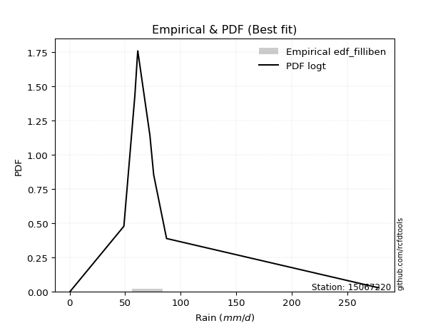</img>

</div>


### 10. Empirical - EDF Jenkinson (1977)

The Jenkinson formula in hydrology is an empirical plotting position formula used to estimate the non-exceedance probability _(P)_ or return period _(T)_ of a given ordered observation within a sample. It is a widely used method in the frequency analysis of extreme events such as floods and rainfall, as it provides a distribution-free way to plot data. _a≈0.31_ and _b≈0.38_ are constants derived to approximate the median of the probability distribution for the given rank.

<div align="center">


$P=(m-a)/(n+b)$


</div>


**10.1. Empirical values**

<div align="center">

|                | 0                   | 1                   | 2                  | 3                   | 4             | 5                  | 6                  | 7                  | 8                  |
|:---------------|:--------------------|:--------------------|:-------------------|:--------------------|:--------------|:-------------------|:-------------------|:-------------------|:-------------------|
| date           | 2019                | 2018                | 2017               | 2015                | 2011          | 2013               | 2012               | 2016               | 2014               |
| x              | 0.6                 | 48.9                | 58.8               | 61.1                | 61.4          | 72.3               | 75.7               | 87.3               | 278.5              |
| m              | 1                   | 2                   | 3                  | 4                   | 5             | 6                  | 7                  | 8                  | 9                  |
| empirical_dist | edf_jenkinson       | edf_jenkinson       | edf_jenkinson      | edf_jenkinson       | edf_jenkinson | edf_jenkinson      | edf_jenkinson      | edf_jenkinson      | edf_jenkinson      |
| empirical      | 0.07356076759061833 | 0.18017057569296374 | 0.2867803837953091 | 0.39339019189765456 | 0.5           | 0.6066098081023454 | 0.7132196162046908 | 0.8198294243070362 | 0.9264392324093815 |
| empirical_tr   | 1.0794016110471807  | 1.2197659297789336  | 1.4020926756352765 | 1.6485061511423549  | 2.0           | 2.542005420054201  | 3.486988847583642  | 5.550295857988164  | 13.5942028985507   |

</div>


**10.2. Kolmogorov-Smirnov fit test (sorted by Δ)**


<div align="center">

|                | 0                   | 1                   | 2                   | 3                   | 4                   | 5                   | 6                   | 7                   | 8                   | 9                   | 10                  | 11                  | 12                  | 13                  | 14                  | 15                  | 16                  | 17                  | 18                  | 19                  | 20                  | 21                  | 22                  | 23                  | 24                  | 25                  | 26                  | 27                  | 28                  | 29                  | 30                  | 31                  | 32                    | 33                  | 34                  | 35                  | 36                  | 37                  | 38                  | 39                  | 40                  | 41                  | 42                  | 43                  | 44                  | 45                  | 46                  | 47                  | 48                  | 49                  | 50                  | 51                  | 52                  | 53                  | 54                  | 55                  | 56                  | 57                  | 58                  | 59                  | 60                  | 61                  | 62                  | 63                  | 64                  | 65                  | 66                  | 67                  | 68                  | 69                  | 70                  | 71                  | 72                  | 73                  | 74                  | 75                  | 76                  | 77                  | 78                  | 79                  | 80                  | 81                  | 82                  | 83                  | 84                  | 85                  | 86                  | 87                  | 88                  | 89                  |
|:---------------|:--------------------|:--------------------|:--------------------|:--------------------|:--------------------|:--------------------|:--------------------|:--------------------|:--------------------|:--------------------|:--------------------|:--------------------|:--------------------|:--------------------|:--------------------|:--------------------|:--------------------|:--------------------|:--------------------|:--------------------|:--------------------|:--------------------|:--------------------|:--------------------|:--------------------|:--------------------|:--------------------|:--------------------|:--------------------|:--------------------|:--------------------|:--------------------|:----------------------|:--------------------|:--------------------|:--------------------|:--------------------|:--------------------|:--------------------|:--------------------|:--------------------|:--------------------|:--------------------|:--------------------|:--------------------|:--------------------|:--------------------|:--------------------|:--------------------|:--------------------|:--------------------|:--------------------|:--------------------|:--------------------|:--------------------|:--------------------|:--------------------|:--------------------|:--------------------|:--------------------|:--------------------|:--------------------|:--------------------|:--------------------|:--------------------|:--------------------|:--------------------|:--------------------|:--------------------|:--------------------|:--------------------|:--------------------|:--------------------|:--------------------|:--------------------|:--------------------|:--------------------|:--------------------|:--------------------|:--------------------|:--------------------|:--------------------|:--------------------|:--------------------|:--------------------|:--------------------|:--------------------|:--------------------|:--------------------|:--------------------|
| station        | 15067220            | 15067220            | 15067220            | 15067220            | 15067220            | 15067220            | 15067220            | 15067220            | 15067220            | 15067220            | 15067220            | 15067220            | 15067220            | 15067220            | 15067220            | 15067220            | 15067220            | 15067220            | 15067220            | 15067220            | 15067220            | 15067220            | 15067220            | 15067220            | 15067220            | 15067220            | 15067220            | 15067220            | 15067220            | 15067220            | 15067220            | 15067220            | 15067220              | 15067220            | 15067220            | 15067220            | 15067220            | 15067220            | 15067220            | 15067220            | 15067220            | 15067220            | 15067220            | 15067220            | 15067220            | 15067220            | 15067220            | 15067220            | 15067220            | 15067220            | 15067220            | 15067220            | 15067220            | 15067220            | 15067220            | 15067220            | 15067220            | 15067220            | 15067220            | 15067220            | 15067220            | 15067220            | 15067220            | 15067220            | 15067220            | 15067220            | 15067220            | 15067220            | 15067220            | 15067220            | 15067220            | 15067220            | 15067220            | 15067220            | 15067220            | 15067220            | 15067220            | 15067220            | 15067220            | 15067220            | 15067220            | 15067220            | 15067220            | 15067220            | 15067220            | 15067220            | 15067220            | 15067220            | 15067220            | 15067220            |
| empirical_dist | edf_jenkinson       | edf_jenkinson       | edf_jenkinson       | edf_jenkinson       | edf_jenkinson       | edf_jenkinson       | edf_jenkinson       | edf_jenkinson       | edf_jenkinson       | edf_jenkinson       | edf_jenkinson       | edf_jenkinson       | edf_jenkinson       | edf_jenkinson       | edf_jenkinson       | edf_jenkinson       | edf_jenkinson       | edf_jenkinson       | edf_jenkinson       | edf_jenkinson       | edf_jenkinson       | edf_jenkinson       | edf_jenkinson       | edf_jenkinson       | edf_jenkinson       | edf_jenkinson       | edf_jenkinson       | edf_jenkinson       | edf_jenkinson       | edf_jenkinson       | edf_jenkinson       | edf_jenkinson       | edf_jenkinson         | edf_jenkinson       | edf_jenkinson       | edf_jenkinson       | edf_jenkinson       | edf_jenkinson       | edf_jenkinson       | edf_jenkinson       | edf_jenkinson       | edf_jenkinson       | edf_jenkinson       | edf_jenkinson       | edf_jenkinson       | edf_jenkinson       | edf_jenkinson       | edf_jenkinson       | edf_jenkinson       | edf_jenkinson       | edf_jenkinson       | edf_jenkinson       | edf_jenkinson       | edf_jenkinson       | edf_jenkinson       | edf_jenkinson       | edf_jenkinson       | edf_jenkinson       | edf_jenkinson       | edf_jenkinson       | edf_jenkinson       | edf_jenkinson       | edf_jenkinson       | edf_jenkinson       | edf_jenkinson       | edf_jenkinson       | edf_jenkinson       | edf_jenkinson       | edf_jenkinson       | edf_jenkinson       | edf_jenkinson       | edf_jenkinson       | edf_jenkinson       | edf_jenkinson       | edf_jenkinson       | edf_jenkinson       | edf_jenkinson       | edf_jenkinson       | edf_jenkinson       | edf_jenkinson       | edf_jenkinson       | edf_jenkinson       | edf_jenkinson       | edf_jenkinson       | edf_jenkinson       | edf_jenkinson       | edf_jenkinson       | edf_jenkinson       | edf_jenkinson       | edf_jenkinson       |
| p_dist         | logt                | t                   | johnsonsu           | fisk                | alpha               | invgamma            | logjohnsonsu        | nakagami            | betaprime           | gibrat              | laplace_asymmetric  | exponnorm           | invgauss            | f                   | erlang              | chi2                | gamma               | genlogistic         | moyal               | genexpon            | truncnorm           | wald                | halflogistic        | halfnorm            | gumbel_r            | pearson3            | gompertz            | logloggamma         | weibull_min         | kstwobign           | rayleigh            | loggompertz         | loglaplace_asymmetric | loggenlogistic      | logmielke           | maxwell             | expon               | loggumbel_l         | logpearson3         | laplace             | ncf                 | hypsecant           | rice                | logistic            | crystalball         | norm                | lognakagami         | logfatiguelife      | logcrystalball      | logrice             | lognorm             | lognorm             | logexponnorm        | lognct              | loglognorm          | loglogistic         | loghypsecant        | mielke              | loglaplace          | loginvgamma         | loginvweibull       | gumbel_l            | logmaxwell          | loginvgauss         | lograyleigh         | logkstwobign        | loggumbel_r         | loghalfnorm         | logerlang           | loggenexpon         | logmoyal            | loghalflogistic     | nct                 | logexpon            | logncf              | pareto              | invweibull          | logfisk             | logpareto           | logweibull_min      | loggamma            | loggamma            | logwald             | logbetaprime        | loggibrat           | logf                | logtruncnorm        | logalpha            | fatiguelife         | logchi2             |
| delta          | 0.08763251365870717 | 0.10911282391791643 | 0.11492852601077208 | 0.14621921640128477 | 0.17004046538198908 | 0.17576958627836203 | 0.17711945411413255 | 0.1801703251042515  | 0.18213051542249237 | 0.18839883768485138 | 0.18919515799475028 | 0.19090082718242585 | 0.1925066927659016  | 0.19464528337800552 | 0.19467646987798548 | 0.1946765949576615  | 0.19467667868648503 | 0.19482375936330343 | 0.1986989728088514  | 0.19974829131631933 | 0.21228040471587212 | 0.21574620374461362 | 0.21835973390781882 | 0.22319675872094658 | 0.22420275933173783 | 0.23350681874267137 | 0.238227667154506   | 0.2457374554324726  | 0.2522254308617776  | 0.2523666781503662  | 0.25255901723705043 | 0.2551532217527029  | 0.2576525031497886    | 0.2610151818655909  | 0.26146143846601116 | 0.26298584934393177 | 0.26443024502586626 | 0.2672590758140238  | 0.2694200709390677  | 0.2774652442754034  | 0.2798654935578161  | 0.288578119845046   | 0.28924439427765203 | 0.2914724466293185  | 0.29487063284402215 | 0.29487063983483186 | 0.33634945406457956 | 0.3368005631798712  | 0.33691420735272243 | 0.3369162991931129  | 0.3369163203102948  | 0.3369163203102948  | 0.3369167252511687  | 0.3374311256969295  | 0.3378944106328889  | 0.3392470773592227  | 0.34123507242513956 | 0.3413228251809383  | 0.34922489628944214 | 0.35417971336107007 | 0.35475643849576194 | 0.3640507287649585  | 0.36920390806757447 | 0.3767633270828004  | 0.37982403096364    | 0.39544759940739144 | 0.40758733201324954 | 0.409725114014819   | 0.41427087941844326 | 0.4243571912039175  | 0.43323637326648184 | 0.4356238062822961  | 0.45319021941410315 | 0.45774112256756055 | 0.4641142527004645  | 0.4752236450745441  | 0.477086798196847   | 0.4819623718443669  | 0.49120484071206144 | 0.49170559591684543 | 0.5004261533794454  | 0.5004261533794454  | 0.5044858521555884  | 0.5084398362629234  | 0.5302580527611065  | 0.542136636039549   | 0.5454810564511829  | 0.5667731219734404  | 0.6026643155644977  | 0.6911512192450349  |
| deltao         | 0.41761268023100007 | 0.41761268023100007 | 0.41761268023100007 | 0.41761268023100007 | 0.41761268023100007 | 0.41761268023100007 | 0.41761268023100007 | 0.41761268023100007 | 0.41761268023100007 | 0.41761268023100007 | 0.41761268023100007 | 0.41761268023100007 | 0.41761268023100007 | 0.41761268023100007 | 0.41761268023100007 | 0.41761268023100007 | 0.41761268023100007 | 0.41761268023100007 | 0.41761268023100007 | 0.41761268023100007 | 0.41761268023100007 | 0.41761268023100007 | 0.41761268023100007 | 0.41761268023100007 | 0.41761268023100007 | 0.41761268023100007 | 0.41761268023100007 | 0.41761268023100007 | 0.41761268023100007 | 0.41761268023100007 | 0.41761268023100007 | 0.41761268023100007 | 0.41761268023100007   | 0.41761268023100007 | 0.41761268023100007 | 0.41761268023100007 | 0.41761268023100007 | 0.41761268023100007 | 0.41761268023100007 | 0.41761268023100007 | 0.41761268023100007 | 0.41761268023100007 | 0.41761268023100007 | 0.41761268023100007 | 0.41761268023100007 | 0.41761268023100007 | 0.41761268023100007 | 0.41761268023100007 | 0.41761268023100007 | 0.41761268023100007 | 0.41761268023100007 | 0.41761268023100007 | 0.41761268023100007 | 0.41761268023100007 | 0.41761268023100007 | 0.41761268023100007 | 0.41761268023100007 | 0.41761268023100007 | 0.41761268023100007 | 0.41761268023100007 | 0.41761268023100007 | 0.41761268023100007 | 0.41761268023100007 | 0.41761268023100007 | 0.41761268023100007 | 0.41761268023100007 | 0.41761268023100007 | 0.41761268023100007 | 0.41761268023100007 | 0.41761268023100007 | 0.41761268023100007 | 0.41761268023100007 | 0.41761268023100007 | 0.41761268023100007 | 0.41761268023100007 | 0.41761268023100007 | 0.41761268023100007 | 0.41761268023100007 | 0.41761268023100007 | 0.41761268023100007 | 0.41761268023100007 | 0.41761268023100007 | 0.41761268023100007 | 0.41761268023100007 | 0.41761268023100007 | 0.41761268023100007 | 0.41761268023100007 | 0.41761268023100007 | 0.41761268023100007 | 0.41761268023100007 |
| eval           | Δo > Δ              | Δo > Δ              | Δo > Δ              | Δo > Δ              | Δo > Δ              | Δo > Δ              | Δo > Δ              | Δo > Δ              | Δo > Δ              | Δo > Δ              | Δo > Δ              | Δo > Δ              | Δo > Δ              | Δo > Δ              | Δo > Δ              | Δo > Δ              | Δo > Δ              | Δo > Δ              | Δo > Δ              | Δo > Δ              | Δo > Δ              | Δo > Δ              | Δo > Δ              | Δo > Δ              | Δo > Δ              | Δo > Δ              | Δo > Δ              | Δo > Δ              | Δo > Δ              | Δo > Δ              | Δo > Δ              | Δo > Δ              | Δo > Δ                | Δo > Δ              | Δo > Δ              | Δo > Δ              | Δo > Δ              | Δo > Δ              | Δo > Δ              | Δo > Δ              | Δo > Δ              | Δo > Δ              | Δo > Δ              | Δo > Δ              | Δo > Δ              | Δo > Δ              | Δo > Δ              | Δo > Δ              | Δo > Δ              | Δo > Δ              | Δo > Δ              | Δo > Δ              | Δo > Δ              | Δo > Δ              | Δo > Δ              | Δo > Δ              | Δo > Δ              | Δo > Δ              | Δo > Δ              | Δo > Δ              | Δo > Δ              | Δo > Δ              | Δo > Δ              | Δo > Δ              | Δo > Δ              | Δo > Δ              | Δo > Δ              | Δo > Δ              | Δo > Δ              | Δo <= Δ             | Δo <= Δ             | Δo <= Δ             | Δo <= Δ             | Δo <= Δ             | Δo <= Δ             | Δo <= Δ             | Δo <= Δ             | Δo <= Δ             | Δo <= Δ             | Δo <= Δ             | Δo <= Δ             | Δo <= Δ             | Δo <= Δ             | Δo <= Δ             | Δo <= Δ             | Δo <= Δ             | Δo <= Δ             | Δo <= Δ             | Δo <= Δ             | Δo <= Δ             |
| fit            | 1                   | 1                   | 1                   | 1                   | 1                   | 1                   | 1                   | 1                   | 1                   | 1                   | 1                   | 1                   | 1                   | 1                   | 1                   | 1                   | 1                   | 1                   | 1                   | 1                   | 1                   | 1                   | 1                   | 1                   | 1                   | 1                   | 1                   | 1                   | 1                   | 1                   | 1                   | 1                   | 1                     | 1                   | 1                   | 1                   | 1                   | 1                   | 1                   | 1                   | 1                   | 1                   | 1                   | 1                   | 1                   | 1                   | 1                   | 1                   | 1                   | 1                   | 1                   | 1                   | 1                   | 1                   | 1                   | 1                   | 1                   | 1                   | 1                   | 1                   | 1                   | 1                   | 1                   | 1                   | 1                   | 1                   | 1                   | 1                   | 1                   | 0                   | 0                   | 0                   | 0                   | 0                   | 0                   | 0                   | 0                   | 0                   | 0                   | 0                   | 0                   | 0                   | 0                   | 0                   | 0                   | 0                   | 0                   | 0                   | 0                   | 0                   |
| n              | 9                   | 9                   | 9                   | 9                   | 9                   | 9                   | 9                   | 9                   | 9                   | 9                   | 9                   | 9                   | 9                   | 9                   | 9                   | 9                   | 9                   | 9                   | 9                   | 9                   | 9                   | 9                   | 9                   | 9                   | 9                   | 9                   | 9                   | 9                   | 9                   | 9                   | 9                   | 9                   | 9                     | 9                   | 9                   | 9                   | 9                   | 9                   | 9                   | 9                   | 9                   | 9                   | 9                   | 9                   | 9                   | 9                   | 9                   | 9                   | 9                   | 9                   | 9                   | 9                   | 9                   | 9                   | 9                   | 9                   | 9                   | 9                   | 9                   | 9                   | 9                   | 9                   | 9                   | 9                   | 9                   | 9                   | 9                   | 9                   | 9                   | 9                   | 9                   | 9                   | 9                   | 9                   | 9                   | 9                   | 9                   | 9                   | 9                   | 9                   | 9                   | 9                   | 9                   | 9                   | 9                   | 9                   | 9                   | 9                   | 9                   | 9                   |
| best_fit       | 1                   | 0                   | 0                   | 0                   | 0                   | 0                   | 0                   | 0                   | 0                   | 0                   | 0                   | 0                   | 0                   | 0                   | 0                   | 0                   | 0                   | 0                   | 0                   | 0                   | 0                   | 0                   | 0                   | 0                   | 0                   | 0                   | 0                   | 0                   | 0                   | 0                   | 0                   | 0                   | 0                     | 0                   | 0                   | 0                   | 0                   | 0                   | 0                   | 0                   | 0                   | 0                   | 0                   | 0                   | 0                   | 0                   | 0                   | 0                   | 0                   | 0                   | 0                   | 0                   | 0                   | 0                   | 0                   | 0                   | 0                   | 0                   | 0                   | 0                   | 0                   | 0                   | 0                   | 0                   | 0                   | 0                   | 0                   | 0                   | 0                   | 0                   | 0                   | 0                   | 0                   | 0                   | 0                   | 0                   | 0                   | 0                   | 0                   | 0                   | 0                   | 0                   | 0                   | 0                   | 0                   | 0                   | 0                   | 0                   | 0                   | 0                   |
| best_fit_sort  | 1                   | 2                   | 3                   | 4                   | 5                   | 6                   | 7                   | 8                   | 9                   | 10                  | 11                  | 12                  | 13                  | 14                  | 15                  | 16                  | 17                  | 18                  | 19                  | 20                  | 21                  | 22                  | 23                  | 24                  | 25                  | 26                  | 27                  | 28                  | 29                  | 30                  | 31                  | 32                  | 33                    | 34                  | 35                  | 36                  | 37                  | 38                  | 39                  | 40                  | 41                  | 42                  | 43                  | 44                  | 45                  | 46                  | 47                  | 48                  | 49                  | 50                  | 51                  | 52                  | 53                  | 54                  | 55                  | 56                  | 57                  | 58                  | 59                  | 60                  | 61                  | 62                  | 63                  | 64                  | 65                  | 66                  | 67                  | 68                  | 69                  | 70                  | 71                  | 72                  | 73                  | 74                  | 75                  | 76                  | 77                  | 78                  | 79                  | 80                  | 81                  | 82                  | 83                  | 84                  | 85                  | 86                  | 87                  | 88                  | 89                  | 90                  |

</div>


<div align="center">

</img>

</div>


**10.3. Best fit**

<div align="center">

|   id |   station | empirical_dist   | p_dist   |     delta |   deltao | eval   |   fit |   n |   best_fit |   best_fit_sort |
|-----:|----------:|:-----------------|:---------|----------:|---------:|:-------|------:|----:|-----------:|----------------:|
|    0 |  15067220 | edf_jenkinson    | logt     | 0.0876325 | 0.417613 | Δo > Δ |     1 |   9 |          1 |               1 |

</div>


<div align="center">

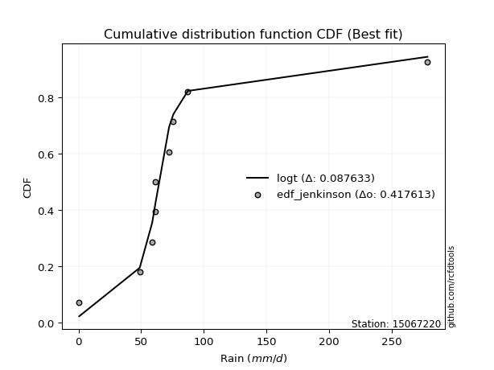</img>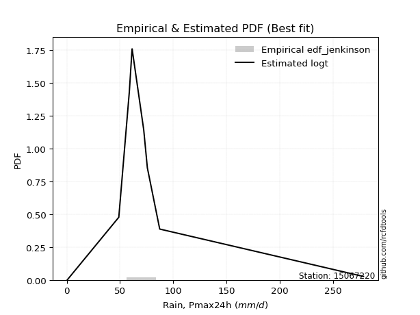</img>

</div>


### 11. Empirical - EDF Cunnane (1978)

Cunnane´s work in statistical hydrology has focused on the performance and evaluation of different probability distributions (such as GEV, Gumbel, Lognormal) for flood frequency estimation. _b_ is a constant, typically set to 0.4.

<div align="center">


$P=(m-b)/(n+1-2b)$


</div>


**11.1. Empirical values**

<div align="center">

|                | 0                   | 1                  | 2                   | 3                  | 4           | 5                  | 6                 | 7                  | 8                  |
|:---------------|:--------------------|:-------------------|:--------------------|:-------------------|:------------|:-------------------|:------------------|:-------------------|:-------------------|
| date           | 2019                | 2018               | 2017                | 2015               | 2011        | 2013               | 2012              | 2016               | 2014               |
| x              | 0.6                 | 48.9               | 58.8                | 61.1               | 61.4        | 72.3               | 75.7              | 87.3               | 278.5              |
| m              | 1                   | 2                  | 3                   | 4                  | 5           | 6                  | 7                 | 8                  | 9                  |
| empirical_dist | edf_cunnane         | edf_cunnane        | edf_cunnane         | edf_cunnane        | edf_cunnane | edf_cunnane        | edf_cunnane       | edf_cunnane        | edf_cunnane        |
| empirical      | 0.06521739130434782 | 0.1739130434782609 | 0.28260869565217395 | 0.391304347826087  | 0.5         | 0.6086956521739131 | 0.717391304347826 | 0.8260869565217391 | 0.9347826086956522 |
| empirical_tr   | 1.069767441860465   | 1.2105263157894737 | 1.393939393939394   | 1.6428571428571428 | 2.0         | 2.555555555555556  | 3.538461538461538 | 5.75               | 15.333333333333343 |

</div>


**11.2. Kolmogorov-Smirnov fit test (sorted by Δ)**


<div align="center">

|                | 0                   | 1                   | 2                   | 3                   | 4                   | 5                   | 6                   | 7                   | 8                   | 9                   | 10                  | 11                  | 12                  | 13                  | 14                  | 15                  | 16                  | 17                  | 18                  | 19                  | 20                  | 21                  | 22                  | 23                  | 24                  | 25                  | 26                  | 27                  | 28                  | 29                  | 30                  | 31                  | 32                    | 33                  | 34                  | 35                  | 36                  | 37                  | 38                  | 39                  | 40                  | 41                  | 42                  | 43                  | 44                  | 45                  | 46                  | 47                  | 48                  | 49                  | 50                  | 51                  | 52                  | 53                  | 54                  | 55                  | 56                  | 57                  | 58                  | 59                  | 60                  | 61                  | 62                  | 63                  | 64                  | 65                  | 66                  | 67                  | 68                  | 69                  | 70                  | 71                  | 72                  | 73                  | 74                  | 75                  | 76                  | 77                  | 78                  | 79                  | 80                  | 81                  | 82                  | 83                  | 84                  | 85                  | 86                  | 87                  | 88                  | 89                  |
|:---------------|:--------------------|:--------------------|:--------------------|:--------------------|:--------------------|:--------------------|:--------------------|:--------------------|:--------------------|:--------------------|:--------------------|:--------------------|:--------------------|:--------------------|:--------------------|:--------------------|:--------------------|:--------------------|:--------------------|:--------------------|:--------------------|:--------------------|:--------------------|:--------------------|:--------------------|:--------------------|:--------------------|:--------------------|:--------------------|:--------------------|:--------------------|:--------------------|:----------------------|:--------------------|:--------------------|:--------------------|:--------------------|:--------------------|:--------------------|:--------------------|:--------------------|:--------------------|:--------------------|:--------------------|:--------------------|:--------------------|:--------------------|:--------------------|:--------------------|:--------------------|:--------------------|:--------------------|:--------------------|:--------------------|:--------------------|:--------------------|:--------------------|:--------------------|:--------------------|:--------------------|:--------------------|:--------------------|:--------------------|:--------------------|:--------------------|:--------------------|:--------------------|:--------------------|:--------------------|:--------------------|:--------------------|:--------------------|:--------------------|:--------------------|:--------------------|:--------------------|:--------------------|:--------------------|:--------------------|:--------------------|:--------------------|:--------------------|:--------------------|:--------------------|:--------------------|:--------------------|:--------------------|:--------------------|:--------------------|:--------------------|
| station        | 15067220            | 15067220            | 15067220            | 15067220            | 15067220            | 15067220            | 15067220            | 15067220            | 15067220            | 15067220            | 15067220            | 15067220            | 15067220            | 15067220            | 15067220            | 15067220            | 15067220            | 15067220            | 15067220            | 15067220            | 15067220            | 15067220            | 15067220            | 15067220            | 15067220            | 15067220            | 15067220            | 15067220            | 15067220            | 15067220            | 15067220            | 15067220            | 15067220              | 15067220            | 15067220            | 15067220            | 15067220            | 15067220            | 15067220            | 15067220            | 15067220            | 15067220            | 15067220            | 15067220            | 15067220            | 15067220            | 15067220            | 15067220            | 15067220            | 15067220            | 15067220            | 15067220            | 15067220            | 15067220            | 15067220            | 15067220            | 15067220            | 15067220            | 15067220            | 15067220            | 15067220            | 15067220            | 15067220            | 15067220            | 15067220            | 15067220            | 15067220            | 15067220            | 15067220            | 15067220            | 15067220            | 15067220            | 15067220            | 15067220            | 15067220            | 15067220            | 15067220            | 15067220            | 15067220            | 15067220            | 15067220            | 15067220            | 15067220            | 15067220            | 15067220            | 15067220            | 15067220            | 15067220            | 15067220            | 15067220            |
| empirical_dist | edf_cunnane         | edf_cunnane         | edf_cunnane         | edf_cunnane         | edf_cunnane         | edf_cunnane         | edf_cunnane         | edf_cunnane         | edf_cunnane         | edf_cunnane         | edf_cunnane         | edf_cunnane         | edf_cunnane         | edf_cunnane         | edf_cunnane         | edf_cunnane         | edf_cunnane         | edf_cunnane         | edf_cunnane         | edf_cunnane         | edf_cunnane         | edf_cunnane         | edf_cunnane         | edf_cunnane         | edf_cunnane         | edf_cunnane         | edf_cunnane         | edf_cunnane         | edf_cunnane         | edf_cunnane         | edf_cunnane         | edf_cunnane         | edf_cunnane           | edf_cunnane         | edf_cunnane         | edf_cunnane         | edf_cunnane         | edf_cunnane         | edf_cunnane         | edf_cunnane         | edf_cunnane         | edf_cunnane         | edf_cunnane         | edf_cunnane         | edf_cunnane         | edf_cunnane         | edf_cunnane         | edf_cunnane         | edf_cunnane         | edf_cunnane         | edf_cunnane         | edf_cunnane         | edf_cunnane         | edf_cunnane         | edf_cunnane         | edf_cunnane         | edf_cunnane         | edf_cunnane         | edf_cunnane         | edf_cunnane         | edf_cunnane         | edf_cunnane         | edf_cunnane         | edf_cunnane         | edf_cunnane         | edf_cunnane         | edf_cunnane         | edf_cunnane         | edf_cunnane         | edf_cunnane         | edf_cunnane         | edf_cunnane         | edf_cunnane         | edf_cunnane         | edf_cunnane         | edf_cunnane         | edf_cunnane         | edf_cunnane         | edf_cunnane         | edf_cunnane         | edf_cunnane         | edf_cunnane         | edf_cunnane         | edf_cunnane         | edf_cunnane         | edf_cunnane         | edf_cunnane         | edf_cunnane         | edf_cunnane         | edf_cunnane         |
| p_dist         | logt                | t                   | johnsonsu           | fisk                | logjohnsonsu        | alpha               | invgamma            | nakagami            | betaprime           | gibrat              | laplace_asymmetric  | exponnorm           | invgauss            | f                   | erlang              | chi2                | gamma               | genlogistic         | moyal               | genexpon            | truncnorm           | wald                | halflogistic        | halfnorm            | gumbel_r            | pearson3            | gompertz            | logloggamma         | weibull_min         | kstwobign           | rayleigh            | loggompertz         | loglaplace_asymmetric | loggenlogistic      | logmielke           | maxwell             | expon               | loggumbel_l         | logpearson3         | laplace             | ncf                 | hypsecant           | rice                | logistic            | crystalball         | norm                | lognakagami         | logfatiguelife      | logcrystalball      | logrice             | lognorm             | lognorm             | logexponnorm        | lognct              | loglognorm          | loglogistic         | loghypsecant        | mielke              | loglaplace          | loginvgamma         | loginvweibull       | gumbel_l            | logmaxwell          | loginvgauss         | lograyleigh         | logkstwobign        | loggumbel_r         | loghalfnorm         | logerlang           | loggenexpon         | logmoyal            | loghalflogistic     | nct                 | logexpon            | logncf              | pareto              | invweibull          | logfisk             | logpareto           | logweibull_min      | loggamma            | loggamma            | logwald             | logbetaprime        | loggibrat           | logf                | logtruncnorm        | logalpha            | fatiguelife         | logchi2             |
| delta          | 0.08554666958713952 | 0.10702697984634879 | 0.11284268193920444 | 0.15247674861598762 | 0.1750336100425649  | 0.17629799759669193 | 0.18202711849306497 | 0.18413652642038603 | 0.18838804763719522 | 0.19257052582798656 | 0.19545269020945322 | 0.19715835939712878 | 0.19876422498060453 | 0.20090281559270837 | 0.20093400209268833 | 0.20093412717236434 | 0.20093421090118788 | 0.20108129157800636 | 0.20495650502355434 | 0.20600582353102218 | 0.21853793693057497 | 0.22200373595931647 | 0.22461726612252167 | 0.2294542909356495  | 0.23046029154644077 | 0.23976435095737422 | 0.24448519936920884 | 0.25199498764717543 | 0.25848296307648055 | 0.2586242103650691  | 0.25881654945175336 | 0.26141075396740576 | 0.2639100353644914    | 0.26727271408029374 | 0.26771897068071404 | 0.2692433815586347  | 0.27068777724056914 | 0.2735166080287267  | 0.27567760315377066 | 0.28372277649010635 | 0.2861230257725189  | 0.29483565205974893 | 0.29550192649235496 | 0.2977299788440214  | 0.3011281650587251  | 0.3011281720495348  | 0.34260698627928243 | 0.3430580953945741  | 0.3431717395674253  | 0.34317383140781577 | 0.34317385252499766 | 0.34317385252499766 | 0.3431742574658716  | 0.3436886579116324  | 0.34415194284759176 | 0.3455046095739256  | 0.34749260463984244 | 0.3475803573956412  | 0.355482428504145   | 0.36043724557577295 | 0.3610139707104648  | 0.3703082609796614  | 0.37546144028227735 | 0.3830208592975033  | 0.38608156317834286 | 0.4017051316220943  | 0.4138448642279524  | 0.41598264622952186 | 0.42052841163314614 | 0.4306147234186204  | 0.4394939054811847  | 0.44188133849699895 | 0.459447751628806   | 0.46399865478226343 | 0.4703717849151674  | 0.481481177289247   | 0.4854301744831177  | 0.4882199040590698  | 0.4974623729267643  | 0.4979631281315483  | 0.5066836855941483  | 0.5066836855941483  | 0.5107433843702913  | 0.5146973684776263  | 0.5365155849758093  | 0.5483941682542519  | 0.5517385886658858  | 0.5730306541881434  | 0.6089218477792007  | 0.6974087514597377  |
| deltao         | 0.41761268023100007 | 0.41761268023100007 | 0.41761268023100007 | 0.41761268023100007 | 0.41761268023100007 | 0.41761268023100007 | 0.41761268023100007 | 0.41761268023100007 | 0.41761268023100007 | 0.41761268023100007 | 0.41761268023100007 | 0.41761268023100007 | 0.41761268023100007 | 0.41761268023100007 | 0.41761268023100007 | 0.41761268023100007 | 0.41761268023100007 | 0.41761268023100007 | 0.41761268023100007 | 0.41761268023100007 | 0.41761268023100007 | 0.41761268023100007 | 0.41761268023100007 | 0.41761268023100007 | 0.41761268023100007 | 0.41761268023100007 | 0.41761268023100007 | 0.41761268023100007 | 0.41761268023100007 | 0.41761268023100007 | 0.41761268023100007 | 0.41761268023100007 | 0.41761268023100007   | 0.41761268023100007 | 0.41761268023100007 | 0.41761268023100007 | 0.41761268023100007 | 0.41761268023100007 | 0.41761268023100007 | 0.41761268023100007 | 0.41761268023100007 | 0.41761268023100007 | 0.41761268023100007 | 0.41761268023100007 | 0.41761268023100007 | 0.41761268023100007 | 0.41761268023100007 | 0.41761268023100007 | 0.41761268023100007 | 0.41761268023100007 | 0.41761268023100007 | 0.41761268023100007 | 0.41761268023100007 | 0.41761268023100007 | 0.41761268023100007 | 0.41761268023100007 | 0.41761268023100007 | 0.41761268023100007 | 0.41761268023100007 | 0.41761268023100007 | 0.41761268023100007 | 0.41761268023100007 | 0.41761268023100007 | 0.41761268023100007 | 0.41761268023100007 | 0.41761268023100007 | 0.41761268023100007 | 0.41761268023100007 | 0.41761268023100007 | 0.41761268023100007 | 0.41761268023100007 | 0.41761268023100007 | 0.41761268023100007 | 0.41761268023100007 | 0.41761268023100007 | 0.41761268023100007 | 0.41761268023100007 | 0.41761268023100007 | 0.41761268023100007 | 0.41761268023100007 | 0.41761268023100007 | 0.41761268023100007 | 0.41761268023100007 | 0.41761268023100007 | 0.41761268023100007 | 0.41761268023100007 | 0.41761268023100007 | 0.41761268023100007 | 0.41761268023100007 | 0.41761268023100007 |
| eval           | Δo > Δ              | Δo > Δ              | Δo > Δ              | Δo > Δ              | Δo > Δ              | Δo > Δ              | Δo > Δ              | Δo > Δ              | Δo > Δ              | Δo > Δ              | Δo > Δ              | Δo > Δ              | Δo > Δ              | Δo > Δ              | Δo > Δ              | Δo > Δ              | Δo > Δ              | Δo > Δ              | Δo > Δ              | Δo > Δ              | Δo > Δ              | Δo > Δ              | Δo > Δ              | Δo > Δ              | Δo > Δ              | Δo > Δ              | Δo > Δ              | Δo > Δ              | Δo > Δ              | Δo > Δ              | Δo > Δ              | Δo > Δ              | Δo > Δ                | Δo > Δ              | Δo > Δ              | Δo > Δ              | Δo > Δ              | Δo > Δ              | Δo > Δ              | Δo > Δ              | Δo > Δ              | Δo > Δ              | Δo > Δ              | Δo > Δ              | Δo > Δ              | Δo > Δ              | Δo > Δ              | Δo > Δ              | Δo > Δ              | Δo > Δ              | Δo > Δ              | Δo > Δ              | Δo > Δ              | Δo > Δ              | Δo > Δ              | Δo > Δ              | Δo > Δ              | Δo > Δ              | Δo > Δ              | Δo > Δ              | Δo > Δ              | Δo > Δ              | Δo > Δ              | Δo > Δ              | Δo > Δ              | Δo > Δ              | Δo > Δ              | Δo > Δ              | Δo <= Δ             | Δo <= Δ             | Δo <= Δ             | Δo <= Δ             | Δo <= Δ             | Δo <= Δ             | Δo <= Δ             | Δo <= Δ             | Δo <= Δ             | Δo <= Δ             | Δo <= Δ             | Δo <= Δ             | Δo <= Δ             | Δo <= Δ             | Δo <= Δ             | Δo <= Δ             | Δo <= Δ             | Δo <= Δ             | Δo <= Δ             | Δo <= Δ             | Δo <= Δ             | Δo <= Δ             |
| fit            | 1                   | 1                   | 1                   | 1                   | 1                   | 1                   | 1                   | 1                   | 1                   | 1                   | 1                   | 1                   | 1                   | 1                   | 1                   | 1                   | 1                   | 1                   | 1                   | 1                   | 1                   | 1                   | 1                   | 1                   | 1                   | 1                   | 1                   | 1                   | 1                   | 1                   | 1                   | 1                   | 1                     | 1                   | 1                   | 1                   | 1                   | 1                   | 1                   | 1                   | 1                   | 1                   | 1                   | 1                   | 1                   | 1                   | 1                   | 1                   | 1                   | 1                   | 1                   | 1                   | 1                   | 1                   | 1                   | 1                   | 1                   | 1                   | 1                   | 1                   | 1                   | 1                   | 1                   | 1                   | 1                   | 1                   | 1                   | 1                   | 0                   | 0                   | 0                   | 0                   | 0                   | 0                   | 0                   | 0                   | 0                   | 0                   | 0                   | 0                   | 0                   | 0                   | 0                   | 0                   | 0                   | 0                   | 0                   | 0                   | 0                   | 0                   |
| n              | 9                   | 9                   | 9                   | 9                   | 9                   | 9                   | 9                   | 9                   | 9                   | 9                   | 9                   | 9                   | 9                   | 9                   | 9                   | 9                   | 9                   | 9                   | 9                   | 9                   | 9                   | 9                   | 9                   | 9                   | 9                   | 9                   | 9                   | 9                   | 9                   | 9                   | 9                   | 9                   | 9                     | 9                   | 9                   | 9                   | 9                   | 9                   | 9                   | 9                   | 9                   | 9                   | 9                   | 9                   | 9                   | 9                   | 9                   | 9                   | 9                   | 9                   | 9                   | 9                   | 9                   | 9                   | 9                   | 9                   | 9                   | 9                   | 9                   | 9                   | 9                   | 9                   | 9                   | 9                   | 9                   | 9                   | 9                   | 9                   | 9                   | 9                   | 9                   | 9                   | 9                   | 9                   | 9                   | 9                   | 9                   | 9                   | 9                   | 9                   | 9                   | 9                   | 9                   | 9                   | 9                   | 9                   | 9                   | 9                   | 9                   | 9                   |
| best_fit       | 1                   | 0                   | 0                   | 0                   | 0                   | 0                   | 0                   | 0                   | 0                   | 0                   | 0                   | 0                   | 0                   | 0                   | 0                   | 0                   | 0                   | 0                   | 0                   | 0                   | 0                   | 0                   | 0                   | 0                   | 0                   | 0                   | 0                   | 0                   | 0                   | 0                   | 0                   | 0                   | 0                     | 0                   | 0                   | 0                   | 0                   | 0                   | 0                   | 0                   | 0                   | 0                   | 0                   | 0                   | 0                   | 0                   | 0                   | 0                   | 0                   | 0                   | 0                   | 0                   | 0                   | 0                   | 0                   | 0                   | 0                   | 0                   | 0                   | 0                   | 0                   | 0                   | 0                   | 0                   | 0                   | 0                   | 0                   | 0                   | 0                   | 0                   | 0                   | 0                   | 0                   | 0                   | 0                   | 0                   | 0                   | 0                   | 0                   | 0                   | 0                   | 0                   | 0                   | 0                   | 0                   | 0                   | 0                   | 0                   | 0                   | 0                   |
| best_fit_sort  | 1                   | 2                   | 3                   | 4                   | 5                   | 6                   | 7                   | 8                   | 9                   | 10                  | 11                  | 12                  | 13                  | 14                  | 15                  | 16                  | 17                  | 18                  | 19                  | 20                  | 21                  | 22                  | 23                  | 24                  | 25                  | 26                  | 27                  | 28                  | 29                  | 30                  | 31                  | 32                  | 33                    | 34                  | 35                  | 36                  | 37                  | 38                  | 39                  | 40                  | 41                  | 42                  | 43                  | 44                  | 45                  | 46                  | 47                  | 48                  | 49                  | 50                  | 51                  | 52                  | 53                  | 54                  | 55                  | 56                  | 57                  | 58                  | 59                  | 60                  | 61                  | 62                  | 63                  | 64                  | 65                  | 66                  | 67                  | 68                  | 69                  | 70                  | 71                  | 72                  | 73                  | 74                  | 75                  | 76                  | 77                  | 78                  | 79                  | 80                  | 81                  | 82                  | 83                  | 84                  | 85                  | 86                  | 87                  | 88                  | 89                  | 90                  |

</div>


<div align="center">

</img>

</div>


**11.3. Best fit**

<div align="center">

|   id |   station | empirical_dist   | p_dist   |     delta |   deltao | eval   |   fit |   n |   best_fit |   best_fit_sort |
|-----:|----------:|:-----------------|:---------|----------:|---------:|:-------|------:|----:|-----------:|----------------:|
|    0 |  15067220 | edf_cunnane      | logt     | 0.0855467 | 0.417613 | Δo > Δ |     1 |   9 |          1 |               1 |

</div>


<div align="center">

</img></img>

</div>


### 12. Empirical - EDF Adamowski (1981)

The Adamowski formula in hydrology refers to a specific plotting position formula used for estimating the non-parametric empirical distribution of hydrological events (like flood peaks) to calculate their return periods. This formula provides an alternative to traditional parametric methods (like the Gumbel or Log Pearson Type III distributions). 

<div align="center">


$P=(m-0.25)/(n+0.5)$


</div>


**12.1. Empirical values**

<div align="center">

|                | 0                   | 1                   | 2                  | 3                   | 4             | 5                  | 6                  | 7                  | 8                  |
|:---------------|:--------------------|:--------------------|:-------------------|:--------------------|:--------------|:-------------------|:-------------------|:-------------------|:-------------------|
| date           | 2019                | 2018                | 2017               | 2015                | 2011          | 2013               | 2012               | 2016               | 2014               |
| x              | 0.6                 | 48.9                | 58.8               | 61.1                | 61.4          | 72.3               | 75.7               | 87.3               | 278.5              |
| m              | 1                   | 2                   | 3                  | 4                   | 5             | 6                  | 7                  | 8                  | 9                  |
| empirical_dist | edf_adamowski       | edf_adamowski       | edf_adamowski      | edf_adamowski       | edf_adamowski | edf_adamowski      | edf_adamowski      | edf_adamowski      | edf_adamowski      |
| empirical      | 0.07894736842105263 | 0.18421052631578946 | 0.2894736842105263 | 0.39473684210526316 | 0.5           | 0.6052631578947368 | 0.7105263157894737 | 0.8157894736842105 | 0.9210526315789473 |
| empirical_tr   | 1.0857142857142856  | 1.2258064516129032  | 1.4074074074074074 | 1.6521739130434783  | 2.0           | 2.533333333333333  | 3.4545454545454546 | 5.428571428571428  | 12.666666666666663 |

</div>


**12.2. Kolmogorov-Smirnov fit test (sorted by Δ)**


<div align="center">

|                | 0                   | 1                   | 2                   | 3                   | 4                   | 5                   | 6                   | 7                   | 8                   | 9                   | 10                  | 11                  | 12                  | 13                  | 14                  | 15                  | 16                  | 17                  | 18                  | 19                  | 20                  | 21                  | 22                  | 23                  | 24                  | 25                  | 26                  | 27                  | 28                  | 29                  | 30                  | 31                  | 32                    | 33                  | 34                  | 35                  | 36                  | 37                  | 38                  | 39                  | 40                  | 41                  | 42                  | 43                  | 44                  | 45                  | 46                  | 47                  | 48                  | 49                  | 50                  | 51                  | 52                  | 53                  | 54                  | 55                  | 56                  | 57                  | 58                  | 59                  | 60                  | 61                  | 62                  | 63                  | 64                  | 65                  | 66                  | 67                  | 68                  | 69                  | 70                  | 71                  | 72                  | 73                  | 74                  | 75                  | 76                  | 77                  | 78                  | 79                  | 80                  | 81                  | 82                  | 83                  | 84                  | 85                  | 86                  | 87                  | 88                  | 89                  |
|:---------------|:--------------------|:--------------------|:--------------------|:--------------------|:--------------------|:--------------------|:--------------------|:--------------------|:--------------------|:--------------------|:--------------------|:--------------------|:--------------------|:--------------------|:--------------------|:--------------------|:--------------------|:--------------------|:--------------------|:--------------------|:--------------------|:--------------------|:--------------------|:--------------------|:--------------------|:--------------------|:--------------------|:--------------------|:--------------------|:--------------------|:--------------------|:--------------------|:----------------------|:--------------------|:--------------------|:--------------------|:--------------------|:--------------------|:--------------------|:--------------------|:--------------------|:--------------------|:--------------------|:--------------------|:--------------------|:--------------------|:--------------------|:--------------------|:--------------------|:--------------------|:--------------------|:--------------------|:--------------------|:--------------------|:--------------------|:--------------------|:--------------------|:--------------------|:--------------------|:--------------------|:--------------------|:--------------------|:--------------------|:--------------------|:--------------------|:--------------------|:--------------------|:--------------------|:--------------------|:--------------------|:--------------------|:--------------------|:--------------------|:--------------------|:--------------------|:--------------------|:--------------------|:--------------------|:--------------------|:--------------------|:--------------------|:--------------------|:--------------------|:--------------------|:--------------------|:--------------------|:--------------------|:--------------------|:--------------------|:--------------------|
| station        | 15067220            | 15067220            | 15067220            | 15067220            | 15067220            | 15067220            | 15067220            | 15067220            | 15067220            | 15067220            | 15067220            | 15067220            | 15067220            | 15067220            | 15067220            | 15067220            | 15067220            | 15067220            | 15067220            | 15067220            | 15067220            | 15067220            | 15067220            | 15067220            | 15067220            | 15067220            | 15067220            | 15067220            | 15067220            | 15067220            | 15067220            | 15067220            | 15067220              | 15067220            | 15067220            | 15067220            | 15067220            | 15067220            | 15067220            | 15067220            | 15067220            | 15067220            | 15067220            | 15067220            | 15067220            | 15067220            | 15067220            | 15067220            | 15067220            | 15067220            | 15067220            | 15067220            | 15067220            | 15067220            | 15067220            | 15067220            | 15067220            | 15067220            | 15067220            | 15067220            | 15067220            | 15067220            | 15067220            | 15067220            | 15067220            | 15067220            | 15067220            | 15067220            | 15067220            | 15067220            | 15067220            | 15067220            | 15067220            | 15067220            | 15067220            | 15067220            | 15067220            | 15067220            | 15067220            | 15067220            | 15067220            | 15067220            | 15067220            | 15067220            | 15067220            | 15067220            | 15067220            | 15067220            | 15067220            | 15067220            |
| empirical_dist | edf_adamowski       | edf_adamowski       | edf_adamowski       | edf_adamowski       | edf_adamowski       | edf_adamowski       | edf_adamowski       | edf_adamowski       | edf_adamowski       | edf_adamowski       | edf_adamowski       | edf_adamowski       | edf_adamowski       | edf_adamowski       | edf_adamowski       | edf_adamowski       | edf_adamowski       | edf_adamowski       | edf_adamowski       | edf_adamowski       | edf_adamowski       | edf_adamowski       | edf_adamowski       | edf_adamowski       | edf_adamowski       | edf_adamowski       | edf_adamowski       | edf_adamowski       | edf_adamowski       | edf_adamowski       | edf_adamowski       | edf_adamowski       | edf_adamowski         | edf_adamowski       | edf_adamowski       | edf_adamowski       | edf_adamowski       | edf_adamowski       | edf_adamowski       | edf_adamowski       | edf_adamowski       | edf_adamowski       | edf_adamowski       | edf_adamowski       | edf_adamowski       | edf_adamowski       | edf_adamowski       | edf_adamowski       | edf_adamowski       | edf_adamowski       | edf_adamowski       | edf_adamowski       | edf_adamowski       | edf_adamowski       | edf_adamowski       | edf_adamowski       | edf_adamowski       | edf_adamowski       | edf_adamowski       | edf_adamowski       | edf_adamowski       | edf_adamowski       | edf_adamowski       | edf_adamowski       | edf_adamowski       | edf_adamowski       | edf_adamowski       | edf_adamowski       | edf_adamowski       | edf_adamowski       | edf_adamowski       | edf_adamowski       | edf_adamowski       | edf_adamowski       | edf_adamowski       | edf_adamowski       | edf_adamowski       | edf_adamowski       | edf_adamowski       | edf_adamowski       | edf_adamowski       | edf_adamowski       | edf_adamowski       | edf_adamowski       | edf_adamowski       | edf_adamowski       | edf_adamowski       | edf_adamowski       | edf_adamowski       | edf_adamowski       |
| p_dist         | logt                | t                   | johnsonsu           | fisk                | alpha               | invgamma            | betaprime           | logjohnsonsu        | nakagami            | gibrat              | laplace_asymmetric  | exponnorm           | invgauss            | f                   | erlang              | chi2                | gamma               | genlogistic         | moyal               | genexpon            | truncnorm           | wald                | halflogistic        | halfnorm            | gumbel_r            | pearson3            | gompertz            | logloggamma         | weibull_min         | kstwobign           | rayleigh            | loggompertz         | loglaplace_asymmetric | loggenlogistic      | logmielke           | maxwell             | expon               | loggumbel_l         | logpearson3         | laplace             | ncf                 | hypsecant           | rice                | logistic            | crystalball         | norm                | lognakagami         | logfatiguelife      | logcrystalball      | logrice             | lognorm             | lognorm             | logexponnorm        | lognct              | loglognorm          | loglogistic         | loghypsecant        | mielke              | loglaplace          | loginvgamma         | loginvweibull       | gumbel_l            | logmaxwell          | loginvgauss         | lograyleigh         | logkstwobign        | loggumbel_r         | loghalfnorm         | logerlang           | loggenexpon         | logmoyal            | loghalflogistic     | nct                 | logexpon            | logncf              | pareto              | invweibull          | logfisk             | logpareto           | logweibull_min      | loggamma            | loggamma            | logwald             | logbetaprime        | loggibrat           | logf                | logtruncnorm        | logalpha            | fatiguelife         | logchi2             |
| delta          | 0.08897916386631577 | 0.11045947412552504 | 0.11627517621838068 | 0.14217926577845905 | 0.16600051475916336 | 0.17172963565553634 | 0.17809056479966665 | 0.17846610432174115 | 0.1842102757270772  | 0.18570553726963418 | 0.1864386419445515  | 0.18686087655960015 | 0.1884667421430759  | 0.1906053327551798  | 0.19063651925515976 | 0.19063664433483576 | 0.1906367280636593  | 0.19078380874047773 | 0.1946590221860257  | 0.1957083406934936  | 0.2082404540930464  | 0.2117062531217879  | 0.2143197832849931  | 0.21915680809812088 | 0.22016280870891214 | 0.22946686811984565 | 0.23418771653168027 | 0.24169750480964688 | 0.24818548023895193 | 0.24832672752754048 | 0.24851906661422474 | 0.25111327112987714 | 0.2536125525269629    | 0.2569752312427652  | 0.2574214878431854  | 0.25894589872110607 | 0.2603902944030405  | 0.26321912519119806 | 0.26538012031624203 | 0.2742602834987005  | 0.2758255429349904  | 0.2845381692222203  | 0.28520444365482633 | 0.2874324960064928  | 0.29083068222119646 | 0.29083068921200617 | 0.3323095034417538  | 0.3327606125570455  | 0.3328742567298967  | 0.33287634857028714 | 0.33287636968746903 | 0.33287636968746903 | 0.332876774628343   | 0.33339117507410376 | 0.33385446001006314 | 0.33520712673639697 | 0.3371951218023138  | 0.33728287455811257 | 0.3451849456666164  | 0.3501397627382443  | 0.3507164878729362  | 0.3600107781421328  | 0.3651639574447487  | 0.37272337645997466 | 0.37578408034081423 | 0.3914076487845657  | 0.4035473813904238  | 0.40568516339199323 | 0.4102309287956175  | 0.42031724058109177 | 0.4291964226436561  | 0.43158385565947033 | 0.4491502687912774  | 0.4537011719447348  | 0.4600743020776388  | 0.47118369445171837 | 0.47170019736641283 | 0.47792242122154116 | 0.4871648900892357  | 0.4876656452940197  | 0.4963862027566197  | 0.4963862027566197  | 0.5004459015327627  | 0.5043998856400976  | 0.5262181021382807  | 0.5380966854167233  | 0.5414411058283571  | 0.5627331713506147  | 0.598624364941672   | 0.6871112686222091  |
| deltao         | 0.41761268023100007 | 0.41761268023100007 | 0.41761268023100007 | 0.41761268023100007 | 0.41761268023100007 | 0.41761268023100007 | 0.41761268023100007 | 0.41761268023100007 | 0.41761268023100007 | 0.41761268023100007 | 0.41761268023100007 | 0.41761268023100007 | 0.41761268023100007 | 0.41761268023100007 | 0.41761268023100007 | 0.41761268023100007 | 0.41761268023100007 | 0.41761268023100007 | 0.41761268023100007 | 0.41761268023100007 | 0.41761268023100007 | 0.41761268023100007 | 0.41761268023100007 | 0.41761268023100007 | 0.41761268023100007 | 0.41761268023100007 | 0.41761268023100007 | 0.41761268023100007 | 0.41761268023100007 | 0.41761268023100007 | 0.41761268023100007 | 0.41761268023100007 | 0.41761268023100007   | 0.41761268023100007 | 0.41761268023100007 | 0.41761268023100007 | 0.41761268023100007 | 0.41761268023100007 | 0.41761268023100007 | 0.41761268023100007 | 0.41761268023100007 | 0.41761268023100007 | 0.41761268023100007 | 0.41761268023100007 | 0.41761268023100007 | 0.41761268023100007 | 0.41761268023100007 | 0.41761268023100007 | 0.41761268023100007 | 0.41761268023100007 | 0.41761268023100007 | 0.41761268023100007 | 0.41761268023100007 | 0.41761268023100007 | 0.41761268023100007 | 0.41761268023100007 | 0.41761268023100007 | 0.41761268023100007 | 0.41761268023100007 | 0.41761268023100007 | 0.41761268023100007 | 0.41761268023100007 | 0.41761268023100007 | 0.41761268023100007 | 0.41761268023100007 | 0.41761268023100007 | 0.41761268023100007 | 0.41761268023100007 | 0.41761268023100007 | 0.41761268023100007 | 0.41761268023100007 | 0.41761268023100007 | 0.41761268023100007 | 0.41761268023100007 | 0.41761268023100007 | 0.41761268023100007 | 0.41761268023100007 | 0.41761268023100007 | 0.41761268023100007 | 0.41761268023100007 | 0.41761268023100007 | 0.41761268023100007 | 0.41761268023100007 | 0.41761268023100007 | 0.41761268023100007 | 0.41761268023100007 | 0.41761268023100007 | 0.41761268023100007 | 0.41761268023100007 | 0.41761268023100007 |
| eval           | Δo > Δ              | Δo > Δ              | Δo > Δ              | Δo > Δ              | Δo > Δ              | Δo > Δ              | Δo > Δ              | Δo > Δ              | Δo > Δ              | Δo > Δ              | Δo > Δ              | Δo > Δ              | Δo > Δ              | Δo > Δ              | Δo > Δ              | Δo > Δ              | Δo > Δ              | Δo > Δ              | Δo > Δ              | Δo > Δ              | Δo > Δ              | Δo > Δ              | Δo > Δ              | Δo > Δ              | Δo > Δ              | Δo > Δ              | Δo > Δ              | Δo > Δ              | Δo > Δ              | Δo > Δ              | Δo > Δ              | Δo > Δ              | Δo > Δ                | Δo > Δ              | Δo > Δ              | Δo > Δ              | Δo > Δ              | Δo > Δ              | Δo > Δ              | Δo > Δ              | Δo > Δ              | Δo > Δ              | Δo > Δ              | Δo > Δ              | Δo > Δ              | Δo > Δ              | Δo > Δ              | Δo > Δ              | Δo > Δ              | Δo > Δ              | Δo > Δ              | Δo > Δ              | Δo > Δ              | Δo > Δ              | Δo > Δ              | Δo > Δ              | Δo > Δ              | Δo > Δ              | Δo > Δ              | Δo > Δ              | Δo > Δ              | Δo > Δ              | Δo > Δ              | Δo > Δ              | Δo > Δ              | Δo > Δ              | Δo > Δ              | Δo > Δ              | Δo > Δ              | Δo <= Δ             | Δo <= Δ             | Δo <= Δ             | Δo <= Δ             | Δo <= Δ             | Δo <= Δ             | Δo <= Δ             | Δo <= Δ             | Δo <= Δ             | Δo <= Δ             | Δo <= Δ             | Δo <= Δ             | Δo <= Δ             | Δo <= Δ             | Δo <= Δ             | Δo <= Δ             | Δo <= Δ             | Δo <= Δ             | Δo <= Δ             | Δo <= Δ             | Δo <= Δ             |
| fit            | 1                   | 1                   | 1                   | 1                   | 1                   | 1                   | 1                   | 1                   | 1                   | 1                   | 1                   | 1                   | 1                   | 1                   | 1                   | 1                   | 1                   | 1                   | 1                   | 1                   | 1                   | 1                   | 1                   | 1                   | 1                   | 1                   | 1                   | 1                   | 1                   | 1                   | 1                   | 1                   | 1                     | 1                   | 1                   | 1                   | 1                   | 1                   | 1                   | 1                   | 1                   | 1                   | 1                   | 1                   | 1                   | 1                   | 1                   | 1                   | 1                   | 1                   | 1                   | 1                   | 1                   | 1                   | 1                   | 1                   | 1                   | 1                   | 1                   | 1                   | 1                   | 1                   | 1                   | 1                   | 1                   | 1                   | 1                   | 1                   | 1                   | 0                   | 0                   | 0                   | 0                   | 0                   | 0                   | 0                   | 0                   | 0                   | 0                   | 0                   | 0                   | 0                   | 0                   | 0                   | 0                   | 0                   | 0                   | 0                   | 0                   | 0                   |
| n              | 9                   | 9                   | 9                   | 9                   | 9                   | 9                   | 9                   | 9                   | 9                   | 9                   | 9                   | 9                   | 9                   | 9                   | 9                   | 9                   | 9                   | 9                   | 9                   | 9                   | 9                   | 9                   | 9                   | 9                   | 9                   | 9                   | 9                   | 9                   | 9                   | 9                   | 9                   | 9                   | 9                     | 9                   | 9                   | 9                   | 9                   | 9                   | 9                   | 9                   | 9                   | 9                   | 9                   | 9                   | 9                   | 9                   | 9                   | 9                   | 9                   | 9                   | 9                   | 9                   | 9                   | 9                   | 9                   | 9                   | 9                   | 9                   | 9                   | 9                   | 9                   | 9                   | 9                   | 9                   | 9                   | 9                   | 9                   | 9                   | 9                   | 9                   | 9                   | 9                   | 9                   | 9                   | 9                   | 9                   | 9                   | 9                   | 9                   | 9                   | 9                   | 9                   | 9                   | 9                   | 9                   | 9                   | 9                   | 9                   | 9                   | 9                   |
| best_fit       | 1                   | 0                   | 0                   | 0                   | 0                   | 0                   | 0                   | 0                   | 0                   | 0                   | 0                   | 0                   | 0                   | 0                   | 0                   | 0                   | 0                   | 0                   | 0                   | 0                   | 0                   | 0                   | 0                   | 0                   | 0                   | 0                   | 0                   | 0                   | 0                   | 0                   | 0                   | 0                   | 0                     | 0                   | 0                   | 0                   | 0                   | 0                   | 0                   | 0                   | 0                   | 0                   | 0                   | 0                   | 0                   | 0                   | 0                   | 0                   | 0                   | 0                   | 0                   | 0                   | 0                   | 0                   | 0                   | 0                   | 0                   | 0                   | 0                   | 0                   | 0                   | 0                   | 0                   | 0                   | 0                   | 0                   | 0                   | 0                   | 0                   | 0                   | 0                   | 0                   | 0                   | 0                   | 0                   | 0                   | 0                   | 0                   | 0                   | 0                   | 0                   | 0                   | 0                   | 0                   | 0                   | 0                   | 0                   | 0                   | 0                   | 0                   |
| best_fit_sort  | 1                   | 2                   | 3                   | 4                   | 5                   | 6                   | 7                   | 8                   | 9                   | 10                  | 11                  | 12                  | 13                  | 14                  | 15                  | 16                  | 17                  | 18                  | 19                  | 20                  | 21                  | 22                  | 23                  | 24                  | 25                  | 26                  | 27                  | 28                  | 29                  | 30                  | 31                  | 32                  | 33                    | 34                  | 35                  | 36                  | 37                  | 38                  | 39                  | 40                  | 41                  | 42                  | 43                  | 44                  | 45                  | 46                  | 47                  | 48                  | 49                  | 50                  | 51                  | 52                  | 53                  | 54                  | 55                  | 56                  | 57                  | 58                  | 59                  | 60                  | 61                  | 62                  | 63                  | 64                  | 65                  | 66                  | 67                  | 68                  | 69                  | 70                  | 71                  | 72                  | 73                  | 74                  | 75                  | 76                  | 77                  | 78                  | 79                  | 80                  | 81                  | 82                  | 83                  | 84                  | 85                  | 86                  | 87                  | 88                  | 89                  | 90                  |

</div>


<div align="center">

</img>

</div>


**12.3. Best fit**

<div align="center">

|   id |   station | empirical_dist   | p_dist   |     delta |   deltao | eval   |   fit |   n |   best_fit |   best_fit_sort |
|-----:|----------:|:-----------------|:---------|----------:|---------:|:-------|------:|----:|-----------:|----------------:|
|    0 |  15067220 | edf_adamowski    | logt     | 0.0889792 | 0.417613 | Δo > Δ |     1 |   9 |          1 |               1 |

</div>


<div align="center">

</img>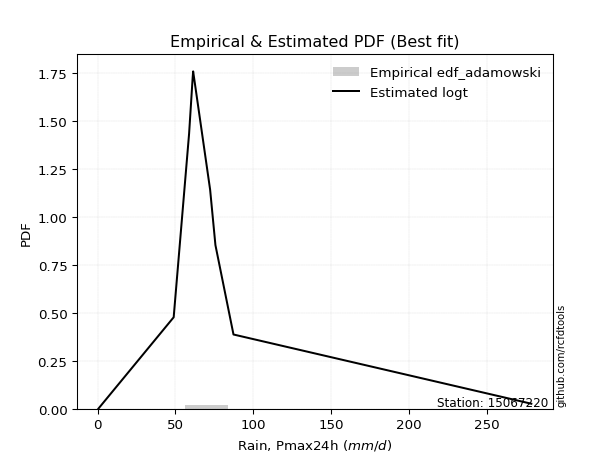</img>

</div>


## C. Best fit & Estimate extreme values for specific return periods - Tr


### 1. Best fit (ordered by delta Δ)

<div align="center">

|   id |   station | empirical_dist   | p_dist   |     delta |   deltao | eval   |   fit |   n |   best_fit |   best_fit_sort |
|-----:|----------:|:-----------------|:---------|----------:|---------:|:-------|------:|----:|-----------:|----------------:|
|    0 |  15067220 | edf_hazen        | logt     | 0.0831312 | 0.417613 | Δo > Δ |     1 |   9 |          1 |               1 |
|    1 |  15067220 | edf_gringorten   | logt     | 0.0845932 | 0.417613 | Δo > Δ |     1 |   9 |          1 |               2 |
|    2 |  15067220 | edf_cunnane      | logt     | 0.0855467 | 0.417613 | Δo > Δ |     1 |   9 |          1 |               3 |
|    3 |  15067220 | edf_blom         | logt     | 0.0861342 | 0.417613 | Δo > Δ |     1 |   9 |          1 |               4 |
|    4 |  15067220 | edf_tukey        | logt     | 0.0870995 | 0.417613 | Δo > Δ |     1 |   9 |          1 |               5 |
|    5 |  15067220 | edf_filliben     | logt     | 0.0874618 | 0.417613 | Δo > Δ |     1 |   9 |          1 |               6 |
|    6 |  15067220 | edf_beard        | logt     | 0.0876325 | 0.417613 | Δo > Δ |     1 |   9 |          1 |               7 |
|    7 |  15067220 | edf_jenkinson    | logt     | 0.0876325 | 0.417613 | Δo > Δ |     1 |   9 |          1 |               8 |
|    8 |  15067220 | edf_chegodayev   | logt     | 0.0878593 | 0.417613 | Δo > Δ |     1 |   9 |          1 |               9 |
|    9 |  15067220 | edf_adamowski    | logt     | 0.0889792 | 0.417613 | Δo > Δ |     1 |   9 |          1 |              10 |
|   10 |  15067220 | edf_weibull      | logt     | 0.0942423 | 0.417613 | Δo > Δ |     1 |   9 |          1 |              11 |
|   11 |  15067220 | edf_california   | t        | 0.108998  | 0.417613 | Δo > Δ |     1 |   9 |          1 |              12 |

</div>

:file_folder:Tables: [bestfit_15067220.csv](table/bestfit_15067220.csv) | [extreme_15067220.csv](table/extreme_15067220.csv)


### 2. Extreme values

In hydrology, a return period (or recurrence interval $Tr$) is the statistical average time between extreme events like floods or droughts of a specific magnitude, indicating how rare an event is, with a 100-year flood, for example, having a 1% chance of occurring in any given year, not that it happens exactly every century. It is a key tool for infrastructure design (like bridges or dams) and risk assessment, calculated from historical data to determine the probability of future events, although it is important to remember it is statistical average, and events can cluster or be missed.

> risk_rate: assuming the return period as the project useful life.

|   id |      tr |   prob_l |     prob_g |    alpha |   betaprime |     chi2 |   crystalball |   erlang |    expon |   exponnorm |        f |   fatiguelife |     fisk |    gamma |   genexpon |   genlogistic |   gibrat |   gompertz |   gumbel_l |   gumbel_r |   halflogistic |   halfnorm |   hypsecant |   invgamma |   invgauss |       invweibull |   johnsonsu |   kstwobign |   laplace |   laplace_asymmetric |         loggamma |   logistic |   lognorm |   maxwell |   mielke |    moyal |   nakagami |      ncf |              nct |     norm |           pareto |   pearson3 |   rayleigh |     rice |         t |   truncnorm |     wald |   weibull_min |          logalpha |    logbetaprime |          logchi2 |   logcrystalball |        logerlang |         logexpon |   logexponnorm |            logf |   logfatiguelife |           logfisk |   loggenexpon |   loggenlogistic |        loggibrat |   loggompertz |   loggumbel_l |   loggumbel_r |   loghalflogistic |   loghalfnorm |   loghypsecant |   loginvgamma |   loginvgauss |    loginvweibull |     logjohnsonsu |     logkstwobign |   loglaplace |   loglaplace_asymmetric |   logloggamma |   loglogistic |   loglognorm |   logmaxwell |   logmielke |    logmoyal |   lognakagami |           logncf |    lognct |      logpareto |   logpearson3 |   lograyleigh |   logrice |              logt |   logtruncnorm |          logwald |   logweibull_min |   station |   n |   risk_rate |
|-----:|--------:|---------:|-----------:|---------:|------------:|---------:|--------------:|---------:|---------:|------------:|---------:|--------------:|---------:|---------:|-----------:|--------------:|---------:|-----------:|-----------:|-----------:|---------------:|-----------:|------------:|-----------:|-----------:|-----------------:|------------:|------------:|----------:|---------------------:|-----------------:|-----------:|----------:|----------:|---------:|---------:|-----------:|---------:|-----------------:|---------:|-----------------:|-----------:|-----------:|---------:|----------:|------------:|---------:|--------------:|------------------:|----------------:|-----------------:|-----------------:|-----------------:|-----------------:|---------------:|----------------:|-----------------:|------------------:|--------------:|-----------------:|-----------------:|--------------:|--------------:|--------------:|------------------:|--------------:|---------------:|--------------:|--------------:|-----------------:|-----------------:|-----------------:|-------------:|------------------------:|--------------:|--------------:|-------------:|-------------:|------------:|------------:|--------------:|-----------------:|----------:|---------------:|--------------:|--------------:|----------:|------------------:|---------------:|-----------------:|-----------------:|----------:|----:|------------:|
|    0 |    2    | 0.5      | 0.5        |  65.7584 |     65.6074 |  66.3875 |       82.7333 |  66.3876 |  57.5305 |     70.5553 |  66.3777 |      0.600058 |  65.8915 |  66.3875 |    65.3786 |       70.4609 |  60.8373 |    61.76   |    94.7172 |    70.7494 |        64.7916 |    67.8013 |     82.7333 |    66.4201 |    67.6123 |   5749.8         |     62.4179 |     76.9125 |   82.7333 |              73.4402 |      8.40873     |    82.7333 |   45.6518 |   76.4945 |  46.0481 |  66.8806 |    69.2244 |  55.1221 |     14.1101      |  82.7333 |      3.0589      |    60.6354 |    74.2818 |  82.3812 |   63.2602 |     65.6911 |  59.0872 |       79.2996 |      3.34844      |    3.71027      |      1.79911     |          45.6522 |      7.29908     |     12.083       |        45.6517 |    1.88149      |          45.6672 |      3.0708       |       24.7888 |          56.5102 |     28.2045      |       58.8292 |       59.4185 |       35.0747 |           30.7675 |       32.8729 |        45.6518 |       42.2741 |       37.3829 |     39.2669      |    61.431        |     29.375       |      45.6518 |                 55.6221 |       61.1742 |       45.6518 |      45.4764 |      39.7988 |     56.4648 |     32.2137 |       45.7515 |      4.53025     |   45.5389 |   0.699356     |       74.8761 |       37.9084 |   45.6518 |     63.9864       |        12.7197 |     27.1399      |     1.15505      |  15067220 |   9 |    0.75     |
|    1 |    2.33 | 0.570815 | 0.429185   |  74.7619 |     75.324  |  77.6346 |       95.7506 |  77.6347 |  70.074  |     79.2589 |  77.6157 |      3.11656  |  73.4754 |  77.6346 |    76.4166 |       79.653  |  67.4313 |    74.4995 |   106.042  |    82.8114 |        77.1933 |    81.8504 |     93.1511 |    75.9921 |    78.0114 | 509023           |     64.0931 |     87.8378 |   90.6108 |              80.4301 |     15.2937      |    94.2025 |   60.7844 |   90.0186 |  55.822  |  78.2988 |    77.2709 |  67.141  |     26.036       |  95.7506 |      8.95411     |    71.85   |    88.0059 |  93.9421 |   65.7455 |     78.2131 |  67.6228 |       87.7197 |      5.34125      |    7.38266      |      2.50891     |          60.785  |     27.9732      |     23.4147      |        60.7843 |    3.31685      |          60.8391 |      7.20507      |       38.9995 |          66.3634 |     32.6063      |       71.2159 |       76.2244 |       45.7302 |           40.4152 |       44.774  |        57.4067 |       57.1826 |       52.2753 |     61.828       |    61.8784       |     47.2777      |      54.2874 |                 63.2478 |       74.3657 |       58.7496 |      60.531  |      53.5851 |     66.3347 |     41.4097 |       60.9439 |     11.3268      |   60.7355 |   1.00989      |       92.5261 |       51.265  |   60.7844 |     66.4742       |        19.3428 |     32.7443      |     2.57335      |  15067220 |   9 |    0.729209 |
|    2 |    5    | 0.8      | 0.2        | 117.438  |    120.833  | 129.396  |      144.126  | 129.396  | 132.789  |    120.68   | 129.343  |     56.5739   | 108.436  | 129.396  |   127.698  |      119.577  | 105.395  |   134.718  |   142.629  |   135.214  |       133.308  |   141.262  |    134.939  |   121.019  |   126.263  |      1.46538e+14 |     84.4057 |    134.246  |  129.996  |             115.378  |    311.311       |   138.486  |  176.138  |  143.248  | 101.276  | 131.189  |   119.891  | 122.794  |    550.708       | 144.126  |   3733.43        |   127.594  |   142.95   | 140.226  |   79.2018 |    134.291  | 115.405  |      134.424  |    199.614        | 2599.93         |     15.6936      |         176.14   | 422656           |    639.731       |       176.137  | 2060.43         |         176.77   | 176680            |      240.999  |         110.526  |     75.1472      |      132.244  |      170.433  |      144.786  |          138.84   |      165.381  |       143.913  |      179.909  |      192.517  |    444.355       |    75.7825       |    356.928       |     129.089  |                 95.4666 |      134.92   |      155.59   |     175.253  |     172.768  |    110.591  |    132.52   |      176.913  | 179954           |  177.258  |   7.64297e+100 |      158.368  |      171.637  |  176.138  |     82.9258       |        77.1099 |     93.6535      |     1.35055e+08  |  15067220 |   9 |    0.67232  |
|    3 |   10    | 0.9      | 0.1        | 157.683  |    161.718  | 172.999  |      176.218  | 172.999  | 189.719  |    157.936  | 172.938  |    130.385    | 141.13   | 172.999  |   171.837  |      152.088  | 148.669  |   184.96   |   162.999  |   177.895  |       179.909  |   185.225  |    168.308  |   161.929  |   168.04   |      1.13725e+21 |    141.193  |    169.58   |  165.749  |             147.103  |   4884.82        |   171.1    |  356.756  |  180.709  | 143.216  | 177.238  |   155.927  | 169.75   |   8771.73        | 176.218  | 949083           |   177.945  |   182.126  | 173.227  |  101.9    |    178.328  | 166.113  |      181.663  | 154648            |    2.89135e+08  |     95.1576      |         356.762  |      3.70718e+10 |  12883.1         |       356.754  |    2.74134e+11  |         358.859  |      7.0043e+17   |      886.946  |         150.211  |    194.647       |      186.787  |      266.758  |      370.165  |          386.917  |      434.905  |       299.792  |      393.026  |      481.414  |   2215           |   265.326        |   1663.44        |     283.389  |                135.986  |      183.759  |      318.778  |     354.872  |     393.789  |    150.375  |    364.853  |      358.792  |      3.68227e+16 |  361.028  | inf            |      190.772  |      406.254  |  356.756  |    127.028        |       144.647  |    285.667       |     8.35711e+34  |  15067220 |   9 |    0.651322 |
|    4 |   15    | 0.933333 | 0.0666667  | 183.289  |    186.337  | 197.678  |      192.232  | 197.678  | 223.021  |    179.729  | 197.621  |    178.658    | 161.956  | 197.678  |   197.252  |      170.428  | 178.518  |   212.655  |   172.224  |   201.976  |       206.281  |   208.103  |    187.351  |   186.808  |   192.225  |      8.77163e+24 |    208.564  |    188.338  |  186.663  |             165.66   |  24556.3         |   188.869  |  507.376  |  199.929  | 170.168  | 203.963  |   175.254  | 196.366  |  44287.6         | 192.232  |      2.42266e+07 |   207.335  |   202.311  | 190.23   |  125.636  |    201.891  | 198.676  |      210.921  |      1.17e+08     |    5.01197e+13  |    282.759       |         507.385  |      5.84539e+13 |  74614.6         |       507.374  |    3.51272e+22  |         511.032  |      2.65693e+34  |     1737.38   |         175.366  |    375.273       |      218.432  |      326.761  |      628.635  |          691.045  |      719.305  |       455.736  |      584.22   |      772.826  |   5482.49        |  2834.77         |   3765.83        |     448.895  |                167.252  |      210.306  |      471.207  |     504.679  |     600.961  |    175.597  |    656.719  |      510.621  |      1.76232e+31 |  515.007  | inf            |      201.986  |      633.28   |  507.376  |    206.78         |       179.35   |    584.627       |     1.40487e+67  |  15067220 |   9 |    0.644736 |
|    5 |   20    | 0.95     | 0.05       | 202.758  |    204.276  | 214.922  |      202.719  | 214.922  | 246.649  |    195.191  | 214.873  |    214.399    | 177.764  | 214.922  |   215.19   |      183.27   | 201.932  |   231.616  |   177.967  |   218.836  |       224.758  |   223.357  |    200.785  |   205.055  |   209.355  |      4.62185e+27 |    280.851  |    200.974  |  201.502  |             178.827  |  77333.6         |   201.151  |  638.998  |  212.685  | 190.933  | 222.89   |   188.242  | 214.995  | 139703           | 202.719  |      2.41306e+08 |   228.167  |   215.727  | 201.532  |  150.431  |    217.807  | 222.941  |      232.304  |      8.80031e+10  |    1.16432e+19  |    619.262       |         639.01   |      1.36526e+16 | 259443           |       638.995  |    1.50076e+36  |         644.186  |      1.30322e+54  |     2717.16   |         194.575  |    628.04        |      240.789  |      370.746  |      910.838  |         1037.5    |     1006.01   |       612.392  |      759.178  |     1059.86   |  10341.2         | 81814            |   6529.84        |     622.125  |                193.704  |      228.396  |      617.333  |     635.608  |     795.58   |    194.86   |    995.771  |      643.381  |      4.51946e+48 |  649.952  | inf            |      207.658  |      850.635  |  638.998  |    353.961        |       199.945  |    996.895       |     6.18111e+100 |  15067220 |   9 |    0.641514 |
|    6 |   25    | 0.96     | 0.04       | 218.751  |    218.503  | 228.171  |      210.439  | 228.171  | 264.977  |    207.184  | 228.131  |    242.797    | 190.703  | 228.171  |   229.069  |      193.161  | 221.451  |   245.954  |   182.053  |   231.823  |       238.994  |   234.706  |    211.182  |   219.598  |   222.642  |      5.77121e+29 |    355.778  |    210.439  |  213.012  |             189.04   | 188407           |   210.546  |  757.247  |  222.155  | 208.177  | 237.56   |   197.938  | 229.331  | 340568           | 210.439  |      1.43513e+09 |   244.317  |   225.696  | 209.929  |  176.114  |    229.745  | 242.377  |      249.219  |      6.60391e+13  |    3.37534e+24  |   1143.59        |         757.261  |      1.04596e+18 | 682093           |       757.243  |    1.13218e+52  |         763.927  |      2.78177e+76  |     3788.63   |         210.418  |    964.773       |      258.082  |      405.607  |     1211.95   |         1418.91   |     1291.22   |       769.727  |      921.758  |     1341.29   |  16859.6         |     5.69544e+06  |   9861.74        |     801.335  |                217.07   |      242.049  |      759.031  |     753.248  |     979.795  |    210.75   |   1374.94   |      762.705  |      2.64789e+68 |  771.438  | inf            |      211.078  |     1059.14   |  757.247  |    631.797        |       213.507  |   1528.59        |     3.44503e+134 |  15067220 |   9 |    0.639603 |
|    7 |   50    | 0.98     | 0.02       | 274.666  |    264.71   | 268.751  |      232.546  | 268.751  | 321.907  |    244.439  | 268.752  |    333.908    | 235.289  | 268.751  |   272.058  |      223.63   | 290.257  |   288.588  |   193.145  |   271.83   |       282.856  |   267.693  |    243.417  |   267.255  |   263.994  |      1.65744e+36 |    743.277  |    238.232  |  248.765  |             220.765  |      3.00404e+06 |   239.252  | 1231.39   |  249.62   | 269.549  | 283.103  |   226.188  | 273.406  |      5.42403e+06 | 232.546  |      3.64884e+11 |   294.438  |   254.632  | 234.304  |  314.131  |    264.857  | 305.837  |      303.419  |      1.55522e+28  |    6.37978e+52  |   7874.49        |        1231.41   |      1.21528e+24 |      1.37362e+07 |      1231.38   |    6.33617e+159 |        1244.89   |      1.82501e+219 |     9950.56   |         266.084  |   4381.51        |      311.56   |      517.667  |     2921.53   |         3723.05   |     2667.3    |      1563.97   |     1615.96   |     2670.52   |  75993.2         |     3.29165e+20  |  33092.9         |    1759.17   |                309.203  |      282.614  |     1427.06   |    1225.07   |    1792.51   |    266.588  |   3743.56   |     1241.53   |      5.7859e+195 | 1260.38   | inf            |      217.942  |     2001.4    | 1231.39   |  18303.5          |       243.684  |   6171.89        |     2.94875e+294 |  15067220 |   9 |    0.63583  |
|    8 |   75    | 0.986667 | 0.0133333  | 312.922  |    293.332  | 292.161  |      244.408  | 292.161  | 355.21   |    266.231  | 292.196  |    388.78     | 264.929  | 292.161  |   297.158  |      241.34   | 336.728  |   312.296  |   198.754  |   295.083  |       308.353  |   285.65   |    262.255  |   297.091  |   288.276  |      9.40102e+39 |   1131.11   |    253.524  |  269.679  |             239.323  |      1.52033e+07 |   255.831  | 1598.43   |  264.552  | 312.128  | 309.736  |   241.572  | 298.968  |      2.73853e+07 | 244.408  |      9.31417e+12 |   323.732  |   270.374  | 247.565  |  463.222  |    284.197  | 344.887  |      336.184  |      3.64564e+42  |    1.36733e+82  |  24678.5         |        1598.47   |      5.64949e+27 |      7.95555e+07 |      1598.42   |    1.14266e+307 |        1617.94   |    inf            |    16833.3    |         304.113  |  12175.8         |      342.696  |      585.633  |     4872.08   |         6522.73   |     3958.99   |      2366.78   |     2191.76   |     3898.54   | 182332           |     9.15882e+39  |  64419.5         |    2786.57   |                380.294  |      305.219  |     2054.94   |    1590.44   |    2489.35   |    304.742  |   6724.58   |     1612.52   |    inf           | 1640.43   | inf            |      220.231  |     2829.41   | 1598.43   | 940070            |       254.738  |  14568           |   inf            |  15067220 |   9 |    0.634587 |
|    9 |  100    | 0.99     | 0.01       | 343.238  |    314.431  | 308.65   |      252.431  | 308.65   | 378.838  |    281.693  | 308.715  |    428.262    | 287.784  | 308.65   |   314.954  |      253.874  | 372.728  |   328.611  |   202.423  |   311.541  |       326.399  |   297.883  |    275.618  |   319.236  |   305.555  |      4.26506e+42 |   1511.82   |    264.001  |  284.518  |             252.49   |      4.80697e+07 |   267.537  | 1906.89   |  274.722  | 345.942  | 328.63   |   252.044  | 317.044  |      8.63856e+07 | 252.431  |      9.27725e+13 |   344.508  |   281.099  | 256.6    |  620.049  |    297.453  | 373.358  |      359.864  |      8.53601e+56  |    1.48996e+112 |  55777.9         |        1906.94   |      2.49525e+30 |      2.76623e+08 |      1906.88   |  inf            |        1931.82   |    inf            |    24087.2    |         334.011  |  26875           |      364.728  |      634.846  |     6997      |         9700.52   |     5181.14   |      3175.34   |     2697.33   |     5053.25   | 338746           |     3.7858e+63   | 101676           |    3861.92   |                440.441  |      320.817  |     2658.3    |    1897.56   |    3113.37   |    334.744  |  10189.2    |     1924.44   |    inf           | 1960.62   | inf            |      221.374  |     3582.07   | 1906.89   |      7.39037e+07  |       260.466  |  27248.3         |   inf            |  15067220 |   9 |    0.633968 |
|   10 |  200    | 0.995    | 0.005      | 430.362  |    368.224  | 348.036  |      270.63   | 348.036  | 435.768  |    318.948  | 348.185  |    524.907    | 349.936  | 348.036  |   357.81   |      284.007  | 470.669  |   366.325  |   210.397  |   351.108  |       369.785  |   325.861  |    307.81   |   376.243  |   347.379  |      1.03997e+49 |   2954.41   |    288.133  |  320.271  |             284.214  |      7.71267e+08 |   295.616  | 2845.45   |  297.992  | 442.109  | 374.154  |   275.955  | 360.484  |      1.37582e+09 | 270.63   |      2.35876e+16 |   394.539  |   305.639  | 277.271  | 1298.61   |    327.991  | 444.276  |      418.284  |      2.55813e+114 |    6.58137e+236 | 403527           |        2845.52   |      7.79495e+36 |      5.57071e+09 |      2845.43   |  inf            |        2888.54   |    inf            |    54706.6    |         417.788  | 231653           |      417.634  |      756.549  |    16704.4    |        25187.5    |     9586.36   |      6445.71   |     4337.76   |     9200.07   |      1.50178e+06 |     1.02184e+186 | 290891           |    8478.08   |                627.381  |      357.075  |     4929.48   |    2832.37   |    5193.82   |    418.827  |  27730.3    |     2874.25   |    inf           | 2938.38   | inf            |      223.082  |     6145.01   | 2845.45   |      5.84369e+16  |       269.32   | 129632           |   inf            |  15067220 |   9 |    0.633042 |
|   11 |  250    | 0.996    | 0.004      | 463.769  |    386.495  | 360.625  |      276.192  | 360.625  | 454.096  |    330.941  | 360.806  |    556.403    | 372.316  | 360.625  |   371.603  |      293.694  | 505.811  |   378.017  |   212.744  |   363.828  |       383.733  |   334.468  |    318.173  |   395.779  |   360.903  |      1.17592e+51 |   3633.89   |    295.601  |  331.781  |             294.428  |      1.88556e+09 |   304.63   | 3215.67   |  305.155  | 478.194  | 388.809  |   283.297  | 374.455  |      3.35395e+09 | 276.192  |      1.40283e+17 |   410.639  |   313.192  | 283.635  | 1659.88   |    337.442  | 467.738  |      437.477  |      1.39969e+143 |    1.01833e+301 | 765830           |        3215.75   |      1.03263e+39 |      1.46458e+10 |      3215.64   |  inf            |        3266.48   |    inf            |    70429.4    |         448.808  | 501758           |      434.617  |      796.614  |    22096.6    |        34229.9    |    11584.1    |      8095.65   |     5021.58   |    11081.9    |      2.42393e+06 |     1.04024e+259 | 402726           |   10920.3    |                703.061  |      368.387  |     6010.41   |    3201.23   |    6079.99   |    449.965  |  38276.5    |     3249.14   |    inf           | 3325.26   | inf            |      223.422  |     7255.59   | 3215.67   |      6.53997e+21  |       271.13   | 217172           |   inf            |  15067220 |   9 |    0.632858 |
|   12 |  500    | 0.998    | 0.002      | 590.871  |    446.49   | 399.495  |      292.684  | 399.495  | 511.026  |    368.196  | 399.789  |    655.208    | 450.316  | 399.495  |   414.44   |      323.762  | 627.259  |   413.059  |   219.47   |   403.308  |       427.024  |   360.131  |    350.362  |   460.511  |   403.1    |      2.77703e+57 |   6739.47   |    317.982  |  367.534  |             326.152  |      3.03344e+10 |   332.588  | 4621.67   |  326.529  | 609.624  | 434.331  |   305.144  | 417.88   |      5.34165e+10 | 292.684  |      3.56673e+19 |   460.632  |   335.731  | 302.62   | 3605.42   |    365.758  | 542.339  |      498.205  |      6.85678e+286 |  inf            |      5.65727e+06 |        4621.79   |      4.85541e+45 |      2.94941e+11 |      4621.64   |  inf            |        4704.12   |    inf            |   149709      |         560.2    |      7.25292e+06 |      487.229  |      923.618  |    52652.8    |        88694.8    |    20369.3    |     16432.7    |     7777.18   |    19405.3    |      1.07113e+07 |   inf            |      1.06756e+06 |   23973.3    |               1001.47   |      402.533  |    11115.7    |    4602.6    |    9728.8    |    561.806  | 104169      |     4673.8    |    inf           | 4799.29   | inf            |      224.099  |    11911      | 4621.67   |      1.52135e+51  |       274.788  |      1.12034e+06 |   inf            |  15067220 |   9 |    0.632489 |
|   13 |  750    | 0.998667 | 0.00133333 | 687.338  |    484.018  | 422.087  |      301.846  | 422.087  | 544.329  |    389.988  | 422.457  |    713.587    | 502.608  | 422.087  |   439.496  |      341.339  | 707.578  |   432.719  |   223.064  |   426.388  |       452.333  |   374.467  |    369.192  |   501.437  |   427.913  |      1.47688e+61 |   9514.25   |    330.555  |  388.448  |             344.71   |      1.54175e+11 |   348.921  | 5653.38   |  338.484  | 702.388  | 460.96   |   317.319  | 443.333  |      2.69693e+11 | 301.846  |      9.10458e+20 |   489.865  |   348.334  | 313.237  | 5708.77   |    381.66   | 587.067  |      534.464  |    inf            |  inf            |      1.83296e+07 |        5653.53   |      4.34565e+49 |      1.7082e+12  |      5653.33   |  inf            |        5760.9    |    inf            |   228279      |         637.548  |      4.24304e+07 |      517.916  |      999.604  |    87472.4    |       154748      |    27919.7    |     24863.3    |     9938.12   |    26634.4    |      2.55328e+07 |   inf            |      1.84603e+06 |   37974.3    |               1231.72   |      421.873  |    15920.1    |    5631.35   |   12654.5    |    639.482  | 187104      |     5719.94   |    inf           | 5884.81   | inf            |      224.324  |    15715.5    | 5653.38   |      3.60081e+85  |       276.02   |      2.99622e+06 |   inf            |  15067220 |   9 |    0.632366 |
|   14 | 1000    | 0.999    | 0.001      | 769.487  |    511.812  | 438.059  |      308.154  | 438.059  | 567.957  |    405.45   | 438.488  |    755.229    | 543.064  | 438.059  |   457.273  |      353.808  | 769.041  |   446.318  |   225.484  |   442.76   |       470.285  |   384.368  |    382.551  |   531.952  |   445.576  |      6.48894e+63 |  12069.2    |    339.265  |  403.287  |             357.877  |      4.88781e+11 |   360.504  | 6494.68   |  346.747  | 776.563  | 479.853  |   325.714  | 461.427  |      8.50735e+11 | 308.154  |      9.06849e+21 |   510.603  |   357.044  | 320.574  | 7921.63   |    392.674  | 619.242  |      560.5    |    inf            |  inf            |      4.23035e+07 |        6494.86   |      2.88953e+52 |      5.9396e+12  |      6494.63   |  inf            |        6623.62   |    inf            |   305573      |         698.754  |      1.63965e+08 |      539.65   |     1054.23   |   125385      |       229663      |    34712      |     33355.1    |    11776.4    |    33198.3    |      4.72826e+07 |   inf            |      2.69785e+06 |   52628.7    |               1426.53   |      435.338  |    20539.2    |    6470.48   |   15176.3    |    700.956  | 283493      |     6573.39   |    inf           | 6772      | inf            |      224.435  |    19033.3    | 6494.68   |      4.44838e+123 |       276.637  |      6.07979e+06 |   inf            |  15067220 |   9 |    0.632305 |

<div align="center">

</img>

</div>


<div align="center">

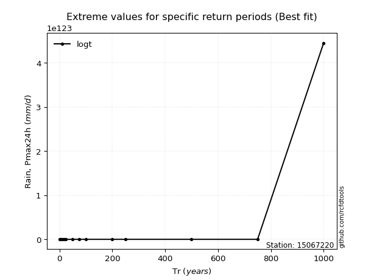</img>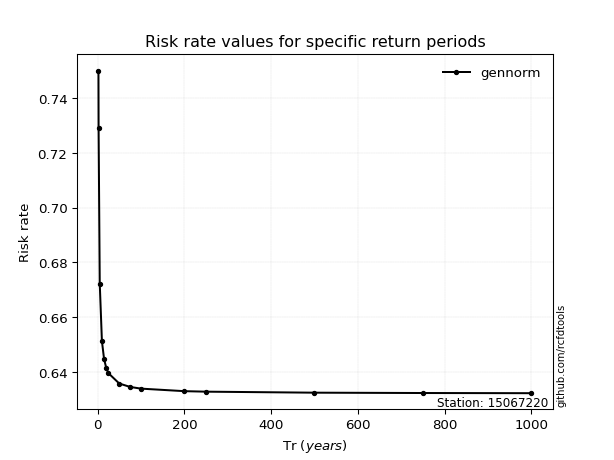</img>

</div>


<sub>**APP DISCLAIMER**: NO WARRANTY - This software is provided by [github.com/rcfdtools](https://github.com/rcfdtools) "as is", without any express or implied warranty, including warranties of merchantability, fitness for a particular purpose, or non-infringement. There is no guarantee that the software will be error-free or operate without interruption. LIMITATION OF LIABILITY - Neither the authors nor copyright holders will be liable for claims or damages arising from the software or its use. You are responsible for determining if the software is appropriate for your use and assume all associated risks, including errors, legal compliance, and data loss. NO PROFESSIONAL ADVICE - The software provides general information and does not offer professional advice. It should not replace consultation with professional advisors.</sub>