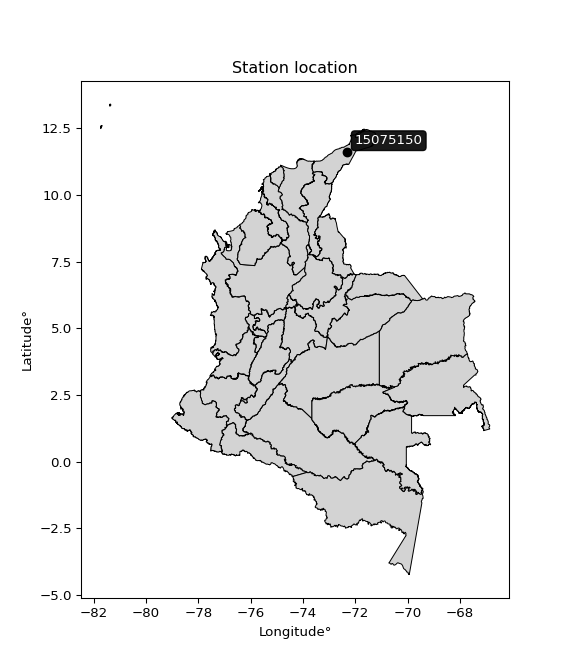

<div align="center">


</div>

# PMax24h Station (Rain, Pmax24h): 15075150

Maximum Precipitation in 24 hours (PMax24h) is the greatest amount of rainfall for a specific duration that is meteorologically possible for a given location, acting as a "worst-case" scenario for extreme storms, crucial for designing safety-critical infrastructure like bridges, river deviations, dams, spillways, and nuclear plants to prevent catastrophic failure. The PMax24h is related with the Probable Maximum Precipitation (PMP) and it is calculated by hydrologists using meteorological data to determine the upper limit of extreme rainfall, often leading to the Probable Maximum Flood (PMF) for flood control design, and is increasingly being studied for climate change impacts. Probable Maximum Precipitation (PMP) is the theoretical upper limit of rainfall, a deterministic estimate for extreme events, while probability distributions (like GEV, Gumbel) describe the likelihood and frequency of various precipitation amounts, including rare ones, showing how often events occur, with PMP representing the extreme end of these distributions, used for critical infrastructure design to ensure safety against the worst conceivable weather, unlike standard statistical forecasts which cover typical probabilities.

The most common probability distributions in hydrology, used for analyzing floods, rainfall, and streamflow, include the Normal, Log-Normal, Gumbel, Gamma (including Log-Pearson Type III), and Generalized Extreme Value (GEV) distributions, often chosen based on the data´s skewness and whether modeling extremes or general conditions, with Gumbel and GEV popular for extreme events like floods, while the Normal distribution serves as a baseline, though often requiring transformations for skewed hydrological data. These distributions help in designing water infrastructure, managing water resources, and forecasting hydrologic events.

> Hydrological data often isn´t perfectly normal (it´s skewed), so different distributions are needed for different applications, such as: **Flood Frequency Analysis**: Using Gumbel, GEV, or Log-Pearson Type III for predicting extreme flood magnitudes and their return periods, **Rainfall Analysis**: Normal for annual totals, but Log-Normal, Weibull, or GEV for intensity or extreme daily rainfall, **Streamflow Modeling**: Gamma and Log-Normal for maximum flows, GEV for minimum flows, and Kappa for daily flows.

<div align="center">

</img>

</div>


## A. General information


### 1. General running parameters

• app_version: _v20260225_. • runtime: _2026-02-27 14:50:08.749431_. • Python version: _3.14.0_. • SciPy version: _1.16.3_. • Pandas version: _2.3.3_. • NumPy version: _2.3.5_. • Stations dataset (station_dataset_file): _dataset/pmax24h_in/automatic_colombia_2003_2025.csv_. • Stations catalog (station_catalog_file): _dataset/CNE.xls_. • Minimum year to eval til year_max (date_min): _1900_. • Maximum year to eval since year_min (date_max): _2025_. • Creates, save and include plots into reports (create_plot): _False_. • Plot only fit distributions with Δo > Δ (plot_only_fit): _True_. • Plot only simple graphs avoiding multiple CDFs and multiple Extreme values plots (plot_only_simple): _False_. • Eval low extreme values, if False, evaluates high extreme values (low_extreme): _False_. • Eval every SciPy distribution as logarithmic (pdist_logarithmic_on): _True_. • Standard deviation normalized (ddof): _1.0_. • Return periods to eval in years (Tr): _[2, 2.33, 5, 10, 15, 20, 25, 50, 75, 100, 200, 250, 500, 750, 1000]_. • Minimum data sample per station, 0 means any (minimum_sample): _5_. • Z-Score maximum threshold to adjust a value, 0 means disable (zscore_max): _3.5_. • Z-Score minimum threshold to adjust a value, 0 means disable (zscore_min): _-2.5_. • Avoid zeros, e.g. rain = 0 (avoid_zeros): _True_. • Avoid null values (avoid_nans): _True_. 

:file_folder:Table: [dataset.csv](../../dataset/pmax24h_in/automatic_colombia_2003_2025.csv)

> Delta Degrees of Freedom (DDOF): is a parameter used in the formulas for calculating variance and standard deviation. When ddof=0, the divisor is $N$ (the total number of observations) and this is used when your data set is the entire population. When ddof=1, the divisor is $N-1$ and this is used when your data set is a sample drawn from a larger population. Using $N-1$ provides an unbiased estimate of the population variance (known as Bessel´s correction).


### 2. Station info and location

|   id |   CODIGO | NOMBRE                 | CATEGORIA         | TECNOLOGIA                | ESTADO     | FECHA_INSTALACION   |   FECHA_SUSPENSION |   ALTITUD |   LATITUD |   LONGITUD | DEPARTAMENTO   | MUNICIPIO   | AREA_OPERATIVA                                         | ENTIDAD                                                     | AREA_HIDROGRAFICA   | ZONA_HIDROGRAFICA   | SUBZONA_HIDROGRAFICA                          |   CORRIENTE | Catalogo   |   Version |
|-----:|---------:|:-----------------------|:------------------|:--------------------------|:-----------|:--------------------|-------------------:|----------:|----------:|-----------:|:---------------|:------------|:-------------------------------------------------------|:------------------------------------------------------------|:--------------------|:--------------------|:----------------------------------------------|------------:|:-----------|----------:|
|    0 | 15075150 | PAICI - AUT [15075150] | Agrometeorológica | Automática con Telemetría | Suspendida | 14/10/2004          |                nan |        45 |   11.5949 |   -72.3257 | La Guajira     | Uribia      | Area Operativa 05 - Magdalena-Cesar-Guajira-San Andrés | INSTITUTO DE HIDROLOGIA METEOROLOGIA Y ESTUDIOS AMBIENTALES | Caribe              | Caribe - Guajira    | Directos Caribe - Ay.Sharimahana Alta Guajira |         nan | CNE_IDEAM  |  20251226 |

<div align="center">

Dynamic map: [:earth_americas:Google](http://maps.google.com/maps?q=11.59494444,-72.32575) [:earth_americas:OSM](https://www.openstreetmap.org/#map=18/11.59494444/-72.32575&layers=P) [:earth_americas:Bing](https://www.bing.com/maps?cp=11.59494444~-72.32575&lvl=18) [:earth_americas:Apple](https://maps.apple.com/frame?center=11.59494444%2C-72.32575&span=0.003%2C0.006)

</div>


<div align="center">

```geojson
{
  "type": "Feature",
  "geometry": {
    "type": "Point", 
    "coordinates": [-72.32575, 11.59494444]
  }, 
  "properties": {
    "Name": "15075150"
  }
}
```

</div>


### 3. Discrete values table and plot

<div align="center">

|               |           0 |            1 |           2 |         3 |           4 |           5 |            6 |           7 |
|:--------------|------------:|-------------:|------------:|----------:|------------:|------------:|-------------:|------------:|
| Date          | 2012        | 2013         | 2014        | 2015      | 2016        | 2017        | 2018         | 2019        |
| Value         |   36.9      |   63.1       |   13.7      |  288.5    |    2.4      |    1.2      |   61.5       |   45.6      |
| Value_initial |   36.9      |   63.1       |   13.7      |  288.5    |    2.4      |    1.2      |   61.5       |   45.6      |
| count         |    8        |    8         |    8        |    8      |    8        |    8        |    8         |    8        |
| mean          |   64.1125   |   64.1125    |   64.1125   |   64.1125 |   64.1125   |   64.1125   |   64.1125    |   64.1125   |
| std           |   93.9214   |   93.9214    |   93.9214   |   93.9214 |   93.9214   |   93.9214   |   93.9214    |   93.9214   |
| zscore        |   -0.289737 |   -0.0107803 |   -0.536752 |    2.3891 |   -0.657065 |   -0.669842 |   -0.0278158 |   -0.197106 |


</div>


> The initial value (value_initial) correspond to the initial obtained or null completed value, and value (value) is adjusted only when the initial value is outside the valid range (outlier) definite through the Z-Score value. If Z-Score is active, values out of range or outliers are replaced with the station mean value. A Z-Score (or standard score) measures how many standard deviations a data point is from the mean of a dataset, indicating its relative position; positive scores mean above the mean, negative mean below, and a score of zero is exactly at the mean, allowing for comparison of values from different distributions. It´s calculated using the formula $z=(x–μ)/σ$, where $x$ is the data point, $μ$ is the mean, and $σ$ is the standard deviation, helping identify outliers and understand probability.
>
> <sub>**Note**: In this study, "completing" (filling gaps in) and "extending" (forecasting or lengthening the historical record) rainfall data series are avoided for certain critical analyses because they introduce artificial bias and uncertainty, which can distort the statistics of rare events (extremes), alter day-to-day variability, and compromise the integrity and homogeneity of the original data. Some reasons against Completing/Extending rainfall data are: **Distortion of Extremes and Variability**: The primary issue is that most gap-filling or extension methods rely on averaging or regression with nearby stations, which inherently smooths the data. Rainfall is highly variable in space and time, with a large percentage of zero values and occasional large storms. Infilling methods often underestimate the highest values and overestimate the lowest (zero) values, which severely distorts analyses focused on flood frequency, drought severity, and intensity-duration-frequency (IDF) curves, **Loss of Data Homogeneity**: Infilled or extended data are synthetic estimates, not actual measurements. Combining these estimates with observed data can violate the assumption of data homogeneity, which requires that the data properties do not change over time. Inhomogeneity can lead to incorrect conclusions about long-term trends or changes in climate patterns, **Propagation of Errors**: Errors and biases from the original data (e.g., wind-induced undercatch, instrument errors, site changes) or the data used for imputation can propagate through the analysis, leading to unreliable hydrological models and inaccurate predictions, **Compromised Statistical Integrity**: For statistical analyses, especially those involving the frequency of events, using artificial data can introduce time bias or autocorrelation that doesn´t exist in reality, making it difficult to assess the true probability of events, **Difficulty in Validation**: It is difficult to accurately validate the quality of filled or extended data, especially for past periods where ground-truth measurements are unavailable. The reliability of imputation techniques heavily depends on the density of the surrounding station network and the complexity of the local topography.</sub>


### 4. Active continuous probability distributions from SciPy (80 of 104 available)

A Probability Density Function (PDF) describes the relative likelihood of a continuous random variable falling within a specific range, where the total area under its curve equals 1, and the area over any interval gives the actual probability for that range. Unlike discrete probabilities (like rolling a die), a PDF shows density, not direct probability for a single point (which is zero), with higher points indicating higher likelihood, often visualized as a bell curve for normal distributions.

A log of a probability density function (log-PDF) is simply the logarithm of the PDF´s value, denoted as $log(f(x))$, useful for converting multiplication of probabilities into addition, improving numerical stability with tiny numbers, and connecting to information theory concepts like entropy. Instead of dealing with very small probabilities (e.g., 0.000001), log-PDFs use negative numbers (e.g., $log(0.00001) ≈ -11.51$ that are easier for computers to handle, preventing underflow errors and simplifying complex calculations. In this study, each active probability distribution from SciPy is also evaluated in the $log$ form.

[scipy.stats](https://docs.scipy.org/doc/scipy/reference/stats.html) is a Python´s powerful submodule within the SciPy library for comprehensive statistical analysis, offering over 130 probability distributions (like Normal, Poisson, etc.), functions for descriptive stats (mean, variance), hypothesis testing (t-tests, chi-square), random variable generation, and statistical tests, making it essential for data science, modeling, and research. It provides tools to explore, model, and draw conclusions from data efficiently, working seamlessly with [NumPy](https://numpy.org/).

<div align="center">

|   id | p_dist           |   n_parameter | fit_method   | label                                                                       | active   | ref                                                                                                      |
|-----:|:-----------------|--------------:|:-------------|:----------------------------------------------------------------------------|:---------|:---------------------------------------------------------------------------------------------------------|
|    0 | alpha            |             3 | MLE          | Alpha                                                                       | True     | [:mortar_board:](https://docs.scipy.org/doc/scipy/reference/generated/scipy.stats.alpha.html)            |
|    1 | anglit           |             2 | MM           | Anglit                                                                      | True     | [:mortar_board:](https://docs.scipy.org/doc/scipy/reference/generated/scipy.stats.anglit.html)           |
|    2 | arcsine          |             2 | MM           | Arcsine                                                                     | True     | [:mortar_board:](https://docs.scipy.org/doc/scipy/reference/generated/scipy.stats.arcsine.html)          |
|    3 | argus            |             3 | MLE          | Argus                                                                       | True     | [:mortar_board:](https://docs.scipy.org/doc/scipy/reference/generated/scipy.stats.argus.html)            |
|    4 | beta             |             4 | MLE          | Beta                                                                        | True     | [:mortar_board:](https://docs.scipy.org/doc/scipy/reference/generated/scipy.stats.beta.html)             |
|    5 | betaprime        |             4 | MLE          | Beta prime                                                                  | True     | [:mortar_board:](https://docs.scipy.org/doc/scipy/reference/generated/scipy.stats.betaprime.html)        |
|    6 | bradford         |             3 | MLE          | Bradford                                                                    | True     | [:mortar_board:](https://docs.scipy.org/doc/scipy/reference/generated/scipy.stats.bradford.html)         |
|    7 | burr             |             4 | MLE          | Burr (Type III)                                                             | True     | [:mortar_board:](https://docs.scipy.org/doc/scipy/reference/generated/scipy.stats.burr.html)             |
|    8 | burr12           |             4 | MLE          | Burr (Type III) 12                                                          | True     | [:mortar_board:](https://docs.scipy.org/doc/scipy/reference/generated/scipy.stats.burr12.html)           |
|    9 | cosine           |             2 | MLE          | Cosine                                                                      | True     | [:mortar_board:](https://docs.scipy.org/doc/scipy/reference/generated/scipy.stats.cosine.html)           |
|   10 | crystalball      |             4 | MLE          | Crystalball                                                                 | True     | [:mortar_board:](https://docs.scipy.org/doc/scipy/reference/generated/scipy.stats.crystalball.html)      |
|   11 | dgamma           |             3 | MLE          | Double gamma                                                                | True     | [:mortar_board:](https://docs.scipy.org/doc/scipy/reference/generated/scipy.stats.dgamma.html)           |
|   12 | dweibull         |             3 | MLE          | Double Weibull                                                              | True     | [:mortar_board:](https://docs.scipy.org/doc/scipy/reference/generated/scipy.stats.dweibull.html)         |
|   13 | erlang           |             3 | MLE          | Erlang                                                                      | True     | [:mortar_board:](https://docs.scipy.org/doc/scipy/reference/generated/scipy.stats.erlang.html)           |
|   14 | exponnorm        |             3 | MLE          | Exponentially modified Normal                                               | True     | [:mortar_board:](https://docs.scipy.org/doc/scipy/reference/generated/scipy.stats.exponnorm.html)        |
|   15 | exponpow         |             3 | MLE          | Exponential power                                                           | True     | [:mortar_board:](https://docs.scipy.org/doc/scipy/reference/generated/scipy.stats.exponpow.html)         |
|   16 | exponweib        |             4 | MLE          | Exponentiated Weibull                                                       | True     | [:mortar_board:](https://docs.scipy.org/doc/scipy/reference/generated/scipy.stats.exponweib.html)        |
|   17 | f                |             4 | MLE          | F                                                                           | True     | [:mortar_board:](https://docs.scipy.org/doc/scipy/reference/generated/scipy.stats.f.html)                |
|   18 | fatiguelife      |             3 | MLE          | Fatigue-life (Birnbaum-Saunders)                                            | True     | [:mortar_board:](https://docs.scipy.org/doc/scipy/reference/generated/scipy.stats.fatiguelife.html)      |
|   19 | foldnorm         |             3 | MM           | Fold Normal                                                                 | True     | [:mortar_board:](https://docs.scipy.org/doc/scipy/reference/generated/scipy.stats.foldnorm.html)         |
|   20 | gamma            |             3 | MLE          | Gamma                                                                       | True     | [:mortar_board:](https://docs.scipy.org/doc/scipy/reference/generated/scipy.stats.gamma.html)            |
|   21 | gausshyper       |             6 | MLE          | Gauss hypergeometric                                                        | True     | [:mortar_board:](https://docs.scipy.org/doc/scipy/reference/generated/scipy.stats.gausshyper.html)       |
|   22 | genexpon         |             5 | MLE          | Generalized exponential                                                     | True     | [:mortar_board:](https://docs.scipy.org/doc/scipy/reference/generated/scipy.stats.genexpon.html)         |
|   23 | genextreme       |             3 | MLE          | Generalized exponential                                                     | True     | [:mortar_board:](https://docs.scipy.org/doc/scipy/reference/generated/scipy.stats.genextreme.html)       |
|   24 | gengamma         |             4 | MLE          | Generalized gamma                                                           | True     | [:mortar_board:](https://docs.scipy.org/doc/scipy/reference/generated/scipy.stats.gengamma.html)         |
|   25 | genhalflogistic  |             3 | MLE          | Generalized half-logistic                                                   | True     | [:mortar_board:](https://docs.scipy.org/doc/scipy/reference/generated/scipy.stats.genhalflogistic.html)  |
|   26 | genlogistic      |             3 | MLE          | Generalized logistic                                                        | True     | [:mortar_board:](https://docs.scipy.org/doc/scipy/reference/generated/scipy.stats.genlogistic.html)      |
|   27 | gennorm          |             3 | MLE          | Generalized Normal                                                          | True     | [:mortar_board:](https://docs.scipy.org/doc/scipy/reference/generated/scipy.stats.gennorm.html)          |
|   28 | genpareto        |             3 | MLE          | Generalized Pareto                                                          | True     | [:mortar_board:](https://docs.scipy.org/doc/scipy/reference/generated/scipy.stats.genpareto.html)        |
|   29 | gompertz         |             3 | MLE          | Gompertz (or truncated Gumbel)                                              | True     | [:mortar_board:](https://docs.scipy.org/doc/scipy/reference/generated/scipy.stats.gompertz.html)         |
|   30 | gumbel_l         |             2 | MM           | Gumbel Left Skew                                                            | True     | [:mortar_board:](https://docs.scipy.org/doc/scipy/reference/generated/scipy.stats.gumbel_l.html)         |
|   31 | gumbel_r         |             2 | MM           | Gumbel Right Skew                                                           | True     | [:mortar_board:](https://docs.scipy.org/doc/scipy/reference/generated/scipy.stats.gumbel_r.html)         |
|   32 | halfgennorm      |             3 | MLE          | Upper half of a generalized normal                                          | True     | [:mortar_board:](https://docs.scipy.org/doc/scipy/reference/generated/scipy.stats.halfgennorm.html)      |
|   33 | halflogistic     |             2 | MM           | Half-logistic                                                               | True     | [:mortar_board:](https://docs.scipy.org/doc/scipy/reference/generated/scipy.stats.halflogistic.html)     |
|   34 | halfnorm         |             2 | MM           | Half Normal                                                                 | True     | [:mortar_board:](https://docs.scipy.org/doc/scipy/reference/generated/scipy.stats.halfnorm.html)         |
|   35 | hypsecant        |             2 | MM           | hyperbolic secant                                                           | True     | [:mortar_board:](https://docs.scipy.org/doc/scipy/reference/generated/scipy.stats.hypsecant.html)        |
|   36 | invgamma         |             3 | MLE          | Inverted gamma                                                              | True     | [:mortar_board:](https://docs.scipy.org/doc/scipy/reference/generated/scipy.stats.invgamma.html)         |
|   37 | invgauss         |             3 | MLE          | Inverse Gaussian                                                            | True     | [:mortar_board:](https://docs.scipy.org/doc/scipy/reference/generated/scipy.stats.invgauss.html)         |
|   38 | invweibull       |             3 | MLE          | Inverted Weibull                                                            | True     | [:mortar_board:](https://docs.scipy.org/doc/scipy/reference/generated/scipy.stats.invweibull.html)       |
|   39 | johnsonsb        |             4 | MLE          | Johnson SB                                                                  | True     | [:mortar_board:](https://docs.scipy.org/doc/scipy/reference/generated/scipy.stats.johnsonsb.html)        |
|   40 | johnsonsu        |             4 | MLE          | Johnson Su                                                                  | True     | [:mortar_board:](https://docs.scipy.org/doc/scipy/reference/generated/scipy.stats.johnsonsu.html)        |
|   41 | kappa3           |             3 | MLE          | Kappa 3                                                                     | True     | [:mortar_board:](https://docs.scipy.org/doc/scipy/reference/generated/scipy.stats.kappa3.html)           |
|   42 | kappa4           |             4 | MLE          | Kappa 4                                                                     | True     | [:mortar_board:](https://docs.scipy.org/doc/scipy/reference/generated/scipy.stats.kappa4.html)           |
|   43 | ksone            |             3 | MLE          | Kolmogorov-Smirnov one-sided test statistic distribution                    | True     | [:mortar_board:](https://docs.scipy.org/doc/scipy/reference/generated/scipy.stats.ksone.html)            |
|   44 | kstwobign        |             2 | MLE          | Limiting distribution of scaled Kolmogorov-Smirnov two-sided test statistic | True     | [:mortar_board:](https://docs.scipy.org/doc/scipy/reference/generated/scipy.stats.kstwobign.html)        |
|   45 | laplace          |             2 | MM           | Laplace                                                                     | True     | [:mortar_board:](https://docs.scipy.org/doc/scipy/reference/generated/scipy.stats.laplace.html)          |
|   46 | levy_l           |             2 | MLE          | Left-skewed Levy                                                            | True     | [:mortar_board:](https://docs.scipy.org/doc/scipy/reference/generated/scipy.stats.levy_l.html)           |
|   47 | loggamma         |             3 | MLE          | Log gamma                                                                   | True     | [:mortar_board:](https://docs.scipy.org/doc/scipy/reference/generated/scipy.stats.loggamma.html)         |
|   48 | logistic         |             2 | MM           | Logistic (or Sech-squared)                                                  | True     | [:mortar_board:](https://docs.scipy.org/doc/scipy/reference/generated/scipy.stats.logistic.html)         |
|   49 | loglaplace       |             3 | MLE          | Log-Laplace                                                                 | True     | [:mortar_board:](https://docs.scipy.org/doc/scipy/reference/generated/scipy.stats.loglaplace.html)       |
|   50 | lomax            |             3 | MLE          | Lomax (Pareto of the second kind)                                           | True     | [:mortar_board:](https://docs.scipy.org/doc/scipy/reference/generated/scipy.stats.lomax.html)            |
|   51 | maxwell          |             2 | MM           | Maxwell                                                                     | True     | [:mortar_board:](https://docs.scipy.org/doc/scipy/reference/generated/scipy.stats.maxwell.html)          |
|   52 | mielke           |             4 | MLE          | Mielke Beta-Kappa / Dagum                                                   | True     | [:mortar_board:](https://docs.scipy.org/doc/scipy/reference/generated/scipy.stats.mielke.html)           |
|   53 | moyal            |             2 | MM           | Moyal                                                                       | True     | [:mortar_board:](https://docs.scipy.org/doc/scipy/reference/generated/scipy.stats.moyal.html)            |
|   54 | nakagami         |             3 | MLE          | Nakagami                                                                    | True     | [:mortar_board:](https://docs.scipy.org/doc/scipy/reference/generated/scipy.stats.nakagami.html)         |
|   55 | ncf              |             5 | MLE          | Non-central F distribution                                                  | True     | [:mortar_board:](https://docs.scipy.org/doc/scipy/reference/generated/scipy.stats.ncf.html)              |
|   56 | nct              |             4 | MLE          | Non-central Student’s t                                                     | True     | [:mortar_board:](https://docs.scipy.org/doc/scipy/reference/generated/scipy.stats.nct.html)              |
|   57 | norm             |             2 | MM           | Normal                                                                      | True     | [:mortar_board:](https://docs.scipy.org/doc/scipy/reference/generated/scipy.stats.norm.html)             |
|   58 | pearson3         |             3 | MM           | Pearson type III                                                            | True     | [:mortar_board:](https://docs.scipy.org/doc/scipy/reference/generated/scipy.stats.pearson3.html)         |
|   59 | powerlaw         |             3 | MLE          | Power-function                                                              | True     | [:mortar_board:](https://docs.scipy.org/doc/scipy/reference/generated/scipy.stats.powerlaw.html)         |
|   60 | rayleigh         |             2 | MM           | Rayleigh                                                                    | True     | [:mortar_board:](https://docs.scipy.org/doc/scipy/reference/generated/scipy.stats.rayleigh.html)         |
|   61 | rdist            |             3 | MLE          | R-distributed (symmetric beta)                                              | True     | [:mortar_board:](https://docs.scipy.org/doc/scipy/reference/generated/scipy.stats.rdist.html)            |
|   62 | rice             |             3 | MLE          | Rice                                                                        | True     | [:mortar_board:](https://docs.scipy.org/doc/scipy/reference/generated/scipy.stats.rice.html)             |
|   63 | semicircular     |             2 | MM           | Semicircular                                                                | True     | [:mortar_board:](https://docs.scipy.org/doc/scipy/reference/generated/scipy.stats.semicircular.html)     |
|   64 | skewnorm         |             3 | MLE          | Skew normal                                                                 | True     | [:mortar_board:](https://docs.scipy.org/doc/scipy/reference/generated/scipy.stats.skewnorm.html)         |
|   65 | t                |             3 | MLE          | Student’s t                                                                 | True     | [:mortar_board:](https://docs.scipy.org/doc/scipy/reference/generated/scipy.stats.t.html)                |
|   66 | trapezoid        |             4 | MLE          | Trapezoid                                                                   | True     | [:mortar_board:](https://docs.scipy.org/doc/scipy/reference/generated/scipy.stats.trapezoid.html)        |
|   67 | triang           |             3 | MLE          | Triangular                                                                  | True     | [:mortar_board:](https://docs.scipy.org/doc/scipy/reference/generated/scipy.stats.triang.html)           |
|   68 | truncexpon       |             3 | MLE          | Truncated exponential                                                       | True     | [:mortar_board:](https://docs.scipy.org/doc/scipy/reference/generated/scipy.stats.truncexpon.html)       |
|   69 | truncnorm        |             4 | MLE          | Truncated normal                                                            | True     | [:mortar_board:](https://docs.scipy.org/doc/scipy/reference/generated/scipy.stats.truncnorm.html)        |
|   70 | truncpareto      |             4 | MLE          | Upper truncated Pareto                                                      | True     | [:mortar_board:](https://docs.scipy.org/doc/scipy/reference/generated/scipy.stats.truncpareto.html)      |
|   71 | truncweibull_min |             5 | MLE          | Doubly truncated Weibull minimum                                            | True     | [:mortar_board:](https://docs.scipy.org/doc/scipy/reference/generated/scipy.stats.truncweibull_min.html) |
|   72 | tukeylambda      |             3 | MLE          | Tukey-Lamdba                                                                | True     | [:mortar_board:](https://docs.scipy.org/doc/scipy/reference/generated/scipy.stats.tukeylambda.html)      |
|   73 | uniform          |             2 | MLE          | Uniform                                                                     | True     | [:mortar_board:](https://docs.scipy.org/doc/scipy/reference/generated/scipy.stats.uniform.html)          |
|   74 | vonmises         |             3 | MLE          | Von Mises                                                                   | True     | [:mortar_board:](https://docs.scipy.org/doc/scipy/reference/generated/scipy.stats.vonmises.html)         |
|   75 | vonmises_line    |             3 | MLE          | Von Mises line                                                              | True     | [:mortar_board:](https://docs.scipy.org/doc/scipy/reference/generated/scipy.stats.vonmises_line.html)    |
|   76 | wald             |             2 | MM           | Wald                                                                        | True     | [:mortar_board:](https://docs.scipy.org/doc/scipy/reference/generated/scipy.stats.wald.html)             |
|   77 | weibull_max      |             3 | MLE          | Weibull maximum                                                             | True     | [:mortar_board:](https://docs.scipy.org/doc/scipy/reference/generated/scipy.stats.weibull_max.html)      |
|   78 | weibull_min      |             3 | MLE          | Weibull minimum                                                             | True     | [:mortar_board:](https://docs.scipy.org/doc/scipy/reference/generated/scipy.stats.weibull_min.html)      |
|   79 | wrapcauchy       |             3 | MLE          | Wrapped  Cauchy                                                             | True     | [:mortar_board:](https://docs.scipy.org/doc/scipy/reference/generated/scipy.stats.wrapcauchy.html)       |

</div>

> **n_parameter:** # arguments & localization & scale.
>
> **Fit methods:** (MLE) maximum likelihood, (MM) L-moments.
>
>**Inactive** (With the only purpose of prevent loops, zero divisions, infinite values, over high estimated values or horizontal trending for recurrence intervals estimations, the follow distributions were disabled.)**:** lognorm, norminvgauss, powernorm, powerlognorm, cauchy, halfcauchy, foldcauchy, skewcauchy, chi2, expon, fisk, genhyperbolic, geninvgauss, gibrat, kstwo, laplace_asymmetric, levy, levy_stable, ncx2, pareto, rel_breitwigner, recipinvgauss, studentized_range, loguniform, 


## B. Probability (PDF) vs. Empirical (EDF) distributions functions

A continuous probability distribution (CPD) describes probabilities for variables that can take any value within a range (like rain any time), unlike discrete variables with specific outcomes (like temperature). It uses a Probability Density Function (PDF), a curve where the total area under it equals 1, and the probability of the variable falling within an interval (a to b) is found by calculating the area under the curve between those points. A key feature is that the probability of hitting any single exact value is zero, so probabilities are always expressed for ranges, e.g., $P(a ≤ X ≤ b)$.

<div align="center">

Distributions parameters from station values
|     |   station | p_dist              |   n |              loc |          scale | shape                  | shape1                | shape2                 | shape3             |
|----:|----------:|:--------------------|----:|-----------------:|---------------:|:-----------------------|:----------------------|:-----------------------|:-------------------|
|   0 |  15075150 | alpha               |   8 |     -0.0031136   |    3.03166     | 1.1854419340220186e-10 |                       |                        |                    |
|   1 |  15075150 | anglit              |   8 |     64.1125      |  257.012       |                        |                       |                        |                    |
|   2 |  15075150 | arcsine             |   8 |    -60.1339      |  248.493       |                        |                       |                        |                    |
|   3 |  15075150 | argus               |   8 |   -154.699       |  458.173       | 1.0546818047410919e-07 |                       |                        |                    |
|   4 |  15075150 | beta                |   8 |    -23.4877      |  311.988       | 0.08948333415086983    | 0.3578236239902768    |                        |                    |
|   5 |  15075150 | betaprime           |   8 |      1.2         |  103.877       | 0.6270004278181781     | 1.565468753794966     |                        |                    |
|   6 |  15075150 | bradford            |   8 |      1.19988     |  287.3         | 2.5912332552926953     |                       |                        |                    |
|   7 |  15075150 | burr                |   8 |      1.2         |   61.0341      | 1.2442679945256794     | 0.36125206653859454   |                        |                    |
|   8 |  15075150 | burr12              |   8 |      1.2         |  225.259       | 0.6822511870517665     | 5.270076705873603     |                        |                    |
|   9 |  15075150 | cosine              |   8 |     88.5105      |   83.9387      |                        |                       |                        |                    |
|  10 |  15075150 | crystalball         |   8 |     64.1125      |   87.8555      | 4339.9227989011615     | 6319.663957945674     |                        |                    |
|  11 |  15075150 | dgamma              |   8 |     36.9         |   80.4852      | 0.726216770916918      |                       |                        |                    |
|  12 |  15075150 | dweibull            |   8 |     36.9         |   56.1967      | 0.7673578140073642     |                       |                        |                    |
|  13 |  15075150 | erlang              |   8 |      1.2         |  146.981       | 0.2013749304098956     |                       |                        |                    |
|  14 |  15075150 | exponnorm           |   8 |      1.15251     |    0.0152729   | 4111.025602364808      |                       |                        |                    |
|  15 |  15075150 | exponpow            |   8 |      1.2         |  177.027       | 0.4180614249229782     |                       |                        |                    |
|  16 |  15075150 | exponweib           |   8 |      1.2         |   68.5853      | 0.41115708913453153    | 0.3797884012801028    |                        |                    |
|  17 |  15075150 | f                   |   8 |      1.2         |   27.6438      | 0.8899557616579045     | 9.397802315426187     |                        |                    |
|  18 |  15075150 | fatiguelife         |   8 |      1.2         |    8.16279e-05 | 817.4444407314816      |                       |                        |                    |
|  19 |  15075150 | foldnorm            |   8 |    -61.7883      |  157.348       | 0.002259082903074776   |                       |                        |                    |
|  20 |  15075150 | gamma               |   8 |      1.2         |   91.7662      | 0.562789211774922      |                       |                        |                    |
|  21 |  15075150 | gausshyper          |   8 |      1.2         |  345.909       | 0.5394537336386183     | 1.3812904978899634    | 1.7095532404941913     | 1.7104215005410621 |
|  22 |  15075150 | genexpon            |   8 |      1.2         |  115.034       | 1.828481181300735      | 3.559529177213809e-11 | 1.4404601170638398     |                    |
|  23 |  15075150 | genextreme          |   8 |      8.10435     |   14.7006      | -1.9438832288157597    |                       |                        |                    |
|  24 |  15075150 | gengamma            |   8 |      1.2         |   88.5521      | 0.9414638776887456     | 0.21065956904526173   |                        |                    |
|  25 |  15075150 | genhalflogistic     |   8 |    -28.4209      |  329.786       | 1.0405938714091518     |                       |                        |                    |
|  26 |  15075150 | genlogistic         |   8 |   -300.062       |   44.648       | 1678.4353200697933     |                       |                        |                    |
|  27 |  15075150 | gennorm             |   8 |     36.9         |    5.26863     | 0.4591070762591696     |                       |                        |                    |
|  28 |  15075150 | genpareto           |   8 |      1.2         |   32.0662      | 0.5751287644648839     |                       |                        |                    |
|  29 |  15075150 | gompertz            |   8 |      1.2         |    5.66698e+07 | 772123.8281446092      |                       |                        |                    |
|  30 |  15075150 | gumbel_l            |   8 |    103.652       |   68.5006      |                        |                       |                        |                    |
|  31 |  15075150 | gumbel_r            |   8 |     24.5729      |   68.5006      |                        |                       |                        |                    |
|  32 |  15075150 | halfgennorm         |   8 |      1.2         |    1.65471     | 0.35063715006494445    |                       |                        |                    |
|  33 |  15075150 | halflogistic        |   8 |    -40.0166      |   75.1133      |                        |                       |                        |                    |
|  34 |  15075150 | halfnorm            |   8 |    -52.1737      |  145.743       |                        |                       |                        |                    |
|  35 |  15075150 | hypsecant           |   8 |     64.1125      |   55.9305      |                        |                       |                        |                    |
|  36 |  15075150 | invgamma            |   8 |     -7.62113     |   26.8739      | 1.1196026760402713     |                       |                        |                    |
|  37 |  15075150 | invgauss            |   8 |     -3.17573     |   18.7055      | 3.597236469549319      |                       |                        |                    |
|  38 |  15075150 | invweibull          |   8 |      1.2         |    2.57642     | 0.04645447348300791    |                       |                        |                    |
|  39 |  15075150 | johnsonsb           |   8 |      1.2         |  763.161       | 0.278790609136347      | 0.072622781754691     |                        |                    |
|  40 |  15075150 | johnsonsu           |   8 |      1.2         |    7.43691e-11 | -4.77479368847542      | 0.19930120658951883   |                        |                    |
|  41 |  15075150 | kappa3              |   8 |      1.2         |    5.0265      | 0.09468482583703834    |                       |                        |                    |
|  42 |  15075150 | kappa4              |   8 |    -26.3762      |  322.32        | 1.0936632209428607     | 1.0228997028518219    |                        |                    |
|  43 |  15075150 | ksone               |   8 |    -27.53        |  344.76        | 1.0                    |                       |                        |                    |
|  44 |  15075150 | kstwobign           |   8 |   -150.706       |  253.039       |                        |                       |                        |                    |
|  45 |  15075150 | laplace             |   8 |     64.1125      |   62.1232      |                        |                       |                        |                    |
|  46 |  15075150 | levy_l              |   8 |    316.206       |  131.334       |                        |                       |                        |                    |
|  47 |  15075150 | loggamma            |   8 | -28107.1         | 3761.22        | 1790.2819623188761     |                       |                        |                    |
|  48 |  15075150 | logistic            |   8 |     64.1125      |   48.4373      |                        |                       |                        |                    |
|  49 |  15075150 | loglaplace          |   8 |      1.2         |   38.2273      | 0.7382768906135933     |                       |                        |                    |
|  50 |  15075150 | lomax               |   8 |      1.2         |   55.7259      | 1.738108564311713      |                       |                        |                    |
|  51 |  15075150 | maxwell             |   8 |   -144.068       |  130.458       |                        |                       |                        |                    |
|  52 |  15075150 | mielke              |   8 |      1.19998     |   82.9452      | 0.5352339740357697     | 2.3724961888118643    |                        |                    |
|  53 |  15075150 | moyal               |   8 |     13.8711      |   39.5489      |                        |                       |                        |                    |
|  54 |  15075150 | nakagami            |   8 |      1.2         |  150.927       | 0.16188276191502166    |                       |                        |                    |
|  55 |  15075150 | ncf                 |   8 |      0.0350825   |   54.7326      | 1.2787294779125096     | 9.461761135150601     | 1.5970144169263764e-10 |                    |
|  56 |  15075150 | nct                 |   8 |     -0.457453    |    0.0736101   | 0.40638843757770915    | 54.73615985349117     |                        |                    |
|  57 |  15075150 | norm                |   8 |     64.1125      |   87.8555      |                        |                       |                        |                    |
|  58 |  15075150 | pearson3            |   8 |     64.1125      |   87.8555      | 1.9648383301894494     |                       |                        |                    |
|  59 |  15075150 | powerlaw            |   8 |      1.2         |  287.3         | 0.13945530620593832    |                       |                        |                    |
|  60 |  15075150 | rayleigh            |   8 |   -103.96        |  134.103       |                        |                       |                        |                    |
|  61 |  15075150 | rdist               |   8 |    -29.3621      |   92.4621      | 1.3125259535166824     |                       |                        |                    |
|  62 |  15075150 | rice                |   8 |    -58.8786      |  106.877       | 0.00035236714293915386 |                       |                        |                    |
|  63 |  15075150 | semicircular        |   8 |     64.1125      |  175.711       |                        |                       |                        |                    |
|  64 |  15075150 | skewnorm            |   8 |      1.19999     |  108.061       | 56551221.30074237      |                       |                        |                    |
|  65 |  15075150 | t                   |   8 |     35.1354      |   26.6004      | 1.441124478718542      |                       |                        |                    |
|  66 |  15075150 | trapezoid           |   8 |    -28.9065      |  344.76        | 0.9999999999999999     | 1.0                   |                        |                    |
|  67 |  15075150 | triang              |   8 |   -155.122       |  444.498       | 0.9980301040991213     |                       |                        |                    |
|  68 |  15075150 | truncexpon          |   8 |      1.19999     |  226.695       | 1.2673414592206993     |                       |                        |                    |
|  69 |  15075150 | truncnorm           |   8 |   -337.533       |  181.624       | 1.8650167419028958     | 775.0233047355657     |                        |                    |
|  70 |  15075150 | truncpareto         |   8 |    -54.55        |   55.75        | 1.3240546755020466     | 6.15336588960614      |                        |                    |
|  71 |  15075150 | truncweibull_min    |   8 |     -1.01789     |  321.067       | 0.0006127190626397561  | 0.005552202414744507  | 0.9017371308057176     |                    |
|  72 |  15075150 | tukeylambda         |   8 |    -28.5257      |  109.634       | 1.1965402649406183     |                       |                        |                    |
|  73 |  15075150 | uniform             |   8 |      1.2         |  287.3         |                        |                       |                        |                    |
|  74 |  15075150 | vonmises            |   8 |      0.521012    |    1           | 0.8698939959921361     |                       |                        |                    |
|  75 |  15075150 | vonmises_line       |   8 |     34.7982      |   10.6947      | 0.0023679628100245383  |                       |                        |                    |
|  76 |  15075150 | wald                |   8 |    -23.743       |   87.8555      |                        |                       |                        |                    |
|  77 |  15075150 | weibull_max         |   8 |    288.5         |    1.75352     | 0.1325811925050698     |                       |                        |                    |
|  78 |  15075150 | weibull_min         |   8 |      1.2         |   45.0403      | 0.6033326058880956     |                       |                        |                    |
|  79 |  15075150 | wrapcauchy          |   8 |      1.2         |   45.7253      | 0.6924199866902759     |                       |                        |                    |
|  80 |  15075150 | logalpha            |   8 |      0.00576183  |    0.492132    | 1.3645381055014815e-07 |                       |                        |                    |
|  81 |  15075150 | loganglit           |   8 |      3.12897     |    4.97873     |                        |                       |                        |                    |
|  82 |  15075150 | logarcsine          |   8 |      0.722095    |    4.81374     |                        |                       |                        |                    |
|  83 |  15075150 | logargus            |   8 |     -0.99165     |    6.90939     | 0.6869554383036764     |                       |                        |                    |
|  84 |  15075150 | logbeta             |   8 |     -0.378322    |    6.04302     | 1.5615239610146667     | 0.9545311374403197    |                        |                    |
|  85 |  15075150 | logbetaprime        |   8 |    -33.2674      |  414.794       | 476.19239152746616     | 5428.108554480836     |                        |                    |
|  86 |  15075150 | logbradford         |   8 |     -0.493554    |    6.1585      | 4.6429686360893236e-05 |                       |                        |                    |
|  87 |  15075150 | logburr             |   8 |      0.123032    |    5.64958     | 155.7599234807997      | 0.005700330427148266  |                        |                    |
|  88 |  15075150 | logburr12           |   8 |     -0.813547    |   41.0768      | 2.269470577806718      | 163.46989190556064    |                        |                    |
|  89 |  15075150 | logcosine           |   8 |      3.02618     |    1.41831     |                        |                       |                        |                    |
|  90 |  15075150 | logcrystalball      |   8 |      3.12897     |    1.7019      | 21.48112729928999      | 9995.954583280522     |                        |                    |
|  91 |  15075150 | logdgamma           |   8 |      3.81991     |    1.23459     | 0.8832863846573631     |                       |                        |                    |
|  92 |  15075150 | logdweibull         |   8 |      3.81991     |    1.41247     | 0.9144583394119621     |                       |                        |                    |
|  93 |  15075150 | logerlang           |   8 |    -23.2624      |    0.114723    | 229.85038467906725     |                       |                        |                    |
|  94 |  15075150 | logexponnorm        |   8 |      3.12772     |    1.7019      | 0.0007346306721351238  |                       |                        |                    |
|  95 |  15075150 | logexponpow         |   8 |      0.182322    |    4.33241     | 0.7714095469884747     |                       |                        |                    |
|  96 |  15075150 | logexponweib        |   8 |      0.182322    |    6.12299     | 0.029131655242113103   | 6.036448711344574     |                        |                    |
|  97 |  15075150 | logf                |   8 |  -1009.67        | 1012.8         | 902411.8842294528      | 3216275.601872257     |                        |                    |
|  98 |  15075150 | logfatiguelife      |   8 |   -403.954       |  407.072       | 0.004183185594484915   |                       |                        |                    |
|  99 |  15075150 | logfoldnorm         |   8 |     -9.26491     |    1.61125     | 7.706042868551622      |                       |                        |                    |
| 100 |  15075150 | loggamma            |   8 |    -26.6724      |    0.100657    | 296.0771252561698      |                       |                        |                    |
| 101 |  15075150 | loggausshyper       |   8 |     -0.394565    |    6.05926     | 1.1399849178487806     | 0.9265545208151466    | 0.9933506100402905     | 0.8969860160034255 |
| 102 |  15075150 | loggenexpon         |   8 |      0.176826    |    0.026081    | 0.0036421480560110027  | 3.3459830850793963    | 2.0629011106017454e-05 |                    |
| 103 |  15075150 | loggenextreme       |   8 |      2.77999     |    1.8851      | 0.5753241209858679     |                       |                        |                    |
| 104 |  15075150 | loggengamma         |   8 |      0.182322    |    5.3435      | 0.09118284800142773    | 8.865033283268463     |                        |                    |
| 105 |  15075150 | loggenhalflogistic  |   8 |     -0.37735     |    6.36204     | 1.052962027593468      |                       |                        |                    |
| 106 |  15075150 | loggenlogistic      |   8 |      4.48275     |    0.53069     | 0.33291233815219246    |                       |                        |                    |
| 107 |  15075150 | loggennorm          |   8 |      3.81991     |    0.113913    | 0.4314992428375081     |                       |                        |                    |
| 108 |  15075150 | loggenpareto        |   8 |      0.00280061  |    8.51977     | -1.504755264006731     |                       |                        |                    |
| 109 |  15075150 | loggompertz         |   8 |      0.182322    |    1.8782      | 0.17340512895147164    |                       |                        |                    |
| 110 |  15075150 | loggumbel_l         |   8 |      3.89491     |    1.32696     |                        |                       |                        |                    |
| 111 |  15075150 | loggumbel_r         |   8 |      2.36302     |    1.32696     |                        |                       |                        |                    |
| 112 |  15075150 | loghalfgennorm      |   8 |      0.182322    |    1.42709     | 0.7011440278959815     |                       |                        |                    |
| 113 |  15075150 | loghalflogistic     |   8 |      1.11185     |    1.45505     |                        |                       |                        |                    |
| 114 |  15075150 | loghalfnorm         |   8 |      0.876282    |    2.82331     |                        |                       |                        |                    |
| 115 |  15075150 | loghypsecant        |   8 |      3.12897     |    1.08346     |                        |                       |                        |                    |
| 116 |  15075150 | loginvgamma         |   8 |    -26.3348      | 8396.23        | 286.306227151184       |                       |                        |                    |
| 117 |  15075150 | loginvgauss         |   8 |    -10.4883      |  797.439       | 0.017110529955057643   |                       |                        |                    |
| 118 |  15075150 | loginvweibull       |   8 |     -1.32649e+08 |    1.32649e+08 | 77694833.08752158      |                       |                        |                    |
| 119 |  15075150 | logjohnsonsb        |   8 |      0.180789    |    5.48391     | 0.1252595853690961     | 0.1392573355948738    |                        |                    |
| 120 |  15075150 | logjohnsonsu        |   8 |      4.06067     |    0.381144    | 0.5350317342335978     | 0.6144749024036256    |                        |                    |
| 121 |  15075150 | logkappa3           |   8 |      0.181854    |    5.4827      | 37109.78003167684      |                       |                        |                    |
| 122 |  15075150 | logkappa4           |   8 |      0.181257    |    5.82668     | 0.9974228281315509     | 1.0625960698356602    |                        |                    |
| 123 |  15075150 | logksone            |   8 |      0.181195    |    5.89555     | 1.0                    |                       |                        |                    |
| 124 |  15075150 | logkstwobign        |   8 |     -3.71673     |    7.80614     |                        |                       |                        |                    |
| 125 |  15075150 | loglaplace          |   8 |      3.12897     |    1.20342     |                        |                       |                        |                    |
| 126 |  15075150 | loglevy_l           |   8 |      5.9229      |    1.21726     |                        |                       |                        |                    |
| 127 |  15075150 | logloggamma         |   8 |      3.35633     |    1.67671     | 1.330083228290388      |                       |                        |                    |
| 128 |  15075150 | loglogistic         |   8 |      3.12897     |    0.938306    |                        |                       |                        |                    |
| 129 |  15075150 | logloglaplace       |   8 |     -8.32144e+07 |    8.32144e+07 | 63462653.79265669      |                       |                        |                    |
| 130 |  15075150 | loglomax            |   8 |      0.15982     |   87.283       | 29.943762067027677     |                       |                        |                    |
| 131 |  15075150 | logmaxwell          |   8 |     -0.903815    |    2.52717     |                        |                       |                        |                    |
| 132 |  15075150 | logmielke           |   8 |      0.182322    |    5.79884     | 0.9092685036808839     | 59.33802966506018     |                        |                    |
| 133 |  15075150 | logmoyal            |   8 |      2.15572     |    0.766123    |                        |                       |                        |                    |
| 134 |  15075150 | lognakagami         |   8 |      0.182322    |    3.42713     | 0.08225366245015203    |                       |                        |                    |
| 135 |  15075150 | logncf              |   8 |     -0.167122    |    1.00122e-07 | 3.76134582966797e-07   | 30.070771512461153    | 12.025510844142733     |                    |
| 136 |  15075150 | lognct              |   8 |   -145.148       |    1.70011     | 1564455.9899241575     | 87.21592320372042     |                        |                    |
| 137 |  15075150 | lognorm             |   8 |      3.12897     |    1.7019      |                        |                       |                        |                    |
| 138 |  15075150 | logpearson3         |   8 |      3.12897     |    1.7019      | -0.4665637851335547    |                       |                        |                    |
| 139 |  15075150 | logpowerlaw         |   8 |      0.182322    |    5.48237     | 0.18082970323186257    |                       |                        |                    |
| 140 |  15075150 | lograyleigh         |   8 |     -0.126861    |    2.59778     |                        |                       |                        |                    |
| 141 |  15075150 | logrdist            |   8 |      0.637815    |    3.18209     | 1.028238988508833      |                       |                        |                    |
| 142 |  15075150 | logrice             |   8 |     -0.773342    |    1.8991      | 1.7393756899317845     |                       |                        |                    |
| 143 |  15075150 | logsemicircular     |   8 |      3.12897     |    3.4038      |                        |                       |                        |                    |
| 144 |  15075150 | logskewnorm         |   8 |      5.12482     |    2.62294     | -3.2444636545362417    |                       |                        |                    |
| 145 |  15075150 | logt                |   8 |      3.12897     |    1.7019      | 33243066102.371372     |                       |                        |                    |
| 146 |  15075150 | logtrapezoid        |   8 |     -0.384212    |    6.57885     | 1.0                    | 1.0                   |                        |                    |
| 147 |  15075150 | logtriang           |   8 |     -0.403207    |    6.06794     | 0.9999936107655225     |                       |                        |                    |
| 148 |  15075150 | logtruncexpon       |   8 |      0.182292    |    8.10601     | 0.6763389786775929     |                       |                        |                    |
| 149 |  15075150 | logtruncnorm        |   8 |      0.520131    |    3.25323     | -0.1038381618543964    | 12.887935396346304    |                        |                    |
| 150 |  15075150 | logtruncpareto      |   8 |      0.181314    |    0.00100745  | 0.14336831233986372    | 5442.827503516964     |                        |                    |
| 151 |  15075150 | logtruncweibull_min |   8 |     -0.157902    |    8.73995     | 1.3772005371793483     | 0.0010863261497214872 | 0.6662045387752569     |                    |
| 152 |  15075150 | logtukeylambda      |   8 |      2.92356     |    2.99142     | 1.0912653645394648     |                       |                        |                    |
| 153 |  15075150 | loguniform          |   8 |      0.182322    |    5.48237     |                        |                       |                        |                    |
| 154 |  15075150 | logvonmises         |   8 |     -2.13725     |    1           | 0.5800083749107343     |                       |                        |                    |
| 155 |  15075150 | logvonmises_line    |   8 |      2.92112     |    0.873308    | 2.5132640565552752e-05 |                       |                        |                    |
| 156 |  15075150 | logwald             |   8 |      1.42714     |    1.70185     |                        |                       |                        |                    |
| 157 |  15075150 | logweibull_max      |   8 |      5.6647      |    1.25536     | 0.5939111589097382     |                       |                        |                    |
| 158 |  15075150 | logweibull_min      |   8 |    -12.8667      |   16.7356      | 11.523551012669003     |                       |                        |                    |
| 159 |  15075150 | logwrapcauchy       |   8 |      0.182258    |    0.872557    | 0.01715297272917738    |                       |                        |                    |

</div>

> **loc** (Location parameter): This shifts the distribution along the x-axis. For many common distributions, like the normal (Gaussian) distribution, loc represents the mean $μ$. For others, like the uniform distribution, it might represent the minimum value, or for the beta distribution, the left end of the support interval.
>
> **scale** (Scale parameter): This determines the width or spread of the distribution. For the normal distribution, scale represents the standard deviation $σ$. For a uniform distribution, it defines the length of the interval (from $loc$ to $loc + scale$).
>
> **shape** (Shape parameters): Refers to parameters that define the specific form of a probability distribution, distinct from its location (loc) and scale (scale). These parameters are required arguments for most distribution functions. For example, a normal (Gaussian) distribution is fully defined by its location (mean) and scale (standard deviation), so it has no specific shape parameters beyond loc and scale. However, other distributions have intrinsic properties that need specification, as Gamma distribution that takes a shape parameter, often named $a$ or $alpha$.


### 0. Cumulative distribution values - CDF (160 evaluated)

Cumulative Distribution Function (CDF), denoted as $F$<sub>$X$</sub>$(x)$, is a function that gives the probability that a random variable $X$ will take a value less than or equal to a specific value, $x$ (i.e., $(P(X≥x)$. It essentially "accumulates" probabilities from a given point up to the far right (positive infinity), providing a complete picture of the distribution´s probabilities for both discrete (like rain) and continuous (like temperature) variables, helping to find probabilities over ranges or above certain values. Each station is evaluated separately ordering the $x$ values ascending, calculating the CDF and PDF values for the activated distributions and their logarithmic forms.

<div align="center">

CDF ordered by x ascending and calculating $log(f(x))$ separately
|   id |   Station |   date |     x |   count |    mean |     std |     zscore |   Value_initial |   station |   m |     alpha |   alpha_pdf |   anglit |   anglit_pdf |   arcsine |   arcsine_pdf |    argus |   argus_pdf |     beta |    beta_pdf |   betaprime |   betaprime_pdf |    bradford |   bradford_pdf |        burr |         burr_pdf |      burr12 |     burr12_pdf |   cosine |   cosine_pdf |   crystalball |   crystalball_pdf |   dgamma |    dgamma_pdf |   dweibull |   dweibull_pdf |     erlang |   erlang_pdf |   exponnorm |   exponnorm_pdf |    exponpow |   exponpow_pdf |   exponweib |   exponweib_pdf |          f |           f_pdf |   fatiguelife |   fatiguelife_pdf |   foldnorm |   foldnorm_pdf |       gamma |        gamma_pdf |   gausshyper |   gausshyper_pdf |   genexpon |   genexpon_pdf |   genextreme |   genextreme_pdf |    gengamma |   gengamma_pdf |   genhalflogistic |   genhalflogistic_pdf |   genlogistic |   genlogistic_pdf |   gennorm |   gennorm_pdf |   genpareto |   genpareto_pdf |    gompertz |   gompertz_pdf |   gumbel_l |   gumbel_l_pdf |   gumbel_r |   gumbel_r_pdf |   halfgennorm |   halfgennorm_pdf |   halflogistic |   halflogistic_pdf |   halfnorm |   halfnorm_pdf |   hypsecant |   hypsecant_pdf |   invgamma |   invgamma_pdf |   invgauss |   invgauss_pdf |   invweibull |   invweibull_pdf |   johnsonsb |   johnsonsb_pdf |   johnsonsu |   johnsonsu_pdf |   kappa3 |   kappa3_pdf |      kappa4 |   kappa4_pdf |     ksone |   ksone_pdf |   kstwobign |   kstwobign_pdf |   laplace |   laplace_pdf |   levy_l |   levy_l_pdf |   loggamma |   loggamma_pdf |   logistic |   logistic_pdf |   loglaplace |   loglaplace_pdf |       lomax |   lomax_pdf |   maxwell |   maxwell_pdf |      mielke |   mielke_pdf |    moyal |   moyal_pdf |    nakagami |   nakagami_pdf |       ncf |     ncf_pdf |       nct |     nct_pdf |     norm |   norm_pdf |   pearson3 |   pearson3_pdf |   powerlaw |   powerlaw_pdf |   rayleigh |   rayleigh_pdf |    rdist |    rdist_pdf |     rice |    rice_pdf |   semicircular |   semicircular_pdf |   skewnorm |   skewnorm_pdf |        t |       t_pdf |   trapezoid |   trapezoid_pdf |   triang |   triang_pdf |   truncexpon |   truncexpon_pdf |   truncnorm |   truncnorm_pdf |   truncpareto |   truncpareto_pdf |   truncweibull_min |   truncweibull_min_pdf |   tukeylambda |   tukeylambda_pdf |    uniform |   uniform_pdf |   vonmises |   vonmises_pdf |   vonmises_line |   vonmises_line_pdf |     wald |    wald_pdf |   weibull_max |   weibull_max_pdf |   weibull_min |   weibull_min_pdf |   wrapcauchy |   wrapcauchy_pdf |   logalpha |   logalpha_pdf |   loganglit |   loganglit_pdf |   logarcsine |   logarcsine_pdf |   logargus |   logargus_pdf |   logbeta |   logbeta_pdf |   logbetaprime |   logbetaprime_pdf |   logbradford |   logbradford_pdf |   logburr |   logburr_pdf |   logburr12 |   logburr12_pdf |   logcosine |   logcosine_pdf |   logcrystalball |   logcrystalball_pdf |   logdgamma |   logdgamma_pdf |   logdweibull |   logdweibull_pdf |   logerlang |   logerlang_pdf |   logexponnorm |   logexponnorm_pdf |   logexponpow |   logexponpow_pdf |   logexponweib |   logexponweib_pdf |      logf |   logf_pdf |   logfatiguelife |   logfatiguelife_pdf |   logfoldnorm |   logfoldnorm_pdf |   loggausshyper |   loggausshyper_pdf |   loggenexpon |   loggenexpon_pdf |   loggenextreme |   loggenextreme_pdf |   loggengamma |   loggengamma_pdf |   loggenhalflogistic |   loggenhalflogistic_pdf |   loggenlogistic |   loggenlogistic_pdf |   loggennorm |   loggennorm_pdf |   loggenpareto |   loggenpareto_pdf |   loggompertz |   loggompertz_pdf |   loggumbel_l |   loggumbel_l_pdf |   loggumbel_r |   loggumbel_r_pdf |   loghalfgennorm |   loghalfgennorm_pdf |   loghalflogistic |   loghalflogistic_pdf |   loghalfnorm |   loghalfnorm_pdf |   loghypsecant |   loghypsecant_pdf |   loginvgamma |   loginvgamma_pdf |   loginvgauss |   loginvgauss_pdf |   loginvweibull |   loginvweibull_pdf |   logjohnsonsb |   logjohnsonsb_pdf |   logjohnsonsu |   logjohnsonsu_pdf |   logkappa3 |   logkappa3_pdf |   logkappa4 |   logkappa4_pdf |    logksone |   logksone_pdf |   logkstwobign |   logkstwobign_pdf |   loglevy_l |   loglevy_l_pdf |   logloggamma |   logloggamma_pdf |   loglogistic |   loglogistic_pdf |   logloglaplace |   logloglaplace_pdf |   loglomax |   loglomax_pdf |   logmaxwell |   logmaxwell_pdf |   logmielke |   logmielke_pdf |    logmoyal |   logmoyal_pdf |   lognakagami |   lognakagami_pdf |    logncf |   logncf_pdf |    lognct |   lognct_pdf |   lognorm |   lognorm_pdf |   logpearson3 |   logpearson3_pdf |   logpowerlaw |   logpowerlaw_pdf |   lograyleigh |   lograyleigh_pdf |   logrdist |   logrdist_pdf |   logrice |   logrice_pdf |   logsemicircular |   logsemicircular_pdf |   logskewnorm |   logskewnorm_pdf |      logt |   logt_pdf |   logtrapezoid |   logtrapezoid_pdf |   logtriang |   logtriang_pdf |   logtruncexpon |   logtruncexpon_pdf |   logtruncnorm |   logtruncnorm_pdf |   logtruncpareto |   logtruncpareto_pdf |   logtruncweibull_min |   logtruncweibull_min_pdf |   logtukeylambda |   logtukeylambda_pdf |   loguniform |   loguniform_pdf |   logvonmises |   logvonmises_pdf |   logvonmises_line |   logvonmises_line_pdf |   logwald |   logwald_pdf |   logweibull_max |   logweibull_max_pdf |   logweibull_min |   logweibull_min_pdf |   logwrapcauchy |   logwrapcauchy_pdf |
|-----:|----------:|-------:|------:|--------:|--------:|--------:|-----------:|----------------:|----------:|----:|----------:|------------:|---------:|-------------:|----------:|--------------:|---------:|------------:|---------:|------------:|------------:|----------------:|------------:|---------------:|------------:|-----------------:|------------:|---------------:|---------:|-------------:|--------------:|------------------:|---------:|--------------:|-----------:|---------------:|-----------:|-------------:|------------:|----------------:|------------:|---------------:|------------:|----------------:|-----------:|----------------:|--------------:|------------------:|-----------:|---------------:|------------:|-----------------:|-------------:|-----------------:|-----------:|---------------:|-------------:|-----------------:|------------:|---------------:|------------------:|----------------------:|--------------:|------------------:|----------:|--------------:|------------:|----------------:|------------:|---------------:|-----------:|---------------:|-----------:|---------------:|--------------:|------------------:|---------------:|-------------------:|-----------:|---------------:|------------:|----------------:|-----------:|---------------:|-----------:|---------------:|-------------:|-----------------:|------------:|----------------:|------------:|----------------:|---------:|-------------:|------------:|-------------:|----------:|------------:|------------:|----------------:|----------:|--------------:|---------:|-------------:|-----------:|---------------:|-----------:|---------------:|-------------:|-----------------:|------------:|------------:|----------:|--------------:|------------:|-------------:|---------:|------------:|------------:|---------------:|----------:|------------:|----------:|------------:|---------:|-----------:|-----------:|---------------:|-----------:|---------------:|-----------:|---------------:|---------:|-------------:|---------:|------------:|---------------:|-------------------:|-----------:|---------------:|---------:|------------:|------------:|----------------:|---------:|-------------:|-------------:|-----------------:|------------:|----------------:|--------------:|------------------:|-------------------:|-----------------------:|--------------:|------------------:|-----------:|--------------:|-----------:|---------------:|----------------:|--------------------:|---------:|------------:|--------------:|------------------:|--------------:|------------------:|-------------:|-----------------:|-----------:|---------------:|------------:|----------------:|-------------:|-----------------:|-----------:|---------------:|----------:|--------------:|---------------:|-------------------:|--------------:|------------------:|----------:|--------------:|------------:|----------------:|------------:|----------------:|-----------------:|---------------------:|------------:|----------------:|--------------:|------------------:|------------:|----------------:|---------------:|-------------------:|--------------:|------------------:|---------------:|-------------------:|----------:|-----------:|-----------------:|---------------------:|--------------:|------------------:|----------------:|--------------------:|--------------:|------------------:|----------------:|--------------------:|--------------:|------------------:|---------------------:|-------------------------:|-----------------:|---------------------:|-------------:|-----------------:|---------------:|-------------------:|--------------:|------------------:|--------------:|------------------:|--------------:|------------------:|-----------------:|---------------------:|------------------:|----------------------:|--------------:|------------------:|---------------:|-------------------:|--------------:|------------------:|--------------:|------------------:|----------------:|--------------------:|---------------:|-------------------:|---------------:|-------------------:|------------:|----------------:|------------:|----------------:|------------:|---------------:|---------------:|-------------------:|------------:|----------------:|--------------:|------------------:|--------------:|------------------:|----------------:|--------------------:|-----------:|---------------:|-------------:|-----------------:|------------:|----------------:|------------:|---------------:|--------------:|------------------:|----------:|-------------:|----------:|-------------:|----------:|--------------:|--------------:|------------------:|--------------:|------------------:|--------------:|------------------:|-----------:|---------------:|----------:|--------------:|------------------:|----------------------:|--------------:|------------------:|----------:|-----------:|---------------:|-------------------:|------------:|----------------:|----------------:|--------------------:|---------------:|-------------------:|-----------------:|---------------------:|----------------------:|--------------------------:|-----------------:|---------------------:|-------------:|-----------------:|--------------:|------------------:|-------------------:|-----------------------:|----------:|--------------:|-----------------:|---------------------:|-----------------:|---------------------:|----------------:|--------------------:|
|    0 |  15075150 |   2017 |   1.2 |       8 | 64.1125 | 93.9214 | -0.669842  |             1.2 |  15075150 |   1 | 0.0117407 | 0.0698563   | 0.264878 |   0.00343383 |  0.330993 |    0.00297095 | 0.16854  |  0.00209501 | 0.666422 | 0.00253588  | 2.42288e-08 |   340.136       | 8.24714e-07 |     0.00705458 | 4.90524e-07 | 392951           | 6.20175e-11 | 1964.48        | 0.197182 |  0.00285564  |      0.236968 |        0.00351391 | 0.246241 |   0.00395786  |   0.24681  |    0.00374533  | 0.00028092 |  2.5477e+11  |   0.0007561 |     0.0158998   | 3.28119e-08 |    6.17777e+07 |  0.00185747 |     1.30626e+12 | 9.8182e-07 | 276422          |     0.0256731 |       1.80973e+09 |   0.311072 |    0.00468037  | 1.36912e-10 | 347015           |  3.05326e-10 |  747612          | 3.5337e-13 |    0.0158951   |     0.029857 |      0.0819439   | 0.000330743 |    2.95387e+11 |         0.0471138 |            0.00166874 |      0.139596 |       0.00615267  |  0.176725 |   0.00360392  | 2.71483e-12 |     0.0311855   | 5.65247e-08 |    0.013625    |   0.200769 |    0.00261475  |   0.244964 |    0.00503028  |   7.43692e-13 |       0.120914    |       0.26768  |        0.00617965  |   0.285797 |    0.00511952  |    0.199877 |     0.00334341  |  0.0593614 |    0.0198701   |  0.0507291 |    0.0290974   |   0.00379018 |      4.42098e+12 |  0.00239497 |     2.44165e+12 | 8.27739e-06 | 18992.5         | 0        |  1.29003e+10 | 2.58101e-15 |   0.0722739  | 0.0833333 |  0.00290057 |    0.136147 |     0.00523999  |  0.181617 |   0.0029235   | 0.481525 |  0.000663876 |  0.0407641 |      0.0541682 |   0.214359 |    0.00347686  |    0.0432092 |        0.0359052 | 6.34548e-13 | 0.0311903   |  0.256558 |   0.00407963  | 0.000274201 |  7.9933      | 0.240499 | 0.00594555  | 1.35013e-06 |    1.96864e+09 | 0.0692152 | 0.0376327   | 0.0396209 | 0.0835076   | 0.236968 | 0.00351391 |   0.24883  |    0.00832917  | 0.00297989 |    1.87152e+12 |   0.264693 |     0.00429978 | 0.628104 |   0.00430522 | 0.146145 | 0.00449092  |       0.27703  |         0.00338291 | 0          |    0.00738365  | 0.184908 | 0.00506225  |  0.00762582 |     0.00050659  | 0.123925 |   0.00158551 |   7.9334e-08 |       0.00614015 | 5.55405e-11 |     0.0124114   |   9.51724e-10 |       0.0261043   |          0.0429199 |            0.0885788   |      0.655762 |        0.00526837 | 0          |    0.00348068 |   0.701954 |       0.261366 |     1.15517e-06 |           0.0148465 | 0.148487 | 0.0121666   |      0.140011 |       0.000127028 |   3.61431e-11 |   98206.9         |  6.17323e-08 |       0.019152   | 0.00531428 |      0.258919  |   0.0369965 |       0.0758238 |     0        |         0        |  0.0391758 |      0.0664771 | 0.0230339 |     0.0642682 |      0.0420002 |          0.0547701 |      0.109749 |          0.16238  | 0.0174923 |    nan        |   0.0346471 |       0.0775644 |   0.0364985 |       0.0649966 |        0.0416912 |            0.0523639 |   0.0207412 |       0.0173241 |     0.0465006 |         0.0277651 |   0.0422049 |       0.055982  |      0.0416913 |          0.052364  |   5.45586e-14 |      1516.34      |    0.000891447 |        5.64796e+12 | 0.0418193 |  0.0524851 |        0.0417768 |            0.0528027 |     0.032682  |         0.0453278 |       0.0875855 |            0.167259 |   0.000768739 |         0.140097  |       0.0633856 |           0.051737  |   1.11763e-14 |       325.492     |            0.0461248 |                0.0864298 |        0.0673503 |            0.0422374 |    0.0462833 |        0.0186212 |      0.0211848 |           0.11865  |    2.6701e-10 |         0.0923254 |     0.0591236 |         0.0432116 |    0.00566976 |         0.0221012 |      3.88585e-09 |            0.554434  |          0        |             0         |      0        |         0         |      0.0418909 |          0.0385524 |     0.039863  |         0.0567165 |     0.0341375 |         0.0547694 |       0.0355672 |           0.0695037 |       0.155249 |       21.6789      |      0.0937616 |          0.0263938 | 8.53268e-05 |        0.18234  |  0.00271768 |        0.169033 | 0.000191029 |       0.169619 |      0.0357265 |          0.0814576 |    0.35483  |       0.0287821 |     0.0623201 |         0.0463033 |     0.0414715 |         0.0423653 |       0.0333052 |           0.0253999 | 0.00768879 |      0.34034   |    0.0199815 |        0.0531733 | 1.78434e-16 |        5.84547  | 0.000288743 |     0.00264353 |     0.0013103 |       7.76617e+12 | 0.0195705 |    0.07183   | 0.0417173 |    0.052387  | 0.0416912 |     0.052364  |     0.0529497 |         0.0506721 |   0.000745484 |       4.85689e+12 |    0.00705764 |         0.045492  |   0.453395 |    0.103007    | 0.028736  |     0.0617682 |         0.0289398 |             0.0936232 |      0.05952  |         0.0515377 | 0.041691  |  0.0523638 |     0.00741568 |          0.0261792 |  0.00931143 |       0.0318052 |      7.3794e-06 |            0.250984 |    1.79179e-10 |          0.225307  |         0        |          200.813     |             0.0259462 |                  0.105194 |      7.10543e-15 |             0.318026 |     0        |         0.182403 |      0.928033 |         0.0987554 |        0.000870227 |               0.182239 |  0        |     0         |         0.090713 |            0.0235854 |        0.0552621 |            0.0474279 |      1.2005e-05 |            0.188767 |
|    1 |  15075150 |   2016 |   2.4 |       8 | 64.1125 | 93.9214 | -0.657065  |             2.4 |  15075150 |   2 | 0.207109  | 0.189007    | 0.269008 |   0.00345076 |  0.334547 |    0.00295178 | 0.171062 |  0.002109   | 0.669404 | 0.00243516  | 0.0830338   |     0.0427186   | 0.00842083  |     0.00697904 | 0.170534    |      0.0634008   | 0.135938    |    0.0707922   | 0.200623 |  0.00287892  |      0.241205 |        0.00354812 | 0.251049 |   0.00405509  |   0.251364 |    0.0038449   | 0.413209   |  0.0688718   |   0.0196724 |     0.0156134   | 0.123634    |    0.0428414   |  0.50906    |     0.0593727   | 0.188679   |      0.0689496  |     0.558953  |       0.0243874   |   0.31668  |    0.00466596  | 0.0974132   |      0.0453049   |  0.0940824   |       0.041981   | 0.0188934  |    0.0155948   |     0.127621 |      0.0727379   | 0.361143    |    0.048138    |         0.0491203 |            0.00167541 |      0.147075 |       0.00631057  |  0.181131 |   0.0037416   | 0.0363485   |     0.0294188   | 0.0162171   |    0.013404    |   0.203928 |    0.00265044  |   0.251022 |    0.00506515  |   0.0761403   |       0.0494879   |       0.27508  |        0.00615291  |   0.291931 |    0.00510393  |    0.203924 |     0.00340169  |  0.0844903 |    0.0218387   |  0.0877525 |    0.0319656   |   0.354824   |      0.0142323   |  0.424699   |     0.0237496   | 0.519057    |     0.0661825   | 0.337121 |  0.0274837   | 0.00653601  |   0.00498044 | 0.086814  |  0.00290057 |    0.142497 |     0.00534188  |  0.18516  |   0.00298053  | 0.482324 |  0.000667155 |  0.0940045 |      0.102052  |   0.218561 |    0.00352605  |    0.0768637 |        0.0638708 | 0.0363538   | 0.0294228   |  0.261469 |   0.00410487  | 0.103604    |  0.0462077   | 0.247653 | 0.00597783  | 0.167531    |    0.0452003   | 0.10818   | 0.0286934   | 0.148922  | 0.0860848   | 0.241205 | 0.00354812 |   0.258764 |    0.0082273   | 0.465816   |    0.0541337   |   0.269864 |     0.00431826 | 0.633279 |   0.00431985 | 0.151571 | 0.00455151  |       0.281095 |         0.0033923  | 0.00886027 |    0.0073832   | 0.191124 | 0.00529961  |  0.00824585 |     0.000526782 | 0.125835 |   0.00159768 |   0.00734879 |       0.00610773 | 0.0148022   |     0.0122591   |   0.0305599   |       0.0248437   |          0.127882  |            0.0574794   |      0.662086 |        0.00527206 | 0.00417682 |    0.00348068 |   0.911488 |       0.102012 |     0.017817    |           0.0148467 | 0.163118 | 0.0122096   |      0.140164 |       0.000127629 |   0.10616     |       0.0504355   |  0.0229439   |       0.0190559  | 0.571489   |      0.442329  |   0.10671   |       0.124025  |     0.114248 |         0.3765   |  0.0984808 |      0.104377  | 0.081233  |     0.101611  |      0.095504  |          0.102138  |      0.222302 |          0.162379 | 0.166962  |      0.197017 |   0.110342  |       0.139714  |   0.0997394 |       0.118317  |        0.0927332 |            0.0975572 |   0.0370626 |       0.0311311 |     0.0705957 |         0.0429212 |   0.0970153 |       0.10469   |      0.0927333 |          0.0975572 |   0.240711    |         0.262142  |    0.681742    |        0.172958    | 0.0929412 |  0.0976475 |        0.0932888 |            0.0984765 |     0.0788911 |         0.0912979 |       0.206073  |            0.172468 |   0.115138    |         0.186283  |       0.108864  |           0.0809921 |   0.200916    |         0.234306  |            0.109897  |                0.0979523 |        0.104007  |            0.0651732 |    0.0619963 |        0.0274648 |      0.105276  |           0.124153 |    0.0744813  |         0.12359   |     0.0976478 |         0.0698715 |    0.0465147  |         0.107544  |      0.273189    |            0.303459  |          0        |             0         |      0        |         0         |      0.0791303 |          0.0722848 |     0.0963483 |         0.10889   |     0.0904185 |         0.110327  |       0.108278  |           0.140987  |       0.442908 |        0.0906338   |      0.115524  |          0.0373005 | 0.126474    |        0.18234  |  0.121217   |        0.17206  | 0.117762    |       0.169619 |      0.12059   |          0.160965  |    0.376633 |       0.0344055 |     0.103461  |         0.0742885 |     0.0830454 |         0.0811557 |       0.0565054 |           0.0430933 | 0.216914   |      0.266465  |    0.0801653 |        0.122148  | 0.144939    |        0.190131 | 0.0211079   |     0.0840856  |     0.652778  |       0.154445    | 0.101455  |    0.160923  | 0.0927766 |    0.0975823 | 0.0927332 |     0.0975572 |     0.099554  |         0.0859404 |   0.688001    |       0.179487    |    0.0717338  |         0.137873  |   0.524257 |    0.102254    | 0.0894461 |     0.114467  |         0.111745  |             0.140172  |      0.105217 |         0.0818882 | 0.0927329 |  0.097557  |     0.0366624  |          0.0582091 |  0.0444059  |       0.0694561 |      0.166746   |            0.230414 |    0.156718    |          0.225178  |         0.858211 |            0.114195  |             0.118057  |                  0.153465 |      0.131995    |             0.183834 |     0.126432 |         0.182403 |      0.989407 |         0.0824575 |        0.127189    |               0.182241 |  0        |     0         |         0.109163 |            0.0299839 |        0.0980647 |            0.078062  |      0.130385   |            0.186782 |
|    2 |  15075150 |   2014 |  13.7 |       8 | 64.1125 | 93.9214 | -0.536752  |            13.7 |  15075150 |   3 | 0.824907  | 0.0125705   | 0.308844 |   0.00359529 |  0.367012 |    0.00280302 | 0.195628 |  0.00223814 | 0.692896 | 0.00179696  | 0.331283    |     0.0142478   | 0.0835568   |     0.00633982 | 0.467763    |      0.0147674   | 0.496539    |    0.0176812   | 0.234353 |  0.00308766  |      0.283048 |        0.00385162 | 0.302895 |   0.00520183  |   0.301095 |    0.005051    | 0.654056   |  0.00981451  |   0.181139  |     0.0130418   | 0.323772    |    0.0103891   |  0.691543   |     0.00657279  | 0.504877   |      0.0154585  |     0.683928  |       0.0068122   |   0.368596 |    0.00451958  | 0.348724    |      0.0143782   |  0.321086    |       0.0128436  | 0.180195   |    0.0130309   |     0.471385 |      0.0138604   | 0.513129    |    0.00568308  |         0.0684158 |            0.00174034 |      0.225734 |       0.0075218   |  0.232606 |   0.00555207  | 0.296523    |     0.0179206   | 0.156599    |    0.0114913   |   0.235833 |    0.00300052  |   0.309741 |    0.00529955  |   0.367623    |       0.0158501   |       0.343073 |        0.00587314  |   0.34872  |    0.004943    |    0.245537 |     0.00396745  |  0.328544  |    0.0182592   |  0.378925  |    0.0182348   |   0.394846   |      0.00136359  |  0.492574   |     0.00235597  | 0.696664    |     0.00557128  | 0.414914 |  0.00265273  | 0.0557261   |   0.00407834 | 0.11959   |  0.00290057 |    0.20756  |     0.0061167   |  0.222097 |   0.00357511  | 0.490042 |  0.000699396 |  0.390423  |      0.224151  |   0.261    |    0.00398203  |    0.326853  |        0.271602  | 0.296549    | 0.017921    |  0.30905  |   0.00430515  | 0.36225     |  0.0153389   | 0.316264 | 0.00611824  | 0.357713    |    0.00925635  | 0.31386   | 0.0131594   | 0.528122  | 0.013361    | 0.283048 | 0.00385162 |   0.346463 |    0.00730738  | 0.645865   |    0.00720555  |   0.319485 |     0.00445238 | 0.683034 |   0.00450011 | 0.205926 | 0.00504546  |       0.319888 |         0.00347079 | 0.0920903  |    0.00733442  | 0.26585  | 0.00808746  |  0.0152728  |     0.000716922 | 0.144536 |   0.00171229 |   0.0746743  |       0.00581075 | 0.145487    |     0.0108905   |   0.258277    |       0.0163127   |          0.414719  |            0.0133483   |      0.721895 |        0.00531674 | 0.0435085  |    0.00348068 |   2.6843   |       0.270605 |     0.185676    |           0.0148679 | 0.296545 | 0.0110912   |      0.141639 |       0.00013356  |   0.369635    |       0.0140401   |  0.206217    |       0.0124076  | 0.850533   |      0.056557  |   0.39797   |       0.196628  |     0.431825 |         0.135343 |  0.356086  |      0.18732   | 0.320007  |     0.169152  |      0.390592  |          0.222918  |      0.505153 |          0.162377 | 0.483895  |      0.172245 |   0.441846  |       0.214906  |   0.408889  |       0.2198    |        0.381864  |            0.224056  |   0.163166  |       0.141693  |     0.210915  |         0.138443  |   0.397033  |       0.224449  |      0.381864  |          0.224056  |   0.59291     |         0.157002  |    0.850268    |        0.0612857   | 0.381783  |  0.223565  |        0.384239  |            0.224621  |     0.370145  |         0.234362  |       0.501647  |            0.165533 |   0.4742      |         0.203518  |       0.336948  |           0.185248  |   0.554729    |         0.183987  |            0.314047  |                0.140458  |        0.307299  |            0.187206  |    0.155269  |        0.101188  |      0.337475  |           0.144485 |    0.369123   |         0.212974  |     0.3174    |         0.196424  |    0.43799    |         0.272492  |      0.619918    |            0.129472  |          0.475654 |             0.265885  |      0.462562 |         0.233668  |      0.354997  |          0.26383   |     0.406232  |         0.227635  |     0.40378   |         0.226442  |       0.448701  |           0.210618  |       0.537491 |        0.0408502   |      0.235916  |          0.126769  | 0.444097    |        0.18234  |  0.425248   |        0.177277 | 0.413227    |       0.169619 |      0.474336  |          0.205747  |    0.456041 |       0.0609228 |     0.329351  |         0.195179  |     0.366976  |         0.247579  |       0.213321  |           0.162688  | 0.564586   |      0.145285  |    0.415341  |        0.232194  | 0.45432     |        0.169645 | 0.459392    |     0.293017   |     0.800365  |       0.0520337   | 0.459956  |    0.207512  | 0.381918  |    0.224033  | 0.381864  |     0.224056  |     0.355223  |         0.208845  |   0.863506    |       0.0641243   |    0.427634   |         0.232753  |   0.717391 |    0.129351    | 0.398565  |     0.223773  |         0.404681  |             0.184908  |      0.339056 |         0.192439  | 0.381863  |  0.224056  |     0.208165   |          0.138702  |  0.247803   |       0.164075  |      0.527915   |            0.185858 |    0.520515    |          0.184022  |         0.949287 |            0.0271795 |             0.427514  |                  0.19113  |      0.445475    |             0.178148 |     0.444164 |         0.182403 |      1.16804  |         0.150202  |        0.444646    |               0.182248 |  0.515349 |     0.375709  |         0.183906 |            0.0606937 |        0.335237  |            0.202011  |      0.446017   |            0.176605 |
|    3 |  15075150 |   2012 |  36.9 |       8 | 64.1125 | 93.9214 | -0.289737  |            36.9 |  15075150 |   4 | 0.934526  | 0.00177023  | 0.394909 |   0.00380395 |  0.429714 |    0.00262568 | 0.250486 |  0.00248723 | 0.726877 | 0.001223    | 0.550837    |     0.0064664   | 0.218332    |     0.00533634 | 0.676602    |      0.00563016  | 0.732799    |    0.00596159  | 0.310335 |  0.00344491  |      0.378379 |        0.00432821 | 0.5      | 122.684       |   0.5      |   34.106       | 0.788115   |  0.00362525  |   0.434102  |     0.00901292  | 0.48761     |    0.00512666  |  0.777241   |     0.00224396  | 0.723506   |      0.00591741 |     0.790746  |       0.00325871  |   0.469469 |    0.00416541  | 0.578057    |      0.00705741  |  0.527551    |       0.00646662 | 0.433034   |    0.00901199  |     0.64028  |      0.00403912  | 0.589586    |    0.00208008  |         0.110451  |            0.00188646 |      0.412558 |       0.00817896  |  0.5      |   0.040004    | 0.577037    |     0.00804138  | 0.385171    |    0.00837703  |   0.314352 |    0.00377744  |   0.433742 |    0.00528911  |   0.597735    |       0.00641957  |       0.471505 |        0.00517673  |   0.458912 |    0.00454194  |    0.350901 |     0.00507816  |  0.60327   |    0.00739565  |  0.631499  |    0.0065463   |   0.412696   |      0.000475285 |  0.523873   |     0.000849851 | 0.765462    |     0.0017137   | 0.449534 |  0.000918082 | 0.145601    |   0.00373484 | 0.186884  |  0.00290057 |    0.358358 |     0.00666405  |  0.32265  |   0.00519371  | 0.507112 |  0.000774235 |  0.615638  |      0.218243  |   0.363129 |    0.00477455  |    0.664247  |        0.278998  | 0.577053    | 0.00804069  |  0.411725 |   0.00449662  | 0.618876    |  0.00817258  | 0.454818 | 0.00570205  | 0.501896    |    0.00451637  | 0.531792  | 0.00688667  | 0.681132  | 0.00346196  | 0.378379 | 0.00432821 |   0.496422 |    0.00567994  | 0.747653   |    0.00292056  |   0.424008 |     0.0045116  | 0.795093 |   0.00530039 | 0.330717 | 0.00561189  |       0.401802 |         0.00357939 | 0.258879   |    0.00699151  | 0.522444 | 0.0126874   |  0.0364337  |     0.0011073   | 0.186991 |   0.00194759 |   0.202815   |       0.00524549 | 0.368789    |     0.00843772  |   0.528366    |       0.00826384  |          0.600639  |            0.00518117  |      0.847021 |        0.00549698 | 0.12426    |    0.00348068 |   6.16163  |       0.164802 |     0.531351    |           0.0149163 | 0.509466 | 0.00738656  |      0.144894 |       0.000147494 |   0.5807      |       0.0061591   |  0.367616    |       0.00365539 | 0.891339   |      0.029976  |   0.595664  |       0.197144  |     0.563807 |         0.134953 |  0.558215  |      0.217483  | 0.504071  |     0.202174  |      0.614859  |          0.217702  |      0.666038 |          0.162376 | 0.651223  |      0.165905 |   0.645002  |       0.188101  |   0.628807  |       0.215112  |        0.610872  |            0.225298  |   0.398226  |       0.387199  |     0.419185  |         0.319226  |   0.621155  |       0.215957  |      0.610872  |          0.225298  |   0.728373    |         0.117541  |    0.902532    |        0.0456349   | 0.610227  |  0.224746  |        0.613134  |            0.224523  |     0.61159   |         0.237847  |       0.663317  |            0.161077 |   0.659057    |         0.166166  |       0.547374  |           0.234175  |   0.729891    |         0.169176  |            0.471322  |                0.17961   |        0.544868  |            0.286643  |    0.357332  |        0.43489   |      0.489845  |           0.164858 |    0.593898   |         0.23234   |     0.553219  |         0.27127   |    0.676201   |         0.199382  |      0.725625    |            0.0873677 |          0.695136 |             0.177583  |      0.666773 |         0.176955  |      0.636418  |          0.26722   |     0.629799  |         0.211906  |     0.623544  |         0.206356  |       0.638554  |           0.167763  |       0.577849 |        0.0423984   |      0.466462  |          0.412906  | 0.624763    |        0.18234  |  0.602897   |        0.181595 | 0.581289    |       0.169619 |      0.658008  |          0.161924  |    0.531657 |       0.0960879 |     0.556793  |         0.255033  |     0.624983  |         0.24979   |       0.454154  |           0.346356  | 0.686593   |      0.103433  |    0.636415  |        0.204449  | 0.619685    |        0.164471 | 0.698361    |     0.187201   |     0.844057  |       0.0375623   | 0.643461  |    0.159976  | 0.610891  |    0.225255  | 0.610872  |     0.225298  |     0.583055  |         0.23961   |   0.918492    |       0.048481    |    0.644286   |         0.196878  |   0.887494 |    0.276219    | 0.620659  |     0.213662  |         0.589337  |             0.185169  |      0.560843 |         0.249562  | 0.610872  |  0.225299  |     0.368276   |          0.184487  |  0.437034   |       0.217895  |      0.701257   |            0.164474 |    0.683661    |          0.144363  |         0.971339 |            0.0183986 |             0.618353  |                  0.192567 |      0.62201     |             0.178513 |     0.624892 |         0.182403 |      1.36302  |         0.241202  |        0.62522     |               0.182247 |  0.760267 |     0.15665   |         0.261681 |            0.101316  |        0.565903  |            0.253379  |      0.621084   |            0.177974 |
|    4 |  15075150 |   2019 |  45.6 |       8 | 64.1125 | 93.9214 | -0.197106  |            45.6 |  15075150 |   5 | 0.946996  | 0.00116057  | 0.428219 |   0.00385056 |  0.452395 |    0.00259085 | 0.272507 |  0.00257445 | 0.736989 | 0.00110668  | 0.601376    |     0.00522108  | 0.263433    |     0.00503735 | 0.719682    |      0.00435481  | 0.777717    |    0.00446857  | 0.340774 |  0.00354976  |      0.416555 |        0.00444119 | 0.603967 |   0.00814743  |   0.60627  |    0.00829795  | 0.816156   |  0.00287071  |   0.507325  |     0.00784673  | 0.528698    |    0.00436157  |  0.794578   |     0.00177535  | 0.768816   |      0.00458155 |     0.81653   |       0.00269807  |   0.505069 |    0.00401729  | 0.633875    |      0.00583528  |  0.579119    |       0.00544106 | 0.506259   |    0.00784808  |     0.670815 |      0.00305786  | 0.605819    |    0.00167992  |         0.127121  |            0.00194619 |      0.482556 |       0.00787364  |  0.653373 |   0.0113616   | 0.638854    |     0.00626968  | 0.453898    |    0.00744063  |   0.348513 |    0.0040753   |   0.47918  |    0.00514627  |   0.647412    |       0.00508371  |       0.515298 |        0.00488907  |   0.497692 |    0.00437143  |    0.396515 |     0.00539304  |  0.659248  |    0.00559143  |  0.681214  |    0.00499213  |   0.416394   |      0.000381693 |  0.530524   |     0.000690809 | 0.778592    |     0.00133396  | 0.45667  |  0.000735676 | 0.177794    |   0.0036685  | 0.212119  |  0.00290057 |    0.416017 |     0.00656894  |  0.371152 |   0.00597445  | 0.513984 |  0.000805758 |  0.660815  |      0.208142  |   0.405597 |    0.00497733  |    0.718406  |        0.233994  | 0.638865    | 0.00626903  |  0.450859 |   0.00449292  | 0.683419    |  0.00671417  | 0.503139 | 0.00539779  | 0.538245    |    0.00387783  | 0.58651   | 0.00574578  | 0.707099  | 0.00258108  | 0.416555 | 0.00444119 |   0.543541 |    0.00515965  | 0.770741   |    0.00242081  |   0.463082 |     0.00446529 | 0.843865 |   0.00597842 | 0.37986  | 0.00567216  |       0.433052 |         0.00360294 | 0.318839   |    0.00678597  | 0.627826 | 0.0112439   |  0.0467041  |     0.00125369  | 0.204319 |   0.00203583 |   0.247586   |       0.005048   | 0.438663    |     0.00763553  |   0.593073    |       0.00669049  |          0.64122   |            0.00421424  |      0.895377 |        0.00562975 | 0.154542   |    0.00348068 |   7.79794  |       0.197572 |     0.661068    |           0.0149004 | 0.568847 | 0.00629615  |      0.146203 |       0.000153439 |   0.628943    |       0.00499877  |  0.394411    |       0.00259672 | 0.897335   |      0.0267677 |   0.637003  |       0.193167  |     0.592681 |         0.138062 |  0.604648  |      0.220965  | 0.54761   |     0.209165  |      0.659944  |          0.207813  |      0.700413 |          0.162376 | 0.686228  |      0.164812 |   0.683742  |       0.177698  |   0.673558  |       0.207311  |        0.657622  |            0.215867  |   0.5       |      23.744     |     0.5       |         6.85905   |   0.665814  |       0.20555   |      0.657622  |          0.215867  |   0.752445    |         0.109923  |    0.911925    |        0.0431411   | 0.656866  |  0.215379  |        0.659696  |            0.214877  |     0.660875  |         0.227182  |       0.697343  |            0.160408 |   0.693177    |         0.156109  |       0.597519  |           0.239121  |   0.765276    |         0.164979  |            0.510461  |                0.19033   |        0.606677  |            0.295761  |    0.5       |        1.60625   |      0.525377  |           0.170977 |    0.642763   |         0.228768  |     0.611337  |         0.276799  |    0.716363   |         0.180077  |      0.743404    |            0.080704  |          0.73086  |             0.160078  |      0.702873 |         0.164109  |      0.690484  |          0.242736  |     0.673484  |         0.200456  |     0.666045  |         0.194875  |       0.672845  |           0.156158  |       0.587013 |        0.0442974   |      0.567075  |          0.536065  | 0.663363    |        0.18234  |  0.641464   |        0.18279  | 0.617197    |       0.169619 |      0.691141  |          0.151087  |    0.553225 |       0.108058  |     0.611185  |         0.257994  |     0.676201  |         0.23335   |       0.531596  |           0.357224  | 0.707718   |      0.0962363 |    0.678434  |        0.19228   | 0.654407    |        0.163579 | 0.73572     |     0.166028   |     0.851772  |       0.0353547   | 0.676121  |    0.148588  | 0.657631  |    0.215825  | 0.657622  |     0.215867  |     0.633473  |         0.236045  |   0.928505    |       0.0461573   |    0.684664   |         0.184421  |   1        |    2.09763e+06 | 0.664871  |     0.20365   |         0.628335  |             0.183138  |      0.614272 |         0.254473  | 0.657621  |  0.215867  |     0.408367   |          0.19427   |  0.484379   |       0.229394  |      0.735624   |            0.160234 |    0.713277    |          0.135429  |         0.975102 |            0.0171798 |             0.659045  |                  0.191816 |      0.659835    |             0.178856 |     0.663506 |         0.182403 |      1.41552  |         0.253899  |        0.663801    |               0.182246 |  0.790797 |     0.132606  |         0.284545 |            0.115137  |        0.619686  |            0.25391   |      0.658878   |            0.179117 |
|    5 |  15075150 |   2018 |  61.5 |       8 | 64.1125 | 93.9214 | -0.0278158 |            61.5 |  15075150 |   6 | 0.960686  | 0.000638702 | 0.489836 |   0.00389006 |  0.493306 |    0.00256249 | 0.314648 |  0.00272408 | 0.75331  | 0.000957185 | 0.671496    |     0.0037255   | 0.339686    |     0.00456944 | 0.776366    |      0.00291542  | 0.834569    |    0.00285297  | 0.398451 |  0.00369485  |      0.488139 |        0.00453889 | 0.704266 |   0.00503078  |   0.705847 |    0.00486774  | 0.854382   |  0.00201764  |   0.617543  |     0.0060913   | 0.590041    |    0.00342751  |  0.81836    |     0.00126796  | 0.828334   |      0.00304815 |     0.853469  |       0.00200118  |   0.566688 |    0.00373048  | 0.71349     |      0.00429232  |  0.654686    |       0.00416012 | 0.616523   |    0.00609541  |     0.710511 |      0.00204929  | 0.628693    |    0.00124082  |         0.158982  |            0.00206322 |      0.600269 |       0.00686072  |  0.774961 |   0.005261    | 0.720476    |     0.00418784  | 0.560266    |    0.00599136  |   0.417514 |    0.00459564  |   0.558061 |    0.00475192  |   0.714921    |       0.00355012  |       0.588754 |        0.00434922  |   0.564585 |    0.00403881  |    0.485137 |     0.00568496  |  0.730739  |    0.00360858  |  0.745861  |    0.00331656  |   0.421577   |      0.000280528 |  0.540003   |     0.000519065 | 0.796293    |     0.000935551 | 0.466642 |  0.000538809 | 0.235368    |   0.00357878 | 0.258238  |  0.00290057 |    0.517244 |     0.00611404  |  0.479409 |   0.00771707  | 0.527288 |  0.000869107 |  0.720463  |      0.190006  |   0.486519 |    0.00515756  |    0.78038   |        0.182496  | 0.720478    | 0.00418734  |  0.521623 |   0.00438805  | 0.773005    |  0.00466973  | 0.583945 | 0.00475491  | 0.593348    |    0.0031157   | 0.665401  | 0.00428134  | 0.740324  | 0.00170204  | 0.488139 | 0.00453889 |   0.618741 |    0.00432303  | 0.804353   |    0.00186022  |   0.532881 |     0.0042978  | 0.967907 |   0.0131873  | 0.469697 | 0.00558862  |       0.490535 |         0.00362271 | 0.423168   |    0.0063191   | 0.770659 | 0.00675246  |  0.0687647  |     0.00152123  | 0.23797  |   0.0021971  |   0.325099   |       0.00470607 | 0.549382    |     0.00632374  |   0.682772    |       0.00475042  |          0.698875  |            0.00314244  |      0.98913  |        0.00647338 | 0.209885   |    0.00348068 |  10.0912   |       0.104254 |     0.897594    |           0.0148535 | 0.655969 | 0.00474907  |      0.148737 |       0.000165539 |   0.696533    |       0.00362079  |  0.426689    |       0.00159767 | 0.904765   |      0.0230429 |   0.693658  |       0.185177  |     0.634943 |         0.145095 |  0.671181  |      0.223334  | 0.611668  |     0.219163  |      0.719536  |          0.189957  |      0.748984 |          0.162375 | 0.735311  |      0.163381 |   0.73449   |       0.161342  |   0.733489  |       0.192733  |        0.71963   |            0.197919  |   0.633777  |       0.34646   |     0.607413  |         0.290259  |   0.724646  |       0.187189  |      0.71963   |          0.197919  |   0.783771    |         0.0996187 |    0.924335    |        0.0398714   | 0.718747  |  0.197561  |        0.721374  |            0.196726  |     0.725914  |         0.206749  |       0.745218  |            0.159747 |   0.737684    |         0.141403  |       0.669488  |           0.240982  |   0.813521    |         0.157135  |            0.569891  |                0.20744   |        0.69488   |            0.289853  |    0.676843  |        0.352443  |      0.578023  |           0.18143  |    0.709749   |         0.217961  |     0.693948  |         0.273079  |    0.76625    |         0.153743  |      0.766262    |            0.0723121 |          0.775253 |             0.137103  |      0.749265 |         0.146124  |      0.757215  |          0.202979  |     0.73064   |         0.181189  |     0.721597  |         0.176152  |       0.717087  |           0.139679  |       0.600833 |        0.0484424   |      0.735251  |          0.521724  | 0.717907    |        0.18234  |  0.696425   |        0.184744 | 0.667935    |       0.169619 |      0.734047  |          0.135822  |    0.588619 |       0.129648  |     0.687877  |         0.252831  |     0.741765  |         0.204144  |       0.62714   |           0.284358  | 0.73509    |      0.0869379 |    0.73312   |        0.173036  | 0.703161    |        0.16241  | 0.781269    |     0.139121   |     0.861922  |       0.0325748   | 0.718193  |    0.132795  | 0.719628  |    0.197882  | 0.71963   |     0.197919  |     0.702495  |         0.224105  |   0.941869    |       0.0432639   |    0.737023   |         0.165456  |   1        |    0           | 0.723244  |     0.186045  |         0.682529  |             0.178945  |      0.690389 |         0.252467  | 0.71963   |  0.19792   |     0.468546   |          0.208092  |  0.555428   |       0.245643  |      0.782682   |            0.154429 |    0.751903    |          0.122849  |         0.980013 |            0.015696  |             0.716203  |                  0.190256 |      0.713433    |             0.179546 |     0.718068 |         0.182403 |      1.49296  |         0.261721  |        0.718316    |               0.182245 |  0.826283 |     0.105882  |         0.322548 |            0.140236  |        0.694687  |            0.245746  |      0.712739   |            0.181056 |
|    6 |  15075150 |   2013 |  63.1 |       8 | 64.1125 | 93.9214 | -0.0107803 |            63.1 |  15075150 |   7 | 0.961682  | 0.000606761 | 0.496061 |   0.00389074 |  0.497406 |    0.00256201 | 0.319018 |  0.0027384  | 0.754832 | 0.000945352 | 0.677366    |     0.00361167  | 0.346963    |     0.00452712 | 0.780947    |      0.00281062  | 0.839041    |    0.00273856  | 0.404372 |  0.00370595  |      0.495402 |        0.00454059 | 0.712167 |   0.0048474   |   0.713477 |    0.00467247  | 0.857559   |  0.00195449  |   0.627166  |     0.00593803  | 0.595466    |    0.00335445  |  0.82036    |     0.0012314   | 0.833119   |      0.00293494 |     0.856627  |       0.00194639  |   0.572633 |    0.00370068  | 0.720259    |      0.00417011  |  0.661261    |       0.00405907 | 0.626153   |    0.00594235  |     0.713734 |      0.00197937  | 0.630652    |    0.00120886  |         0.162293  |            0.00207559 |      0.611149 |       0.00673926  |  0.783131 |   0.00495684  | 0.727053    |     0.0040337   | 0.569749    |    0.00586217  |   0.424906 |    0.00464455  |   0.565627 |    0.00470515  |   0.720509    |       0.00343643  |       0.595669 |        0.0042947   |   0.571019 |    0.00400413  |    0.494238 |     0.00569023  |  0.7364    |    0.00346809  |  0.751072  |    0.00319779  |   0.42202    |      0.000273232 |  0.540824   |     0.000506695 | 0.797767    |     0.000907424 | 0.467493 |  0.000524627 | 0.241088    |   0.00357131 | 0.262879  |  0.00290057 |    0.526978 |     0.00605356  |  0.491917 |   0.00791841  | 0.528684 |  0.000875932 |  0.725321  |      0.188279  |   0.494774 |    0.00516075  |    0.785017  |        0.178642  | 0.727053    | 0.00403322  |  0.52863  |   0.00437099  | 0.78034     |  0.00450005  | 0.591499 | 0.00468748  | 0.598286    |    0.00305676  | 0.672157  | 0.00416456  | 0.742999  | 0.00164216  | 0.495402 | 0.00454059 |   0.625597 |    0.00424643  | 0.807296   |    0.00181877  |   0.53974  |     0.00427565 | 1        | 617.28       | 0.478623 | 0.00556759  |       0.496332 |         0.00362305 | 0.433237   |    0.00626641  | 0.781143 | 0.00635697  |  0.0712202  |     0.00154816  | 0.241499 |   0.00221333 |   0.332602   |       0.00467297 | 0.559403    |     0.00620228  |   0.690253    |       0.00460163  |          0.703839  |            0.00306403  |      1        |        0.00910618 | 0.215454   |    0.00348068 |  10.4206   |       0.308336 |     0.921357    |           0.0148507 | 0.663464 | 0.00462023  |      0.149002 |       0.000166856 |   0.702242    |       0.00351596  |  0.429194    |       0.00153392 | 0.905353   |      0.0227598 |   0.698404  |       0.184365  |     0.63868  |         0.145878 |  0.676918  |      0.223377  | 0.617308  |     0.220032  |      0.724393  |          0.188252  |      0.753154 |          0.162375 | 0.739505  |      0.163263 |   0.738615  |       0.159871  |   0.73842   |       0.191304  |        0.724691  |            0.196167  |   0.642541  |       0.336081  |     0.614771  |         0.282818  |   0.729432  |       0.185453  |      0.724691  |          0.196167  |   0.786319    |         0.0987591 |    0.925355    |        0.0396009   | 0.723799  |  0.195821  |        0.726404  |            0.194962  |     0.731198  |         0.204753  |       0.74932   |            0.159709 |   0.741299    |         0.140126  |       0.675676  |           0.240825  |   0.817547    |         0.15632   |            0.575239  |                0.209032  |        0.702303  |            0.288162  |    0.685649  |        0.333621  |      0.582696  |           0.182453 |    0.715332   |         0.216713  |     0.700949  |         0.272047  |    0.77017    |         0.151568  |      0.76811     |            0.0716421 |          0.77875  |             0.135235  |      0.752998 |         0.144599  |      0.762383  |          0.199504  |     0.735271  |         0.179408  |     0.726099  |         0.174446  |       0.720656  |           0.138278  |       0.602084 |        0.048901    |      0.748402  |          0.501984  | 0.72259     |        0.18234  |  0.701172   |        0.18493  | 0.672291    |       0.169619 |      0.737519  |          0.134526  |    0.591977 |       0.131823  |     0.694358  |         0.251834  |     0.746974  |         0.201431  |       0.634372  |           0.278843  | 0.737313   |      0.086184  |    0.737542  |        0.171306  | 0.707331    |        0.162314 | 0.784814    |     0.136982   |     0.862756  |       0.0323523   | 0.721586  |    0.131467  | 0.724688  |    0.19613   | 0.724691  |     0.196167  |     0.708233  |         0.222713  |   0.942977    |       0.0430341   |    0.741251   |         0.163781  |   1        |    0           | 0.728001  |     0.184379  |         0.68712   |             0.17851   |      0.696864 |         0.251714  | 0.724691  |  0.196167  |     0.473906   |          0.209279  |  0.561755   |       0.247038  |      0.786642   |            0.153941 |    0.755045    |          0.121777  |         0.980415 |            0.0155797 |             0.721088  |                  0.190097 |      0.718045    |             0.179619 |     0.722753 |         0.182403 |      1.49968  |         0.261776  |        0.722997    |               0.182245 |  0.828977 |     0.10391   |         0.326182 |            0.142784  |        0.700983  |            0.244535  |      0.717392   |            0.181235 |
|    7 |  15075150 |   2015 | 288.5 |       8 | 64.1125 | 93.9214 |  2.3891    |           288.5 |  15075150 |   8 | 0.991616  | 2.906e-05   | 1        |   0          |  1        |    0          | 0.983697 |  0.00160603 | 0.999999 | 2.69406e+06 | 0.926091    |     0.000310164 | 1           |     0.00196439 | 0.952108    |      0.000189224 | 0.983566    |    0.000111347 | 0.98873  |  0.000520465 |      0.994676 |        0.00017404 | 0.988072 |   0.000158596 |   0.978766 |    0.000204583 | 0.986102   |  0.000123774 |   0.989709  |     0.000163897 | 0.909469    |    0.000548734 |  0.922319   |     0.000187723 | 0.988766   |      9.9192e-05 |     0.989135  |       0.00011444  |   0.973999 |    0.000425509 | 0.984922    |      0.000182789 |  0.985591    |       0.00038194 | 0.989607   |    0.000165191 |     0.857475 |      0.000235545 | 0.743785    |    0.000247851 |         1         |            0.0254209  |      0.996843 |       7.05884e-05 |  0.98773  |   0.000109618 | 0.957539    |     0.000215211 | 0.980049    |    0.000271836 |   1        |    7.65323e-08 |   0.979006 |    0.000303243 |   0.950964    |       0.000271368 |       0.975103 |        0.000327337 |   0.980586 |    0.000356358 |    0.988479 |     0.000205942 |  0.938535  |    0.000222579 |  0.954857  |    0.000242484 |   0.447836   |      5.81706e-05 |  0.595666   |     0.000157055 | 0.872774    |     0.00014457  | 0.516511 |  0.000109016 | 0.999148    |   0.00364786 | 0.916667  |  0.00290057 |    0.995167 |     0.000132604 |  0.986501 |   0.000217298 | 0.970537 |  0.00293019  |  0.925518  |      0.0769995 |   0.990364 |    0.000197026 |    0.939205  |        0.0505188 | 0.957522    | 0.000215235 |  0.988243 |   0.000275582 | 0.988529    |  9.18163e-05 | 0.975226 | 0.000313103 | 0.917664    |    0.000618765 | 0.960282  | 0.000291485 | 0.861093  | 0.000195351 | 0.994676 | 0.00017404 |   0.9716   |    0.000326389 | 1          |    0.0004854   |   0.98619  |     0.00030137 | 1        |   0          | 0.994918 | 0.000154541 |       1        |         0          | 0.992155   |    0.000215449 | 0.985851 | 7.95839e-05 |  0.847614   |     0.00534087  | 0.99803  |   0.00449946 |   1          |       0.00172894 | 0.990879    |     0.000185883 |   1           |       0.000382623 |          1         |            0.000678573 |      1        |        0          | 1          |    0.00348068 |  46.212    |       0.205132 |     1           |           0         | 0.970284 | 0.000270707 |      0.983854 |       3.73521e+10 |   0.953047    |       0.000301586 |  0.999992    |       0.019152   | 0.930699   |      0.0122155 |   0.925693  |       0.105356  |     1        |         0        |  0.978053  |      0.126806  | 1         |     1.29218   |      0.925109  |          0.0774342 |      0.999959 |          0.162373 | 0.98275   |      0.150018 |   0.913987  |       0.0733701 |   0.94861   |       0.0801775 |        0.93188   |            0.0772551 |   0.906073  |       0.0801163 |     0.860504  |         0.0882723 |   0.926124  |       0.0756467 |      0.93188   |          0.077255  |   0.901456    |         0.0551562 |    0.973761    |        0.0239021   | 0.93106   |  0.0776152 |        0.931977  |            0.0766474 |     0.940595  |         0.0733565 |       1         |            1.96834  |   0.898955    |         0.0702583 |       0.975364  |           0.10791   |   0.985327    |         0.0449196 |            1         |                1.99489   |        0.966483  |            0.0590141 |    0.893918  |        0.0577584 |      1         |       26386.5      |    0.952088   |         0.081931  |     0.977519  |         0.0642953 |    0.920292   |         0.0576079 |      0.852545    |            0.0424597 |          0.916146 |             0.0552134 |      0.910119 |         0.0670741 |      0.938888  |          0.0560582 |     0.924387  |         0.0731671 |     0.913009  |         0.0753496 |       0.874161  |           0.068861  |       1        |        9.89276e+07 |      0.968024  |          0.0267345 | 0.999742    |        0.182327 |  1          |        1.49431  | 0.930108    |       0.169619 |      0.888717  |          0.0684954 |    0.970088 |       0.317653  |     0.964001  |         0.0792769 |     0.937171  |         0.0627529 |       0.885288  |           0.0874839 | 0.839806   |      0.0516966 |    0.919891  |        0.0727796 | 0.94974     |        0.152074 | 0.919346    |     0.0524581  |     0.903634  |       0.0223064   | 0.868599  |    0.0669973 | 0.931853  |    0.0772599 | 0.93188   |     0.0772551 |     0.948317  |         0.0830161 |   1           |       0.0329838   |    0.916689   |         0.0714981 |   1        |    0           | 0.925463  |     0.0768761 |         0.925726  |             0.124769  |      0.965491 |         0.0750887 | 0.93188   |  0.0772551 |     0.845384   |          0.279516  |  0.999992   |       0.329601  |      0.999999   |            0.12762  |    0.894899    |          0.0648766 |         1        |            0.010749  |             1         |                  0.175369 |      0.999972    |             0.241566 |     1        |         0.182403 |      1.83049  |         0.151056  |        0.999999    |               0.182239 |  0.927183 |     0.0382026 |         1        |       671904         |        0.960706  |            0.0790865 |      1          |            0.188767 |


</div>

An Empirical Distribution Function (EDF) is a step-function estimate of a true cumulative distribution function (CDF) based on observed sample data, representing the proportion of data points less than or equal to a given value. It is calculated by ordering your data and jumping up by $1/n$ (where $n$ is sample size) at each unique data point, allowing analysis without assuming an underlying population distribution, and it gets closer to the true CDF as the sample size grows. For the empirical probability calculations, the parameter $m$ correspond to the order number which means the position of the $x$ values in an ascending order list.

The Kolmogorov-Smirnov (K-S) test is a non-parametric statistical test used to determine if a sample data set comes from a specific theoretical distribution (one-sample) or if two different samples come from the same underlying distribution (two-sample), by comparing their cumulative distribution functions (CDFs). It calculates the maximum vertical difference (D statistic) between these functions, with a small p-value indicating a significant difference and rejection of the null hypothesis (that the data/samples match).


### 1. EDF California (1923)

California´s estimates the true probability distribution of water-related data (like rainfall, streamflow) using observed samples, crucial for risk assessment.

<div align="center">


$P=m/n$


</div>


**1.1. Empirical values**

<div align="center">

|                | 0                  | 1                  | 2              | 3              | 4                  | 5              | 6              | 7              |
|:---------------|:-------------------|:-------------------|:---------------|:---------------|:-------------------|:---------------|:---------------|:---------------|
| date           | 2017               | 2016               | 2014           | 2012           | 2019               | 2018           | 2013           | 2015           |
| x              | 1.2                | 2.4                | 13.7           | 36.9           | 45.6               | 61.5           | 63.1           | 288.5          |
| m              | 1                  | 2                  | 3              | 4              | 5                  | 6              | 7              | 8              |
| empirical_dist | edf_california     | edf_california     | edf_california | edf_california | edf_california     | edf_california | edf_california | edf_california |
| empirical      | 0.125              | 0.25               | 0.375          | 0.5            | 0.625              | 0.75           | 0.875          | 1.0            |
| empirical_tr   | 1.1428571428571428 | 1.3333333333333333 | 1.6            | 2.0            | 2.6666666666666665 | 4.0            | 8.0            | inf            |

</div>


**1.2. Kolmogorov-Smirnov fit test (sorted by Δ)**


<div align="center">

|                | 0                   | 1                   | 2                  | 3                   | 4                  | 5                   | 6                   | 7                   | 8                  | 9                   | 10                  | 11                  | 12                  | 13                  | 14                 | 15                  | 16                 | 17                  | 18                  | 19                  | 20                  | 21                 | 22                 | 23                  | 24                  | 25                 | 26                  | 27                  | 28                  | 29                  | 30                  | 31                  | 32                  | 33                  | 34                  | 35                  | 36                 | 37                  | 38                 | 39                  | 40                 | 41                 | 42                  | 43                  | 44                  | 45                 | 46                  | 47                  | 48                  | 49                  | 50                  | 51                 | 52                  | 53                  | 54                  | 55                  | 56                 | 57                  | 58                  | 59                 | 60                  | 61                  | 62                 | 63                 | 64                  | 65                  | 66                  | 67                  | 68                 | 69                  | 70                  | 71                  | 72                  | 73                  | 74                 | 75                  | 76                  | 77                  | 78                  | 79                  | 80                 | 81                 | 82                  | 83                  | 84                 | 85                  | 86                  | 87                  | 88                  | 89                 | 90                 | 91                 | 92                 | 93                 | 94                  | 95                  | 96                  | 97                  | 98                 | 99                  | 100                | 101                 | 102                 | 103                | 104                 | 105                | 106                | 107                | 108                 | 109                 | 110                 | 111                | 112                | 113                 | 114                 | 115                | 116                | 117                | 118                 | 119                | 120                | 121                 | 122                | 123                | 124                 | 125                | 126                | 127                | 128                 | 129                | 130                 | 131                | 132                | 133                 | 134                 | 135                | 136                | 137                | 138                | 139                | 140                | 141                | 142                | 143                | 144                | 145                | 146                | 147                | 148                | 149                | 150                | 151                | 152                | 153                | 154                | 155                | 156                | 157                | 158                | 159                |
|:---------------|:--------------------|:--------------------|:-------------------|:--------------------|:-------------------|:--------------------|:--------------------|:--------------------|:-------------------|:--------------------|:--------------------|:--------------------|:--------------------|:--------------------|:-------------------|:--------------------|:-------------------|:--------------------|:--------------------|:--------------------|:--------------------|:-------------------|:-------------------|:--------------------|:--------------------|:-------------------|:--------------------|:--------------------|:--------------------|:--------------------|:--------------------|:--------------------|:--------------------|:--------------------|:--------------------|:--------------------|:-------------------|:--------------------|:-------------------|:--------------------|:-------------------|:-------------------|:--------------------|:--------------------|:--------------------|:-------------------|:--------------------|:--------------------|:--------------------|:--------------------|:--------------------|:-------------------|:--------------------|:--------------------|:--------------------|:--------------------|:-------------------|:--------------------|:--------------------|:-------------------|:--------------------|:--------------------|:-------------------|:-------------------|:--------------------|:--------------------|:--------------------|:--------------------|:-------------------|:--------------------|:--------------------|:--------------------|:--------------------|:--------------------|:-------------------|:--------------------|:--------------------|:--------------------|:--------------------|:--------------------|:-------------------|:-------------------|:--------------------|:--------------------|:-------------------|:--------------------|:--------------------|:--------------------|:--------------------|:-------------------|:-------------------|:-------------------|:-------------------|:-------------------|:--------------------|:--------------------|:--------------------|:--------------------|:-------------------|:--------------------|:-------------------|:--------------------|:--------------------|:-------------------|:--------------------|:-------------------|:-------------------|:-------------------|:--------------------|:--------------------|:--------------------|:-------------------|:-------------------|:--------------------|:--------------------|:-------------------|:-------------------|:-------------------|:--------------------|:-------------------|:-------------------|:--------------------|:-------------------|:-------------------|:--------------------|:-------------------|:-------------------|:-------------------|:--------------------|:-------------------|:--------------------|:-------------------|:-------------------|:--------------------|:--------------------|:-------------------|:-------------------|:-------------------|:-------------------|:-------------------|:-------------------|:-------------------|:-------------------|:-------------------|:-------------------|:-------------------|:-------------------|:-------------------|:-------------------|:-------------------|:-------------------|:-------------------|:-------------------|:-------------------|:-------------------|:-------------------|:-------------------|:-------------------|:-------------------|:-------------------|
| station        | 15075150            | 15075150            | 15075150           | 15075150            | 15075150           | 15075150            | 15075150            | 15075150            | 15075150           | 15075150            | 15075150            | 15075150            | 15075150            | 15075150            | 15075150           | 15075150            | 15075150           | 15075150            | 15075150            | 15075150            | 15075150            | 15075150           | 15075150           | 15075150            | 15075150            | 15075150           | 15075150            | 15075150            | 15075150            | 15075150            | 15075150            | 15075150            | 15075150            | 15075150            | 15075150            | 15075150            | 15075150           | 15075150            | 15075150           | 15075150            | 15075150           | 15075150           | 15075150            | 15075150            | 15075150            | 15075150           | 15075150            | 15075150            | 15075150            | 15075150            | 15075150            | 15075150           | 15075150            | 15075150            | 15075150            | 15075150            | 15075150           | 15075150            | 15075150            | 15075150           | 15075150            | 15075150            | 15075150           | 15075150           | 15075150            | 15075150            | 15075150            | 15075150            | 15075150           | 15075150            | 15075150            | 15075150            | 15075150            | 15075150            | 15075150           | 15075150            | 15075150            | 15075150            | 15075150            | 15075150            | 15075150           | 15075150           | 15075150            | 15075150            | 15075150           | 15075150            | 15075150            | 15075150            | 15075150            | 15075150           | 15075150           | 15075150           | 15075150           | 15075150           | 15075150            | 15075150            | 15075150            | 15075150            | 15075150           | 15075150            | 15075150           | 15075150            | 15075150            | 15075150           | 15075150            | 15075150           | 15075150           | 15075150           | 15075150            | 15075150            | 15075150            | 15075150           | 15075150           | 15075150            | 15075150            | 15075150           | 15075150           | 15075150           | 15075150            | 15075150           | 15075150           | 15075150            | 15075150           | 15075150           | 15075150            | 15075150           | 15075150           | 15075150           | 15075150            | 15075150           | 15075150            | 15075150           | 15075150           | 15075150            | 15075150            | 15075150           | 15075150           | 15075150           | 15075150           | 15075150           | 15075150           | 15075150           | 15075150           | 15075150           | 15075150           | 15075150           | 15075150           | 15075150           | 15075150           | 15075150           | 15075150           | 15075150           | 15075150           | 15075150           | 15075150           | 15075150           | 15075150           | 15075150           | 15075150           | 15075150           |
| empirical_dist | edf_california      | edf_california      | edf_california     | edf_california      | edf_california     | edf_california      | edf_california      | edf_california      | edf_california     | edf_california      | edf_california      | edf_california      | edf_california      | edf_california      | edf_california     | edf_california      | edf_california     | edf_california      | edf_california      | edf_california      | edf_california      | edf_california     | edf_california     | edf_california      | edf_california      | edf_california     | edf_california      | edf_california      | edf_california      | edf_california      | edf_california      | edf_california      | edf_california      | edf_california      | edf_california      | edf_california      | edf_california     | edf_california      | edf_california     | edf_california      | edf_california     | edf_california     | edf_california      | edf_california      | edf_california      | edf_california     | edf_california      | edf_california      | edf_california      | edf_california      | edf_california      | edf_california     | edf_california      | edf_california      | edf_california      | edf_california      | edf_california     | edf_california      | edf_california      | edf_california     | edf_california      | edf_california      | edf_california     | edf_california     | edf_california      | edf_california      | edf_california      | edf_california      | edf_california     | edf_california      | edf_california      | edf_california      | edf_california      | edf_california      | edf_california     | edf_california      | edf_california      | edf_california      | edf_california      | edf_california      | edf_california     | edf_california     | edf_california      | edf_california      | edf_california     | edf_california      | edf_california      | edf_california      | edf_california      | edf_california     | edf_california     | edf_california     | edf_california     | edf_california     | edf_california      | edf_california      | edf_california      | edf_california      | edf_california     | edf_california      | edf_california     | edf_california      | edf_california      | edf_california     | edf_california      | edf_california     | edf_california     | edf_california     | edf_california      | edf_california      | edf_california      | edf_california     | edf_california     | edf_california      | edf_california      | edf_california     | edf_california     | edf_california     | edf_california      | edf_california     | edf_california     | edf_california      | edf_california     | edf_california     | edf_california      | edf_california     | edf_california     | edf_california     | edf_california      | edf_california     | edf_california      | edf_california     | edf_california     | edf_california      | edf_california      | edf_california     | edf_california     | edf_california     | edf_california     | edf_california     | edf_california     | edf_california     | edf_california     | edf_california     | edf_california     | edf_california     | edf_california     | edf_california     | edf_california     | edf_california     | edf_california     | edf_california     | edf_california     | edf_california     | edf_california     | edf_california     | edf_california     | edf_california     | edf_california     | edf_california     |
| p_dist         | t                   | logjohnsonsu        | gennorm            | logburr12           | mielke             | logcosine           | logburr             | logvonmises_line    | loguniform         | logkappa3           | logerlang           | logncf              | loginvgamma         | logtruncweibull_min | loginvweibull      | logbetaprime        | gamma              | loggamma            | loggamma            | logfatiguelife      | logtukeylambda      | logf               | lognct             | logexponnorm        | lognorm             | logcrystalball     | logt                | logwrapcauchy       | logkstwobign        | loggenexpon         | loginvgauss         | logrice             | genextreme          | dweibull            | invgauss            | dgamma              | loggausshyper      | invgamma            | logbradford        | logpearson3         | loglogistic        | logmielke          | logmaxwell          | loghypsecant        | logfoldnorm         | truncweibull_min   | loggenlogistic      | weibull_min         | loglaplace          | loglaplace          | logkappa4           | halfgennorm        | logweibull_min      | loggumbel_l         | loggompertz         | loganglit           | burr               | logskewnorm         | lograyleigh         | logloggamma        | nct                 | logtruncnorm        | logsemicircular    | loglomax           | betaprime           | logargus            | loggenextreme       | logtruncexpon       | logksone           | ncf                 | loggumbel_r         | wald                | lomax               | genpareto           | gausshyper         | truncpareto         | loggennorm          | f                   | logexponpow         | logmoyal            | loggengamma        | vonmises_line      | logdgamma           | burr12              | logarcsine         | logloglaplace       | loghalfgennorm      | exponnorm           | genexpon            | pearson3           | loghalflogistic    | loghalfnorm        | gengamma           | logbeta            | logdweibull         | logwald             | genlogistic         | powerlaw            | logjohnsonsb       | nakagami            | halflogistic       | exponpow            | loglevy_l           | moyal              | erlang              | loggenpareto       | loggenhalflogistic | foldnorm           | halfnorm            | gompertz            | fatiguelife         | gumbel_r           | logtriang          | truncnorm           | exponweib           | johnsonsu          | rayleigh           | maxwell            | kstwobign           | levy_l             | arcsine            | semicircular        | anglit             | crystalball        | norm                | logistic           | hypsecant          | laplace            | logrdist            | rice               | logtrapezoid        | johnsonsb          | lognakagami        | skewnorm            | wrapcauchy          | alpha              | gumbel_l           | cosine             | logexponweib       | logalpha           | kappa3             | logpowerlaw        | rdist              | bradford           | tukeylambda        | beta               | truncexpon         | logweibull_max     | invweibull         | argus              | logtruncpareto     | ksone              | triang             | kappa4             | uniform            | genhalflogistic    | weibull_max        | trapezoid          | logvonmises        | vonmises           |
| delta          | 0.10915018462737991 | 0.13908360940794795 | 0.1423942618520711 | 0.14500231695318644 | 0.1463957874115332 | 0.15026055340263594 | 0.15122319206954704 | 0.15200333040153424 | 0.1522474929550235 | 0.15241031703865715 | 0.15298472953965594 | 0.15341378221820734 | 0.15365166245270465 | 0.15391226735487784 | 0.1543440412010647 | 0.15449603326514622 | 0.1547405079480867 | 0.15599551457703686 | 0.15599551457703686 | 0.15671124537690678 | 0.15695484039259355 | 0.1570587561775154 | 0.157223374783577  | 0.15726667675721878 | 0.15726678130949406 | 0.1572667817813272 | 0.15726713645079146 | 0.15760828402517302 | 0.15800818611144174 | 0.15905737912642137 | 0.15958150529240459 | 0.16055389939216588 | 0.16126631666922842 | 0.16152310181113783 | 0.16224753374643353 | 0.16283273047835456 | 0.1633171254183272 | 0.16550967632072058 | 0.1660383119262614 | 0.16676742430954616 | 0.1669545835633597 | 0.1676691175289884 | 0.16983471690445845 | 0.17086965206252336 | 0.17110885395651576 | 0.171160699997445  | 0.17269672198972585 | 0.17275826450849996 | 0.17313632116289573 | 0.17313632116289573 | 0.17382796052242233 | 0.1738596531058153 | 0.17401705938374112 | 0.17405139291322114 | 0.17551867639339977 | 0.17659633153029186 | 0.1766015186118799 | 0.17813637190069886 | 0.17826616110264887 | 0.1806421449701474 | 0.18113157399704394 | 0.18366145091504482 | 0.1878804070134118 | 0.1895859057718703 | 0.19763447673111179 | 0.19808196534907385 | 0.19932412749512818 | 0.20125664904560658 | 0.2027088398320389 | 0.20284313619212335 | 0.20348531151891758 | 0.21153567400906792 | 0.21364618375001315 | 0.21365152180381258 | 0.2137389076657048 | 0.21944010376374162 | 0.21973138847726711 | 0.22350629141080358 | 0.22837269327687815 | 0.22889205365758974 | 0.2298909482343392 | 0.2321829783079954 | 0.23245903211199592 | 0.23279917821984097 | 0.2363201013677364 | 0.24062810912315102 | 0.24491767266172149 | 0.24783365339857044 | 0.24884734899782956 | 0.2494031331086093 | 0.25               | 0.25               | 0.2562148740633585 | 0.2576922222435266 | 0.26022888159163693 | 0.26026722841150496 | 0.26385051729577025 | 0.27086533295860404 | 0.2729164880128737 | 0.27671399958036513 | 0.2793309318681114 | 0.27953364144838067 | 0.28302339285082256 | 0.2835011175929689 | 0.28811505335629994 | 0.292304322688522  | 0.299761162550646  | 0.3023671995966972 | 0.30398051790346325 | 0.30525114908483975 | 0.30895268952886035 | 0.3093727507265337 | 0.3132452679962926 | 0.31559695739621196 | 0.31654301393087003 | 0.3216644312169945 | 0.335259920315359  | 0.3463697114157196 | 0.34802159302034763 | 0.3565248904091949 | 0.3775940024626692 | 0.37866825784060576 | 0.3789394632567609 | 0.3795975483828483 | 0.37959755229885606 | 0.3802256421558202 | 0.3807619901421217 | 0.3830830806637059 | 0.38749367400207557 | 0.3963773859327564 | 0.40109430002600577 | 0.4043338126320024 | 0.4253649400231375 | 0.44176328861896147 | 0.44580597346339684 | 0.4499065892578019 | 0.4500940731539197 | 0.4706283381962466 | 0.4752678993958497 | 0.4755330740965171 | 0.483489489459921  | 0.4885061045429444 | 0.5031040467188199 | 0.5280367745149437 | 0.5307618592915944 | 0.5414223896643774 | 0.5423977078966287 | 0.5488178316865244 | 0.5521638914345233 | 0.5559819235136781 | 0.6082110643896441 | 0.6121214758092586 | 0.6335012352007985 | 0.6339118956539964 | 0.6595457709711103 | 0.7127068341057554 | 0.7259975373021373 | 0.8037797856966663 | 0.8630204579669303 | 45.211952667590495 |
| deltao         | 0.4472608134160001  | 0.4472608134160001  | 0.4472608134160001 | 0.4472608134160001  | 0.4472608134160001 | 0.4472608134160001  | 0.4472608134160001  | 0.4472608134160001  | 0.4472608134160001 | 0.4472608134160001  | 0.4472608134160001  | 0.4472608134160001  | 0.4472608134160001  | 0.4472608134160001  | 0.4472608134160001 | 0.4472608134160001  | 0.4472608134160001 | 0.4472608134160001  | 0.4472608134160001  | 0.4472608134160001  | 0.4472608134160001  | 0.4472608134160001 | 0.4472608134160001 | 0.4472608134160001  | 0.4472608134160001  | 0.4472608134160001 | 0.4472608134160001  | 0.4472608134160001  | 0.4472608134160001  | 0.4472608134160001  | 0.4472608134160001  | 0.4472608134160001  | 0.4472608134160001  | 0.4472608134160001  | 0.4472608134160001  | 0.4472608134160001  | 0.4472608134160001 | 0.4472608134160001  | 0.4472608134160001 | 0.4472608134160001  | 0.4472608134160001 | 0.4472608134160001 | 0.4472608134160001  | 0.4472608134160001  | 0.4472608134160001  | 0.4472608134160001 | 0.4472608134160001  | 0.4472608134160001  | 0.4472608134160001  | 0.4472608134160001  | 0.4472608134160001  | 0.4472608134160001 | 0.4472608134160001  | 0.4472608134160001  | 0.4472608134160001  | 0.4472608134160001  | 0.4472608134160001 | 0.4472608134160001  | 0.4472608134160001  | 0.4472608134160001 | 0.4472608134160001  | 0.4472608134160001  | 0.4472608134160001 | 0.4472608134160001 | 0.4472608134160001  | 0.4472608134160001  | 0.4472608134160001  | 0.4472608134160001  | 0.4472608134160001 | 0.4472608134160001  | 0.4472608134160001  | 0.4472608134160001  | 0.4472608134160001  | 0.4472608134160001  | 0.4472608134160001 | 0.4472608134160001  | 0.4472608134160001  | 0.4472608134160001  | 0.4472608134160001  | 0.4472608134160001  | 0.4472608134160001 | 0.4472608134160001 | 0.4472608134160001  | 0.4472608134160001  | 0.4472608134160001 | 0.4472608134160001  | 0.4472608134160001  | 0.4472608134160001  | 0.4472608134160001  | 0.4472608134160001 | 0.4472608134160001 | 0.4472608134160001 | 0.4472608134160001 | 0.4472608134160001 | 0.4472608134160001  | 0.4472608134160001  | 0.4472608134160001  | 0.4472608134160001  | 0.4472608134160001 | 0.4472608134160001  | 0.4472608134160001 | 0.4472608134160001  | 0.4472608134160001  | 0.4472608134160001 | 0.4472608134160001  | 0.4472608134160001 | 0.4472608134160001 | 0.4472608134160001 | 0.4472608134160001  | 0.4472608134160001  | 0.4472608134160001  | 0.4472608134160001 | 0.4472608134160001 | 0.4472608134160001  | 0.4472608134160001  | 0.4472608134160001 | 0.4472608134160001 | 0.4472608134160001 | 0.4472608134160001  | 0.4472608134160001 | 0.4472608134160001 | 0.4472608134160001  | 0.4472608134160001 | 0.4472608134160001 | 0.4472608134160001  | 0.4472608134160001 | 0.4472608134160001 | 0.4472608134160001 | 0.4472608134160001  | 0.4472608134160001 | 0.4472608134160001  | 0.4472608134160001 | 0.4472608134160001 | 0.4472608134160001  | 0.4472608134160001  | 0.4472608134160001 | 0.4472608134160001 | 0.4472608134160001 | 0.4472608134160001 | 0.4472608134160001 | 0.4472608134160001 | 0.4472608134160001 | 0.4472608134160001 | 0.4472608134160001 | 0.4472608134160001 | 0.4472608134160001 | 0.4472608134160001 | 0.4472608134160001 | 0.4472608134160001 | 0.4472608134160001 | 0.4472608134160001 | 0.4472608134160001 | 0.4472608134160001 | 0.4472608134160001 | 0.4472608134160001 | 0.4472608134160001 | 0.4472608134160001 | 0.4472608134160001 | 0.4472608134160001 | 0.4472608134160001 |
| eval           | Δo > Δ              | Δo > Δ              | Δo > Δ             | Δo > Δ              | Δo > Δ             | Δo > Δ              | Δo > Δ              | Δo > Δ              | Δo > Δ             | Δo > Δ              | Δo > Δ              | Δo > Δ              | Δo > Δ              | Δo > Δ              | Δo > Δ             | Δo > Δ              | Δo > Δ             | Δo > Δ              | Δo > Δ              | Δo > Δ              | Δo > Δ              | Δo > Δ             | Δo > Δ             | Δo > Δ              | Δo > Δ              | Δo > Δ             | Δo > Δ              | Δo > Δ              | Δo > Δ              | Δo > Δ              | Δo > Δ              | Δo > Δ              | Δo > Δ              | Δo > Δ              | Δo > Δ              | Δo > Δ              | Δo > Δ             | Δo > Δ              | Δo > Δ             | Δo > Δ              | Δo > Δ             | Δo > Δ             | Δo > Δ              | Δo > Δ              | Δo > Δ              | Δo > Δ             | Δo > Δ              | Δo > Δ              | Δo > Δ              | Δo > Δ              | Δo > Δ              | Δo > Δ             | Δo > Δ              | Δo > Δ              | Δo > Δ              | Δo > Δ              | Δo > Δ             | Δo > Δ              | Δo > Δ              | Δo > Δ             | Δo > Δ              | Δo > Δ              | Δo > Δ             | Δo > Δ             | Δo > Δ              | Δo > Δ              | Δo > Δ              | Δo > Δ              | Δo > Δ             | Δo > Δ              | Δo > Δ              | Δo > Δ              | Δo > Δ              | Δo > Δ              | Δo > Δ             | Δo > Δ              | Δo > Δ              | Δo > Δ              | Δo > Δ              | Δo > Δ              | Δo > Δ             | Δo > Δ             | Δo > Δ              | Δo > Δ              | Δo > Δ             | Δo > Δ              | Δo > Δ              | Δo > Δ              | Δo > Δ              | Δo > Δ             | Δo > Δ             | Δo > Δ             | Δo > Δ             | Δo > Δ             | Δo > Δ              | Δo > Δ              | Δo > Δ              | Δo > Δ              | Δo > Δ             | Δo > Δ              | Δo > Δ             | Δo > Δ              | Δo > Δ              | Δo > Δ             | Δo > Δ              | Δo > Δ             | Δo > Δ             | Δo > Δ             | Δo > Δ              | Δo > Δ              | Δo > Δ              | Δo > Δ             | Δo > Δ             | Δo > Δ              | Δo > Δ              | Δo > Δ             | Δo > Δ             | Δo > Δ             | Δo > Δ              | Δo > Δ             | Δo > Δ             | Δo > Δ              | Δo > Δ             | Δo > Δ             | Δo > Δ              | Δo > Δ             | Δo > Δ             | Δo > Δ             | Δo > Δ              | Δo > Δ             | Δo > Δ              | Δo > Δ             | Δo > Δ             | Δo > Δ              | Δo > Δ              | Δo <= Δ            | Δo <= Δ            | Δo <= Δ            | Δo <= Δ            | Δo <= Δ            | Δo <= Δ            | Δo <= Δ            | Δo <= Δ            | Δo <= Δ            | Δo <= Δ            | Δo <= Δ            | Δo <= Δ            | Δo <= Δ            | Δo <= Δ            | Δo <= Δ            | Δo <= Δ            | Δo <= Δ            | Δo <= Δ            | Δo <= Δ            | Δo <= Δ            | Δo <= Δ            | Δo <= Δ            | Δo <= Δ            | Δo <= Δ            | Δo <= Δ            |
| fit            | 1                   | 1                   | 1                  | 1                   | 1                  | 1                   | 1                   | 1                   | 1                  | 1                   | 1                   | 1                   | 1                   | 1                   | 1                  | 1                   | 1                  | 1                   | 1                   | 1                   | 1                   | 1                  | 1                  | 1                   | 1                   | 1                  | 1                   | 1                   | 1                   | 1                   | 1                   | 1                   | 1                   | 1                   | 1                   | 1                   | 1                  | 1                   | 1                  | 1                   | 1                  | 1                  | 1                   | 1                   | 1                   | 1                  | 1                   | 1                   | 1                   | 1                   | 1                   | 1                  | 1                   | 1                   | 1                   | 1                   | 1                  | 1                   | 1                   | 1                  | 1                   | 1                   | 1                  | 1                  | 1                   | 1                   | 1                   | 1                   | 1                  | 1                   | 1                   | 1                   | 1                   | 1                   | 1                  | 1                   | 1                   | 1                   | 1                   | 1                   | 1                  | 1                  | 1                   | 1                   | 1                  | 1                   | 1                   | 1                   | 1                   | 1                  | 1                  | 1                  | 1                  | 1                  | 1                   | 1                   | 1                   | 1                   | 1                  | 1                   | 1                  | 1                   | 1                   | 1                  | 1                   | 1                  | 1                  | 1                  | 1                   | 1                   | 1                   | 1                  | 1                  | 1                   | 1                   | 1                  | 1                  | 1                  | 1                   | 1                  | 1                  | 1                   | 1                  | 1                  | 1                   | 1                  | 1                  | 1                  | 1                   | 1                  | 1                   | 1                  | 1                  | 1                   | 1                   | 0                  | 0                  | 0                  | 0                  | 0                  | 0                  | 0                  | 0                  | 0                  | 0                  | 0                  | 0                  | 0                  | 0                  | 0                  | 0                  | 0                  | 0                  | 0                  | 0                  | 0                  | 0                  | 0                  | 0                  | 0                  |
| n              | 8                   | 8                   | 8                  | 8                   | 8                  | 8                   | 8                   | 8                   | 8                  | 8                   | 8                   | 8                   | 8                   | 8                   | 8                  | 8                   | 8                  | 8                   | 8                   | 8                   | 8                   | 8                  | 8                  | 8                   | 8                   | 8                  | 8                   | 8                   | 8                   | 8                   | 8                   | 8                   | 8                   | 8                   | 8                   | 8                   | 8                  | 8                   | 8                  | 8                   | 8                  | 8                  | 8                   | 8                   | 8                   | 8                  | 8                   | 8                   | 8                   | 8                   | 8                   | 8                  | 8                   | 8                   | 8                   | 8                   | 8                  | 8                   | 8                   | 8                  | 8                   | 8                   | 8                  | 8                  | 8                   | 8                   | 8                   | 8                   | 8                  | 8                   | 8                   | 8                   | 8                   | 8                   | 8                  | 8                   | 8                   | 8                   | 8                   | 8                   | 8                  | 8                  | 8                   | 8                   | 8                  | 8                   | 8                   | 8                   | 8                   | 8                  | 8                  | 8                  | 8                  | 8                  | 8                   | 8                   | 8                   | 8                   | 8                  | 8                   | 8                  | 8                   | 8                   | 8                  | 8                   | 8                  | 8                  | 8                  | 8                   | 8                   | 8                   | 8                  | 8                  | 8                   | 8                   | 8                  | 8                  | 8                  | 8                   | 8                  | 8                  | 8                   | 8                  | 8                  | 8                   | 8                  | 8                  | 8                  | 8                   | 8                  | 8                   | 8                  | 8                  | 8                   | 8                   | 8                  | 8                  | 8                  | 8                  | 8                  | 8                  | 8                  | 8                  | 8                  | 8                  | 8                  | 8                  | 8                  | 8                  | 8                  | 8                  | 8                  | 8                  | 8                  | 8                  | 8                  | 8                  | 8                  | 8                  | 8                  |
| best_fit       | 1                   | 0                   | 0                  | 0                   | 0                  | 0                   | 0                   | 0                   | 0                  | 0                   | 0                   | 0                   | 0                   | 0                   | 0                  | 0                   | 0                  | 0                   | 0                   | 0                   | 0                   | 0                  | 0                  | 0                   | 0                   | 0                  | 0                   | 0                   | 0                   | 0                   | 0                   | 0                   | 0                   | 0                   | 0                   | 0                   | 0                  | 0                   | 0                  | 0                   | 0                  | 0                  | 0                   | 0                   | 0                   | 0                  | 0                   | 0                   | 0                   | 0                   | 0                   | 0                  | 0                   | 0                   | 0                   | 0                   | 0                  | 0                   | 0                   | 0                  | 0                   | 0                   | 0                  | 0                  | 0                   | 0                   | 0                   | 0                   | 0                  | 0                   | 0                   | 0                   | 0                   | 0                   | 0                  | 0                   | 0                   | 0                   | 0                   | 0                   | 0                  | 0                  | 0                   | 0                   | 0                  | 0                   | 0                   | 0                   | 0                   | 0                  | 0                  | 0                  | 0                  | 0                  | 0                   | 0                   | 0                   | 0                   | 0                  | 0                   | 0                  | 0                   | 0                   | 0                  | 0                   | 0                  | 0                  | 0                  | 0                   | 0                   | 0                   | 0                  | 0                  | 0                   | 0                   | 0                  | 0                  | 0                  | 0                   | 0                  | 0                  | 0                   | 0                  | 0                  | 0                   | 0                  | 0                  | 0                  | 0                   | 0                  | 0                   | 0                  | 0                  | 0                   | 0                   | 0                  | 0                  | 0                  | 0                  | 0                  | 0                  | 0                  | 0                  | 0                  | 0                  | 0                  | 0                  | 0                  | 0                  | 0                  | 0                  | 0                  | 0                  | 0                  | 0                  | 0                  | 0                  | 0                  | 0                  | 0                  |
| best_fit_sort  | 1                   | 2                   | 3                  | 4                   | 5                  | 6                   | 7                   | 8                   | 9                  | 10                  | 11                  | 12                  | 13                  | 14                  | 15                 | 16                  | 17                 | 18                  | 19                  | 20                  | 21                  | 22                 | 23                 | 24                  | 25                  | 26                 | 27                  | 28                  | 29                  | 30                  | 31                  | 32                  | 33                  | 34                  | 35                  | 36                  | 37                 | 38                  | 39                 | 40                  | 41                 | 42                 | 43                  | 44                  | 45                  | 46                 | 47                  | 48                  | 49                  | 50                  | 51                  | 52                 | 53                  | 54                  | 55                  | 56                  | 57                 | 58                  | 59                  | 60                 | 61                  | 62                  | 63                 | 64                 | 65                  | 66                  | 67                  | 68                  | 69                 | 70                  | 71                  | 72                  | 73                  | 74                  | 75                 | 76                  | 77                  | 78                  | 79                  | 80                  | 81                 | 82                 | 83                  | 84                  | 85                 | 86                  | 87                  | 88                  | 89                  | 90                 | 91                 | 92                 | 93                 | 94                 | 95                  | 96                  | 97                  | 98                  | 99                 | 100                 | 101                | 102                 | 103                 | 104                | 105                 | 106                | 107                | 108                | 109                 | 110                 | 111                 | 112                | 113                | 114                 | 115                 | 116                | 117                | 118                | 119                 | 120                | 121                | 122                 | 123                | 124                | 125                 | 126                | 127                | 128                | 129                 | 130                | 131                 | 132                | 133                | 134                 | 135                 | 136                | 137                | 138                | 139                | 140                | 141                | 142                | 143                | 144                | 145                | 146                | 147                | 148                | 149                | 150                | 151                | 152                | 153                | 154                | 155                | 156                | 157                | 158                | 159                | 160                |

</div>


**1.3. Best fit**

<div align="center">

|   id |   station | empirical_dist   | p_dist   |   delta |   deltao | eval   |   fit |   n |   best_fit |   best_fit_sort |
|-----:|----------:|:-----------------|:---------|--------:|---------:|:-------|------:|----:|-----------:|----------------:|
|    0 |  15075150 | edf_california   | t        | 0.10915 | 0.447261 | Δo > Δ |     1 |   8 |          1 |               1 |

</div>


### 2. EDF Hazen (1930)

Hazen method for plotting positions is a formula used to estimate the empirical cumulative probability distribution of flood events or other hydrological data. This formula often results in biased estimations, particularly when extrapolating to extreme events (high return periods).

<div align="center">


$P=(m-0.5)/n$


</div>


**2.1. Empirical values**

<div align="center">

|                | 0                  | 1                  | 2                  | 3                  | 4                  | 5         | 6                 | 7         |
|:---------------|:-------------------|:-------------------|:-------------------|:-------------------|:-------------------|:----------|:------------------|:----------|
| date           | 2017               | 2016               | 2014               | 2012               | 2019               | 2018      | 2013              | 2015      |
| x              | 1.2                | 2.4                | 13.7               | 36.9               | 45.6               | 61.5      | 63.1              | 288.5     |
| m              | 1                  | 2                  | 3                  | 4                  | 5                  | 6         | 7                 | 8         |
| empirical_dist | edf_hazen          | edf_hazen          | edf_hazen          | edf_hazen          | edf_hazen          | edf_hazen | edf_hazen         | edf_hazen |
| empirical      | 0.0625             | 0.1875             | 0.3125             | 0.4375             | 0.5625             | 0.6875    | 0.8125            | 0.9375    |
| empirical_tr   | 1.0666666666666667 | 1.2307692307692308 | 1.4545454545454546 | 1.7777777777777777 | 2.2857142857142856 | 3.2       | 5.333333333333333 | 16.0      |

</div>


**2.2. Kolmogorov-Smirnov fit test (sorted by Δ)**


<div align="center">

|                | 0                   | 1                   | 2                   | 3                   | 4                  | 5                   | 6                   | 7                  | 8                   | 9                   | 10                  | 11                  | 12                  | 13                  | 14                  | 15                  | 16                  | 17                  | 18                  | 19                 | 20                 | 21                 | 22                  | 23                  | 24                  | 25                  | 26                  | 27                  | 28                  | 29                  | 30                 | 31                  | 32                  | 33                  | 34                  | 35                 | 36                 | 37                  | 38                  | 39                 | 40                  | 41                 | 42                 | 43                  | 44                  | 45                 | 46                 | 47                  | 48                  | 49                 | 50                  | 51                  | 52                  | 53                  | 54                  | 55                 | 56                 | 57                 | 58                  | 59                  | 60                 | 61                 | 62                  | 63                  | 64                  | 65                 | 66                  | 67                 | 68                 | 69                  | 70                  | 71                  | 72                  | 73                  | 74                 | 75                  | 76                  | 77                  | 78                  | 79                  | 80                  | 81                  | 82                 | 83                  | 84                  | 85                 | 86                 | 87                  | 88                 | 89                  | 90                 | 91                  | 92                  | 93                  | 94                  | 95                 | 96                  | 97                 | 98                 | 99                  | 100                | 101                | 102                 | 103                | 104                | 105                | 106                 | 107                | 108                 | 109                 | 110                | 111                | 112                | 113                | 114                 | 115                | 116                | 117                 | 118                | 119                | 120                | 121                 | 122                 | 123                | 124                 | 125                | 126                 | 127                 | 128                 | 129                 | 130                 | 131                | 132                | 133                | 134                | 135                | 136                 | 137                 | 138                | 139                | 140                | 141                | 142                 | 143                | 144                | 145                | 146                | 147                | 148                | 149                | 150                | 151                | 152                | 153                | 154                | 155                | 156                | 157                | 158                | 159                |
|:---------------|:--------------------|:--------------------|:--------------------|:--------------------|:-------------------|:--------------------|:--------------------|:-------------------|:--------------------|:--------------------|:--------------------|:--------------------|:--------------------|:--------------------|:--------------------|:--------------------|:--------------------|:--------------------|:--------------------|:-------------------|:-------------------|:-------------------|:--------------------|:--------------------|:--------------------|:--------------------|:--------------------|:--------------------|:--------------------|:--------------------|:-------------------|:--------------------|:--------------------|:--------------------|:--------------------|:-------------------|:-------------------|:--------------------|:--------------------|:-------------------|:--------------------|:-------------------|:-------------------|:--------------------|:--------------------|:-------------------|:-------------------|:--------------------|:--------------------|:-------------------|:--------------------|:--------------------|:--------------------|:--------------------|:--------------------|:-------------------|:-------------------|:-------------------|:--------------------|:--------------------|:-------------------|:-------------------|:--------------------|:--------------------|:--------------------|:-------------------|:--------------------|:-------------------|:-------------------|:--------------------|:--------------------|:--------------------|:--------------------|:--------------------|:-------------------|:--------------------|:--------------------|:--------------------|:--------------------|:--------------------|:--------------------|:--------------------|:-------------------|:--------------------|:--------------------|:-------------------|:-------------------|:--------------------|:-------------------|:--------------------|:-------------------|:--------------------|:--------------------|:--------------------|:--------------------|:-------------------|:--------------------|:-------------------|:-------------------|:--------------------|:-------------------|:-------------------|:--------------------|:-------------------|:-------------------|:-------------------|:--------------------|:-------------------|:--------------------|:--------------------|:-------------------|:-------------------|:-------------------|:-------------------|:--------------------|:-------------------|:-------------------|:--------------------|:-------------------|:-------------------|:-------------------|:--------------------|:--------------------|:-------------------|:--------------------|:-------------------|:--------------------|:--------------------|:--------------------|:--------------------|:--------------------|:-------------------|:-------------------|:-------------------|:-------------------|:-------------------|:--------------------|:--------------------|:-------------------|:-------------------|:-------------------|:-------------------|:--------------------|:-------------------|:-------------------|:-------------------|:-------------------|:-------------------|:-------------------|:-------------------|:-------------------|:-------------------|:-------------------|:-------------------|:-------------------|:-------------------|:-------------------|:-------------------|:-------------------|:-------------------|
| station        | 15075150            | 15075150            | 15075150            | 15075150            | 15075150           | 15075150            | 15075150            | 15075150           | 15075150            | 15075150            | 15075150            | 15075150            | 15075150            | 15075150            | 15075150            | 15075150            | 15075150            | 15075150            | 15075150            | 15075150           | 15075150           | 15075150           | 15075150            | 15075150            | 15075150            | 15075150            | 15075150            | 15075150            | 15075150            | 15075150            | 15075150           | 15075150            | 15075150            | 15075150            | 15075150            | 15075150           | 15075150           | 15075150            | 15075150            | 15075150           | 15075150            | 15075150           | 15075150           | 15075150            | 15075150            | 15075150           | 15075150           | 15075150            | 15075150            | 15075150           | 15075150            | 15075150            | 15075150            | 15075150            | 15075150            | 15075150           | 15075150           | 15075150           | 15075150            | 15075150            | 15075150           | 15075150           | 15075150            | 15075150            | 15075150            | 15075150           | 15075150            | 15075150           | 15075150           | 15075150            | 15075150            | 15075150            | 15075150            | 15075150            | 15075150           | 15075150            | 15075150            | 15075150            | 15075150            | 15075150            | 15075150            | 15075150            | 15075150           | 15075150            | 15075150            | 15075150           | 15075150           | 15075150            | 15075150           | 15075150            | 15075150           | 15075150            | 15075150            | 15075150            | 15075150            | 15075150           | 15075150            | 15075150           | 15075150           | 15075150            | 15075150           | 15075150           | 15075150            | 15075150           | 15075150           | 15075150           | 15075150            | 15075150           | 15075150            | 15075150            | 15075150           | 15075150           | 15075150           | 15075150           | 15075150            | 15075150           | 15075150           | 15075150            | 15075150           | 15075150           | 15075150           | 15075150            | 15075150            | 15075150           | 15075150            | 15075150           | 15075150            | 15075150            | 15075150            | 15075150            | 15075150            | 15075150           | 15075150           | 15075150           | 15075150           | 15075150           | 15075150            | 15075150            | 15075150           | 15075150           | 15075150           | 15075150           | 15075150            | 15075150           | 15075150           | 15075150           | 15075150           | 15075150           | 15075150           | 15075150           | 15075150           | 15075150           | 15075150           | 15075150           | 15075150           | 15075150           | 15075150           | 15075150           | 15075150           | 15075150           |
| empirical_dist | edf_hazen           | edf_hazen           | edf_hazen           | edf_hazen           | edf_hazen          | edf_hazen           | edf_hazen           | edf_hazen          | edf_hazen           | edf_hazen           | edf_hazen           | edf_hazen           | edf_hazen           | edf_hazen           | edf_hazen           | edf_hazen           | edf_hazen           | edf_hazen           | edf_hazen           | edf_hazen          | edf_hazen          | edf_hazen          | edf_hazen           | edf_hazen           | edf_hazen           | edf_hazen           | edf_hazen           | edf_hazen           | edf_hazen           | edf_hazen           | edf_hazen          | edf_hazen           | edf_hazen           | edf_hazen           | edf_hazen           | edf_hazen          | edf_hazen          | edf_hazen           | edf_hazen           | edf_hazen          | edf_hazen           | edf_hazen          | edf_hazen          | edf_hazen           | edf_hazen           | edf_hazen          | edf_hazen          | edf_hazen           | edf_hazen           | edf_hazen          | edf_hazen           | edf_hazen           | edf_hazen           | edf_hazen           | edf_hazen           | edf_hazen          | edf_hazen          | edf_hazen          | edf_hazen           | edf_hazen           | edf_hazen          | edf_hazen          | edf_hazen           | edf_hazen           | edf_hazen           | edf_hazen          | edf_hazen           | edf_hazen          | edf_hazen          | edf_hazen           | edf_hazen           | edf_hazen           | edf_hazen           | edf_hazen           | edf_hazen          | edf_hazen           | edf_hazen           | edf_hazen           | edf_hazen           | edf_hazen           | edf_hazen           | edf_hazen           | edf_hazen          | edf_hazen           | edf_hazen           | edf_hazen          | edf_hazen          | edf_hazen           | edf_hazen          | edf_hazen           | edf_hazen          | edf_hazen           | edf_hazen           | edf_hazen           | edf_hazen           | edf_hazen          | edf_hazen           | edf_hazen          | edf_hazen          | edf_hazen           | edf_hazen          | edf_hazen          | edf_hazen           | edf_hazen          | edf_hazen          | edf_hazen          | edf_hazen           | edf_hazen          | edf_hazen           | edf_hazen           | edf_hazen          | edf_hazen          | edf_hazen          | edf_hazen          | edf_hazen           | edf_hazen          | edf_hazen          | edf_hazen           | edf_hazen          | edf_hazen          | edf_hazen          | edf_hazen           | edf_hazen           | edf_hazen          | edf_hazen           | edf_hazen          | edf_hazen           | edf_hazen           | edf_hazen           | edf_hazen           | edf_hazen           | edf_hazen          | edf_hazen          | edf_hazen          | edf_hazen          | edf_hazen          | edf_hazen           | edf_hazen           | edf_hazen          | edf_hazen          | edf_hazen          | edf_hazen          | edf_hazen           | edf_hazen          | edf_hazen          | edf_hazen          | edf_hazen          | edf_hazen          | edf_hazen          | edf_hazen          | edf_hazen          | edf_hazen          | edf_hazen          | edf_hazen          | edf_hazen          | edf_hazen          | edf_hazen          | edf_hazen          | edf_hazen          | edf_hazen          |
| p_dist         | logjohnsonsu        | loggenlogistic      | gennorm             | loggumbel_l         | logloggamma        | t                   | logskewnorm         | logweibull_min     | betaprime           | logargus            | loggenextreme       | ncf                 | gamma               | weibull_min         | logksone            | logpearson3         | wald                | lomax               | genpareto           | gausshyper         | logsemicircular    | loggompertz        | truncpareto         | loggennorm          | loganglit           | halfgennorm         | truncweibull_min    | logkappa4           | invgamma            | logdgamma           | logf               | logt                | logcrystalball      | lognorm             | logexponnorm        | lognct             | logarcsine         | logfoldnorm         | logfatiguelife      | logbetaprime       | logloglaplace       | loggamma           | loggamma           | logtruncweibull_min | mielke              | logmielke          | logrice            | logwrapcauchy       | logerlang           | dgamma             | dweibull            | logtukeylambda      | exponnorm           | loginvgauss         | genexpon            | pearson3           | logkappa3          | loguniform         | loglogistic         | logvonmises_line    | logcosine          | loginvgamma        | invgauss            | logbeta             | logdweibull         | logmaxwell         | loghypsecant        | gengamma           | loginvweibull      | genlogistic         | genextreme          | logncf              | lograyleigh         | logburr12           | vonmises_line      | logburr             | nakagami            | halflogistic        | exponpow            | logkstwobign        | moyal               | loggenexpon         | loggausshyper      | loglaplace          | loglaplace          | logbradford        | loghalfnorm        | loggenpareto        | loggenhalflogistic | loggumbel_r         | burr               | halfnorm            | gompertz            | nct                 | logtruncnorm        | gumbel_r           | foldnorm            | logtriang          | loglomax           | truncnorm           | logjohnsonsb       | loghalflogistic    | logmoyal            | logtruncexpon      | rayleigh           | maxwell            | kstwobign           | f                  | logexponpow         | loglevy_l           | loggengamma        | burr12             | loghalfgennorm     | arcsine            | semicircular        | anglit             | crystalball        | norm                | logistic           | hypsecant          | laplace            | logwald             | powerlaw            | rice               | logtrapezoid        | johnsonsb          | erlang              | fatiguelife         | exponweib           | skewnorm            | wrapcauchy          | johnsonsu          | gumbel_l           | cosine             | levy_l             | kappa3             | logrdist            | bradford            | truncexpon         | logweibull_max     | lognakagami        | invweibull         | argus               | alpha              | logexponweib       | logalpha           | ksone              | logpowerlaw        | rdist              | triang             | kappa4             | tukeylambda        | uniform            | beta               | genhalflogistic    | weibull_max        | logtruncpareto     | trapezoid          | logvonmises        | vonmises           |
| delta          | 0.07658360940794795 | 0.11019672198972585 | 0.11422478938902539 | 0.11571934876039769 | 0.1192932148703999 | 0.12240836383451709 | 0.12334318047717918 | 0.128402860694375  | 0.13513447673111179 | 0.13558196534907385 | 0.13682412749512818 | 0.14034313619212335 | 0.14055675182974248 | 0.14319981888006528 | 0.14378874052936708 | 0.14555453480682123 | 0.14903567400906792 | 0.15114618375001315 | 0.15115152180381258 | 0.1512389076657048 | 0.1518366328456584 | 0.1563980589002485 | 0.15694010376374162 | 0.15723138847726711 | 0.15816430270371074 | 0.16023515941251043 | 0.16313936378907035 | 0.16539652100737967 | 0.16577044754371673 | 0.16995903211199592 | 0.1727270843259503 | 0.17337180465385604 | 0.17337198361300954 | 0.17337198779002394 | 0.17337216884216722 | 0.173390710061593  | 0.1738201013677364 | 0.17408995285653073 | 0.17563372128073484 | 0.1773587821670919 | 0.17812810912315102 | 0.17813796351418   | 0.17813796351418   | 0.18085332846293012 | 0.18137580458759084 | 0.1821845347870381 | 0.1831587363904501 | 0.18358427061170968 | 0.18365487510633338 | 0.1837413316344627 | 0.18431000376284892 | 0.18451020959941644 | 0.18533365339857044 | 0.18604418137730272 | 0.18634734899782956 | 0.1869031331086093 | 0.1872625265609621 | 0.1873917509969557 | 0.18748279586572902 | 0.18772010931727856 | 0.1913066544514178 | 0.1922987237037166 | 0.19399881254505935 | 0.19519222224352661 | 0.19772888159163693 | 0.1989146154654804 | 0.19891762054880058 | 0.2006286094638816 | 0.2010542441192671 | 0.20135051729577025 | 0.20277970697898284 | 0.20596121085799046 | 0.20678594720510524 | 0.20750231695318644 | 0.2100941010860652 | 0.21372319206954704 | 0.21421399958036513 | 0.21683093186811142 | 0.21703364144838067 | 0.22050818611144174 | 0.22100111759296892 | 0.22155737912642137 | 0.2258171254183272 | 0.22674684703821424 | 0.22674684703821424 | 0.2285383119262614 | 0.2292725387140896 | 0.22980432268852202 | 0.237261162550646  | 0.23870142164320096 | 0.2391015186118799 | 0.24148051790346325 | 0.24275114908483975 | 0.24363157399704394 | 0.24616145091504482 | 0.2468727507265337 | 0.24857232456906464 | 0.2507452679962926 | 0.2520859057718703 | 0.25309695739621196 | 0.2554078574764552 | 0.2576358064308226 | 0.26086100857283245 | 0.2637566490456066 | 0.272759920315359  | 0.2838697114157196 | 0.28552159302034763 | 0.2860062914108036 | 0.29087269327687815 | 0.29233008351959255 | 0.2923909482343392 | 0.295299178219841  | 0.3074176726617215 | 0.3150940024626692 | 0.31616825784060576 | 0.3164394632567609 | 0.3170975483828483 | 0.31709755229885606 | 0.3177256421558202 | 0.3182619901421217 | 0.3205830806637059 | 0.32276722841150496 | 0.33336533295860404 | 0.3338773859327564 | 0.33859430002600577 | 0.3418338126320024 | 0.35061505335629994 | 0.37145268952886035 | 0.37904301393087003 | 0.37926328861896147 | 0.38330597346339684 | 0.3841644312169945 | 0.3875940731539197 | 0.4081283381962466 | 0.4190248904091949 | 0.420989489459921  | 0.44999367400207557 | 0.46553677451494363 | 0.4798977078966287 | 0.4863178316865245 | 0.4878649400231375 | 0.4896638914345233 | 0.49348192351367814 | 0.5124065892578019 | 0.5377678993958497 | 0.5380330740965171 | 0.5496214758092586 | 0.5510061045429444 | 0.5656040467188199 | 0.5710012352007985 | 0.5714118956539964 | 0.5932618592915944 | 0.5970457709711103 | 0.6039223896643774 | 0.6502068341057554 | 0.6634975373021373 | 0.6707110643896441 | 0.7412797856966663 | 0.9255204579669303 | 45.274452667590495 |
| deltao         | 0.4472608134160001  | 0.4472608134160001  | 0.4472608134160001  | 0.4472608134160001  | 0.4472608134160001 | 0.4472608134160001  | 0.4472608134160001  | 0.4472608134160001 | 0.4472608134160001  | 0.4472608134160001  | 0.4472608134160001  | 0.4472608134160001  | 0.4472608134160001  | 0.4472608134160001  | 0.4472608134160001  | 0.4472608134160001  | 0.4472608134160001  | 0.4472608134160001  | 0.4472608134160001  | 0.4472608134160001 | 0.4472608134160001 | 0.4472608134160001 | 0.4472608134160001  | 0.4472608134160001  | 0.4472608134160001  | 0.4472608134160001  | 0.4472608134160001  | 0.4472608134160001  | 0.4472608134160001  | 0.4472608134160001  | 0.4472608134160001 | 0.4472608134160001  | 0.4472608134160001  | 0.4472608134160001  | 0.4472608134160001  | 0.4472608134160001 | 0.4472608134160001 | 0.4472608134160001  | 0.4472608134160001  | 0.4472608134160001 | 0.4472608134160001  | 0.4472608134160001 | 0.4472608134160001 | 0.4472608134160001  | 0.4472608134160001  | 0.4472608134160001 | 0.4472608134160001 | 0.4472608134160001  | 0.4472608134160001  | 0.4472608134160001 | 0.4472608134160001  | 0.4472608134160001  | 0.4472608134160001  | 0.4472608134160001  | 0.4472608134160001  | 0.4472608134160001 | 0.4472608134160001 | 0.4472608134160001 | 0.4472608134160001  | 0.4472608134160001  | 0.4472608134160001 | 0.4472608134160001 | 0.4472608134160001  | 0.4472608134160001  | 0.4472608134160001  | 0.4472608134160001 | 0.4472608134160001  | 0.4472608134160001 | 0.4472608134160001 | 0.4472608134160001  | 0.4472608134160001  | 0.4472608134160001  | 0.4472608134160001  | 0.4472608134160001  | 0.4472608134160001 | 0.4472608134160001  | 0.4472608134160001  | 0.4472608134160001  | 0.4472608134160001  | 0.4472608134160001  | 0.4472608134160001  | 0.4472608134160001  | 0.4472608134160001 | 0.4472608134160001  | 0.4472608134160001  | 0.4472608134160001 | 0.4472608134160001 | 0.4472608134160001  | 0.4472608134160001 | 0.4472608134160001  | 0.4472608134160001 | 0.4472608134160001  | 0.4472608134160001  | 0.4472608134160001  | 0.4472608134160001  | 0.4472608134160001 | 0.4472608134160001  | 0.4472608134160001 | 0.4472608134160001 | 0.4472608134160001  | 0.4472608134160001 | 0.4472608134160001 | 0.4472608134160001  | 0.4472608134160001 | 0.4472608134160001 | 0.4472608134160001 | 0.4472608134160001  | 0.4472608134160001 | 0.4472608134160001  | 0.4472608134160001  | 0.4472608134160001 | 0.4472608134160001 | 0.4472608134160001 | 0.4472608134160001 | 0.4472608134160001  | 0.4472608134160001 | 0.4472608134160001 | 0.4472608134160001  | 0.4472608134160001 | 0.4472608134160001 | 0.4472608134160001 | 0.4472608134160001  | 0.4472608134160001  | 0.4472608134160001 | 0.4472608134160001  | 0.4472608134160001 | 0.4472608134160001  | 0.4472608134160001  | 0.4472608134160001  | 0.4472608134160001  | 0.4472608134160001  | 0.4472608134160001 | 0.4472608134160001 | 0.4472608134160001 | 0.4472608134160001 | 0.4472608134160001 | 0.4472608134160001  | 0.4472608134160001  | 0.4472608134160001 | 0.4472608134160001 | 0.4472608134160001 | 0.4472608134160001 | 0.4472608134160001  | 0.4472608134160001 | 0.4472608134160001 | 0.4472608134160001 | 0.4472608134160001 | 0.4472608134160001 | 0.4472608134160001 | 0.4472608134160001 | 0.4472608134160001 | 0.4472608134160001 | 0.4472608134160001 | 0.4472608134160001 | 0.4472608134160001 | 0.4472608134160001 | 0.4472608134160001 | 0.4472608134160001 | 0.4472608134160001 | 0.4472608134160001 |
| eval           | Δo > Δ              | Δo > Δ              | Δo > Δ              | Δo > Δ              | Δo > Δ             | Δo > Δ              | Δo > Δ              | Δo > Δ             | Δo > Δ              | Δo > Δ              | Δo > Δ              | Δo > Δ              | Δo > Δ              | Δo > Δ              | Δo > Δ              | Δo > Δ              | Δo > Δ              | Δo > Δ              | Δo > Δ              | Δo > Δ             | Δo > Δ             | Δo > Δ             | Δo > Δ              | Δo > Δ              | Δo > Δ              | Δo > Δ              | Δo > Δ              | Δo > Δ              | Δo > Δ              | Δo > Δ              | Δo > Δ             | Δo > Δ              | Δo > Δ              | Δo > Δ              | Δo > Δ              | Δo > Δ             | Δo > Δ             | Δo > Δ              | Δo > Δ              | Δo > Δ             | Δo > Δ              | Δo > Δ             | Δo > Δ             | Δo > Δ              | Δo > Δ              | Δo > Δ             | Δo > Δ             | Δo > Δ              | Δo > Δ              | Δo > Δ             | Δo > Δ              | Δo > Δ              | Δo > Δ              | Δo > Δ              | Δo > Δ              | Δo > Δ             | Δo > Δ             | Δo > Δ             | Δo > Δ              | Δo > Δ              | Δo > Δ             | Δo > Δ             | Δo > Δ              | Δo > Δ              | Δo > Δ              | Δo > Δ             | Δo > Δ              | Δo > Δ             | Δo > Δ             | Δo > Δ              | Δo > Δ              | Δo > Δ              | Δo > Δ              | Δo > Δ              | Δo > Δ             | Δo > Δ              | Δo > Δ              | Δo > Δ              | Δo > Δ              | Δo > Δ              | Δo > Δ              | Δo > Δ              | Δo > Δ             | Δo > Δ              | Δo > Δ              | Δo > Δ             | Δo > Δ             | Δo > Δ              | Δo > Δ             | Δo > Δ              | Δo > Δ             | Δo > Δ              | Δo > Δ              | Δo > Δ              | Δo > Δ              | Δo > Δ             | Δo > Δ              | Δo > Δ             | Δo > Δ             | Δo > Δ              | Δo > Δ             | Δo > Δ             | Δo > Δ              | Δo > Δ             | Δo > Δ             | Δo > Δ             | Δo > Δ              | Δo > Δ             | Δo > Δ              | Δo > Δ              | Δo > Δ             | Δo > Δ             | Δo > Δ             | Δo > Δ             | Δo > Δ              | Δo > Δ             | Δo > Δ             | Δo > Δ              | Δo > Δ             | Δo > Δ             | Δo > Δ             | Δo > Δ              | Δo > Δ              | Δo > Δ             | Δo > Δ              | Δo > Δ             | Δo > Δ              | Δo > Δ              | Δo > Δ              | Δo > Δ              | Δo > Δ              | Δo > Δ             | Δo > Δ             | Δo > Δ             | Δo > Δ             | Δo > Δ             | Δo <= Δ             | Δo <= Δ             | Δo <= Δ            | Δo <= Δ            | Δo <= Δ            | Δo <= Δ            | Δo <= Δ             | Δo <= Δ            | Δo <= Δ            | Δo <= Δ            | Δo <= Δ            | Δo <= Δ            | Δo <= Δ            | Δo <= Δ            | Δo <= Δ            | Δo <= Δ            | Δo <= Δ            | Δo <= Δ            | Δo <= Δ            | Δo <= Δ            | Δo <= Δ            | Δo <= Δ            | Δo <= Δ            | Δo <= Δ            |
| fit            | 1                   | 1                   | 1                   | 1                   | 1                  | 1                   | 1                   | 1                  | 1                   | 1                   | 1                   | 1                   | 1                   | 1                   | 1                   | 1                   | 1                   | 1                   | 1                   | 1                  | 1                  | 1                  | 1                   | 1                   | 1                   | 1                   | 1                   | 1                   | 1                   | 1                   | 1                  | 1                   | 1                   | 1                   | 1                   | 1                  | 1                  | 1                   | 1                   | 1                  | 1                   | 1                  | 1                  | 1                   | 1                   | 1                  | 1                  | 1                   | 1                   | 1                  | 1                   | 1                   | 1                   | 1                   | 1                   | 1                  | 1                  | 1                  | 1                   | 1                   | 1                  | 1                  | 1                   | 1                   | 1                   | 1                  | 1                   | 1                  | 1                  | 1                   | 1                   | 1                   | 1                   | 1                   | 1                  | 1                   | 1                   | 1                   | 1                   | 1                   | 1                   | 1                   | 1                  | 1                   | 1                   | 1                  | 1                  | 1                   | 1                  | 1                   | 1                  | 1                   | 1                   | 1                   | 1                   | 1                  | 1                   | 1                  | 1                  | 1                   | 1                  | 1                  | 1                   | 1                  | 1                  | 1                  | 1                   | 1                  | 1                   | 1                   | 1                  | 1                  | 1                  | 1                  | 1                   | 1                  | 1                  | 1                   | 1                  | 1                  | 1                  | 1                   | 1                   | 1                  | 1                   | 1                  | 1                   | 1                   | 1                   | 1                   | 1                   | 1                  | 1                  | 1                  | 1                  | 1                  | 0                   | 0                   | 0                  | 0                  | 0                  | 0                  | 0                   | 0                  | 0                  | 0                  | 0                  | 0                  | 0                  | 0                  | 0                  | 0                  | 0                  | 0                  | 0                  | 0                  | 0                  | 0                  | 0                  | 0                  |
| n              | 8                   | 8                   | 8                   | 8                   | 8                  | 8                   | 8                   | 8                  | 8                   | 8                   | 8                   | 8                   | 8                   | 8                   | 8                   | 8                   | 8                   | 8                   | 8                   | 8                  | 8                  | 8                  | 8                   | 8                   | 8                   | 8                   | 8                   | 8                   | 8                   | 8                   | 8                  | 8                   | 8                   | 8                   | 8                   | 8                  | 8                  | 8                   | 8                   | 8                  | 8                   | 8                  | 8                  | 8                   | 8                   | 8                  | 8                  | 8                   | 8                   | 8                  | 8                   | 8                   | 8                   | 8                   | 8                   | 8                  | 8                  | 8                  | 8                   | 8                   | 8                  | 8                  | 8                   | 8                   | 8                   | 8                  | 8                   | 8                  | 8                  | 8                   | 8                   | 8                   | 8                   | 8                   | 8                  | 8                   | 8                   | 8                   | 8                   | 8                   | 8                   | 8                   | 8                  | 8                   | 8                   | 8                  | 8                  | 8                   | 8                  | 8                   | 8                  | 8                   | 8                   | 8                   | 8                   | 8                  | 8                   | 8                  | 8                  | 8                   | 8                  | 8                  | 8                   | 8                  | 8                  | 8                  | 8                   | 8                  | 8                   | 8                   | 8                  | 8                  | 8                  | 8                  | 8                   | 8                  | 8                  | 8                   | 8                  | 8                  | 8                  | 8                   | 8                   | 8                  | 8                   | 8                  | 8                   | 8                   | 8                   | 8                   | 8                   | 8                  | 8                  | 8                  | 8                  | 8                  | 8                   | 8                   | 8                  | 8                  | 8                  | 8                  | 8                   | 8                  | 8                  | 8                  | 8                  | 8                  | 8                  | 8                  | 8                  | 8                  | 8                  | 8                  | 8                  | 8                  | 8                  | 8                  | 8                  | 8                  |
| best_fit       | 1                   | 0                   | 0                   | 0                   | 0                  | 0                   | 0                   | 0                  | 0                   | 0                   | 0                   | 0                   | 0                   | 0                   | 0                   | 0                   | 0                   | 0                   | 0                   | 0                  | 0                  | 0                  | 0                   | 0                   | 0                   | 0                   | 0                   | 0                   | 0                   | 0                   | 0                  | 0                   | 0                   | 0                   | 0                   | 0                  | 0                  | 0                   | 0                   | 0                  | 0                   | 0                  | 0                  | 0                   | 0                   | 0                  | 0                  | 0                   | 0                   | 0                  | 0                   | 0                   | 0                   | 0                   | 0                   | 0                  | 0                  | 0                  | 0                   | 0                   | 0                  | 0                  | 0                   | 0                   | 0                   | 0                  | 0                   | 0                  | 0                  | 0                   | 0                   | 0                   | 0                   | 0                   | 0                  | 0                   | 0                   | 0                   | 0                   | 0                   | 0                   | 0                   | 0                  | 0                   | 0                   | 0                  | 0                  | 0                   | 0                  | 0                   | 0                  | 0                   | 0                   | 0                   | 0                   | 0                  | 0                   | 0                  | 0                  | 0                   | 0                  | 0                  | 0                   | 0                  | 0                  | 0                  | 0                   | 0                  | 0                   | 0                   | 0                  | 0                  | 0                  | 0                  | 0                   | 0                  | 0                  | 0                   | 0                  | 0                  | 0                  | 0                   | 0                   | 0                  | 0                   | 0                  | 0                   | 0                   | 0                   | 0                   | 0                   | 0                  | 0                  | 0                  | 0                  | 0                  | 0                   | 0                   | 0                  | 0                  | 0                  | 0                  | 0                   | 0                  | 0                  | 0                  | 0                  | 0                  | 0                  | 0                  | 0                  | 0                  | 0                  | 0                  | 0                  | 0                  | 0                  | 0                  | 0                  | 0                  |
| best_fit_sort  | 1                   | 2                   | 3                   | 4                   | 5                  | 6                   | 7                   | 8                  | 9                   | 10                  | 11                  | 12                  | 13                  | 14                  | 15                  | 16                  | 17                  | 18                  | 19                  | 20                 | 21                 | 22                 | 23                  | 24                  | 25                  | 26                  | 27                  | 28                  | 29                  | 30                  | 31                 | 32                  | 33                  | 34                  | 35                  | 36                 | 37                 | 38                  | 39                  | 40                 | 41                  | 42                 | 43                 | 44                  | 45                  | 46                 | 47                 | 48                  | 49                  | 50                 | 51                  | 52                  | 53                  | 54                  | 55                  | 56                 | 57                 | 58                 | 59                  | 60                  | 61                 | 62                 | 63                  | 64                  | 65                  | 66                 | 67                  | 68                 | 69                 | 70                  | 71                  | 72                  | 73                  | 74                  | 75                 | 76                  | 77                  | 78                  | 79                  | 80                  | 81                  | 82                  | 83                 | 84                  | 85                  | 86                 | 87                 | 88                  | 89                 | 90                  | 91                 | 92                  | 93                  | 94                  | 95                  | 96                 | 97                  | 98                 | 99                 | 100                 | 101                | 102                | 103                 | 104                | 105                | 106                | 107                 | 108                | 109                 | 110                 | 111                | 112                | 113                | 114                | 115                 | 116                | 117                | 118                 | 119                | 120                | 121                | 122                 | 123                 | 124                | 125                 | 126                | 127                 | 128                 | 129                 | 130                 | 131                 | 132                | 133                | 134                | 135                | 136                | 137                 | 138                 | 139                | 140                | 141                | 142                | 143                 | 144                | 145                | 146                | 147                | 148                | 149                | 150                | 151                | 152                | 153                | 154                | 155                | 156                | 157                | 158                | 159                | 160                |

</div>


**2.3. Best fit**

<div align="center">

|   id |   station | empirical_dist   | p_dist       |     delta |   deltao | eval   |   fit |   n |   best_fit |   best_fit_sort |
|-----:|----------:|:-----------------|:-------------|----------:|---------:|:-------|------:|----:|-----------:|----------------:|
|    0 |  15075150 | edf_hazen        | logjohnsonsu | 0.0765836 | 0.447261 | Δo > Δ |     1 |   8 |          1 |               1 |

</div>


### 3. EDF Weibull (1939)

Weibull plotting position formula is an empirical method used to estimate the non-exceedance probability or plotting position for a set of observed data, is often recommended or widely used in practice, particularly in flood frequency analysis.

<div align="center">


$P=m/(n+1)$


</div>


**3.1. Empirical values**

<div align="center">

|                | 0                  | 1                  | 2                  | 3                  | 4                  | 5                  | 6                  | 7                  |
|:---------------|:-------------------|:-------------------|:-------------------|:-------------------|:-------------------|:-------------------|:-------------------|:-------------------|
| date           | 2017               | 2016               | 2014               | 2012               | 2019               | 2018               | 2013               | 2015               |
| x              | 1.2                | 2.4                | 13.7               | 36.9               | 45.6               | 61.5               | 63.1               | 288.5              |
| m              | 1                  | 2                  | 3                  | 4                  | 5                  | 6                  | 7                  | 8                  |
| empirical_dist | edf_weibull        | edf_weibull        | edf_weibull        | edf_weibull        | edf_weibull        | edf_weibull        | edf_weibull        | edf_weibull        |
| empirical      | 0.1111111111111111 | 0.2222222222222222 | 0.3333333333333333 | 0.4444444444444444 | 0.5555555555555556 | 0.6666666666666666 | 0.7777777777777778 | 0.8888888888888888 |
| empirical_tr   | 1.125              | 1.2857142857142856 | 1.4999999999999998 | 1.7999999999999998 | 2.25               | 2.9999999999999996 | 4.5                | 8.999999999999996  |

</div>


**3.2. Kolmogorov-Smirnov fit test (sorted by Δ)**


<div align="center">

|                | 0                   | 1                   | 2                   | 3                   | 4                   | 5                   | 6                   | 7                   | 8                   | 9                  | 10                  | 11                  | 12                  | 13                  | 14                 | 15                  | 16                  | 17                  | 18                  | 19                 | 20                 | 21                  | 22                  | 23                  | 24                  | 25                 | 26                  | 27                  | 28                 | 29                 | 30                  | 31                  | 32                  | 33                  | 34                  | 35                  | 36                 | 37                 | 38                  | 39                 | 40                  | 41                  | 42                  | 43                  | 44                  | 45                  | 46                 | 47                  | 48                  | 49                  | 50                  | 51                  | 52                 | 53                  | 54                 | 55                  | 56                 | 57                 | 58                  | 59                 | 60                  | 61                 | 62                  | 63                  | 64                  | 65                 | 66                 | 67                  | 68                  | 69                  | 70                  | 71                  | 72                 | 73                  | 74                  | 75                  | 76                  | 77                 | 78                  | 79                  | 80                 | 81                  | 82                  | 83                  | 84                 | 85                  | 86                  | 87                 | 88                  | 89                 | 90                  | 91                  | 92                  | 93                  | 94                  | 95                  | 96                  | 97                  | 98                  | 99                 | 100                | 101                | 102                 | 103                 | 104                | 105                | 106                 | 107                 | 108                 | 109                | 110                 | 111                | 112                | 113                 | 114                | 115                | 116                | 117                | 118                | 119                 | 120                 | 121                 | 122                | 123                 | 124                 | 125                 | 126                | 127                 | 128                 | 129                | 130                | 131                | 132                | 133                | 134                | 135                | 136                | 137                 | 138                 | 139                | 140                 | 141                 | 142                | 143                | 144                | 145                | 146                | 147                | 148                | 149                | 150                | 151                | 152                | 153                | 154                | 155                | 156                | 157                | 158                | 159                |
|:---------------|:--------------------|:--------------------|:--------------------|:--------------------|:--------------------|:--------------------|:--------------------|:--------------------|:--------------------|:-------------------|:--------------------|:--------------------|:--------------------|:--------------------|:-------------------|:--------------------|:--------------------|:--------------------|:--------------------|:-------------------|:-------------------|:--------------------|:--------------------|:--------------------|:--------------------|:-------------------|:--------------------|:--------------------|:-------------------|:-------------------|:--------------------|:--------------------|:--------------------|:--------------------|:--------------------|:--------------------|:-------------------|:-------------------|:--------------------|:-------------------|:--------------------|:--------------------|:--------------------|:--------------------|:--------------------|:--------------------|:-------------------|:--------------------|:--------------------|:--------------------|:--------------------|:--------------------|:-------------------|:--------------------|:-------------------|:--------------------|:-------------------|:-------------------|:--------------------|:-------------------|:--------------------|:-------------------|:--------------------|:--------------------|:--------------------|:-------------------|:-------------------|:--------------------|:--------------------|:--------------------|:--------------------|:--------------------|:-------------------|:--------------------|:--------------------|:--------------------|:--------------------|:-------------------|:--------------------|:--------------------|:-------------------|:--------------------|:--------------------|:--------------------|:-------------------|:--------------------|:--------------------|:-------------------|:--------------------|:-------------------|:--------------------|:--------------------|:--------------------|:--------------------|:--------------------|:--------------------|:--------------------|:--------------------|:--------------------|:-------------------|:-------------------|:-------------------|:--------------------|:--------------------|:-------------------|:-------------------|:--------------------|:--------------------|:--------------------|:-------------------|:--------------------|:-------------------|:-------------------|:--------------------|:-------------------|:-------------------|:-------------------|:-------------------|:-------------------|:--------------------|:--------------------|:--------------------|:-------------------|:--------------------|:--------------------|:--------------------|:-------------------|:--------------------|:--------------------|:-------------------|:-------------------|:-------------------|:-------------------|:-------------------|:-------------------|:-------------------|:-------------------|:--------------------|:--------------------|:-------------------|:--------------------|:--------------------|:-------------------|:-------------------|:-------------------|:-------------------|:-------------------|:-------------------|:-------------------|:-------------------|:-------------------|:-------------------|:-------------------|:-------------------|:-------------------|:-------------------|:-------------------|:-------------------|:-------------------|:-------------------|
| station        | 15075150            | 15075150            | 15075150            | 15075150            | 15075150            | 15075150            | 15075150            | 15075150            | 15075150            | 15075150           | 15075150            | 15075150            | 15075150            | 15075150            | 15075150           | 15075150            | 15075150            | 15075150            | 15075150            | 15075150           | 15075150           | 15075150            | 15075150            | 15075150            | 15075150            | 15075150           | 15075150            | 15075150            | 15075150           | 15075150           | 15075150            | 15075150            | 15075150            | 15075150            | 15075150            | 15075150            | 15075150           | 15075150           | 15075150            | 15075150           | 15075150            | 15075150            | 15075150            | 15075150            | 15075150            | 15075150            | 15075150           | 15075150            | 15075150            | 15075150            | 15075150            | 15075150            | 15075150           | 15075150            | 15075150           | 15075150            | 15075150           | 15075150           | 15075150            | 15075150           | 15075150            | 15075150           | 15075150            | 15075150            | 15075150            | 15075150           | 15075150           | 15075150            | 15075150            | 15075150            | 15075150            | 15075150            | 15075150           | 15075150            | 15075150            | 15075150            | 15075150            | 15075150           | 15075150            | 15075150            | 15075150           | 15075150            | 15075150            | 15075150            | 15075150           | 15075150            | 15075150            | 15075150           | 15075150            | 15075150           | 15075150            | 15075150            | 15075150            | 15075150            | 15075150            | 15075150            | 15075150            | 15075150            | 15075150            | 15075150           | 15075150           | 15075150           | 15075150            | 15075150            | 15075150           | 15075150           | 15075150            | 15075150            | 15075150            | 15075150           | 15075150            | 15075150           | 15075150           | 15075150            | 15075150           | 15075150           | 15075150           | 15075150           | 15075150           | 15075150            | 15075150            | 15075150            | 15075150           | 15075150            | 15075150            | 15075150            | 15075150           | 15075150            | 15075150            | 15075150           | 15075150           | 15075150           | 15075150           | 15075150           | 15075150           | 15075150           | 15075150           | 15075150            | 15075150            | 15075150           | 15075150            | 15075150            | 15075150           | 15075150           | 15075150           | 15075150           | 15075150           | 15075150           | 15075150           | 15075150           | 15075150           | 15075150           | 15075150           | 15075150           | 15075150           | 15075150           | 15075150           | 15075150           | 15075150           | 15075150           |
| empirical_dist | edf_weibull         | edf_weibull         | edf_weibull         | edf_weibull         | edf_weibull         | edf_weibull         | edf_weibull         | edf_weibull         | edf_weibull         | edf_weibull        | edf_weibull         | edf_weibull         | edf_weibull         | edf_weibull         | edf_weibull        | edf_weibull         | edf_weibull         | edf_weibull         | edf_weibull         | edf_weibull        | edf_weibull        | edf_weibull         | edf_weibull         | edf_weibull         | edf_weibull         | edf_weibull        | edf_weibull         | edf_weibull         | edf_weibull        | edf_weibull        | edf_weibull         | edf_weibull         | edf_weibull         | edf_weibull         | edf_weibull         | edf_weibull         | edf_weibull        | edf_weibull        | edf_weibull         | edf_weibull        | edf_weibull         | edf_weibull         | edf_weibull         | edf_weibull         | edf_weibull         | edf_weibull         | edf_weibull        | edf_weibull         | edf_weibull         | edf_weibull         | edf_weibull         | edf_weibull         | edf_weibull        | edf_weibull         | edf_weibull        | edf_weibull         | edf_weibull        | edf_weibull        | edf_weibull         | edf_weibull        | edf_weibull         | edf_weibull        | edf_weibull         | edf_weibull         | edf_weibull         | edf_weibull        | edf_weibull        | edf_weibull         | edf_weibull         | edf_weibull         | edf_weibull         | edf_weibull         | edf_weibull        | edf_weibull         | edf_weibull         | edf_weibull         | edf_weibull         | edf_weibull        | edf_weibull         | edf_weibull         | edf_weibull        | edf_weibull         | edf_weibull         | edf_weibull         | edf_weibull        | edf_weibull         | edf_weibull         | edf_weibull        | edf_weibull         | edf_weibull        | edf_weibull         | edf_weibull         | edf_weibull         | edf_weibull         | edf_weibull         | edf_weibull         | edf_weibull         | edf_weibull         | edf_weibull         | edf_weibull        | edf_weibull        | edf_weibull        | edf_weibull         | edf_weibull         | edf_weibull        | edf_weibull        | edf_weibull         | edf_weibull         | edf_weibull         | edf_weibull        | edf_weibull         | edf_weibull        | edf_weibull        | edf_weibull         | edf_weibull        | edf_weibull        | edf_weibull        | edf_weibull        | edf_weibull        | edf_weibull         | edf_weibull         | edf_weibull         | edf_weibull        | edf_weibull         | edf_weibull         | edf_weibull         | edf_weibull        | edf_weibull         | edf_weibull         | edf_weibull        | edf_weibull        | edf_weibull        | edf_weibull        | edf_weibull        | edf_weibull        | edf_weibull        | edf_weibull        | edf_weibull         | edf_weibull         | edf_weibull        | edf_weibull         | edf_weibull         | edf_weibull        | edf_weibull        | edf_weibull        | edf_weibull        | edf_weibull        | edf_weibull        | edf_weibull        | edf_weibull        | edf_weibull        | edf_weibull        | edf_weibull        | edf_weibull        | edf_weibull        | edf_weibull        | edf_weibull        | edf_weibull        | edf_weibull        | edf_weibull        |
| p_dist         | t                   | logjohnsonsu        | gennorm             | loggenextreme       | ncf                 | wald                | logskewnorm         | loggenlogistic      | logloggamma         | logargus           | logweibull_min      | loggumbel_l         | gausshyper          | gamma               | dgamma             | dweibull            | weibull_min         | logksone            | logpearson3         | logarcsine         | betaprime          | logsemicircular     | loggompertz         | loganglit           | pearson3            | halfgennorm        | truncweibull_min    | logkappa4           | invgamma           | logbeta            | logdweibull         | logloglaplace       | logf                | logt                | logcrystalball      | lognorm             | logexponnorm       | lognct             | genlogistic         | logfoldnorm        | logfatiguelife      | logbetaprime        | loggamma            | loggamma            | logtruncweibull_min | mielke              | logmielke          | logrice             | logwrapcauchy       | logerlang           | logtukeylambda      | loggennorm          | loginvgauss        | nakagami            | gengamma           | logkappa3           | loguniform         | loglogistic        | logvonmises_line    | halflogistic       | exponpow            | logcosine          | logdgamma           | loginvgamma         | lomax               | genpareto          | moyal              | invgauss            | truncpareto         | logmaxwell          | loghypsecant        | loginvweibull       | loggenpareto       | genextreme          | logncf              | lograyleigh         | logburr12           | loggenhalflogistic | exponnorm           | genexpon            | foldnorm           | halfnorm            | logburr             | gompertz            | gumbel_r           | logkstwobign        | loggenexpon         | logtriang          | truncnorm           | loggausshyper      | loglaplace          | loglaplace          | logjohnsonsb        | logbradford         | loghalfnorm         | vonmises_line       | loggumbel_r         | burr                | nct                 | rayleigh           | logtruncnorm       | loglomax           | loglevy_l           | maxwell             | loghalflogistic    | kstwobign          | logmoyal            | logtruncexpon       | f                   | arcsine            | semicircular        | anglit             | crystalball        | norm                | logistic           | hypsecant          | logexponpow        | loggengamma        | laplace            | loghalfgennorm      | burr12              | johnsonsb           | rice               | logtrapezoid        | powerlaw            | logwald             | erlang             | skewnorm            | wrapcauchy          | fatiguelife        | gumbel_l           | exponweib          | johnsonsu          | levy_l             | kappa3             | cosine             | bradford           | invweibull          | logrdist            | truncexpon         | logweibull_max      | argus               | lognakagami        | alpha              | ksone              | logexponweib       | rdist              | logalpha           | logpowerlaw        | triang             | kappa4             | tukeylambda        | beta               | uniform            | genhalflogistic    | weibull_max        | logtruncpareto     | trapezoid          | logvonmises        | vonmises           |
| delta          | 0.10399185086893359 | 0.10669840693172766 | 0.10829384140782772 | 0.11335833234503868 | 0.11404243065604507 | 0.11431345178684571 | 0.11700481888916935 | 0.11821481609718033 | 0.11876078141650624 | 0.1237413759869116 | 0.12415752436249292 | 0.12457443988375787 | 0.12813986704459102 | 0.13361230738529806 | 0.1351302205233516 | 0.13569889265173782 | 0.13625537443562086 | 0.13684429608492266 | 0.13861009036237681 | 0.1390978791455142 | 0.1391883977555574 | 0.14489218840121398 | 0.14945361445580407 | 0.15121985825926632 | 0.15218091088638708 | 0.153290714968066  | 0.15619491934462593 | 0.15845207656293525 | 0.1588260030992723 | 0.1604700000213044 | 0.16300665936941472 | 0.16571680126584462 | 0.16578263988150588 | 0.16642736020941162 | 0.16642753916856512 | 0.16642754334557952 | 0.1664277243977228 | 0.1664462656171486 | 0.16662829507354804 | 0.1671455084120863 | 0.16868927683629042 | 0.17041433772264747 | 0.17119351906973557 | 0.17119351906973557 | 0.1739088840184857  | 0.17443136014314642 | 0.1752400903425937 | 0.17621429194600569 | 0.17663982616726526 | 0.17671043066188896 | 0.17756576515497202 | 0.17806472181060043 | 0.1790997369328583 | 0.17949177735814292 | 0.1797952761305483 | 0.18031808211651768 | 0.1804473065525113 | 0.1805383514212846 | 0.18077566487283414 | 0.1821087096458892 | 0.18231141922615846 | 0.1843622100069734 | 0.18515963754658635 | 0.18535427925927217 | 0.18586840597223536 | 0.1858737440260348 | 0.1862788953707467 | 0.18705436810061493 | 0.19166232598596383 | 0.19197017102103597 | 0.19197317610435616 | 0.19410979967482267 | 0.1950821004662998 | 0.19583526253453842 | 0.19901676641354604 | 0.19984150276066082 | 0.20055787250874202 | 0.2025389403284238 | 0.20254986050000834 | 0.20332884250482103 | 0.205144977374475  | 0.20675829568124104 | 0.20677874762510262 | 0.20802892686261754 | 0.2121505285043115 | 0.21356374166699732 | 0.21461293468197695 | 0.2160230457740704 | 0.21837473517398975 | 0.2188726809738828 | 0.21980240259376982 | 0.21980240259376982 | 0.22068563525423301 | 0.22159386748181698 | 0.22232809426964517 | 0.23092743441939856 | 0.23175697719875654 | 0.23215707416743547 | 0.23668712955259952 | 0.2380376980931368 | 0.2392170064706004 | 0.2421483080679756 | 0.24371897240848145 | 0.24914748919349738 | 0.2506913619863782 | 0.2507993707981254 | 0.25391656412838803 | 0.25681220460116216 | 0.27906184696635916 | 0.280371780240447  | 0.28144603561838355 | 0.2817172410345387 | 0.2823753261606261 | 0.28237533007663385 | 0.283003419933598  | 0.2835397679198995 | 0.2839282488324337 | 0.2854465037898948 | 0.2858608584414837 | 0.28658433932838817 | 0.28835473377539655 | 0.29322270152089125 | 0.2991551637105342 | 0.30387207780378356 | 0.31253199962527073 | 0.31582278396706054 | 0.3436706089118555 | 0.34454106639673926 | 0.34858375124117463 | 0.3505949847075272 | 0.3528718509316975 | 0.3582096805975367 | 0.3633310978836612 | 0.3704137792980838 | 0.3723783783488098 | 0.3734061159740244 | 0.4308145522927214 | 0.44105278032341216 | 0.44444443867880024 | 0.4451754856744065 | 0.45159560946430227 | 0.45875970129145593 | 0.4670316066898042 | 0.4915732559244686 | 0.5148992535870364 | 0.5169345660625164 | 0.5169929356077088 | 0.5171997407631839 | 0.5301727712096111 | 0.5362790129785763 | 0.5366896734317743 | 0.5446507481804832 | 0.5553112785532663 | 0.5623235487488881 | 0.6154846118835331 | 0.6287753150799151 | 0.6359888421674219 | 0.7065575634744441 | 0.9415982211780667 | 45.32306377870161  |
| deltao         | 0.4472608134160001  | 0.4472608134160001  | 0.4472608134160001  | 0.4472608134160001  | 0.4472608134160001  | 0.4472608134160001  | 0.4472608134160001  | 0.4472608134160001  | 0.4472608134160001  | 0.4472608134160001 | 0.4472608134160001  | 0.4472608134160001  | 0.4472608134160001  | 0.4472608134160001  | 0.4472608134160001 | 0.4472608134160001  | 0.4472608134160001  | 0.4472608134160001  | 0.4472608134160001  | 0.4472608134160001 | 0.4472608134160001 | 0.4472608134160001  | 0.4472608134160001  | 0.4472608134160001  | 0.4472608134160001  | 0.4472608134160001 | 0.4472608134160001  | 0.4472608134160001  | 0.4472608134160001 | 0.4472608134160001 | 0.4472608134160001  | 0.4472608134160001  | 0.4472608134160001  | 0.4472608134160001  | 0.4472608134160001  | 0.4472608134160001  | 0.4472608134160001 | 0.4472608134160001 | 0.4472608134160001  | 0.4472608134160001 | 0.4472608134160001  | 0.4472608134160001  | 0.4472608134160001  | 0.4472608134160001  | 0.4472608134160001  | 0.4472608134160001  | 0.4472608134160001 | 0.4472608134160001  | 0.4472608134160001  | 0.4472608134160001  | 0.4472608134160001  | 0.4472608134160001  | 0.4472608134160001 | 0.4472608134160001  | 0.4472608134160001 | 0.4472608134160001  | 0.4472608134160001 | 0.4472608134160001 | 0.4472608134160001  | 0.4472608134160001 | 0.4472608134160001  | 0.4472608134160001 | 0.4472608134160001  | 0.4472608134160001  | 0.4472608134160001  | 0.4472608134160001 | 0.4472608134160001 | 0.4472608134160001  | 0.4472608134160001  | 0.4472608134160001  | 0.4472608134160001  | 0.4472608134160001  | 0.4472608134160001 | 0.4472608134160001  | 0.4472608134160001  | 0.4472608134160001  | 0.4472608134160001  | 0.4472608134160001 | 0.4472608134160001  | 0.4472608134160001  | 0.4472608134160001 | 0.4472608134160001  | 0.4472608134160001  | 0.4472608134160001  | 0.4472608134160001 | 0.4472608134160001  | 0.4472608134160001  | 0.4472608134160001 | 0.4472608134160001  | 0.4472608134160001 | 0.4472608134160001  | 0.4472608134160001  | 0.4472608134160001  | 0.4472608134160001  | 0.4472608134160001  | 0.4472608134160001  | 0.4472608134160001  | 0.4472608134160001  | 0.4472608134160001  | 0.4472608134160001 | 0.4472608134160001 | 0.4472608134160001 | 0.4472608134160001  | 0.4472608134160001  | 0.4472608134160001 | 0.4472608134160001 | 0.4472608134160001  | 0.4472608134160001  | 0.4472608134160001  | 0.4472608134160001 | 0.4472608134160001  | 0.4472608134160001 | 0.4472608134160001 | 0.4472608134160001  | 0.4472608134160001 | 0.4472608134160001 | 0.4472608134160001 | 0.4472608134160001 | 0.4472608134160001 | 0.4472608134160001  | 0.4472608134160001  | 0.4472608134160001  | 0.4472608134160001 | 0.4472608134160001  | 0.4472608134160001  | 0.4472608134160001  | 0.4472608134160001 | 0.4472608134160001  | 0.4472608134160001  | 0.4472608134160001 | 0.4472608134160001 | 0.4472608134160001 | 0.4472608134160001 | 0.4472608134160001 | 0.4472608134160001 | 0.4472608134160001 | 0.4472608134160001 | 0.4472608134160001  | 0.4472608134160001  | 0.4472608134160001 | 0.4472608134160001  | 0.4472608134160001  | 0.4472608134160001 | 0.4472608134160001 | 0.4472608134160001 | 0.4472608134160001 | 0.4472608134160001 | 0.4472608134160001 | 0.4472608134160001 | 0.4472608134160001 | 0.4472608134160001 | 0.4472608134160001 | 0.4472608134160001 | 0.4472608134160001 | 0.4472608134160001 | 0.4472608134160001 | 0.4472608134160001 | 0.4472608134160001 | 0.4472608134160001 | 0.4472608134160001 |
| eval           | Δo > Δ              | Δo > Δ              | Δo > Δ              | Δo > Δ              | Δo > Δ              | Δo > Δ              | Δo > Δ              | Δo > Δ              | Δo > Δ              | Δo > Δ             | Δo > Δ              | Δo > Δ              | Δo > Δ              | Δo > Δ              | Δo > Δ             | Δo > Δ              | Δo > Δ              | Δo > Δ              | Δo > Δ              | Δo > Δ             | Δo > Δ             | Δo > Δ              | Δo > Δ              | Δo > Δ              | Δo > Δ              | Δo > Δ             | Δo > Δ              | Δo > Δ              | Δo > Δ             | Δo > Δ             | Δo > Δ              | Δo > Δ              | Δo > Δ              | Δo > Δ              | Δo > Δ              | Δo > Δ              | Δo > Δ             | Δo > Δ             | Δo > Δ              | Δo > Δ             | Δo > Δ              | Δo > Δ              | Δo > Δ              | Δo > Δ              | Δo > Δ              | Δo > Δ              | Δo > Δ             | Δo > Δ              | Δo > Δ              | Δo > Δ              | Δo > Δ              | Δo > Δ              | Δo > Δ             | Δo > Δ              | Δo > Δ             | Δo > Δ              | Δo > Δ             | Δo > Δ             | Δo > Δ              | Δo > Δ             | Δo > Δ              | Δo > Δ             | Δo > Δ              | Δo > Δ              | Δo > Δ              | Δo > Δ             | Δo > Δ             | Δo > Δ              | Δo > Δ              | Δo > Δ              | Δo > Δ              | Δo > Δ              | Δo > Δ             | Δo > Δ              | Δo > Δ              | Δo > Δ              | Δo > Δ              | Δo > Δ             | Δo > Δ              | Δo > Δ              | Δo > Δ             | Δo > Δ              | Δo > Δ              | Δo > Δ              | Δo > Δ             | Δo > Δ              | Δo > Δ              | Δo > Δ             | Δo > Δ              | Δo > Δ             | Δo > Δ              | Δo > Δ              | Δo > Δ              | Δo > Δ              | Δo > Δ              | Δo > Δ              | Δo > Δ              | Δo > Δ              | Δo > Δ              | Δo > Δ             | Δo > Δ             | Δo > Δ             | Δo > Δ              | Δo > Δ              | Δo > Δ             | Δo > Δ             | Δo > Δ              | Δo > Δ              | Δo > Δ              | Δo > Δ             | Δo > Δ              | Δo > Δ             | Δo > Δ             | Δo > Δ              | Δo > Δ             | Δo > Δ             | Δo > Δ             | Δo > Δ             | Δo > Δ             | Δo > Δ              | Δo > Δ              | Δo > Δ              | Δo > Δ             | Δo > Δ              | Δo > Δ              | Δo > Δ              | Δo > Δ             | Δo > Δ              | Δo > Δ              | Δo > Δ             | Δo > Δ             | Δo > Δ             | Δo > Δ             | Δo > Δ             | Δo > Δ             | Δo > Δ             | Δo > Δ             | Δo > Δ              | Δo > Δ              | Δo > Δ             | Δo <= Δ             | Δo <= Δ             | Δo <= Δ            | Δo <= Δ            | Δo <= Δ            | Δo <= Δ            | Δo <= Δ            | Δo <= Δ            | Δo <= Δ            | Δo <= Δ            | Δo <= Δ            | Δo <= Δ            | Δo <= Δ            | Δo <= Δ            | Δo <= Δ            | Δo <= Δ            | Δo <= Δ            | Δo <= Δ            | Δo <= Δ            | Δo <= Δ            |
| fit            | 1                   | 1                   | 1                   | 1                   | 1                   | 1                   | 1                   | 1                   | 1                   | 1                  | 1                   | 1                   | 1                   | 1                   | 1                  | 1                   | 1                   | 1                   | 1                   | 1                  | 1                  | 1                   | 1                   | 1                   | 1                   | 1                  | 1                   | 1                   | 1                  | 1                  | 1                   | 1                   | 1                   | 1                   | 1                   | 1                   | 1                  | 1                  | 1                   | 1                  | 1                   | 1                   | 1                   | 1                   | 1                   | 1                   | 1                  | 1                   | 1                   | 1                   | 1                   | 1                   | 1                  | 1                   | 1                  | 1                   | 1                  | 1                  | 1                   | 1                  | 1                   | 1                  | 1                   | 1                   | 1                   | 1                  | 1                  | 1                   | 1                   | 1                   | 1                   | 1                   | 1                  | 1                   | 1                   | 1                   | 1                   | 1                  | 1                   | 1                   | 1                  | 1                   | 1                   | 1                   | 1                  | 1                   | 1                   | 1                  | 1                   | 1                  | 1                   | 1                   | 1                   | 1                   | 1                   | 1                   | 1                   | 1                   | 1                   | 1                  | 1                  | 1                  | 1                   | 1                   | 1                  | 1                  | 1                   | 1                   | 1                   | 1                  | 1                   | 1                  | 1                  | 1                   | 1                  | 1                  | 1                  | 1                  | 1                  | 1                   | 1                   | 1                   | 1                  | 1                   | 1                   | 1                   | 1                  | 1                   | 1                   | 1                  | 1                  | 1                  | 1                  | 1                  | 1                  | 1                  | 1                  | 1                   | 1                   | 1                  | 0                   | 0                   | 0                  | 0                  | 0                  | 0                  | 0                  | 0                  | 0                  | 0                  | 0                  | 0                  | 0                  | 0                  | 0                  | 0                  | 0                  | 0                  | 0                  | 0                  |
| n              | 8                   | 8                   | 8                   | 8                   | 8                   | 8                   | 8                   | 8                   | 8                   | 8                  | 8                   | 8                   | 8                   | 8                   | 8                  | 8                   | 8                   | 8                   | 8                   | 8                  | 8                  | 8                   | 8                   | 8                   | 8                   | 8                  | 8                   | 8                   | 8                  | 8                  | 8                   | 8                   | 8                   | 8                   | 8                   | 8                   | 8                  | 8                  | 8                   | 8                  | 8                   | 8                   | 8                   | 8                   | 8                   | 8                   | 8                  | 8                   | 8                   | 8                   | 8                   | 8                   | 8                  | 8                   | 8                  | 8                   | 8                  | 8                  | 8                   | 8                  | 8                   | 8                  | 8                   | 8                   | 8                   | 8                  | 8                  | 8                   | 8                   | 8                   | 8                   | 8                   | 8                  | 8                   | 8                   | 8                   | 8                   | 8                  | 8                   | 8                   | 8                  | 8                   | 8                   | 8                   | 8                  | 8                   | 8                   | 8                  | 8                   | 8                  | 8                   | 8                   | 8                   | 8                   | 8                   | 8                   | 8                   | 8                   | 8                   | 8                  | 8                  | 8                  | 8                   | 8                   | 8                  | 8                  | 8                   | 8                   | 8                   | 8                  | 8                   | 8                  | 8                  | 8                   | 8                  | 8                  | 8                  | 8                  | 8                  | 8                   | 8                   | 8                   | 8                  | 8                   | 8                   | 8                   | 8                  | 8                   | 8                   | 8                  | 8                  | 8                  | 8                  | 8                  | 8                  | 8                  | 8                  | 8                   | 8                   | 8                  | 8                   | 8                   | 8                  | 8                  | 8                  | 8                  | 8                  | 8                  | 8                  | 8                  | 8                  | 8                  | 8                  | 8                  | 8                  | 8                  | 8                  | 8                  | 8                  | 8                  |
| best_fit       | 1                   | 0                   | 0                   | 0                   | 0                   | 0                   | 0                   | 0                   | 0                   | 0                  | 0                   | 0                   | 0                   | 0                   | 0                  | 0                   | 0                   | 0                   | 0                   | 0                  | 0                  | 0                   | 0                   | 0                   | 0                   | 0                  | 0                   | 0                   | 0                  | 0                  | 0                   | 0                   | 0                   | 0                   | 0                   | 0                   | 0                  | 0                  | 0                   | 0                  | 0                   | 0                   | 0                   | 0                   | 0                   | 0                   | 0                  | 0                   | 0                   | 0                   | 0                   | 0                   | 0                  | 0                   | 0                  | 0                   | 0                  | 0                  | 0                   | 0                  | 0                   | 0                  | 0                   | 0                   | 0                   | 0                  | 0                  | 0                   | 0                   | 0                   | 0                   | 0                   | 0                  | 0                   | 0                   | 0                   | 0                   | 0                  | 0                   | 0                   | 0                  | 0                   | 0                   | 0                   | 0                  | 0                   | 0                   | 0                  | 0                   | 0                  | 0                   | 0                   | 0                   | 0                   | 0                   | 0                   | 0                   | 0                   | 0                   | 0                  | 0                  | 0                  | 0                   | 0                   | 0                  | 0                  | 0                   | 0                   | 0                   | 0                  | 0                   | 0                  | 0                  | 0                   | 0                  | 0                  | 0                  | 0                  | 0                  | 0                   | 0                   | 0                   | 0                  | 0                   | 0                   | 0                   | 0                  | 0                   | 0                   | 0                  | 0                  | 0                  | 0                  | 0                  | 0                  | 0                  | 0                  | 0                   | 0                   | 0                  | 0                   | 0                   | 0                  | 0                  | 0                  | 0                  | 0                  | 0                  | 0                  | 0                  | 0                  | 0                  | 0                  | 0                  | 0                  | 0                  | 0                  | 0                  | 0                  | 0                  |
| best_fit_sort  | 1                   | 2                   | 3                   | 4                   | 5                   | 6                   | 7                   | 8                   | 9                   | 10                 | 11                  | 12                  | 13                  | 14                  | 15                 | 16                  | 17                  | 18                  | 19                  | 20                 | 21                 | 22                  | 23                  | 24                  | 25                  | 26                 | 27                  | 28                  | 29                 | 30                 | 31                  | 32                  | 33                  | 34                  | 35                  | 36                  | 37                 | 38                 | 39                  | 40                 | 41                  | 42                  | 43                  | 44                  | 45                  | 46                  | 47                 | 48                  | 49                  | 50                  | 51                  | 52                  | 53                 | 54                  | 55                 | 56                  | 57                 | 58                 | 59                  | 60                 | 61                  | 62                 | 63                  | 64                  | 65                  | 66                 | 67                 | 68                  | 69                  | 70                  | 71                  | 72                  | 73                 | 74                  | 75                  | 76                  | 77                  | 78                 | 79                  | 80                  | 81                 | 82                  | 83                  | 84                  | 85                 | 86                  | 87                  | 88                 | 89                  | 90                 | 91                  | 92                  | 93                  | 94                  | 95                  | 96                  | 97                  | 98                  | 99                  | 100                | 101                | 102                | 103                 | 104                 | 105                | 106                | 107                 | 108                 | 109                 | 110                | 111                 | 112                | 113                | 114                 | 115                | 116                | 117                | 118                | 119                | 120                 | 121                 | 122                 | 123                | 124                 | 125                 | 126                 | 127                | 128                 | 129                 | 130                | 131                | 132                | 133                | 134                | 135                | 136                | 137                | 138                 | 139                 | 140                | 141                 | 142                 | 143                | 144                | 145                | 146                | 147                | 148                | 149                | 150                | 151                | 152                | 153                | 154                | 155                | 156                | 157                | 158                | 159                | 160                |

</div>


**3.3. Best fit**

<div align="center">

|   id |   station | empirical_dist   | p_dist   |    delta |   deltao | eval   |   fit |   n |   best_fit |   best_fit_sort |
|-----:|----------:|:-----------------|:---------|---------:|---------:|:-------|------:|----:|-----------:|----------------:|
|    0 |  15075150 | edf_weibull      | t        | 0.103992 | 0.447261 | Δo > Δ |     1 |   8 |          1 |               1 |

</div>


### 4. EDF Beard (1943)

The Beard formula (or Beard´s plotting position formula) in hydrology is used to estimate the empirical non-exceedance probability _(P)_ of a flood event (or other extreme hydrological data point) within a given dataset.

<div align="center">


$P=(m-0.31)/(n+0.38)$


</div>


**4.1. Empirical values**

<div align="center">

|                | 0                   | 1                   | 2                  | 3                   | 4                  | 5                  | 6                  | 7                  |
|:---------------|:--------------------|:--------------------|:-------------------|:--------------------|:-------------------|:-------------------|:-------------------|:-------------------|
| date           | 2017                | 2016                | 2014               | 2012                | 2019               | 2018               | 2013               | 2015               |
| x              | 1.2                 | 2.4                 | 13.7               | 36.9                | 45.6               | 61.5               | 63.1               | 288.5              |
| m              | 1                   | 2                   | 3                  | 4                   | 5                  | 6                  | 7                  | 8                  |
| empirical_dist | edf_beard           | edf_beard           | edf_beard          | edf_beard           | edf_beard          | edf_beard          | edf_beard          | edf_beard          |
| empirical      | 0.08233890214797135 | 0.20167064439140808 | 0.3210023866348448 | 0.44033412887828155 | 0.5596658711217184 | 0.6789976133651551 | 0.7983293556085919 | 0.9176610978520287 |
| empirical_tr   | 1.0897269180754225  | 1.2526158445440956  | 1.4727592267135323 | 1.7867803837953091  | 2.2710027100271004 | 3.115241635687732  | 4.958579881656804  | 12.144927536231886 |

</div>


**4.2. Kolmogorov-Smirnov fit test (sorted by Δ)**


<div align="center">

|                | 0                   | 1                   | 2                   | 3                   | 4                   | 5                   | 6                   | 7                   | 8                   | 9                   | 10                  | 11                  | 12                  | 13                  | 14                  | 15                  | 16                  | 17                  | 18                  | 19                  | 20                  | 21                  | 22                  | 23                 | 24                  | 25                  | 26                  | 27                  | 28                  | 29                  | 30                  | 31                  | 32                  | 33                  | 34                 | 35                 | 36                 | 37                  | 38                  | 39                 | 40                  | 41                  | 42                 | 43                  | 44                  | 45                  | 46                  | 47                 | 48                  | 49                  | 50                  | 51                  | 52                  | 53                 | 54                 | 55                 | 56                  | 57                 | 58                  | 59                  | 60                  | 61                 | 62                 | 63                  | 64                  | 65                 | 66                 | 67                  | 68                  | 69                  | 70                 | 71                 | 72                  | 73                  | 74                 | 75                 | 76                 | 77                  | 78                 | 79                  | 80                 | 81                  | 82                  | 83                  | 84                  | 85                 | 86                 | 87                  | 88                  | 89                  | 90                 | 91                 | 92                  | 93                 | 94                  | 95                  | 96                  | 97                 | 98                  | 99                  | 100                 | 101                | 102                | 103                 | 104                 | 105                 | 106                | 107                | 108                 | 109                | 110                 | 111                | 112                 | 113                | 114                | 115                | 116                | 117                | 118                | 119                 | 120                 | 121                 | 122                | 123                 | 124                 | 125                | 126                | 127                | 128                 | 129                | 130                | 131                 | 132                | 133                 | 134                 | 135                 | 136                | 137                | 138                | 139                | 140                 | 141                | 142                | 143                | 144                | 145                | 146                | 147                | 148                | 149                | 150                | 151                | 152                | 153                | 154                | 155                | 156                | 157                | 158                | 159                |
|:---------------|:--------------------|:--------------------|:--------------------|:--------------------|:--------------------|:--------------------|:--------------------|:--------------------|:--------------------|:--------------------|:--------------------|:--------------------|:--------------------|:--------------------|:--------------------|:--------------------|:--------------------|:--------------------|:--------------------|:--------------------|:--------------------|:--------------------|:--------------------|:-------------------|:--------------------|:--------------------|:--------------------|:--------------------|:--------------------|:--------------------|:--------------------|:--------------------|:--------------------|:--------------------|:-------------------|:-------------------|:-------------------|:--------------------|:--------------------|:-------------------|:--------------------|:--------------------|:-------------------|:--------------------|:--------------------|:--------------------|:--------------------|:-------------------|:--------------------|:--------------------|:--------------------|:--------------------|:--------------------|:-------------------|:-------------------|:-------------------|:--------------------|:-------------------|:--------------------|:--------------------|:--------------------|:-------------------|:-------------------|:--------------------|:--------------------|:-------------------|:-------------------|:--------------------|:--------------------|:--------------------|:-------------------|:-------------------|:--------------------|:--------------------|:-------------------|:-------------------|:-------------------|:--------------------|:-------------------|:--------------------|:-------------------|:--------------------|:--------------------|:--------------------|:--------------------|:-------------------|:-------------------|:--------------------|:--------------------|:--------------------|:-------------------|:-------------------|:--------------------|:-------------------|:--------------------|:--------------------|:--------------------|:-------------------|:--------------------|:--------------------|:--------------------|:-------------------|:-------------------|:--------------------|:--------------------|:--------------------|:-------------------|:-------------------|:--------------------|:-------------------|:--------------------|:-------------------|:--------------------|:-------------------|:-------------------|:-------------------|:-------------------|:-------------------|:-------------------|:--------------------|:--------------------|:--------------------|:-------------------|:--------------------|:--------------------|:-------------------|:-------------------|:-------------------|:--------------------|:-------------------|:-------------------|:--------------------|:-------------------|:--------------------|:--------------------|:--------------------|:-------------------|:-------------------|:-------------------|:-------------------|:--------------------|:-------------------|:-------------------|:-------------------|:-------------------|:-------------------|:-------------------|:-------------------|:-------------------|:-------------------|:-------------------|:-------------------|:-------------------|:-------------------|:-------------------|:-------------------|:-------------------|:-------------------|:-------------------|:-------------------|
| station        | 15075150            | 15075150            | 15075150            | 15075150            | 15075150            | 15075150            | 15075150            | 15075150            | 15075150            | 15075150            | 15075150            | 15075150            | 15075150            | 15075150            | 15075150            | 15075150            | 15075150            | 15075150            | 15075150            | 15075150            | 15075150            | 15075150            | 15075150            | 15075150           | 15075150            | 15075150            | 15075150            | 15075150            | 15075150            | 15075150            | 15075150            | 15075150            | 15075150            | 15075150            | 15075150           | 15075150           | 15075150           | 15075150            | 15075150            | 15075150           | 15075150            | 15075150            | 15075150           | 15075150            | 15075150            | 15075150            | 15075150            | 15075150           | 15075150            | 15075150            | 15075150            | 15075150            | 15075150            | 15075150           | 15075150           | 15075150           | 15075150            | 15075150           | 15075150            | 15075150            | 15075150            | 15075150           | 15075150           | 15075150            | 15075150            | 15075150           | 15075150           | 15075150            | 15075150            | 15075150            | 15075150           | 15075150           | 15075150            | 15075150            | 15075150           | 15075150           | 15075150           | 15075150            | 15075150           | 15075150            | 15075150           | 15075150            | 15075150            | 15075150            | 15075150            | 15075150           | 15075150           | 15075150            | 15075150            | 15075150            | 15075150           | 15075150           | 15075150            | 15075150           | 15075150            | 15075150            | 15075150            | 15075150           | 15075150            | 15075150            | 15075150            | 15075150           | 15075150           | 15075150            | 15075150            | 15075150            | 15075150           | 15075150           | 15075150            | 15075150           | 15075150            | 15075150           | 15075150            | 15075150           | 15075150           | 15075150           | 15075150           | 15075150           | 15075150           | 15075150            | 15075150            | 15075150            | 15075150           | 15075150            | 15075150            | 15075150           | 15075150           | 15075150           | 15075150            | 15075150           | 15075150           | 15075150            | 15075150           | 15075150            | 15075150            | 15075150            | 15075150           | 15075150           | 15075150           | 15075150           | 15075150            | 15075150           | 15075150           | 15075150           | 15075150           | 15075150           | 15075150           | 15075150           | 15075150           | 15075150           | 15075150           | 15075150           | 15075150           | 15075150           | 15075150           | 15075150           | 15075150           | 15075150           | 15075150           | 15075150           |
| empirical_dist | edf_beard           | edf_beard           | edf_beard           | edf_beard           | edf_beard           | edf_beard           | edf_beard           | edf_beard           | edf_beard           | edf_beard           | edf_beard           | edf_beard           | edf_beard           | edf_beard           | edf_beard           | edf_beard           | edf_beard           | edf_beard           | edf_beard           | edf_beard           | edf_beard           | edf_beard           | edf_beard           | edf_beard          | edf_beard           | edf_beard           | edf_beard           | edf_beard           | edf_beard           | edf_beard           | edf_beard           | edf_beard           | edf_beard           | edf_beard           | edf_beard          | edf_beard          | edf_beard          | edf_beard           | edf_beard           | edf_beard          | edf_beard           | edf_beard           | edf_beard          | edf_beard           | edf_beard           | edf_beard           | edf_beard           | edf_beard          | edf_beard           | edf_beard           | edf_beard           | edf_beard           | edf_beard           | edf_beard          | edf_beard          | edf_beard          | edf_beard           | edf_beard          | edf_beard           | edf_beard           | edf_beard           | edf_beard          | edf_beard          | edf_beard           | edf_beard           | edf_beard          | edf_beard          | edf_beard           | edf_beard           | edf_beard           | edf_beard          | edf_beard          | edf_beard           | edf_beard           | edf_beard          | edf_beard          | edf_beard          | edf_beard           | edf_beard          | edf_beard           | edf_beard          | edf_beard           | edf_beard           | edf_beard           | edf_beard           | edf_beard          | edf_beard          | edf_beard           | edf_beard           | edf_beard           | edf_beard          | edf_beard          | edf_beard           | edf_beard          | edf_beard           | edf_beard           | edf_beard           | edf_beard          | edf_beard           | edf_beard           | edf_beard           | edf_beard          | edf_beard          | edf_beard           | edf_beard           | edf_beard           | edf_beard          | edf_beard          | edf_beard           | edf_beard          | edf_beard           | edf_beard          | edf_beard           | edf_beard          | edf_beard          | edf_beard          | edf_beard          | edf_beard          | edf_beard          | edf_beard           | edf_beard           | edf_beard           | edf_beard          | edf_beard           | edf_beard           | edf_beard          | edf_beard          | edf_beard          | edf_beard           | edf_beard          | edf_beard          | edf_beard           | edf_beard          | edf_beard           | edf_beard           | edf_beard           | edf_beard          | edf_beard          | edf_beard          | edf_beard          | edf_beard           | edf_beard          | edf_beard          | edf_beard          | edf_beard          | edf_beard          | edf_beard          | edf_beard          | edf_beard          | edf_beard          | edf_beard          | edf_beard          | edf_beard          | edf_beard          | edf_beard          | edf_beard          | edf_beard          | edf_beard          | edf_beard          | edf_beard          |
| p_dist         | logjohnsonsu        | gennorm             | t                   | loggenlogistic      | loggumbel_l         | logloggamma         | logskewnorm         | betaprime           | logargus            | loggenextreme       | logweibull_min      | ncf                 | wald                | gausshyper          | gamma               | weibull_min         | logksone            | logpearson3         | logsemicircular     | loggompertz         | loganglit           | halfgennorm         | logarcsine          | truncweibull_min   | logkappa4           | invgamma            | dgamma              | logloglaplace       | dweibull            | logdgamma           | lomax               | genpareto           | loggennorm          | logf                | logt               | logcrystalball     | lognorm            | logexponnorm        | lognct              | truncpareto        | logfoldnorm         | pearson3            | logfatiguelife     | logbetaprime        | loggamma            | loggamma            | logtruncweibull_min | mielke             | logmielke           | logrice             | logwrapcauchy       | logerlang           | logbeta             | logtukeylambda     | exponnorm          | genexpon           | loginvgauss         | logdweibull        | logkappa3           | loguniform          | loglogistic         | logvonmises_line   | genlogistic        | logcosine           | loginvgamma         | invgauss           | gengamma           | logmaxwell          | loghypsecant        | loginvweibull       | genextreme         | nakagami           | halflogistic        | exponpow            | logncf             | lograyleigh        | logburr12          | moyal               | logburr            | loggenpareto        | logkstwobign       | vonmises_line       | loggenexpon         | loggausshyper       | loggenhalflogistic  | loglaplace         | loglaplace         | logbradford         | loghalfnorm         | halfnorm            | gompertz           | foldnorm           | gumbel_r            | loggumbel_r        | burr                | logtriang           | truncnorm           | nct                | logjohnsonsb        | logtruncnorm        | loglomax            | loghalflogistic    | logmoyal           | rayleigh            | logtruncexpon       | maxwell             | kstwobign          | loglevy_l          | f                   | logexponpow        | loggengamma         | burr12             | loghalfgennorm      | arcsine            | semicircular       | anglit             | crystalball        | norm               | logistic           | hypsecant           | laplace             | rice                | logwald            | johnsonsb           | logtrapezoid        | powerlaw           | erlang             | fatiguelife        | skewnorm            | wrapcauchy         | exponweib          | gumbel_l            | johnsonsu          | cosine              | levy_l              | kappa3              | logrdist           | bradford           | truncexpon         | invweibull         | logweibull_max      | argus              | lognakagami        | alpha              | logexponweib       | logalpha           | ksone              | logpowerlaw        | rdist              | triang             | kappa4             | tukeylambda        | uniform            | beta               | genhalflogistic    | weibull_max        | logtruncpareto     | trapezoid          | logvonmises        | vonmises           |
| delta          | 0.08614682910091354 | 0.09596289470933927 | 0.10256946168654574 | 0.10453376149804755 | 0.11288521988211614 | 0.11645908599211835 | 0.12050905159889763 | 0.12096383233970365 | 0.12141132095766571 | 0.12265348310372004 | 0.12556873181609346 | 0.12617249180071521 | 0.13486502961765978 | 0.13706826327429666 | 0.13772262295146093 | 0.14036569000178373 | 0.14095461165108553 | 0.14272040592853968 | 0.14900250396737685 | 0.15356393002196694 | 0.15533017382542919 | 0.15740103053422888 | 0.15964945697632826 | 0.1603052349107888 | 0.16256239212909812 | 0.16293631866543518 | 0.16390242948649136 | 0.16395746473174289 | 0.16447110161487757 | 0.16460805971577222 | 0.16531682814142123 | 0.16532216619522067 | 0.16573377511211193 | 0.16989295544766875 | 0.1705376757755745 | 0.170537854734728  | 0.1705378589117424 | 0.17053803996388567 | 0.17055658118331146 | 0.1711107481551497 | 0.17125582397824918 | 0.17273248871720115 | 0.1727995924024533 | 0.17452465328881034 | 0.17530383463589844 | 0.17530383463589844 | 0.17801919958464857 | 0.1785416757093093 | 0.17935040590875656 | 0.18032460751216856 | 0.18075014173342813 | 0.18082074622805183 | 0.18102157785211848 | 0.1816760807211349 | 0.1819982826691942 | 0.1827772646740069 | 0.18321005249902117 | 0.1835582372002288 | 0.18442839768268054 | 0.18455762211867416 | 0.18464866698744747 | 0.184885980438997  | 0.1871798729043621 | 0.18847252557313626 | 0.18946459482543504 | 0.1911646836667778 | 0.1921262228290368 | 0.19608048658719884 | 0.19608349167051903 | 0.19822011524098554 | 0.1999455781007013 | 0.200043355188957  | 0.20266028747670328 | 0.20286299705697253 | 0.2031270819797089 | 0.2039518183268237 | 0.2046681880749049 | 0.20683047320156078 | 0.2108890631912655 | 0.21563367829711388 | 0.2176740572331602 | 0.21859648772091012 | 0.21872325024813982 | 0.22298299654004566 | 0.22309051815923786 | 0.2239127181599327 | 0.2239127181599327 | 0.22570418304797984 | 0.22643840983580804 | 0.22730987351205512 | 0.2285805046934316 | 0.2287334224210933 | 0.23270210633512556 | 0.2358672927649194 | 0.23626738973359834 | 0.23657462360488446 | 0.23892631300480383 | 0.2407974451187624 | 0.24123721308504714 | 0.24332732203676327 | 0.24625862363413847 | 0.2548016775525411 | 0.2580268796945509 | 0.25858927592395087 | 0.26092252016732503 | 0.26969906702431146 | 0.2713509486289395 | 0.2724911813716212 | 0.28317216253252203 | 0.2880385643985966 | 0.28955681935605765 | 0.2924650493415594 | 0.29891528602687667 | 0.3009233580712611 | 0.3019976134491976 | 0.3022688188653528 | 0.3029269039914402 | 0.3029269079074479 | 0.3035549977644121 | 0.30409134575071356 | 0.30641243627229775 | 0.31970674154134826 | 0.3199330995332234 | 0.32199491048403106 | 0.32442365563459763 | 0.3248629463237592 | 0.3477809244780184 | 0.3629259314060157 | 0.36509264422755333 | 0.3691353290719887 | 0.3705406272960252 | 0.37342342876251156 | 0.3756620445821497 | 0.39395769380483847 | 0.39918598826122353 | 0.40115058731194964 | 0.447159545123794  | 0.4513661301235355 | 0.4657270635052206 | 0.469824989286552  | 0.47214718729511634 | 0.47931127912227   | 0.4793625533882927 | 0.5039042026229571 | 0.5292655127610049 | 0.5295306874616723 | 0.5354508314178504 | 0.5425037179080996 | 0.5457651445708486 | 0.5568305908093903 | 0.5572412512625884 | 0.573422957143623  | 0.5828751265797022 | 0.584083487516406  | 0.6360361897143472 | 0.6493268929107292 | 0.6565404199982361 | 0.7271091413052582 | 0.9226863290886487 | 45.29429156973847  |
| deltao         | 0.4472608134160001  | 0.4472608134160001  | 0.4472608134160001  | 0.4472608134160001  | 0.4472608134160001  | 0.4472608134160001  | 0.4472608134160001  | 0.4472608134160001  | 0.4472608134160001  | 0.4472608134160001  | 0.4472608134160001  | 0.4472608134160001  | 0.4472608134160001  | 0.4472608134160001  | 0.4472608134160001  | 0.4472608134160001  | 0.4472608134160001  | 0.4472608134160001  | 0.4472608134160001  | 0.4472608134160001  | 0.4472608134160001  | 0.4472608134160001  | 0.4472608134160001  | 0.4472608134160001 | 0.4472608134160001  | 0.4472608134160001  | 0.4472608134160001  | 0.4472608134160001  | 0.4472608134160001  | 0.4472608134160001  | 0.4472608134160001  | 0.4472608134160001  | 0.4472608134160001  | 0.4472608134160001  | 0.4472608134160001 | 0.4472608134160001 | 0.4472608134160001 | 0.4472608134160001  | 0.4472608134160001  | 0.4472608134160001 | 0.4472608134160001  | 0.4472608134160001  | 0.4472608134160001 | 0.4472608134160001  | 0.4472608134160001  | 0.4472608134160001  | 0.4472608134160001  | 0.4472608134160001 | 0.4472608134160001  | 0.4472608134160001  | 0.4472608134160001  | 0.4472608134160001  | 0.4472608134160001  | 0.4472608134160001 | 0.4472608134160001 | 0.4472608134160001 | 0.4472608134160001  | 0.4472608134160001 | 0.4472608134160001  | 0.4472608134160001  | 0.4472608134160001  | 0.4472608134160001 | 0.4472608134160001 | 0.4472608134160001  | 0.4472608134160001  | 0.4472608134160001 | 0.4472608134160001 | 0.4472608134160001  | 0.4472608134160001  | 0.4472608134160001  | 0.4472608134160001 | 0.4472608134160001 | 0.4472608134160001  | 0.4472608134160001  | 0.4472608134160001 | 0.4472608134160001 | 0.4472608134160001 | 0.4472608134160001  | 0.4472608134160001 | 0.4472608134160001  | 0.4472608134160001 | 0.4472608134160001  | 0.4472608134160001  | 0.4472608134160001  | 0.4472608134160001  | 0.4472608134160001 | 0.4472608134160001 | 0.4472608134160001  | 0.4472608134160001  | 0.4472608134160001  | 0.4472608134160001 | 0.4472608134160001 | 0.4472608134160001  | 0.4472608134160001 | 0.4472608134160001  | 0.4472608134160001  | 0.4472608134160001  | 0.4472608134160001 | 0.4472608134160001  | 0.4472608134160001  | 0.4472608134160001  | 0.4472608134160001 | 0.4472608134160001 | 0.4472608134160001  | 0.4472608134160001  | 0.4472608134160001  | 0.4472608134160001 | 0.4472608134160001 | 0.4472608134160001  | 0.4472608134160001 | 0.4472608134160001  | 0.4472608134160001 | 0.4472608134160001  | 0.4472608134160001 | 0.4472608134160001 | 0.4472608134160001 | 0.4472608134160001 | 0.4472608134160001 | 0.4472608134160001 | 0.4472608134160001  | 0.4472608134160001  | 0.4472608134160001  | 0.4472608134160001 | 0.4472608134160001  | 0.4472608134160001  | 0.4472608134160001 | 0.4472608134160001 | 0.4472608134160001 | 0.4472608134160001  | 0.4472608134160001 | 0.4472608134160001 | 0.4472608134160001  | 0.4472608134160001 | 0.4472608134160001  | 0.4472608134160001  | 0.4472608134160001  | 0.4472608134160001 | 0.4472608134160001 | 0.4472608134160001 | 0.4472608134160001 | 0.4472608134160001  | 0.4472608134160001 | 0.4472608134160001 | 0.4472608134160001 | 0.4472608134160001 | 0.4472608134160001 | 0.4472608134160001 | 0.4472608134160001 | 0.4472608134160001 | 0.4472608134160001 | 0.4472608134160001 | 0.4472608134160001 | 0.4472608134160001 | 0.4472608134160001 | 0.4472608134160001 | 0.4472608134160001 | 0.4472608134160001 | 0.4472608134160001 | 0.4472608134160001 | 0.4472608134160001 |
| eval           | Δo > Δ              | Δo > Δ              | Δo > Δ              | Δo > Δ              | Δo > Δ              | Δo > Δ              | Δo > Δ              | Δo > Δ              | Δo > Δ              | Δo > Δ              | Δo > Δ              | Δo > Δ              | Δo > Δ              | Δo > Δ              | Δo > Δ              | Δo > Δ              | Δo > Δ              | Δo > Δ              | Δo > Δ              | Δo > Δ              | Δo > Δ              | Δo > Δ              | Δo > Δ              | Δo > Δ             | Δo > Δ              | Δo > Δ              | Δo > Δ              | Δo > Δ              | Δo > Δ              | Δo > Δ              | Δo > Δ              | Δo > Δ              | Δo > Δ              | Δo > Δ              | Δo > Δ             | Δo > Δ             | Δo > Δ             | Δo > Δ              | Δo > Δ              | Δo > Δ             | Δo > Δ              | Δo > Δ              | Δo > Δ             | Δo > Δ              | Δo > Δ              | Δo > Δ              | Δo > Δ              | Δo > Δ             | Δo > Δ              | Δo > Δ              | Δo > Δ              | Δo > Δ              | Δo > Δ              | Δo > Δ             | Δo > Δ             | Δo > Δ             | Δo > Δ              | Δo > Δ             | Δo > Δ              | Δo > Δ              | Δo > Δ              | Δo > Δ             | Δo > Δ             | Δo > Δ              | Δo > Δ              | Δo > Δ             | Δo > Δ             | Δo > Δ              | Δo > Δ              | Δo > Δ              | Δo > Δ             | Δo > Δ             | Δo > Δ              | Δo > Δ              | Δo > Δ             | Δo > Δ             | Δo > Δ             | Δo > Δ              | Δo > Δ             | Δo > Δ              | Δo > Δ             | Δo > Δ              | Δo > Δ              | Δo > Δ              | Δo > Δ              | Δo > Δ             | Δo > Δ             | Δo > Δ              | Δo > Δ              | Δo > Δ              | Δo > Δ             | Δo > Δ             | Δo > Δ              | Δo > Δ             | Δo > Δ              | Δo > Δ              | Δo > Δ              | Δo > Δ             | Δo > Δ              | Δo > Δ              | Δo > Δ              | Δo > Δ             | Δo > Δ             | Δo > Δ              | Δo > Δ              | Δo > Δ              | Δo > Δ             | Δo > Δ             | Δo > Δ              | Δo > Δ             | Δo > Δ              | Δo > Δ             | Δo > Δ              | Δo > Δ             | Δo > Δ             | Δo > Δ             | Δo > Δ             | Δo > Δ             | Δo > Δ             | Δo > Δ              | Δo > Δ              | Δo > Δ              | Δo > Δ             | Δo > Δ              | Δo > Δ              | Δo > Δ             | Δo > Δ             | Δo > Δ             | Δo > Δ              | Δo > Δ             | Δo > Δ             | Δo > Δ              | Δo > Δ             | Δo > Δ              | Δo > Δ              | Δo > Δ              | Δo > Δ             | Δo <= Δ            | Δo <= Δ            | Δo <= Δ            | Δo <= Δ             | Δo <= Δ            | Δo <= Δ            | Δo <= Δ            | Δo <= Δ            | Δo <= Δ            | Δo <= Δ            | Δo <= Δ            | Δo <= Δ            | Δo <= Δ            | Δo <= Δ            | Δo <= Δ            | Δo <= Δ            | Δo <= Δ            | Δo <= Δ            | Δo <= Δ            | Δo <= Δ            | Δo <= Δ            | Δo <= Δ            | Δo <= Δ            |
| fit            | 1                   | 1                   | 1                   | 1                   | 1                   | 1                   | 1                   | 1                   | 1                   | 1                   | 1                   | 1                   | 1                   | 1                   | 1                   | 1                   | 1                   | 1                   | 1                   | 1                   | 1                   | 1                   | 1                   | 1                  | 1                   | 1                   | 1                   | 1                   | 1                   | 1                   | 1                   | 1                   | 1                   | 1                   | 1                  | 1                  | 1                  | 1                   | 1                   | 1                  | 1                   | 1                   | 1                  | 1                   | 1                   | 1                   | 1                   | 1                  | 1                   | 1                   | 1                   | 1                   | 1                   | 1                  | 1                  | 1                  | 1                   | 1                  | 1                   | 1                   | 1                   | 1                  | 1                  | 1                   | 1                   | 1                  | 1                  | 1                   | 1                   | 1                   | 1                  | 1                  | 1                   | 1                   | 1                  | 1                  | 1                  | 1                   | 1                  | 1                   | 1                  | 1                   | 1                   | 1                   | 1                   | 1                  | 1                  | 1                   | 1                   | 1                   | 1                  | 1                  | 1                   | 1                  | 1                   | 1                   | 1                   | 1                  | 1                   | 1                   | 1                   | 1                  | 1                  | 1                   | 1                   | 1                   | 1                  | 1                  | 1                   | 1                  | 1                   | 1                  | 1                   | 1                  | 1                  | 1                  | 1                  | 1                  | 1                  | 1                   | 1                   | 1                   | 1                  | 1                   | 1                   | 1                  | 1                  | 1                  | 1                   | 1                  | 1                  | 1                   | 1                  | 1                   | 1                   | 1                   | 1                  | 0                  | 0                  | 0                  | 0                   | 0                  | 0                  | 0                  | 0                  | 0                  | 0                  | 0                  | 0                  | 0                  | 0                  | 0                  | 0                  | 0                  | 0                  | 0                  | 0                  | 0                  | 0                  | 0                  |
| n              | 8                   | 8                   | 8                   | 8                   | 8                   | 8                   | 8                   | 8                   | 8                   | 8                   | 8                   | 8                   | 8                   | 8                   | 8                   | 8                   | 8                   | 8                   | 8                   | 8                   | 8                   | 8                   | 8                   | 8                  | 8                   | 8                   | 8                   | 8                   | 8                   | 8                   | 8                   | 8                   | 8                   | 8                   | 8                  | 8                  | 8                  | 8                   | 8                   | 8                  | 8                   | 8                   | 8                  | 8                   | 8                   | 8                   | 8                   | 8                  | 8                   | 8                   | 8                   | 8                   | 8                   | 8                  | 8                  | 8                  | 8                   | 8                  | 8                   | 8                   | 8                   | 8                  | 8                  | 8                   | 8                   | 8                  | 8                  | 8                   | 8                   | 8                   | 8                  | 8                  | 8                   | 8                   | 8                  | 8                  | 8                  | 8                   | 8                  | 8                   | 8                  | 8                   | 8                   | 8                   | 8                   | 8                  | 8                  | 8                   | 8                   | 8                   | 8                  | 8                  | 8                   | 8                  | 8                   | 8                   | 8                   | 8                  | 8                   | 8                   | 8                   | 8                  | 8                  | 8                   | 8                   | 8                   | 8                  | 8                  | 8                   | 8                  | 8                   | 8                  | 8                   | 8                  | 8                  | 8                  | 8                  | 8                  | 8                  | 8                   | 8                   | 8                   | 8                  | 8                   | 8                   | 8                  | 8                  | 8                  | 8                   | 8                  | 8                  | 8                   | 8                  | 8                   | 8                   | 8                   | 8                  | 8                  | 8                  | 8                  | 8                   | 8                  | 8                  | 8                  | 8                  | 8                  | 8                  | 8                  | 8                  | 8                  | 8                  | 8                  | 8                  | 8                  | 8                  | 8                  | 8                  | 8                  | 8                  | 8                  |
| best_fit       | 1                   | 0                   | 0                   | 0                   | 0                   | 0                   | 0                   | 0                   | 0                   | 0                   | 0                   | 0                   | 0                   | 0                   | 0                   | 0                   | 0                   | 0                   | 0                   | 0                   | 0                   | 0                   | 0                   | 0                  | 0                   | 0                   | 0                   | 0                   | 0                   | 0                   | 0                   | 0                   | 0                   | 0                   | 0                  | 0                  | 0                  | 0                   | 0                   | 0                  | 0                   | 0                   | 0                  | 0                   | 0                   | 0                   | 0                   | 0                  | 0                   | 0                   | 0                   | 0                   | 0                   | 0                  | 0                  | 0                  | 0                   | 0                  | 0                   | 0                   | 0                   | 0                  | 0                  | 0                   | 0                   | 0                  | 0                  | 0                   | 0                   | 0                   | 0                  | 0                  | 0                   | 0                   | 0                  | 0                  | 0                  | 0                   | 0                  | 0                   | 0                  | 0                   | 0                   | 0                   | 0                   | 0                  | 0                  | 0                   | 0                   | 0                   | 0                  | 0                  | 0                   | 0                  | 0                   | 0                   | 0                   | 0                  | 0                   | 0                   | 0                   | 0                  | 0                  | 0                   | 0                   | 0                   | 0                  | 0                  | 0                   | 0                  | 0                   | 0                  | 0                   | 0                  | 0                  | 0                  | 0                  | 0                  | 0                  | 0                   | 0                   | 0                   | 0                  | 0                   | 0                   | 0                  | 0                  | 0                  | 0                   | 0                  | 0                  | 0                   | 0                  | 0                   | 0                   | 0                   | 0                  | 0                  | 0                  | 0                  | 0                   | 0                  | 0                  | 0                  | 0                  | 0                  | 0                  | 0                  | 0                  | 0                  | 0                  | 0                  | 0                  | 0                  | 0                  | 0                  | 0                  | 0                  | 0                  | 0                  |
| best_fit_sort  | 1                   | 2                   | 3                   | 4                   | 5                   | 6                   | 7                   | 8                   | 9                   | 10                  | 11                  | 12                  | 13                  | 14                  | 15                  | 16                  | 17                  | 18                  | 19                  | 20                  | 21                  | 22                  | 23                  | 24                 | 25                  | 26                  | 27                  | 28                  | 29                  | 30                  | 31                  | 32                  | 33                  | 34                  | 35                 | 36                 | 37                 | 38                  | 39                  | 40                 | 41                  | 42                  | 43                 | 44                  | 45                  | 46                  | 47                  | 48                 | 49                  | 50                  | 51                  | 52                  | 53                  | 54                 | 55                 | 56                 | 57                  | 58                 | 59                  | 60                  | 61                  | 62                 | 63                 | 64                  | 65                  | 66                 | 67                 | 68                  | 69                  | 70                  | 71                 | 72                 | 73                  | 74                  | 75                 | 76                 | 77                 | 78                  | 79                 | 80                  | 81                 | 82                  | 83                  | 84                  | 85                  | 86                 | 87                 | 88                  | 89                  | 90                  | 91                 | 92                 | 93                  | 94                 | 95                  | 96                  | 97                  | 98                 | 99                  | 100                 | 101                 | 102                | 103                | 104                 | 105                 | 106                 | 107                | 108                | 109                 | 110                | 111                 | 112                | 113                 | 114                | 115                | 116                | 117                | 118                | 119                | 120                 | 121                 | 122                 | 123                | 124                 | 125                 | 126                | 127                | 128                | 129                 | 130                | 131                | 132                 | 133                | 134                 | 135                 | 136                 | 137                | 138                | 139                | 140                | 141                 | 142                | 143                | 144                | 145                | 146                | 147                | 148                | 149                | 150                | 151                | 152                | 153                | 154                | 155                | 156                | 157                | 158                | 159                | 160                |

</div>


**4.3. Best fit**

<div align="center">

|   id |   station | empirical_dist   | p_dist       |     delta |   deltao | eval   |   fit |   n |   best_fit |   best_fit_sort |
|-----:|----------:|:-----------------|:-------------|----------:|---------:|:-------|------:|----:|-----------:|----------------:|
|    0 |  15075150 | edf_beard        | logjohnsonsu | 0.0861468 | 0.447261 | Δo > Δ |     1 |   8 |          1 |               1 |

</div>


### 5. EDF Chegodayev (1955)

The Chegodayev formula is an empirical plotting position formula used in hydrological frequency analysis to estimate the exceedance probability or return period of a specific event from a set of observed data. It is primarily used for plotting observed data points on probability paper to fit a theoretical distribution, particularly for analyzing extreme events like maximum flood flows or rainfall intensities. The constant _b_ value in the generalized plotting position formula is 0.3.

<div align="center">


$P=(m-b)/(n+1-2b)$


</div>


**5.1. Empirical values**

<div align="center">

|                | 0                   | 1                   | 2                   | 3                   | 4                  | 5                  | 6                  | 7                  |
|:---------------|:--------------------|:--------------------|:--------------------|:--------------------|:-------------------|:-------------------|:-------------------|:-------------------|
| date           | 2017                | 2016                | 2014                | 2012                | 2019               | 2018               | 2013               | 2015               |
| x              | 1.2                 | 2.4                 | 13.7                | 36.9                | 45.6               | 61.5               | 63.1               | 288.5              |
| m              | 1                   | 2                   | 3                   | 4                   | 5                  | 6                  | 7                  | 8                  |
| empirical_dist | edf_chegodayev      | edf_chegodayev      | edf_chegodayev      | edf_chegodayev      | edf_chegodayev     | edf_chegodayev     | edf_chegodayev     | edf_chegodayev     |
| empirical      | 0.08333333333333333 | 0.20238095238095236 | 0.32142857142857145 | 0.44047619047619047 | 0.5595238095238095 | 0.6785714285714286 | 0.7976190476190476 | 0.9166666666666666 |
| empirical_tr   | 1.090909090909091   | 1.253731343283582   | 1.4736842105263157  | 1.7872340425531914  | 2.27027027027027   | 3.1111111111111116 | 4.941176470588234  | 11.999999999999995 |

</div>


**5.2. Kolmogorov-Smirnov fit test (sorted by Δ)**


<div align="center">

|                | 0                   | 1                   | 2                   | 3                   | 4                   | 5                   | 6                   | 7                   | 8                   | 9                   | 10                  | 11                 | 12                  | 13                  | 14                 | 15                 | 16                 | 17                  | 18                  | 19                  | 20                  | 21                  | 22                  | 23                  | 24                 | 25                  | 26                 | 27                  | 28                  | 29                 | 30                 | 31                 | 32                  | 33                  | 34                  | 35                  | 36                  | 37                  | 38                  | 39                  | 40                  | 41                  | 42                  | 43                  | 44                  | 45                  | 46                  | 47                  | 48                  | 49                  | 50                  | 51                 | 52                  | 53                  | 54                  | 55                 | 56                  | 57                  | 58                  | 59                  | 60                  | 61                 | 62                 | 63                  | 64                  | 65                  | 66                  | 67                  | 68                 | 69                  | 70                 | 71                  | 72                  | 73                  | 74                 | 75                  | 76                  | 77                  | 78                  | 79                  | 80                  | 81                 | 82                  | 83                  | 84                  | 85                  | 86                  | 87                  | 88                  | 89                  | 90                  | 91                 | 92                  | 93                 | 94                  | 95                  | 96                  | 97                  | 98                  | 99                  | 100                 | 101                 | 102                 | 103                | 104                | 105                 | 106                | 107                 | 108                | 109                | 110                 | 111                | 112                 | 113                | 114                | 115                | 116                | 117                | 118                | 119                 | 120                 | 121                 | 122                | 123                 | 124                 | 125                | 126                | 127                 | 128                 | 129                | 130                | 131                 | 132                 | 133                 | 134                 | 135                | 136                | 137                | 138                | 139                 | 140                 | 141                | 142                 | 143                | 144                | 145                | 146                | 147                | 148                | 149                | 150                | 151                | 152                | 153                | 154                | 155                | 156                | 157                | 158                | 159                |
|:---------------|:--------------------|:--------------------|:--------------------|:--------------------|:--------------------|:--------------------|:--------------------|:--------------------|:--------------------|:--------------------|:--------------------|:-------------------|:--------------------|:--------------------|:-------------------|:-------------------|:-------------------|:--------------------|:--------------------|:--------------------|:--------------------|:--------------------|:--------------------|:--------------------|:-------------------|:--------------------|:-------------------|:--------------------|:--------------------|:-------------------|:-------------------|:-------------------|:--------------------|:--------------------|:--------------------|:--------------------|:--------------------|:--------------------|:--------------------|:--------------------|:--------------------|:--------------------|:--------------------|:--------------------|:--------------------|:--------------------|:--------------------|:--------------------|:--------------------|:--------------------|:--------------------|:-------------------|:--------------------|:--------------------|:--------------------|:-------------------|:--------------------|:--------------------|:--------------------|:--------------------|:--------------------|:-------------------|:-------------------|:--------------------|:--------------------|:--------------------|:--------------------|:--------------------|:-------------------|:--------------------|:-------------------|:--------------------|:--------------------|:--------------------|:-------------------|:--------------------|:--------------------|:--------------------|:--------------------|:--------------------|:--------------------|:-------------------|:--------------------|:--------------------|:--------------------|:--------------------|:--------------------|:--------------------|:--------------------|:--------------------|:--------------------|:-------------------|:--------------------|:-------------------|:--------------------|:--------------------|:--------------------|:--------------------|:--------------------|:--------------------|:--------------------|:--------------------|:--------------------|:-------------------|:-------------------|:--------------------|:-------------------|:--------------------|:-------------------|:-------------------|:--------------------|:-------------------|:--------------------|:-------------------|:-------------------|:-------------------|:-------------------|:-------------------|:-------------------|:--------------------|:--------------------|:--------------------|:-------------------|:--------------------|:--------------------|:-------------------|:-------------------|:--------------------|:--------------------|:-------------------|:-------------------|:--------------------|:--------------------|:--------------------|:--------------------|:-------------------|:-------------------|:-------------------|:-------------------|:--------------------|:--------------------|:-------------------|:--------------------|:-------------------|:-------------------|:-------------------|:-------------------|:-------------------|:-------------------|:-------------------|:-------------------|:-------------------|:-------------------|:-------------------|:-------------------|:-------------------|:-------------------|:-------------------|:-------------------|:-------------------|
| station        | 15075150            | 15075150            | 15075150            | 15075150            | 15075150            | 15075150            | 15075150            | 15075150            | 15075150            | 15075150            | 15075150            | 15075150           | 15075150            | 15075150            | 15075150           | 15075150           | 15075150           | 15075150            | 15075150            | 15075150            | 15075150            | 15075150            | 15075150            | 15075150            | 15075150           | 15075150            | 15075150           | 15075150            | 15075150            | 15075150           | 15075150           | 15075150           | 15075150            | 15075150            | 15075150            | 15075150            | 15075150            | 15075150            | 15075150            | 15075150            | 15075150            | 15075150            | 15075150            | 15075150            | 15075150            | 15075150            | 15075150            | 15075150            | 15075150            | 15075150            | 15075150            | 15075150           | 15075150            | 15075150            | 15075150            | 15075150           | 15075150            | 15075150            | 15075150            | 15075150            | 15075150            | 15075150           | 15075150           | 15075150            | 15075150            | 15075150            | 15075150            | 15075150            | 15075150           | 15075150            | 15075150           | 15075150            | 15075150            | 15075150            | 15075150           | 15075150            | 15075150            | 15075150            | 15075150            | 15075150            | 15075150            | 15075150           | 15075150            | 15075150            | 15075150            | 15075150            | 15075150            | 15075150            | 15075150            | 15075150            | 15075150            | 15075150           | 15075150            | 15075150           | 15075150            | 15075150            | 15075150            | 15075150            | 15075150            | 15075150            | 15075150            | 15075150            | 15075150            | 15075150           | 15075150           | 15075150            | 15075150           | 15075150            | 15075150           | 15075150           | 15075150            | 15075150           | 15075150            | 15075150           | 15075150           | 15075150           | 15075150           | 15075150           | 15075150           | 15075150            | 15075150            | 15075150            | 15075150           | 15075150            | 15075150            | 15075150           | 15075150           | 15075150            | 15075150            | 15075150           | 15075150           | 15075150            | 15075150            | 15075150            | 15075150            | 15075150           | 15075150           | 15075150           | 15075150           | 15075150            | 15075150            | 15075150           | 15075150            | 15075150           | 15075150           | 15075150           | 15075150           | 15075150           | 15075150           | 15075150           | 15075150           | 15075150           | 15075150           | 15075150           | 15075150           | 15075150           | 15075150           | 15075150           | 15075150           | 15075150           |
| empirical_dist | edf_chegodayev      | edf_chegodayev      | edf_chegodayev      | edf_chegodayev      | edf_chegodayev      | edf_chegodayev      | edf_chegodayev      | edf_chegodayev      | edf_chegodayev      | edf_chegodayev      | edf_chegodayev      | edf_chegodayev     | edf_chegodayev      | edf_chegodayev      | edf_chegodayev     | edf_chegodayev     | edf_chegodayev     | edf_chegodayev      | edf_chegodayev      | edf_chegodayev      | edf_chegodayev      | edf_chegodayev      | edf_chegodayev      | edf_chegodayev      | edf_chegodayev     | edf_chegodayev      | edf_chegodayev     | edf_chegodayev      | edf_chegodayev      | edf_chegodayev     | edf_chegodayev     | edf_chegodayev     | edf_chegodayev      | edf_chegodayev      | edf_chegodayev      | edf_chegodayev      | edf_chegodayev      | edf_chegodayev      | edf_chegodayev      | edf_chegodayev      | edf_chegodayev      | edf_chegodayev      | edf_chegodayev      | edf_chegodayev      | edf_chegodayev      | edf_chegodayev      | edf_chegodayev      | edf_chegodayev      | edf_chegodayev      | edf_chegodayev      | edf_chegodayev      | edf_chegodayev     | edf_chegodayev      | edf_chegodayev      | edf_chegodayev      | edf_chegodayev     | edf_chegodayev      | edf_chegodayev      | edf_chegodayev      | edf_chegodayev      | edf_chegodayev      | edf_chegodayev     | edf_chegodayev     | edf_chegodayev      | edf_chegodayev      | edf_chegodayev      | edf_chegodayev      | edf_chegodayev      | edf_chegodayev     | edf_chegodayev      | edf_chegodayev     | edf_chegodayev      | edf_chegodayev      | edf_chegodayev      | edf_chegodayev     | edf_chegodayev      | edf_chegodayev      | edf_chegodayev      | edf_chegodayev      | edf_chegodayev      | edf_chegodayev      | edf_chegodayev     | edf_chegodayev      | edf_chegodayev      | edf_chegodayev      | edf_chegodayev      | edf_chegodayev      | edf_chegodayev      | edf_chegodayev      | edf_chegodayev      | edf_chegodayev      | edf_chegodayev     | edf_chegodayev      | edf_chegodayev     | edf_chegodayev      | edf_chegodayev      | edf_chegodayev      | edf_chegodayev      | edf_chegodayev      | edf_chegodayev      | edf_chegodayev      | edf_chegodayev      | edf_chegodayev      | edf_chegodayev     | edf_chegodayev     | edf_chegodayev      | edf_chegodayev     | edf_chegodayev      | edf_chegodayev     | edf_chegodayev     | edf_chegodayev      | edf_chegodayev     | edf_chegodayev      | edf_chegodayev     | edf_chegodayev     | edf_chegodayev     | edf_chegodayev     | edf_chegodayev     | edf_chegodayev     | edf_chegodayev      | edf_chegodayev      | edf_chegodayev      | edf_chegodayev     | edf_chegodayev      | edf_chegodayev      | edf_chegodayev     | edf_chegodayev     | edf_chegodayev      | edf_chegodayev      | edf_chegodayev     | edf_chegodayev     | edf_chegodayev      | edf_chegodayev      | edf_chegodayev      | edf_chegodayev      | edf_chegodayev     | edf_chegodayev     | edf_chegodayev     | edf_chegodayev     | edf_chegodayev      | edf_chegodayev      | edf_chegodayev     | edf_chegodayev      | edf_chegodayev     | edf_chegodayev     | edf_chegodayev     | edf_chegodayev     | edf_chegodayev     | edf_chegodayev     | edf_chegodayev     | edf_chegodayev     | edf_chegodayev     | edf_chegodayev     | edf_chegodayev     | edf_chegodayev     | edf_chegodayev     | edf_chegodayev     | edf_chegodayev     | edf_chegodayev     | edf_chegodayev     |
| p_dist         | logjohnsonsu        | gennorm             | t                   | loggenlogistic      | loggumbel_l         | logloggamma         | betaprime           | logskewnorm         | logargus            | loggenextreme       | logweibull_min      | ncf                | wald                | gausshyper          | gamma              | weibull_min        | logksone           | logpearson3         | logsemicircular     | loggompertz         | loganglit           | halfgennorm         | logarcsine          | truncweibull_min    | logkappa4          | invgamma            | dgamma             | logloglaplace       | dweibull            | logdgamma          | lomax              | genpareto          | loggennorm          | logf                | logt                | logcrystalball      | lognorm             | logexponnorm        | lognct              | logfoldnorm         | truncpareto         | pearson3            | logfatiguelife      | logbetaprime        | loggamma            | loggamma            | logtruncweibull_min | mielke              | logmielke           | logrice             | logbeta             | logwrapcauchy      | logerlang           | logtukeylambda      | exponnorm           | logdweibull        | loginvgauss         | genexpon            | logkappa3           | loguniform          | loglogistic         | logvonmises_line   | genlogistic        | logcosine           | loginvgamma         | invgauss            | gengamma            | logmaxwell          | loghypsecant       | loginvweibull       | nakagami           | genextreme          | halflogistic        | exponpow            | logncf             | lograyleigh         | logburr12           | moyal               | logburr             | loggenpareto        | logkstwobign        | loggenexpon        | vonmises_line       | loggenhalflogistic  | loggausshyper       | loglaplace          | loglaplace          | logbradford         | loghalfnorm         | halfnorm            | foldnorm            | gompertz           | gumbel_r            | loggumbel_r        | logtriang           | burr                | truncnorm           | logjohnsonsb        | nct                 | logtruncnorm        | loglomax            | loghalflogistic     | rayleigh            | logmoyal           | logtruncexpon      | maxwell             | kstwobign          | loglevy_l           | f                  | logexponpow        | loggengamma         | burr12             | loghalfgennorm      | arcsine            | semicircular       | anglit             | crystalball        | norm               | logistic           | hypsecant           | laplace             | rice                | logwald            | johnsonsb           | logtrapezoid        | powerlaw           | erlang             | fatiguelife         | skewnorm            | wrapcauchy         | exponweib          | gumbel_l            | johnsonsu           | cosine              | levy_l              | kappa3             | logrdist           | bradford           | truncexpon         | invweibull          | logweibull_max      | argus              | lognakagami         | alpha              | logexponweib       | logalpha           | ksone              | logpowerlaw        | rdist              | triang             | kappa4             | tukeylambda        | uniform            | beta               | genhalflogistic    | weibull_max        | logtruncpareto     | trapezoid          | logvonmises        | vonmises           |
| delta          | 0.08685713709045781 | 0.09638907950306574 | 0.10157503050118376 | 0.10439169990013863 | 0.11274315828420722 | 0.11631702439420943 | 0.12025352435015935 | 0.12036699000098872 | 0.12070101296812141 | 0.12194317511417574 | 0.12542667021818454 | 0.1254621838111709 | 0.13415472162811548 | 0.13635795528475236 | 0.137580561353552  | 0.1402236284038748 | 0.1408125500531766 | 0.14257834433063077 | 0.14886044236946794 | 0.15342186842405803 | 0.15518811222752027 | 0.15725896893631996 | 0.15893914898678396 | 0.16016317331287988 | 0.1624203305311892 | 0.16279425706752626 | 0.1629079983011294 | 0.16324715674219858 | 0.16347667042951558 | 0.1653183677053165 | 0.1660271361309655 | 0.1660324741847649 | 0.16615995990583857 | 0.16975089384975983 | 0.17039561417766558 | 0.17039579313681907 | 0.17039579731383347 | 0.17039597836597675 | 0.17041451958540255 | 0.17111376238034026 | 0.17182105614469398 | 0.17202218072765685 | 0.17265753080454438 | 0.17438259169090142 | 0.17516177303798952 | 0.17516177303798952 | 0.17787713798673965 | 0.17839961411140037 | 0.17920834431084764 | 0.18018254591425964 | 0.18031126986257417 | 0.1806080801355192 | 0.18067868463014292 | 0.18153401912322598 | 0.18270859065873848 | 0.1828479292106845 | 0.18306799090111225 | 0.18348757266355117 | 0.18428633608477163 | 0.18441556052076524 | 0.18450660538953856 | 0.1847439188410881 | 0.1864695649148178 | 0.18833046397522735 | 0.18932253322752612 | 0.19102262206886889 | 0.19170003803531016 | 0.19593842498928993 | 0.1959414300726101 | 0.19807805364307662 | 0.1993330471994127 | 0.19980351650279238 | 0.20194997948715898 | 0.20215268906742823 | 0.2029850203818    | 0.20380975672891477 | 0.20452612647699597 | 0.20612016521201648 | 0.21074700159335658 | 0.21492337030756958 | 0.21753199563525127 | 0.2185811886502309 | 0.21902267251463658 | 0.22238021016969356 | 0.22284093494213675 | 0.22377065656202377 | 0.22377065656202377 | 0.22556212145007093 | 0.22629634823789913 | 0.22659956552251082 | 0.22773899123573133 | 0.2278701967038873 | 0.23199179834558126 | 0.2357252311670105 | 0.23586431561534016 | 0.23612532813568943 | 0.23821600501525952 | 0.24052690509550287 | 0.24065538352085347 | 0.24318526043885436 | 0.24611656203622956 | 0.25465961595463216 | 0.25787896793440657 | 0.257884818096642  | 0.2607804585694161 | 0.26898875903476716 | 0.2706406406393952 | 0.27149675018625924 | 0.2830301009346131 | 0.2878965028006877 | 0.28941475775814873 | 0.2923229877436505 | 0.29848910123315003 | 0.3002130500817168 | 0.3012873054596533 | 0.3015585108758085 | 0.3022165960018959 | 0.3022165999179036 | 0.3028446897748678 | 0.30338103776116926 | 0.30570212828275345 | 0.31899643355180396 | 0.3197910379353145 | 0.32100047929866904 | 0.32371334764505333 | 0.3244367615300326 | 0.3476388628801095 | 0.36249974661228906 | 0.36438233623800903 | 0.3684250210824444 | 0.3701144425022986 | 0.37271312077296725 | 0.37523585978842305 | 0.39324738581529417 | 0.39819155707586157 | 0.4001561561265876 | 0.4470174835258851 | 0.4506558221339912 | 0.4650167555156763 | 0.46883055810118995 | 0.47143687930557204 | 0.4786009711327257 | 0.47893636859456606 | 0.5034780178292304 | 0.5288393279672783 | 0.5291045026679457 | 0.5347405234283061 | 0.542077533114373  | 0.5447707133854865 | 0.556120282819846  | 0.5565309432730441 | 0.572428525958261  | 0.5821648185901579 | 0.583089056331044  | 0.6353258817248029 | 0.6486165849211849 | 0.6558301120086918 | 0.7263988333157139 | 0.9225442674907398 | 45.29528600092383  |
| deltao         | 0.4472608134160001  | 0.4472608134160001  | 0.4472608134160001  | 0.4472608134160001  | 0.4472608134160001  | 0.4472608134160001  | 0.4472608134160001  | 0.4472608134160001  | 0.4472608134160001  | 0.4472608134160001  | 0.4472608134160001  | 0.4472608134160001 | 0.4472608134160001  | 0.4472608134160001  | 0.4472608134160001 | 0.4472608134160001 | 0.4472608134160001 | 0.4472608134160001  | 0.4472608134160001  | 0.4472608134160001  | 0.4472608134160001  | 0.4472608134160001  | 0.4472608134160001  | 0.4472608134160001  | 0.4472608134160001 | 0.4472608134160001  | 0.4472608134160001 | 0.4472608134160001  | 0.4472608134160001  | 0.4472608134160001 | 0.4472608134160001 | 0.4472608134160001 | 0.4472608134160001  | 0.4472608134160001  | 0.4472608134160001  | 0.4472608134160001  | 0.4472608134160001  | 0.4472608134160001  | 0.4472608134160001  | 0.4472608134160001  | 0.4472608134160001  | 0.4472608134160001  | 0.4472608134160001  | 0.4472608134160001  | 0.4472608134160001  | 0.4472608134160001  | 0.4472608134160001  | 0.4472608134160001  | 0.4472608134160001  | 0.4472608134160001  | 0.4472608134160001  | 0.4472608134160001 | 0.4472608134160001  | 0.4472608134160001  | 0.4472608134160001  | 0.4472608134160001 | 0.4472608134160001  | 0.4472608134160001  | 0.4472608134160001  | 0.4472608134160001  | 0.4472608134160001  | 0.4472608134160001 | 0.4472608134160001 | 0.4472608134160001  | 0.4472608134160001  | 0.4472608134160001  | 0.4472608134160001  | 0.4472608134160001  | 0.4472608134160001 | 0.4472608134160001  | 0.4472608134160001 | 0.4472608134160001  | 0.4472608134160001  | 0.4472608134160001  | 0.4472608134160001 | 0.4472608134160001  | 0.4472608134160001  | 0.4472608134160001  | 0.4472608134160001  | 0.4472608134160001  | 0.4472608134160001  | 0.4472608134160001 | 0.4472608134160001  | 0.4472608134160001  | 0.4472608134160001  | 0.4472608134160001  | 0.4472608134160001  | 0.4472608134160001  | 0.4472608134160001  | 0.4472608134160001  | 0.4472608134160001  | 0.4472608134160001 | 0.4472608134160001  | 0.4472608134160001 | 0.4472608134160001  | 0.4472608134160001  | 0.4472608134160001  | 0.4472608134160001  | 0.4472608134160001  | 0.4472608134160001  | 0.4472608134160001  | 0.4472608134160001  | 0.4472608134160001  | 0.4472608134160001 | 0.4472608134160001 | 0.4472608134160001  | 0.4472608134160001 | 0.4472608134160001  | 0.4472608134160001 | 0.4472608134160001 | 0.4472608134160001  | 0.4472608134160001 | 0.4472608134160001  | 0.4472608134160001 | 0.4472608134160001 | 0.4472608134160001 | 0.4472608134160001 | 0.4472608134160001 | 0.4472608134160001 | 0.4472608134160001  | 0.4472608134160001  | 0.4472608134160001  | 0.4472608134160001 | 0.4472608134160001  | 0.4472608134160001  | 0.4472608134160001 | 0.4472608134160001 | 0.4472608134160001  | 0.4472608134160001  | 0.4472608134160001 | 0.4472608134160001 | 0.4472608134160001  | 0.4472608134160001  | 0.4472608134160001  | 0.4472608134160001  | 0.4472608134160001 | 0.4472608134160001 | 0.4472608134160001 | 0.4472608134160001 | 0.4472608134160001  | 0.4472608134160001  | 0.4472608134160001 | 0.4472608134160001  | 0.4472608134160001 | 0.4472608134160001 | 0.4472608134160001 | 0.4472608134160001 | 0.4472608134160001 | 0.4472608134160001 | 0.4472608134160001 | 0.4472608134160001 | 0.4472608134160001 | 0.4472608134160001 | 0.4472608134160001 | 0.4472608134160001 | 0.4472608134160001 | 0.4472608134160001 | 0.4472608134160001 | 0.4472608134160001 | 0.4472608134160001 |
| eval           | Δo > Δ              | Δo > Δ              | Δo > Δ              | Δo > Δ              | Δo > Δ              | Δo > Δ              | Δo > Δ              | Δo > Δ              | Δo > Δ              | Δo > Δ              | Δo > Δ              | Δo > Δ             | Δo > Δ              | Δo > Δ              | Δo > Δ             | Δo > Δ             | Δo > Δ             | Δo > Δ              | Δo > Δ              | Δo > Δ              | Δo > Δ              | Δo > Δ              | Δo > Δ              | Δo > Δ              | Δo > Δ             | Δo > Δ              | Δo > Δ             | Δo > Δ              | Δo > Δ              | Δo > Δ             | Δo > Δ             | Δo > Δ             | Δo > Δ              | Δo > Δ              | Δo > Δ              | Δo > Δ              | Δo > Δ              | Δo > Δ              | Δo > Δ              | Δo > Δ              | Δo > Δ              | Δo > Δ              | Δo > Δ              | Δo > Δ              | Δo > Δ              | Δo > Δ              | Δo > Δ              | Δo > Δ              | Δo > Δ              | Δo > Δ              | Δo > Δ              | Δo > Δ             | Δo > Δ              | Δo > Δ              | Δo > Δ              | Δo > Δ             | Δo > Δ              | Δo > Δ              | Δo > Δ              | Δo > Δ              | Δo > Δ              | Δo > Δ             | Δo > Δ             | Δo > Δ              | Δo > Δ              | Δo > Δ              | Δo > Δ              | Δo > Δ              | Δo > Δ             | Δo > Δ              | Δo > Δ             | Δo > Δ              | Δo > Δ              | Δo > Δ              | Δo > Δ             | Δo > Δ              | Δo > Δ              | Δo > Δ              | Δo > Δ              | Δo > Δ              | Δo > Δ              | Δo > Δ             | Δo > Δ              | Δo > Δ              | Δo > Δ              | Δo > Δ              | Δo > Δ              | Δo > Δ              | Δo > Δ              | Δo > Δ              | Δo > Δ              | Δo > Δ             | Δo > Δ              | Δo > Δ             | Δo > Δ              | Δo > Δ              | Δo > Δ              | Δo > Δ              | Δo > Δ              | Δo > Δ              | Δo > Δ              | Δo > Δ              | Δo > Δ              | Δo > Δ             | Δo > Δ             | Δo > Δ              | Δo > Δ             | Δo > Δ              | Δo > Δ             | Δo > Δ             | Δo > Δ              | Δo > Δ             | Δo > Δ              | Δo > Δ             | Δo > Δ             | Δo > Δ             | Δo > Δ             | Δo > Δ             | Δo > Δ             | Δo > Δ              | Δo > Δ              | Δo > Δ              | Δo > Δ             | Δo > Δ              | Δo > Δ              | Δo > Δ             | Δo > Δ             | Δo > Δ              | Δo > Δ              | Δo > Δ             | Δo > Δ             | Δo > Δ              | Δo > Δ              | Δo > Δ              | Δo > Δ              | Δo > Δ             | Δo > Δ             | Δo <= Δ            | Δo <= Δ            | Δo <= Δ             | Δo <= Δ             | Δo <= Δ            | Δo <= Δ             | Δo <= Δ            | Δo <= Δ            | Δo <= Δ            | Δo <= Δ            | Δo <= Δ            | Δo <= Δ            | Δo <= Δ            | Δo <= Δ            | Δo <= Δ            | Δo <= Δ            | Δo <= Δ            | Δo <= Δ            | Δo <= Δ            | Δo <= Δ            | Δo <= Δ            | Δo <= Δ            | Δo <= Δ            |
| fit            | 1                   | 1                   | 1                   | 1                   | 1                   | 1                   | 1                   | 1                   | 1                   | 1                   | 1                   | 1                  | 1                   | 1                   | 1                  | 1                  | 1                  | 1                   | 1                   | 1                   | 1                   | 1                   | 1                   | 1                   | 1                  | 1                   | 1                  | 1                   | 1                   | 1                  | 1                  | 1                  | 1                   | 1                   | 1                   | 1                   | 1                   | 1                   | 1                   | 1                   | 1                   | 1                   | 1                   | 1                   | 1                   | 1                   | 1                   | 1                   | 1                   | 1                   | 1                   | 1                  | 1                   | 1                   | 1                   | 1                  | 1                   | 1                   | 1                   | 1                   | 1                   | 1                  | 1                  | 1                   | 1                   | 1                   | 1                   | 1                   | 1                  | 1                   | 1                  | 1                   | 1                   | 1                   | 1                  | 1                   | 1                   | 1                   | 1                   | 1                   | 1                   | 1                  | 1                   | 1                   | 1                   | 1                   | 1                   | 1                   | 1                   | 1                   | 1                   | 1                  | 1                   | 1                  | 1                   | 1                   | 1                   | 1                   | 1                   | 1                   | 1                   | 1                   | 1                   | 1                  | 1                  | 1                   | 1                  | 1                   | 1                  | 1                  | 1                   | 1                  | 1                   | 1                  | 1                  | 1                  | 1                  | 1                  | 1                  | 1                   | 1                   | 1                   | 1                  | 1                   | 1                   | 1                  | 1                  | 1                   | 1                   | 1                  | 1                  | 1                   | 1                   | 1                   | 1                   | 1                  | 1                  | 0                  | 0                  | 0                   | 0                   | 0                  | 0                   | 0                  | 0                  | 0                  | 0                  | 0                  | 0                  | 0                  | 0                  | 0                  | 0                  | 0                  | 0                  | 0                  | 0                  | 0                  | 0                  | 0                  |
| n              | 8                   | 8                   | 8                   | 8                   | 8                   | 8                   | 8                   | 8                   | 8                   | 8                   | 8                   | 8                  | 8                   | 8                   | 8                  | 8                  | 8                  | 8                   | 8                   | 8                   | 8                   | 8                   | 8                   | 8                   | 8                  | 8                   | 8                  | 8                   | 8                   | 8                  | 8                  | 8                  | 8                   | 8                   | 8                   | 8                   | 8                   | 8                   | 8                   | 8                   | 8                   | 8                   | 8                   | 8                   | 8                   | 8                   | 8                   | 8                   | 8                   | 8                   | 8                   | 8                  | 8                   | 8                   | 8                   | 8                  | 8                   | 8                   | 8                   | 8                   | 8                   | 8                  | 8                  | 8                   | 8                   | 8                   | 8                   | 8                   | 8                  | 8                   | 8                  | 8                   | 8                   | 8                   | 8                  | 8                   | 8                   | 8                   | 8                   | 8                   | 8                   | 8                  | 8                   | 8                   | 8                   | 8                   | 8                   | 8                   | 8                   | 8                   | 8                   | 8                  | 8                   | 8                  | 8                   | 8                   | 8                   | 8                   | 8                   | 8                   | 8                   | 8                   | 8                   | 8                  | 8                  | 8                   | 8                  | 8                   | 8                  | 8                  | 8                   | 8                  | 8                   | 8                  | 8                  | 8                  | 8                  | 8                  | 8                  | 8                   | 8                   | 8                   | 8                  | 8                   | 8                   | 8                  | 8                  | 8                   | 8                   | 8                  | 8                  | 8                   | 8                   | 8                   | 8                   | 8                  | 8                  | 8                  | 8                  | 8                   | 8                   | 8                  | 8                   | 8                  | 8                  | 8                  | 8                  | 8                  | 8                  | 8                  | 8                  | 8                  | 8                  | 8                  | 8                  | 8                  | 8                  | 8                  | 8                  | 8                  |
| best_fit       | 1                   | 0                   | 0                   | 0                   | 0                   | 0                   | 0                   | 0                   | 0                   | 0                   | 0                   | 0                  | 0                   | 0                   | 0                  | 0                  | 0                  | 0                   | 0                   | 0                   | 0                   | 0                   | 0                   | 0                   | 0                  | 0                   | 0                  | 0                   | 0                   | 0                  | 0                  | 0                  | 0                   | 0                   | 0                   | 0                   | 0                   | 0                   | 0                   | 0                   | 0                   | 0                   | 0                   | 0                   | 0                   | 0                   | 0                   | 0                   | 0                   | 0                   | 0                   | 0                  | 0                   | 0                   | 0                   | 0                  | 0                   | 0                   | 0                   | 0                   | 0                   | 0                  | 0                  | 0                   | 0                   | 0                   | 0                   | 0                   | 0                  | 0                   | 0                  | 0                   | 0                   | 0                   | 0                  | 0                   | 0                   | 0                   | 0                   | 0                   | 0                   | 0                  | 0                   | 0                   | 0                   | 0                   | 0                   | 0                   | 0                   | 0                   | 0                   | 0                  | 0                   | 0                  | 0                   | 0                   | 0                   | 0                   | 0                   | 0                   | 0                   | 0                   | 0                   | 0                  | 0                  | 0                   | 0                  | 0                   | 0                  | 0                  | 0                   | 0                  | 0                   | 0                  | 0                  | 0                  | 0                  | 0                  | 0                  | 0                   | 0                   | 0                   | 0                  | 0                   | 0                   | 0                  | 0                  | 0                   | 0                   | 0                  | 0                  | 0                   | 0                   | 0                   | 0                   | 0                  | 0                  | 0                  | 0                  | 0                   | 0                   | 0                  | 0                   | 0                  | 0                  | 0                  | 0                  | 0                  | 0                  | 0                  | 0                  | 0                  | 0                  | 0                  | 0                  | 0                  | 0                  | 0                  | 0                  | 0                  |
| best_fit_sort  | 1                   | 2                   | 3                   | 4                   | 5                   | 6                   | 7                   | 8                   | 9                   | 10                  | 11                  | 12                 | 13                  | 14                  | 15                 | 16                 | 17                 | 18                  | 19                  | 20                  | 21                  | 22                  | 23                  | 24                  | 25                 | 26                  | 27                 | 28                  | 29                  | 30                 | 31                 | 32                 | 33                  | 34                  | 35                  | 36                  | 37                  | 38                  | 39                  | 40                  | 41                  | 42                  | 43                  | 44                  | 45                  | 46                  | 47                  | 48                  | 49                  | 50                  | 51                  | 52                 | 53                  | 54                  | 55                  | 56                 | 57                  | 58                  | 59                  | 60                  | 61                  | 62                 | 63                 | 64                  | 65                  | 66                  | 67                  | 68                  | 69                 | 70                  | 71                 | 72                  | 73                  | 74                  | 75                 | 76                  | 77                  | 78                  | 79                  | 80                  | 81                  | 82                 | 83                  | 84                  | 85                  | 86                  | 87                  | 88                  | 89                  | 90                  | 91                  | 92                 | 93                  | 94                 | 95                  | 96                  | 97                  | 98                  | 99                  | 100                 | 101                 | 102                 | 103                 | 104                | 105                | 106                 | 107                | 108                 | 109                | 110                | 111                 | 112                | 113                 | 114                | 115                | 116                | 117                | 118                | 119                | 120                 | 121                 | 122                 | 123                | 124                 | 125                 | 126                | 127                | 128                 | 129                 | 130                | 131                | 132                 | 133                 | 134                 | 135                 | 136                | 137                | 138                | 139                | 140                 | 141                 | 142                | 143                 | 144                | 145                | 146                | 147                | 148                | 149                | 150                | 151                | 152                | 153                | 154                | 155                | 156                | 157                | 158                | 159                | 160                |

</div>


**5.3. Best fit**

<div align="center">

|   id |   station | empirical_dist   | p_dist       |     delta |   deltao | eval   |   fit |   n |   best_fit |   best_fit_sort |
|-----:|----------:|:-----------------|:-------------|----------:|---------:|:-------|------:|----:|-----------:|----------------:|
|    0 |  15075150 | edf_chegodayev   | logjohnsonsu | 0.0868571 | 0.447261 | Δo > Δ |     1 |   8 |          1 |               1 |

</div>


### 6. EDF Blom (1958)

The Blom formula is a specific "plotting position" formula used in hydrology and statistical analysis to estimate the empirical cumulative probability (or non-exceedance probability) of a data series. It is particularly recommended for data that are approximately normally distributed. The constant _a_ is set to 0.375 (or 3/8).

<div align="center">


$P=(m-a)/(n+1-2a)$


</div>


**6.1. Empirical values**

<div align="center">

|                | 0                   | 1                   | 2                  | 3                  | 4                  | 5                  | 6                 | 7                  |
|:---------------|:--------------------|:--------------------|:-------------------|:-------------------|:-------------------|:-------------------|:------------------|:-------------------|
| date           | 2017                | 2016                | 2014               | 2012               | 2019               | 2018               | 2013              | 2015               |
| x              | 1.2                 | 2.4                 | 13.7               | 36.9               | 45.6               | 61.5               | 63.1              | 288.5              |
| m              | 1                   | 2                   | 3                  | 4                  | 5                  | 6                  | 7                 | 8                  |
| empirical_dist | edf_blom            | edf_blom            | edf_blom           | edf_blom           | edf_blom           | edf_blom           | edf_blom          | edf_blom           |
| empirical      | 0.07575757575757576 | 0.19696969696969696 | 0.3181818181818182 | 0.4393939393939394 | 0.5606060606060606 | 0.6818181818181818 | 0.803030303030303 | 0.9242424242424242 |
| empirical_tr   | 1.0819672131147542  | 1.2452830188679247  | 1.4666666666666666 | 1.783783783783784  | 2.275862068965517  | 3.1428571428571423 | 5.076923076923076 | 13.199999999999992 |

</div>


**6.2. Kolmogorov-Smirnov fit test (sorted by Δ)**


<div align="center">

|                | 0                   | 1                   | 2                   | 3                   | 4                  | 5                   | 6                   | 7                   | 8                   | 9                   | 10                  | 11                  | 12                  | 13                 | 14                  | 15                  | 16                  | 17                  | 18                 | 19                 | 20                  | 21                  | 22                 | 23                 | 24                  | 25                  | 26                 | 27                  | 28                  | 29                  | 30                  | 31                 | 32                  | 33                 | 34                  | 35                  | 36                  | 37                  | 38                  | 39                  | 40                  | 41                  | 42                 | 43                 | 44                 | 45                 | 46                  | 47                  | 48                  | 49                  | 50                  | 51                 | 52                  | 53                 | 54                  | 55                  | 56                 | 57                  | 58                  | 59                 | 60                  | 61                 | 62                  | 63                 | 64                  | 65                  | 66                  | 67                 | 68                  | 69                 | 70                  | 71                  | 72                  | 73                  | 74                  | 75                 | 76                  | 77                 | 78                  | 79                  | 80                  | 81                  | 82                 | 83                  | 84                  | 85                  | 86                 | 87                 | 88                  | 89                  | 90                  | 91                 | 92                  | 93                 | 94                  | 95                  | 96                  | 97                  | 98                  | 99                  | 100                 | 101                 | 102                 | 103                | 104                | 105                | 106                | 107                | 108                | 109                 | 110                | 111                | 112                | 113                | 114                 | 115                | 116                | 117                 | 118                | 119                | 120                 | 121                 | 122                | 123                 | 124                | 125                 | 126                 | 127                 | 128                 | 129                 | 130                | 131                | 132                 | 133                | 134                 | 135                | 136                | 137                | 138                | 139                | 140                 | 141                 | 142                 | 143                | 144                | 145                | 146                | 147                | 148                | 149                | 150                | 151                | 152                | 153                | 154                | 155                | 156                | 157                | 158                | 159                |
|:---------------|:--------------------|:--------------------|:--------------------|:--------------------|:-------------------|:--------------------|:--------------------|:--------------------|:--------------------|:--------------------|:--------------------|:--------------------|:--------------------|:-------------------|:--------------------|:--------------------|:--------------------|:--------------------|:-------------------|:-------------------|:--------------------|:--------------------|:-------------------|:-------------------|:--------------------|:--------------------|:-------------------|:--------------------|:--------------------|:--------------------|:--------------------|:-------------------|:--------------------|:-------------------|:--------------------|:--------------------|:--------------------|:--------------------|:--------------------|:--------------------|:--------------------|:--------------------|:-------------------|:-------------------|:-------------------|:-------------------|:--------------------|:--------------------|:--------------------|:--------------------|:--------------------|:-------------------|:--------------------|:-------------------|:--------------------|:--------------------|:-------------------|:--------------------|:--------------------|:-------------------|:--------------------|:-------------------|:--------------------|:-------------------|:--------------------|:--------------------|:--------------------|:-------------------|:--------------------|:-------------------|:--------------------|:--------------------|:--------------------|:--------------------|:--------------------|:-------------------|:--------------------|:-------------------|:--------------------|:--------------------|:--------------------|:--------------------|:-------------------|:--------------------|:--------------------|:--------------------|:-------------------|:-------------------|:--------------------|:--------------------|:--------------------|:-------------------|:--------------------|:-------------------|:--------------------|:--------------------|:--------------------|:--------------------|:--------------------|:--------------------|:--------------------|:--------------------|:--------------------|:-------------------|:-------------------|:-------------------|:-------------------|:-------------------|:-------------------|:--------------------|:-------------------|:-------------------|:-------------------|:-------------------|:--------------------|:-------------------|:-------------------|:--------------------|:-------------------|:-------------------|:--------------------|:--------------------|:-------------------|:--------------------|:-------------------|:--------------------|:--------------------|:--------------------|:--------------------|:--------------------|:-------------------|:-------------------|:--------------------|:-------------------|:--------------------|:-------------------|:-------------------|:-------------------|:-------------------|:-------------------|:--------------------|:--------------------|:--------------------|:-------------------|:-------------------|:-------------------|:-------------------|:-------------------|:-------------------|:-------------------|:-------------------|:-------------------|:-------------------|:-------------------|:-------------------|:-------------------|:-------------------|:-------------------|:-------------------|:-------------------|
| station        | 15075150            | 15075150            | 15075150            | 15075150            | 15075150           | 15075150            | 15075150            | 15075150            | 15075150            | 15075150            | 15075150            | 15075150            | 15075150            | 15075150           | 15075150            | 15075150            | 15075150            | 15075150            | 15075150           | 15075150           | 15075150            | 15075150            | 15075150           | 15075150           | 15075150            | 15075150            | 15075150           | 15075150            | 15075150            | 15075150            | 15075150            | 15075150           | 15075150            | 15075150           | 15075150            | 15075150            | 15075150            | 15075150            | 15075150            | 15075150            | 15075150            | 15075150            | 15075150           | 15075150           | 15075150           | 15075150           | 15075150            | 15075150            | 15075150            | 15075150            | 15075150            | 15075150           | 15075150            | 15075150           | 15075150            | 15075150            | 15075150           | 15075150            | 15075150            | 15075150           | 15075150            | 15075150           | 15075150            | 15075150           | 15075150            | 15075150            | 15075150            | 15075150           | 15075150            | 15075150           | 15075150            | 15075150            | 15075150            | 15075150            | 15075150            | 15075150           | 15075150            | 15075150           | 15075150            | 15075150            | 15075150            | 15075150            | 15075150           | 15075150            | 15075150            | 15075150            | 15075150           | 15075150           | 15075150            | 15075150            | 15075150            | 15075150           | 15075150            | 15075150           | 15075150            | 15075150            | 15075150            | 15075150            | 15075150            | 15075150            | 15075150            | 15075150            | 15075150            | 15075150           | 15075150           | 15075150           | 15075150           | 15075150           | 15075150           | 15075150            | 15075150           | 15075150           | 15075150           | 15075150           | 15075150            | 15075150           | 15075150           | 15075150            | 15075150           | 15075150           | 15075150            | 15075150            | 15075150           | 15075150            | 15075150           | 15075150            | 15075150            | 15075150            | 15075150            | 15075150            | 15075150           | 15075150           | 15075150            | 15075150           | 15075150            | 15075150           | 15075150           | 15075150           | 15075150           | 15075150           | 15075150            | 15075150            | 15075150            | 15075150           | 15075150           | 15075150           | 15075150           | 15075150           | 15075150           | 15075150           | 15075150           | 15075150           | 15075150           | 15075150           | 15075150           | 15075150           | 15075150           | 15075150           | 15075150           | 15075150           |
| empirical_dist | edf_blom            | edf_blom            | edf_blom            | edf_blom            | edf_blom           | edf_blom            | edf_blom            | edf_blom            | edf_blom            | edf_blom            | edf_blom            | edf_blom            | edf_blom            | edf_blom           | edf_blom            | edf_blom            | edf_blom            | edf_blom            | edf_blom           | edf_blom           | edf_blom            | edf_blom            | edf_blom           | edf_blom           | edf_blom            | edf_blom            | edf_blom           | edf_blom            | edf_blom            | edf_blom            | edf_blom            | edf_blom           | edf_blom            | edf_blom           | edf_blom            | edf_blom            | edf_blom            | edf_blom            | edf_blom            | edf_blom            | edf_blom            | edf_blom            | edf_blom           | edf_blom           | edf_blom           | edf_blom           | edf_blom            | edf_blom            | edf_blom            | edf_blom            | edf_blom            | edf_blom           | edf_blom            | edf_blom           | edf_blom            | edf_blom            | edf_blom           | edf_blom            | edf_blom            | edf_blom           | edf_blom            | edf_blom           | edf_blom            | edf_blom           | edf_blom            | edf_blom            | edf_blom            | edf_blom           | edf_blom            | edf_blom           | edf_blom            | edf_blom            | edf_blom            | edf_blom            | edf_blom            | edf_blom           | edf_blom            | edf_blom           | edf_blom            | edf_blom            | edf_blom            | edf_blom            | edf_blom           | edf_blom            | edf_blom            | edf_blom            | edf_blom           | edf_blom           | edf_blom            | edf_blom            | edf_blom            | edf_blom           | edf_blom            | edf_blom           | edf_blom            | edf_blom            | edf_blom            | edf_blom            | edf_blom            | edf_blom            | edf_blom            | edf_blom            | edf_blom            | edf_blom           | edf_blom           | edf_blom           | edf_blom           | edf_blom           | edf_blom           | edf_blom            | edf_blom           | edf_blom           | edf_blom           | edf_blom           | edf_blom            | edf_blom           | edf_blom           | edf_blom            | edf_blom           | edf_blom           | edf_blom            | edf_blom            | edf_blom           | edf_blom            | edf_blom           | edf_blom            | edf_blom            | edf_blom            | edf_blom            | edf_blom            | edf_blom           | edf_blom           | edf_blom            | edf_blom           | edf_blom            | edf_blom           | edf_blom           | edf_blom           | edf_blom           | edf_blom           | edf_blom            | edf_blom            | edf_blom            | edf_blom           | edf_blom           | edf_blom           | edf_blom           | edf_blom           | edf_blom           | edf_blom           | edf_blom           | edf_blom           | edf_blom           | edf_blom           | edf_blom           | edf_blom           | edf_blom           | edf_blom           | edf_blom           | edf_blom           |
| p_dist         | logjohnsonsu        | gennorm             | loggenlogistic      | t                   | loggumbel_l        | logloggamma         | logskewnorm         | betaprime           | logargus            | logweibull_min      | loggenextreme       | ncf                 | gamma               | wald               | weibull_min         | gausshyper          | logksone            | logpearson3         | logsemicircular    | loggompertz        | loganglit           | halfgennorm         | logdgamma          | lomax              | genpareto           | truncweibull_min    | loggennorm         | logkappa4           | invgamma            | logarcsine          | truncpareto         | logloglaplace      | dgamma              | logf               | dweibull            | logt                | logcrystalball      | lognorm             | logexponnorm        | lognct              | logfoldnorm         | logfatiguelife      | logbetaprime       | loggamma           | loggamma           | exponnorm          | pearson3            | genexpon            | logtruncweibull_min | mielke              | logmielke           | logrice            | logwrapcauchy       | logerlang          | logtukeylambda      | loginvgauss         | logkappa3          | loguniform          | loglogistic         | logbeta            | logvonmises_line    | logdweibull        | logcosine           | loginvgamma        | genlogistic         | invgauss            | gengamma            | logmaxwell         | loghypsecant        | loginvweibull      | genextreme          | logncf              | nakagami            | lograyleigh         | logburr12           | halflogistic       | exponpow            | moyal              | logburr             | vonmises_line       | logkstwobign        | loggenexpon         | loggenpareto       | loggausshyper       | loglaplace          | loglaplace          | logbradford        | loghalfnorm        | loggenhalflogistic  | halfnorm            | gompertz            | foldnorm           | loggumbel_r         | burr               | gumbel_r            | logtriang           | nct                 | truncnorm           | logtruncnorm        | logjohnsonsb        | loglomax            | loghalflogistic     | logmoyal            | logtruncexpon      | rayleigh           | maxwell            | kstwobign          | loglevy_l          | f                  | logexponpow         | loggengamma        | burr12             | loghalfgennorm     | arcsine            | semicircular        | anglit             | crystalball        | norm                | logistic           | hypsecant          | laplace             | logwald             | rice               | powerlaw            | johnsonsb          | logtrapezoid        | erlang              | fatiguelife         | skewnorm            | exponweib           | wrapcauchy         | gumbel_l           | johnsonsu           | cosine             | levy_l              | kappa3             | logrdist           | bradford           | truncexpon         | invweibull         | logweibull_max      | lognakagami         | argus               | alpha              | logexponweib       | logalpha           | ksone              | logpowerlaw        | rdist              | triang             | kappa4             | tukeylambda        | uniform            | beta               | genhalflogistic    | weibull_max        | logtruncpareto     | trapezoid          | logvonmises        | vonmises           |
| delta          | 0.08226542758976613 | 0.10096721363144963 | 0.10547395098238971 | 0.10915078807694133 | 0.1138254093664583 | 0.11739927547646051 | 0.12144924108323979 | 0.12566477976141477 | 0.12611226837937684 | 0.12650892130043562 | 0.12735443052543116 | 0.13087343922242634 | 0.13866281243580308 | 0.1395659770393709 | 0.14130587948612588 | 0.14176921069600779 | 0.14189480113542768 | 0.14366059541288184 | 0.149942693451719  | 0.1545041195063091 | 0.15627036330977134 | 0.15834122001857104 | 0.1604893351422989 | 0.1606158807197101 | 0.16062121877350954 | 0.16124542439513095 | 0.1629132066590853 | 0.16350258161344028 | 0.16387650814977733 | 0.16435040439803938 | 0.16640980073343858 | 0.168658412153454  | 0.17048375587688697 | 0.1708331449320109 | 0.17105242800527315 | 0.17147786525991665 | 0.17147804421907015 | 0.17147804839608455 | 0.17147822944822783 | 0.17149677066765362 | 0.17219601346259134 | 0.17373978188679545 | 0.1754648427731525 | 0.1762440241202406 | 0.1762440241202406 | 0.1772973352474831 | 0.17743343613891227 | 0.17807631725229578 | 0.17895938906899073 | 0.17948186519365145 | 0.18029059539309872 | 0.1812647969965107 | 0.18169033121777028 | 0.181760935712394  | 0.18261627020547705 | 0.18415024198336333 | 0.1853685871670227 | 0.18549781160301632 | 0.18558885647178963 | 0.1857225252738296 | 0.18582616992333917 | 0.1882591846219399 | 0.18941271505747842 | 0.1904047843097772 | 0.19188082032607323 | 0.19210487315111996 | 0.19494679128206344 | 0.197020676071541  | 0.19702368115486119 | 0.1991603047253277 | 0.20088576758504345 | 0.20406727146405107 | 0.20474430261066812 | 0.20489200781116584 | 0.20560837755924705 | 0.2073612348984144 | 0.20756394447868365 | 0.2115314206232719 | 0.21182925267560765 | 0.21577591926788342 | 0.21861424671750235 | 0.21966343973248198 | 0.220334625718825  | 0.22392318602438782 | 0.22485290764427485 | 0.22485290764427485 | 0.226644372532322  | 0.2273785993201502 | 0.22779146558094898 | 0.23201082093376624 | 0.23328145211514273 | 0.2353147488114889 | 0.23680748224926157 | 0.2372075792179405 | 0.23740305375683668 | 0.24127557102659558 | 0.24173763460310455 | 0.24362726042651495 | 0.24426751152110543 | 0.24593816050675826 | 0.24719881311848063 | 0.25574186703688323 | 0.25896706917889306 | 0.2618627096516672 | 0.263290223345662  | 0.2744000144460226 | 0.2760518960506506 | 0.2790725077620168 | 0.2841123520168642 | 0.28897875388293875 | 0.2904970088403998 | 0.2934052388259016 | 0.3017358544799033 | 0.3056243054929722 | 0.30669856087090874 | 0.3069697662870639 | 0.3076278514131513 | 0.30762785532915904 | 0.3082559451861232 | 0.3087922931724247 | 0.31111338369400887 | 0.32087328901756557 | 0.3244076889630594 | 0.32768351477678587 | 0.3285762368744266 | 0.32912460305630875 | 0.34872111396236055 | 0.36574649985904234 | 0.36979359164926445 | 0.37336119574905186 | 0.3738362764936998 | 0.3781243761842227 | 0.37848261303517633 | 0.3986586412265496 | 0.40576731465161914 | 0.4077319137023452 | 0.4480997346081362 | 0.4560670775452466 | 0.4704280109269317 | 0.4764063156769475 | 0.47684813471682747 | 0.48218312184131934 | 0.48401222654398113 | 0.5067247710759837 | 0.5320860812140316 | 0.532351255914699  | 0.5401517788395616 | 0.5453242863611263 | 0.5523464709612441 | 0.5615315382311015 | 0.5619421986842994 | 0.5800042835340186 | 0.5875760740014133 | 0.5906648139068016 | 0.6407371371360584 | 0.6540278403324403 | 0.6612413674199471 | 0.7318100887269693 | 0.9236265185729908 | 45.28771024334807  |
| deltao         | 0.4472608134160001  | 0.4472608134160001  | 0.4472608134160001  | 0.4472608134160001  | 0.4472608134160001 | 0.4472608134160001  | 0.4472608134160001  | 0.4472608134160001  | 0.4472608134160001  | 0.4472608134160001  | 0.4472608134160001  | 0.4472608134160001  | 0.4472608134160001  | 0.4472608134160001 | 0.4472608134160001  | 0.4472608134160001  | 0.4472608134160001  | 0.4472608134160001  | 0.4472608134160001 | 0.4472608134160001 | 0.4472608134160001  | 0.4472608134160001  | 0.4472608134160001 | 0.4472608134160001 | 0.4472608134160001  | 0.4472608134160001  | 0.4472608134160001 | 0.4472608134160001  | 0.4472608134160001  | 0.4472608134160001  | 0.4472608134160001  | 0.4472608134160001 | 0.4472608134160001  | 0.4472608134160001 | 0.4472608134160001  | 0.4472608134160001  | 0.4472608134160001  | 0.4472608134160001  | 0.4472608134160001  | 0.4472608134160001  | 0.4472608134160001  | 0.4472608134160001  | 0.4472608134160001 | 0.4472608134160001 | 0.4472608134160001 | 0.4472608134160001 | 0.4472608134160001  | 0.4472608134160001  | 0.4472608134160001  | 0.4472608134160001  | 0.4472608134160001  | 0.4472608134160001 | 0.4472608134160001  | 0.4472608134160001 | 0.4472608134160001  | 0.4472608134160001  | 0.4472608134160001 | 0.4472608134160001  | 0.4472608134160001  | 0.4472608134160001 | 0.4472608134160001  | 0.4472608134160001 | 0.4472608134160001  | 0.4472608134160001 | 0.4472608134160001  | 0.4472608134160001  | 0.4472608134160001  | 0.4472608134160001 | 0.4472608134160001  | 0.4472608134160001 | 0.4472608134160001  | 0.4472608134160001  | 0.4472608134160001  | 0.4472608134160001  | 0.4472608134160001  | 0.4472608134160001 | 0.4472608134160001  | 0.4472608134160001 | 0.4472608134160001  | 0.4472608134160001  | 0.4472608134160001  | 0.4472608134160001  | 0.4472608134160001 | 0.4472608134160001  | 0.4472608134160001  | 0.4472608134160001  | 0.4472608134160001 | 0.4472608134160001 | 0.4472608134160001  | 0.4472608134160001  | 0.4472608134160001  | 0.4472608134160001 | 0.4472608134160001  | 0.4472608134160001 | 0.4472608134160001  | 0.4472608134160001  | 0.4472608134160001  | 0.4472608134160001  | 0.4472608134160001  | 0.4472608134160001  | 0.4472608134160001  | 0.4472608134160001  | 0.4472608134160001  | 0.4472608134160001 | 0.4472608134160001 | 0.4472608134160001 | 0.4472608134160001 | 0.4472608134160001 | 0.4472608134160001 | 0.4472608134160001  | 0.4472608134160001 | 0.4472608134160001 | 0.4472608134160001 | 0.4472608134160001 | 0.4472608134160001  | 0.4472608134160001 | 0.4472608134160001 | 0.4472608134160001  | 0.4472608134160001 | 0.4472608134160001 | 0.4472608134160001  | 0.4472608134160001  | 0.4472608134160001 | 0.4472608134160001  | 0.4472608134160001 | 0.4472608134160001  | 0.4472608134160001  | 0.4472608134160001  | 0.4472608134160001  | 0.4472608134160001  | 0.4472608134160001 | 0.4472608134160001 | 0.4472608134160001  | 0.4472608134160001 | 0.4472608134160001  | 0.4472608134160001 | 0.4472608134160001 | 0.4472608134160001 | 0.4472608134160001 | 0.4472608134160001 | 0.4472608134160001  | 0.4472608134160001  | 0.4472608134160001  | 0.4472608134160001 | 0.4472608134160001 | 0.4472608134160001 | 0.4472608134160001 | 0.4472608134160001 | 0.4472608134160001 | 0.4472608134160001 | 0.4472608134160001 | 0.4472608134160001 | 0.4472608134160001 | 0.4472608134160001 | 0.4472608134160001 | 0.4472608134160001 | 0.4472608134160001 | 0.4472608134160001 | 0.4472608134160001 | 0.4472608134160001 |
| eval           | Δo > Δ              | Δo > Δ              | Δo > Δ              | Δo > Δ              | Δo > Δ             | Δo > Δ              | Δo > Δ              | Δo > Δ              | Δo > Δ              | Δo > Δ              | Δo > Δ              | Δo > Δ              | Δo > Δ              | Δo > Δ             | Δo > Δ              | Δo > Δ              | Δo > Δ              | Δo > Δ              | Δo > Δ             | Δo > Δ             | Δo > Δ              | Δo > Δ              | Δo > Δ             | Δo > Δ             | Δo > Δ              | Δo > Δ              | Δo > Δ             | Δo > Δ              | Δo > Δ              | Δo > Δ              | Δo > Δ              | Δo > Δ             | Δo > Δ              | Δo > Δ             | Δo > Δ              | Δo > Δ              | Δo > Δ              | Δo > Δ              | Δo > Δ              | Δo > Δ              | Δo > Δ              | Δo > Δ              | Δo > Δ             | Δo > Δ             | Δo > Δ             | Δo > Δ             | Δo > Δ              | Δo > Δ              | Δo > Δ              | Δo > Δ              | Δo > Δ              | Δo > Δ             | Δo > Δ              | Δo > Δ             | Δo > Δ              | Δo > Δ              | Δo > Δ             | Δo > Δ              | Δo > Δ              | Δo > Δ             | Δo > Δ              | Δo > Δ             | Δo > Δ              | Δo > Δ             | Δo > Δ              | Δo > Δ              | Δo > Δ              | Δo > Δ             | Δo > Δ              | Δo > Δ             | Δo > Δ              | Δo > Δ              | Δo > Δ              | Δo > Δ              | Δo > Δ              | Δo > Δ             | Δo > Δ              | Δo > Δ             | Δo > Δ              | Δo > Δ              | Δo > Δ              | Δo > Δ              | Δo > Δ             | Δo > Δ              | Δo > Δ              | Δo > Δ              | Δo > Δ             | Δo > Δ             | Δo > Δ              | Δo > Δ              | Δo > Δ              | Δo > Δ             | Δo > Δ              | Δo > Δ             | Δo > Δ              | Δo > Δ              | Δo > Δ              | Δo > Δ              | Δo > Δ              | Δo > Δ              | Δo > Δ              | Δo > Δ              | Δo > Δ              | Δo > Δ             | Δo > Δ             | Δo > Δ             | Δo > Δ             | Δo > Δ             | Δo > Δ             | Δo > Δ              | Δo > Δ             | Δo > Δ             | Δo > Δ             | Δo > Δ             | Δo > Δ              | Δo > Δ             | Δo > Δ             | Δo > Δ              | Δo > Δ             | Δo > Δ             | Δo > Δ              | Δo > Δ              | Δo > Δ             | Δo > Δ              | Δo > Δ             | Δo > Δ              | Δo > Δ              | Δo > Δ              | Δo > Δ              | Δo > Δ              | Δo > Δ             | Δo > Δ             | Δo > Δ              | Δo > Δ             | Δo > Δ              | Δo > Δ             | Δo <= Δ            | Δo <= Δ            | Δo <= Δ            | Δo <= Δ            | Δo <= Δ             | Δo <= Δ             | Δo <= Δ             | Δo <= Δ            | Δo <= Δ            | Δo <= Δ            | Δo <= Δ            | Δo <= Δ            | Δo <= Δ            | Δo <= Δ            | Δo <= Δ            | Δo <= Δ            | Δo <= Δ            | Δo <= Δ            | Δo <= Δ            | Δo <= Δ            | Δo <= Δ            | Δo <= Δ            | Δo <= Δ            | Δo <= Δ            |
| fit            | 1                   | 1                   | 1                   | 1                   | 1                  | 1                   | 1                   | 1                   | 1                   | 1                   | 1                   | 1                   | 1                   | 1                  | 1                   | 1                   | 1                   | 1                   | 1                  | 1                  | 1                   | 1                   | 1                  | 1                  | 1                   | 1                   | 1                  | 1                   | 1                   | 1                   | 1                   | 1                  | 1                   | 1                  | 1                   | 1                   | 1                   | 1                   | 1                   | 1                   | 1                   | 1                   | 1                  | 1                  | 1                  | 1                  | 1                   | 1                   | 1                   | 1                   | 1                   | 1                  | 1                   | 1                  | 1                   | 1                   | 1                  | 1                   | 1                   | 1                  | 1                   | 1                  | 1                   | 1                  | 1                   | 1                   | 1                   | 1                  | 1                   | 1                  | 1                   | 1                   | 1                   | 1                   | 1                   | 1                  | 1                   | 1                  | 1                   | 1                   | 1                   | 1                   | 1                  | 1                   | 1                   | 1                   | 1                  | 1                  | 1                   | 1                   | 1                   | 1                  | 1                   | 1                  | 1                   | 1                   | 1                   | 1                   | 1                   | 1                   | 1                   | 1                   | 1                   | 1                  | 1                  | 1                  | 1                  | 1                  | 1                  | 1                   | 1                  | 1                  | 1                  | 1                  | 1                   | 1                  | 1                  | 1                   | 1                  | 1                  | 1                   | 1                   | 1                  | 1                   | 1                  | 1                   | 1                   | 1                   | 1                   | 1                   | 1                  | 1                  | 1                   | 1                  | 1                   | 1                  | 0                  | 0                  | 0                  | 0                  | 0                   | 0                   | 0                   | 0                  | 0                  | 0                  | 0                  | 0                  | 0                  | 0                  | 0                  | 0                  | 0                  | 0                  | 0                  | 0                  | 0                  | 0                  | 0                  | 0                  |
| n              | 8                   | 8                   | 8                   | 8                   | 8                  | 8                   | 8                   | 8                   | 8                   | 8                   | 8                   | 8                   | 8                   | 8                  | 8                   | 8                   | 8                   | 8                   | 8                  | 8                  | 8                   | 8                   | 8                  | 8                  | 8                   | 8                   | 8                  | 8                   | 8                   | 8                   | 8                   | 8                  | 8                   | 8                  | 8                   | 8                   | 8                   | 8                   | 8                   | 8                   | 8                   | 8                   | 8                  | 8                  | 8                  | 8                  | 8                   | 8                   | 8                   | 8                   | 8                   | 8                  | 8                   | 8                  | 8                   | 8                   | 8                  | 8                   | 8                   | 8                  | 8                   | 8                  | 8                   | 8                  | 8                   | 8                   | 8                   | 8                  | 8                   | 8                  | 8                   | 8                   | 8                   | 8                   | 8                   | 8                  | 8                   | 8                  | 8                   | 8                   | 8                   | 8                   | 8                  | 8                   | 8                   | 8                   | 8                  | 8                  | 8                   | 8                   | 8                   | 8                  | 8                   | 8                  | 8                   | 8                   | 8                   | 8                   | 8                   | 8                   | 8                   | 8                   | 8                   | 8                  | 8                  | 8                  | 8                  | 8                  | 8                  | 8                   | 8                  | 8                  | 8                  | 8                  | 8                   | 8                  | 8                  | 8                   | 8                  | 8                  | 8                   | 8                   | 8                  | 8                   | 8                  | 8                   | 8                   | 8                   | 8                   | 8                   | 8                  | 8                  | 8                   | 8                  | 8                   | 8                  | 8                  | 8                  | 8                  | 8                  | 8                   | 8                   | 8                   | 8                  | 8                  | 8                  | 8                  | 8                  | 8                  | 8                  | 8                  | 8                  | 8                  | 8                  | 8                  | 8                  | 8                  | 8                  | 8                  | 8                  |
| best_fit       | 1                   | 0                   | 0                   | 0                   | 0                  | 0                   | 0                   | 0                   | 0                   | 0                   | 0                   | 0                   | 0                   | 0                  | 0                   | 0                   | 0                   | 0                   | 0                  | 0                  | 0                   | 0                   | 0                  | 0                  | 0                   | 0                   | 0                  | 0                   | 0                   | 0                   | 0                   | 0                  | 0                   | 0                  | 0                   | 0                   | 0                   | 0                   | 0                   | 0                   | 0                   | 0                   | 0                  | 0                  | 0                  | 0                  | 0                   | 0                   | 0                   | 0                   | 0                   | 0                  | 0                   | 0                  | 0                   | 0                   | 0                  | 0                   | 0                   | 0                  | 0                   | 0                  | 0                   | 0                  | 0                   | 0                   | 0                   | 0                  | 0                   | 0                  | 0                   | 0                   | 0                   | 0                   | 0                   | 0                  | 0                   | 0                  | 0                   | 0                   | 0                   | 0                   | 0                  | 0                   | 0                   | 0                   | 0                  | 0                  | 0                   | 0                   | 0                   | 0                  | 0                   | 0                  | 0                   | 0                   | 0                   | 0                   | 0                   | 0                   | 0                   | 0                   | 0                   | 0                  | 0                  | 0                  | 0                  | 0                  | 0                  | 0                   | 0                  | 0                  | 0                  | 0                  | 0                   | 0                  | 0                  | 0                   | 0                  | 0                  | 0                   | 0                   | 0                  | 0                   | 0                  | 0                   | 0                   | 0                   | 0                   | 0                   | 0                  | 0                  | 0                   | 0                  | 0                   | 0                  | 0                  | 0                  | 0                  | 0                  | 0                   | 0                   | 0                   | 0                  | 0                  | 0                  | 0                  | 0                  | 0                  | 0                  | 0                  | 0                  | 0                  | 0                  | 0                  | 0                  | 0                  | 0                  | 0                  | 0                  |
| best_fit_sort  | 1                   | 2                   | 3                   | 4                   | 5                  | 6                   | 7                   | 8                   | 9                   | 10                  | 11                  | 12                  | 13                  | 14                 | 15                  | 16                  | 17                  | 18                  | 19                 | 20                 | 21                  | 22                  | 23                 | 24                 | 25                  | 26                  | 27                 | 28                  | 29                  | 30                  | 31                  | 32                 | 33                  | 34                 | 35                  | 36                  | 37                  | 38                  | 39                  | 40                  | 41                  | 42                  | 43                 | 44                 | 45                 | 46                 | 47                  | 48                  | 49                  | 50                  | 51                  | 52                 | 53                  | 54                 | 55                  | 56                  | 57                 | 58                  | 59                  | 60                 | 61                  | 62                 | 63                  | 64                 | 65                  | 66                  | 67                  | 68                 | 69                  | 70                 | 71                  | 72                  | 73                  | 74                  | 75                  | 76                 | 77                  | 78                 | 79                  | 80                  | 81                  | 82                  | 83                 | 84                  | 85                  | 86                  | 87                 | 88                 | 89                  | 90                  | 91                  | 92                 | 93                  | 94                 | 95                  | 96                  | 97                  | 98                  | 99                  | 100                 | 101                 | 102                 | 103                 | 104                | 105                | 106                | 107                | 108                | 109                | 110                 | 111                | 112                | 113                | 114                | 115                 | 116                | 117                | 118                 | 119                | 120                | 121                 | 122                 | 123                | 124                 | 125                | 126                 | 127                 | 128                 | 129                 | 130                 | 131                | 132                | 133                 | 134                | 135                 | 136                | 137                | 138                | 139                | 140                | 141                 | 142                 | 143                 | 144                | 145                | 146                | 147                | 148                | 149                | 150                | 151                | 152                | 153                | 154                | 155                | 156                | 157                | 158                | 159                | 160                |

</div>


**6.3. Best fit**

<div align="center">

|   id |   station | empirical_dist   | p_dist       |     delta |   deltao | eval   |   fit |   n |   best_fit |   best_fit_sort |
|-----:|----------:|:-----------------|:-------------|----------:|---------:|:-------|------:|----:|-----------:|----------------:|
|    0 |  15075150 | edf_blom         | logjohnsonsu | 0.0822654 | 0.447261 | Δo > Δ |     1 |   8 |          1 |               1 |

</div>


### 7. EDF Tukey (1962)

In hydrology, the Tukey formula is used as a plotting position formula to estimate the empirical probability or frequency of a flood event (or other hydrological data). The formula parameter is given as _c=0.333_ (or 1/3).

<div align="center">


$P=(m-c)/(n+1-2c)$


</div>


**7.1. Empirical values**

<div align="center">

|                | 0                  | 1         | 2                  | 3                  | 4                 | 5                  | 6                 | 7                  |
|:---------------|:-------------------|:----------|:-------------------|:-------------------|:------------------|:-------------------|:------------------|:-------------------|
| date           | 2017               | 2016      | 2014               | 2012               | 2019              | 2018               | 2013              | 2015               |
| x              | 1.2                | 2.4       | 13.7               | 36.9               | 45.6              | 61.5               | 63.1              | 288.5              |
| m              | 1                  | 2         | 3                  | 4                  | 5                 | 6                  | 7                 | 8                  |
| empirical_dist | edf_tukey          | edf_tukey | edf_tukey          | edf_tukey          | edf_tukey         | edf_tukey          | edf_tukey         | edf_tukey          |
| empirical      | 0.08               | 0.2       | 0.32               | 0.44               | 0.56              | 0.68               | 0.8               | 0.92               |
| empirical_tr   | 1.0869565217391304 | 1.25      | 1.4705882352941178 | 1.7857142857142856 | 2.272727272727273 | 3.1250000000000004 | 5.000000000000001 | 12.500000000000007 |

</div>


**7.2. Kolmogorov-Smirnov fit test (sorted by Δ)**


<div align="center">

|                | 0                   | 1                   | 2                  | 3                   | 4                   | 5                  | 6                   | 7                   | 8                  | 9                   | 10                 | 11                 | 12                  | 13                  | 14                  | 15                  | 16                  | 17                  | 18                 | 19                 | 20                  | 21                  | 22                  | 23                  | 24                  | 25                  | 26                  | 27                  | 28                 | 29                  | 30                  | 31                 | 32                  | 33                  | 34                 | 35                  | 36                  | 37                  | 38                  | 39                 | 40                  | 41                  | 42                  | 43                 | 44                  | 45                  | 46                  | 47                  | 48                 | 49                  | 50                 | 51                  | 52                  | 53                  | 54                  | 55                  | 56                  | 57                 | 58                 | 59                  | 60                  | 61                  | 62                 | 63                 | 64                 | 65                  | 66                 | 67                 | 68                  | 69                 | 70                  | 71                  | 72                  | 73                  | 74                  | 75                 | 76                  | 77                  | 78                  | 79                  | 80                  | 81                  | 82                  | 83                 | 84                  | 85                  | 86                  | 87                 | 88                 | 89                 | 90                 | 91                  | 92                  | 93                  | 94                 | 95                  | 96                 | 97                  | 98                 | 99                  | 100                 | 101                | 102                 | 103                 | 104                | 105                 | 106                | 107                 | 108                | 109                 | 110                | 111                 | 112                | 113                 | 114                | 115                 | 116                 | 117                | 118                 | 119                 | 120                 | 121                 | 122                 | 123                 | 124                 | 125                | 126                 | 127                | 128                | 129                | 130                | 131                 | 132                | 133                 | 134                 | 135                | 136                 | 137                | 138                 | 139                 | 140                | 141                | 142                | 143                | 144                | 145                | 146                | 147                | 148                | 149                | 150                | 151                | 152                | 153                | 154                | 155                | 156                | 157                | 158                | 159                |
|:---------------|:--------------------|:--------------------|:-------------------|:--------------------|:--------------------|:-------------------|:--------------------|:--------------------|:-------------------|:--------------------|:-------------------|:-------------------|:--------------------|:--------------------|:--------------------|:--------------------|:--------------------|:--------------------|:-------------------|:-------------------|:--------------------|:--------------------|:--------------------|:--------------------|:--------------------|:--------------------|:--------------------|:--------------------|:-------------------|:--------------------|:--------------------|:-------------------|:--------------------|:--------------------|:-------------------|:--------------------|:--------------------|:--------------------|:--------------------|:-------------------|:--------------------|:--------------------|:--------------------|:-------------------|:--------------------|:--------------------|:--------------------|:--------------------|:-------------------|:--------------------|:-------------------|:--------------------|:--------------------|:--------------------|:--------------------|:--------------------|:--------------------|:-------------------|:-------------------|:--------------------|:--------------------|:--------------------|:-------------------|:-------------------|:-------------------|:--------------------|:-------------------|:-------------------|:--------------------|:-------------------|:--------------------|:--------------------|:--------------------|:--------------------|:--------------------|:-------------------|:--------------------|:--------------------|:--------------------|:--------------------|:--------------------|:--------------------|:--------------------|:-------------------|:--------------------|:--------------------|:--------------------|:-------------------|:-------------------|:-------------------|:-------------------|:--------------------|:--------------------|:--------------------|:-------------------|:--------------------|:-------------------|:--------------------|:-------------------|:--------------------|:--------------------|:-------------------|:--------------------|:--------------------|:-------------------|:--------------------|:-------------------|:--------------------|:-------------------|:--------------------|:-------------------|:--------------------|:-------------------|:--------------------|:-------------------|:--------------------|:--------------------|:-------------------|:--------------------|:--------------------|:--------------------|:--------------------|:--------------------|:--------------------|:--------------------|:-------------------|:--------------------|:-------------------|:-------------------|:-------------------|:-------------------|:--------------------|:-------------------|:--------------------|:--------------------|:-------------------|:--------------------|:-------------------|:--------------------|:--------------------|:-------------------|:-------------------|:-------------------|:-------------------|:-------------------|:-------------------|:-------------------|:-------------------|:-------------------|:-------------------|:-------------------|:-------------------|:-------------------|:-------------------|:-------------------|:-------------------|:-------------------|:-------------------|:-------------------|:-------------------|
| station        | 15075150            | 15075150            | 15075150           | 15075150            | 15075150            | 15075150           | 15075150            | 15075150            | 15075150           | 15075150            | 15075150           | 15075150           | 15075150            | 15075150            | 15075150            | 15075150            | 15075150            | 15075150            | 15075150           | 15075150           | 15075150            | 15075150            | 15075150            | 15075150            | 15075150            | 15075150            | 15075150            | 15075150            | 15075150           | 15075150            | 15075150            | 15075150           | 15075150            | 15075150            | 15075150           | 15075150            | 15075150            | 15075150            | 15075150            | 15075150           | 15075150            | 15075150            | 15075150            | 15075150           | 15075150            | 15075150            | 15075150            | 15075150            | 15075150           | 15075150            | 15075150           | 15075150            | 15075150            | 15075150            | 15075150            | 15075150            | 15075150            | 15075150           | 15075150           | 15075150            | 15075150            | 15075150            | 15075150           | 15075150           | 15075150           | 15075150            | 15075150           | 15075150           | 15075150            | 15075150           | 15075150            | 15075150            | 15075150            | 15075150            | 15075150            | 15075150           | 15075150            | 15075150            | 15075150            | 15075150            | 15075150            | 15075150            | 15075150            | 15075150           | 15075150            | 15075150            | 15075150            | 15075150           | 15075150           | 15075150           | 15075150           | 15075150            | 15075150            | 15075150            | 15075150           | 15075150            | 15075150           | 15075150            | 15075150           | 15075150            | 15075150            | 15075150           | 15075150            | 15075150            | 15075150           | 15075150            | 15075150           | 15075150            | 15075150           | 15075150            | 15075150           | 15075150            | 15075150           | 15075150            | 15075150           | 15075150            | 15075150            | 15075150           | 15075150            | 15075150            | 15075150            | 15075150            | 15075150            | 15075150            | 15075150            | 15075150           | 15075150            | 15075150           | 15075150           | 15075150           | 15075150           | 15075150            | 15075150           | 15075150            | 15075150            | 15075150           | 15075150            | 15075150           | 15075150            | 15075150            | 15075150           | 15075150           | 15075150           | 15075150           | 15075150           | 15075150           | 15075150           | 15075150           | 15075150           | 15075150           | 15075150           | 15075150           | 15075150           | 15075150           | 15075150           | 15075150           | 15075150           | 15075150           | 15075150           | 15075150           |
| empirical_dist | edf_tukey           | edf_tukey           | edf_tukey          | edf_tukey           | edf_tukey           | edf_tukey          | edf_tukey           | edf_tukey           | edf_tukey          | edf_tukey           | edf_tukey          | edf_tukey          | edf_tukey           | edf_tukey           | edf_tukey           | edf_tukey           | edf_tukey           | edf_tukey           | edf_tukey          | edf_tukey          | edf_tukey           | edf_tukey           | edf_tukey           | edf_tukey           | edf_tukey           | edf_tukey           | edf_tukey           | edf_tukey           | edf_tukey          | edf_tukey           | edf_tukey           | edf_tukey          | edf_tukey           | edf_tukey           | edf_tukey          | edf_tukey           | edf_tukey           | edf_tukey           | edf_tukey           | edf_tukey          | edf_tukey           | edf_tukey           | edf_tukey           | edf_tukey          | edf_tukey           | edf_tukey           | edf_tukey           | edf_tukey           | edf_tukey          | edf_tukey           | edf_tukey          | edf_tukey           | edf_tukey           | edf_tukey           | edf_tukey           | edf_tukey           | edf_tukey           | edf_tukey          | edf_tukey          | edf_tukey           | edf_tukey           | edf_tukey           | edf_tukey          | edf_tukey          | edf_tukey          | edf_tukey           | edf_tukey          | edf_tukey          | edf_tukey           | edf_tukey          | edf_tukey           | edf_tukey           | edf_tukey           | edf_tukey           | edf_tukey           | edf_tukey          | edf_tukey           | edf_tukey           | edf_tukey           | edf_tukey           | edf_tukey           | edf_tukey           | edf_tukey           | edf_tukey          | edf_tukey           | edf_tukey           | edf_tukey           | edf_tukey          | edf_tukey          | edf_tukey          | edf_tukey          | edf_tukey           | edf_tukey           | edf_tukey           | edf_tukey          | edf_tukey           | edf_tukey          | edf_tukey           | edf_tukey          | edf_tukey           | edf_tukey           | edf_tukey          | edf_tukey           | edf_tukey           | edf_tukey          | edf_tukey           | edf_tukey          | edf_tukey           | edf_tukey          | edf_tukey           | edf_tukey          | edf_tukey           | edf_tukey          | edf_tukey           | edf_tukey          | edf_tukey           | edf_tukey           | edf_tukey          | edf_tukey           | edf_tukey           | edf_tukey           | edf_tukey           | edf_tukey           | edf_tukey           | edf_tukey           | edf_tukey          | edf_tukey           | edf_tukey          | edf_tukey          | edf_tukey          | edf_tukey          | edf_tukey           | edf_tukey          | edf_tukey           | edf_tukey           | edf_tukey          | edf_tukey           | edf_tukey          | edf_tukey           | edf_tukey           | edf_tukey          | edf_tukey          | edf_tukey          | edf_tukey          | edf_tukey          | edf_tukey          | edf_tukey          | edf_tukey          | edf_tukey          | edf_tukey          | edf_tukey          | edf_tukey          | edf_tukey          | edf_tukey          | edf_tukey          | edf_tukey          | edf_tukey          | edf_tukey          | edf_tukey          | edf_tukey          |
| p_dist         | logjohnsonsu        | gennorm             | loggenlogistic     | t                   | loggumbel_l         | logloggamma        | logskewnorm         | betaprime           | logargus           | loggenextreme       | logweibull_min     | ncf                | wald                | gamma               | gausshyper          | weibull_min         | logksone            | logpearson3         | logsemicircular    | loggompertz        | loganglit           | halfgennorm         | truncweibull_min    | logarcsine          | logkappa4           | logdgamma           | invgamma            | lomax               | genpareto          | loggennorm          | logloglaplace       | dgamma             | dweibull            | truncpareto         | logf               | logt                | logcrystalball      | lognorm             | logexponnorm        | lognct             | logfoldnorm         | logfatiguelife      | pearson3            | logbetaprime       | loggamma            | loggamma            | logtruncweibull_min | mielke              | logmielke          | exponnorm           | logrice            | logwrapcauchy       | genexpon            | logerlang           | logtukeylambda      | logbeta             | loginvgauss         | logkappa3          | loguniform         | loglogistic         | logvonmises_line    | logdweibull         | logcosine          | genlogistic        | loginvgamma        | invgauss            | gengamma           | logmaxwell         | loghypsecant        | loginvweibull      | genextreme          | nakagami            | logncf              | lograyleigh         | halflogistic        | exponpow           | logburr12           | moyal               | logburr             | loggenpareto        | vonmises_line       | logkstwobign        | loggenexpon         | loggausshyper      | loglaplace          | loglaplace          | loggenhalflogistic  | logbradford        | loghalfnorm        | halfnorm           | gompertz           | foldnorm            | gumbel_r            | loggumbel_r         | burr               | logtriang           | truncnorm          | nct                 | logjohnsonsb       | logtruncnorm        | loglomax            | loghalflogistic    | logmoyal            | rayleigh            | logtruncexpon      | maxwell             | kstwobign          | loglevy_l           | f                  | logexponpow         | loggengamma        | burr12              | loghalfgennorm     | arcsine             | semicircular       | anglit              | crystalball         | norm               | logistic            | hypsecant           | laplace             | logwald             | rice                | johnsonsb           | powerlaw            | logtrapezoid       | erlang              | fatiguelife        | skewnorm           | wrapcauchy         | exponweib          | gumbel_l            | johnsonsu          | cosine              | levy_l              | kappa3             | logrdist            | bradford           | truncexpon          | invweibull          | logweibull_max     | lognakagami        | argus              | alpha              | logexponweib       | logalpha           | ksone              | logpowerlaw        | rdist              | triang             | kappa4             | tukeylambda        | uniform            | beta               | genhalflogistic    | weibull_max        | logtruncpareto     | trapezoid          | logvonmises        | vonmises           |
| delta          | 0.08447618470950546 | 0.09672478938902539 | 0.1048678903763291 | 0.10490836383451708 | 0.11321934876039769 | 0.1167932148703999 | 0.12084318047717918 | 0.12263447673111183 | 0.1230819653490739 | 0.12432412749512822 | 0.125902860694375  | 0.1278431361921234 | 0.13653567400906796 | 0.13805675182974247 | 0.13873890766570485 | 0.14069981888006527 | 0.14128874052936707 | 0.14305453480682123 | 0.1493366328456584 | 0.1538980589002485 | 0.15566430270371073 | 0.15773515941251043 | 0.16063936378907034 | 0.16132010136773645 | 0.16289652100737967 | 0.16293741532436415 | 0.16327044754371672 | 0.16364618375001316 | 0.1636515218038126 | 0.16473138847726712 | 0.16562810912315107 | 0.1662413316344627 | 0.16681000376284894 | 0.16944010376374163 | 0.1702270843259503 | 0.17087180465385604 | 0.17087198361300954 | 0.17087198779002394 | 0.17087216884216722 | 0.170890710061593  | 0.17158995285653073 | 0.17313372128073484 | 0.17440313310860933 | 0.1748587821670919 | 0.17563796351417998 | 0.17563796351417998 | 0.17835332846293012 | 0.17887580458759084 | 0.1796845347870381 | 0.18032763827778614 | 0.1806587363904501 | 0.18108427061170967 | 0.18110662028259883 | 0.18115487510633338 | 0.18201020959941644 | 0.18269222224352666 | 0.18354418137730272 | 0.1847625265609621 | 0.1848917509969557 | 0.18498279586572902 | 0.18522010931727856 | 0.18522888159163697 | 0.1888066544514178 | 0.1888505172957703 | 0.1897987237037166 | 0.19149881254505935 | 0.1931286094638816 | 0.1964146154654804 | 0.19641762054880058 | 0.1985542441192671 | 0.20027970697898284 | 0.20171399958036518 | 0.20346121085799046 | 0.20428594720510523 | 0.20433093186811147 | 0.2045336414483807 | 0.20500231695318644 | 0.20850111759296897 | 0.21122319206954704 | 0.21730432268852207 | 0.21759410108606514 | 0.21800818611144174 | 0.21905737912642137 | 0.2233171254183272 | 0.22424684703821424 | 0.22424684703821424 | 0.22476116255064604 | 0.2260383119262614 | 0.2267725387140896 | 0.2289805179034633 | 0.2302511490848398 | 0.23107232456906462 | 0.23437275072653374 | 0.23620142164320096 | 0.2366015186118799 | 0.23824526799629264 | 0.240596957396212  | 0.24113157399704394 | 0.2429078574764552 | 0.24366145091504482 | 0.24659275251242002 | 0.2551358064308226 | 0.25836100857283245 | 0.26025992031535905 | 0.2612566490456066 | 0.27136971141571964 | 0.2730215930203477 | 0.27483008351959254 | 0.2835062914108036 | 0.28837269327687814 | 0.2898909482343392 | 0.29279917821984097 | 0.2999176726617215 | 0.30259400246266926 | 0.3036682578406058 | 0.30393946325676097 | 0.30459754838284836 | 0.3045975522988561 | 0.30522564215582026 | 0.30576199014212174 | 0.30808308066370593 | 0.32026722841150496 | 0.32137738593275644 | 0.32433381263200245 | 0.32586533295860404 | 0.3260943000260058 | 0.34811505335629994 | 0.3639283180408605 | 0.3667632886189615 | 0.3708059734633969 | 0.37154301393087   | 0.37509407315391974 | 0.3766644312169945 | 0.39562833819624665 | 0.40152489040919487 | 0.403489489459921  | 0.44749367400207557 | 0.4530367745149437 | 0.46739770789662877 | 0.47216389143452336 | 0.4738178316865245 | 0.4803649400231375 | 0.4809819235136782 | 0.504906589257802  | 0.5302678993958496 | 0.5305330740965171 | 0.5371214758092586 | 0.5435061045429443 | 0.54810404671882   | 0.5585012352007985 | 0.5589118956539965 | 0.5757618592915944 | 0.5845457709711104 | 0.5864223896643774 | 0.6377068341057555 | 0.6509975373021374 | 0.6582110643896442 | 0.7287797856966663 | 0.9230204579669303 | 45.29195266759049  |
| deltao         | 0.4472608134160001  | 0.4472608134160001  | 0.4472608134160001 | 0.4472608134160001  | 0.4472608134160001  | 0.4472608134160001 | 0.4472608134160001  | 0.4472608134160001  | 0.4472608134160001 | 0.4472608134160001  | 0.4472608134160001 | 0.4472608134160001 | 0.4472608134160001  | 0.4472608134160001  | 0.4472608134160001  | 0.4472608134160001  | 0.4472608134160001  | 0.4472608134160001  | 0.4472608134160001 | 0.4472608134160001 | 0.4472608134160001  | 0.4472608134160001  | 0.4472608134160001  | 0.4472608134160001  | 0.4472608134160001  | 0.4472608134160001  | 0.4472608134160001  | 0.4472608134160001  | 0.4472608134160001 | 0.4472608134160001  | 0.4472608134160001  | 0.4472608134160001 | 0.4472608134160001  | 0.4472608134160001  | 0.4472608134160001 | 0.4472608134160001  | 0.4472608134160001  | 0.4472608134160001  | 0.4472608134160001  | 0.4472608134160001 | 0.4472608134160001  | 0.4472608134160001  | 0.4472608134160001  | 0.4472608134160001 | 0.4472608134160001  | 0.4472608134160001  | 0.4472608134160001  | 0.4472608134160001  | 0.4472608134160001 | 0.4472608134160001  | 0.4472608134160001 | 0.4472608134160001  | 0.4472608134160001  | 0.4472608134160001  | 0.4472608134160001  | 0.4472608134160001  | 0.4472608134160001  | 0.4472608134160001 | 0.4472608134160001 | 0.4472608134160001  | 0.4472608134160001  | 0.4472608134160001  | 0.4472608134160001 | 0.4472608134160001 | 0.4472608134160001 | 0.4472608134160001  | 0.4472608134160001 | 0.4472608134160001 | 0.4472608134160001  | 0.4472608134160001 | 0.4472608134160001  | 0.4472608134160001  | 0.4472608134160001  | 0.4472608134160001  | 0.4472608134160001  | 0.4472608134160001 | 0.4472608134160001  | 0.4472608134160001  | 0.4472608134160001  | 0.4472608134160001  | 0.4472608134160001  | 0.4472608134160001  | 0.4472608134160001  | 0.4472608134160001 | 0.4472608134160001  | 0.4472608134160001  | 0.4472608134160001  | 0.4472608134160001 | 0.4472608134160001 | 0.4472608134160001 | 0.4472608134160001 | 0.4472608134160001  | 0.4472608134160001  | 0.4472608134160001  | 0.4472608134160001 | 0.4472608134160001  | 0.4472608134160001 | 0.4472608134160001  | 0.4472608134160001 | 0.4472608134160001  | 0.4472608134160001  | 0.4472608134160001 | 0.4472608134160001  | 0.4472608134160001  | 0.4472608134160001 | 0.4472608134160001  | 0.4472608134160001 | 0.4472608134160001  | 0.4472608134160001 | 0.4472608134160001  | 0.4472608134160001 | 0.4472608134160001  | 0.4472608134160001 | 0.4472608134160001  | 0.4472608134160001 | 0.4472608134160001  | 0.4472608134160001  | 0.4472608134160001 | 0.4472608134160001  | 0.4472608134160001  | 0.4472608134160001  | 0.4472608134160001  | 0.4472608134160001  | 0.4472608134160001  | 0.4472608134160001  | 0.4472608134160001 | 0.4472608134160001  | 0.4472608134160001 | 0.4472608134160001 | 0.4472608134160001 | 0.4472608134160001 | 0.4472608134160001  | 0.4472608134160001 | 0.4472608134160001  | 0.4472608134160001  | 0.4472608134160001 | 0.4472608134160001  | 0.4472608134160001 | 0.4472608134160001  | 0.4472608134160001  | 0.4472608134160001 | 0.4472608134160001 | 0.4472608134160001 | 0.4472608134160001 | 0.4472608134160001 | 0.4472608134160001 | 0.4472608134160001 | 0.4472608134160001 | 0.4472608134160001 | 0.4472608134160001 | 0.4472608134160001 | 0.4472608134160001 | 0.4472608134160001 | 0.4472608134160001 | 0.4472608134160001 | 0.4472608134160001 | 0.4472608134160001 | 0.4472608134160001 | 0.4472608134160001 | 0.4472608134160001 |
| eval           | Δo > Δ              | Δo > Δ              | Δo > Δ             | Δo > Δ              | Δo > Δ              | Δo > Δ             | Δo > Δ              | Δo > Δ              | Δo > Δ             | Δo > Δ              | Δo > Δ             | Δo > Δ             | Δo > Δ              | Δo > Δ              | Δo > Δ              | Δo > Δ              | Δo > Δ              | Δo > Δ              | Δo > Δ             | Δo > Δ             | Δo > Δ              | Δo > Δ              | Δo > Δ              | Δo > Δ              | Δo > Δ              | Δo > Δ              | Δo > Δ              | Δo > Δ              | Δo > Δ             | Δo > Δ              | Δo > Δ              | Δo > Δ             | Δo > Δ              | Δo > Δ              | Δo > Δ             | Δo > Δ              | Δo > Δ              | Δo > Δ              | Δo > Δ              | Δo > Δ             | Δo > Δ              | Δo > Δ              | Δo > Δ              | Δo > Δ             | Δo > Δ              | Δo > Δ              | Δo > Δ              | Δo > Δ              | Δo > Δ             | Δo > Δ              | Δo > Δ             | Δo > Δ              | Δo > Δ              | Δo > Δ              | Δo > Δ              | Δo > Δ              | Δo > Δ              | Δo > Δ             | Δo > Δ             | Δo > Δ              | Δo > Δ              | Δo > Δ              | Δo > Δ             | Δo > Δ             | Δo > Δ             | Δo > Δ              | Δo > Δ             | Δo > Δ             | Δo > Δ              | Δo > Δ             | Δo > Δ              | Δo > Δ              | Δo > Δ              | Δo > Δ              | Δo > Δ              | Δo > Δ             | Δo > Δ              | Δo > Δ              | Δo > Δ              | Δo > Δ              | Δo > Δ              | Δo > Δ              | Δo > Δ              | Δo > Δ             | Δo > Δ              | Δo > Δ              | Δo > Δ              | Δo > Δ             | Δo > Δ             | Δo > Δ             | Δo > Δ             | Δo > Δ              | Δo > Δ              | Δo > Δ              | Δo > Δ             | Δo > Δ              | Δo > Δ             | Δo > Δ              | Δo > Δ             | Δo > Δ              | Δo > Δ              | Δo > Δ             | Δo > Δ              | Δo > Δ              | Δo > Δ             | Δo > Δ              | Δo > Δ             | Δo > Δ              | Δo > Δ             | Δo > Δ              | Δo > Δ             | Δo > Δ              | Δo > Δ             | Δo > Δ              | Δo > Δ             | Δo > Δ              | Δo > Δ              | Δo > Δ             | Δo > Δ              | Δo > Δ              | Δo > Δ              | Δo > Δ              | Δo > Δ              | Δo > Δ              | Δo > Δ              | Δo > Δ             | Δo > Δ              | Δo > Δ             | Δo > Δ             | Δo > Δ             | Δo > Δ             | Δo > Δ              | Δo > Δ             | Δo > Δ              | Δo > Δ              | Δo > Δ             | Δo <= Δ             | Δo <= Δ            | Δo <= Δ             | Δo <= Δ             | Δo <= Δ            | Δo <= Δ            | Δo <= Δ            | Δo <= Δ            | Δo <= Δ            | Δo <= Δ            | Δo <= Δ            | Δo <= Δ            | Δo <= Δ            | Δo <= Δ            | Δo <= Δ            | Δo <= Δ            | Δo <= Δ            | Δo <= Δ            | Δo <= Δ            | Δo <= Δ            | Δo <= Δ            | Δo <= Δ            | Δo <= Δ            | Δo <= Δ            |
| fit            | 1                   | 1                   | 1                  | 1                   | 1                   | 1                  | 1                   | 1                   | 1                  | 1                   | 1                  | 1                  | 1                   | 1                   | 1                   | 1                   | 1                   | 1                   | 1                  | 1                  | 1                   | 1                   | 1                   | 1                   | 1                   | 1                   | 1                   | 1                   | 1                  | 1                   | 1                   | 1                  | 1                   | 1                   | 1                  | 1                   | 1                   | 1                   | 1                   | 1                  | 1                   | 1                   | 1                   | 1                  | 1                   | 1                   | 1                   | 1                   | 1                  | 1                   | 1                  | 1                   | 1                   | 1                   | 1                   | 1                   | 1                   | 1                  | 1                  | 1                   | 1                   | 1                   | 1                  | 1                  | 1                  | 1                   | 1                  | 1                  | 1                   | 1                  | 1                   | 1                   | 1                   | 1                   | 1                   | 1                  | 1                   | 1                   | 1                   | 1                   | 1                   | 1                   | 1                   | 1                  | 1                   | 1                   | 1                   | 1                  | 1                  | 1                  | 1                  | 1                   | 1                   | 1                   | 1                  | 1                   | 1                  | 1                   | 1                  | 1                   | 1                   | 1                  | 1                   | 1                   | 1                  | 1                   | 1                  | 1                   | 1                  | 1                   | 1                  | 1                   | 1                  | 1                   | 1                  | 1                   | 1                   | 1                  | 1                   | 1                   | 1                   | 1                   | 1                   | 1                   | 1                   | 1                  | 1                   | 1                  | 1                  | 1                  | 1                  | 1                   | 1                  | 1                   | 1                   | 1                  | 0                   | 0                  | 0                   | 0                   | 0                  | 0                  | 0                  | 0                  | 0                  | 0                  | 0                  | 0                  | 0                  | 0                  | 0                  | 0                  | 0                  | 0                  | 0                  | 0                  | 0                  | 0                  | 0                  | 0                  |
| n              | 8                   | 8                   | 8                  | 8                   | 8                   | 8                  | 8                   | 8                   | 8                  | 8                   | 8                  | 8                  | 8                   | 8                   | 8                   | 8                   | 8                   | 8                   | 8                  | 8                  | 8                   | 8                   | 8                   | 8                   | 8                   | 8                   | 8                   | 8                   | 8                  | 8                   | 8                   | 8                  | 8                   | 8                   | 8                  | 8                   | 8                   | 8                   | 8                   | 8                  | 8                   | 8                   | 8                   | 8                  | 8                   | 8                   | 8                   | 8                   | 8                  | 8                   | 8                  | 8                   | 8                   | 8                   | 8                   | 8                   | 8                   | 8                  | 8                  | 8                   | 8                   | 8                   | 8                  | 8                  | 8                  | 8                   | 8                  | 8                  | 8                   | 8                  | 8                   | 8                   | 8                   | 8                   | 8                   | 8                  | 8                   | 8                   | 8                   | 8                   | 8                   | 8                   | 8                   | 8                  | 8                   | 8                   | 8                   | 8                  | 8                  | 8                  | 8                  | 8                   | 8                   | 8                   | 8                  | 8                   | 8                  | 8                   | 8                  | 8                   | 8                   | 8                  | 8                   | 8                   | 8                  | 8                   | 8                  | 8                   | 8                  | 8                   | 8                  | 8                   | 8                  | 8                   | 8                  | 8                   | 8                   | 8                  | 8                   | 8                   | 8                   | 8                   | 8                   | 8                   | 8                   | 8                  | 8                   | 8                  | 8                  | 8                  | 8                  | 8                   | 8                  | 8                   | 8                   | 8                  | 8                   | 8                  | 8                   | 8                   | 8                  | 8                  | 8                  | 8                  | 8                  | 8                  | 8                  | 8                  | 8                  | 8                  | 8                  | 8                  | 8                  | 8                  | 8                  | 8                  | 8                  | 8                  | 8                  | 8                  |
| best_fit       | 1                   | 0                   | 0                  | 0                   | 0                   | 0                  | 0                   | 0                   | 0                  | 0                   | 0                  | 0                  | 0                   | 0                   | 0                   | 0                   | 0                   | 0                   | 0                  | 0                  | 0                   | 0                   | 0                   | 0                   | 0                   | 0                   | 0                   | 0                   | 0                  | 0                   | 0                   | 0                  | 0                   | 0                   | 0                  | 0                   | 0                   | 0                   | 0                   | 0                  | 0                   | 0                   | 0                   | 0                  | 0                   | 0                   | 0                   | 0                   | 0                  | 0                   | 0                  | 0                   | 0                   | 0                   | 0                   | 0                   | 0                   | 0                  | 0                  | 0                   | 0                   | 0                   | 0                  | 0                  | 0                  | 0                   | 0                  | 0                  | 0                   | 0                  | 0                   | 0                   | 0                   | 0                   | 0                   | 0                  | 0                   | 0                   | 0                   | 0                   | 0                   | 0                   | 0                   | 0                  | 0                   | 0                   | 0                   | 0                  | 0                  | 0                  | 0                  | 0                   | 0                   | 0                   | 0                  | 0                   | 0                  | 0                   | 0                  | 0                   | 0                   | 0                  | 0                   | 0                   | 0                  | 0                   | 0                  | 0                   | 0                  | 0                   | 0                  | 0                   | 0                  | 0                   | 0                  | 0                   | 0                   | 0                  | 0                   | 0                   | 0                   | 0                   | 0                   | 0                   | 0                   | 0                  | 0                   | 0                  | 0                  | 0                  | 0                  | 0                   | 0                  | 0                   | 0                   | 0                  | 0                   | 0                  | 0                   | 0                   | 0                  | 0                  | 0                  | 0                  | 0                  | 0                  | 0                  | 0                  | 0                  | 0                  | 0                  | 0                  | 0                  | 0                  | 0                  | 0                  | 0                  | 0                  | 0                  | 0                  |
| best_fit_sort  | 1                   | 2                   | 3                  | 4                   | 5                   | 6                  | 7                   | 8                   | 9                  | 10                  | 11                 | 12                 | 13                  | 14                  | 15                  | 16                  | 17                  | 18                  | 19                 | 20                 | 21                  | 22                  | 23                  | 24                  | 25                  | 26                  | 27                  | 28                  | 29                 | 30                  | 31                  | 32                 | 33                  | 34                  | 35                 | 36                  | 37                  | 38                  | 39                  | 40                 | 41                  | 42                  | 43                  | 44                 | 45                  | 46                  | 47                  | 48                  | 49                 | 50                  | 51                 | 52                  | 53                  | 54                  | 55                  | 56                  | 57                  | 58                 | 59                 | 60                  | 61                  | 62                  | 63                 | 64                 | 65                 | 66                  | 67                 | 68                 | 69                  | 70                 | 71                  | 72                  | 73                  | 74                  | 75                  | 76                 | 77                  | 78                  | 79                  | 80                  | 81                  | 82                  | 83                  | 84                 | 85                  | 86                  | 87                  | 88                 | 89                 | 90                 | 91                 | 92                  | 93                  | 94                  | 95                 | 96                  | 97                 | 98                  | 99                 | 100                 | 101                 | 102                | 103                 | 104                 | 105                | 106                 | 107                | 108                 | 109                | 110                 | 111                | 112                 | 113                | 114                 | 115                | 116                 | 117                 | 118                | 119                 | 120                 | 121                 | 122                 | 123                 | 124                 | 125                 | 126                | 127                 | 128                | 129                | 130                | 131                | 132                 | 133                | 134                 | 135                 | 136                | 137                 | 138                | 139                 | 140                 | 141                | 142                | 143                | 144                | 145                | 146                | 147                | 148                | 149                | 150                | 151                | 152                | 153                | 154                | 155                | 156                | 157                | 158                | 159                | 160                |

</div>


**7.3. Best fit**

<div align="center">

|   id |   station | empirical_dist   | p_dist       |     delta |   deltao | eval   |   fit |   n |   best_fit |   best_fit_sort |
|-----:|----------:|:-----------------|:-------------|----------:|---------:|:-------|------:|----:|-----------:|----------------:|
|    0 |  15075150 | edf_tukey        | logjohnsonsu | 0.0844762 | 0.447261 | Δo > Δ |     1 |   8 |          1 |               1 |

</div>


### 8. EDF Gringorten (1963)

Gringorten plotting position formula is essential for estimating the probability and return periods of extreme events like floods and heavy rainfall. The constant _a=0.44_.

<div align="center">


$P=(m-a)/(n+1-2a)$


</div>


**8.1. Empirical values**

<div align="center">

|                | 0                   | 1                   | 2                  | 3                  | 4                  | 5                  | 6                  | 7                  |
|:---------------|:--------------------|:--------------------|:-------------------|:-------------------|:-------------------|:-------------------|:-------------------|:-------------------|
| date           | 2017                | 2016                | 2014               | 2012               | 2019               | 2018               | 2013               | 2015               |
| x              | 1.2                 | 2.4                 | 13.7               | 36.9               | 45.6               | 61.5               | 63.1               | 288.5              |
| m              | 1                   | 2                   | 3                  | 4                  | 5                  | 6                  | 7                  | 8                  |
| empirical_dist | edf_gringorten      | edf_gringorten      | edf_gringorten     | edf_gringorten     | edf_gringorten     | edf_gringorten     | edf_gringorten     | edf_gringorten     |
| empirical      | 0.06896551724137932 | 0.19211822660098524 | 0.3152709359605912 | 0.4384236453201971 | 0.5615763546798029 | 0.6847290640394089 | 0.8078817733990148 | 0.9310344827586208 |
| empirical_tr   | 1.0740740740740742  | 1.2378048780487805  | 1.460431654676259  | 1.780701754385965  | 2.2808988764044944 | 3.1718750000000004 | 5.205128205128205  | 14.500000000000018 |

</div>


**8.2. Kolmogorov-Smirnov fit test (sorted by Δ)**


<div align="center">

|                | 0                   | 1                   | 2                   | 3                   | 4                   | 5                   | 6                   | 7                  | 8                   | 9                   | 10                  | 11                  | 12                  | 13                  | 14                  | 15                 | 16                  | 17                 | 18                  | 19                  | 20                 | 21                 | 22                  | 23                 | 24                 | 25                  | 26                  | 27                  | 28                 | 29                 | 30                 | 31                  | 32                  | 33                  | 34                  | 35                 | 36                 | 37                 | 38                  | 39                  | 40                  | 41                  | 42                  | 43                  | 44                 | 45                  | 46                  | 47                  | 48                 | 49                  | 50                  | 51                  | 52                  | 53                  | 54                  | 55                 | 56                  | 57                 | 58                 | 59                  | 60                 | 61                 | 62                  | 63                  | 64                  | 65                  | 66                  | 67                  | 68                  | 69                  | 70                  | 71                  | 72                  | 73                  | 74                  | 75                 | 76                  | 77                  | 78                  | 79                 | 80                  | 81                  | 82                 | 83                 | 84                  | 85                  | 86                  | 87                  | 88                 | 89                  | 90                  | 91                  | 92                  | 93                 | 94                 | 95                  | 96                 | 97                 | 98                  | 99                 | 100                | 101                | 102                 | 103                 | 104                | 105                | 106                | 107                 | 108                | 109                | 110                | 111                 | 112                | 113                | 114                 | 115                | 116                | 117                 | 118                | 119                | 120                | 121                 | 122                | 123                 | 124                 | 125                | 126                | 127                | 128                 | 129                 | 130                 | 131                | 132                | 133                | 134                 | 135                 | 136                 | 137                | 138                | 139                | 140                | 141                | 142                 | 143                | 144                | 145                | 146                | 147                | 148                | 149                | 150                | 151                | 152                | 153                | 154                | 155                | 156                | 157                | 158                | 159                |
|:---------------|:--------------------|:--------------------|:--------------------|:--------------------|:--------------------|:--------------------|:--------------------|:-------------------|:--------------------|:--------------------|:--------------------|:--------------------|:--------------------|:--------------------|:--------------------|:-------------------|:--------------------|:-------------------|:--------------------|:--------------------|:-------------------|:-------------------|:--------------------|:-------------------|:-------------------|:--------------------|:--------------------|:--------------------|:-------------------|:-------------------|:-------------------|:--------------------|:--------------------|:--------------------|:--------------------|:-------------------|:-------------------|:-------------------|:--------------------|:--------------------|:--------------------|:--------------------|:--------------------|:--------------------|:-------------------|:--------------------|:--------------------|:--------------------|:-------------------|:--------------------|:--------------------|:--------------------|:--------------------|:--------------------|:--------------------|:-------------------|:--------------------|:-------------------|:-------------------|:--------------------|:-------------------|:-------------------|:--------------------|:--------------------|:--------------------|:--------------------|:--------------------|:--------------------|:--------------------|:--------------------|:--------------------|:--------------------|:--------------------|:--------------------|:--------------------|:-------------------|:--------------------|:--------------------|:--------------------|:-------------------|:--------------------|:--------------------|:-------------------|:-------------------|:--------------------|:--------------------|:--------------------|:--------------------|:-------------------|:--------------------|:--------------------|:--------------------|:--------------------|:-------------------|:-------------------|:--------------------|:-------------------|:-------------------|:--------------------|:-------------------|:-------------------|:-------------------|:--------------------|:--------------------|:-------------------|:-------------------|:-------------------|:--------------------|:-------------------|:-------------------|:-------------------|:--------------------|:-------------------|:-------------------|:--------------------|:-------------------|:-------------------|:--------------------|:-------------------|:-------------------|:-------------------|:--------------------|:-------------------|:--------------------|:--------------------|:-------------------|:-------------------|:-------------------|:--------------------|:--------------------|:--------------------|:-------------------|:-------------------|:-------------------|:--------------------|:--------------------|:--------------------|:-------------------|:-------------------|:-------------------|:-------------------|:-------------------|:--------------------|:-------------------|:-------------------|:-------------------|:-------------------|:-------------------|:-------------------|:-------------------|:-------------------|:-------------------|:-------------------|:-------------------|:-------------------|:-------------------|:-------------------|:-------------------|:-------------------|:-------------------|
| station        | 15075150            | 15075150            | 15075150            | 15075150            | 15075150            | 15075150            | 15075150            | 15075150           | 15075150            | 15075150            | 15075150            | 15075150            | 15075150            | 15075150            | 15075150            | 15075150           | 15075150            | 15075150           | 15075150            | 15075150            | 15075150           | 15075150           | 15075150            | 15075150           | 15075150           | 15075150            | 15075150            | 15075150            | 15075150           | 15075150           | 15075150           | 15075150            | 15075150            | 15075150            | 15075150            | 15075150           | 15075150           | 15075150           | 15075150            | 15075150            | 15075150            | 15075150            | 15075150            | 15075150            | 15075150           | 15075150            | 15075150            | 15075150            | 15075150           | 15075150            | 15075150            | 15075150            | 15075150            | 15075150            | 15075150            | 15075150           | 15075150            | 15075150           | 15075150           | 15075150            | 15075150           | 15075150           | 15075150            | 15075150            | 15075150            | 15075150            | 15075150            | 15075150            | 15075150            | 15075150            | 15075150            | 15075150            | 15075150            | 15075150            | 15075150            | 15075150           | 15075150            | 15075150            | 15075150            | 15075150           | 15075150            | 15075150            | 15075150           | 15075150           | 15075150            | 15075150            | 15075150            | 15075150            | 15075150           | 15075150            | 15075150            | 15075150            | 15075150            | 15075150           | 15075150           | 15075150            | 15075150           | 15075150           | 15075150            | 15075150           | 15075150           | 15075150           | 15075150            | 15075150            | 15075150           | 15075150           | 15075150           | 15075150            | 15075150           | 15075150           | 15075150           | 15075150            | 15075150           | 15075150           | 15075150            | 15075150           | 15075150           | 15075150            | 15075150           | 15075150           | 15075150           | 15075150            | 15075150           | 15075150            | 15075150            | 15075150           | 15075150           | 15075150           | 15075150            | 15075150            | 15075150            | 15075150           | 15075150           | 15075150           | 15075150            | 15075150            | 15075150            | 15075150           | 15075150           | 15075150           | 15075150           | 15075150           | 15075150            | 15075150           | 15075150           | 15075150           | 15075150           | 15075150           | 15075150           | 15075150           | 15075150           | 15075150           | 15075150           | 15075150           | 15075150           | 15075150           | 15075150           | 15075150           | 15075150           | 15075150           |
| empirical_dist | edf_gringorten      | edf_gringorten      | edf_gringorten      | edf_gringorten      | edf_gringorten      | edf_gringorten      | edf_gringorten      | edf_gringorten     | edf_gringorten      | edf_gringorten      | edf_gringorten      | edf_gringorten      | edf_gringorten      | edf_gringorten      | edf_gringorten      | edf_gringorten     | edf_gringorten      | edf_gringorten     | edf_gringorten      | edf_gringorten      | edf_gringorten     | edf_gringorten     | edf_gringorten      | edf_gringorten     | edf_gringorten     | edf_gringorten      | edf_gringorten      | edf_gringorten      | edf_gringorten     | edf_gringorten     | edf_gringorten     | edf_gringorten      | edf_gringorten      | edf_gringorten      | edf_gringorten      | edf_gringorten     | edf_gringorten     | edf_gringorten     | edf_gringorten      | edf_gringorten      | edf_gringorten      | edf_gringorten      | edf_gringorten      | edf_gringorten      | edf_gringorten     | edf_gringorten      | edf_gringorten      | edf_gringorten      | edf_gringorten     | edf_gringorten      | edf_gringorten      | edf_gringorten      | edf_gringorten      | edf_gringorten      | edf_gringorten      | edf_gringorten     | edf_gringorten      | edf_gringorten     | edf_gringorten     | edf_gringorten      | edf_gringorten     | edf_gringorten     | edf_gringorten      | edf_gringorten      | edf_gringorten      | edf_gringorten      | edf_gringorten      | edf_gringorten      | edf_gringorten      | edf_gringorten      | edf_gringorten      | edf_gringorten      | edf_gringorten      | edf_gringorten      | edf_gringorten      | edf_gringorten     | edf_gringorten      | edf_gringorten      | edf_gringorten      | edf_gringorten     | edf_gringorten      | edf_gringorten      | edf_gringorten     | edf_gringorten     | edf_gringorten      | edf_gringorten      | edf_gringorten      | edf_gringorten      | edf_gringorten     | edf_gringorten      | edf_gringorten      | edf_gringorten      | edf_gringorten      | edf_gringorten     | edf_gringorten     | edf_gringorten      | edf_gringorten     | edf_gringorten     | edf_gringorten      | edf_gringorten     | edf_gringorten     | edf_gringorten     | edf_gringorten      | edf_gringorten      | edf_gringorten     | edf_gringorten     | edf_gringorten     | edf_gringorten      | edf_gringorten     | edf_gringorten     | edf_gringorten     | edf_gringorten      | edf_gringorten     | edf_gringorten     | edf_gringorten      | edf_gringorten     | edf_gringorten     | edf_gringorten      | edf_gringorten     | edf_gringorten     | edf_gringorten     | edf_gringorten      | edf_gringorten     | edf_gringorten      | edf_gringorten      | edf_gringorten     | edf_gringorten     | edf_gringorten     | edf_gringorten      | edf_gringorten      | edf_gringorten      | edf_gringorten     | edf_gringorten     | edf_gringorten     | edf_gringorten      | edf_gringorten      | edf_gringorten      | edf_gringorten     | edf_gringorten     | edf_gringorten     | edf_gringorten     | edf_gringorten     | edf_gringorten      | edf_gringorten     | edf_gringorten     | edf_gringorten     | edf_gringorten     | edf_gringorten     | edf_gringorten     | edf_gringorten     | edf_gringorten     | edf_gringorten     | edf_gringorten     | edf_gringorten     | edf_gringorten     | edf_gringorten     | edf_gringorten     | edf_gringorten     | edf_gringorten     | edf_gringorten     |
| p_dist         | logjohnsonsu        | loggenlogistic      | gennorm             | loggumbel_l         | t                   | logloggamma         | logskewnorm         | logweibull_min     | betaprime           | logargus            | loggenextreme       | ncf                 | gamma               | weibull_min         | logksone            | wald               | logpearson3         | gausshyper         | logsemicircular     | loggompertz         | lomax              | genpareto          | loganglit           | halfgennorm        | loggennorm         | truncpareto         | truncweibull_min    | logkappa4           | invgamma           | logdgamma          | logarcsine         | logf                | logt                | logcrystalball      | lognorm             | logexponnorm       | lognct             | logfoldnorm        | logloglaplace       | logfatiguelife      | logbetaprime        | loggamma            | loggamma            | dgamma              | dweibull           | logtruncweibull_min | mielke              | exponnorm           | logmielke          | genexpon            | logrice             | pearson3            | logwrapcauchy       | logerlang           | logtukeylambda      | loginvgauss        | logkappa3           | loguniform         | loglogistic        | logvonmises_line    | logcosine          | logbeta            | loginvgamma         | invgauss            | logdweibull         | genlogistic         | gengamma            | logmaxwell          | loghypsecant        | loginvweibull       | genextreme          | logncf              | lograyleigh         | logburr12           | nakagami            | halflogistic       | exponpow            | logburr             | vonmises_line       | moyal              | logkstwobign        | loggenexpon         | loggausshyper      | loggenpareto       | loglaplace          | loglaplace          | logbradford         | loghalfnorm         | loggenhalflogistic | halfnorm            | loggumbel_r         | gompertz            | burr                | foldnorm           | gumbel_r           | nct                 | logtruncnorm       | logtriang          | truncnorm           | loglomax           | logjohnsonsb       | loghalflogistic    | logmoyal            | logtruncexpon       | rayleigh           | maxwell            | kstwobign          | f                   | loglevy_l          | logexponpow        | loggengamma        | burr12              | loghalfgennorm     | arcsine            | semicircular        | anglit             | crystalball        | norm                | logistic           | hypsecant          | laplace            | logwald             | rice               | powerlaw            | logtrapezoid        | johnsonsb          | erlang             | fatiguelife        | skewnorm            | exponweib           | wrapcauchy          | johnsonsu          | gumbel_l           | cosine             | levy_l              | kappa3              | logrdist            | bradford           | truncexpon         | logweibull_max     | invweibull         | lognakagami        | argus               | alpha              | logexponweib       | logalpha           | ksone              | logpowerlaw        | rdist              | triang             | kappa4             | tukeylambda        | uniform            | beta               | genhalflogistic    | weibull_max        | logtruncpareto     | trapezoid          | logvonmises        | vonmises           |
| delta          | 0.07935454536853914 | 0.10644424505613198 | 0.10775927214764607 | 0.11479570344020057 | 0.11594284659313776 | 0.11836956955020278 | 0.12241953515698206 | 0.1274792153741779 | 0.13051625013012658 | 0.13096373874808864 | 0.13220590089414297 | 0.13572490959113814 | 0.13963310650954536 | 0.14227617355986816 | 0.14286509520916996 | 0.1444174474080827 | 0.14463088948662411 | 0.1466206810647196 | 0.15091298752546128 | 0.15547441358005137 | 0.1557644103509984 | 0.1557697484047978 | 0.15724065738351362 | 0.1593115140923133 | 0.1600023244378583 | 0.16155833036472686 | 0.16221571846887323 | 0.16447287568718255 | 0.1648468022235196 | 0.1653408055110107 | 0.1692018747667512 | 0.17180343900575318 | 0.17244815933365892 | 0.17244833829281242 | 0.17244834246982682 | 0.1724485235219701 | 0.1724670647413959 | 0.1731663075363336 | 0.17350988252216581 | 0.17471007596053773 | 0.17643513684689477 | 0.17721431819398287 | 0.17721431819398287 | 0.17727581439308338 | 0.1778444865214696 | 0.179929683142733   | 0.18045215926739372 | 0.18071542679758523 | 0.181260889466841  | 0.18172912239684436 | 0.18223509107025299 | 0.18228490650762408 | 0.18266062529151256 | 0.18273122978613626 | 0.18358656427921932 | 0.1851205360571056 | 0.18633888124076498 | 0.1864681056767586 | 0.1865591505455319 | 0.18679646399708144 | 0.1903830091312207 | 0.1905739956425414 | 0.19137507838351947 | 0.19307516722486223 | 0.19311065499065172 | 0.19673229069478504 | 0.19785767350329042 | 0.19799097014528327 | 0.19799397522860346 | 0.20013059879906997 | 0.20185606165878572 | 0.20503756553779334 | 0.20586230188490812 | 0.20657867163298932 | 0.20959577297937992 | 0.2122127052671262 | 0.21241541484739546 | 0.21279954674934992 | 0.21286503704665627 | 0.2163828909919837 | 0.21958454079124462 | 0.22063373380622425 | 0.2248934800981301 | 0.2251860960875368 | 0.22582320171801712 | 0.22582320171801712 | 0.22761466660606428 | 0.22834889339389247 | 0.2326429359496608 | 0.23686229130247805 | 0.23777777632300384 | 0.23813292248385454 | 0.23817787329168277 | 0.2421068073276853 | 0.2422545241255485 | 0.24270792867684682 | 0.2452378055948477 | 0.2461270413953074 | 0.24847873079522675 | 0.2493149698112791 | 0.25078963087547   | 0.2567121611106255 | 0.25993736325263533 | 0.26283300372540946 | 0.2681416937143738 | 0.2792514848147344 | 0.2809033664193624 | 0.28508264609060646 | 0.2858645662782132 | 0.289949047956681  | 0.2914673029141421 | 0.29437553289964385 | 0.3046467367011303 | 0.310475775861684  | 0.31155003123962055 | 0.3118212366557757 | 0.3124793217818631 | 0.31247932569787085 | 0.313107415554835  | 0.3136437635411365 | 0.3159648540627207 | 0.32184358309130784 | 0.3292591593317712 | 0.33059439699801285 | 0.33397607342502056 | 0.3353682953906232 | 0.3496914080361028 | 0.3686573820802693 | 0.37464506201797626 | 0.37627207797027884 | 0.37868774686241163 | 0.3813934952564033 | 0.3829758465529345 | 0.4035101115952614 | 0.41255937316781555 | 0.41452397221854176 | 0.44907002868187845 | 0.4609185479139584 | 0.4752794812956435 | 0.4816996050855393 | 0.4831983741931441 | 0.4850940040625463 | 0.48886369691269294 | 0.5096356532972107 | 0.5349969634352585 | 0.5352621381359259 | 0.5450032492082734 | 0.5482351685823532 | 0.5591385294774406 | 0.5663830085998133 | 0.5667936690530113 | 0.586796342050215  | 0.5924275443701251 | 0.597456872422998  | 0.6455886075047701 | 0.6588793107011521 | 0.6660928377886589 | 0.7366615590956811 | 0.9245968126467332 | 45.280918184831876 |
| deltao         | 0.4472608134160001  | 0.4472608134160001  | 0.4472608134160001  | 0.4472608134160001  | 0.4472608134160001  | 0.4472608134160001  | 0.4472608134160001  | 0.4472608134160001 | 0.4472608134160001  | 0.4472608134160001  | 0.4472608134160001  | 0.4472608134160001  | 0.4472608134160001  | 0.4472608134160001  | 0.4472608134160001  | 0.4472608134160001 | 0.4472608134160001  | 0.4472608134160001 | 0.4472608134160001  | 0.4472608134160001  | 0.4472608134160001 | 0.4472608134160001 | 0.4472608134160001  | 0.4472608134160001 | 0.4472608134160001 | 0.4472608134160001  | 0.4472608134160001  | 0.4472608134160001  | 0.4472608134160001 | 0.4472608134160001 | 0.4472608134160001 | 0.4472608134160001  | 0.4472608134160001  | 0.4472608134160001  | 0.4472608134160001  | 0.4472608134160001 | 0.4472608134160001 | 0.4472608134160001 | 0.4472608134160001  | 0.4472608134160001  | 0.4472608134160001  | 0.4472608134160001  | 0.4472608134160001  | 0.4472608134160001  | 0.4472608134160001 | 0.4472608134160001  | 0.4472608134160001  | 0.4472608134160001  | 0.4472608134160001 | 0.4472608134160001  | 0.4472608134160001  | 0.4472608134160001  | 0.4472608134160001  | 0.4472608134160001  | 0.4472608134160001  | 0.4472608134160001 | 0.4472608134160001  | 0.4472608134160001 | 0.4472608134160001 | 0.4472608134160001  | 0.4472608134160001 | 0.4472608134160001 | 0.4472608134160001  | 0.4472608134160001  | 0.4472608134160001  | 0.4472608134160001  | 0.4472608134160001  | 0.4472608134160001  | 0.4472608134160001  | 0.4472608134160001  | 0.4472608134160001  | 0.4472608134160001  | 0.4472608134160001  | 0.4472608134160001  | 0.4472608134160001  | 0.4472608134160001 | 0.4472608134160001  | 0.4472608134160001  | 0.4472608134160001  | 0.4472608134160001 | 0.4472608134160001  | 0.4472608134160001  | 0.4472608134160001 | 0.4472608134160001 | 0.4472608134160001  | 0.4472608134160001  | 0.4472608134160001  | 0.4472608134160001  | 0.4472608134160001 | 0.4472608134160001  | 0.4472608134160001  | 0.4472608134160001  | 0.4472608134160001  | 0.4472608134160001 | 0.4472608134160001 | 0.4472608134160001  | 0.4472608134160001 | 0.4472608134160001 | 0.4472608134160001  | 0.4472608134160001 | 0.4472608134160001 | 0.4472608134160001 | 0.4472608134160001  | 0.4472608134160001  | 0.4472608134160001 | 0.4472608134160001 | 0.4472608134160001 | 0.4472608134160001  | 0.4472608134160001 | 0.4472608134160001 | 0.4472608134160001 | 0.4472608134160001  | 0.4472608134160001 | 0.4472608134160001 | 0.4472608134160001  | 0.4472608134160001 | 0.4472608134160001 | 0.4472608134160001  | 0.4472608134160001 | 0.4472608134160001 | 0.4472608134160001 | 0.4472608134160001  | 0.4472608134160001 | 0.4472608134160001  | 0.4472608134160001  | 0.4472608134160001 | 0.4472608134160001 | 0.4472608134160001 | 0.4472608134160001  | 0.4472608134160001  | 0.4472608134160001  | 0.4472608134160001 | 0.4472608134160001 | 0.4472608134160001 | 0.4472608134160001  | 0.4472608134160001  | 0.4472608134160001  | 0.4472608134160001 | 0.4472608134160001 | 0.4472608134160001 | 0.4472608134160001 | 0.4472608134160001 | 0.4472608134160001  | 0.4472608134160001 | 0.4472608134160001 | 0.4472608134160001 | 0.4472608134160001 | 0.4472608134160001 | 0.4472608134160001 | 0.4472608134160001 | 0.4472608134160001 | 0.4472608134160001 | 0.4472608134160001 | 0.4472608134160001 | 0.4472608134160001 | 0.4472608134160001 | 0.4472608134160001 | 0.4472608134160001 | 0.4472608134160001 | 0.4472608134160001 |
| eval           | Δo > Δ              | Δo > Δ              | Δo > Δ              | Δo > Δ              | Δo > Δ              | Δo > Δ              | Δo > Δ              | Δo > Δ             | Δo > Δ              | Δo > Δ              | Δo > Δ              | Δo > Δ              | Δo > Δ              | Δo > Δ              | Δo > Δ              | Δo > Δ             | Δo > Δ              | Δo > Δ             | Δo > Δ              | Δo > Δ              | Δo > Δ             | Δo > Δ             | Δo > Δ              | Δo > Δ             | Δo > Δ             | Δo > Δ              | Δo > Δ              | Δo > Δ              | Δo > Δ             | Δo > Δ             | Δo > Δ             | Δo > Δ              | Δo > Δ              | Δo > Δ              | Δo > Δ              | Δo > Δ             | Δo > Δ             | Δo > Δ             | Δo > Δ              | Δo > Δ              | Δo > Δ              | Δo > Δ              | Δo > Δ              | Δo > Δ              | Δo > Δ             | Δo > Δ              | Δo > Δ              | Δo > Δ              | Δo > Δ             | Δo > Δ              | Δo > Δ              | Δo > Δ              | Δo > Δ              | Δo > Δ              | Δo > Δ              | Δo > Δ             | Δo > Δ              | Δo > Δ             | Δo > Δ             | Δo > Δ              | Δo > Δ             | Δo > Δ             | Δo > Δ              | Δo > Δ              | Δo > Δ              | Δo > Δ              | Δo > Δ              | Δo > Δ              | Δo > Δ              | Δo > Δ              | Δo > Δ              | Δo > Δ              | Δo > Δ              | Δo > Δ              | Δo > Δ              | Δo > Δ             | Δo > Δ              | Δo > Δ              | Δo > Δ              | Δo > Δ             | Δo > Δ              | Δo > Δ              | Δo > Δ             | Δo > Δ             | Δo > Δ              | Δo > Δ              | Δo > Δ              | Δo > Δ              | Δo > Δ             | Δo > Δ              | Δo > Δ              | Δo > Δ              | Δo > Δ              | Δo > Δ             | Δo > Δ             | Δo > Δ              | Δo > Δ             | Δo > Δ             | Δo > Δ              | Δo > Δ             | Δo > Δ             | Δo > Δ             | Δo > Δ              | Δo > Δ              | Δo > Δ             | Δo > Δ             | Δo > Δ             | Δo > Δ              | Δo > Δ             | Δo > Δ             | Δo > Δ             | Δo > Δ              | Δo > Δ             | Δo > Δ             | Δo > Δ              | Δo > Δ             | Δo > Δ             | Δo > Δ              | Δo > Δ             | Δo > Δ             | Δo > Δ             | Δo > Δ              | Δo > Δ             | Δo > Δ              | Δo > Δ              | Δo > Δ             | Δo > Δ             | Δo > Δ             | Δo > Δ              | Δo > Δ              | Δo > Δ              | Δo > Δ             | Δo > Δ             | Δo > Δ             | Δo > Δ              | Δo > Δ              | Δo <= Δ             | Δo <= Δ            | Δo <= Δ            | Δo <= Δ            | Δo <= Δ            | Δo <= Δ            | Δo <= Δ             | Δo <= Δ            | Δo <= Δ            | Δo <= Δ            | Δo <= Δ            | Δo <= Δ            | Δo <= Δ            | Δo <= Δ            | Δo <= Δ            | Δo <= Δ            | Δo <= Δ            | Δo <= Δ            | Δo <= Δ            | Δo <= Δ            | Δo <= Δ            | Δo <= Δ            | Δo <= Δ            | Δo <= Δ            |
| fit            | 1                   | 1                   | 1                   | 1                   | 1                   | 1                   | 1                   | 1                  | 1                   | 1                   | 1                   | 1                   | 1                   | 1                   | 1                   | 1                  | 1                   | 1                  | 1                   | 1                   | 1                  | 1                  | 1                   | 1                  | 1                  | 1                   | 1                   | 1                   | 1                  | 1                  | 1                  | 1                   | 1                   | 1                   | 1                   | 1                  | 1                  | 1                  | 1                   | 1                   | 1                   | 1                   | 1                   | 1                   | 1                  | 1                   | 1                   | 1                   | 1                  | 1                   | 1                   | 1                   | 1                   | 1                   | 1                   | 1                  | 1                   | 1                  | 1                  | 1                   | 1                  | 1                  | 1                   | 1                   | 1                   | 1                   | 1                   | 1                   | 1                   | 1                   | 1                   | 1                   | 1                   | 1                   | 1                   | 1                  | 1                   | 1                   | 1                   | 1                  | 1                   | 1                   | 1                  | 1                  | 1                   | 1                   | 1                   | 1                   | 1                  | 1                   | 1                   | 1                   | 1                   | 1                  | 1                  | 1                   | 1                  | 1                  | 1                   | 1                  | 1                  | 1                  | 1                   | 1                   | 1                  | 1                  | 1                  | 1                   | 1                  | 1                  | 1                  | 1                   | 1                  | 1                  | 1                   | 1                  | 1                  | 1                   | 1                  | 1                  | 1                  | 1                   | 1                  | 1                   | 1                   | 1                  | 1                  | 1                  | 1                   | 1                   | 1                   | 1                  | 1                  | 1                  | 1                   | 1                   | 0                   | 0                  | 0                  | 0                  | 0                  | 0                  | 0                   | 0                  | 0                  | 0                  | 0                  | 0                  | 0                  | 0                  | 0                  | 0                  | 0                  | 0                  | 0                  | 0                  | 0                  | 0                  | 0                  | 0                  |
| n              | 8                   | 8                   | 8                   | 8                   | 8                   | 8                   | 8                   | 8                  | 8                   | 8                   | 8                   | 8                   | 8                   | 8                   | 8                   | 8                  | 8                   | 8                  | 8                   | 8                   | 8                  | 8                  | 8                   | 8                  | 8                  | 8                   | 8                   | 8                   | 8                  | 8                  | 8                  | 8                   | 8                   | 8                   | 8                   | 8                  | 8                  | 8                  | 8                   | 8                   | 8                   | 8                   | 8                   | 8                   | 8                  | 8                   | 8                   | 8                   | 8                  | 8                   | 8                   | 8                   | 8                   | 8                   | 8                   | 8                  | 8                   | 8                  | 8                  | 8                   | 8                  | 8                  | 8                   | 8                   | 8                   | 8                   | 8                   | 8                   | 8                   | 8                   | 8                   | 8                   | 8                   | 8                   | 8                   | 8                  | 8                   | 8                   | 8                   | 8                  | 8                   | 8                   | 8                  | 8                  | 8                   | 8                   | 8                   | 8                   | 8                  | 8                   | 8                   | 8                   | 8                   | 8                  | 8                  | 8                   | 8                  | 8                  | 8                   | 8                  | 8                  | 8                  | 8                   | 8                   | 8                  | 8                  | 8                  | 8                   | 8                  | 8                  | 8                  | 8                   | 8                  | 8                  | 8                   | 8                  | 8                  | 8                   | 8                  | 8                  | 8                  | 8                   | 8                  | 8                   | 8                   | 8                  | 8                  | 8                  | 8                   | 8                   | 8                   | 8                  | 8                  | 8                  | 8                   | 8                   | 8                   | 8                  | 8                  | 8                  | 8                  | 8                  | 8                   | 8                  | 8                  | 8                  | 8                  | 8                  | 8                  | 8                  | 8                  | 8                  | 8                  | 8                  | 8                  | 8                  | 8                  | 8                  | 8                  | 8                  |
| best_fit       | 1                   | 0                   | 0                   | 0                   | 0                   | 0                   | 0                   | 0                  | 0                   | 0                   | 0                   | 0                   | 0                   | 0                   | 0                   | 0                  | 0                   | 0                  | 0                   | 0                   | 0                  | 0                  | 0                   | 0                  | 0                  | 0                   | 0                   | 0                   | 0                  | 0                  | 0                  | 0                   | 0                   | 0                   | 0                   | 0                  | 0                  | 0                  | 0                   | 0                   | 0                   | 0                   | 0                   | 0                   | 0                  | 0                   | 0                   | 0                   | 0                  | 0                   | 0                   | 0                   | 0                   | 0                   | 0                   | 0                  | 0                   | 0                  | 0                  | 0                   | 0                  | 0                  | 0                   | 0                   | 0                   | 0                   | 0                   | 0                   | 0                   | 0                   | 0                   | 0                   | 0                   | 0                   | 0                   | 0                  | 0                   | 0                   | 0                   | 0                  | 0                   | 0                   | 0                  | 0                  | 0                   | 0                   | 0                   | 0                   | 0                  | 0                   | 0                   | 0                   | 0                   | 0                  | 0                  | 0                   | 0                  | 0                  | 0                   | 0                  | 0                  | 0                  | 0                   | 0                   | 0                  | 0                  | 0                  | 0                   | 0                  | 0                  | 0                  | 0                   | 0                  | 0                  | 0                   | 0                  | 0                  | 0                   | 0                  | 0                  | 0                  | 0                   | 0                  | 0                   | 0                   | 0                  | 0                  | 0                  | 0                   | 0                   | 0                   | 0                  | 0                  | 0                  | 0                   | 0                   | 0                   | 0                  | 0                  | 0                  | 0                  | 0                  | 0                   | 0                  | 0                  | 0                  | 0                  | 0                  | 0                  | 0                  | 0                  | 0                  | 0                  | 0                  | 0                  | 0                  | 0                  | 0                  | 0                  | 0                  |
| best_fit_sort  | 1                   | 2                   | 3                   | 4                   | 5                   | 6                   | 7                   | 8                  | 9                   | 10                  | 11                  | 12                  | 13                  | 14                  | 15                  | 16                 | 17                  | 18                 | 19                  | 20                  | 21                 | 22                 | 23                  | 24                 | 25                 | 26                  | 27                  | 28                  | 29                 | 30                 | 31                 | 32                  | 33                  | 34                  | 35                  | 36                 | 37                 | 38                 | 39                  | 40                  | 41                  | 42                  | 43                  | 44                  | 45                 | 46                  | 47                  | 48                  | 49                 | 50                  | 51                  | 52                  | 53                  | 54                  | 55                  | 56                 | 57                  | 58                 | 59                 | 60                  | 61                 | 62                 | 63                  | 64                  | 65                  | 66                  | 67                  | 68                  | 69                  | 70                  | 71                  | 72                  | 73                  | 74                  | 75                  | 76                 | 77                  | 78                  | 79                  | 80                 | 81                  | 82                  | 83                 | 84                 | 85                  | 86                  | 87                  | 88                  | 89                 | 90                  | 91                  | 92                  | 93                  | 94                 | 95                 | 96                  | 97                 | 98                 | 99                  | 100                | 101                | 102                | 103                 | 104                 | 105                | 106                | 107                | 108                 | 109                | 110                | 111                | 112                 | 113                | 114                | 115                 | 116                | 117                | 118                 | 119                | 120                | 121                | 122                 | 123                | 124                 | 125                 | 126                | 127                | 128                | 129                 | 130                 | 131                 | 132                | 133                | 134                | 135                 | 136                 | 137                 | 138                | 139                | 140                | 141                | 142                | 143                 | 144                | 145                | 146                | 147                | 148                | 149                | 150                | 151                | 152                | 153                | 154                | 155                | 156                | 157                | 158                | 159                | 160                |

</div>


**8.3. Best fit**

<div align="center">

|   id |   station | empirical_dist   | p_dist       |     delta |   deltao | eval   |   fit |   n |   best_fit |   best_fit_sort |
|-----:|----------:|:-----------------|:-------------|----------:|---------:|:-------|------:|----:|-----------:|----------------:|
|    0 |  15075150 | edf_gringorten   | logjohnsonsu | 0.0793545 | 0.447261 | Δo > Δ |     1 |   8 |          1 |               1 |

</div>


### 9. EDF Filliben (1975)

The specific values of the constants (0.3175) (often denoted as $alpha$) and (0.365) are derived from a method proposed by James J. Filliben in a 1975 paper. This particular formula is the mean value of the $i$-th order statistic of the normal distribution and is considered a robust and effective plotting position formula for the normal probability plot correlation coefficient test for normality.

<div align="center">


$P=(m-0.3175)/(n+0.365)$


</div>


**9.1. Empirical values**

<div align="center">

|                | 0                  | 1                   | 2                  | 3                   | 4                  | 5                  | 6                  | 7                  |
|:---------------|:-------------------|:--------------------|:-------------------|:--------------------|:-------------------|:-------------------|:-------------------|:-------------------|
| date           | 2017               | 2016                | 2014               | 2012                | 2019               | 2018               | 2013               | 2015               |
| x              | 1.2                | 2.4                 | 13.7               | 36.9                | 45.6               | 61.5               | 63.1               | 288.5              |
| m              | 1                  | 2                   | 3                  | 4                   | 5                  | 6                  | 7                  | 8                  |
| empirical_dist | edf_filliben       | edf_filliben        | edf_filliben       | edf_filliben        | edf_filliben       | edf_filliben       | edf_filliben       | edf_filliben       |
| empirical      | 0.0815899581589958 | 0.20113568439928273 | 0.3206814106395696 | 0.44022713687985654 | 0.5597728631201434 | 0.6793185893604303 | 0.7988643156007172 | 0.9184100418410042 |
| empirical_tr   | 1.0888382687927107 | 1.2517770295548074  | 1.4720633523977125 | 1.7864388681260008  | 2.271554650373387  | 3.118359739049394  | 4.971768202080237  | 12.256410256410254 |

</div>


**9.2. Kolmogorov-Smirnov fit test (sorted by Δ)**


<div align="center">

|                | 0                   | 1                   | 2                   | 3                   | 4                   | 5                   | 6                   | 7                   | 8                  | 9                   | 10                  | 11                 | 12                  | 13                  | 14                  | 15                  | 16                  | 17                 | 18                  | 19                  | 20                 | 21                 | 22                  | 23                 | 24                  | 25                  | 26                  | 27                  | 28                 | 29                  | 30                  | 31                  | 32                  | 33                  | 34                  | 35                 | 36                 | 37                 | 38                  | 39                  | 40                 | 41                 | 42                  | 43                  | 44                  | 45                  | 46                  | 47                 | 48                  | 49                  | 50                  | 51                  | 52                  | 53                  | 54                 | 55                  | 56                  | 57                  | 58                  | 59                  | 60                  | 61                  | 62                 | 63                  | 64                  | 65                 | 66                 | 67                  | 68                  | 69                  | 70                 | 71                  | 72                  | 73                  | 74                 | 75                 | 76                 | 77                  | 78                 | 79                  | 80                 | 81                  | 82                  | 83                  | 84                  | 85                 | 86                 | 87                  | 88                  | 89                 | 90                 | 91                  | 92                  | 93                  | 94                  | 95                  | 96                 | 97                 | 98                 | 99                  | 100                 | 101                | 102                | 103                 | 104                 | 105                 | 106                | 107                | 108                 | 109                | 110                 | 111                 | 112                 | 113                 | 114                | 115                 | 116                 | 117                | 118                 | 119                 | 120                 | 121                | 122                 | 123                | 124                | 125                | 126                | 127                | 128                | 129                | 130                | 131                 | 132                | 133                 | 134                 | 135                 | 136                 | 137                | 138                 | 139                | 140                | 141                | 142                | 143                | 144                | 145                | 146                | 147                | 148                | 149                | 150                | 151                | 152                | 153                | 154                | 155                | 156                | 157                | 158                | 159                |
|:---------------|:--------------------|:--------------------|:--------------------|:--------------------|:--------------------|:--------------------|:--------------------|:--------------------|:-------------------|:--------------------|:--------------------|:-------------------|:--------------------|:--------------------|:--------------------|:--------------------|:--------------------|:-------------------|:--------------------|:--------------------|:-------------------|:-------------------|:--------------------|:-------------------|:--------------------|:--------------------|:--------------------|:--------------------|:-------------------|:--------------------|:--------------------|:--------------------|:--------------------|:--------------------|:--------------------|:-------------------|:-------------------|:-------------------|:--------------------|:--------------------|:-------------------|:-------------------|:--------------------|:--------------------|:--------------------|:--------------------|:--------------------|:-------------------|:--------------------|:--------------------|:--------------------|:--------------------|:--------------------|:--------------------|:-------------------|:--------------------|:--------------------|:--------------------|:--------------------|:--------------------|:--------------------|:--------------------|:-------------------|:--------------------|:--------------------|:-------------------|:-------------------|:--------------------|:--------------------|:--------------------|:-------------------|:--------------------|:--------------------|:--------------------|:-------------------|:-------------------|:-------------------|:--------------------|:-------------------|:--------------------|:-------------------|:--------------------|:--------------------|:--------------------|:--------------------|:-------------------|:-------------------|:--------------------|:--------------------|:-------------------|:-------------------|:--------------------|:--------------------|:--------------------|:--------------------|:--------------------|:-------------------|:-------------------|:-------------------|:--------------------|:--------------------|:-------------------|:-------------------|:--------------------|:--------------------|:--------------------|:-------------------|:-------------------|:--------------------|:-------------------|:--------------------|:--------------------|:--------------------|:--------------------|:-------------------|:--------------------|:--------------------|:-------------------|:--------------------|:--------------------|:--------------------|:-------------------|:--------------------|:-------------------|:-------------------|:-------------------|:-------------------|:-------------------|:-------------------|:-------------------|:-------------------|:--------------------|:-------------------|:--------------------|:--------------------|:--------------------|:--------------------|:-------------------|:--------------------|:-------------------|:-------------------|:-------------------|:-------------------|:-------------------|:-------------------|:-------------------|:-------------------|:-------------------|:-------------------|:-------------------|:-------------------|:-------------------|:-------------------|:-------------------|:-------------------|:-------------------|:-------------------|:-------------------|:-------------------|:-------------------|
| station        | 15075150            | 15075150            | 15075150            | 15075150            | 15075150            | 15075150            | 15075150            | 15075150            | 15075150           | 15075150            | 15075150            | 15075150           | 15075150            | 15075150            | 15075150            | 15075150            | 15075150            | 15075150           | 15075150            | 15075150            | 15075150           | 15075150           | 15075150            | 15075150           | 15075150            | 15075150            | 15075150            | 15075150            | 15075150           | 15075150            | 15075150            | 15075150            | 15075150            | 15075150            | 15075150            | 15075150           | 15075150           | 15075150           | 15075150            | 15075150            | 15075150           | 15075150           | 15075150            | 15075150            | 15075150            | 15075150            | 15075150            | 15075150           | 15075150            | 15075150            | 15075150            | 15075150            | 15075150            | 15075150            | 15075150           | 15075150            | 15075150            | 15075150            | 15075150            | 15075150            | 15075150            | 15075150            | 15075150           | 15075150            | 15075150            | 15075150           | 15075150           | 15075150            | 15075150            | 15075150            | 15075150           | 15075150            | 15075150            | 15075150            | 15075150           | 15075150           | 15075150           | 15075150            | 15075150           | 15075150            | 15075150           | 15075150            | 15075150            | 15075150            | 15075150            | 15075150           | 15075150           | 15075150            | 15075150            | 15075150           | 15075150           | 15075150            | 15075150            | 15075150            | 15075150            | 15075150            | 15075150           | 15075150           | 15075150           | 15075150            | 15075150            | 15075150           | 15075150           | 15075150            | 15075150            | 15075150            | 15075150           | 15075150           | 15075150            | 15075150           | 15075150            | 15075150            | 15075150            | 15075150            | 15075150           | 15075150            | 15075150            | 15075150           | 15075150            | 15075150            | 15075150            | 15075150           | 15075150            | 15075150           | 15075150           | 15075150           | 15075150           | 15075150           | 15075150           | 15075150           | 15075150           | 15075150            | 15075150           | 15075150            | 15075150            | 15075150            | 15075150            | 15075150           | 15075150            | 15075150           | 15075150           | 15075150           | 15075150           | 15075150           | 15075150           | 15075150           | 15075150           | 15075150           | 15075150           | 15075150           | 15075150           | 15075150           | 15075150           | 15075150           | 15075150           | 15075150           | 15075150           | 15075150           | 15075150           | 15075150           |
| empirical_dist | edf_filliben        | edf_filliben        | edf_filliben        | edf_filliben        | edf_filliben        | edf_filliben        | edf_filliben        | edf_filliben        | edf_filliben       | edf_filliben        | edf_filliben        | edf_filliben       | edf_filliben        | edf_filliben        | edf_filliben        | edf_filliben        | edf_filliben        | edf_filliben       | edf_filliben        | edf_filliben        | edf_filliben       | edf_filliben       | edf_filliben        | edf_filliben       | edf_filliben        | edf_filliben        | edf_filliben        | edf_filliben        | edf_filliben       | edf_filliben        | edf_filliben        | edf_filliben        | edf_filliben        | edf_filliben        | edf_filliben        | edf_filliben       | edf_filliben       | edf_filliben       | edf_filliben        | edf_filliben        | edf_filliben       | edf_filliben       | edf_filliben        | edf_filliben        | edf_filliben        | edf_filliben        | edf_filliben        | edf_filliben       | edf_filliben        | edf_filliben        | edf_filliben        | edf_filliben        | edf_filliben        | edf_filliben        | edf_filliben       | edf_filliben        | edf_filliben        | edf_filliben        | edf_filliben        | edf_filliben        | edf_filliben        | edf_filliben        | edf_filliben       | edf_filliben        | edf_filliben        | edf_filliben       | edf_filliben       | edf_filliben        | edf_filliben        | edf_filliben        | edf_filliben       | edf_filliben        | edf_filliben        | edf_filliben        | edf_filliben       | edf_filliben       | edf_filliben       | edf_filliben        | edf_filliben       | edf_filliben        | edf_filliben       | edf_filliben        | edf_filliben        | edf_filliben        | edf_filliben        | edf_filliben       | edf_filliben       | edf_filliben        | edf_filliben        | edf_filliben       | edf_filliben       | edf_filliben        | edf_filliben        | edf_filliben        | edf_filliben        | edf_filliben        | edf_filliben       | edf_filliben       | edf_filliben       | edf_filliben        | edf_filliben        | edf_filliben       | edf_filliben       | edf_filliben        | edf_filliben        | edf_filliben        | edf_filliben       | edf_filliben       | edf_filliben        | edf_filliben       | edf_filliben        | edf_filliben        | edf_filliben        | edf_filliben        | edf_filliben       | edf_filliben        | edf_filliben        | edf_filliben       | edf_filliben        | edf_filliben        | edf_filliben        | edf_filliben       | edf_filliben        | edf_filliben       | edf_filliben       | edf_filliben       | edf_filliben       | edf_filliben       | edf_filliben       | edf_filliben       | edf_filliben       | edf_filliben        | edf_filliben       | edf_filliben        | edf_filliben        | edf_filliben        | edf_filliben        | edf_filliben       | edf_filliben        | edf_filliben       | edf_filliben       | edf_filliben       | edf_filliben       | edf_filliben       | edf_filliben       | edf_filliben       | edf_filliben       | edf_filliben       | edf_filliben       | edf_filliben       | edf_filliben       | edf_filliben       | edf_filliben       | edf_filliben       | edf_filliben       | edf_filliben       | edf_filliben       | edf_filliben       | edf_filliben       | edf_filliben       |
| p_dist         | logjohnsonsu        | gennorm             | t                   | loggenlogistic      | loggumbel_l         | logloggamma         | logskewnorm         | betaprime           | logargus           | loggenextreme       | logweibull_min      | ncf                | wald                | gausshyper          | gamma               | weibull_min         | logksone            | logpearson3        | logsemicircular     | loggompertz         | loganglit          | halfgennorm        | logarcsine          | truncweibull_min   | logkappa4           | invgamma            | logdgamma           | logloglaplace       | dgamma             | lomax               | genpareto           | dweibull            | loggennorm          | logf                | truncpareto         | logt               | logcrystalball     | lognorm            | logexponnorm        | lognct              | logfoldnorm        | logfatiguelife     | pearson3            | logbetaprime        | loggamma            | loggamma            | logtruncweibull_min | mielke             | logmielke           | logrice             | logwrapcauchy       | logerlang           | exponnorm           | logbeta             | logtukeylambda     | genexpon            | loginvgauss         | logdweibull         | logkappa3           | loguniform          | loglogistic         | logvonmises_line    | genlogistic        | logcosine           | loginvgamma         | invgauss           | gengamma           | logmaxwell          | loghypsecant        | loginvweibull       | genextreme         | nakagami            | halflogistic        | logncf              | exponpow           | lograyleigh        | logburr12          | moyal               | logburr            | loggenpareto        | logkstwobign       | vonmises_line       | loggenexpon         | loggausshyper       | loggenhalflogistic  | loglaplace         | loglaplace         | logbradford         | loghalfnorm         | halfnorm           | gompertz           | foldnorm            | gumbel_r            | loggumbel_r         | burr                | logtriang           | truncnorm          | nct                | logjohnsonsb       | logtruncnorm        | loglomax            | loghalflogistic    | logmoyal           | rayleigh            | logtruncexpon       | maxwell             | kstwobign          | loglevy_l          | f                   | logexponpow        | loggengamma         | burr12              | loghalfgennorm      | arcsine             | semicircular       | anglit              | crystalball         | norm               | logistic            | hypsecant           | laplace             | logwald            | rice                | johnsonsb          | logtrapezoid       | powerlaw           | erlang             | fatiguelife        | skewnorm           | wrapcauchy         | exponweib          | gumbel_l            | johnsonsu          | cosine              | levy_l              | kappa3              | logrdist            | bradford           | truncexpon          | invweibull         | logweibull_max     | lognakagami        | argus              | alpha              | logexponweib       | logalpha           | ksone              | logpowerlaw        | rdist              | triang             | kappa4             | tukeylambda        | uniform            | beta               | genhalflogistic    | weibull_max        | logtruncpareto     | trapezoid          | logvonmises        | vonmises           |
| delta          | 0.08561186910878818 | 0.09564191871406402 | 0.10331840567552128 | 0.10464075349647256 | 0.11299221188054115 | 0.11656607799054336 | 0.12061604359732264 | 0.12149879233182903 | 0.1219462809497911 | 0.12318844309584542 | 0.12567572381451847 | 0.1267074517928406 | 0.13539998960978517 | 0.13760322326642205 | 0.13782961494988594 | 0.14047268200020874 | 0.14106160364951054 | 0.1428273979269647 | 0.14910949596580186 | 0.15367092202039195 | 0.1554371658238542 | 0.1575080225326539 | 0.16018441696845365 | 0.1604122269092138 | 0.16266938412752313 | 0.16304331066386019 | 0.16407309972364686 | 0.16449242472386827 | 0.1646513734754669 | 0.16478186814929588 | 0.16478720620309528 | 0.16522004560385312 | 0.16541279911683673 | 0.16999994744609376 | 0.17057578816302435 | 0.1706446677739995 | 0.170644846733153  | 0.1706448509101674 | 0.17064503196231068 | 0.17066357318173647 | 0.1713628159766742 | 0.1729065844008783 | 0.17326744870932653 | 0.17463164528723535 | 0.17541082663432345 | 0.17541082663432345 | 0.17812619158307358 | 0.1786486677077343 | 0.17945739790718157 | 0.18043159951059357 | 0.18085713373185314 | 0.18092773822647684 | 0.18146332267706886 | 0.18155653784424386 | 0.1817830727195599 | 0.18224230468188155 | 0.18331704449744618 | 0.18409319719235417 | 0.18453538968110555 | 0.18466461411709917 | 0.18475565898587248 | 0.18499297243742202 | 0.1877148328964875 | 0.18857951757156127 | 0.18957158682386005 | 0.1912716756652028 | 0.192447198824312  | 0.19618747858562385 | 0.19619048366894404 | 0.19832710723941055 | 0.2000525700991263 | 0.20057831518108238 | 0.20319524746882867 | 0.20323407397813392 | 0.2033979570490979 | 0.2040588103252487 | 0.2047751800733299 | 0.20736543319368617 | 0.2109960551896905 | 0.21616863828923927 | 0.2177810492315852 | 0.21827551172563486 | 0.21883024224656483 | 0.22308998853847067 | 0.22362547815136324 | 0.2240197101583577 | 0.2240197101583577 | 0.22581117504640486 | 0.22654540183423305 | 0.2278448335041805 | 0.229115464685557  | 0.22948236641006883 | 0.23323706632725094 | 0.23597428476334442 | 0.23637438173202335 | 0.23710958359700984 | 0.2394612729969292 | 0.2409044371171874 | 0.2417721730771725 | 0.24343431403518828 | 0.24636561563256348 | 0.2549086695509661 | 0.2581338716929759 | 0.25912423591607625 | 0.26102951216575004 | 0.27023402701643684 | 0.2718859086210649 | 0.2732401253605967 | 0.28327915453094704 | 0.2881455563970216 | 0.28966381135448266 | 0.29257204133998443 | 0.29923626202215187 | 0.30145831806338647 | 0.302532573441323  | 0.30280377885747817 | 0.30346186398356556 | 0.3034618678995733 | 0.30408995775653747 | 0.30462630574283894 | 0.30694739626442313 | 0.3200400915316484 | 0.32024170153347364 | 0.3227438544730066 | 0.324958615626723  | 0.3251839223190344 | 0.3478879164764434 | 0.3632469074012909 | 0.3656276042196787 | 0.3696702890641141 | 0.3708616032913004 | 0.37395838875463694 | 0.3759830205774249 | 0.39449265379696385 | 0.39993493225019905 | 0.40189953130092515 | 0.44726653712221903 | 0.4519010901156609 | 0.46626202349734597 | 0.4705739332755275 | 0.4726821472872417 | 0.4796835293835679 | 0.4798462391143954 | 0.5042251786182324 | 0.52958648875628   | 0.5298516634569475 | 0.5359857914099758 | 0.5428246939033747 | 0.5465140885598241 | 0.5573655508015157 | 0.5577762112547138 | 0.5741719011325985 | 0.5834100865718276 | 0.5848324315053816 | 0.6365711497064725 | 0.6498618529028546 | 0.6570753799903614 | 0.7276441012973835 | 0.9227933210870738 | 45.29354262574949  |
| deltao         | 0.4472608134160001  | 0.4472608134160001  | 0.4472608134160001  | 0.4472608134160001  | 0.4472608134160001  | 0.4472608134160001  | 0.4472608134160001  | 0.4472608134160001  | 0.4472608134160001 | 0.4472608134160001  | 0.4472608134160001  | 0.4472608134160001 | 0.4472608134160001  | 0.4472608134160001  | 0.4472608134160001  | 0.4472608134160001  | 0.4472608134160001  | 0.4472608134160001 | 0.4472608134160001  | 0.4472608134160001  | 0.4472608134160001 | 0.4472608134160001 | 0.4472608134160001  | 0.4472608134160001 | 0.4472608134160001  | 0.4472608134160001  | 0.4472608134160001  | 0.4472608134160001  | 0.4472608134160001 | 0.4472608134160001  | 0.4472608134160001  | 0.4472608134160001  | 0.4472608134160001  | 0.4472608134160001  | 0.4472608134160001  | 0.4472608134160001 | 0.4472608134160001 | 0.4472608134160001 | 0.4472608134160001  | 0.4472608134160001  | 0.4472608134160001 | 0.4472608134160001 | 0.4472608134160001  | 0.4472608134160001  | 0.4472608134160001  | 0.4472608134160001  | 0.4472608134160001  | 0.4472608134160001 | 0.4472608134160001  | 0.4472608134160001  | 0.4472608134160001  | 0.4472608134160001  | 0.4472608134160001  | 0.4472608134160001  | 0.4472608134160001 | 0.4472608134160001  | 0.4472608134160001  | 0.4472608134160001  | 0.4472608134160001  | 0.4472608134160001  | 0.4472608134160001  | 0.4472608134160001  | 0.4472608134160001 | 0.4472608134160001  | 0.4472608134160001  | 0.4472608134160001 | 0.4472608134160001 | 0.4472608134160001  | 0.4472608134160001  | 0.4472608134160001  | 0.4472608134160001 | 0.4472608134160001  | 0.4472608134160001  | 0.4472608134160001  | 0.4472608134160001 | 0.4472608134160001 | 0.4472608134160001 | 0.4472608134160001  | 0.4472608134160001 | 0.4472608134160001  | 0.4472608134160001 | 0.4472608134160001  | 0.4472608134160001  | 0.4472608134160001  | 0.4472608134160001  | 0.4472608134160001 | 0.4472608134160001 | 0.4472608134160001  | 0.4472608134160001  | 0.4472608134160001 | 0.4472608134160001 | 0.4472608134160001  | 0.4472608134160001  | 0.4472608134160001  | 0.4472608134160001  | 0.4472608134160001  | 0.4472608134160001 | 0.4472608134160001 | 0.4472608134160001 | 0.4472608134160001  | 0.4472608134160001  | 0.4472608134160001 | 0.4472608134160001 | 0.4472608134160001  | 0.4472608134160001  | 0.4472608134160001  | 0.4472608134160001 | 0.4472608134160001 | 0.4472608134160001  | 0.4472608134160001 | 0.4472608134160001  | 0.4472608134160001  | 0.4472608134160001  | 0.4472608134160001  | 0.4472608134160001 | 0.4472608134160001  | 0.4472608134160001  | 0.4472608134160001 | 0.4472608134160001  | 0.4472608134160001  | 0.4472608134160001  | 0.4472608134160001 | 0.4472608134160001  | 0.4472608134160001 | 0.4472608134160001 | 0.4472608134160001 | 0.4472608134160001 | 0.4472608134160001 | 0.4472608134160001 | 0.4472608134160001 | 0.4472608134160001 | 0.4472608134160001  | 0.4472608134160001 | 0.4472608134160001  | 0.4472608134160001  | 0.4472608134160001  | 0.4472608134160001  | 0.4472608134160001 | 0.4472608134160001  | 0.4472608134160001 | 0.4472608134160001 | 0.4472608134160001 | 0.4472608134160001 | 0.4472608134160001 | 0.4472608134160001 | 0.4472608134160001 | 0.4472608134160001 | 0.4472608134160001 | 0.4472608134160001 | 0.4472608134160001 | 0.4472608134160001 | 0.4472608134160001 | 0.4472608134160001 | 0.4472608134160001 | 0.4472608134160001 | 0.4472608134160001 | 0.4472608134160001 | 0.4472608134160001 | 0.4472608134160001 | 0.4472608134160001 |
| eval           | Δo > Δ              | Δo > Δ              | Δo > Δ              | Δo > Δ              | Δo > Δ              | Δo > Δ              | Δo > Δ              | Δo > Δ              | Δo > Δ             | Δo > Δ              | Δo > Δ              | Δo > Δ             | Δo > Δ              | Δo > Δ              | Δo > Δ              | Δo > Δ              | Δo > Δ              | Δo > Δ             | Δo > Δ              | Δo > Δ              | Δo > Δ             | Δo > Δ             | Δo > Δ              | Δo > Δ             | Δo > Δ              | Δo > Δ              | Δo > Δ              | Δo > Δ              | Δo > Δ             | Δo > Δ              | Δo > Δ              | Δo > Δ              | Δo > Δ              | Δo > Δ              | Δo > Δ              | Δo > Δ             | Δo > Δ             | Δo > Δ             | Δo > Δ              | Δo > Δ              | Δo > Δ             | Δo > Δ             | Δo > Δ              | Δo > Δ              | Δo > Δ              | Δo > Δ              | Δo > Δ              | Δo > Δ             | Δo > Δ              | Δo > Δ              | Δo > Δ              | Δo > Δ              | Δo > Δ              | Δo > Δ              | Δo > Δ             | Δo > Δ              | Δo > Δ              | Δo > Δ              | Δo > Δ              | Δo > Δ              | Δo > Δ              | Δo > Δ              | Δo > Δ             | Δo > Δ              | Δo > Δ              | Δo > Δ             | Δo > Δ             | Δo > Δ              | Δo > Δ              | Δo > Δ              | Δo > Δ             | Δo > Δ              | Δo > Δ              | Δo > Δ              | Δo > Δ             | Δo > Δ             | Δo > Δ             | Δo > Δ              | Δo > Δ             | Δo > Δ              | Δo > Δ             | Δo > Δ              | Δo > Δ              | Δo > Δ              | Δo > Δ              | Δo > Δ             | Δo > Δ             | Δo > Δ              | Δo > Δ              | Δo > Δ             | Δo > Δ             | Δo > Δ              | Δo > Δ              | Δo > Δ              | Δo > Δ              | Δo > Δ              | Δo > Δ             | Δo > Δ             | Δo > Δ             | Δo > Δ              | Δo > Δ              | Δo > Δ             | Δo > Δ             | Δo > Δ              | Δo > Δ              | Δo > Δ              | Δo > Δ             | Δo > Δ             | Δo > Δ              | Δo > Δ             | Δo > Δ              | Δo > Δ              | Δo > Δ              | Δo > Δ              | Δo > Δ             | Δo > Δ              | Δo > Δ              | Δo > Δ             | Δo > Δ              | Δo > Δ              | Δo > Δ              | Δo > Δ             | Δo > Δ              | Δo > Δ             | Δo > Δ             | Δo > Δ             | Δo > Δ             | Δo > Δ             | Δo > Δ             | Δo > Δ             | Δo > Δ             | Δo > Δ              | Δo > Δ             | Δo > Δ              | Δo > Δ              | Δo > Δ              | Δo <= Δ             | Δo <= Δ            | Δo <= Δ             | Δo <= Δ            | Δo <= Δ            | Δo <= Δ            | Δo <= Δ            | Δo <= Δ            | Δo <= Δ            | Δo <= Δ            | Δo <= Δ            | Δo <= Δ            | Δo <= Δ            | Δo <= Δ            | Δo <= Δ            | Δo <= Δ            | Δo <= Δ            | Δo <= Δ            | Δo <= Δ            | Δo <= Δ            | Δo <= Δ            | Δo <= Δ            | Δo <= Δ            | Δo <= Δ            |
| fit            | 1                   | 1                   | 1                   | 1                   | 1                   | 1                   | 1                   | 1                   | 1                  | 1                   | 1                   | 1                  | 1                   | 1                   | 1                   | 1                   | 1                   | 1                  | 1                   | 1                   | 1                  | 1                  | 1                   | 1                  | 1                   | 1                   | 1                   | 1                   | 1                  | 1                   | 1                   | 1                   | 1                   | 1                   | 1                   | 1                  | 1                  | 1                  | 1                   | 1                   | 1                  | 1                  | 1                   | 1                   | 1                   | 1                   | 1                   | 1                  | 1                   | 1                   | 1                   | 1                   | 1                   | 1                   | 1                  | 1                   | 1                   | 1                   | 1                   | 1                   | 1                   | 1                   | 1                  | 1                   | 1                   | 1                  | 1                  | 1                   | 1                   | 1                   | 1                  | 1                   | 1                   | 1                   | 1                  | 1                  | 1                  | 1                   | 1                  | 1                   | 1                  | 1                   | 1                   | 1                   | 1                   | 1                  | 1                  | 1                   | 1                   | 1                  | 1                  | 1                   | 1                   | 1                   | 1                   | 1                   | 1                  | 1                  | 1                  | 1                   | 1                   | 1                  | 1                  | 1                   | 1                   | 1                   | 1                  | 1                  | 1                   | 1                  | 1                   | 1                   | 1                   | 1                   | 1                  | 1                   | 1                   | 1                  | 1                   | 1                   | 1                   | 1                  | 1                   | 1                  | 1                  | 1                  | 1                  | 1                  | 1                  | 1                  | 1                  | 1                   | 1                  | 1                   | 1                   | 1                   | 0                   | 0                  | 0                   | 0                  | 0                  | 0                  | 0                  | 0                  | 0                  | 0                  | 0                  | 0                  | 0                  | 0                  | 0                  | 0                  | 0                  | 0                  | 0                  | 0                  | 0                  | 0                  | 0                  | 0                  |
| n              | 8                   | 8                   | 8                   | 8                   | 8                   | 8                   | 8                   | 8                   | 8                  | 8                   | 8                   | 8                  | 8                   | 8                   | 8                   | 8                   | 8                   | 8                  | 8                   | 8                   | 8                  | 8                  | 8                   | 8                  | 8                   | 8                   | 8                   | 8                   | 8                  | 8                   | 8                   | 8                   | 8                   | 8                   | 8                   | 8                  | 8                  | 8                  | 8                   | 8                   | 8                  | 8                  | 8                   | 8                   | 8                   | 8                   | 8                   | 8                  | 8                   | 8                   | 8                   | 8                   | 8                   | 8                   | 8                  | 8                   | 8                   | 8                   | 8                   | 8                   | 8                   | 8                   | 8                  | 8                   | 8                   | 8                  | 8                  | 8                   | 8                   | 8                   | 8                  | 8                   | 8                   | 8                   | 8                  | 8                  | 8                  | 8                   | 8                  | 8                   | 8                  | 8                   | 8                   | 8                   | 8                   | 8                  | 8                  | 8                   | 8                   | 8                  | 8                  | 8                   | 8                   | 8                   | 8                   | 8                   | 8                  | 8                  | 8                  | 8                   | 8                   | 8                  | 8                  | 8                   | 8                   | 8                   | 8                  | 8                  | 8                   | 8                  | 8                   | 8                   | 8                   | 8                   | 8                  | 8                   | 8                   | 8                  | 8                   | 8                   | 8                   | 8                  | 8                   | 8                  | 8                  | 8                  | 8                  | 8                  | 8                  | 8                  | 8                  | 8                   | 8                  | 8                   | 8                   | 8                   | 8                   | 8                  | 8                   | 8                  | 8                  | 8                  | 8                  | 8                  | 8                  | 8                  | 8                  | 8                  | 8                  | 8                  | 8                  | 8                  | 8                  | 8                  | 8                  | 8                  | 8                  | 8                  | 8                  | 8                  |
| best_fit       | 1                   | 0                   | 0                   | 0                   | 0                   | 0                   | 0                   | 0                   | 0                  | 0                   | 0                   | 0                  | 0                   | 0                   | 0                   | 0                   | 0                   | 0                  | 0                   | 0                   | 0                  | 0                  | 0                   | 0                  | 0                   | 0                   | 0                   | 0                   | 0                  | 0                   | 0                   | 0                   | 0                   | 0                   | 0                   | 0                  | 0                  | 0                  | 0                   | 0                   | 0                  | 0                  | 0                   | 0                   | 0                   | 0                   | 0                   | 0                  | 0                   | 0                   | 0                   | 0                   | 0                   | 0                   | 0                  | 0                   | 0                   | 0                   | 0                   | 0                   | 0                   | 0                   | 0                  | 0                   | 0                   | 0                  | 0                  | 0                   | 0                   | 0                   | 0                  | 0                   | 0                   | 0                   | 0                  | 0                  | 0                  | 0                   | 0                  | 0                   | 0                  | 0                   | 0                   | 0                   | 0                   | 0                  | 0                  | 0                   | 0                   | 0                  | 0                  | 0                   | 0                   | 0                   | 0                   | 0                   | 0                  | 0                  | 0                  | 0                   | 0                   | 0                  | 0                  | 0                   | 0                   | 0                   | 0                  | 0                  | 0                   | 0                  | 0                   | 0                   | 0                   | 0                   | 0                  | 0                   | 0                   | 0                  | 0                   | 0                   | 0                   | 0                  | 0                   | 0                  | 0                  | 0                  | 0                  | 0                  | 0                  | 0                  | 0                  | 0                   | 0                  | 0                   | 0                   | 0                   | 0                   | 0                  | 0                   | 0                  | 0                  | 0                  | 0                  | 0                  | 0                  | 0                  | 0                  | 0                  | 0                  | 0                  | 0                  | 0                  | 0                  | 0                  | 0                  | 0                  | 0                  | 0                  | 0                  | 0                  |
| best_fit_sort  | 1                   | 2                   | 3                   | 4                   | 5                   | 6                   | 7                   | 8                   | 9                  | 10                  | 11                  | 12                 | 13                  | 14                  | 15                  | 16                  | 17                  | 18                 | 19                  | 20                  | 21                 | 22                 | 23                  | 24                 | 25                  | 26                  | 27                  | 28                  | 29                 | 30                  | 31                  | 32                  | 33                  | 34                  | 35                  | 36                 | 37                 | 38                 | 39                  | 40                  | 41                 | 42                 | 43                  | 44                  | 45                  | 46                  | 47                  | 48                 | 49                  | 50                  | 51                  | 52                  | 53                  | 54                  | 55                 | 56                  | 57                  | 58                  | 59                  | 60                  | 61                  | 62                  | 63                 | 64                  | 65                  | 66                 | 67                 | 68                  | 69                  | 70                  | 71                 | 72                  | 73                  | 74                  | 75                 | 76                 | 77                 | 78                  | 79                 | 80                  | 81                 | 82                  | 83                  | 84                  | 85                  | 86                 | 87                 | 88                  | 89                  | 90                 | 91                 | 92                  | 93                  | 94                  | 95                  | 96                  | 97                 | 98                 | 99                 | 100                 | 101                 | 102                | 103                | 104                 | 105                 | 106                 | 107                | 108                | 109                 | 110                | 111                 | 112                 | 113                 | 114                 | 115                | 116                 | 117                 | 118                | 119                 | 120                 | 121                 | 122                | 123                 | 124                | 125                | 126                | 127                | 128                | 129                | 130                | 131                | 132                 | 133                | 134                 | 135                 | 136                 | 137                 | 138                | 139                 | 140                | 141                | 142                | 143                | 144                | 145                | 146                | 147                | 148                | 149                | 150                | 151                | 152                | 153                | 154                | 155                | 156                | 157                | 158                | 159                | 160                |

</div>


**9.3. Best fit**

<div align="center">

|   id |   station | empirical_dist   | p_dist       |     delta |   deltao | eval   |   fit |   n |   best_fit |   best_fit_sort |
|-----:|----------:|:-----------------|:-------------|----------:|---------:|:-------|------:|----:|-----------:|----------------:|
|    0 |  15075150 | edf_filliben     | logjohnsonsu | 0.0856119 | 0.447261 | Δo > Δ |     1 |   8 |          1 |               1 |

</div>


### 10. EDF Jenkinson (1977)

The Jenkinson formula in hydrology is an empirical plotting position formula used to estimate the non-exceedance probability _(P)_ or return period _(T)_ of a given ordered observation within a sample. It is a widely used method in the frequency analysis of extreme events such as floods and rainfall, as it provides a distribution-free way to plot data. _a≈0.31_ and _b≈0.38_ are constants derived to approximate the median of the probability distribution for the given rank.

<div align="center">


$P=(m-a)/(n+b)$


</div>


**10.1. Empirical values**

<div align="center">

|                | 0                   | 1                   | 2                  | 3                   | 4                  | 5                  | 6                  | 7                  |
|:---------------|:--------------------|:--------------------|:-------------------|:--------------------|:-------------------|:-------------------|:-------------------|:-------------------|
| date           | 2017                | 2016                | 2014               | 2012                | 2019               | 2018               | 2013               | 2015               |
| x              | 1.2                 | 2.4                 | 13.7               | 36.9                | 45.6               | 61.5               | 63.1               | 288.5              |
| m              | 1                   | 2                   | 3                  | 4                   | 5                  | 6                  | 7                  | 8                  |
| empirical_dist | edf_jenkinson       | edf_jenkinson       | edf_jenkinson      | edf_jenkinson       | edf_jenkinson      | edf_jenkinson      | edf_jenkinson      | edf_jenkinson      |
| empirical      | 0.08233890214797135 | 0.20167064439140808 | 0.3210023866348448 | 0.44033412887828155 | 0.5596658711217184 | 0.6789976133651551 | 0.7983293556085919 | 0.9176610978520287 |
| empirical_tr   | 1.0897269180754225  | 1.2526158445440956  | 1.4727592267135323 | 1.7867803837953091  | 2.2710027100271004 | 3.115241635687732  | 4.958579881656804  | 12.144927536231886 |

</div>


**10.2. Kolmogorov-Smirnov fit test (sorted by Δ)**


<div align="center">

|                | 0                   | 1                   | 2                   | 3                   | 4                   | 5                   | 6                   | 7                   | 8                   | 9                   | 10                  | 11                  | 12                  | 13                  | 14                  | 15                  | 16                  | 17                  | 18                  | 19                  | 20                  | 21                  | 22                  | 23                 | 24                  | 25                  | 26                  | 27                  | 28                  | 29                  | 30                  | 31                  | 32                  | 33                  | 34                 | 35                 | 36                 | 37                  | 38                  | 39                 | 40                  | 41                  | 42                 | 43                  | 44                  | 45                  | 46                  | 47                 | 48                  | 49                  | 50                  | 51                  | 52                  | 53                 | 54                 | 55                 | 56                  | 57                 | 58                  | 59                  | 60                  | 61                 | 62                 | 63                  | 64                  | 65                 | 66                 | 67                  | 68                  | 69                  | 70                 | 71                 | 72                  | 73                  | 74                 | 75                 | 76                 | 77                  | 78                 | 79                  | 80                 | 81                  | 82                  | 83                  | 84                  | 85                 | 86                 | 87                  | 88                  | 89                  | 90                 | 91                 | 92                  | 93                 | 94                  | 95                  | 96                  | 97                 | 98                  | 99                  | 100                 | 101                | 102                | 103                 | 104                 | 105                 | 106                | 107                | 108                 | 109                | 110                 | 111                | 112                 | 113                | 114                | 115                | 116                | 117                | 118                | 119                 | 120                 | 121                 | 122                | 123                 | 124                 | 125                | 126                | 127                | 128                 | 129                | 130                | 131                 | 132                | 133                 | 134                 | 135                 | 136                | 137                | 138                | 139                | 140                 | 141                | 142                | 143                | 144                | 145                | 146                | 147                | 148                | 149                | 150                | 151                | 152                | 153                | 154                | 155                | 156                | 157                | 158                | 159                |
|:---------------|:--------------------|:--------------------|:--------------------|:--------------------|:--------------------|:--------------------|:--------------------|:--------------------|:--------------------|:--------------------|:--------------------|:--------------------|:--------------------|:--------------------|:--------------------|:--------------------|:--------------------|:--------------------|:--------------------|:--------------------|:--------------------|:--------------------|:--------------------|:-------------------|:--------------------|:--------------------|:--------------------|:--------------------|:--------------------|:--------------------|:--------------------|:--------------------|:--------------------|:--------------------|:-------------------|:-------------------|:-------------------|:--------------------|:--------------------|:-------------------|:--------------------|:--------------------|:-------------------|:--------------------|:--------------------|:--------------------|:--------------------|:-------------------|:--------------------|:--------------------|:--------------------|:--------------------|:--------------------|:-------------------|:-------------------|:-------------------|:--------------------|:-------------------|:--------------------|:--------------------|:--------------------|:-------------------|:-------------------|:--------------------|:--------------------|:-------------------|:-------------------|:--------------------|:--------------------|:--------------------|:-------------------|:-------------------|:--------------------|:--------------------|:-------------------|:-------------------|:-------------------|:--------------------|:-------------------|:--------------------|:-------------------|:--------------------|:--------------------|:--------------------|:--------------------|:-------------------|:-------------------|:--------------------|:--------------------|:--------------------|:-------------------|:-------------------|:--------------------|:-------------------|:--------------------|:--------------------|:--------------------|:-------------------|:--------------------|:--------------------|:--------------------|:-------------------|:-------------------|:--------------------|:--------------------|:--------------------|:-------------------|:-------------------|:--------------------|:-------------------|:--------------------|:-------------------|:--------------------|:-------------------|:-------------------|:-------------------|:-------------------|:-------------------|:-------------------|:--------------------|:--------------------|:--------------------|:-------------------|:--------------------|:--------------------|:-------------------|:-------------------|:-------------------|:--------------------|:-------------------|:-------------------|:--------------------|:-------------------|:--------------------|:--------------------|:--------------------|:-------------------|:-------------------|:-------------------|:-------------------|:--------------------|:-------------------|:-------------------|:-------------------|:-------------------|:-------------------|:-------------------|:-------------------|:-------------------|:-------------------|:-------------------|:-------------------|:-------------------|:-------------------|:-------------------|:-------------------|:-------------------|:-------------------|:-------------------|:-------------------|
| station        | 15075150            | 15075150            | 15075150            | 15075150            | 15075150            | 15075150            | 15075150            | 15075150            | 15075150            | 15075150            | 15075150            | 15075150            | 15075150            | 15075150            | 15075150            | 15075150            | 15075150            | 15075150            | 15075150            | 15075150            | 15075150            | 15075150            | 15075150            | 15075150           | 15075150            | 15075150            | 15075150            | 15075150            | 15075150            | 15075150            | 15075150            | 15075150            | 15075150            | 15075150            | 15075150           | 15075150           | 15075150           | 15075150            | 15075150            | 15075150           | 15075150            | 15075150            | 15075150           | 15075150            | 15075150            | 15075150            | 15075150            | 15075150           | 15075150            | 15075150            | 15075150            | 15075150            | 15075150            | 15075150           | 15075150           | 15075150           | 15075150            | 15075150           | 15075150            | 15075150            | 15075150            | 15075150           | 15075150           | 15075150            | 15075150            | 15075150           | 15075150           | 15075150            | 15075150            | 15075150            | 15075150           | 15075150           | 15075150            | 15075150            | 15075150           | 15075150           | 15075150           | 15075150            | 15075150           | 15075150            | 15075150           | 15075150            | 15075150            | 15075150            | 15075150            | 15075150           | 15075150           | 15075150            | 15075150            | 15075150            | 15075150           | 15075150           | 15075150            | 15075150           | 15075150            | 15075150            | 15075150            | 15075150           | 15075150            | 15075150            | 15075150            | 15075150           | 15075150           | 15075150            | 15075150            | 15075150            | 15075150           | 15075150           | 15075150            | 15075150           | 15075150            | 15075150           | 15075150            | 15075150           | 15075150           | 15075150           | 15075150           | 15075150           | 15075150           | 15075150            | 15075150            | 15075150            | 15075150           | 15075150            | 15075150            | 15075150           | 15075150           | 15075150           | 15075150            | 15075150           | 15075150           | 15075150            | 15075150           | 15075150            | 15075150            | 15075150            | 15075150           | 15075150           | 15075150           | 15075150           | 15075150            | 15075150           | 15075150           | 15075150           | 15075150           | 15075150           | 15075150           | 15075150           | 15075150           | 15075150           | 15075150           | 15075150           | 15075150           | 15075150           | 15075150           | 15075150           | 15075150           | 15075150           | 15075150           | 15075150           |
| empirical_dist | edf_jenkinson       | edf_jenkinson       | edf_jenkinson       | edf_jenkinson       | edf_jenkinson       | edf_jenkinson       | edf_jenkinson       | edf_jenkinson       | edf_jenkinson       | edf_jenkinson       | edf_jenkinson       | edf_jenkinson       | edf_jenkinson       | edf_jenkinson       | edf_jenkinson       | edf_jenkinson       | edf_jenkinson       | edf_jenkinson       | edf_jenkinson       | edf_jenkinson       | edf_jenkinson       | edf_jenkinson       | edf_jenkinson       | edf_jenkinson      | edf_jenkinson       | edf_jenkinson       | edf_jenkinson       | edf_jenkinson       | edf_jenkinson       | edf_jenkinson       | edf_jenkinson       | edf_jenkinson       | edf_jenkinson       | edf_jenkinson       | edf_jenkinson      | edf_jenkinson      | edf_jenkinson      | edf_jenkinson       | edf_jenkinson       | edf_jenkinson      | edf_jenkinson       | edf_jenkinson       | edf_jenkinson      | edf_jenkinson       | edf_jenkinson       | edf_jenkinson       | edf_jenkinson       | edf_jenkinson      | edf_jenkinson       | edf_jenkinson       | edf_jenkinson       | edf_jenkinson       | edf_jenkinson       | edf_jenkinson      | edf_jenkinson      | edf_jenkinson      | edf_jenkinson       | edf_jenkinson      | edf_jenkinson       | edf_jenkinson       | edf_jenkinson       | edf_jenkinson      | edf_jenkinson      | edf_jenkinson       | edf_jenkinson       | edf_jenkinson      | edf_jenkinson      | edf_jenkinson       | edf_jenkinson       | edf_jenkinson       | edf_jenkinson      | edf_jenkinson      | edf_jenkinson       | edf_jenkinson       | edf_jenkinson      | edf_jenkinson      | edf_jenkinson      | edf_jenkinson       | edf_jenkinson      | edf_jenkinson       | edf_jenkinson      | edf_jenkinson       | edf_jenkinson       | edf_jenkinson       | edf_jenkinson       | edf_jenkinson      | edf_jenkinson      | edf_jenkinson       | edf_jenkinson       | edf_jenkinson       | edf_jenkinson      | edf_jenkinson      | edf_jenkinson       | edf_jenkinson      | edf_jenkinson       | edf_jenkinson       | edf_jenkinson       | edf_jenkinson      | edf_jenkinson       | edf_jenkinson       | edf_jenkinson       | edf_jenkinson      | edf_jenkinson      | edf_jenkinson       | edf_jenkinson       | edf_jenkinson       | edf_jenkinson      | edf_jenkinson      | edf_jenkinson       | edf_jenkinson      | edf_jenkinson       | edf_jenkinson      | edf_jenkinson       | edf_jenkinson      | edf_jenkinson      | edf_jenkinson      | edf_jenkinson      | edf_jenkinson      | edf_jenkinson      | edf_jenkinson       | edf_jenkinson       | edf_jenkinson       | edf_jenkinson      | edf_jenkinson       | edf_jenkinson       | edf_jenkinson      | edf_jenkinson      | edf_jenkinson      | edf_jenkinson       | edf_jenkinson      | edf_jenkinson      | edf_jenkinson       | edf_jenkinson      | edf_jenkinson       | edf_jenkinson       | edf_jenkinson       | edf_jenkinson      | edf_jenkinson      | edf_jenkinson      | edf_jenkinson      | edf_jenkinson       | edf_jenkinson      | edf_jenkinson      | edf_jenkinson      | edf_jenkinson      | edf_jenkinson      | edf_jenkinson      | edf_jenkinson      | edf_jenkinson      | edf_jenkinson      | edf_jenkinson      | edf_jenkinson      | edf_jenkinson      | edf_jenkinson      | edf_jenkinson      | edf_jenkinson      | edf_jenkinson      | edf_jenkinson      | edf_jenkinson      | edf_jenkinson      |
| p_dist         | logjohnsonsu        | gennorm             | t                   | loggenlogistic      | loggumbel_l         | logloggamma         | logskewnorm         | betaprime           | logargus            | loggenextreme       | logweibull_min      | ncf                 | wald                | gausshyper          | gamma               | weibull_min         | logksone            | logpearson3         | logsemicircular     | loggompertz         | loganglit           | halfgennorm         | logarcsine          | truncweibull_min   | logkappa4           | invgamma            | dgamma              | logloglaplace       | dweibull            | logdgamma           | lomax               | genpareto           | loggennorm          | logf                | logt               | logcrystalball     | lognorm            | logexponnorm        | lognct              | truncpareto        | logfoldnorm         | pearson3            | logfatiguelife     | logbetaprime        | loggamma            | loggamma            | logtruncweibull_min | mielke             | logmielke           | logrice             | logwrapcauchy       | logerlang           | logbeta             | logtukeylambda     | exponnorm          | genexpon           | loginvgauss         | logdweibull        | logkappa3           | loguniform          | loglogistic         | logvonmises_line   | genlogistic        | logcosine           | loginvgamma         | invgauss           | gengamma           | logmaxwell          | loghypsecant        | loginvweibull       | genextreme         | nakagami           | halflogistic        | exponpow            | logncf             | lograyleigh        | logburr12          | moyal               | logburr            | loggenpareto        | logkstwobign       | vonmises_line       | loggenexpon         | loggausshyper       | loggenhalflogistic  | loglaplace         | loglaplace         | logbradford         | loghalfnorm         | halfnorm            | gompertz           | foldnorm           | gumbel_r            | loggumbel_r        | burr                | logtriang           | truncnorm           | nct                | logjohnsonsb        | logtruncnorm        | loglomax            | loghalflogistic    | logmoyal           | rayleigh            | logtruncexpon       | maxwell             | kstwobign          | loglevy_l          | f                   | logexponpow        | loggengamma         | burr12             | loghalfgennorm      | arcsine            | semicircular       | anglit             | crystalball        | norm               | logistic           | hypsecant           | laplace             | rice                | logwald            | johnsonsb           | logtrapezoid        | powerlaw           | erlang             | fatiguelife        | skewnorm            | wrapcauchy         | exponweib          | gumbel_l            | johnsonsu          | cosine              | levy_l              | kappa3              | logrdist           | bradford           | truncexpon         | invweibull         | logweibull_max      | argus              | lognakagami        | alpha              | logexponweib       | logalpha           | ksone              | logpowerlaw        | rdist              | triang             | kappa4             | tukeylambda        | uniform            | beta               | genhalflogistic    | weibull_max        | logtruncpareto     | trapezoid          | logvonmises        | vonmises           |
| delta          | 0.08614682910091354 | 0.09596289470933927 | 0.10256946168654574 | 0.10453376149804755 | 0.11288521988211614 | 0.11645908599211835 | 0.12050905159889763 | 0.12096383233970365 | 0.12141132095766571 | 0.12265348310372004 | 0.12556873181609346 | 0.12617249180071521 | 0.13486502961765978 | 0.13706826327429666 | 0.13772262295146093 | 0.14036569000178373 | 0.14095461165108553 | 0.14272040592853968 | 0.14900250396737685 | 0.15356393002196694 | 0.15533017382542919 | 0.15740103053422888 | 0.15964945697632826 | 0.1603052349107888 | 0.16256239212909812 | 0.16293631866543518 | 0.16390242948649136 | 0.16395746473174289 | 0.16447110161487757 | 0.16460805971577222 | 0.16531682814142123 | 0.16532216619522067 | 0.16573377511211193 | 0.16989295544766875 | 0.1705376757755745 | 0.170537854734728  | 0.1705378589117424 | 0.17053803996388567 | 0.17055658118331146 | 0.1711107481551497 | 0.17125582397824918 | 0.17273248871720115 | 0.1727995924024533 | 0.17452465328881034 | 0.17530383463589844 | 0.17530383463589844 | 0.17801919958464857 | 0.1785416757093093 | 0.17935040590875656 | 0.18032460751216856 | 0.18075014173342813 | 0.18082074622805183 | 0.18102157785211848 | 0.1816760807211349 | 0.1819982826691942 | 0.1827772646740069 | 0.18321005249902117 | 0.1835582372002288 | 0.18442839768268054 | 0.18455762211867416 | 0.18464866698744747 | 0.184885980438997  | 0.1871798729043621 | 0.18847252557313626 | 0.18946459482543504 | 0.1911646836667778 | 0.1921262228290368 | 0.19608048658719884 | 0.19608349167051903 | 0.19822011524098554 | 0.1999455781007013 | 0.200043355188957  | 0.20266028747670328 | 0.20286299705697253 | 0.2031270819797089 | 0.2039518183268237 | 0.2046681880749049 | 0.20683047320156078 | 0.2108890631912655 | 0.21563367829711388 | 0.2176740572331602 | 0.21859648772091012 | 0.21872325024813982 | 0.22298299654004566 | 0.22309051815923786 | 0.2239127181599327 | 0.2239127181599327 | 0.22570418304797984 | 0.22643840983580804 | 0.22730987351205512 | 0.2285805046934316 | 0.2287334224210933 | 0.23270210633512556 | 0.2358672927649194 | 0.23626738973359834 | 0.23657462360488446 | 0.23892631300480383 | 0.2407974451187624 | 0.24123721308504714 | 0.24332732203676327 | 0.24625862363413847 | 0.2548016775525411 | 0.2580268796945509 | 0.25858927592395087 | 0.26092252016732503 | 0.26969906702431146 | 0.2713509486289395 | 0.2724911813716212 | 0.28317216253252203 | 0.2880385643985966 | 0.28955681935605765 | 0.2924650493415594 | 0.29891528602687667 | 0.3009233580712611 | 0.3019976134491976 | 0.3022688188653528 | 0.3029269039914402 | 0.3029269079074479 | 0.3035549977644121 | 0.30409134575071356 | 0.30641243627229775 | 0.31970674154134826 | 0.3199330995332234 | 0.32199491048403106 | 0.32442365563459763 | 0.3248629463237592 | 0.3477809244780184 | 0.3629259314060157 | 0.36509264422755333 | 0.3691353290719887 | 0.3705406272960252 | 0.37342342876251156 | 0.3756620445821497 | 0.39395769380483847 | 0.39918598826122353 | 0.40115058731194964 | 0.447159545123794  | 0.4513661301235355 | 0.4657270635052206 | 0.469824989286552  | 0.47214718729511634 | 0.47931127912227   | 0.4793625533882927 | 0.5039042026229571 | 0.5292655127610049 | 0.5295306874616723 | 0.5354508314178504 | 0.5425037179080996 | 0.5457651445708486 | 0.5568305908093903 | 0.5572412512625884 | 0.573422957143623  | 0.5828751265797022 | 0.584083487516406  | 0.6360361897143472 | 0.6493268929107292 | 0.6565404199982361 | 0.7271091413052582 | 0.9226863290886487 | 45.29429156973847  |
| deltao         | 0.4472608134160001  | 0.4472608134160001  | 0.4472608134160001  | 0.4472608134160001  | 0.4472608134160001  | 0.4472608134160001  | 0.4472608134160001  | 0.4472608134160001  | 0.4472608134160001  | 0.4472608134160001  | 0.4472608134160001  | 0.4472608134160001  | 0.4472608134160001  | 0.4472608134160001  | 0.4472608134160001  | 0.4472608134160001  | 0.4472608134160001  | 0.4472608134160001  | 0.4472608134160001  | 0.4472608134160001  | 0.4472608134160001  | 0.4472608134160001  | 0.4472608134160001  | 0.4472608134160001 | 0.4472608134160001  | 0.4472608134160001  | 0.4472608134160001  | 0.4472608134160001  | 0.4472608134160001  | 0.4472608134160001  | 0.4472608134160001  | 0.4472608134160001  | 0.4472608134160001  | 0.4472608134160001  | 0.4472608134160001 | 0.4472608134160001 | 0.4472608134160001 | 0.4472608134160001  | 0.4472608134160001  | 0.4472608134160001 | 0.4472608134160001  | 0.4472608134160001  | 0.4472608134160001 | 0.4472608134160001  | 0.4472608134160001  | 0.4472608134160001  | 0.4472608134160001  | 0.4472608134160001 | 0.4472608134160001  | 0.4472608134160001  | 0.4472608134160001  | 0.4472608134160001  | 0.4472608134160001  | 0.4472608134160001 | 0.4472608134160001 | 0.4472608134160001 | 0.4472608134160001  | 0.4472608134160001 | 0.4472608134160001  | 0.4472608134160001  | 0.4472608134160001  | 0.4472608134160001 | 0.4472608134160001 | 0.4472608134160001  | 0.4472608134160001  | 0.4472608134160001 | 0.4472608134160001 | 0.4472608134160001  | 0.4472608134160001  | 0.4472608134160001  | 0.4472608134160001 | 0.4472608134160001 | 0.4472608134160001  | 0.4472608134160001  | 0.4472608134160001 | 0.4472608134160001 | 0.4472608134160001 | 0.4472608134160001  | 0.4472608134160001 | 0.4472608134160001  | 0.4472608134160001 | 0.4472608134160001  | 0.4472608134160001  | 0.4472608134160001  | 0.4472608134160001  | 0.4472608134160001 | 0.4472608134160001 | 0.4472608134160001  | 0.4472608134160001  | 0.4472608134160001  | 0.4472608134160001 | 0.4472608134160001 | 0.4472608134160001  | 0.4472608134160001 | 0.4472608134160001  | 0.4472608134160001  | 0.4472608134160001  | 0.4472608134160001 | 0.4472608134160001  | 0.4472608134160001  | 0.4472608134160001  | 0.4472608134160001 | 0.4472608134160001 | 0.4472608134160001  | 0.4472608134160001  | 0.4472608134160001  | 0.4472608134160001 | 0.4472608134160001 | 0.4472608134160001  | 0.4472608134160001 | 0.4472608134160001  | 0.4472608134160001 | 0.4472608134160001  | 0.4472608134160001 | 0.4472608134160001 | 0.4472608134160001 | 0.4472608134160001 | 0.4472608134160001 | 0.4472608134160001 | 0.4472608134160001  | 0.4472608134160001  | 0.4472608134160001  | 0.4472608134160001 | 0.4472608134160001  | 0.4472608134160001  | 0.4472608134160001 | 0.4472608134160001 | 0.4472608134160001 | 0.4472608134160001  | 0.4472608134160001 | 0.4472608134160001 | 0.4472608134160001  | 0.4472608134160001 | 0.4472608134160001  | 0.4472608134160001  | 0.4472608134160001  | 0.4472608134160001 | 0.4472608134160001 | 0.4472608134160001 | 0.4472608134160001 | 0.4472608134160001  | 0.4472608134160001 | 0.4472608134160001 | 0.4472608134160001 | 0.4472608134160001 | 0.4472608134160001 | 0.4472608134160001 | 0.4472608134160001 | 0.4472608134160001 | 0.4472608134160001 | 0.4472608134160001 | 0.4472608134160001 | 0.4472608134160001 | 0.4472608134160001 | 0.4472608134160001 | 0.4472608134160001 | 0.4472608134160001 | 0.4472608134160001 | 0.4472608134160001 | 0.4472608134160001 |
| eval           | Δo > Δ              | Δo > Δ              | Δo > Δ              | Δo > Δ              | Δo > Δ              | Δo > Δ              | Δo > Δ              | Δo > Δ              | Δo > Δ              | Δo > Δ              | Δo > Δ              | Δo > Δ              | Δo > Δ              | Δo > Δ              | Δo > Δ              | Δo > Δ              | Δo > Δ              | Δo > Δ              | Δo > Δ              | Δo > Δ              | Δo > Δ              | Δo > Δ              | Δo > Δ              | Δo > Δ             | Δo > Δ              | Δo > Δ              | Δo > Δ              | Δo > Δ              | Δo > Δ              | Δo > Δ              | Δo > Δ              | Δo > Δ              | Δo > Δ              | Δo > Δ              | Δo > Δ             | Δo > Δ             | Δo > Δ             | Δo > Δ              | Δo > Δ              | Δo > Δ             | Δo > Δ              | Δo > Δ              | Δo > Δ             | Δo > Δ              | Δo > Δ              | Δo > Δ              | Δo > Δ              | Δo > Δ             | Δo > Δ              | Δo > Δ              | Δo > Δ              | Δo > Δ              | Δo > Δ              | Δo > Δ             | Δo > Δ             | Δo > Δ             | Δo > Δ              | Δo > Δ             | Δo > Δ              | Δo > Δ              | Δo > Δ              | Δo > Δ             | Δo > Δ             | Δo > Δ              | Δo > Δ              | Δo > Δ             | Δo > Δ             | Δo > Δ              | Δo > Δ              | Δo > Δ              | Δo > Δ             | Δo > Δ             | Δo > Δ              | Δo > Δ              | Δo > Δ             | Δo > Δ             | Δo > Δ             | Δo > Δ              | Δo > Δ             | Δo > Δ              | Δo > Δ             | Δo > Δ              | Δo > Δ              | Δo > Δ              | Δo > Δ              | Δo > Δ             | Δo > Δ             | Δo > Δ              | Δo > Δ              | Δo > Δ              | Δo > Δ             | Δo > Δ             | Δo > Δ              | Δo > Δ             | Δo > Δ              | Δo > Δ              | Δo > Δ              | Δo > Δ             | Δo > Δ              | Δo > Δ              | Δo > Δ              | Δo > Δ             | Δo > Δ             | Δo > Δ              | Δo > Δ              | Δo > Δ              | Δo > Δ             | Δo > Δ             | Δo > Δ              | Δo > Δ             | Δo > Δ              | Δo > Δ             | Δo > Δ              | Δo > Δ             | Δo > Δ             | Δo > Δ             | Δo > Δ             | Δo > Δ             | Δo > Δ             | Δo > Δ              | Δo > Δ              | Δo > Δ              | Δo > Δ             | Δo > Δ              | Δo > Δ              | Δo > Δ             | Δo > Δ             | Δo > Δ             | Δo > Δ              | Δo > Δ             | Δo > Δ             | Δo > Δ              | Δo > Δ             | Δo > Δ              | Δo > Δ              | Δo > Δ              | Δo > Δ             | Δo <= Δ            | Δo <= Δ            | Δo <= Δ            | Δo <= Δ             | Δo <= Δ            | Δo <= Δ            | Δo <= Δ            | Δo <= Δ            | Δo <= Δ            | Δo <= Δ            | Δo <= Δ            | Δo <= Δ            | Δo <= Δ            | Δo <= Δ            | Δo <= Δ            | Δo <= Δ            | Δo <= Δ            | Δo <= Δ            | Δo <= Δ            | Δo <= Δ            | Δo <= Δ            | Δo <= Δ            | Δo <= Δ            |
| fit            | 1                   | 1                   | 1                   | 1                   | 1                   | 1                   | 1                   | 1                   | 1                   | 1                   | 1                   | 1                   | 1                   | 1                   | 1                   | 1                   | 1                   | 1                   | 1                   | 1                   | 1                   | 1                   | 1                   | 1                  | 1                   | 1                   | 1                   | 1                   | 1                   | 1                   | 1                   | 1                   | 1                   | 1                   | 1                  | 1                  | 1                  | 1                   | 1                   | 1                  | 1                   | 1                   | 1                  | 1                   | 1                   | 1                   | 1                   | 1                  | 1                   | 1                   | 1                   | 1                   | 1                   | 1                  | 1                  | 1                  | 1                   | 1                  | 1                   | 1                   | 1                   | 1                  | 1                  | 1                   | 1                   | 1                  | 1                  | 1                   | 1                   | 1                   | 1                  | 1                  | 1                   | 1                   | 1                  | 1                  | 1                  | 1                   | 1                  | 1                   | 1                  | 1                   | 1                   | 1                   | 1                   | 1                  | 1                  | 1                   | 1                   | 1                   | 1                  | 1                  | 1                   | 1                  | 1                   | 1                   | 1                   | 1                  | 1                   | 1                   | 1                   | 1                  | 1                  | 1                   | 1                   | 1                   | 1                  | 1                  | 1                   | 1                  | 1                   | 1                  | 1                   | 1                  | 1                  | 1                  | 1                  | 1                  | 1                  | 1                   | 1                   | 1                   | 1                  | 1                   | 1                   | 1                  | 1                  | 1                  | 1                   | 1                  | 1                  | 1                   | 1                  | 1                   | 1                   | 1                   | 1                  | 0                  | 0                  | 0                  | 0                   | 0                  | 0                  | 0                  | 0                  | 0                  | 0                  | 0                  | 0                  | 0                  | 0                  | 0                  | 0                  | 0                  | 0                  | 0                  | 0                  | 0                  | 0                  | 0                  |
| n              | 8                   | 8                   | 8                   | 8                   | 8                   | 8                   | 8                   | 8                   | 8                   | 8                   | 8                   | 8                   | 8                   | 8                   | 8                   | 8                   | 8                   | 8                   | 8                   | 8                   | 8                   | 8                   | 8                   | 8                  | 8                   | 8                   | 8                   | 8                   | 8                   | 8                   | 8                   | 8                   | 8                   | 8                   | 8                  | 8                  | 8                  | 8                   | 8                   | 8                  | 8                   | 8                   | 8                  | 8                   | 8                   | 8                   | 8                   | 8                  | 8                   | 8                   | 8                   | 8                   | 8                   | 8                  | 8                  | 8                  | 8                   | 8                  | 8                   | 8                   | 8                   | 8                  | 8                  | 8                   | 8                   | 8                  | 8                  | 8                   | 8                   | 8                   | 8                  | 8                  | 8                   | 8                   | 8                  | 8                  | 8                  | 8                   | 8                  | 8                   | 8                  | 8                   | 8                   | 8                   | 8                   | 8                  | 8                  | 8                   | 8                   | 8                   | 8                  | 8                  | 8                   | 8                  | 8                   | 8                   | 8                   | 8                  | 8                   | 8                   | 8                   | 8                  | 8                  | 8                   | 8                   | 8                   | 8                  | 8                  | 8                   | 8                  | 8                   | 8                  | 8                   | 8                  | 8                  | 8                  | 8                  | 8                  | 8                  | 8                   | 8                   | 8                   | 8                  | 8                   | 8                   | 8                  | 8                  | 8                  | 8                   | 8                  | 8                  | 8                   | 8                  | 8                   | 8                   | 8                   | 8                  | 8                  | 8                  | 8                  | 8                   | 8                  | 8                  | 8                  | 8                  | 8                  | 8                  | 8                  | 8                  | 8                  | 8                  | 8                  | 8                  | 8                  | 8                  | 8                  | 8                  | 8                  | 8                  | 8                  |
| best_fit       | 1                   | 0                   | 0                   | 0                   | 0                   | 0                   | 0                   | 0                   | 0                   | 0                   | 0                   | 0                   | 0                   | 0                   | 0                   | 0                   | 0                   | 0                   | 0                   | 0                   | 0                   | 0                   | 0                   | 0                  | 0                   | 0                   | 0                   | 0                   | 0                   | 0                   | 0                   | 0                   | 0                   | 0                   | 0                  | 0                  | 0                  | 0                   | 0                   | 0                  | 0                   | 0                   | 0                  | 0                   | 0                   | 0                   | 0                   | 0                  | 0                   | 0                   | 0                   | 0                   | 0                   | 0                  | 0                  | 0                  | 0                   | 0                  | 0                   | 0                   | 0                   | 0                  | 0                  | 0                   | 0                   | 0                  | 0                  | 0                   | 0                   | 0                   | 0                  | 0                  | 0                   | 0                   | 0                  | 0                  | 0                  | 0                   | 0                  | 0                   | 0                  | 0                   | 0                   | 0                   | 0                   | 0                  | 0                  | 0                   | 0                   | 0                   | 0                  | 0                  | 0                   | 0                  | 0                   | 0                   | 0                   | 0                  | 0                   | 0                   | 0                   | 0                  | 0                  | 0                   | 0                   | 0                   | 0                  | 0                  | 0                   | 0                  | 0                   | 0                  | 0                   | 0                  | 0                  | 0                  | 0                  | 0                  | 0                  | 0                   | 0                   | 0                   | 0                  | 0                   | 0                   | 0                  | 0                  | 0                  | 0                   | 0                  | 0                  | 0                   | 0                  | 0                   | 0                   | 0                   | 0                  | 0                  | 0                  | 0                  | 0                   | 0                  | 0                  | 0                  | 0                  | 0                  | 0                  | 0                  | 0                  | 0                  | 0                  | 0                  | 0                  | 0                  | 0                  | 0                  | 0                  | 0                  | 0                  | 0                  |
| best_fit_sort  | 1                   | 2                   | 3                   | 4                   | 5                   | 6                   | 7                   | 8                   | 9                   | 10                  | 11                  | 12                  | 13                  | 14                  | 15                  | 16                  | 17                  | 18                  | 19                  | 20                  | 21                  | 22                  | 23                  | 24                 | 25                  | 26                  | 27                  | 28                  | 29                  | 30                  | 31                  | 32                  | 33                  | 34                  | 35                 | 36                 | 37                 | 38                  | 39                  | 40                 | 41                  | 42                  | 43                 | 44                  | 45                  | 46                  | 47                  | 48                 | 49                  | 50                  | 51                  | 52                  | 53                  | 54                 | 55                 | 56                 | 57                  | 58                 | 59                  | 60                  | 61                  | 62                 | 63                 | 64                  | 65                  | 66                 | 67                 | 68                  | 69                  | 70                  | 71                 | 72                 | 73                  | 74                  | 75                 | 76                 | 77                 | 78                  | 79                 | 80                  | 81                 | 82                  | 83                  | 84                  | 85                  | 86                 | 87                 | 88                  | 89                  | 90                  | 91                 | 92                 | 93                  | 94                 | 95                  | 96                  | 97                  | 98                 | 99                  | 100                 | 101                 | 102                | 103                | 104                 | 105                 | 106                 | 107                | 108                | 109                 | 110                | 111                 | 112                | 113                 | 114                | 115                | 116                | 117                | 118                | 119                | 120                 | 121                 | 122                 | 123                | 124                 | 125                 | 126                | 127                | 128                | 129                 | 130                | 131                | 132                 | 133                | 134                 | 135                 | 136                 | 137                | 138                | 139                | 140                | 141                 | 142                | 143                | 144                | 145                | 146                | 147                | 148                | 149                | 150                | 151                | 152                | 153                | 154                | 155                | 156                | 157                | 158                | 159                | 160                |

</div>


**10.3. Best fit**

<div align="center">

|   id |   station | empirical_dist   | p_dist       |     delta |   deltao | eval   |   fit |   n |   best_fit |   best_fit_sort |
|-----:|----------:|:-----------------|:-------------|----------:|---------:|:-------|------:|----:|-----------:|----------------:|
|    0 |  15075150 | edf_jenkinson    | logjohnsonsu | 0.0861468 | 0.447261 | Δo > Δ |     1 |   8 |          1 |               1 |

</div>


### 11. EDF Cunnane (1978)

Cunnane´s work in statistical hydrology has focused on the performance and evaluation of different probability distributions (such as GEV, Gumbel, Lognormal) for flood frequency estimation. _b_ is a constant, typically set to 0.4.

<div align="center">


$P=(m-b)/(n+1-2b)$


</div>


**11.1. Empirical values**

<div align="center">

|                | 0                   | 1                   | 2                  | 3                  | 4                  | 5                  | 6                  | 7                  |
|:---------------|:--------------------|:--------------------|:-------------------|:-------------------|:-------------------|:-------------------|:-------------------|:-------------------|
| date           | 2017                | 2016                | 2014               | 2012               | 2019               | 2018               | 2013               | 2015               |
| x              | 1.2                 | 2.4                 | 13.7               | 36.9               | 45.6               | 61.5               | 63.1               | 288.5              |
| m              | 1                   | 2                   | 3                  | 4                  | 5                  | 6                  | 7                  | 8                  |
| empirical_dist | edf_cunnane         | edf_cunnane         | edf_cunnane        | edf_cunnane        | edf_cunnane        | edf_cunnane        | edf_cunnane        | edf_cunnane        |
| empirical      | 0.07317073170731708 | 0.19512195121951223 | 0.3170731707317074 | 0.4390243902439025 | 0.5609756097560976 | 0.6829268292682927 | 0.8048780487804879 | 0.926829268292683  |
| empirical_tr   | 1.0789473684210527  | 1.2424242424242424  | 1.4642857142857144 | 1.782608695652174  | 2.277777777777778  | 3.153846153846154  | 5.125000000000001  | 13.666666666666675 |

</div>


**11.2. Kolmogorov-Smirnov fit test (sorted by Δ)**


<div align="center">

|                | 0                   | 1                  | 2                  | 3                  | 4                   | 5                  | 6                   | 7                  | 8                   | 9                  | 10                  | 11                 | 12                  | 13                  | 14                  | 15                  | 16                  | 17                  | 18                 | 19                 | 20                  | 21                  | 22                  | 23                  | 24                  | 25                 | 26                  | 27                  | 28                  | 29                  | 30                  | 31                  | 32                 | 33                  | 34                  | 35                  | 36                  | 37                  | 38                  | 39                  | 40                  | 41                  | 42                 | 43                 | 44                 | 45                 | 46                  | 47                  | 48                  | 49                  | 50                  | 51                 | 52                  | 53                  | 54                  | 55                  | 56                 | 57                 | 58                  | 59                  | 60                  | 61                  | 62                  | 63                 | 64                  | 65                 | 66                  | 67                 | 68                  | 69                 | 70                  | 71                  | 72                  | 73                  | 74                 | 75                  | 76                  | 77                  | 78                  | 79                  | 80                  | 81                  | 82                  | 83                  | 84                  | 85                  | 86                 | 87                 | 88                  | 89                 | 90                 | 91                  | 92                 | 93                  | 94                  | 95                  | 96                  | 97                  | 98                  | 99                  | 100                | 101                | 102                 | 103                | 104                 | 105                 | 106                | 107                 | 108                | 109                 | 110                | 111                | 112                | 113                | 114                | 115                | 116                 | 117                | 118                | 119                 | 120                 | 121                 | 122                 | 123                 | 124                | 125                | 126                 | 127                 | 128                | 129                 | 130                | 131                 | 132                 | 133                 | 134                | 135                 | 136                | 137                | 138                | 139                 | 140                | 141                 | 142                | 143                | 144                | 145                | 146                | 147                | 148                | 149                | 150                | 151                | 152                | 153                | 154                | 155                | 156                | 157                | 158                | 159                |
|:---------------|:--------------------|:-------------------|:-------------------|:-------------------|:--------------------|:-------------------|:--------------------|:-------------------|:--------------------|:-------------------|:--------------------|:-------------------|:--------------------|:--------------------|:--------------------|:--------------------|:--------------------|:--------------------|:-------------------|:-------------------|:--------------------|:--------------------|:--------------------|:--------------------|:--------------------|:-------------------|:--------------------|:--------------------|:--------------------|:--------------------|:--------------------|:--------------------|:-------------------|:--------------------|:--------------------|:--------------------|:--------------------|:--------------------|:--------------------|:--------------------|:--------------------|:--------------------|:-------------------|:-------------------|:-------------------|:-------------------|:--------------------|:--------------------|:--------------------|:--------------------|:--------------------|:-------------------|:--------------------|:--------------------|:--------------------|:--------------------|:-------------------|:-------------------|:--------------------|:--------------------|:--------------------|:--------------------|:--------------------|:-------------------|:--------------------|:-------------------|:--------------------|:-------------------|:--------------------|:-------------------|:--------------------|:--------------------|:--------------------|:--------------------|:-------------------|:--------------------|:--------------------|:--------------------|:--------------------|:--------------------|:--------------------|:--------------------|:--------------------|:--------------------|:--------------------|:--------------------|:-------------------|:-------------------|:--------------------|:-------------------|:-------------------|:--------------------|:-------------------|:--------------------|:--------------------|:--------------------|:--------------------|:--------------------|:--------------------|:--------------------|:-------------------|:-------------------|:--------------------|:-------------------|:--------------------|:--------------------|:-------------------|:--------------------|:-------------------|:--------------------|:-------------------|:-------------------|:-------------------|:-------------------|:-------------------|:-------------------|:--------------------|:-------------------|:-------------------|:--------------------|:--------------------|:--------------------|:--------------------|:--------------------|:-------------------|:-------------------|:--------------------|:--------------------|:-------------------|:--------------------|:-------------------|:--------------------|:--------------------|:--------------------|:-------------------|:--------------------|:-------------------|:-------------------|:-------------------|:--------------------|:-------------------|:--------------------|:-------------------|:-------------------|:-------------------|:-------------------|:-------------------|:-------------------|:-------------------|:-------------------|:-------------------|:-------------------|:-------------------|:-------------------|:-------------------|:-------------------|:-------------------|:-------------------|:-------------------|:-------------------|
| station        | 15075150            | 15075150           | 15075150           | 15075150           | 15075150            | 15075150           | 15075150            | 15075150           | 15075150            | 15075150           | 15075150            | 15075150           | 15075150            | 15075150            | 15075150            | 15075150            | 15075150            | 15075150            | 15075150           | 15075150           | 15075150            | 15075150            | 15075150            | 15075150            | 15075150            | 15075150           | 15075150            | 15075150            | 15075150            | 15075150            | 15075150            | 15075150            | 15075150           | 15075150            | 15075150            | 15075150            | 15075150            | 15075150            | 15075150            | 15075150            | 15075150            | 15075150            | 15075150           | 15075150           | 15075150           | 15075150           | 15075150            | 15075150            | 15075150            | 15075150            | 15075150            | 15075150           | 15075150            | 15075150            | 15075150            | 15075150            | 15075150           | 15075150           | 15075150            | 15075150            | 15075150            | 15075150            | 15075150            | 15075150           | 15075150            | 15075150           | 15075150            | 15075150           | 15075150            | 15075150           | 15075150            | 15075150            | 15075150            | 15075150            | 15075150           | 15075150            | 15075150            | 15075150            | 15075150            | 15075150            | 15075150            | 15075150            | 15075150            | 15075150            | 15075150            | 15075150            | 15075150           | 15075150           | 15075150            | 15075150           | 15075150           | 15075150            | 15075150           | 15075150            | 15075150            | 15075150            | 15075150            | 15075150            | 15075150            | 15075150            | 15075150           | 15075150           | 15075150            | 15075150           | 15075150            | 15075150            | 15075150           | 15075150            | 15075150           | 15075150            | 15075150           | 15075150           | 15075150           | 15075150           | 15075150           | 15075150           | 15075150            | 15075150           | 15075150           | 15075150            | 15075150            | 15075150            | 15075150            | 15075150            | 15075150           | 15075150           | 15075150            | 15075150            | 15075150           | 15075150            | 15075150           | 15075150            | 15075150            | 15075150            | 15075150           | 15075150            | 15075150           | 15075150           | 15075150           | 15075150            | 15075150           | 15075150            | 15075150           | 15075150           | 15075150           | 15075150           | 15075150           | 15075150           | 15075150           | 15075150           | 15075150           | 15075150           | 15075150           | 15075150           | 15075150           | 15075150           | 15075150           | 15075150           | 15075150           | 15075150           |
| empirical_dist | edf_cunnane         | edf_cunnane        | edf_cunnane        | edf_cunnane        | edf_cunnane         | edf_cunnane        | edf_cunnane         | edf_cunnane        | edf_cunnane         | edf_cunnane        | edf_cunnane         | edf_cunnane        | edf_cunnane         | edf_cunnane         | edf_cunnane         | edf_cunnane         | edf_cunnane         | edf_cunnane         | edf_cunnane        | edf_cunnane        | edf_cunnane         | edf_cunnane         | edf_cunnane         | edf_cunnane         | edf_cunnane         | edf_cunnane        | edf_cunnane         | edf_cunnane         | edf_cunnane         | edf_cunnane         | edf_cunnane         | edf_cunnane         | edf_cunnane        | edf_cunnane         | edf_cunnane         | edf_cunnane         | edf_cunnane         | edf_cunnane         | edf_cunnane         | edf_cunnane         | edf_cunnane         | edf_cunnane         | edf_cunnane        | edf_cunnane        | edf_cunnane        | edf_cunnane        | edf_cunnane         | edf_cunnane         | edf_cunnane         | edf_cunnane         | edf_cunnane         | edf_cunnane        | edf_cunnane         | edf_cunnane         | edf_cunnane         | edf_cunnane         | edf_cunnane        | edf_cunnane        | edf_cunnane         | edf_cunnane         | edf_cunnane         | edf_cunnane         | edf_cunnane         | edf_cunnane        | edf_cunnane         | edf_cunnane        | edf_cunnane         | edf_cunnane        | edf_cunnane         | edf_cunnane        | edf_cunnane         | edf_cunnane         | edf_cunnane         | edf_cunnane         | edf_cunnane        | edf_cunnane         | edf_cunnane         | edf_cunnane         | edf_cunnane         | edf_cunnane         | edf_cunnane         | edf_cunnane         | edf_cunnane         | edf_cunnane         | edf_cunnane         | edf_cunnane         | edf_cunnane        | edf_cunnane        | edf_cunnane         | edf_cunnane        | edf_cunnane        | edf_cunnane         | edf_cunnane        | edf_cunnane         | edf_cunnane         | edf_cunnane         | edf_cunnane         | edf_cunnane         | edf_cunnane         | edf_cunnane         | edf_cunnane        | edf_cunnane        | edf_cunnane         | edf_cunnane        | edf_cunnane         | edf_cunnane         | edf_cunnane        | edf_cunnane         | edf_cunnane        | edf_cunnane         | edf_cunnane        | edf_cunnane        | edf_cunnane        | edf_cunnane        | edf_cunnane        | edf_cunnane        | edf_cunnane         | edf_cunnane        | edf_cunnane        | edf_cunnane         | edf_cunnane         | edf_cunnane         | edf_cunnane         | edf_cunnane         | edf_cunnane        | edf_cunnane        | edf_cunnane         | edf_cunnane         | edf_cunnane        | edf_cunnane         | edf_cunnane        | edf_cunnane         | edf_cunnane         | edf_cunnane         | edf_cunnane        | edf_cunnane         | edf_cunnane        | edf_cunnane        | edf_cunnane        | edf_cunnane         | edf_cunnane        | edf_cunnane         | edf_cunnane        | edf_cunnane        | edf_cunnane        | edf_cunnane        | edf_cunnane        | edf_cunnane        | edf_cunnane        | edf_cunnane        | edf_cunnane        | edf_cunnane        | edf_cunnane        | edf_cunnane        | edf_cunnane        | edf_cunnane        | edf_cunnane        | edf_cunnane        | edf_cunnane        | edf_cunnane        |
| p_dist         | logjohnsonsu        | gennorm            | loggenlogistic     | t                  | loggumbel_l         | logloggamma        | logskewnorm         | logweibull_min     | betaprime           | logargus           | loggenextreme       | ncf                | gamma               | wald                | weibull_min         | logksone            | gausshyper          | logpearson3         | logsemicircular    | loggompertz        | loganglit           | halfgennorm         | lomax               | genpareto           | truncweibull_min    | loggennorm         | logdgamma           | logkappa4           | invgamma            | truncpareto         | logarcsine          | logloglaplace       | logf               | logt                | logcrystalball      | lognorm             | logexponnorm        | lognct              | logfoldnorm         | dgamma              | dweibull            | logfatiguelife      | logbetaprime       | loggamma           | loggamma           | exponnorm          | genexpon            | pearson3            | logtruncweibull_min | mielke              | logmielke           | logrice            | logwrapcauchy       | logerlang           | logtukeylambda      | loginvgauss         | logkappa3          | loguniform         | loglogistic         | logvonmises_line    | logbeta             | logcosine           | logdweibull         | loginvgamma        | invgauss            | genlogistic        | gengamma            | logmaxwell         | loghypsecant        | loginvweibull      | genextreme          | logncf              | lograyleigh         | logburr12           | nakagami           | halflogistic        | exponpow            | logburr             | moyal               | vonmises_line       | logkstwobign        | loggenexpon         | loggenpareto        | loggausshyper       | loglaplace          | loglaplace          | logbradford        | loghalfnorm        | loggenhalflogistic  | halfnorm           | gompertz           | loggumbel_r         | burr               | foldnorm            | gumbel_r            | nct                 | logtriang           | logtruncnorm        | truncnorm           | loglomax            | logjohnsonsb       | loghalflogistic    | logmoyal            | logtruncexpon      | rayleigh            | maxwell             | kstwobign          | loglevy_l           | f                  | logexponpow         | loggengamma        | burr12             | loghalfgennorm     | arcsine            | semicircular       | anglit             | crystalball         | norm               | logistic           | hypsecant           | laplace             | logwald             | rice                | powerlaw            | logtrapezoid       | johnsonsb          | erlang              | fatiguelife         | skewnorm           | exponweib           | wrapcauchy         | johnsonsu           | gumbel_l            | cosine              | levy_l             | kappa3              | logrdist           | bradford           | truncexpon         | logweibull_max      | invweibull         | lognakagami         | argus              | alpha              | logexponweib       | logalpha           | ksone              | logpowerlaw        | rdist              | triang             | kappa4             | tukeylambda        | uniform            | beta               | genhalflogistic    | weibull_max        | logtruncpareto     | trapezoid          | logvonmises        | vonmises           |
| delta          | 0.08115678013965533 | 0.1035540576817083 | 0.1058435001324266 | 0.1117376321272    | 0.11419495851649519 | 0.1177688246264974 | 0.12181879023327669 | 0.1268784704504725 | 0.12751252551159964 | 0.1279600141295617 | 0.12920217627561603 | 0.1327211849726112 | 0.13903236158583998 | 0.14141372278955577 | 0.14167542863616278 | 0.14226435028546458 | 0.14361695644619266 | 0.14403014456291874 | 0.1503122426017559 | 0.154873668656346  | 0.15663991245980824 | 0.15871076916860793 | 0.15876813496952538 | 0.15877347302332478 | 0.16161497354516785 | 0.1618045592089745 | 0.16233708089248378 | 0.16387213076347718 | 0.16424605729981423 | 0.16456205498325385 | 0.16619815014822426 | 0.17050615790363888 | 0.1712026940820478 | 0.17184741440995355 | 0.17184759336910704 | 0.17184759754612144 | 0.17184777859826472 | 0.17186631981769052 | 0.17256556261262823 | 0.17307059992714563 | 0.17363927205553184 | 0.17410933103683235 | 0.1758343919231894 | 0.1766135732702775 | 0.1766135732702775 | 0.1777117021790583 | 0.17872539777831742 | 0.17928118188909714 | 0.17932893821902762 | 0.17985141434368834 | 0.18066014454313561 | 0.1816343461465476 | 0.18205988036780718 | 0.18213048486243089 | 0.18298581935551395 | 0.18451979113340022 | 0.1857381363170596 | 0.1858673607530532 | 0.18595840562182653 | 0.18619571907337606 | 0.18757027102401447 | 0.18978226420751532 | 0.19010693037212478 | 0.1907743334598141 | 0.19247442230115686 | 0.1937285660762581 | 0.19605543873217424 | 0.1973902252215779 | 0.19739323030489808 | 0.1995298538753646 | 0.20125531673508035 | 0.20443682061408797 | 0.20526155696120274 | 0.20597792670928394 | 0.206592048360853  | 0.20920898064859927 | 0.20941169022886852 | 0.21219880182564455 | 0.21337916637345677 | 0.21466727181777245 | 0.21898379586753924 | 0.22003298888251888 | 0.22218237146900988 | 0.22429273517442472 | 0.22522245679431174 | 0.22522245679431174 | 0.2270139216823589 | 0.2277481484701871 | 0.22963921133113385 | 0.2338585666839511 | 0.2351291978653276 | 0.23717703139929847 | 0.2375771283679774 | 0.23790159286174756 | 0.23925079950702155 | 0.24210718375314144 | 0.24312331677678045 | 0.24463706067114233 | 0.24547500617669982 | 0.24756836226851753 | 0.247785906256943  | 0.2561114161869201 | 0.25933661832892996 | 0.2622322588017041 | 0.26513796909584686 | 0.27624776019620745 | 0.2778996418008355 | 0.28165935181227547 | 0.2844819011669011 | 0.28934830303297565 | 0.2908665579904367 | 0.2937747879759385 | 0.3028445019300141 | 0.3074720512431571 | 0.3085463066210936 | 0.3088175120372488 | 0.30947559716333617 | 0.3094756010793439 | 0.3101036909363081 | 0.31064003892260955 | 0.31296112944419374 | 0.32124283816760246 | 0.32625543471324425 | 0.32879216222689667 | 0.3309723488064936 | 0.3311630809246854 | 0.34909066311239745 | 0.36685514730915314 | 0.3716413373994493 | 0.37446984319916266 | 0.3756840222438847 | 0.37959126048528713 | 0.37997212193440755 | 0.40050638697673446 | 0.4083541587018778 | 0.41031875775260396 | 0.4484692837581731 | 0.4579148232954315 | 0.4722757566771166 | 0.47869588046701234 | 0.4789931597272063 | 0.48329176929143014 | 0.485859972294166  | 0.5078334185260945 | 0.5331947286641423 | 0.5334599033648098 | 0.5419995245897464 | 0.546432933811237  | 0.5549333150115028 | 0.5633792839812863 | 0.5637899444344843 | 0.5825911275842772 | 0.5894238197515982 | 0.5932516579570604 | 0.6425848828862433 | 0.6558755860826252 | 0.6630891131701319 | 0.7336578344771542 | 0.9239960677230278 | 45.28512339929781  |
| deltao         | 0.4472608134160001  | 0.4472608134160001 | 0.4472608134160001 | 0.4472608134160001 | 0.4472608134160001  | 0.4472608134160001 | 0.4472608134160001  | 0.4472608134160001 | 0.4472608134160001  | 0.4472608134160001 | 0.4472608134160001  | 0.4472608134160001 | 0.4472608134160001  | 0.4472608134160001  | 0.4472608134160001  | 0.4472608134160001  | 0.4472608134160001  | 0.4472608134160001  | 0.4472608134160001 | 0.4472608134160001 | 0.4472608134160001  | 0.4472608134160001  | 0.4472608134160001  | 0.4472608134160001  | 0.4472608134160001  | 0.4472608134160001 | 0.4472608134160001  | 0.4472608134160001  | 0.4472608134160001  | 0.4472608134160001  | 0.4472608134160001  | 0.4472608134160001  | 0.4472608134160001 | 0.4472608134160001  | 0.4472608134160001  | 0.4472608134160001  | 0.4472608134160001  | 0.4472608134160001  | 0.4472608134160001  | 0.4472608134160001  | 0.4472608134160001  | 0.4472608134160001  | 0.4472608134160001 | 0.4472608134160001 | 0.4472608134160001 | 0.4472608134160001 | 0.4472608134160001  | 0.4472608134160001  | 0.4472608134160001  | 0.4472608134160001  | 0.4472608134160001  | 0.4472608134160001 | 0.4472608134160001  | 0.4472608134160001  | 0.4472608134160001  | 0.4472608134160001  | 0.4472608134160001 | 0.4472608134160001 | 0.4472608134160001  | 0.4472608134160001  | 0.4472608134160001  | 0.4472608134160001  | 0.4472608134160001  | 0.4472608134160001 | 0.4472608134160001  | 0.4472608134160001 | 0.4472608134160001  | 0.4472608134160001 | 0.4472608134160001  | 0.4472608134160001 | 0.4472608134160001  | 0.4472608134160001  | 0.4472608134160001  | 0.4472608134160001  | 0.4472608134160001 | 0.4472608134160001  | 0.4472608134160001  | 0.4472608134160001  | 0.4472608134160001  | 0.4472608134160001  | 0.4472608134160001  | 0.4472608134160001  | 0.4472608134160001  | 0.4472608134160001  | 0.4472608134160001  | 0.4472608134160001  | 0.4472608134160001 | 0.4472608134160001 | 0.4472608134160001  | 0.4472608134160001 | 0.4472608134160001 | 0.4472608134160001  | 0.4472608134160001 | 0.4472608134160001  | 0.4472608134160001  | 0.4472608134160001  | 0.4472608134160001  | 0.4472608134160001  | 0.4472608134160001  | 0.4472608134160001  | 0.4472608134160001 | 0.4472608134160001 | 0.4472608134160001  | 0.4472608134160001 | 0.4472608134160001  | 0.4472608134160001  | 0.4472608134160001 | 0.4472608134160001  | 0.4472608134160001 | 0.4472608134160001  | 0.4472608134160001 | 0.4472608134160001 | 0.4472608134160001 | 0.4472608134160001 | 0.4472608134160001 | 0.4472608134160001 | 0.4472608134160001  | 0.4472608134160001 | 0.4472608134160001 | 0.4472608134160001  | 0.4472608134160001  | 0.4472608134160001  | 0.4472608134160001  | 0.4472608134160001  | 0.4472608134160001 | 0.4472608134160001 | 0.4472608134160001  | 0.4472608134160001  | 0.4472608134160001 | 0.4472608134160001  | 0.4472608134160001 | 0.4472608134160001  | 0.4472608134160001  | 0.4472608134160001  | 0.4472608134160001 | 0.4472608134160001  | 0.4472608134160001 | 0.4472608134160001 | 0.4472608134160001 | 0.4472608134160001  | 0.4472608134160001 | 0.4472608134160001  | 0.4472608134160001 | 0.4472608134160001 | 0.4472608134160001 | 0.4472608134160001 | 0.4472608134160001 | 0.4472608134160001 | 0.4472608134160001 | 0.4472608134160001 | 0.4472608134160001 | 0.4472608134160001 | 0.4472608134160001 | 0.4472608134160001 | 0.4472608134160001 | 0.4472608134160001 | 0.4472608134160001 | 0.4472608134160001 | 0.4472608134160001 | 0.4472608134160001 |
| eval           | Δo > Δ              | Δo > Δ             | Δo > Δ             | Δo > Δ             | Δo > Δ              | Δo > Δ             | Δo > Δ              | Δo > Δ             | Δo > Δ              | Δo > Δ             | Δo > Δ              | Δo > Δ             | Δo > Δ              | Δo > Δ              | Δo > Δ              | Δo > Δ              | Δo > Δ              | Δo > Δ              | Δo > Δ             | Δo > Δ             | Δo > Δ              | Δo > Δ              | Δo > Δ              | Δo > Δ              | Δo > Δ              | Δo > Δ             | Δo > Δ              | Δo > Δ              | Δo > Δ              | Δo > Δ              | Δo > Δ              | Δo > Δ              | Δo > Δ             | Δo > Δ              | Δo > Δ              | Δo > Δ              | Δo > Δ              | Δo > Δ              | Δo > Δ              | Δo > Δ              | Δo > Δ              | Δo > Δ              | Δo > Δ             | Δo > Δ             | Δo > Δ             | Δo > Δ             | Δo > Δ              | Δo > Δ              | Δo > Δ              | Δo > Δ              | Δo > Δ              | Δo > Δ             | Δo > Δ              | Δo > Δ              | Δo > Δ              | Δo > Δ              | Δo > Δ             | Δo > Δ             | Δo > Δ              | Δo > Δ              | Δo > Δ              | Δo > Δ              | Δo > Δ              | Δo > Δ             | Δo > Δ              | Δo > Δ             | Δo > Δ              | Δo > Δ             | Δo > Δ              | Δo > Δ             | Δo > Δ              | Δo > Δ              | Δo > Δ              | Δo > Δ              | Δo > Δ             | Δo > Δ              | Δo > Δ              | Δo > Δ              | Δo > Δ              | Δo > Δ              | Δo > Δ              | Δo > Δ              | Δo > Δ              | Δo > Δ              | Δo > Δ              | Δo > Δ              | Δo > Δ             | Δo > Δ             | Δo > Δ              | Δo > Δ             | Δo > Δ             | Δo > Δ              | Δo > Δ             | Δo > Δ              | Δo > Δ              | Δo > Δ              | Δo > Δ              | Δo > Δ              | Δo > Δ              | Δo > Δ              | Δo > Δ             | Δo > Δ             | Δo > Δ              | Δo > Δ             | Δo > Δ              | Δo > Δ              | Δo > Δ             | Δo > Δ              | Δo > Δ             | Δo > Δ              | Δo > Δ             | Δo > Δ             | Δo > Δ             | Δo > Δ             | Δo > Δ             | Δo > Δ             | Δo > Δ              | Δo > Δ             | Δo > Δ             | Δo > Δ              | Δo > Δ              | Δo > Δ              | Δo > Δ              | Δo > Δ              | Δo > Δ             | Δo > Δ             | Δo > Δ              | Δo > Δ              | Δo > Δ             | Δo > Δ              | Δo > Δ             | Δo > Δ              | Δo > Δ              | Δo > Δ              | Δo > Δ             | Δo > Δ              | Δo <= Δ            | Δo <= Δ            | Δo <= Δ            | Δo <= Δ             | Δo <= Δ            | Δo <= Δ             | Δo <= Δ            | Δo <= Δ            | Δo <= Δ            | Δo <= Δ            | Δo <= Δ            | Δo <= Δ            | Δo <= Δ            | Δo <= Δ            | Δo <= Δ            | Δo <= Δ            | Δo <= Δ            | Δo <= Δ            | Δo <= Δ            | Δo <= Δ            | Δo <= Δ            | Δo <= Δ            | Δo <= Δ            | Δo <= Δ            |
| fit            | 1                   | 1                  | 1                  | 1                  | 1                   | 1                  | 1                   | 1                  | 1                   | 1                  | 1                   | 1                  | 1                   | 1                   | 1                   | 1                   | 1                   | 1                   | 1                  | 1                  | 1                   | 1                   | 1                   | 1                   | 1                   | 1                  | 1                   | 1                   | 1                   | 1                   | 1                   | 1                   | 1                  | 1                   | 1                   | 1                   | 1                   | 1                   | 1                   | 1                   | 1                   | 1                   | 1                  | 1                  | 1                  | 1                  | 1                   | 1                   | 1                   | 1                   | 1                   | 1                  | 1                   | 1                   | 1                   | 1                   | 1                  | 1                  | 1                   | 1                   | 1                   | 1                   | 1                   | 1                  | 1                   | 1                  | 1                   | 1                  | 1                   | 1                  | 1                   | 1                   | 1                   | 1                   | 1                  | 1                   | 1                   | 1                   | 1                   | 1                   | 1                   | 1                   | 1                   | 1                   | 1                   | 1                   | 1                  | 1                  | 1                   | 1                  | 1                  | 1                   | 1                  | 1                   | 1                   | 1                   | 1                   | 1                   | 1                   | 1                   | 1                  | 1                  | 1                   | 1                  | 1                   | 1                   | 1                  | 1                   | 1                  | 1                   | 1                  | 1                  | 1                  | 1                  | 1                  | 1                  | 1                   | 1                  | 1                  | 1                   | 1                   | 1                   | 1                   | 1                   | 1                  | 1                  | 1                   | 1                   | 1                  | 1                   | 1                  | 1                   | 1                   | 1                   | 1                  | 1                   | 0                  | 0                  | 0                  | 0                   | 0                  | 0                   | 0                  | 0                  | 0                  | 0                  | 0                  | 0                  | 0                  | 0                  | 0                  | 0                  | 0                  | 0                  | 0                  | 0                  | 0                  | 0                  | 0                  | 0                  |
| n              | 8                   | 8                  | 8                  | 8                  | 8                   | 8                  | 8                   | 8                  | 8                   | 8                  | 8                   | 8                  | 8                   | 8                   | 8                   | 8                   | 8                   | 8                   | 8                  | 8                  | 8                   | 8                   | 8                   | 8                   | 8                   | 8                  | 8                   | 8                   | 8                   | 8                   | 8                   | 8                   | 8                  | 8                   | 8                   | 8                   | 8                   | 8                   | 8                   | 8                   | 8                   | 8                   | 8                  | 8                  | 8                  | 8                  | 8                   | 8                   | 8                   | 8                   | 8                   | 8                  | 8                   | 8                   | 8                   | 8                   | 8                  | 8                  | 8                   | 8                   | 8                   | 8                   | 8                   | 8                  | 8                   | 8                  | 8                   | 8                  | 8                   | 8                  | 8                   | 8                   | 8                   | 8                   | 8                  | 8                   | 8                   | 8                   | 8                   | 8                   | 8                   | 8                   | 8                   | 8                   | 8                   | 8                   | 8                  | 8                  | 8                   | 8                  | 8                  | 8                   | 8                  | 8                   | 8                   | 8                   | 8                   | 8                   | 8                   | 8                   | 8                  | 8                  | 8                   | 8                  | 8                   | 8                   | 8                  | 8                   | 8                  | 8                   | 8                  | 8                  | 8                  | 8                  | 8                  | 8                  | 8                   | 8                  | 8                  | 8                   | 8                   | 8                   | 8                   | 8                   | 8                  | 8                  | 8                   | 8                   | 8                  | 8                   | 8                  | 8                   | 8                   | 8                   | 8                  | 8                   | 8                  | 8                  | 8                  | 8                   | 8                  | 8                   | 8                  | 8                  | 8                  | 8                  | 8                  | 8                  | 8                  | 8                  | 8                  | 8                  | 8                  | 8                  | 8                  | 8                  | 8                  | 8                  | 8                  | 8                  |
| best_fit       | 1                   | 0                  | 0                  | 0                  | 0                   | 0                  | 0                   | 0                  | 0                   | 0                  | 0                   | 0                  | 0                   | 0                   | 0                   | 0                   | 0                   | 0                   | 0                  | 0                  | 0                   | 0                   | 0                   | 0                   | 0                   | 0                  | 0                   | 0                   | 0                   | 0                   | 0                   | 0                   | 0                  | 0                   | 0                   | 0                   | 0                   | 0                   | 0                   | 0                   | 0                   | 0                   | 0                  | 0                  | 0                  | 0                  | 0                   | 0                   | 0                   | 0                   | 0                   | 0                  | 0                   | 0                   | 0                   | 0                   | 0                  | 0                  | 0                   | 0                   | 0                   | 0                   | 0                   | 0                  | 0                   | 0                  | 0                   | 0                  | 0                   | 0                  | 0                   | 0                   | 0                   | 0                   | 0                  | 0                   | 0                   | 0                   | 0                   | 0                   | 0                   | 0                   | 0                   | 0                   | 0                   | 0                   | 0                  | 0                  | 0                   | 0                  | 0                  | 0                   | 0                  | 0                   | 0                   | 0                   | 0                   | 0                   | 0                   | 0                   | 0                  | 0                  | 0                   | 0                  | 0                   | 0                   | 0                  | 0                   | 0                  | 0                   | 0                  | 0                  | 0                  | 0                  | 0                  | 0                  | 0                   | 0                  | 0                  | 0                   | 0                   | 0                   | 0                   | 0                   | 0                  | 0                  | 0                   | 0                   | 0                  | 0                   | 0                  | 0                   | 0                   | 0                   | 0                  | 0                   | 0                  | 0                  | 0                  | 0                   | 0                  | 0                   | 0                  | 0                  | 0                  | 0                  | 0                  | 0                  | 0                  | 0                  | 0                  | 0                  | 0                  | 0                  | 0                  | 0                  | 0                  | 0                  | 0                  | 0                  |
| best_fit_sort  | 1                   | 2                  | 3                  | 4                  | 5                   | 6                  | 7                   | 8                  | 9                   | 10                 | 11                  | 12                 | 13                  | 14                  | 15                  | 16                  | 17                  | 18                  | 19                 | 20                 | 21                  | 22                  | 23                  | 24                  | 25                  | 26                 | 27                  | 28                  | 29                  | 30                  | 31                  | 32                  | 33                 | 34                  | 35                  | 36                  | 37                  | 38                  | 39                  | 40                  | 41                  | 42                  | 43                 | 44                 | 45                 | 46                 | 47                  | 48                  | 49                  | 50                  | 51                  | 52                 | 53                  | 54                  | 55                  | 56                  | 57                 | 58                 | 59                  | 60                  | 61                  | 62                  | 63                  | 64                 | 65                  | 66                 | 67                  | 68                 | 69                  | 70                 | 71                  | 72                  | 73                  | 74                  | 75                 | 76                  | 77                  | 78                  | 79                  | 80                  | 81                  | 82                  | 83                  | 84                  | 85                  | 86                  | 87                 | 88                 | 89                  | 90                 | 91                 | 92                  | 93                 | 94                  | 95                  | 96                  | 97                  | 98                  | 99                  | 100                 | 101                | 102                | 103                 | 104                | 105                 | 106                 | 107                | 108                 | 109                | 110                 | 111                | 112                | 113                | 114                | 115                | 116                | 117                 | 118                | 119                | 120                 | 121                 | 122                 | 123                 | 124                 | 125                | 126                | 127                 | 128                 | 129                | 130                 | 131                | 132                 | 133                 | 134                 | 135                | 136                 | 137                | 138                | 139                | 140                 | 141                | 142                 | 143                | 144                | 145                | 146                | 147                | 148                | 149                | 150                | 151                | 152                | 153                | 154                | 155                | 156                | 157                | 158                | 159                | 160                |

</div>


**11.3. Best fit**

<div align="center">

|   id |   station | empirical_dist   | p_dist       |     delta |   deltao | eval   |   fit |   n |   best_fit |   best_fit_sort |
|-----:|----------:|:-----------------|:-------------|----------:|---------:|:-------|------:|----:|-----------:|----------------:|
|    0 |  15075150 | edf_cunnane      | logjohnsonsu | 0.0811568 | 0.447261 | Δo > Δ |     1 |   8 |          1 |               1 |

</div>


### 12. EDF Adamowski (1981)

The Adamowski formula in hydrology refers to a specific plotting position formula used for estimating the non-parametric empirical distribution of hydrological events (like flood peaks) to calculate their return periods. This formula provides an alternative to traditional parametric methods (like the Gumbel or Log Pearson Type III distributions). 

<div align="center">


$P=(m-0.25)/(n+0.5)$


</div>


**12.1. Empirical values**

<div align="center">

|                | 0                   | 1                   | 2                  | 3                  | 4                  | 5                  | 6                  | 7                  |
|:---------------|:--------------------|:--------------------|:-------------------|:-------------------|:-------------------|:-------------------|:-------------------|:-------------------|
| date           | 2017                | 2016                | 2014               | 2012               | 2019               | 2018               | 2013               | 2015               |
| x              | 1.2                 | 2.4                 | 13.7               | 36.9               | 45.6               | 61.5               | 63.1               | 288.5              |
| m              | 1                   | 2                   | 3                  | 4                  | 5                  | 6                  | 7                  | 8                  |
| empirical_dist | edf_adamowski       | edf_adamowski       | edf_adamowski      | edf_adamowski      | edf_adamowski      | edf_adamowski      | edf_adamowski      | edf_adamowski      |
| empirical      | 0.08823529411764706 | 0.20588235294117646 | 0.3235294117647059 | 0.4411764705882353 | 0.5588235294117647 | 0.6764705882352942 | 0.7941176470588235 | 0.9117647058823529 |
| empirical_tr   | 1.096774193548387   | 1.259259259259259   | 1.4782608695652173 | 1.7894736842105263 | 2.2666666666666666 | 3.0909090909090913 | 4.857142857142856  | 11.33333333333333  |

</div>


**12.2. Kolmogorov-Smirnov fit test (sorted by Δ)**


<div align="center">

|                | 0                   | 1                   | 2                   | 3                   | 4                   | 5                   | 6                   | 7                   | 8                  | 9                   | 10                  | 11                  | 12                 | 13                 | 14                 | 15                 | 16                 | 17                  | 18                  | 19                 | 20                  | 21                  | 22                  | 23                  | 24                  | 25                  | 26                 | 27                 | 28                  | 29                 | 30                  | 31                 | 32                  | 33                 | 34                  | 35                  | 36                  | 37                  | 38                  | 39                  | 40                  | 41                  | 42                 | 43                 | 44                 | 45                  | 46                 | 47                  | 48                  | 49                  | 50                 | 51                  | 52                 | 53                 | 54                  | 55                  | 56                  | 57                 | 58                  | 59                  | 60                  | 61                 | 62                  | 63                  | 64                 | 65                  | 66                  | 67                 | 68                 | 69                  | 70                 | 71                 | 72                  | 73                  | 74                  | 75                 | 76                  | 77                  | 78                  | 79                 | 80                  | 81                 | 82                  | 83                  | 84                  | 85                  | 86                  | 87                  | 88                  | 89                  | 90                 | 91                 | 92                  | 93                  | 94                  | 95                  | 96                 | 97                  | 98                  | 99                  | 100                 | 101                 | 102                | 103                | 104                | 105                | 106                | 107                | 108                | 109                 | 110                | 111                | 112                | 113                | 114                 | 115                | 116                | 117                 | 118                | 119                | 120                 | 121                | 122                 | 123                | 124                 | 125                 | 126                 | 127                | 128                 | 129                | 130                 | 131                | 132                | 133                | 134                | 135                | 136                | 137                | 138                | 139                 | 140                 | 141                 | 142                | 143                | 144                | 145                | 146                | 147                | 148                | 149                | 150                | 151                | 152                | 153                | 154                | 155                | 156                | 157                | 158                | 159                |
|:---------------|:--------------------|:--------------------|:--------------------|:--------------------|:--------------------|:--------------------|:--------------------|:--------------------|:-------------------|:--------------------|:--------------------|:--------------------|:-------------------|:-------------------|:-------------------|:-------------------|:-------------------|:--------------------|:--------------------|:-------------------|:--------------------|:--------------------|:--------------------|:--------------------|:--------------------|:--------------------|:-------------------|:-------------------|:--------------------|:-------------------|:--------------------|:-------------------|:--------------------|:-------------------|:--------------------|:--------------------|:--------------------|:--------------------|:--------------------|:--------------------|:--------------------|:--------------------|:-------------------|:-------------------|:-------------------|:--------------------|:-------------------|:--------------------|:--------------------|:--------------------|:-------------------|:--------------------|:-------------------|:-------------------|:--------------------|:--------------------|:--------------------|:-------------------|:--------------------|:--------------------|:--------------------|:-------------------|:--------------------|:--------------------|:-------------------|:--------------------|:--------------------|:-------------------|:-------------------|:--------------------|:-------------------|:-------------------|:--------------------|:--------------------|:--------------------|:-------------------|:--------------------|:--------------------|:--------------------|:-------------------|:--------------------|:-------------------|:--------------------|:--------------------|:--------------------|:--------------------|:--------------------|:--------------------|:--------------------|:--------------------|:-------------------|:-------------------|:--------------------|:--------------------|:--------------------|:--------------------|:-------------------|:--------------------|:--------------------|:--------------------|:--------------------|:--------------------|:-------------------|:-------------------|:-------------------|:-------------------|:-------------------|:-------------------|:-------------------|:--------------------|:-------------------|:-------------------|:-------------------|:-------------------|:--------------------|:-------------------|:-------------------|:--------------------|:-------------------|:-------------------|:--------------------|:-------------------|:--------------------|:-------------------|:--------------------|:--------------------|:--------------------|:-------------------|:--------------------|:-------------------|:--------------------|:-------------------|:-------------------|:-------------------|:-------------------|:-------------------|:-------------------|:-------------------|:-------------------|:--------------------|:--------------------|:--------------------|:-------------------|:-------------------|:-------------------|:-------------------|:-------------------|:-------------------|:-------------------|:-------------------|:-------------------|:-------------------|:-------------------|:-------------------|:-------------------|:-------------------|:-------------------|:-------------------|:-------------------|:-------------------|
| station        | 15075150            | 15075150            | 15075150            | 15075150            | 15075150            | 15075150            | 15075150            | 15075150            | 15075150           | 15075150            | 15075150            | 15075150            | 15075150           | 15075150           | 15075150           | 15075150           | 15075150           | 15075150            | 15075150            | 15075150           | 15075150            | 15075150            | 15075150            | 15075150            | 15075150            | 15075150            | 15075150           | 15075150           | 15075150            | 15075150           | 15075150            | 15075150           | 15075150            | 15075150           | 15075150            | 15075150            | 15075150            | 15075150            | 15075150            | 15075150            | 15075150            | 15075150            | 15075150           | 15075150           | 15075150           | 15075150            | 15075150           | 15075150            | 15075150            | 15075150            | 15075150           | 15075150            | 15075150           | 15075150           | 15075150            | 15075150            | 15075150            | 15075150           | 15075150            | 15075150            | 15075150            | 15075150           | 15075150            | 15075150            | 15075150           | 15075150            | 15075150            | 15075150           | 15075150           | 15075150            | 15075150           | 15075150           | 15075150            | 15075150            | 15075150            | 15075150           | 15075150            | 15075150            | 15075150            | 15075150           | 15075150            | 15075150           | 15075150            | 15075150            | 15075150            | 15075150            | 15075150            | 15075150            | 15075150            | 15075150            | 15075150           | 15075150           | 15075150            | 15075150            | 15075150            | 15075150            | 15075150           | 15075150            | 15075150            | 15075150            | 15075150            | 15075150            | 15075150           | 15075150           | 15075150           | 15075150           | 15075150           | 15075150           | 15075150           | 15075150            | 15075150           | 15075150           | 15075150           | 15075150           | 15075150            | 15075150           | 15075150           | 15075150            | 15075150           | 15075150           | 15075150            | 15075150           | 15075150            | 15075150           | 15075150            | 15075150            | 15075150            | 15075150           | 15075150            | 15075150           | 15075150            | 15075150           | 15075150           | 15075150           | 15075150           | 15075150           | 15075150           | 15075150           | 15075150           | 15075150            | 15075150            | 15075150            | 15075150           | 15075150           | 15075150           | 15075150           | 15075150           | 15075150           | 15075150           | 15075150           | 15075150           | 15075150           | 15075150           | 15075150           | 15075150           | 15075150           | 15075150           | 15075150           | 15075150           | 15075150           |
| empirical_dist | edf_adamowski       | edf_adamowski       | edf_adamowski       | edf_adamowski       | edf_adamowski       | edf_adamowski       | edf_adamowski       | edf_adamowski       | edf_adamowski      | edf_adamowski       | edf_adamowski       | edf_adamowski       | edf_adamowski      | edf_adamowski      | edf_adamowski      | edf_adamowski      | edf_adamowski      | edf_adamowski       | edf_adamowski       | edf_adamowski      | edf_adamowski       | edf_adamowski       | edf_adamowski       | edf_adamowski       | edf_adamowski       | edf_adamowski       | edf_adamowski      | edf_adamowski      | edf_adamowski       | edf_adamowski      | edf_adamowski       | edf_adamowski      | edf_adamowski       | edf_adamowski      | edf_adamowski       | edf_adamowski       | edf_adamowski       | edf_adamowski       | edf_adamowski       | edf_adamowski       | edf_adamowski       | edf_adamowski       | edf_adamowski      | edf_adamowski      | edf_adamowski      | edf_adamowski       | edf_adamowski      | edf_adamowski       | edf_adamowski       | edf_adamowski       | edf_adamowski      | edf_adamowski       | edf_adamowski      | edf_adamowski      | edf_adamowski       | edf_adamowski       | edf_adamowski       | edf_adamowski      | edf_adamowski       | edf_adamowski       | edf_adamowski       | edf_adamowski      | edf_adamowski       | edf_adamowski       | edf_adamowski      | edf_adamowski       | edf_adamowski       | edf_adamowski      | edf_adamowski      | edf_adamowski       | edf_adamowski      | edf_adamowski      | edf_adamowski       | edf_adamowski       | edf_adamowski       | edf_adamowski      | edf_adamowski       | edf_adamowski       | edf_adamowski       | edf_adamowski      | edf_adamowski       | edf_adamowski      | edf_adamowski       | edf_adamowski       | edf_adamowski       | edf_adamowski       | edf_adamowski       | edf_adamowski       | edf_adamowski       | edf_adamowski       | edf_adamowski      | edf_adamowski      | edf_adamowski       | edf_adamowski       | edf_adamowski       | edf_adamowski       | edf_adamowski      | edf_adamowski       | edf_adamowski       | edf_adamowski       | edf_adamowski       | edf_adamowski       | edf_adamowski      | edf_adamowski      | edf_adamowski      | edf_adamowski      | edf_adamowski      | edf_adamowski      | edf_adamowski      | edf_adamowski       | edf_adamowski      | edf_adamowski      | edf_adamowski      | edf_adamowski      | edf_adamowski       | edf_adamowski      | edf_adamowski      | edf_adamowski       | edf_adamowski      | edf_adamowski      | edf_adamowski       | edf_adamowski      | edf_adamowski       | edf_adamowski      | edf_adamowski       | edf_adamowski       | edf_adamowski       | edf_adamowski      | edf_adamowski       | edf_adamowski      | edf_adamowski       | edf_adamowski      | edf_adamowski      | edf_adamowski      | edf_adamowski      | edf_adamowski      | edf_adamowski      | edf_adamowski      | edf_adamowski      | edf_adamowski       | edf_adamowski       | edf_adamowski       | edf_adamowski      | edf_adamowski      | edf_adamowski      | edf_adamowski      | edf_adamowski      | edf_adamowski      | edf_adamowski      | edf_adamowski      | edf_adamowski      | edf_adamowski      | edf_adamowski      | edf_adamowski      | edf_adamowski      | edf_adamowski      | edf_adamowski      | edf_adamowski      | edf_adamowski      | edf_adamowski      |
| p_dist         | logjohnsonsu        | t                   | gennorm             | loggenlogistic      | loggumbel_l         | logloggamma         | logargus            | loggenextreme       | logskewnorm        | ncf                 | betaprime           | logweibull_min      | wald               | gausshyper         | gamma              | weibull_min        | logksone           | logpearson3         | logsemicircular     | loggompertz        | loganglit           | logarcsine          | halfgennorm         | dgamma              | dweibull            | truncweibull_min    | logloglaplace      | logkappa4          | invgamma            | loggennorm         | pearson3            | logdgamma          | logf                | lomax              | genpareto           | logt                | logcrystalball      | lognorm             | logexponnorm        | lognct              | logfoldnorm         | logfatiguelife      | logbetaprime       | loggamma           | loggamma           | truncpareto         | logbeta            | logtruncweibull_min | mielke              | logmielke           | logdweibull        | logrice             | logwrapcauchy      | logerlang          | logtukeylambda      | loginvgauss         | genlogistic         | logkappa3          | loguniform          | loglogistic         | logvonmises_line    | exponnorm          | genexpon            | logcosine           | loginvgamma        | gengamma            | invgauss            | logmaxwell         | loghypsecant       | nakagami            | loginvweibull      | halflogistic       | exponpow            | genextreme          | logncf              | moyal              | lograyleigh         | logburr12           | logburr             | loggenpareto       | logkstwobign        | loggenexpon        | loggenhalflogistic  | vonmises_line       | loggausshyper       | foldnorm            | loglaplace          | loglaplace          | halfnorm            | gompertz            | logbradford        | loghalfnorm        | gumbel_r            | logtriang           | truncnorm           | loggumbel_r         | burr               | logjohnsonsb        | nct                 | logtruncnorm        | loglomax            | loghalflogistic     | rayleigh           | logmoyal           | logtruncexpon      | maxwell            | loglevy_l          | kstwobign          | f                  | logexponpow         | loggengamma        | burr12             | loghalfgennorm     | arcsine            | semicircular        | anglit             | crystalball        | norm                | logistic           | hypsecant          | laplace             | rice               | johnsonsb           | logwald            | logtrapezoid        | powerlaw            | erlang              | fatiguelife        | skewnorm            | wrapcauchy         | exponweib           | gumbel_l           | johnsonsu          | cosine             | levy_l             | kappa3             | logrdist           | bradford           | truncexpon         | invweibull          | logweibull_max      | argus               | lognakagami        | alpha              | logexponweib       | logalpha           | ksone              | rdist              | logpowerlaw        | triang             | kappa4             | tukeylambda        | beta               | uniform            | genhalflogistic    | weibull_max        | logtruncpareto     | trapezoid          | logvonmises        | vonmises           |
| delta          | 0.09035853765068191 | 0.09667306971687002 | 0.09848991983920019 | 0.10369141978809382 | 0.11204287817216241 | 0.11561674428216462 | 0.11719961240789734 | 0.11844177455395166 | 0.1196667098889439 | 0.12196078325094684 | 0.12284852847451165 | 0.12472639010613973 | 0.1306533210678914 | 0.1328565547245283 | 0.1368802812415072 | 0.13952334829183   | 0.1401122699411318 | 0.14187806421858595 | 0.14816016225742312 | 0.1527215883120132 | 0.15448783211547545 | 0.15543774842655989 | 0.15655868882427515 | 0.15800603751681563 | 0.15857470964520187 | 0.15946289320083507 | 0.1597457561819745 | 0.1617200504191444 | 0.16209397695548144 | 0.168260800241973  | 0.16852078016743277 | 0.1688197682655406 | 0.16905061373771502 | 0.1695285366911896 | 0.16953387474498904 | 0.16969533406562076 | 0.16969551302477426 | 0.16969551720178866 | 0.16969569825393194 | 0.16971423947335773 | 0.17041348226829545 | 0.17195725069249956 | 0.1736823115788566 | 0.1744614929259447 | 0.1744614929259447 | 0.17532245670491808 | 0.1768098693023501 | 0.17717685787469484 | 0.17769933399935556 | 0.17850806419880283 | 0.1793465286504604 | 0.17948226580221482 | 0.1799078000234744 | 0.1799784045180981 | 0.18083373901118116 | 0.18236771078906744 | 0.18296816435459373 | 0.1835860559727268 | 0.18371528040872043 | 0.18380632527749374 | 0.18404363872904328 | 0.1862099912189626 | 0.18698897322377528 | 0.18763018386318253 | 0.1886222531154813 | 0.18959919769917571 | 0.19032234195682407 | 0.1952381448772451 | 0.1952411499605653 | 0.19583164663918862 | 0.1973777735310318 | 0.1984485789269349 | 0.19865128850720415 | 0.19910323639074756 | 0.20228474026975518 | 0.2026187646517924 | 0.20310947661686996 | 0.20382584636495116 | 0.21004672148131176 | 0.2114219697473455 | 0.21683171552320646 | 0.2178809085381861 | 0.21887880960946948 | 0.22112351285077103 | 0.22214065483009193 | 0.22283703045141756 | 0.22307037644997896 | 0.22307037644997896 | 0.22309816496228674 | 0.22436879614366323 | 0.2248618413380261 | 0.2255960681258543 | 0.22849039778535718 | 0.23236291505511608 | 0.23471460445503545 | 0.23502495105496568 | 0.2354250480236446 | 0.23702550453527876 | 0.23995510340880866 | 0.24248498032680954 | 0.24541628192418474 | 0.25395933584258734 | 0.2543775673741825 | 0.2571845379845972 | 0.2600801784573713 | 0.2654873584745431 | 0.2665947894019455 | 0.2671392400791711 | 0.2823298208225683 | 0.28719622268864287 | 0.2887144776461039 | 0.2916227076316057 | 0.2963882608970156 | 0.2967116495214927 | 0.29778590489942924 | 0.2980571103155844 | 0.2987151954416718 | 0.29871519935767954 | 0.2993432892146437 | 0.2998796372009452 | 0.30220072772252937 | 0.3154950329915799 | 0.31609851851435533 | 0.3190907578232697 | 0.32021194708482925 | 0.32233592119389815 | 0.34693858276806466 | 0.3603989062761546 | 0.36088093567778495 | 0.3649236205222203 | 0.36801360216616413 | 0.3692117202127432 | 0.3731350194522886 | 0.3897459852550701 | 0.3932895962915478 | 0.3952541953422739 | 0.4463172034138403 | 0.4471544215737671 | 0.4615153549554522 | 0.46392859731687625 | 0.46793547874534797 | 0.47509957057250163 | 0.4768355282584316 | 0.501377177493096  | 0.5267384876311438 | 0.5270036623318113 | 0.5312391228680821 | 0.5398687526011728 | 0.5399766927782386 | 0.552618882259622  | 0.55302954271282   | 0.5675265651739473 | 0.5781870955467303 | 0.5786634180299338 | 0.6318244811645788 | 0.6451151843609608 | 0.6523287114484677 | 0.7228974327554898 | 0.921843987378695  | 45.30018796170814  |
| deltao         | 0.4472608134160001  | 0.4472608134160001  | 0.4472608134160001  | 0.4472608134160001  | 0.4472608134160001  | 0.4472608134160001  | 0.4472608134160001  | 0.4472608134160001  | 0.4472608134160001 | 0.4472608134160001  | 0.4472608134160001  | 0.4472608134160001  | 0.4472608134160001 | 0.4472608134160001 | 0.4472608134160001 | 0.4472608134160001 | 0.4472608134160001 | 0.4472608134160001  | 0.4472608134160001  | 0.4472608134160001 | 0.4472608134160001  | 0.4472608134160001  | 0.4472608134160001  | 0.4472608134160001  | 0.4472608134160001  | 0.4472608134160001  | 0.4472608134160001 | 0.4472608134160001 | 0.4472608134160001  | 0.4472608134160001 | 0.4472608134160001  | 0.4472608134160001 | 0.4472608134160001  | 0.4472608134160001 | 0.4472608134160001  | 0.4472608134160001  | 0.4472608134160001  | 0.4472608134160001  | 0.4472608134160001  | 0.4472608134160001  | 0.4472608134160001  | 0.4472608134160001  | 0.4472608134160001 | 0.4472608134160001 | 0.4472608134160001 | 0.4472608134160001  | 0.4472608134160001 | 0.4472608134160001  | 0.4472608134160001  | 0.4472608134160001  | 0.4472608134160001 | 0.4472608134160001  | 0.4472608134160001 | 0.4472608134160001 | 0.4472608134160001  | 0.4472608134160001  | 0.4472608134160001  | 0.4472608134160001 | 0.4472608134160001  | 0.4472608134160001  | 0.4472608134160001  | 0.4472608134160001 | 0.4472608134160001  | 0.4472608134160001  | 0.4472608134160001 | 0.4472608134160001  | 0.4472608134160001  | 0.4472608134160001 | 0.4472608134160001 | 0.4472608134160001  | 0.4472608134160001 | 0.4472608134160001 | 0.4472608134160001  | 0.4472608134160001  | 0.4472608134160001  | 0.4472608134160001 | 0.4472608134160001  | 0.4472608134160001  | 0.4472608134160001  | 0.4472608134160001 | 0.4472608134160001  | 0.4472608134160001 | 0.4472608134160001  | 0.4472608134160001  | 0.4472608134160001  | 0.4472608134160001  | 0.4472608134160001  | 0.4472608134160001  | 0.4472608134160001  | 0.4472608134160001  | 0.4472608134160001 | 0.4472608134160001 | 0.4472608134160001  | 0.4472608134160001  | 0.4472608134160001  | 0.4472608134160001  | 0.4472608134160001 | 0.4472608134160001  | 0.4472608134160001  | 0.4472608134160001  | 0.4472608134160001  | 0.4472608134160001  | 0.4472608134160001 | 0.4472608134160001 | 0.4472608134160001 | 0.4472608134160001 | 0.4472608134160001 | 0.4472608134160001 | 0.4472608134160001 | 0.4472608134160001  | 0.4472608134160001 | 0.4472608134160001 | 0.4472608134160001 | 0.4472608134160001 | 0.4472608134160001  | 0.4472608134160001 | 0.4472608134160001 | 0.4472608134160001  | 0.4472608134160001 | 0.4472608134160001 | 0.4472608134160001  | 0.4472608134160001 | 0.4472608134160001  | 0.4472608134160001 | 0.4472608134160001  | 0.4472608134160001  | 0.4472608134160001  | 0.4472608134160001 | 0.4472608134160001  | 0.4472608134160001 | 0.4472608134160001  | 0.4472608134160001 | 0.4472608134160001 | 0.4472608134160001 | 0.4472608134160001 | 0.4472608134160001 | 0.4472608134160001 | 0.4472608134160001 | 0.4472608134160001 | 0.4472608134160001  | 0.4472608134160001  | 0.4472608134160001  | 0.4472608134160001 | 0.4472608134160001 | 0.4472608134160001 | 0.4472608134160001 | 0.4472608134160001 | 0.4472608134160001 | 0.4472608134160001 | 0.4472608134160001 | 0.4472608134160001 | 0.4472608134160001 | 0.4472608134160001 | 0.4472608134160001 | 0.4472608134160001 | 0.4472608134160001 | 0.4472608134160001 | 0.4472608134160001 | 0.4472608134160001 | 0.4472608134160001 |
| eval           | Δo > Δ              | Δo > Δ              | Δo > Δ              | Δo > Δ              | Δo > Δ              | Δo > Δ              | Δo > Δ              | Δo > Δ              | Δo > Δ             | Δo > Δ              | Δo > Δ              | Δo > Δ              | Δo > Δ             | Δo > Δ             | Δo > Δ             | Δo > Δ             | Δo > Δ             | Δo > Δ              | Δo > Δ              | Δo > Δ             | Δo > Δ              | Δo > Δ              | Δo > Δ              | Δo > Δ              | Δo > Δ              | Δo > Δ              | Δo > Δ             | Δo > Δ             | Δo > Δ              | Δo > Δ             | Δo > Δ              | Δo > Δ             | Δo > Δ              | Δo > Δ             | Δo > Δ              | Δo > Δ              | Δo > Δ              | Δo > Δ              | Δo > Δ              | Δo > Δ              | Δo > Δ              | Δo > Δ              | Δo > Δ             | Δo > Δ             | Δo > Δ             | Δo > Δ              | Δo > Δ             | Δo > Δ              | Δo > Δ              | Δo > Δ              | Δo > Δ             | Δo > Δ              | Δo > Δ             | Δo > Δ             | Δo > Δ              | Δo > Δ              | Δo > Δ              | Δo > Δ             | Δo > Δ              | Δo > Δ              | Δo > Δ              | Δo > Δ             | Δo > Δ              | Δo > Δ              | Δo > Δ             | Δo > Δ              | Δo > Δ              | Δo > Δ             | Δo > Δ             | Δo > Δ              | Δo > Δ             | Δo > Δ             | Δo > Δ              | Δo > Δ              | Δo > Δ              | Δo > Δ             | Δo > Δ              | Δo > Δ              | Δo > Δ              | Δo > Δ             | Δo > Δ              | Δo > Δ             | Δo > Δ              | Δo > Δ              | Δo > Δ              | Δo > Δ              | Δo > Δ              | Δo > Δ              | Δo > Δ              | Δo > Δ              | Δo > Δ             | Δo > Δ             | Δo > Δ              | Δo > Δ              | Δo > Δ              | Δo > Δ              | Δo > Δ             | Δo > Δ              | Δo > Δ              | Δo > Δ              | Δo > Δ              | Δo > Δ              | Δo > Δ             | Δo > Δ             | Δo > Δ             | Δo > Δ             | Δo > Δ             | Δo > Δ             | Δo > Δ             | Δo > Δ              | Δo > Δ             | Δo > Δ             | Δo > Δ             | Δo > Δ             | Δo > Δ              | Δo > Δ             | Δo > Δ             | Δo > Δ              | Δo > Δ             | Δo > Δ             | Δo > Δ              | Δo > Δ             | Δo > Δ              | Δo > Δ             | Δo > Δ              | Δo > Δ              | Δo > Δ              | Δo > Δ             | Δo > Δ              | Δo > Δ             | Δo > Δ              | Δo > Δ             | Δo > Δ             | Δo > Δ             | Δo > Δ             | Δo > Δ             | Δo > Δ             | Δo > Δ             | Δo <= Δ            | Δo <= Δ             | Δo <= Δ             | Δo <= Δ             | Δo <= Δ            | Δo <= Δ            | Δo <= Δ            | Δo <= Δ            | Δo <= Δ            | Δo <= Δ            | Δo <= Δ            | Δo <= Δ            | Δo <= Δ            | Δo <= Δ            | Δo <= Δ            | Δo <= Δ            | Δo <= Δ            | Δo <= Δ            | Δo <= Δ            | Δo <= Δ            | Δo <= Δ            | Δo <= Δ            |
| fit            | 1                   | 1                   | 1                   | 1                   | 1                   | 1                   | 1                   | 1                   | 1                  | 1                   | 1                   | 1                   | 1                  | 1                  | 1                  | 1                  | 1                  | 1                   | 1                   | 1                  | 1                   | 1                   | 1                   | 1                   | 1                   | 1                   | 1                  | 1                  | 1                   | 1                  | 1                   | 1                  | 1                   | 1                  | 1                   | 1                   | 1                   | 1                   | 1                   | 1                   | 1                   | 1                   | 1                  | 1                  | 1                  | 1                   | 1                  | 1                   | 1                   | 1                   | 1                  | 1                   | 1                  | 1                  | 1                   | 1                   | 1                   | 1                  | 1                   | 1                   | 1                   | 1                  | 1                   | 1                   | 1                  | 1                   | 1                   | 1                  | 1                  | 1                   | 1                  | 1                  | 1                   | 1                   | 1                   | 1                  | 1                   | 1                   | 1                   | 1                  | 1                   | 1                  | 1                   | 1                   | 1                   | 1                   | 1                   | 1                   | 1                   | 1                   | 1                  | 1                  | 1                   | 1                   | 1                   | 1                   | 1                  | 1                   | 1                   | 1                   | 1                   | 1                   | 1                  | 1                  | 1                  | 1                  | 1                  | 1                  | 1                  | 1                   | 1                  | 1                  | 1                  | 1                  | 1                   | 1                  | 1                  | 1                   | 1                  | 1                  | 1                   | 1                  | 1                   | 1                  | 1                   | 1                   | 1                   | 1                  | 1                   | 1                  | 1                   | 1                  | 1                  | 1                  | 1                  | 1                  | 1                  | 1                  | 0                  | 0                   | 0                   | 0                   | 0                  | 0                  | 0                  | 0                  | 0                  | 0                  | 0                  | 0                  | 0                  | 0                  | 0                  | 0                  | 0                  | 0                  | 0                  | 0                  | 0                  | 0                  |
| n              | 8                   | 8                   | 8                   | 8                   | 8                   | 8                   | 8                   | 8                   | 8                  | 8                   | 8                   | 8                   | 8                  | 8                  | 8                  | 8                  | 8                  | 8                   | 8                   | 8                  | 8                   | 8                   | 8                   | 8                   | 8                   | 8                   | 8                  | 8                  | 8                   | 8                  | 8                   | 8                  | 8                   | 8                  | 8                   | 8                   | 8                   | 8                   | 8                   | 8                   | 8                   | 8                   | 8                  | 8                  | 8                  | 8                   | 8                  | 8                   | 8                   | 8                   | 8                  | 8                   | 8                  | 8                  | 8                   | 8                   | 8                   | 8                  | 8                   | 8                   | 8                   | 8                  | 8                   | 8                   | 8                  | 8                   | 8                   | 8                  | 8                  | 8                   | 8                  | 8                  | 8                   | 8                   | 8                   | 8                  | 8                   | 8                   | 8                   | 8                  | 8                   | 8                  | 8                   | 8                   | 8                   | 8                   | 8                   | 8                   | 8                   | 8                   | 8                  | 8                  | 8                   | 8                   | 8                   | 8                   | 8                  | 8                   | 8                   | 8                   | 8                   | 8                   | 8                  | 8                  | 8                  | 8                  | 8                  | 8                  | 8                  | 8                   | 8                  | 8                  | 8                  | 8                  | 8                   | 8                  | 8                  | 8                   | 8                  | 8                  | 8                   | 8                  | 8                   | 8                  | 8                   | 8                   | 8                   | 8                  | 8                   | 8                  | 8                   | 8                  | 8                  | 8                  | 8                  | 8                  | 8                  | 8                  | 8                  | 8                   | 8                   | 8                   | 8                  | 8                  | 8                  | 8                  | 8                  | 8                  | 8                  | 8                  | 8                  | 8                  | 8                  | 8                  | 8                  | 8                  | 8                  | 8                  | 8                  | 8                  |
| best_fit       | 1                   | 0                   | 0                   | 0                   | 0                   | 0                   | 0                   | 0                   | 0                  | 0                   | 0                   | 0                   | 0                  | 0                  | 0                  | 0                  | 0                  | 0                   | 0                   | 0                  | 0                   | 0                   | 0                   | 0                   | 0                   | 0                   | 0                  | 0                  | 0                   | 0                  | 0                   | 0                  | 0                   | 0                  | 0                   | 0                   | 0                   | 0                   | 0                   | 0                   | 0                   | 0                   | 0                  | 0                  | 0                  | 0                   | 0                  | 0                   | 0                   | 0                   | 0                  | 0                   | 0                  | 0                  | 0                   | 0                   | 0                   | 0                  | 0                   | 0                   | 0                   | 0                  | 0                   | 0                   | 0                  | 0                   | 0                   | 0                  | 0                  | 0                   | 0                  | 0                  | 0                   | 0                   | 0                   | 0                  | 0                   | 0                   | 0                   | 0                  | 0                   | 0                  | 0                   | 0                   | 0                   | 0                   | 0                   | 0                   | 0                   | 0                   | 0                  | 0                  | 0                   | 0                   | 0                   | 0                   | 0                  | 0                   | 0                   | 0                   | 0                   | 0                   | 0                  | 0                  | 0                  | 0                  | 0                  | 0                  | 0                  | 0                   | 0                  | 0                  | 0                  | 0                  | 0                   | 0                  | 0                  | 0                   | 0                  | 0                  | 0                   | 0                  | 0                   | 0                  | 0                   | 0                   | 0                   | 0                  | 0                   | 0                  | 0                   | 0                  | 0                  | 0                  | 0                  | 0                  | 0                  | 0                  | 0                  | 0                   | 0                   | 0                   | 0                  | 0                  | 0                  | 0                  | 0                  | 0                  | 0                  | 0                  | 0                  | 0                  | 0                  | 0                  | 0                  | 0                  | 0                  | 0                  | 0                  | 0                  |
| best_fit_sort  | 1                   | 2                   | 3                   | 4                   | 5                   | 6                   | 7                   | 8                   | 9                  | 10                  | 11                  | 12                  | 13                 | 14                 | 15                 | 16                 | 17                 | 18                  | 19                  | 20                 | 21                  | 22                  | 23                  | 24                  | 25                  | 26                  | 27                 | 28                 | 29                  | 30                 | 31                  | 32                 | 33                  | 34                 | 35                  | 36                  | 37                  | 38                  | 39                  | 40                  | 41                  | 42                  | 43                 | 44                 | 45                 | 46                  | 47                 | 48                  | 49                  | 50                  | 51                 | 52                  | 53                 | 54                 | 55                  | 56                  | 57                  | 58                 | 59                  | 60                  | 61                  | 62                 | 63                  | 64                  | 65                 | 66                  | 67                  | 68                 | 69                 | 70                  | 71                 | 72                 | 73                  | 74                  | 75                  | 76                 | 77                  | 78                  | 79                  | 80                 | 81                  | 82                 | 83                  | 84                  | 85                  | 86                  | 87                  | 88                  | 89                  | 90                  | 91                 | 92                 | 93                  | 94                  | 95                  | 96                  | 97                 | 98                  | 99                  | 100                 | 101                 | 102                 | 103                | 104                | 105                | 106                | 107                | 108                | 109                | 110                 | 111                | 112                | 113                | 114                | 115                 | 116                | 117                | 118                 | 119                | 120                | 121                 | 122                | 123                 | 124                | 125                 | 126                 | 127                 | 128                | 129                 | 130                | 131                 | 132                | 133                | 134                | 135                | 136                | 137                | 138                | 139                | 140                 | 141                 | 142                 | 143                | 144                | 145                | 146                | 147                | 148                | 149                | 150                | 151                | 152                | 153                | 154                | 155                | 156                | 157                | 158                | 159                | 160                |

</div>


**12.3. Best fit**

<div align="center">

|   id |   station | empirical_dist   | p_dist       |     delta |   deltao | eval   |   fit |   n |   best_fit |   best_fit_sort |
|-----:|----------:|:-----------------|:-------------|----------:|---------:|:-------|------:|----:|-----------:|----------------:|
|    0 |  15075150 | edf_adamowski    | logjohnsonsu | 0.0903585 | 0.447261 | Δo > Δ |     1 |   8 |          1 |               1 |

</div>


## C. Best fit & Estimate extreme values for specific return periods - Tr

Best fit in probability distribution analysis means finding the theoretical distribution (like Normal, Poisson, Exponential, etc.) that most accurately mirrors your real-world data´s patterns (shape, center, spread) for better predictions, using methods like visual checks (Q-Q plots), goodness-of-fit tests (Kolmogorov-Smirnov, Chi-Squared), and information criteria (AIC) to score and select the simplest, most representative model.


### 1. Best fit (ordered by delta Δ)

:file_folder:Table: [bestfit_15075150.csv](table/bestfit_15075150.csv)

<div align="center">

|   id |   station | empirical_dist   | p_dist       |     delta |   deltao | eval   |   fit |   n |   best_fit |   best_fit_sort |
|-----:|----------:|:-----------------|:-------------|----------:|---------:|:-------|------:|----:|-----------:|----------------:|
|    0 |  15075150 | edf_hazen        | logjohnsonsu | 0.0765836 | 0.447261 | Δo > Δ |     1 |   8 |          1 |               1 |
|    1 |  15075150 | edf_gringorten   | logjohnsonsu | 0.0793545 | 0.447261 | Δo > Δ |     1 |   8 |          1 |               2 |
|    2 |  15075150 | edf_cunnane      | logjohnsonsu | 0.0811568 | 0.447261 | Δo > Δ |     1 |   8 |          1 |               3 |
|    3 |  15075150 | edf_blom         | logjohnsonsu | 0.0822654 | 0.447261 | Δo > Δ |     1 |   8 |          1 |               4 |
|    4 |  15075150 | edf_tukey        | logjohnsonsu | 0.0844762 | 0.447261 | Δo > Δ |     1 |   8 |          1 |               5 |
|    5 |  15075150 | edf_filliben     | logjohnsonsu | 0.0856119 | 0.447261 | Δo > Δ |     1 |   8 |          1 |               6 |
|    6 |  15075150 | edf_beard        | logjohnsonsu | 0.0861468 | 0.447261 | Δo > Δ |     1 |   8 |          1 |               7 |
|    7 |  15075150 | edf_jenkinson    | logjohnsonsu | 0.0861468 | 0.447261 | Δo > Δ |     1 |   8 |          1 |               8 |
|    8 |  15075150 | edf_chegodayev   | logjohnsonsu | 0.0868571 | 0.447261 | Δo > Δ |     1 |   8 |          1 |               9 |
|    9 |  15075150 | edf_adamowski    | logjohnsonsu | 0.0903585 | 0.447261 | Δo > Δ |     1 |   8 |          1 |              10 |
|   10 |  15075150 | edf_weibull      | t            | 0.103992  | 0.447261 | Δo > Δ |     1 |   8 |          1 |              11 |
|   11 |  15075150 | edf_california   | t            | 0.10915   | 0.447261 | Δo > Δ |     1 |   8 |          1 |              12 |

</div>


### 2. Extreme values and % difference analysis

In hydrology, a return period (or recurrence interval $Tr$) is the statistical average time between extreme events like floods or droughts of a specific magnitude, indicating how rare an event is, with a 100-year flood, for example, having a 1% chance of occurring in any given year, not that it happens exactly every century. It is a key tool for infrastructure design (like bridges or dams) and risk assessment, calculated from historical data to determine the probability of future events, although it is important to remember it is statistical average, and events can cluster or be missed.

The extreme value porcentage difference is evaluated as $pdiff = 1 - (ETrBf / ETr) * 100$, where _ETrBf_ correspond to the bestfit extreme value for a specific recurrence interval and _ETr_ correspond to the extreme value for one of the most used PDFsused in hydrology.

> risk_rate: assuming the return period as the project useful life.

:file_folder:Table: [extreme_15075150.csv](table/extreme_15075150.csv), all PDFs.  
:file_folder:Table: [extremepdiff_15075150.csv](table/extremepdiff_15075150.csv), % difference between bestfit and most used PDFs in Hydrology.

<div align="center">

Extreme values table for only best fit PDFs
|   id |      tr |   prob_l |     prob_g |      alpha |   anglit |   arcsine |   argus |     beta |   betaprime |   bradford |      burr |   burr12 |   cosine |   crystalball |   dgamma |   dweibull |    erlang |   exponnorm |   exponpow |   exponweib |        f |   fatiguelife |   foldnorm |    gamma |   gausshyper |   genexpon |       genextreme |    gengamma |   genhalflogistic |   genlogistic |   gennorm |   genpareto |   gompertz |   gumbel_l |   gumbel_r |   halfgennorm |   halflogistic |   halfnorm |   hypsecant |   invgamma |   invgauss |       invweibull |   johnsonsb |        johnsonsu |         kappa3 |   kappa4 |   ksone |   kstwobign |   laplace |   levy_l |   loggamma |   logistic |   loglaplace |     lomax |   maxwell |   mielke |    moyal |   nakagami |       ncf |              nct |     norm |   pearson3 |   powerlaw |   rayleigh |    rdist |     rice |   semicircular |   skewnorm |         t |   trapezoid |   triang |   truncexpon |   truncnorm |   truncpareto |   truncweibull_min |   tukeylambda |   uniform |   vonmises |   vonmises_line |     wald |   weibull_max |   weibull_min |   wrapcauchy |         logalpha |   loganglit |   logarcsine |   logargus |   logbeta |   logbetaprime |   logbradford |   logburr |   logburr12 |   logcosine |   logcrystalball |   logdgamma |      logdweibull |   logerlang |   logexponnorm |   logexponpow |   logexponweib |      logf |   logfatiguelife |   logfoldnorm |   loggausshyper |   loggenexpon |   loggenextreme |   loggengamma |   loggenhalflogistic |   loggenlogistic |       loggennorm |   loggenpareto |   loggompertz |   loggumbel_l |   loggumbel_r |   loghalfgennorm |   loghalflogistic |   loghalfnorm |   loghypsecant |   loginvgamma |   loginvgauss |    loginvweibull |   logjohnsonsb |     logjohnsonsu |   logkappa3 |   logkappa4 |   logksone |   logkstwobign |   loglevy_l |   logloggamma |   loglogistic |   logloglaplace |         loglomax |   logmaxwell |   logmielke |    logmoyal |      lognakagami |           logncf |    lognct |   lognorm |   logpearson3 |   logpowerlaw |   lograyleigh |   logrdist |   logrice |   logsemicircular |   logskewnorm |      logt |   logtrapezoid |   logtriang |   logtruncexpon |   logtruncnorm |   logtruncpareto |   logtruncweibull_min |   logtukeylambda |   loguniform |   logvonmises |   logvonmises_line |          logwald |   logweibull_max |   logweibull_min |   logwrapcauchy |   station |   n |   risk_rate |
|-----:|--------:|---------:|-----------:|-----------:|---------:|----------:|--------:|---------:|------------:|-----------:|----------:|---------:|---------:|--------------:|---------:|-----------:|----------:|------------:|-----------:|------------:|---------:|--------------:|-----------:|---------:|-------------:|-----------:|-----------------:|------------:|------------------:|--------------:|----------:|------------:|-----------:|-----------:|-----------:|--------------:|---------------:|-----------:|------------:|-----------:|-----------:|-----------------:|------------:|-----------------:|---------------:|---------:|--------:|------------:|----------:|---------:|-----------:|-----------:|-------------:|----------:|----------:|---------:|---------:|-----------:|----------:|-----------------:|---------:|-----------:|-----------:|-----------:|---------:|---------:|---------------:|-----------:|----------:|------------:|---------:|-------------:|------------:|--------------:|-------------------:|--------------:|----------:|-----------:|----------------:|---------:|--------------:|--------------:|-------------:|-----------------:|------------:|-------------:|-----------:|----------:|---------------:|--------------:|----------:|------------:|------------:|-----------------:|------------:|-----------------:|------------:|---------------:|--------------:|---------------:|----------:|-----------------:|--------------:|----------------:|--------------:|----------------:|--------------:|---------------------:|-----------------:|-----------------:|---------------:|--------------:|--------------:|--------------:|-----------------:|------------------:|--------------:|---------------:|--------------:|--------------:|-----------------:|---------------:|-----------------:|------------:|------------:|-----------:|---------------:|------------:|--------------:|--------------:|----------------:|-----------------:|-------------:|------------:|------------:|-----------------:|-----------------:|----------:|----------:|--------------:|--------------:|--------------:|-----------:|----------:|------------------:|--------------:|----------:|---------------:|------------:|----------------:|---------------:|-----------------:|----------------------:|-----------------:|-------------:|--------------:|-------------------:|-----------------:|-----------------:|-----------------:|----------------:|----------:|----:|------------:|
|    0 |    2    | 0.5      | 0.5        |    4.49163 |  64.1125 |   64.1125 | 124.012 | -22.4451 |     29.7759 |    100.438 |   16.0346 |  13.897  |  88.5105 |       64.1125 |  36.9    |    36.9    |   4.32659 |     44.6734 |    39.377  |     2.25585 |  13.3876 |       1.20008 |    44.3417 |  27.1118 |      32.8264 |    44.8076 |     15.9618      |     11.5799 |           187.467 |       47.8312 |   36.9    |     28.5093 |    52.0733 |    78.5458 |    49.6792 |       24.4626 |        42.5037 |    46.1286 |     64.1125 |    25.5819 |    21.9385 |   6879.48        |     17.2755 |      2.14417     |  171.426       |  138.123 | 144.85  |     58.7028 |   64.1125 |  27.5193 |    22.1172 |    64.1125 |      22.8504 |   28.5072 |   56.5985 |  24.3763 |  45.0197 |    36.482  |   32.5069 |     11.7924      |  64.1125 |    37.532  |    3.19399 |    53.9336 | -29.3621 |  66.9595 |        64.1125 |    74.086  |   35.1354 |     214.876 |  158.875 |      102.092 |     54.036  |       33.6107 |            21.7001 |      -28.5257 |   144.85  |   0.521012 |         34.7982 |  35.6334 |       288.39  |       25.7344 |      144.85  |     2.08631      |     22.8504 |      22.8503 |    28.1297 |   36.1632 |        22.1537 |       13.2721 |   15.0457 |     17.9836 |     20.6183 |          22.8504 |     45.6    |     45.6         |     21.508  |        22.8504 |       7.91579 |        1.35149 |   22.886  |          22.6091 |       23.3706 |         13.5644 |       15.5684 |         30.0518 |       10.2126 |              43.143  |          31.4526 |     45.6         |        39.2323 |       24.6342 |       30.2218 |       17.277  |      6.28981     |           15.0351 |       16.1283 |        22.8504 |       20.6031 |       20.9204 |     17.5517      |        5.85033 |     39.8549      |     1.19944 |     20.8464 |    22.8504 |        15.5401 |     25.7192 |       29.4363 |       22.8504 |         41.8594 |      9.05973     |      19.7551 |     17.957  |     15.7858 |      1.376       |     16.6751      |   22.8467 |   22.8504 |       26.0724 |       1.35117 |       18.7611 |    1.89234 |   21.4312 |           22.8504 |       28.7753 |   22.8505 |        71.3599 |     48.787  |         11.8056 |        12.2694 |          1.2246  |               19.9808 |          18.6075 |      18.6065 |      0.117979 |            18.5622 |     13.1618      |          146.559 |          28.3613 |         18.6059 |  15075150 |   8 |    0.75     |
|    1 |    2.33 | 0.570815 | 0.429185   |    5.34513 |  82.3743 |   91.5266 | 146.102 | -18.937  |     40.1193 |    120.349 |   22.4285 |  18.5741 | 107.262  |       79.7904 |  41.8947 |    41.755  |   7.3384  |     54.2624 |    56.0986 |     3.964   |  18.58   |       2.93713 |    62.6095 |  35.886  |      44.0953 |    54.4156 |     23.8292      |     28.902  |           206.352 |       57.3017 |   39.8445 |     36.1352 |    63.2822 |    92.1857 |    64.2065 |       32.9469 |        57.4401 |    63.0491 |     76.6595 |    32.8152 |    28.8887 | 660899           |    154.399  |      3.51158     | 1710.46        |  159.262 | 169.264 |     70.5248 |   73.6    | 106.081  |    30.1535 |    77.9258 |      27.4608 |   36.1331 |   72.8868 |  31.383  |  58.7716 |    54.5763 |   42.9405 |     17.4669      |  79.7904 |    51.0474 |    6.35497 |    70.4627 | -12.3134 |  80.1329 |        83.6986 |    86.6317 |   40.766  |     231.568 |  180.375 |      120.845 |     64.9609 |       42.3967 |            31.5594 |      -14.9829 |   165.195 |   0.746053 |         39.5459 |  45.9135 |       288.478 |       35.3278 |      226.607 |     2.39635      |     32.5485 |      38.8623 |    39.0953 |   50.9014 |        30.2409 |       20.5278 |   22.8163 |     25.2765 |     28.3048 |          30.9593 |     52.2445 |     54.6445      |     29.3636 |        30.9593 |      11.9333  |        1.54468 |   31.0327 |          30.6411 |       31.156  |         20.8622 |       22.4251 |         40.7611 |       14.9564 |              61.7746 |          40.3631 |     49.3215      |        59.0947 |       33.4152 |       39.3616 |       22.8921 |      9.63875     |           20.08   |       22.3842 |        29.1375 |       28.1466 |       28.7764 |     25.2097      |       31.191   |     45.9183      |     1.19944 |     30.9106 |    34.6905 |        22.379  |     53.2703 |       38.9802 |       29.861  |         51.1401 |     14.3048      |      27.0839 |     27.4476 |     20.6045 |      1.62998     |     24.1444      |   30.9558 |   30.9593 |       35.0636 |       1.53593 |       25.8416 |    3.76934 |   29.3562 |           33.3943 |       38.4004 |   30.9594 |        98.1269 |     65.4477 |         17.3149 |        18.1519 |          1.24454 |               28.838  |          27.6924 |      27.433  |      0.154928 |            27.3767 |     16.062       |          179.613 |          37.622  |         27.7936 |  15075150 |   8 |    0.729209 |
|    2 |    5    | 0.8      | 0.2        |   11.9633  | 146.806  |  164.63   | 216.959 | 118.893  |    113.812  |    198.662 |   70.4459 |  51.0071 | 174.838  |      138.054  |  85.8402 |    87.0456 |  40.3418  |    102.205  |   161.412  |    48.7716  |  53.1222 |      39.8359  |   139.862  |  86.2992 |     109.196  |   102.454  |    140.16        |    652.282  |           256.291 |       98.4426 |   66.7286 |     86.1407 |   119.324  |   136.251  |   127.32   |       93.2671 |       125.024  |   134.604  |    126.988  |    86.8359 |    81.5749 |      2.71447e+14 |    764.032  |     65.619       |    3.40845e+07 |  228.609 | 248.278 |    120.742  |  121.035  | 236.24   |    97.2169 |   131.261  |      68.8311 |   86.144  |  136.996  |  67.7062 | 122.472  |   163.394  |  105.281  |    117.372       | 138.054  |   118.19   |   59.1986  |   136.636  |  37.821  | 132.872  |       150.538  |   139.686  |   66.2474 |     279.456 |  242.057 |      195.035 |    116.443  |       94.4218 |           103.587  |       28.2738 |   231.04  |   1.62815  |         54.9331 | 103.462  |       288.5   |      100.319  |      276.495 |     7.01662      |    113.395  |     160.159  |   110.08   |  137.813  |        97.7573 |       84.2024 |   91.5719 |     95.6251 |     88.6635 |          95.7101 |    120.204  |    164.614       |     95.4129 |        95.71   |      72.7207  |        6.71107 |   96.2891 |          95.0154 |       90.6986 |         86.6863 |       99.5299 |        107.14   |       56.4688 |             158.714  |          90.6775 |    105.616       |       174.538  |       95.5018 |       92.425  |       77.7417 |    102.472       |           74.3606 |       89.5234 |        77.2443 |       93.3466 |      100.594  |    121.541       |      279.469   |     70.7268      |     1.19944 |    106.999  |   133.972  |       105.351  |    177.992  |       98.2869 |       83.9094 |        139.183  |    145.406       |      93.7693 |    112.083  |     70.7733 |     13.6044      |    125.053       |   95.7197 |   95.7101 |       98.1029 |       5.92028 |       93.1182 |   24.1933  |   96.4297 |          121.896  |       96.9428 |   95.7101 |       244.714  |    152.035  |         68.8524 |        93.7285 |          1.69323 |               95.877  |          99.3845 |      96.3725 |      0.445111 |            96.2791 |     48.9709      |          260.928 |          96.9824 |         99.1391 |  15075150 |   8 |    0.67232  |
|    3 |   10    | 0.9      | 0.1        |   24.1225  | 183.276  |  182.278  | 251.129 | 251.554  |    223.054  |    240.713 |  146.919  |  94.4651 | 215.664  |      176.704  | 132.852  |   141.382  |  90.7231  |    145.726  |   272.124  |   196.148   |  94.697  |      90.7835  |   197.027  | 137.443  |     170.065  |   146.061  |    600.977       |   3741.24   |           273.699 |      131.949  |  104.553  |    155.055  |   170.197  |   160.784  |   178.724  |      175.196  |       181.15   |   187.552  |    167.177  |   179.461  |   160.123  |      2.81381e+21 |    764.36   |    586.88        |    1.00049e+11 |  258.984 | 282.754 |    158.976  |  164.096  | 267.663  |   214.859  |   170.54   |     158.508  |  155.076  |  182.113  | 104.419  | 177.933  |   262.277  |  175.145  |    648.236       | 176.704  |   178.806  |  136.165   |   183.819  |  54.1346 | 170.476  |       184.834  |   178.944  |   95.0992 |     298.162 |  266.15  |      236.984 |    159.403  |      148.019  |           173.008  |       46.4199 |   259.77  |   2.29238  |         61.662  | 164.534  |       288.5   |      180.657  |      283.106 |    50.5062       |    229.832  |     225.436  |   179.148  |  203.198  |       216.066  |      155.88   |  170.794  |    241.045  |    176.742  |         202.358  |    268.085  |    491.116       |    212.461  |       202.358  |     281.028   |       34.923   |  204.194  |         201.645  |      184.266  |        161.615  |      292.842  |        173.965  |      111.659  |             219.776  |         149.473  |    321.985       |       241.676  |      176.974  |      148.658  |      210.436  |   1152           |          220.558  |      249.689  |       168.258  |      214.306  |      245.1    |    437.667       |      288.108   |    104.202       |     1.19944 |    179.448  |   241.577  |       342.679  |    238.17   |      166.502  |      179.583  |        345.387  |   1256.92        |     224.712  |    209.932  |    207.234  |    245.862       |    491.193       |  202.412  |  202.358  |      182.631  |      25.6301  |      232.265  |   38.5209  |  214.764  |          236.878  |      162.964  |  202.358  |       349.685  |    211.311  |        136.554  |       312.582  |          3.98388 |              164.848  |         171.555  |     166.744  |      0.918914 |           166.663  |    159.854       |          280.424 |         168.192  |        169.661  |  15075150 |   8 |    0.651322 |
|    4 |   15    | 0.933333 | 0.0666667  |   36.2383  | 198.849  |  185.644  | 264.119 | 275.914  |    313.908  |    255.968 |  214.783  | 126.915  | 234.261  |      195.991  | 161.598  |   176.925  | 126.238   |    171.184  |   339.228  |   356.5     | 123.22   |     124.104   |   226.775  | 168.729  |     202.417  |   171.57   |   1367.94        |   8237.92   |           278.968 |      150.853  |  132.087  |    210.104  |   199.956  |   171.894  |   207.727  |      235.911  |       212.912  |   215.107  |    190.113  |   266.86   |   220.564  |      2.5553e+25  |    764.361  |   1763.36        |    8.91406e+12 |  269.049 | 294.246 |    179.273  |  189.285  | 277.156  |   320.75   |   191.941  |     258.205  |  210.146  |  205.262  | 129.127  | 210.12   |   316.167  |  221.934  |   1758.88        | 195.991  |   214.181  |  176.377   |   208.13   |  58.2437 | 189.851  |       198.209  |   199.375  |  117.831  |     304.163 |  273.88  |      252.89  |    183.165  |      178.077  |           205.188  |       52.2525 |   269.347 |   2.63504  |         63.9065 | 203.752  |       288.5   |      236.008  |      284.969 |   360.996        |    310.761  |     240.625  |   215.111  |  229.72   |       322.403  |      191.401  |  210.659  |    385.799  |    241.997  |         294.025  |    431.856  |    952.092       |    318.586  |       294.025  |     563.21    |       77.6182  |  297.187  |         293.691  |      262.462  |        198.027  |      512.265  |        211.226  |      147.524  |             242.349  |         192.877  |    736.904       |       262.036  |      235.295  |      184.357  |      369.075  |   5255.8         |          408.071  |      425.81   |       262.381  |      328.086  |      389.477  |    901.721       |      288.419   |    139.644       |     1.19944 |    211.898  |   294.038  |       640.958  |    260.074  |      212.014  |      271.84   |        587.764  |   4543.53        |     351.865  |    259.42   |    386.589  |   1401.91        |   1073.35        |  294.13   |  294.025  |      244.674  |      50.6913  |      371.973  |   42.2193  |  321.032  |          306.933  |      207.23   |  294.025  |       392.117  |    234.854  |        173.896  |       583.689  |          8.1955  |              198.217  |         205.053  |     200.177  |      1.26693  |           200.113  |    341.708       |          284.512 |         217.052  |        202.59   |  15075150 |   8 |    0.644736 |
|    5 |   20    | 0.95     | 0.05       |   48.3435  | 208.01   |  186.829  | 271.249 | 282.781  |    394.389  |    263.843 |  277.782  | 153.461  | 245.698  |      208.622  | 182.352  |   203.525  | 153.436   |    189.247  |   387.173  |   511.592   | 145.376  |     148.774   |   246.609  | 191.368  |     223.112  |   189.669  |   2433.63        |  13456.2    |           281.497 |      164.089  |  153.981  |    257.724  |   221.07   |   178.81   |   228.033  |      284.994  |       235.166  |   233.478  |    206.293  |   351.097  |   269.788  |      1.50951e+28 |    764.361  |   3626.36        |    2.05887e+14 |  274.054 | 299.992 |    192.946  |  207.156  | 282.017  |   417.736  |   206.733  |     365.021  |  257.786  |  220.625  | 148.678  | 232.915  |   352.534  |  257.934  |   3570.5         | 208.622  |   239.254  |  200.083   |   224.289  |  59.9611 | 202.729  |       205.627  |   212.996  |  137.807  |     307.124 |  277.694 |      261.282 |    199.486  |      197.455  |           223.445  |       55.103  |   274.135 |   2.84696  |         65.0289 | 232.977  |       288.5   |      278.779  |      285.869 |  2575.78         |    371.105  |     246.215  |   237.708  |  243.869  |       419.686  |      212.091  |  234.04   |    526.36   |    293.587  |         375.532  |    607.007  |   1534.79        |    416.234  |       375.532  |     890.785   |      124.849   |  380.007  |         375.763  |      330.879  |        218.777  |      743.545  |        235.865  |      173.769  |             253.939  |         229.041  |   1433.45        |       271.046  |      281.344  |      210.786  |      546.957  |  16086.5         |          627.99   |      607.814  |       358.966  |      435.412  |      531.136  |   1495.81        |      288.471   |    179.35        |     1.19944 |    229.841  |   324.397  |       977.281  |    272.06   |      246.653  |      362.04   |        857.091  |  11428           |     473.833  |    288.993  |    601.21   |   4679.98        |   1864.1         |  375.688  |  375.532  |      294.48   |      74.4921  |      508.691  |   43.633   |  418.015  |          354.367  |      241.271  |  375.531  |       414.908  |    247.417  |        196.78   |       884.52   |         14.0664  |              217.528  |         223.924  |     219.33   |      1.51448  |           219.278  |    601.892       |          286.073 |         254.856  |        221.334  |  15075150 |   8 |    0.641514 |
|    6 |   25    | 0.96     | 0.04       |   60.4444  | 214.218  |  187.379  | 275.847 | 285.417  |    467.903  |    268.649 |  337.47   | 176.231  | 253.718  |      217.92   | 198.611  |   224.871  | 175.484   |    203.257  |   424.385  |   658.303   | 163.692  |     168.375   |   261.366  | 209.138  |     237.725  |   203.707  |   3793.04        |  19073.8    |           282.977 |      174.284  |  172.296  |    300.486  |   237.448  |   183.732  |   243.674  |      326.607  |       252.311  |   247.146  |    218.815  |   433.073  |   311.45   |      2.05843e+30 |    764.361  |   6166.36        |    2.308e+15   |  277.043 | 303.44  |    203.188  |  221.019  | 285.068  |   507.874  |   218.049  |     477.466  |  300.57   |  232.03   | 165.228  | 250.584  |   379.727  |  287.537  |   6183.29        | 217.92   |   258.689  |  215.591   |   236.295  |  60.8636 | 212.298  |       210.44   |   223.13   |  156.076  |     308.888 |  279.966 |      266.47  |    211.863  |      211.018  |           235.166  |       56.7853 |   277.008 |   2.98961  |         65.7024 | 256.386  |       288.5   |      313.881  |      286.401 | 18366            |    418.53   |     248.852  |   253.473  |  252.621  |       510.018  |      225.563  |  249.329  |    662.413  |    336.195  |         449.646  |    791.226  |   2231.5         |    507.296  |       449.645  |    1249.1     |      172.283   |  455.404  |         450.546  |      392.398  |        232.037  |      981.078  |        253.738  |      194.407  |             260.957  |         260.765  |   2511.04        |       275.914  |      319.698  |      231.871  |      740.531  |  39184.6         |          875.375  |      792.072  |       457.511  |      537.404  |      669.759  |   2208.94        |      288.487   |    224.15        |     1.19944 |    241.139  |   344.097  |      1340.4    |    279.864  |      274.815  |      450.769  |       1148.42   |  23514.8         |     590.989  |    308.996  |    846.591  |  11638.9         |   2860.1         |  449.854  |  449.646  |      336.462  |      95.2792  |      641.884  |   44.3148  |  507.84   |          388.992  |      269.232  |  449.645  |       429.112  |    255.219  |        212.126  |      1204.73   |         21.1299  |              230.069  |         235.953  |     231.69   |      1.69465  |           231.646  |    947.216       |          286.845 |         285.951  |        233.392  |  15075150 |   8 |    0.639603 |
|    7 |   50    | 0.98     | 0.02       |  120.93    | 229.5    |  188.114  | 286.272 | 288.053  |    776.443  |    278.448 |  606.964  | 260.501  | 274.72   |      244.546  | 249.808  |   294.732  | 248.227   |    246.778  |   539.323  |  1279.89    | 227.257  |     231.265   |   304.259  | 265.282  |     274.945  |   247.315  |  14885.7         |  49112.2    |           285.844 |      205.69   |  236.553  |    474.388  |   288.321  |   197.091  |   291.858  |      476.375  |       305.138  |   286.876  |    257.638  |   821.894  |   458.866  |      7.75419e+36 |    764.361  |  28207.4         |    3.92688e+18 |  282.972 | 310.335 |    233.263  |  264.079  | 291.938  |   892.476  |   252.622  |    1099.53   |  474.576  |  265.108  | 226.226  | 305.435  |   459.061  |  389.528  |  34040.1         | 244.546  |   319.002  |  249.754   |   271.145  |  62.321  | 240.072  |       221.434  |   252.587  |  233.717  |     312.388 |  284.475 |      277.218 |    248.877  |      244.042  |           260.477  |       60.0622 |   282.754 |   3.30965  |         67.0494 | 332.816  |       288.5   |      433.199  |      287.455 |     3.3745e+08   |    562.724  |     252.418  |   293.027  |  270.605  |       894.74   |      255.13   |  283.315  |   1285.96   |    479.408  |         753.133  |   1809.97   |   7272.69        |    898.321  |       753.133  |    3282.78    |      381.504   |  764.81   |         757.976  |      639.437  |        260.156  |     2197.35   |        301.707  |      259.324  |             275.021  |         385.135  |  18369.1         |       284      |      453.311  |      300.356  |     1883.26   | 700891           |         2435.7    |     1710.06   |       970.556  |      991.819  |     1323.27   |   7340.71        |      288.498   |    545.191       |     1.19944 |    264.765  |   387.158  |      3389.75   |    298.263  |      369.205  |      880.674  |       2849.84   | 228977           |    1121.67   |    359.092  |   2449.82   | 170155           |  10887.9         |  753.586  |  753.133  |      485.764  |     161.607   |     1260.81   |   45.2623  |  887.962  |          481.318  |      365.165  |  753.131  |       458.755  |    271.438  |        247.023  |      2953.61   |         61.4496  |              257.521  |         261.562  |     258.539  |      2.14257  |           258.516  |   4163.23        |          287.993 |         392.273  |        259.494  |  15075150 |   8 |    0.63583  |
|    8 |   75    | 0.986667 | 0.0133333  |  181.407   | 236.226  |  188.25   | 290.406 | 288.356  |   1031.57   |    281.77  |  849.024  | 320.518  | 284.749  |      258.832  | 280.133  |   337.842  | 293.163   |    272.236  |   605.703  |  1773.11    | 269.463  |     269.14    |   327.608  | 298.659  |     291.364  |   272.824  |  32954.4         |  79177.2    |           286.764 |      223.944  |  279.276  |    613.303  |   318.08   |   203.846  |   319.864  |      578.966  |       335.846  |   308.503  |    280.326  |  1189.49   |   556.543  |      5.14942e+40 |    764.361  |  63782.6         |    2.95656e+20 |  284.925 | 312.633 |    249.81   |  289.268  | 294.761  |  1210.89   |   272.59   |    1791.11   |  613.589  |  283.092  | 270.266  | 337.511  |   502.28   |  456.831  |  92321.3         | 258.832  |   354.25   |  262.136   |   290.105  |  62.6798 | 255.183  |       225.826  |   268.623  |  299.273  |     313.547 |  285.967 |      280.916 |    269.621  |      257.315  |           269.503  |       61.1172 |   284.669 |   3.42496  |         67.4985 | 379.847  |       288.5   |      509.912  |      287.804 |     6.19165e+12  |    641.031  |     253.085  |   310.302  |  276.682  |      1212.57   |      265.823  |  296.312  |   1840.74   |    567.94   |         993.262  |   2943.59   |  14683.9         |   1224.3    |       993.261  |    5493.99    |      545.477   | 1010.19   |        1002.29   |      830.975  |        269.849  |     3410.32   |        324.477  |      297.521  |             279.663  |         481.07   |  70099.8         |       286.047  |      541.478  |      342.349  |     3239.85   |      4.09565e+06 |         4415.41   |     2599.93   |      1506.24   |     1386.65   |     1926.97   |  14753.2         |      288.5     |   1084.13        |   268.536   |    272.843  |   402.678  |      5647.54   |    306.17   |      429.073  |     1296.6    |       4849.72   | 888574           |    1589.15   |    383.097  |   4560.25   | 737911           |  24023.7         |  993.937  |  993.262  |      586.461  |     194.898   |     1820.37   |   45.4462  | 1199.29   |          524.06   |      427.988  |  993.259  |       469.013  |    277.031  |        260.055  |      4809.08   |         96.5728  |              267.432  |         270.507  |     268.163  |      2.32165  |           268.148  |  10353.6         |          288.245 |         461.219  |        268.825  |  15075150 |   8 |    0.634587 |
|    9 |  100    | 0.99     | 0.01       |  241.882   | 240.225  |  188.298  | 292.714 | 288.436  |   1257.18   |    283.442 | 1075.05   | 368.552  | 291.035  |      268.495  | 301.782  |   369.339  | 325.899   |    290.299  |   652.301  |  2186.91    | 301.847  |     296.392   |   343.515  | 322.536  |     300.931  |   290.922  |  57835.9         | 108183      |           287.215 |      236.863  |  311.878  |    733.47   |   339.194  |   208.265  |   339.686  |      658.741  |       357.581  |   323.236  |    296.42   |  1543.96   |   630.41   |      2.61205e+43 |    764.361  | 110756           |    6.29161e+21 |  285.894 | 313.782 |    261.147  |  307.14   | 296.411  |  1489.97   |   286.688  |    2532.07   |  733.85   |  295.342  | 306.135  | 360.268  |   531.694  |  508.322  | 187387           | 268.495  |   379.247  |  268.523   |   303.022  |  62.8289 | 265.478  |       228.285  |   279.547  |  358.181  |     314.125 |  286.712 |      282.789 |    283.973  |      264.483  |           274.132  |       61.6341 |   285.627 |   3.48374  |         67.723  | 414.137  |       288.5   |      567.315  |      287.978 |     1.13568e+17  |    692.667  |     253.319  |   320.367  |  279.714  |      1490.73   |      271.337  |  303.62   |   2348.35   |    631.585  |        1197.72   |   4159.85   |  24283.6         |   1511.28   |      1197.72   |    7766.25    |      678.875   | 1219.43   |        1210.9    |      992.09   |        274.699  |     4602.32   |        338.421  |      324.627  |             281.957  |         562.437  | 196192           |       286.906  |      608.454  |      372.944  |     4756.47   |      1.48131e+07 |         6727.02   |     3458.7    |      2057.27   |     1743.84   |     2495.19   |  24179.2         |      288.5     |   1933.07        |   273.491   |    276.882  |   410.67   |      8012.21   |    310.889  |      473.555  |     1703.77   |       7071.97   |      2.35174e+06 |    2014.74   |    398.852  |   7086.63   |      2.00288e+06 |  42368.3         | 1198.6    | 1197.72   |      663.911  |     214.499   |     2337.91   |   45.512   | 1470.01   |          549.632  |      475.731  | 1197.72   |       474.215  |    279.864  |        266.859  |      6701.65   |        123.77    |              272.54   |         275.036  |     273.109  |      2.41732  |           273.098  |  20117.2         |          288.343 |         513.131  |        273.614  |  15075150 |   8 |    0.633968 |
|   10 |  200    | 0.995    | 0.005      |  483.776   | 247.781  |  188.344  | 296.726 | 288.491  |   2005.89   |    285.963 | 1890.05   | 505.462  | 303.817  |      290.413  | 354.306  |   448.082  | 407.159   |    333.82   |   762.651  |  3420.02    | 388.954  |     363.101   |   379.894  | 380.616  |     318.158  |   334.53   | 223607           | 213071      |           287.877 |      267.923  |  398.225  |   1119.45   |   390.067  |   217.869  |   387.339  |      875.712  |       409.834  |   356.932  |    335.192  |  2884.98   |   822.164  |      8.32929e+49 |    764.361  | 387261           |    9.78767e+24 |  287.333 | 315.506 |    287.259  |  350.2    | 299.538  |  2392.45   |   320.506  |    5830.99   | 1120.17   |  323.367  | 411.978  | 415.096  |   598.816  |  646.374  |      1.03154e+06 | 290.413  |   439.442  |  278.357   |   332.577  |  63.0057 | 289.032  |       232.573  |   304.531  |  558.827  |     314.991 |  287.826 |      285.626 |    317.414  |      275.985  |           281.225  |       62.3904 |   287.063 |   3.57286  |         68.0598 | 499.55   |       288.5   |      715.419  |      288.239 |     1.28433e+34  |    801.843  |     253.544  |   338.61   |  284.219  |      2388.23   |      279.822  |  317.407  |   4090.89   |    783.837  |        1831.28   |   9592.53   |  82742.2         |   2445.37   |      1831.28   |   16892       |     1052.57    | 1869.16   |        1859.98   |     1482.95   |        281.879  |     9145.17   |        365.369  |      389.79   |             285.336  |         816.879  |      3.07232e+06 |       287.937  |      784.718  |      449.206  |    11972.7    |      3.65101e+08 |        18510.7    |     6643.6    |      4359.89   |     2955.65   |     4541.63   |  79296.9         |      288.5     |  11287.3         |   281.094   |    282.878  |   422.955  |     17930.8    |    320.029  |      587.341  |     3280.36   |      17549.4    |      2.5508e+07  |    3467.33   |    434.715  |  20497.7    |      1.94879e+07 | 170345           | 1832.86   | 1831.28   |      870.95   |     248.343   |     4144.54   |   45.5771  | 2334.23   |          597.234  |      602.166  | 1831.27   |       482.108  |    284.158  |        277.444  |     14306.3    |        185.174   |              280.399  |         281.858  |     280.699  |      2.5688   |           280.694  | 105227           |          288.451 |         648.351  |        280.959  |  15075150 |   8 |    0.633042 |
|   11 |  250    | 0.996    | 0.004      |  604.723   | 249.704  |  188.349  | 297.665 | 288.495  |   2326.54   |    286.469 | 2264.51   | 556.668  | 307.32   |      297.111  | 371.308  |   474.235  | 433.929   |    347.831  |   797.564  |  3892.59    | 419.951  |     384.841   |   391.086  | 399.457  |     322.275  |   348.568  | 345375           | 260053      |           288.006 |      277.909  |  428.367  |   1280.22   |   406.444  |   220.695  |   402.659  |      953.25   |       426.633  |   367.299  |    347.673  |  3525.76   |   887.611  |      1.02666e+52 |    764.361  | 567725           |    1.0392e+26  |  287.618 | 315.851 |    295.34   |  364.063  | 300.351  |  2767.37   |   331.363  |    7627.21   | 1281.1    |  331.994  | 453.009  | 432.746  |   619.413  |  695.381  |      1.78629e+06 | 297.111  |   458.811  |  280.36    |   341.675  |  63.0329 | 296.283  |       233.579  |   312.217  |  646.745  |     315.163 |  288.049 |      286.198 |    327.863  |      278.403  |           282.665  |       62.5378 |   287.351 |   3.59078  |         68.1271 | 527.807  |       288.5   |      765.962  |      288.292 |     4.3184e+42   |    832.276  |     253.572  |   343.022  |  285.107  |      2760.36   |      281.551  |  321.146  |   4850.36   |    831.644  |        2085      |  12560      | 123250           |   2835.58   |      2085      |   21365.2     |     1187.2     | 2129.82   |        2120.85   |     1676.79   |        283.283  |    11299.9    |        372.301  |      410.7    |             285.997  |         920.558  |      8.08743e+06 |       288.098  |      845.898  |      474.482  |    16109.3    |      1.05655e+09 |        25630      |     8121.14   |      5552.35   |     3480.36   |     5473.33   | 116167           |      288.5     |  22683.9         |   282.64    |    284.056  |   425.456  |     23007.5    |    322.452  |      625.908  |     4048.2    |      23514.4    |      5.56029e+07 |    4098.01   |    446.022  |  28853.4    |      3.91159e+07 | 268835           | 2086.88   | 2085      |      943.713  |     255.831   |     4943.28   |   45.5852  | 2689.02   |          608.985  |      646.462  | 2084.99   |       483.7    |    285.023  |        279.617  |     18062.6    |        201.662   |              281.999  |         283.219  |     282.242  |      2.60026  |           282.239  | 181905           |          288.467 |         694.919  |        282.451  |  15075150 |   8 |    0.632858 |
|   12 |  500    | 0.998    | 0.002      | 1209.45    | 254.472  |  188.356  | 299.823 | 288.499  |   3671.06   |    287.483 | 3963.95   | 741.509  | 316.645  |      316.975  | 424.357  |   557.777  | 518.636   |    391.352  |   904.053  |  5613.6     | 526.456  |     453.041   |   424.455  | 458.352  |     331.792  |   392.176  |      1.33139e+06 | 460215      |           288.26  |      308.901  |  529.283  |   1934      |   457.317  |   228.796  |   450.209  |     1218.99   |       478.773  |   398.206  |    386.441  |  6565.67   |  1100.89   |      3.1689e+58  |    764.361  |      1.76527e+06 |    1.58862e+29 |  288.182 | 316.54  |    319.558  |  407.123  | 302.453  |  4271.65   |   365.034  |   17564.4    | 1935.59   |  357.737  | 607.709  | 487.573  |   680.657  |  863.438  |      9.83323e+06 | 316.975  |   518.955  |  284.405   |   368.82   |  63.0767 | 317.917  |       235.895  |   335.133  | 1025.1    |     315.509 |  288.493 |      287.346 |    359.428  |      283.364  |           285.568  |       62.8268 |   287.925 |   3.62667  |         68.2618 | 617.656  |       288.5   |      931.565  |      288.396 |     1.85528e+85  |    912.809  |     253.608  |   353.374  |  286.854  |      4250.15   |      285.04   |  331.657  |   8050.6    |    973.558  |        3063.49   |  29055.5    | 429548           |   4410.63   |      3063.48   |   42547       |     1645.27    | 3137      |        3130.81   |     2413.72   |        286.018  |    21254.2    |        389.463  |      475.393  |             287.292  |        1332.7    |      2.11635e+08 |       288.358  |     1049.56   |      555.101  |    40467.8    |      3.14087e+10 |        70371.5    |    14779.1    |     11766.2    |     5685.08   |     9613.97   | 379993           |      288.5     | 324048           |   285.757   |    286.364  |   430.503  |     48565.6    |    328.793  |      751.53   |     7772.09   |      58351.8    |      6.49464e+08 |    6747.59   |    481.464  |  83454.7    |      3.08994e+08 |      1.14231e+06 | 3066.62   | 3063.49   |     1188.48   |     271.601   |     8363.45   |   45.5962  | 4092.79   |          636.93   |      795.928  | 3063.47   |       486.898  |    286.76   |        284.021  |     36182.5    |        240.372   |              285.23   |         285.921  |     285.354  |      2.66439  |           285.353  |      1.03685e+06 |          288.49  |         848.967  |        285.46   |  15075150 |   8 |    0.632489 |
|   13 |  750    | 0.998667 | 0.00133333 | 1814.18    | 256.583  |  188.358  | 300.69  | 288.5    |   4782.2    |    287.822 | 5496.08   | 870.13   | 321.163  |      328.009  | 455.53   |   608.169  | 569.121   |    416.81   |   964.963  |  6807.87    | 596.605  |     493.336   |   443.097  | 493.029  |     335.605  |   417.685  |      2.93013e+06 | 624229      |           288.343 |      327.019  |  593.433  |   2456.25   |   487.076  |   233.126  |   478.006  |     1392.47   |       509.253  |   415.473  |    409.119  |  9439.9    |  1231.87   |      1.97083e+62 |    764.361  |      3.31511e+06 |    1.15467e+31 |  288.367 | 316.77  |    333.162  |  432.312  | 303.45   |  5444.96   |   384.706  |   28611.8    | 2458.46   |  372.135  | 721.298  | 519.644  |   714.758  |  973.912  |      2.66688e+07 | 328.009  |   554.123  |  285.764   |   383.999  |  63.0874 | 330.015  |       236.827  |   347.936  | 1346.97   |     315.624 |  288.655 |      287.73  |    377.312  |      285.056  |           286.542  |       62.9206 |   288.117 |   3.63865  |         68.3067 | 671.527  |       288.5   |     1034.32   |      288.431 |     7.96964e+127 |    950.909  |     253.614  |   357.618  |  287.423  |      5409.26   |      286.213  |  337.366  |  10678.8    |   1050.8    |        3793.57   |  47497.2    | 897874           |   5647.38   |      3793.57   |   62047.7     |     1939.15    | 3890.08   |        3887.67   |     2955.12   |        286.895  |    30268.9    |        396.98   |      513.044  |             287.712  |        1653.82   |      1.71479e+09 |       288.423  |     1178.16   |      603.665  |    69337.7    |      2.42986e+11 |       127008      |    20649.7    |     18256.8    |     7496.52   |    13232.3    | 759738           |      288.5     |      2.29692e+06 |   286.804   |    287.11   |   432.198  |     73892.8    |    331.845  |      829      |    11377.2    |      99300.4    |      2.80885e+09 |    8918.27   |    502.816  | 155334      |      9.73329e+08 |      2.72303e+06 | 3797.72   | 3793.57   |     1344.62   |     277.104   |    11222.5    |   45.5983  | 5169.86   |          648.536  |      892.112  | 3793.55   |       487.968  |    287.341  |        285.506  |     53328.3    |        255.249   |              286.315  |         286.81   |     286.399  |      2.68612  |           286.399  |      2.94387e+06 |          288.495 |         945.653  |        286.469  |  15075150 |   8 |    0.632366 |
|   14 | 1000    | 0.999    | 0.001      | 2418.91    | 257.841  |  188.358  | 301.177 | 288.5    |   5764.57   |    287.991 | 6928.9    | 971.834  | 324.014  |      335.606  | 477.702  |   644.567  | 605.301   |    434.873  |  1007.57   |  7743.77    | 650.239  |     522.08    |   455.971  | 517.722  |     337.73   |   435.783  |      5.12736e+06 | 766305      |           288.384 |      339.871  |  641.244  |   2908.02   |   508.19   |   236.04   |   497.724  |     1523.88   |       530.875  |   427.398  |    425.21   | 12211.6    |  1327.26   |      9.67602e+64 |    764.361  |      5.11601e+06 |    2.41444e+32 |  288.459 | 316.885 |    342.588  |  450.184  | 304.076  |  6439.32   |   398.657  |   40448.2    | 2910.79   |  382.087  | 814.44   | 542.399  |   738.259  | 1058.29   |      5.41303e+07 | 335.606  |   579.069  |  286.446   |   394.489  |  63.0919 | 338.375  |       237.351  |   356.778  | 1636.92   |     315.681 |  288.752 |      287.922 |    389.761  |      285.909  |           287.03   |       62.9668 |   288.213 |   3.64464  |         68.3292 | 710.278  |       288.5   |     1109.79   |      288.448 |     3.42336e+170 |    974.368  |     253.617  |   360.023  |  287.703  |      6389.99   |      286.801  |  341.319  |  12976.9    |   1102.65   |        4395.04   |  67336.5    |      1.51935e+06 |   6699.98   |      4395.04   |   80265.2     |     2158.52    | 4511.32   |        4512.94   |     3396.92   |        287.323  |    38650.7    |        401.409  |      539.672  |             287.918  |        1927.29   |      8.21681e+09 |       288.45   |     1273.6    |      638.72   |   101591      |      1.06551e+12 |       193076      |    26015.8    |     24934      |     9084.38   |    16532.6    |      1.24193e+06 |      288.5     |      1.13846e+07 |   287.328   |    287.475  |   433.048  |     98827.9    |    333.778  |      885.708  |    14907.5    |     144802      |      8.03546e+09 |   10814.4    |    518.382  | 241381      |      2.14319e+09 |      5.09831e+06 | 4400.07   | 4395.04   |     1461.09   |     279.904   |    13751.1    |   45.599   | 6072.65   |          655.149  |      964.481  | 4395.02   |       488.503  |    287.632  |        286.252  |     69704.3    |        263.107   |              286.86   |         287.251  |     286.923  |      2.69705  |           286.924  |      6.23621e+06 |          288.497 |        1017.19   |        286.976  |  15075150 |   8 |    0.632305 |


</div>


<sub>**APP DISCLAIMER**: NO WARRANTY - This software is provided by [github.com/rcfdtools](https://github.com/rcfdtools) "as is", without any express or implied warranty, including warranties of merchantability, fitness for a particular purpose, or non-infringement. There is no guarantee that the software will be error-free or operate without interruption. LIMITATION OF LIABILITY - Neither the authors nor copyright holders will be liable for claims or damages arising from the software or its use. You are responsible for determining if the software is appropriate for your use and assume all associated risks, including errors, legal compliance, and data loss. NO PROFESSIONAL ADVICE - The software provides general information and does not offer professional advice. It should not replace consultation with professional advisors.</sub>