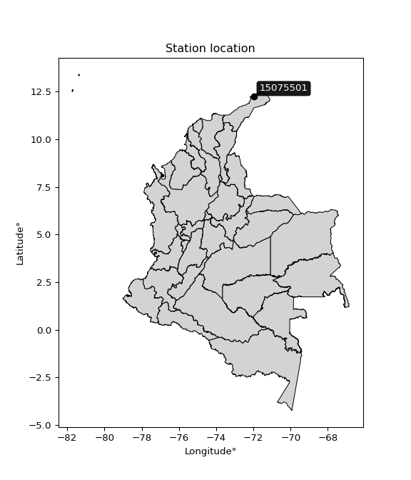

<div align="center">


</div>

# PMax24h Station (Rain): 15075501

Maximum Precipitation in 24 hours (PMax24h) is the greatest amount of rainfall for a specific duration that is meteorologically possible for a given location, acting as a "worst-case" scenario for extreme storms, crucial for designing safety-critical infrastructure like bridges, river deviations, dams, spillways, and nuclear plants to prevent catastrophic failure. The PMax24h is related with the Probable Maximum Precipitation (PMP) and it is calculated by hydrologists using meteorological data to determine the upper limit of extreme rainfall, often leading to the Probable Maximum Flood (PMF) for flood control design, and is increasingly being studied for climate change impacts. Probable Maximum Precipitation (PMP) is the theoretical upper limit of rainfall, a deterministic estimate for extreme events, while probability distributions (like GEV, Gumbel) describe the likelihood and frequency of various precipitation amounts, including rare ones, showing how often events occur, with PMP representing the extreme end of these distributions, used for critical infrastructure design to ensure safety against the worst conceivable weather, unlike standard statistical forecasts which cover typical probabilities.

The most common probability distributions in hydrology, used for analyzing floods, rainfall, and streamflow, include the Normal, Log-Normal, Gumbel, Gamma (including Log-Pearson Type III), and Generalized Extreme Value (GEV) distributions, often chosen based on the data´s skewness and whether modeling extremes or general conditions, with Gumbel and GEV popular for extreme events like floods, while the Normal distribution serves as a baseline, though often requiring transformations for skewed hydrological data. These distributions help in designing water infrastructure, managing water resources, and forecasting hydrologic events.

> Hydrological data often isn´t perfectly normal (it´s skewed), so different distributions are needed for different applications, such as: **Flood Frequency Analysis**: Using Gumbel, GEV, or Log-Pearson Type III for predicting extreme flood magnitudes and their return periods, **Rainfall Analysis**: Normal for annual totals, but Log-Normal, Weibull, or GEV for intensity or extreme daily rainfall, **Streamflow Modeling**: Gamma and Log-Normal for maximum flows, GEV for minimum flows, and Kappa for daily flows.

<div align="center">

</img>

</div>


## A. General information


### 1. General running parameters

• app_version: _v20260225_. • runtime: _2026-02-28 16:54:07.457399_. • Python version: _3.14.0_. • SciPy version: _1.16.3_. • Pandas version: _2.3.3_. • NumPy version: _2.3.5_. • Stations dataset (station_dataset_file): _dataset/pmax24h_in/automatic_colombia_2003_2025.csv_. • Stations catalog (station_catalog_file): _dataset/CNE.xls_. • Minimum year to eval til year_max (date_min): _1900_. • Maximum year to eval since year_min (date_max): _2025_. • Creates, save and include plots into reports (create_plot): _False_. • Plot only fit distributions with Δo > Δ (plot_only_fit): _True_. • Plot only simple graphs avoiding multiple CDFs and multiple Extreme values plots (plot_only_simple): _False_. • Eval low extreme values, if False, evaluates high extreme values (low_extreme): _False_. • Eval every SciPy distribution as logarithmic (pdist_logarithmic_on): _True_. • Standard deviation normalized (ddof): _1.0_. • Return periods to eval in years (Tr): _[2, 2.33, 5, 10, 15, 20, 25, 50, 75, 100, 200, 250, 500, 750, 1000]_. • Minimum data sample per station, 0 means any (minimum_sample): _5_. • Z-Score maximum threshold to adjust a value, 0 means disable (zscore_max): _3.5_. • Z-Score minimum threshold to adjust a value, 0 means disable (zscore_min): _-2.5_. • Avoid zeros, e.g. rain = 0 (avoid_zeros): _True_. • Avoid null values (avoid_nans): _True_. 

:file_folder:Table: [dataset.csv](../../dataset/pmax24h_in/automatic_colombia_2003_2025.csv)

> Delta Degrees of Freedom (DDOF): is a parameter used in the formulas for calculating variance and standard deviation. When ddof=0, the divisor is $N$ (the total number of observations) and this is used when your data set is the entire population. When ddof=1, the divisor is $N-1$ and this is used when your data set is a sample drawn from a larger population. Using $N-1$ provides an unbiased estimate of the population variance (known as Bessel´s correction).


### 2. Station info and location

|   id |   CODIGO | NOMBRE                                      | CATEGORIA               | TECNOLOGIA                              | ESTADO   | FECHA_INSTALACION   |   FECHA_SUSPENSION |   ALTITUD |   LATITUD |   LONGITUD | DEPARTAMENTO   | MUNICIPIO   | AREA_OPERATIVA                                         | ENTIDAD                                                     | AREA_HIDROGRAFICA   | ZONA_HIDROGRAFICA   | SUBZONA_HIDROGRAFICA                          |   CORRIENTE | Catalogo   |   Version |
|-----:|---------:|:--------------------------------------------|:------------------------|:----------------------------------------|:---------|:--------------------|-------------------:|----------:|----------:|-----------:|:---------------|:------------|:-------------------------------------------------------|:------------------------------------------------------------|:--------------------|:--------------------|:----------------------------------------------|------------:|:-----------|----------:|
|    0 | 15075501 | AEROPUERTO PUERTO BOLIVAR  - AUT [15075501] | Climatológica Principal | Automática con Telemetría, Convencional | Activa   | 21/08/2014          |                nan |        10 |   12.2243 |   -71.9829 | La Guajira     | Uribia      | Area Operativa 05 - Magdalena-Cesar-Guajira-San Andrés | INSTITUTO DE HIDROLOGIA METEOROLOGIA Y ESTUDIOS AMBIENTALES | Caribe              | Caribe - Guajira    | Directos Caribe - Ay.Sharimahana Alta Guajira |         nan | CNE_IDEAM  |  20251226 |

<div align="center">

Dynamic map: [:earth_americas:Google](http://maps.google.com/maps?q=12.22430556,-71.98288889) [:earth_americas:OSM](https://www.openstreetmap.org/#map=18/12.22430556/-71.98288889&layers=P) [:earth_americas:Bing](https://www.bing.com/maps?cp=12.22430556~-71.98288889&lvl=18) [:earth_americas:Apple](https://maps.apple.com/frame?center=12.22430556%2C-71.98288889&span=0.003%2C0.006)

</div>


<div align="center">

```geojson
{
  "type": "Feature",
  "geometry": {
    "type": "Point", 
    "coordinates": [-71.98288889, 12.22430556]
  }, 
  "properties": {
    "Name": "15075501"
  }
}
```

</div>


### 3. Discrete values table and plot

<div align="center">

|               |          0 |         1 |           2 |           3 |           4 |           5 |           6 |           7 |           8 |           9 |          10 |          11 |
|:--------------|-----------:|----------:|------------:|------------:|------------:|------------:|------------:|------------:|------------:|------------:|------------:|------------:|
| Date          | 2014       | 2015      | 2016        | 2017        | 2018        | 2019        | 2020        | 2021        | 2022        | 2023        | 2024        | 2025        |
| Value         |   64.64    |   48.47   |   17.39     |   26.41     |    8.6      |    0.4      |    0.2      |    1.7      |    3.4      |    0.5      |    8        |    1.2      |
| Value_initial |   64.64    |   48.47   |   17.39     |   26.41     |    8.6      |    0.4      |    0.2      |    1.7      |    3.4      |    0.5      |    8        |    1.2      |
| count         |   12       |   12      |   12        |   12        |   12        |   12        |   12        |   12        |   12        |   12        |   12        |   12        |
| mean          |   15.0758  |   15.0758 |   15.0758   |   15.0758   |   15.0758   |   15.0758   |   15.0758   |   15.0758   |   15.0758   |   15.0758   |   15.0758   |   15.0758   |
| std           |   21.2228  |   21.2228 |   21.2228   |   21.2228   |   21.2228   |   21.2228   |   21.2228   |   21.2228   |   21.2228   |   21.2228   |   21.2228   |   21.2228   |
| zscore        |    2.33542 |    1.5735 |    0.109041 |    0.534055 |   -0.305135 |   -0.691511 |   -0.700935 |   -0.630256 |   -0.550154 |   -0.686799 |   -0.333406 |   -0.653816 |


</div>


> The initial value (value_initial) correspond to the initial obtained or null completed value, and value (value) is adjusted only when the initial value is outside the valid range (outlier) definite through the Z-Score value. If Z-Score is active, values out of range or outliers are replaced with the station mean value. A Z-Score (or standard score) measures how many standard deviations a data point is from the mean of a dataset, indicating its relative position; positive scores mean above the mean, negative mean below, and a score of zero is exactly at the mean, allowing for comparison of values from different distributions. It´s calculated using the formula $z=(x–μ)/σ$, where $x$ is the data point, $μ$ is the mean, and $σ$ is the standard deviation, helping identify outliers and understand probability.
>
> <sub>**Note**: In this study, "completing" (filling gaps in) and "extending" (forecasting or lengthening the historical record) rainfall data series are avoided for certain critical analyses because they introduce artificial bias and uncertainty, which can distort the statistics of rare events (extremes), alter day-to-day variability, and compromise the integrity and homogeneity of the original data. Some reasons against Completing/Extending rainfall data are: **Distortion of Extremes and Variability**: The primary issue is that most gap-filling or extension methods rely on averaging or regression with nearby stations, which inherently smooths the data. Rainfall is highly variable in space and time, with a large percentage of zero values and occasional large storms. Infilling methods often underestimate the highest values and overestimate the lowest (zero) values, which severely distorts analyses focused on flood frequency, drought severity, and intensity-duration-frequency (IDF) curves, **Loss of Data Homogeneity**: Infilled or extended data are synthetic estimates, not actual measurements. Combining these estimates with observed data can violate the assumption of data homogeneity, which requires that the data properties do not change over time. Inhomogeneity can lead to incorrect conclusions about long-term trends or changes in climate patterns, **Propagation of Errors**: Errors and biases from the original data (e.g., wind-induced undercatch, instrument errors, site changes) or the data used for imputation can propagate through the analysis, leading to unreliable hydrological models and inaccurate predictions, **Compromised Statistical Integrity**: For statistical analyses, especially those involving the frequency of events, using artificial data can introduce time bias or autocorrelation that doesn´t exist in reality, making it difficult to assess the true probability of events, **Difficulty in Validation**: It is difficult to accurately validate the quality of filled or extended data, especially for past periods where ground-truth measurements are unavailable. The reliability of imputation techniques heavily depends on the density of the surrounding station network and the complexity of the local topography.</sub>


### 4. Active continuous probability distributions from SciPy (80 of 104 available)

A Probability Density Function (PDF) describes the relative likelihood of a continuous random variable falling within a specific range, where the total area under its curve equals 1, and the area over any interval gives the actual probability for that range. Unlike discrete probabilities (like rolling a die), a PDF shows density, not direct probability for a single point (which is zero), with higher points indicating higher likelihood, often visualized as a bell curve for normal distributions.

A log of a probability density function (log-PDF) is simply the logarithm of the PDF´s value, denoted as $log(f(x))$, useful for converting multiplication of probabilities into addition, improving numerical stability with tiny numbers, and connecting to information theory concepts like entropy. Instead of dealing with very small probabilities (e.g., 0.000001), log-PDFs use negative numbers (e.g., $log(0.00001) ≈ -11.51$ that are easier for computers to handle, preventing underflow errors and simplifying complex calculations. In this study, each active probability distribution from SciPy is also evaluated in the $log$ form.

[scipy.stats](https://docs.scipy.org/doc/scipy/reference/stats.html) is a Python´s powerful submodule within the SciPy library for comprehensive statistical analysis, offering over 130 probability distributions (like Normal, Poisson, etc.), functions for descriptive stats (mean, variance), hypothesis testing (t-tests, chi-square), random variable generation, and statistical tests, making it essential for data science, modeling, and research. It provides tools to explore, model, and draw conclusions from data efficiently, working seamlessly with [NumPy](https://numpy.org/).

<div align="center">

|   id | p_dist           |   n_parameter | fit_method   | label                                                                       | active   | ref                                                                                                      |
|-----:|:-----------------|--------------:|:-------------|:----------------------------------------------------------------------------|:---------|:---------------------------------------------------------------------------------------------------------|
|    0 | alpha            |             3 | MLE          | Alpha                                                                       | True     | [:mortar_board:](https://docs.scipy.org/doc/scipy/reference/generated/scipy.stats.alpha.html)            |
|    1 | anglit           |             2 | MM           | Anglit                                                                      | True     | [:mortar_board:](https://docs.scipy.org/doc/scipy/reference/generated/scipy.stats.anglit.html)           |
|    2 | arcsine          |             2 | MM           | Arcsine                                                                     | True     | [:mortar_board:](https://docs.scipy.org/doc/scipy/reference/generated/scipy.stats.arcsine.html)          |
|    3 | argus            |             3 | MLE          | Argus                                                                       | True     | [:mortar_board:](https://docs.scipy.org/doc/scipy/reference/generated/scipy.stats.argus.html)            |
|    4 | beta             |             4 | MLE          | Beta                                                                        | True     | [:mortar_board:](https://docs.scipy.org/doc/scipy/reference/generated/scipy.stats.beta.html)             |
|    5 | betaprime        |             4 | MLE          | Beta prime                                                                  | True     | [:mortar_board:](https://docs.scipy.org/doc/scipy/reference/generated/scipy.stats.betaprime.html)        |
|    6 | bradford         |             3 | MLE          | Bradford                                                                    | True     | [:mortar_board:](https://docs.scipy.org/doc/scipy/reference/generated/scipy.stats.bradford.html)         |
|    7 | burr             |             4 | MLE          | Burr (Type III)                                                             | True     | [:mortar_board:](https://docs.scipy.org/doc/scipy/reference/generated/scipy.stats.burr.html)             |
|    8 | burr12           |             4 | MLE          | Burr (Type III) 12                                                          | True     | [:mortar_board:](https://docs.scipy.org/doc/scipy/reference/generated/scipy.stats.burr12.html)           |
|    9 | cosine           |             2 | MLE          | Cosine                                                                      | True     | [:mortar_board:](https://docs.scipy.org/doc/scipy/reference/generated/scipy.stats.cosine.html)           |
|   10 | crystalball      |             4 | MLE          | Crystalball                                                                 | True     | [:mortar_board:](https://docs.scipy.org/doc/scipy/reference/generated/scipy.stats.crystalball.html)      |
|   11 | dgamma           |             3 | MLE          | Double gamma                                                                | True     | [:mortar_board:](https://docs.scipy.org/doc/scipy/reference/generated/scipy.stats.dgamma.html)           |
|   12 | dweibull         |             3 | MLE          | Double Weibull                                                              | True     | [:mortar_board:](https://docs.scipy.org/doc/scipy/reference/generated/scipy.stats.dweibull.html)         |
|   13 | erlang           |             3 | MLE          | Erlang                                                                      | True     | [:mortar_board:](https://docs.scipy.org/doc/scipy/reference/generated/scipy.stats.erlang.html)           |
|   14 | exponnorm        |             3 | MLE          | Exponentially modified Normal                                               | True     | [:mortar_board:](https://docs.scipy.org/doc/scipy/reference/generated/scipy.stats.exponnorm.html)        |
|   15 | exponpow         |             3 | MLE          | Exponential power                                                           | True     | [:mortar_board:](https://docs.scipy.org/doc/scipy/reference/generated/scipy.stats.exponpow.html)         |
|   16 | exponweib        |             4 | MLE          | Exponentiated Weibull                                                       | True     | [:mortar_board:](https://docs.scipy.org/doc/scipy/reference/generated/scipy.stats.exponweib.html)        |
|   17 | f                |             4 | MLE          | F                                                                           | True     | [:mortar_board:](https://docs.scipy.org/doc/scipy/reference/generated/scipy.stats.f.html)                |
|   18 | fatiguelife      |             3 | MLE          | Fatigue-life (Birnbaum-Saunders)                                            | True     | [:mortar_board:](https://docs.scipy.org/doc/scipy/reference/generated/scipy.stats.fatiguelife.html)      |
|   19 | foldnorm         |             3 | MM           | Fold Normal                                                                 | True     | [:mortar_board:](https://docs.scipy.org/doc/scipy/reference/generated/scipy.stats.foldnorm.html)         |
|   20 | gamma            |             3 | MLE          | Gamma                                                                       | True     | [:mortar_board:](https://docs.scipy.org/doc/scipy/reference/generated/scipy.stats.gamma.html)            |
|   21 | gausshyper       |             6 | MLE          | Gauss hypergeometric                                                        | True     | [:mortar_board:](https://docs.scipy.org/doc/scipy/reference/generated/scipy.stats.gausshyper.html)       |
|   22 | genexpon         |             5 | MLE          | Generalized exponential                                                     | True     | [:mortar_board:](https://docs.scipy.org/doc/scipy/reference/generated/scipy.stats.genexpon.html)         |
|   23 | genextreme       |             3 | MLE          | Generalized exponential                                                     | True     | [:mortar_board:](https://docs.scipy.org/doc/scipy/reference/generated/scipy.stats.genextreme.html)       |
|   24 | gengamma         |             4 | MLE          | Generalized gamma                                                           | True     | [:mortar_board:](https://docs.scipy.org/doc/scipy/reference/generated/scipy.stats.gengamma.html)         |
|   25 | genhalflogistic  |             3 | MLE          | Generalized half-logistic                                                   | True     | [:mortar_board:](https://docs.scipy.org/doc/scipy/reference/generated/scipy.stats.genhalflogistic.html)  |
|   26 | genlogistic      |             3 | MLE          | Generalized logistic                                                        | True     | [:mortar_board:](https://docs.scipy.org/doc/scipy/reference/generated/scipy.stats.genlogistic.html)      |
|   27 | gennorm          |             3 | MLE          | Generalized Normal                                                          | True     | [:mortar_board:](https://docs.scipy.org/doc/scipy/reference/generated/scipy.stats.gennorm.html)          |
|   28 | genpareto        |             3 | MLE          | Generalized Pareto                                                          | True     | [:mortar_board:](https://docs.scipy.org/doc/scipy/reference/generated/scipy.stats.genpareto.html)        |
|   29 | gompertz         |             3 | MLE          | Gompertz (or truncated Gumbel)                                              | True     | [:mortar_board:](https://docs.scipy.org/doc/scipy/reference/generated/scipy.stats.gompertz.html)         |
|   30 | gumbel_l         |             2 | MM           | Gumbel Left Skew                                                            | True     | [:mortar_board:](https://docs.scipy.org/doc/scipy/reference/generated/scipy.stats.gumbel_l.html)         |
|   31 | gumbel_r         |             2 | MM           | Gumbel Right Skew                                                           | True     | [:mortar_board:](https://docs.scipy.org/doc/scipy/reference/generated/scipy.stats.gumbel_r.html)         |
|   32 | halfgennorm      |             3 | MLE          | Upper half of a generalized normal                                          | True     | [:mortar_board:](https://docs.scipy.org/doc/scipy/reference/generated/scipy.stats.halfgennorm.html)      |
|   33 | halflogistic     |             2 | MM           | Half-logistic                                                               | True     | [:mortar_board:](https://docs.scipy.org/doc/scipy/reference/generated/scipy.stats.halflogistic.html)     |
|   34 | halfnorm         |             2 | MM           | Half Normal                                                                 | True     | [:mortar_board:](https://docs.scipy.org/doc/scipy/reference/generated/scipy.stats.halfnorm.html)         |
|   35 | hypsecant        |             2 | MM           | hyperbolic secant                                                           | True     | [:mortar_board:](https://docs.scipy.org/doc/scipy/reference/generated/scipy.stats.hypsecant.html)        |
|   36 | invgamma         |             3 | MLE          | Inverted gamma                                                              | True     | [:mortar_board:](https://docs.scipy.org/doc/scipy/reference/generated/scipy.stats.invgamma.html)         |
|   37 | invgauss         |             3 | MLE          | Inverse Gaussian                                                            | True     | [:mortar_board:](https://docs.scipy.org/doc/scipy/reference/generated/scipy.stats.invgauss.html)         |
|   38 | invweibull       |             3 | MLE          | Inverted Weibull                                                            | True     | [:mortar_board:](https://docs.scipy.org/doc/scipy/reference/generated/scipy.stats.invweibull.html)       |
|   39 | johnsonsb        |             4 | MLE          | Johnson SB                                                                  | True     | [:mortar_board:](https://docs.scipy.org/doc/scipy/reference/generated/scipy.stats.johnsonsb.html)        |
|   40 | johnsonsu        |             4 | MLE          | Johnson Su                                                                  | True     | [:mortar_board:](https://docs.scipy.org/doc/scipy/reference/generated/scipy.stats.johnsonsu.html)        |
|   41 | kappa3           |             3 | MLE          | Kappa 3                                                                     | True     | [:mortar_board:](https://docs.scipy.org/doc/scipy/reference/generated/scipy.stats.kappa3.html)           |
|   42 | kappa4           |             4 | MLE          | Kappa 4                                                                     | True     | [:mortar_board:](https://docs.scipy.org/doc/scipy/reference/generated/scipy.stats.kappa4.html)           |
|   43 | ksone            |             3 | MLE          | Kolmogorov-Smirnov one-sided test statistic distribution                    | True     | [:mortar_board:](https://docs.scipy.org/doc/scipy/reference/generated/scipy.stats.ksone.html)            |
|   44 | kstwobign        |             2 | MLE          | Limiting distribution of scaled Kolmogorov-Smirnov two-sided test statistic | True     | [:mortar_board:](https://docs.scipy.org/doc/scipy/reference/generated/scipy.stats.kstwobign.html)        |
|   45 | laplace          |             2 | MM           | Laplace                                                                     | True     | [:mortar_board:](https://docs.scipy.org/doc/scipy/reference/generated/scipy.stats.laplace.html)          |
|   46 | levy_l           |             2 | MLE          | Left-skewed Levy                                                            | True     | [:mortar_board:](https://docs.scipy.org/doc/scipy/reference/generated/scipy.stats.levy_l.html)           |
|   47 | loggamma         |             3 | MLE          | Log gamma                                                                   | True     | [:mortar_board:](https://docs.scipy.org/doc/scipy/reference/generated/scipy.stats.loggamma.html)         |
|   48 | logistic         |             2 | MM           | Logistic (or Sech-squared)                                                  | True     | [:mortar_board:](https://docs.scipy.org/doc/scipy/reference/generated/scipy.stats.logistic.html)         |
|   49 | loglaplace       |             3 | MLE          | Log-Laplace                                                                 | True     | [:mortar_board:](https://docs.scipy.org/doc/scipy/reference/generated/scipy.stats.loglaplace.html)       |
|   50 | lomax            |             3 | MLE          | Lomax (Pareto of the second kind)                                           | True     | [:mortar_board:](https://docs.scipy.org/doc/scipy/reference/generated/scipy.stats.lomax.html)            |
|   51 | maxwell          |             2 | MM           | Maxwell                                                                     | True     | [:mortar_board:](https://docs.scipy.org/doc/scipy/reference/generated/scipy.stats.maxwell.html)          |
|   52 | mielke           |             4 | MLE          | Mielke Beta-Kappa / Dagum                                                   | True     | [:mortar_board:](https://docs.scipy.org/doc/scipy/reference/generated/scipy.stats.mielke.html)           |
|   53 | moyal            |             2 | MM           | Moyal                                                                       | True     | [:mortar_board:](https://docs.scipy.org/doc/scipy/reference/generated/scipy.stats.moyal.html)            |
|   54 | nakagami         |             3 | MLE          | Nakagami                                                                    | True     | [:mortar_board:](https://docs.scipy.org/doc/scipy/reference/generated/scipy.stats.nakagami.html)         |
|   55 | ncf              |             5 | MLE          | Non-central F distribution                                                  | True     | [:mortar_board:](https://docs.scipy.org/doc/scipy/reference/generated/scipy.stats.ncf.html)              |
|   56 | nct              |             4 | MLE          | Non-central Student’s t                                                     | True     | [:mortar_board:](https://docs.scipy.org/doc/scipy/reference/generated/scipy.stats.nct.html)              |
|   57 | norm             |             2 | MM           | Normal                                                                      | True     | [:mortar_board:](https://docs.scipy.org/doc/scipy/reference/generated/scipy.stats.norm.html)             |
|   58 | pearson3         |             3 | MM           | Pearson type III                                                            | True     | [:mortar_board:](https://docs.scipy.org/doc/scipy/reference/generated/scipy.stats.pearson3.html)         |
|   59 | powerlaw         |             3 | MLE          | Power-function                                                              | True     | [:mortar_board:](https://docs.scipy.org/doc/scipy/reference/generated/scipy.stats.powerlaw.html)         |
|   60 | rayleigh         |             2 | MM           | Rayleigh                                                                    | True     | [:mortar_board:](https://docs.scipy.org/doc/scipy/reference/generated/scipy.stats.rayleigh.html)         |
|   61 | rdist            |             3 | MLE          | R-distributed (symmetric beta)                                              | True     | [:mortar_board:](https://docs.scipy.org/doc/scipy/reference/generated/scipy.stats.rdist.html)            |
|   62 | rice             |             3 | MLE          | Rice                                                                        | True     | [:mortar_board:](https://docs.scipy.org/doc/scipy/reference/generated/scipy.stats.rice.html)             |
|   63 | semicircular     |             2 | MM           | Semicircular                                                                | True     | [:mortar_board:](https://docs.scipy.org/doc/scipy/reference/generated/scipy.stats.semicircular.html)     |
|   64 | skewnorm         |             3 | MLE          | Skew normal                                                                 | True     | [:mortar_board:](https://docs.scipy.org/doc/scipy/reference/generated/scipy.stats.skewnorm.html)         |
|   65 | t                |             3 | MLE          | Student’s t                                                                 | True     | [:mortar_board:](https://docs.scipy.org/doc/scipy/reference/generated/scipy.stats.t.html)                |
|   66 | trapezoid        |             4 | MLE          | Trapezoid                                                                   | True     | [:mortar_board:](https://docs.scipy.org/doc/scipy/reference/generated/scipy.stats.trapezoid.html)        |
|   67 | triang           |             3 | MLE          | Triangular                                                                  | True     | [:mortar_board:](https://docs.scipy.org/doc/scipy/reference/generated/scipy.stats.triang.html)           |
|   68 | truncexpon       |             3 | MLE          | Truncated exponential                                                       | True     | [:mortar_board:](https://docs.scipy.org/doc/scipy/reference/generated/scipy.stats.truncexpon.html)       |
|   69 | truncnorm        |             4 | MLE          | Truncated normal                                                            | True     | [:mortar_board:](https://docs.scipy.org/doc/scipy/reference/generated/scipy.stats.truncnorm.html)        |
|   70 | truncpareto      |             4 | MLE          | Upper truncated Pareto                                                      | True     | [:mortar_board:](https://docs.scipy.org/doc/scipy/reference/generated/scipy.stats.truncpareto.html)      |
|   71 | truncweibull_min |             5 | MLE          | Doubly truncated Weibull minimum                                            | True     | [:mortar_board:](https://docs.scipy.org/doc/scipy/reference/generated/scipy.stats.truncweibull_min.html) |
|   72 | tukeylambda      |             3 | MLE          | Tukey-Lamdba                                                                | True     | [:mortar_board:](https://docs.scipy.org/doc/scipy/reference/generated/scipy.stats.tukeylambda.html)      |
|   73 | uniform          |             2 | MLE          | Uniform                                                                     | True     | [:mortar_board:](https://docs.scipy.org/doc/scipy/reference/generated/scipy.stats.uniform.html)          |
|   74 | vonmises         |             3 | MLE          | Von Mises                                                                   | True     | [:mortar_board:](https://docs.scipy.org/doc/scipy/reference/generated/scipy.stats.vonmises.html)         |
|   75 | vonmises_line    |             3 | MLE          | Von Mises line                                                              | True     | [:mortar_board:](https://docs.scipy.org/doc/scipy/reference/generated/scipy.stats.vonmises_line.html)    |
|   76 | wald             |             2 | MM           | Wald                                                                        | True     | [:mortar_board:](https://docs.scipy.org/doc/scipy/reference/generated/scipy.stats.wald.html)             |
|   77 | weibull_max      |             3 | MLE          | Weibull maximum                                                             | True     | [:mortar_board:](https://docs.scipy.org/doc/scipy/reference/generated/scipy.stats.weibull_max.html)      |
|   78 | weibull_min      |             3 | MLE          | Weibull minimum                                                             | True     | [:mortar_board:](https://docs.scipy.org/doc/scipy/reference/generated/scipy.stats.weibull_min.html)      |
|   79 | wrapcauchy       |             3 | MLE          | Wrapped  Cauchy                                                             | True     | [:mortar_board:](https://docs.scipy.org/doc/scipy/reference/generated/scipy.stats.wrapcauchy.html)       |

</div>

> **n_parameter:** # arguments & localization & scale.
>
> **Fit methods:** (MLE) maximum likelihood, (MM) L-moments.
>
>**Inactive** (With the only purpose of prevent loops, zero divisions, infinite values, over high estimated values or horizontal trending for recurrence intervals estimations, the follow distributions were disabled.)**:** lognorm, norminvgauss, powernorm, powerlognorm, cauchy, halfcauchy, foldcauchy, skewcauchy, chi2, expon, fisk, genhyperbolic, geninvgauss, gibrat, kstwo, laplace_asymmetric, levy, levy_stable, ncx2, pareto, rel_breitwigner, recipinvgauss, studentized_range, loguniform, 


## B. Probability (PDF) vs. Empirical (EDF) distributions functions

A continuous probability distribution (CPD) describes probabilities for variables that can take any value within a range (like rain any time), unlike discrete variables with specific outcomes (like temperature). It uses a Probability Density Function (PDF), a curve where the total area under it equals 1, and the probability of the variable falling within an interval (a to b) is found by calculating the area under the curve between those points. A key feature is that the probability of hitting any single exact value is zero, so probabilities are always expressed for ranges, e.g., $P(a ≤ X ≤ b)$.

<div align="center">

Distributions parameters from station values
|     |   station | p_dist              |   n |             loc |          scale | shape                  | shape1                 | shape2                | shape3             |
|----:|----------:|:--------------------|----:|----------------:|---------------:|:-----------------------|:-----------------------|:----------------------|:-------------------|
|   0 |  15075501 | alpha               |  12 |    -1.65166     |    3.42773     | 1.7488817247206119e-09 |                        |                       |                    |
|   1 |  15075501 | anglit              |  12 |    15.0758      |   59.4421      |                        |                        |                       |                    |
|   2 |  15075501 | arcsine             |  12 |   -13.6601      |   57.4718      |                        |                        |                       |                    |
|   3 |  15075501 | argus               |  12 |   -34.2493      |  101.352       | 2.7652205269832963e-06 |                        |                       |                    |
|   4 |  15075501 | beta                |  12 |     0.2         |   68.1649      | 0.3204907061746831     | 0.6693698076262748     |                       |                    |
|   5 |  15075501 | betaprime           |  12 |     0.2         |   59.8435      | 0.5201130668525892     | 4.13083243866991       |                       |                    |
|   6 |  15075501 | bradford            |  12 |     0.199999    |   64.4406      | 2.5703015309451502     |                        |                       |                    |
|   7 |  15075501 | burr                |  12 |     0.0129883   |    0.00536633  | 0.5877089977428018     | 29.247288082359788     |                       |                    |
|   8 |  15075501 | burr12              |  12 |     0.2         |   34.6749      | 0.49070523690468404    | 2.326962914078785      |                       |                    |
|   9 |  15075501 | cosine              |  12 |    19.5413      |   18.4455      |                        |                        |                       |                    |
|  10 |  15075501 | crystalball         |  12 |    15.0758      |   20.3193      | 405.08109620167113     | 166.5904176958509      |                       |                    |
|  11 |  15075501 | dgamma              |  12 |    13.3914      |    7.80644     | 1.990618165532655      |                        |                       |                    |
|  12 |  15075501 | dweibull            |  12 |     8           |   13.0495      | 0.8237144662022573     |                        |                       |                    |
|  13 |  15075501 | erlang              |  12 |     0.2         |   22.9311      | 0.429070621916158      |                        |                       |                    |
|  14 |  15075501 | exponnorm           |  12 |     0.183568    |    0.0051736   | 2858.0509561166537     |                        |                       |                    |
|  15 |  15075501 | exponpow            |  12 |     0.2         |   57.792       | 0.36369540494672403    |                        |                       |                    |
|  16 |  15075501 | exponweib           |  12 |     0.2         |    4.64877     | 1.5443149106049376     | 0.3552678085080687     |                       |                    |
|  17 |  15075501 | f                   |  12 |     0.2         |   10.2173      | 0.5918513165314159     | 8.012849779526373      |                       |                    |
|  18 |  15075501 | fatiguelife         |  12 |     0.127969    |    2.56837     | 2.938623089585689      |                        |                       |                    |
|  19 |  15075501 | foldnorm            |  12 |   -12.9634      |   35.06        | 0.002589881966505154   |                        |                       |                    |
|  20 |  15075501 | gamma               |  12 |     0.2         |   14.1099      | 0.6144579160654373     |                        |                       |                    |
|  21 |  15075501 | gausshyper          |  12 |     0.2         |   76.4671      | 0.3921011030431344     | 1.2429206854509403     | 1.4968364587841876    | 1.0616069393858518 |
|  22 |  15075501 | genexpon            |  12 |     0.2         |   27.1847      | 1.8274407445974585     | 1.9207267145031846e-10 | 1.3917342946890539    |                    |
|  23 |  15075501 | genextreme          |  12 |     1.3762      |    2.51523     | -1.9983116789321442    |                        |                       |                    |
|  24 |  15075501 | gengamma            |  12 |     0.2         |   22.69        | 0.5565530943713569     | 0.8296335335952623     |                       |                    |
|  25 |  15075501 | genhalflogistic     |  12 |    -6.3153      |   73.5636      | 1.036759850885412      |                        |                       |                    |
|  26 |  15075501 | genlogistic         |  12 |   -84.741       |   11.7778      | 2359.807095372921      |                        |                       |                    |
|  27 |  15075501 | gennorm             |  12 |     1.2         |    0.929983    | 0.44855803954558304    |                        |                       |                    |
|  28 |  15075501 | genpareto           |  12 |     0.2         |    2.37067     | 1.5972242629050593     |                        |                       |                    |
|  29 |  15075501 | gompertz            |  12 |     0.2         |    1.91255e+14 | 13183188149001.797     |                        |                       |                    |
|  30 |  15075501 | gumbel_l            |  12 |    24.2206      |   15.8429      |                        |                        |                       |                    |
|  31 |  15075501 | gumbel_r            |  12 |     5.93105     |   15.8429      |                        |                        |                       |                    |
|  32 |  15075501 | halfgennorm         |  12 |     0.2         |    1.10374     | 0.44095343082170463    |                        |                       |                    |
|  33 |  15075501 | halflogistic        |  12 |    -9.00729     |   17.3723      |                        |                        |                       |                    |
|  34 |  15075501 | halfnorm            |  12 |   -11.819       |   33.7077      |                        |                        |                       |                    |
|  35 |  15075501 | hypsecant           |  12 |    15.0758      |   12.9357      |                        |                        |                       |                    |
|  36 |  15075501 | invgamma            |  12 |    -0.0312591   |    0.54508     | 0.4805150715649431     |                        |                       |                    |
|  37 |  15075501 | invgauss            |  12 |    -0.129015    |    1.56227     | 9.732562987513436      |                        |                       |                    |
|  38 |  15075501 | invweibull          |  12 |     0.117521    |    1.25862     | 0.5004288700801613     |                        |                       |                    |
|  39 |  15075501 | johnsonsb           |  12 |     0.2         |  110.48        | 1.4999089198088602     | 0.10604788875898949    |                       |                    |
|  40 |  15075501 | johnsonsu           |  12 |     0.2         |    4.00725e-09 | -3.504442941833898     | 0.18766201555943035    |                       |                    |
|  41 |  15075501 | kappa3              |  12 |     0.2         |    1.78562     | 0.46809441495678494    |                        |                       |                    |
|  42 |  15075501 | kappa4              |  12 |    -6.23461     |   71.6698      | 1.0984673688183297     | 1.0112203007544833     |                       |                    |
|  43 |  15075501 | ksone               |  12 |    -6.244       |   77.328       | 1.0                    |                        |                       |                    |
|  44 |  15075501 | kstwobign           |  12 |   -37.7286      |   61.4349      |                        |                        |                       |                    |
|  45 |  15075501 | laplace             |  12 |    15.0758      |   14.3679      |                        |                        |                       |                    |
|  46 |  15075501 | levy_l              |  12 |    70.1365      |   30.8196      |                        |                        |                       |                    |
|  47 |  15075501 | loggamma            |  12 | -3871.63        |  582.797       | 788.187485523154       |                        |                       |                    |
|  48 |  15075501 | logistic            |  12 |    15.0758      |   11.2026      |                        |                        |                       |                    |
|  49 |  15075501 | loglaplace          |  12 |    -0.00520376  |    3.4052      | 0.6122452792981363     |                        |                       |                    |
|  50 |  15075501 | lomax               |  12 |     0.2         |    1.48445     | 0.626086599833135      |                        |                       |                    |
|  51 |  15075501 | maxwell             |  12 |   -33.0724      |   30.1725      |                        |                        |                       |                    |
|  52 |  15075501 | mielke              |  12 |     0.009262    |    0.498437    | 1.9392932045083642     | 0.6751891154918153     |                       |                    |
|  53 |  15075501 | moyal               |  12 |     3.45594     |    9.14691     |                        |                        |                       |                    |
|  54 |  15075501 | nakagami            |  12 |     0.2         |   31.3338      | 0.17450655494029593    |                        |                       |                    |
|  55 |  15075501 | ncf                 |  12 |     0.2         |   21.6161      | 0.9864139090391493     | 63.26526787352477      | 0.09413771893500805   |                    |
|  56 |  15075501 | nct                 |  12 |    -0.0957739   |    0.0143937   | 0.4183762663171131     | 54.73618484983305      |                       |                    |
|  57 |  15075501 | norm                |  12 |    15.0758      |   20.3193      |                        |                        |                       |                    |
|  58 |  15075501 | pearson3            |  12 |    15.0758      |   20.3193      | 1.4267804674746132     |                        |                       |                    |
|  59 |  15075501 | powerlaw            |  12 |     0.2         |   64.44        | 0.16896331140061002    |                        |                       |                    |
|  60 |  15075501 | rayleigh            |  12 |   -23.7962      |   31.0154      |                        |                        |                       |                    |
|  61 |  15075501 | rdist               |  12 |    -5.38205     |   31.7921      | 1.1689064191987897     |                        |                       |                    |
|  62 |  15075501 | rice                |  12 |   -14.6657      |   25.4699      | 0.00015542016820333524 |                        |                       |                    |
|  63 |  15075501 | semicircular        |  12 |    15.0758      |   40.6386      |                        |                        |                       |                    |
|  64 |  15075501 | skewnorm            |  12 |     0.199976    |   25.187       | 5003381.287075413      |                        |                       |                    |
|  65 |  15075501 | t                   |  12 |     1.03234     |    1.39484     | 0.4741327265858163     |                        |                       |                    |
|  66 |  15075501 | trapezoid           |  12 |    -6.5562      |   77.328       | 1.0                    | 1.0                    |                       |                    |
|  67 |  15075501 | triang              |  12 |     0.2         |   71.8326      | 4.1678966870689235e-09 |                        |                       |                    |
|  68 |  15075501 | truncexpon          |  12 |     0.199997    |   49.9577      | 1.2898925479901324     |                        |                       |                    |
|  69 |  15075501 | truncnorm           |  12 |   -10.0721      |   28.1011      | 0.36554207393139004    | 2.6586963620889894     |                       |                    |
|  70 |  15075501 | truncpareto         |  12 |    -1.30322     |    1.50322     | 0.25899118242141805    | 43.86791711341212      |                       |                    |
|  71 |  15075501 | truncweibull_min    |  12 |    -0.365325    |  115.58        | 0.02026777857160003    | 0.004891193668241796   | 0.562426180979366     |                    |
|  72 |  15075501 | tukeylambda         |  12 |    -5.48568     |   33.0213      | 1.0352893721980512     |                        |                       |                    |
|  73 |  15075501 | uniform             |  12 |     0.2         |   64.44        |                        |                        |                       |                    |
|  74 |  15075501 | vonmises            |  12 |     1.31337     |    1           | 0.8247690328527731     |                        |                       |                    |
|  75 |  15075501 | vonmises_line       |  12 |    10.2817      |   17.3028      | 1.4796718102414341     |                        |                       |                    |
|  76 |  15075501 | wald                |  12 |    -5.2435      |   20.3193      |                        |                        |                       |                    |
|  77 |  15075501 | weibull_max         |  12 |    64.64        |    1.61694     | 0.2690660041577849     |                        |                       |                    |
|  78 |  15075501 | weibull_min         |  12 |     0.2         |   37.9528      | 0.3974761728713697     |                        |                       |                    |
|  79 |  15075501 | wrapcauchy          |  12 |     0.199988    |   10.256       | 0.8001639141818995     |                        |                       |                    |
|  80 |  15075501 | logalpha            |  12 |   -37.785       |  811.867       | 20.747596241567003     |                        |                       |                    |
|  81 |  15075501 | loganglit           |  12 |     1.42737     |    5.44304     |                        |                        |                       |                    |
|  82 |  15075501 | logarcsine          |  12 |    -1.20395     |    5.26263     |                        |                        |                       |                    |
|  83 |  15075501 | logargus            |  12 |    -2.71777     |    7.16515     | 0.24787047605212628    |                        |                       |                    |
|  84 |  15075501 | logbeta             |  12 |    -1.77568     |    5.94452     | 0.9270161130495486     | 0.7837117880809481     |                       |                    |
|  85 |  15075501 | logbetaprime        |  12 |    -1.60944     |    3.12905     | 0.21452899319627877    | 0.5634751973851512     |                       |                    |
|  86 |  15075501 | logbradford         |  12 |    -1.60947     |    5.7783      | 1.1965085682103607     |                        |                       |                    |
|  87 |  15075501 | logburr             |  12 | -2412.09        | 2398.03        | 1410.9164707576645     | 5100.7917463727445     |                       |                    |
|  88 |  15075501 | logburr12           |  12 |    -2.99765     |   58.6341      | 2.637800953797365      | 661.2987926935841      |                       |                    |
|  89 |  15075501 | logcosine           |  12 |     1.39691     |    1.51046     |                        |                        |                       |                    |
|  90 |  15075501 | logcrystalball      |  12 |     1.42737     |    1.86061     | 6.370088151363692      | 22.25072808666569      |                       |                    |
|  91 |  15075501 | logdgamma           |  12 |     1.56271     |    0.616424    | 2.662266950279842      |                        |                       |                    |
|  92 |  15075501 | logdweibull         |  12 |     1.52794     |    1.8491      | 1.9249674460530501     |                        |                       |                    |
|  93 |  15075501 | logerlang           |  12 |   -48.4319      |    0.0698659   | 713.579177168788       |                        |                       |                    |
|  94 |  15075501 | logexponnorm        |  12 |     1.4252      |    1.86061     | 0.001171166261917789   |                        |                       |                    |
|  95 |  15075501 | logexponpow         |  12 |    -1.60944     |    2.38629     | 0.6096778318537144     |                        |                       |                    |
|  96 |  15075501 | logexponweib        |  12 |    -1.60944     |    1.29532     | 1.2077033899910083     | 0.6420081304985991     |                       |                    |
|  97 |  15075501 | logf                |  12 |    -1.60944     |    1.04805     | 1.205440958232399      | 1.0437282270803814     |                       |                    |
|  98 |  15075501 | logfatiguelife      |  12 |  -146.119       |  147.541       | 0.012626255723847419   |                        |                       |                    |
|  99 |  15075501 | logfoldnorm         |  12 |   -12.8902      |    1.83947     | 7.78015557787684       |                        |                       |                    |
| 100 |  15075501 | loggamma            |  12 |   -48.145       |    0.0703757   | 704.3704405078311      |                        |                       |                    |
| 101 |  15075501 | loggausshyper       |  12 |    -2.08609     |    6.25493     | 1.1016796443363863     | 0.6137728661482401     | 0.9668396381837207    | 1.0157266042354265 |
| 102 |  15075501 | loggenexpon         |  12 |    -1.6133      |    0.0975165   | 0.013034117387918081   | 1.3146599749367671     | 0.0006721832390603707 |                    |
| 103 |  15075501 | loggenextreme       |  12 |     1.10302     |    2.14345     | 0.6378046807436298     |                        |                       |                    |
| 104 |  15075501 | loggengamma         |  12 |    -1.60944     |    1.29504     | 1.2143783431224553     | 0.6334413954591849     |                       |                    |
| 105 |  15075501 | loggenhalflogistic  |  12 |    -2.24394     |    6.7943      | 1.059494674688581      |                        |                       |                    |
| 106 |  15075501 | loggenlogistic      |  12 |    -2.8553      |    1.61883     | 8.665844848878884      |                        |                       |                    |
| 107 |  15075501 | loggennorm          |  12 |     1.2797      |    2.88914     | 25344152.255800717     |                        |                       |                    |
| 108 |  15075501 | loggenpareto        |  12 |    -1.60944     |    1.30049     | 0.41231534898389066    |                        |                       |                    |
| 109 |  15075501 | loggompertz         |  12 |    -1.60944     |    2.02665e+12 | 2852426662255.255      |                        |                       |                    |
| 110 |  15075501 | loggumbel_l         |  12 |     2.26475     |    1.45072     |                        |                        |                       |                    |
| 111 |  15075501 | loggumbel_r         |  12 |     0.589997    |    1.45072     |                        |                        |                       |                    |
| 112 |  15075501 | loghalfgennorm      |  12 |    -1.60944     |    1.50281     | 0.6990470326173699     |                        |                       |                    |
| 113 |  15075501 | loghalflogistic     |  12 |    -0.777871    |    1.59076     |                        |                        |                       |                    |
| 114 |  15075501 | loghalfnorm         |  12 |    -1.03535     |    3.08658     |                        |                        |                       |                    |
| 115 |  15075501 | loghypsecant        |  12 |     1.42737     |    1.1845      |                        |                        |                       |                    |
| 116 |  15075501 | loginvgamma         |  12 |   -22.349       | 3830.03        | 162.1513101102239      |                        |                       |                    |
| 117 |  15075501 | loginvgauss         |  12 |   -11.1683      |  538.46        | 0.023358073018758696   |                        |                       |                    |
| 118 |  15075501 | loginvweibull       |  12 |    -9.27449e+07 |    9.27449e+07 | 54691938.99727382      |                        |                       |                    |
| 119 |  15075501 | logjohnsonsb        |  12 |    -1.60944     |    5.77827     | 0.0905893861811715     | 0.21114917197209174    |                       |                    |
| 120 |  15075501 | logjohnsonsu        |  12 |    -2.38005e+07 |    3.75374e+07 | -14230559.937557474    | 23804821.6965212       |                       |                    |
| 121 |  15075501 | logkappa3           |  12 |    -1.60944     |    5.09539     | 18.611485782040624     |                        |                       |                    |
| 122 |  15075501 | logkappa4           |  12 |    -1.7664      |    6.13081     | 1.0219900162947317     | 1.032951180221468      |                       |                    |
| 123 |  15075501 | logksone            |  12 |    -1.79531     |    6.44536     | 1.0                    |                        |                       |                    |
| 124 |  15075501 | logkstwobign        |  12 |    -5.44054     |    7.83762     |                        |                        |                       |                    |
| 125 |  15075501 | loglaplace          |  12 |     1.42737     |    1.31565     |                        |                        |                       |                    |
| 126 |  15075501 | loglevy_l           |  12 |     4.38762     |    1.16042     |                        |                        |                       |                    |
| 127 |  15075501 | logloggamma         |  12 |   -13.9267      |    6.31083     | 11.889075670547372     |                        |                       |                    |
| 128 |  15075501 | loglogistic         |  12 |     1.42737     |    1.02581     |                        |                        |                       |                    |
| 129 |  15075501 | logloglaplace       |  12 |    -1.60944     |    3.58768     | 0.27726644228579644    |                        |                       |                    |
| 130 |  15075501 | loglomax            |  12 |    -1.60944     |    1.22278     | 0.867099634903786      |                        |                       |                    |
| 131 |  15075501 | logmaxwell          |  12 |    -2.9815      |    2.76285     |                        |                        |                       |                    |
| 132 |  15075501 | logmielke           |  12 |    -1.58952e+08 |    1.58952e+08 | 425140285.9581524      | 104065127.46931304     |                       |                    |
| 133 |  15075501 | logmoyal            |  12 |     0.363353    |    0.837571    |                        |                        |                       |                    |
| 134 |  15075501 | lognakagami         |  12 |    -1.60944     |    3.37768     | 0.11860969035342986    |                        |                       |                    |
| 135 |  15075501 | logncf              |  12 |    -1.60944     |    1.03634     | 1.0942239995939365     | 1.1077156956397987     | 1.0906748792616       |                    |
| 136 |  15075501 | lognct              |  12 |  -103.687       |    1.84149     | 77782.4818234072       | 57.0806095905678       |                       |                    |
| 137 |  15075501 | lognorm             |  12 |     1.42737     |    1.86061     |                        |                        |                       |                    |
| 138 |  15075501 | logpearson3         |  12 |     1.42736     |    1.86062     | -0.10133637454593442   |                        |                       |                    |
| 139 |  15075501 | logpowerlaw         |  12 |    -1.60944     |    5.77827     | 0.2609144185350141     |                        |                       |                    |
| 140 |  15075501 | lograyleigh         |  12 |    -2.13209     |    2.84004     |                        |                        |                       |                    |
| 141 |  15075501 | logrdist            |  12 |    -1.23008     |    3.38184     | 1.044693150418785      |                        |                       |                    |
| 142 |  15075501 | logrice             |  12 |    -2.38353     |    2.20011     | 1.3097423251192795     |                        |                       |                    |
| 143 |  15075501 | logsemicircular     |  12 |     1.42737     |    3.72123     |                        |                        |                       |                    |
| 144 |  15075501 | logskewnorm         |  12 |     2.217       |    2.02124     | -0.5611932347842217    |                        |                       |                    |
| 145 |  15075501 | logt                |  12 |     1.42737     |    1.86062     | 49952574863.813805     |                        |                       |                    |
| 146 |  15075501 | logtrapezoid        |  12 |    -2.29663     |    6.93393     | 1.0                    | 1.0                    |                       |                    |
| 147 |  15075501 | logtriang           |  12 |    -3.15812     |    7.32696     | 0.9999999889982254     |                        |                       |                    |
| 148 |  15075501 | logtruncexpon       |  12 |    -1.61268     |    7.56329     | 0.7644185739547991     |                        |                       |                    |
| 149 |  15075501 | logtruncnorm        |  12 |     1.30159     |    2.63774     | -1.1042139759938712    | 1.0870125046850942     |                       |                    |
| 150 |  15075501 | logtruncpareto      |  12 |    -1.60945     |    1.68751e-05 | 2.8247968002540635e-05 | 342415.0238731126      |                       |                    |
| 151 |  15075501 | logtruncweibull_min |  12 |    -1.78131     |    7.2801      | 1.3136825721981844     | 0.0008909772393220139  | 0.81731627961774      |                    |
| 152 |  15075501 | logtukeylambda      |  12 |     1.28285     |    3.20251     | 1.107256519085071      |                        |                       |                    |
| 153 |  15075501 | loguniform          |  12 |    -1.60944     |    5.77827     |                        |                        |                       |                    |
| 154 |  15075501 | logvonmises         |  12 |    -2.55757     |    1           | 0.14366631485619946    |                        |                       |                    |
| 155 |  15075501 | logvonmises_line    |  12 |     1.28028     |    0.919828    | 0.5068480362175865     |                        |                       |                    |
| 156 |  15075501 | logwald             |  12 |    -0.433241    |    1.86062     |                        |                        |                       |                    |
| 157 |  15075501 | logweibull_max      |  12 |     4.16883     |    1.25931     | 0.6921131871323509     |                        |                       |                    |
| 158 |  15075501 | logweibull_min      |  12 |    -3.01871     |    5.01689     | 2.6511827832473918     |                        |                       |                    |
| 159 |  15075501 | logwrapcauchy       |  12 |    -1.60944     |    0.919644    | 0.1566712339825191     |                        |                       |                    |

</div>

> **loc** (Location parameter): This shifts the distribution along the x-axis. For many common distributions, like the normal (Gaussian) distribution, loc represents the mean $μ$. For others, like the uniform distribution, it might represent the minimum value, or for the beta distribution, the left end of the support interval.
>
> **scale** (Scale parameter): This determines the width or spread of the distribution. For the normal distribution, scale represents the standard deviation $σ$. For a uniform distribution, it defines the length of the interval (from $loc$ to $loc + scale$).
>
> **shape** (Shape parameters): Refers to parameters that define the specific form of a probability distribution, distinct from its location (loc) and scale (scale). These parameters are required arguments for most distribution functions. For example, a normal (Gaussian) distribution is fully defined by its location (mean) and scale (standard deviation), so it has no specific shape parameters beyond loc and scale. However, other distributions have intrinsic properties that need specification, as Gamma distribution that takes a shape parameter, often named $a$ or $alpha$.


### 0. Cumulative distribution values - CDF (160 evaluated)

Cumulative Distribution Function (CDF), denoted as $F$<sub>$X$</sub>$(x)$, is a function that gives the probability that a random variable $X$ will take a value less than or equal to a specific value, $x$ (i.e., $(P(X≥x)$. It essentially "accumulates" probabilities from a given point up to the far right (positive infinity), providing a complete picture of the distribution´s probabilities for both discrete (like rain) and continuous (like temperature) variables, helping to find probabilities over ranges or above certain values. Each station is evaluated separately ordering the $x$ values ascending, calculating the CDF and PDF values for the activated distributions and their logarithmic forms.

<div align="center">

CDF ordered by x ascending and calculating $log(f(x))$ separately
|   id |   Station |   date |     x |   count |    mean |     std |    zscore |   Value_initial |   station |   m |     alpha |   alpha_pdf |   anglit |   anglit_pdf |   arcsine |   arcsine_pdf |    argus |   argus_pdf |        beta |    beta_pdf |   betaprime |   betaprime_pdf |    bradford |   bradford_pdf |      burr |    burr_pdf |      burr12 |   burr12_pdf |   cosine |   cosine_pdf |   crystalball |   crystalball_pdf |   dgamma |   dgamma_pdf |   dweibull |   dweibull_pdf |      erlang |   erlang_pdf |   exponnorm |   exponnorm_pdf |   exponpow |   exponpow_pdf |   exponweib |   exponweib_pdf |           f |       f_pdf |   fatiguelife |   fatiguelife_pdf |   foldnorm |   foldnorm_pdf |       gamma |        gamma_pdf |   gausshyper |   gausshyper_pdf |    genexpon |   genexpon_pdf |   genextreme |   genextreme_pdf |    gengamma |   gengamma_pdf |   genhalflogistic |   genhalflogistic_pdf |   genlogistic |   genlogistic_pdf |   gennorm |   gennorm_pdf |   genpareto |   genpareto_pdf |    gompertz |   gompertz_pdf |   gumbel_l |   gumbel_l_pdf |   gumbel_r |   gumbel_r_pdf |   halfgennorm |   halfgennorm_pdf |   halflogistic |   halflogistic_pdf |   halfnorm |   halfnorm_pdf |   hypsecant |   hypsecant_pdf |   invgamma |   invgamma_pdf |   invgauss |   invgauss_pdf |   invweibull |   invweibull_pdf |   johnsonsb |   johnsonsb_pdf |   johnsonsu |   johnsonsu_pdf |      kappa3 |   kappa3_pdf |      kappa4 |   kappa4_pdf |     ksone |   ksone_pdf |   kstwobign |   kstwobign_pdf |   laplace |   laplace_pdf |   levy_l |   levy_l_pdf |   loggamma |   loggamma_pdf |   logistic |   logistic_pdf |   loglaplace |   loglaplace_pdf |       lomax |   lomax_pdf |   maxwell |   maxwell_pdf |    mielke |   mielke_pdf |    moyal |   moyal_pdf |    nakagami |   nakagami_pdf |         ncf |     ncf_pdf |       nct |     nct_pdf |     norm |   norm_pdf |   pearson3 |   pearson3_pdf |    powerlaw |   powerlaw_pdf |   rayleigh |   rayleigh_pdf |    rdist |     rdist_pdf |     rice |    rice_pdf |   semicircular |   semicircular_pdf |   skewnorm |   skewnorm_pdf |        t |       t_pdf |   trapezoid |   trapezoid_pdf |      triang |   triang_pdf |   truncexpon |   truncexpon_pdf |   truncnorm |   truncnorm_pdf |   truncpareto |   truncpareto_pdf |   truncweibull_min |   truncweibull_min_pdf |   tukeylambda |   tukeylambda_pdf |    uniform |   uniform_pdf |   vonmises |   vonmises_pdf |   vonmises_line |   vonmises_line_pdf |     wald |   wald_pdf |   weibull_max |   weibull_max_pdf |   weibull_min |   weibull_min_pdf |   wrapcauchy |   wrapcauchy_pdf |   logalpha |   logalpha_pdf |   loganglit |   loganglit_pdf |   logarcsine |   logarcsine_pdf |   logargus |   logargus_pdf |   logbeta |   logbeta_pdf |   logbetaprime |   logbetaprime_pdf |   logbradford |   logbradford_pdf |   logburr |   logburr_pdf |   logburr12 |   logburr12_pdf |   logcosine |   logcosine_pdf |   logcrystalball |   logcrystalball_pdf |   logdgamma |   logdgamma_pdf |   logdweibull |   logdweibull_pdf |   logerlang |   logerlang_pdf |   logexponnorm |   logexponnorm_pdf |   logexponpow |   logexponpow_pdf |   logexponweib |   logexponweib_pdf |        logf |       logf_pdf |   logfatiguelife |   logfatiguelife_pdf |   logfoldnorm |   logfoldnorm_pdf |   loggausshyper |   loggausshyper_pdf |   loggenexpon |   loggenexpon_pdf |   loggenextreme |   loggenextreme_pdf |   loggengamma |   loggengamma_pdf |   loggenhalflogistic |   loggenhalflogistic_pdf |   loggenlogistic |   loggenlogistic_pdf |   loggennorm |   loggennorm_pdf |   loggenpareto |   loggenpareto_pdf |   loggompertz |   loggompertz_pdf |   loggumbel_l |   loggumbel_l_pdf |   loggumbel_r |   loggumbel_r_pdf |   loghalfgennorm |   loghalfgennorm_pdf |   loghalflogistic |   loghalflogistic_pdf |   loghalfnorm |   loghalfnorm_pdf |   loghypsecant |   loghypsecant_pdf |   loginvgamma |   loginvgamma_pdf |   loginvgauss |   loginvgauss_pdf |   loginvweibull |   loginvweibull_pdf |   logjohnsonsb |   logjohnsonsb_pdf |   logjohnsonsu |   logjohnsonsu_pdf |   logkappa3 |   logkappa3_pdf |   logkappa4 |   logkappa4_pdf |   logksone |   logksone_pdf |   logkstwobign |   logkstwobign_pdf |   loglevy_l |   loglevy_l_pdf |   logloggamma |   logloggamma_pdf |   loglogistic |   loglogistic_pdf |   logloglaplace |   logloglaplace_pdf |    loglomax |   loglomax_pdf |   logmaxwell |   logmaxwell_pdf |   logmielke |   logmielke_pdf |   logmoyal |   logmoyal_pdf |   lognakagami |   lognakagami_pdf |      logncf |   logncf_pdf |    lognct |   lognct_pdf |   lognorm |   lognorm_pdf |   logpearson3 |   logpearson3_pdf |   logpowerlaw |   logpowerlaw_pdf |   lograyleigh |   lograyleigh_pdf |   logrdist |   logrdist_pdf |   logrice |   logrice_pdf |   logsemicircular |   logsemicircular_pdf |   logskewnorm |   logskewnorm_pdf |      logt |   logt_pdf |   logtrapezoid |   logtrapezoid_pdf |   logtriang |   logtriang_pdf |   logtruncexpon |   logtruncexpon_pdf |   logtruncnorm |   logtruncnorm_pdf |   logtruncpareto |   logtruncpareto_pdf |   logtruncweibull_min |   logtruncweibull_min_pdf |   logtukeylambda |   logtukeylambda_pdf |   loguniform |   loguniform_pdf |   logvonmises |   logvonmises_pdf |   logvonmises_line |   logvonmises_line_pdf |   logwald |   logwald_pdf |   logweibull_max |   logweibull_max_pdf |   logweibull_min |   logweibull_min_pdf |   logwrapcauchy |   logwrapcauchy_pdf |
|-----:|----------:|-------:|------:|--------:|--------:|--------:|----------:|----------------:|----------:|----:|----------:|------------:|---------:|-------------:|----------:|--------------:|---------:|------------:|------------:|------------:|------------:|----------------:|------------:|---------------:|----------:|------------:|------------:|-------------:|---------:|-------------:|--------------:|------------------:|---------:|-------------:|-----------:|---------------:|------------:|-------------:|------------:|----------------:|-----------:|---------------:|------------:|----------------:|------------:|------------:|--------------:|------------------:|-----------:|---------------:|------------:|-----------------:|-------------:|-----------------:|------------:|---------------:|-------------:|-----------------:|------------:|---------------:|------------------:|----------------------:|--------------:|------------------:|----------:|--------------:|------------:|----------------:|------------:|---------------:|-----------:|---------------:|-----------:|---------------:|--------------:|------------------:|---------------:|-------------------:|-----------:|---------------:|------------:|----------------:|-----------:|---------------:|-----------:|---------------:|-------------:|-----------------:|------------:|----------------:|------------:|----------------:|------------:|-------------:|------------:|-------------:|----------:|------------:|------------:|----------------:|----------:|--------------:|---------:|-------------:|-----------:|---------------:|-----------:|---------------:|-------------:|-----------------:|------------:|------------:|----------:|--------------:|----------:|-------------:|---------:|------------:|------------:|---------------:|------------:|------------:|----------:|------------:|---------:|-----------:|-----------:|---------------:|------------:|---------------:|-----------:|---------------:|---------:|--------------:|---------:|------------:|---------------:|-------------------:|-----------:|---------------:|---------:|------------:|------------:|----------------:|------------:|-------------:|-------------:|-----------------:|------------:|----------------:|--------------:|------------------:|-------------------:|-----------------------:|--------------:|------------------:|-----------:|--------------:|-----------:|---------------:|----------------:|--------------------:|---------:|-----------:|--------------:|------------------:|--------------:|------------------:|-------------:|-----------------:|-----------:|---------------:|------------:|----------------:|-------------:|-----------------:|-----------:|---------------:|----------:|--------------:|---------------:|-------------------:|--------------:|------------------:|----------:|--------------:|------------:|----------------:|------------:|----------------:|-----------------:|---------------------:|------------:|----------------:|--------------:|------------------:|------------:|----------------:|---------------:|-------------------:|--------------:|------------------:|---------------:|-------------------:|------------:|---------------:|-----------------:|---------------------:|--------------:|------------------:|----------------:|--------------------:|--------------:|------------------:|----------------:|--------------------:|--------------:|------------------:|---------------------:|-------------------------:|-----------------:|---------------------:|-------------:|-----------------:|---------------:|-------------------:|--------------:|------------------:|--------------:|------------------:|--------------:|------------------:|-----------------:|---------------------:|------------------:|----------------------:|--------------:|------------------:|---------------:|-------------------:|--------------:|------------------:|--------------:|------------------:|----------------:|--------------------:|---------------:|-------------------:|---------------:|-------------------:|------------:|----------------:|------------:|----------------:|-----------:|---------------:|---------------:|-------------------:|------------:|----------------:|--------------:|------------------:|--------------:|------------------:|----------------:|--------------------:|------------:|---------------:|-------------:|-----------------:|------------:|----------------:|-----------:|---------------:|--------------:|------------------:|------------:|-------------:|----------:|-------------:|----------:|--------------:|--------------:|------------------:|--------------:|------------------:|--------------:|------------------:|-----------:|---------------:|----------:|--------------:|------------------:|----------------------:|--------------:|------------------:|----------:|-----------:|---------------:|-------------------:|------------:|----------------:|----------------:|--------------------:|---------------:|-------------------:|-----------------:|---------------------:|----------------------:|--------------------------:|-----------------:|---------------------:|-------------:|-----------------:|--------------:|------------------:|-------------------:|-----------------------:|----------:|--------------:|-----------------:|---------------------:|-----------------:|---------------------:|----------------:|--------------------:|
|    0 |  15075501 |   2020 |  0.2  |      12 | 15.0758 | 21.2228 | -0.700935 |            0.2  |  15075501 |   1 | 0.0641455 |  0.143781   | 0.260061 |   0.0147595  |  0.326798 |     0.0129469 | 0.168189 |  0.00946186 | 1.06404e-06 | 1.22863e+10 | 6.66525e-10 |     1.249e+07   | 1.93955e-08 |     0.0313412  | 0.0326977 | 0.331701    | 3.06663e-09 |  5.42165e+07 | 0.195176 |   0.0129324  |      0.232053 |        0.0150181  | 0.246748 |  0.019955    |   0.259855 |    0.0179602   | 2.31657e-08 |  3.58116e+08 |  0.00111067 |     0.0675041   | 2.1759e-07 |    2.85119e+09 | 3.54926e-10 |     7.01584e+06 | 4.79183e-06 | 5.10898e+10 |     0.0241328 |        0.822755   |   0.292676 |     0.0212088  | 1.47356e-11 | 326220           |  8.43661e-08 |      1.20482e+09 | 7.40236e-13 |    0.0672231   |    0.0200221 |      0.475081    | 6.02694e-09 |    1.00263e+08 |         0.0464169 |            0.00746792 |      0.175485 |       0.0259188   |  0.391433 |   0.0766467   | 6.97455e-12 |     0.421821    | 9.06468e-15 |    0.0689299   |   0.19712  |    0.0111263   |   0.237918 |     0.0215623  |   1.93735e-17 |       0.349002    |       0.258965 |         0.0268513  |   0.278583 |     0.0222128  |    0.195222 |      0.0141632  |  0.0281327 |    0.335416    |  0.0324728 |    0.272283    |    0.0200215 |      0.47509     |  0.00117544 |     1.49197e+13 | 0.000261052 | 44713.2         | 6.29396e-16 |   2.83455    | 0.000440392 |    0.0298947 | 0.0833333 |   0.0129319 |    0.15953  |      0.0230218  |  0.177551 |    0.0123575  | 0.493206 |   0.00303792 |  0.0498091 |      0.0574228 |   0.209509 |     0.0147836  |    0.0497193 |        0.0377906 | 1.02364e-09 | 0.421764    |  0.25084  |    0.0175072  | 0.0463868 |  0.309713    | 0.232165 |  0.0255236  | 3.98816e-07 |    5.01492e+09 | 1.13454e-09 | 2.01604e+07 | 0.0274683 | 0.380464    | 0.232053 | 0.0150181  |   0.251164 |     0.0257543  | 0.000788593 |    4.80059e+12 |   0.25866  |     0.0184929  | 0.562446 |     0.0112847 | 0.156611 | 0.0193267   |       0.272279 |         0.0145781  | 0          |     0.0316783  | 0.362981 | 0.125989    |  0.00763364 |      0.00225974 | 7.72383e-09 |   0.0278425  |  9.59609e-08 |       0.027621   | 2.43646e-08 |      0.0375722  |   7.23836e-09 |        0.27592    |        3.17076e-11 |             0.371503   |      0.588239 |         0.0155251 | 0          |     0.0155183 |   0.204694 |      0.194571  |        0.268865 |          0.0194494  | 0.131448 | 0.0520725  |     0.0675125 |       0.000759832 |   6.18606e-08 |        8.8588e+08 |  1.65676e-06 |       0.139792   |  0.0450568 |      0.058863  |   0.0508576 |       0.0807294 |     0        |         0        |  0.0352509 |      0.0632483 | 0.0288605 |      0.161448 |    0.000282777 |        2.73206e+11 |   7.44096e-06 |          0.263154 |  0.032802 |     0.0655889 |   0.0334779 |       0.0625342 |   0.037874  |       0.062446  |        0.0513235 |            0.0565964 |   0.040281  |       0.0479653 |     0.0314302 |         0.0533565 |   0.0498385 |       0.0574779 |      0.0513229 |          0.056596  |   1.68299e-10 |    462106         |    5.96754e-13 |       2083.8       | 2.41557e-10 | 655684         |        0.0500417 |            0.0565652 |     0.0497229 |         0.0558202 |       0.0537062 |            0.121776 |   0.000517278 |         0.133951  |       0.0797503 |           0.0520662 |   6.71111e-13 |      2324.95      |            0.0491287 |                0.0814749 |        0.0369418 |            0.0626022 |  2.73518e-07 |         0.173062 |    1.29385e-09 |          0.768944  |   1.29664e-12 |       1.40746     |     0.0668742 |         0.0445204 |     0.0105204 |         0.0330281 |      3.75723e-09 |            0.524996  |         0         |             0         |     0         |         0         |      0.0489314 |          0.0411471 |     0.0428326 |         0.0584218 |      0.041759 |         0.0618476 |       0.0320757 |           0.0650615 |    1.25484e-06 |       1661.01      |       0.051927 |          0.0569255 | 3.79898e-12 |        0.167724 |  0.00471016 |        0.183664 |  0.0288377 |        0.15515 |      0.0293454 |          0.0714404 |    0.339979 |       0.026564  |     0.0592847 |         0.054445  |     0.0492473 |         0.0456439 |     1.60299e-05 |         2.00165e+10 | 3.08826e-09 |      0.709122  |    0.0302667 |        0.0629597 |   0.0415207 |       0.0600836 | 0.00116689 |     0.00794646 |   0.000119243 |       1.27392e+11 | 1.02652e-09 |  2.52931e+06 | 0.0512634 |    0.0566071 | 0.0513235 |     0.0565964 |     0.0541387 |         0.0560054 |    5.2119e-05 |       6.12427e+10 |     0.0167911 |         0.0637105 |   0.463125 |     0.0975962  | 0.0261306 |     0.0671856 |         0.0460148 |             0.0988732 |     0.0522478 |         0.0563057 | 0.0513236 |  0.0565965 |     0.00982191 |          0.0285857 |   0.0446765 |       0.057696  |     0.000802581 |            0.247309 |    0.000181628 |           0.113195 |      0.000229351 |         4637.29      |             0.0133777 |                  0.103279 |      7.10543e-15 |             0.303051 |     0        |         0.173062 |      0.669815 |          0.172175 |        7.85785e-07 |              0.0978443 |  0        |     0         |        0.056674  |            0.0194855 |        0.0339277 |            0.0627313 |     4.83365e-07 |            0.237363 |
|    1 |  15075501 |   2019 |  0.4  |      12 | 15.0758 | 21.2228 | -0.691511 |            0.4  |  15075501 |   2 | 0.0947787 |  0.160923   | 0.263018 |   0.0148135  |  0.329381 |     0.0128841 | 0.170086 |  0.00950956 | 0.128617    | 0.206254    | 0.117301    |     0.301947    | 0.00624339  |     0.0310931  | 0.102738  | 0.341566    | 0.163379    |  0.35248     | 0.197771 |   0.0130132  |      0.235067 |        0.015126   | 0.25076  |  0.0201653   |   0.26348  |    0.0182944   | 0.147155    |  0.313777    |  0.0145305  |     0.066647    | 0.126997   |    0.229634    | 0.139219    |     0.322858    | 0.23582     | 0.347255    |     0.174926  |        0.54774    |   0.296913 |     0.0211631  | 0.0812656   |      0.247487    |  0.140638    |      0.274774    | 0.0133546   |    0.0663254   |    0.120971  |      0.452651    | 0.125628    |    0.286376    |         0.0479127 |            0.00749011 |      0.180701 |       0.0262402   |  0.407525 |   0.0845722   | 0.0760933   |     0.343445    | 0.0136914   |    0.0679861   |   0.199357 |    0.0112362   |   0.242242 |     0.0216788  |   0.0506286   |       0.217941    |       0.264328 |         0.0267705  |   0.283021 |     0.0221655  |    0.198072 |      0.0143429  |  0.106143  |    0.397757    |  0.0948657 |    0.327462    |    0.120973  |      0.452665    |  0.796868   |     0.150107    | 0.48089     |     0.373902    | 0.168073    |   0.475672   | 0.00546862  |    0.0233283 | 0.0859197 |   0.0129319 |    0.16416  |      0.023274   |  0.18004  |    0.0125307  | 0.493815 |   0.00304907 |  0.103561  |      0.0995484 |   0.212481 |     0.0149369  |    0.0842038 |        0.0640015 | 0.0760841   | 0.343407    |  0.25435  |    0.0175889  | 0.10682   |  0.286818    | 0.237281 |  0.0256389  | 0.136556    |    0.238297    | 0.0750475   | 0.184551    | 0.120646  | 0.475348    | 0.235067 | 0.015126   |   0.256315 |     0.0257615  | 0.376894    |    0.318406    |   0.262365 |     0.0185539  | 0.564704 |     0.0112956 | 0.160494 | 0.0194965   |       0.275197 |         0.0146082  | 0.00633638 |     0.0316774  | 0.390157 | 0.146012    |  0.00809227 |      0.00232664 | 0.00556076  |   0.027765   |  0.00551325  |       0.0275106  | 0.00750464  |      0.0374737  |   0.0509801   |        0.235768   |        0.0636346   |             0.274587   |      0.591344 |         0.0155257 | 0.00310366 |     0.0155183 |   0.246519 |      0.223754  |        0.272773 |          0.0196317  | 0.141902 | 0.0524434  |     0.0676648 |       0.000763278 |   0.116883    |        0.218154   |  0.0278893   |       0.138735   |  0.101532  |      0.105988  |   0.120701  |       0.119705  |     0.15023  |         0.266081 |  0.0922514 |      0.100835  | 0.134058  |      0.14722  |    0.579834    |        0.157939    |   0.170454    |          0.230125 |  0.10249  |     0.136587  |   0.0943482 |       0.113736  |   0.0972294 |       0.109513  |        0.103904  |            0.0969884 |   0.0892343 |       0.0980136 |     0.0903353 |         0.121733  |   0.103648  |       0.0996643 |      0.103903  |          0.0969879 |   0.451724    |         0.363349  |    0.420403    |          0.330304  | 0.411358    |      0.242063  |        0.102854  |            0.0977102 |     0.101913  |         0.0967341 |       0.140493  |            0.127327 |   0.109258    |         0.176614  |       0.123534  |           0.0752873 |   0.391731    |         0.315202  |            0.109038  |                0.0917013 |        0.101672  |            0.126198  |  0.5         |         0.173062 |    0.382331    |          0.389382  |   0.623025    |       0.530577    |     0.105608  |         0.06881   |     0.0593425 |         0.115535  |      0.261477    |            0.293302  |         0         |             0         |     0.0307702 |         0.258309  |      0.087466  |          0.0729161 |     0.0995973 |         0.107395  |      0.102424 |         0.114924  |       0.101715  |           0.137093  |    0.370626    |          0.130766  |       0.104701 |          0.0971864 | 0.116258    |        0.167724 |  0.125665   |        0.171566 |  0.13638   |        0.15515 |      0.1071    |          0.151618  |    0.360033 |       0.0315366 |     0.108306  |         0.0887297 |     0.0923986 |         0.081751  |     0.31696     |         0.126788    | 0.322532    |      0.306605  |    0.0941918 |        0.12203   |   0.101938  |       0.116742  | 0.0318223  |     0.102099   |   0.564639    |       0.192378    | 0.296393    |  0.209578    | 0.103867  |    0.0970472 | 0.103904  |     0.0969884 |     0.105546  |         0.0941355 |    0.575049   |       0.21646     |     0.0875589 |         0.137537  |   0.530481 |     0.0974091  | 0.0925761 |     0.123516  |         0.127415  |             0.132885  |     0.104353  |         0.0959018 | 0.103904  |  0.0969884 |     0.0396289  |          0.0574192 |   0.093618  |       0.0835191 |     0.164604    |            0.225652 |    0.0900919   |           0.146144 |      0.833622    |            0.113191  |             0.110149  |                  0.162508 |      0.126112    |             0.174787 |     0.119958 |         0.173062 |      0.783903 |          0.156743 |        0.0711193   |              0.112236  |  0        |     0         |        0.0722607 |            0.0258414 |        0.0948723 |            0.113772  |     0.158301    |            0.212058 |
|    2 |  15075501 |   2023 |  0.5  |      12 | 15.0758 | 21.2228 | -0.686799 |            0.5  |  15075501 |   3 | 0.111146  |  0.166078   | 0.264501 |   0.0148402  |  0.330668 |     0.0128533 | 0.171038 |  0.00953335 | 0.146482    | 0.15666     | 0.144458    |     0.246641    | 0.00934657  |     0.0309706  | 0.135655  | 0.316104    | 0.194169    |  0.271749    | 0.199074 |   0.0130534  |      0.236583 |        0.0151797  | 0.252782 |  0.0202696   |   0.265318 |    0.0184651   | 0.174889    |  0.247852    |  0.0211728  |     0.0661977   | 0.147033   |    0.176886    | 0.167615    |     0.252283    | 0.265694    | 0.260207    |     0.222253  |        0.409729   |   0.299028 |     0.02114    | 0.103978    |      0.210176    |  0.164761    |      0.214236    | 0.0199649   |    0.065881    |    0.162842  |      0.38669     | 0.151069    |    0.228415    |         0.0486622 |            0.00750124 |      0.183333 |       0.0263974   |  0.416214 |   0.0892951   | 0.108862    |     0.312698    | 0.0204666   |    0.0675191   |   0.200483 |    0.0112915   |   0.244413 |     0.0217354  |   0.0714122   |       0.19875     |       0.267003 |         0.0267296  |   0.285236 |     0.0221416  |    0.199511 |      0.0144331  |  0.144654  |    0.370556    |  0.127299  |    0.319281    |    0.162846  |      0.386701    |  0.808827   |     0.0965511   | 0.511237    |     0.249455    | 0.20943     |   0.362285   | 0.00775922  |    0.0225387 | 0.0872129 |   0.0129319 |    0.166493 |      0.0233973  |  0.181297 |    0.0126182  | 0.49412  |   0.00305467 |  0.127493  |      0.115044  |   0.213979 |     0.0150136  |    0.0997679 |        0.0758314 | 0.108849    | 0.312667    |  0.256111 |    0.0176291  | 0.134525  |  0.267204    | 0.239848 |  0.0256935  | 0.157314    |    0.183013    | 0.0915979   | 0.149956    | 0.16608   | 0.430908    | 0.236583 | 0.0151797  |   0.258892 |     0.0257632  | 0.403619    |    0.227323    |   0.264222 |     0.0185836  | 0.565834 |     0.0113012 | 0.162447 | 0.0195803   |       0.276659 |         0.0146231  | 0.00950406 |     0.0316761  | 0.405272 | 0.156279    |  0.00832661 |      0.00236008 | 0.00833532  |   0.0277262  |  0.00826157  |       0.0274556  | 0.0112495   |      0.0374238  |   0.0737222   |        0.219427   |        0.0894448   |             0.242912   |      0.592896 |         0.015526  | 0.00465549 |     0.0155183 |   0.269621 |      0.238223  |        0.27474  |          0.0197222  | 0.147154 | 0.0525766  |     0.0677412 |       0.000765011 |   0.135872    |        0.167195   |  0.041702    |       0.137436   |  0.12706   |      0.122867  |   0.148656  |       0.130717  |     0.201696 |         0.204311 |  0.116045  |      0.112372  | 0.16678   |      0.146172 |    0.610654    |        0.121371    |   0.220794    |          0.221188 |  0.135442 |     0.158401  |   0.121588  |       0.130333  |   0.123395  |       0.124965  |        0.127208  |            0.111996  |   0.113541  |       0.120339  |     0.120482  |         0.1486    |   0.127609  |       0.115182  |      0.127207  |          0.111996  |   0.526221    |         0.307257  |    0.486833    |          0.268803  | 0.458777    |      0.187082  |        0.126347  |            0.112954  |     0.125192  |         0.112029  |       0.168995  |            0.128103 |   0.149768    |         0.186114  |       0.141302  |           0.084069  |   0.455481    |         0.259474  |            0.129912  |                0.0954258 |        0.132214  |            0.147377  |  0.5         |         0.173062 |    0.461272    |          0.320999  |   0.72463     |       0.387571    |     0.122053  |         0.0787759 |     0.0887661 |         0.148182  |      0.322934    |            0.258729  |         0.0266237 |             0.314093  |     0.0882798 |         0.256917  |      0.105296  |          0.0872824 |     0.125517  |         0.124963  |      0.130108 |         0.133169  |       0.134825  |           0.159314  |    0.396741    |          0.105577  |       0.128041 |          0.112112  | 0.153684    |        0.167724 |  0.16386    |        0.170812 |  0.171001  |        0.15515 |      0.143379  |          0.172907  |    0.367283 |       0.0334756 |     0.12955   |         0.101813  |     0.112329  |         0.0972027 |     0.342462    |         0.103628    | 0.384254    |      0.249601  |    0.123511  |        0.140588  |   0.130233  |       0.136837  | 0.0602564  |     0.153178   |   0.603049    |       0.15491     | 0.338801    |  0.17278     | 0.127187  |    0.11207   | 0.127208  |     0.111996  |     0.128132  |         0.108428  |    0.618486   |       0.176114    |     0.120458  |         0.15691   |   0.552298 |     0.0981978  | 0.121996  |     0.139988  |         0.157948  |             0.140584  |     0.127389  |         0.110677  | 0.127208  |  0.111996  |     0.0534773  |          0.0667015 |   0.113182  |       0.0918323 |     0.214221    |            0.219092 |    0.12385     |           0.156358 |      0.85552     |            0.0856258 |             0.1474    |                  0.170935 |      0.164903    |             0.172987 |     0.158575 |         0.173062 |      0.818331 |          0.151888 |        0.097339    |              0.123315  |  0        |     0         |        0.0783064 |            0.028393  |        0.122117  |            0.130346  |     0.204025    |            0.197608 |
|    3 |  15075501 |   2025 |  1.2  |      12 | 15.0758 | 21.2228 | -0.653816 |            1.2  |  15075501 |   4 | 0.229359  |  0.163309   | 0.274954 |   0.0150227  |  0.339593 |     0.0126496 | 0.17777  |  0.009699   | 0.215636    | 0.0693659   | 0.26532     |     0.131151    | 0.0307323   |     0.030139   | 0.301261  | 0.175337    | 0.313589    |  0.117024    | 0.208309 |   0.0133313  |      0.247339 |        0.0155502  | 0.267221 |  0.0209782   |   0.27868  |    0.0197329   | 0.290514    |  0.120895    |  0.0664314  |     0.0631369   | 0.226579   |    0.0808504   | 0.281158    |     0.113865    | 0.377552    | 0.109084    |     0.379471  |        0.132525   |   0.313768 |     0.0209744  | 0.213854    |      0.125732    |  0.262931    |      0.101344    | 0.0650134   |    0.0628527   |    0.340144  |      0.169572    | 0.259026    |    0.113946    |         0.0539406 |            0.0075799  |      0.20218  |       0.0274325   |  0.5      |   0.215291    | 0.275645    |     0.182554    | 0.0666078   |    0.0643386   |   0.208523 |    0.0116829   |   0.259759 |     0.0221017  |   0.183917    |       0.133977    |       0.285611 |         0.0264336  |   0.300675 |     0.0219694  |    0.209837 |      0.0150719  |  0.333375  |    0.191308    |  0.307622  |    0.199484    |    0.340151  |      0.169574    |  0.841813   |     0.0258448   | 0.600295    |     0.0724878   | 0.359608    |   0.136808   | 0.0225853   |    0.0202905 | 0.0962653 |   0.0129319 |    0.18316  |      0.0242082  |  0.190349 |    0.0132482  | 0.496272 |   0.00309435 |  0.255047  |      0.174871  |   0.224676 |     0.0155496  |    0.19408   |        0.147516  | 0.27562     | 0.182545    |  0.268547 |    0.0178989  | 0.281159  |  0.163518    | 0.257953 |  0.0260199  | 0.239469    |    0.083565    | 0.165073    | 0.0802791   | 0.369159  | 0.191022    | 0.247339 | 0.0155502  |   0.276921 |     0.0257399  | 0.494674    |    0.0835818   |   0.2773   |     0.0187792  | 0.573759 |     0.0113434 | 0.176353 | 0.020144    |       0.286931 |         0.0147239  | 0.0316708  |     0.0316534  | 0.531687 | 0.186228    |  0.0100606  |      0.00259421 | 0.0276487   |   0.0274549  |  0.0273465   |       0.0270736  | 0.0373211   |      0.0370632  |   0.198145    |        0.145193   |        0.214106    |             0.134428   |      0.603765 |         0.0155283 | 0.0155183  |     0.0155183 |   0.465101 |      0.306746  |        0.288765 |          0.0203439  | 0.184077 | 0.0527049  |     0.068281  |       0.000777317 |   0.209952    |        0.0740036  |  0.131814    |       0.117438   |  0.262488  |      0.183579  |   0.279154  |       0.164828  |     0.343112 |         0.137314 |  0.233071  |      0.153839  | 0.294367  |      0.146127 |    0.685363    |        0.0615395   |   0.40103     |          0.191941 |  0.301785 |     0.211443  |   0.261464  |       0.185633  |   0.257394  |       0.178467  |        0.251696  |            0.171404  |   0.263127  |       0.220104  |     0.29069   |         0.225534  |   0.255319  |       0.175081  |      0.251695  |          0.171403  |   0.731712    |         0.177514  |    0.659186    |          0.144773  | 0.572807    |      0.0922232 |        0.251918  |            0.172727  |     0.25032   |         0.172872  |       0.28226   |            0.130718 |   0.322401    |         0.202938  |       0.23183   |           0.1241    |   0.62491     |         0.145297  |            0.220651  |                0.112616  |        0.290908  |            0.206805  |  0.5         |         0.173062 |    0.664129    |          0.164703  |   0.919687    |       0.113037    |     0.211804  |         0.129314  |     0.265942  |         0.2428    |      0.506318    |            0.169454  |         0.292962  |             0.287339  |     0.306793  |         0.239148  |      0.214077  |          0.167412  |     0.263756  |         0.18758   |      0.27501  |         0.193177  |       0.30248   |           0.213288  |    0.468806    |          0.0679351 |       0.252444 |          0.171073  | 0.300522    |        0.167724 |  0.312683   |        0.169472 |  0.30683   |        0.15515 |      0.317925  |          0.214515  |    0.400627 |       0.0434113 |     0.24296   |         0.157739  |     0.229043  |         0.172139  |     0.412444    |         0.0638237   | 0.542694    |      0.131539  |    0.273554  |        0.196581  |   0.280718  |       0.200667  | 0.265225   |     0.285288   |   0.705208    |       0.0906188   | 0.452665    |  0.0992083   | 0.251755  |    0.171501  | 0.251696  |     0.171404  |     0.248702  |         0.166568  |    0.73675    |       0.107285    |     0.282548  |         0.205866  |   0.641147 |     0.106308   | 0.268631  |     0.190665  |         0.291043  |             0.161218  |     0.250505  |         0.1698    | 0.251696  |  0.171404  |     0.127814   |          0.103119  |   0.207855  |       0.124448  |     0.395344    |            0.195144 |    0.27646     |           0.190197 |      0.908135    |            0.0437879 |             0.30554   |                  0.186789 |      0.314492    |             0.169371 |     0.310086 |         0.173062 |      0.944696 |          0.138725 |        0.234109    |              0.195758  |  0.198743 |     0.5727    |        0.108596  |            0.0418576 |        0.262015  |            0.185708  |     0.353638    |            0.148076 |
|    4 |  15075501 |   2021 |  1.7  |      12 | 15.0758 | 21.2228 | -0.630256 |            1.7  |  15075501 |   5 | 0.306452  |  0.144315   | 0.282497 |   0.015148   |  0.345884 |     0.0125156 | 0.182648 |  0.00981631 | 0.245706    | 0.0527914   | 0.323442    |     0.103929    | 0.0456591   |     0.0295719  | 0.375482  | 0.12601     | 0.363347    |  0.0854801   | 0.215023 |   0.0135256  |      0.255179 |        0.015809   | 0.277831 |  0.021457    |   0.288791 |    0.020726    | 0.343498    |  0.0938431   |  0.0974721  |     0.0610376   | 0.261728   |    0.0618323   | 0.330045    |     0.0848036   | 0.424201    | 0.0807398   |     0.433003  |        0.0877154  |   0.324225 |     0.0208518  | 0.270759    |      0.103792    |  0.307218    |      0.078274    | 0.0959175   |    0.0607752   |    0.409935  |      0.1156      | 0.309099    |    0.0888967   |         0.0577447 |            0.00763685 |      0.216065 |       0.0280988   |  0.564816 |   0.101016    | 0.354212    |     0.135484    | 0.0982291   |    0.0621589   |   0.214436 |    0.0119674   |   0.270868 |     0.0223309  |   0.244786    |       0.111078    |       0.298773 |         0.0262123  |   0.311628 |     0.0218415  |    0.217489 |      0.0155351  |  0.412515  |    0.131257    |  0.392621  |    0.144851    |    0.409944  |      0.115602    |  0.852085   |     0.0165553   | 0.629376    |     0.0472628   | 0.41586     |   0.09338    | 0.0325388   |    0.0195756 | 0.102731  |   0.0129319 |    0.195397 |      0.0247305  |  0.197089 |    0.0137173  | 0.497826 |   0.00312322 |  0.319363  |      0.193636  |   0.232546 |     0.0159309  |    0.252905  |        0.192227  | 0.354184    | 0.135481    |  0.277542 |    0.0180789  | 0.352018  |  0.123055    | 0.271009 |  0.026195   | 0.275862    |    0.0641645   | 0.200925    | 0.0646862   | 0.4462    | 0.124789    | 0.255179 | 0.015809   |   0.289779 |     0.0256881  | 0.529751    |    0.0596724   |   0.286721 |     0.0189051  | 0.579439 |     0.0113769 | 0.186521 | 0.0205223   |       0.29431  |         0.0147925  | 0.0474903  |     0.0316222  | 0.614937 | 0.142383    |  0.0113995  |      0.00276145 | 0.0413277   |   0.0272611  |  0.0408158   |       0.026804   | 0.0557857   |      0.0367938  |   0.262796    |        0.115445   |        0.272448    |             0.10193    |      0.61153  |         0.0155302 | 0.0232775  |     0.0155183 |   0.616839 |      0.29016   |        0.299045 |          0.0207733  | 0.210306 | 0.0521354  |     0.0686719 |       0.000786301 |   0.241849    |        0.0556232  |  0.185679    |       0.0979036  |  0.329494  |      0.200148  |   0.338214  |       0.173837  |     0.389304 |         0.128672 |  0.289193  |      0.168178  | 0.345448  |      0.147275 |    0.704813    |        0.0507516   |   0.466185    |          0.182349 |  0.37634  |     0.215061  |   0.328781  |       0.199993  |   0.322364  |       0.193878  |        0.314917  |            0.190903  |   0.34395   |       0.238836  |     0.368676  |         0.216818  |   0.31971   |       0.193854  |      0.314915  |          0.190903  |   0.787571    |         0.14436   |    0.704803    |          0.118428  | 0.601751    |      0.0749747 |        0.315566  |            0.191998  |     0.314147  |         0.192896  |       0.328023  |            0.132121 |   0.392911    |         0.201205  |       0.278132  |           0.141882  |   0.670997    |         0.120482  |            0.261284  |                0.120858  |        0.364565  |            0.21451   |  0.5         |         0.173062 |    0.715232    |          0.130456  |   0.950809    |       0.0692337   |     0.261103  |         0.154122  |     0.352829  |         0.25337   |      0.561103    |            0.145922  |         0.38956   |             0.266616  |     0.388092  |         0.227283  |      0.279206  |          0.206631  |     0.332181  |         0.204216  |      0.344877 |         0.206781  |       0.377675  |           0.216863  |    0.49144     |          0.0625004 |       0.315517 |          0.190391  | 0.358942    |        0.167724 |  0.371681   |        0.169322 |  0.36087   |        0.15515 |      0.392758  |          0.213836  |    0.416657 |       0.0488106 |     0.30164   |         0.178825  |     0.294385  |         0.202496  |     0.433267    |         0.0561339   | 0.584059    |      0.107249  |    0.34422   |        0.208023  |   0.352933  |       0.212422  | 0.365483   |     0.28621    |   0.734469    |       0.0780168   | 0.484378    |  0.0836371   | 0.315007  |    0.190986  | 0.314917  |     0.190903  |     0.31032   |         0.186659  |    0.771701   |       0.0940849   |     0.35565   |         0.212715  |   0.679233 |     0.112822   | 0.337257  |     0.202466  |         0.348085  |             0.166036  |     0.313209  |         0.18958   | 0.314917  |  0.190903  |     0.166254   |          0.117608  |   0.253461  |       0.137424  |     0.461773    |            0.186361 |    0.344398    |           0.199412 |      0.922072    |            0.0366611 |             0.370932  |                  0.188372 |      0.373361    |             0.168711 |     0.370364 |         0.173062 |      0.992676 |          0.137176 |        0.308328    |              0.229949  |  0.380611 |     0.45956   |        0.124433  |            0.0493311 |        0.329371  |            0.20014   |     0.403003    |            0.136188 |
|    5 |  15075501 |   2022 |  3.4  |      12 | 15.0758 | 21.2228 | -0.550154 |            3.4  |  15075501 |   6 | 0.497432  |  0.0851338  | 0.30859  |   0.0155415  |  0.366813 |     0.0121229 | 0.199671 |  0.0102086  | 0.313882    | 0.0318181   | 0.459872    |     0.0636223   | 0.0943887   |     0.0277937  | 0.51998   | 0.0583499   | 0.467083    |  0.045065    | 0.238561 |   0.0141586  |      0.282775 |        0.0166457  | 0.315541 |  0.022832    |   0.327332 |    0.0248312   | 0.465295    |  0.0565375   |  0.195493   |     0.0544085   | 0.341491   |    0.037042    | 0.435147    |     0.0466467   | 0.524662    | 0.04496     |     0.532915  |        0.0416526  |   0.359302 |     0.0204092  | 0.412702    |      0.0687029   |  0.408919    |      0.0474575   | 0.19355     |    0.054212    |    0.538491  |      0.0508151   | 0.424915    |    0.0539336   |         0.0708951 |            0.00783553 |      0.265458 |       0.0298848   |  0.681871 |   0.049446    | 0.513033    |     0.0650869   | 0.197943    |    0.0552857   |   0.235621 |    0.0129637   |   0.309367 |     0.0229098  |   0.394161    |       0.0705335   |       0.342657 |         0.0254021  |   0.34837  |     0.0213769  |    0.245257 |      0.0171387  |  0.556549  |    0.0557212   |  0.557908  |    0.0660119   |    0.5385    |      0.0508152   |  0.870221   |     0.0072112   | 0.681675    |     0.0209257   | 0.521543    |   0.0428097  | 0.0645888   |    0.0183033 | 0.124715  |   0.0129319 |    0.238724 |      0.0261504  |  0.221845 |    0.0154403  | 0.503221 |   0.00322476 |  0.461911  |      0.213189  |   0.260718 |     0.0172053  |    0.428315  |        0.325553  | 0.513005    | 0.0650879   |  0.308745 |    0.0186099  | 0.498783  |  0.0613572   | 0.315831 |  0.0264536  | 0.359291    |    0.039126    | 0.288594    | 0.0425196   | 0.578762  | 0.0499725   | 0.282775 | 0.0166457  |   0.333176 |     0.0253213  | 0.602103    |    0.0317917   |   0.31917  |     0.0192483  | 0.59889  |     0.0115123 | 0.222405 | 0.0216547   |       0.319642 |         0.0150049  | 0.101099   |     0.0314237  | 0.753981 | 0.0450047   |  0.0165773  |      0.00333004 | 0.0871115   |   0.0266022  |  0.085616    |       0.0259072  | 0.117512    |      0.0358074  |   0.409621    |        0.0656316  |        0.398931    |             0.0559593  |      0.637937 |         0.0155376 | 0.0496586  |     0.0155183 |   0.927169 |      0.0899918 |        0.335531 |          0.0221197  | 0.29576  | 0.0480042  |     0.0700354 |       0.000818124 |   0.312142    |        0.0319693  |  0.304367    |       0.0476311  |  0.474165  |      0.212402  |   0.46263   |       0.183207  |     0.475347 |         0.121334 |  0.414361  |      0.191762  | 0.448771  |      0.151235 |    0.734783    |        0.0369811   |   0.586682    |          0.165853 |  0.521191 |     0.198547  |   0.472566  |       0.210736  |   0.463554  |       0.210046  |        0.456433  |            0.213134  |   0.4828    |       0.115499  |     0.484746  |         0.0950476 |   0.462401  |       0.213369  |      0.456431  |          0.213135  |   0.869369    |         0.0947402 |    0.773564    |          0.0828827 | 0.64548     |      0.0532617 |        0.457524  |            0.213224  |     0.457271  |         0.215634  |       0.420951  |            0.13642  |   0.527996    |         0.18632   |       0.388975  |           0.177739  |   0.741787    |         0.0864347 |            0.351569  |                0.140436  |        0.511317  |            0.203874  |  0.5         |         0.173062 |    0.788702    |          0.085592  |   0.981456    |       0.0260994   |     0.386112  |         0.206479  |     0.52411   |         0.233404  |      0.649258    |            0.110569  |         0.557466  |             0.216636  |     0.535782  |         0.197759  |      0.445555  |          0.264807  |     0.479361  |         0.215325  |      0.491479 |         0.211214  |       0.523605  |           0.19978   |    0.532841    |          0.0581366 |       0.456587 |          0.212399  | 0.475199    |        0.167724 |  0.489058   |        0.169442 |  0.468412  |        0.15515 |      0.535134  |          0.193738  |    0.455233 |       0.0635699 |     0.437368  |         0.209519  |     0.450544  |         0.241325  |     0.468318    |         0.0458309   | 0.646444    |      0.0755841 |    0.490675  |        0.210081  |   0.5008    |       0.208587  | 0.549631   |     0.238277   |   0.78212     |       0.0607684   | 0.53446     |  0.0625702   | 0.45656   |    0.213151  | 0.456433  |     0.213134  |     0.449827  |         0.211919  |    0.830314   |       0.0764647   |     0.50248   |         0.206998  |   0.764956 |     0.138639   | 0.481089  |     0.208604  |         0.465186  |             0.170822  |     0.454166  |         0.212934  | 0.456433  |  0.213134  |     0.257767   |          0.146441  |   0.357666  |       0.163247  |     0.585206    |            0.170041 |    0.486399    |           0.208024 |      0.944085    |            0.0276918 |             0.501238  |                  0.186706 |      0.490065    |             0.168181 |     0.490322 |         0.173062 |      1.08859  |          0.1411   |        0.484769    |              0.269378  |  0.62061  |     0.253413  |        0.165236  |            0.0699121 |        0.473309  |            0.211023  |     0.492942    |            0.126234 |
|    6 |  15075501 |   2024 |  8    |      12 | 15.0758 | 21.2228 | -0.333406 |            8    |  15075501 |   7 | 0.722482  |  0.0275648  | 0.382084 |   0.0163486  |  0.420806 |     0.011429  | 0.248979 |  0.0112157  | 0.420019    | 0.0177945   | 0.658528    |     0.0298997   | 0.212845    |     0.0239042  | 0.672507  | 0.0195003   | 0.59896     |  0.019065    | 0.307207 |   0.0156221  |      0.363833 |        0.0184786  | 0.422732 |  0.0223381   |   0.5      |   22.3448      | 0.644689    |  0.0278162   |  0.410584   |     0.039862    | 0.462285   |    0.0196107   | 0.575665    |     0.0209199   | 0.662616    | 0.020923    |     0.655931  |        0.0184718  |   0.450111 |     0.0190324  | 0.637292    |      0.0351727   |  0.563352    |      0.0248691   | 0.408054    |    0.0397924   |    0.670796  |      0.0170041   | 0.597041    |    0.0269161   |         0.108247  |            0.00841492 |      0.407565 |       0.0310535   |  0.820474 |   0.0187519   | 0.682689    |     0.0213979   | 0.415882    |    0.0402631   |   0.301774 |    0.0158312   |   0.415789 |     0.0230316  |   0.613443    |       0.0326745   |       0.453815 |         0.022854   |   0.443446 |     0.0199133  |    0.333969 |      0.0213349  |  0.696743  |    0.0173275   |  0.726879  |    0.0210714   |    0.670805  |      0.017004    |  0.890008   |     0.00275057  | 0.738781    |     0.0078228   | 0.637317    |   0.0155343  | 0.14508     |    0.016916  | 0.184202  |   0.0129319 |    0.363301 |      0.0274366  |  0.305556 |    0.0212665  | 0.518737 |   0.00352857 |  0.640989  |      0.198364  |   0.347143 |     0.0202305  |    0.695405  |        0.231516  | 0.682667    | 0.021399    |  0.396534 |    0.0194013  | 0.663369  |  0.0214371   | 0.43536  |  0.0250974  | 0.489684    |    0.0217102   | 0.434253    | 0.0245882   | 0.703116  | 0.0153174   | 0.363833 | 0.0184786  |   0.445429 |     0.0232836  | 0.699923    |    0.0151617   |   0.408735 |     0.0195435  | 0.653025 |     0.012079  | 0.326967 | 0.0235153   |       0.389717 |         0.0154261  | 0.243199   |     0.0301952  | 0.849676 | 0.0101151   |  0.0354342  |      0.0048686  | 0.205381    |   0.0248192  |  0.199467    |       0.0236283  | 0.275238    |      0.0326642  |   0.602626    |        0.0278069  |        0.567213    |             0.0252121  |      0.709474 |         0.0155677 | 0.121043   |     0.0155183 |   1.62171  |      0.288616  |        0.443591 |          0.0245108  | 0.483691 | 0.0339985  |     0.0740158 |       0.000915406 |   0.413264    |        0.0159417  |  0.413773    |       0.011609   |  0.64874   |      0.189474  |   0.618656  |       0.178473  |     0.579713 |         0.124865 |  0.586777  |      0.208525  | 0.581532  |      0.159934 |    0.761815    |        0.0270795   |   0.721218    |          0.149193 |  0.673557 |     0.155557  |   0.646772  |       0.190828  |   0.641412  |       0.200162  |        0.637003  |            0.201643  |   0.543248  |       0.174485  |     0.546407  |         0.154218  |   0.641579  |       0.198407  |      0.637002  |          0.201644  |   0.931753    |         0.0542022 |    0.832135    |          0.05628   | 0.683936    |      0.0380428 |        0.637557  |            0.2004    |     0.639776  |         0.203427  |       0.541528  |            0.146648 |   0.674317    |         0.153881  |       0.557771  |           0.214134  |   0.803675    |         0.0603232 |            0.484787  |                0.172783  |        0.669227  |            0.162247  |  0.5         |         0.173062 |    0.847175    |          0.054165  |   0.994439    |       0.00782715  |     0.585253  |         0.251609  |     0.698942  |         0.172572  |      0.730223    |            0.0806431 |         0.715371  |             0.153463  |     0.687093  |         0.155356  |      0.666996  |          0.232587  |     0.655355  |         0.189816  |      0.661594 |         0.181219  |       0.676624  |           0.155868  |    0.583407    |          0.0617661 |       0.636546 |          0.201025  | 0.618711    |        0.167701 |  0.63436    |        0.170331 |  0.601169  |        0.15515 |      0.684005  |          0.152875  |    0.521703 |       0.0953115 |     0.62086   |         0.211667  |     0.653772  |         0.220659  |     0.503841    |         0.0372927   | 0.700514    |      0.0528709 |    0.659997  |        0.181012  |   0.664218  |       0.169302  | 0.719598   |     0.160322   |   0.827778    |       0.0468871   | 0.580606    |  0.0465896   | 0.637101  |    0.201566  | 0.637003  |     0.201643  |     0.631431  |         0.205093  |    0.889502   |       0.0629145   |     0.666967  |         0.173891  |   0.939366 |     0.439417   | 0.65189   |     0.185582  |         0.610981  |             0.168431  |     0.635239  |         0.202918  | 0.637003  |  0.201643  |     0.3983     |          0.182035  |   0.510989  |       0.195125  |     0.722775    |            0.151852 |    0.662157    |           0.199259 |      0.96479     |            0.0212683 |             0.657968  |                  0.178794 |      0.634126    |             0.168779 |     0.638405 |         0.173062 |      1.21533  |          0.156633 |        0.702943    |              0.225318  |  0.777795 |     0.130552  |        0.241793  |            0.113708  |        0.647786  |            0.191132  |     0.603932    |            0.137617 |
|    7 |  15075501 |   2018 |  8.6  |      12 | 15.0758 | 21.2228 | -0.305135 |            8.6  |  15075501 |   8 | 0.738109  |  0.0246083  | 0.391916 |   0.0164253  |  0.427645 |     0.0113696 | 0.255746 |  0.0113407  | 0.430445    | 0.0169766   | 0.675794    |     0.0276939   | 0.227058    |     0.0234757  | 0.683647  | 0.0176797   | 0.609963    |  0.017643    | 0.316629 |   0.0157828  |      0.374976 |        0.0186614  | 0.435885 |  0.0214619   |   0.538039 |    0.0501832   | 0.660816    |  0.0259752   |  0.434022   |     0.0382769   | 0.473727   |    0.0185523   | 0.587769    |     0.0194567   | 0.674738    | 0.0195123   |     0.666649  |        0.0172836  |   0.461472 |     0.0188358  | 0.65766     |      0.032759    |  0.577842    |      0.0234585   | 0.431455    |    0.0382194   |    0.68052   |      0.0154526   | 0.612665    |    0.025196    |         0.11332   |            0.00849534 |      0.426142 |       0.0308569   |  0.831207 |   0.0170633   | 0.69489     |     0.0193263   | 0.439547    |    0.0386319   |   0.311388 |    0.0162158   |   0.429573 |     0.0229108  |   0.632291    |       0.0302023   |       0.46742  |         0.0224932  |   0.455331 |     0.0197028  |    0.346916 |      0.0218158  |  0.706622  |    0.015648    |  0.738891  |    0.0190235   |    0.680529  |      0.0154524   |  0.891594   |     0.00254243  | 0.743282    |     0.007199    | 0.646234    |   0.01422    | 0.155196    |    0.0168061 | 0.191962  |   0.0129319 |    0.379745 |      0.0273676  |  0.318586 |    0.0221734  | 0.520867 |   0.00357166 |  0.655226  |      0.195304  |   0.359378 |     0.020551   |    0.711696  |        0.219134  | 0.694868    | 0.0193273   |  0.408186 |    0.0194351  | 0.675623  |  0.019463    | 0.450319 |  0.0247614  | 0.502387    |    0.020652    | 0.44864     | 0.0233871   | 0.711851  | 0.0138439   | 0.374976 | 0.0186614  |   0.459298 |     0.0229434  | 0.708742    |    0.0142561   |   0.420455 |     0.0195176  | 0.660302 |     0.0121795 | 0.341112 | 0.0236305   |       0.398985 |         0.0154652  | 0.261247   |     0.0299647  | 0.855392 | 0.00897425  |  0.0384156  |      0.00506929 | 0.220202    |   0.0245866  |  0.213559    |       0.0233462  | 0.294701    |      0.0322114  |   0.618664    |        0.0257027  |        0.581823    |             0.0235265  |      0.718816 |         0.0155729 | 0.130354   |     0.0155183 |   1.77304  |      0.210561  |        0.458343 |          0.024655   | 0.503608 | 0.0324058  |     0.0745692 |       0.000929458 |   0.422542    |        0.0150044  |  0.420301    |       0.010199   |  0.662319  |      0.186021  |   0.63152   |       0.177251  |     0.588777 |         0.125832 |  0.60188   |      0.209127  | 0.593134  |      0.160939 |    0.763751    |        0.0264517   |   0.731962    |          0.147937 |  0.684663 |     0.151574  |   0.660461  |       0.18772   |   0.655805  |       0.197851  |        0.651483  |            0.198765  |   0.556554  |       0.192917  |     0.558081  |         0.168388  |   0.655818  |       0.195333  |      0.651482  |          0.198765  |   0.935577    |         0.0515734 |    0.836144    |          0.0545794 | 0.686653    |      0.0370935 |        0.651945  |            0.197449  |     0.654381  |         0.20043   |       0.552179  |            0.147916 |   0.685332    |         0.150738  |       0.573336  |           0.216293  |   0.807976    |         0.0586285 |            0.497402  |                0.17608   |        0.680813  |            0.158157  |  0.5         |         0.173062 |    0.851023    |          0.0522492 |   0.994977    |       0.00706965  |     0.603497  |         0.252836  |     0.711223  |         0.167065  |      0.735981    |            0.0786049 |         0.72629   |             0.148515  |     0.698196  |         0.151684  |      0.683554  |          0.225273  |     0.668951  |         0.18615   |      0.674565 |         0.177469  |       0.68775   |           0.151816  |    0.587903    |          0.062594  |       0.650982 |          0.198175  | 0.630839    |        0.167691 |  0.646683   |        0.17045  |  0.612389  |        0.15515 |      0.694928  |          0.149194  |    0.528734 |       0.0991635 |     0.636098  |         0.209696  |     0.669553  |         0.215685  |     0.506505    |         0.0363792   | 0.704286    |      0.0514475 |    0.67296   |        0.177443  |   0.676312  |       0.165141  | 0.730976   |     0.154368   |   0.831134    |       0.0459398   | 0.583938    |  0.0455534   | 0.651576  |    0.198682  | 0.651483  |     0.198765  |     0.646172  |         0.202516  |    0.894019   |       0.0620181   |     0.679413  |         0.170267  |   1        |     1.5004e+06 | 0.665196  |     0.182375  |         0.62314   |             0.167805  |     0.649815  |         0.200123  | 0.651483  |  0.198765  |     0.411574   |          0.185044  |   0.525198  |       0.197819  |     0.733705    |            0.150407 |    0.676508    |           0.19758  |      0.966314    |            0.0208593 |             0.670867  |                  0.177919 |      0.646336    |             0.168899 |     0.650921 |         0.173062 |      1.22672  |          0.158267 |        0.718987    |              0.218351  |  0.786996 |     0.123982  |        0.250204  |            0.118946  |        0.661497  |            0.188014  |     0.613963    |            0.139832 |
|    8 |  15075501 |   2016 | 17.39 |      12 | 15.0758 | 21.2228 |  0.109041 |           17.39 |  15075501 |   9 | 0.857143  |  0.00742165 | 0.538892 |   0.0167721  |  0.525662 |     0.0111132 | 0.362904 |  0.0129769  | 0.547974    | 0.0109994   | 0.831699    |     0.0111793   | 0.410285    |     0.018593   | 0.777344  | 0.00659345  | 0.712528    |  0.00792002  | 0.462918 |   0.0171981  |      0.545337 |        0.0195067  | 0.547698 |  0.0198588   |   0.766762 |    0.0156019   | 0.814724    |  0.0117633   |  0.687661   |     0.0211234   | 0.594624   |    0.0105009   | 0.703519    |     0.00913766  | 0.791463    | 0.00917555  |     0.773659  |        0.00883377 |   0.613374 |     0.0156448  | 0.844505    |      0.0133314   |  0.727163    |      0.0125671   | 0.68512     |    0.0211672   |    0.763647  |      0.00596588  | 0.764982    |    0.0120064   |         0.193615  |            0.00982419 |      0.667347 |       0.0229145   |  0.919997 |   0.00587193  | 0.795134    |     0.00686848  | 0.694225    |    0.0210771   |   0.477831 |    0.0214157   |   0.615601 |     0.0188515  |   0.801539    |       0.0121736   |       0.640931 |         0.0169582  |   0.613805 |     0.0162614  |    0.556644 |      0.0242185  |  0.788504  |    0.00571128  |  0.837699  |    0.0067932   |    0.763655  |      0.00596578  |  0.906673   |     0.00121876  | 0.784617    |     0.00319312  | 0.725376    |   0.00588826 | 0.297868    |    0.015791  | 0.305633  |   0.0129319 |    0.603373 |      0.0226098  |  0.574381 |    0.0296228  | 0.555367 |   0.00431673 |  0.779671  |      0.155681  |   0.55146  |     0.0220798  |    0.831182  |        0.128315  | 0.795118    | 0.00686894  |  0.57603  |    0.0182664  | 0.778891  |  0.00724132  | 0.640585 |  0.0182603  | 0.641258    |    0.0124493   | 0.603655    | 0.0135473   | 0.784827  | 0.00514657  | 0.545337 | 0.0195067  |   0.636623 |     0.0173035  | 0.799899    |    0.00786234  |   0.58592  |     0.0177289  | 0.777405 |     0.0150212 | 0.547062 | 0.0223815   |       0.536233 |         0.01564    | 0.505074   |     0.0250967  | 0.899482 | 0.00290758  |  0.0958958  |      0.00800927 | 0.421345    |   0.0211796  |  0.401733    |       0.0195795  | 0.546454    |      0.0249171  |   0.767771    |        0.0115509  |        0.725998    |             0.0118866  |      0.856184 |         0.015704  | 0.26676    |     0.0155183 |   3.02226  |      0.0626268 |        0.669461 |          0.0219518  | 0.709912 | 0.0166038  |     0.0837811 |       0.00118297  |   0.518057    |        0.00813414 |  0.468308    |       0.00308687 |  0.77965   |      0.145674  |   0.750563  |       0.158987  |     0.682673 |         0.144046 |  0.749069  |      0.205956  | 0.710752  |      0.174488 |    0.780504    |        0.0214307   |   0.832081    |          0.13673  |  0.777983 |     0.114107  |   0.780007  |       0.149936  |   0.784647  |       0.165287  |        0.778688  |            0.159681  |   0.717348  |       0.227487  |     0.705323  |         0.225849  |   0.780238  |       0.155583  |      0.778687  |          0.159681  |   0.964158    |         0.0310388 |    0.869511    |          0.0410195 | 0.709963    |      0.0295856 |        0.778105  |            0.15819   |     0.782295  |         0.159999  |       0.662062  |            0.166459 |   0.780402    |         0.119163  |       0.729968  |           0.224057  |   0.844174    |         0.0449705 |            0.634242  |                0.214851  |        0.778178  |            0.118833  |  0.5         |         0.173062 |    0.882243    |          0.0374829 |   0.998136    |       0.00262419  |     0.777546  |         0.230477  |     0.8108    |         0.117219  |      0.78509     |            0.0617077 |         0.815137  |             0.105469  |     0.792583  |         0.116772  |      0.814809  |          0.147673  |     0.785742  |         0.14416   |      0.785485 |         0.136725  |       0.78104   |           0.113823  |    0.636475    |          0.0781165 |       0.777892 |          0.15945   | 0.748761    |        0.166914 |  0.767236   |        0.172153 |  0.721636  |        0.15515 |      0.787555  |          0.114356  |    0.615917 |       0.155217  |     0.773014  |         0.174835  |     0.801004  |         0.155386  |     0.529436    |         0.0292188   | 0.736302    |      0.0401983 |    0.784475  |        0.138345  |   0.778043  |       0.123994  | 0.821331   |     0.104858   |   0.860549    |       0.0379478   | 0.612899    |  0.0371743   | 0.778711  |    0.159576  | 0.778688  |     0.15968   |     0.776677  |         0.164805  |    0.934958   |       0.0546307   |     0.786113  |         0.13227   |   1        |     0          | 0.780954  |     0.144877  |         0.738246  |             0.15797   |     0.778133  |         0.161322  | 0.778688  |  0.159681  |     0.552181   |          0.214334  |   0.673724  |       0.224051  |     0.834831    |            0.137036 |    0.808281    |           0.174946 |      0.979777    |            0.01757   |             0.792851  |                  0.168244 |      0.765857    |             0.170856 |     0.77278  |         0.173062 |      1.34375  |          0.173711 |        0.848401    |              0.151172  |  0.856248 |     0.0772163 |        0.357262  |            0.193845  |        0.781195  |            0.150052  |     0.722707    |            0.172284 |
|    9 |  15075501 |   2017 | 26.41 |      12 | 15.0758 | 21.2228 |  0.534055 |           26.41 |  15075501 |  10 | 0.90278   |  0.0034473  | 0.686087 |   0.0156146  |  0.629057 |     0.0120544 | 0.485841 |  0.0141922  | 0.635955    | 0.00880748  | 0.902818    |     0.00545565  | 0.562294    |     0.0153226  | 0.82104   | 0.00359236  | 0.767443    |  0.00471842  | 0.617172 |   0.0166654  |      0.71151  |        0.0168049  | 0.749786 |  0.020137    |   0.867461 |    0.00787366  | 0.892636    |  0.00623889  |  0.830293   |     0.0114772   | 0.672794   |    0.0072103   | 0.76753     |     0.00555039  | 0.854691    | 0.00534942  |     0.836997  |        0.00559872 |   0.738573 |     0.0121133  | 0.92674     |      0.00597887  |  0.817963    |      0.00808819  | 0.828285    |    0.0115432   |    0.80371   |      0.00334263  | 0.847091    |    0.0068592   |         0.289711  |            0.0115562  |      0.828573 |       0.0132289   |  0.956008 |   0.00266081  | 0.839927    |     0.00361878  | 0.835797    |    0.0113185   |   0.682792 |    0.0229893   |   0.759915 |     0.0131689  |   0.87994     |       0.00613045  |       0.769606 |         0.0117344  |   0.743261 |     0.0124424  |    0.748832 |      0.0174636  |  0.82633   |    0.0031124   |  0.882074  |    0.00358804  |    0.803718  |      0.00334256  |  0.915598   |     0.00082107  | 0.80704     |     0.00196145  | 0.765694    |   0.00343189 | 0.437611    |    0.0152398 | 0.422279  |   0.0129319 |    0.774223 |      0.0152806  |  0.772817 |    0.0158118  | 0.598834 |   0.00538463 |  0.838912  |      0.127692  |   0.733361 |     0.0174551  |    0.877118  |        0.0933997 | 0.839915    | 0.00361904  |  0.726014 |    0.0147213  | 0.826612  |  0.00389499  | 0.77553  |  0.0119413  | 0.73558     |    0.0088241   | 0.703572    | 0.00907369  | 0.819189  | 0.00285354  | 0.71151  | 0.0168049  |   0.767505 |     0.0118997  | 0.85899     |    0.0055375   |   0.730228 |     0.0140799  | 1        | 26701.3       | 0.727583 | 0.017249    |       0.675225 |         0.0150438  | 0.701946   |     0.0184339  | 0.918354 | 0.0015241   |  0.181746   |      0.0110262  | 0.596618    |   0.0176834  |  0.563315    |       0.0163452  | 0.736359    |      0.0172939  |   0.848599    |        0.00703595 |        0.812709    |             0.00788448 |      1        |         0.0229988 | 0.406735   |     0.0155183 |   4.48887  |      0.308208  |        0.831288 |          0.0136586  | 0.821903 | 0.00913821 |     0.0961185 |       0.00158446  |   0.578176    |        0.00552167 |  0.489344    |       0.00187737 |  0.835049  |      0.119523  |   0.813787  |       0.143037  |     0.747573 |         0.169788 |  0.832918  |      0.193776  | 0.786322  |      0.188371 |    0.78897     |        0.0191613   |   0.887966    |          0.130848 |  0.821457 |     0.0943724 |   0.837288  |       0.124097  |   0.848417  |       0.139337  |        0.839485  |            0.131044  |   0.80392   |       0.183947  |     0.795746  |         0.201623  |   0.839426  |       0.127538  |      0.839485  |          0.131045  |   0.975255    |         0.0224645 |    0.885344    |          0.034963  | 0.721604    |      0.0262463 |        0.838336  |            0.129868  |     0.843062  |         0.130607  |       0.735629  |            0.187773 |   0.826323    |         0.100774  |       0.821719  |           0.212596  |   0.861629    |         0.0387708 |            0.730255  |                0.246075  |        0.823346  |            0.0977617 |  0.5         |         0.173062 |    0.896545    |          0.0312185 |   0.998964    |       0.00145742  |     0.865305  |         0.186135  |     0.854494  |         0.0926201 |      0.809165    |            0.0537452 |         0.85474   |             0.084683  |     0.837308  |         0.0975522 |      0.867984  |          0.108285  |     0.840389  |         0.117499  |      0.837406 |         0.111969  |       0.824353  |           0.093898  |    0.673223    |          0.100689  |       0.83864  |          0.131035  | 0.817971    |        0.163527 |  0.83951    |        0.173925 |  0.786465  |        0.15515 |      0.831343  |          0.0955308 |    0.692594 |       0.217141  |     0.839883  |         0.144469  |     0.858138  |         0.118674  |     0.540964    |         0.026064    | 0.752022    |      0.035215  |    0.837196  |        0.114097  |   0.825063  |       0.101465  | 0.860312   |     0.0825318  |   0.87557     |       0.0340343   | 0.627606    |  0.0333348   | 0.839467  |    0.130954  | 0.839485  |     0.131044  |     0.839529  |         0.135606  |    0.957036   |       0.0511356   |     0.836596  |         0.109515  |   1        |     0          | 0.836315  |     0.120043  |         0.802386  |             0.148534  |     0.839572  |         0.13243   | 0.839485  |  0.131044  |     0.645372   |          0.231716  |   0.770596  |       0.239618  |     0.890538    |            0.129671 |    0.877789    |           0.157368 |      0.986795    |            0.0160665 |             0.861811  |                  0.161761 |      0.837675    |             0.17309  |     0.845094 |         0.173062 |      1.4178   |          0.180183 |        0.90512     |              0.122185  |  0.88463  |     0.0595499 |        0.454045  |            0.2772    |        0.838493  |            0.124064  |     0.800176    |            0.199009 |
|   10 |  15075501 |   2015 | 48.47 |      12 | 15.0758 | 21.2228 |  1.5735   |           48.47 |  15075501 |  11 | 0.945477  |  0.00108612 | 0.950828 |   0.00727518 |  1        |     0         | 0.807069 |  0.0139592  | 0.80845     | 0.00744349  | 0.966509    |     0.00140804  | 0.843438    |     0.0107138  | 0.87099   | 0.00145568  | 0.836255    |  0.00209359  | 0.908762 |   0.00864963 |      0.949857 |        0.00508732 | 0.96966  |  0.00318547  |   0.960579 |    0.00203825  | 0.967994    |  0.00168226  |  0.961826   |     0.00258171  | 0.788036   |    0.0038164   | 0.848953    |     0.00247885  | 0.928152    | 0.00202532  |     0.91893   |        0.00241482 |   0.920266 |     0.0049025  | 0.987214    |      0.00098941  |  0.937889    |      0.00358072  | 0.961026    |    0.00261996  |    0.851212  |      0.00141917  | 0.937807    |    0.0023475   |         0.612697  |            0.0186288  |      0.971517 |       0.0023836   |  0.98598  |   0.000635965 | 0.889079    |     0.00139579  | 0.964108    |    0.00247402  |   0.990157 |    0.00287092  |   0.934057 |     0.00402196 |   0.954512    |       0.00175818  |       0.929443 |         0.00391821 |   0.926318 |     0.00478135 |    0.951927 |      0.00370218 |  0.869851  |    0.00127966  |  0.930583  |    0.00136199  |    0.851219  |      0.00141913  |  0.929625   |     0.000526022 | 0.836861    |     0.000957993 | 0.815751    |   0.00153658 | 0.765147    |    0.0145624 | 0.707557  |   0.0129319 |    0.960999 |      0.00356282 |  0.95107  |    0.00340551 | 0.767001 |   0.0107835  |  0.904226  |      0.088149  |   0.951705 |     0.00410286 |    0.922545  |        0.0588721 | 0.88907     | 0.0013959   |  0.937179 |    0.00501055 | 0.880064  |  0.00153223  | 0.931957 |  0.0037104  | 0.875389    |    0.00442786  | 0.84133     | 0.00422936  | 0.859652  | 0.00120899  | 0.949857 | 0.00508732 |   0.929441 |     0.00397516 | 0.952355    |    0.0033336   |   0.93376  |     0.00497622 | 1        |     0         | 0.953686 | 0.00450747  |       0.956052 |         0.00892724 | 0.944694   |     0.00504915 | 0.9393   | 0.000606541 |  0.506367   |      0.0184046  | 0.892402    |   0.00913293 |  0.85481     |       0.0105103  | 0.958433    |      0.00458627 |   0.954541    |        0.00336628 |        0.9396      |             0.00432411 |      1        |         0         | 0.749069   |     0.0155183 |   8.00194  |      0.0592768 |        0.97398  |          0.00234686 | 0.936426 | 0.00274074 |     0.155968  |       0.0048223   |   0.667228    |        0.00301502 |  0.534988    |       0.0033841  |  0.89661   |      0.0840886 |   0.892143  |       0.11398   |     0.882338 |         0.334832 |  0.939891  |      0.152341  | 0.912472  |      0.238763 |    0.799766    |        0.0165106   |   0.965032    |          0.123149 |  0.87114  |     0.0701814 |   0.901348  |       0.0874694 |   0.920461  |       0.0976038 |        0.906363  |            0.0898768 |   0.893761  |       0.113801  |     0.898064  |         0.132616  |   0.904632  |       0.0879552 |      0.906363  |          0.0898771 |   0.986016    |         0.0136009 |    0.904368    |          0.0280165 | 0.736321    |      0.0223946 |        0.904717  |            0.0894409 |     0.909425  |         0.0887001 |       0.870142  |            0.279945 |   0.879898    |         0.0762262 |       0.937902  |           0.161778  |   0.882888    |         0.0315627 |            0.898543  |                0.315756  |        0.874547  |            0.0718611 |  0.5         |         0.173062 |    0.913296    |          0.0243259 |   0.999559    |       0.000620059 |     0.952486  |         0.099787  |     0.901706  |         0.064311  |      0.838803    |            0.0442415 |         0.898492  |             0.0605724 |     0.888795  |         0.0727041 |      0.9202    |          0.0666665 |     0.900641  |         0.0819002 |      0.895245 |         0.0794554 |       0.873697  |           0.0695659 |    0.762107    |          0.238809  |       0.905592 |          0.0901068 | 0.911261    |        0.136534 |  0.946547   |        0.179858 |  0.880673  |        0.15515 |      0.88188   |          0.0716527 |    0.869814 |       0.37914   |     0.913157  |         0.0970565 |     0.916203  |         0.0748435 |     0.555641    |         0.0224403   | 0.771592    |      0.0295021 |    0.896347  |        0.0815    |   0.877911  |       0.0736599 | 0.902526   |     0.0578984  |   0.89471     |       0.0291509   | 0.646418    |  0.028812    | 0.906303  |    0.0898294 | 0.906363  |     0.0898767 |     0.908616  |         0.0924427 |    0.986754   |       0.0468926   |     0.893684  |         0.0792577 |   1        |     0          | 0.898493  |     0.0853649 |         0.886959  |             0.128623  |     0.907096  |         0.090589  | 0.906363  |  0.0898768 |     0.793739   |          0.256974  |   0.92296   |       0.262239  |     0.966197    |            0.119667 |    0.964836    |           0.129021 |      0.99599     |            0.0142896 |             0.957019  |                  0.151743 |      0.944632    |             0.180799 |     0.950177 |         0.173062 |      1.52838  |          0.182484 |        0.97148     |              0.100303  |  0.915001 |     0.0417388 |        0.697608  |            0.603927  |        0.902468  |            0.0872296 |     0.932145    |            0.232387 |
|   11 |  15075501 |   2014 | 64.64 |      12 | 15.0758 | 21.2228 |  2.33542  |           64.64 |  15075501 |  12 | 0.958762  |  0.00062151 | 1        |   0          |  1        |     0         | 0.98948  |  0.0063281  | 0.942115    | 0.0106436   | 0.982102    |     0.000641003 | 0.999995    |     0.00877836 | 0.889885  | 0.000942215 | 0.863787    |  0.00138892  | 0.991248 |   0.00201031 |      0.992641 |        0.00100225 | 0.994751 |  0.000584368 |   0.982471 |    0.000854193 | 0.986089    |  0.000704707 |  0.987211   |     0.000864919 | 0.83964    |    0.0026651   | 0.881408    |     0.00162659  | 0.953034    | 0.00115576  |     0.949246  |        0.00143457 |   0.973132 |     0.00196452 | 0.996295    |      0.000281382 |  0.98235     |      0.00202217  | 0.986857    |    0.000883521 |    0.869847  |      0.000940694 | 0.965406    |    0.00121063  |         1         |            0.096193   |      0.992705 |       0.000617099 |  0.992916 |   0.000279603 | 0.906997    |     0.000883258 | 0.988226    |    0.000811598 |   0.999997 |    2.18323e-06 |   0.975716 |     0.00151401 |   0.974594    |       0.000856756 |       0.971576 |         0.00161292 |   0.976689 |     0.00180697 |    0.986203 |      0.00106623 |  0.886554  |    0.000838132 |  0.947886  |    0.000841552 |    0.869853  |      0.000940667 |  0.937677   |     0.000484595 | 0.849866    |     0.000679408 | 0.836162    |   0.00104255 | 1           |    0.0209745 | 0.916667  |   0.0129319 |    0.992249 |      0.00084093 |  0.984121 |    0.00110514 | 0.982113 |   0.010414   |  0.927164  |      0.0715003 |   0.98816  |     0.00104441 |    0.937767  |        0.0473018 | 0.906989    | 0.000883327 |  0.985155 |    0.00146434 | 0.899787  |  0.000974582 | 0.971859 |  0.00153765 | 0.931602    |    0.00265354  | 0.895545    | 0.00262795  | 0.875552  | 0.000804265 | 0.992641 | 0.00100225 |   0.972162 |     0.00162999 | 1           |    0.00262203  |   0.982839 |     0.00157764 | 1        |     0         | 0.992153 | 0.000959352 |       1        |         0          | 0.989486   |     0.00120055 | 0.947179 | 0.000393672 |  0.847696   |      0.023813   | 0.989409    |   0.0028654  |  1           |       0.00760408 | 1           |      0.00117204 |   1           |        0.00236229 |        1           |             0.00324877 |      1        |         0         | 1          |     0.0155183 |  10.6477   |      0.279333  |        1        |          0.00128739 | 0.967411 | 0.00129608 |     0.999835  |       3.1272e+09  |   0.708931    |        0.00221582 |  0.999993    |       0.139792   |  0.918669  |      0.0694328 |   0.922704  |       0.0981294 |     1        |         0        |  0.978588  |      0.112912  | 1         |    348.969    |    0.804366    |        0.0154607   |   1           |          0.119806 |  0.889936 |     0.0605942 |   0.92424   |       0.0718092 |   0.945699  |       0.0778372 |        0.929681  |            0.0724163 |   0.922493  |       0.0866611 |     0.931374  |         0.0993408 |   0.927514  |       0.0713048 |      0.92968   |          0.0724165 |   0.989479    |         0.0105716 |    0.912038    |          0.0253213 | 0.742546    |      0.0208848 |        0.927961  |            0.0723388 |     0.932376  |         0.0710747 |       1         |       121622        |   0.900325    |         0.0658268 |       0.97821   |           0.114598  |   0.891559    |         0.0287327 |            1         |                2.31631   |        0.89373   |            0.061627  |  1           |         0.173062 |    0.919919    |          0.0217438 |   0.999706    |       0.000413486 |     0.975657  |         0.0623465 |     0.918656  |         0.0537266 |      0.850982    |            0.0404347 |         0.914578  |             0.0514052 |     0.908218  |         0.062395  |      0.937292  |          0.0525988 |     0.922082  |         0.0673436 |      0.916174 |         0.0661955 |       0.892312  |           0.0599547 |    0.999999    |        704.522     |       0.928986 |          0.072711  | 0.946335    |        0.105106 |  1          |        0.526543 |  0.925339  |        0.15515 |      0.901077  |          0.0618768 |    0.978723 |       0.296109  |     0.938047  |         0.0761888 |     0.935383  |         0.0589207 |     0.561893    |         0.0210223   | 0.779759    |      0.0272775 |    0.917823  |        0.067935  |   0.897506  |       0.062706  | 0.917857   |     0.0488626  |   0.902804    |       0.0271065   | 0.654449    |  0.0270097   | 0.929609  |    0.0723914 | 0.929681  |     0.0724163 |     0.932513  |         0.0738884 |    1          |       0.0451544   |     0.914659  |         0.0666673 |   1        |     0          | 0.920913  |     0.0706279 |         0.922193  |             0.115685  |     0.930569  |         0.0727922 | 0.92968   |  0.0724164 |     0.869442   |          0.26895   |   1         |       0.272965  |     1           |            0.115198 |    0.999998    |           0.115272 |      1           |            0.0135776 |             1         |                  0.146841 |      0.998637    |             0.2092   |     1        |         0.173062 |      1.58064  |          0.18028  |        0.999885    |              0.0978443 |  0.926097 |     0.03554   |        1         |        25411.7       |        0.925279  |            0.071494  |     0.999996    |            0.237363 |


</div>

An Empirical Distribution Function (EDF) is a step-function estimate of a true cumulative distribution function (CDF) based on observed sample data, representing the proportion of data points less than or equal to a given value. It is calculated by ordering your data and jumping up by $1/n$ (where $n$ is sample size) at each unique data point, allowing analysis without assuming an underlying population distribution, and it gets closer to the true CDF as the sample size grows. For the empirical probability calculations, the parameter $m$ correspond to the order number which means the position of the $x$ values in an ascending order list.

The Kolmogorov-Smirnov (K-S) test is a non-parametric statistical test used to determine if a sample data set comes from a specific theoretical distribution (one-sample) or if two different samples come from the same underlying distribution (two-sample), by comparing their cumulative distribution functions (CDFs). It calculates the maximum vertical difference (D statistic) between these functions, with a small p-value indicating a significant difference and rejection of the null hypothesis (that the data/samples match).


### 1. EDF California (1923)

California´s estimates the true probability distribution of water-related data (like rainfall, streamflow) using observed samples, crucial for risk assessment.

<div align="center">


$P=m/n$


</div>


**1.1. Empirical values**

<div align="center">

|                | 0                   | 1                   | 2                  | 3                  | 4                  | 5              | 6                  | 7                  | 8              | 9                  | 10                 | 11             |
|:---------------|:--------------------|:--------------------|:-------------------|:-------------------|:-------------------|:---------------|:-------------------|:-------------------|:---------------|:-------------------|:-------------------|:---------------|
| date           | 2020                | 2019                | 2023               | 2025               | 2021               | 2022           | 2024               | 2018               | 2016           | 2017               | 2015               | 2014           |
| x              | 0.2                 | 0.4                 | 0.5                | 1.2                | 1.7                | 3.4            | 8.0                | 8.6                | 17.39          | 26.41              | 48.47              | 64.64          |
| m              | 1                   | 2                   | 3                  | 4                  | 5                  | 6              | 7                  | 8                  | 9              | 10                 | 11                 | 12             |
| empirical_dist | edf_california      | edf_california      | edf_california     | edf_california     | edf_california     | edf_california | edf_california     | edf_california     | edf_california | edf_california     | edf_california     | edf_california |
| empirical      | 0.08333333333333333 | 0.16666666666666666 | 0.25               | 0.3333333333333333 | 0.4166666666666667 | 0.5            | 0.5833333333333334 | 0.6666666666666666 | 0.75           | 0.8333333333333334 | 0.9166666666666666 | 1.0            |
| empirical_tr   | 1.090909090909091   | 1.2                 | 1.3333333333333333 | 1.4999999999999998 | 1.7142857142857144 | 2.0            | 2.4000000000000004 | 2.9999999999999996 | 4.0            | 6.000000000000002  | 11.999999999999995 | inf            |

</div>


**1.2. Kolmogorov-Smirnov fit test (sorted by Δ)**


<div align="center">

|                | 0                   | 1                   | 2                   | 3                   | 4                   | 5                   | 6                   | 7                   | 8                   | 9                   | 10                  | 11                  | 12                  | 13                  | 14                  | 15                  | 16                  | 17                  | 18                  | 19                  | 20                  | 21                  | 22                  | 23                  | 24                  | 25                  | 26                  | 27                  | 28                  | 29                  | 30                  | 31                  | 32                  | 33                  | 34                  | 35                  | 36                  | 37                  | 38                  | 39                  | 40                  | 41                  | 42                  | 43                  | 44                  | 45                  | 46                  | 47                  | 48                  | 49                  | 50                  | 51                  | 52                  | 53                  | 54                  | 55                  | 56                  | 57                  | 58                  | 59                  | 60                  | 61                  | 62                  | 63                  | 64                  | 65                  | 66                  | 67                  | 68                  | 69                  | 70                  | 71                  | 72                  | 73                  | 74                  | 75                  | 76                  | 77                  | 78                  | 79                  | 80                  | 81                  | 82                  | 83                  | 84                  | 85                  | 86                  | 87                  | 88                  | 89                  | 90                  | 91                  | 92                  | 93                  | 94                  | 95                  | 96                  | 97                  | 98                  | 99                  | 100                 | 101                 | 102                 | 103                 | 104                 | 105                 | 106                 | 107                 | 108                 | 109                 | 110                 | 111                 | 112                 | 113                 | 114                 | 115                 | 116                 | 117                 | 118                 | 119                 | 120                 | 121                 | 122                 | 123                 | 124                 | 125                 | 126                 | 127                 | 128                 | 129                 | 130                 | 131                 | 132                 | 133                 | 134                 | 135                 | 136                 | 137                 | 138                 | 139                 | 140                 | 141                 | 142                 | 143                 | 144                 | 145                 | 146                 | 147                 | 148                 | 149                 | 150                 | 151                 | 152                 | 153                 | 154                 | 155                 | 156                 | 157                 | 158                 | 159                 |
|:---------------|:--------------------|:--------------------|:--------------------|:--------------------|:--------------------|:--------------------|:--------------------|:--------------------|:--------------------|:--------------------|:--------------------|:--------------------|:--------------------|:--------------------|:--------------------|:--------------------|:--------------------|:--------------------|:--------------------|:--------------------|:--------------------|:--------------------|:--------------------|:--------------------|:--------------------|:--------------------|:--------------------|:--------------------|:--------------------|:--------------------|:--------------------|:--------------------|:--------------------|:--------------------|:--------------------|:--------------------|:--------------------|:--------------------|:--------------------|:--------------------|:--------------------|:--------------------|:--------------------|:--------------------|:--------------------|:--------------------|:--------------------|:--------------------|:--------------------|:--------------------|:--------------------|:--------------------|:--------------------|:--------------------|:--------------------|:--------------------|:--------------------|:--------------------|:--------------------|:--------------------|:--------------------|:--------------------|:--------------------|:--------------------|:--------------------|:--------------------|:--------------------|:--------------------|:--------------------|:--------------------|:--------------------|:--------------------|:--------------------|:--------------------|:--------------------|:--------------------|:--------------------|:--------------------|:--------------------|:--------------------|:--------------------|:--------------------|:--------------------|:--------------------|:--------------------|:--------------------|:--------------------|:--------------------|:--------------------|:--------------------|:--------------------|:--------------------|:--------------------|:--------------------|:--------------------|:--------------------|:--------------------|:--------------------|:--------------------|:--------------------|:--------------------|:--------------------|:--------------------|:--------------------|:--------------------|:--------------------|:--------------------|:--------------------|:--------------------|:--------------------|:--------------------|:--------------------|:--------------------|:--------------------|:--------------------|:--------------------|:--------------------|:--------------------|:--------------------|:--------------------|:--------------------|:--------------------|:--------------------|:--------------------|:--------------------|:--------------------|:--------------------|:--------------------|:--------------------|:--------------------|:--------------------|:--------------------|:--------------------|:--------------------|:--------------------|:--------------------|:--------------------|:--------------------|:--------------------|:--------------------|:--------------------|:--------------------|:--------------------|:--------------------|:--------------------|:--------------------|:--------------------|:--------------------|:--------------------|:--------------------|:--------------------|:--------------------|:--------------------|:--------------------|:--------------------|:--------------------|:--------------------|:--------------------|:--------------------|:--------------------|
| station        | 15075501            | 15075501            | 15075501            | 15075501            | 15075501            | 15075501            | 15075501            | 15075501            | 15075501            | 15075501            | 15075501            | 15075501            | 15075501            | 15075501            | 15075501            | 15075501            | 15075501            | 15075501            | 15075501            | 15075501            | 15075501            | 15075501            | 15075501            | 15075501            | 15075501            | 15075501            | 15075501            | 15075501            | 15075501            | 15075501            | 15075501            | 15075501            | 15075501            | 15075501            | 15075501            | 15075501            | 15075501            | 15075501            | 15075501            | 15075501            | 15075501            | 15075501            | 15075501            | 15075501            | 15075501            | 15075501            | 15075501            | 15075501            | 15075501            | 15075501            | 15075501            | 15075501            | 15075501            | 15075501            | 15075501            | 15075501            | 15075501            | 15075501            | 15075501            | 15075501            | 15075501            | 15075501            | 15075501            | 15075501            | 15075501            | 15075501            | 15075501            | 15075501            | 15075501            | 15075501            | 15075501            | 15075501            | 15075501            | 15075501            | 15075501            | 15075501            | 15075501            | 15075501            | 15075501            | 15075501            | 15075501            | 15075501            | 15075501            | 15075501            | 15075501            | 15075501            | 15075501            | 15075501            | 15075501            | 15075501            | 15075501            | 15075501            | 15075501            | 15075501            | 15075501            | 15075501            | 15075501            | 15075501            | 15075501            | 15075501            | 15075501            | 15075501            | 15075501            | 15075501            | 15075501            | 15075501            | 15075501            | 15075501            | 15075501            | 15075501            | 15075501            | 15075501            | 15075501            | 15075501            | 15075501            | 15075501            | 15075501            | 15075501            | 15075501            | 15075501            | 15075501            | 15075501            | 15075501            | 15075501            | 15075501            | 15075501            | 15075501            | 15075501            | 15075501            | 15075501            | 15075501            | 15075501            | 15075501            | 15075501            | 15075501            | 15075501            | 15075501            | 15075501            | 15075501            | 15075501            | 15075501            | 15075501            | 15075501            | 15075501            | 15075501            | 15075501            | 15075501            | 15075501            | 15075501            | 15075501            | 15075501            | 15075501            | 15075501            | 15075501            | 15075501            | 15075501            | 15075501            | 15075501            | 15075501            | 15075501            |
| empirical_dist | edf_california      | edf_california      | edf_california      | edf_california      | edf_california      | edf_california      | edf_california      | edf_california      | edf_california      | edf_california      | edf_california      | edf_california      | edf_california      | edf_california      | edf_california      | edf_california      | edf_california      | edf_california      | edf_california      | edf_california      | edf_california      | edf_california      | edf_california      | edf_california      | edf_california      | edf_california      | edf_california      | edf_california      | edf_california      | edf_california      | edf_california      | edf_california      | edf_california      | edf_california      | edf_california      | edf_california      | edf_california      | edf_california      | edf_california      | edf_california      | edf_california      | edf_california      | edf_california      | edf_california      | edf_california      | edf_california      | edf_california      | edf_california      | edf_california      | edf_california      | edf_california      | edf_california      | edf_california      | edf_california      | edf_california      | edf_california      | edf_california      | edf_california      | edf_california      | edf_california      | edf_california      | edf_california      | edf_california      | edf_california      | edf_california      | edf_california      | edf_california      | edf_california      | edf_california      | edf_california      | edf_california      | edf_california      | edf_california      | edf_california      | edf_california      | edf_california      | edf_california      | edf_california      | edf_california      | edf_california      | edf_california      | edf_california      | edf_california      | edf_california      | edf_california      | edf_california      | edf_california      | edf_california      | edf_california      | edf_california      | edf_california      | edf_california      | edf_california      | edf_california      | edf_california      | edf_california      | edf_california      | edf_california      | edf_california      | edf_california      | edf_california      | edf_california      | edf_california      | edf_california      | edf_california      | edf_california      | edf_california      | edf_california      | edf_california      | edf_california      | edf_california      | edf_california      | edf_california      | edf_california      | edf_california      | edf_california      | edf_california      | edf_california      | edf_california      | edf_california      | edf_california      | edf_california      | edf_california      | edf_california      | edf_california      | edf_california      | edf_california      | edf_california      | edf_california      | edf_california      | edf_california      | edf_california      | edf_california      | edf_california      | edf_california      | edf_california      | edf_california      | edf_california      | edf_california      | edf_california      | edf_california      | edf_california      | edf_california      | edf_california      | edf_california      | edf_california      | edf_california      | edf_california      | edf_california      | edf_california      | edf_california      | edf_california      | edf_california      | edf_california      | edf_california      | edf_california      | edf_california      | edf_california      | edf_california      | edf_california      |
| p_dist         | fatiguelife         | logksone            | logbeta             | f                   | logwrapcauchy       | erlang              | logtukeylambda      | logarcsine          | logkappa4           | loguniform          | logsemicircular     | logkappa3           | loggenexpon         | loganglit           | logtruncweibull_min | betaprime           | logkstwobign        | gengamma            | gausshyper          | invgamma            | burr                | loggausshyper       | logburr             | loginvweibull       | mielke              | loggenlogistic      | exponweib           | logmielke           | loginvgauss         | logloggamma         | logpearson3         | logjohnsonsu        | logerlang           | loggamma            | loggamma            | logskewnorm         | logt                | lognorm             | logcrystalball      | logexponnorm        | lognct              | logalpha            | logfatiguelife      | nct                 | loginvgamma         | logfoldnorm         | logtruncnorm        | logmaxwell          | logcosine           | logweibull_min      | logrice             | logburr12           | logdweibull         | lograyleigh         | invweibull          | genextreme          | logargus            | burr12              | logdgamma           | loglogistic         | logbradford         | loggenextreme       | alpha               | logtruncexpon       | genpareto           | lomax               | invgauss            | loghypsecant        | gamma               | logvonmises_line    | loggumbel_l         | truncweibull_min    | loggumbel_r         | loghalfnorm         | logtriang           | loglaplace          | loglaplace          | kappa3              | nakagami            | loggenhalflogistic  | loghalfgennorm      | truncpareto         | dweibull            | halfgennorm         | logmoyal            | exponpow            | halflogistic        | logjohnsonsb        | wald                | pearson3            | vonmises_line       | foldnorm            | powerlaw            | halfnorm            | moyal               | ncf                 | loglomax            | loghalflogistic     | dgamma              | beta                | gumbel_r            | genlogistic         | arcsine             | rayleigh            | logwald             | logtrapezoid        | loglevy_l           | logf                | maxwell             | semicircular        | anglit              | t                   | kstwobign           | weibull_min         | loggengamma         | crystalball         | norm                | logistic            | gennorm             | johnsonsu           | gompertz            | exponnorm           | hypsecant           | genexpon            | rice                | logexponweib        | loggenpareto        | logncf              | laplace             | cosine              | gumbel_l            | logrdist            | wrapcauchy          | truncnorm           | lognakagami         | logexponpow         | skewnorm            | logpowerlaw         | levy_l              | argus               | logbetaprime        | logweibull_max      | loggennorm          | logloglaplace       | bradford            | triang              | truncexpon          | ksone               | rdist               | tukeylambda         | kappa4              | uniform             | genhalflogistic     | loggompertz         | johnsonsb           | logvonmises         | trapezoid           | logtruncpareto      | weibull_max         | vonmises            |
| delta          | 0.07259766006457558 | 0.07899945992253185 | 0.0832200051316285  | 0.08332854150167815 | 0.08333284996875702 | 0.08333331016761648 | 0.08509727089725772 | 0.08576020346697844 | 0.08614026927528129 | 0.09142476528427973 | 0.09205153786428771 | 0.09631560006290676 | 0.10023197092883965 | 0.10134357041236303 | 0.10260020998329852 | 0.10554217039207617 | 0.10662110608606673 | 0.10756739838036816 | 0.10944914417130464 | 0.11344636171266054 | 0.11434457009978521 | 0.1144879110899567  | 0.11455821516432046 | 0.11517455378917604 | 0.11547523766102247 | 0.11778624461163159 | 0.11859224386129685 | 0.11976688388985454 | 0.11989158984057971 | 0.12045019660230694 | 0.12186760275840805 | 0.12195944758985083 | 0.12239146675980211 | 0.12250736627017675 | 0.12250736627017675 | 0.12261118668527493 | 0.12279168467716478 | 0.12279175426374145 | 0.12279182743204173 | 0.12279281881680457 | 0.1228133714239252  | 0.12293968619904155 | 0.12365343188402061 | 0.12444795832450073 | 0.12448306380261454 | 0.12480828608300704 | 0.12615013564852612 | 0.12648904762021607 | 0.1266046533164054  | 0.1278832292620355  | 0.1280043109832649  | 0.1284124623177298  | 0.12951756480710552 | 0.12954207272368    | 0.13014671778232423 | 0.130152574925274   | 0.13395463604865776 | 0.1362128024520738  | 0.1364589731603822  | 0.13767054721879393 | 0.13788491710427964 | 0.13853433750289712 | 0.13914850518006772 | 0.1394419624182176  | 0.1411383544606661  | 0.14115100646802584 | 0.14354599284994163 | 0.14470373604672138 | 0.14602213975215533 | 0.1526610177067376  | 0.15556382531310703 | 0.160555184980835   | 0.1612338599186013  | 0.16172020458554293 | 0.163205378079602   | 0.16376215138752037 | 0.16376215138752037 | 0.16383832134516862 | 0.16427985279884438 | 0.16926514352436306 | 0.1729843483485382  | 0.17627776781688367 | 0.17652171975272551 | 0.17858775311236924 | 0.18974356582899812 | 0.1929395238642071  | 0.19924714689123196 | 0.20395945025486303 | 0.20636115363379995 | 0.2073690267104938  | 0.20832361814701472 | 0.20934217930268556 | 0.21022696910744557 | 0.2113361167414018  | 0.21634803852622986 | 0.21802699633492634 | 0.220241368300519   | 0.2233763209994083  | 0.23078152951191666 | 0.23622180771406465 | 0.23709319260791406 | 0.24052463121443862 | 0.2434645877578568  | 0.24621213346082294 | 0.25                | 0.2550931179497939  | 0.2566459180908442  | 0.257453806436169   | 0.25848103772085534 | 0.2676820410666615  | 0.27475041353572316 | 0.27964774730722813 | 0.28692192282088436 | 0.29106858573667227 | 0.29157656462779163 | 0.2916908142839646  | 0.2916908369312245  | 0.30728836051261627 | 0.3080993017393047  | 0.3142231320133959  | 0.3184375707211292  | 0.3191945538032834  | 0.31975104558487566 | 0.3207491732692311  | 0.3255544366018836  | 0.32585316316224927 | 0.33079522711644577 | 0.3455510050644851  | 0.3480802238621423  | 0.3500376964230741  | 0.35527831748223465 | 0.37979146668699393 | 0.3816789316274142  | 0.3824882021478893  | 0.39797280422256187 | 0.39837873733355605 | 0.4054192369923372  | 0.4083825332602201  | 0.4098724777160207  | 0.4109207303720219  | 0.41316732725921235 | 0.41646240336296697 | 0.41666666666666663 | 0.4381070728436828  | 0.43960869909746003 | 0.44646424965956566 | 0.4531072050808601  | 0.47470515207945374 | 0.4791129500307146  | 0.5049054553829132  | 0.5114703511196568  | 0.5363128491620112  | 0.5563848163067298  | 0.5863537946871673  | 0.6302011441040679  | 0.631995860779157   | 0.6541041848256813  | 0.6669558213117313  | 0.7606990429659419  | 9.647652115274367   |
| deltao         | 0.36218414519599995 | 0.36218414519599995 | 0.36218414519599995 | 0.36218414519599995 | 0.36218414519599995 | 0.36218414519599995 | 0.36218414519599995 | 0.36218414519599995 | 0.36218414519599995 | 0.36218414519599995 | 0.36218414519599995 | 0.36218414519599995 | 0.36218414519599995 | 0.36218414519599995 | 0.36218414519599995 | 0.36218414519599995 | 0.36218414519599995 | 0.36218414519599995 | 0.36218414519599995 | 0.36218414519599995 | 0.36218414519599995 | 0.36218414519599995 | 0.36218414519599995 | 0.36218414519599995 | 0.36218414519599995 | 0.36218414519599995 | 0.36218414519599995 | 0.36218414519599995 | 0.36218414519599995 | 0.36218414519599995 | 0.36218414519599995 | 0.36218414519599995 | 0.36218414519599995 | 0.36218414519599995 | 0.36218414519599995 | 0.36218414519599995 | 0.36218414519599995 | 0.36218414519599995 | 0.36218414519599995 | 0.36218414519599995 | 0.36218414519599995 | 0.36218414519599995 | 0.36218414519599995 | 0.36218414519599995 | 0.36218414519599995 | 0.36218414519599995 | 0.36218414519599995 | 0.36218414519599995 | 0.36218414519599995 | 0.36218414519599995 | 0.36218414519599995 | 0.36218414519599995 | 0.36218414519599995 | 0.36218414519599995 | 0.36218414519599995 | 0.36218414519599995 | 0.36218414519599995 | 0.36218414519599995 | 0.36218414519599995 | 0.36218414519599995 | 0.36218414519599995 | 0.36218414519599995 | 0.36218414519599995 | 0.36218414519599995 | 0.36218414519599995 | 0.36218414519599995 | 0.36218414519599995 | 0.36218414519599995 | 0.36218414519599995 | 0.36218414519599995 | 0.36218414519599995 | 0.36218414519599995 | 0.36218414519599995 | 0.36218414519599995 | 0.36218414519599995 | 0.36218414519599995 | 0.36218414519599995 | 0.36218414519599995 | 0.36218414519599995 | 0.36218414519599995 | 0.36218414519599995 | 0.36218414519599995 | 0.36218414519599995 | 0.36218414519599995 | 0.36218414519599995 | 0.36218414519599995 | 0.36218414519599995 | 0.36218414519599995 | 0.36218414519599995 | 0.36218414519599995 | 0.36218414519599995 | 0.36218414519599995 | 0.36218414519599995 | 0.36218414519599995 | 0.36218414519599995 | 0.36218414519599995 | 0.36218414519599995 | 0.36218414519599995 | 0.36218414519599995 | 0.36218414519599995 | 0.36218414519599995 | 0.36218414519599995 | 0.36218414519599995 | 0.36218414519599995 | 0.36218414519599995 | 0.36218414519599995 | 0.36218414519599995 | 0.36218414519599995 | 0.36218414519599995 | 0.36218414519599995 | 0.36218414519599995 | 0.36218414519599995 | 0.36218414519599995 | 0.36218414519599995 | 0.36218414519599995 | 0.36218414519599995 | 0.36218414519599995 | 0.36218414519599995 | 0.36218414519599995 | 0.36218414519599995 | 0.36218414519599995 | 0.36218414519599995 | 0.36218414519599995 | 0.36218414519599995 | 0.36218414519599995 | 0.36218414519599995 | 0.36218414519599995 | 0.36218414519599995 | 0.36218414519599995 | 0.36218414519599995 | 0.36218414519599995 | 0.36218414519599995 | 0.36218414519599995 | 0.36218414519599995 | 0.36218414519599995 | 0.36218414519599995 | 0.36218414519599995 | 0.36218414519599995 | 0.36218414519599995 | 0.36218414519599995 | 0.36218414519599995 | 0.36218414519599995 | 0.36218414519599995 | 0.36218414519599995 | 0.36218414519599995 | 0.36218414519599995 | 0.36218414519599995 | 0.36218414519599995 | 0.36218414519599995 | 0.36218414519599995 | 0.36218414519599995 | 0.36218414519599995 | 0.36218414519599995 | 0.36218414519599995 | 0.36218414519599995 | 0.36218414519599995 | 0.36218414519599995 | 0.36218414519599995 | 0.36218414519599995 | 0.36218414519599995 |
| eval           | Δo > Δ              | Δo > Δ              | Δo > Δ              | Δo > Δ              | Δo > Δ              | Δo > Δ              | Δo > Δ              | Δo > Δ              | Δo > Δ              | Δo > Δ              | Δo > Δ              | Δo > Δ              | Δo > Δ              | Δo > Δ              | Δo > Δ              | Δo > Δ              | Δo > Δ              | Δo > Δ              | Δo > Δ              | Δo > Δ              | Δo > Δ              | Δo > Δ              | Δo > Δ              | Δo > Δ              | Δo > Δ              | Δo > Δ              | Δo > Δ              | Δo > Δ              | Δo > Δ              | Δo > Δ              | Δo > Δ              | Δo > Δ              | Δo > Δ              | Δo > Δ              | Δo > Δ              | Δo > Δ              | Δo > Δ              | Δo > Δ              | Δo > Δ              | Δo > Δ              | Δo > Δ              | Δo > Δ              | Δo > Δ              | Δo > Δ              | Δo > Δ              | Δo > Δ              | Δo > Δ              | Δo > Δ              | Δo > Δ              | Δo > Δ              | Δo > Δ              | Δo > Δ              | Δo > Δ              | Δo > Δ              | Δo > Δ              | Δo > Δ              | Δo > Δ              | Δo > Δ              | Δo > Δ              | Δo > Δ              | Δo > Δ              | Δo > Δ              | Δo > Δ              | Δo > Δ              | Δo > Δ              | Δo > Δ              | Δo > Δ              | Δo > Δ              | Δo > Δ              | Δo > Δ              | Δo > Δ              | Δo > Δ              | Δo > Δ              | Δo > Δ              | Δo > Δ              | Δo > Δ              | Δo > Δ              | Δo > Δ              | Δo > Δ              | Δo > Δ              | Δo > Δ              | Δo > Δ              | Δo > Δ              | Δo > Δ              | Δo > Δ              | Δo > Δ              | Δo > Δ              | Δo > Δ              | Δo > Δ              | Δo > Δ              | Δo > Δ              | Δo > Δ              | Δo > Δ              | Δo > Δ              | Δo > Δ              | Δo > Δ              | Δo > Δ              | Δo > Δ              | Δo > Δ              | Δo > Δ              | Δo > Δ              | Δo > Δ              | Δo > Δ              | Δo > Δ              | Δo > Δ              | Δo > Δ              | Δo > Δ              | Δo > Δ              | Δo > Δ              | Δo > Δ              | Δo > Δ              | Δo > Δ              | Δo > Δ              | Δo > Δ              | Δo > Δ              | Δo > Δ              | Δo > Δ              | Δo > Δ              | Δo > Δ              | Δo > Δ              | Δo > Δ              | Δo > Δ              | Δo > Δ              | Δo > Δ              | Δo > Δ              | Δo > Δ              | Δo > Δ              | Δo > Δ              | Δo > Δ              | Δo > Δ              | Δo > Δ              | Δo <= Δ             | Δo <= Δ             | Δo <= Δ             | Δo <= Δ             | Δo <= Δ             | Δo <= Δ             | Δo <= Δ             | Δo <= Δ             | Δo <= Δ             | Δo <= Δ             | Δo <= Δ             | Δo <= Δ             | Δo <= Δ             | Δo <= Δ             | Δo <= Δ             | Δo <= Δ             | Δo <= Δ             | Δo <= Δ             | Δo <= Δ             | Δo <= Δ             | Δo <= Δ             | Δo <= Δ             | Δo <= Δ             | Δo <= Δ             | Δo <= Δ             | Δo <= Δ             | Δo <= Δ             | Δo <= Δ             | Δo <= Δ             |
| fit            | 1                   | 1                   | 1                   | 1                   | 1                   | 1                   | 1                   | 1                   | 1                   | 1                   | 1                   | 1                   | 1                   | 1                   | 1                   | 1                   | 1                   | 1                   | 1                   | 1                   | 1                   | 1                   | 1                   | 1                   | 1                   | 1                   | 1                   | 1                   | 1                   | 1                   | 1                   | 1                   | 1                   | 1                   | 1                   | 1                   | 1                   | 1                   | 1                   | 1                   | 1                   | 1                   | 1                   | 1                   | 1                   | 1                   | 1                   | 1                   | 1                   | 1                   | 1                   | 1                   | 1                   | 1                   | 1                   | 1                   | 1                   | 1                   | 1                   | 1                   | 1                   | 1                   | 1                   | 1                   | 1                   | 1                   | 1                   | 1                   | 1                   | 1                   | 1                   | 1                   | 1                   | 1                   | 1                   | 1                   | 1                   | 1                   | 1                   | 1                   | 1                   | 1                   | 1                   | 1                   | 1                   | 1                   | 1                   | 1                   | 1                   | 1                   | 1                   | 1                   | 1                   | 1                   | 1                   | 1                   | 1                   | 1                   | 1                   | 1                   | 1                   | 1                   | 1                   | 1                   | 1                   | 1                   | 1                   | 1                   | 1                   | 1                   | 1                   | 1                   | 1                   | 1                   | 1                   | 1                   | 1                   | 1                   | 1                   | 1                   | 1                   | 1                   | 1                   | 1                   | 1                   | 1                   | 1                   | 1                   | 1                   | 1                   | 1                   | 0                   | 0                   | 0                   | 0                   | 0                   | 0                   | 0                   | 0                   | 0                   | 0                   | 0                   | 0                   | 0                   | 0                   | 0                   | 0                   | 0                   | 0                   | 0                   | 0                   | 0                   | 0                   | 0                   | 0                   | 0                   | 0                   | 0                   | 0                   | 0                   |
| n              | 12                  | 12                  | 12                  | 12                  | 12                  | 12                  | 12                  | 12                  | 12                  | 12                  | 12                  | 12                  | 12                  | 12                  | 12                  | 12                  | 12                  | 12                  | 12                  | 12                  | 12                  | 12                  | 12                  | 12                  | 12                  | 12                  | 12                  | 12                  | 12                  | 12                  | 12                  | 12                  | 12                  | 12                  | 12                  | 12                  | 12                  | 12                  | 12                  | 12                  | 12                  | 12                  | 12                  | 12                  | 12                  | 12                  | 12                  | 12                  | 12                  | 12                  | 12                  | 12                  | 12                  | 12                  | 12                  | 12                  | 12                  | 12                  | 12                  | 12                  | 12                  | 12                  | 12                  | 12                  | 12                  | 12                  | 12                  | 12                  | 12                  | 12                  | 12                  | 12                  | 12                  | 12                  | 12                  | 12                  | 12                  | 12                  | 12                  | 12                  | 12                  | 12                  | 12                  | 12                  | 12                  | 12                  | 12                  | 12                  | 12                  | 12                  | 12                  | 12                  | 12                  | 12                  | 12                  | 12                  | 12                  | 12                  | 12                  | 12                  | 12                  | 12                  | 12                  | 12                  | 12                  | 12                  | 12                  | 12                  | 12                  | 12                  | 12                  | 12                  | 12                  | 12                  | 12                  | 12                  | 12                  | 12                  | 12                  | 12                  | 12                  | 12                  | 12                  | 12                  | 12                  | 12                  | 12                  | 12                  | 12                  | 12                  | 12                  | 12                  | 12                  | 12                  | 12                  | 12                  | 12                  | 12                  | 12                  | 12                  | 12                  | 12                  | 12                  | 12                  | 12                  | 12                  | 12                  | 12                  | 12                  | 12                  | 12                  | 12                  | 12                  | 12                  | 12                  | 12                  | 12                  | 12                  | 12                  | 12                  |
| best_fit       | 1                   | 0                   | 0                   | 0                   | 0                   | 0                   | 0                   | 0                   | 0                   | 0                   | 0                   | 0                   | 0                   | 0                   | 0                   | 0                   | 0                   | 0                   | 0                   | 0                   | 0                   | 0                   | 0                   | 0                   | 0                   | 0                   | 0                   | 0                   | 0                   | 0                   | 0                   | 0                   | 0                   | 0                   | 0                   | 0                   | 0                   | 0                   | 0                   | 0                   | 0                   | 0                   | 0                   | 0                   | 0                   | 0                   | 0                   | 0                   | 0                   | 0                   | 0                   | 0                   | 0                   | 0                   | 0                   | 0                   | 0                   | 0                   | 0                   | 0                   | 0                   | 0                   | 0                   | 0                   | 0                   | 0                   | 0                   | 0                   | 0                   | 0                   | 0                   | 0                   | 0                   | 0                   | 0                   | 0                   | 0                   | 0                   | 0                   | 0                   | 0                   | 0                   | 0                   | 0                   | 0                   | 0                   | 0                   | 0                   | 0                   | 0                   | 0                   | 0                   | 0                   | 0                   | 0                   | 0                   | 0                   | 0                   | 0                   | 0                   | 0                   | 0                   | 0                   | 0                   | 0                   | 0                   | 0                   | 0                   | 0                   | 0                   | 0                   | 0                   | 0                   | 0                   | 0                   | 0                   | 0                   | 0                   | 0                   | 0                   | 0                   | 0                   | 0                   | 0                   | 0                   | 0                   | 0                   | 0                   | 0                   | 0                   | 0                   | 0                   | 0                   | 0                   | 0                   | 0                   | 0                   | 0                   | 0                   | 0                   | 0                   | 0                   | 0                   | 0                   | 0                   | 0                   | 0                   | 0                   | 0                   | 0                   | 0                   | 0                   | 0                   | 0                   | 0                   | 0                   | 0                   | 0                   | 0                   | 0                   |
| best_fit_sort  | 1                   | 2                   | 3                   | 4                   | 5                   | 6                   | 7                   | 8                   | 9                   | 10                  | 11                  | 12                  | 13                  | 14                  | 15                  | 16                  | 17                  | 18                  | 19                  | 20                  | 21                  | 22                  | 23                  | 24                  | 25                  | 26                  | 27                  | 28                  | 29                  | 30                  | 31                  | 32                  | 33                  | 34                  | 35                  | 36                  | 37                  | 38                  | 39                  | 40                  | 41                  | 42                  | 43                  | 44                  | 45                  | 46                  | 47                  | 48                  | 49                  | 50                  | 51                  | 52                  | 53                  | 54                  | 55                  | 56                  | 57                  | 58                  | 59                  | 60                  | 61                  | 62                  | 63                  | 64                  | 65                  | 66                  | 67                  | 68                  | 69                  | 70                  | 71                  | 72                  | 73                  | 74                  | 75                  | 76                  | 77                  | 78                  | 79                  | 80                  | 81                  | 82                  | 83                  | 84                  | 85                  | 86                  | 87                  | 88                  | 89                  | 90                  | 91                  | 92                  | 93                  | 94                  | 95                  | 96                  | 97                  | 98                  | 99                  | 100                 | 101                 | 102                 | 103                 | 104                 | 105                 | 106                 | 107                 | 108                 | 109                 | 110                 | 111                 | 112                 | 113                 | 114                 | 115                 | 116                 | 117                 | 118                 | 119                 | 120                 | 121                 | 122                 | 123                 | 124                 | 125                 | 126                 | 127                 | 128                 | 129                 | 130                 | 131                 | 132                 | 133                 | 134                 | 135                 | 136                 | 137                 | 138                 | 139                 | 140                 | 141                 | 142                 | 143                 | 144                 | 145                 | 146                 | 147                 | 148                 | 149                 | 150                 | 151                 | 152                 | 153                 | 154                 | 155                 | 156                 | 157                 | 158                 | 159                 | 160                 |

</div>


**1.3. Best fit**

<div align="center">

|   id |   station | empirical_dist   | p_dist      |     delta |   deltao | eval   |   fit |   n |   best_fit |   best_fit_sort |
|-----:|----------:|:-----------------|:------------|----------:|---------:|:-------|------:|----:|-----------:|----------------:|
|    0 |  15075501 | edf_california   | fatiguelife | 0.0725977 | 0.362184 | Δo > Δ |     1 |  12 |          1 |               1 |

</div>


### 2. EDF Hazen (1930)

Hazen method for plotting positions is a formula used to estimate the empirical cumulative probability distribution of flood events or other hydrological data. This formula often results in biased estimations, particularly when extrapolating to extreme events (high return periods).

<div align="center">


$P=(m-0.5)/n$


</div>


**2.1. Empirical values**

<div align="center">

|                | 0                    | 1                  | 2                   | 3                  | 4         | 5                  | 6                  | 7                  | 8                  | 9                  | 10        | 11                 |
|:---------------|:---------------------|:-------------------|:--------------------|:-------------------|:----------|:-------------------|:-------------------|:-------------------|:-------------------|:-------------------|:----------|:-------------------|
| date           | 2020                 | 2019               | 2023                | 2025               | 2021      | 2022               | 2024               | 2018               | 2016               | 2017               | 2015      | 2014               |
| x              | 0.2                  | 0.4                | 0.5                 | 1.2                | 1.7       | 3.4                | 8.0                | 8.6                | 17.39              | 26.41              | 48.47     | 64.64              |
| m              | 1                    | 2                  | 3                   | 4                  | 5         | 6                  | 7                  | 8                  | 9                  | 10                 | 11        | 12                 |
| empirical_dist | edf_hazen            | edf_hazen          | edf_hazen           | edf_hazen          | edf_hazen | edf_hazen          | edf_hazen          | edf_hazen          | edf_hazen          | edf_hazen          | edf_hazen | edf_hazen          |
| empirical      | 0.041666666666666664 | 0.125              | 0.20833333333333334 | 0.2916666666666667 | 0.375     | 0.4583333333333333 | 0.5416666666666666 | 0.625              | 0.7083333333333334 | 0.7916666666666666 | 0.875     | 0.9583333333333334 |
| empirical_tr   | 1.0434782608695652   | 1.1428571428571428 | 1.2631578947368423  | 1.411764705882353  | 1.6       | 1.8461538461538458 | 2.1818181818181817 | 2.6666666666666665 | 3.428571428571429  | 4.799999999999999  | 8.0       | 24.00000000000002  |

</div>


**2.2. Kolmogorov-Smirnov fit test (sorted by Δ)**


<div align="center">

|                | 0                    | 1                    | 2                   | 3                    | 4                   | 5                   | 6                   | 7                   | 8                   | 9                   | 10                  | 11                  | 12                  | 13                  | 14                  | 15                  | 16                  | 17                  | 18                  | 19                  | 20                  | 21                  | 22                  | 23                  | 24                  | 25                  | 26                  | 27                  | 28                  | 29                  | 30                  | 31                  | 32                  | 33                  | 34                  | 35                  | 36                  | 37                  | 38                  | 39                  | 40                  | 41                  | 42                  | 43                  | 44                  | 45                  | 46                  | 47                  | 48                  | 49                  | 50                  | 51                  | 52                  | 53                  | 54                  | 55                  | 56                  | 57                  | 58                  | 59                  | 60                  | 61                  | 62                  | 63                  | 64                  | 65                  | 66                  | 67                  | 68                  | 69                  | 70                  | 71                  | 72                  | 73                  | 74                  | 75                  | 76                  | 77                  | 78                  | 79                  | 80                  | 81                  | 82                  | 83                  | 84                  | 85                  | 86                  | 87                  | 88                  | 89                  | 90                  | 91                  | 92                  | 93                  | 94                  | 95                  | 96                  | 97                  | 98                  | 99                  | 100                 | 101                 | 102                 | 103                 | 104                 | 105                 | 106                 | 107                 | 108                 | 109                 | 110                 | 111                 | 112                 | 113                 | 114                 | 115                 | 116                 | 117                 | 118                 | 119                 | 120                 | 121                 | 122                 | 123                 | 124                 | 125                 | 126                 | 127                 | 128                 | 129                 | 130                 | 131                 | 132                 | 133                 | 134                 | 135                 | 136                 | 137                 | 138                 | 139                 | 140                 | 141                 | 142                 | 143                 | 144                 | 145                 | 146                 | 147                 | 148                 | 149                 | 150                 | 151                 | 152                 | 153                 | 154                 | 155                 | 156                 | 157                 | 158                 | 159                 |
|:---------------|:---------------------|:---------------------|:--------------------|:---------------------|:--------------------|:--------------------|:--------------------|:--------------------|:--------------------|:--------------------|:--------------------|:--------------------|:--------------------|:--------------------|:--------------------|:--------------------|:--------------------|:--------------------|:--------------------|:--------------------|:--------------------|:--------------------|:--------------------|:--------------------|:--------------------|:--------------------|:--------------------|:--------------------|:--------------------|:--------------------|:--------------------|:--------------------|:--------------------|:--------------------|:--------------------|:--------------------|:--------------------|:--------------------|:--------------------|:--------------------|:--------------------|:--------------------|:--------------------|:--------------------|:--------------------|:--------------------|:--------------------|:--------------------|:--------------------|:--------------------|:--------------------|:--------------------|:--------------------|:--------------------|:--------------------|:--------------------|:--------------------|:--------------------|:--------------------|:--------------------|:--------------------|:--------------------|:--------------------|:--------------------|:--------------------|:--------------------|:--------------------|:--------------------|:--------------------|:--------------------|:--------------------|:--------------------|:--------------------|:--------------------|:--------------------|:--------------------|:--------------------|:--------------------|:--------------------|:--------------------|:--------------------|:--------------------|:--------------------|:--------------------|:--------------------|:--------------------|:--------------------|:--------------------|:--------------------|:--------------------|:--------------------|:--------------------|:--------------------|:--------------------|:--------------------|:--------------------|:--------------------|:--------------------|:--------------------|:--------------------|:--------------------|:--------------------|:--------------------|:--------------------|:--------------------|:--------------------|:--------------------|:--------------------|:--------------------|:--------------------|:--------------------|:--------------------|:--------------------|:--------------------|:--------------------|:--------------------|:--------------------|:--------------------|:--------------------|:--------------------|:--------------------|:--------------------|:--------------------|:--------------------|:--------------------|:--------------------|:--------------------|:--------------------|:--------------------|:--------------------|:--------------------|:--------------------|:--------------------|:--------------------|:--------------------|:--------------------|:--------------------|:--------------------|:--------------------|:--------------------|:--------------------|:--------------------|:--------------------|:--------------------|:--------------------|:--------------------|:--------------------|:--------------------|:--------------------|:--------------------|:--------------------|:--------------------|:--------------------|:--------------------|:--------------------|:--------------------|:--------------------|:--------------------|:--------------------|:--------------------|
| station        | 15075501             | 15075501             | 15075501            | 15075501             | 15075501            | 15075501            | 15075501            | 15075501            | 15075501            | 15075501            | 15075501            | 15075501            | 15075501            | 15075501            | 15075501            | 15075501            | 15075501            | 15075501            | 15075501            | 15075501            | 15075501            | 15075501            | 15075501            | 15075501            | 15075501            | 15075501            | 15075501            | 15075501            | 15075501            | 15075501            | 15075501            | 15075501            | 15075501            | 15075501            | 15075501            | 15075501            | 15075501            | 15075501            | 15075501            | 15075501            | 15075501            | 15075501            | 15075501            | 15075501            | 15075501            | 15075501            | 15075501            | 15075501            | 15075501            | 15075501            | 15075501            | 15075501            | 15075501            | 15075501            | 15075501            | 15075501            | 15075501            | 15075501            | 15075501            | 15075501            | 15075501            | 15075501            | 15075501            | 15075501            | 15075501            | 15075501            | 15075501            | 15075501            | 15075501            | 15075501            | 15075501            | 15075501            | 15075501            | 15075501            | 15075501            | 15075501            | 15075501            | 15075501            | 15075501            | 15075501            | 15075501            | 15075501            | 15075501            | 15075501            | 15075501            | 15075501            | 15075501            | 15075501            | 15075501            | 15075501            | 15075501            | 15075501            | 15075501            | 15075501            | 15075501            | 15075501            | 15075501            | 15075501            | 15075501            | 15075501            | 15075501            | 15075501            | 15075501            | 15075501            | 15075501            | 15075501            | 15075501            | 15075501            | 15075501            | 15075501            | 15075501            | 15075501            | 15075501            | 15075501            | 15075501            | 15075501            | 15075501            | 15075501            | 15075501            | 15075501            | 15075501            | 15075501            | 15075501            | 15075501            | 15075501            | 15075501            | 15075501            | 15075501            | 15075501            | 15075501            | 15075501            | 15075501            | 15075501            | 15075501            | 15075501            | 15075501            | 15075501            | 15075501            | 15075501            | 15075501            | 15075501            | 15075501            | 15075501            | 15075501            | 15075501            | 15075501            | 15075501            | 15075501            | 15075501            | 15075501            | 15075501            | 15075501            | 15075501            | 15075501            | 15075501            | 15075501            | 15075501            | 15075501            | 15075501            | 15075501            |
| empirical_dist | edf_hazen            | edf_hazen            | edf_hazen           | edf_hazen            | edf_hazen           | edf_hazen           | edf_hazen           | edf_hazen           | edf_hazen           | edf_hazen           | edf_hazen           | edf_hazen           | edf_hazen           | edf_hazen           | edf_hazen           | edf_hazen           | edf_hazen           | edf_hazen           | edf_hazen           | edf_hazen           | edf_hazen           | edf_hazen           | edf_hazen           | edf_hazen           | edf_hazen           | edf_hazen           | edf_hazen           | edf_hazen           | edf_hazen           | edf_hazen           | edf_hazen           | edf_hazen           | edf_hazen           | edf_hazen           | edf_hazen           | edf_hazen           | edf_hazen           | edf_hazen           | edf_hazen           | edf_hazen           | edf_hazen           | edf_hazen           | edf_hazen           | edf_hazen           | edf_hazen           | edf_hazen           | edf_hazen           | edf_hazen           | edf_hazen           | edf_hazen           | edf_hazen           | edf_hazen           | edf_hazen           | edf_hazen           | edf_hazen           | edf_hazen           | edf_hazen           | edf_hazen           | edf_hazen           | edf_hazen           | edf_hazen           | edf_hazen           | edf_hazen           | edf_hazen           | edf_hazen           | edf_hazen           | edf_hazen           | edf_hazen           | edf_hazen           | edf_hazen           | edf_hazen           | edf_hazen           | edf_hazen           | edf_hazen           | edf_hazen           | edf_hazen           | edf_hazen           | edf_hazen           | edf_hazen           | edf_hazen           | edf_hazen           | edf_hazen           | edf_hazen           | edf_hazen           | edf_hazen           | edf_hazen           | edf_hazen           | edf_hazen           | edf_hazen           | edf_hazen           | edf_hazen           | edf_hazen           | edf_hazen           | edf_hazen           | edf_hazen           | edf_hazen           | edf_hazen           | edf_hazen           | edf_hazen           | edf_hazen           | edf_hazen           | edf_hazen           | edf_hazen           | edf_hazen           | edf_hazen           | edf_hazen           | edf_hazen           | edf_hazen           | edf_hazen           | edf_hazen           | edf_hazen           | edf_hazen           | edf_hazen           | edf_hazen           | edf_hazen           | edf_hazen           | edf_hazen           | edf_hazen           | edf_hazen           | edf_hazen           | edf_hazen           | edf_hazen           | edf_hazen           | edf_hazen           | edf_hazen           | edf_hazen           | edf_hazen           | edf_hazen           | edf_hazen           | edf_hazen           | edf_hazen           | edf_hazen           | edf_hazen           | edf_hazen           | edf_hazen           | edf_hazen           | edf_hazen           | edf_hazen           | edf_hazen           | edf_hazen           | edf_hazen           | edf_hazen           | edf_hazen           | edf_hazen           | edf_hazen           | edf_hazen           | edf_hazen           | edf_hazen           | edf_hazen           | edf_hazen           | edf_hazen           | edf_hazen           | edf_hazen           | edf_hazen           | edf_hazen           | edf_hazen           | edf_hazen           | edf_hazen           | edf_hazen           | edf_hazen           |
| p_dist         | logbeta              | logarcsine           | logksone            | logwrapcauchy        | gengamma            | gausshyper          | logsemicircular     | loggausshyper       | exponweib           | loganglit           | logkappa3           | logloggamma         | logdweibull         | logpearson3         | logargus            | logtukeylambda      | logkappa4           | logskewnorm         | burr12              | logdgamma           | logjohnsonsu        | logexponnorm        | logt                | logcrystalball      | lognorm             | lognct              | logfatiguelife      | loguniform          | loggenextreme       | logfoldnorm         | loggamma            | loggamma            | logcosine           | logerlang           | logburr12           | logweibull_min      | erlang              | logalpha            | logrice             | loglogistic         | loginvgamma         | loggumbel_l         | fatiguelife         | logtruncweibull_min | logmaxwell          | truncweibull_min    | loginvgauss         | logtruncnorm        | f                   | logtriang           | mielke              | kappa3              | logmielke           | nakagami            | betaprime           | lograyleigh         | loghypsecant        | loggenlogistic      | loggenhalflogistic  | genextreme          | invweibull          | burr                | logburr             | loggenexpon         | truncpareto         | loginvweibull       | gamma               | halfgennorm         | lomax               | genpareto           | logkstwobign        | loghalfnorm         | exponpow            | loglaplace          | loglaplace          | invgamma            | loggumbel_r         | logvonmises_line    | nct                 | wald                | ncf                 | logmoyal            | logbradford         | alpha               | logtruncexpon       | loghalflogistic     | invgauss            | moyal               | beta                | gumbel_r            | genlogistic         | dgamma              | pearson3            | logtrapezoid        | loghalfgennorm      | maxwell             | rayleigh            | halflogistic        | dweibull            | vonmises_line       | semicircular        | anglit              | logwald             | halfnorm            | kstwobign           | logjohnsonsb        | weibull_min         | crystalball         | norm                | foldnorm            | loglomax            | powerlaw            | logistic            | gompertz            | exponnorm           | hypsecant           | genexpon            | rice                | arcsine             | logf                | loglevy_l           | logncf              | laplace             | cosine              | gumbel_l            | t                   | loggengamma         | wrapcauchy          | truncnorm           | gennorm             | johnsonsu           | skewnorm            | logexponweib        | argus               | loggenpareto        | logweibull_max      | loggennorm          | logloglaplace       | bradford            | triang              | truncexpon          | logrdist            | ksone               | lognakagami         | logexponpow         | logpowerlaw         | levy_l              | logbetaprime        | kappa4              | uniform             | genhalflogistic     | rdist               | tukeylambda         | trapezoid           | loggompertz         | johnsonsb           | logvonmises         | logtruncpareto      | weibull_max         | vonmises            |
| delta          | 0.041666666666372754 | 0.051445514738387266 | 0.05950210627323049 | 0.062265323462045497 | 0.06590073171370148 | 0.06778247750463795 | 0.06931432327488807 | 0.07282124442329008 | 0.07692557719463022 | 0.07698907169061309 | 0.07704440012239855 | 0.07919311371716575 | 0.08785089814043887 | 0.08976441405003266 | 0.0922879693819911  | 0.09245911497906201 | 0.09269372904992323 | 0.09357281488704572 | 0.09454613578540716 | 0.09479230649371553 | 0.09487900981764552 | 0.09533507486091919 | 0.09533590433881156 | 0.09533608219379763 | 0.09533617212530543 | 0.09543482529056724 | 0.09589050347216488 | 0.09673870504067872 | 0.09686767083623044 | 0.09810891037136427 | 0.09932233413923053 | 0.09932233413923053 | 0.0997450743668068  | 0.09991209539042933 | 0.10510514800463955 | 0.10611885810623001 | 0.10639033019743349 | 0.1070732179951609  | 0.11022312270487167 | 0.11210555933380983 | 0.11368817951479393 | 0.11389715864644034 | 0.11426432673124232 | 0.11630156058164265 | 0.11833067558897492 | 0.11888851831416833 | 0.11992688257190642 | 0.12049045028471383 | 0.12094934999290152 | 0.12153871141293532 | 0.12170239675940075 | 0.122171654678502   | 0.12255109061398684 | 0.12261318613217775 | 0.12336601179272222 | 0.12530069071155248 | 0.12532888631430694 | 0.12755998151297188 | 0.12759847685769643 | 0.12912899835232317 | 0.12913827940498301 | 0.13084075951363017 | 0.13189014842654245 | 0.13265031581512454 | 0.13461110115021702 | 0.1349574333845236  | 0.13617176834320166 | 0.13692108644570256 | 0.14100026676191046 | 0.14102265148290172 | 0.14233811313164313 | 0.14542645845621827 | 0.15127285719754047 | 0.15373792826623556 | 0.15373792826623556 | 0.15507649711185068 | 0.15727484206879927 | 0.16127597756929535 | 0.16144899663327694 | 0.16469448696713326 | 0.1763603296682597  | 0.17793124517678616 | 0.17955158377094638 | 0.18081517184673446 | 0.18110862908488434 | 0.18170965433274164 | 0.18521265951660837 | 0.19049791431804905 | 0.19455514104739802 | 0.19625138491488298 | 0.198857964547772   | 0.2050815317494559  | 0.2094969621292234  | 0.21342645128312726 | 0.21465101501520484 | 0.21681437105418871 | 0.21699329590830133 | 0.2172988193646199  | 0.21818838641939217 | 0.22719787725832039 | 0.23061192915641857 | 0.23308374686905653 | 0.2361278680961102  | 0.23691630239600284 | 0.24525525615421773 | 0.2456261169215297  | 0.24940191907000564 | 0.25002414761729796 | 0.25002417026455787 | 0.2510088459693522  | 0.2510268760375645  | 0.2518936357741122  | 0.26562169384594964 | 0.27677090405446253 | 0.2775278871366167  | 0.27808437891820903 | 0.2790825066025644  | 0.28388776993521697 | 0.2851312544245234  | 0.28635807517640655 | 0.2983125847575108  | 0.3038843383978185  | 0.3064135571954757  | 0.30837102975640746 | 0.313611650815568   | 0.32131441397389476 | 0.33324323129445826 | 0.34001226496074755 | 0.3408215354812226  | 0.34976596840597135 | 0.3558897986800626  | 0.36375257032567054 | 0.3675198298289159  | 0.3692540637053553  | 0.3724618937831124  | 0.37479573669630034 | 0.375               | 0.39644040617701615 | 0.3979420324307934  | 0.40479758299289903 | 0.4114405384141935  | 0.42145813335366056 | 0.4330384854127871  | 0.4396394708892285  | 0.4400454040002227  | 0.45004919992688674 | 0.45153914438268733 | 0.454833993925879   | 0.4698036844529902  | 0.49464618249534453 | 0.514718149640063   | 0.5207796166973813  | 0.54657212204958    | 0.6124375181590147  | 0.6280204613538338  | 0.6718678107707345  | 0.6736625274458238  | 0.7086224879783979  | 0.7190323762992753  | 9.689318781941033   |
| deltao         | 0.36218414519599995  | 0.36218414519599995  | 0.36218414519599995 | 0.36218414519599995  | 0.36218414519599995 | 0.36218414519599995 | 0.36218414519599995 | 0.36218414519599995 | 0.36218414519599995 | 0.36218414519599995 | 0.36218414519599995 | 0.36218414519599995 | 0.36218414519599995 | 0.36218414519599995 | 0.36218414519599995 | 0.36218414519599995 | 0.36218414519599995 | 0.36218414519599995 | 0.36218414519599995 | 0.36218414519599995 | 0.36218414519599995 | 0.36218414519599995 | 0.36218414519599995 | 0.36218414519599995 | 0.36218414519599995 | 0.36218414519599995 | 0.36218414519599995 | 0.36218414519599995 | 0.36218414519599995 | 0.36218414519599995 | 0.36218414519599995 | 0.36218414519599995 | 0.36218414519599995 | 0.36218414519599995 | 0.36218414519599995 | 0.36218414519599995 | 0.36218414519599995 | 0.36218414519599995 | 0.36218414519599995 | 0.36218414519599995 | 0.36218414519599995 | 0.36218414519599995 | 0.36218414519599995 | 0.36218414519599995 | 0.36218414519599995 | 0.36218414519599995 | 0.36218414519599995 | 0.36218414519599995 | 0.36218414519599995 | 0.36218414519599995 | 0.36218414519599995 | 0.36218414519599995 | 0.36218414519599995 | 0.36218414519599995 | 0.36218414519599995 | 0.36218414519599995 | 0.36218414519599995 | 0.36218414519599995 | 0.36218414519599995 | 0.36218414519599995 | 0.36218414519599995 | 0.36218414519599995 | 0.36218414519599995 | 0.36218414519599995 | 0.36218414519599995 | 0.36218414519599995 | 0.36218414519599995 | 0.36218414519599995 | 0.36218414519599995 | 0.36218414519599995 | 0.36218414519599995 | 0.36218414519599995 | 0.36218414519599995 | 0.36218414519599995 | 0.36218414519599995 | 0.36218414519599995 | 0.36218414519599995 | 0.36218414519599995 | 0.36218414519599995 | 0.36218414519599995 | 0.36218414519599995 | 0.36218414519599995 | 0.36218414519599995 | 0.36218414519599995 | 0.36218414519599995 | 0.36218414519599995 | 0.36218414519599995 | 0.36218414519599995 | 0.36218414519599995 | 0.36218414519599995 | 0.36218414519599995 | 0.36218414519599995 | 0.36218414519599995 | 0.36218414519599995 | 0.36218414519599995 | 0.36218414519599995 | 0.36218414519599995 | 0.36218414519599995 | 0.36218414519599995 | 0.36218414519599995 | 0.36218414519599995 | 0.36218414519599995 | 0.36218414519599995 | 0.36218414519599995 | 0.36218414519599995 | 0.36218414519599995 | 0.36218414519599995 | 0.36218414519599995 | 0.36218414519599995 | 0.36218414519599995 | 0.36218414519599995 | 0.36218414519599995 | 0.36218414519599995 | 0.36218414519599995 | 0.36218414519599995 | 0.36218414519599995 | 0.36218414519599995 | 0.36218414519599995 | 0.36218414519599995 | 0.36218414519599995 | 0.36218414519599995 | 0.36218414519599995 | 0.36218414519599995 | 0.36218414519599995 | 0.36218414519599995 | 0.36218414519599995 | 0.36218414519599995 | 0.36218414519599995 | 0.36218414519599995 | 0.36218414519599995 | 0.36218414519599995 | 0.36218414519599995 | 0.36218414519599995 | 0.36218414519599995 | 0.36218414519599995 | 0.36218414519599995 | 0.36218414519599995 | 0.36218414519599995 | 0.36218414519599995 | 0.36218414519599995 | 0.36218414519599995 | 0.36218414519599995 | 0.36218414519599995 | 0.36218414519599995 | 0.36218414519599995 | 0.36218414519599995 | 0.36218414519599995 | 0.36218414519599995 | 0.36218414519599995 | 0.36218414519599995 | 0.36218414519599995 | 0.36218414519599995 | 0.36218414519599995 | 0.36218414519599995 | 0.36218414519599995 | 0.36218414519599995 | 0.36218414519599995 | 0.36218414519599995 | 0.36218414519599995 | 0.36218414519599995 |
| eval           | Δo > Δ               | Δo > Δ               | Δo > Δ              | Δo > Δ               | Δo > Δ              | Δo > Δ              | Δo > Δ              | Δo > Δ              | Δo > Δ              | Δo > Δ              | Δo > Δ              | Δo > Δ              | Δo > Δ              | Δo > Δ              | Δo > Δ              | Δo > Δ              | Δo > Δ              | Δo > Δ              | Δo > Δ              | Δo > Δ              | Δo > Δ              | Δo > Δ              | Δo > Δ              | Δo > Δ              | Δo > Δ              | Δo > Δ              | Δo > Δ              | Δo > Δ              | Δo > Δ              | Δo > Δ              | Δo > Δ              | Δo > Δ              | Δo > Δ              | Δo > Δ              | Δo > Δ              | Δo > Δ              | Δo > Δ              | Δo > Δ              | Δo > Δ              | Δo > Δ              | Δo > Δ              | Δo > Δ              | Δo > Δ              | Δo > Δ              | Δo > Δ              | Δo > Δ              | Δo > Δ              | Δo > Δ              | Δo > Δ              | Δo > Δ              | Δo > Δ              | Δo > Δ              | Δo > Δ              | Δo > Δ              | Δo > Δ              | Δo > Δ              | Δo > Δ              | Δo > Δ              | Δo > Δ              | Δo > Δ              | Δo > Δ              | Δo > Δ              | Δo > Δ              | Δo > Δ              | Δo > Δ              | Δo > Δ              | Δo > Δ              | Δo > Δ              | Δo > Δ              | Δo > Δ              | Δo > Δ              | Δo > Δ              | Δo > Δ              | Δo > Δ              | Δo > Δ              | Δo > Δ              | Δo > Δ              | Δo > Δ              | Δo > Δ              | Δo > Δ              | Δo > Δ              | Δo > Δ              | Δo > Δ              | Δo > Δ              | Δo > Δ              | Δo > Δ              | Δo > Δ              | Δo > Δ              | Δo > Δ              | Δo > Δ              | Δo > Δ              | Δo > Δ              | Δo > Δ              | Δo > Δ              | Δo > Δ              | Δo > Δ              | Δo > Δ              | Δo > Δ              | Δo > Δ              | Δo > Δ              | Δo > Δ              | Δo > Δ              | Δo > Δ              | Δo > Δ              | Δo > Δ              | Δo > Δ              | Δo > Δ              | Δo > Δ              | Δo > Δ              | Δo > Δ              | Δo > Δ              | Δo > Δ              | Δo > Δ              | Δo > Δ              | Δo > Δ              | Δo > Δ              | Δo > Δ              | Δo > Δ              | Δo > Δ              | Δo > Δ              | Δo > Δ              | Δo > Δ              | Δo > Δ              | Δo > Δ              | Δo > Δ              | Δo > Δ              | Δo > Δ              | Δo > Δ              | Δo > Δ              | Δo > Δ              | Δo > Δ              | Δo <= Δ             | Δo <= Δ             | Δo <= Δ             | Δo <= Δ             | Δo <= Δ             | Δo <= Δ             | Δo <= Δ             | Δo <= Δ             | Δo <= Δ             | Δo <= Δ             | Δo <= Δ             | Δo <= Δ             | Δo <= Δ             | Δo <= Δ             | Δo <= Δ             | Δo <= Δ             | Δo <= Δ             | Δo <= Δ             | Δo <= Δ             | Δo <= Δ             | Δo <= Δ             | Δo <= Δ             | Δo <= Δ             | Δo <= Δ             | Δo <= Δ             | Δo <= Δ             | Δo <= Δ             | Δo <= Δ             | Δo <= Δ             |
| fit            | 1                    | 1                    | 1                   | 1                    | 1                   | 1                   | 1                   | 1                   | 1                   | 1                   | 1                   | 1                   | 1                   | 1                   | 1                   | 1                   | 1                   | 1                   | 1                   | 1                   | 1                   | 1                   | 1                   | 1                   | 1                   | 1                   | 1                   | 1                   | 1                   | 1                   | 1                   | 1                   | 1                   | 1                   | 1                   | 1                   | 1                   | 1                   | 1                   | 1                   | 1                   | 1                   | 1                   | 1                   | 1                   | 1                   | 1                   | 1                   | 1                   | 1                   | 1                   | 1                   | 1                   | 1                   | 1                   | 1                   | 1                   | 1                   | 1                   | 1                   | 1                   | 1                   | 1                   | 1                   | 1                   | 1                   | 1                   | 1                   | 1                   | 1                   | 1                   | 1                   | 1                   | 1                   | 1                   | 1                   | 1                   | 1                   | 1                   | 1                   | 1                   | 1                   | 1                   | 1                   | 1                   | 1                   | 1                   | 1                   | 1                   | 1                   | 1                   | 1                   | 1                   | 1                   | 1                   | 1                   | 1                   | 1                   | 1                   | 1                   | 1                   | 1                   | 1                   | 1                   | 1                   | 1                   | 1                   | 1                   | 1                   | 1                   | 1                   | 1                   | 1                   | 1                   | 1                   | 1                   | 1                   | 1                   | 1                   | 1                   | 1                   | 1                   | 1                   | 1                   | 1                   | 1                   | 1                   | 1                   | 1                   | 1                   | 1                   | 0                   | 0                   | 0                   | 0                   | 0                   | 0                   | 0                   | 0                   | 0                   | 0                   | 0                   | 0                   | 0                   | 0                   | 0                   | 0                   | 0                   | 0                   | 0                   | 0                   | 0                   | 0                   | 0                   | 0                   | 0                   | 0                   | 0                   | 0                   | 0                   |
| n              | 12                   | 12                   | 12                  | 12                   | 12                  | 12                  | 12                  | 12                  | 12                  | 12                  | 12                  | 12                  | 12                  | 12                  | 12                  | 12                  | 12                  | 12                  | 12                  | 12                  | 12                  | 12                  | 12                  | 12                  | 12                  | 12                  | 12                  | 12                  | 12                  | 12                  | 12                  | 12                  | 12                  | 12                  | 12                  | 12                  | 12                  | 12                  | 12                  | 12                  | 12                  | 12                  | 12                  | 12                  | 12                  | 12                  | 12                  | 12                  | 12                  | 12                  | 12                  | 12                  | 12                  | 12                  | 12                  | 12                  | 12                  | 12                  | 12                  | 12                  | 12                  | 12                  | 12                  | 12                  | 12                  | 12                  | 12                  | 12                  | 12                  | 12                  | 12                  | 12                  | 12                  | 12                  | 12                  | 12                  | 12                  | 12                  | 12                  | 12                  | 12                  | 12                  | 12                  | 12                  | 12                  | 12                  | 12                  | 12                  | 12                  | 12                  | 12                  | 12                  | 12                  | 12                  | 12                  | 12                  | 12                  | 12                  | 12                  | 12                  | 12                  | 12                  | 12                  | 12                  | 12                  | 12                  | 12                  | 12                  | 12                  | 12                  | 12                  | 12                  | 12                  | 12                  | 12                  | 12                  | 12                  | 12                  | 12                  | 12                  | 12                  | 12                  | 12                  | 12                  | 12                  | 12                  | 12                  | 12                  | 12                  | 12                  | 12                  | 12                  | 12                  | 12                  | 12                  | 12                  | 12                  | 12                  | 12                  | 12                  | 12                  | 12                  | 12                  | 12                  | 12                  | 12                  | 12                  | 12                  | 12                  | 12                  | 12                  | 12                  | 12                  | 12                  | 12                  | 12                  | 12                  | 12                  | 12                  | 12                  |
| best_fit       | 1                    | 0                    | 0                   | 0                    | 0                   | 0                   | 0                   | 0                   | 0                   | 0                   | 0                   | 0                   | 0                   | 0                   | 0                   | 0                   | 0                   | 0                   | 0                   | 0                   | 0                   | 0                   | 0                   | 0                   | 0                   | 0                   | 0                   | 0                   | 0                   | 0                   | 0                   | 0                   | 0                   | 0                   | 0                   | 0                   | 0                   | 0                   | 0                   | 0                   | 0                   | 0                   | 0                   | 0                   | 0                   | 0                   | 0                   | 0                   | 0                   | 0                   | 0                   | 0                   | 0                   | 0                   | 0                   | 0                   | 0                   | 0                   | 0                   | 0                   | 0                   | 0                   | 0                   | 0                   | 0                   | 0                   | 0                   | 0                   | 0                   | 0                   | 0                   | 0                   | 0                   | 0                   | 0                   | 0                   | 0                   | 0                   | 0                   | 0                   | 0                   | 0                   | 0                   | 0                   | 0                   | 0                   | 0                   | 0                   | 0                   | 0                   | 0                   | 0                   | 0                   | 0                   | 0                   | 0                   | 0                   | 0                   | 0                   | 0                   | 0                   | 0                   | 0                   | 0                   | 0                   | 0                   | 0                   | 0                   | 0                   | 0                   | 0                   | 0                   | 0                   | 0                   | 0                   | 0                   | 0                   | 0                   | 0                   | 0                   | 0                   | 0                   | 0                   | 0                   | 0                   | 0                   | 0                   | 0                   | 0                   | 0                   | 0                   | 0                   | 0                   | 0                   | 0                   | 0                   | 0                   | 0                   | 0                   | 0                   | 0                   | 0                   | 0                   | 0                   | 0                   | 0                   | 0                   | 0                   | 0                   | 0                   | 0                   | 0                   | 0                   | 0                   | 0                   | 0                   | 0                   | 0                   | 0                   | 0                   |
| best_fit_sort  | 1                    | 2                    | 3                   | 4                    | 5                   | 6                   | 7                   | 8                   | 9                   | 10                  | 11                  | 12                  | 13                  | 14                  | 15                  | 16                  | 17                  | 18                  | 19                  | 20                  | 21                  | 22                  | 23                  | 24                  | 25                  | 26                  | 27                  | 28                  | 29                  | 30                  | 31                  | 32                  | 33                  | 34                  | 35                  | 36                  | 37                  | 38                  | 39                  | 40                  | 41                  | 42                  | 43                  | 44                  | 45                  | 46                  | 47                  | 48                  | 49                  | 50                  | 51                  | 52                  | 53                  | 54                  | 55                  | 56                  | 57                  | 58                  | 59                  | 60                  | 61                  | 62                  | 63                  | 64                  | 65                  | 66                  | 67                  | 68                  | 69                  | 70                  | 71                  | 72                  | 73                  | 74                  | 75                  | 76                  | 77                  | 78                  | 79                  | 80                  | 81                  | 82                  | 83                  | 84                  | 85                  | 86                  | 87                  | 88                  | 89                  | 90                  | 91                  | 92                  | 93                  | 94                  | 95                  | 96                  | 97                  | 98                  | 99                  | 100                 | 101                 | 102                 | 103                 | 104                 | 105                 | 106                 | 107                 | 108                 | 109                 | 110                 | 111                 | 112                 | 113                 | 114                 | 115                 | 116                 | 117                 | 118                 | 119                 | 120                 | 121                 | 122                 | 123                 | 124                 | 125                 | 126                 | 127                 | 128                 | 129                 | 130                 | 131                 | 132                 | 133                 | 134                 | 135                 | 136                 | 137                 | 138                 | 139                 | 140                 | 141                 | 142                 | 143                 | 144                 | 145                 | 146                 | 147                 | 148                 | 149                 | 150                 | 151                 | 152                 | 153                 | 154                 | 155                 | 156                 | 157                 | 158                 | 159                 | 160                 |

</div>


**2.3. Best fit**

<div align="center">

|   id |   station | empirical_dist   | p_dist   |     delta |   deltao | eval   |   fit |   n |   best_fit |   best_fit_sort |
|-----:|----------:|:-----------------|:---------|----------:|---------:|:-------|------:|----:|-----------:|----------------:|
|    0 |  15075501 | edf_hazen        | logbeta  | 0.0416667 | 0.362184 | Δo > Δ |     1 |  12 |          1 |               1 |

</div>


### 3. EDF Weibull (1939)

Weibull plotting position formula is an empirical method used to estimate the non-exceedance probability or plotting position for a set of observed data, is often recommended or widely used in practice, particularly in flood frequency analysis.

<div align="center">


$P=m/(n+1)$


</div>


**3.1. Empirical values**

<div align="center">

|                | 0                   | 1                   | 2                   | 3                  | 4                   | 5                   | 6                  | 7                  | 8                  | 9                  | 10                 | 11                 |
|:---------------|:--------------------|:--------------------|:--------------------|:-------------------|:--------------------|:--------------------|:-------------------|:-------------------|:-------------------|:-------------------|:-------------------|:-------------------|
| date           | 2020                | 2019                | 2023                | 2025               | 2021                | 2022                | 2024               | 2018               | 2016               | 2017               | 2015               | 2014               |
| x              | 0.2                 | 0.4                 | 0.5                 | 1.2                | 1.7                 | 3.4                 | 8.0                | 8.6                | 17.39              | 26.41              | 48.47              | 64.64              |
| m              | 1                   | 2                   | 3                   | 4                  | 5                   | 6                   | 7                  | 8                  | 9                  | 10                 | 11                 | 12                 |
| empirical_dist | edf_weibull         | edf_weibull         | edf_weibull         | edf_weibull        | edf_weibull         | edf_weibull         | edf_weibull        | edf_weibull        | edf_weibull        | edf_weibull        | edf_weibull        | edf_weibull        |
| empirical      | 0.07692307692307693 | 0.15384615384615385 | 0.23076923076923078 | 0.3076923076923077 | 0.38461538461538464 | 0.46153846153846156 | 0.5384615384615384 | 0.6153846153846154 | 0.6923076923076923 | 0.7692307692307693 | 0.8461538461538461 | 0.9230769230769231 |
| empirical_tr   | 1.0833333333333333  | 1.1818181818181819  | 1.3                 | 1.4444444444444444 | 1.625               | 1.8571428571428572  | 2.1666666666666665 | 2.6                | 3.25               | 4.333333333333334  | 6.5                | 13.000000000000009 |

</div>


**3.2. Kolmogorov-Smirnov fit test (sorted by Δ)**


<div align="center">

|                | 0                   | 1                   | 2                   | 3                   | 4                   | 5                   | 6                   | 7                   | 8                   | 9                   | 10                  | 11                  | 12                  | 13                  | 14                  | 15                  | 16                  | 17                  | 18                  | 19                  | 20                  | 21                  | 22                  | 23                  | 24                  | 25                  | 26                  | 27                  | 28                  | 29                  | 30                  | 31                  | 32                  | 33                  | 34                  | 35                  | 36                  | 37                  | 38                  | 39                  | 40                  | 41                  | 42                  | 43                  | 44                  | 45                  | 46                  | 47                  | 48                  | 49                  | 50                  | 51                  | 52                  | 53                  | 54                  | 55                  | 56                  | 57                  | 58                  | 59                  | 60                  | 61                  | 62                  | 63                  | 64                  | 65                  | 66                  | 67                  | 68                  | 69                  | 70                  | 71                  | 72                  | 73                  | 74                  | 75                  | 76                  | 77                  | 78                  | 79                  | 80                  | 81                  | 82                  | 83                  | 84                  | 85                  | 86                  | 87                  | 88                  | 89                  | 90                  | 91                  | 92                  | 93                  | 94                  | 95                  | 96                  | 97                  | 98                  | 99                  | 100                 | 101                 | 102                 | 103                 | 104                 | 105                 | 106                 | 107                 | 108                 | 109                 | 110                 | 111                 | 112                 | 113                 | 114                 | 115                 | 116                 | 117                 | 118                 | 119                 | 120                 | 121                 | 122                 | 123                 | 124                 | 125                 | 126                 | 127                 | 128                 | 129                 | 130                 | 131                 | 132                 | 133                 | 134                 | 135                 | 136                 | 137                 | 138                 | 139                 | 140                 | 141                 | 142                 | 143                 | 144                 | 145                 | 146                 | 147                 | 148                 | 149                 | 150                 | 151                 | 152                 | 153                 | 154                 | 155                 | 156                 | 157                 | 158                 | 159                 |
|:---------------|:--------------------|:--------------------|:--------------------|:--------------------|:--------------------|:--------------------|:--------------------|:--------------------|:--------------------|:--------------------|:--------------------|:--------------------|:--------------------|:--------------------|:--------------------|:--------------------|:--------------------|:--------------------|:--------------------|:--------------------|:--------------------|:--------------------|:--------------------|:--------------------|:--------------------|:--------------------|:--------------------|:--------------------|:--------------------|:--------------------|:--------------------|:--------------------|:--------------------|:--------------------|:--------------------|:--------------------|:--------------------|:--------------------|:--------------------|:--------------------|:--------------------|:--------------------|:--------------------|:--------------------|:--------------------|:--------------------|:--------------------|:--------------------|:--------------------|:--------------------|:--------------------|:--------------------|:--------------------|:--------------------|:--------------------|:--------------------|:--------------------|:--------------------|:--------------------|:--------------------|:--------------------|:--------------------|:--------------------|:--------------------|:--------------------|:--------------------|:--------------------|:--------------------|:--------------------|:--------------------|:--------------------|:--------------------|:--------------------|:--------------------|:--------------------|:--------------------|:--------------------|:--------------------|:--------------------|:--------------------|:--------------------|:--------------------|:--------------------|:--------------------|:--------------------|:--------------------|:--------------------|:--------------------|:--------------------|:--------------------|:--------------------|:--------------------|:--------------------|:--------------------|:--------------------|:--------------------|:--------------------|:--------------------|:--------------------|:--------------------|:--------------------|:--------------------|:--------------------|:--------------------|:--------------------|:--------------------|:--------------------|:--------------------|:--------------------|:--------------------|:--------------------|:--------------------|:--------------------|:--------------------|:--------------------|:--------------------|:--------------------|:--------------------|:--------------------|:--------------------|:--------------------|:--------------------|:--------------------|:--------------------|:--------------------|:--------------------|:--------------------|:--------------------|:--------------------|:--------------------|:--------------------|:--------------------|:--------------------|:--------------------|:--------------------|:--------------------|:--------------------|:--------------------|:--------------------|:--------------------|:--------------------|:--------------------|:--------------------|:--------------------|:--------------------|:--------------------|:--------------------|:--------------------|:--------------------|:--------------------|:--------------------|:--------------------|:--------------------|:--------------------|:--------------------|:--------------------|:--------------------|:--------------------|:--------------------|:--------------------|
| station        | 15075501            | 15075501            | 15075501            | 15075501            | 15075501            | 15075501            | 15075501            | 15075501            | 15075501            | 15075501            | 15075501            | 15075501            | 15075501            | 15075501            | 15075501            | 15075501            | 15075501            | 15075501            | 15075501            | 15075501            | 15075501            | 15075501            | 15075501            | 15075501            | 15075501            | 15075501            | 15075501            | 15075501            | 15075501            | 15075501            | 15075501            | 15075501            | 15075501            | 15075501            | 15075501            | 15075501            | 15075501            | 15075501            | 15075501            | 15075501            | 15075501            | 15075501            | 15075501            | 15075501            | 15075501            | 15075501            | 15075501            | 15075501            | 15075501            | 15075501            | 15075501            | 15075501            | 15075501            | 15075501            | 15075501            | 15075501            | 15075501            | 15075501            | 15075501            | 15075501            | 15075501            | 15075501            | 15075501            | 15075501            | 15075501            | 15075501            | 15075501            | 15075501            | 15075501            | 15075501            | 15075501            | 15075501            | 15075501            | 15075501            | 15075501            | 15075501            | 15075501            | 15075501            | 15075501            | 15075501            | 15075501            | 15075501            | 15075501            | 15075501            | 15075501            | 15075501            | 15075501            | 15075501            | 15075501            | 15075501            | 15075501            | 15075501            | 15075501            | 15075501            | 15075501            | 15075501            | 15075501            | 15075501            | 15075501            | 15075501            | 15075501            | 15075501            | 15075501            | 15075501            | 15075501            | 15075501            | 15075501            | 15075501            | 15075501            | 15075501            | 15075501            | 15075501            | 15075501            | 15075501            | 15075501            | 15075501            | 15075501            | 15075501            | 15075501            | 15075501            | 15075501            | 15075501            | 15075501            | 15075501            | 15075501            | 15075501            | 15075501            | 15075501            | 15075501            | 15075501            | 15075501            | 15075501            | 15075501            | 15075501            | 15075501            | 15075501            | 15075501            | 15075501            | 15075501            | 15075501            | 15075501            | 15075501            | 15075501            | 15075501            | 15075501            | 15075501            | 15075501            | 15075501            | 15075501            | 15075501            | 15075501            | 15075501            | 15075501            | 15075501            | 15075501            | 15075501            | 15075501            | 15075501            | 15075501            | 15075501            |
| empirical_dist | edf_weibull         | edf_weibull         | edf_weibull         | edf_weibull         | edf_weibull         | edf_weibull         | edf_weibull         | edf_weibull         | edf_weibull         | edf_weibull         | edf_weibull         | edf_weibull         | edf_weibull         | edf_weibull         | edf_weibull         | edf_weibull         | edf_weibull         | edf_weibull         | edf_weibull         | edf_weibull         | edf_weibull         | edf_weibull         | edf_weibull         | edf_weibull         | edf_weibull         | edf_weibull         | edf_weibull         | edf_weibull         | edf_weibull         | edf_weibull         | edf_weibull         | edf_weibull         | edf_weibull         | edf_weibull         | edf_weibull         | edf_weibull         | edf_weibull         | edf_weibull         | edf_weibull         | edf_weibull         | edf_weibull         | edf_weibull         | edf_weibull         | edf_weibull         | edf_weibull         | edf_weibull         | edf_weibull         | edf_weibull         | edf_weibull         | edf_weibull         | edf_weibull         | edf_weibull         | edf_weibull         | edf_weibull         | edf_weibull         | edf_weibull         | edf_weibull         | edf_weibull         | edf_weibull         | edf_weibull         | edf_weibull         | edf_weibull         | edf_weibull         | edf_weibull         | edf_weibull         | edf_weibull         | edf_weibull         | edf_weibull         | edf_weibull         | edf_weibull         | edf_weibull         | edf_weibull         | edf_weibull         | edf_weibull         | edf_weibull         | edf_weibull         | edf_weibull         | edf_weibull         | edf_weibull         | edf_weibull         | edf_weibull         | edf_weibull         | edf_weibull         | edf_weibull         | edf_weibull         | edf_weibull         | edf_weibull         | edf_weibull         | edf_weibull         | edf_weibull         | edf_weibull         | edf_weibull         | edf_weibull         | edf_weibull         | edf_weibull         | edf_weibull         | edf_weibull         | edf_weibull         | edf_weibull         | edf_weibull         | edf_weibull         | edf_weibull         | edf_weibull         | edf_weibull         | edf_weibull         | edf_weibull         | edf_weibull         | edf_weibull         | edf_weibull         | edf_weibull         | edf_weibull         | edf_weibull         | edf_weibull         | edf_weibull         | edf_weibull         | edf_weibull         | edf_weibull         | edf_weibull         | edf_weibull         | edf_weibull         | edf_weibull         | edf_weibull         | edf_weibull         | edf_weibull         | edf_weibull         | edf_weibull         | edf_weibull         | edf_weibull         | edf_weibull         | edf_weibull         | edf_weibull         | edf_weibull         | edf_weibull         | edf_weibull         | edf_weibull         | edf_weibull         | edf_weibull         | edf_weibull         | edf_weibull         | edf_weibull         | edf_weibull         | edf_weibull         | edf_weibull         | edf_weibull         | edf_weibull         | edf_weibull         | edf_weibull         | edf_weibull         | edf_weibull         | edf_weibull         | edf_weibull         | edf_weibull         | edf_weibull         | edf_weibull         | edf_weibull         | edf_weibull         | edf_weibull         | edf_weibull         | edf_weibull         | edf_weibull         |
| p_dist         | logksone            | logsemicircular     | burr12              | exponweib           | loggausshyper       | logbeta             | logarcsine          | logkappa3           | loganglit           | logwrapcauchy       | gengamma            | gausshyper          | logtukeylambda      | kappa3              | logkappa4           | logloggamma         | logpearson3         | logjohnsonsu        | logerlang           | loggamma            | loggamma            | logskewnorm         | logt                | lognorm             | logcrystalball      | logexponnorm        | lognct              | loguniform          | logfatiguelife      | logfoldnorm         | loggenextreme       | logcosine           | logburr12           | logweibull_min      | logalpha            | logdweibull         | nakagami            | logrice             | logargus            | loginvgamma         | logdgamma           | fatiguelife         | loglogistic         | logtruncweibull_min | logmaxwell          | loginvgauss         | loggenhalflogistic  | erlang              | loggumbel_l         | logtruncnorm        | f                   | mielke              | logmielke           | lograyleigh         | loghypsecant        | loggenlogistic      | logtriang           | genextreme          | invweibull          | burr                | logburr             | loggenexpon         | loginvweibull       | betaprime           | truncweibull_min    | exponpow            | lomax               | genpareto           | logkstwobign        | loghalfnorm         | loglaplace          | loglaplace          | truncpareto         | gamma               | invgamma            | halfgennorm         | loggumbel_r         | logvonmises_line    | nct                 | moyal               | pearson3            | wald                | dgamma              | logmoyal            | halflogistic        | logbradford         | dweibull            | ncf                 | alpha               | logtruncexpon       | beta                | gumbel_r            | invgauss            | vonmises_line       | rayleigh            | genlogistic         | loghalfgennorm      | halfnorm            | loghalflogistic     | maxwell             | weibull_min         | foldnorm            | semicircular        | logjohnsonsb        | logtrapezoid        | powerlaw            | anglit              | loglomax            | kstwobign           | logwald             | crystalball         | norm                | arcsine             | logistic            | loglevy_l           | logf                | hypsecant           | logncf              | rice                | gompertz            | exponnorm           | genexpon            | laplace             | cosine              | gumbel_l            | wrapcauchy          | t                   | gennorm             | loggengamma         | johnsonsu           | truncnorm           | loggennorm          | logexponweib        | loggenpareto        | argus               | skewnorm            | logloglaplace       | logweibull_max      | bradford            | triang              | logrdist            | truncexpon          | lognakagami         | levy_l              | ksone               | logexponpow         | logbetaprime        | logpowerlaw         | kappa4              | uniform             | rdist               | genhalflogistic     | tukeylambda         | trapezoid           | loggompertz         | johnsonsb           | logtruncpareto      | logvonmises         | weibull_max         | vonmises            |
| delta          | 0.06270723447835869 | 0.0728207686335185  | 0.07692307385644864 | 0.07692307656815056 | 0.07692307692261857 | 0.076923076922783   | 0.07692307692307693 | 0.08024952832752674 | 0.08211280118159381 | 0.08599095268021217 | 0.09165270344498233 | 0.09173540504475342 | 0.0984777317599429  | 0.09885593440460716 | 0.10039346994347609 | 0.10121942737153772 | 0.10263683352763883 | 0.10272867835908162 | 0.1031606975290329  | 0.10327659703940753 | 0.10327659703940753 | 0.10338041745450571 | 0.10356091544639556 | 0.10356098503297223 | 0.10356105820127251 | 0.10356204958603535 | 0.10358260219315599 | 0.10402357749396063 | 0.1044226626532514  | 0.10557751685223782 | 0.10648305545161507 | 0.1073738840856362  | 0.10918169308696059 | 0.1093239863113582  | 0.11027834620028909 | 0.1102867955763363  | 0.11299780151679317 | 0.11342825090999986 | 0.11472386681788854 | 0.11689330771992212 | 0.11722820392961297 | 0.11746945493637051 | 0.11843977798802471 | 0.11950668878677084 | 0.12153580379410311 | 0.12313201077703462 | 0.12333088710114282 | 0.12340534054696484 | 0.12351254326182498 | 0.12369557848984203 | 0.12415447819802972 | 0.12490752496452895 | 0.12575621881911503 | 0.12850581891668067 | 0.12853401451943514 | 0.13076510971810007 | 0.13115409602831996 | 0.13233412655745136 | 0.1323434076101112  | 0.13404588771875836 | 0.13509527663167065 | 0.13585544402025274 | 0.1381625615896518  | 0.1393916528183633  | 0.14132441575006577 | 0.14165747258215589 | 0.14420539496703866 | 0.1442277796880299  | 0.14554324133677132 | 0.14863158666134646 | 0.15694305647136375 | 0.15694305647136375 | 0.15704699858611446 | 0.15750874169183682 | 0.15828162531697887 | 0.15935698388160002 | 0.16047997027392746 | 0.16448110577442354 | 0.16465412483840514 | 0.16506598724417865 | 0.17424055187281312 | 0.1743098715825179  | 0.17949947822986545 | 0.18113637338191435 | 0.18204240910820962 | 0.18275671197607457 | 0.1829319761629819  | 0.18369059525783335 | 0.18402030005186265 | 0.18431375729001254 | 0.18493975643201344 | 0.18581114132586285 | 0.18841778772173656 | 0.19194146700191012 | 0.19493008217877172 | 0.1960805264341724  | 0.1986253739895638  | 0.20165989213959257 | 0.20414555176863908 | 0.20719898643880413 | 0.2141455088135954  | 0.21575243571294195 | 0.21639998978461028 | 0.21677996307537584 | 0.2183613921210077  | 0.22304748192795837 | 0.22346836225367195 | 0.2350012350119235  | 0.23563987153883315 | 0.2393329963012384  | 0.24040876300191338 | 0.24040878564917328 | 0.24987484416811317 | 0.25600630923056505 | 0.2630561745011006  | 0.26511471229393424 | 0.26846899430282445 | 0.26862792814140823 | 0.2742723853198324  | 0.28638628866984717 | 0.28714327175200133 | 0.28869789121794903 | 0.2967981725800911  | 0.2987556451410229  | 0.30399626620018344 | 0.3111661111145937  | 0.31121460628117625 | 0.3145095581495611  | 0.31721759026881724 | 0.32704364483390874 | 0.3440266636863509  | 0.34615384615384615 | 0.3514941888032749  | 0.3564362527574714  | 0.3596386790899707  | 0.36043897035069505 | 0.3611839959206059  | 0.36518035208091576 | 0.3883266478154088  | 0.39518219837751445 | 0.40090471653921245 | 0.4018251537988089  | 0.41079331704307465 | 0.4162827341262771  | 0.42342310079740253 | 0.42401976297458166 | 0.4259878400797251  | 0.42905789440309217 | 0.4601882998376056  | 0.48503079787995995 | 0.48552320644097097 | 0.5020648709769578  | 0.5113157117931697  | 0.5964118771333736  | 0.6119948203281929  | 0.6430216569245807  | 0.679776334132244   | 0.6822237183210441  | 0.6901862224531214  | 9.724575192197443   |
| deltao         | 0.36218414519599995 | 0.36218414519599995 | 0.36218414519599995 | 0.36218414519599995 | 0.36218414519599995 | 0.36218414519599995 | 0.36218414519599995 | 0.36218414519599995 | 0.36218414519599995 | 0.36218414519599995 | 0.36218414519599995 | 0.36218414519599995 | 0.36218414519599995 | 0.36218414519599995 | 0.36218414519599995 | 0.36218414519599995 | 0.36218414519599995 | 0.36218414519599995 | 0.36218414519599995 | 0.36218414519599995 | 0.36218414519599995 | 0.36218414519599995 | 0.36218414519599995 | 0.36218414519599995 | 0.36218414519599995 | 0.36218414519599995 | 0.36218414519599995 | 0.36218414519599995 | 0.36218414519599995 | 0.36218414519599995 | 0.36218414519599995 | 0.36218414519599995 | 0.36218414519599995 | 0.36218414519599995 | 0.36218414519599995 | 0.36218414519599995 | 0.36218414519599995 | 0.36218414519599995 | 0.36218414519599995 | 0.36218414519599995 | 0.36218414519599995 | 0.36218414519599995 | 0.36218414519599995 | 0.36218414519599995 | 0.36218414519599995 | 0.36218414519599995 | 0.36218414519599995 | 0.36218414519599995 | 0.36218414519599995 | 0.36218414519599995 | 0.36218414519599995 | 0.36218414519599995 | 0.36218414519599995 | 0.36218414519599995 | 0.36218414519599995 | 0.36218414519599995 | 0.36218414519599995 | 0.36218414519599995 | 0.36218414519599995 | 0.36218414519599995 | 0.36218414519599995 | 0.36218414519599995 | 0.36218414519599995 | 0.36218414519599995 | 0.36218414519599995 | 0.36218414519599995 | 0.36218414519599995 | 0.36218414519599995 | 0.36218414519599995 | 0.36218414519599995 | 0.36218414519599995 | 0.36218414519599995 | 0.36218414519599995 | 0.36218414519599995 | 0.36218414519599995 | 0.36218414519599995 | 0.36218414519599995 | 0.36218414519599995 | 0.36218414519599995 | 0.36218414519599995 | 0.36218414519599995 | 0.36218414519599995 | 0.36218414519599995 | 0.36218414519599995 | 0.36218414519599995 | 0.36218414519599995 | 0.36218414519599995 | 0.36218414519599995 | 0.36218414519599995 | 0.36218414519599995 | 0.36218414519599995 | 0.36218414519599995 | 0.36218414519599995 | 0.36218414519599995 | 0.36218414519599995 | 0.36218414519599995 | 0.36218414519599995 | 0.36218414519599995 | 0.36218414519599995 | 0.36218414519599995 | 0.36218414519599995 | 0.36218414519599995 | 0.36218414519599995 | 0.36218414519599995 | 0.36218414519599995 | 0.36218414519599995 | 0.36218414519599995 | 0.36218414519599995 | 0.36218414519599995 | 0.36218414519599995 | 0.36218414519599995 | 0.36218414519599995 | 0.36218414519599995 | 0.36218414519599995 | 0.36218414519599995 | 0.36218414519599995 | 0.36218414519599995 | 0.36218414519599995 | 0.36218414519599995 | 0.36218414519599995 | 0.36218414519599995 | 0.36218414519599995 | 0.36218414519599995 | 0.36218414519599995 | 0.36218414519599995 | 0.36218414519599995 | 0.36218414519599995 | 0.36218414519599995 | 0.36218414519599995 | 0.36218414519599995 | 0.36218414519599995 | 0.36218414519599995 | 0.36218414519599995 | 0.36218414519599995 | 0.36218414519599995 | 0.36218414519599995 | 0.36218414519599995 | 0.36218414519599995 | 0.36218414519599995 | 0.36218414519599995 | 0.36218414519599995 | 0.36218414519599995 | 0.36218414519599995 | 0.36218414519599995 | 0.36218414519599995 | 0.36218414519599995 | 0.36218414519599995 | 0.36218414519599995 | 0.36218414519599995 | 0.36218414519599995 | 0.36218414519599995 | 0.36218414519599995 | 0.36218414519599995 | 0.36218414519599995 | 0.36218414519599995 | 0.36218414519599995 | 0.36218414519599995 | 0.36218414519599995 | 0.36218414519599995 | 0.36218414519599995 |
| eval           | Δo > Δ              | Δo > Δ              | Δo > Δ              | Δo > Δ              | Δo > Δ              | Δo > Δ              | Δo > Δ              | Δo > Δ              | Δo > Δ              | Δo > Δ              | Δo > Δ              | Δo > Δ              | Δo > Δ              | Δo > Δ              | Δo > Δ              | Δo > Δ              | Δo > Δ              | Δo > Δ              | Δo > Δ              | Δo > Δ              | Δo > Δ              | Δo > Δ              | Δo > Δ              | Δo > Δ              | Δo > Δ              | Δo > Δ              | Δo > Δ              | Δo > Δ              | Δo > Δ              | Δo > Δ              | Δo > Δ              | Δo > Δ              | Δo > Δ              | Δo > Δ              | Δo > Δ              | Δo > Δ              | Δo > Δ              | Δo > Δ              | Δo > Δ              | Δo > Δ              | Δo > Δ              | Δo > Δ              | Δo > Δ              | Δo > Δ              | Δo > Δ              | Δo > Δ              | Δo > Δ              | Δo > Δ              | Δo > Δ              | Δo > Δ              | Δo > Δ              | Δo > Δ              | Δo > Δ              | Δo > Δ              | Δo > Δ              | Δo > Δ              | Δo > Δ              | Δo > Δ              | Δo > Δ              | Δo > Δ              | Δo > Δ              | Δo > Δ              | Δo > Δ              | Δo > Δ              | Δo > Δ              | Δo > Δ              | Δo > Δ              | Δo > Δ              | Δo > Δ              | Δo > Δ              | Δo > Δ              | Δo > Δ              | Δo > Δ              | Δo > Δ              | Δo > Δ              | Δo > Δ              | Δo > Δ              | Δo > Δ              | Δo > Δ              | Δo > Δ              | Δo > Δ              | Δo > Δ              | Δo > Δ              | Δo > Δ              | Δo > Δ              | Δo > Δ              | Δo > Δ              | Δo > Δ              | Δo > Δ              | Δo > Δ              | Δo > Δ              | Δo > Δ              | Δo > Δ              | Δo > Δ              | Δo > Δ              | Δo > Δ              | Δo > Δ              | Δo > Δ              | Δo > Δ              | Δo > Δ              | Δo > Δ              | Δo > Δ              | Δo > Δ              | Δo > Δ              | Δo > Δ              | Δo > Δ              | Δo > Δ              | Δo > Δ              | Δo > Δ              | Δo > Δ              | Δo > Δ              | Δo > Δ              | Δo > Δ              | Δo > Δ              | Δo > Δ              | Δo > Δ              | Δo > Δ              | Δo > Δ              | Δo > Δ              | Δo > Δ              | Δo > Δ              | Δo > Δ              | Δo > Δ              | Δo > Δ              | Δo > Δ              | Δo > Δ              | Δo > Δ              | Δo > Δ              | Δo > Δ              | Δo > Δ              | Δo > Δ              | Δo > Δ              | Δo > Δ              | Δo > Δ              | Δo > Δ              | Δo > Δ              | Δo > Δ              | Δo <= Δ             | Δo <= Δ             | Δo <= Δ             | Δo <= Δ             | Δo <= Δ             | Δo <= Δ             | Δo <= Δ             | Δo <= Δ             | Δo <= Δ             | Δo <= Δ             | Δo <= Δ             | Δo <= Δ             | Δo <= Δ             | Δo <= Δ             | Δo <= Δ             | Δo <= Δ             | Δo <= Δ             | Δo <= Δ             | Δo <= Δ             | Δo <= Δ             | Δo <= Δ             | Δo <= Δ             | Δo <= Δ             |
| fit            | 1                   | 1                   | 1                   | 1                   | 1                   | 1                   | 1                   | 1                   | 1                   | 1                   | 1                   | 1                   | 1                   | 1                   | 1                   | 1                   | 1                   | 1                   | 1                   | 1                   | 1                   | 1                   | 1                   | 1                   | 1                   | 1                   | 1                   | 1                   | 1                   | 1                   | 1                   | 1                   | 1                   | 1                   | 1                   | 1                   | 1                   | 1                   | 1                   | 1                   | 1                   | 1                   | 1                   | 1                   | 1                   | 1                   | 1                   | 1                   | 1                   | 1                   | 1                   | 1                   | 1                   | 1                   | 1                   | 1                   | 1                   | 1                   | 1                   | 1                   | 1                   | 1                   | 1                   | 1                   | 1                   | 1                   | 1                   | 1                   | 1                   | 1                   | 1                   | 1                   | 1                   | 1                   | 1                   | 1                   | 1                   | 1                   | 1                   | 1                   | 1                   | 1                   | 1                   | 1                   | 1                   | 1                   | 1                   | 1                   | 1                   | 1                   | 1                   | 1                   | 1                   | 1                   | 1                   | 1                   | 1                   | 1                   | 1                   | 1                   | 1                   | 1                   | 1                   | 1                   | 1                   | 1                   | 1                   | 1                   | 1                   | 1                   | 1                   | 1                   | 1                   | 1                   | 1                   | 1                   | 1                   | 1                   | 1                   | 1                   | 1                   | 1                   | 1                   | 1                   | 1                   | 1                   | 1                   | 1                   | 1                   | 1                   | 1                   | 1                   | 1                   | 1                   | 1                   | 1                   | 1                   | 0                   | 0                   | 0                   | 0                   | 0                   | 0                   | 0                   | 0                   | 0                   | 0                   | 0                   | 0                   | 0                   | 0                   | 0                   | 0                   | 0                   | 0                   | 0                   | 0                   | 0                   | 0                   | 0                   |
| n              | 12                  | 12                  | 12                  | 12                  | 12                  | 12                  | 12                  | 12                  | 12                  | 12                  | 12                  | 12                  | 12                  | 12                  | 12                  | 12                  | 12                  | 12                  | 12                  | 12                  | 12                  | 12                  | 12                  | 12                  | 12                  | 12                  | 12                  | 12                  | 12                  | 12                  | 12                  | 12                  | 12                  | 12                  | 12                  | 12                  | 12                  | 12                  | 12                  | 12                  | 12                  | 12                  | 12                  | 12                  | 12                  | 12                  | 12                  | 12                  | 12                  | 12                  | 12                  | 12                  | 12                  | 12                  | 12                  | 12                  | 12                  | 12                  | 12                  | 12                  | 12                  | 12                  | 12                  | 12                  | 12                  | 12                  | 12                  | 12                  | 12                  | 12                  | 12                  | 12                  | 12                  | 12                  | 12                  | 12                  | 12                  | 12                  | 12                  | 12                  | 12                  | 12                  | 12                  | 12                  | 12                  | 12                  | 12                  | 12                  | 12                  | 12                  | 12                  | 12                  | 12                  | 12                  | 12                  | 12                  | 12                  | 12                  | 12                  | 12                  | 12                  | 12                  | 12                  | 12                  | 12                  | 12                  | 12                  | 12                  | 12                  | 12                  | 12                  | 12                  | 12                  | 12                  | 12                  | 12                  | 12                  | 12                  | 12                  | 12                  | 12                  | 12                  | 12                  | 12                  | 12                  | 12                  | 12                  | 12                  | 12                  | 12                  | 12                  | 12                  | 12                  | 12                  | 12                  | 12                  | 12                  | 12                  | 12                  | 12                  | 12                  | 12                  | 12                  | 12                  | 12                  | 12                  | 12                  | 12                  | 12                  | 12                  | 12                  | 12                  | 12                  | 12                  | 12                  | 12                  | 12                  | 12                  | 12                  | 12                  |
| best_fit       | 1                   | 0                   | 0                   | 0                   | 0                   | 0                   | 0                   | 0                   | 0                   | 0                   | 0                   | 0                   | 0                   | 0                   | 0                   | 0                   | 0                   | 0                   | 0                   | 0                   | 0                   | 0                   | 0                   | 0                   | 0                   | 0                   | 0                   | 0                   | 0                   | 0                   | 0                   | 0                   | 0                   | 0                   | 0                   | 0                   | 0                   | 0                   | 0                   | 0                   | 0                   | 0                   | 0                   | 0                   | 0                   | 0                   | 0                   | 0                   | 0                   | 0                   | 0                   | 0                   | 0                   | 0                   | 0                   | 0                   | 0                   | 0                   | 0                   | 0                   | 0                   | 0                   | 0                   | 0                   | 0                   | 0                   | 0                   | 0                   | 0                   | 0                   | 0                   | 0                   | 0                   | 0                   | 0                   | 0                   | 0                   | 0                   | 0                   | 0                   | 0                   | 0                   | 0                   | 0                   | 0                   | 0                   | 0                   | 0                   | 0                   | 0                   | 0                   | 0                   | 0                   | 0                   | 0                   | 0                   | 0                   | 0                   | 0                   | 0                   | 0                   | 0                   | 0                   | 0                   | 0                   | 0                   | 0                   | 0                   | 0                   | 0                   | 0                   | 0                   | 0                   | 0                   | 0                   | 0                   | 0                   | 0                   | 0                   | 0                   | 0                   | 0                   | 0                   | 0                   | 0                   | 0                   | 0                   | 0                   | 0                   | 0                   | 0                   | 0                   | 0                   | 0                   | 0                   | 0                   | 0                   | 0                   | 0                   | 0                   | 0                   | 0                   | 0                   | 0                   | 0                   | 0                   | 0                   | 0                   | 0                   | 0                   | 0                   | 0                   | 0                   | 0                   | 0                   | 0                   | 0                   | 0                   | 0                   | 0                   |
| best_fit_sort  | 1                   | 2                   | 3                   | 4                   | 5                   | 6                   | 7                   | 8                   | 9                   | 10                  | 11                  | 12                  | 13                  | 14                  | 15                  | 16                  | 17                  | 18                  | 19                  | 20                  | 21                  | 22                  | 23                  | 24                  | 25                  | 26                  | 27                  | 28                  | 29                  | 30                  | 31                  | 32                  | 33                  | 34                  | 35                  | 36                  | 37                  | 38                  | 39                  | 40                  | 41                  | 42                  | 43                  | 44                  | 45                  | 46                  | 47                  | 48                  | 49                  | 50                  | 51                  | 52                  | 53                  | 54                  | 55                  | 56                  | 57                  | 58                  | 59                  | 60                  | 61                  | 62                  | 63                  | 64                  | 65                  | 66                  | 67                  | 68                  | 69                  | 70                  | 71                  | 72                  | 73                  | 74                  | 75                  | 76                  | 77                  | 78                  | 79                  | 80                  | 81                  | 82                  | 83                  | 84                  | 85                  | 86                  | 87                  | 88                  | 89                  | 90                  | 91                  | 92                  | 93                  | 94                  | 95                  | 96                  | 97                  | 98                  | 99                  | 100                 | 101                 | 102                 | 103                 | 104                 | 105                 | 106                 | 107                 | 108                 | 109                 | 110                 | 111                 | 112                 | 113                 | 114                 | 115                 | 116                 | 117                 | 118                 | 119                 | 120                 | 121                 | 122                 | 123                 | 124                 | 125                 | 126                 | 127                 | 128                 | 129                 | 130                 | 131                 | 132                 | 133                 | 134                 | 135                 | 136                 | 137                 | 138                 | 139                 | 140                 | 141                 | 142                 | 143                 | 144                 | 145                 | 146                 | 147                 | 148                 | 149                 | 150                 | 151                 | 152                 | 153                 | 154                 | 155                 | 156                 | 157                 | 158                 | 159                 | 160                 |

</div>


**3.3. Best fit**

<div align="center">

|   id |   station | empirical_dist   | p_dist   |     delta |   deltao | eval   |   fit |   n |   best_fit |   best_fit_sort |
|-----:|----------:|:-----------------|:---------|----------:|---------:|:-------|------:|----:|-----------:|----------------:|
|    0 |  15075501 | edf_weibull      | logksone | 0.0627072 | 0.362184 | Δo > Δ |     1 |  12 |          1 |               1 |

</div>


### 4. EDF Beard (1943)

The Beard formula (or Beard´s plotting position formula) in hydrology is used to estimate the empirical non-exceedance probability _(P)_ of a flood event (or other extreme hydrological data point) within a given dataset.

<div align="center">


$P=(m-0.31)/(n+0.38)$


</div>


**4.1. Empirical values**

<div align="center">

|                | 0                    | 1                   | 2                   | 3                  | 4                  | 5                  | 6                  | 7                  | 8                  | 9                  | 10                 | 11                 |
|:---------------|:---------------------|:--------------------|:--------------------|:-------------------|:-------------------|:-------------------|:-------------------|:-------------------|:-------------------|:-------------------|:-------------------|:-------------------|
| date           | 2020                 | 2019                | 2023                | 2025               | 2021               | 2022               | 2024               | 2018               | 2016               | 2017               | 2015               | 2014               |
| x              | 0.2                  | 0.4                 | 0.5                 | 1.2                | 1.7                | 3.4                | 8.0                | 8.6                | 17.39              | 26.41              | 48.47              | 64.64              |
| m              | 1                    | 2                   | 3                   | 4                  | 5                  | 6                  | 7                  | 8                  | 9                  | 10                 | 11                 | 12                 |
| empirical_dist | edf_beard            | edf_beard           | edf_beard           | edf_beard          | edf_beard          | edf_beard          | edf_beard          | edf_beard          | edf_beard          | edf_beard          | edf_beard          | edf_beard          |
| empirical      | 0.055735056542810975 | 0.13651050080775443 | 0.21728594507269788 | 0.2980613893376413 | 0.3788368336025848 | 0.4596122778675283 | 0.5403877221324718 | 0.6211631663974152 | 0.7019386106623585 | 0.7827140549273021 | 0.8634894991922455 | 0.9442649434571889 |
| empirical_tr   | 1.0590248075278015   | 1.1580916744621141  | 1.2776057791537667  | 1.424626006904488  | 1.6098829648894668 | 1.850523168908819  | 2.1757469244288226 | 2.6396588486140726 | 3.3550135501355    | 4.6022304832713745 | 7.325443786982245  | 17.942028985507218 |

</div>


**4.2. Kolmogorov-Smirnov fit test (sorted by Δ)**


<div align="center">

|                | 0                   | 1                   | 2                   | 3                   | 4                   | 5                   | 6                   | 7                   | 8                   | 9                   | 10                  | 11                  | 12                  | 13                  | 14                  | 15                  | 16                  | 17                  | 18                  | 19                  | 20                  | 21                  | 22                  | 23                  | 24                  | 25                  | 26                  | 27                  | 28                  | 29                  | 30                  | 31                  | 32                  | 33                  | 34                  | 35                  | 36                  | 37                  | 38                  | 39                  | 40                  | 41                  | 42                  | 43                  | 44                  | 45                  | 46                  | 47                  | 48                  | 49                  | 50                  | 51                  | 52                  | 53                  | 54                  | 55                  | 56                  | 57                  | 58                  | 59                  | 60                  | 61                  | 62                  | 63                  | 64                  | 65                  | 66                  | 67                  | 68                  | 69                  | 70                  | 71                  | 72                  | 73                  | 74                  | 75                  | 76                  | 77                  | 78                  | 79                  | 80                  | 81                  | 82                  | 83                  | 84                  | 85                  | 86                  | 87                  | 88                  | 89                  | 90                  | 91                  | 92                  | 93                  | 94                  | 95                  | 96                  | 97                  | 98                  | 99                  | 100                 | 101                 | 102                 | 103                 | 104                 | 105                 | 106                 | 107                 | 108                 | 109                 | 110                 | 111                 | 112                 | 113                 | 114                 | 115                 | 116                 | 117                 | 118                 | 119                 | 120                 | 121                 | 122                 | 123                 | 124                 | 125                 | 126                 | 127                 | 128                 | 129                 | 130                 | 131                 | 132                 | 133                 | 134                 | 135                 | 136                 | 137                 | 138                 | 139                 | 140                 | 141                 | 142                 | 143                 | 144                 | 145                 | 146                 | 147                 | 148                 | 149                 | 150                 | 151                 | 152                 | 153                 | 154                 | 155                 | 156                 | 157                 | 158                 | 159                 |
|:---------------|:--------------------|:--------------------|:--------------------|:--------------------|:--------------------|:--------------------|:--------------------|:--------------------|:--------------------|:--------------------|:--------------------|:--------------------|:--------------------|:--------------------|:--------------------|:--------------------|:--------------------|:--------------------|:--------------------|:--------------------|:--------------------|:--------------------|:--------------------|:--------------------|:--------------------|:--------------------|:--------------------|:--------------------|:--------------------|:--------------------|:--------------------|:--------------------|:--------------------|:--------------------|:--------------------|:--------------------|:--------------------|:--------------------|:--------------------|:--------------------|:--------------------|:--------------------|:--------------------|:--------------------|:--------------------|:--------------------|:--------------------|:--------------------|:--------------------|:--------------------|:--------------------|:--------------------|:--------------------|:--------------------|:--------------------|:--------------------|:--------------------|:--------------------|:--------------------|:--------------------|:--------------------|:--------------------|:--------------------|:--------------------|:--------------------|:--------------------|:--------------------|:--------------------|:--------------------|:--------------------|:--------------------|:--------------------|:--------------------|:--------------------|:--------------------|:--------------------|:--------------------|:--------------------|:--------------------|:--------------------|:--------------------|:--------------------|:--------------------|:--------------------|:--------------------|:--------------------|:--------------------|:--------------------|:--------------------|:--------------------|:--------------------|:--------------------|:--------------------|:--------------------|:--------------------|:--------------------|:--------------------|:--------------------|:--------------------|:--------------------|:--------------------|:--------------------|:--------------------|:--------------------|:--------------------|:--------------------|:--------------------|:--------------------|:--------------------|:--------------------|:--------------------|:--------------------|:--------------------|:--------------------|:--------------------|:--------------------|:--------------------|:--------------------|:--------------------|:--------------------|:--------------------|:--------------------|:--------------------|:--------------------|:--------------------|:--------------------|:--------------------|:--------------------|:--------------------|:--------------------|:--------------------|:--------------------|:--------------------|:--------------------|:--------------------|:--------------------|:--------------------|:--------------------|:--------------------|:--------------------|:--------------------|:--------------------|:--------------------|:--------------------|:--------------------|:--------------------|:--------------------|:--------------------|:--------------------|:--------------------|:--------------------|:--------------------|:--------------------|:--------------------|:--------------------|:--------------------|:--------------------|:--------------------|:--------------------|:--------------------|
| station        | 15075501            | 15075501            | 15075501            | 15075501            | 15075501            | 15075501            | 15075501            | 15075501            | 15075501            | 15075501            | 15075501            | 15075501            | 15075501            | 15075501            | 15075501            | 15075501            | 15075501            | 15075501            | 15075501            | 15075501            | 15075501            | 15075501            | 15075501            | 15075501            | 15075501            | 15075501            | 15075501            | 15075501            | 15075501            | 15075501            | 15075501            | 15075501            | 15075501            | 15075501            | 15075501            | 15075501            | 15075501            | 15075501            | 15075501            | 15075501            | 15075501            | 15075501            | 15075501            | 15075501            | 15075501            | 15075501            | 15075501            | 15075501            | 15075501            | 15075501            | 15075501            | 15075501            | 15075501            | 15075501            | 15075501            | 15075501            | 15075501            | 15075501            | 15075501            | 15075501            | 15075501            | 15075501            | 15075501            | 15075501            | 15075501            | 15075501            | 15075501            | 15075501            | 15075501            | 15075501            | 15075501            | 15075501            | 15075501            | 15075501            | 15075501            | 15075501            | 15075501            | 15075501            | 15075501            | 15075501            | 15075501            | 15075501            | 15075501            | 15075501            | 15075501            | 15075501            | 15075501            | 15075501            | 15075501            | 15075501            | 15075501            | 15075501            | 15075501            | 15075501            | 15075501            | 15075501            | 15075501            | 15075501            | 15075501            | 15075501            | 15075501            | 15075501            | 15075501            | 15075501            | 15075501            | 15075501            | 15075501            | 15075501            | 15075501            | 15075501            | 15075501            | 15075501            | 15075501            | 15075501            | 15075501            | 15075501            | 15075501            | 15075501            | 15075501            | 15075501            | 15075501            | 15075501            | 15075501            | 15075501            | 15075501            | 15075501            | 15075501            | 15075501            | 15075501            | 15075501            | 15075501            | 15075501            | 15075501            | 15075501            | 15075501            | 15075501            | 15075501            | 15075501            | 15075501            | 15075501            | 15075501            | 15075501            | 15075501            | 15075501            | 15075501            | 15075501            | 15075501            | 15075501            | 15075501            | 15075501            | 15075501            | 15075501            | 15075501            | 15075501            | 15075501            | 15075501            | 15075501            | 15075501            | 15075501            | 15075501            |
| empirical_dist | edf_beard           | edf_beard           | edf_beard           | edf_beard           | edf_beard           | edf_beard           | edf_beard           | edf_beard           | edf_beard           | edf_beard           | edf_beard           | edf_beard           | edf_beard           | edf_beard           | edf_beard           | edf_beard           | edf_beard           | edf_beard           | edf_beard           | edf_beard           | edf_beard           | edf_beard           | edf_beard           | edf_beard           | edf_beard           | edf_beard           | edf_beard           | edf_beard           | edf_beard           | edf_beard           | edf_beard           | edf_beard           | edf_beard           | edf_beard           | edf_beard           | edf_beard           | edf_beard           | edf_beard           | edf_beard           | edf_beard           | edf_beard           | edf_beard           | edf_beard           | edf_beard           | edf_beard           | edf_beard           | edf_beard           | edf_beard           | edf_beard           | edf_beard           | edf_beard           | edf_beard           | edf_beard           | edf_beard           | edf_beard           | edf_beard           | edf_beard           | edf_beard           | edf_beard           | edf_beard           | edf_beard           | edf_beard           | edf_beard           | edf_beard           | edf_beard           | edf_beard           | edf_beard           | edf_beard           | edf_beard           | edf_beard           | edf_beard           | edf_beard           | edf_beard           | edf_beard           | edf_beard           | edf_beard           | edf_beard           | edf_beard           | edf_beard           | edf_beard           | edf_beard           | edf_beard           | edf_beard           | edf_beard           | edf_beard           | edf_beard           | edf_beard           | edf_beard           | edf_beard           | edf_beard           | edf_beard           | edf_beard           | edf_beard           | edf_beard           | edf_beard           | edf_beard           | edf_beard           | edf_beard           | edf_beard           | edf_beard           | edf_beard           | edf_beard           | edf_beard           | edf_beard           | edf_beard           | edf_beard           | edf_beard           | edf_beard           | edf_beard           | edf_beard           | edf_beard           | edf_beard           | edf_beard           | edf_beard           | edf_beard           | edf_beard           | edf_beard           | edf_beard           | edf_beard           | edf_beard           | edf_beard           | edf_beard           | edf_beard           | edf_beard           | edf_beard           | edf_beard           | edf_beard           | edf_beard           | edf_beard           | edf_beard           | edf_beard           | edf_beard           | edf_beard           | edf_beard           | edf_beard           | edf_beard           | edf_beard           | edf_beard           | edf_beard           | edf_beard           | edf_beard           | edf_beard           | edf_beard           | edf_beard           | edf_beard           | edf_beard           | edf_beard           | edf_beard           | edf_beard           | edf_beard           | edf_beard           | edf_beard           | edf_beard           | edf_beard           | edf_beard           | edf_beard           | edf_beard           | edf_beard           | edf_beard           | edf_beard           |
| p_dist         | logbeta             | logarcsine          | logksone            | exponweib           | logwrapcauchy       | loggausshyper       | logsemicircular     | gengamma            | gausshyper          | loganglit           | logkappa3           | burr12              | logloggamma         | logpearson3         | logtukeylambda      | logkappa4           | logskewnorm         | logjohnsonsu        | logexponnorm        | logt                | logcrystalball      | lognorm             | lognct              | logdweibull         | logfatiguelife      | loguniform          | logfoldnorm         | loggamma            | loggamma            | loggenextreme       | logcosine           | logerlang           | logargus            | logdgamma           | logburr12           | logweibull_min      | kappa3              | logalpha            | logrice             | erlang              | loglogistic         | loginvgamma         | fatiguelife         | logtruncweibull_min | loggumbel_l         | nakagami            | logmaxwell          | loginvgauss         | logtruncnorm        | f                   | mielke              | loggenhalflogistic  | logmielke           | logtriang           | lograyleigh         | loghypsecant        | truncweibull_min    | loggenlogistic      | betaprime           | genextreme          | invweibull          | burr                | logburr             | loggenexpon         | loginvweibull       | lomax               | genpareto           | truncpareto         | logkstwobign        | gamma               | halfgennorm         | loghalfnorm         | exponpow            | loglaplace          | loglaplace          | invgamma            | loggumbel_r         | logvonmises_line    | nct                 | wald                | moyal               | ncf                 | logmoyal            | logbradford         | alpha               | logtruncexpon       | invgauss            | loghalflogistic     | beta                | dgamma              | gumbel_r            | genlogistic         | pearson3            | rayleigh            | halflogistic        | dweibull            | loghalfgennorm      | logtrapezoid        | maxwell             | vonmises_line       | semicircular        | halfnorm            | anglit              | logjohnsonsb        | weibull_min         | foldnorm            | logwald             | powerlaw            | kstwobign           | loglomax            | crystalball         | norm                | logistic            | arcsine             | hypsecant           | logf                | rice                | gompertz            | exponnorm           | genexpon            | loglevy_l           | logncf              | laplace             | cosine              | t                   | gumbel_l            | loggengamma         | wrapcauchy          | gennorm             | truncnorm           | johnsonsu           | skewnorm            | logexponweib        | loggennorm          | argus               | loggenpareto        | logweibull_max      | logloglaplace       | bradford            | triang              | logrdist            | truncexpon          | lognakagami         | ksone               | logexponpow         | levy_l              | logpowerlaw         | logbetaprime        | kappa4              | uniform             | rdist               | genhalflogistic     | tukeylambda         | trapezoid           | loggompertz         | johnsonsb           | logvonmises         | logtruncpareto      | weibull_max         | vonmises            |
| delta          | 0.0557350565425172  | 0.05573505654281108 | 0.06078105080742535 | 0.06285718731848577 | 0.06865529964181283 | 0.06898441082070528 | 0.07059326780908293 | 0.07431705040658299 | 0.07439975200635407 | 0.07826801622480795 | 0.07832334465659341 | 0.08047774590926271 | 0.08773614167500482 | 0.09104335858422752 | 0.09373805951325687 | 0.0939726735841181  | 0.09485175942124058 | 0.09615795435184038 | 0.09661401939511405 | 0.09661484887300642 | 0.09661502672799249 | 0.09661511665950029 | 0.0967137698247621  | 0.0968035098798034  | 0.09716944800635974 | 0.09801764957487358 | 0.09938785490555913 | 0.10060127867342539 | 0.10060127867342539 | 0.10070450443881523 | 0.10102401890100166 | 0.1011910399246242  | 0.10124058112135564 | 0.10374491823308007 | 0.10638409253883441 | 0.10739780264042487 | 0.10810326480235755 | 0.10835216252935576 | 0.11150206723906653 | 0.11278505286840834 | 0.1133845038680047  | 0.11496712404898879 | 0.11554327126543718 | 0.11758050511583751 | 0.11773399224902514 | 0.11877635252959295 | 0.11960962012316978 | 0.12120582710610128 | 0.1217693948189087  | 0.12222829452709638 | 0.12298134129359561 | 0.12376164325511163 | 0.1238300351481817  | 0.12537554501552012 | 0.12657963524574734 | 0.1266078308485018  | 0.12784113005353287 | 0.12883892604716674 | 0.12976073446369707 | 0.13040794288651802 | 0.13041722393917787 | 0.13211970404782503 | 0.1331690929607373  | 0.1339292603493194  | 0.13623637791871845 | 0.14227921129610532 | 0.14230159601709658 | 0.14356371288958156 | 0.143617057665838   | 0.14402545599530403 | 0.14587369818506712 | 0.14670540299041313 | 0.14743602359495567 | 0.15501687280043042 | 0.15501687280043042 | 0.15635544164604553 | 0.15855378660299413 | 0.1625549221034902  | 0.1627279411674718  | 0.16853132056971806 | 0.17642952444190474 | 0.1779120442450335  | 0.17921018971098102 | 0.18083052830514124 | 0.18209411638092932 | 0.1823875736190792  | 0.18649160405080323 | 0.19066226607210618 | 0.19071830744481322 | 0.1910131418733116  | 0.19158969233866263 | 0.1950211309451872  | 0.19542857225307908 | 0.20292490603215702 | 0.20323042948847558 | 0.20411999654324786 | 0.2082562923442302  | 0.21258284110820785 | 0.21297753745160392 | 0.21312948738217607 | 0.22217854079741006 | 0.22284791251985853 | 0.22924691326647173 | 0.23411561611377527 | 0.2353335291938612  | 0.2369404560932079  | 0.23740681263030505 | 0.2403831349663578  | 0.24141842255163293 | 0.2446321533665899  | 0.24618731401471317 | 0.24618733666197307 | 0.26178486024336484 | 0.27106286454837913 | 0.27424754531562423 | 0.27484757436865215 | 0.28005093633263217 | 0.28060773765704733 | 0.2813647207392015  | 0.2829193402051492  | 0.28424419488136654 | 0.289815948521674   | 0.3025767235928909  | 0.30453419615382266 | 0.3092884226102429  | 0.3097748172129832  | 0.32684850862348364 | 0.32850176415299304 | 0.33569757852982707 | 0.3421004800154176  | 0.34437929787230814 | 0.35991573672308574 | 0.36112510715794127 | 0.3634894991922456  | 0.3654172301027705  | 0.36606717111213777 | 0.37095890309371554 | 0.3823720163008717  | 0.3941051988282086  | 0.40096074939031423 | 0.4073897434775163  | 0.4076037048116087  | 0.4281289700814741  | 0.4292016518102023  | 0.43365068132924806 | 0.43747075450654305 | 0.43868881275775856 | 0.4433234931181246  | 0.4659668508504054  | 0.49080934889275973 | 0.5067112268212369  | 0.5083234269690882  | 0.5325037321734356  | 0.6060427954880399  | 0.6216257386828592  | 0.6603573099629801  | 0.6749414719800186  | 0.6971119871706435  | 0.7075218754915208  | 9.703387171817178   |
| deltao         | 0.36218414519599995 | 0.36218414519599995 | 0.36218414519599995 | 0.36218414519599995 | 0.36218414519599995 | 0.36218414519599995 | 0.36218414519599995 | 0.36218414519599995 | 0.36218414519599995 | 0.36218414519599995 | 0.36218414519599995 | 0.36218414519599995 | 0.36218414519599995 | 0.36218414519599995 | 0.36218414519599995 | 0.36218414519599995 | 0.36218414519599995 | 0.36218414519599995 | 0.36218414519599995 | 0.36218414519599995 | 0.36218414519599995 | 0.36218414519599995 | 0.36218414519599995 | 0.36218414519599995 | 0.36218414519599995 | 0.36218414519599995 | 0.36218414519599995 | 0.36218414519599995 | 0.36218414519599995 | 0.36218414519599995 | 0.36218414519599995 | 0.36218414519599995 | 0.36218414519599995 | 0.36218414519599995 | 0.36218414519599995 | 0.36218414519599995 | 0.36218414519599995 | 0.36218414519599995 | 0.36218414519599995 | 0.36218414519599995 | 0.36218414519599995 | 0.36218414519599995 | 0.36218414519599995 | 0.36218414519599995 | 0.36218414519599995 | 0.36218414519599995 | 0.36218414519599995 | 0.36218414519599995 | 0.36218414519599995 | 0.36218414519599995 | 0.36218414519599995 | 0.36218414519599995 | 0.36218414519599995 | 0.36218414519599995 | 0.36218414519599995 | 0.36218414519599995 | 0.36218414519599995 | 0.36218414519599995 | 0.36218414519599995 | 0.36218414519599995 | 0.36218414519599995 | 0.36218414519599995 | 0.36218414519599995 | 0.36218414519599995 | 0.36218414519599995 | 0.36218414519599995 | 0.36218414519599995 | 0.36218414519599995 | 0.36218414519599995 | 0.36218414519599995 | 0.36218414519599995 | 0.36218414519599995 | 0.36218414519599995 | 0.36218414519599995 | 0.36218414519599995 | 0.36218414519599995 | 0.36218414519599995 | 0.36218414519599995 | 0.36218414519599995 | 0.36218414519599995 | 0.36218414519599995 | 0.36218414519599995 | 0.36218414519599995 | 0.36218414519599995 | 0.36218414519599995 | 0.36218414519599995 | 0.36218414519599995 | 0.36218414519599995 | 0.36218414519599995 | 0.36218414519599995 | 0.36218414519599995 | 0.36218414519599995 | 0.36218414519599995 | 0.36218414519599995 | 0.36218414519599995 | 0.36218414519599995 | 0.36218414519599995 | 0.36218414519599995 | 0.36218414519599995 | 0.36218414519599995 | 0.36218414519599995 | 0.36218414519599995 | 0.36218414519599995 | 0.36218414519599995 | 0.36218414519599995 | 0.36218414519599995 | 0.36218414519599995 | 0.36218414519599995 | 0.36218414519599995 | 0.36218414519599995 | 0.36218414519599995 | 0.36218414519599995 | 0.36218414519599995 | 0.36218414519599995 | 0.36218414519599995 | 0.36218414519599995 | 0.36218414519599995 | 0.36218414519599995 | 0.36218414519599995 | 0.36218414519599995 | 0.36218414519599995 | 0.36218414519599995 | 0.36218414519599995 | 0.36218414519599995 | 0.36218414519599995 | 0.36218414519599995 | 0.36218414519599995 | 0.36218414519599995 | 0.36218414519599995 | 0.36218414519599995 | 0.36218414519599995 | 0.36218414519599995 | 0.36218414519599995 | 0.36218414519599995 | 0.36218414519599995 | 0.36218414519599995 | 0.36218414519599995 | 0.36218414519599995 | 0.36218414519599995 | 0.36218414519599995 | 0.36218414519599995 | 0.36218414519599995 | 0.36218414519599995 | 0.36218414519599995 | 0.36218414519599995 | 0.36218414519599995 | 0.36218414519599995 | 0.36218414519599995 | 0.36218414519599995 | 0.36218414519599995 | 0.36218414519599995 | 0.36218414519599995 | 0.36218414519599995 | 0.36218414519599995 | 0.36218414519599995 | 0.36218414519599995 | 0.36218414519599995 | 0.36218414519599995 | 0.36218414519599995 | 0.36218414519599995 |
| eval           | Δo > Δ              | Δo > Δ              | Δo > Δ              | Δo > Δ              | Δo > Δ              | Δo > Δ              | Δo > Δ              | Δo > Δ              | Δo > Δ              | Δo > Δ              | Δo > Δ              | Δo > Δ              | Δo > Δ              | Δo > Δ              | Δo > Δ              | Δo > Δ              | Δo > Δ              | Δo > Δ              | Δo > Δ              | Δo > Δ              | Δo > Δ              | Δo > Δ              | Δo > Δ              | Δo > Δ              | Δo > Δ              | Δo > Δ              | Δo > Δ              | Δo > Δ              | Δo > Δ              | Δo > Δ              | Δo > Δ              | Δo > Δ              | Δo > Δ              | Δo > Δ              | Δo > Δ              | Δo > Δ              | Δo > Δ              | Δo > Δ              | Δo > Δ              | Δo > Δ              | Δo > Δ              | Δo > Δ              | Δo > Δ              | Δo > Δ              | Δo > Δ              | Δo > Δ              | Δo > Δ              | Δo > Δ              | Δo > Δ              | Δo > Δ              | Δo > Δ              | Δo > Δ              | Δo > Δ              | Δo > Δ              | Δo > Δ              | Δo > Δ              | Δo > Δ              | Δo > Δ              | Δo > Δ              | Δo > Δ              | Δo > Δ              | Δo > Δ              | Δo > Δ              | Δo > Δ              | Δo > Δ              | Δo > Δ              | Δo > Δ              | Δo > Δ              | Δo > Δ              | Δo > Δ              | Δo > Δ              | Δo > Δ              | Δo > Δ              | Δo > Δ              | Δo > Δ              | Δo > Δ              | Δo > Δ              | Δo > Δ              | Δo > Δ              | Δo > Δ              | Δo > Δ              | Δo > Δ              | Δo > Δ              | Δo > Δ              | Δo > Δ              | Δo > Δ              | Δo > Δ              | Δo > Δ              | Δo > Δ              | Δo > Δ              | Δo > Δ              | Δo > Δ              | Δo > Δ              | Δo > Δ              | Δo > Δ              | Δo > Δ              | Δo > Δ              | Δo > Δ              | Δo > Δ              | Δo > Δ              | Δo > Δ              | Δo > Δ              | Δo > Δ              | Δo > Δ              | Δo > Δ              | Δo > Δ              | Δo > Δ              | Δo > Δ              | Δo > Δ              | Δo > Δ              | Δo > Δ              | Δo > Δ              | Δo > Δ              | Δo > Δ              | Δo > Δ              | Δo > Δ              | Δo > Δ              | Δo > Δ              | Δo > Δ              | Δo > Δ              | Δo > Δ              | Δo > Δ              | Δo > Δ              | Δo > Δ              | Δo > Δ              | Δo > Δ              | Δo > Δ              | Δo > Δ              | Δo > Δ              | Δo > Δ              | Δo > Δ              | Δo > Δ              | Δo > Δ              | Δo <= Δ             | Δo <= Δ             | Δo <= Δ             | Δo <= Δ             | Δo <= Δ             | Δo <= Δ             | Δo <= Δ             | Δo <= Δ             | Δo <= Δ             | Δo <= Δ             | Δo <= Δ             | Δo <= Δ             | Δo <= Δ             | Δo <= Δ             | Δo <= Δ             | Δo <= Δ             | Δo <= Δ             | Δo <= Δ             | Δo <= Δ             | Δo <= Δ             | Δo <= Δ             | Δo <= Δ             | Δo <= Δ             | Δo <= Δ             | Δo <= Δ             | Δo <= Δ             | Δo <= Δ             |
| fit            | 1                   | 1                   | 1                   | 1                   | 1                   | 1                   | 1                   | 1                   | 1                   | 1                   | 1                   | 1                   | 1                   | 1                   | 1                   | 1                   | 1                   | 1                   | 1                   | 1                   | 1                   | 1                   | 1                   | 1                   | 1                   | 1                   | 1                   | 1                   | 1                   | 1                   | 1                   | 1                   | 1                   | 1                   | 1                   | 1                   | 1                   | 1                   | 1                   | 1                   | 1                   | 1                   | 1                   | 1                   | 1                   | 1                   | 1                   | 1                   | 1                   | 1                   | 1                   | 1                   | 1                   | 1                   | 1                   | 1                   | 1                   | 1                   | 1                   | 1                   | 1                   | 1                   | 1                   | 1                   | 1                   | 1                   | 1                   | 1                   | 1                   | 1                   | 1                   | 1                   | 1                   | 1                   | 1                   | 1                   | 1                   | 1                   | 1                   | 1                   | 1                   | 1                   | 1                   | 1                   | 1                   | 1                   | 1                   | 1                   | 1                   | 1                   | 1                   | 1                   | 1                   | 1                   | 1                   | 1                   | 1                   | 1                   | 1                   | 1                   | 1                   | 1                   | 1                   | 1                   | 1                   | 1                   | 1                   | 1                   | 1                   | 1                   | 1                   | 1                   | 1                   | 1                   | 1                   | 1                   | 1                   | 1                   | 1                   | 1                   | 1                   | 1                   | 1                   | 1                   | 1                   | 1                   | 1                   | 1                   | 1                   | 1                   | 1                   | 1                   | 1                   | 0                   | 0                   | 0                   | 0                   | 0                   | 0                   | 0                   | 0                   | 0                   | 0                   | 0                   | 0                   | 0                   | 0                   | 0                   | 0                   | 0                   | 0                   | 0                   | 0                   | 0                   | 0                   | 0                   | 0                   | 0                   | 0                   | 0                   |
| n              | 12                  | 12                  | 12                  | 12                  | 12                  | 12                  | 12                  | 12                  | 12                  | 12                  | 12                  | 12                  | 12                  | 12                  | 12                  | 12                  | 12                  | 12                  | 12                  | 12                  | 12                  | 12                  | 12                  | 12                  | 12                  | 12                  | 12                  | 12                  | 12                  | 12                  | 12                  | 12                  | 12                  | 12                  | 12                  | 12                  | 12                  | 12                  | 12                  | 12                  | 12                  | 12                  | 12                  | 12                  | 12                  | 12                  | 12                  | 12                  | 12                  | 12                  | 12                  | 12                  | 12                  | 12                  | 12                  | 12                  | 12                  | 12                  | 12                  | 12                  | 12                  | 12                  | 12                  | 12                  | 12                  | 12                  | 12                  | 12                  | 12                  | 12                  | 12                  | 12                  | 12                  | 12                  | 12                  | 12                  | 12                  | 12                  | 12                  | 12                  | 12                  | 12                  | 12                  | 12                  | 12                  | 12                  | 12                  | 12                  | 12                  | 12                  | 12                  | 12                  | 12                  | 12                  | 12                  | 12                  | 12                  | 12                  | 12                  | 12                  | 12                  | 12                  | 12                  | 12                  | 12                  | 12                  | 12                  | 12                  | 12                  | 12                  | 12                  | 12                  | 12                  | 12                  | 12                  | 12                  | 12                  | 12                  | 12                  | 12                  | 12                  | 12                  | 12                  | 12                  | 12                  | 12                  | 12                  | 12                  | 12                  | 12                  | 12                  | 12                  | 12                  | 12                  | 12                  | 12                  | 12                  | 12                  | 12                  | 12                  | 12                  | 12                  | 12                  | 12                  | 12                  | 12                  | 12                  | 12                  | 12                  | 12                  | 12                  | 12                  | 12                  | 12                  | 12                  | 12                  | 12                  | 12                  | 12                  | 12                  |
| best_fit       | 1                   | 0                   | 0                   | 0                   | 0                   | 0                   | 0                   | 0                   | 0                   | 0                   | 0                   | 0                   | 0                   | 0                   | 0                   | 0                   | 0                   | 0                   | 0                   | 0                   | 0                   | 0                   | 0                   | 0                   | 0                   | 0                   | 0                   | 0                   | 0                   | 0                   | 0                   | 0                   | 0                   | 0                   | 0                   | 0                   | 0                   | 0                   | 0                   | 0                   | 0                   | 0                   | 0                   | 0                   | 0                   | 0                   | 0                   | 0                   | 0                   | 0                   | 0                   | 0                   | 0                   | 0                   | 0                   | 0                   | 0                   | 0                   | 0                   | 0                   | 0                   | 0                   | 0                   | 0                   | 0                   | 0                   | 0                   | 0                   | 0                   | 0                   | 0                   | 0                   | 0                   | 0                   | 0                   | 0                   | 0                   | 0                   | 0                   | 0                   | 0                   | 0                   | 0                   | 0                   | 0                   | 0                   | 0                   | 0                   | 0                   | 0                   | 0                   | 0                   | 0                   | 0                   | 0                   | 0                   | 0                   | 0                   | 0                   | 0                   | 0                   | 0                   | 0                   | 0                   | 0                   | 0                   | 0                   | 0                   | 0                   | 0                   | 0                   | 0                   | 0                   | 0                   | 0                   | 0                   | 0                   | 0                   | 0                   | 0                   | 0                   | 0                   | 0                   | 0                   | 0                   | 0                   | 0                   | 0                   | 0                   | 0                   | 0                   | 0                   | 0                   | 0                   | 0                   | 0                   | 0                   | 0                   | 0                   | 0                   | 0                   | 0                   | 0                   | 0                   | 0                   | 0                   | 0                   | 0                   | 0                   | 0                   | 0                   | 0                   | 0                   | 0                   | 0                   | 0                   | 0                   | 0                   | 0                   | 0                   |
| best_fit_sort  | 1                   | 2                   | 3                   | 4                   | 5                   | 6                   | 7                   | 8                   | 9                   | 10                  | 11                  | 12                  | 13                  | 14                  | 15                  | 16                  | 17                  | 18                  | 19                  | 20                  | 21                  | 22                  | 23                  | 24                  | 25                  | 26                  | 27                  | 28                  | 29                  | 30                  | 31                  | 32                  | 33                  | 34                  | 35                  | 36                  | 37                  | 38                  | 39                  | 40                  | 41                  | 42                  | 43                  | 44                  | 45                  | 46                  | 47                  | 48                  | 49                  | 50                  | 51                  | 52                  | 53                  | 54                  | 55                  | 56                  | 57                  | 58                  | 59                  | 60                  | 61                  | 62                  | 63                  | 64                  | 65                  | 66                  | 67                  | 68                  | 69                  | 70                  | 71                  | 72                  | 73                  | 74                  | 75                  | 76                  | 77                  | 78                  | 79                  | 80                  | 81                  | 82                  | 83                  | 84                  | 85                  | 86                  | 87                  | 88                  | 89                  | 90                  | 91                  | 92                  | 93                  | 94                  | 95                  | 96                  | 97                  | 98                  | 99                  | 100                 | 101                 | 102                 | 103                 | 104                 | 105                 | 106                 | 107                 | 108                 | 109                 | 110                 | 111                 | 112                 | 113                 | 114                 | 115                 | 116                 | 117                 | 118                 | 119                 | 120                 | 121                 | 122                 | 123                 | 124                 | 125                 | 126                 | 127                 | 128                 | 129                 | 130                 | 131                 | 132                 | 133                 | 134                 | 135                 | 136                 | 137                 | 138                 | 139                 | 140                 | 141                 | 142                 | 143                 | 144                 | 145                 | 146                 | 147                 | 148                 | 149                 | 150                 | 151                 | 152                 | 153                 | 154                 | 155                 | 156                 | 157                 | 158                 | 159                 | 160                 |

</div>


**4.3. Best fit**

<div align="center">

|   id |   station | empirical_dist   | p_dist   |     delta |   deltao | eval   |   fit |   n |   best_fit |   best_fit_sort |
|-----:|----------:|:-----------------|:---------|----------:|---------:|:-------|------:|----:|-----------:|----------------:|
|    0 |  15075501 | edf_beard        | logbeta  | 0.0557351 | 0.362184 | Δo > Δ |     1 |  12 |          1 |               1 |

</div>


### 5. EDF Chegodayev (1955)

The Chegodayev formula is an empirical plotting position formula used in hydrological frequency analysis to estimate the exceedance probability or return period of a specific event from a set of observed data. It is primarily used for plotting observed data points on probability paper to fit a theoretical distribution, particularly for analyzing extreme events like maximum flood flows or rainfall intensities. The constant _b_ value in the generalized plotting position formula is 0.3.

<div align="center">


$P=(m-b)/(n+1-2b)$


</div>


**5.1. Empirical values**

<div align="center">

|                | 0                  | 1                   | 2                   | 3                   | 4                  | 5                  | 6                  | 7                  | 8                  | 9                 | 10                 | 11                 |
|:---------------|:-------------------|:--------------------|:--------------------|:--------------------|:-------------------|:-------------------|:-------------------|:-------------------|:-------------------|:------------------|:-------------------|:-------------------|
| date           | 2020               | 2019                | 2023                | 2025                | 2021               | 2022               | 2024               | 2018               | 2016               | 2017              | 2015               | 2014               |
| x              | 0.2                | 0.4                 | 0.5                 | 1.2                 | 1.7                | 3.4                | 8.0                | 8.6                | 17.39              | 26.41             | 48.47              | 64.64              |
| m              | 1                  | 2                   | 3                   | 4                   | 5                  | 6                  | 7                  | 8                  | 9                  | 10                | 11                 | 12                 |
| empirical_dist | edf_chegodayev     | edf_chegodayev      | edf_chegodayev      | edf_chegodayev      | edf_chegodayev     | edf_chegodayev     | edf_chegodayev     | edf_chegodayev     | edf_chegodayev     | edf_chegodayev    | edf_chegodayev     | edf_chegodayev     |
| empirical      | 0.0564516129032258 | 0.13709677419354838 | 0.21774193548387097 | 0.29838709677419356 | 0.3790322580645161 | 0.4596774193548387 | 0.5403225806451613 | 0.6209677419354839 | 0.7016129032258064 | 0.782258064516129 | 0.8629032258064515 | 0.9435483870967741 |
| empirical_tr   | 1.0598290598290598 | 1.158878504672897   | 1.2783505154639176  | 1.425287356321839   | 1.6103896103896105 | 1.8507462686567164 | 2.1754385964912277 | 2.6382978723404253 | 3.3513513513513504 | 4.592592592592592 | 7.294117647058818  | 17.714285714285694 |

</div>


**5.2. Kolmogorov-Smirnov fit test (sorted by Δ)**


<div align="center">

|                | 0                   | 1                   | 2                   | 3                    | 4                   | 5                   | 6                   | 7                   | 8                   | 9                   | 10                  | 11                  | 12                  | 13                  | 14                  | 15                  | 16                  | 17                  | 18                  | 19                  | 20                  | 21                  | 22                  | 23                  | 24                  | 25                  | 26                  | 27                  | 28                  | 29                  | 30                  | 31                  | 32                  | 33                  | 34                  | 35                  | 36                  | 37                  | 38                  | 39                  | 40                  | 41                  | 42                  | 43                  | 44                  | 45                  | 46                  | 47                  | 48                  | 49                  | 50                  | 51                  | 52                  | 53                  | 54                  | 55                  | 56                  | 57                  | 58                  | 59                  | 60                  | 61                  | 62                  | 63                  | 64                  | 65                  | 66                  | 67                  | 68                  | 69                  | 70                  | 71                  | 72                  | 73                  | 74                  | 75                  | 76                  | 77                  | 78                  | 79                  | 80                  | 81                  | 82                  | 83                  | 84                  | 85                  | 86                  | 87                  | 88                  | 89                  | 90                  | 91                  | 92                  | 93                  | 94                  | 95                  | 96                  | 97                  | 98                  | 99                  | 100                 | 101                 | 102                 | 103                 | 104                 | 105                 | 106                 | 107                 | 108                 | 109                 | 110                 | 111                 | 112                 | 113                 | 114                 | 115                 | 116                 | 117                 | 118                 | 119                 | 120                 | 121                 | 122                 | 123                 | 124                 | 125                 | 126                 | 127                 | 128                 | 129                 | 130                 | 131                 | 132                 | 133                 | 134                 | 135                 | 136                 | 137                 | 138                 | 139                 | 140                 | 141                 | 142                 | 143                 | 144                 | 145                 | 146                 | 147                 | 148                 | 149                 | 150                 | 151                 | 152                 | 153                 | 154                 | 155                 | 156                 | 157                 | 158                 | 159                 |
|:---------------|:--------------------|:--------------------|:--------------------|:---------------------|:--------------------|:--------------------|:--------------------|:--------------------|:--------------------|:--------------------|:--------------------|:--------------------|:--------------------|:--------------------|:--------------------|:--------------------|:--------------------|:--------------------|:--------------------|:--------------------|:--------------------|:--------------------|:--------------------|:--------------------|:--------------------|:--------------------|:--------------------|:--------------------|:--------------------|:--------------------|:--------------------|:--------------------|:--------------------|:--------------------|:--------------------|:--------------------|:--------------------|:--------------------|:--------------------|:--------------------|:--------------------|:--------------------|:--------------------|:--------------------|:--------------------|:--------------------|:--------------------|:--------------------|:--------------------|:--------------------|:--------------------|:--------------------|:--------------------|:--------------------|:--------------------|:--------------------|:--------------------|:--------------------|:--------------------|:--------------------|:--------------------|:--------------------|:--------------------|:--------------------|:--------------------|:--------------------|:--------------------|:--------------------|:--------------------|:--------------------|:--------------------|:--------------------|:--------------------|:--------------------|:--------------------|:--------------------|:--------------------|:--------------------|:--------------------|:--------------------|:--------------------|:--------------------|:--------------------|:--------------------|:--------------------|:--------------------|:--------------------|:--------------------|:--------------------|:--------------------|:--------------------|:--------------------|:--------------------|:--------------------|:--------------------|:--------------------|:--------------------|:--------------------|:--------------------|:--------------------|:--------------------|:--------------------|:--------------------|:--------------------|:--------------------|:--------------------|:--------------------|:--------------------|:--------------------|:--------------------|:--------------------|:--------------------|:--------------------|:--------------------|:--------------------|:--------------------|:--------------------|:--------------------|:--------------------|:--------------------|:--------------------|:--------------------|:--------------------|:--------------------|:--------------------|:--------------------|:--------------------|:--------------------|:--------------------|:--------------------|:--------------------|:--------------------|:--------------------|:--------------------|:--------------------|:--------------------|:--------------------|:--------------------|:--------------------|:--------------------|:--------------------|:--------------------|:--------------------|:--------------------|:--------------------|:--------------------|:--------------------|:--------------------|:--------------------|:--------------------|:--------------------|:--------------------|:--------------------|:--------------------|:--------------------|:--------------------|:--------------------|:--------------------|:--------------------|:--------------------|
| station        | 15075501            | 15075501            | 15075501            | 15075501             | 15075501            | 15075501            | 15075501            | 15075501            | 15075501            | 15075501            | 15075501            | 15075501            | 15075501            | 15075501            | 15075501            | 15075501            | 15075501            | 15075501            | 15075501            | 15075501            | 15075501            | 15075501            | 15075501            | 15075501            | 15075501            | 15075501            | 15075501            | 15075501            | 15075501            | 15075501            | 15075501            | 15075501            | 15075501            | 15075501            | 15075501            | 15075501            | 15075501            | 15075501            | 15075501            | 15075501            | 15075501            | 15075501            | 15075501            | 15075501            | 15075501            | 15075501            | 15075501            | 15075501            | 15075501            | 15075501            | 15075501            | 15075501            | 15075501            | 15075501            | 15075501            | 15075501            | 15075501            | 15075501            | 15075501            | 15075501            | 15075501            | 15075501            | 15075501            | 15075501            | 15075501            | 15075501            | 15075501            | 15075501            | 15075501            | 15075501            | 15075501            | 15075501            | 15075501            | 15075501            | 15075501            | 15075501            | 15075501            | 15075501            | 15075501            | 15075501            | 15075501            | 15075501            | 15075501            | 15075501            | 15075501            | 15075501            | 15075501            | 15075501            | 15075501            | 15075501            | 15075501            | 15075501            | 15075501            | 15075501            | 15075501            | 15075501            | 15075501            | 15075501            | 15075501            | 15075501            | 15075501            | 15075501            | 15075501            | 15075501            | 15075501            | 15075501            | 15075501            | 15075501            | 15075501            | 15075501            | 15075501            | 15075501            | 15075501            | 15075501            | 15075501            | 15075501            | 15075501            | 15075501            | 15075501            | 15075501            | 15075501            | 15075501            | 15075501            | 15075501            | 15075501            | 15075501            | 15075501            | 15075501            | 15075501            | 15075501            | 15075501            | 15075501            | 15075501            | 15075501            | 15075501            | 15075501            | 15075501            | 15075501            | 15075501            | 15075501            | 15075501            | 15075501            | 15075501            | 15075501            | 15075501            | 15075501            | 15075501            | 15075501            | 15075501            | 15075501            | 15075501            | 15075501            | 15075501            | 15075501            | 15075501            | 15075501            | 15075501            | 15075501            | 15075501            | 15075501            |
| empirical_dist | edf_chegodayev      | edf_chegodayev      | edf_chegodayev      | edf_chegodayev       | edf_chegodayev      | edf_chegodayev      | edf_chegodayev      | edf_chegodayev      | edf_chegodayev      | edf_chegodayev      | edf_chegodayev      | edf_chegodayev      | edf_chegodayev      | edf_chegodayev      | edf_chegodayev      | edf_chegodayev      | edf_chegodayev      | edf_chegodayev      | edf_chegodayev      | edf_chegodayev      | edf_chegodayev      | edf_chegodayev      | edf_chegodayev      | edf_chegodayev      | edf_chegodayev      | edf_chegodayev      | edf_chegodayev      | edf_chegodayev      | edf_chegodayev      | edf_chegodayev      | edf_chegodayev      | edf_chegodayev      | edf_chegodayev      | edf_chegodayev      | edf_chegodayev      | edf_chegodayev      | edf_chegodayev      | edf_chegodayev      | edf_chegodayev      | edf_chegodayev      | edf_chegodayev      | edf_chegodayev      | edf_chegodayev      | edf_chegodayev      | edf_chegodayev      | edf_chegodayev      | edf_chegodayev      | edf_chegodayev      | edf_chegodayev      | edf_chegodayev      | edf_chegodayev      | edf_chegodayev      | edf_chegodayev      | edf_chegodayev      | edf_chegodayev      | edf_chegodayev      | edf_chegodayev      | edf_chegodayev      | edf_chegodayev      | edf_chegodayev      | edf_chegodayev      | edf_chegodayev      | edf_chegodayev      | edf_chegodayev      | edf_chegodayev      | edf_chegodayev      | edf_chegodayev      | edf_chegodayev      | edf_chegodayev      | edf_chegodayev      | edf_chegodayev      | edf_chegodayev      | edf_chegodayev      | edf_chegodayev      | edf_chegodayev      | edf_chegodayev      | edf_chegodayev      | edf_chegodayev      | edf_chegodayev      | edf_chegodayev      | edf_chegodayev      | edf_chegodayev      | edf_chegodayev      | edf_chegodayev      | edf_chegodayev      | edf_chegodayev      | edf_chegodayev      | edf_chegodayev      | edf_chegodayev      | edf_chegodayev      | edf_chegodayev      | edf_chegodayev      | edf_chegodayev      | edf_chegodayev      | edf_chegodayev      | edf_chegodayev      | edf_chegodayev      | edf_chegodayev      | edf_chegodayev      | edf_chegodayev      | edf_chegodayev      | edf_chegodayev      | edf_chegodayev      | edf_chegodayev      | edf_chegodayev      | edf_chegodayev      | edf_chegodayev      | edf_chegodayev      | edf_chegodayev      | edf_chegodayev      | edf_chegodayev      | edf_chegodayev      | edf_chegodayev      | edf_chegodayev      | edf_chegodayev      | edf_chegodayev      | edf_chegodayev      | edf_chegodayev      | edf_chegodayev      | edf_chegodayev      | edf_chegodayev      | edf_chegodayev      | edf_chegodayev      | edf_chegodayev      | edf_chegodayev      | edf_chegodayev      | edf_chegodayev      | edf_chegodayev      | edf_chegodayev      | edf_chegodayev      | edf_chegodayev      | edf_chegodayev      | edf_chegodayev      | edf_chegodayev      | edf_chegodayev      | edf_chegodayev      | edf_chegodayev      | edf_chegodayev      | edf_chegodayev      | edf_chegodayev      | edf_chegodayev      | edf_chegodayev      | edf_chegodayev      | edf_chegodayev      | edf_chegodayev      | edf_chegodayev      | edf_chegodayev      | edf_chegodayev      | edf_chegodayev      | edf_chegodayev      | edf_chegodayev      | edf_chegodayev      | edf_chegodayev      | edf_chegodayev      | edf_chegodayev      | edf_chegodayev      | edf_chegodayev      | edf_chegodayev      | edf_chegodayev      | edf_chegodayev      |
| p_dist         | logbeta             | logarcsine          | logksone            | exponweib            | loggausshyper       | logwrapcauchy       | logsemicircular     | gengamma            | gausshyper          | loganglit           | logkappa3           | burr12              | logloggamma         | logpearson3         | logtukeylambda      | logkappa4           | logskewnorm         | logjohnsonsu        | logexponnorm        | logt                | logcrystalball      | lognorm             | lognct              | logfatiguelife      | logdweibull         | loguniform          | logfoldnorm         | loggamma            | loggamma            | loggenextreme       | logcosine           | logerlang           | logargus            | logdgamma           | logburr12           | kappa3              | logweibull_min      | logalpha            | logrice             | erlang              | loglogistic         | loginvgamma         | fatiguelife         | logtruncweibull_min | loggumbel_l         | nakagami            | logmaxwell          | loginvgauss         | logtruncnorm        | f                   | mielke              | loggenhalflogistic  | logmielke           | logtriang           | lograyleigh         | loghypsecant        | truncweibull_min    | loggenlogistic      | betaprime           | genextreme          | invweibull          | burr                | logburr             | loggenexpon         | loginvweibull       | lomax               | genpareto           | logkstwobign        | truncpareto         | gamma               | halfgennorm         | loghalfnorm         | exponpow            | loglaplace          | loglaplace          | invgamma            | loggumbel_r         | logvonmises_line    | nct                 | wald                | moyal               | ncf                 | logmoyal            | logbradford         | alpha               | logtruncexpon       | invgauss            | dgamma              | beta                | loghalflogistic     | gumbel_r            | pearson3            | genlogistic         | rayleigh            | halflogistic        | dweibull            | loghalfgennorm      | vonmises_line       | logtrapezoid        | maxwell             | semicircular        | halfnorm            | anglit              | logjohnsonsb        | weibull_min         | foldnorm            | logwald             | powerlaw            | kstwobign           | loglomax            | crystalball         | norm                | logistic            | arcsine             | hypsecant           | logf                | rice                | gompertz            | exponnorm           | genexpon            | loglevy_l           | logncf              | laplace             | cosine              | t                   | gumbel_l            | loggengamma         | wrapcauchy          | gennorm             | truncnorm           | johnsonsu           | skewnorm            | logexponweib        | loggennorm          | argus               | loggenpareto        | logweibull_max      | logloglaplace       | bradford            | triang              | logrdist            | truncexpon          | lognakagami         | ksone               | logexponpow         | levy_l              | logpowerlaw         | logbetaprime        | kappa4              | uniform             | rdist               | genhalflogistic     | tukeylambda         | trapezoid           | loggompertz         | johnsonsb           | logvonmises         | logtruncpareto      | weibull_max         | vonmises            |
| delta          | 0.05645161290293199 | 0.05645161290322587 | 0.06084619229473587 | 0.062140630958070986 | 0.06878898635877395 | 0.0692415730276068  | 0.07065840929639344 | 0.07490332379237696 | 0.07498602539214805 | 0.07833315771211846 | 0.07838848614390392 | 0.07976118954884792 | 0.0881921320861779  | 0.09110850007153803 | 0.09380320100056738 | 0.09403781507142861 | 0.0949169009085511  | 0.0962230958391509  | 0.09667916088242456 | 0.09667999036031694 | 0.09668016821530301 | 0.0966802581468108  | 0.09677891131207261 | 0.09723458949367025 | 0.09725950029097649 | 0.0980827910621841  | 0.09945299639286964 | 0.1006664201607359  | 0.1006664201607359  | 0.10089992890074656 | 0.10108916038831217 | 0.10125618141193471 | 0.10169657153252873 | 0.10420090864425316 | 0.10644923402614492 | 0.10738670844194276 | 0.10746294412773538 | 0.10841730401666627 | 0.11156720872637704 | 0.11311076030496048 | 0.11344964535531521 | 0.1150322655362993  | 0.11560841275274769 | 0.11764564660314802 | 0.11792941671095647 | 0.11858092806766163 | 0.1196747616104803  | 0.1212709685934118  | 0.12183453630621921 | 0.1222934360144069  | 0.12304648278090613 | 0.1235662187931803  | 0.12389517663549221 | 0.12557096947745144 | 0.12664477673305785 | 0.12667297233581232 | 0.12829712046470595 | 0.12890406753447725 | 0.1300864419002492  | 0.13047308437382854 | 0.1304823654264884  | 0.13218484553513554 | 0.13323423444804783 | 0.13399440183662992 | 0.13630151940602897 | 0.14234435278341584 | 0.1423667375044071  | 0.1436821991531485  | 0.14401970330075464 | 0.1444814464064771  | 0.14632968859624018 | 0.14677054447772364 | 0.14724059913302434 | 0.15508201428774093 | 0.15508201428774093 | 0.15642058313335605 | 0.15861892809030465 | 0.16262006359080072 | 0.16279308265478232 | 0.1687267450316494  | 0.1757129680814899  | 0.17810746870696484 | 0.17927533119829153 | 0.18089566979245175 | 0.18215925786823983 | 0.18245271510638972 | 0.18655674553811374 | 0.19029658551289674 | 0.1905228829828819  | 0.19111825648327926 | 0.1913942678767313  | 0.19471201589266424 | 0.19482570648325587 | 0.20220834967174217 | 0.20251387312806074 | 0.20340344018283302 | 0.20793058490767796 | 0.21241293102176123 | 0.21277826557013918 | 0.2127821129896726  | 0.22198311633547874 | 0.22213135615944368 | 0.2290514888045404  | 0.23352934272798131 | 0.2346169728334464  | 0.23622389973279306 | 0.23747195411761557 | 0.23979686158056385 | 0.2412229980897016  | 0.24430644593003764 | 0.24599188955278184 | 0.24599191220004174 | 0.2615894357814335  | 0.2703463081879643  | 0.2740521208536929  | 0.2744199232120484  | 0.27985551187070085 | 0.28080316211897866 | 0.2815601452011328  | 0.2831147646670805  | 0.2835276385209517  | 0.28909939216125924 | 0.30238129913095957 | 0.30433877169189133 | 0.30935356409755344 | 0.3095793927510519  | 0.3265228011869314  | 0.32791549076719906 | 0.3349810221694122  | 0.342165621502728   | 0.3437930244865142  | 0.3597203122611544  | 0.360799399721389   | 0.3629032258064516  | 0.36522180564083917 | 0.3657414636755855  | 0.3707634786317842  | 0.3816554599404569  | 0.3939097743662773  | 0.4007653249283829  | 0.40667318711710143 | 0.40740828034967735 | 0.4275426966956801  | 0.429006227348271   | 0.4333249738926958  | 0.4367541981461282  | 0.4383631053212063  | 0.4427372197323306  | 0.4657714263884741  | 0.4906139244308284  | 0.5059946704608221  | 0.507997719532536   | 0.5317871758130208  | 0.6057170880514877  | 0.6213000312463071  | 0.6597710365771862  | 0.6750066134673292  | 0.6965257137848495  | 0.7069356021057268  | 9.704103728177593   |
| deltao         | 0.36218414519599995 | 0.36218414519599995 | 0.36218414519599995 | 0.36218414519599995  | 0.36218414519599995 | 0.36218414519599995 | 0.36218414519599995 | 0.36218414519599995 | 0.36218414519599995 | 0.36218414519599995 | 0.36218414519599995 | 0.36218414519599995 | 0.36218414519599995 | 0.36218414519599995 | 0.36218414519599995 | 0.36218414519599995 | 0.36218414519599995 | 0.36218414519599995 | 0.36218414519599995 | 0.36218414519599995 | 0.36218414519599995 | 0.36218414519599995 | 0.36218414519599995 | 0.36218414519599995 | 0.36218414519599995 | 0.36218414519599995 | 0.36218414519599995 | 0.36218414519599995 | 0.36218414519599995 | 0.36218414519599995 | 0.36218414519599995 | 0.36218414519599995 | 0.36218414519599995 | 0.36218414519599995 | 0.36218414519599995 | 0.36218414519599995 | 0.36218414519599995 | 0.36218414519599995 | 0.36218414519599995 | 0.36218414519599995 | 0.36218414519599995 | 0.36218414519599995 | 0.36218414519599995 | 0.36218414519599995 | 0.36218414519599995 | 0.36218414519599995 | 0.36218414519599995 | 0.36218414519599995 | 0.36218414519599995 | 0.36218414519599995 | 0.36218414519599995 | 0.36218414519599995 | 0.36218414519599995 | 0.36218414519599995 | 0.36218414519599995 | 0.36218414519599995 | 0.36218414519599995 | 0.36218414519599995 | 0.36218414519599995 | 0.36218414519599995 | 0.36218414519599995 | 0.36218414519599995 | 0.36218414519599995 | 0.36218414519599995 | 0.36218414519599995 | 0.36218414519599995 | 0.36218414519599995 | 0.36218414519599995 | 0.36218414519599995 | 0.36218414519599995 | 0.36218414519599995 | 0.36218414519599995 | 0.36218414519599995 | 0.36218414519599995 | 0.36218414519599995 | 0.36218414519599995 | 0.36218414519599995 | 0.36218414519599995 | 0.36218414519599995 | 0.36218414519599995 | 0.36218414519599995 | 0.36218414519599995 | 0.36218414519599995 | 0.36218414519599995 | 0.36218414519599995 | 0.36218414519599995 | 0.36218414519599995 | 0.36218414519599995 | 0.36218414519599995 | 0.36218414519599995 | 0.36218414519599995 | 0.36218414519599995 | 0.36218414519599995 | 0.36218414519599995 | 0.36218414519599995 | 0.36218414519599995 | 0.36218414519599995 | 0.36218414519599995 | 0.36218414519599995 | 0.36218414519599995 | 0.36218414519599995 | 0.36218414519599995 | 0.36218414519599995 | 0.36218414519599995 | 0.36218414519599995 | 0.36218414519599995 | 0.36218414519599995 | 0.36218414519599995 | 0.36218414519599995 | 0.36218414519599995 | 0.36218414519599995 | 0.36218414519599995 | 0.36218414519599995 | 0.36218414519599995 | 0.36218414519599995 | 0.36218414519599995 | 0.36218414519599995 | 0.36218414519599995 | 0.36218414519599995 | 0.36218414519599995 | 0.36218414519599995 | 0.36218414519599995 | 0.36218414519599995 | 0.36218414519599995 | 0.36218414519599995 | 0.36218414519599995 | 0.36218414519599995 | 0.36218414519599995 | 0.36218414519599995 | 0.36218414519599995 | 0.36218414519599995 | 0.36218414519599995 | 0.36218414519599995 | 0.36218414519599995 | 0.36218414519599995 | 0.36218414519599995 | 0.36218414519599995 | 0.36218414519599995 | 0.36218414519599995 | 0.36218414519599995 | 0.36218414519599995 | 0.36218414519599995 | 0.36218414519599995 | 0.36218414519599995 | 0.36218414519599995 | 0.36218414519599995 | 0.36218414519599995 | 0.36218414519599995 | 0.36218414519599995 | 0.36218414519599995 | 0.36218414519599995 | 0.36218414519599995 | 0.36218414519599995 | 0.36218414519599995 | 0.36218414519599995 | 0.36218414519599995 | 0.36218414519599995 | 0.36218414519599995 | 0.36218414519599995 | 0.36218414519599995 |
| eval           | Δo > Δ              | Δo > Δ              | Δo > Δ              | Δo > Δ               | Δo > Δ              | Δo > Δ              | Δo > Δ              | Δo > Δ              | Δo > Δ              | Δo > Δ              | Δo > Δ              | Δo > Δ              | Δo > Δ              | Δo > Δ              | Δo > Δ              | Δo > Δ              | Δo > Δ              | Δo > Δ              | Δo > Δ              | Δo > Δ              | Δo > Δ              | Δo > Δ              | Δo > Δ              | Δo > Δ              | Δo > Δ              | Δo > Δ              | Δo > Δ              | Δo > Δ              | Δo > Δ              | Δo > Δ              | Δo > Δ              | Δo > Δ              | Δo > Δ              | Δo > Δ              | Δo > Δ              | Δo > Δ              | Δo > Δ              | Δo > Δ              | Δo > Δ              | Δo > Δ              | Δo > Δ              | Δo > Δ              | Δo > Δ              | Δo > Δ              | Δo > Δ              | Δo > Δ              | Δo > Δ              | Δo > Δ              | Δo > Δ              | Δo > Δ              | Δo > Δ              | Δo > Δ              | Δo > Δ              | Δo > Δ              | Δo > Δ              | Δo > Δ              | Δo > Δ              | Δo > Δ              | Δo > Δ              | Δo > Δ              | Δo > Δ              | Δo > Δ              | Δo > Δ              | Δo > Δ              | Δo > Δ              | Δo > Δ              | Δo > Δ              | Δo > Δ              | Δo > Δ              | Δo > Δ              | Δo > Δ              | Δo > Δ              | Δo > Δ              | Δo > Δ              | Δo > Δ              | Δo > Δ              | Δo > Δ              | Δo > Δ              | Δo > Δ              | Δo > Δ              | Δo > Δ              | Δo > Δ              | Δo > Δ              | Δo > Δ              | Δo > Δ              | Δo > Δ              | Δo > Δ              | Δo > Δ              | Δo > Δ              | Δo > Δ              | Δo > Δ              | Δo > Δ              | Δo > Δ              | Δo > Δ              | Δo > Δ              | Δo > Δ              | Δo > Δ              | Δo > Δ              | Δo > Δ              | Δo > Δ              | Δo > Δ              | Δo > Δ              | Δo > Δ              | Δo > Δ              | Δo > Δ              | Δo > Δ              | Δo > Δ              | Δo > Δ              | Δo > Δ              | Δo > Δ              | Δo > Δ              | Δo > Δ              | Δo > Δ              | Δo > Δ              | Δo > Δ              | Δo > Δ              | Δo > Δ              | Δo > Δ              | Δo > Δ              | Δo > Δ              | Δo > Δ              | Δo > Δ              | Δo > Δ              | Δo > Δ              | Δo > Δ              | Δo > Δ              | Δo > Δ              | Δo > Δ              | Δo > Δ              | Δo > Δ              | Δo > Δ              | Δo > Δ              | Δo > Δ              | Δo <= Δ             | Δo <= Δ             | Δo <= Δ             | Δo <= Δ             | Δo <= Δ             | Δo <= Δ             | Δo <= Δ             | Δo <= Δ             | Δo <= Δ             | Δo <= Δ             | Δo <= Δ             | Δo <= Δ             | Δo <= Δ             | Δo <= Δ             | Δo <= Δ             | Δo <= Δ             | Δo <= Δ             | Δo <= Δ             | Δo <= Δ             | Δo <= Δ             | Δo <= Δ             | Δo <= Δ             | Δo <= Δ             | Δo <= Δ             | Δo <= Δ             | Δo <= Δ             | Δo <= Δ             |
| fit            | 1                   | 1                   | 1                   | 1                    | 1                   | 1                   | 1                   | 1                   | 1                   | 1                   | 1                   | 1                   | 1                   | 1                   | 1                   | 1                   | 1                   | 1                   | 1                   | 1                   | 1                   | 1                   | 1                   | 1                   | 1                   | 1                   | 1                   | 1                   | 1                   | 1                   | 1                   | 1                   | 1                   | 1                   | 1                   | 1                   | 1                   | 1                   | 1                   | 1                   | 1                   | 1                   | 1                   | 1                   | 1                   | 1                   | 1                   | 1                   | 1                   | 1                   | 1                   | 1                   | 1                   | 1                   | 1                   | 1                   | 1                   | 1                   | 1                   | 1                   | 1                   | 1                   | 1                   | 1                   | 1                   | 1                   | 1                   | 1                   | 1                   | 1                   | 1                   | 1                   | 1                   | 1                   | 1                   | 1                   | 1                   | 1                   | 1                   | 1                   | 1                   | 1                   | 1                   | 1                   | 1                   | 1                   | 1                   | 1                   | 1                   | 1                   | 1                   | 1                   | 1                   | 1                   | 1                   | 1                   | 1                   | 1                   | 1                   | 1                   | 1                   | 1                   | 1                   | 1                   | 1                   | 1                   | 1                   | 1                   | 1                   | 1                   | 1                   | 1                   | 1                   | 1                   | 1                   | 1                   | 1                   | 1                   | 1                   | 1                   | 1                   | 1                   | 1                   | 1                   | 1                   | 1                   | 1                   | 1                   | 1                   | 1                   | 1                   | 1                   | 1                   | 0                   | 0                   | 0                   | 0                   | 0                   | 0                   | 0                   | 0                   | 0                   | 0                   | 0                   | 0                   | 0                   | 0                   | 0                   | 0                   | 0                   | 0                   | 0                   | 0                   | 0                   | 0                   | 0                   | 0                   | 0                   | 0                   | 0                   |
| n              | 12                  | 12                  | 12                  | 12                   | 12                  | 12                  | 12                  | 12                  | 12                  | 12                  | 12                  | 12                  | 12                  | 12                  | 12                  | 12                  | 12                  | 12                  | 12                  | 12                  | 12                  | 12                  | 12                  | 12                  | 12                  | 12                  | 12                  | 12                  | 12                  | 12                  | 12                  | 12                  | 12                  | 12                  | 12                  | 12                  | 12                  | 12                  | 12                  | 12                  | 12                  | 12                  | 12                  | 12                  | 12                  | 12                  | 12                  | 12                  | 12                  | 12                  | 12                  | 12                  | 12                  | 12                  | 12                  | 12                  | 12                  | 12                  | 12                  | 12                  | 12                  | 12                  | 12                  | 12                  | 12                  | 12                  | 12                  | 12                  | 12                  | 12                  | 12                  | 12                  | 12                  | 12                  | 12                  | 12                  | 12                  | 12                  | 12                  | 12                  | 12                  | 12                  | 12                  | 12                  | 12                  | 12                  | 12                  | 12                  | 12                  | 12                  | 12                  | 12                  | 12                  | 12                  | 12                  | 12                  | 12                  | 12                  | 12                  | 12                  | 12                  | 12                  | 12                  | 12                  | 12                  | 12                  | 12                  | 12                  | 12                  | 12                  | 12                  | 12                  | 12                  | 12                  | 12                  | 12                  | 12                  | 12                  | 12                  | 12                  | 12                  | 12                  | 12                  | 12                  | 12                  | 12                  | 12                  | 12                  | 12                  | 12                  | 12                  | 12                  | 12                  | 12                  | 12                  | 12                  | 12                  | 12                  | 12                  | 12                  | 12                  | 12                  | 12                  | 12                  | 12                  | 12                  | 12                  | 12                  | 12                  | 12                  | 12                  | 12                  | 12                  | 12                  | 12                  | 12                  | 12                  | 12                  | 12                  | 12                  |
| best_fit       | 1                   | 0                   | 0                   | 0                    | 0                   | 0                   | 0                   | 0                   | 0                   | 0                   | 0                   | 0                   | 0                   | 0                   | 0                   | 0                   | 0                   | 0                   | 0                   | 0                   | 0                   | 0                   | 0                   | 0                   | 0                   | 0                   | 0                   | 0                   | 0                   | 0                   | 0                   | 0                   | 0                   | 0                   | 0                   | 0                   | 0                   | 0                   | 0                   | 0                   | 0                   | 0                   | 0                   | 0                   | 0                   | 0                   | 0                   | 0                   | 0                   | 0                   | 0                   | 0                   | 0                   | 0                   | 0                   | 0                   | 0                   | 0                   | 0                   | 0                   | 0                   | 0                   | 0                   | 0                   | 0                   | 0                   | 0                   | 0                   | 0                   | 0                   | 0                   | 0                   | 0                   | 0                   | 0                   | 0                   | 0                   | 0                   | 0                   | 0                   | 0                   | 0                   | 0                   | 0                   | 0                   | 0                   | 0                   | 0                   | 0                   | 0                   | 0                   | 0                   | 0                   | 0                   | 0                   | 0                   | 0                   | 0                   | 0                   | 0                   | 0                   | 0                   | 0                   | 0                   | 0                   | 0                   | 0                   | 0                   | 0                   | 0                   | 0                   | 0                   | 0                   | 0                   | 0                   | 0                   | 0                   | 0                   | 0                   | 0                   | 0                   | 0                   | 0                   | 0                   | 0                   | 0                   | 0                   | 0                   | 0                   | 0                   | 0                   | 0                   | 0                   | 0                   | 0                   | 0                   | 0                   | 0                   | 0                   | 0                   | 0                   | 0                   | 0                   | 0                   | 0                   | 0                   | 0                   | 0                   | 0                   | 0                   | 0                   | 0                   | 0                   | 0                   | 0                   | 0                   | 0                   | 0                   | 0                   | 0                   |
| best_fit_sort  | 1                   | 2                   | 3                   | 4                    | 5                   | 6                   | 7                   | 8                   | 9                   | 10                  | 11                  | 12                  | 13                  | 14                  | 15                  | 16                  | 17                  | 18                  | 19                  | 20                  | 21                  | 22                  | 23                  | 24                  | 25                  | 26                  | 27                  | 28                  | 29                  | 30                  | 31                  | 32                  | 33                  | 34                  | 35                  | 36                  | 37                  | 38                  | 39                  | 40                  | 41                  | 42                  | 43                  | 44                  | 45                  | 46                  | 47                  | 48                  | 49                  | 50                  | 51                  | 52                  | 53                  | 54                  | 55                  | 56                  | 57                  | 58                  | 59                  | 60                  | 61                  | 62                  | 63                  | 64                  | 65                  | 66                  | 67                  | 68                  | 69                  | 70                  | 71                  | 72                  | 73                  | 74                  | 75                  | 76                  | 77                  | 78                  | 79                  | 80                  | 81                  | 82                  | 83                  | 84                  | 85                  | 86                  | 87                  | 88                  | 89                  | 90                  | 91                  | 92                  | 93                  | 94                  | 95                  | 96                  | 97                  | 98                  | 99                  | 100                 | 101                 | 102                 | 103                 | 104                 | 105                 | 106                 | 107                 | 108                 | 109                 | 110                 | 111                 | 112                 | 113                 | 114                 | 115                 | 116                 | 117                 | 118                 | 119                 | 120                 | 121                 | 122                 | 123                 | 124                 | 125                 | 126                 | 127                 | 128                 | 129                 | 130                 | 131                 | 132                 | 133                 | 134                 | 135                 | 136                 | 137                 | 138                 | 139                 | 140                 | 141                 | 142                 | 143                 | 144                 | 145                 | 146                 | 147                 | 148                 | 149                 | 150                 | 151                 | 152                 | 153                 | 154                 | 155                 | 156                 | 157                 | 158                 | 159                 | 160                 |

</div>


**5.3. Best fit**

<div align="center">

|   id |   station | empirical_dist   | p_dist   |     delta |   deltao | eval   |   fit |   n |   best_fit |   best_fit_sort |
|-----:|----------:|:-----------------|:---------|----------:|---------:|:-------|------:|----:|-----------:|----------------:|
|    0 |  15075501 | edf_chegodayev   | logbeta  | 0.0564516 | 0.362184 | Δo > Δ |     1 |  12 |          1 |               1 |

</div>


### 6. EDF Blom (1958)

The Blom formula is a specific "plotting position" formula used in hydrology and statistical analysis to estimate the empirical cumulative probability (or non-exceedance probability) of a data series. It is particularly recommended for data that are approximately normally distributed. The constant _a_ is set to 0.375 (or 3/8).

<div align="center">


$P=(m-a)/(n+1-2a)$


</div>


**6.1. Empirical values**

<div align="center">

|                | 0                   | 1                  | 2                   | 3                   | 4                   | 5                   | 6                  | 7                  | 8                  | 9                  | 10                 | 11                 |
|:---------------|:--------------------|:-------------------|:--------------------|:--------------------|:--------------------|:--------------------|:-------------------|:-------------------|:-------------------|:-------------------|:-------------------|:-------------------|
| date           | 2020                | 2019               | 2023                | 2025                | 2021                | 2022                | 2024               | 2018               | 2016               | 2017               | 2015               | 2014               |
| x              | 0.2                 | 0.4                | 0.5                 | 1.2                 | 1.7                 | 3.4                 | 8.0                | 8.6                | 17.39              | 26.41              | 48.47              | 64.64              |
| m              | 1                   | 2                  | 3                   | 4                   | 5                   | 6                   | 7                  | 8                  | 9                  | 10                 | 11                 | 12                 |
| empirical_dist | edf_blom            | edf_blom           | edf_blom            | edf_blom            | edf_blom            | edf_blom            | edf_blom           | edf_blom           | edf_blom           | edf_blom           | edf_blom           | edf_blom           |
| empirical      | 0.05102040816326531 | 0.1326530612244898 | 0.21428571428571427 | 0.29591836734693877 | 0.37755102040816324 | 0.45918367346938777 | 0.5408163265306123 | 0.6224489795918368 | 0.7040816326530612 | 0.7857142857142857 | 0.8673469387755102 | 0.9489795918367347 |
| empirical_tr   | 1.053763440860215   | 1.1529411764705884 | 1.2727272727272727  | 1.4202898550724639  | 1.6065573770491803  | 1.8490566037735847  | 2.177777777777778  | 2.6486486486486487 | 3.3793103448275863 | 4.666666666666666  | 7.5384615384615365 | 19.60000000000002  |

</div>


**6.2. Kolmogorov-Smirnov fit test (sorted by Δ)**


<div align="center">

|                | 0                    | 1                   | 2                   | 3                   | 4                   | 5                   | 6                   | 7                   | 8                   | 9                   | 10                  | 11                  | 12                  | 13                  | 14                  | 15                  | 16                  | 17                  | 18                  | 19                  | 20                  | 21                  | 22                  | 23                  | 24                  | 25                  | 26                  | 27                  | 28                  | 29                  | 30                  | 31                  | 32                  | 33                  | 34                  | 35                  | 36                  | 37                  | 38                  | 39                  | 40                  | 41                  | 42                  | 43                  | 44                  | 45                  | 46                  | 47                  | 48                  | 49                  | 50                  | 51                  | 52                  | 53                  | 54                  | 55                  | 56                  | 57                  | 58                  | 59                  | 60                  | 61                  | 62                  | 63                  | 64                  | 65                  | 66                  | 67                  | 68                  | 69                  | 70                  | 71                  | 72                  | 73                  | 74                  | 75                  | 76                  | 77                  | 78                  | 79                  | 80                  | 81                  | 82                  | 83                  | 84                  | 85                  | 86                  | 87                  | 88                  | 89                  | 90                  | 91                  | 92                  | 93                  | 94                  | 95                  | 96                  | 97                  | 98                  | 99                  | 100                 | 101                 | 102                 | 103                 | 104                 | 105                 | 106                 | 107                 | 108                 | 109                 | 110                 | 111                 | 112                 | 113                 | 114                 | 115                 | 116                 | 117                 | 118                 | 119                 | 120                 | 121                 | 122                 | 123                 | 124                 | 125                 | 126                 | 127                 | 128                 | 129                 | 130                 | 131                 | 132                 | 133                 | 134                 | 135                 | 136                 | 137                 | 138                 | 139                 | 140                 | 141                 | 142                 | 143                 | 144                 | 145                 | 146                 | 147                 | 148                 | 149                 | 150                 | 151                 | 152                 | 153                 | 154                 | 155                 | 156                 | 157                 | 158                 | 159                 |
|:---------------|:---------------------|:--------------------|:--------------------|:--------------------|:--------------------|:--------------------|:--------------------|:--------------------|:--------------------|:--------------------|:--------------------|:--------------------|:--------------------|:--------------------|:--------------------|:--------------------|:--------------------|:--------------------|:--------------------|:--------------------|:--------------------|:--------------------|:--------------------|:--------------------|:--------------------|:--------------------|:--------------------|:--------------------|:--------------------|:--------------------|:--------------------|:--------------------|:--------------------|:--------------------|:--------------------|:--------------------|:--------------------|:--------------------|:--------------------|:--------------------|:--------------------|:--------------------|:--------------------|:--------------------|:--------------------|:--------------------|:--------------------|:--------------------|:--------------------|:--------------------|:--------------------|:--------------------|:--------------------|:--------------------|:--------------------|:--------------------|:--------------------|:--------------------|:--------------------|:--------------------|:--------------------|:--------------------|:--------------------|:--------------------|:--------------------|:--------------------|:--------------------|:--------------------|:--------------------|:--------------------|:--------------------|:--------------------|:--------------------|:--------------------|:--------------------|:--------------------|:--------------------|:--------------------|:--------------------|:--------------------|:--------------------|:--------------------|:--------------------|:--------------------|:--------------------|:--------------------|:--------------------|:--------------------|:--------------------|:--------------------|:--------------------|:--------------------|:--------------------|:--------------------|:--------------------|:--------------------|:--------------------|:--------------------|:--------------------|:--------------------|:--------------------|:--------------------|:--------------------|:--------------------|:--------------------|:--------------------|:--------------------|:--------------------|:--------------------|:--------------------|:--------------------|:--------------------|:--------------------|:--------------------|:--------------------|:--------------------|:--------------------|:--------------------|:--------------------|:--------------------|:--------------------|:--------------------|:--------------------|:--------------------|:--------------------|:--------------------|:--------------------|:--------------------|:--------------------|:--------------------|:--------------------|:--------------------|:--------------------|:--------------------|:--------------------|:--------------------|:--------------------|:--------------------|:--------------------|:--------------------|:--------------------|:--------------------|:--------------------|:--------------------|:--------------------|:--------------------|:--------------------|:--------------------|:--------------------|:--------------------|:--------------------|:--------------------|:--------------------|:--------------------|:--------------------|:--------------------|:--------------------|:--------------------|:--------------------|:--------------------|
| station        | 15075501             | 15075501            | 15075501            | 15075501            | 15075501            | 15075501            | 15075501            | 15075501            | 15075501            | 15075501            | 15075501            | 15075501            | 15075501            | 15075501            | 15075501            | 15075501            | 15075501            | 15075501            | 15075501            | 15075501            | 15075501            | 15075501            | 15075501            | 15075501            | 15075501            | 15075501            | 15075501            | 15075501            | 15075501            | 15075501            | 15075501            | 15075501            | 15075501            | 15075501            | 15075501            | 15075501            | 15075501            | 15075501            | 15075501            | 15075501            | 15075501            | 15075501            | 15075501            | 15075501            | 15075501            | 15075501            | 15075501            | 15075501            | 15075501            | 15075501            | 15075501            | 15075501            | 15075501            | 15075501            | 15075501            | 15075501            | 15075501            | 15075501            | 15075501            | 15075501            | 15075501            | 15075501            | 15075501            | 15075501            | 15075501            | 15075501            | 15075501            | 15075501            | 15075501            | 15075501            | 15075501            | 15075501            | 15075501            | 15075501            | 15075501            | 15075501            | 15075501            | 15075501            | 15075501            | 15075501            | 15075501            | 15075501            | 15075501            | 15075501            | 15075501            | 15075501            | 15075501            | 15075501            | 15075501            | 15075501            | 15075501            | 15075501            | 15075501            | 15075501            | 15075501            | 15075501            | 15075501            | 15075501            | 15075501            | 15075501            | 15075501            | 15075501            | 15075501            | 15075501            | 15075501            | 15075501            | 15075501            | 15075501            | 15075501            | 15075501            | 15075501            | 15075501            | 15075501            | 15075501            | 15075501            | 15075501            | 15075501            | 15075501            | 15075501            | 15075501            | 15075501            | 15075501            | 15075501            | 15075501            | 15075501            | 15075501            | 15075501            | 15075501            | 15075501            | 15075501            | 15075501            | 15075501            | 15075501            | 15075501            | 15075501            | 15075501            | 15075501            | 15075501            | 15075501            | 15075501            | 15075501            | 15075501            | 15075501            | 15075501            | 15075501            | 15075501            | 15075501            | 15075501            | 15075501            | 15075501            | 15075501            | 15075501            | 15075501            | 15075501            | 15075501            | 15075501            | 15075501            | 15075501            | 15075501            | 15075501            |
| empirical_dist | edf_blom             | edf_blom            | edf_blom            | edf_blom            | edf_blom            | edf_blom            | edf_blom            | edf_blom            | edf_blom            | edf_blom            | edf_blom            | edf_blom            | edf_blom            | edf_blom            | edf_blom            | edf_blom            | edf_blom            | edf_blom            | edf_blom            | edf_blom            | edf_blom            | edf_blom            | edf_blom            | edf_blom            | edf_blom            | edf_blom            | edf_blom            | edf_blom            | edf_blom            | edf_blom            | edf_blom            | edf_blom            | edf_blom            | edf_blom            | edf_blom            | edf_blom            | edf_blom            | edf_blom            | edf_blom            | edf_blom            | edf_blom            | edf_blom            | edf_blom            | edf_blom            | edf_blom            | edf_blom            | edf_blom            | edf_blom            | edf_blom            | edf_blom            | edf_blom            | edf_blom            | edf_blom            | edf_blom            | edf_blom            | edf_blom            | edf_blom            | edf_blom            | edf_blom            | edf_blom            | edf_blom            | edf_blom            | edf_blom            | edf_blom            | edf_blom            | edf_blom            | edf_blom            | edf_blom            | edf_blom            | edf_blom            | edf_blom            | edf_blom            | edf_blom            | edf_blom            | edf_blom            | edf_blom            | edf_blom            | edf_blom            | edf_blom            | edf_blom            | edf_blom            | edf_blom            | edf_blom            | edf_blom            | edf_blom            | edf_blom            | edf_blom            | edf_blom            | edf_blom            | edf_blom            | edf_blom            | edf_blom            | edf_blom            | edf_blom            | edf_blom            | edf_blom            | edf_blom            | edf_blom            | edf_blom            | edf_blom            | edf_blom            | edf_blom            | edf_blom            | edf_blom            | edf_blom            | edf_blom            | edf_blom            | edf_blom            | edf_blom            | edf_blom            | edf_blom            | edf_blom            | edf_blom            | edf_blom            | edf_blom            | edf_blom            | edf_blom            | edf_blom            | edf_blom            | edf_blom            | edf_blom            | edf_blom            | edf_blom            | edf_blom            | edf_blom            | edf_blom            | edf_blom            | edf_blom            | edf_blom            | edf_blom            | edf_blom            | edf_blom            | edf_blom            | edf_blom            | edf_blom            | edf_blom            | edf_blom            | edf_blom            | edf_blom            | edf_blom            | edf_blom            | edf_blom            | edf_blom            | edf_blom            | edf_blom            | edf_blom            | edf_blom            | edf_blom            | edf_blom            | edf_blom            | edf_blom            | edf_blom            | edf_blom            | edf_blom            | edf_blom            | edf_blom            | edf_blom            | edf_blom            | edf_blom            | edf_blom            |
| p_dist         | logbeta              | logarcsine          | logksone            | logwrapcauchy       | exponweib           | logsemicircular     | loggausshyper       | gengamma            | gausshyper          | loganglit           | logkappa3           | logloggamma         | burr12              | logpearson3         | logtukeylambda      | logkappa4           | logdweibull         | logskewnorm         | logjohnsonsu        | logexponnorm        | logt                | logcrystalball      | lognorm             | lognct              | logfatiguelife      | loguniform          | logargus            | logfoldnorm         | loggenextreme       | loggamma            | loggamma            | logcosine           | logdgamma           | logerlang           | logburr12           | logweibull_min      | logalpha            | erlang              | logrice             | kappa3              | loglogistic         | loginvgamma         | fatiguelife         | loggumbel_l         | logtruncweibull_min | logmaxwell          | nakagami            | loginvgauss         | logtruncnorm        | f                   | mielke              | logmielke           | logtriang           | truncweibull_min    | loggenhalflogistic  | lograyleigh         | loghypsecant        | betaprime           | loggenlogistic      | genextreme          | invweibull          | burr                | logburr             | loggenexpon         | loginvweibull       | truncpareto         | gamma               | lomax               | genpareto           | halfgennorm         | logkstwobign        | loghalfnorm         | exponpow            | loglaplace          | loglaplace          | invgamma            | loggumbel_r         | logvonmises_line    | nct                 | wald                | ncf                 | logmoyal            | logbradford         | moyal               | alpha               | logtruncexpon       | invgauss            | loghalflogistic     | beta                | gumbel_r            | dgamma              | genlogistic         | pearson3            | rayleigh            | halflogistic        | dweibull            | loghalfgennorm      | logtrapezoid        | maxwell             | vonmises_line       | semicircular        | halfnorm            | anglit              | logwald             | logjohnsonsb        | weibull_min         | foldnorm            | kstwobign           | powerlaw            | loglomax            | crystalball         | norm                | logistic            | hypsecant           | arcsine             | logf                | gompertz            | exponnorm           | rice                | genexpon            | loglevy_l           | logncf              | laplace             | cosine              | gumbel_l            | t                   | loggengamma         | wrapcauchy          | gennorm             | truncnorm           | johnsonsu           | skewnorm            | logexponweib        | argus               | loggennorm          | loggenpareto        | logweibull_max      | logloglaplace       | bradford            | triang              | truncexpon          | logrdist            | ksone               | lognakagami         | logexponpow         | levy_l              | logpowerlaw         | logbetaprime        | kappa4              | uniform             | genhalflogistic     | rdist               | tukeylambda         | trapezoid           | loggompertz         | johnsonsb           | logvonmises         | logtruncpareto      | weibull_max         | vonmises            |
| delta          | 0.051020408162971376 | 0.05102040816326531 | 0.06035244640928483 | 0.06479786005854815 | 0.0675718356980316  | 0.07016466341094241 | 0.07027022401512684 | 0.07045961082331831 | 0.07054231242308939 | 0.07783941182666743 | 0.07789474025845289 | 0.08473591088802121 | 0.08519239428880854 | 0.090614754186087   | 0.09330945511511635 | 0.09354406918597757 | 0.0938032790928198  | 0.09442315502310006 | 0.09572934995369986 | 0.09618541499697353 | 0.0961862444748659  | 0.09618642232985197 | 0.09618651226135977 | 0.09628516542662158 | 0.09674084360821922 | 0.09758904517673306 | 0.09824035033437203 | 0.0989592505074186  | 0.09941869124439368 | 0.10017267427528487 | 0.10017267427528487 | 0.10059541450286114 | 0.10074468744609646 | 0.10076243552648367 | 0.10595548814069389 | 0.10696919824228435 | 0.10792355813121524 | 0.11064203087770563 | 0.11107346284092601 | 0.11281791318190337 | 0.11295589946986417 | 0.11453851965084827 | 0.11511466686729666 | 0.11644817905460358 | 0.11715190071769699 | 0.11918101572502926 | 0.12006216572401451 | 0.12077722270796076 | 0.12134079042076817 | 0.12179969012895586 | 0.1225527368954551  | 0.12340143075004117 | 0.12408973182109856 | 0.12484089926654926 | 0.1250474564495332  | 0.12615103084760682 | 0.12617922645036128 | 0.12761771247299436 | 0.12841032164902622 | 0.1299793384883775  | 0.12998861954103735 | 0.1316910996496845  | 0.1327404885625968  | 0.13350065595117888 | 0.13580777352057793 | 0.14056348210259795 | 0.1410252252083204  | 0.1418506068979648  | 0.14187299161895606 | 0.1428734673980835  | 0.14318845326769747 | 0.1462767985922726  | 0.14872183678937723 | 0.1545882684022899  | 0.1545882684022899  | 0.15592683724790501 | 0.1581251822048536  | 0.1621263177053497  | 0.16229933676933128 | 0.1672455073752965  | 0.17662623105061195 | 0.1787815853128405  | 0.18040192390700072 | 0.1811441728214504  | 0.1816655119827888  | 0.18195896922093868 | 0.1860629996526627  | 0.18766203528512257 | 0.19200412063923478 | 0.1928755055330842  | 0.19572779025285725 | 0.19630694413960875 | 0.20014322063262474 | 0.20763955441170268 | 0.20794507786802124 | 0.20883464492279352 | 0.21039931433493275 | 0.2112970279137863  | 0.21426335064602547 | 0.21784413576172174 | 0.22346435399183162 | 0.2275625608994042  | 0.2305327264608933  | 0.23697820823216453 | 0.2379730556970399  | 0.24004817757340702 | 0.24165510447275357 | 0.2427042357460545  | 0.24424057454962242 | 0.24677517535729243 | 0.24747312720913472 | 0.24747314985639463 | 0.2630706734377864  | 0.2755333585100458  | 0.2757775129279248  | 0.2787050139519167  | 0.27932192446262577 | 0.28007890754477993 | 0.28133674952705373 | 0.28163352701072764 | 0.2889588432609122  | 0.29453059690121985 | 0.30386253678731245 | 0.3058200093482442  | 0.3110606304074048  | 0.31196067247729614 | 0.3289915306141862  | 0.3323592037362577  | 0.34041222690937273 | 0.3416718756172771  | 0.3482367374555728  | 0.3612015499175073  | 0.3632681291486438  | 0.36670304329719206 | 0.36734693877551017 | 0.3682101931028403  | 0.3722447162881371  | 0.3870866646804175  | 0.39539101202263016 | 0.4022465625847358  | 0.40888951800603024 | 0.41210439185706194 | 0.43048746500462387 | 0.43198640966473867 | 0.4357937033199506  | 0.4421854028860887  | 0.4423961387023969  | 0.44718093270138914 | 0.46725266404482696 | 0.4920951620871813  | 0.510466448959791   | 0.5114258752007825  | 0.5372183805529813  | 0.6081858174787426  | 0.6237687606735618  | 0.6642147495462447  | 0.6745128675818781  | 0.700969426753908   | 0.7113793150747855  | 9.698672523437633   |
| deltao         | 0.36218414519599995  | 0.36218414519599995 | 0.36218414519599995 | 0.36218414519599995 | 0.36218414519599995 | 0.36218414519599995 | 0.36218414519599995 | 0.36218414519599995 | 0.36218414519599995 | 0.36218414519599995 | 0.36218414519599995 | 0.36218414519599995 | 0.36218414519599995 | 0.36218414519599995 | 0.36218414519599995 | 0.36218414519599995 | 0.36218414519599995 | 0.36218414519599995 | 0.36218414519599995 | 0.36218414519599995 | 0.36218414519599995 | 0.36218414519599995 | 0.36218414519599995 | 0.36218414519599995 | 0.36218414519599995 | 0.36218414519599995 | 0.36218414519599995 | 0.36218414519599995 | 0.36218414519599995 | 0.36218414519599995 | 0.36218414519599995 | 0.36218414519599995 | 0.36218414519599995 | 0.36218414519599995 | 0.36218414519599995 | 0.36218414519599995 | 0.36218414519599995 | 0.36218414519599995 | 0.36218414519599995 | 0.36218414519599995 | 0.36218414519599995 | 0.36218414519599995 | 0.36218414519599995 | 0.36218414519599995 | 0.36218414519599995 | 0.36218414519599995 | 0.36218414519599995 | 0.36218414519599995 | 0.36218414519599995 | 0.36218414519599995 | 0.36218414519599995 | 0.36218414519599995 | 0.36218414519599995 | 0.36218414519599995 | 0.36218414519599995 | 0.36218414519599995 | 0.36218414519599995 | 0.36218414519599995 | 0.36218414519599995 | 0.36218414519599995 | 0.36218414519599995 | 0.36218414519599995 | 0.36218414519599995 | 0.36218414519599995 | 0.36218414519599995 | 0.36218414519599995 | 0.36218414519599995 | 0.36218414519599995 | 0.36218414519599995 | 0.36218414519599995 | 0.36218414519599995 | 0.36218414519599995 | 0.36218414519599995 | 0.36218414519599995 | 0.36218414519599995 | 0.36218414519599995 | 0.36218414519599995 | 0.36218414519599995 | 0.36218414519599995 | 0.36218414519599995 | 0.36218414519599995 | 0.36218414519599995 | 0.36218414519599995 | 0.36218414519599995 | 0.36218414519599995 | 0.36218414519599995 | 0.36218414519599995 | 0.36218414519599995 | 0.36218414519599995 | 0.36218414519599995 | 0.36218414519599995 | 0.36218414519599995 | 0.36218414519599995 | 0.36218414519599995 | 0.36218414519599995 | 0.36218414519599995 | 0.36218414519599995 | 0.36218414519599995 | 0.36218414519599995 | 0.36218414519599995 | 0.36218414519599995 | 0.36218414519599995 | 0.36218414519599995 | 0.36218414519599995 | 0.36218414519599995 | 0.36218414519599995 | 0.36218414519599995 | 0.36218414519599995 | 0.36218414519599995 | 0.36218414519599995 | 0.36218414519599995 | 0.36218414519599995 | 0.36218414519599995 | 0.36218414519599995 | 0.36218414519599995 | 0.36218414519599995 | 0.36218414519599995 | 0.36218414519599995 | 0.36218414519599995 | 0.36218414519599995 | 0.36218414519599995 | 0.36218414519599995 | 0.36218414519599995 | 0.36218414519599995 | 0.36218414519599995 | 0.36218414519599995 | 0.36218414519599995 | 0.36218414519599995 | 0.36218414519599995 | 0.36218414519599995 | 0.36218414519599995 | 0.36218414519599995 | 0.36218414519599995 | 0.36218414519599995 | 0.36218414519599995 | 0.36218414519599995 | 0.36218414519599995 | 0.36218414519599995 | 0.36218414519599995 | 0.36218414519599995 | 0.36218414519599995 | 0.36218414519599995 | 0.36218414519599995 | 0.36218414519599995 | 0.36218414519599995 | 0.36218414519599995 | 0.36218414519599995 | 0.36218414519599995 | 0.36218414519599995 | 0.36218414519599995 | 0.36218414519599995 | 0.36218414519599995 | 0.36218414519599995 | 0.36218414519599995 | 0.36218414519599995 | 0.36218414519599995 | 0.36218414519599995 | 0.36218414519599995 | 0.36218414519599995 | 0.36218414519599995 |
| eval           | Δo > Δ               | Δo > Δ              | Δo > Δ              | Δo > Δ              | Δo > Δ              | Δo > Δ              | Δo > Δ              | Δo > Δ              | Δo > Δ              | Δo > Δ              | Δo > Δ              | Δo > Δ              | Δo > Δ              | Δo > Δ              | Δo > Δ              | Δo > Δ              | Δo > Δ              | Δo > Δ              | Δo > Δ              | Δo > Δ              | Δo > Δ              | Δo > Δ              | Δo > Δ              | Δo > Δ              | Δo > Δ              | Δo > Δ              | Δo > Δ              | Δo > Δ              | Δo > Δ              | Δo > Δ              | Δo > Δ              | Δo > Δ              | Δo > Δ              | Δo > Δ              | Δo > Δ              | Δo > Δ              | Δo > Δ              | Δo > Δ              | Δo > Δ              | Δo > Δ              | Δo > Δ              | Δo > Δ              | Δo > Δ              | Δo > Δ              | Δo > Δ              | Δo > Δ              | Δo > Δ              | Δo > Δ              | Δo > Δ              | Δo > Δ              | Δo > Δ              | Δo > Δ              | Δo > Δ              | Δo > Δ              | Δo > Δ              | Δo > Δ              | Δo > Δ              | Δo > Δ              | Δo > Δ              | Δo > Δ              | Δo > Δ              | Δo > Δ              | Δo > Δ              | Δo > Δ              | Δo > Δ              | Δo > Δ              | Δo > Δ              | Δo > Δ              | Δo > Δ              | Δo > Δ              | Δo > Δ              | Δo > Δ              | Δo > Δ              | Δo > Δ              | Δo > Δ              | Δo > Δ              | Δo > Δ              | Δo > Δ              | Δo > Δ              | Δo > Δ              | Δo > Δ              | Δo > Δ              | Δo > Δ              | Δo > Δ              | Δo > Δ              | Δo > Δ              | Δo > Δ              | Δo > Δ              | Δo > Δ              | Δo > Δ              | Δo > Δ              | Δo > Δ              | Δo > Δ              | Δo > Δ              | Δo > Δ              | Δo > Δ              | Δo > Δ              | Δo > Δ              | Δo > Δ              | Δo > Δ              | Δo > Δ              | Δo > Δ              | Δo > Δ              | Δo > Δ              | Δo > Δ              | Δo > Δ              | Δo > Δ              | Δo > Δ              | Δo > Δ              | Δo > Δ              | Δo > Δ              | Δo > Δ              | Δo > Δ              | Δo > Δ              | Δo > Δ              | Δo > Δ              | Δo > Δ              | Δo > Δ              | Δo > Δ              | Δo > Δ              | Δo > Δ              | Δo > Δ              | Δo > Δ              | Δo > Δ              | Δo > Δ              | Δo > Δ              | Δo > Δ              | Δo > Δ              | Δo > Δ              | Δo > Δ              | Δo > Δ              | Δo > Δ              | Δo <= Δ             | Δo <= Δ             | Δo <= Δ             | Δo <= Δ             | Δo <= Δ             | Δo <= Δ             | Δo <= Δ             | Δo <= Δ             | Δo <= Δ             | Δo <= Δ             | Δo <= Δ             | Δo <= Δ             | Δo <= Δ             | Δo <= Δ             | Δo <= Δ             | Δo <= Δ             | Δo <= Δ             | Δo <= Δ             | Δo <= Δ             | Δo <= Δ             | Δo <= Δ             | Δo <= Δ             | Δo <= Δ             | Δo <= Δ             | Δo <= Δ             | Δo <= Δ             | Δo <= Δ             | Δo <= Δ             |
| fit            | 1                    | 1                   | 1                   | 1                   | 1                   | 1                   | 1                   | 1                   | 1                   | 1                   | 1                   | 1                   | 1                   | 1                   | 1                   | 1                   | 1                   | 1                   | 1                   | 1                   | 1                   | 1                   | 1                   | 1                   | 1                   | 1                   | 1                   | 1                   | 1                   | 1                   | 1                   | 1                   | 1                   | 1                   | 1                   | 1                   | 1                   | 1                   | 1                   | 1                   | 1                   | 1                   | 1                   | 1                   | 1                   | 1                   | 1                   | 1                   | 1                   | 1                   | 1                   | 1                   | 1                   | 1                   | 1                   | 1                   | 1                   | 1                   | 1                   | 1                   | 1                   | 1                   | 1                   | 1                   | 1                   | 1                   | 1                   | 1                   | 1                   | 1                   | 1                   | 1                   | 1                   | 1                   | 1                   | 1                   | 1                   | 1                   | 1                   | 1                   | 1                   | 1                   | 1                   | 1                   | 1                   | 1                   | 1                   | 1                   | 1                   | 1                   | 1                   | 1                   | 1                   | 1                   | 1                   | 1                   | 1                   | 1                   | 1                   | 1                   | 1                   | 1                   | 1                   | 1                   | 1                   | 1                   | 1                   | 1                   | 1                   | 1                   | 1                   | 1                   | 1                   | 1                   | 1                   | 1                   | 1                   | 1                   | 1                   | 1                   | 1                   | 1                   | 1                   | 1                   | 1                   | 1                   | 1                   | 1                   | 1                   | 1                   | 1                   | 1                   | 0                   | 0                   | 0                   | 0                   | 0                   | 0                   | 0                   | 0                   | 0                   | 0                   | 0                   | 0                   | 0                   | 0                   | 0                   | 0                   | 0                   | 0                   | 0                   | 0                   | 0                   | 0                   | 0                   | 0                   | 0                   | 0                   | 0                   | 0                   |
| n              | 12                   | 12                  | 12                  | 12                  | 12                  | 12                  | 12                  | 12                  | 12                  | 12                  | 12                  | 12                  | 12                  | 12                  | 12                  | 12                  | 12                  | 12                  | 12                  | 12                  | 12                  | 12                  | 12                  | 12                  | 12                  | 12                  | 12                  | 12                  | 12                  | 12                  | 12                  | 12                  | 12                  | 12                  | 12                  | 12                  | 12                  | 12                  | 12                  | 12                  | 12                  | 12                  | 12                  | 12                  | 12                  | 12                  | 12                  | 12                  | 12                  | 12                  | 12                  | 12                  | 12                  | 12                  | 12                  | 12                  | 12                  | 12                  | 12                  | 12                  | 12                  | 12                  | 12                  | 12                  | 12                  | 12                  | 12                  | 12                  | 12                  | 12                  | 12                  | 12                  | 12                  | 12                  | 12                  | 12                  | 12                  | 12                  | 12                  | 12                  | 12                  | 12                  | 12                  | 12                  | 12                  | 12                  | 12                  | 12                  | 12                  | 12                  | 12                  | 12                  | 12                  | 12                  | 12                  | 12                  | 12                  | 12                  | 12                  | 12                  | 12                  | 12                  | 12                  | 12                  | 12                  | 12                  | 12                  | 12                  | 12                  | 12                  | 12                  | 12                  | 12                  | 12                  | 12                  | 12                  | 12                  | 12                  | 12                  | 12                  | 12                  | 12                  | 12                  | 12                  | 12                  | 12                  | 12                  | 12                  | 12                  | 12                  | 12                  | 12                  | 12                  | 12                  | 12                  | 12                  | 12                  | 12                  | 12                  | 12                  | 12                  | 12                  | 12                  | 12                  | 12                  | 12                  | 12                  | 12                  | 12                  | 12                  | 12                  | 12                  | 12                  | 12                  | 12                  | 12                  | 12                  | 12                  | 12                  | 12                  |
| best_fit       | 1                    | 0                   | 0                   | 0                   | 0                   | 0                   | 0                   | 0                   | 0                   | 0                   | 0                   | 0                   | 0                   | 0                   | 0                   | 0                   | 0                   | 0                   | 0                   | 0                   | 0                   | 0                   | 0                   | 0                   | 0                   | 0                   | 0                   | 0                   | 0                   | 0                   | 0                   | 0                   | 0                   | 0                   | 0                   | 0                   | 0                   | 0                   | 0                   | 0                   | 0                   | 0                   | 0                   | 0                   | 0                   | 0                   | 0                   | 0                   | 0                   | 0                   | 0                   | 0                   | 0                   | 0                   | 0                   | 0                   | 0                   | 0                   | 0                   | 0                   | 0                   | 0                   | 0                   | 0                   | 0                   | 0                   | 0                   | 0                   | 0                   | 0                   | 0                   | 0                   | 0                   | 0                   | 0                   | 0                   | 0                   | 0                   | 0                   | 0                   | 0                   | 0                   | 0                   | 0                   | 0                   | 0                   | 0                   | 0                   | 0                   | 0                   | 0                   | 0                   | 0                   | 0                   | 0                   | 0                   | 0                   | 0                   | 0                   | 0                   | 0                   | 0                   | 0                   | 0                   | 0                   | 0                   | 0                   | 0                   | 0                   | 0                   | 0                   | 0                   | 0                   | 0                   | 0                   | 0                   | 0                   | 0                   | 0                   | 0                   | 0                   | 0                   | 0                   | 0                   | 0                   | 0                   | 0                   | 0                   | 0                   | 0                   | 0                   | 0                   | 0                   | 0                   | 0                   | 0                   | 0                   | 0                   | 0                   | 0                   | 0                   | 0                   | 0                   | 0                   | 0                   | 0                   | 0                   | 0                   | 0                   | 0                   | 0                   | 0                   | 0                   | 0                   | 0                   | 0                   | 0                   | 0                   | 0                   | 0                   |
| best_fit_sort  | 1                    | 2                   | 3                   | 4                   | 5                   | 6                   | 7                   | 8                   | 9                   | 10                  | 11                  | 12                  | 13                  | 14                  | 15                  | 16                  | 17                  | 18                  | 19                  | 20                  | 21                  | 22                  | 23                  | 24                  | 25                  | 26                  | 27                  | 28                  | 29                  | 30                  | 31                  | 32                  | 33                  | 34                  | 35                  | 36                  | 37                  | 38                  | 39                  | 40                  | 41                  | 42                  | 43                  | 44                  | 45                  | 46                  | 47                  | 48                  | 49                  | 50                  | 51                  | 52                  | 53                  | 54                  | 55                  | 56                  | 57                  | 58                  | 59                  | 60                  | 61                  | 62                  | 63                  | 64                  | 65                  | 66                  | 67                  | 68                  | 69                  | 70                  | 71                  | 72                  | 73                  | 74                  | 75                  | 76                  | 77                  | 78                  | 79                  | 80                  | 81                  | 82                  | 83                  | 84                  | 85                  | 86                  | 87                  | 88                  | 89                  | 90                  | 91                  | 92                  | 93                  | 94                  | 95                  | 96                  | 97                  | 98                  | 99                  | 100                 | 101                 | 102                 | 103                 | 104                 | 105                 | 106                 | 107                 | 108                 | 109                 | 110                 | 111                 | 112                 | 113                 | 114                 | 115                 | 116                 | 117                 | 118                 | 119                 | 120                 | 121                 | 122                 | 123                 | 124                 | 125                 | 126                 | 127                 | 128                 | 129                 | 130                 | 131                 | 132                 | 133                 | 134                 | 135                 | 136                 | 137                 | 138                 | 139                 | 140                 | 141                 | 142                 | 143                 | 144                 | 145                 | 146                 | 147                 | 148                 | 149                 | 150                 | 151                 | 152                 | 153                 | 154                 | 155                 | 156                 | 157                 | 158                 | 159                 | 160                 |

</div>


**6.3. Best fit**

<div align="center">

|   id |   station | empirical_dist   | p_dist   |     delta |   deltao | eval   |   fit |   n |   best_fit |   best_fit_sort |
|-----:|----------:|:-----------------|:---------|----------:|---------:|:-------|------:|----:|-----------:|----------------:|
|    0 |  15075501 | edf_blom         | logbeta  | 0.0510204 | 0.362184 | Δo > Δ |     1 |  12 |          1 |               1 |

</div>


### 7. EDF Tukey (1962)

In hydrology, the Tukey formula is used as a plotting position formula to estimate the empirical probability or frequency of a flood event (or other hydrological data). The formula parameter is given as _c=0.333_ (or 1/3).

<div align="center">


$P=(m-c)/(n+1-2c)$


</div>


**7.1. Empirical values**

<div align="center">

|                | 0                   | 1                   | 2                   | 3                  | 4                  | 5                  | 6                  | 7                  | 8                  | 9                  | 10                 | 11                 |
|:---------------|:--------------------|:--------------------|:--------------------|:-------------------|:-------------------|:-------------------|:-------------------|:-------------------|:-------------------|:-------------------|:-------------------|:-------------------|
| date           | 2020                | 2019                | 2023                | 2025               | 2021               | 2022               | 2024               | 2018               | 2016               | 2017               | 2015               | 2014               |
| x              | 0.2                 | 0.4                 | 0.5                 | 1.2                | 1.7                | 3.4                | 8.0                | 8.6                | 17.39              | 26.41              | 48.47              | 64.64              |
| m              | 1                   | 2                   | 3                   | 4                  | 5                  | 6                  | 7                  | 8                  | 9                  | 10                 | 11                 | 12                 |
| empirical_dist | edf_tukey           | edf_tukey           | edf_tukey           | edf_tukey          | edf_tukey          | edf_tukey          | edf_tukey          | edf_tukey          | edf_tukey          | edf_tukey          | edf_tukey          | edf_tukey          |
| empirical      | 0.05405405405405406 | 0.13513513513513514 | 0.21621621621621623 | 0.2972972972972973 | 0.3783783783783784 | 0.4594594594594595 | 0.5405405405405406 | 0.6216216216216216 | 0.7027027027027027 | 0.7837837837837838 | 0.8648648648648649 | 0.9459459459459459 |
| empirical_tr   | 1.0571428571428572  | 1.15625             | 1.2758620689655173  | 1.4230769230769231 | 1.608695652173913  | 1.8499999999999999 | 2.1764705882352944 | 2.642857142857143  | 3.363636363636364  | 4.625              | 7.400000000000003  | 18.5               |

</div>


**7.2. Kolmogorov-Smirnov fit test (sorted by Δ)**


<div align="center">

|                | 0                   | 1                   | 2                   | 3                   | 4                   | 5                   | 6                   | 7                   | 8                   | 9                   | 10                  | 11                  | 12                  | 13                  | 14                  | 15                  | 16                  | 17                  | 18                  | 19                  | 20                  | 21                  | 22                  | 23                  | 24                  | 25                  | 26                  | 27                  | 28                  | 29                  | 30                  | 31                  | 32                  | 33                  | 34                  | 35                  | 36                  | 37                  | 38                  | 39                  | 40                  | 41                  | 42                  | 43                  | 44                  | 45                  | 46                  | 47                  | 48                  | 49                  | 50                  | 51                  | 52                  | 53                  | 54                  | 55                  | 56                  | 57                  | 58                  | 59                  | 60                  | 61                  | 62                  | 63                  | 64                  | 65                  | 66                  | 67                  | 68                  | 69                  | 70                  | 71                  | 72                  | 73                  | 74                  | 75                  | 76                  | 77                  | 78                  | 79                  | 80                  | 81                  | 82                  | 83                  | 84                  | 85                  | 86                  | 87                  | 88                  | 89                  | 90                  | 91                  | 92                  | 93                  | 94                  | 95                  | 96                  | 97                  | 98                  | 99                  | 100                 | 101                 | 102                 | 103                 | 104                 | 105                 | 106                 | 107                 | 108                 | 109                 | 110                 | 111                 | 112                 | 113                 | 114                 | 115                 | 116                 | 117                 | 118                 | 119                 | 120                 | 121                 | 122                 | 123                 | 124                 | 125                 | 126                 | 127                 | 128                 | 129                 | 130                 | 131                 | 132                 | 133                 | 134                 | 135                 | 136                 | 137                 | 138                 | 139                 | 140                 | 141                 | 142                 | 143                 | 144                 | 145                 | 146                 | 147                 | 148                 | 149                 | 150                 | 151                 | 152                 | 153                 | 154                 | 155                 | 156                 | 157                 | 158                 | 159                 |
|:---------------|:--------------------|:--------------------|:--------------------|:--------------------|:--------------------|:--------------------|:--------------------|:--------------------|:--------------------|:--------------------|:--------------------|:--------------------|:--------------------|:--------------------|:--------------------|:--------------------|:--------------------|:--------------------|:--------------------|:--------------------|:--------------------|:--------------------|:--------------------|:--------------------|:--------------------|:--------------------|:--------------------|:--------------------|:--------------------|:--------------------|:--------------------|:--------------------|:--------------------|:--------------------|:--------------------|:--------------------|:--------------------|:--------------------|:--------------------|:--------------------|:--------------------|:--------------------|:--------------------|:--------------------|:--------------------|:--------------------|:--------------------|:--------------------|:--------------------|:--------------------|:--------------------|:--------------------|:--------------------|:--------------------|:--------------------|:--------------------|:--------------------|:--------------------|:--------------------|:--------------------|:--------------------|:--------------------|:--------------------|:--------------------|:--------------------|:--------------------|:--------------------|:--------------------|:--------------------|:--------------------|:--------------------|:--------------------|:--------------------|:--------------------|:--------------------|:--------------------|:--------------------|:--------------------|:--------------------|:--------------------|:--------------------|:--------------------|:--------------------|:--------------------|:--------------------|:--------------------|:--------------------|:--------------------|:--------------------|:--------------------|:--------------------|:--------------------|:--------------------|:--------------------|:--------------------|:--------------------|:--------------------|:--------------------|:--------------------|:--------------------|:--------------------|:--------------------|:--------------------|:--------------------|:--------------------|:--------------------|:--------------------|:--------------------|:--------------------|:--------------------|:--------------------|:--------------------|:--------------------|:--------------------|:--------------------|:--------------------|:--------------------|:--------------------|:--------------------|:--------------------|:--------------------|:--------------------|:--------------------|:--------------------|:--------------------|:--------------------|:--------------------|:--------------------|:--------------------|:--------------------|:--------------------|:--------------------|:--------------------|:--------------------|:--------------------|:--------------------|:--------------------|:--------------------|:--------------------|:--------------------|:--------------------|:--------------------|:--------------------|:--------------------|:--------------------|:--------------------|:--------------------|:--------------------|:--------------------|:--------------------|:--------------------|:--------------------|:--------------------|:--------------------|:--------------------|:--------------------|:--------------------|:--------------------|:--------------------|:--------------------|
| station        | 15075501            | 15075501            | 15075501            | 15075501            | 15075501            | 15075501            | 15075501            | 15075501            | 15075501            | 15075501            | 15075501            | 15075501            | 15075501            | 15075501            | 15075501            | 15075501            | 15075501            | 15075501            | 15075501            | 15075501            | 15075501            | 15075501            | 15075501            | 15075501            | 15075501            | 15075501            | 15075501            | 15075501            | 15075501            | 15075501            | 15075501            | 15075501            | 15075501            | 15075501            | 15075501            | 15075501            | 15075501            | 15075501            | 15075501            | 15075501            | 15075501            | 15075501            | 15075501            | 15075501            | 15075501            | 15075501            | 15075501            | 15075501            | 15075501            | 15075501            | 15075501            | 15075501            | 15075501            | 15075501            | 15075501            | 15075501            | 15075501            | 15075501            | 15075501            | 15075501            | 15075501            | 15075501            | 15075501            | 15075501            | 15075501            | 15075501            | 15075501            | 15075501            | 15075501            | 15075501            | 15075501            | 15075501            | 15075501            | 15075501            | 15075501            | 15075501            | 15075501            | 15075501            | 15075501            | 15075501            | 15075501            | 15075501            | 15075501            | 15075501            | 15075501            | 15075501            | 15075501            | 15075501            | 15075501            | 15075501            | 15075501            | 15075501            | 15075501            | 15075501            | 15075501            | 15075501            | 15075501            | 15075501            | 15075501            | 15075501            | 15075501            | 15075501            | 15075501            | 15075501            | 15075501            | 15075501            | 15075501            | 15075501            | 15075501            | 15075501            | 15075501            | 15075501            | 15075501            | 15075501            | 15075501            | 15075501            | 15075501            | 15075501            | 15075501            | 15075501            | 15075501            | 15075501            | 15075501            | 15075501            | 15075501            | 15075501            | 15075501            | 15075501            | 15075501            | 15075501            | 15075501            | 15075501            | 15075501            | 15075501            | 15075501            | 15075501            | 15075501            | 15075501            | 15075501            | 15075501            | 15075501            | 15075501            | 15075501            | 15075501            | 15075501            | 15075501            | 15075501            | 15075501            | 15075501            | 15075501            | 15075501            | 15075501            | 15075501            | 15075501            | 15075501            | 15075501            | 15075501            | 15075501            | 15075501            | 15075501            |
| empirical_dist | edf_tukey           | edf_tukey           | edf_tukey           | edf_tukey           | edf_tukey           | edf_tukey           | edf_tukey           | edf_tukey           | edf_tukey           | edf_tukey           | edf_tukey           | edf_tukey           | edf_tukey           | edf_tukey           | edf_tukey           | edf_tukey           | edf_tukey           | edf_tukey           | edf_tukey           | edf_tukey           | edf_tukey           | edf_tukey           | edf_tukey           | edf_tukey           | edf_tukey           | edf_tukey           | edf_tukey           | edf_tukey           | edf_tukey           | edf_tukey           | edf_tukey           | edf_tukey           | edf_tukey           | edf_tukey           | edf_tukey           | edf_tukey           | edf_tukey           | edf_tukey           | edf_tukey           | edf_tukey           | edf_tukey           | edf_tukey           | edf_tukey           | edf_tukey           | edf_tukey           | edf_tukey           | edf_tukey           | edf_tukey           | edf_tukey           | edf_tukey           | edf_tukey           | edf_tukey           | edf_tukey           | edf_tukey           | edf_tukey           | edf_tukey           | edf_tukey           | edf_tukey           | edf_tukey           | edf_tukey           | edf_tukey           | edf_tukey           | edf_tukey           | edf_tukey           | edf_tukey           | edf_tukey           | edf_tukey           | edf_tukey           | edf_tukey           | edf_tukey           | edf_tukey           | edf_tukey           | edf_tukey           | edf_tukey           | edf_tukey           | edf_tukey           | edf_tukey           | edf_tukey           | edf_tukey           | edf_tukey           | edf_tukey           | edf_tukey           | edf_tukey           | edf_tukey           | edf_tukey           | edf_tukey           | edf_tukey           | edf_tukey           | edf_tukey           | edf_tukey           | edf_tukey           | edf_tukey           | edf_tukey           | edf_tukey           | edf_tukey           | edf_tukey           | edf_tukey           | edf_tukey           | edf_tukey           | edf_tukey           | edf_tukey           | edf_tukey           | edf_tukey           | edf_tukey           | edf_tukey           | edf_tukey           | edf_tukey           | edf_tukey           | edf_tukey           | edf_tukey           | edf_tukey           | edf_tukey           | edf_tukey           | edf_tukey           | edf_tukey           | edf_tukey           | edf_tukey           | edf_tukey           | edf_tukey           | edf_tukey           | edf_tukey           | edf_tukey           | edf_tukey           | edf_tukey           | edf_tukey           | edf_tukey           | edf_tukey           | edf_tukey           | edf_tukey           | edf_tukey           | edf_tukey           | edf_tukey           | edf_tukey           | edf_tukey           | edf_tukey           | edf_tukey           | edf_tukey           | edf_tukey           | edf_tukey           | edf_tukey           | edf_tukey           | edf_tukey           | edf_tukey           | edf_tukey           | edf_tukey           | edf_tukey           | edf_tukey           | edf_tukey           | edf_tukey           | edf_tukey           | edf_tukey           | edf_tukey           | edf_tukey           | edf_tukey           | edf_tukey           | edf_tukey           | edf_tukey           | edf_tukey           | edf_tukey           | edf_tukey           |
| p_dist         | logbeta             | logarcsine          | logksone            | exponweib           | logwrapcauchy       | loggausshyper       | logsemicircular     | gengamma            | gausshyper          | loganglit           | logkappa3           | burr12              | logloggamma         | logpearson3         | logtukeylambda      | logkappa4           | logskewnorm         | logdweibull         | logjohnsonsu        | logexponnorm        | logt                | logcrystalball      | lognorm             | lognct              | logfatiguelife      | loguniform          | logfoldnorm         | logargus            | loggenextreme       | loggamma            | loggamma            | logcosine           | logerlang           | logdgamma           | logburr12           | logweibull_min      | logalpha            | kappa3              | logrice             | erlang              | loglogistic         | loginvgamma         | fatiguelife         | loggumbel_l         | logtruncweibull_min | nakagami            | logmaxwell          | loginvgauss         | logtruncnorm        | f                   | mielke              | logmielke           | loggenhalflogistic  | logtriang           | lograyleigh         | loghypsecant        | truncweibull_min    | loggenlogistic      | betaprime           | genextreme          | invweibull          | burr                | logburr             | loggenexpon         | loginvweibull       | lomax               | genpareto           | truncpareto         | gamma               | logkstwobign        | halfgennorm         | loghalfnorm         | exponpow            | loglaplace          | loglaplace          | invgamma            | loggumbel_r         | logvonmises_line    | nct                 | wald                | ncf                 | moyal               | logmoyal            | logbradford         | alpha               | logtruncexpon       | invgauss            | loghalflogistic     | beta                | gumbel_r            | dgamma              | genlogistic         | pearson3            | rayleigh            | halflogistic        | dweibull            | loghalfgennorm      | logtrapezoid        | maxwell             | vonmises_line       | semicircular        | halfnorm            | anglit              | logjohnsonsb        | weibull_min         | logwald             | foldnorm            | powerlaw            | kstwobign           | loglomax            | crystalball         | norm                | logistic            | arcsine             | hypsecant           | logf                | gompertz            | rice                | exponnorm           | genexpon            | loglevy_l           | logncf              | laplace             | cosine              | t                   | gumbel_l            | loggengamma         | wrapcauchy          | gennorm             | truncnorm           | johnsonsu           | skewnorm            | logexponweib        | loggennorm          | argus               | loggenpareto        | logweibull_max      | logloglaplace       | bradford            | triang              | truncexpon          | logrdist            | lognakagami         | ksone               | logexponpow         | levy_l              | logpowerlaw         | logbetaprime        | kappa4              | uniform             | rdist               | genhalflogistic     | tukeylambda         | trapezoid           | loggompertz         | johnsonsb           | logvonmises         | logtruncpareto      | weibull_max         | vonmises            |
| delta          | 0.05405405405376018 | 0.05405405405405406 | 0.06062823239935655 | 0.0645381898072428  | 0.0672799339691934  | 0.06944286604491168 | 0.07044044940101413 | 0.07294168473396356 | 0.07302438633373465 | 0.07811519781673915 | 0.07817052624852461 | 0.08215874839801973 | 0.08666641281852316 | 0.09089054017615872 | 0.09358524110518807 | 0.0938198551760493  | 0.09469894101317178 | 0.09573378102332175 | 0.09600513594377158 | 0.09646120098704525 | 0.09646203046493762 | 0.09646220831992369 | 0.09646229825143149 | 0.0965609514166933  | 0.09701662959829094 | 0.09786483116680478 | 0.09923503649749033 | 0.10017085226487399 | 0.10024604921460883 | 0.10044846026535659 | 0.10044846026535659 | 0.10087120049293286 | 0.1010382215165554  | 0.10267518937659842 | 0.10623127413076561 | 0.10724498423235607 | 0.10819934412128696 | 0.10978426729111457 | 0.11134924883099773 | 0.11202096082806412 | 0.1132316854599359  | 0.11481430564091999 | 0.11539045285736838 | 0.11727553702481874 | 0.11742768670776871 | 0.11923480775379935 | 0.11945680171510098 | 0.12105300869803248 | 0.1216165764108399  | 0.12207547611902758 | 0.12282852288552681 | 0.1236772167401129  | 0.12422009847931803 | 0.12491708979131372 | 0.12642681683767854 | 0.126455012440433   | 0.12677140119705121 | 0.12868610763909794 | 0.12899664242335285 | 0.13025512447844922 | 0.13026440553110907 | 0.13196688563975623 | 0.1330162745526685  | 0.1337764419412506  | 0.13608355951064965 | 0.14212639288803652 | 0.14214877760902778 | 0.1424939840330999  | 0.14295572713882232 | 0.1434642392577692  | 0.14480396932858547 | 0.14655258458234433 | 0.14789447881916207 | 0.15486405439236162 | 0.15486405439236162 | 0.15620262323797673 | 0.15840096819492533 | 0.1624021036954214  | 0.162575122759403   | 0.16807286534551166 | 0.1774535890208271  | 0.17811052693066165 | 0.17905737130291222 | 0.18067770989707244 | 0.18194129797286052 | 0.1822347552110104  | 0.18633878564273443 | 0.18959253721562452 | 0.19117676266901962 | 0.19204814756286903 | 0.1926941443620685  | 0.1954795861693936  | 0.197109574741836   | 0.20460590852091393 | 0.2049114319772325  | 0.20580099903200477 | 0.2090203843845742  | 0.21212438588400145 | 0.21343599267581032 | 0.21481048987093299 | 0.22263699602161646 | 0.22452891500861544 | 0.22970536849067813 | 0.23549098178639455 | 0.2370145316826182  | 0.23725399422223625 | 0.23862145858196482 | 0.24175850063897708 | 0.24187687777583933 | 0.2453962454069339  | 0.24664576923891957 | 0.24664579188617947 | 0.26224331546757124 | 0.27274386703713605 | 0.27470600053983063 | 0.2762229400412714  | 0.28014928243284093 | 0.28050939155683857 | 0.2809062655149951  | 0.2824608849809428  | 0.28592519737012345 | 0.29149695101043105 | 0.3030351788170973  | 0.30499265137802906 | 0.3091356042021741  | 0.3102332724371896  | 0.32761260066382764 | 0.32987712982561246 | 0.337378581018584   | 0.3419476616073488  | 0.34575466354492745 | 0.36037419194729214 | 0.36188919919828527 | 0.3648648648648649  | 0.3658756853269769  | 0.36683126315248177 | 0.37141735831792194 | 0.3840530187896287  | 0.394563654052415   | 0.40141920461452063 | 0.4080621600358151  | 0.4090707459662732  | 0.42950433575409336 | 0.4296601070344087  | 0.43441477336959206 | 0.43915175699529996 | 0.4399140647917516  | 0.44469885879074383 | 0.4664253060746118  | 0.49126780411696613 | 0.5083922293099938  | 0.5090875190094324  | 0.5341847346621925  | 0.6068068875283841  | 0.6223898307232032  | 0.6617326756355995  | 0.6747886535719498  | 0.6984873528432627  | 0.7088972411641402  | 9.701706169328421   |
| deltao         | 0.36218414519599995 | 0.36218414519599995 | 0.36218414519599995 | 0.36218414519599995 | 0.36218414519599995 | 0.36218414519599995 | 0.36218414519599995 | 0.36218414519599995 | 0.36218414519599995 | 0.36218414519599995 | 0.36218414519599995 | 0.36218414519599995 | 0.36218414519599995 | 0.36218414519599995 | 0.36218414519599995 | 0.36218414519599995 | 0.36218414519599995 | 0.36218414519599995 | 0.36218414519599995 | 0.36218414519599995 | 0.36218414519599995 | 0.36218414519599995 | 0.36218414519599995 | 0.36218414519599995 | 0.36218414519599995 | 0.36218414519599995 | 0.36218414519599995 | 0.36218414519599995 | 0.36218414519599995 | 0.36218414519599995 | 0.36218414519599995 | 0.36218414519599995 | 0.36218414519599995 | 0.36218414519599995 | 0.36218414519599995 | 0.36218414519599995 | 0.36218414519599995 | 0.36218414519599995 | 0.36218414519599995 | 0.36218414519599995 | 0.36218414519599995 | 0.36218414519599995 | 0.36218414519599995 | 0.36218414519599995 | 0.36218414519599995 | 0.36218414519599995 | 0.36218414519599995 | 0.36218414519599995 | 0.36218414519599995 | 0.36218414519599995 | 0.36218414519599995 | 0.36218414519599995 | 0.36218414519599995 | 0.36218414519599995 | 0.36218414519599995 | 0.36218414519599995 | 0.36218414519599995 | 0.36218414519599995 | 0.36218414519599995 | 0.36218414519599995 | 0.36218414519599995 | 0.36218414519599995 | 0.36218414519599995 | 0.36218414519599995 | 0.36218414519599995 | 0.36218414519599995 | 0.36218414519599995 | 0.36218414519599995 | 0.36218414519599995 | 0.36218414519599995 | 0.36218414519599995 | 0.36218414519599995 | 0.36218414519599995 | 0.36218414519599995 | 0.36218414519599995 | 0.36218414519599995 | 0.36218414519599995 | 0.36218414519599995 | 0.36218414519599995 | 0.36218414519599995 | 0.36218414519599995 | 0.36218414519599995 | 0.36218414519599995 | 0.36218414519599995 | 0.36218414519599995 | 0.36218414519599995 | 0.36218414519599995 | 0.36218414519599995 | 0.36218414519599995 | 0.36218414519599995 | 0.36218414519599995 | 0.36218414519599995 | 0.36218414519599995 | 0.36218414519599995 | 0.36218414519599995 | 0.36218414519599995 | 0.36218414519599995 | 0.36218414519599995 | 0.36218414519599995 | 0.36218414519599995 | 0.36218414519599995 | 0.36218414519599995 | 0.36218414519599995 | 0.36218414519599995 | 0.36218414519599995 | 0.36218414519599995 | 0.36218414519599995 | 0.36218414519599995 | 0.36218414519599995 | 0.36218414519599995 | 0.36218414519599995 | 0.36218414519599995 | 0.36218414519599995 | 0.36218414519599995 | 0.36218414519599995 | 0.36218414519599995 | 0.36218414519599995 | 0.36218414519599995 | 0.36218414519599995 | 0.36218414519599995 | 0.36218414519599995 | 0.36218414519599995 | 0.36218414519599995 | 0.36218414519599995 | 0.36218414519599995 | 0.36218414519599995 | 0.36218414519599995 | 0.36218414519599995 | 0.36218414519599995 | 0.36218414519599995 | 0.36218414519599995 | 0.36218414519599995 | 0.36218414519599995 | 0.36218414519599995 | 0.36218414519599995 | 0.36218414519599995 | 0.36218414519599995 | 0.36218414519599995 | 0.36218414519599995 | 0.36218414519599995 | 0.36218414519599995 | 0.36218414519599995 | 0.36218414519599995 | 0.36218414519599995 | 0.36218414519599995 | 0.36218414519599995 | 0.36218414519599995 | 0.36218414519599995 | 0.36218414519599995 | 0.36218414519599995 | 0.36218414519599995 | 0.36218414519599995 | 0.36218414519599995 | 0.36218414519599995 | 0.36218414519599995 | 0.36218414519599995 | 0.36218414519599995 | 0.36218414519599995 | 0.36218414519599995 | 0.36218414519599995 |
| eval           | Δo > Δ              | Δo > Δ              | Δo > Δ              | Δo > Δ              | Δo > Δ              | Δo > Δ              | Δo > Δ              | Δo > Δ              | Δo > Δ              | Δo > Δ              | Δo > Δ              | Δo > Δ              | Δo > Δ              | Δo > Δ              | Δo > Δ              | Δo > Δ              | Δo > Δ              | Δo > Δ              | Δo > Δ              | Δo > Δ              | Δo > Δ              | Δo > Δ              | Δo > Δ              | Δo > Δ              | Δo > Δ              | Δo > Δ              | Δo > Δ              | Δo > Δ              | Δo > Δ              | Δo > Δ              | Δo > Δ              | Δo > Δ              | Δo > Δ              | Δo > Δ              | Δo > Δ              | Δo > Δ              | Δo > Δ              | Δo > Δ              | Δo > Δ              | Δo > Δ              | Δo > Δ              | Δo > Δ              | Δo > Δ              | Δo > Δ              | Δo > Δ              | Δo > Δ              | Δo > Δ              | Δo > Δ              | Δo > Δ              | Δo > Δ              | Δo > Δ              | Δo > Δ              | Δo > Δ              | Δo > Δ              | Δo > Δ              | Δo > Δ              | Δo > Δ              | Δo > Δ              | Δo > Δ              | Δo > Δ              | Δo > Δ              | Δo > Δ              | Δo > Δ              | Δo > Δ              | Δo > Δ              | Δo > Δ              | Δo > Δ              | Δo > Δ              | Δo > Δ              | Δo > Δ              | Δo > Δ              | Δo > Δ              | Δo > Δ              | Δo > Δ              | Δo > Δ              | Δo > Δ              | Δo > Δ              | Δo > Δ              | Δo > Δ              | Δo > Δ              | Δo > Δ              | Δo > Δ              | Δo > Δ              | Δo > Δ              | Δo > Δ              | Δo > Δ              | Δo > Δ              | Δo > Δ              | Δo > Δ              | Δo > Δ              | Δo > Δ              | Δo > Δ              | Δo > Δ              | Δo > Δ              | Δo > Δ              | Δo > Δ              | Δo > Δ              | Δo > Δ              | Δo > Δ              | Δo > Δ              | Δo > Δ              | Δo > Δ              | Δo > Δ              | Δo > Δ              | Δo > Δ              | Δo > Δ              | Δo > Δ              | Δo > Δ              | Δo > Δ              | Δo > Δ              | Δo > Δ              | Δo > Δ              | Δo > Δ              | Δo > Δ              | Δo > Δ              | Δo > Δ              | Δo > Δ              | Δo > Δ              | Δo > Δ              | Δo > Δ              | Δo > Δ              | Δo > Δ              | Δo > Δ              | Δo > Δ              | Δo > Δ              | Δo > Δ              | Δo > Δ              | Δo > Δ              | Δo > Δ              | Δo > Δ              | Δo > Δ              | Δo > Δ              | Δo > Δ              | Δo <= Δ             | Δo <= Δ             | Δo <= Δ             | Δo <= Δ             | Δo <= Δ             | Δo <= Δ             | Δo <= Δ             | Δo <= Δ             | Δo <= Δ             | Δo <= Δ             | Δo <= Δ             | Δo <= Δ             | Δo <= Δ             | Δo <= Δ             | Δo <= Δ             | Δo <= Δ             | Δo <= Δ             | Δo <= Δ             | Δo <= Δ             | Δo <= Δ             | Δo <= Δ             | Δo <= Δ             | Δo <= Δ             | Δo <= Δ             | Δo <= Δ             | Δo <= Δ             | Δo <= Δ             |
| fit            | 1                   | 1                   | 1                   | 1                   | 1                   | 1                   | 1                   | 1                   | 1                   | 1                   | 1                   | 1                   | 1                   | 1                   | 1                   | 1                   | 1                   | 1                   | 1                   | 1                   | 1                   | 1                   | 1                   | 1                   | 1                   | 1                   | 1                   | 1                   | 1                   | 1                   | 1                   | 1                   | 1                   | 1                   | 1                   | 1                   | 1                   | 1                   | 1                   | 1                   | 1                   | 1                   | 1                   | 1                   | 1                   | 1                   | 1                   | 1                   | 1                   | 1                   | 1                   | 1                   | 1                   | 1                   | 1                   | 1                   | 1                   | 1                   | 1                   | 1                   | 1                   | 1                   | 1                   | 1                   | 1                   | 1                   | 1                   | 1                   | 1                   | 1                   | 1                   | 1                   | 1                   | 1                   | 1                   | 1                   | 1                   | 1                   | 1                   | 1                   | 1                   | 1                   | 1                   | 1                   | 1                   | 1                   | 1                   | 1                   | 1                   | 1                   | 1                   | 1                   | 1                   | 1                   | 1                   | 1                   | 1                   | 1                   | 1                   | 1                   | 1                   | 1                   | 1                   | 1                   | 1                   | 1                   | 1                   | 1                   | 1                   | 1                   | 1                   | 1                   | 1                   | 1                   | 1                   | 1                   | 1                   | 1                   | 1                   | 1                   | 1                   | 1                   | 1                   | 1                   | 1                   | 1                   | 1                   | 1                   | 1                   | 1                   | 1                   | 1                   | 1                   | 0                   | 0                   | 0                   | 0                   | 0                   | 0                   | 0                   | 0                   | 0                   | 0                   | 0                   | 0                   | 0                   | 0                   | 0                   | 0                   | 0                   | 0                   | 0                   | 0                   | 0                   | 0                   | 0                   | 0                   | 0                   | 0                   | 0                   |
| n              | 12                  | 12                  | 12                  | 12                  | 12                  | 12                  | 12                  | 12                  | 12                  | 12                  | 12                  | 12                  | 12                  | 12                  | 12                  | 12                  | 12                  | 12                  | 12                  | 12                  | 12                  | 12                  | 12                  | 12                  | 12                  | 12                  | 12                  | 12                  | 12                  | 12                  | 12                  | 12                  | 12                  | 12                  | 12                  | 12                  | 12                  | 12                  | 12                  | 12                  | 12                  | 12                  | 12                  | 12                  | 12                  | 12                  | 12                  | 12                  | 12                  | 12                  | 12                  | 12                  | 12                  | 12                  | 12                  | 12                  | 12                  | 12                  | 12                  | 12                  | 12                  | 12                  | 12                  | 12                  | 12                  | 12                  | 12                  | 12                  | 12                  | 12                  | 12                  | 12                  | 12                  | 12                  | 12                  | 12                  | 12                  | 12                  | 12                  | 12                  | 12                  | 12                  | 12                  | 12                  | 12                  | 12                  | 12                  | 12                  | 12                  | 12                  | 12                  | 12                  | 12                  | 12                  | 12                  | 12                  | 12                  | 12                  | 12                  | 12                  | 12                  | 12                  | 12                  | 12                  | 12                  | 12                  | 12                  | 12                  | 12                  | 12                  | 12                  | 12                  | 12                  | 12                  | 12                  | 12                  | 12                  | 12                  | 12                  | 12                  | 12                  | 12                  | 12                  | 12                  | 12                  | 12                  | 12                  | 12                  | 12                  | 12                  | 12                  | 12                  | 12                  | 12                  | 12                  | 12                  | 12                  | 12                  | 12                  | 12                  | 12                  | 12                  | 12                  | 12                  | 12                  | 12                  | 12                  | 12                  | 12                  | 12                  | 12                  | 12                  | 12                  | 12                  | 12                  | 12                  | 12                  | 12                  | 12                  | 12                  |
| best_fit       | 1                   | 0                   | 0                   | 0                   | 0                   | 0                   | 0                   | 0                   | 0                   | 0                   | 0                   | 0                   | 0                   | 0                   | 0                   | 0                   | 0                   | 0                   | 0                   | 0                   | 0                   | 0                   | 0                   | 0                   | 0                   | 0                   | 0                   | 0                   | 0                   | 0                   | 0                   | 0                   | 0                   | 0                   | 0                   | 0                   | 0                   | 0                   | 0                   | 0                   | 0                   | 0                   | 0                   | 0                   | 0                   | 0                   | 0                   | 0                   | 0                   | 0                   | 0                   | 0                   | 0                   | 0                   | 0                   | 0                   | 0                   | 0                   | 0                   | 0                   | 0                   | 0                   | 0                   | 0                   | 0                   | 0                   | 0                   | 0                   | 0                   | 0                   | 0                   | 0                   | 0                   | 0                   | 0                   | 0                   | 0                   | 0                   | 0                   | 0                   | 0                   | 0                   | 0                   | 0                   | 0                   | 0                   | 0                   | 0                   | 0                   | 0                   | 0                   | 0                   | 0                   | 0                   | 0                   | 0                   | 0                   | 0                   | 0                   | 0                   | 0                   | 0                   | 0                   | 0                   | 0                   | 0                   | 0                   | 0                   | 0                   | 0                   | 0                   | 0                   | 0                   | 0                   | 0                   | 0                   | 0                   | 0                   | 0                   | 0                   | 0                   | 0                   | 0                   | 0                   | 0                   | 0                   | 0                   | 0                   | 0                   | 0                   | 0                   | 0                   | 0                   | 0                   | 0                   | 0                   | 0                   | 0                   | 0                   | 0                   | 0                   | 0                   | 0                   | 0                   | 0                   | 0                   | 0                   | 0                   | 0                   | 0                   | 0                   | 0                   | 0                   | 0                   | 0                   | 0                   | 0                   | 0                   | 0                   | 0                   |
| best_fit_sort  | 1                   | 2                   | 3                   | 4                   | 5                   | 6                   | 7                   | 8                   | 9                   | 10                  | 11                  | 12                  | 13                  | 14                  | 15                  | 16                  | 17                  | 18                  | 19                  | 20                  | 21                  | 22                  | 23                  | 24                  | 25                  | 26                  | 27                  | 28                  | 29                  | 30                  | 31                  | 32                  | 33                  | 34                  | 35                  | 36                  | 37                  | 38                  | 39                  | 40                  | 41                  | 42                  | 43                  | 44                  | 45                  | 46                  | 47                  | 48                  | 49                  | 50                  | 51                  | 52                  | 53                  | 54                  | 55                  | 56                  | 57                  | 58                  | 59                  | 60                  | 61                  | 62                  | 63                  | 64                  | 65                  | 66                  | 67                  | 68                  | 69                  | 70                  | 71                  | 72                  | 73                  | 74                  | 75                  | 76                  | 77                  | 78                  | 79                  | 80                  | 81                  | 82                  | 83                  | 84                  | 85                  | 86                  | 87                  | 88                  | 89                  | 90                  | 91                  | 92                  | 93                  | 94                  | 95                  | 96                  | 97                  | 98                  | 99                  | 100                 | 101                 | 102                 | 103                 | 104                 | 105                 | 106                 | 107                 | 108                 | 109                 | 110                 | 111                 | 112                 | 113                 | 114                 | 115                 | 116                 | 117                 | 118                 | 119                 | 120                 | 121                 | 122                 | 123                 | 124                 | 125                 | 126                 | 127                 | 128                 | 129                 | 130                 | 131                 | 132                 | 133                 | 134                 | 135                 | 136                 | 137                 | 138                 | 139                 | 140                 | 141                 | 142                 | 143                 | 144                 | 145                 | 146                 | 147                 | 148                 | 149                 | 150                 | 151                 | 152                 | 153                 | 154                 | 155                 | 156                 | 157                 | 158                 | 159                 | 160                 |

</div>


**7.3. Best fit**

<div align="center">

|   id |   station | empirical_dist   | p_dist   |     delta |   deltao | eval   |   fit |   n |   best_fit |   best_fit_sort |
|-----:|----------:|:-----------------|:---------|----------:|---------:|:-------|------:|----:|-----------:|----------------:|
|    0 |  15075501 | edf_tukey        | logbeta  | 0.0540541 | 0.362184 | Δo > Δ |     1 |  12 |          1 |               1 |

</div>


### 8. EDF Gringorten (1963)

Gringorten plotting position formula is essential for estimating the probability and return periods of extreme events like floods and heavy rainfall. The constant _a=0.44_.

<div align="center">


$P=(m-a)/(n+1-2a)$


</div>


**8.1. Empirical values**

<div align="center">

|                | 0                   | 1                   | 2                   | 3                   | 4                   | 5                   | 6                  | 7                  | 8                  | 9                  | 10                 | 11                 |
|:---------------|:--------------------|:--------------------|:--------------------|:--------------------|:--------------------|:--------------------|:-------------------|:-------------------|:-------------------|:-------------------|:-------------------|:-------------------|
| date           | 2020                | 2019                | 2023                | 2025                | 2021                | 2022                | 2024               | 2018               | 2016               | 2017               | 2015               | 2014               |
| x              | 0.2                 | 0.4                 | 0.5                 | 1.2                 | 1.7                 | 3.4                 | 8.0                | 8.6                | 17.39              | 26.41              | 48.47              | 64.64              |
| m              | 1                   | 2                   | 3                   | 4                   | 5                   | 6                   | 7                  | 8                  | 9                  | 10                 | 11                 | 12                 |
| empirical_dist | edf_gringorten      | edf_gringorten      | edf_gringorten      | edf_gringorten      | edf_gringorten      | edf_gringorten      | edf_gringorten     | edf_gringorten     | edf_gringorten     | edf_gringorten     | edf_gringorten     | edf_gringorten     |
| empirical      | 0.04620462046204621 | 0.12871287128712872 | 0.21122112211221125 | 0.29372937293729373 | 0.37623762376237624 | 0.45874587458745875 | 0.5412541254125413 | 0.6237623762376238 | 0.7062706270627064 | 0.7887788778877889 | 0.8712871287128714 | 0.9537953795379539 |
| empirical_tr   | 1.0484429065743945  | 1.1477272727272727  | 1.2677824267782427  | 1.4158878504672898  | 1.6031746031746033  | 1.8475609756097562  | 2.179856115107914  | 2.6578947368421053 | 3.4044943820224733 | 4.734375000000003  | 7.769230769230775  | 21.642857142857192 |

</div>


**8.2. Kolmogorov-Smirnov fit test (sorted by Δ)**


<div align="center">

|                | 0                   | 1                   | 2                   | 3                   | 4                   | 5                   | 6                   | 7                   | 8                   | 9                   | 10                  | 11                  | 12                  | 13                  | 14                  | 15                  | 16                  | 17                  | 18                  | 19                  | 20                  | 21                  | 22                  | 23                  | 24                  | 25                  | 26                  | 27                  | 28                  | 29                  | 30                  | 31                  | 32                  | 33                  | 34                  | 35                  | 36                  | 37                  | 38                  | 39                  | 40                  | 41                  | 42                  | 43                  | 44                  | 45                  | 46                  | 47                  | 48                  | 49                  | 50                  | 51                  | 52                  | 53                  | 54                  | 55                  | 56                  | 57                  | 58                  | 59                  | 60                  | 61                  | 62                  | 63                  | 64                  | 65                  | 66                  | 67                  | 68                  | 69                  | 70                  | 71                  | 72                  | 73                  | 74                  | 75                  | 76                  | 77                  | 78                  | 79                  | 80                  | 81                  | 82                  | 83                  | 84                  | 85                  | 86                  | 87                  | 88                  | 89                  | 90                  | 91                  | 92                  | 93                  | 94                  | 95                  | 96                  | 97                  | 98                  | 99                  | 100                 | 101                 | 102                 | 103                 | 104                 | 105                 | 106                 | 107                 | 108                 | 109                 | 110                 | 111                 | 112                 | 113                 | 114                 | 115                 | 116                 | 117                 | 118                 | 119                 | 120                 | 121                 | 122                 | 123                 | 124                 | 125                 | 126                 | 127                 | 128                 | 129                 | 130                 | 131                 | 132                 | 133                 | 134                 | 135                 | 136                 | 137                 | 138                 | 139                 | 140                 | 141                 | 142                 | 143                 | 144                 | 145                 | 146                 | 147                 | 148                 | 149                 | 150                 | 151                 | 152                 | 153                 | 154                 | 155                 | 156                 | 157                 | 158                 | 159                 |
|:---------------|:--------------------|:--------------------|:--------------------|:--------------------|:--------------------|:--------------------|:--------------------|:--------------------|:--------------------|:--------------------|:--------------------|:--------------------|:--------------------|:--------------------|:--------------------|:--------------------|:--------------------|:--------------------|:--------------------|:--------------------|:--------------------|:--------------------|:--------------------|:--------------------|:--------------------|:--------------------|:--------------------|:--------------------|:--------------------|:--------------------|:--------------------|:--------------------|:--------------------|:--------------------|:--------------------|:--------------------|:--------------------|:--------------------|:--------------------|:--------------------|:--------------------|:--------------------|:--------------------|:--------------------|:--------------------|:--------------------|:--------------------|:--------------------|:--------------------|:--------------------|:--------------------|:--------------------|:--------------------|:--------------------|:--------------------|:--------------------|:--------------------|:--------------------|:--------------------|:--------------------|:--------------------|:--------------------|:--------------------|:--------------------|:--------------------|:--------------------|:--------------------|:--------------------|:--------------------|:--------------------|:--------------------|:--------------------|:--------------------|:--------------------|:--------------------|:--------------------|:--------------------|:--------------------|:--------------------|:--------------------|:--------------------|:--------------------|:--------------------|:--------------------|:--------------------|:--------------------|:--------------------|:--------------------|:--------------------|:--------------------|:--------------------|:--------------------|:--------------------|:--------------------|:--------------------|:--------------------|:--------------------|:--------------------|:--------------------|:--------------------|:--------------------|:--------------------|:--------------------|:--------------------|:--------------------|:--------------------|:--------------------|:--------------------|:--------------------|:--------------------|:--------------------|:--------------------|:--------------------|:--------------------|:--------------------|:--------------------|:--------------------|:--------------------|:--------------------|:--------------------|:--------------------|:--------------------|:--------------------|:--------------------|:--------------------|:--------------------|:--------------------|:--------------------|:--------------------|:--------------------|:--------------------|:--------------------|:--------------------|:--------------------|:--------------------|:--------------------|:--------------------|:--------------------|:--------------------|:--------------------|:--------------------|:--------------------|:--------------------|:--------------------|:--------------------|:--------------------|:--------------------|:--------------------|:--------------------|:--------------------|:--------------------|:--------------------|:--------------------|:--------------------|:--------------------|:--------------------|:--------------------|:--------------------|:--------------------|:--------------------|
| station        | 15075501            | 15075501            | 15075501            | 15075501            | 15075501            | 15075501            | 15075501            | 15075501            | 15075501            | 15075501            | 15075501            | 15075501            | 15075501            | 15075501            | 15075501            | 15075501            | 15075501            | 15075501            | 15075501            | 15075501            | 15075501            | 15075501            | 15075501            | 15075501            | 15075501            | 15075501            | 15075501            | 15075501            | 15075501            | 15075501            | 15075501            | 15075501            | 15075501            | 15075501            | 15075501            | 15075501            | 15075501            | 15075501            | 15075501            | 15075501            | 15075501            | 15075501            | 15075501            | 15075501            | 15075501            | 15075501            | 15075501            | 15075501            | 15075501            | 15075501            | 15075501            | 15075501            | 15075501            | 15075501            | 15075501            | 15075501            | 15075501            | 15075501            | 15075501            | 15075501            | 15075501            | 15075501            | 15075501            | 15075501            | 15075501            | 15075501            | 15075501            | 15075501            | 15075501            | 15075501            | 15075501            | 15075501            | 15075501            | 15075501            | 15075501            | 15075501            | 15075501            | 15075501            | 15075501            | 15075501            | 15075501            | 15075501            | 15075501            | 15075501            | 15075501            | 15075501            | 15075501            | 15075501            | 15075501            | 15075501            | 15075501            | 15075501            | 15075501            | 15075501            | 15075501            | 15075501            | 15075501            | 15075501            | 15075501            | 15075501            | 15075501            | 15075501            | 15075501            | 15075501            | 15075501            | 15075501            | 15075501            | 15075501            | 15075501            | 15075501            | 15075501            | 15075501            | 15075501            | 15075501            | 15075501            | 15075501            | 15075501            | 15075501            | 15075501            | 15075501            | 15075501            | 15075501            | 15075501            | 15075501            | 15075501            | 15075501            | 15075501            | 15075501            | 15075501            | 15075501            | 15075501            | 15075501            | 15075501            | 15075501            | 15075501            | 15075501            | 15075501            | 15075501            | 15075501            | 15075501            | 15075501            | 15075501            | 15075501            | 15075501            | 15075501            | 15075501            | 15075501            | 15075501            | 15075501            | 15075501            | 15075501            | 15075501            | 15075501            | 15075501            | 15075501            | 15075501            | 15075501            | 15075501            | 15075501            | 15075501            |
| empirical_dist | edf_gringorten      | edf_gringorten      | edf_gringorten      | edf_gringorten      | edf_gringorten      | edf_gringorten      | edf_gringorten      | edf_gringorten      | edf_gringorten      | edf_gringorten      | edf_gringorten      | edf_gringorten      | edf_gringorten      | edf_gringorten      | edf_gringorten      | edf_gringorten      | edf_gringorten      | edf_gringorten      | edf_gringorten      | edf_gringorten      | edf_gringorten      | edf_gringorten      | edf_gringorten      | edf_gringorten      | edf_gringorten      | edf_gringorten      | edf_gringorten      | edf_gringorten      | edf_gringorten      | edf_gringorten      | edf_gringorten      | edf_gringorten      | edf_gringorten      | edf_gringorten      | edf_gringorten      | edf_gringorten      | edf_gringorten      | edf_gringorten      | edf_gringorten      | edf_gringorten      | edf_gringorten      | edf_gringorten      | edf_gringorten      | edf_gringorten      | edf_gringorten      | edf_gringorten      | edf_gringorten      | edf_gringorten      | edf_gringorten      | edf_gringorten      | edf_gringorten      | edf_gringorten      | edf_gringorten      | edf_gringorten      | edf_gringorten      | edf_gringorten      | edf_gringorten      | edf_gringorten      | edf_gringorten      | edf_gringorten      | edf_gringorten      | edf_gringorten      | edf_gringorten      | edf_gringorten      | edf_gringorten      | edf_gringorten      | edf_gringorten      | edf_gringorten      | edf_gringorten      | edf_gringorten      | edf_gringorten      | edf_gringorten      | edf_gringorten      | edf_gringorten      | edf_gringorten      | edf_gringorten      | edf_gringorten      | edf_gringorten      | edf_gringorten      | edf_gringorten      | edf_gringorten      | edf_gringorten      | edf_gringorten      | edf_gringorten      | edf_gringorten      | edf_gringorten      | edf_gringorten      | edf_gringorten      | edf_gringorten      | edf_gringorten      | edf_gringorten      | edf_gringorten      | edf_gringorten      | edf_gringorten      | edf_gringorten      | edf_gringorten      | edf_gringorten      | edf_gringorten      | edf_gringorten      | edf_gringorten      | edf_gringorten      | edf_gringorten      | edf_gringorten      | edf_gringorten      | edf_gringorten      | edf_gringorten      | edf_gringorten      | edf_gringorten      | edf_gringorten      | edf_gringorten      | edf_gringorten      | edf_gringorten      | edf_gringorten      | edf_gringorten      | edf_gringorten      | edf_gringorten      | edf_gringorten      | edf_gringorten      | edf_gringorten      | edf_gringorten      | edf_gringorten      | edf_gringorten      | edf_gringorten      | edf_gringorten      | edf_gringorten      | edf_gringorten      | edf_gringorten      | edf_gringorten      | edf_gringorten      | edf_gringorten      | edf_gringorten      | edf_gringorten      | edf_gringorten      | edf_gringorten      | edf_gringorten      | edf_gringorten      | edf_gringorten      | edf_gringorten      | edf_gringorten      | edf_gringorten      | edf_gringorten      | edf_gringorten      | edf_gringorten      | edf_gringorten      | edf_gringorten      | edf_gringorten      | edf_gringorten      | edf_gringorten      | edf_gringorten      | edf_gringorten      | edf_gringorten      | edf_gringorten      | edf_gringorten      | edf_gringorten      | edf_gringorten      | edf_gringorten      | edf_gringorten      | edf_gringorten      | edf_gringorten      | edf_gringorten      |
| p_dist         | logbeta             | logarcsine          | logksone            | logwrapcauchy       | gengamma            | gausshyper          | logsemicircular     | loggausshyper       | exponweib           | loganglit           | logkappa3           | logloggamma         | burr12              | logpearson3         | logdweibull         | logtukeylambda      | logkappa4           | logskewnorm         | logargus            | logjohnsonsu        | logexponnorm        | logt                | logcrystalball      | lognorm             | lognct              | logfatiguelife      | loguniform          | logdgamma           | loggenextreme       | logfoldnorm         | loggamma            | loggamma            | logcosine           | logerlang           | logburr12           | logweibull_min      | logalpha            | erlang              | logrice             | loglogistic         | loginvgamma         | fatiguelife         | loggumbel_l         | logtruncweibull_min | kappa3              | logmaxwell          | loginvgauss         | logtruncnorm        | f                   | nakagami            | truncweibull_min    | mielke              | logtriang           | logmielke           | betaprime           | lograyleigh         | loghypsecant        | loggenhalflogistic  | loggenlogistic      | genextreme          | invweibull          | burr                | logburr             | loggenexpon         | loginvweibull       | truncpareto         | gamma               | halfgennorm         | lomax               | genpareto           | logkstwobign        | loghalfnorm         | exponpow            | loglaplace          | loglaplace          | invgamma            | loggumbel_r         | logvonmises_line    | nct                 | wald                | ncf                 | logmoyal            | logbradford         | alpha               | logtruncexpon       | loghalflogistic     | invgauss            | moyal               | beta                | gumbel_r            | genlogistic         | dgamma              | pearson3            | logtrapezoid        | rayleigh            | loghalfgennorm      | halflogistic        | dweibull            | maxwell             | vonmises_line       | semicircular        | anglit              | halfnorm            | logwald             | logjohnsonsb        | kstwobign           | weibull_min         | foldnorm            | powerlaw            | crystalball         | norm                | loglomax            | logistic            | hypsecant           | gompertz            | exponnorm           | genexpon            | arcsine             | logf                | rice                | loglevy_l           | logncf              | laplace             | cosine              | gumbel_l            | t                   | loggengamma         | wrapcauchy          | truncnorm           | gennorm             | johnsonsu           | skewnorm            | logexponweib        | argus               | loggenpareto        | loggennorm          | logweibull_max      | logloglaplace       | bradford            | triang              | truncexpon          | logrdist            | ksone               | lognakagami         | logexponpow         | logpowerlaw         | levy_l              | logbetaprime        | kappa4              | uniform             | genhalflogistic     | rdist               | tukeylambda         | trapezoid           | loggompertz         | johnsonsb           | logvonmises         | logtruncpareto      | weibull_max         | vonmises            |
| delta          | 0.04620462046175222 | 0.04938280846776022 | 0.05991464752735587 | 0.06267786471617087 | 0.06713835547607772 | 0.06902010126701419 | 0.06972686452901344 | 0.07158362066091384 | 0.07238762339925076 | 0.07740161294473846 | 0.07745694137652392 | 0.08167131871451819 | 0.09000818199002769 | 0.09017695530415804 | 0.09073868691931677 | 0.09287165623318738 | 0.09310627030404861 | 0.0939853561411711  | 0.09517575816086901 | 0.0952915510717709  | 0.09574761611504456 | 0.09574844559293694 | 0.09574862344792301 | 0.0957487133794308  | 0.09584736654469261 | 0.09630304472629025 | 0.0971512462948041  | 0.09768009527259344 | 0.09810529459860667 | 0.09852145162548964 | 0.0997348753933559  | 0.0997348753933559  | 0.10015761562093217 | 0.10032463664455471 | 0.10551768925876492 | 0.10653139936035538 | 0.10748575924928627 | 0.10845303646806048 | 0.11063566395899704 | 0.11251810058793521 | 0.1141007207689193  | 0.11467686798536769 | 0.11513478240881658 | 0.11671410183576802 | 0.11763370088312253 | 0.1187432168431003  | 0.1203394238260318  | 0.12090299153883921 | 0.1213618912470269  | 0.12137556236980152 | 0.12177630709304624 | 0.12211493801352613 | 0.12277633517531156 | 0.12296363186811221 | 0.1254287180633492  | 0.12571323196567785 | 0.12574142756843232 | 0.1263608530953202  | 0.12797252276709725 | 0.12954153960644854 | 0.1295508206591084  | 0.13125330076775554 | 0.13230268968066783 | 0.13306285706924992 | 0.13536997463864897 | 0.13749888992909493 | 0.13823447461382865 | 0.13980887522458046 | 0.14141280801603584 | 0.1414351927370271  | 0.1427506543857685  | 0.14583899971034364 | 0.15003523343516423 | 0.15415046952036093 | 0.15415046952036093 | 0.15548903836597605 | 0.15768738332292465 | 0.16168851882342072 | 0.16186153788740232 | 0.1659321107295095  | 0.17531283440482495 | 0.17834378643091153 | 0.17996412502507175 | 0.18122771310085983 | 0.18152117033900972 | 0.18459744311161955 | 0.18562520077073374 | 0.1859599605226695  | 0.19331751728502178 | 0.1941889021788712  | 0.19762034078539575 | 0.20054357795407635 | 0.20495900833384384 | 0.21218882752075102 | 0.21245534211292177 | 0.2125883087445778  | 0.21276086556924034 | 0.21365043262401262 | 0.21557674729181248 | 0.22265992346294083 | 0.22607397536103901 | 0.2318461231066803  | 0.23237834860062329 | 0.23654040935023557 | 0.24191324563440098 | 0.2440176323918415  | 0.24486396527462617 | 0.24647089217397267 | 0.2481807644869835  | 0.24878652385492173 | 0.24878654650218163 | 0.24896416976693747 | 0.2643840700835734  | 0.2768467551558328  | 0.27800852781683877 | 0.27876551089899293 | 0.28032013036494063 | 0.2805933006291439  | 0.28264520388927783 | 0.28265014617284073 | 0.2937746309621313  | 0.299346384602439   | 0.30517593343309946 | 0.3071334059940312  | 0.3123740270531918  | 0.31677646017851524 | 0.3311805250238312  | 0.33629939367361894 | 0.34123407673534806 | 0.3452280146105918  | 0.3521769273929339  | 0.3625149465632943  | 0.36545712355828885 | 0.36801643994297906 | 0.37039918751248535 | 0.3712871287128714  | 0.3735581129339241  | 0.3919024523816367  | 0.39670440866841716 | 0.4035599592305228  | 0.41020291465181724 | 0.41692017955828103 | 0.43180086165041087 | 0.4359265996020998  | 0.43798269772959564 | 0.44633632863975803 | 0.4470011905873078  | 0.45112112263875026 | 0.46856606069061396 | 0.4934085587329683  | 0.5126554433694361  | 0.5162416629020017  | 0.5420341682542004  | 0.6103748118883877  | 0.6259577550832068  | 0.6681549394836058  | 0.6740750686999492  | 0.7049096166912692  | 0.7153195050121467  | 9.693856735736412   |
| deltao         | 0.36218414519599995 | 0.36218414519599995 | 0.36218414519599995 | 0.36218414519599995 | 0.36218414519599995 | 0.36218414519599995 | 0.36218414519599995 | 0.36218414519599995 | 0.36218414519599995 | 0.36218414519599995 | 0.36218414519599995 | 0.36218414519599995 | 0.36218414519599995 | 0.36218414519599995 | 0.36218414519599995 | 0.36218414519599995 | 0.36218414519599995 | 0.36218414519599995 | 0.36218414519599995 | 0.36218414519599995 | 0.36218414519599995 | 0.36218414519599995 | 0.36218414519599995 | 0.36218414519599995 | 0.36218414519599995 | 0.36218414519599995 | 0.36218414519599995 | 0.36218414519599995 | 0.36218414519599995 | 0.36218414519599995 | 0.36218414519599995 | 0.36218414519599995 | 0.36218414519599995 | 0.36218414519599995 | 0.36218414519599995 | 0.36218414519599995 | 0.36218414519599995 | 0.36218414519599995 | 0.36218414519599995 | 0.36218414519599995 | 0.36218414519599995 | 0.36218414519599995 | 0.36218414519599995 | 0.36218414519599995 | 0.36218414519599995 | 0.36218414519599995 | 0.36218414519599995 | 0.36218414519599995 | 0.36218414519599995 | 0.36218414519599995 | 0.36218414519599995 | 0.36218414519599995 | 0.36218414519599995 | 0.36218414519599995 | 0.36218414519599995 | 0.36218414519599995 | 0.36218414519599995 | 0.36218414519599995 | 0.36218414519599995 | 0.36218414519599995 | 0.36218414519599995 | 0.36218414519599995 | 0.36218414519599995 | 0.36218414519599995 | 0.36218414519599995 | 0.36218414519599995 | 0.36218414519599995 | 0.36218414519599995 | 0.36218414519599995 | 0.36218414519599995 | 0.36218414519599995 | 0.36218414519599995 | 0.36218414519599995 | 0.36218414519599995 | 0.36218414519599995 | 0.36218414519599995 | 0.36218414519599995 | 0.36218414519599995 | 0.36218414519599995 | 0.36218414519599995 | 0.36218414519599995 | 0.36218414519599995 | 0.36218414519599995 | 0.36218414519599995 | 0.36218414519599995 | 0.36218414519599995 | 0.36218414519599995 | 0.36218414519599995 | 0.36218414519599995 | 0.36218414519599995 | 0.36218414519599995 | 0.36218414519599995 | 0.36218414519599995 | 0.36218414519599995 | 0.36218414519599995 | 0.36218414519599995 | 0.36218414519599995 | 0.36218414519599995 | 0.36218414519599995 | 0.36218414519599995 | 0.36218414519599995 | 0.36218414519599995 | 0.36218414519599995 | 0.36218414519599995 | 0.36218414519599995 | 0.36218414519599995 | 0.36218414519599995 | 0.36218414519599995 | 0.36218414519599995 | 0.36218414519599995 | 0.36218414519599995 | 0.36218414519599995 | 0.36218414519599995 | 0.36218414519599995 | 0.36218414519599995 | 0.36218414519599995 | 0.36218414519599995 | 0.36218414519599995 | 0.36218414519599995 | 0.36218414519599995 | 0.36218414519599995 | 0.36218414519599995 | 0.36218414519599995 | 0.36218414519599995 | 0.36218414519599995 | 0.36218414519599995 | 0.36218414519599995 | 0.36218414519599995 | 0.36218414519599995 | 0.36218414519599995 | 0.36218414519599995 | 0.36218414519599995 | 0.36218414519599995 | 0.36218414519599995 | 0.36218414519599995 | 0.36218414519599995 | 0.36218414519599995 | 0.36218414519599995 | 0.36218414519599995 | 0.36218414519599995 | 0.36218414519599995 | 0.36218414519599995 | 0.36218414519599995 | 0.36218414519599995 | 0.36218414519599995 | 0.36218414519599995 | 0.36218414519599995 | 0.36218414519599995 | 0.36218414519599995 | 0.36218414519599995 | 0.36218414519599995 | 0.36218414519599995 | 0.36218414519599995 | 0.36218414519599995 | 0.36218414519599995 | 0.36218414519599995 | 0.36218414519599995 | 0.36218414519599995 | 0.36218414519599995 | 0.36218414519599995 |
| eval           | Δo > Δ              | Δo > Δ              | Δo > Δ              | Δo > Δ              | Δo > Δ              | Δo > Δ              | Δo > Δ              | Δo > Δ              | Δo > Δ              | Δo > Δ              | Δo > Δ              | Δo > Δ              | Δo > Δ              | Δo > Δ              | Δo > Δ              | Δo > Δ              | Δo > Δ              | Δo > Δ              | Δo > Δ              | Δo > Δ              | Δo > Δ              | Δo > Δ              | Δo > Δ              | Δo > Δ              | Δo > Δ              | Δo > Δ              | Δo > Δ              | Δo > Δ              | Δo > Δ              | Δo > Δ              | Δo > Δ              | Δo > Δ              | Δo > Δ              | Δo > Δ              | Δo > Δ              | Δo > Δ              | Δo > Δ              | Δo > Δ              | Δo > Δ              | Δo > Δ              | Δo > Δ              | Δo > Δ              | Δo > Δ              | Δo > Δ              | Δo > Δ              | Δo > Δ              | Δo > Δ              | Δo > Δ              | Δo > Δ              | Δo > Δ              | Δo > Δ              | Δo > Δ              | Δo > Δ              | Δo > Δ              | Δo > Δ              | Δo > Δ              | Δo > Δ              | Δo > Δ              | Δo > Δ              | Δo > Δ              | Δo > Δ              | Δo > Δ              | Δo > Δ              | Δo > Δ              | Δo > Δ              | Δo > Δ              | Δo > Δ              | Δo > Δ              | Δo > Δ              | Δo > Δ              | Δo > Δ              | Δo > Δ              | Δo > Δ              | Δo > Δ              | Δo > Δ              | Δo > Δ              | Δo > Δ              | Δo > Δ              | Δo > Δ              | Δo > Δ              | Δo > Δ              | Δo > Δ              | Δo > Δ              | Δo > Δ              | Δo > Δ              | Δo > Δ              | Δo > Δ              | Δo > Δ              | Δo > Δ              | Δo > Δ              | Δo > Δ              | Δo > Δ              | Δo > Δ              | Δo > Δ              | Δo > Δ              | Δo > Δ              | Δo > Δ              | Δo > Δ              | Δo > Δ              | Δo > Δ              | Δo > Δ              | Δo > Δ              | Δo > Δ              | Δo > Δ              | Δo > Δ              | Δo > Δ              | Δo > Δ              | Δo > Δ              | Δo > Δ              | Δo > Δ              | Δo > Δ              | Δo > Δ              | Δo > Δ              | Δo > Δ              | Δo > Δ              | Δo > Δ              | Δo > Δ              | Δo > Δ              | Δo > Δ              | Δo > Δ              | Δo > Δ              | Δo > Δ              | Δo > Δ              | Δo > Δ              | Δo > Δ              | Δo > Δ              | Δo > Δ              | Δo > Δ              | Δo > Δ              | Δo > Δ              | Δo > Δ              | Δo <= Δ             | Δo <= Δ             | Δo <= Δ             | Δo <= Δ             | Δo <= Δ             | Δo <= Δ             | Δo <= Δ             | Δo <= Δ             | Δo <= Δ             | Δo <= Δ             | Δo <= Δ             | Δo <= Δ             | Δo <= Δ             | Δo <= Δ             | Δo <= Δ             | Δo <= Δ             | Δo <= Δ             | Δo <= Δ             | Δo <= Δ             | Δo <= Δ             | Δo <= Δ             | Δo <= Δ             | Δo <= Δ             | Δo <= Δ             | Δo <= Δ             | Δo <= Δ             | Δo <= Δ             | Δo <= Δ             | Δo <= Δ             |
| fit            | 1                   | 1                   | 1                   | 1                   | 1                   | 1                   | 1                   | 1                   | 1                   | 1                   | 1                   | 1                   | 1                   | 1                   | 1                   | 1                   | 1                   | 1                   | 1                   | 1                   | 1                   | 1                   | 1                   | 1                   | 1                   | 1                   | 1                   | 1                   | 1                   | 1                   | 1                   | 1                   | 1                   | 1                   | 1                   | 1                   | 1                   | 1                   | 1                   | 1                   | 1                   | 1                   | 1                   | 1                   | 1                   | 1                   | 1                   | 1                   | 1                   | 1                   | 1                   | 1                   | 1                   | 1                   | 1                   | 1                   | 1                   | 1                   | 1                   | 1                   | 1                   | 1                   | 1                   | 1                   | 1                   | 1                   | 1                   | 1                   | 1                   | 1                   | 1                   | 1                   | 1                   | 1                   | 1                   | 1                   | 1                   | 1                   | 1                   | 1                   | 1                   | 1                   | 1                   | 1                   | 1                   | 1                   | 1                   | 1                   | 1                   | 1                   | 1                   | 1                   | 1                   | 1                   | 1                   | 1                   | 1                   | 1                   | 1                   | 1                   | 1                   | 1                   | 1                   | 1                   | 1                   | 1                   | 1                   | 1                   | 1                   | 1                   | 1                   | 1                   | 1                   | 1                   | 1                   | 1                   | 1                   | 1                   | 1                   | 1                   | 1                   | 1                   | 1                   | 1                   | 1                   | 1                   | 1                   | 1                   | 1                   | 1                   | 1                   | 0                   | 0                   | 0                   | 0                   | 0                   | 0                   | 0                   | 0                   | 0                   | 0                   | 0                   | 0                   | 0                   | 0                   | 0                   | 0                   | 0                   | 0                   | 0                   | 0                   | 0                   | 0                   | 0                   | 0                   | 0                   | 0                   | 0                   | 0                   | 0                   |
| n              | 12                  | 12                  | 12                  | 12                  | 12                  | 12                  | 12                  | 12                  | 12                  | 12                  | 12                  | 12                  | 12                  | 12                  | 12                  | 12                  | 12                  | 12                  | 12                  | 12                  | 12                  | 12                  | 12                  | 12                  | 12                  | 12                  | 12                  | 12                  | 12                  | 12                  | 12                  | 12                  | 12                  | 12                  | 12                  | 12                  | 12                  | 12                  | 12                  | 12                  | 12                  | 12                  | 12                  | 12                  | 12                  | 12                  | 12                  | 12                  | 12                  | 12                  | 12                  | 12                  | 12                  | 12                  | 12                  | 12                  | 12                  | 12                  | 12                  | 12                  | 12                  | 12                  | 12                  | 12                  | 12                  | 12                  | 12                  | 12                  | 12                  | 12                  | 12                  | 12                  | 12                  | 12                  | 12                  | 12                  | 12                  | 12                  | 12                  | 12                  | 12                  | 12                  | 12                  | 12                  | 12                  | 12                  | 12                  | 12                  | 12                  | 12                  | 12                  | 12                  | 12                  | 12                  | 12                  | 12                  | 12                  | 12                  | 12                  | 12                  | 12                  | 12                  | 12                  | 12                  | 12                  | 12                  | 12                  | 12                  | 12                  | 12                  | 12                  | 12                  | 12                  | 12                  | 12                  | 12                  | 12                  | 12                  | 12                  | 12                  | 12                  | 12                  | 12                  | 12                  | 12                  | 12                  | 12                  | 12                  | 12                  | 12                  | 12                  | 12                  | 12                  | 12                  | 12                  | 12                  | 12                  | 12                  | 12                  | 12                  | 12                  | 12                  | 12                  | 12                  | 12                  | 12                  | 12                  | 12                  | 12                  | 12                  | 12                  | 12                  | 12                  | 12                  | 12                  | 12                  | 12                  | 12                  | 12                  | 12                  |
| best_fit       | 1                   | 0                   | 0                   | 0                   | 0                   | 0                   | 0                   | 0                   | 0                   | 0                   | 0                   | 0                   | 0                   | 0                   | 0                   | 0                   | 0                   | 0                   | 0                   | 0                   | 0                   | 0                   | 0                   | 0                   | 0                   | 0                   | 0                   | 0                   | 0                   | 0                   | 0                   | 0                   | 0                   | 0                   | 0                   | 0                   | 0                   | 0                   | 0                   | 0                   | 0                   | 0                   | 0                   | 0                   | 0                   | 0                   | 0                   | 0                   | 0                   | 0                   | 0                   | 0                   | 0                   | 0                   | 0                   | 0                   | 0                   | 0                   | 0                   | 0                   | 0                   | 0                   | 0                   | 0                   | 0                   | 0                   | 0                   | 0                   | 0                   | 0                   | 0                   | 0                   | 0                   | 0                   | 0                   | 0                   | 0                   | 0                   | 0                   | 0                   | 0                   | 0                   | 0                   | 0                   | 0                   | 0                   | 0                   | 0                   | 0                   | 0                   | 0                   | 0                   | 0                   | 0                   | 0                   | 0                   | 0                   | 0                   | 0                   | 0                   | 0                   | 0                   | 0                   | 0                   | 0                   | 0                   | 0                   | 0                   | 0                   | 0                   | 0                   | 0                   | 0                   | 0                   | 0                   | 0                   | 0                   | 0                   | 0                   | 0                   | 0                   | 0                   | 0                   | 0                   | 0                   | 0                   | 0                   | 0                   | 0                   | 0                   | 0                   | 0                   | 0                   | 0                   | 0                   | 0                   | 0                   | 0                   | 0                   | 0                   | 0                   | 0                   | 0                   | 0                   | 0                   | 0                   | 0                   | 0                   | 0                   | 0                   | 0                   | 0                   | 0                   | 0                   | 0                   | 0                   | 0                   | 0                   | 0                   | 0                   |
| best_fit_sort  | 1                   | 2                   | 3                   | 4                   | 5                   | 6                   | 7                   | 8                   | 9                   | 10                  | 11                  | 12                  | 13                  | 14                  | 15                  | 16                  | 17                  | 18                  | 19                  | 20                  | 21                  | 22                  | 23                  | 24                  | 25                  | 26                  | 27                  | 28                  | 29                  | 30                  | 31                  | 32                  | 33                  | 34                  | 35                  | 36                  | 37                  | 38                  | 39                  | 40                  | 41                  | 42                  | 43                  | 44                  | 45                  | 46                  | 47                  | 48                  | 49                  | 50                  | 51                  | 52                  | 53                  | 54                  | 55                  | 56                  | 57                  | 58                  | 59                  | 60                  | 61                  | 62                  | 63                  | 64                  | 65                  | 66                  | 67                  | 68                  | 69                  | 70                  | 71                  | 72                  | 73                  | 74                  | 75                  | 76                  | 77                  | 78                  | 79                  | 80                  | 81                  | 82                  | 83                  | 84                  | 85                  | 86                  | 87                  | 88                  | 89                  | 90                  | 91                  | 92                  | 93                  | 94                  | 95                  | 96                  | 97                  | 98                  | 99                  | 100                 | 101                 | 102                 | 103                 | 104                 | 105                 | 106                 | 107                 | 108                 | 109                 | 110                 | 111                 | 112                 | 113                 | 114                 | 115                 | 116                 | 117                 | 118                 | 119                 | 120                 | 121                 | 122                 | 123                 | 124                 | 125                 | 126                 | 127                 | 128                 | 129                 | 130                 | 131                 | 132                 | 133                 | 134                 | 135                 | 136                 | 137                 | 138                 | 139                 | 140                 | 141                 | 142                 | 143                 | 144                 | 145                 | 146                 | 147                 | 148                 | 149                 | 150                 | 151                 | 152                 | 153                 | 154                 | 155                 | 156                 | 157                 | 158                 | 159                 | 160                 |

</div>


**8.3. Best fit**

<div align="center">

|   id |   station | empirical_dist   | p_dist   |     delta |   deltao | eval   |   fit |   n |   best_fit |   best_fit_sort |
|-----:|----------:|:-----------------|:---------|----------:|---------:|:-------|------:|----:|-----------:|----------------:|
|    0 |  15075501 | edf_gringorten   | logbeta  | 0.0462046 | 0.362184 | Δo > Δ |     1 |  12 |          1 |               1 |

</div>


### 9. EDF Filliben (1975)

The specific values of the constants (0.3175) (often denoted as $alpha$) and (0.365) are derived from a method proposed by James J. Filliben in a 1975 paper. This particular formula is the mean value of the $i$-th order statistic of the normal distribution and is considered a robust and effective plotting position formula for the normal probability plot correlation coefficient test for normality.

<div align="center">


$P=(m-0.3175)/(n+0.365)$


</div>


**9.1. Empirical values**

<div align="center">

|                | 0                   | 1                   | 2                   | 3                   | 4                  | 5                  | 6                  | 7                  | 8                  | 9                  | 10                 | 11                 |
|:---------------|:--------------------|:--------------------|:--------------------|:--------------------|:-------------------|:-------------------|:-------------------|:-------------------|:-------------------|:-------------------|:-------------------|:-------------------|
| date           | 2020                | 2019                | 2023                | 2025                | 2021               | 2022               | 2024               | 2018               | 2016               | 2017               | 2015               | 2014               |
| x              | 0.2                 | 0.4                 | 0.5                 | 1.2                 | 1.7                | 3.4                | 8.0                | 8.6                | 17.39              | 26.41              | 48.47              | 64.64              |
| m              | 1                   | 2                   | 3                   | 4                   | 5                  | 6                  | 7                  | 8                  | 9                  | 10                 | 11                 | 12                 |
| empirical_dist | edf_filliben        | edf_filliben        | edf_filliben        | edf_filliben        | edf_filliben       | edf_filliben       | edf_filliben       | edf_filliben       | edf_filliben       | edf_filliben       | edf_filliben       | edf_filliben       |
| empirical      | 0.05519611807521229 | 0.13606955115244643 | 0.21694298422968056 | 0.29781641730691466 | 0.3786898503841488 | 0.4595632834613829 | 0.540436716538617  | 0.6213101496158512 | 0.7021835826930852 | 0.7830570157703194 | 0.8639304488475535 | 0.9448038819247876 |
| empirical_tr   | 1.0584207147442757  | 1.1575005850690383  | 1.2770462174025305  | 1.4241289951050964  | 1.609502115196876  | 1.8503554059109617 | 2.1759788825340958 | 2.6406833956219966 | 3.357773251866937  | 4.6095060577819185 | 7.349182763744426  | 18.117216117216078 |

</div>


**9.2. Kolmogorov-Smirnov fit test (sorted by Δ)**


<div align="center">

|                | 0                   | 1                   | 2                   | 3                   | 4                   | 5                   | 6                   | 7                   | 8                   | 9                   | 10                  | 11                  | 12                  | 13                  | 14                  | 15                  | 16                  | 17                  | 18                  | 19                  | 20                  | 21                  | 22                  | 23                  | 24                  | 25                  | 26                  | 27                  | 28                  | 29                  | 30                  | 31                  | 32                  | 33                  | 34                  | 35                  | 36                  | 37                  | 38                  | 39                  | 40                  | 41                  | 42                  | 43                  | 44                  | 45                  | 46                  | 47                  | 48                  | 49                  | 50                  | 51                  | 52                  | 53                  | 54                  | 55                  | 56                  | 57                  | 58                  | 59                  | 60                  | 61                  | 62                  | 63                  | 64                  | 65                  | 66                  | 67                  | 68                  | 69                  | 70                  | 71                  | 72                  | 73                  | 74                  | 75                  | 76                  | 77                  | 78                  | 79                  | 80                  | 81                  | 82                  | 83                  | 84                  | 85                  | 86                  | 87                  | 88                  | 89                  | 90                  | 91                  | 92                  | 93                  | 94                  | 95                  | 96                  | 97                  | 98                  | 99                  | 100                 | 101                 | 102                 | 103                 | 104                 | 105                 | 106                 | 107                 | 108                 | 109                 | 110                 | 111                 | 112                 | 113                 | 114                 | 115                 | 116                 | 117                 | 118                 | 119                 | 120                 | 121                 | 122                 | 123                 | 124                 | 125                 | 126                 | 127                 | 128                 | 129                 | 130                 | 131                 | 132                 | 133                 | 134                 | 135                 | 136                 | 137                 | 138                 | 139                 | 140                 | 141                 | 142                 | 143                 | 144                 | 145                 | 146                 | 147                 | 148                 | 149                 | 150                 | 151                 | 152                 | 153                 | 154                 | 155                 | 156                 | 157                 | 158                 | 159                 |
|:---------------|:--------------------|:--------------------|:--------------------|:--------------------|:--------------------|:--------------------|:--------------------|:--------------------|:--------------------|:--------------------|:--------------------|:--------------------|:--------------------|:--------------------|:--------------------|:--------------------|:--------------------|:--------------------|:--------------------|:--------------------|:--------------------|:--------------------|:--------------------|:--------------------|:--------------------|:--------------------|:--------------------|:--------------------|:--------------------|:--------------------|:--------------------|:--------------------|:--------------------|:--------------------|:--------------------|:--------------------|:--------------------|:--------------------|:--------------------|:--------------------|:--------------------|:--------------------|:--------------------|:--------------------|:--------------------|:--------------------|:--------------------|:--------------------|:--------------------|:--------------------|:--------------------|:--------------------|:--------------------|:--------------------|:--------------------|:--------------------|:--------------------|:--------------------|:--------------------|:--------------------|:--------------------|:--------------------|:--------------------|:--------------------|:--------------------|:--------------------|:--------------------|:--------------------|:--------------------|:--------------------|:--------------------|:--------------------|:--------------------|:--------------------|:--------------------|:--------------------|:--------------------|:--------------------|:--------------------|:--------------------|:--------------------|:--------------------|:--------------------|:--------------------|:--------------------|:--------------------|:--------------------|:--------------------|:--------------------|:--------------------|:--------------------|:--------------------|:--------------------|:--------------------|:--------------------|:--------------------|:--------------------|:--------------------|:--------------------|:--------------------|:--------------------|:--------------------|:--------------------|:--------------------|:--------------------|:--------------------|:--------------------|:--------------------|:--------------------|:--------------------|:--------------------|:--------------------|:--------------------|:--------------------|:--------------------|:--------------------|:--------------------|:--------------------|:--------------------|:--------------------|:--------------------|:--------------------|:--------------------|:--------------------|:--------------------|:--------------------|:--------------------|:--------------------|:--------------------|:--------------------|:--------------------|:--------------------|:--------------------|:--------------------|:--------------------|:--------------------|:--------------------|:--------------------|:--------------------|:--------------------|:--------------------|:--------------------|:--------------------|:--------------------|:--------------------|:--------------------|:--------------------|:--------------------|:--------------------|:--------------------|:--------------------|:--------------------|:--------------------|:--------------------|:--------------------|:--------------------|:--------------------|:--------------------|:--------------------|:--------------------|
| station        | 15075501            | 15075501            | 15075501            | 15075501            | 15075501            | 15075501            | 15075501            | 15075501            | 15075501            | 15075501            | 15075501            | 15075501            | 15075501            | 15075501            | 15075501            | 15075501            | 15075501            | 15075501            | 15075501            | 15075501            | 15075501            | 15075501            | 15075501            | 15075501            | 15075501            | 15075501            | 15075501            | 15075501            | 15075501            | 15075501            | 15075501            | 15075501            | 15075501            | 15075501            | 15075501            | 15075501            | 15075501            | 15075501            | 15075501            | 15075501            | 15075501            | 15075501            | 15075501            | 15075501            | 15075501            | 15075501            | 15075501            | 15075501            | 15075501            | 15075501            | 15075501            | 15075501            | 15075501            | 15075501            | 15075501            | 15075501            | 15075501            | 15075501            | 15075501            | 15075501            | 15075501            | 15075501            | 15075501            | 15075501            | 15075501            | 15075501            | 15075501            | 15075501            | 15075501            | 15075501            | 15075501            | 15075501            | 15075501            | 15075501            | 15075501            | 15075501            | 15075501            | 15075501            | 15075501            | 15075501            | 15075501            | 15075501            | 15075501            | 15075501            | 15075501            | 15075501            | 15075501            | 15075501            | 15075501            | 15075501            | 15075501            | 15075501            | 15075501            | 15075501            | 15075501            | 15075501            | 15075501            | 15075501            | 15075501            | 15075501            | 15075501            | 15075501            | 15075501            | 15075501            | 15075501            | 15075501            | 15075501            | 15075501            | 15075501            | 15075501            | 15075501            | 15075501            | 15075501            | 15075501            | 15075501            | 15075501            | 15075501            | 15075501            | 15075501            | 15075501            | 15075501            | 15075501            | 15075501            | 15075501            | 15075501            | 15075501            | 15075501            | 15075501            | 15075501            | 15075501            | 15075501            | 15075501            | 15075501            | 15075501            | 15075501            | 15075501            | 15075501            | 15075501            | 15075501            | 15075501            | 15075501            | 15075501            | 15075501            | 15075501            | 15075501            | 15075501            | 15075501            | 15075501            | 15075501            | 15075501            | 15075501            | 15075501            | 15075501            | 15075501            | 15075501            | 15075501            | 15075501            | 15075501            | 15075501            | 15075501            |
| empirical_dist | edf_filliben        | edf_filliben        | edf_filliben        | edf_filliben        | edf_filliben        | edf_filliben        | edf_filliben        | edf_filliben        | edf_filliben        | edf_filliben        | edf_filliben        | edf_filliben        | edf_filliben        | edf_filliben        | edf_filliben        | edf_filliben        | edf_filliben        | edf_filliben        | edf_filliben        | edf_filliben        | edf_filliben        | edf_filliben        | edf_filliben        | edf_filliben        | edf_filliben        | edf_filliben        | edf_filliben        | edf_filliben        | edf_filliben        | edf_filliben        | edf_filliben        | edf_filliben        | edf_filliben        | edf_filliben        | edf_filliben        | edf_filliben        | edf_filliben        | edf_filliben        | edf_filliben        | edf_filliben        | edf_filliben        | edf_filliben        | edf_filliben        | edf_filliben        | edf_filliben        | edf_filliben        | edf_filliben        | edf_filliben        | edf_filliben        | edf_filliben        | edf_filliben        | edf_filliben        | edf_filliben        | edf_filliben        | edf_filliben        | edf_filliben        | edf_filliben        | edf_filliben        | edf_filliben        | edf_filliben        | edf_filliben        | edf_filliben        | edf_filliben        | edf_filliben        | edf_filliben        | edf_filliben        | edf_filliben        | edf_filliben        | edf_filliben        | edf_filliben        | edf_filliben        | edf_filliben        | edf_filliben        | edf_filliben        | edf_filliben        | edf_filliben        | edf_filliben        | edf_filliben        | edf_filliben        | edf_filliben        | edf_filliben        | edf_filliben        | edf_filliben        | edf_filliben        | edf_filliben        | edf_filliben        | edf_filliben        | edf_filliben        | edf_filliben        | edf_filliben        | edf_filliben        | edf_filliben        | edf_filliben        | edf_filliben        | edf_filliben        | edf_filliben        | edf_filliben        | edf_filliben        | edf_filliben        | edf_filliben        | edf_filliben        | edf_filliben        | edf_filliben        | edf_filliben        | edf_filliben        | edf_filliben        | edf_filliben        | edf_filliben        | edf_filliben        | edf_filliben        | edf_filliben        | edf_filliben        | edf_filliben        | edf_filliben        | edf_filliben        | edf_filliben        | edf_filliben        | edf_filliben        | edf_filliben        | edf_filliben        | edf_filliben        | edf_filliben        | edf_filliben        | edf_filliben        | edf_filliben        | edf_filliben        | edf_filliben        | edf_filliben        | edf_filliben        | edf_filliben        | edf_filliben        | edf_filliben        | edf_filliben        | edf_filliben        | edf_filliben        | edf_filliben        | edf_filliben        | edf_filliben        | edf_filliben        | edf_filliben        | edf_filliben        | edf_filliben        | edf_filliben        | edf_filliben        | edf_filliben        | edf_filliben        | edf_filliben        | edf_filliben        | edf_filliben        | edf_filliben        | edf_filliben        | edf_filliben        | edf_filliben        | edf_filliben        | edf_filliben        | edf_filliben        | edf_filliben        | edf_filliben        | edf_filliben        | edf_filliben        |
| p_dist         | logbeta             | logarcsine          | logksone            | exponweib           | logwrapcauchy       | loggausshyper       | logsemicircular     | gengamma            | gausshyper          | loganglit           | logkappa3           | burr12              | logloggamma         | logpearson3         | logtukeylambda      | logkappa4           | logskewnorm         | logjohnsonsu        | logdweibull         | logexponnorm        | logt                | logcrystalball      | lognorm             | lognct              | logfatiguelife      | loguniform          | logfoldnorm         | loggamma            | loggamma            | loggenextreme       | logargus            | logcosine           | logerlang           | logdgamma           | logburr12           | logweibull_min      | logalpha            | kappa3              | logrice             | erlang              | loglogistic         | loginvgamma         | fatiguelife         | logtruncweibull_min | loggumbel_l         | nakagami            | logmaxwell          | loginvgauss         | logtruncnorm        | f                   | mielke              | logmielke           | loggenhalflogistic  | logtriang           | lograyleigh         | loghypsecant        | truncweibull_min    | loggenlogistic      | betaprime           | genextreme          | invweibull          | burr                | logburr             | loggenexpon         | loginvweibull       | lomax               | genpareto           | truncpareto         | logkstwobign        | gamma               | halfgennorm         | loghalfnorm         | exponpow            | loglaplace          | loglaplace          | invgamma            | loggumbel_r         | logvonmises_line    | nct                 | wald                | moyal               | ncf                 | logmoyal            | logbradford         | alpha               | logtruncexpon       | invgauss            | loghalflogistic     | beta                | dgamma              | gumbel_r            | genlogistic         | pearson3            | rayleigh            | halflogistic        | dweibull            | loghalfgennorm      | logtrapezoid        | maxwell             | vonmises_line       | semicircular        | halfnorm            | anglit              | logjohnsonsb        | weibull_min         | logwald             | foldnorm            | powerlaw            | kstwobign           | loglomax            | crystalball         | norm                | logistic            | arcsine             | hypsecant           | logf                | rice                | gompertz            | exponnorm           | genexpon            | loglevy_l           | logncf              | laplace             | cosine              | t                   | gumbel_l            | loggengamma         | wrapcauchy          | gennorm             | truncnorm           | johnsonsu           | skewnorm            | logexponweib        | loggennorm          | argus               | loggenpareto        | logweibull_max      | logloglaplace       | bradford            | triang              | truncexpon          | logrdist            | lognakagami         | ksone               | logexponpow         | levy_l              | logpowerlaw         | logbetaprime        | kappa4              | uniform             | rdist               | genhalflogistic     | tukeylambda         | trapezoid           | loggompertz         | johnsonsb           | logvonmises         | logtruncpareto      | weibull_max         | vonmises            |
| delta          | 0.05519611807491853 | 0.05519611807521241 | 0.0607320564012801  | 0.06339612578608445 | 0.06821434998650477 | 0.06913139403914126 | 0.07054427340293767 | 0.07387610075127493 | 0.07395880235104602 | 0.07821902181866269 | 0.07827435025044815 | 0.08101668437686138 | 0.0873931808319875  | 0.09099436417808227 | 0.09368906510711161 | 0.09392367917797284 | 0.09480276501509532 | 0.09610895994569513 | 0.09646054903678608 | 0.0965650249889688  | 0.09656585446686117 | 0.09656603232184724 | 0.09656612225335504 | 0.09666477541861684 | 0.09712045360021448 | 0.09796865516872832 | 0.09933886049941387 | 0.10055228426728013 | 0.10055228426728013 | 0.10055752122037925 | 0.10089762027833832 | 0.1009750244948564  | 0.10114204551847894 | 0.10340195739006275 | 0.10633509813268915 | 0.10734880823427961 | 0.1083031681232105  | 0.10864220326995622 | 0.11145307283292127 | 0.11254008083768163 | 0.11333550946185944 | 0.11491812964284354 | 0.11549427685929192 | 0.11753151070969226 | 0.11758700903058916 | 0.11892333574802894 | 0.11956062571702453 | 0.12115683269995603 | 0.12172040041276344 | 0.12217930012095113 | 0.12293234688745036 | 0.12378104074203644 | 0.12390862647354761 | 0.12522856179708414 | 0.12653064083960208 | 0.12655883644235655 | 0.12749816921051554 | 0.12878993164102148 | 0.12951576243297036 | 0.13035894848037277 | 0.13036822953303262 | 0.13207070964167977 | 0.13312009855459206 | 0.13388026594317415 | 0.1361873835125732  | 0.14223021688996007 | 0.14225260161095132 | 0.14322075204656423 | 0.14356806325969274 | 0.1436824951522867  | 0.1455307373420498  | 0.14665640858426787 | 0.14758300681339165 | 0.15496787839428516 | 0.15496787839428516 | 0.15630644723990028 | 0.15850479219684888 | 0.16250592769734495 | 0.16267894676132655 | 0.16838433735128208 | 0.1769684629095034  | 0.17776506102659753 | 0.17916119530483576 | 0.18078153389899598 | 0.18204512197478406 | 0.18233857921293395 | 0.18644260964465798 | 0.19031930522908885 | 0.1908652906632492  | 0.19155208034091026 | 0.1917366755570986  | 0.19516811416362317 | 0.19596751072067775 | 0.20346384449975569 | 0.20376936795607425 | 0.20465893501084653 | 0.20850126437495686 | 0.21243585788977187 | 0.2131245206700399  | 0.21366842584977475 | 0.22232552401584604 | 0.2233868509874572  | 0.2293938964849077  | 0.23455656576908326 | 0.23587246766145986 | 0.2373578182241598  | 0.23747939456080658 | 0.2408240846216658  | 0.2415654057700689  | 0.24487712539731654 | 0.24633429723314915 | 0.24633431988040905 | 0.2619318434618008  | 0.2716018030159778  | 0.2743945285340602  | 0.2752885240239601  | 0.28019791955106815 | 0.28046075443861135 | 0.2812177375207655  | 0.2827723569867132  | 0.2847831333489652  | 0.2903548869892727  | 0.3027237068113269  | 0.30468117937225864 | 0.30923942820409767 | 0.3099218004314192  | 0.3270934806542103  | 0.3289427138083011  | 0.33623651699742574 | 0.34205148560927223 | 0.3448202475276162  | 0.3600627199415217  | 0.3613700791886679  | 0.36393044884755354 | 0.3655642133212065  | 0.3663121431428644  | 0.3711058863121515  | 0.38291095476847037 | 0.3942521820466446  | 0.4011077326087502  | 0.40775068803004466 | 0.40792868194511495 | 0.42856991973678205 | 0.4293486350286383  | 0.4338956533599747  | 0.4380096929741417  | 0.4389796487744403  | 0.4437644427734325  | 0.4661138340688414  | 0.4909563321111957  | 0.5072501652888356  | 0.5085683989998149  | 0.5330426706410343  | 0.6062877675187666  | 0.6218707107135859  | 0.6607982596182881  | 0.6748924775738734  | 0.6975529368259514  | 0.7079628251468288  | 9.70284823334958    |
| deltao         | 0.36218414519599995 | 0.36218414519599995 | 0.36218414519599995 | 0.36218414519599995 | 0.36218414519599995 | 0.36218414519599995 | 0.36218414519599995 | 0.36218414519599995 | 0.36218414519599995 | 0.36218414519599995 | 0.36218414519599995 | 0.36218414519599995 | 0.36218414519599995 | 0.36218414519599995 | 0.36218414519599995 | 0.36218414519599995 | 0.36218414519599995 | 0.36218414519599995 | 0.36218414519599995 | 0.36218414519599995 | 0.36218414519599995 | 0.36218414519599995 | 0.36218414519599995 | 0.36218414519599995 | 0.36218414519599995 | 0.36218414519599995 | 0.36218414519599995 | 0.36218414519599995 | 0.36218414519599995 | 0.36218414519599995 | 0.36218414519599995 | 0.36218414519599995 | 0.36218414519599995 | 0.36218414519599995 | 0.36218414519599995 | 0.36218414519599995 | 0.36218414519599995 | 0.36218414519599995 | 0.36218414519599995 | 0.36218414519599995 | 0.36218414519599995 | 0.36218414519599995 | 0.36218414519599995 | 0.36218414519599995 | 0.36218414519599995 | 0.36218414519599995 | 0.36218414519599995 | 0.36218414519599995 | 0.36218414519599995 | 0.36218414519599995 | 0.36218414519599995 | 0.36218414519599995 | 0.36218414519599995 | 0.36218414519599995 | 0.36218414519599995 | 0.36218414519599995 | 0.36218414519599995 | 0.36218414519599995 | 0.36218414519599995 | 0.36218414519599995 | 0.36218414519599995 | 0.36218414519599995 | 0.36218414519599995 | 0.36218414519599995 | 0.36218414519599995 | 0.36218414519599995 | 0.36218414519599995 | 0.36218414519599995 | 0.36218414519599995 | 0.36218414519599995 | 0.36218414519599995 | 0.36218414519599995 | 0.36218414519599995 | 0.36218414519599995 | 0.36218414519599995 | 0.36218414519599995 | 0.36218414519599995 | 0.36218414519599995 | 0.36218414519599995 | 0.36218414519599995 | 0.36218414519599995 | 0.36218414519599995 | 0.36218414519599995 | 0.36218414519599995 | 0.36218414519599995 | 0.36218414519599995 | 0.36218414519599995 | 0.36218414519599995 | 0.36218414519599995 | 0.36218414519599995 | 0.36218414519599995 | 0.36218414519599995 | 0.36218414519599995 | 0.36218414519599995 | 0.36218414519599995 | 0.36218414519599995 | 0.36218414519599995 | 0.36218414519599995 | 0.36218414519599995 | 0.36218414519599995 | 0.36218414519599995 | 0.36218414519599995 | 0.36218414519599995 | 0.36218414519599995 | 0.36218414519599995 | 0.36218414519599995 | 0.36218414519599995 | 0.36218414519599995 | 0.36218414519599995 | 0.36218414519599995 | 0.36218414519599995 | 0.36218414519599995 | 0.36218414519599995 | 0.36218414519599995 | 0.36218414519599995 | 0.36218414519599995 | 0.36218414519599995 | 0.36218414519599995 | 0.36218414519599995 | 0.36218414519599995 | 0.36218414519599995 | 0.36218414519599995 | 0.36218414519599995 | 0.36218414519599995 | 0.36218414519599995 | 0.36218414519599995 | 0.36218414519599995 | 0.36218414519599995 | 0.36218414519599995 | 0.36218414519599995 | 0.36218414519599995 | 0.36218414519599995 | 0.36218414519599995 | 0.36218414519599995 | 0.36218414519599995 | 0.36218414519599995 | 0.36218414519599995 | 0.36218414519599995 | 0.36218414519599995 | 0.36218414519599995 | 0.36218414519599995 | 0.36218414519599995 | 0.36218414519599995 | 0.36218414519599995 | 0.36218414519599995 | 0.36218414519599995 | 0.36218414519599995 | 0.36218414519599995 | 0.36218414519599995 | 0.36218414519599995 | 0.36218414519599995 | 0.36218414519599995 | 0.36218414519599995 | 0.36218414519599995 | 0.36218414519599995 | 0.36218414519599995 | 0.36218414519599995 | 0.36218414519599995 | 0.36218414519599995 | 0.36218414519599995 |
| eval           | Δo > Δ              | Δo > Δ              | Δo > Δ              | Δo > Δ              | Δo > Δ              | Δo > Δ              | Δo > Δ              | Δo > Δ              | Δo > Δ              | Δo > Δ              | Δo > Δ              | Δo > Δ              | Δo > Δ              | Δo > Δ              | Δo > Δ              | Δo > Δ              | Δo > Δ              | Δo > Δ              | Δo > Δ              | Δo > Δ              | Δo > Δ              | Δo > Δ              | Δo > Δ              | Δo > Δ              | Δo > Δ              | Δo > Δ              | Δo > Δ              | Δo > Δ              | Δo > Δ              | Δo > Δ              | Δo > Δ              | Δo > Δ              | Δo > Δ              | Δo > Δ              | Δo > Δ              | Δo > Δ              | Δo > Δ              | Δo > Δ              | Δo > Δ              | Δo > Δ              | Δo > Δ              | Δo > Δ              | Δo > Δ              | Δo > Δ              | Δo > Δ              | Δo > Δ              | Δo > Δ              | Δo > Δ              | Δo > Δ              | Δo > Δ              | Δo > Δ              | Δo > Δ              | Δo > Δ              | Δo > Δ              | Δo > Δ              | Δo > Δ              | Δo > Δ              | Δo > Δ              | Δo > Δ              | Δo > Δ              | Δo > Δ              | Δo > Δ              | Δo > Δ              | Δo > Δ              | Δo > Δ              | Δo > Δ              | Δo > Δ              | Δo > Δ              | Δo > Δ              | Δo > Δ              | Δo > Δ              | Δo > Δ              | Δo > Δ              | Δo > Δ              | Δo > Δ              | Δo > Δ              | Δo > Δ              | Δo > Δ              | Δo > Δ              | Δo > Δ              | Δo > Δ              | Δo > Δ              | Δo > Δ              | Δo > Δ              | Δo > Δ              | Δo > Δ              | Δo > Δ              | Δo > Δ              | Δo > Δ              | Δo > Δ              | Δo > Δ              | Δo > Δ              | Δo > Δ              | Δo > Δ              | Δo > Δ              | Δo > Δ              | Δo > Δ              | Δo > Δ              | Δo > Δ              | Δo > Δ              | Δo > Δ              | Δo > Δ              | Δo > Δ              | Δo > Δ              | Δo > Δ              | Δo > Δ              | Δo > Δ              | Δo > Δ              | Δo > Δ              | Δo > Δ              | Δo > Δ              | Δo > Δ              | Δo > Δ              | Δo > Δ              | Δo > Δ              | Δo > Δ              | Δo > Δ              | Δo > Δ              | Δo > Δ              | Δo > Δ              | Δo > Δ              | Δo > Δ              | Δo > Δ              | Δo > Δ              | Δo > Δ              | Δo > Δ              | Δo > Δ              | Δo > Δ              | Δo > Δ              | Δo > Δ              | Δo > Δ              | Δo > Δ              | Δo > Δ              | Δo <= Δ             | Δo <= Δ             | Δo <= Δ             | Δo <= Δ             | Δo <= Δ             | Δo <= Δ             | Δo <= Δ             | Δo <= Δ             | Δo <= Δ             | Δo <= Δ             | Δo <= Δ             | Δo <= Δ             | Δo <= Δ             | Δo <= Δ             | Δo <= Δ             | Δo <= Δ             | Δo <= Δ             | Δo <= Δ             | Δo <= Δ             | Δo <= Δ             | Δo <= Δ             | Δo <= Δ             | Δo <= Δ             | Δo <= Δ             | Δo <= Δ             | Δo <= Δ             | Δo <= Δ             |
| fit            | 1                   | 1                   | 1                   | 1                   | 1                   | 1                   | 1                   | 1                   | 1                   | 1                   | 1                   | 1                   | 1                   | 1                   | 1                   | 1                   | 1                   | 1                   | 1                   | 1                   | 1                   | 1                   | 1                   | 1                   | 1                   | 1                   | 1                   | 1                   | 1                   | 1                   | 1                   | 1                   | 1                   | 1                   | 1                   | 1                   | 1                   | 1                   | 1                   | 1                   | 1                   | 1                   | 1                   | 1                   | 1                   | 1                   | 1                   | 1                   | 1                   | 1                   | 1                   | 1                   | 1                   | 1                   | 1                   | 1                   | 1                   | 1                   | 1                   | 1                   | 1                   | 1                   | 1                   | 1                   | 1                   | 1                   | 1                   | 1                   | 1                   | 1                   | 1                   | 1                   | 1                   | 1                   | 1                   | 1                   | 1                   | 1                   | 1                   | 1                   | 1                   | 1                   | 1                   | 1                   | 1                   | 1                   | 1                   | 1                   | 1                   | 1                   | 1                   | 1                   | 1                   | 1                   | 1                   | 1                   | 1                   | 1                   | 1                   | 1                   | 1                   | 1                   | 1                   | 1                   | 1                   | 1                   | 1                   | 1                   | 1                   | 1                   | 1                   | 1                   | 1                   | 1                   | 1                   | 1                   | 1                   | 1                   | 1                   | 1                   | 1                   | 1                   | 1                   | 1                   | 1                   | 1                   | 1                   | 1                   | 1                   | 1                   | 1                   | 1                   | 1                   | 0                   | 0                   | 0                   | 0                   | 0                   | 0                   | 0                   | 0                   | 0                   | 0                   | 0                   | 0                   | 0                   | 0                   | 0                   | 0                   | 0                   | 0                   | 0                   | 0                   | 0                   | 0                   | 0                   | 0                   | 0                   | 0                   | 0                   |
| n              | 12                  | 12                  | 12                  | 12                  | 12                  | 12                  | 12                  | 12                  | 12                  | 12                  | 12                  | 12                  | 12                  | 12                  | 12                  | 12                  | 12                  | 12                  | 12                  | 12                  | 12                  | 12                  | 12                  | 12                  | 12                  | 12                  | 12                  | 12                  | 12                  | 12                  | 12                  | 12                  | 12                  | 12                  | 12                  | 12                  | 12                  | 12                  | 12                  | 12                  | 12                  | 12                  | 12                  | 12                  | 12                  | 12                  | 12                  | 12                  | 12                  | 12                  | 12                  | 12                  | 12                  | 12                  | 12                  | 12                  | 12                  | 12                  | 12                  | 12                  | 12                  | 12                  | 12                  | 12                  | 12                  | 12                  | 12                  | 12                  | 12                  | 12                  | 12                  | 12                  | 12                  | 12                  | 12                  | 12                  | 12                  | 12                  | 12                  | 12                  | 12                  | 12                  | 12                  | 12                  | 12                  | 12                  | 12                  | 12                  | 12                  | 12                  | 12                  | 12                  | 12                  | 12                  | 12                  | 12                  | 12                  | 12                  | 12                  | 12                  | 12                  | 12                  | 12                  | 12                  | 12                  | 12                  | 12                  | 12                  | 12                  | 12                  | 12                  | 12                  | 12                  | 12                  | 12                  | 12                  | 12                  | 12                  | 12                  | 12                  | 12                  | 12                  | 12                  | 12                  | 12                  | 12                  | 12                  | 12                  | 12                  | 12                  | 12                  | 12                  | 12                  | 12                  | 12                  | 12                  | 12                  | 12                  | 12                  | 12                  | 12                  | 12                  | 12                  | 12                  | 12                  | 12                  | 12                  | 12                  | 12                  | 12                  | 12                  | 12                  | 12                  | 12                  | 12                  | 12                  | 12                  | 12                  | 12                  | 12                  |
| best_fit       | 1                   | 0                   | 0                   | 0                   | 0                   | 0                   | 0                   | 0                   | 0                   | 0                   | 0                   | 0                   | 0                   | 0                   | 0                   | 0                   | 0                   | 0                   | 0                   | 0                   | 0                   | 0                   | 0                   | 0                   | 0                   | 0                   | 0                   | 0                   | 0                   | 0                   | 0                   | 0                   | 0                   | 0                   | 0                   | 0                   | 0                   | 0                   | 0                   | 0                   | 0                   | 0                   | 0                   | 0                   | 0                   | 0                   | 0                   | 0                   | 0                   | 0                   | 0                   | 0                   | 0                   | 0                   | 0                   | 0                   | 0                   | 0                   | 0                   | 0                   | 0                   | 0                   | 0                   | 0                   | 0                   | 0                   | 0                   | 0                   | 0                   | 0                   | 0                   | 0                   | 0                   | 0                   | 0                   | 0                   | 0                   | 0                   | 0                   | 0                   | 0                   | 0                   | 0                   | 0                   | 0                   | 0                   | 0                   | 0                   | 0                   | 0                   | 0                   | 0                   | 0                   | 0                   | 0                   | 0                   | 0                   | 0                   | 0                   | 0                   | 0                   | 0                   | 0                   | 0                   | 0                   | 0                   | 0                   | 0                   | 0                   | 0                   | 0                   | 0                   | 0                   | 0                   | 0                   | 0                   | 0                   | 0                   | 0                   | 0                   | 0                   | 0                   | 0                   | 0                   | 0                   | 0                   | 0                   | 0                   | 0                   | 0                   | 0                   | 0                   | 0                   | 0                   | 0                   | 0                   | 0                   | 0                   | 0                   | 0                   | 0                   | 0                   | 0                   | 0                   | 0                   | 0                   | 0                   | 0                   | 0                   | 0                   | 0                   | 0                   | 0                   | 0                   | 0                   | 0                   | 0                   | 0                   | 0                   | 0                   |
| best_fit_sort  | 1                   | 2                   | 3                   | 4                   | 5                   | 6                   | 7                   | 8                   | 9                   | 10                  | 11                  | 12                  | 13                  | 14                  | 15                  | 16                  | 17                  | 18                  | 19                  | 20                  | 21                  | 22                  | 23                  | 24                  | 25                  | 26                  | 27                  | 28                  | 29                  | 30                  | 31                  | 32                  | 33                  | 34                  | 35                  | 36                  | 37                  | 38                  | 39                  | 40                  | 41                  | 42                  | 43                  | 44                  | 45                  | 46                  | 47                  | 48                  | 49                  | 50                  | 51                  | 52                  | 53                  | 54                  | 55                  | 56                  | 57                  | 58                  | 59                  | 60                  | 61                  | 62                  | 63                  | 64                  | 65                  | 66                  | 67                  | 68                  | 69                  | 70                  | 71                  | 72                  | 73                  | 74                  | 75                  | 76                  | 77                  | 78                  | 79                  | 80                  | 81                  | 82                  | 83                  | 84                  | 85                  | 86                  | 87                  | 88                  | 89                  | 90                  | 91                  | 92                  | 93                  | 94                  | 95                  | 96                  | 97                  | 98                  | 99                  | 100                 | 101                 | 102                 | 103                 | 104                 | 105                 | 106                 | 107                 | 108                 | 109                 | 110                 | 111                 | 112                 | 113                 | 114                 | 115                 | 116                 | 117                 | 118                 | 119                 | 120                 | 121                 | 122                 | 123                 | 124                 | 125                 | 126                 | 127                 | 128                 | 129                 | 130                 | 131                 | 132                 | 133                 | 134                 | 135                 | 136                 | 137                 | 138                 | 139                 | 140                 | 141                 | 142                 | 143                 | 144                 | 145                 | 146                 | 147                 | 148                 | 149                 | 150                 | 151                 | 152                 | 153                 | 154                 | 155                 | 156                 | 157                 | 158                 | 159                 | 160                 |

</div>


**9.3. Best fit**

<div align="center">

|   id |   station | empirical_dist   | p_dist   |     delta |   deltao | eval   |   fit |   n |   best_fit |   best_fit_sort |
|-----:|----------:|:-----------------|:---------|----------:|---------:|:-------|------:|----:|-----------:|----------------:|
|    0 |  15075501 | edf_filliben     | logbeta  | 0.0551961 | 0.362184 | Δo > Δ |     1 |  12 |          1 |               1 |

</div>


### 10. EDF Jenkinson (1977)

The Jenkinson formula in hydrology is an empirical plotting position formula used to estimate the non-exceedance probability _(P)_ or return period _(T)_ of a given ordered observation within a sample. It is a widely used method in the frequency analysis of extreme events such as floods and rainfall, as it provides a distribution-free way to plot data. _a≈0.31_ and _b≈0.38_ are constants derived to approximate the median of the probability distribution for the given rank.

<div align="center">


$P=(m-a)/(n+b)$


</div>


**10.1. Empirical values**

<div align="center">

|                | 0                    | 1                   | 2                   | 3                  | 4                  | 5                  | 6                  | 7                  | 8                  | 9                  | 10                 | 11                 |
|:---------------|:---------------------|:--------------------|:--------------------|:-------------------|:-------------------|:-------------------|:-------------------|:-------------------|:-------------------|:-------------------|:-------------------|:-------------------|
| date           | 2020                 | 2019                | 2023                | 2025               | 2021               | 2022               | 2024               | 2018               | 2016               | 2017               | 2015               | 2014               |
| x              | 0.2                  | 0.4                 | 0.5                 | 1.2                | 1.7                | 3.4                | 8.0                | 8.6                | 17.39              | 26.41              | 48.47              | 64.64              |
| m              | 1                    | 2                   | 3                   | 4                  | 5                  | 6                  | 7                  | 8                  | 9                  | 10                 | 11                 | 12                 |
| empirical_dist | edf_jenkinson        | edf_jenkinson       | edf_jenkinson       | edf_jenkinson      | edf_jenkinson      | edf_jenkinson      | edf_jenkinson      | edf_jenkinson      | edf_jenkinson      | edf_jenkinson      | edf_jenkinson      | edf_jenkinson      |
| empirical      | 0.055735056542810975 | 0.13651050080775443 | 0.21728594507269788 | 0.2980613893376413 | 0.3788368336025848 | 0.4596122778675283 | 0.5403877221324718 | 0.6211631663974152 | 0.7019386106623585 | 0.7827140549273021 | 0.8634894991922455 | 0.9442649434571889 |
| empirical_tr   | 1.0590248075278015   | 1.1580916744621141  | 1.2776057791537667  | 1.424626006904488  | 1.6098829648894668 | 1.850523168908819  | 2.1757469244288226 | 2.6396588486140726 | 3.3550135501355    | 4.6022304832713745 | 7.325443786982245  | 17.942028985507218 |

</div>


**10.2. Kolmogorov-Smirnov fit test (sorted by Δ)**


<div align="center">

|                | 0                   | 1                   | 2                   | 3                   | 4                   | 5                   | 6                   | 7                   | 8                   | 9                   | 10                  | 11                  | 12                  | 13                  | 14                  | 15                  | 16                  | 17                  | 18                  | 19                  | 20                  | 21                  | 22                  | 23                  | 24                  | 25                  | 26                  | 27                  | 28                  | 29                  | 30                  | 31                  | 32                  | 33                  | 34                  | 35                  | 36                  | 37                  | 38                  | 39                  | 40                  | 41                  | 42                  | 43                  | 44                  | 45                  | 46                  | 47                  | 48                  | 49                  | 50                  | 51                  | 52                  | 53                  | 54                  | 55                  | 56                  | 57                  | 58                  | 59                  | 60                  | 61                  | 62                  | 63                  | 64                  | 65                  | 66                  | 67                  | 68                  | 69                  | 70                  | 71                  | 72                  | 73                  | 74                  | 75                  | 76                  | 77                  | 78                  | 79                  | 80                  | 81                  | 82                  | 83                  | 84                  | 85                  | 86                  | 87                  | 88                  | 89                  | 90                  | 91                  | 92                  | 93                  | 94                  | 95                  | 96                  | 97                  | 98                  | 99                  | 100                 | 101                 | 102                 | 103                 | 104                 | 105                 | 106                 | 107                 | 108                 | 109                 | 110                 | 111                 | 112                 | 113                 | 114                 | 115                 | 116                 | 117                 | 118                 | 119                 | 120                 | 121                 | 122                 | 123                 | 124                 | 125                 | 126                 | 127                 | 128                 | 129                 | 130                 | 131                 | 132                 | 133                 | 134                 | 135                 | 136                 | 137                 | 138                 | 139                 | 140                 | 141                 | 142                 | 143                 | 144                 | 145                 | 146                 | 147                 | 148                 | 149                 | 150                 | 151                 | 152                 | 153                 | 154                 | 155                 | 156                 | 157                 | 158                 | 159                 |
|:---------------|:--------------------|:--------------------|:--------------------|:--------------------|:--------------------|:--------------------|:--------------------|:--------------------|:--------------------|:--------------------|:--------------------|:--------------------|:--------------------|:--------------------|:--------------------|:--------------------|:--------------------|:--------------------|:--------------------|:--------------------|:--------------------|:--------------------|:--------------------|:--------------------|:--------------------|:--------------------|:--------------------|:--------------------|:--------------------|:--------------------|:--------------------|:--------------------|:--------------------|:--------------------|:--------------------|:--------------------|:--------------------|:--------------------|:--------------------|:--------------------|:--------------------|:--------------------|:--------------------|:--------------------|:--------------------|:--------------------|:--------------------|:--------------------|:--------------------|:--------------------|:--------------------|:--------------------|:--------------------|:--------------------|:--------------------|:--------------------|:--------------------|:--------------------|:--------------------|:--------------------|:--------------------|:--------------------|:--------------------|:--------------------|:--------------------|:--------------------|:--------------------|:--------------------|:--------------------|:--------------------|:--------------------|:--------------------|:--------------------|:--------------------|:--------------------|:--------------------|:--------------------|:--------------------|:--------------------|:--------------------|:--------------------|:--------------------|:--------------------|:--------------------|:--------------------|:--------------------|:--------------------|:--------------------|:--------------------|:--------------------|:--------------------|:--------------------|:--------------------|:--------------------|:--------------------|:--------------------|:--------------------|:--------------------|:--------------------|:--------------------|:--------------------|:--------------------|:--------------------|:--------------------|:--------------------|:--------------------|:--------------------|:--------------------|:--------------------|:--------------------|:--------------------|:--------------------|:--------------------|:--------------------|:--------------------|:--------------------|:--------------------|:--------------------|:--------------------|:--------------------|:--------------------|:--------------------|:--------------------|:--------------------|:--------------------|:--------------------|:--------------------|:--------------------|:--------------------|:--------------------|:--------------------|:--------------------|:--------------------|:--------------------|:--------------------|:--------------------|:--------------------|:--------------------|:--------------------|:--------------------|:--------------------|:--------------------|:--------------------|:--------------------|:--------------------|:--------------------|:--------------------|:--------------------|:--------------------|:--------------------|:--------------------|:--------------------|:--------------------|:--------------------|:--------------------|:--------------------|:--------------------|:--------------------|:--------------------|:--------------------|
| station        | 15075501            | 15075501            | 15075501            | 15075501            | 15075501            | 15075501            | 15075501            | 15075501            | 15075501            | 15075501            | 15075501            | 15075501            | 15075501            | 15075501            | 15075501            | 15075501            | 15075501            | 15075501            | 15075501            | 15075501            | 15075501            | 15075501            | 15075501            | 15075501            | 15075501            | 15075501            | 15075501            | 15075501            | 15075501            | 15075501            | 15075501            | 15075501            | 15075501            | 15075501            | 15075501            | 15075501            | 15075501            | 15075501            | 15075501            | 15075501            | 15075501            | 15075501            | 15075501            | 15075501            | 15075501            | 15075501            | 15075501            | 15075501            | 15075501            | 15075501            | 15075501            | 15075501            | 15075501            | 15075501            | 15075501            | 15075501            | 15075501            | 15075501            | 15075501            | 15075501            | 15075501            | 15075501            | 15075501            | 15075501            | 15075501            | 15075501            | 15075501            | 15075501            | 15075501            | 15075501            | 15075501            | 15075501            | 15075501            | 15075501            | 15075501            | 15075501            | 15075501            | 15075501            | 15075501            | 15075501            | 15075501            | 15075501            | 15075501            | 15075501            | 15075501            | 15075501            | 15075501            | 15075501            | 15075501            | 15075501            | 15075501            | 15075501            | 15075501            | 15075501            | 15075501            | 15075501            | 15075501            | 15075501            | 15075501            | 15075501            | 15075501            | 15075501            | 15075501            | 15075501            | 15075501            | 15075501            | 15075501            | 15075501            | 15075501            | 15075501            | 15075501            | 15075501            | 15075501            | 15075501            | 15075501            | 15075501            | 15075501            | 15075501            | 15075501            | 15075501            | 15075501            | 15075501            | 15075501            | 15075501            | 15075501            | 15075501            | 15075501            | 15075501            | 15075501            | 15075501            | 15075501            | 15075501            | 15075501            | 15075501            | 15075501            | 15075501            | 15075501            | 15075501            | 15075501            | 15075501            | 15075501            | 15075501            | 15075501            | 15075501            | 15075501            | 15075501            | 15075501            | 15075501            | 15075501            | 15075501            | 15075501            | 15075501            | 15075501            | 15075501            | 15075501            | 15075501            | 15075501            | 15075501            | 15075501            | 15075501            |
| empirical_dist | edf_jenkinson       | edf_jenkinson       | edf_jenkinson       | edf_jenkinson       | edf_jenkinson       | edf_jenkinson       | edf_jenkinson       | edf_jenkinson       | edf_jenkinson       | edf_jenkinson       | edf_jenkinson       | edf_jenkinson       | edf_jenkinson       | edf_jenkinson       | edf_jenkinson       | edf_jenkinson       | edf_jenkinson       | edf_jenkinson       | edf_jenkinson       | edf_jenkinson       | edf_jenkinson       | edf_jenkinson       | edf_jenkinson       | edf_jenkinson       | edf_jenkinson       | edf_jenkinson       | edf_jenkinson       | edf_jenkinson       | edf_jenkinson       | edf_jenkinson       | edf_jenkinson       | edf_jenkinson       | edf_jenkinson       | edf_jenkinson       | edf_jenkinson       | edf_jenkinson       | edf_jenkinson       | edf_jenkinson       | edf_jenkinson       | edf_jenkinson       | edf_jenkinson       | edf_jenkinson       | edf_jenkinson       | edf_jenkinson       | edf_jenkinson       | edf_jenkinson       | edf_jenkinson       | edf_jenkinson       | edf_jenkinson       | edf_jenkinson       | edf_jenkinson       | edf_jenkinson       | edf_jenkinson       | edf_jenkinson       | edf_jenkinson       | edf_jenkinson       | edf_jenkinson       | edf_jenkinson       | edf_jenkinson       | edf_jenkinson       | edf_jenkinson       | edf_jenkinson       | edf_jenkinson       | edf_jenkinson       | edf_jenkinson       | edf_jenkinson       | edf_jenkinson       | edf_jenkinson       | edf_jenkinson       | edf_jenkinson       | edf_jenkinson       | edf_jenkinson       | edf_jenkinson       | edf_jenkinson       | edf_jenkinson       | edf_jenkinson       | edf_jenkinson       | edf_jenkinson       | edf_jenkinson       | edf_jenkinson       | edf_jenkinson       | edf_jenkinson       | edf_jenkinson       | edf_jenkinson       | edf_jenkinson       | edf_jenkinson       | edf_jenkinson       | edf_jenkinson       | edf_jenkinson       | edf_jenkinson       | edf_jenkinson       | edf_jenkinson       | edf_jenkinson       | edf_jenkinson       | edf_jenkinson       | edf_jenkinson       | edf_jenkinson       | edf_jenkinson       | edf_jenkinson       | edf_jenkinson       | edf_jenkinson       | edf_jenkinson       | edf_jenkinson       | edf_jenkinson       | edf_jenkinson       | edf_jenkinson       | edf_jenkinson       | edf_jenkinson       | edf_jenkinson       | edf_jenkinson       | edf_jenkinson       | edf_jenkinson       | edf_jenkinson       | edf_jenkinson       | edf_jenkinson       | edf_jenkinson       | edf_jenkinson       | edf_jenkinson       | edf_jenkinson       | edf_jenkinson       | edf_jenkinson       | edf_jenkinson       | edf_jenkinson       | edf_jenkinson       | edf_jenkinson       | edf_jenkinson       | edf_jenkinson       | edf_jenkinson       | edf_jenkinson       | edf_jenkinson       | edf_jenkinson       | edf_jenkinson       | edf_jenkinson       | edf_jenkinson       | edf_jenkinson       | edf_jenkinson       | edf_jenkinson       | edf_jenkinson       | edf_jenkinson       | edf_jenkinson       | edf_jenkinson       | edf_jenkinson       | edf_jenkinson       | edf_jenkinson       | edf_jenkinson       | edf_jenkinson       | edf_jenkinson       | edf_jenkinson       | edf_jenkinson       | edf_jenkinson       | edf_jenkinson       | edf_jenkinson       | edf_jenkinson       | edf_jenkinson       | edf_jenkinson       | edf_jenkinson       | edf_jenkinson       | edf_jenkinson       | edf_jenkinson       | edf_jenkinson       |
| p_dist         | logbeta             | logarcsine          | logksone            | exponweib           | logwrapcauchy       | loggausshyper       | logsemicircular     | gengamma            | gausshyper          | loganglit           | logkappa3           | burr12              | logloggamma         | logpearson3         | logtukeylambda      | logkappa4           | logskewnorm         | logjohnsonsu        | logexponnorm        | logt                | logcrystalball      | lognorm             | lognct              | logdweibull         | logfatiguelife      | loguniform          | logfoldnorm         | loggamma            | loggamma            | loggenextreme       | logcosine           | logerlang           | logargus            | logdgamma           | logburr12           | logweibull_min      | kappa3              | logalpha            | logrice             | erlang              | loglogistic         | loginvgamma         | fatiguelife         | logtruncweibull_min | loggumbel_l         | nakagami            | logmaxwell          | loginvgauss         | logtruncnorm        | f                   | mielke              | loggenhalflogistic  | logmielke           | logtriang           | lograyleigh         | loghypsecant        | truncweibull_min    | loggenlogistic      | betaprime           | genextreme          | invweibull          | burr                | logburr             | loggenexpon         | loginvweibull       | lomax               | genpareto           | truncpareto         | logkstwobign        | gamma               | halfgennorm         | loghalfnorm         | exponpow            | loglaplace          | loglaplace          | invgamma            | loggumbel_r         | logvonmises_line    | nct                 | wald                | moyal               | ncf                 | logmoyal            | logbradford         | alpha               | logtruncexpon       | invgauss            | loghalflogistic     | beta                | dgamma              | gumbel_r            | genlogistic         | pearson3            | rayleigh            | halflogistic        | dweibull            | loghalfgennorm      | logtrapezoid        | maxwell             | vonmises_line       | semicircular        | halfnorm            | anglit              | logjohnsonsb        | weibull_min         | foldnorm            | logwald             | powerlaw            | kstwobign           | loglomax            | crystalball         | norm                | logistic            | arcsine             | hypsecant           | logf                | rice                | gompertz            | exponnorm           | genexpon            | loglevy_l           | logncf              | laplace             | cosine              | t                   | gumbel_l            | loggengamma         | wrapcauchy          | gennorm             | truncnorm           | johnsonsu           | skewnorm            | logexponweib        | loggennorm          | argus               | loggenpareto        | logweibull_max      | logloglaplace       | bradford            | triang              | logrdist            | truncexpon          | lognakagami         | ksone               | logexponpow         | levy_l              | logpowerlaw         | logbetaprime        | kappa4              | uniform             | rdist               | genhalflogistic     | tukeylambda         | trapezoid           | loggompertz         | johnsonsb           | logvonmises         | logtruncpareto      | weibull_max         | vonmises            |
| delta          | 0.0557350565425172  | 0.05573505654281108 | 0.06078105080742535 | 0.06285718731848577 | 0.06865529964181283 | 0.06898441082070528 | 0.07059326780908293 | 0.07431705040658299 | 0.07439975200635407 | 0.07826801622480795 | 0.07832334465659341 | 0.08047774590926271 | 0.08773614167500482 | 0.09104335858422752 | 0.09373805951325687 | 0.0939726735841181  | 0.09485175942124058 | 0.09615795435184038 | 0.09661401939511405 | 0.09661484887300642 | 0.09661502672799249 | 0.09661511665950029 | 0.0967137698247621  | 0.0968035098798034  | 0.09716944800635974 | 0.09801764957487358 | 0.09938785490555913 | 0.10060127867342539 | 0.10060127867342539 | 0.10070450443881523 | 0.10102401890100166 | 0.1011910399246242  | 0.10124058112135564 | 0.10374491823308007 | 0.10638409253883441 | 0.10739780264042487 | 0.10810326480235755 | 0.10835216252935576 | 0.11150206723906653 | 0.11278505286840834 | 0.1133845038680047  | 0.11496712404898879 | 0.11554327126543718 | 0.11758050511583751 | 0.11773399224902514 | 0.11877635252959295 | 0.11960962012316978 | 0.12120582710610128 | 0.1217693948189087  | 0.12222829452709638 | 0.12298134129359561 | 0.12376164325511163 | 0.1238300351481817  | 0.12537554501552012 | 0.12657963524574734 | 0.1266078308485018  | 0.12784113005353287 | 0.12883892604716674 | 0.12976073446369707 | 0.13040794288651802 | 0.13041722393917787 | 0.13211970404782503 | 0.1331690929607373  | 0.1339292603493194  | 0.13623637791871845 | 0.14227921129610532 | 0.14230159601709658 | 0.14356371288958156 | 0.143617057665838   | 0.14402545599530403 | 0.14587369818506712 | 0.14670540299041313 | 0.14743602359495567 | 0.15501687280043042 | 0.15501687280043042 | 0.15635544164604553 | 0.15855378660299413 | 0.1625549221034902  | 0.1627279411674718  | 0.16853132056971806 | 0.17642952444190474 | 0.1779120442450335  | 0.17921018971098102 | 0.18083052830514124 | 0.18209411638092932 | 0.1823875736190792  | 0.18649160405080323 | 0.19066226607210618 | 0.19071830744481322 | 0.1910131418733116  | 0.19158969233866263 | 0.1950211309451872  | 0.19542857225307908 | 0.20292490603215702 | 0.20323042948847558 | 0.20411999654324786 | 0.2082562923442302  | 0.21258284110820785 | 0.21297753745160392 | 0.21312948738217607 | 0.22217854079741006 | 0.22284791251985853 | 0.22924691326647173 | 0.23411561611377527 | 0.2353335291938612  | 0.2369404560932079  | 0.23740681263030505 | 0.2403831349663578  | 0.24141842255163293 | 0.2446321533665899  | 0.24618731401471317 | 0.24618733666197307 | 0.26178486024336484 | 0.27106286454837913 | 0.27424754531562423 | 0.27484757436865215 | 0.28005093633263217 | 0.28060773765704733 | 0.2813647207392015  | 0.2829193402051492  | 0.28424419488136654 | 0.289815948521674   | 0.3025767235928909  | 0.30453419615382266 | 0.3092884226102429  | 0.3097748172129832  | 0.32684850862348364 | 0.32850176415299304 | 0.33569757852982707 | 0.3421004800154176  | 0.34437929787230814 | 0.35991573672308574 | 0.36112510715794127 | 0.3634894991922456  | 0.3654172301027705  | 0.36606717111213777 | 0.37095890309371554 | 0.3823720163008717  | 0.3941051988282086  | 0.40096074939031423 | 0.4073897434775163  | 0.4076037048116087  | 0.4281289700814741  | 0.4292016518102023  | 0.43365068132924806 | 0.43747075450654305 | 0.43868881275775856 | 0.4433234931181246  | 0.4659668508504054  | 0.49080934889275973 | 0.5067112268212369  | 0.5083234269690882  | 0.5325037321734356  | 0.6060427954880399  | 0.6216257386828592  | 0.6603573099629801  | 0.6749414719800186  | 0.6971119871706435  | 0.7075218754915208  | 9.703387171817178   |
| deltao         | 0.36218414519599995 | 0.36218414519599995 | 0.36218414519599995 | 0.36218414519599995 | 0.36218414519599995 | 0.36218414519599995 | 0.36218414519599995 | 0.36218414519599995 | 0.36218414519599995 | 0.36218414519599995 | 0.36218414519599995 | 0.36218414519599995 | 0.36218414519599995 | 0.36218414519599995 | 0.36218414519599995 | 0.36218414519599995 | 0.36218414519599995 | 0.36218414519599995 | 0.36218414519599995 | 0.36218414519599995 | 0.36218414519599995 | 0.36218414519599995 | 0.36218414519599995 | 0.36218414519599995 | 0.36218414519599995 | 0.36218414519599995 | 0.36218414519599995 | 0.36218414519599995 | 0.36218414519599995 | 0.36218414519599995 | 0.36218414519599995 | 0.36218414519599995 | 0.36218414519599995 | 0.36218414519599995 | 0.36218414519599995 | 0.36218414519599995 | 0.36218414519599995 | 0.36218414519599995 | 0.36218414519599995 | 0.36218414519599995 | 0.36218414519599995 | 0.36218414519599995 | 0.36218414519599995 | 0.36218414519599995 | 0.36218414519599995 | 0.36218414519599995 | 0.36218414519599995 | 0.36218414519599995 | 0.36218414519599995 | 0.36218414519599995 | 0.36218414519599995 | 0.36218414519599995 | 0.36218414519599995 | 0.36218414519599995 | 0.36218414519599995 | 0.36218414519599995 | 0.36218414519599995 | 0.36218414519599995 | 0.36218414519599995 | 0.36218414519599995 | 0.36218414519599995 | 0.36218414519599995 | 0.36218414519599995 | 0.36218414519599995 | 0.36218414519599995 | 0.36218414519599995 | 0.36218414519599995 | 0.36218414519599995 | 0.36218414519599995 | 0.36218414519599995 | 0.36218414519599995 | 0.36218414519599995 | 0.36218414519599995 | 0.36218414519599995 | 0.36218414519599995 | 0.36218414519599995 | 0.36218414519599995 | 0.36218414519599995 | 0.36218414519599995 | 0.36218414519599995 | 0.36218414519599995 | 0.36218414519599995 | 0.36218414519599995 | 0.36218414519599995 | 0.36218414519599995 | 0.36218414519599995 | 0.36218414519599995 | 0.36218414519599995 | 0.36218414519599995 | 0.36218414519599995 | 0.36218414519599995 | 0.36218414519599995 | 0.36218414519599995 | 0.36218414519599995 | 0.36218414519599995 | 0.36218414519599995 | 0.36218414519599995 | 0.36218414519599995 | 0.36218414519599995 | 0.36218414519599995 | 0.36218414519599995 | 0.36218414519599995 | 0.36218414519599995 | 0.36218414519599995 | 0.36218414519599995 | 0.36218414519599995 | 0.36218414519599995 | 0.36218414519599995 | 0.36218414519599995 | 0.36218414519599995 | 0.36218414519599995 | 0.36218414519599995 | 0.36218414519599995 | 0.36218414519599995 | 0.36218414519599995 | 0.36218414519599995 | 0.36218414519599995 | 0.36218414519599995 | 0.36218414519599995 | 0.36218414519599995 | 0.36218414519599995 | 0.36218414519599995 | 0.36218414519599995 | 0.36218414519599995 | 0.36218414519599995 | 0.36218414519599995 | 0.36218414519599995 | 0.36218414519599995 | 0.36218414519599995 | 0.36218414519599995 | 0.36218414519599995 | 0.36218414519599995 | 0.36218414519599995 | 0.36218414519599995 | 0.36218414519599995 | 0.36218414519599995 | 0.36218414519599995 | 0.36218414519599995 | 0.36218414519599995 | 0.36218414519599995 | 0.36218414519599995 | 0.36218414519599995 | 0.36218414519599995 | 0.36218414519599995 | 0.36218414519599995 | 0.36218414519599995 | 0.36218414519599995 | 0.36218414519599995 | 0.36218414519599995 | 0.36218414519599995 | 0.36218414519599995 | 0.36218414519599995 | 0.36218414519599995 | 0.36218414519599995 | 0.36218414519599995 | 0.36218414519599995 | 0.36218414519599995 | 0.36218414519599995 | 0.36218414519599995 | 0.36218414519599995 |
| eval           | Δo > Δ              | Δo > Δ              | Δo > Δ              | Δo > Δ              | Δo > Δ              | Δo > Δ              | Δo > Δ              | Δo > Δ              | Δo > Δ              | Δo > Δ              | Δo > Δ              | Δo > Δ              | Δo > Δ              | Δo > Δ              | Δo > Δ              | Δo > Δ              | Δo > Δ              | Δo > Δ              | Δo > Δ              | Δo > Δ              | Δo > Δ              | Δo > Δ              | Δo > Δ              | Δo > Δ              | Δo > Δ              | Δo > Δ              | Δo > Δ              | Δo > Δ              | Δo > Δ              | Δo > Δ              | Δo > Δ              | Δo > Δ              | Δo > Δ              | Δo > Δ              | Δo > Δ              | Δo > Δ              | Δo > Δ              | Δo > Δ              | Δo > Δ              | Δo > Δ              | Δo > Δ              | Δo > Δ              | Δo > Δ              | Δo > Δ              | Δo > Δ              | Δo > Δ              | Δo > Δ              | Δo > Δ              | Δo > Δ              | Δo > Δ              | Δo > Δ              | Δo > Δ              | Δo > Δ              | Δo > Δ              | Δo > Δ              | Δo > Δ              | Δo > Δ              | Δo > Δ              | Δo > Δ              | Δo > Δ              | Δo > Δ              | Δo > Δ              | Δo > Δ              | Δo > Δ              | Δo > Δ              | Δo > Δ              | Δo > Δ              | Δo > Δ              | Δo > Δ              | Δo > Δ              | Δo > Δ              | Δo > Δ              | Δo > Δ              | Δo > Δ              | Δo > Δ              | Δo > Δ              | Δo > Δ              | Δo > Δ              | Δo > Δ              | Δo > Δ              | Δo > Δ              | Δo > Δ              | Δo > Δ              | Δo > Δ              | Δo > Δ              | Δo > Δ              | Δo > Δ              | Δo > Δ              | Δo > Δ              | Δo > Δ              | Δo > Δ              | Δo > Δ              | Δo > Δ              | Δo > Δ              | Δo > Δ              | Δo > Δ              | Δo > Δ              | Δo > Δ              | Δo > Δ              | Δo > Δ              | Δo > Δ              | Δo > Δ              | Δo > Δ              | Δo > Δ              | Δo > Δ              | Δo > Δ              | Δo > Δ              | Δo > Δ              | Δo > Δ              | Δo > Δ              | Δo > Δ              | Δo > Δ              | Δo > Δ              | Δo > Δ              | Δo > Δ              | Δo > Δ              | Δo > Δ              | Δo > Δ              | Δo > Δ              | Δo > Δ              | Δo > Δ              | Δo > Δ              | Δo > Δ              | Δo > Δ              | Δo > Δ              | Δo > Δ              | Δo > Δ              | Δo > Δ              | Δo > Δ              | Δo > Δ              | Δo > Δ              | Δo > Δ              | Δo > Δ              | Δo <= Δ             | Δo <= Δ             | Δo <= Δ             | Δo <= Δ             | Δo <= Δ             | Δo <= Δ             | Δo <= Δ             | Δo <= Δ             | Δo <= Δ             | Δo <= Δ             | Δo <= Δ             | Δo <= Δ             | Δo <= Δ             | Δo <= Δ             | Δo <= Δ             | Δo <= Δ             | Δo <= Δ             | Δo <= Δ             | Δo <= Δ             | Δo <= Δ             | Δo <= Δ             | Δo <= Δ             | Δo <= Δ             | Δo <= Δ             | Δo <= Δ             | Δo <= Δ             | Δo <= Δ             |
| fit            | 1                   | 1                   | 1                   | 1                   | 1                   | 1                   | 1                   | 1                   | 1                   | 1                   | 1                   | 1                   | 1                   | 1                   | 1                   | 1                   | 1                   | 1                   | 1                   | 1                   | 1                   | 1                   | 1                   | 1                   | 1                   | 1                   | 1                   | 1                   | 1                   | 1                   | 1                   | 1                   | 1                   | 1                   | 1                   | 1                   | 1                   | 1                   | 1                   | 1                   | 1                   | 1                   | 1                   | 1                   | 1                   | 1                   | 1                   | 1                   | 1                   | 1                   | 1                   | 1                   | 1                   | 1                   | 1                   | 1                   | 1                   | 1                   | 1                   | 1                   | 1                   | 1                   | 1                   | 1                   | 1                   | 1                   | 1                   | 1                   | 1                   | 1                   | 1                   | 1                   | 1                   | 1                   | 1                   | 1                   | 1                   | 1                   | 1                   | 1                   | 1                   | 1                   | 1                   | 1                   | 1                   | 1                   | 1                   | 1                   | 1                   | 1                   | 1                   | 1                   | 1                   | 1                   | 1                   | 1                   | 1                   | 1                   | 1                   | 1                   | 1                   | 1                   | 1                   | 1                   | 1                   | 1                   | 1                   | 1                   | 1                   | 1                   | 1                   | 1                   | 1                   | 1                   | 1                   | 1                   | 1                   | 1                   | 1                   | 1                   | 1                   | 1                   | 1                   | 1                   | 1                   | 1                   | 1                   | 1                   | 1                   | 1                   | 1                   | 1                   | 1                   | 0                   | 0                   | 0                   | 0                   | 0                   | 0                   | 0                   | 0                   | 0                   | 0                   | 0                   | 0                   | 0                   | 0                   | 0                   | 0                   | 0                   | 0                   | 0                   | 0                   | 0                   | 0                   | 0                   | 0                   | 0                   | 0                   | 0                   |
| n              | 12                  | 12                  | 12                  | 12                  | 12                  | 12                  | 12                  | 12                  | 12                  | 12                  | 12                  | 12                  | 12                  | 12                  | 12                  | 12                  | 12                  | 12                  | 12                  | 12                  | 12                  | 12                  | 12                  | 12                  | 12                  | 12                  | 12                  | 12                  | 12                  | 12                  | 12                  | 12                  | 12                  | 12                  | 12                  | 12                  | 12                  | 12                  | 12                  | 12                  | 12                  | 12                  | 12                  | 12                  | 12                  | 12                  | 12                  | 12                  | 12                  | 12                  | 12                  | 12                  | 12                  | 12                  | 12                  | 12                  | 12                  | 12                  | 12                  | 12                  | 12                  | 12                  | 12                  | 12                  | 12                  | 12                  | 12                  | 12                  | 12                  | 12                  | 12                  | 12                  | 12                  | 12                  | 12                  | 12                  | 12                  | 12                  | 12                  | 12                  | 12                  | 12                  | 12                  | 12                  | 12                  | 12                  | 12                  | 12                  | 12                  | 12                  | 12                  | 12                  | 12                  | 12                  | 12                  | 12                  | 12                  | 12                  | 12                  | 12                  | 12                  | 12                  | 12                  | 12                  | 12                  | 12                  | 12                  | 12                  | 12                  | 12                  | 12                  | 12                  | 12                  | 12                  | 12                  | 12                  | 12                  | 12                  | 12                  | 12                  | 12                  | 12                  | 12                  | 12                  | 12                  | 12                  | 12                  | 12                  | 12                  | 12                  | 12                  | 12                  | 12                  | 12                  | 12                  | 12                  | 12                  | 12                  | 12                  | 12                  | 12                  | 12                  | 12                  | 12                  | 12                  | 12                  | 12                  | 12                  | 12                  | 12                  | 12                  | 12                  | 12                  | 12                  | 12                  | 12                  | 12                  | 12                  | 12                  | 12                  |
| best_fit       | 1                   | 0                   | 0                   | 0                   | 0                   | 0                   | 0                   | 0                   | 0                   | 0                   | 0                   | 0                   | 0                   | 0                   | 0                   | 0                   | 0                   | 0                   | 0                   | 0                   | 0                   | 0                   | 0                   | 0                   | 0                   | 0                   | 0                   | 0                   | 0                   | 0                   | 0                   | 0                   | 0                   | 0                   | 0                   | 0                   | 0                   | 0                   | 0                   | 0                   | 0                   | 0                   | 0                   | 0                   | 0                   | 0                   | 0                   | 0                   | 0                   | 0                   | 0                   | 0                   | 0                   | 0                   | 0                   | 0                   | 0                   | 0                   | 0                   | 0                   | 0                   | 0                   | 0                   | 0                   | 0                   | 0                   | 0                   | 0                   | 0                   | 0                   | 0                   | 0                   | 0                   | 0                   | 0                   | 0                   | 0                   | 0                   | 0                   | 0                   | 0                   | 0                   | 0                   | 0                   | 0                   | 0                   | 0                   | 0                   | 0                   | 0                   | 0                   | 0                   | 0                   | 0                   | 0                   | 0                   | 0                   | 0                   | 0                   | 0                   | 0                   | 0                   | 0                   | 0                   | 0                   | 0                   | 0                   | 0                   | 0                   | 0                   | 0                   | 0                   | 0                   | 0                   | 0                   | 0                   | 0                   | 0                   | 0                   | 0                   | 0                   | 0                   | 0                   | 0                   | 0                   | 0                   | 0                   | 0                   | 0                   | 0                   | 0                   | 0                   | 0                   | 0                   | 0                   | 0                   | 0                   | 0                   | 0                   | 0                   | 0                   | 0                   | 0                   | 0                   | 0                   | 0                   | 0                   | 0                   | 0                   | 0                   | 0                   | 0                   | 0                   | 0                   | 0                   | 0                   | 0                   | 0                   | 0                   | 0                   |
| best_fit_sort  | 1                   | 2                   | 3                   | 4                   | 5                   | 6                   | 7                   | 8                   | 9                   | 10                  | 11                  | 12                  | 13                  | 14                  | 15                  | 16                  | 17                  | 18                  | 19                  | 20                  | 21                  | 22                  | 23                  | 24                  | 25                  | 26                  | 27                  | 28                  | 29                  | 30                  | 31                  | 32                  | 33                  | 34                  | 35                  | 36                  | 37                  | 38                  | 39                  | 40                  | 41                  | 42                  | 43                  | 44                  | 45                  | 46                  | 47                  | 48                  | 49                  | 50                  | 51                  | 52                  | 53                  | 54                  | 55                  | 56                  | 57                  | 58                  | 59                  | 60                  | 61                  | 62                  | 63                  | 64                  | 65                  | 66                  | 67                  | 68                  | 69                  | 70                  | 71                  | 72                  | 73                  | 74                  | 75                  | 76                  | 77                  | 78                  | 79                  | 80                  | 81                  | 82                  | 83                  | 84                  | 85                  | 86                  | 87                  | 88                  | 89                  | 90                  | 91                  | 92                  | 93                  | 94                  | 95                  | 96                  | 97                  | 98                  | 99                  | 100                 | 101                 | 102                 | 103                 | 104                 | 105                 | 106                 | 107                 | 108                 | 109                 | 110                 | 111                 | 112                 | 113                 | 114                 | 115                 | 116                 | 117                 | 118                 | 119                 | 120                 | 121                 | 122                 | 123                 | 124                 | 125                 | 126                 | 127                 | 128                 | 129                 | 130                 | 131                 | 132                 | 133                 | 134                 | 135                 | 136                 | 137                 | 138                 | 139                 | 140                 | 141                 | 142                 | 143                 | 144                 | 145                 | 146                 | 147                 | 148                 | 149                 | 150                 | 151                 | 152                 | 153                 | 154                 | 155                 | 156                 | 157                 | 158                 | 159                 | 160                 |

</div>


**10.3. Best fit**

<div align="center">

|   id |   station | empirical_dist   | p_dist   |     delta |   deltao | eval   |   fit |   n |   best_fit |   best_fit_sort |
|-----:|----------:|:-----------------|:---------|----------:|---------:|:-------|------:|----:|-----------:|----------------:|
|    0 |  15075501 | edf_jenkinson    | logbeta  | 0.0557351 | 0.362184 | Δo > Δ |     1 |  12 |          1 |               1 |

</div>


### 11. EDF Cunnane (1978)

Cunnane´s work in statistical hydrology has focused on the performance and evaluation of different probability distributions (such as GEV, Gumbel, Lognormal) for flood frequency estimation. _b_ is a constant, typically set to 0.4.

<div align="center">


$P=(m-b)/(n+1-2b)$


</div>


**11.1. Empirical values**

<div align="center">

|                | 0                   | 1                   | 2                   | 3                  | 4                  | 5                   | 6                  | 7                  | 8                  | 9                  | 10                 | 11                 |
|:---------------|:--------------------|:--------------------|:--------------------|:-------------------|:-------------------|:--------------------|:-------------------|:-------------------|:-------------------|:-------------------|:-------------------|:-------------------|
| date           | 2020                | 2019                | 2023                | 2025               | 2021               | 2022                | 2024               | 2018               | 2016               | 2017               | 2015               | 2014               |
| x              | 0.2                 | 0.4                 | 0.5                 | 1.2                | 1.7                | 3.4                 | 8.0                | 8.6                | 17.39              | 26.41              | 48.47              | 64.64              |
| m              | 1                   | 2                   | 3                   | 4                  | 5                  | 6                   | 7                  | 8                  | 9                  | 10                 | 11                 | 12                 |
| empirical_dist | edf_cunnane         | edf_cunnane         | edf_cunnane         | edf_cunnane        | edf_cunnane        | edf_cunnane         | edf_cunnane        | edf_cunnane        | edf_cunnane        | edf_cunnane        | edf_cunnane        | edf_cunnane        |
| empirical      | 0.04918032786885246 | 0.13114754098360656 | 0.21311475409836067 | 0.2950819672131148 | 0.3770491803278688 | 0.45901639344262296 | 0.5409836065573771 | 0.6229508196721312 | 0.7049180327868853 | 0.7868852459016393 | 0.8688524590163935 | 0.9508196721311476 |
| empirical_tr   | 1.0517241379310345  | 1.150943396226415   | 1.2708333333333333  | 1.418604651162791  | 1.6052631578947367 | 1.8484848484848486  | 2.178571428571429  | 2.6521739130434785 | 3.388888888888889  | 4.692307692307692  | 7.625000000000004  | 20.333333333333357 |

</div>


**11.2. Kolmogorov-Smirnov fit test (sorted by Δ)**


<div align="center">

|                | 0                   | 1                   | 2                   | 3                   | 4                   | 5                   | 6                   | 7                   | 8                   | 9                   | 10                  | 11                  | 12                  | 13                  | 14                  | 15                  | 16                  | 17                  | 18                  | 19                  | 20                  | 21                  | 22                  | 23                  | 24                  | 25                  | 26                  | 27                  | 28                  | 29                  | 30                  | 31                  | 32                  | 33                  | 34                  | 35                  | 36                  | 37                  | 38                  | 39                  | 40                  | 41                  | 42                  | 43                  | 44                  | 45                  | 46                  | 47                  | 48                  | 49                  | 50                  | 51                  | 52                  | 53                  | 54                  | 55                  | 56                  | 57                  | 58                  | 59                  | 60                  | 61                  | 62                  | 63                  | 64                  | 65                  | 66                  | 67                  | 68                  | 69                  | 70                  | 71                  | 72                  | 73                  | 74                  | 75                  | 76                  | 77                  | 78                  | 79                  | 80                  | 81                  | 82                  | 83                  | 84                  | 85                  | 86                  | 87                  | 88                  | 89                  | 90                  | 91                  | 92                  | 93                  | 94                  | 95                  | 96                  | 97                  | 98                  | 99                  | 100                 | 101                 | 102                 | 103                 | 104                 | 105                 | 106                 | 107                 | 108                 | 109                 | 110                 | 111                 | 112                 | 113                 | 114                 | 115                 | 116                 | 117                 | 118                 | 119                 | 120                 | 121                 | 122                 | 123                 | 124                 | 125                 | 126                 | 127                 | 128                 | 129                 | 130                 | 131                 | 132                 | 133                 | 134                 | 135                 | 136                 | 137                 | 138                 | 139                 | 140                 | 141                 | 142                 | 143                 | 144                 | 145                 | 146                 | 147                 | 148                 | 149                 | 150                 | 151                 | 152                 | 153                 | 154                 | 155                 | 156                 | 157                 | 158                 | 159                 |
|:---------------|:--------------------|:--------------------|:--------------------|:--------------------|:--------------------|:--------------------|:--------------------|:--------------------|:--------------------|:--------------------|:--------------------|:--------------------|:--------------------|:--------------------|:--------------------|:--------------------|:--------------------|:--------------------|:--------------------|:--------------------|:--------------------|:--------------------|:--------------------|:--------------------|:--------------------|:--------------------|:--------------------|:--------------------|:--------------------|:--------------------|:--------------------|:--------------------|:--------------------|:--------------------|:--------------------|:--------------------|:--------------------|:--------------------|:--------------------|:--------------------|:--------------------|:--------------------|:--------------------|:--------------------|:--------------------|:--------------------|:--------------------|:--------------------|:--------------------|:--------------------|:--------------------|:--------------------|:--------------------|:--------------------|:--------------------|:--------------------|:--------------------|:--------------------|:--------------------|:--------------------|:--------------------|:--------------------|:--------------------|:--------------------|:--------------------|:--------------------|:--------------------|:--------------------|:--------------------|:--------------------|:--------------------|:--------------------|:--------------------|:--------------------|:--------------------|:--------------------|:--------------------|:--------------------|:--------------------|:--------------------|:--------------------|:--------------------|:--------------------|:--------------------|:--------------------|:--------------------|:--------------------|:--------------------|:--------------------|:--------------------|:--------------------|:--------------------|:--------------------|:--------------------|:--------------------|:--------------------|:--------------------|:--------------------|:--------------------|:--------------------|:--------------------|:--------------------|:--------------------|:--------------------|:--------------------|:--------------------|:--------------------|:--------------------|:--------------------|:--------------------|:--------------------|:--------------------|:--------------------|:--------------------|:--------------------|:--------------------|:--------------------|:--------------------|:--------------------|:--------------------|:--------------------|:--------------------|:--------------------|:--------------------|:--------------------|:--------------------|:--------------------|:--------------------|:--------------------|:--------------------|:--------------------|:--------------------|:--------------------|:--------------------|:--------------------|:--------------------|:--------------------|:--------------------|:--------------------|:--------------------|:--------------------|:--------------------|:--------------------|:--------------------|:--------------------|:--------------------|:--------------------|:--------------------|:--------------------|:--------------------|:--------------------|:--------------------|:--------------------|:--------------------|:--------------------|:--------------------|:--------------------|:--------------------|:--------------------|:--------------------|
| station        | 15075501            | 15075501            | 15075501            | 15075501            | 15075501            | 15075501            | 15075501            | 15075501            | 15075501            | 15075501            | 15075501            | 15075501            | 15075501            | 15075501            | 15075501            | 15075501            | 15075501            | 15075501            | 15075501            | 15075501            | 15075501            | 15075501            | 15075501            | 15075501            | 15075501            | 15075501            | 15075501            | 15075501            | 15075501            | 15075501            | 15075501            | 15075501            | 15075501            | 15075501            | 15075501            | 15075501            | 15075501            | 15075501            | 15075501            | 15075501            | 15075501            | 15075501            | 15075501            | 15075501            | 15075501            | 15075501            | 15075501            | 15075501            | 15075501            | 15075501            | 15075501            | 15075501            | 15075501            | 15075501            | 15075501            | 15075501            | 15075501            | 15075501            | 15075501            | 15075501            | 15075501            | 15075501            | 15075501            | 15075501            | 15075501            | 15075501            | 15075501            | 15075501            | 15075501            | 15075501            | 15075501            | 15075501            | 15075501            | 15075501            | 15075501            | 15075501            | 15075501            | 15075501            | 15075501            | 15075501            | 15075501            | 15075501            | 15075501            | 15075501            | 15075501            | 15075501            | 15075501            | 15075501            | 15075501            | 15075501            | 15075501            | 15075501            | 15075501            | 15075501            | 15075501            | 15075501            | 15075501            | 15075501            | 15075501            | 15075501            | 15075501            | 15075501            | 15075501            | 15075501            | 15075501            | 15075501            | 15075501            | 15075501            | 15075501            | 15075501            | 15075501            | 15075501            | 15075501            | 15075501            | 15075501            | 15075501            | 15075501            | 15075501            | 15075501            | 15075501            | 15075501            | 15075501            | 15075501            | 15075501            | 15075501            | 15075501            | 15075501            | 15075501            | 15075501            | 15075501            | 15075501            | 15075501            | 15075501            | 15075501            | 15075501            | 15075501            | 15075501            | 15075501            | 15075501            | 15075501            | 15075501            | 15075501            | 15075501            | 15075501            | 15075501            | 15075501            | 15075501            | 15075501            | 15075501            | 15075501            | 15075501            | 15075501            | 15075501            | 15075501            | 15075501            | 15075501            | 15075501            | 15075501            | 15075501            | 15075501            |
| empirical_dist | edf_cunnane         | edf_cunnane         | edf_cunnane         | edf_cunnane         | edf_cunnane         | edf_cunnane         | edf_cunnane         | edf_cunnane         | edf_cunnane         | edf_cunnane         | edf_cunnane         | edf_cunnane         | edf_cunnane         | edf_cunnane         | edf_cunnane         | edf_cunnane         | edf_cunnane         | edf_cunnane         | edf_cunnane         | edf_cunnane         | edf_cunnane         | edf_cunnane         | edf_cunnane         | edf_cunnane         | edf_cunnane         | edf_cunnane         | edf_cunnane         | edf_cunnane         | edf_cunnane         | edf_cunnane         | edf_cunnane         | edf_cunnane         | edf_cunnane         | edf_cunnane         | edf_cunnane         | edf_cunnane         | edf_cunnane         | edf_cunnane         | edf_cunnane         | edf_cunnane         | edf_cunnane         | edf_cunnane         | edf_cunnane         | edf_cunnane         | edf_cunnane         | edf_cunnane         | edf_cunnane         | edf_cunnane         | edf_cunnane         | edf_cunnane         | edf_cunnane         | edf_cunnane         | edf_cunnane         | edf_cunnane         | edf_cunnane         | edf_cunnane         | edf_cunnane         | edf_cunnane         | edf_cunnane         | edf_cunnane         | edf_cunnane         | edf_cunnane         | edf_cunnane         | edf_cunnane         | edf_cunnane         | edf_cunnane         | edf_cunnane         | edf_cunnane         | edf_cunnane         | edf_cunnane         | edf_cunnane         | edf_cunnane         | edf_cunnane         | edf_cunnane         | edf_cunnane         | edf_cunnane         | edf_cunnane         | edf_cunnane         | edf_cunnane         | edf_cunnane         | edf_cunnane         | edf_cunnane         | edf_cunnane         | edf_cunnane         | edf_cunnane         | edf_cunnane         | edf_cunnane         | edf_cunnane         | edf_cunnane         | edf_cunnane         | edf_cunnane         | edf_cunnane         | edf_cunnane         | edf_cunnane         | edf_cunnane         | edf_cunnane         | edf_cunnane         | edf_cunnane         | edf_cunnane         | edf_cunnane         | edf_cunnane         | edf_cunnane         | edf_cunnane         | edf_cunnane         | edf_cunnane         | edf_cunnane         | edf_cunnane         | edf_cunnane         | edf_cunnane         | edf_cunnane         | edf_cunnane         | edf_cunnane         | edf_cunnane         | edf_cunnane         | edf_cunnane         | edf_cunnane         | edf_cunnane         | edf_cunnane         | edf_cunnane         | edf_cunnane         | edf_cunnane         | edf_cunnane         | edf_cunnane         | edf_cunnane         | edf_cunnane         | edf_cunnane         | edf_cunnane         | edf_cunnane         | edf_cunnane         | edf_cunnane         | edf_cunnane         | edf_cunnane         | edf_cunnane         | edf_cunnane         | edf_cunnane         | edf_cunnane         | edf_cunnane         | edf_cunnane         | edf_cunnane         | edf_cunnane         | edf_cunnane         | edf_cunnane         | edf_cunnane         | edf_cunnane         | edf_cunnane         | edf_cunnane         | edf_cunnane         | edf_cunnane         | edf_cunnane         | edf_cunnane         | edf_cunnane         | edf_cunnane         | edf_cunnane         | edf_cunnane         | edf_cunnane         | edf_cunnane         | edf_cunnane         | edf_cunnane         | edf_cunnane         | edf_cunnane         |
| p_dist         | logbeta             | logarcsine          | logksone            | logwrapcauchy       | gengamma            | exponweib           | gausshyper          | logsemicircular     | loggausshyper       | loganglit           | logkappa3           | logloggamma         | burr12              | logpearson3         | logdweibull         | logtukeylambda      | logkappa4           | logskewnorm         | logjohnsonsu        | logexponnorm        | logt                | logcrystalball      | lognorm             | lognct              | logfatiguelife      | logargus            | loguniform          | logfoldnorm         | loggenextreme       | logdgamma           | loggamma            | loggamma            | logcosine           | logerlang           | logburr12           | logweibull_min      | logalpha            | erlang              | logrice             | loglogistic         | loginvgamma         | kappa3              | fatiguelife         | loggumbel_l         | logtruncweibull_min | logmaxwell          | nakagami            | loginvgauss         | logtruncnorm        | f                   | mielke              | logmielke           | logtriang           | truncweibull_min    | loggenhalflogistic  | lograyleigh         | loghypsecant        | betaprime           | loggenlogistic      | genextreme          | invweibull          | burr                | logburr             | loggenexpon         | loginvweibull       | truncpareto         | gamma               | lomax               | halfgennorm         | genpareto           | logkstwobign        | loghalfnorm         | exponpow            | loglaplace          | loglaplace          | invgamma            | loggumbel_r         | logvonmises_line    | nct                 | wald                | ncf                 | logmoyal            | logbradford         | alpha               | logtruncexpon       | moyal               | invgauss            | loghalflogistic     | beta                | gumbel_r            | genlogistic         | dgamma              | pearson3            | rayleigh            | halflogistic        | dweibull            | loghalfgennorm      | logtrapezoid        | maxwell             | vonmises_line       | semicircular        | halfnorm            | anglit              | logwald             | logjohnsonsb        | weibull_min         | kstwobign           | foldnorm            | powerlaw            | loglomax            | crystalball         | norm                | logistic            | hypsecant           | arcsine             | gompertz            | exponnorm           | logf                | genexpon            | rice                | loglevy_l           | logncf              | laplace             | cosine              | gumbel_l            | t                   | loggengamma         | wrapcauchy          | truncnorm           | gennorm             | johnsonsu           | skewnorm            | logexponweib        | argus               | loggennorm          | loggenpareto        | logweibull_max      | logloglaplace       | bradford            | triang              | truncexpon          | logrdist            | ksone               | lognakagami         | logexponpow         | logpowerlaw         | levy_l              | logbetaprime        | kappa4              | uniform             | genhalflogistic     | rdist               | tukeylambda         | trapezoid           | loggompertz         | johnsonsb           | logvonmises         | logtruncpareto      | weibull_max         | vonmises            |
| delta          | 0.04918032786855853 | 0.04918032786885246 | 0.06018516638252003 | 0.0632923398176648  | 0.06895409058243496 | 0.06941191599244445 | 0.06983165783250678 | 0.0699973833841776  | 0.07077206409542125 | 0.07767213179990262 | 0.07772746023168808 | 0.0835649507006676  | 0.08703247458322139 | 0.0904474741593222  | 0.0926323189054662  | 0.09314217508835154 | 0.09337678915921277 | 0.09425587499633525 | 0.09556206992693506 | 0.09601813497020872 | 0.0960189644481011  | 0.09601914230308717 | 0.09601923223459496 | 0.09611788539985677 | 0.09657356358145441 | 0.09706939014701843 | 0.09742176514996825 | 0.0987919704806538  | 0.09891685116409926 | 0.09957372725874286 | 0.10000539424852006 | 0.10000539424852006 | 0.10042813447609633 | 0.10059515549971887 | 0.10578820811392908 | 0.10680191821551954 | 0.10775627810445043 | 0.10980563074388161 | 0.1109061828141612  | 0.11278861944309937 | 0.11437123962408347 | 0.11465799347631622 | 0.11494738684053185 | 0.11594633897430917 | 0.11698462069093218 | 0.11901373569826446 | 0.12056400580430893 | 0.12060994268119596 | 0.12117351039400337 | 0.12163241010219106 | 0.12238545686869029 | 0.12323415072327637 | 0.12358789174080415 | 0.12366993907919566 | 0.1255492965298276  | 0.125983750820842   | 0.12601194642359648 | 0.12678131233917034 | 0.1282430416222614  | 0.1298120584616127  | 0.12982133951427255 | 0.1315238196229197  | 0.132573208535832   | 0.13333337592441408 | 0.13564049349381313 | 0.13939252191524434 | 0.13985426502096676 | 0.1416833268712     | 0.1417025072107299  | 0.14170571159219125 | 0.14302117324093266 | 0.1461095185655078  | 0.14922367686967164 | 0.1544209883755251  | 0.1544209883755251  | 0.1557595572211402  | 0.1579579021780888  | 0.16195903767858488 | 0.16213205674256648 | 0.1667436672950021  | 0.17612439097031754 | 0.1786143052860757  | 0.1802346438802359  | 0.181498231956024   | 0.18179168919417388 | 0.18298425311586325 | 0.1858957196258979  | 0.18649107509776897 | 0.1925059607195292  | 0.1933773456133786  | 0.19680878421990317 | 0.1975678705472701  | 0.2019833009270376  | 0.20947963470611553 | 0.2097851581624341  | 0.21067472521720637 | 0.21123571446875672 | 0.21137727095525843 | 0.2147651907263199  | 0.21968421605613458 | 0.22396619407212603 | 0.22940264119381704 | 0.2310345665411877  | 0.23681092820539973 | 0.23947857593792313 | 0.24188825786781987 | 0.2432060758263489  | 0.24349518476716642 | 0.24574609479050566 | 0.2476115754911164  | 0.24797496728942914 | 0.24797498993668904 | 0.2635725135180808  | 0.2760351985903402  | 0.27761759322233764 | 0.27882008438233136 | 0.2795770674644855  | 0.28021053419279995 | 0.2811316869304332  | 0.28183858960734814 | 0.29079892355532505 | 0.2963706771956327  | 0.30436437686760687 | 0.30632184942853863 | 0.3115624704876992  | 0.313800752771709   | 0.32982793074801015 | 0.33386472397714106 | 0.34150459559051227 | 0.3422523072037856  | 0.34974225769645606 | 0.3617033899978017  | 0.3641045292824678  | 0.36720488337748647 | 0.3688524590163935  | 0.3690465932366643  | 0.3727465563684315  | 0.3889267449748304  | 0.3958928521029246  | 0.4027484026650302  | 0.40939135808632465 | 0.4139444721514748  | 0.4309893050849183  | 0.4334919299056219  | 0.43663010345377457 | 0.44390165894328015 | 0.44402548318050156 | 0.4486864529422724  | 0.4677545041251214  | 0.4925970021674757  | 0.5113028490936149  | 0.5132659554951955  | 0.5390584608473941  | 0.6090222176125666  | 0.6246051608073857  | 0.665720269787128   | 0.6743455875551133  | 0.7024749469947913  | 0.7128848353156688  | 9.696832443143219   |
| deltao         | 0.36218414519599995 | 0.36218414519599995 | 0.36218414519599995 | 0.36218414519599995 | 0.36218414519599995 | 0.36218414519599995 | 0.36218414519599995 | 0.36218414519599995 | 0.36218414519599995 | 0.36218414519599995 | 0.36218414519599995 | 0.36218414519599995 | 0.36218414519599995 | 0.36218414519599995 | 0.36218414519599995 | 0.36218414519599995 | 0.36218414519599995 | 0.36218414519599995 | 0.36218414519599995 | 0.36218414519599995 | 0.36218414519599995 | 0.36218414519599995 | 0.36218414519599995 | 0.36218414519599995 | 0.36218414519599995 | 0.36218414519599995 | 0.36218414519599995 | 0.36218414519599995 | 0.36218414519599995 | 0.36218414519599995 | 0.36218414519599995 | 0.36218414519599995 | 0.36218414519599995 | 0.36218414519599995 | 0.36218414519599995 | 0.36218414519599995 | 0.36218414519599995 | 0.36218414519599995 | 0.36218414519599995 | 0.36218414519599995 | 0.36218414519599995 | 0.36218414519599995 | 0.36218414519599995 | 0.36218414519599995 | 0.36218414519599995 | 0.36218414519599995 | 0.36218414519599995 | 0.36218414519599995 | 0.36218414519599995 | 0.36218414519599995 | 0.36218414519599995 | 0.36218414519599995 | 0.36218414519599995 | 0.36218414519599995 | 0.36218414519599995 | 0.36218414519599995 | 0.36218414519599995 | 0.36218414519599995 | 0.36218414519599995 | 0.36218414519599995 | 0.36218414519599995 | 0.36218414519599995 | 0.36218414519599995 | 0.36218414519599995 | 0.36218414519599995 | 0.36218414519599995 | 0.36218414519599995 | 0.36218414519599995 | 0.36218414519599995 | 0.36218414519599995 | 0.36218414519599995 | 0.36218414519599995 | 0.36218414519599995 | 0.36218414519599995 | 0.36218414519599995 | 0.36218414519599995 | 0.36218414519599995 | 0.36218414519599995 | 0.36218414519599995 | 0.36218414519599995 | 0.36218414519599995 | 0.36218414519599995 | 0.36218414519599995 | 0.36218414519599995 | 0.36218414519599995 | 0.36218414519599995 | 0.36218414519599995 | 0.36218414519599995 | 0.36218414519599995 | 0.36218414519599995 | 0.36218414519599995 | 0.36218414519599995 | 0.36218414519599995 | 0.36218414519599995 | 0.36218414519599995 | 0.36218414519599995 | 0.36218414519599995 | 0.36218414519599995 | 0.36218414519599995 | 0.36218414519599995 | 0.36218414519599995 | 0.36218414519599995 | 0.36218414519599995 | 0.36218414519599995 | 0.36218414519599995 | 0.36218414519599995 | 0.36218414519599995 | 0.36218414519599995 | 0.36218414519599995 | 0.36218414519599995 | 0.36218414519599995 | 0.36218414519599995 | 0.36218414519599995 | 0.36218414519599995 | 0.36218414519599995 | 0.36218414519599995 | 0.36218414519599995 | 0.36218414519599995 | 0.36218414519599995 | 0.36218414519599995 | 0.36218414519599995 | 0.36218414519599995 | 0.36218414519599995 | 0.36218414519599995 | 0.36218414519599995 | 0.36218414519599995 | 0.36218414519599995 | 0.36218414519599995 | 0.36218414519599995 | 0.36218414519599995 | 0.36218414519599995 | 0.36218414519599995 | 0.36218414519599995 | 0.36218414519599995 | 0.36218414519599995 | 0.36218414519599995 | 0.36218414519599995 | 0.36218414519599995 | 0.36218414519599995 | 0.36218414519599995 | 0.36218414519599995 | 0.36218414519599995 | 0.36218414519599995 | 0.36218414519599995 | 0.36218414519599995 | 0.36218414519599995 | 0.36218414519599995 | 0.36218414519599995 | 0.36218414519599995 | 0.36218414519599995 | 0.36218414519599995 | 0.36218414519599995 | 0.36218414519599995 | 0.36218414519599995 | 0.36218414519599995 | 0.36218414519599995 | 0.36218414519599995 | 0.36218414519599995 | 0.36218414519599995 | 0.36218414519599995 |
| eval           | Δo > Δ              | Δo > Δ              | Δo > Δ              | Δo > Δ              | Δo > Δ              | Δo > Δ              | Δo > Δ              | Δo > Δ              | Δo > Δ              | Δo > Δ              | Δo > Δ              | Δo > Δ              | Δo > Δ              | Δo > Δ              | Δo > Δ              | Δo > Δ              | Δo > Δ              | Δo > Δ              | Δo > Δ              | Δo > Δ              | Δo > Δ              | Δo > Δ              | Δo > Δ              | Δo > Δ              | Δo > Δ              | Δo > Δ              | Δo > Δ              | Δo > Δ              | Δo > Δ              | Δo > Δ              | Δo > Δ              | Δo > Δ              | Δo > Δ              | Δo > Δ              | Δo > Δ              | Δo > Δ              | Δo > Δ              | Δo > Δ              | Δo > Δ              | Δo > Δ              | Δo > Δ              | Δo > Δ              | Δo > Δ              | Δo > Δ              | Δo > Δ              | Δo > Δ              | Δo > Δ              | Δo > Δ              | Δo > Δ              | Δo > Δ              | Δo > Δ              | Δo > Δ              | Δo > Δ              | Δo > Δ              | Δo > Δ              | Δo > Δ              | Δo > Δ              | Δo > Δ              | Δo > Δ              | Δo > Δ              | Δo > Δ              | Δo > Δ              | Δo > Δ              | Δo > Δ              | Δo > Δ              | Δo > Δ              | Δo > Δ              | Δo > Δ              | Δo > Δ              | Δo > Δ              | Δo > Δ              | Δo > Δ              | Δo > Δ              | Δo > Δ              | Δo > Δ              | Δo > Δ              | Δo > Δ              | Δo > Δ              | Δo > Δ              | Δo > Δ              | Δo > Δ              | Δo > Δ              | Δo > Δ              | Δo > Δ              | Δo > Δ              | Δo > Δ              | Δo > Δ              | Δo > Δ              | Δo > Δ              | Δo > Δ              | Δo > Δ              | Δo > Δ              | Δo > Δ              | Δo > Δ              | Δo > Δ              | Δo > Δ              | Δo > Δ              | Δo > Δ              | Δo > Δ              | Δo > Δ              | Δo > Δ              | Δo > Δ              | Δo > Δ              | Δo > Δ              | Δo > Δ              | Δo > Δ              | Δo > Δ              | Δo > Δ              | Δo > Δ              | Δo > Δ              | Δo > Δ              | Δo > Δ              | Δo > Δ              | Δo > Δ              | Δo > Δ              | Δo > Δ              | Δo > Δ              | Δo > Δ              | Δo > Δ              | Δo > Δ              | Δo > Δ              | Δo > Δ              | Δo > Δ              | Δo > Δ              | Δo > Δ              | Δo > Δ              | Δo > Δ              | Δo > Δ              | Δo > Δ              | Δo > Δ              | Δo > Δ              | Δo > Δ              | Δo <= Δ             | Δo <= Δ             | Δo <= Δ             | Δo <= Δ             | Δo <= Δ             | Δo <= Δ             | Δo <= Δ             | Δo <= Δ             | Δo <= Δ             | Δo <= Δ             | Δo <= Δ             | Δo <= Δ             | Δo <= Δ             | Δo <= Δ             | Δo <= Δ             | Δo <= Δ             | Δo <= Δ             | Δo <= Δ             | Δo <= Δ             | Δo <= Δ             | Δo <= Δ             | Δo <= Δ             | Δo <= Δ             | Δo <= Δ             | Δo <= Δ             | Δo <= Δ             | Δo <= Δ             | Δo <= Δ             |
| fit            | 1                   | 1                   | 1                   | 1                   | 1                   | 1                   | 1                   | 1                   | 1                   | 1                   | 1                   | 1                   | 1                   | 1                   | 1                   | 1                   | 1                   | 1                   | 1                   | 1                   | 1                   | 1                   | 1                   | 1                   | 1                   | 1                   | 1                   | 1                   | 1                   | 1                   | 1                   | 1                   | 1                   | 1                   | 1                   | 1                   | 1                   | 1                   | 1                   | 1                   | 1                   | 1                   | 1                   | 1                   | 1                   | 1                   | 1                   | 1                   | 1                   | 1                   | 1                   | 1                   | 1                   | 1                   | 1                   | 1                   | 1                   | 1                   | 1                   | 1                   | 1                   | 1                   | 1                   | 1                   | 1                   | 1                   | 1                   | 1                   | 1                   | 1                   | 1                   | 1                   | 1                   | 1                   | 1                   | 1                   | 1                   | 1                   | 1                   | 1                   | 1                   | 1                   | 1                   | 1                   | 1                   | 1                   | 1                   | 1                   | 1                   | 1                   | 1                   | 1                   | 1                   | 1                   | 1                   | 1                   | 1                   | 1                   | 1                   | 1                   | 1                   | 1                   | 1                   | 1                   | 1                   | 1                   | 1                   | 1                   | 1                   | 1                   | 1                   | 1                   | 1                   | 1                   | 1                   | 1                   | 1                   | 1                   | 1                   | 1                   | 1                   | 1                   | 1                   | 1                   | 1                   | 1                   | 1                   | 1                   | 1                   | 1                   | 1                   | 1                   | 0                   | 0                   | 0                   | 0                   | 0                   | 0                   | 0                   | 0                   | 0                   | 0                   | 0                   | 0                   | 0                   | 0                   | 0                   | 0                   | 0                   | 0                   | 0                   | 0                   | 0                   | 0                   | 0                   | 0                   | 0                   | 0                   | 0                   | 0                   |
| n              | 12                  | 12                  | 12                  | 12                  | 12                  | 12                  | 12                  | 12                  | 12                  | 12                  | 12                  | 12                  | 12                  | 12                  | 12                  | 12                  | 12                  | 12                  | 12                  | 12                  | 12                  | 12                  | 12                  | 12                  | 12                  | 12                  | 12                  | 12                  | 12                  | 12                  | 12                  | 12                  | 12                  | 12                  | 12                  | 12                  | 12                  | 12                  | 12                  | 12                  | 12                  | 12                  | 12                  | 12                  | 12                  | 12                  | 12                  | 12                  | 12                  | 12                  | 12                  | 12                  | 12                  | 12                  | 12                  | 12                  | 12                  | 12                  | 12                  | 12                  | 12                  | 12                  | 12                  | 12                  | 12                  | 12                  | 12                  | 12                  | 12                  | 12                  | 12                  | 12                  | 12                  | 12                  | 12                  | 12                  | 12                  | 12                  | 12                  | 12                  | 12                  | 12                  | 12                  | 12                  | 12                  | 12                  | 12                  | 12                  | 12                  | 12                  | 12                  | 12                  | 12                  | 12                  | 12                  | 12                  | 12                  | 12                  | 12                  | 12                  | 12                  | 12                  | 12                  | 12                  | 12                  | 12                  | 12                  | 12                  | 12                  | 12                  | 12                  | 12                  | 12                  | 12                  | 12                  | 12                  | 12                  | 12                  | 12                  | 12                  | 12                  | 12                  | 12                  | 12                  | 12                  | 12                  | 12                  | 12                  | 12                  | 12                  | 12                  | 12                  | 12                  | 12                  | 12                  | 12                  | 12                  | 12                  | 12                  | 12                  | 12                  | 12                  | 12                  | 12                  | 12                  | 12                  | 12                  | 12                  | 12                  | 12                  | 12                  | 12                  | 12                  | 12                  | 12                  | 12                  | 12                  | 12                  | 12                  | 12                  |
| best_fit       | 1                   | 0                   | 0                   | 0                   | 0                   | 0                   | 0                   | 0                   | 0                   | 0                   | 0                   | 0                   | 0                   | 0                   | 0                   | 0                   | 0                   | 0                   | 0                   | 0                   | 0                   | 0                   | 0                   | 0                   | 0                   | 0                   | 0                   | 0                   | 0                   | 0                   | 0                   | 0                   | 0                   | 0                   | 0                   | 0                   | 0                   | 0                   | 0                   | 0                   | 0                   | 0                   | 0                   | 0                   | 0                   | 0                   | 0                   | 0                   | 0                   | 0                   | 0                   | 0                   | 0                   | 0                   | 0                   | 0                   | 0                   | 0                   | 0                   | 0                   | 0                   | 0                   | 0                   | 0                   | 0                   | 0                   | 0                   | 0                   | 0                   | 0                   | 0                   | 0                   | 0                   | 0                   | 0                   | 0                   | 0                   | 0                   | 0                   | 0                   | 0                   | 0                   | 0                   | 0                   | 0                   | 0                   | 0                   | 0                   | 0                   | 0                   | 0                   | 0                   | 0                   | 0                   | 0                   | 0                   | 0                   | 0                   | 0                   | 0                   | 0                   | 0                   | 0                   | 0                   | 0                   | 0                   | 0                   | 0                   | 0                   | 0                   | 0                   | 0                   | 0                   | 0                   | 0                   | 0                   | 0                   | 0                   | 0                   | 0                   | 0                   | 0                   | 0                   | 0                   | 0                   | 0                   | 0                   | 0                   | 0                   | 0                   | 0                   | 0                   | 0                   | 0                   | 0                   | 0                   | 0                   | 0                   | 0                   | 0                   | 0                   | 0                   | 0                   | 0                   | 0                   | 0                   | 0                   | 0                   | 0                   | 0                   | 0                   | 0                   | 0                   | 0                   | 0                   | 0                   | 0                   | 0                   | 0                   | 0                   |
| best_fit_sort  | 1                   | 2                   | 3                   | 4                   | 5                   | 6                   | 7                   | 8                   | 9                   | 10                  | 11                  | 12                  | 13                  | 14                  | 15                  | 16                  | 17                  | 18                  | 19                  | 20                  | 21                  | 22                  | 23                  | 24                  | 25                  | 26                  | 27                  | 28                  | 29                  | 30                  | 31                  | 32                  | 33                  | 34                  | 35                  | 36                  | 37                  | 38                  | 39                  | 40                  | 41                  | 42                  | 43                  | 44                  | 45                  | 46                  | 47                  | 48                  | 49                  | 50                  | 51                  | 52                  | 53                  | 54                  | 55                  | 56                  | 57                  | 58                  | 59                  | 60                  | 61                  | 62                  | 63                  | 64                  | 65                  | 66                  | 67                  | 68                  | 69                  | 70                  | 71                  | 72                  | 73                  | 74                  | 75                  | 76                  | 77                  | 78                  | 79                  | 80                  | 81                  | 82                  | 83                  | 84                  | 85                  | 86                  | 87                  | 88                  | 89                  | 90                  | 91                  | 92                  | 93                  | 94                  | 95                  | 96                  | 97                  | 98                  | 99                  | 100                 | 101                 | 102                 | 103                 | 104                 | 105                 | 106                 | 107                 | 108                 | 109                 | 110                 | 111                 | 112                 | 113                 | 114                 | 115                 | 116                 | 117                 | 118                 | 119                 | 120                 | 121                 | 122                 | 123                 | 124                 | 125                 | 126                 | 127                 | 128                 | 129                 | 130                 | 131                 | 132                 | 133                 | 134                 | 135                 | 136                 | 137                 | 138                 | 139                 | 140                 | 141                 | 142                 | 143                 | 144                 | 145                 | 146                 | 147                 | 148                 | 149                 | 150                 | 151                 | 152                 | 153                 | 154                 | 155                 | 156                 | 157                 | 158                 | 159                 | 160                 |

</div>


**11.3. Best fit**

<div align="center">

|   id |   station | empirical_dist   | p_dist   |     delta |   deltao | eval   |   fit |   n |   best_fit |   best_fit_sort |
|-----:|----------:|:-----------------|:---------|----------:|---------:|:-------|------:|----:|-----------:|----------------:|
|    0 |  15075501 | edf_cunnane      | logbeta  | 0.0491803 | 0.362184 | Δo > Δ |     1 |  12 |          1 |               1 |

</div>


### 12. EDF Adamowski (1981)

The Adamowski formula in hydrology refers to a specific plotting position formula used for estimating the non-parametric empirical distribution of hydrological events (like flood peaks) to calculate their return periods. This formula provides an alternative to traditional parametric methods (like the Gumbel or Log Pearson Type III distributions). 

<div align="center">


$P=(m-0.25)/(n+0.5)$


</div>


**12.1. Empirical values**

<div align="center">

|                | 0                  | 1                  | 2                 | 3                  | 4                  | 5                  | 6                 | 7                  | 8                 | 9                 | 10                | 11                 |
|:---------------|:-------------------|:-------------------|:------------------|:-------------------|:-------------------|:-------------------|:------------------|:-------------------|:------------------|:------------------|:------------------|:-------------------|
| date           | 2020               | 2019               | 2023              | 2025               | 2021               | 2022               | 2024              | 2018               | 2016              | 2017              | 2015              | 2014               |
| x              | 0.2                | 0.4                | 0.5               | 1.2                | 1.7                | 3.4                | 8.0               | 8.6                | 17.39             | 26.41             | 48.47             | 64.64              |
| m              | 1                  | 2                  | 3                 | 4                  | 5                  | 6                  | 7                 | 8                  | 9                 | 10                | 11                | 12                 |
| empirical_dist | edf_adamowski      | edf_adamowski      | edf_adamowski     | edf_adamowski      | edf_adamowski      | edf_adamowski      | edf_adamowski     | edf_adamowski      | edf_adamowski     | edf_adamowski     | edf_adamowski     | edf_adamowski      |
| empirical      | 0.06               | 0.14               | 0.22              | 0.3                | 0.38               | 0.46               | 0.54              | 0.62               | 0.7               | 0.78              | 0.86              | 0.94               |
| empirical_tr   | 1.0638297872340425 | 1.1627906976744187 | 1.282051282051282 | 1.4285714285714286 | 1.6129032258064517 | 1.8518518518518516 | 2.173913043478261 | 2.6315789473684212 | 3.333333333333333 | 4.545454545454546 | 7.142857142857142 | 16.666666666666654 |

</div>


**12.2. Kolmogorov-Smirnov fit test (sorted by Δ)**


<div align="center">

|                | 0                   | 1                   | 2                   | 3                   | 4                   | 5                   | 6                   | 7                   | 8                   | 9                   | 10                  | 11                  | 12                  | 13                  | 14                  | 15                  | 16                  | 17                  | 18                  | 19                  | 20                  | 21                  | 22                  | 23                  | 24                  | 25                  | 26                  | 27                  | 28                  | 29                  | 30                  | 31                  | 32                  | 33                  | 34                  | 35                  | 36                  | 37                  | 38                  | 39                  | 40                  | 41                  | 42                  | 43                  | 44                  | 45                  | 46                  | 47                  | 48                  | 49                  | 50                  | 51                  | 52                  | 53                  | 54                  | 55                  | 56                  | 57                  | 58                  | 59                  | 60                  | 61                  | 62                  | 63                  | 64                  | 65                  | 66                  | 67                  | 68                  | 69                  | 70                  | 71                  | 72                  | 73                  | 74                  | 75                  | 76                  | 77                  | 78                  | 79                  | 80                  | 81                  | 82                  | 83                  | 84                  | 85                  | 86                  | 87                  | 88                  | 89                  | 90                  | 91                  | 92                  | 93                  | 94                  | 95                  | 96                  | 97                  | 98                  | 99                  | 100                 | 101                 | 102                 | 103                 | 104                 | 105                 | 106                 | 107                 | 108                 | 109                 | 110                 | 111                 | 112                 | 113                 | 114                 | 115                 | 116                 | 117                 | 118                 | 119                 | 120                 | 121                 | 122                 | 123                 | 124                 | 125                 | 126                 | 127                 | 128                 | 129                 | 130                 | 131                 | 132                 | 133                 | 134                 | 135                 | 136                 | 137                 | 138                 | 139                 | 140                 | 141                 | 142                 | 143                 | 144                 | 145                 | 146                 | 147                 | 148                 | 149                 | 150                 | 151                 | 152                 | 153                 | 154                 | 155                 | 156                 | 157                 | 158                 | 159                 |
|:---------------|:--------------------|:--------------------|:--------------------|:--------------------|:--------------------|:--------------------|:--------------------|:--------------------|:--------------------|:--------------------|:--------------------|:--------------------|:--------------------|:--------------------|:--------------------|:--------------------|:--------------------|:--------------------|:--------------------|:--------------------|:--------------------|:--------------------|:--------------------|:--------------------|:--------------------|:--------------------|:--------------------|:--------------------|:--------------------|:--------------------|:--------------------|:--------------------|:--------------------|:--------------------|:--------------------|:--------------------|:--------------------|:--------------------|:--------------------|:--------------------|:--------------------|:--------------------|:--------------------|:--------------------|:--------------------|:--------------------|:--------------------|:--------------------|:--------------------|:--------------------|:--------------------|:--------------------|:--------------------|:--------------------|:--------------------|:--------------------|:--------------------|:--------------------|:--------------------|:--------------------|:--------------------|:--------------------|:--------------------|:--------------------|:--------------------|:--------------------|:--------------------|:--------------------|:--------------------|:--------------------|:--------------------|:--------------------|:--------------------|:--------------------|:--------------------|:--------------------|:--------------------|:--------------------|:--------------------|:--------------------|:--------------------|:--------------------|:--------------------|:--------------------|:--------------------|:--------------------|:--------------------|:--------------------|:--------------------|:--------------------|:--------------------|:--------------------|:--------------------|:--------------------|:--------------------|:--------------------|:--------------------|:--------------------|:--------------------|:--------------------|:--------------------|:--------------------|:--------------------|:--------------------|:--------------------|:--------------------|:--------------------|:--------------------|:--------------------|:--------------------|:--------------------|:--------------------|:--------------------|:--------------------|:--------------------|:--------------------|:--------------------|:--------------------|:--------------------|:--------------------|:--------------------|:--------------------|:--------------------|:--------------------|:--------------------|:--------------------|:--------------------|:--------------------|:--------------------|:--------------------|:--------------------|:--------------------|:--------------------|:--------------------|:--------------------|:--------------------|:--------------------|:--------------------|:--------------------|:--------------------|:--------------------|:--------------------|:--------------------|:--------------------|:--------------------|:--------------------|:--------------------|:--------------------|:--------------------|:--------------------|:--------------------|:--------------------|:--------------------|:--------------------|:--------------------|:--------------------|:--------------------|:--------------------|:--------------------|:--------------------|
| station        | 15075501            | 15075501            | 15075501            | 15075501            | 15075501            | 15075501            | 15075501            | 15075501            | 15075501            | 15075501            | 15075501            | 15075501            | 15075501            | 15075501            | 15075501            | 15075501            | 15075501            | 15075501            | 15075501            | 15075501            | 15075501            | 15075501            | 15075501            | 15075501            | 15075501            | 15075501            | 15075501            | 15075501            | 15075501            | 15075501            | 15075501            | 15075501            | 15075501            | 15075501            | 15075501            | 15075501            | 15075501            | 15075501            | 15075501            | 15075501            | 15075501            | 15075501            | 15075501            | 15075501            | 15075501            | 15075501            | 15075501            | 15075501            | 15075501            | 15075501            | 15075501            | 15075501            | 15075501            | 15075501            | 15075501            | 15075501            | 15075501            | 15075501            | 15075501            | 15075501            | 15075501            | 15075501            | 15075501            | 15075501            | 15075501            | 15075501            | 15075501            | 15075501            | 15075501            | 15075501            | 15075501            | 15075501            | 15075501            | 15075501            | 15075501            | 15075501            | 15075501            | 15075501            | 15075501            | 15075501            | 15075501            | 15075501            | 15075501            | 15075501            | 15075501            | 15075501            | 15075501            | 15075501            | 15075501            | 15075501            | 15075501            | 15075501            | 15075501            | 15075501            | 15075501            | 15075501            | 15075501            | 15075501            | 15075501            | 15075501            | 15075501            | 15075501            | 15075501            | 15075501            | 15075501            | 15075501            | 15075501            | 15075501            | 15075501            | 15075501            | 15075501            | 15075501            | 15075501            | 15075501            | 15075501            | 15075501            | 15075501            | 15075501            | 15075501            | 15075501            | 15075501            | 15075501            | 15075501            | 15075501            | 15075501            | 15075501            | 15075501            | 15075501            | 15075501            | 15075501            | 15075501            | 15075501            | 15075501            | 15075501            | 15075501            | 15075501            | 15075501            | 15075501            | 15075501            | 15075501            | 15075501            | 15075501            | 15075501            | 15075501            | 15075501            | 15075501            | 15075501            | 15075501            | 15075501            | 15075501            | 15075501            | 15075501            | 15075501            | 15075501            | 15075501            | 15075501            | 15075501            | 15075501            | 15075501            | 15075501            |
| empirical_dist | edf_adamowski       | edf_adamowski       | edf_adamowski       | edf_adamowski       | edf_adamowski       | edf_adamowski       | edf_adamowski       | edf_adamowski       | edf_adamowski       | edf_adamowski       | edf_adamowski       | edf_adamowski       | edf_adamowski       | edf_adamowski       | edf_adamowski       | edf_adamowski       | edf_adamowski       | edf_adamowski       | edf_adamowski       | edf_adamowski       | edf_adamowski       | edf_adamowski       | edf_adamowski       | edf_adamowski       | edf_adamowski       | edf_adamowski       | edf_adamowski       | edf_adamowski       | edf_adamowski       | edf_adamowski       | edf_adamowski       | edf_adamowski       | edf_adamowski       | edf_adamowski       | edf_adamowski       | edf_adamowski       | edf_adamowski       | edf_adamowski       | edf_adamowski       | edf_adamowski       | edf_adamowski       | edf_adamowski       | edf_adamowski       | edf_adamowski       | edf_adamowski       | edf_adamowski       | edf_adamowski       | edf_adamowski       | edf_adamowski       | edf_adamowski       | edf_adamowski       | edf_adamowski       | edf_adamowski       | edf_adamowski       | edf_adamowski       | edf_adamowski       | edf_adamowski       | edf_adamowski       | edf_adamowski       | edf_adamowski       | edf_adamowski       | edf_adamowski       | edf_adamowski       | edf_adamowski       | edf_adamowski       | edf_adamowski       | edf_adamowski       | edf_adamowski       | edf_adamowski       | edf_adamowski       | edf_adamowski       | edf_adamowski       | edf_adamowski       | edf_adamowski       | edf_adamowski       | edf_adamowski       | edf_adamowski       | edf_adamowski       | edf_adamowski       | edf_adamowski       | edf_adamowski       | edf_adamowski       | edf_adamowski       | edf_adamowski       | edf_adamowski       | edf_adamowski       | edf_adamowski       | edf_adamowski       | edf_adamowski       | edf_adamowski       | edf_adamowski       | edf_adamowski       | edf_adamowski       | edf_adamowski       | edf_adamowski       | edf_adamowski       | edf_adamowski       | edf_adamowski       | edf_adamowski       | edf_adamowski       | edf_adamowski       | edf_adamowski       | edf_adamowski       | edf_adamowski       | edf_adamowski       | edf_adamowski       | edf_adamowski       | edf_adamowski       | edf_adamowski       | edf_adamowski       | edf_adamowski       | edf_adamowski       | edf_adamowski       | edf_adamowski       | edf_adamowski       | edf_adamowski       | edf_adamowski       | edf_adamowski       | edf_adamowski       | edf_adamowski       | edf_adamowski       | edf_adamowski       | edf_adamowski       | edf_adamowski       | edf_adamowski       | edf_adamowski       | edf_adamowski       | edf_adamowski       | edf_adamowski       | edf_adamowski       | edf_adamowski       | edf_adamowski       | edf_adamowski       | edf_adamowski       | edf_adamowski       | edf_adamowski       | edf_adamowski       | edf_adamowski       | edf_adamowski       | edf_adamowski       | edf_adamowski       | edf_adamowski       | edf_adamowski       | edf_adamowski       | edf_adamowski       | edf_adamowski       | edf_adamowski       | edf_adamowski       | edf_adamowski       | edf_adamowski       | edf_adamowski       | edf_adamowski       | edf_adamowski       | edf_adamowski       | edf_adamowski       | edf_adamowski       | edf_adamowski       | edf_adamowski       | edf_adamowski       | edf_adamowski       |
| p_dist         | exponweib           | logbeta             | logarcsine          | logksone            | loggausshyper       | logsemicircular     | logwrapcauchy       | burr12              | gengamma            | gausshyper          | loganglit           | logkappa3           | logloggamma         | logpearson3         | logtukeylambda      | logkappa4           | logskewnorm         | logjohnsonsu        | logexponnorm        | logt                | logcrystalball      | lognorm             | lognct              | logfatiguelife      | loguniform          | logdweibull         | logfoldnorm         | loggamma            | loggamma            | logcosine           | logerlang           | loggenextreme       | kappa3              | logargus            | logdgamma           | logburr12           | logweibull_min      | logalpha            | logrice             | loglogistic         | erlang              | loginvgamma         | fatiguelife         | nakagami            | logtruncweibull_min | loggumbel_l         | logmaxwell          | loginvgauss         | logtruncnorm        | loggenhalflogistic  | f                   | mielke              | logmielke           | logtriang           | lograyleigh         | loghypsecant        | loggenlogistic      | truncweibull_min    | genextreme          | invweibull          | betaprime           | burr                | logburr             | loggenexpon         | loginvweibull       | lomax               | genpareto           | logkstwobign        | exponpow            | truncpareto         | gamma               | loghalfnorm         | halfgennorm         | loglaplace          | loglaplace          | invgamma            | loggumbel_r         | logvonmises_line    | nct                 | wald                | moyal               | ncf                 | logmoyal            | logbradford         | alpha               | logtruncexpon       | dgamma              | invgauss            | beta                | gumbel_r            | pearson3            | loghalflogistic     | genlogistic         | halflogistic        | rayleigh            | dweibull            | loghalfgennorm      | vonmises_line       | maxwell             | logtrapezoid        | halfnorm            | semicircular        | anglit              | logjohnsonsb        | weibull_min         | foldnorm            | powerlaw            | logwald             | kstwobign           | loglomax            | crystalball         | norm                | logistic            | arcsine             | logf                | hypsecant           | rice                | loglevy_l           | gompertz            | exponnorm           | genexpon            | logncf              | laplace             | cosine              | gumbel_l            | t                   | loggengamma         | wrapcauchy          | gennorm             | johnsonsu           | truncnorm           | skewnorm            | logexponweib        | loggennorm          | loggenpareto        | argus               | logweibull_max      | logloglaplace       | bradford            | triang              | logrdist            | truncexpon          | lognakagami         | ksone               | logexponpow         | levy_l              | logpowerlaw         | logbetaprime        | kappa4              | uniform             | rdist               | genhalflogistic     | tukeylambda         | trapezoid           | loggompertz         | johnsonsb           | logvonmises         | logtruncpareto      | weibull_max         | vonmises            |
| delta          | 0.05999999964507363 | 0.05999999999970618 | 0.06000000000000005 | 0.06116877293989709 | 0.06782124442329007 | 0.07098098994155466 | 0.07214479883405833 | 0.07621280245207374 | 0.07780654959882849 | 0.07788925119859957 | 0.07865573835727968 | 0.07871106678906514 | 0.09045019660230694 | 0.09186760275840805 | 0.0941257816457286  | 0.09436039571658983 | 0.09523948155371231 | 0.09654567648431212 | 0.09700174152758578 | 0.09700257100547816 | 0.09700274886046423 | 0.09700283879197202 | 0.09710149195723383 | 0.09755717013883147 | 0.09840537170734531 | 0.09951756480710552 | 0.09977557703803086 | 0.10098900080589712 | 0.10098900080589712 | 0.10141174103347339 | 0.10157876205709593 | 0.10186767083623044 | 0.10383832134516857 | 0.10395463604865776 | 0.10645897316038219 | 0.10677181467130614 | 0.1077855247728966  | 0.10873988466182749 | 0.11188978937153826 | 0.11377222600047643 | 0.1147236635307669  | 0.11535484618146052 | 0.11593099339790891 | 0.11761318613217775 | 0.11796822724830924 | 0.11889715864644035 | 0.11999734225564151 | 0.12159354923857302 | 0.12215711695138043 | 0.12259847685769643 | 0.12261601665956812 | 0.12336906342606735 | 0.12421775728065343 | 0.12653871141293532 | 0.12696735737821907 | 0.12699555298097354 | 0.12922664817963847 | 0.130555184980835   | 0.13079566501898976 | 0.1308049460716496  | 0.13169934512605563 | 0.13250742618029676 | 0.13355681509320905 | 0.13431698248179114 | 0.1366241000511902  | 0.14266693342857706 | 0.1426893181495683  | 0.14400477979830972 | 0.14627285719754046 | 0.14627776781688367 | 0.14673951092260606 | 0.14709312512288486 | 0.14858775311236921 | 0.15540459493290215 | 0.15540459493290215 | 0.15674316377851727 | 0.15894150873546586 | 0.16294264423596194 | 0.16311566329994354 | 0.16969448696713327 | 0.1721645809847157  | 0.17907521064244872 | 0.17959791184345275 | 0.18121825043761297 | 0.18248183851340105 | 0.18277529575155094 | 0.18674819841612256 | 0.18687932618327496 | 0.189555141047398   | 0.19042652594124743 | 0.19116362879589005 | 0.1933763209994083  | 0.19454206489571085 | 0.19896548603128655 | 0.1995454667941563  | 0.19985505308605883 | 0.20631768168187153 | 0.20886454392498705 | 0.2118143710541887  | 0.21374600750562306 | 0.2185829690626695  | 0.22101537439999486 | 0.22808374686905653 | 0.23062611692152968 | 0.23106858573667222 | 0.23267551263601888 | 0.2368936357741122  | 0.2377945347627768  | 0.24025525615421772 | 0.2426935427042312  | 0.24502414761729796 | 0.24502417026455786 | 0.26062169384594963 | 0.2667979210911901  | 0.27280701998624196 | 0.273084378918209   | 0.27888776993521697 | 0.2799792514241775  | 0.28177090405446253 | 0.2825278871366167  | 0.2840825066025644  | 0.28555100506448505 | 0.3014135571954757  | 0.30337102975640745 | 0.308611650815568   | 0.30967614474271465 | 0.32490989796112496 | 0.32501226496074753 | 0.33143263507263804 | 0.3408897986800626  | 0.34248820214788933 | 0.3589005088122335  | 0.3591864964955826  | 0.36                | 0.3641285604497791  | 0.3642540637053553  | 0.36979573669630034 | 0.3781070728436827  | 0.3929420324307934  | 0.399797582992899   | 0.40312480002032725 | 0.4064405384141935  | 0.4246394708892285  | 0.4280384854127871  | 0.4317120706668894  | 0.433205811049354   | 0.4367502020953999  | 0.43983399392587896 | 0.4648036844529902  | 0.48964618249534453 | 0.502446283364048   | 0.5066802555923424  | 0.5282387887162465  | 0.6041041848256813  | 0.6196871280205005  | 0.6568678107707345  | 0.6753291941124904  | 0.6936224879783979  | 0.7040323762992753  | 9.707652115274367   |
| deltao         | 0.36218414519599995 | 0.36218414519599995 | 0.36218414519599995 | 0.36218414519599995 | 0.36218414519599995 | 0.36218414519599995 | 0.36218414519599995 | 0.36218414519599995 | 0.36218414519599995 | 0.36218414519599995 | 0.36218414519599995 | 0.36218414519599995 | 0.36218414519599995 | 0.36218414519599995 | 0.36218414519599995 | 0.36218414519599995 | 0.36218414519599995 | 0.36218414519599995 | 0.36218414519599995 | 0.36218414519599995 | 0.36218414519599995 | 0.36218414519599995 | 0.36218414519599995 | 0.36218414519599995 | 0.36218414519599995 | 0.36218414519599995 | 0.36218414519599995 | 0.36218414519599995 | 0.36218414519599995 | 0.36218414519599995 | 0.36218414519599995 | 0.36218414519599995 | 0.36218414519599995 | 0.36218414519599995 | 0.36218414519599995 | 0.36218414519599995 | 0.36218414519599995 | 0.36218414519599995 | 0.36218414519599995 | 0.36218414519599995 | 0.36218414519599995 | 0.36218414519599995 | 0.36218414519599995 | 0.36218414519599995 | 0.36218414519599995 | 0.36218414519599995 | 0.36218414519599995 | 0.36218414519599995 | 0.36218414519599995 | 0.36218414519599995 | 0.36218414519599995 | 0.36218414519599995 | 0.36218414519599995 | 0.36218414519599995 | 0.36218414519599995 | 0.36218414519599995 | 0.36218414519599995 | 0.36218414519599995 | 0.36218414519599995 | 0.36218414519599995 | 0.36218414519599995 | 0.36218414519599995 | 0.36218414519599995 | 0.36218414519599995 | 0.36218414519599995 | 0.36218414519599995 | 0.36218414519599995 | 0.36218414519599995 | 0.36218414519599995 | 0.36218414519599995 | 0.36218414519599995 | 0.36218414519599995 | 0.36218414519599995 | 0.36218414519599995 | 0.36218414519599995 | 0.36218414519599995 | 0.36218414519599995 | 0.36218414519599995 | 0.36218414519599995 | 0.36218414519599995 | 0.36218414519599995 | 0.36218414519599995 | 0.36218414519599995 | 0.36218414519599995 | 0.36218414519599995 | 0.36218414519599995 | 0.36218414519599995 | 0.36218414519599995 | 0.36218414519599995 | 0.36218414519599995 | 0.36218414519599995 | 0.36218414519599995 | 0.36218414519599995 | 0.36218414519599995 | 0.36218414519599995 | 0.36218414519599995 | 0.36218414519599995 | 0.36218414519599995 | 0.36218414519599995 | 0.36218414519599995 | 0.36218414519599995 | 0.36218414519599995 | 0.36218414519599995 | 0.36218414519599995 | 0.36218414519599995 | 0.36218414519599995 | 0.36218414519599995 | 0.36218414519599995 | 0.36218414519599995 | 0.36218414519599995 | 0.36218414519599995 | 0.36218414519599995 | 0.36218414519599995 | 0.36218414519599995 | 0.36218414519599995 | 0.36218414519599995 | 0.36218414519599995 | 0.36218414519599995 | 0.36218414519599995 | 0.36218414519599995 | 0.36218414519599995 | 0.36218414519599995 | 0.36218414519599995 | 0.36218414519599995 | 0.36218414519599995 | 0.36218414519599995 | 0.36218414519599995 | 0.36218414519599995 | 0.36218414519599995 | 0.36218414519599995 | 0.36218414519599995 | 0.36218414519599995 | 0.36218414519599995 | 0.36218414519599995 | 0.36218414519599995 | 0.36218414519599995 | 0.36218414519599995 | 0.36218414519599995 | 0.36218414519599995 | 0.36218414519599995 | 0.36218414519599995 | 0.36218414519599995 | 0.36218414519599995 | 0.36218414519599995 | 0.36218414519599995 | 0.36218414519599995 | 0.36218414519599995 | 0.36218414519599995 | 0.36218414519599995 | 0.36218414519599995 | 0.36218414519599995 | 0.36218414519599995 | 0.36218414519599995 | 0.36218414519599995 | 0.36218414519599995 | 0.36218414519599995 | 0.36218414519599995 | 0.36218414519599995 | 0.36218414519599995 | 0.36218414519599995 |
| eval           | Δo > Δ              | Δo > Δ              | Δo > Δ              | Δo > Δ              | Δo > Δ              | Δo > Δ              | Δo > Δ              | Δo > Δ              | Δo > Δ              | Δo > Δ              | Δo > Δ              | Δo > Δ              | Δo > Δ              | Δo > Δ              | Δo > Δ              | Δo > Δ              | Δo > Δ              | Δo > Δ              | Δo > Δ              | Δo > Δ              | Δo > Δ              | Δo > Δ              | Δo > Δ              | Δo > Δ              | Δo > Δ              | Δo > Δ              | Δo > Δ              | Δo > Δ              | Δo > Δ              | Δo > Δ              | Δo > Δ              | Δo > Δ              | Δo > Δ              | Δo > Δ              | Δo > Δ              | Δo > Δ              | Δo > Δ              | Δo > Δ              | Δo > Δ              | Δo > Δ              | Δo > Δ              | Δo > Δ              | Δo > Δ              | Δo > Δ              | Δo > Δ              | Δo > Δ              | Δo > Δ              | Δo > Δ              | Δo > Δ              | Δo > Δ              | Δo > Δ              | Δo > Δ              | Δo > Δ              | Δo > Δ              | Δo > Δ              | Δo > Δ              | Δo > Δ              | Δo > Δ              | Δo > Δ              | Δo > Δ              | Δo > Δ              | Δo > Δ              | Δo > Δ              | Δo > Δ              | Δo > Δ              | Δo > Δ              | Δo > Δ              | Δo > Δ              | Δo > Δ              | Δo > Δ              | Δo > Δ              | Δo > Δ              | Δo > Δ              | Δo > Δ              | Δo > Δ              | Δo > Δ              | Δo > Δ              | Δo > Δ              | Δo > Δ              | Δo > Δ              | Δo > Δ              | Δo > Δ              | Δo > Δ              | Δo > Δ              | Δo > Δ              | Δo > Δ              | Δo > Δ              | Δo > Δ              | Δo > Δ              | Δo > Δ              | Δo > Δ              | Δo > Δ              | Δo > Δ              | Δo > Δ              | Δo > Δ              | Δo > Δ              | Δo > Δ              | Δo > Δ              | Δo > Δ              | Δo > Δ              | Δo > Δ              | Δo > Δ              | Δo > Δ              | Δo > Δ              | Δo > Δ              | Δo > Δ              | Δo > Δ              | Δo > Δ              | Δo > Δ              | Δo > Δ              | Δo > Δ              | Δo > Δ              | Δo > Δ              | Δo > Δ              | Δo > Δ              | Δo > Δ              | Δo > Δ              | Δo > Δ              | Δo > Δ              | Δo > Δ              | Δo > Δ              | Δo > Δ              | Δo > Δ              | Δo > Δ              | Δo > Δ              | Δo > Δ              | Δo > Δ              | Δo > Δ              | Δo > Δ              | Δo > Δ              | Δo > Δ              | Δo > Δ              | Δo > Δ              | Δo > Δ              | Δo <= Δ             | Δo <= Δ             | Δo <= Δ             | Δo <= Δ             | Δo <= Δ             | Δo <= Δ             | Δo <= Δ             | Δo <= Δ             | Δo <= Δ             | Δo <= Δ             | Δo <= Δ             | Δo <= Δ             | Δo <= Δ             | Δo <= Δ             | Δo <= Δ             | Δo <= Δ             | Δo <= Δ             | Δo <= Δ             | Δo <= Δ             | Δo <= Δ             | Δo <= Δ             | Δo <= Δ             | Δo <= Δ             | Δo <= Δ             | Δo <= Δ             | Δo <= Δ             |
| fit            | 1                   | 1                   | 1                   | 1                   | 1                   | 1                   | 1                   | 1                   | 1                   | 1                   | 1                   | 1                   | 1                   | 1                   | 1                   | 1                   | 1                   | 1                   | 1                   | 1                   | 1                   | 1                   | 1                   | 1                   | 1                   | 1                   | 1                   | 1                   | 1                   | 1                   | 1                   | 1                   | 1                   | 1                   | 1                   | 1                   | 1                   | 1                   | 1                   | 1                   | 1                   | 1                   | 1                   | 1                   | 1                   | 1                   | 1                   | 1                   | 1                   | 1                   | 1                   | 1                   | 1                   | 1                   | 1                   | 1                   | 1                   | 1                   | 1                   | 1                   | 1                   | 1                   | 1                   | 1                   | 1                   | 1                   | 1                   | 1                   | 1                   | 1                   | 1                   | 1                   | 1                   | 1                   | 1                   | 1                   | 1                   | 1                   | 1                   | 1                   | 1                   | 1                   | 1                   | 1                   | 1                   | 1                   | 1                   | 1                   | 1                   | 1                   | 1                   | 1                   | 1                   | 1                   | 1                   | 1                   | 1                   | 1                   | 1                   | 1                   | 1                   | 1                   | 1                   | 1                   | 1                   | 1                   | 1                   | 1                   | 1                   | 1                   | 1                   | 1                   | 1                   | 1                   | 1                   | 1                   | 1                   | 1                   | 1                   | 1                   | 1                   | 1                   | 1                   | 1                   | 1                   | 1                   | 1                   | 1                   | 1                   | 1                   | 1                   | 1                   | 1                   | 1                   | 0                   | 0                   | 0                   | 0                   | 0                   | 0                   | 0                   | 0                   | 0                   | 0                   | 0                   | 0                   | 0                   | 0                   | 0                   | 0                   | 0                   | 0                   | 0                   | 0                   | 0                   | 0                   | 0                   | 0                   | 0                   | 0                   |
| n              | 12                  | 12                  | 12                  | 12                  | 12                  | 12                  | 12                  | 12                  | 12                  | 12                  | 12                  | 12                  | 12                  | 12                  | 12                  | 12                  | 12                  | 12                  | 12                  | 12                  | 12                  | 12                  | 12                  | 12                  | 12                  | 12                  | 12                  | 12                  | 12                  | 12                  | 12                  | 12                  | 12                  | 12                  | 12                  | 12                  | 12                  | 12                  | 12                  | 12                  | 12                  | 12                  | 12                  | 12                  | 12                  | 12                  | 12                  | 12                  | 12                  | 12                  | 12                  | 12                  | 12                  | 12                  | 12                  | 12                  | 12                  | 12                  | 12                  | 12                  | 12                  | 12                  | 12                  | 12                  | 12                  | 12                  | 12                  | 12                  | 12                  | 12                  | 12                  | 12                  | 12                  | 12                  | 12                  | 12                  | 12                  | 12                  | 12                  | 12                  | 12                  | 12                  | 12                  | 12                  | 12                  | 12                  | 12                  | 12                  | 12                  | 12                  | 12                  | 12                  | 12                  | 12                  | 12                  | 12                  | 12                  | 12                  | 12                  | 12                  | 12                  | 12                  | 12                  | 12                  | 12                  | 12                  | 12                  | 12                  | 12                  | 12                  | 12                  | 12                  | 12                  | 12                  | 12                  | 12                  | 12                  | 12                  | 12                  | 12                  | 12                  | 12                  | 12                  | 12                  | 12                  | 12                  | 12                  | 12                  | 12                  | 12                  | 12                  | 12                  | 12                  | 12                  | 12                  | 12                  | 12                  | 12                  | 12                  | 12                  | 12                  | 12                  | 12                  | 12                  | 12                  | 12                  | 12                  | 12                  | 12                  | 12                  | 12                  | 12                  | 12                  | 12                  | 12                  | 12                  | 12                  | 12                  | 12                  | 12                  |
| best_fit       | 1                   | 0                   | 0                   | 0                   | 0                   | 0                   | 0                   | 0                   | 0                   | 0                   | 0                   | 0                   | 0                   | 0                   | 0                   | 0                   | 0                   | 0                   | 0                   | 0                   | 0                   | 0                   | 0                   | 0                   | 0                   | 0                   | 0                   | 0                   | 0                   | 0                   | 0                   | 0                   | 0                   | 0                   | 0                   | 0                   | 0                   | 0                   | 0                   | 0                   | 0                   | 0                   | 0                   | 0                   | 0                   | 0                   | 0                   | 0                   | 0                   | 0                   | 0                   | 0                   | 0                   | 0                   | 0                   | 0                   | 0                   | 0                   | 0                   | 0                   | 0                   | 0                   | 0                   | 0                   | 0                   | 0                   | 0                   | 0                   | 0                   | 0                   | 0                   | 0                   | 0                   | 0                   | 0                   | 0                   | 0                   | 0                   | 0                   | 0                   | 0                   | 0                   | 0                   | 0                   | 0                   | 0                   | 0                   | 0                   | 0                   | 0                   | 0                   | 0                   | 0                   | 0                   | 0                   | 0                   | 0                   | 0                   | 0                   | 0                   | 0                   | 0                   | 0                   | 0                   | 0                   | 0                   | 0                   | 0                   | 0                   | 0                   | 0                   | 0                   | 0                   | 0                   | 0                   | 0                   | 0                   | 0                   | 0                   | 0                   | 0                   | 0                   | 0                   | 0                   | 0                   | 0                   | 0                   | 0                   | 0                   | 0                   | 0                   | 0                   | 0                   | 0                   | 0                   | 0                   | 0                   | 0                   | 0                   | 0                   | 0                   | 0                   | 0                   | 0                   | 0                   | 0                   | 0                   | 0                   | 0                   | 0                   | 0                   | 0                   | 0                   | 0                   | 0                   | 0                   | 0                   | 0                   | 0                   | 0                   |
| best_fit_sort  | 1                   | 2                   | 3                   | 4                   | 5                   | 6                   | 7                   | 8                   | 9                   | 10                  | 11                  | 12                  | 13                  | 14                  | 15                  | 16                  | 17                  | 18                  | 19                  | 20                  | 21                  | 22                  | 23                  | 24                  | 25                  | 26                  | 27                  | 28                  | 29                  | 30                  | 31                  | 32                  | 33                  | 34                  | 35                  | 36                  | 37                  | 38                  | 39                  | 40                  | 41                  | 42                  | 43                  | 44                  | 45                  | 46                  | 47                  | 48                  | 49                  | 50                  | 51                  | 52                  | 53                  | 54                  | 55                  | 56                  | 57                  | 58                  | 59                  | 60                  | 61                  | 62                  | 63                  | 64                  | 65                  | 66                  | 67                  | 68                  | 69                  | 70                  | 71                  | 72                  | 73                  | 74                  | 75                  | 76                  | 77                  | 78                  | 79                  | 80                  | 81                  | 82                  | 83                  | 84                  | 85                  | 86                  | 87                  | 88                  | 89                  | 90                  | 91                  | 92                  | 93                  | 94                  | 95                  | 96                  | 97                  | 98                  | 99                  | 100                 | 101                 | 102                 | 103                 | 104                 | 105                 | 106                 | 107                 | 108                 | 109                 | 110                 | 111                 | 112                 | 113                 | 114                 | 115                 | 116                 | 117                 | 118                 | 119                 | 120                 | 121                 | 122                 | 123                 | 124                 | 125                 | 126                 | 127                 | 128                 | 129                 | 130                 | 131                 | 132                 | 133                 | 134                 | 135                 | 136                 | 137                 | 138                 | 139                 | 140                 | 141                 | 142                 | 143                 | 144                 | 145                 | 146                 | 147                 | 148                 | 149                 | 150                 | 151                 | 152                 | 153                 | 154                 | 155                 | 156                 | 157                 | 158                 | 159                 | 160                 |

</div>


**12.3. Best fit**

<div align="center">

|   id |   station | empirical_dist   | p_dist    |   delta |   deltao | eval   |   fit |   n |   best_fit |   best_fit_sort |
|-----:|----------:|:-----------------|:----------|--------:|---------:|:-------|------:|----:|-----------:|----------------:|
|    0 |  15075501 | edf_adamowski    | exponweib |    0.06 | 0.362184 | Δo > Δ |     1 |  12 |          1 |               1 |

</div>


## C. Best fit & Estimate extreme values for specific return periods - Tr

Best fit in probability distribution analysis means finding the theoretical distribution (like Normal, Poisson, Exponential, etc.) that most accurately mirrors your real-world data´s patterns (shape, center, spread) for better predictions, using methods like visual checks (Q-Q plots), goodness-of-fit tests (Kolmogorov-Smirnov, Chi-Squared), and information criteria (AIC) to score and select the simplest, most representative model.


### 1. Best fit (ordered by delta Δ)

:file_folder:Table: [bestfit_15075501.csv](table/bestfit_15075501.csv)

<div align="center">

|   id |   station | empirical_dist   | p_dist      |     delta |   deltao | eval   |   fit |   n |   best_fit |   best_fit_sort |
|-----:|----------:|:-----------------|:------------|----------:|---------:|:-------|------:|----:|-----------:|----------------:|
|    0 |  15075501 | edf_hazen        | logbeta     | 0.0416667 | 0.362184 | Δo > Δ |     1 |  12 |          1 |               1 |
|    1 |  15075501 | edf_gringorten   | logbeta     | 0.0462046 | 0.362184 | Δo > Δ |     1 |  12 |          1 |               2 |
|    2 |  15075501 | edf_cunnane      | logbeta     | 0.0491803 | 0.362184 | Δo > Δ |     1 |  12 |          1 |               3 |
|    3 |  15075501 | edf_blom         | logbeta     | 0.0510204 | 0.362184 | Δo > Δ |     1 |  12 |          1 |               4 |
|    4 |  15075501 | edf_tukey        | logbeta     | 0.0540541 | 0.362184 | Δo > Δ |     1 |  12 |          1 |               5 |
|    5 |  15075501 | edf_filliben     | logbeta     | 0.0551961 | 0.362184 | Δo > Δ |     1 |  12 |          1 |               6 |
|    6 |  15075501 | edf_beard        | logbeta     | 0.0557351 | 0.362184 | Δo > Δ |     1 |  12 |          1 |               7 |
|    7 |  15075501 | edf_jenkinson    | logbeta     | 0.0557351 | 0.362184 | Δo > Δ |     1 |  12 |          1 |               8 |
|    8 |  15075501 | edf_chegodayev   | logbeta     | 0.0564516 | 0.362184 | Δo > Δ |     1 |  12 |          1 |               9 |
|    9 |  15075501 | edf_adamowski    | exponweib   | 0.06      | 0.362184 | Δo > Δ |     1 |  12 |          1 |              10 |
|   10 |  15075501 | edf_weibull      | logksone    | 0.0627072 | 0.362184 | Δo > Δ |     1 |  12 |          1 |              11 |
|   11 |  15075501 | edf_california   | fatiguelife | 0.0725977 | 0.362184 | Δo > Δ |     1 |  12 |          1 |              12 |

</div>


### 2. Extreme values and % difference analysis

In hydrology, a return period (or recurrence interval $Tr$) is the statistical average time between extreme events like floods or droughts of a specific magnitude, indicating how rare an event is, with a 100-year flood, for example, having a 1% chance of occurring in any given year, not that it happens exactly every century. It is a key tool for infrastructure design (like bridges or dams) and risk assessment, calculated from historical data to determine the probability of future events, although it is important to remember it is statistical average, and events can cluster or be missed.

The extreme value porcentage difference is evaluated as $pdiff = 1 - (ETrBf / ETr) * 100$, where _ETrBf_ correspond to the bestfit extreme value for a specific recurrence interval and _ETr_ correspond to the extreme value for one of the most used PDFsused in hydrology.

> risk_rate: assuming the return period as the project useful life.

:file_folder:Table: [extreme_15075501.csv](table/extreme_15075501.csv), all PDFs.  
:file_folder:Table: [extremepdiff_15075501.csv](table/extremepdiff_15075501.csv), % difference between bestfit and most used PDFs in Hydrology.

<div align="center">

Extreme values table for only best fit PDFs
|   id |      tr |   prob_l |     prob_g |      alpha |   anglit |   arcsine |   argus |    beta |   betaprime |   bradford |         burr |      burr12 |   cosine |   crystalball |   dgamma |   dweibull |    erlang |   exponnorm |   exponpow |   exponweib |         f |   fatiguelife |   foldnorm |    gamma |   gausshyper |   genexpon |       genextreme |   gengamma |   genhalflogistic |   genlogistic |   gennorm |   genpareto |   gompertz |   gumbel_l |   gumbel_r |   halfgennorm |   halflogistic |   halfnorm |   hypsecant |         invgamma |   invgauss |       invweibull |   johnsonsb |        johnsonsu |           kappa3 |   kappa4 |   ksone |   kstwobign |   laplace |   levy_l |   loggamma |   logistic |   loglaplace |       lomax |   maxwell |      mielke |    moyal |   nakagami |      ncf |              nct |    norm |   pearson3 |   powerlaw |   rayleigh |    rdist |    rice |   semicircular |   skewnorm |            t |   trapezoid |   triang |   truncexpon |   truncnorm |   truncpareto |   truncweibull_min |   tukeylambda |   uniform |   vonmises |   vonmises_line |      wald |   weibull_max |   weibull_min |   wrapcauchy |   logalpha |   loganglit |   logarcsine |   logargus |   logbeta |   logbetaprime |   logbradford |      logburr |   logburr12 |   logcosine |   logcrystalball |   logdgamma |   logdweibull |   logerlang |   logexponnorm |   logexponpow |     logexponweib |           logf |   logfatiguelife |   logfoldnorm |   loggausshyper |   loggenexpon |   loggenextreme |      loggengamma |   loggenhalflogistic |   loggenlogistic |   loggennorm |    loggenpareto |   loggompertz |   loggumbel_l |   loggumbel_r |   loghalfgennorm |   loghalflogistic |   loghalfnorm |   loghypsecant |   loginvgamma |   loginvgauss |   loginvweibull |   logjohnsonsb |   logjohnsonsu |   logkappa3 |   logkappa4 |   logksone |   logkstwobign |   loglevy_l |   logloggamma |   loglogistic |   logloglaplace |       loglomax |   logmaxwell |   logmielke |     logmoyal |      lognakagami |         logncf |     lognct |    lognorm |   logpearson3 |   logpowerlaw |   lograyleigh |   logrdist |    logrice |   logsemicircular |   logskewnorm |       logt |   logtrapezoid |   logtriang |   logtruncexpon |   logtruncnorm |   logtruncpareto |   logtruncweibull_min |   logtukeylambda |   loguniform |   logvonmises |   logvonmises_line |          logwald |   logweibull_max |   logweibull_min |   logwrapcauchy |   station |   n |   risk_rate |
|-----:|--------:|---------:|-----------:|-----------:|---------:|----------:|--------:|--------:|------------:|-----------:|-------------:|------------:|---------:|--------------:|---------:|-----------:|----------:|------------:|-----------:|------------:|----------:|--------------:|-----------:|---------:|-------------:|-----------:|-----------------:|-----------:|------------------:|--------------:|----------:|------------:|-----------:|-----------:|-----------:|--------------:|---------------:|-----------:|------------:|-----------------:|-----------:|-----------------:|------------:|-----------------:|-----------------:|---------:|--------:|------------:|----------:|---------:|-----------:|-----------:|-------------:|------------:|----------:|------------:|---------:|-----------:|---------:|-----------------:|--------:|-----------:|-----------:|-----------:|---------:|--------:|---------------:|-----------:|-------------:|------------:|---------:|-------------:|------------:|--------------:|-------------------:|--------------:|----------:|-----------:|----------------:|----------:|--------------:|--------------:|-------------:|-----------:|------------:|-------------:|-----------:|----------:|---------------:|--------------:|-------------:|------------:|------------:|-----------------:|------------:|--------------:|------------:|---------------:|--------------:|-----------------:|---------------:|-----------------:|--------------:|----------------:|--------------:|----------------:|-----------------:|---------------------:|-----------------:|-------------:|----------------:|--------------:|--------------:|--------------:|-----------------:|------------------:|--------------:|---------------:|--------------:|--------------:|----------------:|---------------:|---------------:|------------:|------------:|-----------:|---------------:|------------:|--------------:|--------------:|----------------:|---------------:|-------------:|------------:|-------------:|-----------------:|---------------:|-----------:|-----------:|--------------:|--------------:|--------------:|-----------:|-----------:|------------------:|--------------:|-----------:|---------------:|------------:|----------------:|---------------:|-----------------:|----------------------:|-----------------:|-------------:|--------------:|-------------------:|-----------------:|-----------------:|-----------------:|----------------:|----------:|----:|------------:|
|    0 |    2    | 0.5      | 0.5        |    3.4303  |  15.0758 |   15.0758 | 27.4041 | 13.345  |     4.07756 |    22.5015 |      3.07721 |     4.21096 |  19.5413 |       15.0758 |  13.3914 |    8       |   4.05741 |     10.4327 |    10.1092 |     5.07646 |   2.88765 |       2.69634 |    10.6843 |  4.83914 |      5.75279 |    10.5111 |      2.73567     |    5.02518 |           41.9244 |       11.0443 |   1.2     |     3.2065  |    10.2558 |    18.414  |    11.7377 |       5.18745 |        10.0781 |    10.9165 |     15.0758 |      2.55384     |    2.64542 |      2.73553     |    0.20008  |      0.458184    |      2.93689     |  30.5288 | 32.42   |     13.1133 |   15.0758 |  2.39153 |    4.06375 |    15.0758 |      4.16773 |     3.2069  |   13.338  |     3.41991 |  10.66   |    8.48496 |  11.0034 |      2.21179     | 15.0758 |    10.4167 |    1.26543 |    12.7216 | -5.38205 | 15.3229 |        15.0758 |    17.1884 |      1.03234 |     48.123  |  21.2393 |      22.6792 |     15.5824 |       5.07401 |            5.71679 |     -5.48568  |   32.42   |    1.31337 |         10.2817 |   8.48915 |       64.2259 |       15.2932 |      32.42   |    3.84056 |     4.16773 |      4.16769 |    5.24743 |   4.75651 |   0.276851     |       2.05147 |      3.05918 |     3.87348 |     4.0427  |          4.16774 |     4.77173 |       4.60868 |     4.05389 |        4.16776 |      0.460248 |      0.525651    |    0.641105    |          4.1469  |       4.14197 |         6.00065 |       2.93075 |         6.0712  |      0.601117    |              8.72761 |          3.21724 |      3.59555 |     0.567793    |      0.327274 |       5.65784 |       3.07008 |      1.15644     |           2.6373  |       2.8477  |        4.16773 |       3.74268 |       3.54018 |         3.02524 |        1.95281 |        4.16769 |     3.94182 |     3.62679 |    4.16773 |        2.84529 |     6.27696 |       4.56294 |       4.16773 |     7.23003     |   0.89356      |      3.55459 |     3.38699 |      2.78159 |      0.30275     |   2.06637      |    4.16525 |    4.16773 |       4.30071 |      0.300026 |       3.35953 |   0.292271 |    3.72334 |           4.16773 |       4.21201 |    4.16774 |        13.5501 |     7.55959 |         2.09298 |        3.62966 |         0.20198  |               3.37753 |          3.60691 |      3.59555 |     0.0774929 |            3.59765 |      2.28016     |          30.7925 |          3.85909 |         3.59558 |  15075501 |  12 |    0.75     |
|    1 |    2.33 | 0.570815 | 0.429185   |    4.39531 |  19.2995 |   21.4162 | 32.2907 | 19.5374 |     5.53991 |    26.9691 |      4.4258  |     6.65832 |  23.662  |       18.7018 |  18.4915 |    9.33303 |   5.70788 |     12.6909 |    15.2446 |     7.77147 |   4.56949 |       4.44187 |    14.7547 |  6.30254 |      8.30466 |    12.783  |      4.11739     |    7.07693 |           46.1562 |       13.5424 |   1.7606  |     4.44709 |    12.4714 |    21.5686 |    15.0976 |       6.80044 |        13.5326 |    14.8299 |     17.9777 |      3.66923     |    3.60276 |      4.11715     |    0.200428 |      0.8682      |      4.81515     |  35.2587 | 37.896  |     15.9836 |   17.2701 | 20.8273  |    5.67498 |    18.2706 |      5.09521 |     4.44766 |   17.1052 |     4.84673 |  13.8406 |   12.3819  |  15.1062 |      3.24589     | 18.7018 |    13.8278 |    2.5334  |    16.5445 |  0.94028 | 18.4622 |        19.6057 |    20.1125 |      1.41844 |     51.8669 |  24.9735 |      26.871  |     18.3849 |       6.93934 |            8.14409 |     -0.922384 |   36.9833 |    1.5447  |         13.1534 |  10.8667  |       64.4517 |       25.1085 |      55.2826 |    5.393   |     6.1357  |      7.44798 |    7.40944 |   7.48013 |   0.378602     |       3.09164 |      4.39701 |     5.44982 |     5.66524 |          5.80896 |     9.23368 |       9.24957 |     5.65973 |        5.80899 |      0.582605 |      0.716567    |    1.17454     |          5.78444 |       5.7513  |         9.74508 |       4.29884 |         8.50028 |      0.856748    |             12.7671  |          4.5922  |      3.59555 |     0.745886    |      0.364785 |       7.55274 |       4.17604 |      1.81871     |           3.61857 |       4.07495 |        5.43628 |       5.23258 |       4.98738 |         4.33456 |        6.50305 |        5.81566 |     6.01261 |     5.50575 |    6.57848 |        4.10349 |    12.5664  |       6.33179 |       5.58404 |   100.883       |   1.50869      |      5.01882 |     4.80312 |      3.72201 |      0.413289    |   6.52741      |    5.80569 |    5.80895 |       5.98731 |      0.392332 |       4.76767 |   0.603214 |    5.26328 |           6.31022 |       5.86685 |    5.80896 |        18.9559 |    10.7786  |         3.12557 |        5.1052  |         0.204923 |               4.94861 |          5.49474 |      5.41346 |     0.114317  |            4.68676 |      2.83477     |          37.4492 |          5.4261  |         6.25299 |  15075501 |  12 |    0.729209 |
|    2 |    5    | 0.8      | 0.2        |   11.8781  |  34.2014 |   38.3236 | 47.9651 | 47.3334 |    14.8659  |    44.5256 |     21.3844  |    34.6634  |  38.5117 |       32.177  |  29.0985 |   19.7355  |  16.1955  |     23.9814 |    51.7282 |    33.1815  |  18.3511  |      20.6534  |    31.968  | 14.4893  |     24.291   |    24.1417 |     25.3318      |   20.6379  |           57.3678 |       24.3947 |   6.99644 |    18.1209  |    23.5489 |    31.76   |    29.6945 |      17.2643  |        29.1636 |    31.3791 |     29.6178 |     19.5848      |   12.9291  |     25.3296      |    0.422099 |     23.0897      |     39.5139      |  50.8666 | 55.6184 |     28.1757 |   28.241  | 51.3712  |   19.8914  |    30.606  |     13.914   |    18.1233  |   31.9324 |    20.7061  |  28.5733 |   34.7585  |  39.9565 |     20.7307      | 32.177  |    29.3251 |   17.4028  |    31.8492 | 18.8494  | 31.0305 |        35.0644 |    32.4785 |      4.79755 |     62.6081 |  39.9081 |      43.5098 |     30.4581 |      20.4636  |           24.8456  |     13.8038   |   51.752  |    2.45108 |         24.2778 |  24.1766  |       64.6339 |      125.864  |      62.9893 |   20.0867  |    24.0149  |     35.0277  |   22.3449  |  28.3817  |  49.1622       |      13.7936  |     21.2764  |    19.9465  |    19.1126  |         19.9515  |    25.8569  |      26.976   |    19.8167  |       19.9516  |      1.85709  |      4.80457     | 3549.58        |         20.0568  |      19.4784  |        36.3604  |      20.6099  |        23.8699  |      7.53266     |             34.5918  |         21.0654  |      3.59555 |     3.90001     |      0.627551 |      19.2041  |      15.8947  |     22.3719      |          15.1406  |      18.5461  |       15.7835  |      19.2417  |      19.388   |        20.677   |       55.0678  |       20.0611  |    23.6734  |    21.0277  |   28.8174  |       19.4386  |    39.6887  |      20.3932  |      17.2782  |     5.56927e+41 | 147.253        |     19.5096  |    20.9192  |     14.3438  |      4.63133     |   9.9362e+06   |   19.9504  |   19.9515  |      20.1208  |      2.33353  |      19.3616  |   4.31547  |   19.907   |          25.9898  |      19.9952  |   19.9516  |        49.6632 |    29.8238  |        13.5434  |       16.5901  |         0.314151 |              18.1464  |         21.2257  |     20.352   |     0.443598  |           12.9481  |      9.59011     |          55.9604 |         19.7786  |        26.3867  |  15075501 |  12 |    0.67232  |
|    3 |   10    | 0.9      | 0.1        |   25.6258  |  42.636  |   42.4053 | 55.5236 | 60.1729 |    25.903   |    53.944  |     76.9011  |   101.218   |  47.4833 |       41.1161 |  36.6696 |   31.2542  |  27.6381  |     34.2305 |    94.4542 |    77.8325  |  37.3874  |      41.5319  |    44.7054 | 22.6283  |     39.4336  |    34.4529 |    113.073       |   36.354   |           61.2886 |       33.2334 |  14.4726  |    57.4282  |    33.6048 |    37.4341 |    41.5834 |      30.099   |        42.1444 |    43.6252 |     38.9128 |     84.168       |   32.2566  |    113.062       |   12.6999   |    238.841       |    207.544       |  57.7688 | 63.3512 |     37.4584 |   38.2001 | 58.7452  |   46.2366  |    39.6905 |     34.634   |    57.4358  |   42.3671 |    64.8589  |  41.4003 |   54.5669  |  66.3769 |    109.095       | 41.1161 |    42.2193 |   34.7416  |    42.7618 | 24.0475  | 39.9919 |        42.9966 |    41.629  |     17.5696  |     66.8036 |  49.3172 |      52.966  |     39.3654 |      35.1107  |           40.1193  |     20.1733   |   58.196  |    3.12787 |         32.6988 |  38.3015  |       64.6396 |      309.609  |      63.9005 |   50.4909  |    51.9887  |     50.9014  |   37.983   |  45.9583  |   9.39932e+08  |      28.9668  |     76.9005  |    47.7325  |    39.8458  |         45.2339  |    51.2742  |      49.1875  |    46.0263  |       45.234   |      4.88121  |     41.6468      |    1.37837e+16 |         46.0235  |      43.7523  |        53.5185  |      64.3221  |        39.0053  |     88.0019      |             48.694   |         71.7711  |      3.59555 |    29.5798      |      1.02691  |      32.2879  |      47.2116  |    292.821       |          49.7006  |      56.9184  |       36.9695  |      48.0933  |      51.5172  |        73.8158  |       63.3316  |       45.6129  |    44.7196  |    37.3123  |   54.9002  |       63.53    |    52.3898  |      42.6033  |      39.6983  |   inf           |   2.12769e+06  |     50.7239  |    67.293   |     46.4267  |     58.3643      |   4.31935e+27  |   45.2614  |   45.2339  |      44.2891  |      9.47934  |      52.5908  |   7.12999  |   49.3382  |          53.7336  |      44.9121  |   45.234   |        72.3468 |    44.3822  |        28.4192  |       30.5039  |         1.00587  |              33.5378  |         37.7401  |     36.2706  |     0.872579  |           25.3362  |     34.9576      |          61.5639 |         47.1301  |        42.1407  |  15075501 |  12 |    0.651322 |
|    4 |   15    | 0.933333 | 0.0666667  |   39.3245  |  46.2378 |   43.1838 | 58.3972 | 63.7893 |    33.4952  |    57.3594 |    158.205   |   173.433   |  51.57   |       45.5769 |  40.8001 |   38.5467  |  34.8305  |     40.2259 |   121.755  |   115.656   |  51.1584  |      55.1202  |    51.3339 | 27.5683  |     47.2242  |    40.4845 |    263.354       |   46.6394  |           62.4781 |       38.22   |  19.956   |   110.914   |    39.487  |    40.0038 |    48.2911 |      39.0533  |        49.4904 |    49.998  |     44.2174 |    196.239       |   50.5613  |    263.324       |   55.7467   |    768.974       |    521.941       |  60.072  | 65.9288 |     42.3864 |   44.0258 | 60.9728  |   70.677   |    44.6402 |     59.0442  |   110.929   |   47.721  |   122.564   |  48.8446 |   65.2995  |  82.9324 |    287.698       | 45.5769 |    49.4758 |   43.0371  |    48.3845 | 25.2236  | 44.6092 |        46.0898 |    46.3909 |     39.9562  |     68.1497 |  53.4855 |      56.5625 |     43.8573 |      42.6414  |           47.0421  |     22.2787   |   60.344  |    3.47021 |         37.4874 |  47.3719  |       64.6399 |      465.522  |      64.1561 |   81.2491  |    72.3009  |     54.6624  |   46.456   |  52.7366  |   7.15159e+19  |      37.5895  |    158.816   |    73.827   |    55.6824  |         68.055   |    73.8779  |      65.9421  |    70.326   |       68.0551  |      8.23916  |    173.991       |    1.83211e+36 |         69.7804  |      65.521   |        58.6136  |     116.127   |        47.135   |    445.594       |             53.9387  |        142.918   |      3.59555 |   130.351       |      1.36976  |      40.8535  |      87.2563  |   1471.18        |          97.3858  |     102.02    |       60.089   |      77.2293  |      85.9265  |       151.341   |       64.1733  |       68.7235  |    57.5718  |    45.0246  |   68.0581  |      119.129   |    56.9735  |      60.8621  |      62.4612  |   inf           |   6.81964e+10  |     82.818   |   129.356   |     91.7931  |    243.17        |   6.91318e+58  |   68.1259  |   68.0549  |      65.3646  |     16.8816   |      88.0056  |   7.88608  |   77.9863  |          71.3277  |      67.1814  |   68.0551  |        81.6286 |    50.4201  |        37.0101  |       38.3557  |         2.36539  |              41.5203  |         45.5224  |     43.9747  |     1.10585   |           33.6771  |     80.2145      |          62.9529 |         72.7069  |        48.7184  |  15075501 |  12 |    0.644736 |
|    5 |   20    | 0.95     | 0.05       |   53.0111  |  48.3566 |   43.4579 | 59.9744 | 65.3585 |    39.4209  |    59.1222 |    262.113   |   247.712   |  54.0832 |       48.4982 |  43.6473 |   43.9195  |  40.0951  |     44.4797 |   141.775  |   148.445   |  62.1206  |      65.1701  |    55.7532 | 31.131   |     52.0604  |    44.764  |    476.127       |   54.3422  |           63.0499 |       41.7115 |  24.3332  |   176.356   |    43.6606 |    41.6033 |    52.9876 |      46.052   |        54.6372 |    54.2468 |     47.9595 |    357.432       |   67.2379  |    476.069       |   88.2374   |   1654.11        |    991.84        |  61.2221 | 67.2176 |     45.7061 |   48.1592 | 62.1136  |   93.4343  |    48.0613 |     86.2092  |   176.38    |   51.2742 |   190.993   |  54.1168 |   72.5314  |  95.0699 |    572.316       | 48.4982 |    54.5322 |   47.7679  |    52.1217 | 25.6834  | 47.6782 |        47.8055 |    49.5657 |     72.4461  |     68.8138 |  55.9704 |      58.4628 |     46.7452 |      47.1437  |           50.9354  |     23.3256   |   61.418  |    3.67831 |         40.8915 |  54.1311  |       64.64   |      600.082  |      64.2794 |  111.607   |    87.7813  |     56.0521  |   51.881   |  56.1361  |   9.78659e+33  |      42.9311  |    263.925   |    98.2135  |    68.4064  |         88.9267  |    94.7972  |      79.8223  |    92.9438  |       88.9268  |     11.7393   |    514.179       |    4.57052e+63 |         91.7013  |      85.3557  |        60.7946  |     172.208   |        52.3639  |   1519.55        |             56.6338  |        231.323   |      3.59555 |   438.554       |      1.6804   |      47.2975  |     134.143   |   4836.44        |         156.017   |     150.54    |       84.647   |     105.966   |     121.191   |       250.194   |       64.4032  |       89.8845  |    66.9858  |    49.4085  |   75.7762  |      181.947   |    59.4739  |      76.5837  |      85.4396  |   inf           |   3.80301e+15  |    114.664   |   204.114   |    148.755   |    642.276       |   6.02163e+99  |   89.048   |   88.9266  |      84.2068  |     23.0477   |     123.917   |   8.18018  |  105.4     |          83.4619  |      87.4203  |   88.9269  |        86.6369 |    53.6945  |        42.385   |       43.3066  |         4.24456  |              46.2845  |         49.9277  |     48.4203  |     1.24682   |           39.309   |    148.955       |          63.5356 |         96.5431  |        52.3206  |  15075501 |  12 |    0.641514 |
|    6 |   25    | 0.96     | 0.04       |   66.6929  |  49.7924 |   43.5851 | 60.9916 | 66.1996 |    44.3416  |    60.198  |    386.677   |   322.894   |  55.8457 |       50.6486 |  45.8184 |   48.1882  |  44.2553  |     47.7792 |   157.575  |   177.549   |  71.3257  |      73.1514  |    59.0413 | 33.9219  |     55.3923  |    48.0835 |    751.361       |   60.5252  |           63.385  |       44.4009 |  28.0048  |   252.421   |    46.8978 |    42.7415 |    56.6052 |      51.8497  |        58.6026 |    57.4081 |     50.8556 |    568.923       |   82.4047  |    751.265       |  101.19     |   2907.12        |   1623.83        |  61.9111 | 67.9909 |     48.1927 |   51.3653 | 62.8296  |  114.821   |    50.6784 |    115.625   |   252.454   |   53.912  |   268.571   |  58.2032 |   77.9354  | 104.683  |    975.663       | 50.6486 |    58.4104 |   50.8091  |    54.8983 | 25.9135  | 49.9584 |        48.9186 |    51.9278 |    115.37    |     69.2095 |  57.6661 |      59.6386 |     48.8161 |      50.1254  |           53.4231  |     23.9513   |   62.0624 |    3.81667 |         43.5266 |  59.5451  |       64.64   |      718.927  |      64.3524 |  141.423   |   100.116   |     56.7087  |   55.7093  |  58.1313  |   1.48337e+51  |      46.533   |    390.32    |   121.154   |    79.027   |        108.281   |   114.518   |      91.8525  |   114.193   |      108.281   |     15.3061   |   1237.61        |    1.42671e+98 |        112.163   |     103.7     |        61.9399  |     230.92    |        56.0769  |   4101.73        |             58.2655  |        335.102   |      3.59555 |  1247.4         |      1.9691   |      52.4931  |     186.823   |  12473.2         |         224.319   |     201.081   |      110.353   |     134.178   |     156.812   |       368.502   |       64.4964  |      109.522   |    74.5537  |    52.2173  |   80.8211  |      249.871   |    61.0991  |      90.5266  |     108.576   |   inf           |   3.26403e+20  |    145.992   |   289.864   |    216.262   |   1331.15        |   8.25467e+149 |  108.456   |  108.28    |     101.385   |     27.993    |     159.791   |   8.32354  |  131.65    |          92.4169  |     106.101   |  108.281   |        89.7658 |    55.7456  |        46.0321  |       46.6988  |         6.42978  |              49.4327  |         52.7414  |     51.3006  |     1.34039   |           43.2815  |    244.544       |          63.844  |        118.919   |        54.5936  |  15075501 |  12 |    0.639603 |
|    7 |   50    | 0.98     | 0.02       |  135.081   |  53.3269 |   43.755  | 63.2976 | 67.5896 |    61.583   |    62.391  |   1280.52    |   701.034   |  60.4607 |       56.8066 |  52.4016 |   61.9455  |  57.5227  |     58.0284 |   207.637  |   290.328   | 104.072   |      98.7471  |    68.5987 | 42.7148  |     63.504   |    58.3946 |   3063.73        |   80.7593  |           64.0347 |       52.6855 |  40.942   |   766.328   |    56.9537 |    45.8312 |    67.7491 |      71.9209  |        70.8205 |    66.5968 |     59.8347 |   2408.57        |  142.193   |   3063.29        |  110.088    |  14615           |   7372.26        |  63.2847 | 69.5374 |     55.4944 |   61.3244 | 64.4417  |  207.795   |    58.6745 |    287.809   |   766.429   |   61.5624 |   765.252   |  70.8893 |   93.6943  | 135.524  |   5115.1         | 56.8066 |    70.2585 |   57.3778  |    62.9585 | 26.2581  | 56.5775 |        51.4613 |    58.7938 |    494.326   |     69.9946 |  61.874  |      62.0768 |     54.2986 |      56.8159  |           58.7663  |     25.1942   |   63.3512 |    4.12251 |         51.2799 |  77.2218  |       64.64   |     1174.16   |      64.4968 |  282.761   |   138.376   |     57.5978  |   65.462   |  61.8671  |   2.58851e+178 |      54.7734  |   1303.46    |   220.713   |   115.319   |        190.301   |   202.131   |     137.265   |   206.528   |      190.301   |     33.2871   |  23166.3         |  inf           |        199.978   |     181.087   |        63.7536  |     542.608   |        65.6729  | 111621           |             61.5317  |       1048.43    |      3.59555 | 63770.8         |      3.22218  |      69.6584  |     518.324   | 268757           |         686.668   |     466.428   |      251.109   |     267.848   |     335.172   |      1214.71    |       64.6058  |      192.865   |   100.417   |    58.2363  |   91.9408  |      634.268   |    64.9226  |     144.894   |     225.799   |   inf           |   1.35495e+47  |    294.149   |   852.068   |    691       |  11228           | inf            |  190.765   |  190.301   |     171.87    |     42.0266   |     334.264   |   8.5257   |  249.517   |         116.646   |     184.59    |  190.302   |        96.3134 |    60.051   |        54.4445  |       54.6612  |        17.6122   |              56.4692  |         58.7408  |     57.5853  |     1.55002   |           52.7964  |   1234.03        |          64.3508 |        215.644   |        59.4146  |  15075501 |  12 |    0.63583  |
|    8 |   75    | 0.986667 | 0.0133333  |  203.459   |  54.8825 |   43.7865 | 64.2122 | 67.941  |    73.1742  |    63.1345 |   2567.98    |  1075.74    |  62.6647 |       60.1108 |  56.1649 |   70.3027  |  65.4784  |     64.0237 |   237.312  |   373.455   | 126.382   |     114.157   |    73.8013 | 47.9285  |     66.8758  |    64.4263 |   6935.23        |   93.2347  |           64.2438 |       57.5008 |  49.5825  |  1465.61    |    62.836  |    47.3936 |    74.2264 |      85.1134  |        77.9228 |    71.5987 |     65.0821 |   5600.99        |  185.838   |   6934.14        |  110.552    |  34763.4         |  17717.1         |  63.7403 | 70.053  |     59.5118 |   67.1501 | 65.1042  |  286.187   |    63.2927 |    490.659   |  1465.8     |   65.7218 |  1404.56    |  78.3079 |  102.278   | 154.18   |  13481.9         | 60.1108 |    77.0757 |   59.7187  |    67.3436 | 26.3341  | 60.1785 |        52.477  |    62.5314 |   1161.15    |     70.2546 |  63.7381 |      62.9167 |     56.8344 |      59.2872  |           60.6627  |     25.6046   |   63.7808 |    4.23147 |         55.0492 |  88.0993  |       64.64   |     1504.75   |      64.5446 |  413.932   |   159.559   |     57.7642  |   69.7847  |  62.9723  | inf            |      57.8657  |   2627.85    |   304.193   |   138.128   |        257.539   |   278.935   |     170.319   |   284.341   |      257.539   |     50.8985   | 147048           |  inf           |        272.978   |     244.227   |        64.1805  |     864.978   |        70.0163  | 892240           |             62.607   |       2033.55    |      3.59555 |     1.13593e+06 |      4.29797  |      80.3725  |     937.97    |      1.76139e+06 |        1315.79    |     737.398   |      406.011   |     391.864   |     510.663   |      2429.8     |       64.6242  |      261.285   |   117.938   |    60.3525  |   95.9775  |     1058.91    |    66.5623  |     185.538   |     344.65    |   inf           |   9.20767e+75  |    430.503   |  1593.07    |   1363.01    |  35921           | inf            |  258.294   |  257.539   |     227.61    |     48.3797   |     499.429   |   8.56572  |  352.122   |         128.016   |     248.334   |  257.54    |        98.5847 |    61.5484  |        57.6256  |       57.7323  |        26.1996   |              59.0573  |         60.8371  |     59.8469  |     1.62715   |           56.4857  |   3341.16        |          64.4796 |        296.393   |        61.1093  |  15075501 |  12 |    0.634587 |
|    9 |  100    | 0.99     | 0.01       |  271.834   |  55.8074 |   43.7975 | 64.7228 | 68.0889 |    82.1439  |    63.5087 |   4202.07    |  1445.37    |  64.0461 |       62.3457 |  58.8041 |   76.3563  |  71.1935  |     68.2775 |   258.441  |   440.79    | 143.759   |     125.243   |    77.3456 | 51.6532  |     68.7692  |    68.7058 |  12364.7         |  102.341   |           64.3465 |       60.9089 |  56.1933  |  2321.21    |    67.0095 |    48.4156 |    78.8108 |      95.1267  |        82.9496 |    75.0062 |     68.8043 |  10192.7         |  220.452   |  12362.7         |  110.635    |  62467.3         |  32930.1         |  63.9673 | 70.3107 |     62.2643 |   71.2835 | 65.4914  |  355.619   |    66.5533 |    716.4     |  2321.51    |   68.5549 |  2157.95    |  83.571  |  108.12    | 167.669  |  26815.2         | 62.3457 |    81.871  |   60.9187  |    70.331  | 26.3636  | 62.6318 |        53.0458 |    65.0775 |   2129.23    |     70.3842 |  64.8494 |      63.342  |     58.3395 |      60.5725  |           61.6336  |     25.8087   |   63.9956 |    4.28684 |         57.2197 |  96.03    |       64.64   |     1769.85   |      64.5685 |  537.686   |   173.662   |     57.8225  |   72.3201  |  63.48    | inf            |      59.4832  |   4316.86    |   377.72    |   154.671   |        316.021   |   349.272   |     197.114   |   353.239   |      316.021   |     67.9785   | 577916           |  inf           |        337.046   |     298.991   |        64.352   |    1189.11    |        72.5993  |      4.15004e+06 |             63.1375  |       3249.59    |      3.59555 |     1.19806e+07 |      5.27269  |      88.2568  |    1427.25    |      6.92794e+06 |        2084.94    |    1007.42    |      570.902   |     508.854   |     682.615   |      3968.97    |       64.6306  |      320.848   |   131.823   |    61.4266  |   98.0619  |     1504.4     |    67.54    |     218.879   |     464.562   |   inf           |   2.16461e+106 |    558.011   |  2480.04    |   2207       |  79253.5         | inf            |  317.06    |  316.021   |     274.981   |     51.9607   |     656.565   |   8.58022  |  444.713   |         134.86    |     303.453   |  316.023   |        99.7374 |    62.309   |        59.2947  |       59.3585  |        32.3734   |              60.4007  |         61.8976  |     61.0108  |     1.66716   |           58.4347  |   6906.93        |          64.5344 |        367.315   |        61.974   |  15075501 |  12 |    0.633968 |
|   10 |  200    | 0.995    | 0.005      |  545.331   |  57.5549 |   43.8082 | 65.6102 | 68.2668 |   106.583   |    64.0728 |  13727.6     |  2880.11    |  66.8548 |       67.415  |  65.0769 |   91.3267  |  85.1632  |     78.5267 |   309.359  |   633.786   | 191.475   |     152.378   |    85.4516 | 60.6999  |     72.0182  |    79.0169 |  49649.7         |  125.069   |           64.4973 |       69.1023 |  73.7624  |  7025.67    |    77.0654 |    50.6369 |    89.8322 |     121.493   |        95.0348 |    82.7996 |     77.7714 |  43129.6         |  315.185   |  49640.7         |  110.676    | 236054           | 145921           |  64.3062 | 70.6974 |     68.6041 |   81.2426 | 66.2251  |  583.31    |    74.3748 |   1783.23    |  7026.58    |   75.0366 |  6054.36    |  96.2517 |  121.454   | 200.972  | 140573           | 67.415  |    93.3052 |   62.7564  |    77.1666 | 26.3958  | 68.2452 |        54.0375 |    70.9009 |   9182.65    |     70.5782 |  66.9533 |      63.9868 |     61.0474 |      62.5655  |           63.119   |     26.1126   |   64.3178 |    4.37066 |         60.8031 | 115.784   |       64.64   |     2518.37   |      64.6043 |  984.71    |   203.797   |     57.8789  |   76.9466  |  64.1584  | inf            |      62.0029  |  14242.8     |   616.238   |   194.668   |        502.703   |   594.384   |     274.77    |   579.076   |      502.702   |    131.598    |      1.88655e+07 |  inf           |        544.315   |     473.109   |        64.5468  |    2467.06    |        77.4012  |      2.06529e+08 |             63.9166  |      10025.8     |      3.59555 |     1.27226e+10 |      8.62808  |     108.165   |    3915.56    |      2.10685e+08 |        6305.1     |    2056.54    |     1297.67    |     931.387   |    1340.43    |     12912.4     |       64.6371  |      511.211   |   171.754   |    63.049   |  101.274   |     3377.71    |    69.4317  |     316.593   |     950.798   |   inf           |   1.03323e+238 |   1010.2     |  7183.51    |   7048.31    | 481578           | inf            |  504.792   |  502.703   |     421.088   |     57.9096   |    1227.76    |   8.59475  |  756.16    |         147.68    |     477.899   |  502.705   |       101.488  |    63.4653  |        61.9021  |       61.9206  |        45.2441   |              62.4802  |         63.4935  |     62.7992  |     1.72904   |           61.4927  |  42158.1         |          64.6013 |        596.408   |        63.2937  |  15075501 |  12 |    0.633042 |
|   11 |  250    | 0.996    | 0.004      |  682.078   |  57.9996 |   43.8094 | 65.8178 | 68.2946 |   115.383   |    64.1861 |  20085       |  3576.67    |  67.6248 |       68.9641 |  67.0743 |   96.2535  |  89.712   |     81.8262 |   325.708  |   705.749   | 208.762   |     161.221   |    87.9454 | 63.631   |     72.7581  |    82.3364 |  77626.2         |  132.604   |           64.5268 |       71.7363 |  79.9132  | 10034.6     |    80.3026 |    51.2905 |    93.3754 |     130.658   |        98.92   |    85.1971 |     80.658  |  68620.9         |  348.784   |  77611.6         |  110.678    | 354364           | 235413           |  64.3736 | 70.7747 |     70.5661 |   84.4487 | 66.416   |  678.947   |    76.8858 |   2391.7     | 10035.9     |   77.0319 |  8434       | 100.334  |  125.547   | 211.923  | 239627           | 68.9641 |    96.9549 |   63.1294  |    79.2708 | 26.4003  | 69.9731 |        54.2701 |    72.6924 |  14700.9     |     70.617  |  67.4895 |      64.1168 |     61.6773 |      62.9738  |           63.4203  |     26.1729   |   64.3822 |    4.38749 |         61.5572 | 122.32    |       64.64   |     2793.76   |      64.6114 | 1188.66    |   212.268   |     57.8856  |   78.0712  |  64.2774  | inf            |      62.5208  |  20908.2     |   715.332   |   207.338   |        579.319   |   703.516   |     304.195   |   673.897   |      579.318   |    161.149    |      6.11997e+07 |  inf           |        630.367   |     544.337   |        64.5752  |    3089.82    |        78.5903  |      7.70894e+08 |             64.0685  |      14401       |      3.59555 |     1.89554e+11 |     10.1104   |     114.836   |    5416.25    |      6.53894e+08 |        8999.09    |    2561.43    |     1690.28    |    1124.15    |    1655.05    |     18867.5     |       64.638   |      589.417   |   187.019   |    63.3733  |  101.928   |     4338.38    |    69.9327  |     353.84    |    1196.59    |   inf           |   1.6991e+308  |   1212.7     | 10110.5     |  10242.9     | 837355           | inf            |  581.891   |  579.319   |     479.293   |     59.1898   |    1488.64    |   8.59657  |  889.621   |         150.859   |     548.976   |  579.321   |       101.841  |    63.6987  |        62.439   |       62.4516  |        48.5026   |              62.9057  |         63.8114  |     63.1631  |     1.7417    |           62.124   |  76696.8         |          64.612  |        691.239   |        63.5609  |  15075501 |  12 |    0.632858 |
|   12 |  500    | 0.998    | 0.002      | 1365.81    |  59.1024 |   43.8111 | 66.2953 | 68.34   |   146.008   |    64.4131 |  65440.7     |  6922.02    |  69.6738 |       73.5581 |  73.2223 |  111.862   | 103.974   |     92.0753 |   376.224  |   962.221   | 269.249   |     188.958   |    95.3806 | 72.7848  |     74.3985  |    92.6475 | 310763           |  156.626   |           64.5849 |       79.9119 | 100.563   | 30363.2     |    90.3584 |    53.1641 |   104.373  |     161.246   |       110.979  |    92.3455 |     89.6245 | 290357           |  461.551   | 310699           |  110.68     |      1.18217e+06 |      1.03823e+06 |  64.5078 | 70.9293 |     76.4458 |   94.4078 | 66.9091  | 1066.8     |    84.6734 |   5953.3     | 30367.1     |   82.9857 | 23591.1     | 113.014  |  137.719   | 246.625  |      1.25619e+06 | 73.5581 |   108.21   |   63.881   |    85.5489 | 26.407   | 75.1287 |        54.8058 |    78.0338 |  63420.1     |     70.6944 |  68.8202 |      64.3777 |     63.0573 |      63.8002  |           64.0273  |     26.2927   |   64.5111 |    4.42121 |         63.0895 | 143.1     |       64.64   |     3761.81   |      64.6257 | 2096.96    |   234.821   |     57.8946  |   80.7192  |  64.49    | inf            |      63.5707  |  68857.6     |  1111.62    |   245.216   |        882.292   |  1179.74    |     411.6     |  1058.29    |      882.291   |    294.041    |      2.78668e+09 |  inf           |        974.949   |     825.061   |        64.619   |    6054.68    |        81.4362  |      5.50214e+10 |             64.3655  |      44309.1     |      3.59555 |     4.93201e+15 |     16.5444   |     136.328   |   14826.5     |      2.43271e+10 |       27149.1     |    4929.01    |     3841.8     |    1982.48    |    3133.06    |     61225.3     |       64.6393  |      898.995   |   244.29    |    64.0178  |  103.251   |     9185.36    |    71.2433  |     490.047   |    2441.41    |   inf           | inf            |   2091.83    | 29201.3     |  32711.1     |      4.33023e+06 | inf            |  886.998   |  882.292   |     702.18    |     61.8472   |    2645.2     |   8.59909  | 1441.76    |         158.444   |     827.882   |  882.296   |       102.551  |    64.1679  |        63.5287  |       63.5329  |        55.8906   |              63.7663  |         64.4419  |     63.8973  |     1.76728   |           63.4065  | 514241           |          64.6297 |       1068.97    |        64.0988  |  15075501 |  12 |    0.632489 |
|   13 |  750    | 0.998667 | 0.00133333 | 2049.54    |  59.5906 |   43.8115 | 66.4872 | 68.3513 |   166.484   |    64.4889 | 130535       | 10113.6     |  70.6667 |       76.1102 |  76.7845 |  121.193   | 112.398   |     98.0707 |   405.528  |  1136.7     | 309.923   |     205.346   |    99.5343 | 78.1691  |     75.0216  |    98.6791 | 699204           |  171.078   |           64.6038 |       84.6913 | 113.729   | 58024.8     |    96.2407 |    54.1654 |   110.802  |     180.635   |       118.029  |    96.339  |     94.8695 | 675143           |  532.75    | 699053           |  110.68     |      2.30856e+06 |      2.47136e+06 |  64.5523 | 70.9809 |     79.7489 |  100.234  | 67.1431  | 1372.66    |    89.2231 |  10149.2     | 58032.3     |   86.3158 | 43036.8     | 120.432  |  144.498   | 267.391  |      3.31091e+06 | 76.1102 |   114.744  |   64.1332  |    89.0596 | 26.4085  | 78.0117 |        55.0214 |    81.0178 | 149149       |     70.7202 |  69.4097 |      64.465  |     63.5593 |      64.0786  |           64.2309  |     26.3323   |   64.5541 |    4.43246 |         63.6052 | 155.559   |       64.64   |     4410.13   |      64.6305 | 2892.38    |   245.557   |     57.8963  |   81.8084  |  64.5506  | inf            |      63.925   | 138255       |  1418.76    |   265.987   |       1114.56    |  1589.87    |     487.114   |  1361.29    |     1114.55    |    410.606    |      2.90581e+10 |  inf           |       1242.86    |    1039.49    |        64.6292  |    8826.17    |        82.631   |      7.53258e+11 |             64.4613  |      85470.4     |      3.59555 |     8.41542e+18 |     22.068    |     149.419   |   26712.1     |      2.15601e+11 |       51773.2     |    7105.15    |     6210.36    |    2734       |    4504.04    |    121839       |       64.6396  |     1136.59    |   286.424   |    64.23    |  103.695   |    13999.3     |    71.8735  |     585.664   |    3703.18    |   inf           | inf            |   2837.63    | 54280.5     |  64516.9     |      1.07977e+07 | inf            | 1121.09    | 1114.56    |     866.959   |     62.7627   |    3648.14    |   8.59958  | 1886.19    |         161.602   |    1039.88    | 1114.56    |       102.788  |    64.3249  |        63.8967  |       63.8993  |        58.6428   |              64.056   |         64.649   |     64.1439  |     1.77589   |           63.84    |      1.60935e+06 |          64.6343 |       1360.42    |        64.2791  |  15075501 |  12 |    0.632366 |
|   14 | 1000    | 0.999    | 0.001      | 2733.28    |  59.8815 |   43.8116 | 66.5949 | 68.3561 |   182.292   |    64.5268 | 213030       | 13202.3     |  71.2931 |       77.8673 |  79.2987 |  127.897   | 118.407   |    102.324  |   426.192  |  1272.06    | 341.429   |     217.035   |   102.403  | 82.001   |     75.358   |   102.959  |      1.24284e+06 |  181.5     |           64.6132 |       88.0815 | 123.559   | 91869.8     |   100.414  |    54.8393 |   115.362  |     195.066   |       123.029  |    99.097  |     98.5908 |      1.22859e+06 |  585.332   |      1.24256e+06 |  110.68     |      3.65983e+06 |      4.57164e+06 |  64.5744 | 71.0067 |     82.0372 |  104.367  | 67.2901  | 1633.55    |    92.4497 |  14818.7     | 91881.5     |   88.6174 | 65921.6     | 125.695  |  149.172   | 282.329  |      6.58529e+06 | 77.8673 |   119.359  |   64.2596  |    91.4857 | 26.4091  | 80.004  |        55.1425 |    83.0786 | 273608       |     70.7331 |  69.7611 |      64.5087 |     63.8194 |      64.2184  |           64.3329  |     26.352    |   64.5756 |    4.43809 |         63.8636 | 164.522   |       64.64   |     4908.26   |      64.6329 | 3618.84    |   252.188   |     57.8969  |   82.4263  |  64.578   | inf            |      64.1029  | 226709       |  1677.6     |   279.986   |       1309.11    |  1961.62    |     547.125   |  1619.66    |     1309.11    |    516.59     |      1.60901e+11 |  inf           |       1469.31    |    1218.72    |        64.6332  |   11455.4     |        83.3171  |      5.08038e+12 |             64.5082  |     136207       |      3.59555 |     3.70666e+21 |     27.0728   |     158.93    |   40556.8     |      1.04326e+12 |       81840.4     |    9146.43    |     8731.87    |    3420.25    |    5803.27    |    198508       |       64.6397  |     1335.74    |   321.171   |    64.3352  |  103.918   |    18745.2     |    72.2725  |     661.418   |    4976.07    |   inf           | inf            |   3503.36    | 84259       | 104463       |      2.02581e+07 | inf            | 1317.28    | 1309.11    |    1001.82    |     63.2262   |    4555.65    |   8.59976  | 2269.9     |         163.405   |    1216.5     | 1309.12    |       102.907  |    64.4036  |        64.0816  |       64.0835  |        60.0785   |              64.2015  |         64.7516  |     64.2676  |     1.78021   |           64.0578  |      3.65649e+06 |          64.6362 |       1605.33    |        64.3694  |  15075501 |  12 |    0.632305 |


</div>


<sub>**APP DISCLAIMER**: NO WARRANTY - This software is provided by [github.com/rcfdtools](https://github.com/rcfdtools) "as is", without any express or implied warranty, including warranties of merchantability, fitness for a particular purpose, or non-infringement. There is no guarantee that the software will be error-free or operate without interruption. LIMITATION OF LIABILITY - Neither the authors nor copyright holders will be liable for claims or damages arising from the software or its use. You are responsible for determining if the software is appropriate for your use and assume all associated risks, including errors, legal compliance, and data loss. NO PROFESSIONAL ADVICE - The software provides general information and does not offer professional advice. It should not replace consultation with professional advisors.</sub>