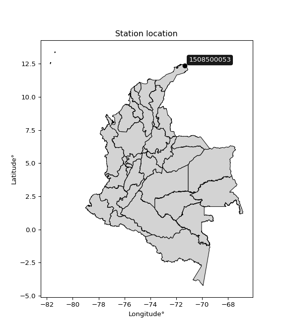

<div align="center">


</div>

# PMax24h Station (Rain): 1508500053

Maximum Precipitation in 24 hours (PMax24h) is the greatest amount of rainfall for a specific duration that is meteorologically possible for a given location, acting as a "worst-case" scenario for extreme storms, crucial for designing safety-critical infrastructure like bridges, river deviations, dams, spillways, and nuclear plants to prevent catastrophic failure. The PMax24h is related with the Probable Maximum Precipitation (PMP) and it is calculated by hydrologists using meteorological data to determine the upper limit of extreme rainfall, often leading to the Probable Maximum Flood (PMF) for flood control design, and is increasingly being studied for climate change impacts. Probable Maximum Precipitation (PMP) is the theoretical upper limit of rainfall, a deterministic estimate for extreme events, while probability distributions (like GEV, Gumbel) describe the likelihood and frequency of various precipitation amounts, including rare ones, showing how often events occur, with PMP representing the extreme end of these distributions, used for critical infrastructure design to ensure safety against the worst conceivable weather, unlike standard statistical forecasts which cover typical probabilities.

The most common probability distributions in hydrology, used for analyzing floods, rainfall, and streamflow, include the Normal, Log-Normal, Gumbel, Gamma (including Log-Pearson Type III), and Generalized Extreme Value (GEV) distributions, often chosen based on the data´s skewness and whether modeling extremes or general conditions, with Gumbel and GEV popular for extreme events like floods, while the Normal distribution serves as a baseline, though often requiring transformations for skewed hydrological data. These distributions help in designing water infrastructure, managing water resources, and forecasting hydrologic events.

> Hydrological data often isn´t perfectly normal (it´s skewed), so different distributions are needed for different applications, such as: **Flood Frequency Analysis**: Using Gumbel, GEV, or Log-Pearson Type III for predicting extreme flood magnitudes and their return periods, **Rainfall Analysis**: Normal for annual totals, but Log-Normal, Weibull, or GEV for intensity or extreme daily rainfall, **Streamflow Modeling**: Gamma and Log-Normal for maximum flows, GEV for minimum flows, and Kappa for daily flows.

<div align="center">

</img>

</div>


## A. General information


### 1. General running parameters

• app_version: _v20260225_. • runtime: _2026-02-28 16:54:07.457399_. • Python version: _3.14.0_. • SciPy version: _1.16.3_. • Pandas version: _2.3.3_. • NumPy version: _2.3.5_. • Stations dataset (station_dataset_file): _dataset/pmax24h_in/automatic_colombia_2003_2025.csv_. • Stations catalog (station_catalog_file): _dataset/CNE.xls_. • Minimum year to eval til year_max (date_min): _1900_. • Maximum year to eval since year_min (date_max): _2025_. • Creates, save and include plots into reports (create_plot): _False_. • Plot only fit distributions with Δo > Δ (plot_only_fit): _True_. • Plot only simple graphs avoiding multiple CDFs and multiple Extreme values plots (plot_only_simple): _False_. • Eval low extreme values, if False, evaluates high extreme values (low_extreme): _False_. • Eval every SciPy distribution as logarithmic (pdist_logarithmic_on): _True_. • Standard deviation normalized (ddof): _1.0_. • Return periods to eval in years (Tr): _[2, 2.33, 5, 10, 15, 20, 25, 50, 75, 100, 200, 250, 500, 750, 1000]_. • Minimum data sample per station, 0 means any (minimum_sample): _5_. • Z-Score maximum threshold to adjust a value, 0 means disable (zscore_max): _3.5_. • Z-Score minimum threshold to adjust a value, 0 means disable (zscore_min): _-2.5_. • Avoid zeros, e.g. rain = 0 (avoid_zeros): _True_. • Avoid null values (avoid_nans): _True_. 

:file_folder:Table: [dataset.csv](../../dataset/pmax24h_in/automatic_colombia_2003_2025.csv)

> Delta Degrees of Freedom (DDOF): is a parameter used in the formulas for calculating variance and standard deviation. When ddof=0, the divisor is $N$ (the total number of observations) and this is used when your data set is the entire population. When ddof=1, the divisor is $N-1$ and this is used when your data set is a sample drawn from a larger population. Using $N-1$ provides an unbiased estimate of the population variance (known as Bessel´s correction).


### 2. Station info and location

|   id |     CODIGO | NOMBRE                               | CATEGORIA               | TECNOLOGIA                | ESTADO   | FECHA_INSTALACION   |   FECHA_SUSPENSION |   ALTITUD |   LATITUD |   LONGITUD | DEPARTAMENTO   | MUNICIPIO   | AREA_OPERATIVA                                         | ENTIDAD                                                     | AREA_HIDROGRAFICA   | ZONA_HIDROGRAFICA   | SUBZONA_HIDROGRAFICA                                     |   CORRIENTE | Catalogo   |   Version |
|-----:|-----------:|:-------------------------------------|:------------------------|:--------------------------|:---------|:--------------------|-------------------:|----------:|----------:|-----------:|:---------------|:------------|:-------------------------------------------------------|:------------------------------------------------------------|:--------------------|:--------------------|:---------------------------------------------------------|------------:|:-----------|----------:|
|    0 | 1508500053 | PUERTO ESTRELLA - AUT   [1508500053] | Climatológica Principal | Automática con Telemetría | Activa   | 01/05/2017          |                nan |        23 |   12.3392 |   -71.3451 | La Guajira     | Uribia      | Area Operativa 05 - Magdalena-Cesar-Guajira-San Andrés | INSTITUTO DE HIDROLOGIA METEOROLOGIA Y ESTUDIOS AMBIENTALES | Caribe              | Caribe - Guajira    | Río Carraipia - Paraguachon, Directos al Golfo Maracaibo |         nan | CNE_IDEAM  |  20251226 |

<div align="center">

Dynamic map: [:earth_americas:Google](http://maps.google.com/maps?q=12.339194444,-71.345080556) [:earth_americas:OSM](https://www.openstreetmap.org/#map=18/12.339194444/-71.345080556&layers=P) [:earth_americas:Bing](https://www.bing.com/maps?cp=12.339194444~-71.345080556&lvl=18) [:earth_americas:Apple](https://maps.apple.com/frame?center=12.339194444%2C-71.345080556&span=0.003%2C0.006)

</div>


<div align="center">

```geojson
{
  "type": "Feature",
  "geometry": {
    "type": "Point", 
    "coordinates": [-71.345080556, 12.339194444]
  }, 
  "properties": {
    "Name": "1508500053"
  }
}
```

</div>


### 3. Discrete values table and plot

<div align="center">

|               |           0 |             1 |          2 |           3 |           4 |         5 |          6 |
|:--------------|------------:|--------------:|-----------:|------------:|------------:|----------:|-----------:|
| Date          | 2019        | 2020          | 2021       | 2022        | 2023        | 2024      | 2025       |
| Value         |   26.5      |   52.7        |    2.9     |   46.2      |   17.7      |  121.8    |   98.2     |
| Value_initial |   26.5      |   52.7        |    2.9     |   46.2      |   17.7      |  121.8    |   98.2     |
| count         |    7        |    7          |    7       |    7        |    7        |    7      |    7       |
| mean          |   52.2857   |   52.2857     |   52.2857  |   52.2857   |   52.2857   |   52.2857 |   52.2857  |
| std           |   43.3543   |   43.3543     |   43.3543  |   43.3543   |   43.3543   |   43.3543 |   43.3543  |
| zscore        |   -0.594767 |    0.00955581 |   -1.13912 |   -0.140372 |   -0.797745 |    1.6034 |    1.05905 |


</div>


> The initial value (value_initial) correspond to the initial obtained or null completed value, and value (value) is adjusted only when the initial value is outside the valid range (outlier) definite through the Z-Score value. If Z-Score is active, values out of range or outliers are replaced with the station mean value. A Z-Score (or standard score) measures how many standard deviations a data point is from the mean of a dataset, indicating its relative position; positive scores mean above the mean, negative mean below, and a score of zero is exactly at the mean, allowing for comparison of values from different distributions. It´s calculated using the formula $z=(x–μ)/σ$, where $x$ is the data point, $μ$ is the mean, and $σ$ is the standard deviation, helping identify outliers and understand probability.
>
> <sub>**Note**: In this study, "completing" (filling gaps in) and "extending" (forecasting or lengthening the historical record) rainfall data series are avoided for certain critical analyses because they introduce artificial bias and uncertainty, which can distort the statistics of rare events (extremes), alter day-to-day variability, and compromise the integrity and homogeneity of the original data. Some reasons against Completing/Extending rainfall data are: **Distortion of Extremes and Variability**: The primary issue is that most gap-filling or extension methods rely on averaging or regression with nearby stations, which inherently smooths the data. Rainfall is highly variable in space and time, with a large percentage of zero values and occasional large storms. Infilling methods often underestimate the highest values and overestimate the lowest (zero) values, which severely distorts analyses focused on flood frequency, drought severity, and intensity-duration-frequency (IDF) curves, **Loss of Data Homogeneity**: Infilled or extended data are synthetic estimates, not actual measurements. Combining these estimates with observed data can violate the assumption of data homogeneity, which requires that the data properties do not change over time. Inhomogeneity can lead to incorrect conclusions about long-term trends or changes in climate patterns, **Propagation of Errors**: Errors and biases from the original data (e.g., wind-induced undercatch, instrument errors, site changes) or the data used for imputation can propagate through the analysis, leading to unreliable hydrological models and inaccurate predictions, **Compromised Statistical Integrity**: For statistical analyses, especially those involving the frequency of events, using artificial data can introduce time bias or autocorrelation that doesn´t exist in reality, making it difficult to assess the true probability of events, **Difficulty in Validation**: It is difficult to accurately validate the quality of filled or extended data, especially for past periods where ground-truth measurements are unavailable. The reliability of imputation techniques heavily depends on the density of the surrounding station network and the complexity of the local topography.</sub>


### 4. Active continuous probability distributions from SciPy (80 of 104 available)

A Probability Density Function (PDF) describes the relative likelihood of a continuous random variable falling within a specific range, where the total area under its curve equals 1, and the area over any interval gives the actual probability for that range. Unlike discrete probabilities (like rolling a die), a PDF shows density, not direct probability for a single point (which is zero), with higher points indicating higher likelihood, often visualized as a bell curve for normal distributions.

A log of a probability density function (log-PDF) is simply the logarithm of the PDF´s value, denoted as $log(f(x))$, useful for converting multiplication of probabilities into addition, improving numerical stability with tiny numbers, and connecting to information theory concepts like entropy. Instead of dealing with very small probabilities (e.g., 0.000001), log-PDFs use negative numbers (e.g., $log(0.00001) ≈ -11.51$ that are easier for computers to handle, preventing underflow errors and simplifying complex calculations. In this study, each active probability distribution from SciPy is also evaluated in the $log$ form.

[scipy.stats](https://docs.scipy.org/doc/scipy/reference/stats.html) is a Python´s powerful submodule within the SciPy library for comprehensive statistical analysis, offering over 130 probability distributions (like Normal, Poisson, etc.), functions for descriptive stats (mean, variance), hypothesis testing (t-tests, chi-square), random variable generation, and statistical tests, making it essential for data science, modeling, and research. It provides tools to explore, model, and draw conclusions from data efficiently, working seamlessly with [NumPy](https://numpy.org/).

<div align="center">

|   id | p_dist           |   n_parameter | fit_method   | label                                                                       | active   | ref                                                                                                      |
|-----:|:-----------------|--------------:|:-------------|:----------------------------------------------------------------------------|:---------|:---------------------------------------------------------------------------------------------------------|
|    0 | alpha            |             3 | MLE          | Alpha                                                                       | True     | [:mortar_board:](https://docs.scipy.org/doc/scipy/reference/generated/scipy.stats.alpha.html)            |
|    1 | anglit           |             2 | MM           | Anglit                                                                      | True     | [:mortar_board:](https://docs.scipy.org/doc/scipy/reference/generated/scipy.stats.anglit.html)           |
|    2 | arcsine          |             2 | MM           | Arcsine                                                                     | True     | [:mortar_board:](https://docs.scipy.org/doc/scipy/reference/generated/scipy.stats.arcsine.html)          |
|    3 | argus            |             3 | MLE          | Argus                                                                       | True     | [:mortar_board:](https://docs.scipy.org/doc/scipy/reference/generated/scipy.stats.argus.html)            |
|    4 | beta             |             4 | MLE          | Beta                                                                        | True     | [:mortar_board:](https://docs.scipy.org/doc/scipy/reference/generated/scipy.stats.beta.html)             |
|    5 | betaprime        |             4 | MLE          | Beta prime                                                                  | True     | [:mortar_board:](https://docs.scipy.org/doc/scipy/reference/generated/scipy.stats.betaprime.html)        |
|    6 | bradford         |             3 | MLE          | Bradford                                                                    | True     | [:mortar_board:](https://docs.scipy.org/doc/scipy/reference/generated/scipy.stats.bradford.html)         |
|    7 | burr             |             4 | MLE          | Burr (Type III)                                                             | True     | [:mortar_board:](https://docs.scipy.org/doc/scipy/reference/generated/scipy.stats.burr.html)             |
|    8 | burr12           |             4 | MLE          | Burr (Type III) 12                                                          | True     | [:mortar_board:](https://docs.scipy.org/doc/scipy/reference/generated/scipy.stats.burr12.html)           |
|    9 | cosine           |             2 | MLE          | Cosine                                                                      | True     | [:mortar_board:](https://docs.scipy.org/doc/scipy/reference/generated/scipy.stats.cosine.html)           |
|   10 | crystalball      |             4 | MLE          | Crystalball                                                                 | True     | [:mortar_board:](https://docs.scipy.org/doc/scipy/reference/generated/scipy.stats.crystalball.html)      |
|   11 | dgamma           |             3 | MLE          | Double gamma                                                                | True     | [:mortar_board:](https://docs.scipy.org/doc/scipy/reference/generated/scipy.stats.dgamma.html)           |
|   12 | dweibull         |             3 | MLE          | Double Weibull                                                              | True     | [:mortar_board:](https://docs.scipy.org/doc/scipy/reference/generated/scipy.stats.dweibull.html)         |
|   13 | erlang           |             3 | MLE          | Erlang                                                                      | True     | [:mortar_board:](https://docs.scipy.org/doc/scipy/reference/generated/scipy.stats.erlang.html)           |
|   14 | exponnorm        |             3 | MLE          | Exponentially modified Normal                                               | True     | [:mortar_board:](https://docs.scipy.org/doc/scipy/reference/generated/scipy.stats.exponnorm.html)        |
|   15 | exponpow         |             3 | MLE          | Exponential power                                                           | True     | [:mortar_board:](https://docs.scipy.org/doc/scipy/reference/generated/scipy.stats.exponpow.html)         |
|   16 | exponweib        |             4 | MLE          | Exponentiated Weibull                                                       | True     | [:mortar_board:](https://docs.scipy.org/doc/scipy/reference/generated/scipy.stats.exponweib.html)        |
|   17 | f                |             4 | MLE          | F                                                                           | True     | [:mortar_board:](https://docs.scipy.org/doc/scipy/reference/generated/scipy.stats.f.html)                |
|   18 | fatiguelife      |             3 | MLE          | Fatigue-life (Birnbaum-Saunders)                                            | True     | [:mortar_board:](https://docs.scipy.org/doc/scipy/reference/generated/scipy.stats.fatiguelife.html)      |
|   19 | foldnorm         |             3 | MM           | Fold Normal                                                                 | True     | [:mortar_board:](https://docs.scipy.org/doc/scipy/reference/generated/scipy.stats.foldnorm.html)         |
|   20 | gamma            |             3 | MLE          | Gamma                                                                       | True     | [:mortar_board:](https://docs.scipy.org/doc/scipy/reference/generated/scipy.stats.gamma.html)            |
|   21 | gausshyper       |             6 | MLE          | Gauss hypergeometric                                                        | True     | [:mortar_board:](https://docs.scipy.org/doc/scipy/reference/generated/scipy.stats.gausshyper.html)       |
|   22 | genexpon         |             5 | MLE          | Generalized exponential                                                     | True     | [:mortar_board:](https://docs.scipy.org/doc/scipy/reference/generated/scipy.stats.genexpon.html)         |
|   23 | genextreme       |             3 | MLE          | Generalized exponential                                                     | True     | [:mortar_board:](https://docs.scipy.org/doc/scipy/reference/generated/scipy.stats.genextreme.html)       |
|   24 | gengamma         |             4 | MLE          | Generalized gamma                                                           | True     | [:mortar_board:](https://docs.scipy.org/doc/scipy/reference/generated/scipy.stats.gengamma.html)         |
|   25 | genhalflogistic  |             3 | MLE          | Generalized half-logistic                                                   | True     | [:mortar_board:](https://docs.scipy.org/doc/scipy/reference/generated/scipy.stats.genhalflogistic.html)  |
|   26 | genlogistic      |             3 | MLE          | Generalized logistic                                                        | True     | [:mortar_board:](https://docs.scipy.org/doc/scipy/reference/generated/scipy.stats.genlogistic.html)      |
|   27 | gennorm          |             3 | MLE          | Generalized Normal                                                          | True     | [:mortar_board:](https://docs.scipy.org/doc/scipy/reference/generated/scipy.stats.gennorm.html)          |
|   28 | genpareto        |             3 | MLE          | Generalized Pareto                                                          | True     | [:mortar_board:](https://docs.scipy.org/doc/scipy/reference/generated/scipy.stats.genpareto.html)        |
|   29 | gompertz         |             3 | MLE          | Gompertz (or truncated Gumbel)                                              | True     | [:mortar_board:](https://docs.scipy.org/doc/scipy/reference/generated/scipy.stats.gompertz.html)         |
|   30 | gumbel_l         |             2 | MM           | Gumbel Left Skew                                                            | True     | [:mortar_board:](https://docs.scipy.org/doc/scipy/reference/generated/scipy.stats.gumbel_l.html)         |
|   31 | gumbel_r         |             2 | MM           | Gumbel Right Skew                                                           | True     | [:mortar_board:](https://docs.scipy.org/doc/scipy/reference/generated/scipy.stats.gumbel_r.html)         |
|   32 | halfgennorm      |             3 | MLE          | Upper half of a generalized normal                                          | True     | [:mortar_board:](https://docs.scipy.org/doc/scipy/reference/generated/scipy.stats.halfgennorm.html)      |
|   33 | halflogistic     |             2 | MM           | Half-logistic                                                               | True     | [:mortar_board:](https://docs.scipy.org/doc/scipy/reference/generated/scipy.stats.halflogistic.html)     |
|   34 | halfnorm         |             2 | MM           | Half Normal                                                                 | True     | [:mortar_board:](https://docs.scipy.org/doc/scipy/reference/generated/scipy.stats.halfnorm.html)         |
|   35 | hypsecant        |             2 | MM           | hyperbolic secant                                                           | True     | [:mortar_board:](https://docs.scipy.org/doc/scipy/reference/generated/scipy.stats.hypsecant.html)        |
|   36 | invgamma         |             3 | MLE          | Inverted gamma                                                              | True     | [:mortar_board:](https://docs.scipy.org/doc/scipy/reference/generated/scipy.stats.invgamma.html)         |
|   37 | invgauss         |             3 | MLE          | Inverse Gaussian                                                            | True     | [:mortar_board:](https://docs.scipy.org/doc/scipy/reference/generated/scipy.stats.invgauss.html)         |
|   38 | invweibull       |             3 | MLE          | Inverted Weibull                                                            | True     | [:mortar_board:](https://docs.scipy.org/doc/scipy/reference/generated/scipy.stats.invweibull.html)       |
|   39 | johnsonsb        |             4 | MLE          | Johnson SB                                                                  | True     | [:mortar_board:](https://docs.scipy.org/doc/scipy/reference/generated/scipy.stats.johnsonsb.html)        |
|   40 | johnsonsu        |             4 | MLE          | Johnson Su                                                                  | True     | [:mortar_board:](https://docs.scipy.org/doc/scipy/reference/generated/scipy.stats.johnsonsu.html)        |
|   41 | kappa3           |             3 | MLE          | Kappa 3                                                                     | True     | [:mortar_board:](https://docs.scipy.org/doc/scipy/reference/generated/scipy.stats.kappa3.html)           |
|   42 | kappa4           |             4 | MLE          | Kappa 4                                                                     | True     | [:mortar_board:](https://docs.scipy.org/doc/scipy/reference/generated/scipy.stats.kappa4.html)           |
|   43 | ksone            |             3 | MLE          | Kolmogorov-Smirnov one-sided test statistic distribution                    | True     | [:mortar_board:](https://docs.scipy.org/doc/scipy/reference/generated/scipy.stats.ksone.html)            |
|   44 | kstwobign        |             2 | MLE          | Limiting distribution of scaled Kolmogorov-Smirnov two-sided test statistic | True     | [:mortar_board:](https://docs.scipy.org/doc/scipy/reference/generated/scipy.stats.kstwobign.html)        |
|   45 | laplace          |             2 | MM           | Laplace                                                                     | True     | [:mortar_board:](https://docs.scipy.org/doc/scipy/reference/generated/scipy.stats.laplace.html)          |
|   46 | levy_l           |             2 | MLE          | Left-skewed Levy                                                            | True     | [:mortar_board:](https://docs.scipy.org/doc/scipy/reference/generated/scipy.stats.levy_l.html)           |
|   47 | loggamma         |             3 | MLE          | Log gamma                                                                   | True     | [:mortar_board:](https://docs.scipy.org/doc/scipy/reference/generated/scipy.stats.loggamma.html)         |
|   48 | logistic         |             2 | MM           | Logistic (or Sech-squared)                                                  | True     | [:mortar_board:](https://docs.scipy.org/doc/scipy/reference/generated/scipy.stats.logistic.html)         |
|   49 | loglaplace       |             3 | MLE          | Log-Laplace                                                                 | True     | [:mortar_board:](https://docs.scipy.org/doc/scipy/reference/generated/scipy.stats.loglaplace.html)       |
|   50 | lomax            |             3 | MLE          | Lomax (Pareto of the second kind)                                           | True     | [:mortar_board:](https://docs.scipy.org/doc/scipy/reference/generated/scipy.stats.lomax.html)            |
|   51 | maxwell          |             2 | MM           | Maxwell                                                                     | True     | [:mortar_board:](https://docs.scipy.org/doc/scipy/reference/generated/scipy.stats.maxwell.html)          |
|   52 | mielke           |             4 | MLE          | Mielke Beta-Kappa / Dagum                                                   | True     | [:mortar_board:](https://docs.scipy.org/doc/scipy/reference/generated/scipy.stats.mielke.html)           |
|   53 | moyal            |             2 | MM           | Moyal                                                                       | True     | [:mortar_board:](https://docs.scipy.org/doc/scipy/reference/generated/scipy.stats.moyal.html)            |
|   54 | nakagami         |             3 | MLE          | Nakagami                                                                    | True     | [:mortar_board:](https://docs.scipy.org/doc/scipy/reference/generated/scipy.stats.nakagami.html)         |
|   55 | ncf              |             5 | MLE          | Non-central F distribution                                                  | True     | [:mortar_board:](https://docs.scipy.org/doc/scipy/reference/generated/scipy.stats.ncf.html)              |
|   56 | nct              |             4 | MLE          | Non-central Student’s t                                                     | True     | [:mortar_board:](https://docs.scipy.org/doc/scipy/reference/generated/scipy.stats.nct.html)              |
|   57 | norm             |             2 | MM           | Normal                                                                      | True     | [:mortar_board:](https://docs.scipy.org/doc/scipy/reference/generated/scipy.stats.norm.html)             |
|   58 | pearson3         |             3 | MM           | Pearson type III                                                            | True     | [:mortar_board:](https://docs.scipy.org/doc/scipy/reference/generated/scipy.stats.pearson3.html)         |
|   59 | powerlaw         |             3 | MLE          | Power-function                                                              | True     | [:mortar_board:](https://docs.scipy.org/doc/scipy/reference/generated/scipy.stats.powerlaw.html)         |
|   60 | rayleigh         |             2 | MM           | Rayleigh                                                                    | True     | [:mortar_board:](https://docs.scipy.org/doc/scipy/reference/generated/scipy.stats.rayleigh.html)         |
|   61 | rdist            |             3 | MLE          | R-distributed (symmetric beta)                                              | True     | [:mortar_board:](https://docs.scipy.org/doc/scipy/reference/generated/scipy.stats.rdist.html)            |
|   62 | rice             |             3 | MLE          | Rice                                                                        | True     | [:mortar_board:](https://docs.scipy.org/doc/scipy/reference/generated/scipy.stats.rice.html)             |
|   63 | semicircular     |             2 | MM           | Semicircular                                                                | True     | [:mortar_board:](https://docs.scipy.org/doc/scipy/reference/generated/scipy.stats.semicircular.html)     |
|   64 | skewnorm         |             3 | MLE          | Skew normal                                                                 | True     | [:mortar_board:](https://docs.scipy.org/doc/scipy/reference/generated/scipy.stats.skewnorm.html)         |
|   65 | t                |             3 | MLE          | Student’s t                                                                 | True     | [:mortar_board:](https://docs.scipy.org/doc/scipy/reference/generated/scipy.stats.t.html)                |
|   66 | trapezoid        |             4 | MLE          | Trapezoid                                                                   | True     | [:mortar_board:](https://docs.scipy.org/doc/scipy/reference/generated/scipy.stats.trapezoid.html)        |
|   67 | triang           |             3 | MLE          | Triangular                                                                  | True     | [:mortar_board:](https://docs.scipy.org/doc/scipy/reference/generated/scipy.stats.triang.html)           |
|   68 | truncexpon       |             3 | MLE          | Truncated exponential                                                       | True     | [:mortar_board:](https://docs.scipy.org/doc/scipy/reference/generated/scipy.stats.truncexpon.html)       |
|   69 | truncnorm        |             4 | MLE          | Truncated normal                                                            | True     | [:mortar_board:](https://docs.scipy.org/doc/scipy/reference/generated/scipy.stats.truncnorm.html)        |
|   70 | truncpareto      |             4 | MLE          | Upper truncated Pareto                                                      | True     | [:mortar_board:](https://docs.scipy.org/doc/scipy/reference/generated/scipy.stats.truncpareto.html)      |
|   71 | truncweibull_min |             5 | MLE          | Doubly truncated Weibull minimum                                            | True     | [:mortar_board:](https://docs.scipy.org/doc/scipy/reference/generated/scipy.stats.truncweibull_min.html) |
|   72 | tukeylambda      |             3 | MLE          | Tukey-Lamdba                                                                | True     | [:mortar_board:](https://docs.scipy.org/doc/scipy/reference/generated/scipy.stats.tukeylambda.html)      |
|   73 | uniform          |             2 | MLE          | Uniform                                                                     | True     | [:mortar_board:](https://docs.scipy.org/doc/scipy/reference/generated/scipy.stats.uniform.html)          |
|   74 | vonmises         |             3 | MLE          | Von Mises                                                                   | True     | [:mortar_board:](https://docs.scipy.org/doc/scipy/reference/generated/scipy.stats.vonmises.html)         |
|   75 | vonmises_line    |             3 | MLE          | Von Mises line                                                              | True     | [:mortar_board:](https://docs.scipy.org/doc/scipy/reference/generated/scipy.stats.vonmises_line.html)    |
|   76 | wald             |             2 | MM           | Wald                                                                        | True     | [:mortar_board:](https://docs.scipy.org/doc/scipy/reference/generated/scipy.stats.wald.html)             |
|   77 | weibull_max      |             3 | MLE          | Weibull maximum                                                             | True     | [:mortar_board:](https://docs.scipy.org/doc/scipy/reference/generated/scipy.stats.weibull_max.html)      |
|   78 | weibull_min      |             3 | MLE          | Weibull minimum                                                             | True     | [:mortar_board:](https://docs.scipy.org/doc/scipy/reference/generated/scipy.stats.weibull_min.html)      |
|   79 | wrapcauchy       |             3 | MLE          | Wrapped  Cauchy                                                             | True     | [:mortar_board:](https://docs.scipy.org/doc/scipy/reference/generated/scipy.stats.wrapcauchy.html)       |

</div>

> **n_parameter:** # arguments & localization & scale.
>
> **Fit methods:** (MLE) maximum likelihood, (MM) L-moments.
>
>**Inactive** (With the only purpose of prevent loops, zero divisions, infinite values, over high estimated values or horizontal trending for recurrence intervals estimations, the follow distributions were disabled.)**:** lognorm, norminvgauss, powernorm, powerlognorm, cauchy, halfcauchy, foldcauchy, skewcauchy, chi2, expon, fisk, genhyperbolic, geninvgauss, gibrat, kstwo, laplace_asymmetric, levy, levy_stable, ncx2, pareto, rel_breitwigner, recipinvgauss, studentized_range, loguniform, 


## B. Probability (PDF) vs. Empirical (EDF) distributions functions

A continuous probability distribution (CPD) describes probabilities for variables that can take any value within a range (like rain any time), unlike discrete variables with specific outcomes (like temperature). It uses a Probability Density Function (PDF), a curve where the total area under it equals 1, and the probability of the variable falling within an interval (a to b) is found by calculating the area under the curve between those points. A key feature is that the probability of hitting any single exact value is zero, so probabilities are always expressed for ranges, e.g., $P(a ≤ X ≤ b)$.

<div align="center">

Distributions parameters from station values
|     |    station | p_dist              |   n |               loc |            scale | shape                  | shape1                 | shape2                | shape3             |
|----:|-----------:|:--------------------|----:|------------------:|-----------------:|:-----------------------|:-----------------------|:----------------------|:-------------------|
|   0 | 1508500053 | alpha               |   7 |    -103.646       |    611.506       | 4.173021163746592      |                        |                       |                    |
|   1 | 1508500053 | anglit              |   7 |      52.2857      |    117.421       |                        |                        |                       |                    |
|   2 | 1508500053 | arcsine             |   7 |      -4.47841     |    113.528       |                        |                        |                       |                    |
|   3 | 1508500053 | argus               |   7 |     -34.6144      |    163.373       | 1.9247027679364084e-06 |                        |                       |                    |
|   4 | 1508500053 | beta                |   7 |      -8.09304     |    129.893       | 0.6219426042521619     | 0.5629614838860318     |                       |                    |
|   5 | 1508500053 | betaprime           |   7 |       2.9         |    807.123       | 0.41413152206981585    | 20.13811117870562      |                       |                    |
|   6 | 1508500053 | bradford            |   7 |       2.89998     |    118.9         | 0.8465901584779626     |                        |                       |                    |
|   7 | 1508500053 | burr                |   7 |      -0.961168    |    124.939       | 204.14504476415073     | 0.003826435495450276   |                       |                    |
|   8 | 1508500053 | burr12              |   7 |      -2.24952     |    365.07        | 1.352522699158949      | 12.483294156900001     |                       |                    |
|   9 | 1508500053 | cosine              |   7 |      55.5479      |     32.9363      |                        |                        |                       |                    |
|  10 | 1508500053 | crystalball         |   7 |      52.2857      |     40.1383      | 9723.438204297408      | 234.6541257132342      |                       |                    |
|  11 | 1508500053 | dgamma              |   7 |      38.5978      |     19.564       | 1.7028532631684454     |                        |                       |                    |
|  12 | 1508500053 | dweibull            |   7 |      40.1758      |     36.0725      | 1.315451021803419      |                        |                       |                    |
|  13 | 1508500053 | erlang              |   7 |       2.9         |     44.837       | 0.7705353556040748     |                        |                       |                    |
|  14 | 1508500053 | exponnorm           |   7 |       2.85016     |      0.014279    | 3435.882622105598      |                        |                       |                    |
|  15 | 1508500053 | exponpow            |   7 |       2.9         |    121.07        | 0.5677275156665197     |                        |                       |                    |
|  16 | 1508500053 | exponweib           |   7 |       2.9         |      3.71044     | 2.165273384456164      | 0.3231874202770243     |                       |                    |
|  17 | 1508500053 | f                   |   7 |       2.9         |     60.197       | 1.6464269963478018     | 278.6097678997087      |                       |                    |
|  18 | 1508500053 | fatiguelife         |   7 |       2.9         |      8.55225e-05 | 716.9276955733806      |                        |                       |                    |
|  19 | 1508500053 | foldnorm            |   7 |     -10.444       |     47.0171      | 1.2283542462230548     |                        |                       |                    |
|  20 | 1508500053 | gamma               |   7 |       2.9         |     41.1464      | 0.8435072615838923     |                        |                       |                    |
|  21 | 1508500053 | gausshyper          |   7 |      -8.77306     |    130.573       | 1.1828933439390585     | 0.9504264001970466     | 1.000367836747691     | 1.0090685154541394 |
|  22 | 1508500053 | genexpon            |   7 |       2.88453     |      2.89212     | 0.05730697169755092    | 3.5906176328165385e-06 | 2.88956850330512      |                    |
|  23 | 1508500053 | genextreme          |   7 |      30.9984      |     28.6813      | -0.16065897830839243   |                        |                       |                    |
|  24 | 1508500053 | gengamma            |   7 |       2.9         |      0.956317    | 2.8862936148765073     | 0.264733612675905      |                       |                    |
|  25 | 1508500053 | genhalflogistic     |   7 |      -9.26842     |    137.949       | 1.052493295781895      |                        |                       |                    |
|  26 | 1508500053 | genlogistic         |   7 |    -192.256       |     31.0082      | 1456.8341148213235     |                        |                       |                    |
|  27 | 1508500053 | gennorm             |   7 |      62.35        |     59.4501      | 6066736.734572082      |                        |                       |                    |
|  28 | 1508500053 | genpareto           |   7 |      -0.49988     |    158.088       | -1.2926259500176314    |                        |                       |                    |
|  29 | 1508500053 | gompertz            |   7 |       2.9         |    115.093       | 1.5670954214023998     |                        |                       |                    |
|  30 | 1508500053 | gumbel_l            |   7 |      70.3501      |     31.2957      |                        |                        |                       |                    |
|  31 | 1508500053 | gumbel_r            |   7 |      34.2213      |     31.2957      |                        |                        |                       |                    |
|  32 | 1508500053 | halfgennorm         |   7 |       2.9         |      3.97242     | 0.41047583789480085    |                        |                       |                    |
|  33 | 1508500053 | halflogistic        |   7 |       4.71244     |     34.3168      |                        |                        |                       |                    |
|  34 | 1508500053 | halfnorm            |   7 |      -0.84168     |     66.5853      |                        |                        |                       |                    |
|  35 | 1508500053 | hypsecant           |   7 |      52.2857      |     25.5528      |                        |                        |                       |                    |
|  36 | 1508500053 | invgamma            |   7 |     -40.4052      |    431.362       | 5.602504120173084      |                        |                       |                    |
|  37 | 1508500053 | invgauss            |   7 |     -18.3606      |    161.856       | 0.4364772467045713     |                        |                       |                    |
|  38 | 1508500053 | invweibull          |   7 |    -147.523       |    178.521       | 6.224334465580835      |                        |                       |                    |
|  39 | 1508500053 | johnsonsb           |   7 |       2.89877     |    118.901       | -0.6952240159985352    | 0.15622411283552318    |                       |                    |
|  40 | 1508500053 | johnsonsu           |   7 |     -15.1884      |      1.20085     | -6.921037448729715     | 1.529558418869959      |                       |                    |
|  41 | 1508500053 | kappa3              |   7 |       2.89702     |    118.924       | 10179.872190367158     |                        |                       |                    |
|  42 | 1508500053 | kappa4              |   7 |     -16.3121      |    141.617       | 1.1572117191962743     | 1.0198411751161172     |                       |                    |
|  43 | 1508500053 | ksone               |   7 |     -17.2359      |    139.043       | 1.0                    |                        |                       |                    |
|  44 | 1508500053 | kstwobign           |   7 |     -74.8458      |    145.79        |                        |                        |                       |                    |
|  45 | 1508500053 | laplace             |   7 |      52.2857      |     28.3821      |                        |                        |                       |                    |
|  46 | 1508500053 | levy_l              |   7 |     128.712       |     30.5043      |                        |                        |                       |                    |
|  47 | 1508500053 | loggamma            |   7 |  -12039.7         |   1633.87        | 1637.5405842480277     |                        |                       |                    |
|  48 | 1508500053 | logistic            |   7 |      52.2857      |     22.1294      |                        |                        |                       |                    |
|  49 | 1508500053 | loglaplace          |   7 |      -0.144728    |     46.3447      | 1.1509813313037234     |                        |                       |                    |
|  50 | 1508500053 | lomax               |   7 |       2.89998     |   4129.47        | 80.1038113650524       |                        |                       |                    |
|  51 | 1508500053 | maxwell             |   7 |     -42.8252      |     59.6019      |                        |                        |                       |                    |
|  52 | 1508500053 | mielke              |   7 |       2.9         |    120.183       | 0.6132484981569286     | 962.0775840189265      |                       |                    |
|  53 | 1508500053 | moyal               |   7 |      29.3321      |     18.0686      |                        |                        |                       |                    |
|  54 | 1508500053 | nakagami            |   7 |       2.9         |     70.4138      | 0.1746755041790295     |                        |                       |                    |
|  55 | 1508500053 | ncf                 |   7 |       2.9         |      6.12795     | 0.5120337728096802     | 3574.619239521484      | 3.7807473813454555    |                    |
|  56 | 1508500053 | nct                 |   7 |     -61.6569      |      5.59383     | 4.951780864802094      | 17.26736444098647      |                       |                    |
|  57 | 1508500053 | norm                |   7 |      52.2857      |     40.1383      |                        |                        |                       |                    |
|  58 | 1508500053 | pearson3            |   7 |      52.2857      |     40.1383      | 0.5600547163507008     |                        |                       |                    |
|  59 | 1508500053 | powerlaw            |   7 |       2.9         |    118.9         | 0.15240207980211157    |                        |                       |                    |
|  60 | 1508500053 | rayleigh            |   7 |     -24.5012      |     61.2671      |                        |                        |                       |                    |
|  61 | 1508500053 | rdist               |   7 |      -8.44098     |     61.141       | 1.0899825326116954     |                        |                       |                    |
|  62 | 1508500053 | rice                |   7 |     -16.1034      |     56.0721      | 0.00038026585949657186 |                        |                       |                    |
|  63 | 1508500053 | semicircular        |   7 |      52.2857      |     80.2766      |                        |                        |                       |                    |
|  64 | 1508500053 | skewnorm            |   7 |       2.89998     |     63.6357      | 14880971.80658865      |                        |                       |                    |
|  65 | 1508500053 | t                   |   7 |      52.2857      |     40.1382      | 7730457427.926033      |                        |                       |                    |
|  66 | 1508500053 | trapezoid           |   7 |      -9.4395      |    142.68        | 1.0                    | 1.0                    |                       |                    |
|  67 | 1508500053 | triang              |   7 |      -9.98667     |    131.787       | 0.9999999197903109     |                        |                       |                    |
|  68 | 1508500053 | truncexpon          |   7 |      -7.24378     |    122.27        | 1.0553977454147812     |                        |                       |                    |
|  69 | 1508500053 | truncnorm           |   7 |      57.6511      |     41.5876      | -165.25897807582555    | 1.542514842698494      |                       |                    |
|  70 | 1508500053 | truncpareto         |   7 |       2.85613     |      0.0438728   | 0.16813317861986835    | 2711.1092440787074     |                       |                    |
|  71 | 1508500053 | truncweibull_min    |   7 |      -6.50894     |    138.367       | 1.1845638457336265     | 0.0004863336378159457  | 0.9273119158645018    |                    |
|  72 | 1508500053 | tukeylambda         |   7 |      62.3956      |     66.4376      | 1.1166807286361062     |                        |                       |                    |
|  73 | 1508500053 | uniform             |   7 |       2.9         |    118.9         |                        |                        |                       |                    |
|  74 | 1508500053 | vonmises            |   7 |       2.65084     |      1           | 1.1981889596045547     |                        |                       |                    |
|  75 | 1508500053 | vonmises_line       |   7 |      68.0888      |     20.7502      | 3.3393789056434238e-06 |                        |                       |                    |
|  76 | 1508500053 | wald                |   7 |      12.1474      |     40.1383      |                        |                        |                       |                    |
|  77 | 1508500053 | weibull_max         |   7 |     121.8         |      1.58206     | 0.18371536327963028    |                        |                       |                    |
|  78 | 1508500053 | weibull_min         |   7 |       2.9         |     41.0699      | 0.7342642508009714     |                        |                       |                    |
|  79 | 1508500053 | wrapcauchy          |   7 |       2.89984     |     18.9235      | 0.277706986251116      |                        |                       |                    |
|  80 | 1508500053 | logalpha            |   7 |     -32.3836      |   1051.82        | 29.37071184090975      |                        |                       |                    |
|  81 | 1508500053 | loganglit           |   7 |       3.48606     |      3.42157     |                        |                        |                       |                    |
|  82 | 1508500053 | logarcsine          |   7 |       1.83196     |      3.30818     |                        |                        |                       |                    |
|  83 | 1508500053 | logargus            |   7 |      -0.179159    |      5.09831     | 2.1867801402497733     |                        |                       |                    |
|  84 | 1508500053 | logbeta             |   7 |       0.65173     |      4.15065     | 1.6090230542297912     | 0.6603712572680986     |                       |                    |
|  85 | 1508500053 | logbetaprime        |   7 |     -17.3513      |    213.812       | 318.3263209560911      | 3270.636199542091      |                       |                    |
|  86 | 1508500053 | logbradford         |   7 |       1.06468     |      3.73774     | 0.8796346052466608     |                        |                       |                    |
|  87 | 1508500053 | logburr             |   7 |      -0.596585    |      5.43785     | 446.57192432130967     | 0.006507687777795814   |                       |                    |
|  88 | 1508500053 | logburr12           |   7 |   -1723.8         |   1737.73        | 2429.01487782445       | 1008143.2538244487     |                       |                    |
|  89 | 1508500053 | logcosine           |   7 |       3.31227     |      1.01991     |                        |                        |                       |                    |
|  90 | 1508500053 | logcrystalball      |   7 |       3.48606     |      1.16961     | 171.3582200896371      | 547.8390435645128      |                       |                    |
|  91 | 1508500053 | logdgamma           |   7 |       3.55617     |      0.49682     | 1.8447276907592758     |                        |                       |                    |
|  92 | 1508500053 | logdweibull         |   7 |       3.83298     |      1.0359      | 0.8608909739822239     |                        |                       |                    |
|  93 | 1508500053 | logerlang           |   7 |     -13.4764      |      0.0866452   | 195.45472562045018     |                        |                       |                    |
|  94 | 1508500053 | logexponnorm        |   7 |       3.48531     |      1.1696      | 0.0006376806624924308  |                        |                       |                    |
|  95 | 1508500053 | logexponpow         |   7 |      -1.45674e+07 |      1.45674e+07 | 13412144.100255692     |                        |                       |                    |
|  96 | 1508500053 | logexponweib        |   7 |      -5.14014e+07 |      5.14014e+07 | 0.4502213482611437     | 103049289.67623085     |                       |                    |
|  97 | 1508500053 | logf                |   7 |   -1832.25        |   1835.74        | 28285205.435692005     | 5912657.787803257      |                       |                    |
|  98 | 1508500053 | logfatiguelife      |   7 |    -603.677       |    607.168       | 0.0019209975912099046  |                        |                       |                    |
|  99 | 1508500053 | logfoldnorm         |   7 |      -0.315847    |      1.08137     | 3.5314834493114056     |                        |                       |                    |
| 100 | 1508500053 | loggamma            |   7 |     -16.0416      |      0.0748019   | 260.8140726075325      |                        |                       |                    |
| 101 | 1508500053 | loggausshyper       |   7 |       0.775914    |      4.02647     | 1.169495407049855      | 0.7111489067012267     | 1.0862935736652166    | 1.0843036739578373 |
| 102 | 1508500053 | loggenexpon         |   7 |       1.01691     |      0.00680453  | 0.0008105453873001557  | 1.2564798148610752     | 6.977698697286979e-06 |                    |
| 103 | 1508500053 | loggenextreme       |   7 |       3.6582      |      1.36756     | 1.1952292580660306     |                        |                       |                    |
| 104 | 1508500053 | loggengamma         |   7 |      -1.21681     |      6.03735     | 0.0023681615172266458  | 1433.5412277196406     |                       |                    |
| 105 | 1508500053 | loggenhalflogistic  |   7 |       0.898561    |      4.10458     | 1.0514277655627686     |                        |                       |                    |
| 106 | 1508500053 | loggenlogistic      |   7 |       4.80244     |      1.90831e-06 | 1.4514108296419955e-06 |                        |                       |                    |
| 107 | 1508500053 | loggennorm          |   7 |       3.83298     |      0.000777016 | 0.2331266156791931     |                        |                       |                    |
| 108 | 1508500053 | loggenpareto        |   7 |      -0.100213    |      7.63321     | -1.5569733789980291    |                        |                       |                    |
| 109 | 1508500053 | loggompertz         |   7 |       1.06471     |      0.96338     | 0.05162056870946283    |                        |                       |                    |
| 110 | 1508500053 | loggumbel_l         |   7 |       4.01244     |      0.91194     |                        |                        |                       |                    |
| 111 | 1508500053 | loggumbel_r         |   7 |       2.95967     |      0.91194     |                        |                        |                       |                    |
| 112 | 1508500053 | loghalfgennorm      |   7 |       1.06471     |      1.13523     | 0.678497301407973      |                        |                       |                    |
| 113 | 1508500053 | loghalflogistic     |   7 |       2.09983     |      0.999956    |                        |                        |                       |                    |
| 114 | 1508500053 | loghalfnorm         |   7 |       1.93792     |      1.9403      |                        |                        |                       |                    |
| 115 | 1508500053 | loghypsecant        |   7 |       3.48606     |      0.744596    |                        |                        |                       |                    |
| 116 | 1508500053 | loginvgamma         |   7 |     -19.4497      |   8041.26        | 351.4055907937948      |                        |                       |                    |
| 117 | 1508500053 | loginvgauss         |   7 |      -9.17097     |   1262.31        | 0.010035217262626794   |                        |                       |                    |
| 118 | 1508500053 | loginvweibull       |   7 |      -1.18209e+08 |      1.18209e+08 | 88610002.99616957      |                        |                       |                    |
| 119 | 1508500053 | logjohnsonsb        |   7 |       0.0633304   |      4.73905     | 0.23229441520041563    | 0.1452758240296458     |                       |                    |
| 120 | 1508500053 | logjohnsonsu        |   7 |       5.11471     |      0.0123204   | 6.569184541863141      | 1.2419564981112368     |                       |                    |
| 121 | 1508500053 | logkappa3           |   7 |       1.06465     |      3.73854     | 18548.273179265132     |                        |                       |                    |
| 122 | 1508500053 | logkappa4           |   7 |       0.538659    |      4.6755      | 1.1274962382724185     | 1.0965780418533704     |                       |                    |
| 123 | 1508500053 | logksone            |   7 |       0.690944    |      4.4852      | 1.0                    |                        |                       |                    |
| 124 | 1508500053 | logkstwobign        |   7 |      -1.85394     |      6.1065      |                        |                        |                       |                    |
| 125 | 1508500053 | loglaplace          |   7 |       3.48606     |      0.827038    |                        |                        |                       |                    |
| 126 | 1508500053 | loglevy_l           |   7 |       4.89439     |      0.399663    |                        |                        |                       |                    |
| 127 | 1508500053 | logloggamma         |   7 |       4.80241     |      2.56785e-06 | 1.9519905945817936e-06 |                        |                       |                    |
| 128 | 1508500053 | loglogistic         |   7 |       3.48606     |      0.644839    |                        |                        |                       |                    |
| 129 | 1508500053 | logloglaplace       |   7 |      -0.010802    |      3.84378     | 3.2400753285171557     |                        |                       |                    |
| 130 | 1508500053 | loglomax            |   7 |       1.06471     |      1.36509e+12 | 564414942449.3154      |                        |                       |                    |
| 131 | 1508500053 | logmaxwell          |   7 |       0.714578    |      1.73677     |                        |                        |                       |                    |
| 132 | 1508500053 | logmielke           |   7 |      -1.78535     |      6.58793     | 3.9290467018193844     | 262096.0618768346      |                       |                    |
| 133 | 1508500053 | logmoyal            |   7 |       2.8172      |      0.526509    |                        |                        |                       |                    |
| 134 | 1508500053 | lognakagami         |   7 |       2.87356     |      1.00791     | 0.14080150801895408    |                        |                       |                    |
| 135 | 1508500053 | logncf              |   7 |     -40.9944      |     44.4662      | 5099.2594018954205     | 5938.230044340277      | 0.0020327059272836857 |                    |
| 136 | 1508500053 | lognct              |   7 |     -73.1389      |      1.15219     | 68292.6474826656       | 66.50275248056522      |                       |                    |
| 137 | 1508500053 | lognorm             |   7 |       3.48606     |      1.16961     |                        |                        |                       |                    |
| 138 | 1508500053 | logpearson3         |   7 |       3.48605     |      1.16962     | -0.9526006458657484    |                        |                       |                    |
| 139 | 1508500053 | logpowerlaw         |   7 |       1.06471     |      3.73767     | 0.17845476110496344    |                        |                       |                    |
| 140 | 1508500053 | lograyleigh         |   7 |       1.24849     |      1.78532     |                        |                        |                       |                    |
| 141 | 1508500053 | logrdist            |   7 |       1.74657     |      2.21804     | 1.0036268963629564     |                        |                       |                    |
| 142 | 1508500053 | logrice             |   7 |    -241.474       |      1.16982     | 209.3977110891381      |                        |                       |                    |
| 143 | 1508500053 | logsemicircular     |   7 |       3.48605     |      2.33927     |                        |                        |                       |                    |
| 144 | 1508500053 | logskewnorm         |   7 |       4.80238     |      1.76073     | -24011944.929767206    |                        |                       |                    |
| 145 | 1508500053 | logt                |   7 |       3.67295     |      0.938248    | 4.803597903053151      |                        |                       |                    |
| 146 | 1508500053 | logtrapezoid        |   7 |       0.177907    |      4.96223     | 1.0                    | 1.0                    |                       |                    |
| 147 | 1508500053 | logtriang           |   7 |       0.19046     |      4.61195     | 0.999998662054257      |                        |                       |                    |
| 148 | 1508500053 | logtruncexpon       |   7 |       1.06471     |      6.61197     | 0.565288535770452      |                        |                       |                    |
| 149 | 1508500053 | logtruncnorm        |   7 |      -0.0368741   |      5.22045     | 0.21101327699841071    | 0.926980942729045      |                       |                    |
| 150 | 1508500053 | logtruncpareto      |   7 |       1.06209     |      0.00262418  | 0.16782097144640232    | 1425.318914520845      |                       |                    |
| 151 | 1508500053 | logtruncweibull_min |   7 |       0.914179    |      6.11426     | 1.482436318016204      | 0.00029123324258446376 | 0.6359235974728732    |                    |
| 152 | 1508500053 | logtukeylambda      |   7 |       2.51444     |      1.52448     | 1.0512418713144611     |                        |                       |                    |
| 153 | 1508500053 | loguniform          |   7 |       1.06471     |      3.73767     |                        |                        |                       |                    |
| 154 | 1508500053 | logvonmises         |   7 |      -2.46895     |      1           | 1.2903205048923572     |                        |                       |                    |
| 155 | 1508500053 | logvonmises_line    |   7 |       3.68406     |      0.833764    | 1.0604182739819248     |                        |                       |                    |
| 156 | 1508500053 | logwald             |   7 |       2.31643     |      1.16963     |                        |                        |                       |                    |
| 157 | 1508500053 | logweibull_max      |   7 |       4.80238     |      0.946067    | 0.1968979989378558     |                        |                       |                    |
| 158 | 1508500053 | logweibull_min      |   7 | -126227           | 126231           | 148909.18016457855     |                        |                       |                    |
| 159 | 1508500053 | logwrapcauchy       |   7 |       1.06471     |      0.594869    | 0.2600110414212444     |                        |                       |                    |

</div>

> **loc** (Location parameter): This shifts the distribution along the x-axis. For many common distributions, like the normal (Gaussian) distribution, loc represents the mean $μ$. For others, like the uniform distribution, it might represent the minimum value, or for the beta distribution, the left end of the support interval.
>
> **scale** (Scale parameter): This determines the width or spread of the distribution. For the normal distribution, scale represents the standard deviation $σ$. For a uniform distribution, it defines the length of the interval (from $loc$ to $loc + scale$).
>
> **shape** (Shape parameters): Refers to parameters that define the specific form of a probability distribution, distinct from its location (loc) and scale (scale). These parameters are required arguments for most distribution functions. For example, a normal (Gaussian) distribution is fully defined by its location (mean) and scale (standard deviation), so it has no specific shape parameters beyond loc and scale. However, other distributions have intrinsic properties that need specification, as Gamma distribution that takes a shape parameter, often named $a$ or $alpha$.


### 0. Cumulative distribution values - CDF (160 evaluated)

Cumulative Distribution Function (CDF), denoted as $F$<sub>$X$</sub>$(x)$, is a function that gives the probability that a random variable $X$ will take a value less than or equal to a specific value, $x$ (i.e., $(P(X≥x)$. It essentially "accumulates" probabilities from a given point up to the far right (positive infinity), providing a complete picture of the distribution´s probabilities for both discrete (like rain) and continuous (like temperature) variables, helping to find probabilities over ranges or above certain values. Each station is evaluated separately ordering the $x$ values ascending, calculating the CDF and PDF values for the activated distributions and their logarithmic forms.

<div align="center">

CDF ordered by x ascending and calculating $log(f(x))$ separately
|   id |    Station |   date |     x |   count |    mean |     std |      zscore |   Value_initial |    station |   m |     alpha |   alpha_pdf |   anglit |   anglit_pdf |   arcsine |   arcsine_pdf |     argus |   argus_pdf |     beta |       beta_pdf |   betaprime |    betaprime_pdf |   bradford |   bradford_pdf |      burr |     burr_pdf |   burr12 |   burr12_pdf |    cosine |   cosine_pdf |   crystalball |   crystalball_pdf |   dgamma |   dgamma_pdf |   dweibull |   dweibull_pdf |      erlang |   erlang_pdf |   exponnorm |   exponnorm_pdf |    exponpow |    exponpow_pdf |   exponweib |   exponweib_pdf |           f |      f_pdf |   fatiguelife |   fatiguelife_pdf |   foldnorm |   foldnorm_pdf |      gamma |   gamma_pdf |   gausshyper |   gausshyper_pdf |    genexpon |   genexpon_pdf |   genextreme |   genextreme_pdf |    gengamma |   gengamma_pdf |   genhalflogistic |   genhalflogistic_pdf |   genlogistic |   genlogistic_pdf |     gennorm |   gennorm_pdf |   genpareto |   genpareto_pdf |    gompertz |   gompertz_pdf |   gumbel_l |   gumbel_l_pdf |   gumbel_r |   gumbel_r_pdf |   halfgennorm |   halfgennorm_pdf |   halflogistic |   halflogistic_pdf |   halfnorm |   halfnorm_pdf |   hypsecant |   hypsecant_pdf |   invgamma |   invgamma_pdf |   invgauss |   invgauss_pdf |   invweibull |   invweibull_pdf |   johnsonsb |   johnsonsb_pdf |   johnsonsu |   johnsonsu_pdf |      kappa3 |   kappa3_pdf |      kappa4 |   kappa4_pdf |    ksone |   ksone_pdf |   kstwobign |   kstwobign_pdf |   laplace |   laplace_pdf |   levy_l |   levy_l_pdf |   loggamma |   loggamma_pdf |   logistic |   logistic_pdf |   loglaplace |   loglaplace_pdf |       lomax |   lomax_pdf |   maxwell |   maxwell_pdf |      mielke |    mielke_pdf |     moyal |   moyal_pdf |    nakagami |   nakagami_pdf |         ncf |     ncf_pdf |       nct |    nct_pdf |     norm |   norm_pdf |   pearson3 |   pearson3_pdf |   powerlaw |   powerlaw_pdf |   rayleigh |   rayleigh_pdf |    rdist |      rdist_pdf |     rice |   rice_pdf |   semicircular |   semicircular_pdf |   skewnorm |   skewnorm_pdf |        t |      t_pdf |   trapezoid |   trapezoid_pdf |     triang |   triang_pdf |   truncexpon |   truncexpon_pdf |   truncnorm |   truncnorm_pdf |   truncpareto |   truncpareto_pdf |   truncweibull_min |   truncweibull_min_pdf |   tukeylambda |   tukeylambda_pdf |   uniform |   uniform_pdf |   vonmises |   vonmises_pdf |   vonmises_line |   vonmises_line_pdf |      wald |   wald_pdf |   weibull_max |   weibull_max_pdf |   weibull_min |   weibull_min_pdf |   wrapcauchy |   wrapcauchy_pdf |   logalpha |   logalpha_pdf |   loganglit |   loganglit_pdf |   logarcsine |   logarcsine_pdf |   logargus |   logargus_pdf |   logbeta |   logbeta_pdf |   logbetaprime |   logbetaprime_pdf |   logbradford |   logbradford_pdf |   logburr |   logburr_pdf |   logburr12 |   logburr12_pdf |   logcosine |   logcosine_pdf |   logcrystalball |   logcrystalball_pdf |   logdgamma |   logdgamma_pdf |   logdweibull |   logdweibull_pdf |   logerlang |   logerlang_pdf |   logexponnorm |   logexponnorm_pdf |   logexponpow |   logexponpow_pdf |   logexponweib |   logexponweib_pdf |      logf |   logf_pdf |   logfatiguelife |   logfatiguelife_pdf |   logfoldnorm |   logfoldnorm_pdf |   loggausshyper |   loggausshyper_pdf |   loggenexpon |   loggenexpon_pdf |   loggenextreme |   loggenextreme_pdf |   loggengamma |   loggengamma_pdf |   loggenhalflogistic |   loggenhalflogistic_pdf |   loggenlogistic |   loggenlogistic_pdf |   loggennorm |   loggennorm_pdf |   loggenpareto |   loggenpareto_pdf |   loggompertz |   loggompertz_pdf |   loggumbel_l |   loggumbel_l_pdf |   loggumbel_r |   loggumbel_r_pdf |   loghalfgennorm |   loghalfgennorm_pdf |   loghalflogistic |   loghalflogistic_pdf |   loghalfnorm |   loghalfnorm_pdf |   loghypsecant |   loghypsecant_pdf |   loginvgamma |   loginvgamma_pdf |   loginvgauss |   loginvgauss_pdf |   loginvweibull |   loginvweibull_pdf |   logjohnsonsb |   logjohnsonsb_pdf |   logjohnsonsu |   logjohnsonsu_pdf |   logkappa3 |   logkappa3_pdf |   logkappa4 |   logkappa4_pdf |   logksone |   logksone_pdf |   logkstwobign |   logkstwobign_pdf |   loglevy_l |   loglevy_l_pdf |   logloggamma |   logloggamma_pdf |   loglogistic |   loglogistic_pdf |   logloglaplace |   logloglaplace_pdf |    loglomax |   loglomax_pdf |   logmaxwell |   logmaxwell_pdf |   logmielke |   logmielke_pdf |    logmoyal |   logmoyal_pdf |   lognakagami |   lognakagami_pdf |    logncf |   logncf_pdf |    lognct |   lognct_pdf |   lognorm |   lognorm_pdf |   logpearson3 |   logpearson3_pdf |   logpowerlaw |   logpowerlaw_pdf |   lograyleigh |   lograyleigh_pdf |   logrdist |   logrdist_pdf |   logrice |   logrice_pdf |   logsemicircular |   logsemicircular_pdf |   logskewnorm |   logskewnorm_pdf |      logt |   logt_pdf |   logtrapezoid |   logtrapezoid_pdf |   logtriang |   logtriang_pdf |   logtruncexpon |   logtruncexpon_pdf |   logtruncnorm |   logtruncnorm_pdf |   logtruncpareto |   logtruncpareto_pdf |   logtruncweibull_min |   logtruncweibull_min_pdf |   logtukeylambda |   logtukeylambda_pdf |   loguniform |   loguniform_pdf |   logvonmises |   logvonmises_pdf |   logvonmises_line |   logvonmises_line_pdf |   logwald |   logwald_pdf |   logweibull_max |   logweibull_max_pdf |   logweibull_min |   logweibull_min_pdf |   logwrapcauchy |   logwrapcauchy_pdf |
|-----:|-----------:|-------:|------:|--------:|--------:|--------:|------------:|----------------:|-----------:|----:|----------:|------------:|---------:|-------------:|----------:|--------------:|----------:|------------:|---------:|---------------:|------------:|-----------------:|-----------:|---------------:|----------:|-------------:|---------:|-------------:|----------:|-------------:|--------------:|------------------:|---------:|-------------:|-----------:|---------------:|------------:|-------------:|------------:|----------------:|------------:|----------------:|------------:|----------------:|------------:|-----------:|--------------:|------------------:|-----------:|---------------:|-----------:|------------:|-------------:|-----------------:|------------:|---------------:|-------------:|-----------------:|------------:|---------------:|------------------:|----------------------:|--------------:|------------------:|------------:|--------------:|------------:|----------------:|------------:|---------------:|-----------:|---------------:|-----------:|---------------:|--------------:|------------------:|---------------:|-------------------:|-----------:|---------------:|------------:|----------------:|-----------:|---------------:|-----------:|---------------:|-------------:|-----------------:|------------:|----------------:|------------:|----------------:|------------:|-------------:|------------:|-------------:|---------:|------------:|------------:|----------------:|----------:|--------------:|---------:|-------------:|-----------:|---------------:|-----------:|---------------:|-------------:|-----------------:|------------:|------------:|----------:|--------------:|------------:|--------------:|----------:|------------:|------------:|---------------:|------------:|------------:|----------:|-----------:|---------:|-----------:|-----------:|---------------:|-----------:|---------------:|-----------:|---------------:|---------:|---------------:|---------:|-----------:|---------------:|-------------------:|-----------:|---------------:|---------:|-----------:|------------:|----------------:|-----------:|-------------:|-------------:|-----------------:|------------:|----------------:|--------------:|------------------:|-------------------:|-----------------------:|--------------:|------------------:|----------:|--------------:|-----------:|---------------:|----------------:|--------------------:|----------:|-----------:|--------------:|------------------:|--------------:|------------------:|-------------:|-----------------:|-----------:|---------------:|------------:|----------------:|-------------:|-----------------:|-----------:|---------------:|----------:|--------------:|---------------:|-------------------:|--------------:|------------------:|----------:|--------------:|------------:|----------------:|------------:|----------------:|-----------------:|---------------------:|------------:|----------------:|--------------:|------------------:|------------:|----------------:|---------------:|-------------------:|--------------:|------------------:|---------------:|-------------------:|----------:|-----------:|-----------------:|---------------------:|--------------:|------------------:|----------------:|--------------------:|--------------:|------------------:|----------------:|--------------------:|--------------:|------------------:|---------------------:|-------------------------:|-----------------:|---------------------:|-------------:|-----------------:|---------------:|-------------------:|--------------:|------------------:|--------------:|------------------:|--------------:|------------------:|-----------------:|---------------------:|------------------:|----------------------:|--------------:|------------------:|---------------:|-------------------:|--------------:|------------------:|--------------:|------------------:|----------------:|--------------------:|---------------:|-------------------:|---------------:|-------------------:|------------:|----------------:|------------:|----------------:|-----------:|---------------:|---------------:|-------------------:|------------:|----------------:|--------------:|------------------:|--------------:|------------------:|----------------:|--------------------:|------------:|---------------:|-------------:|-----------------:|------------:|----------------:|------------:|---------------:|--------------:|------------------:|----------:|-------------:|----------:|-------------:|----------:|--------------:|--------------:|------------------:|--------------:|------------------:|--------------:|------------------:|-----------:|---------------:|----------:|--------------:|------------------:|----------------------:|--------------:|------------------:|----------:|-----------:|---------------:|-------------------:|------------:|----------------:|----------------:|--------------------:|---------------:|-------------------:|-----------------:|---------------------:|----------------------:|--------------------------:|-----------------:|---------------------:|-------------:|-----------------:|--------------:|------------------:|-------------------:|-----------------------:|----------:|--------------:|-----------------:|---------------------:|-----------------:|---------------------:|----------------:|--------------------:|
|    0 | 1508500053 |   2021 |   2.9 |       7 | 52.2857 | 43.3543 | -1.13912    |             2.9 | 1508500053 |   1 | 0.0586363 |  0.00630222 | 0.127286 |   0.00567691 |  0.164108 |    0.0113739  | 0.0780391 |  0.0041039  | 0.142225 |     0.00824208 | 5.20505e-06 | 406220           | 1.7633e-07 |     0.0116089  | 0.0661429 | nan          | 0.038387 |   0.00987084 | 0.0865008 |   0.00469847 |      0.109276 |        0.00466253 | 0.181992 |   0.00691819 |   0.176003 |     0.00648503 | 8.55199e-14 | 148.385      |  0.00101543 |      0.0203572  | 1.26284e-10 | 161443          | 7.21084e-12 | 11362.7         | 3.80304e-07 | 0.29091    |     0.0379656 |       1.38741e+09 |   0.1072   |     0.00813622 | 5.1703e-15 |  9.82051    |    0.0781736 |       0.00763367 | 0.000306469 |     0.0198088  |    0.0548245 |       0.00658706 | 3.68991e-13 |   634.87       |         0.0462555 |            0.00398693 |      0.067907 |        0.00588474 | 1.01927e-06 |    0.00841039 |   0.0215747 |      0.00636609 | 3.78879e-12 |     0.0136159  |   0.109413 |    0.00329745  |  0.0658413 |     0.00572352 |   1.03876e-12 |        0.0812145  |       0        |         0          |  0.0448126 |     0.011964   |   0.0915203 |      0.00353247 |  0.0504703 |     0.00690913 |  0.0430654 |     0.00805861 |    0.0548243 |       0.00658706 |  0.00640805 |     2.29379     |   0.0435758 |      0.00779296 | 2.50447e-05 |   0.00840108 | 2.97192e-14 |   0.94785    | 0.144817 |  0.00719201 |   0.0613885 |      0.00606131 | 0.0877574 |    0.003092   | 0.377565 |   0.00138312 |  0.0198653 |      0.0435172 |  0.0969417 |     0.003956   |    0.0267591 |        0.0323553 | 3.83941e-07 |  0.0193981  |  0.100954 |    0.00587038 | 1.07364e-10 | 9884.03       | 0.0377035 |  0.00529575 | 7.80645e-07 |    6.14109e+08 | 8.68352e-06 | 5.00604e+09 | 0.0532818 | 0.00665942 | 0.109276 | 0.00466253 |  0.0946131 |     0.00558011 | 0.00220791 |    7.57707e+11 |   0.095174 |     0.00660511 | 0.562979 |     0.00561263 | 0.055812 | 0.00570685 |       0.134696 |         0.00625208 |   0        |     0.0125383  | 0.109275 | 0.00466253 |  0.00747944 |      0.00121228 | 0.00956177 |   0.00148398 |     0.122117 |       0.0115462  |    0.100156 |      0.00429667 |      0        |       5.21196     |          0.0674926 |             0.00834696 |   7.10543e-15 |        0.0147228  |  0        |    0.00841043 |    0.59323 |      0.365043  |     2.56067e-07 |          0.00767    | 0         | 0          |      0.109561 |       0.000374337 |   3.48685e-13 |      576.522      |  2.35434e-06 |       0.0148777  |  0.0189746 |      0.0435295 |  0.00602932 |       0.0452507 |     0        |         0        |  0.0296385 |       0.050357 | 0.0145382 |     0.0574365 |      0.0211427 |          0.0453848 |   1.08327e-05 |          0.372913 | 0.0318706 |     0.0557522 |   0.0145132 |       0.0202891 |    0.020942 |       0.0637485 |        0.0192158 |            0.0400145 |   0.0159807 |       0.0276315 |     0.0486089 |         0.0352339 |   0.0199894 |        0.044248 |      0.0192155 |           0.040014 |     0.0426779 |         0.0392691 |      0.0463386 |          0.0418025 | 0.0194725 |  0.0403831 |        0.0185742 |            0.0391394 |     0.0120719 |         0.0290387 |       0.0511501 |            0.201601 |    0.00589282 |          0.127414 |        0.067722 |           0.0408139 |      0        |         0.0547577 |             0.02068  |                 0.127176 |         0        |            0.0443119 |    0.0611278 |        0.0205219 |       0.159913 |           0.144358 |   7.54891e-11 |         0.0535828 |      0.038695 |         0.0415998 |   0.000339498 |         0.0029738 |      3.87848e-10 |            0.674828  |          0        |              0        |      0        |          0        |      0.0246254 |          0.0330392 |     0.0176896 |         0.0413446 |     0.0185492 |         0.0446031 |       0.0213399 |           0.0615412 |       0.516334 |         0.0733214  |      0.0682325 |          0.0403703 | 1.71452e-05 |        0.267342 | 0.000240535 |        0.626029 |  0.0833333 |       0.222955 |      0.0236757 |          0.0795043 |    0.25334  |       0.0319412 |     0.0583515 |         0.0443568 |     0.0228662 |         0.0346495 |      0.00806763 |           0.0243044 | 1.03375e-13 |      0.413464  |    0.0021528 |         0.018296 |   0.0371739 |       0.0512474 | 1.27962e-07 |    3.50406e-06 |   0           |       0           | 0.0197548 |    0.0421229 | 0.0192508 |    0.0401162 | 0.0192158 |     0.0400145 |     0.0379074 |          0.044934 |    0.00127164 |         1.022e+12 |      0        |          0        |   0.400292 |    0.151164    | 0.0192359 |      0.040043 |          0        |              0        |     0.0337711 |          0.047613 | 0.0203253 |  0.0249881 |      0.0319376 |          0.0720285 |   0.0359338 |       0.0822048 |       2.869e-07 |            0.350253 |     3.3919e-07 |           0.312091 |         0        |           90.7893    |             0.0102661 |                  0.101033 |      0.000178669 |             0.399343 |     0        |         0.267546 |       1.01215 |         0.0330471 |        2.06254e-09 |              0.0507922 |  0        |     0         |         0.269646 |          0.0186174   |        0.0304209 |            0.0353355 |     6.31758e-08 |            0.455563 |
|    1 | 1508500053 |   2023 |  17.7 |       7 | 52.2857 | 43.3543 | -0.797745   |            17.7 | 1508500053 |   2 | 0.193157  |  0.0113839  | 0.222197 |   0.00708092 |  0.291455 |    0.00707182 | 0.149793  |  0.00557046 | 0.246942 |     0.00632763 | 0.668857    |      0.0142946   | 0.163348   |     0.0105021  | 0.226444  |   0.00947883 | 0.215296 |   0.012774   | 0.171898  |   0.00680997 |      0.194436 |        0.00685689 | 0.308675 |   0.0101179  |   0.292339 |     0.00918273 | 0.401011    |   0.017244   |  0.261165   |      0.0150595  | 0.298297    |      0.011054   | 0.601343    |     0.0117725   | 0.26147     | 0.0129848  |     0.719126  |       0.00660885  |   0.23057  |     0.00855788 | 0.381567   |  0.017792   |    0.195481  |       0.0080778  | 0.254413    |     0.0147746  |    0.198087  |       0.012082   | 0.368319    |     0.0101886  |         0.109004  |            0.0045093  |      0.188363 |        0.0101351  | 0.5         |    0.00841041 |   0.117193  |      0.00656058 | 0.193496    |     0.0124882  |   0.169675 |    0.00493323  |  0.183528  |     0.0099423  |   0.383512    |        0.0146043  |       0.187003 |         0.0140606  |  0.219345  |     0.0115272  |   0.160943  |      0.00603347 |  0.201297  |     0.0125408  |  0.216974  |     0.0136877  |    0.198087  |       0.012082   |  0.158665   |     0.0029172   |   0.212625  |      0.0134925  | 0.124361    |   0.00840108 | 0.161717    |   0.00945477 | 0.251259 |  0.00719201 |   0.184851  |      0.0102331  | 0.147825  |    0.00520841 | 0.39986  |   0.00164199 |  0.316918  |      0.300943  |  0.173233  |     0.00647208 |    0.238417  |        0.288278  | 0.249172    |  0.0145126  |  0.206302 |    0.00824337 | 0.276821    |    0.0114703  | 0.167671  |  0.01176    | 0.461541    |    0.0108232   | 0.256691    | 0.0111255   | 0.198079  | 0.0121539  | 0.194436 | 0.00685689 |  0.19844   |     0.00834545 | 0.727928   |    0.00749579  |   0.211188 |     0.00886837 | 0.648763 |     0.00605535 | 0.166163 | 0.00896495 |       0.234463 |         0.00715658 |   0.183908 |     0.0122038  | 0.194436 | 0.0068569  |  0.0361807  |      0.00266628 | 0.0441365  |   0.00318829 |     0.283063 |       0.0102298  |    0.179392 |      0.00644327 |      0.849184 |       0.00578603  |          0.198607  |             0.00912388 |   0.131149    |        0.00849085 |  0.124474 |    0.00841043 |    2.9752  |      0.0443177 |     0.113516    |          0.00767001 | 0.0184217 | 0.0131976  |      0.115565 |       0.000440105 |   0.376644    |        0.0146169  |  0.200577    |       0.0113627  |  0.322014  |      0.303384  |  0.32479    |       0.273732  |     0.379259 |         0.207164 |  0.237648  |       0.208628 | 0.246666  |     0.200369  |      0.319988  |          0.298766  |   0.561995    |          0.261566 | 0.271064  |     0.227008  |   0.170125  |       0.217704  |    0.365172 |       0.297881  |        0.300253  |            0.297386  |   0.275555  |       0.352888  |     0.196077  |         0.164699  |   0.320984  |        0.302578 |      0.300252  |           0.297387 |     0.223728  |         0.2022    |      0.23503   |          0.207827  | 0.300696  |  0.296601  |        0.298269  |            0.297619  |     0.280262  |         0.311435  |       0.450388  |            0.227777 |    0.421502   |          0.272095 |        0.212689 |           0.142808  |      0.26704  |         0.221633  |             0.323259 |                 0.220784 |         0        |            0.175392  |    0.137969  |        0.0895313 |       0.450721 |           0.182903 |   0.248638    |         0.263215  |      0.249363 |         0.236099  |   0.333196    |         0.401551  |      0.576474    |            0.17118   |          0.368671 |              0.43206  |      0.37035  |          0.366081 |      0.263507  |          0.314835  |     0.314194  |         0.300433  |     0.324865  |         0.298718  |       0.371036  |           0.275753  |       0.612933 |         0.0486272  |      0.225367  |          0.166351  | 0.483601    |        0.267342 | 0.495471    |        0.25084  |  0.486627  |       0.222955 |      0.413328  |          0.272506  |    0.343475 |       0.0795276 |     0.230791  |         0.17544   |     0.278917  |         0.311896  |      0.1972     |           0.22152   | 0.526638    |      0.195709  |    0.328148  |         0.327834 |   0.256341  |       0.216183  | 0.34319     |    0.458307    |   3.84148e-05 |       2.43594e+10 | 0.308236  |    0.296994  | 0.300665  |    0.29744   | 0.300253  |     0.297386  |     0.26041   |          0.238105 |    0.87852    |         0.0866715 |      0.33918  |          0.33692  |   0.670049 |    0.166948    | 0.300308  |      0.297359 |          0.33524  |              0.262651 |     0.273314  |          0.248692 | 0.217312  |  0.268404  |      0.295105  |          0.218948  |   0.338459  |       0.252289  |       0.554286  |            0.266423 |     0.533879   |           0.273186 |         0.945703 |            0.0439081 |             0.42217   |                  0.29077  |      0.622103    |             0.340347 |     0.483952 |         0.267546 |       1.18588 |         0.232913  |        0.20451     |              0.26661   |  0.343808 |     0.77801   |         0.316455 |          0.0371687   |        0.229693  |            0.237141  |     0.49057     |            0.157389 |
|    2 | 1508500053 |   2019 |  26.5 |       7 | 52.2857 | 43.3543 | -0.594767   |            26.5 | 1508500053 |   3 | 0.299592  |  0.012545   | 0.287391 |   0.00770811 |  0.349903 |    0.00629452 | 0.202379  |  0.00637046 | 0.300497 |     0.00588583 | 0.767132    |      0.00873756  | 0.253243   |     0.00993878 | 0.306211  |   0.00871035 | 0.326321 |   0.0123229  | 0.236771  |   0.00790381 |      0.2603   |        0.00808599 | 0.402319 |   0.010804   |   0.378198 |     0.0101564  | 0.53136     |   0.0127321  |  0.382483   |      0.0125867  | 0.384128    |      0.0086937  | 0.681511    |     0.00711893  | 0.364537    | 0.0105959  |     0.768136  |       0.00473509  |   0.307029 |     0.00880963 | 0.517294   |  0.0133546  |    0.266704  |       0.00809338 | 0.373725    |     0.0124103  |    0.309697  |       0.012984   | 0.441964    |     0.0069564  |         0.150251  |            0.00487238 |      0.28448  |        0.011528   | 0.5         |    0.00841041 |   0.175499  |      0.00669307 | 0.299985    |     0.0117006  |   0.218322 |    0.00615219  |  0.278086  |     0.0113722  |   0.490438    |        0.0101665  |       0.307197 |         0.0131951  |  0.318653  |     0.0110141  |   0.222544  |      0.00801679 |  0.315561  |     0.0131227  |  0.336836  |     0.0132832  |    0.309697  |       0.0129841  |  0.18055    |     0.00217121  |   0.331827  |      0.0133111  | 0.19829     |   0.00840108 | 0.242201    |   0.00888819 | 0.314549 |  0.00719201 |   0.280709  |      0.0113729  | 0.20156   |    0.00710166 | 0.41514  |   0.00183668 |  0.445231  |      0.32924   |  0.237719  |     0.0081886  |    0.388388  |        0.469613  | 0.366498    |  0.0122189  |  0.283386 |    0.009208   | 0.368532    |    0.00957633 | 0.279465  |  0.0133053  | 0.542302    |    0.00789464  | 0.351241    | 0.0103608   | 0.309913  | 0.0129649  | 0.2603   | 0.00808599 |  0.277397  |     0.00951882 | 0.781579   |    0.00504721  |   0.292826 |     0.00960842 | 0.704271 |     0.00661276 | 0.250722 | 0.010153   |       0.299084 |         0.00751008 |   0.289259 |     0.011705   | 0.260299 | 0.00808601 |  0.063448   |      0.00353082 | 0.0766523  |   0.00420166 |     0.369923 |       0.00951946 |    0.241777 |      0.00772085 |      0.887641 |       0.00335906  |          0.279075  |             0.00913244 |   0.205138    |        0.00833977 |  0.198486 |    0.00841043 |    4.12904 |      0.160494  |     0.181012    |          0.00767002 | 0.227017  | 0.0261018  |      0.119649 |       0.000489724 |   0.486125    |        0.0106445  |  0.287978    |       0.00861966 |  0.450479  |      0.327421  |  0.439094   |       0.290087  |     0.459691 |         0.193992 |  0.334907  |       0.276066 | 0.335316  |     0.240216  |      0.447108  |          0.325665  |   0.664191    |          0.24523  | 0.373191  |     0.279975  |   0.280343  |       0.332978  |    0.489037 |       0.312004  |        0.429119  |            0.335693  |   0.430523  |       0.373449  |     0.278522  |         0.252406  |   0.449593  |        0.329019 |      0.429118  |           0.335694 |     0.321085  |         0.283841  |      0.334499  |          0.288255  | 0.429142  |  0.3345    |        0.427346  |            0.336469  |     0.417282  |         0.360964  |       0.543338  |            0.233472 |    0.528828   |          0.257545 |        0.280302 |           0.195563  |      0.367543 |         0.277653  |             0.419363 |                 0.256952 |         0        |            0.238406  |    0.187166  |        0.167792  |       0.527599 |           0.198927 |   0.369644    |         0.335724  |      0.36014  |         0.31329   |   0.493611    |         0.382145  |      0.638995    |            0.14003   |          0.528948 |              0.360123 |      0.509943 |          0.324058 |      0.41184   |          0.411202  |     0.441814  |         0.326273  |     0.450393  |         0.317856  |       0.48064   |           0.263961  |       0.633286 |         0.052875   |      0.305863  |          0.237034  | 0.591495    |        0.267342 | 0.596476    |        0.250094 |  0.576607  |       0.222955 |      0.519773  |          0.252711  |    0.380894 |       0.108375  |     0.313657  |         0.238431  |     0.419707  |         0.377696  |      0.301429   |           0.29704   | 0.599388    |      0.165641  |    0.463516  |         0.336765 |   0.355286  |       0.27574   | 0.518209    |    0.397339    |   0.624657    |       0.427317    | 0.435742  |    0.329356  | 0.429503  |    0.335495  | 0.429119  |     0.335693  |     0.369848  |          0.303845 |    0.910669   |         0.0734545 |      0.475647 |          0.333735 |   0.742932 |    0.198549    | 0.429158  |      0.33564  |          0.443224 |              0.271057 |     0.386352  |          0.311388 | 0.34567   |  0.363329  |      0.390083  |          0.251728  |   0.447936  |       0.290237  |       0.658594  |            0.250647 |     0.641683   |           0.260881 |         0.961434 |            0.0347163 |             0.541586  |                  0.299964 |      0.759815    |             0.342441 |     0.591929 |         0.267546 |       1.29979 |         0.329967  |        0.334577    |              0.374195  |  0.586156 |     0.449376  |         0.333337 |          0.0472746   |        0.343015  |            0.325581  |     0.554988    |            0.165944 |
|    3 | 1508500053 |   2022 |  46.2 |       7 | 52.2857 | 43.3543 | -0.140372   |            46.2 | 1508500053 |   4 | 0.53671   |  0.0108189  | 0.448264 |   0.00847068 |  0.465808 |    0.0056401  | 0.343572  |  0.00789429 | 0.411598 |     0.0054923  | 0.881543    |      0.00378245  | 0.438144   |     0.00887321 | 0.467182  |   0.00773811 | 0.545042 |   0.00969342 | 0.410262  |   0.00947109 |      0.439744 |        0.0098256  | 0.5508   |   0.00980775 |   0.545294 |     0.00942833 | 0.720465    |   0.00713844 |  0.586703   |      0.00842413 | 0.526135    |      0.00605397 | 0.778051    |     0.00341867  | 0.53746     | 0.00726495 |     0.839522  |       0.00279397  |   0.4831   |     0.00892236 | 0.716527   |  0.00752404 |    0.424797  |       0.00792989 | 0.576136    |     0.00839933 |    0.548098  |       0.0105892  | 0.545028    |     0.00401175 |         0.255613  |            0.00587332 |      0.513707 |        0.0110327  | 0.5         |    0.00841041 |   0.310733  |      0.00705331 | 0.511196    |     0.00969553 |   0.370128 |    0.00930323  |  0.505616  |     0.0110181  |   0.639253    |        0.0056476  |       0.540228 |         0.0103179  |  0.520115  |     0.00933637 |   0.424897  |      0.0121118  |  0.551861  |     0.0103494  |  0.565118  |     0.00969356 |    0.548098  |       0.0105892  |  0.217024   |     0.001667    |   0.562335  |      0.00981662 | 0.363792    |   0.00840108 | 0.409912    |   0.00821917 | 0.456231 |  0.00719201 |   0.504244  |      0.0107446  | 0.403504  |    0.0142169  | 0.456831 |   0.00244365 |  0.625894  |      0.309775  |  0.431679  |     0.0110863  |    0.671304  |        0.397437  | 0.566371    |  0.0083243  |  0.474138 |    0.00978866 | 0.534703    |    0.00757288 | 0.530646  |  0.0113735  | 0.665845    |    0.00507776  | 0.536418    | 0.00838066  | 0.546937  | 0.0105038  | 0.439744 | 0.0098256  |  0.476087  |     0.010191   | 0.857318   |    0.00301749  |   0.486158 |     0.00967837 | 0.865571 |     0.0114547  | 0.460604 | 0.0106887  |       0.451785 |         0.0079075  |   0.503771 |     0.00994721 | 0.439744 | 0.00982563 |  0.152069   |      0.00546622 | 0.181771   |   0.00647024 |     0.543128 |       0.00810288 |    0.417169 |      0.00984095 |      0.933404 |       0.00165483  |          0.455384  |             0.00869323 |   0.367685    |        0.00819036 |  0.364172 |    0.00841043 |    7.34182 |      0.339125  |     0.332112    |          0.00767004 | 0.600048  | 0.0125482  |      0.130712 |       0.000646327 |   0.6464      |        0.00623359 |  0.419922    |       0.00538172 |  0.628629  |      0.303139  |  0.600699   |       0.286275  |     0.567262 |         0.196816 |  0.520016  |       0.394047 | 0.488067  |     0.314953  |      0.625663  |          0.306153  |   0.794952    |          0.225806 | 0.551012  |     0.361508  |   0.512676  |       0.492517  |    0.659026 |       0.292197  |        0.61662   |            0.326411  |   0.568647  |       0.372597  |     0.5       |        57.0697    |   0.629451  |        0.307295 |      0.61662   |           0.326412 |     0.516368  |         0.419777  |      0.53021   |          0.414661  | 0.615972  |  0.325289  |        0.615379  |            0.327447  |     0.619877  |         0.35214   |       0.677213  |            0.25087  |    0.662277   |          0.220053 |        0.418744 |           0.314601  |      0.54606  |         0.367104  |             0.57999  |                 0.325537 |         0        |            0.363846  |    0.5       |       17.1556    |       0.646906 |           0.233941 |   0.577684    |         0.400503  |      0.560167 |         0.396146  |   0.681269    |         0.286718  |      0.707483    |            0.108155  |          0.699649 |              0.255257 |      0.671276 |          0.25523  |      0.643215  |          0.38495   |     0.620106  |         0.30475   |     0.622464  |         0.292088  |       0.616936  |           0.223362  |       0.666252 |         0.0685357  |      0.475984  |          0.385843  | 0.740093    |        0.267342 | 0.736129    |        0.25339  |  0.700534  |       0.222955 |      0.648996  |          0.210575  |    0.460539 |       0.191059  |     0.478582  |         0.363802  |     0.631347  |         0.36094   |      0.500002   |           0.421468  | 0.681642    |      0.131627  |    0.641624  |         0.295474 |   0.534981  |       0.374126  | 0.703113    |    0.268551    |   0.787204    |       0.206526    | 0.618038  |    0.315123  | 0.616813  |    0.325965  | 0.616619  |     0.326411  |     0.559785  |          0.371276 |    0.947831   |         0.0611013 |      0.649301 |          0.284367 |   0.890333 |    0.422271    | 0.616626  |      0.326353 |          0.594068 |              0.269135 |     0.58193   |          0.389426 | 0.56424   |  0.396768  |      0.542549  |          0.296875  |   0.623785  |       0.342502  |       0.792217  |            0.230438 |     0.781638   |           0.242453 |         0.978332 |            0.0267289 |             0.709756  |                  0.303608 |      0.952363    |             0.353986 |     0.74064  |         0.267546 |       1.50742 |         0.395614  |        0.562717    |              0.416426  |  0.76423  |     0.223314  |         0.366115 |          0.0747203   |        0.554833  |            0.425002  |     0.660969    |            0.227159 |
|    4 | 1508500053 |   2020 |  52.7 |       7 | 52.2857 | 43.3543 |  0.00955581 |            52.7 | 1508500053 |   5 | 0.603268  |  0.00964409 | 0.503528 |   0.00851618 |  0.502323 |    0.00560774 | 0.396218  |  0.00829483 | 0.447211 |     0.00547333 | 0.903394    |      0.00298005  | 0.494823   |     0.00857004 | 0.516761  |   0.00752251 | 0.604825 |   0.00870298 | 0.472494  |   0.00964635 |      0.504118 |        0.00993866 | 0.619425 |   0.0108614  |   0.610086 |     0.0101845  | 0.762973    |   0.00598006 |  0.637988   |      0.00737881 | 0.56362     |      0.00549557 | 0.798323    |     0.00284663  | 0.582083    | 0.00648394 |     0.856423  |       0.00241959  |   0.540572 |     0.00874057 | 0.761276   |  0.00628548 |    0.476093  |       0.00785284 | 0.627362    |     0.00738424 |    0.612844  |       0.00932845 | 0.569372    |     0.00349989 |         0.295077  |            0.00627639 |      0.582655 |        0.0101479  | 0.5         |    0.00841041 |   0.357042  |      0.00719833 | 0.571915    |     0.00898451 |   0.433876 |    0.0102919   |  0.574603  |     0.0101731  |   0.67318     |        0.00482448 |       0.603849 |         0.00925735 |  0.578664  |     0.00867275 |   0.505161  |      0.0124553  |  0.615022  |     0.00908683 |  0.624109  |     0.00847255 |    0.612845  |       0.00932845 |  0.227716   |     0.00162987  |   0.622026  |      0.0085632  | 0.418399    |   0.00840108 | 0.462863    |   0.00807765 | 0.50298  |  0.00719201 |   0.571643  |      0.00996679 | 0.507245  |    0.0173615  | 0.473587 |   0.00272037 |  0.665813  |      0.296254  |  0.50468   |     0.0112962  |    0.71967   |        0.338957  | 0.617202    |  0.00733708 |  0.536999 |    0.00951933 | 0.582588    |    0.00717413 | 0.600418  |  0.0100826  | 0.697039    |    0.00453828  | 0.588627    | 0.00768363  | 0.611166  | 0.00925551 | 0.504118 | 0.00993866 |  0.541336  |     0.00984549 | 0.875789   |    0.00268016  |   0.54792  |     0.0092979  | 1        | 53429.7        | 0.528968 | 0.0103078  |       0.503285 |         0.00793022 |   0.566126 |     0.00923106 | 0.504118 | 0.00993869 |  0.189675   |      0.0061048  | 0.22626    |   0.00721875 |     0.594421 |       0.00768337 |    0.482264 |      0.010149   |      0.94331  |       0.00140562  |          0.511189  |             0.00847335 |   0.420851    |        0.00817049 |  0.418839 |    0.00841043 |    8.41882 |      0.368371  |     0.381967    |          0.00767005 | 0.672188  | 0.00978676 |      0.135142 |       0.000719115 |   0.684004    |        0.00536743 |  0.453434    |       0.00496955 |  0.667639  |      0.289132  |  0.638048   |       0.280903  |     0.59343  |         0.201036 |  0.573872  |       0.424151 | 0.531081  |     0.339231  |      0.665124  |          0.29294   |   0.8244      |          0.221648 | 0.59996   |     0.382262  |   0.578934  |       0.51203   |    0.696793 |       0.281251  |        0.658789  |            0.313701  |   0.61983   |       0.397092  |     0.577877  |         0.467414  |   0.669021  |        0.293469 |      0.65879   |           0.313702 |     0.573556  |         0.448287  |      0.586437  |          0.438642  | 0.658002  |  0.312713  |        0.657684  |            0.314714  |     0.66527   |         0.336794  |       0.710692  |            0.258093 |    0.690543   |          0.209326 |        0.46281  |           0.356096  |      0.59591  |         0.390439  |             0.624195 |                 0.346472 |         0        |            0.40216   |    0.681473  |        0.628299  |       0.678499 |           0.246479 |   0.63056     |         0.401655  |      0.612835 |         0.402858  |   0.717336    |         0.261319  |      0.72131     |            0.101996  |          0.731726 |              0.232298 |      0.70376  |          0.238317 |      0.691796  |          0.35221   |     0.659366  |         0.291306  |     0.660063  |         0.278825  |       0.64558   |           0.21177   |       0.675724 |         0.0757454  |      0.529631  |          0.429592  | 0.775285    |        0.267342 | 0.769598    |        0.255217 |  0.729883  |       0.222955 |      0.675995  |          0.199605  |    0.487937 |       0.226908  |     0.528949  |         0.402089  |     0.677463  |         0.338855  |      0.551683   |           0.365391  | 0.698506    |      0.124659  |    0.679474  |         0.279307 |   0.585945  |       0.400386  | 0.736618    |    0.240832    |   0.812685    |       0.18139     | 0.658712  |    0.302348  | 0.658923  |    0.313239  | 0.658789  |     0.313701  |     0.609124  |          0.377498 |    0.955721   |         0.0588133 |      0.685661 |          0.267866 |   1        |    6.40315e+06 | 0.658788  |      0.313647 |          0.629325 |              0.266389 |     0.634213  |          0.404657 | 0.615529  |  0.381105  |      0.582332  |          0.307566  |   0.669685  |       0.35488   |       0.822251  |            0.225896 |     0.813253   |           0.237887 |         0.981756 |            0.0253187 |             0.7497    |                  0.303213 |      1           |             0.551984 |     0.775859 |         0.267546 |       1.55922 |         0.389983  |        0.616497    |              0.399058  |  0.791512 |     0.192145  |         0.376685 |          0.0864373   |        0.611422  |            0.433296  |     0.692554    |            0.253648 |
|    5 | 1508500053 |   2025 |  98.2 |       7 | 52.2857 | 43.3543 |  1.05905    |            98.2 | 1508500053 |   6 | 0.873589  |  0.00311428 | 0.852367 |   0.00604214 |  0.799915 |    0.00953671 | 0.802528  |  0.00869312 | 0.717224 |     0.00708636 | 0.973396    |      0.000703581 | 0.844445   |     0.00691599 | 0.834847  |   0.00657656 | 0.865844 |   0.00335165 | 0.859244  |   0.00614813 |      0.873668 |        0.00516667 | 0.930576 |   0.00292291 |   0.922842 |     0.00326888 | 0.922479    |   0.00186772 |  0.856797   |      0.00291887 | 0.751908    |      0.00308861 | 0.879527    |     0.00112617  | 0.789553    | 0.0031053  |     0.929546  |       0.00104242  |   0.860257 |     0.0047396  | 0.926421   |  0.00187924 |    0.821687  |       0.00740066 | 0.848744    |     0.00299731 |    0.872075  |       0.00302371 | 0.681229    |     0.00176096 |         0.672055  |            0.011038   |      0.8829   |        0.00354599 | 0.5         |    0.00841041 |   0.719948  |      0.00918023 | 0.867301    |     0.00413545 |   0.912391 |    0.00681615  |  0.878563  |     0.00363453 |   0.816344    |        0.0020377  |       0.876885 |         0.00336676 |  0.863101  |     0.00396395 |   0.895386  |      0.00402072 |  0.868688  |     0.00300594 |  0.8657    |     0.00300803 |    0.872075  |       0.0030237  |  0.316622   |     0.0029403   |   0.863312  |      0.00295369 | 0.800648    |   0.00840108 | 0.815788    |   0.00754215 | 0.830216 |  0.00719201 |   0.880543  |      0.00388779 | 0.900825  |    0.00349429 | 0.682632 |   0.00793047 |  0.823771  |      0.206505  |  0.88843   |     0.00447919 |    0.867919  |        0.159703  | 0.839206    |  0.00304874 |  0.867136 |    0.0045609  | 0.86739     |    0.00558159 | 0.88178   |  0.00324738 | 0.846925    |    0.00235768  | 0.83743     | 0.00355768  | 0.869394  | 0.00303403 | 0.873668 | 0.00516668 |  0.871129  |     0.00435258 | 0.966843   |    0.00154616  |   0.865401 |     0.00439983 | 1        |     0          | 0.874789 | 0.00455205 |       0.843153 |         0.00650515 |   0.865759 |     0.00408534 | 0.873669 | 0.00516667 |  0.569137   |      0.0105749  | 0.673914   |   0.0124584  |     0.886339 |       0.0052959  |    0.889934 |      0.00635425 |      0.986361 |       0.000658911 |          0.855445  |             0.00661411 |   0.794102    |        0.00833862 |  0.801514 |    0.00841043 |   15.8738  |      0.157235  |     0.730955    |          0.00767003 | 0.900081  | 0.00233351 |      0.193409 |       0.00247362  |   0.843601    |        0.00223572 |  0.712023    |       0.0086197  |  0.821359  |      0.200966  |  0.800013   |       0.233805  |     0.731822 |         0.257852 |  0.871596  |       0.495167 | 0.801227  |     0.597569  |      0.821684  |          0.205442  |   0.956674    |          0.203897 | 0.870088  |     0.48781   |   0.874396  |       0.366211  |    0.849948 |       0.205276  |        0.826724  |            0.219012  |   0.829243  |       0.248004  |     0.766348  |         0.202949  |   0.825136  |        0.20374  |      0.826724  |           0.219013 |     0.862495  |         0.413034  |      0.862106  |          0.385845  | 0.825596  |  0.218943  |        0.826154  |            0.219683  |     0.841936  |         0.223216  |       0.892753  |            0.358567 |    0.804168   |          0.155469 |        0.780931 |           0.75013   |      0.875844 |         0.512312  |             0.88046  |                 0.496335 |         0        |            0.645628  |    0.840825  |        0.119304  |       0.865634 |           0.400694 |   0.857267    |         0.296079  |      0.847058 |         0.31491   |   0.845451    |         0.155645  |      0.776961    |            0.0781379 |          0.846491 |              0.141732 |      0.827842 |          0.161919 |      0.857315  |          0.185275  |     0.81504   |         0.204759  |     0.80936   |         0.19771   |       0.759989  |           0.156352  |       0.75004  |         0.224535   |      0.85124   |          0.545555  | 0.941676    |        0.267342 | 0.934012    |        0.280637 |  0.868648  |       0.222955 |      0.784153  |          0.148567  |    0.745824 |       0.772499  |     0.84896   |         0.64535   |     0.846489  |         0.201516  |      0.720156   |           0.197206  | 0.766913    |      0.0963792 |    0.826101  |         0.190171 |   0.877463  |       0.541024  | 0.852254    |    0.138693    |   0.898604    |       0.102973    | 0.820782  |    0.212743  | 0.826602  |    0.218708  | 0.826724  |     0.219012  |     0.834005  |          0.318111 |    0.989465   |         0.0501306 |      0.825952 |          0.182302 |   1        |    0           | 0.826699  |      0.218994 |          0.788159 |              0.24012  |     0.902645  |          0.449778 | 0.81179   |  0.239289  |      0.78949   |          0.358119  |   0.908771  |       0.413402  |       0.956432  |            0.205602 |     0.954422   |           0.215574 |         0.995802 |            0.0201794 |             0.936637  |                  0.296184 |      1           |             0        |     0.942377 |         0.267546 |       1.77156 |         0.27429   |        0.818954    |              0.241092  |  0.878807 |     0.100374  |         0.473682 |          0.323581    |        0.860509  |            0.324124  |     0.903834    |            0.429142 |
|    6 | 1508500053 |   2024 | 121.8 |       7 | 52.2857 | 43.3543 |  1.6034     |           121.8 | 1508500053 |   7 | 0.927951  |  0.0016519  | 0.963065 |   0.00321241 |  1        |    0          | 0.975928  |  0.00507626 | 1        | 21627.5        | 0.985508    |      0.000363576 | 1          |     0.00628664 | 0.986255  |   0.0061071  | 0.92625  |   0.00189193 | 0.96409   |   0.0027708  |      0.958352 |        0.00221843 | 0.974985 |   0.00110599 |   0.973238 |     0.00126268 | 0.955937    |   0.00104875 |  0.91148    |      0.00180428 | 0.815601    |      0.00234485 | 0.901863    |     0.000795289 | 0.851038    | 0.00216567 |     0.94998   |       0.000713532 |   0.943413 |     0.0024212  | 0.959628   |  0.00102294 |    1         |       0.0382765  | 0.905243    |     0.00187771 |    0.925569  |       0.0016545  | 0.717755    |     0.00136302 |         1         |            0.0905838  |      0.943477 |        0.00177027 | 0.999999    |    0.00841041 |   1         |     22.1192     | 0.941339    |     0.00224418 |   0.994348 |    0.000934704 |  0.940912  |     0.00183115 |   0.856758    |        0.00143542 |       0.936152 |         0.00180114 |  0.934506  |     0.00219731 |   0.958141  |      0.00163343 |  0.922296  |     0.00167408 |  0.920459  |     0.00174883 |    0.92557   |       0.0016545  |  1          |     1.41099e+07 |   0.916899  |      0.00170817 | 0.998913    |   0.00840095 | 0.99402     |   0.00782368 | 0.999947 |  0.00719201 |   0.947428  |      0.00194546 | 0.95682   |    0.00152138 | 0.964345 |   0.0133457  |  0.864555  |      0.172365  |  0.958563  |     0.00179489 |    0.898201  |        0.123088  | 0.897085    |  0.00194048 |  0.945667 |    0.00225174 | 0.993438    |    0.00512367 | 0.938308  |  0.00170377 | 0.894525    |    0.00170852  | 0.904412    | 0.00220636  | 0.923231  | 0.00167113 | 0.958352 | 0.00221843 |  0.945393  |     0.00212173 | 1          |    0.00128177  |   0.942219 |     0.00225206 | 1        |     0          | 0.951409 | 0.00213127 |       0.971137 |         0.00396641 |   0.9383   |     0.00218855 | 0.958352 | 0.00221842 |  0.846063   |      0.0128934  | 1          |   0.015176   |     1        |       0.0043663  |    0.999998 |      0.00311056 |      1        |       0.000508895 |          1         |             0.00564652 |   0.999019    |        0.0104127  |  1        |    0.00841043 |   19.4133  |      0.3669    |     0.911967    |          0.00767001 | 0.941139  | 0.00127131 |      0.997377 |       3.38694e+10 |   0.887255    |        0.00151966 |  1           |       0.0148777  |  0.861113  |      0.168385  |  0.847862   |       0.209936  |     0.792951 |         0.317788 |  0.969041  |       0.376276 | 1         | 46825.6       |      0.862325  |          0.172084  |   0.999991    |          0.198399 | 0.979109  |     0.506479  |   0.939669  |       0.238045  |    0.890726 |       0.173144  |        0.869799  |            0.181062  |   0.8761    |       0.188711  |     0.805559  |         0.163089  |   0.865368  |        0.170028 |      0.869799  |           0.181062 |     0.938744  |         0.285145  |      0.933666  |          0.271487  | 0.868689  |  0.181294  |        0.869359  |            0.181597  |     0.885244  |         0.179226  |       1         |         5006.23     |    0.835666   |          0.137139 |        1        |         295.177     |      0.991139 |         0.551643  |             1        |                 2.93857  |         0.999957 |            0.760543  |    0.862919  |        0.088401  |       1        |       66788.3      |   0.913484    |         0.224426  |      0.907255 |         0.241835  |   0.875842    |         0.127322  |      0.793063    |            0.0715135 |          0.874368 |              0.117746 |      0.860137 |          0.138295 |      0.892365  |          0.141816  |     0.855627  |         0.172294  |     0.848717  |         0.167918  |       0.79173   |           0.138599  |       1        |         1.7666e+07 |      0.954755  |          0.37826   | 0.999255    |        0.267342 | 1           |        5.4366   |  0.916667  |       0.222955 |      0.814373  |          0.132222  |    0.962853 |       1.02988   |     0.999977  |         0.760144  |     0.885068  |         0.157749  |      0.758733   |           0.162413  | 0.786772    |      0.0881627 |    0.863724  |         0.159491 |   0.99988   |       0.596153  | 0.879349    |    0.113699    |   0.91877     |       0.0848332   | 0.862812  |    0.177645  | 0.869623  |    0.180866  | 0.869799  |     0.181062  |     0.896526  |          0.259545 |    1          |         0.0477449 |      0.862109 |          0.153748 |   1        |    0           | 0.869772  |      0.181057 |          0.838309 |              0.22497  |     1         |          0.453155 | 0.857687  |  0.187888  |      0.868503  |          0.375612  |   0.999988  |       0.433654  |       1         |            0.199013 |     1          |           0.207662 |         1        |            0.0188291 |             1         |                  0.292091 |      1           |             0        |     1        |         0.267546 |       1.82491 |         0.22148   |        0.864865    |              0.18668   |  0.898333 |     0.0817136 |         0.998901 |          2.43441e+11 |        0.921096  |            0.236376  |     1           |            0.455563 |


</div>

An Empirical Distribution Function (EDF) is a step-function estimate of a true cumulative distribution function (CDF) based on observed sample data, representing the proportion of data points less than or equal to a given value. It is calculated by ordering your data and jumping up by $1/n$ (where $n$ is sample size) at each unique data point, allowing analysis without assuming an underlying population distribution, and it gets closer to the true CDF as the sample size grows. For the empirical probability calculations, the parameter $m$ correspond to the order number which means the position of the $x$ values in an ascending order list.

The Kolmogorov-Smirnov (K-S) test is a non-parametric statistical test used to determine if a sample data set comes from a specific theoretical distribution (one-sample) or if two different samples come from the same underlying distribution (two-sample), by comparing their cumulative distribution functions (CDFs). It calculates the maximum vertical difference (D statistic) between these functions, with a small p-value indicating a significant difference and rejection of the null hypothesis (that the data/samples match).


### 1. EDF California (1923)

California´s estimates the true probability distribution of water-related data (like rainfall, streamflow) using observed samples, crucial for risk assessment.

<div align="center">


$P=m/n$


</div>


**1.1. Empirical values**

<div align="center">

|                | 0                   | 1                  | 2                   | 3                  | 4                  | 5                  | 6              |
|:---------------|:--------------------|:-------------------|:--------------------|:-------------------|:-------------------|:-------------------|:---------------|
| date           | 2021                | 2023               | 2019                | 2022               | 2020               | 2025               | 2024           |
| x              | 2.9                 | 17.7               | 26.5                | 46.2               | 52.7               | 98.2               | 121.8          |
| m              | 1                   | 2                  | 3                   | 4                  | 5                  | 6                  | 7              |
| empirical_dist | edf_california      | edf_california     | edf_california      | edf_california     | edf_california     | edf_california     | edf_california |
| empirical      | 0.14285714285714285 | 0.2857142857142857 | 0.42857142857142855 | 0.5714285714285714 | 0.7142857142857143 | 0.8571428571428571 | 1.0            |
| empirical_tr   | 1.1666666666666665  | 1.4                | 1.75                | 2.333333333333333  | 3.5                | 6.999999999999997  | inf            |

</div>


**1.2. Kolmogorov-Smirnov fit test (sorted by Δ)**


<div align="center">

|                | 0                   | 1                   | 2                   | 3                   | 4                   | 5                   | 6                   | 7                   | 8                   | 9                   | 10                  | 11                  | 12                  | 13                  | 14                  | 15                  | 16                  | 17                  | 18                  | 19                  | 20                  | 21                  | 22                  | 23                  | 24                  | 25                  | 26                  | 27                  | 28                  | 29                  | 30                  | 31                  | 32                  | 33                  | 34                  | 35                  | 36                  | 37                  | 38                  | 39                  | 40                  | 41                  | 42                  | 43                  | 44                  | 45                  | 46                  | 47                  | 48                  | 49                  | 50                  | 51                  | 52                  | 53                  | 54                  | 55                  | 56                  | 57                  | 58                  | 59                  | 60                  | 61                  | 62                  | 63                  | 64                  | 65                  | 66                  | 67                  | 68                  | 69                  | 70                  | 71                  | 72                  | 73                  | 74                  | 75                  | 76                  | 77                  | 78                  | 79                  | 80                  | 81                  | 82                  | 83                  | 84                  | 85                  | 86                  | 87                  | 88                  | 89                  | 90                  | 91                  | 92                  | 93                  | 94                  | 95                  | 96                  | 97                  | 98                  | 99                  | 100                 | 101                 | 102                 | 103                 | 104                 | 105                 | 106                 | 107                 | 108                 | 109                 | 110                 | 111                 | 112                 | 113                 | 114                 | 115                 | 116                 | 117                 | 118                 | 119                 | 120                 | 121                 | 122                 | 123                 | 124                 | 125                 | 126                 | 127                 | 128                 | 129                 | 130                 | 131                 | 132                 | 133                 | 134                 | 135                 | 136                 | 137                 | 138                 | 139                 | 140                 | 141                 | 142                 | 143                 | 144                 | 145                 | 146                 | 147                 | 148                 | 149                 | 150                 | 151                 | 152                 | 153                 | 154                 | 155                 | 156                 | 157                 | 158                 | 159                 |
|:---------------|:--------------------|:--------------------|:--------------------|:--------------------|:--------------------|:--------------------|:--------------------|:--------------------|:--------------------|:--------------------|:--------------------|:--------------------|:--------------------|:--------------------|:--------------------|:--------------------|:--------------------|:--------------------|:--------------------|:--------------------|:--------------------|:--------------------|:--------------------|:--------------------|:--------------------|:--------------------|:--------------------|:--------------------|:--------------------|:--------------------|:--------------------|:--------------------|:--------------------|:--------------------|:--------------------|:--------------------|:--------------------|:--------------------|:--------------------|:--------------------|:--------------------|:--------------------|:--------------------|:--------------------|:--------------------|:--------------------|:--------------------|:--------------------|:--------------------|:--------------------|:--------------------|:--------------------|:--------------------|:--------------------|:--------------------|:--------------------|:--------------------|:--------------------|:--------------------|:--------------------|:--------------------|:--------------------|:--------------------|:--------------------|:--------------------|:--------------------|:--------------------|:--------------------|:--------------------|:--------------------|:--------------------|:--------------------|:--------------------|:--------------------|:--------------------|:--------------------|:--------------------|:--------------------|:--------------------|:--------------------|:--------------------|:--------------------|:--------------------|:--------------------|:--------------------|:--------------------|:--------------------|:--------------------|:--------------------|:--------------------|:--------------------|:--------------------|:--------------------|:--------------------|:--------------------|:--------------------|:--------------------|:--------------------|:--------------------|:--------------------|:--------------------|:--------------------|:--------------------|:--------------------|:--------------------|:--------------------|:--------------------|:--------------------|:--------------------|:--------------------|:--------------------|:--------------------|:--------------------|:--------------------|:--------------------|:--------------------|:--------------------|:--------------------|:--------------------|:--------------------|:--------------------|:--------------------|:--------------------|:--------------------|:--------------------|:--------------------|:--------------------|:--------------------|:--------------------|:--------------------|:--------------------|:--------------------|:--------------------|:--------------------|:--------------------|:--------------------|:--------------------|:--------------------|:--------------------|:--------------------|:--------------------|:--------------------|:--------------------|:--------------------|:--------------------|:--------------------|:--------------------|:--------------------|:--------------------|:--------------------|:--------------------|:--------------------|:--------------------|:--------------------|:--------------------|:--------------------|:--------------------|:--------------------|:--------------------|:--------------------|
| station        | 1508500053          | 1508500053          | 1508500053          | 1508500053          | 1508500053          | 1508500053          | 1508500053          | 1508500053          | 1508500053          | 1508500053          | 1508500053          | 1508500053          | 1508500053          | 1508500053          | 1508500053          | 1508500053          | 1508500053          | 1508500053          | 1508500053          | 1508500053          | 1508500053          | 1508500053          | 1508500053          | 1508500053          | 1508500053          | 1508500053          | 1508500053          | 1508500053          | 1508500053          | 1508500053          | 1508500053          | 1508500053          | 1508500053          | 1508500053          | 1508500053          | 1508500053          | 1508500053          | 1508500053          | 1508500053          | 1508500053          | 1508500053          | 1508500053          | 1508500053          | 1508500053          | 1508500053          | 1508500053          | 1508500053          | 1508500053          | 1508500053          | 1508500053          | 1508500053          | 1508500053          | 1508500053          | 1508500053          | 1508500053          | 1508500053          | 1508500053          | 1508500053          | 1508500053          | 1508500053          | 1508500053          | 1508500053          | 1508500053          | 1508500053          | 1508500053          | 1508500053          | 1508500053          | 1508500053          | 1508500053          | 1508500053          | 1508500053          | 1508500053          | 1508500053          | 1508500053          | 1508500053          | 1508500053          | 1508500053          | 1508500053          | 1508500053          | 1508500053          | 1508500053          | 1508500053          | 1508500053          | 1508500053          | 1508500053          | 1508500053          | 1508500053          | 1508500053          | 1508500053          | 1508500053          | 1508500053          | 1508500053          | 1508500053          | 1508500053          | 1508500053          | 1508500053          | 1508500053          | 1508500053          | 1508500053          | 1508500053          | 1508500053          | 1508500053          | 1508500053          | 1508500053          | 1508500053          | 1508500053          | 1508500053          | 1508500053          | 1508500053          | 1508500053          | 1508500053          | 1508500053          | 1508500053          | 1508500053          | 1508500053          | 1508500053          | 1508500053          | 1508500053          | 1508500053          | 1508500053          | 1508500053          | 1508500053          | 1508500053          | 1508500053          | 1508500053          | 1508500053          | 1508500053          | 1508500053          | 1508500053          | 1508500053          | 1508500053          | 1508500053          | 1508500053          | 1508500053          | 1508500053          | 1508500053          | 1508500053          | 1508500053          | 1508500053          | 1508500053          | 1508500053          | 1508500053          | 1508500053          | 1508500053          | 1508500053          | 1508500053          | 1508500053          | 1508500053          | 1508500053          | 1508500053          | 1508500053          | 1508500053          | 1508500053          | 1508500053          | 1508500053          | 1508500053          | 1508500053          | 1508500053          | 1508500053          | 1508500053          |
| empirical_dist | edf_california      | edf_california      | edf_california      | edf_california      | edf_california      | edf_california      | edf_california      | edf_california      | edf_california      | edf_california      | edf_california      | edf_california      | edf_california      | edf_california      | edf_california      | edf_california      | edf_california      | edf_california      | edf_california      | edf_california      | edf_california      | edf_california      | edf_california      | edf_california      | edf_california      | edf_california      | edf_california      | edf_california      | edf_california      | edf_california      | edf_california      | edf_california      | edf_california      | edf_california      | edf_california      | edf_california      | edf_california      | edf_california      | edf_california      | edf_california      | edf_california      | edf_california      | edf_california      | edf_california      | edf_california      | edf_california      | edf_california      | edf_california      | edf_california      | edf_california      | edf_california      | edf_california      | edf_california      | edf_california      | edf_california      | edf_california      | edf_california      | edf_california      | edf_california      | edf_california      | edf_california      | edf_california      | edf_california      | edf_california      | edf_california      | edf_california      | edf_california      | edf_california      | edf_california      | edf_california      | edf_california      | edf_california      | edf_california      | edf_california      | edf_california      | edf_california      | edf_california      | edf_california      | edf_california      | edf_california      | edf_california      | edf_california      | edf_california      | edf_california      | edf_california      | edf_california      | edf_california      | edf_california      | edf_california      | edf_california      | edf_california      | edf_california      | edf_california      | edf_california      | edf_california      | edf_california      | edf_california      | edf_california      | edf_california      | edf_california      | edf_california      | edf_california      | edf_california      | edf_california      | edf_california      | edf_california      | edf_california      | edf_california      | edf_california      | edf_california      | edf_california      | edf_california      | edf_california      | edf_california      | edf_california      | edf_california      | edf_california      | edf_california      | edf_california      | edf_california      | edf_california      | edf_california      | edf_california      | edf_california      | edf_california      | edf_california      | edf_california      | edf_california      | edf_california      | edf_california      | edf_california      | edf_california      | edf_california      | edf_california      | edf_california      | edf_california      | edf_california      | edf_california      | edf_california      | edf_california      | edf_california      | edf_california      | edf_california      | edf_california      | edf_california      | edf_california      | edf_california      | edf_california      | edf_california      | edf_california      | edf_california      | edf_california      | edf_california      | edf_california      | edf_california      | edf_california      | edf_california      | edf_california      | edf_california      | edf_california      |
| p_dist         | dgamma              | johnsonsu           | invgauss            | loggumbel_l         | dweibull            | logpearson3         | logtriang           | logskewnorm         | burr12              | logweibull_min      | invgamma            | logburr             | loglaplace          | loglaplace          | loghypsecant        | nct                 | invweibull          | genextreme          | truncexpon          | loglogistic         | logcosine           | loggenhalflogistic  | logdgamma           | logexponweib        | logmielke           | alpha               | logexponnorm        | logcrystalball      | lognorm             | logrice             | lognct              | logfatiguelife      | logfoldnorm         | logf                | logtrapezoid        | logerlang           | loggamma            | loggamma            | halfnorm            | logncf              | logbetaprime        | logtruncweibull_min | logalpha            | logargus            | logmaxwell          | logexponpow         | exponnorm           | logt                | loggumbel_r         | genexpon            | ncf                 | lomax               | logmoyal            | logvonmises_line    | mielke              | loggompertz         | gompertz            | weibull_min         | loggengamma         | halflogistic        | loghalflogistic     | loghalfnorm         | lograyleigh         | halfgennorm         | genlogistic         | loginvgamma         | gamma               | kstwobign           | skewnorm            | logburr12           | f                   | erlang              | moyal               | gumbel_r            | loginvgauss         | loganglit           | logsemicircular     | loggenexpon         | loggausshyper       | loggenpareto        | rayleigh            | pearson3            | foldnorm            | nakagami            | maxwell             | logbeta             | exponpow            | logjohnsonsu        | rice                | logloggamma         | logkstwobign        | logwald             | logdweibull         | burr                | logkappa3           | loguniform          | logksone            | truncweibull_min    | logwrapcauchy       | logarcsine          | loginvweibull       | hypsecant           | logistic            | logkappa4           | t                   | crystalball         | norm                | anglit              | semicircular        | ksone               | arcsine             | bradford            | loglevy_l           | laplace             | truncnorm           | gausshyper          | levy_l              | loglomax            | logloglaplace       | loggennorm          | cosine              | logtruncnorm        | kappa4              | loggenextreme       | wrapcauchy          | beta                | wald                | logtruncexpon       | logbradford         | gumbel_l            | gengamma            | lognakagami         | loghalfgennorm      | tukeylambda         | uniform             | kappa3              | exponweib           | argus               | vonmises_line       | gennorm             | genpareto           | logjohnsonsb        | logtukeylambda      | betaprime           | logweibull_max      | logrdist            | genhalflogistic     | rdist               | fatiguelife         | powerlaw            | triang              | trapezoid           | johnsonsb           | truncpareto         | logpowerlaw         | logtruncpareto      | weibull_max         | loggenlogistic      | logvonmises         | vonmises            |
| delta          | 0.09486112605453356 | 0.09928130783791553 | 0.09979177311994315 | 0.1041621057210928  | 0.10419963178780145 | 0.10516125379583074 | 0.10692336917882303 | 0.10908608224918465 | 0.10946058999025976 | 0.11243627734226952 | 0.11301020925945193 | 0.1143259359024843  | 0.1160980659871785  | 0.1160980659871785  | 0.11823174391265993 | 0.11865822410557963 | 0.1188743459328247  | 0.1188746695456322  | 0.11986439165215246 | 0.11999097529660174 | 0.1219151624172488  | 0.12217716958391447 | 0.12687647530941296 | 0.12784866801856687 | 0.12834117151661573 | 0.12897985523350275 | 0.13020073481975603 | 0.1302013610163194  | 0.13020142485929154 | 0.13022847656189096 | 0.1303773942922053  | 0.13064132884420165 | 0.1307852040084767  | 0.13131120860488676 | 0.1319536393616323  | 0.13463196812838407 | 0.13544527428810116 | 0.13544527428810116 | 0.13562122051730785 | 0.13718789010298682 | 0.1376754787088832  | 0.13832710850582586 | 0.13888719232933755 | 0.1404140128758392  | 0.14070434148151145 | 0.14072967969157946 | 0.1418417117193918  | 0.14231310698134292 | 0.14251764474756454 | 0.14255067393626444 | 0.1428484593374774  | 0.14285675891576585 | 0.14285701489508823 | 0.14285714079460704 | 0.1428571427497788  | 0.1428571427816538  | 0.14285714285335405 | 0.14285714285679416 | 0.14285714285714285 | 0.14285714285714285 | 0.14285714285714285 | 0.14285714285714285 | 0.14285714285714285 | 0.1432417474578298  | 0.14409148708560926 | 0.1443726184448878  | 0.1450988553112138  | 0.14786259857684314 | 0.14815967224039672 | 0.14822826710254866 | 0.14896224010170978 | 0.14903667225590023 | 0.14910651714262718 | 0.15048495592098793 | 0.15128294586546043 | 0.15213838098151422 | 0.16169115851415117 | 0.16433370559819793 | 0.16467375889703117 | 0.16500654729836062 | 0.16636582219382745 | 0.172949368092007   | 0.17371393086411802 | 0.17582651817826545 | 0.17728698081021332 | 0.1832044090310362  | 0.18439886866059318 | 0.18465423304467343 | 0.18531767853514702 | 0.18533636120483943 | 0.18562697002714112 | 0.19280179767433248 | 0.19444075728611843 | 0.19752509002560237 | 0.19788625140529587 | 0.1982380394829646  | 0.2009126519500895  | 0.2030972081206126  | 0.20485588702050794 | 0.20704931257491888 | 0.20826984206177201 | 0.20912521367907522 | 0.209605589587732   | 0.20975640095702225 | 0.2101677777830564  | 0.2101679530126539  | 0.21016812325351886 | 0.2107575230245664  | 0.21100030822394755 | 0.2113061673468577  | 0.2119625664017445  | 0.21946242437965824 | 0.22634887466885345 | 0.22701146781652712 | 0.2320217578059547  | 0.238192427342935   | 0.2406986578080742  | 0.24092420663385428 | 0.24126729789742518 | 0.24140534197418523 | 0.24179146778094002 | 0.24816453932923244 | 0.2514228893551055  | 0.25147567356726674 | 0.26085145922203556 | 0.2670747404772742  | 0.26729256671372725 | 0.26857200334868947 | 0.27628112743295563 | 0.28041015091367516 | 0.28224457865619734 | 0.2856758708895839  | 0.2907601562047565  | 0.2934342510149567  | 0.29544635347831305 | 0.2958869786351164  | 0.31562906751347275 | 0.3180672711660336  | 0.3323183345155277  | 0.3571428571428571  | 0.35724389850284155 | 0.3734766159662534  | 0.3809345633360317  | 0.3831422381180294  | 0.383460955243367   | 0.3843345384208695  | 0.41920892103464    | 0.42012153012413983 | 0.43341168892396453 | 0.4422134858983401  | 0.4880260040610516  | 0.5246110572277132  | 0.5405212629538041  | 0.563469572191237   | 0.592805445156647   | 0.6599888015607982  | 0.663734301657496   | 0.8571428571428571  | 0.9359887981643913  | 18.413286483460002  |
| deltao         | 0.48442053926100004 | 0.48442053926100004 | 0.48442053926100004 | 0.48442053926100004 | 0.48442053926100004 | 0.48442053926100004 | 0.48442053926100004 | 0.48442053926100004 | 0.48442053926100004 | 0.48442053926100004 | 0.48442053926100004 | 0.48442053926100004 | 0.48442053926100004 | 0.48442053926100004 | 0.48442053926100004 | 0.48442053926100004 | 0.48442053926100004 | 0.48442053926100004 | 0.48442053926100004 | 0.48442053926100004 | 0.48442053926100004 | 0.48442053926100004 | 0.48442053926100004 | 0.48442053926100004 | 0.48442053926100004 | 0.48442053926100004 | 0.48442053926100004 | 0.48442053926100004 | 0.48442053926100004 | 0.48442053926100004 | 0.48442053926100004 | 0.48442053926100004 | 0.48442053926100004 | 0.48442053926100004 | 0.48442053926100004 | 0.48442053926100004 | 0.48442053926100004 | 0.48442053926100004 | 0.48442053926100004 | 0.48442053926100004 | 0.48442053926100004 | 0.48442053926100004 | 0.48442053926100004 | 0.48442053926100004 | 0.48442053926100004 | 0.48442053926100004 | 0.48442053926100004 | 0.48442053926100004 | 0.48442053926100004 | 0.48442053926100004 | 0.48442053926100004 | 0.48442053926100004 | 0.48442053926100004 | 0.48442053926100004 | 0.48442053926100004 | 0.48442053926100004 | 0.48442053926100004 | 0.48442053926100004 | 0.48442053926100004 | 0.48442053926100004 | 0.48442053926100004 | 0.48442053926100004 | 0.48442053926100004 | 0.48442053926100004 | 0.48442053926100004 | 0.48442053926100004 | 0.48442053926100004 | 0.48442053926100004 | 0.48442053926100004 | 0.48442053926100004 | 0.48442053926100004 | 0.48442053926100004 | 0.48442053926100004 | 0.48442053926100004 | 0.48442053926100004 | 0.48442053926100004 | 0.48442053926100004 | 0.48442053926100004 | 0.48442053926100004 | 0.48442053926100004 | 0.48442053926100004 | 0.48442053926100004 | 0.48442053926100004 | 0.48442053926100004 | 0.48442053926100004 | 0.48442053926100004 | 0.48442053926100004 | 0.48442053926100004 | 0.48442053926100004 | 0.48442053926100004 | 0.48442053926100004 | 0.48442053926100004 | 0.48442053926100004 | 0.48442053926100004 | 0.48442053926100004 | 0.48442053926100004 | 0.48442053926100004 | 0.48442053926100004 | 0.48442053926100004 | 0.48442053926100004 | 0.48442053926100004 | 0.48442053926100004 | 0.48442053926100004 | 0.48442053926100004 | 0.48442053926100004 | 0.48442053926100004 | 0.48442053926100004 | 0.48442053926100004 | 0.48442053926100004 | 0.48442053926100004 | 0.48442053926100004 | 0.48442053926100004 | 0.48442053926100004 | 0.48442053926100004 | 0.48442053926100004 | 0.48442053926100004 | 0.48442053926100004 | 0.48442053926100004 | 0.48442053926100004 | 0.48442053926100004 | 0.48442053926100004 | 0.48442053926100004 | 0.48442053926100004 | 0.48442053926100004 | 0.48442053926100004 | 0.48442053926100004 | 0.48442053926100004 | 0.48442053926100004 | 0.48442053926100004 | 0.48442053926100004 | 0.48442053926100004 | 0.48442053926100004 | 0.48442053926100004 | 0.48442053926100004 | 0.48442053926100004 | 0.48442053926100004 | 0.48442053926100004 | 0.48442053926100004 | 0.48442053926100004 | 0.48442053926100004 | 0.48442053926100004 | 0.48442053926100004 | 0.48442053926100004 | 0.48442053926100004 | 0.48442053926100004 | 0.48442053926100004 | 0.48442053926100004 | 0.48442053926100004 | 0.48442053926100004 | 0.48442053926100004 | 0.48442053926100004 | 0.48442053926100004 | 0.48442053926100004 | 0.48442053926100004 | 0.48442053926100004 | 0.48442053926100004 | 0.48442053926100004 | 0.48442053926100004 | 0.48442053926100004 | 0.48442053926100004 |
| eval           | Δo > Δ              | Δo > Δ              | Δo > Δ              | Δo > Δ              | Δo > Δ              | Δo > Δ              | Δo > Δ              | Δo > Δ              | Δo > Δ              | Δo > Δ              | Δo > Δ              | Δo > Δ              | Δo > Δ              | Δo > Δ              | Δo > Δ              | Δo > Δ              | Δo > Δ              | Δo > Δ              | Δo > Δ              | Δo > Δ              | Δo > Δ              | Δo > Δ              | Δo > Δ              | Δo > Δ              | Δo > Δ              | Δo > Δ              | Δo > Δ              | Δo > Δ              | Δo > Δ              | Δo > Δ              | Δo > Δ              | Δo > Δ              | Δo > Δ              | Δo > Δ              | Δo > Δ              | Δo > Δ              | Δo > Δ              | Δo > Δ              | Δo > Δ              | Δo > Δ              | Δo > Δ              | Δo > Δ              | Δo > Δ              | Δo > Δ              | Δo > Δ              | Δo > Δ              | Δo > Δ              | Δo > Δ              | Δo > Δ              | Δo > Δ              | Δo > Δ              | Δo > Δ              | Δo > Δ              | Δo > Δ              | Δo > Δ              | Δo > Δ              | Δo > Δ              | Δo > Δ              | Δo > Δ              | Δo > Δ              | Δo > Δ              | Δo > Δ              | Δo > Δ              | Δo > Δ              | Δo > Δ              | Δo > Δ              | Δo > Δ              | Δo > Δ              | Δo > Δ              | Δo > Δ              | Δo > Δ              | Δo > Δ              | Δo > Δ              | Δo > Δ              | Δo > Δ              | Δo > Δ              | Δo > Δ              | Δo > Δ              | Δo > Δ              | Δo > Δ              | Δo > Δ              | Δo > Δ              | Δo > Δ              | Δo > Δ              | Δo > Δ              | Δo > Δ              | Δo > Δ              | Δo > Δ              | Δo > Δ              | Δo > Δ              | Δo > Δ              | Δo > Δ              | Δo > Δ              | Δo > Δ              | Δo > Δ              | Δo > Δ              | Δo > Δ              | Δo > Δ              | Δo > Δ              | Δo > Δ              | Δo > Δ              | Δo > Δ              | Δo > Δ              | Δo > Δ              | Δo > Δ              | Δo > Δ              | Δo > Δ              | Δo > Δ              | Δo > Δ              | Δo > Δ              | Δo > Δ              | Δo > Δ              | Δo > Δ              | Δo > Δ              | Δo > Δ              | Δo > Δ              | Δo > Δ              | Δo > Δ              | Δo > Δ              | Δo > Δ              | Δo > Δ              | Δo > Δ              | Δo > Δ              | Δo > Δ              | Δo > Δ              | Δo > Δ              | Δo > Δ              | Δo > Δ              | Δo > Δ              | Δo > Δ              | Δo > Δ              | Δo > Δ              | Δo > Δ              | Δo > Δ              | Δo > Δ              | Δo > Δ              | Δo > Δ              | Δo > Δ              | Δo > Δ              | Δo > Δ              | Δo > Δ              | Δo > Δ              | Δo > Δ              | Δo > Δ              | Δo > Δ              | Δo > Δ              | Δo > Δ              | Δo > Δ              | Δo > Δ              | Δo > Δ              | Δo <= Δ             | Δo <= Δ             | Δo <= Δ             | Δo <= Δ             | Δo <= Δ             | Δo <= Δ             | Δo <= Δ             | Δo <= Δ             | Δo <= Δ             | Δo <= Δ             |
| fit            | 1                   | 1                   | 1                   | 1                   | 1                   | 1                   | 1                   | 1                   | 1                   | 1                   | 1                   | 1                   | 1                   | 1                   | 1                   | 1                   | 1                   | 1                   | 1                   | 1                   | 1                   | 1                   | 1                   | 1                   | 1                   | 1                   | 1                   | 1                   | 1                   | 1                   | 1                   | 1                   | 1                   | 1                   | 1                   | 1                   | 1                   | 1                   | 1                   | 1                   | 1                   | 1                   | 1                   | 1                   | 1                   | 1                   | 1                   | 1                   | 1                   | 1                   | 1                   | 1                   | 1                   | 1                   | 1                   | 1                   | 1                   | 1                   | 1                   | 1                   | 1                   | 1                   | 1                   | 1                   | 1                   | 1                   | 1                   | 1                   | 1                   | 1                   | 1                   | 1                   | 1                   | 1                   | 1                   | 1                   | 1                   | 1                   | 1                   | 1                   | 1                   | 1                   | 1                   | 1                   | 1                   | 1                   | 1                   | 1                   | 1                   | 1                   | 1                   | 1                   | 1                   | 1                   | 1                   | 1                   | 1                   | 1                   | 1                   | 1                   | 1                   | 1                   | 1                   | 1                   | 1                   | 1                   | 1                   | 1                   | 1                   | 1                   | 1                   | 1                   | 1                   | 1                   | 1                   | 1                   | 1                   | 1                   | 1                   | 1                   | 1                   | 1                   | 1                   | 1                   | 1                   | 1                   | 1                   | 1                   | 1                   | 1                   | 1                   | 1                   | 1                   | 1                   | 1                   | 1                   | 1                   | 1                   | 1                   | 1                   | 1                   | 1                   | 1                   | 1                   | 1                   | 1                   | 1                   | 1                   | 1                   | 1                   | 0                   | 0                   | 0                   | 0                   | 0                   | 0                   | 0                   | 0                   | 0                   | 0                   |
| n              | 7                   | 7                   | 7                   | 7                   | 7                   | 7                   | 7                   | 7                   | 7                   | 7                   | 7                   | 7                   | 7                   | 7                   | 7                   | 7                   | 7                   | 7                   | 7                   | 7                   | 7                   | 7                   | 7                   | 7                   | 7                   | 7                   | 7                   | 7                   | 7                   | 7                   | 7                   | 7                   | 7                   | 7                   | 7                   | 7                   | 7                   | 7                   | 7                   | 7                   | 7                   | 7                   | 7                   | 7                   | 7                   | 7                   | 7                   | 7                   | 7                   | 7                   | 7                   | 7                   | 7                   | 7                   | 7                   | 7                   | 7                   | 7                   | 7                   | 7                   | 7                   | 7                   | 7                   | 7                   | 7                   | 7                   | 7                   | 7                   | 7                   | 7                   | 7                   | 7                   | 7                   | 7                   | 7                   | 7                   | 7                   | 7                   | 7                   | 7                   | 7                   | 7                   | 7                   | 7                   | 7                   | 7                   | 7                   | 7                   | 7                   | 7                   | 7                   | 7                   | 7                   | 7                   | 7                   | 7                   | 7                   | 7                   | 7                   | 7                   | 7                   | 7                   | 7                   | 7                   | 7                   | 7                   | 7                   | 7                   | 7                   | 7                   | 7                   | 7                   | 7                   | 7                   | 7                   | 7                   | 7                   | 7                   | 7                   | 7                   | 7                   | 7                   | 7                   | 7                   | 7                   | 7                   | 7                   | 7                   | 7                   | 7                   | 7                   | 7                   | 7                   | 7                   | 7                   | 7                   | 7                   | 7                   | 7                   | 7                   | 7                   | 7                   | 7                   | 7                   | 7                   | 7                   | 7                   | 7                   | 7                   | 7                   | 7                   | 7                   | 7                   | 7                   | 7                   | 7                   | 7                   | 7                   | 7                   | 7                   |
| best_fit       | 1                   | 0                   | 0                   | 0                   | 0                   | 0                   | 0                   | 0                   | 0                   | 0                   | 0                   | 0                   | 0                   | 0                   | 0                   | 0                   | 0                   | 0                   | 0                   | 0                   | 0                   | 0                   | 0                   | 0                   | 0                   | 0                   | 0                   | 0                   | 0                   | 0                   | 0                   | 0                   | 0                   | 0                   | 0                   | 0                   | 0                   | 0                   | 0                   | 0                   | 0                   | 0                   | 0                   | 0                   | 0                   | 0                   | 0                   | 0                   | 0                   | 0                   | 0                   | 0                   | 0                   | 0                   | 0                   | 0                   | 0                   | 0                   | 0                   | 0                   | 0                   | 0                   | 0                   | 0                   | 0                   | 0                   | 0                   | 0                   | 0                   | 0                   | 0                   | 0                   | 0                   | 0                   | 0                   | 0                   | 0                   | 0                   | 0                   | 0                   | 0                   | 0                   | 0                   | 0                   | 0                   | 0                   | 0                   | 0                   | 0                   | 0                   | 0                   | 0                   | 0                   | 0                   | 0                   | 0                   | 0                   | 0                   | 0                   | 0                   | 0                   | 0                   | 0                   | 0                   | 0                   | 0                   | 0                   | 0                   | 0                   | 0                   | 0                   | 0                   | 0                   | 0                   | 0                   | 0                   | 0                   | 0                   | 0                   | 0                   | 0                   | 0                   | 0                   | 0                   | 0                   | 0                   | 0                   | 0                   | 0                   | 0                   | 0                   | 0                   | 0                   | 0                   | 0                   | 0                   | 0                   | 0                   | 0                   | 0                   | 0                   | 0                   | 0                   | 0                   | 0                   | 0                   | 0                   | 0                   | 0                   | 0                   | 0                   | 0                   | 0                   | 0                   | 0                   | 0                   | 0                   | 0                   | 0                   | 0                   |
| best_fit_sort  | 1                   | 2                   | 3                   | 4                   | 5                   | 6                   | 7                   | 8                   | 9                   | 10                  | 11                  | 12                  | 13                  | 14                  | 15                  | 16                  | 17                  | 18                  | 19                  | 20                  | 21                  | 22                  | 23                  | 24                  | 25                  | 26                  | 27                  | 28                  | 29                  | 30                  | 31                  | 32                  | 33                  | 34                  | 35                  | 36                  | 37                  | 38                  | 39                  | 40                  | 41                  | 42                  | 43                  | 44                  | 45                  | 46                  | 47                  | 48                  | 49                  | 50                  | 51                  | 52                  | 53                  | 54                  | 55                  | 56                  | 57                  | 58                  | 59                  | 60                  | 61                  | 62                  | 63                  | 64                  | 65                  | 66                  | 67                  | 68                  | 69                  | 70                  | 71                  | 72                  | 73                  | 74                  | 75                  | 76                  | 77                  | 78                  | 79                  | 80                  | 81                  | 82                  | 83                  | 84                  | 85                  | 86                  | 87                  | 88                  | 89                  | 90                  | 91                  | 92                  | 93                  | 94                  | 95                  | 96                  | 97                  | 98                  | 99                  | 100                 | 101                 | 102                 | 103                 | 104                 | 105                 | 106                 | 107                 | 108                 | 109                 | 110                 | 111                 | 112                 | 113                 | 114                 | 115                 | 116                 | 117                 | 118                 | 119                 | 120                 | 121                 | 122                 | 123                 | 124                 | 125                 | 126                 | 127                 | 128                 | 129                 | 130                 | 131                 | 132                 | 133                 | 134                 | 135                 | 136                 | 137                 | 138                 | 139                 | 140                 | 141                 | 142                 | 143                 | 144                 | 145                 | 146                 | 147                 | 148                 | 149                 | 150                 | 151                 | 152                 | 153                 | 154                 | 155                 | 156                 | 157                 | 158                 | 159                 | 160                 |

</div>


**1.3. Best fit**

<div align="center">

|   id |    station | empirical_dist   | p_dist   |     delta |   deltao | eval   |   fit |   n |   best_fit |   best_fit_sort |
|-----:|-----------:|:-----------------|:---------|----------:|---------:|:-------|------:|----:|-----------:|----------------:|
|    0 | 1508500053 | edf_california   | dgamma   | 0.0948611 | 0.484421 | Δo > Δ |     1 |   7 |          1 |               1 |

</div>


### 2. EDF Hazen (1930)

Hazen method for plotting positions is a formula used to estimate the empirical cumulative probability distribution of flood events or other hydrological data. This formula often results in biased estimations, particularly when extrapolating to extreme events (high return periods).

<div align="center">


$P=(m-0.5)/n$


</div>


**2.1. Empirical values**

<div align="center">

|                | 0                   | 1                   | 2                   | 3         | 4                  | 5                  | 6                  |
|:---------------|:--------------------|:--------------------|:--------------------|:----------|:-------------------|:-------------------|:-------------------|
| date           | 2021                | 2023                | 2019                | 2022      | 2020               | 2025               | 2024               |
| x              | 2.9                 | 17.7                | 26.5                | 46.2      | 52.7               | 98.2               | 121.8              |
| m              | 1                   | 2                   | 3                   | 4         | 5                  | 6                  | 7                  |
| empirical_dist | edf_hazen           | edf_hazen           | edf_hazen           | edf_hazen | edf_hazen          | edf_hazen          | edf_hazen          |
| empirical      | 0.07142857142857142 | 0.21428571428571427 | 0.35714285714285715 | 0.5       | 0.6428571428571429 | 0.7857142857142857 | 0.9285714285714286 |
| empirical_tr   | 1.0769230769230769  | 1.2727272727272727  | 1.5555555555555558  | 2.0       | 2.8000000000000003 | 4.666666666666666  | 14.000000000000007 |

</div>


**2.2. Kolmogorov-Smirnov fit test (sorted by Δ)**


<div align="center">

|                | 0                    | 1                   | 2                   | 3                   | 4                   | 5                   | 6                   | 7                   | 8                   | 9                   | 10                  | 11                  | 12                  | 13                  | 14                  | 15                  | 16                  | 17                  | 18                  | 19                  | 20                  | 21                  | 22                  | 23                  | 24                  | 25                  | 26                  | 27                  | 28                  | 29                  | 30                  | 31                  | 32                  | 33                  | 34                  | 35                  | 36                  | 37                  | 38                  | 39                  | 40                  | 41                  | 42                  | 43                  | 44                  | 45                  | 46                  | 47                  | 48                  | 49                  | 50                  | 51                  | 52                  | 53                  | 54                  | 55                  | 56                  | 57                  | 58                  | 59                  | 60                  | 61                  | 62                  | 63                  | 64                  | 65                  | 66                  | 67                  | 68                  | 69                  | 70                  | 71                  | 72                  | 73                  | 74                  | 75                  | 76                  | 77                  | 78                  | 79                  | 80                  | 81                  | 82                  | 83                  | 84                  | 85                  | 86                  | 87                  | 88                  | 89                  | 90                  | 91                  | 92                  | 93                  | 94                  | 95                  | 96                  | 97                  | 98                  | 99                  | 100                 | 101                 | 102                 | 103                 | 104                 | 105                 | 106                 | 107                 | 108                 | 109                 | 110                 | 111                 | 112                 | 113                 | 114                 | 115                 | 116                 | 117                 | 118                 | 119                 | 120                 | 121                 | 122                 | 123                 | 124                 | 125                 | 126                 | 127                 | 128                 | 129                 | 130                 | 131                 | 132                 | 133                 | 134                 | 135                 | 136                 | 137                 | 138                 | 139                 | 140                 | 141                 | 142                 | 143                 | 144                 | 145                 | 146                 | 147                 | 148                 | 149                 | 150                 | 151                 | 152                 | 153                 | 154                 | 155                 | 156                 | 157                 | 158                 | 159                 |
|:---------------|:---------------------|:--------------------|:--------------------|:--------------------|:--------------------|:--------------------|:--------------------|:--------------------|:--------------------|:--------------------|:--------------------|:--------------------|:--------------------|:--------------------|:--------------------|:--------------------|:--------------------|:--------------------|:--------------------|:--------------------|:--------------------|:--------------------|:--------------------|:--------------------|:--------------------|:--------------------|:--------------------|:--------------------|:--------------------|:--------------------|:--------------------|:--------------------|:--------------------|:--------------------|:--------------------|:--------------------|:--------------------|:--------------------|:--------------------|:--------------------|:--------------------|:--------------------|:--------------------|:--------------------|:--------------------|:--------------------|:--------------------|:--------------------|:--------------------|:--------------------|:--------------------|:--------------------|:--------------------|:--------------------|:--------------------|:--------------------|:--------------------|:--------------------|:--------------------|:--------------------|:--------------------|:--------------------|:--------------------|:--------------------|:--------------------|:--------------------|:--------------------|:--------------------|:--------------------|:--------------------|:--------------------|:--------------------|:--------------------|:--------------------|:--------------------|:--------------------|:--------------------|:--------------------|:--------------------|:--------------------|:--------------------|:--------------------|:--------------------|:--------------------|:--------------------|:--------------------|:--------------------|:--------------------|:--------------------|:--------------------|:--------------------|:--------------------|:--------------------|:--------------------|:--------------------|:--------------------|:--------------------|:--------------------|:--------------------|:--------------------|:--------------------|:--------------------|:--------------------|:--------------------|:--------------------|:--------------------|:--------------------|:--------------------|:--------------------|:--------------------|:--------------------|:--------------------|:--------------------|:--------------------|:--------------------|:--------------------|:--------------------|:--------------------|:--------------------|:--------------------|:--------------------|:--------------------|:--------------------|:--------------------|:--------------------|:--------------------|:--------------------|:--------------------|:--------------------|:--------------------|:--------------------|:--------------------|:--------------------|:--------------------|:--------------------|:--------------------|:--------------------|:--------------------|:--------------------|:--------------------|:--------------------|:--------------------|:--------------------|:--------------------|:--------------------|:--------------------|:--------------------|:--------------------|:--------------------|:--------------------|:--------------------|:--------------------|:--------------------|:--------------------|:--------------------|:--------------------|:--------------------|:--------------------|:--------------------|:--------------------|
| station        | 1508500053           | 1508500053          | 1508500053          | 1508500053          | 1508500053          | 1508500053          | 1508500053          | 1508500053          | 1508500053          | 1508500053          | 1508500053          | 1508500053          | 1508500053          | 1508500053          | 1508500053          | 1508500053          | 1508500053          | 1508500053          | 1508500053          | 1508500053          | 1508500053          | 1508500053          | 1508500053          | 1508500053          | 1508500053          | 1508500053          | 1508500053          | 1508500053          | 1508500053          | 1508500053          | 1508500053          | 1508500053          | 1508500053          | 1508500053          | 1508500053          | 1508500053          | 1508500053          | 1508500053          | 1508500053          | 1508500053          | 1508500053          | 1508500053          | 1508500053          | 1508500053          | 1508500053          | 1508500053          | 1508500053          | 1508500053          | 1508500053          | 1508500053          | 1508500053          | 1508500053          | 1508500053          | 1508500053          | 1508500053          | 1508500053          | 1508500053          | 1508500053          | 1508500053          | 1508500053          | 1508500053          | 1508500053          | 1508500053          | 1508500053          | 1508500053          | 1508500053          | 1508500053          | 1508500053          | 1508500053          | 1508500053          | 1508500053          | 1508500053          | 1508500053          | 1508500053          | 1508500053          | 1508500053          | 1508500053          | 1508500053          | 1508500053          | 1508500053          | 1508500053          | 1508500053          | 1508500053          | 1508500053          | 1508500053          | 1508500053          | 1508500053          | 1508500053          | 1508500053          | 1508500053          | 1508500053          | 1508500053          | 1508500053          | 1508500053          | 1508500053          | 1508500053          | 1508500053          | 1508500053          | 1508500053          | 1508500053          | 1508500053          | 1508500053          | 1508500053          | 1508500053          | 1508500053          | 1508500053          | 1508500053          | 1508500053          | 1508500053          | 1508500053          | 1508500053          | 1508500053          | 1508500053          | 1508500053          | 1508500053          | 1508500053          | 1508500053          | 1508500053          | 1508500053          | 1508500053          | 1508500053          | 1508500053          | 1508500053          | 1508500053          | 1508500053          | 1508500053          | 1508500053          | 1508500053          | 1508500053          | 1508500053          | 1508500053          | 1508500053          | 1508500053          | 1508500053          | 1508500053          | 1508500053          | 1508500053          | 1508500053          | 1508500053          | 1508500053          | 1508500053          | 1508500053          | 1508500053          | 1508500053          | 1508500053          | 1508500053          | 1508500053          | 1508500053          | 1508500053          | 1508500053          | 1508500053          | 1508500053          | 1508500053          | 1508500053          | 1508500053          | 1508500053          | 1508500053          | 1508500053          | 1508500053          | 1508500053          |
| empirical_dist | edf_hazen            | edf_hazen           | edf_hazen           | edf_hazen           | edf_hazen           | edf_hazen           | edf_hazen           | edf_hazen           | edf_hazen           | edf_hazen           | edf_hazen           | edf_hazen           | edf_hazen           | edf_hazen           | edf_hazen           | edf_hazen           | edf_hazen           | edf_hazen           | edf_hazen           | edf_hazen           | edf_hazen           | edf_hazen           | edf_hazen           | edf_hazen           | edf_hazen           | edf_hazen           | edf_hazen           | edf_hazen           | edf_hazen           | edf_hazen           | edf_hazen           | edf_hazen           | edf_hazen           | edf_hazen           | edf_hazen           | edf_hazen           | edf_hazen           | edf_hazen           | edf_hazen           | edf_hazen           | edf_hazen           | edf_hazen           | edf_hazen           | edf_hazen           | edf_hazen           | edf_hazen           | edf_hazen           | edf_hazen           | edf_hazen           | edf_hazen           | edf_hazen           | edf_hazen           | edf_hazen           | edf_hazen           | edf_hazen           | edf_hazen           | edf_hazen           | edf_hazen           | edf_hazen           | edf_hazen           | edf_hazen           | edf_hazen           | edf_hazen           | edf_hazen           | edf_hazen           | edf_hazen           | edf_hazen           | edf_hazen           | edf_hazen           | edf_hazen           | edf_hazen           | edf_hazen           | edf_hazen           | edf_hazen           | edf_hazen           | edf_hazen           | edf_hazen           | edf_hazen           | edf_hazen           | edf_hazen           | edf_hazen           | edf_hazen           | edf_hazen           | edf_hazen           | edf_hazen           | edf_hazen           | edf_hazen           | edf_hazen           | edf_hazen           | edf_hazen           | edf_hazen           | edf_hazen           | edf_hazen           | edf_hazen           | edf_hazen           | edf_hazen           | edf_hazen           | edf_hazen           | edf_hazen           | edf_hazen           | edf_hazen           | edf_hazen           | edf_hazen           | edf_hazen           | edf_hazen           | edf_hazen           | edf_hazen           | edf_hazen           | edf_hazen           | edf_hazen           | edf_hazen           | edf_hazen           | edf_hazen           | edf_hazen           | edf_hazen           | edf_hazen           | edf_hazen           | edf_hazen           | edf_hazen           | edf_hazen           | edf_hazen           | edf_hazen           | edf_hazen           | edf_hazen           | edf_hazen           | edf_hazen           | edf_hazen           | edf_hazen           | edf_hazen           | edf_hazen           | edf_hazen           | edf_hazen           | edf_hazen           | edf_hazen           | edf_hazen           | edf_hazen           | edf_hazen           | edf_hazen           | edf_hazen           | edf_hazen           | edf_hazen           | edf_hazen           | edf_hazen           | edf_hazen           | edf_hazen           | edf_hazen           | edf_hazen           | edf_hazen           | edf_hazen           | edf_hazen           | edf_hazen           | edf_hazen           | edf_hazen           | edf_hazen           | edf_hazen           | edf_hazen           | edf_hazen           | edf_hazen           | edf_hazen           | edf_hazen           |
| p_dist         | logpearson3          | loggumbel_l         | logt                | ncf                 | lomax               | logvonmises_line    | logdgamma           | logweibull_min      | genexpon            | logexponweib        | logexponpow         | halfnorm            | f                   | johnsonsu           | loggompertz         | invgauss            | skewnorm            | burr12              | logtrapezoid        | gompertz            | mielke              | invgamma            | nct                 | logburr             | logargus            | genextreme          | invweibull          | exponnorm           | alpha               | logburr12           | loggengamma         | halflogistic        | logmielke           | gumbel_r            | kstwobign           | rayleigh            | moyal               | genlogistic         | truncexpon          | pearson3            | foldnorm            | maxwell             | loggenhalflogistic  | loganglit           | logbeta             | exponpow            | logjohnsonsu        | rice                | logloggamma         | logfatiguelife      | logf                | lognorm             | logcrystalball      | logexponnorm        | logrice             | lognct              | logskewnorm         | logncf              | logfoldnorm         | loginvgamma         | logsemicircular     | loginvgauss         | logdweibull         | logtriang           | logbetaprime        | loggamma            | loggamma            | burr                | logalpha            | logerlang           | loglogistic         | truncweibull_min    | dweibull            | hypsecant           | logistic            | t                   | crystalball         | norm                | anglit              | semicircular        | ksone               | arcsine             | logmaxwell          | loghypsecant        | dgamma              | bradford            | lograyleigh         | laplace             | loginvweibull       | logcosine           | truncnorm           | weibull_min         | logarcsine          | gausshyper          | halfgennorm         | logloglaplace       | loggennorm          | cosine              | loghalfnorm         | loglaplace          | loglaplace          | kappa4              | loggenextreme       | loggumbel_r         | loglevy_l           | wrapcauchy          | beta                | wald                | logkstwobign        | loghalflogistic     | logmoyal            | loggenexpon         | gumbel_l            | logtruncweibull_min | gengamma            | gamma               | erlang              | tukeylambda         | uniform             | kappa3              | loggausshyper       | loggenpareto        | argus               | nakagami            | vonmises_line       | logwald             | logkappa3           | loguniform          | logksone            | logwrapcauchy       | logkappa4           | gennorm             | genpareto           | lognakagami         | levy_l              | logweibull_max      | loglomax            | logtruncnorm        | logtruncexpon       | logbradford         | genhalflogistic     | loghalfgennorm      | exponweib           | triang              | logjohnsonsb        | logtukeylambda      | trapezoid           | betaprime           | logrdist            | johnsonsb           | rdist               | fatiguelife         | powerlaw            | weibull_max         | truncpareto         | logpowerlaw         | logtruncpareto      | loggenlogistic      | logvonmises         | vonmises            |
| delta          | 0.059784684627727236 | 0.0613435056158429  | 0.07088453555277152 | 0.07141988790890597 | 0.07142818748719441 | 0.0714285693660356  | 0.07338019022783399 | 0.07479477387182698 | 0.07613624828744325 | 0.07639140652839604 | 0.07678034936465028 | 0.07738715364917415 | 0.07753366867313838 | 0.07759804228665257 | 0.07768353708431186 | 0.07998569956368162 | 0.08004511423891025 | 0.0801297180983529  | 0.08081922273790124 | 0.08158686700114903 | 0.08167543020476586 | 0.08297411780180164 | 0.08367986151578821 | 0.08437418221564175 | 0.08588131468950533 | 0.08636070379947147 | 0.08636107177271235 | 0.08670346202677659 | 0.08787444968995783 | 0.08868178549803252 | 0.09012926808003952 | 0.09117032955443982 | 0.09174886245861613 | 0.09284900129296181 | 0.09482831180391482 | 0.09493725076525605 | 0.0960657963681808  | 0.09718550195448705 | 0.10062441071022421 | 0.10152079666343561 | 0.10228535943554662 | 0.10585840938164193 | 0.10897303719913073 | 0.11050472828968358 | 0.11177583760246479 | 0.11297029723202179 | 0.11322566161610204 | 0.11388910710657563 | 0.11390778977626803 | 0.11537907802314262 | 0.11597156238131467 | 0.11661948510794495 | 0.11661956020269693 | 0.11661962601763942 | 0.11662585045174023 | 0.11681329573514343 | 0.11693043816212789 | 0.11803768393733094 | 0.11987726259489317 | 0.12010616440571298 | 0.12095450345813061 | 0.12246370887089597 | 0.12301218585754703 | 0.12417345867201993 | 0.12566331404700892 | 0.12589433391406857 | 0.12589433391406857 | 0.12609651859703097 | 0.1286293654277363  | 0.12945069714932644 | 0.13134675081390612 | 0.1316686366920412  | 0.137127508110772   | 0.13769664225050382 | 0.13817701815916061 | 0.138739206354485   | 0.1387393815840825  | 0.13873955182494746 | 0.139328951595995   | 0.13957173679537616 | 0.1398775959182863  | 0.1405339949731731  | 0.14162377491632017 | 0.14321533947173537 | 0.14486164919773492 | 0.14803385295108684 | 0.149301153696747   | 0.15558289638795572 | 0.1567505126717985  | 0.1590264271321178  | 0.1605931863773833  | 0.16235869803213968 | 0.1649735701016499  | 0.1667638559143636  | 0.16922619893543703 | 0.16983872646885378 | 0.16997677054561383 | 0.17036289635236862 | 0.17127614057532625 | 0.17130436456966036 | 0.17130436456966036 | 0.1799943179265341  | 0.18004710213869535 | 0.18126885059073183 | 0.18191171150353133 | 0.18942288779346417 | 0.1956461690487028  | 0.19586399528515586 | 0.19904224697225756 | 0.19964909135149012 | 0.20311308438350062 | 0.20721593924247253 | 0.20898157948510376 | 0.20975567993439725 | 0.21081600722762595 | 0.2165274267397852  | 0.22046524368447162 | 0.22200567958638528 | 0.22401778204974165 | 0.22445840720654503 | 0.2361023303256026  | 0.23643511872693204 | 0.24663869973746222 | 0.24725508960683687 | 0.26088976308695633 | 0.2642303691029039  | 0.2693148228338673  | 0.269666610911536   | 0.27234122337866096 | 0.27628445844907934 | 0.2811849723855937  | 0.2857142857142857  | 0.28581532707427015 | 0.2872037461860151  | 0.30613645207245654 | 0.3120323838147956  | 0.3123527780624257  | 0.31959311075780383 | 0.34000057477726087 | 0.34770969886152703 | 0.34778034960606863 | 0.3621887276333279  | 0.38705763894204415 | 0.4165974326324802  | 0.4449051873948249  | 0.4523631347646031  | 0.4531824857991418  | 0.4545708095466008  | 0.4557631098494409  | 0.46909269152523264 | 0.4915501015527113  | 0.5048402603525359  | 0.5136420573269115  | 0.5923057302289246  | 0.6348981436198083  | 0.6642340165852184  | 0.7314173729893696  | 0.7857142857142857  | 1.0074173695929627  | 18.484715054888575  |
| deltao         | 0.48442053926100004  | 0.48442053926100004 | 0.48442053926100004 | 0.48442053926100004 | 0.48442053926100004 | 0.48442053926100004 | 0.48442053926100004 | 0.48442053926100004 | 0.48442053926100004 | 0.48442053926100004 | 0.48442053926100004 | 0.48442053926100004 | 0.48442053926100004 | 0.48442053926100004 | 0.48442053926100004 | 0.48442053926100004 | 0.48442053926100004 | 0.48442053926100004 | 0.48442053926100004 | 0.48442053926100004 | 0.48442053926100004 | 0.48442053926100004 | 0.48442053926100004 | 0.48442053926100004 | 0.48442053926100004 | 0.48442053926100004 | 0.48442053926100004 | 0.48442053926100004 | 0.48442053926100004 | 0.48442053926100004 | 0.48442053926100004 | 0.48442053926100004 | 0.48442053926100004 | 0.48442053926100004 | 0.48442053926100004 | 0.48442053926100004 | 0.48442053926100004 | 0.48442053926100004 | 0.48442053926100004 | 0.48442053926100004 | 0.48442053926100004 | 0.48442053926100004 | 0.48442053926100004 | 0.48442053926100004 | 0.48442053926100004 | 0.48442053926100004 | 0.48442053926100004 | 0.48442053926100004 | 0.48442053926100004 | 0.48442053926100004 | 0.48442053926100004 | 0.48442053926100004 | 0.48442053926100004 | 0.48442053926100004 | 0.48442053926100004 | 0.48442053926100004 | 0.48442053926100004 | 0.48442053926100004 | 0.48442053926100004 | 0.48442053926100004 | 0.48442053926100004 | 0.48442053926100004 | 0.48442053926100004 | 0.48442053926100004 | 0.48442053926100004 | 0.48442053926100004 | 0.48442053926100004 | 0.48442053926100004 | 0.48442053926100004 | 0.48442053926100004 | 0.48442053926100004 | 0.48442053926100004 | 0.48442053926100004 | 0.48442053926100004 | 0.48442053926100004 | 0.48442053926100004 | 0.48442053926100004 | 0.48442053926100004 | 0.48442053926100004 | 0.48442053926100004 | 0.48442053926100004 | 0.48442053926100004 | 0.48442053926100004 | 0.48442053926100004 | 0.48442053926100004 | 0.48442053926100004 | 0.48442053926100004 | 0.48442053926100004 | 0.48442053926100004 | 0.48442053926100004 | 0.48442053926100004 | 0.48442053926100004 | 0.48442053926100004 | 0.48442053926100004 | 0.48442053926100004 | 0.48442053926100004 | 0.48442053926100004 | 0.48442053926100004 | 0.48442053926100004 | 0.48442053926100004 | 0.48442053926100004 | 0.48442053926100004 | 0.48442053926100004 | 0.48442053926100004 | 0.48442053926100004 | 0.48442053926100004 | 0.48442053926100004 | 0.48442053926100004 | 0.48442053926100004 | 0.48442053926100004 | 0.48442053926100004 | 0.48442053926100004 | 0.48442053926100004 | 0.48442053926100004 | 0.48442053926100004 | 0.48442053926100004 | 0.48442053926100004 | 0.48442053926100004 | 0.48442053926100004 | 0.48442053926100004 | 0.48442053926100004 | 0.48442053926100004 | 0.48442053926100004 | 0.48442053926100004 | 0.48442053926100004 | 0.48442053926100004 | 0.48442053926100004 | 0.48442053926100004 | 0.48442053926100004 | 0.48442053926100004 | 0.48442053926100004 | 0.48442053926100004 | 0.48442053926100004 | 0.48442053926100004 | 0.48442053926100004 | 0.48442053926100004 | 0.48442053926100004 | 0.48442053926100004 | 0.48442053926100004 | 0.48442053926100004 | 0.48442053926100004 | 0.48442053926100004 | 0.48442053926100004 | 0.48442053926100004 | 0.48442053926100004 | 0.48442053926100004 | 0.48442053926100004 | 0.48442053926100004 | 0.48442053926100004 | 0.48442053926100004 | 0.48442053926100004 | 0.48442053926100004 | 0.48442053926100004 | 0.48442053926100004 | 0.48442053926100004 | 0.48442053926100004 | 0.48442053926100004 | 0.48442053926100004 | 0.48442053926100004 | 0.48442053926100004 |
| eval           | Δo > Δ               | Δo > Δ              | Δo > Δ              | Δo > Δ              | Δo > Δ              | Δo > Δ              | Δo > Δ              | Δo > Δ              | Δo > Δ              | Δo > Δ              | Δo > Δ              | Δo > Δ              | Δo > Δ              | Δo > Δ              | Δo > Δ              | Δo > Δ              | Δo > Δ              | Δo > Δ              | Δo > Δ              | Δo > Δ              | Δo > Δ              | Δo > Δ              | Δo > Δ              | Δo > Δ              | Δo > Δ              | Δo > Δ              | Δo > Δ              | Δo > Δ              | Δo > Δ              | Δo > Δ              | Δo > Δ              | Δo > Δ              | Δo > Δ              | Δo > Δ              | Δo > Δ              | Δo > Δ              | Δo > Δ              | Δo > Δ              | Δo > Δ              | Δo > Δ              | Δo > Δ              | Δo > Δ              | Δo > Δ              | Δo > Δ              | Δo > Δ              | Δo > Δ              | Δo > Δ              | Δo > Δ              | Δo > Δ              | Δo > Δ              | Δo > Δ              | Δo > Δ              | Δo > Δ              | Δo > Δ              | Δo > Δ              | Δo > Δ              | Δo > Δ              | Δo > Δ              | Δo > Δ              | Δo > Δ              | Δo > Δ              | Δo > Δ              | Δo > Δ              | Δo > Δ              | Δo > Δ              | Δo > Δ              | Δo > Δ              | Δo > Δ              | Δo > Δ              | Δo > Δ              | Δo > Δ              | Δo > Δ              | Δo > Δ              | Δo > Δ              | Δo > Δ              | Δo > Δ              | Δo > Δ              | Δo > Δ              | Δo > Δ              | Δo > Δ              | Δo > Δ              | Δo > Δ              | Δo > Δ              | Δo > Δ              | Δo > Δ              | Δo > Δ              | Δo > Δ              | Δo > Δ              | Δo > Δ              | Δo > Δ              | Δo > Δ              | Δo > Δ              | Δo > Δ              | Δo > Δ              | Δo > Δ              | Δo > Δ              | Δo > Δ              | Δo > Δ              | Δo > Δ              | Δo > Δ              | Δo > Δ              | Δo > Δ              | Δo > Δ              | Δo > Δ              | Δo > Δ              | Δo > Δ              | Δo > Δ              | Δo > Δ              | Δo > Δ              | Δo > Δ              | Δo > Δ              | Δo > Δ              | Δo > Δ              | Δo > Δ              | Δo > Δ              | Δo > Δ              | Δo > Δ              | Δo > Δ              | Δo > Δ              | Δo > Δ              | Δo > Δ              | Δo > Δ              | Δo > Δ              | Δo > Δ              | Δo > Δ              | Δo > Δ              | Δo > Δ              | Δo > Δ              | Δo > Δ              | Δo > Δ              | Δo > Δ              | Δo > Δ              | Δo > Δ              | Δo > Δ              | Δo > Δ              | Δo > Δ              | Δo > Δ              | Δo > Δ              | Δo > Δ              | Δo > Δ              | Δo > Δ              | Δo > Δ              | Δo > Δ              | Δo > Δ              | Δo > Δ              | Δo > Δ              | Δo > Δ              | Δo > Δ              | Δo > Δ              | Δo > Δ              | Δo <= Δ             | Δo <= Δ             | Δo <= Δ             | Δo <= Δ             | Δo <= Δ             | Δo <= Δ             | Δo <= Δ             | Δo <= Δ             | Δo <= Δ             | Δo <= Δ             |
| fit            | 1                    | 1                   | 1                   | 1                   | 1                   | 1                   | 1                   | 1                   | 1                   | 1                   | 1                   | 1                   | 1                   | 1                   | 1                   | 1                   | 1                   | 1                   | 1                   | 1                   | 1                   | 1                   | 1                   | 1                   | 1                   | 1                   | 1                   | 1                   | 1                   | 1                   | 1                   | 1                   | 1                   | 1                   | 1                   | 1                   | 1                   | 1                   | 1                   | 1                   | 1                   | 1                   | 1                   | 1                   | 1                   | 1                   | 1                   | 1                   | 1                   | 1                   | 1                   | 1                   | 1                   | 1                   | 1                   | 1                   | 1                   | 1                   | 1                   | 1                   | 1                   | 1                   | 1                   | 1                   | 1                   | 1                   | 1                   | 1                   | 1                   | 1                   | 1                   | 1                   | 1                   | 1                   | 1                   | 1                   | 1                   | 1                   | 1                   | 1                   | 1                   | 1                   | 1                   | 1                   | 1                   | 1                   | 1                   | 1                   | 1                   | 1                   | 1                   | 1                   | 1                   | 1                   | 1                   | 1                   | 1                   | 1                   | 1                   | 1                   | 1                   | 1                   | 1                   | 1                   | 1                   | 1                   | 1                   | 1                   | 1                   | 1                   | 1                   | 1                   | 1                   | 1                   | 1                   | 1                   | 1                   | 1                   | 1                   | 1                   | 1                   | 1                   | 1                   | 1                   | 1                   | 1                   | 1                   | 1                   | 1                   | 1                   | 1                   | 1                   | 1                   | 1                   | 1                   | 1                   | 1                   | 1                   | 1                   | 1                   | 1                   | 1                   | 1                   | 1                   | 1                   | 1                   | 1                   | 1                   | 1                   | 1                   | 0                   | 0                   | 0                   | 0                   | 0                   | 0                   | 0                   | 0                   | 0                   | 0                   |
| n              | 7                    | 7                   | 7                   | 7                   | 7                   | 7                   | 7                   | 7                   | 7                   | 7                   | 7                   | 7                   | 7                   | 7                   | 7                   | 7                   | 7                   | 7                   | 7                   | 7                   | 7                   | 7                   | 7                   | 7                   | 7                   | 7                   | 7                   | 7                   | 7                   | 7                   | 7                   | 7                   | 7                   | 7                   | 7                   | 7                   | 7                   | 7                   | 7                   | 7                   | 7                   | 7                   | 7                   | 7                   | 7                   | 7                   | 7                   | 7                   | 7                   | 7                   | 7                   | 7                   | 7                   | 7                   | 7                   | 7                   | 7                   | 7                   | 7                   | 7                   | 7                   | 7                   | 7                   | 7                   | 7                   | 7                   | 7                   | 7                   | 7                   | 7                   | 7                   | 7                   | 7                   | 7                   | 7                   | 7                   | 7                   | 7                   | 7                   | 7                   | 7                   | 7                   | 7                   | 7                   | 7                   | 7                   | 7                   | 7                   | 7                   | 7                   | 7                   | 7                   | 7                   | 7                   | 7                   | 7                   | 7                   | 7                   | 7                   | 7                   | 7                   | 7                   | 7                   | 7                   | 7                   | 7                   | 7                   | 7                   | 7                   | 7                   | 7                   | 7                   | 7                   | 7                   | 7                   | 7                   | 7                   | 7                   | 7                   | 7                   | 7                   | 7                   | 7                   | 7                   | 7                   | 7                   | 7                   | 7                   | 7                   | 7                   | 7                   | 7                   | 7                   | 7                   | 7                   | 7                   | 7                   | 7                   | 7                   | 7                   | 7                   | 7                   | 7                   | 7                   | 7                   | 7                   | 7                   | 7                   | 7                   | 7                   | 7                   | 7                   | 7                   | 7                   | 7                   | 7                   | 7                   | 7                   | 7                   | 7                   |
| best_fit       | 1                    | 0                   | 0                   | 0                   | 0                   | 0                   | 0                   | 0                   | 0                   | 0                   | 0                   | 0                   | 0                   | 0                   | 0                   | 0                   | 0                   | 0                   | 0                   | 0                   | 0                   | 0                   | 0                   | 0                   | 0                   | 0                   | 0                   | 0                   | 0                   | 0                   | 0                   | 0                   | 0                   | 0                   | 0                   | 0                   | 0                   | 0                   | 0                   | 0                   | 0                   | 0                   | 0                   | 0                   | 0                   | 0                   | 0                   | 0                   | 0                   | 0                   | 0                   | 0                   | 0                   | 0                   | 0                   | 0                   | 0                   | 0                   | 0                   | 0                   | 0                   | 0                   | 0                   | 0                   | 0                   | 0                   | 0                   | 0                   | 0                   | 0                   | 0                   | 0                   | 0                   | 0                   | 0                   | 0                   | 0                   | 0                   | 0                   | 0                   | 0                   | 0                   | 0                   | 0                   | 0                   | 0                   | 0                   | 0                   | 0                   | 0                   | 0                   | 0                   | 0                   | 0                   | 0                   | 0                   | 0                   | 0                   | 0                   | 0                   | 0                   | 0                   | 0                   | 0                   | 0                   | 0                   | 0                   | 0                   | 0                   | 0                   | 0                   | 0                   | 0                   | 0                   | 0                   | 0                   | 0                   | 0                   | 0                   | 0                   | 0                   | 0                   | 0                   | 0                   | 0                   | 0                   | 0                   | 0                   | 0                   | 0                   | 0                   | 0                   | 0                   | 0                   | 0                   | 0                   | 0                   | 0                   | 0                   | 0                   | 0                   | 0                   | 0                   | 0                   | 0                   | 0                   | 0                   | 0                   | 0                   | 0                   | 0                   | 0                   | 0                   | 0                   | 0                   | 0                   | 0                   | 0                   | 0                   | 0                   |
| best_fit_sort  | 1                    | 2                   | 3                   | 4                   | 5                   | 6                   | 7                   | 8                   | 9                   | 10                  | 11                  | 12                  | 13                  | 14                  | 15                  | 16                  | 17                  | 18                  | 19                  | 20                  | 21                  | 22                  | 23                  | 24                  | 25                  | 26                  | 27                  | 28                  | 29                  | 30                  | 31                  | 32                  | 33                  | 34                  | 35                  | 36                  | 37                  | 38                  | 39                  | 40                  | 41                  | 42                  | 43                  | 44                  | 45                  | 46                  | 47                  | 48                  | 49                  | 50                  | 51                  | 52                  | 53                  | 54                  | 55                  | 56                  | 57                  | 58                  | 59                  | 60                  | 61                  | 62                  | 63                  | 64                  | 65                  | 66                  | 67                  | 68                  | 69                  | 70                  | 71                  | 72                  | 73                  | 74                  | 75                  | 76                  | 77                  | 78                  | 79                  | 80                  | 81                  | 82                  | 83                  | 84                  | 85                  | 86                  | 87                  | 88                  | 89                  | 90                  | 91                  | 92                  | 93                  | 94                  | 95                  | 96                  | 97                  | 98                  | 99                  | 100                 | 101                 | 102                 | 103                 | 104                 | 105                 | 106                 | 107                 | 108                 | 109                 | 110                 | 111                 | 112                 | 113                 | 114                 | 115                 | 116                 | 117                 | 118                 | 119                 | 120                 | 121                 | 122                 | 123                 | 124                 | 125                 | 126                 | 127                 | 128                 | 129                 | 130                 | 131                 | 132                 | 133                 | 134                 | 135                 | 136                 | 137                 | 138                 | 139                 | 140                 | 141                 | 142                 | 143                 | 144                 | 145                 | 146                 | 147                 | 148                 | 149                 | 150                 | 151                 | 152                 | 153                 | 154                 | 155                 | 156                 | 157                 | 158                 | 159                 | 160                 |

</div>


**2.3. Best fit**

<div align="center">

|   id |    station | empirical_dist   | p_dist      |     delta |   deltao | eval   |   fit |   n |   best_fit |   best_fit_sort |
|-----:|-----------:|:-----------------|:------------|----------:|---------:|:-------|------:|----:|-----------:|----------------:|
|    0 | 1508500053 | edf_hazen        | logpearson3 | 0.0597847 | 0.484421 | Δo > Δ |     1 |   7 |          1 |               1 |

</div>


### 3. EDF Weibull (1939)

Weibull plotting position formula is an empirical method used to estimate the non-exceedance probability or plotting position for a set of observed data, is often recommended or widely used in practice, particularly in flood frequency analysis.

<div align="center">


$P=m/(n+1)$


</div>


**3.1. Empirical values**

<div align="center">

|                | 0                  | 1                  | 2           | 3           | 4                  | 5           | 6           |
|:---------------|:-------------------|:-------------------|:------------|:------------|:-------------------|:------------|:------------|
| date           | 2021               | 2023               | 2019        | 2022        | 2020               | 2025        | 2024        |
| x              | 2.9                | 17.7               | 26.5        | 46.2        | 52.7               | 98.2        | 121.8       |
| m              | 1                  | 2                  | 3           | 4           | 5                  | 6           | 7           |
| empirical_dist | edf_weibull        | edf_weibull        | edf_weibull | edf_weibull | edf_weibull        | edf_weibull | edf_weibull |
| empirical      | 0.125              | 0.25               | 0.375       | 0.5         | 0.625              | 0.75        | 0.875       |
| empirical_tr   | 1.1428571428571428 | 1.3333333333333333 | 1.6         | 2.0         | 2.6666666666666665 | 4.0         | 8.0         |

</div>


**3.2. Kolmogorov-Smirnov fit test (sorted by Δ)**


<div align="center">

|                | 0                   | 1                   | 2                   | 3                   | 4                   | 5                   | 6                   | 7                   | 8                   | 9                   | 10                  | 11                  | 12                  | 13                  | 14                  | 15                  | 16                  | 17                  | 18                  | 19                  | 20                  | 21                  | 22                  | 23                  | 24                  | 25                  | 26                  | 27                  | 28                  | 29                  | 30                  | 31                  | 32                  | 33                  | 34                  | 35                  | 36                  | 37                  | 38                  | 39                  | 40                  | 41                  | 42                  | 43                  | 44                  | 45                  | 46                  | 47                  | 48                  | 49                  | 50                  | 51                  | 52                  | 53                  | 54                  | 55                  | 56                  | 57                  | 58                  | 59                  | 60                  | 61                  | 62                  | 63                  | 64                  | 65                  | 66                  | 67                  | 68                  | 69                  | 70                  | 71                  | 72                  | 73                  | 74                  | 75                  | 76                  | 77                  | 78                  | 79                  | 80                  | 81                  | 82                  | 83                  | 84                  | 85                  | 86                  | 87                  | 88                  | 89                  | 90                  | 91                  | 92                  | 93                  | 94                  | 95                  | 96                  | 97                  | 98                  | 99                  | 100                 | 101                 | 102                 | 103                 | 104                 | 105                 | 106                 | 107                 | 108                 | 109                 | 110                 | 111                 | 112                 | 113                 | 114                 | 115                 | 116                 | 117                 | 118                 | 119                 | 120                 | 121                 | 122                 | 123                 | 124                 | 125                 | 126                 | 127                 | 128                 | 129                 | 130                 | 131                 | 132                 | 133                 | 134                 | 135                 | 136                 | 137                 | 138                 | 139                 | 140                 | 141                 | 142                 | 143                 | 144                 | 145                 | 146                 | 147                 | 148                 | 149                 | 150                 | 151                 | 152                 | 153                 | 154                 | 155                 | 156                 | 157                 | 158                 | 159                 |
|:---------------|:--------------------|:--------------------|:--------------------|:--------------------|:--------------------|:--------------------|:--------------------|:--------------------|:--------------------|:--------------------|:--------------------|:--------------------|:--------------------|:--------------------|:--------------------|:--------------------|:--------------------|:--------------------|:--------------------|:--------------------|:--------------------|:--------------------|:--------------------|:--------------------|:--------------------|:--------------------|:--------------------|:--------------------|:--------------------|:--------------------|:--------------------|:--------------------|:--------------------|:--------------------|:--------------------|:--------------------|:--------------------|:--------------------|:--------------------|:--------------------|:--------------------|:--------------------|:--------------------|:--------------------|:--------------------|:--------------------|:--------------------|:--------------------|:--------------------|:--------------------|:--------------------|:--------------------|:--------------------|:--------------------|:--------------------|:--------------------|:--------------------|:--------------------|:--------------------|:--------------------|:--------------------|:--------------------|:--------------------|:--------------------|:--------------------|:--------------------|:--------------------|:--------------------|:--------------------|:--------------------|:--------------------|:--------------------|:--------------------|:--------------------|:--------------------|:--------------------|:--------------------|:--------------------|:--------------------|:--------------------|:--------------------|:--------------------|:--------------------|:--------------------|:--------------------|:--------------------|:--------------------|:--------------------|:--------------------|:--------------------|:--------------------|:--------------------|:--------------------|:--------------------|:--------------------|:--------------------|:--------------------|:--------------------|:--------------------|:--------------------|:--------------------|:--------------------|:--------------------|:--------------------|:--------------------|:--------------------|:--------------------|:--------------------|:--------------------|:--------------------|:--------------------|:--------------------|:--------------------|:--------------------|:--------------------|:--------------------|:--------------------|:--------------------|:--------------------|:--------------------|:--------------------|:--------------------|:--------------------|:--------------------|:--------------------|:--------------------|:--------------------|:--------------------|:--------------------|:--------------------|:--------------------|:--------------------|:--------------------|:--------------------|:--------------------|:--------------------|:--------------------|:--------------------|:--------------------|:--------------------|:--------------------|:--------------------|:--------------------|:--------------------|:--------------------|:--------------------|:--------------------|:--------------------|:--------------------|:--------------------|:--------------------|:--------------------|:--------------------|:--------------------|:--------------------|:--------------------|:--------------------|:--------------------|:--------------------|:--------------------|
| station        | 1508500053          | 1508500053          | 1508500053          | 1508500053          | 1508500053          | 1508500053          | 1508500053          | 1508500053          | 1508500053          | 1508500053          | 1508500053          | 1508500053          | 1508500053          | 1508500053          | 1508500053          | 1508500053          | 1508500053          | 1508500053          | 1508500053          | 1508500053          | 1508500053          | 1508500053          | 1508500053          | 1508500053          | 1508500053          | 1508500053          | 1508500053          | 1508500053          | 1508500053          | 1508500053          | 1508500053          | 1508500053          | 1508500053          | 1508500053          | 1508500053          | 1508500053          | 1508500053          | 1508500053          | 1508500053          | 1508500053          | 1508500053          | 1508500053          | 1508500053          | 1508500053          | 1508500053          | 1508500053          | 1508500053          | 1508500053          | 1508500053          | 1508500053          | 1508500053          | 1508500053          | 1508500053          | 1508500053          | 1508500053          | 1508500053          | 1508500053          | 1508500053          | 1508500053          | 1508500053          | 1508500053          | 1508500053          | 1508500053          | 1508500053          | 1508500053          | 1508500053          | 1508500053          | 1508500053          | 1508500053          | 1508500053          | 1508500053          | 1508500053          | 1508500053          | 1508500053          | 1508500053          | 1508500053          | 1508500053          | 1508500053          | 1508500053          | 1508500053          | 1508500053          | 1508500053          | 1508500053          | 1508500053          | 1508500053          | 1508500053          | 1508500053          | 1508500053          | 1508500053          | 1508500053          | 1508500053          | 1508500053          | 1508500053          | 1508500053          | 1508500053          | 1508500053          | 1508500053          | 1508500053          | 1508500053          | 1508500053          | 1508500053          | 1508500053          | 1508500053          | 1508500053          | 1508500053          | 1508500053          | 1508500053          | 1508500053          | 1508500053          | 1508500053          | 1508500053          | 1508500053          | 1508500053          | 1508500053          | 1508500053          | 1508500053          | 1508500053          | 1508500053          | 1508500053          | 1508500053          | 1508500053          | 1508500053          | 1508500053          | 1508500053          | 1508500053          | 1508500053          | 1508500053          | 1508500053          | 1508500053          | 1508500053          | 1508500053          | 1508500053          | 1508500053          | 1508500053          | 1508500053          | 1508500053          | 1508500053          | 1508500053          | 1508500053          | 1508500053          | 1508500053          | 1508500053          | 1508500053          | 1508500053          | 1508500053          | 1508500053          | 1508500053          | 1508500053          | 1508500053          | 1508500053          | 1508500053          | 1508500053          | 1508500053          | 1508500053          | 1508500053          | 1508500053          | 1508500053          | 1508500053          | 1508500053          | 1508500053          |
| empirical_dist | edf_weibull         | edf_weibull         | edf_weibull         | edf_weibull         | edf_weibull         | edf_weibull         | edf_weibull         | edf_weibull         | edf_weibull         | edf_weibull         | edf_weibull         | edf_weibull         | edf_weibull         | edf_weibull         | edf_weibull         | edf_weibull         | edf_weibull         | edf_weibull         | edf_weibull         | edf_weibull         | edf_weibull         | edf_weibull         | edf_weibull         | edf_weibull         | edf_weibull         | edf_weibull         | edf_weibull         | edf_weibull         | edf_weibull         | edf_weibull         | edf_weibull         | edf_weibull         | edf_weibull         | edf_weibull         | edf_weibull         | edf_weibull         | edf_weibull         | edf_weibull         | edf_weibull         | edf_weibull         | edf_weibull         | edf_weibull         | edf_weibull         | edf_weibull         | edf_weibull         | edf_weibull         | edf_weibull         | edf_weibull         | edf_weibull         | edf_weibull         | edf_weibull         | edf_weibull         | edf_weibull         | edf_weibull         | edf_weibull         | edf_weibull         | edf_weibull         | edf_weibull         | edf_weibull         | edf_weibull         | edf_weibull         | edf_weibull         | edf_weibull         | edf_weibull         | edf_weibull         | edf_weibull         | edf_weibull         | edf_weibull         | edf_weibull         | edf_weibull         | edf_weibull         | edf_weibull         | edf_weibull         | edf_weibull         | edf_weibull         | edf_weibull         | edf_weibull         | edf_weibull         | edf_weibull         | edf_weibull         | edf_weibull         | edf_weibull         | edf_weibull         | edf_weibull         | edf_weibull         | edf_weibull         | edf_weibull         | edf_weibull         | edf_weibull         | edf_weibull         | edf_weibull         | edf_weibull         | edf_weibull         | edf_weibull         | edf_weibull         | edf_weibull         | edf_weibull         | edf_weibull         | edf_weibull         | edf_weibull         | edf_weibull         | edf_weibull         | edf_weibull         | edf_weibull         | edf_weibull         | edf_weibull         | edf_weibull         | edf_weibull         | edf_weibull         | edf_weibull         | edf_weibull         | edf_weibull         | edf_weibull         | edf_weibull         | edf_weibull         | edf_weibull         | edf_weibull         | edf_weibull         | edf_weibull         | edf_weibull         | edf_weibull         | edf_weibull         | edf_weibull         | edf_weibull         | edf_weibull         | edf_weibull         | edf_weibull         | edf_weibull         | edf_weibull         | edf_weibull         | edf_weibull         | edf_weibull         | edf_weibull         | edf_weibull         | edf_weibull         | edf_weibull         | edf_weibull         | edf_weibull         | edf_weibull         | edf_weibull         | edf_weibull         | edf_weibull         | edf_weibull         | edf_weibull         | edf_weibull         | edf_weibull         | edf_weibull         | edf_weibull         | edf_weibull         | edf_weibull         | edf_weibull         | edf_weibull         | edf_weibull         | edf_weibull         | edf_weibull         | edf_weibull         | edf_weibull         | edf_weibull         | edf_weibull         | edf_weibull         |
| p_dist         | logpearson3         | logtrapezoid        | logdweibull         | loggumbel_l         | logjohnsonsu        | logt                | logdgamma           | foldnorm            | logweibull_min      | burr                | logexponweib        | logexponpow         | halfnorm            | johnsonsu           | logfatiguelife      | rayleigh            | invgauss            | burr12              | logf                | lognorm             | logcrystalball      | logexponnorm        | logrice             | lognct              | logloglaplace       | maxwell             | logncf              | invgamma            | loganglit           | nct                 | logfoldnorm         | logburr             | loginvgamma         | loginvweibull       | pearson3            | anglit              | logargus            | semicircular        | genextreme          | invweibull          | loginvgauss         | alpha               | norm                | crystalball         | t                   | exponnorm           | logburr12           | genexpon            | rice                | ksone               | logloggamma         | ncf                 | lomax               | f                   | logvonmises_line    | exponpow            | mielke              | truncweibull_min    | loggompertz         | logbeta             | gompertz            | logsemicircular     | arcsine             | skewnorm            | logbetaprime        | loggengamma         | loggamma            | loggamma            | halflogistic        | logmielke           | gumbel_r            | logalpha            | logarcsine          | logerlang           | bradford            | loggenhalflogistic  | kstwobign           | loglogistic         | moyal               | genlogistic         | truncexpon          | loglevy_l           | logistic            | halfgennorm         | logmaxwell          | truncnorm           | loghypsecant        | weibull_min         | gausshyper          | lograyleigh         | hypsecant           | cosine              | logskewnorm         | gengamma            | logtriang           | logcosine           | kappa4              | loggenextreme       | logkstwobign        | loghalfnorm         | loglaplace          | loglaplace          | loggenexpon         | wrapcauchy          | dweibull            | laplace             | beta                | dgamma              | loggumbel_r         | loggennorm          | gumbel_l            | loghalflogistic     | loggausshyper       | loggenpareto        | logmoyal            | tukeylambda         | uniform             | kappa3              | logtruncweibull_min | nakagami            | gamma               | erlang              | argus               | wald                | logksone            | logkappa3           | logwrapcauchy       | loguniform          | vonmises_line       | logkappa4           | gennorm             | levy_l              | logwald             | genpareto           | logweibull_max      | loglomax            | logtruncnorm        | lognakagami         | logtruncexpon       | logbradford         | loghalfgennorm      | genhalflogistic     | exponweib           | logjohnsonsb        | triang              | betaprime           | logrdist            | johnsonsb           | trapezoid           | rdist               | logtukeylambda      | fatiguelife         | powerlaw            | weibull_max         | truncpareto         | logpowerlaw         | logtruncpareto      | loggenlogistic      | logvonmises         | vonmises            |
| delta          | 0.08709258563503926 | 0.09306239994786401 | 0.09647807900978572 | 0.0970577913301286  | 0.1012404364848104  | 0.10467471051719912 | 0.1090193324522701  | 0.11025689898099134 | 0.11050905958611268 | 0.11125538797046097 | 0.11210569224268174 | 0.11249463507893598 | 0.11310143936345984 | 0.11331232800093827 | 0.11537907802314262 | 0.11540100164177924 | 0.11569998527796732 | 0.1158440038126386  | 0.11597156238131467 | 0.11661948510794495 | 0.11661956020269693 | 0.11661962601763942 | 0.11662585045174023 | 0.11681329573514343 | 0.1169323654694144  | 0.11713629609608611 | 0.11803768393733094 | 0.11868840351608734 | 0.11897068087401441 | 0.11939414723007391 | 0.11987726259489317 | 0.12008846792992744 | 0.12010616440571298 | 0.12103622695751276 | 0.12112891350636557 | 0.1214718087388521  | 0.12159560040379103 | 0.12171459393823325 | 0.12207498951375717 | 0.12207535748699805 | 0.12246370887089597 | 0.12358873540424353 | 0.12366780996281435 | 0.12366795206631653 | 0.12366866275627475 | 0.12398456886224896 | 0.12439607121231822 | 0.12469353107912161 | 0.12478944768423328 | 0.12494742774055123 | 0.12497725676727645 | 0.12499131648033454 | 0.12499961605862299 | 0.12499961969571363 | 0.12499999793746418 | 0.12499999987371577 | 0.12499999989263595 | 0.12499999990903399 | 0.12499999992451093 | 0.12499999993464905 | 0.12499999999621121 | 0.125               | 0.125               | 0.125               | 0.12566331404700892 | 0.1258435537943252  | 0.12589433391406857 | 0.12589433391406857 | 0.12688461526872552 | 0.12746314817290183 | 0.1285632870072475  | 0.1286293654277363  | 0.12925928438736417 | 0.12945069714932644 | 0.13017671009394394 | 0.1304597881586127  | 0.13054259751820052 | 0.13134675081390612 | 0.1317800820824665  | 0.13289978766877275 | 0.1363386964245099  | 0.13706316038313915 | 0.13843045853489955 | 0.1392527626790927  | 0.14162377491632017 | 0.14273604352024039 | 0.14321533947173537 | 0.14640029036276647 | 0.1489067130572207  | 0.149301153696747   | 0.1524563811748193  | 0.15250575349522572 | 0.1526447238764136  | 0.15724457865619734 | 0.15877087869103856 | 0.1590264271321178  | 0.16213717506939118 | 0.16218995928155244 | 0.16332796125797183 | 0.17127614057532625 | 0.17130436456966036 | 0.17130436456966036 | 0.1715016535281868  | 0.17156574493632126 | 0.1728417938250577  | 0.17344003924509857 | 0.1777890261915599  | 0.18057593491202062 | 0.18126885059073183 | 0.18783391340275668 | 0.19112443662796086 | 0.19964909135149012 | 0.20038804461131687 | 0.20072083301264632 | 0.20311308438350062 | 0.20414853672924238 | 0.20616063919259875 | 0.20660126434940213 | 0.20975567993439725 | 0.21154080389255114 | 0.2165274267397852  | 0.22046524368447162 | 0.22878155688031931 | 0.23157828099944158 | 0.2366269376643752  | 0.2400929138534753  | 0.24057017273479364 | 0.2406403839317055  | 0.24303262022981342 | 0.24547068667130795 | 0.25                | 0.25256502350102794 | 0.2642303691029039  | 0.26795818421712725 | 0.2763180981005099  | 0.27663849234814    | 0.28387882504351813 | 0.2872037461860151  | 0.30428628906297517 | 0.31199541314724133 | 0.3264744419190422  | 0.3299232067489257  | 0.35134335322775845 | 0.39133375882339627 | 0.3987402897753373  | 0.4188565238323151  | 0.4200488241351552  | 0.43337840581094694 | 0.43532534294199887 | 0.4379786729812827  | 0.4523631347646031  | 0.46912597463825023 | 0.4779277716126258  | 0.5565914445146389  | 0.5991838579055226  | 0.6285197308709327  | 0.6957030872750839  | 0.75                | 1.0215560369554497  | 18.538286483460002  |
| deltao         | 0.48442053926100004 | 0.48442053926100004 | 0.48442053926100004 | 0.48442053926100004 | 0.48442053926100004 | 0.48442053926100004 | 0.48442053926100004 | 0.48442053926100004 | 0.48442053926100004 | 0.48442053926100004 | 0.48442053926100004 | 0.48442053926100004 | 0.48442053926100004 | 0.48442053926100004 | 0.48442053926100004 | 0.48442053926100004 | 0.48442053926100004 | 0.48442053926100004 | 0.48442053926100004 | 0.48442053926100004 | 0.48442053926100004 | 0.48442053926100004 | 0.48442053926100004 | 0.48442053926100004 | 0.48442053926100004 | 0.48442053926100004 | 0.48442053926100004 | 0.48442053926100004 | 0.48442053926100004 | 0.48442053926100004 | 0.48442053926100004 | 0.48442053926100004 | 0.48442053926100004 | 0.48442053926100004 | 0.48442053926100004 | 0.48442053926100004 | 0.48442053926100004 | 0.48442053926100004 | 0.48442053926100004 | 0.48442053926100004 | 0.48442053926100004 | 0.48442053926100004 | 0.48442053926100004 | 0.48442053926100004 | 0.48442053926100004 | 0.48442053926100004 | 0.48442053926100004 | 0.48442053926100004 | 0.48442053926100004 | 0.48442053926100004 | 0.48442053926100004 | 0.48442053926100004 | 0.48442053926100004 | 0.48442053926100004 | 0.48442053926100004 | 0.48442053926100004 | 0.48442053926100004 | 0.48442053926100004 | 0.48442053926100004 | 0.48442053926100004 | 0.48442053926100004 | 0.48442053926100004 | 0.48442053926100004 | 0.48442053926100004 | 0.48442053926100004 | 0.48442053926100004 | 0.48442053926100004 | 0.48442053926100004 | 0.48442053926100004 | 0.48442053926100004 | 0.48442053926100004 | 0.48442053926100004 | 0.48442053926100004 | 0.48442053926100004 | 0.48442053926100004 | 0.48442053926100004 | 0.48442053926100004 | 0.48442053926100004 | 0.48442053926100004 | 0.48442053926100004 | 0.48442053926100004 | 0.48442053926100004 | 0.48442053926100004 | 0.48442053926100004 | 0.48442053926100004 | 0.48442053926100004 | 0.48442053926100004 | 0.48442053926100004 | 0.48442053926100004 | 0.48442053926100004 | 0.48442053926100004 | 0.48442053926100004 | 0.48442053926100004 | 0.48442053926100004 | 0.48442053926100004 | 0.48442053926100004 | 0.48442053926100004 | 0.48442053926100004 | 0.48442053926100004 | 0.48442053926100004 | 0.48442053926100004 | 0.48442053926100004 | 0.48442053926100004 | 0.48442053926100004 | 0.48442053926100004 | 0.48442053926100004 | 0.48442053926100004 | 0.48442053926100004 | 0.48442053926100004 | 0.48442053926100004 | 0.48442053926100004 | 0.48442053926100004 | 0.48442053926100004 | 0.48442053926100004 | 0.48442053926100004 | 0.48442053926100004 | 0.48442053926100004 | 0.48442053926100004 | 0.48442053926100004 | 0.48442053926100004 | 0.48442053926100004 | 0.48442053926100004 | 0.48442053926100004 | 0.48442053926100004 | 0.48442053926100004 | 0.48442053926100004 | 0.48442053926100004 | 0.48442053926100004 | 0.48442053926100004 | 0.48442053926100004 | 0.48442053926100004 | 0.48442053926100004 | 0.48442053926100004 | 0.48442053926100004 | 0.48442053926100004 | 0.48442053926100004 | 0.48442053926100004 | 0.48442053926100004 | 0.48442053926100004 | 0.48442053926100004 | 0.48442053926100004 | 0.48442053926100004 | 0.48442053926100004 | 0.48442053926100004 | 0.48442053926100004 | 0.48442053926100004 | 0.48442053926100004 | 0.48442053926100004 | 0.48442053926100004 | 0.48442053926100004 | 0.48442053926100004 | 0.48442053926100004 | 0.48442053926100004 | 0.48442053926100004 | 0.48442053926100004 | 0.48442053926100004 | 0.48442053926100004 | 0.48442053926100004 | 0.48442053926100004 | 0.48442053926100004 |
| eval           | Δo > Δ              | Δo > Δ              | Δo > Δ              | Δo > Δ              | Δo > Δ              | Δo > Δ              | Δo > Δ              | Δo > Δ              | Δo > Δ              | Δo > Δ              | Δo > Δ              | Δo > Δ              | Δo > Δ              | Δo > Δ              | Δo > Δ              | Δo > Δ              | Δo > Δ              | Δo > Δ              | Δo > Δ              | Δo > Δ              | Δo > Δ              | Δo > Δ              | Δo > Δ              | Δo > Δ              | Δo > Δ              | Δo > Δ              | Δo > Δ              | Δo > Δ              | Δo > Δ              | Δo > Δ              | Δo > Δ              | Δo > Δ              | Δo > Δ              | Δo > Δ              | Δo > Δ              | Δo > Δ              | Δo > Δ              | Δo > Δ              | Δo > Δ              | Δo > Δ              | Δo > Δ              | Δo > Δ              | Δo > Δ              | Δo > Δ              | Δo > Δ              | Δo > Δ              | Δo > Δ              | Δo > Δ              | Δo > Δ              | Δo > Δ              | Δo > Δ              | Δo > Δ              | Δo > Δ              | Δo > Δ              | Δo > Δ              | Δo > Δ              | Δo > Δ              | Δo > Δ              | Δo > Δ              | Δo > Δ              | Δo > Δ              | Δo > Δ              | Δo > Δ              | Δo > Δ              | Δo > Δ              | Δo > Δ              | Δo > Δ              | Δo > Δ              | Δo > Δ              | Δo > Δ              | Δo > Δ              | Δo > Δ              | Δo > Δ              | Δo > Δ              | Δo > Δ              | Δo > Δ              | Δo > Δ              | Δo > Δ              | Δo > Δ              | Δo > Δ              | Δo > Δ              | Δo > Δ              | Δo > Δ              | Δo > Δ              | Δo > Δ              | Δo > Δ              | Δo > Δ              | Δo > Δ              | Δo > Δ              | Δo > Δ              | Δo > Δ              | Δo > Δ              | Δo > Δ              | Δo > Δ              | Δo > Δ              | Δo > Δ              | Δo > Δ              | Δo > Δ              | Δo > Δ              | Δo > Δ              | Δo > Δ              | Δo > Δ              | Δo > Δ              | Δo > Δ              | Δo > Δ              | Δo > Δ              | Δo > Δ              | Δo > Δ              | Δo > Δ              | Δo > Δ              | Δo > Δ              | Δo > Δ              | Δo > Δ              | Δo > Δ              | Δo > Δ              | Δo > Δ              | Δo > Δ              | Δo > Δ              | Δo > Δ              | Δo > Δ              | Δo > Δ              | Δo > Δ              | Δo > Δ              | Δo > Δ              | Δo > Δ              | Δo > Δ              | Δo > Δ              | Δo > Δ              | Δo > Δ              | Δo > Δ              | Δo > Δ              | Δo > Δ              | Δo > Δ              | Δo > Δ              | Δo > Δ              | Δo > Δ              | Δo > Δ              | Δo > Δ              | Δo > Δ              | Δo > Δ              | Δo > Δ              | Δo > Δ              | Δo > Δ              | Δo > Δ              | Δo > Δ              | Δo > Δ              | Δo > Δ              | Δo > Δ              | Δo > Δ              | Δo > Δ              | Δo > Δ              | Δo > Δ              | Δo > Δ              | Δo <= Δ             | Δo <= Δ             | Δo <= Δ             | Δo <= Δ             | Δo <= Δ             | Δo <= Δ             | Δo <= Δ             |
| fit            | 1                   | 1                   | 1                   | 1                   | 1                   | 1                   | 1                   | 1                   | 1                   | 1                   | 1                   | 1                   | 1                   | 1                   | 1                   | 1                   | 1                   | 1                   | 1                   | 1                   | 1                   | 1                   | 1                   | 1                   | 1                   | 1                   | 1                   | 1                   | 1                   | 1                   | 1                   | 1                   | 1                   | 1                   | 1                   | 1                   | 1                   | 1                   | 1                   | 1                   | 1                   | 1                   | 1                   | 1                   | 1                   | 1                   | 1                   | 1                   | 1                   | 1                   | 1                   | 1                   | 1                   | 1                   | 1                   | 1                   | 1                   | 1                   | 1                   | 1                   | 1                   | 1                   | 1                   | 1                   | 1                   | 1                   | 1                   | 1                   | 1                   | 1                   | 1                   | 1                   | 1                   | 1                   | 1                   | 1                   | 1                   | 1                   | 1                   | 1                   | 1                   | 1                   | 1                   | 1                   | 1                   | 1                   | 1                   | 1                   | 1                   | 1                   | 1                   | 1                   | 1                   | 1                   | 1                   | 1                   | 1                   | 1                   | 1                   | 1                   | 1                   | 1                   | 1                   | 1                   | 1                   | 1                   | 1                   | 1                   | 1                   | 1                   | 1                   | 1                   | 1                   | 1                   | 1                   | 1                   | 1                   | 1                   | 1                   | 1                   | 1                   | 1                   | 1                   | 1                   | 1                   | 1                   | 1                   | 1                   | 1                   | 1                   | 1                   | 1                   | 1                   | 1                   | 1                   | 1                   | 1                   | 1                   | 1                   | 1                   | 1                   | 1                   | 1                   | 1                   | 1                   | 1                   | 1                   | 1                   | 1                   | 1                   | 1                   | 1                   | 1                   | 0                   | 0                   | 0                   | 0                   | 0                   | 0                   | 0                   |
| n              | 7                   | 7                   | 7                   | 7                   | 7                   | 7                   | 7                   | 7                   | 7                   | 7                   | 7                   | 7                   | 7                   | 7                   | 7                   | 7                   | 7                   | 7                   | 7                   | 7                   | 7                   | 7                   | 7                   | 7                   | 7                   | 7                   | 7                   | 7                   | 7                   | 7                   | 7                   | 7                   | 7                   | 7                   | 7                   | 7                   | 7                   | 7                   | 7                   | 7                   | 7                   | 7                   | 7                   | 7                   | 7                   | 7                   | 7                   | 7                   | 7                   | 7                   | 7                   | 7                   | 7                   | 7                   | 7                   | 7                   | 7                   | 7                   | 7                   | 7                   | 7                   | 7                   | 7                   | 7                   | 7                   | 7                   | 7                   | 7                   | 7                   | 7                   | 7                   | 7                   | 7                   | 7                   | 7                   | 7                   | 7                   | 7                   | 7                   | 7                   | 7                   | 7                   | 7                   | 7                   | 7                   | 7                   | 7                   | 7                   | 7                   | 7                   | 7                   | 7                   | 7                   | 7                   | 7                   | 7                   | 7                   | 7                   | 7                   | 7                   | 7                   | 7                   | 7                   | 7                   | 7                   | 7                   | 7                   | 7                   | 7                   | 7                   | 7                   | 7                   | 7                   | 7                   | 7                   | 7                   | 7                   | 7                   | 7                   | 7                   | 7                   | 7                   | 7                   | 7                   | 7                   | 7                   | 7                   | 7                   | 7                   | 7                   | 7                   | 7                   | 7                   | 7                   | 7                   | 7                   | 7                   | 7                   | 7                   | 7                   | 7                   | 7                   | 7                   | 7                   | 7                   | 7                   | 7                   | 7                   | 7                   | 7                   | 7                   | 7                   | 7                   | 7                   | 7                   | 7                   | 7                   | 7                   | 7                   | 7                   |
| best_fit       | 1                   | 0                   | 0                   | 0                   | 0                   | 0                   | 0                   | 0                   | 0                   | 0                   | 0                   | 0                   | 0                   | 0                   | 0                   | 0                   | 0                   | 0                   | 0                   | 0                   | 0                   | 0                   | 0                   | 0                   | 0                   | 0                   | 0                   | 0                   | 0                   | 0                   | 0                   | 0                   | 0                   | 0                   | 0                   | 0                   | 0                   | 0                   | 0                   | 0                   | 0                   | 0                   | 0                   | 0                   | 0                   | 0                   | 0                   | 0                   | 0                   | 0                   | 0                   | 0                   | 0                   | 0                   | 0                   | 0                   | 0                   | 0                   | 0                   | 0                   | 0                   | 0                   | 0                   | 0                   | 0                   | 0                   | 0                   | 0                   | 0                   | 0                   | 0                   | 0                   | 0                   | 0                   | 0                   | 0                   | 0                   | 0                   | 0                   | 0                   | 0                   | 0                   | 0                   | 0                   | 0                   | 0                   | 0                   | 0                   | 0                   | 0                   | 0                   | 0                   | 0                   | 0                   | 0                   | 0                   | 0                   | 0                   | 0                   | 0                   | 0                   | 0                   | 0                   | 0                   | 0                   | 0                   | 0                   | 0                   | 0                   | 0                   | 0                   | 0                   | 0                   | 0                   | 0                   | 0                   | 0                   | 0                   | 0                   | 0                   | 0                   | 0                   | 0                   | 0                   | 0                   | 0                   | 0                   | 0                   | 0                   | 0                   | 0                   | 0                   | 0                   | 0                   | 0                   | 0                   | 0                   | 0                   | 0                   | 0                   | 0                   | 0                   | 0                   | 0                   | 0                   | 0                   | 0                   | 0                   | 0                   | 0                   | 0                   | 0                   | 0                   | 0                   | 0                   | 0                   | 0                   | 0                   | 0                   | 0                   |
| best_fit_sort  | 1                   | 2                   | 3                   | 4                   | 5                   | 6                   | 7                   | 8                   | 9                   | 10                  | 11                  | 12                  | 13                  | 14                  | 15                  | 16                  | 17                  | 18                  | 19                  | 20                  | 21                  | 22                  | 23                  | 24                  | 25                  | 26                  | 27                  | 28                  | 29                  | 30                  | 31                  | 32                  | 33                  | 34                  | 35                  | 36                  | 37                  | 38                  | 39                  | 40                  | 41                  | 42                  | 43                  | 44                  | 45                  | 46                  | 47                  | 48                  | 49                  | 50                  | 51                  | 52                  | 53                  | 54                  | 55                  | 56                  | 57                  | 58                  | 59                  | 60                  | 61                  | 62                  | 63                  | 64                  | 65                  | 66                  | 67                  | 68                  | 69                  | 70                  | 71                  | 72                  | 73                  | 74                  | 75                  | 76                  | 77                  | 78                  | 79                  | 80                  | 81                  | 82                  | 83                  | 84                  | 85                  | 86                  | 87                  | 88                  | 89                  | 90                  | 91                  | 92                  | 93                  | 94                  | 95                  | 96                  | 97                  | 98                  | 99                  | 100                 | 101                 | 102                 | 103                 | 104                 | 105                 | 106                 | 107                 | 108                 | 109                 | 110                 | 111                 | 112                 | 113                 | 114                 | 115                 | 116                 | 117                 | 118                 | 119                 | 120                 | 121                 | 122                 | 123                 | 124                 | 125                 | 126                 | 127                 | 128                 | 129                 | 130                 | 131                 | 132                 | 133                 | 134                 | 135                 | 136                 | 137                 | 138                 | 139                 | 140                 | 141                 | 142                 | 143                 | 144                 | 145                 | 146                 | 147                 | 148                 | 149                 | 150                 | 151                 | 152                 | 153                 | 154                 | 155                 | 156                 | 157                 | 158                 | 159                 | 160                 |

</div>


**3.3. Best fit**

<div align="center">

|   id |    station | empirical_dist   | p_dist      |     delta |   deltao | eval   |   fit |   n |   best_fit |   best_fit_sort |
|-----:|-----------:|:-----------------|:------------|----------:|---------:|:-------|------:|----:|-----------:|----------------:|
|    0 | 1508500053 | edf_weibull      | logpearson3 | 0.0870926 | 0.484421 | Δo > Δ |     1 |   7 |          1 |               1 |

</div>


### 4. EDF Beard (1943)

The Beard formula (or Beard´s plotting position formula) in hydrology is used to estimate the empirical non-exceedance probability _(P)_ of a flood event (or other extreme hydrological data point) within a given dataset.

<div align="center">


$P=(m-0.31)/(n+0.38)$


</div>


**4.1. Empirical values**

<div align="center">

|                | 0                   | 1                   | 2                   | 3         | 4                  | 5                  | 6                  |
|:---------------|:--------------------|:--------------------|:--------------------|:----------|:-------------------|:-------------------|:-------------------|
| date           | 2021                | 2023                | 2019                | 2022      | 2020               | 2025               | 2024               |
| x              | 2.9                 | 17.7                | 26.5                | 46.2      | 52.7               | 98.2               | 121.8              |
| m              | 1                   | 2                   | 3                   | 4         | 5                  | 6                  | 7                  |
| empirical_dist | edf_beard           | edf_beard           | edf_beard           | edf_beard | edf_beard          | edf_beard          | edf_beard          |
| empirical      | 0.09349593495934959 | 0.22899728997289973 | 0.36449864498644985 | 0.5       | 0.6355013550135502 | 0.7710027100271003 | 0.9065040650406505 |
| empirical_tr   | 1.1031390134529149  | 1.29701230228471    | 1.5735607675906182  | 2.0       | 2.743494423791822  | 4.366863905325444  | 10.695652173913055 |

</div>


**4.2. Kolmogorov-Smirnov fit test (sorted by Δ)**


<div align="center">

|                | 0                   | 1                   | 2                   | 3                   | 4                   | 5                   | 6                   | 7                   | 8                   | 9                   | 10                  | 11                  | 12                  | 13                  | 14                  | 15                  | 16                  | 17                  | 18                  | 19                  | 20                  | 21                  | 22                  | 23                  | 24                  | 25                  | 26                  | 27                  | 28                  | 29                  | 30                  | 31                  | 32                  | 33                  | 34                  | 35                  | 36                  | 37                  | 38                  | 39                  | 40                  | 41                  | 42                  | 43                  | 44                  | 45                  | 46                  | 47                  | 48                  | 49                  | 50                  | 51                  | 52                  | 53                  | 54                  | 55                  | 56                  | 57                  | 58                  | 59                  | 60                  | 61                  | 62                  | 63                  | 64                  | 65                  | 66                  | 67                  | 68                  | 69                  | 70                  | 71                  | 72                  | 73                  | 74                  | 75                  | 76                  | 77                  | 78                  | 79                  | 80                  | 81                  | 82                  | 83                  | 84                  | 85                  | 86                  | 87                  | 88                  | 89                  | 90                  | 91                  | 92                  | 93                  | 94                  | 95                  | 96                  | 97                  | 98                  | 99                  | 100                 | 101                 | 102                 | 103                 | 104                 | 105                 | 106                 | 107                 | 108                 | 109                 | 110                 | 111                 | 112                 | 113                 | 114                 | 115                 | 116                 | 117                 | 118                 | 119                 | 120                 | 121                 | 122                 | 123                 | 124                 | 125                 | 126                 | 127                 | 128                 | 129                 | 130                 | 131                 | 132                 | 133                 | 134                 | 135                 | 136                 | 137                 | 138                 | 139                 | 140                 | 141                 | 142                 | 143                 | 144                 | 145                 | 146                 | 147                 | 148                 | 149                 | 150                 | 151                 | 152                 | 153                 | 154                 | 155                 | 156                 | 157                 | 158                 | 159                 |
|:---------------|:--------------------|:--------------------|:--------------------|:--------------------|:--------------------|:--------------------|:--------------------|:--------------------|:--------------------|:--------------------|:--------------------|:--------------------|:--------------------|:--------------------|:--------------------|:--------------------|:--------------------|:--------------------|:--------------------|:--------------------|:--------------------|:--------------------|:--------------------|:--------------------|:--------------------|:--------------------|:--------------------|:--------------------|:--------------------|:--------------------|:--------------------|:--------------------|:--------------------|:--------------------|:--------------------|:--------------------|:--------------------|:--------------------|:--------------------|:--------------------|:--------------------|:--------------------|:--------------------|:--------------------|:--------------------|:--------------------|:--------------------|:--------------------|:--------------------|:--------------------|:--------------------|:--------------------|:--------------------|:--------------------|:--------------------|:--------------------|:--------------------|:--------------------|:--------------------|:--------------------|:--------------------|:--------------------|:--------------------|:--------------------|:--------------------|:--------------------|:--------------------|:--------------------|:--------------------|:--------------------|:--------------------|:--------------------|:--------------------|:--------------------|:--------------------|:--------------------|:--------------------|:--------------------|:--------------------|:--------------------|:--------------------|:--------------------|:--------------------|:--------------------|:--------------------|:--------------------|:--------------------|:--------------------|:--------------------|:--------------------|:--------------------|:--------------------|:--------------------|:--------------------|:--------------------|:--------------------|:--------------------|:--------------------|:--------------------|:--------------------|:--------------------|:--------------------|:--------------------|:--------------------|:--------------------|:--------------------|:--------------------|:--------------------|:--------------------|:--------------------|:--------------------|:--------------------|:--------------------|:--------------------|:--------------------|:--------------------|:--------------------|:--------------------|:--------------------|:--------------------|:--------------------|:--------------------|:--------------------|:--------------------|:--------------------|:--------------------|:--------------------|:--------------------|:--------------------|:--------------------|:--------------------|:--------------------|:--------------------|:--------------------|:--------------------|:--------------------|:--------------------|:--------------------|:--------------------|:--------------------|:--------------------|:--------------------|:--------------------|:--------------------|:--------------------|:--------------------|:--------------------|:--------------------|:--------------------|:--------------------|:--------------------|:--------------------|:--------------------|:--------------------|:--------------------|:--------------------|:--------------------|:--------------------|:--------------------|:--------------------|
| station        | 1508500053          | 1508500053          | 1508500053          | 1508500053          | 1508500053          | 1508500053          | 1508500053          | 1508500053          | 1508500053          | 1508500053          | 1508500053          | 1508500053          | 1508500053          | 1508500053          | 1508500053          | 1508500053          | 1508500053          | 1508500053          | 1508500053          | 1508500053          | 1508500053          | 1508500053          | 1508500053          | 1508500053          | 1508500053          | 1508500053          | 1508500053          | 1508500053          | 1508500053          | 1508500053          | 1508500053          | 1508500053          | 1508500053          | 1508500053          | 1508500053          | 1508500053          | 1508500053          | 1508500053          | 1508500053          | 1508500053          | 1508500053          | 1508500053          | 1508500053          | 1508500053          | 1508500053          | 1508500053          | 1508500053          | 1508500053          | 1508500053          | 1508500053          | 1508500053          | 1508500053          | 1508500053          | 1508500053          | 1508500053          | 1508500053          | 1508500053          | 1508500053          | 1508500053          | 1508500053          | 1508500053          | 1508500053          | 1508500053          | 1508500053          | 1508500053          | 1508500053          | 1508500053          | 1508500053          | 1508500053          | 1508500053          | 1508500053          | 1508500053          | 1508500053          | 1508500053          | 1508500053          | 1508500053          | 1508500053          | 1508500053          | 1508500053          | 1508500053          | 1508500053          | 1508500053          | 1508500053          | 1508500053          | 1508500053          | 1508500053          | 1508500053          | 1508500053          | 1508500053          | 1508500053          | 1508500053          | 1508500053          | 1508500053          | 1508500053          | 1508500053          | 1508500053          | 1508500053          | 1508500053          | 1508500053          | 1508500053          | 1508500053          | 1508500053          | 1508500053          | 1508500053          | 1508500053          | 1508500053          | 1508500053          | 1508500053          | 1508500053          | 1508500053          | 1508500053          | 1508500053          | 1508500053          | 1508500053          | 1508500053          | 1508500053          | 1508500053          | 1508500053          | 1508500053          | 1508500053          | 1508500053          | 1508500053          | 1508500053          | 1508500053          | 1508500053          | 1508500053          | 1508500053          | 1508500053          | 1508500053          | 1508500053          | 1508500053          | 1508500053          | 1508500053          | 1508500053          | 1508500053          | 1508500053          | 1508500053          | 1508500053          | 1508500053          | 1508500053          | 1508500053          | 1508500053          | 1508500053          | 1508500053          | 1508500053          | 1508500053          | 1508500053          | 1508500053          | 1508500053          | 1508500053          | 1508500053          | 1508500053          | 1508500053          | 1508500053          | 1508500053          | 1508500053          | 1508500053          | 1508500053          | 1508500053          | 1508500053          |
| empirical_dist | edf_beard           | edf_beard           | edf_beard           | edf_beard           | edf_beard           | edf_beard           | edf_beard           | edf_beard           | edf_beard           | edf_beard           | edf_beard           | edf_beard           | edf_beard           | edf_beard           | edf_beard           | edf_beard           | edf_beard           | edf_beard           | edf_beard           | edf_beard           | edf_beard           | edf_beard           | edf_beard           | edf_beard           | edf_beard           | edf_beard           | edf_beard           | edf_beard           | edf_beard           | edf_beard           | edf_beard           | edf_beard           | edf_beard           | edf_beard           | edf_beard           | edf_beard           | edf_beard           | edf_beard           | edf_beard           | edf_beard           | edf_beard           | edf_beard           | edf_beard           | edf_beard           | edf_beard           | edf_beard           | edf_beard           | edf_beard           | edf_beard           | edf_beard           | edf_beard           | edf_beard           | edf_beard           | edf_beard           | edf_beard           | edf_beard           | edf_beard           | edf_beard           | edf_beard           | edf_beard           | edf_beard           | edf_beard           | edf_beard           | edf_beard           | edf_beard           | edf_beard           | edf_beard           | edf_beard           | edf_beard           | edf_beard           | edf_beard           | edf_beard           | edf_beard           | edf_beard           | edf_beard           | edf_beard           | edf_beard           | edf_beard           | edf_beard           | edf_beard           | edf_beard           | edf_beard           | edf_beard           | edf_beard           | edf_beard           | edf_beard           | edf_beard           | edf_beard           | edf_beard           | edf_beard           | edf_beard           | edf_beard           | edf_beard           | edf_beard           | edf_beard           | edf_beard           | edf_beard           | edf_beard           | edf_beard           | edf_beard           | edf_beard           | edf_beard           | edf_beard           | edf_beard           | edf_beard           | edf_beard           | edf_beard           | edf_beard           | edf_beard           | edf_beard           | edf_beard           | edf_beard           | edf_beard           | edf_beard           | edf_beard           | edf_beard           | edf_beard           | edf_beard           | edf_beard           | edf_beard           | edf_beard           | edf_beard           | edf_beard           | edf_beard           | edf_beard           | edf_beard           | edf_beard           | edf_beard           | edf_beard           | edf_beard           | edf_beard           | edf_beard           | edf_beard           | edf_beard           | edf_beard           | edf_beard           | edf_beard           | edf_beard           | edf_beard           | edf_beard           | edf_beard           | edf_beard           | edf_beard           | edf_beard           | edf_beard           | edf_beard           | edf_beard           | edf_beard           | edf_beard           | edf_beard           | edf_beard           | edf_beard           | edf_beard           | edf_beard           | edf_beard           | edf_beard           | edf_beard           | edf_beard           | edf_beard           | edf_beard           |
| p_dist         | logpearson3         | logtrapezoid        | logt                | loggumbel_l         | logdgamma           | logweibull_min      | logexponweib        | logexponpow         | halfnorm            | johnsonsu           | exponnorm           | genexpon            | ncf                 | lomax               | f                   | logvonmises_line    | exponpow            | loggompertz         | rayleigh            | invgauss            | skewnorm            | burr12              | foldnorm            | gompertz            | mielke              | invgamma            | nct                 | maxwell             | logburr             | pearson3            | logargus            | loganglit           | logdweibull         | genextreme          | invweibull          | alpha               | logburr12           | logbeta             | loggengamma         | logjohnsonsu        | halflogistic        | logsemicircular     | logmielke           | logloggamma         | gumbel_r            | loggenhalflogistic  | kstwobign           | moyal               | genlogistic         | rice                | truncexpon          | logfatiguelife      | logf                | lognorm             | logcrystalball      | logexponnorm        | logrice             | lognct              | logncf              | burr                | logfoldnorm         | loginvgamma         | loginvgauss         | truncweibull_min    | logbetaprime        | loggamma            | loggamma            | logalpha            | logerlang           | logistic            | loglogistic         | t                   | crystalball         | norm                | logskewnorm         | anglit              | semicircular        | ksone               | arcsine             | logtriang           | bradford            | logmaxwell          | hypsecant           | loginvweibull       | loghypsecant        | weibull_min         | logloglaplace       | lograyleigh         | logarcsine          | dweibull            | truncnorm           | halfgennorm         | logcosine           | gausshyper          | dgamma              | loglevy_l           | laplace             | cosine              | loghalfnorm         | loglaplace          | loglaplace          | kappa4              | loggenextreme       | loggennorm          | loggumbel_r         | wrapcauchy          | logkstwobign        | beta                | gengamma            | loggenexpon         | loghalflogistic     | gumbel_l            | logmoyal            | logtruncweibull_min | wald                | tukeylambda         | gamma               | uniform             | kappa3              | erlang              | loggausshyper       | loggenpareto        | nakagami            | argus               | vonmises_line       | logkappa3           | loguniform          | logksone            | logwrapcauchy       | logwald             | logkappa4           | gennorm             | genpareto           | levy_l              | lognakagami         | logweibull_max      | loglomax            | logtruncnorm        | logtruncexpon       | logbradford         | genhalflogistic     | loghalfgennorm      | exponweib           | triang              | logjohnsonsb        | betaprime           | logrdist            | trapezoid           | logtukeylambda      | johnsonsb           | rdist               | fatiguelife         | powerlaw            | weibull_max         | truncpareto         | logpowerlaw         | logtruncpareto      | loggenlogistic      | logvonmises         | vonmises            |
| delta          | 0.06300182858933534 | 0.06610764705071578 | 0.07317064547654871 | 0.0760550813030283  | 0.0775152674116197  | 0.08950634955901238 | 0.09110298221558144 | 0.09149192505183568 | 0.09209872933635954 | 0.09230961797383797 | 0.09248050382159854 | 0.0931894660384712  | 0.09348725143968413 | 0.09349555101797258 | 0.09349555465506322 | 0.09349593289681377 | 0.09349593483306536 | 0.09349593488386052 | 0.09439829161467894 | 0.09469727525086702 | 0.09475668992609565 | 0.0948412937855383  | 0.09492957159195392 | 0.09629844268833443 | 0.09638700589195126 | 0.09768569348898704 | 0.09839143720297361 | 0.09850262153804923 | 0.09908575790282714 | 0.10012620347926526 | 0.10059289037669072 | 0.10069926140148122 | 0.10094482232676893 | 0.10107227948665687 | 0.10107264745989775 | 0.10258602537714323 | 0.10339336118521791 | 0.10442004975887209 | 0.10484084376722491 | 0.10586987377250934 | 0.10588190524162522 | 0.10624292777094516 | 0.10646043814580153 | 0.10655200193267533 | 0.1075605769801472  | 0.1094570781315124  | 0.10953988749110022 | 0.1107773720553662  | 0.11189707764167245 | 0.11377623560169586 | 0.1153359863974096  | 0.11537907802314262 | 0.11597156238131467 | 0.11661948510794495 | 0.11661956020269693 | 0.11661962601763942 | 0.11662585045174023 | 0.11681329573514343 | 0.11803768393733094 | 0.11874073075343827 | 0.11987726259489317 | 0.12010616440571298 | 0.12246370887089597 | 0.12431284884844851 | 0.12566331404700892 | 0.12589433391406857 | 0.12589433391406857 | 0.1286293654277363  | 0.12945069714932644 | 0.13082123031556792 | 0.13134675081390612 | 0.1313834185108923  | 0.1313835937404898  | 0.13138376398135476 | 0.1316420138493133  | 0.1319731637524023  | 0.13221594895178346 | 0.1325218080746936  | 0.1331782071295804  | 0.13776816866393826 | 0.14067806510749414 | 0.14162377491632017 | 0.14195502616126915 | 0.14203893698461303 | 0.14321533947173537 | 0.14764712234495422 | 0.1477713629380757  | 0.149301153696747   | 0.15026199441446444 | 0.1518390837979574  | 0.1532373985337906  | 0.15451462324825158 | 0.1590264271321178  | 0.1594080680707709  | 0.15957322488492032 | 0.15984434797275315 | 0.16293868423154842 | 0.16300710850877592 | 0.17127614057532625 | 0.17130436456966036 | 0.17130436456966036 | 0.1726385300829414  | 0.17269131429510265 | 0.17733255838920653 | 0.18126885059073183 | 0.18206709994987147 | 0.1843306712850721  | 0.1882903812051101  | 0.18874864369684785 | 0.19250436355528708 | 0.19964909135149012 | 0.20162579164151107 | 0.20311308438350062 | 0.20975567993439725 | 0.2105755709723413  | 0.2146498917427926  | 0.2165274267397852  | 0.21666199420614896 | 0.21710261936295233 | 0.22046524368447162 | 0.22139075463841715 | 0.2217235430397466  | 0.23254351391965142 | 0.23928291189386952 | 0.25353397524336363 | 0.2546032471466818  | 0.2549550352243506  | 0.25762964769147545 | 0.26157288276189394 | 0.2642303691029039  | 0.2664733966984082  | 0.2710027100271003  | 0.27845953923067746 | 0.28406908854167834 | 0.2872037461860151  | 0.2973208081276102  | 0.2976412023752403  | 0.30488153507061844 | 0.32528899909007547 | 0.33299812317434163 | 0.34042456176247593 | 0.3474771519461425  | 0.37234606325485875 | 0.4092416447888875  | 0.42283782386404667 | 0.4398592338594154  | 0.4410515341622555  | 0.4458266979555491  | 0.4523631347646031  | 0.45438111583804724 | 0.4694827380219331  | 0.49012868466535053 | 0.4989304816397261  | 0.5775941545417392  | 0.620186567932623   | 0.649522440898033   | 0.7167057973021842  | 0.7710027100271003  | 1.0074173695929627  | 18.506782418419352  |
| deltao         | 0.48442053926100004 | 0.48442053926100004 | 0.48442053926100004 | 0.48442053926100004 | 0.48442053926100004 | 0.48442053926100004 | 0.48442053926100004 | 0.48442053926100004 | 0.48442053926100004 | 0.48442053926100004 | 0.48442053926100004 | 0.48442053926100004 | 0.48442053926100004 | 0.48442053926100004 | 0.48442053926100004 | 0.48442053926100004 | 0.48442053926100004 | 0.48442053926100004 | 0.48442053926100004 | 0.48442053926100004 | 0.48442053926100004 | 0.48442053926100004 | 0.48442053926100004 | 0.48442053926100004 | 0.48442053926100004 | 0.48442053926100004 | 0.48442053926100004 | 0.48442053926100004 | 0.48442053926100004 | 0.48442053926100004 | 0.48442053926100004 | 0.48442053926100004 | 0.48442053926100004 | 0.48442053926100004 | 0.48442053926100004 | 0.48442053926100004 | 0.48442053926100004 | 0.48442053926100004 | 0.48442053926100004 | 0.48442053926100004 | 0.48442053926100004 | 0.48442053926100004 | 0.48442053926100004 | 0.48442053926100004 | 0.48442053926100004 | 0.48442053926100004 | 0.48442053926100004 | 0.48442053926100004 | 0.48442053926100004 | 0.48442053926100004 | 0.48442053926100004 | 0.48442053926100004 | 0.48442053926100004 | 0.48442053926100004 | 0.48442053926100004 | 0.48442053926100004 | 0.48442053926100004 | 0.48442053926100004 | 0.48442053926100004 | 0.48442053926100004 | 0.48442053926100004 | 0.48442053926100004 | 0.48442053926100004 | 0.48442053926100004 | 0.48442053926100004 | 0.48442053926100004 | 0.48442053926100004 | 0.48442053926100004 | 0.48442053926100004 | 0.48442053926100004 | 0.48442053926100004 | 0.48442053926100004 | 0.48442053926100004 | 0.48442053926100004 | 0.48442053926100004 | 0.48442053926100004 | 0.48442053926100004 | 0.48442053926100004 | 0.48442053926100004 | 0.48442053926100004 | 0.48442053926100004 | 0.48442053926100004 | 0.48442053926100004 | 0.48442053926100004 | 0.48442053926100004 | 0.48442053926100004 | 0.48442053926100004 | 0.48442053926100004 | 0.48442053926100004 | 0.48442053926100004 | 0.48442053926100004 | 0.48442053926100004 | 0.48442053926100004 | 0.48442053926100004 | 0.48442053926100004 | 0.48442053926100004 | 0.48442053926100004 | 0.48442053926100004 | 0.48442053926100004 | 0.48442053926100004 | 0.48442053926100004 | 0.48442053926100004 | 0.48442053926100004 | 0.48442053926100004 | 0.48442053926100004 | 0.48442053926100004 | 0.48442053926100004 | 0.48442053926100004 | 0.48442053926100004 | 0.48442053926100004 | 0.48442053926100004 | 0.48442053926100004 | 0.48442053926100004 | 0.48442053926100004 | 0.48442053926100004 | 0.48442053926100004 | 0.48442053926100004 | 0.48442053926100004 | 0.48442053926100004 | 0.48442053926100004 | 0.48442053926100004 | 0.48442053926100004 | 0.48442053926100004 | 0.48442053926100004 | 0.48442053926100004 | 0.48442053926100004 | 0.48442053926100004 | 0.48442053926100004 | 0.48442053926100004 | 0.48442053926100004 | 0.48442053926100004 | 0.48442053926100004 | 0.48442053926100004 | 0.48442053926100004 | 0.48442053926100004 | 0.48442053926100004 | 0.48442053926100004 | 0.48442053926100004 | 0.48442053926100004 | 0.48442053926100004 | 0.48442053926100004 | 0.48442053926100004 | 0.48442053926100004 | 0.48442053926100004 | 0.48442053926100004 | 0.48442053926100004 | 0.48442053926100004 | 0.48442053926100004 | 0.48442053926100004 | 0.48442053926100004 | 0.48442053926100004 | 0.48442053926100004 | 0.48442053926100004 | 0.48442053926100004 | 0.48442053926100004 | 0.48442053926100004 | 0.48442053926100004 | 0.48442053926100004 | 0.48442053926100004 | 0.48442053926100004 |
| eval           | Δo > Δ              | Δo > Δ              | Δo > Δ              | Δo > Δ              | Δo > Δ              | Δo > Δ              | Δo > Δ              | Δo > Δ              | Δo > Δ              | Δo > Δ              | Δo > Δ              | Δo > Δ              | Δo > Δ              | Δo > Δ              | Δo > Δ              | Δo > Δ              | Δo > Δ              | Δo > Δ              | Δo > Δ              | Δo > Δ              | Δo > Δ              | Δo > Δ              | Δo > Δ              | Δo > Δ              | Δo > Δ              | Δo > Δ              | Δo > Δ              | Δo > Δ              | Δo > Δ              | Δo > Δ              | Δo > Δ              | Δo > Δ              | Δo > Δ              | Δo > Δ              | Δo > Δ              | Δo > Δ              | Δo > Δ              | Δo > Δ              | Δo > Δ              | Δo > Δ              | Δo > Δ              | Δo > Δ              | Δo > Δ              | Δo > Δ              | Δo > Δ              | Δo > Δ              | Δo > Δ              | Δo > Δ              | Δo > Δ              | Δo > Δ              | Δo > Δ              | Δo > Δ              | Δo > Δ              | Δo > Δ              | Δo > Δ              | Δo > Δ              | Δo > Δ              | Δo > Δ              | Δo > Δ              | Δo > Δ              | Δo > Δ              | Δo > Δ              | Δo > Δ              | Δo > Δ              | Δo > Δ              | Δo > Δ              | Δo > Δ              | Δo > Δ              | Δo > Δ              | Δo > Δ              | Δo > Δ              | Δo > Δ              | Δo > Δ              | Δo > Δ              | Δo > Δ              | Δo > Δ              | Δo > Δ              | Δo > Δ              | Δo > Δ              | Δo > Δ              | Δo > Δ              | Δo > Δ              | Δo > Δ              | Δo > Δ              | Δo > Δ              | Δo > Δ              | Δo > Δ              | Δo > Δ              | Δo > Δ              | Δo > Δ              | Δo > Δ              | Δo > Δ              | Δo > Δ              | Δo > Δ              | Δo > Δ              | Δo > Δ              | Δo > Δ              | Δo > Δ              | Δo > Δ              | Δo > Δ              | Δo > Δ              | Δo > Δ              | Δo > Δ              | Δo > Δ              | Δo > Δ              | Δo > Δ              | Δo > Δ              | Δo > Δ              | Δo > Δ              | Δo > Δ              | Δo > Δ              | Δo > Δ              | Δo > Δ              | Δo > Δ              | Δo > Δ              | Δo > Δ              | Δo > Δ              | Δo > Δ              | Δo > Δ              | Δo > Δ              | Δo > Δ              | Δo > Δ              | Δo > Δ              | Δo > Δ              | Δo > Δ              | Δo > Δ              | Δo > Δ              | Δo > Δ              | Δo > Δ              | Δo > Δ              | Δo > Δ              | Δo > Δ              | Δo > Δ              | Δo > Δ              | Δo > Δ              | Δo > Δ              | Δo > Δ              | Δo > Δ              | Δo > Δ              | Δo > Δ              | Δo > Δ              | Δo > Δ              | Δo > Δ              | Δo > Δ              | Δo > Δ              | Δo > Δ              | Δo > Δ              | Δo > Δ              | Δo > Δ              | Δo > Δ              | Δo > Δ              | Δo <= Δ             | Δo <= Δ             | Δo <= Δ             | Δo <= Δ             | Δo <= Δ             | Δo <= Δ             | Δo <= Δ             | Δo <= Δ             | Δo <= Δ             |
| fit            | 1                   | 1                   | 1                   | 1                   | 1                   | 1                   | 1                   | 1                   | 1                   | 1                   | 1                   | 1                   | 1                   | 1                   | 1                   | 1                   | 1                   | 1                   | 1                   | 1                   | 1                   | 1                   | 1                   | 1                   | 1                   | 1                   | 1                   | 1                   | 1                   | 1                   | 1                   | 1                   | 1                   | 1                   | 1                   | 1                   | 1                   | 1                   | 1                   | 1                   | 1                   | 1                   | 1                   | 1                   | 1                   | 1                   | 1                   | 1                   | 1                   | 1                   | 1                   | 1                   | 1                   | 1                   | 1                   | 1                   | 1                   | 1                   | 1                   | 1                   | 1                   | 1                   | 1                   | 1                   | 1                   | 1                   | 1                   | 1                   | 1                   | 1                   | 1                   | 1                   | 1                   | 1                   | 1                   | 1                   | 1                   | 1                   | 1                   | 1                   | 1                   | 1                   | 1                   | 1                   | 1                   | 1                   | 1                   | 1                   | 1                   | 1                   | 1                   | 1                   | 1                   | 1                   | 1                   | 1                   | 1                   | 1                   | 1                   | 1                   | 1                   | 1                   | 1                   | 1                   | 1                   | 1                   | 1                   | 1                   | 1                   | 1                   | 1                   | 1                   | 1                   | 1                   | 1                   | 1                   | 1                   | 1                   | 1                   | 1                   | 1                   | 1                   | 1                   | 1                   | 1                   | 1                   | 1                   | 1                   | 1                   | 1                   | 1                   | 1                   | 1                   | 1                   | 1                   | 1                   | 1                   | 1                   | 1                   | 1                   | 1                   | 1                   | 1                   | 1                   | 1                   | 1                   | 1                   | 1                   | 1                   | 1                   | 1                   | 0                   | 0                   | 0                   | 0                   | 0                   | 0                   | 0                   | 0                   | 0                   |
| n              | 7                   | 7                   | 7                   | 7                   | 7                   | 7                   | 7                   | 7                   | 7                   | 7                   | 7                   | 7                   | 7                   | 7                   | 7                   | 7                   | 7                   | 7                   | 7                   | 7                   | 7                   | 7                   | 7                   | 7                   | 7                   | 7                   | 7                   | 7                   | 7                   | 7                   | 7                   | 7                   | 7                   | 7                   | 7                   | 7                   | 7                   | 7                   | 7                   | 7                   | 7                   | 7                   | 7                   | 7                   | 7                   | 7                   | 7                   | 7                   | 7                   | 7                   | 7                   | 7                   | 7                   | 7                   | 7                   | 7                   | 7                   | 7                   | 7                   | 7                   | 7                   | 7                   | 7                   | 7                   | 7                   | 7                   | 7                   | 7                   | 7                   | 7                   | 7                   | 7                   | 7                   | 7                   | 7                   | 7                   | 7                   | 7                   | 7                   | 7                   | 7                   | 7                   | 7                   | 7                   | 7                   | 7                   | 7                   | 7                   | 7                   | 7                   | 7                   | 7                   | 7                   | 7                   | 7                   | 7                   | 7                   | 7                   | 7                   | 7                   | 7                   | 7                   | 7                   | 7                   | 7                   | 7                   | 7                   | 7                   | 7                   | 7                   | 7                   | 7                   | 7                   | 7                   | 7                   | 7                   | 7                   | 7                   | 7                   | 7                   | 7                   | 7                   | 7                   | 7                   | 7                   | 7                   | 7                   | 7                   | 7                   | 7                   | 7                   | 7                   | 7                   | 7                   | 7                   | 7                   | 7                   | 7                   | 7                   | 7                   | 7                   | 7                   | 7                   | 7                   | 7                   | 7                   | 7                   | 7                   | 7                   | 7                   | 7                   | 7                   | 7                   | 7                   | 7                   | 7                   | 7                   | 7                   | 7                   | 7                   |
| best_fit       | 1                   | 0                   | 0                   | 0                   | 0                   | 0                   | 0                   | 0                   | 0                   | 0                   | 0                   | 0                   | 0                   | 0                   | 0                   | 0                   | 0                   | 0                   | 0                   | 0                   | 0                   | 0                   | 0                   | 0                   | 0                   | 0                   | 0                   | 0                   | 0                   | 0                   | 0                   | 0                   | 0                   | 0                   | 0                   | 0                   | 0                   | 0                   | 0                   | 0                   | 0                   | 0                   | 0                   | 0                   | 0                   | 0                   | 0                   | 0                   | 0                   | 0                   | 0                   | 0                   | 0                   | 0                   | 0                   | 0                   | 0                   | 0                   | 0                   | 0                   | 0                   | 0                   | 0                   | 0                   | 0                   | 0                   | 0                   | 0                   | 0                   | 0                   | 0                   | 0                   | 0                   | 0                   | 0                   | 0                   | 0                   | 0                   | 0                   | 0                   | 0                   | 0                   | 0                   | 0                   | 0                   | 0                   | 0                   | 0                   | 0                   | 0                   | 0                   | 0                   | 0                   | 0                   | 0                   | 0                   | 0                   | 0                   | 0                   | 0                   | 0                   | 0                   | 0                   | 0                   | 0                   | 0                   | 0                   | 0                   | 0                   | 0                   | 0                   | 0                   | 0                   | 0                   | 0                   | 0                   | 0                   | 0                   | 0                   | 0                   | 0                   | 0                   | 0                   | 0                   | 0                   | 0                   | 0                   | 0                   | 0                   | 0                   | 0                   | 0                   | 0                   | 0                   | 0                   | 0                   | 0                   | 0                   | 0                   | 0                   | 0                   | 0                   | 0                   | 0                   | 0                   | 0                   | 0                   | 0                   | 0                   | 0                   | 0                   | 0                   | 0                   | 0                   | 0                   | 0                   | 0                   | 0                   | 0                   | 0                   |
| best_fit_sort  | 1                   | 2                   | 3                   | 4                   | 5                   | 6                   | 7                   | 8                   | 9                   | 10                  | 11                  | 12                  | 13                  | 14                  | 15                  | 16                  | 17                  | 18                  | 19                  | 20                  | 21                  | 22                  | 23                  | 24                  | 25                  | 26                  | 27                  | 28                  | 29                  | 30                  | 31                  | 32                  | 33                  | 34                  | 35                  | 36                  | 37                  | 38                  | 39                  | 40                  | 41                  | 42                  | 43                  | 44                  | 45                  | 46                  | 47                  | 48                  | 49                  | 50                  | 51                  | 52                  | 53                  | 54                  | 55                  | 56                  | 57                  | 58                  | 59                  | 60                  | 61                  | 62                  | 63                  | 64                  | 65                  | 66                  | 67                  | 68                  | 69                  | 70                  | 71                  | 72                  | 73                  | 74                  | 75                  | 76                  | 77                  | 78                  | 79                  | 80                  | 81                  | 82                  | 83                  | 84                  | 85                  | 86                  | 87                  | 88                  | 89                  | 90                  | 91                  | 92                  | 93                  | 94                  | 95                  | 96                  | 97                  | 98                  | 99                  | 100                 | 101                 | 102                 | 103                 | 104                 | 105                 | 106                 | 107                 | 108                 | 109                 | 110                 | 111                 | 112                 | 113                 | 114                 | 115                 | 116                 | 117                 | 118                 | 119                 | 120                 | 121                 | 122                 | 123                 | 124                 | 125                 | 126                 | 127                 | 128                 | 129                 | 130                 | 131                 | 132                 | 133                 | 134                 | 135                 | 136                 | 137                 | 138                 | 139                 | 140                 | 141                 | 142                 | 143                 | 144                 | 145                 | 146                 | 147                 | 148                 | 149                 | 150                 | 151                 | 152                 | 153                 | 154                 | 155                 | 156                 | 157                 | 158                 | 159                 | 160                 |

</div>


**4.3. Best fit**

<div align="center">

|   id |    station | empirical_dist   | p_dist      |     delta |   deltao | eval   |   fit |   n |   best_fit |   best_fit_sort |
|-----:|-----------:|:-----------------|:------------|----------:|---------:|:-------|------:|----:|-----------:|----------------:|
|    0 | 1508500053 | edf_beard        | logpearson3 | 0.0630018 | 0.484421 | Δo > Δ |     1 |   7 |          1 |               1 |

</div>


### 5. EDF Chegodayev (1955)

The Chegodayev formula is an empirical plotting position formula used in hydrological frequency analysis to estimate the exceedance probability or return period of a specific event from a set of observed data. It is primarily used for plotting observed data points on probability paper to fit a theoretical distribution, particularly for analyzing extreme events like maximum flood flows or rainfall intensities. The constant _b_ value in the generalized plotting position formula is 0.3.

<div align="center">


$P=(m-b)/(n+1-2b)$


</div>


**5.1. Empirical values**

<div align="center">

|                | 0                   | 1                   | 2                   | 3              | 4                  | 5                  | 6                  |
|:---------------|:--------------------|:--------------------|:--------------------|:---------------|:-------------------|:-------------------|:-------------------|
| date           | 2021                | 2023                | 2019                | 2022           | 2020               | 2025               | 2024               |
| x              | 2.9                 | 17.7                | 26.5                | 46.2           | 52.7               | 98.2               | 121.8              |
| m              | 1                   | 2                   | 3                   | 4              | 5                  | 6                  | 7                  |
| empirical_dist | edf_chegodayev      | edf_chegodayev      | edf_chegodayev      | edf_chegodayev | edf_chegodayev     | edf_chegodayev     | edf_chegodayev     |
| empirical      | 0.09459459459459459 | 0.22972972972972971 | 0.36486486486486486 | 0.5            | 0.6351351351351351 | 0.7702702702702703 | 0.9054054054054054 |
| empirical_tr   | 1.1044776119402986  | 1.2982456140350878  | 1.574468085106383   | 2.0            | 2.7407407407407405 | 4.352941176470589  | 10.571428571428568 |

</div>


**5.2. Kolmogorov-Smirnov fit test (sorted by Δ)**


<div align="center">

|                | 0                   | 1                   | 2                   | 3                   | 4                   | 5                   | 6                   | 7                   | 8                   | 9                   | 10                  | 11                  | 12                  | 13                  | 14                  | 15                  | 16                  | 17                  | 18                  | 19                  | 20                  | 21                  | 22                  | 23                  | 24                  | 25                  | 26                  | 27                  | 28                  | 29                  | 30                  | 31                  | 32                  | 33                  | 34                  | 35                  | 36                  | 37                  | 38                  | 39                  | 40                  | 41                  | 42                  | 43                  | 44                  | 45                  | 46                  | 47                  | 48                  | 49                  | 50                  | 51                  | 52                  | 53                  | 54                  | 55                  | 56                  | 57                  | 58                  | 59                  | 60                  | 61                  | 62                  | 63                  | 64                  | 65                  | 66                  | 67                  | 68                  | 69                  | 70                  | 71                  | 72                  | 73                  | 74                  | 75                  | 76                  | 77                  | 78                  | 79                  | 80                  | 81                  | 82                  | 83                  | 84                  | 85                  | 86                  | 87                  | 88                  | 89                  | 90                  | 91                  | 92                  | 93                  | 94                  | 95                  | 96                  | 97                  | 98                  | 99                  | 100                 | 101                 | 102                 | 103                 | 104                 | 105                 | 106                 | 107                 | 108                 | 109                 | 110                 | 111                 | 112                 | 113                 | 114                 | 115                 | 116                 | 117                 | 118                 | 119                 | 120                 | 121                 | 122                 | 123                 | 124                 | 125                 | 126                 | 127                 | 128                 | 129                 | 130                 | 131                 | 132                 | 133                 | 134                 | 135                 | 136                 | 137                 | 138                 | 139                 | 140                 | 141                 | 142                 | 143                 | 144                 | 145                 | 146                 | 147                 | 148                 | 149                 | 150                 | 151                 | 152                 | 153                 | 154                 | 155                 | 156                 | 157                 | 158                 | 159                 |
|:---------------|:--------------------|:--------------------|:--------------------|:--------------------|:--------------------|:--------------------|:--------------------|:--------------------|:--------------------|:--------------------|:--------------------|:--------------------|:--------------------|:--------------------|:--------------------|:--------------------|:--------------------|:--------------------|:--------------------|:--------------------|:--------------------|:--------------------|:--------------------|:--------------------|:--------------------|:--------------------|:--------------------|:--------------------|:--------------------|:--------------------|:--------------------|:--------------------|:--------------------|:--------------------|:--------------------|:--------------------|:--------------------|:--------------------|:--------------------|:--------------------|:--------------------|:--------------------|:--------------------|:--------------------|:--------------------|:--------------------|:--------------------|:--------------------|:--------------------|:--------------------|:--------------------|:--------------------|:--------------------|:--------------------|:--------------------|:--------------------|:--------------------|:--------------------|:--------------------|:--------------------|:--------------------|:--------------------|:--------------------|:--------------------|:--------------------|:--------------------|:--------------------|:--------------------|:--------------------|:--------------------|:--------------------|:--------------------|:--------------------|:--------------------|:--------------------|:--------------------|:--------------------|:--------------------|:--------------------|:--------------------|:--------------------|:--------------------|:--------------------|:--------------------|:--------------------|:--------------------|:--------------------|:--------------------|:--------------------|:--------------------|:--------------------|:--------------------|:--------------------|:--------------------|:--------------------|:--------------------|:--------------------|:--------------------|:--------------------|:--------------------|:--------------------|:--------------------|:--------------------|:--------------------|:--------------------|:--------------------|:--------------------|:--------------------|:--------------------|:--------------------|:--------------------|:--------------------|:--------------------|:--------------------|:--------------------|:--------------------|:--------------------|:--------------------|:--------------------|:--------------------|:--------------------|:--------------------|:--------------------|:--------------------|:--------------------|:--------------------|:--------------------|:--------------------|:--------------------|:--------------------|:--------------------|:--------------------|:--------------------|:--------------------|:--------------------|:--------------------|:--------------------|:--------------------|:--------------------|:--------------------|:--------------------|:--------------------|:--------------------|:--------------------|:--------------------|:--------------------|:--------------------|:--------------------|:--------------------|:--------------------|:--------------------|:--------------------|:--------------------|:--------------------|:--------------------|:--------------------|:--------------------|:--------------------|:--------------------|:--------------------|
| station        | 1508500053          | 1508500053          | 1508500053          | 1508500053          | 1508500053          | 1508500053          | 1508500053          | 1508500053          | 1508500053          | 1508500053          | 1508500053          | 1508500053          | 1508500053          | 1508500053          | 1508500053          | 1508500053          | 1508500053          | 1508500053          | 1508500053          | 1508500053          | 1508500053          | 1508500053          | 1508500053          | 1508500053          | 1508500053          | 1508500053          | 1508500053          | 1508500053          | 1508500053          | 1508500053          | 1508500053          | 1508500053          | 1508500053          | 1508500053          | 1508500053          | 1508500053          | 1508500053          | 1508500053          | 1508500053          | 1508500053          | 1508500053          | 1508500053          | 1508500053          | 1508500053          | 1508500053          | 1508500053          | 1508500053          | 1508500053          | 1508500053          | 1508500053          | 1508500053          | 1508500053          | 1508500053          | 1508500053          | 1508500053          | 1508500053          | 1508500053          | 1508500053          | 1508500053          | 1508500053          | 1508500053          | 1508500053          | 1508500053          | 1508500053          | 1508500053          | 1508500053          | 1508500053          | 1508500053          | 1508500053          | 1508500053          | 1508500053          | 1508500053          | 1508500053          | 1508500053          | 1508500053          | 1508500053          | 1508500053          | 1508500053          | 1508500053          | 1508500053          | 1508500053          | 1508500053          | 1508500053          | 1508500053          | 1508500053          | 1508500053          | 1508500053          | 1508500053          | 1508500053          | 1508500053          | 1508500053          | 1508500053          | 1508500053          | 1508500053          | 1508500053          | 1508500053          | 1508500053          | 1508500053          | 1508500053          | 1508500053          | 1508500053          | 1508500053          | 1508500053          | 1508500053          | 1508500053          | 1508500053          | 1508500053          | 1508500053          | 1508500053          | 1508500053          | 1508500053          | 1508500053          | 1508500053          | 1508500053          | 1508500053          | 1508500053          | 1508500053          | 1508500053          | 1508500053          | 1508500053          | 1508500053          | 1508500053          | 1508500053          | 1508500053          | 1508500053          | 1508500053          | 1508500053          | 1508500053          | 1508500053          | 1508500053          | 1508500053          | 1508500053          | 1508500053          | 1508500053          | 1508500053          | 1508500053          | 1508500053          | 1508500053          | 1508500053          | 1508500053          | 1508500053          | 1508500053          | 1508500053          | 1508500053          | 1508500053          | 1508500053          | 1508500053          | 1508500053          | 1508500053          | 1508500053          | 1508500053          | 1508500053          | 1508500053          | 1508500053          | 1508500053          | 1508500053          | 1508500053          | 1508500053          | 1508500053          | 1508500053          |
| empirical_dist | edf_chegodayev      | edf_chegodayev      | edf_chegodayev      | edf_chegodayev      | edf_chegodayev      | edf_chegodayev      | edf_chegodayev      | edf_chegodayev      | edf_chegodayev      | edf_chegodayev      | edf_chegodayev      | edf_chegodayev      | edf_chegodayev      | edf_chegodayev      | edf_chegodayev      | edf_chegodayev      | edf_chegodayev      | edf_chegodayev      | edf_chegodayev      | edf_chegodayev      | edf_chegodayev      | edf_chegodayev      | edf_chegodayev      | edf_chegodayev      | edf_chegodayev      | edf_chegodayev      | edf_chegodayev      | edf_chegodayev      | edf_chegodayev      | edf_chegodayev      | edf_chegodayev      | edf_chegodayev      | edf_chegodayev      | edf_chegodayev      | edf_chegodayev      | edf_chegodayev      | edf_chegodayev      | edf_chegodayev      | edf_chegodayev      | edf_chegodayev      | edf_chegodayev      | edf_chegodayev      | edf_chegodayev      | edf_chegodayev      | edf_chegodayev      | edf_chegodayev      | edf_chegodayev      | edf_chegodayev      | edf_chegodayev      | edf_chegodayev      | edf_chegodayev      | edf_chegodayev      | edf_chegodayev      | edf_chegodayev      | edf_chegodayev      | edf_chegodayev      | edf_chegodayev      | edf_chegodayev      | edf_chegodayev      | edf_chegodayev      | edf_chegodayev      | edf_chegodayev      | edf_chegodayev      | edf_chegodayev      | edf_chegodayev      | edf_chegodayev      | edf_chegodayev      | edf_chegodayev      | edf_chegodayev      | edf_chegodayev      | edf_chegodayev      | edf_chegodayev      | edf_chegodayev      | edf_chegodayev      | edf_chegodayev      | edf_chegodayev      | edf_chegodayev      | edf_chegodayev      | edf_chegodayev      | edf_chegodayev      | edf_chegodayev      | edf_chegodayev      | edf_chegodayev      | edf_chegodayev      | edf_chegodayev      | edf_chegodayev      | edf_chegodayev      | edf_chegodayev      | edf_chegodayev      | edf_chegodayev      | edf_chegodayev      | edf_chegodayev      | edf_chegodayev      | edf_chegodayev      | edf_chegodayev      | edf_chegodayev      | edf_chegodayev      | edf_chegodayev      | edf_chegodayev      | edf_chegodayev      | edf_chegodayev      | edf_chegodayev      | edf_chegodayev      | edf_chegodayev      | edf_chegodayev      | edf_chegodayev      | edf_chegodayev      | edf_chegodayev      | edf_chegodayev      | edf_chegodayev      | edf_chegodayev      | edf_chegodayev      | edf_chegodayev      | edf_chegodayev      | edf_chegodayev      | edf_chegodayev      | edf_chegodayev      | edf_chegodayev      | edf_chegodayev      | edf_chegodayev      | edf_chegodayev      | edf_chegodayev      | edf_chegodayev      | edf_chegodayev      | edf_chegodayev      | edf_chegodayev      | edf_chegodayev      | edf_chegodayev      | edf_chegodayev      | edf_chegodayev      | edf_chegodayev      | edf_chegodayev      | edf_chegodayev      | edf_chegodayev      | edf_chegodayev      | edf_chegodayev      | edf_chegodayev      | edf_chegodayev      | edf_chegodayev      | edf_chegodayev      | edf_chegodayev      | edf_chegodayev      | edf_chegodayev      | edf_chegodayev      | edf_chegodayev      | edf_chegodayev      | edf_chegodayev      | edf_chegodayev      | edf_chegodayev      | edf_chegodayev      | edf_chegodayev      | edf_chegodayev      | edf_chegodayev      | edf_chegodayev      | edf_chegodayev      | edf_chegodayev      | edf_chegodayev      | edf_chegodayev      | edf_chegodayev      | edf_chegodayev      |
| p_dist         | logpearson3         | logtrapezoid        | logt                | loggumbel_l         | logdgamma           | logweibull_min      | logexponweib        | logexponpow         | halfnorm            | johnsonsu           | exponnorm           | genexpon            | foldnorm            | ncf                 | lomax               | f                   | logvonmises_line    | exponpow            | loggompertz         | rayleigh            | invgauss            | skewnorm            | burr12              | gompertz            | mielke              | maxwell             | invgamma            | nct                 | logburr             | logdweibull         | loganglit           | pearson3            | logargus            | genextreme          | invweibull          | alpha               | logbeta             | logburr12           | logjohnsonsu        | logsemicircular     | loggengamma         | logloggamma         | halflogistic        | logmielke           | gumbel_r            | loggenhalflogistic  | kstwobign           | moyal               | genlogistic         | rice                | logfatiguelife      | logf                | truncexpon          | lognorm             | logcrystalball      | logexponnorm        | logrice             | lognct              | logncf              | burr                | logfoldnorm         | loginvgamma         | loginvgauss         | truncweibull_min    | logbetaprime        | loggamma            | loggamma            | logalpha            | logerlang           | logistic            | t                   | crystalball         | norm                | loglogistic         | anglit              | semicircular        | ksone               | logskewnorm         | arcsine             | logtriang           | bradford            | loginvweibull       | logmaxwell          | hypsecant           | loghypsecant        | logloglaplace       | weibull_min         | lograyleigh         | logarcsine          | dweibull            | truncnorm           | halfgennorm         | loglevy_l           | logcosine           | gausshyper          | dgamma              | cosine              | laplace             | loghalfnorm         | loglaplace          | loglaplace          | kappa4              | loggenextreme       | loggennorm          | loggumbel_r         | wrapcauchy          | logkstwobign        | gengamma            | beta                | loggenexpon         | loghalflogistic     | gumbel_l            | logmoyal            | logtruncweibull_min | wald                | tukeylambda         | uniform             | gamma               | kappa3              | erlang              | loggausshyper       | loggenpareto        | nakagami            | argus               | vonmises_line       | logkappa3           | loguniform          | logksone            | logwrapcauchy       | logwald             | logkappa4           | gennorm             | genpareto           | levy_l              | lognakagami         | logweibull_max      | loglomax            | logtruncnorm        | logtruncexpon       | logbradford         | genhalflogistic     | loghalfgennorm      | exponweib           | triang              | logjohnsonsb        | betaprime           | logrdist            | trapezoid           | logtukeylambda      | johnsonsb           | rdist               | fatiguelife         | powerlaw            | weibull_max         | truncpareto         | logpowerlaw         | logtruncpareto      | loggenlogistic      | logvonmises         | vonmises            |
| delta          | 0.06373426834616536 | 0.0653752072938858  | 0.07426930511179371 | 0.07678752105985831 | 0.07861392704686469 | 0.0902387893158424  | 0.09183542197241146 | 0.0922243648086657  | 0.09283116909318956 | 0.09304205773066798 | 0.09357916345684354 | 0.0942881256737162  | 0.0945633517135388  | 0.09458591107492913 | 0.09459421065321758 | 0.09459421429030822 | 0.09459459253205876 | 0.09459459446831035 | 0.09459459451910551 | 0.09513073137150896 | 0.09542971500769704 | 0.09548912968292567 | 0.09557373354236831 | 0.09703088244516445 | 0.09711944564878128 | 0.09813640165963411 | 0.09841813324581705 | 0.09912387695980363 | 0.09981819765965716 | 0.0998461626915238  | 0.10069926140148122 | 0.10085864323609528 | 0.10132533013352074 | 0.10180471924348689 | 0.10180508721672776 | 0.10331846513397325 | 0.10405382988045697 | 0.10412580094204793 | 0.10550365389409422 | 0.10551048801411517 | 0.10557328352405493 | 0.10618578205426021 | 0.10661434499845523 | 0.10719287790263154 | 0.10829301673697722 | 0.11018951788834241 | 0.11027232724793024 | 0.11150981181219621 | 0.11262951739850247 | 0.11414245548011087 | 0.11537907802314262 | 0.11597156238131467 | 0.11606842615423962 | 0.11661948510794495 | 0.11661956020269693 | 0.11661962601763942 | 0.11662585045174023 | 0.11681329573514343 | 0.11803768393733094 | 0.11837451087502315 | 0.11987726259489317 | 0.12010616440571298 | 0.12246370887089597 | 0.12394662897003339 | 0.12566331404700892 | 0.12589433391406857 | 0.12589433391406857 | 0.1286293654277363  | 0.12945069714932644 | 0.1304550104371528  | 0.13101719863247718 | 0.13101737386207468 | 0.13101754410293964 | 0.13134675081390612 | 0.1316069438739872  | 0.13184972907336834 | 0.13215558819627848 | 0.1323744536061433  | 0.13281198725116528 | 0.13850060842076828 | 0.14031184522907902 | 0.14130649722778305 | 0.14162377491632017 | 0.14232124603968416 | 0.14321533947173537 | 0.14667270330283055 | 0.14691468258812423 | 0.149301153696747   | 0.14952955465763446 | 0.15257152355478742 | 0.15287117865537547 | 0.1537821834914216  | 0.15874568833750818 | 0.1590264271321178  | 0.15904184819235578 | 0.16030566464175033 | 0.1626408886303608  | 0.16330490410996343 | 0.17127614057532625 | 0.17130436456966036 | 0.17130436456966036 | 0.17227231020452627 | 0.17232509441668753 | 0.17769877826762154 | 0.18126885059073183 | 0.18170088007145635 | 0.18359823152824212 | 0.18764998406160271 | 0.18792416132669498 | 0.1917719237984571  | 0.19964909135149012 | 0.20125957176309595 | 0.20311308438350062 | 0.20975567993439725 | 0.2113080107291713  | 0.21428367186437747 | 0.21629577432773384 | 0.2165274267397852  | 0.2167363994845372  | 0.22046524368447162 | 0.22065831488158716 | 0.2209911032829166  | 0.23181107416282143 | 0.2389166920154544  | 0.2531677553649485  | 0.25387080738985185 | 0.2542225954675206  | 0.2568972079346455  | 0.2608404430050639  | 0.2642303691029039  | 0.26574095694157823 | 0.2702702702702703  | 0.27809331935226234 | 0.28297042890643337 | 0.2872037461860151  | 0.2965883683707802  | 0.29690876261841026 | 0.3041490953137884  | 0.32455655933324545 | 0.3322656834175116  | 0.3400583418840608  | 0.34674471218931247 | 0.37161362349802873 | 0.4088754249104724  | 0.4217391642288017  | 0.43912679410258537 | 0.4403190944054255  | 0.44546047807713396 | 0.4523631347646031  | 0.45364867608121723 | 0.4683840783866881  | 0.4893962449085205  | 0.49819804188289607 | 0.5768617147849092  | 0.6194541281757929  | 0.648790001141203   | 0.7159733575453542  | 0.7702702702702703  | 1.0074173695929627  | 18.507881078054595  |
| deltao         | 0.48442053926100004 | 0.48442053926100004 | 0.48442053926100004 | 0.48442053926100004 | 0.48442053926100004 | 0.48442053926100004 | 0.48442053926100004 | 0.48442053926100004 | 0.48442053926100004 | 0.48442053926100004 | 0.48442053926100004 | 0.48442053926100004 | 0.48442053926100004 | 0.48442053926100004 | 0.48442053926100004 | 0.48442053926100004 | 0.48442053926100004 | 0.48442053926100004 | 0.48442053926100004 | 0.48442053926100004 | 0.48442053926100004 | 0.48442053926100004 | 0.48442053926100004 | 0.48442053926100004 | 0.48442053926100004 | 0.48442053926100004 | 0.48442053926100004 | 0.48442053926100004 | 0.48442053926100004 | 0.48442053926100004 | 0.48442053926100004 | 0.48442053926100004 | 0.48442053926100004 | 0.48442053926100004 | 0.48442053926100004 | 0.48442053926100004 | 0.48442053926100004 | 0.48442053926100004 | 0.48442053926100004 | 0.48442053926100004 | 0.48442053926100004 | 0.48442053926100004 | 0.48442053926100004 | 0.48442053926100004 | 0.48442053926100004 | 0.48442053926100004 | 0.48442053926100004 | 0.48442053926100004 | 0.48442053926100004 | 0.48442053926100004 | 0.48442053926100004 | 0.48442053926100004 | 0.48442053926100004 | 0.48442053926100004 | 0.48442053926100004 | 0.48442053926100004 | 0.48442053926100004 | 0.48442053926100004 | 0.48442053926100004 | 0.48442053926100004 | 0.48442053926100004 | 0.48442053926100004 | 0.48442053926100004 | 0.48442053926100004 | 0.48442053926100004 | 0.48442053926100004 | 0.48442053926100004 | 0.48442053926100004 | 0.48442053926100004 | 0.48442053926100004 | 0.48442053926100004 | 0.48442053926100004 | 0.48442053926100004 | 0.48442053926100004 | 0.48442053926100004 | 0.48442053926100004 | 0.48442053926100004 | 0.48442053926100004 | 0.48442053926100004 | 0.48442053926100004 | 0.48442053926100004 | 0.48442053926100004 | 0.48442053926100004 | 0.48442053926100004 | 0.48442053926100004 | 0.48442053926100004 | 0.48442053926100004 | 0.48442053926100004 | 0.48442053926100004 | 0.48442053926100004 | 0.48442053926100004 | 0.48442053926100004 | 0.48442053926100004 | 0.48442053926100004 | 0.48442053926100004 | 0.48442053926100004 | 0.48442053926100004 | 0.48442053926100004 | 0.48442053926100004 | 0.48442053926100004 | 0.48442053926100004 | 0.48442053926100004 | 0.48442053926100004 | 0.48442053926100004 | 0.48442053926100004 | 0.48442053926100004 | 0.48442053926100004 | 0.48442053926100004 | 0.48442053926100004 | 0.48442053926100004 | 0.48442053926100004 | 0.48442053926100004 | 0.48442053926100004 | 0.48442053926100004 | 0.48442053926100004 | 0.48442053926100004 | 0.48442053926100004 | 0.48442053926100004 | 0.48442053926100004 | 0.48442053926100004 | 0.48442053926100004 | 0.48442053926100004 | 0.48442053926100004 | 0.48442053926100004 | 0.48442053926100004 | 0.48442053926100004 | 0.48442053926100004 | 0.48442053926100004 | 0.48442053926100004 | 0.48442053926100004 | 0.48442053926100004 | 0.48442053926100004 | 0.48442053926100004 | 0.48442053926100004 | 0.48442053926100004 | 0.48442053926100004 | 0.48442053926100004 | 0.48442053926100004 | 0.48442053926100004 | 0.48442053926100004 | 0.48442053926100004 | 0.48442053926100004 | 0.48442053926100004 | 0.48442053926100004 | 0.48442053926100004 | 0.48442053926100004 | 0.48442053926100004 | 0.48442053926100004 | 0.48442053926100004 | 0.48442053926100004 | 0.48442053926100004 | 0.48442053926100004 | 0.48442053926100004 | 0.48442053926100004 | 0.48442053926100004 | 0.48442053926100004 | 0.48442053926100004 | 0.48442053926100004 | 0.48442053926100004 | 0.48442053926100004 |
| eval           | Δo > Δ              | Δo > Δ              | Δo > Δ              | Δo > Δ              | Δo > Δ              | Δo > Δ              | Δo > Δ              | Δo > Δ              | Δo > Δ              | Δo > Δ              | Δo > Δ              | Δo > Δ              | Δo > Δ              | Δo > Δ              | Δo > Δ              | Δo > Δ              | Δo > Δ              | Δo > Δ              | Δo > Δ              | Δo > Δ              | Δo > Δ              | Δo > Δ              | Δo > Δ              | Δo > Δ              | Δo > Δ              | Δo > Δ              | Δo > Δ              | Δo > Δ              | Δo > Δ              | Δo > Δ              | Δo > Δ              | Δo > Δ              | Δo > Δ              | Δo > Δ              | Δo > Δ              | Δo > Δ              | Δo > Δ              | Δo > Δ              | Δo > Δ              | Δo > Δ              | Δo > Δ              | Δo > Δ              | Δo > Δ              | Δo > Δ              | Δo > Δ              | Δo > Δ              | Δo > Δ              | Δo > Δ              | Δo > Δ              | Δo > Δ              | Δo > Δ              | Δo > Δ              | Δo > Δ              | Δo > Δ              | Δo > Δ              | Δo > Δ              | Δo > Δ              | Δo > Δ              | Δo > Δ              | Δo > Δ              | Δo > Δ              | Δo > Δ              | Δo > Δ              | Δo > Δ              | Δo > Δ              | Δo > Δ              | Δo > Δ              | Δo > Δ              | Δo > Δ              | Δo > Δ              | Δo > Δ              | Δo > Δ              | Δo > Δ              | Δo > Δ              | Δo > Δ              | Δo > Δ              | Δo > Δ              | Δo > Δ              | Δo > Δ              | Δo > Δ              | Δo > Δ              | Δo > Δ              | Δo > Δ              | Δo > Δ              | Δo > Δ              | Δo > Δ              | Δo > Δ              | Δo > Δ              | Δo > Δ              | Δo > Δ              | Δo > Δ              | Δo > Δ              | Δo > Δ              | Δo > Δ              | Δo > Δ              | Δo > Δ              | Δo > Δ              | Δo > Δ              | Δo > Δ              | Δo > Δ              | Δo > Δ              | Δo > Δ              | Δo > Δ              | Δo > Δ              | Δo > Δ              | Δo > Δ              | Δo > Δ              | Δo > Δ              | Δo > Δ              | Δo > Δ              | Δo > Δ              | Δo > Δ              | Δo > Δ              | Δo > Δ              | Δo > Δ              | Δo > Δ              | Δo > Δ              | Δo > Δ              | Δo > Δ              | Δo > Δ              | Δo > Δ              | Δo > Δ              | Δo > Δ              | Δo > Δ              | Δo > Δ              | Δo > Δ              | Δo > Δ              | Δo > Δ              | Δo > Δ              | Δo > Δ              | Δo > Δ              | Δo > Δ              | Δo > Δ              | Δo > Δ              | Δo > Δ              | Δo > Δ              | Δo > Δ              | Δo > Δ              | Δo > Δ              | Δo > Δ              | Δo > Δ              | Δo > Δ              | Δo > Δ              | Δo > Δ              | Δo > Δ              | Δo > Δ              | Δo > Δ              | Δo > Δ              | Δo > Δ              | Δo > Δ              | Δo > Δ              | Δo <= Δ             | Δo <= Δ             | Δo <= Δ             | Δo <= Δ             | Δo <= Δ             | Δo <= Δ             | Δo <= Δ             | Δo <= Δ             | Δo <= Δ             |
| fit            | 1                   | 1                   | 1                   | 1                   | 1                   | 1                   | 1                   | 1                   | 1                   | 1                   | 1                   | 1                   | 1                   | 1                   | 1                   | 1                   | 1                   | 1                   | 1                   | 1                   | 1                   | 1                   | 1                   | 1                   | 1                   | 1                   | 1                   | 1                   | 1                   | 1                   | 1                   | 1                   | 1                   | 1                   | 1                   | 1                   | 1                   | 1                   | 1                   | 1                   | 1                   | 1                   | 1                   | 1                   | 1                   | 1                   | 1                   | 1                   | 1                   | 1                   | 1                   | 1                   | 1                   | 1                   | 1                   | 1                   | 1                   | 1                   | 1                   | 1                   | 1                   | 1                   | 1                   | 1                   | 1                   | 1                   | 1                   | 1                   | 1                   | 1                   | 1                   | 1                   | 1                   | 1                   | 1                   | 1                   | 1                   | 1                   | 1                   | 1                   | 1                   | 1                   | 1                   | 1                   | 1                   | 1                   | 1                   | 1                   | 1                   | 1                   | 1                   | 1                   | 1                   | 1                   | 1                   | 1                   | 1                   | 1                   | 1                   | 1                   | 1                   | 1                   | 1                   | 1                   | 1                   | 1                   | 1                   | 1                   | 1                   | 1                   | 1                   | 1                   | 1                   | 1                   | 1                   | 1                   | 1                   | 1                   | 1                   | 1                   | 1                   | 1                   | 1                   | 1                   | 1                   | 1                   | 1                   | 1                   | 1                   | 1                   | 1                   | 1                   | 1                   | 1                   | 1                   | 1                   | 1                   | 1                   | 1                   | 1                   | 1                   | 1                   | 1                   | 1                   | 1                   | 1                   | 1                   | 1                   | 1                   | 1                   | 1                   | 0                   | 0                   | 0                   | 0                   | 0                   | 0                   | 0                   | 0                   | 0                   |
| n              | 7                   | 7                   | 7                   | 7                   | 7                   | 7                   | 7                   | 7                   | 7                   | 7                   | 7                   | 7                   | 7                   | 7                   | 7                   | 7                   | 7                   | 7                   | 7                   | 7                   | 7                   | 7                   | 7                   | 7                   | 7                   | 7                   | 7                   | 7                   | 7                   | 7                   | 7                   | 7                   | 7                   | 7                   | 7                   | 7                   | 7                   | 7                   | 7                   | 7                   | 7                   | 7                   | 7                   | 7                   | 7                   | 7                   | 7                   | 7                   | 7                   | 7                   | 7                   | 7                   | 7                   | 7                   | 7                   | 7                   | 7                   | 7                   | 7                   | 7                   | 7                   | 7                   | 7                   | 7                   | 7                   | 7                   | 7                   | 7                   | 7                   | 7                   | 7                   | 7                   | 7                   | 7                   | 7                   | 7                   | 7                   | 7                   | 7                   | 7                   | 7                   | 7                   | 7                   | 7                   | 7                   | 7                   | 7                   | 7                   | 7                   | 7                   | 7                   | 7                   | 7                   | 7                   | 7                   | 7                   | 7                   | 7                   | 7                   | 7                   | 7                   | 7                   | 7                   | 7                   | 7                   | 7                   | 7                   | 7                   | 7                   | 7                   | 7                   | 7                   | 7                   | 7                   | 7                   | 7                   | 7                   | 7                   | 7                   | 7                   | 7                   | 7                   | 7                   | 7                   | 7                   | 7                   | 7                   | 7                   | 7                   | 7                   | 7                   | 7                   | 7                   | 7                   | 7                   | 7                   | 7                   | 7                   | 7                   | 7                   | 7                   | 7                   | 7                   | 7                   | 7                   | 7                   | 7                   | 7                   | 7                   | 7                   | 7                   | 7                   | 7                   | 7                   | 7                   | 7                   | 7                   | 7                   | 7                   | 7                   |
| best_fit       | 1                   | 0                   | 0                   | 0                   | 0                   | 0                   | 0                   | 0                   | 0                   | 0                   | 0                   | 0                   | 0                   | 0                   | 0                   | 0                   | 0                   | 0                   | 0                   | 0                   | 0                   | 0                   | 0                   | 0                   | 0                   | 0                   | 0                   | 0                   | 0                   | 0                   | 0                   | 0                   | 0                   | 0                   | 0                   | 0                   | 0                   | 0                   | 0                   | 0                   | 0                   | 0                   | 0                   | 0                   | 0                   | 0                   | 0                   | 0                   | 0                   | 0                   | 0                   | 0                   | 0                   | 0                   | 0                   | 0                   | 0                   | 0                   | 0                   | 0                   | 0                   | 0                   | 0                   | 0                   | 0                   | 0                   | 0                   | 0                   | 0                   | 0                   | 0                   | 0                   | 0                   | 0                   | 0                   | 0                   | 0                   | 0                   | 0                   | 0                   | 0                   | 0                   | 0                   | 0                   | 0                   | 0                   | 0                   | 0                   | 0                   | 0                   | 0                   | 0                   | 0                   | 0                   | 0                   | 0                   | 0                   | 0                   | 0                   | 0                   | 0                   | 0                   | 0                   | 0                   | 0                   | 0                   | 0                   | 0                   | 0                   | 0                   | 0                   | 0                   | 0                   | 0                   | 0                   | 0                   | 0                   | 0                   | 0                   | 0                   | 0                   | 0                   | 0                   | 0                   | 0                   | 0                   | 0                   | 0                   | 0                   | 0                   | 0                   | 0                   | 0                   | 0                   | 0                   | 0                   | 0                   | 0                   | 0                   | 0                   | 0                   | 0                   | 0                   | 0                   | 0                   | 0                   | 0                   | 0                   | 0                   | 0                   | 0                   | 0                   | 0                   | 0                   | 0                   | 0                   | 0                   | 0                   | 0                   | 0                   |
| best_fit_sort  | 1                   | 2                   | 3                   | 4                   | 5                   | 6                   | 7                   | 8                   | 9                   | 10                  | 11                  | 12                  | 13                  | 14                  | 15                  | 16                  | 17                  | 18                  | 19                  | 20                  | 21                  | 22                  | 23                  | 24                  | 25                  | 26                  | 27                  | 28                  | 29                  | 30                  | 31                  | 32                  | 33                  | 34                  | 35                  | 36                  | 37                  | 38                  | 39                  | 40                  | 41                  | 42                  | 43                  | 44                  | 45                  | 46                  | 47                  | 48                  | 49                  | 50                  | 51                  | 52                  | 53                  | 54                  | 55                  | 56                  | 57                  | 58                  | 59                  | 60                  | 61                  | 62                  | 63                  | 64                  | 65                  | 66                  | 67                  | 68                  | 69                  | 70                  | 71                  | 72                  | 73                  | 74                  | 75                  | 76                  | 77                  | 78                  | 79                  | 80                  | 81                  | 82                  | 83                  | 84                  | 85                  | 86                  | 87                  | 88                  | 89                  | 90                  | 91                  | 92                  | 93                  | 94                  | 95                  | 96                  | 97                  | 98                  | 99                  | 100                 | 101                 | 102                 | 103                 | 104                 | 105                 | 106                 | 107                 | 108                 | 109                 | 110                 | 111                 | 112                 | 113                 | 114                 | 115                 | 116                 | 117                 | 118                 | 119                 | 120                 | 121                 | 122                 | 123                 | 124                 | 125                 | 126                 | 127                 | 128                 | 129                 | 130                 | 131                 | 132                 | 133                 | 134                 | 135                 | 136                 | 137                 | 138                 | 139                 | 140                 | 141                 | 142                 | 143                 | 144                 | 145                 | 146                 | 147                 | 148                 | 149                 | 150                 | 151                 | 152                 | 153                 | 154                 | 155                 | 156                 | 157                 | 158                 | 159                 | 160                 |

</div>


**5.3. Best fit**

<div align="center">

|   id |    station | empirical_dist   | p_dist      |     delta |   deltao | eval   |   fit |   n |   best_fit |   best_fit_sort |
|-----:|-----------:|:-----------------|:------------|----------:|---------:|:-------|------:|----:|-----------:|----------------:|
|    0 | 1508500053 | edf_chegodayev   | logpearson3 | 0.0637343 | 0.484421 | Δo > Δ |     1 |   7 |          1 |               1 |

</div>


### 6. EDF Blom (1958)

The Blom formula is a specific "plotting position" formula used in hydrology and statistical analysis to estimate the empirical cumulative probability (or non-exceedance probability) of a data series. It is particularly recommended for data that are approximately normally distributed. The constant _a_ is set to 0.375 (or 3/8).

<div align="center">


$P=(m-a)/(n+1-2a)$


</div>


**6.1. Empirical values**

<div align="center">

|                | 0                   | 1                   | 2                  | 3        | 4                  | 5                  | 6                  |
|:---------------|:--------------------|:--------------------|:-------------------|:---------|:-------------------|:-------------------|:-------------------|
| date           | 2021                | 2023                | 2019               | 2022     | 2020               | 2025               | 2024               |
| x              | 2.9                 | 17.7                | 26.5               | 46.2     | 52.7               | 98.2               | 121.8              |
| m              | 1                   | 2                   | 3                  | 4        | 5                  | 6                  | 7                  |
| empirical_dist | edf_blom            | edf_blom            | edf_blom           | edf_blom | edf_blom           | edf_blom           | edf_blom           |
| empirical      | 0.08620689655172414 | 0.22413793103448276 | 0.3620689655172414 | 0.5      | 0.6379310344827587 | 0.7758620689655172 | 0.9137931034482759 |
| empirical_tr   | 1.0943396226415094  | 1.288888888888889   | 1.5675675675675675 | 2.0      | 2.7619047619047623 | 4.461538461538462  | 11.600000000000007 |

</div>


**6.2. Kolmogorov-Smirnov fit test (sorted by Δ)**


<div align="center">

|                | 0                    | 1                   | 2                   | 3                   | 4                   | 5                   | 6                   | 7                   | 8                   | 9                   | 10                  | 11                  | 12                  | 13                  | 14                  | 15                  | 16                  | 17                  | 18                  | 19                  | 20                  | 21                  | 22                  | 23                  | 24                  | 25                  | 26                  | 27                  | 28                  | 29                  | 30                  | 31                  | 32                  | 33                  | 34                  | 35                  | 36                  | 37                  | 38                  | 39                  | 40                  | 41                  | 42                  | 43                  | 44                  | 45                  | 46                  | 47                  | 48                  | 49                  | 50                  | 51                  | 52                  | 53                  | 54                  | 55                  | 56                  | 57                  | 58                  | 59                  | 60                  | 61                  | 62                  | 63                  | 64                  | 65                  | 66                  | 67                  | 68                  | 69                  | 70                  | 71                  | 72                  | 73                  | 74                  | 75                  | 76                  | 77                  | 78                  | 79                  | 80                  | 81                  | 82                  | 83                  | 84                  | 85                  | 86                  | 87                  | 88                  | 89                  | 90                  | 91                  | 92                  | 93                  | 94                  | 95                  | 96                  | 97                  | 98                  | 99                  | 100                 | 101                 | 102                 | 103                 | 104                 | 105                 | 106                 | 107                 | 108                 | 109                 | 110                 | 111                 | 112                 | 113                 | 114                 | 115                 | 116                 | 117                 | 118                 | 119                 | 120                 | 121                 | 122                 | 123                 | 124                 | 125                 | 126                 | 127                 | 128                 | 129                 | 130                 | 131                 | 132                 | 133                 | 134                 | 135                 | 136                 | 137                 | 138                 | 139                 | 140                 | 141                 | 142                 | 143                 | 144                 | 145                 | 146                 | 147                 | 148                 | 149                 | 150                 | 151                 | 152                 | 153                 | 154                 | 155                 | 156                 | 157                 | 158                 | 159                 |
|:---------------|:---------------------|:--------------------|:--------------------|:--------------------|:--------------------|:--------------------|:--------------------|:--------------------|:--------------------|:--------------------|:--------------------|:--------------------|:--------------------|:--------------------|:--------------------|:--------------------|:--------------------|:--------------------|:--------------------|:--------------------|:--------------------|:--------------------|:--------------------|:--------------------|:--------------------|:--------------------|:--------------------|:--------------------|:--------------------|:--------------------|:--------------------|:--------------------|:--------------------|:--------------------|:--------------------|:--------------------|:--------------------|:--------------------|:--------------------|:--------------------|:--------------------|:--------------------|:--------------------|:--------------------|:--------------------|:--------------------|:--------------------|:--------------------|:--------------------|:--------------------|:--------------------|:--------------------|:--------------------|:--------------------|:--------------------|:--------------------|:--------------------|:--------------------|:--------------------|:--------------------|:--------------------|:--------------------|:--------------------|:--------------------|:--------------------|:--------------------|:--------------------|:--------------------|:--------------------|:--------------------|:--------------------|:--------------------|:--------------------|:--------------------|:--------------------|:--------------------|:--------------------|:--------------------|:--------------------|:--------------------|:--------------------|:--------------------|:--------------------|:--------------------|:--------------------|:--------------------|:--------------------|:--------------------|:--------------------|:--------------------|:--------------------|:--------------------|:--------------------|:--------------------|:--------------------|:--------------------|:--------------------|:--------------------|:--------------------|:--------------------|:--------------------|:--------------------|:--------------------|:--------------------|:--------------------|:--------------------|:--------------------|:--------------------|:--------------------|:--------------------|:--------------------|:--------------------|:--------------------|:--------------------|:--------------------|:--------------------|:--------------------|:--------------------|:--------------------|:--------------------|:--------------------|:--------------------|:--------------------|:--------------------|:--------------------|:--------------------|:--------------------|:--------------------|:--------------------|:--------------------|:--------------------|:--------------------|:--------------------|:--------------------|:--------------------|:--------------------|:--------------------|:--------------------|:--------------------|:--------------------|:--------------------|:--------------------|:--------------------|:--------------------|:--------------------|:--------------------|:--------------------|:--------------------|:--------------------|:--------------------|:--------------------|:--------------------|:--------------------|:--------------------|:--------------------|:--------------------|:--------------------|:--------------------|:--------------------|:--------------------|
| station        | 1508500053           | 1508500053          | 1508500053          | 1508500053          | 1508500053          | 1508500053          | 1508500053          | 1508500053          | 1508500053          | 1508500053          | 1508500053          | 1508500053          | 1508500053          | 1508500053          | 1508500053          | 1508500053          | 1508500053          | 1508500053          | 1508500053          | 1508500053          | 1508500053          | 1508500053          | 1508500053          | 1508500053          | 1508500053          | 1508500053          | 1508500053          | 1508500053          | 1508500053          | 1508500053          | 1508500053          | 1508500053          | 1508500053          | 1508500053          | 1508500053          | 1508500053          | 1508500053          | 1508500053          | 1508500053          | 1508500053          | 1508500053          | 1508500053          | 1508500053          | 1508500053          | 1508500053          | 1508500053          | 1508500053          | 1508500053          | 1508500053          | 1508500053          | 1508500053          | 1508500053          | 1508500053          | 1508500053          | 1508500053          | 1508500053          | 1508500053          | 1508500053          | 1508500053          | 1508500053          | 1508500053          | 1508500053          | 1508500053          | 1508500053          | 1508500053          | 1508500053          | 1508500053          | 1508500053          | 1508500053          | 1508500053          | 1508500053          | 1508500053          | 1508500053          | 1508500053          | 1508500053          | 1508500053          | 1508500053          | 1508500053          | 1508500053          | 1508500053          | 1508500053          | 1508500053          | 1508500053          | 1508500053          | 1508500053          | 1508500053          | 1508500053          | 1508500053          | 1508500053          | 1508500053          | 1508500053          | 1508500053          | 1508500053          | 1508500053          | 1508500053          | 1508500053          | 1508500053          | 1508500053          | 1508500053          | 1508500053          | 1508500053          | 1508500053          | 1508500053          | 1508500053          | 1508500053          | 1508500053          | 1508500053          | 1508500053          | 1508500053          | 1508500053          | 1508500053          | 1508500053          | 1508500053          | 1508500053          | 1508500053          | 1508500053          | 1508500053          | 1508500053          | 1508500053          | 1508500053          | 1508500053          | 1508500053          | 1508500053          | 1508500053          | 1508500053          | 1508500053          | 1508500053          | 1508500053          | 1508500053          | 1508500053          | 1508500053          | 1508500053          | 1508500053          | 1508500053          | 1508500053          | 1508500053          | 1508500053          | 1508500053          | 1508500053          | 1508500053          | 1508500053          | 1508500053          | 1508500053          | 1508500053          | 1508500053          | 1508500053          | 1508500053          | 1508500053          | 1508500053          | 1508500053          | 1508500053          | 1508500053          | 1508500053          | 1508500053          | 1508500053          | 1508500053          | 1508500053          | 1508500053          | 1508500053          | 1508500053          |
| empirical_dist | edf_blom             | edf_blom            | edf_blom            | edf_blom            | edf_blom            | edf_blom            | edf_blom            | edf_blom            | edf_blom            | edf_blom            | edf_blom            | edf_blom            | edf_blom            | edf_blom            | edf_blom            | edf_blom            | edf_blom            | edf_blom            | edf_blom            | edf_blom            | edf_blom            | edf_blom            | edf_blom            | edf_blom            | edf_blom            | edf_blom            | edf_blom            | edf_blom            | edf_blom            | edf_blom            | edf_blom            | edf_blom            | edf_blom            | edf_blom            | edf_blom            | edf_blom            | edf_blom            | edf_blom            | edf_blom            | edf_blom            | edf_blom            | edf_blom            | edf_blom            | edf_blom            | edf_blom            | edf_blom            | edf_blom            | edf_blom            | edf_blom            | edf_blom            | edf_blom            | edf_blom            | edf_blom            | edf_blom            | edf_blom            | edf_blom            | edf_blom            | edf_blom            | edf_blom            | edf_blom            | edf_blom            | edf_blom            | edf_blom            | edf_blom            | edf_blom            | edf_blom            | edf_blom            | edf_blom            | edf_blom            | edf_blom            | edf_blom            | edf_blom            | edf_blom            | edf_blom            | edf_blom            | edf_blom            | edf_blom            | edf_blom            | edf_blom            | edf_blom            | edf_blom            | edf_blom            | edf_blom            | edf_blom            | edf_blom            | edf_blom            | edf_blom            | edf_blom            | edf_blom            | edf_blom            | edf_blom            | edf_blom            | edf_blom            | edf_blom            | edf_blom            | edf_blom            | edf_blom            | edf_blom            | edf_blom            | edf_blom            | edf_blom            | edf_blom            | edf_blom            | edf_blom            | edf_blom            | edf_blom            | edf_blom            | edf_blom            | edf_blom            | edf_blom            | edf_blom            | edf_blom            | edf_blom            | edf_blom            | edf_blom            | edf_blom            | edf_blom            | edf_blom            | edf_blom            | edf_blom            | edf_blom            | edf_blom            | edf_blom            | edf_blom            | edf_blom            | edf_blom            | edf_blom            | edf_blom            | edf_blom            | edf_blom            | edf_blom            | edf_blom            | edf_blom            | edf_blom            | edf_blom            | edf_blom            | edf_blom            | edf_blom            | edf_blom            | edf_blom            | edf_blom            | edf_blom            | edf_blom            | edf_blom            | edf_blom            | edf_blom            | edf_blom            | edf_blom            | edf_blom            | edf_blom            | edf_blom            | edf_blom            | edf_blom            | edf_blom            | edf_blom            | edf_blom            | edf_blom            | edf_blom            | edf_blom            | edf_blom            |
| p_dist         | logpearson3          | logt                | logdgamma           | logtrapezoid        | loggumbel_l         | logweibull_min      | genexpon            | ncf                 | lomax               | f                   | logvonmises_line    | loggompertz         | logexponweib        | logexponpow         | exponnorm           | halfnorm            | johnsonsu           | invgauss            | skewnorm            | burr12              | rayleigh            | gompertz            | mielke              | invgamma            | nct                 | logburr             | logargus            | genextreme          | invweibull          | pearson3            | foldnorm            | alpha               | exponpow            | logburr12           | loggengamma         | loganglit           | maxwell             | halflogistic        | logmielke           | gumbel_r            | loggenhalflogistic  | kstwobign           | moyal               | logbeta             | genlogistic         | logdweibull         | logjohnsonsu        | logloggamma         | truncexpon          | logsemicircular     | rice                | logfatiguelife      | logf                | lognorm             | logcrystalball      | logexponnorm        | logrice             | lognct              | logncf              | logfoldnorm         | loginvgamma         | burr                | loginvgauss         | logbetaprime        | loggamma            | loggamma            | truncweibull_min    | logskewnorm         | logalpha            | logerlang           | loglogistic         | logtriang           | logistic            | t                   | crystalball         | norm                | anglit              | semicircular        | ksone               | arcsine             | hypsecant           | logmaxwell          | bradford            | loghypsecant        | loginvweibull       | dweibull            | lograyleigh         | weibull_min         | dgamma              | logloglaplace       | logarcsine          | truncnorm           | logcosine           | halfgennorm         | laplace             | gausshyper          | cosine              | loglevy_l           | loghalfnorm         | loglaplace          | loglaplace          | loggennorm          | kappa4              | loggenextreme       | loggumbel_r         | wrapcauchy          | logkstwobign        | beta                | gengamma            | loggenexpon         | loghalflogistic     | logmoyal            | gumbel_l            | wald                | logtruncweibull_min | gamma               | tukeylambda         | uniform             | kappa3              | erlang              | loggausshyper       | loggenpareto        | nakagami            | argus               | vonmises_line       | logkappa3           | loguniform          | logksone            | logwald             | logwrapcauchy       | logkappa4           | gennorm             | genpareto           | lognakagami         | levy_l              | logweibull_max      | loglomax            | logtruncnorm        | logtruncexpon       | logbradford         | genhalflogistic     | loghalfgennorm      | exponweib           | triang              | logjohnsonsb        | betaprime           | logrdist            | trapezoid           | logtukeylambda      | johnsonsb           | rdist               | fatiguelife         | powerlaw            | weibull_max         | truncpareto         | logpowerlaw         | logtruncpareto      | loggenlogistic      | logvonmises         | vonmises            |
| delta          | 0.059784684627727236 | 0.06588160706892326 | 0.07022622900399425 | 0.07096700598913275 | 0.07119572236461136 | 0.08464699062059544 | 0.08590042763084575 | 0.08619821303205868 | 0.08620651261034713 | 0.08620651624743778 | 0.08620689448918832 | 0.08620689647623507 | 0.0862436232771645  | 0.08663256611341874 | 0.08670346202677659 | 0.0872393703979426  | 0.08745025903542103 | 0.08983791631245008 | 0.08989733098767871 | 0.08998193484712136 | 0.09001114239087182 | 0.0914390837499175  | 0.09152764695353433 | 0.0928263345505701  | 0.09353207826455667 | 0.09422639896441021 | 0.09573353143827379 | 0.09621292054823993 | 0.09621328852148081 | 0.09659468828905138 | 0.09735925106116239 | 0.0977266664387263  | 0.0981919721088691  | 0.09853400224680098 | 0.09998148482880798 | 0.10069926140148122 | 0.1009323010072577  | 0.10102254630320828 | 0.10160107920738459 | 0.10270121804173027 | 0.10459771919309546 | 0.10468052855268328 | 0.10591801311694926 | 0.10684972922808056 | 0.10703771870325551 | 0.10823386073439434 | 0.1082995532417178  | 0.1089816814018838  | 0.11047662745899267 | 0.11110228670936212 | 0.1113465561324874  | 0.11537907802314262 | 0.11597156238131467 | 0.11661948510794495 | 0.11661956020269693 | 0.11661962601763942 | 0.11662585045174023 | 0.11681329573514343 | 0.11803768393733094 | 0.11987726259489317 | 0.12010616440571298 | 0.12117041022264674 | 0.12246370887089597 | 0.12566331404700892 | 0.12589433391406857 | 0.12589433391406857 | 0.12674252831765698 | 0.12678265491089635 | 0.1286293654277363  | 0.12945069714932644 | 0.13134675081390612 | 0.13290880972552133 | 0.13325090978477638 | 0.13381309798010077 | 0.13381327320969827 | 0.13381344345056323 | 0.13440284322161078 | 0.13464562842099193 | 0.13495148754390207 | 0.13560788659878886 | 0.13952534669206068 | 0.14162377491632017 | 0.1431077445767026  | 0.14321533947173537 | 0.14689829592303    | 0.14697972485954047 | 0.149301153696747   | 0.1525064812833712  | 0.15471386594650338 | 0.1550604013457011  | 0.1551213533528814  | 0.15566707800299906 | 0.1590264271321178  | 0.15937398218666854 | 0.16050900476233995 | 0.16183774753997937 | 0.1654367879779844  | 0.1671333863803786  | 0.17127614057532625 | 0.17130436456966036 | 0.17130436456966036 | 0.17490287891999806 | 0.17506820955214986 | 0.17512099376431112 | 0.18126885059073183 | 0.18449677941907994 | 0.18919003022348907 | 0.19072006067431857 | 0.19603768210447325 | 0.19736372249370404 | 0.19964909135149012 | 0.20311308438350062 | 0.20405547111071953 | 0.20571621203392434 | 0.20975567993439725 | 0.2165274267397852  | 0.21707957121200105 | 0.21909167367535742 | 0.2195322988321608  | 0.22046524368447162 | 0.2262501135768341  | 0.22658290197816355 | 0.23740287285806838 | 0.241712591363078   | 0.2559636547125721  | 0.2594626060850988  | 0.2598143941627675  | 0.26248900662989244 | 0.2642303691029039  | 0.2664322417003109  | 0.2713327556368252  | 0.27586206896551724 | 0.2808892186998859  | 0.2872037461860151  | 0.2913581269493038  | 0.3021801670660271  | 0.3025005613136572  | 0.3097408940090354  | 0.3301483580284924  | 0.33785748211275857 | 0.3428542412316844  | 0.3523365108845594  | 0.3772054221932757  | 0.411671324258096   | 0.43012686227167213 | 0.4447185927978323  | 0.44591089310067245 | 0.44825637742475755 | 0.4523631347646031  | 0.4592404747764642  | 0.47677177642955854 | 0.49498804360376747 | 0.503789840578143   | 0.5824535134801562  | 0.6250459268710399  | 0.65438179983645    | 0.7215651562406011  | 0.7758620689655172  | 1.0074173695929627  | 18.499493380011724  |
| deltao         | 0.48442053926100004  | 0.48442053926100004 | 0.48442053926100004 | 0.48442053926100004 | 0.48442053926100004 | 0.48442053926100004 | 0.48442053926100004 | 0.48442053926100004 | 0.48442053926100004 | 0.48442053926100004 | 0.48442053926100004 | 0.48442053926100004 | 0.48442053926100004 | 0.48442053926100004 | 0.48442053926100004 | 0.48442053926100004 | 0.48442053926100004 | 0.48442053926100004 | 0.48442053926100004 | 0.48442053926100004 | 0.48442053926100004 | 0.48442053926100004 | 0.48442053926100004 | 0.48442053926100004 | 0.48442053926100004 | 0.48442053926100004 | 0.48442053926100004 | 0.48442053926100004 | 0.48442053926100004 | 0.48442053926100004 | 0.48442053926100004 | 0.48442053926100004 | 0.48442053926100004 | 0.48442053926100004 | 0.48442053926100004 | 0.48442053926100004 | 0.48442053926100004 | 0.48442053926100004 | 0.48442053926100004 | 0.48442053926100004 | 0.48442053926100004 | 0.48442053926100004 | 0.48442053926100004 | 0.48442053926100004 | 0.48442053926100004 | 0.48442053926100004 | 0.48442053926100004 | 0.48442053926100004 | 0.48442053926100004 | 0.48442053926100004 | 0.48442053926100004 | 0.48442053926100004 | 0.48442053926100004 | 0.48442053926100004 | 0.48442053926100004 | 0.48442053926100004 | 0.48442053926100004 | 0.48442053926100004 | 0.48442053926100004 | 0.48442053926100004 | 0.48442053926100004 | 0.48442053926100004 | 0.48442053926100004 | 0.48442053926100004 | 0.48442053926100004 | 0.48442053926100004 | 0.48442053926100004 | 0.48442053926100004 | 0.48442053926100004 | 0.48442053926100004 | 0.48442053926100004 | 0.48442053926100004 | 0.48442053926100004 | 0.48442053926100004 | 0.48442053926100004 | 0.48442053926100004 | 0.48442053926100004 | 0.48442053926100004 | 0.48442053926100004 | 0.48442053926100004 | 0.48442053926100004 | 0.48442053926100004 | 0.48442053926100004 | 0.48442053926100004 | 0.48442053926100004 | 0.48442053926100004 | 0.48442053926100004 | 0.48442053926100004 | 0.48442053926100004 | 0.48442053926100004 | 0.48442053926100004 | 0.48442053926100004 | 0.48442053926100004 | 0.48442053926100004 | 0.48442053926100004 | 0.48442053926100004 | 0.48442053926100004 | 0.48442053926100004 | 0.48442053926100004 | 0.48442053926100004 | 0.48442053926100004 | 0.48442053926100004 | 0.48442053926100004 | 0.48442053926100004 | 0.48442053926100004 | 0.48442053926100004 | 0.48442053926100004 | 0.48442053926100004 | 0.48442053926100004 | 0.48442053926100004 | 0.48442053926100004 | 0.48442053926100004 | 0.48442053926100004 | 0.48442053926100004 | 0.48442053926100004 | 0.48442053926100004 | 0.48442053926100004 | 0.48442053926100004 | 0.48442053926100004 | 0.48442053926100004 | 0.48442053926100004 | 0.48442053926100004 | 0.48442053926100004 | 0.48442053926100004 | 0.48442053926100004 | 0.48442053926100004 | 0.48442053926100004 | 0.48442053926100004 | 0.48442053926100004 | 0.48442053926100004 | 0.48442053926100004 | 0.48442053926100004 | 0.48442053926100004 | 0.48442053926100004 | 0.48442053926100004 | 0.48442053926100004 | 0.48442053926100004 | 0.48442053926100004 | 0.48442053926100004 | 0.48442053926100004 | 0.48442053926100004 | 0.48442053926100004 | 0.48442053926100004 | 0.48442053926100004 | 0.48442053926100004 | 0.48442053926100004 | 0.48442053926100004 | 0.48442053926100004 | 0.48442053926100004 | 0.48442053926100004 | 0.48442053926100004 | 0.48442053926100004 | 0.48442053926100004 | 0.48442053926100004 | 0.48442053926100004 | 0.48442053926100004 | 0.48442053926100004 | 0.48442053926100004 | 0.48442053926100004 | 0.48442053926100004 |
| eval           | Δo > Δ               | Δo > Δ              | Δo > Δ              | Δo > Δ              | Δo > Δ              | Δo > Δ              | Δo > Δ              | Δo > Δ              | Δo > Δ              | Δo > Δ              | Δo > Δ              | Δo > Δ              | Δo > Δ              | Δo > Δ              | Δo > Δ              | Δo > Δ              | Δo > Δ              | Δo > Δ              | Δo > Δ              | Δo > Δ              | Δo > Δ              | Δo > Δ              | Δo > Δ              | Δo > Δ              | Δo > Δ              | Δo > Δ              | Δo > Δ              | Δo > Δ              | Δo > Δ              | Δo > Δ              | Δo > Δ              | Δo > Δ              | Δo > Δ              | Δo > Δ              | Δo > Δ              | Δo > Δ              | Δo > Δ              | Δo > Δ              | Δo > Δ              | Δo > Δ              | Δo > Δ              | Δo > Δ              | Δo > Δ              | Δo > Δ              | Δo > Δ              | Δo > Δ              | Δo > Δ              | Δo > Δ              | Δo > Δ              | Δo > Δ              | Δo > Δ              | Δo > Δ              | Δo > Δ              | Δo > Δ              | Δo > Δ              | Δo > Δ              | Δo > Δ              | Δo > Δ              | Δo > Δ              | Δo > Δ              | Δo > Δ              | Δo > Δ              | Δo > Δ              | Δo > Δ              | Δo > Δ              | Δo > Δ              | Δo > Δ              | Δo > Δ              | Δo > Δ              | Δo > Δ              | Δo > Δ              | Δo > Δ              | Δo > Δ              | Δo > Δ              | Δo > Δ              | Δo > Δ              | Δo > Δ              | Δo > Δ              | Δo > Δ              | Δo > Δ              | Δo > Δ              | Δo > Δ              | Δo > Δ              | Δo > Δ              | Δo > Δ              | Δo > Δ              | Δo > Δ              | Δo > Δ              | Δo > Δ              | Δo > Δ              | Δo > Δ              | Δo > Δ              | Δo > Δ              | Δo > Δ              | Δo > Δ              | Δo > Δ              | Δo > Δ              | Δo > Δ              | Δo > Δ              | Δo > Δ              | Δo > Δ              | Δo > Δ              | Δo > Δ              | Δo > Δ              | Δo > Δ              | Δo > Δ              | Δo > Δ              | Δo > Δ              | Δo > Δ              | Δo > Δ              | Δo > Δ              | Δo > Δ              | Δo > Δ              | Δo > Δ              | Δo > Δ              | Δo > Δ              | Δo > Δ              | Δo > Δ              | Δo > Δ              | Δo > Δ              | Δo > Δ              | Δo > Δ              | Δo > Δ              | Δo > Δ              | Δo > Δ              | Δo > Δ              | Δo > Δ              | Δo > Δ              | Δo > Δ              | Δo > Δ              | Δo > Δ              | Δo > Δ              | Δo > Δ              | Δo > Δ              | Δo > Δ              | Δo > Δ              | Δo > Δ              | Δo > Δ              | Δo > Δ              | Δo > Δ              | Δo > Δ              | Δo > Δ              | Δo > Δ              | Δo > Δ              | Δo > Δ              | Δo > Δ              | Δo > Δ              | Δo > Δ              | Δo > Δ              | Δo > Δ              | Δo > Δ              | Δo <= Δ             | Δo <= Δ             | Δo <= Δ             | Δo <= Δ             | Δo <= Δ             | Δo <= Δ             | Δo <= Δ             | Δo <= Δ             | Δo <= Δ             |
| fit            | 1                    | 1                   | 1                   | 1                   | 1                   | 1                   | 1                   | 1                   | 1                   | 1                   | 1                   | 1                   | 1                   | 1                   | 1                   | 1                   | 1                   | 1                   | 1                   | 1                   | 1                   | 1                   | 1                   | 1                   | 1                   | 1                   | 1                   | 1                   | 1                   | 1                   | 1                   | 1                   | 1                   | 1                   | 1                   | 1                   | 1                   | 1                   | 1                   | 1                   | 1                   | 1                   | 1                   | 1                   | 1                   | 1                   | 1                   | 1                   | 1                   | 1                   | 1                   | 1                   | 1                   | 1                   | 1                   | 1                   | 1                   | 1                   | 1                   | 1                   | 1                   | 1                   | 1                   | 1                   | 1                   | 1                   | 1                   | 1                   | 1                   | 1                   | 1                   | 1                   | 1                   | 1                   | 1                   | 1                   | 1                   | 1                   | 1                   | 1                   | 1                   | 1                   | 1                   | 1                   | 1                   | 1                   | 1                   | 1                   | 1                   | 1                   | 1                   | 1                   | 1                   | 1                   | 1                   | 1                   | 1                   | 1                   | 1                   | 1                   | 1                   | 1                   | 1                   | 1                   | 1                   | 1                   | 1                   | 1                   | 1                   | 1                   | 1                   | 1                   | 1                   | 1                   | 1                   | 1                   | 1                   | 1                   | 1                   | 1                   | 1                   | 1                   | 1                   | 1                   | 1                   | 1                   | 1                   | 1                   | 1                   | 1                   | 1                   | 1                   | 1                   | 1                   | 1                   | 1                   | 1                   | 1                   | 1                   | 1                   | 1                   | 1                   | 1                   | 1                   | 1                   | 1                   | 1                   | 1                   | 1                   | 1                   | 1                   | 0                   | 0                   | 0                   | 0                   | 0                   | 0                   | 0                   | 0                   | 0                   |
| n              | 7                    | 7                   | 7                   | 7                   | 7                   | 7                   | 7                   | 7                   | 7                   | 7                   | 7                   | 7                   | 7                   | 7                   | 7                   | 7                   | 7                   | 7                   | 7                   | 7                   | 7                   | 7                   | 7                   | 7                   | 7                   | 7                   | 7                   | 7                   | 7                   | 7                   | 7                   | 7                   | 7                   | 7                   | 7                   | 7                   | 7                   | 7                   | 7                   | 7                   | 7                   | 7                   | 7                   | 7                   | 7                   | 7                   | 7                   | 7                   | 7                   | 7                   | 7                   | 7                   | 7                   | 7                   | 7                   | 7                   | 7                   | 7                   | 7                   | 7                   | 7                   | 7                   | 7                   | 7                   | 7                   | 7                   | 7                   | 7                   | 7                   | 7                   | 7                   | 7                   | 7                   | 7                   | 7                   | 7                   | 7                   | 7                   | 7                   | 7                   | 7                   | 7                   | 7                   | 7                   | 7                   | 7                   | 7                   | 7                   | 7                   | 7                   | 7                   | 7                   | 7                   | 7                   | 7                   | 7                   | 7                   | 7                   | 7                   | 7                   | 7                   | 7                   | 7                   | 7                   | 7                   | 7                   | 7                   | 7                   | 7                   | 7                   | 7                   | 7                   | 7                   | 7                   | 7                   | 7                   | 7                   | 7                   | 7                   | 7                   | 7                   | 7                   | 7                   | 7                   | 7                   | 7                   | 7                   | 7                   | 7                   | 7                   | 7                   | 7                   | 7                   | 7                   | 7                   | 7                   | 7                   | 7                   | 7                   | 7                   | 7                   | 7                   | 7                   | 7                   | 7                   | 7                   | 7                   | 7                   | 7                   | 7                   | 7                   | 7                   | 7                   | 7                   | 7                   | 7                   | 7                   | 7                   | 7                   | 7                   |
| best_fit       | 1                    | 0                   | 0                   | 0                   | 0                   | 0                   | 0                   | 0                   | 0                   | 0                   | 0                   | 0                   | 0                   | 0                   | 0                   | 0                   | 0                   | 0                   | 0                   | 0                   | 0                   | 0                   | 0                   | 0                   | 0                   | 0                   | 0                   | 0                   | 0                   | 0                   | 0                   | 0                   | 0                   | 0                   | 0                   | 0                   | 0                   | 0                   | 0                   | 0                   | 0                   | 0                   | 0                   | 0                   | 0                   | 0                   | 0                   | 0                   | 0                   | 0                   | 0                   | 0                   | 0                   | 0                   | 0                   | 0                   | 0                   | 0                   | 0                   | 0                   | 0                   | 0                   | 0                   | 0                   | 0                   | 0                   | 0                   | 0                   | 0                   | 0                   | 0                   | 0                   | 0                   | 0                   | 0                   | 0                   | 0                   | 0                   | 0                   | 0                   | 0                   | 0                   | 0                   | 0                   | 0                   | 0                   | 0                   | 0                   | 0                   | 0                   | 0                   | 0                   | 0                   | 0                   | 0                   | 0                   | 0                   | 0                   | 0                   | 0                   | 0                   | 0                   | 0                   | 0                   | 0                   | 0                   | 0                   | 0                   | 0                   | 0                   | 0                   | 0                   | 0                   | 0                   | 0                   | 0                   | 0                   | 0                   | 0                   | 0                   | 0                   | 0                   | 0                   | 0                   | 0                   | 0                   | 0                   | 0                   | 0                   | 0                   | 0                   | 0                   | 0                   | 0                   | 0                   | 0                   | 0                   | 0                   | 0                   | 0                   | 0                   | 0                   | 0                   | 0                   | 0                   | 0                   | 0                   | 0                   | 0                   | 0                   | 0                   | 0                   | 0                   | 0                   | 0                   | 0                   | 0                   | 0                   | 0                   | 0                   |
| best_fit_sort  | 1                    | 2                   | 3                   | 4                   | 5                   | 6                   | 7                   | 8                   | 9                   | 10                  | 11                  | 12                  | 13                  | 14                  | 15                  | 16                  | 17                  | 18                  | 19                  | 20                  | 21                  | 22                  | 23                  | 24                  | 25                  | 26                  | 27                  | 28                  | 29                  | 30                  | 31                  | 32                  | 33                  | 34                  | 35                  | 36                  | 37                  | 38                  | 39                  | 40                  | 41                  | 42                  | 43                  | 44                  | 45                  | 46                  | 47                  | 48                  | 49                  | 50                  | 51                  | 52                  | 53                  | 54                  | 55                  | 56                  | 57                  | 58                  | 59                  | 60                  | 61                  | 62                  | 63                  | 64                  | 65                  | 66                  | 67                  | 68                  | 69                  | 70                  | 71                  | 72                  | 73                  | 74                  | 75                  | 76                  | 77                  | 78                  | 79                  | 80                  | 81                  | 82                  | 83                  | 84                  | 85                  | 86                  | 87                  | 88                  | 89                  | 90                  | 91                  | 92                  | 93                  | 94                  | 95                  | 96                  | 97                  | 98                  | 99                  | 100                 | 101                 | 102                 | 103                 | 104                 | 105                 | 106                 | 107                 | 108                 | 109                 | 110                 | 111                 | 112                 | 113                 | 114                 | 115                 | 116                 | 117                 | 118                 | 119                 | 120                 | 121                 | 122                 | 123                 | 124                 | 125                 | 126                 | 127                 | 128                 | 129                 | 130                 | 131                 | 132                 | 133                 | 134                 | 135                 | 136                 | 137                 | 138                 | 139                 | 140                 | 141                 | 142                 | 143                 | 144                 | 145                 | 146                 | 147                 | 148                 | 149                 | 150                 | 151                 | 152                 | 153                 | 154                 | 155                 | 156                 | 157                 | 158                 | 159                 | 160                 |

</div>


**6.3. Best fit**

<div align="center">

|   id |    station | empirical_dist   | p_dist      |     delta |   deltao | eval   |   fit |   n |   best_fit |   best_fit_sort |
|-----:|-----------:|:-----------------|:------------|----------:|---------:|:-------|------:|----:|-----------:|----------------:|
|    0 | 1508500053 | edf_blom         | logpearson3 | 0.0597847 | 0.484421 | Δo > Δ |     1 |   7 |          1 |               1 |

</div>


### 7. EDF Tukey (1962)

In hydrology, the Tukey formula is used as a plotting position formula to estimate the empirical probability or frequency of a flood event (or other hydrological data). The formula parameter is given as _c=0.333_ (or 1/3).

<div align="center">


$P=(m-c)/(n+1-2c)$


</div>


**7.1. Empirical values**

<div align="center">

|                | 0                   | 1                   | 2                   | 3         | 4                  | 5                  | 6                  |
|:---------------|:--------------------|:--------------------|:--------------------|:----------|:-------------------|:-------------------|:-------------------|
| date           | 2021                | 2023                | 2019                | 2022      | 2020               | 2025               | 2024               |
| x              | 2.9                 | 17.7                | 26.5                | 46.2      | 52.7               | 98.2               | 121.8              |
| m              | 1                   | 2                   | 3                   | 4         | 5                  | 6                  | 7                  |
| empirical_dist | edf_tukey           | edf_tukey           | edf_tukey           | edf_tukey | edf_tukey          | edf_tukey          | edf_tukey          |
| empirical      | 0.09090909090909091 | 0.22727272727272727 | 0.36363636363636365 | 0.5       | 0.6363636363636364 | 0.7727272727272727 | 0.9090909090909091 |
| empirical_tr   | 1.1                 | 1.2941176470588236  | 1.5714285714285714  | 2.0       | 2.75               | 4.3999999999999995 | 10.999999999999996 |

</div>


**7.2. Kolmogorov-Smirnov fit test (sorted by Δ)**


<div align="center">

|                | 0                    | 1                   | 2                   | 3                   | 4                   | 5                   | 6                   | 7                   | 8                   | 9                   | 10                  | 11                  | 12                  | 13                  | 14                  | 15                  | 16                  | 17                  | 18                  | 19                  | 20                  | 21                  | 22                  | 23                  | 24                  | 25                  | 26                  | 27                  | 28                  | 29                  | 30                  | 31                  | 32                  | 33                  | 34                  | 35                  | 36                  | 37                  | 38                  | 39                  | 40                  | 41                  | 42                  | 43                  | 44                  | 45                  | 46                  | 47                  | 48                  | 49                  | 50                  | 51                  | 52                  | 53                  | 54                  | 55                  | 56                  | 57                  | 58                  | 59                  | 60                  | 61                  | 62                  | 63                  | 64                  | 65                  | 66                  | 67                  | 68                  | 69                  | 70                  | 71                  | 72                  | 73                  | 74                  | 75                  | 76                  | 77                  | 78                  | 79                  | 80                  | 81                  | 82                  | 83                  | 84                  | 85                  | 86                  | 87                  | 88                  | 89                  | 90                  | 91                  | 92                  | 93                  | 94                  | 95                  | 96                  | 97                  | 98                  | 99                  | 100                 | 101                 | 102                 | 103                 | 104                 | 105                 | 106                 | 107                 | 108                 | 109                 | 110                 | 111                 | 112                 | 113                 | 114                 | 115                 | 116                 | 117                 | 118                 | 119                 | 120                 | 121                 | 122                 | 123                 | 124                 | 125                 | 126                 | 127                 | 128                 | 129                 | 130                 | 131                 | 132                 | 133                 | 134                 | 135                 | 136                 | 137                 | 138                 | 139                 | 140                 | 141                 | 142                 | 143                 | 144                 | 145                 | 146                 | 147                 | 148                 | 149                 | 150                 | 151                 | 152                 | 153                 | 154                 | 155                 | 156                 | 157                 | 158                 | 159                 |
|:---------------|:---------------------|:--------------------|:--------------------|:--------------------|:--------------------|:--------------------|:--------------------|:--------------------|:--------------------|:--------------------|:--------------------|:--------------------|:--------------------|:--------------------|:--------------------|:--------------------|:--------------------|:--------------------|:--------------------|:--------------------|:--------------------|:--------------------|:--------------------|:--------------------|:--------------------|:--------------------|:--------------------|:--------------------|:--------------------|:--------------------|:--------------------|:--------------------|:--------------------|:--------------------|:--------------------|:--------------------|:--------------------|:--------------------|:--------------------|:--------------------|:--------------------|:--------------------|:--------------------|:--------------------|:--------------------|:--------------------|:--------------------|:--------------------|:--------------------|:--------------------|:--------------------|:--------------------|:--------------------|:--------------------|:--------------------|:--------------------|:--------------------|:--------------------|:--------------------|:--------------------|:--------------------|:--------------------|:--------------------|:--------------------|:--------------------|:--------------------|:--------------------|:--------------------|:--------------------|:--------------------|:--------------------|:--------------------|:--------------------|:--------------------|:--------------------|:--------------------|:--------------------|:--------------------|:--------------------|:--------------------|:--------------------|:--------------------|:--------------------|:--------------------|:--------------------|:--------------------|:--------------------|:--------------------|:--------------------|:--------------------|:--------------------|:--------------------|:--------------------|:--------------------|:--------------------|:--------------------|:--------------------|:--------------------|:--------------------|:--------------------|:--------------------|:--------------------|:--------------------|:--------------------|:--------------------|:--------------------|:--------------------|:--------------------|:--------------------|:--------------------|:--------------------|:--------------------|:--------------------|:--------------------|:--------------------|:--------------------|:--------------------|:--------------------|:--------------------|:--------------------|:--------------------|:--------------------|:--------------------|:--------------------|:--------------------|:--------------------|:--------------------|:--------------------|:--------------------|:--------------------|:--------------------|:--------------------|:--------------------|:--------------------|:--------------------|:--------------------|:--------------------|:--------------------|:--------------------|:--------------------|:--------------------|:--------------------|:--------------------|:--------------------|:--------------------|:--------------------|:--------------------|:--------------------|:--------------------|:--------------------|:--------------------|:--------------------|:--------------------|:--------------------|:--------------------|:--------------------|:--------------------|:--------------------|:--------------------|:--------------------|
| station        | 1508500053           | 1508500053          | 1508500053          | 1508500053          | 1508500053          | 1508500053          | 1508500053          | 1508500053          | 1508500053          | 1508500053          | 1508500053          | 1508500053          | 1508500053          | 1508500053          | 1508500053          | 1508500053          | 1508500053          | 1508500053          | 1508500053          | 1508500053          | 1508500053          | 1508500053          | 1508500053          | 1508500053          | 1508500053          | 1508500053          | 1508500053          | 1508500053          | 1508500053          | 1508500053          | 1508500053          | 1508500053          | 1508500053          | 1508500053          | 1508500053          | 1508500053          | 1508500053          | 1508500053          | 1508500053          | 1508500053          | 1508500053          | 1508500053          | 1508500053          | 1508500053          | 1508500053          | 1508500053          | 1508500053          | 1508500053          | 1508500053          | 1508500053          | 1508500053          | 1508500053          | 1508500053          | 1508500053          | 1508500053          | 1508500053          | 1508500053          | 1508500053          | 1508500053          | 1508500053          | 1508500053          | 1508500053          | 1508500053          | 1508500053          | 1508500053          | 1508500053          | 1508500053          | 1508500053          | 1508500053          | 1508500053          | 1508500053          | 1508500053          | 1508500053          | 1508500053          | 1508500053          | 1508500053          | 1508500053          | 1508500053          | 1508500053          | 1508500053          | 1508500053          | 1508500053          | 1508500053          | 1508500053          | 1508500053          | 1508500053          | 1508500053          | 1508500053          | 1508500053          | 1508500053          | 1508500053          | 1508500053          | 1508500053          | 1508500053          | 1508500053          | 1508500053          | 1508500053          | 1508500053          | 1508500053          | 1508500053          | 1508500053          | 1508500053          | 1508500053          | 1508500053          | 1508500053          | 1508500053          | 1508500053          | 1508500053          | 1508500053          | 1508500053          | 1508500053          | 1508500053          | 1508500053          | 1508500053          | 1508500053          | 1508500053          | 1508500053          | 1508500053          | 1508500053          | 1508500053          | 1508500053          | 1508500053          | 1508500053          | 1508500053          | 1508500053          | 1508500053          | 1508500053          | 1508500053          | 1508500053          | 1508500053          | 1508500053          | 1508500053          | 1508500053          | 1508500053          | 1508500053          | 1508500053          | 1508500053          | 1508500053          | 1508500053          | 1508500053          | 1508500053          | 1508500053          | 1508500053          | 1508500053          | 1508500053          | 1508500053          | 1508500053          | 1508500053          | 1508500053          | 1508500053          | 1508500053          | 1508500053          | 1508500053          | 1508500053          | 1508500053          | 1508500053          | 1508500053          | 1508500053          | 1508500053          | 1508500053          |
| empirical_dist | edf_tukey            | edf_tukey           | edf_tukey           | edf_tukey           | edf_tukey           | edf_tukey           | edf_tukey           | edf_tukey           | edf_tukey           | edf_tukey           | edf_tukey           | edf_tukey           | edf_tukey           | edf_tukey           | edf_tukey           | edf_tukey           | edf_tukey           | edf_tukey           | edf_tukey           | edf_tukey           | edf_tukey           | edf_tukey           | edf_tukey           | edf_tukey           | edf_tukey           | edf_tukey           | edf_tukey           | edf_tukey           | edf_tukey           | edf_tukey           | edf_tukey           | edf_tukey           | edf_tukey           | edf_tukey           | edf_tukey           | edf_tukey           | edf_tukey           | edf_tukey           | edf_tukey           | edf_tukey           | edf_tukey           | edf_tukey           | edf_tukey           | edf_tukey           | edf_tukey           | edf_tukey           | edf_tukey           | edf_tukey           | edf_tukey           | edf_tukey           | edf_tukey           | edf_tukey           | edf_tukey           | edf_tukey           | edf_tukey           | edf_tukey           | edf_tukey           | edf_tukey           | edf_tukey           | edf_tukey           | edf_tukey           | edf_tukey           | edf_tukey           | edf_tukey           | edf_tukey           | edf_tukey           | edf_tukey           | edf_tukey           | edf_tukey           | edf_tukey           | edf_tukey           | edf_tukey           | edf_tukey           | edf_tukey           | edf_tukey           | edf_tukey           | edf_tukey           | edf_tukey           | edf_tukey           | edf_tukey           | edf_tukey           | edf_tukey           | edf_tukey           | edf_tukey           | edf_tukey           | edf_tukey           | edf_tukey           | edf_tukey           | edf_tukey           | edf_tukey           | edf_tukey           | edf_tukey           | edf_tukey           | edf_tukey           | edf_tukey           | edf_tukey           | edf_tukey           | edf_tukey           | edf_tukey           | edf_tukey           | edf_tukey           | edf_tukey           | edf_tukey           | edf_tukey           | edf_tukey           | edf_tukey           | edf_tukey           | edf_tukey           | edf_tukey           | edf_tukey           | edf_tukey           | edf_tukey           | edf_tukey           | edf_tukey           | edf_tukey           | edf_tukey           | edf_tukey           | edf_tukey           | edf_tukey           | edf_tukey           | edf_tukey           | edf_tukey           | edf_tukey           | edf_tukey           | edf_tukey           | edf_tukey           | edf_tukey           | edf_tukey           | edf_tukey           | edf_tukey           | edf_tukey           | edf_tukey           | edf_tukey           | edf_tukey           | edf_tukey           | edf_tukey           | edf_tukey           | edf_tukey           | edf_tukey           | edf_tukey           | edf_tukey           | edf_tukey           | edf_tukey           | edf_tukey           | edf_tukey           | edf_tukey           | edf_tukey           | edf_tukey           | edf_tukey           | edf_tukey           | edf_tukey           | edf_tukey           | edf_tukey           | edf_tukey           | edf_tukey           | edf_tukey           | edf_tukey           | edf_tukey           | edf_tukey           | edf_tukey           |
| p_dist         | logpearson3          | logtrapezoid        | logt                | loggumbel_l         | logdgamma           | logweibull_min      | logexponweib        | logexponpow         | exponnorm           | halfnorm            | johnsonsu           | genexpon            | ncf                 | lomax               | f                   | logvonmises_line    | loggompertz         | rayleigh            | invgauss            | skewnorm            | burr12              | exponpow            | gompertz            | mielke              | foldnorm            | invgamma            | nct                 | logburr             | pearson3            | logargus            | genextreme          | invweibull          | maxwell             | loganglit           | alpha               | logburr12           | loggengamma         | logdweibull         | halflogistic        | logmielke           | logbeta             | gumbel_r            | logjohnsonsu        | logloggamma         | loggenhalflogistic  | kstwobign           | logsemicircular     | moyal               | genlogistic         | rice                | truncexpon          | logfatiguelife      | logf                | lognorm             | logcrystalball      | logexponnorm        | logrice             | lognct              | logncf              | burr                | logfoldnorm         | loginvgamma         | loginvgauss         | truncweibull_min    | logbetaprime        | loggamma            | loggamma            | logalpha            | logerlang           | logskewnorm         | loglogistic         | logistic            | t                   | crystalball         | norm                | anglit              | semicircular        | ksone               | arcsine             | logtriang           | hypsecant           | bradford            | logmaxwell          | loghypsecant        | loginvweibull       | lograyleigh         | weibull_min         | dweibull            | logloglaplace       | logarcsine          | truncnorm           | halfgennorm         | dgamma              | logcosine           | gausshyper          | laplace             | loglevy_l           | cosine              | loghalfnorm         | loglaplace          | loglaplace          | kappa4              | loggenextreme       | loggennorm          | loggumbel_r         | wrapcauchy          | logkstwobign        | beta                | gengamma            | loggenexpon         | loghalflogistic     | gumbel_l            | logmoyal            | wald                | logtruncweibull_min | tukeylambda         | gamma               | uniform             | kappa3              | erlang              | loggausshyper       | loggenpareto        | nakagami            | argus               | vonmises_line       | logkappa3           | loguniform          | logksone            | logwrapcauchy       | logwald             | logkappa4           | gennorm             | genpareto           | levy_l              | lognakagami         | logweibull_max      | loglomax            | logtruncnorm        | logtruncexpon       | logbradford         | genhalflogistic     | loghalfgennorm      | exponweib           | triang              | logjohnsonsb        | betaprime           | logrdist            | trapezoid           | logtukeylambda      | johnsonsb           | rdist               | fatiguelife         | powerlaw            | weibull_max         | truncpareto         | logpowerlaw         | logtruncpareto      | loggenlogistic      | logvonmises         | vonmises            |
| delta          | 0.061277265889162935 | 0.06783220975088824 | 0.07058380142629003 | 0.07433051860285589 | 0.07492842336136102 | 0.08778178685883997 | 0.08937841951540904 | 0.08976736235166327 | 0.08989365977133987 | 0.09037416663618714 | 0.09058505527366556 | 0.09060262198821252 | 0.09090040738942545 | 0.0909087069677139  | 0.09090871060480454 | 0.09090908884655509 | 0.09090909083360184 | 0.09267372891450654 | 0.09297271255069461 | 0.09303212722592324 | 0.09311673108536589 | 0.09348977775150225 | 0.09457387998816202 | 0.09466244319177886 | 0.09579185294204007 | 0.09596113078881463 | 0.0966668745028012  | 0.09736119520265474 | 0.09840164077909286 | 0.09886832767651832 | 0.09934771678648446 | 0.09934808475972534 | 0.09936490288813538 | 0.10069926140148122 | 0.10086146267697083 | 0.10166879848504551 | 0.1031162810670525  | 0.10353166637702749 | 0.10415734254145281 | 0.10473587544562912 | 0.10528233110895824 | 0.1058360142799748  | 0.10673215512259548 | 0.10741428328276148 | 0.10773251543133999 | 0.10781532479092781 | 0.10796749047111762 | 0.10905280935519379 | 0.11017251494150004 | 0.11291395425160966 | 0.1136114236972372  | 0.11537907802314262 | 0.11597156238131467 | 0.11661948510794495 | 0.11661956020269693 | 0.11661962601763942 | 0.11662585045174023 | 0.11681329573514343 | 0.11803768393733094 | 0.11960301210352442 | 0.11987726259489317 | 0.12010616440571298 | 0.12246370887089597 | 0.12517513019853466 | 0.12566331404700892 | 0.12589433391406857 | 0.12589433391406857 | 0.1286293654277363  | 0.12945069714932644 | 0.12991745114914088 | 0.13134675081390612 | 0.13168351166565406 | 0.13224569986097845 | 0.13224587509057595 | 0.1322460453314409  | 0.13283544510248846 | 0.1330782303018696  | 0.13338408942477975 | 0.13404048847966654 | 0.13604360596376586 | 0.14109274481118295 | 0.1415403464575803  | 0.14162377491632017 | 0.14321533947173537 | 0.1437634996847855  | 0.149301153696747   | 0.14937168504512668 | 0.150114521097785   | 0.15035820698833424 | 0.1519865571146369  | 0.15409967988387674 | 0.15623918594842404 | 0.1578486621847479  | 0.1590264271321178  | 0.16027034942085705 | 0.16207640288146222 | 0.16243119202301184 | 0.16386938985886207 | 0.17127614057532625 | 0.17130436456966036 | 0.17130436456966036 | 0.17350081143302754 | 0.1735535956451888  | 0.17647027703912033 | 0.18126885059073183 | 0.18292938129995762 | 0.18605523398524457 | 0.18915266255519625 | 0.1913354877471064  | 0.19422892625545954 | 0.19964909135149012 | 0.2024880729915972  | 0.20311308438350062 | 0.20885100827216885 | 0.20975567993439725 | 0.21551217309287873 | 0.2165274267397852  | 0.2175242755562351  | 0.21796490071303848 | 0.22046524368447162 | 0.2231153173385896  | 0.22344810573991905 | 0.23426807661982388 | 0.24014519324395567 | 0.2543962565934498  | 0.2563278098468543  | 0.256679597924523   | 0.25935421039164797 | 0.26329744546206635 | 0.2642303691029039  | 0.2681979593985807  | 0.2727272727272727  | 0.2793218205807636  | 0.286655932591937   | 0.2872037461860151  | 0.2990453708277826  | 0.2993657650754127  | 0.30660609777079084 | 0.3270135617902479  | 0.33472268587451404 | 0.3412868431125621  | 0.3492017146463149  | 0.37407062595503116 | 0.4101039261389737  | 0.42542466791430533 | 0.4415837965595878  | 0.4427760968624279  | 0.4466889793056352  | 0.4523631347646031  | 0.45610567853821965 | 0.47206958207219174 | 0.49185324736552294 | 0.5006550443398985  | 0.5793187172419116  | 0.6219111306327954  | 0.6512470035982054  | 0.7184303600023566  | 0.7727272727272727  | 1.0074173695929627  | 18.504195574369092  |
| deltao         | 0.48442053926100004  | 0.48442053926100004 | 0.48442053926100004 | 0.48442053926100004 | 0.48442053926100004 | 0.48442053926100004 | 0.48442053926100004 | 0.48442053926100004 | 0.48442053926100004 | 0.48442053926100004 | 0.48442053926100004 | 0.48442053926100004 | 0.48442053926100004 | 0.48442053926100004 | 0.48442053926100004 | 0.48442053926100004 | 0.48442053926100004 | 0.48442053926100004 | 0.48442053926100004 | 0.48442053926100004 | 0.48442053926100004 | 0.48442053926100004 | 0.48442053926100004 | 0.48442053926100004 | 0.48442053926100004 | 0.48442053926100004 | 0.48442053926100004 | 0.48442053926100004 | 0.48442053926100004 | 0.48442053926100004 | 0.48442053926100004 | 0.48442053926100004 | 0.48442053926100004 | 0.48442053926100004 | 0.48442053926100004 | 0.48442053926100004 | 0.48442053926100004 | 0.48442053926100004 | 0.48442053926100004 | 0.48442053926100004 | 0.48442053926100004 | 0.48442053926100004 | 0.48442053926100004 | 0.48442053926100004 | 0.48442053926100004 | 0.48442053926100004 | 0.48442053926100004 | 0.48442053926100004 | 0.48442053926100004 | 0.48442053926100004 | 0.48442053926100004 | 0.48442053926100004 | 0.48442053926100004 | 0.48442053926100004 | 0.48442053926100004 | 0.48442053926100004 | 0.48442053926100004 | 0.48442053926100004 | 0.48442053926100004 | 0.48442053926100004 | 0.48442053926100004 | 0.48442053926100004 | 0.48442053926100004 | 0.48442053926100004 | 0.48442053926100004 | 0.48442053926100004 | 0.48442053926100004 | 0.48442053926100004 | 0.48442053926100004 | 0.48442053926100004 | 0.48442053926100004 | 0.48442053926100004 | 0.48442053926100004 | 0.48442053926100004 | 0.48442053926100004 | 0.48442053926100004 | 0.48442053926100004 | 0.48442053926100004 | 0.48442053926100004 | 0.48442053926100004 | 0.48442053926100004 | 0.48442053926100004 | 0.48442053926100004 | 0.48442053926100004 | 0.48442053926100004 | 0.48442053926100004 | 0.48442053926100004 | 0.48442053926100004 | 0.48442053926100004 | 0.48442053926100004 | 0.48442053926100004 | 0.48442053926100004 | 0.48442053926100004 | 0.48442053926100004 | 0.48442053926100004 | 0.48442053926100004 | 0.48442053926100004 | 0.48442053926100004 | 0.48442053926100004 | 0.48442053926100004 | 0.48442053926100004 | 0.48442053926100004 | 0.48442053926100004 | 0.48442053926100004 | 0.48442053926100004 | 0.48442053926100004 | 0.48442053926100004 | 0.48442053926100004 | 0.48442053926100004 | 0.48442053926100004 | 0.48442053926100004 | 0.48442053926100004 | 0.48442053926100004 | 0.48442053926100004 | 0.48442053926100004 | 0.48442053926100004 | 0.48442053926100004 | 0.48442053926100004 | 0.48442053926100004 | 0.48442053926100004 | 0.48442053926100004 | 0.48442053926100004 | 0.48442053926100004 | 0.48442053926100004 | 0.48442053926100004 | 0.48442053926100004 | 0.48442053926100004 | 0.48442053926100004 | 0.48442053926100004 | 0.48442053926100004 | 0.48442053926100004 | 0.48442053926100004 | 0.48442053926100004 | 0.48442053926100004 | 0.48442053926100004 | 0.48442053926100004 | 0.48442053926100004 | 0.48442053926100004 | 0.48442053926100004 | 0.48442053926100004 | 0.48442053926100004 | 0.48442053926100004 | 0.48442053926100004 | 0.48442053926100004 | 0.48442053926100004 | 0.48442053926100004 | 0.48442053926100004 | 0.48442053926100004 | 0.48442053926100004 | 0.48442053926100004 | 0.48442053926100004 | 0.48442053926100004 | 0.48442053926100004 | 0.48442053926100004 | 0.48442053926100004 | 0.48442053926100004 | 0.48442053926100004 | 0.48442053926100004 | 0.48442053926100004 | 0.48442053926100004 |
| eval           | Δo > Δ               | Δo > Δ              | Δo > Δ              | Δo > Δ              | Δo > Δ              | Δo > Δ              | Δo > Δ              | Δo > Δ              | Δo > Δ              | Δo > Δ              | Δo > Δ              | Δo > Δ              | Δo > Δ              | Δo > Δ              | Δo > Δ              | Δo > Δ              | Δo > Δ              | Δo > Δ              | Δo > Δ              | Δo > Δ              | Δo > Δ              | Δo > Δ              | Δo > Δ              | Δo > Δ              | Δo > Δ              | Δo > Δ              | Δo > Δ              | Δo > Δ              | Δo > Δ              | Δo > Δ              | Δo > Δ              | Δo > Δ              | Δo > Δ              | Δo > Δ              | Δo > Δ              | Δo > Δ              | Δo > Δ              | Δo > Δ              | Δo > Δ              | Δo > Δ              | Δo > Δ              | Δo > Δ              | Δo > Δ              | Δo > Δ              | Δo > Δ              | Δo > Δ              | Δo > Δ              | Δo > Δ              | Δo > Δ              | Δo > Δ              | Δo > Δ              | Δo > Δ              | Δo > Δ              | Δo > Δ              | Δo > Δ              | Δo > Δ              | Δo > Δ              | Δo > Δ              | Δo > Δ              | Δo > Δ              | Δo > Δ              | Δo > Δ              | Δo > Δ              | Δo > Δ              | Δo > Δ              | Δo > Δ              | Δo > Δ              | Δo > Δ              | Δo > Δ              | Δo > Δ              | Δo > Δ              | Δo > Δ              | Δo > Δ              | Δo > Δ              | Δo > Δ              | Δo > Δ              | Δo > Δ              | Δo > Δ              | Δo > Δ              | Δo > Δ              | Δo > Δ              | Δo > Δ              | Δo > Δ              | Δo > Δ              | Δo > Δ              | Δo > Δ              | Δo > Δ              | Δo > Δ              | Δo > Δ              | Δo > Δ              | Δo > Δ              | Δo > Δ              | Δo > Δ              | Δo > Δ              | Δo > Δ              | Δo > Δ              | Δo > Δ              | Δo > Δ              | Δo > Δ              | Δo > Δ              | Δo > Δ              | Δo > Δ              | Δo > Δ              | Δo > Δ              | Δo > Δ              | Δo > Δ              | Δo > Δ              | Δo > Δ              | Δo > Δ              | Δo > Δ              | Δo > Δ              | Δo > Δ              | Δo > Δ              | Δo > Δ              | Δo > Δ              | Δo > Δ              | Δo > Δ              | Δo > Δ              | Δo > Δ              | Δo > Δ              | Δo > Δ              | Δo > Δ              | Δo > Δ              | Δo > Δ              | Δo > Δ              | Δo > Δ              | Δo > Δ              | Δo > Δ              | Δo > Δ              | Δo > Δ              | Δo > Δ              | Δo > Δ              | Δo > Δ              | Δo > Δ              | Δo > Δ              | Δo > Δ              | Δo > Δ              | Δo > Δ              | Δo > Δ              | Δo > Δ              | Δo > Δ              | Δo > Δ              | Δo > Δ              | Δo > Δ              | Δo > Δ              | Δo > Δ              | Δo > Δ              | Δo > Δ              | Δo > Δ              | Δo > Δ              | Δo > Δ              | Δo <= Δ             | Δo <= Δ             | Δo <= Δ             | Δo <= Δ             | Δo <= Δ             | Δo <= Δ             | Δo <= Δ             | Δo <= Δ             | Δo <= Δ             |
| fit            | 1                    | 1                   | 1                   | 1                   | 1                   | 1                   | 1                   | 1                   | 1                   | 1                   | 1                   | 1                   | 1                   | 1                   | 1                   | 1                   | 1                   | 1                   | 1                   | 1                   | 1                   | 1                   | 1                   | 1                   | 1                   | 1                   | 1                   | 1                   | 1                   | 1                   | 1                   | 1                   | 1                   | 1                   | 1                   | 1                   | 1                   | 1                   | 1                   | 1                   | 1                   | 1                   | 1                   | 1                   | 1                   | 1                   | 1                   | 1                   | 1                   | 1                   | 1                   | 1                   | 1                   | 1                   | 1                   | 1                   | 1                   | 1                   | 1                   | 1                   | 1                   | 1                   | 1                   | 1                   | 1                   | 1                   | 1                   | 1                   | 1                   | 1                   | 1                   | 1                   | 1                   | 1                   | 1                   | 1                   | 1                   | 1                   | 1                   | 1                   | 1                   | 1                   | 1                   | 1                   | 1                   | 1                   | 1                   | 1                   | 1                   | 1                   | 1                   | 1                   | 1                   | 1                   | 1                   | 1                   | 1                   | 1                   | 1                   | 1                   | 1                   | 1                   | 1                   | 1                   | 1                   | 1                   | 1                   | 1                   | 1                   | 1                   | 1                   | 1                   | 1                   | 1                   | 1                   | 1                   | 1                   | 1                   | 1                   | 1                   | 1                   | 1                   | 1                   | 1                   | 1                   | 1                   | 1                   | 1                   | 1                   | 1                   | 1                   | 1                   | 1                   | 1                   | 1                   | 1                   | 1                   | 1                   | 1                   | 1                   | 1                   | 1                   | 1                   | 1                   | 1                   | 1                   | 1                   | 1                   | 1                   | 1                   | 1                   | 0                   | 0                   | 0                   | 0                   | 0                   | 0                   | 0                   | 0                   | 0                   |
| n              | 7                    | 7                   | 7                   | 7                   | 7                   | 7                   | 7                   | 7                   | 7                   | 7                   | 7                   | 7                   | 7                   | 7                   | 7                   | 7                   | 7                   | 7                   | 7                   | 7                   | 7                   | 7                   | 7                   | 7                   | 7                   | 7                   | 7                   | 7                   | 7                   | 7                   | 7                   | 7                   | 7                   | 7                   | 7                   | 7                   | 7                   | 7                   | 7                   | 7                   | 7                   | 7                   | 7                   | 7                   | 7                   | 7                   | 7                   | 7                   | 7                   | 7                   | 7                   | 7                   | 7                   | 7                   | 7                   | 7                   | 7                   | 7                   | 7                   | 7                   | 7                   | 7                   | 7                   | 7                   | 7                   | 7                   | 7                   | 7                   | 7                   | 7                   | 7                   | 7                   | 7                   | 7                   | 7                   | 7                   | 7                   | 7                   | 7                   | 7                   | 7                   | 7                   | 7                   | 7                   | 7                   | 7                   | 7                   | 7                   | 7                   | 7                   | 7                   | 7                   | 7                   | 7                   | 7                   | 7                   | 7                   | 7                   | 7                   | 7                   | 7                   | 7                   | 7                   | 7                   | 7                   | 7                   | 7                   | 7                   | 7                   | 7                   | 7                   | 7                   | 7                   | 7                   | 7                   | 7                   | 7                   | 7                   | 7                   | 7                   | 7                   | 7                   | 7                   | 7                   | 7                   | 7                   | 7                   | 7                   | 7                   | 7                   | 7                   | 7                   | 7                   | 7                   | 7                   | 7                   | 7                   | 7                   | 7                   | 7                   | 7                   | 7                   | 7                   | 7                   | 7                   | 7                   | 7                   | 7                   | 7                   | 7                   | 7                   | 7                   | 7                   | 7                   | 7                   | 7                   | 7                   | 7                   | 7                   | 7                   |
| best_fit       | 1                    | 0                   | 0                   | 0                   | 0                   | 0                   | 0                   | 0                   | 0                   | 0                   | 0                   | 0                   | 0                   | 0                   | 0                   | 0                   | 0                   | 0                   | 0                   | 0                   | 0                   | 0                   | 0                   | 0                   | 0                   | 0                   | 0                   | 0                   | 0                   | 0                   | 0                   | 0                   | 0                   | 0                   | 0                   | 0                   | 0                   | 0                   | 0                   | 0                   | 0                   | 0                   | 0                   | 0                   | 0                   | 0                   | 0                   | 0                   | 0                   | 0                   | 0                   | 0                   | 0                   | 0                   | 0                   | 0                   | 0                   | 0                   | 0                   | 0                   | 0                   | 0                   | 0                   | 0                   | 0                   | 0                   | 0                   | 0                   | 0                   | 0                   | 0                   | 0                   | 0                   | 0                   | 0                   | 0                   | 0                   | 0                   | 0                   | 0                   | 0                   | 0                   | 0                   | 0                   | 0                   | 0                   | 0                   | 0                   | 0                   | 0                   | 0                   | 0                   | 0                   | 0                   | 0                   | 0                   | 0                   | 0                   | 0                   | 0                   | 0                   | 0                   | 0                   | 0                   | 0                   | 0                   | 0                   | 0                   | 0                   | 0                   | 0                   | 0                   | 0                   | 0                   | 0                   | 0                   | 0                   | 0                   | 0                   | 0                   | 0                   | 0                   | 0                   | 0                   | 0                   | 0                   | 0                   | 0                   | 0                   | 0                   | 0                   | 0                   | 0                   | 0                   | 0                   | 0                   | 0                   | 0                   | 0                   | 0                   | 0                   | 0                   | 0                   | 0                   | 0                   | 0                   | 0                   | 0                   | 0                   | 0                   | 0                   | 0                   | 0                   | 0                   | 0                   | 0                   | 0                   | 0                   | 0                   | 0                   |
| best_fit_sort  | 1                    | 2                   | 3                   | 4                   | 5                   | 6                   | 7                   | 8                   | 9                   | 10                  | 11                  | 12                  | 13                  | 14                  | 15                  | 16                  | 17                  | 18                  | 19                  | 20                  | 21                  | 22                  | 23                  | 24                  | 25                  | 26                  | 27                  | 28                  | 29                  | 30                  | 31                  | 32                  | 33                  | 34                  | 35                  | 36                  | 37                  | 38                  | 39                  | 40                  | 41                  | 42                  | 43                  | 44                  | 45                  | 46                  | 47                  | 48                  | 49                  | 50                  | 51                  | 52                  | 53                  | 54                  | 55                  | 56                  | 57                  | 58                  | 59                  | 60                  | 61                  | 62                  | 63                  | 64                  | 65                  | 66                  | 67                  | 68                  | 69                  | 70                  | 71                  | 72                  | 73                  | 74                  | 75                  | 76                  | 77                  | 78                  | 79                  | 80                  | 81                  | 82                  | 83                  | 84                  | 85                  | 86                  | 87                  | 88                  | 89                  | 90                  | 91                  | 92                  | 93                  | 94                  | 95                  | 96                  | 97                  | 98                  | 99                  | 100                 | 101                 | 102                 | 103                 | 104                 | 105                 | 106                 | 107                 | 108                 | 109                 | 110                 | 111                 | 112                 | 113                 | 114                 | 115                 | 116                 | 117                 | 118                 | 119                 | 120                 | 121                 | 122                 | 123                 | 124                 | 125                 | 126                 | 127                 | 128                 | 129                 | 130                 | 131                 | 132                 | 133                 | 134                 | 135                 | 136                 | 137                 | 138                 | 139                 | 140                 | 141                 | 142                 | 143                 | 144                 | 145                 | 146                 | 147                 | 148                 | 149                 | 150                 | 151                 | 152                 | 153                 | 154                 | 155                 | 156                 | 157                 | 158                 | 159                 | 160                 |

</div>


**7.3. Best fit**

<div align="center">

|   id |    station | empirical_dist   | p_dist      |     delta |   deltao | eval   |   fit |   n |   best_fit |   best_fit_sort |
|-----:|-----------:|:-----------------|:------------|----------:|---------:|:-------|------:|----:|-----------:|----------------:|
|    0 | 1508500053 | edf_tukey        | logpearson3 | 0.0612773 | 0.484421 | Δo > Δ |     1 |   7 |          1 |               1 |

</div>


### 8. EDF Gringorten (1963)

Gringorten plotting position formula is essential for estimating the probability and return periods of extreme events like floods and heavy rainfall. The constant _a=0.44_.

<div align="center">


$P=(m-a)/(n+1-2a)$


</div>


**8.1. Empirical values**

<div align="center">

|                | 0                   | 1                   | 2                  | 3              | 4                  | 5                  | 6                  |
|:---------------|:--------------------|:--------------------|:-------------------|:---------------|:-------------------|:-------------------|:-------------------|
| date           | 2021                | 2023                | 2019               | 2022           | 2020               | 2025               | 2024               |
| x              | 2.9                 | 17.7                | 26.5               | 46.2           | 52.7               | 98.2               | 121.8              |
| m              | 1                   | 2                   | 3                  | 4              | 5                  | 6                  | 7                  |
| empirical_dist | edf_gringorten      | edf_gringorten      | edf_gringorten     | edf_gringorten | edf_gringorten     | edf_gringorten     | edf_gringorten     |
| empirical      | 0.07865168539325844 | 0.21910112359550563 | 0.3595505617977528 | 0.5            | 0.6404494382022471 | 0.7808988764044943 | 0.9213483146067415 |
| empirical_tr   | 1.0853658536585364  | 1.2805755395683454  | 1.5614035087719298 | 2.0            | 2.781249999999999  | 4.564102564102562  | 12.714285714285701 |

</div>


**8.2. Kolmogorov-Smirnov fit test (sorted by Δ)**


<div align="center">

|                | 0                    | 1                   | 2                   | 3                   | 4                   | 5                   | 6                   | 7                   | 8                   | 9                   | 10                  | 11                  | 12                  | 13                  | 14                  | 15                  | 16                  | 17                  | 18                  | 19                  | 20                  | 21                  | 22                  | 23                  | 24                  | 25                  | 26                  | 27                  | 28                  | 29                  | 30                  | 31                  | 32                  | 33                  | 34                  | 35                  | 36                  | 37                  | 38                  | 39                  | 40                  | 41                  | 42                  | 43                  | 44                  | 45                  | 46                  | 47                  | 48                  | 49                  | 50                  | 51                  | 52                  | 53                  | 54                  | 55                  | 56                  | 57                  | 58                  | 59                  | 60                  | 61                  | 62                  | 63                  | 64                  | 65                  | 66                  | 67                  | 68                  | 69                  | 70                  | 71                  | 72                  | 73                  | 74                  | 75                  | 76                  | 77                  | 78                  | 79                  | 80                  | 81                  | 82                  | 83                  | 84                  | 85                  | 86                  | 87                  | 88                  | 89                  | 90                  | 91                  | 92                  | 93                  | 94                  | 95                  | 96                  | 97                  | 98                  | 99                  | 100                 | 101                 | 102                 | 103                 | 104                 | 105                 | 106                 | 107                 | 108                 | 109                 | 110                 | 111                 | 112                 | 113                 | 114                 | 115                 | 116                 | 117                 | 118                 | 119                 | 120                 | 121                 | 122                 | 123                 | 124                 | 125                 | 126                 | 127                 | 128                 | 129                 | 130                 | 131                 | 132                 | 133                 | 134                 | 135                 | 136                 | 137                 | 138                 | 139                 | 140                 | 141                 | 142                 | 143                 | 144                 | 145                 | 146                 | 147                 | 148                 | 149                 | 150                 | 151                 | 152                 | 153                 | 154                 | 155                 | 156                 | 157                 | 158                 | 159                 |
|:---------------|:---------------------|:--------------------|:--------------------|:--------------------|:--------------------|:--------------------|:--------------------|:--------------------|:--------------------|:--------------------|:--------------------|:--------------------|:--------------------|:--------------------|:--------------------|:--------------------|:--------------------|:--------------------|:--------------------|:--------------------|:--------------------|:--------------------|:--------------------|:--------------------|:--------------------|:--------------------|:--------------------|:--------------------|:--------------------|:--------------------|:--------------------|:--------------------|:--------------------|:--------------------|:--------------------|:--------------------|:--------------------|:--------------------|:--------------------|:--------------------|:--------------------|:--------------------|:--------------------|:--------------------|:--------------------|:--------------------|:--------------------|:--------------------|:--------------------|:--------------------|:--------------------|:--------------------|:--------------------|:--------------------|:--------------------|:--------------------|:--------------------|:--------------------|:--------------------|:--------------------|:--------------------|:--------------------|:--------------------|:--------------------|:--------------------|:--------------------|:--------------------|:--------------------|:--------------------|:--------------------|:--------------------|:--------------------|:--------------------|:--------------------|:--------------------|:--------------------|:--------------------|:--------------------|:--------------------|:--------------------|:--------------------|:--------------------|:--------------------|:--------------------|:--------------------|:--------------------|:--------------------|:--------------------|:--------------------|:--------------------|:--------------------|:--------------------|:--------------------|:--------------------|:--------------------|:--------------------|:--------------------|:--------------------|:--------------------|:--------------------|:--------------------|:--------------------|:--------------------|:--------------------|:--------------------|:--------------------|:--------------------|:--------------------|:--------------------|:--------------------|:--------------------|:--------------------|:--------------------|:--------------------|:--------------------|:--------------------|:--------------------|:--------------------|:--------------------|:--------------------|:--------------------|:--------------------|:--------------------|:--------------------|:--------------------|:--------------------|:--------------------|:--------------------|:--------------------|:--------------------|:--------------------|:--------------------|:--------------------|:--------------------|:--------------------|:--------------------|:--------------------|:--------------------|:--------------------|:--------------------|:--------------------|:--------------------|:--------------------|:--------------------|:--------------------|:--------------------|:--------------------|:--------------------|:--------------------|:--------------------|:--------------------|:--------------------|:--------------------|:--------------------|:--------------------|:--------------------|:--------------------|:--------------------|:--------------------|:--------------------|
| station        | 1508500053           | 1508500053          | 1508500053          | 1508500053          | 1508500053          | 1508500053          | 1508500053          | 1508500053          | 1508500053          | 1508500053          | 1508500053          | 1508500053          | 1508500053          | 1508500053          | 1508500053          | 1508500053          | 1508500053          | 1508500053          | 1508500053          | 1508500053          | 1508500053          | 1508500053          | 1508500053          | 1508500053          | 1508500053          | 1508500053          | 1508500053          | 1508500053          | 1508500053          | 1508500053          | 1508500053          | 1508500053          | 1508500053          | 1508500053          | 1508500053          | 1508500053          | 1508500053          | 1508500053          | 1508500053          | 1508500053          | 1508500053          | 1508500053          | 1508500053          | 1508500053          | 1508500053          | 1508500053          | 1508500053          | 1508500053          | 1508500053          | 1508500053          | 1508500053          | 1508500053          | 1508500053          | 1508500053          | 1508500053          | 1508500053          | 1508500053          | 1508500053          | 1508500053          | 1508500053          | 1508500053          | 1508500053          | 1508500053          | 1508500053          | 1508500053          | 1508500053          | 1508500053          | 1508500053          | 1508500053          | 1508500053          | 1508500053          | 1508500053          | 1508500053          | 1508500053          | 1508500053          | 1508500053          | 1508500053          | 1508500053          | 1508500053          | 1508500053          | 1508500053          | 1508500053          | 1508500053          | 1508500053          | 1508500053          | 1508500053          | 1508500053          | 1508500053          | 1508500053          | 1508500053          | 1508500053          | 1508500053          | 1508500053          | 1508500053          | 1508500053          | 1508500053          | 1508500053          | 1508500053          | 1508500053          | 1508500053          | 1508500053          | 1508500053          | 1508500053          | 1508500053          | 1508500053          | 1508500053          | 1508500053          | 1508500053          | 1508500053          | 1508500053          | 1508500053          | 1508500053          | 1508500053          | 1508500053          | 1508500053          | 1508500053          | 1508500053          | 1508500053          | 1508500053          | 1508500053          | 1508500053          | 1508500053          | 1508500053          | 1508500053          | 1508500053          | 1508500053          | 1508500053          | 1508500053          | 1508500053          | 1508500053          | 1508500053          | 1508500053          | 1508500053          | 1508500053          | 1508500053          | 1508500053          | 1508500053          | 1508500053          | 1508500053          | 1508500053          | 1508500053          | 1508500053          | 1508500053          | 1508500053          | 1508500053          | 1508500053          | 1508500053          | 1508500053          | 1508500053          | 1508500053          | 1508500053          | 1508500053          | 1508500053          | 1508500053          | 1508500053          | 1508500053          | 1508500053          | 1508500053          | 1508500053          | 1508500053          |
| empirical_dist | edf_gringorten       | edf_gringorten      | edf_gringorten      | edf_gringorten      | edf_gringorten      | edf_gringorten      | edf_gringorten      | edf_gringorten      | edf_gringorten      | edf_gringorten      | edf_gringorten      | edf_gringorten      | edf_gringorten      | edf_gringorten      | edf_gringorten      | edf_gringorten      | edf_gringorten      | edf_gringorten      | edf_gringorten      | edf_gringorten      | edf_gringorten      | edf_gringorten      | edf_gringorten      | edf_gringorten      | edf_gringorten      | edf_gringorten      | edf_gringorten      | edf_gringorten      | edf_gringorten      | edf_gringorten      | edf_gringorten      | edf_gringorten      | edf_gringorten      | edf_gringorten      | edf_gringorten      | edf_gringorten      | edf_gringorten      | edf_gringorten      | edf_gringorten      | edf_gringorten      | edf_gringorten      | edf_gringorten      | edf_gringorten      | edf_gringorten      | edf_gringorten      | edf_gringorten      | edf_gringorten      | edf_gringorten      | edf_gringorten      | edf_gringorten      | edf_gringorten      | edf_gringorten      | edf_gringorten      | edf_gringorten      | edf_gringorten      | edf_gringorten      | edf_gringorten      | edf_gringorten      | edf_gringorten      | edf_gringorten      | edf_gringorten      | edf_gringorten      | edf_gringorten      | edf_gringorten      | edf_gringorten      | edf_gringorten      | edf_gringorten      | edf_gringorten      | edf_gringorten      | edf_gringorten      | edf_gringorten      | edf_gringorten      | edf_gringorten      | edf_gringorten      | edf_gringorten      | edf_gringorten      | edf_gringorten      | edf_gringorten      | edf_gringorten      | edf_gringorten      | edf_gringorten      | edf_gringorten      | edf_gringorten      | edf_gringorten      | edf_gringorten      | edf_gringorten      | edf_gringorten      | edf_gringorten      | edf_gringorten      | edf_gringorten      | edf_gringorten      | edf_gringorten      | edf_gringorten      | edf_gringorten      | edf_gringorten      | edf_gringorten      | edf_gringorten      | edf_gringorten      | edf_gringorten      | edf_gringorten      | edf_gringorten      | edf_gringorten      | edf_gringorten      | edf_gringorten      | edf_gringorten      | edf_gringorten      | edf_gringorten      | edf_gringorten      | edf_gringorten      | edf_gringorten      | edf_gringorten      | edf_gringorten      | edf_gringorten      | edf_gringorten      | edf_gringorten      | edf_gringorten      | edf_gringorten      | edf_gringorten      | edf_gringorten      | edf_gringorten      | edf_gringorten      | edf_gringorten      | edf_gringorten      | edf_gringorten      | edf_gringorten      | edf_gringorten      | edf_gringorten      | edf_gringorten      | edf_gringorten      | edf_gringorten      | edf_gringorten      | edf_gringorten      | edf_gringorten      | edf_gringorten      | edf_gringorten      | edf_gringorten      | edf_gringorten      | edf_gringorten      | edf_gringorten      | edf_gringorten      | edf_gringorten      | edf_gringorten      | edf_gringorten      | edf_gringorten      | edf_gringorten      | edf_gringorten      | edf_gringorten      | edf_gringorten      | edf_gringorten      | edf_gringorten      | edf_gringorten      | edf_gringorten      | edf_gringorten      | edf_gringorten      | edf_gringorten      | edf_gringorten      | edf_gringorten      | edf_gringorten      | edf_gringorten      | edf_gringorten      |
| p_dist         | logpearson3          | logt                | loggumbel_l         | logdgamma           | logtrapezoid        | genexpon            | ncf                 | lomax               | f                   | logvonmises_line    | loggompertz         | logweibull_min      | logexponweib        | logexponpow         | halfnorm            | johnsonsu           | invgauss            | skewnorm            | burr12              | gompertz            | mielke              | exponnorm           | invgamma            | nct                 | logburr             | logargus            | genextreme          | invweibull          | rayleigh            | alpha               | logburr12           | loggengamma         | halflogistic        | logmielke           | gumbel_r            | pearson3            | kstwobign           | foldnorm            | moyal               | genlogistic         | maxwell             | loggenhalflogistic  | truncexpon          | loganglit           | exponpow            | logbeta             | logjohnsonsu        | rice                | logloggamma         | logfatiguelife      | logdweibull         | logf                | logsemicircular     | lognorm             | logcrystalball      | logexponnorm        | logrice             | lognct              | logncf              | logfoldnorm         | loginvgamma         | logskewnorm         | loginvgauss         | burr                | logbetaprime        | loggamma            | loggamma            | logtriang           | logalpha            | truncweibull_min    | logerlang           | loglogistic         | logistic            | t                   | crystalball         | norm                | anglit              | hypsecant           | semicircular        | ksone               | arcsine             | logmaxwell          | dweibull            | loghypsecant        | bradford            | lograyleigh         | dgamma              | loginvweibull       | weibull_min         | laplace             | truncnorm           | logcosine           | logarcsine          | logloglaplace       | gausshyper          | halfgennorm         | cosine              | loghalfnorm         | loglaplace          | loglaplace          | loggennorm          | loglevy_l           | kappa4              | loggenextreme       | loggumbel_r         | wrapcauchy          | beta                | logkstwobign        | loghalflogistic     | wald                | loggenexpon         | logmoyal            | gengamma            | gumbel_l            | logtruncweibull_min | gamma               | tukeylambda         | erlang              | uniform             | kappa3              | loggausshyper       | loggenpareto        | nakagami            | argus               | vonmises_line       | logwald             | logkappa3           | loguniform          | logksone            | logwrapcauchy       | logkappa4           | gennorm             | genpareto           | lognakagami         | levy_l              | logweibull_max      | loglomax            | logtruncnorm        | logtruncexpon       | logbradford         | genhalflogistic     | loghalfgennorm      | exponweib           | triang              | logjohnsonsb        | betaprime           | trapezoid           | logrdist            | logtukeylambda      | johnsonsb           | rdist               | fatiguelife         | powerlaw            | weibull_max         | truncpareto         | logpowerlaw         | logtruncpareto      | loggenlogistic      | logvonmises         | vonmises            |
| delta          | 0.059784684627727236 | 0.06424021864784912 | 0.0661589149256343  | 0.07097248557293834 | 0.07600381342810988 | 0.07834521647238005 | 0.07864300187359298 | 0.07865130145188143 | 0.07865130508897207 | 0.07865168333072262 | 0.07865168531776937 | 0.07961018318161839 | 0.08120681583818745 | 0.08159575867444169 | 0.08220256295896555 | 0.08241345159644398 | 0.08480110887347303 | 0.08486052354870166 | 0.0849451274081443  | 0.08640227631094044 | 0.08649083951455727 | 0.08670346202677659 | 0.08778952711159305 | 0.08849527082557962 | 0.08918959152543315 | 0.09069672399929674 | 0.09117611310926288 | 0.09117648108250376 | 0.09252954611036024 | 0.09268985899974924 | 0.09349719480782392 | 0.09494467738983092 | 0.09598573886423123 | 0.09656427176840754 | 0.09766441060275322 | 0.0991130920085398  | 0.09964372111370623 | 0.0998776547806508  | 0.10088120567797221 | 0.10200091126427846 | 0.10345070472674611 | 0.10415762788933938 | 0.10543982002001562 | 0.10568931897989223 | 0.10574718326733468 | 0.10936813294756897 | 0.11081795696120622 | 0.11148140245167981 | 0.11150008512137222 | 0.11537907802314262 | 0.11578907189285992 | 0.11597156238131467 | 0.11613909414833926 | 0.11661948510794495 | 0.11661956020269693 | 0.11661962601763942 | 0.11662585045174023 | 0.11681329573514343 | 0.11803768393733094 | 0.11987726259489317 | 0.12010616440571298 | 0.1217458474719193  | 0.12246370887089597 | 0.12368881394213516 | 0.12566331404700892 | 0.12589433391406857 | 0.12589433391406857 | 0.12787200228654427 | 0.1286293654277363  | 0.1292609320371454  | 0.12945069714932644 | 0.13134675081390612 | 0.1357693135042648  | 0.13633150169958919 | 0.13633167692918668 | 0.13633184717005165 | 0.1369212469410992  | 0.1370069429725721  | 0.13716403214048034 | 0.1374698912633905  | 0.13812629031827728 | 0.14162377491632017 | 0.14194291742056342 | 0.14321533947173537 | 0.14562614829619103 | 0.149301153696747   | 0.14967705850752633 | 0.15193510336200713 | 0.15754328872234832 | 0.15799060104285137 | 0.15818548172248748 | 0.1590264271321178  | 0.16015816079185854 | 0.16261561250416667 | 0.1643561512594678  | 0.16441078962564568 | 0.1679551916974728  | 0.17127614057532625 | 0.17130436456966036 | 0.17130436456966036 | 0.17238447520050948 | 0.1746885975388443  | 0.17758661327163827 | 0.17763939748379953 | 0.18126885059073183 | 0.18701518313856835 | 0.19323846439380699 | 0.1942268376624662  | 0.19964909135149012 | 0.2006794045949472  | 0.20240052993268118 | 0.20311308438350062 | 0.20359289326293883 | 0.20657387483020795 | 0.20975567993439725 | 0.2165274267397852  | 0.21959797493148947 | 0.22046524368447162 | 0.22161007739484584 | 0.22205070255164921 | 0.23128692101581125 | 0.2316197094171407  | 0.24243968029704552 | 0.2442309950825664  | 0.2584820584320605  | 0.2642303691029039  | 0.2644994135240759  | 0.2648512016017447  | 0.26752581406886955 | 0.27146904913928804 | 0.2763695630758023  | 0.2808988764044944  | 0.28340762241937434 | 0.2872037461860151  | 0.2989133381077695  | 0.3072169745050042  | 0.3075373687526344  | 0.31477770144801254 | 0.33518516546746957 | 0.34289428955173573 | 0.3453726449511728  | 0.3573733183235366  | 0.38224222963225285 | 0.4141897279775844  | 0.4376820734301378  | 0.4497554002368095  | 0.45077478114424596 | 0.4509477005396496  | 0.4523631347646031  | 0.46427728221544123 | 0.4843269875880242  | 0.5000248510427446  | 0.5088266480171202  | 0.5874903209191332  | 0.630082734310017   | 0.6594186072754271  | 0.7266019636795783  | 0.7808988764044943  | 1.0074173695929627  | 18.49193816885326   |
| deltao         | 0.48442053926100004  | 0.48442053926100004 | 0.48442053926100004 | 0.48442053926100004 | 0.48442053926100004 | 0.48442053926100004 | 0.48442053926100004 | 0.48442053926100004 | 0.48442053926100004 | 0.48442053926100004 | 0.48442053926100004 | 0.48442053926100004 | 0.48442053926100004 | 0.48442053926100004 | 0.48442053926100004 | 0.48442053926100004 | 0.48442053926100004 | 0.48442053926100004 | 0.48442053926100004 | 0.48442053926100004 | 0.48442053926100004 | 0.48442053926100004 | 0.48442053926100004 | 0.48442053926100004 | 0.48442053926100004 | 0.48442053926100004 | 0.48442053926100004 | 0.48442053926100004 | 0.48442053926100004 | 0.48442053926100004 | 0.48442053926100004 | 0.48442053926100004 | 0.48442053926100004 | 0.48442053926100004 | 0.48442053926100004 | 0.48442053926100004 | 0.48442053926100004 | 0.48442053926100004 | 0.48442053926100004 | 0.48442053926100004 | 0.48442053926100004 | 0.48442053926100004 | 0.48442053926100004 | 0.48442053926100004 | 0.48442053926100004 | 0.48442053926100004 | 0.48442053926100004 | 0.48442053926100004 | 0.48442053926100004 | 0.48442053926100004 | 0.48442053926100004 | 0.48442053926100004 | 0.48442053926100004 | 0.48442053926100004 | 0.48442053926100004 | 0.48442053926100004 | 0.48442053926100004 | 0.48442053926100004 | 0.48442053926100004 | 0.48442053926100004 | 0.48442053926100004 | 0.48442053926100004 | 0.48442053926100004 | 0.48442053926100004 | 0.48442053926100004 | 0.48442053926100004 | 0.48442053926100004 | 0.48442053926100004 | 0.48442053926100004 | 0.48442053926100004 | 0.48442053926100004 | 0.48442053926100004 | 0.48442053926100004 | 0.48442053926100004 | 0.48442053926100004 | 0.48442053926100004 | 0.48442053926100004 | 0.48442053926100004 | 0.48442053926100004 | 0.48442053926100004 | 0.48442053926100004 | 0.48442053926100004 | 0.48442053926100004 | 0.48442053926100004 | 0.48442053926100004 | 0.48442053926100004 | 0.48442053926100004 | 0.48442053926100004 | 0.48442053926100004 | 0.48442053926100004 | 0.48442053926100004 | 0.48442053926100004 | 0.48442053926100004 | 0.48442053926100004 | 0.48442053926100004 | 0.48442053926100004 | 0.48442053926100004 | 0.48442053926100004 | 0.48442053926100004 | 0.48442053926100004 | 0.48442053926100004 | 0.48442053926100004 | 0.48442053926100004 | 0.48442053926100004 | 0.48442053926100004 | 0.48442053926100004 | 0.48442053926100004 | 0.48442053926100004 | 0.48442053926100004 | 0.48442053926100004 | 0.48442053926100004 | 0.48442053926100004 | 0.48442053926100004 | 0.48442053926100004 | 0.48442053926100004 | 0.48442053926100004 | 0.48442053926100004 | 0.48442053926100004 | 0.48442053926100004 | 0.48442053926100004 | 0.48442053926100004 | 0.48442053926100004 | 0.48442053926100004 | 0.48442053926100004 | 0.48442053926100004 | 0.48442053926100004 | 0.48442053926100004 | 0.48442053926100004 | 0.48442053926100004 | 0.48442053926100004 | 0.48442053926100004 | 0.48442053926100004 | 0.48442053926100004 | 0.48442053926100004 | 0.48442053926100004 | 0.48442053926100004 | 0.48442053926100004 | 0.48442053926100004 | 0.48442053926100004 | 0.48442053926100004 | 0.48442053926100004 | 0.48442053926100004 | 0.48442053926100004 | 0.48442053926100004 | 0.48442053926100004 | 0.48442053926100004 | 0.48442053926100004 | 0.48442053926100004 | 0.48442053926100004 | 0.48442053926100004 | 0.48442053926100004 | 0.48442053926100004 | 0.48442053926100004 | 0.48442053926100004 | 0.48442053926100004 | 0.48442053926100004 | 0.48442053926100004 | 0.48442053926100004 | 0.48442053926100004 | 0.48442053926100004 |
| eval           | Δo > Δ               | Δo > Δ              | Δo > Δ              | Δo > Δ              | Δo > Δ              | Δo > Δ              | Δo > Δ              | Δo > Δ              | Δo > Δ              | Δo > Δ              | Δo > Δ              | Δo > Δ              | Δo > Δ              | Δo > Δ              | Δo > Δ              | Δo > Δ              | Δo > Δ              | Δo > Δ              | Δo > Δ              | Δo > Δ              | Δo > Δ              | Δo > Δ              | Δo > Δ              | Δo > Δ              | Δo > Δ              | Δo > Δ              | Δo > Δ              | Δo > Δ              | Δo > Δ              | Δo > Δ              | Δo > Δ              | Δo > Δ              | Δo > Δ              | Δo > Δ              | Δo > Δ              | Δo > Δ              | Δo > Δ              | Δo > Δ              | Δo > Δ              | Δo > Δ              | Δo > Δ              | Δo > Δ              | Δo > Δ              | Δo > Δ              | Δo > Δ              | Δo > Δ              | Δo > Δ              | Δo > Δ              | Δo > Δ              | Δo > Δ              | Δo > Δ              | Δo > Δ              | Δo > Δ              | Δo > Δ              | Δo > Δ              | Δo > Δ              | Δo > Δ              | Δo > Δ              | Δo > Δ              | Δo > Δ              | Δo > Δ              | Δo > Δ              | Δo > Δ              | Δo > Δ              | Δo > Δ              | Δo > Δ              | Δo > Δ              | Δo > Δ              | Δo > Δ              | Δo > Δ              | Δo > Δ              | Δo > Δ              | Δo > Δ              | Δo > Δ              | Δo > Δ              | Δo > Δ              | Δo > Δ              | Δo > Δ              | Δo > Δ              | Δo > Δ              | Δo > Δ              | Δo > Δ              | Δo > Δ              | Δo > Δ              | Δo > Δ              | Δo > Δ              | Δo > Δ              | Δo > Δ              | Δo > Δ              | Δo > Δ              | Δo > Δ              | Δo > Δ              | Δo > Δ              | Δo > Δ              | Δo > Δ              | Δo > Δ              | Δo > Δ              | Δo > Δ              | Δo > Δ              | Δo > Δ              | Δo > Δ              | Δo > Δ              | Δo > Δ              | Δo > Δ              | Δo > Δ              | Δo > Δ              | Δo > Δ              | Δo > Δ              | Δo > Δ              | Δo > Δ              | Δo > Δ              | Δo > Δ              | Δo > Δ              | Δo > Δ              | Δo > Δ              | Δo > Δ              | Δo > Δ              | Δo > Δ              | Δo > Δ              | Δo > Δ              | Δo > Δ              | Δo > Δ              | Δo > Δ              | Δo > Δ              | Δo > Δ              | Δo > Δ              | Δo > Δ              | Δo > Δ              | Δo > Δ              | Δo > Δ              | Δo > Δ              | Δo > Δ              | Δo > Δ              | Δo > Δ              | Δo > Δ              | Δo > Δ              | Δo > Δ              | Δo > Δ              | Δo > Δ              | Δo > Δ              | Δo > Δ              | Δo > Δ              | Δo > Δ              | Δo > Δ              | Δo > Δ              | Δo > Δ              | Δo > Δ              | Δo > Δ              | Δo > Δ              | Δo > Δ              | Δo > Δ              | Δo <= Δ             | Δo <= Δ             | Δo <= Δ             | Δo <= Δ             | Δo <= Δ             | Δo <= Δ             | Δo <= Δ             | Δo <= Δ             | Δo <= Δ             |
| fit            | 1                    | 1                   | 1                   | 1                   | 1                   | 1                   | 1                   | 1                   | 1                   | 1                   | 1                   | 1                   | 1                   | 1                   | 1                   | 1                   | 1                   | 1                   | 1                   | 1                   | 1                   | 1                   | 1                   | 1                   | 1                   | 1                   | 1                   | 1                   | 1                   | 1                   | 1                   | 1                   | 1                   | 1                   | 1                   | 1                   | 1                   | 1                   | 1                   | 1                   | 1                   | 1                   | 1                   | 1                   | 1                   | 1                   | 1                   | 1                   | 1                   | 1                   | 1                   | 1                   | 1                   | 1                   | 1                   | 1                   | 1                   | 1                   | 1                   | 1                   | 1                   | 1                   | 1                   | 1                   | 1                   | 1                   | 1                   | 1                   | 1                   | 1                   | 1                   | 1                   | 1                   | 1                   | 1                   | 1                   | 1                   | 1                   | 1                   | 1                   | 1                   | 1                   | 1                   | 1                   | 1                   | 1                   | 1                   | 1                   | 1                   | 1                   | 1                   | 1                   | 1                   | 1                   | 1                   | 1                   | 1                   | 1                   | 1                   | 1                   | 1                   | 1                   | 1                   | 1                   | 1                   | 1                   | 1                   | 1                   | 1                   | 1                   | 1                   | 1                   | 1                   | 1                   | 1                   | 1                   | 1                   | 1                   | 1                   | 1                   | 1                   | 1                   | 1                   | 1                   | 1                   | 1                   | 1                   | 1                   | 1                   | 1                   | 1                   | 1                   | 1                   | 1                   | 1                   | 1                   | 1                   | 1                   | 1                   | 1                   | 1                   | 1                   | 1                   | 1                   | 1                   | 1                   | 1                   | 1                   | 1                   | 1                   | 1                   | 0                   | 0                   | 0                   | 0                   | 0                   | 0                   | 0                   | 0                   | 0                   |
| n              | 7                    | 7                   | 7                   | 7                   | 7                   | 7                   | 7                   | 7                   | 7                   | 7                   | 7                   | 7                   | 7                   | 7                   | 7                   | 7                   | 7                   | 7                   | 7                   | 7                   | 7                   | 7                   | 7                   | 7                   | 7                   | 7                   | 7                   | 7                   | 7                   | 7                   | 7                   | 7                   | 7                   | 7                   | 7                   | 7                   | 7                   | 7                   | 7                   | 7                   | 7                   | 7                   | 7                   | 7                   | 7                   | 7                   | 7                   | 7                   | 7                   | 7                   | 7                   | 7                   | 7                   | 7                   | 7                   | 7                   | 7                   | 7                   | 7                   | 7                   | 7                   | 7                   | 7                   | 7                   | 7                   | 7                   | 7                   | 7                   | 7                   | 7                   | 7                   | 7                   | 7                   | 7                   | 7                   | 7                   | 7                   | 7                   | 7                   | 7                   | 7                   | 7                   | 7                   | 7                   | 7                   | 7                   | 7                   | 7                   | 7                   | 7                   | 7                   | 7                   | 7                   | 7                   | 7                   | 7                   | 7                   | 7                   | 7                   | 7                   | 7                   | 7                   | 7                   | 7                   | 7                   | 7                   | 7                   | 7                   | 7                   | 7                   | 7                   | 7                   | 7                   | 7                   | 7                   | 7                   | 7                   | 7                   | 7                   | 7                   | 7                   | 7                   | 7                   | 7                   | 7                   | 7                   | 7                   | 7                   | 7                   | 7                   | 7                   | 7                   | 7                   | 7                   | 7                   | 7                   | 7                   | 7                   | 7                   | 7                   | 7                   | 7                   | 7                   | 7                   | 7                   | 7                   | 7                   | 7                   | 7                   | 7                   | 7                   | 7                   | 7                   | 7                   | 7                   | 7                   | 7                   | 7                   | 7                   | 7                   |
| best_fit       | 1                    | 0                   | 0                   | 0                   | 0                   | 0                   | 0                   | 0                   | 0                   | 0                   | 0                   | 0                   | 0                   | 0                   | 0                   | 0                   | 0                   | 0                   | 0                   | 0                   | 0                   | 0                   | 0                   | 0                   | 0                   | 0                   | 0                   | 0                   | 0                   | 0                   | 0                   | 0                   | 0                   | 0                   | 0                   | 0                   | 0                   | 0                   | 0                   | 0                   | 0                   | 0                   | 0                   | 0                   | 0                   | 0                   | 0                   | 0                   | 0                   | 0                   | 0                   | 0                   | 0                   | 0                   | 0                   | 0                   | 0                   | 0                   | 0                   | 0                   | 0                   | 0                   | 0                   | 0                   | 0                   | 0                   | 0                   | 0                   | 0                   | 0                   | 0                   | 0                   | 0                   | 0                   | 0                   | 0                   | 0                   | 0                   | 0                   | 0                   | 0                   | 0                   | 0                   | 0                   | 0                   | 0                   | 0                   | 0                   | 0                   | 0                   | 0                   | 0                   | 0                   | 0                   | 0                   | 0                   | 0                   | 0                   | 0                   | 0                   | 0                   | 0                   | 0                   | 0                   | 0                   | 0                   | 0                   | 0                   | 0                   | 0                   | 0                   | 0                   | 0                   | 0                   | 0                   | 0                   | 0                   | 0                   | 0                   | 0                   | 0                   | 0                   | 0                   | 0                   | 0                   | 0                   | 0                   | 0                   | 0                   | 0                   | 0                   | 0                   | 0                   | 0                   | 0                   | 0                   | 0                   | 0                   | 0                   | 0                   | 0                   | 0                   | 0                   | 0                   | 0                   | 0                   | 0                   | 0                   | 0                   | 0                   | 0                   | 0                   | 0                   | 0                   | 0                   | 0                   | 0                   | 0                   | 0                   | 0                   |
| best_fit_sort  | 1                    | 2                   | 3                   | 4                   | 5                   | 6                   | 7                   | 8                   | 9                   | 10                  | 11                  | 12                  | 13                  | 14                  | 15                  | 16                  | 17                  | 18                  | 19                  | 20                  | 21                  | 22                  | 23                  | 24                  | 25                  | 26                  | 27                  | 28                  | 29                  | 30                  | 31                  | 32                  | 33                  | 34                  | 35                  | 36                  | 37                  | 38                  | 39                  | 40                  | 41                  | 42                  | 43                  | 44                  | 45                  | 46                  | 47                  | 48                  | 49                  | 50                  | 51                  | 52                  | 53                  | 54                  | 55                  | 56                  | 57                  | 58                  | 59                  | 60                  | 61                  | 62                  | 63                  | 64                  | 65                  | 66                  | 67                  | 68                  | 69                  | 70                  | 71                  | 72                  | 73                  | 74                  | 75                  | 76                  | 77                  | 78                  | 79                  | 80                  | 81                  | 82                  | 83                  | 84                  | 85                  | 86                  | 87                  | 88                  | 89                  | 90                  | 91                  | 92                  | 93                  | 94                  | 95                  | 96                  | 97                  | 98                  | 99                  | 100                 | 101                 | 102                 | 103                 | 104                 | 105                 | 106                 | 107                 | 108                 | 109                 | 110                 | 111                 | 112                 | 113                 | 114                 | 115                 | 116                 | 117                 | 118                 | 119                 | 120                 | 121                 | 122                 | 123                 | 124                 | 125                 | 126                 | 127                 | 128                 | 129                 | 130                 | 131                 | 132                 | 133                 | 134                 | 135                 | 136                 | 137                 | 138                 | 139                 | 140                 | 141                 | 142                 | 143                 | 144                 | 145                 | 146                 | 147                 | 148                 | 149                 | 150                 | 151                 | 152                 | 153                 | 154                 | 155                 | 156                 | 157                 | 158                 | 159                 | 160                 |

</div>


**8.3. Best fit**

<div align="center">

|   id |    station | empirical_dist   | p_dist      |     delta |   deltao | eval   |   fit |   n |   best_fit |   best_fit_sort |
|-----:|-----------:|:-----------------|:------------|----------:|---------:|:-------|------:|----:|-----------:|----------------:|
|    0 | 1508500053 | edf_gringorten   | logpearson3 | 0.0597847 | 0.484421 | Δo > Δ |     1 |   7 |          1 |               1 |

</div>


### 9. EDF Filliben (1975)

The specific values of the constants (0.3175) (often denoted as $alpha$) and (0.365) are derived from a method proposed by James J. Filliben in a 1975 paper. This particular formula is the mean value of the $i$-th order statistic of the normal distribution and is considered a robust and effective plotting position formula for the normal probability plot correlation coefficient test for normality.

<div align="center">


$P=(m-0.3175)/(n+0.365)$


</div>


**9.1. Empirical values**

<div align="center">

|                | 0                   | 1                   | 2                   | 3            | 4                  | 5                  | 6                  |
|:---------------|:--------------------|:--------------------|:--------------------|:-------------|:-------------------|:-------------------|:-------------------|
| date           | 2021                | 2023                | 2019                | 2022         | 2020               | 2025               | 2024               |
| x              | 2.9                 | 17.7                | 26.5                | 46.2         | 52.7               | 98.2               | 121.8              |
| m              | 1                   | 2                   | 3                   | 4            | 5                  | 6                  | 7                  |
| empirical_dist | edf_filliben        | edf_filliben        | edf_filliben        | edf_filliben | edf_filliben       | edf_filliben       | edf_filliben       |
| empirical      | 0.09266802443991853 | 0.22844534962661237 | 0.36422267481330617 | 0.5          | 0.6357773251866938 | 0.7715546503733877 | 0.9073319755600815 |
| empirical_tr   | 1.1021324354657687  | 1.2960844698636163  | 1.5728777362520021  | 2.0          | 2.7455731593662627 | 4.377414561664191  | 10.791208791208794 |

</div>


**9.2. Kolmogorov-Smirnov fit test (sorted by Δ)**


<div align="center">

|                | 0                   | 1                   | 2                   | 3                   | 4                   | 5                   | 6                   | 7                   | 8                   | 9                   | 10                  | 11                  | 12                  | 13                  | 14                  | 15                  | 16                  | 17                  | 18                  | 19                  | 20                  | 21                  | 22                  | 23                  | 24                  | 25                  | 26                  | 27                  | 28                  | 29                  | 30                  | 31                  | 32                  | 33                  | 34                  | 35                  | 36                  | 37                  | 38                  | 39                  | 40                  | 41                  | 42                  | 43                  | 44                  | 45                  | 46                  | 47                  | 48                  | 49                  | 50                  | 51                  | 52                  | 53                  | 54                  | 55                  | 56                  | 57                  | 58                  | 59                  | 60                  | 61                  | 62                  | 63                  | 64                  | 65                  | 66                  | 67                  | 68                  | 69                  | 70                  | 71                  | 72                  | 73                  | 74                  | 75                  | 76                  | 77                  | 78                  | 79                  | 80                  | 81                  | 82                  | 83                  | 84                  | 85                  | 86                  | 87                  | 88                  | 89                  | 90                  | 91                  | 92                  | 93                  | 94                  | 95                  | 96                  | 97                  | 98                  | 99                  | 100                 | 101                 | 102                 | 103                 | 104                 | 105                 | 106                 | 107                 | 108                 | 109                 | 110                 | 111                 | 112                 | 113                 | 114                 | 115                 | 116                 | 117                 | 118                 | 119                 | 120                 | 121                 | 122                 | 123                 | 124                 | 125                 | 126                 | 127                 | 128                 | 129                 | 130                 | 131                 | 132                 | 133                 | 134                 | 135                 | 136                 | 137                 | 138                 | 139                 | 140                 | 141                 | 142                 | 143                 | 144                 | 145                 | 146                 | 147                 | 148                 | 149                 | 150                 | 151                 | 152                 | 153                 | 154                 | 155                 | 156                 | 157                 | 158                 | 159                 |
|:---------------|:--------------------|:--------------------|:--------------------|:--------------------|:--------------------|:--------------------|:--------------------|:--------------------|:--------------------|:--------------------|:--------------------|:--------------------|:--------------------|:--------------------|:--------------------|:--------------------|:--------------------|:--------------------|:--------------------|:--------------------|:--------------------|:--------------------|:--------------------|:--------------------|:--------------------|:--------------------|:--------------------|:--------------------|:--------------------|:--------------------|:--------------------|:--------------------|:--------------------|:--------------------|:--------------------|:--------------------|:--------------------|:--------------------|:--------------------|:--------------------|:--------------------|:--------------------|:--------------------|:--------------------|:--------------------|:--------------------|:--------------------|:--------------------|:--------------------|:--------------------|:--------------------|:--------------------|:--------------------|:--------------------|:--------------------|:--------------------|:--------------------|:--------------------|:--------------------|:--------------------|:--------------------|:--------------------|:--------------------|:--------------------|:--------------------|:--------------------|:--------------------|:--------------------|:--------------------|:--------------------|:--------------------|:--------------------|:--------------------|:--------------------|:--------------------|:--------------------|:--------------------|:--------------------|:--------------------|:--------------------|:--------------------|:--------------------|:--------------------|:--------------------|:--------------------|:--------------------|:--------------------|:--------------------|:--------------------|:--------------------|:--------------------|:--------------------|:--------------------|:--------------------|:--------------------|:--------------------|:--------------------|:--------------------|:--------------------|:--------------------|:--------------------|:--------------------|:--------------------|:--------------------|:--------------------|:--------------------|:--------------------|:--------------------|:--------------------|:--------------------|:--------------------|:--------------------|:--------------------|:--------------------|:--------------------|:--------------------|:--------------------|:--------------------|:--------------------|:--------------------|:--------------------|:--------------------|:--------------------|:--------------------|:--------------------|:--------------------|:--------------------|:--------------------|:--------------------|:--------------------|:--------------------|:--------------------|:--------------------|:--------------------|:--------------------|:--------------------|:--------------------|:--------------------|:--------------------|:--------------------|:--------------------|:--------------------|:--------------------|:--------------------|:--------------------|:--------------------|:--------------------|:--------------------|:--------------------|:--------------------|:--------------------|:--------------------|:--------------------|:--------------------|:--------------------|:--------------------|:--------------------|:--------------------|:--------------------|:--------------------|
| station        | 1508500053          | 1508500053          | 1508500053          | 1508500053          | 1508500053          | 1508500053          | 1508500053          | 1508500053          | 1508500053          | 1508500053          | 1508500053          | 1508500053          | 1508500053          | 1508500053          | 1508500053          | 1508500053          | 1508500053          | 1508500053          | 1508500053          | 1508500053          | 1508500053          | 1508500053          | 1508500053          | 1508500053          | 1508500053          | 1508500053          | 1508500053          | 1508500053          | 1508500053          | 1508500053          | 1508500053          | 1508500053          | 1508500053          | 1508500053          | 1508500053          | 1508500053          | 1508500053          | 1508500053          | 1508500053          | 1508500053          | 1508500053          | 1508500053          | 1508500053          | 1508500053          | 1508500053          | 1508500053          | 1508500053          | 1508500053          | 1508500053          | 1508500053          | 1508500053          | 1508500053          | 1508500053          | 1508500053          | 1508500053          | 1508500053          | 1508500053          | 1508500053          | 1508500053          | 1508500053          | 1508500053          | 1508500053          | 1508500053          | 1508500053          | 1508500053          | 1508500053          | 1508500053          | 1508500053          | 1508500053          | 1508500053          | 1508500053          | 1508500053          | 1508500053          | 1508500053          | 1508500053          | 1508500053          | 1508500053          | 1508500053          | 1508500053          | 1508500053          | 1508500053          | 1508500053          | 1508500053          | 1508500053          | 1508500053          | 1508500053          | 1508500053          | 1508500053          | 1508500053          | 1508500053          | 1508500053          | 1508500053          | 1508500053          | 1508500053          | 1508500053          | 1508500053          | 1508500053          | 1508500053          | 1508500053          | 1508500053          | 1508500053          | 1508500053          | 1508500053          | 1508500053          | 1508500053          | 1508500053          | 1508500053          | 1508500053          | 1508500053          | 1508500053          | 1508500053          | 1508500053          | 1508500053          | 1508500053          | 1508500053          | 1508500053          | 1508500053          | 1508500053          | 1508500053          | 1508500053          | 1508500053          | 1508500053          | 1508500053          | 1508500053          | 1508500053          | 1508500053          | 1508500053          | 1508500053          | 1508500053          | 1508500053          | 1508500053          | 1508500053          | 1508500053          | 1508500053          | 1508500053          | 1508500053          | 1508500053          | 1508500053          | 1508500053          | 1508500053          | 1508500053          | 1508500053          | 1508500053          | 1508500053          | 1508500053          | 1508500053          | 1508500053          | 1508500053          | 1508500053          | 1508500053          | 1508500053          | 1508500053          | 1508500053          | 1508500053          | 1508500053          | 1508500053          | 1508500053          | 1508500053          | 1508500053          | 1508500053          |
| empirical_dist | edf_filliben        | edf_filliben        | edf_filliben        | edf_filliben        | edf_filliben        | edf_filliben        | edf_filliben        | edf_filliben        | edf_filliben        | edf_filliben        | edf_filliben        | edf_filliben        | edf_filliben        | edf_filliben        | edf_filliben        | edf_filliben        | edf_filliben        | edf_filliben        | edf_filliben        | edf_filliben        | edf_filliben        | edf_filliben        | edf_filliben        | edf_filliben        | edf_filliben        | edf_filliben        | edf_filliben        | edf_filliben        | edf_filliben        | edf_filliben        | edf_filliben        | edf_filliben        | edf_filliben        | edf_filliben        | edf_filliben        | edf_filliben        | edf_filliben        | edf_filliben        | edf_filliben        | edf_filliben        | edf_filliben        | edf_filliben        | edf_filliben        | edf_filliben        | edf_filliben        | edf_filliben        | edf_filliben        | edf_filliben        | edf_filliben        | edf_filliben        | edf_filliben        | edf_filliben        | edf_filliben        | edf_filliben        | edf_filliben        | edf_filliben        | edf_filliben        | edf_filliben        | edf_filliben        | edf_filliben        | edf_filliben        | edf_filliben        | edf_filliben        | edf_filliben        | edf_filliben        | edf_filliben        | edf_filliben        | edf_filliben        | edf_filliben        | edf_filliben        | edf_filliben        | edf_filliben        | edf_filliben        | edf_filliben        | edf_filliben        | edf_filliben        | edf_filliben        | edf_filliben        | edf_filliben        | edf_filliben        | edf_filliben        | edf_filliben        | edf_filliben        | edf_filliben        | edf_filliben        | edf_filliben        | edf_filliben        | edf_filliben        | edf_filliben        | edf_filliben        | edf_filliben        | edf_filliben        | edf_filliben        | edf_filliben        | edf_filliben        | edf_filliben        | edf_filliben        | edf_filliben        | edf_filliben        | edf_filliben        | edf_filliben        | edf_filliben        | edf_filliben        | edf_filliben        | edf_filliben        | edf_filliben        | edf_filliben        | edf_filliben        | edf_filliben        | edf_filliben        | edf_filliben        | edf_filliben        | edf_filliben        | edf_filliben        | edf_filliben        | edf_filliben        | edf_filliben        | edf_filliben        | edf_filliben        | edf_filliben        | edf_filliben        | edf_filliben        | edf_filliben        | edf_filliben        | edf_filliben        | edf_filliben        | edf_filliben        | edf_filliben        | edf_filliben        | edf_filliben        | edf_filliben        | edf_filliben        | edf_filliben        | edf_filliben        | edf_filliben        | edf_filliben        | edf_filliben        | edf_filliben        | edf_filliben        | edf_filliben        | edf_filliben        | edf_filliben        | edf_filliben        | edf_filliben        | edf_filliben        | edf_filliben        | edf_filliben        | edf_filliben        | edf_filliben        | edf_filliben        | edf_filliben        | edf_filliben        | edf_filliben        | edf_filliben        | edf_filliben        | edf_filliben        | edf_filliben        | edf_filliben        | edf_filliben        | edf_filliben        |
| p_dist         | logpearson3         | logtrapezoid        | logt                | loggumbel_l         | logdgamma           | logweibull_min      | logexponweib        | logexponpow         | halfnorm            | exponnorm           | johnsonsu           | genexpon            | ncf                 | lomax               | f                   | logvonmises_line    | exponpow            | loggompertz         | rayleigh            | invgauss            | skewnorm            | burr12              | foldnorm            | gompertz            | mielke              | invgamma            | nct                 | logburr             | maxwell             | pearson3            | logargus            | genextreme          | invweibull          | loganglit           | logdweibull         | alpha               | logburr12           | loggengamma         | logbeta             | halflogistic        | logmielke           | logjohnsonsu        | logsemicircular     | logloggamma         | gumbel_r            | loggenhalflogistic  | kstwobign           | moyal               | genlogistic         | rice                | truncexpon          | logfatiguelife      | logf                | lognorm             | logcrystalball      | logexponnorm        | logrice             | lognct              | logncf              | burr                | logfoldnorm         | loginvgamma         | loginvgauss         | truncweibull_min    | logbetaprime        | loggamma            | loggamma            | logalpha            | logerlang           | logskewnorm         | logistic            | loglogistic         | t                   | crystalball         | norm                | anglit              | semicircular        | ksone               | arcsine             | logtriang           | bradford            | logmaxwell          | hypsecant           | loginvweibull       | loghypsecant        | weibull_min         | logloglaplace       | lograyleigh         | logarcsine          | dweibull            | truncnorm           | halfgennorm         | dgamma              | logcosine           | gausshyper          | loglevy_l           | laplace             | cosine              | loghalfnorm         | loglaplace          | loglaplace          | kappa4              | loggenextreme       | loggennorm          | loggumbel_r         | wrapcauchy          | logkstwobign        | beta                | gengamma            | loggenexpon         | loghalflogistic     | gumbel_l            | logmoyal            | logtruncweibull_min | wald                | tukeylambda         | gamma               | uniform             | kappa3              | erlang              | loggausshyper       | loggenpareto        | nakagami            | argus               | vonmises_line       | logkappa3           | loguniform          | logksone            | logwrapcauchy       | logwald             | logkappa4           | gennorm             | genpareto           | levy_l              | lognakagami         | logweibull_max      | loglomax            | logtruncnorm        | logtruncexpon       | logbradford         | genhalflogistic     | loghalfgennorm      | exponweib           | triang              | logjohnsonsb        | betaprime           | logrdist            | trapezoid           | logtukeylambda      | johnsonsb           | rdist               | fatiguelife         | powerlaw            | weibull_max         | truncpareto         | logpowerlaw         | logtruncpareto      | loggenlogistic      | logvonmises         | vonmises            |
| delta          | 0.06244988824304798 | 0.06665958739700314 | 0.07234273495711765 | 0.07550314095674093 | 0.07668735689218864 | 0.08895440921272502 | 0.09055104186929408 | 0.09093998470554832 | 0.09154678899007218 | 0.09165259330216749 | 0.0917576776275506  | 0.09236155551904014 | 0.09265934092025307 | 0.09266764049854152 | 0.09266764413563217 | 0.09266802237738271 | 0.0926680243136343  | 0.09266802436442946 | 0.09384635126839158 | 0.09414533490457966 | 0.09420474957980829 | 0.09428935343925093 | 0.09520554176509755 | 0.09574650234204707 | 0.0958350655456639  | 0.09713375314269967 | 0.09783949685668625 | 0.09853381755653978 | 0.09877859171119285 | 0.0995742631329779  | 0.10004095003040336 | 0.10052033914036951 | 0.10052070711361039 | 0.10069926140148122 | 0.10177273284619992 | 0.10203408503085587 | 0.10284142083893055 | 0.10428890342093755 | 0.10469601993201572 | 0.10532996489533786 | 0.10590849779951417 | 0.10614584394565296 | 0.10679486811723252 | 0.10682797210581896 | 0.10700863663385984 | 0.10890513778522504 | 0.10898794714481286 | 0.11022543170907884 | 0.11134513729538509 | 0.11350026542855218 | 0.11478404605112225 | 0.11537907802314262 | 0.11597156238131467 | 0.11661948510794495 | 0.11661956020269693 | 0.11661962601763942 | 0.11662585045174023 | 0.11681329573514343 | 0.11803768393733094 | 0.1190167009265819  | 0.11987726259489317 | 0.12010616440571298 | 0.12246370887089597 | 0.12458881902159213 | 0.12566331404700892 | 0.12589433391406857 | 0.12589433391406857 | 0.1286293654277363  | 0.12945069714932644 | 0.13109007350302593 | 0.13109720048871154 | 0.13134675081390612 | 0.13165938868403593 | 0.13165956391363343 | 0.1316597341544984  | 0.13224913392554594 | 0.13249191912492708 | 0.13279777824783723 | 0.13345417730272402 | 0.1372162283176509  | 0.14095403528063777 | 0.14162377491632017 | 0.14167905598812547 | 0.1425908773309004  | 0.14321533947173537 | 0.14819906269124158 | 0.14859927345750668 | 0.149301153696747   | 0.1508139347607518  | 0.15128714345167005 | 0.15351336870693422 | 0.15506656359453894 | 0.15902128453863296 | 0.1590264271321178  | 0.15968403824391453 | 0.16067225849218422 | 0.16266271405840474 | 0.16328307868191955 | 0.17127614057532625 | 0.17130436456966036 | 0.17130436456966036 | 0.172914500256085   | 0.17296728446824627 | 0.17705658821606285 | 0.18126885059073183 | 0.1823430701230151  | 0.18488261163135947 | 0.18856635137825373 | 0.18957655421627884 | 0.19305630390157444 | 0.19964909135149012 | 0.2019017618146547  | 0.20311308438350062 | 0.20975567993439725 | 0.21002363062605395 | 0.2149258619159362  | 0.2165274267397852  | 0.21693796437929258 | 0.21737858953609596 | 0.22046524368447162 | 0.2219426949847045  | 0.22227548338603395 | 0.23309545426593878 | 0.23955888206701315 | 0.25380994541650725 | 0.25515518749296917 | 0.25550697557063795 | 0.2581815880377628  | 0.2621248231081813  | 0.2642303691029039  | 0.26702533704469555 | 0.27155465037338766 | 0.2787355094038211  | 0.28489699906110943 | 0.2872037461860151  | 0.29787274847389755 | 0.29819314272152764 | 0.3054334754169058  | 0.32584093943636283 | 0.333550063520629   | 0.34070053193561955 | 0.34802909229242984 | 0.3728980036011461  | 0.40951761496203115 | 0.42366573438347777 | 0.44041117420570275 | 0.44160347450854287 | 0.4461026681286927  | 0.4523631347646031  | 0.4549330561843346  | 0.4703106485413642  | 0.4906806250116379  | 0.49948242198601345 | 0.5781460948880266  | 0.6207385082789103  | 0.6500743812443204  | 0.7172577376484716  | 0.7715546503733877  | 1.0074173695929627  | 18.505954507899922  |
| deltao         | 0.48442053926100004 | 0.48442053926100004 | 0.48442053926100004 | 0.48442053926100004 | 0.48442053926100004 | 0.48442053926100004 | 0.48442053926100004 | 0.48442053926100004 | 0.48442053926100004 | 0.48442053926100004 | 0.48442053926100004 | 0.48442053926100004 | 0.48442053926100004 | 0.48442053926100004 | 0.48442053926100004 | 0.48442053926100004 | 0.48442053926100004 | 0.48442053926100004 | 0.48442053926100004 | 0.48442053926100004 | 0.48442053926100004 | 0.48442053926100004 | 0.48442053926100004 | 0.48442053926100004 | 0.48442053926100004 | 0.48442053926100004 | 0.48442053926100004 | 0.48442053926100004 | 0.48442053926100004 | 0.48442053926100004 | 0.48442053926100004 | 0.48442053926100004 | 0.48442053926100004 | 0.48442053926100004 | 0.48442053926100004 | 0.48442053926100004 | 0.48442053926100004 | 0.48442053926100004 | 0.48442053926100004 | 0.48442053926100004 | 0.48442053926100004 | 0.48442053926100004 | 0.48442053926100004 | 0.48442053926100004 | 0.48442053926100004 | 0.48442053926100004 | 0.48442053926100004 | 0.48442053926100004 | 0.48442053926100004 | 0.48442053926100004 | 0.48442053926100004 | 0.48442053926100004 | 0.48442053926100004 | 0.48442053926100004 | 0.48442053926100004 | 0.48442053926100004 | 0.48442053926100004 | 0.48442053926100004 | 0.48442053926100004 | 0.48442053926100004 | 0.48442053926100004 | 0.48442053926100004 | 0.48442053926100004 | 0.48442053926100004 | 0.48442053926100004 | 0.48442053926100004 | 0.48442053926100004 | 0.48442053926100004 | 0.48442053926100004 | 0.48442053926100004 | 0.48442053926100004 | 0.48442053926100004 | 0.48442053926100004 | 0.48442053926100004 | 0.48442053926100004 | 0.48442053926100004 | 0.48442053926100004 | 0.48442053926100004 | 0.48442053926100004 | 0.48442053926100004 | 0.48442053926100004 | 0.48442053926100004 | 0.48442053926100004 | 0.48442053926100004 | 0.48442053926100004 | 0.48442053926100004 | 0.48442053926100004 | 0.48442053926100004 | 0.48442053926100004 | 0.48442053926100004 | 0.48442053926100004 | 0.48442053926100004 | 0.48442053926100004 | 0.48442053926100004 | 0.48442053926100004 | 0.48442053926100004 | 0.48442053926100004 | 0.48442053926100004 | 0.48442053926100004 | 0.48442053926100004 | 0.48442053926100004 | 0.48442053926100004 | 0.48442053926100004 | 0.48442053926100004 | 0.48442053926100004 | 0.48442053926100004 | 0.48442053926100004 | 0.48442053926100004 | 0.48442053926100004 | 0.48442053926100004 | 0.48442053926100004 | 0.48442053926100004 | 0.48442053926100004 | 0.48442053926100004 | 0.48442053926100004 | 0.48442053926100004 | 0.48442053926100004 | 0.48442053926100004 | 0.48442053926100004 | 0.48442053926100004 | 0.48442053926100004 | 0.48442053926100004 | 0.48442053926100004 | 0.48442053926100004 | 0.48442053926100004 | 0.48442053926100004 | 0.48442053926100004 | 0.48442053926100004 | 0.48442053926100004 | 0.48442053926100004 | 0.48442053926100004 | 0.48442053926100004 | 0.48442053926100004 | 0.48442053926100004 | 0.48442053926100004 | 0.48442053926100004 | 0.48442053926100004 | 0.48442053926100004 | 0.48442053926100004 | 0.48442053926100004 | 0.48442053926100004 | 0.48442053926100004 | 0.48442053926100004 | 0.48442053926100004 | 0.48442053926100004 | 0.48442053926100004 | 0.48442053926100004 | 0.48442053926100004 | 0.48442053926100004 | 0.48442053926100004 | 0.48442053926100004 | 0.48442053926100004 | 0.48442053926100004 | 0.48442053926100004 | 0.48442053926100004 | 0.48442053926100004 | 0.48442053926100004 | 0.48442053926100004 | 0.48442053926100004 | 0.48442053926100004 |
| eval           | Δo > Δ              | Δo > Δ              | Δo > Δ              | Δo > Δ              | Δo > Δ              | Δo > Δ              | Δo > Δ              | Δo > Δ              | Δo > Δ              | Δo > Δ              | Δo > Δ              | Δo > Δ              | Δo > Δ              | Δo > Δ              | Δo > Δ              | Δo > Δ              | Δo > Δ              | Δo > Δ              | Δo > Δ              | Δo > Δ              | Δo > Δ              | Δo > Δ              | Δo > Δ              | Δo > Δ              | Δo > Δ              | Δo > Δ              | Δo > Δ              | Δo > Δ              | Δo > Δ              | Δo > Δ              | Δo > Δ              | Δo > Δ              | Δo > Δ              | Δo > Δ              | Δo > Δ              | Δo > Δ              | Δo > Δ              | Δo > Δ              | Δo > Δ              | Δo > Δ              | Δo > Δ              | Δo > Δ              | Δo > Δ              | Δo > Δ              | Δo > Δ              | Δo > Δ              | Δo > Δ              | Δo > Δ              | Δo > Δ              | Δo > Δ              | Δo > Δ              | Δo > Δ              | Δo > Δ              | Δo > Δ              | Δo > Δ              | Δo > Δ              | Δo > Δ              | Δo > Δ              | Δo > Δ              | Δo > Δ              | Δo > Δ              | Δo > Δ              | Δo > Δ              | Δo > Δ              | Δo > Δ              | Δo > Δ              | Δo > Δ              | Δo > Δ              | Δo > Δ              | Δo > Δ              | Δo > Δ              | Δo > Δ              | Δo > Δ              | Δo > Δ              | Δo > Δ              | Δo > Δ              | Δo > Δ              | Δo > Δ              | Δo > Δ              | Δo > Δ              | Δo > Δ              | Δo > Δ              | Δo > Δ              | Δo > Δ              | Δo > Δ              | Δo > Δ              | Δo > Δ              | Δo > Δ              | Δo > Δ              | Δo > Δ              | Δo > Δ              | Δo > Δ              | Δo > Δ              | Δo > Δ              | Δo > Δ              | Δo > Δ              | Δo > Δ              | Δo > Δ              | Δo > Δ              | Δo > Δ              | Δo > Δ              | Δo > Δ              | Δo > Δ              | Δo > Δ              | Δo > Δ              | Δo > Δ              | Δo > Δ              | Δo > Δ              | Δo > Δ              | Δo > Δ              | Δo > Δ              | Δo > Δ              | Δo > Δ              | Δo > Δ              | Δo > Δ              | Δo > Δ              | Δo > Δ              | Δo > Δ              | Δo > Δ              | Δo > Δ              | Δo > Δ              | Δo > Δ              | Δo > Δ              | Δo > Δ              | Δo > Δ              | Δo > Δ              | Δo > Δ              | Δo > Δ              | Δo > Δ              | Δo > Δ              | Δo > Δ              | Δo > Δ              | Δo > Δ              | Δo > Δ              | Δo > Δ              | Δo > Δ              | Δo > Δ              | Δo > Δ              | Δo > Δ              | Δo > Δ              | Δo > Δ              | Δo > Δ              | Δo > Δ              | Δo > Δ              | Δo > Δ              | Δo > Δ              | Δo > Δ              | Δo > Δ              | Δo > Δ              | Δo > Δ              | Δo > Δ              | Δo <= Δ             | Δo <= Δ             | Δo <= Δ             | Δo <= Δ             | Δo <= Δ             | Δo <= Δ             | Δo <= Δ             | Δo <= Δ             | Δo <= Δ             |
| fit            | 1                   | 1                   | 1                   | 1                   | 1                   | 1                   | 1                   | 1                   | 1                   | 1                   | 1                   | 1                   | 1                   | 1                   | 1                   | 1                   | 1                   | 1                   | 1                   | 1                   | 1                   | 1                   | 1                   | 1                   | 1                   | 1                   | 1                   | 1                   | 1                   | 1                   | 1                   | 1                   | 1                   | 1                   | 1                   | 1                   | 1                   | 1                   | 1                   | 1                   | 1                   | 1                   | 1                   | 1                   | 1                   | 1                   | 1                   | 1                   | 1                   | 1                   | 1                   | 1                   | 1                   | 1                   | 1                   | 1                   | 1                   | 1                   | 1                   | 1                   | 1                   | 1                   | 1                   | 1                   | 1                   | 1                   | 1                   | 1                   | 1                   | 1                   | 1                   | 1                   | 1                   | 1                   | 1                   | 1                   | 1                   | 1                   | 1                   | 1                   | 1                   | 1                   | 1                   | 1                   | 1                   | 1                   | 1                   | 1                   | 1                   | 1                   | 1                   | 1                   | 1                   | 1                   | 1                   | 1                   | 1                   | 1                   | 1                   | 1                   | 1                   | 1                   | 1                   | 1                   | 1                   | 1                   | 1                   | 1                   | 1                   | 1                   | 1                   | 1                   | 1                   | 1                   | 1                   | 1                   | 1                   | 1                   | 1                   | 1                   | 1                   | 1                   | 1                   | 1                   | 1                   | 1                   | 1                   | 1                   | 1                   | 1                   | 1                   | 1                   | 1                   | 1                   | 1                   | 1                   | 1                   | 1                   | 1                   | 1                   | 1                   | 1                   | 1                   | 1                   | 1                   | 1                   | 1                   | 1                   | 1                   | 1                   | 1                   | 0                   | 0                   | 0                   | 0                   | 0                   | 0                   | 0                   | 0                   | 0                   |
| n              | 7                   | 7                   | 7                   | 7                   | 7                   | 7                   | 7                   | 7                   | 7                   | 7                   | 7                   | 7                   | 7                   | 7                   | 7                   | 7                   | 7                   | 7                   | 7                   | 7                   | 7                   | 7                   | 7                   | 7                   | 7                   | 7                   | 7                   | 7                   | 7                   | 7                   | 7                   | 7                   | 7                   | 7                   | 7                   | 7                   | 7                   | 7                   | 7                   | 7                   | 7                   | 7                   | 7                   | 7                   | 7                   | 7                   | 7                   | 7                   | 7                   | 7                   | 7                   | 7                   | 7                   | 7                   | 7                   | 7                   | 7                   | 7                   | 7                   | 7                   | 7                   | 7                   | 7                   | 7                   | 7                   | 7                   | 7                   | 7                   | 7                   | 7                   | 7                   | 7                   | 7                   | 7                   | 7                   | 7                   | 7                   | 7                   | 7                   | 7                   | 7                   | 7                   | 7                   | 7                   | 7                   | 7                   | 7                   | 7                   | 7                   | 7                   | 7                   | 7                   | 7                   | 7                   | 7                   | 7                   | 7                   | 7                   | 7                   | 7                   | 7                   | 7                   | 7                   | 7                   | 7                   | 7                   | 7                   | 7                   | 7                   | 7                   | 7                   | 7                   | 7                   | 7                   | 7                   | 7                   | 7                   | 7                   | 7                   | 7                   | 7                   | 7                   | 7                   | 7                   | 7                   | 7                   | 7                   | 7                   | 7                   | 7                   | 7                   | 7                   | 7                   | 7                   | 7                   | 7                   | 7                   | 7                   | 7                   | 7                   | 7                   | 7                   | 7                   | 7                   | 7                   | 7                   | 7                   | 7                   | 7                   | 7                   | 7                   | 7                   | 7                   | 7                   | 7                   | 7                   | 7                   | 7                   | 7                   | 7                   |
| best_fit       | 1                   | 0                   | 0                   | 0                   | 0                   | 0                   | 0                   | 0                   | 0                   | 0                   | 0                   | 0                   | 0                   | 0                   | 0                   | 0                   | 0                   | 0                   | 0                   | 0                   | 0                   | 0                   | 0                   | 0                   | 0                   | 0                   | 0                   | 0                   | 0                   | 0                   | 0                   | 0                   | 0                   | 0                   | 0                   | 0                   | 0                   | 0                   | 0                   | 0                   | 0                   | 0                   | 0                   | 0                   | 0                   | 0                   | 0                   | 0                   | 0                   | 0                   | 0                   | 0                   | 0                   | 0                   | 0                   | 0                   | 0                   | 0                   | 0                   | 0                   | 0                   | 0                   | 0                   | 0                   | 0                   | 0                   | 0                   | 0                   | 0                   | 0                   | 0                   | 0                   | 0                   | 0                   | 0                   | 0                   | 0                   | 0                   | 0                   | 0                   | 0                   | 0                   | 0                   | 0                   | 0                   | 0                   | 0                   | 0                   | 0                   | 0                   | 0                   | 0                   | 0                   | 0                   | 0                   | 0                   | 0                   | 0                   | 0                   | 0                   | 0                   | 0                   | 0                   | 0                   | 0                   | 0                   | 0                   | 0                   | 0                   | 0                   | 0                   | 0                   | 0                   | 0                   | 0                   | 0                   | 0                   | 0                   | 0                   | 0                   | 0                   | 0                   | 0                   | 0                   | 0                   | 0                   | 0                   | 0                   | 0                   | 0                   | 0                   | 0                   | 0                   | 0                   | 0                   | 0                   | 0                   | 0                   | 0                   | 0                   | 0                   | 0                   | 0                   | 0                   | 0                   | 0                   | 0                   | 0                   | 0                   | 0                   | 0                   | 0                   | 0                   | 0                   | 0                   | 0                   | 0                   | 0                   | 0                   | 0                   |
| best_fit_sort  | 1                   | 2                   | 3                   | 4                   | 5                   | 6                   | 7                   | 8                   | 9                   | 10                  | 11                  | 12                  | 13                  | 14                  | 15                  | 16                  | 17                  | 18                  | 19                  | 20                  | 21                  | 22                  | 23                  | 24                  | 25                  | 26                  | 27                  | 28                  | 29                  | 30                  | 31                  | 32                  | 33                  | 34                  | 35                  | 36                  | 37                  | 38                  | 39                  | 40                  | 41                  | 42                  | 43                  | 44                  | 45                  | 46                  | 47                  | 48                  | 49                  | 50                  | 51                  | 52                  | 53                  | 54                  | 55                  | 56                  | 57                  | 58                  | 59                  | 60                  | 61                  | 62                  | 63                  | 64                  | 65                  | 66                  | 67                  | 68                  | 69                  | 70                  | 71                  | 72                  | 73                  | 74                  | 75                  | 76                  | 77                  | 78                  | 79                  | 80                  | 81                  | 82                  | 83                  | 84                  | 85                  | 86                  | 87                  | 88                  | 89                  | 90                  | 91                  | 92                  | 93                  | 94                  | 95                  | 96                  | 97                  | 98                  | 99                  | 100                 | 101                 | 102                 | 103                 | 104                 | 105                 | 106                 | 107                 | 108                 | 109                 | 110                 | 111                 | 112                 | 113                 | 114                 | 115                 | 116                 | 117                 | 118                 | 119                 | 120                 | 121                 | 122                 | 123                 | 124                 | 125                 | 126                 | 127                 | 128                 | 129                 | 130                 | 131                 | 132                 | 133                 | 134                 | 135                 | 136                 | 137                 | 138                 | 139                 | 140                 | 141                 | 142                 | 143                 | 144                 | 145                 | 146                 | 147                 | 148                 | 149                 | 150                 | 151                 | 152                 | 153                 | 154                 | 155                 | 156                 | 157                 | 158                 | 159                 | 160                 |

</div>


**9.3. Best fit**

<div align="center">

|   id |    station | empirical_dist   | p_dist      |     delta |   deltao | eval   |   fit |   n |   best_fit |   best_fit_sort |
|-----:|-----------:|:-----------------|:------------|----------:|---------:|:-------|------:|----:|-----------:|----------------:|
|    0 | 1508500053 | edf_filliben     | logpearson3 | 0.0624499 | 0.484421 | Δo > Δ |     1 |   7 |          1 |               1 |

</div>


### 10. EDF Jenkinson (1977)

The Jenkinson formula in hydrology is an empirical plotting position formula used to estimate the non-exceedance probability _(P)_ or return period _(T)_ of a given ordered observation within a sample. It is a widely used method in the frequency analysis of extreme events such as floods and rainfall, as it provides a distribution-free way to plot data. _a≈0.31_ and _b≈0.38_ are constants derived to approximate the median of the probability distribution for the given rank.

<div align="center">


$P=(m-a)/(n+b)$


</div>


**10.1. Empirical values**

<div align="center">

|                | 0                   | 1                   | 2                   | 3             | 4                  | 5                  | 6                  |
|:---------------|:--------------------|:--------------------|:--------------------|:--------------|:-------------------|:-------------------|:-------------------|
| date           | 2021                | 2023                | 2019                | 2022          | 2020               | 2025               | 2024               |
| x              | 2.9                 | 17.7                | 26.5                | 46.2          | 52.7               | 98.2               | 121.8              |
| m              | 1                   | 2                   | 3                   | 4             | 5                  | 6                  | 7                  |
| empirical_dist | edf_jenkinson       | edf_jenkinson       | edf_jenkinson       | edf_jenkinson | edf_jenkinson      | edf_jenkinson      | edf_jenkinson      |
| empirical      | 0.09349593495934959 | 0.22899728997289973 | 0.36449864498644985 | 0.5           | 0.6355013550135502 | 0.7710027100271003 | 0.9065040650406505 |
| empirical_tr   | 1.1031390134529149  | 1.29701230228471    | 1.5735607675906182  | 2.0           | 2.743494423791822  | 4.366863905325444  | 10.695652173913055 |

</div>


**10.2. Kolmogorov-Smirnov fit test (sorted by Δ)**


<div align="center">

|                | 0                   | 1                   | 2                   | 3                   | 4                   | 5                   | 6                   | 7                   | 8                   | 9                   | 10                  | 11                  | 12                  | 13                  | 14                  | 15                  | 16                  | 17                  | 18                  | 19                  | 20                  | 21                  | 22                  | 23                  | 24                  | 25                  | 26                  | 27                  | 28                  | 29                  | 30                  | 31                  | 32                  | 33                  | 34                  | 35                  | 36                  | 37                  | 38                  | 39                  | 40                  | 41                  | 42                  | 43                  | 44                  | 45                  | 46                  | 47                  | 48                  | 49                  | 50                  | 51                  | 52                  | 53                  | 54                  | 55                  | 56                  | 57                  | 58                  | 59                  | 60                  | 61                  | 62                  | 63                  | 64                  | 65                  | 66                  | 67                  | 68                  | 69                  | 70                  | 71                  | 72                  | 73                  | 74                  | 75                  | 76                  | 77                  | 78                  | 79                  | 80                  | 81                  | 82                  | 83                  | 84                  | 85                  | 86                  | 87                  | 88                  | 89                  | 90                  | 91                  | 92                  | 93                  | 94                  | 95                  | 96                  | 97                  | 98                  | 99                  | 100                 | 101                 | 102                 | 103                 | 104                 | 105                 | 106                 | 107                 | 108                 | 109                 | 110                 | 111                 | 112                 | 113                 | 114                 | 115                 | 116                 | 117                 | 118                 | 119                 | 120                 | 121                 | 122                 | 123                 | 124                 | 125                 | 126                 | 127                 | 128                 | 129                 | 130                 | 131                 | 132                 | 133                 | 134                 | 135                 | 136                 | 137                 | 138                 | 139                 | 140                 | 141                 | 142                 | 143                 | 144                 | 145                 | 146                 | 147                 | 148                 | 149                 | 150                 | 151                 | 152                 | 153                 | 154                 | 155                 | 156                 | 157                 | 158                 | 159                 |
|:---------------|:--------------------|:--------------------|:--------------------|:--------------------|:--------------------|:--------------------|:--------------------|:--------------------|:--------------------|:--------------------|:--------------------|:--------------------|:--------------------|:--------------------|:--------------------|:--------------------|:--------------------|:--------------------|:--------------------|:--------------------|:--------------------|:--------------------|:--------------------|:--------------------|:--------------------|:--------------------|:--------------------|:--------------------|:--------------------|:--------------------|:--------------------|:--------------------|:--------------------|:--------------------|:--------------------|:--------------------|:--------------------|:--------------------|:--------------------|:--------------------|:--------------------|:--------------------|:--------------------|:--------------------|:--------------------|:--------------------|:--------------------|:--------------------|:--------------------|:--------------------|:--------------------|:--------------------|:--------------------|:--------------------|:--------------------|:--------------------|:--------------------|:--------------------|:--------------------|:--------------------|:--------------------|:--------------------|:--------------------|:--------------------|:--------------------|:--------------------|:--------------------|:--------------------|:--------------------|:--------------------|:--------------------|:--------------------|:--------------------|:--------------------|:--------------------|:--------------------|:--------------------|:--------------------|:--------------------|:--------------------|:--------------------|:--------------------|:--------------------|:--------------------|:--------------------|:--------------------|:--------------------|:--------------------|:--------------------|:--------------------|:--------------------|:--------------------|:--------------------|:--------------------|:--------------------|:--------------------|:--------------------|:--------------------|:--------------------|:--------------------|:--------------------|:--------------------|:--------------------|:--------------------|:--------------------|:--------------------|:--------------------|:--------------------|:--------------------|:--------------------|:--------------------|:--------------------|:--------------------|:--------------------|:--------------------|:--------------------|:--------------------|:--------------------|:--------------------|:--------------------|:--------------------|:--------------------|:--------------------|:--------------------|:--------------------|:--------------------|:--------------------|:--------------------|:--------------------|:--------------------|:--------------------|:--------------------|:--------------------|:--------------------|:--------------------|:--------------------|:--------------------|:--------------------|:--------------------|:--------------------|:--------------------|:--------------------|:--------------------|:--------------------|:--------------------|:--------------------|:--------------------|:--------------------|:--------------------|:--------------------|:--------------------|:--------------------|:--------------------|:--------------------|:--------------------|:--------------------|:--------------------|:--------------------|:--------------------|:--------------------|
| station        | 1508500053          | 1508500053          | 1508500053          | 1508500053          | 1508500053          | 1508500053          | 1508500053          | 1508500053          | 1508500053          | 1508500053          | 1508500053          | 1508500053          | 1508500053          | 1508500053          | 1508500053          | 1508500053          | 1508500053          | 1508500053          | 1508500053          | 1508500053          | 1508500053          | 1508500053          | 1508500053          | 1508500053          | 1508500053          | 1508500053          | 1508500053          | 1508500053          | 1508500053          | 1508500053          | 1508500053          | 1508500053          | 1508500053          | 1508500053          | 1508500053          | 1508500053          | 1508500053          | 1508500053          | 1508500053          | 1508500053          | 1508500053          | 1508500053          | 1508500053          | 1508500053          | 1508500053          | 1508500053          | 1508500053          | 1508500053          | 1508500053          | 1508500053          | 1508500053          | 1508500053          | 1508500053          | 1508500053          | 1508500053          | 1508500053          | 1508500053          | 1508500053          | 1508500053          | 1508500053          | 1508500053          | 1508500053          | 1508500053          | 1508500053          | 1508500053          | 1508500053          | 1508500053          | 1508500053          | 1508500053          | 1508500053          | 1508500053          | 1508500053          | 1508500053          | 1508500053          | 1508500053          | 1508500053          | 1508500053          | 1508500053          | 1508500053          | 1508500053          | 1508500053          | 1508500053          | 1508500053          | 1508500053          | 1508500053          | 1508500053          | 1508500053          | 1508500053          | 1508500053          | 1508500053          | 1508500053          | 1508500053          | 1508500053          | 1508500053          | 1508500053          | 1508500053          | 1508500053          | 1508500053          | 1508500053          | 1508500053          | 1508500053          | 1508500053          | 1508500053          | 1508500053          | 1508500053          | 1508500053          | 1508500053          | 1508500053          | 1508500053          | 1508500053          | 1508500053          | 1508500053          | 1508500053          | 1508500053          | 1508500053          | 1508500053          | 1508500053          | 1508500053          | 1508500053          | 1508500053          | 1508500053          | 1508500053          | 1508500053          | 1508500053          | 1508500053          | 1508500053          | 1508500053          | 1508500053          | 1508500053          | 1508500053          | 1508500053          | 1508500053          | 1508500053          | 1508500053          | 1508500053          | 1508500053          | 1508500053          | 1508500053          | 1508500053          | 1508500053          | 1508500053          | 1508500053          | 1508500053          | 1508500053          | 1508500053          | 1508500053          | 1508500053          | 1508500053          | 1508500053          | 1508500053          | 1508500053          | 1508500053          | 1508500053          | 1508500053          | 1508500053          | 1508500053          | 1508500053          | 1508500053          | 1508500053          | 1508500053          |
| empirical_dist | edf_jenkinson       | edf_jenkinson       | edf_jenkinson       | edf_jenkinson       | edf_jenkinson       | edf_jenkinson       | edf_jenkinson       | edf_jenkinson       | edf_jenkinson       | edf_jenkinson       | edf_jenkinson       | edf_jenkinson       | edf_jenkinson       | edf_jenkinson       | edf_jenkinson       | edf_jenkinson       | edf_jenkinson       | edf_jenkinson       | edf_jenkinson       | edf_jenkinson       | edf_jenkinson       | edf_jenkinson       | edf_jenkinson       | edf_jenkinson       | edf_jenkinson       | edf_jenkinson       | edf_jenkinson       | edf_jenkinson       | edf_jenkinson       | edf_jenkinson       | edf_jenkinson       | edf_jenkinson       | edf_jenkinson       | edf_jenkinson       | edf_jenkinson       | edf_jenkinson       | edf_jenkinson       | edf_jenkinson       | edf_jenkinson       | edf_jenkinson       | edf_jenkinson       | edf_jenkinson       | edf_jenkinson       | edf_jenkinson       | edf_jenkinson       | edf_jenkinson       | edf_jenkinson       | edf_jenkinson       | edf_jenkinson       | edf_jenkinson       | edf_jenkinson       | edf_jenkinson       | edf_jenkinson       | edf_jenkinson       | edf_jenkinson       | edf_jenkinson       | edf_jenkinson       | edf_jenkinson       | edf_jenkinson       | edf_jenkinson       | edf_jenkinson       | edf_jenkinson       | edf_jenkinson       | edf_jenkinson       | edf_jenkinson       | edf_jenkinson       | edf_jenkinson       | edf_jenkinson       | edf_jenkinson       | edf_jenkinson       | edf_jenkinson       | edf_jenkinson       | edf_jenkinson       | edf_jenkinson       | edf_jenkinson       | edf_jenkinson       | edf_jenkinson       | edf_jenkinson       | edf_jenkinson       | edf_jenkinson       | edf_jenkinson       | edf_jenkinson       | edf_jenkinson       | edf_jenkinson       | edf_jenkinson       | edf_jenkinson       | edf_jenkinson       | edf_jenkinson       | edf_jenkinson       | edf_jenkinson       | edf_jenkinson       | edf_jenkinson       | edf_jenkinson       | edf_jenkinson       | edf_jenkinson       | edf_jenkinson       | edf_jenkinson       | edf_jenkinson       | edf_jenkinson       | edf_jenkinson       | edf_jenkinson       | edf_jenkinson       | edf_jenkinson       | edf_jenkinson       | edf_jenkinson       | edf_jenkinson       | edf_jenkinson       | edf_jenkinson       | edf_jenkinson       | edf_jenkinson       | edf_jenkinson       | edf_jenkinson       | edf_jenkinson       | edf_jenkinson       | edf_jenkinson       | edf_jenkinson       | edf_jenkinson       | edf_jenkinson       | edf_jenkinson       | edf_jenkinson       | edf_jenkinson       | edf_jenkinson       | edf_jenkinson       | edf_jenkinson       | edf_jenkinson       | edf_jenkinson       | edf_jenkinson       | edf_jenkinson       | edf_jenkinson       | edf_jenkinson       | edf_jenkinson       | edf_jenkinson       | edf_jenkinson       | edf_jenkinson       | edf_jenkinson       | edf_jenkinson       | edf_jenkinson       | edf_jenkinson       | edf_jenkinson       | edf_jenkinson       | edf_jenkinson       | edf_jenkinson       | edf_jenkinson       | edf_jenkinson       | edf_jenkinson       | edf_jenkinson       | edf_jenkinson       | edf_jenkinson       | edf_jenkinson       | edf_jenkinson       | edf_jenkinson       | edf_jenkinson       | edf_jenkinson       | edf_jenkinson       | edf_jenkinson       | edf_jenkinson       | edf_jenkinson       | edf_jenkinson       | edf_jenkinson       | edf_jenkinson       |
| p_dist         | logpearson3         | logtrapezoid        | logt                | loggumbel_l         | logdgamma           | logweibull_min      | logexponweib        | logexponpow         | halfnorm            | johnsonsu           | exponnorm           | genexpon            | ncf                 | lomax               | f                   | logvonmises_line    | exponpow            | loggompertz         | rayleigh            | invgauss            | skewnorm            | burr12              | foldnorm            | gompertz            | mielke              | invgamma            | nct                 | maxwell             | logburr             | pearson3            | logargus            | loganglit           | logdweibull         | genextreme          | invweibull          | alpha               | logburr12           | logbeta             | loggengamma         | logjohnsonsu        | halflogistic        | logsemicircular     | logmielke           | logloggamma         | gumbel_r            | loggenhalflogistic  | kstwobign           | moyal               | genlogistic         | rice                | truncexpon          | logfatiguelife      | logf                | lognorm             | logcrystalball      | logexponnorm        | logrice             | lognct              | logncf              | burr                | logfoldnorm         | loginvgamma         | loginvgauss         | truncweibull_min    | logbetaprime        | loggamma            | loggamma            | logalpha            | logerlang           | logistic            | loglogistic         | t                   | crystalball         | norm                | logskewnorm         | anglit              | semicircular        | ksone               | arcsine             | logtriang           | bradford            | logmaxwell          | hypsecant           | loginvweibull       | loghypsecant        | weibull_min         | logloglaplace       | lograyleigh         | logarcsine          | dweibull            | truncnorm           | halfgennorm         | logcosine           | gausshyper          | dgamma              | loglevy_l           | laplace             | cosine              | loghalfnorm         | loglaplace          | loglaplace          | kappa4              | loggenextreme       | loggennorm          | loggumbel_r         | wrapcauchy          | logkstwobign        | beta                | gengamma            | loggenexpon         | loghalflogistic     | gumbel_l            | logmoyal            | logtruncweibull_min | wald                | tukeylambda         | gamma               | uniform             | kappa3              | erlang              | loggausshyper       | loggenpareto        | nakagami            | argus               | vonmises_line       | logkappa3           | loguniform          | logksone            | logwrapcauchy       | logwald             | logkappa4           | gennorm             | genpareto           | levy_l              | lognakagami         | logweibull_max      | loglomax            | logtruncnorm        | logtruncexpon       | logbradford         | genhalflogistic     | loghalfgennorm      | exponweib           | triang              | logjohnsonsb        | betaprime           | logrdist            | trapezoid           | logtukeylambda      | johnsonsb           | rdist               | fatiguelife         | powerlaw            | weibull_max         | truncpareto         | logpowerlaw         | logtruncpareto      | loggenlogistic      | logvonmises         | vonmises            |
| delta          | 0.06300182858933534 | 0.06610764705071578 | 0.07317064547654871 | 0.0760550813030283  | 0.0775152674116197  | 0.08950634955901238 | 0.09110298221558144 | 0.09149192505183568 | 0.09209872933635954 | 0.09230961797383797 | 0.09248050382159854 | 0.0931894660384712  | 0.09348725143968413 | 0.09349555101797258 | 0.09349555465506322 | 0.09349593289681377 | 0.09349593483306536 | 0.09349593488386052 | 0.09439829161467894 | 0.09469727525086702 | 0.09475668992609565 | 0.0948412937855383  | 0.09492957159195392 | 0.09629844268833443 | 0.09638700589195126 | 0.09768569348898704 | 0.09839143720297361 | 0.09850262153804923 | 0.09908575790282714 | 0.10012620347926526 | 0.10059289037669072 | 0.10069926140148122 | 0.10094482232676893 | 0.10107227948665687 | 0.10107264745989775 | 0.10258602537714323 | 0.10339336118521791 | 0.10442004975887209 | 0.10484084376722491 | 0.10586987377250934 | 0.10588190524162522 | 0.10624292777094516 | 0.10646043814580153 | 0.10655200193267533 | 0.1075605769801472  | 0.1094570781315124  | 0.10953988749110022 | 0.1107773720553662  | 0.11189707764167245 | 0.11377623560169586 | 0.1153359863974096  | 0.11537907802314262 | 0.11597156238131467 | 0.11661948510794495 | 0.11661956020269693 | 0.11661962601763942 | 0.11662585045174023 | 0.11681329573514343 | 0.11803768393733094 | 0.11874073075343827 | 0.11987726259489317 | 0.12010616440571298 | 0.12246370887089597 | 0.12431284884844851 | 0.12566331404700892 | 0.12589433391406857 | 0.12589433391406857 | 0.1286293654277363  | 0.12945069714932644 | 0.13082123031556792 | 0.13134675081390612 | 0.1313834185108923  | 0.1313835937404898  | 0.13138376398135476 | 0.1316420138493133  | 0.1319731637524023  | 0.13221594895178346 | 0.1325218080746936  | 0.1331782071295804  | 0.13776816866393826 | 0.14067806510749414 | 0.14162377491632017 | 0.14195502616126915 | 0.14203893698461303 | 0.14321533947173537 | 0.14764712234495422 | 0.1477713629380757  | 0.149301153696747   | 0.15026199441446444 | 0.1518390837979574  | 0.1532373985337906  | 0.15451462324825158 | 0.1590264271321178  | 0.1594080680707709  | 0.15957322488492032 | 0.15984434797275315 | 0.16293868423154842 | 0.16300710850877592 | 0.17127614057532625 | 0.17130436456966036 | 0.17130436456966036 | 0.1726385300829414  | 0.17269131429510265 | 0.17733255838920653 | 0.18126885059073183 | 0.18206709994987147 | 0.1843306712850721  | 0.1882903812051101  | 0.18874864369684785 | 0.19250436355528708 | 0.19964909135149012 | 0.20162579164151107 | 0.20311308438350062 | 0.20975567993439725 | 0.2105755709723413  | 0.2146498917427926  | 0.2165274267397852  | 0.21666199420614896 | 0.21710261936295233 | 0.22046524368447162 | 0.22139075463841715 | 0.2217235430397466  | 0.23254351391965142 | 0.23928291189386952 | 0.25353397524336363 | 0.2546032471466818  | 0.2549550352243506  | 0.25762964769147545 | 0.26157288276189394 | 0.2642303691029039  | 0.2664733966984082  | 0.2710027100271003  | 0.27845953923067746 | 0.28406908854167834 | 0.2872037461860151  | 0.2973208081276102  | 0.2976412023752403  | 0.30488153507061844 | 0.32528899909007547 | 0.33299812317434163 | 0.34042456176247593 | 0.3474771519461425  | 0.37234606325485875 | 0.4092416447888875  | 0.42283782386404667 | 0.4398592338594154  | 0.4410515341622555  | 0.4458266979555491  | 0.4523631347646031  | 0.45438111583804724 | 0.4694827380219331  | 0.49012868466535053 | 0.4989304816397261  | 0.5775941545417392  | 0.620186567932623   | 0.649522440898033   | 0.7167057973021842  | 0.7710027100271003  | 1.0074173695929627  | 18.506782418419352  |
| deltao         | 0.48442053926100004 | 0.48442053926100004 | 0.48442053926100004 | 0.48442053926100004 | 0.48442053926100004 | 0.48442053926100004 | 0.48442053926100004 | 0.48442053926100004 | 0.48442053926100004 | 0.48442053926100004 | 0.48442053926100004 | 0.48442053926100004 | 0.48442053926100004 | 0.48442053926100004 | 0.48442053926100004 | 0.48442053926100004 | 0.48442053926100004 | 0.48442053926100004 | 0.48442053926100004 | 0.48442053926100004 | 0.48442053926100004 | 0.48442053926100004 | 0.48442053926100004 | 0.48442053926100004 | 0.48442053926100004 | 0.48442053926100004 | 0.48442053926100004 | 0.48442053926100004 | 0.48442053926100004 | 0.48442053926100004 | 0.48442053926100004 | 0.48442053926100004 | 0.48442053926100004 | 0.48442053926100004 | 0.48442053926100004 | 0.48442053926100004 | 0.48442053926100004 | 0.48442053926100004 | 0.48442053926100004 | 0.48442053926100004 | 0.48442053926100004 | 0.48442053926100004 | 0.48442053926100004 | 0.48442053926100004 | 0.48442053926100004 | 0.48442053926100004 | 0.48442053926100004 | 0.48442053926100004 | 0.48442053926100004 | 0.48442053926100004 | 0.48442053926100004 | 0.48442053926100004 | 0.48442053926100004 | 0.48442053926100004 | 0.48442053926100004 | 0.48442053926100004 | 0.48442053926100004 | 0.48442053926100004 | 0.48442053926100004 | 0.48442053926100004 | 0.48442053926100004 | 0.48442053926100004 | 0.48442053926100004 | 0.48442053926100004 | 0.48442053926100004 | 0.48442053926100004 | 0.48442053926100004 | 0.48442053926100004 | 0.48442053926100004 | 0.48442053926100004 | 0.48442053926100004 | 0.48442053926100004 | 0.48442053926100004 | 0.48442053926100004 | 0.48442053926100004 | 0.48442053926100004 | 0.48442053926100004 | 0.48442053926100004 | 0.48442053926100004 | 0.48442053926100004 | 0.48442053926100004 | 0.48442053926100004 | 0.48442053926100004 | 0.48442053926100004 | 0.48442053926100004 | 0.48442053926100004 | 0.48442053926100004 | 0.48442053926100004 | 0.48442053926100004 | 0.48442053926100004 | 0.48442053926100004 | 0.48442053926100004 | 0.48442053926100004 | 0.48442053926100004 | 0.48442053926100004 | 0.48442053926100004 | 0.48442053926100004 | 0.48442053926100004 | 0.48442053926100004 | 0.48442053926100004 | 0.48442053926100004 | 0.48442053926100004 | 0.48442053926100004 | 0.48442053926100004 | 0.48442053926100004 | 0.48442053926100004 | 0.48442053926100004 | 0.48442053926100004 | 0.48442053926100004 | 0.48442053926100004 | 0.48442053926100004 | 0.48442053926100004 | 0.48442053926100004 | 0.48442053926100004 | 0.48442053926100004 | 0.48442053926100004 | 0.48442053926100004 | 0.48442053926100004 | 0.48442053926100004 | 0.48442053926100004 | 0.48442053926100004 | 0.48442053926100004 | 0.48442053926100004 | 0.48442053926100004 | 0.48442053926100004 | 0.48442053926100004 | 0.48442053926100004 | 0.48442053926100004 | 0.48442053926100004 | 0.48442053926100004 | 0.48442053926100004 | 0.48442053926100004 | 0.48442053926100004 | 0.48442053926100004 | 0.48442053926100004 | 0.48442053926100004 | 0.48442053926100004 | 0.48442053926100004 | 0.48442053926100004 | 0.48442053926100004 | 0.48442053926100004 | 0.48442053926100004 | 0.48442053926100004 | 0.48442053926100004 | 0.48442053926100004 | 0.48442053926100004 | 0.48442053926100004 | 0.48442053926100004 | 0.48442053926100004 | 0.48442053926100004 | 0.48442053926100004 | 0.48442053926100004 | 0.48442053926100004 | 0.48442053926100004 | 0.48442053926100004 | 0.48442053926100004 | 0.48442053926100004 | 0.48442053926100004 | 0.48442053926100004 | 0.48442053926100004 |
| eval           | Δo > Δ              | Δo > Δ              | Δo > Δ              | Δo > Δ              | Δo > Δ              | Δo > Δ              | Δo > Δ              | Δo > Δ              | Δo > Δ              | Δo > Δ              | Δo > Δ              | Δo > Δ              | Δo > Δ              | Δo > Δ              | Δo > Δ              | Δo > Δ              | Δo > Δ              | Δo > Δ              | Δo > Δ              | Δo > Δ              | Δo > Δ              | Δo > Δ              | Δo > Δ              | Δo > Δ              | Δo > Δ              | Δo > Δ              | Δo > Δ              | Δo > Δ              | Δo > Δ              | Δo > Δ              | Δo > Δ              | Δo > Δ              | Δo > Δ              | Δo > Δ              | Δo > Δ              | Δo > Δ              | Δo > Δ              | Δo > Δ              | Δo > Δ              | Δo > Δ              | Δo > Δ              | Δo > Δ              | Δo > Δ              | Δo > Δ              | Δo > Δ              | Δo > Δ              | Δo > Δ              | Δo > Δ              | Δo > Δ              | Δo > Δ              | Δo > Δ              | Δo > Δ              | Δo > Δ              | Δo > Δ              | Δo > Δ              | Δo > Δ              | Δo > Δ              | Δo > Δ              | Δo > Δ              | Δo > Δ              | Δo > Δ              | Δo > Δ              | Δo > Δ              | Δo > Δ              | Δo > Δ              | Δo > Δ              | Δo > Δ              | Δo > Δ              | Δo > Δ              | Δo > Δ              | Δo > Δ              | Δo > Δ              | Δo > Δ              | Δo > Δ              | Δo > Δ              | Δo > Δ              | Δo > Δ              | Δo > Δ              | Δo > Δ              | Δo > Δ              | Δo > Δ              | Δo > Δ              | Δo > Δ              | Δo > Δ              | Δo > Δ              | Δo > Δ              | Δo > Δ              | Δo > Δ              | Δo > Δ              | Δo > Δ              | Δo > Δ              | Δo > Δ              | Δo > Δ              | Δo > Δ              | Δo > Δ              | Δo > Δ              | Δo > Δ              | Δo > Δ              | Δo > Δ              | Δo > Δ              | Δo > Δ              | Δo > Δ              | Δo > Δ              | Δo > Δ              | Δo > Δ              | Δo > Δ              | Δo > Δ              | Δo > Δ              | Δo > Δ              | Δo > Δ              | Δo > Δ              | Δo > Δ              | Δo > Δ              | Δo > Δ              | Δo > Δ              | Δo > Δ              | Δo > Δ              | Δo > Δ              | Δo > Δ              | Δo > Δ              | Δo > Δ              | Δo > Δ              | Δo > Δ              | Δo > Δ              | Δo > Δ              | Δo > Δ              | Δo > Δ              | Δo > Δ              | Δo > Δ              | Δo > Δ              | Δo > Δ              | Δo > Δ              | Δo > Δ              | Δo > Δ              | Δo > Δ              | Δo > Δ              | Δo > Δ              | Δo > Δ              | Δo > Δ              | Δo > Δ              | Δo > Δ              | Δo > Δ              | Δo > Δ              | Δo > Δ              | Δo > Δ              | Δo > Δ              | Δo > Δ              | Δo > Δ              | Δo > Δ              | Δo > Δ              | Δo > Δ              | Δo <= Δ             | Δo <= Δ             | Δo <= Δ             | Δo <= Δ             | Δo <= Δ             | Δo <= Δ             | Δo <= Δ             | Δo <= Δ             | Δo <= Δ             |
| fit            | 1                   | 1                   | 1                   | 1                   | 1                   | 1                   | 1                   | 1                   | 1                   | 1                   | 1                   | 1                   | 1                   | 1                   | 1                   | 1                   | 1                   | 1                   | 1                   | 1                   | 1                   | 1                   | 1                   | 1                   | 1                   | 1                   | 1                   | 1                   | 1                   | 1                   | 1                   | 1                   | 1                   | 1                   | 1                   | 1                   | 1                   | 1                   | 1                   | 1                   | 1                   | 1                   | 1                   | 1                   | 1                   | 1                   | 1                   | 1                   | 1                   | 1                   | 1                   | 1                   | 1                   | 1                   | 1                   | 1                   | 1                   | 1                   | 1                   | 1                   | 1                   | 1                   | 1                   | 1                   | 1                   | 1                   | 1                   | 1                   | 1                   | 1                   | 1                   | 1                   | 1                   | 1                   | 1                   | 1                   | 1                   | 1                   | 1                   | 1                   | 1                   | 1                   | 1                   | 1                   | 1                   | 1                   | 1                   | 1                   | 1                   | 1                   | 1                   | 1                   | 1                   | 1                   | 1                   | 1                   | 1                   | 1                   | 1                   | 1                   | 1                   | 1                   | 1                   | 1                   | 1                   | 1                   | 1                   | 1                   | 1                   | 1                   | 1                   | 1                   | 1                   | 1                   | 1                   | 1                   | 1                   | 1                   | 1                   | 1                   | 1                   | 1                   | 1                   | 1                   | 1                   | 1                   | 1                   | 1                   | 1                   | 1                   | 1                   | 1                   | 1                   | 1                   | 1                   | 1                   | 1                   | 1                   | 1                   | 1                   | 1                   | 1                   | 1                   | 1                   | 1                   | 1                   | 1                   | 1                   | 1                   | 1                   | 1                   | 0                   | 0                   | 0                   | 0                   | 0                   | 0                   | 0                   | 0                   | 0                   |
| n              | 7                   | 7                   | 7                   | 7                   | 7                   | 7                   | 7                   | 7                   | 7                   | 7                   | 7                   | 7                   | 7                   | 7                   | 7                   | 7                   | 7                   | 7                   | 7                   | 7                   | 7                   | 7                   | 7                   | 7                   | 7                   | 7                   | 7                   | 7                   | 7                   | 7                   | 7                   | 7                   | 7                   | 7                   | 7                   | 7                   | 7                   | 7                   | 7                   | 7                   | 7                   | 7                   | 7                   | 7                   | 7                   | 7                   | 7                   | 7                   | 7                   | 7                   | 7                   | 7                   | 7                   | 7                   | 7                   | 7                   | 7                   | 7                   | 7                   | 7                   | 7                   | 7                   | 7                   | 7                   | 7                   | 7                   | 7                   | 7                   | 7                   | 7                   | 7                   | 7                   | 7                   | 7                   | 7                   | 7                   | 7                   | 7                   | 7                   | 7                   | 7                   | 7                   | 7                   | 7                   | 7                   | 7                   | 7                   | 7                   | 7                   | 7                   | 7                   | 7                   | 7                   | 7                   | 7                   | 7                   | 7                   | 7                   | 7                   | 7                   | 7                   | 7                   | 7                   | 7                   | 7                   | 7                   | 7                   | 7                   | 7                   | 7                   | 7                   | 7                   | 7                   | 7                   | 7                   | 7                   | 7                   | 7                   | 7                   | 7                   | 7                   | 7                   | 7                   | 7                   | 7                   | 7                   | 7                   | 7                   | 7                   | 7                   | 7                   | 7                   | 7                   | 7                   | 7                   | 7                   | 7                   | 7                   | 7                   | 7                   | 7                   | 7                   | 7                   | 7                   | 7                   | 7                   | 7                   | 7                   | 7                   | 7                   | 7                   | 7                   | 7                   | 7                   | 7                   | 7                   | 7                   | 7                   | 7                   | 7                   |
| best_fit       | 1                   | 0                   | 0                   | 0                   | 0                   | 0                   | 0                   | 0                   | 0                   | 0                   | 0                   | 0                   | 0                   | 0                   | 0                   | 0                   | 0                   | 0                   | 0                   | 0                   | 0                   | 0                   | 0                   | 0                   | 0                   | 0                   | 0                   | 0                   | 0                   | 0                   | 0                   | 0                   | 0                   | 0                   | 0                   | 0                   | 0                   | 0                   | 0                   | 0                   | 0                   | 0                   | 0                   | 0                   | 0                   | 0                   | 0                   | 0                   | 0                   | 0                   | 0                   | 0                   | 0                   | 0                   | 0                   | 0                   | 0                   | 0                   | 0                   | 0                   | 0                   | 0                   | 0                   | 0                   | 0                   | 0                   | 0                   | 0                   | 0                   | 0                   | 0                   | 0                   | 0                   | 0                   | 0                   | 0                   | 0                   | 0                   | 0                   | 0                   | 0                   | 0                   | 0                   | 0                   | 0                   | 0                   | 0                   | 0                   | 0                   | 0                   | 0                   | 0                   | 0                   | 0                   | 0                   | 0                   | 0                   | 0                   | 0                   | 0                   | 0                   | 0                   | 0                   | 0                   | 0                   | 0                   | 0                   | 0                   | 0                   | 0                   | 0                   | 0                   | 0                   | 0                   | 0                   | 0                   | 0                   | 0                   | 0                   | 0                   | 0                   | 0                   | 0                   | 0                   | 0                   | 0                   | 0                   | 0                   | 0                   | 0                   | 0                   | 0                   | 0                   | 0                   | 0                   | 0                   | 0                   | 0                   | 0                   | 0                   | 0                   | 0                   | 0                   | 0                   | 0                   | 0                   | 0                   | 0                   | 0                   | 0                   | 0                   | 0                   | 0                   | 0                   | 0                   | 0                   | 0                   | 0                   | 0                   | 0                   |
| best_fit_sort  | 1                   | 2                   | 3                   | 4                   | 5                   | 6                   | 7                   | 8                   | 9                   | 10                  | 11                  | 12                  | 13                  | 14                  | 15                  | 16                  | 17                  | 18                  | 19                  | 20                  | 21                  | 22                  | 23                  | 24                  | 25                  | 26                  | 27                  | 28                  | 29                  | 30                  | 31                  | 32                  | 33                  | 34                  | 35                  | 36                  | 37                  | 38                  | 39                  | 40                  | 41                  | 42                  | 43                  | 44                  | 45                  | 46                  | 47                  | 48                  | 49                  | 50                  | 51                  | 52                  | 53                  | 54                  | 55                  | 56                  | 57                  | 58                  | 59                  | 60                  | 61                  | 62                  | 63                  | 64                  | 65                  | 66                  | 67                  | 68                  | 69                  | 70                  | 71                  | 72                  | 73                  | 74                  | 75                  | 76                  | 77                  | 78                  | 79                  | 80                  | 81                  | 82                  | 83                  | 84                  | 85                  | 86                  | 87                  | 88                  | 89                  | 90                  | 91                  | 92                  | 93                  | 94                  | 95                  | 96                  | 97                  | 98                  | 99                  | 100                 | 101                 | 102                 | 103                 | 104                 | 105                 | 106                 | 107                 | 108                 | 109                 | 110                 | 111                 | 112                 | 113                 | 114                 | 115                 | 116                 | 117                 | 118                 | 119                 | 120                 | 121                 | 122                 | 123                 | 124                 | 125                 | 126                 | 127                 | 128                 | 129                 | 130                 | 131                 | 132                 | 133                 | 134                 | 135                 | 136                 | 137                 | 138                 | 139                 | 140                 | 141                 | 142                 | 143                 | 144                 | 145                 | 146                 | 147                 | 148                 | 149                 | 150                 | 151                 | 152                 | 153                 | 154                 | 155                 | 156                 | 157                 | 158                 | 159                 | 160                 |

</div>


**10.3. Best fit**

<div align="center">

|   id |    station | empirical_dist   | p_dist      |     delta |   deltao | eval   |   fit |   n |   best_fit |   best_fit_sort |
|-----:|-----------:|:-----------------|:------------|----------:|---------:|:-------|------:|----:|-----------:|----------------:|
|    0 | 1508500053 | edf_jenkinson    | logpearson3 | 0.0630018 | 0.484421 | Δo > Δ |     1 |   7 |          1 |               1 |

</div>


### 11. EDF Cunnane (1978)

Cunnane´s work in statistical hydrology has focused on the performance and evaluation of different probability distributions (such as GEV, Gumbel, Lognormal) for flood frequency estimation. _b_ is a constant, typically set to 0.4.

<div align="center">


$P=(m-b)/(n+1-2b)$


</div>


**11.1. Empirical values**

<div align="center">

|                | 0                   | 1                   | 2                  | 3           | 4                  | 5                  | 6                  |
|:---------------|:--------------------|:--------------------|:-------------------|:------------|:-------------------|:-------------------|:-------------------|
| date           | 2021                | 2023                | 2019               | 2022        | 2020               | 2025               | 2024               |
| x              | 2.9                 | 17.7                | 26.5               | 46.2        | 52.7               | 98.2               | 121.8              |
| m              | 1                   | 2                   | 3                  | 4           | 5                  | 6                  | 7                  |
| empirical_dist | edf_cunnane         | edf_cunnane         | edf_cunnane        | edf_cunnane | edf_cunnane        | edf_cunnane        | edf_cunnane        |
| empirical      | 0.08333333333333333 | 0.22222222222222224 | 0.3611111111111111 | 0.5         | 0.6388888888888888 | 0.7777777777777777 | 0.9166666666666666 |
| empirical_tr   | 1.090909090909091   | 1.2857142857142856  | 1.565217391304348  | 2.0         | 2.7692307692307687 | 4.499999999999998  | 11.999999999999995 |

</div>


**11.2. Kolmogorov-Smirnov fit test (sorted by Δ)**


<div align="center">

|                | 0                    | 1                   | 2                   | 3                   | 4                   | 5                   | 6                   | 7                   | 8                   | 9                   | 10                  | 11                  | 12                  | 13                  | 14                  | 15                  | 16                  | 17                  | 18                  | 19                  | 20                  | 21                  | 22                  | 23                  | 24                  | 25                  | 26                  | 27                  | 28                  | 29                  | 30                  | 31                  | 32                  | 33                  | 34                  | 35                  | 36                  | 37                  | 38                  | 39                  | 40                  | 41                  | 42                  | 43                  | 44                  | 45                  | 46                  | 47                  | 48                  | 49                  | 50                  | 51                  | 52                  | 53                  | 54                  | 55                  | 56                  | 57                  | 58                  | 59                  | 60                  | 61                  | 62                  | 63                  | 64                  | 65                  | 66                  | 67                  | 68                  | 69                  | 70                  | 71                  | 72                  | 73                  | 74                  | 75                  | 76                  | 77                  | 78                  | 79                  | 80                  | 81                  | 82                  | 83                  | 84                  | 85                  | 86                  | 87                  | 88                  | 89                  | 90                  | 91                  | 92                  | 93                  | 94                  | 95                  | 96                  | 97                  | 98                  | 99                  | 100                 | 101                 | 102                 | 103                 | 104                 | 105                 | 106                 | 107                 | 108                 | 109                 | 110                 | 111                 | 112                 | 113                 | 114                 | 115                 | 116                 | 117                 | 118                 | 119                 | 120                 | 121                 | 122                 | 123                 | 124                 | 125                 | 126                 | 127                 | 128                 | 129                 | 130                 | 131                 | 132                 | 133                 | 134                 | 135                 | 136                 | 137                 | 138                 | 139                 | 140                 | 141                 | 142                 | 143                 | 144                 | 145                 | 146                 | 147                 | 148                 | 149                 | 150                 | 151                 | 152                 | 153                 | 154                 | 155                 | 156                 | 157                 | 158                 | 159                 |
|:---------------|:---------------------|:--------------------|:--------------------|:--------------------|:--------------------|:--------------------|:--------------------|:--------------------|:--------------------|:--------------------|:--------------------|:--------------------|:--------------------|:--------------------|:--------------------|:--------------------|:--------------------|:--------------------|:--------------------|:--------------------|:--------------------|:--------------------|:--------------------|:--------------------|:--------------------|:--------------------|:--------------------|:--------------------|:--------------------|:--------------------|:--------------------|:--------------------|:--------------------|:--------------------|:--------------------|:--------------------|:--------------------|:--------------------|:--------------------|:--------------------|:--------------------|:--------------------|:--------------------|:--------------------|:--------------------|:--------------------|:--------------------|:--------------------|:--------------------|:--------------------|:--------------------|:--------------------|:--------------------|:--------------------|:--------------------|:--------------------|:--------------------|:--------------------|:--------------------|:--------------------|:--------------------|:--------------------|:--------------------|:--------------------|:--------------------|:--------------------|:--------------------|:--------------------|:--------------------|:--------------------|:--------------------|:--------------------|:--------------------|:--------------------|:--------------------|:--------------------|:--------------------|:--------------------|:--------------------|:--------------------|:--------------------|:--------------------|:--------------------|:--------------------|:--------------------|:--------------------|:--------------------|:--------------------|:--------------------|:--------------------|:--------------------|:--------------------|:--------------------|:--------------------|:--------------------|:--------------------|:--------------------|:--------------------|:--------------------|:--------------------|:--------------------|:--------------------|:--------------------|:--------------------|:--------------------|:--------------------|:--------------------|:--------------------|:--------------------|:--------------------|:--------------------|:--------------------|:--------------------|:--------------------|:--------------------|:--------------------|:--------------------|:--------------------|:--------------------|:--------------------|:--------------------|:--------------------|:--------------------|:--------------------|:--------------------|:--------------------|:--------------------|:--------------------|:--------------------|:--------------------|:--------------------|:--------------------|:--------------------|:--------------------|:--------------------|:--------------------|:--------------------|:--------------------|:--------------------|:--------------------|:--------------------|:--------------------|:--------------------|:--------------------|:--------------------|:--------------------|:--------------------|:--------------------|:--------------------|:--------------------|:--------------------|:--------------------|:--------------------|:--------------------|:--------------------|:--------------------|:--------------------|:--------------------|:--------------------|:--------------------|
| station        | 1508500053           | 1508500053          | 1508500053          | 1508500053          | 1508500053          | 1508500053          | 1508500053          | 1508500053          | 1508500053          | 1508500053          | 1508500053          | 1508500053          | 1508500053          | 1508500053          | 1508500053          | 1508500053          | 1508500053          | 1508500053          | 1508500053          | 1508500053          | 1508500053          | 1508500053          | 1508500053          | 1508500053          | 1508500053          | 1508500053          | 1508500053          | 1508500053          | 1508500053          | 1508500053          | 1508500053          | 1508500053          | 1508500053          | 1508500053          | 1508500053          | 1508500053          | 1508500053          | 1508500053          | 1508500053          | 1508500053          | 1508500053          | 1508500053          | 1508500053          | 1508500053          | 1508500053          | 1508500053          | 1508500053          | 1508500053          | 1508500053          | 1508500053          | 1508500053          | 1508500053          | 1508500053          | 1508500053          | 1508500053          | 1508500053          | 1508500053          | 1508500053          | 1508500053          | 1508500053          | 1508500053          | 1508500053          | 1508500053          | 1508500053          | 1508500053          | 1508500053          | 1508500053          | 1508500053          | 1508500053          | 1508500053          | 1508500053          | 1508500053          | 1508500053          | 1508500053          | 1508500053          | 1508500053          | 1508500053          | 1508500053          | 1508500053          | 1508500053          | 1508500053          | 1508500053          | 1508500053          | 1508500053          | 1508500053          | 1508500053          | 1508500053          | 1508500053          | 1508500053          | 1508500053          | 1508500053          | 1508500053          | 1508500053          | 1508500053          | 1508500053          | 1508500053          | 1508500053          | 1508500053          | 1508500053          | 1508500053          | 1508500053          | 1508500053          | 1508500053          | 1508500053          | 1508500053          | 1508500053          | 1508500053          | 1508500053          | 1508500053          | 1508500053          | 1508500053          | 1508500053          | 1508500053          | 1508500053          | 1508500053          | 1508500053          | 1508500053          | 1508500053          | 1508500053          | 1508500053          | 1508500053          | 1508500053          | 1508500053          | 1508500053          | 1508500053          | 1508500053          | 1508500053          | 1508500053          | 1508500053          | 1508500053          | 1508500053          | 1508500053          | 1508500053          | 1508500053          | 1508500053          | 1508500053          | 1508500053          | 1508500053          | 1508500053          | 1508500053          | 1508500053          | 1508500053          | 1508500053          | 1508500053          | 1508500053          | 1508500053          | 1508500053          | 1508500053          | 1508500053          | 1508500053          | 1508500053          | 1508500053          | 1508500053          | 1508500053          | 1508500053          | 1508500053          | 1508500053          | 1508500053          | 1508500053          | 1508500053          |
| empirical_dist | edf_cunnane          | edf_cunnane         | edf_cunnane         | edf_cunnane         | edf_cunnane         | edf_cunnane         | edf_cunnane         | edf_cunnane         | edf_cunnane         | edf_cunnane         | edf_cunnane         | edf_cunnane         | edf_cunnane         | edf_cunnane         | edf_cunnane         | edf_cunnane         | edf_cunnane         | edf_cunnane         | edf_cunnane         | edf_cunnane         | edf_cunnane         | edf_cunnane         | edf_cunnane         | edf_cunnane         | edf_cunnane         | edf_cunnane         | edf_cunnane         | edf_cunnane         | edf_cunnane         | edf_cunnane         | edf_cunnane         | edf_cunnane         | edf_cunnane         | edf_cunnane         | edf_cunnane         | edf_cunnane         | edf_cunnane         | edf_cunnane         | edf_cunnane         | edf_cunnane         | edf_cunnane         | edf_cunnane         | edf_cunnane         | edf_cunnane         | edf_cunnane         | edf_cunnane         | edf_cunnane         | edf_cunnane         | edf_cunnane         | edf_cunnane         | edf_cunnane         | edf_cunnane         | edf_cunnane         | edf_cunnane         | edf_cunnane         | edf_cunnane         | edf_cunnane         | edf_cunnane         | edf_cunnane         | edf_cunnane         | edf_cunnane         | edf_cunnane         | edf_cunnane         | edf_cunnane         | edf_cunnane         | edf_cunnane         | edf_cunnane         | edf_cunnane         | edf_cunnane         | edf_cunnane         | edf_cunnane         | edf_cunnane         | edf_cunnane         | edf_cunnane         | edf_cunnane         | edf_cunnane         | edf_cunnane         | edf_cunnane         | edf_cunnane         | edf_cunnane         | edf_cunnane         | edf_cunnane         | edf_cunnane         | edf_cunnane         | edf_cunnane         | edf_cunnane         | edf_cunnane         | edf_cunnane         | edf_cunnane         | edf_cunnane         | edf_cunnane         | edf_cunnane         | edf_cunnane         | edf_cunnane         | edf_cunnane         | edf_cunnane         | edf_cunnane         | edf_cunnane         | edf_cunnane         | edf_cunnane         | edf_cunnane         | edf_cunnane         | edf_cunnane         | edf_cunnane         | edf_cunnane         | edf_cunnane         | edf_cunnane         | edf_cunnane         | edf_cunnane         | edf_cunnane         | edf_cunnane         | edf_cunnane         | edf_cunnane         | edf_cunnane         | edf_cunnane         | edf_cunnane         | edf_cunnane         | edf_cunnane         | edf_cunnane         | edf_cunnane         | edf_cunnane         | edf_cunnane         | edf_cunnane         | edf_cunnane         | edf_cunnane         | edf_cunnane         | edf_cunnane         | edf_cunnane         | edf_cunnane         | edf_cunnane         | edf_cunnane         | edf_cunnane         | edf_cunnane         | edf_cunnane         | edf_cunnane         | edf_cunnane         | edf_cunnane         | edf_cunnane         | edf_cunnane         | edf_cunnane         | edf_cunnane         | edf_cunnane         | edf_cunnane         | edf_cunnane         | edf_cunnane         | edf_cunnane         | edf_cunnane         | edf_cunnane         | edf_cunnane         | edf_cunnane         | edf_cunnane         | edf_cunnane         | edf_cunnane         | edf_cunnane         | edf_cunnane         | edf_cunnane         | edf_cunnane         | edf_cunnane         | edf_cunnane         | edf_cunnane         |
| p_dist         | logpearson3          | logt                | loggumbel_l         | logdgamma           | logtrapezoid        | logweibull_min      | genexpon            | ncf                 | lomax               | f                   | logvonmises_line    | loggompertz         | logexponweib        | logexponpow         | halfnorm            | johnsonsu           | exponnorm           | invgauss            | skewnorm            | burr12              | gompertz            | mielke              | invgamma            | rayleigh            | nct                 | logburr             | logargus            | genextreme          | invweibull          | alpha               | logburr12           | pearson3            | loggengamma         | foldnorm            | halflogistic        | logmielke           | gumbel_r            | exponpow            | maxwell             | loganglit           | loggenhalflogistic  | kstwobign           | moyal               | genlogistic         | logbeta             | truncexpon          | logjohnsonsu        | logloggamma         | rice                | logdweibull         | logsemicircular     | logfatiguelife      | logf                | lognorm             | logcrystalball      | logexponnorm        | logrice             | lognct              | logncf              | logfoldnorm         | loginvgamma         | burr                | loginvgauss         | logskewnorm         | logbetaprime        | loggamma            | loggamma            | truncweibull_min    | logalpha            | logerlang           | logtriang           | loglogistic         | logistic            | t                   | crystalball         | norm                | anglit              | semicircular        | ksone               | arcsine             | hypsecant           | logmaxwell          | loghypsecant        | bradford            | dweibull            | loginvweibull       | lograyleigh         | dgamma              | weibull_min         | truncnorm           | logarcsine          | logloglaplace       | logcosine           | laplace             | halfgennorm         | gausshyper          | cosine              | loglevy_l           | loghalfnorm         | loglaplace          | loglaplace          | loggennorm          | kappa4              | loggenextreme       | loggumbel_r         | wrapcauchy          | logkstwobign        | beta                | gengamma            | loggenexpon         | loghalflogistic     | logmoyal            | wald                | gumbel_l            | logtruncweibull_min | gamma               | tukeylambda         | uniform             | erlang              | kappa3              | loggausshyper       | loggenpareto        | nakagami            | argus               | vonmises_line       | logkappa3           | loguniform          | logwald             | logksone            | logwrapcauchy       | logkappa4           | gennorm             | genpareto           | lognakagami         | levy_l              | logweibull_max      | loglomax            | logtruncnorm        | logtruncexpon       | logbradford         | genhalflogistic     | loghalfgennorm      | exponweib           | triang              | logjohnsonsb        | betaprime           | logrdist            | trapezoid           | logtukeylambda      | johnsonsb           | rdist               | fatiguelife         | powerlaw            | weibull_max         | truncpareto         | logpowerlaw         | logtruncpareto      | loggenlogistic      | logvonmises         | vonmises            |
| delta          | 0.059784684627727236 | 0.06424021864784912 | 0.06928001355235092 | 0.06941193625958003 | 0.07288271480139327 | 0.082731281808335   | 0.08302686441245494 | 0.08332464981366787 | 0.08333294939195632 | 0.08333295302904696 | 0.0833333312707975  | 0.08333333325784426 | 0.08432791446490406 | 0.0847168573011583  | 0.08532366158568216 | 0.08553455022316059 | 0.08670346202677659 | 0.08792220750018964 | 0.08798162217541827 | 0.08806622603486092 | 0.08952337493765705 | 0.08961193814127388 | 0.09091062573830966 | 0.09096899679700199 | 0.09161636945229623 | 0.09231069015214977 | 0.09381782262601335 | 0.09429721173597949 | 0.09429757970922037 | 0.09581095762646585 | 0.09661829343454054 | 0.09755254269518154 | 0.09806577601654753 | 0.09831710546729255 | 0.09910683749094784 | 0.09968537039512415 | 0.10078550922946983 | 0.10106553532725981 | 0.10189015541338786 | 0.10256822035317562 | 0.10268201038083502 | 0.10276481974042284 | 0.10400230430468882 | 0.10512200989099507 | 0.10780758363421072 | 0.10856091864673223 | 0.10925740764784797 | 0.10993953580801397 | 0.11038870172635712 | 0.11110742395278506 | 0.11301799552162264 | 0.11537907802314262 | 0.11597156238131467 | 0.11661948510794495 | 0.11661956020269693 | 0.11661962601763942 | 0.11662585045174023 | 0.11681329573514343 | 0.11803768393733094 | 0.11987726259489317 | 0.12010616440571298 | 0.1221282646287769  | 0.12246370887089597 | 0.12486694609863591 | 0.12566331404700892 | 0.12589433391406857 | 0.12589433391406857 | 0.12770038272378714 | 0.1286293654277363  | 0.12945069714932644 | 0.13099310091326088 | 0.13134675081390612 | 0.13420876419090655 | 0.13477095238623094 | 0.13477112761582843 | 0.1347712978566934  | 0.13536069762774094 | 0.1356034828271221  | 0.13590934195003224 | 0.13656574100491903 | 0.1385674922859304  | 0.14162377491632017 | 0.14321533947173537 | 0.14406559898283278 | 0.14506401604728003 | 0.14881400473529052 | 0.149301153696747   | 0.15279815713424294 | 0.1544221900956317  | 0.15662493240912922 | 0.15703706216514193 | 0.1579339645640918  | 0.1590264271321178  | 0.15955115035620968 | 0.16128969099892906 | 0.16279560194610954 | 0.16639464238411455 | 0.17000694959876944 | 0.17127614057532625 | 0.17130436456966036 | 0.17130436456966036 | 0.17394502451386779 | 0.17602606395828002 | 0.17607884817044128 | 0.18126885059073183 | 0.1854546338252101  | 0.1911057390357496  | 0.19167791508044874 | 0.19891124532286397 | 0.19927943130596457 | 0.19964909135149012 | 0.20311308438350062 | 0.20380050322166382 | 0.2050133255168497  | 0.20975567993439725 | 0.2165274267397852  | 0.21803742561813122 | 0.2200495280814876  | 0.22046524368447162 | 0.22049015323829096 | 0.22816582238909464 | 0.22849861079042408 | 0.2393185816703289  | 0.24267044576920815 | 0.25692150911870226 | 0.2613783148973593  | 0.2617301029750281  | 0.2642303691029039  | 0.26440471544215294 | 0.26834795051257143 | 0.2732484644490857  | 0.2777777777777778  | 0.2818470731060161  | 0.2872037461860151  | 0.2942316901676946  | 0.30409587587828757 | 0.30441627012591777 | 0.3116566028212959  | 0.33206406684075296 | 0.3397731909250191  | 0.34381209563781456 | 0.35425221969681997 | 0.37912113100553624 | 0.41262917866422616 | 0.43300042549006296 | 0.4466343016100929  | 0.447826601912933   | 0.4492142318308877  | 0.4523631347646031  | 0.4611561835887246  | 0.47964533964794936 | 0.496903752416028   | 0.5057055493904036  | 0.5843692222924166  | 0.6269616356833004  | 0.6562975086487105  | 0.7234808650528617  | 0.7777777777777777  | 1.0074173695929627  | 18.496619816793334  |
| deltao         | 0.48442053926100004  | 0.48442053926100004 | 0.48442053926100004 | 0.48442053926100004 | 0.48442053926100004 | 0.48442053926100004 | 0.48442053926100004 | 0.48442053926100004 | 0.48442053926100004 | 0.48442053926100004 | 0.48442053926100004 | 0.48442053926100004 | 0.48442053926100004 | 0.48442053926100004 | 0.48442053926100004 | 0.48442053926100004 | 0.48442053926100004 | 0.48442053926100004 | 0.48442053926100004 | 0.48442053926100004 | 0.48442053926100004 | 0.48442053926100004 | 0.48442053926100004 | 0.48442053926100004 | 0.48442053926100004 | 0.48442053926100004 | 0.48442053926100004 | 0.48442053926100004 | 0.48442053926100004 | 0.48442053926100004 | 0.48442053926100004 | 0.48442053926100004 | 0.48442053926100004 | 0.48442053926100004 | 0.48442053926100004 | 0.48442053926100004 | 0.48442053926100004 | 0.48442053926100004 | 0.48442053926100004 | 0.48442053926100004 | 0.48442053926100004 | 0.48442053926100004 | 0.48442053926100004 | 0.48442053926100004 | 0.48442053926100004 | 0.48442053926100004 | 0.48442053926100004 | 0.48442053926100004 | 0.48442053926100004 | 0.48442053926100004 | 0.48442053926100004 | 0.48442053926100004 | 0.48442053926100004 | 0.48442053926100004 | 0.48442053926100004 | 0.48442053926100004 | 0.48442053926100004 | 0.48442053926100004 | 0.48442053926100004 | 0.48442053926100004 | 0.48442053926100004 | 0.48442053926100004 | 0.48442053926100004 | 0.48442053926100004 | 0.48442053926100004 | 0.48442053926100004 | 0.48442053926100004 | 0.48442053926100004 | 0.48442053926100004 | 0.48442053926100004 | 0.48442053926100004 | 0.48442053926100004 | 0.48442053926100004 | 0.48442053926100004 | 0.48442053926100004 | 0.48442053926100004 | 0.48442053926100004 | 0.48442053926100004 | 0.48442053926100004 | 0.48442053926100004 | 0.48442053926100004 | 0.48442053926100004 | 0.48442053926100004 | 0.48442053926100004 | 0.48442053926100004 | 0.48442053926100004 | 0.48442053926100004 | 0.48442053926100004 | 0.48442053926100004 | 0.48442053926100004 | 0.48442053926100004 | 0.48442053926100004 | 0.48442053926100004 | 0.48442053926100004 | 0.48442053926100004 | 0.48442053926100004 | 0.48442053926100004 | 0.48442053926100004 | 0.48442053926100004 | 0.48442053926100004 | 0.48442053926100004 | 0.48442053926100004 | 0.48442053926100004 | 0.48442053926100004 | 0.48442053926100004 | 0.48442053926100004 | 0.48442053926100004 | 0.48442053926100004 | 0.48442053926100004 | 0.48442053926100004 | 0.48442053926100004 | 0.48442053926100004 | 0.48442053926100004 | 0.48442053926100004 | 0.48442053926100004 | 0.48442053926100004 | 0.48442053926100004 | 0.48442053926100004 | 0.48442053926100004 | 0.48442053926100004 | 0.48442053926100004 | 0.48442053926100004 | 0.48442053926100004 | 0.48442053926100004 | 0.48442053926100004 | 0.48442053926100004 | 0.48442053926100004 | 0.48442053926100004 | 0.48442053926100004 | 0.48442053926100004 | 0.48442053926100004 | 0.48442053926100004 | 0.48442053926100004 | 0.48442053926100004 | 0.48442053926100004 | 0.48442053926100004 | 0.48442053926100004 | 0.48442053926100004 | 0.48442053926100004 | 0.48442053926100004 | 0.48442053926100004 | 0.48442053926100004 | 0.48442053926100004 | 0.48442053926100004 | 0.48442053926100004 | 0.48442053926100004 | 0.48442053926100004 | 0.48442053926100004 | 0.48442053926100004 | 0.48442053926100004 | 0.48442053926100004 | 0.48442053926100004 | 0.48442053926100004 | 0.48442053926100004 | 0.48442053926100004 | 0.48442053926100004 | 0.48442053926100004 | 0.48442053926100004 | 0.48442053926100004 | 0.48442053926100004 |
| eval           | Δo > Δ               | Δo > Δ              | Δo > Δ              | Δo > Δ              | Δo > Δ              | Δo > Δ              | Δo > Δ              | Δo > Δ              | Δo > Δ              | Δo > Δ              | Δo > Δ              | Δo > Δ              | Δo > Δ              | Δo > Δ              | Δo > Δ              | Δo > Δ              | Δo > Δ              | Δo > Δ              | Δo > Δ              | Δo > Δ              | Δo > Δ              | Δo > Δ              | Δo > Δ              | Δo > Δ              | Δo > Δ              | Δo > Δ              | Δo > Δ              | Δo > Δ              | Δo > Δ              | Δo > Δ              | Δo > Δ              | Δo > Δ              | Δo > Δ              | Δo > Δ              | Δo > Δ              | Δo > Δ              | Δo > Δ              | Δo > Δ              | Δo > Δ              | Δo > Δ              | Δo > Δ              | Δo > Δ              | Δo > Δ              | Δo > Δ              | Δo > Δ              | Δo > Δ              | Δo > Δ              | Δo > Δ              | Δo > Δ              | Δo > Δ              | Δo > Δ              | Δo > Δ              | Δo > Δ              | Δo > Δ              | Δo > Δ              | Δo > Δ              | Δo > Δ              | Δo > Δ              | Δo > Δ              | Δo > Δ              | Δo > Δ              | Δo > Δ              | Δo > Δ              | Δo > Δ              | Δo > Δ              | Δo > Δ              | Δo > Δ              | Δo > Δ              | Δo > Δ              | Δo > Δ              | Δo > Δ              | Δo > Δ              | Δo > Δ              | Δo > Δ              | Δo > Δ              | Δo > Δ              | Δo > Δ              | Δo > Δ              | Δo > Δ              | Δo > Δ              | Δo > Δ              | Δo > Δ              | Δo > Δ              | Δo > Δ              | Δo > Δ              | Δo > Δ              | Δo > Δ              | Δo > Δ              | Δo > Δ              | Δo > Δ              | Δo > Δ              | Δo > Δ              | Δo > Δ              | Δo > Δ              | Δo > Δ              | Δo > Δ              | Δo > Δ              | Δo > Δ              | Δo > Δ              | Δo > Δ              | Δo > Δ              | Δo > Δ              | Δo > Δ              | Δo > Δ              | Δo > Δ              | Δo > Δ              | Δo > Δ              | Δo > Δ              | Δo > Δ              | Δo > Δ              | Δo > Δ              | Δo > Δ              | Δo > Δ              | Δo > Δ              | Δo > Δ              | Δo > Δ              | Δo > Δ              | Δo > Δ              | Δo > Δ              | Δo > Δ              | Δo > Δ              | Δo > Δ              | Δo > Δ              | Δo > Δ              | Δo > Δ              | Δo > Δ              | Δo > Δ              | Δo > Δ              | Δo > Δ              | Δo > Δ              | Δo > Δ              | Δo > Δ              | Δo > Δ              | Δo > Δ              | Δo > Δ              | Δo > Δ              | Δo > Δ              | Δo > Δ              | Δo > Δ              | Δo > Δ              | Δo > Δ              | Δo > Δ              | Δo > Δ              | Δo > Δ              | Δo > Δ              | Δo > Δ              | Δo > Δ              | Δo > Δ              | Δo > Δ              | Δo > Δ              | Δo > Δ              | Δo <= Δ             | Δo <= Δ             | Δo <= Δ             | Δo <= Δ             | Δo <= Δ             | Δo <= Δ             | Δo <= Δ             | Δo <= Δ             | Δo <= Δ             |
| fit            | 1                    | 1                   | 1                   | 1                   | 1                   | 1                   | 1                   | 1                   | 1                   | 1                   | 1                   | 1                   | 1                   | 1                   | 1                   | 1                   | 1                   | 1                   | 1                   | 1                   | 1                   | 1                   | 1                   | 1                   | 1                   | 1                   | 1                   | 1                   | 1                   | 1                   | 1                   | 1                   | 1                   | 1                   | 1                   | 1                   | 1                   | 1                   | 1                   | 1                   | 1                   | 1                   | 1                   | 1                   | 1                   | 1                   | 1                   | 1                   | 1                   | 1                   | 1                   | 1                   | 1                   | 1                   | 1                   | 1                   | 1                   | 1                   | 1                   | 1                   | 1                   | 1                   | 1                   | 1                   | 1                   | 1                   | 1                   | 1                   | 1                   | 1                   | 1                   | 1                   | 1                   | 1                   | 1                   | 1                   | 1                   | 1                   | 1                   | 1                   | 1                   | 1                   | 1                   | 1                   | 1                   | 1                   | 1                   | 1                   | 1                   | 1                   | 1                   | 1                   | 1                   | 1                   | 1                   | 1                   | 1                   | 1                   | 1                   | 1                   | 1                   | 1                   | 1                   | 1                   | 1                   | 1                   | 1                   | 1                   | 1                   | 1                   | 1                   | 1                   | 1                   | 1                   | 1                   | 1                   | 1                   | 1                   | 1                   | 1                   | 1                   | 1                   | 1                   | 1                   | 1                   | 1                   | 1                   | 1                   | 1                   | 1                   | 1                   | 1                   | 1                   | 1                   | 1                   | 1                   | 1                   | 1                   | 1                   | 1                   | 1                   | 1                   | 1                   | 1                   | 1                   | 1                   | 1                   | 1                   | 1                   | 1                   | 1                   | 0                   | 0                   | 0                   | 0                   | 0                   | 0                   | 0                   | 0                   | 0                   |
| n              | 7                    | 7                   | 7                   | 7                   | 7                   | 7                   | 7                   | 7                   | 7                   | 7                   | 7                   | 7                   | 7                   | 7                   | 7                   | 7                   | 7                   | 7                   | 7                   | 7                   | 7                   | 7                   | 7                   | 7                   | 7                   | 7                   | 7                   | 7                   | 7                   | 7                   | 7                   | 7                   | 7                   | 7                   | 7                   | 7                   | 7                   | 7                   | 7                   | 7                   | 7                   | 7                   | 7                   | 7                   | 7                   | 7                   | 7                   | 7                   | 7                   | 7                   | 7                   | 7                   | 7                   | 7                   | 7                   | 7                   | 7                   | 7                   | 7                   | 7                   | 7                   | 7                   | 7                   | 7                   | 7                   | 7                   | 7                   | 7                   | 7                   | 7                   | 7                   | 7                   | 7                   | 7                   | 7                   | 7                   | 7                   | 7                   | 7                   | 7                   | 7                   | 7                   | 7                   | 7                   | 7                   | 7                   | 7                   | 7                   | 7                   | 7                   | 7                   | 7                   | 7                   | 7                   | 7                   | 7                   | 7                   | 7                   | 7                   | 7                   | 7                   | 7                   | 7                   | 7                   | 7                   | 7                   | 7                   | 7                   | 7                   | 7                   | 7                   | 7                   | 7                   | 7                   | 7                   | 7                   | 7                   | 7                   | 7                   | 7                   | 7                   | 7                   | 7                   | 7                   | 7                   | 7                   | 7                   | 7                   | 7                   | 7                   | 7                   | 7                   | 7                   | 7                   | 7                   | 7                   | 7                   | 7                   | 7                   | 7                   | 7                   | 7                   | 7                   | 7                   | 7                   | 7                   | 7                   | 7                   | 7                   | 7                   | 7                   | 7                   | 7                   | 7                   | 7                   | 7                   | 7                   | 7                   | 7                   | 7                   |
| best_fit       | 1                    | 0                   | 0                   | 0                   | 0                   | 0                   | 0                   | 0                   | 0                   | 0                   | 0                   | 0                   | 0                   | 0                   | 0                   | 0                   | 0                   | 0                   | 0                   | 0                   | 0                   | 0                   | 0                   | 0                   | 0                   | 0                   | 0                   | 0                   | 0                   | 0                   | 0                   | 0                   | 0                   | 0                   | 0                   | 0                   | 0                   | 0                   | 0                   | 0                   | 0                   | 0                   | 0                   | 0                   | 0                   | 0                   | 0                   | 0                   | 0                   | 0                   | 0                   | 0                   | 0                   | 0                   | 0                   | 0                   | 0                   | 0                   | 0                   | 0                   | 0                   | 0                   | 0                   | 0                   | 0                   | 0                   | 0                   | 0                   | 0                   | 0                   | 0                   | 0                   | 0                   | 0                   | 0                   | 0                   | 0                   | 0                   | 0                   | 0                   | 0                   | 0                   | 0                   | 0                   | 0                   | 0                   | 0                   | 0                   | 0                   | 0                   | 0                   | 0                   | 0                   | 0                   | 0                   | 0                   | 0                   | 0                   | 0                   | 0                   | 0                   | 0                   | 0                   | 0                   | 0                   | 0                   | 0                   | 0                   | 0                   | 0                   | 0                   | 0                   | 0                   | 0                   | 0                   | 0                   | 0                   | 0                   | 0                   | 0                   | 0                   | 0                   | 0                   | 0                   | 0                   | 0                   | 0                   | 0                   | 0                   | 0                   | 0                   | 0                   | 0                   | 0                   | 0                   | 0                   | 0                   | 0                   | 0                   | 0                   | 0                   | 0                   | 0                   | 0                   | 0                   | 0                   | 0                   | 0                   | 0                   | 0                   | 0                   | 0                   | 0                   | 0                   | 0                   | 0                   | 0                   | 0                   | 0                   | 0                   |
| best_fit_sort  | 1                    | 2                   | 3                   | 4                   | 5                   | 6                   | 7                   | 8                   | 9                   | 10                  | 11                  | 12                  | 13                  | 14                  | 15                  | 16                  | 17                  | 18                  | 19                  | 20                  | 21                  | 22                  | 23                  | 24                  | 25                  | 26                  | 27                  | 28                  | 29                  | 30                  | 31                  | 32                  | 33                  | 34                  | 35                  | 36                  | 37                  | 38                  | 39                  | 40                  | 41                  | 42                  | 43                  | 44                  | 45                  | 46                  | 47                  | 48                  | 49                  | 50                  | 51                  | 52                  | 53                  | 54                  | 55                  | 56                  | 57                  | 58                  | 59                  | 60                  | 61                  | 62                  | 63                  | 64                  | 65                  | 66                  | 67                  | 68                  | 69                  | 70                  | 71                  | 72                  | 73                  | 74                  | 75                  | 76                  | 77                  | 78                  | 79                  | 80                  | 81                  | 82                  | 83                  | 84                  | 85                  | 86                  | 87                  | 88                  | 89                  | 90                  | 91                  | 92                  | 93                  | 94                  | 95                  | 96                  | 97                  | 98                  | 99                  | 100                 | 101                 | 102                 | 103                 | 104                 | 105                 | 106                 | 107                 | 108                 | 109                 | 110                 | 111                 | 112                 | 113                 | 114                 | 115                 | 116                 | 117                 | 118                 | 119                 | 120                 | 121                 | 122                 | 123                 | 124                 | 125                 | 126                 | 127                 | 128                 | 129                 | 130                 | 131                 | 132                 | 133                 | 134                 | 135                 | 136                 | 137                 | 138                 | 139                 | 140                 | 141                 | 142                 | 143                 | 144                 | 145                 | 146                 | 147                 | 148                 | 149                 | 150                 | 151                 | 152                 | 153                 | 154                 | 155                 | 156                 | 157                 | 158                 | 159                 | 160                 |

</div>


**11.3. Best fit**

<div align="center">

|   id |    station | empirical_dist   | p_dist      |     delta |   deltao | eval   |   fit |   n |   best_fit |   best_fit_sort |
|-----:|-----------:|:-----------------|:------------|----------:|---------:|:-------|------:|----:|-----------:|----------------:|
|    0 | 1508500053 | edf_cunnane      | logpearson3 | 0.0597847 | 0.484421 | Δo > Δ |     1 |   7 |          1 |               1 |

</div>


### 12. EDF Adamowski (1981)

The Adamowski formula in hydrology refers to a specific plotting position formula used for estimating the non-parametric empirical distribution of hydrological events (like flood peaks) to calculate their return periods. This formula provides an alternative to traditional parametric methods (like the Gumbel or Log Pearson Type III distributions). 

<div align="center">


$P=(m-0.25)/(n+0.5)$


</div>


**12.1. Empirical values**

<div align="center">

|                | 0                  | 1                   | 2                   | 3             | 4                  | 5                  | 6                  |
|:---------------|:-------------------|:--------------------|:--------------------|:--------------|:-------------------|:-------------------|:-------------------|
| date           | 2021               | 2023                | 2019                | 2022          | 2020               | 2025               | 2024               |
| x              | 2.9                | 17.7                | 26.5                | 46.2          | 52.7               | 98.2               | 121.8              |
| m              | 1                  | 2                   | 3                   | 4             | 5                  | 6                  | 7                  |
| empirical_dist | edf_adamowski      | edf_adamowski       | edf_adamowski       | edf_adamowski | edf_adamowski      | edf_adamowski      | edf_adamowski      |
| empirical      | 0.1                | 0.23333333333333334 | 0.36666666666666664 | 0.5           | 0.6333333333333333 | 0.7666666666666667 | 0.9                |
| empirical_tr   | 1.1111111111111112 | 1.3043478260869565  | 1.5789473684210527  | 2.0           | 2.727272727272727  | 4.2857142857142865 | 10.000000000000002 |

</div>


**12.2. Kolmogorov-Smirnov fit test (sorted by Δ)**


<div align="center">

|                | 0                   | 1                   | 2                   | 3                   | 4                   | 5                   | 6                   | 7                   | 8                   | 9                   | 10                  | 11                  | 12                  | 13                  | 14                  | 15                  | 16                  | 17                  | 18                  | 19                  | 20                  | 21                  | 22                  | 23                  | 24                  | 25                  | 26                  | 27                  | 28                  | 29                  | 30                  | 31                  | 32                  | 33                  | 34                  | 35                  | 36                  | 37                  | 38                  | 39                  | 40                  | 41                  | 42                  | 43                  | 44                  | 45                  | 46                  | 47                  | 48                  | 49                  | 50                  | 51                  | 52                  | 53                  | 54                  | 55                  | 56                  | 57                  | 58                  | 59                  | 60                  | 61                  | 62                  | 63                  | 64                  | 65                  | 66                  | 67                  | 68                  | 69                  | 70                  | 71                  | 72                  | 73                  | 74                  | 75                  | 76                  | 77                  | 78                  | 79                  | 80                  | 81                  | 82                  | 83                  | 84                  | 85                  | 86                  | 87                  | 88                  | 89                  | 90                  | 91                  | 92                  | 93                  | 94                  | 95                  | 96                  | 97                  | 98                  | 99                  | 100                 | 101                 | 102                 | 103                 | 104                 | 105                 | 106                 | 107                 | 108                 | 109                 | 110                 | 111                 | 112                 | 113                 | 114                 | 115                 | 116                 | 117                 | 118                 | 119                 | 120                 | 121                 | 122                 | 123                 | 124                 | 125                 | 126                 | 127                 | 128                 | 129                 | 130                 | 131                 | 132                 | 133                 | 134                 | 135                 | 136                 | 137                 | 138                 | 139                 | 140                 | 141                 | 142                 | 143                 | 144                 | 145                 | 146                 | 147                 | 148                 | 149                 | 150                 | 151                 | 152                 | 153                 | 154                 | 155                 | 156                 | 157                 | 158                 | 159                 |
|:---------------|:--------------------|:--------------------|:--------------------|:--------------------|:--------------------|:--------------------|:--------------------|:--------------------|:--------------------|:--------------------|:--------------------|:--------------------|:--------------------|:--------------------|:--------------------|:--------------------|:--------------------|:--------------------|:--------------------|:--------------------|:--------------------|:--------------------|:--------------------|:--------------------|:--------------------|:--------------------|:--------------------|:--------------------|:--------------------|:--------------------|:--------------------|:--------------------|:--------------------|:--------------------|:--------------------|:--------------------|:--------------------|:--------------------|:--------------------|:--------------------|:--------------------|:--------------------|:--------------------|:--------------------|:--------------------|:--------------------|:--------------------|:--------------------|:--------------------|:--------------------|:--------------------|:--------------------|:--------------------|:--------------------|:--------------------|:--------------------|:--------------------|:--------------------|:--------------------|:--------------------|:--------------------|:--------------------|:--------------------|:--------------------|:--------------------|:--------------------|:--------------------|:--------------------|:--------------------|:--------------------|:--------------------|:--------------------|:--------------------|:--------------------|:--------------------|:--------------------|:--------------------|:--------------------|:--------------------|:--------------------|:--------------------|:--------------------|:--------------------|:--------------------|:--------------------|:--------------------|:--------------------|:--------------------|:--------------------|:--------------------|:--------------------|:--------------------|:--------------------|:--------------------|:--------------------|:--------------------|:--------------------|:--------------------|:--------------------|:--------------------|:--------------------|:--------------------|:--------------------|:--------------------|:--------------------|:--------------------|:--------------------|:--------------------|:--------------------|:--------------------|:--------------------|:--------------------|:--------------------|:--------------------|:--------------------|:--------------------|:--------------------|:--------------------|:--------------------|:--------------------|:--------------------|:--------------------|:--------------------|:--------------------|:--------------------|:--------------------|:--------------------|:--------------------|:--------------------|:--------------------|:--------------------|:--------------------|:--------------------|:--------------------|:--------------------|:--------------------|:--------------------|:--------------------|:--------------------|:--------------------|:--------------------|:--------------------|:--------------------|:--------------------|:--------------------|:--------------------|:--------------------|:--------------------|:--------------------|:--------------------|:--------------------|:--------------------|:--------------------|:--------------------|:--------------------|:--------------------|:--------------------|:--------------------|:--------------------|:--------------------|
| station        | 1508500053          | 1508500053          | 1508500053          | 1508500053          | 1508500053          | 1508500053          | 1508500053          | 1508500053          | 1508500053          | 1508500053          | 1508500053          | 1508500053          | 1508500053          | 1508500053          | 1508500053          | 1508500053          | 1508500053          | 1508500053          | 1508500053          | 1508500053          | 1508500053          | 1508500053          | 1508500053          | 1508500053          | 1508500053          | 1508500053          | 1508500053          | 1508500053          | 1508500053          | 1508500053          | 1508500053          | 1508500053          | 1508500053          | 1508500053          | 1508500053          | 1508500053          | 1508500053          | 1508500053          | 1508500053          | 1508500053          | 1508500053          | 1508500053          | 1508500053          | 1508500053          | 1508500053          | 1508500053          | 1508500053          | 1508500053          | 1508500053          | 1508500053          | 1508500053          | 1508500053          | 1508500053          | 1508500053          | 1508500053          | 1508500053          | 1508500053          | 1508500053          | 1508500053          | 1508500053          | 1508500053          | 1508500053          | 1508500053          | 1508500053          | 1508500053          | 1508500053          | 1508500053          | 1508500053          | 1508500053          | 1508500053          | 1508500053          | 1508500053          | 1508500053          | 1508500053          | 1508500053          | 1508500053          | 1508500053          | 1508500053          | 1508500053          | 1508500053          | 1508500053          | 1508500053          | 1508500053          | 1508500053          | 1508500053          | 1508500053          | 1508500053          | 1508500053          | 1508500053          | 1508500053          | 1508500053          | 1508500053          | 1508500053          | 1508500053          | 1508500053          | 1508500053          | 1508500053          | 1508500053          | 1508500053          | 1508500053          | 1508500053          | 1508500053          | 1508500053          | 1508500053          | 1508500053          | 1508500053          | 1508500053          | 1508500053          | 1508500053          | 1508500053          | 1508500053          | 1508500053          | 1508500053          | 1508500053          | 1508500053          | 1508500053          | 1508500053          | 1508500053          | 1508500053          | 1508500053          | 1508500053          | 1508500053          | 1508500053          | 1508500053          | 1508500053          | 1508500053          | 1508500053          | 1508500053          | 1508500053          | 1508500053          | 1508500053          | 1508500053          | 1508500053          | 1508500053          | 1508500053          | 1508500053          | 1508500053          | 1508500053          | 1508500053          | 1508500053          | 1508500053          | 1508500053          | 1508500053          | 1508500053          | 1508500053          | 1508500053          | 1508500053          | 1508500053          | 1508500053          | 1508500053          | 1508500053          | 1508500053          | 1508500053          | 1508500053          | 1508500053          | 1508500053          | 1508500053          | 1508500053          | 1508500053          | 1508500053          |
| empirical_dist | edf_adamowski       | edf_adamowski       | edf_adamowski       | edf_adamowski       | edf_adamowski       | edf_adamowski       | edf_adamowski       | edf_adamowski       | edf_adamowski       | edf_adamowski       | edf_adamowski       | edf_adamowski       | edf_adamowski       | edf_adamowski       | edf_adamowski       | edf_adamowski       | edf_adamowski       | edf_adamowski       | edf_adamowski       | edf_adamowski       | edf_adamowski       | edf_adamowski       | edf_adamowski       | edf_adamowski       | edf_adamowski       | edf_adamowski       | edf_adamowski       | edf_adamowski       | edf_adamowski       | edf_adamowski       | edf_adamowski       | edf_adamowski       | edf_adamowski       | edf_adamowski       | edf_adamowski       | edf_adamowski       | edf_adamowski       | edf_adamowski       | edf_adamowski       | edf_adamowski       | edf_adamowski       | edf_adamowski       | edf_adamowski       | edf_adamowski       | edf_adamowski       | edf_adamowski       | edf_adamowski       | edf_adamowski       | edf_adamowski       | edf_adamowski       | edf_adamowski       | edf_adamowski       | edf_adamowski       | edf_adamowski       | edf_adamowski       | edf_adamowski       | edf_adamowski       | edf_adamowski       | edf_adamowski       | edf_adamowski       | edf_adamowski       | edf_adamowski       | edf_adamowski       | edf_adamowski       | edf_adamowski       | edf_adamowski       | edf_adamowski       | edf_adamowski       | edf_adamowski       | edf_adamowski       | edf_adamowski       | edf_adamowski       | edf_adamowski       | edf_adamowski       | edf_adamowski       | edf_adamowski       | edf_adamowski       | edf_adamowski       | edf_adamowski       | edf_adamowski       | edf_adamowski       | edf_adamowski       | edf_adamowski       | edf_adamowski       | edf_adamowski       | edf_adamowski       | edf_adamowski       | edf_adamowski       | edf_adamowski       | edf_adamowski       | edf_adamowski       | edf_adamowski       | edf_adamowski       | edf_adamowski       | edf_adamowski       | edf_adamowski       | edf_adamowski       | edf_adamowski       | edf_adamowski       | edf_adamowski       | edf_adamowski       | edf_adamowski       | edf_adamowski       | edf_adamowski       | edf_adamowski       | edf_adamowski       | edf_adamowski       | edf_adamowski       | edf_adamowski       | edf_adamowski       | edf_adamowski       | edf_adamowski       | edf_adamowski       | edf_adamowski       | edf_adamowski       | edf_adamowski       | edf_adamowski       | edf_adamowski       | edf_adamowski       | edf_adamowski       | edf_adamowski       | edf_adamowski       | edf_adamowski       | edf_adamowski       | edf_adamowski       | edf_adamowski       | edf_adamowski       | edf_adamowski       | edf_adamowski       | edf_adamowski       | edf_adamowski       | edf_adamowski       | edf_adamowski       | edf_adamowski       | edf_adamowski       | edf_adamowski       | edf_adamowski       | edf_adamowski       | edf_adamowski       | edf_adamowski       | edf_adamowski       | edf_adamowski       | edf_adamowski       | edf_adamowski       | edf_adamowski       | edf_adamowski       | edf_adamowski       | edf_adamowski       | edf_adamowski       | edf_adamowski       | edf_adamowski       | edf_adamowski       | edf_adamowski       | edf_adamowski       | edf_adamowski       | edf_adamowski       | edf_adamowski       | edf_adamowski       | edf_adamowski       | edf_adamowski       |
| p_dist         | logpearson3         | logtrapezoid        | logt                | loggumbel_l         | logdgamma           | foldnorm            | logweibull_min      | logdweibull         | logexponweib        | logexponpow         | halfnorm            | johnsonsu           | rayleigh            | exponnorm           | invgauss            | burr12              | genexpon            | ncf                 | lomax               | f                   | logvonmises_line    | exponpow            | loggompertz         | skewnorm            | maxwell             | gompertz            | loganglit           | mielke              | logsemicircular     | invgamma            | logbeta             | nct                 | logburr             | logjohnsonsu        | logloggamma         | pearson3            | logargus            | genextreme          | invweibull          | alpha               | logburr12           | loggengamma         | halflogistic        | logmielke           | gumbel_r            | loggenhalflogistic  | kstwobign           | moyal               | logfatiguelife      | rice                | logf                | genlogistic         | burr                | lognorm             | logcrystalball      | logexponnorm        | logrice             | lognct              | logncf              | truncexpon          | logfoldnorm         | loginvgamma         | truncweibull_min    | loginvgauss         | logbetaprime        | loggamma            | loggamma            | logalpha            | logistic            | t                   | crystalball         | norm                | logerlang           | anglit              | semicircular        | ksone               | arcsine             | loglogistic         | logskewnorm         | loginvweibull       | bradford            | logloglaplace       | logmaxwell          | logtriang           | loghypsecant        | hypsecant           | logarcsine          | weibull_min         | lograyleigh         | halfgennorm         | truncnorm           | loglevy_l           | dweibull            | gausshyper          | logcosine           | cosine              | dgamma              | laplace             | kappa4              | loggenextreme       | loghalfnorm         | loglaplace          | loglaplace          | loggennorm          | wrapcauchy          | logkstwobign        | loggumbel_r         | gengamma            | beta                | loggenexpon         | gumbel_l            | loghalflogistic     | logmoyal            | logtruncweibull_min | tukeylambda         | uniform             | wald                | kappa3              | gamma               | loggausshyper       | loggenpareto        | erlang              | nakagami            | argus               | logkappa3           | loguniform          | vonmises_line       | logksone            | logwrapcauchy       | logkappa4           | logwald             | gennorm             | genpareto           | levy_l              | lognakagami         | logweibull_max      | loglomax            | logtruncnorm        | logtruncexpon       | logbradford         | genhalflogistic     | loghalfgennorm      | exponweib           | triang              | logjohnsonsb        | betaprime           | logrdist            | trapezoid           | johnsonsb           | logtukeylambda      | rdist               | fatiguelife         | powerlaw            | weibull_max         | truncpareto         | logpowerlaw         | logtruncpareto      | loggenlogistic      | logvonmises         | vonmises            |
| delta          | 0.06733787194976892 | 0.06806239994786402 | 0.07967471051719913 | 0.08039112466346188 | 0.08401933245227011 | 0.09359023231432462 | 0.09384239291944596 | 0.09444075728611845 | 0.09543902557601502 | 0.09582796841226926 | 0.09643477269679313 | 0.09664566133427155 | 0.09873433497511253 | 0.09898456886224896 | 0.0990333186113006  | 0.09917733714597188 | 0.09969353107912161 | 0.09999131648033455 | 0.099999616058623   | 0.09999961969571364 | 0.09999999793746418 | 0.09999999987371577 | 0.09999999992451093 | 0.1                 | 0.1004696294294194  | 0.10063448604876801 | 0.10069926140148122 | 0.10072304925238484 | 0.10190688441051154 | 0.10202173684942062 | 0.10225202807865519 | 0.10272748056340719 | 0.10342180126326073 | 0.10370185209229243 | 0.10438398025245843 | 0.10446224683969885 | 0.10492893373712431 | 0.10540832284709045 | 0.10540869082033133 | 0.10692206873757681 | 0.1077294045456515  | 0.1091768871276585  | 0.1102179486020588  | 0.11079648150623511 | 0.11189662034058079 | 0.11379312149194598 | 0.1138759308515338  | 0.11511341541579978 | 0.11537907802314262 | 0.11594425728191265 | 0.11597156238131467 | 0.11623312100210603 | 0.11657270907322137 | 0.11661948510794495 | 0.11661956020269693 | 0.11661962601763942 | 0.11662585045174023 | 0.11681329573514343 | 0.11803768393733094 | 0.11967202975784319 | 0.11987726259489317 | 0.12010616440571298 | 0.1221448271682316  | 0.12246370887089597 | 0.12566331404700892 | 0.12589433391406857 | 0.12589433391406857 | 0.1286293654277363  | 0.12894725836761203 | 0.1292153968306754  | 0.1292155720602729  | 0.12921574230113786 | 0.12945069714932644 | 0.1298051420721854  | 0.13004792727156655 | 0.1303537863944767  | 0.1310101854493635  | 0.13134675081390612 | 0.13597805720974687 | 0.13770289362417942 | 0.13851004342727724 | 0.1412672978974252  | 0.14162377491632017 | 0.14210421202437185 | 0.14321533947173537 | 0.14412304784148594 | 0.14592595105403083 | 0.14640029036276647 | 0.149301153696747   | 0.15017857988781796 | 0.1510693768535737  | 0.15334028293210275 | 0.156175127158391   | 0.157240046390554   | 0.1590264271321178  | 0.16083908682855902 | 0.1639092682453539  | 0.1651067059117652  | 0.17047050840272449 | 0.17052329261488575 | 0.17127614057532625 | 0.17130436456966036 | 0.17130436456966036 | 0.17950058006942332 | 0.17989907826965457 | 0.1799946279246385  | 0.18126885059073183 | 0.18224457865619736 | 0.1861223595248932  | 0.18816832019485347 | 0.19945776996129416 | 0.19964909135149012 | 0.20311308438350062 | 0.20975567993439725 | 0.21248187006257568 | 0.21449397252593205 | 0.21491161433277492 | 0.21493459768273543 | 0.2165274267397852  | 0.21705471127798354 | 0.21738749967931298 | 0.22046524368447162 | 0.2282074705592178  | 0.23711489021365262 | 0.2502672037862482  | 0.25061899186391695 | 0.2513659535631467  | 0.25329360433104187 | 0.2572368394014603  | 0.2621373533379746  | 0.2642303691029039  | 0.2666666666666667  | 0.27629151755046055 | 0.27756502350102796 | 0.2872037461860151  | 0.2929847647671766  | 0.29330515901480664 | 0.3005454917101848  | 0.32095295572964183 | 0.328662079813908   | 0.338256540082259   | 0.34314110858570884 | 0.3680100198944251  | 0.4070736231086706  | 0.4163337588233963  | 0.43552319049898175 | 0.43671549080182187 | 0.4436586762753322  | 0.45004507247761366 | 0.4523631347646031  | 0.4629786729812827  | 0.4857926413049169  | 0.49459443827929245 | 0.5732581111813057  | 0.6158505245721893  | 0.6451863975375993  | 0.7123697539417506  | 0.7666666666666667  | 1.0074173695929627  | 18.513286483460003  |
| deltao         | 0.48442053926100004 | 0.48442053926100004 | 0.48442053926100004 | 0.48442053926100004 | 0.48442053926100004 | 0.48442053926100004 | 0.48442053926100004 | 0.48442053926100004 | 0.48442053926100004 | 0.48442053926100004 | 0.48442053926100004 | 0.48442053926100004 | 0.48442053926100004 | 0.48442053926100004 | 0.48442053926100004 | 0.48442053926100004 | 0.48442053926100004 | 0.48442053926100004 | 0.48442053926100004 | 0.48442053926100004 | 0.48442053926100004 | 0.48442053926100004 | 0.48442053926100004 | 0.48442053926100004 | 0.48442053926100004 | 0.48442053926100004 | 0.48442053926100004 | 0.48442053926100004 | 0.48442053926100004 | 0.48442053926100004 | 0.48442053926100004 | 0.48442053926100004 | 0.48442053926100004 | 0.48442053926100004 | 0.48442053926100004 | 0.48442053926100004 | 0.48442053926100004 | 0.48442053926100004 | 0.48442053926100004 | 0.48442053926100004 | 0.48442053926100004 | 0.48442053926100004 | 0.48442053926100004 | 0.48442053926100004 | 0.48442053926100004 | 0.48442053926100004 | 0.48442053926100004 | 0.48442053926100004 | 0.48442053926100004 | 0.48442053926100004 | 0.48442053926100004 | 0.48442053926100004 | 0.48442053926100004 | 0.48442053926100004 | 0.48442053926100004 | 0.48442053926100004 | 0.48442053926100004 | 0.48442053926100004 | 0.48442053926100004 | 0.48442053926100004 | 0.48442053926100004 | 0.48442053926100004 | 0.48442053926100004 | 0.48442053926100004 | 0.48442053926100004 | 0.48442053926100004 | 0.48442053926100004 | 0.48442053926100004 | 0.48442053926100004 | 0.48442053926100004 | 0.48442053926100004 | 0.48442053926100004 | 0.48442053926100004 | 0.48442053926100004 | 0.48442053926100004 | 0.48442053926100004 | 0.48442053926100004 | 0.48442053926100004 | 0.48442053926100004 | 0.48442053926100004 | 0.48442053926100004 | 0.48442053926100004 | 0.48442053926100004 | 0.48442053926100004 | 0.48442053926100004 | 0.48442053926100004 | 0.48442053926100004 | 0.48442053926100004 | 0.48442053926100004 | 0.48442053926100004 | 0.48442053926100004 | 0.48442053926100004 | 0.48442053926100004 | 0.48442053926100004 | 0.48442053926100004 | 0.48442053926100004 | 0.48442053926100004 | 0.48442053926100004 | 0.48442053926100004 | 0.48442053926100004 | 0.48442053926100004 | 0.48442053926100004 | 0.48442053926100004 | 0.48442053926100004 | 0.48442053926100004 | 0.48442053926100004 | 0.48442053926100004 | 0.48442053926100004 | 0.48442053926100004 | 0.48442053926100004 | 0.48442053926100004 | 0.48442053926100004 | 0.48442053926100004 | 0.48442053926100004 | 0.48442053926100004 | 0.48442053926100004 | 0.48442053926100004 | 0.48442053926100004 | 0.48442053926100004 | 0.48442053926100004 | 0.48442053926100004 | 0.48442053926100004 | 0.48442053926100004 | 0.48442053926100004 | 0.48442053926100004 | 0.48442053926100004 | 0.48442053926100004 | 0.48442053926100004 | 0.48442053926100004 | 0.48442053926100004 | 0.48442053926100004 | 0.48442053926100004 | 0.48442053926100004 | 0.48442053926100004 | 0.48442053926100004 | 0.48442053926100004 | 0.48442053926100004 | 0.48442053926100004 | 0.48442053926100004 | 0.48442053926100004 | 0.48442053926100004 | 0.48442053926100004 | 0.48442053926100004 | 0.48442053926100004 | 0.48442053926100004 | 0.48442053926100004 | 0.48442053926100004 | 0.48442053926100004 | 0.48442053926100004 | 0.48442053926100004 | 0.48442053926100004 | 0.48442053926100004 | 0.48442053926100004 | 0.48442053926100004 | 0.48442053926100004 | 0.48442053926100004 | 0.48442053926100004 | 0.48442053926100004 | 0.48442053926100004 | 0.48442053926100004 |
| eval           | Δo > Δ              | Δo > Δ              | Δo > Δ              | Δo > Δ              | Δo > Δ              | Δo > Δ              | Δo > Δ              | Δo > Δ              | Δo > Δ              | Δo > Δ              | Δo > Δ              | Δo > Δ              | Δo > Δ              | Δo > Δ              | Δo > Δ              | Δo > Δ              | Δo > Δ              | Δo > Δ              | Δo > Δ              | Δo > Δ              | Δo > Δ              | Δo > Δ              | Δo > Δ              | Δo > Δ              | Δo > Δ              | Δo > Δ              | Δo > Δ              | Δo > Δ              | Δo > Δ              | Δo > Δ              | Δo > Δ              | Δo > Δ              | Δo > Δ              | Δo > Δ              | Δo > Δ              | Δo > Δ              | Δo > Δ              | Δo > Δ              | Δo > Δ              | Δo > Δ              | Δo > Δ              | Δo > Δ              | Δo > Δ              | Δo > Δ              | Δo > Δ              | Δo > Δ              | Δo > Δ              | Δo > Δ              | Δo > Δ              | Δo > Δ              | Δo > Δ              | Δo > Δ              | Δo > Δ              | Δo > Δ              | Δo > Δ              | Δo > Δ              | Δo > Δ              | Δo > Δ              | Δo > Δ              | Δo > Δ              | Δo > Δ              | Δo > Δ              | Δo > Δ              | Δo > Δ              | Δo > Δ              | Δo > Δ              | Δo > Δ              | Δo > Δ              | Δo > Δ              | Δo > Δ              | Δo > Δ              | Δo > Δ              | Δo > Δ              | Δo > Δ              | Δo > Δ              | Δo > Δ              | Δo > Δ              | Δo > Δ              | Δo > Δ              | Δo > Δ              | Δo > Δ              | Δo > Δ              | Δo > Δ              | Δo > Δ              | Δo > Δ              | Δo > Δ              | Δo > Δ              | Δo > Δ              | Δo > Δ              | Δo > Δ              | Δo > Δ              | Δo > Δ              | Δo > Δ              | Δo > Δ              | Δo > Δ              | Δo > Δ              | Δo > Δ              | Δo > Δ              | Δo > Δ              | Δo > Δ              | Δo > Δ              | Δo > Δ              | Δo > Δ              | Δo > Δ              | Δo > Δ              | Δo > Δ              | Δo > Δ              | Δo > Δ              | Δo > Δ              | Δo > Δ              | Δo > Δ              | Δo > Δ              | Δo > Δ              | Δo > Δ              | Δo > Δ              | Δo > Δ              | Δo > Δ              | Δo > Δ              | Δo > Δ              | Δo > Δ              | Δo > Δ              | Δo > Δ              | Δo > Δ              | Δo > Δ              | Δo > Δ              | Δo > Δ              | Δo > Δ              | Δo > Δ              | Δo > Δ              | Δo > Δ              | Δo > Δ              | Δo > Δ              | Δo > Δ              | Δo > Δ              | Δo > Δ              | Δo > Δ              | Δo > Δ              | Δo > Δ              | Δo > Δ              | Δo > Δ              | Δo > Δ              | Δo > Δ              | Δo > Δ              | Δo > Δ              | Δo > Δ              | Δo > Δ              | Δo > Δ              | Δo > Δ              | Δo > Δ              | Δo > Δ              | Δo > Δ              | Δo <= Δ             | Δo <= Δ             | Δo <= Δ             | Δo <= Δ             | Δo <= Δ             | Δo <= Δ             | Δo <= Δ             | Δo <= Δ             | Δo <= Δ             |
| fit            | 1                   | 1                   | 1                   | 1                   | 1                   | 1                   | 1                   | 1                   | 1                   | 1                   | 1                   | 1                   | 1                   | 1                   | 1                   | 1                   | 1                   | 1                   | 1                   | 1                   | 1                   | 1                   | 1                   | 1                   | 1                   | 1                   | 1                   | 1                   | 1                   | 1                   | 1                   | 1                   | 1                   | 1                   | 1                   | 1                   | 1                   | 1                   | 1                   | 1                   | 1                   | 1                   | 1                   | 1                   | 1                   | 1                   | 1                   | 1                   | 1                   | 1                   | 1                   | 1                   | 1                   | 1                   | 1                   | 1                   | 1                   | 1                   | 1                   | 1                   | 1                   | 1                   | 1                   | 1                   | 1                   | 1                   | 1                   | 1                   | 1                   | 1                   | 1                   | 1                   | 1                   | 1                   | 1                   | 1                   | 1                   | 1                   | 1                   | 1                   | 1                   | 1                   | 1                   | 1                   | 1                   | 1                   | 1                   | 1                   | 1                   | 1                   | 1                   | 1                   | 1                   | 1                   | 1                   | 1                   | 1                   | 1                   | 1                   | 1                   | 1                   | 1                   | 1                   | 1                   | 1                   | 1                   | 1                   | 1                   | 1                   | 1                   | 1                   | 1                   | 1                   | 1                   | 1                   | 1                   | 1                   | 1                   | 1                   | 1                   | 1                   | 1                   | 1                   | 1                   | 1                   | 1                   | 1                   | 1                   | 1                   | 1                   | 1                   | 1                   | 1                   | 1                   | 1                   | 1                   | 1                   | 1                   | 1                   | 1                   | 1                   | 1                   | 1                   | 1                   | 1                   | 1                   | 1                   | 1                   | 1                   | 1                   | 1                   | 0                   | 0                   | 0                   | 0                   | 0                   | 0                   | 0                   | 0                   | 0                   |
| n              | 7                   | 7                   | 7                   | 7                   | 7                   | 7                   | 7                   | 7                   | 7                   | 7                   | 7                   | 7                   | 7                   | 7                   | 7                   | 7                   | 7                   | 7                   | 7                   | 7                   | 7                   | 7                   | 7                   | 7                   | 7                   | 7                   | 7                   | 7                   | 7                   | 7                   | 7                   | 7                   | 7                   | 7                   | 7                   | 7                   | 7                   | 7                   | 7                   | 7                   | 7                   | 7                   | 7                   | 7                   | 7                   | 7                   | 7                   | 7                   | 7                   | 7                   | 7                   | 7                   | 7                   | 7                   | 7                   | 7                   | 7                   | 7                   | 7                   | 7                   | 7                   | 7                   | 7                   | 7                   | 7                   | 7                   | 7                   | 7                   | 7                   | 7                   | 7                   | 7                   | 7                   | 7                   | 7                   | 7                   | 7                   | 7                   | 7                   | 7                   | 7                   | 7                   | 7                   | 7                   | 7                   | 7                   | 7                   | 7                   | 7                   | 7                   | 7                   | 7                   | 7                   | 7                   | 7                   | 7                   | 7                   | 7                   | 7                   | 7                   | 7                   | 7                   | 7                   | 7                   | 7                   | 7                   | 7                   | 7                   | 7                   | 7                   | 7                   | 7                   | 7                   | 7                   | 7                   | 7                   | 7                   | 7                   | 7                   | 7                   | 7                   | 7                   | 7                   | 7                   | 7                   | 7                   | 7                   | 7                   | 7                   | 7                   | 7                   | 7                   | 7                   | 7                   | 7                   | 7                   | 7                   | 7                   | 7                   | 7                   | 7                   | 7                   | 7                   | 7                   | 7                   | 7                   | 7                   | 7                   | 7                   | 7                   | 7                   | 7                   | 7                   | 7                   | 7                   | 7                   | 7                   | 7                   | 7                   | 7                   |
| best_fit       | 1                   | 0                   | 0                   | 0                   | 0                   | 0                   | 0                   | 0                   | 0                   | 0                   | 0                   | 0                   | 0                   | 0                   | 0                   | 0                   | 0                   | 0                   | 0                   | 0                   | 0                   | 0                   | 0                   | 0                   | 0                   | 0                   | 0                   | 0                   | 0                   | 0                   | 0                   | 0                   | 0                   | 0                   | 0                   | 0                   | 0                   | 0                   | 0                   | 0                   | 0                   | 0                   | 0                   | 0                   | 0                   | 0                   | 0                   | 0                   | 0                   | 0                   | 0                   | 0                   | 0                   | 0                   | 0                   | 0                   | 0                   | 0                   | 0                   | 0                   | 0                   | 0                   | 0                   | 0                   | 0                   | 0                   | 0                   | 0                   | 0                   | 0                   | 0                   | 0                   | 0                   | 0                   | 0                   | 0                   | 0                   | 0                   | 0                   | 0                   | 0                   | 0                   | 0                   | 0                   | 0                   | 0                   | 0                   | 0                   | 0                   | 0                   | 0                   | 0                   | 0                   | 0                   | 0                   | 0                   | 0                   | 0                   | 0                   | 0                   | 0                   | 0                   | 0                   | 0                   | 0                   | 0                   | 0                   | 0                   | 0                   | 0                   | 0                   | 0                   | 0                   | 0                   | 0                   | 0                   | 0                   | 0                   | 0                   | 0                   | 0                   | 0                   | 0                   | 0                   | 0                   | 0                   | 0                   | 0                   | 0                   | 0                   | 0                   | 0                   | 0                   | 0                   | 0                   | 0                   | 0                   | 0                   | 0                   | 0                   | 0                   | 0                   | 0                   | 0                   | 0                   | 0                   | 0                   | 0                   | 0                   | 0                   | 0                   | 0                   | 0                   | 0                   | 0                   | 0                   | 0                   | 0                   | 0                   | 0                   |
| best_fit_sort  | 1                   | 2                   | 3                   | 4                   | 5                   | 6                   | 7                   | 8                   | 9                   | 10                  | 11                  | 12                  | 13                  | 14                  | 15                  | 16                  | 17                  | 18                  | 19                  | 20                  | 21                  | 22                  | 23                  | 24                  | 25                  | 26                  | 27                  | 28                  | 29                  | 30                  | 31                  | 32                  | 33                  | 34                  | 35                  | 36                  | 37                  | 38                  | 39                  | 40                  | 41                  | 42                  | 43                  | 44                  | 45                  | 46                  | 47                  | 48                  | 49                  | 50                  | 51                  | 52                  | 53                  | 54                  | 55                  | 56                  | 57                  | 58                  | 59                  | 60                  | 61                  | 62                  | 63                  | 64                  | 65                  | 66                  | 67                  | 68                  | 69                  | 70                  | 71                  | 72                  | 73                  | 74                  | 75                  | 76                  | 77                  | 78                  | 79                  | 80                  | 81                  | 82                  | 83                  | 84                  | 85                  | 86                  | 87                  | 88                  | 89                  | 90                  | 91                  | 92                  | 93                  | 94                  | 95                  | 96                  | 97                  | 98                  | 99                  | 100                 | 101                 | 102                 | 103                 | 104                 | 105                 | 106                 | 107                 | 108                 | 109                 | 110                 | 111                 | 112                 | 113                 | 114                 | 115                 | 116                 | 117                 | 118                 | 119                 | 120                 | 121                 | 122                 | 123                 | 124                 | 125                 | 126                 | 127                 | 128                 | 129                 | 130                 | 131                 | 132                 | 133                 | 134                 | 135                 | 136                 | 137                 | 138                 | 139                 | 140                 | 141                 | 142                 | 143                 | 144                 | 145                 | 146                 | 147                 | 148                 | 149                 | 150                 | 151                 | 152                 | 153                 | 154                 | 155                 | 156                 | 157                 | 158                 | 159                 | 160                 |

</div>


**12.3. Best fit**

<div align="center">

|   id |    station | empirical_dist   | p_dist      |     delta |   deltao | eval   |   fit |   n |   best_fit |   best_fit_sort |
|-----:|-----------:|:-----------------|:------------|----------:|---------:|:-------|------:|----:|-----------:|----------------:|
|    0 | 1508500053 | edf_adamowski    | logpearson3 | 0.0673379 | 0.484421 | Δo > Δ |     1 |   7 |          1 |               1 |

</div>


## C. Best fit & Estimate extreme values for specific return periods - Tr

Best fit in probability distribution analysis means finding the theoretical distribution (like Normal, Poisson, Exponential, etc.) that most accurately mirrors your real-world data´s patterns (shape, center, spread) for better predictions, using methods like visual checks (Q-Q plots), goodness-of-fit tests (Kolmogorov-Smirnov, Chi-Squared), and information criteria (AIC) to score and select the simplest, most representative model.


### 1. Best fit (ordered by delta Δ)

:file_folder:Table: [bestfit_1508500053.csv](table/bestfit_1508500053.csv)

<div align="center">

|   id |    station | empirical_dist   | p_dist      |     delta |   deltao | eval   |   fit |   n |   best_fit |   best_fit_sort |
|-----:|-----------:|:-----------------|:------------|----------:|---------:|:-------|------:|----:|-----------:|----------------:|
|    0 | 1508500053 | edf_cunnane      | logpearson3 | 0.0597847 | 0.484421 | Δo > Δ |     1 |   7 |          1 |               1 |
|    1 | 1508500053 | edf_gringorten   | logpearson3 | 0.0597847 | 0.484421 | Δo > Δ |     1 |   7 |          1 |               2 |
|    2 | 1508500053 | edf_blom         | logpearson3 | 0.0597847 | 0.484421 | Δo > Δ |     1 |   7 |          1 |               3 |
|    3 | 1508500053 | edf_hazen        | logpearson3 | 0.0597847 | 0.484421 | Δo > Δ |     1 |   7 |          1 |               4 |
|    4 | 1508500053 | edf_tukey        | logpearson3 | 0.0612773 | 0.484421 | Δo > Δ |     1 |   7 |          1 |               5 |
|    5 | 1508500053 | edf_filliben     | logpearson3 | 0.0624499 | 0.484421 | Δo > Δ |     1 |   7 |          1 |               6 |
|    6 | 1508500053 | edf_beard        | logpearson3 | 0.0630018 | 0.484421 | Δo > Δ |     1 |   7 |          1 |               7 |
|    7 | 1508500053 | edf_jenkinson    | logpearson3 | 0.0630018 | 0.484421 | Δo > Δ |     1 |   7 |          1 |               8 |
|    8 | 1508500053 | edf_chegodayev   | logpearson3 | 0.0637343 | 0.484421 | Δo > Δ |     1 |   7 |          1 |               9 |
|    9 | 1508500053 | edf_adamowski    | logpearson3 | 0.0673379 | 0.484421 | Δo > Δ |     1 |   7 |          1 |              10 |
|   10 | 1508500053 | edf_weibull      | logpearson3 | 0.0870926 | 0.484421 | Δo > Δ |     1 |   7 |          1 |              11 |
|   11 | 1508500053 | edf_california   | dgamma      | 0.0948611 | 0.484421 | Δo > Δ |     1 |   7 |          1 |              12 |

</div>


### 2. Extreme values and % difference analysis

In hydrology, a return period (or recurrence interval $Tr$) is the statistical average time between extreme events like floods or droughts of a specific magnitude, indicating how rare an event is, with a 100-year flood, for example, having a 1% chance of occurring in any given year, not that it happens exactly every century. It is a key tool for infrastructure design (like bridges or dams) and risk assessment, calculated from historical data to determine the probability of future events, although it is important to remember it is statistical average, and events can cluster or be missed.

The extreme value porcentage difference is evaluated as $pdiff = 1 - (ETrBf / ETr) * 100$, where _ETrBf_ correspond to the bestfit extreme value for a specific recurrence interval and _ETr_ correspond to the extreme value for one of the most used PDFsused in hydrology.

> risk_rate: assuming the return period as the project useful life.

:file_folder:Table: [extreme_1508500053.csv](table/extreme_1508500053.csv), all PDFs.  
:file_folder:Table: [extremepdiff_1508500053.csv](table/extremepdiff_1508500053.csv), % difference between bestfit and most used PDFs in Hydrology.

<div align="center">

Extreme values table for only best fit PDFs
|   id |      tr |   prob_l |     prob_g |    alpha |   anglit |   arcsine |    argus |     beta |   betaprime |   bradford |     burr |   burr12 |   cosine |   crystalball |   dgamma |   dweibull |   erlang |   exponnorm |   exponpow |   exponweib |        f |   fatiguelife |   foldnorm |    gamma |   gausshyper |   genexpon |   genextreme |   gengamma |   genhalflogistic |   genlogistic |   gennorm |   genpareto |   gompertz |   gumbel_l |   gumbel_r |   halfgennorm |   halflogistic |   halfnorm |   hypsecant |   invgamma |   invgauss |   invweibull |   johnsonsb |   johnsonsu |    kappa3 |   kappa4 |    ksone |   kstwobign |   laplace |   levy_l |   loggamma |   logistic |   loglaplace |    lomax |   maxwell |   mielke |    moyal |   nakagami |      ncf |      nct |     norm |   pearson3 |   powerlaw |   rayleigh |    rdist |     rice |   semicircular |   skewnorm |        t |   trapezoid |   triang |   truncexpon |   truncnorm |   truncpareto |   truncweibull_min |   tukeylambda |   uniform |   vonmises |   vonmises_line |     wald |   weibull_max |   weibull_min |   wrapcauchy |   logalpha |   loganglit |   logarcsine |   logargus |   logbeta |   logbetaprime |   logbradford |   logburr |   logburr12 |   logcosine |   logcrystalball |   logdgamma |   logdweibull |   logerlang |   logexponnorm |   logexponpow |   logexponweib |      logf |   logfatiguelife |   logfoldnorm |   loggausshyper |   loggenexpon |   loggenextreme |   loggengamma |   loggenhalflogistic |   loggenlogistic |      loggennorm |   loggenpareto |   loggompertz |   loggumbel_l |   loggumbel_r |   loghalfgennorm |   loghalflogistic |   loghalfnorm |   loghypsecant |   loginvgamma |   loginvgauss |   loginvweibull |   logjohnsonsb |   logjohnsonsu |   logkappa3 |   logkappa4 |   logksone |   logkstwobign |   loglevy_l |   logloggamma |   loglogistic |    logloglaplace |         loglomax |   logmaxwell |   logmielke |   logmoyal |   lognakagami |    logncf |    lognct |   lognorm |   logpearson3 |   logpowerlaw |   lograyleigh |   logrdist |   logrice |   logsemicircular |   logskewnorm |       logt |   logtrapezoid |   logtriang |   logtruncexpon |   logtruncnorm |   logtruncpareto |   logtruncweibull_min |   logtukeylambda |   loguniform |   logvonmises |   logvonmises_line |     logwald |   logweibull_max |   logweibull_min |   logwrapcauchy |    station |   n |   risk_rate |
|-----:|--------:|---------:|-----------:|---------:|---------:|----------:|---------:|---------:|------------:|-----------:|---------:|---------:|---------:|--------------:|---------:|-----------:|---------:|------------:|-----------:|------------:|---------:|--------------:|-----------:|---------:|-------------:|-----------:|-------------:|-----------:|------------------:|--------------:|----------:|------------:|-----------:|-----------:|-----------:|--------------:|---------------:|-----------:|------------:|-----------:|-----------:|-------------:|------------:|------------:|----------:|---------:|---------:|------------:|----------:|---------:|-----------:|-----------:|-------------:|---------:|----------:|---------:|---------:|-----------:|---------:|---------:|---------:|-----------:|-----------:|-----------:|---------:|---------:|---------------:|-----------:|---------:|------------:|---------:|-------------:|------------:|--------------:|-------------------:|--------------:|----------:|-----------:|----------------:|---------:|--------------:|--------------:|-------------:|-----------:|------------:|-------------:|-----------:|----------:|---------------:|--------------:|----------:|------------:|------------:|-----------------:|------------:|--------------:|------------:|---------------:|--------------:|---------------:|----------:|-----------------:|--------------:|----------------:|--------------:|----------------:|--------------:|---------------------:|-----------------:|----------------:|---------------:|--------------:|--------------:|--------------:|-----------------:|------------------:|--------------:|---------------:|--------------:|--------------:|----------------:|---------------:|---------------:|------------:|------------:|-----------:|---------------:|------------:|--------------:|--------------:|-----------------:|-----------------:|-------------:|------------:|-----------:|--------------:|----------:|----------:|----------:|--------------:|--------------:|--------------:|-----------:|----------:|------------------:|--------------:|-----------:|---------------:|------------:|----------------:|---------------:|-----------------:|----------------------:|-----------------:|-------------:|--------------:|-------------------:|------------:|-----------------:|-----------------:|----------------:|-----------:|----:|------------:|
|    0 |    2    | 0.5      | 0.5        |  42.8911 |  52.2857 |   52.2857 |  64.7667 |  62.3112 |     9.27844 |    53.305  |  50.4821 |  41.7111 |  55.5479 |       52.2857 |  38.5978 |    40.1758 |  24.1302 |     36.8567 |    42.0232 |     11.1538 |  41.2685 |       2.90009 |    48.0982 |  25.2304 |      55.7516 |    37.8636 |      41.8261 |    36.2514 |           80.5588 |       44.9656 |     62.35 |     71.8763 |    45.0525 |    58.8798 |    45.6916 |       27.4568 |        42.4134 |    44.0694 |     52.2857 |    41.4017 |    39.8865 |      41.826  |     120.428 |     40.2142 |   2.89702 |  57.3228 |  52.2857 |     45.8058 |   52.2857 |  61.6598 |    31.2781 |    52.2857 |      32.6569 |  38.7878 |   48.8528 |   2.9    |  43.5628 |    21.5464 |  41.9685 |  41.8951 |  52.2857 |    48.557  |    4.15877 |    47.6353 | -8.44098 |  49.9164 |        52.2857 |    45.8216 |  52.2857 |     91.4505 |  83.2006 |      40.99   |     54.4437 |       3.52602 |            51.3832 |       62.3956 |    62.35  |    2.65084 |         68.0888 |  39.2745 |       121.585 |       27.8312 |      62.3499 |    30.8226 |     32.6569 |      32.6568 |    43.878  |   47.9656 |        31.1577 |       14.029  |   39.939  |     45.02   |     27.4475 |          32.6569 |     35.0289 |       46.2    |     30.8764 |        32.657  |       44.4138 |        42.8944 |   32.6732 |          32.8092 |       33.2146 |         21.9818 |       23.7215 |          58.21  |       40.5927 |              35.6087 |          inf     |    46.2         |        23.0155 |       37.9443 |       39.5753 |       26.948  |     11.8515      |           24.4932 |       25.7035 |        32.6569 |       31.6625 |       30.9812 |         28.533  |        2.36333 |        49.0904 |     2.89981 |     18.0226 |    18.7941 |        24.5238 |     55.4725 |       48.9389 |       32.6569 |     46.1998      |     15.5048      |      29.5483 |    0.167739 |    25.3272 |       21.2257 |   32.1677 |   32.6254 |   32.6569 |       39.2145 |       3.1317  |       28.5181 |    5.73491 |   32.6543 |           32.6567 |       37.1434 |    39.368  |        39.9141 |     31.5508 |         14.4816 |        15.6482 |          2.99506 |               23.0569 |          12.3597 |      18.7941 |     0.0846736 |            39.8076 |     22.352  |          105.142 |          40.5138 |         18.7941 | 1508500053 |   7 |    0.75     |
|    1 |    2.33 | 0.570815 | 0.429185   |  49.4373 |  60.629  |   64.8103 |  72.6435 |  74.8925 |    12.1135  |    61.7771 |  59.9885 |  48.917  |  62.9058 |       59.4484 |  48.1727 |    48.8212 |  29.7614 |     44.3493 |    54.0217 |     15.324  |  50.9878 |       4.29997 |    56.1887 |  30.7753 |      64.8781 |    45.5705 |      48.3887 |    53.1141 |           88.3468 |       51.5431 |     62.35 |     80.82   |    52.5777 |    65.1114 |    52.3287 |       35.6984 |        49.2373 |    51.7999 |     58.018  |    48.0641 |    46.7913 |      48.3887 |     121.359 |     47.0716 |   2.89702 |  66.2673 |  62.1321 |     52.6171 |   56.6203 |  79.907  |    38.8274 |    58.5966 |      37.0535 |  46.7368 |   56.2944 |   2.9    |  49.8456 |    30.3074 |  50.4182 |  48.5221 |  59.4484 |    55.7296 |    5.90197 |    55.1869 |  4.29337 |  56.8277 |        61.234  |    53.2096 |  59.4484 |     98.3586 |  89.5813 |      49.6656 |     61.3802 |       3.97292 |            59.8476 |       71.0711 |    70.77  |    2.8391  |         77.3215 |  43.9712 |       121.732 |       35.5976 |      76.7565 |    38.3658 |     41.6447 |      47.0408 |    52.3209 |   59.0137 |        38.7761 |       18.3087 |   48.7705 |     51.8697 |     34.4711 |          40.2365 |     46.4688 |       51.9226 |     38.3542 |        40.2365 |       52.3784 |        50.844  |   40.2949 |          40.4022 |       40.2843 |         29.7918 |       31.2851 |          68.674 |       49.371  |              44.9078 |          inf     |    47.2755      |        32.746  |       45.4139 |       47.4555 |       32.6978 |     17.1292      |           29.8814 |       32.1976 |        38.5939 |       39.435  |       38.8785 |         37.8631 |        7.37948 |        57.8063 |     2.89981 |     23.9156 |    25.8205 |        32.6205 |     70.454  |       58.2545 |       39.25   |     55.617       |     22.4327      |      36.7033 |    0.167739 |    30.4156 |       23.6941 |   39.8739 |   40.2061 |   40.2365 |       47.5896 |       3.40818 |       35.5376 |    9.34438 |   40.2348 |           42.3853 |       44.8942 |    46.9735 |        50.7537 |     39.4445 |         18.8384 |        20.2828 |          3.05968 |               29.2058 |          15.2227 |      24.4892 |     0.101394  |            47.1094 |     25.6303 |          115.849 |          47.9634 |         29.1071 | 1508500053 |   7 |    0.729209 |
|    2 |    5    | 0.8      | 0.2        |  79.9097 |  90.0659 |   98.2089 |  97.9095 | 108.761  |    30.6506  |    91.8604 |  92.9326 |  81.9914 |  89.4213 |       86.0669 |  71.792  |    73.929  |  59.4684 |     81.8109 |   115.391  |     53.2939 | 101.655  |      34.0363  |    86.9615 |  59.4458 |      95.2718 |    84.1032 |      79.6447 |   206.899  |          108.823  |       80.1162 |     62.35 |    106.527  |    84.2207 |    85.2433 |    81.163  |       90.6574 |        80.1143 |    84.4908 |     81.0116 |    80.1576 |    80.5238 |      79.6446 |     121.794 |     80.8687 |   2.89702 |  96.1083 |  93.9987 |     81.5498 |   78.2919 | 110.138  |    87.9354 |    82.9636 |      69.6766 |  86.7079 |   85.5838 |  86.4251 |  78.9482 |    80.585  |  88.6103 |  80.206  |  86.067  |    84.5206 |   30.3978  |    85.4195 | 39.4565  |  84.4968 |        91.7707 |    84.4524 |  86.0668 |    118.177  | 107.887  |      82.8961 |     85.809  |      11.4483  |            90.0304 |       98.9069 |    98.02  |    3.57381 |        107.202  |  70.2632 |       121.8   |       81.4226 |     107.051  |    88.6518 |     98.1944 |     124.492  |    85.1509 |   97.9982 |        88.71   |       47.2462 |   84.7201 |     81.9702 |     78.3512 |          87.3938 |     87.9266 |      117.784  |     87.2719 |        87.3936 |       85.1836 |        84.4849 |   87.801  |          87.6317 |       82.5244 |         73.2518 |       95.6212 |         100.673 |       84.2852 |              82.6793 |          inf     |    75.0133      |        81.6383 |       82.1776 |       85.3211 |       75.7567 |    134.47        |           73.476  |       83.4716 |        75.4232 |       91.4192 |       93.7312 |        129.425  |      113.519   |        89.5417 |     2.89981 |     59.3381 |    72.1759 |       109.597  |    104.694  |       90.8186 |       79.8375 |    162.271       |    142.207       |      86.172  |    0.167739 |    71.0218 |       49.2521 |   89.3645 |   87.4243 |   87.3938 |       88.5623 |       8.45807 |       85.761  |   34.4205  |   87.4018 |          103.198  |       77.9685 |    93.5923 |       101.115  |     74.8519 |         47.7912 |        49.8555 |          4.17373 |               62.2261 |          29.7943 |      57.6763 |     0.204515  |            91.069  |     55.1425 |          121.743 |          82.7437 |         75.3812 | 1508500053 |   7 |    0.67232  |
|    3 |   10    | 0.9      | 0.1        | 107.834  | 106.727  |  106.272  | 110.093  | 117.925  |    51.5836  |   106.371  | 108.213  | 109.868  | 105.441  |      103.725  |  89.4158 |    91.9711 |  87.6685 |    115.817  |   168.525  |    119.494  | 149.401  |      75.0945  |   107.589  |  86.2184 |     108.782  |   119.082  |     108.752  |   474.752  |          115.89   |      103.387  |     62.35 |    115.566  |   106.938  |    96.4517 |   104.648  |      160.182  |       105.756  |   108.681  |     99.3727 |   110.273  |   111.433  |     108.752  |     121.8   |    112.882  |   2.89702 | 109.393  | 107.903  |    103.578  |   97.9649 | 117.437  |   153.107  |   100.909  |     123.609  | 123.324  |  106.196  | 104.111  | 104.287  |   125.078  | 119.841  | 109.866  | 103.725  |   105.528  |   62.458   |   106.976  | 48.8976  | 104.225  |       107.44   |   107.571  | 103.725  |    125.919  | 115.037  |     100.807  |     99.8147 |      30.5383  |           105.087  |      110.74   |   109.91  |    4.13771 |        120.24   |  98.1651 |       121.8   |      130.787  |     114.925  |   157.929  |    159.566  |     157.462  |   104.078  |  112.982  |       155.594  |       74.7361 |  104.339  |    105.762  |    128.672  |         146.199  |    139.961  |      279.629  |    152.724  |       146.199  |      108.132  |       109.045  |  147.225  |         146.542  |      132.797  |        100.179  |      213.193  |         112.695 |      102.895  |             102.083  |          inf     |   214.716       |       106.315  |      114.992  |      118.277  |      150.185  |   1136.49        |          155.111  |      168.919  |       128.785  |      163.333  |      173.579  |        352.201  |      121.38    |       107.736  |     2.89981 |     86.789  |   113.027  |       275.751  |    115.2    |      106.039  |      134.682  |    547.749       |    760.306       |     157.115  |    0.167739 |   148.611  |       99.549  |  153.839  |  146.398  |  146.199  |      123.455  |      23.0062  |      160.729  |   47.2242  |  146.226  |          162.917  |       97.6242 |   158.578  |       132.355  |     96.1336 |         75.0443 |        76.6862 |          8.23773 |               86.811  |          39.7931 |      83.8151 |     0.34987   |           150.975  |    124.335  |          121.799 |         112.096  |         97.3244 | 1508500053 |   7 |    0.651322 |
|    4 |   15    | 0.933333 | 0.0666667  | 125.207  | 113.842  |  107.809  | 114.725  | 119.907  |    65.0618  |   111.409  | 113.416  | 125.73   | 112.738  |      112.537  |  99.1613 |   101.618  | 104.473  |    135.71   |   197.837  |    175.99   | 177.817  |     101.947   |   117.9    | 102.065  |     113.254  |   139.544  |     126.791  |   702.931  |          118.013  |      116.516  |     62.35 |    118.109  |   118.406  |   101.528  |   117.898  |      209.581  |       120.267  |   121.27   |    109.851  |   128.982  |   129.857  |     126.791  |     121.8   |    132.649  | 113.994   | 113.824  | 112.538  |    115.273  |  109.473  | 119.642  |   202.661  |   110.686  |     172.856  | 144.89   |  116.772  | 110.295  | 118.992  |   149.184  | 137.184  | 128.346  | 112.537  |   116.594  |   78.5093  |   118.083  | 50.8842  | 114.39   |       113.55   |   119.602  | 112.537  |    128.402  | 117.331  |     107.412  |    105.685  |      46.1573  |           110.45   |      114.588  |   113.873 |    4.45453 |        124.586  | 116.083  |       121.8   |      162.4    |     117.274  |   212.112  |    196.327  |     164.679  |   111.793  |  116.961  |       206.755  |       87.6517 |  111.462  |    118.701  |    161.295  |         188.998  |    180.659  |      478.377  |    202.788  |       188.998  |      119.562  |       121.651  |  190.56   |         189.436  |      168.379  |        108.999  |      322.569  |         116.227 |      109.587  |             108.763  |          inf     |   572.789       |       113.302  |      134.015  |      137.132  |      220.958  |   4375.89        |          236.744  |      243.777  |       174.772  |      219.727  |      238.439  |        619.563  |      121.707   |       115.608  |     2.89981 |     97.9628 |   131.254  |       450.037  |    118.576  |      111.236  |      179.078  |   1271.4         |   2027.13        |     213.824  |    0.167739 |   228.111  |      146.804  |  202.216  |  189.366  |  188.999  |      142.548  |      36.7417  |      222.154  |   50.1735  |  189.041  |          194.668  |      105.119  |   214.07   |       144.297  |    104.17   |         87.8477 |        89.1197 |         13.6775  |               97.111  |          43.7726 |      94.9359 |     0.47426   |           199.217  |    209.577  |          121.8   |         128.618  |        105.07   | 1508500053 |   7 |    0.644736 |
|    5 |   20    | 0.95     | 0.05       | 138.218  | 118.028  |  108.351  | 117.268  | 120.663  |    75.078   |   113.967  | 116.037  | 136.874  | 117.226  |      118.307  | 105.918  |   108.179  | 116.495  |    149.824  |   217.838  |    225.341  | 198.15   |     121.829   |   124.655  | 113.369  |     115.468  |   154.061  |     140.172  |   902.024  |          119.027  |      125.708  |     62.35 |    119.255  |   125.902  |   104.687  |   127.176  |      248.586  |       130.434  |   129.663  |    117.243  |   142.879  |   143.097  |     140.171  |     121.8   |    147.219  | 115.978   | 116.034  | 114.855  |    123.151  |  117.638  | 120.771  |   243.835  |   117.444  |     219.287  | 160.258  |  123.791  | 113.44   | 129.406  |   165.426  | 149.176  | 142.115  | 118.307  |   124.055  |   87.8206  |   125.465  | 51.627   | 121.147  |       116.939  |   127.624  | 118.307  |    129.628  | 118.463  |     110.854  |    109.015  |      57.7369  |           113.206  |      116.482  |   115.855 |    4.67161 |        126.759  | 129.435  |       121.8   |      185.911  |     118.42   |   257.962  |    221.793  |     167.298  |   116.148  |  118.651  |       249.415  |       95.0441 |  115.138  |    127.544  |    185.341  |         223.607  |    215.519  |      707.94   |    244.54   |       223.606  |      126.984  |       129.985  |  225.642  |         224.135  |      196.701  |        113.083  |      424.899  |         117.862 |      113.027  |             112.109  |          inf     |  1397.11        |       116.299  |      147.449  |      150.357  |      289.545  |  11863.7         |          318.375  |      311.322  |       216.781  |      267.523  |      294.621  |        920.099  |      121.765   |       120.31   |     2.89981 |    103.889  |   141.442  |       625.968  |    120.344  |      113.856  |      218.055  |   2471.43        |   4064.96        |     262.351  |    0.167739 |   308.989  |      190.969  |  242.078  |  224.135  |  223.607  |      155.459  |      47.8786  |      275.473  |   51.2584  |  223.664  |          214.875  |      109.068  |   265.278  |       150.579  |    108.379  |         95.1826 |        96.2098 |         19.5816  |              102.738  |          45.8924 |     101.038  |     0.586273  |           239.288  |    309.256  |          121.8   |         140.111  |        109.075  | 1508500053 |   7 |    0.641514 |
|    6 |   25    | 0.96     | 0.04       | 148.781  | 120.864  |  108.602  | 118.907  | 121.034  |    83.0819  |   115.515  | 117.616  | 145.477  | 120.373  |      122.555  | 111.088  |   113.133  | 125.868  |    160.772  |   232.911  |    269.425  | 214.008  |     137.625   |   129.629  | 122.165  |     116.785  |   165.322  |     150.922  |  1079.74   |          119.619  |      132.789  |     62.35 |    119.893  |   131.397  |   106.936  |   134.322  |      281.123  |       138.267  |   135.908  |    122.964  |   154.055  |   153.464  |     150.921  |     121.8   |    158.854  | 117.168   | 117.356  | 116.246  |    129.052  |  123.971  | 121.479  |   279.589  |   122.614  |     263.731  | 172.217  |  129.002  | 115.344  | 137.479  |   177.564  | 158.325  | 153.221  | 122.555  |   129.657  |   93.8605  |   130.95   | 51.9869  | 126.167  |       119.138  |   133.592  | 122.555  |    130.358  | 119.137  |     112.966  |    111.182  |      66.4185  |           114.885  |      117.605  |   117.044 |    4.83165 |        128.062  | 140.129  |       121.8   |      204.723  |     119.102  |   298.322  |    240.902  |     168.527  |   119.002  |  119.547  |       286.553  |       99.8166 |  117.382  |    134.235  |    204.312  |         253.072  |    246.609  |      964.825  |    280.896  |       253.07   |      132.403  |       136.148  |  255.535  |         253.684  |      220.551  |        115.36   |      521.493  |         118.791 |      115.122  |             114.11   |          inf     |  3159.26        |       117.888  |      157.837  |      160.538  |      356.574  |  26293.3         |          400.006  |      373.455  |       256.106  |      309.642  |      344.92   |       1247.75   |      121.783   |       123.545  |     2.89981 |    107.528  |   147.93   |       801.479  |    121.466  |      115.435  |      253.506  |   4317.07        |   6973.37        |     305.369  |    0.167739 |   390.93   |      232.534  |  276.483  |  253.75   |  253.072  |      165.1    |      56.7197  |      323.217  |   51.7706  |  253.142  |          229.093  |      111.505  |   314.016  |       154.451  |    110.966  |         99.9214 |       100.78   |         25.4389  |              106.28   |          47.2056 |     104.886  |     0.687667  |           272.586  |    422.339  |          121.8   |         148.909  |        111.528  | 1508500053 |   7 |    0.639603 |
|    7 |   50    | 0.98     | 0.02       | 184.858  | 127.846  |  108.938  | 122.625  | 121.576  |   109.131   |   118.638  | 120.791  | 172.099  | 128.614  |      134.72   | 126.842  |   127.902  | 155.195  |    194.778  |   277.43   |    442.483  | 263.69   |     188.307   |   143.874  | 149.618  |     119.374  |   200.301  |     186.628  |  1776.85   |          120.76   |      154.6    |     62.35 |    121.021  |   146.964  |   113.039  |   156.335  |      395.087  |       162.402  |   154.059  |    140.701  |   191.266  |   186.182  |     186.628  |     121.8   |    196.993  | 119.549   | 119.984  | 119.026  |    146.379  |  143.644  | 123.075  |   415.016  |   138.409  |     467.869  | 209.576  |  144.114  | 119.189  | 162.538  |   212.957  | 186.03   | 190.424  | 134.72   |   146.212  |  107.038   |   146.872  | 52.4999  | 140.739  |       124.161  |   150.939  | 134.719  |    131.806  | 120.476  |     117.303  |    116.016  |      89.0922  |           118.301  |      119.81   |   119.422 |    5.24633 |        130.67   | 175.047  |       121.8   |      266.12   |     120.455  |   455.168  |    295.256  |     170.183  |   125.602  |  121.007  |       427.858  |      110.195  |  122.015  |    154.221  |    263.705  |         360.733  |    371.445  |     2593.39   |    419.298  |       360.73   |      147.666  |       153.891  |  364.917  |         361.718  |      306.082  |        119.324  |      945.625  |         120.493 |      119.381  |             118.066  |          inf     | 87730.4         |       120.456  |      189.947  |      191.786  |      677.225  | 350121           |          808.15   |      633.792  |       429.422  |      473.631  |      546.525  |       3189.01   |      121.798   |       131.791  |   113.336   |    114.895  |   161.813  |      1656.13   |    124.032  |      118.609  |      401.679  |  31873.4         |  37283           |     474.322  |    0.167739 |   811.395  |      413.312  |  405.348  |  362.057  |  360.733  |      192.97   |      81.6396  |      514.032  |   52.4647  |  360.855  |          265.202  |      116.541  |   541.492  |       162.432  |    116.286  |        110.238  |       110.706  |         49.2165  |              113.758  |          49.9192 |     113.027  |     1.05962   |           373.851  |   1168.32   |          121.8   |         175.679  |        116.564  | 1508500053 |   7 |    0.63583  |
|    8 |   75    | 0.986667 | 0.0133333  | 208.81   | 130.919  |  109      | 124.099  | 121.691  |   125.134   |   119.688  | 121.867  | 187.677  | 132.549  |      141.247  | 135.892  |   136.182  | 172.472  |    214.671  |   301.982  |    572.007  | 293.015  |     218.83    |   151.519  | 165.75   |     120.215  |   220.762  |     209.314  |  2298.51   |          121.124  |      167.278  |     62.35 |    121.339  |   155.181  |   116.126  |   169.13   |      470.931  |       176.432  |   163.94   |    151.067  |   214.991  |   205.667  |     209.313  |     121.8   |    220.794  | 120.342   | 120.852  | 119.953  |    155.913  |  155.152  | 123.731  |   513.991  |   147.532  |     654.273  | 231.58   |  152.33   | 120.481  | 177.193  |   232.235  | 201.816  | 214.338  | 141.247  |   155.414  |  111.776   |   155.534  | 52.6049  | 148.666  |       126.167  |   160.382  | 141.246  |    132.286  | 120.919  |     118.784  |    117.817  |      98.6651  |           119.458  |      120.527  |   120.215 |    5.41663 |        131.539  | 196.534  |       121.8   |      303.958  |     120.903  |   573.208  |    322.912  |     170.492  |   128.27   |  121.371  |       531.638  |      113.921  |  123.699  |    165.436  |    297.881  |         436.301  |    469.698  |     4702.52   |    521.023  |       436.298  |      155.675  |       163.448  |  441.814  |         437.603  |      364.927  |        120.393  |     1307.55   |         120.996 |      120.822  |             119.358  |          inf     |     1.15318e+06 |       121.083  |      208.632  |      209.833  |      983.233  |      1.72025e+06 |         1216.28   |      845.26   |       580.845  |      597.292  |      703.487  |       5502.09   |      121.799   |       135.628  |   116.198   |    117.325  |   166.725  |      2468.97   |    125.102  |      119.672  |      523.996  | 127173           |  99403.9         |     602.631  |    0.167739 |  1243.62   |      565.468  |  498.351  |  438.154  |  436.301  |      207.835  |      92.9028  |      661.625  |   52.595   |  436.463  |          281.171  |      118.268  |   759.859  |       165.164  |    118.103  |        113.946  |       114.267  |         64.4817  |              116.374  |          50.8458 |     115.879  |     1.27755   |           422.129  |   2185.17   |          121.8   |         190.998  |        118.286  | 1508500053 |   7 |    0.634587 |
|    9 |  100    | 0.99     | 0.01       | 227.393  | 132.746  |  109.022  | 124.922  | 121.735  |   136.81    |   120.214  | 122.426  | 198.761  | 135.015  |      145.661  | 142.254  |   141.922  | 184.774  |    228.785  |   318.791  |    677.974  | 313.927  |     240.792   |   156.689  | 177.222  |     120.628  |   235.28   |     226.294  |  2725.47   |          121.301  |      176.25   |     62.35 |    121.482  |   160.674  |   118.144  |   178.186  |      528.917  |       186.362  |   170.671  |    158.42   |   232.798  |   219.637  |     226.294  |     121.8   |    238.388  | 120.739   | 121.283  | 120.417  |    162.445  |  163.317  | 124.114  |   594.454  |   153.973  |     830.018  | 247.26   |  157.927  | 121.13   | 187.589  |   245.356  | 212.859  | 232.39   | 145.661  |   161.764  |  114.212   |   161.436  | 52.6439  | 154.067  |       127.291  |   166.815  | 145.661  |    132.525  | 121.139  |     119.531  |    118.761  |     103.914   |           120.04   |      120.88   |   120.611 |    5.50717 |        131.974  | 212.2    |       121.8   |      331.602  |     121.128  |   671.005  |    340.571  |     170.601  |   129.771  |  121.522  |       616.265  |      115.837  |  124.636  |    173.209  |    321.524  |         496.196  |    553.839  |     7221.1    |    604.018  |       496.192  |      161.014  |       169.921  |  502.822  |         497.779  |      411.016  |        120.859  |     1630.75   |         121.231 |      121.549  |             119.994  |          inf     |     9.88732e+06 |       121.342  |      221.851  |      222.547  |     1280.15   |      5.50055e+06 |         1624.41   |     1028.43   |       719.631  |      699.865  |      836.324  |       8094.24   |      121.8     |       138.007  |   117.656   |    118.519  |   169.236  |      3245.92   |    125.732  |      120.204  |      632.176  | 379117           | 199333           |     709.373  |  119.791    |  1683.67   |      699.918  |  573.362  |  498.507  |  496.197  |      217.759  |      99.2555  |      785.769  |   52.6408  |  496.392  |          290.529  |      119.142  |   977.296  |       166.544  |    119.02   |        115.853  |       116.097  |         74.6402  |              117.705  |          51.3118 |     117.332  |     1.4141    |           449.627  |   3449.41   |          121.8   |         201.733  |        119.155  | 1508500053 |   7 |    0.633968 |
|   10 |  200    | 0.995    | 0.005      | 278.969  | 136.198  |  109.043  | 126.352  | 121.781  |   165.987   |   121.006  | 123.37   | 225.649  | 140.031  |      155.675  | 157.42   |   155.355  | 214.541  |    262.791  |   357.392  |    986.106  | 364.644  |     294.552   |   168.419  | 204.94   |     121.234  |   270.259  |     270.498  |  3968.71   |          121.56   |      197.822  |     62.35 |    121.67   |   172.923  |   122.532  |   199.958  |      683.089  |       210.235  |   186.066  |    176.133  |   279.371  |   253.754  |     270.498  |     121.8   |    283.313  | 121.334   | 121.925  | 121.112  |    177.489  |  182.99   | 124.84   |   828.697  |   169.423  |    1472.49   | 285.271  |  170.731  | 122.105  | 212.639  |   275.305  | 238.998  | 280.019  | 155.675  |   176.551  |  117.953   |   174.938  | 52.6843  | 166.425  |       129.25   |   181.528  | 155.675  |    132.883  | 121.47   |     120.66   |    120.239  |     112.432   |           120.917  |      121.399  |   121.206 |    5.64806 |        132.626  | 251.223  |       121.8   |      400.762  |     121.464  |   963.812  |    376.609  |     170.705  |   132.401  |  121.703  |       863.699  |      118.779  |  126.4    |    191.387  |    375.544  |         664.322  |    819.827  |    20716.7    |    846.899  |       664.316  |      172.877  |       184.62   |  674.302  |         666.817  |      538.299  |        121.444  |     2703.91   |         121.552 |      122.673  |             120.927  |          inf     |     6.00716e+09 |       121.644  |      253.581  |      252.902  |     2414.22   |      1.00728e+08 |         3256.89   |     1610.65   |      1205.8    |     1007.46   |     1246.42   |      20474.8    |      121.8     |       142.807  |   119.877   |    120.254  |   173.074  |      6095.55   |    126.934  |      121.003  |      991.665  |      8.14003e+06 |      1.06573e+06 |    1030.17   |  120.806    |  3493.47   |     1138.61   |  789.251  |  668.066  |  664.323  |      239.637  |     109.821   |     1164.6    |   52.6851  |  664.618  |          307.596  |      120.464  |  1876.14   |       168.631  |    120.405  |        118.784  |       118.909  |         94.3965  |              119.734  |          52.0116 |     119.545  |     1.65991   |           495.32   |  10754.4    |          121.8   |         227.193  |        120.47   | 1508500053 |   7 |    0.633042 |
|   11 |  250    | 0.996    | 0.004      | 298.075  | 137.076  |  109.045  | 126.687  | 121.787  |   175.686   |   121.165  | 123.602  | 234.378  | 141.406  |      158.735  | 162.261  |   159.573  | 224.157  |    273.739  |   369.29   |   1102.46   | 381.065  |     312.073   |   172.003  | 213.883  |     121.353  |   281.519  |     285.791  |  4439.01   |          121.61   |      204.757  |     62.35 |    121.703  |   176.605  |   123.823  |   206.957  |      737.129  |       217.91   |   190.802  |    181.835  |   295.56   |   264.867  |     285.791  |     121.8   |    298.569  | 121.453   | 122.052  | 121.251  |    182.145  |  189.323  | 125.029  |   917.837  |   174.384  |    1770.92   | 297.579  |  174.672  | 122.301  | 220.702  |   284.496  | 247.289  | 296.715  | 158.735  |   181.177  |  118.714   |   179.095  | 52.6896  | 170.229  |       129.709  |   186.054  | 158.735  |    132.955  | 121.536  |     120.887  |    120.544  |     114.234   |           121.093  |      121.501  |   121.324 |    5.67676 |        132.756  | 264.133  |       121.8   |      423.755  |     121.531  |  1078.05   |    386.375  |     170.718  |   133.021  |  121.731  |       958.212  |      119.377  |  126.877  |    197.091  |    391.878  |         726.282  |    929.017  |    29251.3    |    939.749  |       726.275  |      176.432  |       189.116  |  737.572  |         729.156  |      584.559  |        121.54   |     3159.52   |         121.61  |      122.913  |             121.11   |          inf     |     7.11222e+10 |       121.69   |      263.762  |      262.597  |     2960.41   |      2.64915e+08 |         4073.11   |     1849.01   |      1423.76   |     1127.61   |     1410.69   |      27592.6    |      121.8     |       144.12   |   120.326   |    120.588  |   173.852  |      7408.13   |    127.249  |      121.163  |     1145.88   |      2.53318e+07 |      1.82824e+06 |    1155.55   |  121.009    |  4418.81   |     1321.89   |  870.584  |  730.603  |  726.283  |      246.098  |     112.098   |     1314.56   |   52.6905  |  726.617  |          311.743  |      120.73   |  2351.09   |       169.051  |    120.684  |        119.38   |       119.48   |         99.1679  |              120.144  |          52.1512 |     119.993  |     1.71542   |           505.109  |  15666.1    |          121.8   |         235.279  |        120.735  | 1508500053 |   7 |    0.632858 |
|   12 |  500    | 0.998    | 0.002      | 367.752  | 139.255  |  109.049  | 127.457  | 121.796  |   206.742   |   121.482  | 124.207  | 261.778  | 145.064  |      167.81   | 177.191  |   172.392  | 254.11   |    307.745  |   404.765  |   1522.53   | 432.345  |     367.034   |   182.633  | 241.715  |     121.584  |   316.498  |     336.913  |  6141.33   |          121.709  |      226.281  |     62.35 |    121.76   |   187.342  |   127.524  |   228.681  |      918.923  |       241.731  |   204.922  |    199.547  |   349.976  |   299.754  |     336.913  |     121.8   |    348.55   | 121.691   | 122.304  | 121.529  |    196.098  |  208.996  | 125.517  |  1244.84   |   189.767  |    3141.68   | 336.027  |  186.433  | 122.697  | 245.751  |   311.835  | 272.71   | 353.346  | 167.81   |   195.19   |  120.248   |   191.497  | 52.6971  | 181.579  |       130.767  |   199.549  | 167.81   |    133.098  | 121.668  |     121.343  |    121.165  |     117.945   |           121.446  |      121.701  |   121.562 |    5.73448 |        133.017  | 305.182  |       121.8   |      497.301  |     121.666  |  1508.5    |    411.695  |     170.734  |   134.45   |  121.776  |      1306.27   |      120.585  |  128.215  |    214.402  |    438.889  |         946.128  |   1365.63   |    86801.6    |   1282.01   |       946.118  |      186.779  |       202.454  |  962.332  |         950.508  |      746.464  |        121.702  |     5028.99   |         121.717 |      123.45   |             121.467  |          inf     |     6.4168e+14  |       121.763  |      295.297  |      292.501  |     5575.33   |      5.85417e+09 |         8154.14   |     2790.24   |      2385.53   |     1580.94   |     2047.05   |      69656.3    |      121.8     |       147.632  |   121.23    |    121.232  |   175.419  |     13290      |    128.065  |      121.483  |     1793.97   |      1.4819e+09  |      9.77465e+06 |    1627.9    |  121.416    |  9168.47   |     2059.9    | 1165.83   |  952.677  |  946.128  |      264.483  |     116.826   |     1886.8    |   52.6976  |  946.608  |          321.505  |      121.264  |  5017.15   |       169.893  |    121.243  |        120.583  |       120.634  |        109.717   |              120.969  |          52.4289 |     120.893  |     1.83301   |           525.338  |  51813.9    |          121.8   |         260.089  |        121.266  | 1508500053 |   7 |    0.632489 |
|   13 |  750    | 0.998667 | 0.00133333 | 417.818  | 140.219  |  109.049  | 127.766  | 121.798  |   225.551   |   121.588  | 124.514  | 278.038  | 146.837  |      172.851  | 185.86   |   179.709  | 271.684  |    327.638  |   424.557  |   1812.48   | 462.525  |     399.508   |   188.538  | 258.026  |     121.659  |   336.96   |     369.548  |  7320.57   |          121.74   |      238.864  |     62.35 |    121.777  |   193.188  |   129.502  |   241.38   |     1035.18   |       255.656  |   212.811  |    209.908  |   384.958  |   320.401  |     369.548  |     121.8   |    379.678  | 121.771   | 122.387  | 121.622  |    203.937  |  220.504  | 125.749  |  1476.16   |   198.755  |    4393.36   | 358.673  |  193.011  | 122.839  | 260.403  |   327.061  | 287.37   | 390.154  | 172.852  |   203.167  |  120.764   |   198.431  | 52.6986  | 187.926  |       131.193  |   207.088  | 172.851  |    133.145  | 121.712  |     121.495  |    121.375  |     119.213   |           121.564  |      121.766  |   121.641 |    5.75378 |        133.104  | 329.793  |       121.8   |      541.743  |     121.71   |  1822.54   |    423.429  |     170.737  |   135.027  |  121.787  |      1553.56   |      120.99   |  128.936  |    224.269  |    463.658  |        1095.84   |   1707.54   |   165736      |   1525.46   |      1095.83   |      192.399  |       209.868  | 1115.6    |        1101.38   |      855.053  |        121.744  |     6522.36   |         121.749 |      123.669  |             121.582  |          inf     |     3.97567e+17 |       121.78   |      313.684  |      309.855  |     8072.11   |      3.80937e+10 |        12235.1    |     3511.36   |      3226.29   |     1912.11   |     2525.94   |     119692      |      121.8     |       149.355  |   121.532   |    121.435  |   175.944  |     18454.9    |    128.454  |      121.59   |     2331.05   |      2.47735e+10 |      2.60612e+07 |    1971.85   |  121.552    | 14051.6    |     2636.65   | 1372.21   | 1104.05   | 1095.84   |      274.132  |     118.456   |     2309.35   |   52.6989  | 1096.42   |          325.52   |      121.442  |  8176.11   |       170.174  |    121.429  |        120.987  |       121.021  |        113.561   |              121.245  |          52.5206 |     121.195  |     1.87417   |           532.273  | 106149      |          121.8   |         274.404  |        121.444  | 1508500053 |   7 |    0.632366 |
|   14 | 1000    | 0.999    | 0.001      | 458.804  | 140.794  |  109.05   | 127.939  | 121.799  |   239.183   |   121.641  | 124.719  | 289.691  | 147.956  |      176.322  | 191.986  |   184.828  | 284.173  |    341.752  |   438.204  |   2039.46   | 484.015  |     422.672   |   192.604  | 269.612  |     121.696  |   351.477  |     394.022  |  8246.17   |          121.756  |      247.79   |     62.35 |    121.784  |   197.163  |   130.834  |   250.389  |     1122.16   |       265.534  |   218.259  |    217.259  |   411.315  |   335.15   |     394.022  |     121.8   |    402.645  | 121.81    | 122.429  | 121.668  |    209.367  |  228.669  | 125.894  |  1660.75   |   205.128  |    5573.47   | 374.81   |  197.558  | 122.917  | 270.799  |   337.556  | 297.688  | 418.087  | 176.322  |   208.739  |  121.022   |   203.224  | 52.6992  | 192.312  |       131.433  |   212.295  | 176.322  |    133.169  | 121.734  |     121.571  |    121.481  |     119.854   |           121.623  |      121.798  |   121.681 |    5.76344 |        133.147  | 347.497  |       121.8   |      573.882  |     121.733  |  2078.18   |    430.581  |     170.738  |   135.351  |  121.791  |      1751.43   |      121.193  |  129.432  |    231.164  |    479.998  |        1212.47   |   1999.41   |   263399      |   1720.4    |      1212.46   |      196.215  |       214.974  | 1235.09   |        1218.98   |      938.867  |        121.763  |     7806.53   |         121.764 |      123.798  |             121.639  |          121.647 |     6.53655e+19 |       121.787  |      326.704  |      322.112  |    10495.2    |      1.47785e+11 |        16315.9    |     4115.49   |      3996.98   |     2181.88   |     2923.44   |     175726      |      121.8     |       150.455  |   121.684   |    121.534  |   176.207  |     23168.3    |    128.699  |      121.643  |     2806.8    |      2.28824e+11 |      5.226e+07   |    2251.17   |  121.62     | 19023.4    |     3125.45   | 1535.64   | 1222.04   | 1212.47   |      280.518  |     119.281   |     2655.45   |   52.6994  | 1213.14   |          327.797  |      121.532  | 11826      |       170.315  |    121.523  |        121.19   |       121.215  |        115.551   |              121.384  |          52.5662 |     121.346  |     1.89511   |           535.776  | 177814      |          121.8   |         284.48   |        121.533  | 1508500053 |   7 |    0.632305 |


</div>


<sub>**APP DISCLAIMER**: NO WARRANTY - This software is provided by [github.com/rcfdtools](https://github.com/rcfdtools) "as is", without any express or implied warranty, including warranties of merchantability, fitness for a particular purpose, or non-infringement. There is no guarantee that the software will be error-free or operate without interruption. LIMITATION OF LIABILITY - Neither the authors nor copyright holders will be liable for claims or damages arising from the software or its use. You are responsible for determining if the software is appropriate for your use and assume all associated risks, including errors, legal compliance, and data loss. NO PROFESSIONAL ADVICE - The software provides general information and does not offer professional advice. It should not replace consultation with professional advisors.</sub>