<div align="center">


</div>

# PMax24h Station (Rain): 15085050

Maximum Precipitation in 24 hours (PMax24h) is the greatest amount of rainfall for a specific duration that is meteorologically possible for a given location, acting as a "worst-case" scenario for extreme storms, crucial for designing safety-critical infrastructure like bridges, river deviations, dams, spillways, and nuclear plants to prevent catastrophic failure. The PMax24h is related with the Probable Maximum Precipitation (PMP) and it is calculated by hydrologists using meteorological data to determine the upper limit of extreme rainfall, often leading to the Probable Maximum Flood (PMF) for flood control design, and is increasingly being studied for climate change impacts. Probable Maximum Precipitation (PMP) is the theoretical upper limit of rainfall, a deterministic estimate for extreme events, while probability distributions (like GEV, Gumbel) describe the likelihood and frequency of various precipitation amounts, including rare ones, showing how often events occur, with PMP representing the extreme end of these distributions, used for critical infrastructure design to ensure safety against the worst conceivable weather, unlike standard statistical forecasts which cover typical probabilities.

The most common probability distributions in hydrology, used for analyzing floods, rainfall, and streamflow, include the Normal, Log-Normal, Gumbel, Gamma (including Log-Pearson Type III), and Generalized Extreme Value (GEV) distributions, often chosen based on the data´s skewness and whether modeling extremes or general conditions, with Gumbel and GEV popular for extreme events like floods, while the Normal distribution serves as a baseline, though often requiring transformations for skewed hydrological data. These distributions help in designing water infrastructure, managing water resources, and forecasting hydrologic events.

> Hydrological data often isn´t perfectly normal (it´s skewed), so different distributions are needed for different applications, such as: **Flood Frequency Analysis**: Using Gumbel, GEV, or Log-Pearson Type III for predicting extreme flood magnitudes and their return periods, **Rainfall Analysis**: Normal for annual totals, but Log-Normal, Weibull, or GEV for intensity or extreme daily rainfall, **Streamflow Modeling**: Gamma and Log-Normal for maximum flows, GEV for minimum flows, and Kappa for daily flows.

<div align="center">

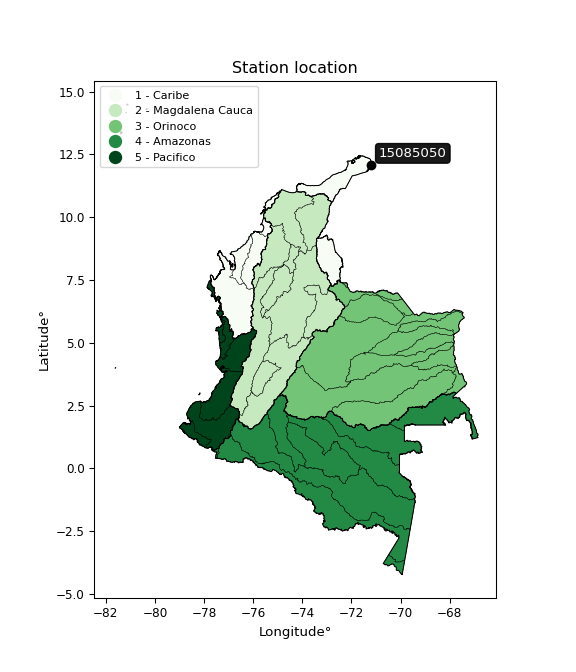</img>

</div>


## A. General information


### 1. General running parameters

• app_version: _v20260312_. • runtime: _2026-03-12 07:15:23.203550_. • Python version: _3.14.0_. • SciPy version: _1.16.3_. • Pandas version: _2.3.3_. • NumPy version: _2.3.5_. • Stations dataset (station_dataset_file): _dataset/pmax24h_in/automatic_colombia_2003_2025.csv_. • Stations catalog (station_catalog_file): _dataset/CNE.xls_. • Minimum year to eval til year_max (date_min): _1900_. • Maximum year to eval since year_min (date_max): _2025_. • Creates, save and include plots into reports (create_plot): _True_. • Plot only fit distributions with Δo > Δ (plot_only_fit): _True_. • Plot only simple graphs avoiding multiple CDFs and multiple Extreme values plots (plot_only_simple): _True_. • Eval low extreme values, if False, evaluates high extreme values (low_extreme): _False_. • Eval every SciPy distribution as logarithmic (pdist_logarithmic_on): _True_. • Standard deviation normalized (ddof): _1.0_. • Return periods to eval in years (Tr): _[2, 2.33, 5, 10, 15, 20, 25, 50, 75, 100, 200, 250, 500, 750, 1000]_. • Minimum data sample per station, 0 means any (minimum_sample): _5_. • Z-Score maximum threshold to adjust a value, 0 means disable (zscore_max): _3.5_. • Z-Score minimum threshold to adjust a value, 0 means disable (zscore_min): _-2.5_. • Avoid zeros, e.g. rain = 0 (avoid_zeros): _True_. • Avoid null values (avoid_nans): _True_. 

:file_folder:Table: [dataset.csv](../../dataset/pmax24h_in/automatic_colombia_2003_2025.csv)

> Delta Degrees of Freedom (DDOF): is a parameter used in the formulas for calculating variance and standard deviation. When ddof=0, the divisor is $N$ (the total number of observations) and this is used when your data set is the entire population. When ddof=1, the divisor is $N-1$ and this is used when your data set is a sample drawn from a larger population. Using $N-1$ provides an unbiased estimate of the population variance (known as Bessel´s correction).


### 2. Station info and location

|   id |   CODIGO | NOMBRE                    | CATEGORIA               | TECNOLOGIA                | ESTADO   | FECHA_INSTALACION   |   FECHA_SUSPENSION |   ALTITUD |   LATITUD |   LONGITUD | DEPARTAMENTO   | MUNICIPIO   | AREA_OPERATIVA                                         | ENTIDAD                                                     | AREA_HIDROGRAFICA   | ZONA_HIDROGRAFICA   | SUBZONA_HIDROGRAFICA                                     |   CORRIENTE | Catalogo   |   Version |
|-----:|---------:|:--------------------------|:------------------------|:--------------------------|:---------|:--------------------|-------------------:|----------:|----------:|-----------:|:---------------|:------------|:-------------------------------------------------------|:------------------------------------------------------------|:--------------------|:--------------------|:---------------------------------------------------------|------------:|:-----------|----------:|
|    0 | 15085050 | TOROMANA - AUT [15085050] | Climatológica Principal | Automática con Telemetría | Activa   | 18/04/2005          |                nan |       144 |   12.0835 |   -71.2109 | La Guajira     | Uribia      | Area Operativa 05 - Magdalena-Cesar-Guajira-San Andrés | INSTITUTO DE HIDROLOGIA METEOROLOGIA Y ESTUDIOS AMBIENTALES | Caribe              | Caribe - Guajira    | Río Carraipia - Paraguachon, Directos al Golfo Maracaibo |         nan | CNE_IDEAM  |  20251226 |

<div align="center">

Dynamic map: [:earth_americas:Google](http://maps.google.com/maps?q=12.08352778,-71.21094444) [:earth_americas:OSM](https://www.openstreetmap.org/#map=18/12.08352778/-71.21094444&layers=P) [:earth_americas:Bing](https://www.bing.com/maps?cp=12.08352778~-71.21094444&lvl=18) [:earth_americas:Apple](https://maps.apple.com/frame?center=12.08352778%2C-71.21094444&span=0.003%2C0.006)

</div>


<div align="center">

```geojson
{
  "type": "Feature",
  "geometry": {
    "type": "Point", 
    "coordinates": [-71.21094444, 12.08352778]
  }, 
  "properties": {
    "Name": "15085050"
  }
}
```

</div>


### 3. Discrete values table and plot

<div align="center">

|               |          0 |           1 |         2 |          3 |            4 |            5 |          6 |           7 |           8 |         9 |         10 |           11 |          12 |         13 |        14 |          15 |         16 |         17 |          18 |
|:--------------|-----------:|------------:|----------:|-----------:|-------------:|-------------:|-----------:|------------:|------------:|----------:|-----------:|-------------:|------------:|-----------:|----------:|------------:|-----------:|-----------:|------------:|
| Date          | 2005       | 2006        | 2007      | 2008       | 2009         | 2010         | 2011       | 2012        | 2013        | 2014      | 2015       | 2016         | 2018        | 2019       | 2020      | 2021        | 2022       | 2023       | 2025        |
| Value         |   50.7     |   49.7      |   34.2    |   78.9     |   27.8       |   27.6       |   50.3     |   21.2      |   14.7      |   20.1    |    1.9     |   27.2       |   43.9      |   56.9     |    6      |    7.4      |    0.1     |    0.7     |   17        |
| Value_initial |   50.7     |   49.7      |   34.2    |   78.9     |   27.8       |   27.6       |   50.3     |   21.2      |   14.7      |   20.1    |    1.9     |   27.2       |   43.9      |   56.9     |    6      |    7.4      |    0.1     |    0.7     |   17        |
| count         |   19       |   19        |   19      |   19       |   19         |   19         |   19       |   19        |   19        |   19      |   19       |   19         |   19        |   19       |   19      |   19        |   19       |   19       |   19        |
| mean          |   28.2263  |   28.2263   |   28.2263 |   28.2263  |   28.2263    |   28.2263    |   28.2263  |   28.2263   |   28.2263   |   28.2263 |   28.2263  |   28.2263    |   28.2263   |   28.2263  |   28.2263 |   28.2263   |   28.2263  |   28.2263  |   28.2263   |
| std           |   22.0106  |   22.0106   |   22.0106 |   22.0106  |   22.0106    |   22.0106    |   22.0106  |   22.0106   |   22.0106   |   22.0106 |   22.0106  |   22.0106    |   22.0106   |   22.0106  |   22.0106 |   22.0106   |   22.0106  |   22.0106  |   22.0106   |
| zscore        |    1.02104 |    0.975605 |    0.2714 |    2.30224 |   -0.0193686 |   -0.0284552 |    1.00286 |   -0.319224 |   -0.614536 |   -0.3692 |   -1.19607 |   -0.0466282 |    0.712096 |    1.30272 |   -1.0098 |   -0.946194 |   -1.27785 |   -1.25059 |   -0.510041 |


</div>


<div align="center">

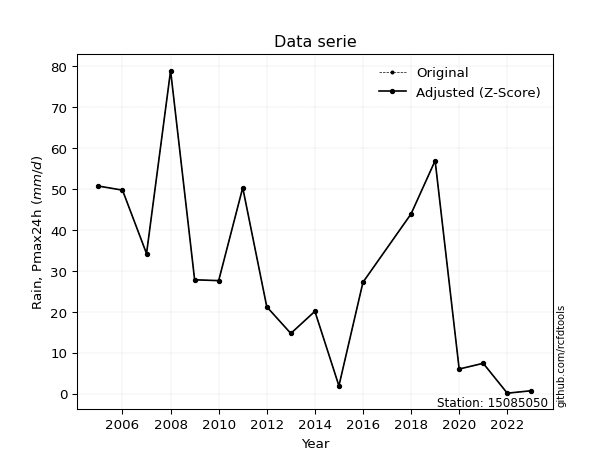</img>

</div>


> The initial value (value_initial) correspond to the initial obtained or null completed value, and value (value) is adjusted only when the initial value is outside the valid range (outlier) definite through the Z-Score value. If Z-Score is active, values out of range or outliers are replaced with the station mean value. A Z-Score (or standard score) measures how many standard deviations a data point is from the mean of a dataset, indicating its relative position; positive scores mean above the mean, negative mean below, and a score of zero is exactly at the mean, allowing for comparison of values from different distributions. It´s calculated using the formula $z=(x–μ)/σ$, where $x$ is the data point, $μ$ is the mean, and $σ$ is the standard deviation, helping identify outliers and understand probability.
>
> <sub>**Note**: In this study, "completing" (filling gaps in) and "extending" (forecasting or lengthening the historical record) rainfall data series are avoided for certain critical analyses because they introduce artificial bias and uncertainty, which can distort the statistics of rare events (extremes), alter day-to-day variability, and compromise the integrity and homogeneity of the original data. Some reasons against Completing/Extending rainfall data are: **Distortion of Extremes and Variability**: The primary issue is that most gap-filling or extension methods rely on averaging or regression with nearby stations, which inherently smooths the data. Rainfall is highly variable in space and time, with a large percentage of zero values and occasional large storms. Infilling methods often underestimate the highest values and overestimate the lowest (zero) values, which severely distorts analyses focused on flood frequency, drought severity, and intensity-duration-frequency (IDF) curves, **Loss of Data Homogeneity**: Infilled or extended data are synthetic estimates, not actual measurements. Combining these estimates with observed data can violate the assumption of data homogeneity, which requires that the data properties do not change over time. Inhomogeneity can lead to incorrect conclusions about long-term trends or changes in climate patterns, **Propagation of Errors**: Errors and biases from the original data (e.g., wind-induced undercatch, instrument errors, site changes) or the data used for imputation can propagate through the analysis, leading to unreliable hydrological models and inaccurate predictions, **Compromised Statistical Integrity**: For statistical analyses, especially those involving the frequency of events, using artificial data can introduce time bias or autocorrelation that doesn´t exist in reality, making it difficult to assess the true probability of events, **Difficulty in Validation**: It is difficult to accurately validate the quality of filled or extended data, especially for past periods where ground-truth measurements are unavailable. The reliability of imputation techniques heavily depends on the density of the surrounding station network and the complexity of the local topography.</sub>


### 4. Active continuous probability distributions from SciPy (80 of 104 available)

A Probability Density Function (PDF) describes the relative likelihood of a continuous random variable falling within a specific range, where the total area under its curve equals 1, and the area over any interval gives the actual probability for that range. Unlike discrete probabilities (like rolling a die), a PDF shows density, not direct probability for a single point (which is zero), with higher points indicating higher likelihood, often visualized as a bell curve for normal distributions.

A log of a probability density function (log-PDF) is simply the logarithm of the PDF´s value, denoted as $log(f(x))$, useful for converting multiplication of probabilities into addition, improving numerical stability with tiny numbers, and connecting to information theory concepts like entropy. Instead of dealing with very small probabilities (e.g., 0.000001), log-PDFs use negative numbers (e.g., $log(0.00001) ≈ -11.51$ that are easier for computers to handle, preventing underflow errors and simplifying complex calculations. In this study, each active probability distribution from SciPy is also evaluated in the $log$ form.

[scipy.stats](https://docs.scipy.org/doc/scipy/reference/stats.html) is a Python´s powerful submodule within the SciPy library for comprehensive statistical analysis, offering over 130 probability distributions (like Normal, Poisson, etc.), functions for descriptive stats (mean, variance), hypothesis testing (t-tests, chi-square), random variable generation, and statistical tests, making it essential for data science, modeling, and research. It provides tools to explore, model, and draw conclusions from data efficiently, working seamlessly with [NumPy](https://numpy.org/).

<div align="center">

|   id | p_dist           |   n_parameter | fit_method   | label                                                                       | active   | ref                                                                                                      |
|-----:|:-----------------|--------------:|:-------------|:----------------------------------------------------------------------------|:---------|:---------------------------------------------------------------------------------------------------------|
|    0 | alpha            |             3 | MLE          | Alpha                                                                       | True     | [:mortar_board:](https://docs.scipy.org/doc/scipy/reference/generated/scipy.stats.alpha.html)            |
|    1 | anglit           |             2 | MM           | Anglit                                                                      | True     | [:mortar_board:](https://docs.scipy.org/doc/scipy/reference/generated/scipy.stats.anglit.html)           |
|    2 | arcsine          |             2 | MM           | Arcsine                                                                     | True     | [:mortar_board:](https://docs.scipy.org/doc/scipy/reference/generated/scipy.stats.arcsine.html)          |
|    3 | argus            |             3 | MLE          | Argus                                                                       | True     | [:mortar_board:](https://docs.scipy.org/doc/scipy/reference/generated/scipy.stats.argus.html)            |
|    4 | beta             |             4 | MLE          | Beta                                                                        | True     | [:mortar_board:](https://docs.scipy.org/doc/scipy/reference/generated/scipy.stats.beta.html)             |
|    5 | betaprime        |             4 | MLE          | Beta prime                                                                  | True     | [:mortar_board:](https://docs.scipy.org/doc/scipy/reference/generated/scipy.stats.betaprime.html)        |
|    6 | bradford         |             3 | MLE          | Bradford                                                                    | True     | [:mortar_board:](https://docs.scipy.org/doc/scipy/reference/generated/scipy.stats.bradford.html)         |
|    7 | burr             |             4 | MLE          | Burr (Type III)                                                             | True     | [:mortar_board:](https://docs.scipy.org/doc/scipy/reference/generated/scipy.stats.burr.html)             |
|    8 | burr12           |             4 | MLE          | Burr (Type III) 12                                                          | True     | [:mortar_board:](https://docs.scipy.org/doc/scipy/reference/generated/scipy.stats.burr12.html)           |
|    9 | cosine           |             2 | MLE          | Cosine                                                                      | True     | [:mortar_board:](https://docs.scipy.org/doc/scipy/reference/generated/scipy.stats.cosine.html)           |
|   10 | crystalball      |             4 | MLE          | Crystalball                                                                 | True     | [:mortar_board:](https://docs.scipy.org/doc/scipy/reference/generated/scipy.stats.crystalball.html)      |
|   11 | dgamma           |             3 | MLE          | Double gamma                                                                | True     | [:mortar_board:](https://docs.scipy.org/doc/scipy/reference/generated/scipy.stats.dgamma.html)           |
|   12 | dweibull         |             3 | MLE          | Double Weibull                                                              | True     | [:mortar_board:](https://docs.scipy.org/doc/scipy/reference/generated/scipy.stats.dweibull.html)         |
|   13 | erlang           |             3 | MLE          | Erlang                                                                      | True     | [:mortar_board:](https://docs.scipy.org/doc/scipy/reference/generated/scipy.stats.erlang.html)           |
|   14 | exponnorm        |             3 | MLE          | Exponentially modified Normal                                               | True     | [:mortar_board:](https://docs.scipy.org/doc/scipy/reference/generated/scipy.stats.exponnorm.html)        |
|   15 | exponpow         |             3 | MLE          | Exponential power                                                           | True     | [:mortar_board:](https://docs.scipy.org/doc/scipy/reference/generated/scipy.stats.exponpow.html)         |
|   16 | exponweib        |             4 | MLE          | Exponentiated Weibull                                                       | True     | [:mortar_board:](https://docs.scipy.org/doc/scipy/reference/generated/scipy.stats.exponweib.html)        |
|   17 | f                |             4 | MLE          | F                                                                           | True     | [:mortar_board:](https://docs.scipy.org/doc/scipy/reference/generated/scipy.stats.f.html)                |
|   18 | fatiguelife      |             3 | MLE          | Fatigue-life (Birnbaum-Saunders)                                            | True     | [:mortar_board:](https://docs.scipy.org/doc/scipy/reference/generated/scipy.stats.fatiguelife.html)      |
|   19 | foldnorm         |             3 | MM           | Fold Normal                                                                 | True     | [:mortar_board:](https://docs.scipy.org/doc/scipy/reference/generated/scipy.stats.foldnorm.html)         |
|   20 | gamma            |             3 | MLE          | Gamma                                                                       | True     | [:mortar_board:](https://docs.scipy.org/doc/scipy/reference/generated/scipy.stats.gamma.html)            |
|   21 | gausshyper       |             6 | MLE          | Gauss hypergeometric                                                        | True     | [:mortar_board:](https://docs.scipy.org/doc/scipy/reference/generated/scipy.stats.gausshyper.html)       |
|   22 | genexpon         |             5 | MLE          | Generalized exponential                                                     | True     | [:mortar_board:](https://docs.scipy.org/doc/scipy/reference/generated/scipy.stats.genexpon.html)         |
|   23 | genextreme       |             3 | MLE          | Generalized exponential                                                     | True     | [:mortar_board:](https://docs.scipy.org/doc/scipy/reference/generated/scipy.stats.genextreme.html)       |
|   24 | gengamma         |             4 | MLE          | Generalized gamma                                                           | True     | [:mortar_board:](https://docs.scipy.org/doc/scipy/reference/generated/scipy.stats.gengamma.html)         |
|   25 | genhalflogistic  |             3 | MLE          | Generalized half-logistic                                                   | True     | [:mortar_board:](https://docs.scipy.org/doc/scipy/reference/generated/scipy.stats.genhalflogistic.html)  |
|   26 | genlogistic      |             3 | MLE          | Generalized logistic                                                        | True     | [:mortar_board:](https://docs.scipy.org/doc/scipy/reference/generated/scipy.stats.genlogistic.html)      |
|   27 | gennorm          |             3 | MLE          | Generalized Normal                                                          | True     | [:mortar_board:](https://docs.scipy.org/doc/scipy/reference/generated/scipy.stats.gennorm.html)          |
|   28 | genpareto        |             3 | MLE          | Generalized Pareto                                                          | True     | [:mortar_board:](https://docs.scipy.org/doc/scipy/reference/generated/scipy.stats.genpareto.html)        |
|   29 | gompertz         |             3 | MLE          | Gompertz (or truncated Gumbel)                                              | True     | [:mortar_board:](https://docs.scipy.org/doc/scipy/reference/generated/scipy.stats.gompertz.html)         |
|   30 | gumbel_l         |             2 | MM           | Gumbel Left Skew                                                            | True     | [:mortar_board:](https://docs.scipy.org/doc/scipy/reference/generated/scipy.stats.gumbel_l.html)         |
|   31 | gumbel_r         |             2 | MM           | Gumbel Right Skew                                                           | True     | [:mortar_board:](https://docs.scipy.org/doc/scipy/reference/generated/scipy.stats.gumbel_r.html)         |
|   32 | halfgennorm      |             3 | MLE          | Upper half of a generalized normal                                          | True     | [:mortar_board:](https://docs.scipy.org/doc/scipy/reference/generated/scipy.stats.halfgennorm.html)      |
|   33 | halflogistic     |             2 | MM           | Half-logistic                                                               | True     | [:mortar_board:](https://docs.scipy.org/doc/scipy/reference/generated/scipy.stats.halflogistic.html)     |
|   34 | halfnorm         |             2 | MM           | Half Normal                                                                 | True     | [:mortar_board:](https://docs.scipy.org/doc/scipy/reference/generated/scipy.stats.halfnorm.html)         |
|   35 | hypsecant        |             2 | MM           | hyperbolic secant                                                           | True     | [:mortar_board:](https://docs.scipy.org/doc/scipy/reference/generated/scipy.stats.hypsecant.html)        |
|   36 | invgamma         |             3 | MLE          | Inverted gamma                                                              | True     | [:mortar_board:](https://docs.scipy.org/doc/scipy/reference/generated/scipy.stats.invgamma.html)         |
|   37 | invgauss         |             3 | MLE          | Inverse Gaussian                                                            | True     | [:mortar_board:](https://docs.scipy.org/doc/scipy/reference/generated/scipy.stats.invgauss.html)         |
|   38 | invweibull       |             3 | MLE          | Inverted Weibull                                                            | True     | [:mortar_board:](https://docs.scipy.org/doc/scipy/reference/generated/scipy.stats.invweibull.html)       |
|   39 | johnsonsb        |             4 | MLE          | Johnson SB                                                                  | True     | [:mortar_board:](https://docs.scipy.org/doc/scipy/reference/generated/scipy.stats.johnsonsb.html)        |
|   40 | johnsonsu        |             4 | MLE          | Johnson Su                                                                  | True     | [:mortar_board:](https://docs.scipy.org/doc/scipy/reference/generated/scipy.stats.johnsonsu.html)        |
|   41 | kappa3           |             3 | MLE          | Kappa 3                                                                     | True     | [:mortar_board:](https://docs.scipy.org/doc/scipy/reference/generated/scipy.stats.kappa3.html)           |
|   42 | kappa4           |             4 | MLE          | Kappa 4                                                                     | True     | [:mortar_board:](https://docs.scipy.org/doc/scipy/reference/generated/scipy.stats.kappa4.html)           |
|   43 | ksone            |             3 | MLE          | Kolmogorov-Smirnov one-sided test statistic distribution                    | True     | [:mortar_board:](https://docs.scipy.org/doc/scipy/reference/generated/scipy.stats.ksone.html)            |
|   44 | kstwobign        |             2 | MLE          | Limiting distribution of scaled Kolmogorov-Smirnov two-sided test statistic | True     | [:mortar_board:](https://docs.scipy.org/doc/scipy/reference/generated/scipy.stats.kstwobign.html)        |
|   45 | laplace          |             2 | MM           | Laplace                                                                     | True     | [:mortar_board:](https://docs.scipy.org/doc/scipy/reference/generated/scipy.stats.laplace.html)          |
|   46 | levy_l           |             2 | MLE          | Left-skewed Levy                                                            | True     | [:mortar_board:](https://docs.scipy.org/doc/scipy/reference/generated/scipy.stats.levy_l.html)           |
|   47 | loggamma         |             3 | MLE          | Log gamma                                                                   | True     | [:mortar_board:](https://docs.scipy.org/doc/scipy/reference/generated/scipy.stats.loggamma.html)         |
|   48 | logistic         |             2 | MM           | Logistic (or Sech-squared)                                                  | True     | [:mortar_board:](https://docs.scipy.org/doc/scipy/reference/generated/scipy.stats.logistic.html)         |
|   49 | loglaplace       |             3 | MLE          | Log-Laplace                                                                 | True     | [:mortar_board:](https://docs.scipy.org/doc/scipy/reference/generated/scipy.stats.loglaplace.html)       |
|   50 | lomax            |             3 | MLE          | Lomax (Pareto of the second kind)                                           | True     | [:mortar_board:](https://docs.scipy.org/doc/scipy/reference/generated/scipy.stats.lomax.html)            |
|   51 | maxwell          |             2 | MM           | Maxwell                                                                     | True     | [:mortar_board:](https://docs.scipy.org/doc/scipy/reference/generated/scipy.stats.maxwell.html)          |
|   52 | mielke           |             4 | MLE          | Mielke Beta-Kappa / Dagum                                                   | True     | [:mortar_board:](https://docs.scipy.org/doc/scipy/reference/generated/scipy.stats.mielke.html)           |
|   53 | moyal            |             2 | MM           | Moyal                                                                       | True     | [:mortar_board:](https://docs.scipy.org/doc/scipy/reference/generated/scipy.stats.moyal.html)            |
|   54 | nakagami         |             3 | MLE          | Nakagami                                                                    | True     | [:mortar_board:](https://docs.scipy.org/doc/scipy/reference/generated/scipy.stats.nakagami.html)         |
|   55 | ncf              |             5 | MLE          | Non-central F distribution                                                  | True     | [:mortar_board:](https://docs.scipy.org/doc/scipy/reference/generated/scipy.stats.ncf.html)              |
|   56 | nct              |             4 | MLE          | Non-central Student’s t                                                     | True     | [:mortar_board:](https://docs.scipy.org/doc/scipy/reference/generated/scipy.stats.nct.html)              |
|   57 | norm             |             2 | MM           | Normal                                                                      | True     | [:mortar_board:](https://docs.scipy.org/doc/scipy/reference/generated/scipy.stats.norm.html)             |
|   58 | pearson3         |             3 | MM           | Pearson type III                                                            | True     | [:mortar_board:](https://docs.scipy.org/doc/scipy/reference/generated/scipy.stats.pearson3.html)         |
|   59 | powerlaw         |             3 | MLE          | Power-function                                                              | True     | [:mortar_board:](https://docs.scipy.org/doc/scipy/reference/generated/scipy.stats.powerlaw.html)         |
|   60 | rayleigh         |             2 | MM           | Rayleigh                                                                    | True     | [:mortar_board:](https://docs.scipy.org/doc/scipy/reference/generated/scipy.stats.rayleigh.html)         |
|   61 | rdist            |             3 | MLE          | R-distributed (symmetric beta)                                              | True     | [:mortar_board:](https://docs.scipy.org/doc/scipy/reference/generated/scipy.stats.rdist.html)            |
|   62 | rice             |             3 | MLE          | Rice                                                                        | True     | [:mortar_board:](https://docs.scipy.org/doc/scipy/reference/generated/scipy.stats.rice.html)             |
|   63 | semicircular     |             2 | MM           | Semicircular                                                                | True     | [:mortar_board:](https://docs.scipy.org/doc/scipy/reference/generated/scipy.stats.semicircular.html)     |
|   64 | skewnorm         |             3 | MLE          | Skew normal                                                                 | True     | [:mortar_board:](https://docs.scipy.org/doc/scipy/reference/generated/scipy.stats.skewnorm.html)         |
|   65 | t                |             3 | MLE          | Student’s t                                                                 | True     | [:mortar_board:](https://docs.scipy.org/doc/scipy/reference/generated/scipy.stats.t.html)                |
|   66 | trapezoid        |             4 | MLE          | Trapezoid                                                                   | True     | [:mortar_board:](https://docs.scipy.org/doc/scipy/reference/generated/scipy.stats.trapezoid.html)        |
|   67 | triang           |             3 | MLE          | Triangular                                                                  | True     | [:mortar_board:](https://docs.scipy.org/doc/scipy/reference/generated/scipy.stats.triang.html)           |
|   68 | truncexpon       |             3 | MLE          | Truncated exponential                                                       | True     | [:mortar_board:](https://docs.scipy.org/doc/scipy/reference/generated/scipy.stats.truncexpon.html)       |
|   69 | truncnorm        |             4 | MLE          | Truncated normal                                                            | True     | [:mortar_board:](https://docs.scipy.org/doc/scipy/reference/generated/scipy.stats.truncnorm.html)        |
|   70 | truncpareto      |             4 | MLE          | Upper truncated Pareto                                                      | True     | [:mortar_board:](https://docs.scipy.org/doc/scipy/reference/generated/scipy.stats.truncpareto.html)      |
|   71 | truncweibull_min |             5 | MLE          | Doubly truncated Weibull minimum                                            | True     | [:mortar_board:](https://docs.scipy.org/doc/scipy/reference/generated/scipy.stats.truncweibull_min.html) |
|   72 | tukeylambda      |             3 | MLE          | Tukey-Lamdba                                                                | True     | [:mortar_board:](https://docs.scipy.org/doc/scipy/reference/generated/scipy.stats.tukeylambda.html)      |
|   73 | uniform          |             2 | MLE          | Uniform                                                                     | True     | [:mortar_board:](https://docs.scipy.org/doc/scipy/reference/generated/scipy.stats.uniform.html)          |
|   74 | vonmises         |             3 | MLE          | Von Mises                                                                   | True     | [:mortar_board:](https://docs.scipy.org/doc/scipy/reference/generated/scipy.stats.vonmises.html)         |
|   75 | vonmises_line    |             3 | MLE          | Von Mises line                                                              | True     | [:mortar_board:](https://docs.scipy.org/doc/scipy/reference/generated/scipy.stats.vonmises_line.html)    |
|   76 | wald             |             2 | MM           | Wald                                                                        | True     | [:mortar_board:](https://docs.scipy.org/doc/scipy/reference/generated/scipy.stats.wald.html)             |
|   77 | weibull_max      |             3 | MLE          | Weibull maximum                                                             | True     | [:mortar_board:](https://docs.scipy.org/doc/scipy/reference/generated/scipy.stats.weibull_max.html)      |
|   78 | weibull_min      |             3 | MLE          | Weibull minimum                                                             | True     | [:mortar_board:](https://docs.scipy.org/doc/scipy/reference/generated/scipy.stats.weibull_min.html)      |
|   79 | wrapcauchy       |             3 | MLE          | Wrapped  Cauchy                                                             | True     | [:mortar_board:](https://docs.scipy.org/doc/scipy/reference/generated/scipy.stats.wrapcauchy.html)       |

</div>

> **n_parameter:** # arguments & localization & scale.
>
> **Fit methods:** (MLE) maximum likelihood, (MM) L-moments.
>
>**Inactive** (With the only purpose of prevent loops, zero divisions, infinite values, over high estimated values or horizontal trending for recurrence intervals estimations, the follow distributions were disabled.)**:** lognorm, norminvgauss, powernorm, powerlognorm, cauchy, halfcauchy, foldcauchy, skewcauchy, chi2, expon, fisk, genhyperbolic, geninvgauss, gibrat, kstwo, laplace_asymmetric, levy, levy_stable, ncx2, pareto, rel_breitwigner, recipinvgauss, studentized_range, loguniform, 


## B. Probability (PDF) vs. Empirical (EDF) distributions functions

A continuous probability distribution (CPD) describes probabilities for variables that can take any value within a range (like rain any time), unlike discrete variables with specific outcomes (like temperature). It uses a Probability Density Function (PDF), a curve where the total area under it equals 1, and the probability of the variable falling within an interval (a to b) is found by calculating the area under the curve between those points. A key feature is that the probability of hitting any single exact value is zero, so probabilities are always expressed for ranges, e.g., $P(a ≤ X ≤ b)$.

<div align="center">

Distributions parameters from station values
|     |   station | p_dist              |   n |              loc |           scale | shape                  | shape1                 | shape2               | shape3             |
|----:|----------:|:--------------------|----:|-----------------:|----------------:|:-----------------------|:-----------------------|:---------------------|:-------------------|
|   0 |  15085050 | alpha               |  19 |    -93.6841      |   704.71        | 5.953528900893447      |                        |                      |                    |
|   1 |  15085050 | anglit              |  19 |     28.2263      |    62.6725      |                        |                        |                      |                    |
|   2 |  15085050 | arcsine             |  19 |     -2.07118     |    60.595       |                        |                        |                      |                    |
|   3 |  15085050 | argus               |  19 |    -16.1555      |    96.8263      | 6.176097880119032e-11  |                        |                      |                    |
|   4 |  15085050 | beta                |  19 |      0.1         |   126.26        | 0.5658483830613403     | 2.3754494545478124     |                      |                    |
|   5 |  15085050 | betaprime           |  19 |      0.1         |  1192.76        | 0.796337101741083      | 44.139465578886714     |                      |                    |
|   6 |  15085050 | bradford            |  19 |      0.0999884   |    80.1261      | 1.105183743914334      |                        |                      |                    |
|   7 |  15085050 | burr                |  19 |      0.1         |    54.5852      | 6.579120613254439      | 0.10450385688237418    |                      |                    |
|   8 |  15085050 | burr12              |  19 |      0.000112187 |     8.63177e+06 | 1.0471226265581257     | 549803.3054314356      |                      |                    |
|   9 |  15085050 | cosine              |  19 |     30.8466      |    18.9295      |                        |                        |                      |                    |
|  10 |  15085050 | crystalball         |  19 |     28.2263      |    21.4236      | 2438.4952600141023     | 1885.7520957643455     |                      |                    |
|  11 |  15085050 | dgamma              |  19 |     24.1839      |    10.7824      | 1.6299278916215878     |                        |                      |                    |
|  12 |  15085050 | dweibull            |  19 |     24.4844      |    19.1866      | 1.3627825195086278     |                        |                      |                    |
|  13 |  15085050 | erlang              |  19 |      0.1         |    28.9381      | 0.7408295317676495     |                        |                      |                    |
|  14 |  15085050 | exponnorm           |  19 |      0.0582688   |     0.0152939   | 1844.4916539535334     |                        |                      |                    |
|  15 |  15085050 | exponpow            |  19 |      0.1         |    46.433       | 0.8447864498386102     |                        |                      |                    |
|  16 |  15085050 | exponweib           |  19 |      0.1         |     2.61467     | 0.9772206151376488     | 0.3172725282835166     |                      |                    |
|  17 |  15085050 | f                   |  19 |      0.1         |    24.8673      | 1.7741725913928779     | 27.172506280348333     |                      |                    |
|  18 |  15085050 | fatiguelife         |  19 |    -13.7487      |    36.0773      | 0.5702078151195472     |                        |                      |                    |
|  19 |  15085050 | foldnorm            |  19 |     -5.35246     |    25.0389      | 1.2371435108008675     |                        |                      |                    |
|  20 |  15085050 | gamma               |  19 |      0.1         |    28.9624      | 0.7379909683132004     |                        |                      |                    |
|  21 |  15085050 | gausshyper          |  19 |      0.1         |   103.112       | 0.8050513460082647     | 2.055694550883099      | 1.315106004325116    | 1.1021770157258204 |
|  22 |  15085050 | genexpon            |  19 |     -7.49365     |     2.28785     | 6.402919856737131e-10  | 0.17896840845608852    | 0.048057985385320925 |                    |
|  23 |  15085050 | genextreme          |  19 |     18.2393      |    17.3675      | 0.011432053144124106   |                        |                      |                    |
|  24 |  15085050 | gengamma            |  19 |      0.1         |    35.461       | 0.5931975350821497     | 1.3171535546131354     |                      |                    |
|  25 |  15085050 | genhalflogistic     |  19 |      0.0792479   |    26.4302      | 0.2156077553079379     |                        |                      |                    |
|  26 |  15085050 | genlogistic         |  19 |    -96.2279      |    17.2664      | 752.1927849896767      |                        |                      |                    |
|  27 |  15085050 | gennorm             |  19 |     30.9809      |    35.8228      | 3.2868313181306883     |                        |                      |                    |
|  28 |  15085050 | genpareto           |  19 |      0.1         |    41.7454      | -0.46216170159086234   |                        |                      |                    |
|  29 |  15085050 | gompertz            |  19 |      0.1         |    56.7271      | 1.296828794809425      |                        |                      |                    |
|  30 |  15085050 | gumbel_l            |  19 |     37.8681      |    16.7039      |                        |                        |                      |                    |
|  31 |  15085050 | gumbel_r            |  19 |     18.5846      |    16.7039      |                        |                        |                      |                    |
|  32 |  15085050 | halfgennorm         |  19 |      0.1         |     3.0144      | 0.4367833512310536     |                        |                      |                    |
|  33 |  15085050 | halflogistic        |  19 |      2.83444     |    18.3164      |                        |                        |                      |                    |
|  34 |  15085050 | halfnorm            |  19 |     -0.130094    |    35.5395      |                        |                        |                      |                    |
|  35 |  15085050 | hypsecant           |  19 |     28.2263      |    13.6387      |                        |                        |                      |                    |
|  36 |  15085050 | invgamma            |  19 |    -42.2595      |   727.772       | 11.30185407710898      |                        |                      |                    |
|  37 |  15085050 | invgauss            |  19 |    -18.1334      |   176.649       | 0.26244048107174067    |                        |                      |                    |
|  38 |  15085050 | invweibull          |  19 |     -3.28144e+06 |     3.28146e+06 | 189846.65852165513     |                        |                      |                    |
|  39 |  15085050 | johnsonsb           |  19 |      0.1         |    78.8023      | 0.27220351352561556    | 0.11240725955403344    |                      |                    |
|  40 |  15085050 | johnsonsu           |  19 |    -19.5208      |     1.5896      | -8.511279836859877     | 2.133204724303596      |                      |                    |
|  41 |  15085050 | kappa3              |  19 |      0.1         |    42.1664      | 6.292309806548134      |                        |                      |                    |
|  42 |  15085050 | kappa4              |  19 |     -7.57714     |    88.8293      | 1.0945111631658309     | 0.9802957360339105     |                      |                    |
|  43 |  15085050 | ksone               |  19 |     -7.78        |    94.56        | 1.0                    |                        |                      |                    |
|  44 |  15085050 | kstwobign           |  19 |    -42.2917      |    80.823       |                        |                        |                      |                    |
|  45 |  15085050 | laplace             |  19 |     28.2263      |    15.1488      |                        |                        |                      |                    |
|  46 |  15085050 | levy_l              |  19 |     83.9441      |    34.8309      |                        |                        |                      |                    |
|  47 |  15085050 | loggamma            |  19 |  -6318.64        |   862.22        | 1574.184440129592      |                        |                      |                    |
|  48 |  15085050 | logistic            |  19 |     28.2263      |    11.8114      |                        |                        |                      |                    |
|  49 |  15085050 | loglaplace          |  19 |     -0.0917788   |    27.2918      | 0.9539947944097458     |                        |                      |                    |
|  50 |  15085050 | lomax               |  19 |      0.1         |   383.68        | 15.468067018986643     |                        |                      |                    |
|  51 |  15085050 | maxwell             |  19 |    -22.5385      |    31.8122      |                        |                        |                      |                    |
|  52 |  15085050 | mielke              |  19 |      0.1         |    55.6468      | 0.6375318042170633     | 5.5186733484059225     |                      |                    |
|  53 |  15085050 | moyal               |  19 |     15.9749      |     9.64399     |                        |                        |                      |                    |
|  54 |  15085050 | nakagami            |  19 |      0.7         |    34.3692      | 0.4423833396169454     |                        |                      |                    |
|  55 |  15085050 | ncf                 |  19 |      0.1         |     0.883706    | 0.22745522827290465    | 48.44475305015675      | 6.841850579060193    |                    |
|  56 |  15085050 | nct                 |  19 |    -51.9462      |     7.36046     | 9.098133220962582      | 9.970864111025595      |                      |                    |
|  57 |  15085050 | norm                |  19 |     28.2263      |    21.4236      |                        |                        |                      |                    |
|  58 |  15085050 | pearson3            |  19 |     28.2263      |    21.4236      | 0.5546585639267634     |                        |                      |                    |
|  59 |  15085050 | powerlaw            |  19 |      0.1         |    78.8         | 0.27536243560960877    |                        |                      |                    |
|  60 |  15085050 | rayleigh            |  19 |    -12.7582      |    32.7009      |                        |                        |                      |                    |
|  61 |  15085050 | rdist               |  19 |     -6.42961     |    40.6296      | 1.2216516220123292     |                        |                      |                    |
|  62 |  15085050 | rice                |  19 |     -9.40409     |    30.6188      | 0.0006280712566182111  |                        |                      |                    |
|  63 |  15085050 | semicircular        |  19 |     28.2263      |    42.8471      |                        |                        |                      |                    |
|  64 |  15085050 | skewnorm            |  19 |      0.0999985   |    35.3557      | 121533735.23480809     |                        |                      |                    |
|  65 |  15085050 | t                   |  19 |     28.2262      |    21.4236      | 255284719.8719903      |                        |                      |                    |
|  66 |  15085050 | trapezoid           |  19 |     -8.169       |    94.56        | 1.0                    | 1.0                    |                      |                    |
|  67 |  15085050 | triang              |  19 |      0.0999989   |    87.7347      | 2.1490585725559708e-09 |                        |                      |                    |
|  68 |  15085050 | truncexpon          |  19 |      0.0999876   |   106.509       | 0.739841100137248      |                        |                      |                    |
|  69 |  15085050 | truncnorm           |  19 |     23.3425      |    24.9534      | -0.9320579392813292    | 2.226452002619194      |                      |                    |
|  70 |  15085050 | truncpareto         |  19 |      0.0999999   |     1.05206e-07 | 0.05555557414615579    | 749008697.895963       |                      |                    |
|  71 |  15085050 | truncweibull_min    |  19 |     -1.29058     |    64.0728      | 1.1528926864407927     | 3.5864398907686927e-09 | 1.2515538560213924   |                    |
|  72 |  15085050 | tukeylambda         |  19 |     -6.80415     |    43.2573      | 1.0549484952003707     |                        |                      |                    |
|  73 |  15085050 | uniform             |  19 |      0.1         |    78.8         |                        |                        |                      |                    |
|  74 |  15085050 | vonmises            |  19 |      1.20365     |     1           | 0.7187105608577662     |                        |                      |                    |
|  75 |  15085050 | vonmises_line       |  19 |     39.5125      |    12.5454      | 0.0004757085194739072  |                        |                      |                    |
|  76 |  15085050 | wald                |  19 |      6.80271     |    21.4236      |                        |                        |                      |                    |
|  77 |  15085050 | weibull_max         |  19 |     78.9         |     1.61681     | 0.2505970784327529     |                        |                      |                    |
|  78 |  15085050 | weibull_min         |  19 |      0.1         |    23.4774      | 0.6856423004310932     |                        |                      |                    |
|  79 |  15085050 | wrapcauchy          |  19 |      0.0955261   |    12.5421      | 0.025191839620049006   |                        |                      |                    |
|  80 |  15085050 | logalpha            |  19 |    -66.7522      |  2782.33        | 40.13004041753629      |                        |                      |                    |
|  81 |  15085050 | loganglit           |  19 |      2.67217     |     4.84703     |                        |                        |                      |                    |
|  82 |  15085050 | logarcsine          |  19 |      0.328978    |     4.68637     |                        |                        |                      |                    |
|  83 |  15085050 | logargus            |  19 |     -4.37815     |     8.80156     | 2.8861227537340257     |                        |                      |                    |
|  84 |  15085050 | logbeta             |  19 |     -3.12231     |     7.49049     | 1.6791637522825191     | 0.33320230153122443    |                      |                    |
|  85 |  15085050 | logbetaprime        |  19 |     -2.30259     |  9022.38        | 0.4037198766030483     | 1080.8954617622182     |                      |                    |
|  86 |  15085050 | logbradford         |  19 |     -2.90124     |     7.26979     | 1.9027088490664767e-06 |                        |                      |                    |
|  87 |  15085050 | logburr             |  19 |  -6471.85        |  6449.82        | 3021.6323205621748     | 66836.71752185146      |                      |                    |
|  88 |  15085050 | logburr12           |  19 | -19175.9         | 19189.4         | 19192.746875466015     | 25205.162123527894     |                      |                    |
|  89 |  15085050 | logcosine           |  19 |      2.18579     |     1.66968     |                        |                        |                      |                    |
|  90 |  15085050 | logcrystalball      |  19 |      2.67217     |     1.65687     | 5132.732381052032      | 17.607265500945946     |                      |                    |
|  91 |  15085050 | logdgamma           |  19 |      3.31782     |     1.48204     | 0.6297710302789301     |                        |                      |                    |
|  92 |  15085050 | logdweibull         |  19 |      3.32504     |     1.18407     | 0.8166674426522869     |                        |                      |                    |
|  93 |  15085050 | logerlang           |  19 |    -26.9834      |     0.108771    | 272.3315303832858      |                        |                      |                    |
|  94 |  15085050 | logexponnorm        |  19 |      2.67095     |     1.65686     | 0.0007368468782485427  |                        |                      |                    |
|  95 |  15085050 | logexponpow         |  19 |     -2.30259     |     1.80255     | 0.262356784134427      |                        |                      |                    |
|  96 |  15085050 | logexponweib        |  19 |     -2.30259     |     2.02162     | 1.4740508908514491     | 0.3341426928847909     |                      |                    |
|  97 |  15085050 | logf                |  19 |     -2.30259     |     1.12909     | 1.0583130396368903     | 1.0649414635655075     |                      |                    |
|  98 |  15085050 | logfatiguelife      |  19 |  -1405.24        |  1407.9         | 0.0011773500570312458  |                        |                      |                    |
|  99 |  15085050 | logfoldnorm         |  19 |     -7.18985     |     1.2517      | 7.959785995158709      |                        |                      |                    |
| 100 |  15085050 | loggamma            |  19 |    -26.6813      |     0.108594    | 270.55694949736846     |                        |                      |                    |
| 101 |  15085050 | loggausshyper       |  19 |     -2.47377     |     6.84195     | 1.5776935939451053     | 0.6055051806152516     | 0.7307931957654856   | 1.3035107988249917 |
| 102 |  15085050 | loggenexpon         |  19 |     -2.30259     |     1.73585     | 0.057900619989539964   | 3.937883003372793      | 0.048821440309032266 |                    |
| 103 |  15085050 | loggenextreme       |  19 |      2.72051     |     1.69188     | 1.0268316918837568     |                        |                      |                    |
| 104 |  15085050 | loggengamma         |  19 |  -5023.86        |  5027.91        | 0.39073302620956885    | 9624.567374948485      |                      |                    |
| 105 |  15085050 | loggenhalflogistic  |  19 |     -2.30638     |     7.6368      | 1.1441656730898884     |                        |                      |                    |
| 106 |  15085050 | loggenlogistic      |  19 |      4.18464     |     0.120319    | 0.07878106821244715    |                        |                      |                    |
| 107 |  15085050 | loggennorm          |  19 |      3.31782     |     0.111417    | 0.4436653818611904     |                        |                      |                    |
| 108 |  15085050 | loggenpareto        |  19 |     -2.30259     |     3.2567      | -0.3616282119514872    |                        |                      |                    |
| 109 |  15085050 | loggompertz         |  19 |     -2.30259     |     2.16082     | 0.09173426484176961    |                        |                      |                    |
| 110 |  15085050 | loggumbel_l         |  19 |      3.41785     |     1.29185     |                        |                        |                      |                    |
| 111 |  15085050 | loggumbel_r         |  19 |      1.92649     |     1.29185     |                        |                        |                      |                    |
| 112 |  15085050 | loghalfgennorm      |  19 |     -2.30717     |     6.7082      | 552.9262176844427      |                        |                      |                    |
| 113 |  15085050 | loghalflogistic     |  19 |      0.708388    |     1.41657     |                        |                        |                      |                    |
| 114 |  15085050 | loghalfnorm         |  19 |      0.479164    |     2.74854     |                        |                        |                      |                    |
| 115 |  15085050 | loghypsecant        |  19 |      2.67217     |     1.05479     |                        |                        |                      |                    |
| 116 |  15085050 | loginvgamma         |  19 |    -42.6736      | 30325.2         | 670.417746973937       |                        |                      |                    |
| 117 |  15085050 | loginvgauss         |  19 |    -14.0715      |  1261.77        | 0.01323145085952946    |                        |                      |                    |
| 118 |  15085050 | loginvweibull       |  19 |     -3.54769e+08 |     3.54769e+08 | 163112927.16364092     |                        |                      |                    |
| 119 |  15085050 | logjohnsonsb        |  19 |     -9.0287      |    13.5338      | -2.127039790215267     | 0.9618267284521027     |                      |                    |
| 120 |  15085050 | logjohnsonsu        |  19 |      4.59679     |     0.0236563   | 5.925374257521348      | 1.241229641975762      |                      |                    |
| 121 |  15085050 | logkappa3           |  19 |     -2.30259     |     6.4101      | 69.49245165897881      |                        |                      |                    |
| 122 |  15085050 | logkappa4           |  19 |     -2.59364     |     8.02967     | 1.0356177723727402     | 1.1533858326767255     |                      |                    |
| 123 |  15085050 | logksone            |  19 |     -2.96966     |     8.00492     | 1.0                    |                        |                      |                    |
| 124 |  15085050 | logkstwobign        |  19 |     -6.41315     |    10.4633      |                        |                        |                      |                    |
| 125 |  15085050 | loglaplace          |  19 |      2.67217     |     1.17158     |                        |                        |                      |                    |
| 126 |  15085050 | loglevy_l           |  19 |      4.47861     |     0.739607    |                        |                        |                      |                    |
| 127 |  15085050 | logloggamma         |  19 |      4.28663     |     0.190791    | 0.12389298578389922    |                        |                      |                    |
| 128 |  15085050 | loglogistic         |  19 |      2.67217     |     0.913479    |                        |                        |                      |                    |
| 129 |  15085050 | logloglaplace       |  19 |     -2.30259     |     1.73257     | 0.684332549858192      |                        |                      |                    |
| 130 |  15085050 | loglomax            |  19 |     -2.30259     |     7.25987e+06 | 1471367.999750968      |                        |                      |                    |
| 131 |  15085050 | logmaxwell          |  19 |     -1.25389     |     2.46029     |                        |                        |                      |                    |
| 132 |  15085050 | logmielke           |  19 |     -3.42798e+07 |     3.42798e+07 | 19937339.498120323     | 1865645683.017532      |                      |                    |
| 133 |  15085050 | logmoyal            |  19 |      1.72467     |     0.745852    |                        |                        |                      |                    |
| 134 |  15085050 | lognakagami         |  19 |  -2328.53        |  2331.21        | 493211.26455942367     |                        |                      |                    |
| 135 |  15085050 | logncf              |  19 |     -2.30259     |     1.03842     | 1.0193155410512467     | 1.1190366663504707     | 1.086268129094087    |                    |
| 136 |  15085050 | lognct              |  19 |   -119.04        |     1.6429      | 143629.10730565066     | 74.08345792130555      |                      |                    |
| 137 |  15085050 | lognorm             |  19 |      2.67217     |     1.65687     |                        |                        |                      |                    |
| 138 |  15085050 | logpearson3         |  19 |      2.67216     |     1.65689     | -1.667783994871209     |                        |                      |                    |
| 139 |  15085050 | logpowerlaw         |  19 |     -2.30259     |     6.67077     | 0.44995337759100856    |                        |                      |                    |
| 140 |  15085050 | lograyleigh         |  19 |     -0.497493    |     2.52903     |                        |                        |                      |                    |
| 141 |  15085050 | logrdist            |  19 |     -1.97426     |     3.97574     | 1.0179266160004308     |                        |                      |                    |
| 142 |  15085050 | logrice             |  19 |  -1523.04        |     1.65605     | 921.2990791292686      |                        |                      |                    |
| 143 |  15085050 | logsemicircular     |  19 |      2.67217     |     3.31374     |                        |                        |                      |                    |
| 144 |  15085050 | logskewnorm         |  19 |      4.36818     |     2.37096     | -19290515.253249027    |                        |                      |                    |
| 145 |  15085050 | logt                |  19 |      3.32096     |     0.669555    | 1.4988092759863072     |                        |                      |                    |
| 146 |  15085050 | logtrapezoid        |  19 |     -3.11814     |     8.00492     | 1.0                    | 1.0                    |                      |                    |
| 147 |  15085050 | logtriang           |  19 |     -2.81841     |     7.18659     | 0.9999999984470727     |                        |                      |                    |
| 148 |  15085050 | logtruncexpon       |  19 |     -2.30261     |    12.5725      | 0.5305896503138525     |                        |                      |                    |
| 149 |  15085050 | logtruncnorm        |  19 |      1.90217     |     6.67767     | -0.6296767290040659    | 0.36929400270334645    |                      |                    |
| 150 |  15085050 | logtruncpareto      |  19 |     -2.30259     |     2.83443e-08 | 0.00015319357891555344 | 244097067.3540933      |                      |                    |
| 151 |  15085050 | logtruncweibull_min |  19 |     -2.88374     |     8.38151     | 2.8045001427175427     | 6.538723316759151e-11  | 0.8652288993556057   |                    |
| 152 |  15085050 | logtukeylambda      |  19 |     -0.152872    |     1.97435     | 0.9130031754174778     |                        |                      |                    |
| 153 |  15085050 | loguniform          |  19 |     -2.30259     |     6.67077     |                        |                        |                      |                    |
| 154 |  15085050 | logvonmises         |  19 |     -2.88288     |     1           | 1.5537100695344714     |                        |                      |                    |
| 155 |  15085050 | logvonmises_line    |  19 |      0.283591    |     1.30017     | 1.6931403739285782e-06 |                        |                      |                    |
| 156 |  15085050 | logwald             |  19 |      1.01533     |     1.65685     |                        |                        |                      |                    |
| 157 |  15085050 | logweibull_max      |  19 |      4.36818     |     1.52179     | 0.909631803104493      |                        |                      |                    |
| 158 |  15085050 | logweibull_min      |  19 |     -2.30259     |     1.53203     | 0.5691158116859667     |                        |                      |                    |
| 159 |  15085050 | logwrapcauchy       |  19 |     -2.30259     |     1.06169     | 0.5                    |                        |                      |                    |

</div>

> **loc** (Location parameter): This shifts the distribution along the x-axis. For many common distributions, like the normal (Gaussian) distribution, loc represents the mean $μ$. For others, like the uniform distribution, it might represent the minimum value, or for the beta distribution, the left end of the support interval.
>
> **scale** (Scale parameter): This determines the width or spread of the distribution. For the normal distribution, scale represents the standard deviation $σ$. For a uniform distribution, it defines the length of the interval (from $loc$ to $loc + scale$).
>
> **shape** (Shape parameters): Refers to parameters that define the specific form of a probability distribution, distinct from its location (loc) and scale (scale). These parameters are required arguments for most distribution functions. For example, a normal (Gaussian) distribution is fully defined by its location (mean) and scale (standard deviation), so it has no specific shape parameters beyond loc and scale. However, other distributions have intrinsic properties that need specification, as Gamma distribution that takes a shape parameter, often named $a$ or $alpha$.


### 0. Cumulative distribution values - CDF (160 evaluated)

Cumulative Distribution Function (CDF), denoted as $F$<sub>$X$</sub>$(x)$, is a function that gives the probability that a random variable $X$ will take a value less than or equal to a specific value, $x$ (i.e., $(P(X≥x)$. It essentially "accumulates" probabilities from a given point up to the far right (positive infinity), providing a complete picture of the distribution´s probabilities for both discrete (like rain) and continuous (like temperature) variables, helping to find probabilities over ranges or above certain values. Each station is evaluated separately ordering the $x$ values ascending, calculating the CDF and PDF values for the activated distributions and their logarithmic forms.

<div align="center">

CDF ordered by x ascending and calculating $log(f(x))$ separately
|   id |   Station |   date |    x |   count |    mean |     std |     zscore |   Value_initial |   station |   m |     alpha |   alpha_pdf |   anglit |   anglit_pdf |   arcsine |   arcsine_pdf |     argus |   argus_pdf |        beta |    beta_pdf |   betaprime |   betaprime_pdf |    bradford |   bradford_pdf |        burr |      burr_pdf |     burr12 |   burr12_pdf |    cosine |   cosine_pdf |   crystalball |   crystalball_pdf |   dgamma |   dgamma_pdf |   dweibull |   dweibull_pdf |     erlang |    erlang_pdf |   exponnorm |   exponnorm_pdf |    exponpow |   exponpow_pdf |   exponweib |   exponweib_pdf |           f |      f_pdf |   fatiguelife |   fatiguelife_pdf |   foldnorm |   foldnorm_pdf |       gamma |     gamma_pdf |   gausshyper |   gausshyper_pdf |   genexpon |   genexpon_pdf |   genextreme |   genextreme_pdf |   gengamma |   gengamma_pdf |   genhalflogistic |   genhalflogistic_pdf |   genlogistic |   genlogistic_pdf |   gennorm |   gennorm_pdf |   genpareto |   genpareto_pdf |    gompertz |   gompertz_pdf |   gumbel_l |   gumbel_l_pdf |   gumbel_r |   gumbel_r_pdf |   halfgennorm |   halfgennorm_pdf |   halflogistic |   halflogistic_pdf |   halfnorm |   halfnorm_pdf |   hypsecant |   hypsecant_pdf |   invgamma |   invgamma_pdf |   invgauss |   invgauss_pdf |   invweibull |   invweibull_pdf |   johnsonsb |   johnsonsb_pdf |   johnsonsu |   johnsonsu_pdf |     kappa3 |   kappa3_pdf |      kappa4 |   kappa4_pdf |     ksone |   ksone_pdf |   kstwobign |   kstwobign_pdf |   laplace |   laplace_pdf |   levy_l |   levy_l_pdf |   loggamma |   loggamma_pdf |   logistic |   logistic_pdf |   loglaplace |   loglaplace_pdf |      lomax |   lomax_pdf |   maxwell |   maxwell_pdf |      mielke |     mielke_pdf |     moyal |   moyal_pdf |    nakagami |   nakagami_pdf |         ncf |     ncf_pdf |       nct |    nct_pdf |      norm |   norm_pdf |   pearson3 |   pearson3_pdf |    powerlaw |   powerlaw_pdf |   rayleigh |   rayleigh_pdf |    rdist |     rdist_pdf |      rice |   rice_pdf |   semicircular |   semicircular_pdf |   skewnorm |   skewnorm_pdf |         t |      t_pdf |   trapezoid |   trapezoid_pdf |      triang |   triang_pdf |   truncexpon |   truncexpon_pdf |   truncnorm |   truncnorm_pdf |   truncpareto |   truncpareto_pdf |   truncweibull_min |   truncweibull_min_pdf |   tukeylambda |   tukeylambda_pdf |    uniform |   uniform_pdf |   vonmises |   vonmises_pdf |   vonmises_line |   vonmises_line_pdf |        wald |    wald_pdf |   weibull_max |   weibull_max_pdf |   weibull_min |   weibull_min_pdf |   wrapcauchy |   wrapcauchy_pdf |   logalpha |   logalpha_pdf |   loganglit |   loganglit_pdf |   logarcsine |   logarcsine_pdf |   logargus |   logargus_pdf |    logbeta |   logbeta_pdf |   logbetaprime |   logbetaprime_pdf |   logbradford |   logbradford_pdf |    logburr |   logburr_pdf |   logburr12 |   logburr12_pdf |   logcosine |   logcosine_pdf |   logcrystalball |   logcrystalball_pdf |   logdgamma |   logdgamma_pdf |   logdweibull |   logdweibull_pdf |   logerlang |   logerlang_pdf |   logexponnorm |   logexponnorm_pdf |   logexponpow |   logexponpow_pdf |   logexponweib |   logexponweib_pdf |        logf |    logf_pdf |   logfatiguelife |   logfatiguelife_pdf |   logfoldnorm |   logfoldnorm_pdf |   loggausshyper |   loggausshyper_pdf |   loggenexpon |   loggenexpon_pdf |   loggenextreme |   loggenextreme_pdf |   loggengamma |   loggengamma_pdf |   loggenhalflogistic |   loggenhalflogistic_pdf |   loggenlogistic |   loggenlogistic_pdf |   loggennorm |   loggennorm_pdf |   loggenpareto |   loggenpareto_pdf |   loggompertz |   loggompertz_pdf |   loggumbel_l |   loggumbel_l_pdf |   loggumbel_r |   loggumbel_r_pdf |   loghalfgennorm |   loghalfgennorm_pdf |   loghalflogistic |   loghalflogistic_pdf |   loghalfnorm |   loghalfnorm_pdf |   loghypsecant |   loghypsecant_pdf |   loginvgamma |   loginvgamma_pdf |   loginvgauss |   loginvgauss_pdf |   loginvweibull |   loginvweibull_pdf |   logjohnsonsb |   logjohnsonsb_pdf |   logjohnsonsu |   logjohnsonsu_pdf |   logkappa3 |   logkappa3_pdf |   logkappa4 |   logkappa4_pdf |   logksone |   logksone_pdf |   logkstwobign |   logkstwobign_pdf |   loglevy_l |   loglevy_l_pdf |   logloggamma |   logloggamma_pdf |   loglogistic |   loglogistic_pdf |   logloglaplace |   logloglaplace_pdf |    loglomax |   loglomax_pdf |   logmaxwell |   logmaxwell_pdf |   logmielke |   logmielke_pdf |    logmoyal |   logmoyal_pdf |   lognakagami |   lognakagami_pdf |      logncf |   logncf_pdf |     lognct |   lognct_pdf |    lognorm |   lognorm_pdf |   logpearson3 |   logpearson3_pdf |   logpowerlaw |   logpowerlaw_pdf |   lograyleigh |   lograyleigh_pdf |   logrdist |   logrdist_pdf |    logrice |   logrice_pdf |   logsemicircular |   logsemicircular_pdf |   logskewnorm |   logskewnorm_pdf |      logt |   logt_pdf |   logtrapezoid |   logtrapezoid_pdf |   logtriang |   logtriang_pdf |   logtruncexpon |   logtruncexpon_pdf |   logtruncnorm |   logtruncnorm_pdf |   logtruncpareto |   logtruncpareto_pdf |   logtruncweibull_min |   logtruncweibull_min_pdf |   logtukeylambda |   logtukeylambda_pdf |   loguniform |   loguniform_pdf |   logvonmises |   logvonmises_pdf |   logvonmises_line |   logvonmises_line_pdf |   logwald |   logwald_pdf |   logweibull_max |   logweibull_max_pdf |   logweibull_min |   logweibull_min_pdf |   logwrapcauchy |   logwrapcauchy_pdf |
|-----:|----------:|-------:|-----:|--------:|--------:|--------:|-----------:|----------------:|----------:|----:|----------:|------------:|---------:|-------------:|----------:|--------------:|----------:|------------:|------------:|------------:|------------:|----------------:|------------:|---------------:|------------:|--------------:|-----------:|-------------:|----------:|-------------:|--------------:|------------------:|---------:|-------------:|-----------:|---------------:|-----------:|--------------:|------------:|----------------:|------------:|---------------:|------------:|----------------:|------------:|-----------:|--------------:|------------------:|-----------:|---------------:|------------:|--------------:|-------------:|-----------------:|-----------:|---------------:|-------------:|-----------------:|-----------:|---------------:|------------------:|----------------------:|--------------:|------------------:|----------:|--------------:|------------:|----------------:|------------:|---------------:|-----------:|---------------:|-----------:|---------------:|--------------:|------------------:|---------------:|-------------------:|-----------:|---------------:|------------:|----------------:|-----------:|---------------:|-----------:|---------------:|-------------:|-----------------:|------------:|----------------:|------------:|----------------:|-----------:|-------------:|------------:|-------------:|----------:|------------:|------------:|----------------:|----------:|--------------:|---------:|-------------:|-----------:|---------------:|-----------:|---------------:|-------------:|-----------------:|-----------:|------------:|----------:|--------------:|------------:|---------------:|----------:|------------:|------------:|---------------:|------------:|------------:|----------:|-----------:|----------:|-----------:|-----------:|---------------:|------------:|---------------:|-----------:|---------------:|---------:|--------------:|----------:|-----------:|---------------:|-------------------:|-----------:|---------------:|----------:|-----------:|------------:|----------------:|------------:|-------------:|-------------:|-----------------:|------------:|----------------:|--------------:|------------------:|-------------------:|-----------------------:|--------------:|------------------:|-----------:|--------------:|-----------:|---------------:|----------------:|--------------------:|------------:|------------:|--------------:|------------------:|--------------:|------------------:|-------------:|-----------------:|-----------:|---------------:|------------:|----------------:|-------------:|-----------------:|-----------:|---------------:|-----------:|--------------:|---------------:|-------------------:|--------------:|------------------:|-----------:|--------------:|------------:|----------------:|------------:|----------------:|-----------------:|---------------------:|------------:|----------------:|--------------:|------------------:|------------:|----------------:|---------------:|-------------------:|--------------:|------------------:|---------------:|-------------------:|------------:|------------:|-----------------:|---------------------:|--------------:|------------------:|----------------:|--------------------:|--------------:|------------------:|----------------:|--------------------:|--------------:|------------------:|---------------------:|-------------------------:|-----------------:|---------------------:|-------------:|-----------------:|---------------:|-------------------:|--------------:|------------------:|--------------:|------------------:|--------------:|------------------:|-----------------:|---------------------:|------------------:|----------------------:|--------------:|------------------:|---------------:|-------------------:|--------------:|------------------:|--------------:|------------------:|----------------:|--------------------:|---------------:|-------------------:|---------------:|-------------------:|------------:|----------------:|------------:|----------------:|-----------:|---------------:|---------------:|-------------------:|------------:|----------------:|--------------:|------------------:|--------------:|------------------:|----------------:|--------------------:|------------:|---------------:|-------------:|-----------------:|------------:|----------------:|------------:|---------------:|--------------:|------------------:|------------:|-------------:|-----------:|-------------:|-----------:|--------------:|--------------:|------------------:|--------------:|------------------:|--------------:|------------------:|-----------:|---------------:|-----------:|--------------:|------------------:|----------------------:|--------------:|------------------:|----------:|-----------:|---------------:|-------------------:|------------:|----------------:|----------------:|--------------------:|---------------:|-------------------:|-----------------:|---------------------:|----------------------:|--------------------------:|-----------------:|---------------------:|-------------:|-----------------:|--------------:|------------------:|-------------------:|-----------------------:|----------:|--------------:|-----------------:|---------------------:|-----------------:|---------------------:|----------------:|--------------------:|
|    0 |  15085050 |   2022 |  0.1 |      19 | 28.2263 | 22.0106 | -1.27785   |             0.1 |  15085050 |   1 | 0.0593042 |  0.00945753 | 0.109095 |   0.00994879 |  0.121238 |     0.0282623 | 0.041978  |  0.00512776 | 3.25968e-11 | 1.32909e+06 | 4.07554e-12 |     26.3419     | 2.15859e-07 |     0.018529   | 9.99937e-10 | 154.995       | 0.00268561 |   0.0281154  | 0.0825613 |   0.00795837 |     0.0946137 |        0.00786572 | 0.123874 |  0.00918644  |   0.124988 |    0.0096843   | 2.9259e-14 | 1561.91       |  0.00147862 |      0.035284   | 2.24258e-16 |    13.6513     | 4.40491e-06 |     9.84105e+10 | 6.01034e-17 | 3.84188    |     0.0405755 |        0.0123296  |  0.0811623 |     0.0150055  | 3.29826e-14 | 1753.94       |  1.60833e-15 |      93.3372     |  0.0439589 |     0.0110265  |    0.0593513 |       0.00953776 | 1.6612e-12 |    50.4462     |       0.000392616 |            0.018921   |     0.058693  |        0.00962022 | 0.0777875 |    0.00842332 | 4.44613e-12 |      0.0239548  | 1.95138e-13 |     0.0228608  |  0.0989933 |    0.00562284  |  0.0486031 |     0.0087991  |   3.19822e-12 |        0.124976   |       0        |         0          | 0.00516571 |     0.0224502  |   0.0805253 |      0.00584142 |  0.0537829 |     0.00999694 |  0.0442359 |     0.0114501  |    0.0584302 |       0.00960024 | 2.30385e-06 |     8.92559e+10 |   0.0476398 |      0.0107528  | 1.5939e-12 |   0.0177045  | 2.64905e-15 |    0.268134  | 0.0833333 |   0.0105753 |   0.0539179 |      0.0101359  | 0.0780955 |    0.00515524 | 0.480771 |   0.00249158 | 0.00155465 |     0.00319923 |  0.0846115 |     0.00655741 |   0.00715938 |       0.00611086 | 9.6343e-16 |  0.040315   | 0.0825213 |    0.0098603  | 1.44972e-11 | 16649.6        | 0.0227605 |  0.00704405 | 0           |     0          | 0.000330429 | 2.70785e+12 | 0.0576104 | 0.00988139 | 0.0946137 | 0.00786572 |  0.0774822 |     0.00919352 | 6.85167e-06 |     1.3595e+11 |  0.0743932 |     0.0111298  | 0.55882  |    0.00906965 | 0.0470324 | 0.00966081 |       0.114436 |          0.0112086 |  0         |     0.0225674  | 0.0946146 | 0.00786576 |   0.007647  |      0.00184956 | 2.33115e-08 |   0.022796   |  2.23327e-07 |       0.0179584  | 0.000197307 |      0.0127696  |   1.63592e-16 |  778108           |          0.0165398 |             0.01363    |      0.582921 |         0.0120162 | 0          |     0.0126904 |   0.220856 |      0.194095  |     1.50521e-06 |           0.0126803 | 0           | 0           |     0.0707681 |       0.000596022 |   3.17604e-13 |    15691.5        |  5.97058e-05 |        0.0133455 | 0.00118052 |     0.00262598 |   0         |       0         |     0        |         0        | 0.00956529 |      0.0101828 | 0.00630742 |   0.0133062   |    3.03271e-07 |        2.75702e+08 |     0.0823477 |          0.137556 | 0.00139606 |    0.00428636 |  0.00351502 |      0.00351234 |  0.00244755 |      0.00963211 |       0.00133883 |           0.00265479 |  0.00446897 |      0.00325895 |     0.0140579 |        0.00728589 |  0.00185383 |       0.0037264 |     0.00133881 |         0.00265475 |   8.03574e-05 |       4.74732e+10 |    1.93928e-08 |        2.15087e+07 | 4.59713e-09 | 5.47773e+06 |        0.0013553 |           0.00269293 |   2.50377e-05 |       8.55793e-05 |      0.00246295 |           0.0225828 |   3.22143e-10 |         0.0333558 |       0.0201746 |           0.0114965 |    0.00971232 |        0.00727351 |          0.000248433 |                0.0655097 |        0.0142979 |           0.00936186 |    0.0161217 |       0.00589696 |    6.62244e-10 |          0.307059  |   9.39197e-08 |         0.0424536 |     0.0118664 |        0.00913086 |   3.39913e-12 |       6.94834e-11 |         0        |             0.149227 |          0        |             0         |     0         |          0        |     0.00569632 |         0.00540012 |    0.00128864 |        0.00283041 |    0.00133623 |        0.00329893 |       0.0016076 |          0.00475482 |      0.0162326 |          0.0115208 |      0.0238711 |          0.0101145 | 6.88311e-08 |        0.146767 |  0.00250871 |        0.155023 |  0.0833333 |       0.124923 |     0.00215411 |         0.00785395 |    0.258791 |       0.0183979 |     0.0147104 |        0.00955239 |    0.00429524 |        0.00468187 |     1.07002e-11 |       16488.7       | 3.01422e-09 |      0.202671  |     0        |        0         |   0.0203531 |       0.0118375 | 4.70281e-50 |     7.0081e-48 |    0.00135059 |        0.00267339 | 5.56923e-09 |  6.39152e+06 | 0.00134396 |   0.00266537 | 0.00133883 |    0.00265479 |     0.0160403 |         0.0107562 |   5.26304e-08 |       5.33254e+07 |    0          |         0         |   0.473359 |    0.0813263   | 0.00133218 |    0.00264405 |         0         |             0         |    0.00490003 |        0.00642814 | 0.0153487 | 0.00402988 |       0.01038  |          0.0254549 |  0.00515182 |       0.019975  |     4.13041e-06 |            0.193176 |    2.49188e-06 |           0.129084 |      8.09142e-10 |          1.82947e+06 |            0.00115446 |                0.00556954 |       0.00226043 |             0.187651 |     0        |         0.149908 |      0.736352 |         0.343123  |           0.183425 |               0.12241  |  0        |     0         |        0.0215907 |            0.0112922 |      1.43613e-09 |          1.84045e+06 |        0        |           0.449723  |
|    1 |  15085050 |   2023 |  0.7 |      19 | 28.2263 | 22.0106 | -1.25059   |             0.7 |  15085050 |   2 | 0.0651559 |  0.0100489  | 0.115135 |   0.0101858  |  0.137202 |     0.0251457 | 0.0451097 |  0.00531123 | 0.0842376   | 0.0791108   | 0.0512133   |      0.0671206  | 0.0110719   |     0.0183769  | 0.044994    |   0.0515589   | 0.0204413  |   0.0302681  | 0.0874162 |   0.00822467 |     0.0994204 |        0.00815712 | 0.129497 |  0.009559    |   0.130909 |    0.0100518   | 0.0611998  |    0.0746683  |  0.0224918  |      0.0346518  | 0.0253761   |     0.0357213  | 0.473917    |     0.176102    | 0.0340152   | 0.0496863  |     0.0483204 |        0.0134787  |  0.0901776 |     0.0150461  | 0.0618822   |    0.0752109  |  0.0394849   |       0.0525527  |  0.0507903 |     0.0117406  |    0.0652539 |       0.0101382  | 0.0461641  |     0.0599409  |       0.0117725   |            0.0190114  |     0.0646496 |        0.010236   | 0.0829404 |    0.00875255 | 0.0143173   |      0.0237697  | 0.0136947   |     0.0227875  |  0.102422  |    0.0058063   |  0.0540756 |     0.00944443 |   0.0534958   |        0.0762535  |       0        |         0          | 0.0186344  |     0.0224445  |   0.0841058 |      0.00609521 |  0.0599886 |     0.010689   |  0.0513973 |     0.0124174  |    0.0643748 |       0.0102161  | 0.391568    |     0.0725142   |   0.0543427 |      0.0115887  | 0.0106227  |   0.0177045  | 0.0112748   |    0.0171674 | 0.0896785 |   0.0105753 |   0.0602022 |      0.0108112  | 0.0812507 |    0.00536353 | 0.482273 |   0.0025148  | 0.0397328  |     0.0516389  |  0.0886298 |     0.00683868 |   0.0376882  |       0.0321687  | 0.0238803  |  0.0392908  | 0.0885543 |    0.0102495  | 0.0556917   |     0.0591754  | 0.0272668 |  0.00798451 | 2.63481e-16 |     2.09975    | 0.0318418   | 0.0163933   | 0.0637341 | 0.0105319  | 0.0994204 | 0.00815712 |  0.0831243 |     0.00961398 | 0.261023    |     0.119793   |  0.0812017 |     0.0115635  | 0.564267 |    0.00908771 | 0.0529931 | 0.0102065  |       0.121215 |          0.0113863 |  0.0135398 |     0.0225641  | 0.0994212 | 0.00815716 |   0.008797  |      0.00198376 | 0.0136309   |   0.0226401  |  0.010745    |       0.0178575  | 0.00794477  |      0.0130551  |   0.852619    |       0.0574895   |          0.024934  |             0.0143096  |      0.590132 |         0.0120178 | 0.00761421 |     0.0126904 |   0.359124 |      0.263526  |     0.00760966  |           0.0126803 | 0           | 0           |     0.0711277 |       0.000602491 |   0.0777428   |        0.0852931  |  0.00806684  |        0.0133447 | 0.0379187  |     0.0520726  |   0.0255435 |       0.0650993 |     0        |         0        | 0.0484031  |      0.0341753 | 0.0556601  |   0.0382488   |    0.586862    |        0.102888    |     0.350019  |          0.137556 | 0.0706706  |    0.0874316  |  0.0243915  |      0.0241131  |  0.0986797  |      0.099901   |       0.0337706  |           0.0452859  |  0.0188418  |      0.0141787  |     0.0400086 |        0.0224129  |  0.0438231  |       0.0555095 |     0.0337703  |         0.0452856  |   0.830343    |       0.0647388   |    0.503037    |        0.0746495   | 0.58992     | 0.0819821   |        0.0342649 |           0.0459086  |   0.00619816  |       0.0139806   |      0.122002   |           0.088411  |   0.167675    |         0.128325  |       0.0614378 |           0.0353273 |    0.0416933  |        0.0312071  |          0.149832    |                0.0904132 |        0.0511232 |           0.033474   |    0.0352274 |       0.0156905  |    0.48992     |          0.199796  |   0.125426    |         0.0913717 |     0.0524138 |        0.0394902  |   0.00286453  |       0.0129835   |         0.291065 |             0.149227 |          0        |             0         |     0         |          0        |     0.036003   |         0.03406    |    0.0393921  |        0.0532486  |    0.0486839  |        0.0644188  |       0.0721195 |          0.0871882  |      0.0581571 |          0.0358896 |      0.0583956 |          0.0292215 | 0.285596    |        0.146767 |  0.272295   |        0.137345 |  0.326423  |       0.124923 |     0.108988   |         0.11453    |    0.304278 |       0.0298925 |     0.0520475 |        0.0337978  |    0.0350356  |        0.0370103  |     0.538196    |           0.162406  | 0.325902    |      0.13662   |     0.012396 |        0.0403543 |   0.063117  |       0.0367093 | 5.43486e-05 |     0.00062644 |    0.0338695  |        0.0453365  | 0.469148    |  0.0902      | 0.0338757  |   0.0453979  | 0.0337706  |    0.0452859  |     0.0582755 |         0.0381015 |   0.574449    |       0.13283     |    0.00154896 |         0.0219824 |   0.634956 |    0.0885858   | 0.0337007  |    0.0452312  |         0.0149333 |             0.0779317 |    0.0462827  |        0.0462025  | 0.028583  | 0.0112532  |       0.119005 |          0.0861899 |  0.117338   |       0.0953291 |     0.348261    |            0.165476 |    0.271679    |           0.148635 |      0.934409    |          0.0265746   |            0.0700131  |                0.0763612  |       0.451415   |             0.238321 |     0.291707 |         0.149908 |      0.986544 |         0.0263123 |           0.421625 |               0.122411 |  0        |     0         |        0.0606487 |            0.0327242 |      0.682028    |          0.106555    |        0.420313 |           0.0745037 |
|    2 |  15085050 |   2015 |  1.9 |      19 | 28.2263 | 22.0106 | -1.19607   |             1.9 |  15085050 |   3 | 0.0779294 |  0.0112415  | 0.127637 |   0.0106485  |  0.16481  |     0.0212271 | 0.0517024 |  0.00567623 | 0.156109    | 0.0484575   | 0.120424    |      0.0512944  | 0.0329452   |     0.0180801  | 0.0957627   |   0.0365783   | 0.0570722  |   0.0305401  | 0.0976056 |   0.00875756 |     0.109564  |        0.00875208 | 0.14143  |  0.0103371   |   0.143422 |    0.0108077   | 0.135712   |    0.0538854  |  0.063202   |      0.0332086  | 0.0641556   |     0.0300675  | 0.595791    |     0.0637046   | 0.0882486   | 0.0419392  |     0.0658002 |        0.0156147  |  0.108287  |     0.0151378  | 0.136805    |    0.0541099  |  0.0943914   |       0.0412049  |  0.0656983 |     0.0130878  |    0.0781451 |       0.011348   | 0.108309   |     0.0464346  |       0.034689    |            0.0191799  |     0.0776761 |        0.0114756  | 0.0938347 |    0.00940249 | 0.0426191   |      0.0234001  | 0.0409474   |     0.0226316  |  0.109617  |    0.00618877  |  0.0661957 |     0.0107598  |   0.131183    |        0.0562492  |       0        |         0          | 0.0455521  |     0.0224141  |   0.0917389 |      0.00663365 |  0.0736449 |     0.0120691  |  0.0674217 |     0.0142684  |    0.0773777 |       0.011456   | 0.440381    |     0.0252105   |   0.0692358 |      0.0132223  | 0.0318681  |   0.0177045  | 0.030759    |    0.0156093 | 0.102369  |   0.0105753 |   0.0739777 |      0.0121422  | 0.0879487 |    0.00580568 | 0.485319 |   0.00256232 | 0.12309    |     0.11967    |  0.0971865 |     0.0074285  |   0.0883794  |       0.0754359  | 0.0698387  |  0.0373243  | 0.101317  |    0.0110195  | 0.112194    |     0.0397374  | 0.0380318 |  0.00997825 | 0.0404412   |     0.0298063  | 0.0507455   | 0.0158899   | 0.0771554 | 0.0118362  | 0.109564  | 0.00875208 |  0.0951678 |     0.0104589  | 0.353232    |     0.0540372  |  0.0955827 |     0.0123974  | 0.575196 |    0.00912905 | 0.0658797 | 0.0112632  |       0.135083 |          0.0117226 |  0.0406038 |     0.0225381  | 0.109565  | 0.00875212 |   0.0113386 |      0.00225217 | 0.0406119   |   0.0223283  |  0.0320537   |       0.0176575  | 0.0239514   |      0.0136216  |   0.889381    |       0.0180285   |          0.042673  |             0.0151781  |      0.604555 |         0.0120214 | 0.0228426  |     0.0126904 |   0.689814 |      0.243733  |     0.022826    |           0.0126803 | 0           | 0           |     0.0718586 |       0.000615778 |   0.157928    |        0.0551346  |  0.0240772   |        0.0133382 | 0.124151   |     0.125503   |   0.128428  |       0.13805   |     0.166381 |         0.272113 | 0.0957651  |      0.0640073 | 0.101921   |   0.0552448   |    0.672141    |        0.0713093   |     0.487372  |          0.137556 | 0.18968    |    0.147206   |  0.0648838  |      0.0627846  |  0.225756   |      0.152711   |       0.110213   |           0.113646   |  0.0403558  |      0.0312774  |     0.0711034 |        0.042211   |  0.131797   |       0.124647  |     0.110213   |         0.113646   |   0.879805    |       0.0379886   |    0.564195    |        0.0507728   | 0.653671    | 0.0500762   |        0.111606  |           0.114788   |   0.0442918   |       0.0747653   |      0.221377   |           0.110605  |   0.30741     |         0.147975  |       0.109279  |           0.0632273 |    0.0880075  |        0.0658005  |          0.249349    |                0.109982  |        0.0983021 |           0.0643653  |    0.0567243 |       0.029137   |    0.665423    |          0.152642  |   0.234043    |         0.127031  |     0.110076  |        0.0803356  |   0.0669949   |       0.140183    |         0.440072 |             0.149227 |          0        |             0         |     0.0472004 |          0.289786 |     0.092231   |         0.0862214  |    0.126578   |        0.12594    |    0.14831    |        0.137233   |       0.18987   |          0.145037   |      0.106659  |          0.0640786 |      0.098706  |          0.0545561 | 0.432148    |        0.146767 |  0.410454   |        0.139693 |  0.451162  |       0.124923 |     0.246457   |         0.154661   |    0.339378 |       0.0414577 |     0.0995406 |        0.064638   |    0.0977375  |        0.0965374  |     0.652175    |           0.0808398 | 0.449404    |      0.11159   |     0.102132 |        0.143091  |   0.112814  |       0.0656134 | 0.0387748   |     0.130658   |    0.110307   |        0.113553   | 0.542015    |  0.0593494   | 0.11045    |   0.113778   | 0.110213   |    0.113646   |     0.111236  |         0.071215  |   0.692132    |       0.105768    |    0.0964991  |         0.160944  |   0.731057 |    0.107095    | 0.110094   |    0.113615   |         0.13595   |             0.151832  |    0.11603    |        0.097868   | 0.0449483 | 0.0235945  |       0.220628 |          0.117356  |  0.231832   |       0.133996  |     0.507102    |            0.152842 |    0.423341    |           0.154608 |      0.955827    |          0.0175614   |            0.173482   |                0.132006   |       0.689038   |             0.236692 |     0.441394 |         0.149908 |      1.00788  |         0.0221461 |           0.543855 |               0.122411 |  0        |     0         |        0.104529  |            0.0576237 |      0.765516    |          0.0657339   |        0.480266 |           0.0515037 |
|    3 |  15085050 |   2020 |  6   |      19 | 28.2263 | 22.0106 | -1.0098    |             6   |  15085050 |   4 | 0.132232  |  0.0151799  | 0.174354 |   0.0121078  |  0.237838 |     0.0154598 | 0.0774989 |  0.00690143 | 0.300677    | 0.0276383   | 0.290042    |      0.0345302  | 0.105101    |     0.0171346  | 0.216611    |   0.0252422   | 0.177919   |   0.0281087  | 0.137216  |   0.0105547  |     0.149758  |        0.0108716  | 0.189739 |  0.0133019   |   0.193282 |    0.0135439   | 0.3084     |    0.0343809  |  0.189925   |      0.0287164  | 0.174092    |     0.0246564  | 0.731307    |     0.0187776   | 0.235673    | 0.0314351  |     0.141674  |        0.0208368  |  0.17113   |     0.0155364  | 0.309895    |    0.034412   |  0.23504     |       0.029611   |  0.127514  |     0.0168453  |    0.132976  |       0.0153244  | 0.266455   |     0.0332472  |       0.114301    |            0.0196182  |     0.133208  |        0.0155311  | 0.136713  |    0.0114628  | 0.135981    |      0.0221438  | 0.132503    |     0.0220054  |  0.137916  |    0.00765905  |  0.119529  |     0.0152003  |   0.303974    |        0.0326964  |       0.086199 |         0.0270952  | 0.136945   |     0.0221191  |   0.123214  |      0.00881023 |  0.132328  |     0.0164212  |  0.136987  |     0.0192839  |    0.132833  |       0.0155134  | 0.495848    |     0.00821536  |   0.133762  |      0.017999   | 0.104456   |   0.0177045  | 0.0909552   |    0.0140744 | 0.145728  |   0.0105753 |   0.132424  |      0.01621    | 0.115285  |    0.00761017 | 0.496175 |   0.00273641 | 0.310913   |     0.201927   |  0.132187  |     0.00971205 |   0.235836   |       0.201297   | 0.210257   |  0.0313563  | 0.151677  |    0.013498   | 0.239149    |     0.0258414  | 0.0934927 |  0.0169972  | 0.150056    |     0.0248678  | 0.12339     | 0.0194282   | 0.134509  | 0.0160355  | 0.149758  | 0.0108716  |  0.143906  |     0.0132867  | 0.489814    |     0.0228604  |  0.151704  |     0.0148805  | 0.613001 |    0.00932773 | 0.118871  | 0.0144777  |       0.185238 |          0.0127026 |  0.132532  |     0.0222553  | 0.149759  | 0.0108716  |   0.0224524 |      0.00316923 | 0.129974    |   0.021263   |  0.103074    |       0.0169907  | 0.0836565   |      0.0154769  |   0.926663    |       0.00514917  |          0.107928  |             0.0163801  |      0.653875 |         0.0120385 | 0.0748731  |     0.0126904 |   1.15531  |      0.149151  |     0.0748163   |           0.0126809 | 0           | 0           |     0.074482  |       0.000664974 |   0.32154     |        0.030586   |  0.0786461   |        0.013269  | 0.322081   |     0.212351   |   0.32233   |       0.192848  |     0.377392 |         0.146585 | 0.205522   |      0.136419  | 0.180888   |   0.0846806   |    0.741465    |        0.0510437   |     0.645548  |          0.137555 | 0.378363   |    0.171641   |  0.19107    |      0.171662   |  0.425229   |      0.187999   |       0.297581   |           0.209079   |  0.100986   |      0.0836563  |     0.145418  |        0.0956552  |  0.32422    |       0.204207  |     0.29758    |         0.209079   |   0.914236    |       0.0235549   |    0.613678    |        0.0367017   | 0.700263    | 0.0329421   |        0.30028   |           0.209976   |   0.21645     |       0.234347    |      0.364486   |           0.139614  |   0.478692    |         0.146024  |       0.213203  |           0.124551  |    0.207404   |        0.153721   |          0.393539    |                0.143346  |        0.208715  |           0.13666    |    0.109921  |       0.0719287  |    0.812994    |          0.105292  |   0.404539    |         0.168141  |     0.247245  |        0.165494   |   0.329583    |       0.283169    |         0.611669 |             0.149227 |          0.364783 |             0.305997  |     0.367037  |          0.259009 |     0.260684   |         0.220428   |    0.323674   |        0.210419   |    0.349109   |        0.203207   |       0.375613  |          0.169104   |      0.212845  |          0.12879   |      0.194194  |          0.12169   | 0.600916    |        0.146767 |  0.573814   |        0.144979 |  0.594812  |       0.124923 |     0.429885   |         0.157843   |    0.400181 |       0.0678846 |     0.210035  |        0.136389   |    0.276118   |        0.218808   |     0.722428    |           0.0463937 | 0.563866    |      0.0883918 |     0.325197 |        0.230979  |   0.220199  |       0.128069  | 0.339062    |     0.323785   |    0.29739    |        0.208685   | 0.598614    |  0.0409693   | 0.297883   |   0.209023   | 0.297581   |    0.209079   |     0.229302  |         0.141209  |   0.802812    |       0.0882261   |    0.336139   |         0.237608  |   0.898781 |    0.247794    | 0.297481   |    0.20915    |         0.332871  |             0.185211  |    0.277187   |        0.186467   | 0.0953085 | 0.0781342  |       0.376212 |          0.153246  |  0.411517   |       0.178526  |     0.675058    |            0.139483 |    0.60315     |           0.157365 |      0.972875    |          0.0126286   |            0.363505   |                0.197516   |       0.954698   |             0.218981 |     0.613774 |         0.149908 |      1.05824  |         0.0882422 |           0.684616 |               0.122411 |  0.336749 |     0.555335  |        0.199019  |            0.113434  |      0.826175    |          0.042276    |        0.539424 |           0.0560702 |
|    4 |  15085050 |   2021 |  7.4 |      19 | 28.2263 | 22.0106 | -0.946194  |             7.4 |  15085050 |   5 | 0.154341  |  0.0163879  | 0.191625 |   0.0125599  |  0.258755 |     0.0144656 | 0.0874482 |  0.00731105 | 0.337285    | 0.0247957   | 0.336104    |      0.0313751  | 0.128878    |     0.016834   | 0.250759    |   0.0236175   | 0.216537   |   0.0270543  | 0.15241   |   0.0111495  |     0.165495  |        0.0116094  | 0.209127 |  0.0144007   |   0.212913 |    0.0144993   | 0.35408    |    0.0309985  |  0.229147   |      0.027326   | 0.207908    |     0.023681   | 0.754631    |     0.0148216   | 0.278025    | 0.0291247  |     0.17161   |        0.0218686  |  0.19299   |     0.0156925  | 0.355603    |    0.0310091  |  0.274946    |       0.0274657  |  0.151801  |     0.0178247  |    0.15529   |       0.0165351  | 0.311223   |     0.0307815  |       0.141837    |            0.0197145  |     0.155822  |        0.0167563  | 0.153202  |    0.0120843  | 0.166683    |      0.021717   | 0.163139    |     0.0217587  |  0.149029  |    0.00822128  |  0.141789  |     0.0165813  |   0.346829    |        0.0286909  |       0.123989 |         0.0268783  | 0.167799   |     0.0219523  |   0.13615   |      0.00968102 |  0.15621   |     0.017671   |  0.164831  |     0.0204467  |    0.155423  |       0.0167394  | 0.506266    |     0.00676935  |   0.159852  |      0.0192349  | 0.129243   |   0.0177044  | 0.11047     |    0.0138131 | 0.160533  |   0.0105753 |   0.15593   |      0.0173447  | 0.126447  |    0.008347   | 0.50005  |   0.00280036 | 0.354323   |     0.211631   |  0.146386  |     0.0105793  |   0.282066   |       0.240757   | 0.252884   |  0.0295576  | 0.171117  |    0.0142659  | 0.273918    |     0.0239218  | 0.118801  |  0.019116   | 0.184284    |     0.0240533  | 0.151238    | 0.0203206   | 0.157841  | 0.0172751  | 0.165495  | 0.0116094  |  0.163147  |     0.0141921  | 0.519391    |     0.0195919  |  0.173041  |     0.0155889  | 0.626122 |    0.00941848 | 0.139808  | 0.0154183  |       0.203221 |          0.0129847 |  0.163579  |     0.0220914  | 0.165496  | 0.0116094  |   0.0271086 |      0.00348238 | 0.159488    |   0.0208992  |  0.126705    |       0.0167688  | 0.10574     |      0.016067   |   0.933093    |       0.00411272  |          0.130968  |             0.0165205  |      0.670735 |         0.0120462 | 0.0926396  |     0.0126904 |   1.475    |      0.287347  |     0.0925698   |           0.0126812 | 5.66323e-09 | 1.74432e-07 |     0.0754257 |       0.000683257 |   0.361674    |        0.0269136  |  0.0971961   |        0.0132299 | 0.367655   |     0.221773   |   0.363389  |       0.198462  |     0.407599 |         0.141777 | 0.236237   |      0.156975  | 0.199418   |   0.092193    |    0.75188     |        0.0483165   |     0.674396  |          0.137555 | 0.414255   |    0.170394   |  0.230152   |      0.201518   |  0.464899   |      0.190061   |       0.342814   |           0.221841   |  0.120358   |      0.101795   |     0.167234  |        0.113013   |  0.368016   |       0.213022  |     0.342813   |         0.221841   |   0.918989    |       0.0217985   |    0.621182    |        0.0348886   | 0.706949    | 0.0308611   |        0.345681  |           0.222541   |   0.26872     |       0.263529    |      0.394434   |           0.146082  |   0.509048    |         0.143359  |       0.241023  |           0.141117  |    0.242199   |        0.178655   |          0.424431    |                0.151383  |        0.239436  |           0.156776   |    0.126621  |       0.0880953  |    0.834253    |          0.0974851 |   0.440442    |         0.174108  |     0.284001  |        0.185159   |   0.389222    |       0.284298    |         0.642965 |             0.149227 |          0.427158 |             0.288561  |     0.420328  |          0.249015 |     0.310006   |         0.249595   |    0.368806   |        0.219496   |    0.392301   |        0.208252   |       0.41099   |          0.168022   |      0.241728  |          0.14711   |      0.22181   |          0.142269  | 0.631697    |        0.146767 |  0.604361   |        0.146355 |  0.621011  |       0.124923 |     0.462683   |         0.154791   |    0.415222 |       0.0757971 |     0.240677  |        0.156286   |    0.32427    |        0.239873   |     0.731756    |           0.04265   | 0.582015    |      0.0847135 |     0.374291 |        0.236596  |   0.248765  |       0.144683  | 0.406181    |     0.314663   |    0.342537   |        0.221413   | 0.606957    |  0.0386277   | 0.343099   |   0.221734   | 0.342814   |    0.221841   |     0.26075   |         0.158976  |   0.821061    |       0.0858349   |    0.38626    |         0.239793  |   1        |    2.80174e+06 | 0.342731   |    0.22193    |         0.372035  |             0.188139  |    0.31818    |        0.204479   | 0.114151  | 0.103009   |       0.409037 |          0.159792  |  0.449809   |       0.186647  |     0.704068    |            0.137175 |    0.636156    |           0.157369 |      0.975457    |          0.0120132   |            0.40608    |                0.208413   |       0.9986     |             0.182762 |     0.645213 |         0.149908 |      1.08011  |         0.122071  |           0.710288 |               0.122411 |  0.442761 |     0.456933  |        0.22439   |            0.12888   |      0.834728    |          0.0393399   |        0.55161  |           0.0603867 |
|    5 |  15085050 |   2013 | 14.7 |      19 | 28.2263 | 22.0106 | -0.614536  |            14.7 |  15085050 |   6 | 0.291696  |  0.0205909  | 0.290815 |   0.0144924  |  0.352688 |     0.0117412 | 0.14839   |  0.00935868 | 0.4848      | 0.0168211   | 0.522131    |      0.0207455  | 0.246466    |     0.0154231  | 0.403851    |   0.0190149   | 0.393896   |   0.0216178  | 0.244359  |   0.0139379  |     0.263898  |        0.0152565  | 0.33499  |  0.0197811   |   0.335353 |    0.0186564   | 0.535946   |    0.0201264  |  0.404906   |      0.0210955  | 0.366732    |     0.0200871  | 0.825643    |     0.00655395  | 0.456707    | 0.0205662  |     0.338119  |        0.0226988  |  0.310537  |     0.0164835  | 0.537362    |    0.020098   |  0.445956    |       0.0201307  |  0.294248  |     0.0205713  |    0.293538  |       0.0206689  | 0.500904   |     0.0219622  |       0.286297    |            0.0197191  |     0.295645  |        0.0208485  | 0.250951  |    0.0144405  | 0.317146    |      0.0195113  | 0.316586    |     0.0202093  |  0.221065  |    0.0116499   |  0.283138  |     0.0213884  |   0.507398    |        0.0170519  |       0.313034 |         0.024623   | 0.32353    |     0.0205787  |   0.226122  |      0.0152198  |  0.301752  |     0.0213906  |  0.325011  |     0.0224149  |    0.29514   |       0.0208369  | 0.5421      |     0.00374898  |   0.314213  |      0.0220967  | 0.258477   |   0.0177004  | 0.207919    |    0.0129852 | 0.237733  |   0.0105753 |   0.297341  |      0.0206726  | 0.204733  |    0.0135149  | 0.521822 |   0.00317753 | 0.505458   |     0.22336    |  0.241369  |     0.0155028  |   0.506646   |       0.421101   | 0.438799   |  0.0217954  | 0.287477  |    0.0173221  | 0.426096    |     0.0185946  | 0.28537   |  0.0249759  | 0.347711    |     0.0208793  | 0.308434    | 0.0219842   | 0.301003  | 0.0211832  | 0.263898  | 0.0152565  |  0.281465  |     0.0178904  | 0.628618    |     0.011856   |  0.297092  |     0.0180489  | 0.697243 |    0.01015    | 0.266456  | 0.01886    |       0.302417 |          0.0140981 |  0.320354  |     0.020723   | 0.263899  | 0.0152566  |   0.0584897 |      0.0051152  | 0.305129    |   0.0190025  |  0.245016    |       0.015658   | 0.232805    |      0.0185576  |   0.953508    |       0.00197868  |          0.251707  |             0.0163777  |      0.758864 |         0.0121049 | 0.185279   |     0.0126904 |   2.74355  |      0.215804  |     0.185152    |           0.0126839 | 0.238539    | 0.0484524   |     0.0807993 |       0.000793455 |   0.514234    |        0.0164712  |  0.192764    |        0.0129309 | 0.524691   |     0.229756   |   0.503235  |       0.206308  |     0.502131 |         0.135848 | 0.372773   |      0.247131  | 0.273332   |   0.126172    |    0.782338    |        0.0407449   |     0.768809  |          0.137555 | 0.527441   |    0.157469   |  0.405394   |      0.309334   |  0.594995   |      0.186364   |       0.503775   |           0.24077    |  0.221886   |      0.212494   |     0.273618  |        0.211422   |  0.519057   |       0.22173   |     0.503774   |         0.240771   |   0.932276    |       0.0171721   |    0.643357    |        0.0299545   | 0.726146    | 0.025373    |        0.506846  |           0.240636   |   0.472757    |       0.317978    |      0.503254   |           0.172755  |   0.603492    |         0.131018  |       0.360848  |           0.213172  |    0.398749   |        0.282823   |          0.539009    |                0.18451   |        0.37529   |           0.245728   |    0.21843   |       0.202859   |    0.892866    |          0.0737829 |   0.564816    |         0.186035  |     0.433521  |        0.249206   |   0.574252    |       0.246568    |         0.745389 |             0.149227 |          0.603528 |             0.224398  |     0.578363  |          0.210192 |     0.504731   |         0.301741   |    0.524071   |        0.227079   |    0.536185   |        0.20643    |       0.522805  |          0.155892   |      0.368997  |          0.230627  |      0.350169  |          0.240864  | 0.732433    |        0.146767 |  0.706711   |        0.152324 |  0.706754  |       0.124923 |     0.564254   |         0.140206   |    0.479555 |       0.116458  |     0.375829  |        0.244      |    0.50429    |        0.273659   |     0.757587    |           0.0332418 | 0.636297    |      0.0737122 |     0.536669 |        0.230658  |   0.370815  |       0.215669  | 0.60007     |     0.244425   |    0.503198   |        0.240359   | 0.6312      |  0.0323221   | 0.503936   |   0.240528   | 0.503775   |    0.24077    |     0.392933  |         0.229211  |   0.877585    |       0.0791258   |    0.547597   |         0.225306  |   1        |    0           | 0.503767   |    0.24089    |         0.503011  |             0.192113  |    0.478501   |        0.261787   | 0.235672  | 0.283613   |       0.526064 |          0.181214  |  0.587039   |       0.213226  |     0.795696    |            0.129887 |    0.743896    |           0.156301 |      0.983108    |          0.0103607   |            0.560254   |                0.239522   |       1          |             0        |     0.748105 |         0.149908 |      1.22091  |         0.303234  |           0.794307 |               0.122411 |  0.671848 |     0.237397  |        0.334761  |            0.198315  |      0.858904    |          0.0315108   |        0.601285 |           0.089096  |
|    6 |  15085050 |   2025 | 17   |      19 | 28.2263 | 22.0106 | -0.510041  |            17   |  15085050 |   7 | 0.339684  |  0.0210694  | 0.32468  |   0.0149429  |  0.379174 |     0.0113113 | 0.170619  |  0.00996801 | 0.521732    | 0.0153405   | 0.567181    |      0.018486   | 0.281479    |     0.0150263  | 0.446571    |   0.0181598   | 0.441793   |   0.0200463  | 0.277269  |   0.0146647  |     0.300133  |        0.0162327  | 0.381558 |  0.0205544   |   0.37894  |    0.0191284   | 0.579602   |    0.0178971  |  0.451501   |      0.0194438  | 0.41186     |     0.0191622  | 0.839397    |     0.00546201  | 0.5017      | 0.0186007  |     0.389518  |        0.0219453  |  0.348668  |     0.0166644  | 0.580949    |    0.0178656  |  0.49035     |       0.018509   |  0.34178   |     0.0207094  |    0.341662  |       0.0211097  | 0.549013   |     0.0199116  |       0.331458    |            0.019536   |     0.344133  |        0.0212456  | 0.284688  |    0.0148726  | 0.361231    |      0.0188234  | 0.362414    |     0.0196343  |  0.249269  |    0.0128856   |  0.333035  |     0.0219215  |   0.544116    |        0.0149517  |       0.368504 |         0.023591   | 0.370195   |     0.0199885  |   0.263381  |      0.017182   |  0.351253  |     0.0215825  |  0.376126  |     0.0219716  |    0.343604  |       0.021236   | 0.550241    |     0.0033511   |   0.364926  |      0.0219329  | 0.299182   |   0.0176941  | 0.237582    |    0.0128137 | 0.262056  |   0.0105753 |   0.345184  |      0.0208701  | 0.238301  |    0.0157308  | 0.529285 |   0.00331392 | 0.537819   |     0.221646   |  0.278792  |     0.0170231  |   0.564214   |       0.371963   | 0.486623   |  0.0198236  | 0.328016  |    0.0178964  | 0.467706    |     0.0176191  | 0.343006  |  0.025022   | 0.394706    |     0.019988   | 0.358713    | 0.0216854   | 0.350134  | 0.0214673  | 0.300133  | 0.0162327  |  0.323467  |     0.0185916  | 0.654458    |     0.0106635  |  0.339039  |     0.0183934  | 0.720984 |    0.0105075  | 0.310524  | 0.0194185  |       0.335129 |          0.0143389 |  0.36735   |     0.020131   | 0.300135  | 0.0162327  |   0.0708463 |      0.00562965 | 0.348147    |   0.0184049  |  0.280644    |       0.0153235  | 0.276114    |      0.0190784  |   0.957717    |       0.00169556  |          0.289137  |             0.0161616  |      0.786736 |         0.012132  | 0.214467   |     0.0126904 |   3.00605  |      0.0686335 |     0.214326    |           0.012685  | 0.34349     | 0.042497    |     0.0826706 |       0.000834334 |   0.549865    |        0.014577   |  0.222374    |        0.0128162 | 0.557895   |     0.226818   |   0.533201  |       0.205857  |     0.521895 |         0.136167 | 0.410423   |      0.271154  | 0.292391   |   0.136287    |    0.788159    |        0.0393619   |     0.788805  |          0.137555 | 0.550043   |    0.153442   |  0.451878   |      0.329799   |  0.621891   |      0.183565   |       0.538715   |           0.239646   |  0.255924   |      0.258301   |     0.306938  |        0.248698   |  0.55114    |       0.219441  |     0.538714   |         0.239647   |   0.934713    |       0.016368    |    0.647647    |        0.0290686   | 0.729764    | 0.0244168   |        0.541754  |           0.239327   |   0.51906     |       0.318357    |      0.52889    |           0.180094  |   0.622309    |         0.127839  |       0.393245  |           0.232861  |    0.441684   |        0.307918   |          0.566463    |                0.193343  |        0.412766  |           0.270263   |    0.25161   |       0.257104   |    0.903252    |          0.069133  |   0.591909    |         0.186593  |     0.470595  |        0.260635   |   0.609172    |       0.233725    |         0.767081 |             0.149227 |          0.635141 |             0.210577  |     0.608264  |          0.201164 |     0.548411   |         0.298291   |    0.55689    |        0.224217   |    0.565934   |        0.20269    |       0.545191  |          0.152057   |      0.404211  |          0.254271  |      0.387224  |          0.269462  | 0.753768    |        0.146767 |  0.728973   |        0.153998 |  0.724914  |       0.124923 |     0.584367   |         0.136493   |    0.497428 |       0.129836  |     0.413022  |        0.268084   |    0.54396    |        0.271563   |     0.762304    |           0.0316724 | 0.646856    |      0.0715722 |     0.569817 |        0.225194  |   0.40353   |       0.234696  | 0.634347    |     0.227192   |    0.53808    |        0.239266   | 0.635816    |  0.031203    | 0.538839   |   0.239388   | 0.538715   |    0.239646   |     0.427483  |         0.246238  |   0.888996    |       0.077886    |    0.579886   |         0.218773  |   1        |    0           | 0.538724   |    0.239765   |         0.530926  |             0.191888  |    0.51737    |        0.2729     | 0.281524  | 0.348429   |       0.552737 |          0.185751  |  0.618444   |       0.218855  |     0.814469    |            0.128394 |    0.766586    |           0.155864 |      0.984592    |          0.0100674   |            0.595476   |                0.245007   |       1          |             0        |     0.769896 |         0.149908 |      1.2682   |         0.346965  |           0.812101 |               0.12241  |  0.70421  |     0.208609  |        0.364994  |            0.218001  |      0.863384    |          0.0301352   |        0.614993 |           0.0999107 |
|    7 |  15085050 |   2014 | 20.1 |      19 | 28.2263 | 22.0106 | -0.3692    |            20.1 |  15085050 |   8 | 0.405218  |  0.0210991  | 0.371785 |   0.0154224  |  0.413565 |     0.0109057 | 0.202753  |  0.0107574  | 0.566665    | 0.0137058   | 0.620387    |      0.015922   | 0.327271    |     0.0145228  | 0.501347    |   0.0172116   | 0.500829   |   0.0180683  | 0.324065  |   0.0154966  |     0.352226  |        0.0173291  | 0.444185 |  0.0191979   |   0.437398 |    0.0181857   | 0.631072   |    0.0153922  |  0.508582   |      0.0174203  | 0.469408    |     0.0179741  | 0.854596    |     0.00440698  | 0.555716    | 0.0163107  |     0.455474  |        0.0205513  |  0.400583  |     0.016807   | 0.632318    |    0.0153592  |  0.544718    |       0.0166159  |  0.405699  |     0.0204504  |    0.407244  |       0.0210908  | 0.606879   |     0.0174773  |       0.391457    |            0.0191458  |     0.410032  |        0.0211587  | 0.331441  |    0.0152564  | 0.418153    |      0.0179018  | 0.422002    |     0.018799   |  0.291903  |    0.0146323   |  0.40121   |     0.0219358  |   0.586851    |        0.0127145  |       0.439261 |         0.0220308  | 0.430799   |     0.0190928  |   0.32066   |      0.0197315  |  0.417769  |     0.0212238  |  0.442681  |     0.0208917  |    0.409478  |       0.0211522  | 0.560003    |     0.00297077  |   0.431846  |      0.021148   | 0.354008   |   0.0176747  | 0.276991    |    0.012617  | 0.294839  |   0.0105753 |   0.409632  |      0.0206191  | 0.292415  |    0.0193029  | 0.539863 |   0.00351353 | 0.57466    |     0.217913   |  0.334477  |     0.0188463  |   0.622271   |       0.322409   | 0.544331   |  0.0174602  | 0.384295  |    0.0183514  | 0.520592    |     0.0165364  | 0.419404  |  0.0241099  | 0.45482     |     0.0187956  | 0.424765    | 0.0208584   | 0.416472  | 0.0212211  | 0.352226  | 0.0173291  |  0.382066  |     0.0191374  | 0.685524    |     0.00943838 |  0.396387  |     0.0185474  | 0.754491 |    0.0111455  | 0.371399  | 0.0197826  |       0.379988 |          0.0145883 |  0.428389  |     0.0192307  | 0.352228  | 0.0173291  |   0.0893729 |      0.00632303 | 0.403954    |   0.0175994  |  0.327462    |       0.0148839  | 0.336046    |      0.019539   |   0.962521    |       0.0014194   |          0.338694  |             0.0157992  |      0.824413 |         0.0121781 | 0.253807   |     0.0126904 |   3.51348  |      0.287899  |     0.253652    |           0.0126864 | 0.461666    | 0.0339137   |     0.0853495 |       0.000895182 |   0.591765    |        0.0125384  |  0.261859    |        0.0126581 | 0.595475   |     0.221571   |   0.567577  |       0.204419  |     0.544781 |         0.137201 | 0.458302   |      0.300844  | 0.316333   |   0.150002    |    0.794625    |        0.0378487   |     0.811847  |          0.137555 | 0.57533    |    0.148424   |  0.508839   |      0.349454   |  0.652312   |      0.179511   |       0.578593   |           0.236093   |  0.305322   |      0.338381   |     0.353298  |        0.308971   |  0.587559   |       0.215107  |     0.578592   |         0.236094   |   0.937382    |       0.0155033   |    0.652434    |        0.0281046   | 0.733767    | 0.023387    |        0.581561  |           0.235572   |   0.572059    |       0.313508    |      0.559843   |           0.189713  |   0.643403    |         0.12399   |       0.434314  |           0.257958  |    0.495663   |        0.336368   |          0.599775    |                0.204611  |        0.460612  |           0.301579   |    0.302286  |       0.35737    |    0.914395    |          0.0639383 |   0.623148    |         0.186199  |     0.515216  |        0.271709   |   0.64702     |       0.218057    |         0.792078 |             0.149227 |          0.6691   |             0.194944  |     0.641076  |          0.190579 |     0.597582   |         0.287704   |    0.594048   |        0.219125   |    0.599439   |        0.19714    |       0.570265  |          0.147261   |      0.449298  |          0.284639  |      0.435378  |          0.306136  | 0.778352    |        0.146767 |  0.754947   |        0.156188 |  0.745839  |       0.124923 |     0.60686    |         0.132043   |    0.520696 |       0.148688  |     0.460447  |        0.298683   |    0.58896    |        0.265015   |     0.767468    |           0.0300057 | 0.658643    |      0.0691832 |     0.606909 |        0.217429  |   0.444821  |       0.258711  | 0.670764    |     0.207734   |    0.577898   |        0.235759   | 0.64094     |  0.0299907   | 0.578673   |   0.235824   | 0.578593   |    0.236093   |     0.470418  |         0.266501  |   0.901927    |       0.0765231   |    0.615822   |         0.210121  |   1        |    0           | 0.578622   |    0.236207   |         0.563015  |             0.191169  |    0.564105   |        0.284959   | 0.346452  | 0.426095   |       0.584289 |          0.19098   |  0.655647   |       0.225342  |     0.835833    |            0.126695 |    0.792646    |           0.155271 |      0.986252    |          0.00974938  |            0.637008   |                0.250773   |       1          |             0        |     0.795007 |         0.149908 |      1.33018  |         0.391519  |           0.832606 |               0.12241  |  0.736735 |     0.180575  |        0.403607  |            0.243594  |      0.868306    |          0.0286505   |        0.633001 |           0.115793  |
|    8 |  15085050 |   2012 | 21.2 |      19 | 28.2263 | 22.0106 | -0.319224  |            21.2 |  15085050 |   9 | 0.428355  |  0.0209566  | 0.388825 |   0.0155565  |  0.425502 |     0.0108006 | 0.214736  |  0.0110279  | 0.58146     | 0.0132006   | 0.637456    |      0.0151206  | 0.343152    |     0.0143521  | 0.520116    |   0.0169154   | 0.520338   |   0.0174058  | 0.341252  |   0.0157472  |     0.371467  |        0.0176466  | 0.464428 |  0.0174464   |   0.456858 |    0.017105    | 0.64757    |    0.0146139  |  0.527376   |      0.0167541  | 0.488953    |     0.0175631  | 0.859278    |     0.00411171  | 0.573254    | 0.0155819  |     0.477774  |        0.0199906  |  0.419081  |     0.0168237  | 0.64878     |    0.0145808  |  0.562659    |       0.0160095  |  0.42809   |     0.0202523  |    0.430364  |       0.0209333  | 0.625667   |     0.0166904  |       0.412421    |            0.0189681  |     0.433214  |        0.0209767  | 0.348275  |    0.0153464  | 0.437666    |      0.0175764  | 0.44251     |     0.018487   |  0.308346  |    0.0152654   |  0.425255  |     0.0217687  |   0.600463    |        0.0120452  |       0.463173 |         0.0214418  | 0.451614   |     0.0187503  |   0.342821  |      0.0205508  |  0.440973  |     0.0209537  |  0.465403  |     0.0204137  |    0.432653  |       0.0209713  | 0.563212    |     0.00286596  |   0.454894  |      0.0207495  | 0.373444   |   0.0176628  | 0.290835    |    0.0125545 | 0.306472  |   0.0105753 |   0.432203  |      0.0204102  | 0.314438  |    0.0207567  | 0.543769 |   0.00358913 | 0.586229   |     0.216348   |  0.355517  |     0.0193986  |   0.639065   |       0.308075   | 0.563113   |  0.016695   | 0.404526  |    0.0184249  | 0.538594    |     0.0161967  | 0.445645  |  0.0235879  | 0.475262    |     0.018372   | 0.447501    | 0.0204735   | 0.439692  | 0.0209846  | 0.371467  | 0.0176466  |  0.403168  |     0.0192208  | 0.695706    |     0.0090792  |  0.416778  |     0.0185208  | 0.766904 |    0.0114309  | 0.393179  | 0.0198091  |       0.396073 |          0.0146568 |  0.449354  |     0.0188861  | 0.371468  | 0.0176466  |   0.0964636 |      0.00656908 | 0.423156    |   0.0173136  |  0.34375     |       0.014731   | 0.357593    |      0.0196322  |   0.964038    |       0.00134141  |          0.355995  |             0.0156555  |      0.83782  |         0.0121979 | 0.267766   |     0.0126904 |   3.7874   |      0.188741  |     0.267607    |           0.012687  | 0.49746     | 0.0312017   |     0.086347  |       0.000918552 |   0.605214    |        0.011923   |  0.275753    |        0.0126027 | 0.607227   |     0.21951    |   0.578452  |       0.203757  |     0.552103 |         0.137685 | 0.474592   |      0.310682  | 0.324456   |   0.15494     |    0.796629    |        0.0373844   |     0.819176  |          0.137555 | 0.583194   |    0.146757   |  0.527596   |      0.354514   |  0.661838   |      0.178042   |       0.59113    |           0.234471   |  0.324303   |      0.37549    |     0.370429  |        0.334788   |  0.598975   |       0.213366  |     0.59113    |         0.234472   |   0.938201    |       0.0152412   |    0.653924    |        0.0278099   | 0.735005    | 0.0230744   |        0.594069  |           0.233889   |   0.588693    |       0.310812    |      0.57004    |           0.193091  |   0.649975    |         0.122729  |       0.448286  |           0.266533  |    0.513817   |        0.345021   |          0.61078     |                0.208477  |        0.476964  |           0.312275   |    0.322544  |       0.404813   |    0.917758    |          0.062323  |   0.63306     |         0.185828  |     0.529773  |        0.274648   |   0.658503    |       0.21296     |         0.800029 |             0.149227 |          0.679356 |             0.190062  |     0.65114   |          0.187185 |     0.61279    |         0.283027   |    0.60567    |        0.217126   |    0.60989    |        0.195119   |       0.578069  |          0.145664   |      0.46474   |          0.295027  |      0.452019  |          0.318602  | 0.786172    |        0.146767 |  0.76329    |        0.156954 |  0.752495  |       0.124923 |     0.613857   |         0.130596   |    0.528802 |       0.155644  |     0.476636  |        0.30908    |    0.603004   |        0.262064   |     0.769053    |           0.0295047 | 0.66231     |      0.0684401 |     0.618421 |        0.214665  |   0.458822  |       0.266854  | 0.681671    |     0.201697   |    0.590418   |        0.234154   | 0.642528    |  0.0296212   | 0.591196   |   0.234201   | 0.59113    |    0.234471   |     0.484792  |         0.273045  |   0.905993    |       0.0761035   |    0.626939   |         0.207148  |   1        |    0           | 0.591165   |    0.234583   |         0.573192  |             0.190836  |    0.579385   |        0.288604   | 0.369764  | 0.448623   |       0.594509 |          0.192643  |  0.667709   |       0.227405  |     0.842569    |            0.126159 |    0.800914    |           0.155062 |      0.986769    |          0.00965239  |            0.650415   |                0.252477   |       1          |             0        |     0.802994 |         0.149908 |      1.35136  |         0.403507  |           0.839128 |               0.12241  |  0.746143 |     0.172647  |        0.416821  |            0.252474  |      0.86982     |          0.0281993   |        0.639328 |           0.121791  |
|    9 |  15085050 |   2016 | 27.2 |      19 | 28.2263 | 22.0106 | -0.0466282 |            27.2 |  15085050 |  10 | 0.549302  |  0.0190919  | 0.483627 |   0.0159474  |  0.489215 |     0.0105122 | 0.285121  |  0.0124048  | 0.653478    | 0.0109223   | 0.716776    |      0.0115135  | 0.426617    |     0.0134875  | 0.617253    |   0.0155053   | 0.614701   |   0.0141467  | 0.438869  |   0.01666    |     0.480896  |        0.0186003  | 0.536136 |  0.0175125   |   0.533632 |    0.0162969   | 0.724229   |    0.0111315  |  0.617929   |      0.0135441  | 0.587741    |     0.0153799  | 0.880151    |     0.00295096  | 0.656194    | 0.0122241  |     0.587949  |        0.0167024  |  0.519503  |     0.0165388  | 0.725245    |    0.0111003  |  0.649816    |       0.013159   |  0.544688  |     0.0184317  |    0.550998  |       0.0190216  | 0.714211   |     0.0129753  |       0.522579    |            0.0176583  |     0.553738  |        0.0189481  | 0.441166  |    0.0155536  | 0.537831    |      0.0158164  | 0.548049    |     0.0166593  |  0.410217  |    0.0186427   |  0.550439  |     0.0196741  |   0.663592    |        0.00919299 |       0.581768 |         0.0180589  | 0.55811    |     0.0167038  |   0.47607   |      0.0232729  |  0.560181  |     0.0185707  |  0.578972  |     0.0173549  |    0.553164  |       0.0189489  | 0.5791      |     0.00247237  |   0.571309  |      0.017913   | 0.479045   |   0.0175047  | 0.365249    |    0.0122619 | 0.369924  |   0.0105753 |   0.549448  |      0.0184835  | 0.467247  |    0.030844   | 0.566648 |   0.00405248 | 0.63903    |     0.206798   |  0.478291  |     0.021126   |   0.708226   |       0.249043   | 0.652044   |  0.0131024  | 0.514605  |    0.01806    | 0.630743    |     0.0145636  | 0.576301  |  0.0197743  | 0.578535    |     0.0160488  | 0.56281     | 0.0178451   | 0.559484  | 0.0187141  | 0.480896  | 0.0186003  |  0.517783  |     0.0187301  | 0.745339    |     0.00757337 |  0.526004  |     0.0177117  | 0.842194 |    0.0140757  | 0.510605  | 0.0191079  |       0.484753 |          0.0148537 |  0.556619  |     0.016823   | 0.480897  | 0.0186003  |   0.139904  |      0.00791112 | 0.522361    |   0.0157546  |  0.429692    |       0.0139241  | 0.475468    |      0.0194707  |   0.971072    |       0.00103     |          0.447365  |             0.0147794  |      0.911437 |         0.0123609 | 0.343909   |     0.0126904 |   4.72895  |      0.223997  |     0.343737    |           0.0126896 | 0.648283    | 0.0200205   |     0.0922822 |       0.00106588  |   0.668255    |        0.00926107 |  0.350515    |        0.012328  | 0.660523   |     0.207605   |   0.628727  |       0.199357  |     0.586797 |         0.141057 | 0.557917   |      0.358321  | 0.366383   |   0.183114    |    0.805684    |        0.0353143   |     0.853457  |          0.137555 | 0.618763   |    0.138607   |  0.617998   |      0.367864   |  0.705253   |      0.17008    |       0.648349   |           0.223935   |  0.469748   |      1.29718    |     0.481201  |        0.690228   |  0.65094    |       0.203103  |     0.648349   |         0.223936   |   0.941853    |       0.0140906   |    0.660689    |        0.0265019   | 0.740581    | 0.0217003   |        0.651109  |           0.223096   |   0.663957    |       0.29141     |      0.620368   |           0.211639  |   0.679808    |         0.116633  |       0.520088  |           0.310927  |    0.604358   |        0.379518   |          0.665183    |                0.228779  |        0.561479  |           0.367397   |    0.480596  |       1.16838    |    0.93237     |          0.0550067 |   0.679005    |         0.182432  |     0.599519  |        0.283682   |   0.708583    |       0.188952    |         0.837218 |             0.149227 |          0.723943 |             0.167978  |     0.695803  |          0.171236 |     0.679995   |         0.254799   |    0.658415   |        0.205587   |    0.657207   |        0.184242   |       0.613407  |          0.137835   |      0.544736  |          0.348167  |      0.539071  |          0.380899  | 0.822749    |        0.146767 |  0.802902   |        0.161114 |  0.783628  |       0.124923 |     0.645547   |         0.123682   |    0.572366 |       0.196561  |     0.560104  |        0.361847   |    0.666149   |        0.243459   |     0.776129    |           0.0273292 | 0.678942    |      0.0650691 |     0.67016  |        0.200149  |   0.530387  |       0.308477  | 0.728536    |     0.174792   |    0.647569   |        0.223709   | 0.649704    |  0.0279887   | 0.648347   |   0.223669   | 0.648349   |    0.223935   |     0.556668  |         0.303716  |   0.924723    |       0.0742235   |    0.676724   |         0.1921    |   1        |    0           | 0.64841    |    0.224033   |         0.620496  |             0.1886    |    0.653308   |        0.304233   | 0.490973  | 0.508542   |       0.643488 |          0.200421  |  0.725584   |       0.237056  |     0.873701    |            0.123683 |    0.839425    |           0.15396  |      0.98912     |          0.00922321  |            0.714251   |                0.259571   |       1          |             0        |     0.840354 |         0.149908 |      1.45714  |         0.43927   |           0.869634 |               0.12241  |  0.785034 |     0.140795  |        0.485414  |            0.299663  |      0.876596    |          0.0262128   |        0.67387  |           0.157842  |
|   10 |  15085050 |   2010 | 27.6 |      19 | 28.2263 | 22.0106 | -0.0284552 |            27.6 |  15085050 |  11 | 0.556904  |  0.0189175  | 0.490007 |   0.0159528  |  0.493419 |     0.0105084 | 0.290101  |  0.0124901  | 0.657821    | 0.0107929   | 0.721341    |      0.0113114  | 0.432001    |     0.0134336  | 0.623438    |   0.0154174   | 0.62032    |   0.01395    | 0.44554   |   0.0166922  |     0.488339  |        0.0186137  | 0.543293 |  0.0182518   |   0.540272 |    0.016886    | 0.728643   |    0.0109371  |  0.623309   |      0.0133534  | 0.593864    |     0.015237   | 0.88132     |     0.00289305  | 0.661045    | 0.012032   |     0.594586  |        0.016481   |  0.52611   |     0.0164954  | 0.729646    |    0.0109061  |  0.655046    |       0.0129919  |  0.55203   |     0.018276   |    0.558572  |       0.0188463  | 0.719358   |     0.0127581  |       0.529621    |            0.0175518  |     0.561281  |        0.0187667  | 0.447388  |    0.0155565  | 0.544135    |      0.0157     | 0.554687    |     0.0165308  |  0.417716  |    0.0188517   |  0.558271  |     0.0194818  |   0.667239    |        0.00904024 |       0.588945 |         0.0178295  | 0.564763   |     0.0165588  |   0.485388  |      0.0233142  |  0.56757   |     0.018374   |  0.58587   |     0.017138   |    0.560707  |       0.0187679  | 0.580085    |     0.00245416  |   0.578432  |      0.0177003  | 0.486043   |   0.0174856  | 0.37015     |    0.0122447 | 0.374154  |   0.0105753 |   0.556809  |      0.0183205  | 0.479749  |    0.0316692  | 0.568276 |   0.0040868  | 0.642045   |     0.206132   |  0.486747  |     0.0211511  |   0.711839   |       0.245959   | 0.657243   |  0.0128941  | 0.521816  |    0.017993   | 0.636548    |     0.0144613  | 0.584154  |  0.0194917  | 0.584923    |     0.0158935  | 0.569909    | 0.0176497   | 0.566931  | 0.0185208  | 0.488339  | 0.0186137  |  0.525259  |     0.0186459  | 0.748352    |     0.00749339 |  0.533071  |     0.0176223  | 0.847883 |    0.0143717  | 0.51823   | 0.0190158  |       0.490695 |          0.0148563 |  0.563319  |     0.0166767  | 0.48834   | 0.0186137  |   0.143087  |      0.00800059 | 0.528642    |   0.0156507  |  0.435252    |       0.0138719  | 0.483246    |      0.01942    |   0.971481    |       0.00101419  |          0.453265  |             0.014717   |      0.916384 |         0.0123772 | 0.348985   |     0.0126904 |   4.80861  |      0.174515  |     0.348813    |           0.0126898 | 0.656179    | 0.0194605   |     0.0927107 |       0.00107709  |   0.671931    |        0.00911638 |  0.355443    |        0.0123122 | 0.663547   |     0.206802   |   0.631635  |       0.199034  |     0.588859 |         0.141316 | 0.563168   |      0.361146  | 0.36907    |   0.185093    |    0.806199    |        0.035198    |     0.855465  |          0.137555 | 0.620783   |    0.138115   |  0.623369   |      0.368028   |  0.707732   |      0.16956    |       0.651613   |           0.223177   |  0.5        | 102366          |     0.492294  |        0.864853   |  0.6539     |       0.202402  |     0.651612   |         0.223177   |   0.942058    |       0.0140268   |    0.661075    |        0.0264287   | 0.740897    | 0.0216241   |        0.65436   |           0.222323   |   0.668201    |       0.289955    |      0.623466   |           0.212899  |   0.681508    |         0.116267  |       0.524648  |           0.313767  |    0.60991    |        0.381082   |          0.668532    |                0.2301    |        0.566868  |           0.370892   |    0.5       |       1.75286    |    0.93317     |          0.0545904 |   0.681667    |         0.182146  |     0.603662  |        0.283938   |   0.711332    |       0.187553    |         0.839397 |             0.149227 |          0.726387 |             0.166727  |     0.698296  |          0.170302 |     0.683701   |         0.252899   |    0.661411   |        0.204809   |    0.659892   |        0.18354    |       0.615415  |          0.137361   |      0.549843  |          0.351493  |      0.544659  |          0.384675  | 0.824892    |        0.146767 |  0.805256   |        0.161394 |  0.785452  |       0.124923 |     0.647349   |         0.123271   |    0.575257 |       0.19949   |     0.56541   |        0.365126   |    0.669693   |        0.242156   |     0.776528    |           0.0272097 | 0.679891    |      0.0648769 |     0.673075 |        0.199228  |   0.53491   |       0.311107  | 0.731077    |     0.173292   |    0.650829   |        0.222956   | 0.650112    |  0.0278977   | 0.651607   |   0.222911   | 0.651613   |    0.223177   |     0.561115  |         0.30549   |   0.925805    |       0.0741174   |    0.679522   |         0.191169  |   1        |    0           | 0.651675   |    0.223273   |         0.623249  |             0.188434  |    0.657756   |        0.30507    | 0.4984    | 0.50883    |       0.646417 |          0.200877  |  0.729049   |       0.237621  |     0.875505    |            0.123539 |    0.841672    |           0.153889 |      0.989254    |          0.00919925  |            0.718043   |                0.25994    |       1          |             0        |     0.842542 |         0.149908 |      1.46356  |         0.440164  |           0.871421 |               0.12241  |  0.787078 |     0.139164  |        0.489812  |            0.302755  |      0.876978    |          0.0261024   |        0.676193 |           0.160442  |
|   11 |  15085050 |   2009 | 27.8 |      19 | 28.2263 | 22.0106 | -0.0193686 |            27.8 |  15085050 |  12 | 0.560679  |  0.0188286  | 0.493198 |   0.0159545  |  0.495521 |     0.0105072 | 0.292603  |  0.0125324  | 0.659974    | 0.010729    | 0.723593    |      0.0112118  | 0.434685    |     0.0134067  | 0.626517    |   0.0153736   | 0.6231     |   0.0138526  | 0.44888   |   0.0167069  |     0.492062  |        0.018618   | 0.546976 |  0.0185702   |   0.543675 |    0.0171436   | 0.730821   |    0.0108413  |  0.62597    |      0.013259   | 0.596904    |     0.0151656  | 0.881896    |     0.00286478  | 0.663442    | 0.0119372  |     0.597871  |        0.0163705  |  0.529406  |     0.0164725  | 0.731818    |    0.0108105  |  0.657636    |       0.0129093  |  0.555677  |     0.0181969  |    0.562332  |       0.0187571  | 0.721899   |     0.0126508  |       0.533126    |            0.0174978  |     0.565025  |        0.0186745  | 0.450499  |    0.0155577  | 0.547269    |      0.0156419  | 0.557987    |     0.0164662  |  0.421497  |    0.0189549   |  0.562157  |     0.019384   |   0.66904     |        0.00896528 |       0.5925   |         0.0177149  | 0.568067   |     0.016486   |   0.490052  |      0.0233274  |  0.571235  |     0.0182745  |  0.589287  |     0.0170295  |    0.564452  |       0.0186759  | 0.580575    |     0.00244536  |   0.581962  |      0.0175934  | 0.489539   |   0.0174755  | 0.372598    |    0.0122362 | 0.376269  |   0.0105753 |   0.560464  |      0.0182379  | 0.486125  |    0.0320901  | 0.569095 |   0.00410413 | 0.643532   |     0.205799   |  0.490978  |     0.021159   |   0.713609   |       0.244448   | 0.659811   |  0.0127912  | 0.525411  |    0.0179576  | 0.639435    |     0.0144103  | 0.588039  |  0.01935    | 0.588094    |     0.0158158  | 0.573429    | 0.0175515   | 0.570625  | 0.0184228  | 0.492062  | 0.018618   |  0.528983  |     0.0186016  | 0.749847    |     0.00745414 |  0.53659   |     0.0175761  | 0.850773 |    0.0145297  | 0.522028  | 0.0189678  |       0.493666 |          0.0148572 |  0.566647  |     0.0166032  | 0.492063  | 0.0186179  |   0.144691  |      0.00804532 | 0.531767    |   0.0155987  |  0.438023    |       0.0138459  | 0.487128    |      0.0193928  |   0.971683    |       0.00100646  |          0.456205  |             0.0146856  |      0.918861 |         0.0123858 | 0.351523   |     0.0126904 |   4.84119  |      0.15165   |     0.351351    |           0.0126899 | 0.660044    | 0.0191877   |     0.0929267 |       0.00108276  |   0.673747    |        0.00904529 |  0.357904    |        0.0123045 | 0.665039   |     0.2064     |   0.633072  |       0.198871  |     0.589879 |         0.141446 | 0.565781   |      0.362542  | 0.37041    |   0.186087    |    0.806453    |        0.0351407   |     0.856458  |          0.137555 | 0.62178    |    0.137871   |  0.626027   |      0.368081   |  0.708955   |      0.1693     |       0.653223   |           0.222796   |  0.519455   |      1.69186    |     0.5       |      232.118      |  0.65536    |       0.202051  |     0.653222   |         0.222796   |   0.94216     |       0.0139954   |    0.661266    |        0.0263927   | 0.741053    | 0.0215865   |        0.655964  |           0.221936   |   0.670292    |       0.289224    |      0.625006   |           0.21353   |   0.682347    |         0.116085  |       0.526919  |           0.315181  |    0.612664   |        0.381832   |          0.670196    |                0.23076   |        0.569552  |           0.372631   |    0.510329  |       1.30279    |    0.933564    |          0.0543851 |   0.682981    |         0.182001  |     0.605713  |        0.284052   |   0.712683    |       0.186862    |         0.840474 |             0.149227 |          0.727588 |             0.16611   |     0.699524  |          0.16984  |     0.685524   |         0.251952   |    0.662888   |        0.20442    |    0.661215   |        0.18319    |       0.616406  |          0.137126   |      0.552387  |          0.353145  |      0.547443  |          0.386544  | 0.825951    |        0.146767 |  0.806421   |        0.161533 |  0.786354  |       0.124923 |     0.648238   |         0.123068   |    0.576703 |       0.200965  |     0.568052  |        0.366754   |    0.671439   |        0.241504   |     0.776724    |           0.0271509 | 0.680359    |      0.064782  |     0.674512 |        0.19877   |   0.537161  |       0.312416  | 0.732325    |     0.172553   |    0.652438   |        0.222578   | 0.650313    |  0.0278528   | 0.653215   |   0.22253    | 0.653223   |    0.222796   |     0.563324  |         0.306365  |   0.92634     |       0.074065    |    0.680901   |         0.190707  |   1        |    0           | 0.653286   |    0.222891   |         0.624609  |             0.18835   |    0.65996    |        0.30548    | 0.502074  | 0.508824   |       0.647868 |          0.201102  |  0.730766   |       0.237901  |     0.876397    |            0.123469 |    0.842783    |           0.153854 |      0.989321    |          0.00918745  |            0.71992    |                0.260121   |       1          |             0        |     0.843624 |         0.149908 |      1.46674  |         0.440554  |           0.872305 |               0.12241  |  0.78808  |     0.138367  |        0.492003  |            0.304299  |      0.877167    |          0.0260481   |        0.677357 |           0.161751  |
|   12 |  15085050 |   2007 | 34.2 |      19 | 28.2263 | 22.0106 |  0.2714    |            34.2 |  15085050 |  13 | 0.671115  |  0.0155838  | 0.59474  |   0.0156669  |  0.563174 |     0.0107165 | 0.376881  |  0.0137628  | 0.72267     | 0.00893844  | 0.786205    |      0.0084961  | 0.51786     |     0.0126018  | 0.720297    |   0.0138941   | 0.702456   |   0.0110432  | 0.556242  |   0.016684   |     0.609815  |        0.0179116  | 0.675462 |  0.0194873   |   0.663362 |    0.01868     | 0.791425   |    0.00823451 |  0.70189    |      0.0105677  | 0.686737    |     0.0129192  | 0.897772    |     0.00215115  | 0.731042    | 0.00931129 |     0.691663  |        0.0130037  |  0.631586  |     0.0153269  | 0.792237    |    0.00820774 |  0.73243     |       0.0105503  |  0.663329  |     0.0153665  |    0.672345  |       0.0155315  | 0.792788   |     0.00962916 |       0.639001    |            0.0155105  |     0.674276  |        0.0153867  | 0.550095  |    0.0155575  | 0.641458    |      0.0137977  | 0.656581    |     0.0143213  |  0.551948  |    0.0215349   |  0.675265  |     0.0158731  |   0.719673    |        0.00697929 |       0.694303 |         0.0141388  | 0.665941   |     0.0140802  |   0.635163  |      0.0212661  |  0.677451  |     0.0148744  |  0.687246  |     0.0136184  |    0.67373   |       0.0153934  | 0.595521    |     0.00225147  |   0.683453  |      0.0141294  | 0.599808   |   0.0168843  | 0.450097    |    0.0119899 | 0.443951  |   0.0105753 |   0.668087  |      0.0153293  | 0.662936  |    0.0222503  | 0.597284 |   0.0047286  | 0.685104   |     0.195162   |  0.623811  |     0.0198681  |   0.760031   |       0.204825   | 0.732074   |  0.0099198  | 0.635455  |    0.0162615  | 0.726358    |     0.0127269  | 0.697482  |  0.0149101  | 0.681392    |     0.0133475  | 0.675497    | 0.0143387   | 0.677831  | 0.0150215  | 0.609815  | 0.0179116  |  0.642067  |     0.016551   | 0.794019    |     0.00641182 |  0.643362  |     0.015661   | 1        | 8471.81       | 0.637245  | 0.016872   |       0.588468 |          0.0147128 |  0.665197  |     0.0141737  | 0.609816  | 0.0179116  |   0.200762  |      0.00947683 | 0.626278    |   0.0139358  |  0.524027    |       0.0130384  | 0.607139    |      0.017925   |   0.977445    |       0.000808178 |          0.546901  |             0.013648   |      1        |         0.0198103 | 0.432741   |     0.0126904 |   5.85819  |      0.139459  |     0.432573    |           0.0126918 | 0.759532    | 0.0124909   |     0.1005    |       0.00129452  |   0.725184    |        0.00713726 |  0.435987    |        0.012117  | 0.706537   |     0.193867   |   0.673739  |       0.193456  |     0.619632 |         0.146038 | 0.644986   |      0.401546  | 0.412306   |   0.220377    |    0.813567    |        0.0335483   |     0.884958  |          0.137555 | 0.649612   |    0.130764   |  0.701855   |      0.361049   |  0.743222   |      0.161292   |       0.698149   |           0.210432   |  0.656112   |      0.419195   |     0.607026  |        0.373092   |  0.696109   |       0.190988  |     0.698149   |         0.210433   |   0.944969    |       0.0131329   |    0.66663     |        0.0253936   | 0.745417    | 0.0205531   |        0.700695  |           0.209408   |   0.727824    |       0.265217    |      0.671322   |           0.234588  |   0.705854    |         0.110804  |       0.596646  |           0.35896   |    0.693423   |        0.394677   |          0.720103    |                0.251681  |        0.652119  |           0.42511    |    0.656138  |       0.460476   |    0.944231    |          0.0486356 |   0.720186    |         0.176807  |     0.664648  |        0.283621   |   0.749367    |       0.167366    |         0.871393 |             0.149227 |          0.760211 |             0.148979  |     0.733343  |          0.156642 |     0.734799   |         0.22333    |    0.704015   |        0.19227    |    0.698086   |        0.172539   |       0.644111  |          0.130269   |      0.63058   |          0.401983  |      0.63303   |          0.438933  | 0.85636     |        0.146764 |  0.840344   |        0.166117 |  0.812236  |       0.124923 |     0.673129   |         0.117191   |    0.623319 |       0.25212   |     0.648954  |        0.414274   |    0.719406   |        0.220981   |     0.78218     |           0.0255469 | 0.693503    |      0.062118  |     0.714289 |        0.185005  |   0.605952  |       0.352426  | 0.765948    |     0.152322   |    0.697328   |        0.210301   | 0.655954    |  0.0266151   | 0.698088   |   0.210185   | 0.698149   |    0.210432   |     0.629343  |         0.330562  |   0.941533    |       0.0726067   |    0.719009   |         0.177034  |   1        |    0           | 0.698231   |    0.210511   |         0.663355  |             0.185532  |    0.724402   |        0.316244   | 0.604653  | 0.469552   |       0.690204 |          0.207569  |  0.780888   |       0.245924  |     0.901769    |            0.121451 |    0.87455     |           0.152767 |      0.99119     |          0.00886116  |            0.774314   |                0.264758   |       1          |             0        |     0.874684 |         0.149908 |      1.55811  |         0.436562  |           0.897667 |               0.12241  |  0.814535 |     0.117689  |        0.559964  |            0.353332  |      0.882406    |          0.0245514   |        0.715258 |           0.206561  |
|   13 |  15085050 |   2018 | 43.9 |      19 | 28.2263 | 22.0106 |  0.712096  |            43.9 |  15085050 |  14 | 0.797155  |  0.0105111  | 0.739791 |   0.0140013  |  0.673073 |     0.0122766 | 0.517349  |  0.0150741  | 0.798892    | 0.00688062  | 0.853887    |      0.00566746 | 0.634852    |     0.0115508  | 0.840798    |   0.010687    | 0.792872   |   0.00777844 | 0.711006  |   0.0148945  |     0.767796  |        0.0142492  | 0.829748 |  0.0121431   |   0.819034 |    0.0129091   | 0.857166   |    0.00551933 |  0.788631   |      0.00749284 | 0.796192    |     0.00969333 | 0.915202    |     0.0015037   | 0.806702    | 0.00647875 |     0.796599  |        0.00884059 |  0.766595  |     0.012301   | 0.857751    |    0.00549902 |  0.820669    |       0.00777669 |  0.79018   |     0.010837   |    0.798243  |       0.0105351  | 0.868953   |     0.00629078 |       0.772225    |            0.0118851  |     0.798719  |        0.0103949  | 0.699436  |    0.0150277  | 0.761992    |      0.0110688  | 0.77908     |     0.0109308  |  0.761866  |    0.0204565   |  0.802768  |     0.010558   |   0.777019    |        0.0050007  |       0.807919 |         0.00947969 | 0.78462    |     0.0104215  |   0.804636  |      0.0134417  |  0.797297  |     0.00999335 |  0.797067  |     0.00922244 |    0.798262  |       0.0104058  | 0.616922    |     0.00220529  |   0.797109  |      0.00949508 | 0.753124   |   0.0143066  | 0.564862    |    0.0116831 | 0.546531  |   0.0105753 |   0.794533  |      0.0108088  | 0.822325  |    0.0117287  | 0.648993 |   0.0060146  | 0.731988   |     0.180017   |  0.790343  |     0.0140289  |   0.806091   |       0.165511   | 0.812143   |  0.00679746 | 0.775035  |    0.0123559  | 0.835318    |     0.00959752 | 0.81414   |  0.00945982 | 0.793412    |     0.00980997 | 0.79222     | 0.00987209  | 0.798718  | 0.0100558  | 0.767796  | 0.0142492  |  0.781838  |     0.0121462  | 0.850684    |     0.00534809 |  0.777089  |     0.0118107  | 1        |    0          | 0.780271  | 0.0124932  |       0.727575 |          0.0138282 |  0.784595  |     0.0104766  | 0.767797  | 0.0142491  |   0.30321   |      0.0116465  | 0.749232    |   0.0114155  |  0.644912    |       0.0119034  | 0.763328    |      0.0140343  |   0.984296    |       0.000620508 |          0.671463  |             0.0120368  |      1        |         0         | 0.555838   |     0.0126904 |   7.18752  |      0.171855  |     0.555687    |           0.012692  | 0.850941    | 0.00700199  |     0.115213  |       0.00178262  |   0.784224    |        0.00517981 |  0.553169    |        0.0121014 | 0.752833   |     0.176642   |   0.721037  |       0.185058  |     0.657049 |         0.154241 | 0.750314   |      0.439293  | 0.474767   |   0.286271    |    0.821717    |        0.0317564   |     0.919304  |          0.137555 | 0.681174   |    0.122033   |  0.788529   |      0.328769   |  0.782151   |      0.150305   |       0.748502   |           0.192401   |  0.7387     |      0.266125   |     0.684187  |        0.25937    |  0.741907   |       0.175519  |     0.748502   |         0.192402   |   0.948128    |       0.0121843   |    0.672829    |        0.0242758   | 0.750404    | 0.0194126   |        0.750774  |           0.191242   |   0.7898      |       0.230377    |      0.734177   |           0.271862  |   0.73271     |         0.104289  |       0.693813  |           0.421307  |    0.790838   |        0.378689   |          0.786774    |                0.283985  |        0.766119  |           0.484582   |    0.743021  |       0.266654   |    0.955548    |          0.0420799 |   0.763281    |         0.167899  |     0.734339  |        0.272587   |   0.788346    |       0.145127    |         0.908653 |             0.149227 |          0.794989 |             0.129888  |     0.770496  |          0.141024 |     0.786117   |         0.187855   |    0.749975   |        0.175554   |    0.739433   |        0.158467   |       0.675585  |          0.121816   |      0.738128  |          0.457432  |      0.749063  |          0.4848    | 0.893001    |        0.14671  |  0.882719   |        0.173838 |  0.843428  |       0.124923 |     0.701501   |         0.110064   |    0.697148 |       0.346995  |     0.75892   |        0.4626     |    0.771157   |        0.193189   |     0.788338    |           0.023806  | 0.708628    |      0.0590528 |     0.758286 |        0.167254  |   0.700659  |       0.407508  | 0.801197    |     0.13048    |    0.747662   |        0.192379   | 0.662425    |  0.0252397   | 0.748384   |   0.192191   | 0.748502   |    0.192401   |     0.715077  |         0.35488   |   0.959454    |       0.0709523   |    0.761079   |         0.159856  |   1        |    0           | 0.7486     |    0.192457   |         0.709143  |             0.181022  |    0.804699   |        0.326392   | 0.708973  | 0.360985   |       0.743005 |          0.215362  |  0.843499   |       0.255593  |     0.931794    |            0.119062 |    0.912511    |           0.151273 |      0.993357    |          0.00849747  |            0.84097    |                0.268888   |       1          |             0        |     0.912114 |         0.149908 |      1.66275  |         0.395704  |           0.928232 |               0.12241  |  0.841312 |     0.0975654 |        0.657093  |            0.428128  |      0.888327    |          0.0228981   |        0.77575  |           0.282043  |
|   14 |  15085050 |   2006 | 49.7 |      19 | 28.2263 | 22.0106 |  0.975605  |            49.7 |  15085050 |  15 | 0.850526  |  0.00797339 | 0.81644  |   0.0123539  |  0.750746 |     0.0148929 | 0.606036  |  0.0154482  | 0.835875    | 0.00589676  | 0.883163    |      0.00447783 | 0.700229    |     0.0110021  | 0.895419    |   0.00809903  | 0.83352    |   0.00628861 | 0.792093  |   0.0129789  |     0.84191   |        0.0112682  | 0.888671 |  0.00834186  |   0.882853 |    0.00918775  | 0.885718   |    0.00437365 |  0.827913   |      0.00610033 | 0.847204    |     0.00792089 | 0.923157    |     0.00125158  | 0.840577    | 0.00524957 |     0.842145  |        0.00693337 |  0.831563  |     0.0100789  | 0.886194    |    0.00435676 |  0.861823    |       0.00644858 |  0.84589   |     0.00842943 |    0.851858  |       0.00803057 | 0.901063   |     0.00483961 |       0.834627    |            0.00964294 |     0.851607  |        0.00792167 | 0.783542  |    0.0138247  | 0.821567    |      0.00947997 | 0.836692    |     0.00895015 |  0.868744  |    0.0159561   |  0.856207  |     0.00795742 |   0.80354     |        0.00417837 |       0.856308 |         0.00728138 | 0.839116   |     0.00840116 |   0.869983  |      0.00927006 |  0.848197  |     0.00763871 |  0.844418  |     0.00717751 |    0.851215  |       0.00793304 | 0.629961    |     0.00230911  |   0.845652  |      0.00732106 | 0.828566   |   0.0115889  | 0.632152    |    0.0115223 | 0.607868  |   0.0105753 |   0.850164  |      0.00842957 | 0.878843  |    0.00799781 | 0.6868   |   0.00706554 | 0.753819   |     0.171769   |  0.860331  |     0.0101733  |   0.825579   |       0.148877   | 0.847491   |  0.00544455 | 0.839308  |    0.0098172  | 0.884734    |     0.00743251 | 0.861838  |  0.00709107 | 0.844714    |     0.00791382 | 0.842946    | 0.00768672  | 0.849836  | 0.00765335 | 0.84191   | 0.0112682  |  0.844413  |     0.00946394 | 0.880319    |     0.00488723 |  0.838624  |     0.00942559 | 1        |    0          | 0.844805  | 0.00978408 |       0.805144 |          0.0128573 |  0.839349  |     0.00843559 | 0.841911  | 0.0112681  |   0.374522  |      0.0129438  | 0.811071    |   0.00990849 |  0.712105    |       0.0112726  | 0.836778    |      0.0112797  |   0.987665    |       0.000544176 |          0.738533  |             0.0110957  |      1        |         0         | 0.629442   |     0.0126904 |   8.1172   |      0.121884  |     0.629296    |           0.0126904 | 0.885732    | 0.00511395  |     0.126811  |       0.00224741  |   0.811754    |        0.0043457  |  0.623736    |        0.0122498 | 0.774188   |     0.16748    |   0.743701  |       0.180147  |     0.676521 |         0.159793 | 0.805501   |      0.448596  | 0.513381   |   0.33955     |    0.825605    |        0.0309136   |     0.936374  |          0.137555 | 0.696047   |    0.11768    |  0.827796   |      0.303113   |  0.800437   |      0.144372   |       0.771767   |           0.182475   |  0.768996   |      0.224194   |     0.71413   |        0.224661   |  0.763174   |       0.167186  |     0.771767   |         0.182476   |   0.949612    |       0.0117461   |    0.675809    |        0.0237523   | 0.75278     | 0.0188842   |        0.773892  |           0.181276   |   0.817231    |       0.211649    |      0.769544   |           0.299652  |   0.745448    |         0.101014  |       0.748282  |           0.457215  |    0.836409   |        0.353742   |          0.823256    |                0.304695  |        0.827078  |           0.492903   |    0.772816  |       0.216412   |    0.960576    |          0.0389759 |   0.783783    |         0.162422  |     0.767572  |        0.262532   |   0.805705    |       0.134738    |         0.92717  |             0.149227 |          0.810555 |             0.121067  |     0.787524  |          0.133441 |     0.808368   |         0.170899   |    0.77121    |        0.166651   |    0.758645   |        0.151138   |       0.690439  |          0.11759    |      0.79614   |          0.475691  |      0.809621  |          0.487912  | 0.911198    |        0.146535 |  0.904612   |        0.179267 |  0.85893   |       0.124923 |     0.714939   |         0.10653    |    0.744256 |       0.415096  |     0.816976  |        0.469846   |    0.794244   |        0.178899   |     0.791242    |           0.02301   | 0.715864    |      0.0575862 |     0.778478 |        0.158173  |   0.753096  |       0.438006  | 0.816771    |     0.12065    |    0.770927   |        0.182506   | 0.665517    |  0.0245991   | 0.771624   |   0.182288   | 0.771767   |    0.182475   |     0.759662  |         0.363135  |   0.968209    |       0.0701688   |    0.780379   |         0.151204  |   1        |    0           | 0.771871   |    0.182519   |         0.731441  |             0.178302  |    0.845446   |        0.330191   | 0.750204  | 0.304216   |       0.76997  |          0.219235  |  0.875514   |       0.260399  |     0.946496    |            0.117893 |    0.931233    |           0.150457 |      0.9944      |          0.00832761  |            0.874431   |                0.270333   |       1          |             0        |     0.930716 |         0.149908 |      1.70996  |         0.364294  |           0.943422 |               0.12241  |  0.852886 |     0.0891316 |        0.713025  |            0.474664  |      0.891121    |          0.022132    |        0.813533 |           0.327533  |
|   15 |  15085050 |   2011 | 50.3 |      19 | 28.2263 | 22.0106 |  1.00286   |            50.3 |  15085050 |  16 | 0.855239  |  0.00773902 | 0.823794 |   0.0121583  |  0.759812 |     0.015338  | 0.61531   |  0.0154657  | 0.839385    | 0.005803    | 0.885818    |      0.004371   | 0.706814    |     0.0109483  | 0.900195    |   0.00782118  | 0.837252   |   0.00615112 | 0.799812  |   0.012753   |     0.848576  |        0.010952   | 0.893575 |  0.00800672  |   0.888261 |    0.00883872  | 0.888311   |    0.00427057 |  0.831534   |      0.00597195 | 0.851904    |     0.00774609 | 0.923901    |     0.00122932  | 0.843693    | 0.00513782 |     0.846252  |        0.00675887 |  0.83754   |     0.00984403 | 0.888777    |    0.00425401 |  0.865654    |       0.00632248 |  0.850879  |     0.0082005  |    0.856607  |       0.00779851 | 0.903928   |     0.00470849 |       0.840345    |            0.00941599 |     0.856291  |        0.00769327 | 0.791784  |    0.013647   | 0.827206    |      0.00931763 | 0.842002    |     0.00875119 |  0.878139  |    0.0153559   |  0.86091   |     0.00771883 |   0.806024    |        0.00410426 |       0.860616 |         0.00707947 | 0.844097   |     0.00820346 |   0.875434  |      0.00890193 |  0.852715  |     0.00742257 |  0.848668  |     0.00699015 |    0.855906  |       0.00770462 | 0.631352    |     0.00232651  |   0.849985  |      0.00712224 | 0.835425   |   0.0112738  | 0.639061    |    0.0115063 | 0.614213  |   0.0105753 |   0.855154  |      0.00820302 | 0.883548  |    0.00768723 | 0.691077 |   0.00718988 | 0.755876   |     0.170951   |  0.866324  |     0.00980463 |   0.827356   |       0.147359   | 0.850721   |  0.00532187 | 0.845121  |    0.00956081 | 0.889127    |     0.0072088  | 0.866029  |  0.00688017 | 0.849407    |     0.00772956 | 0.847497    | 0.0074836   | 0.854361  | 0.00743309 | 0.848576  | 0.010952   |  0.850012  |     0.00920019 | 0.883238    |     0.00484483 |  0.844208  |     0.00918688 | 1        |    0          | 0.850595  | 0.00951471 |       0.812821 |          0.0127345 |  0.844351  |     0.00823595 | 0.848577  | 0.0109519  |   0.382328  |      0.013078   | 0.81697     |   0.00975259 |  0.71885     |       0.0112092  | 0.84346     |      0.0109937  |   0.987989    |       0.000537313 |          0.745162  |             0.0110001  |      1        |         0         | 0.637056   |     0.0126904 |   8.20841  |      0.185985  |     0.636911    |           0.0126902 | 0.888753    | 0.0049559   |     0.128178  |       0.00230725  |   0.814339    |        0.00426986 |  0.631092    |        0.012271  | 0.776192   |     0.166579   |   0.74586   |       0.179647  |     0.678442 |         0.160395 | 0.810886   |      0.448938  | 0.517494   |   0.345959    |    0.825976    |        0.0308336   |     0.938024  |          0.137555 | 0.697457   |    0.11726    |  0.831417   |      0.300324   |  0.802166   |      0.143783   |       0.773951   |           0.181489   |  0.771665   |      0.220729   |     0.716808  |        0.221724   |  0.765175   |       0.166363  |     0.773951   |         0.181489   |   0.949753    |       0.0117049   |    0.676093    |        0.0237027   | 0.753007    | 0.0188344   |        0.776061  |           0.180287   |   0.81976     |       0.209811    |      0.773159   |           0.302879  |   0.746658    |         0.100697  |       0.75379   |           0.460897  |    0.840636   |        0.350672   |          0.826926    |                0.306939  |        0.832986  |           0.491791   |    0.775389  |       0.212375   |    0.961042    |          0.0386812 |   0.785728    |         0.161857  |     0.770716  |        0.261398   |   0.807316    |       0.13376     |         0.928961 |             0.149227 |          0.812003 |             0.120238  |     0.789121  |          0.132715 |     0.81041    |         0.169301   |    0.773205   |        0.165775   |    0.760454   |        0.150422   |       0.691847  |          0.117182   |      0.801855  |          0.476762  |      0.815471  |          0.487041  | 0.912957    |        0.146502 |  0.906767   |        0.17988  |  0.860429  |       0.124923 |     0.716216   |         0.106189   |    0.749282 |       0.422612  |     0.822612  |        0.469358   |    0.796382   |        0.177516   |     0.791518    |           0.0229353 | 0.716554    |      0.0574463 |     0.780371 |        0.15729   |   0.758371  |       0.441073  | 0.818213    |     0.119734   |    0.773111   |        0.181524   | 0.665812    |  0.0245385   | 0.773806   |   0.181304   | 0.773951   |    0.181489   |     0.764024  |         0.363734  |   0.969051    |       0.0700943   |    0.782188   |         0.150367  |   1        |    0           | 0.774056   |    0.181531   |         0.733579  |             0.178021  |    0.84941    |        0.330513   | 0.753823  | 0.298982   |       0.772603 |          0.21961   |  0.878642   |       0.260863  |     0.94791     |            0.11778  |    0.933038    |           0.150376 |      0.9945      |          0.00831154  |            0.877675   |                0.270451   |       1          |             0        |     0.932515 |         0.149908 |      1.71431  |         0.360983  |           0.944891 |               0.12241  |  0.853951 |     0.0883639 |        0.718751  |            0.479614  |      0.891386    |          0.0220597   |        0.81749  |           0.332088  |
|   16 |  15085050 |   2005 | 50.7 |      19 | 28.2263 | 22.0106 |  1.02104   |            50.7 |  15085050 |  17 | 0.858304  |  0.00758576 | 0.82863  |   0.0120254  |  0.766012 |     0.0156654 | 0.621498  |  0.0154749  | 0.841694    | 0.00574125  | 0.887552    |      0.0043013  | 0.711187    |     0.0109127  | 0.903287    |   0.00763634  | 0.839695   |   0.00606107 | 0.804883  |   0.0126     |     0.852915  |        0.0107414  | 0.896734 |  0.00778936  |   0.891751 |    0.00861058  | 0.890006   |    0.0042033  |  0.833906   |      0.00588787 | 0.854979    |     0.00763054 | 0.92439     |     0.00121481  | 0.845733    | 0.00506477 |     0.848933  |        0.00664476 |  0.841446  |     0.0096875  | 0.890466    |    0.00418694 |  0.868166    |       0.00623949 |  0.854129  |     0.00805013 |    0.859696  |       0.00764667 | 0.905794   |     0.0046229  |       0.844081    |            0.00926552 |     0.859339  |        0.00754388 | 0.797218  |    0.0135226  | 0.830911    |      0.00920963 | 0.845476    |     0.00861933 |  0.884199  |    0.0149458   |  0.863966  |     0.00756294 |   0.807656    |        0.00405586 |       0.863421 |         0.00694745 | 0.847353   |     0.00807298 |   0.878947  |      0.0086633  |  0.855656  |     0.0072813  |  0.851439  |     0.00686765 |    0.858958  |       0.00755521 | 0.632285    |     0.00233891  |   0.852807  |      0.00699232 | 0.839892   |   0.0110618  | 0.643661    |    0.0114956 | 0.618443  |   0.0105753 |   0.858405  |      0.00805413 | 0.886583  |    0.00748691 | 0.69397  |   0.00727459 | 0.757227   |     0.17041    |  0.870197  |     0.00956309 |   0.82852    |       0.146367   | 0.852834   |  0.00524172 | 0.848911  |    0.00939105 | 0.891981    |     0.00706047 | 0.868754  |  0.00674285 | 0.852475    |     0.00760804 | 0.850464    | 0.00735057  | 0.857306  | 0.00728918 | 0.852915  | 0.0107414  |  0.853657  |     0.00902625 | 0.885171    |     0.00481705 |  0.847851  |     0.00902896 | 1        |    0          | 0.854365  | 0.00933674 |       0.817898 |          0.0126501 |  0.847619  |     0.00810418 | 0.852915  | 0.0107414  |   0.387577  |      0.0131675  | 0.82085     |   0.00964866 |  0.723325    |       0.0111672  | 0.84782     |      0.0108035  |   0.988203    |       0.00053283  |          0.749549  |             0.0109367  |      1        |         0         | 0.642132   |     0.0126904 |   8.29275  |      0.235354  |     0.641987    |           0.0126901 | 0.890714    | 0.00485378  |     0.129109  |       0.00234867  |   0.816037    |        0.00422027 |  0.636003    |        0.0122857 | 0.777509   |     0.165983   |   0.747281  |       0.179314  |     0.679714 |         0.1608   | 0.814443   |      0.449098  | 0.520251   |   0.350346    |    0.82622     |        0.030781    |     0.939114  |          0.137555 | 0.698385   |    0.116982   |  0.833788   |      0.298456   |  0.803303   |      0.143393   |       0.775386   |           0.180836   |  0.773405   |      0.21849    |     0.718557  |        0.219819   |  0.766491   |       0.165818  |     0.775386   |         0.180836   |   0.949845    |       0.0116777   |    0.676281    |        0.0236701   | 0.753156    | 0.0188016   |        0.777487  |           0.179632   |   0.821417    |       0.208596    |      0.775567   |           0.305074  |   0.747455    |         0.100487  |       0.757451  |           0.46335   |    0.843405   |        0.348583   |          0.829363    |                0.308448  |        0.836878  |           0.490805   |    0.777061  |       0.209776   |    0.961348    |          0.0384872 |   0.787009    |         0.161481  |     0.772784  |        0.260634   |   0.808373    |       0.133116    |         0.930143 |             0.149227 |          0.812953 |             0.119693  |     0.79017   |          0.132237 |     0.811746   |         0.16825    |    0.774516   |        0.165196   |    0.761644   |        0.149948   |       0.692774  |          0.116913   |      0.805634  |          0.477381  |      0.819326  |          0.48633   | 0.914117    |        0.146477 |  0.908193   |        0.180295 |  0.861419  |       0.124923 |     0.717056   |         0.105964   |    0.75265  |       0.427668  |     0.826328  |        0.468891   |    0.797785   |        0.176604   |     0.791699    |           0.0228862 | 0.717009    |      0.0573541 |     0.781614 |        0.156708  |   0.761872  |       0.44311   | 0.819159    |     0.119133   |    0.774546   |        0.180874   | 0.666006    |  0.0244987   | 0.775239   |   0.180652   | 0.775386   |    0.180836   |     0.766906  |         0.364107  |   0.969606    |       0.0700452   |    0.783377   |         0.149814  |   1        |    0           | 0.775491   |    0.180877   |         0.734988  |             0.177834  |    0.852029   |        0.33072    | 0.756178  | 0.295559   |       0.774343 |          0.219857  |  0.880709   |       0.26117   |     0.948843    |            0.117706 |    0.934229    |           0.150322 |      0.994566    |          0.00830097  |            0.879818   |                0.270526   |       1          |             0        |     0.933702 |         0.149908 |      1.71716  |         0.358776  |           0.94586  |               0.12241  |  0.854649 |     0.0878616 |        0.722563  |            0.482932  |      0.89156     |          0.0220122   |        0.820133 |           0.335101  |
|   17 |  15085050 |   2019 | 56.9 |      19 | 28.2263 | 22.0106 |  1.30272   |            56.9 |  15085050 |  18 | 0.898613  |  0.0055092  | 0.896291 |   0.00972939 |  0.895314 |     0.0325284 | 0.717313  |  0.0153423  | 0.874475    | 0.00485446  | 0.911174    |      0.00335973 | 0.777197    |     0.0103895  | 0.942089    |   0.00496004  | 0.873276   |   0.00481749 | 0.875207  |   0.0100325  |     0.90962   |        0.00760377 | 0.935847 |  0.00500333  |   0.935215 |    0.00556583  | 0.913121   |    0.00329255 |  0.866678   |      0.00472614 | 0.89696     |     0.0059462  | 0.931291    |     0.00102008  | 0.873916    | 0.0040664  |     0.885109  |        0.00508945 |  0.894085  |     0.0073185  | 0.91349     |    0.00327925 |  0.903084    |       0.00505485 |  0.897316  |     0.00595567 |    0.900425  |       0.00558001 | 0.930713   |     0.00346632 |       0.894526    |            0.00704635 |     0.899548  |        0.00551487 | 0.873835  |    0.0110199  | 0.882871    |      0.00755932 | 0.892778    |     0.0066716  |  0.956054  |    0.00822091  |  0.90404   |     0.00545989 |   0.830675    |        0.0033962  |       0.900693 |         0.00515253 | 0.891439   |     0.00619532 |   0.922611  |      0.00561852 |  0.894608  |     0.00536845 |  0.888632  |     0.00520016 |    0.899236  |       0.00552547 | 0.647585    |     0.00263188  |   0.890464  |      0.00523178 | 0.898181   |   0.00776728 | 0.714431    |    0.0113343 | 0.68401   |   0.0105753 |   0.901663  |      0.0059707  | 0.924676  |    0.0049723  | 0.74357  |   0.00879251 | 0.776427   |     0.162383   |  0.918909  |     0.00630871 |   0.844601   |       0.13264    | 0.88181    |  0.00415041 | 0.899305  |    0.00692127 | 0.928931    |     0.00491849 | 0.904628  |  0.00492101 | 0.894104    |     0.00586584 | 0.89015     | 0.00552343  | 0.8962    | 0.00534491 | 0.90962   | 0.00760377 |  0.901732  |     0.00655691 | 0.913797    |     0.00443002 |  0.896563  |     0.00673796 | 1        |    0          | 0.904118  | 0.00678114 |       0.891653 |          0.0110405 |  0.891843  |     0.00620921 | 0.90962   | 0.00760374 |   0.473515  |      0.0145542  | 0.875678    |   0.00803772 |  0.790585    |       0.0105357  | 0.905896    |      0.00797734 |   0.991309    |       0.000471631 |          0.814359  |             0.00997758 |      1        |         0         | 0.720812   |     0.0126904 |   9.27358  |      0.225376  |     0.720657    |           0.0126874 | 0.916518    | 0.00355049  |     0.146078  |       0.00320078  |   0.840011    |        0.00353931 |  0.712981    |        0.0125583 | 0.796154   |     0.157207   |   0.767681  |       0.174256  |     0.698633 |         0.167393 | 0.866114   |      0.44417   | 0.565061   |   0.433332    |    0.829727    |        0.0300282   |     0.954983  |          0.137555 | 0.711648   |    0.112955   |  0.866557   |      0.268933   |  0.819514   |      0.137595   |       0.795692   |           0.171139   |  0.79688    |      0.189536   |     0.742428  |        0.1948     |  0.785158   |       0.157762  |     0.795692   |         0.171139   |   0.95117     |       0.0112916   |    0.678985    |        0.0232038   | 0.755298    | 0.0183348   |        0.797653  |           0.169916   |   0.844458    |       0.190811    |      0.812895   |           0.344784  |   0.758872    |         0.0974318 |       0.813054  |           0.501308  |    0.881641   |        0.312537   |          0.866332    |                0.333504  |        0.891582  |           0.447753   |    0.799286  |       0.176961   |    0.965627    |          0.0357098 |   0.805311    |         0.1557    |     0.802156  |        0.248141   |   0.823199    |       0.123976    |         0.947359 |             0.149227 |          0.826312 |             0.111963  |     0.805028  |          0.125346 |     0.830291   |         0.153378   |    0.793083   |        0.156658   |    0.778543   |        0.143      |       0.706036  |          0.112995   |      0.86084   |          0.47599   |      0.874279  |          0.461405  | 0.930982    |        0.145734 |  0.929387   |        0.187537 |  0.875831  |       0.124923 |     0.729092   |         0.102698   |    0.806563 |       0.509295  |     0.879412  |        0.445796   |    0.817396   |        0.163397   |     0.794299    |           0.0221896 | 0.723549    |      0.0560286 |     0.799203 |        0.148208  |   0.814748  |       0.473863  | 0.832411    |     0.11068    |    0.79486    |        0.171225   | 0.6688      |  0.0239306   | 0.795526   |   0.170978   | 0.795692   |    0.171139   |     0.809137  |         0.367214  |   0.977646    |       0.0693417   |    0.800197   |         0.141786  |   1        |    0           | 0.795802   |    0.171169   |         0.755342  |             0.174951  |    0.890342   |        0.333341   | 0.787526  | 0.24893    |       0.799916 |          0.223458  |  0.911098   |       0.265638  |     0.96236     |            0.116631 |    0.951525    |           0.149515 |      0.995515    |          0.00814998  |            0.911084   |                0.27144    |       1          |             0        |     0.950997 |         0.149908 |      1.75663  |         0.325065  |           0.959983 |               0.12241  |  0.864379 |     0.0809223 |        0.781271  |            0.53663   |      0.89406     |          0.0213353   |        0.861316 |           0.378522  |
|   18 |  15085050 |   2008 | 78.9 |      19 | 28.2263 | 22.0106 |  2.30224   |            78.9 |  15085050 |  19 | 0.969275  |  0.00164201 | 1        |   0          |  1        |     0         | 0.993101  |  0.00579052 | 0.953427    | 0.00249405  | 0.960799    |      0.00143465 | 0.988277    |     0.00887876 | 0.991099    |   0.000709066 | 0.945465   |   0.00210536 | 0.994288  |   0.00148302 |     0.990993  |        0.00113536 | 0.989172 |  0.000899159 |   0.992036 |    0.000825667 | 0.961907   |    0.00141421 |  0.938877   |      0.00216675 | 0.977054    |     0.00183614 | 0.948633    |     0.000609734 | 0.936697    | 0.00192697 |     0.956923  |        0.00192834 |  0.983318  |     0.00165704 | 0.962071    |    0.00140809 |  0.977993    |       0.00200696 |  0.973767  |     0.00171784 |    0.972084  |       0.00165065 | 0.977762   |     0.00118391 |       0.983301    |            0.00175497 |     0.970826  |        0.00166472 | 0.994662  |    0.00115374 | 0.988376    |      0.00218203 | 0.979861    |     0.00184677 |  0.999991  |    6.00862e-06 |  0.973333  |     0.00157495 |   0.88755     |        0.00195115 |       0.969048 |         0.00166369 | 0.973833   |     0.00189428 |   0.984505  |      0.00113568 |  0.965539  |     0.00173013 |  0.96049   |     0.00186971 |    0.970694  |       0.00167038 | 0.925764    |     6.80462     |   0.96152   |      0.00180956 | 0.981726   |   0.00136502 | 0.956997    |    0.0106244 | 0.916667  |   0.0105753 |   0.977711  |      0.00165403 | 0.982371  |    0.00116371 | 0.991406 |   0.0065805  | 0.825668   |     0.138755   |  0.986483  |     0.0011289  |   0.882436   |       0.100346   | 0.944387   |  0.00186001 | 0.982806  |    0.00158013 | 0.984318    |     0.00101835 | 0.969451  |  0.00158305 | 0.973162    |     0.00186588 | 0.964629    | 0.00185071  | 0.96628   | 0.00169272 | 0.990993  | 0.00113536 |  0.98095   |     0.00155681 | 1           |     0.00349445 |  0.980321  |     0.00168678 | 1        |    0          | 0.984372  | 0.00147201 |       1        |          0         |  0.974171  |     0.00188283 | 0.990993  | 0.00113535 |   0.847837  |      0.0194751  | 0.989629    |   0.00232149 |  1           |       0.00856957 | 1           |      0.00165254 |   1           |       0.00033383  |          1         |             0.00702206 |      1        |         0         | 1          |     0.0126904 |  12.9372   |      0.0870805 |     0.999681    |           0.0126803 | 0.965397    | 0.00131364  |     0.9997    |       5.29448e+09 |   0.899122    |        0.00201341 |  1           |        0.0133455 | 0.843418   |     0.131957   |   0.822039  |       0.157821  |     0.757611 |         0.196877 | 0.99097    |      0.239427  | 0.999994   |   2.40738e+09 |    0.83921     |        0.0280231   |     0.999948  |          0.137555 | 0.74673    |    0.101752   |  0.938785   |      0.171096   |  0.861679   |      0.120169   |       0.846994   |           0.142592   |  0.848722   |      0.132421   |     0.797058  |        0.143261   |  0.8329     |       0.134248  |     0.846994   |         0.142592   |   0.954693    |       0.0102838   |    0.686364    |        0.0219667   | 0.761087    | 0.0171112   |        0.848556  |           0.14139    |   0.898687    |       0.141549    |      1          |      206107         |   0.789307    |         0.0887934 |       1         |           1.54359   |    0.961455   |        0.169285   |          1           |               26.8169    |        0.984614  |           0.115181   |    0.846349  |       0.117146   |    0.976074    |          0.0283357 |   0.853185    |         0.136589  |     0.875917  |        0.200438   |   0.859794    |       0.100539    |         0.996022 |             0.139662 |          0.859591 |             0.0921601 |     0.842914  |          0.106684 |     0.874146   |         0.116231   |    0.840273   |        0.132036   |    0.822044   |        0.123171   |       0.741178  |          0.102067   |      0.988735  |          0.209803  |      0.987652  |          0.172912  | 0.976143    |        0.119004 |  1          |       16.484    |  0.916667  |       0.124923 |     0.761168   |         0.0935941  |    0.990346 |       0.328418  |     0.986215  |        0.156834   |    0.864906   |        0.127911   |     0.801252    |           0.020389  | 0.741271    |      0.052437  |     0.84374  |        0.124416  |   0.982993  |       0.456883  | 0.865035    |     0.0896091  |    0.84621    |        0.142795   | 0.676373    |  0.0224332   | 0.846786   |   0.142502   | 0.846994   |    0.142592   |     0.926117  |         0.334489  |   1           |       0.0674515   |    0.84288    |         0.119527  |   1        |    0           | 0.847108   |    0.142592   |         0.810985  |             0.165046  |    1          |        0.336524   | 0.851671  | 0.15186    |       0.874628 |          0.23366   |  1          |       0.278296  |     0.999994    |            0.113638 |    0.999999    |           0.147012 |      0.998113    |          0.00775055  |            0.999998   |                0.272087   |       1          |             0        |     1        |         0.149908 |      1.84655  |         0.225823  |           0.999997 |               0.12241  |  0.888037 |     0.0645644 |        1         |           14.2288    |      0.900739    |          0.0195621   |        1        |           0.449723  |


</div>

An Empirical Distribution Function (EDF) is a step-function estimate of a true cumulative distribution function (CDF) based on observed sample data, representing the proportion of data points less than or equal to a given value. It is calculated by ordering your data and jumping up by $1/n$ (where $n$ is sample size) at each unique data point, allowing analysis without assuming an underlying population distribution, and it gets closer to the true CDF as the sample size grows. For the empirical probability calculations, the parameter $m$ correspond to the order number which means the position of the $x$ values in an ascending order list.

The Kolmogorov-Smirnov (K-S) test is a non-parametric statistical test used to determine if a sample data set comes from a specific theoretical distribution (one-sample) or if two different samples come from the same underlying distribution (two-sample), by comparing their cumulative distribution functions (CDFs). It calculates the maximum vertical difference (D statistic) between these functions, with a small p-value indicating a significant difference and rejection of the null hypothesis (that the data/samples match).


### 1. EDF California (1923)

California´s estimates the true probability distribution of water-related data (like rainfall, streamflow) using observed samples, crucial for risk assessment.

<div align="center">


$P=m/n$


</div>


**1.1. Empirical values**

<div align="center">

|                | 0                   | 1                   | 2                   | 3                   | 4                  | 5                  | 6                  | 7                   | 8                   | 9                  | 10                 | 11                | 12                 | 13                 | 14                 | 15                 | 16                 | 17                 | 18             |
|:---------------|:--------------------|:--------------------|:--------------------|:--------------------|:-------------------|:-------------------|:-------------------|:--------------------|:--------------------|:-------------------|:-------------------|:------------------|:-------------------|:-------------------|:-------------------|:-------------------|:-------------------|:-------------------|:---------------|
| date           | 2022                | 2023                | 2015                | 2020                | 2021               | 2013               | 2025               | 2014                | 2012                | 2016               | 2010               | 2009              | 2007               | 2018               | 2006               | 2011               | 2005               | 2019               | 2008           |
| x              | 0.1                 | 0.7                 | 1.9                 | 6.0                 | 7.4                | 14.7               | 17.0               | 20.1                | 21.2                | 27.2               | 27.6               | 27.8              | 34.2               | 43.9               | 49.7               | 50.3               | 50.7               | 56.9               | 78.9           |
| m              | 1                   | 2                   | 3                   | 4                   | 5                  | 6                  | 7                  | 8                   | 9                   | 10                 | 11                 | 12                | 13                 | 14                 | 15                 | 16                 | 17                 | 18                 | 19             |
| empirical_dist | edf_california      | edf_california      | edf_california      | edf_california      | edf_california     | edf_california     | edf_california     | edf_california      | edf_california      | edf_california     | edf_california     | edf_california    | edf_california     | edf_california     | edf_california     | edf_california     | edf_california     | edf_california     | edf_california |
| empirical      | 0.05263157894736842 | 0.10526315789473684 | 0.15789473684210525 | 0.21052631578947367 | 0.2631578947368421 | 0.3157894736842105 | 0.3684210526315789 | 0.42105263157894735 | 0.47368421052631576 | 0.5263157894736842 | 0.5789473684210527 | 0.631578947368421 | 0.6842105263157895 | 0.7368421052631579 | 0.7894736842105263 | 0.8421052631578947 | 0.8947368421052632 | 0.9473684210526315 | 1.0            |
| empirical_tr   | 1.0555555555555556  | 1.1176470588235294  | 1.1875              | 1.2666666666666666  | 1.357142857142857  | 1.4615384615384615 | 1.5833333333333335 | 1.7272727272727273  | 1.8999999999999997  | 2.111111111111111  | 2.375              | 2.714285714285714 | 3.166666666666667  | 3.7999999999999994 | 4.75               | 6.333333333333331  | 9.5                | 18.999999999999982 | inf            |

</div>


**1.2. Kolmogorov-Smirnov fit test (sorted by Δ)**


<div align="center">

|                | 0                   | 1                   | 2                   | 3                   | 4                   | 5                   | 6                   | 7                   | 8                   | 9                   | 10                  | 11                  | 12                  | 13                  | 14                  | 15                  | 16                  | 17                  | 18                  | 19                  | 20                  | 21                  | 22                  | 23                  | 24                  | 25                  | 26                  | 27                  | 28                  | 29                  | 30                  | 31                  | 32                  | 33                  | 34                  | 35                  | 36                  | 37                  | 38                  | 39                  | 40                  | 41                  | 42                  | 43                  | 44                  | 45                  | 46                  | 47                  | 48                  | 49                  | 50                  | 51                  | 52                  | 53                  | 54                  | 55                  | 56                  | 57                  | 58                  | 59                  | 60                  | 61                  | 62                  | 63                  | 64                  | 65                  | 66                  | 67                  | 68                  | 69                  | 70                  | 71                  | 72                  | 73                  | 74                  | 75                  | 76                  | 77                  | 78                  | 79                  | 80                  | 81                  | 82                  | 83                  | 84                  | 85                  | 86                  | 87                  | 88                  | 89                  | 90                  | 91                  | 92                  | 93                  | 94                  | 95                  | 96                  | 97                  | 98                  | 99                  | 100                 | 101                 | 102                 | 103                 | 104                 | 105                 | 106                 | 107                 | 108                 | 109                 | 110                 | 111                 | 112                 | 113                 | 114                 | 115                 | 116                 | 117                 | 118                 | 119                 | 120                 | 121                 | 122                 | 123                 | 124                 | 125                 | 126                 | 127                 | 128                 | 129                 | 130                 | 131                 | 132                 | 133                 | 134                 | 135                 | 136                 | 137                 | 138                 | 139                 | 140                 | 141                 | 142                 | 143                 | 144                 | 145                 | 146                 | 147                 | 148                 | 149                 | 150                 | 151                 | 152                 | 153                 | 154                 | 155                 | 156                 | 157                 | 158                 | 159                 |
|:---------------|:--------------------|:--------------------|:--------------------|:--------------------|:--------------------|:--------------------|:--------------------|:--------------------|:--------------------|:--------------------|:--------------------|:--------------------|:--------------------|:--------------------|:--------------------|:--------------------|:--------------------|:--------------------|:--------------------|:--------------------|:--------------------|:--------------------|:--------------------|:--------------------|:--------------------|:--------------------|:--------------------|:--------------------|:--------------------|:--------------------|:--------------------|:--------------------|:--------------------|:--------------------|:--------------------|:--------------------|:--------------------|:--------------------|:--------------------|:--------------------|:--------------------|:--------------------|:--------------------|:--------------------|:--------------------|:--------------------|:--------------------|:--------------------|:--------------------|:--------------------|:--------------------|:--------------------|:--------------------|:--------------------|:--------------------|:--------------------|:--------------------|:--------------------|:--------------------|:--------------------|:--------------------|:--------------------|:--------------------|:--------------------|:--------------------|:--------------------|:--------------------|:--------------------|:--------------------|:--------------------|:--------------------|:--------------------|:--------------------|:--------------------|:--------------------|:--------------------|:--------------------|:--------------------|:--------------------|:--------------------|:--------------------|:--------------------|:--------------------|:--------------------|:--------------------|:--------------------|:--------------------|:--------------------|:--------------------|:--------------------|:--------------------|:--------------------|:--------------------|:--------------------|:--------------------|:--------------------|:--------------------|:--------------------|:--------------------|:--------------------|:--------------------|:--------------------|:--------------------|:--------------------|:--------------------|:--------------------|:--------------------|:--------------------|:--------------------|:--------------------|:--------------------|:--------------------|:--------------------|:--------------------|:--------------------|:--------------------|:--------------------|:--------------------|:--------------------|:--------------------|:--------------------|:--------------------|:--------------------|:--------------------|:--------------------|:--------------------|:--------------------|:--------------------|:--------------------|:--------------------|:--------------------|:--------------------|:--------------------|:--------------------|:--------------------|:--------------------|:--------------------|:--------------------|:--------------------|:--------------------|:--------------------|:--------------------|:--------------------|:--------------------|:--------------------|:--------------------|:--------------------|:--------------------|:--------------------|:--------------------|:--------------------|:--------------------|:--------------------|:--------------------|:--------------------|:--------------------|:--------------------|:--------------------|:--------------------|:--------------------|
| station        | 15085050            | 15085050            | 15085050            | 15085050            | 15085050            | 15085050            | 15085050            | 15085050            | 15085050            | 15085050            | 15085050            | 15085050            | 15085050            | 15085050            | 15085050            | 15085050            | 15085050            | 15085050            | 15085050            | 15085050            | 15085050            | 15085050            | 15085050            | 15085050            | 15085050            | 15085050            | 15085050            | 15085050            | 15085050            | 15085050            | 15085050            | 15085050            | 15085050            | 15085050            | 15085050            | 15085050            | 15085050            | 15085050            | 15085050            | 15085050            | 15085050            | 15085050            | 15085050            | 15085050            | 15085050            | 15085050            | 15085050            | 15085050            | 15085050            | 15085050            | 15085050            | 15085050            | 15085050            | 15085050            | 15085050            | 15085050            | 15085050            | 15085050            | 15085050            | 15085050            | 15085050            | 15085050            | 15085050            | 15085050            | 15085050            | 15085050            | 15085050            | 15085050            | 15085050            | 15085050            | 15085050            | 15085050            | 15085050            | 15085050            | 15085050            | 15085050            | 15085050            | 15085050            | 15085050            | 15085050            | 15085050            | 15085050            | 15085050            | 15085050            | 15085050            | 15085050            | 15085050            | 15085050            | 15085050            | 15085050            | 15085050            | 15085050            | 15085050            | 15085050            | 15085050            | 15085050            | 15085050            | 15085050            | 15085050            | 15085050            | 15085050            | 15085050            | 15085050            | 15085050            | 15085050            | 15085050            | 15085050            | 15085050            | 15085050            | 15085050            | 15085050            | 15085050            | 15085050            | 15085050            | 15085050            | 15085050            | 15085050            | 15085050            | 15085050            | 15085050            | 15085050            | 15085050            | 15085050            | 15085050            | 15085050            | 15085050            | 15085050            | 15085050            | 15085050            | 15085050            | 15085050            | 15085050            | 15085050            | 15085050            | 15085050            | 15085050            | 15085050            | 15085050            | 15085050            | 15085050            | 15085050            | 15085050            | 15085050            | 15085050            | 15085050            | 15085050            | 15085050            | 15085050            | 15085050            | 15085050            | 15085050            | 15085050            | 15085050            | 15085050            | 15085050            | 15085050            | 15085050            | 15085050            | 15085050            | 15085050            |
| empirical_dist | edf_california      | edf_california      | edf_california      | edf_california      | edf_california      | edf_california      | edf_california      | edf_california      | edf_california      | edf_california      | edf_california      | edf_california      | edf_california      | edf_california      | edf_california      | edf_california      | edf_california      | edf_california      | edf_california      | edf_california      | edf_california      | edf_california      | edf_california      | edf_california      | edf_california      | edf_california      | edf_california      | edf_california      | edf_california      | edf_california      | edf_california      | edf_california      | edf_california      | edf_california      | edf_california      | edf_california      | edf_california      | edf_california      | edf_california      | edf_california      | edf_california      | edf_california      | edf_california      | edf_california      | edf_california      | edf_california      | edf_california      | edf_california      | edf_california      | edf_california      | edf_california      | edf_california      | edf_california      | edf_california      | edf_california      | edf_california      | edf_california      | edf_california      | edf_california      | edf_california      | edf_california      | edf_california      | edf_california      | edf_california      | edf_california      | edf_california      | edf_california      | edf_california      | edf_california      | edf_california      | edf_california      | edf_california      | edf_california      | edf_california      | edf_california      | edf_california      | edf_california      | edf_california      | edf_california      | edf_california      | edf_california      | edf_california      | edf_california      | edf_california      | edf_california      | edf_california      | edf_california      | edf_california      | edf_california      | edf_california      | edf_california      | edf_california      | edf_california      | edf_california      | edf_california      | edf_california      | edf_california      | edf_california      | edf_california      | edf_california      | edf_california      | edf_california      | edf_california      | edf_california      | edf_california      | edf_california      | edf_california      | edf_california      | edf_california      | edf_california      | edf_california      | edf_california      | edf_california      | edf_california      | edf_california      | edf_california      | edf_california      | edf_california      | edf_california      | edf_california      | edf_california      | edf_california      | edf_california      | edf_california      | edf_california      | edf_california      | edf_california      | edf_california      | edf_california      | edf_california      | edf_california      | edf_california      | edf_california      | edf_california      | edf_california      | edf_california      | edf_california      | edf_california      | edf_california      | edf_california      | edf_california      | edf_california      | edf_california      | edf_california      | edf_california      | edf_california      | edf_california      | edf_california      | edf_california      | edf_california      | edf_california      | edf_california      | edf_california      | edf_california      | edf_california      | edf_california      | edf_california      | edf_california      | edf_california      | edf_california      |
| p_dist         | loggenlogistic      | logloggamma         | logargus            | loggengamma         | logjohnsonsu        | logjohnsonsb        | fatiguelife         | logburr12           | dweibull            | exponpow            | exponnorm           | rayleigh            | invgauss            | dgamma              | burr12              | foldnorm            | pearson3            | johnsonsu           | nct                 | burr                | maxwell             | invgamma            | kstwobign           | genlogistic         | invweibull          | genextreme          | alpha               | mielke              | genexpon            | ncf                 | halfnorm            | genpareto           | gompertz            | triang              | skewnorm            | nakagami            | gumbel_r            | genhalflogistic     | rice                | lomax               | gausshyper          | logmielke           | arcsine             | loggenextreme       | semicircular        | logpearson3         | anglit              | t                   | norm                | crystalball         | logistic            | f                   | hypsecant           | kappa3              | moyal               | loggumbel_l         | logdgamma           | loggennorm          | logfoldnorm         | truncnorm           | halflogistic        | laplace             | logt                | logskewnorm         | beta                | logweibull_max      | truncweibull_min    | gennorm             | cosine              | lognakagami         | loganglit           | loggausshyper       | gengamma            | logrice             | logexponnorm        | lognorm             | logcrystalball      | lognct              | loglogistic         | loghypsecant        | loggamma            | loggamma            | logfatiguelife      | halfgennorm         | logsemicircular     | truncexpon          | bradford            | weibull_min         | loglaplace          | loglaplace          | logerlang           | logdweibull         | loglevy_l           | betaprime           | loginvgamma         | logalpha            | gumbel_l            | logtrapezoid        | erlang              | loginvgauss         | logmaxwell          | gamma               | loggenhalflogistic  | lograyleigh         | logtruncweibull_min | logkstwobign        | logarcsine          | loggompertz         | logburr             | loggumbel_r         | loginvweibull       | kappa4              | loghalfnorm         | wald                | logtriang           | wrapcauchy          | ksone               | logcosine           | uniform             | vonmises_line       | logmoyal            | loggenexpon         | loghalflogistic     | johnsonsb           | powerlaw            | logwrapcauchy       | argus               | loglomax            | logwald             | logbeta             | logncf              | logkappa4           | logksone            | logexponweib        | logkappa3           | logtruncnorm        | levy_l              | loghalfgennorm      | loguniform          | logbradford         | logvonmises_line    | logtruncexpon       | logf                | rdist               | trapezoid           | logloglaplace       | exponweib           | tukeylambda         | logbetaprime        | logpowerlaw         | loggenpareto        | logweibull_min      | logexponpow         | logrdist            | logtukeylambda      | truncpareto         | weibull_max         | logtruncpareto      | logvonmises         | vonmises            |
| delta          | 0.06202695721342677 | 0.06840922953447415 | 0.0812542167577025  | 0.08295975179249782 | 0.0841357691078225  | 0.08910296010373231 | 0.09209453818248871 | 0.09301095817047486 | 0.09337969999986773 | 0.09373910396295829 | 0.09469276956571443 | 0.09498855918118954 | 0.09832640404635098 | 0.09919758326853811 | 0.10082257022508491 | 0.10217246596615825 | 0.10259554767675705 | 0.10330564608422349 | 0.10531655359757736 | 0.10594573764363324 | 0.10616765281021856 | 0.10694754489619174 | 0.10722815575091174 | 0.10733547282777406 | 0.1077347736397796  | 0.10786782020559937 | 0.10881649295402557 | 0.11030609579170064 | 0.11135733989199051 | 0.1119196139373381  | 0.11234259401286614 | 0.1152756128351578  | 0.1169473782046124  | 0.11728284525887216 | 0.11729098314599823 | 0.11745357624872557 | 0.12136877831607831 | 0.12320572988249015 | 0.12334966720493737 | 0.12572782553798567 | 0.13016606869215813 | 0.13286456672032354 | 0.13605801674073636 | 0.13728622045154137 | 0.1379129421522337  | 0.1382313765652433  | 0.13838105231705328 | 0.13951578125699776 | 0.1395171284228306  | 0.13951713034858088 | 0.14060133965087812 | 0.140917143584118   | 0.14152701868822776 | 0.14203961483407668 | 0.14435689051565612 | 0.14521201878868162 | 0.1512778237328184  | 0.15365105150007274 | 0.15696780695032736 | 0.15741747699970407 | 0.15789473684210525 | 0.15924629920784383 | 0.15984231592055653 | 0.16271150803128354 | 0.16901002816874716 | 0.17217393200325604 | 0.17537398754295258 | 0.18107950391443167 | 0.18269942082946367 | 0.1874080861799965  | 0.18744572841221685 | 0.1874646267523652  | 0.1878954002794233  | 0.18797720502859583 | 0.18798438110383786 | 0.1879852321022899  | 0.18798523325654515 | 0.18814605567835907 | 0.18850092959485454 | 0.18894131486367238 | 0.18966814869015025 | 0.18966814869015025 | 0.19105666321941162 | 0.19160869262942293 | 0.19202673731391207 | 0.19355555232470667 | 0.1968937441258789  | 0.19844432141128998 | 0.20121880669078307 | 0.20121880669078307 | 0.20326789059068306 | 0.20494036957221873 | 0.20615990967888814 | 0.20634201888095716 | 0.20828117734547413 | 0.20890116657800628 | 0.21008211534351418 | 0.21027498902733255 | 0.22015609171715167 | 0.22039597950545242 | 0.22087982045848664 | 0.2215726628179049  | 0.22321996230850127 | 0.23180726213249325 | 0.2444643988342884  | 0.24846454169987742 | 0.24873556994693846 | 0.2490264954526097  | 0.253269866000974   | 0.25846242618726045 | 0.25882217600736135 | 0.25898078605951824 | 0.26257366251720293 | 0.26315788907360727 | 0.2712498512848833  | 0.27367450591294795 | 0.2762935256924036  | 0.279205567772872   | 0.2800561047288272  | 0.2802280730440616  | 0.2842803284470369  | 0.28770267382066017 | 0.28773882868199185 | 0.299783177845211   | 0.3128287394949528  | 0.3288976990622594  | 0.3389761765565079  | 0.353339737737256   | 0.3560585263254338  | 0.3823074355383136  | 0.3880880822940411  | 0.39092104512642456 | 0.390964561603539   | 0.406299823698056   | 0.41664350719684273 | 0.4281069174237595  | 0.4281393039478795  | 0.42959945094848406 | 0.4323153686610889  | 0.4530198936506459  | 0.47851722706684185 | 0.4799069861599362  | 0.49577644021388495 | 0.5061882781078377  | 0.5071594911283634  | 0.5119012216821853  | 0.5207808187504865  | 0.5302898139760772  | 0.5309388393051422  | 0.5922855463557196  | 0.6024679436633024  | 0.6156487604708852  | 0.7250793610969735  | 0.7368421004035737  | 0.74417185691638    | 0.7473555897418276  | 0.8012904537673521  | 0.8291462701330109  | 0.9308282917273846  | 11.937156809656848  |
| deltao         | 0.31564497164100014 | 0.31564497164100014 | 0.31564497164100014 | 0.31564497164100014 | 0.31564497164100014 | 0.31564497164100014 | 0.31564497164100014 | 0.31564497164100014 | 0.31564497164100014 | 0.31564497164100014 | 0.31564497164100014 | 0.31564497164100014 | 0.31564497164100014 | 0.31564497164100014 | 0.31564497164100014 | 0.31564497164100014 | 0.31564497164100014 | 0.31564497164100014 | 0.31564497164100014 | 0.31564497164100014 | 0.31564497164100014 | 0.31564497164100014 | 0.31564497164100014 | 0.31564497164100014 | 0.31564497164100014 | 0.31564497164100014 | 0.31564497164100014 | 0.31564497164100014 | 0.31564497164100014 | 0.31564497164100014 | 0.31564497164100014 | 0.31564497164100014 | 0.31564497164100014 | 0.31564497164100014 | 0.31564497164100014 | 0.31564497164100014 | 0.31564497164100014 | 0.31564497164100014 | 0.31564497164100014 | 0.31564497164100014 | 0.31564497164100014 | 0.31564497164100014 | 0.31564497164100014 | 0.31564497164100014 | 0.31564497164100014 | 0.31564497164100014 | 0.31564497164100014 | 0.31564497164100014 | 0.31564497164100014 | 0.31564497164100014 | 0.31564497164100014 | 0.31564497164100014 | 0.31564497164100014 | 0.31564497164100014 | 0.31564497164100014 | 0.31564497164100014 | 0.31564497164100014 | 0.31564497164100014 | 0.31564497164100014 | 0.31564497164100014 | 0.31564497164100014 | 0.31564497164100014 | 0.31564497164100014 | 0.31564497164100014 | 0.31564497164100014 | 0.31564497164100014 | 0.31564497164100014 | 0.31564497164100014 | 0.31564497164100014 | 0.31564497164100014 | 0.31564497164100014 | 0.31564497164100014 | 0.31564497164100014 | 0.31564497164100014 | 0.31564497164100014 | 0.31564497164100014 | 0.31564497164100014 | 0.31564497164100014 | 0.31564497164100014 | 0.31564497164100014 | 0.31564497164100014 | 0.31564497164100014 | 0.31564497164100014 | 0.31564497164100014 | 0.31564497164100014 | 0.31564497164100014 | 0.31564497164100014 | 0.31564497164100014 | 0.31564497164100014 | 0.31564497164100014 | 0.31564497164100014 | 0.31564497164100014 | 0.31564497164100014 | 0.31564497164100014 | 0.31564497164100014 | 0.31564497164100014 | 0.31564497164100014 | 0.31564497164100014 | 0.31564497164100014 | 0.31564497164100014 | 0.31564497164100014 | 0.31564497164100014 | 0.31564497164100014 | 0.31564497164100014 | 0.31564497164100014 | 0.31564497164100014 | 0.31564497164100014 | 0.31564497164100014 | 0.31564497164100014 | 0.31564497164100014 | 0.31564497164100014 | 0.31564497164100014 | 0.31564497164100014 | 0.31564497164100014 | 0.31564497164100014 | 0.31564497164100014 | 0.31564497164100014 | 0.31564497164100014 | 0.31564497164100014 | 0.31564497164100014 | 0.31564497164100014 | 0.31564497164100014 | 0.31564497164100014 | 0.31564497164100014 | 0.31564497164100014 | 0.31564497164100014 | 0.31564497164100014 | 0.31564497164100014 | 0.31564497164100014 | 0.31564497164100014 | 0.31564497164100014 | 0.31564497164100014 | 0.31564497164100014 | 0.31564497164100014 | 0.31564497164100014 | 0.31564497164100014 | 0.31564497164100014 | 0.31564497164100014 | 0.31564497164100014 | 0.31564497164100014 | 0.31564497164100014 | 0.31564497164100014 | 0.31564497164100014 | 0.31564497164100014 | 0.31564497164100014 | 0.31564497164100014 | 0.31564497164100014 | 0.31564497164100014 | 0.31564497164100014 | 0.31564497164100014 | 0.31564497164100014 | 0.31564497164100014 | 0.31564497164100014 | 0.31564497164100014 | 0.31564497164100014 | 0.31564497164100014 | 0.31564497164100014 | 0.31564497164100014 | 0.31564497164100014 | 0.31564497164100014 |
| eval           | Δo > Δ              | Δo > Δ              | Δo > Δ              | Δo > Δ              | Δo > Δ              | Δo > Δ              | Δo > Δ              | Δo > Δ              | Δo > Δ              | Δo > Δ              | Δo > Δ              | Δo > Δ              | Δo > Δ              | Δo > Δ              | Δo > Δ              | Δo > Δ              | Δo > Δ              | Δo > Δ              | Δo > Δ              | Δo > Δ              | Δo > Δ              | Δo > Δ              | Δo > Δ              | Δo > Δ              | Δo > Δ              | Δo > Δ              | Δo > Δ              | Δo > Δ              | Δo > Δ              | Δo > Δ              | Δo > Δ              | Δo > Δ              | Δo > Δ              | Δo > Δ              | Δo > Δ              | Δo > Δ              | Δo > Δ              | Δo > Δ              | Δo > Δ              | Δo > Δ              | Δo > Δ              | Δo > Δ              | Δo > Δ              | Δo > Δ              | Δo > Δ              | Δo > Δ              | Δo > Δ              | Δo > Δ              | Δo > Δ              | Δo > Δ              | Δo > Δ              | Δo > Δ              | Δo > Δ              | Δo > Δ              | Δo > Δ              | Δo > Δ              | Δo > Δ              | Δo > Δ              | Δo > Δ              | Δo > Δ              | Δo > Δ              | Δo > Δ              | Δo > Δ              | Δo > Δ              | Δo > Δ              | Δo > Δ              | Δo > Δ              | Δo > Δ              | Δo > Δ              | Δo > Δ              | Δo > Δ              | Δo > Δ              | Δo > Δ              | Δo > Δ              | Δo > Δ              | Δo > Δ              | Δo > Δ              | Δo > Δ              | Δo > Δ              | Δo > Δ              | Δo > Δ              | Δo > Δ              | Δo > Δ              | Δo > Δ              | Δo > Δ              | Δo > Δ              | Δo > Δ              | Δo > Δ              | Δo > Δ              | Δo > Δ              | Δo > Δ              | Δo > Δ              | Δo > Δ              | Δo > Δ              | Δo > Δ              | Δo > Δ              | Δo > Δ              | Δo > Δ              | Δo > Δ              | Δo > Δ              | Δo > Δ              | Δo > Δ              | Δo > Δ              | Δo > Δ              | Δo > Δ              | Δo > Δ              | Δo > Δ              | Δo > Δ              | Δo > Δ              | Δo > Δ              | Δo > Δ              | Δo > Δ              | Δo > Δ              | Δo > Δ              | Δo > Δ              | Δo > Δ              | Δo > Δ              | Δo > Δ              | Δo > Δ              | Δo > Δ              | Δo > Δ              | Δo > Δ              | Δo > Δ              | Δo > Δ              | Δo > Δ              | Δo <= Δ             | Δo <= Δ             | Δo <= Δ             | Δo <= Δ             | Δo <= Δ             | Δo <= Δ             | Δo <= Δ             | Δo <= Δ             | Δo <= Δ             | Δo <= Δ             | Δo <= Δ             | Δo <= Δ             | Δo <= Δ             | Δo <= Δ             | Δo <= Δ             | Δo <= Δ             | Δo <= Δ             | Δo <= Δ             | Δo <= Δ             | Δo <= Δ             | Δo <= Δ             | Δo <= Δ             | Δo <= Δ             | Δo <= Δ             | Δo <= Δ             | Δo <= Δ             | Δo <= Δ             | Δo <= Δ             | Δo <= Δ             | Δo <= Δ             | Δo <= Δ             | Δo <= Δ             | Δo <= Δ             | Δo <= Δ             | Δo <= Δ             |
| fit            | 1                   | 1                   | 1                   | 1                   | 1                   | 1                   | 1                   | 1                   | 1                   | 1                   | 1                   | 1                   | 1                   | 1                   | 1                   | 1                   | 1                   | 1                   | 1                   | 1                   | 1                   | 1                   | 1                   | 1                   | 1                   | 1                   | 1                   | 1                   | 1                   | 1                   | 1                   | 1                   | 1                   | 1                   | 1                   | 1                   | 1                   | 1                   | 1                   | 1                   | 1                   | 1                   | 1                   | 1                   | 1                   | 1                   | 1                   | 1                   | 1                   | 1                   | 1                   | 1                   | 1                   | 1                   | 1                   | 1                   | 1                   | 1                   | 1                   | 1                   | 1                   | 1                   | 1                   | 1                   | 1                   | 1                   | 1                   | 1                   | 1                   | 1                   | 1                   | 1                   | 1                   | 1                   | 1                   | 1                   | 1                   | 1                   | 1                   | 1                   | 1                   | 1                   | 1                   | 1                   | 1                   | 1                   | 1                   | 1                   | 1                   | 1                   | 1                   | 1                   | 1                   | 1                   | 1                   | 1                   | 1                   | 1                   | 1                   | 1                   | 1                   | 1                   | 1                   | 1                   | 1                   | 1                   | 1                   | 1                   | 1                   | 1                   | 1                   | 1                   | 1                   | 1                   | 1                   | 1                   | 1                   | 1                   | 1                   | 1                   | 1                   | 1                   | 1                   | 1                   | 1                   | 0                   | 0                   | 0                   | 0                   | 0                   | 0                   | 0                   | 0                   | 0                   | 0                   | 0                   | 0                   | 0                   | 0                   | 0                   | 0                   | 0                   | 0                   | 0                   | 0                   | 0                   | 0                   | 0                   | 0                   | 0                   | 0                   | 0                   | 0                   | 0                   | 0                   | 0                   | 0                   | 0                   | 0                   | 0                   |
| n              | 19                  | 19                  | 19                  | 19                  | 19                  | 19                  | 19                  | 19                  | 19                  | 19                  | 19                  | 19                  | 19                  | 19                  | 19                  | 19                  | 19                  | 19                  | 19                  | 19                  | 19                  | 19                  | 19                  | 19                  | 19                  | 19                  | 19                  | 19                  | 19                  | 19                  | 19                  | 19                  | 19                  | 19                  | 19                  | 19                  | 19                  | 19                  | 19                  | 19                  | 19                  | 19                  | 19                  | 19                  | 19                  | 19                  | 19                  | 19                  | 19                  | 19                  | 19                  | 19                  | 19                  | 19                  | 19                  | 19                  | 19                  | 19                  | 19                  | 19                  | 19                  | 19                  | 19                  | 19                  | 19                  | 19                  | 19                  | 19                  | 19                  | 19                  | 19                  | 19                  | 19                  | 19                  | 19                  | 19                  | 19                  | 19                  | 19                  | 19                  | 19                  | 19                  | 19                  | 19                  | 19                  | 19                  | 19                  | 19                  | 19                  | 19                  | 19                  | 19                  | 19                  | 19                  | 19                  | 19                  | 19                  | 19                  | 19                  | 19                  | 19                  | 19                  | 19                  | 19                  | 19                  | 19                  | 19                  | 19                  | 19                  | 19                  | 19                  | 19                  | 19                  | 19                  | 19                  | 19                  | 19                  | 19                  | 19                  | 19                  | 19                  | 19                  | 19                  | 19                  | 19                  | 19                  | 19                  | 19                  | 19                  | 19                  | 19                  | 19                  | 19                  | 19                  | 19                  | 19                  | 19                  | 19                  | 19                  | 19                  | 19                  | 19                  | 19                  | 19                  | 19                  | 19                  | 19                  | 19                  | 19                  | 19                  | 19                  | 19                  | 19                  | 19                  | 19                  | 19                  | 19                  | 19                  | 19                  | 19                  |
| best_fit       | 1                   | 0                   | 0                   | 0                   | 0                   | 0                   | 0                   | 0                   | 0                   | 0                   | 0                   | 0                   | 0                   | 0                   | 0                   | 0                   | 0                   | 0                   | 0                   | 0                   | 0                   | 0                   | 0                   | 0                   | 0                   | 0                   | 0                   | 0                   | 0                   | 0                   | 0                   | 0                   | 0                   | 0                   | 0                   | 0                   | 0                   | 0                   | 0                   | 0                   | 0                   | 0                   | 0                   | 0                   | 0                   | 0                   | 0                   | 0                   | 0                   | 0                   | 0                   | 0                   | 0                   | 0                   | 0                   | 0                   | 0                   | 0                   | 0                   | 0                   | 0                   | 0                   | 0                   | 0                   | 0                   | 0                   | 0                   | 0                   | 0                   | 0                   | 0                   | 0                   | 0                   | 0                   | 0                   | 0                   | 0                   | 0                   | 0                   | 0                   | 0                   | 0                   | 0                   | 0                   | 0                   | 0                   | 0                   | 0                   | 0                   | 0                   | 0                   | 0                   | 0                   | 0                   | 0                   | 0                   | 0                   | 0                   | 0                   | 0                   | 0                   | 0                   | 0                   | 0                   | 0                   | 0                   | 0                   | 0                   | 0                   | 0                   | 0                   | 0                   | 0                   | 0                   | 0                   | 0                   | 0                   | 0                   | 0                   | 0                   | 0                   | 0                   | 0                   | 0                   | 0                   | 0                   | 0                   | 0                   | 0                   | 0                   | 0                   | 0                   | 0                   | 0                   | 0                   | 0                   | 0                   | 0                   | 0                   | 0                   | 0                   | 0                   | 0                   | 0                   | 0                   | 0                   | 0                   | 0                   | 0                   | 0                   | 0                   | 0                   | 0                   | 0                   | 0                   | 0                   | 0                   | 0                   | 0                   | 0                   |
| best_fit_sort  | 1                   | 2                   | 3                   | 4                   | 5                   | 6                   | 7                   | 8                   | 9                   | 10                  | 11                  | 12                  | 13                  | 14                  | 15                  | 16                  | 17                  | 18                  | 19                  | 20                  | 21                  | 22                  | 23                  | 24                  | 25                  | 26                  | 27                  | 28                  | 29                  | 30                  | 31                  | 32                  | 33                  | 34                  | 35                  | 36                  | 37                  | 38                  | 39                  | 40                  | 41                  | 42                  | 43                  | 44                  | 45                  | 46                  | 47                  | 48                  | 49                  | 50                  | 51                  | 52                  | 53                  | 54                  | 55                  | 56                  | 57                  | 58                  | 59                  | 60                  | 61                  | 62                  | 63                  | 64                  | 65                  | 66                  | 67                  | 68                  | 69                  | 70                  | 71                  | 72                  | 73                  | 74                  | 75                  | 76                  | 77                  | 78                  | 79                  | 80                  | 81                  | 82                  | 83                  | 84                  | 85                  | 86                  | 87                  | 88                  | 89                  | 90                  | 91                  | 92                  | 93                  | 94                  | 95                  | 96                  | 97                  | 98                  | 99                  | 100                 | 101                 | 102                 | 103                 | 104                 | 105                 | 106                 | 107                 | 108                 | 109                 | 110                 | 111                 | 112                 | 113                 | 114                 | 115                 | 116                 | 117                 | 118                 | 119                 | 120                 | 121                 | 122                 | 123                 | 124                 | 125                 | 126                 | 127                 | 128                 | 129                 | 130                 | 131                 | 132                 | 133                 | 134                 | 135                 | 136                 | 137                 | 138                 | 139                 | 140                 | 141                 | 142                 | 143                 | 144                 | 145                 | 146                 | 147                 | 148                 | 149                 | 150                 | 151                 | 152                 | 153                 | 154                 | 155                 | 156                 | 157                 | 158                 | 159                 | 160                 |

</div>


**1.3. Best fit**

<div align="center">

|   id |   station | empirical_dist   | p_dist         |    delta |   deltao | eval   |   fit |   n |   best_fit |   best_fit_sort |
|-----:|----------:|:-----------------|:---------------|---------:|---------:|:-------|------:|----:|-----------:|----------------:|
|    0 |  15085050 | edf_california   | loggenlogistic | 0.062027 | 0.315645 | Δo > Δ |     1 |  19 |          1 |               1 |

</div>


<div align="center">

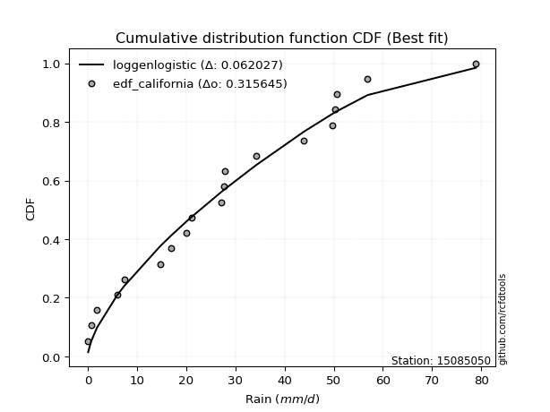</img>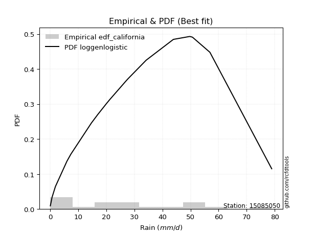</img>

</div>


### 2. EDF Hazen (1930)

Hazen method for plotting positions is a formula used to estimate the empirical cumulative probability distribution of flood events or other hydrological data. This formula often results in biased estimations, particularly when extrapolating to extreme events (high return periods).

<div align="center">


$P=(m-0.5)/n$


</div>


**2.1. Empirical values**

<div align="center">

|                | 0                   | 1                   | 2                   | 3                   | 4                   | 5                  | 6                   | 7                   | 8                  | 9         | 10                 | 11                 | 12                 | 13                 | 14                 | 15                 | 16                | 17                 | 18                 |
|:---------------|:--------------------|:--------------------|:--------------------|:--------------------|:--------------------|:-------------------|:--------------------|:--------------------|:-------------------|:----------|:-------------------|:-------------------|:-------------------|:-------------------|:-------------------|:-------------------|:------------------|:-------------------|:-------------------|
| date           | 2022                | 2023                | 2015                | 2020                | 2021                | 2013               | 2025                | 2014                | 2012               | 2016      | 2010               | 2009               | 2007               | 2018               | 2006               | 2011               | 2005              | 2019               | 2008               |
| x              | 0.1                 | 0.7                 | 1.9                 | 6.0                 | 7.4                 | 14.7               | 17.0                | 20.1                | 21.2               | 27.2      | 27.6               | 27.8               | 34.2               | 43.9               | 49.7               | 50.3               | 50.7              | 56.9               | 78.9               |
| m              | 1                   | 2                   | 3                   | 4                   | 5                   | 6                  | 7                   | 8                   | 9                  | 10        | 11                 | 12                 | 13                 | 14                 | 15                 | 16                 | 17                | 18                 | 19                 |
| empirical_dist | edf_hazen           | edf_hazen           | edf_hazen           | edf_hazen           | edf_hazen           | edf_hazen          | edf_hazen           | edf_hazen           | edf_hazen          | edf_hazen | edf_hazen          | edf_hazen          | edf_hazen          | edf_hazen          | edf_hazen          | edf_hazen          | edf_hazen         | edf_hazen          | edf_hazen          |
| empirical      | 0.02631578947368421 | 0.07894736842105263 | 0.13157894736842105 | 0.18421052631578946 | 0.23684210526315788 | 0.2894736842105263 | 0.34210526315789475 | 0.39473684210526316 | 0.4473684210526316 | 0.5       | 0.5526315789473685 | 0.6052631578947368 | 0.6578947368421053 | 0.7105263157894737 | 0.7631578947368421 | 0.8157894736842105 | 0.868421052631579 | 0.9210526315789473 | 0.9736842105263158 |
| empirical_tr   | 1.027027027027027   | 1.0857142857142856  | 1.1515151515151514  | 1.2258064516129032  | 1.3103448275862069  | 1.4074074074074074 | 1.5199999999999998  | 1.6521739130434783  | 1.8095238095238098 | 2.0       | 2.235294117647059  | 2.533333333333333  | 2.9230769230769234 | 3.4545454545454546 | 4.222222222222223  | 5.428571428571428  | 7.600000000000002 | 12.666666666666663 | 38.00000000000004  |

</div>


**2.2. Kolmogorov-Smirnov fit test (sorted by Δ)**


<div align="center">

|                | 0                   | 1                   | 2                   | 3                   | 4                   | 5                   | 6                   | 7                   | 8                   | 9                   | 10                  | 11                  | 12                  | 13                  | 14                  | 15                  | 16                  | 17                  | 18                  | 19                  | 20                  | 21                  | 22                  | 23                  | 24                  | 25                  | 26                  | 27                  | 28                  | 29                  | 30                  | 31                  | 32                  | 33                  | 34                  | 35                  | 36                  | 37                  | 38                  | 39                  | 40                  | 41                  | 42                  | 43                  | 44                  | 45                  | 46                  | 47                  | 48                  | 49                  | 50                  | 51                  | 52                  | 53                  | 54                  | 55                  | 56                  | 57                  | 58                  | 59                  | 60                  | 61                  | 62                  | 63                  | 64                  | 65                  | 66                  | 67                  | 68                  | 69                  | 70                  | 71                  | 72                  | 73                  | 74                  | 75                  | 76                  | 77                  | 78                  | 79                  | 80                  | 81                  | 82                  | 83                  | 84                  | 85                  | 86                  | 87                  | 88                  | 89                  | 90                  | 91                  | 92                  | 93                  | 94                  | 95                  | 96                  | 97                  | 98                  | 99                  | 100                 | 101                 | 102                 | 103                 | 104                 | 105                 | 106                 | 107                 | 108                 | 109                 | 110                 | 111                 | 112                 | 113                 | 114                 | 115                 | 116                 | 117                 | 118                 | 119                 | 120                 | 121                 | 122                 | 123                 | 124                 | 125                 | 126                 | 127                 | 128                 | 129                 | 130                 | 131                 | 132                 | 133                 | 134                 | 135                 | 136                 | 137                 | 138                 | 139                 | 140                 | 141                 | 142                 | 143                 | 144                 | 145                 | 146                 | 147                 | 148                 | 149                 | 150                 | 151                 | 152                 | 153                 | 154                 | 155                 | 156                 | 157                 | 158                 | 159                 |
|:---------------|:--------------------|:--------------------|:--------------------|:--------------------|:--------------------|:--------------------|:--------------------|:--------------------|:--------------------|:--------------------|:--------------------|:--------------------|:--------------------|:--------------------|:--------------------|:--------------------|:--------------------|:--------------------|:--------------------|:--------------------|:--------------------|:--------------------|:--------------------|:--------------------|:--------------------|:--------------------|:--------------------|:--------------------|:--------------------|:--------------------|:--------------------|:--------------------|:--------------------|:--------------------|:--------------------|:--------------------|:--------------------|:--------------------|:--------------------|:--------------------|:--------------------|:--------------------|:--------------------|:--------------------|:--------------------|:--------------------|:--------------------|:--------------------|:--------------------|:--------------------|:--------------------|:--------------------|:--------------------|:--------------------|:--------------------|:--------------------|:--------------------|:--------------------|:--------------------|:--------------------|:--------------------|:--------------------|:--------------------|:--------------------|:--------------------|:--------------------|:--------------------|:--------------------|:--------------------|:--------------------|:--------------------|:--------------------|:--------------------|:--------------------|:--------------------|:--------------------|:--------------------|:--------------------|:--------------------|:--------------------|:--------------------|:--------------------|:--------------------|:--------------------|:--------------------|:--------------------|:--------------------|:--------------------|:--------------------|:--------------------|:--------------------|:--------------------|:--------------------|:--------------------|:--------------------|:--------------------|:--------------------|:--------------------|:--------------------|:--------------------|:--------------------|:--------------------|:--------------------|:--------------------|:--------------------|:--------------------|:--------------------|:--------------------|:--------------------|:--------------------|:--------------------|:--------------------|:--------------------|:--------------------|:--------------------|:--------------------|:--------------------|:--------------------|:--------------------|:--------------------|:--------------------|:--------------------|:--------------------|:--------------------|:--------------------|:--------------------|:--------------------|:--------------------|:--------------------|:--------------------|:--------------------|:--------------------|:--------------------|:--------------------|:--------------------|:--------------------|:--------------------|:--------------------|:--------------------|:--------------------|:--------------------|:--------------------|:--------------------|:--------------------|:--------------------|:--------------------|:--------------------|:--------------------|:--------------------|:--------------------|:--------------------|:--------------------|:--------------------|:--------------------|:--------------------|:--------------------|:--------------------|:--------------------|:--------------------|:--------------------|
| station        | 15085050            | 15085050            | 15085050            | 15085050            | 15085050            | 15085050            | 15085050            | 15085050            | 15085050            | 15085050            | 15085050            | 15085050            | 15085050            | 15085050            | 15085050            | 15085050            | 15085050            | 15085050            | 15085050            | 15085050            | 15085050            | 15085050            | 15085050            | 15085050            | 15085050            | 15085050            | 15085050            | 15085050            | 15085050            | 15085050            | 15085050            | 15085050            | 15085050            | 15085050            | 15085050            | 15085050            | 15085050            | 15085050            | 15085050            | 15085050            | 15085050            | 15085050            | 15085050            | 15085050            | 15085050            | 15085050            | 15085050            | 15085050            | 15085050            | 15085050            | 15085050            | 15085050            | 15085050            | 15085050            | 15085050            | 15085050            | 15085050            | 15085050            | 15085050            | 15085050            | 15085050            | 15085050            | 15085050            | 15085050            | 15085050            | 15085050            | 15085050            | 15085050            | 15085050            | 15085050            | 15085050            | 15085050            | 15085050            | 15085050            | 15085050            | 15085050            | 15085050            | 15085050            | 15085050            | 15085050            | 15085050            | 15085050            | 15085050            | 15085050            | 15085050            | 15085050            | 15085050            | 15085050            | 15085050            | 15085050            | 15085050            | 15085050            | 15085050            | 15085050            | 15085050            | 15085050            | 15085050            | 15085050            | 15085050            | 15085050            | 15085050            | 15085050            | 15085050            | 15085050            | 15085050            | 15085050            | 15085050            | 15085050            | 15085050            | 15085050            | 15085050            | 15085050            | 15085050            | 15085050            | 15085050            | 15085050            | 15085050            | 15085050            | 15085050            | 15085050            | 15085050            | 15085050            | 15085050            | 15085050            | 15085050            | 15085050            | 15085050            | 15085050            | 15085050            | 15085050            | 15085050            | 15085050            | 15085050            | 15085050            | 15085050            | 15085050            | 15085050            | 15085050            | 15085050            | 15085050            | 15085050            | 15085050            | 15085050            | 15085050            | 15085050            | 15085050            | 15085050            | 15085050            | 15085050            | 15085050            | 15085050            | 15085050            | 15085050            | 15085050            | 15085050            | 15085050            | 15085050            | 15085050            | 15085050            | 15085050            |
| empirical_dist | edf_hazen           | edf_hazen           | edf_hazen           | edf_hazen           | edf_hazen           | edf_hazen           | edf_hazen           | edf_hazen           | edf_hazen           | edf_hazen           | edf_hazen           | edf_hazen           | edf_hazen           | edf_hazen           | edf_hazen           | edf_hazen           | edf_hazen           | edf_hazen           | edf_hazen           | edf_hazen           | edf_hazen           | edf_hazen           | edf_hazen           | edf_hazen           | edf_hazen           | edf_hazen           | edf_hazen           | edf_hazen           | edf_hazen           | edf_hazen           | edf_hazen           | edf_hazen           | edf_hazen           | edf_hazen           | edf_hazen           | edf_hazen           | edf_hazen           | edf_hazen           | edf_hazen           | edf_hazen           | edf_hazen           | edf_hazen           | edf_hazen           | edf_hazen           | edf_hazen           | edf_hazen           | edf_hazen           | edf_hazen           | edf_hazen           | edf_hazen           | edf_hazen           | edf_hazen           | edf_hazen           | edf_hazen           | edf_hazen           | edf_hazen           | edf_hazen           | edf_hazen           | edf_hazen           | edf_hazen           | edf_hazen           | edf_hazen           | edf_hazen           | edf_hazen           | edf_hazen           | edf_hazen           | edf_hazen           | edf_hazen           | edf_hazen           | edf_hazen           | edf_hazen           | edf_hazen           | edf_hazen           | edf_hazen           | edf_hazen           | edf_hazen           | edf_hazen           | edf_hazen           | edf_hazen           | edf_hazen           | edf_hazen           | edf_hazen           | edf_hazen           | edf_hazen           | edf_hazen           | edf_hazen           | edf_hazen           | edf_hazen           | edf_hazen           | edf_hazen           | edf_hazen           | edf_hazen           | edf_hazen           | edf_hazen           | edf_hazen           | edf_hazen           | edf_hazen           | edf_hazen           | edf_hazen           | edf_hazen           | edf_hazen           | edf_hazen           | edf_hazen           | edf_hazen           | edf_hazen           | edf_hazen           | edf_hazen           | edf_hazen           | edf_hazen           | edf_hazen           | edf_hazen           | edf_hazen           | edf_hazen           | edf_hazen           | edf_hazen           | edf_hazen           | edf_hazen           | edf_hazen           | edf_hazen           | edf_hazen           | edf_hazen           | edf_hazen           | edf_hazen           | edf_hazen           | edf_hazen           | edf_hazen           | edf_hazen           | edf_hazen           | edf_hazen           | edf_hazen           | edf_hazen           | edf_hazen           | edf_hazen           | edf_hazen           | edf_hazen           | edf_hazen           | edf_hazen           | edf_hazen           | edf_hazen           | edf_hazen           | edf_hazen           | edf_hazen           | edf_hazen           | edf_hazen           | edf_hazen           | edf_hazen           | edf_hazen           | edf_hazen           | edf_hazen           | edf_hazen           | edf_hazen           | edf_hazen           | edf_hazen           | edf_hazen           | edf_hazen           | edf_hazen           | edf_hazen           | edf_hazen           | edf_hazen           | edf_hazen           |
| p_dist         | logjohnsonsu        | rayleigh            | foldnorm            | logjohnsonsb        | maxwell             | pearson3            | logargus            | genexpon            | ncf                 | loggenlogistic      | halfnorm            | logloggamma         | invgauss            | johnsonsu           | invgamma            | kstwobign           | alpha               | exponpow            | fatiguelife         | invweibull          | nct                 | genlogistic         | genextreme          | genpareto           | gompertz            | triang              | skewnorm            | nakagami            | gumbel_r            | genhalflogistic     | rice                | logmielke           | loggengamma         | arcsine             | loggenextreme       | semicircular        | logpearson3         | anglit              | t                   | norm                | crystalball         | logistic            | burr12              | hypsecant           | kappa3              | exponnorm           | logburr12           | moyal               | dweibull            | logdgamma           | dgamma              | loggennorm          | truncnorm           | halflogistic        | burr                | laplace             | logt                | mielke              | loggumbel_l         | logweibull_max      | truncweibull_min    | lomax               | gennorm             | cosine              | gausshyper          | f                   | truncexpon          | bradford            | logdweibull         | logfoldnorm         | gumbel_l            | logskewnorm         | beta                | logsemicircular     | lognakagami         | loganglit           | loggausshyper       | gengamma            | logrice             | logexponnorm        | lognorm             | logcrystalball      | lognct              | loglogistic         | loghypsecant        | loggamma            | loggamma            | logfatiguelife      | halfgennorm         | logarcsine          | weibull_min         | loglaplace          | loglaplace          | logerlang           | loglevy_l           | betaprime           | kappa4              | loginvweibull       | loginvgamma         | logalpha            | logtrapezoid        | wald                | logburr             | erlang              | loginvgauss         | logmaxwell          | wrapcauchy          | gamma               | loggenhalflogistic  | ksone               | uniform             | vonmises_line       | lograyleigh         | logtruncweibull_min | logkstwobign        | loggompertz         | loggumbel_r         | loghalfnorm         | logtriang           | logcosine           | logmoyal            | johnsonsb           | argus               | loggenexpon         | loghalflogistic     | powerlaw            | logwrapcauchy       | logbeta             | loglomax            | logwald             | logncf              | logkappa4           | logksone            | logexponweib        | logkappa3           | logtruncnorm        | levy_l              | loghalfgennorm      | loguniform          | logbradford         | trapezoid           | logvonmises_line    | logtruncexpon       | logf                | rdist               | logloglaplace       | exponweib           | tukeylambda         | logbetaprime        | logpowerlaw         | loggenpareto        | logweibull_min      | logexponpow         | logrdist            | logtukeylambda      | truncpareto         | weibull_max         | logtruncpareto      | logvonmises         | vonmises            |
| delta          | 0.06069490289579571 | 0.07546600643368406 | 0.07585667649247407 | 0.079522891776732   | 0.07985186333653438 | 0.08125508710809248 | 0.08329978250818726 | 0.0850415504183063  | 0.08560382446365389 | 0.0858167186551157  | 0.08602680453918193 | 0.08635524947537365 | 0.08654047735603476 | 0.08658265973503798 | 0.08677022833187265 | 0.08700629231343282 | 0.08736777054487288 | 0.0877405711320478  | 0.08794895142945303 | 0.0880575443924827  | 0.08819174237675675 | 0.08844919259987383 | 0.0887006003227675  | 0.0889598233614736  | 0.09063158873092819 | 0.09096705578518795 | 0.09097519367231402 | 0.09113778677504136 | 0.0950529888423941  | 0.09688994040880594 | 0.09703387773125316 | 0.10654877724663936 | 0.109275541266182   | 0.10974222726705218 | 0.11097043097785719 | 0.11159715267854953 | 0.11191558709155913 | 0.1120652628433691  | 0.11319999178331358 | 0.11320133894914641 | 0.1132013408748967  | 0.11428555017719394 | 0.11470067680380636 | 0.11521122921454358 | 0.1157238253603925  | 0.11792937371307155 | 0.11799770615905358 | 0.11804110104197191 | 0.11969548947355191 | 0.12496203425913421 | 0.1255133727422223  | 0.12733526202638856 | 0.13110168752601986 | 0.13157894736842105 | 0.13226152711731742 | 0.13293050973415965 | 0.13352652644687235 | 0.13662188526538482 | 0.1440468938164733  | 0.14585814252957185 | 0.1490581980692684  | 0.15204361501166985 | 0.1547637144407475  | 0.15638363135577948 | 0.1564818581658423  | 0.16723293305780218 | 0.1672397628510225  | 0.17057795465219472 | 0.17862458009853455 | 0.18328359642401154 | 0.18376632586983    | 0.18902729750496772 | 0.19532581764243134 | 0.21353760278834255 | 0.21372387565368067 | 0.21376151788590103 | 0.21378041622604937 | 0.2142111897531075  | 0.21429299450228    | 0.21430017057752204 | 0.21430102157597408 | 0.21430102273022933 | 0.21446184515204325 | 0.21481671906853872 | 0.21525710433735656 | 0.21598393816383443 | 0.21598393816383443 | 0.2173724526930958  | 0.2179244821031071  | 0.22241978047325428 | 0.22476011088497416 | 0.22753459616446725 | 0.22753459616446725 | 0.22958368006436725 | 0.23247569915257235 | 0.23265780835464134 | 0.23266499658583406 | 0.23333105782614694 | 0.23459696681915831 | 0.23521695605169046 | 0.23659077850101673 | 0.23684209959992303 | 0.23796695434589166 | 0.24647188119083585 | 0.2467117689791366  | 0.24719560993217082 | 0.24735871643926377 | 0.24788845229158907 | 0.24953575178218546 | 0.24997773621871944 | 0.253740315255143   | 0.25391228357037743 | 0.25812305160617743 | 0.27078018830797257 | 0.2747803311735616  | 0.27534228492629387 | 0.28477821566094463 | 0.2888894519908871  | 0.2975656407585675  | 0.30552135724655616 | 0.31059611792072106 | 0.31262090934280584 | 0.31266038708282373 | 0.31401846329434435 | 0.31405461815567604 | 0.339144528968637   | 0.3552134885359436  | 0.3559916460646294  | 0.3796555272109402  | 0.38237431579911796 | 0.4144038717677253  | 0.41723683460010874 | 0.41728035107722317 | 0.43261561317174024 | 0.4429592966705269  | 0.4544227068974437  | 0.45445509342156376 | 0.45591524042216824 | 0.45863115813477306 | 0.47933568312433006 | 0.48084370165467927 | 0.504833016540526   | 0.5062227756336204  | 0.5220922296875692  | 0.532504067581522   | 0.5382170111558695  | 0.5470966082241707  | 0.5566056034497614  | 0.5572546287788264  | 0.6186013358294038  | 0.6287837331369865  | 0.6419645499445694  | 0.7513951505706576  | 0.763157889877258   | 0.7704876463900642  | 0.7736713792155118  | 0.7749746642936679  | 0.8554620596066951  | 0.9571440812010688  | 11.963472599130533  |
| deltao         | 0.31564497164100014 | 0.31564497164100014 | 0.31564497164100014 | 0.31564497164100014 | 0.31564497164100014 | 0.31564497164100014 | 0.31564497164100014 | 0.31564497164100014 | 0.31564497164100014 | 0.31564497164100014 | 0.31564497164100014 | 0.31564497164100014 | 0.31564497164100014 | 0.31564497164100014 | 0.31564497164100014 | 0.31564497164100014 | 0.31564497164100014 | 0.31564497164100014 | 0.31564497164100014 | 0.31564497164100014 | 0.31564497164100014 | 0.31564497164100014 | 0.31564497164100014 | 0.31564497164100014 | 0.31564497164100014 | 0.31564497164100014 | 0.31564497164100014 | 0.31564497164100014 | 0.31564497164100014 | 0.31564497164100014 | 0.31564497164100014 | 0.31564497164100014 | 0.31564497164100014 | 0.31564497164100014 | 0.31564497164100014 | 0.31564497164100014 | 0.31564497164100014 | 0.31564497164100014 | 0.31564497164100014 | 0.31564497164100014 | 0.31564497164100014 | 0.31564497164100014 | 0.31564497164100014 | 0.31564497164100014 | 0.31564497164100014 | 0.31564497164100014 | 0.31564497164100014 | 0.31564497164100014 | 0.31564497164100014 | 0.31564497164100014 | 0.31564497164100014 | 0.31564497164100014 | 0.31564497164100014 | 0.31564497164100014 | 0.31564497164100014 | 0.31564497164100014 | 0.31564497164100014 | 0.31564497164100014 | 0.31564497164100014 | 0.31564497164100014 | 0.31564497164100014 | 0.31564497164100014 | 0.31564497164100014 | 0.31564497164100014 | 0.31564497164100014 | 0.31564497164100014 | 0.31564497164100014 | 0.31564497164100014 | 0.31564497164100014 | 0.31564497164100014 | 0.31564497164100014 | 0.31564497164100014 | 0.31564497164100014 | 0.31564497164100014 | 0.31564497164100014 | 0.31564497164100014 | 0.31564497164100014 | 0.31564497164100014 | 0.31564497164100014 | 0.31564497164100014 | 0.31564497164100014 | 0.31564497164100014 | 0.31564497164100014 | 0.31564497164100014 | 0.31564497164100014 | 0.31564497164100014 | 0.31564497164100014 | 0.31564497164100014 | 0.31564497164100014 | 0.31564497164100014 | 0.31564497164100014 | 0.31564497164100014 | 0.31564497164100014 | 0.31564497164100014 | 0.31564497164100014 | 0.31564497164100014 | 0.31564497164100014 | 0.31564497164100014 | 0.31564497164100014 | 0.31564497164100014 | 0.31564497164100014 | 0.31564497164100014 | 0.31564497164100014 | 0.31564497164100014 | 0.31564497164100014 | 0.31564497164100014 | 0.31564497164100014 | 0.31564497164100014 | 0.31564497164100014 | 0.31564497164100014 | 0.31564497164100014 | 0.31564497164100014 | 0.31564497164100014 | 0.31564497164100014 | 0.31564497164100014 | 0.31564497164100014 | 0.31564497164100014 | 0.31564497164100014 | 0.31564497164100014 | 0.31564497164100014 | 0.31564497164100014 | 0.31564497164100014 | 0.31564497164100014 | 0.31564497164100014 | 0.31564497164100014 | 0.31564497164100014 | 0.31564497164100014 | 0.31564497164100014 | 0.31564497164100014 | 0.31564497164100014 | 0.31564497164100014 | 0.31564497164100014 | 0.31564497164100014 | 0.31564497164100014 | 0.31564497164100014 | 0.31564497164100014 | 0.31564497164100014 | 0.31564497164100014 | 0.31564497164100014 | 0.31564497164100014 | 0.31564497164100014 | 0.31564497164100014 | 0.31564497164100014 | 0.31564497164100014 | 0.31564497164100014 | 0.31564497164100014 | 0.31564497164100014 | 0.31564497164100014 | 0.31564497164100014 | 0.31564497164100014 | 0.31564497164100014 | 0.31564497164100014 | 0.31564497164100014 | 0.31564497164100014 | 0.31564497164100014 | 0.31564497164100014 | 0.31564497164100014 | 0.31564497164100014 | 0.31564497164100014 | 0.31564497164100014 |
| eval           | Δo > Δ              | Δo > Δ              | Δo > Δ              | Δo > Δ              | Δo > Δ              | Δo > Δ              | Δo > Δ              | Δo > Δ              | Δo > Δ              | Δo > Δ              | Δo > Δ              | Δo > Δ              | Δo > Δ              | Δo > Δ              | Δo > Δ              | Δo > Δ              | Δo > Δ              | Δo > Δ              | Δo > Δ              | Δo > Δ              | Δo > Δ              | Δo > Δ              | Δo > Δ              | Δo > Δ              | Δo > Δ              | Δo > Δ              | Δo > Δ              | Δo > Δ              | Δo > Δ              | Δo > Δ              | Δo > Δ              | Δo > Δ              | Δo > Δ              | Δo > Δ              | Δo > Δ              | Δo > Δ              | Δo > Δ              | Δo > Δ              | Δo > Δ              | Δo > Δ              | Δo > Δ              | Δo > Δ              | Δo > Δ              | Δo > Δ              | Δo > Δ              | Δo > Δ              | Δo > Δ              | Δo > Δ              | Δo > Δ              | Δo > Δ              | Δo > Δ              | Δo > Δ              | Δo > Δ              | Δo > Δ              | Δo > Δ              | Δo > Δ              | Δo > Δ              | Δo > Δ              | Δo > Δ              | Δo > Δ              | Δo > Δ              | Δo > Δ              | Δo > Δ              | Δo > Δ              | Δo > Δ              | Δo > Δ              | Δo > Δ              | Δo > Δ              | Δo > Δ              | Δo > Δ              | Δo > Δ              | Δo > Δ              | Δo > Δ              | Δo > Δ              | Δo > Δ              | Δo > Δ              | Δo > Δ              | Δo > Δ              | Δo > Δ              | Δo > Δ              | Δo > Δ              | Δo > Δ              | Δo > Δ              | Δo > Δ              | Δo > Δ              | Δo > Δ              | Δo > Δ              | Δo > Δ              | Δo > Δ              | Δo > Δ              | Δo > Δ              | Δo > Δ              | Δo > Δ              | Δo > Δ              | Δo > Δ              | Δo > Δ              | Δo > Δ              | Δo > Δ              | Δo > Δ              | Δo > Δ              | Δo > Δ              | Δo > Δ              | Δo > Δ              | Δo > Δ              | Δo > Δ              | Δo > Δ              | Δo > Δ              | Δo > Δ              | Δo > Δ              | Δo > Δ              | Δo > Δ              | Δo > Δ              | Δo > Δ              | Δo > Δ              | Δo > Δ              | Δo > Δ              | Δo > Δ              | Δo > Δ              | Δo > Δ              | Δo > Δ              | Δo > Δ              | Δo > Δ              | Δo > Δ              | Δo > Δ              | Δo > Δ              | Δo <= Δ             | Δo <= Δ             | Δo <= Δ             | Δo <= Δ             | Δo <= Δ             | Δo <= Δ             | Δo <= Δ             | Δo <= Δ             | Δo <= Δ             | Δo <= Δ             | Δo <= Δ             | Δo <= Δ             | Δo <= Δ             | Δo <= Δ             | Δo <= Δ             | Δo <= Δ             | Δo <= Δ             | Δo <= Δ             | Δo <= Δ             | Δo <= Δ             | Δo <= Δ             | Δo <= Δ             | Δo <= Δ             | Δo <= Δ             | Δo <= Δ             | Δo <= Δ             | Δo <= Δ             | Δo <= Δ             | Δo <= Δ             | Δo <= Δ             | Δo <= Δ             | Δo <= Δ             | Δo <= Δ             | Δo <= Δ             | Δo <= Δ             |
| fit            | 1                   | 1                   | 1                   | 1                   | 1                   | 1                   | 1                   | 1                   | 1                   | 1                   | 1                   | 1                   | 1                   | 1                   | 1                   | 1                   | 1                   | 1                   | 1                   | 1                   | 1                   | 1                   | 1                   | 1                   | 1                   | 1                   | 1                   | 1                   | 1                   | 1                   | 1                   | 1                   | 1                   | 1                   | 1                   | 1                   | 1                   | 1                   | 1                   | 1                   | 1                   | 1                   | 1                   | 1                   | 1                   | 1                   | 1                   | 1                   | 1                   | 1                   | 1                   | 1                   | 1                   | 1                   | 1                   | 1                   | 1                   | 1                   | 1                   | 1                   | 1                   | 1                   | 1                   | 1                   | 1                   | 1                   | 1                   | 1                   | 1                   | 1                   | 1                   | 1                   | 1                   | 1                   | 1                   | 1                   | 1                   | 1                   | 1                   | 1                   | 1                   | 1                   | 1                   | 1                   | 1                   | 1                   | 1                   | 1                   | 1                   | 1                   | 1                   | 1                   | 1                   | 1                   | 1                   | 1                   | 1                   | 1                   | 1                   | 1                   | 1                   | 1                   | 1                   | 1                   | 1                   | 1                   | 1                   | 1                   | 1                   | 1                   | 1                   | 1                   | 1                   | 1                   | 1                   | 1                   | 1                   | 1                   | 1                   | 1                   | 1                   | 1                   | 1                   | 1                   | 1                   | 0                   | 0                   | 0                   | 0                   | 0                   | 0                   | 0                   | 0                   | 0                   | 0                   | 0                   | 0                   | 0                   | 0                   | 0                   | 0                   | 0                   | 0                   | 0                   | 0                   | 0                   | 0                   | 0                   | 0                   | 0                   | 0                   | 0                   | 0                   | 0                   | 0                   | 0                   | 0                   | 0                   | 0                   | 0                   |
| n              | 19                  | 19                  | 19                  | 19                  | 19                  | 19                  | 19                  | 19                  | 19                  | 19                  | 19                  | 19                  | 19                  | 19                  | 19                  | 19                  | 19                  | 19                  | 19                  | 19                  | 19                  | 19                  | 19                  | 19                  | 19                  | 19                  | 19                  | 19                  | 19                  | 19                  | 19                  | 19                  | 19                  | 19                  | 19                  | 19                  | 19                  | 19                  | 19                  | 19                  | 19                  | 19                  | 19                  | 19                  | 19                  | 19                  | 19                  | 19                  | 19                  | 19                  | 19                  | 19                  | 19                  | 19                  | 19                  | 19                  | 19                  | 19                  | 19                  | 19                  | 19                  | 19                  | 19                  | 19                  | 19                  | 19                  | 19                  | 19                  | 19                  | 19                  | 19                  | 19                  | 19                  | 19                  | 19                  | 19                  | 19                  | 19                  | 19                  | 19                  | 19                  | 19                  | 19                  | 19                  | 19                  | 19                  | 19                  | 19                  | 19                  | 19                  | 19                  | 19                  | 19                  | 19                  | 19                  | 19                  | 19                  | 19                  | 19                  | 19                  | 19                  | 19                  | 19                  | 19                  | 19                  | 19                  | 19                  | 19                  | 19                  | 19                  | 19                  | 19                  | 19                  | 19                  | 19                  | 19                  | 19                  | 19                  | 19                  | 19                  | 19                  | 19                  | 19                  | 19                  | 19                  | 19                  | 19                  | 19                  | 19                  | 19                  | 19                  | 19                  | 19                  | 19                  | 19                  | 19                  | 19                  | 19                  | 19                  | 19                  | 19                  | 19                  | 19                  | 19                  | 19                  | 19                  | 19                  | 19                  | 19                  | 19                  | 19                  | 19                  | 19                  | 19                  | 19                  | 19                  | 19                  | 19                  | 19                  | 19                  |
| best_fit       | 1                   | 0                   | 0                   | 0                   | 0                   | 0                   | 0                   | 0                   | 0                   | 0                   | 0                   | 0                   | 0                   | 0                   | 0                   | 0                   | 0                   | 0                   | 0                   | 0                   | 0                   | 0                   | 0                   | 0                   | 0                   | 0                   | 0                   | 0                   | 0                   | 0                   | 0                   | 0                   | 0                   | 0                   | 0                   | 0                   | 0                   | 0                   | 0                   | 0                   | 0                   | 0                   | 0                   | 0                   | 0                   | 0                   | 0                   | 0                   | 0                   | 0                   | 0                   | 0                   | 0                   | 0                   | 0                   | 0                   | 0                   | 0                   | 0                   | 0                   | 0                   | 0                   | 0                   | 0                   | 0                   | 0                   | 0                   | 0                   | 0                   | 0                   | 0                   | 0                   | 0                   | 0                   | 0                   | 0                   | 0                   | 0                   | 0                   | 0                   | 0                   | 0                   | 0                   | 0                   | 0                   | 0                   | 0                   | 0                   | 0                   | 0                   | 0                   | 0                   | 0                   | 0                   | 0                   | 0                   | 0                   | 0                   | 0                   | 0                   | 0                   | 0                   | 0                   | 0                   | 0                   | 0                   | 0                   | 0                   | 0                   | 0                   | 0                   | 0                   | 0                   | 0                   | 0                   | 0                   | 0                   | 0                   | 0                   | 0                   | 0                   | 0                   | 0                   | 0                   | 0                   | 0                   | 0                   | 0                   | 0                   | 0                   | 0                   | 0                   | 0                   | 0                   | 0                   | 0                   | 0                   | 0                   | 0                   | 0                   | 0                   | 0                   | 0                   | 0                   | 0                   | 0                   | 0                   | 0                   | 0                   | 0                   | 0                   | 0                   | 0                   | 0                   | 0                   | 0                   | 0                   | 0                   | 0                   | 0                   |
| best_fit_sort  | 1                   | 2                   | 3                   | 4                   | 5                   | 6                   | 7                   | 8                   | 9                   | 10                  | 11                  | 12                  | 13                  | 14                  | 15                  | 16                  | 17                  | 18                  | 19                  | 20                  | 21                  | 22                  | 23                  | 24                  | 25                  | 26                  | 27                  | 28                  | 29                  | 30                  | 31                  | 32                  | 33                  | 34                  | 35                  | 36                  | 37                  | 38                  | 39                  | 40                  | 41                  | 42                  | 43                  | 44                  | 45                  | 46                  | 47                  | 48                  | 49                  | 50                  | 51                  | 52                  | 53                  | 54                  | 55                  | 56                  | 57                  | 58                  | 59                  | 60                  | 61                  | 62                  | 63                  | 64                  | 65                  | 66                  | 67                  | 68                  | 69                  | 70                  | 71                  | 72                  | 73                  | 74                  | 75                  | 76                  | 77                  | 78                  | 79                  | 80                  | 81                  | 82                  | 83                  | 84                  | 85                  | 86                  | 87                  | 88                  | 89                  | 90                  | 91                  | 92                  | 93                  | 94                  | 95                  | 96                  | 97                  | 98                  | 99                  | 100                 | 101                 | 102                 | 103                 | 104                 | 105                 | 106                 | 107                 | 108                 | 109                 | 110                 | 111                 | 112                 | 113                 | 114                 | 115                 | 116                 | 117                 | 118                 | 119                 | 120                 | 121                 | 122                 | 123                 | 124                 | 125                 | 126                 | 127                 | 128                 | 129                 | 130                 | 131                 | 132                 | 133                 | 134                 | 135                 | 136                 | 137                 | 138                 | 139                 | 140                 | 141                 | 142                 | 143                 | 144                 | 145                 | 146                 | 147                 | 148                 | 149                 | 150                 | 151                 | 152                 | 153                 | 154                 | 155                 | 156                 | 157                 | 158                 | 159                 | 160                 |

</div>


**2.3. Best fit**

<div align="center">

|   id |   station | empirical_dist   | p_dist       |     delta |   deltao | eval   |   fit |   n |   best_fit |   best_fit_sort |
|-----:|----------:|:-----------------|:-------------|----------:|---------:|:-------|------:|----:|-----------:|----------------:|
|    0 |  15085050 | edf_hazen        | logjohnsonsu | 0.0606949 | 0.315645 | Δo > Δ |     1 |  19 |          1 |               1 |

</div>


<div align="center">

</img>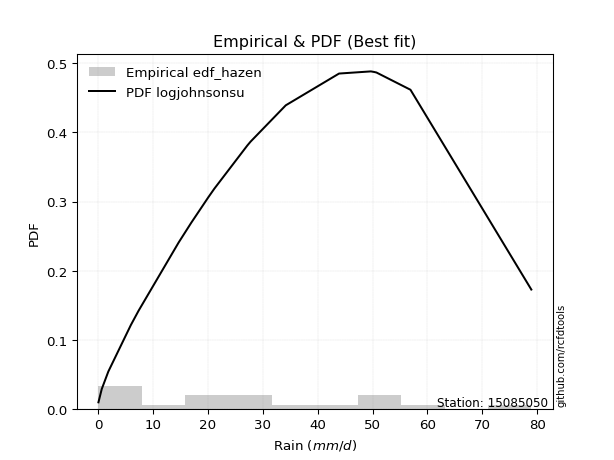</img>

</div>


### 3. EDF Weibull (1939)

Weibull plotting position formula is an empirical method used to estimate the non-exceedance probability or plotting position for a set of observed data, is often recommended or widely used in practice, particularly in flood frequency analysis.

<div align="center">


$P=m/(n+1)$


</div>


**3.1. Empirical values**

<div align="center">

|                | 0                  | 1                  | 2                  | 3           | 4                  | 5                  | 6                  | 7                  | 8                  | 9           | 10                 | 11          | 12                | 13                | 14          | 15                | 16                | 17                 | 18                 |
|:---------------|:-------------------|:-------------------|:-------------------|:------------|:-------------------|:-------------------|:-------------------|:-------------------|:-------------------|:------------|:-------------------|:------------|:------------------|:------------------|:------------|:------------------|:------------------|:-------------------|:-------------------|
| date           | 2022               | 2023               | 2015               | 2020        | 2021               | 2013               | 2025               | 2014               | 2012               | 2016        | 2010               | 2009        | 2007              | 2018              | 2006        | 2011              | 2005              | 2019               | 2008               |
| x              | 0.1                | 0.7                | 1.9                | 6.0         | 7.4                | 14.7               | 17.0               | 20.1               | 21.2               | 27.2        | 27.6               | 27.8        | 34.2              | 43.9              | 49.7        | 50.3              | 50.7              | 56.9               | 78.9               |
| m              | 1                  | 2                  | 3                  | 4           | 5                  | 6                  | 7                  | 8                  | 9                  | 10          | 11                 | 12          | 13                | 14                | 15          | 16                | 17                | 18                 | 19                 |
| empirical_dist | edf_weibull        | edf_weibull        | edf_weibull        | edf_weibull | edf_weibull        | edf_weibull        | edf_weibull        | edf_weibull        | edf_weibull        | edf_weibull | edf_weibull        | edf_weibull | edf_weibull       | edf_weibull       | edf_weibull | edf_weibull       | edf_weibull       | edf_weibull        | edf_weibull        |
| empirical      | 0.05               | 0.1                | 0.15               | 0.2         | 0.25               | 0.3                | 0.35               | 0.4                | 0.45               | 0.5         | 0.55               | 0.6         | 0.65              | 0.7               | 0.75        | 0.8               | 0.85              | 0.9                | 0.95               |
| empirical_tr   | 1.0526315789473684 | 1.1111111111111112 | 1.1764705882352942 | 1.25        | 1.3333333333333333 | 1.4285714285714286 | 1.5384615384615383 | 1.6666666666666667 | 1.8181818181818181 | 2.0         | 2.2222222222222223 | 2.5         | 2.857142857142857 | 3.333333333333333 | 4.0         | 5.000000000000001 | 6.666666666666666 | 10.000000000000002 | 19.999999999999982 |

</div>


**3.2. Kolmogorov-Smirnov fit test (sorted by Δ)**


<div align="center">

|                | 0                   | 1                   | 2                   | 3                   | 4                   | 5                   | 6                   | 7                   | 8                   | 9                   | 10                  | 11                  | 12                  | 13                  | 14                  | 15                  | 16                  | 17                  | 18                  | 19                  | 20                  | 21                  | 22                  | 23                  | 24                  | 25                  | 26                  | 27                  | 28                  | 29                  | 30                  | 31                  | 32                  | 33                  | 34                  | 35                  | 36                  | 37                  | 38                  | 39                  | 40                  | 41                  | 42                  | 43                  | 44                  | 45                  | 46                  | 47                  | 48                  | 49                  | 50                  | 51                  | 52                  | 53                  | 54                  | 55                  | 56                  | 57                  | 58                  | 59                  | 60                  | 61                  | 62                  | 63                  | 64                  | 65                  | 66                  | 67                  | 68                  | 69                  | 70                  | 71                  | 72                  | 73                  | 74                  | 75                  | 76                  | 77                  | 78                  | 79                  | 80                  | 81                  | 82                  | 83                  | 84                  | 85                  | 86                  | 87                  | 88                  | 89                  | 90                  | 91                  | 92                  | 93                  | 94                  | 95                  | 96                  | 97                  | 98                  | 99                  | 100                 | 101                 | 102                 | 103                 | 104                 | 105                 | 106                 | 107                 | 108                 | 109                 | 110                 | 111                 | 112                 | 113                 | 114                 | 115                 | 116                 | 117                 | 118                 | 119                 | 120                 | 121                 | 122                 | 123                 | 124                 | 125                 | 126                 | 127                 | 128                 | 129                 | 130                 | 131                 | 132                 | 133                 | 134                 | 135                 | 136                 | 137                 | 138                 | 139                 | 140                 | 141                 | 142                 | 143                 | 144                 | 145                 | 146                 | 147                 | 148                 | 149                 | 150                 | 151                 | 152                 | 153                 | 154                 | 155                 | 156                 | 157                 | 158                 | 159                 |
|:---------------|:--------------------|:--------------------|:--------------------|:--------------------|:--------------------|:--------------------|:--------------------|:--------------------|:--------------------|:--------------------|:--------------------|:--------------------|:--------------------|:--------------------|:--------------------|:--------------------|:--------------------|:--------------------|:--------------------|:--------------------|:--------------------|:--------------------|:--------------------|:--------------------|:--------------------|:--------------------|:--------------------|:--------------------|:--------------------|:--------------------|:--------------------|:--------------------|:--------------------|:--------------------|:--------------------|:--------------------|:--------------------|:--------------------|:--------------------|:--------------------|:--------------------|:--------------------|:--------------------|:--------------------|:--------------------|:--------------------|:--------------------|:--------------------|:--------------------|:--------------------|:--------------------|:--------------------|:--------------------|:--------------------|:--------------------|:--------------------|:--------------------|:--------------------|:--------------------|:--------------------|:--------------------|:--------------------|:--------------------|:--------------------|:--------------------|:--------------------|:--------------------|:--------------------|:--------------------|:--------------------|:--------------------|:--------------------|:--------------------|:--------------------|:--------------------|:--------------------|:--------------------|:--------------------|:--------------------|:--------------------|:--------------------|:--------------------|:--------------------|:--------------------|:--------------------|:--------------------|:--------------------|:--------------------|:--------------------|:--------------------|:--------------------|:--------------------|:--------------------|:--------------------|:--------------------|:--------------------|:--------------------|:--------------------|:--------------------|:--------------------|:--------------------|:--------------------|:--------------------|:--------------------|:--------------------|:--------------------|:--------------------|:--------------------|:--------------------|:--------------------|:--------------------|:--------------------|:--------------------|:--------------------|:--------------------|:--------------------|:--------------------|:--------------------|:--------------------|:--------------------|:--------------------|:--------------------|:--------------------|:--------------------|:--------------------|:--------------------|:--------------------|:--------------------|:--------------------|:--------------------|:--------------------|:--------------------|:--------------------|:--------------------|:--------------------|:--------------------|:--------------------|:--------------------|:--------------------|:--------------------|:--------------------|:--------------------|:--------------------|:--------------------|:--------------------|:--------------------|:--------------------|:--------------------|:--------------------|:--------------------|:--------------------|:--------------------|:--------------------|:--------------------|:--------------------|:--------------------|:--------------------|:--------------------|:--------------------|:--------------------|
| station        | 15085050            | 15085050            | 15085050            | 15085050            | 15085050            | 15085050            | 15085050            | 15085050            | 15085050            | 15085050            | 15085050            | 15085050            | 15085050            | 15085050            | 15085050            | 15085050            | 15085050            | 15085050            | 15085050            | 15085050            | 15085050            | 15085050            | 15085050            | 15085050            | 15085050            | 15085050            | 15085050            | 15085050            | 15085050            | 15085050            | 15085050            | 15085050            | 15085050            | 15085050            | 15085050            | 15085050            | 15085050            | 15085050            | 15085050            | 15085050            | 15085050            | 15085050            | 15085050            | 15085050            | 15085050            | 15085050            | 15085050            | 15085050            | 15085050            | 15085050            | 15085050            | 15085050            | 15085050            | 15085050            | 15085050            | 15085050            | 15085050            | 15085050            | 15085050            | 15085050            | 15085050            | 15085050            | 15085050            | 15085050            | 15085050            | 15085050            | 15085050            | 15085050            | 15085050            | 15085050            | 15085050            | 15085050            | 15085050            | 15085050            | 15085050            | 15085050            | 15085050            | 15085050            | 15085050            | 15085050            | 15085050            | 15085050            | 15085050            | 15085050            | 15085050            | 15085050            | 15085050            | 15085050            | 15085050            | 15085050            | 15085050            | 15085050            | 15085050            | 15085050            | 15085050            | 15085050            | 15085050            | 15085050            | 15085050            | 15085050            | 15085050            | 15085050            | 15085050            | 15085050            | 15085050            | 15085050            | 15085050            | 15085050            | 15085050            | 15085050            | 15085050            | 15085050            | 15085050            | 15085050            | 15085050            | 15085050            | 15085050            | 15085050            | 15085050            | 15085050            | 15085050            | 15085050            | 15085050            | 15085050            | 15085050            | 15085050            | 15085050            | 15085050            | 15085050            | 15085050            | 15085050            | 15085050            | 15085050            | 15085050            | 15085050            | 15085050            | 15085050            | 15085050            | 15085050            | 15085050            | 15085050            | 15085050            | 15085050            | 15085050            | 15085050            | 15085050            | 15085050            | 15085050            | 15085050            | 15085050            | 15085050            | 15085050            | 15085050            | 15085050            | 15085050            | 15085050            | 15085050            | 15085050            | 15085050            | 15085050            |
| empirical_dist | edf_weibull         | edf_weibull         | edf_weibull         | edf_weibull         | edf_weibull         | edf_weibull         | edf_weibull         | edf_weibull         | edf_weibull         | edf_weibull         | edf_weibull         | edf_weibull         | edf_weibull         | edf_weibull         | edf_weibull         | edf_weibull         | edf_weibull         | edf_weibull         | edf_weibull         | edf_weibull         | edf_weibull         | edf_weibull         | edf_weibull         | edf_weibull         | edf_weibull         | edf_weibull         | edf_weibull         | edf_weibull         | edf_weibull         | edf_weibull         | edf_weibull         | edf_weibull         | edf_weibull         | edf_weibull         | edf_weibull         | edf_weibull         | edf_weibull         | edf_weibull         | edf_weibull         | edf_weibull         | edf_weibull         | edf_weibull         | edf_weibull         | edf_weibull         | edf_weibull         | edf_weibull         | edf_weibull         | edf_weibull         | edf_weibull         | edf_weibull         | edf_weibull         | edf_weibull         | edf_weibull         | edf_weibull         | edf_weibull         | edf_weibull         | edf_weibull         | edf_weibull         | edf_weibull         | edf_weibull         | edf_weibull         | edf_weibull         | edf_weibull         | edf_weibull         | edf_weibull         | edf_weibull         | edf_weibull         | edf_weibull         | edf_weibull         | edf_weibull         | edf_weibull         | edf_weibull         | edf_weibull         | edf_weibull         | edf_weibull         | edf_weibull         | edf_weibull         | edf_weibull         | edf_weibull         | edf_weibull         | edf_weibull         | edf_weibull         | edf_weibull         | edf_weibull         | edf_weibull         | edf_weibull         | edf_weibull         | edf_weibull         | edf_weibull         | edf_weibull         | edf_weibull         | edf_weibull         | edf_weibull         | edf_weibull         | edf_weibull         | edf_weibull         | edf_weibull         | edf_weibull         | edf_weibull         | edf_weibull         | edf_weibull         | edf_weibull         | edf_weibull         | edf_weibull         | edf_weibull         | edf_weibull         | edf_weibull         | edf_weibull         | edf_weibull         | edf_weibull         | edf_weibull         | edf_weibull         | edf_weibull         | edf_weibull         | edf_weibull         | edf_weibull         | edf_weibull         | edf_weibull         | edf_weibull         | edf_weibull         | edf_weibull         | edf_weibull         | edf_weibull         | edf_weibull         | edf_weibull         | edf_weibull         | edf_weibull         | edf_weibull         | edf_weibull         | edf_weibull         | edf_weibull         | edf_weibull         | edf_weibull         | edf_weibull         | edf_weibull         | edf_weibull         | edf_weibull         | edf_weibull         | edf_weibull         | edf_weibull         | edf_weibull         | edf_weibull         | edf_weibull         | edf_weibull         | edf_weibull         | edf_weibull         | edf_weibull         | edf_weibull         | edf_weibull         | edf_weibull         | edf_weibull         | edf_weibull         | edf_weibull         | edf_weibull         | edf_weibull         | edf_weibull         | edf_weibull         | edf_weibull         | edf_weibull         | edf_weibull         |
| p_dist         | logjohnsonsu        | logjohnsonsb        | logargus            | logloggamma         | loggenlogistic      | foldnorm            | logmielke           | rayleigh            | maxwell             | loggenextreme       | logpearson3         | pearson3            | fatiguelife         | invgauss            | johnsonsu           | exponpow            | invgamma            | genexpon            | ncf                 | nct                 | kstwobign           | alpha               | invweibull          | genlogistic         | genextreme          | loggengamma         | halfnorm            | arcsine             | semicircular        | anglit              | genpareto           | t                   | norm                | crystalball         | gumbel_r            | gompertz            | triang              | skewnorm            | nakagami            | rice                | logistic            | burr12              | genhalflogistic     | exponnorm           | logburr12           | hypsecant           | kappa3              | logweibull_max      | loggennorm          | logdgamma           | moyal               | dweibull            | loggumbel_l         | mielke              | laplace             | logt                | dgamma              | truncweibull_min    | truncnorm           | burr                | gennorm             | gausshyper          | halflogistic        | cosine              | lomax               | f                   | logdweibull         | truncexpon          | bradford            | logfoldnorm         | logskewnorm         | gumbel_l            | beta                | logarcsine          | logsemicircular     | lognakagami         | loganglit           | loggausshyper       | logrice             | logexponnorm        | lognorm             | logcrystalball      | lognct              | loglogistic         | loghypsecant        | loggamma            | loggamma            | logfatiguelife      | halfgennorm         | loglevy_l           | gengamma            | weibull_min         | logerlang           | betaprime           | loglaplace          | loglaplace          | loginvweibull       | loginvgamma         | logalpha            | logtrapezoid        | kappa4              | logburr             | ksone               | erlang              | loginvgauss         | logmaxwell          | gamma               | loggenhalflogistic  | wrapcauchy          | lograyleigh         | uniform             | vonmises_line       | wald                | logtruncweibull_min | logkstwobign        | loggompertz         | loggumbel_r         | loghalfnorm         | logtriang           | logcosine           | johnsonsb           | logmoyal            | loggenexpon         | loghalflogistic     | argus               | powerlaw            | logbeta             | logwrapcauchy       | loglomax            | logwald             | logncf              | logkappa4           | logksone            | logexponweib        | levy_l              | logkappa3           | logtruncnorm        | loghalfgennorm      | loguniform          | trapezoid           | logbradford         | logvonmises_line    | logtruncexpon       | logf                | rdist               | logloglaplace       | exponweib           | tukeylambda         | logbetaprime        | logpowerlaw         | loggenpareto        | logweibull_min      | logexponpow         | logrdist            | truncpareto         | weibull_max         | logtukeylambda      | logtruncpareto      | logvonmises         | vonmises            |
| delta          | 0.05962125044337463 | 0.06899657598725834 | 0.0727734667187136  | 0.07582893368589999 | 0.07707768691165007 | 0.08156263548633058 | 0.08812772461506035 | 0.08862390117052621 | 0.08930762909592926 | 0.09254937834627819 | 0.09293300657469633 | 0.09441298184493463 | 0.09659872181245865 | 0.09706679314550848 | 0.0971089755245117  | 0.09720381568598557 | 0.09819701121359259 | 0.09819944515514842 | 0.09925448026218087 | 0.09983567316203645 | 0.10016418705027497 | 0.10052566528171503 | 0.10121543912932485 | 0.10160708733671597 | 0.10185849505960964 | 0.10435822641561088 | 0.10444785717076088 | 0.10447906937231533 | 0.10633399478381267 | 0.10680210494863224 | 0.10738087599305254 | 0.10793683388857672 | 0.10793818105440955 | 0.10793818298015984 | 0.10821088357923622 | 0.10905264136250714 | 0.1093881084167669  | 0.10939624630389297 | 0.10955883940662031 | 0.11019177246809528 | 0.11033105361363149 | 0.11470067680380636 | 0.11531099304038489 | 0.11792937371307155 | 0.11799770615905358 | 0.1199834688921354  | 0.12075737048201854 | 0.12743708989799285 | 0.12745649292291222 | 0.12964238507945597 | 0.13119899577881403 | 0.13285338421039405 | 0.13352057802699963 | 0.13531759598530946 | 0.13556208868152808 | 0.1358488034550255  | 0.13867126747906444 | 0.14379504017453154 | 0.14425958226286198 | 0.14541942185415957 | 0.14950055654601063 | 0.14981567623231296 | 0.15                | 0.15112047346104263 | 0.15204361501166985 | 0.15670661726832852 | 0.15757194851958722 | 0.16197660495628563 | 0.16531479675745786 | 0.17275728063453788 | 0.17850098171549406 | 0.17850316797509314 | 0.18479950185295768 | 0.2021309185281251  | 0.2030112869988689  | 0.203197559864207   | 0.20323520209642737 | 0.2032541004365757  | 0.20376667871280635 | 0.20377385478804838 | 0.20377470578650042 | 0.20377470694075567 | 0.2039355293625696  | 0.20429040327906506 | 0.2047307885478829  | 0.20545762237436077 | 0.20545762237436077 | 0.20684613690362214 | 0.20739816631363345 | 0.20879148862625657 | 0.2142111897531075  | 0.2142337950955005  | 0.21905736427489358 | 0.22213149256516768 | 0.2222714382697304  | 0.2222714382697304  | 0.22280474203667328 | 0.22407065102968465 | 0.2246906402622168  | 0.22606446271154307 | 0.2274018386910972  | 0.227440638556418   | 0.23155668358714043 | 0.2359455654013622  | 0.23618545318966294 | 0.23666929414269716 | 0.2373621365021154  | 0.2390094359927118  | 0.2420955585445269  | 0.24759673581670377 | 0.24847715736040615 | 0.24864912567564057 | 0.24999999433676515 | 0.2602538725184989  | 0.26425401538408794 | 0.2648159691368202  | 0.27425189987147097 | 0.27836313620141345 | 0.28703932496909385 | 0.2949950414570825  | 0.2958481891172499  | 0.3000698021312474  | 0.3034921475048707  | 0.3035283023662024  | 0.3073972291880869  | 0.32861821317916334 | 0.3349390144856821  | 0.33942401485173307 | 0.3638660535267297  | 0.3718480000096443  | 0.3986143980835148  | 0.4067105188106351  | 0.4067540352877495  | 0.41419456054016124 | 0.43077088289524795 | 0.43243298088105325 | 0.44389639110797    | 0.4453889246326946  | 0.4481048423452994  | 0.46242264902310026 | 0.4688093673348564  | 0.4943067007510524  | 0.49569645984414673 | 0.5036711770559902  | 0.5088198570552062  | 0.5224275374716589  | 0.5313071345399603  | 0.5329213929234455  | 0.5414651550946159  | 0.6028118621451932  | 0.612994259452776   | 0.6261750762603588  | 0.7303425189917103  | 0.7499999951404158  | 0.7526187476365644  | 0.7539220327147206  | 0.7546981727058537  | 0.8344094280277478  | 0.9627463446141837  | 11.987156809656849  |
| deltao         | 0.31564497164100014 | 0.31564497164100014 | 0.31564497164100014 | 0.31564497164100014 | 0.31564497164100014 | 0.31564497164100014 | 0.31564497164100014 | 0.31564497164100014 | 0.31564497164100014 | 0.31564497164100014 | 0.31564497164100014 | 0.31564497164100014 | 0.31564497164100014 | 0.31564497164100014 | 0.31564497164100014 | 0.31564497164100014 | 0.31564497164100014 | 0.31564497164100014 | 0.31564497164100014 | 0.31564497164100014 | 0.31564497164100014 | 0.31564497164100014 | 0.31564497164100014 | 0.31564497164100014 | 0.31564497164100014 | 0.31564497164100014 | 0.31564497164100014 | 0.31564497164100014 | 0.31564497164100014 | 0.31564497164100014 | 0.31564497164100014 | 0.31564497164100014 | 0.31564497164100014 | 0.31564497164100014 | 0.31564497164100014 | 0.31564497164100014 | 0.31564497164100014 | 0.31564497164100014 | 0.31564497164100014 | 0.31564497164100014 | 0.31564497164100014 | 0.31564497164100014 | 0.31564497164100014 | 0.31564497164100014 | 0.31564497164100014 | 0.31564497164100014 | 0.31564497164100014 | 0.31564497164100014 | 0.31564497164100014 | 0.31564497164100014 | 0.31564497164100014 | 0.31564497164100014 | 0.31564497164100014 | 0.31564497164100014 | 0.31564497164100014 | 0.31564497164100014 | 0.31564497164100014 | 0.31564497164100014 | 0.31564497164100014 | 0.31564497164100014 | 0.31564497164100014 | 0.31564497164100014 | 0.31564497164100014 | 0.31564497164100014 | 0.31564497164100014 | 0.31564497164100014 | 0.31564497164100014 | 0.31564497164100014 | 0.31564497164100014 | 0.31564497164100014 | 0.31564497164100014 | 0.31564497164100014 | 0.31564497164100014 | 0.31564497164100014 | 0.31564497164100014 | 0.31564497164100014 | 0.31564497164100014 | 0.31564497164100014 | 0.31564497164100014 | 0.31564497164100014 | 0.31564497164100014 | 0.31564497164100014 | 0.31564497164100014 | 0.31564497164100014 | 0.31564497164100014 | 0.31564497164100014 | 0.31564497164100014 | 0.31564497164100014 | 0.31564497164100014 | 0.31564497164100014 | 0.31564497164100014 | 0.31564497164100014 | 0.31564497164100014 | 0.31564497164100014 | 0.31564497164100014 | 0.31564497164100014 | 0.31564497164100014 | 0.31564497164100014 | 0.31564497164100014 | 0.31564497164100014 | 0.31564497164100014 | 0.31564497164100014 | 0.31564497164100014 | 0.31564497164100014 | 0.31564497164100014 | 0.31564497164100014 | 0.31564497164100014 | 0.31564497164100014 | 0.31564497164100014 | 0.31564497164100014 | 0.31564497164100014 | 0.31564497164100014 | 0.31564497164100014 | 0.31564497164100014 | 0.31564497164100014 | 0.31564497164100014 | 0.31564497164100014 | 0.31564497164100014 | 0.31564497164100014 | 0.31564497164100014 | 0.31564497164100014 | 0.31564497164100014 | 0.31564497164100014 | 0.31564497164100014 | 0.31564497164100014 | 0.31564497164100014 | 0.31564497164100014 | 0.31564497164100014 | 0.31564497164100014 | 0.31564497164100014 | 0.31564497164100014 | 0.31564497164100014 | 0.31564497164100014 | 0.31564497164100014 | 0.31564497164100014 | 0.31564497164100014 | 0.31564497164100014 | 0.31564497164100014 | 0.31564497164100014 | 0.31564497164100014 | 0.31564497164100014 | 0.31564497164100014 | 0.31564497164100014 | 0.31564497164100014 | 0.31564497164100014 | 0.31564497164100014 | 0.31564497164100014 | 0.31564497164100014 | 0.31564497164100014 | 0.31564497164100014 | 0.31564497164100014 | 0.31564497164100014 | 0.31564497164100014 | 0.31564497164100014 | 0.31564497164100014 | 0.31564497164100014 | 0.31564497164100014 | 0.31564497164100014 | 0.31564497164100014 | 0.31564497164100014 |
| eval           | Δo > Δ              | Δo > Δ              | Δo > Δ              | Δo > Δ              | Δo > Δ              | Δo > Δ              | Δo > Δ              | Δo > Δ              | Δo > Δ              | Δo > Δ              | Δo > Δ              | Δo > Δ              | Δo > Δ              | Δo > Δ              | Δo > Δ              | Δo > Δ              | Δo > Δ              | Δo > Δ              | Δo > Δ              | Δo > Δ              | Δo > Δ              | Δo > Δ              | Δo > Δ              | Δo > Δ              | Δo > Δ              | Δo > Δ              | Δo > Δ              | Δo > Δ              | Δo > Δ              | Δo > Δ              | Δo > Δ              | Δo > Δ              | Δo > Δ              | Δo > Δ              | Δo > Δ              | Δo > Δ              | Δo > Δ              | Δo > Δ              | Δo > Δ              | Δo > Δ              | Δo > Δ              | Δo > Δ              | Δo > Δ              | Δo > Δ              | Δo > Δ              | Δo > Δ              | Δo > Δ              | Δo > Δ              | Δo > Δ              | Δo > Δ              | Δo > Δ              | Δo > Δ              | Δo > Δ              | Δo > Δ              | Δo > Δ              | Δo > Δ              | Δo > Δ              | Δo > Δ              | Δo > Δ              | Δo > Δ              | Δo > Δ              | Δo > Δ              | Δo > Δ              | Δo > Δ              | Δo > Δ              | Δo > Δ              | Δo > Δ              | Δo > Δ              | Δo > Δ              | Δo > Δ              | Δo > Δ              | Δo > Δ              | Δo > Δ              | Δo > Δ              | Δo > Δ              | Δo > Δ              | Δo > Δ              | Δo > Δ              | Δo > Δ              | Δo > Δ              | Δo > Δ              | Δo > Δ              | Δo > Δ              | Δo > Δ              | Δo > Δ              | Δo > Δ              | Δo > Δ              | Δo > Δ              | Δo > Δ              | Δo > Δ              | Δo > Δ              | Δo > Δ              | Δo > Δ              | Δo > Δ              | Δo > Δ              | Δo > Δ              | Δo > Δ              | Δo > Δ              | Δo > Δ              | Δo > Δ              | Δo > Δ              | Δo > Δ              | Δo > Δ              | Δo > Δ              | Δo > Δ              | Δo > Δ              | Δo > Δ              | Δo > Δ              | Δo > Δ              | Δo > Δ              | Δo > Δ              | Δo > Δ              | Δo > Δ              | Δo > Δ              | Δo > Δ              | Δo > Δ              | Δo > Δ              | Δo > Δ              | Δo > Δ              | Δo > Δ              | Δo > Δ              | Δo > Δ              | Δo > Δ              | Δo > Δ              | Δo > Δ              | Δo <= Δ             | Δo <= Δ             | Δo <= Δ             | Δo <= Δ             | Δo <= Δ             | Δo <= Δ             | Δo <= Δ             | Δo <= Δ             | Δo <= Δ             | Δo <= Δ             | Δo <= Δ             | Δo <= Δ             | Δo <= Δ             | Δo <= Δ             | Δo <= Δ             | Δo <= Δ             | Δo <= Δ             | Δo <= Δ             | Δo <= Δ             | Δo <= Δ             | Δo <= Δ             | Δo <= Δ             | Δo <= Δ             | Δo <= Δ             | Δo <= Δ             | Δo <= Δ             | Δo <= Δ             | Δo <= Δ             | Δo <= Δ             | Δo <= Δ             | Δo <= Δ             | Δo <= Δ             | Δo <= Δ             | Δo <= Δ             | Δo <= Δ             |
| fit            | 1                   | 1                   | 1                   | 1                   | 1                   | 1                   | 1                   | 1                   | 1                   | 1                   | 1                   | 1                   | 1                   | 1                   | 1                   | 1                   | 1                   | 1                   | 1                   | 1                   | 1                   | 1                   | 1                   | 1                   | 1                   | 1                   | 1                   | 1                   | 1                   | 1                   | 1                   | 1                   | 1                   | 1                   | 1                   | 1                   | 1                   | 1                   | 1                   | 1                   | 1                   | 1                   | 1                   | 1                   | 1                   | 1                   | 1                   | 1                   | 1                   | 1                   | 1                   | 1                   | 1                   | 1                   | 1                   | 1                   | 1                   | 1                   | 1                   | 1                   | 1                   | 1                   | 1                   | 1                   | 1                   | 1                   | 1                   | 1                   | 1                   | 1                   | 1                   | 1                   | 1                   | 1                   | 1                   | 1                   | 1                   | 1                   | 1                   | 1                   | 1                   | 1                   | 1                   | 1                   | 1                   | 1                   | 1                   | 1                   | 1                   | 1                   | 1                   | 1                   | 1                   | 1                   | 1                   | 1                   | 1                   | 1                   | 1                   | 1                   | 1                   | 1                   | 1                   | 1                   | 1                   | 1                   | 1                   | 1                   | 1                   | 1                   | 1                   | 1                   | 1                   | 1                   | 1                   | 1                   | 1                   | 1                   | 1                   | 1                   | 1                   | 1                   | 1                   | 1                   | 1                   | 0                   | 0                   | 0                   | 0                   | 0                   | 0                   | 0                   | 0                   | 0                   | 0                   | 0                   | 0                   | 0                   | 0                   | 0                   | 0                   | 0                   | 0                   | 0                   | 0                   | 0                   | 0                   | 0                   | 0                   | 0                   | 0                   | 0                   | 0                   | 0                   | 0                   | 0                   | 0                   | 0                   | 0                   | 0                   |
| n              | 19                  | 19                  | 19                  | 19                  | 19                  | 19                  | 19                  | 19                  | 19                  | 19                  | 19                  | 19                  | 19                  | 19                  | 19                  | 19                  | 19                  | 19                  | 19                  | 19                  | 19                  | 19                  | 19                  | 19                  | 19                  | 19                  | 19                  | 19                  | 19                  | 19                  | 19                  | 19                  | 19                  | 19                  | 19                  | 19                  | 19                  | 19                  | 19                  | 19                  | 19                  | 19                  | 19                  | 19                  | 19                  | 19                  | 19                  | 19                  | 19                  | 19                  | 19                  | 19                  | 19                  | 19                  | 19                  | 19                  | 19                  | 19                  | 19                  | 19                  | 19                  | 19                  | 19                  | 19                  | 19                  | 19                  | 19                  | 19                  | 19                  | 19                  | 19                  | 19                  | 19                  | 19                  | 19                  | 19                  | 19                  | 19                  | 19                  | 19                  | 19                  | 19                  | 19                  | 19                  | 19                  | 19                  | 19                  | 19                  | 19                  | 19                  | 19                  | 19                  | 19                  | 19                  | 19                  | 19                  | 19                  | 19                  | 19                  | 19                  | 19                  | 19                  | 19                  | 19                  | 19                  | 19                  | 19                  | 19                  | 19                  | 19                  | 19                  | 19                  | 19                  | 19                  | 19                  | 19                  | 19                  | 19                  | 19                  | 19                  | 19                  | 19                  | 19                  | 19                  | 19                  | 19                  | 19                  | 19                  | 19                  | 19                  | 19                  | 19                  | 19                  | 19                  | 19                  | 19                  | 19                  | 19                  | 19                  | 19                  | 19                  | 19                  | 19                  | 19                  | 19                  | 19                  | 19                  | 19                  | 19                  | 19                  | 19                  | 19                  | 19                  | 19                  | 19                  | 19                  | 19                  | 19                  | 19                  | 19                  |
| best_fit       | 1                   | 0                   | 0                   | 0                   | 0                   | 0                   | 0                   | 0                   | 0                   | 0                   | 0                   | 0                   | 0                   | 0                   | 0                   | 0                   | 0                   | 0                   | 0                   | 0                   | 0                   | 0                   | 0                   | 0                   | 0                   | 0                   | 0                   | 0                   | 0                   | 0                   | 0                   | 0                   | 0                   | 0                   | 0                   | 0                   | 0                   | 0                   | 0                   | 0                   | 0                   | 0                   | 0                   | 0                   | 0                   | 0                   | 0                   | 0                   | 0                   | 0                   | 0                   | 0                   | 0                   | 0                   | 0                   | 0                   | 0                   | 0                   | 0                   | 0                   | 0                   | 0                   | 0                   | 0                   | 0                   | 0                   | 0                   | 0                   | 0                   | 0                   | 0                   | 0                   | 0                   | 0                   | 0                   | 0                   | 0                   | 0                   | 0                   | 0                   | 0                   | 0                   | 0                   | 0                   | 0                   | 0                   | 0                   | 0                   | 0                   | 0                   | 0                   | 0                   | 0                   | 0                   | 0                   | 0                   | 0                   | 0                   | 0                   | 0                   | 0                   | 0                   | 0                   | 0                   | 0                   | 0                   | 0                   | 0                   | 0                   | 0                   | 0                   | 0                   | 0                   | 0                   | 0                   | 0                   | 0                   | 0                   | 0                   | 0                   | 0                   | 0                   | 0                   | 0                   | 0                   | 0                   | 0                   | 0                   | 0                   | 0                   | 0                   | 0                   | 0                   | 0                   | 0                   | 0                   | 0                   | 0                   | 0                   | 0                   | 0                   | 0                   | 0                   | 0                   | 0                   | 0                   | 0                   | 0                   | 0                   | 0                   | 0                   | 0                   | 0                   | 0                   | 0                   | 0                   | 0                   | 0                   | 0                   | 0                   |
| best_fit_sort  | 1                   | 2                   | 3                   | 4                   | 5                   | 6                   | 7                   | 8                   | 9                   | 10                  | 11                  | 12                  | 13                  | 14                  | 15                  | 16                  | 17                  | 18                  | 19                  | 20                  | 21                  | 22                  | 23                  | 24                  | 25                  | 26                  | 27                  | 28                  | 29                  | 30                  | 31                  | 32                  | 33                  | 34                  | 35                  | 36                  | 37                  | 38                  | 39                  | 40                  | 41                  | 42                  | 43                  | 44                  | 45                  | 46                  | 47                  | 48                  | 49                  | 50                  | 51                  | 52                  | 53                  | 54                  | 55                  | 56                  | 57                  | 58                  | 59                  | 60                  | 61                  | 62                  | 63                  | 64                  | 65                  | 66                  | 67                  | 68                  | 69                  | 70                  | 71                  | 72                  | 73                  | 74                  | 75                  | 76                  | 77                  | 78                  | 79                  | 80                  | 81                  | 82                  | 83                  | 84                  | 85                  | 86                  | 87                  | 88                  | 89                  | 90                  | 91                  | 92                  | 93                  | 94                  | 95                  | 96                  | 97                  | 98                  | 99                  | 100                 | 101                 | 102                 | 103                 | 104                 | 105                 | 106                 | 107                 | 108                 | 109                 | 110                 | 111                 | 112                 | 113                 | 114                 | 115                 | 116                 | 117                 | 118                 | 119                 | 120                 | 121                 | 122                 | 123                 | 124                 | 125                 | 126                 | 127                 | 128                 | 129                 | 130                 | 131                 | 132                 | 133                 | 134                 | 135                 | 136                 | 137                 | 138                 | 139                 | 140                 | 141                 | 142                 | 143                 | 144                 | 145                 | 146                 | 147                 | 148                 | 149                 | 150                 | 151                 | 152                 | 153                 | 154                 | 155                 | 156                 | 157                 | 158                 | 159                 | 160                 |

</div>


**3.3. Best fit**

<div align="center">

|   id |   station | empirical_dist   | p_dist       |     delta |   deltao | eval   |   fit |   n |   best_fit |   best_fit_sort |
|-----:|----------:|:-----------------|:-------------|----------:|---------:|:-------|------:|----:|-----------:|----------------:|
|    0 |  15085050 | edf_weibull      | logjohnsonsu | 0.0596213 | 0.315645 | Δo > Δ |     1 |  19 |          1 |               1 |

</div>


<div align="center">

</img></img>

</div>


### 4. EDF Beard (1943)

The Beard formula (or Beard´s plotting position formula) in hydrology is used to estimate the empirical non-exceedance probability _(P)_ of a flood event (or other extreme hydrological data point) within a given dataset.

<div align="center">


$P=(m-0.31)/(n+0.38)$


</div>


**4.1. Empirical values**

<div align="center">

|                | 0                   | 1                   | 2                  | 3                   | 4                   | 5                   | 6                  | 7                  | 8                  | 9         | 10                 | 11                 | 12                 | 13                 | 14                 | 15                 | 16                 | 17                 | 18                 |
|:---------------|:--------------------|:--------------------|:-------------------|:--------------------|:--------------------|:--------------------|:-------------------|:-------------------|:-------------------|:----------|:-------------------|:-------------------|:-------------------|:-------------------|:-------------------|:-------------------|:-------------------|:-------------------|:-------------------|
| date           | 2022                | 2023                | 2015               | 2020                | 2021                | 2013                | 2025               | 2014               | 2012               | 2016      | 2010               | 2009               | 2007               | 2018               | 2006               | 2011               | 2005               | 2019               | 2008               |
| x              | 0.1                 | 0.7                 | 1.9                | 6.0                 | 7.4                 | 14.7                | 17.0               | 20.1               | 21.2               | 27.2      | 27.6               | 27.8               | 34.2               | 43.9               | 49.7               | 50.3               | 50.7               | 56.9               | 78.9               |
| m              | 1                   | 2                   | 3                  | 4                   | 5                   | 6                   | 7                  | 8                  | 9                  | 10        | 11                 | 12                 | 13                 | 14                 | 15                 | 16                 | 17                 | 18                 | 19                 |
| empirical_dist | edf_beard           | edf_beard           | edf_beard          | edf_beard           | edf_beard           | edf_beard           | edf_beard          | edf_beard          | edf_beard          | edf_beard | edf_beard          | edf_beard          | edf_beard          | edf_beard          | edf_beard          | edf_beard          | edf_beard          | edf_beard          | edf_beard          |
| empirical      | 0.03560371517027864 | 0.08720330237358101 | 0.1388028895768834 | 0.19040247678018576 | 0.24200206398348817 | 0.29360165118679055 | 0.3452012383900929 | 0.3968008255933953 | 0.4484004127966976 | 0.5       | 0.5515995872033024 | 0.6031991744066048 | 0.6547987616099071 | 0.7063983488132095 | 0.7579979360165119 | 0.8095975232198143 | 0.8611971104231168 | 0.9127966976264191 | 0.9643962848297215 |
| empirical_tr   | 1.0369181380417336  | 1.0955342001130581  | 1.1611743559017376 | 1.2351816443594645  | 1.3192648059904697  | 1.4156318480642804  | 1.5271867612293144 | 1.6578272027373824 | 1.812909260991581  | 2.0       | 2.230149597238205  | 2.5201560468140443 | 2.896860986547085  | 3.40597539543058   | 4.132196162046909  | 5.252032520325204  | 7.204460966542758  | 11.467455621301793 | 28.086956521739243 |

</div>


**4.2. Kolmogorov-Smirnov fit test (sorted by Δ)**


<div align="center">

|                | 0                   | 1                   | 2                   | 3                   | 4                   | 5                   | 6                   | 7                   | 8                   | 9                   | 10                  | 11                  | 12                  | 13                  | 14                  | 15                  | 16                  | 17                  | 18                  | 19                  | 20                  | 21                  | 22                  | 23                  | 24                  | 25                  | 26                  | 27                  | 28                  | 29                  | 30                  | 31                  | 32                  | 33                  | 34                  | 35                  | 36                  | 37                  | 38                  | 39                  | 40                  | 41                  | 42                  | 43                  | 44                  | 45                  | 46                  | 47                  | 48                  | 49                  | 50                  | 51                  | 52                  | 53                  | 54                  | 55                  | 56                  | 57                  | 58                  | 59                  | 60                  | 61                  | 62                  | 63                  | 64                  | 65                  | 66                  | 67                  | 68                  | 69                  | 70                  | 71                  | 72                  | 73                  | 74                  | 75                  | 76                  | 77                  | 78                  | 79                  | 80                  | 81                  | 82                  | 83                  | 84                  | 85                  | 86                  | 87                  | 88                  | 89                  | 90                  | 91                  | 92                  | 93                  | 94                  | 95                  | 96                  | 97                  | 98                  | 99                  | 100                 | 101                 | 102                 | 103                 | 104                 | 105                 | 106                 | 107                 | 108                 | 109                 | 110                 | 111                 | 112                 | 113                 | 114                 | 115                 | 116                 | 117                 | 118                 | 119                 | 120                 | 121                 | 122                 | 123                 | 124                 | 125                 | 126                 | 127                 | 128                 | 129                 | 130                 | 131                 | 132                 | 133                 | 134                 | 135                 | 136                 | 137                 | 138                 | 139                 | 140                 | 141                 | 142                 | 143                 | 144                 | 145                 | 146                 | 147                 | 148                 | 149                 | 150                 | 151                 | 152                 | 153                 | 154                 | 155                 | 156                 | 157                 | 158                 | 159                 |
|:---------------|:--------------------|:--------------------|:--------------------|:--------------------|:--------------------|:--------------------|:--------------------|:--------------------|:--------------------|:--------------------|:--------------------|:--------------------|:--------------------|:--------------------|:--------------------|:--------------------|:--------------------|:--------------------|:--------------------|:--------------------|:--------------------|:--------------------|:--------------------|:--------------------|:--------------------|:--------------------|:--------------------|:--------------------|:--------------------|:--------------------|:--------------------|:--------------------|:--------------------|:--------------------|:--------------------|:--------------------|:--------------------|:--------------------|:--------------------|:--------------------|:--------------------|:--------------------|:--------------------|:--------------------|:--------------------|:--------------------|:--------------------|:--------------------|:--------------------|:--------------------|:--------------------|:--------------------|:--------------------|:--------------------|:--------------------|:--------------------|:--------------------|:--------------------|:--------------------|:--------------------|:--------------------|:--------------------|:--------------------|:--------------------|:--------------------|:--------------------|:--------------------|:--------------------|:--------------------|:--------------------|:--------------------|:--------------------|:--------------------|:--------------------|:--------------------|:--------------------|:--------------------|:--------------------|:--------------------|:--------------------|:--------------------|:--------------------|:--------------------|:--------------------|:--------------------|:--------------------|:--------------------|:--------------------|:--------------------|:--------------------|:--------------------|:--------------------|:--------------------|:--------------------|:--------------------|:--------------------|:--------------------|:--------------------|:--------------------|:--------------------|:--------------------|:--------------------|:--------------------|:--------------------|:--------------------|:--------------------|:--------------------|:--------------------|:--------------------|:--------------------|:--------------------|:--------------------|:--------------------|:--------------------|:--------------------|:--------------------|:--------------------|:--------------------|:--------------------|:--------------------|:--------------------|:--------------------|:--------------------|:--------------------|:--------------------|:--------------------|:--------------------|:--------------------|:--------------------|:--------------------|:--------------------|:--------------------|:--------------------|:--------------------|:--------------------|:--------------------|:--------------------|:--------------------|:--------------------|:--------------------|:--------------------|:--------------------|:--------------------|:--------------------|:--------------------|:--------------------|:--------------------|:--------------------|:--------------------|:--------------------|:--------------------|:--------------------|:--------------------|:--------------------|:--------------------|:--------------------|:--------------------|:--------------------|:--------------------|:--------------------|
| station        | 15085050            | 15085050            | 15085050            | 15085050            | 15085050            | 15085050            | 15085050            | 15085050            | 15085050            | 15085050            | 15085050            | 15085050            | 15085050            | 15085050            | 15085050            | 15085050            | 15085050            | 15085050            | 15085050            | 15085050            | 15085050            | 15085050            | 15085050            | 15085050            | 15085050            | 15085050            | 15085050            | 15085050            | 15085050            | 15085050            | 15085050            | 15085050            | 15085050            | 15085050            | 15085050            | 15085050            | 15085050            | 15085050            | 15085050            | 15085050            | 15085050            | 15085050            | 15085050            | 15085050            | 15085050            | 15085050            | 15085050            | 15085050            | 15085050            | 15085050            | 15085050            | 15085050            | 15085050            | 15085050            | 15085050            | 15085050            | 15085050            | 15085050            | 15085050            | 15085050            | 15085050            | 15085050            | 15085050            | 15085050            | 15085050            | 15085050            | 15085050            | 15085050            | 15085050            | 15085050            | 15085050            | 15085050            | 15085050            | 15085050            | 15085050            | 15085050            | 15085050            | 15085050            | 15085050            | 15085050            | 15085050            | 15085050            | 15085050            | 15085050            | 15085050            | 15085050            | 15085050            | 15085050            | 15085050            | 15085050            | 15085050            | 15085050            | 15085050            | 15085050            | 15085050            | 15085050            | 15085050            | 15085050            | 15085050            | 15085050            | 15085050            | 15085050            | 15085050            | 15085050            | 15085050            | 15085050            | 15085050            | 15085050            | 15085050            | 15085050            | 15085050            | 15085050            | 15085050            | 15085050            | 15085050            | 15085050            | 15085050            | 15085050            | 15085050            | 15085050            | 15085050            | 15085050            | 15085050            | 15085050            | 15085050            | 15085050            | 15085050            | 15085050            | 15085050            | 15085050            | 15085050            | 15085050            | 15085050            | 15085050            | 15085050            | 15085050            | 15085050            | 15085050            | 15085050            | 15085050            | 15085050            | 15085050            | 15085050            | 15085050            | 15085050            | 15085050            | 15085050            | 15085050            | 15085050            | 15085050            | 15085050            | 15085050            | 15085050            | 15085050            | 15085050            | 15085050            | 15085050            | 15085050            | 15085050            | 15085050            |
| empirical_dist | edf_beard           | edf_beard           | edf_beard           | edf_beard           | edf_beard           | edf_beard           | edf_beard           | edf_beard           | edf_beard           | edf_beard           | edf_beard           | edf_beard           | edf_beard           | edf_beard           | edf_beard           | edf_beard           | edf_beard           | edf_beard           | edf_beard           | edf_beard           | edf_beard           | edf_beard           | edf_beard           | edf_beard           | edf_beard           | edf_beard           | edf_beard           | edf_beard           | edf_beard           | edf_beard           | edf_beard           | edf_beard           | edf_beard           | edf_beard           | edf_beard           | edf_beard           | edf_beard           | edf_beard           | edf_beard           | edf_beard           | edf_beard           | edf_beard           | edf_beard           | edf_beard           | edf_beard           | edf_beard           | edf_beard           | edf_beard           | edf_beard           | edf_beard           | edf_beard           | edf_beard           | edf_beard           | edf_beard           | edf_beard           | edf_beard           | edf_beard           | edf_beard           | edf_beard           | edf_beard           | edf_beard           | edf_beard           | edf_beard           | edf_beard           | edf_beard           | edf_beard           | edf_beard           | edf_beard           | edf_beard           | edf_beard           | edf_beard           | edf_beard           | edf_beard           | edf_beard           | edf_beard           | edf_beard           | edf_beard           | edf_beard           | edf_beard           | edf_beard           | edf_beard           | edf_beard           | edf_beard           | edf_beard           | edf_beard           | edf_beard           | edf_beard           | edf_beard           | edf_beard           | edf_beard           | edf_beard           | edf_beard           | edf_beard           | edf_beard           | edf_beard           | edf_beard           | edf_beard           | edf_beard           | edf_beard           | edf_beard           | edf_beard           | edf_beard           | edf_beard           | edf_beard           | edf_beard           | edf_beard           | edf_beard           | edf_beard           | edf_beard           | edf_beard           | edf_beard           | edf_beard           | edf_beard           | edf_beard           | edf_beard           | edf_beard           | edf_beard           | edf_beard           | edf_beard           | edf_beard           | edf_beard           | edf_beard           | edf_beard           | edf_beard           | edf_beard           | edf_beard           | edf_beard           | edf_beard           | edf_beard           | edf_beard           | edf_beard           | edf_beard           | edf_beard           | edf_beard           | edf_beard           | edf_beard           | edf_beard           | edf_beard           | edf_beard           | edf_beard           | edf_beard           | edf_beard           | edf_beard           | edf_beard           | edf_beard           | edf_beard           | edf_beard           | edf_beard           | edf_beard           | edf_beard           | edf_beard           | edf_beard           | edf_beard           | edf_beard           | edf_beard           | edf_beard           | edf_beard           | edf_beard           | edf_beard           | edf_beard           |
| p_dist         | logjohnsonsu        | foldnorm            | logjohnsonsb        | logargus            | rayleigh            | maxwell             | loggenlogistic      | logloggamma         | pearson3            | exponpow            | fatiguelife         | genexpon            | invgauss            | johnsonsu           | ncf                 | invgamma            | kstwobign           | nct                 | alpha               | invweibull          | halfnorm            | genlogistic         | genextreme          | genpareto           | gompertz            | triang              | skewnorm            | nakagami            | logmielke           | gumbel_r            | rice                | logpearson3         | loggenextreme       | genhalflogistic     | loggengamma         | arcsine             | semicircular        | anglit              | t                   | norm                | crystalball         | logistic            | hypsecant           | kappa3              | burr12              | exponnorm           | logburr12           | moyal               | logdgamma           | dweibull            | loggennorm          | logt                | dgamma              | mielke              | laplace             | truncnorm           | burr                | logweibull_max      | halflogistic        | loggumbel_l         | truncweibull_min    | lomax               | gausshyper          | gennorm             | cosine              | f                   | truncexpon          | bradford            | logdweibull         | logfoldnorm         | gumbel_l            | logskewnorm         | beta                | logsemicircular     | lognakagami         | loganglit           | loggausshyper       | logrice             | logexponnorm        | lognorm             | logcrystalball      | lognct              | loglogistic         | loghypsecant        | loggamma            | loggamma            | logfatiguelife      | halfgennorm         | logarcsine          | gengamma            | weibull_min         | loglevy_l           | logerlang           | loglaplace          | loglaplace          | betaprime           | loginvweibull       | loginvgamma         | kappa4              | logalpha            | logtrapezoid        | logburr             | wald                | erlang              | loginvgauss         | ksone               | logmaxwell          | gamma               | wrapcauchy          | loggenhalflogistic  | uniform             | vonmises_line       | lograyleigh         | logtruncweibull_min | logkstwobign        | loggompertz         | loggumbel_r         | loghalfnorm         | logtriang           | logcosine           | johnsonsb           | logmoyal            | loggenexpon         | loghalflogistic     | argus               | powerlaw            | logbeta             | logwrapcauchy       | loglomax            | logwald             | logncf              | logkappa4           | logksone            | logexponweib        | logkappa3           | levy_l              | logtruncnorm        | loghalfgennorm      | loguniform          | trapezoid           | logbradford         | logvonmises_line    | logtruncexpon       | logf                | rdist               | logloglaplace       | exponweib           | tukeylambda         | logbetaprime        | logpowerlaw         | loggenpareto        | logweibull_min      | logexponpow         | logrdist            | logtukeylambda      | truncpareto         | weibull_max         | logtruncpareto      | logvonmises         | vonmises            |
| delta          | 0.05656693591953149 | 0.07379269300434199 | 0.07539492480046778 | 0.07917181553192304 | 0.08062596515401432 | 0.08130969307941738 | 0.08168875167885148 | 0.08222728249910943 | 0.08641504582842274 | 0.08979336987853181 | 0.0902003729992491  | 0.09020150913863659 | 0.09066844433229893 | 0.09071062671130214 | 0.09076378318398418 | 0.09089819530813681 | 0.09216625103376308 | 0.09231970935302092 | 0.09252772926520314 | 0.09321750311281296 | 0.09325074674764428 | 0.09360915132020409 | 0.09386055904309776 | 0.09618376556993594 | 0.09785553093939053 | 0.09819099799365029 | 0.09819913588077636 | 0.0983617289835037  | 0.09932483503817713 | 0.10021294756272439 | 0.10219383645158345 | 0.10365965313903092 | 0.10374648876939496 | 0.10411388261726828 | 0.10514757428991778 | 0.1076782437789201  | 0.10953316919041745 | 0.11000127935523701 | 0.1111360082951815  | 0.11113735546101433 | 0.11113735738676461 | 0.11222156668906186 | 0.1131472457264115  | 0.11365984187226041 | 0.11470067680380636 | 0.11792937371307155 | 0.11799770615905358 | 0.1232010597623022  | 0.12409756224223745 | 0.12485544819388217 | 0.12585690571960984 | 0.12785086743851368 | 0.13067333146255256 | 0.1324939182891206  | 0.1339625014782257  | 0.13626164624635015 | 0.13742148583764768 | 0.13863420032110962 | 0.1388028895768834  | 0.13991892684020907 | 0.14699421458113632 | 0.15204361501166985 | 0.1523538911895781  | 0.1526997309526154  | 0.1543196478676474  | 0.16310496608153796 | 0.1651757793628904  | 0.16851397116406264 | 0.17036864614600633 | 0.17915562944774732 | 0.1817023423816979  | 0.1848993305287035  | 0.19119785066616712 | 0.20940963581207833 | 0.20959590867741645 | 0.2096335509096368  | 0.20965244924978516 | 0.2101650275260158  | 0.21017220360125782 | 0.21017305459970986 | 0.2101730557539651  | 0.21033387817577903 | 0.2106887520922745  | 0.21112913736109234 | 0.2118559711875702  | 0.2118559711875702  | 0.21324448571683158 | 0.2137965151268429  | 0.21416384652072606 | 0.2142111897531075  | 0.22063214390870994 | 0.22318777345597793 | 0.22545571308810303 | 0.2254706126763351  | 0.2254706126763351  | 0.22852984137837712 | 0.22920309084988272 | 0.2304689998428941  | 0.23060101309770198 | 0.23108898907542624 | 0.2324628115247525  | 0.23383898736962744 | 0.24200205832025332 | 0.24234391421457163 | 0.24258380200287238 | 0.2427537940102572  | 0.2430676429559066  | 0.24376048531532485 | 0.2452947329511317  | 0.24540778480592124 | 0.25167633176701093 | 0.25184830008224535 | 0.2539950846299132  | 0.26665222133170835 | 0.2706523641972974  | 0.27121431795002965 | 0.2806502486846804  | 0.2847614850146229  | 0.2934376737823033  | 0.30139339027029194 | 0.3054457123370642  | 0.30646815094445684 | 0.30989049631808013 | 0.3099266511794118  | 0.31059640359469165 | 0.3350165619923728  | 0.3477357121121012  | 0.34902153807154734 | 0.37346357674654396 | 0.37824634882285374 | 0.40821192130332906 | 0.4131088676238445  | 0.41315238410095895 | 0.4253916709632779  | 0.4388313296942627  | 0.4451671677249693  | 0.45029473992117947 | 0.451787273445904   | 0.45450319115850885 | 0.47361975944621704 | 0.47520771614806584 | 0.5007050495642618  | 0.5020948086573562  | 0.5148682874791068  | 0.5232161418849276  | 0.5320250606914733  | 0.5409046577597745  | 0.547317677753167   | 0.5510626783144301  | 0.6124093853650076  | 0.6225917826725903  | 0.6357725994801732  | 0.7431392166181293  | 0.7579979311569276  | 0.7642956959256679  | 0.7654154452629834  | 0.7667187303411397  | 0.8472061256541668  | 0.9571440812010688  | 11.972760524827127  |
| deltao         | 0.31564497164100014 | 0.31564497164100014 | 0.31564497164100014 | 0.31564497164100014 | 0.31564497164100014 | 0.31564497164100014 | 0.31564497164100014 | 0.31564497164100014 | 0.31564497164100014 | 0.31564497164100014 | 0.31564497164100014 | 0.31564497164100014 | 0.31564497164100014 | 0.31564497164100014 | 0.31564497164100014 | 0.31564497164100014 | 0.31564497164100014 | 0.31564497164100014 | 0.31564497164100014 | 0.31564497164100014 | 0.31564497164100014 | 0.31564497164100014 | 0.31564497164100014 | 0.31564497164100014 | 0.31564497164100014 | 0.31564497164100014 | 0.31564497164100014 | 0.31564497164100014 | 0.31564497164100014 | 0.31564497164100014 | 0.31564497164100014 | 0.31564497164100014 | 0.31564497164100014 | 0.31564497164100014 | 0.31564497164100014 | 0.31564497164100014 | 0.31564497164100014 | 0.31564497164100014 | 0.31564497164100014 | 0.31564497164100014 | 0.31564497164100014 | 0.31564497164100014 | 0.31564497164100014 | 0.31564497164100014 | 0.31564497164100014 | 0.31564497164100014 | 0.31564497164100014 | 0.31564497164100014 | 0.31564497164100014 | 0.31564497164100014 | 0.31564497164100014 | 0.31564497164100014 | 0.31564497164100014 | 0.31564497164100014 | 0.31564497164100014 | 0.31564497164100014 | 0.31564497164100014 | 0.31564497164100014 | 0.31564497164100014 | 0.31564497164100014 | 0.31564497164100014 | 0.31564497164100014 | 0.31564497164100014 | 0.31564497164100014 | 0.31564497164100014 | 0.31564497164100014 | 0.31564497164100014 | 0.31564497164100014 | 0.31564497164100014 | 0.31564497164100014 | 0.31564497164100014 | 0.31564497164100014 | 0.31564497164100014 | 0.31564497164100014 | 0.31564497164100014 | 0.31564497164100014 | 0.31564497164100014 | 0.31564497164100014 | 0.31564497164100014 | 0.31564497164100014 | 0.31564497164100014 | 0.31564497164100014 | 0.31564497164100014 | 0.31564497164100014 | 0.31564497164100014 | 0.31564497164100014 | 0.31564497164100014 | 0.31564497164100014 | 0.31564497164100014 | 0.31564497164100014 | 0.31564497164100014 | 0.31564497164100014 | 0.31564497164100014 | 0.31564497164100014 | 0.31564497164100014 | 0.31564497164100014 | 0.31564497164100014 | 0.31564497164100014 | 0.31564497164100014 | 0.31564497164100014 | 0.31564497164100014 | 0.31564497164100014 | 0.31564497164100014 | 0.31564497164100014 | 0.31564497164100014 | 0.31564497164100014 | 0.31564497164100014 | 0.31564497164100014 | 0.31564497164100014 | 0.31564497164100014 | 0.31564497164100014 | 0.31564497164100014 | 0.31564497164100014 | 0.31564497164100014 | 0.31564497164100014 | 0.31564497164100014 | 0.31564497164100014 | 0.31564497164100014 | 0.31564497164100014 | 0.31564497164100014 | 0.31564497164100014 | 0.31564497164100014 | 0.31564497164100014 | 0.31564497164100014 | 0.31564497164100014 | 0.31564497164100014 | 0.31564497164100014 | 0.31564497164100014 | 0.31564497164100014 | 0.31564497164100014 | 0.31564497164100014 | 0.31564497164100014 | 0.31564497164100014 | 0.31564497164100014 | 0.31564497164100014 | 0.31564497164100014 | 0.31564497164100014 | 0.31564497164100014 | 0.31564497164100014 | 0.31564497164100014 | 0.31564497164100014 | 0.31564497164100014 | 0.31564497164100014 | 0.31564497164100014 | 0.31564497164100014 | 0.31564497164100014 | 0.31564497164100014 | 0.31564497164100014 | 0.31564497164100014 | 0.31564497164100014 | 0.31564497164100014 | 0.31564497164100014 | 0.31564497164100014 | 0.31564497164100014 | 0.31564497164100014 | 0.31564497164100014 | 0.31564497164100014 | 0.31564497164100014 | 0.31564497164100014 | 0.31564497164100014 |
| eval           | Δo > Δ              | Δo > Δ              | Δo > Δ              | Δo > Δ              | Δo > Δ              | Δo > Δ              | Δo > Δ              | Δo > Δ              | Δo > Δ              | Δo > Δ              | Δo > Δ              | Δo > Δ              | Δo > Δ              | Δo > Δ              | Δo > Δ              | Δo > Δ              | Δo > Δ              | Δo > Δ              | Δo > Δ              | Δo > Δ              | Δo > Δ              | Δo > Δ              | Δo > Δ              | Δo > Δ              | Δo > Δ              | Δo > Δ              | Δo > Δ              | Δo > Δ              | Δo > Δ              | Δo > Δ              | Δo > Δ              | Δo > Δ              | Δo > Δ              | Δo > Δ              | Δo > Δ              | Δo > Δ              | Δo > Δ              | Δo > Δ              | Δo > Δ              | Δo > Δ              | Δo > Δ              | Δo > Δ              | Δo > Δ              | Δo > Δ              | Δo > Δ              | Δo > Δ              | Δo > Δ              | Δo > Δ              | Δo > Δ              | Δo > Δ              | Δo > Δ              | Δo > Δ              | Δo > Δ              | Δo > Δ              | Δo > Δ              | Δo > Δ              | Δo > Δ              | Δo > Δ              | Δo > Δ              | Δo > Δ              | Δo > Δ              | Δo > Δ              | Δo > Δ              | Δo > Δ              | Δo > Δ              | Δo > Δ              | Δo > Δ              | Δo > Δ              | Δo > Δ              | Δo > Δ              | Δo > Δ              | Δo > Δ              | Δo > Δ              | Δo > Δ              | Δo > Δ              | Δo > Δ              | Δo > Δ              | Δo > Δ              | Δo > Δ              | Δo > Δ              | Δo > Δ              | Δo > Δ              | Δo > Δ              | Δo > Δ              | Δo > Δ              | Δo > Δ              | Δo > Δ              | Δo > Δ              | Δo > Δ              | Δo > Δ              | Δo > Δ              | Δo > Δ              | Δo > Δ              | Δo > Δ              | Δo > Δ              | Δo > Δ              | Δo > Δ              | Δo > Δ              | Δo > Δ              | Δo > Δ              | Δo > Δ              | Δo > Δ              | Δo > Δ              | Δo > Δ              | Δo > Δ              | Δo > Δ              | Δo > Δ              | Δo > Δ              | Δo > Δ              | Δo > Δ              | Δo > Δ              | Δo > Δ              | Δo > Δ              | Δo > Δ              | Δo > Δ              | Δo > Δ              | Δo > Δ              | Δo > Δ              | Δo > Δ              | Δo > Δ              | Δo > Δ              | Δo > Δ              | Δo > Δ              | Δo > Δ              | Δo > Δ              | Δo <= Δ             | Δo <= Δ             | Δo <= Δ             | Δo <= Δ             | Δo <= Δ             | Δo <= Δ             | Δo <= Δ             | Δo <= Δ             | Δo <= Δ             | Δo <= Δ             | Δo <= Δ             | Δo <= Δ             | Δo <= Δ             | Δo <= Δ             | Δo <= Δ             | Δo <= Δ             | Δo <= Δ             | Δo <= Δ             | Δo <= Δ             | Δo <= Δ             | Δo <= Δ             | Δo <= Δ             | Δo <= Δ             | Δo <= Δ             | Δo <= Δ             | Δo <= Δ             | Δo <= Δ             | Δo <= Δ             | Δo <= Δ             | Δo <= Δ             | Δo <= Δ             | Δo <= Δ             | Δo <= Δ             | Δo <= Δ             | Δo <= Δ             |
| fit            | 1                   | 1                   | 1                   | 1                   | 1                   | 1                   | 1                   | 1                   | 1                   | 1                   | 1                   | 1                   | 1                   | 1                   | 1                   | 1                   | 1                   | 1                   | 1                   | 1                   | 1                   | 1                   | 1                   | 1                   | 1                   | 1                   | 1                   | 1                   | 1                   | 1                   | 1                   | 1                   | 1                   | 1                   | 1                   | 1                   | 1                   | 1                   | 1                   | 1                   | 1                   | 1                   | 1                   | 1                   | 1                   | 1                   | 1                   | 1                   | 1                   | 1                   | 1                   | 1                   | 1                   | 1                   | 1                   | 1                   | 1                   | 1                   | 1                   | 1                   | 1                   | 1                   | 1                   | 1                   | 1                   | 1                   | 1                   | 1                   | 1                   | 1                   | 1                   | 1                   | 1                   | 1                   | 1                   | 1                   | 1                   | 1                   | 1                   | 1                   | 1                   | 1                   | 1                   | 1                   | 1                   | 1                   | 1                   | 1                   | 1                   | 1                   | 1                   | 1                   | 1                   | 1                   | 1                   | 1                   | 1                   | 1                   | 1                   | 1                   | 1                   | 1                   | 1                   | 1                   | 1                   | 1                   | 1                   | 1                   | 1                   | 1                   | 1                   | 1                   | 1                   | 1                   | 1                   | 1                   | 1                   | 1                   | 1                   | 1                   | 1                   | 1                   | 1                   | 1                   | 1                   | 0                   | 0                   | 0                   | 0                   | 0                   | 0                   | 0                   | 0                   | 0                   | 0                   | 0                   | 0                   | 0                   | 0                   | 0                   | 0                   | 0                   | 0                   | 0                   | 0                   | 0                   | 0                   | 0                   | 0                   | 0                   | 0                   | 0                   | 0                   | 0                   | 0                   | 0                   | 0                   | 0                   | 0                   | 0                   |
| n              | 19                  | 19                  | 19                  | 19                  | 19                  | 19                  | 19                  | 19                  | 19                  | 19                  | 19                  | 19                  | 19                  | 19                  | 19                  | 19                  | 19                  | 19                  | 19                  | 19                  | 19                  | 19                  | 19                  | 19                  | 19                  | 19                  | 19                  | 19                  | 19                  | 19                  | 19                  | 19                  | 19                  | 19                  | 19                  | 19                  | 19                  | 19                  | 19                  | 19                  | 19                  | 19                  | 19                  | 19                  | 19                  | 19                  | 19                  | 19                  | 19                  | 19                  | 19                  | 19                  | 19                  | 19                  | 19                  | 19                  | 19                  | 19                  | 19                  | 19                  | 19                  | 19                  | 19                  | 19                  | 19                  | 19                  | 19                  | 19                  | 19                  | 19                  | 19                  | 19                  | 19                  | 19                  | 19                  | 19                  | 19                  | 19                  | 19                  | 19                  | 19                  | 19                  | 19                  | 19                  | 19                  | 19                  | 19                  | 19                  | 19                  | 19                  | 19                  | 19                  | 19                  | 19                  | 19                  | 19                  | 19                  | 19                  | 19                  | 19                  | 19                  | 19                  | 19                  | 19                  | 19                  | 19                  | 19                  | 19                  | 19                  | 19                  | 19                  | 19                  | 19                  | 19                  | 19                  | 19                  | 19                  | 19                  | 19                  | 19                  | 19                  | 19                  | 19                  | 19                  | 19                  | 19                  | 19                  | 19                  | 19                  | 19                  | 19                  | 19                  | 19                  | 19                  | 19                  | 19                  | 19                  | 19                  | 19                  | 19                  | 19                  | 19                  | 19                  | 19                  | 19                  | 19                  | 19                  | 19                  | 19                  | 19                  | 19                  | 19                  | 19                  | 19                  | 19                  | 19                  | 19                  | 19                  | 19                  | 19                  |
| best_fit       | 1                   | 0                   | 0                   | 0                   | 0                   | 0                   | 0                   | 0                   | 0                   | 0                   | 0                   | 0                   | 0                   | 0                   | 0                   | 0                   | 0                   | 0                   | 0                   | 0                   | 0                   | 0                   | 0                   | 0                   | 0                   | 0                   | 0                   | 0                   | 0                   | 0                   | 0                   | 0                   | 0                   | 0                   | 0                   | 0                   | 0                   | 0                   | 0                   | 0                   | 0                   | 0                   | 0                   | 0                   | 0                   | 0                   | 0                   | 0                   | 0                   | 0                   | 0                   | 0                   | 0                   | 0                   | 0                   | 0                   | 0                   | 0                   | 0                   | 0                   | 0                   | 0                   | 0                   | 0                   | 0                   | 0                   | 0                   | 0                   | 0                   | 0                   | 0                   | 0                   | 0                   | 0                   | 0                   | 0                   | 0                   | 0                   | 0                   | 0                   | 0                   | 0                   | 0                   | 0                   | 0                   | 0                   | 0                   | 0                   | 0                   | 0                   | 0                   | 0                   | 0                   | 0                   | 0                   | 0                   | 0                   | 0                   | 0                   | 0                   | 0                   | 0                   | 0                   | 0                   | 0                   | 0                   | 0                   | 0                   | 0                   | 0                   | 0                   | 0                   | 0                   | 0                   | 0                   | 0                   | 0                   | 0                   | 0                   | 0                   | 0                   | 0                   | 0                   | 0                   | 0                   | 0                   | 0                   | 0                   | 0                   | 0                   | 0                   | 0                   | 0                   | 0                   | 0                   | 0                   | 0                   | 0                   | 0                   | 0                   | 0                   | 0                   | 0                   | 0                   | 0                   | 0                   | 0                   | 0                   | 0                   | 0                   | 0                   | 0                   | 0                   | 0                   | 0                   | 0                   | 0                   | 0                   | 0                   | 0                   |
| best_fit_sort  | 1                   | 2                   | 3                   | 4                   | 5                   | 6                   | 7                   | 8                   | 9                   | 10                  | 11                  | 12                  | 13                  | 14                  | 15                  | 16                  | 17                  | 18                  | 19                  | 20                  | 21                  | 22                  | 23                  | 24                  | 25                  | 26                  | 27                  | 28                  | 29                  | 30                  | 31                  | 32                  | 33                  | 34                  | 35                  | 36                  | 37                  | 38                  | 39                  | 40                  | 41                  | 42                  | 43                  | 44                  | 45                  | 46                  | 47                  | 48                  | 49                  | 50                  | 51                  | 52                  | 53                  | 54                  | 55                  | 56                  | 57                  | 58                  | 59                  | 60                  | 61                  | 62                  | 63                  | 64                  | 65                  | 66                  | 67                  | 68                  | 69                  | 70                  | 71                  | 72                  | 73                  | 74                  | 75                  | 76                  | 77                  | 78                  | 79                  | 80                  | 81                  | 82                  | 83                  | 84                  | 85                  | 86                  | 87                  | 88                  | 89                  | 90                  | 91                  | 92                  | 93                  | 94                  | 95                  | 96                  | 97                  | 98                  | 99                  | 100                 | 101                 | 102                 | 103                 | 104                 | 105                 | 106                 | 107                 | 108                 | 109                 | 110                 | 111                 | 112                 | 113                 | 114                 | 115                 | 116                 | 117                 | 118                 | 119                 | 120                 | 121                 | 122                 | 123                 | 124                 | 125                 | 126                 | 127                 | 128                 | 129                 | 130                 | 131                 | 132                 | 133                 | 134                 | 135                 | 136                 | 137                 | 138                 | 139                 | 140                 | 141                 | 142                 | 143                 | 144                 | 145                 | 146                 | 147                 | 148                 | 149                 | 150                 | 151                 | 152                 | 153                 | 154                 | 155                 | 156                 | 157                 | 158                 | 159                 | 160                 |

</div>


**4.3. Best fit**

<div align="center">

|   id |   station | empirical_dist   | p_dist       |     delta |   deltao | eval   |   fit |   n |   best_fit |   best_fit_sort |
|-----:|----------:|:-----------------|:-------------|----------:|---------:|:-------|------:|----:|-----------:|----------------:|
|    0 |  15085050 | edf_beard        | logjohnsonsu | 0.0565669 | 0.315645 | Δo > Δ |     1 |  19 |          1 |               1 |

</div>


<div align="center">

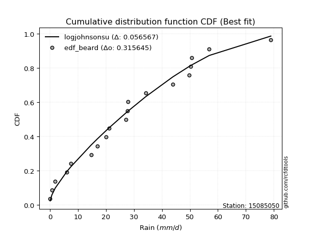</img>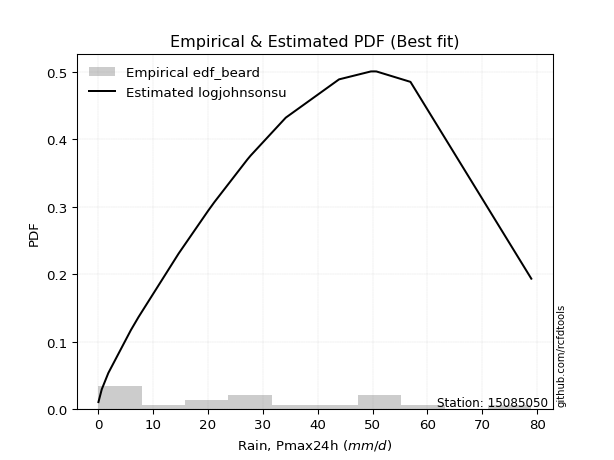</img>

</div>


### 5. EDF Chegodayev (1955)

The Chegodayev formula is an empirical plotting position formula used in hydrological frequency analysis to estimate the exceedance probability or return period of a specific event from a set of observed data. It is primarily used for plotting observed data points on probability paper to fit a theoretical distribution, particularly for analyzing extreme events like maximum flood flows or rainfall intensities. The constant _b_ value in the generalized plotting position formula is 0.3.

<div align="center">


$P=(m-b)/(n+1-2b)$


</div>


**5.1. Empirical values**

<div align="center">

|                | 0                   | 1                   | 2                  | 3                  | 4                   | 5                   | 6                  | 7                  | 8                  | 9              | 10                 | 11                 | 12                 | 13                 | 14                 | 15                 | 16                 | 17                 | 18                 |
|:---------------|:--------------------|:--------------------|:-------------------|:-------------------|:--------------------|:--------------------|:-------------------|:-------------------|:-------------------|:---------------|:-------------------|:-------------------|:-------------------|:-------------------|:-------------------|:-------------------|:-------------------|:-------------------|:-------------------|
| date           | 2022                | 2023                | 2015               | 2020               | 2021                | 2013                | 2025               | 2014               | 2012               | 2016           | 2010               | 2009               | 2007               | 2018               | 2006               | 2011               | 2005               | 2019               | 2008               |
| x              | 0.1                 | 0.7                 | 1.9                | 6.0                | 7.4                 | 14.7                | 17.0               | 20.1               | 21.2               | 27.2           | 27.6               | 27.8               | 34.2               | 43.9               | 49.7               | 50.3               | 50.7               | 56.9               | 78.9               |
| m              | 1                   | 2                   | 3                  | 4                  | 5                   | 6                   | 7                  | 8                  | 9                  | 10             | 11                 | 12                 | 13                 | 14                 | 15                 | 16                 | 17                 | 18                 | 19                 |
| empirical_dist | edf_chegodayev      | edf_chegodayev      | edf_chegodayev     | edf_chegodayev     | edf_chegodayev      | edf_chegodayev      | edf_chegodayev     | edf_chegodayev     | edf_chegodayev     | edf_chegodayev | edf_chegodayev     | edf_chegodayev     | edf_chegodayev     | edf_chegodayev     | edf_chegodayev     | edf_chegodayev     | edf_chegodayev     | edf_chegodayev     | edf_chegodayev     |
| empirical      | 0.03608247422680413 | 0.08762886597938145 | 0.1391752577319588 | 0.1907216494845361 | 0.24226804123711343 | 0.29381443298969073 | 0.3453608247422681 | 0.3969072164948454 | 0.4484536082474227 | 0.5            | 0.5515463917525774 | 0.6030927835051546 | 0.654639175257732  | 0.7061855670103093 | 0.7577319587628866 | 0.8092783505154639 | 0.8608247422680413 | 0.9123711340206185 | 0.9639175257731959 |
| empirical_tr   | 1.0374331550802138  | 1.096045197740113   | 1.1616766467065869 | 1.2356687898089171 | 1.3197278911564627  | 1.416058394160584   | 1.5275590551181104 | 1.6581196581196582 | 1.8130841121495327 | 2.0            | 2.2298850574712645 | 2.519480519480519  | 2.8955223880597014 | 3.403508771929825  | 4.127659574468085  | 5.243243243243244  | 7.185185185185188  | 11.41176470588235  | 27.714285714285726 |

</div>


**5.2. Kolmogorov-Smirnov fit test (sorted by Δ)**


<div align="center">

|                | 0                    | 1                   | 2                   | 3                   | 4                   | 5                   | 6                   | 7                   | 8                   | 9                   | 10                  | 11                  | 12                  | 13                  | 14                  | 15                  | 16                  | 17                  | 18                  | 19                  | 20                  | 21                  | 22                  | 23                  | 24                  | 25                  | 26                  | 27                  | 28                  | 29                  | 30                  | 31                  | 32                  | 33                  | 34                  | 35                  | 36                  | 37                  | 38                  | 39                  | 40                  | 41                  | 42                  | 43                  | 44                  | 45                  | 46                  | 47                  | 48                  | 49                  | 50                  | 51                  | 52                  | 53                  | 54                  | 55                  | 56                  | 57                  | 58                  | 59                  | 60                  | 61                  | 62                  | 63                  | 64                  | 65                  | 66                  | 67                  | 68                  | 69                  | 70                  | 71                  | 72                  | 73                  | 74                  | 75                  | 76                  | 77                  | 78                  | 79                  | 80                  | 81                  | 82                  | 83                  | 84                  | 85                  | 86                  | 87                  | 88                  | 89                  | 90                  | 91                  | 92                  | 93                  | 94                  | 95                  | 96                  | 97                  | 98                  | 99                  | 100                 | 101                 | 102                 | 103                 | 104                 | 105                 | 106                 | 107                 | 108                 | 109                 | 110                 | 111                 | 112                 | 113                 | 114                 | 115                 | 116                 | 117                 | 118                 | 119                 | 120                 | 121                 | 122                 | 123                 | 124                 | 125                 | 126                 | 127                 | 128                 | 129                 | 130                 | 131                 | 132                 | 133                 | 134                 | 135                 | 136                 | 137                 | 138                 | 139                 | 140                 | 141                 | 142                 | 143                 | 144                 | 145                 | 146                 | 147                 | 148                 | 149                 | 150                 | 151                 | 152                 | 153                 | 154                 | 155                 | 156                 | 157                 | 158                 | 159                 |
|:---------------|:---------------------|:--------------------|:--------------------|:--------------------|:--------------------|:--------------------|:--------------------|:--------------------|:--------------------|:--------------------|:--------------------|:--------------------|:--------------------|:--------------------|:--------------------|:--------------------|:--------------------|:--------------------|:--------------------|:--------------------|:--------------------|:--------------------|:--------------------|:--------------------|:--------------------|:--------------------|:--------------------|:--------------------|:--------------------|:--------------------|:--------------------|:--------------------|:--------------------|:--------------------|:--------------------|:--------------------|:--------------------|:--------------------|:--------------------|:--------------------|:--------------------|:--------------------|:--------------------|:--------------------|:--------------------|:--------------------|:--------------------|:--------------------|:--------------------|:--------------------|:--------------------|:--------------------|:--------------------|:--------------------|:--------------------|:--------------------|:--------------------|:--------------------|:--------------------|:--------------------|:--------------------|:--------------------|:--------------------|:--------------------|:--------------------|:--------------------|:--------------------|:--------------------|:--------------------|:--------------------|:--------------------|:--------------------|:--------------------|:--------------------|:--------------------|:--------------------|:--------------------|:--------------------|:--------------------|:--------------------|:--------------------|:--------------------|:--------------------|:--------------------|:--------------------|:--------------------|:--------------------|:--------------------|:--------------------|:--------------------|:--------------------|:--------------------|:--------------------|:--------------------|:--------------------|:--------------------|:--------------------|:--------------------|:--------------------|:--------------------|:--------------------|:--------------------|:--------------------|:--------------------|:--------------------|:--------------------|:--------------------|:--------------------|:--------------------|:--------------------|:--------------------|:--------------------|:--------------------|:--------------------|:--------------------|:--------------------|:--------------------|:--------------------|:--------------------|:--------------------|:--------------------|:--------------------|:--------------------|:--------------------|:--------------------|:--------------------|:--------------------|:--------------------|:--------------------|:--------------------|:--------------------|:--------------------|:--------------------|:--------------------|:--------------------|:--------------------|:--------------------|:--------------------|:--------------------|:--------------------|:--------------------|:--------------------|:--------------------|:--------------------|:--------------------|:--------------------|:--------------------|:--------------------|:--------------------|:--------------------|:--------------------|:--------------------|:--------------------|:--------------------|:--------------------|:--------------------|:--------------------|:--------------------|:--------------------|:--------------------|
| station        | 15085050             | 15085050            | 15085050            | 15085050            | 15085050            | 15085050            | 15085050            | 15085050            | 15085050            | 15085050            | 15085050            | 15085050            | 15085050            | 15085050            | 15085050            | 15085050            | 15085050            | 15085050            | 15085050            | 15085050            | 15085050            | 15085050            | 15085050            | 15085050            | 15085050            | 15085050            | 15085050            | 15085050            | 15085050            | 15085050            | 15085050            | 15085050            | 15085050            | 15085050            | 15085050            | 15085050            | 15085050            | 15085050            | 15085050            | 15085050            | 15085050            | 15085050            | 15085050            | 15085050            | 15085050            | 15085050            | 15085050            | 15085050            | 15085050            | 15085050            | 15085050            | 15085050            | 15085050            | 15085050            | 15085050            | 15085050            | 15085050            | 15085050            | 15085050            | 15085050            | 15085050            | 15085050            | 15085050            | 15085050            | 15085050            | 15085050            | 15085050            | 15085050            | 15085050            | 15085050            | 15085050            | 15085050            | 15085050            | 15085050            | 15085050            | 15085050            | 15085050            | 15085050            | 15085050            | 15085050            | 15085050            | 15085050            | 15085050            | 15085050            | 15085050            | 15085050            | 15085050            | 15085050            | 15085050            | 15085050            | 15085050            | 15085050            | 15085050            | 15085050            | 15085050            | 15085050            | 15085050            | 15085050            | 15085050            | 15085050            | 15085050            | 15085050            | 15085050            | 15085050            | 15085050            | 15085050            | 15085050            | 15085050            | 15085050            | 15085050            | 15085050            | 15085050            | 15085050            | 15085050            | 15085050            | 15085050            | 15085050            | 15085050            | 15085050            | 15085050            | 15085050            | 15085050            | 15085050            | 15085050            | 15085050            | 15085050            | 15085050            | 15085050            | 15085050            | 15085050            | 15085050            | 15085050            | 15085050            | 15085050            | 15085050            | 15085050            | 15085050            | 15085050            | 15085050            | 15085050            | 15085050            | 15085050            | 15085050            | 15085050            | 15085050            | 15085050            | 15085050            | 15085050            | 15085050            | 15085050            | 15085050            | 15085050            | 15085050            | 15085050            | 15085050            | 15085050            | 15085050            | 15085050            | 15085050            | 15085050            |
| empirical_dist | edf_chegodayev       | edf_chegodayev      | edf_chegodayev      | edf_chegodayev      | edf_chegodayev      | edf_chegodayev      | edf_chegodayev      | edf_chegodayev      | edf_chegodayev      | edf_chegodayev      | edf_chegodayev      | edf_chegodayev      | edf_chegodayev      | edf_chegodayev      | edf_chegodayev      | edf_chegodayev      | edf_chegodayev      | edf_chegodayev      | edf_chegodayev      | edf_chegodayev      | edf_chegodayev      | edf_chegodayev      | edf_chegodayev      | edf_chegodayev      | edf_chegodayev      | edf_chegodayev      | edf_chegodayev      | edf_chegodayev      | edf_chegodayev      | edf_chegodayev      | edf_chegodayev      | edf_chegodayev      | edf_chegodayev      | edf_chegodayev      | edf_chegodayev      | edf_chegodayev      | edf_chegodayev      | edf_chegodayev      | edf_chegodayev      | edf_chegodayev      | edf_chegodayev      | edf_chegodayev      | edf_chegodayev      | edf_chegodayev      | edf_chegodayev      | edf_chegodayev      | edf_chegodayev      | edf_chegodayev      | edf_chegodayev      | edf_chegodayev      | edf_chegodayev      | edf_chegodayev      | edf_chegodayev      | edf_chegodayev      | edf_chegodayev      | edf_chegodayev      | edf_chegodayev      | edf_chegodayev      | edf_chegodayev      | edf_chegodayev      | edf_chegodayev      | edf_chegodayev      | edf_chegodayev      | edf_chegodayev      | edf_chegodayev      | edf_chegodayev      | edf_chegodayev      | edf_chegodayev      | edf_chegodayev      | edf_chegodayev      | edf_chegodayev      | edf_chegodayev      | edf_chegodayev      | edf_chegodayev      | edf_chegodayev      | edf_chegodayev      | edf_chegodayev      | edf_chegodayev      | edf_chegodayev      | edf_chegodayev      | edf_chegodayev      | edf_chegodayev      | edf_chegodayev      | edf_chegodayev      | edf_chegodayev      | edf_chegodayev      | edf_chegodayev      | edf_chegodayev      | edf_chegodayev      | edf_chegodayev      | edf_chegodayev      | edf_chegodayev      | edf_chegodayev      | edf_chegodayev      | edf_chegodayev      | edf_chegodayev      | edf_chegodayev      | edf_chegodayev      | edf_chegodayev      | edf_chegodayev      | edf_chegodayev      | edf_chegodayev      | edf_chegodayev      | edf_chegodayev      | edf_chegodayev      | edf_chegodayev      | edf_chegodayev      | edf_chegodayev      | edf_chegodayev      | edf_chegodayev      | edf_chegodayev      | edf_chegodayev      | edf_chegodayev      | edf_chegodayev      | edf_chegodayev      | edf_chegodayev      | edf_chegodayev      | edf_chegodayev      | edf_chegodayev      | edf_chegodayev      | edf_chegodayev      | edf_chegodayev      | edf_chegodayev      | edf_chegodayev      | edf_chegodayev      | edf_chegodayev      | edf_chegodayev      | edf_chegodayev      | edf_chegodayev      | edf_chegodayev      | edf_chegodayev      | edf_chegodayev      | edf_chegodayev      | edf_chegodayev      | edf_chegodayev      | edf_chegodayev      | edf_chegodayev      | edf_chegodayev      | edf_chegodayev      | edf_chegodayev      | edf_chegodayev      | edf_chegodayev      | edf_chegodayev      | edf_chegodayev      | edf_chegodayev      | edf_chegodayev      | edf_chegodayev      | edf_chegodayev      | edf_chegodayev      | edf_chegodayev      | edf_chegodayev      | edf_chegodayev      | edf_chegodayev      | edf_chegodayev      | edf_chegodayev      | edf_chegodayev      | edf_chegodayev      | edf_chegodayev      | edf_chegodayev      | edf_chegodayev      |
| p_dist         | logjohnsonsu         | foldnorm            | logjohnsonsb        | logargus            | rayleigh            | loggenlogistic      | maxwell             | logloggamma         | pearson3            | exponpow            | fatiguelife         | genexpon            | invgauss            | johnsonsu           | ncf                 | invgamma            | kstwobign           | nct                 | alpha               | invweibull          | halfnorm            | genlogistic         | genextreme          | genpareto           | gompertz            | triang              | skewnorm            | nakagami            | logmielke           | gumbel_r            | rice                | logpearson3         | loggenextreme       | genhalflogistic     | loggengamma         | arcsine             | semicircular        | anglit              | t                   | norm                | crystalball         | logistic            | hypsecant           | kappa3              | burr12              | exponnorm           | logburr12           | moyal               | logdgamma           | dweibull            | loggennorm          | logt                | dgamma              | mielke              | laplace             | truncnorm           | burr                | logweibull_max      | halflogistic        | loggumbel_l         | truncweibull_min    | lomax               | gausshyper          | gennorm             | cosine              | f                   | truncexpon          | bradford            | logdweibull         | logfoldnorm         | gumbel_l            | logskewnorm         | beta                | logsemicircular     | lognakagami         | loganglit           | loggausshyper       | logrice             | logexponnorm        | lognorm             | logcrystalball      | lognct              | loglogistic         | loghypsecant        | loggamma            | loggamma            | logfatiguelife      | halfgennorm         | logarcsine          | gengamma            | weibull_min         | loglevy_l           | logerlang           | loglaplace          | loglaplace          | betaprime           | loginvweibull       | loginvgamma         | kappa4              | logalpha            | logtrapezoid        | logburr             | erlang              | wald                | loginvgauss         | ksone               | logmaxwell          | gamma               | wrapcauchy          | loggenhalflogistic  | uniform             | vonmises_line       | lograyleigh         | logtruncweibull_min | logkstwobign        | loggompertz         | loggumbel_r         | loghalfnorm         | logtriang           | logcosine           | johnsonsb           | logmoyal            | loggenexpon         | loghalflogistic     | argus               | powerlaw            | logbeta             | logwrapcauchy       | loglomax            | logwald             | logncf              | logkappa4           | logksone            | logexponweib        | logkappa3           | levy_l              | logtruncnorm        | loghalfgennorm      | loguniform          | trapezoid           | logbradford         | logvonmises_line    | logtruncexpon       | logf                | rdist               | logloglaplace       | exponweib           | tukeylambda         | logbetaprime        | logpowerlaw         | loggenpareto        | logweibull_min      | logexponpow         | logrdist            | logtukeylambda      | truncpareto         | weibull_max         | logtruncpareto      | logvonmises         | vonmises            |
| delta          | 0.056354154116631305 | 0.07383067672344401 | 0.07518214299756759 | 0.07895903372902285 | 0.08089194240763964 | 0.08147596987595129 | 0.0815756703330427  | 0.08201450069620925 | 0.08668102308204806 | 0.090006151681432   | 0.09041315480214929 | 0.09046748639226185 | 0.09088122613519911 | 0.09092340851420233 | 0.09102976043760944 | 0.091110977111037   | 0.0924322282873884  | 0.0925324911559211  | 0.09279370651882846 | 0.09348348036643828 | 0.09362311490271968 | 0.0938751285738294  | 0.09412653629672307 | 0.09655613372501134 | 0.09822789909446594 | 0.0985633661487257  | 0.09857150403585177 | 0.09873409713857911 | 0.09895246688310166 | 0.10047892481634965 | 0.10245981370520871 | 0.10323408953323032 | 0.1033741206143195  | 0.10448625077234369 | 0.10493479248701759 | 0.10757185287746995 | 0.1094267782889673  | 0.10989488845378687 | 0.11102961739373135 | 0.11103096455956418 | 0.11103096648531446 | 0.11211517578761171 | 0.11304085482496135 | 0.11355345097081027 | 0.11470067680380636 | 0.11792937371307155 | 0.11799770615905358 | 0.12346703701592746 | 0.12415075769296252 | 0.12512142544750748 | 0.1259101011703349  | 0.12811684469213894 | 0.13093930871617787 | 0.13228113648622042 | 0.13401569692895077 | 0.1365276234999754  | 0.137687463091273   | 0.13826183216603416 | 0.1391752577319588  | 0.13970614503730888 | 0.14688782367968617 | 0.15204361501166985 | 0.1521411093866779  | 0.15259334005116526 | 0.15421325696619725 | 0.16289218427863777 | 0.16506938846144026 | 0.1684075802626125  | 0.16994308254020574 | 0.17894284764484714 | 0.18159595148024776 | 0.1846865487258033  | 0.19098506886326694 | 0.20919685400917815 | 0.20938312687451627 | 0.20942076910673663 | 0.20943966744688497 | 0.2099522457231156  | 0.20995942179835764 | 0.20996027279680968 | 0.20996027395106492 | 0.21012109637287885 | 0.21047597028937431 | 0.21091635555819216 | 0.21164318938467003 | 0.21164318938467003 | 0.2130317039139314  | 0.2135837333239427  | 0.21373828291492547 | 0.2142111897531075  | 0.22041936210580976 | 0.22270901439945243 | 0.22524293128520284 | 0.22536422177488502 | 0.22536422177488502 | 0.22831705957547693 | 0.22899030904698253 | 0.2302562180399939  | 0.23049462219625183 | 0.23087620727252606 | 0.23225002972185232 | 0.23362620556672725 | 0.24213113241167145 | 0.24226803557387858 | 0.2423710201999722  | 0.24238142585518174 | 0.24285486115300642 | 0.24354770351242466 | 0.24518834204968154 | 0.24519500300302105 | 0.2515699408655608  | 0.2517419091807952  | 0.25378230282701303 | 0.26643943952880816 | 0.2704395823943972  | 0.27100153614712946 | 0.28043746688178023 | 0.2845487032117227  | 0.2932248919794031  | 0.30118060846739175 | 0.30512653963271386 | 0.30625536914155665 | 0.30967771451517995 | 0.30971386937651163 | 0.3104900126932415  | 0.3348037801894726  | 0.3473101485063006  | 0.348702365367197   | 0.3731444040421936  | 0.37803356701995355 | 0.4078927485989787  | 0.41289608582094434 | 0.41293960229805876 | 0.42501930280820244 | 0.4386185478913625  | 0.44468840866844384 | 0.4500819581182793  | 0.45157449164300384 | 0.45429040935560866 | 0.4732473912911416  | 0.47499493434516565 | 0.5004922677613617  | 0.5018820268544559  | 0.5144959193240314  | 0.5227373828284021  | 0.5317058879871229  | 0.5405854850554241  | 0.5468389186966415  | 0.5507435056100798  | 0.6120902126606572  | 0.62227260996824    | 0.6354534267758228  | 0.7427136530123288  | 0.7577319539033024  | 0.7639765232213176  | 0.764989881657183   | 0.7662931667353391  | 0.8467805620483663  | 0.9571440812010688  | 11.973239283883652  |
| deltao         | 0.31564497164100014  | 0.31564497164100014 | 0.31564497164100014 | 0.31564497164100014 | 0.31564497164100014 | 0.31564497164100014 | 0.31564497164100014 | 0.31564497164100014 | 0.31564497164100014 | 0.31564497164100014 | 0.31564497164100014 | 0.31564497164100014 | 0.31564497164100014 | 0.31564497164100014 | 0.31564497164100014 | 0.31564497164100014 | 0.31564497164100014 | 0.31564497164100014 | 0.31564497164100014 | 0.31564497164100014 | 0.31564497164100014 | 0.31564497164100014 | 0.31564497164100014 | 0.31564497164100014 | 0.31564497164100014 | 0.31564497164100014 | 0.31564497164100014 | 0.31564497164100014 | 0.31564497164100014 | 0.31564497164100014 | 0.31564497164100014 | 0.31564497164100014 | 0.31564497164100014 | 0.31564497164100014 | 0.31564497164100014 | 0.31564497164100014 | 0.31564497164100014 | 0.31564497164100014 | 0.31564497164100014 | 0.31564497164100014 | 0.31564497164100014 | 0.31564497164100014 | 0.31564497164100014 | 0.31564497164100014 | 0.31564497164100014 | 0.31564497164100014 | 0.31564497164100014 | 0.31564497164100014 | 0.31564497164100014 | 0.31564497164100014 | 0.31564497164100014 | 0.31564497164100014 | 0.31564497164100014 | 0.31564497164100014 | 0.31564497164100014 | 0.31564497164100014 | 0.31564497164100014 | 0.31564497164100014 | 0.31564497164100014 | 0.31564497164100014 | 0.31564497164100014 | 0.31564497164100014 | 0.31564497164100014 | 0.31564497164100014 | 0.31564497164100014 | 0.31564497164100014 | 0.31564497164100014 | 0.31564497164100014 | 0.31564497164100014 | 0.31564497164100014 | 0.31564497164100014 | 0.31564497164100014 | 0.31564497164100014 | 0.31564497164100014 | 0.31564497164100014 | 0.31564497164100014 | 0.31564497164100014 | 0.31564497164100014 | 0.31564497164100014 | 0.31564497164100014 | 0.31564497164100014 | 0.31564497164100014 | 0.31564497164100014 | 0.31564497164100014 | 0.31564497164100014 | 0.31564497164100014 | 0.31564497164100014 | 0.31564497164100014 | 0.31564497164100014 | 0.31564497164100014 | 0.31564497164100014 | 0.31564497164100014 | 0.31564497164100014 | 0.31564497164100014 | 0.31564497164100014 | 0.31564497164100014 | 0.31564497164100014 | 0.31564497164100014 | 0.31564497164100014 | 0.31564497164100014 | 0.31564497164100014 | 0.31564497164100014 | 0.31564497164100014 | 0.31564497164100014 | 0.31564497164100014 | 0.31564497164100014 | 0.31564497164100014 | 0.31564497164100014 | 0.31564497164100014 | 0.31564497164100014 | 0.31564497164100014 | 0.31564497164100014 | 0.31564497164100014 | 0.31564497164100014 | 0.31564497164100014 | 0.31564497164100014 | 0.31564497164100014 | 0.31564497164100014 | 0.31564497164100014 | 0.31564497164100014 | 0.31564497164100014 | 0.31564497164100014 | 0.31564497164100014 | 0.31564497164100014 | 0.31564497164100014 | 0.31564497164100014 | 0.31564497164100014 | 0.31564497164100014 | 0.31564497164100014 | 0.31564497164100014 | 0.31564497164100014 | 0.31564497164100014 | 0.31564497164100014 | 0.31564497164100014 | 0.31564497164100014 | 0.31564497164100014 | 0.31564497164100014 | 0.31564497164100014 | 0.31564497164100014 | 0.31564497164100014 | 0.31564497164100014 | 0.31564497164100014 | 0.31564497164100014 | 0.31564497164100014 | 0.31564497164100014 | 0.31564497164100014 | 0.31564497164100014 | 0.31564497164100014 | 0.31564497164100014 | 0.31564497164100014 | 0.31564497164100014 | 0.31564497164100014 | 0.31564497164100014 | 0.31564497164100014 | 0.31564497164100014 | 0.31564497164100014 | 0.31564497164100014 | 0.31564497164100014 | 0.31564497164100014 | 0.31564497164100014 |
| eval           | Δo > Δ               | Δo > Δ              | Δo > Δ              | Δo > Δ              | Δo > Δ              | Δo > Δ              | Δo > Δ              | Δo > Δ              | Δo > Δ              | Δo > Δ              | Δo > Δ              | Δo > Δ              | Δo > Δ              | Δo > Δ              | Δo > Δ              | Δo > Δ              | Δo > Δ              | Δo > Δ              | Δo > Δ              | Δo > Δ              | Δo > Δ              | Δo > Δ              | Δo > Δ              | Δo > Δ              | Δo > Δ              | Δo > Δ              | Δo > Δ              | Δo > Δ              | Δo > Δ              | Δo > Δ              | Δo > Δ              | Δo > Δ              | Δo > Δ              | Δo > Δ              | Δo > Δ              | Δo > Δ              | Δo > Δ              | Δo > Δ              | Δo > Δ              | Δo > Δ              | Δo > Δ              | Δo > Δ              | Δo > Δ              | Δo > Δ              | Δo > Δ              | Δo > Δ              | Δo > Δ              | Δo > Δ              | Δo > Δ              | Δo > Δ              | Δo > Δ              | Δo > Δ              | Δo > Δ              | Δo > Δ              | Δo > Δ              | Δo > Δ              | Δo > Δ              | Δo > Δ              | Δo > Δ              | Δo > Δ              | Δo > Δ              | Δo > Δ              | Δo > Δ              | Δo > Δ              | Δo > Δ              | Δo > Δ              | Δo > Δ              | Δo > Δ              | Δo > Δ              | Δo > Δ              | Δo > Δ              | Δo > Δ              | Δo > Δ              | Δo > Δ              | Δo > Δ              | Δo > Δ              | Δo > Δ              | Δo > Δ              | Δo > Δ              | Δo > Δ              | Δo > Δ              | Δo > Δ              | Δo > Δ              | Δo > Δ              | Δo > Δ              | Δo > Δ              | Δo > Δ              | Δo > Δ              | Δo > Δ              | Δo > Δ              | Δo > Δ              | Δo > Δ              | Δo > Δ              | Δo > Δ              | Δo > Δ              | Δo > Δ              | Δo > Δ              | Δo > Δ              | Δo > Δ              | Δo > Δ              | Δo > Δ              | Δo > Δ              | Δo > Δ              | Δo > Δ              | Δo > Δ              | Δo > Δ              | Δo > Δ              | Δo > Δ              | Δo > Δ              | Δo > Δ              | Δo > Δ              | Δo > Δ              | Δo > Δ              | Δo > Δ              | Δo > Δ              | Δo > Δ              | Δo > Δ              | Δo > Δ              | Δo > Δ              | Δo > Δ              | Δo > Δ              | Δo > Δ              | Δo > Δ              | Δo > Δ              | Δo > Δ              | Δo <= Δ             | Δo <= Δ             | Δo <= Δ             | Δo <= Δ             | Δo <= Δ             | Δo <= Δ             | Δo <= Δ             | Δo <= Δ             | Δo <= Δ             | Δo <= Δ             | Δo <= Δ             | Δo <= Δ             | Δo <= Δ             | Δo <= Δ             | Δo <= Δ             | Δo <= Δ             | Δo <= Δ             | Δo <= Δ             | Δo <= Δ             | Δo <= Δ             | Δo <= Δ             | Δo <= Δ             | Δo <= Δ             | Δo <= Δ             | Δo <= Δ             | Δo <= Δ             | Δo <= Δ             | Δo <= Δ             | Δo <= Δ             | Δo <= Δ             | Δo <= Δ             | Δo <= Δ             | Δo <= Δ             | Δo <= Δ             | Δo <= Δ             |
| fit            | 1                    | 1                   | 1                   | 1                   | 1                   | 1                   | 1                   | 1                   | 1                   | 1                   | 1                   | 1                   | 1                   | 1                   | 1                   | 1                   | 1                   | 1                   | 1                   | 1                   | 1                   | 1                   | 1                   | 1                   | 1                   | 1                   | 1                   | 1                   | 1                   | 1                   | 1                   | 1                   | 1                   | 1                   | 1                   | 1                   | 1                   | 1                   | 1                   | 1                   | 1                   | 1                   | 1                   | 1                   | 1                   | 1                   | 1                   | 1                   | 1                   | 1                   | 1                   | 1                   | 1                   | 1                   | 1                   | 1                   | 1                   | 1                   | 1                   | 1                   | 1                   | 1                   | 1                   | 1                   | 1                   | 1                   | 1                   | 1                   | 1                   | 1                   | 1                   | 1                   | 1                   | 1                   | 1                   | 1                   | 1                   | 1                   | 1                   | 1                   | 1                   | 1                   | 1                   | 1                   | 1                   | 1                   | 1                   | 1                   | 1                   | 1                   | 1                   | 1                   | 1                   | 1                   | 1                   | 1                   | 1                   | 1                   | 1                   | 1                   | 1                   | 1                   | 1                   | 1                   | 1                   | 1                   | 1                   | 1                   | 1                   | 1                   | 1                   | 1                   | 1                   | 1                   | 1                   | 1                   | 1                   | 1                   | 1                   | 1                   | 1                   | 1                   | 1                   | 1                   | 1                   | 0                   | 0                   | 0                   | 0                   | 0                   | 0                   | 0                   | 0                   | 0                   | 0                   | 0                   | 0                   | 0                   | 0                   | 0                   | 0                   | 0                   | 0                   | 0                   | 0                   | 0                   | 0                   | 0                   | 0                   | 0                   | 0                   | 0                   | 0                   | 0                   | 0                   | 0                   | 0                   | 0                   | 0                   | 0                   |
| n              | 19                   | 19                  | 19                  | 19                  | 19                  | 19                  | 19                  | 19                  | 19                  | 19                  | 19                  | 19                  | 19                  | 19                  | 19                  | 19                  | 19                  | 19                  | 19                  | 19                  | 19                  | 19                  | 19                  | 19                  | 19                  | 19                  | 19                  | 19                  | 19                  | 19                  | 19                  | 19                  | 19                  | 19                  | 19                  | 19                  | 19                  | 19                  | 19                  | 19                  | 19                  | 19                  | 19                  | 19                  | 19                  | 19                  | 19                  | 19                  | 19                  | 19                  | 19                  | 19                  | 19                  | 19                  | 19                  | 19                  | 19                  | 19                  | 19                  | 19                  | 19                  | 19                  | 19                  | 19                  | 19                  | 19                  | 19                  | 19                  | 19                  | 19                  | 19                  | 19                  | 19                  | 19                  | 19                  | 19                  | 19                  | 19                  | 19                  | 19                  | 19                  | 19                  | 19                  | 19                  | 19                  | 19                  | 19                  | 19                  | 19                  | 19                  | 19                  | 19                  | 19                  | 19                  | 19                  | 19                  | 19                  | 19                  | 19                  | 19                  | 19                  | 19                  | 19                  | 19                  | 19                  | 19                  | 19                  | 19                  | 19                  | 19                  | 19                  | 19                  | 19                  | 19                  | 19                  | 19                  | 19                  | 19                  | 19                  | 19                  | 19                  | 19                  | 19                  | 19                  | 19                  | 19                  | 19                  | 19                  | 19                  | 19                  | 19                  | 19                  | 19                  | 19                  | 19                  | 19                  | 19                  | 19                  | 19                  | 19                  | 19                  | 19                  | 19                  | 19                  | 19                  | 19                  | 19                  | 19                  | 19                  | 19                  | 19                  | 19                  | 19                  | 19                  | 19                  | 19                  | 19                  | 19                  | 19                  | 19                  |
| best_fit       | 1                    | 0                   | 0                   | 0                   | 0                   | 0                   | 0                   | 0                   | 0                   | 0                   | 0                   | 0                   | 0                   | 0                   | 0                   | 0                   | 0                   | 0                   | 0                   | 0                   | 0                   | 0                   | 0                   | 0                   | 0                   | 0                   | 0                   | 0                   | 0                   | 0                   | 0                   | 0                   | 0                   | 0                   | 0                   | 0                   | 0                   | 0                   | 0                   | 0                   | 0                   | 0                   | 0                   | 0                   | 0                   | 0                   | 0                   | 0                   | 0                   | 0                   | 0                   | 0                   | 0                   | 0                   | 0                   | 0                   | 0                   | 0                   | 0                   | 0                   | 0                   | 0                   | 0                   | 0                   | 0                   | 0                   | 0                   | 0                   | 0                   | 0                   | 0                   | 0                   | 0                   | 0                   | 0                   | 0                   | 0                   | 0                   | 0                   | 0                   | 0                   | 0                   | 0                   | 0                   | 0                   | 0                   | 0                   | 0                   | 0                   | 0                   | 0                   | 0                   | 0                   | 0                   | 0                   | 0                   | 0                   | 0                   | 0                   | 0                   | 0                   | 0                   | 0                   | 0                   | 0                   | 0                   | 0                   | 0                   | 0                   | 0                   | 0                   | 0                   | 0                   | 0                   | 0                   | 0                   | 0                   | 0                   | 0                   | 0                   | 0                   | 0                   | 0                   | 0                   | 0                   | 0                   | 0                   | 0                   | 0                   | 0                   | 0                   | 0                   | 0                   | 0                   | 0                   | 0                   | 0                   | 0                   | 0                   | 0                   | 0                   | 0                   | 0                   | 0                   | 0                   | 0                   | 0                   | 0                   | 0                   | 0                   | 0                   | 0                   | 0                   | 0                   | 0                   | 0                   | 0                   | 0                   | 0                   | 0                   |
| best_fit_sort  | 1                    | 2                   | 3                   | 4                   | 5                   | 6                   | 7                   | 8                   | 9                   | 10                  | 11                  | 12                  | 13                  | 14                  | 15                  | 16                  | 17                  | 18                  | 19                  | 20                  | 21                  | 22                  | 23                  | 24                  | 25                  | 26                  | 27                  | 28                  | 29                  | 30                  | 31                  | 32                  | 33                  | 34                  | 35                  | 36                  | 37                  | 38                  | 39                  | 40                  | 41                  | 42                  | 43                  | 44                  | 45                  | 46                  | 47                  | 48                  | 49                  | 50                  | 51                  | 52                  | 53                  | 54                  | 55                  | 56                  | 57                  | 58                  | 59                  | 60                  | 61                  | 62                  | 63                  | 64                  | 65                  | 66                  | 67                  | 68                  | 69                  | 70                  | 71                  | 72                  | 73                  | 74                  | 75                  | 76                  | 77                  | 78                  | 79                  | 80                  | 81                  | 82                  | 83                  | 84                  | 85                  | 86                  | 87                  | 88                  | 89                  | 90                  | 91                  | 92                  | 93                  | 94                  | 95                  | 96                  | 97                  | 98                  | 99                  | 100                 | 101                 | 102                 | 103                 | 104                 | 105                 | 106                 | 107                 | 108                 | 109                 | 110                 | 111                 | 112                 | 113                 | 114                 | 115                 | 116                 | 117                 | 118                 | 119                 | 120                 | 121                 | 122                 | 123                 | 124                 | 125                 | 126                 | 127                 | 128                 | 129                 | 130                 | 131                 | 132                 | 133                 | 134                 | 135                 | 136                 | 137                 | 138                 | 139                 | 140                 | 141                 | 142                 | 143                 | 144                 | 145                 | 146                 | 147                 | 148                 | 149                 | 150                 | 151                 | 152                 | 153                 | 154                 | 155                 | 156                 | 157                 | 158                 | 159                 | 160                 |

</div>


**5.3. Best fit**

<div align="center">

|   id |   station | empirical_dist   | p_dist       |     delta |   deltao | eval   |   fit |   n |   best_fit |   best_fit_sort |
|-----:|----------:|:-----------------|:-------------|----------:|---------:|:-------|------:|----:|-----------:|----------------:|
|    0 |  15085050 | edf_chegodayev   | logjohnsonsu | 0.0563542 | 0.315645 | Δo > Δ |     1 |  19 |          1 |               1 |

</div>


<div align="center">

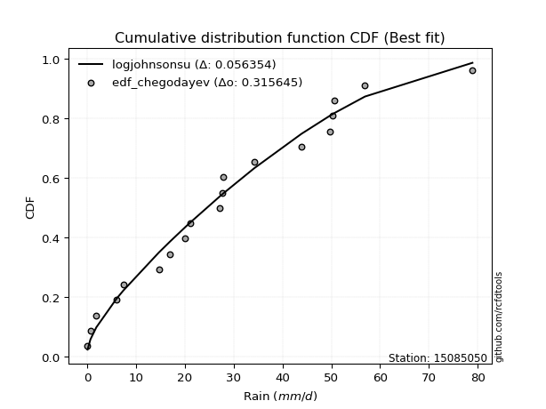</img>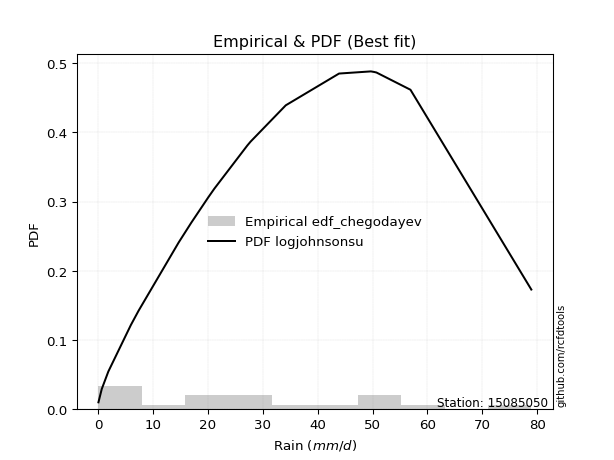</img>

</div>


### 6. EDF Blom (1958)

The Blom formula is a specific "plotting position" formula used in hydrology and statistical analysis to estimate the empirical cumulative probability (or non-exceedance probability) of a data series. It is particularly recommended for data that are approximately normally distributed. The constant _a_ is set to 0.375 (or 3/8).

<div align="center">


$P=(m-a)/(n+1-2a)$


</div>


**6.1. Empirical values**

<div align="center">

|                | 0                    | 1                   | 2                   | 3                   | 4                   | 5                  | 6                   | 7                  | 8                   | 9        | 10                 | 11                 | 12                 | 13                 | 14                 | 15                 | 16                 | 17                 | 18                 |
|:---------------|:---------------------|:--------------------|:--------------------|:--------------------|:--------------------|:-------------------|:--------------------|:-------------------|:--------------------|:---------|:-------------------|:-------------------|:-------------------|:-------------------|:-------------------|:-------------------|:-------------------|:-------------------|:-------------------|
| date           | 2022                 | 2023                | 2015                | 2020                | 2021                | 2013               | 2025                | 2014               | 2012                | 2016     | 2010               | 2009               | 2007               | 2018               | 2006               | 2011               | 2005               | 2019               | 2008               |
| x              | 0.1                  | 0.7                 | 1.9                 | 6.0                 | 7.4                 | 14.7               | 17.0                | 20.1               | 21.2                | 27.2     | 27.6               | 27.8               | 34.2               | 43.9               | 49.7               | 50.3               | 50.7               | 56.9               | 78.9               |
| m              | 1                    | 2                   | 3                   | 4                   | 5                   | 6                  | 7                   | 8                  | 9                   | 10       | 11                 | 12                 | 13                 | 14                 | 15                 | 16                 | 17                 | 18                 | 19                 |
| empirical_dist | edf_blom             | edf_blom            | edf_blom            | edf_blom            | edf_blom            | edf_blom           | edf_blom            | edf_blom           | edf_blom            | edf_blom | edf_blom           | edf_blom           | edf_blom           | edf_blom           | edf_blom           | edf_blom           | edf_blom           | edf_blom           | edf_blom           |
| empirical      | 0.032467532467532464 | 0.08441558441558442 | 0.13636363636363635 | 0.18831168831168832 | 0.24025974025974026 | 0.2922077922077922 | 0.34415584415584416 | 0.3961038961038961 | 0.44805194805194803 | 0.5      | 0.551948051948052  | 0.6038961038961039 | 0.6558441558441559 | 0.7077922077922078 | 0.7597402597402597 | 0.8116883116883117 | 0.8636363636363636 | 0.9155844155844156 | 0.9675324675324676 |
| empirical_tr   | 1.0335570469798658   | 1.0921985815602837  | 1.1578947368421053  | 1.232               | 1.3162393162393162  | 1.4128440366972477 | 1.5247524752475246  | 1.6559139784946235 | 1.811764705882353   | 2.0      | 2.2318840579710146 | 2.5245901639344264 | 2.905660377358491  | 3.4222222222222216 | 4.162162162162161  | 5.310344827586206  | 7.333333333333334  | 11.84615384615385  | 30.800000000000043 |

</div>


**6.2. Kolmogorov-Smirnov fit test (sorted by Δ)**


<div align="center">

|                | 0                    | 1                   | 2                   | 3                   | 4                   | 5                   | 6                   | 7                   | 8                   | 9                   | 10                  | 11                  | 12                  | 13                  | 14                  | 15                  | 16                  | 17                  | 18                  | 19                  | 20                  | 21                  | 22                  | 23                  | 24                  | 25                  | 26                  | 27                  | 28                  | 29                  | 30                  | 31                  | 32                  | 33                  | 34                  | 35                  | 36                  | 37                  | 38                  | 39                  | 40                  | 41                  | 42                  | 43                  | 44                  | 45                  | 46                  | 47                  | 48                  | 49                  | 50                  | 51                  | 52                  | 53                  | 54                  | 55                  | 56                  | 57                  | 58                  | 59                  | 60                  | 61                  | 62                  | 63                  | 64                  | 65                  | 66                  | 67                  | 68                  | 69                  | 70                  | 71                  | 72                  | 73                  | 74                  | 75                  | 76                  | 77                  | 78                  | 79                  | 80                  | 81                  | 82                  | 83                  | 84                  | 85                  | 86                  | 87                  | 88                  | 89                  | 90                  | 91                  | 92                  | 93                  | 94                  | 95                  | 96                  | 97                  | 98                  | 99                  | 100                 | 101                 | 102                 | 103                 | 104                 | 105                 | 106                 | 107                 | 108                 | 109                 | 110                 | 111                 | 112                 | 113                 | 114                 | 115                 | 116                 | 117                 | 118                 | 119                 | 120                 | 121                 | 122                 | 123                 | 124                 | 125                 | 126                 | 127                 | 128                 | 129                 | 130                 | 131                 | 132                 | 133                 | 134                 | 135                 | 136                 | 137                 | 138                 | 139                 | 140                 | 141                 | 142                 | 143                 | 144                 | 145                 | 146                 | 147                 | 148                 | 149                 | 150                 | 151                 | 152                 | 153                 | 154                 | 155                 | 156                 | 157                 | 158                 | 159                 |
|:---------------|:---------------------|:--------------------|:--------------------|:--------------------|:--------------------|:--------------------|:--------------------|:--------------------|:--------------------|:--------------------|:--------------------|:--------------------|:--------------------|:--------------------|:--------------------|:--------------------|:--------------------|:--------------------|:--------------------|:--------------------|:--------------------|:--------------------|:--------------------|:--------------------|:--------------------|:--------------------|:--------------------|:--------------------|:--------------------|:--------------------|:--------------------|:--------------------|:--------------------|:--------------------|:--------------------|:--------------------|:--------------------|:--------------------|:--------------------|:--------------------|:--------------------|:--------------------|:--------------------|:--------------------|:--------------------|:--------------------|:--------------------|:--------------------|:--------------------|:--------------------|:--------------------|:--------------------|:--------------------|:--------------------|:--------------------|:--------------------|:--------------------|:--------------------|:--------------------|:--------------------|:--------------------|:--------------------|:--------------------|:--------------------|:--------------------|:--------------------|:--------------------|:--------------------|:--------------------|:--------------------|:--------------------|:--------------------|:--------------------|:--------------------|:--------------------|:--------------------|:--------------------|:--------------------|:--------------------|:--------------------|:--------------------|:--------------------|:--------------------|:--------------------|:--------------------|:--------------------|:--------------------|:--------------------|:--------------------|:--------------------|:--------------------|:--------------------|:--------------------|:--------------------|:--------------------|:--------------------|:--------------------|:--------------------|:--------------------|:--------------------|:--------------------|:--------------------|:--------------------|:--------------------|:--------------------|:--------------------|:--------------------|:--------------------|:--------------------|:--------------------|:--------------------|:--------------------|:--------------------|:--------------------|:--------------------|:--------------------|:--------------------|:--------------------|:--------------------|:--------------------|:--------------------|:--------------------|:--------------------|:--------------------|:--------------------|:--------------------|:--------------------|:--------------------|:--------------------|:--------------------|:--------------------|:--------------------|:--------------------|:--------------------|:--------------------|:--------------------|:--------------------|:--------------------|:--------------------|:--------------------|:--------------------|:--------------------|:--------------------|:--------------------|:--------------------|:--------------------|:--------------------|:--------------------|:--------------------|:--------------------|:--------------------|:--------------------|:--------------------|:--------------------|:--------------------|:--------------------|:--------------------|:--------------------|:--------------------|:--------------------|
| station        | 15085050             | 15085050            | 15085050            | 15085050            | 15085050            | 15085050            | 15085050            | 15085050            | 15085050            | 15085050            | 15085050            | 15085050            | 15085050            | 15085050            | 15085050            | 15085050            | 15085050            | 15085050            | 15085050            | 15085050            | 15085050            | 15085050            | 15085050            | 15085050            | 15085050            | 15085050            | 15085050            | 15085050            | 15085050            | 15085050            | 15085050            | 15085050            | 15085050            | 15085050            | 15085050            | 15085050            | 15085050            | 15085050            | 15085050            | 15085050            | 15085050            | 15085050            | 15085050            | 15085050            | 15085050            | 15085050            | 15085050            | 15085050            | 15085050            | 15085050            | 15085050            | 15085050            | 15085050            | 15085050            | 15085050            | 15085050            | 15085050            | 15085050            | 15085050            | 15085050            | 15085050            | 15085050            | 15085050            | 15085050            | 15085050            | 15085050            | 15085050            | 15085050            | 15085050            | 15085050            | 15085050            | 15085050            | 15085050            | 15085050            | 15085050            | 15085050            | 15085050            | 15085050            | 15085050            | 15085050            | 15085050            | 15085050            | 15085050            | 15085050            | 15085050            | 15085050            | 15085050            | 15085050            | 15085050            | 15085050            | 15085050            | 15085050            | 15085050            | 15085050            | 15085050            | 15085050            | 15085050            | 15085050            | 15085050            | 15085050            | 15085050            | 15085050            | 15085050            | 15085050            | 15085050            | 15085050            | 15085050            | 15085050            | 15085050            | 15085050            | 15085050            | 15085050            | 15085050            | 15085050            | 15085050            | 15085050            | 15085050            | 15085050            | 15085050            | 15085050            | 15085050            | 15085050            | 15085050            | 15085050            | 15085050            | 15085050            | 15085050            | 15085050            | 15085050            | 15085050            | 15085050            | 15085050            | 15085050            | 15085050            | 15085050            | 15085050            | 15085050            | 15085050            | 15085050            | 15085050            | 15085050            | 15085050            | 15085050            | 15085050            | 15085050            | 15085050            | 15085050            | 15085050            | 15085050            | 15085050            | 15085050            | 15085050            | 15085050            | 15085050            | 15085050            | 15085050            | 15085050            | 15085050            | 15085050            | 15085050            |
| empirical_dist | edf_blom             | edf_blom            | edf_blom            | edf_blom            | edf_blom            | edf_blom            | edf_blom            | edf_blom            | edf_blom            | edf_blom            | edf_blom            | edf_blom            | edf_blom            | edf_blom            | edf_blom            | edf_blom            | edf_blom            | edf_blom            | edf_blom            | edf_blom            | edf_blom            | edf_blom            | edf_blom            | edf_blom            | edf_blom            | edf_blom            | edf_blom            | edf_blom            | edf_blom            | edf_blom            | edf_blom            | edf_blom            | edf_blom            | edf_blom            | edf_blom            | edf_blom            | edf_blom            | edf_blom            | edf_blom            | edf_blom            | edf_blom            | edf_blom            | edf_blom            | edf_blom            | edf_blom            | edf_blom            | edf_blom            | edf_blom            | edf_blom            | edf_blom            | edf_blom            | edf_blom            | edf_blom            | edf_blom            | edf_blom            | edf_blom            | edf_blom            | edf_blom            | edf_blom            | edf_blom            | edf_blom            | edf_blom            | edf_blom            | edf_blom            | edf_blom            | edf_blom            | edf_blom            | edf_blom            | edf_blom            | edf_blom            | edf_blom            | edf_blom            | edf_blom            | edf_blom            | edf_blom            | edf_blom            | edf_blom            | edf_blom            | edf_blom            | edf_blom            | edf_blom            | edf_blom            | edf_blom            | edf_blom            | edf_blom            | edf_blom            | edf_blom            | edf_blom            | edf_blom            | edf_blom            | edf_blom            | edf_blom            | edf_blom            | edf_blom            | edf_blom            | edf_blom            | edf_blom            | edf_blom            | edf_blom            | edf_blom            | edf_blom            | edf_blom            | edf_blom            | edf_blom            | edf_blom            | edf_blom            | edf_blom            | edf_blom            | edf_blom            | edf_blom            | edf_blom            | edf_blom            | edf_blom            | edf_blom            | edf_blom            | edf_blom            | edf_blom            | edf_blom            | edf_blom            | edf_blom            | edf_blom            | edf_blom            | edf_blom            | edf_blom            | edf_blom            | edf_blom            | edf_blom            | edf_blom            | edf_blom            | edf_blom            | edf_blom            | edf_blom            | edf_blom            | edf_blom            | edf_blom            | edf_blom            | edf_blom            | edf_blom            | edf_blom            | edf_blom            | edf_blom            | edf_blom            | edf_blom            | edf_blom            | edf_blom            | edf_blom            | edf_blom            | edf_blom            | edf_blom            | edf_blom            | edf_blom            | edf_blom            | edf_blom            | edf_blom            | edf_blom            | edf_blom            | edf_blom            | edf_blom            | edf_blom            | edf_blom            |
| p_dist         | logjohnsonsu         | foldnorm            | logjohnsonsb        | rayleigh            | maxwell             | logargus            | loggenlogistic      | logloggamma         | pearson3            | exponpow            | genexpon            | fatiguelife         | ncf                 | invgauss            | johnsonsu           | invgamma            | kstwobign           | alpha               | halfnorm            | nct                 | invweibull          | genlogistic         | genextreme          | genpareto           | gompertz            | triang              | skewnorm            | nakagami            | gumbel_r            | rice                | genhalflogistic     | logmielke           | loggenextreme       | logpearson3         | loggengamma         | arcsine             | semicircular        | anglit              | t                   | norm                | crystalball         | logistic            | hypsecant           | kappa3              | burr12              | exponnorm           | logburr12           | moyal               | dweibull            | logdgamma           | loggennorm          | logt                | dgamma              | laplace             | mielke              | truncnorm           | burr                | halflogistic        | logweibull_max      | loggumbel_l         | truncweibull_min    | lomax               | gennorm             | gausshyper          | cosine              | f                   | truncexpon          | bradford            | logdweibull         | logfoldnorm         | gumbel_l            | logskewnorm         | beta                | logsemicircular     | lognakagami         | loganglit           | loggausshyper       | logrice             | logexponnorm        | lognorm             | logcrystalball      | lognct              | loglogistic         | loghypsecant        | loggamma            | loggamma            | gengamma            | logfatiguelife      | halfgennorm         | logarcsine          | weibull_min         | loglaplace          | loglaplace          | loglevy_l           | logerlang           | betaprime           | loginvweibull       | kappa4              | loginvgamma         | logalpha            | logtrapezoid        | logburr             | wald                | erlang              | loginvgauss         | logmaxwell          | gamma               | ksone               | wrapcauchy          | loggenhalflogistic  | uniform             | vonmises_line       | lograyleigh         | logtruncweibull_min | logkstwobign        | loggompertz         | loggumbel_r         | loghalfnorm         | logtriang           | logcosine           | johnsonsb           | logmoyal            | loggenexpon         | argus               | loghalflogistic     | powerlaw            | logbeta             | logwrapcauchy       | loglomax            | logwald             | logncf              | logkappa4           | logksone            | logexponweib        | logkappa3           | levy_l              | logtruncnorm        | loghalfgennorm      | loguniform          | trapezoid           | logbradford         | logvonmises_line    | logtruncexpon       | logf                | rdist               | logloglaplace       | exponweib           | tukeylambda         | logbetaprime        | logpowerlaw         | loggenpareto        | logweibull_min      | logexponpow         | logrdist            | logtukeylambda      | truncpareto         | weibull_max         | logtruncpareto      | logvonmises         | vonmises            |
| delta          | 0.057960794898529844 | 0.07448962249384117 | 0.07678878377946613 | 0.0788836414302665  | 0.07956736935566955 | 0.08056567451092139 | 0.08308261065784983 | 0.08362114147810779 | 0.08467272210467491 | 0.08839951089953357 | 0.08845918541488867 | 0.08880651402025086 | 0.08902145946023626 | 0.08927458535330068 | 0.0893167677323039  | 0.08950433632913857 | 0.09042392731001525 | 0.09078540554145531 | 0.09081149353439724 | 0.09092585037402268 | 0.09147517938906513 | 0.09186682759645626 | 0.09211823531934993 | 0.0937445123566889  | 0.0954162777261435  | 0.09575174478040326 | 0.09575988266752933 | 0.09592247577025667 | 0.09847062383897648 | 0.10045151272783553 | 0.10167462940402125 | 0.10176408825142402 | 0.10618574198264186 | 0.1064473710970274  | 0.10654143326891613 | 0.10837517326841928 | 0.11023009867991662 | 0.11069820884473619 | 0.11183293778468067 | 0.11183428495051351 | 0.11183428687626379 | 0.11291849617856103 | 0.11384417521591067 | 0.11435677136175959 | 0.11470067680380636 | 0.11792937371307155 | 0.11799770615905358 | 0.12145873603855428 | 0.12311312447013434 | 0.12374909749748786 | 0.12550844097486025 | 0.12805831045234062 | 0.12893100773880473 | 0.1336140367334761  | 0.13388777726811896 | 0.13451932252260224 | 0.13567916211389985 | 0.13636363636363635 | 0.14107345353435652 | 0.14131278581920742 | 0.1476911440706355  | 0.15204361501166985 | 0.15339666044211459 | 0.15374775016857645 | 0.15501657735714658 | 0.1644988250605363  | 0.16587270885238958 | 0.1692109006535618  | 0.1731563641040028  | 0.18054948842674567 | 0.1823992718711971  | 0.18629318950770185 | 0.19259170964516548 | 0.21080349479107668 | 0.2109897676564148  | 0.21102740988863516 | 0.2110463082287835  | 0.21155888650501414 | 0.21156606258025618 | 0.21156691357870822 | 0.21156691473296346 | 0.21172773715477738 | 0.21208261107127285 | 0.2125229963400907  | 0.21324983016656857 | 0.21324983016656857 | 0.2142111897531075  | 0.21463834469582993 | 0.21519037410584124 | 0.21695156447872255 | 0.2220260028877083  | 0.2261675421658343  | 0.2261675421658343  | 0.22632395615872408 | 0.22684957206710138 | 0.22992370035737547 | 0.23059694982888107 | 0.23129794258720116 | 0.23186285882189245 | 0.2324828480544246  | 0.23385667050375086 | 0.2352328463486258  | 0.2402597345965054  | 0.24373777319356998 | 0.24397766098187074 | 0.24446150193490496 | 0.2451543442943232  | 0.2451930472235041  | 0.24599166244063086 | 0.2468016437849196  | 0.2523732612565101  | 0.2525452295717445  | 0.25538894360891157 | 0.2680460803107067  | 0.27204622317629573 | 0.272608176929028   | 0.28204410766367877 | 0.28615534399362125 | 0.29483153276130164 | 0.3027872492492903  | 0.3075365008055616  | 0.3078620099234552  | 0.3112843552970785  | 0.3112933330841908  | 0.31132051015841017 | 0.33641042097137114 | 0.3505234300700977  | 0.35111232654004476 | 0.3755543652150414  | 0.3796402078018521  | 0.4103027097718265  | 0.4145027266028429  | 0.4145462430799573  | 0.4278309241765249  | 0.44022518867326105 | 0.44830335042771546 | 0.4516885989001778  | 0.4531811324249024  | 0.4558970501375072  | 0.47605901265946393 | 0.4766015751270642  | 0.5020989085432601  | 0.5034886676363546  | 0.5173075406923539  | 0.5263523245876738  | 0.5341158491599707  | 0.5429954462282719  | 0.5504538604559132  | 0.5531534667829275  | 0.614500173833505   | 0.6246825711410877  | 0.6378633879486706  | 0.7459269345761259  | 0.7597402548806755  | 0.7663864843941653  | 0.76820316322098    | 0.7695064482991362  | 0.8499938436121633  | 0.9571440812010688  | 11.96962434212438   |
| deltao         | 0.31564497164100014  | 0.31564497164100014 | 0.31564497164100014 | 0.31564497164100014 | 0.31564497164100014 | 0.31564497164100014 | 0.31564497164100014 | 0.31564497164100014 | 0.31564497164100014 | 0.31564497164100014 | 0.31564497164100014 | 0.31564497164100014 | 0.31564497164100014 | 0.31564497164100014 | 0.31564497164100014 | 0.31564497164100014 | 0.31564497164100014 | 0.31564497164100014 | 0.31564497164100014 | 0.31564497164100014 | 0.31564497164100014 | 0.31564497164100014 | 0.31564497164100014 | 0.31564497164100014 | 0.31564497164100014 | 0.31564497164100014 | 0.31564497164100014 | 0.31564497164100014 | 0.31564497164100014 | 0.31564497164100014 | 0.31564497164100014 | 0.31564497164100014 | 0.31564497164100014 | 0.31564497164100014 | 0.31564497164100014 | 0.31564497164100014 | 0.31564497164100014 | 0.31564497164100014 | 0.31564497164100014 | 0.31564497164100014 | 0.31564497164100014 | 0.31564497164100014 | 0.31564497164100014 | 0.31564497164100014 | 0.31564497164100014 | 0.31564497164100014 | 0.31564497164100014 | 0.31564497164100014 | 0.31564497164100014 | 0.31564497164100014 | 0.31564497164100014 | 0.31564497164100014 | 0.31564497164100014 | 0.31564497164100014 | 0.31564497164100014 | 0.31564497164100014 | 0.31564497164100014 | 0.31564497164100014 | 0.31564497164100014 | 0.31564497164100014 | 0.31564497164100014 | 0.31564497164100014 | 0.31564497164100014 | 0.31564497164100014 | 0.31564497164100014 | 0.31564497164100014 | 0.31564497164100014 | 0.31564497164100014 | 0.31564497164100014 | 0.31564497164100014 | 0.31564497164100014 | 0.31564497164100014 | 0.31564497164100014 | 0.31564497164100014 | 0.31564497164100014 | 0.31564497164100014 | 0.31564497164100014 | 0.31564497164100014 | 0.31564497164100014 | 0.31564497164100014 | 0.31564497164100014 | 0.31564497164100014 | 0.31564497164100014 | 0.31564497164100014 | 0.31564497164100014 | 0.31564497164100014 | 0.31564497164100014 | 0.31564497164100014 | 0.31564497164100014 | 0.31564497164100014 | 0.31564497164100014 | 0.31564497164100014 | 0.31564497164100014 | 0.31564497164100014 | 0.31564497164100014 | 0.31564497164100014 | 0.31564497164100014 | 0.31564497164100014 | 0.31564497164100014 | 0.31564497164100014 | 0.31564497164100014 | 0.31564497164100014 | 0.31564497164100014 | 0.31564497164100014 | 0.31564497164100014 | 0.31564497164100014 | 0.31564497164100014 | 0.31564497164100014 | 0.31564497164100014 | 0.31564497164100014 | 0.31564497164100014 | 0.31564497164100014 | 0.31564497164100014 | 0.31564497164100014 | 0.31564497164100014 | 0.31564497164100014 | 0.31564497164100014 | 0.31564497164100014 | 0.31564497164100014 | 0.31564497164100014 | 0.31564497164100014 | 0.31564497164100014 | 0.31564497164100014 | 0.31564497164100014 | 0.31564497164100014 | 0.31564497164100014 | 0.31564497164100014 | 0.31564497164100014 | 0.31564497164100014 | 0.31564497164100014 | 0.31564497164100014 | 0.31564497164100014 | 0.31564497164100014 | 0.31564497164100014 | 0.31564497164100014 | 0.31564497164100014 | 0.31564497164100014 | 0.31564497164100014 | 0.31564497164100014 | 0.31564497164100014 | 0.31564497164100014 | 0.31564497164100014 | 0.31564497164100014 | 0.31564497164100014 | 0.31564497164100014 | 0.31564497164100014 | 0.31564497164100014 | 0.31564497164100014 | 0.31564497164100014 | 0.31564497164100014 | 0.31564497164100014 | 0.31564497164100014 | 0.31564497164100014 | 0.31564497164100014 | 0.31564497164100014 | 0.31564497164100014 | 0.31564497164100014 | 0.31564497164100014 | 0.31564497164100014 | 0.31564497164100014 |
| eval           | Δo > Δ               | Δo > Δ              | Δo > Δ              | Δo > Δ              | Δo > Δ              | Δo > Δ              | Δo > Δ              | Δo > Δ              | Δo > Δ              | Δo > Δ              | Δo > Δ              | Δo > Δ              | Δo > Δ              | Δo > Δ              | Δo > Δ              | Δo > Δ              | Δo > Δ              | Δo > Δ              | Δo > Δ              | Δo > Δ              | Δo > Δ              | Δo > Δ              | Δo > Δ              | Δo > Δ              | Δo > Δ              | Δo > Δ              | Δo > Δ              | Δo > Δ              | Δo > Δ              | Δo > Δ              | Δo > Δ              | Δo > Δ              | Δo > Δ              | Δo > Δ              | Δo > Δ              | Δo > Δ              | Δo > Δ              | Δo > Δ              | Δo > Δ              | Δo > Δ              | Δo > Δ              | Δo > Δ              | Δo > Δ              | Δo > Δ              | Δo > Δ              | Δo > Δ              | Δo > Δ              | Δo > Δ              | Δo > Δ              | Δo > Δ              | Δo > Δ              | Δo > Δ              | Δo > Δ              | Δo > Δ              | Δo > Δ              | Δo > Δ              | Δo > Δ              | Δo > Δ              | Δo > Δ              | Δo > Δ              | Δo > Δ              | Δo > Δ              | Δo > Δ              | Δo > Δ              | Δo > Δ              | Δo > Δ              | Δo > Δ              | Δo > Δ              | Δo > Δ              | Δo > Δ              | Δo > Δ              | Δo > Δ              | Δo > Δ              | Δo > Δ              | Δo > Δ              | Δo > Δ              | Δo > Δ              | Δo > Δ              | Δo > Δ              | Δo > Δ              | Δo > Δ              | Δo > Δ              | Δo > Δ              | Δo > Δ              | Δo > Δ              | Δo > Δ              | Δo > Δ              | Δo > Δ              | Δo > Δ              | Δo > Δ              | Δo > Δ              | Δo > Δ              | Δo > Δ              | Δo > Δ              | Δo > Δ              | Δo > Δ              | Δo > Δ              | Δo > Δ              | Δo > Δ              | Δo > Δ              | Δo > Δ              | Δo > Δ              | Δo > Δ              | Δo > Δ              | Δo > Δ              | Δo > Δ              | Δo > Δ              | Δo > Δ              | Δo > Δ              | Δo > Δ              | Δo > Δ              | Δo > Δ              | Δo > Δ              | Δo > Δ              | Δo > Δ              | Δo > Δ              | Δo > Δ              | Δo > Δ              | Δo > Δ              | Δo > Δ              | Δo > Δ              | Δo > Δ              | Δo > Δ              | Δo > Δ              | Δo > Δ              | Δo <= Δ             | Δo <= Δ             | Δo <= Δ             | Δo <= Δ             | Δo <= Δ             | Δo <= Δ             | Δo <= Δ             | Δo <= Δ             | Δo <= Δ             | Δo <= Δ             | Δo <= Δ             | Δo <= Δ             | Δo <= Δ             | Δo <= Δ             | Δo <= Δ             | Δo <= Δ             | Δo <= Δ             | Δo <= Δ             | Δo <= Δ             | Δo <= Δ             | Δo <= Δ             | Δo <= Δ             | Δo <= Δ             | Δo <= Δ             | Δo <= Δ             | Δo <= Δ             | Δo <= Δ             | Δo <= Δ             | Δo <= Δ             | Δo <= Δ             | Δo <= Δ             | Δo <= Δ             | Δo <= Δ             | Δo <= Δ             | Δo <= Δ             |
| fit            | 1                    | 1                   | 1                   | 1                   | 1                   | 1                   | 1                   | 1                   | 1                   | 1                   | 1                   | 1                   | 1                   | 1                   | 1                   | 1                   | 1                   | 1                   | 1                   | 1                   | 1                   | 1                   | 1                   | 1                   | 1                   | 1                   | 1                   | 1                   | 1                   | 1                   | 1                   | 1                   | 1                   | 1                   | 1                   | 1                   | 1                   | 1                   | 1                   | 1                   | 1                   | 1                   | 1                   | 1                   | 1                   | 1                   | 1                   | 1                   | 1                   | 1                   | 1                   | 1                   | 1                   | 1                   | 1                   | 1                   | 1                   | 1                   | 1                   | 1                   | 1                   | 1                   | 1                   | 1                   | 1                   | 1                   | 1                   | 1                   | 1                   | 1                   | 1                   | 1                   | 1                   | 1                   | 1                   | 1                   | 1                   | 1                   | 1                   | 1                   | 1                   | 1                   | 1                   | 1                   | 1                   | 1                   | 1                   | 1                   | 1                   | 1                   | 1                   | 1                   | 1                   | 1                   | 1                   | 1                   | 1                   | 1                   | 1                   | 1                   | 1                   | 1                   | 1                   | 1                   | 1                   | 1                   | 1                   | 1                   | 1                   | 1                   | 1                   | 1                   | 1                   | 1                   | 1                   | 1                   | 1                   | 1                   | 1                   | 1                   | 1                   | 1                   | 1                   | 1                   | 1                   | 0                   | 0                   | 0                   | 0                   | 0                   | 0                   | 0                   | 0                   | 0                   | 0                   | 0                   | 0                   | 0                   | 0                   | 0                   | 0                   | 0                   | 0                   | 0                   | 0                   | 0                   | 0                   | 0                   | 0                   | 0                   | 0                   | 0                   | 0                   | 0                   | 0                   | 0                   | 0                   | 0                   | 0                   | 0                   |
| n              | 19                   | 19                  | 19                  | 19                  | 19                  | 19                  | 19                  | 19                  | 19                  | 19                  | 19                  | 19                  | 19                  | 19                  | 19                  | 19                  | 19                  | 19                  | 19                  | 19                  | 19                  | 19                  | 19                  | 19                  | 19                  | 19                  | 19                  | 19                  | 19                  | 19                  | 19                  | 19                  | 19                  | 19                  | 19                  | 19                  | 19                  | 19                  | 19                  | 19                  | 19                  | 19                  | 19                  | 19                  | 19                  | 19                  | 19                  | 19                  | 19                  | 19                  | 19                  | 19                  | 19                  | 19                  | 19                  | 19                  | 19                  | 19                  | 19                  | 19                  | 19                  | 19                  | 19                  | 19                  | 19                  | 19                  | 19                  | 19                  | 19                  | 19                  | 19                  | 19                  | 19                  | 19                  | 19                  | 19                  | 19                  | 19                  | 19                  | 19                  | 19                  | 19                  | 19                  | 19                  | 19                  | 19                  | 19                  | 19                  | 19                  | 19                  | 19                  | 19                  | 19                  | 19                  | 19                  | 19                  | 19                  | 19                  | 19                  | 19                  | 19                  | 19                  | 19                  | 19                  | 19                  | 19                  | 19                  | 19                  | 19                  | 19                  | 19                  | 19                  | 19                  | 19                  | 19                  | 19                  | 19                  | 19                  | 19                  | 19                  | 19                  | 19                  | 19                  | 19                  | 19                  | 19                  | 19                  | 19                  | 19                  | 19                  | 19                  | 19                  | 19                  | 19                  | 19                  | 19                  | 19                  | 19                  | 19                  | 19                  | 19                  | 19                  | 19                  | 19                  | 19                  | 19                  | 19                  | 19                  | 19                  | 19                  | 19                  | 19                  | 19                  | 19                  | 19                  | 19                  | 19                  | 19                  | 19                  | 19                  |
| best_fit       | 1                    | 0                   | 0                   | 0                   | 0                   | 0                   | 0                   | 0                   | 0                   | 0                   | 0                   | 0                   | 0                   | 0                   | 0                   | 0                   | 0                   | 0                   | 0                   | 0                   | 0                   | 0                   | 0                   | 0                   | 0                   | 0                   | 0                   | 0                   | 0                   | 0                   | 0                   | 0                   | 0                   | 0                   | 0                   | 0                   | 0                   | 0                   | 0                   | 0                   | 0                   | 0                   | 0                   | 0                   | 0                   | 0                   | 0                   | 0                   | 0                   | 0                   | 0                   | 0                   | 0                   | 0                   | 0                   | 0                   | 0                   | 0                   | 0                   | 0                   | 0                   | 0                   | 0                   | 0                   | 0                   | 0                   | 0                   | 0                   | 0                   | 0                   | 0                   | 0                   | 0                   | 0                   | 0                   | 0                   | 0                   | 0                   | 0                   | 0                   | 0                   | 0                   | 0                   | 0                   | 0                   | 0                   | 0                   | 0                   | 0                   | 0                   | 0                   | 0                   | 0                   | 0                   | 0                   | 0                   | 0                   | 0                   | 0                   | 0                   | 0                   | 0                   | 0                   | 0                   | 0                   | 0                   | 0                   | 0                   | 0                   | 0                   | 0                   | 0                   | 0                   | 0                   | 0                   | 0                   | 0                   | 0                   | 0                   | 0                   | 0                   | 0                   | 0                   | 0                   | 0                   | 0                   | 0                   | 0                   | 0                   | 0                   | 0                   | 0                   | 0                   | 0                   | 0                   | 0                   | 0                   | 0                   | 0                   | 0                   | 0                   | 0                   | 0                   | 0                   | 0                   | 0                   | 0                   | 0                   | 0                   | 0                   | 0                   | 0                   | 0                   | 0                   | 0                   | 0                   | 0                   | 0                   | 0                   | 0                   |
| best_fit_sort  | 1                    | 2                   | 3                   | 4                   | 5                   | 6                   | 7                   | 8                   | 9                   | 10                  | 11                  | 12                  | 13                  | 14                  | 15                  | 16                  | 17                  | 18                  | 19                  | 20                  | 21                  | 22                  | 23                  | 24                  | 25                  | 26                  | 27                  | 28                  | 29                  | 30                  | 31                  | 32                  | 33                  | 34                  | 35                  | 36                  | 37                  | 38                  | 39                  | 40                  | 41                  | 42                  | 43                  | 44                  | 45                  | 46                  | 47                  | 48                  | 49                  | 50                  | 51                  | 52                  | 53                  | 54                  | 55                  | 56                  | 57                  | 58                  | 59                  | 60                  | 61                  | 62                  | 63                  | 64                  | 65                  | 66                  | 67                  | 68                  | 69                  | 70                  | 71                  | 72                  | 73                  | 74                  | 75                  | 76                  | 77                  | 78                  | 79                  | 80                  | 81                  | 82                  | 83                  | 84                  | 85                  | 86                  | 87                  | 88                  | 89                  | 90                  | 91                  | 92                  | 93                  | 94                  | 95                  | 96                  | 97                  | 98                  | 99                  | 100                 | 101                 | 102                 | 103                 | 104                 | 105                 | 106                 | 107                 | 108                 | 109                 | 110                 | 111                 | 112                 | 113                 | 114                 | 115                 | 116                 | 117                 | 118                 | 119                 | 120                 | 121                 | 122                 | 123                 | 124                 | 125                 | 126                 | 127                 | 128                 | 129                 | 130                 | 131                 | 132                 | 133                 | 134                 | 135                 | 136                 | 137                 | 138                 | 139                 | 140                 | 141                 | 142                 | 143                 | 144                 | 145                 | 146                 | 147                 | 148                 | 149                 | 150                 | 151                 | 152                 | 153                 | 154                 | 155                 | 156                 | 157                 | 158                 | 159                 | 160                 |

</div>


**6.3. Best fit**

<div align="center">

|   id |   station | empirical_dist   | p_dist       |     delta |   deltao | eval   |   fit |   n |   best_fit |   best_fit_sort |
|-----:|----------:|:-----------------|:-------------|----------:|---------:|:-------|------:|----:|-----------:|----------------:|
|    0 |  15085050 | edf_blom         | logjohnsonsu | 0.0579608 | 0.315645 | Δo > Δ |     1 |  19 |          1 |               1 |

</div>


<div align="center">

</img>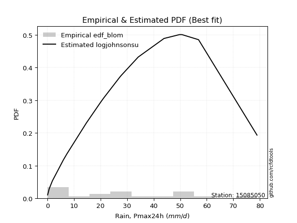</img>

</div>


### 7. EDF Tukey (1962)

In hydrology, the Tukey formula is used as a plotting position formula to estimate the empirical probability or frequency of a flood event (or other hydrological data). The formula parameter is given as _c=0.333_ (or 1/3).

<div align="center">


$P=(m-c)/(n+1-2c)$


</div>


**7.1. Empirical values**

<div align="center">

|                | 0                    | 1                   | 2                   | 3                  | 4                  | 5                   | 6                  | 7                   | 8                  | 9         | 10                 | 11                 | 12                 | 13                 | 14                 | 15                 | 16                 | 17                 | 18                 |
|:---------------|:---------------------|:--------------------|:--------------------|:-------------------|:-------------------|:--------------------|:-------------------|:--------------------|:-------------------|:----------|:-------------------|:-------------------|:-------------------|:-------------------|:-------------------|:-------------------|:-------------------|:-------------------|:-------------------|
| date           | 2022                 | 2023                | 2015                | 2020               | 2021               | 2013                | 2025               | 2014                | 2012               | 2016      | 2010               | 2009               | 2007               | 2018               | 2006               | 2011               | 2005               | 2019               | 2008               |
| x              | 0.1                  | 0.7                 | 1.9                 | 6.0                | 7.4                | 14.7                | 17.0               | 20.1                | 21.2               | 27.2      | 27.6               | 27.8               | 34.2               | 43.9               | 49.7               | 50.3               | 50.7               | 56.9               | 78.9               |
| m              | 1                    | 2                   | 3                   | 4                  | 5                  | 6                   | 7                  | 8                   | 9                  | 10        | 11                 | 12                 | 13                 | 14                 | 15                 | 16                 | 17                 | 18                 | 19                 |
| empirical_dist | edf_tukey            | edf_tukey           | edf_tukey           | edf_tukey          | edf_tukey          | edf_tukey           | edf_tukey          | edf_tukey           | edf_tukey          | edf_tukey | edf_tukey          | edf_tukey          | edf_tukey          | edf_tukey          | edf_tukey          | edf_tukey          | edf_tukey          | edf_tukey          | edf_tukey          |
| empirical      | 0.034482758620689655 | 0.08620689655172414 | 0.13793103448275862 | 0.1896551724137931 | 0.2413793103448276 | 0.29310344827586204 | 0.3448275862068966 | 0.39655172413793105 | 0.4482758620689655 | 0.5       | 0.5517241379310345 | 0.603448275862069  | 0.6551724137931034 | 0.7068965517241379 | 0.7586206896551724 | 0.8103448275862069 | 0.8620689655172413 | 0.9137931034482759 | 0.9655172413793104 |
| empirical_tr   | 1.0357142857142856   | 1.0943396226415094  | 1.1600000000000001  | 1.2340425531914894 | 1.3181818181818183 | 1.4146341463414636  | 1.5263157894736843 | 1.6571428571428573  | 1.8125             | 2.0       | 2.230769230769231  | 2.5217391304347827 | 2.9                | 3.4117647058823524 | 4.142857142857142  | 5.272727272727272  | 7.249999999999997  | 11.600000000000007 | 29.000000000000036 |

</div>


**7.2. Kolmogorov-Smirnov fit test (sorted by Δ)**


<div align="center">

|                | 0                    | 1                   | 2                   | 3                   | 4                   | 5                   | 6                   | 7                   | 8                   | 9                   | 10                  | 11                  | 12                  | 13                  | 14                  | 15                  | 16                  | 17                  | 18                  | 19                  | 20                  | 21                  | 22                  | 23                  | 24                  | 25                  | 26                  | 27                  | 28                  | 29                  | 30                  | 31                  | 32                  | 33                  | 34                  | 35                  | 36                  | 37                  | 38                  | 39                  | 40                  | 41                  | 42                  | 43                  | 44                  | 45                  | 46                  | 47                  | 48                  | 49                  | 50                  | 51                  | 52                  | 53                  | 54                  | 55                  | 56                  | 57                  | 58                  | 59                  | 60                  | 61                  | 62                  | 63                  | 64                  | 65                  | 66                  | 67                  | 68                  | 69                  | 70                  | 71                  | 72                  | 73                  | 74                  | 75                  | 76                  | 77                  | 78                  | 79                  | 80                  | 81                  | 82                  | 83                  | 84                  | 85                  | 86                  | 87                  | 88                  | 89                  | 90                  | 91                  | 92                  | 93                  | 94                  | 95                  | 96                  | 97                  | 98                  | 99                  | 100                 | 101                 | 102                 | 103                 | 104                 | 105                 | 106                 | 107                 | 108                 | 109                 | 110                 | 111                 | 112                 | 113                 | 114                 | 115                 | 116                 | 117                 | 118                 | 119                 | 120                 | 121                 | 122                 | 123                 | 124                 | 125                 | 126                 | 127                 | 128                 | 129                 | 130                 | 131                 | 132                 | 133                 | 134                 | 135                 | 136                 | 137                 | 138                 | 139                 | 140                 | 141                 | 142                 | 143                 | 144                 | 145                 | 146                 | 147                 | 148                 | 149                 | 150                 | 151                 | 152                 | 153                 | 154                 | 155                 | 156                 | 157                 | 158                 | 159                 |
|:---------------|:---------------------|:--------------------|:--------------------|:--------------------|:--------------------|:--------------------|:--------------------|:--------------------|:--------------------|:--------------------|:--------------------|:--------------------|:--------------------|:--------------------|:--------------------|:--------------------|:--------------------|:--------------------|:--------------------|:--------------------|:--------------------|:--------------------|:--------------------|:--------------------|:--------------------|:--------------------|:--------------------|:--------------------|:--------------------|:--------------------|:--------------------|:--------------------|:--------------------|:--------------------|:--------------------|:--------------------|:--------------------|:--------------------|:--------------------|:--------------------|:--------------------|:--------------------|:--------------------|:--------------------|:--------------------|:--------------------|:--------------------|:--------------------|:--------------------|:--------------------|:--------------------|:--------------------|:--------------------|:--------------------|:--------------------|:--------------------|:--------------------|:--------------------|:--------------------|:--------------------|:--------------------|:--------------------|:--------------------|:--------------------|:--------------------|:--------------------|:--------------------|:--------------------|:--------------------|:--------------------|:--------------------|:--------------------|:--------------------|:--------------------|:--------------------|:--------------------|:--------------------|:--------------------|:--------------------|:--------------------|:--------------------|:--------------------|:--------------------|:--------------------|:--------------------|:--------------------|:--------------------|:--------------------|:--------------------|:--------------------|:--------------------|:--------------------|:--------------------|:--------------------|:--------------------|:--------------------|:--------------------|:--------------------|:--------------------|:--------------------|:--------------------|:--------------------|:--------------------|:--------------------|:--------------------|:--------------------|:--------------------|:--------------------|:--------------------|:--------------------|:--------------------|:--------------------|:--------------------|:--------------------|:--------------------|:--------------------|:--------------------|:--------------------|:--------------------|:--------------------|:--------------------|:--------------------|:--------------------|:--------------------|:--------------------|:--------------------|:--------------------|:--------------------|:--------------------|:--------------------|:--------------------|:--------------------|:--------------------|:--------------------|:--------------------|:--------------------|:--------------------|:--------------------|:--------------------|:--------------------|:--------------------|:--------------------|:--------------------|:--------------------|:--------------------|:--------------------|:--------------------|:--------------------|:--------------------|:--------------------|:--------------------|:--------------------|:--------------------|:--------------------|:--------------------|:--------------------|:--------------------|:--------------------|:--------------------|:--------------------|
| station        | 15085050             | 15085050            | 15085050            | 15085050            | 15085050            | 15085050            | 15085050            | 15085050            | 15085050            | 15085050            | 15085050            | 15085050            | 15085050            | 15085050            | 15085050            | 15085050            | 15085050            | 15085050            | 15085050            | 15085050            | 15085050            | 15085050            | 15085050            | 15085050            | 15085050            | 15085050            | 15085050            | 15085050            | 15085050            | 15085050            | 15085050            | 15085050            | 15085050            | 15085050            | 15085050            | 15085050            | 15085050            | 15085050            | 15085050            | 15085050            | 15085050            | 15085050            | 15085050            | 15085050            | 15085050            | 15085050            | 15085050            | 15085050            | 15085050            | 15085050            | 15085050            | 15085050            | 15085050            | 15085050            | 15085050            | 15085050            | 15085050            | 15085050            | 15085050            | 15085050            | 15085050            | 15085050            | 15085050            | 15085050            | 15085050            | 15085050            | 15085050            | 15085050            | 15085050            | 15085050            | 15085050            | 15085050            | 15085050            | 15085050            | 15085050            | 15085050            | 15085050            | 15085050            | 15085050            | 15085050            | 15085050            | 15085050            | 15085050            | 15085050            | 15085050            | 15085050            | 15085050            | 15085050            | 15085050            | 15085050            | 15085050            | 15085050            | 15085050            | 15085050            | 15085050            | 15085050            | 15085050            | 15085050            | 15085050            | 15085050            | 15085050            | 15085050            | 15085050            | 15085050            | 15085050            | 15085050            | 15085050            | 15085050            | 15085050            | 15085050            | 15085050            | 15085050            | 15085050            | 15085050            | 15085050            | 15085050            | 15085050            | 15085050            | 15085050            | 15085050            | 15085050            | 15085050            | 15085050            | 15085050            | 15085050            | 15085050            | 15085050            | 15085050            | 15085050            | 15085050            | 15085050            | 15085050            | 15085050            | 15085050            | 15085050            | 15085050            | 15085050            | 15085050            | 15085050            | 15085050            | 15085050            | 15085050            | 15085050            | 15085050            | 15085050            | 15085050            | 15085050            | 15085050            | 15085050            | 15085050            | 15085050            | 15085050            | 15085050            | 15085050            | 15085050            | 15085050            | 15085050            | 15085050            | 15085050            | 15085050            |
| empirical_dist | edf_tukey            | edf_tukey           | edf_tukey           | edf_tukey           | edf_tukey           | edf_tukey           | edf_tukey           | edf_tukey           | edf_tukey           | edf_tukey           | edf_tukey           | edf_tukey           | edf_tukey           | edf_tukey           | edf_tukey           | edf_tukey           | edf_tukey           | edf_tukey           | edf_tukey           | edf_tukey           | edf_tukey           | edf_tukey           | edf_tukey           | edf_tukey           | edf_tukey           | edf_tukey           | edf_tukey           | edf_tukey           | edf_tukey           | edf_tukey           | edf_tukey           | edf_tukey           | edf_tukey           | edf_tukey           | edf_tukey           | edf_tukey           | edf_tukey           | edf_tukey           | edf_tukey           | edf_tukey           | edf_tukey           | edf_tukey           | edf_tukey           | edf_tukey           | edf_tukey           | edf_tukey           | edf_tukey           | edf_tukey           | edf_tukey           | edf_tukey           | edf_tukey           | edf_tukey           | edf_tukey           | edf_tukey           | edf_tukey           | edf_tukey           | edf_tukey           | edf_tukey           | edf_tukey           | edf_tukey           | edf_tukey           | edf_tukey           | edf_tukey           | edf_tukey           | edf_tukey           | edf_tukey           | edf_tukey           | edf_tukey           | edf_tukey           | edf_tukey           | edf_tukey           | edf_tukey           | edf_tukey           | edf_tukey           | edf_tukey           | edf_tukey           | edf_tukey           | edf_tukey           | edf_tukey           | edf_tukey           | edf_tukey           | edf_tukey           | edf_tukey           | edf_tukey           | edf_tukey           | edf_tukey           | edf_tukey           | edf_tukey           | edf_tukey           | edf_tukey           | edf_tukey           | edf_tukey           | edf_tukey           | edf_tukey           | edf_tukey           | edf_tukey           | edf_tukey           | edf_tukey           | edf_tukey           | edf_tukey           | edf_tukey           | edf_tukey           | edf_tukey           | edf_tukey           | edf_tukey           | edf_tukey           | edf_tukey           | edf_tukey           | edf_tukey           | edf_tukey           | edf_tukey           | edf_tukey           | edf_tukey           | edf_tukey           | edf_tukey           | edf_tukey           | edf_tukey           | edf_tukey           | edf_tukey           | edf_tukey           | edf_tukey           | edf_tukey           | edf_tukey           | edf_tukey           | edf_tukey           | edf_tukey           | edf_tukey           | edf_tukey           | edf_tukey           | edf_tukey           | edf_tukey           | edf_tukey           | edf_tukey           | edf_tukey           | edf_tukey           | edf_tukey           | edf_tukey           | edf_tukey           | edf_tukey           | edf_tukey           | edf_tukey           | edf_tukey           | edf_tukey           | edf_tukey           | edf_tukey           | edf_tukey           | edf_tukey           | edf_tukey           | edf_tukey           | edf_tukey           | edf_tukey           | edf_tukey           | edf_tukey           | edf_tukey           | edf_tukey           | edf_tukey           | edf_tukey           | edf_tukey           | edf_tukey           | edf_tukey           |
| p_dist         | logjohnsonsu         | foldnorm            | logjohnsonsb        | logargus            | rayleigh            | maxwell             | loggenlogistic      | logloggamma         | pearson3            | exponpow            | genexpon            | fatiguelife         | ncf                 | invgauss            | johnsonsu           | invgamma            | kstwobign           | nct                 | alpha               | halfnorm            | invweibull          | genlogistic         | genextreme          | genpareto           | gompertz            | triang              | skewnorm            | nakagami            | gumbel_r            | logmielke           | rice                | genhalflogistic     | loggenextreme       | logpearson3         | loggengamma         | arcsine             | semicircular        | anglit              | t                   | norm                | crystalball         | logistic            | hypsecant           | kappa3              | burr12              | exponnorm           | logburr12           | moyal               | logdgamma           | dweibull            | loggennorm          | logt                | dgamma              | mielke              | laplace             | truncnorm           | burr                | halflogistic        | logweibull_max      | loggumbel_l         | truncweibull_min    | lomax               | gausshyper          | gennorm             | cosine              | f                   | truncexpon          | bradford            | logdweibull         | logfoldnorm         | gumbel_l            | logskewnorm         | beta                | logsemicircular     | lognakagami         | loganglit           | loggausshyper       | logrice             | logexponnorm        | lognorm             | logcrystalball      | lognct              | loglogistic         | loghypsecant        | loggamma            | loggamma            | logfatiguelife      | gengamma            | halfgennorm         | logarcsine          | weibull_min         | loglevy_l           | loglaplace          | loglaplace          | logerlang           | betaprime           | loginvweibull       | kappa4              | loginvgamma         | logalpha            | logtrapezoid        | logburr             | wald                | erlang              | loginvgauss         | logmaxwell          | ksone               | gamma               | wrapcauchy          | loggenhalflogistic  | uniform             | vonmises_line       | lograyleigh         | logtruncweibull_min | logkstwobign        | loggompertz         | loggumbel_r         | loghalfnorm         | logtriang           | logcosine           | johnsonsb           | logmoyal            | loggenexpon         | loghalflogistic     | argus               | powerlaw            | logbeta             | logwrapcauchy       | loglomax            | logwald             | logncf              | logkappa4           | logksone            | logexponweib        | logkappa3           | levy_l              | logtruncnorm        | loghalfgennorm      | loguniform          | trapezoid           | logbradford         | logvonmises_line    | logtruncexpon       | logf                | rdist               | logloglaplace       | exponweib           | tukeylambda         | logbetaprime        | logpowerlaw         | loggenpareto        | logweibull_min      | logexponpow         | logrdist            | logtukeylambda      | truncpareto         | weibull_max         | logtruncpareto      | logvonmises         | vonmises            |
| delta          | 0.057065138830459994 | 0.07404179445980619 | 0.07589312771139628 | 0.07967001844285154 | 0.08000321151535383 | 0.08068693944075689 | 0.08218695458977998 | 0.08272548541003794 | 0.08579229218976225 | 0.08929516696760342 | 0.08957875549997601 | 0.08970217008832071 | 0.0901410295453236  | 0.09017024142137053 | 0.09021242380037375 | 0.09039999239720842 | 0.09154349739510259 | 0.09182150644209253 | 0.09190497562654265 | 0.09237889165351951 | 0.09259474947415247 | 0.0929863976815436  | 0.09323780540443727 | 0.09531191047581117 | 0.09698367584526577 | 0.09731914289952552 | 0.0973272807866516  | 0.09748987388937894 | 0.09959019392406382 | 0.1001966901323017  | 0.10157108281292287 | 0.10324202752314351 | 0.10461834386351954 | 0.1046560589608877  | 0.10564577720084628 | 0.1079273452343843  | 0.10978227064588164 | 0.11025038081070121 | 0.1113851097506457  | 0.11138645691647853 | 0.11138645884222881 | 0.11247066814452605 | 0.11339634718187569 | 0.11390894332772461 | 0.11470067680380636 | 0.11792937371307155 | 0.11799770615905358 | 0.12257830612364162 | 0.12397301151450535 | 0.12423269455522168 | 0.12573235499187774 | 0.1272281137998531  | 0.13005057782389207 | 0.1329921212000491  | 0.1338379507504936  | 0.13563889260768958 | 0.1367987321989872  | 0.13793103448275862 | 0.1395060554152342  | 0.14041712975113757 | 0.1472433160366005  | 0.15204361501166985 | 0.1528520941005066  | 0.1529488324080796  | 0.1545687493231116  | 0.16360316899246646 | 0.1654248808183546  | 0.16876307261952683 | 0.1713650519678631  | 0.17965383235867582 | 0.1819514438371621  | 0.185397533439632   | 0.19169605357709563 | 0.20990783872300683 | 0.21009411158834496 | 0.21013175382056531 | 0.21015065216071366 | 0.2106632304369443  | 0.21067040651218633 | 0.21067125751063837 | 0.2106712586648936  | 0.21083208108670753 | 0.211186955003203   | 0.21162734027202085 | 0.21235417409849872 | 0.21235417409849872 | 0.21374268862776008 | 0.2142111897531075  | 0.2142947180377714  | 0.21516025234258285 | 0.22113034681963845 | 0.2243087300055669  | 0.22571971413179936 | 0.22571971413179936 | 0.22595391599903153 | 0.22902804428930562 | 0.22970129376081122 | 0.23085011455316617 | 0.2309672027538226  | 0.23158719198635475 | 0.232961014435681   | 0.23433719028055594 | 0.24137930468159274 | 0.24284211712550013 | 0.2430820049138009  | 0.2435658458668351  | 0.24362564910438178 | 0.24425868822625335 | 0.24554383440659588 | 0.24590598771684974 | 0.2519254332224751  | 0.25209740153770954 | 0.2544932875408417  | 0.26715042424263685 | 0.2711505671082259  | 0.27171252086095815 | 0.2811484515956089  | 0.2852596879255514  | 0.2939358766932318  | 0.30189159318122044 | 0.30619301670345683 | 0.30696635385538534 | 0.31038869922900864 | 0.3104248540903403  | 0.31084550505015585 | 0.3355147649033013  | 0.348732117933958   | 0.34976884243794    | 0.3742108811129366  | 0.37874455173378224 | 0.4089592256697217  | 0.413607070534773   | 0.41365058701188745 | 0.42626352605740264 | 0.4393295326051912  | 0.4462881242745583  | 0.45079294283210797 | 0.4522854763568325  | 0.45500139406943735 | 0.4744916145403416  | 0.47570591905899434 | 0.5012032524751904  | 0.5025930115682846  | 0.5157401425732315  | 0.5243370984345166  | 0.532772365057866   | 0.5416519621261671  | 0.548438634302756   | 0.5518099826808227  | 0.6131566897314003  | 0.623339087038983   | 0.6365199038465659  | 0.7441356224399862  | 0.7586206847955882  | 0.7650430002920605  | 0.7664118510848403  | 0.7677151361629965  | 0.8482025314760235  | 0.9571440812010688  | 11.971639568277539  |
| deltao         | 0.31564497164100014  | 0.31564497164100014 | 0.31564497164100014 | 0.31564497164100014 | 0.31564497164100014 | 0.31564497164100014 | 0.31564497164100014 | 0.31564497164100014 | 0.31564497164100014 | 0.31564497164100014 | 0.31564497164100014 | 0.31564497164100014 | 0.31564497164100014 | 0.31564497164100014 | 0.31564497164100014 | 0.31564497164100014 | 0.31564497164100014 | 0.31564497164100014 | 0.31564497164100014 | 0.31564497164100014 | 0.31564497164100014 | 0.31564497164100014 | 0.31564497164100014 | 0.31564497164100014 | 0.31564497164100014 | 0.31564497164100014 | 0.31564497164100014 | 0.31564497164100014 | 0.31564497164100014 | 0.31564497164100014 | 0.31564497164100014 | 0.31564497164100014 | 0.31564497164100014 | 0.31564497164100014 | 0.31564497164100014 | 0.31564497164100014 | 0.31564497164100014 | 0.31564497164100014 | 0.31564497164100014 | 0.31564497164100014 | 0.31564497164100014 | 0.31564497164100014 | 0.31564497164100014 | 0.31564497164100014 | 0.31564497164100014 | 0.31564497164100014 | 0.31564497164100014 | 0.31564497164100014 | 0.31564497164100014 | 0.31564497164100014 | 0.31564497164100014 | 0.31564497164100014 | 0.31564497164100014 | 0.31564497164100014 | 0.31564497164100014 | 0.31564497164100014 | 0.31564497164100014 | 0.31564497164100014 | 0.31564497164100014 | 0.31564497164100014 | 0.31564497164100014 | 0.31564497164100014 | 0.31564497164100014 | 0.31564497164100014 | 0.31564497164100014 | 0.31564497164100014 | 0.31564497164100014 | 0.31564497164100014 | 0.31564497164100014 | 0.31564497164100014 | 0.31564497164100014 | 0.31564497164100014 | 0.31564497164100014 | 0.31564497164100014 | 0.31564497164100014 | 0.31564497164100014 | 0.31564497164100014 | 0.31564497164100014 | 0.31564497164100014 | 0.31564497164100014 | 0.31564497164100014 | 0.31564497164100014 | 0.31564497164100014 | 0.31564497164100014 | 0.31564497164100014 | 0.31564497164100014 | 0.31564497164100014 | 0.31564497164100014 | 0.31564497164100014 | 0.31564497164100014 | 0.31564497164100014 | 0.31564497164100014 | 0.31564497164100014 | 0.31564497164100014 | 0.31564497164100014 | 0.31564497164100014 | 0.31564497164100014 | 0.31564497164100014 | 0.31564497164100014 | 0.31564497164100014 | 0.31564497164100014 | 0.31564497164100014 | 0.31564497164100014 | 0.31564497164100014 | 0.31564497164100014 | 0.31564497164100014 | 0.31564497164100014 | 0.31564497164100014 | 0.31564497164100014 | 0.31564497164100014 | 0.31564497164100014 | 0.31564497164100014 | 0.31564497164100014 | 0.31564497164100014 | 0.31564497164100014 | 0.31564497164100014 | 0.31564497164100014 | 0.31564497164100014 | 0.31564497164100014 | 0.31564497164100014 | 0.31564497164100014 | 0.31564497164100014 | 0.31564497164100014 | 0.31564497164100014 | 0.31564497164100014 | 0.31564497164100014 | 0.31564497164100014 | 0.31564497164100014 | 0.31564497164100014 | 0.31564497164100014 | 0.31564497164100014 | 0.31564497164100014 | 0.31564497164100014 | 0.31564497164100014 | 0.31564497164100014 | 0.31564497164100014 | 0.31564497164100014 | 0.31564497164100014 | 0.31564497164100014 | 0.31564497164100014 | 0.31564497164100014 | 0.31564497164100014 | 0.31564497164100014 | 0.31564497164100014 | 0.31564497164100014 | 0.31564497164100014 | 0.31564497164100014 | 0.31564497164100014 | 0.31564497164100014 | 0.31564497164100014 | 0.31564497164100014 | 0.31564497164100014 | 0.31564497164100014 | 0.31564497164100014 | 0.31564497164100014 | 0.31564497164100014 | 0.31564497164100014 | 0.31564497164100014 | 0.31564497164100014 | 0.31564497164100014 |
| eval           | Δo > Δ               | Δo > Δ              | Δo > Δ              | Δo > Δ              | Δo > Δ              | Δo > Δ              | Δo > Δ              | Δo > Δ              | Δo > Δ              | Δo > Δ              | Δo > Δ              | Δo > Δ              | Δo > Δ              | Δo > Δ              | Δo > Δ              | Δo > Δ              | Δo > Δ              | Δo > Δ              | Δo > Δ              | Δo > Δ              | Δo > Δ              | Δo > Δ              | Δo > Δ              | Δo > Δ              | Δo > Δ              | Δo > Δ              | Δo > Δ              | Δo > Δ              | Δo > Δ              | Δo > Δ              | Δo > Δ              | Δo > Δ              | Δo > Δ              | Δo > Δ              | Δo > Δ              | Δo > Δ              | Δo > Δ              | Δo > Δ              | Δo > Δ              | Δo > Δ              | Δo > Δ              | Δo > Δ              | Δo > Δ              | Δo > Δ              | Δo > Δ              | Δo > Δ              | Δo > Δ              | Δo > Δ              | Δo > Δ              | Δo > Δ              | Δo > Δ              | Δo > Δ              | Δo > Δ              | Δo > Δ              | Δo > Δ              | Δo > Δ              | Δo > Δ              | Δo > Δ              | Δo > Δ              | Δo > Δ              | Δo > Δ              | Δo > Δ              | Δo > Δ              | Δo > Δ              | Δo > Δ              | Δo > Δ              | Δo > Δ              | Δo > Δ              | Δo > Δ              | Δo > Δ              | Δo > Δ              | Δo > Δ              | Δo > Δ              | Δo > Δ              | Δo > Δ              | Δo > Δ              | Δo > Δ              | Δo > Δ              | Δo > Δ              | Δo > Δ              | Δo > Δ              | Δo > Δ              | Δo > Δ              | Δo > Δ              | Δo > Δ              | Δo > Δ              | Δo > Δ              | Δo > Δ              | Δo > Δ              | Δo > Δ              | Δo > Δ              | Δo > Δ              | Δo > Δ              | Δo > Δ              | Δo > Δ              | Δo > Δ              | Δo > Δ              | Δo > Δ              | Δo > Δ              | Δo > Δ              | Δo > Δ              | Δo > Δ              | Δo > Δ              | Δo > Δ              | Δo > Δ              | Δo > Δ              | Δo > Δ              | Δo > Δ              | Δo > Δ              | Δo > Δ              | Δo > Δ              | Δo > Δ              | Δo > Δ              | Δo > Δ              | Δo > Δ              | Δo > Δ              | Δo > Δ              | Δo > Δ              | Δo > Δ              | Δo > Δ              | Δo > Δ              | Δo > Δ              | Δo > Δ              | Δo > Δ              | Δo > Δ              | Δo <= Δ             | Δo <= Δ             | Δo <= Δ             | Δo <= Δ             | Δo <= Δ             | Δo <= Δ             | Δo <= Δ             | Δo <= Δ             | Δo <= Δ             | Δo <= Δ             | Δo <= Δ             | Δo <= Δ             | Δo <= Δ             | Δo <= Δ             | Δo <= Δ             | Δo <= Δ             | Δo <= Δ             | Δo <= Δ             | Δo <= Δ             | Δo <= Δ             | Δo <= Δ             | Δo <= Δ             | Δo <= Δ             | Δo <= Δ             | Δo <= Δ             | Δo <= Δ             | Δo <= Δ             | Δo <= Δ             | Δo <= Δ             | Δo <= Δ             | Δo <= Δ             | Δo <= Δ             | Δo <= Δ             | Δo <= Δ             | Δo <= Δ             |
| fit            | 1                    | 1                   | 1                   | 1                   | 1                   | 1                   | 1                   | 1                   | 1                   | 1                   | 1                   | 1                   | 1                   | 1                   | 1                   | 1                   | 1                   | 1                   | 1                   | 1                   | 1                   | 1                   | 1                   | 1                   | 1                   | 1                   | 1                   | 1                   | 1                   | 1                   | 1                   | 1                   | 1                   | 1                   | 1                   | 1                   | 1                   | 1                   | 1                   | 1                   | 1                   | 1                   | 1                   | 1                   | 1                   | 1                   | 1                   | 1                   | 1                   | 1                   | 1                   | 1                   | 1                   | 1                   | 1                   | 1                   | 1                   | 1                   | 1                   | 1                   | 1                   | 1                   | 1                   | 1                   | 1                   | 1                   | 1                   | 1                   | 1                   | 1                   | 1                   | 1                   | 1                   | 1                   | 1                   | 1                   | 1                   | 1                   | 1                   | 1                   | 1                   | 1                   | 1                   | 1                   | 1                   | 1                   | 1                   | 1                   | 1                   | 1                   | 1                   | 1                   | 1                   | 1                   | 1                   | 1                   | 1                   | 1                   | 1                   | 1                   | 1                   | 1                   | 1                   | 1                   | 1                   | 1                   | 1                   | 1                   | 1                   | 1                   | 1                   | 1                   | 1                   | 1                   | 1                   | 1                   | 1                   | 1                   | 1                   | 1                   | 1                   | 1                   | 1                   | 1                   | 1                   | 0                   | 0                   | 0                   | 0                   | 0                   | 0                   | 0                   | 0                   | 0                   | 0                   | 0                   | 0                   | 0                   | 0                   | 0                   | 0                   | 0                   | 0                   | 0                   | 0                   | 0                   | 0                   | 0                   | 0                   | 0                   | 0                   | 0                   | 0                   | 0                   | 0                   | 0                   | 0                   | 0                   | 0                   | 0                   |
| n              | 19                   | 19                  | 19                  | 19                  | 19                  | 19                  | 19                  | 19                  | 19                  | 19                  | 19                  | 19                  | 19                  | 19                  | 19                  | 19                  | 19                  | 19                  | 19                  | 19                  | 19                  | 19                  | 19                  | 19                  | 19                  | 19                  | 19                  | 19                  | 19                  | 19                  | 19                  | 19                  | 19                  | 19                  | 19                  | 19                  | 19                  | 19                  | 19                  | 19                  | 19                  | 19                  | 19                  | 19                  | 19                  | 19                  | 19                  | 19                  | 19                  | 19                  | 19                  | 19                  | 19                  | 19                  | 19                  | 19                  | 19                  | 19                  | 19                  | 19                  | 19                  | 19                  | 19                  | 19                  | 19                  | 19                  | 19                  | 19                  | 19                  | 19                  | 19                  | 19                  | 19                  | 19                  | 19                  | 19                  | 19                  | 19                  | 19                  | 19                  | 19                  | 19                  | 19                  | 19                  | 19                  | 19                  | 19                  | 19                  | 19                  | 19                  | 19                  | 19                  | 19                  | 19                  | 19                  | 19                  | 19                  | 19                  | 19                  | 19                  | 19                  | 19                  | 19                  | 19                  | 19                  | 19                  | 19                  | 19                  | 19                  | 19                  | 19                  | 19                  | 19                  | 19                  | 19                  | 19                  | 19                  | 19                  | 19                  | 19                  | 19                  | 19                  | 19                  | 19                  | 19                  | 19                  | 19                  | 19                  | 19                  | 19                  | 19                  | 19                  | 19                  | 19                  | 19                  | 19                  | 19                  | 19                  | 19                  | 19                  | 19                  | 19                  | 19                  | 19                  | 19                  | 19                  | 19                  | 19                  | 19                  | 19                  | 19                  | 19                  | 19                  | 19                  | 19                  | 19                  | 19                  | 19                  | 19                  | 19                  |
| best_fit       | 1                    | 0                   | 0                   | 0                   | 0                   | 0                   | 0                   | 0                   | 0                   | 0                   | 0                   | 0                   | 0                   | 0                   | 0                   | 0                   | 0                   | 0                   | 0                   | 0                   | 0                   | 0                   | 0                   | 0                   | 0                   | 0                   | 0                   | 0                   | 0                   | 0                   | 0                   | 0                   | 0                   | 0                   | 0                   | 0                   | 0                   | 0                   | 0                   | 0                   | 0                   | 0                   | 0                   | 0                   | 0                   | 0                   | 0                   | 0                   | 0                   | 0                   | 0                   | 0                   | 0                   | 0                   | 0                   | 0                   | 0                   | 0                   | 0                   | 0                   | 0                   | 0                   | 0                   | 0                   | 0                   | 0                   | 0                   | 0                   | 0                   | 0                   | 0                   | 0                   | 0                   | 0                   | 0                   | 0                   | 0                   | 0                   | 0                   | 0                   | 0                   | 0                   | 0                   | 0                   | 0                   | 0                   | 0                   | 0                   | 0                   | 0                   | 0                   | 0                   | 0                   | 0                   | 0                   | 0                   | 0                   | 0                   | 0                   | 0                   | 0                   | 0                   | 0                   | 0                   | 0                   | 0                   | 0                   | 0                   | 0                   | 0                   | 0                   | 0                   | 0                   | 0                   | 0                   | 0                   | 0                   | 0                   | 0                   | 0                   | 0                   | 0                   | 0                   | 0                   | 0                   | 0                   | 0                   | 0                   | 0                   | 0                   | 0                   | 0                   | 0                   | 0                   | 0                   | 0                   | 0                   | 0                   | 0                   | 0                   | 0                   | 0                   | 0                   | 0                   | 0                   | 0                   | 0                   | 0                   | 0                   | 0                   | 0                   | 0                   | 0                   | 0                   | 0                   | 0                   | 0                   | 0                   | 0                   | 0                   |
| best_fit_sort  | 1                    | 2                   | 3                   | 4                   | 5                   | 6                   | 7                   | 8                   | 9                   | 10                  | 11                  | 12                  | 13                  | 14                  | 15                  | 16                  | 17                  | 18                  | 19                  | 20                  | 21                  | 22                  | 23                  | 24                  | 25                  | 26                  | 27                  | 28                  | 29                  | 30                  | 31                  | 32                  | 33                  | 34                  | 35                  | 36                  | 37                  | 38                  | 39                  | 40                  | 41                  | 42                  | 43                  | 44                  | 45                  | 46                  | 47                  | 48                  | 49                  | 50                  | 51                  | 52                  | 53                  | 54                  | 55                  | 56                  | 57                  | 58                  | 59                  | 60                  | 61                  | 62                  | 63                  | 64                  | 65                  | 66                  | 67                  | 68                  | 69                  | 70                  | 71                  | 72                  | 73                  | 74                  | 75                  | 76                  | 77                  | 78                  | 79                  | 80                  | 81                  | 82                  | 83                  | 84                  | 85                  | 86                  | 87                  | 88                  | 89                  | 90                  | 91                  | 92                  | 93                  | 94                  | 95                  | 96                  | 97                  | 98                  | 99                  | 100                 | 101                 | 102                 | 103                 | 104                 | 105                 | 106                 | 107                 | 108                 | 109                 | 110                 | 111                 | 112                 | 113                 | 114                 | 115                 | 116                 | 117                 | 118                 | 119                 | 120                 | 121                 | 122                 | 123                 | 124                 | 125                 | 126                 | 127                 | 128                 | 129                 | 130                 | 131                 | 132                 | 133                 | 134                 | 135                 | 136                 | 137                 | 138                 | 139                 | 140                 | 141                 | 142                 | 143                 | 144                 | 145                 | 146                 | 147                 | 148                 | 149                 | 150                 | 151                 | 152                 | 153                 | 154                 | 155                 | 156                 | 157                 | 158                 | 159                 | 160                 |

</div>


**7.3. Best fit**

<div align="center">

|   id |   station | empirical_dist   | p_dist       |     delta |   deltao | eval   |   fit |   n |   best_fit |   best_fit_sort |
|-----:|----------:|:-----------------|:-------------|----------:|---------:|:-------|------:|----:|-----------:|----------------:|
|    0 |  15085050 | edf_tukey        | logjohnsonsu | 0.0570651 | 0.315645 | Δo > Δ |     1 |  19 |          1 |               1 |

</div>


<div align="center">

</img></img>

</div>


### 8. EDF Gringorten (1963)

Gringorten plotting position formula is essential for estimating the probability and return periods of extreme events like floods and heavy rainfall. The constant _a=0.44_.

<div align="center">


$P=(m-a)/(n+1-2a)$


</div>


**8.1. Empirical values**

<div align="center">

|                | 0                    | 1                   | 2                   | 3                   | 4                   | 5                   | 6                  | 7                  | 8                  | 9              | 10                 | 11                | 12                 | 13                 | 14                 | 15                 | 16                 | 17                 | 18                 |
|:---------------|:---------------------|:--------------------|:--------------------|:--------------------|:--------------------|:--------------------|:-------------------|:-------------------|:-------------------|:---------------|:-------------------|:------------------|:-------------------|:-------------------|:-------------------|:-------------------|:-------------------|:-------------------|:-------------------|
| date           | 2022                 | 2023                | 2015                | 2020                | 2021                | 2013                | 2025               | 2014               | 2012               | 2016           | 2010               | 2009              | 2007               | 2018               | 2006               | 2011               | 2005               | 2019               | 2008               |
| x              | 0.1                  | 0.7                 | 1.9                 | 6.0                 | 7.4                 | 14.7                | 17.0               | 20.1               | 21.2               | 27.2           | 27.6               | 27.8              | 34.2               | 43.9               | 49.7               | 50.3               | 50.7               | 56.9               | 78.9               |
| m              | 1                    | 2                   | 3                   | 4                   | 5                   | 6                   | 7                  | 8                  | 9                  | 10             | 11                 | 12                | 13                 | 14                 | 15                 | 16                 | 17                 | 18                 | 19                 |
| empirical_dist | edf_gringorten       | edf_gringorten      | edf_gringorten      | edf_gringorten      | edf_gringorten      | edf_gringorten      | edf_gringorten     | edf_gringorten     | edf_gringorten     | edf_gringorten | edf_gringorten     | edf_gringorten    | edf_gringorten     | edf_gringorten     | edf_gringorten     | edf_gringorten     | edf_gringorten     | edf_gringorten     | edf_gringorten     |
| empirical      | 0.029288702928870293 | 0.08158995815899582 | 0.13389121338912133 | 0.18619246861924685 | 0.23849372384937234 | 0.29079497907949786 | 0.3430962343096234 | 0.3953974895397489 | 0.4476987447698745 | 0.5            | 0.5523012552301255 | 0.604602510460251 | 0.6569037656903766 | 0.7092050209205021 | 0.7615062761506276 | 0.8138075313807531 | 0.8661087866108785 | 0.918410041841004  | 0.9707112970711296 |
| empirical_tr   | 1.0301724137931034   | 1.0888382687927107  | 1.1545893719806763  | 1.2287917737789202  | 1.313186813186813   | 1.4100294985250739  | 1.522292993630573  | 1.6539792387543253 | 1.8106060606060606 | 2.0            | 2.2336448598130842 | 2.529100529100529 | 2.9146341463414633 | 3.4388489208633093 | 4.192982456140351  | 5.370786516853932  | 7.468749999999993  | 12.256410256410238 | 34.14285714285699  |

</div>


**8.2. Kolmogorov-Smirnov fit test (sorted by Δ)**


<div align="center">

|                | 0                    | 1                   | 2                   | 3                   | 4                   | 5                   | 6                   | 7                   | 8                   | 9                   | 10                  | 11                  | 12                  | 13                  | 14                  | 15                  | 16                  | 17                  | 18                  | 19                  | 20                  | 21                  | 22                  | 23                  | 24                  | 25                  | 26                  | 27                  | 28                  | 29                  | 30                  | 31                  | 32                  | 33                  | 34                  | 35                  | 36                  | 37                  | 38                  | 39                  | 40                  | 41                  | 42                  | 43                  | 44                  | 45                  | 46                  | 47                  | 48                  | 49                  | 50                  | 51                  | 52                  | 53                  | 54                  | 55                  | 56                  | 57                  | 58                  | 59                  | 60                  | 61                  | 62                  | 63                  | 64                  | 65                  | 66                  | 67                  | 68                  | 69                  | 70                  | 71                  | 72                  | 73                  | 74                  | 75                  | 76                  | 77                  | 78                  | 79                  | 80                  | 81                  | 82                  | 83                  | 84                  | 85                  | 86                  | 87                  | 88                  | 89                  | 90                  | 91                  | 92                  | 93                  | 94                  | 95                  | 96                  | 97                  | 98                  | 99                  | 100                 | 101                 | 102                 | 103                 | 104                 | 105                 | 106                 | 107                 | 108                 | 109                 | 110                 | 111                 | 112                 | 113                 | 114                 | 115                 | 116                 | 117                 | 118                 | 119                 | 120                 | 121                 | 122                 | 123                 | 124                 | 125                 | 126                 | 127                 | 128                 | 129                 | 130                 | 131                 | 132                 | 133                 | 134                 | 135                 | 136                 | 137                 | 138                 | 139                 | 140                 | 141                 | 142                 | 143                 | 144                 | 145                 | 146                 | 147                 | 148                 | 149                 | 150                 | 151                 | 152                 | 153                 | 154                 | 155                 | 156                 | 157                 | 158                 | 159                 |
|:---------------|:---------------------|:--------------------|:--------------------|:--------------------|:--------------------|:--------------------|:--------------------|:--------------------|:--------------------|:--------------------|:--------------------|:--------------------|:--------------------|:--------------------|:--------------------|:--------------------|:--------------------|:--------------------|:--------------------|:--------------------|:--------------------|:--------------------|:--------------------|:--------------------|:--------------------|:--------------------|:--------------------|:--------------------|:--------------------|:--------------------|:--------------------|:--------------------|:--------------------|:--------------------|:--------------------|:--------------------|:--------------------|:--------------------|:--------------------|:--------------------|:--------------------|:--------------------|:--------------------|:--------------------|:--------------------|:--------------------|:--------------------|:--------------------|:--------------------|:--------------------|:--------------------|:--------------------|:--------------------|:--------------------|:--------------------|:--------------------|:--------------------|:--------------------|:--------------------|:--------------------|:--------------------|:--------------------|:--------------------|:--------------------|:--------------------|:--------------------|:--------------------|:--------------------|:--------------------|:--------------------|:--------------------|:--------------------|:--------------------|:--------------------|:--------------------|:--------------------|:--------------------|:--------------------|:--------------------|:--------------------|:--------------------|:--------------------|:--------------------|:--------------------|:--------------------|:--------------------|:--------------------|:--------------------|:--------------------|:--------------------|:--------------------|:--------------------|:--------------------|:--------------------|:--------------------|:--------------------|:--------------------|:--------------------|:--------------------|:--------------------|:--------------------|:--------------------|:--------------------|:--------------------|:--------------------|:--------------------|:--------------------|:--------------------|:--------------------|:--------------------|:--------------------|:--------------------|:--------------------|:--------------------|:--------------------|:--------------------|:--------------------|:--------------------|:--------------------|:--------------------|:--------------------|:--------------------|:--------------------|:--------------------|:--------------------|:--------------------|:--------------------|:--------------------|:--------------------|:--------------------|:--------------------|:--------------------|:--------------------|:--------------------|:--------------------|:--------------------|:--------------------|:--------------------|:--------------------|:--------------------|:--------------------|:--------------------|:--------------------|:--------------------|:--------------------|:--------------------|:--------------------|:--------------------|:--------------------|:--------------------|:--------------------|:--------------------|:--------------------|:--------------------|:--------------------|:--------------------|:--------------------|:--------------------|:--------------------|:--------------------|
| station        | 15085050             | 15085050            | 15085050            | 15085050            | 15085050            | 15085050            | 15085050            | 15085050            | 15085050            | 15085050            | 15085050            | 15085050            | 15085050            | 15085050            | 15085050            | 15085050            | 15085050            | 15085050            | 15085050            | 15085050            | 15085050            | 15085050            | 15085050            | 15085050            | 15085050            | 15085050            | 15085050            | 15085050            | 15085050            | 15085050            | 15085050            | 15085050            | 15085050            | 15085050            | 15085050            | 15085050            | 15085050            | 15085050            | 15085050            | 15085050            | 15085050            | 15085050            | 15085050            | 15085050            | 15085050            | 15085050            | 15085050            | 15085050            | 15085050            | 15085050            | 15085050            | 15085050            | 15085050            | 15085050            | 15085050            | 15085050            | 15085050            | 15085050            | 15085050            | 15085050            | 15085050            | 15085050            | 15085050            | 15085050            | 15085050            | 15085050            | 15085050            | 15085050            | 15085050            | 15085050            | 15085050            | 15085050            | 15085050            | 15085050            | 15085050            | 15085050            | 15085050            | 15085050            | 15085050            | 15085050            | 15085050            | 15085050            | 15085050            | 15085050            | 15085050            | 15085050            | 15085050            | 15085050            | 15085050            | 15085050            | 15085050            | 15085050            | 15085050            | 15085050            | 15085050            | 15085050            | 15085050            | 15085050            | 15085050            | 15085050            | 15085050            | 15085050            | 15085050            | 15085050            | 15085050            | 15085050            | 15085050            | 15085050            | 15085050            | 15085050            | 15085050            | 15085050            | 15085050            | 15085050            | 15085050            | 15085050            | 15085050            | 15085050            | 15085050            | 15085050            | 15085050            | 15085050            | 15085050            | 15085050            | 15085050            | 15085050            | 15085050            | 15085050            | 15085050            | 15085050            | 15085050            | 15085050            | 15085050            | 15085050            | 15085050            | 15085050            | 15085050            | 15085050            | 15085050            | 15085050            | 15085050            | 15085050            | 15085050            | 15085050            | 15085050            | 15085050            | 15085050            | 15085050            | 15085050            | 15085050            | 15085050            | 15085050            | 15085050            | 15085050            | 15085050            | 15085050            | 15085050            | 15085050            | 15085050            | 15085050            |
| empirical_dist | edf_gringorten       | edf_gringorten      | edf_gringorten      | edf_gringorten      | edf_gringorten      | edf_gringorten      | edf_gringorten      | edf_gringorten      | edf_gringorten      | edf_gringorten      | edf_gringorten      | edf_gringorten      | edf_gringorten      | edf_gringorten      | edf_gringorten      | edf_gringorten      | edf_gringorten      | edf_gringorten      | edf_gringorten      | edf_gringorten      | edf_gringorten      | edf_gringorten      | edf_gringorten      | edf_gringorten      | edf_gringorten      | edf_gringorten      | edf_gringorten      | edf_gringorten      | edf_gringorten      | edf_gringorten      | edf_gringorten      | edf_gringorten      | edf_gringorten      | edf_gringorten      | edf_gringorten      | edf_gringorten      | edf_gringorten      | edf_gringorten      | edf_gringorten      | edf_gringorten      | edf_gringorten      | edf_gringorten      | edf_gringorten      | edf_gringorten      | edf_gringorten      | edf_gringorten      | edf_gringorten      | edf_gringorten      | edf_gringorten      | edf_gringorten      | edf_gringorten      | edf_gringorten      | edf_gringorten      | edf_gringorten      | edf_gringorten      | edf_gringorten      | edf_gringorten      | edf_gringorten      | edf_gringorten      | edf_gringorten      | edf_gringorten      | edf_gringorten      | edf_gringorten      | edf_gringorten      | edf_gringorten      | edf_gringorten      | edf_gringorten      | edf_gringorten      | edf_gringorten      | edf_gringorten      | edf_gringorten      | edf_gringorten      | edf_gringorten      | edf_gringorten      | edf_gringorten      | edf_gringorten      | edf_gringorten      | edf_gringorten      | edf_gringorten      | edf_gringorten      | edf_gringorten      | edf_gringorten      | edf_gringorten      | edf_gringorten      | edf_gringorten      | edf_gringorten      | edf_gringorten      | edf_gringorten      | edf_gringorten      | edf_gringorten      | edf_gringorten      | edf_gringorten      | edf_gringorten      | edf_gringorten      | edf_gringorten      | edf_gringorten      | edf_gringorten      | edf_gringorten      | edf_gringorten      | edf_gringorten      | edf_gringorten      | edf_gringorten      | edf_gringorten      | edf_gringorten      | edf_gringorten      | edf_gringorten      | edf_gringorten      | edf_gringorten      | edf_gringorten      | edf_gringorten      | edf_gringorten      | edf_gringorten      | edf_gringorten      | edf_gringorten      | edf_gringorten      | edf_gringorten      | edf_gringorten      | edf_gringorten      | edf_gringorten      | edf_gringorten      | edf_gringorten      | edf_gringorten      | edf_gringorten      | edf_gringorten      | edf_gringorten      | edf_gringorten      | edf_gringorten      | edf_gringorten      | edf_gringorten      | edf_gringorten      | edf_gringorten      | edf_gringorten      | edf_gringorten      | edf_gringorten      | edf_gringorten      | edf_gringorten      | edf_gringorten      | edf_gringorten      | edf_gringorten      | edf_gringorten      | edf_gringorten      | edf_gringorten      | edf_gringorten      | edf_gringorten      | edf_gringorten      | edf_gringorten      | edf_gringorten      | edf_gringorten      | edf_gringorten      | edf_gringorten      | edf_gringorten      | edf_gringorten      | edf_gringorten      | edf_gringorten      | edf_gringorten      | edf_gringorten      | edf_gringorten      | edf_gringorten      | edf_gringorten      | edf_gringorten      |
| p_dist         | logjohnsonsu         | foldnorm            | rayleigh            | logjohnsonsb        | maxwell             | logargus            | pearson3            | loggenlogistic      | logloggamma         | genexpon            | ncf                 | exponpow            | invgauss            | johnsonsu           | fatiguelife         | invgamma            | halfnorm            | kstwobign           | alpha               | nct                 | invweibull          | genlogistic         | genextreme          | genpareto           | gompertz            | triang              | skewnorm            | nakagami            | gumbel_r            | rice                | genhalflogistic     | logmielke           | loggengamma         | loggenextreme       | arcsine             | logpearson3         | semicircular        | anglit              | t                   | norm                | crystalball         | logistic            | hypsecant           | burr12              | kappa3              | exponnorm           | logburr12           | moyal               | dweibull            | logdgamma           | loggennorm          | dgamma              | logt                | truncnorm           | laplace             | halflogistic        | burr                | mielke              | loggumbel_l         | logweibull_max      | truncweibull_min    | lomax               | gennorm             | gausshyper          | cosine              | f                   | truncexpon          | bradford            | logdweibull         | logfoldnorm         | gumbel_l            | logskewnorm         | beta                | logsemicircular     | lognakagami         | loganglit           | loggausshyper       | logrice             | logexponnorm        | lognorm             | logcrystalball      | lognct              | loglogistic         | loghypsecant        | gengamma            | loggamma            | loggamma            | logfatiguelife      | halfgennorm         | logarcsine          | weibull_min         | loglaplace          | loglaplace          | logerlang           | loglevy_l           | betaprime           | kappa4              | loginvweibull       | loginvgamma         | logalpha            | logtrapezoid        | logburr             | wald                | erlang              | loginvgauss         | logmaxwell          | gamma               | wrapcauchy          | ksone               | loggenhalflogistic  | uniform             | vonmises_line       | lograyleigh         | logtruncweibull_min | logkstwobign        | loggompertz         | loggumbel_r         | loghalfnorm         | logtriang           | logcosine           | logmoyal            | johnsonsb           | argus               | loggenexpon         | loghalflogistic     | powerlaw            | logwrapcauchy       | logbeta             | loglomax            | logwald             | logncf              | logkappa4           | logksone            | logexponweib        | logkappa3           | levy_l              | logtruncnorm        | loghalfgennorm      | loguniform          | logbradford         | trapezoid           | logvonmises_line    | logtruncexpon       | logf                | rdist               | logloglaplace       | exponweib           | tukeylambda         | logbetaprime        | logpowerlaw         | loggenpareto        | logweibull_min      | logexponpow         | logrdist            | logtukeylambda      | truncpareto         | weibull_max         | logtruncpareto      | logvonmises         | vonmises            |
| delta          | 0.059373608026824176 | 0.07519602905798828 | 0.0771176250198986  | 0.07820159690776046 | 0.07919121590204858 | 0.08197848763921572 | 0.08290670569430703 | 0.08449542378614416 | 0.08503395460640212 | 0.08669316900452076 | 0.08725544304986835 | 0.0877405711320478  | 0.08786177222500635 | 0.08790395460400957 | 0.08794895142945303 | 0.08809152320084424 | 0.08833907055988222 | 0.08865791089964736 | 0.08901938913108742 | 0.08951303724572834 | 0.08970916297869724 | 0.09010081118608837 | 0.09035221890898204 | 0.09127208938217388 | 0.09294385475162847 | 0.09327932180588823 | 0.0932874596930143  | 0.09345005279574164 | 0.09670460742860856 | 0.09868549631746762 | 0.09920220642950622 | 0.10423651122593891 | 0.10795424639721046 | 0.10865816495715674 | 0.10908157983256639 | 0.10927299735361584 | 0.11093650524406373 | 0.1114046154088833  | 0.11253934434882779 | 0.11254069151466062 | 0.1125406934404109  | 0.11362490274270814 | 0.11455058178005778 | 0.11470067680380636 | 0.1150631779259067  | 0.11792937371307155 | 0.11799770615905358 | 0.11969271962818637 | 0.12134710805976645 | 0.1233958942154143  | 0.1251552376927867  | 0.12716499132843684 | 0.13088393670892906 | 0.13275330611223432 | 0.13326083345140255 | 0.13389121338912133 | 0.13391314570353197 | 0.1353005903964133  | 0.14272559894750175 | 0.1435458765088714  | 0.1483975506347826  | 0.15204361501166985 | 0.1541030670062617  | 0.15516056329687078 | 0.1557229839212937  | 0.16591163818883065 | 0.1665791154165367  | 0.16991730721770892 | 0.17598199036059126 | 0.18196230155504    | 0.1831056784353442  | 0.18770600263599618 | 0.1940045227734598  | 0.21221630791937102 | 0.21240258078470914 | 0.2124402230169295  | 0.21245912135707784 | 0.21297169963330848 | 0.2129788757085505  | 0.21297972670700255 | 0.2129797278612578  | 0.21314055028307172 | 0.21349542419956719 | 0.21393580946838503 | 0.2142111897531075  | 0.2146626432948629  | 0.2146626432948629  | 0.21605115782412426 | 0.21660318723413557 | 0.219777190735311   | 0.22343881601600263 | 0.2268739487299815  | 0.2268739487299815  | 0.2282623851953957  | 0.22950278569738627 | 0.2313365134856698  | 0.23200434915134827 | 0.2320097629571754  | 0.23327567195018678 | 0.23389566118271893 | 0.2352694836320452  | 0.23664565947692012 | 0.2384937181861375  | 0.24515058632186432 | 0.24539047411016507 | 0.2458743150631993  | 0.24656715742261753 | 0.24669806900477798 | 0.247665470198019   | 0.24821445691321392 | 0.2530796678206572  | 0.25325163613589163 | 0.2568017567372059  | 0.26945889343900103 | 0.27345903630459006 | 0.27402099005732233 | 0.2834569207919731  | 0.2875681571219156  | 0.296244345889596   | 0.3042000623775846  | 0.3092748230517495  | 0.30997831960486266 | 0.31199973964833794 | 0.3126971684253728  | 0.3127333232867045  | 0.33782323409966547 | 0.3532315462324862  | 0.3533490563266861  | 0.3776735849074828  | 0.3810530209301464  | 0.4124219294642679  | 0.4159155397311372  | 0.41595905620825163 | 0.4303033471510399  | 0.4416380018015554  | 0.45148217996637763 | 0.45310141202847215 | 0.4545939455531967  | 0.45730986326580153 | 0.4780143882553585  | 0.4785314356339788  | 0.5035117216715546  | 0.5049014807646488  | 0.5197799636668688  | 0.5295311541263359  | 0.5362350688524121  | 0.5451146659207133  | 0.5536326899945753  | 0.555272686475369   | 0.6166193935259464  | 0.6268017908335292  | 0.639982607641112   | 0.7487525608327145  | 0.7615062712910434  | 0.7685057040866068  | 0.7710287894775686  | 0.7723320745557246  | 0.8528194698687519  | 0.9571440812010688  | 11.966445512585718  |
| deltao         | 0.31564497164100014  | 0.31564497164100014 | 0.31564497164100014 | 0.31564497164100014 | 0.31564497164100014 | 0.31564497164100014 | 0.31564497164100014 | 0.31564497164100014 | 0.31564497164100014 | 0.31564497164100014 | 0.31564497164100014 | 0.31564497164100014 | 0.31564497164100014 | 0.31564497164100014 | 0.31564497164100014 | 0.31564497164100014 | 0.31564497164100014 | 0.31564497164100014 | 0.31564497164100014 | 0.31564497164100014 | 0.31564497164100014 | 0.31564497164100014 | 0.31564497164100014 | 0.31564497164100014 | 0.31564497164100014 | 0.31564497164100014 | 0.31564497164100014 | 0.31564497164100014 | 0.31564497164100014 | 0.31564497164100014 | 0.31564497164100014 | 0.31564497164100014 | 0.31564497164100014 | 0.31564497164100014 | 0.31564497164100014 | 0.31564497164100014 | 0.31564497164100014 | 0.31564497164100014 | 0.31564497164100014 | 0.31564497164100014 | 0.31564497164100014 | 0.31564497164100014 | 0.31564497164100014 | 0.31564497164100014 | 0.31564497164100014 | 0.31564497164100014 | 0.31564497164100014 | 0.31564497164100014 | 0.31564497164100014 | 0.31564497164100014 | 0.31564497164100014 | 0.31564497164100014 | 0.31564497164100014 | 0.31564497164100014 | 0.31564497164100014 | 0.31564497164100014 | 0.31564497164100014 | 0.31564497164100014 | 0.31564497164100014 | 0.31564497164100014 | 0.31564497164100014 | 0.31564497164100014 | 0.31564497164100014 | 0.31564497164100014 | 0.31564497164100014 | 0.31564497164100014 | 0.31564497164100014 | 0.31564497164100014 | 0.31564497164100014 | 0.31564497164100014 | 0.31564497164100014 | 0.31564497164100014 | 0.31564497164100014 | 0.31564497164100014 | 0.31564497164100014 | 0.31564497164100014 | 0.31564497164100014 | 0.31564497164100014 | 0.31564497164100014 | 0.31564497164100014 | 0.31564497164100014 | 0.31564497164100014 | 0.31564497164100014 | 0.31564497164100014 | 0.31564497164100014 | 0.31564497164100014 | 0.31564497164100014 | 0.31564497164100014 | 0.31564497164100014 | 0.31564497164100014 | 0.31564497164100014 | 0.31564497164100014 | 0.31564497164100014 | 0.31564497164100014 | 0.31564497164100014 | 0.31564497164100014 | 0.31564497164100014 | 0.31564497164100014 | 0.31564497164100014 | 0.31564497164100014 | 0.31564497164100014 | 0.31564497164100014 | 0.31564497164100014 | 0.31564497164100014 | 0.31564497164100014 | 0.31564497164100014 | 0.31564497164100014 | 0.31564497164100014 | 0.31564497164100014 | 0.31564497164100014 | 0.31564497164100014 | 0.31564497164100014 | 0.31564497164100014 | 0.31564497164100014 | 0.31564497164100014 | 0.31564497164100014 | 0.31564497164100014 | 0.31564497164100014 | 0.31564497164100014 | 0.31564497164100014 | 0.31564497164100014 | 0.31564497164100014 | 0.31564497164100014 | 0.31564497164100014 | 0.31564497164100014 | 0.31564497164100014 | 0.31564497164100014 | 0.31564497164100014 | 0.31564497164100014 | 0.31564497164100014 | 0.31564497164100014 | 0.31564497164100014 | 0.31564497164100014 | 0.31564497164100014 | 0.31564497164100014 | 0.31564497164100014 | 0.31564497164100014 | 0.31564497164100014 | 0.31564497164100014 | 0.31564497164100014 | 0.31564497164100014 | 0.31564497164100014 | 0.31564497164100014 | 0.31564497164100014 | 0.31564497164100014 | 0.31564497164100014 | 0.31564497164100014 | 0.31564497164100014 | 0.31564497164100014 | 0.31564497164100014 | 0.31564497164100014 | 0.31564497164100014 | 0.31564497164100014 | 0.31564497164100014 | 0.31564497164100014 | 0.31564497164100014 | 0.31564497164100014 | 0.31564497164100014 | 0.31564497164100014 | 0.31564497164100014 |
| eval           | Δo > Δ               | Δo > Δ              | Δo > Δ              | Δo > Δ              | Δo > Δ              | Δo > Δ              | Δo > Δ              | Δo > Δ              | Δo > Δ              | Δo > Δ              | Δo > Δ              | Δo > Δ              | Δo > Δ              | Δo > Δ              | Δo > Δ              | Δo > Δ              | Δo > Δ              | Δo > Δ              | Δo > Δ              | Δo > Δ              | Δo > Δ              | Δo > Δ              | Δo > Δ              | Δo > Δ              | Δo > Δ              | Δo > Δ              | Δo > Δ              | Δo > Δ              | Δo > Δ              | Δo > Δ              | Δo > Δ              | Δo > Δ              | Δo > Δ              | Δo > Δ              | Δo > Δ              | Δo > Δ              | Δo > Δ              | Δo > Δ              | Δo > Δ              | Δo > Δ              | Δo > Δ              | Δo > Δ              | Δo > Δ              | Δo > Δ              | Δo > Δ              | Δo > Δ              | Δo > Δ              | Δo > Δ              | Δo > Δ              | Δo > Δ              | Δo > Δ              | Δo > Δ              | Δo > Δ              | Δo > Δ              | Δo > Δ              | Δo > Δ              | Δo > Δ              | Δo > Δ              | Δo > Δ              | Δo > Δ              | Δo > Δ              | Δo > Δ              | Δo > Δ              | Δo > Δ              | Δo > Δ              | Δo > Δ              | Δo > Δ              | Δo > Δ              | Δo > Δ              | Δo > Δ              | Δo > Δ              | Δo > Δ              | Δo > Δ              | Δo > Δ              | Δo > Δ              | Δo > Δ              | Δo > Δ              | Δo > Δ              | Δo > Δ              | Δo > Δ              | Δo > Δ              | Δo > Δ              | Δo > Δ              | Δo > Δ              | Δo > Δ              | Δo > Δ              | Δo > Δ              | Δo > Δ              | Δo > Δ              | Δo > Δ              | Δo > Δ              | Δo > Δ              | Δo > Δ              | Δo > Δ              | Δo > Δ              | Δo > Δ              | Δo > Δ              | Δo > Δ              | Δo > Δ              | Δo > Δ              | Δo > Δ              | Δo > Δ              | Δo > Δ              | Δo > Δ              | Δo > Δ              | Δo > Δ              | Δo > Δ              | Δo > Δ              | Δo > Δ              | Δo > Δ              | Δo > Δ              | Δo > Δ              | Δo > Δ              | Δo > Δ              | Δo > Δ              | Δo > Δ              | Δo > Δ              | Δo > Δ              | Δo > Δ              | Δo > Δ              | Δo > Δ              | Δo > Δ              | Δo > Δ              | Δo > Δ              | Δo > Δ              | Δo <= Δ             | Δo <= Δ             | Δo <= Δ             | Δo <= Δ             | Δo <= Δ             | Δo <= Δ             | Δo <= Δ             | Δo <= Δ             | Δo <= Δ             | Δo <= Δ             | Δo <= Δ             | Δo <= Δ             | Δo <= Δ             | Δo <= Δ             | Δo <= Δ             | Δo <= Δ             | Δo <= Δ             | Δo <= Δ             | Δo <= Δ             | Δo <= Δ             | Δo <= Δ             | Δo <= Δ             | Δo <= Δ             | Δo <= Δ             | Δo <= Δ             | Δo <= Δ             | Δo <= Δ             | Δo <= Δ             | Δo <= Δ             | Δo <= Δ             | Δo <= Δ             | Δo <= Δ             | Δo <= Δ             | Δo <= Δ             | Δo <= Δ             |
| fit            | 1                    | 1                   | 1                   | 1                   | 1                   | 1                   | 1                   | 1                   | 1                   | 1                   | 1                   | 1                   | 1                   | 1                   | 1                   | 1                   | 1                   | 1                   | 1                   | 1                   | 1                   | 1                   | 1                   | 1                   | 1                   | 1                   | 1                   | 1                   | 1                   | 1                   | 1                   | 1                   | 1                   | 1                   | 1                   | 1                   | 1                   | 1                   | 1                   | 1                   | 1                   | 1                   | 1                   | 1                   | 1                   | 1                   | 1                   | 1                   | 1                   | 1                   | 1                   | 1                   | 1                   | 1                   | 1                   | 1                   | 1                   | 1                   | 1                   | 1                   | 1                   | 1                   | 1                   | 1                   | 1                   | 1                   | 1                   | 1                   | 1                   | 1                   | 1                   | 1                   | 1                   | 1                   | 1                   | 1                   | 1                   | 1                   | 1                   | 1                   | 1                   | 1                   | 1                   | 1                   | 1                   | 1                   | 1                   | 1                   | 1                   | 1                   | 1                   | 1                   | 1                   | 1                   | 1                   | 1                   | 1                   | 1                   | 1                   | 1                   | 1                   | 1                   | 1                   | 1                   | 1                   | 1                   | 1                   | 1                   | 1                   | 1                   | 1                   | 1                   | 1                   | 1                   | 1                   | 1                   | 1                   | 1                   | 1                   | 1                   | 1                   | 1                   | 1                   | 1                   | 1                   | 0                   | 0                   | 0                   | 0                   | 0                   | 0                   | 0                   | 0                   | 0                   | 0                   | 0                   | 0                   | 0                   | 0                   | 0                   | 0                   | 0                   | 0                   | 0                   | 0                   | 0                   | 0                   | 0                   | 0                   | 0                   | 0                   | 0                   | 0                   | 0                   | 0                   | 0                   | 0                   | 0                   | 0                   | 0                   |
| n              | 19                   | 19                  | 19                  | 19                  | 19                  | 19                  | 19                  | 19                  | 19                  | 19                  | 19                  | 19                  | 19                  | 19                  | 19                  | 19                  | 19                  | 19                  | 19                  | 19                  | 19                  | 19                  | 19                  | 19                  | 19                  | 19                  | 19                  | 19                  | 19                  | 19                  | 19                  | 19                  | 19                  | 19                  | 19                  | 19                  | 19                  | 19                  | 19                  | 19                  | 19                  | 19                  | 19                  | 19                  | 19                  | 19                  | 19                  | 19                  | 19                  | 19                  | 19                  | 19                  | 19                  | 19                  | 19                  | 19                  | 19                  | 19                  | 19                  | 19                  | 19                  | 19                  | 19                  | 19                  | 19                  | 19                  | 19                  | 19                  | 19                  | 19                  | 19                  | 19                  | 19                  | 19                  | 19                  | 19                  | 19                  | 19                  | 19                  | 19                  | 19                  | 19                  | 19                  | 19                  | 19                  | 19                  | 19                  | 19                  | 19                  | 19                  | 19                  | 19                  | 19                  | 19                  | 19                  | 19                  | 19                  | 19                  | 19                  | 19                  | 19                  | 19                  | 19                  | 19                  | 19                  | 19                  | 19                  | 19                  | 19                  | 19                  | 19                  | 19                  | 19                  | 19                  | 19                  | 19                  | 19                  | 19                  | 19                  | 19                  | 19                  | 19                  | 19                  | 19                  | 19                  | 19                  | 19                  | 19                  | 19                  | 19                  | 19                  | 19                  | 19                  | 19                  | 19                  | 19                  | 19                  | 19                  | 19                  | 19                  | 19                  | 19                  | 19                  | 19                  | 19                  | 19                  | 19                  | 19                  | 19                  | 19                  | 19                  | 19                  | 19                  | 19                  | 19                  | 19                  | 19                  | 19                  | 19                  | 19                  |
| best_fit       | 1                    | 0                   | 0                   | 0                   | 0                   | 0                   | 0                   | 0                   | 0                   | 0                   | 0                   | 0                   | 0                   | 0                   | 0                   | 0                   | 0                   | 0                   | 0                   | 0                   | 0                   | 0                   | 0                   | 0                   | 0                   | 0                   | 0                   | 0                   | 0                   | 0                   | 0                   | 0                   | 0                   | 0                   | 0                   | 0                   | 0                   | 0                   | 0                   | 0                   | 0                   | 0                   | 0                   | 0                   | 0                   | 0                   | 0                   | 0                   | 0                   | 0                   | 0                   | 0                   | 0                   | 0                   | 0                   | 0                   | 0                   | 0                   | 0                   | 0                   | 0                   | 0                   | 0                   | 0                   | 0                   | 0                   | 0                   | 0                   | 0                   | 0                   | 0                   | 0                   | 0                   | 0                   | 0                   | 0                   | 0                   | 0                   | 0                   | 0                   | 0                   | 0                   | 0                   | 0                   | 0                   | 0                   | 0                   | 0                   | 0                   | 0                   | 0                   | 0                   | 0                   | 0                   | 0                   | 0                   | 0                   | 0                   | 0                   | 0                   | 0                   | 0                   | 0                   | 0                   | 0                   | 0                   | 0                   | 0                   | 0                   | 0                   | 0                   | 0                   | 0                   | 0                   | 0                   | 0                   | 0                   | 0                   | 0                   | 0                   | 0                   | 0                   | 0                   | 0                   | 0                   | 0                   | 0                   | 0                   | 0                   | 0                   | 0                   | 0                   | 0                   | 0                   | 0                   | 0                   | 0                   | 0                   | 0                   | 0                   | 0                   | 0                   | 0                   | 0                   | 0                   | 0                   | 0                   | 0                   | 0                   | 0                   | 0                   | 0                   | 0                   | 0                   | 0                   | 0                   | 0                   | 0                   | 0                   | 0                   |
| best_fit_sort  | 1                    | 2                   | 3                   | 4                   | 5                   | 6                   | 7                   | 8                   | 9                   | 10                  | 11                  | 12                  | 13                  | 14                  | 15                  | 16                  | 17                  | 18                  | 19                  | 20                  | 21                  | 22                  | 23                  | 24                  | 25                  | 26                  | 27                  | 28                  | 29                  | 30                  | 31                  | 32                  | 33                  | 34                  | 35                  | 36                  | 37                  | 38                  | 39                  | 40                  | 41                  | 42                  | 43                  | 44                  | 45                  | 46                  | 47                  | 48                  | 49                  | 50                  | 51                  | 52                  | 53                  | 54                  | 55                  | 56                  | 57                  | 58                  | 59                  | 60                  | 61                  | 62                  | 63                  | 64                  | 65                  | 66                  | 67                  | 68                  | 69                  | 70                  | 71                  | 72                  | 73                  | 74                  | 75                  | 76                  | 77                  | 78                  | 79                  | 80                  | 81                  | 82                  | 83                  | 84                  | 85                  | 86                  | 87                  | 88                  | 89                  | 90                  | 91                  | 92                  | 93                  | 94                  | 95                  | 96                  | 97                  | 98                  | 99                  | 100                 | 101                 | 102                 | 103                 | 104                 | 105                 | 106                 | 107                 | 108                 | 109                 | 110                 | 111                 | 112                 | 113                 | 114                 | 115                 | 116                 | 117                 | 118                 | 119                 | 120                 | 121                 | 122                 | 123                 | 124                 | 125                 | 126                 | 127                 | 128                 | 129                 | 130                 | 131                 | 132                 | 133                 | 134                 | 135                 | 136                 | 137                 | 138                 | 139                 | 140                 | 141                 | 142                 | 143                 | 144                 | 145                 | 146                 | 147                 | 148                 | 149                 | 150                 | 151                 | 152                 | 153                 | 154                 | 155                 | 156                 | 157                 | 158                 | 159                 | 160                 |

</div>


**8.3. Best fit**

<div align="center">

|   id |   station | empirical_dist   | p_dist       |     delta |   deltao | eval   |   fit |   n |   best_fit |   best_fit_sort |
|-----:|----------:|:-----------------|:-------------|----------:|---------:|:-------|------:|----:|-----------:|----------------:|
|    0 |  15085050 | edf_gringorten   | logjohnsonsu | 0.0593736 | 0.315645 | Δo > Δ |     1 |  19 |          1 |               1 |

</div>


<div align="center">

</img></img>

</div>


### 9. EDF Filliben (1975)

The specific values of the constants (0.3175) (often denoted as $alpha$) and (0.365) are derived from a method proposed by James J. Filliben in a 1975 paper. This particular formula is the mean value of the $i$-th order statistic of the normal distribution and is considered a robust and effective plotting position formula for the normal probability plot correlation coefficient test for normality.

<div align="center">


$P=(m-0.3175)/(n+0.365)$


</div>


**9.1. Empirical values**

<div align="center">

|                | 0                   | 1                   | 2                  | 3                   | 4                   | 5                  | 6                  | 7                  | 8                  | 9            | 10                 | 11                 | 12                 | 13                 | 14                 | 15                 | 16                | 17                 | 18                 |
|:---------------|:--------------------|:--------------------|:-------------------|:--------------------|:--------------------|:-------------------|:-------------------|:-------------------|:-------------------|:-------------|:-------------------|:-------------------|:-------------------|:-------------------|:-------------------|:-------------------|:------------------|:-------------------|:-------------------|
| date           | 2022                | 2023                | 2015               | 2020                | 2021                | 2013               | 2025               | 2014               | 2012               | 2016         | 2010               | 2009               | 2007               | 2018               | 2006               | 2011               | 2005              | 2019               | 2008               |
| x              | 0.1                 | 0.7                 | 1.9                | 6.0                 | 7.4                 | 14.7               | 17.0               | 20.1               | 21.2               | 27.2         | 27.6               | 27.8               | 34.2               | 43.9               | 49.7               | 50.3               | 50.7              | 56.9               | 78.9               |
| m              | 1                   | 2                   | 3                  | 4                   | 5                   | 6                  | 7                  | 8                  | 9                  | 10           | 11                 | 12                 | 13                 | 14                 | 15                 | 16                 | 17                | 18                 | 19                 |
| empirical_dist | edf_filliben        | edf_filliben        | edf_filliben       | edf_filliben        | edf_filliben        | edf_filliben       | edf_filliben       | edf_filliben       | edf_filliben       | edf_filliben | edf_filliben       | edf_filliben       | edf_filliben       | edf_filliben       | edf_filliben       | edf_filliben       | edf_filliben      | edf_filliben       | edf_filliben       |
| empirical      | 0.03524399690162665 | 0.08688355280144593 | 0.1385231087012652 | 0.19016266460108444 | 0.24180222050090372 | 0.293441776400723  | 0.3450813323005423 | 0.3967208882003615 | 0.4483604441001807 | 0.5          | 0.5516395558998193 | 0.6032791117996386 | 0.6549186676994578 | 0.7065582235992771 | 0.7581977794990963 | 0.8098373353989156 | 0.861476891298735 | 0.9131164471985542 | 0.9647560030983735 |
| empirical_tr   | 1.0365315134484143  | 1.0951505726000283  | 1.1607972426195114 | 1.2348158775705405  | 1.3189170781542654  | 1.4153115293257812 | 1.5269071555292728 | 1.6576075326342818 | 1.8127779077931194 | 2.0          | 2.2303484019579614 | 2.5206638464041657 | 2.8978675645342316 | 3.407831060272768  | 4.135611318739989  | 5.258655804480651  | 7.219012115563846 | 11.509658246656779 | 28.373626373626497 |

</div>


**9.2. Kolmogorov-Smirnov fit test (sorted by Δ)**


<div align="center">

|                | 0                   | 1                   | 2                   | 3                   | 4                   | 5                   | 6                   | 7                   | 8                   | 9                   | 10                  | 11                  | 12                  | 13                  | 14                  | 15                  | 16                  | 17                  | 18                  | 19                  | 20                  | 21                  | 22                  | 23                  | 24                  | 25                  | 26                  | 27                  | 28                  | 29                  | 30                  | 31                  | 32                  | 33                  | 34                  | 35                  | 36                  | 37                  | 38                  | 39                  | 40                  | 41                  | 42                  | 43                  | 44                  | 45                  | 46                  | 47                  | 48                  | 49                  | 50                  | 51                  | 52                  | 53                  | 54                  | 55                  | 56                  | 57                  | 58                  | 59                  | 60                  | 61                  | 62                  | 63                  | 64                  | 65                  | 66                  | 67                  | 68                  | 69                  | 70                  | 71                  | 72                  | 73                  | 74                  | 75                  | 76                  | 77                  | 78                  | 79                  | 80                  | 81                  | 82                  | 83                  | 84                  | 85                  | 86                  | 87                  | 88                  | 89                  | 90                  | 91                  | 92                  | 93                  | 94                  | 95                  | 96                  | 97                  | 98                  | 99                  | 100                 | 101                 | 102                 | 103                 | 104                 | 105                 | 106                 | 107                 | 108                 | 109                 | 110                 | 111                 | 112                 | 113                 | 114                 | 115                 | 116                 | 117                 | 118                 | 119                 | 120                 | 121                 | 122                 | 123                 | 124                 | 125                 | 126                 | 127                 | 128                 | 129                 | 130                 | 131                 | 132                 | 133                 | 134                 | 135                 | 136                 | 137                 | 138                 | 139                 | 140                 | 141                 | 142                 | 143                 | 144                 | 145                 | 146                 | 147                 | 148                 | 149                 | 150                 | 151                 | 152                 | 153                 | 154                 | 155                 | 156                 | 157                 | 158                 | 159                 |
|:---------------|:--------------------|:--------------------|:--------------------|:--------------------|:--------------------|:--------------------|:--------------------|:--------------------|:--------------------|:--------------------|:--------------------|:--------------------|:--------------------|:--------------------|:--------------------|:--------------------|:--------------------|:--------------------|:--------------------|:--------------------|:--------------------|:--------------------|:--------------------|:--------------------|:--------------------|:--------------------|:--------------------|:--------------------|:--------------------|:--------------------|:--------------------|:--------------------|:--------------------|:--------------------|:--------------------|:--------------------|:--------------------|:--------------------|:--------------------|:--------------------|:--------------------|:--------------------|:--------------------|:--------------------|:--------------------|:--------------------|:--------------------|:--------------------|:--------------------|:--------------------|:--------------------|:--------------------|:--------------------|:--------------------|:--------------------|:--------------------|:--------------------|:--------------------|:--------------------|:--------------------|:--------------------|:--------------------|:--------------------|:--------------------|:--------------------|:--------------------|:--------------------|:--------------------|:--------------------|:--------------------|:--------------------|:--------------------|:--------------------|:--------------------|:--------------------|:--------------------|:--------------------|:--------------------|:--------------------|:--------------------|:--------------------|:--------------------|:--------------------|:--------------------|:--------------------|:--------------------|:--------------------|:--------------------|:--------------------|:--------------------|:--------------------|:--------------------|:--------------------|:--------------------|:--------------------|:--------------------|:--------------------|:--------------------|:--------------------|:--------------------|:--------------------|:--------------------|:--------------------|:--------------------|:--------------------|:--------------------|:--------------------|:--------------------|:--------------------|:--------------------|:--------------------|:--------------------|:--------------------|:--------------------|:--------------------|:--------------------|:--------------------|:--------------------|:--------------------|:--------------------|:--------------------|:--------------------|:--------------------|:--------------------|:--------------------|:--------------------|:--------------------|:--------------------|:--------------------|:--------------------|:--------------------|:--------------------|:--------------------|:--------------------|:--------------------|:--------------------|:--------------------|:--------------------|:--------------------|:--------------------|:--------------------|:--------------------|:--------------------|:--------------------|:--------------------|:--------------------|:--------------------|:--------------------|:--------------------|:--------------------|:--------------------|:--------------------|:--------------------|:--------------------|:--------------------|:--------------------|:--------------------|:--------------------|:--------------------|:--------------------|
| station        | 15085050            | 15085050            | 15085050            | 15085050            | 15085050            | 15085050            | 15085050            | 15085050            | 15085050            | 15085050            | 15085050            | 15085050            | 15085050            | 15085050            | 15085050            | 15085050            | 15085050            | 15085050            | 15085050            | 15085050            | 15085050            | 15085050            | 15085050            | 15085050            | 15085050            | 15085050            | 15085050            | 15085050            | 15085050            | 15085050            | 15085050            | 15085050            | 15085050            | 15085050            | 15085050            | 15085050            | 15085050            | 15085050            | 15085050            | 15085050            | 15085050            | 15085050            | 15085050            | 15085050            | 15085050            | 15085050            | 15085050            | 15085050            | 15085050            | 15085050            | 15085050            | 15085050            | 15085050            | 15085050            | 15085050            | 15085050            | 15085050            | 15085050            | 15085050            | 15085050            | 15085050            | 15085050            | 15085050            | 15085050            | 15085050            | 15085050            | 15085050            | 15085050            | 15085050            | 15085050            | 15085050            | 15085050            | 15085050            | 15085050            | 15085050            | 15085050            | 15085050            | 15085050            | 15085050            | 15085050            | 15085050            | 15085050            | 15085050            | 15085050            | 15085050            | 15085050            | 15085050            | 15085050            | 15085050            | 15085050            | 15085050            | 15085050            | 15085050            | 15085050            | 15085050            | 15085050            | 15085050            | 15085050            | 15085050            | 15085050            | 15085050            | 15085050            | 15085050            | 15085050            | 15085050            | 15085050            | 15085050            | 15085050            | 15085050            | 15085050            | 15085050            | 15085050            | 15085050            | 15085050            | 15085050            | 15085050            | 15085050            | 15085050            | 15085050            | 15085050            | 15085050            | 15085050            | 15085050            | 15085050            | 15085050            | 15085050            | 15085050            | 15085050            | 15085050            | 15085050            | 15085050            | 15085050            | 15085050            | 15085050            | 15085050            | 15085050            | 15085050            | 15085050            | 15085050            | 15085050            | 15085050            | 15085050            | 15085050            | 15085050            | 15085050            | 15085050            | 15085050            | 15085050            | 15085050            | 15085050            | 15085050            | 15085050            | 15085050            | 15085050            | 15085050            | 15085050            | 15085050            | 15085050            | 15085050            | 15085050            |
| empirical_dist | edf_filliben        | edf_filliben        | edf_filliben        | edf_filliben        | edf_filliben        | edf_filliben        | edf_filliben        | edf_filliben        | edf_filliben        | edf_filliben        | edf_filliben        | edf_filliben        | edf_filliben        | edf_filliben        | edf_filliben        | edf_filliben        | edf_filliben        | edf_filliben        | edf_filliben        | edf_filliben        | edf_filliben        | edf_filliben        | edf_filliben        | edf_filliben        | edf_filliben        | edf_filliben        | edf_filliben        | edf_filliben        | edf_filliben        | edf_filliben        | edf_filliben        | edf_filliben        | edf_filliben        | edf_filliben        | edf_filliben        | edf_filliben        | edf_filliben        | edf_filliben        | edf_filliben        | edf_filliben        | edf_filliben        | edf_filliben        | edf_filliben        | edf_filliben        | edf_filliben        | edf_filliben        | edf_filliben        | edf_filliben        | edf_filliben        | edf_filliben        | edf_filliben        | edf_filliben        | edf_filliben        | edf_filliben        | edf_filliben        | edf_filliben        | edf_filliben        | edf_filliben        | edf_filliben        | edf_filliben        | edf_filliben        | edf_filliben        | edf_filliben        | edf_filliben        | edf_filliben        | edf_filliben        | edf_filliben        | edf_filliben        | edf_filliben        | edf_filliben        | edf_filliben        | edf_filliben        | edf_filliben        | edf_filliben        | edf_filliben        | edf_filliben        | edf_filliben        | edf_filliben        | edf_filliben        | edf_filliben        | edf_filliben        | edf_filliben        | edf_filliben        | edf_filliben        | edf_filliben        | edf_filliben        | edf_filliben        | edf_filliben        | edf_filliben        | edf_filliben        | edf_filliben        | edf_filliben        | edf_filliben        | edf_filliben        | edf_filliben        | edf_filliben        | edf_filliben        | edf_filliben        | edf_filliben        | edf_filliben        | edf_filliben        | edf_filliben        | edf_filliben        | edf_filliben        | edf_filliben        | edf_filliben        | edf_filliben        | edf_filliben        | edf_filliben        | edf_filliben        | edf_filliben        | edf_filliben        | edf_filliben        | edf_filliben        | edf_filliben        | edf_filliben        | edf_filliben        | edf_filliben        | edf_filliben        | edf_filliben        | edf_filliben        | edf_filliben        | edf_filliben        | edf_filliben        | edf_filliben        | edf_filliben        | edf_filliben        | edf_filliben        | edf_filliben        | edf_filliben        | edf_filliben        | edf_filliben        | edf_filliben        | edf_filliben        | edf_filliben        | edf_filliben        | edf_filliben        | edf_filliben        | edf_filliben        | edf_filliben        | edf_filliben        | edf_filliben        | edf_filliben        | edf_filliben        | edf_filliben        | edf_filliben        | edf_filliben        | edf_filliben        | edf_filliben        | edf_filliben        | edf_filliben        | edf_filliben        | edf_filliben        | edf_filliben        | edf_filliben        | edf_filliben        | edf_filliben        | edf_filliben        | edf_filliben        | edf_filliben        |
| p_dist         | logjohnsonsu        | foldnorm            | logjohnsonsb        | logargus            | rayleigh            | maxwell             | loggenlogistic      | logloggamma         | pearson3            | exponpow            | genexpon            | fatiguelife         | invgauss            | johnsonsu           | ncf                 | invgamma            | kstwobign           | nct                 | alpha               | halfnorm            | invweibull          | genlogistic         | genextreme          | genpareto           | gompertz            | triang              | skewnorm            | nakagami            | logmielke           | gumbel_r            | rice                | genhalflogistic     | logpearson3         | loggenextreme       | loggengamma         | arcsine             | semicircular        | anglit              | t                   | norm                | crystalball         | logistic            | hypsecant           | kappa3              | burr12              | exponnorm           | logburr12           | moyal               | logdgamma           | dweibull            | loggennorm          | logt                | dgamma              | mielke              | laplace             | truncnorm           | burr                | halflogistic        | logweibull_max      | loggumbel_l         | truncweibull_min    | lomax               | gausshyper          | gennorm             | cosine              | f                   | truncexpon          | bradford            | logdweibull         | logfoldnorm         | gumbel_l            | logskewnorm         | beta                | logsemicircular     | lognakagami         | loganglit           | loggausshyper       | logrice             | logexponnorm        | lognorm             | logcrystalball      | lognct              | loglogistic         | loghypsecant        | loggamma            | loggamma            | logfatiguelife      | halfgennorm         | gengamma            | logarcsine          | weibull_min         | loglevy_l           | loglaplace          | loglaplace          | logerlang           | betaprime           | loginvweibull       | loginvgamma         | kappa4              | logalpha            | logtrapezoid        | logburr             | wald                | erlang              | loginvgauss         | ksone               | logmaxwell          | gamma               | wrapcauchy          | loggenhalflogistic  | uniform             | vonmises_line       | lograyleigh         | logtruncweibull_min | logkstwobign        | loggompertz         | loggumbel_r         | loghalfnorm         | logtriang           | logcosine           | johnsonsb           | logmoyal            | loggenexpon         | loghalflogistic     | argus               | powerlaw            | logbeta             | logwrapcauchy       | loglomax            | logwald             | logncf              | logkappa4           | logksone            | logexponweib        | logkappa3           | levy_l              | logtruncnorm        | loghalfgennorm      | loguniform          | trapezoid           | logbradford         | logvonmises_line    | logtruncexpon       | logf                | rdist               | logloglaplace       | exponweib           | tukeylambda         | logbetaprime        | logpowerlaw         | loggenpareto        | logweibull_min      | logexponpow         | logrdist            | logtukeylambda      | truncpareto         | weibull_max         | logtruncpareto      | logvonmises         | vonmises            |
| delta          | 0.05672681070559904 | 0.0738726303973758  | 0.07555479958653533 | 0.07933169031799059 | 0.08042612167142993 | 0.08110984959683298 | 0.08184862646491903 | 0.08238715728517698 | 0.08621520234583835 | 0.08963349509246421 | 0.09000166565605214 | 0.0900404982131815  | 0.09050856954623132 | 0.09055075192523454 | 0.09056393970139973 | 0.0907383205220692  | 0.09196640755117869 | 0.09215983456695331 | 0.09232788578261875 | 0.09297096587202608 | 0.09301765963022857 | 0.09340930783761969 | 0.09366071556051336 | 0.09590398469431774 | 0.09757575006377234 | 0.09791121711803209 | 0.09791935500515817 | 0.09808194810788551 | 0.09960461591379532 | 0.10001310408013994 | 0.101993992968999   | 0.10383410174165009 | 0.10397940271116601 | 0.10402626964501316 | 0.10530744907598533 | 0.1077581811719539  | 0.10961310658345125 | 0.11008121674827082 | 0.1112159456882153  | 0.11121729285404813 | 0.11121729477979841 | 0.11230150408209566 | 0.1132271831194453  | 0.11373977926529422 | 0.11470067680380636 | 0.11792937371307155 | 0.11799770615905358 | 0.12300121627971775 | 0.12405759354572055 | 0.12465560471129777 | 0.12581693702309293 | 0.12765102395592923 | 0.13047348797996816 | 0.13265379307518815 | 0.1339225327817088  | 0.1360618027637657  | 0.1372216423550633  | 0.1385231087012652  | 0.13891398119672782 | 0.14007880162627662 | 0.14707415197417012 | 0.15204361501166985 | 0.15251376597564564 | 0.1527796683456492  | 0.1543995852606812  | 0.1632648408676055  | 0.1652557167559242  | 0.16859390855709644 | 0.17068839571814143 | 0.17931550423381487 | 0.18178227977473171 | 0.18505920531477105 | 0.19135772545223467 | 0.20956951059814588 | 0.209755783463484   | 0.20979342569570436 | 0.2098123240358527  | 0.21032490231208334 | 0.21033207838732537 | 0.2103329293857774  | 0.21033293054003266 | 0.21049375296184658 | 0.21084862687834205 | 0.2112890121471599  | 0.21201584597363776 | 0.21201584597363776 | 0.21340436050289913 | 0.21395638991291044 | 0.2142111897531075  | 0.21448359609286116 | 0.2207920186947775  | 0.2235474917246299  | 0.22555055006936892 | 0.22555055006936892 | 0.22561558787417058 | 0.22868971616444467 | 0.22936296563595027 | 0.23062887462896164 | 0.23068095049073578 | 0.2312488638614938  | 0.23262268631082006 | 0.233998862155695   | 0.24180221483766887 | 0.24250378900063918 | 0.24274367678893993 | 0.2430335748858754  | 0.24322751774197415 | 0.2439203601013924  | 0.2453746703441655  | 0.24556765959198879 | 0.25175626916004473 | 0.25192823747527915 | 0.25415495941598076 | 0.2668120961177759  | 0.27081223898336493 | 0.2713741927360972  | 0.28081012347074796 | 0.28492135980069044 | 0.29359754856837084 | 0.3015532650563595  | 0.3056855245161655  | 0.3066280257305244  | 0.3100503711041477  | 0.31008652596547936 | 0.31067634098772545 | 0.33517643677844033 | 0.3480554616842363  | 0.34926135025064864 | 0.37370338892564525 | 0.3784062236089213  | 0.40845173348243036 | 0.41326874240991207 | 0.4133122588870265  | 0.4256714518388961  | 0.43899120448033024 | 0.4455268859936213  | 0.450454614707247   | 0.4519471482319716  | 0.4546630659445764  | 0.47389954032183523 | 0.4753675909341334  | 0.5008649243503294  | 0.5022546834434237  | 0.515148068354725   | 0.5235758601535796  | 0.5322648728705746  | 0.5411444699388758  | 0.547677396021819   | 0.5513024904935314  | 0.6126491975441088  | 0.6228315948516916  | 0.6360124116592745  | 0.7434589661902644  | 0.7581977746395121  | 0.7645355081047692  | 0.7657351948351185  | 0.7670384799132748  | 0.8475258752263019  | 0.9571440812010688  | 11.972400806558475  |
| deltao         | 0.31564497164100014 | 0.31564497164100014 | 0.31564497164100014 | 0.31564497164100014 | 0.31564497164100014 | 0.31564497164100014 | 0.31564497164100014 | 0.31564497164100014 | 0.31564497164100014 | 0.31564497164100014 | 0.31564497164100014 | 0.31564497164100014 | 0.31564497164100014 | 0.31564497164100014 | 0.31564497164100014 | 0.31564497164100014 | 0.31564497164100014 | 0.31564497164100014 | 0.31564497164100014 | 0.31564497164100014 | 0.31564497164100014 | 0.31564497164100014 | 0.31564497164100014 | 0.31564497164100014 | 0.31564497164100014 | 0.31564497164100014 | 0.31564497164100014 | 0.31564497164100014 | 0.31564497164100014 | 0.31564497164100014 | 0.31564497164100014 | 0.31564497164100014 | 0.31564497164100014 | 0.31564497164100014 | 0.31564497164100014 | 0.31564497164100014 | 0.31564497164100014 | 0.31564497164100014 | 0.31564497164100014 | 0.31564497164100014 | 0.31564497164100014 | 0.31564497164100014 | 0.31564497164100014 | 0.31564497164100014 | 0.31564497164100014 | 0.31564497164100014 | 0.31564497164100014 | 0.31564497164100014 | 0.31564497164100014 | 0.31564497164100014 | 0.31564497164100014 | 0.31564497164100014 | 0.31564497164100014 | 0.31564497164100014 | 0.31564497164100014 | 0.31564497164100014 | 0.31564497164100014 | 0.31564497164100014 | 0.31564497164100014 | 0.31564497164100014 | 0.31564497164100014 | 0.31564497164100014 | 0.31564497164100014 | 0.31564497164100014 | 0.31564497164100014 | 0.31564497164100014 | 0.31564497164100014 | 0.31564497164100014 | 0.31564497164100014 | 0.31564497164100014 | 0.31564497164100014 | 0.31564497164100014 | 0.31564497164100014 | 0.31564497164100014 | 0.31564497164100014 | 0.31564497164100014 | 0.31564497164100014 | 0.31564497164100014 | 0.31564497164100014 | 0.31564497164100014 | 0.31564497164100014 | 0.31564497164100014 | 0.31564497164100014 | 0.31564497164100014 | 0.31564497164100014 | 0.31564497164100014 | 0.31564497164100014 | 0.31564497164100014 | 0.31564497164100014 | 0.31564497164100014 | 0.31564497164100014 | 0.31564497164100014 | 0.31564497164100014 | 0.31564497164100014 | 0.31564497164100014 | 0.31564497164100014 | 0.31564497164100014 | 0.31564497164100014 | 0.31564497164100014 | 0.31564497164100014 | 0.31564497164100014 | 0.31564497164100014 | 0.31564497164100014 | 0.31564497164100014 | 0.31564497164100014 | 0.31564497164100014 | 0.31564497164100014 | 0.31564497164100014 | 0.31564497164100014 | 0.31564497164100014 | 0.31564497164100014 | 0.31564497164100014 | 0.31564497164100014 | 0.31564497164100014 | 0.31564497164100014 | 0.31564497164100014 | 0.31564497164100014 | 0.31564497164100014 | 0.31564497164100014 | 0.31564497164100014 | 0.31564497164100014 | 0.31564497164100014 | 0.31564497164100014 | 0.31564497164100014 | 0.31564497164100014 | 0.31564497164100014 | 0.31564497164100014 | 0.31564497164100014 | 0.31564497164100014 | 0.31564497164100014 | 0.31564497164100014 | 0.31564497164100014 | 0.31564497164100014 | 0.31564497164100014 | 0.31564497164100014 | 0.31564497164100014 | 0.31564497164100014 | 0.31564497164100014 | 0.31564497164100014 | 0.31564497164100014 | 0.31564497164100014 | 0.31564497164100014 | 0.31564497164100014 | 0.31564497164100014 | 0.31564497164100014 | 0.31564497164100014 | 0.31564497164100014 | 0.31564497164100014 | 0.31564497164100014 | 0.31564497164100014 | 0.31564497164100014 | 0.31564497164100014 | 0.31564497164100014 | 0.31564497164100014 | 0.31564497164100014 | 0.31564497164100014 | 0.31564497164100014 | 0.31564497164100014 | 0.31564497164100014 | 0.31564497164100014 |
| eval           | Δo > Δ              | Δo > Δ              | Δo > Δ              | Δo > Δ              | Δo > Δ              | Δo > Δ              | Δo > Δ              | Δo > Δ              | Δo > Δ              | Δo > Δ              | Δo > Δ              | Δo > Δ              | Δo > Δ              | Δo > Δ              | Δo > Δ              | Δo > Δ              | Δo > Δ              | Δo > Δ              | Δo > Δ              | Δo > Δ              | Δo > Δ              | Δo > Δ              | Δo > Δ              | Δo > Δ              | Δo > Δ              | Δo > Δ              | Δo > Δ              | Δo > Δ              | Δo > Δ              | Δo > Δ              | Δo > Δ              | Δo > Δ              | Δo > Δ              | Δo > Δ              | Δo > Δ              | Δo > Δ              | Δo > Δ              | Δo > Δ              | Δo > Δ              | Δo > Δ              | Δo > Δ              | Δo > Δ              | Δo > Δ              | Δo > Δ              | Δo > Δ              | Δo > Δ              | Δo > Δ              | Δo > Δ              | Δo > Δ              | Δo > Δ              | Δo > Δ              | Δo > Δ              | Δo > Δ              | Δo > Δ              | Δo > Δ              | Δo > Δ              | Δo > Δ              | Δo > Δ              | Δo > Δ              | Δo > Δ              | Δo > Δ              | Δo > Δ              | Δo > Δ              | Δo > Δ              | Δo > Δ              | Δo > Δ              | Δo > Δ              | Δo > Δ              | Δo > Δ              | Δo > Δ              | Δo > Δ              | Δo > Δ              | Δo > Δ              | Δo > Δ              | Δo > Δ              | Δo > Δ              | Δo > Δ              | Δo > Δ              | Δo > Δ              | Δo > Δ              | Δo > Δ              | Δo > Δ              | Δo > Δ              | Δo > Δ              | Δo > Δ              | Δo > Δ              | Δo > Δ              | Δo > Δ              | Δo > Δ              | Δo > Δ              | Δo > Δ              | Δo > Δ              | Δo > Δ              | Δo > Δ              | Δo > Δ              | Δo > Δ              | Δo > Δ              | Δo > Δ              | Δo > Δ              | Δo > Δ              | Δo > Δ              | Δo > Δ              | Δo > Δ              | Δo > Δ              | Δo > Δ              | Δo > Δ              | Δo > Δ              | Δo > Δ              | Δo > Δ              | Δo > Δ              | Δo > Δ              | Δo > Δ              | Δo > Δ              | Δo > Δ              | Δo > Δ              | Δo > Δ              | Δo > Δ              | Δo > Δ              | Δo > Δ              | Δo > Δ              | Δo > Δ              | Δo > Δ              | Δo > Δ              | Δo > Δ              | Δo > Δ              | Δo <= Δ             | Δo <= Δ             | Δo <= Δ             | Δo <= Δ             | Δo <= Δ             | Δo <= Δ             | Δo <= Δ             | Δo <= Δ             | Δo <= Δ             | Δo <= Δ             | Δo <= Δ             | Δo <= Δ             | Δo <= Δ             | Δo <= Δ             | Δo <= Δ             | Δo <= Δ             | Δo <= Δ             | Δo <= Δ             | Δo <= Δ             | Δo <= Δ             | Δo <= Δ             | Δo <= Δ             | Δo <= Δ             | Δo <= Δ             | Δo <= Δ             | Δo <= Δ             | Δo <= Δ             | Δo <= Δ             | Δo <= Δ             | Δo <= Δ             | Δo <= Δ             | Δo <= Δ             | Δo <= Δ             | Δo <= Δ             | Δo <= Δ             |
| fit            | 1                   | 1                   | 1                   | 1                   | 1                   | 1                   | 1                   | 1                   | 1                   | 1                   | 1                   | 1                   | 1                   | 1                   | 1                   | 1                   | 1                   | 1                   | 1                   | 1                   | 1                   | 1                   | 1                   | 1                   | 1                   | 1                   | 1                   | 1                   | 1                   | 1                   | 1                   | 1                   | 1                   | 1                   | 1                   | 1                   | 1                   | 1                   | 1                   | 1                   | 1                   | 1                   | 1                   | 1                   | 1                   | 1                   | 1                   | 1                   | 1                   | 1                   | 1                   | 1                   | 1                   | 1                   | 1                   | 1                   | 1                   | 1                   | 1                   | 1                   | 1                   | 1                   | 1                   | 1                   | 1                   | 1                   | 1                   | 1                   | 1                   | 1                   | 1                   | 1                   | 1                   | 1                   | 1                   | 1                   | 1                   | 1                   | 1                   | 1                   | 1                   | 1                   | 1                   | 1                   | 1                   | 1                   | 1                   | 1                   | 1                   | 1                   | 1                   | 1                   | 1                   | 1                   | 1                   | 1                   | 1                   | 1                   | 1                   | 1                   | 1                   | 1                   | 1                   | 1                   | 1                   | 1                   | 1                   | 1                   | 1                   | 1                   | 1                   | 1                   | 1                   | 1                   | 1                   | 1                   | 1                   | 1                   | 1                   | 1                   | 1                   | 1                   | 1                   | 1                   | 1                   | 0                   | 0                   | 0                   | 0                   | 0                   | 0                   | 0                   | 0                   | 0                   | 0                   | 0                   | 0                   | 0                   | 0                   | 0                   | 0                   | 0                   | 0                   | 0                   | 0                   | 0                   | 0                   | 0                   | 0                   | 0                   | 0                   | 0                   | 0                   | 0                   | 0                   | 0                   | 0                   | 0                   | 0                   | 0                   |
| n              | 19                  | 19                  | 19                  | 19                  | 19                  | 19                  | 19                  | 19                  | 19                  | 19                  | 19                  | 19                  | 19                  | 19                  | 19                  | 19                  | 19                  | 19                  | 19                  | 19                  | 19                  | 19                  | 19                  | 19                  | 19                  | 19                  | 19                  | 19                  | 19                  | 19                  | 19                  | 19                  | 19                  | 19                  | 19                  | 19                  | 19                  | 19                  | 19                  | 19                  | 19                  | 19                  | 19                  | 19                  | 19                  | 19                  | 19                  | 19                  | 19                  | 19                  | 19                  | 19                  | 19                  | 19                  | 19                  | 19                  | 19                  | 19                  | 19                  | 19                  | 19                  | 19                  | 19                  | 19                  | 19                  | 19                  | 19                  | 19                  | 19                  | 19                  | 19                  | 19                  | 19                  | 19                  | 19                  | 19                  | 19                  | 19                  | 19                  | 19                  | 19                  | 19                  | 19                  | 19                  | 19                  | 19                  | 19                  | 19                  | 19                  | 19                  | 19                  | 19                  | 19                  | 19                  | 19                  | 19                  | 19                  | 19                  | 19                  | 19                  | 19                  | 19                  | 19                  | 19                  | 19                  | 19                  | 19                  | 19                  | 19                  | 19                  | 19                  | 19                  | 19                  | 19                  | 19                  | 19                  | 19                  | 19                  | 19                  | 19                  | 19                  | 19                  | 19                  | 19                  | 19                  | 19                  | 19                  | 19                  | 19                  | 19                  | 19                  | 19                  | 19                  | 19                  | 19                  | 19                  | 19                  | 19                  | 19                  | 19                  | 19                  | 19                  | 19                  | 19                  | 19                  | 19                  | 19                  | 19                  | 19                  | 19                  | 19                  | 19                  | 19                  | 19                  | 19                  | 19                  | 19                  | 19                  | 19                  | 19                  |
| best_fit       | 1                   | 0                   | 0                   | 0                   | 0                   | 0                   | 0                   | 0                   | 0                   | 0                   | 0                   | 0                   | 0                   | 0                   | 0                   | 0                   | 0                   | 0                   | 0                   | 0                   | 0                   | 0                   | 0                   | 0                   | 0                   | 0                   | 0                   | 0                   | 0                   | 0                   | 0                   | 0                   | 0                   | 0                   | 0                   | 0                   | 0                   | 0                   | 0                   | 0                   | 0                   | 0                   | 0                   | 0                   | 0                   | 0                   | 0                   | 0                   | 0                   | 0                   | 0                   | 0                   | 0                   | 0                   | 0                   | 0                   | 0                   | 0                   | 0                   | 0                   | 0                   | 0                   | 0                   | 0                   | 0                   | 0                   | 0                   | 0                   | 0                   | 0                   | 0                   | 0                   | 0                   | 0                   | 0                   | 0                   | 0                   | 0                   | 0                   | 0                   | 0                   | 0                   | 0                   | 0                   | 0                   | 0                   | 0                   | 0                   | 0                   | 0                   | 0                   | 0                   | 0                   | 0                   | 0                   | 0                   | 0                   | 0                   | 0                   | 0                   | 0                   | 0                   | 0                   | 0                   | 0                   | 0                   | 0                   | 0                   | 0                   | 0                   | 0                   | 0                   | 0                   | 0                   | 0                   | 0                   | 0                   | 0                   | 0                   | 0                   | 0                   | 0                   | 0                   | 0                   | 0                   | 0                   | 0                   | 0                   | 0                   | 0                   | 0                   | 0                   | 0                   | 0                   | 0                   | 0                   | 0                   | 0                   | 0                   | 0                   | 0                   | 0                   | 0                   | 0                   | 0                   | 0                   | 0                   | 0                   | 0                   | 0                   | 0                   | 0                   | 0                   | 0                   | 0                   | 0                   | 0                   | 0                   | 0                   | 0                   |
| best_fit_sort  | 1                   | 2                   | 3                   | 4                   | 5                   | 6                   | 7                   | 8                   | 9                   | 10                  | 11                  | 12                  | 13                  | 14                  | 15                  | 16                  | 17                  | 18                  | 19                  | 20                  | 21                  | 22                  | 23                  | 24                  | 25                  | 26                  | 27                  | 28                  | 29                  | 30                  | 31                  | 32                  | 33                  | 34                  | 35                  | 36                  | 37                  | 38                  | 39                  | 40                  | 41                  | 42                  | 43                  | 44                  | 45                  | 46                  | 47                  | 48                  | 49                  | 50                  | 51                  | 52                  | 53                  | 54                  | 55                  | 56                  | 57                  | 58                  | 59                  | 60                  | 61                  | 62                  | 63                  | 64                  | 65                  | 66                  | 67                  | 68                  | 69                  | 70                  | 71                  | 72                  | 73                  | 74                  | 75                  | 76                  | 77                  | 78                  | 79                  | 80                  | 81                  | 82                  | 83                  | 84                  | 85                  | 86                  | 87                  | 88                  | 89                  | 90                  | 91                  | 92                  | 93                  | 94                  | 95                  | 96                  | 97                  | 98                  | 99                  | 100                 | 101                 | 102                 | 103                 | 104                 | 105                 | 106                 | 107                 | 108                 | 109                 | 110                 | 111                 | 112                 | 113                 | 114                 | 115                 | 116                 | 117                 | 118                 | 119                 | 120                 | 121                 | 122                 | 123                 | 124                 | 125                 | 126                 | 127                 | 128                 | 129                 | 130                 | 131                 | 132                 | 133                 | 134                 | 135                 | 136                 | 137                 | 138                 | 139                 | 140                 | 141                 | 142                 | 143                 | 144                 | 145                 | 146                 | 147                 | 148                 | 149                 | 150                 | 151                 | 152                 | 153                 | 154                 | 155                 | 156                 | 157                 | 158                 | 159                 | 160                 |

</div>


**9.3. Best fit**

<div align="center">

|   id |   station | empirical_dist   | p_dist       |     delta |   deltao | eval   |   fit |   n |   best_fit |   best_fit_sort |
|-----:|----------:|:-----------------|:-------------|----------:|---------:|:-------|------:|----:|-----------:|----------------:|
|    0 |  15085050 | edf_filliben     | logjohnsonsu | 0.0567268 | 0.315645 | Δo > Δ |     1 |  19 |          1 |               1 |

</div>


<div align="center">

</img></img>

</div>


### 10. EDF Jenkinson (1977)

The Jenkinson formula in hydrology is an empirical plotting position formula used to estimate the non-exceedance probability _(P)_ or return period _(T)_ of a given ordered observation within a sample. It is a widely used method in the frequency analysis of extreme events such as floods and rainfall, as it provides a distribution-free way to plot data. _a≈0.31_ and _b≈0.38_ are constants derived to approximate the median of the probability distribution for the given rank.

<div align="center">


$P=(m-a)/(n+b)$


</div>


**10.1. Empirical values**

<div align="center">

|                | 0                   | 1                   | 2                  | 3                   | 4                   | 5                   | 6                  | 7                  | 8                  | 9             | 10                 | 11                 | 12                 | 13                 | 14                 | 15                 | 16                 | 17                 | 18                 |
|:---------------|:--------------------|:--------------------|:-------------------|:--------------------|:--------------------|:--------------------|:-------------------|:-------------------|:-------------------|:--------------|:-------------------|:-------------------|:-------------------|:-------------------|:-------------------|:-------------------|:-------------------|:-------------------|:-------------------|
| date           | 2022                | 2023                | 2015               | 2020                | 2021                | 2013                | 2025               | 2014               | 2012               | 2016          | 2010               | 2009               | 2007               | 2018               | 2006               | 2011               | 2005               | 2019               | 2008               |
| x              | 0.1                 | 0.7                 | 1.9                | 6.0                 | 7.4                 | 14.7                | 17.0               | 20.1               | 21.2               | 27.2          | 27.6               | 27.8               | 34.2               | 43.9               | 49.7               | 50.3               | 50.7               | 56.9               | 78.9               |
| m              | 1                   | 2                   | 3                  | 4                   | 5                   | 6                   | 7                  | 8                  | 9                  | 10            | 11                 | 12                 | 13                 | 14                 | 15                 | 16                 | 17                 | 18                 | 19                 |
| empirical_dist | edf_jenkinson       | edf_jenkinson       | edf_jenkinson      | edf_jenkinson       | edf_jenkinson       | edf_jenkinson       | edf_jenkinson      | edf_jenkinson      | edf_jenkinson      | edf_jenkinson | edf_jenkinson      | edf_jenkinson      | edf_jenkinson      | edf_jenkinson      | edf_jenkinson      | edf_jenkinson      | edf_jenkinson      | edf_jenkinson      | edf_jenkinson      |
| empirical      | 0.03560371517027864 | 0.08720330237358101 | 0.1388028895768834 | 0.19040247678018576 | 0.24200206398348817 | 0.29360165118679055 | 0.3452012383900929 | 0.3968008255933953 | 0.4484004127966976 | 0.5           | 0.5515995872033024 | 0.6031991744066048 | 0.6547987616099071 | 0.7063983488132095 | 0.7579979360165119 | 0.8095975232198143 | 0.8611971104231168 | 0.9127966976264191 | 0.9643962848297215 |
| empirical_tr   | 1.0369181380417336  | 1.0955342001130581  | 1.1611743559017376 | 1.2351816443594645  | 1.3192648059904697  | 1.4156318480642804  | 1.5271867612293144 | 1.6578272027373824 | 1.812909260991581  | 2.0           | 2.230149597238205  | 2.5201560468140443 | 2.896860986547085  | 3.40597539543058   | 4.132196162046909  | 5.252032520325204  | 7.204460966542758  | 11.467455621301793 | 28.086956521739243 |

</div>


**10.2. Kolmogorov-Smirnov fit test (sorted by Δ)**


<div align="center">

|                | 0                   | 1                   | 2                   | 3                   | 4                   | 5                   | 6                   | 7                   | 8                   | 9                   | 10                  | 11                  | 12                  | 13                  | 14                  | 15                  | 16                  | 17                  | 18                  | 19                  | 20                  | 21                  | 22                  | 23                  | 24                  | 25                  | 26                  | 27                  | 28                  | 29                  | 30                  | 31                  | 32                  | 33                  | 34                  | 35                  | 36                  | 37                  | 38                  | 39                  | 40                  | 41                  | 42                  | 43                  | 44                  | 45                  | 46                  | 47                  | 48                  | 49                  | 50                  | 51                  | 52                  | 53                  | 54                  | 55                  | 56                  | 57                  | 58                  | 59                  | 60                  | 61                  | 62                  | 63                  | 64                  | 65                  | 66                  | 67                  | 68                  | 69                  | 70                  | 71                  | 72                  | 73                  | 74                  | 75                  | 76                  | 77                  | 78                  | 79                  | 80                  | 81                  | 82                  | 83                  | 84                  | 85                  | 86                  | 87                  | 88                  | 89                  | 90                  | 91                  | 92                  | 93                  | 94                  | 95                  | 96                  | 97                  | 98                  | 99                  | 100                 | 101                 | 102                 | 103                 | 104                 | 105                 | 106                 | 107                 | 108                 | 109                 | 110                 | 111                 | 112                 | 113                 | 114                 | 115                 | 116                 | 117                 | 118                 | 119                 | 120                 | 121                 | 122                 | 123                 | 124                 | 125                 | 126                 | 127                 | 128                 | 129                 | 130                 | 131                 | 132                 | 133                 | 134                 | 135                 | 136                 | 137                 | 138                 | 139                 | 140                 | 141                 | 142                 | 143                 | 144                 | 145                 | 146                 | 147                 | 148                 | 149                 | 150                 | 151                 | 152                 | 153                 | 154                 | 155                 | 156                 | 157                 | 158                 | 159                 |
|:---------------|:--------------------|:--------------------|:--------------------|:--------------------|:--------------------|:--------------------|:--------------------|:--------------------|:--------------------|:--------------------|:--------------------|:--------------------|:--------------------|:--------------------|:--------------------|:--------------------|:--------------------|:--------------------|:--------------------|:--------------------|:--------------------|:--------------------|:--------------------|:--------------------|:--------------------|:--------------------|:--------------------|:--------------------|:--------------------|:--------------------|:--------------------|:--------------------|:--------------------|:--------------------|:--------------------|:--------------------|:--------------------|:--------------------|:--------------------|:--------------------|:--------------------|:--------------------|:--------------------|:--------------------|:--------------------|:--------------------|:--------------------|:--------------------|:--------------------|:--------------------|:--------------------|:--------------------|:--------------------|:--------------------|:--------------------|:--------------------|:--------------------|:--------------------|:--------------------|:--------------------|:--------------------|:--------------------|:--------------------|:--------------------|:--------------------|:--------------------|:--------------------|:--------------------|:--------------------|:--------------------|:--------------------|:--------------------|:--------------------|:--------------------|:--------------------|:--------------------|:--------------------|:--------------------|:--------------------|:--------------------|:--------------------|:--------------------|:--------------------|:--------------------|:--------------------|:--------------------|:--------------------|:--------------------|:--------------------|:--------------------|:--------------------|:--------------------|:--------------------|:--------------------|:--------------------|:--------------------|:--------------------|:--------------------|:--------------------|:--------------------|:--------------------|:--------------------|:--------------------|:--------------------|:--------------------|:--------------------|:--------------------|:--------------------|:--------------------|:--------------------|:--------------------|:--------------------|:--------------------|:--------------------|:--------------------|:--------------------|:--------------------|:--------------------|:--------------------|:--------------------|:--------------------|:--------------------|:--------------------|:--------------------|:--------------------|:--------------------|:--------------------|:--------------------|:--------------------|:--------------------|:--------------------|:--------------------|:--------------------|:--------------------|:--------------------|:--------------------|:--------------------|:--------------------|:--------------------|:--------------------|:--------------------|:--------------------|:--------------------|:--------------------|:--------------------|:--------------------|:--------------------|:--------------------|:--------------------|:--------------------|:--------------------|:--------------------|:--------------------|:--------------------|:--------------------|:--------------------|:--------------------|:--------------------|:--------------------|:--------------------|
| station        | 15085050            | 15085050            | 15085050            | 15085050            | 15085050            | 15085050            | 15085050            | 15085050            | 15085050            | 15085050            | 15085050            | 15085050            | 15085050            | 15085050            | 15085050            | 15085050            | 15085050            | 15085050            | 15085050            | 15085050            | 15085050            | 15085050            | 15085050            | 15085050            | 15085050            | 15085050            | 15085050            | 15085050            | 15085050            | 15085050            | 15085050            | 15085050            | 15085050            | 15085050            | 15085050            | 15085050            | 15085050            | 15085050            | 15085050            | 15085050            | 15085050            | 15085050            | 15085050            | 15085050            | 15085050            | 15085050            | 15085050            | 15085050            | 15085050            | 15085050            | 15085050            | 15085050            | 15085050            | 15085050            | 15085050            | 15085050            | 15085050            | 15085050            | 15085050            | 15085050            | 15085050            | 15085050            | 15085050            | 15085050            | 15085050            | 15085050            | 15085050            | 15085050            | 15085050            | 15085050            | 15085050            | 15085050            | 15085050            | 15085050            | 15085050            | 15085050            | 15085050            | 15085050            | 15085050            | 15085050            | 15085050            | 15085050            | 15085050            | 15085050            | 15085050            | 15085050            | 15085050            | 15085050            | 15085050            | 15085050            | 15085050            | 15085050            | 15085050            | 15085050            | 15085050            | 15085050            | 15085050            | 15085050            | 15085050            | 15085050            | 15085050            | 15085050            | 15085050            | 15085050            | 15085050            | 15085050            | 15085050            | 15085050            | 15085050            | 15085050            | 15085050            | 15085050            | 15085050            | 15085050            | 15085050            | 15085050            | 15085050            | 15085050            | 15085050            | 15085050            | 15085050            | 15085050            | 15085050            | 15085050            | 15085050            | 15085050            | 15085050            | 15085050            | 15085050            | 15085050            | 15085050            | 15085050            | 15085050            | 15085050            | 15085050            | 15085050            | 15085050            | 15085050            | 15085050            | 15085050            | 15085050            | 15085050            | 15085050            | 15085050            | 15085050            | 15085050            | 15085050            | 15085050            | 15085050            | 15085050            | 15085050            | 15085050            | 15085050            | 15085050            | 15085050            | 15085050            | 15085050            | 15085050            | 15085050            | 15085050            |
| empirical_dist | edf_jenkinson       | edf_jenkinson       | edf_jenkinson       | edf_jenkinson       | edf_jenkinson       | edf_jenkinson       | edf_jenkinson       | edf_jenkinson       | edf_jenkinson       | edf_jenkinson       | edf_jenkinson       | edf_jenkinson       | edf_jenkinson       | edf_jenkinson       | edf_jenkinson       | edf_jenkinson       | edf_jenkinson       | edf_jenkinson       | edf_jenkinson       | edf_jenkinson       | edf_jenkinson       | edf_jenkinson       | edf_jenkinson       | edf_jenkinson       | edf_jenkinson       | edf_jenkinson       | edf_jenkinson       | edf_jenkinson       | edf_jenkinson       | edf_jenkinson       | edf_jenkinson       | edf_jenkinson       | edf_jenkinson       | edf_jenkinson       | edf_jenkinson       | edf_jenkinson       | edf_jenkinson       | edf_jenkinson       | edf_jenkinson       | edf_jenkinson       | edf_jenkinson       | edf_jenkinson       | edf_jenkinson       | edf_jenkinson       | edf_jenkinson       | edf_jenkinson       | edf_jenkinson       | edf_jenkinson       | edf_jenkinson       | edf_jenkinson       | edf_jenkinson       | edf_jenkinson       | edf_jenkinson       | edf_jenkinson       | edf_jenkinson       | edf_jenkinson       | edf_jenkinson       | edf_jenkinson       | edf_jenkinson       | edf_jenkinson       | edf_jenkinson       | edf_jenkinson       | edf_jenkinson       | edf_jenkinson       | edf_jenkinson       | edf_jenkinson       | edf_jenkinson       | edf_jenkinson       | edf_jenkinson       | edf_jenkinson       | edf_jenkinson       | edf_jenkinson       | edf_jenkinson       | edf_jenkinson       | edf_jenkinson       | edf_jenkinson       | edf_jenkinson       | edf_jenkinson       | edf_jenkinson       | edf_jenkinson       | edf_jenkinson       | edf_jenkinson       | edf_jenkinson       | edf_jenkinson       | edf_jenkinson       | edf_jenkinson       | edf_jenkinson       | edf_jenkinson       | edf_jenkinson       | edf_jenkinson       | edf_jenkinson       | edf_jenkinson       | edf_jenkinson       | edf_jenkinson       | edf_jenkinson       | edf_jenkinson       | edf_jenkinson       | edf_jenkinson       | edf_jenkinson       | edf_jenkinson       | edf_jenkinson       | edf_jenkinson       | edf_jenkinson       | edf_jenkinson       | edf_jenkinson       | edf_jenkinson       | edf_jenkinson       | edf_jenkinson       | edf_jenkinson       | edf_jenkinson       | edf_jenkinson       | edf_jenkinson       | edf_jenkinson       | edf_jenkinson       | edf_jenkinson       | edf_jenkinson       | edf_jenkinson       | edf_jenkinson       | edf_jenkinson       | edf_jenkinson       | edf_jenkinson       | edf_jenkinson       | edf_jenkinson       | edf_jenkinson       | edf_jenkinson       | edf_jenkinson       | edf_jenkinson       | edf_jenkinson       | edf_jenkinson       | edf_jenkinson       | edf_jenkinson       | edf_jenkinson       | edf_jenkinson       | edf_jenkinson       | edf_jenkinson       | edf_jenkinson       | edf_jenkinson       | edf_jenkinson       | edf_jenkinson       | edf_jenkinson       | edf_jenkinson       | edf_jenkinson       | edf_jenkinson       | edf_jenkinson       | edf_jenkinson       | edf_jenkinson       | edf_jenkinson       | edf_jenkinson       | edf_jenkinson       | edf_jenkinson       | edf_jenkinson       | edf_jenkinson       | edf_jenkinson       | edf_jenkinson       | edf_jenkinson       | edf_jenkinson       | edf_jenkinson       | edf_jenkinson       | edf_jenkinson       | edf_jenkinson       |
| p_dist         | logjohnsonsu        | foldnorm            | logjohnsonsb        | logargus            | rayleigh            | maxwell             | loggenlogistic      | logloggamma         | pearson3            | exponpow            | fatiguelife         | genexpon            | invgauss            | johnsonsu           | ncf                 | invgamma            | kstwobign           | nct                 | alpha               | invweibull          | halfnorm            | genlogistic         | genextreme          | genpareto           | gompertz            | triang              | skewnorm            | nakagami            | logmielke           | gumbel_r            | rice                | logpearson3         | loggenextreme       | genhalflogistic     | loggengamma         | arcsine             | semicircular        | anglit              | t                   | norm                | crystalball         | logistic            | hypsecant           | kappa3              | burr12              | exponnorm           | logburr12           | moyal               | logdgamma           | dweibull            | loggennorm          | logt                | dgamma              | mielke              | laplace             | truncnorm           | burr                | logweibull_max      | halflogistic        | loggumbel_l         | truncweibull_min    | lomax               | gausshyper          | gennorm             | cosine              | f                   | truncexpon          | bradford            | logdweibull         | logfoldnorm         | gumbel_l            | logskewnorm         | beta                | logsemicircular     | lognakagami         | loganglit           | loggausshyper       | logrice             | logexponnorm        | lognorm             | logcrystalball      | lognct              | loglogistic         | loghypsecant        | loggamma            | loggamma            | logfatiguelife      | halfgennorm         | logarcsine          | gengamma            | weibull_min         | loglevy_l           | logerlang           | loglaplace          | loglaplace          | betaprime           | loginvweibull       | loginvgamma         | kappa4              | logalpha            | logtrapezoid        | logburr             | wald                | erlang              | loginvgauss         | ksone               | logmaxwell          | gamma               | wrapcauchy          | loggenhalflogistic  | uniform             | vonmises_line       | lograyleigh         | logtruncweibull_min | logkstwobign        | loggompertz         | loggumbel_r         | loghalfnorm         | logtriang           | logcosine           | johnsonsb           | logmoyal            | loggenexpon         | loghalflogistic     | argus               | powerlaw            | logbeta             | logwrapcauchy       | loglomax            | logwald             | logncf              | logkappa4           | logksone            | logexponweib        | logkappa3           | levy_l              | logtruncnorm        | loghalfgennorm      | loguniform          | trapezoid           | logbradford         | logvonmises_line    | logtruncexpon       | logf                | rdist               | logloglaplace       | exponweib           | tukeylambda         | logbetaprime        | logpowerlaw         | loggenpareto        | logweibull_min      | logexponpow         | logrdist            | logtukeylambda      | truncpareto         | weibull_max         | logtruncpareto      | logvonmises         | vonmises            |
| delta          | 0.05656693591953149 | 0.07379269300434199 | 0.07539492480046778 | 0.07917181553192304 | 0.08062596515401432 | 0.08130969307941738 | 0.08168875167885148 | 0.08222728249910943 | 0.08641504582842274 | 0.08979336987853181 | 0.0902003729992491  | 0.09020150913863659 | 0.09066844433229893 | 0.09071062671130214 | 0.09076378318398418 | 0.09089819530813681 | 0.09216625103376308 | 0.09231970935302092 | 0.09252772926520314 | 0.09321750311281296 | 0.09325074674764428 | 0.09360915132020409 | 0.09386055904309776 | 0.09618376556993594 | 0.09785553093939053 | 0.09819099799365029 | 0.09819913588077636 | 0.0983617289835037  | 0.09932483503817713 | 0.10021294756272439 | 0.10219383645158345 | 0.10365965313903092 | 0.10374648876939496 | 0.10411388261726828 | 0.10514757428991778 | 0.1076782437789201  | 0.10953316919041745 | 0.11000127935523701 | 0.1111360082951815  | 0.11113735546101433 | 0.11113735738676461 | 0.11222156668906186 | 0.1131472457264115  | 0.11365984187226041 | 0.11470067680380636 | 0.11792937371307155 | 0.11799770615905358 | 0.1232010597623022  | 0.12409756224223745 | 0.12485544819388217 | 0.12585690571960984 | 0.12785086743851368 | 0.13067333146255256 | 0.1324939182891206  | 0.1339625014782257  | 0.13626164624635015 | 0.13742148583764768 | 0.13863420032110962 | 0.1388028895768834  | 0.13991892684020907 | 0.14699421458113632 | 0.15204361501166985 | 0.1523538911895781  | 0.1526997309526154  | 0.1543196478676474  | 0.16310496608153796 | 0.1651757793628904  | 0.16851397116406264 | 0.17036864614600633 | 0.17915562944774732 | 0.1817023423816979  | 0.1848993305287035  | 0.19119785066616712 | 0.20940963581207833 | 0.20959590867741645 | 0.2096335509096368  | 0.20965244924978516 | 0.2101650275260158  | 0.21017220360125782 | 0.21017305459970986 | 0.2101730557539651  | 0.21033387817577903 | 0.2106887520922745  | 0.21112913736109234 | 0.2118559711875702  | 0.2118559711875702  | 0.21324448571683158 | 0.2137965151268429  | 0.21416384652072606 | 0.2142111897531075  | 0.22063214390870994 | 0.22318777345597793 | 0.22545571308810303 | 0.2254706126763351  | 0.2254706126763351  | 0.22852984137837712 | 0.22920309084988272 | 0.2304689998428941  | 0.23060101309770198 | 0.23108898907542624 | 0.2324628115247525  | 0.23383898736962744 | 0.24200205832025332 | 0.24234391421457163 | 0.24258380200287238 | 0.2427537940102572  | 0.2430676429559066  | 0.24376048531532485 | 0.2452947329511317  | 0.24540778480592124 | 0.25167633176701093 | 0.25184830008224535 | 0.2539950846299132  | 0.26665222133170835 | 0.2706523641972974  | 0.27121431795002965 | 0.2806502486846804  | 0.2847614850146229  | 0.2934376737823033  | 0.30139339027029194 | 0.3054457123370642  | 0.30646815094445684 | 0.30989049631808013 | 0.3099266511794118  | 0.31059640359469165 | 0.3350165619923728  | 0.3477357121121012  | 0.34902153807154734 | 0.37346357674654396 | 0.37824634882285374 | 0.40821192130332906 | 0.4131088676238445  | 0.41315238410095895 | 0.4253916709632779  | 0.4388313296942627  | 0.4451671677249693  | 0.45029473992117947 | 0.451787273445904   | 0.45450319115850885 | 0.47361975944621704 | 0.47520771614806584 | 0.5007050495642618  | 0.5020948086573562  | 0.5148682874791068  | 0.5232161418849276  | 0.5320250606914733  | 0.5409046577597745  | 0.547317677753167   | 0.5510626783144301  | 0.6124093853650076  | 0.6225917826725903  | 0.6357725994801732  | 0.7431392166181293  | 0.7579979311569276  | 0.7642956959256679  | 0.7654154452629834  | 0.7667187303411397  | 0.8472061256541668  | 0.9571440812010688  | 11.972760524827127  |
| deltao         | 0.31564497164100014 | 0.31564497164100014 | 0.31564497164100014 | 0.31564497164100014 | 0.31564497164100014 | 0.31564497164100014 | 0.31564497164100014 | 0.31564497164100014 | 0.31564497164100014 | 0.31564497164100014 | 0.31564497164100014 | 0.31564497164100014 | 0.31564497164100014 | 0.31564497164100014 | 0.31564497164100014 | 0.31564497164100014 | 0.31564497164100014 | 0.31564497164100014 | 0.31564497164100014 | 0.31564497164100014 | 0.31564497164100014 | 0.31564497164100014 | 0.31564497164100014 | 0.31564497164100014 | 0.31564497164100014 | 0.31564497164100014 | 0.31564497164100014 | 0.31564497164100014 | 0.31564497164100014 | 0.31564497164100014 | 0.31564497164100014 | 0.31564497164100014 | 0.31564497164100014 | 0.31564497164100014 | 0.31564497164100014 | 0.31564497164100014 | 0.31564497164100014 | 0.31564497164100014 | 0.31564497164100014 | 0.31564497164100014 | 0.31564497164100014 | 0.31564497164100014 | 0.31564497164100014 | 0.31564497164100014 | 0.31564497164100014 | 0.31564497164100014 | 0.31564497164100014 | 0.31564497164100014 | 0.31564497164100014 | 0.31564497164100014 | 0.31564497164100014 | 0.31564497164100014 | 0.31564497164100014 | 0.31564497164100014 | 0.31564497164100014 | 0.31564497164100014 | 0.31564497164100014 | 0.31564497164100014 | 0.31564497164100014 | 0.31564497164100014 | 0.31564497164100014 | 0.31564497164100014 | 0.31564497164100014 | 0.31564497164100014 | 0.31564497164100014 | 0.31564497164100014 | 0.31564497164100014 | 0.31564497164100014 | 0.31564497164100014 | 0.31564497164100014 | 0.31564497164100014 | 0.31564497164100014 | 0.31564497164100014 | 0.31564497164100014 | 0.31564497164100014 | 0.31564497164100014 | 0.31564497164100014 | 0.31564497164100014 | 0.31564497164100014 | 0.31564497164100014 | 0.31564497164100014 | 0.31564497164100014 | 0.31564497164100014 | 0.31564497164100014 | 0.31564497164100014 | 0.31564497164100014 | 0.31564497164100014 | 0.31564497164100014 | 0.31564497164100014 | 0.31564497164100014 | 0.31564497164100014 | 0.31564497164100014 | 0.31564497164100014 | 0.31564497164100014 | 0.31564497164100014 | 0.31564497164100014 | 0.31564497164100014 | 0.31564497164100014 | 0.31564497164100014 | 0.31564497164100014 | 0.31564497164100014 | 0.31564497164100014 | 0.31564497164100014 | 0.31564497164100014 | 0.31564497164100014 | 0.31564497164100014 | 0.31564497164100014 | 0.31564497164100014 | 0.31564497164100014 | 0.31564497164100014 | 0.31564497164100014 | 0.31564497164100014 | 0.31564497164100014 | 0.31564497164100014 | 0.31564497164100014 | 0.31564497164100014 | 0.31564497164100014 | 0.31564497164100014 | 0.31564497164100014 | 0.31564497164100014 | 0.31564497164100014 | 0.31564497164100014 | 0.31564497164100014 | 0.31564497164100014 | 0.31564497164100014 | 0.31564497164100014 | 0.31564497164100014 | 0.31564497164100014 | 0.31564497164100014 | 0.31564497164100014 | 0.31564497164100014 | 0.31564497164100014 | 0.31564497164100014 | 0.31564497164100014 | 0.31564497164100014 | 0.31564497164100014 | 0.31564497164100014 | 0.31564497164100014 | 0.31564497164100014 | 0.31564497164100014 | 0.31564497164100014 | 0.31564497164100014 | 0.31564497164100014 | 0.31564497164100014 | 0.31564497164100014 | 0.31564497164100014 | 0.31564497164100014 | 0.31564497164100014 | 0.31564497164100014 | 0.31564497164100014 | 0.31564497164100014 | 0.31564497164100014 | 0.31564497164100014 | 0.31564497164100014 | 0.31564497164100014 | 0.31564497164100014 | 0.31564497164100014 | 0.31564497164100014 | 0.31564497164100014 | 0.31564497164100014 |
| eval           | Δo > Δ              | Δo > Δ              | Δo > Δ              | Δo > Δ              | Δo > Δ              | Δo > Δ              | Δo > Δ              | Δo > Δ              | Δo > Δ              | Δo > Δ              | Δo > Δ              | Δo > Δ              | Δo > Δ              | Δo > Δ              | Δo > Δ              | Δo > Δ              | Δo > Δ              | Δo > Δ              | Δo > Δ              | Δo > Δ              | Δo > Δ              | Δo > Δ              | Δo > Δ              | Δo > Δ              | Δo > Δ              | Δo > Δ              | Δo > Δ              | Δo > Δ              | Δo > Δ              | Δo > Δ              | Δo > Δ              | Δo > Δ              | Δo > Δ              | Δo > Δ              | Δo > Δ              | Δo > Δ              | Δo > Δ              | Δo > Δ              | Δo > Δ              | Δo > Δ              | Δo > Δ              | Δo > Δ              | Δo > Δ              | Δo > Δ              | Δo > Δ              | Δo > Δ              | Δo > Δ              | Δo > Δ              | Δo > Δ              | Δo > Δ              | Δo > Δ              | Δo > Δ              | Δo > Δ              | Δo > Δ              | Δo > Δ              | Δo > Δ              | Δo > Δ              | Δo > Δ              | Δo > Δ              | Δo > Δ              | Δo > Δ              | Δo > Δ              | Δo > Δ              | Δo > Δ              | Δo > Δ              | Δo > Δ              | Δo > Δ              | Δo > Δ              | Δo > Δ              | Δo > Δ              | Δo > Δ              | Δo > Δ              | Δo > Δ              | Δo > Δ              | Δo > Δ              | Δo > Δ              | Δo > Δ              | Δo > Δ              | Δo > Δ              | Δo > Δ              | Δo > Δ              | Δo > Δ              | Δo > Δ              | Δo > Δ              | Δo > Δ              | Δo > Δ              | Δo > Δ              | Δo > Δ              | Δo > Δ              | Δo > Δ              | Δo > Δ              | Δo > Δ              | Δo > Δ              | Δo > Δ              | Δo > Δ              | Δo > Δ              | Δo > Δ              | Δo > Δ              | Δo > Δ              | Δo > Δ              | Δo > Δ              | Δo > Δ              | Δo > Δ              | Δo > Δ              | Δo > Δ              | Δo > Δ              | Δo > Δ              | Δo > Δ              | Δo > Δ              | Δo > Δ              | Δo > Δ              | Δo > Δ              | Δo > Δ              | Δo > Δ              | Δo > Δ              | Δo > Δ              | Δo > Δ              | Δo > Δ              | Δo > Δ              | Δo > Δ              | Δo > Δ              | Δo > Δ              | Δo > Δ              | Δo > Δ              | Δo > Δ              | Δo <= Δ             | Δo <= Δ             | Δo <= Δ             | Δo <= Δ             | Δo <= Δ             | Δo <= Δ             | Δo <= Δ             | Δo <= Δ             | Δo <= Δ             | Δo <= Δ             | Δo <= Δ             | Δo <= Δ             | Δo <= Δ             | Δo <= Δ             | Δo <= Δ             | Δo <= Δ             | Δo <= Δ             | Δo <= Δ             | Δo <= Δ             | Δo <= Δ             | Δo <= Δ             | Δo <= Δ             | Δo <= Δ             | Δo <= Δ             | Δo <= Δ             | Δo <= Δ             | Δo <= Δ             | Δo <= Δ             | Δo <= Δ             | Δo <= Δ             | Δo <= Δ             | Δo <= Δ             | Δo <= Δ             | Δo <= Δ             | Δo <= Δ             |
| fit            | 1                   | 1                   | 1                   | 1                   | 1                   | 1                   | 1                   | 1                   | 1                   | 1                   | 1                   | 1                   | 1                   | 1                   | 1                   | 1                   | 1                   | 1                   | 1                   | 1                   | 1                   | 1                   | 1                   | 1                   | 1                   | 1                   | 1                   | 1                   | 1                   | 1                   | 1                   | 1                   | 1                   | 1                   | 1                   | 1                   | 1                   | 1                   | 1                   | 1                   | 1                   | 1                   | 1                   | 1                   | 1                   | 1                   | 1                   | 1                   | 1                   | 1                   | 1                   | 1                   | 1                   | 1                   | 1                   | 1                   | 1                   | 1                   | 1                   | 1                   | 1                   | 1                   | 1                   | 1                   | 1                   | 1                   | 1                   | 1                   | 1                   | 1                   | 1                   | 1                   | 1                   | 1                   | 1                   | 1                   | 1                   | 1                   | 1                   | 1                   | 1                   | 1                   | 1                   | 1                   | 1                   | 1                   | 1                   | 1                   | 1                   | 1                   | 1                   | 1                   | 1                   | 1                   | 1                   | 1                   | 1                   | 1                   | 1                   | 1                   | 1                   | 1                   | 1                   | 1                   | 1                   | 1                   | 1                   | 1                   | 1                   | 1                   | 1                   | 1                   | 1                   | 1                   | 1                   | 1                   | 1                   | 1                   | 1                   | 1                   | 1                   | 1                   | 1                   | 1                   | 1                   | 0                   | 0                   | 0                   | 0                   | 0                   | 0                   | 0                   | 0                   | 0                   | 0                   | 0                   | 0                   | 0                   | 0                   | 0                   | 0                   | 0                   | 0                   | 0                   | 0                   | 0                   | 0                   | 0                   | 0                   | 0                   | 0                   | 0                   | 0                   | 0                   | 0                   | 0                   | 0                   | 0                   | 0                   | 0                   |
| n              | 19                  | 19                  | 19                  | 19                  | 19                  | 19                  | 19                  | 19                  | 19                  | 19                  | 19                  | 19                  | 19                  | 19                  | 19                  | 19                  | 19                  | 19                  | 19                  | 19                  | 19                  | 19                  | 19                  | 19                  | 19                  | 19                  | 19                  | 19                  | 19                  | 19                  | 19                  | 19                  | 19                  | 19                  | 19                  | 19                  | 19                  | 19                  | 19                  | 19                  | 19                  | 19                  | 19                  | 19                  | 19                  | 19                  | 19                  | 19                  | 19                  | 19                  | 19                  | 19                  | 19                  | 19                  | 19                  | 19                  | 19                  | 19                  | 19                  | 19                  | 19                  | 19                  | 19                  | 19                  | 19                  | 19                  | 19                  | 19                  | 19                  | 19                  | 19                  | 19                  | 19                  | 19                  | 19                  | 19                  | 19                  | 19                  | 19                  | 19                  | 19                  | 19                  | 19                  | 19                  | 19                  | 19                  | 19                  | 19                  | 19                  | 19                  | 19                  | 19                  | 19                  | 19                  | 19                  | 19                  | 19                  | 19                  | 19                  | 19                  | 19                  | 19                  | 19                  | 19                  | 19                  | 19                  | 19                  | 19                  | 19                  | 19                  | 19                  | 19                  | 19                  | 19                  | 19                  | 19                  | 19                  | 19                  | 19                  | 19                  | 19                  | 19                  | 19                  | 19                  | 19                  | 19                  | 19                  | 19                  | 19                  | 19                  | 19                  | 19                  | 19                  | 19                  | 19                  | 19                  | 19                  | 19                  | 19                  | 19                  | 19                  | 19                  | 19                  | 19                  | 19                  | 19                  | 19                  | 19                  | 19                  | 19                  | 19                  | 19                  | 19                  | 19                  | 19                  | 19                  | 19                  | 19                  | 19                  | 19                  |
| best_fit       | 1                   | 0                   | 0                   | 0                   | 0                   | 0                   | 0                   | 0                   | 0                   | 0                   | 0                   | 0                   | 0                   | 0                   | 0                   | 0                   | 0                   | 0                   | 0                   | 0                   | 0                   | 0                   | 0                   | 0                   | 0                   | 0                   | 0                   | 0                   | 0                   | 0                   | 0                   | 0                   | 0                   | 0                   | 0                   | 0                   | 0                   | 0                   | 0                   | 0                   | 0                   | 0                   | 0                   | 0                   | 0                   | 0                   | 0                   | 0                   | 0                   | 0                   | 0                   | 0                   | 0                   | 0                   | 0                   | 0                   | 0                   | 0                   | 0                   | 0                   | 0                   | 0                   | 0                   | 0                   | 0                   | 0                   | 0                   | 0                   | 0                   | 0                   | 0                   | 0                   | 0                   | 0                   | 0                   | 0                   | 0                   | 0                   | 0                   | 0                   | 0                   | 0                   | 0                   | 0                   | 0                   | 0                   | 0                   | 0                   | 0                   | 0                   | 0                   | 0                   | 0                   | 0                   | 0                   | 0                   | 0                   | 0                   | 0                   | 0                   | 0                   | 0                   | 0                   | 0                   | 0                   | 0                   | 0                   | 0                   | 0                   | 0                   | 0                   | 0                   | 0                   | 0                   | 0                   | 0                   | 0                   | 0                   | 0                   | 0                   | 0                   | 0                   | 0                   | 0                   | 0                   | 0                   | 0                   | 0                   | 0                   | 0                   | 0                   | 0                   | 0                   | 0                   | 0                   | 0                   | 0                   | 0                   | 0                   | 0                   | 0                   | 0                   | 0                   | 0                   | 0                   | 0                   | 0                   | 0                   | 0                   | 0                   | 0                   | 0                   | 0                   | 0                   | 0                   | 0                   | 0                   | 0                   | 0                   | 0                   |
| best_fit_sort  | 1                   | 2                   | 3                   | 4                   | 5                   | 6                   | 7                   | 8                   | 9                   | 10                  | 11                  | 12                  | 13                  | 14                  | 15                  | 16                  | 17                  | 18                  | 19                  | 20                  | 21                  | 22                  | 23                  | 24                  | 25                  | 26                  | 27                  | 28                  | 29                  | 30                  | 31                  | 32                  | 33                  | 34                  | 35                  | 36                  | 37                  | 38                  | 39                  | 40                  | 41                  | 42                  | 43                  | 44                  | 45                  | 46                  | 47                  | 48                  | 49                  | 50                  | 51                  | 52                  | 53                  | 54                  | 55                  | 56                  | 57                  | 58                  | 59                  | 60                  | 61                  | 62                  | 63                  | 64                  | 65                  | 66                  | 67                  | 68                  | 69                  | 70                  | 71                  | 72                  | 73                  | 74                  | 75                  | 76                  | 77                  | 78                  | 79                  | 80                  | 81                  | 82                  | 83                  | 84                  | 85                  | 86                  | 87                  | 88                  | 89                  | 90                  | 91                  | 92                  | 93                  | 94                  | 95                  | 96                  | 97                  | 98                  | 99                  | 100                 | 101                 | 102                 | 103                 | 104                 | 105                 | 106                 | 107                 | 108                 | 109                 | 110                 | 111                 | 112                 | 113                 | 114                 | 115                 | 116                 | 117                 | 118                 | 119                 | 120                 | 121                 | 122                 | 123                 | 124                 | 125                 | 126                 | 127                 | 128                 | 129                 | 130                 | 131                 | 132                 | 133                 | 134                 | 135                 | 136                 | 137                 | 138                 | 139                 | 140                 | 141                 | 142                 | 143                 | 144                 | 145                 | 146                 | 147                 | 148                 | 149                 | 150                 | 151                 | 152                 | 153                 | 154                 | 155                 | 156                 | 157                 | 158                 | 159                 | 160                 |

</div>


**10.3. Best fit**

<div align="center">

|   id |   station | empirical_dist   | p_dist       |     delta |   deltao | eval   |   fit |   n |   best_fit |   best_fit_sort |
|-----:|----------:|:-----------------|:-------------|----------:|---------:|:-------|------:|----:|-----------:|----------------:|
|    0 |  15085050 | edf_jenkinson    | logjohnsonsu | 0.0565669 | 0.315645 | Δo > Δ |     1 |  19 |          1 |               1 |

</div>


<div align="center">

</img>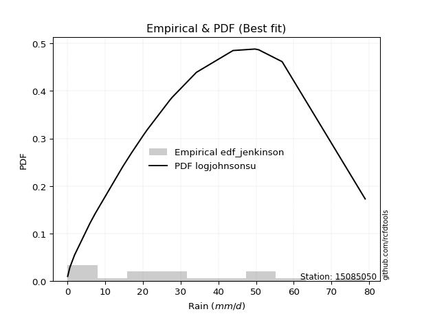</img>

</div>


### 11. EDF Cunnane (1978)

Cunnane´s work in statistical hydrology has focused on the performance and evaluation of different probability distributions (such as GEV, Gumbel, Lognormal) for flood frequency estimation. _b_ is a constant, typically set to 0.4.

<div align="center">


$P=(m-b)/(n+1-2b)$


</div>


**11.1. Empirical values**

<div align="center">

|                | 0                 | 1                   | 2                   | 3                  | 4                   | 5                  | 6                  | 7                  | 8                  | 9           | 10                 | 11                 | 12                | 13                 | 14                 | 15                | 16                 | 17                 | 18                 |
|:---------------|:------------------|:--------------------|:--------------------|:-------------------|:--------------------|:-------------------|:-------------------|:-------------------|:-------------------|:------------|:-------------------|:-------------------|:------------------|:-------------------|:-------------------|:------------------|:-------------------|:-------------------|:-------------------|
| date           | 2022              | 2023                | 2015                | 2020               | 2021                | 2013               | 2025               | 2014               | 2012               | 2016        | 2010               | 2009               | 2007              | 2018               | 2006               | 2011              | 2005               | 2019               | 2008               |
| x              | 0.1               | 0.7                 | 1.9                 | 6.0                | 7.4                 | 14.7               | 17.0               | 20.1               | 21.2               | 27.2        | 27.6               | 27.8               | 34.2              | 43.9               | 49.7               | 50.3              | 50.7               | 56.9               | 78.9               |
| m              | 1                 | 2                   | 3                   | 4                  | 5                   | 6                  | 7                  | 8                  | 9                  | 10          | 11                 | 12                 | 13                | 14                 | 15                 | 16                | 17                 | 18                 | 19                 |
| empirical_dist | edf_cunnane       | edf_cunnane         | edf_cunnane         | edf_cunnane        | edf_cunnane         | edf_cunnane        | edf_cunnane        | edf_cunnane        | edf_cunnane        | edf_cunnane | edf_cunnane        | edf_cunnane        | edf_cunnane       | edf_cunnane        | edf_cunnane        | edf_cunnane       | edf_cunnane        | edf_cunnane        | edf_cunnane        |
| empirical      | 0.03125           | 0.08333333333333334 | 0.13541666666666669 | 0.1875             | 0.23958333333333331 | 0.2916666666666667 | 0.34375            | 0.3958333333333333 | 0.4479166666666667 | 0.5         | 0.5520833333333334 | 0.6041666666666666 | 0.65625           | 0.7083333333333334 | 0.7604166666666666 | 0.8125            | 0.8645833333333335 | 0.9166666666666667 | 0.9687500000000001 |
| empirical_tr   | 1.032258064516129 | 1.090909090909091   | 1.1566265060240966  | 1.2307692307692308 | 1.3150684931506849  | 1.411764705882353  | 1.5238095238095237 | 1.6551724137931032 | 1.8113207547169814 | 2.0         | 2.2325581395348837 | 2.526315789473684  | 2.909090909090909 | 3.428571428571429  | 4.17391304347826   | 5.333333333333333 | 7.384615384615393  | 12.00000000000001  | 32.000000000000114 |

</div>


**11.2. Kolmogorov-Smirnov fit test (sorted by Δ)**


<div align="center">

|                | 0                   | 1                   | 2                   | 3                   | 4                   | 5                   | 6                   | 7                   | 8                   | 9                   | 10                  | 11                  | 12                  | 13                  | 14                  | 15                  | 16                  | 17                  | 18                  | 19                  | 20                  | 21                  | 22                  | 23                  | 24                  | 25                  | 26                  | 27                  | 28                  | 29                  | 30                  | 31                  | 32                  | 33                  | 34                  | 35                  | 36                  | 37                  | 38                  | 39                  | 40                  | 41                  | 42                  | 43                  | 44                  | 45                  | 46                  | 47                  | 48                  | 49                  | 50                  | 51                  | 52                  | 53                  | 54                  | 55                  | 56                  | 57                  | 58                  | 59                  | 60                  | 61                  | 62                  | 63                  | 64                  | 65                  | 66                  | 67                  | 68                  | 69                  | 70                  | 71                  | 72                  | 73                  | 74                  | 75                  | 76                  | 77                  | 78                  | 79                  | 80                  | 81                  | 82                  | 83                  | 84                  | 85                  | 86                  | 87                  | 88                  | 89                  | 90                  | 91                  | 92                  | 93                  | 94                  | 95                  | 96                  | 97                  | 98                  | 99                  | 100                 | 101                 | 102                 | 103                 | 104                 | 105                 | 106                 | 107                 | 108                 | 109                 | 110                 | 111                 | 112                 | 113                 | 114                 | 115                 | 116                 | 117                 | 118                 | 119                 | 120                 | 121                 | 122                 | 123                 | 124                 | 125                 | 126                 | 127                 | 128                 | 129                 | 130                 | 131                 | 132                 | 133                 | 134                 | 135                 | 136                 | 137                 | 138                 | 139                 | 140                 | 141                 | 142                 | 143                 | 144                 | 145                 | 146                 | 147                 | 148                 | 149                 | 150                 | 151                 | 152                 | 153                 | 154                 | 155                 | 156                 | 157                 | 158                 | 159                 |
|:---------------|:--------------------|:--------------------|:--------------------|:--------------------|:--------------------|:--------------------|:--------------------|:--------------------|:--------------------|:--------------------|:--------------------|:--------------------|:--------------------|:--------------------|:--------------------|:--------------------|:--------------------|:--------------------|:--------------------|:--------------------|:--------------------|:--------------------|:--------------------|:--------------------|:--------------------|:--------------------|:--------------------|:--------------------|:--------------------|:--------------------|:--------------------|:--------------------|:--------------------|:--------------------|:--------------------|:--------------------|:--------------------|:--------------------|:--------------------|:--------------------|:--------------------|:--------------------|:--------------------|:--------------------|:--------------------|:--------------------|:--------------------|:--------------------|:--------------------|:--------------------|:--------------------|:--------------------|:--------------------|:--------------------|:--------------------|:--------------------|:--------------------|:--------------------|:--------------------|:--------------------|:--------------------|:--------------------|:--------------------|:--------------------|:--------------------|:--------------------|:--------------------|:--------------------|:--------------------|:--------------------|:--------------------|:--------------------|:--------------------|:--------------------|:--------------------|:--------------------|:--------------------|:--------------------|:--------------------|:--------------------|:--------------------|:--------------------|:--------------------|:--------------------|:--------------------|:--------------------|:--------------------|:--------------------|:--------------------|:--------------------|:--------------------|:--------------------|:--------------------|:--------------------|:--------------------|:--------------------|:--------------------|:--------------------|:--------------------|:--------------------|:--------------------|:--------------------|:--------------------|:--------------------|:--------------------|:--------------------|:--------------------|:--------------------|:--------------------|:--------------------|:--------------------|:--------------------|:--------------------|:--------------------|:--------------------|:--------------------|:--------------------|:--------------------|:--------------------|:--------------------|:--------------------|:--------------------|:--------------------|:--------------------|:--------------------|:--------------------|:--------------------|:--------------------|:--------------------|:--------------------|:--------------------|:--------------------|:--------------------|:--------------------|:--------------------|:--------------------|:--------------------|:--------------------|:--------------------|:--------------------|:--------------------|:--------------------|:--------------------|:--------------------|:--------------------|:--------------------|:--------------------|:--------------------|:--------------------|:--------------------|:--------------------|:--------------------|:--------------------|:--------------------|:--------------------|:--------------------|:--------------------|:--------------------|:--------------------|:--------------------|
| station        | 15085050            | 15085050            | 15085050            | 15085050            | 15085050            | 15085050            | 15085050            | 15085050            | 15085050            | 15085050            | 15085050            | 15085050            | 15085050            | 15085050            | 15085050            | 15085050            | 15085050            | 15085050            | 15085050            | 15085050            | 15085050            | 15085050            | 15085050            | 15085050            | 15085050            | 15085050            | 15085050            | 15085050            | 15085050            | 15085050            | 15085050            | 15085050            | 15085050            | 15085050            | 15085050            | 15085050            | 15085050            | 15085050            | 15085050            | 15085050            | 15085050            | 15085050            | 15085050            | 15085050            | 15085050            | 15085050            | 15085050            | 15085050            | 15085050            | 15085050            | 15085050            | 15085050            | 15085050            | 15085050            | 15085050            | 15085050            | 15085050            | 15085050            | 15085050            | 15085050            | 15085050            | 15085050            | 15085050            | 15085050            | 15085050            | 15085050            | 15085050            | 15085050            | 15085050            | 15085050            | 15085050            | 15085050            | 15085050            | 15085050            | 15085050            | 15085050            | 15085050            | 15085050            | 15085050            | 15085050            | 15085050            | 15085050            | 15085050            | 15085050            | 15085050            | 15085050            | 15085050            | 15085050            | 15085050            | 15085050            | 15085050            | 15085050            | 15085050            | 15085050            | 15085050            | 15085050            | 15085050            | 15085050            | 15085050            | 15085050            | 15085050            | 15085050            | 15085050            | 15085050            | 15085050            | 15085050            | 15085050            | 15085050            | 15085050            | 15085050            | 15085050            | 15085050            | 15085050            | 15085050            | 15085050            | 15085050            | 15085050            | 15085050            | 15085050            | 15085050            | 15085050            | 15085050            | 15085050            | 15085050            | 15085050            | 15085050            | 15085050            | 15085050            | 15085050            | 15085050            | 15085050            | 15085050            | 15085050            | 15085050            | 15085050            | 15085050            | 15085050            | 15085050            | 15085050            | 15085050            | 15085050            | 15085050            | 15085050            | 15085050            | 15085050            | 15085050            | 15085050            | 15085050            | 15085050            | 15085050            | 15085050            | 15085050            | 15085050            | 15085050            | 15085050            | 15085050            | 15085050            | 15085050            | 15085050            | 15085050            |
| empirical_dist | edf_cunnane         | edf_cunnane         | edf_cunnane         | edf_cunnane         | edf_cunnane         | edf_cunnane         | edf_cunnane         | edf_cunnane         | edf_cunnane         | edf_cunnane         | edf_cunnane         | edf_cunnane         | edf_cunnane         | edf_cunnane         | edf_cunnane         | edf_cunnane         | edf_cunnane         | edf_cunnane         | edf_cunnane         | edf_cunnane         | edf_cunnane         | edf_cunnane         | edf_cunnane         | edf_cunnane         | edf_cunnane         | edf_cunnane         | edf_cunnane         | edf_cunnane         | edf_cunnane         | edf_cunnane         | edf_cunnane         | edf_cunnane         | edf_cunnane         | edf_cunnane         | edf_cunnane         | edf_cunnane         | edf_cunnane         | edf_cunnane         | edf_cunnane         | edf_cunnane         | edf_cunnane         | edf_cunnane         | edf_cunnane         | edf_cunnane         | edf_cunnane         | edf_cunnane         | edf_cunnane         | edf_cunnane         | edf_cunnane         | edf_cunnane         | edf_cunnane         | edf_cunnane         | edf_cunnane         | edf_cunnane         | edf_cunnane         | edf_cunnane         | edf_cunnane         | edf_cunnane         | edf_cunnane         | edf_cunnane         | edf_cunnane         | edf_cunnane         | edf_cunnane         | edf_cunnane         | edf_cunnane         | edf_cunnane         | edf_cunnane         | edf_cunnane         | edf_cunnane         | edf_cunnane         | edf_cunnane         | edf_cunnane         | edf_cunnane         | edf_cunnane         | edf_cunnane         | edf_cunnane         | edf_cunnane         | edf_cunnane         | edf_cunnane         | edf_cunnane         | edf_cunnane         | edf_cunnane         | edf_cunnane         | edf_cunnane         | edf_cunnane         | edf_cunnane         | edf_cunnane         | edf_cunnane         | edf_cunnane         | edf_cunnane         | edf_cunnane         | edf_cunnane         | edf_cunnane         | edf_cunnane         | edf_cunnane         | edf_cunnane         | edf_cunnane         | edf_cunnane         | edf_cunnane         | edf_cunnane         | edf_cunnane         | edf_cunnane         | edf_cunnane         | edf_cunnane         | edf_cunnane         | edf_cunnane         | edf_cunnane         | edf_cunnane         | edf_cunnane         | edf_cunnane         | edf_cunnane         | edf_cunnane         | edf_cunnane         | edf_cunnane         | edf_cunnane         | edf_cunnane         | edf_cunnane         | edf_cunnane         | edf_cunnane         | edf_cunnane         | edf_cunnane         | edf_cunnane         | edf_cunnane         | edf_cunnane         | edf_cunnane         | edf_cunnane         | edf_cunnane         | edf_cunnane         | edf_cunnane         | edf_cunnane         | edf_cunnane         | edf_cunnane         | edf_cunnane         | edf_cunnane         | edf_cunnane         | edf_cunnane         | edf_cunnane         | edf_cunnane         | edf_cunnane         | edf_cunnane         | edf_cunnane         | edf_cunnane         | edf_cunnane         | edf_cunnane         | edf_cunnane         | edf_cunnane         | edf_cunnane         | edf_cunnane         | edf_cunnane         | edf_cunnane         | edf_cunnane         | edf_cunnane         | edf_cunnane         | edf_cunnane         | edf_cunnane         | edf_cunnane         | edf_cunnane         | edf_cunnane         | edf_cunnane         | edf_cunnane         |
| p_dist         | logjohnsonsu        | foldnorm            | logjohnsonsb        | rayleigh            | maxwell             | logargus            | loggenlogistic      | pearson3            | logloggamma         | genexpon            | exponpow            | fatiguelife         | ncf                 | invgauss            | johnsonsu           | invgamma            | kstwobign           | halfnorm            | alpha               | nct                 | invweibull          | genlogistic         | genextreme          | genpareto           | gompertz            | triang              | skewnorm            | nakagami            | gumbel_r            | rice                | genhalflogistic     | logmielke           | loggengamma         | loggenextreme       | logpearson3         | arcsine             | semicircular        | anglit              | t                   | norm                | crystalball         | logistic            | hypsecant           | kappa3              | burr12              | exponnorm           | logburr12           | moyal               | dweibull            | logdgamma           | loggennorm          | dgamma              | logt                | laplace             | truncnorm           | mielke              | burr                | halflogistic        | loggumbel_l         | logweibull_max      | truncweibull_min    | lomax               | gennorm             | gausshyper          | cosine              | f                   | truncexpon          | bradford            | logdweibull         | logfoldnorm         | gumbel_l            | logskewnorm         | beta                | logsemicircular     | lognakagami         | loganglit           | loggausshyper       | logrice             | logexponnorm        | lognorm             | logcrystalball      | lognct              | loglogistic         | loghypsecant        | loggamma            | loggamma            | gengamma            | logfatiguelife      | halfgennorm         | logarcsine          | weibull_min         | loglaplace          | loglaplace          | logerlang           | loglevy_l           | betaprime           | loginvweibull       | kappa4              | loginvgamma         | logalpha            | logtrapezoid        | logburr             | wald                | erlang              | loginvgauss         | logmaxwell          | gamma               | ksone               | wrapcauchy          | loggenhalflogistic  | uniform             | vonmises_line       | lograyleigh         | logtruncweibull_min | logkstwobign        | loggompertz         | loggumbel_r         | loghalfnorm         | logtriang           | logcosine           | johnsonsb           | logmoyal            | argus               | loggenexpon         | loghalflogistic     | powerlaw            | logbeta             | logwrapcauchy       | loglomax            | logwald             | logncf              | logkappa4           | logksone            | logexponweib        | logkappa3           | levy_l              | logtruncnorm        | loghalfgennorm      | loguniform          | trapezoid           | logbradford         | logvonmises_line    | logtruncexpon       | logf                | rdist               | logloglaplace       | exponweib           | tukeylambda         | logbetaprime        | logpowerlaw         | loggenpareto        | logweibull_min      | logexponpow         | logrdist            | logtukeylambda      | truncpareto         | weibull_max         | logtruncpareto      | logvonmises         | vonmises            |
| delta          | 0.05850192043965535 | 0.07476018526440387 | 0.07732990932059164 | 0.07820723450385958 | 0.07889096242926263 | 0.0811068000520469  | 0.08362373619897534 | 0.083996315178268   | 0.0841622670192333  | 0.08778277848848173 | 0.08785838535840795 | 0.08826538847912524 | 0.08834505253382932 | 0.08873345981217506 | 0.08877564219117828 | 0.08896321078801295 | 0.08974752038360834 | 0.08986452383742757 | 0.0901089986150484  | 0.09038472483289706 | 0.09079877246265822 | 0.09119042067004934 | 0.09144182839294301 | 0.09279754265971923 | 0.09446930802917383 | 0.09480477508343359 | 0.09481291297055966 | 0.094975506073287   | 0.09779421691256954 | 0.09977510580142859 | 0.10072765970705158 | 0.10271105794839386 | 0.10708255881004164 | 0.10713271167961169 | 0.10752962217927853 | 0.10864573603898198 | 0.11050066145047932 | 0.11096877161529889 | 0.11210350055524337 | 0.1121048477210762  | 0.11210484964682649 | 0.11318905894912373 | 0.11411473798647337 | 0.11462733413232229 | 0.11470067680380636 | 0.11792937371307155 | 0.11799770615905358 | 0.12078232911214734 | 0.12243671754372742 | 0.12361381611220651 | 0.1253731595895789  | 0.1282546008123978  | 0.12914056153459175 | 0.13347875534819476 | 0.1338429155961953  | 0.13442890280924447 | 0.13500275518749294 | 0.13541666666666669 | 0.14185391136033293 | 0.14202042323132635 | 0.1479617068411982  | 0.15204361501166985 | 0.15366722321267728 | 0.15428887570970196 | 0.15528714012770928 | 0.16503995060166182 | 0.16614327162295228 | 0.1694814634241245  | 0.17423861518625394 | 0.18109061396787118 | 0.1826698346417598  | 0.18683431504882736 | 0.19313283518629099 | 0.2113446203322022  | 0.21153089319754032 | 0.21156853542976067 | 0.21158743376990902 | 0.21210001204613965 | 0.21210718812138168 | 0.21210803911983372 | 0.21210804027408897 | 0.2122688626959029  | 0.21262373661239836 | 0.2130641218812162  | 0.21379095570769407 | 0.21379095570769407 | 0.2142111897531075  | 0.21517947023695544 | 0.21573149964696675 | 0.21803381556097368 | 0.2225671284288338  | 0.2264381049363971  | 0.2264381049363971  | 0.2273906976082269  | 0.22754148862625656 | 0.23046482589850098 | 0.23113807537000658 | 0.23156850535776385 | 0.23240398436301796 | 0.2330239735955501  | 0.23439779604487637 | 0.2357739718897513  | 0.23958332767009846 | 0.2442788987346955  | 0.24451878652299625 | 0.24500262747603047 | 0.2456954698354487  | 0.24614001692047394 | 0.24626222521119356 | 0.2473427693260451  | 0.2526438240270728  | 0.2528157923423072  | 0.2559300691500371  | 0.2685872058518322  | 0.27258734871742124 | 0.2731493024701535  | 0.2825852332048043  | 0.28669646953474676 | 0.29537265830242715 | 0.3033283747904158  | 0.3083481891172499  | 0.3084031354645807  | 0.3115638958547535  | 0.311825480838204   | 0.3118616356995357  | 0.33695154651249665 | 0.3516056811523488  | 0.3519240148517331  | 0.3763660535267297  | 0.3801813333429776  | 0.4111143980835148  | 0.4150438521439684  | 0.4150873686210828  | 0.4287778938734946  | 0.44076631421438656 | 0.44952088289524794 | 0.4522297244413033  | 0.4537222579660279  | 0.4564381756786327  | 0.47700598235643377 | 0.4771427006681897  | 0.5026400340843857  | 0.50402979317748    | 0.5182545103893235  | 0.5275698570552062  | 0.534927537471659   | 0.5438071345399602  | 0.5516713929234456  | 0.5539651550946159  | 0.6153118621451933  | 0.625494259452776   | 0.6386750762603589  | 0.7470091856583769  | 0.7604166618070825  | 0.7671981727058537  | 0.769285414303231   | 0.7705886993813873  | 0.8510760946944144  | 0.9571440812010688  | 11.968406809656848  |
| deltao         | 0.31564497164100014 | 0.31564497164100014 | 0.31564497164100014 | 0.31564497164100014 | 0.31564497164100014 | 0.31564497164100014 | 0.31564497164100014 | 0.31564497164100014 | 0.31564497164100014 | 0.31564497164100014 | 0.31564497164100014 | 0.31564497164100014 | 0.31564497164100014 | 0.31564497164100014 | 0.31564497164100014 | 0.31564497164100014 | 0.31564497164100014 | 0.31564497164100014 | 0.31564497164100014 | 0.31564497164100014 | 0.31564497164100014 | 0.31564497164100014 | 0.31564497164100014 | 0.31564497164100014 | 0.31564497164100014 | 0.31564497164100014 | 0.31564497164100014 | 0.31564497164100014 | 0.31564497164100014 | 0.31564497164100014 | 0.31564497164100014 | 0.31564497164100014 | 0.31564497164100014 | 0.31564497164100014 | 0.31564497164100014 | 0.31564497164100014 | 0.31564497164100014 | 0.31564497164100014 | 0.31564497164100014 | 0.31564497164100014 | 0.31564497164100014 | 0.31564497164100014 | 0.31564497164100014 | 0.31564497164100014 | 0.31564497164100014 | 0.31564497164100014 | 0.31564497164100014 | 0.31564497164100014 | 0.31564497164100014 | 0.31564497164100014 | 0.31564497164100014 | 0.31564497164100014 | 0.31564497164100014 | 0.31564497164100014 | 0.31564497164100014 | 0.31564497164100014 | 0.31564497164100014 | 0.31564497164100014 | 0.31564497164100014 | 0.31564497164100014 | 0.31564497164100014 | 0.31564497164100014 | 0.31564497164100014 | 0.31564497164100014 | 0.31564497164100014 | 0.31564497164100014 | 0.31564497164100014 | 0.31564497164100014 | 0.31564497164100014 | 0.31564497164100014 | 0.31564497164100014 | 0.31564497164100014 | 0.31564497164100014 | 0.31564497164100014 | 0.31564497164100014 | 0.31564497164100014 | 0.31564497164100014 | 0.31564497164100014 | 0.31564497164100014 | 0.31564497164100014 | 0.31564497164100014 | 0.31564497164100014 | 0.31564497164100014 | 0.31564497164100014 | 0.31564497164100014 | 0.31564497164100014 | 0.31564497164100014 | 0.31564497164100014 | 0.31564497164100014 | 0.31564497164100014 | 0.31564497164100014 | 0.31564497164100014 | 0.31564497164100014 | 0.31564497164100014 | 0.31564497164100014 | 0.31564497164100014 | 0.31564497164100014 | 0.31564497164100014 | 0.31564497164100014 | 0.31564497164100014 | 0.31564497164100014 | 0.31564497164100014 | 0.31564497164100014 | 0.31564497164100014 | 0.31564497164100014 | 0.31564497164100014 | 0.31564497164100014 | 0.31564497164100014 | 0.31564497164100014 | 0.31564497164100014 | 0.31564497164100014 | 0.31564497164100014 | 0.31564497164100014 | 0.31564497164100014 | 0.31564497164100014 | 0.31564497164100014 | 0.31564497164100014 | 0.31564497164100014 | 0.31564497164100014 | 0.31564497164100014 | 0.31564497164100014 | 0.31564497164100014 | 0.31564497164100014 | 0.31564497164100014 | 0.31564497164100014 | 0.31564497164100014 | 0.31564497164100014 | 0.31564497164100014 | 0.31564497164100014 | 0.31564497164100014 | 0.31564497164100014 | 0.31564497164100014 | 0.31564497164100014 | 0.31564497164100014 | 0.31564497164100014 | 0.31564497164100014 | 0.31564497164100014 | 0.31564497164100014 | 0.31564497164100014 | 0.31564497164100014 | 0.31564497164100014 | 0.31564497164100014 | 0.31564497164100014 | 0.31564497164100014 | 0.31564497164100014 | 0.31564497164100014 | 0.31564497164100014 | 0.31564497164100014 | 0.31564497164100014 | 0.31564497164100014 | 0.31564497164100014 | 0.31564497164100014 | 0.31564497164100014 | 0.31564497164100014 | 0.31564497164100014 | 0.31564497164100014 | 0.31564497164100014 | 0.31564497164100014 | 0.31564497164100014 | 0.31564497164100014 |
| eval           | Δo > Δ              | Δo > Δ              | Δo > Δ              | Δo > Δ              | Δo > Δ              | Δo > Δ              | Δo > Δ              | Δo > Δ              | Δo > Δ              | Δo > Δ              | Δo > Δ              | Δo > Δ              | Δo > Δ              | Δo > Δ              | Δo > Δ              | Δo > Δ              | Δo > Δ              | Δo > Δ              | Δo > Δ              | Δo > Δ              | Δo > Δ              | Δo > Δ              | Δo > Δ              | Δo > Δ              | Δo > Δ              | Δo > Δ              | Δo > Δ              | Δo > Δ              | Δo > Δ              | Δo > Δ              | Δo > Δ              | Δo > Δ              | Δo > Δ              | Δo > Δ              | Δo > Δ              | Δo > Δ              | Δo > Δ              | Δo > Δ              | Δo > Δ              | Δo > Δ              | Δo > Δ              | Δo > Δ              | Δo > Δ              | Δo > Δ              | Δo > Δ              | Δo > Δ              | Δo > Δ              | Δo > Δ              | Δo > Δ              | Δo > Δ              | Δo > Δ              | Δo > Δ              | Δo > Δ              | Δo > Δ              | Δo > Δ              | Δo > Δ              | Δo > Δ              | Δo > Δ              | Δo > Δ              | Δo > Δ              | Δo > Δ              | Δo > Δ              | Δo > Δ              | Δo > Δ              | Δo > Δ              | Δo > Δ              | Δo > Δ              | Δo > Δ              | Δo > Δ              | Δo > Δ              | Δo > Δ              | Δo > Δ              | Δo > Δ              | Δo > Δ              | Δo > Δ              | Δo > Δ              | Δo > Δ              | Δo > Δ              | Δo > Δ              | Δo > Δ              | Δo > Δ              | Δo > Δ              | Δo > Δ              | Δo > Δ              | Δo > Δ              | Δo > Δ              | Δo > Δ              | Δo > Δ              | Δo > Δ              | Δo > Δ              | Δo > Δ              | Δo > Δ              | Δo > Δ              | Δo > Δ              | Δo > Δ              | Δo > Δ              | Δo > Δ              | Δo > Δ              | Δo > Δ              | Δo > Δ              | Δo > Δ              | Δo > Δ              | Δo > Δ              | Δo > Δ              | Δo > Δ              | Δo > Δ              | Δo > Δ              | Δo > Δ              | Δo > Δ              | Δo > Δ              | Δo > Δ              | Δo > Δ              | Δo > Δ              | Δo > Δ              | Δo > Δ              | Δo > Δ              | Δo > Δ              | Δo > Δ              | Δo > Δ              | Δo > Δ              | Δo > Δ              | Δo > Δ              | Δo > Δ              | Δo > Δ              | Δo > Δ              | Δo <= Δ             | Δo <= Δ             | Δo <= Δ             | Δo <= Δ             | Δo <= Δ             | Δo <= Δ             | Δo <= Δ             | Δo <= Δ             | Δo <= Δ             | Δo <= Δ             | Δo <= Δ             | Δo <= Δ             | Δo <= Δ             | Δo <= Δ             | Δo <= Δ             | Δo <= Δ             | Δo <= Δ             | Δo <= Δ             | Δo <= Δ             | Δo <= Δ             | Δo <= Δ             | Δo <= Δ             | Δo <= Δ             | Δo <= Δ             | Δo <= Δ             | Δo <= Δ             | Δo <= Δ             | Δo <= Δ             | Δo <= Δ             | Δo <= Δ             | Δo <= Δ             | Δo <= Δ             | Δo <= Δ             | Δo <= Δ             | Δo <= Δ             |
| fit            | 1                   | 1                   | 1                   | 1                   | 1                   | 1                   | 1                   | 1                   | 1                   | 1                   | 1                   | 1                   | 1                   | 1                   | 1                   | 1                   | 1                   | 1                   | 1                   | 1                   | 1                   | 1                   | 1                   | 1                   | 1                   | 1                   | 1                   | 1                   | 1                   | 1                   | 1                   | 1                   | 1                   | 1                   | 1                   | 1                   | 1                   | 1                   | 1                   | 1                   | 1                   | 1                   | 1                   | 1                   | 1                   | 1                   | 1                   | 1                   | 1                   | 1                   | 1                   | 1                   | 1                   | 1                   | 1                   | 1                   | 1                   | 1                   | 1                   | 1                   | 1                   | 1                   | 1                   | 1                   | 1                   | 1                   | 1                   | 1                   | 1                   | 1                   | 1                   | 1                   | 1                   | 1                   | 1                   | 1                   | 1                   | 1                   | 1                   | 1                   | 1                   | 1                   | 1                   | 1                   | 1                   | 1                   | 1                   | 1                   | 1                   | 1                   | 1                   | 1                   | 1                   | 1                   | 1                   | 1                   | 1                   | 1                   | 1                   | 1                   | 1                   | 1                   | 1                   | 1                   | 1                   | 1                   | 1                   | 1                   | 1                   | 1                   | 1                   | 1                   | 1                   | 1                   | 1                   | 1                   | 1                   | 1                   | 1                   | 1                   | 1                   | 1                   | 1                   | 1                   | 1                   | 0                   | 0                   | 0                   | 0                   | 0                   | 0                   | 0                   | 0                   | 0                   | 0                   | 0                   | 0                   | 0                   | 0                   | 0                   | 0                   | 0                   | 0                   | 0                   | 0                   | 0                   | 0                   | 0                   | 0                   | 0                   | 0                   | 0                   | 0                   | 0                   | 0                   | 0                   | 0                   | 0                   | 0                   | 0                   |
| n              | 19                  | 19                  | 19                  | 19                  | 19                  | 19                  | 19                  | 19                  | 19                  | 19                  | 19                  | 19                  | 19                  | 19                  | 19                  | 19                  | 19                  | 19                  | 19                  | 19                  | 19                  | 19                  | 19                  | 19                  | 19                  | 19                  | 19                  | 19                  | 19                  | 19                  | 19                  | 19                  | 19                  | 19                  | 19                  | 19                  | 19                  | 19                  | 19                  | 19                  | 19                  | 19                  | 19                  | 19                  | 19                  | 19                  | 19                  | 19                  | 19                  | 19                  | 19                  | 19                  | 19                  | 19                  | 19                  | 19                  | 19                  | 19                  | 19                  | 19                  | 19                  | 19                  | 19                  | 19                  | 19                  | 19                  | 19                  | 19                  | 19                  | 19                  | 19                  | 19                  | 19                  | 19                  | 19                  | 19                  | 19                  | 19                  | 19                  | 19                  | 19                  | 19                  | 19                  | 19                  | 19                  | 19                  | 19                  | 19                  | 19                  | 19                  | 19                  | 19                  | 19                  | 19                  | 19                  | 19                  | 19                  | 19                  | 19                  | 19                  | 19                  | 19                  | 19                  | 19                  | 19                  | 19                  | 19                  | 19                  | 19                  | 19                  | 19                  | 19                  | 19                  | 19                  | 19                  | 19                  | 19                  | 19                  | 19                  | 19                  | 19                  | 19                  | 19                  | 19                  | 19                  | 19                  | 19                  | 19                  | 19                  | 19                  | 19                  | 19                  | 19                  | 19                  | 19                  | 19                  | 19                  | 19                  | 19                  | 19                  | 19                  | 19                  | 19                  | 19                  | 19                  | 19                  | 19                  | 19                  | 19                  | 19                  | 19                  | 19                  | 19                  | 19                  | 19                  | 19                  | 19                  | 19                  | 19                  | 19                  |
| best_fit       | 1                   | 0                   | 0                   | 0                   | 0                   | 0                   | 0                   | 0                   | 0                   | 0                   | 0                   | 0                   | 0                   | 0                   | 0                   | 0                   | 0                   | 0                   | 0                   | 0                   | 0                   | 0                   | 0                   | 0                   | 0                   | 0                   | 0                   | 0                   | 0                   | 0                   | 0                   | 0                   | 0                   | 0                   | 0                   | 0                   | 0                   | 0                   | 0                   | 0                   | 0                   | 0                   | 0                   | 0                   | 0                   | 0                   | 0                   | 0                   | 0                   | 0                   | 0                   | 0                   | 0                   | 0                   | 0                   | 0                   | 0                   | 0                   | 0                   | 0                   | 0                   | 0                   | 0                   | 0                   | 0                   | 0                   | 0                   | 0                   | 0                   | 0                   | 0                   | 0                   | 0                   | 0                   | 0                   | 0                   | 0                   | 0                   | 0                   | 0                   | 0                   | 0                   | 0                   | 0                   | 0                   | 0                   | 0                   | 0                   | 0                   | 0                   | 0                   | 0                   | 0                   | 0                   | 0                   | 0                   | 0                   | 0                   | 0                   | 0                   | 0                   | 0                   | 0                   | 0                   | 0                   | 0                   | 0                   | 0                   | 0                   | 0                   | 0                   | 0                   | 0                   | 0                   | 0                   | 0                   | 0                   | 0                   | 0                   | 0                   | 0                   | 0                   | 0                   | 0                   | 0                   | 0                   | 0                   | 0                   | 0                   | 0                   | 0                   | 0                   | 0                   | 0                   | 0                   | 0                   | 0                   | 0                   | 0                   | 0                   | 0                   | 0                   | 0                   | 0                   | 0                   | 0                   | 0                   | 0                   | 0                   | 0                   | 0                   | 0                   | 0                   | 0                   | 0                   | 0                   | 0                   | 0                   | 0                   | 0                   |
| best_fit_sort  | 1                   | 2                   | 3                   | 4                   | 5                   | 6                   | 7                   | 8                   | 9                   | 10                  | 11                  | 12                  | 13                  | 14                  | 15                  | 16                  | 17                  | 18                  | 19                  | 20                  | 21                  | 22                  | 23                  | 24                  | 25                  | 26                  | 27                  | 28                  | 29                  | 30                  | 31                  | 32                  | 33                  | 34                  | 35                  | 36                  | 37                  | 38                  | 39                  | 40                  | 41                  | 42                  | 43                  | 44                  | 45                  | 46                  | 47                  | 48                  | 49                  | 50                  | 51                  | 52                  | 53                  | 54                  | 55                  | 56                  | 57                  | 58                  | 59                  | 60                  | 61                  | 62                  | 63                  | 64                  | 65                  | 66                  | 67                  | 68                  | 69                  | 70                  | 71                  | 72                  | 73                  | 74                  | 75                  | 76                  | 77                  | 78                  | 79                  | 80                  | 81                  | 82                  | 83                  | 84                  | 85                  | 86                  | 87                  | 88                  | 89                  | 90                  | 91                  | 92                  | 93                  | 94                  | 95                  | 96                  | 97                  | 98                  | 99                  | 100                 | 101                 | 102                 | 103                 | 104                 | 105                 | 106                 | 107                 | 108                 | 109                 | 110                 | 111                 | 112                 | 113                 | 114                 | 115                 | 116                 | 117                 | 118                 | 119                 | 120                 | 121                 | 122                 | 123                 | 124                 | 125                 | 126                 | 127                 | 128                 | 129                 | 130                 | 131                 | 132                 | 133                 | 134                 | 135                 | 136                 | 137                 | 138                 | 139                 | 140                 | 141                 | 142                 | 143                 | 144                 | 145                 | 146                 | 147                 | 148                 | 149                 | 150                 | 151                 | 152                 | 153                 | 154                 | 155                 | 156                 | 157                 | 158                 | 159                 | 160                 |

</div>


**11.3. Best fit**

<div align="center">

|   id |   station | empirical_dist   | p_dist       |     delta |   deltao | eval   |   fit |   n |   best_fit |   best_fit_sort |
|-----:|----------:|:-----------------|:-------------|----------:|---------:|:-------|------:|----:|-----------:|----------------:|
|    0 |  15085050 | edf_cunnane      | logjohnsonsu | 0.0585019 | 0.315645 | Δo > Δ |     1 |  19 |          1 |               1 |

</div>


<div align="center">

</img>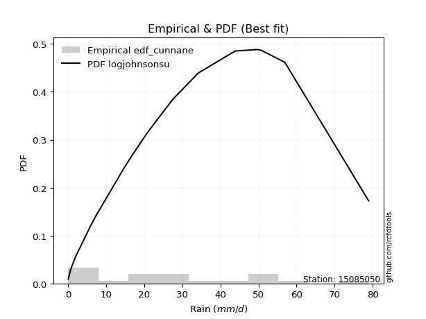</img>

</div>


### 12. EDF Adamowski (1981)

The Adamowski formula in hydrology refers to a specific plotting position formula used for estimating the non-parametric empirical distribution of hydrological events (like flood peaks) to calculate their return periods. This formula provides an alternative to traditional parametric methods (like the Gumbel or Log Pearson Type III distributions). 

<div align="center">


$P=(m-0.25)/(n+0.5)$


</div>


**12.1. Empirical values**

<div align="center">

|                | 0                    | 1                   | 2                   | 3                   | 4                   | 5                  | 6                   | 7                  | 8                   | 9             | 10                 | 11                 | 12                 | 13                 | 14                 | 15                 | 16                 | 17                 | 18                 |
|:---------------|:---------------------|:--------------------|:--------------------|:--------------------|:--------------------|:-------------------|:--------------------|:-------------------|:--------------------|:--------------|:-------------------|:-------------------|:-------------------|:-------------------|:-------------------|:-------------------|:-------------------|:-------------------|:-------------------|
| date           | 2022                 | 2023                | 2015                | 2020                | 2021                | 2013               | 2025                | 2014               | 2012                | 2016          | 2010               | 2009               | 2007               | 2018               | 2006               | 2011               | 2005               | 2019               | 2008               |
| x              | 0.1                  | 0.7                 | 1.9                 | 6.0                 | 7.4                 | 14.7               | 17.0                | 20.1               | 21.2                | 27.2          | 27.6               | 27.8               | 34.2               | 43.9               | 49.7               | 50.3               | 50.7               | 56.9               | 78.9               |
| m              | 1                    | 2                   | 3                   | 4                   | 5                   | 6                  | 7                   | 8                  | 9                   | 10            | 11                 | 12                 | 13                 | 14                 | 15                 | 16                 | 17                 | 18                 | 19                 |
| empirical_dist | edf_adamowski        | edf_adamowski       | edf_adamowski       | edf_adamowski       | edf_adamowski       | edf_adamowski      | edf_adamowski       | edf_adamowski      | edf_adamowski       | edf_adamowski | edf_adamowski      | edf_adamowski      | edf_adamowski      | edf_adamowski      | edf_adamowski      | edf_adamowski      | edf_adamowski      | edf_adamowski      | edf_adamowski      |
| empirical      | 0.038461538461538464 | 0.08974358974358974 | 0.14102564102564102 | 0.19230769230769232 | 0.24358974358974358 | 0.2948717948717949 | 0.34615384615384615 | 0.3974358974358974 | 0.44871794871794873 | 0.5           | 0.5512820512820513 | 0.6025641025641025 | 0.6538461538461539 | 0.7051282051282052 | 0.7564102564102564 | 0.8076923076923077 | 0.8589743589743589 | 0.9102564102564102 | 0.9615384615384616 |
| empirical_tr   | 1.04                 | 1.0985915492957747  | 1.164179104477612   | 1.2380952380952381  | 1.3220338983050848  | 1.4181818181818182 | 1.5294117647058822  | 1.6595744680851061 | 1.813953488372093   | 2.0           | 2.2285714285714286 | 2.5161290322580645 | 2.888888888888889  | 3.3913043478260874 | 4.105263157894736  | 5.2                | 7.090909090909088  | 11.14285714285714  | 26.000000000000018 |

</div>


**12.2. Kolmogorov-Smirnov fit test (sorted by Δ)**


<div align="center">

|                | 0                   | 1                   | 2                   | 3                   | 4                   | 5                   | 6                   | 7                   | 8                   | 9                   | 10                  | 11                  | 12                  | 13                  | 14                  | 15                  | 16                  | 17                  | 18                  | 19                  | 20                  | 21                  | 22                  | 23                  | 24                  | 25                  | 26                  | 27                  | 28                  | 29                  | 30                  | 31                  | 32                  | 33                  | 34                  | 35                  | 36                  | 37                  | 38                  | 39                  | 40                  | 41                  | 42                  | 43                  | 44                  | 45                  | 46                  | 47                  | 48                  | 49                  | 50                  | 51                  | 52                  | 53                  | 54                  | 55                  | 56                  | 57                  | 58                  | 59                  | 60                  | 61                  | 62                  | 63                  | 64                  | 65                  | 66                  | 67                  | 68                  | 69                  | 70                  | 71                  | 72                  | 73                  | 74                  | 75                  | 76                  | 77                  | 78                  | 79                  | 80                  | 81                  | 82                  | 83                  | 84                  | 85                  | 86                  | 87                  | 88                  | 89                  | 90                  | 91                  | 92                  | 93                  | 94                  | 95                  | 96                  | 97                  | 98                  | 99                  | 100                 | 101                 | 102                 | 103                 | 104                 | 105                 | 106                 | 107                 | 108                 | 109                 | 110                 | 111                 | 112                 | 113                 | 114                 | 115                 | 116                 | 117                 | 118                 | 119                 | 120                 | 121                 | 122                 | 123                 | 124                 | 125                 | 126                 | 127                 | 128                 | 129                 | 130                 | 131                 | 132                 | 133                 | 134                 | 135                 | 136                 | 137                 | 138                 | 139                 | 140                 | 141                 | 142                 | 143                 | 144                 | 145                 | 146                 | 147                 | 148                 | 149                 | 150                 | 151                 | 152                 | 153                 | 154                 | 155                 | 156                 | 157                 | 158                 | 159                 |
|:---------------|:--------------------|:--------------------|:--------------------|:--------------------|:--------------------|:--------------------|:--------------------|:--------------------|:--------------------|:--------------------|:--------------------|:--------------------|:--------------------|:--------------------|:--------------------|:--------------------|:--------------------|:--------------------|:--------------------|:--------------------|:--------------------|:--------------------|:--------------------|:--------------------|:--------------------|:--------------------|:--------------------|:--------------------|:--------------------|:--------------------|:--------------------|:--------------------|:--------------------|:--------------------|:--------------------|:--------------------|:--------------------|:--------------------|:--------------------|:--------------------|:--------------------|:--------------------|:--------------------|:--------------------|:--------------------|:--------------------|:--------------------|:--------------------|:--------------------|:--------------------|:--------------------|:--------------------|:--------------------|:--------------------|:--------------------|:--------------------|:--------------------|:--------------------|:--------------------|:--------------------|:--------------------|:--------------------|:--------------------|:--------------------|:--------------------|:--------------------|:--------------------|:--------------------|:--------------------|:--------------------|:--------------------|:--------------------|:--------------------|:--------------------|:--------------------|:--------------------|:--------------------|:--------------------|:--------------------|:--------------------|:--------------------|:--------------------|:--------------------|:--------------------|:--------------------|:--------------------|:--------------------|:--------------------|:--------------------|:--------------------|:--------------------|:--------------------|:--------------------|:--------------------|:--------------------|:--------------------|:--------------------|:--------------------|:--------------------|:--------------------|:--------------------|:--------------------|:--------------------|:--------------------|:--------------------|:--------------------|:--------------------|:--------------------|:--------------------|:--------------------|:--------------------|:--------------------|:--------------------|:--------------------|:--------------------|:--------------------|:--------------------|:--------------------|:--------------------|:--------------------|:--------------------|:--------------------|:--------------------|:--------------------|:--------------------|:--------------------|:--------------------|:--------------------|:--------------------|:--------------------|:--------------------|:--------------------|:--------------------|:--------------------|:--------------------|:--------------------|:--------------------|:--------------------|:--------------------|:--------------------|:--------------------|:--------------------|:--------------------|:--------------------|:--------------------|:--------------------|:--------------------|:--------------------|:--------------------|:--------------------|:--------------------|:--------------------|:--------------------|:--------------------|:--------------------|:--------------------|:--------------------|:--------------------|:--------------------|:--------------------|
| station        | 15085050            | 15085050            | 15085050            | 15085050            | 15085050            | 15085050            | 15085050            | 15085050            | 15085050            | 15085050            | 15085050            | 15085050            | 15085050            | 15085050            | 15085050            | 15085050            | 15085050            | 15085050            | 15085050            | 15085050            | 15085050            | 15085050            | 15085050            | 15085050            | 15085050            | 15085050            | 15085050            | 15085050            | 15085050            | 15085050            | 15085050            | 15085050            | 15085050            | 15085050            | 15085050            | 15085050            | 15085050            | 15085050            | 15085050            | 15085050            | 15085050            | 15085050            | 15085050            | 15085050            | 15085050            | 15085050            | 15085050            | 15085050            | 15085050            | 15085050            | 15085050            | 15085050            | 15085050            | 15085050            | 15085050            | 15085050            | 15085050            | 15085050            | 15085050            | 15085050            | 15085050            | 15085050            | 15085050            | 15085050            | 15085050            | 15085050            | 15085050            | 15085050            | 15085050            | 15085050            | 15085050            | 15085050            | 15085050            | 15085050            | 15085050            | 15085050            | 15085050            | 15085050            | 15085050            | 15085050            | 15085050            | 15085050            | 15085050            | 15085050            | 15085050            | 15085050            | 15085050            | 15085050            | 15085050            | 15085050            | 15085050            | 15085050            | 15085050            | 15085050            | 15085050            | 15085050            | 15085050            | 15085050            | 15085050            | 15085050            | 15085050            | 15085050            | 15085050            | 15085050            | 15085050            | 15085050            | 15085050            | 15085050            | 15085050            | 15085050            | 15085050            | 15085050            | 15085050            | 15085050            | 15085050            | 15085050            | 15085050            | 15085050            | 15085050            | 15085050            | 15085050            | 15085050            | 15085050            | 15085050            | 15085050            | 15085050            | 15085050            | 15085050            | 15085050            | 15085050            | 15085050            | 15085050            | 15085050            | 15085050            | 15085050            | 15085050            | 15085050            | 15085050            | 15085050            | 15085050            | 15085050            | 15085050            | 15085050            | 15085050            | 15085050            | 15085050            | 15085050            | 15085050            | 15085050            | 15085050            | 15085050            | 15085050            | 15085050            | 15085050            | 15085050            | 15085050            | 15085050            | 15085050            | 15085050            | 15085050            |
| empirical_dist | edf_adamowski       | edf_adamowski       | edf_adamowski       | edf_adamowski       | edf_adamowski       | edf_adamowski       | edf_adamowski       | edf_adamowski       | edf_adamowski       | edf_adamowski       | edf_adamowski       | edf_adamowski       | edf_adamowski       | edf_adamowski       | edf_adamowski       | edf_adamowski       | edf_adamowski       | edf_adamowski       | edf_adamowski       | edf_adamowski       | edf_adamowski       | edf_adamowski       | edf_adamowski       | edf_adamowski       | edf_adamowski       | edf_adamowski       | edf_adamowski       | edf_adamowski       | edf_adamowski       | edf_adamowski       | edf_adamowski       | edf_adamowski       | edf_adamowski       | edf_adamowski       | edf_adamowski       | edf_adamowski       | edf_adamowski       | edf_adamowski       | edf_adamowski       | edf_adamowski       | edf_adamowski       | edf_adamowski       | edf_adamowski       | edf_adamowski       | edf_adamowski       | edf_adamowski       | edf_adamowski       | edf_adamowski       | edf_adamowski       | edf_adamowski       | edf_adamowski       | edf_adamowski       | edf_adamowski       | edf_adamowski       | edf_adamowski       | edf_adamowski       | edf_adamowski       | edf_adamowski       | edf_adamowski       | edf_adamowski       | edf_adamowski       | edf_adamowski       | edf_adamowski       | edf_adamowski       | edf_adamowski       | edf_adamowski       | edf_adamowski       | edf_adamowski       | edf_adamowski       | edf_adamowski       | edf_adamowski       | edf_adamowski       | edf_adamowski       | edf_adamowski       | edf_adamowski       | edf_adamowski       | edf_adamowski       | edf_adamowski       | edf_adamowski       | edf_adamowski       | edf_adamowski       | edf_adamowski       | edf_adamowski       | edf_adamowski       | edf_adamowski       | edf_adamowski       | edf_adamowski       | edf_adamowski       | edf_adamowski       | edf_adamowski       | edf_adamowski       | edf_adamowski       | edf_adamowski       | edf_adamowski       | edf_adamowski       | edf_adamowski       | edf_adamowski       | edf_adamowski       | edf_adamowski       | edf_adamowski       | edf_adamowski       | edf_adamowski       | edf_adamowski       | edf_adamowski       | edf_adamowski       | edf_adamowski       | edf_adamowski       | edf_adamowski       | edf_adamowski       | edf_adamowski       | edf_adamowski       | edf_adamowski       | edf_adamowski       | edf_adamowski       | edf_adamowski       | edf_adamowski       | edf_adamowski       | edf_adamowski       | edf_adamowski       | edf_adamowski       | edf_adamowski       | edf_adamowski       | edf_adamowski       | edf_adamowski       | edf_adamowski       | edf_adamowski       | edf_adamowski       | edf_adamowski       | edf_adamowski       | edf_adamowski       | edf_adamowski       | edf_adamowski       | edf_adamowski       | edf_adamowski       | edf_adamowski       | edf_adamowski       | edf_adamowski       | edf_adamowski       | edf_adamowski       | edf_adamowski       | edf_adamowski       | edf_adamowski       | edf_adamowski       | edf_adamowski       | edf_adamowski       | edf_adamowski       | edf_adamowski       | edf_adamowski       | edf_adamowski       | edf_adamowski       | edf_adamowski       | edf_adamowski       | edf_adamowski       | edf_adamowski       | edf_adamowski       | edf_adamowski       | edf_adamowski       | edf_adamowski       | edf_adamowski       | edf_adamowski       |
| p_dist         | logjohnsonsu        | logjohnsonsb        | foldnorm            | logargus            | loggenlogistic      | logloggamma         | rayleigh            | maxwell             | pearson3            | exponpow            | fatiguelife         | genexpon            | invgauss            | johnsonsu           | invgamma            | ncf                 | nct                 | kstwobign           | alpha               | invweibull          | genlogistic         | genextreme          | halfnorm            | logmielke           | genpareto           | gompertz            | triang              | skewnorm            | nakagami            | logpearson3         | loggenextreme       | gumbel_r            | rice                | loggengamma         | genhalflogistic     | arcsine             | semicircular        | anglit              | t                   | norm                | crystalball         | logistic            | hypsecant           | kappa3              | burr12              | exponnorm           | logburr12           | logdgamma           | moyal               | loggennorm          | dweibull            | logt                | mielke              | dgamma              | laplace             | logweibull_max      | truncnorm           | loggumbel_l         | burr                | halflogistic        | truncweibull_min    | gausshyper          | lomax               | gennorm             | cosine              | f                   | truncexpon          | logdweibull         | bradford            | logfoldnorm         | gumbel_l            | logskewnorm         | beta                | logsemicircular     | lognakagami         | loganglit           | loggausshyper       | logrice             | logexponnorm        | lognorm             | logcrystalball      | lognct              | loglogistic         | loghypsecant        | loggamma            | loggamma            | logarcsine          | logfatiguelife      | halfgennorm         | gengamma            | weibull_min         | loglevy_l           | logerlang           | loglaplace          | loglaplace          | betaprime           | loginvweibull       | loginvgamma         | logalpha            | kappa4              | logtrapezoid        | logburr             | ksone               | erlang              | loginvgauss         | logmaxwell          | gamma               | wald                | loggenhalflogistic  | wrapcauchy          | uniform             | vonmises_line       | lograyleigh         | logtruncweibull_min | logkstwobign        | loggompertz         | loggumbel_r         | loghalfnorm         | logtriang           | logcosine           | johnsonsb           | logmoyal            | loggenexpon         | loghalflogistic     | argus               | powerlaw            | logbeta             | logwrapcauchy       | loglomax            | logwald             | logncf              | logkappa4           | logksone            | logexponweib        | logkappa3           | levy_l              | logtruncnorm        | loghalfgennorm      | loguniform          | trapezoid           | logbradford         | logvonmises_line    | logtruncexpon       | logf                | rdist               | logloglaplace       | exponweib           | tukeylambda         | logbetaprime        | logpowerlaw         | loggenpareto        | logweibull_min      | logexponpow         | logrdist            | logtukeylambda      | truncpareto         | weibull_max         | logtruncpareto      | logvonmises         | vonmises            |
| delta          | 0.05529679223452716 | 0.07412478111546345 | 0.0751523790760742  | 0.07790167184691871 | 0.08041860799384715 | 0.0809571388141051  | 0.08221364476026982 | 0.08289737268567288 | 0.08800272543467824 | 0.09106351356353615 | 0.09147051668425343 | 0.091789188744892   | 0.09193858801730326 | 0.09198077039630648 | 0.09216833899314114 | 0.09235146279023959 | 0.09358985303802525 | 0.09375393064001858 | 0.09411540887145864 | 0.09480518271906846 | 0.09519683092645959 | 0.09544823864935326 | 0.09547349819640191 | 0.0971020835894193  | 0.09840651701869357 | 0.10007828238814817 | 0.10041374944240793 | 0.100421887329534   | 0.10058448043226134 | 0.10111936576902203 | 0.10152373732063713 | 0.10180062716897981 | 0.10378151605783886 | 0.10435822641561088 | 0.10633663406602592 | 0.10704317193641788 | 0.10889809734791522 | 0.10936620751273479 | 0.11050093645267928 | 0.11050228361851211 | 0.11050228554426239 | 0.11158649484655964 | 0.11357321248187902 | 0.11434711407176212 | 0.11470067680380636 | 0.11792937371307155 | 0.11799770615905358 | 0.12441509816348856 | 0.12478873936855761 | 0.12617444164086095 | 0.12644312780013767 | 0.1294385470447691  | 0.13122377460411627 | 0.13226101106880805 | 0.1342800373994768  | 0.1364114488723518  | 0.13784932585260556 | 0.13864878315520474 | 0.13900916544390318 | 0.14102564102564102 | 0.1463591427386341  | 0.15108374750457376 | 0.15204361501166985 | 0.1520646591101132  | 0.15368457602514518 | 0.16183482239653363 | 0.16454070752038819 | 0.16782835877599744 | 0.16787889932156042 | 0.177885485762743   | 0.1810672705391957  | 0.18362918684369917 | 0.1899277069811628  | 0.208139492127074   | 0.20832576499241212 | 0.20836340722463248 | 0.20838230556478082 | 0.20889488384101146 | 0.2089020599162535  | 0.20890291091470553 | 0.20890291206896078 | 0.2090637344907747  | 0.20941860840727017 | 0.209858993676088   | 0.21058582750256588 | 0.21058582750256588 | 0.21162355915071718 | 0.21197434203182725 | 0.21252637144183856 | 0.2142111897531075  | 0.2193620002237056  | 0.2203299501647181  | 0.2241855694030987  | 0.224835540833833   | 0.224835540833833   | 0.2272596976933728  | 0.22793294716487839 | 0.22919885615788976 | 0.2298188453904219  | 0.22996594125519976 | 0.23119266783974818 | 0.2325688436846231  | 0.24053104256149938 | 0.2410737705295673  | 0.24131365831786805 | 0.24179749927090227 | 0.24249034163032052 | 0.24358973792650873 | 0.2441376411209169  | 0.24465966110862947 | 0.2510412599245087  | 0.2512132282397431  | 0.2527249409449089  | 0.265382077646704   | 0.26938222051229305 | 0.2699441742650253  | 0.2793801049996761  | 0.28349134132961856 | 0.29216753009729896 | 0.3001232465852876  | 0.30354049680955764 | 0.3051980072594525  | 0.3086203526330758  | 0.3086565074944075  | 0.30996133175218943 | 0.33374641830736845 | 0.3451954247420923  | 0.3471163225440408  | 0.3715583612190374  | 0.3769762051378494  | 0.4063067057758225  | 0.4118387239388402  | 0.4118822404159546  | 0.42316891951452024 | 0.43756118600925836 | 0.4423093444337095  | 0.44902459623617513 | 0.4505171297608997  | 0.4532330474735045  | 0.4713970079974592  | 0.4739375724630615  | 0.4994349058792575  | 0.5008246649723518  | 0.5126455360303492  | 0.5203583185936678  | 0.5301198451639667  | 0.5389994422322679  | 0.5444598544619071  | 0.5491574627869236  | 0.610504169837501   | 0.6206865671450837  | 0.6338673839526666  | 0.7405989292481205  | 0.7564102515506722  | 0.7623904803981614  | 0.7628751578929747  | 0.7641784429711308  | 0.844665838284158   | 0.9576181394859785  | 11.975618348118386  |
| deltao         | 0.31564497164100014 | 0.31564497164100014 | 0.31564497164100014 | 0.31564497164100014 | 0.31564497164100014 | 0.31564497164100014 | 0.31564497164100014 | 0.31564497164100014 | 0.31564497164100014 | 0.31564497164100014 | 0.31564497164100014 | 0.31564497164100014 | 0.31564497164100014 | 0.31564497164100014 | 0.31564497164100014 | 0.31564497164100014 | 0.31564497164100014 | 0.31564497164100014 | 0.31564497164100014 | 0.31564497164100014 | 0.31564497164100014 | 0.31564497164100014 | 0.31564497164100014 | 0.31564497164100014 | 0.31564497164100014 | 0.31564497164100014 | 0.31564497164100014 | 0.31564497164100014 | 0.31564497164100014 | 0.31564497164100014 | 0.31564497164100014 | 0.31564497164100014 | 0.31564497164100014 | 0.31564497164100014 | 0.31564497164100014 | 0.31564497164100014 | 0.31564497164100014 | 0.31564497164100014 | 0.31564497164100014 | 0.31564497164100014 | 0.31564497164100014 | 0.31564497164100014 | 0.31564497164100014 | 0.31564497164100014 | 0.31564497164100014 | 0.31564497164100014 | 0.31564497164100014 | 0.31564497164100014 | 0.31564497164100014 | 0.31564497164100014 | 0.31564497164100014 | 0.31564497164100014 | 0.31564497164100014 | 0.31564497164100014 | 0.31564497164100014 | 0.31564497164100014 | 0.31564497164100014 | 0.31564497164100014 | 0.31564497164100014 | 0.31564497164100014 | 0.31564497164100014 | 0.31564497164100014 | 0.31564497164100014 | 0.31564497164100014 | 0.31564497164100014 | 0.31564497164100014 | 0.31564497164100014 | 0.31564497164100014 | 0.31564497164100014 | 0.31564497164100014 | 0.31564497164100014 | 0.31564497164100014 | 0.31564497164100014 | 0.31564497164100014 | 0.31564497164100014 | 0.31564497164100014 | 0.31564497164100014 | 0.31564497164100014 | 0.31564497164100014 | 0.31564497164100014 | 0.31564497164100014 | 0.31564497164100014 | 0.31564497164100014 | 0.31564497164100014 | 0.31564497164100014 | 0.31564497164100014 | 0.31564497164100014 | 0.31564497164100014 | 0.31564497164100014 | 0.31564497164100014 | 0.31564497164100014 | 0.31564497164100014 | 0.31564497164100014 | 0.31564497164100014 | 0.31564497164100014 | 0.31564497164100014 | 0.31564497164100014 | 0.31564497164100014 | 0.31564497164100014 | 0.31564497164100014 | 0.31564497164100014 | 0.31564497164100014 | 0.31564497164100014 | 0.31564497164100014 | 0.31564497164100014 | 0.31564497164100014 | 0.31564497164100014 | 0.31564497164100014 | 0.31564497164100014 | 0.31564497164100014 | 0.31564497164100014 | 0.31564497164100014 | 0.31564497164100014 | 0.31564497164100014 | 0.31564497164100014 | 0.31564497164100014 | 0.31564497164100014 | 0.31564497164100014 | 0.31564497164100014 | 0.31564497164100014 | 0.31564497164100014 | 0.31564497164100014 | 0.31564497164100014 | 0.31564497164100014 | 0.31564497164100014 | 0.31564497164100014 | 0.31564497164100014 | 0.31564497164100014 | 0.31564497164100014 | 0.31564497164100014 | 0.31564497164100014 | 0.31564497164100014 | 0.31564497164100014 | 0.31564497164100014 | 0.31564497164100014 | 0.31564497164100014 | 0.31564497164100014 | 0.31564497164100014 | 0.31564497164100014 | 0.31564497164100014 | 0.31564497164100014 | 0.31564497164100014 | 0.31564497164100014 | 0.31564497164100014 | 0.31564497164100014 | 0.31564497164100014 | 0.31564497164100014 | 0.31564497164100014 | 0.31564497164100014 | 0.31564497164100014 | 0.31564497164100014 | 0.31564497164100014 | 0.31564497164100014 | 0.31564497164100014 | 0.31564497164100014 | 0.31564497164100014 | 0.31564497164100014 | 0.31564497164100014 | 0.31564497164100014 | 0.31564497164100014 |
| eval           | Δo > Δ              | Δo > Δ              | Δo > Δ              | Δo > Δ              | Δo > Δ              | Δo > Δ              | Δo > Δ              | Δo > Δ              | Δo > Δ              | Δo > Δ              | Δo > Δ              | Δo > Δ              | Δo > Δ              | Δo > Δ              | Δo > Δ              | Δo > Δ              | Δo > Δ              | Δo > Δ              | Δo > Δ              | Δo > Δ              | Δo > Δ              | Δo > Δ              | Δo > Δ              | Δo > Δ              | Δo > Δ              | Δo > Δ              | Δo > Δ              | Δo > Δ              | Δo > Δ              | Δo > Δ              | Δo > Δ              | Δo > Δ              | Δo > Δ              | Δo > Δ              | Δo > Δ              | Δo > Δ              | Δo > Δ              | Δo > Δ              | Δo > Δ              | Δo > Δ              | Δo > Δ              | Δo > Δ              | Δo > Δ              | Δo > Δ              | Δo > Δ              | Δo > Δ              | Δo > Δ              | Δo > Δ              | Δo > Δ              | Δo > Δ              | Δo > Δ              | Δo > Δ              | Δo > Δ              | Δo > Δ              | Δo > Δ              | Δo > Δ              | Δo > Δ              | Δo > Δ              | Δo > Δ              | Δo > Δ              | Δo > Δ              | Δo > Δ              | Δo > Δ              | Δo > Δ              | Δo > Δ              | Δo > Δ              | Δo > Δ              | Δo > Δ              | Δo > Δ              | Δo > Δ              | Δo > Δ              | Δo > Δ              | Δo > Δ              | Δo > Δ              | Δo > Δ              | Δo > Δ              | Δo > Δ              | Δo > Δ              | Δo > Δ              | Δo > Δ              | Δo > Δ              | Δo > Δ              | Δo > Δ              | Δo > Δ              | Δo > Δ              | Δo > Δ              | Δo > Δ              | Δo > Δ              | Δo > Δ              | Δo > Δ              | Δo > Δ              | Δo > Δ              | Δo > Δ              | Δo > Δ              | Δo > Δ              | Δo > Δ              | Δo > Δ              | Δo > Δ              | Δo > Δ              | Δo > Δ              | Δo > Δ              | Δo > Δ              | Δo > Δ              | Δo > Δ              | Δo > Δ              | Δo > Δ              | Δo > Δ              | Δo > Δ              | Δo > Δ              | Δo > Δ              | Δo > Δ              | Δo > Δ              | Δo > Δ              | Δo > Δ              | Δo > Δ              | Δo > Δ              | Δo > Δ              | Δo > Δ              | Δo > Δ              | Δo > Δ              | Δo > Δ              | Δo > Δ              | Δo > Δ              | Δo > Δ              | Δo > Δ              | Δo <= Δ             | Δo <= Δ             | Δo <= Δ             | Δo <= Δ             | Δo <= Δ             | Δo <= Δ             | Δo <= Δ             | Δo <= Δ             | Δo <= Δ             | Δo <= Δ             | Δo <= Δ             | Δo <= Δ             | Δo <= Δ             | Δo <= Δ             | Δo <= Δ             | Δo <= Δ             | Δo <= Δ             | Δo <= Δ             | Δo <= Δ             | Δo <= Δ             | Δo <= Δ             | Δo <= Δ             | Δo <= Δ             | Δo <= Δ             | Δo <= Δ             | Δo <= Δ             | Δo <= Δ             | Δo <= Δ             | Δo <= Δ             | Δo <= Δ             | Δo <= Δ             | Δo <= Δ             | Δo <= Δ             | Δo <= Δ             | Δo <= Δ             |
| fit            | 1                   | 1                   | 1                   | 1                   | 1                   | 1                   | 1                   | 1                   | 1                   | 1                   | 1                   | 1                   | 1                   | 1                   | 1                   | 1                   | 1                   | 1                   | 1                   | 1                   | 1                   | 1                   | 1                   | 1                   | 1                   | 1                   | 1                   | 1                   | 1                   | 1                   | 1                   | 1                   | 1                   | 1                   | 1                   | 1                   | 1                   | 1                   | 1                   | 1                   | 1                   | 1                   | 1                   | 1                   | 1                   | 1                   | 1                   | 1                   | 1                   | 1                   | 1                   | 1                   | 1                   | 1                   | 1                   | 1                   | 1                   | 1                   | 1                   | 1                   | 1                   | 1                   | 1                   | 1                   | 1                   | 1                   | 1                   | 1                   | 1                   | 1                   | 1                   | 1                   | 1                   | 1                   | 1                   | 1                   | 1                   | 1                   | 1                   | 1                   | 1                   | 1                   | 1                   | 1                   | 1                   | 1                   | 1                   | 1                   | 1                   | 1                   | 1                   | 1                   | 1                   | 1                   | 1                   | 1                   | 1                   | 1                   | 1                   | 1                   | 1                   | 1                   | 1                   | 1                   | 1                   | 1                   | 1                   | 1                   | 1                   | 1                   | 1                   | 1                   | 1                   | 1                   | 1                   | 1                   | 1                   | 1                   | 1                   | 1                   | 1                   | 1                   | 1                   | 1                   | 1                   | 0                   | 0                   | 0                   | 0                   | 0                   | 0                   | 0                   | 0                   | 0                   | 0                   | 0                   | 0                   | 0                   | 0                   | 0                   | 0                   | 0                   | 0                   | 0                   | 0                   | 0                   | 0                   | 0                   | 0                   | 0                   | 0                   | 0                   | 0                   | 0                   | 0                   | 0                   | 0                   | 0                   | 0                   | 0                   |
| n              | 19                  | 19                  | 19                  | 19                  | 19                  | 19                  | 19                  | 19                  | 19                  | 19                  | 19                  | 19                  | 19                  | 19                  | 19                  | 19                  | 19                  | 19                  | 19                  | 19                  | 19                  | 19                  | 19                  | 19                  | 19                  | 19                  | 19                  | 19                  | 19                  | 19                  | 19                  | 19                  | 19                  | 19                  | 19                  | 19                  | 19                  | 19                  | 19                  | 19                  | 19                  | 19                  | 19                  | 19                  | 19                  | 19                  | 19                  | 19                  | 19                  | 19                  | 19                  | 19                  | 19                  | 19                  | 19                  | 19                  | 19                  | 19                  | 19                  | 19                  | 19                  | 19                  | 19                  | 19                  | 19                  | 19                  | 19                  | 19                  | 19                  | 19                  | 19                  | 19                  | 19                  | 19                  | 19                  | 19                  | 19                  | 19                  | 19                  | 19                  | 19                  | 19                  | 19                  | 19                  | 19                  | 19                  | 19                  | 19                  | 19                  | 19                  | 19                  | 19                  | 19                  | 19                  | 19                  | 19                  | 19                  | 19                  | 19                  | 19                  | 19                  | 19                  | 19                  | 19                  | 19                  | 19                  | 19                  | 19                  | 19                  | 19                  | 19                  | 19                  | 19                  | 19                  | 19                  | 19                  | 19                  | 19                  | 19                  | 19                  | 19                  | 19                  | 19                  | 19                  | 19                  | 19                  | 19                  | 19                  | 19                  | 19                  | 19                  | 19                  | 19                  | 19                  | 19                  | 19                  | 19                  | 19                  | 19                  | 19                  | 19                  | 19                  | 19                  | 19                  | 19                  | 19                  | 19                  | 19                  | 19                  | 19                  | 19                  | 19                  | 19                  | 19                  | 19                  | 19                  | 19                  | 19                  | 19                  | 19                  |
| best_fit       | 1                   | 0                   | 0                   | 0                   | 0                   | 0                   | 0                   | 0                   | 0                   | 0                   | 0                   | 0                   | 0                   | 0                   | 0                   | 0                   | 0                   | 0                   | 0                   | 0                   | 0                   | 0                   | 0                   | 0                   | 0                   | 0                   | 0                   | 0                   | 0                   | 0                   | 0                   | 0                   | 0                   | 0                   | 0                   | 0                   | 0                   | 0                   | 0                   | 0                   | 0                   | 0                   | 0                   | 0                   | 0                   | 0                   | 0                   | 0                   | 0                   | 0                   | 0                   | 0                   | 0                   | 0                   | 0                   | 0                   | 0                   | 0                   | 0                   | 0                   | 0                   | 0                   | 0                   | 0                   | 0                   | 0                   | 0                   | 0                   | 0                   | 0                   | 0                   | 0                   | 0                   | 0                   | 0                   | 0                   | 0                   | 0                   | 0                   | 0                   | 0                   | 0                   | 0                   | 0                   | 0                   | 0                   | 0                   | 0                   | 0                   | 0                   | 0                   | 0                   | 0                   | 0                   | 0                   | 0                   | 0                   | 0                   | 0                   | 0                   | 0                   | 0                   | 0                   | 0                   | 0                   | 0                   | 0                   | 0                   | 0                   | 0                   | 0                   | 0                   | 0                   | 0                   | 0                   | 0                   | 0                   | 0                   | 0                   | 0                   | 0                   | 0                   | 0                   | 0                   | 0                   | 0                   | 0                   | 0                   | 0                   | 0                   | 0                   | 0                   | 0                   | 0                   | 0                   | 0                   | 0                   | 0                   | 0                   | 0                   | 0                   | 0                   | 0                   | 0                   | 0                   | 0                   | 0                   | 0                   | 0                   | 0                   | 0                   | 0                   | 0                   | 0                   | 0                   | 0                   | 0                   | 0                   | 0                   | 0                   |
| best_fit_sort  | 1                   | 2                   | 3                   | 4                   | 5                   | 6                   | 7                   | 8                   | 9                   | 10                  | 11                  | 12                  | 13                  | 14                  | 15                  | 16                  | 17                  | 18                  | 19                  | 20                  | 21                  | 22                  | 23                  | 24                  | 25                  | 26                  | 27                  | 28                  | 29                  | 30                  | 31                  | 32                  | 33                  | 34                  | 35                  | 36                  | 37                  | 38                  | 39                  | 40                  | 41                  | 42                  | 43                  | 44                  | 45                  | 46                  | 47                  | 48                  | 49                  | 50                  | 51                  | 52                  | 53                  | 54                  | 55                  | 56                  | 57                  | 58                  | 59                  | 60                  | 61                  | 62                  | 63                  | 64                  | 65                  | 66                  | 67                  | 68                  | 69                  | 70                  | 71                  | 72                  | 73                  | 74                  | 75                  | 76                  | 77                  | 78                  | 79                  | 80                  | 81                  | 82                  | 83                  | 84                  | 85                  | 86                  | 87                  | 88                  | 89                  | 90                  | 91                  | 92                  | 93                  | 94                  | 95                  | 96                  | 97                  | 98                  | 99                  | 100                 | 101                 | 102                 | 103                 | 104                 | 105                 | 106                 | 107                 | 108                 | 109                 | 110                 | 111                 | 112                 | 113                 | 114                 | 115                 | 116                 | 117                 | 118                 | 119                 | 120                 | 121                 | 122                 | 123                 | 124                 | 125                 | 126                 | 127                 | 128                 | 129                 | 130                 | 131                 | 132                 | 133                 | 134                 | 135                 | 136                 | 137                 | 138                 | 139                 | 140                 | 141                 | 142                 | 143                 | 144                 | 145                 | 146                 | 147                 | 148                 | 149                 | 150                 | 151                 | 152                 | 153                 | 154                 | 155                 | 156                 | 157                 | 158                 | 159                 | 160                 |

</div>


**12.3. Best fit**

<div align="center">

|   id |   station | empirical_dist   | p_dist       |     delta |   deltao | eval   |   fit |   n |   best_fit |   best_fit_sort |
|-----:|----------:|:-----------------|:-------------|----------:|---------:|:-------|------:|----:|-----------:|----------------:|
|    0 |  15085050 | edf_adamowski    | logjohnsonsu | 0.0552968 | 0.315645 | Δo > Δ |     1 |  19 |          1 |               1 |

</div>


<div align="center">

</img></img>

</div>


## C. Best fit & Estimate extreme values for specific return periods - Tr

Best fit in probability distribution analysis means finding the theoretical distribution (like Normal, Poisson, Exponential, etc.) that most accurately mirrors your real-world data´s patterns (shape, center, spread) for better predictions, using methods like visual checks (Q-Q plots), goodness-of-fit tests (Kolmogorov-Smirnov, Chi-Squared), and information criteria (AIC) to score and select the simplest, most representative model.


### 1. Best fit (ordered by delta Δ)

:file_folder:Table: [bestfit_15085050.csv](table/bestfit_15085050.csv)

<div align="center">

|   id |   station | empirical_dist   | p_dist         |     delta |   deltao | eval   |   fit |   n |   best_fit |   best_fit_sort |
|-----:|----------:|:-----------------|:---------------|----------:|---------:|:-------|------:|----:|-----------:|----------------:|
|    0 |  15085050 | edf_adamowski    | logjohnsonsu   | 0.0552968 | 0.315645 | Δo > Δ |     1 |  19 |          1 |               1 |
|    1 |  15085050 | edf_chegodayev   | logjohnsonsu   | 0.0563542 | 0.315645 | Δo > Δ |     1 |  19 |          1 |               2 |
|    2 |  15085050 | edf_jenkinson    | logjohnsonsu   | 0.0565669 | 0.315645 | Δo > Δ |     1 |  19 |          1 |               3 |
|    3 |  15085050 | edf_beard        | logjohnsonsu   | 0.0565669 | 0.315645 | Δo > Δ |     1 |  19 |          1 |               4 |
|    4 |  15085050 | edf_filliben     | logjohnsonsu   | 0.0567268 | 0.315645 | Δo > Δ |     1 |  19 |          1 |               5 |
|    5 |  15085050 | edf_tukey        | logjohnsonsu   | 0.0570651 | 0.315645 | Δo > Δ |     1 |  19 |          1 |               6 |
|    6 |  15085050 | edf_blom         | logjohnsonsu   | 0.0579608 | 0.315645 | Δo > Δ |     1 |  19 |          1 |               7 |
|    7 |  15085050 | edf_cunnane      | logjohnsonsu   | 0.0585019 | 0.315645 | Δo > Δ |     1 |  19 |          1 |               8 |
|    8 |  15085050 | edf_gringorten   | logjohnsonsu   | 0.0593736 | 0.315645 | Δo > Δ |     1 |  19 |          1 |               9 |
|    9 |  15085050 | edf_weibull      | logjohnsonsu   | 0.0596213 | 0.315645 | Δo > Δ |     1 |  19 |          1 |              10 |
|   10 |  15085050 | edf_hazen        | logjohnsonsu   | 0.0606949 | 0.315645 | Δo > Δ |     1 |  19 |          1 |              11 |
|   11 |  15085050 | edf_california   | loggenlogistic | 0.062027  | 0.315645 | Δo > Δ |     1 |  19 |          1 |              12 |

</div>


### 2. Extreme values and % difference analysis

In hydrology, a return period (or recurrence interval $Tr$) is the statistical average time between extreme events like floods or droughts of a specific magnitude, indicating how rare an event is, with a 100-year flood, for example, having a 1% chance of occurring in any given year, not that it happens exactly every century. It is a key tool for infrastructure design (like bridges or dams) and risk assessment, calculated from historical data to determine the probability of future events, although it is important to remember it is statistical average, and events can cluster or be missed.

The extreme value porcentage difference is evaluated as $pdiff = 1 - (ETrBf / ETr) * 100$, where _ETrBf_ correspond to the bestfit extreme value for a specific recurrence interval and _ETr_ correspond to the extreme value for one of the most used PDFsused in hydrology.

> risk_rate: assuming the return period as the project useful life.

:file_folder:Table: [extreme_15085050.csv](table/extreme_15085050.csv), all PDFs.  
:file_folder:Table: [extremepdiff_15085050.csv](table/extremepdiff_15085050.csv), % difference between bestfit and most used PDFs in Hydrology.

<div align="center">

Extreme values table for only best fit PDFs
|   id |      tr |   prob_l |     prob_g |    alpha |   anglit |   arcsine |   argus |     beta |   betaprime |   bradford |     burr |   burr12 |   cosine |   crystalball |   dgamma |   dweibull |   erlang |   exponnorm |   exponpow |   exponweib |        f |   fatiguelife |   foldnorm |    gamma |   gausshyper |   genexpon |   genextreme |   gengamma |   genhalflogistic |   genlogistic |   gennorm |   genpareto |   gompertz |   gumbel_l |   gumbel_r |   halfgennorm |   halflogistic |   halfnorm |   hypsecant |   invgamma |   invgauss |   invweibull |   johnsonsb |   johnsonsu |   kappa3 |   kappa4 |   ksone |   kstwobign |   laplace |   levy_l |   loggamma |   logistic |   loglaplace |    lomax |   maxwell |   mielke |    moyal |   nakagami |      ncf |      nct |    norm |   pearson3 |   powerlaw |   rayleigh |    rdist |     rice |   semicircular |   skewnorm |       t |   trapezoid |   triang |   truncexpon |   truncnorm |   truncpareto |   truncweibull_min |   tukeylambda |   uniform |   vonmises |   vonmises_line |     wald |   weibull_max |   weibull_min |   wrapcauchy |   logalpha |   loganglit |   logarcsine |   logargus |   logbeta |     logbetaprime |   logbradford |          logburr |   logburr12 |   logcosine |   logcrystalball |   logdgamma |      logdweibull |   logerlang |   logexponnorm |      logexponpow |      logexponweib |           logf |   logfatiguelife |   logfoldnorm |   loggausshyper |   loggenexpon |   loggenextreme |   loggengamma |   loggenhalflogistic |   loggenlogistic |       loggennorm |   loggenpareto |   loggompertz |   loggumbel_l |   loggumbel_r |   loghalfgennorm |   loghalflogistic |   loghalfnorm |   loghypsecant |   loginvgamma |   loginvgauss |    loginvweibull |   logjohnsonsb |   logjohnsonsu |   logkappa3 |   logkappa4 |   logksone |     logkstwobign |   loglevy_l |   logloggamma |   loglogistic |   logloglaplace |         loglomax |   logmaxwell |   logmielke |    logmoyal |   lognakagami |         logncf |    lognct |   lognorm |   logpearson3 |   logpowerlaw |   lograyleigh |   logrdist |   logrice |   logsemicircular |   logskewnorm |            logt |   logtrapezoid |   logtriang |   logtruncexpon |   logtruncnorm |   logtruncpareto |   logtruncweibull_min |   logtukeylambda |   loguniform |   logvonmises |   logvonmises_line |          logwald |   logweibull_max |   logweibull_min |   logwrapcauchy |   station |   n |   risk_rate |
|-----:|--------:|---------:|-----------:|---------:|---------:|----------:|--------:|---------:|------------:|-----------:|---------:|---------:|---------:|--------------:|---------:|-----------:|---------:|------------:|-----------:|------------:|---------:|--------------:|-----------:|---------:|-------------:|-----------:|-------------:|-----------:|------------------:|--------------:|----------:|------------:|-----------:|-----------:|-----------:|--------------:|---------------:|-----------:|------------:|-----------:|-----------:|-------------:|------------:|------------:|---------:|---------:|--------:|------------:|----------:|---------:|-----------:|-----------:|-------------:|---------:|----------:|---------:|---------:|-----------:|---------:|---------:|--------:|-----------:|-----------:|-----------:|---------:|---------:|---------------:|-----------:|--------:|------------:|---------:|-------------:|------------:|--------------:|-------------------:|--------------:|----------:|-----------:|----------------:|---------:|--------------:|--------------:|-------------:|-----------:|------------:|-------------:|-----------:|----------:|-----------------:|--------------:|-----------------:|------------:|------------:|-----------------:|------------:|-----------------:|------------:|---------------:|-----------------:|------------------:|---------------:|-----------------:|--------------:|----------------:|--------------:|----------------:|--------------:|---------------------:|-----------------:|-----------------:|---------------:|--------------:|--------------:|--------------:|-----------------:|------------------:|--------------:|---------------:|--------------:|--------------:|-----------------:|---------------:|---------------:|------------:|------------:|-----------:|-----------------:|------------:|--------------:|--------------:|----------------:|-----------------:|-------------:|------------:|------------:|--------------:|---------------:|----------:|----------:|--------------:|--------------:|--------------:|-----------:|----------:|------------------:|--------------:|----------------:|---------------:|------------:|----------------:|---------------:|-----------------:|----------------------:|-----------------:|-------------:|--------------:|-------------------:|-----------------:|-----------------:|-----------------:|----------------:|----------:|----:|------------:|
|    0 |    2    | 0.5      | 0.5        |  24.6843 |  28.2263 |   28.2263 | 42.7448 |  15.621  |     13.6615 |    32.7922 |  20.0218 |  20.0542 |  30.8466 |       28.2263 |  24.1839 |    24.4844 |  12.9936 |     19.6116 |    21.8332 |    0.865516 |  16.9088 |       22.3286 |    26.0248 |  12.9274 |      17.5263 |    24.8313 |      24.5914 |    14.6589 |           25.933  |       24.448  |   30.9809 |     24.8586 |    24.3906 |    31.7459 |    24.7068 |       14.2717 |        22.957  |    23.8409 |     28.2263 |    24.0806 |    22.9291 |      24.4765 |     6.52567 |     23.423  |  28.3991 |  38.3869 | 39.5    |     24.5953 |   28.2263 |  7.38203 |    14.3453 |    28.2263 |      14.4713 |  17.6843 |   26.394  |  18.8696 |  23.5705 |    22.5661 |  23.8307 |  24.1347 | 28.2263 |    26.2551 |    6.45788 |    25.7442 | -6.42961 |  26.6467 |        28.2263 |    23.947  | 28.2262 |     58.695  |  25.7969 |      32.373  |     28.4654 |      0.100183 |            30.8319 |     -6.80415  |   39.5    |    1.20365 |         39.5125 |  21.2817 |       78.5255 |       13.8561 |      39.4978 |    13.2062 |     14.4713 |      14.4712 |    22.9623 |   47.7216 |      0.344098    |       2.08269 |     12.3787      |     19.5961 |     8.89767 |          14.4713 |     27.6    |     27.8         |     13.4913 |        14.4714 |      0.11693     |      0.672354     |    0.307596    |          14.2877 |       16.0128 |         14.425  |       6.94873 |         25.4643 |       20.36   |              11.8132 |          22.7837 |     27.6         |       0.736459 |       10.3388 |       18.9986 |       11.0229 |          2.83897 |           9.62779 |       10.3091 |        14.4713 |       13.2254 |       12.3536 |     12.7202      |        23.783  |        24.4547 |     3.0167  |     3.58759 |    2.80891 |      9.44986     |     17.3375 |       22.8242 |       14.4713 |    0.565518     |      3.05712     |      12.5594 |     24.5761 |     10.0956 |       14.5057 |   1.0161       |   14.4614 |   14.4713 |       22.399  |      0.417615 |       11.9439 |   0.138864 |   14.4719 |           14.4714 |       15.9426 |    27.6869      |        12.7074 |     9.61454 |         1.81389 |        3.1102  |         0.100044 |               11.3662 |         0.858239 |      2.80891 |     0.0559732 |            1.32789 |      8.45786     |          28.5334 |      0.22358     |         2.80891 |  15085050 |  19 |    0.75     |
|    1 |    2.33 | 0.570815 | 0.429185   |  28.3419 |  32.6795 |   34.9112 | 47.4131 |  20.4044 |     17.1976 |    38.4862 |  24.2668 |  24.2544 |  35.0755 |       32.0494 |  29.0335 |    29.3167 |  16.515  |     23.9198 |    26.1133 |    1.54641  |  21.044  |       26.1911 |    30.3399 |  16.4407 |      21.7139 |    28.6397 |      28.2548 |    18.1211 |           29.9926 |       28.1113 |   35.5323 |     29.327  |    28.5851 |    35.072  |    28.2492 |       18.8774 |        26.5993 |    27.967  |     31.2859 |    27.7771 |    26.7334 |      28.1422 |    23.9606  |     27.1724 |  32.4944 |  44.4099 | 46.1963 |     28.3713 |   30.5398 | 28.2173  |    19.7489 |    31.5947 |      17.3067 |  21.6658 |   30.3659 |  23.2264 |  26.9239 |    26.7218 |  27.6514 |  27.8103 | 32.0494 |    30.084  |   10.3854  |    29.7748 |  1.41965 |  30.4207 |        33.0024 |    28.0518 | 32.0493 |     63.2733 |  30.3578 |      37.8503 |     32.2064 |      0.100712 |            35.9713 |     -0.907572 |   45.0803 |    1.45123 |         45.092  |  23.7885 |       78.7393 |       18.4917 |      45.3566 |    18      |     20.4211 |      24.2682 |    28.1873 |   57.6499 |      0.601952    |       3.48502 |     19.4997      |     23.9104 |    12.9203  |          19.4499 |     29.2289 |     31.3004      |     18.6024 |        19.4499 |      0.132183    |      2.17075      |    0.562879    |          19.2061 |       20.0205 |         21.2852 |      11.5093  |         31.7718 |       24.8681 |              17.3856 |          27.8943 |     29.5917      |       1.07326  |       15.1815 |       24.5719 |       14.497  |          4.56306 |          12.7603  |       14.1841 |        18.3347 |       18.0934 |       17.4151 |     20.1752      |        29.264  |        29.498  |     4.88743 |     5.87711 |    4.9514  |     15.4073      |     26.9854 |       28.0097 |       18.7778 |    0.872129     |      6.49487     |      17.0756 |     30.8618 |     13.0847 |       19.5061 |   3.23422      |   19.4426 |   19.4499 |       28.4849 |      0.681186 |       16.3126 |   0.330395 |   19.4478 |           20.9376 |       20.5776 |    31.8752      |        18.7231 |    13.6157  |         2.9031  |        4.88516 |         0.100173 |               15.3603 |         1.15515  |      4.50502 |     0.0657583 |            2.36812 |     10.2673      |          35.2545 |      0.313191    |         9.96291 |  15085050 |  19 |    0.729209 |
|    2 |    5    | 0.8      | 0.2        |  44.1724 |  48.3912 |   52.7375 | 62.3875 |  44.0613 |     35.8824 |    59.1136 |  40.3187 |  44.832  |  50.3147 |       46.2568 |  41.613  |    42.4789 |  35.2648 |     45.4596 |    44.2954 |   11.3524   |  42.8847 |       44.2878 |    46.7382 |  35.1652 |      41.3483 |    44.8235 |      44.0674 |    34.9613 |           46.3341 |       44.0236 |   50.9063 |     47.4947 |    45.8758 |    45.8172 |    43.6394 |       48.8635 |        43.0796 |    45.4156 |     43.5586 |    44.1722 |    44.2202 |      44.0677 |    78.4082  |     44.2065 |  47.3561 |  64.5156 | 67.868  |     44.4111 |   42.107  | 62.7365  |    66.116  |    44.6004 |      42.3378 |  42.1724 |   45.999  |  40.4415 |  42.4573 |    44.5796 |  44.7013 |  44.0279 | 46.2568 |    45.4417 |   35.1421  |    45.9113 | 23.9887  |  45.5297 |        49.3012 |    45.4101 | 46.2568 |     76.408  |  48.5986 |      57.7974 |     46.6383 |      0.23875  |            55.4763 |     18.0927   |   63.14   |    2.41871 |         63.1544 |  37.8217 |       78.8959 |       47.0982 |      63.7353 |    58.3178 |     68.8342 |      96.3355 |    49.094  |   76.4827 |     23.2226      |      18.4414  |    140.47        |     45.4748 |    49.5498  |          58.3597 |     57.8538 |     80.552       |     62.6432 |        58.3598 |      0.465301    | 403264            | 1504.78        |          57.6941 |       45.9174 |         54.7643 |      89.195   |         55.4242 |       44.9806 |              45.9664 |          47.0468 |     57.1308      |       5.31741  |       55.0025 |       56.4087 |       47.6649 |         21.1959  |          45.6461  |       54.6833 |        47.368  |       59.4968 |       66.4502 |    149.663       |        50.1046 |        48.7306 |    23.2945  |    26.714   |   31.0089  |    122.897       |     56.1644 |       47.937  |       51.3426 |   74.2376       |    281.053       |      57.2071 |     55.1407 |     43.5004 |       58.6472 |   4.79624e+06  |   58.4187 |   58.3597 |       55.5013 |      5.81219  |       56.8209 |   3.39195  |   58.3217 |           73.8527 |       43.272  |    59.944       |        56.9215 |    36.9466  |        15.1959  |       21.0754  |         0.115572 |               37.6717 |         3.04508  |     20.7808  |     0.122597  |           15.3998  |     30.3946      |          58.8867 |      3.43027     |        47.6392  |  15085050 |  19 |    0.67232  |
|    3 |   10    | 0.9      | 0.1        |  57.1535 |  57.2843 |   57.0409 | 69.6086 |  62.5837 |     53.7759 |    69.2771 |  50.275  |  63.1147 |  59.5217 |       55.6817 |  51.1254 |    51.6898 |  53.1972 |     65.013  |    57.417  |   35.2584   |  64.1587 |       60.0293 |    57.7252 |  53.0865 |      56.2963 |    57.3559 |      56.8241 |    49.4814 |           57.6917 |       56.9822 |   59.4178 |     59.2624 |    58.0098 |    51.7996 |    56.1745 |       85.7928 |        56.7659 |    58.3272 |     53.3587 |    57.9305 |    59.2026 |      57.0388 |    78.8924  |     58.8065 |  57.1359 |  73.6009 | 77.324  |     56.6233 |   52.6073 | 71.0702  |   150.016  |    54.1787 |      95.3696 |  61.685  |   57.0007 |  51.8716 |  55.9814 |    57.9282 |  58.7632 |  57.6241 | 55.6817 |    56.6377 |   53.847   |    57.4169 | 30.8451  |  56.3027 |        57.6644 |    58.2549 | 55.6817 |     81.5385 |  60.0906 |      67.8269 |     56.1752 |      2.60437  |            66.1047 |     26.2735   |   71.02   |    3.1213  |         71.0391 |  52.7142 |       78.8998 |       79.3386 |      71.3835 |   130.044  |    136.931  |     134.379  |    61.4747 |   78.5945 |   1350.27        |      38.1519  |    701.85        |     65.0451 |   111.619   |         120.969  |    128.474  |    231.732       |    142.693  |       120.969  |      3.48549     |      4.62958e+15  |    1.81094e+15 |         119.736  |       79.6389 |         70.2743 |     394.093   |         67.0041 |       60.4755 |              62.7023 |          57.9957 |    147.126       |      16.2269   |      115.112  |       89.5948 |      125.667  |         41.4269  |         131.552   |      148.429  |       101.076  |      134.091  |      170.974  |    765.521       |        61.865  |        60.2484 |    46.0452  |    48.4333  |   69.0455  |    597.251       |     67.0369 |       59.65   |      107.693  |    8.02278e+06  |   8592.15        |     133.959  |     67.5185 |    123.805  |      121.74   |   1.04512e+27  |  121.228  |  120.969  |       73.1171 |     19.6007   |      138.342  |   6.02941  |  120.846  |          141.016  |       58.5713 |   120.579       |        87.8814 |    54.5648  |        33.7058  |       40.421   |         0.271925 |               54.6221 |         4.69769  |     40.492   |     0.195987  |           34.8579  |     96.1604      |          69.4055 |     75.9882      |        62.7463  |  15085050 |  19 |    0.651322 |
|    4 |   15    | 0.933333 | 0.0666667  |  64.5907 |  61.0818 |   57.8617 | 72.3538 |  71.7628 |     64.5354 |    72.8366 |  55.2442 |  73.6888 |  63.7156 |       60.3849 |  56.4066 |    56.5662 |  63.9155 |     76.4509 |    64.0504 |   58.9573   |  77.2029 |       69.1327 |    63.2166 |  63.8014 |      63.6368 |    64.1637 |      63.9731 |    57.6698 |           63.3533 |       64.2929 |   63.2447 |     64.5877 |    64.065  |    54.509  |    63.2466 |      111.619  |        64.5111 |    65.0463 |     58.9515 |    65.8762 |    67.8289 |      64.357  |    78.9009  |     67.2984 |  62.328  |  76.6856 | 80.476  |     63.1066 |   58.7496 | 73.5878  |   226.997  |    59.3974 |     153.361  |  73.511  |   62.6455 |  57.8218 |  63.8302 |    64.8918 |  66.7035 |  65.4991 | 60.3849 |    62.5331 |   61.4356  |    63.3451 | 32.4641  |  61.8535 |        60.9257 |    64.9393 | 60.3849 |     83.1846 |  65.1817 |      71.3916 |     60.7197 |      7.45861  |            70.0813 |     28.9659   |   73.6467 |    3.45838 |         73.6677 |  62.2775 |       78.9    |      100.486  |      73.8976 |   195.371  |    183.676  |     143.185  |    66.5782 |   78.8094 |  17682.3         |      48.6136  |   1739.8         |     76.4915 |   161.582   |         174.038  |    211.683  |    453.569       |    216.34   |       174.038  |     15.6434      |      3.71363e+24  |    1.59925e+34 |         172.394  |      104.825  |         74.3636 |     854.351   |         70.9782 |       68.6538 |              68.4797 |          63.0607 |    295.172       |      27.6827   |      161.411  |      110.48   |      217.15   |         51.7955  |         239.466   |      249.572  |       155.775  |      202.564  |      278.842  |   1922.56        |        66.7391 |        65.3238 |    57.8262  |    58.1047  |   90.161   |   1382.5         |     70.7181 |       64.8372 |      161.24   |    1.97226e+13  |  63526.5         |     207.285  |     71.8772 |    227.176  |      175.278  |   3.08165e+57  |  174.519  |  174.038  |       80.6364 |     30.566    |      218.81   |   6.74435  |  173.83   |          181.472  |       64.7056 |   207.134       |       101.022  |    61.8367  |        44.4714  |       50.399   |         0.672502 |               61.7561 |         5.44735  |     50.5753  |     0.255784  |           45.7682  |    201.466       |          72.7974 |    677.168       |        67.8967  |  15085050 |  19 |    0.644736 |
|    5 |   20    | 0.95     | 0.05       |  69.8719 |  63.3157 |   58.1508 | 73.8606 |  77.5574 |     72.2814 |    74.6497 |  58.6048 |  81.1474 |  66.2948 |       63.465  |  60.0743 |    59.867  |  71.5939 |     84.5663 |    68.3888 |   81.1949   |  86.7246 |       75.5698 |    66.8142 |  71.4784 |      68.2414 |    68.8274 |      68.9582 |    63.3581 |           67.0234 |       69.4116 |   65.6242 |     67.8045 |    68.0002 |    56.1954 |    68.1984 |      131.831  |        69.9376 |    69.526  |     62.897  |    71.5292 |    73.9219 |      69.481  |    78.9019  |     73.3523 |  65.9463 |  78.2427 | 82.052  |     67.4739 |   63.1076 | 74.877   |   298.306  |    63.0044 |     214.828  |  82.0918 |   66.3918 |  61.9326 |  69.3889 |    69.5377 |  72.2633 |  71.1177 | 63.465  |    66.5068 |   65.5075  |    67.2854 | 33.114   |  65.5429 |        62.7347 |    69.3959 | 63.4649 |     83.9967 |  68.2166 |      73.2197 |     63.5493 |     13.0358   |            72.1694 |     30.3011   |   74.96   |    3.65512 |         74.982  |  69.4041 |       78.9    |      116.412  |      75.1505 |   255.691  |    218.316  |     146.423  |    69.4727 |   78.8618 | 116885           |      54.8755  |   3285.32        |     84.6123 |   202.858   |         220.848  |    304.544  |    744.596       |    284.666  |       220.848  |     51.377       |      2.96487e+32  |    4.69196e+59 |         218.882  |      125.493  |         76.0487 |    1433.29    |         72.9767 |       74.1382 |              71.326  |          66.3527 |    515.131       |      38.6673   |      199.397  |      125.871  |      318.477  |         57.9158  |         364.342   |      352.906  |       211.358  |      266.081  |      386.612  |   3663.5         |        69.5622 |        68.3806 |    64.9045  |    63.3425  |  103.029   |   2433.39        |     72.6808 |       68.0106 |      213.12   |    5.81739e+20  | 262673           |     276.946  |     74.1074 |    349.193  |      222.533  |   1.66537e+97  |  221.555  |  220.848  |       84.9497 |     38.4546   |      296.765  |   7.01938  |  220.559  |          208.722  |       67.9999 |   331.538       |       108.211  |    65.7732  |        51.2011  |       56.3227  |         1.38826  |               65.6587 |         5.87294  |     56.5227  |     0.309274  |           52.4439  |    349.595       |          74.4457 |   3751.95        |        70.5402  |  15085050 |  19 |    0.641514 |
|    6 |   25    | 0.96     | 0.04       |  73.9904 |  64.8296 |   58.2849 | 74.8323 |  81.6653 |     78.3492 |    75.7484 |  61.168  |  86.9104 |  68.1035 |       65.7323 |  62.8834 |    62.352  |  77.5847 |     90.861  |    71.5713 |  101.959    |  94.2634 |       80.5555 |    69.463  |  77.4687 |      71.4873 |    72.3664 |      72.7864 |    67.7059 |           69.6955 |       73.3544 |   67.3185 |     70.0212 |    70.875  |    57.3954 |    72.0125 |      148.591  |        74.1185 |    72.8591 |     65.9505 |    75.9385 |    78.6397 |      73.4279 |    78.9022  |     78.0768 |  68.7555 |  79.1829 | 82.9976 |     70.7452 |   66.4879 | 75.6862  |   365.108  |    65.7637 |     279.016  |  88.8583 |   69.1731 |  65.1114 |  73.6974 |    72.9955 |  76.547  |  75.5109 | 65.7323 |    69.4895 |   68.0427  |    70.2129 | 33.4456  |  68.284  |        63.9082 |    72.7117 | 65.7322 |     84.4805 |  70.2878 |      74.3318 |     65.5314 |     18.4048   |            73.4572 |     31.0974   |   75.748  |    3.78253 |         75.7706 |  75.1123 |       78.9    |      129.261  |      75.9012 |   312.101  |    245.433  |     147.949  |    71.3743 |   78.8804 | 521311           |      59.0134  |   5361.05        |     90.9111 |   237.946   |         263.177  |    405.534  |   1104.48        |    348.746  |       263.177  |    137.718       |      3.94236e+39  |    2.70102e+91 |         260.945  |      143.268  |         76.9167 |    2108.51    |         74.1768 |       78.2328 |              72.9998 |          68.8017 |    822.292       |      48.9743   |      231.848  |      138.112  |      427.747  |         61.9299  |         503.427   |      456.675  |       267.657  |      325.673  |      493.378  |   6019.79        |        71.4598 |        70.4944 |    69.6904  |    66.5769  |  111.616   |   3716.52        |     73.9405 |       70.2415 |      263.817  |    1.43035e+29  | 789915           |     343.408  |     75.473  |    487.281  |      265.283  |   4.54828e+145 |  264.106  |  263.177  |       87.7974 |     44.2395   |      372.171  |   7.152    |  262.809  |          228.551  |       70.0542 |   508.051       |       112.735  |    68.2367  |        55.7609  |       60.2231  |         2.43347  |               68.1165 |         6.14747  |     60.4218  |     0.358593  |           56.908   |    543.612       |          75.4123 |  15478.5         |        72.1552  |  15085050 |  19 |    0.639603 |
|    7 |   50    | 0.98     | 0.02       |  87.0209 |  68.5561 |   58.464  | 77.0354 |  92.4795 |     97.5058 |    77.9706 |  69.1358 | 104.703  |  72.8396 |       72.2249 |  71.4562 |    69.7271 |  96.3521 |    110.414  |    80.5955 |  189.152    | 118.546  |       96.025  |    77.0494 |  96.2362 |      79.9281 |    83.0091 |      84.517  |    80.8868 |           77.1481 |       85.4999 |   71.9321 |     75.6143 |    78.9755 |    60.6531 |    83.7621 |      206.698  |        87.0004 |    82.5471 |     75.4176 |    89.8547 |    93.283  |      85.5863 |    78.9023  |     92.9775 |  77.6969 |  81.0819 | 84.8888 |     80.3513 |   76.9883 | 77.5081  |   654.236  |    74.1943 |     628.508  | 110.51   |   77.2392 |  75.2063 |  87.0729 |    83.0481 |  89.7626 |  89.4477 | 72.2249 |    78.3032 |   73.3256  |    78.7112 | 33.9571  |  76.2412 |        66.5891 |    82.3496 | 72.2249 |     85.4406 |  75.4271 |      76.5914 |     70.5642 |     37.5214   |            76.1173 |     32.6739   |   77.324  |    4.05594 |         77.3479 |  93.7497 |       78.9    |      171.756  |      77.4012 |   555.765  |    327.417  |     150.013  |    75.7877 |   78.8976 |      6.21329e+07 |      68.2488  |  24237.8         |    110.476  |   361.332   |         434.832  |   1005.36   |   3944.86        |    626.619  |       434.832  |   4011.62        |      8.23613e+67  |  inf           |         431.726  |      209.361  |         78.2634 |    6516.03    |         76.5698 |       90.191  |              76.2045 |          76.1435 |   4287.34        |      91.3508   |      349.623  |      177.684  |     1061.28   |         70.8119  |        1363.37    |      966.055  |       556.617  |      584.567  |     1007.56   |  27797.6         |        76.1039 |        75.9188 |    81.5963  |    73.0981  |  130.995   |  12889.2         |     76.8571 |       76.1844 |      506.369  |    1.08058e+82  |      2.41488e+07 |     640.812  |     78.4002 |   1370.98   |      438.791  | inf            |  436.803  |  434.832  |       94.4268 |     58.8676   |      718.088  |   7.33559  |  434.116  |          281.209  |       74.3471 |  3038.13        |       122.281  |    73.4021  |        66.2512  |       68.8993  |        10.9872   |               73.3102 |         6.74838  |     69.0455  |     0.560437  |           67.0086  |   2297.57        |          77.2708 |      2.04567e+06 |        75.4641  |  15085050 |  19 |    0.63583  |
|    8 |   75    | 0.986667 | 0.0133333  |  94.8838 |  70.1962 |   58.4972 | 77.9092 |  97.6084 |    108.915  |    78.7187 |  73.9349 | 115.043  |  75.1014 |       75.7087 |  76.3873 |    73.8423 | 107.42   |    121.852  |    85.3651 |  258.507    | 133.37   |      105.073  |    81.1205 | 107.306  |      83.8564 |    89.0385 |      91.2919 |    88.3917 |           80.9884 |       92.5593 |   74.2794 |     78.1454 |    83.2278 |    62.3004 |    90.5914 |      244.954  |        94.4886 |    87.8209 |     80.9501 |    98.2004 |   101.858  |      92.6533 |    78.9023  |    101.889  |  83.1924 |  81.7229 | 85.5192 |     85.6365 |   83.1306 | 78.2568  |   897.179  |    79.0635 |    1010.69   | 123.633  |   81.6246 |  81.4235 |  94.8946 |    88.5206 |  97.4705 |  97.8632 | 75.7087 |    83.2003 |   75.1509  |    83.3345 | 34.0749  |  80.5701 |        67.6601 |    87.5961 | 75.7087 |     85.7585 |  77.704  |      77.3554 |     72.7688 |     47.9016   |            77.0307 |     33.1922   |   77.8493 |    4.15131 |         77.8736 | 105.218  |       78.9    |      198.31   |      77.9009 |   760.334  |    371.696  |     150.399  |    77.5773 |   78.8993 |      1.09999e+09 |      71.638   |  58266           |    121.919  |   441.111   |         569.29   |   1726.99   |   8560.66        |    860.568  |       569.289  |  34734.8         |      2.12528e+89  |  inf           |         565.673  |      256.622  |         78.5735 |   12097.2     |         77.3608 |       96.7305 |              77.2006 |          80.4128 |  12947.8         |     123.121    |      430.651  |      201.827  |     1799.74   |         74.0475  |        2432.92    |     1452.56   |       853.848  |      803.216  |     1492.39   |  67638.9         |        78.157  |        78.461  |    87.2354  |    75.2131  |  138.176   |  25549.3         |     78.0887 |       79.1302 |      737.926  |    1.4665e+149  |      1.78546e+08 |     899.551  |     79.5698 |   2510.41   |      574.818  | inf            |  572.196  |  569.29   |       97.1107 |     64.8527   |     1026.75   |   7.37089  |  568.277  |          305.492  |       75.835  | 13443.3         |       125.616  |    75.1969  |        70.2067  |       72.0758  |        20.9774   |               75.128  |         6.96774  |     72.1854  |     0.703282  |           70.7592  |   5577.86        |          77.8567 |      4.94403e+07 |        76.5939  |  15085050 |  19 |    0.634587 |
|    9 |  100    | 0.99     | 0.01       | 100.602  |  71.1714 |   58.5089 | 78.3969 | 100.788  |    117.097  |    79.0941 |  77.4478 | 122.353  |  76.519  |       78.065  |  79.8566 |    76.6878 | 115.306  |    129.968  |    88.5567 |  317.091    | 144.171  |      111.495  |    83.8742 | 115.192  |      86.258  |    93.2462 |      96.0679 |    93.6335 |           83.509  |       97.5556 |   75.8221 |     79.6743 |    86.0625 |    63.3779 |    95.4249 |      274.018  |        99.7886 |    91.4136 |     84.8746 |   104.233  |   107.951  |      97.655  |    78.9023  |    108.314  |  87.2514 |  82.0459 | 85.8344 |     89.2577 |   87.4886 | 78.6945  |  1112.05   |    82.5013 |    1415.77   | 133.155  |   84.6116 |  86.0322 | 100.444  |    92.2484 | 102.944  | 103.975  | 78.065  |    86.5796 |   76.0758  |    86.4843 | 34.1219  |  83.5194 |        68.2598 |    91.1702 | 78.065  |     85.917  |  79.0612 |      77.7395 |     74.0337 |     54.1942   |            77.4926 |     33.4492   |   78.112  |    4.19951 |         78.1365 | 113.58   |       78.9    |      217.863  |      78.1507 |   941.303  |    400.814  |     150.534  |    78.586  |   78.8997 |      8.6916e+09  |      73.3952  | 108405           |    130.038  |   499.865   |         683.086  |   2543.98   |  15013.5         |   1067.73   |       683.085  | 172488           |      8.41467e+106 |  inf           |         679.131  |      294.498  |         78.6968 |   18475.9     |         77.7536 |      101.196  |              77.6758 |          83.4818 |  30192.6         |     148.398    |      493.673  |      219.366  |     2615.51   |         75.7218  |        3665.59    |     1917.79   |      1156.63   |      997.338  |     1954.22   | 126919           |        79.391  |        80.0432 |    90.9113  |    76.2362  |  141.912   |  40829.6         |     78.8177 |       81.0373 |      962.675  |    4.31478e+227 |      7.38263e+08 |    1133.32   |     80.268  |   3855.94   |      690.004  | inf            |  686.846  |  683.086  |       98.6179 |     68.0901   |     1309.96   |   7.38344  |  681.809  |          319.995  |       76.5899 | 50511.7         |       127.313  |    76.1084  |        72.2794  |       73.7215  |        29.9478   |               76.0537 |         7.08213  |     73.8085  |     0.804508  |           72.7125  |  10649.1         |          78.1396 |      5.46411e+08 |        77.1644  |  15085050 |  19 |    0.633968 |
|   10 |  200    | 0.995    | 0.005      | 114.952  |  73.0139 |   58.5201 | 79.2447 | 107.115  |    137.097  |    79.659  |  86.3938 | 139.883  |  79.4014 |       83.4098 |  88.1337 |    83.3259 | 134.399  |    149.521  |    95.6826 |  494.241    | 171.189  |      126.985  |    90.1206 | 134.29   |      90.937  |   103.188  |     107.485  |   106.006  |           88.9626 |      109.567  |   79.2006 |     82.6214 |    92.3616 |    65.7199 |   107.045  |      350.643  |       112.53   |    99.6305 |     94.329  |   119.205  |   122.672  |     109.68   |    78.9023  |    124.175  |  97.6869 |  82.5348 | 86.3072 |     97.5982 |   97.9889 | 79.5236  |  1815.91   |    90.7478 |    3189.14   | 156.837  |   91.4456 |  97.9669 | 113.814  |   100.773  | 116.185  | 119.253  | 83.4098 |    94.447  |   77.4785  |    93.6914 | 34.1749  |  90.2675 |        69.3054 |    99.3446 | 83.4098 |     86.1543 |  81.6309 |      78.3182 |     76.2167 |     65.3247   |            78.1922 |     33.8305   |   78.506  |    4.27224 |         78.5308 | 134.408  |       78.9    |      267.275  |      78.5253 |  1534.87   |    462.196  |     150.665  |    80.3556 |   78.9    |      1.37001e+12 |      76.1121  | 482370           |    149.6    |   644.57    |        1032.75   |   6531.45   |  60339.2         |   1747.48   |      1032.75   |      1.00919e+07 |      2.16371e+158 |  inf           |        1028.18   |      402.44   |         78.8353 |   48986.3     |         78.3367 |      111.437  |              78.3453 |          91.1255 | 287556           |     216.484    |      664.685  |      262.926  |     6424.73   |         78.3339  |        9820.18    |     3620.64   |      2402.97   |     1637.29   |     3645.12   | 576288           |        81.7797 |        83.249  |    99.2147  |    77.691   |  147.707   | 120201           |     80.2178 |       85.1344 |     1821.64   |  inf            |      2.25698e+10 |    1922.61   |     81.6946 |  10844      |     1044.2    | inf            | 1039.41   | 1032.75   |      101.243  |     73.2795   |     2287.32   |   7.39575  | 1030.61   |          346.945  |       77.7364 |     4.30664e+06 |       129.896  |    77.4934  |        75.5133  |       76.2647  |        53.4327   |               77.464  |         7.26153  |     76.3118  |     1.01009   |           75.744   |  53318           |          78.5452 |      2.86975e+11 |        78.0276  |  15085050 |  19 |    0.633042 |
|   11 |  250    | 0.996    | 0.004      | 119.77   |  73.4828 |   58.5214 | 79.4431 | 108.806  |    143.619  |    79.7723 |  89.4433 | 145.504  |  80.1916 |       85.0431 |  90.7774 |    85.4048 | 140.569  |    155.816  |    97.8269 |  563.164    | 180.194  |      131.977  |    92.0295 | 140.462  |      92.1594 |   106.339  |     111.137  |   109.918  |           90.5491 |      113.429  |   80.2023 |     83.3862 |    94.2492 |    66.409  |   110.781  |      377.307  |       116.627  |   102.158  |     97.3725 |   124.169  |   127.426  |     113.545  |    78.9023  |    129.404  | 101.269  |  82.6336 | 86.4018 |    100.179  |  101.369  | 79.7394  |  2111.45   |    93.3953 |    4142.01   | 164.69   |   93.5493 | 102.095  | 118.118  |   103.395  | 120.471  | 124.354  | 85.0431 |    96.9075 |   77.7613  |    95.9099 | 34.1826  |  92.3448 |        69.5506 |   101.859  | 85.0431 |     86.2017 |  82.2859 |      78.4343 |     76.7058 |     67.8276   |            78.3331 |     33.9059   |   78.5848 |    4.28682 |         78.6097 | 141.298  |       78.9    |      283.843  |      78.6003 |  1784.55   |    479.266  |     150.68   |    80.7728 |   78.9    |      7.13175e+12 |      76.6675  | 779544           |    155.898  |   691.097   |        1171.8    |   8869.49   |  95417.8         |   2033.29   |      1171.8    |      3.95069e+07 |      6.40213e+177 |  inf           |        1167.14   |      442.737  |         78.8552 |   66247.8     |         78.452  |      114.594  |              78.4702 |          93.6834 | 633682           |     239.914    |      725.577  |      277.318  |     8576.9    |         78.8875  |       13480.6     |     4402.39   |      3040.68   |     1907.59   |     4424.71   | 937329           |        82.4077 |        84.1294 |   101.818   |    77.9637  |  148.895   | 167893           |     80.5862 |       86.3285 |     2235.56   |  inf            |      6.78724e+10 |    2262.29   |     82.1069 |  15127      |     1185.15   | inf            | 1179.72   | 1171.8    |      101.856  |     74.3679   |     2715.45   |   7.39726  | 1169.3    |          353.59   |       77.9678 |     2.95266e+07 |       130.419  |    77.7729  |        76.1787  |       76.7844  |        60.406    |               77.7492 |         7.29891  |     76.8225  |     1.0604    |           76.3653  |  90846.3         |          78.6224 |      2.47972e+12 |        78.2013  |  15085050 |  19 |    0.632858 |
|   12 |  500    | 0.998    | 0.002      | 135.462  |  74.6454 |   58.5232 | 79.8992 | 113.184  |    164.137  |    79.999  |  99.5307 | 162.901  |  82.2944 |       89.8868 |  98.9359 |    91.7066 | 159.8    |    175.369  |   104.089  |  818.697    | 209.15   |      147.504  |    97.6904 | 159.699  |      95.2505 |   116      |     122.41   |   121.867  |           95.0131 |      125.414  |   83.0966 |     85.3159 |    99.7414 |    68.3844 |   122.376  |      466.393  |       129.341  |   109.695  |    106.826  |   140.083  |   142.238  |     125.544  |    78.9023  |    146.055  | 113.182  |  82.8328 | 86.5909 |    107.915  |  111.87   | 80.2967  |  3310.56   |   101.606  |    9330.25   | 189.818  |   99.8267 | 115.949  | 131.487  |   111.211  | 133.89   | 140.829  | 89.8868 |   104.361  |   78.3292  |   102.529  | 34.1944  |  98.5426 |        70.1154 |   109.357  | 89.8868 |     86.2964 |  83.9111 |      78.6669 |     77.7504 |     73.1427   |            78.6159 |     34.0552   |   78.7424 |    4.31603 |         78.7674 | 163.208  |       78.9    |      337.258  |      78.7501 |  2800.34   |    524.358  |     150.701  |    81.7363 |   78.9    |      1.26496e+15 |      77.7903  |      3.45906e+06 |    175.458  |   831.936   |        1704.29   |  23087.1    | 408133           |   3194.56   |      1704.28   |      3.16131e+09 |      1.72881e+248 |  inf           |        1699.86   |      587.558  |         78.8857 |  163839       |         78.68   |      124.027  |              78.7055 |         102.001  |      9.02429e+06 |     314.628    |      933.147  |      323.093  |    21027.1    |         80.101   |       36037.6     |     7885.55   |      6316.85   |     3012.06   |     7934.23   |      4.24205e+06 |        84.0275 |        86.4917 |   109.945   |    78.4777  |  151.297   | 457021           |     81.5455 |       89.7269 |     4218.59   |  inf            |      2.07496e+12 |    3676.14   |     83.311  |  42540.6    |     1725.24   | inf            | 1717.38   | 1704.29   |      103.259  |     76.5977   |     4530.73   |   7.3993   | 1700.33   |          369.376  |       78.4325 |     1.05131e+11 |       131.468  |    78.3347  |        77.5284  |       77.8349  |        77.7622   |               78.3227 |         7.37601  |     77.8543  |     1.17105   |           77.6232  | 494529           |          78.7704 |      3.07614e+15 |        78.5499  |  15085050 |  19 |    0.632489 |
|   13 |  750    | 0.998667 | 0.00133333 | 145.219  |  75.1602 |   58.5235 | 80.0825 | 115.226  |    176.316  |    80.0747 | 105.908  | 173.037  |  83.3133 |       92.5775 | 103.676  |    95.2945 | 171.088  |    186.807  |   107.504  |  999.86     | 226.8    |      156.6    |   100.835  | 170.991  |      96.649  |   121.577  |     128.96   |   128.726  |           97.3295 |      132.421  |   84.6586 |     86.1892 |   102.724  |    69.4402 |   129.154  |      522.927  |       136.774  |   113.906  |    112.356  |   149.765  |   150.937  |     132.558  |    78.9023  |    156.097  | 120.756  |  82.9    | 86.6539 |    112.26   |  118.012  | 80.5611  |  4257.22   |   106.403  |   15003.7    | 205.047  |  103.338  | 124.854  | 139.308  |   115.576  | 141.824  | 150.945  | 92.5775 |   108.602  |   78.5191  |   106.231  | 34.1971  | 102.008  |        70.3427 |   113.546  | 92.5776 |     86.3279 |  84.6311 |      78.7446 |     78.1208 |     75.0108   |            78.7104 |     34.1043   |   78.7949 |    4.32576 |         78.82   | 176.345  |       78.9    |      369.815  |      78.8001 |  3605.34   |    545.654  |     150.705  |    82.1253 |   78.9    |      2.70318e+16 |      78.1682  |      8.26668e+06 |    186.9    |   910.174   |        2098.55   |  40552.4    | 973881           |   4112.75   |      2098.54   |      4.47754e+10 |      8.30209e+296 |  inf           |        2094.79   |      687.584  |         78.8927 |  272706       |         78.7549 |      129.307  |              78.7777 |         107.16   |      4.92011e+07 |     358.234    |     1067.64   |      350.581  |    35518.2    |         80.5848  |       64033.4     |    10920.7    |      9688.16   |     3891.35   |    11040.9    |      1.02539e+07 |        84.7882 |        87.6554 |   114.822   |    78.6351  |  152.107   | 802148           |     82.0045 |       91.53   |     6113.47   |  inf            |      1.53414e+13 |    4823.01   |     83.984  |  77889.7    |     2125.41   | inf            | 2115.78   | 2098.55   |      103.817  |     77.3569   |     6032.43   |   7.39968  | 2093.46   |          375.927  |       78.5881 |     1.00046e+14 |       131.82   |    78.5228  |        77.9841  |       78.1885  |        84.7783   |               78.5148 |         7.40271  |     78.2013  |     1.21095   |           78.0471  |      1.36587e+06 |          78.817  |      2.65857e+17 |        78.6664  |  15085050 |  19 |    0.632366 |
|   14 | 1000    | 0.999    | 0.001      | 152.434  |  75.467  |   58.5237 | 80.1854 | 116.483  |    185.035  |    80.1125 | 110.667  | 180.211  |  83.9561 |       94.4301 | 107.026  |    97.8006 | 179.111  |    194.922  |   109.827  | 1143.83     | 239.652  |      163.061  |   103      | 179.018  |      97.4921 |   125.505  |     133.587  |   133.538  |           98.854  |      137.391  |   85.7165 |     86.7167 |   104.749  |    70.1507 |   133.963  |      565.032  |       142.046  |   116.814  |    116.28   |   156.814  |   157.125  |     137.534  |    78.9023  |    163.363  | 126.424  |  82.9338 | 86.6854 |    115.271  |  122.37   | 80.7272  |  5065.58   |   109.805  |   21017.2    | 216.097  |  105.764  | 131.568  | 144.857  |   118.591  | 147.497  | 158.353  | 94.4301 |   111.565  |   78.6142  |   108.789  | 34.1982  | 104.403  |        70.4704 |   116.439  | 94.4301 |     86.3437 |  85.0603 |      78.7834 |     78.3106 |     75.9637   |            78.7578 |     34.1287   |   78.8212 |    4.33063 |         78.8463 | 185.794  |       78.9    |      393.479  |      78.8251 |  4294.68   |    558.755  |     150.706  |    82.3441 |   78.9    |      2.40421e+17 |      78.3579  |      1.53376e+07 |    195.018  |   963.271   |        2421.82   |  60564.2    |      1.81994e+06 |   4897.54   |      2421.82   |      3.03697e+11 |    inf            |  inf           |        2418.89   |      766.184  |         78.8955 |  388318       |         78.792  |      132.958  |              78.812  |         110.964  |      1.7474e+08  |     388.539    |     1168.99   |      370.386  |    51516.6    |         80.8647  |       96270.8     |    13674.7    |     13122.8    |     4646.44   |    13896.4    |      1.91772e+07 |        85.2609 |        88.4001 |   118.372   |    78.7098  |  152.513   |      1.18445e+06 |     82.2944 |       92.7391 |     7953.33   |  inf            |      6.34349e+13 |    5818.67   |     84.454  | 119633      |     2453.68   | inf            | 2442.62   | 2421.82   |      104.129  |     77.7396   |     7352      |   7.39982  | 2415.78   |          379.658  |       78.6659 |     4.55853e+16 |       131.996  |    78.6169  |        78.213   |       78.3659  |        88.5574   |               78.6111 |         7.41637  |     78.3754  |     1.23147   |           78.26    |      2.83656e+06 |          78.8395 |      7.15423e+18 |        78.7248  |  15085050 |  19 |    0.632305 |


</div>


<div align="center">

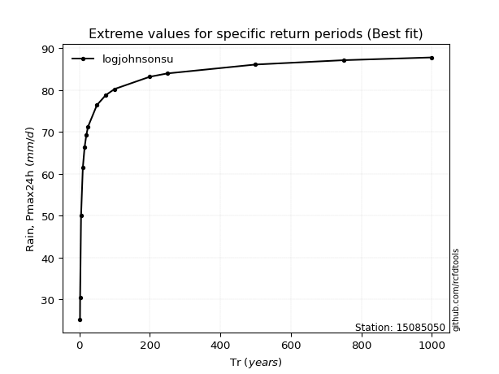</img>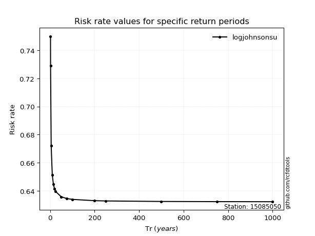</img>

</div>


<sub>**APP DISCLAIMER**: NO WARRANTY - This software is provided by [github.com/rcfdtools](https://github.com/rcfdtools) "as is", without any express or implied warranty, including warranties of merchantability, fitness for a particular purpose, or non-infringement. There is no guarantee that the software will be error-free or operate without interruption. LIMITATION OF LIABILITY - Neither the authors nor copyright holders will be liable for claims or damages arising from the software or its use. You are responsible for determining if the software is appropriate for your use and assume all associated risks, including errors, legal compliance, and data loss. NO PROFESSIONAL ADVICE - The software provides general information and does not offer professional advice. It should not replace consultation with professional advisors.</sub>