<div align="center">


</div>

# PMP Station (Rain, Pmax24h): 1509500118

Probable Maximum Precipitation (PMP) is the greatest amount of rainfall for a specific duration that is meteorologically possible for a given location, acting as a "worst-case" scenario for extreme storms, crucial for designing safety-critical infrastructure like bridges, river deviations, dams, spillways, and nuclear plants to prevent catastrophic failure. PMP is calculated by hydrologists using meteorological data to determine the upper limit of extreme rainfall, often leading to the Probable Maximum Flood (PMF) for flood control design, and is increasingly being studied for climate change impacts. Probable Maximum Precipitation (PMP) is the theoretical upper limit of rainfall, a deterministic estimate for extreme events, while probability distributions (like GEV, Gumbel) describe the likelihood and frequency of various precipitation amounts, including rare ones, showing how often events occur, with PMP representing the extreme end of these distributions, used for critical infrastructure design to ensure safety against the worst conceivable weather, unlike standard statistical forecasts which cover typical probabilities.

The most common probability distributions in hydrology, used for analyzing floods, rainfall, and streamflow, include the Normal, Log-Normal, Gumbel, Gamma (including Log-Pearson Type III), and Generalized Extreme Value (GEV) distributions, often chosen based on the data´s skewness and whether modeling extremes or general conditions, with Gumbel and GEV popular for extreme events like floods, while the Normal distribution serves as a baseline, though often requiring transformations for skewed hydrological data. These distributions help in designing water infrastructure, managing water resources, and forecasting hydrologic events.

> Hydrological data often isn´t perfectly normal (it´s skewed), so different distributions are needed for different applications, such as: **Flood Frequency Analysis**: Using Gumbel, GEV, or Log-Pearson Type III for predicting extreme flood magnitudes and their return periods, **Rainfall Analysis**: Normal for annual totals, but Log-Normal, Weibull, or GEV for intensity or extreme daily rainfall, **Streamflow Modeling**: Gamma and Log-Normal for maximum flows, GEV for minimum flows, and Kappa for daily flows.

<div align="center">

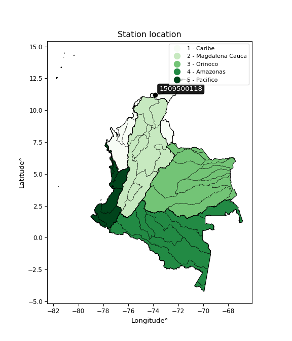</img>

</div>


## A. General information


### 1. General running parameters

• app_version: _v20260103_. • runtime: _2026-01-05 16:20:51.132608_. • Python version: _3.14.0_. • SciPy version: _1.16.3_. • Pandas version: _2.3.3_. • NumPy version: _2.3.5_. • Stations dataset (station_dataset_file): _dataset/pmax24h_in/automatic_colombia_2003_2024.csv_. • Stations catalog (station_catalog_file): _dataset/CNE.xls_. • Minimum year to eval til year_max (date_min): _1900_. • Maximum year to eval since year_min (date_max): _2024_. • Creates, save and include plots into reports (create_plot): _True_. • Plot only fit distributions with Δo > Δ (plot_only_fit): _True_. • Plot only simple graphs avoiding multiple CDFs and multiple Extreme values plots (plot_only_simple): _True_. • Eval low extreme values, if False, evaluates high extreme values (low_extreme): _False_. • Eval every SciPy distribution as logarithmic (pdist_logarithmic_on): _True_. • Standard deviation normalized (ddof): _1.0_. • Return periods to eval in years (Tr): _[2, 2.33, 5, 10, 15, 20, 25, 50, 75, 100, 200, 250, 500, 750, 1000]_. • Minimum data sample per station, 0 means any (minimum_sample): _5_. • Z-Score maximum threshold to adjust a value, 0 means disable (zscore_max): _3.5_. • Z-Score minimum threshold to adjust a value, 0 means disable (zscore_min): _-2.5_. • Avoid zeros, e.g. rain = 0 (avoid_zeros): _True_. • Avoid null values (avoid_nans): _True_. 

[:file_folder:Dataset file](../../dataset/pmax24h_in/automatic_colombia_2003_2024.csv)

> Delta Degrees of Freedom (DDOF): is a parameter used in the formulas for calculating variance and standard deviation. When ddof=0, the divisor is $N$ (the total number of observations) and this is used when your data set is the entire population. When ddof=1, the divisor is $N-1$ and this is used when your data set is a sample drawn from a larger population. Using $N-1$ provides an unbiased estimate of the population variance (known as Bessel´s correction).


### 2. Station info and location

|   id |     CODIGO | NOMBRE                        | CATEGORIA               | TECNOLOGIA                | ESTADO   | FECHA_INSTALACION   |   FECHA_SUSPENSION |   ALTITUD |   LATITUD |   LONGITUD | DEPARTAMENTO   | MUNICIPIO   | AREA_OPERATIVA                                         | ENTIDAD                                                     | AREA_HIDROGRAFICA   | ZONA_HIDROGRAFICA   | SUBZONA_HIDROGRAFICA                 |   CORRIENTE | Catalogo   |   Version |
|-----:|-----------:|:------------------------------|:------------------------|:--------------------------|:---------|:--------------------|-------------------:|----------:|----------:|-----------:|:---------------|:------------|:-------------------------------------------------------|:------------------------------------------------------------|:--------------------|:--------------------|:-------------------------------------|------------:|:-----------|----------:|
|    0 | 1509500118 | GUACHACA - AUT   [1509500118] | Climatológica Principal | Automática con Telemetría | Activa   | 15/09/2018          |                nan |       246 |   11.2102 |   -73.8444 | Magdalena      | Santa Marta | Area Operativa 05 - Magdalena-Cesar-Guajira-San Andrés | INSTITUTO DE HIDROLOGIA METEOROLOGIA Y ESTUDIOS AMBIENTALES | Caribe              | Caribe - Guajira    | Rio Guachaca - Mendiguaca y Buritaca |         nan | CNE_IDEAM  |  20251226 |

<div align="center">

Dynamic map: [:earth_americas:Google](http://maps.google.com/maps?q=11.21015,-73.84445) [:earth_americas:OSM](https://www.openstreetmap.org/#map=18/11.21015/-73.84445&layers=P) [:earth_americas:Bing](https://www.bing.com/maps?cp=11.21015~-73.84445&lvl=18) [:earth_americas:Apple](https://maps.apple.com/frame?center=11.21015%2C-73.84445&span=0.003%2C0.006)

</div>


<div align="center">

```geojson
{
  "type": "Feature",
  "geometry": {
    "type": "Point", 
    "coordinates": [-73.84445, 11.21015]
  }, 
  "properties": {
    "Name": "1509500118"
  }
}
```

</div>


### 3. Discrete values table and plot

<div align="center">

|               |          0 |           1 |           2 |           3 |          4 |
|:--------------|-----------:|------------:|------------:|------------:|-----------:|
| Date          | 2019       | 2020        | 2021        | 2022        | 2023       |
| Value         |  196.7     |  135.3      |   85.1      |  107.5      |   56.3     |
| Value_initial |  196.7     |  135.3      |   85.1      |  107.5      |   56.3     |
| count         |    5       |    5        |    5        |    5        |    5       |
| mean          |  116.18    |  116.18     |  116.18     |  116.18     |  116.18    |
| std           |   53.563   |   53.563    |   53.563    |   53.563    |   53.563   |
| zscore        |    1.50328 |    0.356963 |   -0.580252 |   -0.162052 |   -1.11794 |


</div>


<div align="center">

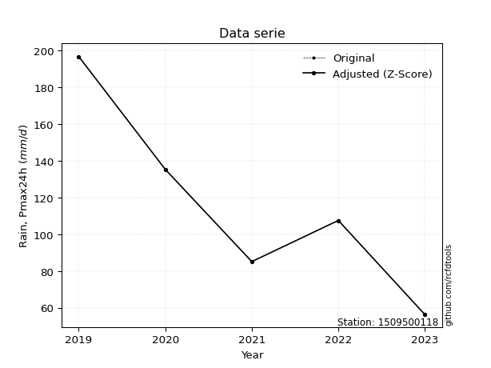</img>

</div>


> The initial value (value_initial) correspond to the initial obtained or null completed value, and value (value) is adjusted only when the initial value is outside the valid range (outlier) definite through the Z-Score value. If Z-Score is active, values out of range or outliers are replaced with the station mean value. A Z-Score (or standard score) measures how many standard deviations a data point is from the mean of a dataset, indicating its relative position; positive scores mean above the mean, negative mean below, and a score of zero is exactly at the mean, allowing for comparison of values from different distributions. It´s calculated using the formula $z=(x–μ)/σ$, where $x$ is the data point, $μ$ is the mean, and $σ$ is the standard deviation, helping identify outliers and understand probability.
>
> <sub>**Note**: In this study, "completing" (filling gaps in) and "extending" (forecasting or lengthening the historical record) rainfall data series are avoided for certain critical analyses because they introduce artificial bias and uncertainty, which can distort the statistics of rare events (extremes), alter day-to-day variability, and compromise the integrity and homogeneity of the original data. Some reasons against Completing/Extending rainfall data are: **Distortion of Extremes and Variability**: The primary issue is that most gap-filling or extension methods rely on averaging or regression with nearby stations, which inherently smooths the data. Rainfall is highly variable in space and time, with a large percentage of zero values and occasional large storms. Infilling methods often underestimate the highest values and overestimate the lowest (zero) values, which severely distorts analyses focused on flood frequency, drought severity, and intensity-duration-frequency (IDF) curves, **Loss of Data Homogeneity**: Infilled or extended data are synthetic estimates, not actual measurements. Combining these estimates with observed data can violate the assumption of data homogeneity, which requires that the data properties do not change over time. Inhomogeneity can lead to incorrect conclusions about long-term trends or changes in climate patterns, **Propagation of Errors**: Errors and biases from the original data (e.g., wind-induced undercatch, instrument errors, site changes) or the data used for imputation can propagate through the analysis, leading to unreliable hydrological models and inaccurate predictions, **Compromised Statistical Integrity**: For statistical analyses, especially those involving the frequency of events, using artificial data can introduce time bias or autocorrelation that doesn´t exist in reality, making it difficult to assess the true probability of events, **Difficulty in Validation**: It is difficult to accurately validate the quality of filled or extended data, especially for past periods where ground-truth measurements are unavailable. The reliability of imputation techniques heavily depends on the density of the surrounding station network and the complexity of the local topography.</sub>


### 4. Active continuous probability distributions from SciPy (44 of 104 available)

A Probability Density Function (PDF) describes the relative likelihood of a continuous random variable falling within a specific range, where the total area under its curve equals 1, and the area over any interval gives the actual probability for that range. Unlike discrete probabilities (like rolling a die), a PDF shows density, not direct probability for a single point (which is zero), with higher points indicating higher likelihood, often visualized as a bell curve for normal distributions.

A log of a probability density function (log-PDF) is simply the logarithm of the PDF´s value, denoted as $log(f(x))$, useful for converting multiplication of probabilities into addition, improving numerical stability with tiny numbers, and connecting to information theory concepts like entropy. Instead of dealing with very small probabilities (e.g., 0.000001), log-PDFs use negative numbers (e.g., $log(0.00001) ≈ -11.51$ that are easier for computers to handle, preventing underflow errors and simplifying complex calculations. In this study, each active probability distribution from SciPy is also evaluated in the $log$ form.

[scipy.stats](https://docs.scipy.org/doc/scipy/reference/stats.html) is a Python´s powerful submodule within the SciPy library for comprehensive statistical analysis, offering over 130 probability distributions (like Normal, Poisson), functions for descriptive stats (mean, variance), hypothesis testing (t-tests, chi-square), random variable generation, and statistical tests, making it essential for data science, modeling, and research. It provides tools to explore, model, and draw conclusions from data efficiently, working seamlessly with NumPy.

<div align="center">

|   id | p_dist             |   n_parameter | fit_method   | label                                                                       | active   | ref                                                                                                        |
|-----:|:-------------------|--------------:|:-------------|:----------------------------------------------------------------------------|:---------|:-----------------------------------------------------------------------------------------------------------|
|    0 | alpha              |             3 | MLE          | Alpha                                                                       | True     | [:mortar_board:](https://docs.scipy.org/doc/scipy/reference/generated/scipy.stats.alpha.html)              |
|    1 | betaprime          |             4 | MLE          | Beta prime                                                                  | True     | [:mortar_board:](https://docs.scipy.org/doc/scipy/reference/generated/scipy.stats.betaprime.html)          |
|    2 | chi2               |             3 | MLE          | Chi²                                                                        | True     | [:mortar_board:](https://docs.scipy.org/doc/scipy/reference/generated/scipy.stats.chi2.html)               |
|    3 | crystalball        |             4 | MLE          | Crystalball                                                                 | True     | [:mortar_board:](https://docs.scipy.org/doc/scipy/reference/generated/scipy.stats.crystalball.html)        |
|    4 | erlang             |             3 | MLE          | Erlang                                                                      | True     | [:mortar_board:](https://docs.scipy.org/doc/scipy/reference/generated/scipy.stats.erlang.html)             |
|    5 | expon              |             2 | MLE          | Exponential                                                                 | True     | [:mortar_board:](https://docs.scipy.org/doc/scipy/reference/generated/scipy.stats.expon.html)              |
|    6 | exponnorm          |             3 | MLE          | Exponentially modified Normal                                               | True     | [:mortar_board:](https://docs.scipy.org/doc/scipy/reference/generated/scipy.stats.exponnorm.html)          |
|    7 | f                  |             4 | MLE          | F                                                                           | True     | [:mortar_board:](https://docs.scipy.org/doc/scipy/reference/generated/scipy.stats.f.html)                  |
|    8 | fatiguelife        |             3 | MLE          | Fatigue-life (Birnbaum-Saunders)                                            | True     | [:mortar_board:](https://docs.scipy.org/doc/scipy/reference/generated/scipy.stats.fatiguelife.html)        |
|    9 | fisk               |             3 | MLE          | Fisk                                                                        | True     | [:mortar_board:](https://docs.scipy.org/doc/scipy/reference/generated/scipy.stats.fisk.html)               |
|   10 | gamma              |             3 | MLE          | Gamma                                                                       | True     | [:mortar_board:](https://docs.scipy.org/doc/scipy/reference/generated/scipy.stats.gamma.html)              |
|   11 | genexpon           |             5 | MLE          | Generalized exponential                                                     | True     | [:mortar_board:](https://docs.scipy.org/doc/scipy/reference/generated/scipy.stats.genexpon.html)           |
|   12 | genlogistic        |             3 | MLE          | Generalized logistic                                                        | True     | [:mortar_board:](https://docs.scipy.org/doc/scipy/reference/generated/scipy.stats.genlogistic.html)        |
|   13 | gibrat             |             2 | MM           | Gibrat                                                                      | True     | [:mortar_board:](https://docs.scipy.org/doc/scipy/reference/generated/scipy.stats.gibrat.html)             |
|   14 | gompertz           |             3 | MLE          | Gompertz (or truncated Gumbel)                                              | True     | [:mortar_board:](https://docs.scipy.org/doc/scipy/reference/generated/scipy.stats.gompertz.html)           |
|   15 | gumbel_l           |             2 | MM           | Gumbel Left Skew                                                            | True     | [:mortar_board:](https://docs.scipy.org/doc/scipy/reference/generated/scipy.stats.gumbel_l.html)           |
|   16 | gumbel_r           |             2 | MM           | Gumbel Right Skew                                                           | True     | [:mortar_board:](https://docs.scipy.org/doc/scipy/reference/generated/scipy.stats.gumbel_r.html)           |
|   17 | halflogistic       |             2 | MM           | Half-logistic                                                               | True     | [:mortar_board:](https://docs.scipy.org/doc/scipy/reference/generated/scipy.stats.halflogistic.html)       |
|   18 | halfnorm           |             2 | MM           | Half Normal                                                                 | True     | [:mortar_board:](https://docs.scipy.org/doc/scipy/reference/generated/scipy.stats.halfnorm.html)           |
|   19 | hypsecant          |             2 | MM           | hyperbolic secant                                                           | True     | [:mortar_board:](https://docs.scipy.org/doc/scipy/reference/generated/scipy.stats.hypsecant.html)          |
|   20 | invgamma           |             3 | MLE          | Inverted gamma                                                              | True     | [:mortar_board:](https://docs.scipy.org/doc/scipy/reference/generated/scipy.stats.invgamma.html)           |
|   21 | invgauss           |             3 | MLE          | Inverse Gaussian                                                            | True     | [:mortar_board:](https://docs.scipy.org/doc/scipy/reference/generated/scipy.stats.invgauss.html)           |
|   22 | invweibull         |             3 | MLE          | Inverted Weibull                                                            | True     | [:mortar_board:](https://docs.scipy.org/doc/scipy/reference/generated/scipy.stats.invweibull.html)         |
|   23 | johnsonsu          |             4 | MLE          | Johnson Su                                                                  | True     | [:mortar_board:](https://docs.scipy.org/doc/scipy/reference/generated/scipy.stats.johnsonsu.html)          |
|   24 | kstwobign          |             2 | MLE          | Limiting distribution of scaled Kolmogorov-Smirnov two-sided test statistic | True     | [:mortar_board:](https://docs.scipy.org/doc/scipy/reference/generated/scipy.stats.kstwobign.html)          |
|   25 | laplace            |             2 | MM           | Laplace                                                                     | True     | [:mortar_board:](https://docs.scipy.org/doc/scipy/reference/generated/scipy.stats.laplace.html)            |
|   26 | laplace_asymmetric |             3 | MLE          | Asymmetric Laplace                                                          | True     | [:mortar_board:](https://docs.scipy.org/doc/scipy/reference/generated/scipy.stats.laplace_asymmetric.html) |
|   27 | loggamma           |             3 | MLE          | Log gamma                                                                   | True     | [:mortar_board:](https://docs.scipy.org/doc/scipy/reference/generated/scipy.stats.loggamma.html)           |
|   28 | logistic           |             2 | MM           | Logistic (or Sech-squared)                                                  | True     | [:mortar_board:](https://docs.scipy.org/doc/scipy/reference/generated/scipy.stats.logistic.html)           |
|   29 | lognorm            |             3 | MLE          | Log Normal                                                                  | True     | [:mortar_board:](https://docs.scipy.org/doc/scipy/reference/generated/scipy.stats.lognorm.html)            |
|   30 | maxwell            |             2 | MM           | Maxwell                                                                     | True     | [:mortar_board:](https://docs.scipy.org/doc/scipy/reference/generated/scipy.stats.maxwell.html)            |
|   31 | mielke             |             4 | MLE          | Mielke Beta-Kappa / Dagum                                                   | True     | [:mortar_board:](https://docs.scipy.org/doc/scipy/reference/generated/scipy.stats.mielke.html)             |
|   32 | moyal              |             2 | MM           | Moyal                                                                       | True     | [:mortar_board:](https://docs.scipy.org/doc/scipy/reference/generated/scipy.stats.moyal.html)              |
|   33 | nakagami           |             3 | MLE          | Nakagami                                                                    | True     | [:mortar_board:](https://docs.scipy.org/doc/scipy/reference/generated/scipy.stats.nakagami.html)           |
|   34 | ncf                |             5 | MLE          | Non-central F distribution                                                  | True     | [:mortar_board:](https://docs.scipy.org/doc/scipy/reference/generated/scipy.stats.ncf.html)                |
|   35 | nct                |             4 | MLE          | Non-central Student’s t                                                     | True     | [:mortar_board:](https://docs.scipy.org/doc/scipy/reference/generated/scipy.stats.nct.html)                |
|   36 | norm               |             2 | MM           | Normal                                                                      | True     | [:mortar_board:](https://docs.scipy.org/doc/scipy/reference/generated/scipy.stats.norm.html)               |
|   37 | pearson3           |             3 | MM           | Pearson type III                                                            | True     | [:mortar_board:](https://docs.scipy.org/doc/scipy/reference/generated/scipy.stats.pearson3.html)           |
|   38 | rayleigh           |             2 | MM           | Rayleigh                                                                    | True     | [:mortar_board:](https://docs.scipy.org/doc/scipy/reference/generated/scipy.stats.rayleigh.html)           |
|   39 | rice               |             3 | MLE          | Rice                                                                        | True     | [:mortar_board:](https://docs.scipy.org/doc/scipy/reference/generated/scipy.stats.rice.html)               |
|   40 | t                  |             3 | MLE          | Student’s t                                                                 | True     | [:mortar_board:](https://docs.scipy.org/doc/scipy/reference/generated/scipy.stats.t.html)                  |
|   41 | truncnorm          |             4 | MLE          | Truncated normal                                                            | True     | [:mortar_board:](https://docs.scipy.org/doc/scipy/reference/generated/scipy.stats.truncnorm.html)          |
|   42 | wald               |             2 | MM           | Wald                                                                        | True     | [:mortar_board:](https://docs.scipy.org/doc/scipy/reference/generated/scipy.stats.wald.html)               |
|   43 | weibull_min        |             3 | MLE          | Weibull minimum                                                             | True     | [:mortar_board:](https://docs.scipy.org/doc/scipy/reference/generated/scipy.stats.weibull_min.html)        |

</div>

> **n_parameter:** # arguments & localization & scale.
>
> **Fit methods:** (MLE) maximum likelihood, (MM) L-moments.
>
>**Inactive** (With the only purpose of prevent loops, zero divisions, infinite values, over high estimated values or horizontal trending for recurrence intervals estimations, the follow distributions were disabled.)**:** foldnorm, gennorm, norminvgauss, powernorm, powerlognorm, skewnorm, genextreme, anglit, arcsine, argus, beta, bradford, burr, burr12, cauchy, cosine, halfcauchy, foldcauchy, skewcauchy, wrapcauchy, dgamma, gengamma, exponweib, exponpow, truncexpon, gausshyper, genhalflogistic, genhyperbolic, geninvgauss, halfgennorm, johnsonsb, kappa4, kappa3, ksone, kstwo, loglaplace, levy, levy_l, levy_stable, ncx2, pareto, genpareto, truncpareto, lomax, powerlaw, rdist, rel_breitwigner, recipinvgauss, semicircular, studentized_range, trapezoid, triang, truncweibull_min, tukeylambda, uniform, loguniform, vonmises, vonmises_line, weibull_max, dweibull, 


## B. Probability (PDF) vs. Empirical (EDF) distributions functions

A continuous probability distribution (CPD) describes probabilities for variables that can take any value within a range (like rain any time), unlike discrete variables with specific outcomes (like temperature). It uses a Probability Density Function (PDF), a curve where the total area under it equals 1, and the probability of the variable falling within an interval (a to b) is found by calculating the area under the curve between those points. A key feature is that the probability of hitting any single exact value is zero, so probabilities are always expressed for ranges, e.g., $P(a ≤ X ≤ b)$.

<div align="center">

Distributions parameters from station values
|    |    station | p_dist                |   n |              loc |          scale | shape                 | shape1                 | shape2                 | shape3   |
|---:|-----------:|:----------------------|----:|-----------------:|---------------:|:----------------------|:-----------------------|:-----------------------|:---------|
|  0 | 1509500118 | alpha                 |   5 |   -133.802       | 1322.24        | 5.477896243483724     |                        |                        |          |
|  1 | 1509500118 | betaprime             |   5 |     -3.12289     |    0.457346    | 1376.4944641681468    | 6.235659532352226      |                        |          |
|  2 | 1509500118 | chi2                  |   5 |     56.3         |   28.3731      | 0.7351278578043128    |                        |                        |          |
|  3 | 1509500118 | crystalball           |   5 |    116.18        |   47.9082      | 10170.466105400668    | 1461.5271390717012     |                        |          |
|  4 | 1509500118 | erlang                |   5 |     56.3         |   66.761       | 0.7422498833005127    |                        |                        |          |
|  5 | 1509500118 | expon                 |   5 |     56.3         |   59.88        |                       |                        |                        |          |
|  6 | 1509500118 | exponnorm             |   5 |     63.708       |   18.2521      | 2.8748403020129767    |                        |                        |          |
|  7 | 1509500118 | f                     |   5 |     56.2033      |   58.1531      | 1.3613141506227393    | 39.962571604840456     |                        |          |
|  8 | 1509500118 | fatiguelife           |   5 |     56.3         |    0.0250399   | 43.42897182062512     |                        |                        |          |
|  9 | 1509500118 | fisk                  |   5 |     -0.756376    |  107.785       | 4.003572750648305     |                        |                        |          |
| 10 | 1509500118 | gamma                 |   5 |     56.3         |   58.1451      | 0.4490080652007834    |                        |                        |          |
| 11 | 1509500118 | genexpon              |   5 |     56.3         |    2.18387     | 0.036469397967934435  | 2.4701139789704757e-07 | 1.1885635139581205     |          |
| 12 | 1509500118 | genlogistic           |   5 |   -158.586       |   38.2542      | 729.4365532300642     |                        |                        |          |
| 13 | 1509500118 | gibrat                |   5 |     79.6321      |   22.1674      |                       |                        |                        |          |
| 14 | 1509500118 | gompertz              |   5 |     56.3         |  141.38        | 1.6075167879180614    |                        |                        |          |
| 15 | 1509500118 | gumbel_l              |   5 |    137.741       |   37.3539      |                       |                        |                        |          |
| 16 | 1509500118 | gumbel_r              |   5 |     94.6188      |   37.3539      |                       |                        |                        |          |
| 17 | 1509500118 | halflogistic          |   5 |     59.3977      |   40.9598      |                       |                        |                        |          |
| 18 | 1509500118 | halfnorm              |   5 |     52.7683      |   79.4747      |                       |                        |                        |          |
| 19 | 1509500118 | hypsecant             |   5 |    116.18        |   30.4993      |                       |                        |                        |          |
| 20 | 1509500118 | invgamma              |   5 |    -30.6696      | 1297.58        | 9.8089006970083       |                        |                        |          |
| 21 | 1509500118 | invgauss              |   5 |     15.8862      |  353.138       | 0.28400651964205836   |                        |                        |          |
| 22 | 1509500118 | invweibull            |   5 |     56.3         |    1.40001     | 0.040579205488498624  |                        |                        |          |
| 23 | 1509500118 | johnsonsu             |   5 |     15.1311      |    2.59402     | -8.469676139862669    | 1.9994676567226        |                        |          |
| 24 | 1509500118 | kstwobign             |   5 |    -40.5684      |  179.71        |                       |                        |                        |          |
| 25 | 1509500118 | laplace               |   5 |    116.18        |   33.8762      |                       |                        |                        |          |
| 26 | 1509500118 | laplace_asymmetric    |   5 |    107.5         |   37.3681      | 0.8905795941116692    |                        |                        |          |
| 27 | 1509500118 | loggamma              |   5 | -15003.2         | 2027.08        | 1735.326642044915     |                        |                        |          |
| 28 | 1509500118 | logistic              |   5 |    116.18        |   26.4132      |                       |                        |                        |          |
| 29 | 1509500118 | lognorm               |   5 |     56.3         |    0.0410251   | 14.70135014697736     |                        |                        |          |
| 30 | 1509500118 | maxwell               |   5 |      2.65773     |   71.1395      |                       |                        |                        |          |
| 31 | 1509500118 | mielke                |   5 |     -0.542162    |   99.0975      | 4.574751082384333     | 3.736760359596013      |                        |          |
| 32 | 1509500118 | moyal                 |   5 |     88.783       |   21.5663      |                       |                        |                        |          |
| 33 | 1509500118 | nakagami              |   5 |     85.1         |   46.0813      | 0.15614049472099195   |                        |                        |          |
| 34 | 1509500118 | ncf                   |   5 |     -0.666928    |   42.286       | 12.218798339726398    | 30.780059016138352     | 19.364025642937406     |          |
| 35 | 1509500118 | nct                   |   5 |     -0.0877646   |   24.231       | 5.202003123556398     | 4.100627346276218      |                        |          |
| 36 | 1509500118 | norm                  |   5 |    116.18        |   47.9082      |                       |                        |                        |          |
| 37 | 1509500118 | pearson3              |   5 |    116.18        |   47.9079      | 0.5159812747218584    |                        |                        |          |
| 38 | 1509500118 | rayleigh              |   5 |     24.5289      |   73.127       |                       |                        |                        |          |
| 39 | 1509500118 | rice                  |   5 |     32.4061      |   68.2395      | 0.0015816922166558872 |                        |                        |          |
| 40 | 1509500118 | t                     |   5 |    116.184       |   47.901       | 2237905.261827765     |                        |                        |          |
| 41 | 1509500118 | truncnorm             |   5 |    116.18        |   47.9082      | -1347.4938840410377   | 113.00712978185533     |                        |          |
| 42 | 1509500118 | wald                  |   5 |     68.2719      |   47.9082      |                       |                        |                        |          |
| 43 | 1509500118 | weibull_min           |   5 |     56.3         |   66.2177      | 0.8479524622432335    |                        |                        |          |
| 44 | 1509500118 | logalpha              |   5 |     -4.52799     |  199.124       | 21.69656235755137     |                        |                        |          |
| 45 | 1509500118 | logbetaprime          |   5 |     -5.97362     |    6.4939      | 1673.3510980322499    | 1022.0243990602221     |                        |          |
| 46 | 1509500118 | logchi2               |   5 |      4.03069     |    0.998706    | 1.0781337891946998    |                        |                        |          |
| 47 | 1509500118 | logcrystalball        |   5 |      4.66824     |    0.42201     | 7.768005806439135     | 44.12303796382868      |                        |          |
| 48 | 1509500118 | logerlang             |   5 |    -10.4292      |    0.0118061   | 1278.7738671309721    |                        |                        |          |
| 49 | 1509500118 | logexpon              |   5 |      4.03069     |    0.637543    |                       |                        |                        |          |
| 50 | 1509500118 | logexponnorm          |   5 |      4.66767     |    0.42201     | 0.0013417534140652144 |                        |                        |          |
| 51 | 1509500118 | logf                  |   5 |    -15.0971      |   19.7551      | 28308.581383427096    | 5102.689169884852      |                        |          |
| 52 | 1509500118 | logfatiguelife        |   5 |    -34.5221      |   39.1889      | 0.010737769631344238  |                        |                        |          |
| 53 | 1509500118 | logfisk               |   5 |     -7.07469e+06 |    7.07469e+06 | 28107688.867567454    |                        |                        |          |
| 54 | 1509500118 | loggamma              |   5 |    -10.2389      |    0.011996    | 1242.615514464845     |                        |                        |          |
| 55 | 1509500118 | loggenexpon           |   5 |      4.03015     |    0.0100603   | 0.008523661122366525  | 3.946231285575501      | 4.0182019167485676e-05 |          |
| 56 | 1509500118 | loggenlogistic        |   5 |      4.59814     |    0.26752     | 1.2015884117762359    |                        |                        |          |
| 57 | 1509500118 | loggibrat             |   5 |      4.34632     |    0.195257    |                       |                        |                        |          |
| 58 | 1509500118 | loggompertz           |   5 |      4.03069     |    0.632332    | 0.4190239144237269    |                        |                        |          |
| 59 | 1509500118 | loggumbel_l           |   5 |      4.85816     |    0.32904     |                       |                        |                        |          |
| 60 | 1509500118 | loggumbel_r           |   5 |      4.47831     |    0.32904     |                       |                        |                        |          |
| 61 | 1509500118 | loghalflogistic       |   5 |      4.16805     |    0.360809    |                       |                        |                        |          |
| 62 | 1509500118 | loghalfnorm           |   5 |      4.10964     |    0.700094    |                       |                        |                        |          |
| 63 | 1509500118 | loghypsecant          |   5 |      4.66824     |    0.26866     |                       |                        |                        |          |
| 64 | 1509500118 | loginvgamma           |   5 |     -3.49322     | 3002.2         | 368.87133513087724    |                        |                        |          |
| 65 | 1509500118 | loginvgauss           |   5 |      1.72175     |  133.979       | 0.021958290461977212  |                        |                        |          |
| 66 | 1509500118 | loginvweibull         |   5 |     -3.65699e+07 |    3.65699e+07 | 91395582.25952998     |                        |                        |          |
| 67 | 1509500118 | logjohnsonsu          |   5 |     -2.76476e+06 |    3.96249e+06 | -7427020.38299872     | 11411987.227302283     |                        |          |
| 68 | 1509500118 | logkstwobign          |   5 |      3.09037     |    1.8021      |                       |                        |                        |          |
| 69 | 1509500118 | loglaplace            |   5 |      4.66824     |    0.298406    |                       |                        |                        |          |
| 70 | 1509500118 | loglaplace_asymmetric |   5 |      4.67749     |    0.342794    | 1.0136745056837482    |                        |                        |          |
| 71 | 1509500118 | logloggamma           |   5 |     -6.7735      |    2.94563     | 49.13250965189597     |                        |                        |          |
| 72 | 1509500118 | loglogistic           |   5 |      4.66824     |    0.232666    |                       |                        |                        |          |
| 73 | 1509500118 | loglognorm            |   5 |      4.03069     |    0.000764015 | 13.745036477892972    |                        |                        |          |
| 74 | 1509500118 | logmaxwell            |   5 |      3.66825     |    0.626649    |                       |                        |                        |          |
| 75 | 1509500118 | logmielke             |   5 |     -0.571305    |    5.36226     | 16.955070942565563    | 23.704751670447855     |                        |          |
| 76 | 1509500118 | logmoyal              |   5 |      4.4269      |    0.189971    |                       |                        |                        |          |
| 77 | 1509500118 | lognakagami           |   5 |      4.44383     |    0.343163    | 0.30193877565698685   |                        |                        |          |
| 78 | 1509500118 | logncf                |   5 |    -10.593       |   10.4424      | 4463.922394264344     | 5418.194146877524      | 2057.7093268913422     |          |
| 79 | 1509500118 | lognct                |   5 |    -16.8871      |    0.387981    | 8353.919085878704     | 55.55166950141063      |                        |          |
| 80 | 1509500118 | lognorm               |   5 |      4.66824     |    0.42201     |                       |                        |                        |          |
| 81 | 1509500118 | logpearson3           |   5 |      4.66824     |    0.42201     | -0.06894924324027582  |                        |                        |          |
| 82 | 1509500118 | lograyleigh           |   5 |      3.86091     |    0.644156    |                       |                        |                        |          |
| 83 | 1509500118 | logrice               |   5 |      3.79476     |    0.492678    | 1.3700085467691385    |                        |                        |          |
| 84 | 1509500118 | logt                  |   5 |      4.66824     |    0.422012    | 204177481.45993704    |                        |                        |          |
| 85 | 1509500118 | logtruncnorm          |   5 |     -0.182243    |    1.48727     | 2.832671552257454     | 3.6738065047576614     |                        |          |
| 86 | 1509500118 | logwald               |   5 |      4.24623     |    0.422009    |                       |                        |                        |          |
| 87 | 1509500118 | logweibull_min        |   5 |      3.63912     |    1.15977     | 2.699127544337662     |                        |                        |          |

</div>

> **loc** (Location parameter): This shifts the distribution along the x-axis. For many common distributions, like the normal (Gaussian) distribution, loc represents the mean $μ$. For others, like the uniform distribution, it might represent the minimum value, or for the beta distribution, the left end of the support interval.
>
> **scale** (Scale parameter): This determines the width or spread of the distribution. For the normal distribution, scale represents the standard deviation $σ$. For a uniform distribution, it defines the length of the interval (from $loc$ to $loc + scale$).
>
> **shape** (Shape parameters): Refers to parameters that define the specific form of a probability distribution, distinct from its location (loc) and scale (scale). These parameters are required arguments for most distribution functions. For example, a normal (Gaussian) distribution is fully defined by its location (mean) and scale (standard deviation), so it has no specific shape parameters beyond loc and scale. However, other distributions have intrinsic properties that need specification, as Gamma distribution that takes a shape parameter, often named $a$ or $alpha$.


### 0. Cumulative distribution values - CDF (88 evaluated)

Cumulative Distribution Function (CDF), denoted as $F$<sub>$X$</sub>$(x)$, is a function that gives the probability that a random variable $X$ will take a value less than or equal to a specific value, $x$ (i.e., $(P(X≥x)$. It essentially "accumulates" probabilities from a given point up to the far right (positive infinity), providing a complete picture of the distribution´s probabilities for both discrete (like rain) and continuous (like temperature) variables, helping to find probabilities over ranges or above certain values. Each station is evaluated separately ordering the $x$ values ascending, calculating the CDF and PDF values for the activated distributions and their logarithmic forms.

<div align="center">

CDF ordered by x ascending and calculating $log(f(x))$ separately
|   id |    Station |   date |     x |   count |   mean |    std |    zscore |   Value_initial |    station |   m |     alpha |   alpha_pdf |   betaprime |   betaprime_pdf |        chi2 |    chi2_pdf |   crystalball |   crystalball_pdf |      erlang |   erlang_pdf |    expon |   expon_pdf |   exponnorm |   exponnorm_pdf |         f |      f_pdf |   fatiguelife |   fatiguelife_pdf |      fisk |   fisk_pdf |       gamma |   gamma_pdf |    genexpon |   genexpon_pdf |   genlogistic |   genlogistic_pdf |    gibrat |   gibrat_pdf |    gompertz |   gompertz_pdf |   gumbel_l |   gumbel_l_pdf |   gumbel_r |   gumbel_r_pdf |   halflogistic |   halflogistic_pdf |   halfnorm |   halfnorm_pdf |   hypsecant |   hypsecant_pdf |   invgamma |   invgamma_pdf |   invgauss |   invgauss_pdf |   invweibull |   invweibull_pdf |   johnsonsu |   johnsonsu_pdf |   kstwobign |   kstwobign_pdf |   laplace |   laplace_pdf |   laplace_asymmetric |   laplace_asymmetric_pdf |   loggamma |   loggamma_pdf |   logistic |   logistic_pdf |   lognorm |   lognorm_pdf |   maxwell |   maxwell_pdf |    mielke |   mielke_pdf |     moyal |   moyal_pdf |    nakagami |   nakagami_pdf |       ncf |    ncf_pdf |       nct |    nct_pdf |     norm |   norm_pdf |   pearson3 |   pearson3_pdf |   rayleigh |   rayleigh_pdf |      rice |   rice_pdf |        t |      t_pdf |   truncnorm |   truncnorm_pdf |     wald |   wald_pdf |   weibull_min |   weibull_min_pdf |   logalpha |   logalpha_pdf |   logbetaprime |   logbetaprime_pdf |    logchi2 |   logchi2_pdf |   logcrystalball |   logcrystalball_pdf |   logerlang |   logerlang_pdf |   logexpon |   logexpon_pdf |   logexponnorm |   logexponnorm_pdf |      logf |   logf_pdf |   logfatiguelife |   logfatiguelife_pdf |   logfisk |   logfisk_pdf |   loggenexpon |   loggenexpon_pdf |   loggenlogistic |   loggenlogistic_pdf |   loggibrat |   loggibrat_pdf |   loggompertz |   loggompertz_pdf |   loggumbel_l |   loggumbel_l_pdf |   loggumbel_r |   loggumbel_r_pdf |   loghalflogistic |   loghalflogistic_pdf |   loghalfnorm |   loghalfnorm_pdf |   loghypsecant |   loghypsecant_pdf |   loginvgamma |   loginvgamma_pdf |   loginvgauss |   loginvgauss_pdf |   loginvweibull |   loginvweibull_pdf |   logjohnsonsu |   logjohnsonsu_pdf |   logkstwobign |   logkstwobign_pdf |   loglaplace |   loglaplace_pdf |   loglaplace_asymmetric |   loglaplace_asymmetric_pdf |   logloggamma |   logloggamma_pdf |   loglogistic |   loglogistic_pdf |   loglognorm |   loglognorm_pdf |   logmaxwell |   logmaxwell_pdf |   logmielke |   logmielke_pdf |   logmoyal |   logmoyal_pdf |   lognakagami |   lognakagami_pdf |    logncf |   logncf_pdf |   lognct |   lognct_pdf |   logpearson3 |   logpearson3_pdf |   lograyleigh |   lograyleigh_pdf |   logrice |   logrice_pdf |      logt |   logt_pdf |   logtruncnorm |   logtruncnorm_pdf |   logwald |   logwald_pdf |   logweibull_min |   logweibull_min_pdf |
|-----:|-----------:|-------:|------:|--------:|-------:|-------:|----------:|----------------:|-----------:|----:|----------:|------------:|------------:|----------------:|------------:|------------:|--------------:|------------------:|------------:|-------------:|---------:|------------:|------------:|----------------:|----------:|-----------:|--------------:|------------------:|----------:|-----------:|------------:|------------:|------------:|---------------:|--------------:|------------------:|----------:|-------------:|------------:|---------------:|-----------:|---------------:|-----------:|---------------:|---------------:|-------------------:|-----------:|---------------:|------------:|----------------:|-----------:|---------------:|-----------:|---------------:|-------------:|-----------------:|------------:|----------------:|------------:|----------------:|----------:|--------------:|---------------------:|-------------------------:|-----------:|---------------:|-----------:|---------------:|----------:|--------------:|----------:|--------------:|----------:|-------------:|----------:|------------:|------------:|---------------:|----------:|-----------:|----------:|-----------:|---------:|-----------:|-----------:|---------------:|-----------:|---------------:|----------:|-----------:|---------:|-----------:|------------:|----------------:|---------:|-----------:|--------------:|------------------:|-----------:|---------------:|---------------:|-------------------:|-----------:|--------------:|-----------------:|---------------------:|------------:|----------------:|-----------:|---------------:|---------------:|-------------------:|----------:|-----------:|-----------------:|---------------------:|----------:|--------------:|--------------:|------------------:|-----------------:|---------------------:|------------:|----------------:|--------------:|------------------:|--------------:|------------------:|--------------:|------------------:|------------------:|----------------------:|--------------:|------------------:|---------------:|-------------------:|--------------:|------------------:|--------------:|------------------:|----------------:|--------------------:|---------------:|-------------------:|---------------:|-------------------:|-------------:|-----------------:|------------------------:|----------------------------:|--------------:|------------------:|--------------:|------------------:|-------------:|-----------------:|-------------:|-----------------:|------------:|----------------:|-----------:|---------------:|--------------:|------------------:|----------:|-------------:|---------:|-------------:|--------------:|------------------:|--------------:|------------------:|----------:|--------------:|----------:|-----------:|---------------:|-------------------:|----------:|--------------:|-----------------:|---------------------:|
|    0 | 1509500118 |   2023 |  56.3 |       5 | 116.18 | 53.563 | -1.11794  |            56.3 | 1509500118 |   1 | 0.0697708 |  0.00490017 |   0.0578224 |      0.0057953  | 1.60589e-06 | 8.30729e+07 |      0.10567  |        0.003813   | 1.51904e-12 | 158.683      | 0        |  0.0167001  |   0.0665175 |      0.00525806 | 0.0108484 | 0.0763084  |     0.0494039 |   17316.6         | 0.0726514 | 0.00472749 | 8.08531e-08 | 5.10929e+06 | 2.05082e-07 |     0.0166995  |     0.0709182 |        0.00489687 | 0         |  0           | 1.89695e-13 |     0.0113702  |   0.10686  |     0.00270214 |  0.0614572 |     0.00458934 |       0        |         0          |  0.0354443 |     0.0100296  |   0.0887953 |      0.00287378 |  0.0649033 |     0.0052557  |  0.0580431 |     0.0061478  |    0.0223165 |      4.84619e+11 |   0.0600577 |      0.00577839 |   0.0665929 |      0.00515055 | 0.0853701 |    0.00252006 |            0.0949672 |               0.00285364 |  0.0644321 |       0.306612 |  0.0938888 |     0.00322088 | 0.0654287 |      0.301989 | 0.0964141 |    0.00479905 | 0.0680647 |   0.00486797 | 0.0337062 |  0.00412065 | 0           |    0           | 0.0700512 | 0.00511148 | 0.0635862 | 0.00503696 | 0.10567  | 0.003813   |  0.0920271 |     0.0044783  |   0.090063 |     0.00540615 | 0.0594607 | 0.00482606 | 0.105621 | 0.0038123  |    0.10567  |      0.003813   | 0        | 0          |   2.87556e-14 |        3.43165    |  0.0583017 |       0.316611 |       0.061725 |           0.308066 | 5.9675e-09 |   3.62188e+06 |        0.0654287 |             0.301989 |   0.0639585 |        0.305246 |   0        |       1.56852  |      0.0654289 |           0.30199  | 0.0654151 |   0.312035 |        0.0637658 |             0.301769 | 0.0723626 |      0.266692 |   0.000458263 |          0.847714 |        0.0682343 |             0.273669 |    0        |        0        |   1.29831e-08 |          0.662665 |     0.0776947 |          0.226705 |     0.0202898 |          0.240343 |          0        |              0        |      0        |          0        |      0.0591597 |           0.218937 |     0.0610294 |          0.316362 |     0.0582235 |          0.343537 |       0.0537517 |            0.392717 |      0.0660567 |           0.303244 |      0.0517266 |           0.443509 |     0.059034 |         0.197831 |               0.0787843 |                    0.22673  |     0.0691126 |          0.293618 |     0.0606448 |          0.244844 |     0.022788 |      4.42878e+12 |    0.0465909 |         0.360335 |    0.073448 |        0.263575 | 0.00455114 |       0.106449 |   0           |          0        | 0.0640511 |     0.308014 | 0.065201 |     0.30363  |      0.067234 |          0.298169 |     0.0341409 |          0.395217 | 0.0446622 |      0.376565 | 0.0654296 |   0.301991 |    6.54228e-06 |           2.21802  |  0        |      0        |        0.0519622 |             0.348701 |
|    1 | 1509500118 |   2021 |  85.1 |       5 | 116.18 | 53.563 | -0.580252 |            85.1 | 1509500118 |   2 | 0.286919  |  0.00939798 |   0.317363  |      0.0104799  | 0.772264    | 0.00673144  |      0.258253 |        0.006747   | 0.490004    |   0.00977839 | 0.381812 |  0.0103238  |   0.317543  |      0.0107079  | 0.458796  | 0.00874882 |     0.782372  |       0.00399278  | 0.286866  | 0.0095395  | 0.71375     | 0.00782484  | 0.381803    |     0.0103236  |     0.287188  |        0.00935831 | 0.0807981 |  0.0273934   | 0.304552    |     0.00969395 |   0.216767 |     0.00512298 |  0.275205  |     0.00950585 |       0.303845 |         0.0110801  |  0.315857  |     0.00924215 |   0.220518  |      0.00666563 |  0.297135  |     0.00976815 |  0.319035  |     0.0101906  |    0.412911  |      0.000514608 |   0.310254  |      0.0100783  |   0.287576  |      0.0092583  | 0.199767  |    0.00589696 |            0.225639  |               0.00678015 |  0.300726  |       0.83145  |  0.235649  |     0.00681926 | 0.297444  |      0.820699 | 0.281053  |    0.00769621 | 0.293074  |   0.00991039 | 0.276092  |  0.0111335  | 1.15172e-05 |    2.53089e+08 | 0.290313  | 0.0093315  | 0.298307  | 0.010124   | 0.258253 | 0.006747   |  0.273734  |     0.00784467 |   0.290391 |     0.00803765 | 0.257802  | 0.00839863 | 0.258196 | 0.00674724 |    0.258253 |      0.006747   | 0.22038  | 0.0219726  |   0.38959     |        0.0088715  |  0.309293  |       0.871869 |       0.302223 |           0.844804 | 0.448708   |   0.510894    |        0.297444  |             0.820699 |   0.299897  |        0.831673 |   0.476913 |       0.820474 |      0.297445  |           0.820699 | 0.304194  |   0.834528 |        0.297631  |             0.828005 | 0.287086  |      0.813143 |   0.383974    |          0.920854 |        0.292661  |             0.841735 |    0.243724 |        3.21491  |   0.320451    |          0.865487 |     0.247137  |          0.649517 |     0.329398  |          1.1117   |          0.364587 |              1.20157  |      0.366883 |          1.01696  |      0.26054   |           0.865062 |     0.307967  |          0.858339 |     0.325631  |          0.896152 |       0.353081  |            0.918652 |      0.298042  |           0.818778 |      0.374589  |           0.933892 |     0.235704 |         0.789878 |               0.258695  |                    0.744484 |     0.291477  |          0.79303  |     0.275975  |          0.858796 |     0.676464 |      0.0632642   |    0.325048  |         0.906759 |    0.281417 |        0.789785 | 0.338851   |       1.27127  |   1.20594e-09 |     819927        | 0.301478  |     0.833387 | 0.29862  |     0.824162 |      0.29459  |          0.807219 |     0.335987  |          0.932831 | 0.316788  |      0.876749 | 0.297445  |   0.820696 |    0.627828    |           0.971586 |  0.336399 |      2.18148  |        0.311251  |             0.861413 |
|    2 | 1509500118 |   2022 | 107.5 |       5 | 116.18 | 53.563 | -0.162052 |           107.5 | 1509500118 |   3 | 0.499326  |  0.00905933 |   0.535994  |      0.0086455  | 0.87612     | 0.00315241  |      0.428113 |        0.00819167 | 0.662428    |   0.00602761 | 0.574735 |  0.00710195 |   0.539933  |      0.00861133 | 0.615321  | 0.00558873 |     0.850993  |       0.00236144  | 0.50437   | 0.00924488 | 0.83778     | 0.00387691  | 0.574725    |     0.00710192 |     0.499109  |        0.00906256 | 0.590508  |  0.0139454   | 0.504175    |     0.00809793 |   0.359202 |     0.00763459 |  0.492465  |     0.00933849 |       0.527871 |         0.00880562 |  0.508967  |     0.00792002 |   0.410609  |      0.0100278  |  0.511269  |     0.00888472 |  0.530987  |     0.00842698 |    0.421426  |      0.000288619 |   0.523885  |      0.00861684 |   0.494257  |      0.00879448 | 0.386983  |    0.0114235  |            0.442317  |               0.013291   |  0.513126  |       0.942469 |  0.418575  |     0.00921397 | 0.508747  |      0.945111 | 0.462507  |    0.00822329 | 0.513344  |   0.0091284  | 0.517017  |  0.0097165  | 0.638454    |    0.00862089  | 0.499493  | 0.00889165 | 0.519355  | 0.0090634  | 0.428113 | 0.00819167 |  0.461118  |     0.00854134 |   0.474643 |     0.00815128 | 0.454194  | 0.0088018  | 0.428071 | 0.00819274 |    0.428113 |      0.00819167 | 0.584806 | 0.0110157  |   0.552485    |        0.00595922 |  0.526116  |       0.935426 |       0.516391 |           0.942453 | 0.549912   |   0.369651    |        0.508747  |             0.945111 |   0.512527  |        0.944071 |   0.637422 |       0.568712 |      0.508747  |           0.945111 | 0.516316  |   0.936976 |        0.510198  |             0.947485 | 0.504691  |      0.993161 |   0.583738    |          0.774306 |        0.512812  |             0.982117 |    0.701363 |        1.04772  |   0.525909    |          0.873744 |     0.438685  |          0.985122 |     0.579326  |          0.961124 |          0.608144 |              0.873261 |      0.582695 |          0.820208 |      0.510961  |           1.1841   |     0.522954  |          0.934911 |     0.541976  |          0.908266 |       0.559577  |            0.811932 |      0.508717  |           0.942039 |      0.580085  |           0.797213 |     0.515267 |         1.62441  |               0.50679   |                    1.45847  |     0.499246  |          0.946559 |     0.509942  |          1.07408  |     0.688091 |      0.0397891   |    0.541427  |         0.902848 |    0.496667 |        1.00129  | 0.605093   |       0.950009 |   0.596376    |          1.38311  | 0.513758  |     0.939331 | 0.510272 |     0.944209 |      0.504165 |          0.945732 |     0.552243  |          0.881171 | 0.529827  |      0.908248 | 0.508747  |   0.945107 |    0.806765    |           0.588694 |  0.676709 |      0.914857 |        0.523835  |             0.918386 |
|    3 | 1509500118 |   2020 | 135.3 |       5 | 116.18 | 53.563 |  0.356963 |           135.3 | 1509500118 |   4 | 0.713755  |  0.00621178 |   0.729408  |      0.00535876 | 0.936789    | 0.00146811  |      0.655089 |        0.00768977 | 0.792079    |   0.00355427 | 0.732679 |  0.00446428 |   0.728529  |      0.0051728  | 0.739048  | 0.00351965 |     0.901985  |       0.00141612  | 0.717596  | 0.00596321 | 0.914048    | 0.00189261  | 0.732669    |     0.00446432 |     0.714568  |        0.0062763  | 0.821417  |  0.00469029  | 0.699793    |     0.00596847 |   0.608095 |     0.00982794 |  0.714247  |     0.00643476 |       0.72898  |         0.00572011 |  0.700946  |     0.00585515 |   0.687632  |      0.00867535 |  0.717688  |     0.00590529 |  0.722904  |     0.00544454 |    0.427827  |      0.000186582 |   0.721002  |      0.00558997 |   0.706379  |      0.00633427 | 0.715652  |    0.00839375 |            0.712494  |               0.00685203 |  0.716948  |       0.791736 |  0.673461  |     0.00832582 | 0.714625  |      0.804989 | 0.676177  |    0.00685582 | 0.720033  |   0.00570606 | 0.733769  |  0.00593805 | 0.805829    |    0.00426664  | 0.711115  | 0.00619189 | 0.725327  | 0.00574178 | 0.655089 | 0.00768977 |  0.68139   |     0.00696869 |   0.682499 |     0.00657682 | 0.67915   | 0.00708956 | 0.655082 | 0.00769099 |    0.655089 |      0.00768977 | 0.789237 | 0.00475344 |   0.686966    |        0.00390242 |  0.723342  |       0.748511 |       0.718589 |           0.77961  | 0.624679   |   0.286337    |        0.714625  |             0.804989 |   0.716753  |        0.793406 |   0.747231 |       0.396473 |      0.714625  |           0.804989 | 0.718274  |   0.782402 |        0.715799  |             0.8008   | 0.717596  |      0.805135 |   0.739617    |          0.577894 |        0.71986   |             0.773823 |    0.854452 |        0.407184 |   0.715667    |          0.753912 |     0.68706   |          1.1049   |     0.762351  |          0.628685 |          0.771776 |              0.560355 |      0.745563 |          0.595331 |      0.752061  |           0.832344 |     0.721587  |          0.759384 |     0.729935  |          0.702906 |       0.721265  |            0.588994 |      0.713996  |           0.803211 |      0.738829  |           0.580596 |     0.775736 |         0.75154  |               0.750167  |                    0.738779 |     0.70919   |          0.834797 |     0.736592  |          0.833917 |     0.695878 |      0.0290276   |    0.728741  |         0.704632 |    0.714271 |        0.829525 | 0.777739   |       0.569615 |   0.828522    |          0.698821 | 0.716484  |     0.786298 | 0.715462 |     0.800554 |      0.711978 |          0.819212 |     0.732836  |          0.673862 | 0.722159  |      0.737559 | 0.714624  |   0.804986 |    0.912688    |           0.350943 |  0.823592 |      0.434971 |        0.7201    |             0.758431 |
|    4 | 1509500118 |   2019 | 196.7 |       5 | 116.18 | 53.563 |  1.50328  |           196.7 | 1509500118 |   5 | 0.93019   |  0.0016219  |   0.917608  |      0.00152539 | 0.98364     | 0.000345862 |      0.953591 |        0.00202816 | 0.925246    |   0.00122169 | 0.904123 |  0.00160115 |   0.915756  |      0.00160551 | 0.881126  | 0.00145731 |     0.957637  |       0.000554444 | 0.918616  | 0.00151583 | 0.976305    | 0.000479568 | 0.904116    |     0.00160122 |     0.934706  |        0.00164979 | 0.951957  |  0.000853336 | 0.93491     |     0.00199786 |   0.992149 |     0.00101876 |  0.937034  |     0.00163145 |       0.932349 |         0.00159578 |  0.929865  |     0.0019476  |   0.95465   |      0.00148191 |  0.925787  |     0.00162379 |  0.920336  |     0.00164315 |    0.436288  |      0.000104593 |   0.920869  |      0.00162349 |   0.938775  |      0.00179908 | 0.953581  |    0.00137027 |            0.933452  |               0.00158601 |  0.925376  |       0.324622 |  0.954717  |     0.00163678 | 0.926974  |      0.328664 | 0.940879  |    0.00202224 | 0.913838  |   0.0015039  | 0.934709  |  0.00151035 | 0.954866    |    0.00118639  | 0.931121  | 0.00168279 | 0.922625  | 0.00152445 | 0.953591 | 0.00202816 |  0.941635  |     0.00191707 |   0.93744  |     0.0020142  | 0.944882  | 0.00194465 | 0.953608 | 0.00202788 |    0.953591 |      0.00202816 | 0.938462 | 0.00112023 |   0.849128    |        0.00172337 |  0.918912  |       0.310784 |       0.923269 |           0.320788 | 0.714594   |   0.201546    |        0.926974  |             0.328664 |   0.925524  |        0.324769 |   0.859451 |       0.220454 |      0.926974  |           0.328664 | 0.924355  |   0.322729 |        0.926477  |             0.326216 | 0.91828   |      0.298141 |   0.898257    |          0.2852   |        0.914025  |             0.295942 |    0.941398 |        0.125022 |   0.926533    |          0.352033 |     0.97328   |          0.294153 |     0.916654  |          0.242439 |          0.912663 |              0.231488 |      0.905892 |          0.280668 |      0.935325  |           0.239081 |     0.920696  |          0.315269 |     0.914001  |          0.299681 |       0.879628  |            0.281954 |      0.926315  |           0.329853 |      0.896085  |           0.280351 |     0.936    |         0.214472 |               0.917377  |                    0.244324 |     0.930872  |          0.338204 |     0.933179  |          0.268007 |     0.704863 |      0.0200705   |    0.91529   |         0.306822 |    0.918933 |        0.296758 | 0.916038   |       0.220169 |   0.971324    |          0.158591 | 0.923803  |     0.324981 | 0.926482 |     0.327238 |      0.928825 |          0.33351  |     0.912175  |          0.300718 | 0.918999  |      0.320273 | 0.926974  |   0.328665 |    1           |           0.143735 |  0.924776 |      0.159908 |        0.922576  |             0.325502 |


</div>

An Empirical Distribution Function (EDF) is a step-function estimate of a true cumulative distribution function (CDF) based on observed sample data, representing the proportion of data points less than or equal to a given value. It is calculated by ordering your data and jumping up by $1/n$ (where $n$ is sample size) at each unique data point, allowing analysis without assuming an underlying population distribution, and it gets closer to the true CDF as the sample size grows. For the empirical probability calculations, the parameter $m$ correspond to the order number which means the position of the $x$ values in an ascending order list.

The Kolmogorov-Smirnov (K-S) test is a non-parametric statistical test used to determine if a sample data set comes from a specific theoretical distribution (one-sample) or if two different samples come from the same underlying distribution (two-sample), by comparing their cumulative distribution functions (CDFs). It calculates the maximum vertical difference (D statistic) between these functions, with a small p-value indicating a significant difference and rejection of the null hypothesis (that the data/samples match).


### 1. EDF California (1923)

California´s estimates the true probability distribution of water-related data (like rainfall, streamflow) using observed samples, crucial for risk assessment.

<div align="center">


$P=m/n$


</div>


**1.1. Empirical values**

<div align="center">

|                | 0              | 1                  | 2              | 3                 | 4              |
|:---------------|:---------------|:-------------------|:---------------|:------------------|:---------------|
| date           | 2023           | 2021               | 2022           | 2020              | 2019           |
| x              | 56.3           | 85.1               | 107.5          | 135.3             | 196.7          |
| m              | 1              | 2                  | 3              | 4                 | 5              |
| empirical_dist | edf_california | edf_california     | edf_california | edf_california    | edf_california |
| empirical      | 0.2            | 0.4                | 0.6            | 0.8               | 1.0            |
| empirical_tr   | 1.25           | 1.6666666666666667 | 2.5            | 5.000000000000001 | inf            |

</div>


**1.2. Kolmogorov-Smirnov fit test (sorted by Δ)**


<div align="center">

|                | 0                   | 1                   | 2                  | 3                   | 4                   | 5                  | 6                   | 7                   | 8                   | 9                   | 10                  | 11                  | 12                 | 13                  | 14                  | 15                  | 16                  | 17                  | 18                  | 19                  | 20                  | 21                 | 22                  | 23                  | 24                  | 25                  | 26                  | 27                  | 28                 | 29                 | 30                 | 31                  | 32                  | 33                  | 34                  | 35                  | 36                    | 37                  | 38                  | 39                 | 40                 | 41                 | 42                  | 43                  | 44                  | 45                  | 46                  | 47                  | 48                  | 49                  | 50                  | 51                  | 52                  | 53                 | 54                 | 55                  | 56                  | 57                  | 58                  | 59                  | 60                  | 61                  | 62                  | 63                 | 64                  | 65                  | 66                  | 67                  | 68                 | 69                 | 70                 | 71                 | 72                 | 73                 | 74                 | 75                 | 76                  | 77                  | 78                  | 79                  | 80                  | 81                 | 82                 | 83                 | 84                  | 85                  | 86                 | 87                 |
|:---------------|:--------------------|:--------------------|:-------------------|:--------------------|:--------------------|:-------------------|:--------------------|:--------------------|:--------------------|:--------------------|:--------------------|:--------------------|:-------------------|:--------------------|:--------------------|:--------------------|:--------------------|:--------------------|:--------------------|:--------------------|:--------------------|:-------------------|:--------------------|:--------------------|:--------------------|:--------------------|:--------------------|:--------------------|:-------------------|:-------------------|:-------------------|:--------------------|:--------------------|:--------------------|:--------------------|:--------------------|:----------------------|:--------------------|:--------------------|:-------------------|:-------------------|:-------------------|:--------------------|:--------------------|:--------------------|:--------------------|:--------------------|:--------------------|:--------------------|:--------------------|:--------------------|:--------------------|:--------------------|:-------------------|:-------------------|:--------------------|:--------------------|:--------------------|:--------------------|:--------------------|:--------------------|:--------------------|:--------------------|:-------------------|:--------------------|:--------------------|:--------------------|:--------------------|:-------------------|:-------------------|:-------------------|:-------------------|:-------------------|:-------------------|:-------------------|:-------------------|:--------------------|:--------------------|:--------------------|:--------------------|:--------------------|:-------------------|:-------------------|:-------------------|:--------------------|:--------------------|:-------------------|:-------------------|
| station        | 1509500118          | 1509500118          | 1509500118         | 1509500118          | 1509500118          | 1509500118         | 1509500118          | 1509500118          | 1509500118          | 1509500118          | 1509500118          | 1509500118          | 1509500118         | 1509500118          | 1509500118          | 1509500118          | 1509500118          | 1509500118          | 1509500118          | 1509500118          | 1509500118          | 1509500118         | 1509500118          | 1509500118          | 1509500118          | 1509500118          | 1509500118          | 1509500118          | 1509500118         | 1509500118         | 1509500118         | 1509500118          | 1509500118          | 1509500118          | 1509500118          | 1509500118          | 1509500118            | 1509500118          | 1509500118          | 1509500118         | 1509500118         | 1509500118         | 1509500118          | 1509500118          | 1509500118          | 1509500118          | 1509500118          | 1509500118          | 1509500118          | 1509500118          | 1509500118          | 1509500118          | 1509500118          | 1509500118         | 1509500118         | 1509500118          | 1509500118          | 1509500118          | 1509500118          | 1509500118          | 1509500118          | 1509500118          | 1509500118          | 1509500118         | 1509500118          | 1509500118          | 1509500118          | 1509500118          | 1509500118         | 1509500118         | 1509500118         | 1509500118         | 1509500118         | 1509500118         | 1509500118         | 1509500118         | 1509500118          | 1509500118          | 1509500118          | 1509500118          | 1509500118          | 1509500118         | 1509500118         | 1509500118         | 1509500118          | 1509500118          | 1509500118         | 1509500118         |
| empirical_dist | edf_california      | edf_california      | edf_california     | edf_california      | edf_california      | edf_california     | edf_california      | edf_california      | edf_california      | edf_california      | edf_california      | edf_california      | edf_california     | edf_california      | edf_california      | edf_california      | edf_california      | edf_california      | edf_california      | edf_california      | edf_california      | edf_california     | edf_california      | edf_california      | edf_california      | edf_california      | edf_california      | edf_california      | edf_california     | edf_california     | edf_california     | edf_california      | edf_california      | edf_california      | edf_california      | edf_california      | edf_california        | edf_california      | edf_california      | edf_california     | edf_california     | edf_california     | edf_california      | edf_california      | edf_california      | edf_california      | edf_california      | edf_california      | edf_california      | edf_california      | edf_california      | edf_california      | edf_california      | edf_california     | edf_california     | edf_california      | edf_california      | edf_california      | edf_california      | edf_california      | edf_california      | edf_california      | edf_california      | edf_california     | edf_california      | edf_california      | edf_california      | edf_california      | edf_california     | edf_california     | edf_california     | edf_california     | edf_california     | edf_california     | edf_california     | edf_california     | edf_california      | edf_california      | edf_california      | edf_california      | edf_california      | edf_california     | edf_california     | edf_california     | edf_california      | edf_california      | edf_california     | edf_california     |
| p_dist         | rayleigh            | logmielke           | fisk               | logfisk             | genlogistic         | ncf                | alpha               | logloggamma         | loggenlogistic      | mielke              | logpearson3         | kstwobign           | exponnorm          | logjohnsonsu        | logt                | logexponnorm        | logcrystalball      | lognorm             | lognorm             | logf                | lognct              | invgamma           | loggamma            | loggamma            | logncf              | logerlang           | logfatiguelife      | nct                 | maxwell            | logbetaprime       | gumbel_r           | pearson3            | loginvgamma         | loglogistic         | johnsonsu           | loghypsecant        | loglaplace_asymmetric | logalpha            | loginvgauss         | invgauss           | betaprime          | rice               | loginvweibull       | logweibull_min      | logkstwobign        | logmaxwell          | logrice             | loggumbel_l         | loglaplace          | halfnorm            | lograyleigh         | moyal               | truncnorm           | norm               | crystalball        | t                   | laplace_asymmetric  | loggumbel_r         | logistic            | f                   | hypsecant           | logmoyal            | loggenexpon         | genexpon           | loggompertz         | erlang              | gompertz            | weibull_min         | logwald            | wald               | logexpon           | expon              | loggibrat          | halflogistic       | loghalfnorm        | loghalflogistic    | laplace             | logtruncnorm        | gumbel_l            | logchi2             | loglognorm          | gamma              | gibrat             | chi2               | fatiguelife         | nakagami            | lognakagami        | invweibull         |
| delta          | 0.12535692359842554 | 0.12655202510990937 | 0.1273485502952012 | 0.12763743396900218 | 0.12908175109818204 | 0.1299488159681397 | 0.13022923744824194 | 0.13088737011765472 | 0.13176570717693842 | 0.13193526095593788 | 0.13276597965816667 | 0.13340707427944737 | 0.1334825127131748 | 0.13394333684065463 | 0.13457037932328691 | 0.13457112040772257 | 0.13457128144137953 | 0.13457128246157418 | 0.13457128246157418 | 0.13458487314177803 | 0.13479900071691525 | 0.1350967349758646 | 0.13556789244014986 | 0.13556789244014986 | 0.13594891021401262 | 0.13604152898293667 | 0.13623420566303013 | 0.13641380848210485 | 0.1374934773132469 | 0.1382750058872937 | 0.1385428247289489 | 0.13888211591943245 | 0.13897056976274702 | 0.13935520276725785 | 0.13994230333675134 | 0.14084032144491218 | 0.14130548450442398   | 0.14169825031261446 | 0.14177649482834437 | 0.1419568878520115 | 0.1421776024801259 | 0.1458063565163628 | 0.14624826092355947 | 0.14803776700998114 | 0.14827340515173124 | 0.15340906174823893 | 0.15533783817517086 | 0.16131479245866642 | 0.16429565834875937 | 0.16455571588844425 | 0.16585909620337314 | 0.16629384028139524 | 0.17188681484653745 | 0.1718868222786047 | 0.1718868238853259 | 0.17192877833450965 | 0.17436141281039305 | 0.17971015808301755 | 0.18142454290608473 | 0.18915156934265973 | 0.18939126029495246 | 0.19544886152485205 | 0.19954173670282108 | 0.1999997949182843 | 0.19999998701690797 | 0.19999999999848098 | 0.19999999999981033 | 0.19999999999997126 | 0.2                | 0.2                | 0.2                | 0.2                | 0.2                | 0.2                | 0.2                | 0.2                | 0.21301690936549028 | 0.22782802413158587 | 0.24079773870596938 | 0.28540584263140845 | 0.29513723858915863 | 0.3137500438093008 | 0.3192019034253804 | 0.3722644802897679 | 0.38237246976794936 | 0.39998848278087573 | 0.3999999987940575 | 0.563711862829892  |
| deltao         | 0.5865427407550001  | 0.5865427407550001  | 0.5865427407550001 | 0.5865427407550001  | 0.5865427407550001  | 0.5865427407550001 | 0.5865427407550001  | 0.5865427407550001  | 0.5865427407550001  | 0.5865427407550001  | 0.5865427407550001  | 0.5865427407550001  | 0.5865427407550001 | 0.5865427407550001  | 0.5865427407550001  | 0.5865427407550001  | 0.5865427407550001  | 0.5865427407550001  | 0.5865427407550001  | 0.5865427407550001  | 0.5865427407550001  | 0.5865427407550001 | 0.5865427407550001  | 0.5865427407550001  | 0.5865427407550001  | 0.5865427407550001  | 0.5865427407550001  | 0.5865427407550001  | 0.5865427407550001 | 0.5865427407550001 | 0.5865427407550001 | 0.5865427407550001  | 0.5865427407550001  | 0.5865427407550001  | 0.5865427407550001  | 0.5865427407550001  | 0.5865427407550001    | 0.5865427407550001  | 0.5865427407550001  | 0.5865427407550001 | 0.5865427407550001 | 0.5865427407550001 | 0.5865427407550001  | 0.5865427407550001  | 0.5865427407550001  | 0.5865427407550001  | 0.5865427407550001  | 0.5865427407550001  | 0.5865427407550001  | 0.5865427407550001  | 0.5865427407550001  | 0.5865427407550001  | 0.5865427407550001  | 0.5865427407550001 | 0.5865427407550001 | 0.5865427407550001  | 0.5865427407550001  | 0.5865427407550001  | 0.5865427407550001  | 0.5865427407550001  | 0.5865427407550001  | 0.5865427407550001  | 0.5865427407550001  | 0.5865427407550001 | 0.5865427407550001  | 0.5865427407550001  | 0.5865427407550001  | 0.5865427407550001  | 0.5865427407550001 | 0.5865427407550001 | 0.5865427407550001 | 0.5865427407550001 | 0.5865427407550001 | 0.5865427407550001 | 0.5865427407550001 | 0.5865427407550001 | 0.5865427407550001  | 0.5865427407550001  | 0.5865427407550001  | 0.5865427407550001  | 0.5865427407550001  | 0.5865427407550001 | 0.5865427407550001 | 0.5865427407550001 | 0.5865427407550001  | 0.5865427407550001  | 0.5865427407550001 | 0.5865427407550001 |
| eval           | Δo > Δ              | Δo > Δ              | Δo > Δ             | Δo > Δ              | Δo > Δ              | Δo > Δ             | Δo > Δ              | Δo > Δ              | Δo > Δ              | Δo > Δ              | Δo > Δ              | Δo > Δ              | Δo > Δ             | Δo > Δ              | Δo > Δ              | Δo > Δ              | Δo > Δ              | Δo > Δ              | Δo > Δ              | Δo > Δ              | Δo > Δ              | Δo > Δ             | Δo > Δ              | Δo > Δ              | Δo > Δ              | Δo > Δ              | Δo > Δ              | Δo > Δ              | Δo > Δ             | Δo > Δ             | Δo > Δ             | Δo > Δ              | Δo > Δ              | Δo > Δ              | Δo > Δ              | Δo > Δ              | Δo > Δ                | Δo > Δ              | Δo > Δ              | Δo > Δ             | Δo > Δ             | Δo > Δ             | Δo > Δ              | Δo > Δ              | Δo > Δ              | Δo > Δ              | Δo > Δ              | Δo > Δ              | Δo > Δ              | Δo > Δ              | Δo > Δ              | Δo > Δ              | Δo > Δ              | Δo > Δ             | Δo > Δ             | Δo > Δ              | Δo > Δ              | Δo > Δ              | Δo > Δ              | Δo > Δ              | Δo > Δ              | Δo > Δ              | Δo > Δ              | Δo > Δ             | Δo > Δ              | Δo > Δ              | Δo > Δ              | Δo > Δ              | Δo > Δ             | Δo > Δ             | Δo > Δ             | Δo > Δ             | Δo > Δ             | Δo > Δ             | Δo > Δ             | Δo > Δ             | Δo > Δ              | Δo > Δ              | Δo > Δ              | Δo > Δ              | Δo > Δ              | Δo > Δ             | Δo > Δ             | Δo > Δ             | Δo > Δ              | Δo > Δ              | Δo > Δ             | Δo > Δ             |
| fit            | 1                   | 1                   | 1                  | 1                   | 1                   | 1                  | 1                   | 1                   | 1                   | 1                   | 1                   | 1                   | 1                  | 1                   | 1                   | 1                   | 1                   | 1                   | 1                   | 1                   | 1                   | 1                  | 1                   | 1                   | 1                   | 1                   | 1                   | 1                   | 1                  | 1                  | 1                  | 1                   | 1                   | 1                   | 1                   | 1                   | 1                     | 1                   | 1                   | 1                  | 1                  | 1                  | 1                   | 1                   | 1                   | 1                   | 1                   | 1                   | 1                   | 1                   | 1                   | 1                   | 1                   | 1                  | 1                  | 1                   | 1                   | 1                   | 1                   | 1                   | 1                   | 1                   | 1                   | 1                  | 1                   | 1                   | 1                   | 1                   | 1                  | 1                  | 1                  | 1                  | 1                  | 1                  | 1                  | 1                  | 1                   | 1                   | 1                   | 1                   | 1                   | 1                  | 1                  | 1                  | 1                   | 1                   | 1                  | 1                  |
| n              | 5                   | 5                   | 5                  | 5                   | 5                   | 5                  | 5                   | 5                   | 5                   | 5                   | 5                   | 5                   | 5                  | 5                   | 5                   | 5                   | 5                   | 5                   | 5                   | 5                   | 5                   | 5                  | 5                   | 5                   | 5                   | 5                   | 5                   | 5                   | 5                  | 5                  | 5                  | 5                   | 5                   | 5                   | 5                   | 5                   | 5                     | 5                   | 5                   | 5                  | 5                  | 5                  | 5                   | 5                   | 5                   | 5                   | 5                   | 5                   | 5                   | 5                   | 5                   | 5                   | 5                   | 5                  | 5                  | 5                   | 5                   | 5                   | 5                   | 5                   | 5                   | 5                   | 5                   | 5                  | 5                   | 5                   | 5                   | 5                   | 5                  | 5                  | 5                  | 5                  | 5                  | 5                  | 5                  | 5                  | 5                   | 5                   | 5                   | 5                   | 5                   | 5                  | 5                  | 5                  | 5                   | 5                   | 5                  | 5                  |
| best_fit       | 1                   | 0                   | 0                  | 0                   | 0                   | 0                  | 0                   | 0                   | 0                   | 0                   | 0                   | 0                   | 0                  | 0                   | 0                   | 0                   | 0                   | 0                   | 0                   | 0                   | 0                   | 0                  | 0                   | 0                   | 0                   | 0                   | 0                   | 0                   | 0                  | 0                  | 0                  | 0                   | 0                   | 0                   | 0                   | 0                   | 0                     | 0                   | 0                   | 0                  | 0                  | 0                  | 0                   | 0                   | 0                   | 0                   | 0                   | 0                   | 0                   | 0                   | 0                   | 0                   | 0                   | 0                  | 0                  | 0                   | 0                   | 0                   | 0                   | 0                   | 0                   | 0                   | 0                   | 0                  | 0                   | 0                   | 0                   | 0                   | 0                  | 0                  | 0                  | 0                  | 0                  | 0                  | 0                  | 0                  | 0                   | 0                   | 0                   | 0                   | 0                   | 0                  | 0                  | 0                  | 0                   | 0                   | 0                  | 0                  |
| best_fit_sort  | 1                   | 2                   | 3                  | 4                   | 5                   | 6                  | 7                   | 8                   | 9                   | 10                  | 11                  | 12                  | 13                 | 14                  | 15                  | 16                  | 17                  | 18                  | 19                  | 20                  | 21                  | 22                 | 23                  | 24                  | 25                  | 26                  | 27                  | 28                  | 29                 | 30                 | 31                 | 32                  | 33                  | 34                  | 35                  | 36                  | 37                    | 38                  | 39                  | 40                 | 41                 | 42                 | 43                  | 44                  | 45                  | 46                  | 47                  | 48                  | 49                  | 50                  | 51                  | 52                  | 53                  | 54                 | 55                 | 56                  | 57                  | 58                  | 59                  | 60                  | 61                  | 62                  | 63                  | 64                 | 65                  | 66                  | 67                  | 68                  | 69                 | 70                 | 71                 | 72                 | 73                 | 74                 | 75                 | 76                 | 77                  | 78                  | 79                  | 80                  | 81                  | 82                 | 83                 | 84                 | 85                  | 86                  | 87                 | 88                 |

</div>


**1.3. Best fit**

<div align="center">

|   id |    station | empirical_dist   | p_dist   |    delta |   deltao | eval   |   fit |   n |   best_fit |   best_fit_sort |
|-----:|-----------:|:-----------------|:---------|---------:|---------:|:-------|------:|----:|-----------:|----------------:|
|    0 | 1509500118 | edf_california   | rayleigh | 0.125357 | 0.586543 | Δo > Δ |     1 |   5 |          1 |               1 |

</div>


<div align="center">

</img>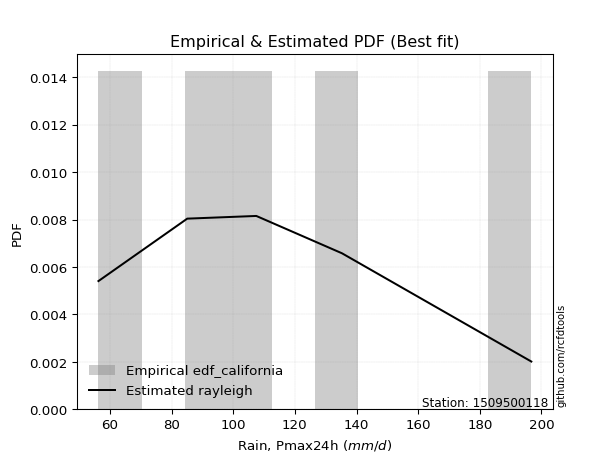</img>

</div>


### 2. EDF Hazen (1930)

Hazen method for plotting positions is a formula used to estimate the empirical cumulative probability distribution of flood events or other hydrological data. This formula often results in biased estimations, particularly when extrapolating to extreme events (high return periods).

<div align="center">


$P=(m-0.5)/n$


</div>


**2.1. Empirical values**

<div align="center">

|                | 0                  | 1                  | 2         | 3                 | 4                  |
|:---------------|:-------------------|:-------------------|:----------|:------------------|:-------------------|
| date           | 2023               | 2021               | 2022      | 2020              | 2019               |
| x              | 56.3               | 85.1               | 107.5     | 135.3             | 196.7              |
| m              | 1                  | 2                  | 3         | 4                 | 5                  |
| empirical_dist | edf_hazen          | edf_hazen          | edf_hazen | edf_hazen         | edf_hazen          |
| empirical      | 0.1                | 0.3                | 0.5       | 0.7               | 0.9                |
| empirical_tr   | 1.1111111111111112 | 1.4285714285714286 | 2.0       | 3.333333333333333 | 10.000000000000002 |

</div>


**2.2. Kolmogorov-Smirnov fit test (sorted by Δ)**


<div align="center">

|                | 0                    | 1                    | 2                    | 3                    | 4                    | 5                   | 6                    | 7                   | 8                   | 9                    | 10                  | 11                  | 12                   | 13                  | 14                  | 15                   | 16                   | 17                  | 18                   | 19                  | 20                  | 21                   | 22                   | 23                  | 24                  | 25                   | 26                  | 27                  | 28                  | 29                  | 30                   | 31                  | 32                  | 33                  | 34                  | 35                  | 36                   | 37                  | 38                 | 39                   | 40                  | 41                    | 42                  | 43                  | 44                  | 45                  | 46                  | 47                  | 48                  | 49                  | 50                  | 51                  | 52                  | 53                 | 54                  | 55                  | 56                  | 57                  | 58                  | 59                  | 60                  | 61                 | 62                  | 63                  | 64                  | 65                 | 66                 | 67                 | 68                 | 69                  | 70                  | 71                 | 72                 | 73                  | 74                  | 75                  | 76                  | 77                  | 78                  | 79                  | 80                 | 81                 | 82                 | 83                  | 84                  | 85                  | 86                 | 87                 |
|:---------------|:---------------------|:---------------------|:---------------------|:---------------------|:---------------------|:--------------------|:---------------------|:--------------------|:--------------------|:---------------------|:--------------------|:--------------------|:---------------------|:--------------------|:--------------------|:---------------------|:---------------------|:--------------------|:---------------------|:--------------------|:--------------------|:---------------------|:---------------------|:--------------------|:--------------------|:---------------------|:--------------------|:--------------------|:--------------------|:--------------------|:---------------------|:--------------------|:--------------------|:--------------------|:--------------------|:--------------------|:---------------------|:--------------------|:-------------------|:---------------------|:--------------------|:----------------------|:--------------------|:--------------------|:--------------------|:--------------------|:--------------------|:--------------------|:--------------------|:--------------------|:--------------------|:--------------------|:--------------------|:-------------------|:--------------------|:--------------------|:--------------------|:--------------------|:--------------------|:--------------------|:--------------------|:-------------------|:--------------------|:--------------------|:--------------------|:-------------------|:-------------------|:-------------------|:-------------------|:--------------------|:--------------------|:-------------------|:-------------------|:--------------------|:--------------------|:--------------------|:--------------------|:--------------------|:--------------------|:--------------------|:-------------------|:-------------------|:-------------------|:--------------------|:--------------------|:--------------------|:-------------------|:-------------------|
| station        | 1509500118           | 1509500118           | 1509500118           | 1509500118           | 1509500118           | 1509500118          | 1509500118           | 1509500118          | 1509500118          | 1509500118           | 1509500118          | 1509500118          | 1509500118           | 1509500118          | 1509500118          | 1509500118           | 1509500118           | 1509500118          | 1509500118           | 1509500118          | 1509500118          | 1509500118           | 1509500118           | 1509500118          | 1509500118          | 1509500118           | 1509500118          | 1509500118          | 1509500118          | 1509500118          | 1509500118           | 1509500118          | 1509500118          | 1509500118          | 1509500118          | 1509500118          | 1509500118           | 1509500118          | 1509500118         | 1509500118           | 1509500118          | 1509500118            | 1509500118          | 1509500118          | 1509500118          | 1509500118          | 1509500118          | 1509500118          | 1509500118          | 1509500118          | 1509500118          | 1509500118          | 1509500118          | 1509500118         | 1509500118          | 1509500118          | 1509500118          | 1509500118          | 1509500118          | 1509500118          | 1509500118          | 1509500118         | 1509500118          | 1509500118          | 1509500118          | 1509500118         | 1509500118         | 1509500118         | 1509500118         | 1509500118          | 1509500118          | 1509500118         | 1509500118         | 1509500118          | 1509500118          | 1509500118          | 1509500118          | 1509500118          | 1509500118          | 1509500118          | 1509500118         | 1509500118         | 1509500118         | 1509500118          | 1509500118          | 1509500118          | 1509500118         | 1509500118         |
| empirical_dist | edf_hazen            | edf_hazen            | edf_hazen            | edf_hazen            | edf_hazen            | edf_hazen           | edf_hazen            | edf_hazen           | edf_hazen           | edf_hazen            | edf_hazen           | edf_hazen           | edf_hazen            | edf_hazen           | edf_hazen           | edf_hazen            | edf_hazen            | edf_hazen           | edf_hazen            | edf_hazen           | edf_hazen           | edf_hazen            | edf_hazen            | edf_hazen           | edf_hazen           | edf_hazen            | edf_hazen           | edf_hazen           | edf_hazen           | edf_hazen           | edf_hazen            | edf_hazen           | edf_hazen           | edf_hazen           | edf_hazen           | edf_hazen           | edf_hazen            | edf_hazen           | edf_hazen          | edf_hazen            | edf_hazen           | edf_hazen             | edf_hazen           | edf_hazen           | edf_hazen           | edf_hazen           | edf_hazen           | edf_hazen           | edf_hazen           | edf_hazen           | edf_hazen           | edf_hazen           | edf_hazen           | edf_hazen          | edf_hazen           | edf_hazen           | edf_hazen           | edf_hazen           | edf_hazen           | edf_hazen           | edf_hazen           | edf_hazen          | edf_hazen           | edf_hazen           | edf_hazen           | edf_hazen          | edf_hazen          | edf_hazen          | edf_hazen          | edf_hazen           | edf_hazen           | edf_hazen          | edf_hazen          | edf_hazen           | edf_hazen           | edf_hazen           | edf_hazen           | edf_hazen           | edf_hazen           | edf_hazen           | edf_hazen          | edf_hazen          | edf_hazen          | edf_hazen           | edf_hazen           | edf_hazen           | edf_hazen          | edf_hazen          |
| p_dist         | logmielke            | fisk                 | logfisk              | alpha                | logloggamma          | ncf                 | loggenlogistic       | mielke              | logpearson3         | logjohnsonsu         | logt                | logexponnorm        | logcrystalball       | lognorm             | lognorm             | logf                 | genlogistic          | lognct              | invgamma             | loggamma            | loggamma            | logncf               | logerlang            | logfatiguelife      | nct                 | rayleigh             | logbetaprime        | gumbel_r            | kstwobign           | loginvgamma         | loglogistic          | exponnorm           | johnsonsu           | maxwell             | pearson3            | logalpha            | invgauss             | loginvgauss         | betaprime          | rice                 | logweibull_min      | loglaplace_asymmetric | loghypsecant        | logmaxwell          | logrice             | loginvweibull       | halfnorm            | lograyleigh         | moyal               | truncnorm           | norm                | crystalball         | t                   | loggumbel_l        | laplace_asymmetric  | loglaplace          | loggumbel_r         | logkstwobign        | logistic            | hypsecant           | loggenexpon         | genexpon           | loggompertz         | gompertz            | weibull_min         | halflogistic       | expon              | wald               | loghalfnorm        | logmoyal            | loghalflogistic     | laplace            | gumbel_l           | f                   | logwald             | logexpon            | logchi2             | erlang              | loggibrat           | gibrat              | nakagami           | lognakagami        | logtruncnorm       | loglognorm          | gamma               | invweibull          | chi2               | fatiguelife        |
| delta          | 0.026552025109909352 | 0.027348550295201182 | 0.027637433969002173 | 0.030229237448241922 | 0.030887370117654703 | 0.03112149447941648 | 0.031765707176938426 | 0.03193526095593789 | 0.03276597965816666 | 0.033943336840654634 | 0.03457037932328692 | 0.03457112040772255 | 0.034571281441379526 | 0.03457128246157419 | 0.03457128246157419 | 0.034584873141778036 | 0.034705845425622606 | 0.03479900071691526 | 0.035096734975864616 | 0.03556789244014985 | 0.03556789244014985 | 0.035948910214012614 | 0.036041528982936666 | 0.03623420566303011 | 0.03641380848210485 | 0.037439884277130075 | 0.03827500588729367 | 0.03854282472894892 | 0.03877483779339519 | 0.03897056976274702 | 0.039355202767257846 | 0.03993312116261172 | 0.03994230333675135 | 0.04087866384140615 | 0.04163537656806371 | 0.04169825031261447 | 0.041956887852011494 | 0.04197630513150541 | 0.0421776024801259 | 0.045806356516362834 | 0.04803776700998114 | 0.05016741214349174   | 0.05206050110672389 | 0.05340906174823892 | 0.05533783817517085 | 0.05957654836397108 | 0.06455571588844426 | 0.06585909620337314 | 0.06629384028139523 | 0.07188681484653747 | 0.07188682227860471 | 0.07188682388532591 | 0.07192877833450967 | 0.0732804100792751 | 0.07436141281039302 | 0.07573593414591218 | 0.07971015808301754 | 0.08008471993590738 | 0.08142454290608475 | 0.08939126029495248 | 0.09954173670282107 | 0.0999997949182843 | 0.09999998701690796 | 0.09999999999981031 | 0.09999999999997125 | 0.1                | 0.1                | 0.1                | 0.1                | 0.10509265535225731 | 0.10814424075955131 | 0.1130169093654903 | 0.1407977387059694 | 0.15879619920785837 | 0.17670924009620725 | 0.17691299698319002 | 0.18540584263140847 | 0.19000435949871347 | 0.20136284203241694 | 0.21920190342538037 | 0.2999884827808757 | 0.2999999987940575 | 0.3278280241315859 | 0.37646391159384945 | 0.41375004380930086 | 0.46371186282989213 | 0.4722644802897679 | 0.4823724697679494 |
| deltao         | 0.5865427407550001   | 0.5865427407550001   | 0.5865427407550001   | 0.5865427407550001   | 0.5865427407550001   | 0.5865427407550001  | 0.5865427407550001   | 0.5865427407550001  | 0.5865427407550001  | 0.5865427407550001   | 0.5865427407550001  | 0.5865427407550001  | 0.5865427407550001   | 0.5865427407550001  | 0.5865427407550001  | 0.5865427407550001   | 0.5865427407550001   | 0.5865427407550001  | 0.5865427407550001   | 0.5865427407550001  | 0.5865427407550001  | 0.5865427407550001   | 0.5865427407550001   | 0.5865427407550001  | 0.5865427407550001  | 0.5865427407550001   | 0.5865427407550001  | 0.5865427407550001  | 0.5865427407550001  | 0.5865427407550001  | 0.5865427407550001   | 0.5865427407550001  | 0.5865427407550001  | 0.5865427407550001  | 0.5865427407550001  | 0.5865427407550001  | 0.5865427407550001   | 0.5865427407550001  | 0.5865427407550001 | 0.5865427407550001   | 0.5865427407550001  | 0.5865427407550001    | 0.5865427407550001  | 0.5865427407550001  | 0.5865427407550001  | 0.5865427407550001  | 0.5865427407550001  | 0.5865427407550001  | 0.5865427407550001  | 0.5865427407550001  | 0.5865427407550001  | 0.5865427407550001  | 0.5865427407550001  | 0.5865427407550001 | 0.5865427407550001  | 0.5865427407550001  | 0.5865427407550001  | 0.5865427407550001  | 0.5865427407550001  | 0.5865427407550001  | 0.5865427407550001  | 0.5865427407550001 | 0.5865427407550001  | 0.5865427407550001  | 0.5865427407550001  | 0.5865427407550001 | 0.5865427407550001 | 0.5865427407550001 | 0.5865427407550001 | 0.5865427407550001  | 0.5865427407550001  | 0.5865427407550001 | 0.5865427407550001 | 0.5865427407550001  | 0.5865427407550001  | 0.5865427407550001  | 0.5865427407550001  | 0.5865427407550001  | 0.5865427407550001  | 0.5865427407550001  | 0.5865427407550001 | 0.5865427407550001 | 0.5865427407550001 | 0.5865427407550001  | 0.5865427407550001  | 0.5865427407550001  | 0.5865427407550001 | 0.5865427407550001 |
| eval           | Δo > Δ               | Δo > Δ               | Δo > Δ               | Δo > Δ               | Δo > Δ               | Δo > Δ              | Δo > Δ               | Δo > Δ              | Δo > Δ              | Δo > Δ               | Δo > Δ              | Δo > Δ              | Δo > Δ               | Δo > Δ              | Δo > Δ              | Δo > Δ               | Δo > Δ               | Δo > Δ              | Δo > Δ               | Δo > Δ              | Δo > Δ              | Δo > Δ               | Δo > Δ               | Δo > Δ              | Δo > Δ              | Δo > Δ               | Δo > Δ              | Δo > Δ              | Δo > Δ              | Δo > Δ              | Δo > Δ               | Δo > Δ              | Δo > Δ              | Δo > Δ              | Δo > Δ              | Δo > Δ              | Δo > Δ               | Δo > Δ              | Δo > Δ             | Δo > Δ               | Δo > Δ              | Δo > Δ                | Δo > Δ              | Δo > Δ              | Δo > Δ              | Δo > Δ              | Δo > Δ              | Δo > Δ              | Δo > Δ              | Δo > Δ              | Δo > Δ              | Δo > Δ              | Δo > Δ              | Δo > Δ             | Δo > Δ              | Δo > Δ              | Δo > Δ              | Δo > Δ              | Δo > Δ              | Δo > Δ              | Δo > Δ              | Δo > Δ             | Δo > Δ              | Δo > Δ              | Δo > Δ              | Δo > Δ             | Δo > Δ             | Δo > Δ             | Δo > Δ             | Δo > Δ              | Δo > Δ              | Δo > Δ             | Δo > Δ             | Δo > Δ              | Δo > Δ              | Δo > Δ              | Δo > Δ              | Δo > Δ              | Δo > Δ              | Δo > Δ              | Δo > Δ             | Δo > Δ             | Δo > Δ             | Δo > Δ              | Δo > Δ              | Δo > Δ              | Δo > Δ             | Δo > Δ             |
| fit            | 1                    | 1                    | 1                    | 1                    | 1                    | 1                   | 1                    | 1                   | 1                   | 1                    | 1                   | 1                   | 1                    | 1                   | 1                   | 1                    | 1                    | 1                   | 1                    | 1                   | 1                   | 1                    | 1                    | 1                   | 1                   | 1                    | 1                   | 1                   | 1                   | 1                   | 1                    | 1                   | 1                   | 1                   | 1                   | 1                   | 1                    | 1                   | 1                  | 1                    | 1                   | 1                     | 1                   | 1                   | 1                   | 1                   | 1                   | 1                   | 1                   | 1                   | 1                   | 1                   | 1                   | 1                  | 1                   | 1                   | 1                   | 1                   | 1                   | 1                   | 1                   | 1                  | 1                   | 1                   | 1                   | 1                  | 1                  | 1                  | 1                  | 1                   | 1                   | 1                  | 1                  | 1                   | 1                   | 1                   | 1                   | 1                   | 1                   | 1                   | 1                  | 1                  | 1                  | 1                   | 1                   | 1                   | 1                  | 1                  |
| n              | 5                    | 5                    | 5                    | 5                    | 5                    | 5                   | 5                    | 5                   | 5                   | 5                    | 5                   | 5                   | 5                    | 5                   | 5                   | 5                    | 5                    | 5                   | 5                    | 5                   | 5                   | 5                    | 5                    | 5                   | 5                   | 5                    | 5                   | 5                   | 5                   | 5                   | 5                    | 5                   | 5                   | 5                   | 5                   | 5                   | 5                    | 5                   | 5                  | 5                    | 5                   | 5                     | 5                   | 5                   | 5                   | 5                   | 5                   | 5                   | 5                   | 5                   | 5                   | 5                   | 5                   | 5                  | 5                   | 5                   | 5                   | 5                   | 5                   | 5                   | 5                   | 5                  | 5                   | 5                   | 5                   | 5                  | 5                  | 5                  | 5                  | 5                   | 5                   | 5                  | 5                  | 5                   | 5                   | 5                   | 5                   | 5                   | 5                   | 5                   | 5                  | 5                  | 5                  | 5                   | 5                   | 5                   | 5                  | 5                  |
| best_fit       | 1                    | 0                    | 0                    | 0                    | 0                    | 0                   | 0                    | 0                   | 0                   | 0                    | 0                   | 0                   | 0                    | 0                   | 0                   | 0                    | 0                    | 0                   | 0                    | 0                   | 0                   | 0                    | 0                    | 0                   | 0                   | 0                    | 0                   | 0                   | 0                   | 0                   | 0                    | 0                   | 0                   | 0                   | 0                   | 0                   | 0                    | 0                   | 0                  | 0                    | 0                   | 0                     | 0                   | 0                   | 0                   | 0                   | 0                   | 0                   | 0                   | 0                   | 0                   | 0                   | 0                   | 0                  | 0                   | 0                   | 0                   | 0                   | 0                   | 0                   | 0                   | 0                  | 0                   | 0                   | 0                   | 0                  | 0                  | 0                  | 0                  | 0                   | 0                   | 0                  | 0                  | 0                   | 0                   | 0                   | 0                   | 0                   | 0                   | 0                   | 0                  | 0                  | 0                  | 0                   | 0                   | 0                   | 0                  | 0                  |
| best_fit_sort  | 1                    | 2                    | 3                    | 4                    | 5                    | 6                   | 7                    | 8                   | 9                   | 10                   | 11                  | 12                  | 13                   | 14                  | 15                  | 16                   | 17                   | 18                  | 19                   | 20                  | 21                  | 22                   | 23                   | 24                  | 25                  | 26                   | 27                  | 28                  | 29                  | 30                  | 31                   | 32                  | 33                  | 34                  | 35                  | 36                  | 37                   | 38                  | 39                 | 40                   | 41                  | 42                    | 43                  | 44                  | 45                  | 46                  | 47                  | 48                  | 49                  | 50                  | 51                  | 52                  | 53                  | 54                 | 55                  | 56                  | 57                  | 58                  | 59                  | 60                  | 61                  | 62                 | 63                  | 64                  | 65                  | 66                 | 67                 | 68                 | 69                 | 70                  | 71                  | 72                 | 73                 | 74                  | 75                  | 76                  | 77                  | 78                  | 79                  | 80                  | 81                 | 82                 | 83                 | 84                  | 85                  | 86                  | 87                 | 88                 |

</div>


**2.3. Best fit**

<div align="center">

|   id |    station | empirical_dist   | p_dist    |    delta |   deltao | eval   |   fit |   n |   best_fit |   best_fit_sort |
|-----:|-----------:|:-----------------|:----------|---------:|---------:|:-------|------:|----:|-----------:|----------------:|
|    0 | 1509500118 | edf_hazen        | logmielke | 0.026552 | 0.586543 | Δo > Δ |     1 |   5 |          1 |               1 |

</div>


<div align="center">

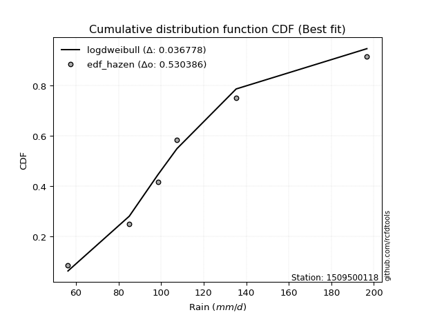</img></img>

</div>


### 3. EDF Weibull (1939)

Weibull plotting position formula is an empirical method used to estimate the non-exceedance probability or plotting position for a set of observed data, is often recommended or widely used in practice, particularly in flood frequency analysis.

<div align="center">


$P=m/(n+1)$


</div>


**3.1. Empirical values**

<div align="center">

|                | 0                   | 1                  | 2           | 3                  | 4                  |
|:---------------|:--------------------|:-------------------|:------------|:-------------------|:-------------------|
| date           | 2023                | 2021               | 2022        | 2020               | 2019               |
| x              | 56.3                | 85.1               | 107.5       | 135.3              | 196.7              |
| m              | 1                   | 2                  | 3           | 4                  | 5                  |
| empirical_dist | edf_weibull         | edf_weibull        | edf_weibull | edf_weibull        | edf_weibull        |
| empirical      | 0.16666666666666666 | 0.3333333333333333 | 0.5         | 0.6666666666666666 | 0.8333333333333334 |
| empirical_tr   | 1.2                 | 1.4999999999999998 | 2.0         | 2.9999999999999996 | 6.000000000000002  |

</div>


**3.2. Kolmogorov-Smirnov fit test (sorted by Δ)**


<div align="center">

|                | 0                     | 1                  | 2                   | 3                   | 4                   | 5                   | 6                   | 7                   | 8                   | 9                   | 10                  | 11                  | 12                  | 13                 | 14                  | 15                  | 16                  | 17                  | 18                  | 19                  | 20                  | 21                 | 22                 | 23                  | 24                  | 25                  | 26                 | 27                  | 28                  | 29                  | 30                  | 31                  | 32                 | 33                 | 34                  | 35                 | 36                  | 37                  | 38                  | 39                 | 40                  | 41                  | 42                 | 43                  | 44                 | 45                  | 46                  | 47                  | 48                 | 49                  | 50                 | 51                  | 52                 | 53                  | 54                 | 55                  | 56                 | 57                  | 58                  | 59                  | 60                 | 61                  | 62                  | 63                 | 64                  | 65                  | 66                 | 67                 | 68                  | 69                  | 70                 | 71                  | 72                  | 73                  | 74                  | 75                  | 76                  | 77                  | 78                  | 79                 | 80                  | 81                 | 82                 | 83                  | 84                  | 85                 | 86                 | 87                  |
|:---------------|:----------------------|:-------------------|:--------------------|:--------------------|:--------------------|:--------------------|:--------------------|:--------------------|:--------------------|:--------------------|:--------------------|:--------------------|:--------------------|:-------------------|:--------------------|:--------------------|:--------------------|:--------------------|:--------------------|:--------------------|:--------------------|:-------------------|:-------------------|:--------------------|:--------------------|:--------------------|:-------------------|:--------------------|:--------------------|:--------------------|:--------------------|:--------------------|:-------------------|:-------------------|:--------------------|:-------------------|:--------------------|:--------------------|:--------------------|:-------------------|:--------------------|:--------------------|:-------------------|:--------------------|:-------------------|:--------------------|:--------------------|:--------------------|:-------------------|:--------------------|:-------------------|:--------------------|:-------------------|:--------------------|:-------------------|:--------------------|:-------------------|:--------------------|:--------------------|:--------------------|:-------------------|:--------------------|:--------------------|:-------------------|:--------------------|:--------------------|:-------------------|:-------------------|:--------------------|:--------------------|:-------------------|:--------------------|:--------------------|:--------------------|:--------------------|:--------------------|:--------------------|:--------------------|:--------------------|:-------------------|:--------------------|:-------------------|:-------------------|:--------------------|:--------------------|:-------------------|:-------------------|:--------------------|
| station        | 1509500118            | 1509500118         | 1509500118          | 1509500118          | 1509500118          | 1509500118          | 1509500118          | 1509500118          | 1509500118          | 1509500118          | 1509500118          | 1509500118          | 1509500118          | 1509500118         | 1509500118          | 1509500118          | 1509500118          | 1509500118          | 1509500118          | 1509500118          | 1509500118          | 1509500118         | 1509500118         | 1509500118          | 1509500118          | 1509500118          | 1509500118         | 1509500118          | 1509500118          | 1509500118          | 1509500118          | 1509500118          | 1509500118         | 1509500118         | 1509500118          | 1509500118         | 1509500118          | 1509500118          | 1509500118          | 1509500118         | 1509500118          | 1509500118          | 1509500118         | 1509500118          | 1509500118         | 1509500118          | 1509500118          | 1509500118          | 1509500118         | 1509500118          | 1509500118         | 1509500118          | 1509500118         | 1509500118          | 1509500118         | 1509500118          | 1509500118         | 1509500118          | 1509500118          | 1509500118          | 1509500118         | 1509500118          | 1509500118          | 1509500118         | 1509500118          | 1509500118          | 1509500118         | 1509500118         | 1509500118          | 1509500118          | 1509500118         | 1509500118          | 1509500118          | 1509500118          | 1509500118          | 1509500118          | 1509500118          | 1509500118          | 1509500118          | 1509500118         | 1509500118          | 1509500118         | 1509500118         | 1509500118          | 1509500118          | 1509500118         | 1509500118         | 1509500118          |
| empirical_dist | edf_weibull           | edf_weibull        | edf_weibull         | edf_weibull         | edf_weibull         | edf_weibull         | edf_weibull         | edf_weibull         | edf_weibull         | edf_weibull         | edf_weibull         | edf_weibull         | edf_weibull         | edf_weibull        | edf_weibull         | edf_weibull         | edf_weibull         | edf_weibull         | edf_weibull         | edf_weibull         | edf_weibull         | edf_weibull        | edf_weibull        | edf_weibull         | edf_weibull         | edf_weibull         | edf_weibull        | edf_weibull         | edf_weibull         | edf_weibull         | edf_weibull         | edf_weibull         | edf_weibull        | edf_weibull        | edf_weibull         | edf_weibull        | edf_weibull         | edf_weibull         | edf_weibull         | edf_weibull        | edf_weibull         | edf_weibull         | edf_weibull        | edf_weibull         | edf_weibull        | edf_weibull         | edf_weibull         | edf_weibull         | edf_weibull        | edf_weibull         | edf_weibull        | edf_weibull         | edf_weibull        | edf_weibull         | edf_weibull        | edf_weibull         | edf_weibull        | edf_weibull         | edf_weibull         | edf_weibull         | edf_weibull        | edf_weibull         | edf_weibull         | edf_weibull        | edf_weibull         | edf_weibull         | edf_weibull        | edf_weibull        | edf_weibull         | edf_weibull         | edf_weibull        | edf_weibull         | edf_weibull         | edf_weibull         | edf_weibull         | edf_weibull         | edf_weibull         | edf_weibull         | edf_weibull         | edf_weibull        | edf_weibull         | edf_weibull        | edf_weibull        | edf_weibull         | edf_weibull         | edf_weibull        | edf_weibull        | edf_weibull         |
| p_dist         | loglaplace_asymmetric | logmielke          | fisk                | logfisk             | alpha               | logloggamma         | ncf                 | loggenlogistic      | mielke              | logpearson3         | exponnorm           | logjohnsonsu        | logt                | logexponnorm       | logcrystalball      | lognorm             | lognorm             | logf                | genlogistic         | lognct              | invgamma            | loggamma           | loggamma           | logncf              | logerlang           | logfatiguelife      | nct                | rayleigh            | logbetaprime        | gumbel_r            | kstwobign           | loginvgamma         | loglogistic        | johnsonsu          | loghypsecant        | maxwell            | laplace_asymmetric  | pearson3            | logalpha            | loginvgauss        | invgauss            | betaprime           | loglaplace         | rice                | loginvweibull      | logweibull_min      | logkstwobign        | logmaxwell          | crystalball        | norm                | truncnorm          | t                   | hypsecant          | logistic            | logrice            | halfnorm            | lograyleigh        | moyal               | laplace             | loggumbel_l         | loggumbel_r        | f                   | gumbel_l            | logmoyal           | loggenexpon         | genexpon            | loggompertz        | logchi2            | erlang              | gompertz            | weibull_min        | logexpon            | wald                | expon               | halflogistic        | loghalfnorm         | loghalflogistic     | logwald             | loggibrat           | gibrat             | logtruncnorm        | nakagami           | lognakagami        | loglognorm          | gamma               | invweibull         | chi2               | fatiguelife         |
| delta          | 0.08788235791153527   | 0.093218691776576  | 0.09401521696186783 | 0.09430410063566882 | 0.09689590411490857 | 0.09755403678432135 | 0.09778816114608313 | 0.09843237384360508 | 0.09860192762260454 | 0.09943264632483331 | 0.10014917937984144 | 0.10061000350732129 | 0.10123704598995358 | 0.1012377870743892 | 0.10123794810804618 | 0.10123794912824084 | 0.10123794912824084 | 0.10125153980844469 | 0.10137251209228926 | 0.10146566738358191 | 0.10176340164253127 | 0.1022345591068165 | 0.1022345591068165 | 0.10261557688067927 | 0.10270819564960332 | 0.10290087232969676 | 0.1030804751487715 | 0.10410655094379673 | 0.10494167255396032 | 0.10520949139561557 | 0.10544150446006184 | 0.10563723642941367 | 0.1060218694339245 | 0.106608970003418  | 0.10750698811157883 | 0.1075453305080728 | 0.10769474614372634 | 0.10830204323473036 | 0.10836491697928112 | 0.108443161495011  | 0.10862355451867814 | 0.10884426914679254 | 0.1090692674792455 | 0.11154898155156456 | 0.1129149275902261 | 0.11470443367664779 | 0.11494007181839788 | 0.12007572841490557 | 0.1202575336980809 | 0.12025753440046327 | 0.1202575352187224 | 0.12027423337040888 | 0.1213163155566429 | 0.12138352485713388 | 0.1220045048418375 | 0.13122238255511093 | 0.1325257628700398 | 0.13296050694806189 | 0.13356671570069856 | 0.13994707674594176 | 0.1463768247496842 | 0.15581823600932637 | 0.15881572983978687 | 0.1621155281915187 | 0.16620840336948772 | 0.16666646158495094 | 0.1666666536835746 | 0.1666666606991706 | 0.16666666666514762 | 0.16666666666647698 | 0.1666666666666379 | 0.16666666666666666 | 0.16666666666666666 | 0.16666666666666666 | 0.16666666666666666 | 0.16666666666666666 | 0.16666666666666666 | 0.17670924009620725 | 0.20136284203241694 | 0.2525352367587137 | 0.30676474604050397 | 0.333321816114209  | 0.3333333321273908 | 0.34313057826051613 | 0.38041671047596753 | 0.3970451961632255 | 0.4389311469564346 | 0.44903913643461607 |
| deltao         | 0.5865427407550001    | 0.5865427407550001 | 0.5865427407550001  | 0.5865427407550001  | 0.5865427407550001  | 0.5865427407550001  | 0.5865427407550001  | 0.5865427407550001  | 0.5865427407550001  | 0.5865427407550001  | 0.5865427407550001  | 0.5865427407550001  | 0.5865427407550001  | 0.5865427407550001 | 0.5865427407550001  | 0.5865427407550001  | 0.5865427407550001  | 0.5865427407550001  | 0.5865427407550001  | 0.5865427407550001  | 0.5865427407550001  | 0.5865427407550001 | 0.5865427407550001 | 0.5865427407550001  | 0.5865427407550001  | 0.5865427407550001  | 0.5865427407550001 | 0.5865427407550001  | 0.5865427407550001  | 0.5865427407550001  | 0.5865427407550001  | 0.5865427407550001  | 0.5865427407550001 | 0.5865427407550001 | 0.5865427407550001  | 0.5865427407550001 | 0.5865427407550001  | 0.5865427407550001  | 0.5865427407550001  | 0.5865427407550001 | 0.5865427407550001  | 0.5865427407550001  | 0.5865427407550001 | 0.5865427407550001  | 0.5865427407550001 | 0.5865427407550001  | 0.5865427407550001  | 0.5865427407550001  | 0.5865427407550001 | 0.5865427407550001  | 0.5865427407550001 | 0.5865427407550001  | 0.5865427407550001 | 0.5865427407550001  | 0.5865427407550001 | 0.5865427407550001  | 0.5865427407550001 | 0.5865427407550001  | 0.5865427407550001  | 0.5865427407550001  | 0.5865427407550001 | 0.5865427407550001  | 0.5865427407550001  | 0.5865427407550001 | 0.5865427407550001  | 0.5865427407550001  | 0.5865427407550001 | 0.5865427407550001 | 0.5865427407550001  | 0.5865427407550001  | 0.5865427407550001 | 0.5865427407550001  | 0.5865427407550001  | 0.5865427407550001  | 0.5865427407550001  | 0.5865427407550001  | 0.5865427407550001  | 0.5865427407550001  | 0.5865427407550001  | 0.5865427407550001 | 0.5865427407550001  | 0.5865427407550001 | 0.5865427407550001 | 0.5865427407550001  | 0.5865427407550001  | 0.5865427407550001 | 0.5865427407550001 | 0.5865427407550001  |
| eval           | Δo > Δ                | Δo > Δ             | Δo > Δ              | Δo > Δ              | Δo > Δ              | Δo > Δ              | Δo > Δ              | Δo > Δ              | Δo > Δ              | Δo > Δ              | Δo > Δ              | Δo > Δ              | Δo > Δ              | Δo > Δ             | Δo > Δ              | Δo > Δ              | Δo > Δ              | Δo > Δ              | Δo > Δ              | Δo > Δ              | Δo > Δ              | Δo > Δ             | Δo > Δ             | Δo > Δ              | Δo > Δ              | Δo > Δ              | Δo > Δ             | Δo > Δ              | Δo > Δ              | Δo > Δ              | Δo > Δ              | Δo > Δ              | Δo > Δ             | Δo > Δ             | Δo > Δ              | Δo > Δ             | Δo > Δ              | Δo > Δ              | Δo > Δ              | Δo > Δ             | Δo > Δ              | Δo > Δ              | Δo > Δ             | Δo > Δ              | Δo > Δ             | Δo > Δ              | Δo > Δ              | Δo > Δ              | Δo > Δ             | Δo > Δ              | Δo > Δ             | Δo > Δ              | Δo > Δ             | Δo > Δ              | Δo > Δ             | Δo > Δ              | Δo > Δ             | Δo > Δ              | Δo > Δ              | Δo > Δ              | Δo > Δ             | Δo > Δ              | Δo > Δ              | Δo > Δ             | Δo > Δ              | Δo > Δ              | Δo > Δ             | Δo > Δ             | Δo > Δ              | Δo > Δ              | Δo > Δ             | Δo > Δ              | Δo > Δ              | Δo > Δ              | Δo > Δ              | Δo > Δ              | Δo > Δ              | Δo > Δ              | Δo > Δ              | Δo > Δ             | Δo > Δ              | Δo > Δ             | Δo > Δ             | Δo > Δ              | Δo > Δ              | Δo > Δ             | Δo > Δ             | Δo > Δ              |
| fit            | 1                     | 1                  | 1                   | 1                   | 1                   | 1                   | 1                   | 1                   | 1                   | 1                   | 1                   | 1                   | 1                   | 1                  | 1                   | 1                   | 1                   | 1                   | 1                   | 1                   | 1                   | 1                  | 1                  | 1                   | 1                   | 1                   | 1                  | 1                   | 1                   | 1                   | 1                   | 1                   | 1                  | 1                  | 1                   | 1                  | 1                   | 1                   | 1                   | 1                  | 1                   | 1                   | 1                  | 1                   | 1                  | 1                   | 1                   | 1                   | 1                  | 1                   | 1                  | 1                   | 1                  | 1                   | 1                  | 1                   | 1                  | 1                   | 1                   | 1                   | 1                  | 1                   | 1                   | 1                  | 1                   | 1                   | 1                  | 1                  | 1                   | 1                   | 1                  | 1                   | 1                   | 1                   | 1                   | 1                   | 1                   | 1                   | 1                   | 1                  | 1                   | 1                  | 1                  | 1                   | 1                   | 1                  | 1                  | 1                   |
| n              | 5                     | 5                  | 5                   | 5                   | 5                   | 5                   | 5                   | 5                   | 5                   | 5                   | 5                   | 5                   | 5                   | 5                  | 5                   | 5                   | 5                   | 5                   | 5                   | 5                   | 5                   | 5                  | 5                  | 5                   | 5                   | 5                   | 5                  | 5                   | 5                   | 5                   | 5                   | 5                   | 5                  | 5                  | 5                   | 5                  | 5                   | 5                   | 5                   | 5                  | 5                   | 5                   | 5                  | 5                   | 5                  | 5                   | 5                   | 5                   | 5                  | 5                   | 5                  | 5                   | 5                  | 5                   | 5                  | 5                   | 5                  | 5                   | 5                   | 5                   | 5                  | 5                   | 5                   | 5                  | 5                   | 5                   | 5                  | 5                  | 5                   | 5                   | 5                  | 5                   | 5                   | 5                   | 5                   | 5                   | 5                   | 5                   | 5                   | 5                  | 5                   | 5                  | 5                  | 5                   | 5                   | 5                  | 5                  | 5                   |
| best_fit       | 1                     | 0                  | 0                   | 0                   | 0                   | 0                   | 0                   | 0                   | 0                   | 0                   | 0                   | 0                   | 0                   | 0                  | 0                   | 0                   | 0                   | 0                   | 0                   | 0                   | 0                   | 0                  | 0                  | 0                   | 0                   | 0                   | 0                  | 0                   | 0                   | 0                   | 0                   | 0                   | 0                  | 0                  | 0                   | 0                  | 0                   | 0                   | 0                   | 0                  | 0                   | 0                   | 0                  | 0                   | 0                  | 0                   | 0                   | 0                   | 0                  | 0                   | 0                  | 0                   | 0                  | 0                   | 0                  | 0                   | 0                  | 0                   | 0                   | 0                   | 0                  | 0                   | 0                   | 0                  | 0                   | 0                   | 0                  | 0                  | 0                   | 0                   | 0                  | 0                   | 0                   | 0                   | 0                   | 0                   | 0                   | 0                   | 0                   | 0                  | 0                   | 0                  | 0                  | 0                   | 0                   | 0                  | 0                  | 0                   |
| best_fit_sort  | 1                     | 2                  | 3                   | 4                   | 5                   | 6                   | 7                   | 8                   | 9                   | 10                  | 11                  | 12                  | 13                  | 14                 | 15                  | 16                  | 17                  | 18                  | 19                  | 20                  | 21                  | 22                 | 23                 | 24                  | 25                  | 26                  | 27                 | 28                  | 29                  | 30                  | 31                  | 32                  | 33                 | 34                 | 35                  | 36                 | 37                  | 38                  | 39                  | 40                 | 41                  | 42                  | 43                 | 44                  | 45                 | 46                  | 47                  | 48                  | 49                 | 50                  | 51                 | 52                  | 53                 | 54                  | 55                 | 56                  | 57                 | 58                  | 59                  | 60                  | 61                 | 62                  | 63                  | 64                 | 65                  | 66                  | 67                 | 68                 | 69                  | 70                  | 71                 | 72                  | 73                  | 74                  | 75                  | 76                  | 77                  | 78                  | 79                  | 80                 | 81                  | 82                 | 83                 | 84                  | 85                  | 86                 | 87                 | 88                  |

</div>


**3.3. Best fit**

<div align="center">

|   id |    station | empirical_dist   | p_dist                |     delta |   deltao | eval   |   fit |   n |   best_fit |   best_fit_sort |
|-----:|-----------:|:-----------------|:----------------------|----------:|---------:|:-------|------:|----:|-----------:|----------------:|
|    0 | 1509500118 | edf_weibull      | loglaplace_asymmetric | 0.0878824 | 0.586543 | Δo > Δ |     1 |   5 |          1 |               1 |

</div>


<div align="center">

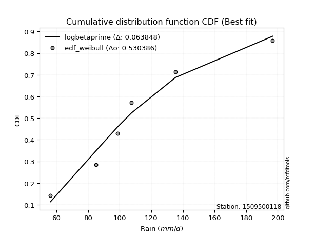</img>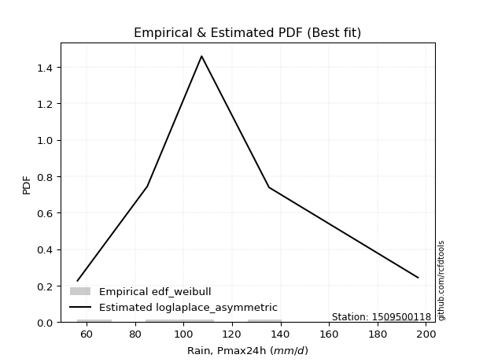</img>

</div>


### 4. EDF Beard (1943)

The Beard formula (or Beard´s plotting position formula) in hydrology is used to estimate the empirical non-exceedance probability _(P)_ of a flood event (or other extreme hydrological data point) within a given dataset.

<div align="center">


$P=(m-0.31)/(n+0.38)$


</div>


**4.1. Empirical values**

<div align="center">

|                | 0                   | 1                  | 2         | 3                  | 4                  |
|:---------------|:--------------------|:-------------------|:----------|:-------------------|:-------------------|
| date           | 2023                | 2021               | 2022      | 2020               | 2019               |
| x              | 56.3                | 85.1               | 107.5     | 135.3              | 196.7              |
| m              | 1                   | 2                  | 3         | 4                  | 5                  |
| empirical_dist | edf_beard           | edf_beard          | edf_beard | edf_beard          | edf_beard          |
| empirical      | 0.12825278810408922 | 0.3141263940520446 | 0.5       | 0.6858736059479554 | 0.8717472118959109 |
| empirical_tr   | 1.1471215351812367  | 1.4579945799457996 | 2.0       | 3.183431952662722  | 7.797101449275368  |

</div>


**4.2. Kolmogorov-Smirnov fit test (sorted by Δ)**


<div align="center">

|                | 0                   | 1                   | 2                   | 3                   | 4                   | 5                   | 6                   | 7                  | 8                   | 9                  | 10                   | 11                  | 12                  | 13                  | 14                 | 15                 | 16                  | 17                  | 18                  | 19                  | 20                  | 21                  | 22                  | 23                    | 24                  | 25                  | 26                  | 27                  | 28                  | 29                  | 30                  | 31                  | 32                  | 33                  | 34                  | 35                 | 36                  | 37                  | 38                  | 39                 | 40                 | 41                  | 42                  | 43                  | 44                  | 45                  | 46                 | 47                  | 48                 | 49                  | 50                  | 51                  | 52                  | 53                 | 54                  | 55                  | 56                  | 57                  | 58                  | 59                  | 60                  | 61                  | 62                  | 63                 | 64                  | 65                  | 66                  | 67                  | 68                  | 69                  | 70                  | 71                  | 72                 | 73                  | 74                 | 75                  | 76                  | 77                  | 78                  | 79                 | 80                  | 81                  | 82                 | 83                 | 84                 | 85                 | 86                 | 87                  |
|:---------------|:--------------------|:--------------------|:--------------------|:--------------------|:--------------------|:--------------------|:--------------------|:-------------------|:--------------------|:-------------------|:---------------------|:--------------------|:--------------------|:--------------------|:-------------------|:-------------------|:--------------------|:--------------------|:--------------------|:--------------------|:--------------------|:--------------------|:--------------------|:----------------------|:--------------------|:--------------------|:--------------------|:--------------------|:--------------------|:--------------------|:--------------------|:--------------------|:--------------------|:--------------------|:--------------------|:-------------------|:--------------------|:--------------------|:--------------------|:-------------------|:-------------------|:--------------------|:--------------------|:--------------------|:--------------------|:--------------------|:-------------------|:--------------------|:-------------------|:--------------------|:--------------------|:--------------------|:--------------------|:-------------------|:--------------------|:--------------------|:--------------------|:--------------------|:--------------------|:--------------------|:--------------------|:--------------------|:--------------------|:-------------------|:--------------------|:--------------------|:--------------------|:--------------------|:--------------------|:--------------------|:--------------------|:--------------------|:-------------------|:--------------------|:-------------------|:--------------------|:--------------------|:--------------------|:--------------------|:-------------------|:--------------------|:--------------------|:-------------------|:-------------------|:-------------------|:-------------------|:-------------------|:--------------------|
| station        | 1509500118          | 1509500118          | 1509500118          | 1509500118          | 1509500118          | 1509500118          | 1509500118          | 1509500118         | 1509500118          | 1509500118         | 1509500118           | 1509500118          | 1509500118          | 1509500118          | 1509500118         | 1509500118         | 1509500118          | 1509500118          | 1509500118          | 1509500118          | 1509500118          | 1509500118          | 1509500118          | 1509500118            | 1509500118          | 1509500118          | 1509500118          | 1509500118          | 1509500118          | 1509500118          | 1509500118          | 1509500118          | 1509500118          | 1509500118          | 1509500118          | 1509500118         | 1509500118          | 1509500118          | 1509500118          | 1509500118         | 1509500118         | 1509500118          | 1509500118          | 1509500118          | 1509500118          | 1509500118          | 1509500118         | 1509500118          | 1509500118         | 1509500118          | 1509500118          | 1509500118          | 1509500118          | 1509500118         | 1509500118          | 1509500118          | 1509500118          | 1509500118          | 1509500118          | 1509500118          | 1509500118          | 1509500118          | 1509500118          | 1509500118         | 1509500118          | 1509500118          | 1509500118          | 1509500118          | 1509500118          | 1509500118          | 1509500118          | 1509500118          | 1509500118         | 1509500118          | 1509500118         | 1509500118          | 1509500118          | 1509500118          | 1509500118          | 1509500118         | 1509500118          | 1509500118          | 1509500118         | 1509500118         | 1509500118         | 1509500118         | 1509500118         | 1509500118          |
| empirical_dist | edf_beard           | edf_beard           | edf_beard           | edf_beard           | edf_beard           | edf_beard           | edf_beard           | edf_beard          | edf_beard           | edf_beard          | edf_beard            | edf_beard           | edf_beard           | edf_beard           | edf_beard          | edf_beard          | edf_beard           | edf_beard           | edf_beard           | edf_beard           | edf_beard           | edf_beard           | edf_beard           | edf_beard             | edf_beard           | edf_beard           | edf_beard           | edf_beard           | edf_beard           | edf_beard           | edf_beard           | edf_beard           | edf_beard           | edf_beard           | edf_beard           | edf_beard          | edf_beard           | edf_beard           | edf_beard           | edf_beard          | edf_beard          | edf_beard           | edf_beard           | edf_beard           | edf_beard           | edf_beard           | edf_beard          | edf_beard           | edf_beard          | edf_beard           | edf_beard           | edf_beard           | edf_beard           | edf_beard          | edf_beard           | edf_beard           | edf_beard           | edf_beard           | edf_beard           | edf_beard           | edf_beard           | edf_beard           | edf_beard           | edf_beard          | edf_beard           | edf_beard           | edf_beard           | edf_beard           | edf_beard           | edf_beard           | edf_beard           | edf_beard           | edf_beard          | edf_beard           | edf_beard          | edf_beard           | edf_beard           | edf_beard           | edf_beard           | edf_beard          | edf_beard           | edf_beard           | edf_beard          | edf_beard          | edf_beard          | edf_beard          | edf_beard          | edf_beard           |
| p_dist         | logmielke           | fisk                | logfisk             | alpha               | logloggamma         | ncf                 | loggenlogistic      | mielke             | logpearson3         | exponnorm          | logjohnsonsu         | logt                | logexponnorm        | logcrystalball      | lognorm            | lognorm            | logf                | genlogistic         | lognct              | invgamma            | loggamma            | loggamma            | logncf              | loglaplace_asymmetric | logerlang           | logfatiguelife      | nct                 | rayleigh            | logbetaprime        | gumbel_r            | kstwobign           | loginvgamma         | loglogistic         | johnsonsu           | loghypsecant        | maxwell            | pearson3            | logalpha            | loginvgauss         | invgauss           | betaprime          | rice                | loginvweibull       | logweibull_min      | logkstwobign        | logmaxwell          | crystalball        | norm                | truncnorm          | t                   | logistic            | logrice             | laplace_asymmetric  | loglaplace         | halfnorm            | hypsecant           | lograyleigh         | moyal               | loggumbel_l         | loggumbel_r         | laplace             | logmoyal            | loggenexpon         | genexpon           | loggompertz         | gompertz            | weibull_min         | halflogistic        | loghalflogistic     | wald                | loghalfnorm         | expon               | gumbel_l           | f                   | logchi2            | logexpon            | erlang              | logwald             | loggibrat           | gibrat             | logtruncnorm        | nakagami            | lognakagami        | loglognorm         | gamma              | invweibull         | chi2               | fatiguelife         |
| delta          | 0.05480481321399856 | 0.05560133839929039 | 0.05589022207309138 | 0.05848202555233113 | 0.05914015822174391 | 0.05937428258350563 | 0.06001849528102764 | 0.0601880490600271 | 0.06101876776225587 | 0.061735300817264  | 0.062196124944743844 | 0.06282316742737613 | 0.06282390851181176 | 0.06282406954546874 | 0.0628240705656634 | 0.0628240705656634 | 0.06283766124586725 | 0.06295863352971176 | 0.06305178882100447 | 0.06334952307995383 | 0.06382068054423906 | 0.06382068054423906 | 0.06420169831810182 | 0.06429380619553626   | 0.06429431708702588 | 0.06448699376711932 | 0.06466659658619406 | 0.06569267238121923 | 0.06652779399138288 | 0.06679561283303813 | 0.06702762589748434 | 0.06722335786683623 | 0.06760799087134706 | 0.06819509144084056 | 0.06909310954900139 | 0.0691314519454953 | 0.06988816467215286 | 0.06995103841670368 | 0.07002928293243356 | 0.0702096759561007 | 0.0704303905842151 | 0.07313510298898707 | 0.07450104902764866 | 0.07629055511407035 | 0.08008471993590738 | 0.08166184985232813 | 0.0818436551355034 | 0.08184365583788578 | 0.0818436566561449 | 0.08186035480783138 | 0.08296964629455639 | 0.08359062627926006 | 0.08848780686243765 | 0.0898623281979567 | 0.09280850399253347 | 0.09360855008367142 | 0.09411188430746235 | 0.09454662838548444 | 0.10153319818336426 | 0.10796294618710675 | 0.11435977641940986 | 0.12370164962894126 | 0.12779452480691028 | 0.1282525830223735 | 0.12825277512099717 | 0.12825278810389953 | 0.12825278810406046 | 0.12825278810408922 | 0.12825278810408922 | 0.12825278810408922 | 0.12825278810408922 | 0.12825278810408922 | 0.1407977387059694 | 0.14466980515581374 | 0.1571530545273193 | 0.16278660293114539 | 0.17587796544666884 | 0.17670924009620725 | 0.20136284203241694 | 0.233328297477425  | 0.31370163007954127 | 0.31411487683292033 | 0.3141263928461021 | 0.3623375175418048 | 0.3996236497572562 | 0.435459074725803  | 0.4581380862377233 | 0.46824607571590476 |
| deltao         | 0.5865427407550001  | 0.5865427407550001  | 0.5865427407550001  | 0.5865427407550001  | 0.5865427407550001  | 0.5865427407550001  | 0.5865427407550001  | 0.5865427407550001 | 0.5865427407550001  | 0.5865427407550001 | 0.5865427407550001   | 0.5865427407550001  | 0.5865427407550001  | 0.5865427407550001  | 0.5865427407550001 | 0.5865427407550001 | 0.5865427407550001  | 0.5865427407550001  | 0.5865427407550001  | 0.5865427407550001  | 0.5865427407550001  | 0.5865427407550001  | 0.5865427407550001  | 0.5865427407550001    | 0.5865427407550001  | 0.5865427407550001  | 0.5865427407550001  | 0.5865427407550001  | 0.5865427407550001  | 0.5865427407550001  | 0.5865427407550001  | 0.5865427407550001  | 0.5865427407550001  | 0.5865427407550001  | 0.5865427407550001  | 0.5865427407550001 | 0.5865427407550001  | 0.5865427407550001  | 0.5865427407550001  | 0.5865427407550001 | 0.5865427407550001 | 0.5865427407550001  | 0.5865427407550001  | 0.5865427407550001  | 0.5865427407550001  | 0.5865427407550001  | 0.5865427407550001 | 0.5865427407550001  | 0.5865427407550001 | 0.5865427407550001  | 0.5865427407550001  | 0.5865427407550001  | 0.5865427407550001  | 0.5865427407550001 | 0.5865427407550001  | 0.5865427407550001  | 0.5865427407550001  | 0.5865427407550001  | 0.5865427407550001  | 0.5865427407550001  | 0.5865427407550001  | 0.5865427407550001  | 0.5865427407550001  | 0.5865427407550001 | 0.5865427407550001  | 0.5865427407550001  | 0.5865427407550001  | 0.5865427407550001  | 0.5865427407550001  | 0.5865427407550001  | 0.5865427407550001  | 0.5865427407550001  | 0.5865427407550001 | 0.5865427407550001  | 0.5865427407550001 | 0.5865427407550001  | 0.5865427407550001  | 0.5865427407550001  | 0.5865427407550001  | 0.5865427407550001 | 0.5865427407550001  | 0.5865427407550001  | 0.5865427407550001 | 0.5865427407550001 | 0.5865427407550001 | 0.5865427407550001 | 0.5865427407550001 | 0.5865427407550001  |
| eval           | Δo > Δ              | Δo > Δ              | Δo > Δ              | Δo > Δ              | Δo > Δ              | Δo > Δ              | Δo > Δ              | Δo > Δ             | Δo > Δ              | Δo > Δ             | Δo > Δ               | Δo > Δ              | Δo > Δ              | Δo > Δ              | Δo > Δ             | Δo > Δ             | Δo > Δ              | Δo > Δ              | Δo > Δ              | Δo > Δ              | Δo > Δ              | Δo > Δ              | Δo > Δ              | Δo > Δ                | Δo > Δ              | Δo > Δ              | Δo > Δ              | Δo > Δ              | Δo > Δ              | Δo > Δ              | Δo > Δ              | Δo > Δ              | Δo > Δ              | Δo > Δ              | Δo > Δ              | Δo > Δ             | Δo > Δ              | Δo > Δ              | Δo > Δ              | Δo > Δ             | Δo > Δ             | Δo > Δ              | Δo > Δ              | Δo > Δ              | Δo > Δ              | Δo > Δ              | Δo > Δ             | Δo > Δ              | Δo > Δ             | Δo > Δ              | Δo > Δ              | Δo > Δ              | Δo > Δ              | Δo > Δ             | Δo > Δ              | Δo > Δ              | Δo > Δ              | Δo > Δ              | Δo > Δ              | Δo > Δ              | Δo > Δ              | Δo > Δ              | Δo > Δ              | Δo > Δ             | Δo > Δ              | Δo > Δ              | Δo > Δ              | Δo > Δ              | Δo > Δ              | Δo > Δ              | Δo > Δ              | Δo > Δ              | Δo > Δ             | Δo > Δ              | Δo > Δ             | Δo > Δ              | Δo > Δ              | Δo > Δ              | Δo > Δ              | Δo > Δ             | Δo > Δ              | Δo > Δ              | Δo > Δ             | Δo > Δ             | Δo > Δ             | Δo > Δ             | Δo > Δ             | Δo > Δ              |
| fit            | 1                   | 1                   | 1                   | 1                   | 1                   | 1                   | 1                   | 1                  | 1                   | 1                  | 1                    | 1                   | 1                   | 1                   | 1                  | 1                  | 1                   | 1                   | 1                   | 1                   | 1                   | 1                   | 1                   | 1                     | 1                   | 1                   | 1                   | 1                   | 1                   | 1                   | 1                   | 1                   | 1                   | 1                   | 1                   | 1                  | 1                   | 1                   | 1                   | 1                  | 1                  | 1                   | 1                   | 1                   | 1                   | 1                   | 1                  | 1                   | 1                  | 1                   | 1                   | 1                   | 1                   | 1                  | 1                   | 1                   | 1                   | 1                   | 1                   | 1                   | 1                   | 1                   | 1                   | 1                  | 1                   | 1                   | 1                   | 1                   | 1                   | 1                   | 1                   | 1                   | 1                  | 1                   | 1                  | 1                   | 1                   | 1                   | 1                   | 1                  | 1                   | 1                   | 1                  | 1                  | 1                  | 1                  | 1                  | 1                   |
| n              | 5                   | 5                   | 5                   | 5                   | 5                   | 5                   | 5                   | 5                  | 5                   | 5                  | 5                    | 5                   | 5                   | 5                   | 5                  | 5                  | 5                   | 5                   | 5                   | 5                   | 5                   | 5                   | 5                   | 5                     | 5                   | 5                   | 5                   | 5                   | 5                   | 5                   | 5                   | 5                   | 5                   | 5                   | 5                   | 5                  | 5                   | 5                   | 5                   | 5                  | 5                  | 5                   | 5                   | 5                   | 5                   | 5                   | 5                  | 5                   | 5                  | 5                   | 5                   | 5                   | 5                   | 5                  | 5                   | 5                   | 5                   | 5                   | 5                   | 5                   | 5                   | 5                   | 5                   | 5                  | 5                   | 5                   | 5                   | 5                   | 5                   | 5                   | 5                   | 5                   | 5                  | 5                   | 5                  | 5                   | 5                   | 5                   | 5                   | 5                  | 5                   | 5                   | 5                  | 5                  | 5                  | 5                  | 5                  | 5                   |
| best_fit       | 1                   | 0                   | 0                   | 0                   | 0                   | 0                   | 0                   | 0                  | 0                   | 0                  | 0                    | 0                   | 0                   | 0                   | 0                  | 0                  | 0                   | 0                   | 0                   | 0                   | 0                   | 0                   | 0                   | 0                     | 0                   | 0                   | 0                   | 0                   | 0                   | 0                   | 0                   | 0                   | 0                   | 0                   | 0                   | 0                  | 0                   | 0                   | 0                   | 0                  | 0                  | 0                   | 0                   | 0                   | 0                   | 0                   | 0                  | 0                   | 0                  | 0                   | 0                   | 0                   | 0                   | 0                  | 0                   | 0                   | 0                   | 0                   | 0                   | 0                   | 0                   | 0                   | 0                   | 0                  | 0                   | 0                   | 0                   | 0                   | 0                   | 0                   | 0                   | 0                   | 0                  | 0                   | 0                  | 0                   | 0                   | 0                   | 0                   | 0                  | 0                   | 0                   | 0                  | 0                  | 0                  | 0                  | 0                  | 0                   |
| best_fit_sort  | 1                   | 2                   | 3                   | 4                   | 5                   | 6                   | 7                   | 8                  | 9                   | 10                 | 11                   | 12                  | 13                  | 14                  | 15                 | 16                 | 17                  | 18                  | 19                  | 20                  | 21                  | 22                  | 23                  | 24                    | 25                  | 26                  | 27                  | 28                  | 29                  | 30                  | 31                  | 32                  | 33                  | 34                  | 35                  | 36                 | 37                  | 38                  | 39                  | 40                 | 41                 | 42                  | 43                  | 44                  | 45                  | 46                  | 47                 | 48                  | 49                 | 50                  | 51                  | 52                  | 53                  | 54                 | 55                  | 56                  | 57                  | 58                  | 59                  | 60                  | 61                  | 62                  | 63                  | 64                 | 65                  | 66                  | 67                  | 68                  | 69                  | 70                  | 71                  | 72                  | 73                 | 74                  | 75                 | 76                  | 77                  | 78                  | 79                  | 80                 | 81                  | 82                  | 83                 | 84                 | 85                 | 86                 | 87                 | 88                  |

</div>


**4.3. Best fit**

<div align="center">

|   id |    station | empirical_dist   | p_dist    |     delta |   deltao | eval   |   fit |   n |   best_fit |   best_fit_sort |
|-----:|-----------:|:-----------------|:----------|----------:|---------:|:-------|------:|----:|-----------:|----------------:|
|    0 | 1509500118 | edf_beard        | logmielke | 0.0548048 | 0.586543 | Δo > Δ |     1 |   5 |          1 |               1 |

</div>


<div align="center">

</img>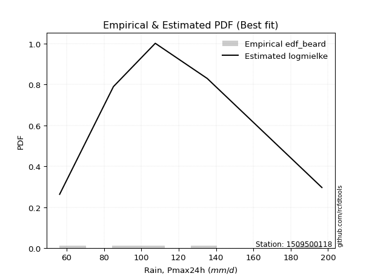</img>

</div>


### 5. EDF Chegodayev (1955)

The Chegodayev formula is an empirical plotting position formula used in hydrological frequency analysis to estimate the exceedance probability or return period of a specific event from a set of observed data. It is primarily used for plotting observed data points on probability paper to fit a theoretical distribution, particularly for analyzing extreme events like maximum flood flows or rainfall intensities. The constant _b_ value in the generalized plotting position formula is 0.3.

<div align="center">


$P=(m-b)/(n+1-2b)$


</div>


**5.1. Empirical values**

<div align="center">

|                | 0                   | 1                   | 2              | 3                  | 4                  |
|:---------------|:--------------------|:--------------------|:---------------|:-------------------|:-------------------|
| date           | 2023                | 2021                | 2022           | 2020               | 2019               |
| x              | 56.3                | 85.1                | 107.5          | 135.3              | 196.7              |
| m              | 1                   | 2                   | 3              | 4                  | 5                  |
| empirical_dist | edf_chegodayev      | edf_chegodayev      | edf_chegodayev | edf_chegodayev     | edf_chegodayev     |
| empirical      | 0.12962962962962962 | 0.31481481481481477 | 0.5            | 0.6851851851851851 | 0.8703703703703703 |
| empirical_tr   | 1.148936170212766   | 1.4594594594594594  | 2.0            | 3.1764705882352935 | 7.714285714285713  |

</div>


**5.2. Kolmogorov-Smirnov fit test (sorted by Δ)**


<div align="center">

|                | 0                   | 1                  | 2                   | 3                   | 4                   | 5                   | 6                   | 7                   | 8                   | 9                  | 10                  | 11                  | 12                  | 13                  | 14                  | 15                  | 16                  | 17                  | 18                  | 19                  | 20                    | 21                  | 22                  | 23                  | 24                  | 25                  | 26                  | 27                  | 28                  | 29                  | 30                  | 31                  | 32                  | 33                  | 34                  | 35                  | 36                  | 37                  | 38                  | 39                 | 40                  | 41                  | 42                  | 43                  | 44                  | 45                  | 46                  | 47                 | 48                  | 49                 | 50                 | 51                  | 52                 | 53                  | 54                  | 55                  | 56                  | 57                  | 58                  | 59                  | 60                  | 61                  | 62                 | 63                 | 64                  | 65                  | 66                  | 67                  | 68                  | 69                  | 70                  | 71                  | 72                 | 73                 | 74                 | 75                  | 76                 | 77                  | 78                  | 79                  | 80                 | 81                 | 82                  | 83                 | 84                 | 85                  | 86                  | 87                 |
|:---------------|:--------------------|:-------------------|:--------------------|:--------------------|:--------------------|:--------------------|:--------------------|:--------------------|:--------------------|:-------------------|:--------------------|:--------------------|:--------------------|:--------------------|:--------------------|:--------------------|:--------------------|:--------------------|:--------------------|:--------------------|:----------------------|:--------------------|:--------------------|:--------------------|:--------------------|:--------------------|:--------------------|:--------------------|:--------------------|:--------------------|:--------------------|:--------------------|:--------------------|:--------------------|:--------------------|:--------------------|:--------------------|:--------------------|:--------------------|:-------------------|:--------------------|:--------------------|:--------------------|:--------------------|:--------------------|:--------------------|:--------------------|:-------------------|:--------------------|:-------------------|:-------------------|:--------------------|:-------------------|:--------------------|:--------------------|:--------------------|:--------------------|:--------------------|:--------------------|:--------------------|:--------------------|:--------------------|:-------------------|:-------------------|:--------------------|:--------------------|:--------------------|:--------------------|:--------------------|:--------------------|:--------------------|:--------------------|:-------------------|:-------------------|:-------------------|:--------------------|:-------------------|:--------------------|:--------------------|:--------------------|:-------------------|:-------------------|:--------------------|:-------------------|:-------------------|:--------------------|:--------------------|:-------------------|
| station        | 1509500118          | 1509500118         | 1509500118          | 1509500118          | 1509500118          | 1509500118          | 1509500118          | 1509500118          | 1509500118          | 1509500118         | 1509500118          | 1509500118          | 1509500118          | 1509500118          | 1509500118          | 1509500118          | 1509500118          | 1509500118          | 1509500118          | 1509500118          | 1509500118            | 1509500118          | 1509500118          | 1509500118          | 1509500118          | 1509500118          | 1509500118          | 1509500118          | 1509500118          | 1509500118          | 1509500118          | 1509500118          | 1509500118          | 1509500118          | 1509500118          | 1509500118          | 1509500118          | 1509500118          | 1509500118          | 1509500118         | 1509500118          | 1509500118          | 1509500118          | 1509500118          | 1509500118          | 1509500118          | 1509500118          | 1509500118         | 1509500118          | 1509500118         | 1509500118         | 1509500118          | 1509500118         | 1509500118          | 1509500118          | 1509500118          | 1509500118          | 1509500118          | 1509500118          | 1509500118          | 1509500118          | 1509500118          | 1509500118         | 1509500118         | 1509500118          | 1509500118          | 1509500118          | 1509500118          | 1509500118          | 1509500118          | 1509500118          | 1509500118          | 1509500118         | 1509500118         | 1509500118         | 1509500118          | 1509500118         | 1509500118          | 1509500118          | 1509500118          | 1509500118         | 1509500118         | 1509500118          | 1509500118         | 1509500118         | 1509500118          | 1509500118          | 1509500118         |
| empirical_dist | edf_chegodayev      | edf_chegodayev     | edf_chegodayev      | edf_chegodayev      | edf_chegodayev      | edf_chegodayev      | edf_chegodayev      | edf_chegodayev      | edf_chegodayev      | edf_chegodayev     | edf_chegodayev      | edf_chegodayev      | edf_chegodayev      | edf_chegodayev      | edf_chegodayev      | edf_chegodayev      | edf_chegodayev      | edf_chegodayev      | edf_chegodayev      | edf_chegodayev      | edf_chegodayev        | edf_chegodayev      | edf_chegodayev      | edf_chegodayev      | edf_chegodayev      | edf_chegodayev      | edf_chegodayev      | edf_chegodayev      | edf_chegodayev      | edf_chegodayev      | edf_chegodayev      | edf_chegodayev      | edf_chegodayev      | edf_chegodayev      | edf_chegodayev      | edf_chegodayev      | edf_chegodayev      | edf_chegodayev      | edf_chegodayev      | edf_chegodayev     | edf_chegodayev      | edf_chegodayev      | edf_chegodayev      | edf_chegodayev      | edf_chegodayev      | edf_chegodayev      | edf_chegodayev      | edf_chegodayev     | edf_chegodayev      | edf_chegodayev     | edf_chegodayev     | edf_chegodayev      | edf_chegodayev     | edf_chegodayev      | edf_chegodayev      | edf_chegodayev      | edf_chegodayev      | edf_chegodayev      | edf_chegodayev      | edf_chegodayev      | edf_chegodayev      | edf_chegodayev      | edf_chegodayev     | edf_chegodayev     | edf_chegodayev      | edf_chegodayev      | edf_chegodayev      | edf_chegodayev      | edf_chegodayev      | edf_chegodayev      | edf_chegodayev      | edf_chegodayev      | edf_chegodayev     | edf_chegodayev     | edf_chegodayev     | edf_chegodayev      | edf_chegodayev     | edf_chegodayev      | edf_chegodayev      | edf_chegodayev      | edf_chegodayev     | edf_chegodayev     | edf_chegodayev      | edf_chegodayev     | edf_chegodayev     | edf_chegodayev      | edf_chegodayev      | edf_chegodayev     |
| p_dist         | logmielke           | fisk               | logfisk             | alpha               | logloggamma         | ncf                 | loggenlogistic      | mielke              | logpearson3         | exponnorm          | logjohnsonsu        | logt                | logexponnorm        | logcrystalball      | lognorm             | lognorm             | logf                | genlogistic         | lognct              | invgamma            | loglaplace_asymmetric | loggamma            | loggamma            | logncf              | logerlang           | logfatiguelife      | nct                 | rayleigh            | logbetaprime        | gumbel_r            | kstwobign           | loginvgamma         | loglogistic         | johnsonsu           | loghypsecant        | maxwell             | pearson3            | logalpha            | loginvgauss         | invgauss           | betaprime           | rice                | loginvweibull       | logweibull_min      | logkstwobign        | logmaxwell          | crystalball         | norm               | truncnorm           | t                  | logistic           | logrice             | laplace_asymmetric | loglaplace          | halfnorm            | hypsecant           | lograyleigh         | moyal               | loggumbel_l         | loggumbel_r         | laplace             | logmoyal            | loggenexpon        | genexpon           | loggompertz         | gompertz            | weibull_min         | halflogistic        | loghalflogistic     | wald                | loghalfnorm         | expon               | gumbel_l           | f                  | logchi2            | logexpon            | erlang             | logwald             | loggibrat           | gibrat              | logtruncnorm       | nakagami           | lognakagami         | loglognorm         | gamma              | invweibull          | chi2                | fatiguelife        |
| delta          | 0.05618165473953897 | 0.0569781799248308 | 0.05726706359863179 | 0.05985886707787154 | 0.06051699974728432 | 0.06075112410904615 | 0.06139533680656804 | 0.06156489058556751 | 0.06239560928779628 | 0.0631121423428044 | 0.06357296647028425 | 0.06420000895291654 | 0.06420075003735216 | 0.06420091107100914 | 0.06420091209120381 | 0.06420091209120381 | 0.06421450277140765 | 0.06433547505525228 | 0.06442863034654488 | 0.06472636460549423 | 0.06498222695830658   | 0.06519752206977947 | 0.06519752206977947 | 0.06557853984364223 | 0.06567115861256628 | 0.06586383529265973 | 0.06604343811173446 | 0.06706951390675975 | 0.06790463551692329 | 0.06817245435857854 | 0.06840446742302486 | 0.06860019939237663 | 0.06898483239688746 | 0.06957193296638096 | 0.07046995107454179 | 0.07050829347103582 | 0.07126500619769338 | 0.07132787994224409 | 0.07140612445797397 | 0.0715865174816411 | 0.07180723210975551 | 0.07451194451452758 | 0.07587789055318907 | 0.07766739663961075 | 0.08008471993590738 | 0.08303869137786854 | 0.08322049666104392 | 0.0832204973634263 | 0.08322049818168542 | 0.0832371963333719 | 0.0843464878200969 | 0.08496746780480047 | 0.0891762276252078 | 0.09055074896072701 | 0.09418534551807388 | 0.09429697084644156 | 0.09548872583300276 | 0.09592346991102485 | 0.10291003970890478 | 0.10933978771264716 | 0.11504819718218001 | 0.12507849115448166 | 0.1291713663324507 | 0.1296294245479139 | 0.12962961664653758 | 0.12962962962943994 | 0.12962962962960087 | 0.12962962962962962 | 0.12962962962962962 | 0.12962962962962962 | 0.12962962962962962 | 0.12962962962962962 | 0.1407977387059694 | 0.1439813843930436 | 0.1557762130017788 | 0.16209818216837524 | 0.1751895446838987 | 0.17670924009620725 | 0.20136284203241694 | 0.23401671824019515 | 0.3130132093167711 | 0.3148032975956905 | 0.31481481360887226 | 0.3616490967790347 | 0.3989352289944861 | 0.43408223320026246 | 0.45744966547495314 | 0.4675576549531346 |
| deltao         | 0.5865427407550001  | 0.5865427407550001 | 0.5865427407550001  | 0.5865427407550001  | 0.5865427407550001  | 0.5865427407550001  | 0.5865427407550001  | 0.5865427407550001  | 0.5865427407550001  | 0.5865427407550001 | 0.5865427407550001  | 0.5865427407550001  | 0.5865427407550001  | 0.5865427407550001  | 0.5865427407550001  | 0.5865427407550001  | 0.5865427407550001  | 0.5865427407550001  | 0.5865427407550001  | 0.5865427407550001  | 0.5865427407550001    | 0.5865427407550001  | 0.5865427407550001  | 0.5865427407550001  | 0.5865427407550001  | 0.5865427407550001  | 0.5865427407550001  | 0.5865427407550001  | 0.5865427407550001  | 0.5865427407550001  | 0.5865427407550001  | 0.5865427407550001  | 0.5865427407550001  | 0.5865427407550001  | 0.5865427407550001  | 0.5865427407550001  | 0.5865427407550001  | 0.5865427407550001  | 0.5865427407550001  | 0.5865427407550001 | 0.5865427407550001  | 0.5865427407550001  | 0.5865427407550001  | 0.5865427407550001  | 0.5865427407550001  | 0.5865427407550001  | 0.5865427407550001  | 0.5865427407550001 | 0.5865427407550001  | 0.5865427407550001 | 0.5865427407550001 | 0.5865427407550001  | 0.5865427407550001 | 0.5865427407550001  | 0.5865427407550001  | 0.5865427407550001  | 0.5865427407550001  | 0.5865427407550001  | 0.5865427407550001  | 0.5865427407550001  | 0.5865427407550001  | 0.5865427407550001  | 0.5865427407550001 | 0.5865427407550001 | 0.5865427407550001  | 0.5865427407550001  | 0.5865427407550001  | 0.5865427407550001  | 0.5865427407550001  | 0.5865427407550001  | 0.5865427407550001  | 0.5865427407550001  | 0.5865427407550001 | 0.5865427407550001 | 0.5865427407550001 | 0.5865427407550001  | 0.5865427407550001 | 0.5865427407550001  | 0.5865427407550001  | 0.5865427407550001  | 0.5865427407550001 | 0.5865427407550001 | 0.5865427407550001  | 0.5865427407550001 | 0.5865427407550001 | 0.5865427407550001  | 0.5865427407550001  | 0.5865427407550001 |
| eval           | Δo > Δ              | Δo > Δ             | Δo > Δ              | Δo > Δ              | Δo > Δ              | Δo > Δ              | Δo > Δ              | Δo > Δ              | Δo > Δ              | Δo > Δ             | Δo > Δ              | Δo > Δ              | Δo > Δ              | Δo > Δ              | Δo > Δ              | Δo > Δ              | Δo > Δ              | Δo > Δ              | Δo > Δ              | Δo > Δ              | Δo > Δ                | Δo > Δ              | Δo > Δ              | Δo > Δ              | Δo > Δ              | Δo > Δ              | Δo > Δ              | Δo > Δ              | Δo > Δ              | Δo > Δ              | Δo > Δ              | Δo > Δ              | Δo > Δ              | Δo > Δ              | Δo > Δ              | Δo > Δ              | Δo > Δ              | Δo > Δ              | Δo > Δ              | Δo > Δ             | Δo > Δ              | Δo > Δ              | Δo > Δ              | Δo > Δ              | Δo > Δ              | Δo > Δ              | Δo > Δ              | Δo > Δ             | Δo > Δ              | Δo > Δ             | Δo > Δ             | Δo > Δ              | Δo > Δ             | Δo > Δ              | Δo > Δ              | Δo > Δ              | Δo > Δ              | Δo > Δ              | Δo > Δ              | Δo > Δ              | Δo > Δ              | Δo > Δ              | Δo > Δ             | Δo > Δ             | Δo > Δ              | Δo > Δ              | Δo > Δ              | Δo > Δ              | Δo > Δ              | Δo > Δ              | Δo > Δ              | Δo > Δ              | Δo > Δ             | Δo > Δ             | Δo > Δ             | Δo > Δ              | Δo > Δ             | Δo > Δ              | Δo > Δ              | Δo > Δ              | Δo > Δ             | Δo > Δ             | Δo > Δ              | Δo > Δ             | Δo > Δ             | Δo > Δ              | Δo > Δ              | Δo > Δ             |
| fit            | 1                   | 1                  | 1                   | 1                   | 1                   | 1                   | 1                   | 1                   | 1                   | 1                  | 1                   | 1                   | 1                   | 1                   | 1                   | 1                   | 1                   | 1                   | 1                   | 1                   | 1                     | 1                   | 1                   | 1                   | 1                   | 1                   | 1                   | 1                   | 1                   | 1                   | 1                   | 1                   | 1                   | 1                   | 1                   | 1                   | 1                   | 1                   | 1                   | 1                  | 1                   | 1                   | 1                   | 1                   | 1                   | 1                   | 1                   | 1                  | 1                   | 1                  | 1                  | 1                   | 1                  | 1                   | 1                   | 1                   | 1                   | 1                   | 1                   | 1                   | 1                   | 1                   | 1                  | 1                  | 1                   | 1                   | 1                   | 1                   | 1                   | 1                   | 1                   | 1                   | 1                  | 1                  | 1                  | 1                   | 1                  | 1                   | 1                   | 1                   | 1                  | 1                  | 1                   | 1                  | 1                  | 1                   | 1                   | 1                  |
| n              | 5                   | 5                  | 5                   | 5                   | 5                   | 5                   | 5                   | 5                   | 5                   | 5                  | 5                   | 5                   | 5                   | 5                   | 5                   | 5                   | 5                   | 5                   | 5                   | 5                   | 5                     | 5                   | 5                   | 5                   | 5                   | 5                   | 5                   | 5                   | 5                   | 5                   | 5                   | 5                   | 5                   | 5                   | 5                   | 5                   | 5                   | 5                   | 5                   | 5                  | 5                   | 5                   | 5                   | 5                   | 5                   | 5                   | 5                   | 5                  | 5                   | 5                  | 5                  | 5                   | 5                  | 5                   | 5                   | 5                   | 5                   | 5                   | 5                   | 5                   | 5                   | 5                   | 5                  | 5                  | 5                   | 5                   | 5                   | 5                   | 5                   | 5                   | 5                   | 5                   | 5                  | 5                  | 5                  | 5                   | 5                  | 5                   | 5                   | 5                   | 5                  | 5                  | 5                   | 5                  | 5                  | 5                   | 5                   | 5                  |
| best_fit       | 1                   | 0                  | 0                   | 0                   | 0                   | 0                   | 0                   | 0                   | 0                   | 0                  | 0                   | 0                   | 0                   | 0                   | 0                   | 0                   | 0                   | 0                   | 0                   | 0                   | 0                     | 0                   | 0                   | 0                   | 0                   | 0                   | 0                   | 0                   | 0                   | 0                   | 0                   | 0                   | 0                   | 0                   | 0                   | 0                   | 0                   | 0                   | 0                   | 0                  | 0                   | 0                   | 0                   | 0                   | 0                   | 0                   | 0                   | 0                  | 0                   | 0                  | 0                  | 0                   | 0                  | 0                   | 0                   | 0                   | 0                   | 0                   | 0                   | 0                   | 0                   | 0                   | 0                  | 0                  | 0                   | 0                   | 0                   | 0                   | 0                   | 0                   | 0                   | 0                   | 0                  | 0                  | 0                  | 0                   | 0                  | 0                   | 0                   | 0                   | 0                  | 0                  | 0                   | 0                  | 0                  | 0                   | 0                   | 0                  |
| best_fit_sort  | 1                   | 2                  | 3                   | 4                   | 5                   | 6                   | 7                   | 8                   | 9                   | 10                 | 11                  | 12                  | 13                  | 14                  | 15                  | 16                  | 17                  | 18                  | 19                  | 20                  | 21                    | 22                  | 23                  | 24                  | 25                  | 26                  | 27                  | 28                  | 29                  | 30                  | 31                  | 32                  | 33                  | 34                  | 35                  | 36                  | 37                  | 38                  | 39                  | 40                 | 41                  | 42                  | 43                  | 44                  | 45                  | 46                  | 47                  | 48                 | 49                  | 50                 | 51                 | 52                  | 53                 | 54                  | 55                  | 56                  | 57                  | 58                  | 59                  | 60                  | 61                  | 62                  | 63                 | 64                 | 65                  | 66                  | 67                  | 68                  | 69                  | 70                  | 71                  | 72                  | 73                 | 74                 | 75                 | 76                  | 77                 | 78                  | 79                  | 80                  | 81                 | 82                 | 83                  | 84                 | 85                 | 86                  | 87                  | 88                 |

</div>


**5.3. Best fit**

<div align="center">

|   id |    station | empirical_dist   | p_dist    |     delta |   deltao | eval   |   fit |   n |   best_fit |   best_fit_sort |
|-----:|-----------:|:-----------------|:----------|----------:|---------:|:-------|------:|----:|-----------:|----------------:|
|    0 | 1509500118 | edf_chegodayev   | logmielke | 0.0561817 | 0.586543 | Δo > Δ |     1 |   5 |          1 |               1 |

</div>


<div align="center">

</img>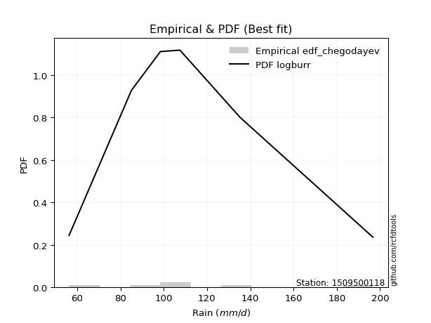</img>

</div>


### 6. EDF Blom (1958)

The Blom formula is a specific "plotting position" formula used in hydrology and statistical analysis to estimate the empirical cumulative probability (or non-exceedance probability) of a data series. It is particularly recommended for data that are approximately normally distributed. The constant _a_ is set to 0.375 (or 3/8).

<div align="center">


$P=(m-a)/(n+1-2a)$


</div>


**6.1. Empirical values**

<div align="center">

|                | 0                   | 1                   | 2        | 3                  | 4                  |
|:---------------|:--------------------|:--------------------|:---------|:-------------------|:-------------------|
| date           | 2023                | 2021                | 2022     | 2020               | 2019               |
| x              | 56.3                | 85.1                | 107.5    | 135.3              | 196.7              |
| m              | 1                   | 2                   | 3        | 4                  | 5                  |
| empirical_dist | edf_blom            | edf_blom            | edf_blom | edf_blom           | edf_blom           |
| empirical      | 0.11904761904761904 | 0.30952380952380953 | 0.5      | 0.6904761904761905 | 0.8809523809523809 |
| empirical_tr   | 1.135135135135135   | 1.4482758620689655  | 2.0      | 3.230769230769231  | 8.399999999999999  |

</div>


**6.2. Kolmogorov-Smirnov fit test (sorted by Δ)**


<div align="center">

|                | 0                   | 1                   | 2                   | 3                   | 4                   | 5                   | 6                   | 7                   | 8                    | 9                    | 10                  | 11                  | 12                  | 13                  | 14                   | 15                   | 16                  | 17                 | 18                   | 19                  | 20                   | 21                   | 22                  | 23                 | 24                   | 25                  | 26                   | 27                   | 28                   | 29                  | 30                  | 31                  | 32                  | 33                    | 34                  | 35                 | 36                   | 37                   | 38                  | 39                   | 40                  | 41                 | 42                  | 43                  | 44                  | 45                  | 46                  | 47                  | 48                  | 49                  | 50                  | 51                  | 52                 | 53                  | 54                  | 55                  | 56                  | 57                  | 58                 | 59                  | 60                 | 61                  | 62                 | 63                  | 64                 | 65                  | 66                  | 67                  | 68                  | 69                  | 70                  | 71                  | 72                 | 73                  | 74                  | 75                  | 76                  | 77                  | 78                  | 79                  | 80                  | 81                 | 82                  | 83                 | 84                 | 85                  | 86                 | 87                  |
|:---------------|:--------------------|:--------------------|:--------------------|:--------------------|:--------------------|:--------------------|:--------------------|:--------------------|:---------------------|:---------------------|:--------------------|:--------------------|:--------------------|:--------------------|:---------------------|:---------------------|:--------------------|:-------------------|:---------------------|:--------------------|:---------------------|:---------------------|:--------------------|:-------------------|:---------------------|:--------------------|:---------------------|:---------------------|:---------------------|:--------------------|:--------------------|:--------------------|:--------------------|:----------------------|:--------------------|:-------------------|:---------------------|:---------------------|:--------------------|:---------------------|:--------------------|:-------------------|:--------------------|:--------------------|:--------------------|:--------------------|:--------------------|:--------------------|:--------------------|:--------------------|:--------------------|:--------------------|:-------------------|:--------------------|:--------------------|:--------------------|:--------------------|:--------------------|:-------------------|:--------------------|:-------------------|:--------------------|:-------------------|:--------------------|:-------------------|:--------------------|:--------------------|:--------------------|:--------------------|:--------------------|:--------------------|:--------------------|:-------------------|:--------------------|:--------------------|:--------------------|:--------------------|:--------------------|:--------------------|:--------------------|:--------------------|:-------------------|:--------------------|:-------------------|:-------------------|:--------------------|:-------------------|:--------------------|
| station        | 1509500118          | 1509500118          | 1509500118          | 1509500118          | 1509500118          | 1509500118          | 1509500118          | 1509500118          | 1509500118           | 1509500118           | 1509500118          | 1509500118          | 1509500118          | 1509500118          | 1509500118           | 1509500118           | 1509500118          | 1509500118         | 1509500118           | 1509500118          | 1509500118           | 1509500118           | 1509500118          | 1509500118         | 1509500118           | 1509500118          | 1509500118           | 1509500118           | 1509500118           | 1509500118          | 1509500118          | 1509500118          | 1509500118          | 1509500118            | 1509500118          | 1509500118         | 1509500118           | 1509500118           | 1509500118          | 1509500118           | 1509500118          | 1509500118         | 1509500118          | 1509500118          | 1509500118          | 1509500118          | 1509500118          | 1509500118          | 1509500118          | 1509500118          | 1509500118          | 1509500118          | 1509500118         | 1509500118          | 1509500118          | 1509500118          | 1509500118          | 1509500118          | 1509500118         | 1509500118          | 1509500118         | 1509500118          | 1509500118         | 1509500118          | 1509500118         | 1509500118          | 1509500118          | 1509500118          | 1509500118          | 1509500118          | 1509500118          | 1509500118          | 1509500118         | 1509500118          | 1509500118          | 1509500118          | 1509500118          | 1509500118          | 1509500118          | 1509500118          | 1509500118          | 1509500118         | 1509500118          | 1509500118         | 1509500118         | 1509500118          | 1509500118         | 1509500118          |
| empirical_dist | edf_blom            | edf_blom            | edf_blom            | edf_blom            | edf_blom            | edf_blom            | edf_blom            | edf_blom            | edf_blom             | edf_blom             | edf_blom            | edf_blom            | edf_blom            | edf_blom            | edf_blom             | edf_blom             | edf_blom            | edf_blom           | edf_blom             | edf_blom            | edf_blom             | edf_blom             | edf_blom            | edf_blom           | edf_blom             | edf_blom            | edf_blom             | edf_blom             | edf_blom             | edf_blom            | edf_blom            | edf_blom            | edf_blom            | edf_blom              | edf_blom            | edf_blom           | edf_blom             | edf_blom             | edf_blom            | edf_blom             | edf_blom            | edf_blom           | edf_blom            | edf_blom            | edf_blom            | edf_blom            | edf_blom            | edf_blom            | edf_blom            | edf_blom            | edf_blom            | edf_blom            | edf_blom           | edf_blom            | edf_blom            | edf_blom            | edf_blom            | edf_blom            | edf_blom           | edf_blom            | edf_blom           | edf_blom            | edf_blom           | edf_blom            | edf_blom           | edf_blom            | edf_blom            | edf_blom            | edf_blom            | edf_blom            | edf_blom            | edf_blom            | edf_blom           | edf_blom            | edf_blom            | edf_blom            | edf_blom            | edf_blom            | edf_blom            | edf_blom            | edf_blom            | edf_blom           | edf_blom            | edf_blom           | edf_blom           | edf_blom            | edf_blom           | edf_blom            |
| p_dist         | logmielke           | fisk                | logfisk             | alpha               | logloggamma         | ncf                 | loggenlogistic      | mielke              | logpearson3          | exponnorm            | logjohnsonsu        | logt                | logexponnorm        | logcrystalball      | lognorm              | lognorm              | logf                | genlogistic        | lognct               | invgamma            | loggamma             | loggamma             | logncf              | logerlang          | logfatiguelife       | nct                 | rayleigh             | logbetaprime         | gumbel_r             | kstwobign           | loginvgamma         | loglogistic         | johnsonsu           | loglaplace_asymmetric | maxwell             | pearson3           | logalpha             | loginvgauss          | invgauss            | betaprime            | loghypsecant        | rice               | loginvweibull       | logweibull_min      | logmaxwell          | crystalball         | norm                | truncnorm           | t                   | logrice             | logkstwobign        | logistic            | halfnorm           | laplace_asymmetric  | lograyleigh         | loglaplace          | moyal               | hypsecant           | loggumbel_l        | loggumbel_r         | laplace            | logmoyal            | loggenexpon        | genexpon            | loggompertz        | gompertz            | weibull_min         | halflogistic        | loghalflogistic     | wald                | loghalfnorm         | expon               | gumbel_l           | f                   | logchi2             | logexpon            | logwald             | erlang              | loggibrat           | gibrat              | nakagami            | lognakagami        | logtruncnorm        | loglognorm         | gamma              | invweibull          | chi2               | fatiguelife         |
| delta          | 0.04559964415752839 | 0.04639616934282022 | 0.04668505301662121 | 0.04927685649586096 | 0.04993498916527374 | 0.05016911352703557 | 0.05081332622455746 | 0.05098288000355693 | 0.051813598705785696 | 0.052530131760793825 | 0.05299095588827367 | 0.05361799837090596 | 0.05361873945534158 | 0.05361890048899856 | 0.053618901509193226 | 0.053618901509193226 | 0.05363249218939707 | 0.0537534644732417 | 0.053846619764534295 | 0.05414435402348365 | 0.054615511487768886 | 0.054615511487768886 | 0.05499652926163165 | 0.0550891480305557 | 0.055281824710649144 | 0.05546142752972388 | 0.056487503324749166 | 0.057322624934912705 | 0.057590443776567954 | 0.05782245684101428 | 0.05801818881036606 | 0.05840282181487688 | 0.05898992238437038 | 0.05969122166730123   | 0.05992628288902524 | 0.0606829956156828 | 0.060745869360233504 | 0.060824113875963384 | 0.06100450689963053 | 0.061225221527744934 | 0.06158431063053338 | 0.063929933932517  | 0.06529587997117849 | 0.06708538605760017 | 0.07245668079585796 | 0.07263848607903334 | 0.07263848678141571 | 0.07263848759967484 | 0.07265518575136132 | 0.07438545722278989 | 0.08008471993590738 | 0.08142454290608475 | 0.0836033349360633 | 0.08388522233420256 | 0.08490671525099218 | 0.08525974366972167 | 0.08534145932901427 | 0.08939126029495248 | 0.0923280291268942 | 0.09875777713063658 | 0.1130169093654903 | 0.11449648057247108 | 0.1185893557504401 | 0.11904741396590333 | 0.119047606064527  | 0.11904761904742935 | 0.11904761904759029 | 0.11904761904761904 | 0.11904761904761904 | 0.11904761904761904 | 0.11904761904761904 | 0.11904761904761904 | 0.1407977387059694 | 0.14927238968404882 | 0.16635822358378938 | 0.16738918745938047 | 0.17670924009620725 | 0.18048054997490393 | 0.20136284203241694 | 0.22872571294918992 | 0.30951229230468524 | 0.309523808317867  | 0.31830421460777636 | 0.3669401020700399 | 0.4042262342854913 | 0.44466424378227304 | 0.4627406707659584 | 0.47284866024413985 |
| deltao         | 0.5865427407550001  | 0.5865427407550001  | 0.5865427407550001  | 0.5865427407550001  | 0.5865427407550001  | 0.5865427407550001  | 0.5865427407550001  | 0.5865427407550001  | 0.5865427407550001   | 0.5865427407550001   | 0.5865427407550001  | 0.5865427407550001  | 0.5865427407550001  | 0.5865427407550001  | 0.5865427407550001   | 0.5865427407550001   | 0.5865427407550001  | 0.5865427407550001 | 0.5865427407550001   | 0.5865427407550001  | 0.5865427407550001   | 0.5865427407550001   | 0.5865427407550001  | 0.5865427407550001 | 0.5865427407550001   | 0.5865427407550001  | 0.5865427407550001   | 0.5865427407550001   | 0.5865427407550001   | 0.5865427407550001  | 0.5865427407550001  | 0.5865427407550001  | 0.5865427407550001  | 0.5865427407550001    | 0.5865427407550001  | 0.5865427407550001 | 0.5865427407550001   | 0.5865427407550001   | 0.5865427407550001  | 0.5865427407550001   | 0.5865427407550001  | 0.5865427407550001 | 0.5865427407550001  | 0.5865427407550001  | 0.5865427407550001  | 0.5865427407550001  | 0.5865427407550001  | 0.5865427407550001  | 0.5865427407550001  | 0.5865427407550001  | 0.5865427407550001  | 0.5865427407550001  | 0.5865427407550001 | 0.5865427407550001  | 0.5865427407550001  | 0.5865427407550001  | 0.5865427407550001  | 0.5865427407550001  | 0.5865427407550001 | 0.5865427407550001  | 0.5865427407550001 | 0.5865427407550001  | 0.5865427407550001 | 0.5865427407550001  | 0.5865427407550001 | 0.5865427407550001  | 0.5865427407550001  | 0.5865427407550001  | 0.5865427407550001  | 0.5865427407550001  | 0.5865427407550001  | 0.5865427407550001  | 0.5865427407550001 | 0.5865427407550001  | 0.5865427407550001  | 0.5865427407550001  | 0.5865427407550001  | 0.5865427407550001  | 0.5865427407550001  | 0.5865427407550001  | 0.5865427407550001  | 0.5865427407550001 | 0.5865427407550001  | 0.5865427407550001 | 0.5865427407550001 | 0.5865427407550001  | 0.5865427407550001 | 0.5865427407550001  |
| eval           | Δo > Δ              | Δo > Δ              | Δo > Δ              | Δo > Δ              | Δo > Δ              | Δo > Δ              | Δo > Δ              | Δo > Δ              | Δo > Δ               | Δo > Δ               | Δo > Δ              | Δo > Δ              | Δo > Δ              | Δo > Δ              | Δo > Δ               | Δo > Δ               | Δo > Δ              | Δo > Δ             | Δo > Δ               | Δo > Δ              | Δo > Δ               | Δo > Δ               | Δo > Δ              | Δo > Δ             | Δo > Δ               | Δo > Δ              | Δo > Δ               | Δo > Δ               | Δo > Δ               | Δo > Δ              | Δo > Δ              | Δo > Δ              | Δo > Δ              | Δo > Δ                | Δo > Δ              | Δo > Δ             | Δo > Δ               | Δo > Δ               | Δo > Δ              | Δo > Δ               | Δo > Δ              | Δo > Δ             | Δo > Δ              | Δo > Δ              | Δo > Δ              | Δo > Δ              | Δo > Δ              | Δo > Δ              | Δo > Δ              | Δo > Δ              | Δo > Δ              | Δo > Δ              | Δo > Δ             | Δo > Δ              | Δo > Δ              | Δo > Δ              | Δo > Δ              | Δo > Δ              | Δo > Δ             | Δo > Δ              | Δo > Δ             | Δo > Δ              | Δo > Δ             | Δo > Δ              | Δo > Δ             | Δo > Δ              | Δo > Δ              | Δo > Δ              | Δo > Δ              | Δo > Δ              | Δo > Δ              | Δo > Δ              | Δo > Δ             | Δo > Δ              | Δo > Δ              | Δo > Δ              | Δo > Δ              | Δo > Δ              | Δo > Δ              | Δo > Δ              | Δo > Δ              | Δo > Δ             | Δo > Δ              | Δo > Δ             | Δo > Δ             | Δo > Δ              | Δo > Δ             | Δo > Δ              |
| fit            | 1                   | 1                   | 1                   | 1                   | 1                   | 1                   | 1                   | 1                   | 1                    | 1                    | 1                   | 1                   | 1                   | 1                   | 1                    | 1                    | 1                   | 1                  | 1                    | 1                   | 1                    | 1                    | 1                   | 1                  | 1                    | 1                   | 1                    | 1                    | 1                    | 1                   | 1                   | 1                   | 1                   | 1                     | 1                   | 1                  | 1                    | 1                    | 1                   | 1                    | 1                   | 1                  | 1                   | 1                   | 1                   | 1                   | 1                   | 1                   | 1                   | 1                   | 1                   | 1                   | 1                  | 1                   | 1                   | 1                   | 1                   | 1                   | 1                  | 1                   | 1                  | 1                   | 1                  | 1                   | 1                  | 1                   | 1                   | 1                   | 1                   | 1                   | 1                   | 1                   | 1                  | 1                   | 1                   | 1                   | 1                   | 1                   | 1                   | 1                   | 1                   | 1                  | 1                   | 1                  | 1                  | 1                   | 1                  | 1                   |
| n              | 5                   | 5                   | 5                   | 5                   | 5                   | 5                   | 5                   | 5                   | 5                    | 5                    | 5                   | 5                   | 5                   | 5                   | 5                    | 5                    | 5                   | 5                  | 5                    | 5                   | 5                    | 5                    | 5                   | 5                  | 5                    | 5                   | 5                    | 5                    | 5                    | 5                   | 5                   | 5                   | 5                   | 5                     | 5                   | 5                  | 5                    | 5                    | 5                   | 5                    | 5                   | 5                  | 5                   | 5                   | 5                   | 5                   | 5                   | 5                   | 5                   | 5                   | 5                   | 5                   | 5                  | 5                   | 5                   | 5                   | 5                   | 5                   | 5                  | 5                   | 5                  | 5                   | 5                  | 5                   | 5                  | 5                   | 5                   | 5                   | 5                   | 5                   | 5                   | 5                   | 5                  | 5                   | 5                   | 5                   | 5                   | 5                   | 5                   | 5                   | 5                   | 5                  | 5                   | 5                  | 5                  | 5                   | 5                  | 5                   |
| best_fit       | 1                   | 0                   | 0                   | 0                   | 0                   | 0                   | 0                   | 0                   | 0                    | 0                    | 0                   | 0                   | 0                   | 0                   | 0                    | 0                    | 0                   | 0                  | 0                    | 0                   | 0                    | 0                    | 0                   | 0                  | 0                    | 0                   | 0                    | 0                    | 0                    | 0                   | 0                   | 0                   | 0                   | 0                     | 0                   | 0                  | 0                    | 0                    | 0                   | 0                    | 0                   | 0                  | 0                   | 0                   | 0                   | 0                   | 0                   | 0                   | 0                   | 0                   | 0                   | 0                   | 0                  | 0                   | 0                   | 0                   | 0                   | 0                   | 0                  | 0                   | 0                  | 0                   | 0                  | 0                   | 0                  | 0                   | 0                   | 0                   | 0                   | 0                   | 0                   | 0                   | 0                  | 0                   | 0                   | 0                   | 0                   | 0                   | 0                   | 0                   | 0                   | 0                  | 0                   | 0                  | 0                  | 0                   | 0                  | 0                   |
| best_fit_sort  | 1                   | 2                   | 3                   | 4                   | 5                   | 6                   | 7                   | 8                   | 9                    | 10                   | 11                  | 12                  | 13                  | 14                  | 15                   | 16                   | 17                  | 18                 | 19                   | 20                  | 21                   | 22                   | 23                  | 24                 | 25                   | 26                  | 27                   | 28                   | 29                   | 30                  | 31                  | 32                  | 33                  | 34                    | 35                  | 36                 | 37                   | 38                   | 39                  | 40                   | 41                  | 42                 | 43                  | 44                  | 45                  | 46                  | 47                  | 48                  | 49                  | 50                  | 51                  | 52                  | 53                 | 54                  | 55                  | 56                  | 57                  | 58                  | 59                 | 60                  | 61                 | 62                  | 63                 | 64                  | 65                 | 66                  | 67                  | 68                  | 69                  | 70                  | 71                  | 72                  | 73                 | 74                  | 75                  | 76                  | 77                  | 78                  | 79                  | 80                  | 81                  | 82                 | 83                  | 84                 | 85                 | 86                  | 87                 | 88                  |

</div>


**6.3. Best fit**

<div align="center">

|   id |    station | empirical_dist   | p_dist    |     delta |   deltao | eval   |   fit |   n |   best_fit |   best_fit_sort |
|-----:|-----------:|:-----------------|:----------|----------:|---------:|:-------|------:|----:|-----------:|----------------:|
|    0 | 1509500118 | edf_blom         | logmielke | 0.0455996 | 0.586543 | Δo > Δ |     1 |   5 |          1 |               1 |

</div>


<div align="center">

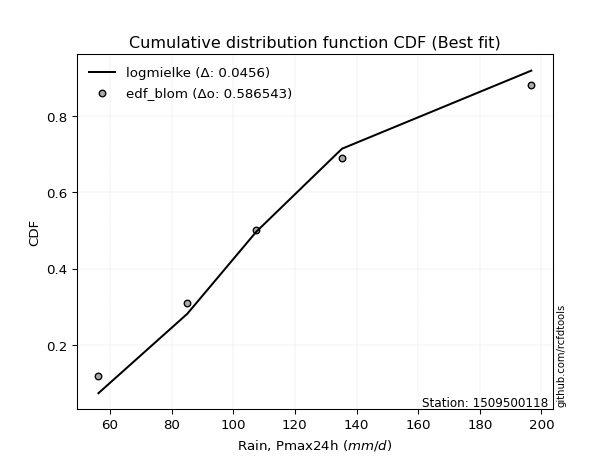</img>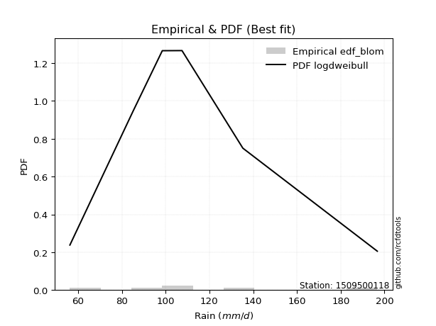</img>

</div>


### 7. EDF Tukey (1962)

In hydrology, the Tukey formula is used as a plotting position formula to estimate the empirical probability or frequency of a flood event (or other hydrological data). The formula parameter is given as _c=0.333_ (or 1/3).

<div align="center">


$P=(m-c)/(n+1-2c)$


</div>


**7.1. Empirical values**

<div align="center">

|                | 0                  | 1                  | 2         | 3         | 4         |
|:---------------|:-------------------|:-------------------|:----------|:----------|:----------|
| date           | 2023               | 2021               | 2022      | 2020      | 2019      |
| x              | 56.3               | 85.1               | 107.5     | 135.3     | 196.7     |
| m              | 1                  | 2                  | 3         | 4         | 5         |
| empirical_dist | edf_tukey          | edf_tukey          | edf_tukey | edf_tukey | edf_tukey |
| empirical      | 0.125              | 0.3125             | 0.5       | 0.6875    | 0.875     |
| empirical_tr   | 1.1428571428571428 | 1.4545454545454546 | 2.0       | 3.2       | 8.0       |

</div>


**7.2. Kolmogorov-Smirnov fit test (sorted by Δ)**


<div align="center">

|                | 0                   | 1                   | 2                   | 3                    | 4                  | 5                  | 6                   | 7                    | 8                    | 9                    | 10                  | 11                  | 12                  | 13                  | 14                   | 15                   | 16                  | 17                  | 18                   | 19                  | 20                   | 21                   | 22                  | 23                  | 24                 | 25                  | 26                 | 27                    | 28                  | 29                  | 30                  | 31                  | 32                  | 33                  | 34                  | 35                  | 36                  | 37                  | 38                  | 39                  | 40                  | 41                  | 42                  | 43                  | 44                  | 45                  | 46                  | 47                  | 48                  | 49                  | 50                  | 51                  | 52                  | 53                  | 54                  | 55                  | 56                  | 57                 | 58                  | 59                  | 60                 | 61                  | 62                  | 63                 | 64                  | 65                 | 66                  | 67                 | 68                 | 69                 | 70                 | 71                 | 72                 | 73                  | 74                  | 75                 | 76                  | 77                  | 78                  | 79                  | 80                 | 81                 | 82                 | 83                  | 84                  | 85                 | 86                 | 87                 |
|:---------------|:--------------------|:--------------------|:--------------------|:---------------------|:-------------------|:-------------------|:--------------------|:---------------------|:---------------------|:---------------------|:--------------------|:--------------------|:--------------------|:--------------------|:---------------------|:---------------------|:--------------------|:--------------------|:---------------------|:--------------------|:---------------------|:---------------------|:--------------------|:--------------------|:-------------------|:--------------------|:-------------------|:----------------------|:--------------------|:--------------------|:--------------------|:--------------------|:--------------------|:--------------------|:--------------------|:--------------------|:--------------------|:--------------------|:--------------------|:--------------------|:--------------------|:--------------------|:--------------------|:--------------------|:--------------------|:--------------------|:--------------------|:--------------------|:--------------------|:--------------------|:--------------------|:--------------------|:--------------------|:--------------------|:--------------------|:--------------------|:--------------------|:-------------------|:--------------------|:--------------------|:-------------------|:--------------------|:--------------------|:-------------------|:--------------------|:-------------------|:--------------------|:-------------------|:-------------------|:-------------------|:-------------------|:-------------------|:-------------------|:--------------------|:--------------------|:-------------------|:--------------------|:--------------------|:--------------------|:--------------------|:-------------------|:-------------------|:-------------------|:--------------------|:--------------------|:-------------------|:-------------------|:-------------------|
| station        | 1509500118          | 1509500118          | 1509500118          | 1509500118           | 1509500118         | 1509500118         | 1509500118          | 1509500118           | 1509500118           | 1509500118           | 1509500118          | 1509500118          | 1509500118          | 1509500118          | 1509500118           | 1509500118           | 1509500118          | 1509500118          | 1509500118           | 1509500118          | 1509500118           | 1509500118           | 1509500118          | 1509500118          | 1509500118         | 1509500118          | 1509500118         | 1509500118            | 1509500118          | 1509500118          | 1509500118          | 1509500118          | 1509500118          | 1509500118          | 1509500118          | 1509500118          | 1509500118          | 1509500118          | 1509500118          | 1509500118          | 1509500118          | 1509500118          | 1509500118          | 1509500118          | 1509500118          | 1509500118          | 1509500118          | 1509500118          | 1509500118          | 1509500118          | 1509500118          | 1509500118          | 1509500118          | 1509500118          | 1509500118          | 1509500118          | 1509500118          | 1509500118         | 1509500118          | 1509500118          | 1509500118         | 1509500118          | 1509500118          | 1509500118         | 1509500118          | 1509500118         | 1509500118          | 1509500118         | 1509500118         | 1509500118         | 1509500118         | 1509500118         | 1509500118         | 1509500118          | 1509500118          | 1509500118         | 1509500118          | 1509500118          | 1509500118          | 1509500118          | 1509500118         | 1509500118         | 1509500118         | 1509500118          | 1509500118          | 1509500118         | 1509500118         | 1509500118         |
| empirical_dist | edf_tukey           | edf_tukey           | edf_tukey           | edf_tukey            | edf_tukey          | edf_tukey          | edf_tukey           | edf_tukey            | edf_tukey            | edf_tukey            | edf_tukey           | edf_tukey           | edf_tukey           | edf_tukey           | edf_tukey            | edf_tukey            | edf_tukey           | edf_tukey           | edf_tukey            | edf_tukey           | edf_tukey            | edf_tukey            | edf_tukey           | edf_tukey           | edf_tukey          | edf_tukey           | edf_tukey          | edf_tukey             | edf_tukey           | edf_tukey           | edf_tukey           | edf_tukey           | edf_tukey           | edf_tukey           | edf_tukey           | edf_tukey           | edf_tukey           | edf_tukey           | edf_tukey           | edf_tukey           | edf_tukey           | edf_tukey           | edf_tukey           | edf_tukey           | edf_tukey           | edf_tukey           | edf_tukey           | edf_tukey           | edf_tukey           | edf_tukey           | edf_tukey           | edf_tukey           | edf_tukey           | edf_tukey           | edf_tukey           | edf_tukey           | edf_tukey           | edf_tukey          | edf_tukey           | edf_tukey           | edf_tukey          | edf_tukey           | edf_tukey           | edf_tukey          | edf_tukey           | edf_tukey          | edf_tukey           | edf_tukey          | edf_tukey          | edf_tukey          | edf_tukey          | edf_tukey          | edf_tukey          | edf_tukey           | edf_tukey           | edf_tukey          | edf_tukey           | edf_tukey           | edf_tukey           | edf_tukey           | edf_tukey          | edf_tukey          | edf_tukey          | edf_tukey           | edf_tukey           | edf_tukey          | edf_tukey          | edf_tukey          |
| p_dist         | logmielke           | fisk                | logfisk             | alpha                | logloggamma        | ncf                | loggenlogistic      | mielke               | logpearson3          | exponnorm            | logjohnsonsu        | logt                | logexponnorm        | logcrystalball      | lognorm              | lognorm              | logf                | genlogistic         | lognct               | invgamma            | loggamma             | loggamma             | logncf              | logerlang           | logfatiguelife     | nct                 | rayleigh           | loglaplace_asymmetric | logbetaprime        | gumbel_r            | kstwobign           | loginvgamma         | loglogistic         | johnsonsu           | loghypsecant        | maxwell             | pearson3            | logalpha            | loginvgauss         | invgauss            | betaprime           | rice                | loginvweibull       | logweibull_min      | logmaxwell          | crystalball         | norm                | truncnorm           | t                   | logkstwobign        | logrice             | logistic            | laplace_asymmetric  | loglaplace          | halfnorm            | lograyleigh         | moyal               | hypsecant          | loggumbel_l         | loggumbel_r         | laplace            | logmoyal            | loggenexpon         | genexpon           | loggompertz         | gompertz           | weibull_min         | halflogistic       | loghalflogistic    | wald               | loghalfnorm        | expon              | gumbel_l           | f                   | logchi2             | logexpon           | logwald             | erlang              | loggibrat           | gibrat              | nakagami           | lognakagami        | logtruncnorm       | loglognorm          | gamma               | invweibull         | chi2               | fatiguelife        |
| delta          | 0.05155202510990935 | 0.05234855029520118 | 0.05263743396900217 | 0.055229237448241916 | 0.0558873701176547 | 0.0561214944794165 | 0.05676570717693842 | 0.056935260955937886 | 0.057765979658166655 | 0.058482512713174784 | 0.05894333684065463 | 0.05957037932328692 | 0.05957112040772254 | 0.05957128144137952 | 0.059571282461574185 | 0.059571282461574185 | 0.05958487314177803 | 0.05970584542562263 | 0.059799000716915254 | 0.06009673497586461 | 0.060567892440149845 | 0.060567892440149845 | 0.06094891021401261 | 0.06104152898293666 | 0.0612342056630301 | 0.06141380848210484 | 0.0624398842771301 | 0.0626674121434917    | 0.06327500588729366 | 0.06354282472894891 | 0.06377483779339521 | 0.06397056976274701 | 0.06435520276725784 | 0.06494230333675134 | 0.06584032144491217 | 0.06587866384140617 | 0.06663537656806373 | 0.06669825031261446 | 0.06677649482834434 | 0.06695688785201148 | 0.06717760248012589 | 0.06988231488489793 | 0.07124826092355944 | 0.07303776700998113 | 0.07840906174823892 | 0.07859086703141427 | 0.07859086773379664 | 0.07859086855205577 | 0.07860756670374225 | 0.08008471993590738 | 0.08033783817517084 | 0.08142454290608475 | 0.08686141281039303 | 0.08823593414591213 | 0.08955571588844426 | 0.09085909620337314 | 0.09129384028139523 | 0.0919821560316268 | 0.09828041007927513 | 0.10471015808301753 | 0.1130169093654903 | 0.12044886152485204 | 0.12454173670282107 | 0.1249997949182843 | 0.12499998701690795 | 0.1249999999998103 | 0.12499999999997125 | 0.125              | 0.125              | 0.125              | 0.125              | 0.125              | 0.1407977387059694 | 0.14629619920785836 | 0.16040584263140845 | 0.16441299698319   | 0.17670924009620725 | 0.17750435949871346 | 0.20136284203241694 | 0.23170190342538038 | 0.3124884827808757 | 0.3124999987940575 | 0.3153280241315859 | 0.36396391159384944 | 0.40125004380930085 | 0.4387118628298921 | 0.4597644802897679 | 0.4698724697679494 |
| deltao         | 0.5865427407550001  | 0.5865427407550001  | 0.5865427407550001  | 0.5865427407550001   | 0.5865427407550001 | 0.5865427407550001 | 0.5865427407550001  | 0.5865427407550001   | 0.5865427407550001   | 0.5865427407550001   | 0.5865427407550001  | 0.5865427407550001  | 0.5865427407550001  | 0.5865427407550001  | 0.5865427407550001   | 0.5865427407550001   | 0.5865427407550001  | 0.5865427407550001  | 0.5865427407550001   | 0.5865427407550001  | 0.5865427407550001   | 0.5865427407550001   | 0.5865427407550001  | 0.5865427407550001  | 0.5865427407550001 | 0.5865427407550001  | 0.5865427407550001 | 0.5865427407550001    | 0.5865427407550001  | 0.5865427407550001  | 0.5865427407550001  | 0.5865427407550001  | 0.5865427407550001  | 0.5865427407550001  | 0.5865427407550001  | 0.5865427407550001  | 0.5865427407550001  | 0.5865427407550001  | 0.5865427407550001  | 0.5865427407550001  | 0.5865427407550001  | 0.5865427407550001  | 0.5865427407550001  | 0.5865427407550001  | 0.5865427407550001  | 0.5865427407550001  | 0.5865427407550001  | 0.5865427407550001  | 0.5865427407550001  | 0.5865427407550001  | 0.5865427407550001  | 0.5865427407550001  | 0.5865427407550001  | 0.5865427407550001  | 0.5865427407550001  | 0.5865427407550001  | 0.5865427407550001  | 0.5865427407550001 | 0.5865427407550001  | 0.5865427407550001  | 0.5865427407550001 | 0.5865427407550001  | 0.5865427407550001  | 0.5865427407550001 | 0.5865427407550001  | 0.5865427407550001 | 0.5865427407550001  | 0.5865427407550001 | 0.5865427407550001 | 0.5865427407550001 | 0.5865427407550001 | 0.5865427407550001 | 0.5865427407550001 | 0.5865427407550001  | 0.5865427407550001  | 0.5865427407550001 | 0.5865427407550001  | 0.5865427407550001  | 0.5865427407550001  | 0.5865427407550001  | 0.5865427407550001 | 0.5865427407550001 | 0.5865427407550001 | 0.5865427407550001  | 0.5865427407550001  | 0.5865427407550001 | 0.5865427407550001 | 0.5865427407550001 |
| eval           | Δo > Δ              | Δo > Δ              | Δo > Δ              | Δo > Δ               | Δo > Δ             | Δo > Δ             | Δo > Δ              | Δo > Δ               | Δo > Δ               | Δo > Δ               | Δo > Δ              | Δo > Δ              | Δo > Δ              | Δo > Δ              | Δo > Δ               | Δo > Δ               | Δo > Δ              | Δo > Δ              | Δo > Δ               | Δo > Δ              | Δo > Δ               | Δo > Δ               | Δo > Δ              | Δo > Δ              | Δo > Δ             | Δo > Δ              | Δo > Δ             | Δo > Δ                | Δo > Δ              | Δo > Δ              | Δo > Δ              | Δo > Δ              | Δo > Δ              | Δo > Δ              | Δo > Δ              | Δo > Δ              | Δo > Δ              | Δo > Δ              | Δo > Δ              | Δo > Δ              | Δo > Δ              | Δo > Δ              | Δo > Δ              | Δo > Δ              | Δo > Δ              | Δo > Δ              | Δo > Δ              | Δo > Δ              | Δo > Δ              | Δo > Δ              | Δo > Δ              | Δo > Δ              | Δo > Δ              | Δo > Δ              | Δo > Δ              | Δo > Δ              | Δo > Δ              | Δo > Δ             | Δo > Δ              | Δo > Δ              | Δo > Δ             | Δo > Δ              | Δo > Δ              | Δo > Δ             | Δo > Δ              | Δo > Δ             | Δo > Δ              | Δo > Δ             | Δo > Δ             | Δo > Δ             | Δo > Δ             | Δo > Δ             | Δo > Δ             | Δo > Δ              | Δo > Δ              | Δo > Δ             | Δo > Δ              | Δo > Δ              | Δo > Δ              | Δo > Δ              | Δo > Δ             | Δo > Δ             | Δo > Δ             | Δo > Δ              | Δo > Δ              | Δo > Δ             | Δo > Δ             | Δo > Δ             |
| fit            | 1                   | 1                   | 1                   | 1                    | 1                  | 1                  | 1                   | 1                    | 1                    | 1                    | 1                   | 1                   | 1                   | 1                   | 1                    | 1                    | 1                   | 1                   | 1                    | 1                   | 1                    | 1                    | 1                   | 1                   | 1                  | 1                   | 1                  | 1                     | 1                   | 1                   | 1                   | 1                   | 1                   | 1                   | 1                   | 1                   | 1                   | 1                   | 1                   | 1                   | 1                   | 1                   | 1                   | 1                   | 1                   | 1                   | 1                   | 1                   | 1                   | 1                   | 1                   | 1                   | 1                   | 1                   | 1                   | 1                   | 1                   | 1                  | 1                   | 1                   | 1                  | 1                   | 1                   | 1                  | 1                   | 1                  | 1                   | 1                  | 1                  | 1                  | 1                  | 1                  | 1                  | 1                   | 1                   | 1                  | 1                   | 1                   | 1                   | 1                   | 1                  | 1                  | 1                  | 1                   | 1                   | 1                  | 1                  | 1                  |
| n              | 5                   | 5                   | 5                   | 5                    | 5                  | 5                  | 5                   | 5                    | 5                    | 5                    | 5                   | 5                   | 5                   | 5                   | 5                    | 5                    | 5                   | 5                   | 5                    | 5                   | 5                    | 5                    | 5                   | 5                   | 5                  | 5                   | 5                  | 5                     | 5                   | 5                   | 5                   | 5                   | 5                   | 5                   | 5                   | 5                   | 5                   | 5                   | 5                   | 5                   | 5                   | 5                   | 5                   | 5                   | 5                   | 5                   | 5                   | 5                   | 5                   | 5                   | 5                   | 5                   | 5                   | 5                   | 5                   | 5                   | 5                   | 5                  | 5                   | 5                   | 5                  | 5                   | 5                   | 5                  | 5                   | 5                  | 5                   | 5                  | 5                  | 5                  | 5                  | 5                  | 5                  | 5                   | 5                   | 5                  | 5                   | 5                   | 5                   | 5                   | 5                  | 5                  | 5                  | 5                   | 5                   | 5                  | 5                  | 5                  |
| best_fit       | 1                   | 0                   | 0                   | 0                    | 0                  | 0                  | 0                   | 0                    | 0                    | 0                    | 0                   | 0                   | 0                   | 0                   | 0                    | 0                    | 0                   | 0                   | 0                    | 0                   | 0                    | 0                    | 0                   | 0                   | 0                  | 0                   | 0                  | 0                     | 0                   | 0                   | 0                   | 0                   | 0                   | 0                   | 0                   | 0                   | 0                   | 0                   | 0                   | 0                   | 0                   | 0                   | 0                   | 0                   | 0                   | 0                   | 0                   | 0                   | 0                   | 0                   | 0                   | 0                   | 0                   | 0                   | 0                   | 0                   | 0                   | 0                  | 0                   | 0                   | 0                  | 0                   | 0                   | 0                  | 0                   | 0                  | 0                   | 0                  | 0                  | 0                  | 0                  | 0                  | 0                  | 0                   | 0                   | 0                  | 0                   | 0                   | 0                   | 0                   | 0                  | 0                  | 0                  | 0                   | 0                   | 0                  | 0                  | 0                  |
| best_fit_sort  | 1                   | 2                   | 3                   | 4                    | 5                  | 6                  | 7                   | 8                    | 9                    | 10                   | 11                  | 12                  | 13                  | 14                  | 15                   | 16                   | 17                  | 18                  | 19                   | 20                  | 21                   | 22                   | 23                  | 24                  | 25                 | 26                  | 27                 | 28                    | 29                  | 30                  | 31                  | 32                  | 33                  | 34                  | 35                  | 36                  | 37                  | 38                  | 39                  | 40                  | 41                  | 42                  | 43                  | 44                  | 45                  | 46                  | 47                  | 48                  | 49                  | 50                  | 51                  | 52                  | 53                  | 54                  | 55                  | 56                  | 57                  | 58                 | 59                  | 60                  | 61                 | 62                  | 63                  | 64                 | 65                  | 66                 | 67                  | 68                 | 69                 | 70                 | 71                 | 72                 | 73                 | 74                  | 75                  | 76                 | 77                  | 78                  | 79                  | 80                  | 81                 | 82                 | 83                 | 84                  | 85                  | 86                 | 87                 | 88                 |

</div>


**7.3. Best fit**

<div align="center">

|   id |    station | empirical_dist   | p_dist    |    delta |   deltao | eval   |   fit |   n |   best_fit |   best_fit_sort |
|-----:|-----------:|:-----------------|:----------|---------:|---------:|:-------|------:|----:|-----------:|----------------:|
|    0 | 1509500118 | edf_tukey        | logmielke | 0.051552 | 0.586543 | Δo > Δ |     1 |   5 |          1 |               1 |

</div>


<div align="center">

</img>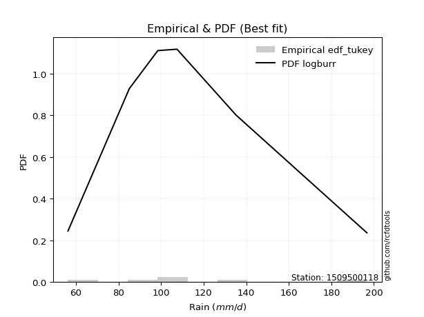</img>

</div>


### 8. EDF Gringorten (1963)

Gringorten plotting position formula is essential for estimating the probability and return periods of extreme events like floods and heavy rainfall. The constant _a=0.44_.

<div align="center">


$P=(m-a)/(n+1-2a)$


</div>


**8.1. Empirical values**

<div align="center">

|                | 0                   | 1                  | 2              | 3                 | 4                  |
|:---------------|:--------------------|:-------------------|:---------------|:------------------|:-------------------|
| date           | 2023                | 2021               | 2022           | 2020              | 2019               |
| x              | 56.3                | 85.1               | 107.5          | 135.3             | 196.7              |
| m              | 1                   | 2                  | 3              | 4                 | 5                  |
| empirical_dist | edf_gringorten      | edf_gringorten     | edf_gringorten | edf_gringorten    | edf_gringorten     |
| empirical      | 0.10937500000000001 | 0.3046875          | 0.5            | 0.6953125         | 0.8906249999999999 |
| empirical_tr   | 1.1228070175438596  | 1.4382022471910112 | 2.0            | 3.282051282051282 | 9.142857142857133  |

</div>


**8.2. Kolmogorov-Smirnov fit test (sorted by Δ)**


<div align="center">

|                | 0                   | 1                   | 2                   | 3                   | 4                   | 5                   | 6                    | 7                  | 8                   | 9                  | 10                  | 11                  | 12                   | 13                   | 14                 | 15                 | 16                   | 17                  | 18                  | 19                   | 20                  | 21                  | 22                  | 23                   | 24                  | 25                   | 26                  | 27                  | 28                  | 29                  | 30                  | 31                   | 32                   | 33                  | 34                  | 35                  | 36                  | 37                 | 38                  | 39                   | 40                    | 41                   | 42                  | 43                  | 44                  | 45                  | 46                  | 47                  | 48                  | 49                  | 50                  | 51                  | 52                  | 53                  | 54                  | 55                  | 56                  | 57                  | 58                  | 59                  | 60                  | 61                  | 62                  | 63                  | 64                  | 65                  | 66                  | 67                  | 68                  | 69                  | 70                  | 71                 | 72                 | 73                  | 74                 | 75                  | 76                  | 77                  | 78                  | 79                  | 80                 | 81                 | 82                 | 83                  | 84                  | 85                 | 86                 | 87                 |
|:---------------|:--------------------|:--------------------|:--------------------|:--------------------|:--------------------|:--------------------|:---------------------|:-------------------|:--------------------|:-------------------|:--------------------|:--------------------|:---------------------|:---------------------|:-------------------|:-------------------|:---------------------|:--------------------|:--------------------|:---------------------|:--------------------|:--------------------|:--------------------|:---------------------|:--------------------|:---------------------|:--------------------|:--------------------|:--------------------|:--------------------|:--------------------|:---------------------|:---------------------|:--------------------|:--------------------|:--------------------|:--------------------|:-------------------|:--------------------|:---------------------|:----------------------|:---------------------|:--------------------|:--------------------|:--------------------|:--------------------|:--------------------|:--------------------|:--------------------|:--------------------|:--------------------|:--------------------|:--------------------|:--------------------|:--------------------|:--------------------|:--------------------|:--------------------|:--------------------|:--------------------|:--------------------|:--------------------|:--------------------|:--------------------|:--------------------|:--------------------|:--------------------|:--------------------|:--------------------|:--------------------|:--------------------|:-------------------|:-------------------|:--------------------|:-------------------|:--------------------|:--------------------|:--------------------|:--------------------|:--------------------|:-------------------|:-------------------|:-------------------|:--------------------|:--------------------|:-------------------|:-------------------|:-------------------|
| station        | 1509500118          | 1509500118          | 1509500118          | 1509500118          | 1509500118          | 1509500118          | 1509500118           | 1509500118         | 1509500118          | 1509500118         | 1509500118          | 1509500118          | 1509500118           | 1509500118           | 1509500118         | 1509500118         | 1509500118           | 1509500118          | 1509500118          | 1509500118           | 1509500118          | 1509500118          | 1509500118          | 1509500118           | 1509500118          | 1509500118           | 1509500118          | 1509500118          | 1509500118          | 1509500118          | 1509500118          | 1509500118           | 1509500118           | 1509500118          | 1509500118          | 1509500118          | 1509500118          | 1509500118         | 1509500118          | 1509500118           | 1509500118            | 1509500118           | 1509500118          | 1509500118          | 1509500118          | 1509500118          | 1509500118          | 1509500118          | 1509500118          | 1509500118          | 1509500118          | 1509500118          | 1509500118          | 1509500118          | 1509500118          | 1509500118          | 1509500118          | 1509500118          | 1509500118          | 1509500118          | 1509500118          | 1509500118          | 1509500118          | 1509500118          | 1509500118          | 1509500118          | 1509500118          | 1509500118          | 1509500118          | 1509500118          | 1509500118          | 1509500118         | 1509500118         | 1509500118          | 1509500118         | 1509500118          | 1509500118          | 1509500118          | 1509500118          | 1509500118          | 1509500118         | 1509500118         | 1509500118         | 1509500118          | 1509500118          | 1509500118         | 1509500118         | 1509500118         |
| empirical_dist | edf_gringorten      | edf_gringorten      | edf_gringorten      | edf_gringorten      | edf_gringorten      | edf_gringorten      | edf_gringorten       | edf_gringorten     | edf_gringorten      | edf_gringorten     | edf_gringorten      | edf_gringorten      | edf_gringorten       | edf_gringorten       | edf_gringorten     | edf_gringorten     | edf_gringorten       | edf_gringorten      | edf_gringorten      | edf_gringorten       | edf_gringorten      | edf_gringorten      | edf_gringorten      | edf_gringorten       | edf_gringorten      | edf_gringorten       | edf_gringorten      | edf_gringorten      | edf_gringorten      | edf_gringorten      | edf_gringorten      | edf_gringorten       | edf_gringorten       | edf_gringorten      | edf_gringorten      | edf_gringorten      | edf_gringorten      | edf_gringorten     | edf_gringorten      | edf_gringorten       | edf_gringorten        | edf_gringorten       | edf_gringorten      | edf_gringorten      | edf_gringorten      | edf_gringorten      | edf_gringorten      | edf_gringorten      | edf_gringorten      | edf_gringorten      | edf_gringorten      | edf_gringorten      | edf_gringorten      | edf_gringorten      | edf_gringorten      | edf_gringorten      | edf_gringorten      | edf_gringorten      | edf_gringorten      | edf_gringorten      | edf_gringorten      | edf_gringorten      | edf_gringorten      | edf_gringorten      | edf_gringorten      | edf_gringorten      | edf_gringorten      | edf_gringorten      | edf_gringorten      | edf_gringorten      | edf_gringorten      | edf_gringorten     | edf_gringorten     | edf_gringorten      | edf_gringorten     | edf_gringorten      | edf_gringorten      | edf_gringorten      | edf_gringorten      | edf_gringorten      | edf_gringorten     | edf_gringorten     | edf_gringorten     | edf_gringorten      | edf_gringorten      | edf_gringorten     | edf_gringorten     | edf_gringorten     |
| p_dist         | logmielke           | fisk                | logfisk             | alpha               | logloggamma         | ncf                 | loggenlogistic       | mielke             | logpearson3         | exponnorm          | logjohnsonsu        | logt                | logexponnorm         | logcrystalball       | lognorm            | lognorm            | logf                 | genlogistic         | lognct              | invgamma             | loggamma            | loggamma            | logncf              | logerlang            | logfatiguelife      | nct                  | rayleigh            | logbetaprime        | gumbel_r            | kstwobign           | loginvgamma         | loglogistic          | johnsonsu            | maxwell             | pearson3            | logalpha            | loginvgauss         | invgauss           | betaprime           | rice                 | loglaplace_asymmetric | loghypsecant         | logweibull_min      | loginvweibull       | logmaxwell          | logrice             | truncnorm           | norm                | crystalball         | t                   | halfnorm            | lograyleigh         | moyal               | laplace_asymmetric  | logkstwobign        | loglaplace          | logistic            | loggumbel_l         | loggumbel_r         | hypsecant           | logmoyal            | loggenexpon         | genexpon            | loggompertz         | gompertz            | weibull_min         | expon               | halflogistic        | loghalfnorm         | loghalflogistic     | wald                | laplace            | gumbel_l           | f                   | logexpon           | logchi2             | logwald             | erlang              | loggibrat           | gibrat              | nakagami           | lognakagami        | logtruncnorm       | loglognorm          | gamma               | invweibull         | chi2               | fatiguelife        |
| delta          | 0.03592702510990936 | 0.03672355029520119 | 0.03701243396900218 | 0.03960423744824193 | 0.04026237011765471 | 0.04049649447941661 | 0.041140707176938435 | 0.0413102609559379 | 0.04214097965816667 | 0.0428575127131748 | 0.04331833684065464 | 0.04394537932328693 | 0.043946120407722555 | 0.043946281441379534 | 0.0439462824615742 | 0.0439462824615742 | 0.043959873141778044 | 0.04408084542562274 | 0.04417400071691527 | 0.044471734975864624 | 0.04494289244014986 | 0.04494289244014986 | 0.04532391021401262 | 0.045416528982936674 | 0.04560920566303012 | 0.045788808482104856 | 0.04681488427713021 | 0.04765000588729368 | 0.04791782472894893 | 0.04814983779339532 | 0.04834556976274703 | 0.048730202767257855 | 0.049317303336751356 | 0.05025366384140628 | 0.05101037656806384 | 0.05107325031261448 | 0.05115149482834436 | 0.0513318878520115 | 0.05155260248012591 | 0.054257314884898045 | 0.054854912143491696  | 0.056748001106723844 | 0.05741276700998115 | 0.05957654836397108 | 0.06278406174823893 | 0.06471283817517086 | 0.07188681484653747 | 0.07188682227860471 | 0.07188682388532591 | 0.07192877833450967 | 0.07393071588844427 | 0.07523409620337315 | 0.07566884028139524 | 0.07904891281039303 | 0.08008471993590738 | 0.08042343414591213 | 0.08142454290608475 | 0.08265541007927524 | 0.08908515808301755 | 0.08939126029495248 | 0.10509265535225731 | 0.10891673670282108 | 0.10937479491828431 | 0.10937498701690797 | 0.10937499999981032 | 0.10937499999997126 | 0.10937500000000001 | 0.10937500000000001 | 0.10937500000000001 | 0.10937500000000001 | 0.10937500000000001 | 0.1130169093654903 | 0.1407977387059694 | 0.15410869920785836 | 0.17222549698319   | 0.17603084263140834 | 0.17670924009620725 | 0.18531685949871346 | 0.20136284203241694 | 0.22388940342538038 | 0.3046759827808757 | 0.3046874987940575 | 0.3231405241315859 | 0.37177641159384944 | 0.40906254380930085 | 0.454336862829892  | 0.4675769802897679 | 0.4776849697679494 |
| deltao         | 0.5865427407550001  | 0.5865427407550001  | 0.5865427407550001  | 0.5865427407550001  | 0.5865427407550001  | 0.5865427407550001  | 0.5865427407550001   | 0.5865427407550001 | 0.5865427407550001  | 0.5865427407550001 | 0.5865427407550001  | 0.5865427407550001  | 0.5865427407550001   | 0.5865427407550001   | 0.5865427407550001 | 0.5865427407550001 | 0.5865427407550001   | 0.5865427407550001  | 0.5865427407550001  | 0.5865427407550001   | 0.5865427407550001  | 0.5865427407550001  | 0.5865427407550001  | 0.5865427407550001   | 0.5865427407550001  | 0.5865427407550001   | 0.5865427407550001  | 0.5865427407550001  | 0.5865427407550001  | 0.5865427407550001  | 0.5865427407550001  | 0.5865427407550001   | 0.5865427407550001   | 0.5865427407550001  | 0.5865427407550001  | 0.5865427407550001  | 0.5865427407550001  | 0.5865427407550001 | 0.5865427407550001  | 0.5865427407550001   | 0.5865427407550001    | 0.5865427407550001   | 0.5865427407550001  | 0.5865427407550001  | 0.5865427407550001  | 0.5865427407550001  | 0.5865427407550001  | 0.5865427407550001  | 0.5865427407550001  | 0.5865427407550001  | 0.5865427407550001  | 0.5865427407550001  | 0.5865427407550001  | 0.5865427407550001  | 0.5865427407550001  | 0.5865427407550001  | 0.5865427407550001  | 0.5865427407550001  | 0.5865427407550001  | 0.5865427407550001  | 0.5865427407550001  | 0.5865427407550001  | 0.5865427407550001  | 0.5865427407550001  | 0.5865427407550001  | 0.5865427407550001  | 0.5865427407550001  | 0.5865427407550001  | 0.5865427407550001  | 0.5865427407550001  | 0.5865427407550001  | 0.5865427407550001 | 0.5865427407550001 | 0.5865427407550001  | 0.5865427407550001 | 0.5865427407550001  | 0.5865427407550001  | 0.5865427407550001  | 0.5865427407550001  | 0.5865427407550001  | 0.5865427407550001 | 0.5865427407550001 | 0.5865427407550001 | 0.5865427407550001  | 0.5865427407550001  | 0.5865427407550001 | 0.5865427407550001 | 0.5865427407550001 |
| eval           | Δo > Δ              | Δo > Δ              | Δo > Δ              | Δo > Δ              | Δo > Δ              | Δo > Δ              | Δo > Δ               | Δo > Δ             | Δo > Δ              | Δo > Δ             | Δo > Δ              | Δo > Δ              | Δo > Δ               | Δo > Δ               | Δo > Δ             | Δo > Δ             | Δo > Δ               | Δo > Δ              | Δo > Δ              | Δo > Δ               | Δo > Δ              | Δo > Δ              | Δo > Δ              | Δo > Δ               | Δo > Δ              | Δo > Δ               | Δo > Δ              | Δo > Δ              | Δo > Δ              | Δo > Δ              | Δo > Δ              | Δo > Δ               | Δo > Δ               | Δo > Δ              | Δo > Δ              | Δo > Δ              | Δo > Δ              | Δo > Δ             | Δo > Δ              | Δo > Δ               | Δo > Δ                | Δo > Δ               | Δo > Δ              | Δo > Δ              | Δo > Δ              | Δo > Δ              | Δo > Δ              | Δo > Δ              | Δo > Δ              | Δo > Δ              | Δo > Δ              | Δo > Δ              | Δo > Δ              | Δo > Δ              | Δo > Δ              | Δo > Δ              | Δo > Δ              | Δo > Δ              | Δo > Δ              | Δo > Δ              | Δo > Δ              | Δo > Δ              | Δo > Δ              | Δo > Δ              | Δo > Δ              | Δo > Δ              | Δo > Δ              | Δo > Δ              | Δo > Δ              | Δo > Δ              | Δo > Δ              | Δo > Δ             | Δo > Δ             | Δo > Δ              | Δo > Δ             | Δo > Δ              | Δo > Δ              | Δo > Δ              | Δo > Δ              | Δo > Δ              | Δo > Δ             | Δo > Δ             | Δo > Δ             | Δo > Δ              | Δo > Δ              | Δo > Δ             | Δo > Δ             | Δo > Δ             |
| fit            | 1                   | 1                   | 1                   | 1                   | 1                   | 1                   | 1                    | 1                  | 1                   | 1                  | 1                   | 1                   | 1                    | 1                    | 1                  | 1                  | 1                    | 1                   | 1                   | 1                    | 1                   | 1                   | 1                   | 1                    | 1                   | 1                    | 1                   | 1                   | 1                   | 1                   | 1                   | 1                    | 1                    | 1                   | 1                   | 1                   | 1                   | 1                  | 1                   | 1                    | 1                     | 1                    | 1                   | 1                   | 1                   | 1                   | 1                   | 1                   | 1                   | 1                   | 1                   | 1                   | 1                   | 1                   | 1                   | 1                   | 1                   | 1                   | 1                   | 1                   | 1                   | 1                   | 1                   | 1                   | 1                   | 1                   | 1                   | 1                   | 1                   | 1                   | 1                   | 1                  | 1                  | 1                   | 1                  | 1                   | 1                   | 1                   | 1                   | 1                   | 1                  | 1                  | 1                  | 1                   | 1                   | 1                  | 1                  | 1                  |
| n              | 5                   | 5                   | 5                   | 5                   | 5                   | 5                   | 5                    | 5                  | 5                   | 5                  | 5                   | 5                   | 5                    | 5                    | 5                  | 5                  | 5                    | 5                   | 5                   | 5                    | 5                   | 5                   | 5                   | 5                    | 5                   | 5                    | 5                   | 5                   | 5                   | 5                   | 5                   | 5                    | 5                    | 5                   | 5                   | 5                   | 5                   | 5                  | 5                   | 5                    | 5                     | 5                    | 5                   | 5                   | 5                   | 5                   | 5                   | 5                   | 5                   | 5                   | 5                   | 5                   | 5                   | 5                   | 5                   | 5                   | 5                   | 5                   | 5                   | 5                   | 5                   | 5                   | 5                   | 5                   | 5                   | 5                   | 5                   | 5                   | 5                   | 5                   | 5                   | 5                  | 5                  | 5                   | 5                  | 5                   | 5                   | 5                   | 5                   | 5                   | 5                  | 5                  | 5                  | 5                   | 5                   | 5                  | 5                  | 5                  |
| best_fit       | 1                   | 0                   | 0                   | 0                   | 0                   | 0                   | 0                    | 0                  | 0                   | 0                  | 0                   | 0                   | 0                    | 0                    | 0                  | 0                  | 0                    | 0                   | 0                   | 0                    | 0                   | 0                   | 0                   | 0                    | 0                   | 0                    | 0                   | 0                   | 0                   | 0                   | 0                   | 0                    | 0                    | 0                   | 0                   | 0                   | 0                   | 0                  | 0                   | 0                    | 0                     | 0                    | 0                   | 0                   | 0                   | 0                   | 0                   | 0                   | 0                   | 0                   | 0                   | 0                   | 0                   | 0                   | 0                   | 0                   | 0                   | 0                   | 0                   | 0                   | 0                   | 0                   | 0                   | 0                   | 0                   | 0                   | 0                   | 0                   | 0                   | 0                   | 0                   | 0                  | 0                  | 0                   | 0                  | 0                   | 0                   | 0                   | 0                   | 0                   | 0                  | 0                  | 0                  | 0                   | 0                   | 0                  | 0                  | 0                  |
| best_fit_sort  | 1                   | 2                   | 3                   | 4                   | 5                   | 6                   | 7                    | 8                  | 9                   | 10                 | 11                  | 12                  | 13                   | 14                   | 15                 | 16                 | 17                   | 18                  | 19                  | 20                   | 21                  | 22                  | 23                  | 24                   | 25                  | 26                   | 27                  | 28                  | 29                  | 30                  | 31                  | 32                   | 33                   | 34                  | 35                  | 36                  | 37                  | 38                 | 39                  | 40                   | 41                    | 42                   | 43                  | 44                  | 45                  | 46                  | 47                  | 48                  | 49                  | 50                  | 51                  | 52                  | 53                  | 54                  | 55                  | 56                  | 57                  | 58                  | 59                  | 60                  | 61                  | 62                  | 63                  | 64                  | 65                  | 66                  | 67                  | 68                  | 69                  | 70                  | 71                  | 72                 | 73                 | 74                  | 75                 | 76                  | 77                  | 78                  | 79                  | 80                  | 81                 | 82                 | 83                 | 84                  | 85                  | 86                 | 87                 | 88                 |

</div>


**8.3. Best fit**

<div align="center">

|   id |    station | empirical_dist   | p_dist    |    delta |   deltao | eval   |   fit |   n |   best_fit |   best_fit_sort |
|-----:|-----------:|:-----------------|:----------|---------:|---------:|:-------|------:|----:|-----------:|----------------:|
|    0 | 1509500118 | edf_gringorten   | logmielke | 0.035927 | 0.586543 | Δo > Δ |     1 |   5 |          1 |               1 |

</div>


<div align="center">

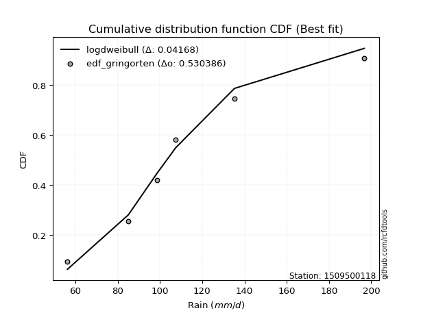</img>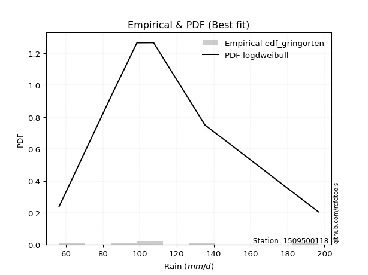</img>

</div>


### 9. EDF Filliben (1975)

The specific values of the constants (0.3175) (often denoted as $alpha$) and (0.365) are derived from a method proposed by James J. Filliben in a 1975 paper. This particular formula is the mean value of the $i$-th order statistic of the normal distribution and is considered a robust and effective plotting position formula for the normal probability plot correlation coefficient test for normality.

<div align="center">


$P=(m-0.3175)/(n+0.365)$


</div>


**9.1. Empirical values**

<div align="center">

|                | 0                   | 1                  | 2            | 3                  | 4                  |
|:---------------|:--------------------|:-------------------|:-------------|:-------------------|:-------------------|
| date           | 2023                | 2021               | 2022         | 2020               | 2019               |
| x              | 56.3                | 85.1               | 107.5        | 135.3              | 196.7              |
| m              | 1                   | 2                  | 3            | 4                  | 5                  |
| empirical_dist | edf_filliben        | edf_filliben       | edf_filliben | edf_filliben       | edf_filliben       |
| empirical      | 0.12721342031686858 | 0.3136067101584343 | 0.5          | 0.6863932898415657 | 0.8727865796831314 |
| empirical_tr   | 1.1457554725040042  | 1.456890699253225  | 2.0          | 3.188707280832095  | 7.860805860805863  |

</div>


**9.2. Kolmogorov-Smirnov fit test (sorted by Δ)**


<div align="center">

|                | 0                   | 1                   | 2                   | 3                  | 4                   | 5                   | 6                  | 7                    | 8                    | 9                    | 10                  | 11                 | 12                  | 13                 | 14                   | 15                   | 16                  | 17                  | 18                   | 19                  | 20                  | 21                  | 22                  | 23                  | 24                  | 25                  | 26                    | 27                  | 28                  | 29                 | 30                  | 31                  | 32                  | 33                  | 34                  | 35                  | 36                  | 37                  | 38                  | 39                  | 40                  | 41                  | 42                  | 43                  | 44                  | 45                 | 46                  | 47                 | 48                  | 49                 | 50                  | 51                  | 52                 | 53                  | 54                  | 55                  | 56                  | 57                  | 58                  | 59                  | 60                  | 61                  | 62                  | 63                  | 64                  | 65                 | 66                  | 67                  | 68                  | 69                  | 70                  | 71                  | 72                 | 73                  | 74                 | 75                  | 76                  | 77                  | 78                  | 79                  | 80                 | 81                  | 82                 | 83                  | 84                 | 85                  | 86                  | 87                 |
|:---------------|:--------------------|:--------------------|:--------------------|:-------------------|:--------------------|:--------------------|:-------------------|:---------------------|:---------------------|:---------------------|:--------------------|:-------------------|:--------------------|:-------------------|:---------------------|:---------------------|:--------------------|:--------------------|:---------------------|:--------------------|:--------------------|:--------------------|:--------------------|:--------------------|:--------------------|:--------------------|:----------------------|:--------------------|:--------------------|:-------------------|:--------------------|:--------------------|:--------------------|:--------------------|:--------------------|:--------------------|:--------------------|:--------------------|:--------------------|:--------------------|:--------------------|:--------------------|:--------------------|:--------------------|:--------------------|:-------------------|:--------------------|:-------------------|:--------------------|:-------------------|:--------------------|:--------------------|:-------------------|:--------------------|:--------------------|:--------------------|:--------------------|:--------------------|:--------------------|:--------------------|:--------------------|:--------------------|:--------------------|:--------------------|:--------------------|:-------------------|:--------------------|:--------------------|:--------------------|:--------------------|:--------------------|:--------------------|:-------------------|:--------------------|:-------------------|:--------------------|:--------------------|:--------------------|:--------------------|:--------------------|:-------------------|:--------------------|:-------------------|:--------------------|:-------------------|:--------------------|:--------------------|:-------------------|
| station        | 1509500118          | 1509500118          | 1509500118          | 1509500118         | 1509500118          | 1509500118          | 1509500118         | 1509500118           | 1509500118           | 1509500118           | 1509500118          | 1509500118         | 1509500118          | 1509500118         | 1509500118           | 1509500118           | 1509500118          | 1509500118          | 1509500118           | 1509500118          | 1509500118          | 1509500118          | 1509500118          | 1509500118          | 1509500118          | 1509500118          | 1509500118            | 1509500118          | 1509500118          | 1509500118         | 1509500118          | 1509500118          | 1509500118          | 1509500118          | 1509500118          | 1509500118          | 1509500118          | 1509500118          | 1509500118          | 1509500118          | 1509500118          | 1509500118          | 1509500118          | 1509500118          | 1509500118          | 1509500118         | 1509500118          | 1509500118         | 1509500118          | 1509500118         | 1509500118          | 1509500118          | 1509500118         | 1509500118          | 1509500118          | 1509500118          | 1509500118          | 1509500118          | 1509500118          | 1509500118          | 1509500118          | 1509500118          | 1509500118          | 1509500118          | 1509500118          | 1509500118         | 1509500118          | 1509500118          | 1509500118          | 1509500118          | 1509500118          | 1509500118          | 1509500118         | 1509500118          | 1509500118         | 1509500118          | 1509500118          | 1509500118          | 1509500118          | 1509500118          | 1509500118         | 1509500118          | 1509500118         | 1509500118          | 1509500118         | 1509500118          | 1509500118          | 1509500118         |
| empirical_dist | edf_filliben        | edf_filliben        | edf_filliben        | edf_filliben       | edf_filliben        | edf_filliben        | edf_filliben       | edf_filliben         | edf_filliben         | edf_filliben         | edf_filliben        | edf_filliben       | edf_filliben        | edf_filliben       | edf_filliben         | edf_filliben         | edf_filliben        | edf_filliben        | edf_filliben         | edf_filliben        | edf_filliben        | edf_filliben        | edf_filliben        | edf_filliben        | edf_filliben        | edf_filliben        | edf_filliben          | edf_filliben        | edf_filliben        | edf_filliben       | edf_filliben        | edf_filliben        | edf_filliben        | edf_filliben        | edf_filliben        | edf_filliben        | edf_filliben        | edf_filliben        | edf_filliben        | edf_filliben        | edf_filliben        | edf_filliben        | edf_filliben        | edf_filliben        | edf_filliben        | edf_filliben       | edf_filliben        | edf_filliben       | edf_filliben        | edf_filliben       | edf_filliben        | edf_filliben        | edf_filliben       | edf_filliben        | edf_filliben        | edf_filliben        | edf_filliben        | edf_filliben        | edf_filliben        | edf_filliben        | edf_filliben        | edf_filliben        | edf_filliben        | edf_filliben        | edf_filliben        | edf_filliben       | edf_filliben        | edf_filliben        | edf_filliben        | edf_filliben        | edf_filliben        | edf_filliben        | edf_filliben       | edf_filliben        | edf_filliben       | edf_filliben        | edf_filliben        | edf_filliben        | edf_filliben        | edf_filliben        | edf_filliben       | edf_filliben        | edf_filliben       | edf_filliben        | edf_filliben       | edf_filliben        | edf_filliben        | edf_filliben       |
| p_dist         | logmielke           | fisk                | logfisk             | alpha              | logloggamma         | ncf                 | loggenlogistic     | mielke               | logpearson3          | exponnorm            | logjohnsonsu        | logt               | logexponnorm        | logcrystalball     | lognorm              | lognorm              | logf                | genlogistic         | lognct               | invgamma            | loggamma            | loggamma            | logncf              | logerlang           | logfatiguelife      | nct                 | loglaplace_asymmetric | rayleigh            | logbetaprime        | gumbel_r           | kstwobign           | loginvgamma         | loglogistic         | johnsonsu           | loghypsecant        | maxwell             | pearson3            | logalpha            | loginvgauss         | invgauss            | betaprime           | rice                | loginvweibull       | logweibull_min      | logkstwobign        | logmaxwell         | crystalball         | norm               | truncnorm           | t                  | logistic            | logrice             | laplace_asymmetric | loglaplace          | halfnorm            | lograyleigh         | hypsecant           | moyal               | loggumbel_l         | loggumbel_r         | laplace             | logmoyal            | loggenexpon         | genexpon            | loggompertz         | gompertz           | weibull_min         | halflogistic        | loghalflogistic     | wald                | loghalfnorm         | expon               | gumbel_l           | f                   | logchi2            | logexpon            | erlang              | logwald             | loggibrat           | gibrat              | nakagami           | lognakagami         | logtruncnorm       | loglognorm          | gamma              | invweibull          | chi2                | fatiguelife        |
| delta          | 0.05376544542677793 | 0.05456197061206976 | 0.05485085428587075 | 0.0574426577651105 | 0.05810079043452328 | 0.05833491479628505 | 0.058979127493807  | 0.059148681272806466 | 0.059979399975035236 | 0.060695933030043364 | 0.06115675715752321 | 0.0617837996401555 | 0.06178454072459112 | 0.0617847017582481 | 0.061784702778442765 | 0.061784702778442765 | 0.06179829345864661 | 0.06191926574249118 | 0.062012421033783835 | 0.06231015529273319 | 0.06278131275701843 | 0.06278131275701843 | 0.06316233053088119 | 0.06325494929980524 | 0.06344762597989868 | 0.06362722879897342 | 0.06377412230192603   | 0.06465330459399865 | 0.06548842620416225 | 0.0657562450458175 | 0.06598825811026376 | 0.06618399007961559 | 0.06656862308412642 | 0.06715572365361992 | 0.06805374176178075 | 0.06809208415827472 | 0.06884879688493228 | 0.06891167062948304 | 0.06898991514521292 | 0.06917030816888006 | 0.06939102279699447 | 0.07209573520176649 | 0.07346168124042803 | 0.07525118732684971 | 0.08008471993590738 | 0.0806224820651075 | 0.08080428734828282 | 0.0808042880506652 | 0.08080428886892432 | 0.0808209870206108 | 0.08193027850733581 | 0.08255125849203943 | 0.0879681229688273 | 0.08934264430434646 | 0.09176913620531284 | 0.09307251652024172 | 0.09308886619006107 | 0.09350726059826381 | 0.10049383039614368 | 0.10692357839988612 | 0.11384009252579952 | 0.12266228184172062 | 0.12675515701968965 | 0.12721321523515286 | 0.12721340733377653 | 0.1272134203166789 | 0.12721342031683983 | 0.12721342031686858 | 0.12721342031686858 | 0.12721342031686858 | 0.12721342031686858 | 0.12721342031686858 | 0.1407977387059694 | 0.14518948904942408 | 0.1581924223145399 | 0.16330628682475573 | 0.17639764934027918 | 0.17670924009620725 | 0.20136284203241694 | 0.23280861358381466 | 0.31359519293931   | 0.31360670895249176 | 0.3142213139731516 | 0.36285720143541517 | 0.4001433336508666 | 0.43649844251302355 | 0.45865777013133363 | 0.4687657596095151 |
| deltao         | 0.5865427407550001  | 0.5865427407550001  | 0.5865427407550001  | 0.5865427407550001 | 0.5865427407550001  | 0.5865427407550001  | 0.5865427407550001 | 0.5865427407550001   | 0.5865427407550001   | 0.5865427407550001   | 0.5865427407550001  | 0.5865427407550001 | 0.5865427407550001  | 0.5865427407550001 | 0.5865427407550001   | 0.5865427407550001   | 0.5865427407550001  | 0.5865427407550001  | 0.5865427407550001   | 0.5865427407550001  | 0.5865427407550001  | 0.5865427407550001  | 0.5865427407550001  | 0.5865427407550001  | 0.5865427407550001  | 0.5865427407550001  | 0.5865427407550001    | 0.5865427407550001  | 0.5865427407550001  | 0.5865427407550001 | 0.5865427407550001  | 0.5865427407550001  | 0.5865427407550001  | 0.5865427407550001  | 0.5865427407550001  | 0.5865427407550001  | 0.5865427407550001  | 0.5865427407550001  | 0.5865427407550001  | 0.5865427407550001  | 0.5865427407550001  | 0.5865427407550001  | 0.5865427407550001  | 0.5865427407550001  | 0.5865427407550001  | 0.5865427407550001 | 0.5865427407550001  | 0.5865427407550001 | 0.5865427407550001  | 0.5865427407550001 | 0.5865427407550001  | 0.5865427407550001  | 0.5865427407550001 | 0.5865427407550001  | 0.5865427407550001  | 0.5865427407550001  | 0.5865427407550001  | 0.5865427407550001  | 0.5865427407550001  | 0.5865427407550001  | 0.5865427407550001  | 0.5865427407550001  | 0.5865427407550001  | 0.5865427407550001  | 0.5865427407550001  | 0.5865427407550001 | 0.5865427407550001  | 0.5865427407550001  | 0.5865427407550001  | 0.5865427407550001  | 0.5865427407550001  | 0.5865427407550001  | 0.5865427407550001 | 0.5865427407550001  | 0.5865427407550001 | 0.5865427407550001  | 0.5865427407550001  | 0.5865427407550001  | 0.5865427407550001  | 0.5865427407550001  | 0.5865427407550001 | 0.5865427407550001  | 0.5865427407550001 | 0.5865427407550001  | 0.5865427407550001 | 0.5865427407550001  | 0.5865427407550001  | 0.5865427407550001 |
| eval           | Δo > Δ              | Δo > Δ              | Δo > Δ              | Δo > Δ             | Δo > Δ              | Δo > Δ              | Δo > Δ             | Δo > Δ               | Δo > Δ               | Δo > Δ               | Δo > Δ              | Δo > Δ             | Δo > Δ              | Δo > Δ             | Δo > Δ               | Δo > Δ               | Δo > Δ              | Δo > Δ              | Δo > Δ               | Δo > Δ              | Δo > Δ              | Δo > Δ              | Δo > Δ              | Δo > Δ              | Δo > Δ              | Δo > Δ              | Δo > Δ                | Δo > Δ              | Δo > Δ              | Δo > Δ             | Δo > Δ              | Δo > Δ              | Δo > Δ              | Δo > Δ              | Δo > Δ              | Δo > Δ              | Δo > Δ              | Δo > Δ              | Δo > Δ              | Δo > Δ              | Δo > Δ              | Δo > Δ              | Δo > Δ              | Δo > Δ              | Δo > Δ              | Δo > Δ             | Δo > Δ              | Δo > Δ             | Δo > Δ              | Δo > Δ             | Δo > Δ              | Δo > Δ              | Δo > Δ             | Δo > Δ              | Δo > Δ              | Δo > Δ              | Δo > Δ              | Δo > Δ              | Δo > Δ              | Δo > Δ              | Δo > Δ              | Δo > Δ              | Δo > Δ              | Δo > Δ              | Δo > Δ              | Δo > Δ             | Δo > Δ              | Δo > Δ              | Δo > Δ              | Δo > Δ              | Δo > Δ              | Δo > Δ              | Δo > Δ             | Δo > Δ              | Δo > Δ             | Δo > Δ              | Δo > Δ              | Δo > Δ              | Δo > Δ              | Δo > Δ              | Δo > Δ             | Δo > Δ              | Δo > Δ             | Δo > Δ              | Δo > Δ             | Δo > Δ              | Δo > Δ              | Δo > Δ             |
| fit            | 1                   | 1                   | 1                   | 1                  | 1                   | 1                   | 1                  | 1                    | 1                    | 1                    | 1                   | 1                  | 1                   | 1                  | 1                    | 1                    | 1                   | 1                   | 1                    | 1                   | 1                   | 1                   | 1                   | 1                   | 1                   | 1                   | 1                     | 1                   | 1                   | 1                  | 1                   | 1                   | 1                   | 1                   | 1                   | 1                   | 1                   | 1                   | 1                   | 1                   | 1                   | 1                   | 1                   | 1                   | 1                   | 1                  | 1                   | 1                  | 1                   | 1                  | 1                   | 1                   | 1                  | 1                   | 1                   | 1                   | 1                   | 1                   | 1                   | 1                   | 1                   | 1                   | 1                   | 1                   | 1                   | 1                  | 1                   | 1                   | 1                   | 1                   | 1                   | 1                   | 1                  | 1                   | 1                  | 1                   | 1                   | 1                   | 1                   | 1                   | 1                  | 1                   | 1                  | 1                   | 1                  | 1                   | 1                   | 1                  |
| n              | 5                   | 5                   | 5                   | 5                  | 5                   | 5                   | 5                  | 5                    | 5                    | 5                    | 5                   | 5                  | 5                   | 5                  | 5                    | 5                    | 5                   | 5                   | 5                    | 5                   | 5                   | 5                   | 5                   | 5                   | 5                   | 5                   | 5                     | 5                   | 5                   | 5                  | 5                   | 5                   | 5                   | 5                   | 5                   | 5                   | 5                   | 5                   | 5                   | 5                   | 5                   | 5                   | 5                   | 5                   | 5                   | 5                  | 5                   | 5                  | 5                   | 5                  | 5                   | 5                   | 5                  | 5                   | 5                   | 5                   | 5                   | 5                   | 5                   | 5                   | 5                   | 5                   | 5                   | 5                   | 5                   | 5                  | 5                   | 5                   | 5                   | 5                   | 5                   | 5                   | 5                  | 5                   | 5                  | 5                   | 5                   | 5                   | 5                   | 5                   | 5                  | 5                   | 5                  | 5                   | 5                  | 5                   | 5                   | 5                  |
| best_fit       | 1                   | 0                   | 0                   | 0                  | 0                   | 0                   | 0                  | 0                    | 0                    | 0                    | 0                   | 0                  | 0                   | 0                  | 0                    | 0                    | 0                   | 0                   | 0                    | 0                   | 0                   | 0                   | 0                   | 0                   | 0                   | 0                   | 0                     | 0                   | 0                   | 0                  | 0                   | 0                   | 0                   | 0                   | 0                   | 0                   | 0                   | 0                   | 0                   | 0                   | 0                   | 0                   | 0                   | 0                   | 0                   | 0                  | 0                   | 0                  | 0                   | 0                  | 0                   | 0                   | 0                  | 0                   | 0                   | 0                   | 0                   | 0                   | 0                   | 0                   | 0                   | 0                   | 0                   | 0                   | 0                   | 0                  | 0                   | 0                   | 0                   | 0                   | 0                   | 0                   | 0                  | 0                   | 0                  | 0                   | 0                   | 0                   | 0                   | 0                   | 0                  | 0                   | 0                  | 0                   | 0                  | 0                   | 0                   | 0                  |
| best_fit_sort  | 1                   | 2                   | 3                   | 4                  | 5                   | 6                   | 7                  | 8                    | 9                    | 10                   | 11                  | 12                 | 13                  | 14                 | 15                   | 16                   | 17                  | 18                  | 19                   | 20                  | 21                  | 22                  | 23                  | 24                  | 25                  | 26                  | 27                    | 28                  | 29                  | 30                 | 31                  | 32                  | 33                  | 34                  | 35                  | 36                  | 37                  | 38                  | 39                  | 40                  | 41                  | 42                  | 43                  | 44                  | 45                  | 46                 | 47                  | 48                 | 49                  | 50                 | 51                  | 52                  | 53                 | 54                  | 55                  | 56                  | 57                  | 58                  | 59                  | 60                  | 61                  | 62                  | 63                  | 64                  | 65                  | 66                 | 67                  | 68                  | 69                  | 70                  | 71                  | 72                  | 73                 | 74                  | 75                 | 76                  | 77                  | 78                  | 79                  | 80                  | 81                 | 82                  | 83                 | 84                  | 85                 | 86                  | 87                  | 88                 |

</div>


**9.3. Best fit**

<div align="center">

|   id |    station | empirical_dist   | p_dist    |     delta |   deltao | eval   |   fit |   n |   best_fit |   best_fit_sort |
|-----:|-----------:|:-----------------|:----------|----------:|---------:|:-------|------:|----:|-----------:|----------------:|
|    0 | 1509500118 | edf_filliben     | logmielke | 0.0537654 | 0.586543 | Δo > Δ |     1 |   5 |          1 |               1 |

</div>


<div align="center">

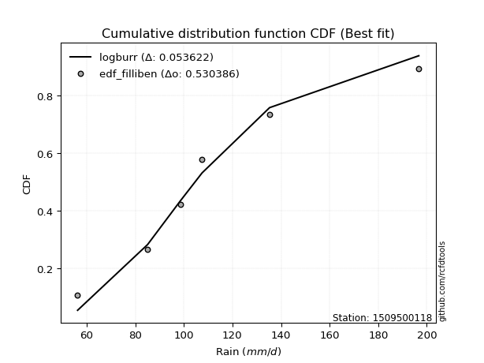</img>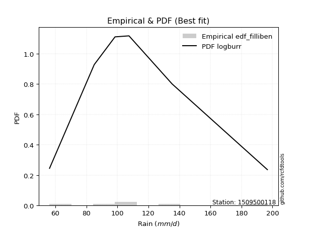</img>

</div>


### 10. EDF Jenkinson (1977)

The Jenkinson formula in hydrology is an empirical plotting position formula used to estimate the non-exceedance probability _(P)_ or return period _(T)_ of a given ordered observation within a sample. It is a widely used method in the frequency analysis of extreme events such as floods and rainfall, as it provides a distribution-free way to plot data. _a≈0.31_ and _b≈0.38_ are constants derived to approximate the median of the probability distribution for the given rank.

<div align="center">


$P=(m-a)/(n+b)$


</div>


**10.1. Empirical values**

<div align="center">

|                | 0                   | 1                  | 2             | 3                  | 4                  |
|:---------------|:--------------------|:-------------------|:--------------|:-------------------|:-------------------|
| date           | 2023                | 2021               | 2022          | 2020               | 2019               |
| x              | 56.3                | 85.1               | 107.5         | 135.3              | 196.7              |
| m              | 1                   | 2                  | 3             | 4                  | 5                  |
| empirical_dist | edf_jenkinson       | edf_jenkinson      | edf_jenkinson | edf_jenkinson      | edf_jenkinson      |
| empirical      | 0.12825278810408922 | 0.3141263940520446 | 0.5           | 0.6858736059479554 | 0.8717472118959109 |
| empirical_tr   | 1.1471215351812367  | 1.4579945799457996 | 2.0           | 3.183431952662722  | 7.797101449275368  |

</div>


**10.2. Kolmogorov-Smirnov fit test (sorted by Δ)**


<div align="center">

|                | 0                   | 1                   | 2                   | 3                   | 4                   | 5                   | 6                   | 7                  | 8                   | 9                  | 10                   | 11                  | 12                  | 13                  | 14                 | 15                 | 16                  | 17                  | 18                  | 19                  | 20                  | 21                  | 22                  | 23                    | 24                  | 25                  | 26                  | 27                  | 28                  | 29                  | 30                  | 31                  | 32                  | 33                  | 34                  | 35                 | 36                  | 37                  | 38                  | 39                 | 40                 | 41                  | 42                  | 43                  | 44                  | 45                  | 46                 | 47                  | 48                 | 49                  | 50                  | 51                  | 52                  | 53                 | 54                  | 55                  | 56                  | 57                  | 58                  | 59                  | 60                  | 61                  | 62                  | 63                 | 64                  | 65                  | 66                  | 67                  | 68                  | 69                  | 70                  | 71                  | 72                 | 73                  | 74                 | 75                  | 76                  | 77                  | 78                  | 79                 | 80                  | 81                  | 82                 | 83                 | 84                 | 85                 | 86                 | 87                  |
|:---------------|:--------------------|:--------------------|:--------------------|:--------------------|:--------------------|:--------------------|:--------------------|:-------------------|:--------------------|:-------------------|:---------------------|:--------------------|:--------------------|:--------------------|:-------------------|:-------------------|:--------------------|:--------------------|:--------------------|:--------------------|:--------------------|:--------------------|:--------------------|:----------------------|:--------------------|:--------------------|:--------------------|:--------------------|:--------------------|:--------------------|:--------------------|:--------------------|:--------------------|:--------------------|:--------------------|:-------------------|:--------------------|:--------------------|:--------------------|:-------------------|:-------------------|:--------------------|:--------------------|:--------------------|:--------------------|:--------------------|:-------------------|:--------------------|:-------------------|:--------------------|:--------------------|:--------------------|:--------------------|:-------------------|:--------------------|:--------------------|:--------------------|:--------------------|:--------------------|:--------------------|:--------------------|:--------------------|:--------------------|:-------------------|:--------------------|:--------------------|:--------------------|:--------------------|:--------------------|:--------------------|:--------------------|:--------------------|:-------------------|:--------------------|:-------------------|:--------------------|:--------------------|:--------------------|:--------------------|:-------------------|:--------------------|:--------------------|:-------------------|:-------------------|:-------------------|:-------------------|:-------------------|:--------------------|
| station        | 1509500118          | 1509500118          | 1509500118          | 1509500118          | 1509500118          | 1509500118          | 1509500118          | 1509500118         | 1509500118          | 1509500118         | 1509500118           | 1509500118          | 1509500118          | 1509500118          | 1509500118         | 1509500118         | 1509500118          | 1509500118          | 1509500118          | 1509500118          | 1509500118          | 1509500118          | 1509500118          | 1509500118            | 1509500118          | 1509500118          | 1509500118          | 1509500118          | 1509500118          | 1509500118          | 1509500118          | 1509500118          | 1509500118          | 1509500118          | 1509500118          | 1509500118         | 1509500118          | 1509500118          | 1509500118          | 1509500118         | 1509500118         | 1509500118          | 1509500118          | 1509500118          | 1509500118          | 1509500118          | 1509500118         | 1509500118          | 1509500118         | 1509500118          | 1509500118          | 1509500118          | 1509500118          | 1509500118         | 1509500118          | 1509500118          | 1509500118          | 1509500118          | 1509500118          | 1509500118          | 1509500118          | 1509500118          | 1509500118          | 1509500118         | 1509500118          | 1509500118          | 1509500118          | 1509500118          | 1509500118          | 1509500118          | 1509500118          | 1509500118          | 1509500118         | 1509500118          | 1509500118         | 1509500118          | 1509500118          | 1509500118          | 1509500118          | 1509500118         | 1509500118          | 1509500118          | 1509500118         | 1509500118         | 1509500118         | 1509500118         | 1509500118         | 1509500118          |
| empirical_dist | edf_jenkinson       | edf_jenkinson       | edf_jenkinson       | edf_jenkinson       | edf_jenkinson       | edf_jenkinson       | edf_jenkinson       | edf_jenkinson      | edf_jenkinson       | edf_jenkinson      | edf_jenkinson        | edf_jenkinson       | edf_jenkinson       | edf_jenkinson       | edf_jenkinson      | edf_jenkinson      | edf_jenkinson       | edf_jenkinson       | edf_jenkinson       | edf_jenkinson       | edf_jenkinson       | edf_jenkinson       | edf_jenkinson       | edf_jenkinson         | edf_jenkinson       | edf_jenkinson       | edf_jenkinson       | edf_jenkinson       | edf_jenkinson       | edf_jenkinson       | edf_jenkinson       | edf_jenkinson       | edf_jenkinson       | edf_jenkinson       | edf_jenkinson       | edf_jenkinson      | edf_jenkinson       | edf_jenkinson       | edf_jenkinson       | edf_jenkinson      | edf_jenkinson      | edf_jenkinson       | edf_jenkinson       | edf_jenkinson       | edf_jenkinson       | edf_jenkinson       | edf_jenkinson      | edf_jenkinson       | edf_jenkinson      | edf_jenkinson       | edf_jenkinson       | edf_jenkinson       | edf_jenkinson       | edf_jenkinson      | edf_jenkinson       | edf_jenkinson       | edf_jenkinson       | edf_jenkinson       | edf_jenkinson       | edf_jenkinson       | edf_jenkinson       | edf_jenkinson       | edf_jenkinson       | edf_jenkinson      | edf_jenkinson       | edf_jenkinson       | edf_jenkinson       | edf_jenkinson       | edf_jenkinson       | edf_jenkinson       | edf_jenkinson       | edf_jenkinson       | edf_jenkinson      | edf_jenkinson       | edf_jenkinson      | edf_jenkinson       | edf_jenkinson       | edf_jenkinson       | edf_jenkinson       | edf_jenkinson      | edf_jenkinson       | edf_jenkinson       | edf_jenkinson      | edf_jenkinson      | edf_jenkinson      | edf_jenkinson      | edf_jenkinson      | edf_jenkinson       |
| p_dist         | logmielke           | fisk                | logfisk             | alpha               | logloggamma         | ncf                 | loggenlogistic      | mielke             | logpearson3         | exponnorm          | logjohnsonsu         | logt                | logexponnorm        | logcrystalball      | lognorm            | lognorm            | logf                | genlogistic         | lognct              | invgamma            | loggamma            | loggamma            | logncf              | loglaplace_asymmetric | logerlang           | logfatiguelife      | nct                 | rayleigh            | logbetaprime        | gumbel_r            | kstwobign           | loginvgamma         | loglogistic         | johnsonsu           | loghypsecant        | maxwell            | pearson3            | logalpha            | loginvgauss         | invgauss           | betaprime          | rice                | loginvweibull       | logweibull_min      | logkstwobign        | logmaxwell          | crystalball        | norm                | truncnorm          | t                   | logistic            | logrice             | laplace_asymmetric  | loglaplace         | halfnorm            | hypsecant           | lograyleigh         | moyal               | loggumbel_l         | loggumbel_r         | laplace             | logmoyal            | loggenexpon         | genexpon           | loggompertz         | gompertz            | weibull_min         | halflogistic        | loghalflogistic     | wald                | loghalfnorm         | expon               | gumbel_l           | f                   | logchi2            | logexpon            | erlang              | logwald             | loggibrat           | gibrat             | logtruncnorm        | nakagami            | lognakagami        | loglognorm         | gamma              | invweibull         | chi2               | fatiguelife         |
| delta          | 0.05480481321399856 | 0.05560133839929039 | 0.05589022207309138 | 0.05848202555233113 | 0.05914015822174391 | 0.05937428258350563 | 0.06001849528102764 | 0.0601880490600271 | 0.06101876776225587 | 0.061735300817264  | 0.062196124944743844 | 0.06282316742737613 | 0.06282390851181176 | 0.06282406954546874 | 0.0628240705656634 | 0.0628240705656634 | 0.06283766124586725 | 0.06295863352971176 | 0.06305178882100447 | 0.06334952307995383 | 0.06382068054423906 | 0.06382068054423906 | 0.06420169831810182 | 0.06429380619553626   | 0.06429431708702588 | 0.06448699376711932 | 0.06466659658619406 | 0.06569267238121923 | 0.06652779399138288 | 0.06679561283303813 | 0.06702762589748434 | 0.06722335786683623 | 0.06760799087134706 | 0.06819509144084056 | 0.06909310954900139 | 0.0691314519454953 | 0.06988816467215286 | 0.06995103841670368 | 0.07002928293243356 | 0.0702096759561007 | 0.0704303905842151 | 0.07313510298898707 | 0.07450104902764866 | 0.07629055511407035 | 0.08008471993590738 | 0.08166184985232813 | 0.0818436551355034 | 0.08184365583788578 | 0.0818436566561449 | 0.08186035480783138 | 0.08296964629455639 | 0.08359062627926006 | 0.08848780686243765 | 0.0898623281979567 | 0.09280850399253347 | 0.09360855008367142 | 0.09411188430746235 | 0.09454662838548444 | 0.10153319818336426 | 0.10796294618710675 | 0.11435977641940986 | 0.12370164962894126 | 0.12779452480691028 | 0.1282525830223735 | 0.12825277512099717 | 0.12825278810389953 | 0.12825278810406046 | 0.12825278810408922 | 0.12825278810408922 | 0.12825278810408922 | 0.12825278810408922 | 0.12825278810408922 | 0.1407977387059694 | 0.14466980515581374 | 0.1571530545273193 | 0.16278660293114539 | 0.17587796544666884 | 0.17670924009620725 | 0.20136284203241694 | 0.233328297477425  | 0.31370163007954127 | 0.31411487683292033 | 0.3141263928461021 | 0.3623375175418048 | 0.3996236497572562 | 0.435459074725803  | 0.4581380862377233 | 0.46824607571590476 |
| deltao         | 0.5865427407550001  | 0.5865427407550001  | 0.5865427407550001  | 0.5865427407550001  | 0.5865427407550001  | 0.5865427407550001  | 0.5865427407550001  | 0.5865427407550001 | 0.5865427407550001  | 0.5865427407550001 | 0.5865427407550001   | 0.5865427407550001  | 0.5865427407550001  | 0.5865427407550001  | 0.5865427407550001 | 0.5865427407550001 | 0.5865427407550001  | 0.5865427407550001  | 0.5865427407550001  | 0.5865427407550001  | 0.5865427407550001  | 0.5865427407550001  | 0.5865427407550001  | 0.5865427407550001    | 0.5865427407550001  | 0.5865427407550001  | 0.5865427407550001  | 0.5865427407550001  | 0.5865427407550001  | 0.5865427407550001  | 0.5865427407550001  | 0.5865427407550001  | 0.5865427407550001  | 0.5865427407550001  | 0.5865427407550001  | 0.5865427407550001 | 0.5865427407550001  | 0.5865427407550001  | 0.5865427407550001  | 0.5865427407550001 | 0.5865427407550001 | 0.5865427407550001  | 0.5865427407550001  | 0.5865427407550001  | 0.5865427407550001  | 0.5865427407550001  | 0.5865427407550001 | 0.5865427407550001  | 0.5865427407550001 | 0.5865427407550001  | 0.5865427407550001  | 0.5865427407550001  | 0.5865427407550001  | 0.5865427407550001 | 0.5865427407550001  | 0.5865427407550001  | 0.5865427407550001  | 0.5865427407550001  | 0.5865427407550001  | 0.5865427407550001  | 0.5865427407550001  | 0.5865427407550001  | 0.5865427407550001  | 0.5865427407550001 | 0.5865427407550001  | 0.5865427407550001  | 0.5865427407550001  | 0.5865427407550001  | 0.5865427407550001  | 0.5865427407550001  | 0.5865427407550001  | 0.5865427407550001  | 0.5865427407550001 | 0.5865427407550001  | 0.5865427407550001 | 0.5865427407550001  | 0.5865427407550001  | 0.5865427407550001  | 0.5865427407550001  | 0.5865427407550001 | 0.5865427407550001  | 0.5865427407550001  | 0.5865427407550001 | 0.5865427407550001 | 0.5865427407550001 | 0.5865427407550001 | 0.5865427407550001 | 0.5865427407550001  |
| eval           | Δo > Δ              | Δo > Δ              | Δo > Δ              | Δo > Δ              | Δo > Δ              | Δo > Δ              | Δo > Δ              | Δo > Δ             | Δo > Δ              | Δo > Δ             | Δo > Δ               | Δo > Δ              | Δo > Δ              | Δo > Δ              | Δo > Δ             | Δo > Δ             | Δo > Δ              | Δo > Δ              | Δo > Δ              | Δo > Δ              | Δo > Δ              | Δo > Δ              | Δo > Δ              | Δo > Δ                | Δo > Δ              | Δo > Δ              | Δo > Δ              | Δo > Δ              | Δo > Δ              | Δo > Δ              | Δo > Δ              | Δo > Δ              | Δo > Δ              | Δo > Δ              | Δo > Δ              | Δo > Δ             | Δo > Δ              | Δo > Δ              | Δo > Δ              | Δo > Δ             | Δo > Δ             | Δo > Δ              | Δo > Δ              | Δo > Δ              | Δo > Δ              | Δo > Δ              | Δo > Δ             | Δo > Δ              | Δo > Δ             | Δo > Δ              | Δo > Δ              | Δo > Δ              | Δo > Δ              | Δo > Δ             | Δo > Δ              | Δo > Δ              | Δo > Δ              | Δo > Δ              | Δo > Δ              | Δo > Δ              | Δo > Δ              | Δo > Δ              | Δo > Δ              | Δo > Δ             | Δo > Δ              | Δo > Δ              | Δo > Δ              | Δo > Δ              | Δo > Δ              | Δo > Δ              | Δo > Δ              | Δo > Δ              | Δo > Δ             | Δo > Δ              | Δo > Δ             | Δo > Δ              | Δo > Δ              | Δo > Δ              | Δo > Δ              | Δo > Δ             | Δo > Δ              | Δo > Δ              | Δo > Δ             | Δo > Δ             | Δo > Δ             | Δo > Δ             | Δo > Δ             | Δo > Δ              |
| fit            | 1                   | 1                   | 1                   | 1                   | 1                   | 1                   | 1                   | 1                  | 1                   | 1                  | 1                    | 1                   | 1                   | 1                   | 1                  | 1                  | 1                   | 1                   | 1                   | 1                   | 1                   | 1                   | 1                   | 1                     | 1                   | 1                   | 1                   | 1                   | 1                   | 1                   | 1                   | 1                   | 1                   | 1                   | 1                   | 1                  | 1                   | 1                   | 1                   | 1                  | 1                  | 1                   | 1                   | 1                   | 1                   | 1                   | 1                  | 1                   | 1                  | 1                   | 1                   | 1                   | 1                   | 1                  | 1                   | 1                   | 1                   | 1                   | 1                   | 1                   | 1                   | 1                   | 1                   | 1                  | 1                   | 1                   | 1                   | 1                   | 1                   | 1                   | 1                   | 1                   | 1                  | 1                   | 1                  | 1                   | 1                   | 1                   | 1                   | 1                  | 1                   | 1                   | 1                  | 1                  | 1                  | 1                  | 1                  | 1                   |
| n              | 5                   | 5                   | 5                   | 5                   | 5                   | 5                   | 5                   | 5                  | 5                   | 5                  | 5                    | 5                   | 5                   | 5                   | 5                  | 5                  | 5                   | 5                   | 5                   | 5                   | 5                   | 5                   | 5                   | 5                     | 5                   | 5                   | 5                   | 5                   | 5                   | 5                   | 5                   | 5                   | 5                   | 5                   | 5                   | 5                  | 5                   | 5                   | 5                   | 5                  | 5                  | 5                   | 5                   | 5                   | 5                   | 5                   | 5                  | 5                   | 5                  | 5                   | 5                   | 5                   | 5                   | 5                  | 5                   | 5                   | 5                   | 5                   | 5                   | 5                   | 5                   | 5                   | 5                   | 5                  | 5                   | 5                   | 5                   | 5                   | 5                   | 5                   | 5                   | 5                   | 5                  | 5                   | 5                  | 5                   | 5                   | 5                   | 5                   | 5                  | 5                   | 5                   | 5                  | 5                  | 5                  | 5                  | 5                  | 5                   |
| best_fit       | 1                   | 0                   | 0                   | 0                   | 0                   | 0                   | 0                   | 0                  | 0                   | 0                  | 0                    | 0                   | 0                   | 0                   | 0                  | 0                  | 0                   | 0                   | 0                   | 0                   | 0                   | 0                   | 0                   | 0                     | 0                   | 0                   | 0                   | 0                   | 0                   | 0                   | 0                   | 0                   | 0                   | 0                   | 0                   | 0                  | 0                   | 0                   | 0                   | 0                  | 0                  | 0                   | 0                   | 0                   | 0                   | 0                   | 0                  | 0                   | 0                  | 0                   | 0                   | 0                   | 0                   | 0                  | 0                   | 0                   | 0                   | 0                   | 0                   | 0                   | 0                   | 0                   | 0                   | 0                  | 0                   | 0                   | 0                   | 0                   | 0                   | 0                   | 0                   | 0                   | 0                  | 0                   | 0                  | 0                   | 0                   | 0                   | 0                   | 0                  | 0                   | 0                   | 0                  | 0                  | 0                  | 0                  | 0                  | 0                   |
| best_fit_sort  | 1                   | 2                   | 3                   | 4                   | 5                   | 6                   | 7                   | 8                  | 9                   | 10                 | 11                   | 12                  | 13                  | 14                  | 15                 | 16                 | 17                  | 18                  | 19                  | 20                  | 21                  | 22                  | 23                  | 24                    | 25                  | 26                  | 27                  | 28                  | 29                  | 30                  | 31                  | 32                  | 33                  | 34                  | 35                  | 36                 | 37                  | 38                  | 39                  | 40                 | 41                 | 42                  | 43                  | 44                  | 45                  | 46                  | 47                 | 48                  | 49                 | 50                  | 51                  | 52                  | 53                  | 54                 | 55                  | 56                  | 57                  | 58                  | 59                  | 60                  | 61                  | 62                  | 63                  | 64                 | 65                  | 66                  | 67                  | 68                  | 69                  | 70                  | 71                  | 72                  | 73                 | 74                  | 75                 | 76                  | 77                  | 78                  | 79                  | 80                 | 81                  | 82                  | 83                 | 84                 | 85                 | 86                 | 87                 | 88                  |

</div>


**10.3. Best fit**

<div align="center">

|   id |    station | empirical_dist   | p_dist    |     delta |   deltao | eval   |   fit |   n |   best_fit |   best_fit_sort |
|-----:|-----------:|:-----------------|:----------|----------:|---------:|:-------|------:|----:|-----------:|----------------:|
|    0 | 1509500118 | edf_jenkinson    | logmielke | 0.0548048 | 0.586543 | Δo > Δ |     1 |   5 |          1 |               1 |

</div>


<div align="center">

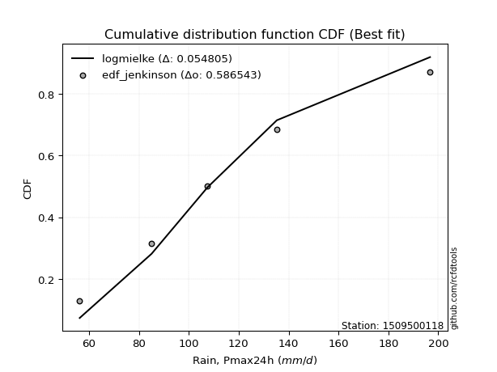</img>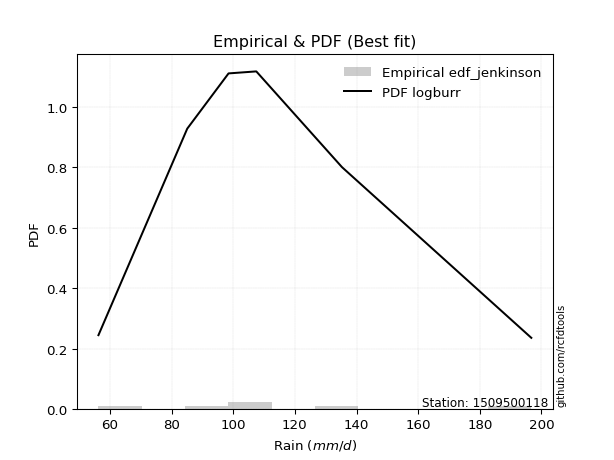</img>

</div>


### 11. EDF Cunnane (1978)

Cunnane´s work in statistical hydrology has focused on the performance and evaluation of different probability distributions (such as GEV, Gumbel, Lognormal) for flood frequency estimation. _b_ is a constant, typically set to 0.4.

<div align="center">


$P=(m-b)/(n+1-2b)$


</div>


**11.1. Empirical values**

<div align="center">

|                | 0                   | 1                  | 2           | 3                  | 4                  |
|:---------------|:--------------------|:-------------------|:------------|:-------------------|:-------------------|
| date           | 2023                | 2021               | 2022        | 2020               | 2019               |
| x              | 56.3                | 85.1               | 107.5       | 135.3              | 196.7              |
| m              | 1                   | 2                  | 3           | 4                  | 5                  |
| empirical_dist | edf_cunnane         | edf_cunnane        | edf_cunnane | edf_cunnane        | edf_cunnane        |
| empirical      | 0.11538461538461538 | 0.3076923076923077 | 0.5         | 0.6923076923076923 | 0.8846153846153845 |
| empirical_tr   | 1.1304347826086958  | 1.4444444444444444 | 2.0         | 3.25               | 8.666666666666655  |

</div>


**11.2. Kolmogorov-Smirnov fit test (sorted by Δ)**


<div align="center">

|                | 0                    | 1                    | 2                    | 3                   | 4                    | 5                   | 6                  | 7                   | 8                   | 9                   | 10                   | 11                   | 12                  | 13                 | 14                  | 15                  | 16                  | 17                  | 18                  | 19                  | 20                  | 21                  | 22                   | 23                  | 24                  | 25                  | 26                  | 27                  | 28                  | 29                  | 30                  | 31                  | 32                  | 33                 | 34                  | 35                  | 36                  | 37                   | 38                  | 39                    | 40                   | 41                  | 42                  | 43                  | 44                 | 45                  | 46                  | 47                  | 48                  | 49                  | 50                  | 51                  | 52                  | 53                  | 54                 | 55                  | 56                  | 57                  | 58                  | 59                  | 60                  | 61                 | 62                  | 63                  | 64                  | 65                  | 66                  | 67                  | 68                  | 69                  | 70                  | 71                  | 72                 | 73                  | 74                 | 75                  | 76                  | 77                  | 78                  | 79                 | 80                 | 81                 | 82                 | 83                  | 84                  | 85                 | 86                 | 87                 |
|:---------------|:---------------------|:---------------------|:---------------------|:--------------------|:---------------------|:--------------------|:-------------------|:--------------------|:--------------------|:--------------------|:---------------------|:---------------------|:--------------------|:-------------------|:--------------------|:--------------------|:--------------------|:--------------------|:--------------------|:--------------------|:--------------------|:--------------------|:---------------------|:--------------------|:--------------------|:--------------------|:--------------------|:--------------------|:--------------------|:--------------------|:--------------------|:--------------------|:--------------------|:-------------------|:--------------------|:--------------------|:--------------------|:---------------------|:--------------------|:----------------------|:---------------------|:--------------------|:--------------------|:--------------------|:-------------------|:--------------------|:--------------------|:--------------------|:--------------------|:--------------------|:--------------------|:--------------------|:--------------------|:--------------------|:-------------------|:--------------------|:--------------------|:--------------------|:--------------------|:--------------------|:--------------------|:-------------------|:--------------------|:--------------------|:--------------------|:--------------------|:--------------------|:--------------------|:--------------------|:--------------------|:--------------------|:--------------------|:-------------------|:--------------------|:-------------------|:--------------------|:--------------------|:--------------------|:--------------------|:-------------------|:-------------------|:-------------------|:-------------------|:--------------------|:--------------------|:-------------------|:-------------------|:-------------------|
| station        | 1509500118           | 1509500118           | 1509500118           | 1509500118          | 1509500118           | 1509500118          | 1509500118         | 1509500118          | 1509500118          | 1509500118          | 1509500118           | 1509500118           | 1509500118          | 1509500118         | 1509500118          | 1509500118          | 1509500118          | 1509500118          | 1509500118          | 1509500118          | 1509500118          | 1509500118          | 1509500118           | 1509500118          | 1509500118          | 1509500118          | 1509500118          | 1509500118          | 1509500118          | 1509500118          | 1509500118          | 1509500118          | 1509500118          | 1509500118         | 1509500118          | 1509500118          | 1509500118          | 1509500118           | 1509500118          | 1509500118            | 1509500118           | 1509500118          | 1509500118          | 1509500118          | 1509500118         | 1509500118          | 1509500118          | 1509500118          | 1509500118          | 1509500118          | 1509500118          | 1509500118          | 1509500118          | 1509500118          | 1509500118         | 1509500118          | 1509500118          | 1509500118          | 1509500118          | 1509500118          | 1509500118          | 1509500118         | 1509500118          | 1509500118          | 1509500118          | 1509500118          | 1509500118          | 1509500118          | 1509500118          | 1509500118          | 1509500118          | 1509500118          | 1509500118         | 1509500118          | 1509500118         | 1509500118          | 1509500118          | 1509500118          | 1509500118          | 1509500118         | 1509500118         | 1509500118         | 1509500118         | 1509500118          | 1509500118          | 1509500118         | 1509500118         | 1509500118         |
| empirical_dist | edf_cunnane          | edf_cunnane          | edf_cunnane          | edf_cunnane         | edf_cunnane          | edf_cunnane         | edf_cunnane        | edf_cunnane         | edf_cunnane         | edf_cunnane         | edf_cunnane          | edf_cunnane          | edf_cunnane         | edf_cunnane        | edf_cunnane         | edf_cunnane         | edf_cunnane         | edf_cunnane         | edf_cunnane         | edf_cunnane         | edf_cunnane         | edf_cunnane         | edf_cunnane          | edf_cunnane         | edf_cunnane         | edf_cunnane         | edf_cunnane         | edf_cunnane         | edf_cunnane         | edf_cunnane         | edf_cunnane         | edf_cunnane         | edf_cunnane         | edf_cunnane        | edf_cunnane         | edf_cunnane         | edf_cunnane         | edf_cunnane          | edf_cunnane         | edf_cunnane           | edf_cunnane          | edf_cunnane         | edf_cunnane         | edf_cunnane         | edf_cunnane        | edf_cunnane         | edf_cunnane         | edf_cunnane         | edf_cunnane         | edf_cunnane         | edf_cunnane         | edf_cunnane         | edf_cunnane         | edf_cunnane         | edf_cunnane        | edf_cunnane         | edf_cunnane         | edf_cunnane         | edf_cunnane         | edf_cunnane         | edf_cunnane         | edf_cunnane        | edf_cunnane         | edf_cunnane         | edf_cunnane         | edf_cunnane         | edf_cunnane         | edf_cunnane         | edf_cunnane         | edf_cunnane         | edf_cunnane         | edf_cunnane         | edf_cunnane        | edf_cunnane         | edf_cunnane        | edf_cunnane         | edf_cunnane         | edf_cunnane         | edf_cunnane         | edf_cunnane        | edf_cunnane        | edf_cunnane        | edf_cunnane        | edf_cunnane         | edf_cunnane         | edf_cunnane        | edf_cunnane        | edf_cunnane        |
| p_dist         | logmielke            | fisk                 | logfisk              | alpha               | logloggamma          | ncf                 | loggenlogistic     | mielke              | logpearson3         | exponnorm           | logjohnsonsu         | logt                 | logexponnorm        | logcrystalball     | lognorm             | lognorm             | logf                | genlogistic         | lognct              | invgamma            | loggamma            | loggamma            | logncf               | logerlang           | logfatiguelife      | nct                 | rayleigh            | logbetaprime        | gumbel_r            | kstwobign           | loginvgamma         | loglogistic         | johnsonsu           | maxwell            | pearson3            | logalpha            | loginvgauss         | invgauss             | betaprime           | loglaplace_asymmetric | loghypsecant         | rice                | loginvweibull       | logweibull_min      | logmaxwell         | logrice             | truncnorm           | norm                | crystalball         | t                   | halfnorm            | logkstwobign        | lograyleigh         | logistic            | moyal              | laplace_asymmetric  | loglaplace          | loggumbel_l         | hypsecant           | loggumbel_r         | logmoyal            | laplace            | loggenexpon         | genexpon            | loggompertz         | gompertz            | weibull_min         | halflogistic        | loghalflogistic     | wald                | loghalfnorm         | expon               | gumbel_l           | f                   | logexpon           | logchi2             | logwald             | erlang              | loggibrat           | gibrat             | nakagami           | lognakagami        | logtruncnorm       | loglognorm          | gamma               | invweibull         | chi2               | fatiguelife        |
| delta          | 0.041936640494524724 | 0.042733165679816554 | 0.043022049353617545 | 0.04561385283285729 | 0.046271985502270074 | 0.04650610986403203 | 0.0471503225615538 | 0.04731987634055326 | 0.04815059504278203 | 0.04886712809779016 | 0.049327952225270005 | 0.049954994707902295 | 0.04995573579233792 | 0.0499558968259949 | 0.04995589784618956 | 0.04995589784618956 | 0.04996948852639341 | 0.05009046081023816 | 0.05018361610153063 | 0.05048135036047999 | 0.05095250782476522 | 0.05095250782476522 | 0.051333525598627985 | 0.05142614436755204 | 0.05161882104764548 | 0.05179842386672022 | 0.05282449966174563 | 0.05365962127190904 | 0.05392744011356429 | 0.05415945317801074 | 0.05435518514736239 | 0.05473981815187322 | 0.05532691872136672 | 0.0562632792260217 | 0.05701999195267926 | 0.05708286569722984 | 0.05716111021295972 | 0.057341503236626866 | 0.05756221786474127 | 0.057859719835799406  | 0.059752808799031554 | 0.06026693026951346 | 0.06163287630817482 | 0.06342238239459652 | 0.0687936771328543 | 0.07072245355978622 | 0.07188681484653747 | 0.07188682227860471 | 0.07188682388532591 | 0.07192877833450967 | 0.07994033127305963 | 0.08008471993590738 | 0.08124371158798852 | 0.08142454290608475 | 0.0816784556660106 | 0.08205372050270074 | 0.08342824183821984 | 0.08866502546389066 | 0.08939126029495248 | 0.09509477346763291 | 0.11083347690946742 | 0.1130169093654903 | 0.11492635208743644 | 0.11538441030289967 | 0.11538460240152333 | 0.11538461538442568 | 0.11538461538458662 | 0.11538461538461538 | 0.11538461538461538 | 0.11538461538461538 | 0.11538461538461538 | 0.11538461538461538 | 0.1407977387059694 | 0.15110389151555065 | 0.1692206892908823 | 0.17002122724679292 | 0.17670924009620725 | 0.18231205180640575 | 0.20136284203241694 | 0.2268942111176881 | 0.3076807904731834 | 0.3076923064863652 | 0.3201357164392782 | 0.36877160390154173 | 0.40605773611699314 | 0.4483272474452766 | 0.4645721725974602 | 0.4746801620756417 |
| deltao         | 0.5865427407550001   | 0.5865427407550001   | 0.5865427407550001   | 0.5865427407550001  | 0.5865427407550001   | 0.5865427407550001  | 0.5865427407550001 | 0.5865427407550001  | 0.5865427407550001  | 0.5865427407550001  | 0.5865427407550001   | 0.5865427407550001   | 0.5865427407550001  | 0.5865427407550001 | 0.5865427407550001  | 0.5865427407550001  | 0.5865427407550001  | 0.5865427407550001  | 0.5865427407550001  | 0.5865427407550001  | 0.5865427407550001  | 0.5865427407550001  | 0.5865427407550001   | 0.5865427407550001  | 0.5865427407550001  | 0.5865427407550001  | 0.5865427407550001  | 0.5865427407550001  | 0.5865427407550001  | 0.5865427407550001  | 0.5865427407550001  | 0.5865427407550001  | 0.5865427407550001  | 0.5865427407550001 | 0.5865427407550001  | 0.5865427407550001  | 0.5865427407550001  | 0.5865427407550001   | 0.5865427407550001  | 0.5865427407550001    | 0.5865427407550001   | 0.5865427407550001  | 0.5865427407550001  | 0.5865427407550001  | 0.5865427407550001 | 0.5865427407550001  | 0.5865427407550001  | 0.5865427407550001  | 0.5865427407550001  | 0.5865427407550001  | 0.5865427407550001  | 0.5865427407550001  | 0.5865427407550001  | 0.5865427407550001  | 0.5865427407550001 | 0.5865427407550001  | 0.5865427407550001  | 0.5865427407550001  | 0.5865427407550001  | 0.5865427407550001  | 0.5865427407550001  | 0.5865427407550001 | 0.5865427407550001  | 0.5865427407550001  | 0.5865427407550001  | 0.5865427407550001  | 0.5865427407550001  | 0.5865427407550001  | 0.5865427407550001  | 0.5865427407550001  | 0.5865427407550001  | 0.5865427407550001  | 0.5865427407550001 | 0.5865427407550001  | 0.5865427407550001 | 0.5865427407550001  | 0.5865427407550001  | 0.5865427407550001  | 0.5865427407550001  | 0.5865427407550001 | 0.5865427407550001 | 0.5865427407550001 | 0.5865427407550001 | 0.5865427407550001  | 0.5865427407550001  | 0.5865427407550001 | 0.5865427407550001 | 0.5865427407550001 |
| eval           | Δo > Δ               | Δo > Δ               | Δo > Δ               | Δo > Δ              | Δo > Δ               | Δo > Δ              | Δo > Δ             | Δo > Δ              | Δo > Δ              | Δo > Δ              | Δo > Δ               | Δo > Δ               | Δo > Δ              | Δo > Δ             | Δo > Δ              | Δo > Δ              | Δo > Δ              | Δo > Δ              | Δo > Δ              | Δo > Δ              | Δo > Δ              | Δo > Δ              | Δo > Δ               | Δo > Δ              | Δo > Δ              | Δo > Δ              | Δo > Δ              | Δo > Δ              | Δo > Δ              | Δo > Δ              | Δo > Δ              | Δo > Δ              | Δo > Δ              | Δo > Δ             | Δo > Δ              | Δo > Δ              | Δo > Δ              | Δo > Δ               | Δo > Δ              | Δo > Δ                | Δo > Δ               | Δo > Δ              | Δo > Δ              | Δo > Δ              | Δo > Δ             | Δo > Δ              | Δo > Δ              | Δo > Δ              | Δo > Δ              | Δo > Δ              | Δo > Δ              | Δo > Δ              | Δo > Δ              | Δo > Δ              | Δo > Δ             | Δo > Δ              | Δo > Δ              | Δo > Δ              | Δo > Δ              | Δo > Δ              | Δo > Δ              | Δo > Δ             | Δo > Δ              | Δo > Δ              | Δo > Δ              | Δo > Δ              | Δo > Δ              | Δo > Δ              | Δo > Δ              | Δo > Δ              | Δo > Δ              | Δo > Δ              | Δo > Δ             | Δo > Δ              | Δo > Δ             | Δo > Δ              | Δo > Δ              | Δo > Δ              | Δo > Δ              | Δo > Δ             | Δo > Δ             | Δo > Δ             | Δo > Δ             | Δo > Δ              | Δo > Δ              | Δo > Δ             | Δo > Δ             | Δo > Δ             |
| fit            | 1                    | 1                    | 1                    | 1                   | 1                    | 1                   | 1                  | 1                   | 1                   | 1                   | 1                    | 1                    | 1                   | 1                  | 1                   | 1                   | 1                   | 1                   | 1                   | 1                   | 1                   | 1                   | 1                    | 1                   | 1                   | 1                   | 1                   | 1                   | 1                   | 1                   | 1                   | 1                   | 1                   | 1                  | 1                   | 1                   | 1                   | 1                    | 1                   | 1                     | 1                    | 1                   | 1                   | 1                   | 1                  | 1                   | 1                   | 1                   | 1                   | 1                   | 1                   | 1                   | 1                   | 1                   | 1                  | 1                   | 1                   | 1                   | 1                   | 1                   | 1                   | 1                  | 1                   | 1                   | 1                   | 1                   | 1                   | 1                   | 1                   | 1                   | 1                   | 1                   | 1                  | 1                   | 1                  | 1                   | 1                   | 1                   | 1                   | 1                  | 1                  | 1                  | 1                  | 1                   | 1                   | 1                  | 1                  | 1                  |
| n              | 5                    | 5                    | 5                    | 5                   | 5                    | 5                   | 5                  | 5                   | 5                   | 5                   | 5                    | 5                    | 5                   | 5                  | 5                   | 5                   | 5                   | 5                   | 5                   | 5                   | 5                   | 5                   | 5                    | 5                   | 5                   | 5                   | 5                   | 5                   | 5                   | 5                   | 5                   | 5                   | 5                   | 5                  | 5                   | 5                   | 5                   | 5                    | 5                   | 5                     | 5                    | 5                   | 5                   | 5                   | 5                  | 5                   | 5                   | 5                   | 5                   | 5                   | 5                   | 5                   | 5                   | 5                   | 5                  | 5                   | 5                   | 5                   | 5                   | 5                   | 5                   | 5                  | 5                   | 5                   | 5                   | 5                   | 5                   | 5                   | 5                   | 5                   | 5                   | 5                   | 5                  | 5                   | 5                  | 5                   | 5                   | 5                   | 5                   | 5                  | 5                  | 5                  | 5                  | 5                   | 5                   | 5                  | 5                  | 5                  |
| best_fit       | 1                    | 0                    | 0                    | 0                   | 0                    | 0                   | 0                  | 0                   | 0                   | 0                   | 0                    | 0                    | 0                   | 0                  | 0                   | 0                   | 0                   | 0                   | 0                   | 0                   | 0                   | 0                   | 0                    | 0                   | 0                   | 0                   | 0                   | 0                   | 0                   | 0                   | 0                   | 0                   | 0                   | 0                  | 0                   | 0                   | 0                   | 0                    | 0                   | 0                     | 0                    | 0                   | 0                   | 0                   | 0                  | 0                   | 0                   | 0                   | 0                   | 0                   | 0                   | 0                   | 0                   | 0                   | 0                  | 0                   | 0                   | 0                   | 0                   | 0                   | 0                   | 0                  | 0                   | 0                   | 0                   | 0                   | 0                   | 0                   | 0                   | 0                   | 0                   | 0                   | 0                  | 0                   | 0                  | 0                   | 0                   | 0                   | 0                   | 0                  | 0                  | 0                  | 0                  | 0                   | 0                   | 0                  | 0                  | 0                  |
| best_fit_sort  | 1                    | 2                    | 3                    | 4                   | 5                    | 6                   | 7                  | 8                   | 9                   | 10                  | 11                   | 12                   | 13                  | 14                 | 15                  | 16                  | 17                  | 18                  | 19                  | 20                  | 21                  | 22                  | 23                   | 24                  | 25                  | 26                  | 27                  | 28                  | 29                  | 30                  | 31                  | 32                  | 33                  | 34                 | 35                  | 36                  | 37                  | 38                   | 39                  | 40                    | 41                   | 42                  | 43                  | 44                  | 45                 | 46                  | 47                  | 48                  | 49                  | 50                  | 51                  | 52                  | 53                  | 54                  | 55                 | 56                  | 57                  | 58                  | 59                  | 60                  | 61                  | 62                 | 63                  | 64                  | 65                  | 66                  | 67                  | 68                  | 69                  | 70                  | 71                  | 72                  | 73                 | 74                  | 75                 | 76                  | 77                  | 78                  | 79                  | 80                 | 81                 | 82                 | 83                 | 84                  | 85                  | 86                 | 87                 | 88                 |

</div>


**11.3. Best fit**

<div align="center">

|   id |    station | empirical_dist   | p_dist    |     delta |   deltao | eval   |   fit |   n |   best_fit |   best_fit_sort |
|-----:|-----------:|:-----------------|:----------|----------:|---------:|:-------|------:|----:|-----------:|----------------:|
|    0 | 1509500118 | edf_cunnane      | logmielke | 0.0419366 | 0.586543 | Δo > Δ |     1 |   5 |          1 |               1 |

</div>


<div align="center">

</img></img>

</div>


### 12. EDF Adamowski (1981)

The Adamowski formula in hydrology refers to a specific plotting position formula used for estimating the non-parametric empirical distribution of hydrological events (like flood peaks) to calculate their return periods. This formula provides an alternative to traditional parametric methods (like the Gumbel or Log Pearson Type III distributions). 

<div align="center">


$P=(m-0.25)/(n+0.5)$


</div>


**12.1. Empirical values**

<div align="center">

|                | 0                   | 1                  | 2             | 3                  | 4                  |
|:---------------|:--------------------|:-------------------|:--------------|:-------------------|:-------------------|
| date           | 2023                | 2021               | 2022          | 2020               | 2019               |
| x              | 56.3                | 85.1               | 107.5         | 135.3              | 196.7              |
| m              | 1                   | 2                  | 3             | 4                  | 5                  |
| empirical_dist | edf_adamowski       | edf_adamowski      | edf_adamowski | edf_adamowski      | edf_adamowski      |
| empirical      | 0.13636363636363635 | 0.3181818181818182 | 0.5           | 0.6818181818181818 | 0.8636363636363636 |
| empirical_tr   | 1.1578947368421053  | 1.4666666666666666 | 2.0           | 3.1428571428571423 | 7.333333333333334  |

</div>


**12.2. Kolmogorov-Smirnov fit test (sorted by Δ)**


<div align="center">

|                | 0                  | 1                   | 2                   | 3                   | 4                   | 5                   | 6                   | 7                   | 8                     | 9                   | 10                  | 11                  | 12                  | 13                 | 14                  | 15                  | 16                  | 17                  | 18                  | 19                  | 20                  | 21                 | 22                 | 23                  | 24                  | 25                  | 26                 | 27                  | 28                  | 29                  | 30                  | 31                  | 32                 | 33                 | 34                  | 35                  | 36                  | 37                  | 38                 | 39                  | 40                  | 41                  | 42                 | 43                  | 44                  | 45                  | 46                  | 47                 | 48                  | 49                 | 50                  | 51                 | 52                 | 53                  | 54                  | 55                  | 56                  | 57                  | 58                  | 59                  | 60                  | 61                 | 62                  | 63                  | 64                 | 65                  | 66                 | 67                  | 68                  | 69                  | 70                  | 71                  | 72                  | 73                 | 74                 | 75                  | 76                  | 77                  | 78                  | 79                  | 80                 | 81                 | 82                  | 83                  | 84                 | 85                  | 86                  | 87                 |
|:---------------|:-------------------|:--------------------|:--------------------|:--------------------|:--------------------|:--------------------|:--------------------|:--------------------|:----------------------|:--------------------|:--------------------|:--------------------|:--------------------|:-------------------|:--------------------|:--------------------|:--------------------|:--------------------|:--------------------|:--------------------|:--------------------|:-------------------|:-------------------|:--------------------|:--------------------|:--------------------|:-------------------|:--------------------|:--------------------|:--------------------|:--------------------|:--------------------|:-------------------|:-------------------|:--------------------|:--------------------|:--------------------|:--------------------|:-------------------|:--------------------|:--------------------|:--------------------|:-------------------|:--------------------|:--------------------|:--------------------|:--------------------|:-------------------|:--------------------|:-------------------|:--------------------|:-------------------|:-------------------|:--------------------|:--------------------|:--------------------|:--------------------|:--------------------|:--------------------|:--------------------|:--------------------|:-------------------|:--------------------|:--------------------|:-------------------|:--------------------|:-------------------|:--------------------|:--------------------|:--------------------|:--------------------|:--------------------|:--------------------|:-------------------|:-------------------|:--------------------|:--------------------|:--------------------|:--------------------|:--------------------|:-------------------|:-------------------|:--------------------|:--------------------|:-------------------|:--------------------|:--------------------|:-------------------|
| station        | 1509500118         | 1509500118          | 1509500118          | 1509500118          | 1509500118          | 1509500118          | 1509500118          | 1509500118          | 1509500118            | 1509500118          | 1509500118          | 1509500118          | 1509500118          | 1509500118         | 1509500118          | 1509500118          | 1509500118          | 1509500118          | 1509500118          | 1509500118          | 1509500118          | 1509500118         | 1509500118         | 1509500118          | 1509500118          | 1509500118          | 1509500118         | 1509500118          | 1509500118          | 1509500118          | 1509500118          | 1509500118          | 1509500118         | 1509500118         | 1509500118          | 1509500118          | 1509500118          | 1509500118          | 1509500118         | 1509500118          | 1509500118          | 1509500118          | 1509500118         | 1509500118          | 1509500118          | 1509500118          | 1509500118          | 1509500118         | 1509500118          | 1509500118         | 1509500118          | 1509500118         | 1509500118         | 1509500118          | 1509500118          | 1509500118          | 1509500118          | 1509500118          | 1509500118          | 1509500118          | 1509500118          | 1509500118         | 1509500118          | 1509500118          | 1509500118         | 1509500118          | 1509500118         | 1509500118          | 1509500118          | 1509500118          | 1509500118          | 1509500118          | 1509500118          | 1509500118         | 1509500118         | 1509500118          | 1509500118          | 1509500118          | 1509500118          | 1509500118          | 1509500118         | 1509500118         | 1509500118          | 1509500118          | 1509500118         | 1509500118          | 1509500118          | 1509500118         |
| empirical_dist | edf_adamowski      | edf_adamowski       | edf_adamowski       | edf_adamowski       | edf_adamowski       | edf_adamowski       | edf_adamowski       | edf_adamowski       | edf_adamowski         | edf_adamowski       | edf_adamowski       | edf_adamowski       | edf_adamowski       | edf_adamowski      | edf_adamowski       | edf_adamowski       | edf_adamowski       | edf_adamowski       | edf_adamowski       | edf_adamowski       | edf_adamowski       | edf_adamowski      | edf_adamowski      | edf_adamowski       | edf_adamowski       | edf_adamowski       | edf_adamowski      | edf_adamowski       | edf_adamowski       | edf_adamowski       | edf_adamowski       | edf_adamowski       | edf_adamowski      | edf_adamowski      | edf_adamowski       | edf_adamowski       | edf_adamowski       | edf_adamowski       | edf_adamowski      | edf_adamowski       | edf_adamowski       | edf_adamowski       | edf_adamowski      | edf_adamowski       | edf_adamowski       | edf_adamowski       | edf_adamowski       | edf_adamowski      | edf_adamowski       | edf_adamowski      | edf_adamowski       | edf_adamowski      | edf_adamowski      | edf_adamowski       | edf_adamowski       | edf_adamowski       | edf_adamowski       | edf_adamowski       | edf_adamowski       | edf_adamowski       | edf_adamowski       | edf_adamowski      | edf_adamowski       | edf_adamowski       | edf_adamowski      | edf_adamowski       | edf_adamowski      | edf_adamowski       | edf_adamowski       | edf_adamowski       | edf_adamowski       | edf_adamowski       | edf_adamowski       | edf_adamowski      | edf_adamowski      | edf_adamowski       | edf_adamowski       | edf_adamowski       | edf_adamowski       | edf_adamowski       | edf_adamowski      | edf_adamowski      | edf_adamowski       | edf_adamowski       | edf_adamowski      | edf_adamowski       | edf_adamowski       | edf_adamowski      |
| p_dist         | logmielke          | fisk                | logfisk             | alpha               | logloggamma         | ncf                 | loggenlogistic      | mielke              | loglaplace_asymmetric | logpearson3         | exponnorm           | logjohnsonsu        | logt                | logexponnorm       | logcrystalball      | lognorm             | lognorm             | logf                | genlogistic         | lognct              | invgamma            | loggamma           | loggamma           | logncf              | logerlang           | logfatiguelife      | nct                | rayleigh            | logbetaprime        | gumbel_r            | kstwobign           | loginvgamma         | loglogistic        | johnsonsu          | loghypsecant        | maxwell             | pearson3            | logalpha            | loginvgauss        | invgauss            | betaprime           | rice                | loginvweibull      | logweibull_min      | logkstwobign        | logmaxwell          | crystalball         | norm               | truncnorm           | t                  | logistic            | logrice            | laplace_asymmetric | loglaplace          | hypsecant           | halfnorm            | lograyleigh         | moyal               | loggumbel_l         | loggumbel_r         | laplace             | logmoyal           | loggenexpon         | genexpon            | loggompertz        | gompertz            | weibull_min        | halflogistic        | loghalflogistic     | wald                | loghalfnorm         | expon               | f                   | gumbel_l           | logchi2            | logexpon            | erlang              | logwald             | loggibrat           | gibrat              | logtruncnorm       | nakagami           | lognakagami         | loglognorm          | gamma              | invweibull          | chi2                | fatiguelife        |
| delta          | 0.0629156614735457 | 0.06371218665883753 | 0.06400107033263852 | 0.06659287381187827 | 0.06725100648129105 | 0.06748513084305285 | 0.06812934354057477 | 0.06829889731957424 | 0.06834923032530993   | 0.06912961602180301 | 0.06984614907681114 | 0.07030697320429098 | 0.07093401568692327 | 0.0709347567713589 | 0.07093491780501587 | 0.07093491882521054 | 0.07093491882521054 | 0.07094850950541438 | 0.07106948178925898 | 0.07116263708055161 | 0.07146037133950096 | 0.0719315288037862 | 0.0719315288037862 | 0.07231254657764896 | 0.07240516534657301 | 0.07259784202666646 | 0.0727774448457412 | 0.07380352064076645 | 0.07463864225093002 | 0.07490646109258527 | 0.07513847415703157 | 0.07533420612638336 | 0.0757188391308942 | 0.0763059397003877 | 0.07720395780854852 | 0.07724230020504252 | 0.07799901293170008 | 0.07806188667625082 | 0.0781401311919807 | 0.07832052421564784 | 0.07854123884376224 | 0.08124595124853429 | 0.0826118972871958 | 0.08440140337361748 | 0.08463704151536758 | 0.08977269811187527 | 0.08995450339505062 | 0.089954504097433  | 0.08995450491569212 | 0.0899712030673786 | 0.09108049455410361 | 0.0917014745388072 | 0.0925432309922112 | 0.09391775232773036 | 0.09766397421344497 | 0.10091935225208061 | 0.10222273256700949 | 0.10265747664503158 | 0.10964404644291148 | 0.11607379444665389 | 0.11841520054918342 | 0.1318124978884884 | 0.13590537306645742 | 0.13636343128192063 | 0.1363636233805443 | 0.13636363636344667 | 0.1363636363636076 | 0.13636363636363635 | 0.13636363636363635 | 0.13636363636363635 | 0.13636363636363635 | 0.13636363636363635 | 0.14061438102604018 | 0.1407977387059694 | 0.1490422062677721 | 0.15873117880137183 | 0.17182254131689528 | 0.17670924009620725 | 0.20136284203241694 | 0.23738372160719856 | 0.3096462059497677 | 0.3181703009626939 | 0.31818181697587566 | 0.35828209341203127 | 0.3955682256274827 | 0.42734822646625575 | 0.45408266210794973 | 0.4641906515861312 |
| deltao         | 0.5865427407550001 | 0.5865427407550001  | 0.5865427407550001  | 0.5865427407550001  | 0.5865427407550001  | 0.5865427407550001  | 0.5865427407550001  | 0.5865427407550001  | 0.5865427407550001    | 0.5865427407550001  | 0.5865427407550001  | 0.5865427407550001  | 0.5865427407550001  | 0.5865427407550001 | 0.5865427407550001  | 0.5865427407550001  | 0.5865427407550001  | 0.5865427407550001  | 0.5865427407550001  | 0.5865427407550001  | 0.5865427407550001  | 0.5865427407550001 | 0.5865427407550001 | 0.5865427407550001  | 0.5865427407550001  | 0.5865427407550001  | 0.5865427407550001 | 0.5865427407550001  | 0.5865427407550001  | 0.5865427407550001  | 0.5865427407550001  | 0.5865427407550001  | 0.5865427407550001 | 0.5865427407550001 | 0.5865427407550001  | 0.5865427407550001  | 0.5865427407550001  | 0.5865427407550001  | 0.5865427407550001 | 0.5865427407550001  | 0.5865427407550001  | 0.5865427407550001  | 0.5865427407550001 | 0.5865427407550001  | 0.5865427407550001  | 0.5865427407550001  | 0.5865427407550001  | 0.5865427407550001 | 0.5865427407550001  | 0.5865427407550001 | 0.5865427407550001  | 0.5865427407550001 | 0.5865427407550001 | 0.5865427407550001  | 0.5865427407550001  | 0.5865427407550001  | 0.5865427407550001  | 0.5865427407550001  | 0.5865427407550001  | 0.5865427407550001  | 0.5865427407550001  | 0.5865427407550001 | 0.5865427407550001  | 0.5865427407550001  | 0.5865427407550001 | 0.5865427407550001  | 0.5865427407550001 | 0.5865427407550001  | 0.5865427407550001  | 0.5865427407550001  | 0.5865427407550001  | 0.5865427407550001  | 0.5865427407550001  | 0.5865427407550001 | 0.5865427407550001 | 0.5865427407550001  | 0.5865427407550001  | 0.5865427407550001  | 0.5865427407550001  | 0.5865427407550001  | 0.5865427407550001 | 0.5865427407550001 | 0.5865427407550001  | 0.5865427407550001  | 0.5865427407550001 | 0.5865427407550001  | 0.5865427407550001  | 0.5865427407550001 |
| eval           | Δo > Δ             | Δo > Δ              | Δo > Δ              | Δo > Δ              | Δo > Δ              | Δo > Δ              | Δo > Δ              | Δo > Δ              | Δo > Δ                | Δo > Δ              | Δo > Δ              | Δo > Δ              | Δo > Δ              | Δo > Δ             | Δo > Δ              | Δo > Δ              | Δo > Δ              | Δo > Δ              | Δo > Δ              | Δo > Δ              | Δo > Δ              | Δo > Δ             | Δo > Δ             | Δo > Δ              | Δo > Δ              | Δo > Δ              | Δo > Δ             | Δo > Δ              | Δo > Δ              | Δo > Δ              | Δo > Δ              | Δo > Δ              | Δo > Δ             | Δo > Δ             | Δo > Δ              | Δo > Δ              | Δo > Δ              | Δo > Δ              | Δo > Δ             | Δo > Δ              | Δo > Δ              | Δo > Δ              | Δo > Δ             | Δo > Δ              | Δo > Δ              | Δo > Δ              | Δo > Δ              | Δo > Δ             | Δo > Δ              | Δo > Δ             | Δo > Δ              | Δo > Δ             | Δo > Δ             | Δo > Δ              | Δo > Δ              | Δo > Δ              | Δo > Δ              | Δo > Δ              | Δo > Δ              | Δo > Δ              | Δo > Δ              | Δo > Δ             | Δo > Δ              | Δo > Δ              | Δo > Δ             | Δo > Δ              | Δo > Δ             | Δo > Δ              | Δo > Δ              | Δo > Δ              | Δo > Δ              | Δo > Δ              | Δo > Δ              | Δo > Δ             | Δo > Δ             | Δo > Δ              | Δo > Δ              | Δo > Δ              | Δo > Δ              | Δo > Δ              | Δo > Δ             | Δo > Δ             | Δo > Δ              | Δo > Δ              | Δo > Δ             | Δo > Δ              | Δo > Δ              | Δo > Δ             |
| fit            | 1                  | 1                   | 1                   | 1                   | 1                   | 1                   | 1                   | 1                   | 1                     | 1                   | 1                   | 1                   | 1                   | 1                  | 1                   | 1                   | 1                   | 1                   | 1                   | 1                   | 1                   | 1                  | 1                  | 1                   | 1                   | 1                   | 1                  | 1                   | 1                   | 1                   | 1                   | 1                   | 1                  | 1                  | 1                   | 1                   | 1                   | 1                   | 1                  | 1                   | 1                   | 1                   | 1                  | 1                   | 1                   | 1                   | 1                   | 1                  | 1                   | 1                  | 1                   | 1                  | 1                  | 1                   | 1                   | 1                   | 1                   | 1                   | 1                   | 1                   | 1                   | 1                  | 1                   | 1                   | 1                  | 1                   | 1                  | 1                   | 1                   | 1                   | 1                   | 1                   | 1                   | 1                  | 1                  | 1                   | 1                   | 1                   | 1                   | 1                   | 1                  | 1                  | 1                   | 1                   | 1                  | 1                   | 1                   | 1                  |
| n              | 5                  | 5                   | 5                   | 5                   | 5                   | 5                   | 5                   | 5                   | 5                     | 5                   | 5                   | 5                   | 5                   | 5                  | 5                   | 5                   | 5                   | 5                   | 5                   | 5                   | 5                   | 5                  | 5                  | 5                   | 5                   | 5                   | 5                  | 5                   | 5                   | 5                   | 5                   | 5                   | 5                  | 5                  | 5                   | 5                   | 5                   | 5                   | 5                  | 5                   | 5                   | 5                   | 5                  | 5                   | 5                   | 5                   | 5                   | 5                  | 5                   | 5                  | 5                   | 5                  | 5                  | 5                   | 5                   | 5                   | 5                   | 5                   | 5                   | 5                   | 5                   | 5                  | 5                   | 5                   | 5                  | 5                   | 5                  | 5                   | 5                   | 5                   | 5                   | 5                   | 5                   | 5                  | 5                  | 5                   | 5                   | 5                   | 5                   | 5                   | 5                  | 5                  | 5                   | 5                   | 5                  | 5                   | 5                   | 5                  |
| best_fit       | 1                  | 0                   | 0                   | 0                   | 0                   | 0                   | 0                   | 0                   | 0                     | 0                   | 0                   | 0                   | 0                   | 0                  | 0                   | 0                   | 0                   | 0                   | 0                   | 0                   | 0                   | 0                  | 0                  | 0                   | 0                   | 0                   | 0                  | 0                   | 0                   | 0                   | 0                   | 0                   | 0                  | 0                  | 0                   | 0                   | 0                   | 0                   | 0                  | 0                   | 0                   | 0                   | 0                  | 0                   | 0                   | 0                   | 0                   | 0                  | 0                   | 0                  | 0                   | 0                  | 0                  | 0                   | 0                   | 0                   | 0                   | 0                   | 0                   | 0                   | 0                   | 0                  | 0                   | 0                   | 0                  | 0                   | 0                  | 0                   | 0                   | 0                   | 0                   | 0                   | 0                   | 0                  | 0                  | 0                   | 0                   | 0                   | 0                   | 0                   | 0                  | 0                  | 0                   | 0                   | 0                  | 0                   | 0                   | 0                  |
| best_fit_sort  | 1                  | 2                   | 3                   | 4                   | 5                   | 6                   | 7                   | 8                   | 9                     | 10                  | 11                  | 12                  | 13                  | 14                 | 15                  | 16                  | 17                  | 18                  | 19                  | 20                  | 21                  | 22                 | 23                 | 24                  | 25                  | 26                  | 27                 | 28                  | 29                  | 30                  | 31                  | 32                  | 33                 | 34                 | 35                  | 36                  | 37                  | 38                  | 39                 | 40                  | 41                  | 42                  | 43                 | 44                  | 45                  | 46                  | 47                  | 48                 | 49                  | 50                 | 51                  | 52                 | 53                 | 54                  | 55                  | 56                  | 57                  | 58                  | 59                  | 60                  | 61                  | 62                 | 63                  | 64                  | 65                 | 66                  | 67                 | 68                  | 69                  | 70                  | 71                  | 72                  | 73                  | 74                 | 75                 | 76                  | 77                  | 78                  | 79                  | 80                  | 81                 | 82                 | 83                  | 84                  | 85                 | 86                  | 87                  | 88                 |

</div>


**12.3. Best fit**

<div align="center">

|   id |    station | empirical_dist   | p_dist    |     delta |   deltao | eval   |   fit |   n |   best_fit |   best_fit_sort |
|-----:|-----------:|:-----------------|:----------|----------:|---------:|:-------|------:|----:|-----------:|----------------:|
|    0 | 1509500118 | edf_adamowski    | logmielke | 0.0629157 | 0.586543 | Δo > Δ |     1 |   5 |          1 |               1 |

</div>


<div align="center">

</img>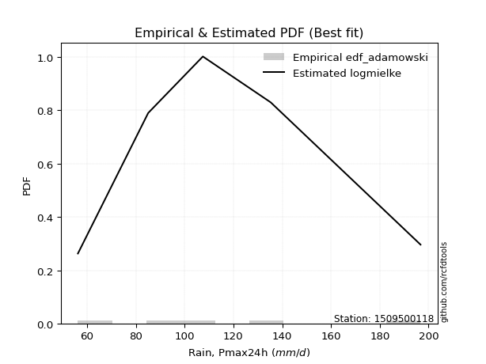</img>

</div>


## C. Best fit & Estimate extreme values for specific return periods - Tr

Best fit in probability distribution analysis means finding the theoretical distribution (like Normal, Poisson, Exponential) that most accurately mirrors your real-world data´s patterns (shape, center, spread) for better predictions, using methods like visual checks (Q-Q plots), goodness-of-fit tests (Kolmogorov-Smirnov, Chi-Squared), and information criteria (AIC) to score and select the simplest, most representative model.


### 1. Best fit (ordered by delta Δ)

<div align="center">

|   id |    station | empirical_dist   | p_dist                |     delta |   deltao | eval   |   fit |   n |   best_fit |   best_fit_sort |
|-----:|-----------:|:-----------------|:----------------------|----------:|---------:|:-------|------:|----:|-----------:|----------------:|
|    0 | 1509500118 | edf_hazen        | logmielke             | 0.026552  | 0.586543 | Δo > Δ |     1 |   5 |          1 |               1 |
|    1 | 1509500118 | edf_gringorten   | logmielke             | 0.035927  | 0.586543 | Δo > Δ |     1 |   5 |          1 |               2 |
|    2 | 1509500118 | edf_cunnane      | logmielke             | 0.0419366 | 0.586543 | Δo > Δ |     1 |   5 |          1 |               3 |
|    3 | 1509500118 | edf_blom         | logmielke             | 0.0455996 | 0.586543 | Δo > Δ |     1 |   5 |          1 |               4 |
|    4 | 1509500118 | edf_tukey        | logmielke             | 0.051552  | 0.586543 | Δo > Δ |     1 |   5 |          1 |               5 |
|    5 | 1509500118 | edf_filliben     | logmielke             | 0.0537654 | 0.586543 | Δo > Δ |     1 |   5 |          1 |               6 |
|    6 | 1509500118 | edf_beard        | logmielke             | 0.0548048 | 0.586543 | Δo > Δ |     1 |   5 |          1 |               7 |
|    7 | 1509500118 | edf_jenkinson    | logmielke             | 0.0548048 | 0.586543 | Δo > Δ |     1 |   5 |          1 |               8 |
|    8 | 1509500118 | edf_chegodayev   | logmielke             | 0.0561817 | 0.586543 | Δo > Δ |     1 |   5 |          1 |               9 |
|    9 | 1509500118 | edf_adamowski    | logmielke             | 0.0629157 | 0.586543 | Δo > Δ |     1 |   5 |          1 |              10 |
|   10 | 1509500118 | edf_weibull      | loglaplace_asymmetric | 0.0878824 | 0.586543 | Δo > Δ |     1 |   5 |          1 |              11 |
|   11 | 1509500118 | edf_california   | rayleigh              | 0.125357  | 0.586543 | Δo > Δ |     1 |   5 |          1 |              12 |

</div>

:file_folder:Tables: [bestfit_1509500118.csv](table/bestfit_1509500118.csv) | [extreme_1509500118.csv](table/extreme_1509500118.csv)


### 2. Extreme values

In hydrology, a return period (or recurrence interval $Tr$) is the statistical average time between extreme events like floods or droughts of a specific magnitude, indicating how rare an event is, with a 100-year flood, for example, having a 1% chance of occurring in any given year, not that it happens exactly every century. It is a key tool for infrastructure design (like bridges or dams) and risk assessment, calculated from historical data to determine the probability of future events, although it is important to remember it is statistical average, and events can cluster or be missed.

> risk_rate: assuming the return period as the project useful life.

|   id |      tr |   prob_l |     prob_g |   alpha |   betaprime |     chi2 |   crystalball |   erlang |    expon |   exponnorm |        f |   fatiguelife |    fisk |    gamma |   genexpon |   genlogistic |   gibrat |   gompertz |   gumbel_l |   gumbel_r |   halflogistic |   halfnorm |   hypsecant |   invgamma |   invgauss |      invweibull |   johnsonsu |   kstwobign |   laplace |   laplace_asymmetric |   loggamma |   logistic |   lognorm |   maxwell |   mielke |   moyal |   nakagami |     ncf |     nct |    norm |   pearson3 |   rayleigh |    rice |       t |   truncnorm |    wald |   weibull_min |   logalpha |   logbetaprime |          logchi2 |   logcrystalball |   logerlang |   logexpon |   logexponnorm |    logf |   logfatiguelife |   logfisk |   loggenexpon |   loggenlogistic |   loggibrat |   loggompertz |   loggumbel_l |   loggumbel_r |   loghalflogistic |   loghalfnorm |   loghypsecant |   loginvgamma |   loginvgauss |   loginvweibull |   logjohnsonsu |   logkstwobign |   loglaplace |   loglaplace_asymmetric |   logloggamma |   loglogistic |   loglognorm |   logmaxwell |   logmielke |   logmoyal |   lognakagami |   logncf |   lognct |   logpearson3 |   lograyleigh |   logrice |    logt |   logtruncnorm |   logwald |   logweibull_min |    station |   n |   risk_rate |
|-----:|--------:|---------:|-----------:|--------:|------------:|---------:|--------------:|---------:|---------:|------------:|---------:|--------------:|--------:|---------:|-----------:|--------------:|---------:|-----------:|-----------:|-----------:|---------------:|-----------:|------------:|-----------:|-----------:|----------------:|------------:|------------:|----------:|---------------------:|-----------:|-----------:|----------:|----------:|---------:|--------:|-----------:|--------:|--------:|--------:|-----------:|-----------:|--------:|--------:|------------:|--------:|--------------:|-----------:|---------------:|-----------------:|-----------------:|------------:|-----------:|---------------:|--------:|-----------------:|----------:|--------------:|-----------------:|------------:|--------------:|--------------:|--------------:|------------------:|--------------:|---------------:|--------------:|--------------:|----------------:|---------------:|---------------:|-------------:|------------------------:|--------------:|--------------:|-------------:|-------------:|------------:|-----------:|--------------:|---------:|---------:|--------------:|--------------:|----------:|--------:|---------------:|----------:|-----------------:|-----------:|----:|------------:|
|    0 |    2    | 0.5      | 0.5        | 107.574 |     103.449 |  63.1252 |       116.18  |  86.1349 |  97.8057 |     103.025 |  90.0766 |       56.325  | 107.028 |  67.0283 |    97.8069 |       107.598 |  101.8   |    106.986 |    124.051 |    108.309 |        104.397 |    106.373 |     116.18  |    106.24  |    103.905 | 11770.1         |     104.772 |     108.155 |   116.18  |              112.081 |    106.014 |    116.18  |   106.51  |   112.083 |  106.05  | 105.769 |    95.2118 | 107.557 | 105.39  | 116.18  |    112.077 |    110.629 | 112.752 | 116.184 |     116.18  | 100.65  |       99.2791 |    104.553 |        105.649 |     94.9006      |          106.51  |     106.084 |    87.5846 |        106.51  | 105.646 |          106.35  |   106.993 |       96.9793 |          106.109 |     93.8385 |       104.37  |       114.156 |       99.3757 |           96.0087 |       97.6947 |        106.51  |       104.901 |       102.699 |         100.141 |        106.51  |        97.6845 |      106.51  |                 106.997 |       107.586 |       106.51  |  56.343      |      102.734 |     107.858 |    97.1762 |       100.902 |  105.938 |  106.337 |       107.028 |       101.427 |   104.046 | 106.51  |        75.754  |   92.892  |          104.755 | 1509500118 |   5 |    0.75     |
|    1 |    2.33 | 0.570815 | 0.429185   | 115.702 |     111.649 |  66.5013 |       124.729 |  94.2713 | 106.951  |     111.198 | 100.067  |       57.8536 | 114.986 |  71.4348 |   106.952  |       115.715 |  106.13  |    116.072 |    131.489 |    116.231 |        112.542 |    115.6   |     123.022 |    114.466 |    112.382 |     2.17982e+06 |     113.144 |     116.551 |   121.354 |              118.489 |    114.337 |    123.712 |   114.841 |   120.965 |  114.061 | 113.268 |   100.622  | 115.836 | 113.392 | 124.729 |    120.646 |    119.643 | 121.163 | 124.732 |     124.729 | 106.256 |      110.655  |    112.822 |        113.95  |    113.982       |          114.841 |     114.398 |    96.5414 |        114.841 | 113.99  |          114.651 |   114.956 |      105.735  |          114.116 |     97.4872 |       113.217 |       121.886 |      106.558  |          103.15   |      105.967  |        113.126 |       113.205 |       111.004 |         109.01  |        114.869 |       106.265  |      111.476 |                 112.676 |       115.952 |       113.817 |  56.8021     |      111.095 |     115.787 |   103.812  |       105.582 |  114.287 |  114.665 |       115.379 |       109.809 |   112.516 | 114.841 |        80.5168 |   97.5942 |          113.198 | 1509500118 |   5 |    0.729209 |
|    2 |    5    | 0.8      | 0.2        | 151.391 |     150.561 |  89.5868 |       156.501 | 137.575  | 152.673  |     151.333 | 155.412  |       89.8022 | 151.627 |  98.905  |   152.676  |       150.969 |  131.063 |    154.382 |    155.517 |    150.647 |        149.396 |    154.619 |     150.467 |    151.468 |    151.677 |     1.58152e+16 |     151.704 |     152.215 |   147.22  |              150.528 |    151.752 |    152.796 |   151.928 |   155.924 |  151.916 | 148.004 |   133.953  | 151.901 | 150.398 | 156.501 |    154.838 |    155.728 | 154.836 | 156.498 |     156.501 | 137.637 |      172.367  |    151.422 |        151.709 |    331.471       |          151.928 |     151.758 |   157.084  |        151.928 | 151.68  |          151.789 |   151.669 |      151.681  |          151.914 |    121.43   |       152.619 |       150.618 |      144.294  |          142.712  |      149.433  |        144.064 |       151.534 |       150.963 |         157.605 |        152.105 |       151.953  |      140.003 |                 145.872 |       152.323 |       147.051 |   6.5156e+36 |      151.159 |     151.888 |   140.972  |       130.207 |  151.997 |  151.857 |       152.132 |       150.898 |   151.86  | 151.929 |       106.287  |  128.67   |          151.789 | 1509500118 |   5 |    0.67232  |
|    3 |   10    | 0.9      | 0.1        | 181.29  |     186.338 | 116.068  |       177.577 | 178.976  | 194.179  |     187.704 | 210.92   |      133.915  | 185.841 | 128.478  |   194.183  |       179.679 |  159.484 |    181.969 |    168.896 |    178.679 |        180.001 |    183.493 |     172.382 |    183.111 |    185.664 |     1.69997e+24 |     185.321 |     179.369 |   170.702 |              179.612 |    183.461 |    174.216 |   182.923 |   180.526 |  188.293 | 178.247 |   164.657  | 181.35  | 183.852 | 177.577 |    179.611 |    181.457 | 178.846 | 177.571 |     177.577 | 170.941 |      233.368  |    186.015 |        184.269 |    990.205       |          182.923 |     183.402 |   244.372  |        182.923 | 183.842 |          183.045 |   186.011 |      197.914  |          188.194 |    155.972  |       183.795 |       169.456 |      184.707  |          186.873  |      192.711  |        174.741 |       185.284 |       188.256 |         212.802 |        183.246 |       199.511  |      172.174 |                 184.404 |       181.703 |       177.586 | inf          |      187.738 |     185.664 |   184.006  |       153.383 |  184.172 |  183.079 |       182.337 |       189.283 |   186.238 | 182.923 |       130.682  |  172.536  |          184.71  | 1509500118 |   5 |    0.651322 |
|    4 |   15    | 0.933333 | 0.0666667  | 198.684 |     208.267 | 133.015  |       188.094 | 203.717  | 218.458  |     208.979 | 245.14   |      162.765  | 207.613 | 146.975  |   218.463  |       195.876 |  179.088 |    195.918 |    174.954 |    194.494 |        197.321 |    198.518 |     184.889 |    201.608 |    205.329 |     5.77656e+28 |     205.074 |     193.784 |   184.437 |              196.625 |    201.8   |    185.886 |   200.68  |   193.15  |  211.801 | 195.799 |   181.441  | 198.035 | 204.324 | 188.094 |    192.612 |    194.714 | 191.217 | 188.087 |     188.094 | 192.326 |      270.693  |    206.821 |        203.327 |   1939.19        |          200.68  |     201.697 |   316.459  |        200.68  | 202.53  |          201.039 |   207.892 |      227.385  |          211.629 |    185.369  |       200.664 |       178.746 |      212.317  |          217.674  |      219.984  |        195.093 |       205.326 |       211.287 |         252.085 |        201.096 |       230.54   |      194.318 |                 211.504 |       198.156 |       196.814 | inf          |      209.818 |     207.439 |   214.772  |       167.213 |  202.867 |  201.022 |       199.444 |       212.729 |   206.411 | 200.68  |       144.131  |  208.302  |          203.695 | 1509500118 |   5 |    0.644736 |
|    5 |   20    | 0.95     | 0.05       | 211.155 |     224.426 | 145.512  |       194.982 | 221.44   | 235.684  |     224.074 | 270.114  |      184.125  | 224.128 | 160.487  |   235.69   |       207.217 |  194.465 |    205.042 |    178.725 |    205.567 |        209.456 |    208.536 |     193.712 |    214.862 |    219.254 |     8.59646e+31 |     219.236 |     203.495 |   194.183 |              208.696 |    214.837 |    193.952 |   213.232 |   201.527 |  229.781 | 208.229 |   192.776  | 209.771 | 219.436 | 194.982 |    201.36  |    203.525 | 199.439 | 194.974 |     194.982 | 208.263 |      297.801  |    221.971 |        216.974 |   3156.5         |          213.232 |     214.701 |   380.164  |        213.232 | 215.852 |          213.797 |   224.501 |      249.487  |          229.552 |    212.257  |       212.148 |       184.783 |      234.071  |          242.232  |      240.279  |        210.86  |       219.803 |       228.317 |         283.832 |        213.716 |       254.119  |      211.737 |                 233.115 |       209.631 |       211.306 | inf          |      225.887 |     224.152 |   239.625  |       177.155 |  216.195 |  213.729 |       211.455 |       229.899 |   220.855 | 213.233 |       152.868  |  239.696  |          217.144 | 1509500118 |   5 |    0.641514 |
|    6 |   25    | 0.96     | 0.04       | 220.95  |     237.346 | 155.429  |       200.052 | 235.268  | 249.046  |     235.783 | 289.863  |      201.096  | 237.641 | 171.151  |   249.052  |       215.952 |  207.284 |    211.734 |    181.409 |    214.096 |        218.806 |    215.989 |     200.54  |    225.252 |    230.054 |     2.38832e+34 |     230.331 |     210.769 |   201.742 |              218.059 |    224.994 |    200.122 |   222.972 |   207.747 |  244.576 | 217.864 |   201.255  | 218.849 | 231.549 | 200.052 |    207.918 |    210.072 | 205.548 | 200.043 |     200.052 | 221.028 |      319.154  |    233.981 |        227.661 |   4628.64        |          222.972 |     224.829 |   438.283  |        222.971 | 226.251 |          223.716 |   238.098 |      267.347  |          244.297 |    237.63   |       220.812 |       189.203 |      252.334  |          263.026  |      256.585  |        223.932 |       231.212 |       241.965 |         310.986 |        223.51  |       273.347  |      226.316 |                 251.386 |       218.449 |       223.11  | inf          |      238.608 |     237.966 |   260.85   |       184.946 |  226.598 |  223.602 |       220.729 |       243.546 |   232.161 | 222.972 |       159.053  |  268.221  |          227.588 | 1509500118 |   5 |    0.639603 |
|    7 |   50    | 0.98     | 0.02       | 252.348 |     279.934 | 187.244  |       214.571 | 278.583  | 290.552  |     272.154 | 353.214  |      255.548  | 284.168 | 205.106  |   290.559  |       242.861 |  252.473 |    230.707 |    188.694 |    240.371 |        247.613 |    237.654 |     221.711 |    258.332 |    263.655 |     8.05751e+41 |     265.553 |     232.128 |   225.223 |              247.143 |    256.942 |    218.975 |   253.393 |   225.784 |  296.016 | 247.775 |   225.998  | 247.089 | 271.725 | 214.571 |    227.262 |    229.076 | 223.282 | 214.56  |     214.571 | 262.706 |      387.126  |    272.944 |        261.588 |  15540           |          253.393 |     256.682 |   681.827  |        253.392 | 259.078 |          254.814 |   284.957 |      327.063  |          295.558 |    353.806  |       246.557 |       201.743 |      318.048  |          339.003  |      310.537  |        269.84  |       267.836 |       287.093 |         412.072 |        254.111 |       338.637  |      278.319 |                 317.791 |       245.537 |       263.416 | inf          |      279.698 |     286.563 |   339.482  |       209.617 |  259.437 |  254.511 |       249.45  |       287.927 |   267.984 | 253.393 |       174.506  |  387.199  |          260.223 | 1509500118 |   5 |    0.63583  |
|    8 |   75    | 0.986667 | 0.0133333  | 271.601 |     306.776 | 206.422  |       222.362 | 304.126  | 314.831  |     293.429 | 391.632  |      288.342  | 315.07  | 225.437  |   314.839  |       258.501 |  282.994 |    240.729 |    192.378 |    255.643 |        264.358 |    249.448 |     234.083 |    278.368 |    283.379 |     1.91348e+46 |     286.772 |     243.88  |   238.959 |              264.156 |    276     |    229.864 |   271.392 |   235.591 |  330.55  | 265.266 |   239.478  | 263.742 | 297.281 | 222.362 |    237.988 |    239.415 | 232.93  | 222.35  |     222.362 | 288.352 |      427.929  |    297.047 |        282.046 |  31957.2         |          271.392 |     275.678 |   882.958  |        271.392 | 278.74  |          273.293 |   316.113 |      365.152  |          329.968 |    462.934  |       260.911 |       208.396 |      363.846  |          392.885  |      344.534  |        300.91  |       290.208 |       315.613 |         485.311 |        272.222 |       380.989  |      314.116 |                 364.493 |       261.259 |       289.933 | inf          |      304.935 |     319.77  |   396.033  |       224.405 |  279.107 |  272.85  |       266.275 |       315.381 |   289.515 | 271.393 |       180.931  |  485.34   |          279.521 | 1509500118 |   5 |    0.634587 |
|    9 |  100    | 0.99     | 0.01       | 285.749 |     326.779 | 220.235  |       227.631 | 322.324  | 332.058  |     308.525 | 419.486  |      311.938  | 338.885 | 240.031  |   332.066  |       269.571 |  306.637 |    247.432 |    194.787 |    266.452 |        276.21  |    257.482 |     242.859 |    292.941 |    297.414 |     2.39179e+49 |     302.133 |     251.931 |   248.704 |              276.227 |    289.72  |    237.552 |   284.286 |   242.271 |  357.34  | 277.676 |   248.652  | 275.656 | 316.457 | 227.631 |    245.382 |    246.459 | 239.503 | 227.618 |     227.631 | 307.051 |      457.303  |    314.798 |        296.872 |  53542.8         |          284.286 |     289.352 |  1060.7    |        284.285 | 292.931 |          286.564 |   340.14  |      393.676  |          356.66  |    570.115  |       270.823 |       212.867 |      400.191  |          436.122  |      369.801  |        325.095 |       306.553 |       336.892 |         544.884 |        285.198 |       413.027  |      342.273 |                 401.736 |       272.389 |       310.246 | inf          |      323.415 |     345.881 |   441.778  |       235.069 |  293.303 |  286.007 |       278.254 |       335.569 |   305.081 | 284.287 |       184.465  |  572.242  |          293.332 | 1509500118 |   5 |    0.633968 |
|   10 |  200    | 0.995    | 0.005      | 321.816 |     378.572 | 254.095  |       239.583 | 366.385  | 373.563  |     344.895 | 488.607  |      369.697  | 403.594 | 275.674  |   373.573  |       296.183 |  370.961 |    262.386 |    200.025 |    292.438 |        304.704 |    275.857 |     264.001 |    329.41  |    331.378 |     6.66774e+56 |     340.275 |     270.476 |   272.186 |              305.311 |    323.542 |    255.993 |   315.849 |   257.553 |  430.809 | 307.574 |   269.586  | 304.798 | 366.652 | 239.583 |    262.57  |    262.575 | 254.543 | 239.569 |     239.583 | 353.627 |      529.406  |    359.984 |        333.761 | 188071           |          315.849 |     323.05  |  1650.11   |        315.848 | 328.034 |          319.174 |   405.487 |      467.811  |          429.855 |   1004.68   |       293.884 |       222.917 |      503.127  |          560.551  |      434.775  |        391.645 |       347.685 |       392.043 |         719.766 |        316.972 |       497.443  |      420.922 |                 507.855 |       299.197 |       364.968 | inf          |      370.02  |     419.138 |   574.885  |       261.379 |  328.422 |  318.293 |       307.332 |       386.756 |   343.655 | 315.85  |       190.244  |  862.504  |          327.076 | 1509500118 |   5 |    0.633042 |
|   11 |  250    | 0.996    | 0.004      | 334.109 |     396.414 | 265.145  |       243.236 | 380.625  | 386.925  |     356.604 | 511.461  |      388.52   | 426.878 | 287.273  |   386.935  |       304.738 |  394.041 |    266.882 |    201.566 |    300.792 |        313.865 |    281.509 |     270.807 |    341.593 |    342.359 |     1.65013e+59 |     352.913 |     276.216 |   279.745 |              314.674 |    334.679 |    261.913 |   326.176 |   262.258 |  457.464 | 317.198 |   276.009  | 314.333 | 384.128 | 243.236 |    267.939 |    267.537 | 259.172 | 243.221 |     243.236 | 369.036 |      552.992  |    375.309 |        346.012 | 282762           |          326.176 |     334.144 |  1902.38   |        326.176 | 339.631 |          329.88  |   429.022 |      493.383  |          456.409 |   1231.16   |       301.086 |       225.964 |      541.548  |          607.659  |      456.973  |        415.843 |       361.488 |       411.049 |         787.145 |        327.37  |       526.911  |      449.905 |                 547.661 |       307.841 |       384.507 | inf          |      385.675 |     446.327 |   625.751  |       270.043 |  340.023 |  328.879 |       316.772 |       404.032 |   356.413 | 326.177 |       191.477  |  987.889  |          338.094 | 1509500118 |   5 |    0.632858 |
|   12 |  500    | 0.998    | 0.002      | 374.801 |     455.841 | 299.853  |       254.067 | 425.002  | 428.431  |     392.975 | 584.331  |      447.57   | 507.965 | 323.621  |   428.442  |       331.293 |  473.804 |    280.001 |    205.983 |    326.721 |        342.297 |    298.364 |     291.948 |    380.947 |    376.618 |     4.4318e+66  |     393.352 |     293.415 |   303.226 |              343.758 |    370.115 |    280.275 |   358.831 |   276.296 |  551.081 | 347.096 |   295.105  | 344.506 | 443.024 | 254.067 |    284.183 |    282.339 | 272.985 | 254.051 |     254.067 | 418.031 |      627.326  |    425.544 |        385.325 |      1.01225e+06 |          358.831 |     369.437 |  2959.49   |        358.83  | 376.644 |          363.844 |   511.055 |      578.45   |          549.667 |   2485.64   |       322.848 |       234.93  |      680.505  |          780.604  |      530.115  |        500.962 |       406.243 |       474.341 |        1039.15  |        360.256 |       626.097  |      553.286 |                 692.326 |       334.778 |       452.009 | inf          |      436.44  |     544.428 |   814.285  |       297.588 |  377.053 |  362.422 |       346.397 |       460.303 |   397.168 | 358.832 |       194.028  | 1521.05   |          372.84  | 1509500118 |   5 |    0.632489 |
|   13 |  750    | 0.998667 | 0.00133333 | 400.62  |     493.642 | 320.389  |       260.085 | 451.049  | 452.71   |     414.25  | 628.282  |      482.459  | 562.28  | 345.078  |   452.722  |       346.816 |  526.554 |    287.145 |    208.344 |    341.879 |        358.918 |    307.779 |     304.315 |    405.102 |    396.761 |     9.76333e+70 |     417.873 |     303.077 |   316.962 |              360.771 |    391.467 |    291.002 |   378.363 |   284.147 |  614.404 | 364.584 |   305.736  | 362.585 | 481.028 | 260.085 |    293.417 |    290.616 | 280.709 | 260.067 |     260.085 | 447.407 |      671.515  |    456.9   |        409.252 |      2.14567e+06 |          378.363 |     390.697 |  3832.51   |        378.363 | 399.029 |          384.239 |   566.06  |      632.361  |          612.743 |   3955.73   |       335.19  |       239.867 |      777.714  |          903.688  |      575.96   |        558.616 |       433.818 |       514.569 |        1222.35  |        379.932 |       689.796  |      624.448 |                 794.071 |       350.621 |       496.804 | inf          |      467.693 |     613.089 |   949.907  |       314.161 |  399.449 |  382.535 |       363.958 |       495.119 |   421.83  | 378.365 |       194.905  | 1970.26   |          393.553 | 1509500118 |   5 |    0.632366 |
|   14 | 1000    | 0.999    | 0.001      | 419.974 |     521.934 | 335.051  |       264.227 | 469.565  | 469.936  |     429.346 | 660.066  |      507.347  | 604.277 | 360.378  |   469.949  |       357.827 |  566.921 |    292.004 |    209.933 |    352.631 |        370.708 |    314.282 |     313.089 |    422.783 |    411.098 |     1.17563e+74 |     435.673 |     309.771 |   326.707 |              372.842 |    406.91  |    298.609 |   392.425 |   289.574 |  663.671 | 376.993 |   313.062  | 375.621 | 509.743 | 264.227 |    299.861 |    296.336 | 286.047 | 264.209 |     264.227 | 468.538 |      703.165  |    480.09  |        426.666 |      3.66395e+06 |          392.425 |     406.072 |  4604.02   |        392.425 | 415.258 |          398.958 |   608.62  |      672.566  |          661.817 |   5644.77   |       343.788 |       243.248 |      854.975  |         1002.59   |      609.915  |        603.503 |       454.043 |       544.654 |        1371.57  |        394.1   |       737.688  |      680.423 |                 875.205 |       361.908 |       531.236 | inf          |      490.592 |     667.791 |  1059.62   |       326.133 |  415.685 |  397.038 |       376.532 |       520.706 |   439.712 | 392.427 |       195.348  | 2373.35   |          408.432 | 1509500118 |   5 |    0.632305 |

<div align="center">

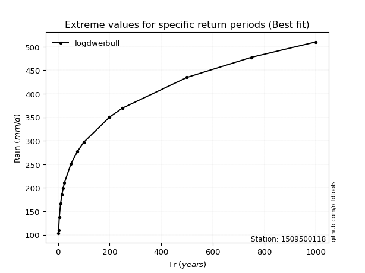</img>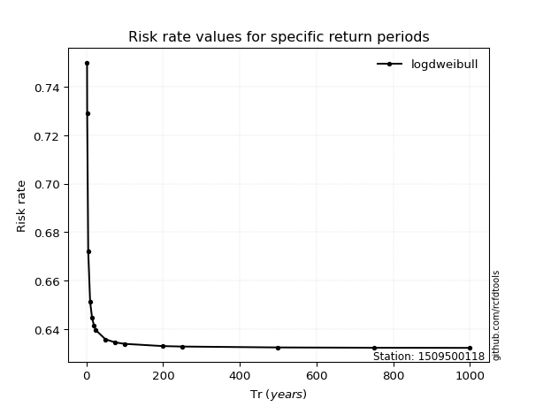</img>

</div>


<sub>**APP DISCLAIMER**: NO WARRANTY - This software is provided by [github.com/rcfdtools](https://github.com/rcfdtools) "as is", without any express or implied warranty, including warranties of merchantability, fitness for a particular purpose, or non-infringement. There is no guarantee that the software will be error-free or operate without interruption. LIMITATION OF LIABILITY - Neither the authors nor copyright holders will be liable for claims or damages arising from the software or its use. You are responsible for determining if the software is appropriate for your use and assume all associated risks, including errors, legal compliance, and data loss. NO PROFESSIONAL ADVICE - The software provides general information and does not offer professional advice. It should not replace consultation with professional advisors.</sub>