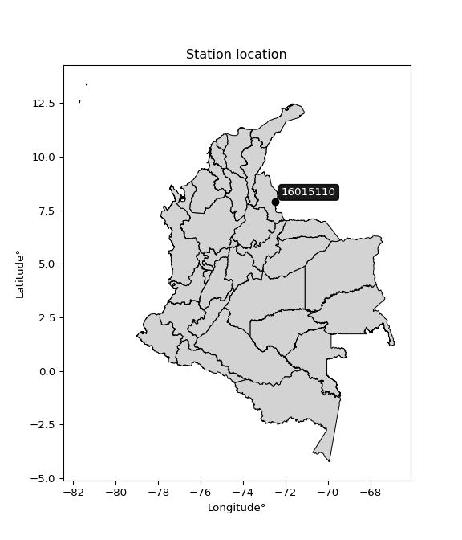

<div align="center">


</div>

# PMax24h Station (Rain, Pmax24h): 16015110

Maximum Precipitation in 24 hours (PMax24h) is the greatest amount of rainfall for a specific duration that is meteorologically possible for a given location, acting as a "worst-case" scenario for extreme storms, crucial for designing safety-critical infrastructure like bridges, river deviations, dams, spillways, and nuclear plants to prevent catastrophic failure. The PMax24h is related with the Probable Maximum Precipitation (PMP) and it is calculated by hydrologists using meteorological data to determine the upper limit of extreme rainfall, often leading to the Probable Maximum Flood (PMF) for flood control design, and is increasingly being studied for climate change impacts. Probable Maximum Precipitation (PMP) is the theoretical upper limit of rainfall, a deterministic estimate for extreme events, while probability distributions (like GEV, Gumbel) describe the likelihood and frequency of various precipitation amounts, including rare ones, showing how often events occur, with PMP representing the extreme end of these distributions, used for critical infrastructure design to ensure safety against the worst conceivable weather, unlike standard statistical forecasts which cover typical probabilities.

The most common probability distributions in hydrology, used for analyzing floods, rainfall, and streamflow, include the Normal, Log-Normal, Gumbel, Gamma (including Log-Pearson Type III), and Generalized Extreme Value (GEV) distributions, often chosen based on the data´s skewness and whether modeling extremes or general conditions, with Gumbel and GEV popular for extreme events like floods, while the Normal distribution serves as a baseline, though often requiring transformations for skewed hydrological data. These distributions help in designing water infrastructure, managing water resources, and forecasting hydrologic events.

> Hydrological data often isn´t perfectly normal (it´s skewed), so different distributions are needed for different applications, such as: **Flood Frequency Analysis**: Using Gumbel, GEV, or Log-Pearson Type III for predicting extreme flood magnitudes and their return periods, **Rainfall Analysis**: Normal for annual totals, but Log-Normal, Weibull, or GEV for intensity or extreme daily rainfall, **Streamflow Modeling**: Gamma and Log-Normal for maximum flows, GEV for minimum flows, and Kappa for daily flows.

<div align="center">

</img>

</div>


## A. General information


### 1. General running parameters

• app_version: _v20260225_. • runtime: _2026-02-27 14:50:08.749431_. • Python version: _3.14.0_. • SciPy version: _1.16.3_. • Pandas version: _2.3.3_. • NumPy version: _2.3.5_. • Stations dataset (station_dataset_file): _dataset/pmax24h_in/automatic_colombia_2003_2025.csv_. • Stations catalog (station_catalog_file): _dataset/CNE.xls_. • Minimum year to eval til year_max (date_min): _1900_. • Maximum year to eval since year_min (date_max): _2025_. • Creates, save and include plots into reports (create_plot): _False_. • Plot only fit distributions with Δo > Δ (plot_only_fit): _True_. • Plot only simple graphs avoiding multiple CDFs and multiple Extreme values plots (plot_only_simple): _False_. • Eval low extreme values, if False, evaluates high extreme values (low_extreme): _False_. • Eval every SciPy distribution as logarithmic (pdist_logarithmic_on): _True_. • Standard deviation normalized (ddof): _1.0_. • Return periods to eval in years (Tr): _[2, 2.33, 5, 10, 15, 20, 25, 50, 75, 100, 200, 250, 500, 750, 1000]_. • Minimum data sample per station, 0 means any (minimum_sample): _5_. • Z-Score maximum threshold to adjust a value, 0 means disable (zscore_max): _3.5_. • Z-Score minimum threshold to adjust a value, 0 means disable (zscore_min): _-2.5_. • Avoid zeros, e.g. rain = 0 (avoid_zeros): _True_. • Avoid null values (avoid_nans): _True_. 

:file_folder:Table: [dataset.csv](../../dataset/pmax24h_in/automatic_colombia_2003_2025.csv)

> Delta Degrees of Freedom (DDOF): is a parameter used in the formulas for calculating variance and standard deviation. When ddof=0, the divisor is $N$ (the total number of observations) and this is used when your data set is the entire population. When ddof=1, the divisor is $N-1$ and this is used when your data set is a sample drawn from a larger population. Using $N-1$ provides an unbiased estimate of the population variance (known as Bessel´s correction).


### 2. Station info and location

|   id |   CODIGO | NOMBRE                                                   | CATEGORIA               | TECNOLOGIA                              | ESTADO   | FECHA_INSTALACION   |   FECHA_SUSPENSION |   ALTITUD |   LATITUD |   LONGITUD | DEPARTAMENTO       | MUNICIPIO   | AREA_OPERATIVA                         | ENTIDAD                                                     | AREA_HIDROGRAFICA   | ZONA_HIDROGRAFICA   | SUBZONA_HIDROGRAFICA   |   CORRIENTE | Catalogo   |   Version |
|-----:|---------:|:---------------------------------------------------------|:------------------------|:----------------------------------------|:---------|:--------------------|-------------------:|----------:|----------:|-----------:|:-------------------|:------------|:---------------------------------------|:------------------------------------------------------------|:--------------------|:--------------------|:-----------------------|------------:|:-----------|----------:|
|    0 | 16015110 | UNIVERSIDAD FRANCISO DE PAULA SANTANDER - AUT [16015110] | Climatológica Principal | Automática con Telemetría, Convencional | Activa   | 11/10/2005          |                nan |       311 |   7.89878 |   -72.4872 | Norte De Santander | Cúcuta      | Area Operativa 08 - Santanderes-Arauca | INSTITUTO DE HIDROLOGIA METEOROLOGIA Y ESTUDIOS AMBIENTALES | Caribe              | Catatumbo           | Río Pamplonita         |         nan | CNE_IDEAM  |  20251226 |

<div align="center">

Dynamic map: [:earth_americas:Google](http://maps.google.com/maps?q=7.898777778,-72.48716667) [:earth_americas:OSM](https://www.openstreetmap.org/#map=18/7.898777778/-72.48716667&layers=P) [:earth_americas:Bing](https://www.bing.com/maps?cp=7.898777778~-72.48716667&lvl=18) [:earth_americas:Apple](https://maps.apple.com/frame?center=7.898777778%2C-72.48716667&span=0.003%2C0.006)

</div>


<div align="center">

```geojson
{
  "type": "Feature",
  "geometry": {
    "type": "Point", 
    "coordinates": [-72.48716667, 7.898777778]
  }, 
  "properties": {
    "Name": "16015110"
  }
}
```

</div>


### 3. Discrete values table and plot

<div align="center">

|               |           0 |          1 |           2 |           3 |           4 |          5 |          6 |           7 |           8 |          9 |          10 |          11 |          12 |          13 |          14 |          15 |          16 |         17 |          18 |          19 |
|:--------------|------------:|-----------:|------------:|------------:|------------:|-----------:|-----------:|------------:|------------:|-----------:|------------:|------------:|------------:|------------:|------------:|------------:|------------:|-----------:|------------:|------------:|
| Date          | 2005        | 2006       | 2007        | 2008        | 2009        | 2010       | 2011       | 2012        | 2013        | 2014       | 2015        | 2016        | 2017        | 2018        | 2019        | 2020        | 2022        | 2023       | 2024        | 2025        |
| Value         |    4        |   54.8     |   21.5      |   36.5      |   45.5      |  140.3     |   85.1     |   26.9      |   28        |  134.5     |   34.1      |   26        |   29        |   16.2      |   31.5      |    3.4      |   56.7      |    0.4     |   31.2      |   23.9      |
| Value_initial |    4        |   54.8     |   21.5      |   36.5      |   45.5      |  140.3     |   85.1     |   26.9      |   28        |  134.5     |   34.1      |   26        |   29        |   16.2      |   31.5      |    3.4      |   56.7      |    0.4     |   31.2      |   23.9      |
| count         |   20        |   20       |   20        |   20        |   20        |   20       |   20       |   20        |   20        |   20       |   20        |   20        |   20        |   20        |   20        |   20        |   20        |   20       |   20        |   20        |
| mean          |   41.475    |   41.475   |   41.475    |   41.475    |   41.475    |   41.475   |   41.475   |   41.475    |   41.475    |   41.475   |   41.475    |   41.475    |   41.475    |   41.475    |   41.475    |   41.475    |   41.475    |   41.475   |   41.475    |   41.475    |
| std           |   38.1893   |   38.1893  |   38.1893   |   38.1893   |   38.1893   |   38.1893  |   38.1893  |   38.1893   |   38.1893   |   38.1893  |   38.1893   |   38.1893   |   38.1893   |   38.1893   |   38.1893   |   38.1893   |   38.1893   |   38.1893  |   38.1893   |   38.1893   |
| zscore        |   -0.981296 |    0.34892 |   -0.523053 |   -0.130272 |    0.105396 |    2.58777 |    1.14234 |   -0.381652 |   -0.352848 |    2.43589 |   -0.193117 |   -0.405218 |   -0.326662 |   -0.661835 |   -0.261199 |   -0.997008 |    0.398672 |   -1.07556 |   -0.269055 |   -0.460208 |


</div>


> The initial value (value_initial) correspond to the initial obtained or null completed value, and value (value) is adjusted only when the initial value is outside the valid range (outlier) definite through the Z-Score value. If Z-Score is active, values out of range or outliers are replaced with the station mean value. A Z-Score (or standard score) measures how many standard deviations a data point is from the mean of a dataset, indicating its relative position; positive scores mean above the mean, negative mean below, and a score of zero is exactly at the mean, allowing for comparison of values from different distributions. It´s calculated using the formula $z=(x–μ)/σ$, where $x$ is the data point, $μ$ is the mean, and $σ$ is the standard deviation, helping identify outliers and understand probability.
>
> <sub>**Note**: In this study, "completing" (filling gaps in) and "extending" (forecasting or lengthening the historical record) rainfall data series are avoided for certain critical analyses because they introduce artificial bias and uncertainty, which can distort the statistics of rare events (extremes), alter day-to-day variability, and compromise the integrity and homogeneity of the original data. Some reasons against Completing/Extending rainfall data are: **Distortion of Extremes and Variability**: The primary issue is that most gap-filling or extension methods rely on averaging or regression with nearby stations, which inherently smooths the data. Rainfall is highly variable in space and time, with a large percentage of zero values and occasional large storms. Infilling methods often underestimate the highest values and overestimate the lowest (zero) values, which severely distorts analyses focused on flood frequency, drought severity, and intensity-duration-frequency (IDF) curves, **Loss of Data Homogeneity**: Infilled or extended data are synthetic estimates, not actual measurements. Combining these estimates with observed data can violate the assumption of data homogeneity, which requires that the data properties do not change over time. Inhomogeneity can lead to incorrect conclusions about long-term trends or changes in climate patterns, **Propagation of Errors**: Errors and biases from the original data (e.g., wind-induced undercatch, instrument errors, site changes) or the data used for imputation can propagate through the analysis, leading to unreliable hydrological models and inaccurate predictions, **Compromised Statistical Integrity**: For statistical analyses, especially those involving the frequency of events, using artificial data can introduce time bias or autocorrelation that doesn´t exist in reality, making it difficult to assess the true probability of events, **Difficulty in Validation**: It is difficult to accurately validate the quality of filled or extended data, especially for past periods where ground-truth measurements are unavailable. The reliability of imputation techniques heavily depends on the density of the surrounding station network and the complexity of the local topography.</sub>


### 4. Active continuous probability distributions from SciPy (80 of 104 available)

A Probability Density Function (PDF) describes the relative likelihood of a continuous random variable falling within a specific range, where the total area under its curve equals 1, and the area over any interval gives the actual probability for that range. Unlike discrete probabilities (like rolling a die), a PDF shows density, not direct probability for a single point (which is zero), with higher points indicating higher likelihood, often visualized as a bell curve for normal distributions.

A log of a probability density function (log-PDF) is simply the logarithm of the PDF´s value, denoted as $log(f(x))$, useful for converting multiplication of probabilities into addition, improving numerical stability with tiny numbers, and connecting to information theory concepts like entropy. Instead of dealing with very small probabilities (e.g., 0.000001), log-PDFs use negative numbers (e.g., $log(0.00001) ≈ -11.51$ that are easier for computers to handle, preventing underflow errors and simplifying complex calculations. In this study, each active probability distribution from SciPy is also evaluated in the $log$ form.

[scipy.stats](https://docs.scipy.org/doc/scipy/reference/stats.html) is a Python´s powerful submodule within the SciPy library for comprehensive statistical analysis, offering over 130 probability distributions (like Normal, Poisson, etc.), functions for descriptive stats (mean, variance), hypothesis testing (t-tests, chi-square), random variable generation, and statistical tests, making it essential for data science, modeling, and research. It provides tools to explore, model, and draw conclusions from data efficiently, working seamlessly with [NumPy](https://numpy.org/).

<div align="center">

|   id | p_dist           |   n_parameter | fit_method   | label                                                                       | active   | ref                                                                                                      |
|-----:|:-----------------|--------------:|:-------------|:----------------------------------------------------------------------------|:---------|:---------------------------------------------------------------------------------------------------------|
|    0 | alpha            |             3 | MLE          | Alpha                                                                       | True     | [:mortar_board:](https://docs.scipy.org/doc/scipy/reference/generated/scipy.stats.alpha.html)            |
|    1 | anglit           |             2 | MM           | Anglit                                                                      | True     | [:mortar_board:](https://docs.scipy.org/doc/scipy/reference/generated/scipy.stats.anglit.html)           |
|    2 | arcsine          |             2 | MM           | Arcsine                                                                     | True     | [:mortar_board:](https://docs.scipy.org/doc/scipy/reference/generated/scipy.stats.arcsine.html)          |
|    3 | argus            |             3 | MLE          | Argus                                                                       | True     | [:mortar_board:](https://docs.scipy.org/doc/scipy/reference/generated/scipy.stats.argus.html)            |
|    4 | beta             |             4 | MLE          | Beta                                                                        | True     | [:mortar_board:](https://docs.scipy.org/doc/scipy/reference/generated/scipy.stats.beta.html)             |
|    5 | betaprime        |             4 | MLE          | Beta prime                                                                  | True     | [:mortar_board:](https://docs.scipy.org/doc/scipy/reference/generated/scipy.stats.betaprime.html)        |
|    6 | bradford         |             3 | MLE          | Bradford                                                                    | True     | [:mortar_board:](https://docs.scipy.org/doc/scipy/reference/generated/scipy.stats.bradford.html)         |
|    7 | burr             |             4 | MLE          | Burr (Type III)                                                             | True     | [:mortar_board:](https://docs.scipy.org/doc/scipy/reference/generated/scipy.stats.burr.html)             |
|    8 | burr12           |             4 | MLE          | Burr (Type III) 12                                                          | True     | [:mortar_board:](https://docs.scipy.org/doc/scipy/reference/generated/scipy.stats.burr12.html)           |
|    9 | cosine           |             2 | MLE          | Cosine                                                                      | True     | [:mortar_board:](https://docs.scipy.org/doc/scipy/reference/generated/scipy.stats.cosine.html)           |
|   10 | crystalball      |             4 | MLE          | Crystalball                                                                 | True     | [:mortar_board:](https://docs.scipy.org/doc/scipy/reference/generated/scipy.stats.crystalball.html)      |
|   11 | dgamma           |             3 | MLE          | Double gamma                                                                | True     | [:mortar_board:](https://docs.scipy.org/doc/scipy/reference/generated/scipy.stats.dgamma.html)           |
|   12 | dweibull         |             3 | MLE          | Double Weibull                                                              | True     | [:mortar_board:](https://docs.scipy.org/doc/scipy/reference/generated/scipy.stats.dweibull.html)         |
|   13 | erlang           |             3 | MLE          | Erlang                                                                      | True     | [:mortar_board:](https://docs.scipy.org/doc/scipy/reference/generated/scipy.stats.erlang.html)           |
|   14 | exponnorm        |             3 | MLE          | Exponentially modified Normal                                               | True     | [:mortar_board:](https://docs.scipy.org/doc/scipy/reference/generated/scipy.stats.exponnorm.html)        |
|   15 | exponpow         |             3 | MLE          | Exponential power                                                           | True     | [:mortar_board:](https://docs.scipy.org/doc/scipy/reference/generated/scipy.stats.exponpow.html)         |
|   16 | exponweib        |             4 | MLE          | Exponentiated Weibull                                                       | True     | [:mortar_board:](https://docs.scipy.org/doc/scipy/reference/generated/scipy.stats.exponweib.html)        |
|   17 | f                |             4 | MLE          | F                                                                           | True     | [:mortar_board:](https://docs.scipy.org/doc/scipy/reference/generated/scipy.stats.f.html)                |
|   18 | fatiguelife      |             3 | MLE          | Fatigue-life (Birnbaum-Saunders)                                            | True     | [:mortar_board:](https://docs.scipy.org/doc/scipy/reference/generated/scipy.stats.fatiguelife.html)      |
|   19 | foldnorm         |             3 | MM           | Fold Normal                                                                 | True     | [:mortar_board:](https://docs.scipy.org/doc/scipy/reference/generated/scipy.stats.foldnorm.html)         |
|   20 | gamma            |             3 | MLE          | Gamma                                                                       | True     | [:mortar_board:](https://docs.scipy.org/doc/scipy/reference/generated/scipy.stats.gamma.html)            |
|   21 | gausshyper       |             6 | MLE          | Gauss hypergeometric                                                        | True     | [:mortar_board:](https://docs.scipy.org/doc/scipy/reference/generated/scipy.stats.gausshyper.html)       |
|   22 | genexpon         |             5 | MLE          | Generalized exponential                                                     | True     | [:mortar_board:](https://docs.scipy.org/doc/scipy/reference/generated/scipy.stats.genexpon.html)         |
|   23 | genextreme       |             3 | MLE          | Generalized exponential                                                     | True     | [:mortar_board:](https://docs.scipy.org/doc/scipy/reference/generated/scipy.stats.genextreme.html)       |
|   24 | gengamma         |             4 | MLE          | Generalized gamma                                                           | True     | [:mortar_board:](https://docs.scipy.org/doc/scipy/reference/generated/scipy.stats.gengamma.html)         |
|   25 | genhalflogistic  |             3 | MLE          | Generalized half-logistic                                                   | True     | [:mortar_board:](https://docs.scipy.org/doc/scipy/reference/generated/scipy.stats.genhalflogistic.html)  |
|   26 | genlogistic      |             3 | MLE          | Generalized logistic                                                        | True     | [:mortar_board:](https://docs.scipy.org/doc/scipy/reference/generated/scipy.stats.genlogistic.html)      |
|   27 | gennorm          |             3 | MLE          | Generalized Normal                                                          | True     | [:mortar_board:](https://docs.scipy.org/doc/scipy/reference/generated/scipy.stats.gennorm.html)          |
|   28 | genpareto        |             3 | MLE          | Generalized Pareto                                                          | True     | [:mortar_board:](https://docs.scipy.org/doc/scipy/reference/generated/scipy.stats.genpareto.html)        |
|   29 | gompertz         |             3 | MLE          | Gompertz (or truncated Gumbel)                                              | True     | [:mortar_board:](https://docs.scipy.org/doc/scipy/reference/generated/scipy.stats.gompertz.html)         |
|   30 | gumbel_l         |             2 | MM           | Gumbel Left Skew                                                            | True     | [:mortar_board:](https://docs.scipy.org/doc/scipy/reference/generated/scipy.stats.gumbel_l.html)         |
|   31 | gumbel_r         |             2 | MM           | Gumbel Right Skew                                                           | True     | [:mortar_board:](https://docs.scipy.org/doc/scipy/reference/generated/scipy.stats.gumbel_r.html)         |
|   32 | halfgennorm      |             3 | MLE          | Upper half of a generalized normal                                          | True     | [:mortar_board:](https://docs.scipy.org/doc/scipy/reference/generated/scipy.stats.halfgennorm.html)      |
|   33 | halflogistic     |             2 | MM           | Half-logistic                                                               | True     | [:mortar_board:](https://docs.scipy.org/doc/scipy/reference/generated/scipy.stats.halflogistic.html)     |
|   34 | halfnorm         |             2 | MM           | Half Normal                                                                 | True     | [:mortar_board:](https://docs.scipy.org/doc/scipy/reference/generated/scipy.stats.halfnorm.html)         |
|   35 | hypsecant        |             2 | MM           | hyperbolic secant                                                           | True     | [:mortar_board:](https://docs.scipy.org/doc/scipy/reference/generated/scipy.stats.hypsecant.html)        |
|   36 | invgamma         |             3 | MLE          | Inverted gamma                                                              | True     | [:mortar_board:](https://docs.scipy.org/doc/scipy/reference/generated/scipy.stats.invgamma.html)         |
|   37 | invgauss         |             3 | MLE          | Inverse Gaussian                                                            | True     | [:mortar_board:](https://docs.scipy.org/doc/scipy/reference/generated/scipy.stats.invgauss.html)         |
|   38 | invweibull       |             3 | MLE          | Inverted Weibull                                                            | True     | [:mortar_board:](https://docs.scipy.org/doc/scipy/reference/generated/scipy.stats.invweibull.html)       |
|   39 | johnsonsb        |             4 | MLE          | Johnson SB                                                                  | True     | [:mortar_board:](https://docs.scipy.org/doc/scipy/reference/generated/scipy.stats.johnsonsb.html)        |
|   40 | johnsonsu        |             4 | MLE          | Johnson Su                                                                  | True     | [:mortar_board:](https://docs.scipy.org/doc/scipy/reference/generated/scipy.stats.johnsonsu.html)        |
|   41 | kappa3           |             3 | MLE          | Kappa 3                                                                     | True     | [:mortar_board:](https://docs.scipy.org/doc/scipy/reference/generated/scipy.stats.kappa3.html)           |
|   42 | kappa4           |             4 | MLE          | Kappa 4                                                                     | True     | [:mortar_board:](https://docs.scipy.org/doc/scipy/reference/generated/scipy.stats.kappa4.html)           |
|   43 | ksone            |             3 | MLE          | Kolmogorov-Smirnov one-sided test statistic distribution                    | True     | [:mortar_board:](https://docs.scipy.org/doc/scipy/reference/generated/scipy.stats.ksone.html)            |
|   44 | kstwobign        |             2 | MLE          | Limiting distribution of scaled Kolmogorov-Smirnov two-sided test statistic | True     | [:mortar_board:](https://docs.scipy.org/doc/scipy/reference/generated/scipy.stats.kstwobign.html)        |
|   45 | laplace          |             2 | MM           | Laplace                                                                     | True     | [:mortar_board:](https://docs.scipy.org/doc/scipy/reference/generated/scipy.stats.laplace.html)          |
|   46 | levy_l           |             2 | MLE          | Left-skewed Levy                                                            | True     | [:mortar_board:](https://docs.scipy.org/doc/scipy/reference/generated/scipy.stats.levy_l.html)           |
|   47 | loggamma         |             3 | MLE          | Log gamma                                                                   | True     | [:mortar_board:](https://docs.scipy.org/doc/scipy/reference/generated/scipy.stats.loggamma.html)         |
|   48 | logistic         |             2 | MM           | Logistic (or Sech-squared)                                                  | True     | [:mortar_board:](https://docs.scipy.org/doc/scipy/reference/generated/scipy.stats.logistic.html)         |
|   49 | loglaplace       |             3 | MLE          | Log-Laplace                                                                 | True     | [:mortar_board:](https://docs.scipy.org/doc/scipy/reference/generated/scipy.stats.loglaplace.html)       |
|   50 | lomax            |             3 | MLE          | Lomax (Pareto of the second kind)                                           | True     | [:mortar_board:](https://docs.scipy.org/doc/scipy/reference/generated/scipy.stats.lomax.html)            |
|   51 | maxwell          |             2 | MM           | Maxwell                                                                     | True     | [:mortar_board:](https://docs.scipy.org/doc/scipy/reference/generated/scipy.stats.maxwell.html)          |
|   52 | mielke           |             4 | MLE          | Mielke Beta-Kappa / Dagum                                                   | True     | [:mortar_board:](https://docs.scipy.org/doc/scipy/reference/generated/scipy.stats.mielke.html)           |
|   53 | moyal            |             2 | MM           | Moyal                                                                       | True     | [:mortar_board:](https://docs.scipy.org/doc/scipy/reference/generated/scipy.stats.moyal.html)            |
|   54 | nakagami         |             3 | MLE          | Nakagami                                                                    | True     | [:mortar_board:](https://docs.scipy.org/doc/scipy/reference/generated/scipy.stats.nakagami.html)         |
|   55 | ncf              |             5 | MLE          | Non-central F distribution                                                  | True     | [:mortar_board:](https://docs.scipy.org/doc/scipy/reference/generated/scipy.stats.ncf.html)              |
|   56 | nct              |             4 | MLE          | Non-central Student’s t                                                     | True     | [:mortar_board:](https://docs.scipy.org/doc/scipy/reference/generated/scipy.stats.nct.html)              |
|   57 | norm             |             2 | MM           | Normal                                                                      | True     | [:mortar_board:](https://docs.scipy.org/doc/scipy/reference/generated/scipy.stats.norm.html)             |
|   58 | pearson3         |             3 | MM           | Pearson type III                                                            | True     | [:mortar_board:](https://docs.scipy.org/doc/scipy/reference/generated/scipy.stats.pearson3.html)         |
|   59 | powerlaw         |             3 | MLE          | Power-function                                                              | True     | [:mortar_board:](https://docs.scipy.org/doc/scipy/reference/generated/scipy.stats.powerlaw.html)         |
|   60 | rayleigh         |             2 | MM           | Rayleigh                                                                    | True     | [:mortar_board:](https://docs.scipy.org/doc/scipy/reference/generated/scipy.stats.rayleigh.html)         |
|   61 | rdist            |             3 | MLE          | R-distributed (symmetric beta)                                              | True     | [:mortar_board:](https://docs.scipy.org/doc/scipy/reference/generated/scipy.stats.rdist.html)            |
|   62 | rice             |             3 | MLE          | Rice                                                                        | True     | [:mortar_board:](https://docs.scipy.org/doc/scipy/reference/generated/scipy.stats.rice.html)             |
|   63 | semicircular     |             2 | MM           | Semicircular                                                                | True     | [:mortar_board:](https://docs.scipy.org/doc/scipy/reference/generated/scipy.stats.semicircular.html)     |
|   64 | skewnorm         |             3 | MLE          | Skew normal                                                                 | True     | [:mortar_board:](https://docs.scipy.org/doc/scipy/reference/generated/scipy.stats.skewnorm.html)         |
|   65 | t                |             3 | MLE          | Student’s t                                                                 | True     | [:mortar_board:](https://docs.scipy.org/doc/scipy/reference/generated/scipy.stats.t.html)                |
|   66 | trapezoid        |             4 | MLE          | Trapezoid                                                                   | True     | [:mortar_board:](https://docs.scipy.org/doc/scipy/reference/generated/scipy.stats.trapezoid.html)        |
|   67 | triang           |             3 | MLE          | Triangular                                                                  | True     | [:mortar_board:](https://docs.scipy.org/doc/scipy/reference/generated/scipy.stats.triang.html)           |
|   68 | truncexpon       |             3 | MLE          | Truncated exponential                                                       | True     | [:mortar_board:](https://docs.scipy.org/doc/scipy/reference/generated/scipy.stats.truncexpon.html)       |
|   69 | truncnorm        |             4 | MLE          | Truncated normal                                                            | True     | [:mortar_board:](https://docs.scipy.org/doc/scipy/reference/generated/scipy.stats.truncnorm.html)        |
|   70 | truncpareto      |             4 | MLE          | Upper truncated Pareto                                                      | True     | [:mortar_board:](https://docs.scipy.org/doc/scipy/reference/generated/scipy.stats.truncpareto.html)      |
|   71 | truncweibull_min |             5 | MLE          | Doubly truncated Weibull minimum                                            | True     | [:mortar_board:](https://docs.scipy.org/doc/scipy/reference/generated/scipy.stats.truncweibull_min.html) |
|   72 | tukeylambda      |             3 | MLE          | Tukey-Lamdba                                                                | True     | [:mortar_board:](https://docs.scipy.org/doc/scipy/reference/generated/scipy.stats.tukeylambda.html)      |
|   73 | uniform          |             2 | MLE          | Uniform                                                                     | True     | [:mortar_board:](https://docs.scipy.org/doc/scipy/reference/generated/scipy.stats.uniform.html)          |
|   74 | vonmises         |             3 | MLE          | Von Mises                                                                   | True     | [:mortar_board:](https://docs.scipy.org/doc/scipy/reference/generated/scipy.stats.vonmises.html)         |
|   75 | vonmises_line    |             3 | MLE          | Von Mises line                                                              | True     | [:mortar_board:](https://docs.scipy.org/doc/scipy/reference/generated/scipy.stats.vonmises_line.html)    |
|   76 | wald             |             2 | MM           | Wald                                                                        | True     | [:mortar_board:](https://docs.scipy.org/doc/scipy/reference/generated/scipy.stats.wald.html)             |
|   77 | weibull_max      |             3 | MLE          | Weibull maximum                                                             | True     | [:mortar_board:](https://docs.scipy.org/doc/scipy/reference/generated/scipy.stats.weibull_max.html)      |
|   78 | weibull_min      |             3 | MLE          | Weibull minimum                                                             | True     | [:mortar_board:](https://docs.scipy.org/doc/scipy/reference/generated/scipy.stats.weibull_min.html)      |
|   79 | wrapcauchy       |             3 | MLE          | Wrapped  Cauchy                                                             | True     | [:mortar_board:](https://docs.scipy.org/doc/scipy/reference/generated/scipy.stats.wrapcauchy.html)       |

</div>

> **n_parameter:** # arguments & localization & scale.
>
> **Fit methods:** (MLE) maximum likelihood, (MM) L-moments.
>
>**Inactive** (With the only purpose of prevent loops, zero divisions, infinite values, over high estimated values or horizontal trending for recurrence intervals estimations, the follow distributions were disabled.)**:** lognorm, norminvgauss, powernorm, powerlognorm, cauchy, halfcauchy, foldcauchy, skewcauchy, chi2, expon, fisk, genhyperbolic, geninvgauss, gibrat, kstwo, laplace_asymmetric, levy, levy_stable, ncx2, pareto, rel_breitwigner, recipinvgauss, studentized_range, loguniform, 


## B. Probability (PDF) vs. Empirical (EDF) distributions functions

A continuous probability distribution (CPD) describes probabilities for variables that can take any value within a range (like rain any time), unlike discrete variables with specific outcomes (like temperature). It uses a Probability Density Function (PDF), a curve where the total area under it equals 1, and the probability of the variable falling within an interval (a to b) is found by calculating the area under the curve between those points. A key feature is that the probability of hitting any single exact value is zero, so probabilities are always expressed for ranges, e.g., $P(a ≤ X ≤ b)$.

<div align="center">

Distributions parameters from station values
|     |   station | p_dist              |   n |              loc |           scale | shape                  | shape1                 | shape2              | shape3             |
|----:|----------:|:--------------------|----:|-----------------:|----------------:|:-----------------------|:-----------------------|:--------------------|:-------------------|
|   0 |  16015110 | alpha               |  20 |      0.000555608 |     1.77223     | 1.71641371335051e-08   |                        |                     |                    |
|   1 |  16015110 | anglit              |  20 |     41.475       |   108.89        |                        |                        |                     |                    |
|   2 |  16015110 | arcsine             |  20 |    -11.1653      |   105.281       |                        |                        |                     |                    |
|   3 |  16015110 | argus               |  20 |    -54.187       |   198.246       | 9.329360877070067e-07  |                        |                     |                    |
|   4 |  16015110 | beta                |  20 |      0.4         |   140.114       | 0.6293899563095862     | 0.8138211558879075     |                     |                    |
|   5 |  16015110 | betaprime           |  20 |      0.4         |  9515.71        | 0.9650700098980567     | 250.63252634698506     |                     |                    |
|   6 |  16015110 | bradford            |  20 |      0.4         |   139.9         | 2.02221136657215       |                        |                     |                    |
|   7 |  16015110 | burr                |  20 |      0.4         |    62.2103      | 3.062667378247984      | 0.2745147450885787     |                     |                    |
|   8 |  16015110 | burr12              |  20 |      0.292439    |     2.32149e+06 | 1.0460333999975768     | 92347.84935673335      |                     |                    |
|   9 |  16015110 | cosine              |  20 |     50.7446      |    35.5022      |                        |                        |                     |                    |
|  10 |  16015110 | crystalball         |  20 |     41.475       |    37.2223      | 13108.488462634174     | 192.9289653380613      |                     |                    |
|  11 |  16015110 | dgamma              |  20 |     31.2         |    28.9769      | 0.6992608649565695     |                        |                     |                    |
|  12 |  16015110 | dweibull            |  20 |     28           |    31.3935      | 0.7371062884846379     |                        |                     |                    |
|  13 |  16015110 | erlang              |  20 |      0.4         |    42.3829      | 0.8705452601413639     |                        |                     |                    |
|  14 |  16015110 | exponnorm           |  20 |      8.99198     |    10.4442      | 3.1101590674928836     |                        |                     |                    |
|  15 |  16015110 | exponpow            |  20 |      0.4         |    82.478       | 0.6357900786313663     |                        |                     |                    |
|  16 |  16015110 | exponweib           |  20 |      0.4         |     3.14454     | 2.1237020243082174     | 0.3247443007161066     |                     |                    |
|  17 |  16015110 | f                   |  20 |      0.4         |    44.5269      | 1.6109776022936935     | 125.66387447815512     |                     |                    |
|  18 |  16015110 | fatiguelife         |  20 |    -11.1943      |    42.5769      | 0.6885922218017888     |                        |                     |                    |
|  19 |  16015110 | foldnorm            |  20 |    -11.1665      |    65.249       | 0.005222059556545765   |                        |                     |                    |
|  20 |  16015110 | gamma               |  20 |      0.4         |    44.1026      | 0.8730887021995556     |                        |                     |                    |
|  21 |  16015110 | gausshyper          |  20 |      0.4         |   169.419       | 0.8317807690101495     | 2.6229350033595242     | 1.66107489759926    | 0.3308525658836733 |
|  22 |  16015110 | genexpon            |  20 |      0.4         |    63.3191      | 1.0162826556255178     | 0.8077471514017759     | 3.0890948584826594  |                    |
|  23 |  16015110 | genextreme          |  20 |     23.3647      |    20.6582      | -0.2433103315531206    |                        |                     |                    |
|  24 |  16015110 | gengamma            |  20 |      0.4         |    47.4509      | 0.7329299378598514     | 1.2180618889874997     |                     |                    |
|  25 |  16015110 | genhalflogistic     |  20 |      0.4         |    29.4509      | 1.422066307896234e-07  |                        |                     |                    |
|  26 |  16015110 | genlogistic         |  20 |   -143.887       |    23.3134      | 1472.8886504700408     |                        |                     |                    |
|  27 |  16015110 | gennorm             |  20 |     29           |     3.39684     | 0.48956514972423626    |                        |                     |                    |
|  28 |  16015110 | genpareto           |  20 |      0.4         |    46.0301      | -0.11959154287274287   |                        |                     |                    |
|  29 |  16015110 | gompertz            |  20 |      0.399992    |   354.417       | 7.72511333921755       |                        |                     |                    |
|  30 |  16015110 | gumbel_l            |  20 |     58.227       |    29.0221      |                        |                        |                     |                    |
|  31 |  16015110 | gumbel_r            |  20 |     24.723       |    29.0221      |                        |                        |                     |                    |
|  32 |  16015110 | halfgennorm         |  20 |      0.4         |     3.0369      | 0.40429785771360327    |                        |                     |                    |
|  33 |  16015110 | halflogistic        |  20 |     -2.64208     |    31.8237      |                        |                        |                     |                    |
|  34 |  16015110 | halfnorm            |  20 |     -7.79274     |    61.748       |                        |                        |                     |                    |
|  35 |  16015110 | hypsecant           |  20 |     41.475       |    23.6965      |                        |                        |                     |                    |
|  36 |  16015110 | invgamma            |  20 |    -23.6989      |   230.778       | 4.527669233265865      |                        |                     |                    |
|  37 |  16015110 | invgauss            |  20 |    -12.9868      |   115.659       | 0.4708840758685715     |                        |                     |                    |
|  38 |  16015110 | invweibull          |  20 |    -61.5405      |    84.9052      | 4.110001134405163      |                        |                     |                    |
|  39 |  16015110 | johnsonsb           |  20 |     -2.15699     |   193.371       | 1.2461260324596273     | 0.7973651137665014     |                     |                    |
|  40 |  16015110 | johnsonsu           |  20 |     25.6466      |     7.85479     | -0.4005790430338715    | 0.6473600527433411     |                     |                    |
|  41 |  16015110 | kappa3              |  20 |      0.4         |    38.8848      | 2.7521715101378947     |                        |                     |                    |
|  42 |  16015110 | kappa4              |  20 |    -14.7881      |   150.804       | 1.1118080739307437     | 0.971395341256421      |                     |                    |
|  43 |  16015110 | ksone               |  20 |    -13.59        |   167.88        | 1.0                    |                        |                     |                    |
|  44 |  16015110 | kstwobign           |  20 |    -62.1237      |   120.62        |                        |                        |                     |                    |
|  45 |  16015110 | laplace             |  20 |     41.475       |    26.3201      |                        |                        |                     |                    |
|  46 |  16015110 | levy_l              |  20 |    150.409       |    62.9173      |                        |                        |                     |                    |
|  47 |  16015110 | loggamma            |  20 | -11669.1         |  1573.61        | 1705.760481535858      |                        |                     |                    |
|  48 |  16015110 | logistic            |  20 |     41.475       |    20.5217      |                        |                        |                     |                    |
|  49 |  16015110 | loglaplace          |  20 |     -0.0368775   |    31.2368      | 1.243544885465674      |                        |                     |                    |
|  50 |  16015110 | lomax               |  20 |      0.4         |     3.81964e+10 | 899015691.0401198      |                        |                     |                    |
|  51 |  16015110 | maxwell             |  20 |    -46.7262      |    55.2719      |                        |                        |                     |                    |
|  52 |  16015110 | mielke              |  20 |      0.4         |    76.1461      | 0.7320598805818966     | 3.1205938198615506     |                     |                    |
|  53 |  16015110 | moyal               |  20 |     20.1889      |    16.7559      |                        |                        |                     |                    |
|  54 |  16015110 | nakagami            |  20 |      3.4         |    53.375       | 0.4498124100035247     |                        |                     |                    |
|  55 |  16015110 | ncf                 |  20 |      0.4         |     3.46351     | 0.721200991874092      | 9.237875537767628      | 6.062258436995024   |                    |
|  56 |  16015110 | nct                 |  20 |    -33.3197      |     5.77269     | 3.7645523572741637     | 10.203507855787725     |                     |                    |
|  57 |  16015110 | norm                |  20 |     41.475       |    37.2223      |                        |                        |                     |                    |
|  58 |  16015110 | pearson3            |  20 |     41.4749      |    37.2224      | 1.588734064629572      |                        |                     |                    |
|  59 |  16015110 | powerlaw            |  20 |      0.4         |   139.9         | 0.27921794963428204    |                        |                     |                    |
|  60 |  16015110 | rayleigh            |  20 |    -29.7334      |    56.8161      |                        |                        |                     |                    |
|  61 |  16015110 | rdist               |  20 |    -12.56        |    69.26        | 1.1437267364337829     |                        |                     |                    |
|  62 |  16015110 | rice                |  20 |    -15.6324      |    48.2014      | 0.0007210032196587023  |                        |                     |                    |
|  63 |  16015110 | semicircular        |  20 |     41.475       |    74.4446      |                        |                        |                     |                    |
|  64 |  16015110 | skewnorm            |  20 |      0.399992    |    55.4298      | 33593641.22231206      |                        |                     |                    |
|  65 |  16015110 | t                   |  20 |     28.7876      |    10.734       | 1.0867518732521564     |                        |                     |                    |
|  66 |  16015110 | trapezoid           |  20 |    -14.2695      |   167.88        | 1.0                    | 1.0                    |                     |                    |
|  67 |  16015110 | triang              |  20 |      0.354955    |   156.44        | 9.489939547351256e-11  |                        |                     |                    |
|  68 |  16015110 | truncexpon          |  20 |      0.399987    |   180.211       | 0.776310586109574      |                        |                     |                    |
|  69 |  16015110 | truncnorm           |  20 |    -37.0924      |    67.9166      | 0.5520361383759214     | 171.0566583694881      |                     |                    |
|  70 |  16015110 | truncpareto         |  20 |      0.4         |     6.18253e-08 | 0.05263158161421275    | 2262827426.7501435     |                     |                    |
|  71 |  16015110 | truncweibull_min    |  20 |      0.0191313   |   106.053       | 0.7262576109464896     | 0.0035912850198549125  | 1.3227451893905555  |                    |
|  72 |  16015110 | tukeylambda         |  20 |     42.75        |    82.1555      | 1.9399154317696037     |                        |                     |                    |
|  73 |  16015110 | uniform             |  20 |      0.4         |   139.9         |                        |                        |                     |                    |
|  74 |  16015110 | vonmises            |  20 |      2.9973      |     1           | 0.3443493661863254     |                        |                     |                    |
|  75 |  16015110 | vonmises_line       |  20 |     29.9661      |    17.5497      | 1.3971283149677536     |                        |                     |                    |
|  76 |  16015110 | wald                |  20 |      4.25273     |    37.2223      |                        |                        |                     |                    |
|  77 |  16015110 | weibull_max         |  20 |    140.3         |     1.59255     | 0.2521622423732657     |                        |                     |                    |
|  78 |  16015110 | weibull_min         |  20 |      0.4         |    37.06        | 0.9165170712271675     |                        |                     |                    |
|  79 |  16015110 | wrapcauchy          |  20 |      0.399985    |    22.2658      | 0.24232274914398144    |                        |                     |                    |
|  80 |  16015110 | logalpha            |  20 |     -1.519       |     1.70758     | 3.675180268323973e-09  |                        |                     |                    |
|  81 |  16015110 | loganglit           |  20 |      3.20679     |     3.81337     |                        |                        |                     |                    |
|  82 |  16015110 | logarcsine          |  20 |      1.36328     |     3.68701     |                        |                        |                     |                    |
|  83 |  16015110 | logargus            |  20 |     -2.01867     |     7.04067     | 2.2908553918738246     |                        |                     |                    |
|  84 |  16015110 | logbeta             |  20 |     -7.73248     |    12.6763      | 6.235876386340779      | 0.9167241098194792     |                     |                    |
|  85 |  16015110 | logbetaprime        |  20 |   -670.853       |  1161.46        | 418258.5316334545      | 720692.8990899897      |                     |                    |
|  86 |  16015110 | logbradford         |  20 |     -0.936311    |     5.8801      | 5.574007229323027e-07  |                        |                     |                    |
|  87 |  16015110 | logburr             |  20 |  -9219.06        |  9202.8         | 5358.120159654476      | 53532.79185099169      |                     |                    |
|  88 |  16015110 | logburr12           |  20 |  -2532.23        |  2542.92        | 2764.351494054823      | 1897.8103364945155     |                     |                    |
|  89 |  16015110 | logcosine           |  20 |      2.81146     |     1.36847     |                        |                        |                     |                    |
|  90 |  16015110 | logcrystalball      |  20 |      3.20679     |     1.30355     | 287.20385949961553     | 5.687193014010346      |                     |                    |
|  91 |  16015110 | logdgamma           |  20 |      3.3673      |     0.914447    | 0.7796398149544244     |                        |                     |                    |
|  92 |  16015110 | logdweibull         |  20 |      3.3673      |     0.943638    | 0.8476100165736056     |                        |                     |                    |
|  93 |  16015110 | logerlang           |  20 |    -20.9172      |     0.0793758   | 303.94617003981534     |                        |                     |                    |
|  94 |  16015110 | logexponnorm        |  20 |      3.20612     |     1.30354     | 0.000517257978479502   |                        |                     |                    |
|  95 |  16015110 | logexponpow         |  20 |     -0.916291    |     1.93792     | 0.3490842880235291     |                        |                     |                    |
|  96 |  16015110 | logexponweib        |  20 |     -8.59749e+06 |     8.59749e+06 | 0.720704692996899      | 11365124.806873325     |                     |                    |
|  97 |  16015110 | logf                |  20 |     -0.916291    |     1.14138     | 1.1408573271167906     | 1.099325578306661      |                     |                    |
|  98 |  16015110 | logfatiguelife      |  20 |  -1034.22        |  1037.43        | 0.0012552914018707302  |                        |                     |                    |
|  99 |  16015110 | logfoldnorm         |  20 |     -4.18108     |     1.09893     | 6.762367145448454      |                        |                     |                    |
| 100 |  16015110 | loggamma            |  20 |    -20.2015      |     0.0817078   | 286.12743549930167     |                        |                     |                    |
| 101 |  16015110 | loggausshyper       |  20 |     -1.39474     |     6.33853     | 1.3635129769882872     | 0.5172662527866474     | 1.263973527798816   | 0.9780213416500004 |
| 102 |  16015110 | loggenexpon         |  20 |     -1.30697     |     1.43431     | 1.0939817074460138e-10 | 3.332950888109874      | 0.05827404563065629 |                    |
| 103 |  16015110 | loggenextreme       |  20 |      3.03333     |     1.41292     | 0.7072488151693808     |                        |                     |                    |
| 104 |  16015110 | loggengamma         |  20 |     -1.98754e+07 |     1.98754e+07 | 0.7767465384953705     | 25137784.386699207     |                     |                    |
| 105 |  16015110 | loggenhalflogistic  |  20 |     -1.54361     |     6.87343     | 1.0595058357895026     |                        |                     |                    |
| 106 |  16015110 | loggenlogistic      |  20 |      4.05725     |     0.357638    | 0.3504296002601446     |                        |                     |                    |
| 107 |  16015110 | loggennorm          |  20 |      3.3673      |     0.0704309   | 0.42978380114789505    |                        |                     |                    |
| 108 |  16015110 | loggenpareto        |  20 |     -1.09613     |    10.7348      | -1.7773028804503495    |                        |                     |                    |
| 109 |  16015110 | loggompertz         |  20 |     -0.916291    |     0.939676    | 0.0070413378228119     |                        |                     |                    |
| 110 |  16015110 | loggumbel_l         |  20 |      3.79346     |     1.01637     |                        |                        |                     |                    |
| 111 |  16015110 | loggumbel_r         |  20 |      2.62012     |     1.01637     |                        |                        |                     |                    |
| 112 |  16015110 | loghalfgennorm      |  20 |     -0.945206    |     5.90943     | 1064.9601569323722     |                        |                     |                    |
| 113 |  16015110 | loghalflogistic     |  20 |      1.66182     |     1.11446     |                        |                        |                     |                    |
| 114 |  16015110 | loghalfnorm         |  20 |      1.48138     |     2.16247     |                        |                        |                     |                    |
| 115 |  16015110 | loghypsecant        |  20 |      3.20679     |     0.829864    |                        |                        |                     |                    |
| 116 |  16015110 | loginvgamma         |  20 |    -33.8978      | 27388           | 739.4417014908227      |                        |                     |                    |
| 117 |  16015110 | loginvgauss         |  20 |    -13.1192      |  2115.44        | 0.007698534381220833   |                        |                     |                    |
| 118 |  16015110 | loginvweibull       |  20 |     -2.21403e+08 |     2.21403e+08 | 134779044.05042493     |                        |                     |                    |
| 119 |  16015110 | logjohnsonsb        |  20 |   -204.671       |   210.701       | -10.174005022577699    | 2.316298350143608      |                     |                    |
| 120 |  16015110 | logjohnsonsu        |  20 |      3.42367     |     0.237623    | 0.05339066883321543    | 0.5732492114133543     |                     |                    |
| 121 |  16015110 | logkappa3           |  20 |     -0.916291    |     4.89403     | 4.4620985750654665     |                        |                     |                    |
| 122 |  16015110 | logkappa4           |  20 |     -1.23985     |     7.94652     | 1.0128169000722558     | 1.2850888501079787     |                     |                    |
| 123 |  16015110 | logksone            |  20 |     -1.5023      |     7.03209     | 1.0                    |                        |                     |                    |
| 124 |  16015110 | logkstwobign        |  20 |     -4.17231     |     8.52056     |                        |                        |                     |                    |
| 125 |  16015110 | loglaplace          |  20 |      3.20679     |     0.921747    |                        |                        |                     |                    |
| 126 |  16015110 | loglevy_l           |  20 |      5.09636     |     0.878663    |                        |                        |                     |                    |
| 127 |  16015110 | logloggamma         |  20 |      4.09935     |     0.739669    | 0.7047253581647439     |                        |                     |                    |
| 128 |  16015110 | loglogistic         |  20 |      3.20679     |     0.718683    |                        |                        |                     |                    |
| 129 |  16015110 | logloglaplace       |  20 |     -0.916291    |     1.73987     | 0.6187285201661332     |                        |                     |                    |
| 130 |  16015110 | loglomax            |  20 |     -0.916309    | 85394.8         | 23409.247416490536     |                        |                     |                    |
| 131 |  16015110 | logmaxwell          |  20 |      0.117903    |     1.93567     |                        |                        |                     |                    |
| 132 |  16015110 | logmielke           |  20 |     -2.53555e+08 |     2.53555e+08 | 1363161738.37458       | 199431912.77151096     |                     |                    |
| 133 |  16015110 | logmoyal            |  20 |      2.46134     |     0.586802    |                        |                        |                     |                    |
| 134 |  16015110 | lognakagami         |  20 |  -1103.93        |  1107.14        | 180258.1011212769      |                        |                     |                    |
| 135 |  16015110 | logncf              |  20 |     -0.916291    |     1.05798     | 1.124171144710831      | 1.1485909424217748     | 1.088159244884206   |                    |
| 136 |  16015110 | lognct              |  20 |    -76.5658      |     1.22605     | 14599.889987008206     | 65.05991249454263      |                     |                    |
| 137 |  16015110 | lognorm             |  20 |      3.20679     |     1.30355     |                        |                        |                     |                    |
| 138 |  16015110 | logpearson3         |  20 |      3.20679     |     1.30355     | -1.5928074565149646    |                        |                     |                    |
| 139 |  16015110 | logpowerlaw         |  20 |     -0.916291    |     5.86007     | 0.44705602648339515    |                        |                     |                    |
| 140 |  16015110 | lograyleigh         |  20 |      0.713006    |     1.98975     |                        |                        |                     |                    |
| 141 |  16015110 | logrdist            |  20 |     -0.340658    |     5.28444     | 0.8944108171210415     |                        |                     |                    |
| 142 |  16015110 | logrice             |  20 |   -448.532       |     1.30309     | 346.6653794735746      |                        |                     |                    |
| 143 |  16015110 | logsemicircular     |  20 |      3.2068      |     2.60706     |                        |                        |                     |                    |
| 144 |  16015110 | logskewnorm         |  20 |      4.94378     |     2.17173     | -49616431.93238628     |                        |                     |                    |
| 145 |  16015110 | logt                |  20 |      3.43245     |     0.384419    | 1.1105631977035406     |                        |                     |                    |
| 146 |  16015110 | logtrapezoid        |  20 |     -1.57741     |     7.03209     | 0.9999999999999998     | 1.0                    |                     |                    |
| 147 |  16015110 | logtriang           |  20 |     -1.5936      |     6.53741     | 0.9999964159709087     |                        |                     |                    |
| 148 |  16015110 | logtruncexpon       |  20 |     -0.916295    |     8.6805      | 0.6750867824060872     |                        |                     |                    |
| 149 |  16015110 | logtruncnorm        |  20 |      1.37506     |     5.83148     | -0.3935153106065285    | 0.6119748282072748     |                     |                    |
| 150 |  16015110 | logtruncpareto      |  20 |     -0.916291    |     8.7013e-09  | 4.01014288199765e-07   | 898652041.9783094      |                     |                    |
| 151 |  16015110 | logtruncweibull_min |  20 |     -2.1974      |    13.7252      | 2.9327458054791586     | 3.8193732806718496e-05 | 0.5202981776843576  |                    |
| 152 |  16015110 | logtukeylambda      |  20 |      2.84294     |    17.0749      | 4.542145073644036      |                        |                     |                    |
| 153 |  16015110 | loguniform          |  20 |     -0.916291    |     5.86007     |                        |                        |                     |                    |
| 154 |  16015110 | logvonmises         |  20 |     -2.67985     |     1           | 1.6694373678440588     |                        |                     |                    |
| 155 |  16015110 | logvonmises_line    |  20 |      3.38944     |     1.37056     | 2.1007680180419444     |                        |                     |                    |
| 156 |  16015110 | logwald             |  20 |      1.90321     |     1.30357     |                        |                        |                     |                    |
| 157 |  16015110 | logweibull_max      |  20 |      4.94378     |     1.24977     | 0.8459650676575912     |                        |                     |                    |
| 158 |  16015110 | logweibull_min      |  20 |     -0.916291    |     1.55463     | 0.6592449014025439     |                        |                     |                    |
| 159 |  16015110 | logwrapcauchy       |  20 |     -0.916318    |     0.932664    | 0.031606103871545194   |                        |                     |                    |

</div>

> **loc** (Location parameter): This shifts the distribution along the x-axis. For many common distributions, like the normal (Gaussian) distribution, loc represents the mean $μ$. For others, like the uniform distribution, it might represent the minimum value, or for the beta distribution, the left end of the support interval.
>
> **scale** (Scale parameter): This determines the width or spread of the distribution. For the normal distribution, scale represents the standard deviation $σ$. For a uniform distribution, it defines the length of the interval (from $loc$ to $loc + scale$).
>
> **shape** (Shape parameters): Refers to parameters that define the specific form of a probability distribution, distinct from its location (loc) and scale (scale). These parameters are required arguments for most distribution functions. For example, a normal (Gaussian) distribution is fully defined by its location (mean) and scale (standard deviation), so it has no specific shape parameters beyond loc and scale. However, other distributions have intrinsic properties that need specification, as Gamma distribution that takes a shape parameter, often named $a$ or $alpha$.


### 0. Cumulative distribution values - CDF (160 evaluated)

Cumulative Distribution Function (CDF), denoted as $F$<sub>$X$</sub>$(x)$, is a function that gives the probability that a random variable $X$ will take a value less than or equal to a specific value, $x$ (i.e., $(P(X≥x)$. It essentially "accumulates" probabilities from a given point up to the far right (positive infinity), providing a complete picture of the distribution´s probabilities for both discrete (like rain) and continuous (like temperature) variables, helping to find probabilities over ranges or above certain values. Each station is evaluated separately ordering the $x$ values ascending, calculating the CDF and PDF values for the activated distributions and their logarithmic forms.

<div align="center">

CDF ordered by x ascending and calculating $log(f(x))$ separately
|   id |   Station |   date |     x |   count |   mean |     std |    zscore |   Value_initial |   station |   m |      alpha |   alpha_pdf |   anglit |   anglit_pdf |   arcsine |   arcsine_pdf |    argus |   argus_pdf |        beta |       beta_pdf |   betaprime |   betaprime_pdf |    bradford |   bradford_pdf |        burr |    burr_pdf |    burr12 |   burr12_pdf |   cosine |   cosine_pdf |   crystalball |   crystalball_pdf |   dgamma |    dgamma_pdf |   dweibull |   dweibull_pdf |      erlang |   erlang_pdf |   exponnorm |   exponnorm_pdf |    exponpow |   exponpow_pdf |   exponweib |   exponweib_pdf |           f |       f_pdf |   fatiguelife |   fatiguelife_pdf |   foldnorm |   foldnorm_pdf |       gamma |   gamma_pdf |   gausshyper |   gausshyper_pdf |   genexpon |   genexpon_pdf |   genextreme |   genextreme_pdf |    gengamma |   gengamma_pdf |   genhalflogistic |   genhalflogistic_pdf |   genlogistic |   genlogistic_pdf |   gennorm |   gennorm_pdf |   genpareto |   genpareto_pdf |    gompertz |   gompertz_pdf |   gumbel_l |   gumbel_l_pdf |   gumbel_r |   gumbel_r_pdf |   halfgennorm |   halfgennorm_pdf |   halflogistic |   halflogistic_pdf |   halfnorm |   halfnorm_pdf |   hypsecant |   hypsecant_pdf |   invgamma |   invgamma_pdf |   invgauss |   invgauss_pdf |   invweibull |   invweibull_pdf |   johnsonsb |   johnsonsb_pdf |   johnsonsu |   johnsonsu_pdf |      kappa3 |   kappa3_pdf |     kappa4 |   kappa4_pdf |     ksone |   ksone_pdf |   kstwobign |   kstwobign_pdf |   laplace |   laplace_pdf |   levy_l |   levy_l_pdf |    loggamma |   loggamma_pdf |   logistic |   logistic_pdf |   loglaplace |   loglaplace_pdf |       lomax |   lomax_pdf |   maxwell |   maxwell_pdf |      mielke |    mielke_pdf |     moyal |   moyal_pdf |    nakagami |   nakagami_pdf |         ncf |     ncf_pdf |       nct |     nct_pdf |     norm |    norm_pdf |   pearson3 |   pearson3_pdf |   powerlaw |   powerlaw_pdf |   rayleigh |   rayleigh_pdf |    rdist |      rdist_pdf |      rice |    rice_pdf |   semicircular |   semicircular_pdf |   skewnorm |   skewnorm_pdf |        t |       t_pdf |   trapezoid |   trapezoid_pdf |      triang |   triang_pdf |   truncexpon |   truncexpon_pdf |   truncnorm |   truncnorm_pdf |   truncpareto |   truncpareto_pdf |   truncweibull_min |   truncweibull_min_pdf |   tukeylambda |   tukeylambda_pdf |   uniform |   uniform_pdf |   vonmises |   vonmises_pdf |   vonmises_line |   vonmises_line_pdf |     wald |    wald_pdf |   weibull_max |   weibull_max_pdf |   weibull_min |   weibull_min_pdf |   wrapcauchy |   wrapcauchy_pdf |   logalpha |   logalpha_pdf |   loganglit |   loganglit_pdf |   logarcsine |   logarcsine_pdf |   logargus |   logargus_pdf |   logbeta |   logbeta_pdf |   logbetaprime |   logbetaprime_pdf |   logbradford |   logbradford_pdf |     logburr |   logburr_pdf |   logburr12 |   logburr12_pdf |   logcosine |   logcosine_pdf |   logcrystalball |   logcrystalball_pdf |   logdgamma |   logdgamma_pdf |   logdweibull |   logdweibull_pdf |   logerlang |   logerlang_pdf |   logexponnorm |   logexponnorm_pdf |   logexponpow |   logexponpow_pdf |   logexponweib |   logexponweib_pdf |        logf |    logf_pdf |   logfatiguelife |   logfatiguelife_pdf |   logfoldnorm |   logfoldnorm_pdf |   loggausshyper |   loggausshyper_pdf |   loggenexpon |   loggenexpon_pdf |   loggenextreme |   loggenextreme_pdf |   loggengamma |   loggengamma_pdf |   loggenhalflogistic |   loggenhalflogistic_pdf |   loggenlogistic |   loggenlogistic_pdf |   loggennorm |   loggennorm_pdf |   loggenpareto |   loggenpareto_pdf |   loggompertz |   loggompertz_pdf |   loggumbel_l |   loggumbel_l_pdf |   loggumbel_r |   loggumbel_r_pdf |   loghalfgennorm |   loghalfgennorm_pdf |   loghalflogistic |   loghalflogistic_pdf |   loghalfnorm |   loghalfnorm_pdf |   loghypsecant |   loghypsecant_pdf |   loginvgamma |   loginvgamma_pdf |   loginvgauss |   loginvgauss_pdf |   loginvweibull |   loginvweibull_pdf |   logjohnsonsb |   logjohnsonsb_pdf |   logjohnsonsu |   logjohnsonsu_pdf |   logkappa3 |   logkappa3_pdf |   logkappa4 |   logkappa4_pdf |   logksone |   logksone_pdf |   logkstwobign |   logkstwobign_pdf |   loglevy_l |   loglevy_l_pdf |   logloggamma |   logloggamma_pdf |   loglogistic |   loglogistic_pdf |   logloglaplace |   logloglaplace_pdf |    loglomax |   loglomax_pdf |   logmaxwell |   logmaxwell_pdf |   logmielke |   logmielke_pdf |    logmoyal |   logmoyal_pdf |   lognakagami |   lognakagami_pdf |      logncf |   logncf_pdf |      lognct |   lognct_pdf |    lognorm |   lognorm_pdf |   logpearson3 |   logpearson3_pdf |   logpowerlaw |   logpowerlaw_pdf |   lograyleigh |   lograyleigh_pdf |   logrdist |   logrdist_pdf |     logrice |   logrice_pdf |   logsemicircular |   logsemicircular_pdf |   logskewnorm |   logskewnorm_pdf |      logt |   logt_pdf |   logtrapezoid |   logtrapezoid_pdf |   logtriang |   logtriang_pdf |   logtruncexpon |   logtruncexpon_pdf |   logtruncnorm |   logtruncnorm_pdf |   logtruncpareto |   logtruncpareto_pdf |   logtruncweibull_min |   logtruncweibull_min_pdf |   logtukeylambda |   logtukeylambda_pdf |   loguniform |   loguniform_pdf |   logvonmises |   logvonmises_pdf |   logvonmises_line |   logvonmises_line_pdf |   logwald |   logwald_pdf |   logweibull_max |   logweibull_max_pdf |   logweibull_min |   logweibull_min_pdf |   logwrapcauchy |   logwrapcauchy_pdf |
|-----:|----------:|-------:|------:|--------:|-------:|--------:|----------:|----------------:|----------:|----:|-----------:|------------:|---------:|-------------:|----------:|--------------:|---------:|------------:|------------:|---------------:|------------:|----------------:|------------:|---------------:|------------:|------------:|----------:|-------------:|---------:|-------------:|--------------:|------------------:|---------:|--------------:|-----------:|---------------:|------------:|-------------:|------------:|----------------:|------------:|---------------:|------------:|----------------:|------------:|------------:|--------------:|------------------:|-----------:|---------------:|------------:|------------:|-------------:|-----------------:|-----------:|---------------:|-------------:|-----------------:|------------:|---------------:|------------------:|----------------------:|--------------:|------------------:|----------:|--------------:|------------:|----------------:|------------:|---------------:|-----------:|---------------:|-----------:|---------------:|--------------:|------------------:|---------------:|-------------------:|-----------:|---------------:|------------:|----------------:|-----------:|---------------:|-----------:|---------------:|-------------:|-----------------:|------------:|----------------:|------------:|----------------:|------------:|-------------:|-----------:|-------------:|----------:|------------:|------------:|----------------:|----------:|--------------:|---------:|-------------:|------------:|---------------:|-----------:|---------------:|-------------:|-----------------:|------------:|------------:|----------:|--------------:|------------:|--------------:|----------:|------------:|------------:|---------------:|------------:|------------:|----------:|------------:|---------:|------------:|-----------:|---------------:|-----------:|---------------:|-----------:|---------------:|---------:|---------------:|----------:|------------:|---------------:|-------------------:|-----------:|---------------:|---------:|------------:|------------:|----------------:|------------:|-------------:|-------------:|-----------------:|------------:|----------------:|--------------:|------------------:|-------------------:|-----------------------:|--------------:|------------------:|----------:|--------------:|-----------:|---------------:|----------------:|--------------------:|---------:|------------:|--------------:|------------------:|--------------:|------------------:|-------------:|-----------------:|-----------:|---------------:|------------:|----------------:|-------------:|-----------------:|-----------:|---------------:|----------:|--------------:|---------------:|-------------------:|--------------:|------------------:|------------:|--------------:|------------:|----------------:|------------:|----------------:|-----------------:|---------------------:|------------:|----------------:|--------------:|------------------:|------------:|----------------:|---------------:|-------------------:|--------------:|------------------:|---------------:|-------------------:|------------:|------------:|-----------------:|---------------------:|--------------:|------------------:|----------------:|--------------------:|--------------:|------------------:|----------------:|--------------------:|--------------:|------------------:|---------------------:|-------------------------:|-----------------:|---------------------:|-------------:|-----------------:|---------------:|-------------------:|--------------:|------------------:|--------------:|------------------:|--------------:|------------------:|-----------------:|---------------------:|------------------:|----------------------:|--------------:|------------------:|---------------:|-------------------:|--------------:|------------------:|--------------:|------------------:|----------------:|--------------------:|---------------:|-------------------:|---------------:|-------------------:|------------:|----------------:|------------:|----------------:|-----------:|---------------:|---------------:|-------------------:|------------:|----------------:|--------------:|------------------:|--------------:|------------------:|----------------:|--------------------:|------------:|---------------:|-------------:|-----------------:|------------:|----------------:|------------:|---------------:|--------------:|------------------:|------------:|-------------:|------------:|-------------:|-----------:|--------------:|--------------:|------------------:|--------------:|------------------:|--------------:|------------------:|-----------:|---------------:|------------:|--------------:|------------------:|----------------------:|--------------:|------------------:|----------:|-----------:|---------------:|-------------------:|------------:|----------------:|----------------:|--------------------:|---------------:|-------------------:|-----------------:|---------------------:|----------------------:|--------------------------:|-----------------:|---------------------:|-------------:|-----------------:|--------------:|------------------:|-------------------:|-----------------------:|----------:|--------------:|-----------------:|---------------------:|-----------------:|---------------------:|----------------:|--------------------:|
|    0 |  16015110 |   2023 |   0.4 |      20 | 41.475 | 38.1893 | -1.07556  |             0.4 |  16015110 |   1 | 9.1329e-06 | 0.00047105  | 0.157563 |   0.00669172 |  0.215069 |    0.00966866 | 0.111542 |  0.0040057  | 2.24906e-12 | 25500          | 1.57239e-11 |     0.0634767   | 2.27565e-09 |     0.0130695  | 1.44274e-11 | 1.52844     | 0.0019646 |  0.019087    | 0.117005 |  0.00516497  |      0.134904 |       0.00583017  | 0.110696 |   0.00450449  |   0.201375 |    0.00489103  | 1.41692e-10 |  0.633404    |   0.0321166 |     0.00533308  | 2.79544e-12 | 32017.2        | 2.79255e-12 | 34694           | 1.04055e-14 | 37.7471     |     0.0214282 |       0.00783792  |   0.1407   |    0.0120375   | 2.46958e-16 | 3.8842      |  1.09804e-15 |     16.4578      | 7.2015e-12 |    0.0160502   |    0.0258575 |      0.00627134  | 1.07077e-16 |    1.72206     |         0         |           0.0169774   |     0.0488469 |       0.00631916  |  0.116949 |   0.00414153  | 2.19509e-12 |     0.0217249   | 1.67755e-07 |    0.0217967   |   0.127465 |    0.00409935  |  0.0990694 |    0.00789198  |   1.01415e-13 |       0.102017    |      0.0477594 |        0.0156757   |   0.105554 |    0.0128084   |    0.111333 |     0.00460308  |  0.0245958 |    0.00659525  |  0.0220707 |    0.00750464  |    0.0258575 |      0.00627133  |   0.0141723 |      0.0113971  |   0.0525885 |     0.00262862  | 2.17146e-11 |  0.0178018   | 4.4655e-15 |   0.265908   | 0.0833333 |  0.00595664 |   0.0490193 |     0.0064157   |  0.105006 |   0.00398956  | 0.482775 |   0.0013965  | 0.000859614 |     0.00241265 |   0.119042 |    0.00511023  |   0.00570585 |       0.00619026 | 1.02151e-11 | 0.0235367   |  0.133157 |   0.00729613  | 1.95924e-13 | 430.628       | 0.0710905 | 0.00842952  | 0           |    0           | 3.21473e-08 | 2.08829e+08 | 0.0260966 | 0.00638213  | 0.134904 | 0.00583017  |  0.0473311 |    0.0120098   | 7.2776e-06 |    3.66059e+10 |   0.131202 |    0.00811006  | 0.565629 |     0.00511588 | 0.0538134 | 0.00652913  |       0.167484 |         0.00713209 |  0         |    0.0143945   | 0.106891 | 0.00371321  |  0.00763542 |      0.00104099 | 0.000575793 |   0.0127807  |  1.38327e-07 |       0.0102779  | 9.05943e-14 |     0.0173648   |      0        |       1.25531e+06 |        1.13574e-07 |             0.0455896  |   2.99456e-07 |         0.012172  | 0         |    0.00714796 |  0.0606249 |       0.115107 |       0.062189  |          0.00498898 | 0        | 0           |     0.0454451 |       0.000253211 |   4.60806e-17 |       0.760815    |  1.77361e-07 |       0.0117201  | 0.00460895 |      0.0677795 |   0         |        0        |    0         |         0        |  0.0103507 |      0.0192701 | 0.0177937 |     0.0164722 |    0.000794838 |          0.0020925 |    0.00340476 |          0.170065 | 0.000784222 |    0.00325938 |  0.00609739 |      0.00663837 |  0.00191431 |      0.00999212 |      0.000780841 |           0.00205759 |  0.00266083 |      0.00302593 |     0.0135964 |        0.00969826 | 0.000814662 |      0.00228575 |    0.000780812 |         0.00205753 |   2.13894e-06 |       6.72541e+09 |     0.00924538 |         0.00880152 | 4.91884e-10 | 2.52728e+06 |      0.000747283 |           0.00198584 |   7.48761e-05 |       0.000274397 |        0.024862 |         0.0693556   |    0.00714127 |         0.0363314 |      0.00931426 |           0.0103548 |     0.008515  |        0.00835595 |            0.0479567 |                0.0803459 |        0.0076481 |           0.00749394 |    0.0157355 |       0.00745022 |      0.0168639 |           0.094395 |   7.52422e-10 |        0.00749336 |     0.0096699 |        0.00946799 |   8.14043e-15 |       2.59837e-13 |         0        |             0.169313 |          0        |             0         |      0        |          0        |     0.00442723 |         0.00533471 |   0.000620649 |        0.00186062 |   0.000556457 |        0.00185354 |     0.000485469 |            0.002255 |     0.00944572 |         0.00874457 |      0.0222349 |         0.00698457 | 3.47787e-10 |       0.146139  |   0.0299849 |        0.133206 |  0.0833333 |       0.142205 |     0.00140539 |         0.00686146 |    0.297744 |       0.0235771 |     0.0092388 |        0.00879648 |    0.00321408 |        0.00445781 |     4.77085e-11 |      265880         | 4.99228e-06 |      0.274128  |    0         |         0        | 0.000158566 |     0.000615468 | 1.03526e-70 |    2.79697e-68 |   0.000780802 |         0.0020596 | 4.06377e-10 |  2.05741e+06 | 0.000790884 |   0.00209454 | 0.00078084 |    0.00205759 |     0.0128832 |         0.0113076 |   3.34279e-08 |       1.34605e+08 |     0         |          0        |   0.467863 |    0.0560754   | 0.000777911 |     0.0020512 |         0         |              0        |    0.00696851 |        0.00963986 | 0.0219989 | 0.00558515 |     0.00883883 |          0.0267389 |    0.010734 |       0.0316961 |     8.91157e-07 |            0.234678 |    0.000566372 |           0.165457 |      1.23546e-09 |          5.57448e+06 |            0.00696617 |                 0.0159395 |       3.7808e-11 |            0.0585653 |     0        |         0.170646 |      0.960037 |         0.0632364 |        6.75655e-11 |             0.00580533 |  0        |     0         |        0.0248282 |            0.0132465 |      2.26824e-11 |       134687         |     4.94783e-06 |            0.181784 |
|    1 |  16015110 |   2020 |   3.4 |      20 | 41.475 | 38.1893 | -0.997008 |             3.4 |  16015110 |   2 | 0.602137   | 0.106814    | 0.178148 |   0.00702795 |  0.242622 |    0.00875689 | 0.123861 |  0.00420623 | 0.0765762   |     0.0161053  | 0.0842619   |     0.0260272   | 0.0383821   |     0.0125263  | 0.0781524   | 0.0219001   | 0.064178  |  0.0208944   | 0.133058 |  0.0055365   |      0.153176 |       0.0063518   | 0.125156 |   0.0051522   |   0.216833 |    0.00542821  | 0.101381    |  0.0283203   |   0.0513377 |     0.00753758  | 0.121299    |     0.0255745  | 0.370442    |     0.0499998   | 0.0999444   |  0.026027   |     0.0515265 |       0.0120541   |   0.176653 |    0.0119272   | 0.0972989   | 0.0273015   |  0.0893569   |      0.0242547   | 0.0495496  |    0.0169057   |    0.0493204 |      0.00939369  | 0.0915339   |    0.0266988   |         0.0508883 |           0.0169335   |     0.0703092 |       0.00799938  |  0.130344 |   0.00481108  | 0.0633354   |     0.0205088   | 0.0635581   |    0.0205848   |   0.140325 |    0.00447878  |  0.124321  |    0.00893097  |   0.154315    |       0.0377157   |      0.0946462 |        0.0155708   |   0.14384  |    0.0127111   |    0.125992 |     0.00517915  |  0.0494279 |    0.00995381  |  0.0507941 |    0.0115257   |    0.0493203 |      0.00939367  |   0.0592721 |      0.017431   |   0.0614722 |     0.00333119  | 0.0533993   |  0.0177942   | 0.0323512  |   0.00969616 | 0.101203  |  0.00595664 |   0.0705395 |     0.00792504  |  0.117683 |   0.00447123  | 0.487019 |   0.00143332 | 0.0756382   |     0.10927    |   0.135246 |    0.00569905  |   0.0581626  |       0.0631004  | 0.0681748   | 0.0219321   |  0.155915 |   0.00786971  | 0.0937127   |   0.0228668   | 0.0988725 | 0.0100667   | 3.39772e-16 |    0.688302    | 0.0584792   | 0.0151005   | 0.0499502 | 0.00953731  | 0.153176 | 0.0063518   |  0.0863915 |    0.0138547   | 0.342035   |    0.0318341   |   0.156372 |    0.00865914  | 0.581036 |     0.00515749 | 0.0749927 | 0.00757737  |       0.189211 |         0.00734847 |  0.0431626 |    0.0143734   | 0.119197 | 0.00452867  |  0.0110777  |      0.00125388 | 0.0385503   |   0.0125356  |  0.0305786   |       0.0101082  | 0.0514478   |     0.01693     |      0.893631 |       0.0101923   |        0.0898758   |             0.023497   |   0.0363071   |         0.0120498 | 0.0214439 |    0.00714796 |  0.587012  |       0.212142 |       0.0790894 |          0.00633237 | 0        | 0           |     0.0462174 |       0.000261723 |   0.0950296   |       0.0276067   |  0.0350712   |       0.0116311  | 0.533564   |      0.149202  |   0.0687897 |        0.132741 |    0         |         0        |  0.109691  |      0.0833318 | 0.100402  |     0.0714633 |    0.0645458   |          0.0965043 |    0.367355   |          0.170065 | 0.127249    |    0.152448   |  0.0612855  |      0.0647775  |  0.169423   |      0.162725   |      0.0640991   |           0.0962197  |  0.0312435  |      0.0366008  |     0.0673588 |        0.0533931  | 0.0726295   |      0.105703   |    0.0640983   |         0.096219   |   0.837291    |       0.0773674   |     0.0704114  |         0.0662298  | 0.601494    | 0.0761244   |      0.0633128   |           0.0955766  |   0.0325869   |       0.0663004   |        0.230347 |         0.114162    |    0.253404   |         0.169518  |      0.0830017  |           0.0767187 |     0.0688751 |        0.0665513  |            0.256586  |                0.118507  |        0.0622564 |           0.0609795  |    0.0510907 |       0.0335307  |      0.238676  |           0.11515  |   0.0597639   |        0.0687065  |     0.0766948 |        0.0724888  |   0.0192439   |       0.0747997   |         0        |             0.169313 |          0        |             0         |      0        |          0        |     0.0581959  |         0.069737   |   0.0707225   |        0.106658   |   0.0798076   |        0.118273   |     0.125709    |            0.158697 |     0.0707435  |         0.0667689  |      0.0524688 |         0.0277642  | 0.312356    |       0.145145  |   0.322632  |        0.142916 |  0.387662  |       0.142205 |     0.182634   |         0.174374   |    0.366163 |       0.0438077 |     0.0704141 |        0.0662846  |    0.0595673  |        0.0779467  |     0.560115    |           0.127178  | 0.443815    |      0.152463  |    0.0450103 |         0.114282 | 0.0678289   |     0.118667    | 0.00409781  |    0.0317028   |   0.0642413   |         0.0964217 | 0.4853      |  0.0853276   | 0.0651626   |   0.0974235  | 0.0640991  |    0.0962197  |     0.0811767 |         0.0679688 |   0.637417    |       0.133155    |     0.0324106 |          0.12483  |   0.588617 |    0.058604    | 0.0640342   |     0.0961776 |         0.0677104 |              0.158524 |    0.0867264  |        0.0847228  | 0.0462543 | 0.0227418  |     0.158678   |          0.113293  |    0.185729 |       0.131845  |     0.445108    |            0.183402 |    0.372778    |           0.178676 |      0.937149    |          0.0226651   |            0.123194   |                 0.104711  |       0.169131   |            0.112493  |     0.365194 |         0.170646 |      1.01477  |         0.0260224 |        0.0328648   |             0.0465222  |  0        |     0         |        0.0807653 |            0.0462147 |      0.709029    |            0.110655  |     0.37258     |            0.163469 |
|    2 |  16015110 |   2005 |   4   |      20 | 41.475 | 38.1893 | -0.981296 |             4   |  16015110 |   3 | 0.657679   | 0.0801353   | 0.182384 |   0.00709267 |  0.247832 |    0.00861044 | 0.126396 |  0.00424595 | 0.0859143   |     0.0150653  | 0.0997044   |     0.025455    | 0.0458668   |     0.012423   | 0.0910973   | 0.0212715   | 0.0766829 |  0.0207834   | 0.136402 |  0.00560999  |      0.157018 |       0.00645656  | 0.128289 |   0.00529462  |   0.220125 |    0.00554652  | 0.11805     |  0.0272709   |   0.0560028 |     0.00801446  | 0.136116    |     0.0238822  | 0.398321    |     0.04326     | 0.115195    |  0.0248458  |     0.0589722 |       0.0127564   |   0.183802 |    0.0119022   | 0.113377    | 0.0263165   |  0.103627    |      0.0233395   | 0.0597292  |    0.0170235   |    0.0551451 |      0.0100209   | 0.107326    |    0.0259574   |         0.0610428 |           0.0169142   |     0.0752111 |       0.00834004  |  0.133275 |   0.0049627   | 0.0755698   |     0.0202728   | 0.0758382   |    0.0203493   |   0.143036 |    0.00455792  |  0.129739  |    0.0091295   |   0.176089    |       0.0349513   |      0.10398   |        0.0155417   |   0.15146  |    0.0126881   |    0.129136 |     0.00530132  |  0.0555964 |    0.0106055   |  0.0579218 |    0.0122263   |    0.055145  |      0.0100209   |   0.0698905 |      0.0179387  |   0.0635213 |     0.00350129  | 0.0640744   |  0.0177892   | 0.0381139  |   0.00951883 | 0.104777  |  0.00595664 |   0.0753833 |     0.00822018  |  0.120397 |   0.00457432  | 0.487881 |   0.00144088 | 0.0949781   |     0.128952   |   0.138702 |    0.00582133  |   0.0693772  |       0.0752671  | 0.0812415   | 0.0216245   |  0.16067  |   0.00797982  | 0.107093    |   0.0217757   | 0.105005  | 0.0103732   | 0.0139032   |    0.0208454   | 0.0676331   | 0.0154184   | 0.0558617 | 0.0101665   | 0.157018 | 0.00645656  |  0.0947828 |    0.0141112   | 0.359897   |    0.0279138   |   0.161598 |    0.00876133  | 0.584134 |     0.005167   | 0.0795993 | 0.00777733  |       0.193632 |         0.00738906 |  0.0517839 |    0.0143642   | 0.121972 | 0.00472116  |  0.0118428  |      0.00129646 | 0.0460569   |   0.0124865  |  0.0366335   |       0.0100746  | 0.061579    |     0.0168404   |      0.899179 |       0.0084125   |        0.103584    |             0.0222388  |   0.0435317   |         0.0120327 | 0.0257327 |    0.00714796 |  0.707218  |       0.185995 |       0.0829808 |          0.00664129 | 0        | 0           |     0.0463749 |       0.000263479 |   0.111316    |       0.0267004   |  0.0420387   |       0.0115925  | 0.556701   |      0.135809  |   0.091902  |        0.151513 |    0.0503479 |         1.09619  |  0.123878  |      0.0913683 | 0.112605  |     0.0788118 |    0.0817589   |          0.115627  |    0.394994   |          0.170065 | 0.153229    |    0.167027   |  0.0727333  |      0.0763969  |  0.196879   |      0.175032   |      0.0812713   |           0.115414   |  0.037811   |      0.0444857  |     0.0766786 |        0.0615153  | 0.0913618   |      0.125052   |    0.0812704   |         0.115413   |   0.849268    |       0.0701932   |     0.0820227  |         0.076915   | 0.613342    | 0.0698328   |      0.0803802   |           0.114771   |   0.0449263   |       0.0861403   |        0.249097 |         0.116594    |    0.281259   |         0.173111  |      0.0963261  |           0.0874412 |     0.0805633 |        0.0775506  |            0.27617   |                0.122537  |        0.072998  |           0.0714858  |    0.0569507 |       0.038748   |      0.257573  |           0.117422 |   0.0718751   |        0.0806268  |     0.0893818 |        0.0838892  |   0.0345006   |       0.114285    |         0        |             0.169313 |          0        |             0         |      0        |          0        |     0.0706913  |         0.0844857  |   0.0896778   |        0.126857   |   0.100697    |        0.138962   |     0.152829    |            0.174759 |     0.0824532  |         0.0775859  |      0.0573227 |         0.0321197  | 0.335915    |       0.144764  |   0.345963  |        0.14421  |  0.410773  |       0.142205 |     0.211675   |         0.182694   |    0.373497 |       0.0464859 |     0.0820364 |        0.0769968  |    0.0735701  |        0.0948367  |     0.579592    |           0.112968  | 0.468049    |      0.14582   |    0.0658918 |         0.142795 | 0.0890542   |     0.142677    | 0.0124432   |    0.0747838   |   0.0814484   |         0.115641  | 0.498668    |  0.0793039   | 0.082535    |   0.116665   | 0.0812713  |    0.115414   |     0.0929746 |         0.0774093 |   0.65862     |       0.127874    |     0.055642  |          0.160598 |   0.598197 |    0.0592955   | 0.0812      |     0.115378  |         0.0948359 |              0.174794 |    0.101403   |        0.0960405  | 0.0502498 | 0.026572   |     0.177624   |          0.119866  |    0.207774 |       0.139451  |     0.474637    |            0.18     |    0.401822    |           0.178736 |      0.940699    |          0.0210654   |            0.140982   |                 0.114254  |       0.188152   |            0.121858  |     0.392928 |         0.170646 |      1.01944  |         0.0318603 |        0.0414496   |             0.0596551  |  0        |     0         |        0.0886646 |            0.051085  |      0.726257    |            0.101539  |     0.399048    |            0.162289 |
|    3 |  16015110 |   2018 |  16.2 |      20 | 41.475 | 38.1893 | -0.661835 |            16.2 |  16015110 |   4 | 0.912885   | 0.00535626  | 0.276133 |   0.00821164 |  0.340584 |    0.00689348 | 0.182998 |  0.00502278 | 0.219386    |     0.00886103 | 0.357184    |     0.0175141   | 0.185987    |     0.0106396  | 0.314633    | 0.0164942   | 0.306531  |  0.016692    | 0.213581 |  0.00700598  |      0.24856  |       0.00851108  | 0.216016 |   0.00964758  |   0.307498 |    0.00933794  | 0.376314    |  0.0168862   |   0.211917  |     0.0167174   | 0.342068    |     0.0131347  | 0.648186    |     0.0108247   | 0.344442    |  0.0149108  |     0.259266  |       0.0175894   |   0.325084 |    0.0111986   | 0.364446    | 0.0165413   |  0.330295    |      0.0154633   | 0.269946   |    0.0167221   |    0.237715  |      0.0180556   | 0.367513    |    0.017798    |         0.26199   |           0.0158121   |     0.215721  |       0.0141847   |  0.221203 |   0.0104272   | 0.295663    |     0.0159567   | 0.296846    |    0.0160251   |   0.209441 |    0.00640179  |  0.261494  |    0.0120857   |   0.442803    |       0.0145448   |      0.287683  |        0.0144112   |   0.302398 |    0.0119821   |    0.211022 |     0.00826711  |  0.242773  |    0.0180225   |  0.255819  |    0.0177578   |    0.237715  |      0.0180556   |   0.290537  |      0.0164423  |   0.144714  |     0.0119938   | 0.278217    |  0.017088    | 0.143984   |   0.00818176 | 0.177448  |  0.00595664 |   0.206966  |     0.0128208   |  0.191391 |   0.00727164  | 0.50646  |   0.00160999 | 0.395218    |     0.281769   |   0.225898 |    0.00852111  |   0.316404   |       0.343266   | 0.310563    | 0.0162271   |  0.269952 |   0.00978667  | 0.315689    |   0.0145195   | 0.259995  | 0.0142208   | 0.216424    |    0.0149415   | 0.280587    | 0.0178899   | 0.239415  | 0.0180386   | 0.24856  | 0.00851108  |  0.279597  |    0.0152025   | 0.543921   |    0.00961218  |   0.278774 |    0.0102626   | 0.648763 |     0.00546366 | 0.195928  | 0.0110165   |       0.288086 |         0.00804363 |  0.224391  |    0.0138214   | 0.218629 | 0.0128328   |  0.0329407  |      0.00216221 | 0.192311    |   0.0114895  |  0.155476    |       0.00941517 | 0.255247    |     0.0148643   |      0.942274 |       0.00177322  |        0.302547    |             0.0128698  |   0.188826    |         0.0118157 | 0.112938  |    0.00714796 |  2.63567   |       0.203854 |       0.214636  |          0.01572    | 0.188208 | 0.0287391   |     0.0498253 |       0.000303646 |   0.367316    |       0.0168009   |  0.173761    |       0.0097361  | 0.691558   |      0.0679821 |   0.390294  |        0.255845 |    0.426523  |         0.17737  |  0.317161  |      0.197712  | 0.281594  |     0.173442  |    0.372895    |          0.289056  |    0.632867   |          0.170065 | 0.435096    |    0.210377   |  0.293341   |      0.267529   |  0.493847   |      0.232582   |      0.373135    |           0.290435   |  0.207598   |      0.268958   |     0.257349  |        0.248809   | 0.38634     |      0.279768   |    0.373133    |         0.290436   |   0.918105    |       0.0339067   |     0.292878   |         0.251942   | 0.685742    | 0.038725    |      0.371723    |           0.290486   |   0.336012    |       0.331909    |        0.42942  |         0.144051    |    0.526864   |         0.168398  |      0.307227   |           0.228247  |     0.295402  |        0.257116   |            0.47713   |                0.168839  |        0.284662  |           0.271192   |    0.187831  |       0.215692   |      0.439476  |           0.146092 |   0.29856     |        0.269969   |     0.30979   |        0.25178    |   0.42731     |       0.357466    |         0.631573 |             0.169313 |          0.46519  |             0.351559  |      0.453386 |          0.307662 |     0.344765   |         0.338852   |   0.391543    |        0.285644   |   0.410348    |        0.278926   |     0.448568    |            0.218915 |     0.293643   |         0.249663   |      0.176289  |         0.217863   | 0.533387    |       0.135384  |   0.557594  |        0.160127 |  0.609678  |       0.142205 |     0.482508   |         0.187306   |    0.462478 |       0.0879984 |     0.29344   |        0.252844   |    0.357352   |        0.319545   |     0.68658     |           0.0523929 | 0.63746     |      0.0993787 |    0.406269  |         0.302877 | 0.405222    |     0.269697    | 0.447871    |    0.386864    |   0.373627    |         0.290529  | 0.584061    |  0.0473228   | 0.375092    |   0.289431   | 0.373135   |    0.290435   |     0.286825  |         0.220842  |   0.814312    |       0.0983554   |     0.418528  |          0.304314 |   0.687692 |    0.0706763   | 0.373098    |     0.290528  |         0.397455  |              0.240973 |    0.320206   |        0.224166   | 0.161159  | 0.221491   |     0.384846   |          0.176437  |    0.448603 |       0.204907  |     0.707169    |            0.153212 |    0.64939     |           0.173587 |      0.963722    |          0.0131048   |            0.364768   |                 0.209259  |       0.480287   |            0.338745  |     0.631614 |         0.170646 |      1.18022  |         0.272504  |        0.280538    |             0.317131   |  0.500405 |     0.509115  |        0.204361  |            0.127162  |      0.829932    |            0.0536624 |     0.624368    |            0.163321 |
|    4 |  16015110 |   2007 |  21.5 |      20 | 41.475 | 38.1893 | -0.523053 |            21.5 |  16015110 |   5 | 0.934304   | 0.00304881  | 0.320646 |   0.0085724  |  0.376109 |    0.00653571 | 0.210465 |  0.00533977 | 0.263981    |     0.00802508 | 0.443363    |     0.0150751   | 0.240688    |     0.010015   | 0.398963    | 0.0153378   | 0.390131  |  0.0148753   | 0.252127 |  0.00752906  |      0.295758 |       0.00928051  | 0.275801 |   0.0132065   |   0.365538 |    0.0129844   | 0.458844    |  0.0143536   |   0.304452  |     0.0178559   | 0.406931    |     0.0114355  | 0.696905    |     0.00783408  | 0.417625    |  0.0127973  |     0.350241  |       0.0166005   |   0.383374 |    0.0107879   | 0.445512    | 0.0141395   |  0.407361    |      0.0136841   | 0.355804   |    0.0156217   |    0.33435   |      0.0181298   | 0.45545     |    0.0154468   |         0.343649  |           0.0149725   |     0.294637  |       0.0154375   |  0.289964 |   0.0162037   | 0.375897    |     0.014345    | 0.377416    |    0.0144027   |   0.245804 |    0.00733099  |  0.327112  |    0.012595    |   0.511046    |       0.0114224   |      0.362107  |        0.0136514   |   0.36478  |    0.0115465   |    0.258765 |     0.00975635  |  0.338421  |    0.0178219   |  0.34812   |    0.0169066   |    0.334349  |      0.0181298   |   0.372573  |      0.0145325  |   0.233256  |     0.022305    | 0.366802    |  0.016284    | 0.186667   |   0.00793748 | 0.209018  |  0.00595664 |   0.277608  |     0.0137225   |  0.234085 |   0.00889375  | 0.515213 |   0.00169389 | 0.476279    |     0.28901    |   0.274212 |    0.00969799  |   0.430132   |       0.466649   | 0.391418    | 0.014324    |  0.323184 |   0.0102675   | 0.389166    |   0.0132604   | 0.336235  | 0.0144194   | 0.293241    |    0.0140625   | 0.372577    | 0.0166996   | 0.33579   | 0.0180561   | 0.295758 | 0.00928051  |  0.358341  |    0.0144488   | 0.589675   |    0.00780321  |   0.334069 |    0.0105691   | 0.678247 |     0.00567245 | 0.256753  | 0.0118786   |       0.331254 |         0.008238   |  0.296546  |    0.0133885   | 0.306397 | 0.0208286   |  0.0453971  |      0.00253831 | 0.252058    |   0.0110564  |  0.20465     |       0.0091423  | 0.331588    |     0.0139389   |      0.950317 |       0.00130775  |        0.366185    |             0.0112346  |   0.251299    |         0.0117618 | 0.150822  |    0.00714796 |  3.42488   |       0.21364  |       0.310043  |          0.0201605  | 0.331891 | 0.0249041   |     0.0514881 |       0.000324191 |   0.449407    |       0.0142721   |  0.222536    |       0.00867172 | 0.709698   |      0.0604174 |   0.46365   |        0.261541 |    0.476023  |         0.173157 |  0.377546  |      0.229618  | 0.334587  |     0.201661  |    0.456961    |          0.302762  |    0.681003   |          0.170065 | 0.493617    |    0.202475   |  0.3767     |      0.321231   |  0.559509   |      0.230565   |      0.45762     |           0.304315   |  0.303281   |      0.42444    |     0.342694  |        0.366696   | 0.467028    |      0.288397   |    0.457619    |         0.304316   |   0.927095    |       0.0297263   |     0.371637   |         0.30488    | 0.696189    | 0.0351868   |      0.456249    |           0.304541   |   0.434153    |       0.358073    |        0.471379 |         0.152735    |    0.573568   |         0.161369  |      0.376998   |           0.264893  |     0.375643  |        0.309983   |            0.526713  |                0.181793  |        0.371337  |           0.342315   |    0.270638  |       0.399681   |      0.482093  |           0.155353 |   0.382294    |        0.321307   |     0.387263  |        0.295296   |   0.525409    |       0.332695    |         0.679496 |             0.169313 |          0.558671 |             0.308618  |      0.536887 |          0.281894 |     0.447031   |         0.37827    |   0.473733    |        0.293014   |   0.489867    |        0.281068   |     0.509255    |            0.209196 |     0.371392   |         0.299911   |      0.264213  |         0.438344   | 0.571185    |       0.131578  |   0.60359   |        0.165031 |  0.649928  |       0.142205 |     0.534303   |         0.178371   |    0.489577 |       0.104244  |     0.372487  |        0.306      |    0.451888   |        0.344638   |     0.700549    |           0.0465018 | 0.664525    |      0.0919595 |    0.491847  |         0.299729 | 0.480794    |     0.262617    | 0.550957    |    0.339378    |   0.458124    |         0.304301  | 0.596889    |  0.0434112   | 0.459192    |   0.302621   | 0.45762    |    0.304315   |     0.355644  |         0.266345  |   0.841584    |       0.0944284   |     0.503633  |          0.29526  |   0.708282 |    0.0750011   | 0.457612    |     0.304421  |         0.466136  |              0.243844 |    0.387751   |        0.253015   | 0.252025  | 0.451692   |     0.436405   |          0.187884  |    0.508475 |       0.218152  |     0.749835    |            0.148297 |    0.698216    |           0.17136  |      0.967296    |          0.0121739   |            0.427025   |                 0.230754  |       0.574324   |            0.310208  |     0.679914 |         0.170646 |      1.27071  |         0.365991  |        0.377741    |             0.366068   |  0.622024 |     0.360017  |        0.244175  |            0.155261  |      0.844287    |            0.0479145 |     0.670938    |            0.165841 |
|    5 |  16015110 |   2025 |  23.9 |      20 | 41.475 | 38.1893 | -0.460208 |            23.9 |  16015110 |   6 | 0.940888   | 0.00246883  | 0.341387 |   0.00870924 |  0.391645 |    0.00641498 | 0.223447 |  0.00547872 | 0.282891    |     0.00774029 | 0.478355    |     0.0140971   | 0.26441     |     0.00975563 | 0.43515     | 0.0148167   | 0.424891  |  0.0140969   | 0.270458 |  0.00774428  |      0.318405 |       0.0095873   | 0.310251 |   0.0156273   |   0.400047 |    0.0160403   | 0.492101    |  0.0133755   |   0.347229  |     0.0177336   | 0.433621    |     0.0108183  | 0.714559    |     0.00690961  | 0.447362    |  0.0119961  |     0.38931   |       0.0159432   |   0.409022 |    0.0105839   | 0.478314    | 0.0132088   |  0.439358    |      0.0129899   | 0.3926     |    0.0150352   |    0.37738   |      0.0176905   | 0.491364    |    0.0144921   |         0.379067  |           0.0145379   |     0.332035  |       0.0156964   |  0.334044 |   0.02088     | 0.4095      |     0.0136627   | 0.411151    |    0.0137148   |   0.263925 |    0.00777168  |  0.357449  |    0.0126707   |   0.537152    |       0.0103616   |      0.394414  |        0.0132674   |   0.39223  |    0.011327    |    0.282992 |     0.0104302   |  0.38063   |    0.0173204   |  0.387949  |    0.0162663   |    0.37738   |      0.0176905   |   0.406467  |      0.0137196  |   0.293439  |     0.0276904   | 0.405329    |  0.0158114   | 0.205607   |   0.00784747 | 0.223314  |  0.00595664 |   0.310797  |     0.013914    |  0.256433 |   0.00974285  | 0.519326 |   0.00173427 | 0.506857    |     0.288605   |   0.29809  |    0.0101957   |   0.482462   |       0.523421   | 0.424843    | 0.0135373   |  0.348016 |   0.0104186   | 0.420396    |   0.0127702   | 0.370695  | 0.0142771   | 0.326538    |    0.0136862   | 0.411798    | 0.0159714   | 0.378628  | 0.0176056   | 0.318405 | 0.0095873   |  0.392495  |    0.0140055   | 0.607681   |    0.00722024  |   0.359529 |    0.0106412   | 0.691998 |     0.00578938 | 0.285608  | 0.0121554   |       0.351114 |         0.00830986 |  0.328405  |    0.0131573   | 0.361543 | 0.0251047   |  0.0516934  |      0.00270862 | 0.278358    |   0.0108603  |  0.226446    |       0.00902135 | 0.36453     |     0.0135119   |      0.953281 |       0.00116755  |        0.392424    |             0.0106433  |   0.279504    |         0.0117425 | 0.167977  |    0.00714796 |  3.87271   |       0.131725 |       0.360436  |          0.02177    | 0.388928 | 0.0226278   |     0.0522781 |       0.000334227 |   0.482469    |       0.013295    |  0.242786    |       0.00820654 | 0.715958   |      0.0579019 |   0.49137   |        0.262196 |    0.494318  |         0.172693 |  0.402524  |      0.242522  | 0.356536  |     0.213253  |    0.489104    |          0.304378  |    0.699      |          0.170065 | 0.514842    |    0.198585   |  0.411711   |      0.340244   |  0.583808   |      0.228549   |      0.489929    |           0.305946   |  0.353136   |      0.524614   |     0.385154  |        0.44047    | 0.49757     |      0.288532   |    0.489928    |         0.305947   |   0.930166    |       0.0283253   |     0.40495    |         0.324633   | 0.699849    | 0.0339992   |      0.488584    |           0.306229   |   0.472291    |       0.362153    |        0.487739 |         0.156506    |    0.590489   |         0.158384  |      0.405758   |           0.278636  |     0.409478  |        0.329355   |            0.546229  |                0.18708   |        0.409007  |           0.369509   |    0.320118  |       0.549569   |      0.498741  |           0.159349 |   0.417257    |        0.339255   |     0.419328  |        0.310551   |   0.559933    |       0.319496    |         0.697413 |             0.169313 |          0.590464 |             0.292227  |      0.566177 |          0.271627 |     0.487379   |         0.383267   |   0.50473     |        0.292513   |   0.519515    |        0.278997   |     0.531153    |            0.204578 |     0.40412    |         0.318545   |      0.318339  |         0.593316   | 0.585025    |       0.129954  |   0.621163  |        0.167109 |  0.664977  |       0.142205 |     0.552981   |         0.174591   |    0.500993 |       0.11163   |     0.405921  |        0.325794   |    0.488553   |        0.347676   |     0.705366    |           0.0445699 | 0.674117    |      0.0893301 |    0.523354  |         0.295464 | 0.508329    |     0.257571    | 0.585817    |    0.319349    |   0.490428    |         0.30589   | 0.601412    |  0.0420834   | 0.49131     |   0.304042   | 0.489929   |    0.305946   |     0.384793  |         0.28466   |   0.851504    |       0.0930695   |     0.534575  |          0.289295 |   0.71632  |    0.0769315   | 0.489931    |     0.306054  |         0.491962  |              0.244171 |    0.415087   |        0.263578   | 0.306865  | 0.588731   |     0.456515   |          0.192164  |    0.531823 |       0.223105  |     0.765433    |            0.1465   |    0.716301    |           0.170432 |      0.968568    |          0.0118589   |            0.451877   |                 0.238935  |       0.605773   |            0.283763  |     0.697972 |         0.170646 |      1.31113  |         0.397234  |        0.417139    |             0.377807   |  0.657839 |     0.317897  |        0.261249  |            0.16761   |      0.849254    |            0.0459736 |     0.688544    |            0.16692  |
|    6 |  16015110 |   2016 |  26   |      20 | 41.475 | 38.1893 | -0.405218 |            26   |  16015110 |   7 | 0.945655   | 0.00208701  | 0.35979  |   0.0088151  |  0.405021 |    0.00632643 | 0.235078 |  0.00559783 | 0.298914    |     0.00752403 | 0.507111    |     0.0132978   | 0.284668    |     0.00953948 | 0.465778    | 0.014351    | 0.453802  |  0.0134408   | 0.286908 |  0.00792041  |      0.338798 |       0.00983047  | 0.346002 |   0.0186064   |   0.438438 |    0.0212309   | 0.519352    |  0.0125887   |   0.384123  |     0.017368    | 0.455821    |     0.0103321  | 0.728346    |     0.00624054  | 0.471872    |  0.0113558  |     0.422136  |       0.0153138   |   0.431053 |    0.010397    | 0.505255    | 0.0124585   |  0.466038    |      0.0124255   | 0.42361    |    0.0144951   |    0.413977  |      0.0171416   | 0.520963    |    0.0137046   |         0.409177  |           0.014135    |     0.365103  |       0.0157739   |  0.384307 |   0.0276031   | 0.437586    |     0.013089    | 0.439341    |    0.0131359   |   0.280657 |    0.00816495  |  0.384062  |    0.0126637   |   0.558051    |       0.00955988  |      0.421908  |        0.0129148   |   0.415806 |    0.0111245   |    0.3055   |     0.0110022   |  0.416417  |    0.0167451   |  0.421455  |    0.0156355   |    0.413976  |      0.0171416   |   0.434564  |      0.0130446  |   0.355146  |     0.0306562   | 0.438053    |  0.0153466   | 0.222011   |   0.00777624 | 0.235823  |  0.00595664 |   0.340103  |     0.0139814   |  0.277732 |   0.0105521   | 0.523006 |   0.00177092 | 0.531106    |     0.28708    |   0.319933 |    0.0106022   |   0.52707    |       0.51308    | 0.45258     | 0.0128844   |  0.370003 |   0.0105162   | 0.446785    |   0.0123643   | 0.400461  | 0.014058    | 0.354936    |    0.0133605   | 0.444621    | 0.0152832   | 0.415042  | 0.0170529   | 0.338798 | 0.00983047  |  0.421469  |    0.0135844   | 0.622379   |    0.00678826  |   0.381913 |    0.0106714   | 0.704275 |     0.00590578 | 0.311337  | 0.0123401   |       0.368624 |         0.00836478 |  0.355808  |    0.0129384   | 0.417781 | 0.0282874   |  0.057538   |      0.00285765 | 0.300984    |   0.0106887  |  0.24528     |       0.00891684 | 0.39251     |     0.0131356   |      0.955624 |       0.00106696  |        0.414281    |             0.0101806  |   0.304147    |         0.0117278 | 0.182988  |    0.00714796 |  4.11728   |       0.128735 |       0.407321  |          0.0228201  | 0.434404 | 0.0206997   |     0.0529895 |       0.00034342  |   0.509553    |       0.0125095   |  0.259609    |       0.00781774 | 0.720754   |      0.0560077 |   0.513453  |        0.26214  |    0.508861  |         0.172733 |  0.423394  |      0.253146  | 0.3749    |     0.22292   |    0.514741    |          0.304249  |    0.713323   |          0.170065 | 0.531425    |    0.195192   |  0.440969   |      0.354395   |  0.602971   |      0.226464   |      0.515698    |           0.305807   |  0.402211   |      0.652451   |     0.425754  |        0.531222   | 0.521831    |      0.287436   |    0.515697    |         0.305807   |   0.932507    |       0.0272667   |     0.432936   |         0.339875   | 0.702674    | 0.0331006   |      0.514379    |           0.30613    |   0.502843    |       0.36302     |        0.501055 |         0.15976     |    0.603723   |         0.155887  |      0.429681   |           0.28945   |     0.437843  |        0.344118   |            0.562169  |                0.19148   |        0.441011  |           0.39034    |    0.374636  |       0.769247   |      0.512304  |           0.162784 |   0.446394    |        0.352511   |     0.445966  |        0.321903   |   0.58636     |       0.307969    |         0.711672 |             0.169313 |          0.614526 |             0.279219  |      0.588702 |          0.263272 |     0.519667   |         0.382837   |   0.529303    |        0.290863   |   0.542904    |        0.276287   |     0.548216    |            0.200598 |     0.431556   |         0.332914   |      0.374772  |         0.750405   | 0.595912    |       0.128582  |   0.635311  |        0.168877 |  0.676953  |       0.142205 |     0.567554   |         0.171447   |    0.510664 |       0.118145  |     0.434005  |        0.341038   |    0.51784    |        0.347416   |     0.709058    |           0.0431234 | 0.681554    |      0.0872914 |    0.548055  |         0.290988 | 0.529824    |     0.252783    | 0.612032    |    0.303194    |   0.516192    |         0.305719  | 0.604913    |  0.0410738   | 0.516913    |   0.303761   | 0.515698   |    0.305807   |     0.409395  |         0.299637  |   0.859298    |       0.0920266   |     0.558708  |          0.283682 |   0.722869 |    0.078618    | 0.51571     |     0.305914  |         0.512526  |              0.244143 |    0.437633   |        0.271836   | 0.361406  | 0.705754   |     0.472842   |          0.195571  |    0.550779 |       0.227046  |     0.777711    |            0.145085 |    0.730622    |           0.169656 |      0.969556    |          0.0116196   |            0.472275   |                 0.245496  |       0.628766   |            0.2624    |     0.712344 |         0.170646 |      1.34552  |         0.418894  |        0.449239    |             0.384012   |  0.683354 |     0.288602  |        0.275809  |            0.178285  |      0.853063    |            0.0445017 |     0.70264     |            0.167821 |
|    7 |  16015110 |   2012 |  26.9 |      20 | 41.475 | 38.1893 | -0.381652 |            26.9 |  16015110 |   8 | 0.94747    | 0.00194999  | 0.367742 |   0.00885647 |  0.4107   |    0.00629291 | 0.240139 |  0.00564815 | 0.305647    |     0.00743921 | 0.518931    |     0.0129703   | 0.293213    |     0.00944975 | 0.478603    | 0.0141477   | 0.465775  |  0.013167    | 0.294068 |  0.00799225  |      0.347689 |       0.00992688  | 0.363493 |   0.0203223   |   0.459457 |    0.0260353   | 0.530538    |  0.0122692   |   0.399659  |     0.0171516   | 0.465031    |     0.0101366  | 0.733847    |     0.00598599  | 0.481975    |  0.0110966  |     0.435793  |       0.0150344   |   0.440373 |    0.0103146   | 0.516329    | 0.0121534   |  0.477116    |      0.0121943   | 0.436549   |    0.0142583   |    0.429283  |      0.0168702   | 0.533151    |    0.0133799   |         0.421819  |           0.0139566   |     0.379298  |       0.015767    |  0.411059 |   0.0320948   | 0.449258    |     0.0128495   | 0.451054    |    0.0128942   |   0.288082 |    0.00833518  |  0.39545   |    0.0126411   |   0.566513    |       0.00924673  |      0.433462  |        0.0127595   |   0.425778 |    0.011035    |    0.315509 |     0.011239    |  0.431365  |    0.0164692   |  0.4354    |    0.0153518   |    0.429283  |      0.0168702   |   0.446178  |      0.0127661  |   0.382961  |     0.031061    | 0.45177     |  0.0151339   | 0.228996   |   0.00774755 | 0.241184  |  0.00595664 |   0.352688  |     0.0139838   |  0.287393 |   0.0109191   | 0.524607 |   0.00178701 | 0.54086     |     0.286168   |   0.32955  |    0.0107665   |   0.544212   |       0.494483   | 0.464054    | 0.0126144   |  0.379482 |   0.0105483   | 0.457836    |   0.0121951   | 0.413062  | 0.0139408   | 0.366898    |    0.0132214   | 0.45824     | 0.0149792   | 0.430268  | 0.0167813   | 0.347689 | 0.00992688  |  0.433611  |    0.0133968   | 0.628413   |    0.00662129  |   0.391519 |    0.0106752   | 0.709615 |     0.00596024 | 0.322472  | 0.012403    |       0.376162 |         0.00838609 |  0.367408  |    0.01284     | 0.443697 | 0.0292524   |  0.0601386  |      0.00292151 | 0.310571    |   0.0106151  |  0.253286    |       0.00887242 | 0.404259    |     0.0129738   |      0.956567 |       0.00102885  |        0.42336     |             0.00999562 |   0.3147      |         0.0117222 | 0.189421  |    0.00714796 |  4.25192   |       0.173388 |       0.428013  |          0.0231477  | 0.452676 | 0.0199098   |     0.0533004 |       0.000347483 |   0.520668    |       0.0121908   |  0.266572    |       0.00765727 | 0.722647   |      0.055268  |   0.522371  |        0.261972 |    0.514741  |         0.172851 |  0.432083  |      0.257522  | 0.382554  |     0.226943  |    0.525089    |          0.303841  |    0.71911    |          0.170065 | 0.538043    |    0.193753   |  0.453121   |      0.359786   |  0.610661   |      0.225503   |      0.526098    |           0.305389   |  0.425735   |      0.73527    |     0.444734  |        0.587396   | 0.5316      |      0.286695   |    0.526097    |         0.305389   |   0.933427    |       0.0268524   |     0.444604   |         0.345842   | 0.703795    | 0.0327486   |      0.52479     |           0.305728   |   0.515193    |       0.362766    |        0.506515 |         0.161146    |    0.609011   |         0.15485   |      0.439605   |           0.293768  |     0.449651  |        0.349844   |            0.568716  |                0.19331   |        0.454432  |           0.398373   |    0.403213  |       0.920064   |      0.517869  |           0.164242 |   0.458476    |        0.357534   |     0.456995  |        0.326238   |   0.596758    |       0.30311     |         0.717434 |             0.169313 |          0.623939 |             0.273989  |      0.597603 |          0.259858 |     0.532675   |         0.38155    |   0.539185    |        0.289888   |   0.552283    |        0.274935   |     0.555014    |            0.198922 |     0.442981   |         0.338545   |      0.401434  |         0.816179   | 0.600278    |       0.128008  |   0.64107   |        0.169624 |  0.681792  |       0.142205 |     0.573366   |         0.170147   |    0.514732 |       0.120957  |     0.445712  |        0.346998   |    0.52965    |        0.346635   |     0.710516    |           0.0425604 | 0.68451     |      0.0864809 |    0.557923  |         0.288924 | 0.538391    |     0.250673    | 0.622238    |    0.296671    |   0.526588    |         0.305288  | 0.606304    |  0.0406771   | 0.527242    |   0.303293   | 0.526098   |    0.305389   |     0.419696  |         0.305772  |   0.862423    |       0.0916144   |     0.56832   |          0.281213 |   0.725556 |    0.0793414   | 0.526113    |     0.305495  |         0.520833  |              0.244059 |    0.44694    |        0.275129   | 0.386174  | 0.749212   |     0.47952    |          0.196947  |    0.558532 |       0.228638  |     0.782639    |            0.144518 |    0.73639     |           0.169334 |      0.96995     |          0.0115257   |            0.480675   |                 0.248159  |       0.637553   |            0.254081  |     0.718151 |         0.170646 |      1.35991  |         0.426636  |        0.462336    |             0.385684   |  0.692988 |     0.277709  |        0.281953  |            0.18283   |      0.854568    |            0.0439244 |     0.708357    |            0.168194 |
|    8 |  16015110 |   2013 |  28   |      20 | 41.475 | 38.1893 | -0.352848 |            28   |  16015110 |   9 | 0.949531   | 0.00180008  | 0.377511 |   0.00890373 |  0.417601 |    0.0062553  | 0.246386 |  0.00570904 | 0.313775    |     0.00734121 | 0.532983    |     0.0125816   | 0.303549    |     0.00934235 | 0.494027    | 0.0138958   | 0.480077  |  0.0128384   | 0.302907 |  0.00807698  |      0.358671 |       0.010038    | 0.387275 |   0.0230701   |   0.5      |  152.299       | 0.543825    |  0.0118921   |   0.418362  |     0.0168475   | 0.476054    |     0.00990706 | 0.740271    |     0.00569737  | 0.494012    |  0.0107912  |     0.452141  |       0.0146878   |   0.451663 |    0.0102122   | 0.529499    | 0.011793    |  0.490378    |      0.0119198   | 0.452073   |    0.0139657   |    0.447647  |      0.016515    | 0.547655    |    0.0129931   |         0.437049  |           0.0137345   |     0.396623  |       0.0157279   |  0.450675 |   0.0408283   | 0.463234    |     0.012562    | 0.465077    |    0.0126038   |   0.297366 |    0.00854428  |  0.409333  |    0.0125982   |   0.576484    |       0.00888589  |      0.447391  |        0.0125667   |   0.437855 |    0.0109233   |    0.328027 |     0.0115196   |  0.449287  |    0.0161135   |  0.452093  |    0.0149976   |    0.447647  |      0.016515    |   0.460037  |      0.0124345  |   0.417063  |     0.0308128   | 0.468269    |  0.0148638   | 0.2375     |   0.00771382 | 0.247736  |  0.00595664 |   0.368063  |     0.0139664   |  0.299658 |   0.0113851   | 0.526584 |   0.00180702 | 0.552304    |     0.284878   |   0.341499 |    0.010958    |   0.563605   |       0.473443   | 0.477752    | 0.012292    |  0.391103 |   0.0105795   | 0.471138    |   0.0119912   | 0.42831   | 0.0137808   | 0.381348    |    0.0130513   | 0.47451     | 0.0146029   | 0.448535  | 0.016427    | 0.358671 | 0.010038    |  0.448219  |    0.013163    | 0.63559    |    0.00643     |   0.403261 |    0.0106726   | 0.716209 |     0.00603095 | 0.336152  | 0.0124669   |       0.3854   |         0.00841033 |  0.381465  |    0.0127162   | 0.476318 | 0.0299665   |  0.0633952  |      0.00299957 | 0.322198    |   0.0105252  |  0.263016    |       0.00881842 | 0.418421    |     0.0127756   |      0.957675 |       0.000985735 |        0.434235    |             0.00977922 |   0.32759     |         0.0117157 | 0.197284  |    0.00714796 |  4.47167   |       0.217433 |       0.453647  |          0.0234391  | 0.474062 | 0.0189795   |     0.0536855 |       0.000352554 |   0.53387     |       0.0118149   |  0.27489     |       0.00746658 | 0.724845   |      0.0544149 |   0.532864  |        0.261668 |    0.521672  |         0.173067 |  0.442508  |      0.262734  | 0.391746  |     0.231769  |    0.537252    |          0.303099  |    0.725926   |          0.170065 | 0.545774    |    0.192013   |  0.467663   |      0.36585    |  0.619675   |      0.224284   |      0.538323    |           0.30463    |  0.458209   |      0.908627   |     0.470218  |        0.697505   | 0.543069    |      0.285605   |    0.538322    |         0.304631   |   0.934494    |       0.026374    |     0.458602   |         0.352688   | 0.705099    | 0.0323419   |      0.537029    |           0.304987   |   0.529719    |       0.362021    |        0.513007 |         0.162835    |    0.615192   |         0.153609  |      0.451479   |           0.298806  |     0.463804  |        0.35637    |            0.576507  |                0.195505  |        0.470581  |           0.407441   |    0.445488  |       1.22608    |      0.524487  |           0.166016 |   0.472919    |        0.363162   |     0.470168  |        0.331126   |   0.608789    |       0.297265    |         0.72422  |             0.169313 |          0.634797 |             0.267857  |      0.607937 |          0.255813 |     0.547923   |         0.37923    |   0.550777    |        0.288517   |   0.563267    |        0.273159   |     0.562946    |            0.196902 |     0.45668    |         0.345012   |      0.435595  |         0.886449   | 0.605394    |       0.127317  |   0.647886  |        0.170527 |  0.687492  |       0.142205 |     0.580154   |         0.168595   |    0.519648 |       0.124412  |     0.459757  |        0.353827   |    0.543516   |        0.345224   |     0.712209    |           0.0419124 | 0.687957    |      0.085536  |    0.56945   |         0.286314 | 0.548386    |     0.24807     | 0.633975    |    0.289017    |   0.538809    |         0.304515  | 0.607925    |  0.0402178   | 0.539382    |   0.302482   | 0.538323   |    0.30463    |     0.432097  |         0.313047  |   0.866085    |       0.0911355   |     0.579529  |          0.278167 |   0.728754 |    0.080227    | 0.538343    |     0.304736  |         0.530612  |              0.243908 |    0.458044   |        0.27897    | 0.417113  | 0.793046   |     0.487446   |          0.198568  |    0.567733 |       0.230514  |     0.788418    |            0.143852 |    0.743169    |           0.168948 |      0.97041     |          0.011417    |            0.490683   |                 0.251304  |       0.647545   |            0.244626  |     0.72499  |         0.170646 |      1.37717  |         0.434909  |        0.477823    |             0.387022   |  0.703871 |     0.26552   |        0.289391  |            0.188365  |      0.856315    |            0.0432568 |     0.715107    |            0.168638 |
|    9 |  16015110 |   2017 |  29   |      20 | 41.475 | 38.1893 | -0.326662 |            29   |  16015110 |  10 | 0.951269   | 0.0016783   | 0.386435 |   0.00894355 |  0.423841 |    0.00622419 | 0.252122 |  0.00576381 | 0.321074    |     0.00725706 | 0.545393    |     0.0122391   | 0.312843    |     0.0092468  | 0.507807    | 0.0136634   | 0.492769  |  0.0125455   | 0.311021 |  0.00815102  |      0.368757 |       0.0101325   | 0.412042 |   0.0267286   |   0.5379   |    0.0268495   | 0.555551    |  0.0115614   |   0.435058  |     0.0165392   | 0.48586     |     0.00970656 | 0.745845    |     0.00545431  | 0.504669    |  0.0105238  |     0.46667   |       0.0143696   |   0.461828 |    0.0101175   | 0.541132    | 0.0114767   |  0.502176    |      0.0116774   | 0.465905   |    0.0136976   |    0.463993  |      0.0161736   | 0.560476    |    0.0126505   |         0.450681  |           0.0135291   |     0.412321  |       0.0156643   |  0.5      |   0.070717    | 0.475667    |     0.0123055   | 0.477551    |    0.0123447   |   0.306005 |    0.00873507  |  0.421906  |    0.0125454   |   0.585214    |       0.00857706  |      0.459869  |        0.0123889   |   0.448727 |    0.0108198   |    0.33967  |     0.0117645   |  0.465233  |    0.0157755   |  0.466927  |    0.0146705   |    0.463993  |      0.0161736   |   0.472325  |      0.0121414  |   0.4475    |     0.0299766   | 0.483007    |  0.0146092   | 0.245199   |   0.00768433 | 0.253693  |  0.00595664 |   0.382014  |     0.0139323   |  0.311262 |   0.011826    | 0.5284   |   0.00182552 | 0.562278    |     0.283561   |   0.35254  |    0.0111226   |   0.579907   |       0.455758   | 0.4899      | 0.0120061   |  0.401694 |   0.0106002   | 0.483038    |   0.0118081   | 0.442012  | 0.013621    | 0.394322    |    0.0128966   | 0.488941    | 0.0142581   | 0.464793  | 0.0160871   | 0.368757 | 0.0101325   |  0.461275  |    0.0129468   | 0.641937   |    0.00626715  |   0.41393  |    0.0106633   | 0.722274 |     0.0060995  | 0.348643  | 0.0125127   |       0.39382  |         0.00843066 |  0.394123  |    0.0126005   | 0.506398 | 0.0301101   |  0.0664302  |      0.00307053 | 0.332683    |   0.0104435  |  0.27181     |       0.00876963 | 0.431107    |     0.0125952   |      0.958642 |       0.000949489 |        0.44392     |             0.00959108 |   0.339303    |         0.0117103 | 0.204432  |    0.00714796 |  4.68206   |       0.192964 |       0.477173  |          0.0235953  | 0.492633 | 0.0181691   |     0.0540404 |       0.000357266 |   0.545519    |       0.0114854   |  0.282272    |       0.00729863 | 0.726741   |      0.0536838 |   0.54204   |        0.261306 |    0.52775   |         0.173324 |  0.451808  |      0.267346  | 0.399955  |     0.236076  |    0.547873    |          0.302218  |    0.731894   |          0.170065 | 0.552484    |    0.19045    |  0.48059    |      0.370877   |  0.627525   |      0.223141   |      0.548998    |           0.303732   |  0.5        |   1090.33       |     0.5       |       97.2956     | 0.553072    |      0.284461   |    0.548997    |         0.303733   |   0.935412    |       0.0259634   |     0.471081   |         0.358493   | 0.706228    | 0.0319926   |      0.547717    |           0.304104   |   0.542405    |       0.360976    |        0.518747 |         0.164367    |    0.620563   |         0.152505  |      0.462042   |           0.303166  |     0.476406  |        0.361861   |            0.583402  |                0.197462  |        0.485012  |           0.414958   |    0.5       |       2.57233    |      0.53034   |           0.167622 |   0.485745    |        0.367807   |     0.48186   |        0.335194   |   0.61913     |       0.292054    |         0.730161 |             0.169313 |          0.644103 |             0.262517  |      0.616852 |          0.252251 |     0.561185   |         0.376505   |   0.560877    |        0.287122   |   0.572823    |        0.271446   |     0.569824    |            0.195095 |     0.468884   |         0.350506   |      0.467577  |         0.933333   | 0.609851    |       0.126699  |   0.653885  |        0.171342 |  0.692482  |       0.142205 |     0.586046   |         0.167219   |    0.524069 |       0.127572  |     0.472275  |        0.35961    |    0.555602   |        0.343557   |     0.71367     |           0.041358  | 0.690944    |      0.0847171 |    0.579455  |         0.283876 | 0.557049    |     0.245692    | 0.644       |    0.282355    |   0.54948     |         0.303604  | 0.60933     |  0.0398227   | 0.549981    |   0.301542   | 0.548998   |    0.303732   |     0.443194  |         0.319453  |   0.869276    |       0.0907219   |     0.589242  |          0.275382 |   0.731583 |    0.081034    | 0.549021    |     0.303837  |         0.539168  |              0.243727 |    0.467892   |        0.282299   | 0.445478  | 0.821924   |     0.494439   |          0.199987  |    0.575851 |       0.232156  |     0.793455    |            0.143272 |    0.749092    |           0.168604 |      0.970809    |          0.0113234   |            0.49955    |                 0.254064  |       0.655989   |            0.23669   |     0.730978 |         0.170646 |      1.39255  |         0.441348  |        0.491416    |             0.387625   |  0.71301  |     0.255385  |        0.296088  |            0.193379  |      0.857823    |            0.0426831 |     0.721031    |            0.169032 |
|   10 |  16015110 |   2024 |  31.2 |      20 | 41.475 | 38.1893 | -0.269055 |            31.2 |  16015110 |  11 | 0.954702   | 0.00145033  | 0.406198 |   0.00902051 |  0.437467 |    0.00616548 | 0.264933 |  0.00588226 | 0.336849    |     0.0070867  | 0.571519    |     0.0115197   | 0.332961    |     0.00904334 | 0.537294    | 0.0131405   | 0.519676  |  0.0119204   | 0.329124 |  0.00830359  |      0.391257 |       0.0103172   | 0.5      | 809.918       |   0.584775 |    0.0177698   | 0.580218    |  0.0108717   |   0.470628  |     0.0157817   | 0.506751    |     0.00928997 | 0.757305    |     0.00497558  | 0.527201    |  0.00996675 |     0.497509  |       0.0136657   |   0.483853 |    0.00990408  | 0.565646    | 0.010816    |  0.527299    |      0.0111662   | 0.495387   |    0.0131038   |    0.498708  |      0.0153767   | 0.587504    |    0.0119265   |         0.479939  |           0.0130668   |     0.446555  |       0.015438    |  0.592121 |   0.0315159   | 0.502132    |     0.011757    | 0.504096    |    0.0117904   |   0.325685 |    0.00915576  |  0.44934   |    0.0123858   |   0.603385    |       0.00795485  |      0.486688  |        0.01199     |   0.472275 |    0.0105858   |    0.36611  |     0.0122619   |  0.49909   |    0.0149974   |  0.498402  |    0.0139421   |    0.498708  |      0.0153767   |   0.49835   |      0.0115242  |   0.510228  |     0.0268382   | 0.514508    |  0.0140223   | 0.262036   |   0.00762301 | 0.266798  |  0.00595664 |   0.412533  |     0.0138003   |  0.338398 |   0.012857    | 0.532462 |   0.00186734 | 0.582897    |     0.280268   |   0.377379 |    0.0114495   |   0.611945   |       0.420999   | 0.515641    | 0.0114002   |  0.425043 |   0.0106209   | 0.508578    |   0.0114109   | 0.471556  | 0.0132279   | 0.422319    |    0.0125552   | 0.519472    | 0.0134974   | 0.499323  | 0.0152956   | 0.391257 | 0.0103172   |  0.489227  |    0.0124623   | 0.655359   |    0.00594117  |   0.437348 |    0.0106207   | 0.735873 |     0.00626652 | 0.376247  | 0.012573    |       0.412412 |         0.00846974 |  0.421555  |    0.0123353   | 0.571524 | 0.0287269   |  0.0733571  |      0.00322665 | 0.355461    |   0.0102637  |  0.290985    |       0.00866322 | 0.458379    |     0.012198    |      0.960651 |       0.000878236 |        0.464587    |             0.00920301 |   0.365054    |         0.0116999 | 0.220157  |    0.00714796 |  4.99215   |       0.109616 |       0.529143  |          0.0235638  | 0.530747 | 0.0165076   |     0.0548381 |       0.000367993 |   0.570022    |       0.0107991   |  0.297938    |       0.00694794 | 0.730612   |      0.0522056 |   0.561112  |        0.260269 |    0.540449  |         0.174069 |  0.471713  |      0.27709   | 0.417552  |     0.245302  |    0.569886    |          0.2997    |    0.744329   |          0.170065 | 0.566288    |    0.187088   |  0.508066   |      0.380385   |  0.643749   |      0.220535   |      0.571119    |           0.301168   |  0.572754   |      0.741416   |     0.55406   |        0.591474   | 0.573769    |      0.281519   |    0.571119    |         0.301168   |   0.93728     |       0.025132    |     0.497718   |         0.369903   | 0.708541    | 0.0312845   |      0.569867    |           0.301567   |   0.568688    |       0.357635    |        0.530888 |         0.167733    |    0.631629   |         0.150158  |      0.484537   |           0.312066  |     0.503263  |        0.372515   |            0.597993  |                0.201656  |        0.515883  |           0.429025   |    0.594892  |       0.931295   |      0.542724  |           0.17114  |   0.512967    |        0.376526   |     0.50666   |        0.342958   |   0.640082    |       0.280978    |         0.742542 |             0.169313 |          0.662895 |             0.251498  |      0.635024 |          0.244781 |     0.588451   |         0.368855   |   0.58175     |        0.283648   |   0.592528    |        0.267417   |     0.58395     |            0.191227 |     0.494915   |         0.36135    |      0.537351  |         0.955826   | 0.619068    |       0.125373  |   0.666478  |        0.173114 |  0.70288   |       0.142205 |     0.598167   |         0.164306   |    0.533651 |       0.134596  |     0.498992  |        0.370949   |    0.580561   |        0.338828   |     0.716653    |           0.0402402 | 0.697078    |      0.0830359 |    0.600015  |         0.27836  | 0.574826    |     0.240465    | 0.664143    |    0.268639    |   0.571591    |         0.301014  | 0.612212    |  0.0390196   | 0.57194     |   0.298908   | 0.571119   |    0.301168   |     0.467043  |         0.332869  |   0.875879    |       0.0898768   |     0.609157  |          0.269249 |   0.737573 |    0.082818    | 0.57115     |     0.301269  |         0.556972  |              0.243208 |    0.488784   |        0.289119   | 0.506727  | 0.84403    |     0.509171   |          0.202945  |    0.592952 |       0.235578  |     0.803888    |            0.14207  |    0.761394    |           0.16787  |      0.97163     |          0.0111334   |            0.518339   |                 0.259837  |       0.672723   |            0.221252  |     0.743456 |         0.170646 |      1.42524  |         0.452152  |        0.519758    |             0.387168   |  0.730954 |     0.235756  |        0.310625  |            0.204363  |      0.860901    |            0.0415188 |     0.733422    |            0.169864 |
|   11 |  16015110 |   2019 |  31.5 |      20 | 41.475 | 38.1893 | -0.261199 |            31.5 |  16015110 |  12 | 0.955133   | 0.00142288  | 0.408906 |   0.00902987 |  0.439315 |    0.00615846 | 0.2667   |  0.0058982  | 0.338971    |     0.0070649  | 0.57496     |     0.0114251   | 0.33567     |     0.00901628 | 0.541225    | 0.013068    | 0.52324   |  0.0118372   | 0.331618 |  0.00832327  |      0.394356 |       0.0103398   | 0.522429 |   0.0519616   |   0.59001  |    0.0171372   | 0.583466    |  0.0107815   |   0.475346  |     0.0156721   | 0.50953     |     0.00923555 | 0.758789    |     0.00491562  | 0.53018     |  0.00989393 |     0.501594  |       0.0135699   |   0.48682  |    0.00987445  | 0.568878    | 0.0107295   |  0.530638    |      0.0110986   | 0.499306   |    0.0130227   |    0.503304  |      0.0152644   | 0.591067    |    0.0118308   |         0.48385   |           0.0130028   |     0.45118   |       0.0153985   |  0.601331 |   0.0299126   | 0.505648    |     0.0116838   | 0.507622    |    0.0117165   |   0.328441 |    0.00921309  |  0.453052  |    0.0123597   |   0.60576     |       0.00787556  |      0.490277  |        0.0119349   |   0.475446 |    0.0105533   |    0.369798 |     0.0123246   |  0.503573  |    0.0148886   |  0.50257   |    0.0138425   |    0.503304  |      0.0152644   |   0.501795  |      0.0114429  |   0.518205  |     0.0263365   | 0.518702    |  0.0139397   | 0.264322   |   0.00761499 | 0.268585  |  0.00595664 |   0.41667   |     0.0137766   |  0.342277 |   0.0130044   | 0.533023 |   0.00187316 | 0.585577    |     0.279783   |   0.38082  |    0.0114901   |   0.615953   |       0.416651   | 0.519049    | 0.01132     |  0.42823  |   0.0106211   | 0.511993    |   0.0113572   | 0.475516  | 0.0131704   | 0.426079    |    0.0125086   | 0.523505    | 0.013394    | 0.503895  | 0.0151842   | 0.394356 | 0.0103398   |  0.492955  |    0.0123956   | 0.657135   |    0.0058998   |   0.440533 |    0.0106126   | 0.737756 |     0.00629121 | 0.38002   | 0.012577    |       0.414954 |         0.00847447 |  0.42525   |    0.0122981   | 0.580091 | 0.0283794   |  0.0743283  |      0.00324794 | 0.358536    |   0.0102392  |  0.293582    |       0.00864881 | 0.462031    |     0.0121438   |      0.960913 |       0.00086932  |        0.46734     |             0.00915263 |   0.368564    |         0.0116986 | 0.222302  |    0.00714796 |  5.02509   |       0.110503 |       0.536206  |          0.0235195  | 0.535667 | 0.0162938   |     0.0549487 |       0.000369496 |   0.573249    |       0.0107094   |  0.300016    |       0.00690216 | 0.731111   |      0.0520166 |   0.563602  |        0.260105 |    0.542115  |         0.174188 |  0.47437   |      0.278377  | 0.419906  |     0.246535  |    0.572752    |          0.299303  |    0.745956   |          0.170065 | 0.568077    |    0.186638   |  0.511711   |      0.381523   |  0.645857   |      0.220171   |      0.573999    |           0.300764   |  0.579715   |      0.71408    |     0.559631  |        0.57324    | 0.576461    |      0.281079   |    0.573999    |         0.300764   |   0.93752     |       0.0250255   |     0.501265   |         0.371317   | 0.70884     | 0.0311937   |      0.57275     |           0.301166   |   0.572108    |       0.357083    |        0.532495 |         0.168192    |    0.633064   |         0.149846  |      0.487529   |           0.31321   |     0.506834  |        0.373821   |            0.599926  |                0.202216  |        0.519997  |           0.43068    |    0.60356   |       0.881314   |      0.544364  |           0.171619 |   0.516575    |        0.377562   |     0.509947  |        0.343896   |   0.642764    |       0.279511    |         0.744162 |             0.169313 |          0.665295 |             0.250068  |      0.637362 |          0.243799 |     0.591976   |         0.367667   |   0.584462    |        0.283138   |   0.595085    |        0.266846   |     0.585777    |            0.190711 |     0.49838    |         0.3627     |      0.546472  |         0.950073   | 0.620267    |       0.125196  |   0.668135  |        0.173354 |  0.704241  |       0.142205 |     0.599738   |         0.163921   |    0.534943 |       0.135562  |     0.502548  |        0.372352   |    0.5838     |        0.338087   |     0.717037    |           0.0400976 | 0.697871    |      0.0828183 |    0.602675  |         0.277597 | 0.577124    |     0.239756    | 0.666705    |    0.266864    |   0.574469    |         0.300607  | 0.612585    |  0.0389164   | 0.574798    |   0.298496   | 0.573999   |    0.300764   |     0.470237  |         0.334629  |   0.876738    |       0.0897678   |     0.61173   |          0.268416 |   0.738366 |    0.0830625   | 0.574031    |     0.300864  |         0.559299  |              0.243126 |    0.491555   |        0.29       | 0.514799  | 0.842708   |     0.511115   |          0.203332  |    0.595208 |       0.236026  |     0.805247    |            0.141913 |    0.763       |           0.167772 |      0.971736    |          0.011109    |            0.520829   |                 0.260595  |       0.674831   |            0.219343  |     0.745089 |         0.170646 |      1.42957  |         0.453291  |        0.523462    |             0.386937   |  0.733199 |     0.233327  |        0.312588  |            0.205856  |      0.861298    |            0.0413695 |     0.735048    |            0.169974 |
|   12 |  16015110 |   2015 |  34.1 |      20 | 41.475 | 38.1893 | -0.193117 |            34.1 |  16015110 |  13 | 0.958551   | 0.00121445  | 0.432478 |   0.00909944 |  0.455257 |    0.00610712 | 0.282213 |  0.00603401 | 0.357106    |     0.00688866 | 0.603631    |     0.0106387   | 0.358813    |     0.00878843 | 0.574375    | 0.0124283   | 0.553098  |  0.0111369   | 0.35347  |  0.0084822   |      0.42147  |       0.0105095   | 0.605666 |   0.0240106   |   0.629187 |    0.0133936   | 0.610514    |  0.0100352   |   0.514823  |     0.0146867   | 0.532948    |     0.00878515 | 0.770936    |     0.00444156  | 0.55511     |  0.00929157 |     0.535801  |       0.0127456   |   0.512156 |    0.00961286  | 0.59583     | 0.0100127   |  0.558753    |      0.0105338   | 0.532252   |    0.0123216   |    0.541706  |      0.0142707   | 0.620776    |    0.0110308   |         0.516929  |           0.0124408   |     0.490702  |       0.0149809   |  0.665956 |   0.02088     | 0.535217    |     0.0110663   | 0.537267    |    0.0110922   |   0.353039 |    0.00970748  |  0.484857  |    0.0120938   |   0.625388    |       0.00723734  |      0.520682  |        0.011452    |   0.502512 |    0.0102652   |    0.402495 |     0.0128075   |  0.541045  |    0.0139328   |  0.53744   |    0.0129828   |    0.541706  |      0.0142708   |   0.530656  |      0.0107663  |   0.580907  |     0.0219188   | 0.553995    |  0.0132034   | 0.284034   |   0.00754863 | 0.284072  |  0.00595664 |   0.452175  |     0.0135206   |  0.377815 |   0.0143546   | 0.53796  |   0.0019249  | 0.607594    |     0.275303   |   0.411111 |    0.0117972   |   0.647616   |       0.3823     | 0.547599    | 0.010648    |  0.455823 |   0.0105968   | 0.540919    |   0.0108943   | 0.509082  | 0.0126414   | 0.458074    |    0.0121023   | 0.557172    | 0.0125066   | 0.5421    | 0.0141997   | 0.42147  | 0.0105095   |  0.524428  |    0.0118135   | 0.672033   |    0.00556807  |   0.468013 |    0.0105198   | 0.754412 |     0.00652775 | 0.412727  | 0.0125707   |       0.437035 |         0.00850952 |  0.456797  |    0.0119655   | 0.648967 | 0.0243653   |  0.0830128  |      0.00343245 | 0.384882    |   0.0100267  |  0.315908    |       0.00852492 | 0.492995    |     0.0116747   |      0.963079 |       0.000798868 |        0.490591    |             0.0087387  |   0.398968    |         0.0116891 | 0.240886  |    0.00714796 |  5.43208   |       0.214443 |       0.596503  |          0.0227504  | 0.575737 | 0.0145654   |     0.0559267 |       0.000382936 |   0.600116    |       0.00996817  |  0.317464    |       0.00652603 | 0.735175   |      0.0504879 |   0.58417   |        0.258493 |    0.555975  |         0.17537  |  0.496874  |      0.289137  | 0.43987   |     0.256994  |    0.596343    |          0.295427  |    0.759444   |          0.170065 | 0.582729    |    0.182829   |  0.542314   |      0.389881   |  0.663194   |      0.216967   |      0.597703    |           0.296819   |  0.629772   |      0.564577   |     0.600567  |        0.469307   | 0.598596    |      0.276964   |    0.597703    |         0.29682    |   0.939471    |       0.0241633   |     0.531156   |         0.382212   | 0.711285    | 0.030458    |      0.596487    |           0.297248   |   0.600219    |       0.351513    |        0.54599  |         0.172177    |    0.644845   |         0.147223  |      0.512739   |           0.322463  |     0.536885  |        0.383725   |            0.616151  |                0.206972  |        0.554643  |           0.442381   |    0.661619  |       0.615454   |      0.558138  |           0.175763 |   0.546831    |        0.3851     |     0.537508  |        0.350895   |   0.664447    |       0.267251    |         0.75759  |             0.169313 |          0.684661 |             0.238339  |      0.656374 |          0.235635 |     0.620702   |         0.356321   |   0.606737    |        0.278436   |   0.61605     |        0.261733   |     0.600731    |            0.186361 |     0.52757    |         0.373173   |      0.618097  |         0.840625   | 0.630137    |       0.123691  |   0.681965  |        0.175419 |  0.715519  |       0.142205 |     0.612611   |         0.160692   |    0.546025 |       0.144024  |     0.532517  |        0.383124   |    0.610341   |        0.330917   |     0.720171    |           0.038946  | 0.704368    |      0.0810372 |    0.62443   |         0.270926 | 0.5959      |     0.233677    | 0.687293    |    0.252368    |   0.59816     |         0.296637  | 0.615638    |  0.0380786   | 0.59832     |   0.294504   | 0.597703   |    0.296819   |     0.497355  |         0.349195  |   0.883822    |       0.0888787   |     0.632737  |          0.261251 |   0.745037 |    0.0851948   | 0.597743    |     0.296916  |         0.57855   |              0.242315 |    0.514841   |        0.297179   | 0.580187  | 0.796277   |     0.527368   |          0.206539  |    0.614075 |       0.239737  |     0.81645     |            0.140623 |    0.776273    |           0.166947 |      0.972609    |          0.0109108   |            0.541746   |                 0.266889  |       0.691627   |            0.204493  |     0.758623 |         0.170646 |      1.46583  |         0.46015   |        0.554031    |             0.383517   |  0.750938 |     0.214341  |        0.32942   |            0.218772  |      0.86453     |            0.0401582 |     0.748565    |            0.170889 |
|   13 |  16015110 |   2008 |  36.5 |      20 | 41.475 | 38.1893 | -0.130272 |            36.5 |  16015110 |  14 | 0.961274   | 0.00106017  | 0.454375 |   0.00914526 |  0.469872 |    0.00607407 | 0.296841 |  0.00615564 | 0.373462    |     0.00674383 | 0.628343    |     0.0099629   | 0.379663    |     0.00858808 | 0.603478    | 0.011822    | 0.579083  |  0.0105225   | 0.373984 |  0.0086099   |      0.446837 |       0.0106225   | 0.65585  |   0.0184364   |   0.658658 |    0.0112993   | 0.633825    |  0.00939862  |   0.548954  |     0.0137557   | 0.553565    |     0.00839948 | 0.781135    |     0.00406616  | 0.576785    |  0.0087775  |     0.565495  |       0.0120026   |   0.534929 |    0.00936433  | 0.619116    | 0.00939993  |  0.583438    |      0.0100419   | 0.561055   |    0.0116824   |    0.574841  |      0.0133422   | 0.646409    |    0.0103366   |         0.546155  |           0.0119133   |     0.526086  |       0.0144907   |  0.710036 |   0.0162037   | 0.561117    |     0.0105215   | 0.563222    |    0.0105411   |   0.376877 |    0.0101558   |  0.51353   |    0.0117924   |   0.642121    |       0.00671692  |      0.547625  |        0.0109998   |   0.52682  |    0.00999048  |    0.433657 |     0.0131421   |  0.573419  |    0.0130468   |  0.567662  |    0.0122048   |    0.574841  |      0.0133422   |   0.555789  |      0.0101842  |   0.629001  |     0.0182598   | 0.584842    |  0.0124991   | 0.302081   |   0.00749178 | 0.298368  |  0.00595664 |   0.484268  |     0.0132125   |  0.413886 |   0.015725    | 0.542639 |   0.00197477 | 0.62617     |     0.27083    |   0.439689 |    0.012005    |   0.672682   |       0.355106   | 0.572446    | 0.0100632   |  0.481188 |   0.0105343   | 0.566555    |   0.0104694   | 0.538796  | 0.0121151   | 0.486666    |    0.0117243   | 0.586226    | 0.01171     | 0.575077  | 0.0132808   | 0.446837 | 0.0106225   |  0.552134  |    0.0112749   | 0.685067   |    0.0052987   |   0.493123 |    0.0104001   | 0.770383 |     0.00678934 | 0.442826  | 0.012502    |       0.457488 |         0.00853247 |  0.485131  |    0.0116437   | 0.702293 | 0.0200793   |  0.0914551  |      0.00360276 | 0.408711    |   0.00983062 |  0.336232    |       0.00841214 | 0.520495    |     0.0112431   |      0.964928 |       0.000743063 |        0.511138    |             0.00838897 |   0.427013    |         0.0116826 | 0.258041  |    0.00714796 |  5.87711   |       0.130393 |       0.649684  |          0.021487   | 0.608968 | 0.0131551   |     0.0568613 |       0.000396049 |   0.623272    |       0.00933715  |  0.332743    |       0.00621145 | 0.738566   |      0.0492288 |   0.601694  |        0.256754 |    0.567945  |         0.176675 |  0.516856  |      0.298466  | 0.457665  |     0.266315  |    0.6163      |          0.291293  |    0.771011   |          0.170065 | 0.59505     |    0.17946    |  0.569028   |      0.395357   |  0.67785    |      0.213948   |      0.617753    |           0.292613   |  0.665322   |      0.485147   |     0.630426  |        0.411637   | 0.617295    |      0.27279    |    0.617752    |         0.292614   |   0.94109     |       0.0234517   |     0.557431   |         0.390188   | 0.713335    | 0.0298496   |      0.616567    |           0.293062   |   0.623925    |       0.34537     |        0.557825 |         0.175877    |    0.654781   |         0.144924  |      0.534931   |           0.330027  |     0.563231  |        0.390732   |            0.630371  |                0.211214  |        0.584978  |           0.44908    |    0.698823  |       0.487733   |      0.570221  |           0.179592 |   0.573197    |        0.389921   |     0.561544  |        0.355682   |   0.682264    |       0.256654    |         0.769106 |             0.169313 |          0.700535 |             0.228474  |      0.672162 |          0.228607 |     0.644551   |         0.344693   |   0.625518    |        0.273756   |   0.633688    |        0.256842   |     0.613276    |            0.182537 |     0.553223   |         0.380977   |      0.670707  |         0.704783   | 0.638504    |       0.122352  |   0.69396   |        0.177308 |  0.725191  |       0.142205 |     0.623445   |         0.15788    |    0.556088 |       0.151991  |     0.55885   |        0.390956   |    0.6326     |        0.323393   |     0.722788    |           0.0380005 | 0.709829    |      0.0795403 |    0.64265   |         0.26475  | 0.611609    |     0.228211    | 0.704045    |    0.240279    |   0.618196    |         0.292412  | 0.618204    |  0.0373834   | 0.618211    |   0.29028    | 0.617753   |    0.292613   |     0.521527  |         0.361587  |   0.889842    |       0.0881356   |     0.650287  |          0.254774 |   0.750899 |    0.08719     | 0.617799    |     0.292706  |         0.595002  |              0.241435 |    0.535258   |        0.303154   | 0.631836  | 0.718294   |     0.541509   |          0.20929   |    0.630488 |       0.24292   |     0.825977    |            0.139525 |    0.787603    |           0.166218 |      0.973346    |          0.0107464   |            0.560083   |                 0.272309  |       0.705141   |            0.19307   |     0.77023  |         0.170646 |      1.49721  |         0.462246  |        0.579956    |             0.378492   |  0.765006 |     0.199559  |        0.3447    |            0.230664  |      0.867227    |            0.0391556 |     0.760215    |            0.171679 |
|   14 |  16015110 |   2009 |  45.5 |      20 | 41.475 | 38.1893 |  0.105396 |            45.5 |  16015110 |  15 | 0.96893    | 0.000682526 | 0.53693  |   0.00915849 |  0.524363 |    0.00606464 | 0.354182 |  0.00657737 | 0.43211     |     0.00631535 | 0.707867    |     0.00780014  | 0.453829    |     0.00791175 | 0.699409    | 0.00949334  | 0.66429   |  0.00847858  | 0.453063 |  0.0089171   |      0.543055 |       0.0106554   | 0.7771   |   0.0100266   |   0.73898  |    0.00714639  | 0.708946    |  0.00738461  |   0.657774  |     0.0105283   | 0.623331    |     0.00714973 | 0.812692    |     0.00302755  | 0.648108    |  0.00714136 |     0.661765  |       0.00946311  |   0.614854 |    0.00838659  | 0.694568    | 0.00745126  |  0.666226    |      0.00840513  | 0.655849   |    0.0094276   |    0.679836  |      0.0100734   | 0.728873    |    0.00807357  |         0.644412  |           0.00992728  |     0.646216  |       0.0121008   |  0.812784 |   0.00809307  | 0.647292    |     0.00867957  | 0.649473    |    0.00867715  |   0.47533  |    0.0116602   |  0.613392  |    0.0103299   |   0.695301    |       0.00519891  |      0.638943  |        0.00929732  |   0.6119   |    0.00890363  |    0.553809 |     0.0132413   |  0.676518  |    0.00994395  |  0.665171  |    0.00954041  |    0.679836  |      0.0100734   |   0.638697  |      0.00831703 |   0.749324  |     0.00964886  | 0.685243    |  0.00982497  | 0.368647   |   0.0073073  | 0.351978  |  0.00595664 |   0.596481  |     0.0116356   |  0.570903 |   0.016303    | 0.561319 |   0.00218195 | 0.683964    |     0.25277    |   0.548877 |    0.0120658   |   0.742294   |       0.279585   | 0.654065    | 0.00814216  |  0.573892 |   0.00998975  | 0.653617    |   0.00887781  | 0.638444  | 0.010018    | 0.585728    |    0.0102847   | 0.679124    | 0.00902052  | 0.679677  | 0.0100455   | 0.543055 | 0.0106554   |  0.644696  |    0.00931863  | 0.728996   |    0.00451327  |   0.583844 |    0.00969893  | 0.837916 |     0.00846948 | 0.552578  | 0.0117725   |       0.534403 |         0.00853908 |  0.58415   |    0.0103381   | 0.825511 | 0.00886128  |  0.126754   |      0.00424142 | 0.493877    |   0.00909513 |  0.410082    |       0.00800235 | 0.614489    |     0.00965414  |      0.970864 |       0.000587852 |        0.581473    |             0.0072903  |   0.532109    |         0.0116769 | 0.322373  |    0.00714796 |  7.2104    |       0.159463 |       0.811776  |          0.0141636  | 0.707961 | 0.0091396   |     0.0606696 |       0.00045223  |   0.69795     |       0.00734846  |  0.384213    |       0.0052912  | 0.748992   |      0.0454509 |   0.657478  |        0.248889 |    0.607519  |         0.183007 |  0.585985  |      0.328771  | 0.519889  |     0.299     |    0.678631    |          0.273195  |    0.808494   |          0.170065 | 0.633357    |    0.168052   |  0.65707    |      0.39994    |  0.723792   |      0.202554   |      0.680344    |           0.274213   |  0.753171   |      0.328766   |     0.70695   |        0.294632   | 0.675618    |      0.255578   |    0.680344    |         0.274214   |   0.946018    |       0.0213082   |     0.645363   |         0.404397   | 0.719708    | 0.0280098   |      0.679263    |           0.274709   |   0.6972      |       0.317719    |        0.598088 |         0.190134    |    0.685878   |         0.137201  |      0.610116   |           0.351286  |     0.650885  |        0.401223   |            0.678532  |                0.226135  |        0.684169  |           0.443426   |    0.779805  |       0.279466   |      0.611343  |           0.194195 |   0.659847    |        0.392904   |     0.640899  |        0.36185    |   0.73506     |       0.222609    |         0.806423 |             0.169313 |          0.747485 |             0.197972  |      0.720035 |          0.205837 |     0.715646   |         0.298861   |   0.683878    |        0.254962   |   0.688316    |        0.238231   |     0.652105    |            0.169724 |     0.639194   |         0.396294   |      0.784313  |         0.364684   | 0.664968    |       0.117721  |   0.733786  |        0.184348 |  0.756533  |       0.142205 |     0.65722    |         0.148574   |    0.592876 |       0.183432  |     0.646878  |        0.404439   |    0.700579   |        0.291878   |     0.730846    |           0.0351781 | 0.726841    |      0.0748769 |    0.698594  |         0.242371 | 0.659853    |     0.209338    | 0.752893    |    0.203689    |   0.680737    |         0.27396   | 0.626207    |  0.035268    | 0.680293    |   0.271956   | 0.680344   |    0.274213   |     0.605498  |         0.399647  |   0.909011    |       0.0858426   |     0.703984  |          0.232133 |   0.770934 |    0.0949972   | 0.680408    |     0.274286  |         0.647803  |              0.237391 |    0.6041     |        0.321183   | 0.75715   | 0.42787    |     0.588619   |          0.218204  |    0.685165 |       0.253234  |     0.856342    |            0.136027 |    0.823967    |           0.163724 |      0.975658    |          0.0102461   |            0.622046   |                 0.289994  |       0.744208   |            0.163059  |     0.80784  |         0.170646 |      1.59785  |         0.444928  |        0.660575    |             0.350226   |  0.804379 |     0.159558  |        0.400274  |            0.27533   |      0.875517    |            0.0361194 |     0.798334    |            0.174216 |
|   15 |  16015110 |   2006 |  54.8 |      20 | 41.475 | 38.1893 |  0.34892  |            54.8 |  16015110 |  16 | 0.974201   | 0.000470632 | 0.621153 |   0.0089099  |  0.581461 |    0.00625045 | 0.417135 |  0.0069493  | 0.489319    |     0.00600552 | 0.772008    |     0.00606769  | 0.524568    |     0.00731636 | 0.776912    | 0.00721986  | 0.734842  |  0.00675463  | 0.536321 |  0.00893671  |      0.639822 |       0.0100526   | 0.850977 |   0.00625652  |   0.794658 |    0.00502608  | 0.769871    |  0.00578749  |   0.742961  |     0.00791285  | 0.684756    |     0.00609224 | 0.837409    |     0.00233483  | 0.708136    |  0.00582087 |     0.739419  |       0.00731829  |   0.687976 |    0.00733528  | 0.756311    | 0.00589272  |  0.737602    |      0.00698397  | 0.733935   |    0.00742567  |    0.760324  |      0.00735997  | 0.794984    |    0.00621734  |         0.727583  |           0.00798997  |     0.746015  |       0.0093752   |  0.870614 |   0.00476196  | 0.720335    |     0.00707576  | 0.722402    |    0.00705452  |   0.588778 |    0.0125911   |  0.70135   |    0.00857286  |   0.738308    |       0.00411257  |      0.717515  |        0.00762281  |   0.689265 |    0.00773015  |    0.670243 |     0.011557    |  0.756419  |    0.00735246  |  0.743087  |    0.00730471  |    0.760324  |      0.00735999  |   0.708741  |      0.00680667 |   0.818208  |     0.00566109  | 0.764713    |  0.0073388   | 0.435853   |   0.00715001 | 0.407374  |  0.00595664 |   0.69569   |     0.00967739  |  0.698629 |   0.0114502   | 0.582757 |   0.00243583 | 0.729275    |     0.234054   |   0.656855 |    0.0109833   |   0.78938    |       0.228501   | 0.722072    | 0.00654149  |  0.662527 |   0.00901414  | 0.728615    |   0.00726218  | 0.721835  | 0.00795573  | 0.674404    |    0.00878752  | 0.752295    | 0.00681136  | 0.760016  | 0.00735345  | 0.639822 | 0.0100526   |  0.722732  |    0.00750556  | 0.768174   |    0.00394279  |   0.669397 |    0.00865749  | 0.941865 |     0.0175635  | 0.656156  | 0.0104235   |       0.613338 |         0.00841348 |  0.673615  |    0.00889289  | 0.883573 | 0.00433957  |  0.169268   |      0.00490138 | 0.574927    |   0.00833513 |  0.482616    |       0.00759985 | 0.696948    |     0.00809697  |      0.97581  |       0.00048257  |        0.645005    |             0.00640699 |   0.640796    |         0.0117021 | 0.388849  |    0.00714796 |  8.7987    |       0.156336 |       0.909153  |          0.00726258 | 0.779615 | 0.0064606   |     0.0652003 |       0.000525016 |   0.758673    |       0.00577997  |  0.430443    |       0.00470538 | 0.757174   |      0.0425854 |   0.702944  |        0.239663 |    0.64229   |         0.19148  |  0.649426  |      0.353107  | 0.578326  |     0.330006  |    0.727637    |          0.253179  |    0.840122   |          0.170065 | 0.663685    |    0.158061   |  0.730355   |      0.385063   |  0.760429   |      0.191188   |      0.72951     |           0.253881   |  0.806394   |      0.248589   |     0.75568   |        0.233035   | 0.721505    |      0.237414   |    0.72951     |         0.253881   |   0.949826    |       0.0196748   |     0.720277   |         0.397998   | 0.724784    | 0.0265984   |      0.728523    |           0.254397   |   0.753517    |       0.286993    |        0.634853 |         0.205956    |    0.710768   |         0.130437  |      0.676697   |           0.363692  |     0.724899  |        0.391537   |            0.721887  |                0.240393  |        0.763285  |           0.401902   |    0.82329   |       0.19585    |      0.648879  |           0.210148 |   0.731771    |        0.377635   |     0.707648  |        0.353742   |   0.773884    |       0.195177    |         0.837911 |             0.169313 |          0.782067 |             0.174242  |      0.756547 |          0.18688  |     0.767265   |         0.256122   |   0.729537    |        0.235607   |   0.730953    |        0.219967   |     0.682642    |            0.158654 |     0.712885   |         0.393371   |      0.837678  |         0.224623   | 0.686472    |       0.113487  |   0.768734  |        0.191766 |  0.782981  |       0.142205 |     0.68411    |         0.14059    |    0.630143 |       0.219014  |     0.721721  |        0.397163   |    0.751911   |        0.259559   |     0.737187    |           0.0330509 | 0.740417    |      0.0711553 |    0.741747  |         0.221473 | 0.697239    |     0.192644    | 0.788169    |    0.176194    |   0.729853    |         0.253602  | 0.632611    |  0.0336314   | 0.729057    |   0.251837   | 0.72951    |    0.253881   |     0.682393  |         0.425976  |   0.924806    |       0.0840329   |     0.745271  |          0.211723 |   0.789383 |    0.10384     | 0.729586    |     0.253934  |         0.69152   |              0.232503 |    0.665104   |        0.334537   | 0.820335  | 0.265967   |     0.6299     |          0.225726  |    0.73307  |       0.261938  |     0.881371    |            0.133144 |    0.854208    |           0.161469 |      0.977527    |          0.00985875  |            0.677375   |                 0.305027  |       0.772697   |            0.144102  |     0.839577 |         0.170646 |      1.67719  |         0.405092  |        0.722569    |             0.315083   |  0.831516 |     0.13324   |        0.455691  |            0.322286  |      0.882014    |            0.0337875 |     0.830925    |            0.176244 |
|   16 |  16015110 |   2022 |  56.7 |      20 | 41.475 | 38.1893 |  0.398672 |            56.7 |  16015110 |  17 | 0.975065   | 0.000439634 | 0.638005 |   0.00882683 |  0.593398 |    0.00631687 | 0.430403 |  0.00701639 | 0.50068     |     0.00595439 | 0.783247    |     0.00576516  | 0.538363    |     0.00720558 | 0.790224    | 0.00679536  | 0.74738   |  0.0064454   | 0.553271 |  0.008903    |      0.658741 |       0.00985773  | 0.86235  |   0.00572458  |   0.803906 |    0.00471406  | 0.780601    |  0.00550923  |   0.757564  |     0.00746339  | 0.696146    |     0.00589822 | 0.841738    |     0.00222374  | 0.718973    |  0.00558735 |     0.752961  |       0.00693881  |   0.701708 |    0.00711947  | 0.767246    | 0.00561971  |  0.75062     |      0.00672107  | 0.747696   |    0.00706167  |    0.773863  |      0.0068959   | 0.806483    |    0.00588981  |         0.742411  |           0.00761992  |     0.76332   |       0.00884202  |  0.87924  |   0.00432816  | 0.733498    |     0.00678171  | 0.735521    |    0.00675725  |   0.612773 |    0.0126586   |  0.717296  |    0.00821215  |   0.745949    |       0.00393208  |      0.73169   |        0.00730004  |   0.703723 |    0.00748921  |    0.691742 |     0.0110685   |  0.76996   |    0.00690545  |  0.75659   |    0.00691207  |    0.773863  |      0.00689591  |   0.721418  |      0.00653967 |   0.828461  |     0.00514383  | 0.778227    |  0.00689014  | 0.44941    |   0.00712086 | 0.418692  |  0.00595664 |   0.713689  |     0.00926989  |  0.719618 |   0.0106528   | 0.58744  |   0.0024936  | 0.73719     |     0.230355   |   0.67741  |    0.0106485   |   0.797026   |       0.220206   | 0.734227    | 0.0062554   |  0.67943  |   0.00877708  | 0.74211     |   0.00694344  | 0.73658   | 0.00756846  | 0.690812    |    0.00848483  | 0.76487     | 0.00642875  | 0.773544  | 0.00689207  | 0.658741 | 0.00985773  |  0.736669  |    0.00716753  | 0.775573   |    0.00384643  |   0.68562  |    0.00841771  | 1        | 18848.3        | 0.675653  | 0.0100977   |       0.629284 |         0.00837084 |  0.690227  |    0.00859365  | 0.891318 | 0.00382789  |  0.178709   |      0.00503621 | 0.590617    |   0.00817986 |  0.49698     |       0.00752015 | 0.712043    |     0.00779317  |      0.97671  |       0.000465443 |        0.657028    |             0.00624973 |   0.663038    |         0.0117114 | 0.40243   |    0.00714796 |  9.03254   |       0.111168 |       0.921966  |          0.00624843 | 0.791484 | 0.0060387   |     0.066214  |       0.000542215 |   0.769393    |       0.0055074   |  0.439303    |       0.00462386 | 0.758617   |      0.0420892 |   0.71108   |        0.237722 |    0.648849  |         0.193432 |  0.661533  |      0.357269  | 0.589677  |     0.336087  |    0.736197    |          0.24913   |    0.845918   |          0.170065 | 0.669041    |    0.156212   |  0.7434     |      0.380289   |  0.766907   |      0.188949   |      0.738093    |           0.249769   |  0.814664   |      0.236756   |     0.763464  |        0.223823   | 0.729536    |      0.233798   |    0.738093    |         0.24977    |   0.950492    |       0.0193914   |     0.733787   |         0.394629   | 0.725686    | 0.0263525   |      0.737124    |           0.250288   |   0.763195    |       0.28082     |        0.64193  |         0.209382    |    0.715192   |         0.12918   |      0.68912    |           0.365233  |     0.73818   |        0.387622   |            0.730129  |                0.243203  |        0.7768    |           0.390933   |    0.829773  |       0.184739   |      0.656099  |           0.21357  |   0.744563    |        0.372909   |     0.719655  |        0.350781   |   0.780454    |       0.190342    |         0.843682 |             0.169313 |          0.787935 |             0.170108  |      0.762858 |          0.183453 |     0.775861   |         0.248318   |   0.737503    |        0.231793   |   0.73839     |        0.216434   |     0.688015    |            0.156619 |     0.726253   |         0.390909   |      0.845035  |         0.207416   | 0.690327    |       0.112681  |   0.775297  |        0.193322 |  0.787827  |       0.142205 |     0.688877   |         0.139122   |    0.637738 |       0.226722  |     0.7352    |        0.393619   |    0.760652   |        0.253325   |     0.738307    |           0.0326836 | 0.742831    |      0.0704936 |    0.749229  |         0.217514 | 0.703752    |     0.189558    | 0.794094    |    0.1715      |   0.738427    |         0.249488  | 0.633753    |  0.033345    | 0.737572    |   0.247778   | 0.738093   |    0.249769   |     0.696979  |         0.429802  |   0.927665    |       0.0837127   |     0.752422  |          0.20791  |   0.792955 |    0.105775    | 0.738171    |     0.249819  |         0.699426  |              0.231454 |    0.676544   |        0.336777   | 0.829033  | 0.244797   |     0.637617   |          0.227104  |    0.742025 |       0.263533  |     0.8859      |            0.132622 |    0.859704    |           0.161042 |      0.977862    |          0.00979092  |            0.687818   |                 0.30779   |       0.777557   |            0.141109  |     0.845393 |         0.170646 |      1.69084  |         0.395856  |        0.733186    |             0.307851   |  0.835984 |     0.12901   |        0.466841  |            0.332056  |      0.883159    |            0.0333811 |     0.836938    |            0.176596 |
|   17 |  16015110 |   2011 |  85.1 |      20 | 41.475 | 38.1893 |  1.14234  |            85.1 |  16015110 |  18 | 0.983385   | 0.000195215 | 0.859119 |   0.00638991 |  0.81094  |    0.010805   | 0.639679 |  0.00756573 | 0.662389    |     0.00552784 | 0.897871    |     0.00269712  | 0.722835    |     0.00587574 | 0.913814    | 0.00253858  | 0.878492  |  0.00315889  | 0.785091 |  0.00702568  |      0.879404 |       0.005393    | 0.955517 |   0.0017153   |   0.894317 |    0.00212029  | 0.891789    |  0.00267372  |   0.898867  |     0.0031134   | 0.828816    |     0.00361354 | 0.888277    |     0.00120915  | 0.838503    |  0.00309898 |     0.888451  |       0.00310617  |   0.859882 |    0.00411817  | 0.882036    | 0.00280245  |  0.894158    |      0.00361958  | 0.887259   |    0.00322465  |    0.899576  |      0.00266835  | 0.920254    |    0.0025487   |         0.893292  |           0.00342994  |     0.923222  |       0.00316342  |  0.949751 |   0.00136644  | 0.874848    |     0.00348605  | 0.87575     |    0.00343935  |   0.919883 |    0.00696839  |  0.8826    |    0.00379785  |   0.829517    |       0.00219152  |      0.880629  |        0.00352712  |   0.867518 |    0.00416749  |    0.899829 |     0.00415783  |  0.897481  |    0.00274412  |  0.890071  |    0.00302548  |    0.899576  |      0.00266835  |   0.86217   |      0.00366722 |   0.913282  |     0.0017051   | 0.903307    |  0.00260352  | 0.646203   |   0.00675463 | 0.58786   |  0.00595664 |   0.898377  |     0.00411166  |  0.90469  |   0.00362117  | 0.673662 |   0.00370373 | 0.821189    |     0.182527   |   0.893385 |    0.00464133  |   0.869346   |       0.141746   | 0.86379     | 0.00320593  |  0.872209 |   0.00477746  | 0.880858    |   0.00318004  | 0.885389  | 0.0033964   | 0.871649    |    0.00443735  | 0.887586    | 0.00276022  | 0.899356  | 0.00267285  | 0.879404 | 0.005393    |  0.881486  |    0.00341896  | 0.869258   |    0.00286556  |   0.870297 |    0.00461398  | 1        |     0          | 0.887374  | 0.00488304  |       0.850448 |         0.00692941 |  0.873502  |    0.00447884  | 0.94719  | 0.000992861 |  0.350355   |      0.00705156 | 0.789968    |   0.005859   |  0.694574    |       0.00642369 | 0.876069    |     0.0040082   |      0.987298 |       0.0003028   |        0.807418    |             0.00449819 |   0.999999    |         0.012172  | 0.605432  |    0.00714796 | 13.591     |       0.211598 |       1         |          0.00144616 | 0.902674 | 0.00244054  |     0.08672   |       0.000968616 |   0.88153     |       0.00273449  |  0.565808    |       0.0046696  | 0.774594   |      0.0367798 |   0.802111  |        0.208953 |    0.734147  |         0.232881 |  0.81444   |      0.388285  | 0.742586  |     0.421771  |    0.826683    |          0.195206  |    0.914974   |          0.170065 | 0.727999    |    0.134255   |  0.879606   |      0.277594   |  0.837769   |      0.15922    |      0.828684    |           0.195088   |  0.88836    |      0.136817   |     0.836559  |        0.143891   | 0.815073    |      0.186526   |    0.828684    |         0.195088   |   0.957729    |       0.0163499   |     0.877879   |         0.298169   | 0.73583     | 0.0236889   |      0.827925    |           0.195598   |   0.861286    |       0.201272    |        0.738207 |         0.274513    |    0.76457    |         0.113988  |      0.8377     |           0.357177  |     0.87865   |        0.28898    |            0.836551  |                0.283348  |        0.902692  |           0.224074   |    0.885576  |       0.101952   |      0.753875  |           0.27699  |   0.87831     |        0.273679   |     0.849874  |        0.280095   |   0.846843    |       0.138511    |         0.912432 |             0.169313 |          0.84776  |             0.126206  |      0.829293 |          0.144366 |     0.85897    |         0.164438   |   0.821832    |        0.182786   |   0.817365    |        0.172118   |     0.746732    |            0.132758 |     0.871641   |         0.308672   |      0.902098  |         0.0945672  | 0.734045    |       0.10248   |   0.858608  |        0.22029  |  0.84557   |       0.142205 |     0.74183    |         0.12176    |    0.754117 |       0.361843  |     0.878515  |        0.295661   |    0.84829    |        0.179069   |     0.750757    |           0.0287706 | 0.76992     |      0.0630679 |    0.827802  |         0.169455 | 0.773325    |     0.153451    | 0.853494    |    0.123421    |   0.828902    |         0.194813  | 0.646641    |  0.0302187   | 0.827512    |   0.19393    | 0.828684   |    0.195088   |     0.874481  |         0.424212  |   0.960917    |       0.0801445   |     0.827584  |          0.162474 |   0.842386 |    0.143626    | 0.828773    |     0.195091  |         0.790319  |              0.214951 |    0.817928   |        0.357788   | 0.894628  | 0.104649   |     0.733168   |          0.243527  |    0.852891 |       0.282535  |     0.938511    |            0.126561 |    0.924016    |           0.155624 |      0.981683    |          0.00904922  |            0.819494   |                 0.340788  |       0.828805   |            0.113467  |     0.914684 |         0.170646 |      1.82574  |         0.26517   |        0.839434    |             0.214585   |  0.879705 |     0.0892759 |        0.630859  |            0.491752  |      0.895794    |            0.0289828 |     0.909403    |            0.180082 |
|   18 |  16015110 |   2014 | 134.5 |      20 | 41.475 | 38.1893 |  2.43589  |           134.5 |  16015110 |  19 | 0.989487   | 7.81596e-05 | 1        |   0          |  1        |    0          | 0.971127 |  0.00441857 | 0.94837     |     0.00704952 | 0.972129    |     0.000729667 | 0.974563    |     0.00444786 | 0.975358    | 0.000531283 | 0.966851  |  0.000880171 | 0.987677 |  0.00130363  |      0.993776 |       0.000471882 | 0.993049 |   0.000256443 |   0.957308 |    0.000727052 | 0.967765    |  0.000785393 |   0.977899  |     0.000680396 | 0.945218    |     0.0013813  | 0.929277    |     0.000568145 | 0.936198    |  0.00117848 |     0.971372  |       0.00077972  |   0.974414 |    0.00101191  | 0.96318     | 0.000862487 |  0.990782    |      0.000709652 | 0.972728   |    0.000785114 |    0.968419  |      0.000651538 | 0.984462    |    0.000531042 |         0.979156  |           0.000700386 |     0.990447  |       0.000407804 |  0.984335 |   0.000326996 | 0.97217     |     0.000927874 | 0.971355    |    0.000911508 |   0.999999 |    4.62148e-07 |  0.977492  |    0.000766747 |   0.903236    |       0.0010006   |      0.973474  |        0.000822473 |   0.9788   |    0.000908233 |    0.987442 |     0.000529811 |  0.968616  |    0.000672015 |  0.970627  |    0.000763052 |    0.968419  |      0.000651536 |   0.974255  |      0.00119167 |   0.960011  |     0.000511044 | 0.968786    |  0.00060377  | 0.965074   |   0.00604806 | 0.882118  |  0.00595664 |   0.99016   |     0.000531911 |  0.985411 |   0.000554276 | 0.953261 |   0.00690327 | 0.892084    |     0.127979   |   0.989366 |    0.000512676 |   0.920484   |       0.0862663  | 0.957416    | 0.00100229  |  0.986846 |   0.000718462 | 0.963644    |   0.000768229 | 0.97367   | 0.000785413 | 0.983245    |    0.000804766 | 0.962452    | 0.000752326 | 0.968279  | 0.000651473 | 0.993776 | 0.000471882 |  0.972645  |    0.000829745 | 0.988247   |    0.00205769  |   0.984668 |    0.000780033 | 1        |     0          | 0.992177  | 0.000505531 |       1        |         0          |  0.984449  |    0.000771359 | 0.973092 | 0.000274546 |  0.78529    |      0.0105571  | 0.979689    |   0.001822   |  0.972126    |       0.00488354 | 0.980169    |     0.000831253 |      0.998941 |       0.000186684 |        0.983948    |             0.00283555 |   1           |         0         | 0.958542  |    0.00714796 | 21.4042    |       0.2109   |       1         |          0          | 0.968947 | 0.000670749 |     0.250246  |       0.0150718   |   0.96123     |       0.000861209 |  0.932659    |       0.0113956  | 0.790274   |      0.0319019 |   0.888176  |        0.165286 |    0.871264  |         0.438794 |  0.977598  |      0.26686   | 0.970784  |     0.62861   |    0.90144     |          0.132227  |    0.992819   |          0.170065 | 0.784009    |    0.11082    |  0.96934    |      0.116306   |  0.902087   |      0.121355   |      0.903221    |           0.131442   |  0.9358     |      0.0767082  |     0.889526  |        0.0921473  | 0.887776    |      0.131753   |    0.903221    |         0.131442   |   0.964549    |       0.013549    |     0.973176   |         0.1175     | 0.746082    | 0.0211814   |      0.902684    |           0.131892   |   0.933535    |       0.117391    |        0.927569 |         0.888447    |    0.812832   |         0.0969651 |      0.979322   |           0.223355  |     0.971526  |        0.117202   |            0.982879  |                0.379485  |        0.9689    |           0.0818469  |    0.921462  |       0.0599492  |      0.938738  |           0.816443 |   0.967699    |        0.118239   |     0.948955  |        0.149416   |   0.89946     |       0.0937719   |         0.989932 |             0.169311 |          0.896382 |             0.0881584 |      0.886261 |          0.105633 |     0.917864   |         0.0978801  |   0.892653    |        0.127506   |   0.884768    |        0.123206   |     0.801697    |            0.107867 |     0.973094   |         0.128341   |      0.933468  |         0.0494425  | 0.778139    |       0.0900804 |   0.979357  |        0.380535 |  0.910663  |       0.142205 |     0.79323    |         0.103028   |    0.966317 |       0.456001  |     0.972942  |        0.116786   |    0.913581   |        0.109855   |     0.763079    |           0.0251965 | 0.797051    |      0.0556307 |    0.893501  |         0.118784 | 0.834977    |     0.116895    | 0.900505    |    0.0843363   |   0.903328    |         0.131239  | 0.65977     |  0.0272334   | 0.901765    |   0.131336   | 0.903221   |    0.131442   |     1         |         0         |   0.996773    |       0.0765941   |     0.890917  |          0.115404 |   0.948206 |    0.549469    | 0.903302    |     0.131407  |         0.882495  |              0.185554 |    0.98449    |        0.367327   | 0.928355  | 0.0515385  |     0.848876   |          0.26204   |    0.98712  |       0.303956  |     0.994942    |            0.12006  |    0.993729    |           0.148868 |      0.985658    |          0.00833724  |            0.983977   |                 0.377814  |       0.875865   |            0.093564  |     0.992796 |         0.170646 |      1.91567  |         0.136472  |        0.915433    |             0.122275   |  0.913545 |     0.0607545 |        0.944664  |            1.07755   |      0.908087    |            0.0248598 |     0.992325    |            0.181772 |
|   19 |  16015110 |   2010 | 140.3 |      20 | 41.475 | 38.1893 |  2.58777  |           140.3 |  16015110 |  20 | 0.989922   | 7.18314e-05 | 1        |   0          |  1        |    0          | 0.992719 |  0.00287744 | 0.996601    |     0.0129106  | 0.976054    |     0.000626364 | 1           |     0.00432447 | 0.978207    | 0.000453417 | 0.971587  |  0.000755899 | 0.993826 |  0.000831925 |      0.996035 |       0.000315818 | 0.994386 |   0.000206503 |   0.961297 |    0.00065     | 0.972011    |  0.000681199 |   0.981513  |     0.000569136 | 0.952747    |     0.00121765 | 0.932454    |     0.000527819 | 0.942669    |  0.00105523 |     0.97555   |       0.000664391 |   0.979731 |    0.000826506 | 0.967855    | 0.000752149 |  0.994331    |      0.000518881 | 0.976922   |    0.000664476 |    0.971935  |      0.000563389 | 0.987265    |    0.000438206 |         0.98285   |           0.000577335 |     0.992543  |       0.000318658 |  0.986102 |   0.0002835   | 0.977116    |     0.000781054 | 0.976219    |    0.000769226 |   1        |    2.63759e-08 |  0.981531  |    0.00063045  |   0.908812    |       0.000923807 |      0.977845  |        0.00068848  |   0.983531 |    0.000728243 |    0.990168 |     0.000414847 |  0.972239  |    0.000579891 |  0.974724  |    0.000652769 |    0.971935  |      0.000563387 |   0.980611  |      0.00100252 |   0.962815  |     0.000457394 | 0.972043    |  0.000521605 | 0.999176   |   0.00541254 | 0.916667  |  0.00595664 |   0.992842  |     0.000398374 |  0.988297 |   0.000444656 | 0.987395 |   0.00438278 | 0.897388    |     0.12326    |   0.991963 |    0.000388487 |   0.924044   |       0.0824041  | 0.96285     | 0.000874397 |  0.990473 |   0.000539449 | 0.967776    |   0.00065993  | 0.977853  | 0.000660698 | 0.987379    |    0.000626896 | 0.966528    | 0.000655605 | 0.971794  | 0.000563227 | 0.996035 | 0.000315818 |  0.977066  |    0.000698348 | 1          |    0.00199584  |   0.988645 |    0.000598093 | 1        |     0          | 0.994661  | 0.000358343 |       1        |         0          |  0.988394  |    0.000595579 | 0.974599 | 0.000245877 |  0.847715   |      0.0109687  | 0.988882    |   0.00134802 |  1           |       0.00472887 | 0.984501    |     0.000667491 |      1        |       0.000178546 |        1           |             0.00270114 |   1           |         0         | 1         |    0.00714796 | 22.3069    |       0.190003 |       1         |          0          | 0.972582 | 0.000584774 |     0.999659  |       3.02722e+09 |   0.965908    |       0.000754606 |  1           |       0.0117201  | 0.791612   |      0.0315009 |   0.895059  |        0.160738 |    0.891271  |         0.515453 |  0.988003  |      0.223525  | 1         |     8.47784   |    0.906907    |          0.126784  |    0.999999   |          0.170065 | 0.788645    |    0.108774   |  0.973974   |      0.103362   |  0.907135   |      0.117769   |      0.908654    |           0.125956   |  0.938956   |      0.0728104  |     0.893341  |        0.088598   | 0.893237    |      0.126978   |    0.908654    |         0.125956   |   0.965116    |       0.013319    |     0.97782    |         0.102638   | 0.746972    | 0.0209723   |      0.908136    |           0.126398   |   0.93835     |       0.110724    |        1        |         3.97222e+06 |    0.816893   |         0.0954278 |      0.988108   |           0.191414  |     0.976175  |        0.103197   |            1         |                2.29048   |        0.972181  |           0.0736871  |    0.923937  |       0.057362   |      1         |      884999        |   0.972421    |        0.105591   |     0.955006  |        0.137289   |   0.903347    |       0.0903452   |         0.997057 |             0.165137 |          0.900042 |             0.0852091 |      0.890652 |          0.102402 |     0.921897   |         0.0931743  |   0.897935    |        0.122752   |   0.889881    |        0.119005   |     0.806205    |            0.105722 |     0.978162   |         0.111873   |      0.935502  |         0.046958   | 0.781917    |       0.0889138 |   1         |      435.761    |  0.916667  |       0.142205 |     0.797545   |         0.101368   |    0.983594 |       0.352428  |     0.977561  |        0.102188   |    0.918108   |        0.104616   |     0.764136    |           0.0249034 | 0.799386    |      0.0549906 |    0.898425  |         0.114519 | 0.839848    |     0.113834    | 0.904004    |    0.0814004   |   0.908753    |         0.125761  | 0.660915    |  0.0269826   | 0.907196    |   0.125936   | 0.908654   |    0.125956   |     1         |         0         |   1           |       0.0762885   |     0.895706  |          0.11145  |   1        |    1.70884e+07 | 0.908733    |     0.125919  |         0.890257  |              0.182097 |    1          |        0.367396   | 0.930471  | 0.0487472  |     0.859975   |          0.263748  |    0.999995 |       0.305931  |     0.999999    |            0.119478 |    1           |           0.148213 |      0.986009    |          0.00827718  |            0.999999   |                 0.3812    |       0.879784   |            0.092107  |     1        |         0.170646 |      1.92124  |         0.127467  |        0.920448    |             0.11536    |  0.916066 |     0.0587148 |        1         |          145.846     |      0.909129    |            0.0245174 |     1           |            0.181784 |


</div>

An Empirical Distribution Function (EDF) is a step-function estimate of a true cumulative distribution function (CDF) based on observed sample data, representing the proportion of data points less than or equal to a given value. It is calculated by ordering your data and jumping up by $1/n$ (where $n$ is sample size) at each unique data point, allowing analysis without assuming an underlying population distribution, and it gets closer to the true CDF as the sample size grows. For the empirical probability calculations, the parameter $m$ correspond to the order number which means the position of the $x$ values in an ascending order list.

The Kolmogorov-Smirnov (K-S) test is a non-parametric statistical test used to determine if a sample data set comes from a specific theoretical distribution (one-sample) or if two different samples come from the same underlying distribution (two-sample), by comparing their cumulative distribution functions (CDFs). It calculates the maximum vertical difference (D statistic) between these functions, with a small p-value indicating a significant difference and rejection of the null hypothesis (that the data/samples match).


### 1. EDF California (1923)

California´s estimates the true probability distribution of water-related data (like rainfall, streamflow) using observed samples, crucial for risk assessment.

<div align="center">


$P=m/n$


</div>


**1.1. Empirical values**

<div align="center">

|                | 0                  | 1                  | 2                  | 3              | 4                  | 5                  | 6                  | 7                  | 8                  | 9              | 10                 | 11             | 12                | 13                | 14             | 15                | 16                | 17                 | 18                 | 19             |
|:---------------|:-------------------|:-------------------|:-------------------|:---------------|:-------------------|:-------------------|:-------------------|:-------------------|:-------------------|:---------------|:-------------------|:---------------|:------------------|:------------------|:---------------|:------------------|:------------------|:-------------------|:-------------------|:---------------|
| date           | 2023               | 2020               | 2005               | 2018           | 2007               | 2025               | 2016               | 2012               | 2013               | 2017           | 2024               | 2019           | 2015              | 2008              | 2009           | 2006              | 2022              | 2011               | 2014               | 2010           |
| x              | 0.4                | 3.4                | 4.0                | 16.2           | 21.5               | 23.9               | 26.0               | 26.9               | 28.0               | 29.0           | 31.2               | 31.5           | 34.1              | 36.5              | 45.5           | 54.8              | 56.7              | 85.1               | 134.5              | 140.3          |
| m              | 1                  | 2                  | 3                  | 4              | 5                  | 6                  | 7                  | 8                  | 9                  | 10             | 11                 | 12             | 13                | 14                | 15             | 16                | 17                | 18                 | 19                 | 20             |
| empirical_dist | edf_california     | edf_california     | edf_california     | edf_california | edf_california     | edf_california     | edf_california     | edf_california     | edf_california     | edf_california | edf_california     | edf_california | edf_california    | edf_california    | edf_california | edf_california    | edf_california    | edf_california     | edf_california     | edf_california |
| empirical      | 0.05               | 0.1                | 0.15               | 0.2            | 0.25               | 0.3                | 0.35               | 0.4                | 0.45               | 0.5            | 0.55               | 0.6            | 0.65              | 0.7               | 0.75           | 0.8               | 0.85              | 0.9                | 0.95               | 1.0            |
| empirical_tr   | 1.0526315789473684 | 1.1111111111111112 | 1.1764705882352942 | 1.25           | 1.3333333333333333 | 1.4285714285714286 | 1.5384615384615383 | 1.6666666666666667 | 1.8181818181818181 | 2.0            | 2.2222222222222223 | 2.5            | 2.857142857142857 | 3.333333333333333 | 4.0            | 5.000000000000001 | 6.666666666666666 | 10.000000000000002 | 19.999999999999982 | inf            |

</div>


**1.2. Kolmogorov-Smirnov fit test (sorted by Δ)**


<div align="center">

|                | 0                   | 1                   | 2                   | 3                  | 4                  | 5                  | 6                   | 7                   | 8                   | 9                   | 10                  | 11                  | 12                  | 13                  | 14                 | 15                 | 16                 | 17                  | 18                  | 19                  | 20                  | 21                  | 22                  | 23                  | 24                  | 25                  | 26                  | 27                 | 28                  | 29                  | 30                  | 31                  | 32                 | 33                 | 34                  | 35                  | 36                 | 37                  | 38                  | 39                  | 40                 | 41                  | 42                  | 43                  | 44                 | 45                  | 46                  | 47                  | 48                 | 49                  | 50                  | 51                 | 52                 | 53                 | 54                 | 55                  | 56                  | 57                  | 58                  | 59                 | 60                 | 61                  | 62                  | 63                  | 64                 | 65                  | 66                  | 67                  | 68                  | 69                  | 70                  | 71                  | 72                  | 73                 | 74                 | 75                  | 76                  | 77                  | 78                 | 79                  | 80                  | 81                  | 82                  | 83                  | 84                  | 85                  | 86                  | 87                  | 88                  | 89                 | 90                 | 91                  | 92                  | 93                 | 94                 | 95                  | 96                  | 97                  | 98                 | 99                  | 100                 | 101                 | 102                | 103                | 104                | 105                 | 106                | 107                 | 108                | 109                | 110                | 111                | 112                | 113                 | 114                | 115                | 116                | 117                | 118                 | 119                | 120                | 121                 | 122                | 123                | 124                | 125                 | 126                 | 127                 | 128                 | 129                | 130                | 131                 | 132                | 133                | 134                | 135                | 136                 | 137                 | 138                 | 139                | 140                 | 141                 | 142                 | 143                | 144                 | 145                | 146                 | 147                | 148                | 149                | 150                | 151                | 152                | 153                | 154                | 155                | 156                | 157                | 158                | 159                |
|:---------------|:--------------------|:--------------------|:--------------------|:-------------------|:-------------------|:-------------------|:--------------------|:--------------------|:--------------------|:--------------------|:--------------------|:--------------------|:--------------------|:--------------------|:-------------------|:-------------------|:-------------------|:--------------------|:--------------------|:--------------------|:--------------------|:--------------------|:--------------------|:--------------------|:--------------------|:--------------------|:--------------------|:-------------------|:--------------------|:--------------------|:--------------------|:--------------------|:-------------------|:-------------------|:--------------------|:--------------------|:-------------------|:--------------------|:--------------------|:--------------------|:-------------------|:--------------------|:--------------------|:--------------------|:-------------------|:--------------------|:--------------------|:--------------------|:-------------------|:--------------------|:--------------------|:-------------------|:-------------------|:-------------------|:-------------------|:--------------------|:--------------------|:--------------------|:--------------------|:-------------------|:-------------------|:--------------------|:--------------------|:--------------------|:-------------------|:--------------------|:--------------------|:--------------------|:--------------------|:--------------------|:--------------------|:--------------------|:--------------------|:-------------------|:-------------------|:--------------------|:--------------------|:--------------------|:-------------------|:--------------------|:--------------------|:--------------------|:--------------------|:--------------------|:--------------------|:--------------------|:--------------------|:--------------------|:--------------------|:-------------------|:-------------------|:--------------------|:--------------------|:-------------------|:-------------------|:--------------------|:--------------------|:--------------------|:-------------------|:--------------------|:--------------------|:--------------------|:-------------------|:-------------------|:-------------------|:--------------------|:-------------------|:--------------------|:-------------------|:-------------------|:-------------------|:-------------------|:-------------------|:--------------------|:-------------------|:-------------------|:-------------------|:-------------------|:--------------------|:-------------------|:-------------------|:--------------------|:-------------------|:-------------------|:-------------------|:--------------------|:--------------------|:--------------------|:--------------------|:-------------------|:-------------------|:--------------------|:-------------------|:-------------------|:-------------------|:-------------------|:--------------------|:--------------------|:--------------------|:-------------------|:--------------------|:--------------------|:--------------------|:-------------------|:--------------------|:-------------------|:--------------------|:-------------------|:-------------------|:-------------------|:-------------------|:-------------------|:-------------------|:-------------------|:-------------------|:-------------------|:-------------------|:-------------------|:-------------------|:-------------------|
| station        | 16015110            | 16015110            | 16015110            | 16015110           | 16015110           | 16015110           | 16015110            | 16015110            | 16015110            | 16015110            | 16015110            | 16015110            | 16015110            | 16015110            | 16015110           | 16015110           | 16015110           | 16015110            | 16015110            | 16015110            | 16015110            | 16015110            | 16015110            | 16015110            | 16015110            | 16015110            | 16015110            | 16015110           | 16015110            | 16015110            | 16015110            | 16015110            | 16015110           | 16015110           | 16015110            | 16015110            | 16015110           | 16015110            | 16015110            | 16015110            | 16015110           | 16015110            | 16015110            | 16015110            | 16015110           | 16015110            | 16015110            | 16015110            | 16015110           | 16015110            | 16015110            | 16015110           | 16015110           | 16015110           | 16015110           | 16015110            | 16015110            | 16015110            | 16015110            | 16015110           | 16015110           | 16015110            | 16015110            | 16015110            | 16015110           | 16015110            | 16015110            | 16015110            | 16015110            | 16015110            | 16015110            | 16015110            | 16015110            | 16015110           | 16015110           | 16015110            | 16015110            | 16015110            | 16015110           | 16015110            | 16015110            | 16015110            | 16015110            | 16015110            | 16015110            | 16015110            | 16015110            | 16015110            | 16015110            | 16015110           | 16015110           | 16015110            | 16015110            | 16015110           | 16015110           | 16015110            | 16015110            | 16015110            | 16015110           | 16015110            | 16015110            | 16015110            | 16015110           | 16015110           | 16015110           | 16015110            | 16015110           | 16015110            | 16015110           | 16015110           | 16015110           | 16015110           | 16015110           | 16015110            | 16015110           | 16015110           | 16015110           | 16015110           | 16015110            | 16015110           | 16015110           | 16015110            | 16015110           | 16015110           | 16015110           | 16015110            | 16015110            | 16015110            | 16015110            | 16015110           | 16015110           | 16015110            | 16015110           | 16015110           | 16015110           | 16015110           | 16015110            | 16015110            | 16015110            | 16015110           | 16015110            | 16015110            | 16015110            | 16015110           | 16015110            | 16015110           | 16015110            | 16015110           | 16015110           | 16015110           | 16015110           | 16015110           | 16015110           | 16015110           | 16015110           | 16015110           | 16015110           | 16015110           | 16015110           | 16015110           |
| empirical_dist | edf_california      | edf_california      | edf_california      | edf_california     | edf_california     | edf_california     | edf_california      | edf_california      | edf_california      | edf_california      | edf_california      | edf_california      | edf_california      | edf_california      | edf_california     | edf_california     | edf_california     | edf_california      | edf_california      | edf_california      | edf_california      | edf_california      | edf_california      | edf_california      | edf_california      | edf_california      | edf_california      | edf_california     | edf_california      | edf_california      | edf_california      | edf_california      | edf_california     | edf_california     | edf_california      | edf_california      | edf_california     | edf_california      | edf_california      | edf_california      | edf_california     | edf_california      | edf_california      | edf_california      | edf_california     | edf_california      | edf_california      | edf_california      | edf_california     | edf_california      | edf_california      | edf_california     | edf_california     | edf_california     | edf_california     | edf_california      | edf_california      | edf_california      | edf_california      | edf_california     | edf_california     | edf_california      | edf_california      | edf_california      | edf_california     | edf_california      | edf_california      | edf_california      | edf_california      | edf_california      | edf_california      | edf_california      | edf_california      | edf_california     | edf_california     | edf_california      | edf_california      | edf_california      | edf_california     | edf_california      | edf_california      | edf_california      | edf_california      | edf_california      | edf_california      | edf_california      | edf_california      | edf_california      | edf_california      | edf_california     | edf_california     | edf_california      | edf_california      | edf_california     | edf_california     | edf_california      | edf_california      | edf_california      | edf_california     | edf_california      | edf_california      | edf_california      | edf_california     | edf_california     | edf_california     | edf_california      | edf_california     | edf_california      | edf_california     | edf_california     | edf_california     | edf_california     | edf_california     | edf_california      | edf_california     | edf_california     | edf_california     | edf_california     | edf_california      | edf_california     | edf_california     | edf_california      | edf_california     | edf_california     | edf_california     | edf_california      | edf_california      | edf_california      | edf_california      | edf_california     | edf_california     | edf_california      | edf_california     | edf_california     | edf_california     | edf_california     | edf_california      | edf_california      | edf_california      | edf_california     | edf_california      | edf_california      | edf_california      | edf_california     | edf_california      | edf_california     | edf_california      | edf_california     | edf_california     | edf_california     | edf_california     | edf_california     | edf_california     | edf_california     | edf_california     | edf_california     | edf_california     | edf_california     | edf_california     | edf_california     |
| p_dist         | gennorm             | t                   | johnsonsu           | dgamma             | logjohnsonsu       | loggennorm         | logt                | logdweibull         | vonmises_line       | logdgamma           | kappa3              | loggenlogistic      | ncf                 | nct                 | genextreme         | invweibull         | invgamma           | logvonmises_line    | logburr12           | loggompertz         | invgauss            | fatiguelife         | loggengamma         | gompertz            | loggumbel_l         | genpareto           | genexpon            | mielke             | burr12              | logloggamma         | lomax               | logexponweib        | johnsonsb          | logjohnsonsb       | pearson3            | burr                | wald               | exponnorm           | dweibull            | halflogistic        | genhalflogistic    | exponpow            | gausshyper          | moyal               | loggenextreme      | foldnorm            | f                   | halfnorm            | logskewnorm        | genlogistic         | logtruncweibull_min | logpearson3        | truncnorm          | loglaplace         | loglaplace         | logfoldnorm         | gumbel_r            | logargus            | truncweibull_min    | betaprime          | gamma              | loghypsecant        | weibull_min         | loglogistic         | gengamma           | logfatiguelife      | rayleigh            | logbetaprime        | logrice             | logexponnorm        | lognorm             | logcrystalball      | lognakagami         | erlang             | lognct             | logtrapezoid        | nakagami            | loganglit           | skewnorm           | kstwobign           | logsemicircular     | logerlang           | maxwell             | loginvgamma         | loggamma            | loggamma            | logarcsine          | loggausshyper       | logmielke           | loggenpareto       | loginvgauss        | logmaxwell          | semicircular        | logburr            | anglit             | crystalball         | norm                | lograyleigh         | arcsine            | rice                | logtriang           | loginvweibull       | logistic           | logbeta            | halfgennorm        | loglevy_l           | hypsecant          | tukeylambda         | loggumbel_r        | loggenhalflogistic | logkstwobign       | laplace            | loghalfnorm        | triang              | logmoyal           | loghalflogistic    | logcosine          | bradford           | gumbel_l            | logtukeylambda     | cosine             | loggenexpon         | logkappa3          | powerlaw           | beta               | logkappa4           | truncexpon          | logwald             | logweibull_max      | logncf             | kappa4             | logksone            | wrapcauchy         | argus              | logwrapcauchy      | ksone              | loghalfgennorm      | loguniform          | levy_l              | logbradford        | loglomax            | uniform             | exponweib           | logtruncnorm       | logloglaplace       | logrdist           | logalpha            | logf               | logtruncexpon      | rdist              | logpowerlaw        | logweibull_min     | trapezoid          | alpha              | logexponpow        | truncpareto        | weibull_max        | logtruncpareto     | logvonmises        | vonmises           |
| delta          | 0.07061366263549873 | 0.08357298863921425 | 0.08647866398917764 | 0.0879581538646188 | 0.0926773117131324 | 0.0930493335292476 | 0.09975021753168742 | 0.10665929850562617 | 0.10915330191255168 | 0.11218901636375153 | 0.11680165697327344 | 0.12133698216708194 | 0.12257681548349914 | 0.12492349406218617 | 0.12515877903798   | 0.1251590438060387 | 0.1265812238654651 | 0.12774130677474205 | 0.13097235984971323 | 0.13229411532190888 | 0.13233839097443933 | 0.13450538254504074 | 0.13676886003773514 | 0.13677785841702694 | 0.13845643088215254 | 0.13888279817013272 | 0.13894515186326672 | 0.1391663610829692 | 0.14013055509307393 | 0.14115025971124362 | 0.14141808545469625 | 0.14256869166407582 | 0.1442110553797309 | 0.1467767953467336 | 0.14786628810740765 | 0.14896272476875594 | 0.15               | 0.15104592002632966 | 0.15137541933861465 | 0.15237525902750781 | 0.1538448758549834 | 0.15693077438334047 | 0.15736054980260294 | 0.16120429559925664 | 0.1650694559134408 | 0.16507058279528875 | 0.16762545428305525 | 0.17317969541145128 | 0.1734557119277017 | 0.17391436342230893 | 0.17702459555775357 | 0.1784727659697315 | 0.1795045068789799 | 0.1824618662489338 | 0.1824618662489338 | 0.18415320515384503 | 0.18647009558754835 | 0.18846727055994794 | 0.19297177820851819 | 0.1933625164602688 | 0.1955123869820271 | 0.19703075064832115 | 0.19940686630663285 | 0.20188826891322065 | 0.205449855695221  | 0.20624879750630665 | 0.20687662898330073 | 0.20696107008880715 | 0.20761172491672425 | 0.20761921005015138 | 0.20762026077151052 | 0.20762027674146688 | 0.20812378601409304 | 0.2088436110166007 | 0.2091923107325478 | 0.21238308318910992 | 0.21333384670429922 | 0.21365018886972237 | 0.2148694555496074 | 0.21573237619136065 | 0.21613615729690389 | 0.21702808698592163 | 0.21881197757669152 | 0.22373288783178863 | 0.22627892221721568 | 0.22627892221721568 | 0.22652323829690663 | 0.22942006989625557 | 0.23079447114442886 | 0.2394759517323966 | 0.2398672075325643 | 0.24184656812084498 | 0.24251244848427617 | 0.2436166567501033 | 0.2456247226124561 | 0.25316286505985897 | 0.25316286802388904 | 0.25363335314356006 | 0.2566017184179188 | 0.25717363685345085 | 0.25847497781191453 | 0.25925504968184376 | 0.2603113967065193 | 0.2603230320136475 | 0.2610458498283841 | 0.26616300465058595 | 0.2663426143564831 | 0.27298679881406396 | 0.2754093985740097 | 0.2771300169093602 | 0.2843034548667376 | 0.2861144981867514 | 0.2868865079256039 | 0.29128922070221697 | 0.3009569454140937 | 0.3086713332852439 | 0.3095087198544365 | 0.3203368790382876 | 0.32312323292501094 | 0.3243243448436104 | 0.3260162527888115 | 0.32686441870752664 | 0.3333865764493061 | 0.3439209060512726 | 0.3493201027249119 | 0.35759400168784156 | 0.36376808974426966 | 0.37202430521608254 | 0.38315901846861267 | 0.3852999967079176 | 0.4005897283157286 | 0.40967795964222037 | 0.4106965157026623 | 0.4195968607127455 | 0.4243682806331805 | 0.4313080771979985 | 0.43157312757535476 | 0.43161355157066444 | 0.43277486600522447 | 0.4328672123090142 | 0.43745991406810675 | 0.44756969263759827 | 0.44818595394347555 | 0.4493896573765335 | 0.48657963547229716 | 0.4886174083801256 | 0.49155768664080896 | 0.5014936483569208 | 0.507168754785607  | 0.515628768757427  | 0.6143115849813656 | 0.6299319763796039 | 0.6712913517026355 | 0.7128845487000732 | 0.7372905754094765 | 0.7936310873809073 | 0.8132799538409787 | 0.8371485187427025 | 1.0207099991263355 | 21.306944933351733 |
| deltao         | 0.3096406529800002  | 0.3096406529800002  | 0.3096406529800002  | 0.3096406529800002 | 0.3096406529800002 | 0.3096406529800002 | 0.3096406529800002  | 0.3096406529800002  | 0.3096406529800002  | 0.3096406529800002  | 0.3096406529800002  | 0.3096406529800002  | 0.3096406529800002  | 0.3096406529800002  | 0.3096406529800002 | 0.3096406529800002 | 0.3096406529800002 | 0.3096406529800002  | 0.3096406529800002  | 0.3096406529800002  | 0.3096406529800002  | 0.3096406529800002  | 0.3096406529800002  | 0.3096406529800002  | 0.3096406529800002  | 0.3096406529800002  | 0.3096406529800002  | 0.3096406529800002 | 0.3096406529800002  | 0.3096406529800002  | 0.3096406529800002  | 0.3096406529800002  | 0.3096406529800002 | 0.3096406529800002 | 0.3096406529800002  | 0.3096406529800002  | 0.3096406529800002 | 0.3096406529800002  | 0.3096406529800002  | 0.3096406529800002  | 0.3096406529800002 | 0.3096406529800002  | 0.3096406529800002  | 0.3096406529800002  | 0.3096406529800002 | 0.3096406529800002  | 0.3096406529800002  | 0.3096406529800002  | 0.3096406529800002 | 0.3096406529800002  | 0.3096406529800002  | 0.3096406529800002 | 0.3096406529800002 | 0.3096406529800002 | 0.3096406529800002 | 0.3096406529800002  | 0.3096406529800002  | 0.3096406529800002  | 0.3096406529800002  | 0.3096406529800002 | 0.3096406529800002 | 0.3096406529800002  | 0.3096406529800002  | 0.3096406529800002  | 0.3096406529800002 | 0.3096406529800002  | 0.3096406529800002  | 0.3096406529800002  | 0.3096406529800002  | 0.3096406529800002  | 0.3096406529800002  | 0.3096406529800002  | 0.3096406529800002  | 0.3096406529800002 | 0.3096406529800002 | 0.3096406529800002  | 0.3096406529800002  | 0.3096406529800002  | 0.3096406529800002 | 0.3096406529800002  | 0.3096406529800002  | 0.3096406529800002  | 0.3096406529800002  | 0.3096406529800002  | 0.3096406529800002  | 0.3096406529800002  | 0.3096406529800002  | 0.3096406529800002  | 0.3096406529800002  | 0.3096406529800002 | 0.3096406529800002 | 0.3096406529800002  | 0.3096406529800002  | 0.3096406529800002 | 0.3096406529800002 | 0.3096406529800002  | 0.3096406529800002  | 0.3096406529800002  | 0.3096406529800002 | 0.3096406529800002  | 0.3096406529800002  | 0.3096406529800002  | 0.3096406529800002 | 0.3096406529800002 | 0.3096406529800002 | 0.3096406529800002  | 0.3096406529800002 | 0.3096406529800002  | 0.3096406529800002 | 0.3096406529800002 | 0.3096406529800002 | 0.3096406529800002 | 0.3096406529800002 | 0.3096406529800002  | 0.3096406529800002 | 0.3096406529800002 | 0.3096406529800002 | 0.3096406529800002 | 0.3096406529800002  | 0.3096406529800002 | 0.3096406529800002 | 0.3096406529800002  | 0.3096406529800002 | 0.3096406529800002 | 0.3096406529800002 | 0.3096406529800002  | 0.3096406529800002  | 0.3096406529800002  | 0.3096406529800002  | 0.3096406529800002 | 0.3096406529800002 | 0.3096406529800002  | 0.3096406529800002 | 0.3096406529800002 | 0.3096406529800002 | 0.3096406529800002 | 0.3096406529800002  | 0.3096406529800002  | 0.3096406529800002  | 0.3096406529800002 | 0.3096406529800002  | 0.3096406529800002  | 0.3096406529800002  | 0.3096406529800002 | 0.3096406529800002  | 0.3096406529800002 | 0.3096406529800002  | 0.3096406529800002 | 0.3096406529800002 | 0.3096406529800002 | 0.3096406529800002 | 0.3096406529800002 | 0.3096406529800002 | 0.3096406529800002 | 0.3096406529800002 | 0.3096406529800002 | 0.3096406529800002 | 0.3096406529800002 | 0.3096406529800002 | 0.3096406529800002 |
| eval           | Δo > Δ              | Δo > Δ              | Δo > Δ              | Δo > Δ             | Δo > Δ             | Δo > Δ             | Δo > Δ              | Δo > Δ              | Δo > Δ              | Δo > Δ              | Δo > Δ              | Δo > Δ              | Δo > Δ              | Δo > Δ              | Δo > Δ             | Δo > Δ             | Δo > Δ             | Δo > Δ              | Δo > Δ              | Δo > Δ              | Δo > Δ              | Δo > Δ              | Δo > Δ              | Δo > Δ              | Δo > Δ              | Δo > Δ              | Δo > Δ              | Δo > Δ             | Δo > Δ              | Δo > Δ              | Δo > Δ              | Δo > Δ              | Δo > Δ             | Δo > Δ             | Δo > Δ              | Δo > Δ              | Δo > Δ             | Δo > Δ              | Δo > Δ              | Δo > Δ              | Δo > Δ             | Δo > Δ              | Δo > Δ              | Δo > Δ              | Δo > Δ             | Δo > Δ              | Δo > Δ              | Δo > Δ              | Δo > Δ             | Δo > Δ              | Δo > Δ              | Δo > Δ             | Δo > Δ             | Δo > Δ             | Δo > Δ             | Δo > Δ              | Δo > Δ              | Δo > Δ              | Δo > Δ              | Δo > Δ             | Δo > Δ             | Δo > Δ              | Δo > Δ              | Δo > Δ              | Δo > Δ             | Δo > Δ              | Δo > Δ              | Δo > Δ              | Δo > Δ              | Δo > Δ              | Δo > Δ              | Δo > Δ              | Δo > Δ              | Δo > Δ             | Δo > Δ             | Δo > Δ              | Δo > Δ              | Δo > Δ              | Δo > Δ             | Δo > Δ              | Δo > Δ              | Δo > Δ              | Δo > Δ              | Δo > Δ              | Δo > Δ              | Δo > Δ              | Δo > Δ              | Δo > Δ              | Δo > Δ              | Δo > Δ             | Δo > Δ             | Δo > Δ              | Δo > Δ              | Δo > Δ             | Δo > Δ             | Δo > Δ              | Δo > Δ              | Δo > Δ              | Δo > Δ             | Δo > Δ              | Δo > Δ              | Δo > Δ              | Δo > Δ             | Δo > Δ             | Δo > Δ             | Δo > Δ              | Δo > Δ             | Δo > Δ              | Δo > Δ             | Δo > Δ             | Δo > Δ             | Δo > Δ             | Δo > Δ             | Δo > Δ              | Δo > Δ             | Δo > Δ             | Δo > Δ             | Δo <= Δ            | Δo <= Δ             | Δo <= Δ            | Δo <= Δ            | Δo <= Δ             | Δo <= Δ            | Δo <= Δ            | Δo <= Δ            | Δo <= Δ             | Δo <= Δ             | Δo <= Δ             | Δo <= Δ             | Δo <= Δ            | Δo <= Δ            | Δo <= Δ             | Δo <= Δ            | Δo <= Δ            | Δo <= Δ            | Δo <= Δ            | Δo <= Δ             | Δo <= Δ             | Δo <= Δ             | Δo <= Δ            | Δo <= Δ             | Δo <= Δ             | Δo <= Δ             | Δo <= Δ            | Δo <= Δ             | Δo <= Δ            | Δo <= Δ             | Δo <= Δ            | Δo <= Δ            | Δo <= Δ            | Δo <= Δ            | Δo <= Δ            | Δo <= Δ            | Δo <= Δ            | Δo <= Δ            | Δo <= Δ            | Δo <= Δ            | Δo <= Δ            | Δo <= Δ            | Δo <= Δ            |
| fit            | 1                   | 1                   | 1                   | 1                  | 1                  | 1                  | 1                   | 1                   | 1                   | 1                   | 1                   | 1                   | 1                   | 1                   | 1                  | 1                  | 1                  | 1                   | 1                   | 1                   | 1                   | 1                   | 1                   | 1                   | 1                   | 1                   | 1                   | 1                  | 1                   | 1                   | 1                   | 1                   | 1                  | 1                  | 1                   | 1                   | 1                  | 1                   | 1                   | 1                   | 1                  | 1                   | 1                   | 1                   | 1                  | 1                   | 1                   | 1                   | 1                  | 1                   | 1                   | 1                  | 1                  | 1                  | 1                  | 1                   | 1                   | 1                   | 1                   | 1                  | 1                  | 1                   | 1                   | 1                   | 1                  | 1                   | 1                   | 1                   | 1                   | 1                   | 1                   | 1                   | 1                   | 1                  | 1                  | 1                   | 1                   | 1                   | 1                  | 1                   | 1                   | 1                   | 1                   | 1                   | 1                   | 1                   | 1                   | 1                   | 1                   | 1                  | 1                  | 1                   | 1                   | 1                  | 1                  | 1                   | 1                   | 1                   | 1                  | 1                   | 1                   | 1                   | 1                  | 1                  | 1                  | 1                   | 1                  | 1                   | 1                  | 1                  | 1                  | 1                  | 1                  | 1                   | 1                  | 1                  | 1                  | 0                  | 0                   | 0                  | 0                  | 0                   | 0                  | 0                  | 0                  | 0                   | 0                   | 0                   | 0                   | 0                  | 0                  | 0                   | 0                  | 0                  | 0                  | 0                  | 0                   | 0                   | 0                   | 0                  | 0                   | 0                   | 0                   | 0                  | 0                   | 0                  | 0                   | 0                  | 0                  | 0                  | 0                  | 0                  | 0                  | 0                  | 0                  | 0                  | 0                  | 0                  | 0                  | 0                  |
| n              | 20                  | 20                  | 20                  | 20                 | 20                 | 20                 | 20                  | 20                  | 20                  | 20                  | 20                  | 20                  | 20                  | 20                  | 20                 | 20                 | 20                 | 20                  | 20                  | 20                  | 20                  | 20                  | 20                  | 20                  | 20                  | 20                  | 20                  | 20                 | 20                  | 20                  | 20                  | 20                  | 20                 | 20                 | 20                  | 20                  | 20                 | 20                  | 20                  | 20                  | 20                 | 20                  | 20                  | 20                  | 20                 | 20                  | 20                  | 20                  | 20                 | 20                  | 20                  | 20                 | 20                 | 20                 | 20                 | 20                  | 20                  | 20                  | 20                  | 20                 | 20                 | 20                  | 20                  | 20                  | 20                 | 20                  | 20                  | 20                  | 20                  | 20                  | 20                  | 20                  | 20                  | 20                 | 20                 | 20                  | 20                  | 20                  | 20                 | 20                  | 20                  | 20                  | 20                  | 20                  | 20                  | 20                  | 20                  | 20                  | 20                  | 20                 | 20                 | 20                  | 20                  | 20                 | 20                 | 20                  | 20                  | 20                  | 20                 | 20                  | 20                  | 20                  | 20                 | 20                 | 20                 | 20                  | 20                 | 20                  | 20                 | 20                 | 20                 | 20                 | 20                 | 20                  | 20                 | 20                 | 20                 | 20                 | 20                  | 20                 | 20                 | 20                  | 20                 | 20                 | 20                 | 20                  | 20                  | 20                  | 20                  | 20                 | 20                 | 20                  | 20                 | 20                 | 20                 | 20                 | 20                  | 20                  | 20                  | 20                 | 20                  | 20                  | 20                  | 20                 | 20                  | 20                 | 20                  | 20                 | 20                 | 20                 | 20                 | 20                 | 20                 | 20                 | 20                 | 20                 | 20                 | 20                 | 20                 | 20                 |
| best_fit       | 1                   | 0                   | 0                   | 0                  | 0                  | 0                  | 0                   | 0                   | 0                   | 0                   | 0                   | 0                   | 0                   | 0                   | 0                  | 0                  | 0                  | 0                   | 0                   | 0                   | 0                   | 0                   | 0                   | 0                   | 0                   | 0                   | 0                   | 0                  | 0                   | 0                   | 0                   | 0                   | 0                  | 0                  | 0                   | 0                   | 0                  | 0                   | 0                   | 0                   | 0                  | 0                   | 0                   | 0                   | 0                  | 0                   | 0                   | 0                   | 0                  | 0                   | 0                   | 0                  | 0                  | 0                  | 0                  | 0                   | 0                   | 0                   | 0                   | 0                  | 0                  | 0                   | 0                   | 0                   | 0                  | 0                   | 0                   | 0                   | 0                   | 0                   | 0                   | 0                   | 0                   | 0                  | 0                  | 0                   | 0                   | 0                   | 0                  | 0                   | 0                   | 0                   | 0                   | 0                   | 0                   | 0                   | 0                   | 0                   | 0                   | 0                  | 0                  | 0                   | 0                   | 0                  | 0                  | 0                   | 0                   | 0                   | 0                  | 0                   | 0                   | 0                   | 0                  | 0                  | 0                  | 0                   | 0                  | 0                   | 0                  | 0                  | 0                  | 0                  | 0                  | 0                   | 0                  | 0                  | 0                  | 0                  | 0                   | 0                  | 0                  | 0                   | 0                  | 0                  | 0                  | 0                   | 0                   | 0                   | 0                   | 0                  | 0                  | 0                   | 0                  | 0                  | 0                  | 0                  | 0                   | 0                   | 0                   | 0                  | 0                   | 0                   | 0                   | 0                  | 0                   | 0                  | 0                   | 0                  | 0                  | 0                  | 0                  | 0                  | 0                  | 0                  | 0                  | 0                  | 0                  | 0                  | 0                  | 0                  |
| best_fit_sort  | 1                   | 2                   | 3                   | 4                  | 5                  | 6                  | 7                   | 8                   | 9                   | 10                  | 11                  | 12                  | 13                  | 14                  | 15                 | 16                 | 17                 | 18                  | 19                  | 20                  | 21                  | 22                  | 23                  | 24                  | 25                  | 26                  | 27                  | 28                 | 29                  | 30                  | 31                  | 32                  | 33                 | 34                 | 35                  | 36                  | 37                 | 38                  | 39                  | 40                  | 41                 | 42                  | 43                  | 44                  | 45                 | 46                  | 47                  | 48                  | 49                 | 50                  | 51                  | 52                 | 53                 | 54                 | 55                 | 56                  | 57                  | 58                  | 59                  | 60                 | 61                 | 62                  | 63                  | 64                  | 65                 | 66                  | 67                  | 68                  | 69                  | 70                  | 71                  | 72                  | 73                  | 74                 | 75                 | 76                  | 77                  | 78                  | 79                 | 80                  | 81                  | 82                  | 83                  | 84                  | 85                  | 86                  | 87                  | 88                  | 89                  | 90                 | 91                 | 92                  | 93                  | 94                 | 95                 | 96                  | 97                  | 98                  | 99                 | 100                 | 101                 | 102                 | 103                | 104                | 105                | 106                 | 107                | 108                 | 109                | 110                | 111                | 112                | 113                | 114                 | 115                | 116                | 117                | 118                | 119                 | 120                | 121                | 122                 | 123                | 124                | 125                | 126                 | 127                 | 128                 | 129                 | 130                | 131                | 132                 | 133                | 134                | 135                | 136                | 137                 | 138                 | 139                 | 140                | 141                 | 142                 | 143                 | 144                | 145                 | 146                | 147                 | 148                | 149                | 150                | 151                | 152                | 153                | 154                | 155                | 156                | 157                | 158                | 159                | 160                |

</div>


**1.3. Best fit**

<div align="center">

|   id |   station | empirical_dist   | p_dist   |     delta |   deltao | eval   |   fit |   n |   best_fit |   best_fit_sort |
|-----:|----------:|:-----------------|:---------|----------:|---------:|:-------|------:|----:|-----------:|----------------:|
|    0 |  16015110 | edf_california   | gennorm  | 0.0706137 | 0.309641 | Δo > Δ |     1 |  20 |          1 |               1 |

</div>


### 2. EDF Hazen (1930)

Hazen method for plotting positions is a formula used to estimate the empirical cumulative probability distribution of flood events or other hydrological data. This formula often results in biased estimations, particularly when extrapolating to extreme events (high return periods).

<div align="center">


$P=(m-0.5)/n$


</div>


**2.1. Empirical values**

<div align="center">

|                | 0                  | 1                 | 2                  | 3                  | 4                  | 5                  | 6                  | 7         | 8                  | 9                  | 10                 | 11                | 12                 | 13                 | 14                 | 15                | 16                | 17        | 18                 | 19                 |
|:---------------|:-------------------|:------------------|:-------------------|:-------------------|:-------------------|:-------------------|:-------------------|:----------|:-------------------|:-------------------|:-------------------|:------------------|:-------------------|:-------------------|:-------------------|:------------------|:------------------|:----------|:-------------------|:-------------------|
| date           | 2023               | 2020              | 2005               | 2018               | 2007               | 2025               | 2016               | 2012      | 2013               | 2017               | 2024               | 2019              | 2015               | 2008               | 2009               | 2006              | 2022              | 2011      | 2014               | 2010               |
| x              | 0.4                | 3.4               | 4.0                | 16.2               | 21.5               | 23.9               | 26.0               | 26.9      | 28.0               | 29.0               | 31.2               | 31.5              | 34.1               | 36.5               | 45.5               | 54.8              | 56.7              | 85.1      | 134.5              | 140.3              |
| m              | 1                  | 2                 | 3                  | 4                  | 5                  | 6                  | 7                  | 8         | 9                  | 10                 | 11                 | 12                | 13                 | 14                 | 15                 | 16                | 17                | 18        | 19                 | 20                 |
| empirical_dist | edf_hazen          | edf_hazen         | edf_hazen          | edf_hazen          | edf_hazen          | edf_hazen          | edf_hazen          | edf_hazen | edf_hazen          | edf_hazen          | edf_hazen          | edf_hazen         | edf_hazen          | edf_hazen          | edf_hazen          | edf_hazen         | edf_hazen         | edf_hazen | edf_hazen          | edf_hazen          |
| empirical      | 0.025              | 0.075             | 0.125              | 0.175              | 0.225              | 0.275              | 0.325              | 0.375     | 0.425              | 0.475              | 0.525              | 0.575             | 0.625              | 0.675              | 0.725              | 0.775             | 0.825             | 0.875     | 0.925              | 0.975              |
| empirical_tr   | 1.0256410256410258 | 1.081081081081081 | 1.1428571428571428 | 1.2121212121212122 | 1.2903225806451613 | 1.3793103448275863 | 1.4814814814814814 | 1.6       | 1.7391304347826089 | 1.9047619047619047 | 2.1052631578947367 | 2.352941176470588 | 2.6666666666666665 | 3.0769230769230775 | 3.6363636363636362 | 4.444444444444445 | 5.714285714285713 | 8.0       | 13.333333333333341 | 39.999999999999964 |

</div>


**2.2. Kolmogorov-Smirnov fit test (sorted by Δ)**


<div align="center">

|                | 0                    | 1                  | 2                   | 3                   | 4                   | 5                   | 6                   | 7                   | 8                  | 9                   | 10                 | 11                  | 12                  | 13                  | 14                 | 15                  | 16                  | 17                 | 18                  | 19                  | 20                 | 21                  | 22                  | 23                  | 24                  | 25                  | 26                  | 27                  | 28                  | 29                  | 30                  | 31                  | 32                  | 33                  | 34                 | 35                  | 36                  | 37                  | 38                  | 39                  | 40                  | 41                  | 42                  | 43                  | 44                  | 45                  | 46                 | 47                  | 48                  | 49                  | 50                  | 51                  | 52                  | 53                  | 54                  | 55                 | 56                 | 57                  | 58                  | 59                 | 60                  | 61                  | 62                  | 63                  | 64                  | 65                  | 66                 | 67                 | 68                 | 69                  | 70                  | 71                  | 72                  | 73                  | 74                 | 75                  | 76                  | 77                  | 78                  | 79                  | 80                  | 81                  | 82                  | 83                  | 84                 | 85                 | 86                 | 87                  | 88                  | 89                  | 90                 | 91                  | 92                  | 93                  | 94                 | 95                 | 96                  | 97                 | 98                 | 99                 | 100                 | 101                | 102                 | 103                 | 104                 | 105                | 106                 | 107                | 108                | 109                | 110                | 111                 | 112                | 113                | 114                | 115                | 116                | 117                 | 118                | 119                | 120                 | 121                 | 122                | 123                 | 124                 | 125                | 126                 | 127                 | 128                | 129                | 130                 | 131                 | 132                | 133                 | 134                 | 135                | 136                | 137                | 138                 | 139                 | 140                | 141                 | 142                 | 143                 | 144                | 145                | 146                | 147                | 148                | 149                | 150                | 151                | 152                | 153                | 154                | 155                | 156                | 157                | 158                | 159                |
|:---------------|:---------------------|:-------------------|:--------------------|:--------------------|:--------------------|:--------------------|:--------------------|:--------------------|:-------------------|:--------------------|:-------------------|:--------------------|:--------------------|:--------------------|:-------------------|:--------------------|:--------------------|:-------------------|:--------------------|:--------------------|:-------------------|:--------------------|:--------------------|:--------------------|:--------------------|:--------------------|:--------------------|:--------------------|:--------------------|:--------------------|:--------------------|:--------------------|:--------------------|:--------------------|:-------------------|:--------------------|:--------------------|:--------------------|:--------------------|:--------------------|:--------------------|:--------------------|:--------------------|:--------------------|:--------------------|:--------------------|:-------------------|:--------------------|:--------------------|:--------------------|:--------------------|:--------------------|:--------------------|:--------------------|:--------------------|:-------------------|:-------------------|:--------------------|:--------------------|:-------------------|:--------------------|:--------------------|:--------------------|:--------------------|:--------------------|:--------------------|:-------------------|:-------------------|:-------------------|:--------------------|:--------------------|:--------------------|:--------------------|:--------------------|:-------------------|:--------------------|:--------------------|:--------------------|:--------------------|:--------------------|:--------------------|:--------------------|:--------------------|:--------------------|:-------------------|:-------------------|:-------------------|:--------------------|:--------------------|:--------------------|:-------------------|:--------------------|:--------------------|:--------------------|:-------------------|:-------------------|:--------------------|:-------------------|:-------------------|:-------------------|:--------------------|:-------------------|:--------------------|:--------------------|:--------------------|:-------------------|:--------------------|:-------------------|:-------------------|:-------------------|:-------------------|:--------------------|:-------------------|:-------------------|:-------------------|:-------------------|:-------------------|:--------------------|:-------------------|:-------------------|:--------------------|:--------------------|:-------------------|:--------------------|:--------------------|:-------------------|:--------------------|:--------------------|:-------------------|:-------------------|:--------------------|:--------------------|:-------------------|:--------------------|:--------------------|:-------------------|:-------------------|:-------------------|:--------------------|:--------------------|:-------------------|:--------------------|:--------------------|:--------------------|:-------------------|:-------------------|:-------------------|:-------------------|:-------------------|:-------------------|:-------------------|:-------------------|:-------------------|:-------------------|:-------------------|:-------------------|:-------------------|:-------------------|:-------------------|:-------------------|
| station        | 16015110             | 16015110           | 16015110            | 16015110            | 16015110            | 16015110            | 16015110            | 16015110            | 16015110           | 16015110            | 16015110           | 16015110            | 16015110            | 16015110            | 16015110           | 16015110            | 16015110            | 16015110           | 16015110            | 16015110            | 16015110           | 16015110            | 16015110            | 16015110            | 16015110            | 16015110            | 16015110            | 16015110            | 16015110            | 16015110            | 16015110            | 16015110            | 16015110            | 16015110            | 16015110           | 16015110            | 16015110            | 16015110            | 16015110            | 16015110            | 16015110            | 16015110            | 16015110            | 16015110            | 16015110            | 16015110            | 16015110           | 16015110            | 16015110            | 16015110            | 16015110            | 16015110            | 16015110            | 16015110            | 16015110            | 16015110           | 16015110           | 16015110            | 16015110            | 16015110           | 16015110            | 16015110            | 16015110            | 16015110            | 16015110            | 16015110            | 16015110           | 16015110           | 16015110           | 16015110            | 16015110            | 16015110            | 16015110            | 16015110            | 16015110           | 16015110            | 16015110            | 16015110            | 16015110            | 16015110            | 16015110            | 16015110            | 16015110            | 16015110            | 16015110           | 16015110           | 16015110           | 16015110            | 16015110            | 16015110            | 16015110           | 16015110            | 16015110            | 16015110            | 16015110           | 16015110           | 16015110            | 16015110           | 16015110           | 16015110           | 16015110            | 16015110           | 16015110            | 16015110            | 16015110            | 16015110           | 16015110            | 16015110           | 16015110           | 16015110           | 16015110           | 16015110            | 16015110           | 16015110           | 16015110           | 16015110           | 16015110           | 16015110            | 16015110           | 16015110           | 16015110            | 16015110            | 16015110           | 16015110            | 16015110            | 16015110           | 16015110            | 16015110            | 16015110           | 16015110           | 16015110            | 16015110            | 16015110           | 16015110            | 16015110            | 16015110           | 16015110           | 16015110           | 16015110            | 16015110            | 16015110           | 16015110            | 16015110            | 16015110            | 16015110           | 16015110           | 16015110           | 16015110           | 16015110           | 16015110           | 16015110           | 16015110           | 16015110           | 16015110           | 16015110           | 16015110           | 16015110           | 16015110           | 16015110           | 16015110           |
| empirical_dist | edf_hazen            | edf_hazen          | edf_hazen           | edf_hazen           | edf_hazen           | edf_hazen           | edf_hazen           | edf_hazen           | edf_hazen          | edf_hazen           | edf_hazen          | edf_hazen           | edf_hazen           | edf_hazen           | edf_hazen          | edf_hazen           | edf_hazen           | edf_hazen          | edf_hazen           | edf_hazen           | edf_hazen          | edf_hazen           | edf_hazen           | edf_hazen           | edf_hazen           | edf_hazen           | edf_hazen           | edf_hazen           | edf_hazen           | edf_hazen           | edf_hazen           | edf_hazen           | edf_hazen           | edf_hazen           | edf_hazen          | edf_hazen           | edf_hazen           | edf_hazen           | edf_hazen           | edf_hazen           | edf_hazen           | edf_hazen           | edf_hazen           | edf_hazen           | edf_hazen           | edf_hazen           | edf_hazen          | edf_hazen           | edf_hazen           | edf_hazen           | edf_hazen           | edf_hazen           | edf_hazen           | edf_hazen           | edf_hazen           | edf_hazen          | edf_hazen          | edf_hazen           | edf_hazen           | edf_hazen          | edf_hazen           | edf_hazen           | edf_hazen           | edf_hazen           | edf_hazen           | edf_hazen           | edf_hazen          | edf_hazen          | edf_hazen          | edf_hazen           | edf_hazen           | edf_hazen           | edf_hazen           | edf_hazen           | edf_hazen          | edf_hazen           | edf_hazen           | edf_hazen           | edf_hazen           | edf_hazen           | edf_hazen           | edf_hazen           | edf_hazen           | edf_hazen           | edf_hazen          | edf_hazen          | edf_hazen          | edf_hazen           | edf_hazen           | edf_hazen           | edf_hazen          | edf_hazen           | edf_hazen           | edf_hazen           | edf_hazen          | edf_hazen          | edf_hazen           | edf_hazen          | edf_hazen          | edf_hazen          | edf_hazen           | edf_hazen          | edf_hazen           | edf_hazen           | edf_hazen           | edf_hazen          | edf_hazen           | edf_hazen          | edf_hazen          | edf_hazen          | edf_hazen          | edf_hazen           | edf_hazen          | edf_hazen          | edf_hazen          | edf_hazen          | edf_hazen          | edf_hazen           | edf_hazen          | edf_hazen          | edf_hazen           | edf_hazen           | edf_hazen          | edf_hazen           | edf_hazen           | edf_hazen          | edf_hazen           | edf_hazen           | edf_hazen          | edf_hazen          | edf_hazen           | edf_hazen           | edf_hazen          | edf_hazen           | edf_hazen           | edf_hazen          | edf_hazen          | edf_hazen          | edf_hazen           | edf_hazen           | edf_hazen          | edf_hazen           | edf_hazen           | edf_hazen           | edf_hazen          | edf_hazen          | edf_hazen          | edf_hazen          | edf_hazen          | edf_hazen          | edf_hazen          | edf_hazen          | edf_hazen          | edf_hazen          | edf_hazen          | edf_hazen          | edf_hazen          | edf_hazen          | edf_hazen          | edf_hazen          |
| p_dist         | johnsonsu            | logjohnsonsu       | loggennorm          | logt                | dgamma              | logdgamma           | gennorm             | t                   | invweibull         | genextreme          | nct                | invgamma            | logdweibull         | invgauss            | wald               | fatiguelife         | exponnorm           | genhalflogistic    | genexpon            | pearson3            | vonmises_line      | moyal               | halflogistic        | kappa3              | loggenlogistic      | logjohnsonsb        | logexponweib        | logloggamma         | johnsonsb           | ncf                 | halfnorm            | genlogistic         | loggengamma         | genpareto           | logburr12          | loggenextreme       | gompertz            | logvonmises_line    | logpearson3         | truncnorm           | loggompertz         | foldnorm            | gumbel_r            | loggumbel_l         | logskewnorm         | logargus            | mielke             | burr12              | lomax               | truncweibull_min    | burr                | dweibull            | rayleigh            | exponpow            | gausshyper          | nakagami           | skewnorm           | kstwobign           | f                   | maxwell            | logtruncweibull_min | loglaplace          | loglaplace          | logfoldnorm         | logtrapezoid        | semicircular        | betaprime          | gamma              | anglit             | loghypsecant        | weibull_min         | loglogistic         | crystalball         | norm                | gengamma           | logfatiguelife      | arcsine             | logbetaprime        | rice                | logrice             | logexponnorm        | lognorm             | logcrystalball      | lognakagami         | erlang             | lognct             | logistic           | logbeta             | loganglit           | logsemicircular     | hypsecant          | logerlang           | tukeylambda         | loginvgamma         | loggamma           | loggamma           | logarcsine          | loggausshyper      | logmielke          | laplace            | loggenpareto        | loginvgauss        | triang              | logmaxwell          | logburr             | lograyleigh        | logtriang           | loginvweibull      | halfgennorm        | loglevy_l          | bradford           | gumbel_l            | loggumbel_r        | cosine             | loggenhalflogistic | logkstwobign       | loghalfnorm        | beta                | logmoyal           | loghalflogistic    | logcosine           | truncexpon          | logtukeylambda     | loggenexpon         | logweibull_max      | logkappa3          | powerlaw            | kappa4              | logkappa4          | wrapcauchy         | argus               | logwald             | ksone              | logncf              | uniform             | logksone           | logwrapcauchy      | loghalfgennorm     | loguniform          | levy_l              | logbradford        | loglomax            | exponweib           | logtruncnorm        | logloglaplace      | logrdist           | logalpha           | logf               | logtruncexpon      | rdist              | logpowerlaw        | trapezoid          | logweibull_min     | alpha              | logexponpow        | weibull_max        | truncpareto        | logtruncpareto     | logvonmises        | vonmises           |
| delta          | 0.061478663989177645 | 0.0676773117131324 | 0.06989241799732127 | 0.07475021753168742 | 0.08569613142281171 | 0.08718901636375154 | 0.09561366263549875 | 0.10857298863921427 | 0.109349250404252  | 0.10934971105543687 | 0.1107895755857026 | 0.11342055863749392 | 0.11769396415958591 | 0.12312044108386064 | 0.125              | 0.12524059237208504 | 0.12604592002632975 | 0.1288448758549835 | 0.13080353326478525 | 0.13334080750980618 | 0.1341533019125517 | 0.13620429559925673 | 0.13710739906558825 | 0.14180165697327343 | 0.14633698216708194 | 0.14639194735080882 | 0.14663686606117457 | 0.14748705527765446 | 0.14757327003756285 | 0.14757681548349913 | 0.14817969541145137 | 0.14891436342230902 | 0.15064299860090016 | 0.15089656306808755 | 0.1517002273417616 | 0.15199788058023092 | 0.15241579552955034 | 0.15274130677474204 | 0.15347276596973158 | 0.15450450687897999 | 0.15729411532190887 | 0.15837370627814693 | 0.16147009558754843 | 0.16226295567231966 | 0.16275059174726395 | 0.16346727055994792 | 0.1641663610829692 | 0.16513055509307392 | 0.16641808545469625 | 0.16797177820851816 | 0.17396272476875593 | 0.17637541933861464 | 0.18187662898330081 | 0.18193077438334046 | 0.18236054980260294 | 0.1883338467042993 | 0.1898694555496075 | 0.19073237619136074 | 0.19262545428305525 | 0.1938119775766916 | 0.20202459555775357 | 0.20746186624893376 | 0.20746186624893376 | 0.20915320515384503 | 0.21140519345622513 | 0.21751244848427626 | 0.2183625164602688 | 0.2205123869820271 | 0.2206247226124562 | 0.22203075064832115 | 0.22440686630663284 | 0.22688826891322064 | 0.22816286505985905 | 0.22816286802388913 | 0.230449855695221  | 0.23124879750630664 | 0.23160171841791877 | 0.23196107008880715 | 0.23217363685345094 | 0.23261172491672424 | 0.23261921005015138 | 0.23262026077151052 | 0.23262027674146687 | 0.23312378601409303 | 0.2338436110166007 | 0.2341923107325478 | 0.2353113967065194 | 0.23532303201364746 | 0.23865018886972236 | 0.24113615729690388 | 0.2413426143564832 | 0.24202808698592163 | 0.24798679881406405 | 0.24873288783178862 | 0.2512789222172157 | 0.2512789222172157 | 0.25152323829690665 | 0.2544200698962556 | 0.2557944711444289 | 0.2611144981867515 | 0.26447595173239663 | 0.2648672075325643 | 0.26628922070221706 | 0.26684656812084495 | 0.26861665675010327 | 0.2786333531435601 | 0.28347497781191455 | 0.2842550496818438 | 0.2860458498283841 | 0.2911630046505859 | 0.2953368790382877 | 0.29812323292501103 | 0.3004093985740097 | 0.3010162527888116 | 0.3021300169093602 | 0.3093034548667376 | 0.3118865079256039 | 0.32432010272491185 | 0.3259569454140937 | 0.3336713332852439 | 0.33450871985443653 | 0.33876808974426975 | 0.3493243448436104 | 0.35186441870752666 | 0.35815901846861264 | 0.3583865764493061 | 0.36892090605127265 | 0.37558972831572857 | 0.3825940016878416 | 0.3856965157026623 | 0.39459686071274547 | 0.39702430521608256 | 0.4063080771979985 | 0.41029999670791756 | 0.42256969263759825 | 0.4346779596422204 | 0.4493682806331805 | 0.4565731275753548 | 0.45661355157066447 | 0.45777486600522443 | 0.4578672123090142 | 0.46245991406810677 | 0.47318595394347557 | 0.47438965737653355 | 0.5115796354722972 | 0.5136174083801256 | 0.516557686640809  | 0.5264936483569208 | 0.5321687547856071 | 0.540628768757427  | 0.6393115849813658 | 0.6462913517026354 | 0.654931976379604  | 0.7378845487000734 | 0.7622905754094765 | 0.7882799538409787 | 0.8186310873809073 | 0.8621485187427025 | 1.0457099991263354 | 21.331944933351732 |
| deltao         | 0.3096406529800002   | 0.3096406529800002 | 0.3096406529800002  | 0.3096406529800002  | 0.3096406529800002  | 0.3096406529800002  | 0.3096406529800002  | 0.3096406529800002  | 0.3096406529800002 | 0.3096406529800002  | 0.3096406529800002 | 0.3096406529800002  | 0.3096406529800002  | 0.3096406529800002  | 0.3096406529800002 | 0.3096406529800002  | 0.3096406529800002  | 0.3096406529800002 | 0.3096406529800002  | 0.3096406529800002  | 0.3096406529800002 | 0.3096406529800002  | 0.3096406529800002  | 0.3096406529800002  | 0.3096406529800002  | 0.3096406529800002  | 0.3096406529800002  | 0.3096406529800002  | 0.3096406529800002  | 0.3096406529800002  | 0.3096406529800002  | 0.3096406529800002  | 0.3096406529800002  | 0.3096406529800002  | 0.3096406529800002 | 0.3096406529800002  | 0.3096406529800002  | 0.3096406529800002  | 0.3096406529800002  | 0.3096406529800002  | 0.3096406529800002  | 0.3096406529800002  | 0.3096406529800002  | 0.3096406529800002  | 0.3096406529800002  | 0.3096406529800002  | 0.3096406529800002 | 0.3096406529800002  | 0.3096406529800002  | 0.3096406529800002  | 0.3096406529800002  | 0.3096406529800002  | 0.3096406529800002  | 0.3096406529800002  | 0.3096406529800002  | 0.3096406529800002 | 0.3096406529800002 | 0.3096406529800002  | 0.3096406529800002  | 0.3096406529800002 | 0.3096406529800002  | 0.3096406529800002  | 0.3096406529800002  | 0.3096406529800002  | 0.3096406529800002  | 0.3096406529800002  | 0.3096406529800002 | 0.3096406529800002 | 0.3096406529800002 | 0.3096406529800002  | 0.3096406529800002  | 0.3096406529800002  | 0.3096406529800002  | 0.3096406529800002  | 0.3096406529800002 | 0.3096406529800002  | 0.3096406529800002  | 0.3096406529800002  | 0.3096406529800002  | 0.3096406529800002  | 0.3096406529800002  | 0.3096406529800002  | 0.3096406529800002  | 0.3096406529800002  | 0.3096406529800002 | 0.3096406529800002 | 0.3096406529800002 | 0.3096406529800002  | 0.3096406529800002  | 0.3096406529800002  | 0.3096406529800002 | 0.3096406529800002  | 0.3096406529800002  | 0.3096406529800002  | 0.3096406529800002 | 0.3096406529800002 | 0.3096406529800002  | 0.3096406529800002 | 0.3096406529800002 | 0.3096406529800002 | 0.3096406529800002  | 0.3096406529800002 | 0.3096406529800002  | 0.3096406529800002  | 0.3096406529800002  | 0.3096406529800002 | 0.3096406529800002  | 0.3096406529800002 | 0.3096406529800002 | 0.3096406529800002 | 0.3096406529800002 | 0.3096406529800002  | 0.3096406529800002 | 0.3096406529800002 | 0.3096406529800002 | 0.3096406529800002 | 0.3096406529800002 | 0.3096406529800002  | 0.3096406529800002 | 0.3096406529800002 | 0.3096406529800002  | 0.3096406529800002  | 0.3096406529800002 | 0.3096406529800002  | 0.3096406529800002  | 0.3096406529800002 | 0.3096406529800002  | 0.3096406529800002  | 0.3096406529800002 | 0.3096406529800002 | 0.3096406529800002  | 0.3096406529800002  | 0.3096406529800002 | 0.3096406529800002  | 0.3096406529800002  | 0.3096406529800002 | 0.3096406529800002 | 0.3096406529800002 | 0.3096406529800002  | 0.3096406529800002  | 0.3096406529800002 | 0.3096406529800002  | 0.3096406529800002  | 0.3096406529800002  | 0.3096406529800002 | 0.3096406529800002 | 0.3096406529800002 | 0.3096406529800002 | 0.3096406529800002 | 0.3096406529800002 | 0.3096406529800002 | 0.3096406529800002 | 0.3096406529800002 | 0.3096406529800002 | 0.3096406529800002 | 0.3096406529800002 | 0.3096406529800002 | 0.3096406529800002 | 0.3096406529800002 | 0.3096406529800002 |
| eval           | Δo > Δ               | Δo > Δ             | Δo > Δ              | Δo > Δ              | Δo > Δ              | Δo > Δ              | Δo > Δ              | Δo > Δ              | Δo > Δ             | Δo > Δ              | Δo > Δ             | Δo > Δ              | Δo > Δ              | Δo > Δ              | Δo > Δ             | Δo > Δ              | Δo > Δ              | Δo > Δ             | Δo > Δ              | Δo > Δ              | Δo > Δ             | Δo > Δ              | Δo > Δ              | Δo > Δ              | Δo > Δ              | Δo > Δ              | Δo > Δ              | Δo > Δ              | Δo > Δ              | Δo > Δ              | Δo > Δ              | Δo > Δ              | Δo > Δ              | Δo > Δ              | Δo > Δ             | Δo > Δ              | Δo > Δ              | Δo > Δ              | Δo > Δ              | Δo > Δ              | Δo > Δ              | Δo > Δ              | Δo > Δ              | Δo > Δ              | Δo > Δ              | Δo > Δ              | Δo > Δ             | Δo > Δ              | Δo > Δ              | Δo > Δ              | Δo > Δ              | Δo > Δ              | Δo > Δ              | Δo > Δ              | Δo > Δ              | Δo > Δ             | Δo > Δ             | Δo > Δ              | Δo > Δ              | Δo > Δ             | Δo > Δ              | Δo > Δ              | Δo > Δ              | Δo > Δ              | Δo > Δ              | Δo > Δ              | Δo > Δ             | Δo > Δ             | Δo > Δ             | Δo > Δ              | Δo > Δ              | Δo > Δ              | Δo > Δ              | Δo > Δ              | Δo > Δ             | Δo > Δ              | Δo > Δ              | Δo > Δ              | Δo > Δ              | Δo > Δ              | Δo > Δ              | Δo > Δ              | Δo > Δ              | Δo > Δ              | Δo > Δ             | Δo > Δ             | Δo > Δ             | Δo > Δ              | Δo > Δ              | Δo > Δ              | Δo > Δ             | Δo > Δ              | Δo > Δ              | Δo > Δ              | Δo > Δ             | Δo > Δ             | Δo > Δ              | Δo > Δ             | Δo > Δ             | Δo > Δ             | Δo > Δ              | Δo > Δ             | Δo > Δ              | Δo > Δ              | Δo > Δ              | Δo > Δ             | Δo > Δ              | Δo > Δ             | Δo > Δ             | Δo > Δ             | Δo > Δ             | Δo > Δ              | Δo > Δ             | Δo > Δ             | Δo > Δ             | Δo > Δ             | Δo <= Δ            | Δo <= Δ             | Δo <= Δ            | Δo <= Δ            | Δo <= Δ             | Δo <= Δ             | Δo <= Δ            | Δo <= Δ             | Δo <= Δ             | Δo <= Δ            | Δo <= Δ             | Δo <= Δ             | Δo <= Δ            | Δo <= Δ            | Δo <= Δ             | Δo <= Δ             | Δo <= Δ            | Δo <= Δ             | Δo <= Δ             | Δo <= Δ            | Δo <= Δ            | Δo <= Δ            | Δo <= Δ             | Δo <= Δ             | Δo <= Δ            | Δo <= Δ             | Δo <= Δ             | Δo <= Δ             | Δo <= Δ            | Δo <= Δ            | Δo <= Δ            | Δo <= Δ            | Δo <= Δ            | Δo <= Δ            | Δo <= Δ            | Δo <= Δ            | Δo <= Δ            | Δo <= Δ            | Δo <= Δ            | Δo <= Δ            | Δo <= Δ            | Δo <= Δ            | Δo <= Δ            | Δo <= Δ            |
| fit            | 1                    | 1                  | 1                   | 1                   | 1                   | 1                   | 1                   | 1                   | 1                  | 1                   | 1                  | 1                   | 1                   | 1                   | 1                  | 1                   | 1                   | 1                  | 1                   | 1                   | 1                  | 1                   | 1                   | 1                   | 1                   | 1                   | 1                   | 1                   | 1                   | 1                   | 1                   | 1                   | 1                   | 1                   | 1                  | 1                   | 1                   | 1                   | 1                   | 1                   | 1                   | 1                   | 1                   | 1                   | 1                   | 1                   | 1                  | 1                   | 1                   | 1                   | 1                   | 1                   | 1                   | 1                   | 1                   | 1                  | 1                  | 1                   | 1                   | 1                  | 1                   | 1                   | 1                   | 1                   | 1                   | 1                   | 1                  | 1                  | 1                  | 1                   | 1                   | 1                   | 1                   | 1                   | 1                  | 1                   | 1                   | 1                   | 1                   | 1                   | 1                   | 1                   | 1                   | 1                   | 1                  | 1                  | 1                  | 1                   | 1                   | 1                   | 1                  | 1                   | 1                   | 1                   | 1                  | 1                  | 1                   | 1                  | 1                  | 1                  | 1                   | 1                  | 1                   | 1                   | 1                   | 1                  | 1                   | 1                  | 1                  | 1                  | 1                  | 1                   | 1                  | 1                  | 1                  | 1                  | 0                  | 0                   | 0                  | 0                  | 0                   | 0                   | 0                  | 0                   | 0                   | 0                  | 0                   | 0                   | 0                  | 0                  | 0                   | 0                   | 0                  | 0                   | 0                   | 0                  | 0                  | 0                  | 0                   | 0                   | 0                  | 0                   | 0                   | 0                   | 0                  | 0                  | 0                  | 0                  | 0                  | 0                  | 0                  | 0                  | 0                  | 0                  | 0                  | 0                  | 0                  | 0                  | 0                  | 0                  |
| n              | 20                   | 20                 | 20                  | 20                  | 20                  | 20                  | 20                  | 20                  | 20                 | 20                  | 20                 | 20                  | 20                  | 20                  | 20                 | 20                  | 20                  | 20                 | 20                  | 20                  | 20                 | 20                  | 20                  | 20                  | 20                  | 20                  | 20                  | 20                  | 20                  | 20                  | 20                  | 20                  | 20                  | 20                  | 20                 | 20                  | 20                  | 20                  | 20                  | 20                  | 20                  | 20                  | 20                  | 20                  | 20                  | 20                  | 20                 | 20                  | 20                  | 20                  | 20                  | 20                  | 20                  | 20                  | 20                  | 20                 | 20                 | 20                  | 20                  | 20                 | 20                  | 20                  | 20                  | 20                  | 20                  | 20                  | 20                 | 20                 | 20                 | 20                  | 20                  | 20                  | 20                  | 20                  | 20                 | 20                  | 20                  | 20                  | 20                  | 20                  | 20                  | 20                  | 20                  | 20                  | 20                 | 20                 | 20                 | 20                  | 20                  | 20                  | 20                 | 20                  | 20                  | 20                  | 20                 | 20                 | 20                  | 20                 | 20                 | 20                 | 20                  | 20                 | 20                  | 20                  | 20                  | 20                 | 20                  | 20                 | 20                 | 20                 | 20                 | 20                  | 20                 | 20                 | 20                 | 20                 | 20                 | 20                  | 20                 | 20                 | 20                  | 20                  | 20                 | 20                  | 20                  | 20                 | 20                  | 20                  | 20                 | 20                 | 20                  | 20                  | 20                 | 20                  | 20                  | 20                 | 20                 | 20                 | 20                  | 20                  | 20                 | 20                  | 20                  | 20                  | 20                 | 20                 | 20                 | 20                 | 20                 | 20                 | 20                 | 20                 | 20                 | 20                 | 20                 | 20                 | 20                 | 20                 | 20                 | 20                 |
| best_fit       | 1                    | 0                  | 0                   | 0                   | 0                   | 0                   | 0                   | 0                   | 0                  | 0                   | 0                  | 0                   | 0                   | 0                   | 0                  | 0                   | 0                   | 0                  | 0                   | 0                   | 0                  | 0                   | 0                   | 0                   | 0                   | 0                   | 0                   | 0                   | 0                   | 0                   | 0                   | 0                   | 0                   | 0                   | 0                  | 0                   | 0                   | 0                   | 0                   | 0                   | 0                   | 0                   | 0                   | 0                   | 0                   | 0                   | 0                  | 0                   | 0                   | 0                   | 0                   | 0                   | 0                   | 0                   | 0                   | 0                  | 0                  | 0                   | 0                   | 0                  | 0                   | 0                   | 0                   | 0                   | 0                   | 0                   | 0                  | 0                  | 0                  | 0                   | 0                   | 0                   | 0                   | 0                   | 0                  | 0                   | 0                   | 0                   | 0                   | 0                   | 0                   | 0                   | 0                   | 0                   | 0                  | 0                  | 0                  | 0                   | 0                   | 0                   | 0                  | 0                   | 0                   | 0                   | 0                  | 0                  | 0                   | 0                  | 0                  | 0                  | 0                   | 0                  | 0                   | 0                   | 0                   | 0                  | 0                   | 0                  | 0                  | 0                  | 0                  | 0                   | 0                  | 0                  | 0                  | 0                  | 0                  | 0                   | 0                  | 0                  | 0                   | 0                   | 0                  | 0                   | 0                   | 0                  | 0                   | 0                   | 0                  | 0                  | 0                   | 0                   | 0                  | 0                   | 0                   | 0                  | 0                  | 0                  | 0                   | 0                   | 0                  | 0                   | 0                   | 0                   | 0                  | 0                  | 0                  | 0                  | 0                  | 0                  | 0                  | 0                  | 0                  | 0                  | 0                  | 0                  | 0                  | 0                  | 0                  | 0                  |
| best_fit_sort  | 1                    | 2                  | 3                   | 4                   | 5                   | 6                   | 7                   | 8                   | 9                  | 10                  | 11                 | 12                  | 13                  | 14                  | 15                 | 16                  | 17                  | 18                 | 19                  | 20                  | 21                 | 22                  | 23                  | 24                  | 25                  | 26                  | 27                  | 28                  | 29                  | 30                  | 31                  | 32                  | 33                  | 34                  | 35                 | 36                  | 37                  | 38                  | 39                  | 40                  | 41                  | 42                  | 43                  | 44                  | 45                  | 46                  | 47                 | 48                  | 49                  | 50                  | 51                  | 52                  | 53                  | 54                  | 55                  | 56                 | 57                 | 58                  | 59                  | 60                 | 61                  | 62                  | 63                  | 64                  | 65                  | 66                  | 67                 | 68                 | 69                 | 70                  | 71                  | 72                  | 73                  | 74                  | 75                 | 76                  | 77                  | 78                  | 79                  | 80                  | 81                  | 82                  | 83                  | 84                  | 85                 | 86                 | 87                 | 88                  | 89                  | 90                  | 91                 | 92                  | 93                  | 94                  | 95                 | 96                 | 97                  | 98                 | 99                 | 100                | 101                 | 102                | 103                 | 104                 | 105                 | 106                | 107                 | 108                | 109                | 110                | 111                | 112                 | 113                | 114                | 115                | 116                | 117                | 118                 | 119                | 120                | 121                 | 122                 | 123                | 124                 | 125                 | 126                | 127                 | 128                 | 129                | 130                | 131                 | 132                 | 133                | 134                 | 135                 | 136                | 137                | 138                | 139                 | 140                 | 141                | 142                 | 143                 | 144                 | 145                | 146                | 147                | 148                | 149                | 150                | 151                | 152                | 153                | 154                | 155                | 156                | 157                | 158                | 159                | 160                |

</div>


**2.3. Best fit**

<div align="center">

|   id |   station | empirical_dist   | p_dist    |     delta |   deltao | eval   |   fit |   n |   best_fit |   best_fit_sort |
|-----:|----------:|:-----------------|:----------|----------:|---------:|:-------|------:|----:|-----------:|----------------:|
|    0 |  16015110 | edf_hazen        | johnsonsu | 0.0614787 | 0.309641 | Δo > Δ |     1 |  20 |          1 |               1 |

</div>


### 3. EDF Weibull (1939)

Weibull plotting position formula is an empirical method used to estimate the non-exceedance probability or plotting position for a set of observed data, is often recommended or widely used in practice, particularly in flood frequency analysis.

<div align="center">


$P=m/(n+1)$


</div>


**3.1. Empirical values**

<div align="center">

|                | 0                    | 1                   | 2                   | 3                   | 4                   | 5                  | 6                  | 7                   | 8                   | 9                   | 10                 | 11                 | 12                 | 13                 | 14                 | 15                 | 16                 | 17                 | 18                 | 19                 |
|:---------------|:---------------------|:--------------------|:--------------------|:--------------------|:--------------------|:-------------------|:-------------------|:--------------------|:--------------------|:--------------------|:-------------------|:-------------------|:-------------------|:-------------------|:-------------------|:-------------------|:-------------------|:-------------------|:-------------------|:-------------------|
| date           | 2023                 | 2020                | 2005                | 2018                | 2007                | 2025               | 2016               | 2012                | 2013                | 2017                | 2024               | 2019               | 2015               | 2008               | 2009               | 2006               | 2022               | 2011               | 2014               | 2010               |
| x              | 0.4                  | 3.4                 | 4.0                 | 16.2                | 21.5                | 23.9               | 26.0               | 26.9                | 28.0                | 29.0                | 31.2               | 31.5               | 34.1               | 36.5               | 45.5               | 54.8               | 56.7               | 85.1               | 134.5              | 140.3              |
| m              | 1                    | 2                   | 3                   | 4                   | 5                   | 6                  | 7                  | 8                   | 9                   | 10                  | 11                 | 12                 | 13                 | 14                 | 15                 | 16                 | 17                 | 18                 | 19                 | 20                 |
| empirical_dist | edf_weibull          | edf_weibull         | edf_weibull         | edf_weibull         | edf_weibull         | edf_weibull        | edf_weibull        | edf_weibull         | edf_weibull         | edf_weibull         | edf_weibull        | edf_weibull        | edf_weibull        | edf_weibull        | edf_weibull        | edf_weibull        | edf_weibull        | edf_weibull        | edf_weibull        | edf_weibull        |
| empirical      | 0.047619047619047616 | 0.09523809523809523 | 0.14285714285714285 | 0.19047619047619047 | 0.23809523809523808 | 0.2857142857142857 | 0.3333333333333333 | 0.38095238095238093 | 0.42857142857142855 | 0.47619047619047616 | 0.5238095238095238 | 0.5714285714285714 | 0.6190476190476191 | 0.6666666666666666 | 0.7142857142857143 | 0.7619047619047619 | 0.8095238095238095 | 0.8571428571428571 | 0.9047619047619048 | 0.9523809523809523 |
| empirical_tr   | 1.05                 | 1.1052631578947367  | 1.1666666666666665  | 1.2352941176470589  | 1.3125              | 1.4                | 1.4999999999999998 | 1.6153846153846154  | 1.75                | 1.909090909090909   | 2.1                | 2.333333333333333  | 2.625              | 2.9999999999999996 | 3.5                | 4.199999999999999  | 5.25               | 6.999999999999997  | 10.5               | 20.999999999999975 |

</div>


**3.2. Kolmogorov-Smirnov fit test (sorted by Δ)**


<div align="center">

|                | 0                  | 1                   | 2                   | 3                   | 4                   | 5                   | 6                   | 7                   | 8                   | 9                   | 10                  | 11                  | 12                  | 13                  | 14                  | 15                  | 16                 | 17                  | 18                  | 19                  | 20                  | 21                  | 22                  | 23                  | 24                 | 25                  | 26                  | 27                  | 28                 | 29                  | 30                  | 31                  | 32                  | 33                  | 34                  | 35                 | 36                  | 37                 | 38                  | 39                  | 40                  | 41                  | 42                  | 43                  | 44                  | 45                  | 46                  | 47                  | 48                  | 49                  | 50                 | 51                  | 52                  | 53                  | 54                 | 55                  | 56                 | 57                  | 58                  | 59                 | 60                  | 61                  | 62                  | 63                  | 64                  | 65                  | 66                  | 67                  | 68                  | 69                  | 70                  | 71                  | 72                  | 73                  | 74                  | 75                  | 76                  | 77                 | 78                  | 79                 | 80                  | 81                  | 82                  | 83                  | 84                  | 85                 | 86                  | 87                 | 88                 | 89                 | 90                  | 91                  | 92                  | 93                  | 94                 | 95                 | 96                  | 97                  | 98                  | 99                  | 100                | 101                 | 102                | 103                | 104                 | 105                | 106                 | 107                | 108                 | 109                | 110                | 111                | 112                 | 113                | 114                | 115                | 116                | 117                 | 118                | 119                | 120                | 121                 | 122                | 123                | 124                | 125                 | 126                 | 127                 | 128                | 129                 | 130                 | 131                 | 132                | 133                | 134                | 135                | 136                 | 137                 | 138                | 139                 | 140                 | 141                | 142                 | 143                 | 144                | 145                | 146                | 147                | 148                | 149                | 150                | 151                | 152                | 153                | 154                | 155                | 156                | 157                | 158                | 159                |
|:---------------|:-------------------|:--------------------|:--------------------|:--------------------|:--------------------|:--------------------|:--------------------|:--------------------|:--------------------|:--------------------|:--------------------|:--------------------|:--------------------|:--------------------|:--------------------|:--------------------|:-------------------|:--------------------|:--------------------|:--------------------|:--------------------|:--------------------|:--------------------|:--------------------|:-------------------|:--------------------|:--------------------|:--------------------|:-------------------|:--------------------|:--------------------|:--------------------|:--------------------|:--------------------|:--------------------|:-------------------|:--------------------|:-------------------|:--------------------|:--------------------|:--------------------|:--------------------|:--------------------|:--------------------|:--------------------|:--------------------|:--------------------|:--------------------|:--------------------|:--------------------|:-------------------|:--------------------|:--------------------|:--------------------|:-------------------|:--------------------|:-------------------|:--------------------|:--------------------|:-------------------|:--------------------|:--------------------|:--------------------|:--------------------|:--------------------|:--------------------|:--------------------|:--------------------|:--------------------|:--------------------|:--------------------|:--------------------|:--------------------|:--------------------|:--------------------|:--------------------|:--------------------|:-------------------|:--------------------|:-------------------|:--------------------|:--------------------|:--------------------|:--------------------|:--------------------|:-------------------|:--------------------|:-------------------|:-------------------|:-------------------|:--------------------|:--------------------|:--------------------|:--------------------|:-------------------|:-------------------|:--------------------|:--------------------|:--------------------|:--------------------|:-------------------|:--------------------|:-------------------|:-------------------|:--------------------|:-------------------|:--------------------|:-------------------|:--------------------|:-------------------|:-------------------|:-------------------|:--------------------|:-------------------|:-------------------|:-------------------|:-------------------|:--------------------|:-------------------|:-------------------|:-------------------|:--------------------|:-------------------|:-------------------|:-------------------|:--------------------|:--------------------|:--------------------|:-------------------|:--------------------|:--------------------|:--------------------|:-------------------|:-------------------|:-------------------|:-------------------|:--------------------|:--------------------|:-------------------|:--------------------|:--------------------|:-------------------|:--------------------|:--------------------|:-------------------|:-------------------|:-------------------|:-------------------|:-------------------|:-------------------|:-------------------|:-------------------|:-------------------|:-------------------|:-------------------|:-------------------|:-------------------|:-------------------|:-------------------|:-------------------|
| station        | 16015110           | 16015110            | 16015110            | 16015110            | 16015110            | 16015110            | 16015110            | 16015110            | 16015110            | 16015110            | 16015110            | 16015110            | 16015110            | 16015110            | 16015110            | 16015110            | 16015110           | 16015110            | 16015110            | 16015110            | 16015110            | 16015110            | 16015110            | 16015110            | 16015110           | 16015110            | 16015110            | 16015110            | 16015110           | 16015110            | 16015110            | 16015110            | 16015110            | 16015110            | 16015110            | 16015110           | 16015110            | 16015110           | 16015110            | 16015110            | 16015110            | 16015110            | 16015110            | 16015110            | 16015110            | 16015110            | 16015110            | 16015110            | 16015110            | 16015110            | 16015110           | 16015110            | 16015110            | 16015110            | 16015110           | 16015110            | 16015110           | 16015110            | 16015110            | 16015110           | 16015110            | 16015110            | 16015110            | 16015110            | 16015110            | 16015110            | 16015110            | 16015110            | 16015110            | 16015110            | 16015110            | 16015110            | 16015110            | 16015110            | 16015110            | 16015110            | 16015110            | 16015110           | 16015110            | 16015110           | 16015110            | 16015110            | 16015110            | 16015110            | 16015110            | 16015110           | 16015110            | 16015110           | 16015110           | 16015110           | 16015110            | 16015110            | 16015110            | 16015110            | 16015110           | 16015110           | 16015110            | 16015110            | 16015110            | 16015110            | 16015110           | 16015110            | 16015110           | 16015110           | 16015110            | 16015110           | 16015110            | 16015110           | 16015110            | 16015110           | 16015110           | 16015110           | 16015110            | 16015110           | 16015110           | 16015110           | 16015110           | 16015110            | 16015110           | 16015110           | 16015110           | 16015110            | 16015110           | 16015110           | 16015110           | 16015110            | 16015110            | 16015110            | 16015110           | 16015110            | 16015110            | 16015110            | 16015110           | 16015110           | 16015110           | 16015110           | 16015110            | 16015110            | 16015110           | 16015110            | 16015110            | 16015110           | 16015110            | 16015110            | 16015110           | 16015110           | 16015110           | 16015110           | 16015110           | 16015110           | 16015110           | 16015110           | 16015110           | 16015110           | 16015110           | 16015110           | 16015110           | 16015110           | 16015110           | 16015110           |
| empirical_dist | edf_weibull        | edf_weibull         | edf_weibull         | edf_weibull         | edf_weibull         | edf_weibull         | edf_weibull         | edf_weibull         | edf_weibull         | edf_weibull         | edf_weibull         | edf_weibull         | edf_weibull         | edf_weibull         | edf_weibull         | edf_weibull         | edf_weibull        | edf_weibull         | edf_weibull         | edf_weibull         | edf_weibull         | edf_weibull         | edf_weibull         | edf_weibull         | edf_weibull        | edf_weibull         | edf_weibull         | edf_weibull         | edf_weibull        | edf_weibull         | edf_weibull         | edf_weibull         | edf_weibull         | edf_weibull         | edf_weibull         | edf_weibull        | edf_weibull         | edf_weibull        | edf_weibull         | edf_weibull         | edf_weibull         | edf_weibull         | edf_weibull         | edf_weibull         | edf_weibull         | edf_weibull         | edf_weibull         | edf_weibull         | edf_weibull         | edf_weibull         | edf_weibull        | edf_weibull         | edf_weibull         | edf_weibull         | edf_weibull        | edf_weibull         | edf_weibull        | edf_weibull         | edf_weibull         | edf_weibull        | edf_weibull         | edf_weibull         | edf_weibull         | edf_weibull         | edf_weibull         | edf_weibull         | edf_weibull         | edf_weibull         | edf_weibull         | edf_weibull         | edf_weibull         | edf_weibull         | edf_weibull         | edf_weibull         | edf_weibull         | edf_weibull         | edf_weibull         | edf_weibull        | edf_weibull         | edf_weibull        | edf_weibull         | edf_weibull         | edf_weibull         | edf_weibull         | edf_weibull         | edf_weibull        | edf_weibull         | edf_weibull        | edf_weibull        | edf_weibull        | edf_weibull         | edf_weibull         | edf_weibull         | edf_weibull         | edf_weibull        | edf_weibull        | edf_weibull         | edf_weibull         | edf_weibull         | edf_weibull         | edf_weibull        | edf_weibull         | edf_weibull        | edf_weibull        | edf_weibull         | edf_weibull        | edf_weibull         | edf_weibull        | edf_weibull         | edf_weibull        | edf_weibull        | edf_weibull        | edf_weibull         | edf_weibull        | edf_weibull        | edf_weibull        | edf_weibull        | edf_weibull         | edf_weibull        | edf_weibull        | edf_weibull        | edf_weibull         | edf_weibull        | edf_weibull        | edf_weibull        | edf_weibull         | edf_weibull         | edf_weibull         | edf_weibull        | edf_weibull         | edf_weibull         | edf_weibull         | edf_weibull        | edf_weibull        | edf_weibull        | edf_weibull        | edf_weibull         | edf_weibull         | edf_weibull        | edf_weibull         | edf_weibull         | edf_weibull        | edf_weibull         | edf_weibull         | edf_weibull        | edf_weibull        | edf_weibull        | edf_weibull        | edf_weibull        | edf_weibull        | edf_weibull        | edf_weibull        | edf_weibull        | edf_weibull        | edf_weibull        | edf_weibull        | edf_weibull        | edf_weibull        | edf_weibull        | edf_weibull        |
| p_dist         | johnsonsu          | logjohnsonsu        | loggennorm          | logt                | invweibull          | genextreme          | nct                 | dgamma              | invgamma            | logdweibull         | logdgamma           | gennorm             | invgauss            | fatiguelife         | genexpon            | exponnorm           | pearson3           | genhalflogistic     | t                   | halflogistic        | moyal               | kappa3              | loggenlogistic      | logjohnsonsb        | logexponweib       | logloggamma         | johnsonsb           | ncf                 | loggengamma        | genpareto           | logburr12           | loggenextreme       | gompertz            | logvonmises_line    | halfnorm            | genlogistic        | wald                | loggompertz        | logpearson3         | foldnorm            | truncnorm           | vonmises_line       | loggumbel_l         | logskewnorm         | logargus            | mielke              | burr12              | gumbel_r            | lomax               | dweibull            | truncweibull_min   | burr                | exponpow            | gausshyper          | rayleigh           | f                   | nakagami           | skewnorm            | kstwobign           | maxwell            | logtruncweibull_min | logfoldnorm         | loglaplace          | loglaplace          | logtrapezoid        | betaprime           | gamma               | loghypsecant        | semicircular        | weibull_min         | anglit              | loglogistic         | arcsine             | gengamma            | logfatiguelife      | logbetaprime        | logrice             | logexponnorm       | lognorm             | logcrystalball     | crystalball         | norm                | logbeta             | lognakagami         | erlang              | lognct             | rice                | loganglit          | logistic           | logsemicircular    | logerlang           | hypsecant           | loginvgamma         | logarcsine          | loggamma           | loggamma           | loggausshyper       | tukeylambda         | logmielke           | loggenpareto        | loginvgauss        | laplace             | logmaxwell         | logburr            | triang              | lograyleigh        | logtriang           | loginvweibull      | loglevy_l           | halfgennorm        | bradford           | loggumbel_r        | loggenhalflogistic  | gumbel_l           | cosine             | logkstwobign       | loghalfnorm        | beta                | logmoyal           | loghalflogistic    | logcosine          | truncexpon          | logtukeylambda     | loggenexpon        | logweibull_max     | logkappa3           | powerlaw            | kappa4              | logkappa4          | wrapcauchy          | argus               | logwald             | ksone              | logncf             | uniform            | logksone           | logwrapcauchy       | levy_l              | loghalfgennorm     | loguniform          | logbradford         | loglomax           | exponweib           | logtruncnorm        | logloglaplace      | logrdist           | logalpha           | logf               | logtruncexpon      | rdist              | logpowerlaw        | trapezoid          | logweibull_min     | alpha              | logexponpow        | weibull_max        | truncpareto        | logtruncpareto     | logvonmises        | vonmises           |
| delta          | 0.0793358068463205 | 0.08553445457027525 | 0.08590647638639046 | 0.09260736038883027 | 0.09625401230901393 | 0.09625447296019879 | 0.09769433749046452 | 0.09837457710112485 | 0.10032532054225585 | 0.10459872606434784 | 0.10504615922089439 | 0.10870890073073691 | 0.11002520298862256 | 0.11214535427684696 | 0.11770829516954717 | 0.11771258669299633 | 0.1202455694145681 | 0.12051154252165008 | 0.12166822673445243 | 0.12401216097035017 | 0.12787096226592332 | 0.12870641887803536 | 0.13324174407184386 | 0.13329670925557074 | 0.1335416279659365 | 0.13439181718241638 | 0.13447803194232477 | 0.13448157738826105 | 0.1375477605056621 | 0.13780132497284947 | 0.13860498924652354 | 0.13890264248499284 | 0.13932055743431226 | 0.13964606867950397 | 0.13984636207811796 | 0.1405810300889756 | 0.14285714285714285 | 0.1441988772266708 | 0.14513943263639817 | 0.14527846818290885 | 0.14617117354564657 | 0.14724854000778986 | 0.14916771757708158 | 0.14965535365202587 | 0.14981024094834572 | 0.15107112298773112 | 0.15203531699783585 | 0.15313676225421502 | 0.15332284735945817 | 0.15375637171956702 | 0.1555286849708606 | 0.16086748667351786 | 0.16883553628810238 | 0.16926531170736486 | 0.1735432956499674 | 0.17953021618781717 | 0.1800005133709659 | 0.18153612221627408 | 0.18239904285802733 | 0.1854786442433582 | 0.1889293574625155  | 0.19605796705860695 | 0.19674758053464808 | 0.19674758053464808 | 0.19830995536098706 | 0.20526727836503073 | 0.20741714888678903 | 0.20893551255308307 | 0.20917911515094284 | 0.21131162821139476 | 0.21229138927912278 | 0.21379303081798257 | 0.21612552794172835 | 0.21735461759998292 | 0.21815355941106856 | 0.21886583199356907 | 0.21951648682148617 | 0.2195239719549133 | 0.21952502267627244 | 0.2195250386462288 | 0.21982953172652564 | 0.21982953469055572 | 0.21984684153745704 | 0.22002854791885496 | 0.22074837292136262 | 0.2210970726373097 | 0.22384030352011752 | 0.2255549507744843 | 0.226978063373186  | 0.2280409192016658 | 0.22893284889068355 | 0.23300928102314977 | 0.23563764973655055 | 0.23792770605253438 | 0.2381836841219776 | 0.2381836841219776 | 0.23894387942006512 | 0.23965346548073063 | 0.24269923304919078 | 0.24899976125620615 | 0.2517719694373262 | 0.25278116485341806 | 0.2537513300256069 | 0.2555214186548652 | 0.25795588736888364 | 0.265538115048322  | 0.27037973971667645 | 0.2711598115866057 | 0.27200191603525314 | 0.272950611733146  | 0.2870035457049543 | 0.2873141604787716 | 0.28861821140483374 | 0.2897898995916776 | 0.2926829194554782 | 0.2962082167714995 | 0.2987912698303658 | 0.30884391224872143 | 0.3128617073188556 | 0.3205760951900058 | 0.3214134817591984 | 0.33043475641093634 | 0.3362291067483723 | 0.3363882282313362 | 0.3426828279924222 | 0.34291038597311563 | 0.35344471557508217 | 0.36458541979464054 | 0.3671178112116511 | 0.37022032522647186 | 0.37912067023655505 | 0.38392906712084446 | 0.3908318867218081 | 0.3935848524727803 | 0.4086252084822492 | 0.4192017691660299 | 0.43389209015699004 | 0.43515581838617684 | 0.4414004423286724 | 0.44181833604654536 | 0.44290749106977995 | 0.4469837235919163 | 0.45880982927687414 | 0.46012059003683775 | 0.4961034449961067 | 0.4972154037635289 | 0.5010814961646185 | 0.5062555531188255 | 0.5166925643094166 | 0.5180097211383794 | 0.6238353945051752 | 0.630815161226445  | 0.6394557859034135 | 0.7224083582238828 | 0.7420524801713813 | 0.7704228109838358 | 0.798392992142812  | 0.8419104235046072 | 1.0326147610310974 | 21.35456398097078  |
| deltao         | 0.3096406529800002 | 0.3096406529800002  | 0.3096406529800002  | 0.3096406529800002  | 0.3096406529800002  | 0.3096406529800002  | 0.3096406529800002  | 0.3096406529800002  | 0.3096406529800002  | 0.3096406529800002  | 0.3096406529800002  | 0.3096406529800002  | 0.3096406529800002  | 0.3096406529800002  | 0.3096406529800002  | 0.3096406529800002  | 0.3096406529800002 | 0.3096406529800002  | 0.3096406529800002  | 0.3096406529800002  | 0.3096406529800002  | 0.3096406529800002  | 0.3096406529800002  | 0.3096406529800002  | 0.3096406529800002 | 0.3096406529800002  | 0.3096406529800002  | 0.3096406529800002  | 0.3096406529800002 | 0.3096406529800002  | 0.3096406529800002  | 0.3096406529800002  | 0.3096406529800002  | 0.3096406529800002  | 0.3096406529800002  | 0.3096406529800002 | 0.3096406529800002  | 0.3096406529800002 | 0.3096406529800002  | 0.3096406529800002  | 0.3096406529800002  | 0.3096406529800002  | 0.3096406529800002  | 0.3096406529800002  | 0.3096406529800002  | 0.3096406529800002  | 0.3096406529800002  | 0.3096406529800002  | 0.3096406529800002  | 0.3096406529800002  | 0.3096406529800002 | 0.3096406529800002  | 0.3096406529800002  | 0.3096406529800002  | 0.3096406529800002 | 0.3096406529800002  | 0.3096406529800002 | 0.3096406529800002  | 0.3096406529800002  | 0.3096406529800002 | 0.3096406529800002  | 0.3096406529800002  | 0.3096406529800002  | 0.3096406529800002  | 0.3096406529800002  | 0.3096406529800002  | 0.3096406529800002  | 0.3096406529800002  | 0.3096406529800002  | 0.3096406529800002  | 0.3096406529800002  | 0.3096406529800002  | 0.3096406529800002  | 0.3096406529800002  | 0.3096406529800002  | 0.3096406529800002  | 0.3096406529800002  | 0.3096406529800002 | 0.3096406529800002  | 0.3096406529800002 | 0.3096406529800002  | 0.3096406529800002  | 0.3096406529800002  | 0.3096406529800002  | 0.3096406529800002  | 0.3096406529800002 | 0.3096406529800002  | 0.3096406529800002 | 0.3096406529800002 | 0.3096406529800002 | 0.3096406529800002  | 0.3096406529800002  | 0.3096406529800002  | 0.3096406529800002  | 0.3096406529800002 | 0.3096406529800002 | 0.3096406529800002  | 0.3096406529800002  | 0.3096406529800002  | 0.3096406529800002  | 0.3096406529800002 | 0.3096406529800002  | 0.3096406529800002 | 0.3096406529800002 | 0.3096406529800002  | 0.3096406529800002 | 0.3096406529800002  | 0.3096406529800002 | 0.3096406529800002  | 0.3096406529800002 | 0.3096406529800002 | 0.3096406529800002 | 0.3096406529800002  | 0.3096406529800002 | 0.3096406529800002 | 0.3096406529800002 | 0.3096406529800002 | 0.3096406529800002  | 0.3096406529800002 | 0.3096406529800002 | 0.3096406529800002 | 0.3096406529800002  | 0.3096406529800002 | 0.3096406529800002 | 0.3096406529800002 | 0.3096406529800002  | 0.3096406529800002  | 0.3096406529800002  | 0.3096406529800002 | 0.3096406529800002  | 0.3096406529800002  | 0.3096406529800002  | 0.3096406529800002 | 0.3096406529800002 | 0.3096406529800002 | 0.3096406529800002 | 0.3096406529800002  | 0.3096406529800002  | 0.3096406529800002 | 0.3096406529800002  | 0.3096406529800002  | 0.3096406529800002 | 0.3096406529800002  | 0.3096406529800002  | 0.3096406529800002 | 0.3096406529800002 | 0.3096406529800002 | 0.3096406529800002 | 0.3096406529800002 | 0.3096406529800002 | 0.3096406529800002 | 0.3096406529800002 | 0.3096406529800002 | 0.3096406529800002 | 0.3096406529800002 | 0.3096406529800002 | 0.3096406529800002 | 0.3096406529800002 | 0.3096406529800002 | 0.3096406529800002 |
| eval           | Δo > Δ             | Δo > Δ              | Δo > Δ              | Δo > Δ              | Δo > Δ              | Δo > Δ              | Δo > Δ              | Δo > Δ              | Δo > Δ              | Δo > Δ              | Δo > Δ              | Δo > Δ              | Δo > Δ              | Δo > Δ              | Δo > Δ              | Δo > Δ              | Δo > Δ             | Δo > Δ              | Δo > Δ              | Δo > Δ              | Δo > Δ              | Δo > Δ              | Δo > Δ              | Δo > Δ              | Δo > Δ             | Δo > Δ              | Δo > Δ              | Δo > Δ              | Δo > Δ             | Δo > Δ              | Δo > Δ              | Δo > Δ              | Δo > Δ              | Δo > Δ              | Δo > Δ              | Δo > Δ             | Δo > Δ              | Δo > Δ             | Δo > Δ              | Δo > Δ              | Δo > Δ              | Δo > Δ              | Δo > Δ              | Δo > Δ              | Δo > Δ              | Δo > Δ              | Δo > Δ              | Δo > Δ              | Δo > Δ              | Δo > Δ              | Δo > Δ             | Δo > Δ              | Δo > Δ              | Δo > Δ              | Δo > Δ             | Δo > Δ              | Δo > Δ             | Δo > Δ              | Δo > Δ              | Δo > Δ             | Δo > Δ              | Δo > Δ              | Δo > Δ              | Δo > Δ              | Δo > Δ              | Δo > Δ              | Δo > Δ              | Δo > Δ              | Δo > Δ              | Δo > Δ              | Δo > Δ              | Δo > Δ              | Δo > Δ              | Δo > Δ              | Δo > Δ              | Δo > Δ              | Δo > Δ              | Δo > Δ             | Δo > Δ              | Δo > Δ             | Δo > Δ              | Δo > Δ              | Δo > Δ              | Δo > Δ              | Δo > Δ              | Δo > Δ             | Δo > Δ              | Δo > Δ             | Δo > Δ             | Δo > Δ             | Δo > Δ              | Δo > Δ              | Δo > Δ              | Δo > Δ              | Δo > Δ             | Δo > Δ             | Δo > Δ              | Δo > Δ              | Δo > Δ              | Δo > Δ              | Δo > Δ             | Δo > Δ              | Δo > Δ             | Δo > Δ             | Δo > Δ              | Δo > Δ             | Δo > Δ              | Δo > Δ             | Δo > Δ              | Δo > Δ             | Δo > Δ             | Δo > Δ             | Δo > Δ              | Δo > Δ             | Δo > Δ             | Δo > Δ             | Δo > Δ             | Δo > Δ              | Δo <= Δ            | Δo <= Δ            | Δo <= Δ            | Δo <= Δ             | Δo <= Δ            | Δo <= Δ            | Δo <= Δ            | Δo <= Δ             | Δo <= Δ             | Δo <= Δ             | Δo <= Δ            | Δo <= Δ             | Δo <= Δ             | Δo <= Δ             | Δo <= Δ            | Δo <= Δ            | Δo <= Δ            | Δo <= Δ            | Δo <= Δ             | Δo <= Δ             | Δo <= Δ            | Δo <= Δ             | Δo <= Δ             | Δo <= Δ            | Δo <= Δ             | Δo <= Δ             | Δo <= Δ            | Δo <= Δ            | Δo <= Δ            | Δo <= Δ            | Δo <= Δ            | Δo <= Δ            | Δo <= Δ            | Δo <= Δ            | Δo <= Δ            | Δo <= Δ            | Δo <= Δ            | Δo <= Δ            | Δo <= Δ            | Δo <= Δ            | Δo <= Δ            | Δo <= Δ            |
| fit            | 1                  | 1                   | 1                   | 1                   | 1                   | 1                   | 1                   | 1                   | 1                   | 1                   | 1                   | 1                   | 1                   | 1                   | 1                   | 1                   | 1                  | 1                   | 1                   | 1                   | 1                   | 1                   | 1                   | 1                   | 1                  | 1                   | 1                   | 1                   | 1                  | 1                   | 1                   | 1                   | 1                   | 1                   | 1                   | 1                  | 1                   | 1                  | 1                   | 1                   | 1                   | 1                   | 1                   | 1                   | 1                   | 1                   | 1                   | 1                   | 1                   | 1                   | 1                  | 1                   | 1                   | 1                   | 1                  | 1                   | 1                  | 1                   | 1                   | 1                  | 1                   | 1                   | 1                   | 1                   | 1                   | 1                   | 1                   | 1                   | 1                   | 1                   | 1                   | 1                   | 1                   | 1                   | 1                   | 1                   | 1                   | 1                  | 1                   | 1                  | 1                   | 1                   | 1                   | 1                   | 1                   | 1                  | 1                   | 1                  | 1                  | 1                  | 1                   | 1                   | 1                   | 1                   | 1                  | 1                  | 1                   | 1                   | 1                   | 1                   | 1                  | 1                   | 1                  | 1                  | 1                   | 1                  | 1                   | 1                  | 1                   | 1                  | 1                  | 1                  | 1                   | 1                  | 1                  | 1                  | 1                  | 1                   | 0                  | 0                  | 0                  | 0                   | 0                  | 0                  | 0                  | 0                   | 0                   | 0                   | 0                  | 0                   | 0                   | 0                   | 0                  | 0                  | 0                  | 0                  | 0                   | 0                   | 0                  | 0                   | 0                   | 0                  | 0                   | 0                   | 0                  | 0                  | 0                  | 0                  | 0                  | 0                  | 0                  | 0                  | 0                  | 0                  | 0                  | 0                  | 0                  | 0                  | 0                  | 0                  |
| n              | 20                 | 20                  | 20                  | 20                  | 20                  | 20                  | 20                  | 20                  | 20                  | 20                  | 20                  | 20                  | 20                  | 20                  | 20                  | 20                  | 20                 | 20                  | 20                  | 20                  | 20                  | 20                  | 20                  | 20                  | 20                 | 20                  | 20                  | 20                  | 20                 | 20                  | 20                  | 20                  | 20                  | 20                  | 20                  | 20                 | 20                  | 20                 | 20                  | 20                  | 20                  | 20                  | 20                  | 20                  | 20                  | 20                  | 20                  | 20                  | 20                  | 20                  | 20                 | 20                  | 20                  | 20                  | 20                 | 20                  | 20                 | 20                  | 20                  | 20                 | 20                  | 20                  | 20                  | 20                  | 20                  | 20                  | 20                  | 20                  | 20                  | 20                  | 20                  | 20                  | 20                  | 20                  | 20                  | 20                  | 20                  | 20                 | 20                  | 20                 | 20                  | 20                  | 20                  | 20                  | 20                  | 20                 | 20                  | 20                 | 20                 | 20                 | 20                  | 20                  | 20                  | 20                  | 20                 | 20                 | 20                  | 20                  | 20                  | 20                  | 20                 | 20                  | 20                 | 20                 | 20                  | 20                 | 20                  | 20                 | 20                  | 20                 | 20                 | 20                 | 20                  | 20                 | 20                 | 20                 | 20                 | 20                  | 20                 | 20                 | 20                 | 20                  | 20                 | 20                 | 20                 | 20                  | 20                  | 20                  | 20                 | 20                  | 20                  | 20                  | 20                 | 20                 | 20                 | 20                 | 20                  | 20                  | 20                 | 20                  | 20                  | 20                 | 20                  | 20                  | 20                 | 20                 | 20                 | 20                 | 20                 | 20                 | 20                 | 20                 | 20                 | 20                 | 20                 | 20                 | 20                 | 20                 | 20                 | 20                 |
| best_fit       | 1                  | 0                   | 0                   | 0                   | 0                   | 0                   | 0                   | 0                   | 0                   | 0                   | 0                   | 0                   | 0                   | 0                   | 0                   | 0                   | 0                  | 0                   | 0                   | 0                   | 0                   | 0                   | 0                   | 0                   | 0                  | 0                   | 0                   | 0                   | 0                  | 0                   | 0                   | 0                   | 0                   | 0                   | 0                   | 0                  | 0                   | 0                  | 0                   | 0                   | 0                   | 0                   | 0                   | 0                   | 0                   | 0                   | 0                   | 0                   | 0                   | 0                   | 0                  | 0                   | 0                   | 0                   | 0                  | 0                   | 0                  | 0                   | 0                   | 0                  | 0                   | 0                   | 0                   | 0                   | 0                   | 0                   | 0                   | 0                   | 0                   | 0                   | 0                   | 0                   | 0                   | 0                   | 0                   | 0                   | 0                   | 0                  | 0                   | 0                  | 0                   | 0                   | 0                   | 0                   | 0                   | 0                  | 0                   | 0                  | 0                  | 0                  | 0                   | 0                   | 0                   | 0                   | 0                  | 0                  | 0                   | 0                   | 0                   | 0                   | 0                  | 0                   | 0                  | 0                  | 0                   | 0                  | 0                   | 0                  | 0                   | 0                  | 0                  | 0                  | 0                   | 0                  | 0                  | 0                  | 0                  | 0                   | 0                  | 0                  | 0                  | 0                   | 0                  | 0                  | 0                  | 0                   | 0                   | 0                   | 0                  | 0                   | 0                   | 0                   | 0                  | 0                  | 0                  | 0                  | 0                   | 0                   | 0                  | 0                   | 0                   | 0                  | 0                   | 0                   | 0                  | 0                  | 0                  | 0                  | 0                  | 0                  | 0                  | 0                  | 0                  | 0                  | 0                  | 0                  | 0                  | 0                  | 0                  | 0                  |
| best_fit_sort  | 1                  | 2                   | 3                   | 4                   | 5                   | 6                   | 7                   | 8                   | 9                   | 10                  | 11                  | 12                  | 13                  | 14                  | 15                  | 16                  | 17                 | 18                  | 19                  | 20                  | 21                  | 22                  | 23                  | 24                  | 25                 | 26                  | 27                  | 28                  | 29                 | 30                  | 31                  | 32                  | 33                  | 34                  | 35                  | 36                 | 37                  | 38                 | 39                  | 40                  | 41                  | 42                  | 43                  | 44                  | 45                  | 46                  | 47                  | 48                  | 49                  | 50                  | 51                 | 52                  | 53                  | 54                  | 55                 | 56                  | 57                 | 58                  | 59                  | 60                 | 61                  | 62                  | 63                  | 64                  | 65                  | 66                  | 67                  | 68                  | 69                  | 70                  | 71                  | 72                  | 73                  | 74                  | 75                  | 76                  | 77                  | 78                 | 79                  | 80                 | 81                  | 82                  | 83                  | 84                  | 85                  | 86                 | 87                  | 88                 | 89                 | 90                 | 91                  | 92                  | 93                  | 94                  | 95                 | 96                 | 97                  | 98                  | 99                  | 100                 | 101                | 102                 | 103                | 104                | 105                 | 106                | 107                 | 108                | 109                 | 110                | 111                | 112                | 113                 | 114                | 115                | 116                | 117                | 118                 | 119                | 120                | 121                | 122                 | 123                | 124                | 125                | 126                 | 127                 | 128                 | 129                | 130                 | 131                 | 132                 | 133                | 134                | 135                | 136                | 137                 | 138                 | 139                | 140                 | 141                 | 142                | 143                 | 144                 | 145                | 146                | 147                | 148                | 149                | 150                | 151                | 152                | 153                | 154                | 155                | 156                | 157                | 158                | 159                | 160                |

</div>


**3.3. Best fit**

<div align="center">

|   id |   station | empirical_dist   | p_dist    |     delta |   deltao | eval   |   fit |   n |   best_fit |   best_fit_sort |
|-----:|----------:|:-----------------|:----------|----------:|---------:|:-------|------:|----:|-----------:|----------------:|
|    0 |  16015110 | edf_weibull      | johnsonsu | 0.0793358 | 0.309641 | Δo > Δ |     1 |  20 |          1 |               1 |

</div>


### 4. EDF Beard (1943)

The Beard formula (or Beard´s plotting position formula) in hydrology is used to estimate the empirical non-exceedance probability _(P)_ of a flood event (or other extreme hydrological data point) within a given dataset.

<div align="center">


$P=(m-0.31)/(n+0.38)$


</div>


**4.1. Empirical values**

<div align="center">

|                | 0                    | 1                   | 2                   | 3                   | 4                   | 5                   | 6                   | 7                  | 8                  | 9                   | 10                 | 11                 | 12                 | 13                 | 14                 | 15                 | 16                 | 17                 | 18                 | 19                 |
|:---------------|:---------------------|:--------------------|:--------------------|:--------------------|:--------------------|:--------------------|:--------------------|:-------------------|:-------------------|:--------------------|:-------------------|:-------------------|:-------------------|:-------------------|:-------------------|:-------------------|:-------------------|:-------------------|:-------------------|:-------------------|
| date           | 2023                 | 2020                | 2005                | 2018                | 2007                | 2025                | 2016                | 2012               | 2013               | 2017                | 2024               | 2019               | 2015               | 2008               | 2009               | 2006               | 2022               | 2011               | 2014               | 2010               |
| x              | 0.4                  | 3.4                 | 4.0                 | 16.2                | 21.5                | 23.9                | 26.0                | 26.9               | 28.0               | 29.0                | 31.2               | 31.5               | 34.1               | 36.5               | 45.5               | 54.8               | 56.7               | 85.1               | 134.5              | 140.3              |
| m              | 1                    | 2                   | 3                   | 4                   | 5                   | 6                   | 7                   | 8                  | 9                  | 10                  | 11                 | 12                 | 13                 | 14                 | 15                 | 16                 | 17                 | 18                 | 19                 | 20                 |
| empirical_dist | edf_beard            | edf_beard           | edf_beard           | edf_beard           | edf_beard           | edf_beard           | edf_beard           | edf_beard          | edf_beard          | edf_beard           | edf_beard          | edf_beard          | edf_beard          | edf_beard          | edf_beard          | edf_beard          | edf_beard          | edf_beard          | edf_beard          | edf_beard          |
| empirical      | 0.033856722276741906 | 0.08292443572129539 | 0.13199214916584887 | 0.18105986261040236 | 0.23012757605495587 | 0.27919528949950934 | 0.32826300294406285 | 0.3773307163886163 | 0.4263984298331698 | 0.47546614327772324 | 0.5245338567222767 | 0.5736015701668302 | 0.6226692836113837 | 0.6717369970559373 | 0.7208047105004907 | 0.7698724239450442 | 0.8189401373895977 | 0.8680078508341512 | 0.9170755642787047 | 0.9661432777232583 |
| empirical_tr   | 1.0350431691213813   | 1.090422685928304   | 1.152063312605992   | 1.2210904733373276  | 1.2989165073295095  | 1.3873383253914227  | 1.4886778670562455  | 1.6059889676910957 | 1.7433704020530367 | 1.9064546304957901  | 2.1031991744066048 | 2.3452243958573074 | 2.6501950585175553 | 3.0463378176382667 | 3.581722319859402  | 4.345415778251599  | 5.523035230352305  | 7.576208178438667  | 12.059171597633155 | 29.536231884058108 |

</div>


**4.2. Kolmogorov-Smirnov fit test (sorted by Δ)**


<div align="center">

|                | 0                   | 1                   | 2                   | 3                   | 4                   | 5                  | 6                  | 7                   | 8                  | 9                   | 10                  | 11                  | 12                  | 13                  | 14                  | 15                  | 16                 | 17                  | 18                 | 19                  | 20                  | 21                  | 22                  | 23                  | 24                  | 25                  | 26                 | 27                 | 28                  | 29                  | 30                  | 31                 | 32                  | 33                  | 34                  | 35                  | 36                  | 37                  | 38                 | 39                 | 40                 | 41                  | 42                 | 43                  | 44                  | 45                  | 46                  | 47                  | 48                  | 49                 | 50                  | 51                  | 52                 | 53                  | 54                  | 55                  | 56                 | 57                  | 58                  | 59                  | 60                  | 61                  | 62                  | 63                  | 64                  | 65                  | 66                  | 67                  | 68                  | 69                 | 70                  | 71                  | 72                  | 73                  | 74                  | 75                 | 76                  | 77                  | 78                  | 79                 | 80                  | 81                 | 82                  | 83                  | 84                  | 85                  | 86                 | 87                  | 88                 | 89                 | 90                  | 91                 | 92                  | 93                  | 94                 | 95                 | 96                 | 97                  | 98                 | 99                 | 100                 | 101                | 102                | 103                 | 104                | 105                | 106                 | 107                | 108                | 109                 | 110                | 111                 | 112                | 113                 | 114                | 115                | 116                | 117                | 118                | 119                | 120                 | 121                 | 122                | 123                | 124                | 125                 | 126                | 127                 | 128                | 129                | 130                | 131                 | 132                 | 133                | 134                | 135                | 136                 | 137                 | 138                | 139                | 140                 | 141                | 142                | 143                | 144                | 145                | 146                | 147                | 148                | 149                | 150                | 151                | 152                | 153                | 154                | 155                | 156                | 157                | 158                | 159                |
|:---------------|:--------------------|:--------------------|:--------------------|:--------------------|:--------------------|:-------------------|:-------------------|:--------------------|:-------------------|:--------------------|:--------------------|:--------------------|:--------------------|:--------------------|:--------------------|:--------------------|:-------------------|:--------------------|:-------------------|:--------------------|:--------------------|:--------------------|:--------------------|:--------------------|:--------------------|:--------------------|:-------------------|:-------------------|:--------------------|:--------------------|:--------------------|:-------------------|:--------------------|:--------------------|:--------------------|:--------------------|:--------------------|:--------------------|:-------------------|:-------------------|:-------------------|:--------------------|:-------------------|:--------------------|:--------------------|:--------------------|:--------------------|:--------------------|:--------------------|:-------------------|:--------------------|:--------------------|:-------------------|:--------------------|:--------------------|:--------------------|:-------------------|:--------------------|:--------------------|:--------------------|:--------------------|:--------------------|:--------------------|:--------------------|:--------------------|:--------------------|:--------------------|:--------------------|:--------------------|:-------------------|:--------------------|:--------------------|:--------------------|:--------------------|:--------------------|:-------------------|:--------------------|:--------------------|:--------------------|:-------------------|:--------------------|:-------------------|:--------------------|:--------------------|:--------------------|:--------------------|:-------------------|:--------------------|:-------------------|:-------------------|:--------------------|:-------------------|:--------------------|:--------------------|:-------------------|:-------------------|:-------------------|:--------------------|:-------------------|:-------------------|:--------------------|:-------------------|:-------------------|:--------------------|:-------------------|:-------------------|:--------------------|:-------------------|:-------------------|:--------------------|:-------------------|:--------------------|:-------------------|:--------------------|:-------------------|:-------------------|:-------------------|:-------------------|:-------------------|:-------------------|:--------------------|:--------------------|:-------------------|:-------------------|:-------------------|:--------------------|:-------------------|:--------------------|:-------------------|:-------------------|:-------------------|:--------------------|:--------------------|:-------------------|:-------------------|:-------------------|:--------------------|:--------------------|:-------------------|:-------------------|:--------------------|:-------------------|:-------------------|:-------------------|:-------------------|:-------------------|:-------------------|:-------------------|:-------------------|:-------------------|:-------------------|:-------------------|:-------------------|:-------------------|:-------------------|:-------------------|:-------------------|:-------------------|:-------------------|:-------------------|
| station        | 16015110            | 16015110            | 16015110            | 16015110            | 16015110            | 16015110           | 16015110           | 16015110            | 16015110           | 16015110            | 16015110            | 16015110            | 16015110            | 16015110            | 16015110            | 16015110            | 16015110           | 16015110            | 16015110           | 16015110            | 16015110            | 16015110            | 16015110            | 16015110            | 16015110            | 16015110            | 16015110           | 16015110           | 16015110            | 16015110            | 16015110            | 16015110           | 16015110            | 16015110            | 16015110            | 16015110            | 16015110            | 16015110            | 16015110           | 16015110           | 16015110           | 16015110            | 16015110           | 16015110            | 16015110            | 16015110            | 16015110            | 16015110            | 16015110            | 16015110           | 16015110            | 16015110            | 16015110           | 16015110            | 16015110            | 16015110            | 16015110           | 16015110            | 16015110            | 16015110            | 16015110            | 16015110            | 16015110            | 16015110            | 16015110            | 16015110            | 16015110            | 16015110            | 16015110            | 16015110           | 16015110            | 16015110            | 16015110            | 16015110            | 16015110            | 16015110           | 16015110            | 16015110            | 16015110            | 16015110           | 16015110            | 16015110           | 16015110            | 16015110            | 16015110            | 16015110            | 16015110           | 16015110            | 16015110           | 16015110           | 16015110            | 16015110           | 16015110            | 16015110            | 16015110           | 16015110           | 16015110           | 16015110            | 16015110           | 16015110           | 16015110            | 16015110           | 16015110           | 16015110            | 16015110           | 16015110           | 16015110            | 16015110           | 16015110           | 16015110            | 16015110           | 16015110            | 16015110           | 16015110            | 16015110           | 16015110           | 16015110           | 16015110           | 16015110           | 16015110           | 16015110            | 16015110            | 16015110           | 16015110           | 16015110           | 16015110            | 16015110           | 16015110            | 16015110           | 16015110           | 16015110           | 16015110            | 16015110            | 16015110           | 16015110           | 16015110           | 16015110            | 16015110            | 16015110           | 16015110           | 16015110            | 16015110           | 16015110           | 16015110           | 16015110           | 16015110           | 16015110           | 16015110           | 16015110           | 16015110           | 16015110           | 16015110           | 16015110           | 16015110           | 16015110           | 16015110           | 16015110           | 16015110           | 16015110           | 16015110           |
| empirical_dist | edf_beard           | edf_beard           | edf_beard           | edf_beard           | edf_beard           | edf_beard          | edf_beard          | edf_beard           | edf_beard          | edf_beard           | edf_beard           | edf_beard           | edf_beard           | edf_beard           | edf_beard           | edf_beard           | edf_beard          | edf_beard           | edf_beard          | edf_beard           | edf_beard           | edf_beard           | edf_beard           | edf_beard           | edf_beard           | edf_beard           | edf_beard          | edf_beard          | edf_beard           | edf_beard           | edf_beard           | edf_beard          | edf_beard           | edf_beard           | edf_beard           | edf_beard           | edf_beard           | edf_beard           | edf_beard          | edf_beard          | edf_beard          | edf_beard           | edf_beard          | edf_beard           | edf_beard           | edf_beard           | edf_beard           | edf_beard           | edf_beard           | edf_beard          | edf_beard           | edf_beard           | edf_beard          | edf_beard           | edf_beard           | edf_beard           | edf_beard          | edf_beard           | edf_beard           | edf_beard           | edf_beard           | edf_beard           | edf_beard           | edf_beard           | edf_beard           | edf_beard           | edf_beard           | edf_beard           | edf_beard           | edf_beard          | edf_beard           | edf_beard           | edf_beard           | edf_beard           | edf_beard           | edf_beard          | edf_beard           | edf_beard           | edf_beard           | edf_beard          | edf_beard           | edf_beard          | edf_beard           | edf_beard           | edf_beard           | edf_beard           | edf_beard          | edf_beard           | edf_beard          | edf_beard          | edf_beard           | edf_beard          | edf_beard           | edf_beard           | edf_beard          | edf_beard          | edf_beard          | edf_beard           | edf_beard          | edf_beard          | edf_beard           | edf_beard          | edf_beard          | edf_beard           | edf_beard          | edf_beard          | edf_beard           | edf_beard          | edf_beard          | edf_beard           | edf_beard          | edf_beard           | edf_beard          | edf_beard           | edf_beard          | edf_beard          | edf_beard          | edf_beard          | edf_beard          | edf_beard          | edf_beard           | edf_beard           | edf_beard          | edf_beard          | edf_beard          | edf_beard           | edf_beard          | edf_beard           | edf_beard          | edf_beard          | edf_beard          | edf_beard           | edf_beard           | edf_beard          | edf_beard          | edf_beard          | edf_beard           | edf_beard           | edf_beard          | edf_beard          | edf_beard           | edf_beard          | edf_beard          | edf_beard          | edf_beard          | edf_beard          | edf_beard          | edf_beard          | edf_beard          | edf_beard          | edf_beard          | edf_beard          | edf_beard          | edf_beard          | edf_beard          | edf_beard          | edf_beard          | edf_beard          | edf_beard          | edf_beard          |
| p_dist         | johnsonsu           | logjohnsonsu        | loggennorm          | logt                | dgamma              | logdgamma          | gennorm            | invweibull          | genextreme         | nct                 | invgamma            | logdweibull         | t                   | invgauss            | fatiguelife         | exponnorm           | genhalflogistic    | genexpon            | pearson3           | halflogistic        | wald                | moyal               | kappa3              | vonmises_line       | loggenlogistic      | logjohnsonsb        | logexponweib       | logloggamma        | johnsonsb           | ncf                 | halfnorm            | loggengamma        | genlogistic         | genpareto           | logburr12           | loggenextreme       | gompertz            | logvonmises_line    | logpearson3        | truncnorm          | loggompertz        | foldnorm            | loggumbel_l        | logargus            | logskewnorm         | gumbel_r            | mielke              | burr12              | lomax               | truncweibull_min   | dweibull            | burr                | exponpow           | gausshyper          | rayleigh            | nakagami            | skewnorm           | kstwobign           | f                   | maxwell             | logtruncweibull_min | loglaplace          | loglaplace          | logfoldnorm         | logtrapezoid        | betaprime           | semicircular        | gamma               | loghypsecant        | anglit             | weibull_min         | loglogistic         | crystalball         | norm                | gengamma            | arcsine            | logfatiguelife      | logbetaprime        | logrice             | logexponnorm       | lognorm             | logcrystalball     | lognakagami         | erlang              | rice                | lognct              | logbeta            | logistic            | loganglit          | logsemicircular    | logerlang           | hypsecant          | loginvgamma         | tukeylambda         | logarcsine         | loggamma           | loggamma           | loggausshyper       | logmielke          | laplace            | loggenpareto        | loginvgauss        | logmaxwell         | triang              | logburr            | lograyleigh        | logtriang           | loginvweibull      | halfgennorm        | loglevy_l           | bradford           | gumbel_l            | loggumbel_r        | loggenhalflogistic  | cosine             | logkstwobign       | loghalfnorm        | beta               | logmoyal           | loghalflogistic    | logcosine           | truncexpon          | logtukeylambda     | loggenexpon        | logweibull_max     | logkappa3           | powerlaw           | kappa4              | logkappa4          | wrapcauchy         | argus              | logwald             | ksone               | logncf             | uniform            | logksone           | logwrapcauchy       | levy_l              | loghalfgennorm     | loguniform         | logbradford         | loglomax           | exponweib          | logtruncnorm       | logloglaplace      | logrdist           | logalpha           | logf               | logtruncexpon      | rdist              | logpowerlaw        | trapezoid          | logweibull_min     | alpha              | logexponpow        | weibull_max        | truncpareto        | logtruncpareto     | logvonmises        | vonmises           |
| delta          | 0.06847081315502651 | 0.07466946087898127 | 0.07504148269509647 | 0.08174236669753629 | 0.08750958340983073 | 0.0941811655296004 | 0.1007412386904546 | 0.10422167434929613 | 0.104222135000481  | 0.10566199953074673 | 0.10829298258253806 | 0.11256638810463004 | 0.11370056469417011 | 0.11799286502890477 | 0.12011301631712917 | 0.12278291708226696 | 0.1255818729109207 | 0.12567595720982938 | 0.1282132314548503 | 0.13197982301063238 | 0.13199214916584887 | 0.13294129265519394 | 0.13667408091831756 | 0.13928087796750754 | 0.14120940611212607 | 0.14126437129585295 | 0.1415092900062187 | 0.1423594792226986 | 0.14244569398260698 | 0.14244923942854326 | 0.14491669246738859 | 0.1455154225459443 | 0.14565136047824623 | 0.14576898701313168 | 0.14657265128680574 | 0.14687030452527505 | 0.14728821947459447 | 0.14761373071978617 | 0.1502097630256688 | 0.1512415039349172 | 0.152166539266953  | 0.15324613022319106 | 0.1571353796173638 | 0.15740740794954566 | 0.15762301569230808 | 0.15820709264348565 | 0.15903878502801333 | 0.16000297903811805 | 0.16129050939974038 | 0.1619119155981159 | 0.16751869706187272 | 0.16883514871380007 | 0.1768031983283846 | 0.17723297374764707 | 0.17861362603923803 | 0.18507084376023653 | 0.1866064526055447 | 0.18746937324729795 | 0.18749787822809938 | 0.19054897463262882 | 0.1968970195027977  | 0.20326657674942444 | 0.20326657674942444 | 0.20402562909888916 | 0.20627761740126926 | 0.21323494040531293 | 0.21424944554021347 | 0.21538481092707124 | 0.21690317459336528 | 0.2173617196683934 | 0.21927929025167697 | 0.22176069285826477 | 0.22489986211579627 | 0.22489986507982634 | 0.22532227964026513 | 0.2255418558075165 | 0.22612122145135077 | 0.22683349403385128 | 0.22748414886176838 | 0.2274916339951955 | 0.22749268471655465 | 0.227492700686511  | 0.22799620995913716 | 0.22871603496164483 | 0.22891063390938815 | 0.22906473467759192 | 0.2292631694032452 | 0.23204839376245662 | 0.2335226128147665 | 0.236008581241948  | 0.23690051093096576 | 0.2380796114124204 | 0.24360531177683276 | 0.24472379587000126 | 0.2458953680928166 | 0.2461513461622598 | 0.2461513461622598 | 0.24836020728585323 | 0.250666895089473  | 0.2578514952426887 | 0.25841608912199426 | 0.2597396314776084 | 0.2617189920658891 | 0.26302621775815427 | 0.2634890806951474 | 0.2735057770886042 | 0.27834740175695866 | 0.2791274736268879 | 0.2809182737734282 | 0.28323856892929056 | 0.2920738760942249 | 0.29486022998094824 | 0.2952818225190538 | 0.29658587344511594 | 0.2977532498447488 | 0.3041758788117817 | 0.306758931870648  | 0.3182602401145096 | 0.3208293693591378 | 0.328543757230288  | 0.32938114379948064 | 0.33550508680020696 | 0.3441967687886545 | 0.3458045560971243 | 0.3520991558582104 | 0.35232671383890374 | 0.3628610434408703 | 0.36965575018391117 | 0.3765341390774392 | 0.37963665309226   | 0.3885369981023432 | 0.39189672916112667 | 0.40024821458759624 | 0.4030011803385684 | 0.416509830027196  | 0.428618097031818  | 0.44330841802277815 | 0.44891814372848254 | 0.4505132649649524 | 0.4505536889602621 | 0.45180734969861186 | 0.4564000514577044 | 0.4671260913330732 | 0.4683297947661312 | 0.5055197728618948 | 0.506631731629317  | 0.5104978240304066 | 0.5185692126356254 | 0.5261088921752046 | 0.5317720464806852 | 0.6332517223709633 | 0.6402314890922332 | 0.6488721137692015 | 0.7318246860896709 | 0.7543661396881811 | 0.7812878046751299 | 0.8107066516596119 | 0.8542240830214071 | 1.0405824230713796 | 21.340801655628475 |
| deltao         | 0.3096406529800002  | 0.3096406529800002  | 0.3096406529800002  | 0.3096406529800002  | 0.3096406529800002  | 0.3096406529800002 | 0.3096406529800002 | 0.3096406529800002  | 0.3096406529800002 | 0.3096406529800002  | 0.3096406529800002  | 0.3096406529800002  | 0.3096406529800002  | 0.3096406529800002  | 0.3096406529800002  | 0.3096406529800002  | 0.3096406529800002 | 0.3096406529800002  | 0.3096406529800002 | 0.3096406529800002  | 0.3096406529800002  | 0.3096406529800002  | 0.3096406529800002  | 0.3096406529800002  | 0.3096406529800002  | 0.3096406529800002  | 0.3096406529800002 | 0.3096406529800002 | 0.3096406529800002  | 0.3096406529800002  | 0.3096406529800002  | 0.3096406529800002 | 0.3096406529800002  | 0.3096406529800002  | 0.3096406529800002  | 0.3096406529800002  | 0.3096406529800002  | 0.3096406529800002  | 0.3096406529800002 | 0.3096406529800002 | 0.3096406529800002 | 0.3096406529800002  | 0.3096406529800002 | 0.3096406529800002  | 0.3096406529800002  | 0.3096406529800002  | 0.3096406529800002  | 0.3096406529800002  | 0.3096406529800002  | 0.3096406529800002 | 0.3096406529800002  | 0.3096406529800002  | 0.3096406529800002 | 0.3096406529800002  | 0.3096406529800002  | 0.3096406529800002  | 0.3096406529800002 | 0.3096406529800002  | 0.3096406529800002  | 0.3096406529800002  | 0.3096406529800002  | 0.3096406529800002  | 0.3096406529800002  | 0.3096406529800002  | 0.3096406529800002  | 0.3096406529800002  | 0.3096406529800002  | 0.3096406529800002  | 0.3096406529800002  | 0.3096406529800002 | 0.3096406529800002  | 0.3096406529800002  | 0.3096406529800002  | 0.3096406529800002  | 0.3096406529800002  | 0.3096406529800002 | 0.3096406529800002  | 0.3096406529800002  | 0.3096406529800002  | 0.3096406529800002 | 0.3096406529800002  | 0.3096406529800002 | 0.3096406529800002  | 0.3096406529800002  | 0.3096406529800002  | 0.3096406529800002  | 0.3096406529800002 | 0.3096406529800002  | 0.3096406529800002 | 0.3096406529800002 | 0.3096406529800002  | 0.3096406529800002 | 0.3096406529800002  | 0.3096406529800002  | 0.3096406529800002 | 0.3096406529800002 | 0.3096406529800002 | 0.3096406529800002  | 0.3096406529800002 | 0.3096406529800002 | 0.3096406529800002  | 0.3096406529800002 | 0.3096406529800002 | 0.3096406529800002  | 0.3096406529800002 | 0.3096406529800002 | 0.3096406529800002  | 0.3096406529800002 | 0.3096406529800002 | 0.3096406529800002  | 0.3096406529800002 | 0.3096406529800002  | 0.3096406529800002 | 0.3096406529800002  | 0.3096406529800002 | 0.3096406529800002 | 0.3096406529800002 | 0.3096406529800002 | 0.3096406529800002 | 0.3096406529800002 | 0.3096406529800002  | 0.3096406529800002  | 0.3096406529800002 | 0.3096406529800002 | 0.3096406529800002 | 0.3096406529800002  | 0.3096406529800002 | 0.3096406529800002  | 0.3096406529800002 | 0.3096406529800002 | 0.3096406529800002 | 0.3096406529800002  | 0.3096406529800002  | 0.3096406529800002 | 0.3096406529800002 | 0.3096406529800002 | 0.3096406529800002  | 0.3096406529800002  | 0.3096406529800002 | 0.3096406529800002 | 0.3096406529800002  | 0.3096406529800002 | 0.3096406529800002 | 0.3096406529800002 | 0.3096406529800002 | 0.3096406529800002 | 0.3096406529800002 | 0.3096406529800002 | 0.3096406529800002 | 0.3096406529800002 | 0.3096406529800002 | 0.3096406529800002 | 0.3096406529800002 | 0.3096406529800002 | 0.3096406529800002 | 0.3096406529800002 | 0.3096406529800002 | 0.3096406529800002 | 0.3096406529800002 | 0.3096406529800002 |
| eval           | Δo > Δ              | Δo > Δ              | Δo > Δ              | Δo > Δ              | Δo > Δ              | Δo > Δ             | Δo > Δ             | Δo > Δ              | Δo > Δ             | Δo > Δ              | Δo > Δ              | Δo > Δ              | Δo > Δ              | Δo > Δ              | Δo > Δ              | Δo > Δ              | Δo > Δ             | Δo > Δ              | Δo > Δ             | Δo > Δ              | Δo > Δ              | Δo > Δ              | Δo > Δ              | Δo > Δ              | Δo > Δ              | Δo > Δ              | Δo > Δ             | Δo > Δ             | Δo > Δ              | Δo > Δ              | Δo > Δ              | Δo > Δ             | Δo > Δ              | Δo > Δ              | Δo > Δ              | Δo > Δ              | Δo > Δ              | Δo > Δ              | Δo > Δ             | Δo > Δ             | Δo > Δ             | Δo > Δ              | Δo > Δ             | Δo > Δ              | Δo > Δ              | Δo > Δ              | Δo > Δ              | Δo > Δ              | Δo > Δ              | Δo > Δ             | Δo > Δ              | Δo > Δ              | Δo > Δ             | Δo > Δ              | Δo > Δ              | Δo > Δ              | Δo > Δ             | Δo > Δ              | Δo > Δ              | Δo > Δ              | Δo > Δ              | Δo > Δ              | Δo > Δ              | Δo > Δ              | Δo > Δ              | Δo > Δ              | Δo > Δ              | Δo > Δ              | Δo > Δ              | Δo > Δ             | Δo > Δ              | Δo > Δ              | Δo > Δ              | Δo > Δ              | Δo > Δ              | Δo > Δ             | Δo > Δ              | Δo > Δ              | Δo > Δ              | Δo > Δ             | Δo > Δ              | Δo > Δ             | Δo > Δ              | Δo > Δ              | Δo > Δ              | Δo > Δ              | Δo > Δ             | Δo > Δ              | Δo > Δ             | Δo > Δ             | Δo > Δ              | Δo > Δ             | Δo > Δ              | Δo > Δ              | Δo > Δ             | Δo > Δ             | Δo > Δ             | Δo > Δ              | Δo > Δ             | Δo > Δ             | Δo > Δ              | Δo > Δ             | Δo > Δ             | Δo > Δ              | Δo > Δ             | Δo > Δ             | Δo > Δ              | Δo > Δ             | Δo > Δ             | Δo > Δ              | Δo > Δ             | Δo > Δ              | Δo > Δ             | Δo > Δ              | Δo > Δ             | Δo > Δ             | Δo > Δ             | Δo <= Δ            | Δo <= Δ            | Δo <= Δ            | Δo <= Δ             | Δo <= Δ             | Δo <= Δ            | Δo <= Δ            | Δo <= Δ            | Δo <= Δ             | Δo <= Δ            | Δo <= Δ             | Δo <= Δ            | Δo <= Δ            | Δo <= Δ            | Δo <= Δ             | Δo <= Δ             | Δo <= Δ            | Δo <= Δ            | Δo <= Δ            | Δo <= Δ             | Δo <= Δ             | Δo <= Δ            | Δo <= Δ            | Δo <= Δ             | Δo <= Δ            | Δo <= Δ            | Δo <= Δ            | Δo <= Δ            | Δo <= Δ            | Δo <= Δ            | Δo <= Δ            | Δo <= Δ            | Δo <= Δ            | Δo <= Δ            | Δo <= Δ            | Δo <= Δ            | Δo <= Δ            | Δo <= Δ            | Δo <= Δ            | Δo <= Δ            | Δo <= Δ            | Δo <= Δ            | Δo <= Δ            |
| fit            | 1                   | 1                   | 1                   | 1                   | 1                   | 1                  | 1                  | 1                   | 1                  | 1                   | 1                   | 1                   | 1                   | 1                   | 1                   | 1                   | 1                  | 1                   | 1                  | 1                   | 1                   | 1                   | 1                   | 1                   | 1                   | 1                   | 1                  | 1                  | 1                   | 1                   | 1                   | 1                  | 1                   | 1                   | 1                   | 1                   | 1                   | 1                   | 1                  | 1                  | 1                  | 1                   | 1                  | 1                   | 1                   | 1                   | 1                   | 1                   | 1                   | 1                  | 1                   | 1                   | 1                  | 1                   | 1                   | 1                   | 1                  | 1                   | 1                   | 1                   | 1                   | 1                   | 1                   | 1                   | 1                   | 1                   | 1                   | 1                   | 1                   | 1                  | 1                   | 1                   | 1                   | 1                   | 1                   | 1                  | 1                   | 1                   | 1                   | 1                  | 1                   | 1                  | 1                   | 1                   | 1                   | 1                   | 1                  | 1                   | 1                  | 1                  | 1                   | 1                  | 1                   | 1                   | 1                  | 1                  | 1                  | 1                   | 1                  | 1                  | 1                   | 1                  | 1                  | 1                   | 1                  | 1                  | 1                   | 1                  | 1                  | 1                   | 1                  | 1                   | 1                  | 1                   | 1                  | 1                  | 1                  | 0                  | 0                  | 0                  | 0                   | 0                   | 0                  | 0                  | 0                  | 0                   | 0                  | 0                   | 0                  | 0                  | 0                  | 0                   | 0                   | 0                  | 0                  | 0                  | 0                   | 0                   | 0                  | 0                  | 0                   | 0                  | 0                  | 0                  | 0                  | 0                  | 0                  | 0                  | 0                  | 0                  | 0                  | 0                  | 0                  | 0                  | 0                  | 0                  | 0                  | 0                  | 0                  | 0                  |
| n              | 20                  | 20                  | 20                  | 20                  | 20                  | 20                 | 20                 | 20                  | 20                 | 20                  | 20                  | 20                  | 20                  | 20                  | 20                  | 20                  | 20                 | 20                  | 20                 | 20                  | 20                  | 20                  | 20                  | 20                  | 20                  | 20                  | 20                 | 20                 | 20                  | 20                  | 20                  | 20                 | 20                  | 20                  | 20                  | 20                  | 20                  | 20                  | 20                 | 20                 | 20                 | 20                  | 20                 | 20                  | 20                  | 20                  | 20                  | 20                  | 20                  | 20                 | 20                  | 20                  | 20                 | 20                  | 20                  | 20                  | 20                 | 20                  | 20                  | 20                  | 20                  | 20                  | 20                  | 20                  | 20                  | 20                  | 20                  | 20                  | 20                  | 20                 | 20                  | 20                  | 20                  | 20                  | 20                  | 20                 | 20                  | 20                  | 20                  | 20                 | 20                  | 20                 | 20                  | 20                  | 20                  | 20                  | 20                 | 20                  | 20                 | 20                 | 20                  | 20                 | 20                  | 20                  | 20                 | 20                 | 20                 | 20                  | 20                 | 20                 | 20                  | 20                 | 20                 | 20                  | 20                 | 20                 | 20                  | 20                 | 20                 | 20                  | 20                 | 20                  | 20                 | 20                  | 20                 | 20                 | 20                 | 20                 | 20                 | 20                 | 20                  | 20                  | 20                 | 20                 | 20                 | 20                  | 20                 | 20                  | 20                 | 20                 | 20                 | 20                  | 20                  | 20                 | 20                 | 20                 | 20                  | 20                  | 20                 | 20                 | 20                  | 20                 | 20                 | 20                 | 20                 | 20                 | 20                 | 20                 | 20                 | 20                 | 20                 | 20                 | 20                 | 20                 | 20                 | 20                 | 20                 | 20                 | 20                 | 20                 |
| best_fit       | 1                   | 0                   | 0                   | 0                   | 0                   | 0                  | 0                  | 0                   | 0                  | 0                   | 0                   | 0                   | 0                   | 0                   | 0                   | 0                   | 0                  | 0                   | 0                  | 0                   | 0                   | 0                   | 0                   | 0                   | 0                   | 0                   | 0                  | 0                  | 0                   | 0                   | 0                   | 0                  | 0                   | 0                   | 0                   | 0                   | 0                   | 0                   | 0                  | 0                  | 0                  | 0                   | 0                  | 0                   | 0                   | 0                   | 0                   | 0                   | 0                   | 0                  | 0                   | 0                   | 0                  | 0                   | 0                   | 0                   | 0                  | 0                   | 0                   | 0                   | 0                   | 0                   | 0                   | 0                   | 0                   | 0                   | 0                   | 0                   | 0                   | 0                  | 0                   | 0                   | 0                   | 0                   | 0                   | 0                  | 0                   | 0                   | 0                   | 0                  | 0                   | 0                  | 0                   | 0                   | 0                   | 0                   | 0                  | 0                   | 0                  | 0                  | 0                   | 0                  | 0                   | 0                   | 0                  | 0                  | 0                  | 0                   | 0                  | 0                  | 0                   | 0                  | 0                  | 0                   | 0                  | 0                  | 0                   | 0                  | 0                  | 0                   | 0                  | 0                   | 0                  | 0                   | 0                  | 0                  | 0                  | 0                  | 0                  | 0                  | 0                   | 0                   | 0                  | 0                  | 0                  | 0                   | 0                  | 0                   | 0                  | 0                  | 0                  | 0                   | 0                   | 0                  | 0                  | 0                  | 0                   | 0                   | 0                  | 0                  | 0                   | 0                  | 0                  | 0                  | 0                  | 0                  | 0                  | 0                  | 0                  | 0                  | 0                  | 0                  | 0                  | 0                  | 0                  | 0                  | 0                  | 0                  | 0                  | 0                  |
| best_fit_sort  | 1                   | 2                   | 3                   | 4                   | 5                   | 6                  | 7                  | 8                   | 9                  | 10                  | 11                  | 12                  | 13                  | 14                  | 15                  | 16                  | 17                 | 18                  | 19                 | 20                  | 21                  | 22                  | 23                  | 24                  | 25                  | 26                  | 27                 | 28                 | 29                  | 30                  | 31                  | 32                 | 33                  | 34                  | 35                  | 36                  | 37                  | 38                  | 39                 | 40                 | 41                 | 42                  | 43                 | 44                  | 45                  | 46                  | 47                  | 48                  | 49                  | 50                 | 51                  | 52                  | 53                 | 54                  | 55                  | 56                  | 57                 | 58                  | 59                  | 60                  | 61                  | 62                  | 63                  | 64                  | 65                  | 66                  | 67                  | 68                  | 69                  | 70                 | 71                  | 72                  | 73                  | 74                  | 75                  | 76                 | 77                  | 78                  | 79                  | 80                 | 81                  | 82                 | 83                  | 84                  | 85                  | 86                  | 87                 | 88                  | 89                 | 90                 | 91                  | 92                 | 93                  | 94                  | 95                 | 96                 | 97                 | 98                  | 99                 | 100                | 101                 | 102                | 103                | 104                 | 105                | 106                | 107                 | 108                | 109                | 110                 | 111                | 112                 | 113                | 114                 | 115                | 116                | 117                | 118                | 119                | 120                | 121                 | 122                 | 123                | 124                | 125                | 126                 | 127                | 128                 | 129                | 130                | 131                | 132                 | 133                 | 134                | 135                | 136                | 137                 | 138                 | 139                | 140                | 141                 | 142                | 143                | 144                | 145                | 146                | 147                | 148                | 149                | 150                | 151                | 152                | 153                | 154                | 155                | 156                | 157                | 158                | 159                | 160                |

</div>


**4.3. Best fit**

<div align="center">

|   id |   station | empirical_dist   | p_dist    |     delta |   deltao | eval   |   fit |   n |   best_fit |   best_fit_sort |
|-----:|----------:|:-----------------|:----------|----------:|---------:|:-------|------:|----:|-----------:|----------------:|
|    0 |  16015110 | edf_beard        | johnsonsu | 0.0684708 | 0.309641 | Δo > Δ |     1 |  20 |          1 |               1 |

</div>


### 5. EDF Chegodayev (1955)

The Chegodayev formula is an empirical plotting position formula used in hydrological frequency analysis to estimate the exceedance probability or return period of a specific event from a set of observed data. It is primarily used for plotting observed data points on probability paper to fit a theoretical distribution, particularly for analyzing extreme events like maximum flood flows or rainfall intensities. The constant _b_ value in the generalized plotting position formula is 0.3.

<div align="center">


$P=(m-b)/(n+1-2b)$


</div>


**5.1. Empirical values**

<div align="center">

|                | 0                   | 1                   | 2                   | 3                   | 4                  | 5                   | 6                   | 7                  | 8                  | 9                   | 10                 | 11                 | 12                 | 13                 | 14                 | 15                 | 16                 | 17                 | 18                 | 19                 |
|:---------------|:--------------------|:--------------------|:--------------------|:--------------------|:-------------------|:--------------------|:--------------------|:-------------------|:-------------------|:--------------------|:-------------------|:-------------------|:-------------------|:-------------------|:-------------------|:-------------------|:-------------------|:-------------------|:-------------------|:-------------------|
| date           | 2023                | 2020                | 2005                | 2018                | 2007               | 2025                | 2016                | 2012               | 2013               | 2017                | 2024               | 2019               | 2015               | 2008               | 2009               | 2006               | 2022               | 2011               | 2014               | 2010               |
| x              | 0.4                 | 3.4                 | 4.0                 | 16.2                | 21.5               | 23.9                | 26.0                | 26.9               | 28.0               | 29.0                | 31.2               | 31.5               | 34.1               | 36.5               | 45.5               | 54.8               | 56.7               | 85.1               | 134.5              | 140.3              |
| m              | 1                   | 2                   | 3                   | 4                   | 5                  | 6                   | 7                   | 8                  | 9                  | 10                  | 11                 | 12                 | 13                 | 14                 | 15                 | 16                 | 17                 | 18                 | 19                 | 20                 |
| empirical_dist | edf_chegodayev      | edf_chegodayev      | edf_chegodayev      | edf_chegodayev      | edf_chegodayev     | edf_chegodayev      | edf_chegodayev      | edf_chegodayev     | edf_chegodayev     | edf_chegodayev      | edf_chegodayev     | edf_chegodayev     | edf_chegodayev     | edf_chegodayev     | edf_chegodayev     | edf_chegodayev     | edf_chegodayev     | edf_chegodayev     | edf_chegodayev     | edf_chegodayev     |
| empirical      | 0.03431372549019608 | 0.08333333333333334 | 0.13235294117647062 | 0.18137254901960786 | 0.2303921568627451 | 0.27941176470588236 | 0.32843137254901966 | 0.3774509803921569 | 0.4264705882352941 | 0.47549019607843135 | 0.5245098039215687 | 0.5735294117647058 | 0.6225490196078431 | 0.6715686274509804 | 0.7205882352941176 | 0.7696078431372549 | 0.8186274509803921 | 0.8676470588235294 | 0.9166666666666667 | 0.9656862745098039 |
| empirical_tr   | 1.0355329949238579  | 1.090909090909091   | 1.152542372881356   | 1.221556886227545   | 1.299363057324841  | 1.3877551020408163  | 1.4890510948905111  | 1.6062992125984252 | 1.7435897435897436 | 1.9065420560747663  | 2.1030927835051547 | 2.3448275862068964 | 2.6493506493506493 | 3.0447761194029854 | 3.5789473684210527 | 4.340425531914894  | 5.513513513513513  | 7.555555555555557  | 12.00000000000001  | 29.142857142857153 |

</div>


**5.2. Kolmogorov-Smirnov fit test (sorted by Δ)**


<div align="center">

|                | 0                   | 1                   | 2                   | 3                   | 4                  | 5                   | 6                   | 7                  | 8                   | 9                   | 10                  | 11                 | 12                  | 13                  | 14                  | 15                  | 16                  | 17                 | 18                  | 19                  | 20                  | 21                  | 22                  | 23                  | 24                  | 25                  | 26                  | 27                  | 28                  | 29                  | 30                  | 31                  | 32                  | 33                  | 34                 | 35                  | 36                  | 37                  | 38                 | 39                 | 40                  | 41                  | 42                  | 43                 | 44                  | 45                  | 46                 | 47                  | 48                  | 49                  | 50                  | 51                  | 52                  | 53                  | 54                  | 55                  | 56                 | 57                  | 58                  | 59                 | 60                  | 61                  | 62                  | 63                  | 64                  | 65                 | 66                  | 67                 | 68                  | 69                 | 70                  | 71                  | 72                  | 73                  | 74                 | 75                  | 76                  | 77                  | 78                  | 79                  | 80                 | 81                  | 82                  | 83                 | 84                  | 85                  | 86                  | 87                 | 88                  | 89                  | 90                  | 91                 | 92                  | 93                  | 94                  | 95                  | 96                  | 97                  | 98                  | 99                 | 100                 | 101                | 102                | 103                 | 104                | 105                 | 106                | 107                 | 108                 | 109                 | 110                | 111                 | 112                | 113                | 114                | 115                 | 116                 | 117                 | 118                 | 119                 | 120                | 121                 | 122                | 123                | 124                | 125                 | 126                 | 127                 | 128                | 129                 | 130                 | 131                 | 132                | 133                | 134                 | 135                | 136                 | 137                | 138                | 139                | 140                 | 141                | 142                | 143                 | 144                | 145                | 146                | 147                | 148                | 149                | 150                | 151                | 152                | 153                | 154                | 155                | 156                | 157                | 158                | 159                |
|:---------------|:--------------------|:--------------------|:--------------------|:--------------------|:-------------------|:--------------------|:--------------------|:-------------------|:--------------------|:--------------------|:--------------------|:-------------------|:--------------------|:--------------------|:--------------------|:--------------------|:--------------------|:-------------------|:--------------------|:--------------------|:--------------------|:--------------------|:--------------------|:--------------------|:--------------------|:--------------------|:--------------------|:--------------------|:--------------------|:--------------------|:--------------------|:--------------------|:--------------------|:--------------------|:-------------------|:--------------------|:--------------------|:--------------------|:-------------------|:-------------------|:--------------------|:--------------------|:--------------------|:-------------------|:--------------------|:--------------------|:-------------------|:--------------------|:--------------------|:--------------------|:--------------------|:--------------------|:--------------------|:--------------------|:--------------------|:--------------------|:-------------------|:--------------------|:--------------------|:-------------------|:--------------------|:--------------------|:--------------------|:--------------------|:--------------------|:-------------------|:--------------------|:-------------------|:--------------------|:-------------------|:--------------------|:--------------------|:--------------------|:--------------------|:-------------------|:--------------------|:--------------------|:--------------------|:--------------------|:--------------------|:-------------------|:--------------------|:--------------------|:-------------------|:--------------------|:--------------------|:--------------------|:-------------------|:--------------------|:--------------------|:--------------------|:-------------------|:--------------------|:--------------------|:--------------------|:--------------------|:--------------------|:--------------------|:--------------------|:-------------------|:--------------------|:-------------------|:-------------------|:--------------------|:-------------------|:--------------------|:-------------------|:--------------------|:--------------------|:--------------------|:-------------------|:--------------------|:-------------------|:-------------------|:-------------------|:--------------------|:--------------------|:--------------------|:--------------------|:--------------------|:-------------------|:--------------------|:-------------------|:-------------------|:-------------------|:--------------------|:--------------------|:--------------------|:-------------------|:--------------------|:--------------------|:--------------------|:-------------------|:-------------------|:--------------------|:-------------------|:--------------------|:-------------------|:-------------------|:-------------------|:--------------------|:-------------------|:-------------------|:--------------------|:-------------------|:-------------------|:-------------------|:-------------------|:-------------------|:-------------------|:-------------------|:-------------------|:-------------------|:-------------------|:-------------------|:-------------------|:-------------------|:-------------------|:-------------------|:-------------------|
| station        | 16015110            | 16015110            | 16015110            | 16015110            | 16015110           | 16015110            | 16015110            | 16015110           | 16015110            | 16015110            | 16015110            | 16015110           | 16015110            | 16015110            | 16015110            | 16015110            | 16015110            | 16015110           | 16015110            | 16015110            | 16015110            | 16015110            | 16015110            | 16015110            | 16015110            | 16015110            | 16015110            | 16015110            | 16015110            | 16015110            | 16015110            | 16015110            | 16015110            | 16015110            | 16015110           | 16015110            | 16015110            | 16015110            | 16015110           | 16015110           | 16015110            | 16015110            | 16015110            | 16015110           | 16015110            | 16015110            | 16015110           | 16015110            | 16015110            | 16015110            | 16015110            | 16015110            | 16015110            | 16015110            | 16015110            | 16015110            | 16015110           | 16015110            | 16015110            | 16015110           | 16015110            | 16015110            | 16015110            | 16015110            | 16015110            | 16015110           | 16015110            | 16015110           | 16015110            | 16015110           | 16015110            | 16015110            | 16015110            | 16015110            | 16015110           | 16015110            | 16015110            | 16015110            | 16015110            | 16015110            | 16015110           | 16015110            | 16015110            | 16015110           | 16015110            | 16015110            | 16015110            | 16015110           | 16015110            | 16015110            | 16015110            | 16015110           | 16015110            | 16015110            | 16015110            | 16015110            | 16015110            | 16015110            | 16015110            | 16015110           | 16015110            | 16015110           | 16015110           | 16015110            | 16015110           | 16015110            | 16015110           | 16015110            | 16015110            | 16015110            | 16015110           | 16015110            | 16015110           | 16015110           | 16015110           | 16015110            | 16015110            | 16015110            | 16015110            | 16015110            | 16015110           | 16015110            | 16015110           | 16015110           | 16015110           | 16015110            | 16015110            | 16015110            | 16015110           | 16015110            | 16015110            | 16015110            | 16015110           | 16015110           | 16015110            | 16015110           | 16015110            | 16015110           | 16015110           | 16015110           | 16015110            | 16015110           | 16015110           | 16015110            | 16015110           | 16015110           | 16015110           | 16015110           | 16015110           | 16015110           | 16015110           | 16015110           | 16015110           | 16015110           | 16015110           | 16015110           | 16015110           | 16015110           | 16015110           | 16015110           |
| empirical_dist | edf_chegodayev      | edf_chegodayev      | edf_chegodayev      | edf_chegodayev      | edf_chegodayev     | edf_chegodayev      | edf_chegodayev      | edf_chegodayev     | edf_chegodayev      | edf_chegodayev      | edf_chegodayev      | edf_chegodayev     | edf_chegodayev      | edf_chegodayev      | edf_chegodayev      | edf_chegodayev      | edf_chegodayev      | edf_chegodayev     | edf_chegodayev      | edf_chegodayev      | edf_chegodayev      | edf_chegodayev      | edf_chegodayev      | edf_chegodayev      | edf_chegodayev      | edf_chegodayev      | edf_chegodayev      | edf_chegodayev      | edf_chegodayev      | edf_chegodayev      | edf_chegodayev      | edf_chegodayev      | edf_chegodayev      | edf_chegodayev      | edf_chegodayev     | edf_chegodayev      | edf_chegodayev      | edf_chegodayev      | edf_chegodayev     | edf_chegodayev     | edf_chegodayev      | edf_chegodayev      | edf_chegodayev      | edf_chegodayev     | edf_chegodayev      | edf_chegodayev      | edf_chegodayev     | edf_chegodayev      | edf_chegodayev      | edf_chegodayev      | edf_chegodayev      | edf_chegodayev      | edf_chegodayev      | edf_chegodayev      | edf_chegodayev      | edf_chegodayev      | edf_chegodayev     | edf_chegodayev      | edf_chegodayev      | edf_chegodayev     | edf_chegodayev      | edf_chegodayev      | edf_chegodayev      | edf_chegodayev      | edf_chegodayev      | edf_chegodayev     | edf_chegodayev      | edf_chegodayev     | edf_chegodayev      | edf_chegodayev     | edf_chegodayev      | edf_chegodayev      | edf_chegodayev      | edf_chegodayev      | edf_chegodayev     | edf_chegodayev      | edf_chegodayev      | edf_chegodayev      | edf_chegodayev      | edf_chegodayev      | edf_chegodayev     | edf_chegodayev      | edf_chegodayev      | edf_chegodayev     | edf_chegodayev      | edf_chegodayev      | edf_chegodayev      | edf_chegodayev     | edf_chegodayev      | edf_chegodayev      | edf_chegodayev      | edf_chegodayev     | edf_chegodayev      | edf_chegodayev      | edf_chegodayev      | edf_chegodayev      | edf_chegodayev      | edf_chegodayev      | edf_chegodayev      | edf_chegodayev     | edf_chegodayev      | edf_chegodayev     | edf_chegodayev     | edf_chegodayev      | edf_chegodayev     | edf_chegodayev      | edf_chegodayev     | edf_chegodayev      | edf_chegodayev      | edf_chegodayev      | edf_chegodayev     | edf_chegodayev      | edf_chegodayev     | edf_chegodayev     | edf_chegodayev     | edf_chegodayev      | edf_chegodayev      | edf_chegodayev      | edf_chegodayev      | edf_chegodayev      | edf_chegodayev     | edf_chegodayev      | edf_chegodayev     | edf_chegodayev     | edf_chegodayev     | edf_chegodayev      | edf_chegodayev      | edf_chegodayev      | edf_chegodayev     | edf_chegodayev      | edf_chegodayev      | edf_chegodayev      | edf_chegodayev     | edf_chegodayev     | edf_chegodayev      | edf_chegodayev     | edf_chegodayev      | edf_chegodayev     | edf_chegodayev     | edf_chegodayev     | edf_chegodayev      | edf_chegodayev     | edf_chegodayev     | edf_chegodayev      | edf_chegodayev     | edf_chegodayev     | edf_chegodayev     | edf_chegodayev     | edf_chegodayev     | edf_chegodayev     | edf_chegodayev     | edf_chegodayev     | edf_chegodayev     | edf_chegodayev     | edf_chegodayev     | edf_chegodayev     | edf_chegodayev     | edf_chegodayev     | edf_chegodayev     | edf_chegodayev     |
| p_dist         | johnsonsu           | logjohnsonsu        | loggennorm          | logt                | dgamma             | logdgamma           | gennorm             | invweibull         | genextreme          | nct                 | invgamma            | logdweibull        | t                   | invgauss            | fatiguelife         | exponnorm           | genexpon            | genhalflogistic    | pearson3            | halflogistic        | wald                | moyal               | kappa3              | vonmises_line       | loggenlogistic      | logjohnsonsb        | logexponweib        | logloggamma         | johnsonsb           | ncf                 | halfnorm            | loggengamma         | genlogistic         | genpareto           | logburr12          | loggenextreme       | gompertz            | logvonmises_line    | logpearson3        | truncnorm          | loggompertz         | foldnorm            | loggumbel_l         | logargus           | logskewnorm         | gumbel_r            | mielke             | burr12              | lomax               | truncweibull_min    | dweibull            | burr                | exponpow            | gausshyper          | rayleigh            | nakagami            | skewnorm           | f                   | kstwobign           | maxwell            | logtruncweibull_min | loglaplace          | loglaplace          | logfoldnorm         | logtrapezoid        | betaprime          | semicircular        | gamma              | loghypsecant        | anglit             | weibull_min         | loglogistic         | crystalball         | norm                | gengamma           | arcsine             | logfatiguelife      | logbetaprime        | logrice             | logexponnorm        | lognorm            | logcrystalball      | lognakagami         | erlang             | rice                | lognct              | logbeta             | logistic           | loganglit           | logsemicircular     | logerlang           | hypsecant          | loginvgamma         | tukeylambda         | logarcsine          | loggamma            | loggamma            | loggausshyper       | logmielke           | laplace            | loggenpareto        | loginvgauss        | logmaxwell         | triang              | logburr            | lograyleigh         | logtriang          | loginvweibull       | halfgennorm         | loglevy_l           | bradford           | gumbel_l            | loggumbel_r        | loggenhalflogistic | cosine             | logkstwobign        | loghalfnorm         | beta                | logmoyal            | loghalflogistic     | logcosine          | truncexpon          | logtukeylambda     | loggenexpon        | logweibull_max     | logkappa3           | powerlaw            | kappa4              | logkappa4          | wrapcauchy          | argus               | logwald             | ksone              | logncf             | uniform             | logksone           | logwrapcauchy       | levy_l             | loghalfgennorm     | loguniform         | logbradford         | loglomax           | exponweib          | logtruncnorm        | logloglaplace      | logrdist           | logalpha           | logf               | logtruncexpon      | rdist              | logpowerlaw        | trapezoid          | logweibull_min     | alpha              | logexponpow        | weibull_max        | truncpareto        | logtruncpareto     | logvonmises        | vonmises           |
| delta          | 0.06883160516564826 | 0.07503025288960302 | 0.07540227470571823 | 0.08210315870815804 | 0.0878703754204525 | 0.09454195754022215 | 0.10100581949824383 | 0.1039570935415069 | 0.10395755419269176 | 0.10539741872295749 | 0.10802840177474882 | 0.1123018072968408 | 0.11396514550195935 | 0.11772828422111553 | 0.11984843550933993 | 0.12261454747731015 | 0.12541137640204014 | 0.1254135033059639 | 0.12794865064706107 | 0.13171524220284314 | 0.13235294117647062 | 0.13277292305023713 | 0.13640950011052833 | 0.13954545877529678 | 0.14094482530433683 | 0.14099979048806371 | 0.14124470919842946 | 0.14209489841490935 | 0.14218111317481774 | 0.14218465862075402 | 0.14474832286243178 | 0.14525084173815506 | 0.14548299087328942 | 0.14550440620534244 | 0.1463080704790165 | 0.14660572371748581 | 0.14702363866680523 | 0.14734914991199694 | 0.150041393420712  | 0.1510731343299604 | 0.15190195845916377 | 0.15298154941540182 | 0.15687079880957455 | 0.1570947215403401 | 0.15735843488451884 | 0.15803872303852884 | 0.1587742042202241 | 0.15973839823032882 | 0.16102592859195114 | 0.16159922918891034 | 0.16706169384841857 | 0.16857056790601083 | 0.17653861752059535 | 0.17696839293985783 | 0.17844525643428122 | 0.18490247415527972 | 0.1864380830005879 | 0.18723329742031014 | 0.18730100364234115 | 0.190380605027672  | 0.19663243869500846 | 0.20305010154305142 | 0.20305010154305142 | 0.20376104829109992 | 0.20601303659348003 | 0.2129703595975237 | 0.21408107593525666 | 0.215120230119282  | 0.21663859378557604 | 0.2171933500634366 | 0.21901470944388773 | 0.22149611205047554 | 0.22473149251083946 | 0.22473149547486954 | 0.2250576988324759 | 0.22522916939831095 | 0.22585664064356153 | 0.22656891322606204 | 0.22721956805397914 | 0.22722705318740627 | 0.2272281039087654 | 0.22722811987872177 | 0.22773162915134793 | 0.2284514541538556 | 0.22874226430443134 | 0.22880015386980268 | 0.22895048299403964 | 0.2318800241574998 | 0.23325803200697726 | 0.23574400043415877 | 0.23663593012317652 | 0.2379112418074636 | 0.24334073096904352 | 0.24455542626504445 | 0.24563078728502735 | 0.24588676535447057 | 0.24588676535447057 | 0.24804752087664772 | 0.25040231428168375 | 0.2576831256377319 | 0.25810340271278875 | 0.2594750506698192 | 0.2614544112580999 | 0.26285784815319746 | 0.2632244998873582 | 0.27324119628081495 | 0.2780828209491694 | 0.27886289281909865 | 0.28065369296563897 | 0.28282967131725256 | 0.2919055064892681 | 0.29469186037599143 | 0.2950172417112646 | 0.2963212926373267 | 0.297584880239792  | 0.30391129800399247 | 0.30649435106285877 | 0.31794755370530403 | 0.32056478855134857 | 0.32827917642249876 | 0.3291165629916914 | 0.33533671719525016 | 0.3439321879808653 | 0.3454918696879188 | 0.3517864694490048 | 0.35201402742969823 | 0.36254835703166477 | 0.36948738057895436 | 0.3762214526682337 | 0.37932396668305446 | 0.38822431169313765 | 0.39163214835333743 | 0.3999355281783907 | 0.4026884939293629 | 0.41619714361799043 | 0.4283054106226125 | 0.44299573161357264 | 0.4484611405150284 | 0.4502005785557469 | 0.4502410025510566 | 0.45149466328940635 | 0.4560873650484989 | 0.4668134049238677 | 0.46801710835692567 | 0.5052070864526893 | 0.5063190452201115 | 0.5101851376212011 | 0.5181603150235874 | 0.5257962057659992 | 0.531315043267231  | 0.6329390359617578 | 0.6399188026830276 | 0.648559427359996  | 0.7315119996804654 | 0.7539572420761431 | 0.7809270126645081 | 0.8102977540475739 | 0.8538151854093691 | 1.0403178422635904 | 21.34125865884193  |
| deltao         | 0.3096406529800002  | 0.3096406529800002  | 0.3096406529800002  | 0.3096406529800002  | 0.3096406529800002 | 0.3096406529800002  | 0.3096406529800002  | 0.3096406529800002 | 0.3096406529800002  | 0.3096406529800002  | 0.3096406529800002  | 0.3096406529800002 | 0.3096406529800002  | 0.3096406529800002  | 0.3096406529800002  | 0.3096406529800002  | 0.3096406529800002  | 0.3096406529800002 | 0.3096406529800002  | 0.3096406529800002  | 0.3096406529800002  | 0.3096406529800002  | 0.3096406529800002  | 0.3096406529800002  | 0.3096406529800002  | 0.3096406529800002  | 0.3096406529800002  | 0.3096406529800002  | 0.3096406529800002  | 0.3096406529800002  | 0.3096406529800002  | 0.3096406529800002  | 0.3096406529800002  | 0.3096406529800002  | 0.3096406529800002 | 0.3096406529800002  | 0.3096406529800002  | 0.3096406529800002  | 0.3096406529800002 | 0.3096406529800002 | 0.3096406529800002  | 0.3096406529800002  | 0.3096406529800002  | 0.3096406529800002 | 0.3096406529800002  | 0.3096406529800002  | 0.3096406529800002 | 0.3096406529800002  | 0.3096406529800002  | 0.3096406529800002  | 0.3096406529800002  | 0.3096406529800002  | 0.3096406529800002  | 0.3096406529800002  | 0.3096406529800002  | 0.3096406529800002  | 0.3096406529800002 | 0.3096406529800002  | 0.3096406529800002  | 0.3096406529800002 | 0.3096406529800002  | 0.3096406529800002  | 0.3096406529800002  | 0.3096406529800002  | 0.3096406529800002  | 0.3096406529800002 | 0.3096406529800002  | 0.3096406529800002 | 0.3096406529800002  | 0.3096406529800002 | 0.3096406529800002  | 0.3096406529800002  | 0.3096406529800002  | 0.3096406529800002  | 0.3096406529800002 | 0.3096406529800002  | 0.3096406529800002  | 0.3096406529800002  | 0.3096406529800002  | 0.3096406529800002  | 0.3096406529800002 | 0.3096406529800002  | 0.3096406529800002  | 0.3096406529800002 | 0.3096406529800002  | 0.3096406529800002  | 0.3096406529800002  | 0.3096406529800002 | 0.3096406529800002  | 0.3096406529800002  | 0.3096406529800002  | 0.3096406529800002 | 0.3096406529800002  | 0.3096406529800002  | 0.3096406529800002  | 0.3096406529800002  | 0.3096406529800002  | 0.3096406529800002  | 0.3096406529800002  | 0.3096406529800002 | 0.3096406529800002  | 0.3096406529800002 | 0.3096406529800002 | 0.3096406529800002  | 0.3096406529800002 | 0.3096406529800002  | 0.3096406529800002 | 0.3096406529800002  | 0.3096406529800002  | 0.3096406529800002  | 0.3096406529800002 | 0.3096406529800002  | 0.3096406529800002 | 0.3096406529800002 | 0.3096406529800002 | 0.3096406529800002  | 0.3096406529800002  | 0.3096406529800002  | 0.3096406529800002  | 0.3096406529800002  | 0.3096406529800002 | 0.3096406529800002  | 0.3096406529800002 | 0.3096406529800002 | 0.3096406529800002 | 0.3096406529800002  | 0.3096406529800002  | 0.3096406529800002  | 0.3096406529800002 | 0.3096406529800002  | 0.3096406529800002  | 0.3096406529800002  | 0.3096406529800002 | 0.3096406529800002 | 0.3096406529800002  | 0.3096406529800002 | 0.3096406529800002  | 0.3096406529800002 | 0.3096406529800002 | 0.3096406529800002 | 0.3096406529800002  | 0.3096406529800002 | 0.3096406529800002 | 0.3096406529800002  | 0.3096406529800002 | 0.3096406529800002 | 0.3096406529800002 | 0.3096406529800002 | 0.3096406529800002 | 0.3096406529800002 | 0.3096406529800002 | 0.3096406529800002 | 0.3096406529800002 | 0.3096406529800002 | 0.3096406529800002 | 0.3096406529800002 | 0.3096406529800002 | 0.3096406529800002 | 0.3096406529800002 | 0.3096406529800002 |
| eval           | Δo > Δ              | Δo > Δ              | Δo > Δ              | Δo > Δ              | Δo > Δ             | Δo > Δ              | Δo > Δ              | Δo > Δ             | Δo > Δ              | Δo > Δ              | Δo > Δ              | Δo > Δ             | Δo > Δ              | Δo > Δ              | Δo > Δ              | Δo > Δ              | Δo > Δ              | Δo > Δ             | Δo > Δ              | Δo > Δ              | Δo > Δ              | Δo > Δ              | Δo > Δ              | Δo > Δ              | Δo > Δ              | Δo > Δ              | Δo > Δ              | Δo > Δ              | Δo > Δ              | Δo > Δ              | Δo > Δ              | Δo > Δ              | Δo > Δ              | Δo > Δ              | Δo > Δ             | Δo > Δ              | Δo > Δ              | Δo > Δ              | Δo > Δ             | Δo > Δ             | Δo > Δ              | Δo > Δ              | Δo > Δ              | Δo > Δ             | Δo > Δ              | Δo > Δ              | Δo > Δ             | Δo > Δ              | Δo > Δ              | Δo > Δ              | Δo > Δ              | Δo > Δ              | Δo > Δ              | Δo > Δ              | Δo > Δ              | Δo > Δ              | Δo > Δ             | Δo > Δ              | Δo > Δ              | Δo > Δ             | Δo > Δ              | Δo > Δ              | Δo > Δ              | Δo > Δ              | Δo > Δ              | Δo > Δ             | Δo > Δ              | Δo > Δ             | Δo > Δ              | Δo > Δ             | Δo > Δ              | Δo > Δ              | Δo > Δ              | Δo > Δ              | Δo > Δ             | Δo > Δ              | Δo > Δ              | Δo > Δ              | Δo > Δ              | Δo > Δ              | Δo > Δ             | Δo > Δ              | Δo > Δ              | Δo > Δ             | Δo > Δ              | Δo > Δ              | Δo > Δ              | Δo > Δ             | Δo > Δ              | Δo > Δ              | Δo > Δ              | Δo > Δ             | Δo > Δ              | Δo > Δ              | Δo > Δ              | Δo > Δ              | Δo > Δ              | Δo > Δ              | Δo > Δ              | Δo > Δ             | Δo > Δ              | Δo > Δ             | Δo > Δ             | Δo > Δ              | Δo > Δ             | Δo > Δ              | Δo > Δ             | Δo > Δ              | Δo > Δ              | Δo > Δ              | Δo > Δ             | Δo > Δ              | Δo > Δ             | Δo > Δ             | Δo > Δ             | Δo > Δ              | Δo > Δ              | Δo <= Δ             | Δo <= Δ             | Δo <= Δ             | Δo <= Δ            | Δo <= Δ             | Δo <= Δ            | Δo <= Δ            | Δo <= Δ            | Δo <= Δ             | Δo <= Δ             | Δo <= Δ             | Δo <= Δ            | Δo <= Δ             | Δo <= Δ             | Δo <= Δ             | Δo <= Δ            | Δo <= Δ            | Δo <= Δ             | Δo <= Δ            | Δo <= Δ             | Δo <= Δ            | Δo <= Δ            | Δo <= Δ            | Δo <= Δ             | Δo <= Δ            | Δo <= Δ            | Δo <= Δ             | Δo <= Δ            | Δo <= Δ            | Δo <= Δ            | Δo <= Δ            | Δo <= Δ            | Δo <= Δ            | Δo <= Δ            | Δo <= Δ            | Δo <= Δ            | Δo <= Δ            | Δo <= Δ            | Δo <= Δ            | Δo <= Δ            | Δo <= Δ            | Δo <= Δ            | Δo <= Δ            |
| fit            | 1                   | 1                   | 1                   | 1                   | 1                  | 1                   | 1                   | 1                  | 1                   | 1                   | 1                   | 1                  | 1                   | 1                   | 1                   | 1                   | 1                   | 1                  | 1                   | 1                   | 1                   | 1                   | 1                   | 1                   | 1                   | 1                   | 1                   | 1                   | 1                   | 1                   | 1                   | 1                   | 1                   | 1                   | 1                  | 1                   | 1                   | 1                   | 1                  | 1                  | 1                   | 1                   | 1                   | 1                  | 1                   | 1                   | 1                  | 1                   | 1                   | 1                   | 1                   | 1                   | 1                   | 1                   | 1                   | 1                   | 1                  | 1                   | 1                   | 1                  | 1                   | 1                   | 1                   | 1                   | 1                   | 1                  | 1                   | 1                  | 1                   | 1                  | 1                   | 1                   | 1                   | 1                   | 1                  | 1                   | 1                   | 1                   | 1                   | 1                   | 1                  | 1                   | 1                   | 1                  | 1                   | 1                   | 1                   | 1                  | 1                   | 1                   | 1                   | 1                  | 1                   | 1                   | 1                   | 1                   | 1                   | 1                   | 1                   | 1                  | 1                   | 1                  | 1                  | 1                   | 1                  | 1                   | 1                  | 1                   | 1                   | 1                   | 1                  | 1                   | 1                  | 1                  | 1                  | 1                   | 1                   | 0                   | 0                   | 0                   | 0                  | 0                   | 0                  | 0                  | 0                  | 0                   | 0                   | 0                   | 0                  | 0                   | 0                   | 0                   | 0                  | 0                  | 0                   | 0                  | 0                   | 0                  | 0                  | 0                  | 0                   | 0                  | 0                  | 0                   | 0                  | 0                  | 0                  | 0                  | 0                  | 0                  | 0                  | 0                  | 0                  | 0                  | 0                  | 0                  | 0                  | 0                  | 0                  | 0                  |
| n              | 20                  | 20                  | 20                  | 20                  | 20                 | 20                  | 20                  | 20                 | 20                  | 20                  | 20                  | 20                 | 20                  | 20                  | 20                  | 20                  | 20                  | 20                 | 20                  | 20                  | 20                  | 20                  | 20                  | 20                  | 20                  | 20                  | 20                  | 20                  | 20                  | 20                  | 20                  | 20                  | 20                  | 20                  | 20                 | 20                  | 20                  | 20                  | 20                 | 20                 | 20                  | 20                  | 20                  | 20                 | 20                  | 20                  | 20                 | 20                  | 20                  | 20                  | 20                  | 20                  | 20                  | 20                  | 20                  | 20                  | 20                 | 20                  | 20                  | 20                 | 20                  | 20                  | 20                  | 20                  | 20                  | 20                 | 20                  | 20                 | 20                  | 20                 | 20                  | 20                  | 20                  | 20                  | 20                 | 20                  | 20                  | 20                  | 20                  | 20                  | 20                 | 20                  | 20                  | 20                 | 20                  | 20                  | 20                  | 20                 | 20                  | 20                  | 20                  | 20                 | 20                  | 20                  | 20                  | 20                  | 20                  | 20                  | 20                  | 20                 | 20                  | 20                 | 20                 | 20                  | 20                 | 20                  | 20                 | 20                  | 20                  | 20                  | 20                 | 20                  | 20                 | 20                 | 20                 | 20                  | 20                  | 20                  | 20                  | 20                  | 20                 | 20                  | 20                 | 20                 | 20                 | 20                  | 20                  | 20                  | 20                 | 20                  | 20                  | 20                  | 20                 | 20                 | 20                  | 20                 | 20                  | 20                 | 20                 | 20                 | 20                  | 20                 | 20                 | 20                  | 20                 | 20                 | 20                 | 20                 | 20                 | 20                 | 20                 | 20                 | 20                 | 20                 | 20                 | 20                 | 20                 | 20                 | 20                 | 20                 |
| best_fit       | 1                   | 0                   | 0                   | 0                   | 0                  | 0                   | 0                   | 0                  | 0                   | 0                   | 0                   | 0                  | 0                   | 0                   | 0                   | 0                   | 0                   | 0                  | 0                   | 0                   | 0                   | 0                   | 0                   | 0                   | 0                   | 0                   | 0                   | 0                   | 0                   | 0                   | 0                   | 0                   | 0                   | 0                   | 0                  | 0                   | 0                   | 0                   | 0                  | 0                  | 0                   | 0                   | 0                   | 0                  | 0                   | 0                   | 0                  | 0                   | 0                   | 0                   | 0                   | 0                   | 0                   | 0                   | 0                   | 0                   | 0                  | 0                   | 0                   | 0                  | 0                   | 0                   | 0                   | 0                   | 0                   | 0                  | 0                   | 0                  | 0                   | 0                  | 0                   | 0                   | 0                   | 0                   | 0                  | 0                   | 0                   | 0                   | 0                   | 0                   | 0                  | 0                   | 0                   | 0                  | 0                   | 0                   | 0                   | 0                  | 0                   | 0                   | 0                   | 0                  | 0                   | 0                   | 0                   | 0                   | 0                   | 0                   | 0                   | 0                  | 0                   | 0                  | 0                  | 0                   | 0                  | 0                   | 0                  | 0                   | 0                   | 0                   | 0                  | 0                   | 0                  | 0                  | 0                  | 0                   | 0                   | 0                   | 0                   | 0                   | 0                  | 0                   | 0                  | 0                  | 0                  | 0                   | 0                   | 0                   | 0                  | 0                   | 0                   | 0                   | 0                  | 0                  | 0                   | 0                  | 0                   | 0                  | 0                  | 0                  | 0                   | 0                  | 0                  | 0                   | 0                  | 0                  | 0                  | 0                  | 0                  | 0                  | 0                  | 0                  | 0                  | 0                  | 0                  | 0                  | 0                  | 0                  | 0                  | 0                  |
| best_fit_sort  | 1                   | 2                   | 3                   | 4                   | 5                  | 6                   | 7                   | 8                  | 9                   | 10                  | 11                  | 12                 | 13                  | 14                  | 15                  | 16                  | 17                  | 18                 | 19                  | 20                  | 21                  | 22                  | 23                  | 24                  | 25                  | 26                  | 27                  | 28                  | 29                  | 30                  | 31                  | 32                  | 33                  | 34                  | 35                 | 36                  | 37                  | 38                  | 39                 | 40                 | 41                  | 42                  | 43                  | 44                 | 45                  | 46                  | 47                 | 48                  | 49                  | 50                  | 51                  | 52                  | 53                  | 54                  | 55                  | 56                  | 57                 | 58                  | 59                  | 60                 | 61                  | 62                  | 63                  | 64                  | 65                  | 66                 | 67                  | 68                 | 69                  | 70                 | 71                  | 72                  | 73                  | 74                  | 75                 | 76                  | 77                  | 78                  | 79                  | 80                  | 81                 | 82                  | 83                  | 84                 | 85                  | 86                  | 87                  | 88                 | 89                  | 90                  | 91                  | 92                 | 93                  | 94                  | 95                  | 96                  | 97                  | 98                  | 99                  | 100                | 101                 | 102                | 103                | 104                 | 105                | 106                 | 107                | 108                 | 109                 | 110                 | 111                | 112                 | 113                | 114                | 115                | 116                 | 117                 | 118                 | 119                 | 120                 | 121                | 122                 | 123                | 124                | 125                | 126                 | 127                 | 128                 | 129                | 130                 | 131                 | 132                 | 133                | 134                | 135                 | 136                | 137                 | 138                | 139                | 140                | 141                 | 142                | 143                | 144                 | 145                | 146                | 147                | 148                | 149                | 150                | 151                | 152                | 153                | 154                | 155                | 156                | 157                | 158                | 159                | 160                |

</div>


**5.3. Best fit**

<div align="center">

|   id |   station | empirical_dist   | p_dist    |     delta |   deltao | eval   |   fit |   n |   best_fit |   best_fit_sort |
|-----:|----------:|:-----------------|:----------|----------:|---------:|:-------|------:|----:|-----------:|----------------:|
|    0 |  16015110 | edf_chegodayev   | johnsonsu | 0.0688316 | 0.309641 | Δo > Δ |     1 |  20 |          1 |               1 |

</div>


### 6. EDF Blom (1958)

The Blom formula is a specific "plotting position" formula used in hydrology and statistical analysis to estimate the empirical cumulative probability (or non-exceedance probability) of a data series. It is particularly recommended for data that are approximately normally distributed. The constant _a_ is set to 0.375 (or 3/8).

<div align="center">


$P=(m-a)/(n+1-2a)$


</div>


**6.1. Empirical values**

<div align="center">

|                | 0                    | 1                   | 2                   | 3                   | 4                   | 5                  | 6                  | 7                  | 8                   | 9                   | 10                 | 11                 | 12                 | 13                 | 14                 | 15                 | 16                 | 17                 | 18                 | 19                 |
|:---------------|:---------------------|:--------------------|:--------------------|:--------------------|:--------------------|:-------------------|:-------------------|:-------------------|:--------------------|:--------------------|:-------------------|:-------------------|:-------------------|:-------------------|:-------------------|:-------------------|:-------------------|:-------------------|:-------------------|:-------------------|
| date           | 2023                 | 2020                | 2005                | 2018                | 2007                | 2025               | 2016               | 2012               | 2013                | 2017                | 2024               | 2019               | 2015               | 2008               | 2009               | 2006               | 2022               | 2011               | 2014               | 2010               |
| x              | 0.4                  | 3.4                 | 4.0                 | 16.2                | 21.5                | 23.9               | 26.0               | 26.9               | 28.0                | 29.0                | 31.2               | 31.5               | 34.1               | 36.5               | 45.5               | 54.8               | 56.7               | 85.1               | 134.5              | 140.3              |
| m              | 1                    | 2                   | 3                   | 4                   | 5                   | 6                  | 7                  | 8                  | 9                   | 10                  | 11                 | 12                 | 13                 | 14                 | 15                 | 16                 | 17                 | 18                 | 19                 | 20                 |
| empirical_dist | edf_blom             | edf_blom            | edf_blom            | edf_blom            | edf_blom            | edf_blom           | edf_blom           | edf_blom           | edf_blom            | edf_blom            | edf_blom           | edf_blom           | edf_blom           | edf_blom           | edf_blom           | edf_blom           | edf_blom           | edf_blom           | edf_blom           | edf_blom           |
| empirical      | 0.030864197530864196 | 0.08024691358024691 | 0.12962962962962962 | 0.17901234567901234 | 0.22839506172839505 | 0.2777777777777778 | 0.3271604938271605 | 0.3765432098765432 | 0.42592592592592593 | 0.47530864197530864 | 0.5246913580246914 | 0.5740740740740741 | 0.6234567901234568 | 0.6728395061728395 | 0.7222222222222222 | 0.7716049382716049 | 0.8209876543209876 | 0.8703703703703703 | 0.9197530864197531 | 0.9691358024691358 |
| empirical_tr   | 1.0318471337579618   | 1.087248322147651   | 1.148936170212766   | 1.218045112781955   | 1.296               | 1.3846153846153846 | 1.4862385321100917 | 1.603960396039604  | 1.7419354838709677  | 1.9058823529411766  | 2.103896103896104  | 2.3478260869565215 | 2.6557377049180326 | 3.0566037735849054 | 3.5999999999999996 | 4.378378378378378  | 5.586206896551723  | 7.714285714285713  | 12.461538461538458 | 32.39999999999997  |

</div>


**6.2. Kolmogorov-Smirnov fit test (sorted by Δ)**


<div align="center">

|                | 0                   | 1                   | 2                   | 3                   | 4                  | 5                   | 6                   | 7                   | 8                   | 9                   | 10                  | 11                  | 12                  | 13                 | 14                 | 15                 | 16                  | 17                 | 18                  | 19                  | 20                 | 21                  | 22                 | 23                 | 24                 | 25                  | 26                  | 27                  | 28                 | 29                 | 30                  | 31                  | 32                  | 33                 | 34                  | 35                  | 36                 | 37                 | 38                  | 39                  | 40                  | 41                  | 42                  | 43                 | 44                 | 45                 | 46                  | 47                  | 48                 | 49                  | 50                  | 51                 | 52                  | 53                 | 54                  | 55                  | 56                  | 57                 | 58                 | 59                  | 60                  | 61                 | 62                 | 63                  | 64                 | 65                  | 66                 | 67                  | 68                  | 69                 | 70                 | 71                 | 72                 | 73                  | 74                  | 75                  | 76                 | 77                 | 78                 | 79                  | 80                  | 81                  | 82                 | 83                 | 84                  | 85                  | 86                  | 87                  | 88                  | 89                  | 90                  | 91                  | 92                  | 93                 | 94                  | 95                  | 96                  | 97                 | 98                 | 99                  | 100                 | 101                | 102                 | 103                | 104                | 105                | 106                 | 107                | 108                | 109                | 110                 | 111                | 112                | 113                 | 114                 | 115                | 116                | 117                 | 118                | 119                | 120                 | 121                | 122                | 123                | 124                | 125                 | 126                 | 127                 | 128                | 129                 | 130                 | 131                 | 132                | 133                 | 134                 | 135                | 136                 | 137                 | 138                | 139                | 140                 | 141                | 142                | 143                 | 144                | 145                | 146                | 147                | 148                | 149                | 150                | 151                | 152                | 153                | 154                | 155                | 156                | 157                | 158                | 159                |
|:---------------|:--------------------|:--------------------|:--------------------|:--------------------|:-------------------|:--------------------|:--------------------|:--------------------|:--------------------|:--------------------|:--------------------|:--------------------|:--------------------|:-------------------|:-------------------|:-------------------|:--------------------|:-------------------|:--------------------|:--------------------|:-------------------|:--------------------|:-------------------|:-------------------|:-------------------|:--------------------|:--------------------|:--------------------|:-------------------|:-------------------|:--------------------|:--------------------|:--------------------|:-------------------|:--------------------|:--------------------|:-------------------|:-------------------|:--------------------|:--------------------|:--------------------|:--------------------|:--------------------|:-------------------|:-------------------|:-------------------|:--------------------|:--------------------|:-------------------|:--------------------|:--------------------|:-------------------|:--------------------|:-------------------|:--------------------|:--------------------|:--------------------|:-------------------|:-------------------|:--------------------|:--------------------|:-------------------|:-------------------|:--------------------|:-------------------|:--------------------|:-------------------|:--------------------|:--------------------|:-------------------|:-------------------|:-------------------|:-------------------|:--------------------|:--------------------|:--------------------|:-------------------|:-------------------|:-------------------|:--------------------|:--------------------|:--------------------|:-------------------|:-------------------|:--------------------|:--------------------|:--------------------|:--------------------|:--------------------|:--------------------|:--------------------|:--------------------|:--------------------|:-------------------|:--------------------|:--------------------|:--------------------|:-------------------|:-------------------|:--------------------|:--------------------|:-------------------|:--------------------|:-------------------|:-------------------|:-------------------|:--------------------|:-------------------|:-------------------|:-------------------|:--------------------|:-------------------|:-------------------|:--------------------|:--------------------|:-------------------|:-------------------|:--------------------|:-------------------|:-------------------|:--------------------|:-------------------|:-------------------|:-------------------|:-------------------|:--------------------|:--------------------|:--------------------|:-------------------|:--------------------|:--------------------|:--------------------|:-------------------|:--------------------|:--------------------|:-------------------|:--------------------|:--------------------|:-------------------|:-------------------|:--------------------|:-------------------|:-------------------|:--------------------|:-------------------|:-------------------|:-------------------|:-------------------|:-------------------|:-------------------|:-------------------|:-------------------|:-------------------|:-------------------|:-------------------|:-------------------|:-------------------|:-------------------|:-------------------|:-------------------|
| station        | 16015110            | 16015110            | 16015110            | 16015110            | 16015110           | 16015110            | 16015110            | 16015110            | 16015110            | 16015110            | 16015110            | 16015110            | 16015110            | 16015110           | 16015110           | 16015110           | 16015110            | 16015110           | 16015110            | 16015110            | 16015110           | 16015110            | 16015110           | 16015110           | 16015110           | 16015110            | 16015110            | 16015110            | 16015110           | 16015110           | 16015110            | 16015110            | 16015110            | 16015110           | 16015110            | 16015110            | 16015110           | 16015110           | 16015110            | 16015110            | 16015110            | 16015110            | 16015110            | 16015110           | 16015110           | 16015110           | 16015110            | 16015110            | 16015110           | 16015110            | 16015110            | 16015110           | 16015110            | 16015110           | 16015110            | 16015110            | 16015110            | 16015110           | 16015110           | 16015110            | 16015110            | 16015110           | 16015110           | 16015110            | 16015110           | 16015110            | 16015110           | 16015110            | 16015110            | 16015110           | 16015110           | 16015110           | 16015110           | 16015110            | 16015110            | 16015110            | 16015110           | 16015110           | 16015110           | 16015110            | 16015110            | 16015110            | 16015110           | 16015110           | 16015110            | 16015110            | 16015110            | 16015110            | 16015110            | 16015110            | 16015110            | 16015110            | 16015110            | 16015110           | 16015110            | 16015110            | 16015110            | 16015110           | 16015110           | 16015110            | 16015110            | 16015110           | 16015110            | 16015110           | 16015110           | 16015110           | 16015110            | 16015110           | 16015110           | 16015110           | 16015110            | 16015110           | 16015110           | 16015110            | 16015110            | 16015110           | 16015110           | 16015110            | 16015110           | 16015110           | 16015110            | 16015110           | 16015110           | 16015110           | 16015110           | 16015110            | 16015110            | 16015110            | 16015110           | 16015110            | 16015110            | 16015110            | 16015110           | 16015110            | 16015110            | 16015110           | 16015110            | 16015110            | 16015110           | 16015110           | 16015110            | 16015110           | 16015110           | 16015110            | 16015110           | 16015110           | 16015110           | 16015110           | 16015110           | 16015110           | 16015110           | 16015110           | 16015110           | 16015110           | 16015110           | 16015110           | 16015110           | 16015110           | 16015110           | 16015110           |
| empirical_dist | edf_blom            | edf_blom            | edf_blom            | edf_blom            | edf_blom           | edf_blom            | edf_blom            | edf_blom            | edf_blom            | edf_blom            | edf_blom            | edf_blom            | edf_blom            | edf_blom           | edf_blom           | edf_blom           | edf_blom            | edf_blom           | edf_blom            | edf_blom            | edf_blom           | edf_blom            | edf_blom           | edf_blom           | edf_blom           | edf_blom            | edf_blom            | edf_blom            | edf_blom           | edf_blom           | edf_blom            | edf_blom            | edf_blom            | edf_blom           | edf_blom            | edf_blom            | edf_blom           | edf_blom           | edf_blom            | edf_blom            | edf_blom            | edf_blom            | edf_blom            | edf_blom           | edf_blom           | edf_blom           | edf_blom            | edf_blom            | edf_blom           | edf_blom            | edf_blom            | edf_blom           | edf_blom            | edf_blom           | edf_blom            | edf_blom            | edf_blom            | edf_blom           | edf_blom           | edf_blom            | edf_blom            | edf_blom           | edf_blom           | edf_blom            | edf_blom           | edf_blom            | edf_blom           | edf_blom            | edf_blom            | edf_blom           | edf_blom           | edf_blom           | edf_blom           | edf_blom            | edf_blom            | edf_blom            | edf_blom           | edf_blom           | edf_blom           | edf_blom            | edf_blom            | edf_blom            | edf_blom           | edf_blom           | edf_blom            | edf_blom            | edf_blom            | edf_blom            | edf_blom            | edf_blom            | edf_blom            | edf_blom            | edf_blom            | edf_blom           | edf_blom            | edf_blom            | edf_blom            | edf_blom           | edf_blom           | edf_blom            | edf_blom            | edf_blom           | edf_blom            | edf_blom           | edf_blom           | edf_blom           | edf_blom            | edf_blom           | edf_blom           | edf_blom           | edf_blom            | edf_blom           | edf_blom           | edf_blom            | edf_blom            | edf_blom           | edf_blom           | edf_blom            | edf_blom           | edf_blom           | edf_blom            | edf_blom           | edf_blom           | edf_blom           | edf_blom           | edf_blom            | edf_blom            | edf_blom            | edf_blom           | edf_blom            | edf_blom            | edf_blom            | edf_blom           | edf_blom            | edf_blom            | edf_blom           | edf_blom            | edf_blom            | edf_blom           | edf_blom           | edf_blom            | edf_blom           | edf_blom           | edf_blom            | edf_blom           | edf_blom           | edf_blom           | edf_blom           | edf_blom           | edf_blom           | edf_blom           | edf_blom           | edf_blom           | edf_blom           | edf_blom           | edf_blom           | edf_blom           | edf_blom           | edf_blom           | edf_blom           |
| p_dist         | johnsonsu           | logjohnsonsu        | loggennorm          | logt                | dgamma             | logdgamma           | gennorm             | invweibull          | genextreme          | nct                 | invgamma            | t                   | logdweibull         | invgauss           | fatiguelife        | exponnorm          | genhalflogistic     | genexpon           | wald                | pearson3            | halflogistic       | moyal               | vonmises_line      | kappa3             | loggenlogistic     | logjohnsonsb        | logexponweib        | logloggamma         | johnsonsb          | ncf                | halfnorm            | genlogistic         | loggengamma         | genpareto          | logburr12           | loggenextreme       | gompertz           | logvonmises_line   | logpearson3         | truncnorm           | loggompertz         | foldnorm            | loggumbel_l         | gumbel_r           | logskewnorm        | logargus           | mielke              | burr12              | lomax              | truncweibull_min    | dweibull            | burr               | exponpow            | gausshyper         | rayleigh            | nakagami            | skewnorm            | kstwobign          | f                  | maxwell             | logtruncweibull_min | loglaplace         | loglaplace         | logfoldnorm         | logtrapezoid       | betaprime           | semicircular       | gamma               | anglit              | loghypsecant       | weibull_min        | loglogistic        | crystalball        | norm                | gengamma            | arcsine             | logfatiguelife     | logbetaprime       | logrice            | logexponnorm        | lognorm             | logcrystalball      | lognakagami        | rice               | erlang              | lognct              | logbeta             | logistic            | loganglit           | logsemicircular     | logerlang           | hypsecant           | loginvgamma         | tukeylambda        | logarcsine          | loggamma            | loggamma            | loggausshyper      | logmielke          | laplace             | loggenpareto        | loginvgauss        | logmaxwell          | triang             | logburr            | lograyleigh        | logtriang           | loginvweibull      | halfgennorm        | loglevy_l          | bradford            | gumbel_l           | loggumbel_r        | loggenhalflogistic  | cosine              | logkstwobign       | loghalfnorm        | beta                | logmoyal           | loghalflogistic    | logcosine           | truncexpon         | logtukeylambda     | loggenexpon        | logweibull_max     | logkappa3           | powerlaw            | kappa4              | logkappa4          | wrapcauchy          | argus               | logwald             | ksone              | logncf              | uniform             | logksone           | logwrapcauchy       | levy_l              | loghalfgennorm     | loguniform         | logbradford         | loglomax           | exponweib          | logtruncnorm        | logloglaplace      | logrdist           | logalpha           | logf               | logtruncexpon      | rdist              | logpowerlaw        | trapezoid          | logweibull_min     | alpha              | logexponpow        | weibull_max        | truncpareto        | logtruncpareto     | logvonmises        | vonmises           |
| delta          | 0.06610829361880727 | 0.07230694134276203 | 0.07267896315887723 | 0.07937984716131705 | 0.0851470638736116 | 0.09181864599338116 | 0.09900872436389385 | 0.10595418867585696 | 0.10595464932704182 | 0.10739451385730756 | 0.11002549690909888 | 0.11196805036760937 | 0.11429890243119087 | 0.1197253793554656 | 0.12184553064369   | 0.1238854261991692 | 0.12668438202782295 | 0.1274084715363902 | 0.12962962962962962 | 0.12994574578141113 | 0.1337123373371932 | 0.13404380177209618 | 0.1375483636409468 | 0.1384065952448784 | 0.1429419204386869 | 0.14299688562241378 | 0.14324180433277953 | 0.14409199354925942 | 0.1441782083091678 | 0.1441817537551041 | 0.14601920158429083 | 0.14675386959514847 | 0.14724793687250512 | 0.1475015013396925 | 0.14830516561336657 | 0.14860281885183588 | 0.1490207338011553 | 0.149346245046347  | 0.15131227214257104 | 0.15234401305181944 | 0.15389905359351383 | 0.15497864454975188 | 0.15886789394392462 | 0.1593096017603879 | 0.1593555300188689 | 0.1594549248809356 | 0.16077129935457415 | 0.16173549336467888 | 0.1630230237263012 | 0.16395943252950584 | 0.17051122180775044 | 0.1705676630403609 | 0.17853571265494542 | 0.1789654880742079 | 0.17971613515614027 | 0.18617335287713876 | 0.18770896172244694 | 0.1885718823642002 | 0.1892303925546602 | 0.19165148374953106 | 0.19862953382935852 | 0.204684088471156  | 0.204684088471156  | 0.20575814342544999 | 0.2080101317278301 | 0.21496745473187376 | 0.2153519546571157 | 0.21711732525363206 | 0.21846422878529564 | 0.2186356889199261 | 0.2210118045782378 | 0.2234932071848256 | 0.2260023712326985 | 0.22600237419672858 | 0.22705479396682596 | 0.22758937273890645 | 0.2278537357779116 | 0.2285660083604121 | 0.2292166631883292 | 0.22922414832175633 | 0.22922519904311547 | 0.22922521501307183 | 0.229728724285698  | 0.2300131430262904 | 0.23044854928820566 | 0.23079724900415274 | 0.23131068633463514 | 0.23315090287935886 | 0.23525512714132732 | 0.23774109556850884 | 0.23863302525752658 | 0.23918212052932264 | 0.24533782610339358 | 0.2458263049869035 | 0.24762788241937742 | 0.24788386048882063 | 0.24788386048882063 | 0.2504077242172432 | 0.2523994094160338 | 0.25895400435959093 | 0.26046360605338426 | 0.2614721458041692 | 0.26345150639244996 | 0.2641287268750565 | 0.2652215950217083 | 0.275238291415165  | 0.28007991608351945 | 0.2808599879534487 | 0.282650788099989  | 0.285916091070339  | 0.29317638521112716 | 0.2959627390978505 | 0.2970143368456146 | 0.29831838777167674 | 0.29885575896165106 | 0.3059083931383425 | 0.3084914461972088 | 0.32030775704589953 | 0.3225618836856986 | 0.3302762715568488 | 0.33111365812604143 | 0.3366075959171092 | 0.3459292831152153 | 0.3478520730285143 | 0.3541466727896003 | 0.35437423077029373 | 0.36490856037226027 | 0.37157738263671625 | 0.3785816560088292 | 0.38168417002364996 | 0.39058451503373315 | 0.39362924348768746 | 0.4022957315189862 | 0.40505308312767063 | 0.41855734695858593 | 0.430665613963208  | 0.44535593495416814 | 0.45191066847436023 | 0.4525607818963424 | 0.4526012058916521 | 0.45385486663000185 | 0.4584475683890944 | 0.4691736082644632 | 0.47037731169752117 | 0.5075672897932848 | 0.508679248560707  | 0.5125453409617966 | 0.5212467347766738 | 0.5281564091065947 | 0.5347645712265628 | 0.6352992393023533 | 0.6422790060236232 | 0.6509196307005916 | 0.7338722030210609 | 0.7570436618292296 | 0.7836503242113491 | 0.8133841738006603 | 0.8569016051624555 | 1.0423149373979406 | 21.337809130882597 |
| deltao         | 0.3096406529800002  | 0.3096406529800002  | 0.3096406529800002  | 0.3096406529800002  | 0.3096406529800002 | 0.3096406529800002  | 0.3096406529800002  | 0.3096406529800002  | 0.3096406529800002  | 0.3096406529800002  | 0.3096406529800002  | 0.3096406529800002  | 0.3096406529800002  | 0.3096406529800002 | 0.3096406529800002 | 0.3096406529800002 | 0.3096406529800002  | 0.3096406529800002 | 0.3096406529800002  | 0.3096406529800002  | 0.3096406529800002 | 0.3096406529800002  | 0.3096406529800002 | 0.3096406529800002 | 0.3096406529800002 | 0.3096406529800002  | 0.3096406529800002  | 0.3096406529800002  | 0.3096406529800002 | 0.3096406529800002 | 0.3096406529800002  | 0.3096406529800002  | 0.3096406529800002  | 0.3096406529800002 | 0.3096406529800002  | 0.3096406529800002  | 0.3096406529800002 | 0.3096406529800002 | 0.3096406529800002  | 0.3096406529800002  | 0.3096406529800002  | 0.3096406529800002  | 0.3096406529800002  | 0.3096406529800002 | 0.3096406529800002 | 0.3096406529800002 | 0.3096406529800002  | 0.3096406529800002  | 0.3096406529800002 | 0.3096406529800002  | 0.3096406529800002  | 0.3096406529800002 | 0.3096406529800002  | 0.3096406529800002 | 0.3096406529800002  | 0.3096406529800002  | 0.3096406529800002  | 0.3096406529800002 | 0.3096406529800002 | 0.3096406529800002  | 0.3096406529800002  | 0.3096406529800002 | 0.3096406529800002 | 0.3096406529800002  | 0.3096406529800002 | 0.3096406529800002  | 0.3096406529800002 | 0.3096406529800002  | 0.3096406529800002  | 0.3096406529800002 | 0.3096406529800002 | 0.3096406529800002 | 0.3096406529800002 | 0.3096406529800002  | 0.3096406529800002  | 0.3096406529800002  | 0.3096406529800002 | 0.3096406529800002 | 0.3096406529800002 | 0.3096406529800002  | 0.3096406529800002  | 0.3096406529800002  | 0.3096406529800002 | 0.3096406529800002 | 0.3096406529800002  | 0.3096406529800002  | 0.3096406529800002  | 0.3096406529800002  | 0.3096406529800002  | 0.3096406529800002  | 0.3096406529800002  | 0.3096406529800002  | 0.3096406529800002  | 0.3096406529800002 | 0.3096406529800002  | 0.3096406529800002  | 0.3096406529800002  | 0.3096406529800002 | 0.3096406529800002 | 0.3096406529800002  | 0.3096406529800002  | 0.3096406529800002 | 0.3096406529800002  | 0.3096406529800002 | 0.3096406529800002 | 0.3096406529800002 | 0.3096406529800002  | 0.3096406529800002 | 0.3096406529800002 | 0.3096406529800002 | 0.3096406529800002  | 0.3096406529800002 | 0.3096406529800002 | 0.3096406529800002  | 0.3096406529800002  | 0.3096406529800002 | 0.3096406529800002 | 0.3096406529800002  | 0.3096406529800002 | 0.3096406529800002 | 0.3096406529800002  | 0.3096406529800002 | 0.3096406529800002 | 0.3096406529800002 | 0.3096406529800002 | 0.3096406529800002  | 0.3096406529800002  | 0.3096406529800002  | 0.3096406529800002 | 0.3096406529800002  | 0.3096406529800002  | 0.3096406529800002  | 0.3096406529800002 | 0.3096406529800002  | 0.3096406529800002  | 0.3096406529800002 | 0.3096406529800002  | 0.3096406529800002  | 0.3096406529800002 | 0.3096406529800002 | 0.3096406529800002  | 0.3096406529800002 | 0.3096406529800002 | 0.3096406529800002  | 0.3096406529800002 | 0.3096406529800002 | 0.3096406529800002 | 0.3096406529800002 | 0.3096406529800002 | 0.3096406529800002 | 0.3096406529800002 | 0.3096406529800002 | 0.3096406529800002 | 0.3096406529800002 | 0.3096406529800002 | 0.3096406529800002 | 0.3096406529800002 | 0.3096406529800002 | 0.3096406529800002 | 0.3096406529800002 |
| eval           | Δo > Δ              | Δo > Δ              | Δo > Δ              | Δo > Δ              | Δo > Δ             | Δo > Δ              | Δo > Δ              | Δo > Δ              | Δo > Δ              | Δo > Δ              | Δo > Δ              | Δo > Δ              | Δo > Δ              | Δo > Δ             | Δo > Δ             | Δo > Δ             | Δo > Δ              | Δo > Δ             | Δo > Δ              | Δo > Δ              | Δo > Δ             | Δo > Δ              | Δo > Δ             | Δo > Δ             | Δo > Δ             | Δo > Δ              | Δo > Δ              | Δo > Δ              | Δo > Δ             | Δo > Δ             | Δo > Δ              | Δo > Δ              | Δo > Δ              | Δo > Δ             | Δo > Δ              | Δo > Δ              | Δo > Δ             | Δo > Δ             | Δo > Δ              | Δo > Δ              | Δo > Δ              | Δo > Δ              | Δo > Δ              | Δo > Δ             | Δo > Δ             | Δo > Δ             | Δo > Δ              | Δo > Δ              | Δo > Δ             | Δo > Δ              | Δo > Δ              | Δo > Δ             | Δo > Δ              | Δo > Δ             | Δo > Δ              | Δo > Δ              | Δo > Δ              | Δo > Δ             | Δo > Δ             | Δo > Δ              | Δo > Δ              | Δo > Δ             | Δo > Δ             | Δo > Δ              | Δo > Δ             | Δo > Δ              | Δo > Δ             | Δo > Δ              | Δo > Δ              | Δo > Δ             | Δo > Δ             | Δo > Δ             | Δo > Δ             | Δo > Δ              | Δo > Δ              | Δo > Δ              | Δo > Δ             | Δo > Δ             | Δo > Δ             | Δo > Δ              | Δo > Δ              | Δo > Δ              | Δo > Δ             | Δo > Δ             | Δo > Δ              | Δo > Δ              | Δo > Δ              | Δo > Δ              | Δo > Δ              | Δo > Δ              | Δo > Δ              | Δo > Δ              | Δo > Δ              | Δo > Δ             | Δo > Δ              | Δo > Δ              | Δo > Δ              | Δo > Δ             | Δo > Δ             | Δo > Δ              | Δo > Δ              | Δo > Δ             | Δo > Δ              | Δo > Δ             | Δo > Δ             | Δo > Δ             | Δo > Δ              | Δo > Δ             | Δo > Δ             | Δo > Δ             | Δo > Δ              | Δo > Δ             | Δo > Δ             | Δo > Δ              | Δo > Δ              | Δo > Δ             | Δo > Δ             | Δo <= Δ             | Δo <= Δ            | Δo <= Δ            | Δo <= Δ             | Δo <= Δ            | Δo <= Δ            | Δo <= Δ            | Δo <= Δ            | Δo <= Δ             | Δo <= Δ             | Δo <= Δ             | Δo <= Δ            | Δo <= Δ             | Δo <= Δ             | Δo <= Δ             | Δo <= Δ            | Δo <= Δ             | Δo <= Δ             | Δo <= Δ            | Δo <= Δ             | Δo <= Δ             | Δo <= Δ            | Δo <= Δ            | Δo <= Δ             | Δo <= Δ            | Δo <= Δ            | Δo <= Δ             | Δo <= Δ            | Δo <= Δ            | Δo <= Δ            | Δo <= Δ            | Δo <= Δ            | Δo <= Δ            | Δo <= Δ            | Δo <= Δ            | Δo <= Δ            | Δo <= Δ            | Δo <= Δ            | Δo <= Δ            | Δo <= Δ            | Δo <= Δ            | Δo <= Δ            | Δo <= Δ            |
| fit            | 1                   | 1                   | 1                   | 1                   | 1                  | 1                   | 1                   | 1                   | 1                   | 1                   | 1                   | 1                   | 1                   | 1                  | 1                  | 1                  | 1                   | 1                  | 1                   | 1                   | 1                  | 1                   | 1                  | 1                  | 1                  | 1                   | 1                   | 1                   | 1                  | 1                  | 1                   | 1                   | 1                   | 1                  | 1                   | 1                   | 1                  | 1                  | 1                   | 1                   | 1                   | 1                   | 1                   | 1                  | 1                  | 1                  | 1                   | 1                   | 1                  | 1                   | 1                   | 1                  | 1                   | 1                  | 1                   | 1                   | 1                   | 1                  | 1                  | 1                   | 1                   | 1                  | 1                  | 1                   | 1                  | 1                   | 1                  | 1                   | 1                   | 1                  | 1                  | 1                  | 1                  | 1                   | 1                   | 1                   | 1                  | 1                  | 1                  | 1                   | 1                   | 1                   | 1                  | 1                  | 1                   | 1                   | 1                   | 1                   | 1                   | 1                   | 1                   | 1                   | 1                   | 1                  | 1                   | 1                   | 1                   | 1                  | 1                  | 1                   | 1                   | 1                  | 1                   | 1                  | 1                  | 1                  | 1                   | 1                  | 1                  | 1                  | 1                   | 1                  | 1                  | 1                   | 1                   | 1                  | 1                  | 0                   | 0                  | 0                  | 0                   | 0                  | 0                  | 0                  | 0                  | 0                   | 0                   | 0                   | 0                  | 0                   | 0                   | 0                   | 0                  | 0                   | 0                   | 0                  | 0                   | 0                   | 0                  | 0                  | 0                   | 0                  | 0                  | 0                   | 0                  | 0                  | 0                  | 0                  | 0                  | 0                  | 0                  | 0                  | 0                  | 0                  | 0                  | 0                  | 0                  | 0                  | 0                  | 0                  |
| n              | 20                  | 20                  | 20                  | 20                  | 20                 | 20                  | 20                  | 20                  | 20                  | 20                  | 20                  | 20                  | 20                  | 20                 | 20                 | 20                 | 20                  | 20                 | 20                  | 20                  | 20                 | 20                  | 20                 | 20                 | 20                 | 20                  | 20                  | 20                  | 20                 | 20                 | 20                  | 20                  | 20                  | 20                 | 20                  | 20                  | 20                 | 20                 | 20                  | 20                  | 20                  | 20                  | 20                  | 20                 | 20                 | 20                 | 20                  | 20                  | 20                 | 20                  | 20                  | 20                 | 20                  | 20                 | 20                  | 20                  | 20                  | 20                 | 20                 | 20                  | 20                  | 20                 | 20                 | 20                  | 20                 | 20                  | 20                 | 20                  | 20                  | 20                 | 20                 | 20                 | 20                 | 20                  | 20                  | 20                  | 20                 | 20                 | 20                 | 20                  | 20                  | 20                  | 20                 | 20                 | 20                  | 20                  | 20                  | 20                  | 20                  | 20                  | 20                  | 20                  | 20                  | 20                 | 20                  | 20                  | 20                  | 20                 | 20                 | 20                  | 20                  | 20                 | 20                  | 20                 | 20                 | 20                 | 20                  | 20                 | 20                 | 20                 | 20                  | 20                 | 20                 | 20                  | 20                  | 20                 | 20                 | 20                  | 20                 | 20                 | 20                  | 20                 | 20                 | 20                 | 20                 | 20                  | 20                  | 20                  | 20                 | 20                  | 20                  | 20                  | 20                 | 20                  | 20                  | 20                 | 20                  | 20                  | 20                 | 20                 | 20                  | 20                 | 20                 | 20                  | 20                 | 20                 | 20                 | 20                 | 20                 | 20                 | 20                 | 20                 | 20                 | 20                 | 20                 | 20                 | 20                 | 20                 | 20                 | 20                 |
| best_fit       | 1                   | 0                   | 0                   | 0                   | 0                  | 0                   | 0                   | 0                   | 0                   | 0                   | 0                   | 0                   | 0                   | 0                  | 0                  | 0                  | 0                   | 0                  | 0                   | 0                   | 0                  | 0                   | 0                  | 0                  | 0                  | 0                   | 0                   | 0                   | 0                  | 0                  | 0                   | 0                   | 0                   | 0                  | 0                   | 0                   | 0                  | 0                  | 0                   | 0                   | 0                   | 0                   | 0                   | 0                  | 0                  | 0                  | 0                   | 0                   | 0                  | 0                   | 0                   | 0                  | 0                   | 0                  | 0                   | 0                   | 0                   | 0                  | 0                  | 0                   | 0                   | 0                  | 0                  | 0                   | 0                  | 0                   | 0                  | 0                   | 0                   | 0                  | 0                  | 0                  | 0                  | 0                   | 0                   | 0                   | 0                  | 0                  | 0                  | 0                   | 0                   | 0                   | 0                  | 0                  | 0                   | 0                   | 0                   | 0                   | 0                   | 0                   | 0                   | 0                   | 0                   | 0                  | 0                   | 0                   | 0                   | 0                  | 0                  | 0                   | 0                   | 0                  | 0                   | 0                  | 0                  | 0                  | 0                   | 0                  | 0                  | 0                  | 0                   | 0                  | 0                  | 0                   | 0                   | 0                  | 0                  | 0                   | 0                  | 0                  | 0                   | 0                  | 0                  | 0                  | 0                  | 0                   | 0                   | 0                   | 0                  | 0                   | 0                   | 0                   | 0                  | 0                   | 0                   | 0                  | 0                   | 0                   | 0                  | 0                  | 0                   | 0                  | 0                  | 0                   | 0                  | 0                  | 0                  | 0                  | 0                  | 0                  | 0                  | 0                  | 0                  | 0                  | 0                  | 0                  | 0                  | 0                  | 0                  | 0                  |
| best_fit_sort  | 1                   | 2                   | 3                   | 4                   | 5                  | 6                   | 7                   | 8                   | 9                   | 10                  | 11                  | 12                  | 13                  | 14                 | 15                 | 16                 | 17                  | 18                 | 19                  | 20                  | 21                 | 22                  | 23                 | 24                 | 25                 | 26                  | 27                  | 28                  | 29                 | 30                 | 31                  | 32                  | 33                  | 34                 | 35                  | 36                  | 37                 | 38                 | 39                  | 40                  | 41                  | 42                  | 43                  | 44                 | 45                 | 46                 | 47                  | 48                  | 49                 | 50                  | 51                  | 52                 | 53                  | 54                 | 55                  | 56                  | 57                  | 58                 | 59                 | 60                  | 61                  | 62                 | 63                 | 64                  | 65                 | 66                  | 67                 | 68                  | 69                  | 70                 | 71                 | 72                 | 73                 | 74                  | 75                  | 76                  | 77                 | 78                 | 79                 | 80                  | 81                  | 82                  | 83                 | 84                 | 85                  | 86                  | 87                  | 88                  | 89                  | 90                  | 91                  | 92                  | 93                  | 94                 | 95                  | 96                  | 97                  | 98                 | 99                 | 100                 | 101                 | 102                | 103                 | 104                | 105                | 106                | 107                 | 108                | 109                | 110                | 111                 | 112                | 113                | 114                 | 115                 | 116                | 117                | 118                 | 119                | 120                | 121                 | 122                | 123                | 124                | 125                | 126                 | 127                 | 128                 | 129                | 130                 | 131                 | 132                 | 133                | 134                 | 135                 | 136                | 137                 | 138                 | 139                | 140                | 141                 | 142                | 143                | 144                 | 145                | 146                | 147                | 148                | 149                | 150                | 151                | 152                | 153                | 154                | 155                | 156                | 157                | 158                | 159                | 160                |

</div>


**6.3. Best fit**

<div align="center">

|   id |   station | empirical_dist   | p_dist    |     delta |   deltao | eval   |   fit |   n |   best_fit |   best_fit_sort |
|-----:|----------:|:-----------------|:----------|----------:|---------:|:-------|------:|----:|-----------:|----------------:|
|    0 |  16015110 | edf_blom         | johnsonsu | 0.0661083 | 0.309641 | Δo > Δ |     1 |  20 |          1 |               1 |

</div>


### 7. EDF Tukey (1962)

In hydrology, the Tukey formula is used as a plotting position formula to estimate the empirical probability or frequency of a flood event (or other hydrological data). The formula parameter is given as _c=0.333_ (or 1/3).

<div align="center">


$P=(m-c)/(n+1-2c)$


</div>


**7.1. Empirical values**

<div align="center">

|                | 0                   | 1                   | 2                   | 3                   | 4                   | 5                  | 6                   | 7                  | 8                  | 9                   | 10                 | 11                 | 12                 | 13                 | 14                 | 15                 | 16                | 17                 | 18                 | 19                 |
|:---------------|:--------------------|:--------------------|:--------------------|:--------------------|:--------------------|:-------------------|:--------------------|:-------------------|:-------------------|:--------------------|:-------------------|:-------------------|:-------------------|:-------------------|:-------------------|:-------------------|:------------------|:-------------------|:-------------------|:-------------------|
| date           | 2023                | 2020                | 2005                | 2018                | 2007                | 2025               | 2016                | 2012               | 2013               | 2017                | 2024               | 2019               | 2015               | 2008               | 2009               | 2006               | 2022              | 2011               | 2014               | 2010               |
| x              | 0.4                 | 3.4                 | 4.0                 | 16.2                | 21.5                | 23.9               | 26.0                | 26.9               | 28.0               | 29.0                | 31.2               | 31.5               | 34.1               | 36.5               | 45.5               | 54.8               | 56.7              | 85.1               | 134.5              | 140.3              |
| m              | 1                   | 2                   | 3                   | 4                   | 5                   | 6                  | 7                   | 8                  | 9                  | 10                  | 11                 | 12                 | 13                 | 14                 | 15                 | 16                 | 17                | 18                 | 19                 | 20                 |
| empirical_dist | edf_tukey           | edf_tukey           | edf_tukey           | edf_tukey           | edf_tukey           | edf_tukey          | edf_tukey           | edf_tukey          | edf_tukey          | edf_tukey           | edf_tukey          | edf_tukey          | edf_tukey          | edf_tukey          | edf_tukey          | edf_tukey          | edf_tukey         | edf_tukey          | edf_tukey          | edf_tukey          |
| empirical      | 0.03278688524590164 | 0.08196721311475409 | 0.13114754098360656 | 0.18032786885245902 | 0.22950819672131148 | 0.2786885245901639 | 0.32786885245901637 | 0.3770491803278688 | 0.4262295081967213 | 0.47540983606557374 | 0.5245901639344263 | 0.5737704918032787 | 0.6229508196721312 | 0.6721311475409836 | 0.7213114754098361 | 0.7704918032786885 | 0.819672131147541 | 0.8688524590163934 | 0.9180327868852459 | 0.9672131147540983 |
| empirical_tr   | 1.033898305084746   | 1.0892857142857142  | 1.150943396226415   | 1.22                | 1.297872340425532   | 1.3863636363636362 | 1.4878048780487803  | 1.6052631578947367 | 1.7428571428571429 | 1.90625             | 2.103448275862069  | 2.346153846153846  | 2.6521739130434785 | 3.05               | 3.588235294117647  | 4.357142857142857  | 5.545454545454546 | 7.624999999999998  | 12.200000000000003 | 30.499999999999964 |

</div>


**7.2. Kolmogorov-Smirnov fit test (sorted by Δ)**


<div align="center">

|                | 0                   | 1                   | 2                   | 3                   | 4                   | 5                  | 6                   | 7                   | 8                   | 9                   | 10                  | 11                 | 12                  | 13                  | 14                  | 15                  | 16                  | 17                  | 18                 | 19                  | 20                  | 21                  | 22                  | 23                  | 24                  | 25                  | 26                 | 27                  | 28                  | 29                  | 30                 | 31                  | 32                 | 33                  | 34                  | 35                  | 36                  | 37                  | 38                  | 39                  | 40                 | 41                  | 42                  | 43                  | 44                  | 45                  | 46                  | 47                  | 48                  | 49                 | 50                 | 51                  | 52                  | 53                  | 54                  | 55                  | 56                  | 57                  | 58                  | 59                  | 60                  | 61                  | 62                  | 63                  | 64                  | 65                  | 66                 | 67                  | 68                  | 69                  | 70                  | 71                  | 72                  | 73                  | 74                  | 75                  | 76                  | 77                  | 78                  | 79                 | 80                  | 81                 | 82                  | 83                  | 84                  | 85                 | 86                 | 87                  | 88                 | 89                 | 90                  | 91                  | 92                  | 93                  | 94                  | 95                 | 96                 | 97                  | 98                  | 99                 | 100                | 101                | 102                 | 103                | 104                 | 105                 | 106                | 107                 | 108                 | 109                 | 110                 | 111                 | 112                | 113                | 114                 | 115                | 116                | 117                | 118                 | 119                 | 120                | 121                | 122                | 123                 | 124                | 125                | 126                 | 127                | 128                | 129                 | 130                | 131                 | 132                 | 133                 | 134                | 135                | 136                | 137                 | 138                | 139                 | 140                | 141                 | 142                 | 143                 | 144                | 145                | 146                | 147                | 148                | 149                | 150                | 151                | 152                | 153                | 154                | 155                | 156                | 157                | 158                | 159                |
|:---------------|:--------------------|:--------------------|:--------------------|:--------------------|:--------------------|:-------------------|:--------------------|:--------------------|:--------------------|:--------------------|:--------------------|:-------------------|:--------------------|:--------------------|:--------------------|:--------------------|:--------------------|:--------------------|:-------------------|:--------------------|:--------------------|:--------------------|:--------------------|:--------------------|:--------------------|:--------------------|:-------------------|:--------------------|:--------------------|:--------------------|:-------------------|:--------------------|:-------------------|:--------------------|:--------------------|:--------------------|:--------------------|:--------------------|:--------------------|:--------------------|:-------------------|:--------------------|:--------------------|:--------------------|:--------------------|:--------------------|:--------------------|:--------------------|:--------------------|:-------------------|:-------------------|:--------------------|:--------------------|:--------------------|:--------------------|:--------------------|:--------------------|:--------------------|:--------------------|:--------------------|:--------------------|:--------------------|:--------------------|:--------------------|:--------------------|:--------------------|:-------------------|:--------------------|:--------------------|:--------------------|:--------------------|:--------------------|:--------------------|:--------------------|:--------------------|:--------------------|:--------------------|:--------------------|:--------------------|:-------------------|:--------------------|:-------------------|:--------------------|:--------------------|:--------------------|:-------------------|:-------------------|:--------------------|:-------------------|:-------------------|:--------------------|:--------------------|:--------------------|:--------------------|:--------------------|:-------------------|:-------------------|:--------------------|:--------------------|:-------------------|:-------------------|:-------------------|:--------------------|:-------------------|:--------------------|:--------------------|:-------------------|:--------------------|:--------------------|:--------------------|:--------------------|:--------------------|:-------------------|:-------------------|:--------------------|:-------------------|:-------------------|:-------------------|:--------------------|:--------------------|:-------------------|:-------------------|:-------------------|:--------------------|:-------------------|:-------------------|:--------------------|:-------------------|:-------------------|:--------------------|:-------------------|:--------------------|:--------------------|:--------------------|:-------------------|:-------------------|:-------------------|:--------------------|:-------------------|:--------------------|:-------------------|:--------------------|:--------------------|:--------------------|:-------------------|:-------------------|:-------------------|:-------------------|:-------------------|:-------------------|:-------------------|:-------------------|:-------------------|:-------------------|:-------------------|:-------------------|:-------------------|:-------------------|:-------------------|:-------------------|
| station        | 16015110            | 16015110            | 16015110            | 16015110            | 16015110            | 16015110           | 16015110            | 16015110            | 16015110            | 16015110            | 16015110            | 16015110           | 16015110            | 16015110            | 16015110            | 16015110            | 16015110            | 16015110            | 16015110           | 16015110            | 16015110            | 16015110            | 16015110            | 16015110            | 16015110            | 16015110            | 16015110           | 16015110            | 16015110            | 16015110            | 16015110           | 16015110            | 16015110           | 16015110            | 16015110            | 16015110            | 16015110            | 16015110            | 16015110            | 16015110            | 16015110           | 16015110            | 16015110            | 16015110            | 16015110            | 16015110            | 16015110            | 16015110            | 16015110            | 16015110           | 16015110           | 16015110            | 16015110            | 16015110            | 16015110            | 16015110            | 16015110            | 16015110            | 16015110            | 16015110            | 16015110            | 16015110            | 16015110            | 16015110            | 16015110            | 16015110            | 16015110           | 16015110            | 16015110            | 16015110            | 16015110            | 16015110            | 16015110            | 16015110            | 16015110            | 16015110            | 16015110            | 16015110            | 16015110            | 16015110           | 16015110            | 16015110           | 16015110            | 16015110            | 16015110            | 16015110           | 16015110           | 16015110            | 16015110           | 16015110           | 16015110            | 16015110            | 16015110            | 16015110            | 16015110            | 16015110           | 16015110           | 16015110            | 16015110            | 16015110           | 16015110           | 16015110           | 16015110            | 16015110           | 16015110            | 16015110            | 16015110           | 16015110            | 16015110            | 16015110            | 16015110            | 16015110            | 16015110           | 16015110           | 16015110            | 16015110           | 16015110           | 16015110           | 16015110            | 16015110            | 16015110           | 16015110           | 16015110           | 16015110            | 16015110           | 16015110           | 16015110            | 16015110           | 16015110           | 16015110            | 16015110           | 16015110            | 16015110            | 16015110            | 16015110           | 16015110           | 16015110           | 16015110            | 16015110           | 16015110            | 16015110           | 16015110            | 16015110            | 16015110            | 16015110           | 16015110           | 16015110           | 16015110           | 16015110           | 16015110           | 16015110           | 16015110           | 16015110           | 16015110           | 16015110           | 16015110           | 16015110           | 16015110           | 16015110           | 16015110           |
| empirical_dist | edf_tukey           | edf_tukey           | edf_tukey           | edf_tukey           | edf_tukey           | edf_tukey          | edf_tukey           | edf_tukey           | edf_tukey           | edf_tukey           | edf_tukey           | edf_tukey          | edf_tukey           | edf_tukey           | edf_tukey           | edf_tukey           | edf_tukey           | edf_tukey           | edf_tukey          | edf_tukey           | edf_tukey           | edf_tukey           | edf_tukey           | edf_tukey           | edf_tukey           | edf_tukey           | edf_tukey          | edf_tukey           | edf_tukey           | edf_tukey           | edf_tukey          | edf_tukey           | edf_tukey          | edf_tukey           | edf_tukey           | edf_tukey           | edf_tukey           | edf_tukey           | edf_tukey           | edf_tukey           | edf_tukey          | edf_tukey           | edf_tukey           | edf_tukey           | edf_tukey           | edf_tukey           | edf_tukey           | edf_tukey           | edf_tukey           | edf_tukey          | edf_tukey          | edf_tukey           | edf_tukey           | edf_tukey           | edf_tukey           | edf_tukey           | edf_tukey           | edf_tukey           | edf_tukey           | edf_tukey           | edf_tukey           | edf_tukey           | edf_tukey           | edf_tukey           | edf_tukey           | edf_tukey           | edf_tukey          | edf_tukey           | edf_tukey           | edf_tukey           | edf_tukey           | edf_tukey           | edf_tukey           | edf_tukey           | edf_tukey           | edf_tukey           | edf_tukey           | edf_tukey           | edf_tukey           | edf_tukey          | edf_tukey           | edf_tukey          | edf_tukey           | edf_tukey           | edf_tukey           | edf_tukey          | edf_tukey          | edf_tukey           | edf_tukey          | edf_tukey          | edf_tukey           | edf_tukey           | edf_tukey           | edf_tukey           | edf_tukey           | edf_tukey          | edf_tukey          | edf_tukey           | edf_tukey           | edf_tukey          | edf_tukey          | edf_tukey          | edf_tukey           | edf_tukey          | edf_tukey           | edf_tukey           | edf_tukey          | edf_tukey           | edf_tukey           | edf_tukey           | edf_tukey           | edf_tukey           | edf_tukey          | edf_tukey          | edf_tukey           | edf_tukey          | edf_tukey          | edf_tukey          | edf_tukey           | edf_tukey           | edf_tukey          | edf_tukey          | edf_tukey          | edf_tukey           | edf_tukey          | edf_tukey          | edf_tukey           | edf_tukey          | edf_tukey          | edf_tukey           | edf_tukey          | edf_tukey           | edf_tukey           | edf_tukey           | edf_tukey          | edf_tukey          | edf_tukey          | edf_tukey           | edf_tukey          | edf_tukey           | edf_tukey          | edf_tukey           | edf_tukey           | edf_tukey           | edf_tukey          | edf_tukey          | edf_tukey          | edf_tukey          | edf_tukey          | edf_tukey          | edf_tukey          | edf_tukey          | edf_tukey          | edf_tukey          | edf_tukey          | edf_tukey          | edf_tukey          | edf_tukey          | edf_tukey          | edf_tukey          |
| p_dist         | johnsonsu           | logjohnsonsu        | loggennorm          | logt                | dgamma              | logdgamma          | gennorm             | invweibull          | genextreme          | nct                 | invgamma            | t                  | logdweibull         | invgauss            | fatiguelife         | exponnorm           | genhalflogistic     | genexpon            | pearson3           | wald                | halflogistic        | moyal               | kappa3              | vonmises_line       | loggenlogistic      | logjohnsonsb        | logexponweib       | logloggamma         | johnsonsb           | ncf                 | halfnorm           | genlogistic         | loggengamma        | genpareto           | logburr12           | loggenextreme       | gompertz            | logvonmises_line    | logpearson3         | truncnorm           | loggompertz        | foldnorm            | loggumbel_l         | logargus            | logskewnorm         | gumbel_r            | mielke              | burr12              | lomax               | truncweibull_min   | dweibull           | burr                | exponpow            | gausshyper          | rayleigh            | nakagami            | skewnorm            | kstwobign           | f                   | maxwell             | logtruncweibull_min | loglaplace          | loglaplace          | logfoldnorm         | logtrapezoid        | betaprime           | semicircular       | gamma               | loghypsecant        | anglit              | weibull_min         | loglogistic         | crystalball         | norm                | gengamma            | arcsine             | logfatiguelife      | logbetaprime        | logrice             | logexponnorm       | lognorm             | logcrystalball     | lognakagami         | rice                | erlang              | lognct             | logbeta            | logistic            | loganglit          | logsemicircular    | logerlang           | hypsecant           | loginvgamma         | tukeylambda         | logarcsine          | loggamma           | loggamma           | loggausshyper       | logmielke           | laplace            | loggenpareto       | loginvgauss        | logmaxwell          | triang             | logburr             | lograyleigh         | logtriang          | loginvweibull       | halfgennorm         | loglevy_l           | bradford            | gumbel_l            | loggumbel_r        | loggenhalflogistic | cosine              | logkstwobign       | loghalfnorm        | beta               | logmoyal            | loghalflogistic     | logcosine          | truncexpon         | logtukeylambda     | loggenexpon         | logweibull_max     | logkappa3          | powerlaw            | kappa4             | logkappa4          | wrapcauchy          | argus              | logwald             | ksone               | logncf              | uniform            | logksone           | logwrapcauchy      | levy_l              | loghalfgennorm     | loguniform          | logbradford        | loglomax            | exponweib           | logtruncnorm        | logloglaplace      | logrdist           | logalpha           | logf               | logtruncexpon      | rdist              | logpowerlaw        | trapezoid          | logweibull_min     | alpha              | logexponpow        | weibull_max        | truncpareto        | logtruncpareto     | logvonmises        | vonmises           |
| delta          | 0.06762620497278421 | 0.07382485269673897 | 0.07419687451285417 | 0.08089775851529399 | 0.08666497522758854 | 0.0933365573473581 | 0.10012185935681028 | 0.10484105368294053 | 0.10484151433412539 | 0.10628137886439112 | 0.10891236191618245 | 0.1130811853605258 | 0.11318576743827444 | 0.11861224436254916 | 0.12073239565077357 | 0.12317706756731328 | 0.12597602339596703 | 0.12629533654347377 | 0.1288326107884947 | 0.13114754098360656 | 0.13259920234427677 | 0.13333544314024026 | 0.13729346025196196 | 0.13866149863386323 | 0.14182878544577046 | 0.14188375062949735 | 0.1421286693398631 | 0.14297885855634299 | 0.14306507331625137 | 0.14306861876218765 | 0.1453108429524349 | 0.14604551096329255 | 0.1461348018795887 | 0.14638836634677607 | 0.14719203062045014 | 0.14748968385891945 | 0.14790759880823887 | 0.14823311005343057 | 0.15060391351071512 | 0.15163565441996352 | 0.1527859186005974 | 0.15386550955683545 | 0.15775475895100818 | 0.15813940170748897 | 0.15824239502595247 | 0.15860124312853197 | 0.15965816436165772 | 0.16062235837176245 | 0.16190988873338477 | 0.1626439093560592 | 0.168588534092713  | 0.16945452804744446 | 0.17742257766202899 | 0.17785235308129146 | 0.17900777652428435 | 0.18546499424528284 | 0.18700060309059102 | 0.18786352373234427 | 0.18811725756174377 | 0.19094312511767514 | 0.1975163988364421  | 0.20377334165876987 | 0.20377334165876987 | 0.20464500843253355 | 0.20689699673491366 | 0.21385431973895733 | 0.2146435960252598 | 0.21600419026071563 | 0.21752255392700967 | 0.21775587015343972 | 0.21989866958532137 | 0.22238007219190917 | 0.22529401260084259 | 0.22529401556487266 | 0.22594165897390953 | 0.22627384956545982 | 0.22674060078499517 | 0.22745287336749567 | 0.22810352819541277 | 0.2281110133288399 | 0.22811206405019904 | 0.2281120800201554 | 0.22861558929278156 | 0.22930478439443447 | 0.22933541429528922 | 0.2296841140112363 | 0.2299951631611885 | 0.23244254424750294 | 0.2341419921484109 | 0.2366279605755924 | 0.23751989026461015 | 0.23847376189746672 | 0.24422469111047715 | 0.24511794635504758 | 0.24651474742646098 | 0.2467707254959042 | 0.2467707254959042 | 0.24909220104379656 | 0.25128627442311735 | 0.258245645727735  | 0.2591480828799376 | 0.2603590108112528 | 0.26233837139953353 | 0.2634203682432006 | 0.26410846002879185 | 0.27412515642224855 | 0.278966781090603  | 0.27974685296053226 | 0.28153765310707257 | 0.28419579153583185 | 0.29246802657927123 | 0.29525438046599456 | 0.2959012018526982 | 0.2972052527787603 | 0.29814740032979514 | 0.3047952581454261 | 0.3073783112042924 | 0.3189922338724529 | 0.32144874869278217 | 0.32916313656393237 | 0.330000523133125  | 0.3358992372852533 | 0.3448161481222989 | 0.34653654985506765 | 0.3528311496161537 | 0.3530587075968471 | 0.36359303719881364 | 0.3702618594632696 | 0.3772661328353826 | 0.38036864685020333 | 0.3892689918602865 | 0.39251610849477103 | 0.40098020834553955 | 0.40373317409651177 | 0.4172418237851393 | 0.4293500907897614 | 0.4440404117807215 | 0.44998798075932284 | 0.4512452587228958 | 0.45128568271820546 | 0.4525393434565552 | 0.45713204521564776 | 0.46785808509101656 | 0.46906178852407454 | 0.5062517666198382 | 0.5073637253872604 | 0.51122981778835   | 0.5195264352421667 | 0.526840885933148  | 0.5328418835115254 | 0.6339837161289067 | 0.6409634828501765 | 0.6496041075271449 | 0.7325566798476143 | 0.7553233622947224 | 0.7821324128573721 | 0.8116638742661532 | 0.8551813056279484 | 1.041201802405024  | 21.339731818597635 |
| deltao         | 0.3096406529800002  | 0.3096406529800002  | 0.3096406529800002  | 0.3096406529800002  | 0.3096406529800002  | 0.3096406529800002 | 0.3096406529800002  | 0.3096406529800002  | 0.3096406529800002  | 0.3096406529800002  | 0.3096406529800002  | 0.3096406529800002 | 0.3096406529800002  | 0.3096406529800002  | 0.3096406529800002  | 0.3096406529800002  | 0.3096406529800002  | 0.3096406529800002  | 0.3096406529800002 | 0.3096406529800002  | 0.3096406529800002  | 0.3096406529800002  | 0.3096406529800002  | 0.3096406529800002  | 0.3096406529800002  | 0.3096406529800002  | 0.3096406529800002 | 0.3096406529800002  | 0.3096406529800002  | 0.3096406529800002  | 0.3096406529800002 | 0.3096406529800002  | 0.3096406529800002 | 0.3096406529800002  | 0.3096406529800002  | 0.3096406529800002  | 0.3096406529800002  | 0.3096406529800002  | 0.3096406529800002  | 0.3096406529800002  | 0.3096406529800002 | 0.3096406529800002  | 0.3096406529800002  | 0.3096406529800002  | 0.3096406529800002  | 0.3096406529800002  | 0.3096406529800002  | 0.3096406529800002  | 0.3096406529800002  | 0.3096406529800002 | 0.3096406529800002 | 0.3096406529800002  | 0.3096406529800002  | 0.3096406529800002  | 0.3096406529800002  | 0.3096406529800002  | 0.3096406529800002  | 0.3096406529800002  | 0.3096406529800002  | 0.3096406529800002  | 0.3096406529800002  | 0.3096406529800002  | 0.3096406529800002  | 0.3096406529800002  | 0.3096406529800002  | 0.3096406529800002  | 0.3096406529800002 | 0.3096406529800002  | 0.3096406529800002  | 0.3096406529800002  | 0.3096406529800002  | 0.3096406529800002  | 0.3096406529800002  | 0.3096406529800002  | 0.3096406529800002  | 0.3096406529800002  | 0.3096406529800002  | 0.3096406529800002  | 0.3096406529800002  | 0.3096406529800002 | 0.3096406529800002  | 0.3096406529800002 | 0.3096406529800002  | 0.3096406529800002  | 0.3096406529800002  | 0.3096406529800002 | 0.3096406529800002 | 0.3096406529800002  | 0.3096406529800002 | 0.3096406529800002 | 0.3096406529800002  | 0.3096406529800002  | 0.3096406529800002  | 0.3096406529800002  | 0.3096406529800002  | 0.3096406529800002 | 0.3096406529800002 | 0.3096406529800002  | 0.3096406529800002  | 0.3096406529800002 | 0.3096406529800002 | 0.3096406529800002 | 0.3096406529800002  | 0.3096406529800002 | 0.3096406529800002  | 0.3096406529800002  | 0.3096406529800002 | 0.3096406529800002  | 0.3096406529800002  | 0.3096406529800002  | 0.3096406529800002  | 0.3096406529800002  | 0.3096406529800002 | 0.3096406529800002 | 0.3096406529800002  | 0.3096406529800002 | 0.3096406529800002 | 0.3096406529800002 | 0.3096406529800002  | 0.3096406529800002  | 0.3096406529800002 | 0.3096406529800002 | 0.3096406529800002 | 0.3096406529800002  | 0.3096406529800002 | 0.3096406529800002 | 0.3096406529800002  | 0.3096406529800002 | 0.3096406529800002 | 0.3096406529800002  | 0.3096406529800002 | 0.3096406529800002  | 0.3096406529800002  | 0.3096406529800002  | 0.3096406529800002 | 0.3096406529800002 | 0.3096406529800002 | 0.3096406529800002  | 0.3096406529800002 | 0.3096406529800002  | 0.3096406529800002 | 0.3096406529800002  | 0.3096406529800002  | 0.3096406529800002  | 0.3096406529800002 | 0.3096406529800002 | 0.3096406529800002 | 0.3096406529800002 | 0.3096406529800002 | 0.3096406529800002 | 0.3096406529800002 | 0.3096406529800002 | 0.3096406529800002 | 0.3096406529800002 | 0.3096406529800002 | 0.3096406529800002 | 0.3096406529800002 | 0.3096406529800002 | 0.3096406529800002 | 0.3096406529800002 |
| eval           | Δo > Δ              | Δo > Δ              | Δo > Δ              | Δo > Δ              | Δo > Δ              | Δo > Δ             | Δo > Δ              | Δo > Δ              | Δo > Δ              | Δo > Δ              | Δo > Δ              | Δo > Δ             | Δo > Δ              | Δo > Δ              | Δo > Δ              | Δo > Δ              | Δo > Δ              | Δo > Δ              | Δo > Δ             | Δo > Δ              | Δo > Δ              | Δo > Δ              | Δo > Δ              | Δo > Δ              | Δo > Δ              | Δo > Δ              | Δo > Δ             | Δo > Δ              | Δo > Δ              | Δo > Δ              | Δo > Δ             | Δo > Δ              | Δo > Δ             | Δo > Δ              | Δo > Δ              | Δo > Δ              | Δo > Δ              | Δo > Δ              | Δo > Δ              | Δo > Δ              | Δo > Δ             | Δo > Δ              | Δo > Δ              | Δo > Δ              | Δo > Δ              | Δo > Δ              | Δo > Δ              | Δo > Δ              | Δo > Δ              | Δo > Δ             | Δo > Δ             | Δo > Δ              | Δo > Δ              | Δo > Δ              | Δo > Δ              | Δo > Δ              | Δo > Δ              | Δo > Δ              | Δo > Δ              | Δo > Δ              | Δo > Δ              | Δo > Δ              | Δo > Δ              | Δo > Δ              | Δo > Δ              | Δo > Δ              | Δo > Δ             | Δo > Δ              | Δo > Δ              | Δo > Δ              | Δo > Δ              | Δo > Δ              | Δo > Δ              | Δo > Δ              | Δo > Δ              | Δo > Δ              | Δo > Δ              | Δo > Δ              | Δo > Δ              | Δo > Δ             | Δo > Δ              | Δo > Δ             | Δo > Δ              | Δo > Δ              | Δo > Δ              | Δo > Δ             | Δo > Δ             | Δo > Δ              | Δo > Δ             | Δo > Δ             | Δo > Δ              | Δo > Δ              | Δo > Δ              | Δo > Δ              | Δo > Δ              | Δo > Δ             | Δo > Δ             | Δo > Δ              | Δo > Δ              | Δo > Δ             | Δo > Δ             | Δo > Δ             | Δo > Δ              | Δo > Δ             | Δo > Δ              | Δo > Δ              | Δo > Δ             | Δo > Δ              | Δo > Δ              | Δo > Δ              | Δo > Δ              | Δo > Δ              | Δo > Δ             | Δo > Δ             | Δo > Δ              | Δo > Δ             | Δo > Δ             | Δo <= Δ            | Δo <= Δ             | Δo <= Δ             | Δo <= Δ            | Δo <= Δ            | Δo <= Δ            | Δo <= Δ             | Δo <= Δ            | Δo <= Δ            | Δo <= Δ             | Δo <= Δ            | Δo <= Δ            | Δo <= Δ             | Δo <= Δ            | Δo <= Δ             | Δo <= Δ             | Δo <= Δ             | Δo <= Δ            | Δo <= Δ            | Δo <= Δ            | Δo <= Δ             | Δo <= Δ            | Δo <= Δ             | Δo <= Δ            | Δo <= Δ             | Δo <= Δ             | Δo <= Δ             | Δo <= Δ            | Δo <= Δ            | Δo <= Δ            | Δo <= Δ            | Δo <= Δ            | Δo <= Δ            | Δo <= Δ            | Δo <= Δ            | Δo <= Δ            | Δo <= Δ            | Δo <= Δ            | Δo <= Δ            | Δo <= Δ            | Δo <= Δ            | Δo <= Δ            | Δo <= Δ            |
| fit            | 1                   | 1                   | 1                   | 1                   | 1                   | 1                  | 1                   | 1                   | 1                   | 1                   | 1                   | 1                  | 1                   | 1                   | 1                   | 1                   | 1                   | 1                   | 1                  | 1                   | 1                   | 1                   | 1                   | 1                   | 1                   | 1                   | 1                  | 1                   | 1                   | 1                   | 1                  | 1                   | 1                  | 1                   | 1                   | 1                   | 1                   | 1                   | 1                   | 1                   | 1                  | 1                   | 1                   | 1                   | 1                   | 1                   | 1                   | 1                   | 1                   | 1                  | 1                  | 1                   | 1                   | 1                   | 1                   | 1                   | 1                   | 1                   | 1                   | 1                   | 1                   | 1                   | 1                   | 1                   | 1                   | 1                   | 1                  | 1                   | 1                   | 1                   | 1                   | 1                   | 1                   | 1                   | 1                   | 1                   | 1                   | 1                   | 1                   | 1                  | 1                   | 1                  | 1                   | 1                   | 1                   | 1                  | 1                  | 1                   | 1                  | 1                  | 1                   | 1                   | 1                   | 1                   | 1                   | 1                  | 1                  | 1                   | 1                   | 1                  | 1                  | 1                  | 1                   | 1                  | 1                   | 1                   | 1                  | 1                   | 1                   | 1                   | 1                   | 1                   | 1                  | 1                  | 1                   | 1                  | 1                  | 0                  | 0                   | 0                   | 0                  | 0                  | 0                  | 0                   | 0                  | 0                  | 0                   | 0                  | 0                  | 0                   | 0                  | 0                   | 0                   | 0                   | 0                  | 0                  | 0                  | 0                   | 0                  | 0                   | 0                  | 0                   | 0                   | 0                   | 0                  | 0                  | 0                  | 0                  | 0                  | 0                  | 0                  | 0                  | 0                  | 0                  | 0                  | 0                  | 0                  | 0                  | 0                  | 0                  |
| n              | 20                  | 20                  | 20                  | 20                  | 20                  | 20                 | 20                  | 20                  | 20                  | 20                  | 20                  | 20                 | 20                  | 20                  | 20                  | 20                  | 20                  | 20                  | 20                 | 20                  | 20                  | 20                  | 20                  | 20                  | 20                  | 20                  | 20                 | 20                  | 20                  | 20                  | 20                 | 20                  | 20                 | 20                  | 20                  | 20                  | 20                  | 20                  | 20                  | 20                  | 20                 | 20                  | 20                  | 20                  | 20                  | 20                  | 20                  | 20                  | 20                  | 20                 | 20                 | 20                  | 20                  | 20                  | 20                  | 20                  | 20                  | 20                  | 20                  | 20                  | 20                  | 20                  | 20                  | 20                  | 20                  | 20                  | 20                 | 20                  | 20                  | 20                  | 20                  | 20                  | 20                  | 20                  | 20                  | 20                  | 20                  | 20                  | 20                  | 20                 | 20                  | 20                 | 20                  | 20                  | 20                  | 20                 | 20                 | 20                  | 20                 | 20                 | 20                  | 20                  | 20                  | 20                  | 20                  | 20                 | 20                 | 20                  | 20                  | 20                 | 20                 | 20                 | 20                  | 20                 | 20                  | 20                  | 20                 | 20                  | 20                  | 20                  | 20                  | 20                  | 20                 | 20                 | 20                  | 20                 | 20                 | 20                 | 20                  | 20                  | 20                 | 20                 | 20                 | 20                  | 20                 | 20                 | 20                  | 20                 | 20                 | 20                  | 20                 | 20                  | 20                  | 20                  | 20                 | 20                 | 20                 | 20                  | 20                 | 20                  | 20                 | 20                  | 20                  | 20                  | 20                 | 20                 | 20                 | 20                 | 20                 | 20                 | 20                 | 20                 | 20                 | 20                 | 20                 | 20                 | 20                 | 20                 | 20                 | 20                 |
| best_fit       | 1                   | 0                   | 0                   | 0                   | 0                   | 0                  | 0                   | 0                   | 0                   | 0                   | 0                   | 0                  | 0                   | 0                   | 0                   | 0                   | 0                   | 0                   | 0                  | 0                   | 0                   | 0                   | 0                   | 0                   | 0                   | 0                   | 0                  | 0                   | 0                   | 0                   | 0                  | 0                   | 0                  | 0                   | 0                   | 0                   | 0                   | 0                   | 0                   | 0                   | 0                  | 0                   | 0                   | 0                   | 0                   | 0                   | 0                   | 0                   | 0                   | 0                  | 0                  | 0                   | 0                   | 0                   | 0                   | 0                   | 0                   | 0                   | 0                   | 0                   | 0                   | 0                   | 0                   | 0                   | 0                   | 0                   | 0                  | 0                   | 0                   | 0                   | 0                   | 0                   | 0                   | 0                   | 0                   | 0                   | 0                   | 0                   | 0                   | 0                  | 0                   | 0                  | 0                   | 0                   | 0                   | 0                  | 0                  | 0                   | 0                  | 0                  | 0                   | 0                   | 0                   | 0                   | 0                   | 0                  | 0                  | 0                   | 0                   | 0                  | 0                  | 0                  | 0                   | 0                  | 0                   | 0                   | 0                  | 0                   | 0                   | 0                   | 0                   | 0                   | 0                  | 0                  | 0                   | 0                  | 0                  | 0                  | 0                   | 0                   | 0                  | 0                  | 0                  | 0                   | 0                  | 0                  | 0                   | 0                  | 0                  | 0                   | 0                  | 0                   | 0                   | 0                   | 0                  | 0                  | 0                  | 0                   | 0                  | 0                   | 0                  | 0                   | 0                   | 0                   | 0                  | 0                  | 0                  | 0                  | 0                  | 0                  | 0                  | 0                  | 0                  | 0                  | 0                  | 0                  | 0                  | 0                  | 0                  | 0                  |
| best_fit_sort  | 1                   | 2                   | 3                   | 4                   | 5                   | 6                  | 7                   | 8                   | 9                   | 10                  | 11                  | 12                 | 13                  | 14                  | 15                  | 16                  | 17                  | 18                  | 19                 | 20                  | 21                  | 22                  | 23                  | 24                  | 25                  | 26                  | 27                 | 28                  | 29                  | 30                  | 31                 | 32                  | 33                 | 34                  | 35                  | 36                  | 37                  | 38                  | 39                  | 40                  | 41                 | 42                  | 43                  | 44                  | 45                  | 46                  | 47                  | 48                  | 49                  | 50                 | 51                 | 52                  | 53                  | 54                  | 55                  | 56                  | 57                  | 58                  | 59                  | 60                  | 61                  | 62                  | 63                  | 64                  | 65                  | 66                  | 67                 | 68                  | 69                  | 70                  | 71                  | 72                  | 73                  | 74                  | 75                  | 76                  | 77                  | 78                  | 79                  | 80                 | 81                  | 82                 | 83                  | 84                  | 85                  | 86                 | 87                 | 88                  | 89                 | 90                 | 91                  | 92                  | 93                  | 94                  | 95                  | 96                 | 97                 | 98                  | 99                  | 100                | 101                | 102                | 103                 | 104                | 105                 | 106                 | 107                | 108                 | 109                 | 110                 | 111                 | 112                 | 113                | 114                | 115                 | 116                | 117                | 118                | 119                 | 120                 | 121                | 122                | 123                | 124                 | 125                | 126                | 127                 | 128                | 129                | 130                 | 131                | 132                 | 133                 | 134                 | 135                | 136                | 137                | 138                 | 139                | 140                 | 141                | 142                 | 143                 | 144                 | 145                | 146                | 147                | 148                | 149                | 150                | 151                | 152                | 153                | 154                | 155                | 156                | 157                | 158                | 159                | 160                |

</div>


**7.3. Best fit**

<div align="center">

|   id |   station | empirical_dist   | p_dist    |     delta |   deltao | eval   |   fit |   n |   best_fit |   best_fit_sort |
|-----:|----------:|:-----------------|:----------|----------:|---------:|:-------|------:|----:|-----------:|----------------:|
|    0 |  16015110 | edf_tukey        | johnsonsu | 0.0676262 | 0.309641 | Δo > Δ |     1 |  20 |          1 |               1 |

</div>


### 8. EDF Gringorten (1963)

Gringorten plotting position formula is essential for estimating the probability and return periods of extreme events like floods and heavy rainfall. The constant _a=0.44_.

<div align="center">


$P=(m-a)/(n+1-2a)$


</div>


**8.1. Empirical values**

<div align="center">

|                | 0                    | 1                  | 2                  | 3                  | 4                   | 5                   | 6                   | 7                   | 8                  | 9                   | 10                 | 11                 | 12                 | 13                 | 14                 | 15                 | 16                 | 17                 | 18                 | 19                 |
|:---------------|:---------------------|:-------------------|:-------------------|:-------------------|:--------------------|:--------------------|:--------------------|:--------------------|:-------------------|:--------------------|:-------------------|:-------------------|:-------------------|:-------------------|:-------------------|:-------------------|:-------------------|:-------------------|:-------------------|:-------------------|
| date           | 2023                 | 2020               | 2005               | 2018               | 2007                | 2025                | 2016                | 2012                | 2013               | 2017                | 2024               | 2019               | 2015               | 2008               | 2009               | 2006               | 2022               | 2011               | 2014               | 2010               |
| x              | 0.4                  | 3.4                | 4.0                | 16.2               | 21.5                | 23.9                | 26.0                | 26.9                | 28.0               | 29.0                | 31.2               | 31.5               | 34.1               | 36.5               | 45.5               | 54.8               | 56.7               | 85.1               | 134.5              | 140.3              |
| m              | 1                    | 2                  | 3                  | 4                  | 5                   | 6                   | 7                   | 8                   | 9                  | 10                  | 11                 | 12                 | 13                 | 14                 | 15                 | 16                 | 17                 | 18                 | 19                 | 20                 |
| empirical_dist | edf_gringorten       | edf_gringorten     | edf_gringorten     | edf_gringorten     | edf_gringorten      | edf_gringorten      | edf_gringorten      | edf_gringorten      | edf_gringorten     | edf_gringorten      | edf_gringorten     | edf_gringorten     | edf_gringorten     | edf_gringorten     | edf_gringorten     | edf_gringorten     | edf_gringorten     | edf_gringorten     | edf_gringorten     | edf_gringorten     |
| empirical      | 0.027833001988071572 | 0.0775347912524851 | 0.1272365805168986 | 0.1769383697813121 | 0.22664015904572563 | 0.27634194831013914 | 0.32604373757455263 | 0.37574552683896617 | 0.4254473161033797 | 0.47514910536779326 | 0.5248508946322068 | 0.5745526838966203 | 0.6242544731610338 | 0.6739562624254473 | 0.7236580516898609 | 0.7733598409542743 | 0.8230616302186877 | 0.8727634194831013 | 0.9224652087475148 | 0.9721669980119283 |
| empirical_tr   | 1.0286298568507157   | 1.084051724137931  | 1.1457858769931661 | 1.2149758454106279 | 1.2930591259640103  | 1.3818681318681318  | 1.4837758112094395  | 1.6019108280254777  | 1.740484429065744  | 1.90530303030303    | 2.1046025104602513 | 2.350467289719626  | 2.6613756613756614 | 3.0670731707317067 | 3.618705035971223  | 4.412280701754386  | 5.651685393258422  | 7.859374999999996  | 12.89743589743588  | 35.92857142857125  |

</div>


**8.2. Kolmogorov-Smirnov fit test (sorted by Δ)**


<div align="center">

|                | 0                   | 1                  | 2                  | 3                   | 4                   | 5                   | 6                   | 7                   | 8                   | 9                   | 10                  | 11                 | 12                  | 13                  | 14                  | 15                  | 16                 | 17                  | 18                  | 19                  | 20                  | 21                  | 22                  | 23                 | 24                  | 25                 | 26                  | 27                  | 28                  | 29                 | 30                 | 31                  | 32                  | 33                  | 34                 | 35                 | 36                  | 37                  | 38                 | 39                 | 40                  | 41                 | 42                  | 43                  | 44                  | 45                 | 46                  | 47                 | 48                  | 49                  | 50                 | 51                  | 52                  | 53                  | 54                  | 55                  | 56                 | 57                  | 58                  | 59                  | 60                  | 61                  | 62                  | 63                 | 64                 | 65                  | 66                  | 67                  | 68                 | 69                  | 70                  | 71                  | 72                  | 73                  | 74                  | 75                  | 76                  | 77                  | 78                  | 79                  | 80                 | 81                  | 82                  | 83                 | 84                  | 85                  | 86                  | 87                  | 88                  | 89                  | 90                 | 91                 | 92                  | 93                 | 94                  | 95                  | 96                  | 97                 | 98                 | 99                 | 100                | 101                 | 102                | 103                 | 104                | 105                | 106                | 107                | 108                | 109                 | 110                | 111                 | 112                 | 113                 | 114                | 115                 | 116                 | 117                | 118                | 119                | 120                 | 121                 | 122                 | 123                 | 124                | 125                | 126                | 127                 | 128                 | 129                 | 130                 | 131                | 132                 | 133                | 134                | 135                 | 136                | 137                 | 138                 | 139                 | 140                | 141                 | 142                 | 143                | 144                | 145                | 146                | 147                | 148                | 149                | 150                | 151                | 152                | 153                | 154                | 155                | 156                | 157                | 158                | 159                |
|:---------------|:--------------------|:-------------------|:-------------------|:--------------------|:--------------------|:--------------------|:--------------------|:--------------------|:--------------------|:--------------------|:--------------------|:-------------------|:--------------------|:--------------------|:--------------------|:--------------------|:-------------------|:--------------------|:--------------------|:--------------------|:--------------------|:--------------------|:--------------------|:-------------------|:--------------------|:-------------------|:--------------------|:--------------------|:--------------------|:-------------------|:-------------------|:--------------------|:--------------------|:--------------------|:-------------------|:-------------------|:--------------------|:--------------------|:-------------------|:-------------------|:--------------------|:-------------------|:--------------------|:--------------------|:--------------------|:-------------------|:--------------------|:-------------------|:--------------------|:--------------------|:-------------------|:--------------------|:--------------------|:--------------------|:--------------------|:--------------------|:-------------------|:--------------------|:--------------------|:--------------------|:--------------------|:--------------------|:--------------------|:-------------------|:-------------------|:--------------------|:--------------------|:--------------------|:-------------------|:--------------------|:--------------------|:--------------------|:--------------------|:--------------------|:--------------------|:--------------------|:--------------------|:--------------------|:--------------------|:--------------------|:-------------------|:--------------------|:--------------------|:-------------------|:--------------------|:--------------------|:--------------------|:--------------------|:--------------------|:--------------------|:-------------------|:-------------------|:--------------------|:-------------------|:--------------------|:--------------------|:--------------------|:-------------------|:-------------------|:-------------------|:-------------------|:--------------------|:-------------------|:--------------------|:-------------------|:-------------------|:-------------------|:-------------------|:-------------------|:--------------------|:-------------------|:--------------------|:--------------------|:--------------------|:-------------------|:--------------------|:--------------------|:-------------------|:-------------------|:-------------------|:--------------------|:--------------------|:--------------------|:--------------------|:-------------------|:-------------------|:-------------------|:--------------------|:--------------------|:--------------------|:--------------------|:-------------------|:--------------------|:-------------------|:-------------------|:--------------------|:-------------------|:--------------------|:--------------------|:--------------------|:-------------------|:--------------------|:--------------------|:-------------------|:-------------------|:-------------------|:-------------------|:-------------------|:-------------------|:-------------------|:-------------------|:-------------------|:-------------------|:-------------------|:-------------------|:-------------------|:-------------------|:-------------------|:-------------------|:-------------------|
| station        | 16015110            | 16015110           | 16015110           | 16015110            | 16015110            | 16015110            | 16015110            | 16015110            | 16015110            | 16015110            | 16015110            | 16015110           | 16015110            | 16015110            | 16015110            | 16015110            | 16015110           | 16015110            | 16015110            | 16015110            | 16015110            | 16015110            | 16015110            | 16015110           | 16015110            | 16015110           | 16015110            | 16015110            | 16015110            | 16015110           | 16015110           | 16015110            | 16015110            | 16015110            | 16015110           | 16015110           | 16015110            | 16015110            | 16015110           | 16015110           | 16015110            | 16015110           | 16015110            | 16015110            | 16015110            | 16015110           | 16015110            | 16015110           | 16015110            | 16015110            | 16015110           | 16015110            | 16015110            | 16015110            | 16015110            | 16015110            | 16015110           | 16015110            | 16015110            | 16015110            | 16015110            | 16015110            | 16015110            | 16015110           | 16015110           | 16015110            | 16015110            | 16015110            | 16015110           | 16015110            | 16015110            | 16015110            | 16015110            | 16015110            | 16015110            | 16015110            | 16015110            | 16015110            | 16015110            | 16015110            | 16015110           | 16015110            | 16015110            | 16015110           | 16015110            | 16015110            | 16015110            | 16015110            | 16015110            | 16015110            | 16015110           | 16015110           | 16015110            | 16015110           | 16015110            | 16015110            | 16015110            | 16015110           | 16015110           | 16015110           | 16015110           | 16015110            | 16015110           | 16015110            | 16015110           | 16015110           | 16015110           | 16015110           | 16015110           | 16015110            | 16015110           | 16015110            | 16015110            | 16015110            | 16015110           | 16015110            | 16015110            | 16015110           | 16015110           | 16015110           | 16015110            | 16015110            | 16015110            | 16015110            | 16015110           | 16015110           | 16015110           | 16015110            | 16015110            | 16015110            | 16015110            | 16015110           | 16015110            | 16015110           | 16015110           | 16015110            | 16015110           | 16015110            | 16015110            | 16015110            | 16015110           | 16015110            | 16015110            | 16015110           | 16015110           | 16015110           | 16015110           | 16015110           | 16015110           | 16015110           | 16015110           | 16015110           | 16015110           | 16015110           | 16015110           | 16015110           | 16015110           | 16015110           | 16015110           | 16015110           |
| empirical_dist | edf_gringorten      | edf_gringorten     | edf_gringorten     | edf_gringorten      | edf_gringorten      | edf_gringorten      | edf_gringorten      | edf_gringorten      | edf_gringorten      | edf_gringorten      | edf_gringorten      | edf_gringorten     | edf_gringorten      | edf_gringorten      | edf_gringorten      | edf_gringorten      | edf_gringorten     | edf_gringorten      | edf_gringorten      | edf_gringorten      | edf_gringorten      | edf_gringorten      | edf_gringorten      | edf_gringorten     | edf_gringorten      | edf_gringorten     | edf_gringorten      | edf_gringorten      | edf_gringorten      | edf_gringorten     | edf_gringorten     | edf_gringorten      | edf_gringorten      | edf_gringorten      | edf_gringorten     | edf_gringorten     | edf_gringorten      | edf_gringorten      | edf_gringorten     | edf_gringorten     | edf_gringorten      | edf_gringorten     | edf_gringorten      | edf_gringorten      | edf_gringorten      | edf_gringorten     | edf_gringorten      | edf_gringorten     | edf_gringorten      | edf_gringorten      | edf_gringorten     | edf_gringorten      | edf_gringorten      | edf_gringorten      | edf_gringorten      | edf_gringorten      | edf_gringorten     | edf_gringorten      | edf_gringorten      | edf_gringorten      | edf_gringorten      | edf_gringorten      | edf_gringorten      | edf_gringorten     | edf_gringorten     | edf_gringorten      | edf_gringorten      | edf_gringorten      | edf_gringorten     | edf_gringorten      | edf_gringorten      | edf_gringorten      | edf_gringorten      | edf_gringorten      | edf_gringorten      | edf_gringorten      | edf_gringorten      | edf_gringorten      | edf_gringorten      | edf_gringorten      | edf_gringorten     | edf_gringorten      | edf_gringorten      | edf_gringorten     | edf_gringorten      | edf_gringorten      | edf_gringorten      | edf_gringorten      | edf_gringorten      | edf_gringorten      | edf_gringorten     | edf_gringorten     | edf_gringorten      | edf_gringorten     | edf_gringorten      | edf_gringorten      | edf_gringorten      | edf_gringorten     | edf_gringorten     | edf_gringorten     | edf_gringorten     | edf_gringorten      | edf_gringorten     | edf_gringorten      | edf_gringorten     | edf_gringorten     | edf_gringorten     | edf_gringorten     | edf_gringorten     | edf_gringorten      | edf_gringorten     | edf_gringorten      | edf_gringorten      | edf_gringorten      | edf_gringorten     | edf_gringorten      | edf_gringorten      | edf_gringorten     | edf_gringorten     | edf_gringorten     | edf_gringorten      | edf_gringorten      | edf_gringorten      | edf_gringorten      | edf_gringorten     | edf_gringorten     | edf_gringorten     | edf_gringorten      | edf_gringorten      | edf_gringorten      | edf_gringorten      | edf_gringorten     | edf_gringorten      | edf_gringorten     | edf_gringorten     | edf_gringorten      | edf_gringorten     | edf_gringorten      | edf_gringorten      | edf_gringorten      | edf_gringorten     | edf_gringorten      | edf_gringorten      | edf_gringorten     | edf_gringorten     | edf_gringorten     | edf_gringorten     | edf_gringorten     | edf_gringorten     | edf_gringorten     | edf_gringorten     | edf_gringorten     | edf_gringorten     | edf_gringorten     | edf_gringorten     | edf_gringorten     | edf_gringorten     | edf_gringorten     | edf_gringorten     | edf_gringorten     |
| p_dist         | johnsonsu           | logjohnsonsu       | loggennorm         | logt                | dgamma              | logdgamma           | gennorm             | invweibull          | genextreme          | nct                 | t                   | invgamma           | logdweibull         | invgauss            | fatiguelife         | exponnorm           | wald               | genhalflogistic     | genexpon            | pearson3            | moyal               | halflogistic        | vonmises_line       | kappa3             | loggenlogistic      | logjohnsonsb       | logexponweib        | logloggamma         | johnsonsb           | ncf                | halfnorm           | genlogistic         | loggengamma         | genpareto           | logburr12          | loggenextreme      | gompertz            | logvonmises_line    | logpearson3        | truncnorm          | loggompertz         | foldnorm           | gumbel_r            | loggumbel_l         | logskewnorm         | logargus           | mielke              | burr12             | lomax               | truncweibull_min    | burr               | dweibull            | exponpow            | gausshyper          | rayleigh            | nakagami            | skewnorm           | kstwobign           | f                   | maxwell             | logtruncweibull_min | loglaplace          | loglaplace          | logfoldnorm        | logtrapezoid       | semicircular        | betaprime           | gamma               | anglit             | loghypsecant        | weibull_min         | loglogistic         | crystalball         | norm                | gengamma            | logfatiguelife      | arcsine             | logbetaprime        | logrice             | logexponnorm        | lognorm            | logcrystalball      | rice                | lognakagami        | erlang              | lognct              | logbeta             | logistic            | loganglit           | logsemicircular     | hypsecant          | logerlang          | tukeylambda         | loginvgamma        | logarcsine          | loggamma            | loggamma            | loggausshyper      | logmielke          | laplace            | loggenpareto       | loginvgauss         | logmaxwell         | triang              | logburr            | lograyleigh        | logtriang          | loginvweibull      | halfgennorm        | loglevy_l           | bradford           | gumbel_l            | loggumbel_r         | cosine              | loggenhalflogistic | logkstwobign        | loghalfnorm         | beta               | logmoyal           | loghalflogistic    | logcosine           | truncexpon          | logtukeylambda      | loggenexpon         | logweibull_max     | logkappa3          | powerlaw           | kappa4              | logkappa4           | wrapcauchy          | argus               | logwald            | ksone               | logncf             | uniform            | logksone            | logwrapcauchy      | loghalfgennorm      | loguniform          | levy_l              | logbradford        | loglomax            | exponweib           | logtruncnorm       | logloglaplace      | logrdist           | logalpha           | logf               | logtruncexpon      | rdist              | logpowerlaw        | trapezoid          | logweibull_min     | alpha              | logexponpow        | weibull_max        | truncpareto        | logtruncpareto     | logvonmises        | vonmises           |
| delta          | 0.06371524450607624 | 0.069913892230031  | 0.0702859140461462 | 0.07698679804858602 | 0.08286312943474014 | 0.08942559688065013 | 0.09725382168122443 | 0.10770909135852638 | 0.10770955200971125 | 0.10914941653997698 | 0.11021314768493995 | 0.1117803995917683 | 0.11605380511386029 | 0.12148028203813502 | 0.12360043332635942 | 0.12500218245177697 | 0.1272365805168986 | 0.12780113828043071 | 0.12916337421905963 | 0.13170064846408056 | 0.13516055802470395 | 0.13546724001986263 | 0.13579346095827738 | 0.1401614979275478 | 0.14469682312135632 | 0.1447517883050832 | 0.14499670701544895 | 0.14584689623192884 | 0.14593311099183723 | 0.1459366564377735 | 0.1471359578368986 | 0.14787062584775623 | 0.14900283955517454 | 0.14925640402236193 | 0.150060068296036  | 0.1503577215345053 | 0.15077563648382472 | 0.15110114772901642 | 0.1524290283951788 | 0.1534607693044272 | 0.15565395627618325 | 0.1567335472324213 | 0.16042635801299565 | 0.16062279662659404 | 0.16111043270153833 | 0.1615289007786357 | 0.16252620203724358 | 0.1634903960473483 | 0.16477792640897063 | 0.16603340842720593 | 0.1723225657230303 | 0.17354241735054307 | 0.18029061533761484 | 0.18072039075687732 | 0.18083289140874803 | 0.18729010912974653 | 0.1888257179750547 | 0.18968863861680796 | 0.19098529523732963 | 0.19276824000213882 | 0.20038443651202795 | 0.20611991793879464 | 0.20611991793879464 | 0.2075130461081194 | 0.2097650344104995 | 0.21646871090972347 | 0.21672235741454318 | 0.21887222793630148 | 0.2195809850379034 | 0.22039059160259553 | 0.22276670726090722 | 0.22524810986749502 | 0.22711912748530627 | 0.22711913044933635 | 0.22880969664949538 | 0.22960863846058102 | 0.22966334863660653 | 0.23032091104308153 | 0.23097156587099862 | 0.23097905100442576 | 0.2309801017257849 | 0.23098011769574125 | 0.23112989927889815 | 0.2314836269683674 | 0.23220345197087508 | 0.23255215168682217 | 0.23338466223233523 | 0.23426765913196662 | 0.23701002982399674 | 0.23949599825117826 | 0.2402988767819304 | 0.240387927940196  | 0.24694306123951126 | 0.247092728786063  | 0.24958486851559453 | 0.24963876317149006 | 0.24963876317149006 | 0.2524817001149435 | 0.2541543120987032 | 0.2600707606121987 | 0.2625375819510845 | 0.26322704848683864 | 0.2652064090751194 | 0.26524548312766427 | 0.2669764977043777 | 0.2769931940978344 | 0.2818348187661889 | 0.2826148906361181 | 0.2844056907826584 | 0.28862821339810085 | 0.2942931414637349 | 0.29707949535045824 | 0.29876923952828405 | 0.29997251521425883 | 0.3001916471280481 | 0.30766329582101193 | 0.31024634887987823 | 0.3223817329435996 | 0.324316786368368  | 0.3320311742395182 | 0.33286856080871086 | 0.33772435216971697 | 0.34768418579788474 | 0.34992604892621454 | 0.3562206486873004 | 0.356448206667994  | 0.3669825362699605 | 0.37365135853441633 | 0.38065563190652946 | 0.38375814592135005 | 0.39265849093143324 | 0.3953841461703569 | 0.40436970741668626 | 0.4077652054554325 | 0.420631322856286  | 0.43273958986090827 | 0.4474299108518684 | 0.45463475779404267 | 0.45467518178935235 | 0.45494186401715286 | 0.4559288425277021 | 0.46052154428679465 | 0.47124758416216345 | 0.4724512875952214 | 0.509641265690985  | 0.5110826171276405 | 0.5146193168594968 | 0.5239588571044357 | 0.5302303850042949 | 0.5377957667693555 | 0.6373732152000535 | 0.6443529819213232 | 0.6529936065982918 | 0.7359461789187611 | 0.7597557841569914 | 0.78604337332408   | 0.8160962961284222 | 0.8596137274902174 | 1.0440698400806099 | 21.334777935339805 |
| deltao         | 0.3096406529800002  | 0.3096406529800002 | 0.3096406529800002 | 0.3096406529800002  | 0.3096406529800002  | 0.3096406529800002  | 0.3096406529800002  | 0.3096406529800002  | 0.3096406529800002  | 0.3096406529800002  | 0.3096406529800002  | 0.3096406529800002 | 0.3096406529800002  | 0.3096406529800002  | 0.3096406529800002  | 0.3096406529800002  | 0.3096406529800002 | 0.3096406529800002  | 0.3096406529800002  | 0.3096406529800002  | 0.3096406529800002  | 0.3096406529800002  | 0.3096406529800002  | 0.3096406529800002 | 0.3096406529800002  | 0.3096406529800002 | 0.3096406529800002  | 0.3096406529800002  | 0.3096406529800002  | 0.3096406529800002 | 0.3096406529800002 | 0.3096406529800002  | 0.3096406529800002  | 0.3096406529800002  | 0.3096406529800002 | 0.3096406529800002 | 0.3096406529800002  | 0.3096406529800002  | 0.3096406529800002 | 0.3096406529800002 | 0.3096406529800002  | 0.3096406529800002 | 0.3096406529800002  | 0.3096406529800002  | 0.3096406529800002  | 0.3096406529800002 | 0.3096406529800002  | 0.3096406529800002 | 0.3096406529800002  | 0.3096406529800002  | 0.3096406529800002 | 0.3096406529800002  | 0.3096406529800002  | 0.3096406529800002  | 0.3096406529800002  | 0.3096406529800002  | 0.3096406529800002 | 0.3096406529800002  | 0.3096406529800002  | 0.3096406529800002  | 0.3096406529800002  | 0.3096406529800002  | 0.3096406529800002  | 0.3096406529800002 | 0.3096406529800002 | 0.3096406529800002  | 0.3096406529800002  | 0.3096406529800002  | 0.3096406529800002 | 0.3096406529800002  | 0.3096406529800002  | 0.3096406529800002  | 0.3096406529800002  | 0.3096406529800002  | 0.3096406529800002  | 0.3096406529800002  | 0.3096406529800002  | 0.3096406529800002  | 0.3096406529800002  | 0.3096406529800002  | 0.3096406529800002 | 0.3096406529800002  | 0.3096406529800002  | 0.3096406529800002 | 0.3096406529800002  | 0.3096406529800002  | 0.3096406529800002  | 0.3096406529800002  | 0.3096406529800002  | 0.3096406529800002  | 0.3096406529800002 | 0.3096406529800002 | 0.3096406529800002  | 0.3096406529800002 | 0.3096406529800002  | 0.3096406529800002  | 0.3096406529800002  | 0.3096406529800002 | 0.3096406529800002 | 0.3096406529800002 | 0.3096406529800002 | 0.3096406529800002  | 0.3096406529800002 | 0.3096406529800002  | 0.3096406529800002 | 0.3096406529800002 | 0.3096406529800002 | 0.3096406529800002 | 0.3096406529800002 | 0.3096406529800002  | 0.3096406529800002 | 0.3096406529800002  | 0.3096406529800002  | 0.3096406529800002  | 0.3096406529800002 | 0.3096406529800002  | 0.3096406529800002  | 0.3096406529800002 | 0.3096406529800002 | 0.3096406529800002 | 0.3096406529800002  | 0.3096406529800002  | 0.3096406529800002  | 0.3096406529800002  | 0.3096406529800002 | 0.3096406529800002 | 0.3096406529800002 | 0.3096406529800002  | 0.3096406529800002  | 0.3096406529800002  | 0.3096406529800002  | 0.3096406529800002 | 0.3096406529800002  | 0.3096406529800002 | 0.3096406529800002 | 0.3096406529800002  | 0.3096406529800002 | 0.3096406529800002  | 0.3096406529800002  | 0.3096406529800002  | 0.3096406529800002 | 0.3096406529800002  | 0.3096406529800002  | 0.3096406529800002 | 0.3096406529800002 | 0.3096406529800002 | 0.3096406529800002 | 0.3096406529800002 | 0.3096406529800002 | 0.3096406529800002 | 0.3096406529800002 | 0.3096406529800002 | 0.3096406529800002 | 0.3096406529800002 | 0.3096406529800002 | 0.3096406529800002 | 0.3096406529800002 | 0.3096406529800002 | 0.3096406529800002 | 0.3096406529800002 |
| eval           | Δo > Δ              | Δo > Δ             | Δo > Δ             | Δo > Δ              | Δo > Δ              | Δo > Δ              | Δo > Δ              | Δo > Δ              | Δo > Δ              | Δo > Δ              | Δo > Δ              | Δo > Δ             | Δo > Δ              | Δo > Δ              | Δo > Δ              | Δo > Δ              | Δo > Δ             | Δo > Δ              | Δo > Δ              | Δo > Δ              | Δo > Δ              | Δo > Δ              | Δo > Δ              | Δo > Δ             | Δo > Δ              | Δo > Δ             | Δo > Δ              | Δo > Δ              | Δo > Δ              | Δo > Δ             | Δo > Δ             | Δo > Δ              | Δo > Δ              | Δo > Δ              | Δo > Δ             | Δo > Δ             | Δo > Δ              | Δo > Δ              | Δo > Δ             | Δo > Δ             | Δo > Δ              | Δo > Δ             | Δo > Δ              | Δo > Δ              | Δo > Δ              | Δo > Δ             | Δo > Δ              | Δo > Δ             | Δo > Δ              | Δo > Δ              | Δo > Δ             | Δo > Δ              | Δo > Δ              | Δo > Δ              | Δo > Δ              | Δo > Δ              | Δo > Δ             | Δo > Δ              | Δo > Δ              | Δo > Δ              | Δo > Δ              | Δo > Δ              | Δo > Δ              | Δo > Δ             | Δo > Δ             | Δo > Δ              | Δo > Δ              | Δo > Δ              | Δo > Δ             | Δo > Δ              | Δo > Δ              | Δo > Δ              | Δo > Δ              | Δo > Δ              | Δo > Δ              | Δo > Δ              | Δo > Δ              | Δo > Δ              | Δo > Δ              | Δo > Δ              | Δo > Δ             | Δo > Δ              | Δo > Δ              | Δo > Δ             | Δo > Δ              | Δo > Δ              | Δo > Δ              | Δo > Δ              | Δo > Δ              | Δo > Δ              | Δo > Δ             | Δo > Δ             | Δo > Δ              | Δo > Δ             | Δo > Δ              | Δo > Δ              | Δo > Δ              | Δo > Δ             | Δo > Δ             | Δo > Δ             | Δo > Δ             | Δo > Δ              | Δo > Δ             | Δo > Δ              | Δo > Δ             | Δo > Δ             | Δo > Δ             | Δo > Δ             | Δo > Δ             | Δo > Δ              | Δo > Δ             | Δo > Δ              | Δo > Δ              | Δo > Δ              | Δo > Δ             | Δo > Δ              | Δo <= Δ             | Δo <= Δ            | Δo <= Δ            | Δo <= Δ            | Δo <= Δ             | Δo <= Δ             | Δo <= Δ             | Δo <= Δ             | Δo <= Δ            | Δo <= Δ            | Δo <= Δ            | Δo <= Δ             | Δo <= Δ             | Δo <= Δ             | Δo <= Δ             | Δo <= Δ            | Δo <= Δ             | Δo <= Δ            | Δo <= Δ            | Δo <= Δ             | Δo <= Δ            | Δo <= Δ             | Δo <= Δ             | Δo <= Δ             | Δo <= Δ            | Δo <= Δ             | Δo <= Δ             | Δo <= Δ            | Δo <= Δ            | Δo <= Δ            | Δo <= Δ            | Δo <= Δ            | Δo <= Δ            | Δo <= Δ            | Δo <= Δ            | Δo <= Δ            | Δo <= Δ            | Δo <= Δ            | Δo <= Δ            | Δo <= Δ            | Δo <= Δ            | Δo <= Δ            | Δo <= Δ            | Δo <= Δ            |
| fit            | 1                   | 1                  | 1                  | 1                   | 1                   | 1                   | 1                   | 1                   | 1                   | 1                   | 1                   | 1                  | 1                   | 1                   | 1                   | 1                   | 1                  | 1                   | 1                   | 1                   | 1                   | 1                   | 1                   | 1                  | 1                   | 1                  | 1                   | 1                   | 1                   | 1                  | 1                  | 1                   | 1                   | 1                   | 1                  | 1                  | 1                   | 1                   | 1                  | 1                  | 1                   | 1                  | 1                   | 1                   | 1                   | 1                  | 1                   | 1                  | 1                   | 1                   | 1                  | 1                   | 1                   | 1                   | 1                   | 1                   | 1                  | 1                   | 1                   | 1                   | 1                   | 1                   | 1                   | 1                  | 1                  | 1                   | 1                   | 1                   | 1                  | 1                   | 1                   | 1                   | 1                   | 1                   | 1                   | 1                   | 1                   | 1                   | 1                   | 1                   | 1                  | 1                   | 1                   | 1                  | 1                   | 1                   | 1                   | 1                   | 1                   | 1                   | 1                  | 1                  | 1                   | 1                  | 1                   | 1                   | 1                   | 1                  | 1                  | 1                  | 1                  | 1                   | 1                  | 1                   | 1                  | 1                  | 1                  | 1                  | 1                  | 1                   | 1                  | 1                   | 1                   | 1                   | 1                  | 1                   | 0                   | 0                  | 0                  | 0                  | 0                   | 0                   | 0                   | 0                   | 0                  | 0                  | 0                  | 0                   | 0                   | 0                   | 0                   | 0                  | 0                   | 0                  | 0                  | 0                   | 0                  | 0                   | 0                   | 0                   | 0                  | 0                   | 0                   | 0                  | 0                  | 0                  | 0                  | 0                  | 0                  | 0                  | 0                  | 0                  | 0                  | 0                  | 0                  | 0                  | 0                  | 0                  | 0                  | 0                  |
| n              | 20                  | 20                 | 20                 | 20                  | 20                  | 20                  | 20                  | 20                  | 20                  | 20                  | 20                  | 20                 | 20                  | 20                  | 20                  | 20                  | 20                 | 20                  | 20                  | 20                  | 20                  | 20                  | 20                  | 20                 | 20                  | 20                 | 20                  | 20                  | 20                  | 20                 | 20                 | 20                  | 20                  | 20                  | 20                 | 20                 | 20                  | 20                  | 20                 | 20                 | 20                  | 20                 | 20                  | 20                  | 20                  | 20                 | 20                  | 20                 | 20                  | 20                  | 20                 | 20                  | 20                  | 20                  | 20                  | 20                  | 20                 | 20                  | 20                  | 20                  | 20                  | 20                  | 20                  | 20                 | 20                 | 20                  | 20                  | 20                  | 20                 | 20                  | 20                  | 20                  | 20                  | 20                  | 20                  | 20                  | 20                  | 20                  | 20                  | 20                  | 20                 | 20                  | 20                  | 20                 | 20                  | 20                  | 20                  | 20                  | 20                  | 20                  | 20                 | 20                 | 20                  | 20                 | 20                  | 20                  | 20                  | 20                 | 20                 | 20                 | 20                 | 20                  | 20                 | 20                  | 20                 | 20                 | 20                 | 20                 | 20                 | 20                  | 20                 | 20                  | 20                  | 20                  | 20                 | 20                  | 20                  | 20                 | 20                 | 20                 | 20                  | 20                  | 20                  | 20                  | 20                 | 20                 | 20                 | 20                  | 20                  | 20                  | 20                  | 20                 | 20                  | 20                 | 20                 | 20                  | 20                 | 20                  | 20                  | 20                  | 20                 | 20                  | 20                  | 20                 | 20                 | 20                 | 20                 | 20                 | 20                 | 20                 | 20                 | 20                 | 20                 | 20                 | 20                 | 20                 | 20                 | 20                 | 20                 | 20                 |
| best_fit       | 1                   | 0                  | 0                  | 0                   | 0                   | 0                   | 0                   | 0                   | 0                   | 0                   | 0                   | 0                  | 0                   | 0                   | 0                   | 0                   | 0                  | 0                   | 0                   | 0                   | 0                   | 0                   | 0                   | 0                  | 0                   | 0                  | 0                   | 0                   | 0                   | 0                  | 0                  | 0                   | 0                   | 0                   | 0                  | 0                  | 0                   | 0                   | 0                  | 0                  | 0                   | 0                  | 0                   | 0                   | 0                   | 0                  | 0                   | 0                  | 0                   | 0                   | 0                  | 0                   | 0                   | 0                   | 0                   | 0                   | 0                  | 0                   | 0                   | 0                   | 0                   | 0                   | 0                   | 0                  | 0                  | 0                   | 0                   | 0                   | 0                  | 0                   | 0                   | 0                   | 0                   | 0                   | 0                   | 0                   | 0                   | 0                   | 0                   | 0                   | 0                  | 0                   | 0                   | 0                  | 0                   | 0                   | 0                   | 0                   | 0                   | 0                   | 0                  | 0                  | 0                   | 0                  | 0                   | 0                   | 0                   | 0                  | 0                  | 0                  | 0                  | 0                   | 0                  | 0                   | 0                  | 0                  | 0                  | 0                  | 0                  | 0                   | 0                  | 0                   | 0                   | 0                   | 0                  | 0                   | 0                   | 0                  | 0                  | 0                  | 0                   | 0                   | 0                   | 0                   | 0                  | 0                  | 0                  | 0                   | 0                   | 0                   | 0                   | 0                  | 0                   | 0                  | 0                  | 0                   | 0                  | 0                   | 0                   | 0                   | 0                  | 0                   | 0                   | 0                  | 0                  | 0                  | 0                  | 0                  | 0                  | 0                  | 0                  | 0                  | 0                  | 0                  | 0                  | 0                  | 0                  | 0                  | 0                  | 0                  |
| best_fit_sort  | 1                   | 2                  | 3                  | 4                   | 5                   | 6                   | 7                   | 8                   | 9                   | 10                  | 11                  | 12                 | 13                  | 14                  | 15                  | 16                  | 17                 | 18                  | 19                  | 20                  | 21                  | 22                  | 23                  | 24                 | 25                  | 26                 | 27                  | 28                  | 29                  | 30                 | 31                 | 32                  | 33                  | 34                  | 35                 | 36                 | 37                  | 38                  | 39                 | 40                 | 41                  | 42                 | 43                  | 44                  | 45                  | 46                 | 47                  | 48                 | 49                  | 50                  | 51                 | 52                  | 53                  | 54                  | 55                  | 56                  | 57                 | 58                  | 59                  | 60                  | 61                  | 62                  | 63                  | 64                 | 65                 | 66                  | 67                  | 68                  | 69                 | 70                  | 71                  | 72                  | 73                  | 74                  | 75                  | 76                  | 77                  | 78                  | 79                  | 80                  | 81                 | 82                  | 83                  | 84                 | 85                  | 86                  | 87                  | 88                  | 89                  | 90                  | 91                 | 92                 | 93                  | 94                 | 95                  | 96                  | 97                  | 98                 | 99                 | 100                | 101                | 102                 | 103                | 104                 | 105                | 106                | 107                | 108                | 109                | 110                 | 111                | 112                 | 113                 | 114                 | 115                | 116                 | 117                 | 118                | 119                | 120                | 121                 | 122                 | 123                 | 124                 | 125                | 126                | 127                | 128                 | 129                 | 130                 | 131                 | 132                | 133                 | 134                | 135                | 136                 | 137                | 138                 | 139                 | 140                 | 141                | 142                 | 143                 | 144                | 145                | 146                | 147                | 148                | 149                | 150                | 151                | 152                | 153                | 154                | 155                | 156                | 157                | 158                | 159                | 160                |

</div>


**8.3. Best fit**

<div align="center">

|   id |   station | empirical_dist   | p_dist    |     delta |   deltao | eval   |   fit |   n |   best_fit |   best_fit_sort |
|-----:|----------:|:-----------------|:----------|----------:|---------:|:-------|------:|----:|-----------:|----------------:|
|    0 |  16015110 | edf_gringorten   | johnsonsu | 0.0637152 | 0.309641 | Δo > Δ |     1 |  20 |          1 |               1 |

</div>


### 9. EDF Filliben (1975)

The specific values of the constants (0.3175) (often denoted as $alpha$) and (0.365) are derived from a method proposed by James J. Filliben in a 1975 paper. This particular formula is the mean value of the $i$-th order statistic of the normal distribution and is considered a robust and effective plotting position formula for the normal probability plot correlation coefficient test for normality.

<div align="center">


$P=(m-0.3175)/(n+0.365)$


</div>


**9.1. Empirical values**

<div align="center">

|                | 0                   | 1                   | 2                  | 3                   | 4                   | 5                  | 6                   | 7                   | 8                   | 9                   | 10                 | 11                 | 12                 | 13                 | 14                | 15                 | 16                 | 17                 | 18                 | 19                 |
|:---------------|:--------------------|:--------------------|:-------------------|:--------------------|:--------------------|:-------------------|:--------------------|:--------------------|:--------------------|:--------------------|:-------------------|:-------------------|:-------------------|:-------------------|:------------------|:-------------------|:-------------------|:-------------------|:-------------------|:-------------------|
| date           | 2023                | 2020                | 2005               | 2018                | 2007                | 2025               | 2016                | 2012                | 2013                | 2017                | 2024               | 2019               | 2015               | 2008               | 2009              | 2006               | 2022               | 2011               | 2014               | 2010               |
| x              | 0.4                 | 3.4                 | 4.0                | 16.2                | 21.5                | 23.9               | 26.0                | 26.9                | 28.0                | 29.0                | 31.2               | 31.5               | 34.1               | 36.5               | 45.5              | 54.8               | 56.7               | 85.1               | 134.5              | 140.3              |
| m              | 1                   | 2                   | 3                  | 4                   | 5                   | 6                  | 7                   | 8                   | 9                   | 10                  | 11                 | 12                 | 13                 | 14                 | 15                | 16                 | 17                 | 18                 | 19                 | 20                 |
| empirical_dist | edf_filliben        | edf_filliben        | edf_filliben       | edf_filliben        | edf_filliben        | edf_filliben       | edf_filliben        | edf_filliben        | edf_filliben        | edf_filliben        | edf_filliben       | edf_filliben       | edf_filliben       | edf_filliben       | edf_filliben      | edf_filliben       | edf_filliben       | edf_filliben       | edf_filliben       | edf_filliben       |
| empirical      | 0.03351338080039283 | 0.08261723545298306 | 0.1317210901055733 | 0.18082494475816355 | 0.22992879941075375 | 0.279032654063344  | 0.32813650871593425 | 0.37724036336852446 | 0.42634421802111466 | 0.47544807267370487 | 0.5245519273262951 | 0.5736557819788853 | 0.6227596366314756 | 0.6718634912840659 | 0.720967345936656 | 0.7700712005892463 | 0.8191750552418366 | 0.8682789098944268 | 0.9173827645470171 | 0.9664866191996073 |
| empirical_tr   | 1.0346754731360346  | 1.090057540479058   | 1.1517036618125265 | 1.2207402967181178  | 1.2985812211063288  | 1.3870253703388389 | 1.4883975881600586  | 1.6057559629410605  | 1.7432056494757115  | 1.90638895389656    | 2.1032791117996386 | 2.345522602936942  | 2.6508298080052066 | 3.0475121586232703 | 3.583809942806863 | 4.349172450613988  | 5.5302104548540445 | 7.591798695246976  | 12.104011887072826 | 29.838827838827974 |

</div>


**9.2. Kolmogorov-Smirnov fit test (sorted by Δ)**


<div align="center">

|                | 0                   | 1                   | 2                   | 3                   | 4                   | 5                   | 6                  | 7                   | 8                   | 9                   | 10                  | 11                  | 12                  | 13                  | 14                 | 15                  | 16                  | 17                 | 18                  | 19                 | 20                 | 21                  | 22                  | 23                  | 24                 | 25                  | 26                  | 27                 | 28                 | 29                  | 30                 | 31                  | 32                  | 33                 | 34                  | 35                  | 36                 | 37                 | 38                 | 39                 | 40                  | 41                  | 42                 | 43                 | 44                 | 45                  | 46                  | 47                  | 48                 | 49                  | 50                 | 51                  | 52                 | 53                 | 54                  | 55                  | 56                 | 57                  | 58                 | 59                  | 60                  | 61                 | 62                 | 63                  | 64                  | 65                  | 66                  | 67                  | 68                 | 69                 | 70                 | 71                 | 72                  | 73                  | 74                  | 75                  | 76                 | 77                 | 78                 | 79                  | 80                  | 81                  | 82                  | 83                  | 84                  | 85                  | 86                  | 87                  | 88                  | 89                  | 90                  | 91                 | 92                  | 93                  | 94                 | 95                  | 96                  | 97                  | 98                  | 99                 | 100                 | 101                 | 102                | 103                | 104                | 105                 | 106                | 107                 | 108                 | 109                | 110                | 111                 | 112                | 113                | 114                 | 115                 | 116                 | 117                 | 118                 | 119                 | 120                | 121                 | 122                 | 123                | 124                 | 125                | 126                 | 127                | 128                | 129                 | 130                 | 131                | 132                | 133                | 134                 | 135                | 136                 | 137                | 138                | 139                | 140                 | 141                | 142                | 143                 | 144                | 145                | 146                | 147                | 148                | 149                | 150                | 151                | 152                | 153                | 154                | 155                | 156                | 157                | 158                | 159                |
|:---------------|:--------------------|:--------------------|:--------------------|:--------------------|:--------------------|:--------------------|:-------------------|:--------------------|:--------------------|:--------------------|:--------------------|:--------------------|:--------------------|:--------------------|:-------------------|:--------------------|:--------------------|:-------------------|:--------------------|:-------------------|:-------------------|:--------------------|:--------------------|:--------------------|:-------------------|:--------------------|:--------------------|:-------------------|:-------------------|:--------------------|:-------------------|:--------------------|:--------------------|:-------------------|:--------------------|:--------------------|:-------------------|:-------------------|:-------------------|:-------------------|:--------------------|:--------------------|:-------------------|:-------------------|:-------------------|:--------------------|:--------------------|:--------------------|:-------------------|:--------------------|:-------------------|:--------------------|:-------------------|:-------------------|:--------------------|:--------------------|:-------------------|:--------------------|:-------------------|:--------------------|:--------------------|:-------------------|:-------------------|:--------------------|:--------------------|:--------------------|:--------------------|:--------------------|:-------------------|:-------------------|:-------------------|:-------------------|:--------------------|:--------------------|:--------------------|:--------------------|:-------------------|:-------------------|:-------------------|:--------------------|:--------------------|:--------------------|:--------------------|:--------------------|:--------------------|:--------------------|:--------------------|:--------------------|:--------------------|:--------------------|:--------------------|:-------------------|:--------------------|:--------------------|:-------------------|:--------------------|:--------------------|:--------------------|:--------------------|:-------------------|:--------------------|:--------------------|:-------------------|:-------------------|:-------------------|:--------------------|:-------------------|:--------------------|:--------------------|:-------------------|:-------------------|:--------------------|:-------------------|:-------------------|:--------------------|:--------------------|:--------------------|:--------------------|:--------------------|:--------------------|:-------------------|:--------------------|:--------------------|:-------------------|:--------------------|:-------------------|:--------------------|:-------------------|:-------------------|:--------------------|:--------------------|:-------------------|:-------------------|:-------------------|:--------------------|:-------------------|:--------------------|:-------------------|:-------------------|:-------------------|:--------------------|:-------------------|:-------------------|:--------------------|:-------------------|:-------------------|:-------------------|:-------------------|:-------------------|:-------------------|:-------------------|:-------------------|:-------------------|:-------------------|:-------------------|:-------------------|:-------------------|:-------------------|:-------------------|:-------------------|
| station        | 16015110            | 16015110            | 16015110            | 16015110            | 16015110            | 16015110            | 16015110           | 16015110            | 16015110            | 16015110            | 16015110            | 16015110            | 16015110            | 16015110            | 16015110           | 16015110            | 16015110            | 16015110           | 16015110            | 16015110           | 16015110           | 16015110            | 16015110            | 16015110            | 16015110           | 16015110            | 16015110            | 16015110           | 16015110           | 16015110            | 16015110           | 16015110            | 16015110            | 16015110           | 16015110            | 16015110            | 16015110           | 16015110           | 16015110           | 16015110           | 16015110            | 16015110            | 16015110           | 16015110           | 16015110           | 16015110            | 16015110            | 16015110            | 16015110           | 16015110            | 16015110           | 16015110            | 16015110           | 16015110           | 16015110            | 16015110            | 16015110           | 16015110            | 16015110           | 16015110            | 16015110            | 16015110           | 16015110           | 16015110            | 16015110            | 16015110            | 16015110            | 16015110            | 16015110           | 16015110           | 16015110           | 16015110           | 16015110            | 16015110            | 16015110            | 16015110            | 16015110           | 16015110           | 16015110           | 16015110            | 16015110            | 16015110            | 16015110            | 16015110            | 16015110            | 16015110            | 16015110            | 16015110            | 16015110            | 16015110            | 16015110            | 16015110           | 16015110            | 16015110            | 16015110           | 16015110            | 16015110            | 16015110            | 16015110            | 16015110           | 16015110            | 16015110            | 16015110           | 16015110           | 16015110           | 16015110            | 16015110           | 16015110            | 16015110            | 16015110           | 16015110           | 16015110            | 16015110           | 16015110           | 16015110            | 16015110            | 16015110            | 16015110            | 16015110            | 16015110            | 16015110           | 16015110            | 16015110            | 16015110           | 16015110            | 16015110           | 16015110            | 16015110           | 16015110           | 16015110            | 16015110            | 16015110           | 16015110           | 16015110           | 16015110            | 16015110           | 16015110            | 16015110           | 16015110           | 16015110           | 16015110            | 16015110           | 16015110           | 16015110            | 16015110           | 16015110           | 16015110           | 16015110           | 16015110           | 16015110           | 16015110           | 16015110           | 16015110           | 16015110           | 16015110           | 16015110           | 16015110           | 16015110           | 16015110           | 16015110           |
| empirical_dist | edf_filliben        | edf_filliben        | edf_filliben        | edf_filliben        | edf_filliben        | edf_filliben        | edf_filliben       | edf_filliben        | edf_filliben        | edf_filliben        | edf_filliben        | edf_filliben        | edf_filliben        | edf_filliben        | edf_filliben       | edf_filliben        | edf_filliben        | edf_filliben       | edf_filliben        | edf_filliben       | edf_filliben       | edf_filliben        | edf_filliben        | edf_filliben        | edf_filliben       | edf_filliben        | edf_filliben        | edf_filliben       | edf_filliben       | edf_filliben        | edf_filliben       | edf_filliben        | edf_filliben        | edf_filliben       | edf_filliben        | edf_filliben        | edf_filliben       | edf_filliben       | edf_filliben       | edf_filliben       | edf_filliben        | edf_filliben        | edf_filliben       | edf_filliben       | edf_filliben       | edf_filliben        | edf_filliben        | edf_filliben        | edf_filliben       | edf_filliben        | edf_filliben       | edf_filliben        | edf_filliben       | edf_filliben       | edf_filliben        | edf_filliben        | edf_filliben       | edf_filliben        | edf_filliben       | edf_filliben        | edf_filliben        | edf_filliben       | edf_filliben       | edf_filliben        | edf_filliben        | edf_filliben        | edf_filliben        | edf_filliben        | edf_filliben       | edf_filliben       | edf_filliben       | edf_filliben       | edf_filliben        | edf_filliben        | edf_filliben        | edf_filliben        | edf_filliben       | edf_filliben       | edf_filliben       | edf_filliben        | edf_filliben        | edf_filliben        | edf_filliben        | edf_filliben        | edf_filliben        | edf_filliben        | edf_filliben        | edf_filliben        | edf_filliben        | edf_filliben        | edf_filliben        | edf_filliben       | edf_filliben        | edf_filliben        | edf_filliben       | edf_filliben        | edf_filliben        | edf_filliben        | edf_filliben        | edf_filliben       | edf_filliben        | edf_filliben        | edf_filliben       | edf_filliben       | edf_filliben       | edf_filliben        | edf_filliben       | edf_filliben        | edf_filliben        | edf_filliben       | edf_filliben       | edf_filliben        | edf_filliben       | edf_filliben       | edf_filliben        | edf_filliben        | edf_filliben        | edf_filliben        | edf_filliben        | edf_filliben        | edf_filliben       | edf_filliben        | edf_filliben        | edf_filliben       | edf_filliben        | edf_filliben       | edf_filliben        | edf_filliben       | edf_filliben       | edf_filliben        | edf_filliben        | edf_filliben       | edf_filliben       | edf_filliben       | edf_filliben        | edf_filliben       | edf_filliben        | edf_filliben       | edf_filliben       | edf_filliben       | edf_filliben        | edf_filliben       | edf_filliben       | edf_filliben        | edf_filliben       | edf_filliben       | edf_filliben       | edf_filliben       | edf_filliben       | edf_filliben       | edf_filliben       | edf_filliben       | edf_filliben       | edf_filliben       | edf_filliben       | edf_filliben       | edf_filliben       | edf_filliben       | edf_filliben       | edf_filliben       |
| p_dist         | johnsonsu           | logjohnsonsu        | loggennorm          | logt                | dgamma              | logdgamma           | gennorm            | invweibull          | genextreme          | nct                 | invgamma            | logdweibull         | t                   | invgauss            | fatiguelife        | exponnorm           | genhalflogistic     | genexpon           | pearson3            | wald               | halflogistic       | moyal               | kappa3              | vonmises_line       | loggenlogistic     | logjohnsonsb        | logexponweib        | logloggamma        | johnsonsb          | ncf                 | halfnorm           | loggengamma         | genlogistic         | genpareto          | logburr12           | loggenextreme       | gompertz           | logvonmises_line   | logpearson3        | truncnorm          | loggompertz         | foldnorm            | loggumbel_l        | logargus           | logskewnorm        | gumbel_r            | mielke              | burr12              | lomax              | truncweibull_min    | dweibull           | burr                | exponpow           | gausshyper         | rayleigh            | nakagami            | skewnorm           | kstwobign           | f                  | maxwell             | logtruncweibull_min | loglaplace         | loglaplace         | logfoldnorm         | logtrapezoid        | betaprime           | semicircular        | gamma               | loghypsecant       | anglit             | weibull_min        | loglogistic        | crystalball         | norm                | gengamma            | arcsine             | logfatiguelife     | logbetaprime       | logrice            | logexponnorm        | lognorm             | logcrystalball      | lognakagami         | erlang              | rice                | lognct              | logbeta             | logistic            | loganglit           | logsemicircular     | logerlang           | hypsecant          | loginvgamma         | tukeylambda         | logarcsine         | loggamma            | loggamma            | loggausshyper       | logmielke           | laplace            | loggenpareto        | loginvgauss         | logmaxwell         | triang             | logburr            | lograyleigh         | logtriang          | loginvweibull       | halfgennorm         | loglevy_l          | bradford           | gumbel_l            | loggumbel_r        | loggenhalflogistic | cosine              | logkstwobign        | loghalfnorm         | beta                | logmoyal            | loghalflogistic     | logcosine          | truncexpon          | logtukeylambda      | loggenexpon        | logweibull_max      | logkappa3          | powerlaw            | kappa4             | logkappa4          | wrapcauchy          | argus               | logwald            | ksone              | logncf             | uniform             | logksone           | logwrapcauchy       | levy_l             | loghalfgennorm     | loguniform         | logbradford         | loglomax           | exponweib          | logtruncnorm        | logloglaplace      | logrdist           | logalpha           | logf               | logtruncexpon      | rdist              | logpowerlaw        | trapezoid          | logweibull_min     | alpha              | logexponpow        | weibull_max        | truncpareto        | logtruncpareto     | logvonmises        | vonmises           |
| delta          | 0.06819975409475096 | 0.07439840181870572 | 0.07477042363482092 | 0.08147130763726074 | 0.08723852434955515 | 0.09391010646932485 | 0.1005424620462525 | 0.10442045099349825 | 0.10442091164468312 | 0.10586077617494885 | 0.10849175922674018 | 0.11276516474883216 | 0.11350178804996802 | 0.11819164167310689 | 0.1203117929613313 | 0.12290941131039557 | 0.12570836713904932 | 0.1258747338540315 | 0.12841200809905243 | 0.1317210901055733 | 0.1321785996548345 | 0.13306778688332255 | 0.13687285756251968 | 0.13908210132330545 | 0.1414081827563282 | 0.14146314794005507 | 0.14170806665042082 | 0.1425582558669007 | 0.1426444706268091 | 0.14264801607274538 | 0.1450431866955172 | 0.14571419919014642 | 0.14577785470637483 | 0.1459677636573338 | 0.14677142793100786 | 0.14706908116947717 | 0.1474869961187966 | 0.1478125073639883 | 0.1503362572537974 | 0.1513679981630458 | 0.15236531591115512 | 0.15344490686739318 | 0.1573341562615659 | 0.1576423258017846 | 0.1578217923365102 | 0.15833358687161425 | 0.15923756167221545 | 0.16020175568232017 | 0.1614892860439425 | 0.16214683345035485 | 0.1678620385382218 | 0.16903392535800218 | 0.1770019749725867 | 0.1774317503918492 | 0.17874012026736663 | 0.18519733798836513 | 0.1867329468336733 | 0.18759586747542656 | 0.1876966548723015 | 0.19067546886075742 | 0.19709579614699982 | 0.2034292121855898 | 0.2034292121855898 | 0.20422440574309128 | 0.20647639404547138 | 0.21343371704951505 | 0.21437593976834207 | 0.21558358757127336 | 0.2171019512375674 | 0.217488213896522  | 0.2194780668958791 | 0.2219594695024669 | 0.22502635634392487 | 0.22502635930795495 | 0.22552105628446725 | 0.22577677365975546 | 0.2263199980955529 | 0.2270322706780534 | 0.2276829255059705 | 0.22769041063939763 | 0.22769146136075677 | 0.22769147733071313 | 0.22819498660333928 | 0.22891481160584695 | 0.22903712813751675 | 0.22926351132179404 | 0.22949808725548415 | 0.23217488799058522 | 0.23372138945896861 | 0.23620735788615013 | 0.23709928757516788 | 0.238206105640549  | 0.24380408842103488 | 0.24485029009812986 | 0.2460941447370187 | 0.24635012280646193 | 0.24635012280646193 | 0.24859512513809204 | 0.25086567173367513 | 0.2579779894708173 | 0.25865100697423304 | 0.25993840812181057 | 0.2619177687100912 | 0.2631527119862829 | 0.2636878573393495 | 0.27370455373280633 | 0.2785461784011608 | 0.27932625027109004 | 0.28111705041763035 | 0.2835457691976029 | 0.2922003703223535 | 0.29498672420907684 | 0.295480599163256  | 0.2967846500893181 | 0.29787974407287743 | 0.30437465545598386 | 0.30695770851485016 | 0.31849515796674854 | 0.32102814600333995 | 0.32874253387449015 | 0.3295799204436828 | 0.33563158102833557 | 0.34439554543285666 | 0.3460394739493631 | 0.35233407371044934 | 0.3525616316911425 | 0.36309596129310906 | 0.3697822444120398 | 0.376769056929678  | 0.37987157094449897 | 0.38877191595458216 | 0.3920955058053288 | 0.4004831324398352 | 0.4032360981908072 | 0.41674474787943494 | 0.4288530148840568 | 0.44354333587501693 | 0.4492614852048316 | 0.4507481828171912 | 0.4507886068125009 | 0.45204226755085064 | 0.4566349693099432 | 0.467361009185312  | 0.46856471261836996 | 0.5057546907141336 | 0.5068666494815558 | 0.5107327418826454 | 0.5188764129039377 | 0.5263438100274435 | 0.5321153879570343 | 0.6334866402232021 | 0.6404664069444721 | 0.6491070316214403 | 0.7320596039419097 | 0.7546733399564934 | 0.7815588637354055 | 0.8110138519279242 | 0.8545312832897194 | 1.0407811997155818 | 21.340458314152126 |
| deltao         | 0.3096406529800002  | 0.3096406529800002  | 0.3096406529800002  | 0.3096406529800002  | 0.3096406529800002  | 0.3096406529800002  | 0.3096406529800002 | 0.3096406529800002  | 0.3096406529800002  | 0.3096406529800002  | 0.3096406529800002  | 0.3096406529800002  | 0.3096406529800002  | 0.3096406529800002  | 0.3096406529800002 | 0.3096406529800002  | 0.3096406529800002  | 0.3096406529800002 | 0.3096406529800002  | 0.3096406529800002 | 0.3096406529800002 | 0.3096406529800002  | 0.3096406529800002  | 0.3096406529800002  | 0.3096406529800002 | 0.3096406529800002  | 0.3096406529800002  | 0.3096406529800002 | 0.3096406529800002 | 0.3096406529800002  | 0.3096406529800002 | 0.3096406529800002  | 0.3096406529800002  | 0.3096406529800002 | 0.3096406529800002  | 0.3096406529800002  | 0.3096406529800002 | 0.3096406529800002 | 0.3096406529800002 | 0.3096406529800002 | 0.3096406529800002  | 0.3096406529800002  | 0.3096406529800002 | 0.3096406529800002 | 0.3096406529800002 | 0.3096406529800002  | 0.3096406529800002  | 0.3096406529800002  | 0.3096406529800002 | 0.3096406529800002  | 0.3096406529800002 | 0.3096406529800002  | 0.3096406529800002 | 0.3096406529800002 | 0.3096406529800002  | 0.3096406529800002  | 0.3096406529800002 | 0.3096406529800002  | 0.3096406529800002 | 0.3096406529800002  | 0.3096406529800002  | 0.3096406529800002 | 0.3096406529800002 | 0.3096406529800002  | 0.3096406529800002  | 0.3096406529800002  | 0.3096406529800002  | 0.3096406529800002  | 0.3096406529800002 | 0.3096406529800002 | 0.3096406529800002 | 0.3096406529800002 | 0.3096406529800002  | 0.3096406529800002  | 0.3096406529800002  | 0.3096406529800002  | 0.3096406529800002 | 0.3096406529800002 | 0.3096406529800002 | 0.3096406529800002  | 0.3096406529800002  | 0.3096406529800002  | 0.3096406529800002  | 0.3096406529800002  | 0.3096406529800002  | 0.3096406529800002  | 0.3096406529800002  | 0.3096406529800002  | 0.3096406529800002  | 0.3096406529800002  | 0.3096406529800002  | 0.3096406529800002 | 0.3096406529800002  | 0.3096406529800002  | 0.3096406529800002 | 0.3096406529800002  | 0.3096406529800002  | 0.3096406529800002  | 0.3096406529800002  | 0.3096406529800002 | 0.3096406529800002  | 0.3096406529800002  | 0.3096406529800002 | 0.3096406529800002 | 0.3096406529800002 | 0.3096406529800002  | 0.3096406529800002 | 0.3096406529800002  | 0.3096406529800002  | 0.3096406529800002 | 0.3096406529800002 | 0.3096406529800002  | 0.3096406529800002 | 0.3096406529800002 | 0.3096406529800002  | 0.3096406529800002  | 0.3096406529800002  | 0.3096406529800002  | 0.3096406529800002  | 0.3096406529800002  | 0.3096406529800002 | 0.3096406529800002  | 0.3096406529800002  | 0.3096406529800002 | 0.3096406529800002  | 0.3096406529800002 | 0.3096406529800002  | 0.3096406529800002 | 0.3096406529800002 | 0.3096406529800002  | 0.3096406529800002  | 0.3096406529800002 | 0.3096406529800002 | 0.3096406529800002 | 0.3096406529800002  | 0.3096406529800002 | 0.3096406529800002  | 0.3096406529800002 | 0.3096406529800002 | 0.3096406529800002 | 0.3096406529800002  | 0.3096406529800002 | 0.3096406529800002 | 0.3096406529800002  | 0.3096406529800002 | 0.3096406529800002 | 0.3096406529800002 | 0.3096406529800002 | 0.3096406529800002 | 0.3096406529800002 | 0.3096406529800002 | 0.3096406529800002 | 0.3096406529800002 | 0.3096406529800002 | 0.3096406529800002 | 0.3096406529800002 | 0.3096406529800002 | 0.3096406529800002 | 0.3096406529800002 | 0.3096406529800002 |
| eval           | Δo > Δ              | Δo > Δ              | Δo > Δ              | Δo > Δ              | Δo > Δ              | Δo > Δ              | Δo > Δ             | Δo > Δ              | Δo > Δ              | Δo > Δ              | Δo > Δ              | Δo > Δ              | Δo > Δ              | Δo > Δ              | Δo > Δ             | Δo > Δ              | Δo > Δ              | Δo > Δ             | Δo > Δ              | Δo > Δ             | Δo > Δ             | Δo > Δ              | Δo > Δ              | Δo > Δ              | Δo > Δ             | Δo > Δ              | Δo > Δ              | Δo > Δ             | Δo > Δ             | Δo > Δ              | Δo > Δ             | Δo > Δ              | Δo > Δ              | Δo > Δ             | Δo > Δ              | Δo > Δ              | Δo > Δ             | Δo > Δ             | Δo > Δ             | Δo > Δ             | Δo > Δ              | Δo > Δ              | Δo > Δ             | Δo > Δ             | Δo > Δ             | Δo > Δ              | Δo > Δ              | Δo > Δ              | Δo > Δ             | Δo > Δ              | Δo > Δ             | Δo > Δ              | Δo > Δ             | Δo > Δ             | Δo > Δ              | Δo > Δ              | Δo > Δ             | Δo > Δ              | Δo > Δ             | Δo > Δ              | Δo > Δ              | Δo > Δ             | Δo > Δ             | Δo > Δ              | Δo > Δ              | Δo > Δ              | Δo > Δ              | Δo > Δ              | Δo > Δ             | Δo > Δ             | Δo > Δ             | Δo > Δ             | Δo > Δ              | Δo > Δ              | Δo > Δ              | Δo > Δ              | Δo > Δ             | Δo > Δ             | Δo > Δ             | Δo > Δ              | Δo > Δ              | Δo > Δ              | Δo > Δ              | Δo > Δ              | Δo > Δ              | Δo > Δ              | Δo > Δ              | Δo > Δ              | Δo > Δ              | Δo > Δ              | Δo > Δ              | Δo > Δ             | Δo > Δ              | Δo > Δ              | Δo > Δ             | Δo > Δ              | Δo > Δ              | Δo > Δ              | Δo > Δ              | Δo > Δ             | Δo > Δ              | Δo > Δ              | Δo > Δ             | Δo > Δ             | Δo > Δ             | Δo > Δ              | Δo > Δ             | Δo > Δ              | Δo > Δ              | Δo > Δ             | Δo > Δ             | Δo > Δ              | Δo > Δ             | Δo > Δ             | Δo > Δ              | Δo > Δ              | Δo > Δ              | Δo <= Δ             | Δo <= Δ             | Δo <= Δ             | Δo <= Δ            | Δo <= Δ             | Δo <= Δ             | Δo <= Δ            | Δo <= Δ             | Δo <= Δ            | Δo <= Δ             | Δo <= Δ            | Δo <= Δ            | Δo <= Δ             | Δo <= Δ             | Δo <= Δ            | Δo <= Δ            | Δo <= Δ            | Δo <= Δ             | Δo <= Δ            | Δo <= Δ             | Δo <= Δ            | Δo <= Δ            | Δo <= Δ            | Δo <= Δ             | Δo <= Δ            | Δo <= Δ            | Δo <= Δ             | Δo <= Δ            | Δo <= Δ            | Δo <= Δ            | Δo <= Δ            | Δo <= Δ            | Δo <= Δ            | Δo <= Δ            | Δo <= Δ            | Δo <= Δ            | Δo <= Δ            | Δo <= Δ            | Δo <= Δ            | Δo <= Δ            | Δo <= Δ            | Δo <= Δ            | Δo <= Δ            |
| fit            | 1                   | 1                   | 1                   | 1                   | 1                   | 1                   | 1                  | 1                   | 1                   | 1                   | 1                   | 1                   | 1                   | 1                   | 1                  | 1                   | 1                   | 1                  | 1                   | 1                  | 1                  | 1                   | 1                   | 1                   | 1                  | 1                   | 1                   | 1                  | 1                  | 1                   | 1                  | 1                   | 1                   | 1                  | 1                   | 1                   | 1                  | 1                  | 1                  | 1                  | 1                   | 1                   | 1                  | 1                  | 1                  | 1                   | 1                   | 1                   | 1                  | 1                   | 1                  | 1                   | 1                  | 1                  | 1                   | 1                   | 1                  | 1                   | 1                  | 1                   | 1                   | 1                  | 1                  | 1                   | 1                   | 1                   | 1                   | 1                   | 1                  | 1                  | 1                  | 1                  | 1                   | 1                   | 1                   | 1                   | 1                  | 1                  | 1                  | 1                   | 1                   | 1                   | 1                   | 1                   | 1                   | 1                   | 1                   | 1                   | 1                   | 1                   | 1                   | 1                  | 1                   | 1                   | 1                  | 1                   | 1                   | 1                   | 1                   | 1                  | 1                   | 1                   | 1                  | 1                  | 1                  | 1                   | 1                  | 1                   | 1                   | 1                  | 1                  | 1                   | 1                  | 1                  | 1                   | 1                   | 1                   | 0                   | 0                   | 0                   | 0                  | 0                   | 0                   | 0                  | 0                   | 0                  | 0                   | 0                  | 0                  | 0                   | 0                   | 0                  | 0                  | 0                  | 0                   | 0                  | 0                   | 0                  | 0                  | 0                  | 0                   | 0                  | 0                  | 0                   | 0                  | 0                  | 0                  | 0                  | 0                  | 0                  | 0                  | 0                  | 0                  | 0                  | 0                  | 0                  | 0                  | 0                  | 0                  | 0                  |
| n              | 20                  | 20                  | 20                  | 20                  | 20                  | 20                  | 20                 | 20                  | 20                  | 20                  | 20                  | 20                  | 20                  | 20                  | 20                 | 20                  | 20                  | 20                 | 20                  | 20                 | 20                 | 20                  | 20                  | 20                  | 20                 | 20                  | 20                  | 20                 | 20                 | 20                  | 20                 | 20                  | 20                  | 20                 | 20                  | 20                  | 20                 | 20                 | 20                 | 20                 | 20                  | 20                  | 20                 | 20                 | 20                 | 20                  | 20                  | 20                  | 20                 | 20                  | 20                 | 20                  | 20                 | 20                 | 20                  | 20                  | 20                 | 20                  | 20                 | 20                  | 20                  | 20                 | 20                 | 20                  | 20                  | 20                  | 20                  | 20                  | 20                 | 20                 | 20                 | 20                 | 20                  | 20                  | 20                  | 20                  | 20                 | 20                 | 20                 | 20                  | 20                  | 20                  | 20                  | 20                  | 20                  | 20                  | 20                  | 20                  | 20                  | 20                  | 20                  | 20                 | 20                  | 20                  | 20                 | 20                  | 20                  | 20                  | 20                  | 20                 | 20                  | 20                  | 20                 | 20                 | 20                 | 20                  | 20                 | 20                  | 20                  | 20                 | 20                 | 20                  | 20                 | 20                 | 20                  | 20                  | 20                  | 20                  | 20                  | 20                  | 20                 | 20                  | 20                  | 20                 | 20                  | 20                 | 20                  | 20                 | 20                 | 20                  | 20                  | 20                 | 20                 | 20                 | 20                  | 20                 | 20                  | 20                 | 20                 | 20                 | 20                  | 20                 | 20                 | 20                  | 20                 | 20                 | 20                 | 20                 | 20                 | 20                 | 20                 | 20                 | 20                 | 20                 | 20                 | 20                 | 20                 | 20                 | 20                 | 20                 |
| best_fit       | 1                   | 0                   | 0                   | 0                   | 0                   | 0                   | 0                  | 0                   | 0                   | 0                   | 0                   | 0                   | 0                   | 0                   | 0                  | 0                   | 0                   | 0                  | 0                   | 0                  | 0                  | 0                   | 0                   | 0                   | 0                  | 0                   | 0                   | 0                  | 0                  | 0                   | 0                  | 0                   | 0                   | 0                  | 0                   | 0                   | 0                  | 0                  | 0                  | 0                  | 0                   | 0                   | 0                  | 0                  | 0                  | 0                   | 0                   | 0                   | 0                  | 0                   | 0                  | 0                   | 0                  | 0                  | 0                   | 0                   | 0                  | 0                   | 0                  | 0                   | 0                   | 0                  | 0                  | 0                   | 0                   | 0                   | 0                   | 0                   | 0                  | 0                  | 0                  | 0                  | 0                   | 0                   | 0                   | 0                   | 0                  | 0                  | 0                  | 0                   | 0                   | 0                   | 0                   | 0                   | 0                   | 0                   | 0                   | 0                   | 0                   | 0                   | 0                   | 0                  | 0                   | 0                   | 0                  | 0                   | 0                   | 0                   | 0                   | 0                  | 0                   | 0                   | 0                  | 0                  | 0                  | 0                   | 0                  | 0                   | 0                   | 0                  | 0                  | 0                   | 0                  | 0                  | 0                   | 0                   | 0                   | 0                   | 0                   | 0                   | 0                  | 0                   | 0                   | 0                  | 0                   | 0                  | 0                   | 0                  | 0                  | 0                   | 0                   | 0                  | 0                  | 0                  | 0                   | 0                  | 0                   | 0                  | 0                  | 0                  | 0                   | 0                  | 0                  | 0                   | 0                  | 0                  | 0                  | 0                  | 0                  | 0                  | 0                  | 0                  | 0                  | 0                  | 0                  | 0                  | 0                  | 0                  | 0                  | 0                  |
| best_fit_sort  | 1                   | 2                   | 3                   | 4                   | 5                   | 6                   | 7                  | 8                   | 9                   | 10                  | 11                  | 12                  | 13                  | 14                  | 15                 | 16                  | 17                  | 18                 | 19                  | 20                 | 21                 | 22                  | 23                  | 24                  | 25                 | 26                  | 27                  | 28                 | 29                 | 30                  | 31                 | 32                  | 33                  | 34                 | 35                  | 36                  | 37                 | 38                 | 39                 | 40                 | 41                  | 42                  | 43                 | 44                 | 45                 | 46                  | 47                  | 48                  | 49                 | 50                  | 51                 | 52                  | 53                 | 54                 | 55                  | 56                  | 57                 | 58                  | 59                 | 60                  | 61                  | 62                 | 63                 | 64                  | 65                  | 66                  | 67                  | 68                  | 69                 | 70                 | 71                 | 72                 | 73                  | 74                  | 75                  | 76                  | 77                 | 78                 | 79                 | 80                  | 81                  | 82                  | 83                  | 84                  | 85                  | 86                  | 87                  | 88                  | 89                  | 90                  | 91                  | 92                 | 93                  | 94                  | 95                 | 96                  | 97                  | 98                  | 99                  | 100                | 101                 | 102                 | 103                | 104                | 105                | 106                 | 107                | 108                 | 109                 | 110                | 111                | 112                 | 113                | 114                | 115                 | 116                 | 117                 | 118                 | 119                 | 120                 | 121                | 122                 | 123                 | 124                | 125                 | 126                | 127                 | 128                | 129                | 130                 | 131                 | 132                | 133                | 134                | 135                 | 136                | 137                 | 138                | 139                | 140                | 141                 | 142                | 143                | 144                 | 145                | 146                | 147                | 148                | 149                | 150                | 151                | 152                | 153                | 154                | 155                | 156                | 157                | 158                | 159                | 160                |

</div>


**9.3. Best fit**

<div align="center">

|   id |   station | empirical_dist   | p_dist    |     delta |   deltao | eval   |   fit |   n |   best_fit |   best_fit_sort |
|-----:|----------:|:-----------------|:----------|----------:|---------:|:-------|------:|----:|-----------:|----------------:|
|    0 |  16015110 | edf_filliben     | johnsonsu | 0.0681998 | 0.309641 | Δo > Δ |     1 |  20 |          1 |               1 |

</div>


### 10. EDF Jenkinson (1977)

The Jenkinson formula in hydrology is an empirical plotting position formula used to estimate the non-exceedance probability _(P)_ or return period _(T)_ of a given ordered observation within a sample. It is a widely used method in the frequency analysis of extreme events such as floods and rainfall, as it provides a distribution-free way to plot data. _a≈0.31_ and _b≈0.38_ are constants derived to approximate the median of the probability distribution for the given rank.

<div align="center">


$P=(m-a)/(n+b)$


</div>


**10.1. Empirical values**

<div align="center">

|                | 0                    | 1                   | 2                   | 3                   | 4                   | 5                   | 6                   | 7                  | 8                  | 9                   | 10                 | 11                 | 12                 | 13                 | 14                 | 15                 | 16                 | 17                 | 18                 | 19                 |
|:---------------|:---------------------|:--------------------|:--------------------|:--------------------|:--------------------|:--------------------|:--------------------|:-------------------|:-------------------|:--------------------|:-------------------|:-------------------|:-------------------|:-------------------|:-------------------|:-------------------|:-------------------|:-------------------|:-------------------|:-------------------|
| date           | 2023                 | 2020                | 2005                | 2018                | 2007                | 2025                | 2016                | 2012               | 2013               | 2017                | 2024               | 2019               | 2015               | 2008               | 2009               | 2006               | 2022               | 2011               | 2014               | 2010               |
| x              | 0.4                  | 3.4                 | 4.0                 | 16.2                | 21.5                | 23.9                | 26.0                | 26.9               | 28.0               | 29.0                | 31.2               | 31.5               | 34.1               | 36.5               | 45.5               | 54.8               | 56.7               | 85.1               | 134.5              | 140.3              |
| m              | 1                    | 2                   | 3                   | 4                   | 5                   | 6                   | 7                   | 8                  | 9                  | 10                  | 11                 | 12                 | 13                 | 14                 | 15                 | 16                 | 17                 | 18                 | 19                 | 20                 |
| empirical_dist | edf_jenkinson        | edf_jenkinson       | edf_jenkinson       | edf_jenkinson       | edf_jenkinson       | edf_jenkinson       | edf_jenkinson       | edf_jenkinson      | edf_jenkinson      | edf_jenkinson       | edf_jenkinson      | edf_jenkinson      | edf_jenkinson      | edf_jenkinson      | edf_jenkinson      | edf_jenkinson      | edf_jenkinson      | edf_jenkinson      | edf_jenkinson      | edf_jenkinson      |
| empirical      | 0.033856722276741906 | 0.08292443572129539 | 0.13199214916584887 | 0.18105986261040236 | 0.23012757605495587 | 0.27919528949950934 | 0.32826300294406285 | 0.3773307163886163 | 0.4263984298331698 | 0.47546614327772324 | 0.5245338567222767 | 0.5736015701668302 | 0.6226692836113837 | 0.6717369970559373 | 0.7208047105004907 | 0.7698724239450442 | 0.8189401373895977 | 0.8680078508341512 | 0.9170755642787047 | 0.9661432777232583 |
| empirical_tr   | 1.0350431691213813   | 1.090422685928304   | 1.152063312605992   | 1.2210904733373276  | 1.2989165073295095  | 1.3873383253914227  | 1.4886778670562455  | 1.6059889676910957 | 1.7433704020530367 | 1.9064546304957901  | 2.1031991744066048 | 2.3452243958573074 | 2.6501950585175553 | 3.0463378176382667 | 3.581722319859402  | 4.345415778251599  | 5.523035230352305  | 7.576208178438667  | 12.059171597633155 | 29.536231884058108 |

</div>


**10.2. Kolmogorov-Smirnov fit test (sorted by Δ)**


<div align="center">

|                | 0                   | 1                   | 2                   | 3                   | 4                   | 5                  | 6                  | 7                   | 8                  | 9                   | 10                  | 11                  | 12                  | 13                  | 14                  | 15                  | 16                 | 17                  | 18                 | 19                  | 20                  | 21                  | 22                  | 23                  | 24                  | 25                  | 26                 | 27                 | 28                  | 29                  | 30                  | 31                 | 32                  | 33                  | 34                  | 35                  | 36                  | 37                  | 38                 | 39                 | 40                 | 41                  | 42                 | 43                  | 44                  | 45                  | 46                  | 47                  | 48                  | 49                 | 50                  | 51                  | 52                 | 53                  | 54                  | 55                  | 56                 | 57                  | 58                  | 59                  | 60                  | 61                  | 62                  | 63                  | 64                  | 65                  | 66                  | 67                  | 68                  | 69                 | 70                  | 71                  | 72                  | 73                  | 74                  | 75                 | 76                  | 77                  | 78                  | 79                 | 80                  | 81                 | 82                  | 83                  | 84                  | 85                  | 86                 | 87                  | 88                 | 89                 | 90                  | 91                 | 92                  | 93                  | 94                 | 95                 | 96                 | 97                  | 98                 | 99                 | 100                 | 101                | 102                | 103                 | 104                | 105                | 106                 | 107                | 108                | 109                 | 110                | 111                 | 112                | 113                 | 114                | 115                | 116                | 117                | 118                | 119                | 120                 | 121                 | 122                | 123                | 124                | 125                 | 126                | 127                 | 128                | 129                | 130                | 131                 | 132                 | 133                | 134                | 135                | 136                 | 137                 | 138                | 139                | 140                 | 141                | 142                | 143                | 144                | 145                | 146                | 147                | 148                | 149                | 150                | 151                | 152                | 153                | 154                | 155                | 156                | 157                | 158                | 159                |
|:---------------|:--------------------|:--------------------|:--------------------|:--------------------|:--------------------|:-------------------|:-------------------|:--------------------|:-------------------|:--------------------|:--------------------|:--------------------|:--------------------|:--------------------|:--------------------|:--------------------|:-------------------|:--------------------|:-------------------|:--------------------|:--------------------|:--------------------|:--------------------|:--------------------|:--------------------|:--------------------|:-------------------|:-------------------|:--------------------|:--------------------|:--------------------|:-------------------|:--------------------|:--------------------|:--------------------|:--------------------|:--------------------|:--------------------|:-------------------|:-------------------|:-------------------|:--------------------|:-------------------|:--------------------|:--------------------|:--------------------|:--------------------|:--------------------|:--------------------|:-------------------|:--------------------|:--------------------|:-------------------|:--------------------|:--------------------|:--------------------|:-------------------|:--------------------|:--------------------|:--------------------|:--------------------|:--------------------|:--------------------|:--------------------|:--------------------|:--------------------|:--------------------|:--------------------|:--------------------|:-------------------|:--------------------|:--------------------|:--------------------|:--------------------|:--------------------|:-------------------|:--------------------|:--------------------|:--------------------|:-------------------|:--------------------|:-------------------|:--------------------|:--------------------|:--------------------|:--------------------|:-------------------|:--------------------|:-------------------|:-------------------|:--------------------|:-------------------|:--------------------|:--------------------|:-------------------|:-------------------|:-------------------|:--------------------|:-------------------|:-------------------|:--------------------|:-------------------|:-------------------|:--------------------|:-------------------|:-------------------|:--------------------|:-------------------|:-------------------|:--------------------|:-------------------|:--------------------|:-------------------|:--------------------|:-------------------|:-------------------|:-------------------|:-------------------|:-------------------|:-------------------|:--------------------|:--------------------|:-------------------|:-------------------|:-------------------|:--------------------|:-------------------|:--------------------|:-------------------|:-------------------|:-------------------|:--------------------|:--------------------|:-------------------|:-------------------|:-------------------|:--------------------|:--------------------|:-------------------|:-------------------|:--------------------|:-------------------|:-------------------|:-------------------|:-------------------|:-------------------|:-------------------|:-------------------|:-------------------|:-------------------|:-------------------|:-------------------|:-------------------|:-------------------|:-------------------|:-------------------|:-------------------|:-------------------|:-------------------|:-------------------|
| station        | 16015110            | 16015110            | 16015110            | 16015110            | 16015110            | 16015110           | 16015110           | 16015110            | 16015110           | 16015110            | 16015110            | 16015110            | 16015110            | 16015110            | 16015110            | 16015110            | 16015110           | 16015110            | 16015110           | 16015110            | 16015110            | 16015110            | 16015110            | 16015110            | 16015110            | 16015110            | 16015110           | 16015110           | 16015110            | 16015110            | 16015110            | 16015110           | 16015110            | 16015110            | 16015110            | 16015110            | 16015110            | 16015110            | 16015110           | 16015110           | 16015110           | 16015110            | 16015110           | 16015110            | 16015110            | 16015110            | 16015110            | 16015110            | 16015110            | 16015110           | 16015110            | 16015110            | 16015110           | 16015110            | 16015110            | 16015110            | 16015110           | 16015110            | 16015110            | 16015110            | 16015110            | 16015110            | 16015110            | 16015110            | 16015110            | 16015110            | 16015110            | 16015110            | 16015110            | 16015110           | 16015110            | 16015110            | 16015110            | 16015110            | 16015110            | 16015110           | 16015110            | 16015110            | 16015110            | 16015110           | 16015110            | 16015110           | 16015110            | 16015110            | 16015110            | 16015110            | 16015110           | 16015110            | 16015110           | 16015110           | 16015110            | 16015110           | 16015110            | 16015110            | 16015110           | 16015110           | 16015110           | 16015110            | 16015110           | 16015110           | 16015110            | 16015110           | 16015110           | 16015110            | 16015110           | 16015110           | 16015110            | 16015110           | 16015110           | 16015110            | 16015110           | 16015110            | 16015110           | 16015110            | 16015110           | 16015110           | 16015110           | 16015110           | 16015110           | 16015110           | 16015110            | 16015110            | 16015110           | 16015110           | 16015110           | 16015110            | 16015110           | 16015110            | 16015110           | 16015110           | 16015110           | 16015110            | 16015110            | 16015110           | 16015110           | 16015110           | 16015110            | 16015110            | 16015110           | 16015110           | 16015110            | 16015110           | 16015110           | 16015110           | 16015110           | 16015110           | 16015110           | 16015110           | 16015110           | 16015110           | 16015110           | 16015110           | 16015110           | 16015110           | 16015110           | 16015110           | 16015110           | 16015110           | 16015110           | 16015110           |
| empirical_dist | edf_jenkinson       | edf_jenkinson       | edf_jenkinson       | edf_jenkinson       | edf_jenkinson       | edf_jenkinson      | edf_jenkinson      | edf_jenkinson       | edf_jenkinson      | edf_jenkinson       | edf_jenkinson       | edf_jenkinson       | edf_jenkinson       | edf_jenkinson       | edf_jenkinson       | edf_jenkinson       | edf_jenkinson      | edf_jenkinson       | edf_jenkinson      | edf_jenkinson       | edf_jenkinson       | edf_jenkinson       | edf_jenkinson       | edf_jenkinson       | edf_jenkinson       | edf_jenkinson       | edf_jenkinson      | edf_jenkinson      | edf_jenkinson       | edf_jenkinson       | edf_jenkinson       | edf_jenkinson      | edf_jenkinson       | edf_jenkinson       | edf_jenkinson       | edf_jenkinson       | edf_jenkinson       | edf_jenkinson       | edf_jenkinson      | edf_jenkinson      | edf_jenkinson      | edf_jenkinson       | edf_jenkinson      | edf_jenkinson       | edf_jenkinson       | edf_jenkinson       | edf_jenkinson       | edf_jenkinson       | edf_jenkinson       | edf_jenkinson      | edf_jenkinson       | edf_jenkinson       | edf_jenkinson      | edf_jenkinson       | edf_jenkinson       | edf_jenkinson       | edf_jenkinson      | edf_jenkinson       | edf_jenkinson       | edf_jenkinson       | edf_jenkinson       | edf_jenkinson       | edf_jenkinson       | edf_jenkinson       | edf_jenkinson       | edf_jenkinson       | edf_jenkinson       | edf_jenkinson       | edf_jenkinson       | edf_jenkinson      | edf_jenkinson       | edf_jenkinson       | edf_jenkinson       | edf_jenkinson       | edf_jenkinson       | edf_jenkinson      | edf_jenkinson       | edf_jenkinson       | edf_jenkinson       | edf_jenkinson      | edf_jenkinson       | edf_jenkinson      | edf_jenkinson       | edf_jenkinson       | edf_jenkinson       | edf_jenkinson       | edf_jenkinson      | edf_jenkinson       | edf_jenkinson      | edf_jenkinson      | edf_jenkinson       | edf_jenkinson      | edf_jenkinson       | edf_jenkinson       | edf_jenkinson      | edf_jenkinson      | edf_jenkinson      | edf_jenkinson       | edf_jenkinson      | edf_jenkinson      | edf_jenkinson       | edf_jenkinson      | edf_jenkinson      | edf_jenkinson       | edf_jenkinson      | edf_jenkinson      | edf_jenkinson       | edf_jenkinson      | edf_jenkinson      | edf_jenkinson       | edf_jenkinson      | edf_jenkinson       | edf_jenkinson      | edf_jenkinson       | edf_jenkinson      | edf_jenkinson      | edf_jenkinson      | edf_jenkinson      | edf_jenkinson      | edf_jenkinson      | edf_jenkinson       | edf_jenkinson       | edf_jenkinson      | edf_jenkinson      | edf_jenkinson      | edf_jenkinson       | edf_jenkinson      | edf_jenkinson       | edf_jenkinson      | edf_jenkinson      | edf_jenkinson      | edf_jenkinson       | edf_jenkinson       | edf_jenkinson      | edf_jenkinson      | edf_jenkinson      | edf_jenkinson       | edf_jenkinson       | edf_jenkinson      | edf_jenkinson      | edf_jenkinson       | edf_jenkinson      | edf_jenkinson      | edf_jenkinson      | edf_jenkinson      | edf_jenkinson      | edf_jenkinson      | edf_jenkinson      | edf_jenkinson      | edf_jenkinson      | edf_jenkinson      | edf_jenkinson      | edf_jenkinson      | edf_jenkinson      | edf_jenkinson      | edf_jenkinson      | edf_jenkinson      | edf_jenkinson      | edf_jenkinson      | edf_jenkinson      |
| p_dist         | johnsonsu           | logjohnsonsu        | loggennorm          | logt                | dgamma              | logdgamma          | gennorm            | invweibull          | genextreme         | nct                 | invgamma            | logdweibull         | t                   | invgauss            | fatiguelife         | exponnorm           | genhalflogistic    | genexpon            | pearson3           | halflogistic        | wald                | moyal               | kappa3              | vonmises_line       | loggenlogistic      | logjohnsonsb        | logexponweib       | logloggamma        | johnsonsb           | ncf                 | halfnorm            | loggengamma        | genlogistic         | genpareto           | logburr12           | loggenextreme       | gompertz            | logvonmises_line    | logpearson3        | truncnorm          | loggompertz        | foldnorm            | loggumbel_l        | logargus            | logskewnorm         | gumbel_r            | mielke              | burr12              | lomax               | truncweibull_min   | dweibull            | burr                | exponpow           | gausshyper          | rayleigh            | nakagami            | skewnorm           | kstwobign           | f                   | maxwell             | logtruncweibull_min | loglaplace          | loglaplace          | logfoldnorm         | logtrapezoid        | betaprime           | semicircular        | gamma               | loghypsecant        | anglit             | weibull_min         | loglogistic         | crystalball         | norm                | gengamma            | arcsine            | logfatiguelife      | logbetaprime        | logrice             | logexponnorm       | lognorm             | logcrystalball     | lognakagami         | erlang              | rice                | lognct              | logbeta            | logistic            | loganglit          | logsemicircular    | logerlang           | hypsecant          | loginvgamma         | tukeylambda         | logarcsine         | loggamma           | loggamma           | loggausshyper       | logmielke          | laplace            | loggenpareto        | loginvgauss        | logmaxwell         | triang              | logburr            | lograyleigh        | logtriang           | loginvweibull      | halfgennorm        | loglevy_l           | bradford           | gumbel_l            | loggumbel_r        | loggenhalflogistic  | cosine             | logkstwobign       | loghalfnorm        | beta               | logmoyal           | loghalflogistic    | logcosine           | truncexpon          | logtukeylambda     | loggenexpon        | logweibull_max     | logkappa3           | powerlaw           | kappa4              | logkappa4          | wrapcauchy         | argus              | logwald             | ksone               | logncf             | uniform            | logksone           | logwrapcauchy       | levy_l              | loghalfgennorm     | loguniform         | logbradford         | loglomax           | exponweib          | logtruncnorm       | logloglaplace      | logrdist           | logalpha           | logf               | logtruncexpon      | rdist              | logpowerlaw        | trapezoid          | logweibull_min     | alpha              | logexponpow        | weibull_max        | truncpareto        | logtruncpareto     | logvonmises        | vonmises           |
| delta          | 0.06847081315502651 | 0.07466946087898127 | 0.07504148269509647 | 0.08174236669753629 | 0.08750958340983073 | 0.0941811655296004 | 0.1007412386904546 | 0.10422167434929613 | 0.104222135000481  | 0.10566199953074673 | 0.10829298258253806 | 0.11256638810463004 | 0.11370056469417011 | 0.11799286502890477 | 0.12011301631712917 | 0.12278291708226696 | 0.1255818729109207 | 0.12567595720982938 | 0.1282132314548503 | 0.13197982301063238 | 0.13199214916584887 | 0.13294129265519394 | 0.13667408091831756 | 0.13928087796750754 | 0.14120940611212607 | 0.14126437129585295 | 0.1415092900062187 | 0.1423594792226986 | 0.14244569398260698 | 0.14244923942854326 | 0.14491669246738859 | 0.1455154225459443 | 0.14565136047824623 | 0.14576898701313168 | 0.14657265128680574 | 0.14687030452527505 | 0.14728821947459447 | 0.14761373071978617 | 0.1502097630256688 | 0.1512415039349172 | 0.152166539266953  | 0.15324613022319106 | 0.1571353796173638 | 0.15740740794954566 | 0.15762301569230808 | 0.15820709264348565 | 0.15903878502801333 | 0.16000297903811805 | 0.16129050939974038 | 0.1619119155981159 | 0.16751869706187272 | 0.16883514871380007 | 0.1768031983283846 | 0.17723297374764707 | 0.17861362603923803 | 0.18507084376023653 | 0.1866064526055447 | 0.18746937324729795 | 0.18749787822809938 | 0.19054897463262882 | 0.1968970195027977  | 0.20326657674942444 | 0.20326657674942444 | 0.20402562909888916 | 0.20627761740126926 | 0.21323494040531293 | 0.21424944554021347 | 0.21538481092707124 | 0.21690317459336528 | 0.2173617196683934 | 0.21927929025167697 | 0.22176069285826477 | 0.22489986211579627 | 0.22489986507982634 | 0.22532227964026513 | 0.2255418558075165 | 0.22612122145135077 | 0.22683349403385128 | 0.22748414886176838 | 0.2274916339951955 | 0.22749268471655465 | 0.227492700686511  | 0.22799620995913716 | 0.22871603496164483 | 0.22891063390938815 | 0.22906473467759192 | 0.2292631694032452 | 0.23204839376245662 | 0.2335226128147665 | 0.236008581241948  | 0.23690051093096576 | 0.2380796114124204 | 0.24360531177683276 | 0.24472379587000126 | 0.2458953680928166 | 0.2461513461622598 | 0.2461513461622598 | 0.24836020728585323 | 0.250666895089473  | 0.2578514952426887 | 0.25841608912199426 | 0.2597396314776084 | 0.2617189920658891 | 0.26302621775815427 | 0.2634890806951474 | 0.2735057770886042 | 0.27834740175695866 | 0.2791274736268879 | 0.2809182737734282 | 0.28323856892929056 | 0.2920738760942249 | 0.29486022998094824 | 0.2952818225190538 | 0.29658587344511594 | 0.2977532498447488 | 0.3041758788117817 | 0.306758931870648  | 0.3182602401145096 | 0.3208293693591378 | 0.328543757230288  | 0.32938114379948064 | 0.33550508680020696 | 0.3441967687886545 | 0.3458045560971243 | 0.3520991558582104 | 0.35232671383890374 | 0.3628610434408703 | 0.36965575018391117 | 0.3765341390774392 | 0.37963665309226   | 0.3885369981023432 | 0.39189672916112667 | 0.40024821458759624 | 0.4030011803385684 | 0.416509830027196  | 0.428618097031818  | 0.44330841802277815 | 0.44891814372848254 | 0.4505132649649524 | 0.4505536889602621 | 0.45180734969861186 | 0.4564000514577044 | 0.4671260913330732 | 0.4683297947661312 | 0.5055197728618948 | 0.506631731629317  | 0.5104978240304066 | 0.5185692126356254 | 0.5261088921752046 | 0.5317720464806852 | 0.6332517223709633 | 0.6402314890922332 | 0.6488721137692015 | 0.7318246860896709 | 0.7543661396881811 | 0.7812878046751299 | 0.8107066516596119 | 0.8542240830214071 | 1.0405824230713796 | 21.340801655628475 |
| deltao         | 0.3096406529800002  | 0.3096406529800002  | 0.3096406529800002  | 0.3096406529800002  | 0.3096406529800002  | 0.3096406529800002 | 0.3096406529800002 | 0.3096406529800002  | 0.3096406529800002 | 0.3096406529800002  | 0.3096406529800002  | 0.3096406529800002  | 0.3096406529800002  | 0.3096406529800002  | 0.3096406529800002  | 0.3096406529800002  | 0.3096406529800002 | 0.3096406529800002  | 0.3096406529800002 | 0.3096406529800002  | 0.3096406529800002  | 0.3096406529800002  | 0.3096406529800002  | 0.3096406529800002  | 0.3096406529800002  | 0.3096406529800002  | 0.3096406529800002 | 0.3096406529800002 | 0.3096406529800002  | 0.3096406529800002  | 0.3096406529800002  | 0.3096406529800002 | 0.3096406529800002  | 0.3096406529800002  | 0.3096406529800002  | 0.3096406529800002  | 0.3096406529800002  | 0.3096406529800002  | 0.3096406529800002 | 0.3096406529800002 | 0.3096406529800002 | 0.3096406529800002  | 0.3096406529800002 | 0.3096406529800002  | 0.3096406529800002  | 0.3096406529800002  | 0.3096406529800002  | 0.3096406529800002  | 0.3096406529800002  | 0.3096406529800002 | 0.3096406529800002  | 0.3096406529800002  | 0.3096406529800002 | 0.3096406529800002  | 0.3096406529800002  | 0.3096406529800002  | 0.3096406529800002 | 0.3096406529800002  | 0.3096406529800002  | 0.3096406529800002  | 0.3096406529800002  | 0.3096406529800002  | 0.3096406529800002  | 0.3096406529800002  | 0.3096406529800002  | 0.3096406529800002  | 0.3096406529800002  | 0.3096406529800002  | 0.3096406529800002  | 0.3096406529800002 | 0.3096406529800002  | 0.3096406529800002  | 0.3096406529800002  | 0.3096406529800002  | 0.3096406529800002  | 0.3096406529800002 | 0.3096406529800002  | 0.3096406529800002  | 0.3096406529800002  | 0.3096406529800002 | 0.3096406529800002  | 0.3096406529800002 | 0.3096406529800002  | 0.3096406529800002  | 0.3096406529800002  | 0.3096406529800002  | 0.3096406529800002 | 0.3096406529800002  | 0.3096406529800002 | 0.3096406529800002 | 0.3096406529800002  | 0.3096406529800002 | 0.3096406529800002  | 0.3096406529800002  | 0.3096406529800002 | 0.3096406529800002 | 0.3096406529800002 | 0.3096406529800002  | 0.3096406529800002 | 0.3096406529800002 | 0.3096406529800002  | 0.3096406529800002 | 0.3096406529800002 | 0.3096406529800002  | 0.3096406529800002 | 0.3096406529800002 | 0.3096406529800002  | 0.3096406529800002 | 0.3096406529800002 | 0.3096406529800002  | 0.3096406529800002 | 0.3096406529800002  | 0.3096406529800002 | 0.3096406529800002  | 0.3096406529800002 | 0.3096406529800002 | 0.3096406529800002 | 0.3096406529800002 | 0.3096406529800002 | 0.3096406529800002 | 0.3096406529800002  | 0.3096406529800002  | 0.3096406529800002 | 0.3096406529800002 | 0.3096406529800002 | 0.3096406529800002  | 0.3096406529800002 | 0.3096406529800002  | 0.3096406529800002 | 0.3096406529800002 | 0.3096406529800002 | 0.3096406529800002  | 0.3096406529800002  | 0.3096406529800002 | 0.3096406529800002 | 0.3096406529800002 | 0.3096406529800002  | 0.3096406529800002  | 0.3096406529800002 | 0.3096406529800002 | 0.3096406529800002  | 0.3096406529800002 | 0.3096406529800002 | 0.3096406529800002 | 0.3096406529800002 | 0.3096406529800002 | 0.3096406529800002 | 0.3096406529800002 | 0.3096406529800002 | 0.3096406529800002 | 0.3096406529800002 | 0.3096406529800002 | 0.3096406529800002 | 0.3096406529800002 | 0.3096406529800002 | 0.3096406529800002 | 0.3096406529800002 | 0.3096406529800002 | 0.3096406529800002 | 0.3096406529800002 |
| eval           | Δo > Δ              | Δo > Δ              | Δo > Δ              | Δo > Δ              | Δo > Δ              | Δo > Δ             | Δo > Δ             | Δo > Δ              | Δo > Δ             | Δo > Δ              | Δo > Δ              | Δo > Δ              | Δo > Δ              | Δo > Δ              | Δo > Δ              | Δo > Δ              | Δo > Δ             | Δo > Δ              | Δo > Δ             | Δo > Δ              | Δo > Δ              | Δo > Δ              | Δo > Δ              | Δo > Δ              | Δo > Δ              | Δo > Δ              | Δo > Δ             | Δo > Δ             | Δo > Δ              | Δo > Δ              | Δo > Δ              | Δo > Δ             | Δo > Δ              | Δo > Δ              | Δo > Δ              | Δo > Δ              | Δo > Δ              | Δo > Δ              | Δo > Δ             | Δo > Δ             | Δo > Δ             | Δo > Δ              | Δo > Δ             | Δo > Δ              | Δo > Δ              | Δo > Δ              | Δo > Δ              | Δo > Δ              | Δo > Δ              | Δo > Δ             | Δo > Δ              | Δo > Δ              | Δo > Δ             | Δo > Δ              | Δo > Δ              | Δo > Δ              | Δo > Δ             | Δo > Δ              | Δo > Δ              | Δo > Δ              | Δo > Δ              | Δo > Δ              | Δo > Δ              | Δo > Δ              | Δo > Δ              | Δo > Δ              | Δo > Δ              | Δo > Δ              | Δo > Δ              | Δo > Δ             | Δo > Δ              | Δo > Δ              | Δo > Δ              | Δo > Δ              | Δo > Δ              | Δo > Δ             | Δo > Δ              | Δo > Δ              | Δo > Δ              | Δo > Δ             | Δo > Δ              | Δo > Δ             | Δo > Δ              | Δo > Δ              | Δo > Δ              | Δo > Δ              | Δo > Δ             | Δo > Δ              | Δo > Δ             | Δo > Δ             | Δo > Δ              | Δo > Δ             | Δo > Δ              | Δo > Δ              | Δo > Δ             | Δo > Δ             | Δo > Δ             | Δo > Δ              | Δo > Δ             | Δo > Δ             | Δo > Δ              | Δo > Δ             | Δo > Δ             | Δo > Δ              | Δo > Δ             | Δo > Δ             | Δo > Δ              | Δo > Δ             | Δo > Δ             | Δo > Δ              | Δo > Δ             | Δo > Δ              | Δo > Δ             | Δo > Δ              | Δo > Δ             | Δo > Δ             | Δo > Δ             | Δo <= Δ            | Δo <= Δ            | Δo <= Δ            | Δo <= Δ             | Δo <= Δ             | Δo <= Δ            | Δo <= Δ            | Δo <= Δ            | Δo <= Δ             | Δo <= Δ            | Δo <= Δ             | Δo <= Δ            | Δo <= Δ            | Δo <= Δ            | Δo <= Δ             | Δo <= Δ             | Δo <= Δ            | Δo <= Δ            | Δo <= Δ            | Δo <= Δ             | Δo <= Δ             | Δo <= Δ            | Δo <= Δ            | Δo <= Δ             | Δo <= Δ            | Δo <= Δ            | Δo <= Δ            | Δo <= Δ            | Δo <= Δ            | Δo <= Δ            | Δo <= Δ            | Δo <= Δ            | Δo <= Δ            | Δo <= Δ            | Δo <= Δ            | Δo <= Δ            | Δo <= Δ            | Δo <= Δ            | Δo <= Δ            | Δo <= Δ            | Δo <= Δ            | Δo <= Δ            | Δo <= Δ            |
| fit            | 1                   | 1                   | 1                   | 1                   | 1                   | 1                  | 1                  | 1                   | 1                  | 1                   | 1                   | 1                   | 1                   | 1                   | 1                   | 1                   | 1                  | 1                   | 1                  | 1                   | 1                   | 1                   | 1                   | 1                   | 1                   | 1                   | 1                  | 1                  | 1                   | 1                   | 1                   | 1                  | 1                   | 1                   | 1                   | 1                   | 1                   | 1                   | 1                  | 1                  | 1                  | 1                   | 1                  | 1                   | 1                   | 1                   | 1                   | 1                   | 1                   | 1                  | 1                   | 1                   | 1                  | 1                   | 1                   | 1                   | 1                  | 1                   | 1                   | 1                   | 1                   | 1                   | 1                   | 1                   | 1                   | 1                   | 1                   | 1                   | 1                   | 1                  | 1                   | 1                   | 1                   | 1                   | 1                   | 1                  | 1                   | 1                   | 1                   | 1                  | 1                   | 1                  | 1                   | 1                   | 1                   | 1                   | 1                  | 1                   | 1                  | 1                  | 1                   | 1                  | 1                   | 1                   | 1                  | 1                  | 1                  | 1                   | 1                  | 1                  | 1                   | 1                  | 1                  | 1                   | 1                  | 1                  | 1                   | 1                  | 1                  | 1                   | 1                  | 1                   | 1                  | 1                   | 1                  | 1                  | 1                  | 0                  | 0                  | 0                  | 0                   | 0                   | 0                  | 0                  | 0                  | 0                   | 0                  | 0                   | 0                  | 0                  | 0                  | 0                   | 0                   | 0                  | 0                  | 0                  | 0                   | 0                   | 0                  | 0                  | 0                   | 0                  | 0                  | 0                  | 0                  | 0                  | 0                  | 0                  | 0                  | 0                  | 0                  | 0                  | 0                  | 0                  | 0                  | 0                  | 0                  | 0                  | 0                  | 0                  |
| n              | 20                  | 20                  | 20                  | 20                  | 20                  | 20                 | 20                 | 20                  | 20                 | 20                  | 20                  | 20                  | 20                  | 20                  | 20                  | 20                  | 20                 | 20                  | 20                 | 20                  | 20                  | 20                  | 20                  | 20                  | 20                  | 20                  | 20                 | 20                 | 20                  | 20                  | 20                  | 20                 | 20                  | 20                  | 20                  | 20                  | 20                  | 20                  | 20                 | 20                 | 20                 | 20                  | 20                 | 20                  | 20                  | 20                  | 20                  | 20                  | 20                  | 20                 | 20                  | 20                  | 20                 | 20                  | 20                  | 20                  | 20                 | 20                  | 20                  | 20                  | 20                  | 20                  | 20                  | 20                  | 20                  | 20                  | 20                  | 20                  | 20                  | 20                 | 20                  | 20                  | 20                  | 20                  | 20                  | 20                 | 20                  | 20                  | 20                  | 20                 | 20                  | 20                 | 20                  | 20                  | 20                  | 20                  | 20                 | 20                  | 20                 | 20                 | 20                  | 20                 | 20                  | 20                  | 20                 | 20                 | 20                 | 20                  | 20                 | 20                 | 20                  | 20                 | 20                 | 20                  | 20                 | 20                 | 20                  | 20                 | 20                 | 20                  | 20                 | 20                  | 20                 | 20                  | 20                 | 20                 | 20                 | 20                 | 20                 | 20                 | 20                  | 20                  | 20                 | 20                 | 20                 | 20                  | 20                 | 20                  | 20                 | 20                 | 20                 | 20                  | 20                  | 20                 | 20                 | 20                 | 20                  | 20                  | 20                 | 20                 | 20                  | 20                 | 20                 | 20                 | 20                 | 20                 | 20                 | 20                 | 20                 | 20                 | 20                 | 20                 | 20                 | 20                 | 20                 | 20                 | 20                 | 20                 | 20                 | 20                 |
| best_fit       | 1                   | 0                   | 0                   | 0                   | 0                   | 0                  | 0                  | 0                   | 0                  | 0                   | 0                   | 0                   | 0                   | 0                   | 0                   | 0                   | 0                  | 0                   | 0                  | 0                   | 0                   | 0                   | 0                   | 0                   | 0                   | 0                   | 0                  | 0                  | 0                   | 0                   | 0                   | 0                  | 0                   | 0                   | 0                   | 0                   | 0                   | 0                   | 0                  | 0                  | 0                  | 0                   | 0                  | 0                   | 0                   | 0                   | 0                   | 0                   | 0                   | 0                  | 0                   | 0                   | 0                  | 0                   | 0                   | 0                   | 0                  | 0                   | 0                   | 0                   | 0                   | 0                   | 0                   | 0                   | 0                   | 0                   | 0                   | 0                   | 0                   | 0                  | 0                   | 0                   | 0                   | 0                   | 0                   | 0                  | 0                   | 0                   | 0                   | 0                  | 0                   | 0                  | 0                   | 0                   | 0                   | 0                   | 0                  | 0                   | 0                  | 0                  | 0                   | 0                  | 0                   | 0                   | 0                  | 0                  | 0                  | 0                   | 0                  | 0                  | 0                   | 0                  | 0                  | 0                   | 0                  | 0                  | 0                   | 0                  | 0                  | 0                   | 0                  | 0                   | 0                  | 0                   | 0                  | 0                  | 0                  | 0                  | 0                  | 0                  | 0                   | 0                   | 0                  | 0                  | 0                  | 0                   | 0                  | 0                   | 0                  | 0                  | 0                  | 0                   | 0                   | 0                  | 0                  | 0                  | 0                   | 0                   | 0                  | 0                  | 0                   | 0                  | 0                  | 0                  | 0                  | 0                  | 0                  | 0                  | 0                  | 0                  | 0                  | 0                  | 0                  | 0                  | 0                  | 0                  | 0                  | 0                  | 0                  | 0                  |
| best_fit_sort  | 1                   | 2                   | 3                   | 4                   | 5                   | 6                  | 7                  | 8                   | 9                  | 10                  | 11                  | 12                  | 13                  | 14                  | 15                  | 16                  | 17                 | 18                  | 19                 | 20                  | 21                  | 22                  | 23                  | 24                  | 25                  | 26                  | 27                 | 28                 | 29                  | 30                  | 31                  | 32                 | 33                  | 34                  | 35                  | 36                  | 37                  | 38                  | 39                 | 40                 | 41                 | 42                  | 43                 | 44                  | 45                  | 46                  | 47                  | 48                  | 49                  | 50                 | 51                  | 52                  | 53                 | 54                  | 55                  | 56                  | 57                 | 58                  | 59                  | 60                  | 61                  | 62                  | 63                  | 64                  | 65                  | 66                  | 67                  | 68                  | 69                  | 70                 | 71                  | 72                  | 73                  | 74                  | 75                  | 76                 | 77                  | 78                  | 79                  | 80                 | 81                  | 82                 | 83                  | 84                  | 85                  | 86                  | 87                 | 88                  | 89                 | 90                 | 91                  | 92                 | 93                  | 94                  | 95                 | 96                 | 97                 | 98                  | 99                 | 100                | 101                 | 102                | 103                | 104                 | 105                | 106                | 107                 | 108                | 109                | 110                 | 111                | 112                 | 113                | 114                 | 115                | 116                | 117                | 118                | 119                | 120                | 121                 | 122                 | 123                | 124                | 125                | 126                 | 127                | 128                 | 129                | 130                | 131                | 132                 | 133                 | 134                | 135                | 136                | 137                 | 138                 | 139                | 140                | 141                 | 142                | 143                | 144                | 145                | 146                | 147                | 148                | 149                | 150                | 151                | 152                | 153                | 154                | 155                | 156                | 157                | 158                | 159                | 160                |

</div>


**10.3. Best fit**

<div align="center">

|   id |   station | empirical_dist   | p_dist    |     delta |   deltao | eval   |   fit |   n |   best_fit |   best_fit_sort |
|-----:|----------:|:-----------------|:----------|----------:|---------:|:-------|------:|----:|-----------:|----------------:|
|    0 |  16015110 | edf_jenkinson    | johnsonsu | 0.0684708 | 0.309641 | Δo > Δ |     1 |  20 |          1 |               1 |

</div>


### 11. EDF Cunnane (1978)

Cunnane´s work in statistical hydrology has focused on the performance and evaluation of different probability distributions (such as GEV, Gumbel, Lognormal) for flood frequency estimation. _b_ is a constant, typically set to 0.4.

<div align="center">


$P=(m-b)/(n+1-2b)$


</div>


**11.1. Empirical values**

<div align="center">

|                | 0                  | 1                   | 2                   | 3                   | 4                  | 5                  | 6                   | 7                   | 8                   | 9                  | 10                 | 11                 | 12                 | 13                 | 14                 | 15                 | 16                 | 17                 | 18                 | 19                 |
|:---------------|:-------------------|:--------------------|:--------------------|:--------------------|:-------------------|:-------------------|:--------------------|:--------------------|:--------------------|:-------------------|:-------------------|:-------------------|:-------------------|:-------------------|:-------------------|:-------------------|:-------------------|:-------------------|:-------------------|:-------------------|
| date           | 2023               | 2020                | 2005                | 2018                | 2007               | 2025               | 2016                | 2012                | 2013                | 2017               | 2024               | 2019               | 2015               | 2008               | 2009               | 2006               | 2022               | 2011               | 2014               | 2010               |
| x              | 0.4                | 3.4                 | 4.0                 | 16.2                | 21.5               | 23.9               | 26.0                | 26.9                | 28.0                | 29.0               | 31.2               | 31.5               | 34.1               | 36.5               | 45.5               | 54.8               | 56.7               | 85.1               | 134.5              | 140.3              |
| m              | 1                  | 2                   | 3                   | 4                   | 5                  | 6                  | 7                   | 8                   | 9                   | 10                 | 11                 | 12                 | 13                 | 14                 | 15                 | 16                 | 17                 | 18                 | 19                 | 20                 |
| empirical_dist | edf_cunnane        | edf_cunnane         | edf_cunnane         | edf_cunnane         | edf_cunnane        | edf_cunnane        | edf_cunnane         | edf_cunnane         | edf_cunnane         | edf_cunnane        | edf_cunnane        | edf_cunnane        | edf_cunnane        | edf_cunnane        | edf_cunnane        | edf_cunnane        | edf_cunnane        | edf_cunnane        | edf_cunnane        | edf_cunnane        |
| empirical      | 0.0297029702970297 | 0.07920792079207921 | 0.12871287128712872 | 0.17821782178217824 | 0.2277227722772277 | 0.2772277227722772 | 0.32673267326732675 | 0.37623762376237624 | 0.42574257425742573 | 0.4752475247524752 | 0.5247524752475248 | 0.5742574257425742 | 0.6237623762376238 | 0.6732673267326733 | 0.7227722772277227 | 0.7722772277227723 | 0.8217821782178218 | 0.8712871287128714 | 0.9207920792079209 | 0.9702970297029704 |
| empirical_tr   | 1.030612244897959  | 1.086021505376344   | 1.1477272727272727  | 1.216867469879518   | 1.294871794871795  | 1.3835616438356164 | 1.4852941176470589  | 1.6031746031746033  | 1.7413793103448274  | 1.9056603773584906 | 2.104166666666667  | 2.3488372093023253 | 2.6578947368421053 | 3.060606060606061  | 3.6071428571428568 | 4.391304347826087  | 5.611111111111113  | 7.769230769230775  | 12.625000000000025 | 33.666666666666764 |

</div>


**11.2. Kolmogorov-Smirnov fit test (sorted by Δ)**


<div align="center">

|                | 0                   | 1                   | 2                   | 3                   | 4                   | 5                   | 6                   | 7                  | 8                   | 9                  | 10                  | 11                 | 12                  | 13                  | 14                  | 15                  | 16                  | 17                  | 18                  | 19                  | 20                  | 21                 | 22                  | 23                  | 24                  | 25                  | 26                  | 27                  | 28                  | 29                  | 30                  | 31                  | 32                  | 33                  | 34                  | 35                  | 36                  | 37                  | 38                  | 39                  | 40                  | 41                  | 42                  | 43                 | 44                  | 45                 | 46                 | 47                  | 48                  | 49                  | 50                  | 51                  | 52                  | 53                  | 54                  | 55                  | 56                  | 57                 | 58                  | 59                  | 60                  | 61                  | 62                  | 63                  | 64                  | 65                 | 66                  | 67                 | 68                  | 69                  | 70                  | 71                  | 72                  | 73                 | 74                 | 75                  | 76                  | 77                  | 78                  | 79                  | 80                  | 81                  | 82                  | 83                 | 84                 | 85                 | 86                  | 87                  | 88                  | 89                  | 90                  | 91                  | 92                  | 93                 | 94                 | 95                  | 96                  | 97                 | 98                  | 99                  | 100                 | 101                | 102                | 103                | 104                | 105                 | 106                | 107                 | 108                | 109                | 110                 | 111                | 112                | 113                | 114                | 115                | 116                | 117                 | 118                | 119                | 120                | 121                | 122                | 123                | 124                 | 125                 | 126                 | 127                 | 128                | 129                 | 130                 | 131                 | 132                | 133                 | 134                 | 135                | 136                 | 137                | 138                | 139                | 140                 | 141                | 142                | 143                 | 144                | 145                | 146                | 147                | 148                | 149                | 150                | 151                | 152                | 153                | 154                | 155                | 156                | 157                | 158                | 159                |
|:---------------|:--------------------|:--------------------|:--------------------|:--------------------|:--------------------|:--------------------|:--------------------|:-------------------|:--------------------|:-------------------|:--------------------|:-------------------|:--------------------|:--------------------|:--------------------|:--------------------|:--------------------|:--------------------|:--------------------|:--------------------|:--------------------|:-------------------|:--------------------|:--------------------|:--------------------|:--------------------|:--------------------|:--------------------|:--------------------|:--------------------|:--------------------|:--------------------|:--------------------|:--------------------|:--------------------|:--------------------|:--------------------|:--------------------|:--------------------|:--------------------|:--------------------|:--------------------|:--------------------|:-------------------|:--------------------|:-------------------|:-------------------|:--------------------|:--------------------|:--------------------|:--------------------|:--------------------|:--------------------|:--------------------|:--------------------|:--------------------|:--------------------|:-------------------|:--------------------|:--------------------|:--------------------|:--------------------|:--------------------|:--------------------|:--------------------|:-------------------|:--------------------|:-------------------|:--------------------|:--------------------|:--------------------|:--------------------|:--------------------|:-------------------|:-------------------|:--------------------|:--------------------|:--------------------|:--------------------|:--------------------|:--------------------|:--------------------|:--------------------|:-------------------|:-------------------|:-------------------|:--------------------|:--------------------|:--------------------|:--------------------|:--------------------|:--------------------|:--------------------|:-------------------|:-------------------|:--------------------|:--------------------|:-------------------|:--------------------|:--------------------|:--------------------|:-------------------|:-------------------|:-------------------|:-------------------|:--------------------|:-------------------|:--------------------|:-------------------|:-------------------|:--------------------|:-------------------|:-------------------|:-------------------|:-------------------|:-------------------|:-------------------|:--------------------|:-------------------|:-------------------|:-------------------|:-------------------|:-------------------|:-------------------|:--------------------|:--------------------|:--------------------|:--------------------|:-------------------|:--------------------|:--------------------|:--------------------|:-------------------|:--------------------|:--------------------|:-------------------|:--------------------|:-------------------|:-------------------|:-------------------|:--------------------|:-------------------|:-------------------|:--------------------|:-------------------|:-------------------|:-------------------|:-------------------|:-------------------|:-------------------|:-------------------|:-------------------|:-------------------|:-------------------|:-------------------|:-------------------|:-------------------|:-------------------|:-------------------|:-------------------|
| station        | 16015110            | 16015110            | 16015110            | 16015110            | 16015110            | 16015110            | 16015110            | 16015110           | 16015110            | 16015110           | 16015110            | 16015110           | 16015110            | 16015110            | 16015110            | 16015110            | 16015110            | 16015110            | 16015110            | 16015110            | 16015110            | 16015110           | 16015110            | 16015110            | 16015110            | 16015110            | 16015110            | 16015110            | 16015110            | 16015110            | 16015110            | 16015110            | 16015110            | 16015110            | 16015110            | 16015110            | 16015110            | 16015110            | 16015110            | 16015110            | 16015110            | 16015110            | 16015110            | 16015110           | 16015110            | 16015110           | 16015110           | 16015110            | 16015110            | 16015110            | 16015110            | 16015110            | 16015110            | 16015110            | 16015110            | 16015110            | 16015110            | 16015110           | 16015110            | 16015110            | 16015110            | 16015110            | 16015110            | 16015110            | 16015110            | 16015110           | 16015110            | 16015110           | 16015110            | 16015110            | 16015110            | 16015110            | 16015110            | 16015110           | 16015110           | 16015110            | 16015110            | 16015110            | 16015110            | 16015110            | 16015110            | 16015110            | 16015110            | 16015110           | 16015110           | 16015110           | 16015110            | 16015110            | 16015110            | 16015110            | 16015110            | 16015110            | 16015110            | 16015110           | 16015110           | 16015110            | 16015110            | 16015110           | 16015110            | 16015110            | 16015110            | 16015110           | 16015110           | 16015110           | 16015110           | 16015110            | 16015110           | 16015110            | 16015110           | 16015110           | 16015110            | 16015110           | 16015110           | 16015110           | 16015110           | 16015110           | 16015110           | 16015110            | 16015110           | 16015110           | 16015110           | 16015110           | 16015110           | 16015110           | 16015110            | 16015110            | 16015110            | 16015110            | 16015110           | 16015110            | 16015110            | 16015110            | 16015110           | 16015110            | 16015110            | 16015110           | 16015110            | 16015110           | 16015110           | 16015110           | 16015110            | 16015110           | 16015110           | 16015110            | 16015110           | 16015110           | 16015110           | 16015110           | 16015110           | 16015110           | 16015110           | 16015110           | 16015110           | 16015110           | 16015110           | 16015110           | 16015110           | 16015110           | 16015110           | 16015110           |
| empirical_dist | edf_cunnane         | edf_cunnane         | edf_cunnane         | edf_cunnane         | edf_cunnane         | edf_cunnane         | edf_cunnane         | edf_cunnane        | edf_cunnane         | edf_cunnane        | edf_cunnane         | edf_cunnane        | edf_cunnane         | edf_cunnane         | edf_cunnane         | edf_cunnane         | edf_cunnane         | edf_cunnane         | edf_cunnane         | edf_cunnane         | edf_cunnane         | edf_cunnane        | edf_cunnane         | edf_cunnane         | edf_cunnane         | edf_cunnane         | edf_cunnane         | edf_cunnane         | edf_cunnane         | edf_cunnane         | edf_cunnane         | edf_cunnane         | edf_cunnane         | edf_cunnane         | edf_cunnane         | edf_cunnane         | edf_cunnane         | edf_cunnane         | edf_cunnane         | edf_cunnane         | edf_cunnane         | edf_cunnane         | edf_cunnane         | edf_cunnane        | edf_cunnane         | edf_cunnane        | edf_cunnane        | edf_cunnane         | edf_cunnane         | edf_cunnane         | edf_cunnane         | edf_cunnane         | edf_cunnane         | edf_cunnane         | edf_cunnane         | edf_cunnane         | edf_cunnane         | edf_cunnane        | edf_cunnane         | edf_cunnane         | edf_cunnane         | edf_cunnane         | edf_cunnane         | edf_cunnane         | edf_cunnane         | edf_cunnane        | edf_cunnane         | edf_cunnane        | edf_cunnane         | edf_cunnane         | edf_cunnane         | edf_cunnane         | edf_cunnane         | edf_cunnane        | edf_cunnane        | edf_cunnane         | edf_cunnane         | edf_cunnane         | edf_cunnane         | edf_cunnane         | edf_cunnane         | edf_cunnane         | edf_cunnane         | edf_cunnane        | edf_cunnane        | edf_cunnane        | edf_cunnane         | edf_cunnane         | edf_cunnane         | edf_cunnane         | edf_cunnane         | edf_cunnane         | edf_cunnane         | edf_cunnane        | edf_cunnane        | edf_cunnane         | edf_cunnane         | edf_cunnane        | edf_cunnane         | edf_cunnane         | edf_cunnane         | edf_cunnane        | edf_cunnane        | edf_cunnane        | edf_cunnane        | edf_cunnane         | edf_cunnane        | edf_cunnane         | edf_cunnane        | edf_cunnane        | edf_cunnane         | edf_cunnane        | edf_cunnane        | edf_cunnane        | edf_cunnane        | edf_cunnane        | edf_cunnane        | edf_cunnane         | edf_cunnane        | edf_cunnane        | edf_cunnane        | edf_cunnane        | edf_cunnane        | edf_cunnane        | edf_cunnane         | edf_cunnane         | edf_cunnane         | edf_cunnane         | edf_cunnane        | edf_cunnane         | edf_cunnane         | edf_cunnane         | edf_cunnane        | edf_cunnane         | edf_cunnane         | edf_cunnane        | edf_cunnane         | edf_cunnane        | edf_cunnane        | edf_cunnane        | edf_cunnane         | edf_cunnane        | edf_cunnane        | edf_cunnane         | edf_cunnane        | edf_cunnane        | edf_cunnane        | edf_cunnane        | edf_cunnane        | edf_cunnane        | edf_cunnane        | edf_cunnane        | edf_cunnane        | edf_cunnane        | edf_cunnane        | edf_cunnane        | edf_cunnane        | edf_cunnane        | edf_cunnane        | edf_cunnane        |
| p_dist         | johnsonsu           | logjohnsonsu        | loggennorm          | logt                | dgamma              | logdgamma           | gennorm             | invweibull         | genextreme          | nct                | invgamma            | t                  | logdweibull         | invgauss            | fatiguelife         | exponnorm           | genhalflogistic     | genexpon            | wald                | pearson3            | halflogistic        | moyal              | vonmises_line       | kappa3              | loggenlogistic      | logjohnsonsb        | logexponweib        | logloggamma         | johnsonsb           | ncf                 | halfnorm            | genlogistic         | loggengamma         | genpareto           | logburr12           | loggenextreme       | gompertz            | logvonmises_line    | logpearson3         | truncnorm           | loggompertz         | foldnorm            | loggumbel_l         | gumbel_r           | logskewnorm         | logargus           | mielke             | burr12              | lomax               | truncweibull_min    | burr                | dweibull            | exponpow            | gausshyper          | rayleigh            | nakagami            | skewnorm            | kstwobign          | f                   | maxwell             | logtruncweibull_min | loglaplace          | loglaplace          | logfoldnorm         | logtrapezoid        | betaprime          | semicircular        | gamma              | anglit              | loghypsecant        | weibull_min         | loglogistic         | crystalball         | norm               | gengamma           | arcsine             | logfatiguelife      | logbetaprime        | logrice             | logexponnorm        | lognorm             | logcrystalball      | lognakagami         | rice               | erlang             | lognct             | logbeta             | logistic            | loganglit           | logsemicircular     | logerlang           | hypsecant           | loginvgamma         | tukeylambda        | logarcsine         | loggamma            | loggamma            | loggausshyper      | logmielke           | laplace             | loggenpareto        | loginvgauss        | logmaxwell         | triang             | logburr            | lograyleigh         | logtriang          | loginvweibull       | halfgennorm        | loglevy_l          | bradford            | gumbel_l           | loggumbel_r        | loggenhalflogistic | cosine             | logkstwobign       | loghalfnorm        | beta                | logmoyal           | loghalflogistic    | logcosine          | truncexpon         | logtukeylambda     | loggenexpon        | logweibull_max      | logkappa3           | powerlaw            | kappa4              | logkappa4          | wrapcauchy          | argus               | logwald             | ksone              | logncf              | uniform             | logksone           | logwrapcauchy       | levy_l             | loghalfgennorm     | loguniform         | logbradford         | loglomax           | exponweib          | logtruncnorm        | logloglaplace      | logrdist           | logalpha           | logf               | logtruncexpon      | rdist              | logpowerlaw        | trapezoid          | logweibull_min     | alpha              | logexponpow        | weibull_max        | truncpareto        | logtruncpareto     | logvonmises        | vonmises           |
| delta          | 0.06519153527630636 | 0.07139018300026112 | 0.07176220481637632 | 0.07846308881881614 | 0.08423030553111055 | 0.09090188765088025 | 0.09833643491272648 | 0.1066264781270243 | 0.10662693877820917 | 0.1080668033084749 | 0.11069778636026623 | 0.111295760916442  | 0.11497119188235821 | 0.12039766880663294 | 0.12251782009485734 | 0.12431324675900302 | 0.12711220258765676 | 0.12808076098755755 | 0.12871287128712872 | 0.13061803523257848 | 0.13438462678836055 | 0.13447162233193   | 0.13687607418977943 | 0.13907888469604573 | 0.14361420988985424 | 0.14366917507358112 | 0.14391409378394687 | 0.14476428300042676 | 0.14485049776033515 | 0.14485404320627143 | 0.14644702214412464 | 0.14718169015498228 | 0.14792022632367247 | 0.14817379079085985 | 0.14897745506453391 | 0.14927510830300322 | 0.14969302325232264 | 0.15001853449751434 | 0.15174009270240485 | 0.15277183361165325 | 0.15457134304468118 | 0.15565093400091923 | 0.15954018339509196 | 0.1597374223202217 | 0.16002781947003625 | 0.1602494487777698 | 0.1614435888057415 | 0.16240778281584622 | 0.16369531317746855 | 0.16475395642634005 | 0.17123995249152824 | 0.17167244904158493 | 0.17920800210611276 | 0.17963777752537524 | 0.18014395571597408 | 0.18660117343697258 | 0.18813678228228076 | 0.188999702924034  | 0.18990268200582755 | 0.19207930430936487 | 0.19930182328052587 | 0.20523414347665658 | 0.20523414347665658 | 0.20643043287661733 | 0.20868242117899743 | 0.2156397441830411 | 0.21577977521694952 | 0.2177896147047994 | 0.21889204934512946 | 0.21930797837109345 | 0.22168409402940514 | 0.22416549663599294 | 0.22643019179253232 | 0.2264301947565624 | 0.2277270834179933 | 0.22838389663574066 | 0.22852602522907894 | 0.22923829781157945 | 0.22988895263949655 | 0.22989643777292368 | 0.22989748849428282 | 0.22989750446423918 | 0.23040101373686533 | 0.2304409635861242 | 0.231120838739373  | 0.2314695384553201 | 0.23210521023146935 | 0.23357872343919267 | 0.23592741659249467 | 0.23841338501967618 | 0.23930531470869393 | 0.23960994108915645 | 0.24601011555456093 | 0.2462541255467373 | 0.2483054165147284 | 0.24855614993998798 | 0.24855614993998798 | 0.2512022481140773 | 0.25307169886720116 | 0.25938182491942474 | 0.26125812995021835 | 0.2621444352553366 | 0.2641237958436173 | 0.2645565474348903 | 0.2658938844728756 | 0.27591058086633236 | 0.2807522055346868 | 0.28153227740461606 | 0.2833230775511564 | 0.2869550838585067 | 0.29360420577096097 | 0.2963905596576843 | 0.297686626296782  | 0.2989906772228441 | 0.2992835795214849 | 0.3065806825895099 | 0.3091637356483762 | 0.32110228094273374 | 0.323234173136866  | 0.3309485610080162 | 0.3317859475772088 | 0.337035416476943  | 0.3466015725663827 | 0.3486465969253484 | 0.35494119668643453 | 0.35516875466712783 | 0.36570308426909437 | 0.37237190653355046 | 0.3793761799056633 | 0.38247869392048417 | 0.39137903893056736 | 0.39430153293885484 | 0.4030902554158204 | 0.40609207591583835 | 0.41935187085542014 | 0.4314601378600421 | 0.44615045885100224 | 0.4530718957081947 | 0.4533553057931765 | 0.4533957297884862 | 0.45464939052683595 | 0.4592420922859285 | 0.4699681321612973 | 0.47117183559435527 | 0.5083618136901189 | 0.5094737724575411 | 0.5133398648586307 | 0.5222857275648416 | 0.5289509330034288 | 0.5359257984603973 | 0.6360937631991874 | 0.6430735299204573 | 0.6517141545974257 | 0.734666726917895  | 0.7580826546173973 | 0.7845670825538501 | 0.8144231665888281 | 0.8579405979506233 | 1.0429872268491078 | 21.336647903648764 |
| deltao         | 0.3096406529800002  | 0.3096406529800002  | 0.3096406529800002  | 0.3096406529800002  | 0.3096406529800002  | 0.3096406529800002  | 0.3096406529800002  | 0.3096406529800002 | 0.3096406529800002  | 0.3096406529800002 | 0.3096406529800002  | 0.3096406529800002 | 0.3096406529800002  | 0.3096406529800002  | 0.3096406529800002  | 0.3096406529800002  | 0.3096406529800002  | 0.3096406529800002  | 0.3096406529800002  | 0.3096406529800002  | 0.3096406529800002  | 0.3096406529800002 | 0.3096406529800002  | 0.3096406529800002  | 0.3096406529800002  | 0.3096406529800002  | 0.3096406529800002  | 0.3096406529800002  | 0.3096406529800002  | 0.3096406529800002  | 0.3096406529800002  | 0.3096406529800002  | 0.3096406529800002  | 0.3096406529800002  | 0.3096406529800002  | 0.3096406529800002  | 0.3096406529800002  | 0.3096406529800002  | 0.3096406529800002  | 0.3096406529800002  | 0.3096406529800002  | 0.3096406529800002  | 0.3096406529800002  | 0.3096406529800002 | 0.3096406529800002  | 0.3096406529800002 | 0.3096406529800002 | 0.3096406529800002  | 0.3096406529800002  | 0.3096406529800002  | 0.3096406529800002  | 0.3096406529800002  | 0.3096406529800002  | 0.3096406529800002  | 0.3096406529800002  | 0.3096406529800002  | 0.3096406529800002  | 0.3096406529800002 | 0.3096406529800002  | 0.3096406529800002  | 0.3096406529800002  | 0.3096406529800002  | 0.3096406529800002  | 0.3096406529800002  | 0.3096406529800002  | 0.3096406529800002 | 0.3096406529800002  | 0.3096406529800002 | 0.3096406529800002  | 0.3096406529800002  | 0.3096406529800002  | 0.3096406529800002  | 0.3096406529800002  | 0.3096406529800002 | 0.3096406529800002 | 0.3096406529800002  | 0.3096406529800002  | 0.3096406529800002  | 0.3096406529800002  | 0.3096406529800002  | 0.3096406529800002  | 0.3096406529800002  | 0.3096406529800002  | 0.3096406529800002 | 0.3096406529800002 | 0.3096406529800002 | 0.3096406529800002  | 0.3096406529800002  | 0.3096406529800002  | 0.3096406529800002  | 0.3096406529800002  | 0.3096406529800002  | 0.3096406529800002  | 0.3096406529800002 | 0.3096406529800002 | 0.3096406529800002  | 0.3096406529800002  | 0.3096406529800002 | 0.3096406529800002  | 0.3096406529800002  | 0.3096406529800002  | 0.3096406529800002 | 0.3096406529800002 | 0.3096406529800002 | 0.3096406529800002 | 0.3096406529800002  | 0.3096406529800002 | 0.3096406529800002  | 0.3096406529800002 | 0.3096406529800002 | 0.3096406529800002  | 0.3096406529800002 | 0.3096406529800002 | 0.3096406529800002 | 0.3096406529800002 | 0.3096406529800002 | 0.3096406529800002 | 0.3096406529800002  | 0.3096406529800002 | 0.3096406529800002 | 0.3096406529800002 | 0.3096406529800002 | 0.3096406529800002 | 0.3096406529800002 | 0.3096406529800002  | 0.3096406529800002  | 0.3096406529800002  | 0.3096406529800002  | 0.3096406529800002 | 0.3096406529800002  | 0.3096406529800002  | 0.3096406529800002  | 0.3096406529800002 | 0.3096406529800002  | 0.3096406529800002  | 0.3096406529800002 | 0.3096406529800002  | 0.3096406529800002 | 0.3096406529800002 | 0.3096406529800002 | 0.3096406529800002  | 0.3096406529800002 | 0.3096406529800002 | 0.3096406529800002  | 0.3096406529800002 | 0.3096406529800002 | 0.3096406529800002 | 0.3096406529800002 | 0.3096406529800002 | 0.3096406529800002 | 0.3096406529800002 | 0.3096406529800002 | 0.3096406529800002 | 0.3096406529800002 | 0.3096406529800002 | 0.3096406529800002 | 0.3096406529800002 | 0.3096406529800002 | 0.3096406529800002 | 0.3096406529800002 |
| eval           | Δo > Δ              | Δo > Δ              | Δo > Δ              | Δo > Δ              | Δo > Δ              | Δo > Δ              | Δo > Δ              | Δo > Δ             | Δo > Δ              | Δo > Δ             | Δo > Δ              | Δo > Δ             | Δo > Δ              | Δo > Δ              | Δo > Δ              | Δo > Δ              | Δo > Δ              | Δo > Δ              | Δo > Δ              | Δo > Δ              | Δo > Δ              | Δo > Δ             | Δo > Δ              | Δo > Δ              | Δo > Δ              | Δo > Δ              | Δo > Δ              | Δo > Δ              | Δo > Δ              | Δo > Δ              | Δo > Δ              | Δo > Δ              | Δo > Δ              | Δo > Δ              | Δo > Δ              | Δo > Δ              | Δo > Δ              | Δo > Δ              | Δo > Δ              | Δo > Δ              | Δo > Δ              | Δo > Δ              | Δo > Δ              | Δo > Δ             | Δo > Δ              | Δo > Δ             | Δo > Δ             | Δo > Δ              | Δo > Δ              | Δo > Δ              | Δo > Δ              | Δo > Δ              | Δo > Δ              | Δo > Δ              | Δo > Δ              | Δo > Δ              | Δo > Δ              | Δo > Δ             | Δo > Δ              | Δo > Δ              | Δo > Δ              | Δo > Δ              | Δo > Δ              | Δo > Δ              | Δo > Δ              | Δo > Δ             | Δo > Δ              | Δo > Δ             | Δo > Δ              | Δo > Δ              | Δo > Δ              | Δo > Δ              | Δo > Δ              | Δo > Δ             | Δo > Δ             | Δo > Δ              | Δo > Δ              | Δo > Δ              | Δo > Δ              | Δo > Δ              | Δo > Δ              | Δo > Δ              | Δo > Δ              | Δo > Δ             | Δo > Δ             | Δo > Δ             | Δo > Δ              | Δo > Δ              | Δo > Δ              | Δo > Δ              | Δo > Δ              | Δo > Δ              | Δo > Δ              | Δo > Δ             | Δo > Δ             | Δo > Δ              | Δo > Δ              | Δo > Δ             | Δo > Δ              | Δo > Δ              | Δo > Δ              | Δo > Δ             | Δo > Δ             | Δo > Δ             | Δo > Δ             | Δo > Δ              | Δo > Δ             | Δo > Δ              | Δo > Δ             | Δo > Δ             | Δo > Δ              | Δo > Δ             | Δo > Δ             | Δo > Δ             | Δo > Δ             | Δo > Δ             | Δo > Δ             | Δo <= Δ             | Δo <= Δ            | Δo <= Δ            | Δo <= Δ            | Δo <= Δ            | Δo <= Δ            | Δo <= Δ            | Δo <= Δ             | Δo <= Δ             | Δo <= Δ             | Δo <= Δ             | Δo <= Δ            | Δo <= Δ             | Δo <= Δ             | Δo <= Δ             | Δo <= Δ            | Δo <= Δ             | Δo <= Δ             | Δo <= Δ            | Δo <= Δ             | Δo <= Δ            | Δo <= Δ            | Δo <= Δ            | Δo <= Δ             | Δo <= Δ            | Δo <= Δ            | Δo <= Δ             | Δo <= Δ            | Δo <= Δ            | Δo <= Δ            | Δo <= Δ            | Δo <= Δ            | Δo <= Δ            | Δo <= Δ            | Δo <= Δ            | Δo <= Δ            | Δo <= Δ            | Δo <= Δ            | Δo <= Δ            | Δo <= Δ            | Δo <= Δ            | Δo <= Δ            | Δo <= Δ            |
| fit            | 1                   | 1                   | 1                   | 1                   | 1                   | 1                   | 1                   | 1                  | 1                   | 1                  | 1                   | 1                  | 1                   | 1                   | 1                   | 1                   | 1                   | 1                   | 1                   | 1                   | 1                   | 1                  | 1                   | 1                   | 1                   | 1                   | 1                   | 1                   | 1                   | 1                   | 1                   | 1                   | 1                   | 1                   | 1                   | 1                   | 1                   | 1                   | 1                   | 1                   | 1                   | 1                   | 1                   | 1                  | 1                   | 1                  | 1                  | 1                   | 1                   | 1                   | 1                   | 1                   | 1                   | 1                   | 1                   | 1                   | 1                   | 1                  | 1                   | 1                   | 1                   | 1                   | 1                   | 1                   | 1                   | 1                  | 1                   | 1                  | 1                   | 1                   | 1                   | 1                   | 1                   | 1                  | 1                  | 1                   | 1                   | 1                   | 1                   | 1                   | 1                   | 1                   | 1                   | 1                  | 1                  | 1                  | 1                   | 1                   | 1                   | 1                   | 1                   | 1                   | 1                   | 1                  | 1                  | 1                   | 1                   | 1                  | 1                   | 1                   | 1                   | 1                  | 1                  | 1                  | 1                  | 1                   | 1                  | 1                   | 1                  | 1                  | 1                   | 1                  | 1                  | 1                  | 1                  | 1                  | 1                  | 0                   | 0                  | 0                  | 0                  | 0                  | 0                  | 0                  | 0                   | 0                   | 0                   | 0                   | 0                  | 0                   | 0                   | 0                   | 0                  | 0                   | 0                   | 0                  | 0                   | 0                  | 0                  | 0                  | 0                   | 0                  | 0                  | 0                   | 0                  | 0                  | 0                  | 0                  | 0                  | 0                  | 0                  | 0                  | 0                  | 0                  | 0                  | 0                  | 0                  | 0                  | 0                  | 0                  |
| n              | 20                  | 20                  | 20                  | 20                  | 20                  | 20                  | 20                  | 20                 | 20                  | 20                 | 20                  | 20                 | 20                  | 20                  | 20                  | 20                  | 20                  | 20                  | 20                  | 20                  | 20                  | 20                 | 20                  | 20                  | 20                  | 20                  | 20                  | 20                  | 20                  | 20                  | 20                  | 20                  | 20                  | 20                  | 20                  | 20                  | 20                  | 20                  | 20                  | 20                  | 20                  | 20                  | 20                  | 20                 | 20                  | 20                 | 20                 | 20                  | 20                  | 20                  | 20                  | 20                  | 20                  | 20                  | 20                  | 20                  | 20                  | 20                 | 20                  | 20                  | 20                  | 20                  | 20                  | 20                  | 20                  | 20                 | 20                  | 20                 | 20                  | 20                  | 20                  | 20                  | 20                  | 20                 | 20                 | 20                  | 20                  | 20                  | 20                  | 20                  | 20                  | 20                  | 20                  | 20                 | 20                 | 20                 | 20                  | 20                  | 20                  | 20                  | 20                  | 20                  | 20                  | 20                 | 20                 | 20                  | 20                  | 20                 | 20                  | 20                  | 20                  | 20                 | 20                 | 20                 | 20                 | 20                  | 20                 | 20                  | 20                 | 20                 | 20                  | 20                 | 20                 | 20                 | 20                 | 20                 | 20                 | 20                  | 20                 | 20                 | 20                 | 20                 | 20                 | 20                 | 20                  | 20                  | 20                  | 20                  | 20                 | 20                  | 20                  | 20                  | 20                 | 20                  | 20                  | 20                 | 20                  | 20                 | 20                 | 20                 | 20                  | 20                 | 20                 | 20                  | 20                 | 20                 | 20                 | 20                 | 20                 | 20                 | 20                 | 20                 | 20                 | 20                 | 20                 | 20                 | 20                 | 20                 | 20                 | 20                 |
| best_fit       | 1                   | 0                   | 0                   | 0                   | 0                   | 0                   | 0                   | 0                  | 0                   | 0                  | 0                   | 0                  | 0                   | 0                   | 0                   | 0                   | 0                   | 0                   | 0                   | 0                   | 0                   | 0                  | 0                   | 0                   | 0                   | 0                   | 0                   | 0                   | 0                   | 0                   | 0                   | 0                   | 0                   | 0                   | 0                   | 0                   | 0                   | 0                   | 0                   | 0                   | 0                   | 0                   | 0                   | 0                  | 0                   | 0                  | 0                  | 0                   | 0                   | 0                   | 0                   | 0                   | 0                   | 0                   | 0                   | 0                   | 0                   | 0                  | 0                   | 0                   | 0                   | 0                   | 0                   | 0                   | 0                   | 0                  | 0                   | 0                  | 0                   | 0                   | 0                   | 0                   | 0                   | 0                  | 0                  | 0                   | 0                   | 0                   | 0                   | 0                   | 0                   | 0                   | 0                   | 0                  | 0                  | 0                  | 0                   | 0                   | 0                   | 0                   | 0                   | 0                   | 0                   | 0                  | 0                  | 0                   | 0                   | 0                  | 0                   | 0                   | 0                   | 0                  | 0                  | 0                  | 0                  | 0                   | 0                  | 0                   | 0                  | 0                  | 0                   | 0                  | 0                  | 0                  | 0                  | 0                  | 0                  | 0                   | 0                  | 0                  | 0                  | 0                  | 0                  | 0                  | 0                   | 0                   | 0                   | 0                   | 0                  | 0                   | 0                   | 0                   | 0                  | 0                   | 0                   | 0                  | 0                   | 0                  | 0                  | 0                  | 0                   | 0                  | 0                  | 0                   | 0                  | 0                  | 0                  | 0                  | 0                  | 0                  | 0                  | 0                  | 0                  | 0                  | 0                  | 0                  | 0                  | 0                  | 0                  | 0                  |
| best_fit_sort  | 1                   | 2                   | 3                   | 4                   | 5                   | 6                   | 7                   | 8                  | 9                   | 10                 | 11                  | 12                 | 13                  | 14                  | 15                  | 16                  | 17                  | 18                  | 19                  | 20                  | 21                  | 22                 | 23                  | 24                  | 25                  | 26                  | 27                  | 28                  | 29                  | 30                  | 31                  | 32                  | 33                  | 34                  | 35                  | 36                  | 37                  | 38                  | 39                  | 40                  | 41                  | 42                  | 43                  | 44                 | 45                  | 46                 | 47                 | 48                  | 49                  | 50                  | 51                  | 52                  | 53                  | 54                  | 55                  | 56                  | 57                  | 58                 | 59                  | 60                  | 61                  | 62                  | 63                  | 64                  | 65                  | 66                 | 67                  | 68                 | 69                  | 70                  | 71                  | 72                  | 73                  | 74                 | 75                 | 76                  | 77                  | 78                  | 79                  | 80                  | 81                  | 82                  | 83                  | 84                 | 85                 | 86                 | 87                  | 88                  | 89                  | 90                  | 91                  | 92                  | 93                  | 94                 | 95                 | 96                  | 97                  | 98                 | 99                  | 100                 | 101                 | 102                | 103                | 104                | 105                | 106                 | 107                | 108                 | 109                | 110                | 111                 | 112                | 113                | 114                | 115                | 116                | 117                | 118                 | 119                | 120                | 121                | 122                | 123                | 124                | 125                 | 126                 | 127                 | 128                 | 129                | 130                 | 131                 | 132                 | 133                | 134                 | 135                 | 136                | 137                 | 138                | 139                | 140                | 141                 | 142                | 143                | 144                 | 145                | 146                | 147                | 148                | 149                | 150                | 151                | 152                | 153                | 154                | 155                | 156                | 157                | 158                | 159                | 160                |

</div>


**11.3. Best fit**

<div align="center">

|   id |   station | empirical_dist   | p_dist    |     delta |   deltao | eval   |   fit |   n |   best_fit |   best_fit_sort |
|-----:|----------:|:-----------------|:----------|----------:|---------:|:-------|------:|----:|-----------:|----------------:|
|    0 |  16015110 | edf_cunnane      | johnsonsu | 0.0651915 | 0.309641 | Δo > Δ |     1 |  20 |          1 |               1 |

</div>


### 12. EDF Adamowski (1981)

The Adamowski formula in hydrology refers to a specific plotting position formula used for estimating the non-parametric empirical distribution of hydrological events (like flood peaks) to calculate their return periods. This formula provides an alternative to traditional parametric methods (like the Gumbel or Log Pearson Type III distributions). 

<div align="center">


$P=(m-0.25)/(n+0.5)$


</div>


**12.1. Empirical values**

<div align="center">

|                | 0                    | 1                   | 2                   | 3                   | 4                   | 5                  | 6                   | 7                  | 8                  | 9                   | 10                 | 11                 | 12                 | 13                 | 14                 | 15                 | 16                 | 17                 | 18                 | 19                 |
|:---------------|:---------------------|:--------------------|:--------------------|:--------------------|:--------------------|:-------------------|:--------------------|:-------------------|:-------------------|:--------------------|:-------------------|:-------------------|:-------------------|:-------------------|:-------------------|:-------------------|:-------------------|:-------------------|:-------------------|:-------------------|
| date           | 2023                 | 2020                | 2005                | 2018                | 2007                | 2025               | 2016                | 2012               | 2013               | 2017                | 2024               | 2019               | 2015               | 2008               | 2009               | 2006               | 2022               | 2011               | 2014               | 2010               |
| x              | 0.4                  | 3.4                 | 4.0                 | 16.2                | 21.5                | 23.9               | 26.0                | 26.9               | 28.0               | 29.0                | 31.2               | 31.5               | 34.1               | 36.5               | 45.5               | 54.8               | 56.7               | 85.1               | 134.5              | 140.3              |
| m              | 1                    | 2                   | 3                   | 4                   | 5                   | 6                  | 7                   | 8                  | 9                  | 10                  | 11                 | 12                 | 13                 | 14                 | 15                 | 16                 | 17                 | 18                 | 19                 | 20                 |
| empirical_dist | edf_adamowski        | edf_adamowski       | edf_adamowski       | edf_adamowski       | edf_adamowski       | edf_adamowski      | edf_adamowski       | edf_adamowski      | edf_adamowski      | edf_adamowski       | edf_adamowski      | edf_adamowski      | edf_adamowski      | edf_adamowski      | edf_adamowski      | edf_adamowski      | edf_adamowski      | edf_adamowski      | edf_adamowski      | edf_adamowski      |
| empirical      | 0.036585365853658534 | 0.08536585365853659 | 0.13414634146341464 | 0.18292682926829268 | 0.23170731707317074 | 0.2804878048780488 | 0.32926829268292684 | 0.3780487804878049 | 0.4268292682926829 | 0.47560975609756095 | 0.524390243902439  | 0.573170731707317  | 0.6219512195121951 | 0.6707317073170732 | 0.7195121951219512 | 0.7682926829268293 | 0.8170731707317073 | 0.8658536585365854 | 0.9146341463414634 | 0.9634146341463414 |
| empirical_tr   | 1.0379746835443038   | 1.0933333333333333  | 1.1549295774647887  | 1.2238805970149254  | 1.3015873015873016  | 1.3898305084745763 | 1.490909090909091   | 1.607843137254902  | 1.7446808510638296 | 1.9069767441860463  | 2.1025641025641026 | 2.3428571428571425 | 2.6451612903225805 | 3.037037037037037  | 3.5652173913043477 | 4.315789473684211  | 5.466666666666665  | 7.454545454545454  | 11.714285714285719 | 27.33333333333331  |

</div>


**12.2. Kolmogorov-Smirnov fit test (sorted by Δ)**


<div align="center">

|                | 0                   | 1                   | 2                   | 3                   | 4                   | 5                   | 6                   | 7                   | 8                   | 9                   | 10                  | 11                  | 12                  | 13                 | 14                 | 15                  | 16                  | 17                  | 18                  | 19                 | 20                 | 21                  | 22                 | 23                 | 24                  | 25                  | 26                  | 27                  | 28                 | 29                 | 30                  | 31                  | 32                 | 33                  | 34                  | 35                  | 36                 | 37                 | 38                  | 39                  | 40                  | 41                 | 42                  | 43                  | 44                 | 45                 | 46                  | 47                  | 48                 | 49                  | 50                 | 51                 | 52                  | 53                 | 54                  | 55                  | 56                  | 57                 | 58                 | 59                  | 60                  | 61                  | 62                  | 63                 | 64                 | 65                  | 66                  | 67                  | 68                 | 69                  | 70                 | 71                 | 72                  | 73                  | 74                  | 75                 | 76                 | 77                 | 78                 | 79                  | 80                  | 81                  | 82                 | 83                  | 84                  | 85                  | 86                 | 87                  | 88                  | 89                  | 90                 | 91                  | 92                 | 93                 | 94                  | 95                  | 96                  | 97                 | 98                  | 99                  | 100                 | 101                | 102                | 103                 | 104                | 105                 | 106                | 107                 | 108                 | 109                | 110                 | 111                | 112                | 113                | 114                | 115                 | 116                 | 117                 | 118                 | 119                 | 120                | 121                | 122                | 123                 | 124                 | 125                | 126                 | 127                | 128                | 129                | 130                | 131                | 132                | 133                | 134                 | 135                | 136                | 137                 | 138                | 139                | 140                 | 141                | 142                | 143                | 144                | 145                | 146                | 147                | 148                | 149                | 150                | 151                | 152                | 153                | 154                | 155                | 156                | 157                | 158                | 159                |
|:---------------|:--------------------|:--------------------|:--------------------|:--------------------|:--------------------|:--------------------|:--------------------|:--------------------|:--------------------|:--------------------|:--------------------|:--------------------|:--------------------|:-------------------|:-------------------|:--------------------|:--------------------|:--------------------|:--------------------|:-------------------|:-------------------|:--------------------|:-------------------|:-------------------|:--------------------|:--------------------|:--------------------|:--------------------|:-------------------|:-------------------|:--------------------|:--------------------|:-------------------|:--------------------|:--------------------|:--------------------|:-------------------|:-------------------|:--------------------|:--------------------|:--------------------|:-------------------|:--------------------|:--------------------|:-------------------|:-------------------|:--------------------|:--------------------|:-------------------|:--------------------|:-------------------|:-------------------|:--------------------|:-------------------|:--------------------|:--------------------|:--------------------|:-------------------|:-------------------|:--------------------|:--------------------|:--------------------|:--------------------|:-------------------|:-------------------|:--------------------|:--------------------|:--------------------|:-------------------|:--------------------|:-------------------|:-------------------|:--------------------|:--------------------|:--------------------|:-------------------|:-------------------|:-------------------|:-------------------|:--------------------|:--------------------|:--------------------|:-------------------|:--------------------|:--------------------|:--------------------|:-------------------|:--------------------|:--------------------|:--------------------|:-------------------|:--------------------|:-------------------|:-------------------|:--------------------|:--------------------|:--------------------|:-------------------|:--------------------|:--------------------|:--------------------|:-------------------|:-------------------|:--------------------|:-------------------|:--------------------|:-------------------|:--------------------|:--------------------|:-------------------|:--------------------|:-------------------|:-------------------|:-------------------|:-------------------|:--------------------|:--------------------|:--------------------|:--------------------|:--------------------|:-------------------|:-------------------|:-------------------|:--------------------|:--------------------|:-------------------|:--------------------|:-------------------|:-------------------|:-------------------|:-------------------|:-------------------|:-------------------|:-------------------|:--------------------|:-------------------|:-------------------|:--------------------|:-------------------|:-------------------|:--------------------|:-------------------|:-------------------|:-------------------|:-------------------|:-------------------|:-------------------|:-------------------|:-------------------|:-------------------|:-------------------|:-------------------|:-------------------|:-------------------|:-------------------|:-------------------|:-------------------|:-------------------|:-------------------|:-------------------|
| station        | 16015110            | 16015110            | 16015110            | 16015110            | 16015110            | 16015110            | 16015110            | 16015110            | 16015110            | 16015110            | 16015110            | 16015110            | 16015110            | 16015110           | 16015110           | 16015110            | 16015110            | 16015110            | 16015110            | 16015110           | 16015110           | 16015110            | 16015110           | 16015110           | 16015110            | 16015110            | 16015110            | 16015110            | 16015110           | 16015110           | 16015110            | 16015110            | 16015110           | 16015110            | 16015110            | 16015110            | 16015110           | 16015110           | 16015110            | 16015110            | 16015110            | 16015110           | 16015110            | 16015110            | 16015110           | 16015110           | 16015110            | 16015110            | 16015110           | 16015110            | 16015110           | 16015110           | 16015110            | 16015110           | 16015110            | 16015110            | 16015110            | 16015110           | 16015110           | 16015110            | 16015110            | 16015110            | 16015110            | 16015110           | 16015110           | 16015110            | 16015110            | 16015110            | 16015110           | 16015110            | 16015110           | 16015110           | 16015110            | 16015110            | 16015110            | 16015110           | 16015110           | 16015110           | 16015110           | 16015110            | 16015110            | 16015110            | 16015110           | 16015110            | 16015110            | 16015110            | 16015110           | 16015110            | 16015110            | 16015110            | 16015110           | 16015110            | 16015110           | 16015110           | 16015110            | 16015110            | 16015110            | 16015110           | 16015110            | 16015110            | 16015110            | 16015110           | 16015110           | 16015110            | 16015110           | 16015110            | 16015110           | 16015110            | 16015110            | 16015110           | 16015110            | 16015110           | 16015110           | 16015110           | 16015110           | 16015110            | 16015110            | 16015110            | 16015110            | 16015110            | 16015110           | 16015110           | 16015110           | 16015110            | 16015110            | 16015110           | 16015110            | 16015110           | 16015110           | 16015110           | 16015110           | 16015110           | 16015110           | 16015110           | 16015110            | 16015110           | 16015110           | 16015110            | 16015110           | 16015110           | 16015110            | 16015110           | 16015110           | 16015110           | 16015110           | 16015110           | 16015110           | 16015110           | 16015110           | 16015110           | 16015110           | 16015110           | 16015110           | 16015110           | 16015110           | 16015110           | 16015110           | 16015110           | 16015110           | 16015110           |
| empirical_dist | edf_adamowski       | edf_adamowski       | edf_adamowski       | edf_adamowski       | edf_adamowski       | edf_adamowski       | edf_adamowski       | edf_adamowski       | edf_adamowski       | edf_adamowski       | edf_adamowski       | edf_adamowski       | edf_adamowski       | edf_adamowski      | edf_adamowski      | edf_adamowski       | edf_adamowski       | edf_adamowski       | edf_adamowski       | edf_adamowski      | edf_adamowski      | edf_adamowski       | edf_adamowski      | edf_adamowski      | edf_adamowski       | edf_adamowski       | edf_adamowski       | edf_adamowski       | edf_adamowski      | edf_adamowski      | edf_adamowski       | edf_adamowski       | edf_adamowski      | edf_adamowski       | edf_adamowski       | edf_adamowski       | edf_adamowski      | edf_adamowski      | edf_adamowski       | edf_adamowski       | edf_adamowski       | edf_adamowski      | edf_adamowski       | edf_adamowski       | edf_adamowski      | edf_adamowski      | edf_adamowski       | edf_adamowski       | edf_adamowski      | edf_adamowski       | edf_adamowski      | edf_adamowski      | edf_adamowski       | edf_adamowski      | edf_adamowski       | edf_adamowski       | edf_adamowski       | edf_adamowski      | edf_adamowski      | edf_adamowski       | edf_adamowski       | edf_adamowski       | edf_adamowski       | edf_adamowski      | edf_adamowski      | edf_adamowski       | edf_adamowski       | edf_adamowski       | edf_adamowski      | edf_adamowski       | edf_adamowski      | edf_adamowski      | edf_adamowski       | edf_adamowski       | edf_adamowski       | edf_adamowski      | edf_adamowski      | edf_adamowski      | edf_adamowski      | edf_adamowski       | edf_adamowski       | edf_adamowski       | edf_adamowski      | edf_adamowski       | edf_adamowski       | edf_adamowski       | edf_adamowski      | edf_adamowski       | edf_adamowski       | edf_adamowski       | edf_adamowski      | edf_adamowski       | edf_adamowski      | edf_adamowski      | edf_adamowski       | edf_adamowski       | edf_adamowski       | edf_adamowski      | edf_adamowski       | edf_adamowski       | edf_adamowski       | edf_adamowski      | edf_adamowski      | edf_adamowski       | edf_adamowski      | edf_adamowski       | edf_adamowski      | edf_adamowski       | edf_adamowski       | edf_adamowski      | edf_adamowski       | edf_adamowski      | edf_adamowski      | edf_adamowski      | edf_adamowski      | edf_adamowski       | edf_adamowski       | edf_adamowski       | edf_adamowski       | edf_adamowski       | edf_adamowski      | edf_adamowski      | edf_adamowski      | edf_adamowski       | edf_adamowski       | edf_adamowski      | edf_adamowski       | edf_adamowski      | edf_adamowski      | edf_adamowski      | edf_adamowski      | edf_adamowski      | edf_adamowski      | edf_adamowski      | edf_adamowski       | edf_adamowski      | edf_adamowski      | edf_adamowski       | edf_adamowski      | edf_adamowski      | edf_adamowski       | edf_adamowski      | edf_adamowski      | edf_adamowski      | edf_adamowski      | edf_adamowski      | edf_adamowski      | edf_adamowski      | edf_adamowski      | edf_adamowski      | edf_adamowski      | edf_adamowski      | edf_adamowski      | edf_adamowski      | edf_adamowski      | edf_adamowski      | edf_adamowski      | edf_adamowski      | edf_adamowski      | edf_adamowski      |
| p_dist         | johnsonsu           | logjohnsonsu        | loggennorm          | logt                | dgamma              | logdgamma           | gennorm             | invweibull          | genextreme          | nct                 | invgamma            | logdweibull         | t                   | invgauss           | fatiguelife        | exponnorm           | genexpon            | genhalflogistic     | pearson3            | halflogistic       | moyal              | wald                | kappa3             | loggenlogistic     | logjohnsonsb        | logexponweib        | logloggamma         | vonmises_line       | johnsonsb          | ncf                | halfnorm            | loggengamma         | genpareto          | genlogistic         | logburr12           | loggenextreme       | gompertz           | logvonmises_line   | logpearson3         | truncnorm           | loggompertz         | foldnorm           | logargus            | loggumbel_l         | logskewnorm        | gumbel_r           | mielke              | burr12              | lomax              | truncweibull_min    | dweibull           | burr               | exponpow            | gausshyper         | rayleigh            | nakagami            | skewnorm            | f                  | kstwobign          | maxwell             | logtruncweibull_min | loglaplace          | loglaplace          | logfoldnorm        | logtrapezoid       | betaprime           | semicircular        | gamma               | loghypsecant       | anglit              | weibull_min        | loglogistic        | arcsine             | gengamma            | crystalball         | norm               | logfatiguelife     | logbetaprime       | logrice            | logexponnorm        | lognorm             | logcrystalball      | lognakagami        | erlang              | logbeta             | lognct              | rice               | logistic            | loganglit           | logsemicircular     | logerlang          | hypsecant           | loginvgamma        | tukeylambda        | logarcsine          | loggamma            | loggamma            | loggausshyper      | logmielke           | loggenpareto        | laplace             | loginvgauss        | logmaxwell         | logburr             | triang             | lograyleigh         | logtriang          | loginvweibull       | halfgennorm         | loglevy_l          | bradford            | loggumbel_r        | gumbel_l           | loggenhalflogistic | cosine             | logkstwobign        | loghalfnorm         | beta                | logmoyal            | loghalflogistic     | logcosine          | truncexpon         | logtukeylambda     | loggenexpon         | logweibull_max      | logkappa3          | powerlaw            | kappa4             | logkappa4          | wrapcauchy         | argus              | logwald            | ksone              | logncf             | uniform             | logksone           | logwrapcauchy      | levy_l              | loghalfgennorm     | loguniform         | logbradford         | loglomax           | exponweib          | logtruncnorm       | logloglaplace      | logrdist           | logalpha           | logf               | logtruncexpon      | rdist              | logpowerlaw        | trapezoid          | logweibull_min     | alpha              | logexponpow        | weibull_max        | truncpareto        | logtruncpareto     | logvonmises        | vonmises           |
| delta          | 0.07062500545259229 | 0.07682365317654705 | 0.07719567499266225 | 0.08389655899510207 | 0.08966377570739659 | 0.09633535782716618 | 0.10232097970866949 | 0.10264193333108126 | 0.10264239398226613 | 0.10408225851253186 | 0.10671324156432319 | 0.11098664708641517 | 0.11528030571238501 | 0.1164131240106899 | 0.1185332752989143 | 0.12177762734340292 | 0.12409621619161451 | 0.12457658317205667 | 0.12663349043663544 | 0.1304000819924175 | 0.1319360029163299 | 0.13414634146341464 | 0.1350943399001027 | 0.1396296650939112 | 0.13968463027763808 | 0.13992954898800383 | 0.14077973820448372 | 0.14086061898572244 | 0.1408659529643921 | 0.1408694984103284 | 0.14391140272852454 | 0.14393568152772943 | 0.1441892459949168 | 0.14464607073938218 | 0.14499291026859087 | 0.14529056350706018 | 0.1457084784563796 | 0.1460339897015713 | 0.14920447328680475 | 0.15023621419605315 | 0.15058679824873814 | 0.1516663892049762 | 0.15554044129165523 | 0.15555563859914892 | 0.1560432746740932 | 0.1572018029046216 | 0.15745904400979846 | 0.15842323801990318 | 0.1597107683815255 | 0.16004494894022547 | 0.1647900534849561 | 0.1672554076955852 | 0.17522345731016972 | 0.1756532327294322 | 0.17760833630037398 | 0.18406555402137248 | 0.18560116286668066 | 0.1859181372098845 | 0.1864640835084339 | 0.18954368489376477 | 0.19531727848458283 | 0.20197406137088497 | 0.20197406137088497 | 0.2024458880806743 | 0.2046978763830544 | 0.21165519938709806 | 0.21324415580134942 | 0.21380506990885637 | 0.2153234335751504 | 0.21635642992952936 | 0.2176995492334621 | 0.2201809518400499 | 0.22367488914962608 | 0.22374253862205026 | 0.22389457237693222 | 0.2238945753409623 | 0.2245414804331359 | 0.2252537530156364 | 0.2259044078435535 | 0.22591189297698064 | 0.22591294369833978 | 0.22591295966829614 | 0.2264164689409223 | 0.22713629394342996 | 0.22739620274535477 | 0.22748499365937705 | 0.2279053441705241 | 0.23104310402359257 | 0.23194287179655163 | 0.23442884022373314 | 0.2353207699127509 | 0.23707432167355635 | 0.2420255707586179 | 0.2437185061311372 | 0.24431562707460172 | 0.24457160514404494 | 0.24457160514404494 | 0.2464932406279629 | 0.24908715407125812 | 0.25654912246410394 | 0.25684620550382464 | 0.2581598904593936 | 0.2601392510476742 | 0.26190933967693253 | 0.2620209280192902 | 0.27192603607038934 | 0.2767676607387438 | 0.27754773260867305 | 0.27933853275521336 | 0.2807971509920493 | 0.29106858635536087 | 0.293702081500839  | 0.2938549402420842 | 0.2950061324269011 | 0.2967479601058848 | 0.30259613779356687 | 0.30517919085243317 | 0.31639327345661916 | 0.31924962834092296 | 0.32696401621207316 | 0.3278014027812658 | 0.3344997970613429 | 0.3426170277704397 | 0.34393758943923397 | 0.35023218920031995 | 0.3504597471810134 | 0.36099407678297996 | 0.3686504604450471 | 0.3746671724195489 | 0.3777696864343696 | 0.3866700314444528 | 0.3903169881429118 | 0.3983812479297058 | 0.4011342136806781 | 0.41464286336930556 | 0.4267511303739277 | 0.4414414513648878 | 0.44618950015156594 | 0.4486462983070621 | 0.4486867223023718 | 0.44994038304072154 | 0.4545330847998141 | 0.4652591246751829 | 0.4665085110589051 | 0.5036528062040044 | 0.5047647649714266 | 0.5086308573725162 | 0.5161277946983842 | 0.5242419255173143 | 0.5290434029037685 | 0.631384755713073  | 0.6383645224343428 | 0.6470051471113112 | 0.7299577194317806 | 0.7519247217509399 | 0.7791336123775641 | 0.8082652337223707 | 0.8517826650841659 | 1.0390026820531648 | 21.34353029920539  |
| deltao         | 0.3096406529800002  | 0.3096406529800002  | 0.3096406529800002  | 0.3096406529800002  | 0.3096406529800002  | 0.3096406529800002  | 0.3096406529800002  | 0.3096406529800002  | 0.3096406529800002  | 0.3096406529800002  | 0.3096406529800002  | 0.3096406529800002  | 0.3096406529800002  | 0.3096406529800002 | 0.3096406529800002 | 0.3096406529800002  | 0.3096406529800002  | 0.3096406529800002  | 0.3096406529800002  | 0.3096406529800002 | 0.3096406529800002 | 0.3096406529800002  | 0.3096406529800002 | 0.3096406529800002 | 0.3096406529800002  | 0.3096406529800002  | 0.3096406529800002  | 0.3096406529800002  | 0.3096406529800002 | 0.3096406529800002 | 0.3096406529800002  | 0.3096406529800002  | 0.3096406529800002 | 0.3096406529800002  | 0.3096406529800002  | 0.3096406529800002  | 0.3096406529800002 | 0.3096406529800002 | 0.3096406529800002  | 0.3096406529800002  | 0.3096406529800002  | 0.3096406529800002 | 0.3096406529800002  | 0.3096406529800002  | 0.3096406529800002 | 0.3096406529800002 | 0.3096406529800002  | 0.3096406529800002  | 0.3096406529800002 | 0.3096406529800002  | 0.3096406529800002 | 0.3096406529800002 | 0.3096406529800002  | 0.3096406529800002 | 0.3096406529800002  | 0.3096406529800002  | 0.3096406529800002  | 0.3096406529800002 | 0.3096406529800002 | 0.3096406529800002  | 0.3096406529800002  | 0.3096406529800002  | 0.3096406529800002  | 0.3096406529800002 | 0.3096406529800002 | 0.3096406529800002  | 0.3096406529800002  | 0.3096406529800002  | 0.3096406529800002 | 0.3096406529800002  | 0.3096406529800002 | 0.3096406529800002 | 0.3096406529800002  | 0.3096406529800002  | 0.3096406529800002  | 0.3096406529800002 | 0.3096406529800002 | 0.3096406529800002 | 0.3096406529800002 | 0.3096406529800002  | 0.3096406529800002  | 0.3096406529800002  | 0.3096406529800002 | 0.3096406529800002  | 0.3096406529800002  | 0.3096406529800002  | 0.3096406529800002 | 0.3096406529800002  | 0.3096406529800002  | 0.3096406529800002  | 0.3096406529800002 | 0.3096406529800002  | 0.3096406529800002 | 0.3096406529800002 | 0.3096406529800002  | 0.3096406529800002  | 0.3096406529800002  | 0.3096406529800002 | 0.3096406529800002  | 0.3096406529800002  | 0.3096406529800002  | 0.3096406529800002 | 0.3096406529800002 | 0.3096406529800002  | 0.3096406529800002 | 0.3096406529800002  | 0.3096406529800002 | 0.3096406529800002  | 0.3096406529800002  | 0.3096406529800002 | 0.3096406529800002  | 0.3096406529800002 | 0.3096406529800002 | 0.3096406529800002 | 0.3096406529800002 | 0.3096406529800002  | 0.3096406529800002  | 0.3096406529800002  | 0.3096406529800002  | 0.3096406529800002  | 0.3096406529800002 | 0.3096406529800002 | 0.3096406529800002 | 0.3096406529800002  | 0.3096406529800002  | 0.3096406529800002 | 0.3096406529800002  | 0.3096406529800002 | 0.3096406529800002 | 0.3096406529800002 | 0.3096406529800002 | 0.3096406529800002 | 0.3096406529800002 | 0.3096406529800002 | 0.3096406529800002  | 0.3096406529800002 | 0.3096406529800002 | 0.3096406529800002  | 0.3096406529800002 | 0.3096406529800002 | 0.3096406529800002  | 0.3096406529800002 | 0.3096406529800002 | 0.3096406529800002 | 0.3096406529800002 | 0.3096406529800002 | 0.3096406529800002 | 0.3096406529800002 | 0.3096406529800002 | 0.3096406529800002 | 0.3096406529800002 | 0.3096406529800002 | 0.3096406529800002 | 0.3096406529800002 | 0.3096406529800002 | 0.3096406529800002 | 0.3096406529800002 | 0.3096406529800002 | 0.3096406529800002 | 0.3096406529800002 |
| eval           | Δo > Δ              | Δo > Δ              | Δo > Δ              | Δo > Δ              | Δo > Δ              | Δo > Δ              | Δo > Δ              | Δo > Δ              | Δo > Δ              | Δo > Δ              | Δo > Δ              | Δo > Δ              | Δo > Δ              | Δo > Δ             | Δo > Δ             | Δo > Δ              | Δo > Δ              | Δo > Δ              | Δo > Δ              | Δo > Δ             | Δo > Δ             | Δo > Δ              | Δo > Δ             | Δo > Δ             | Δo > Δ              | Δo > Δ              | Δo > Δ              | Δo > Δ              | Δo > Δ             | Δo > Δ             | Δo > Δ              | Δo > Δ              | Δo > Δ             | Δo > Δ              | Δo > Δ              | Δo > Δ              | Δo > Δ             | Δo > Δ             | Δo > Δ              | Δo > Δ              | Δo > Δ              | Δo > Δ             | Δo > Δ              | Δo > Δ              | Δo > Δ             | Δo > Δ             | Δo > Δ              | Δo > Δ              | Δo > Δ             | Δo > Δ              | Δo > Δ             | Δo > Δ             | Δo > Δ              | Δo > Δ             | Δo > Δ              | Δo > Δ              | Δo > Δ              | Δo > Δ             | Δo > Δ             | Δo > Δ              | Δo > Δ              | Δo > Δ              | Δo > Δ              | Δo > Δ             | Δo > Δ             | Δo > Δ              | Δo > Δ              | Δo > Δ              | Δo > Δ             | Δo > Δ              | Δo > Δ             | Δo > Δ             | Δo > Δ              | Δo > Δ              | Δo > Δ              | Δo > Δ             | Δo > Δ             | Δo > Δ             | Δo > Δ             | Δo > Δ              | Δo > Δ              | Δo > Δ              | Δo > Δ             | Δo > Δ              | Δo > Δ              | Δo > Δ              | Δo > Δ             | Δo > Δ              | Δo > Δ              | Δo > Δ              | Δo > Δ             | Δo > Δ              | Δo > Δ             | Δo > Δ             | Δo > Δ              | Δo > Δ              | Δo > Δ              | Δo > Δ             | Δo > Δ              | Δo > Δ              | Δo > Δ              | Δo > Δ             | Δo > Δ             | Δo > Δ              | Δo > Δ             | Δo > Δ              | Δo > Δ             | Δo > Δ              | Δo > Δ              | Δo > Δ             | Δo > Δ              | Δo > Δ             | Δo > Δ             | Δo > Δ             | Δo > Δ             | Δo > Δ              | Δo > Δ              | Δo <= Δ             | Δo <= Δ             | Δo <= Δ             | Δo <= Δ            | Δo <= Δ            | Δo <= Δ            | Δo <= Δ             | Δo <= Δ             | Δo <= Δ            | Δo <= Δ             | Δo <= Δ            | Δo <= Δ            | Δo <= Δ            | Δo <= Δ            | Δo <= Δ            | Δo <= Δ            | Δo <= Δ            | Δo <= Δ             | Δo <= Δ            | Δo <= Δ            | Δo <= Δ             | Δo <= Δ            | Δo <= Δ            | Δo <= Δ             | Δo <= Δ            | Δo <= Δ            | Δo <= Δ            | Δo <= Δ            | Δo <= Δ            | Δo <= Δ            | Δo <= Δ            | Δo <= Δ            | Δo <= Δ            | Δo <= Δ            | Δo <= Δ            | Δo <= Δ            | Δo <= Δ            | Δo <= Δ            | Δo <= Δ            | Δo <= Δ            | Δo <= Δ            | Δo <= Δ            | Δo <= Δ            |
| fit            | 1                   | 1                   | 1                   | 1                   | 1                   | 1                   | 1                   | 1                   | 1                   | 1                   | 1                   | 1                   | 1                   | 1                  | 1                  | 1                   | 1                   | 1                   | 1                   | 1                  | 1                  | 1                   | 1                  | 1                  | 1                   | 1                   | 1                   | 1                   | 1                  | 1                  | 1                   | 1                   | 1                  | 1                   | 1                   | 1                   | 1                  | 1                  | 1                   | 1                   | 1                   | 1                  | 1                   | 1                   | 1                  | 1                  | 1                   | 1                   | 1                  | 1                   | 1                  | 1                  | 1                   | 1                  | 1                   | 1                   | 1                   | 1                  | 1                  | 1                   | 1                   | 1                   | 1                   | 1                  | 1                  | 1                   | 1                   | 1                   | 1                  | 1                   | 1                  | 1                  | 1                   | 1                   | 1                   | 1                  | 1                  | 1                  | 1                  | 1                   | 1                   | 1                   | 1                  | 1                   | 1                   | 1                   | 1                  | 1                   | 1                   | 1                   | 1                  | 1                   | 1                  | 1                  | 1                   | 1                   | 1                   | 1                  | 1                   | 1                   | 1                   | 1                  | 1                  | 1                   | 1                  | 1                   | 1                  | 1                   | 1                   | 1                  | 1                   | 1                  | 1                  | 1                  | 1                  | 1                   | 1                   | 0                   | 0                   | 0                   | 0                  | 0                  | 0                  | 0                   | 0                   | 0                  | 0                   | 0                  | 0                  | 0                  | 0                  | 0                  | 0                  | 0                  | 0                   | 0                  | 0                  | 0                   | 0                  | 0                  | 0                   | 0                  | 0                  | 0                  | 0                  | 0                  | 0                  | 0                  | 0                  | 0                  | 0                  | 0                  | 0                  | 0                  | 0                  | 0                  | 0                  | 0                  | 0                  | 0                  |
| n              | 20                  | 20                  | 20                  | 20                  | 20                  | 20                  | 20                  | 20                  | 20                  | 20                  | 20                  | 20                  | 20                  | 20                 | 20                 | 20                  | 20                  | 20                  | 20                  | 20                 | 20                 | 20                  | 20                 | 20                 | 20                  | 20                  | 20                  | 20                  | 20                 | 20                 | 20                  | 20                  | 20                 | 20                  | 20                  | 20                  | 20                 | 20                 | 20                  | 20                  | 20                  | 20                 | 20                  | 20                  | 20                 | 20                 | 20                  | 20                  | 20                 | 20                  | 20                 | 20                 | 20                  | 20                 | 20                  | 20                  | 20                  | 20                 | 20                 | 20                  | 20                  | 20                  | 20                  | 20                 | 20                 | 20                  | 20                  | 20                  | 20                 | 20                  | 20                 | 20                 | 20                  | 20                  | 20                  | 20                 | 20                 | 20                 | 20                 | 20                  | 20                  | 20                  | 20                 | 20                  | 20                  | 20                  | 20                 | 20                  | 20                  | 20                  | 20                 | 20                  | 20                 | 20                 | 20                  | 20                  | 20                  | 20                 | 20                  | 20                  | 20                  | 20                 | 20                 | 20                  | 20                 | 20                  | 20                 | 20                  | 20                  | 20                 | 20                  | 20                 | 20                 | 20                 | 20                 | 20                  | 20                  | 20                  | 20                  | 20                  | 20                 | 20                 | 20                 | 20                  | 20                  | 20                 | 20                  | 20                 | 20                 | 20                 | 20                 | 20                 | 20                 | 20                 | 20                  | 20                 | 20                 | 20                  | 20                 | 20                 | 20                  | 20                 | 20                 | 20                 | 20                 | 20                 | 20                 | 20                 | 20                 | 20                 | 20                 | 20                 | 20                 | 20                 | 20                 | 20                 | 20                 | 20                 | 20                 | 20                 |
| best_fit       | 1                   | 0                   | 0                   | 0                   | 0                   | 0                   | 0                   | 0                   | 0                   | 0                   | 0                   | 0                   | 0                   | 0                  | 0                  | 0                   | 0                   | 0                   | 0                   | 0                  | 0                  | 0                   | 0                  | 0                  | 0                   | 0                   | 0                   | 0                   | 0                  | 0                  | 0                   | 0                   | 0                  | 0                   | 0                   | 0                   | 0                  | 0                  | 0                   | 0                   | 0                   | 0                  | 0                   | 0                   | 0                  | 0                  | 0                   | 0                   | 0                  | 0                   | 0                  | 0                  | 0                   | 0                  | 0                   | 0                   | 0                   | 0                  | 0                  | 0                   | 0                   | 0                   | 0                   | 0                  | 0                  | 0                   | 0                   | 0                   | 0                  | 0                   | 0                  | 0                  | 0                   | 0                   | 0                   | 0                  | 0                  | 0                  | 0                  | 0                   | 0                   | 0                   | 0                  | 0                   | 0                   | 0                   | 0                  | 0                   | 0                   | 0                   | 0                  | 0                   | 0                  | 0                  | 0                   | 0                   | 0                   | 0                  | 0                   | 0                   | 0                   | 0                  | 0                  | 0                   | 0                  | 0                   | 0                  | 0                   | 0                   | 0                  | 0                   | 0                  | 0                  | 0                  | 0                  | 0                   | 0                   | 0                   | 0                   | 0                   | 0                  | 0                  | 0                  | 0                   | 0                   | 0                  | 0                   | 0                  | 0                  | 0                  | 0                  | 0                  | 0                  | 0                  | 0                   | 0                  | 0                  | 0                   | 0                  | 0                  | 0                   | 0                  | 0                  | 0                  | 0                  | 0                  | 0                  | 0                  | 0                  | 0                  | 0                  | 0                  | 0                  | 0                  | 0                  | 0                  | 0                  | 0                  | 0                  | 0                  |
| best_fit_sort  | 1                   | 2                   | 3                   | 4                   | 5                   | 6                   | 7                   | 8                   | 9                   | 10                  | 11                  | 12                  | 13                  | 14                 | 15                 | 16                  | 17                  | 18                  | 19                  | 20                 | 21                 | 22                  | 23                 | 24                 | 25                  | 26                  | 27                  | 28                  | 29                 | 30                 | 31                  | 32                  | 33                 | 34                  | 35                  | 36                  | 37                 | 38                 | 39                  | 40                  | 41                  | 42                 | 43                  | 44                  | 45                 | 46                 | 47                  | 48                  | 49                 | 50                  | 51                 | 52                 | 53                  | 54                 | 55                  | 56                  | 57                  | 58                 | 59                 | 60                  | 61                  | 62                  | 63                  | 64                 | 65                 | 66                  | 67                  | 68                  | 69                 | 70                  | 71                 | 72                 | 73                  | 74                  | 75                  | 76                 | 77                 | 78                 | 79                 | 80                  | 81                  | 82                  | 83                 | 84                  | 85                  | 86                  | 87                 | 88                  | 89                  | 90                  | 91                 | 92                  | 93                 | 94                 | 95                  | 96                  | 97                  | 98                 | 99                  | 100                 | 101                 | 102                | 103                | 104                 | 105                | 106                 | 107                | 108                 | 109                 | 110                | 111                 | 112                | 113                | 114                | 115                | 116                 | 117                 | 118                 | 119                 | 120                 | 121                | 122                | 123                | 124                 | 125                 | 126                | 127                 | 128                | 129                | 130                | 131                | 132                | 133                | 134                | 135                 | 136                | 137                | 138                 | 139                | 140                | 141                 | 142                | 143                | 144                | 145                | 146                | 147                | 148                | 149                | 150                | 151                | 152                | 153                | 154                | 155                | 156                | 157                | 158                | 159                | 160                |

</div>


**12.3. Best fit**

<div align="center">

|   id |   station | empirical_dist   | p_dist    |    delta |   deltao | eval   |   fit |   n |   best_fit |   best_fit_sort |
|-----:|----------:|:-----------------|:----------|---------:|---------:|:-------|------:|----:|-----------:|----------------:|
|    0 |  16015110 | edf_adamowski    | johnsonsu | 0.070625 | 0.309641 | Δo > Δ |     1 |  20 |          1 |               1 |

</div>


## C. Best fit & Estimate extreme values for specific return periods - Tr

Best fit in probability distribution analysis means finding the theoretical distribution (like Normal, Poisson, Exponential, etc.) that most accurately mirrors your real-world data´s patterns (shape, center, spread) for better predictions, using methods like visual checks (Q-Q plots), goodness-of-fit tests (Kolmogorov-Smirnov, Chi-Squared), and information criteria (AIC) to score and select the simplest, most representative model.


### 1. Best fit (ordered by delta Δ)

:file_folder:Table: [bestfit_16015110.csv](table/bestfit_16015110.csv)

<div align="center">

|   id |   station | empirical_dist   | p_dist    |     delta |   deltao | eval   |   fit |   n |   best_fit |   best_fit_sort |
|-----:|----------:|:-----------------|:----------|----------:|---------:|:-------|------:|----:|-----------:|----------------:|
|    0 |  16015110 | edf_hazen        | johnsonsu | 0.0614787 | 0.309641 | Δo > Δ |     1 |  20 |          1 |               1 |
|    1 |  16015110 | edf_gringorten   | johnsonsu | 0.0637152 | 0.309641 | Δo > Δ |     1 |  20 |          1 |               2 |
|    2 |  16015110 | edf_cunnane      | johnsonsu | 0.0651915 | 0.309641 | Δo > Δ |     1 |  20 |          1 |               3 |
|    3 |  16015110 | edf_blom         | johnsonsu | 0.0661083 | 0.309641 | Δo > Δ |     1 |  20 |          1 |               4 |
|    4 |  16015110 | edf_tukey        | johnsonsu | 0.0676262 | 0.309641 | Δo > Δ |     1 |  20 |          1 |               5 |
|    5 |  16015110 | edf_filliben     | johnsonsu | 0.0681998 | 0.309641 | Δo > Δ |     1 |  20 |          1 |               6 |
|    6 |  16015110 | edf_beard        | johnsonsu | 0.0684708 | 0.309641 | Δo > Δ |     1 |  20 |          1 |               7 |
|    7 |  16015110 | edf_jenkinson    | johnsonsu | 0.0684708 | 0.309641 | Δo > Δ |     1 |  20 |          1 |               8 |
|    8 |  16015110 | edf_chegodayev   | johnsonsu | 0.0688316 | 0.309641 | Δo > Δ |     1 |  20 |          1 |               9 |
|    9 |  16015110 | edf_california   | gennorm   | 0.0706137 | 0.309641 | Δo > Δ |     1 |  20 |          1 |              10 |
|   10 |  16015110 | edf_adamowski    | johnsonsu | 0.070625  | 0.309641 | Δo > Δ |     1 |  20 |          1 |              11 |
|   11 |  16015110 | edf_weibull      | johnsonsu | 0.0793358 | 0.309641 | Δo > Δ |     1 |  20 |          1 |              12 |

</div>


### 2. Extreme values and % difference analysis

In hydrology, a return period (or recurrence interval $Tr$) is the statistical average time between extreme events like floods or droughts of a specific magnitude, indicating how rare an event is, with a 100-year flood, for example, having a 1% chance of occurring in any given year, not that it happens exactly every century. It is a key tool for infrastructure design (like bridges or dams) and risk assessment, calculated from historical data to determine the probability of future events, although it is important to remember it is statistical average, and events can cluster or be missed.

The extreme value porcentage difference is evaluated as $pdiff = 1 - (ETrBf / ETr) * 100$, where _ETrBf_ correspond to the bestfit extreme value for a specific recurrence interval and _ETr_ correspond to the extreme value for one of the most used PDFsused in hydrology.

> risk_rate: assuming the return period as the project useful life.

:file_folder:Table: [extreme_16015110.csv](table/extreme_16015110.csv), all PDFs.  
:file_folder:Table: [extremepdiff_16015110.csv](table/extremepdiff_16015110.csv), % difference between bestfit and most used PDFs in Hydrology.

<div align="center">

Extreme values table for only best fit PDFs
|   id |      tr |   prob_l |     prob_g |      alpha |   anglit |   arcsine |    argus |     beta |   betaprime |   bradford |     burr |   burr12 |   cosine |   crystalball |   dgamma |   dweibull |   erlang |   exponnorm |   exponpow |   exponweib |        f |   fatiguelife |   foldnorm |    gamma |   gausshyper |   genexpon |   genextreme |   gengamma |   genhalflogistic |   genlogistic |   gennorm |   genpareto |   gompertz |   gumbel_l |   gumbel_r |   halfgennorm |   halflogistic |   halfnorm |   hypsecant |   invgamma |   invgauss |   invweibull |   johnsonsb |   johnsonsu |   kappa3 |   kappa4 |    ksone |   kstwobign |   laplace |   levy_l |   loggamma |   logistic |   loglaplace |    lomax |   maxwell |   mielke |    moyal |   nakagami |      ncf |      nct |     norm |   pearson3 |   powerlaw |   rayleigh |     rdist |     rice |   semicircular |   skewnorm |         t |   trapezoid |   triang |   truncexpon |   truncnorm |   truncpareto |   truncweibull_min |   tukeylambda |   uniform |   vonmises |   vonmises_line |     wald |   weibull_max |   weibull_min |   wrapcauchy |          logalpha |   loganglit |   logarcsine |   logargus |   logbeta |   logbetaprime |   logbradford |          logburr |   logburr12 |   logcosine |   logcrystalball |   logdgamma |   logdweibull |   logerlang |   logexponnorm |      logexponpow |   logexponweib |            logf |   logfatiguelife |   logfoldnorm |   loggausshyper |   loggenexpon |   loggenextreme |   loggengamma |   loggenhalflogistic |   loggenlogistic |       loggennorm |   loggenpareto |   loggompertz |   loggumbel_l |   loggumbel_r |   loghalfgennorm |   loghalflogistic |   loghalfnorm |   loghypsecant |   loginvgamma |   loginvgauss |   loginvweibull |   logjohnsonsb |     logjohnsonsu |        logkappa3 |   logkappa4 |   logksone |   logkstwobign |   loglevy_l |   logloggamma |   loglogistic |   logloglaplace |         loglomax |   logmaxwell |   logmielke |   logmoyal |   lognakagami |         logncf |    lognct |   lognorm |   logpearson3 |   logpowerlaw |   lograyleigh |   logrdist |   logrice |   logsemicircular |   logskewnorm |             logt |   logtrapezoid |   logtriang |   logtruncexpon |   logtruncnorm |   logtruncpareto |   logtruncweibull_min |   logtukeylambda |   loguniform |   logvonmises |   logvonmises_line |     logwald |   logweibull_max |   logweibull_min |   logwrapcauchy |   station |   n |   risk_rate |
|-----:|--------:|---------:|-----------:|-----------:|---------:|----------:|---------:|---------:|------------:|-----------:|---------:|---------:|---------:|--------------:|---------:|-----------:|---------:|------------:|-----------:|------------:|---------:|--------------:|-----------:|---------:|-------------:|-----------:|-------------:|-----------:|------------------:|--------------:|----------:|------------:|-----------:|-----------:|-----------:|--------------:|---------------:|-----------:|------------:|-----------:|-----------:|-------------:|------------:|------------:|---------:|---------:|---------:|------------:|----------:|---------:|-----------:|-----------:|-------------:|---------:|----------:|---------:|---------:|-----------:|---------:|---------:|---------:|-----------:|-----------:|-----------:|----------:|---------:|---------------:|-----------:|----------:|------------:|---------:|-------------:|------------:|--------------:|-------------------:|--------------:|----------:|-----------:|----------------:|---------:|--------------:|--------------:|-------------:|------------------:|------------:|-------------:|-----------:|----------:|---------------:|--------------:|-----------------:|------------:|------------:|-----------------:|------------:|--------------:|------------:|---------------:|-----------------:|---------------:|----------------:|-----------------:|--------------:|----------------:|--------------:|----------------:|--------------:|---------------------:|-----------------:|-----------------:|---------------:|--------------:|--------------:|--------------:|-----------------:|------------------:|--------------:|---------------:|--------------:|--------------:|----------------:|---------------:|-----------------:|-----------------:|------------:|-----------:|---------------:|------------:|--------------:|--------------:|----------------:|-----------------:|-------------:|------------:|-----------:|--------------:|---------------:|----------:|----------:|--------------:|--------------:|--------------:|-----------:|----------:|------------------:|--------------:|-----------------:|---------------:|------------:|----------------:|---------------:|-----------------:|----------------------:|-----------------:|-------------:|--------------:|-------------------:|------------:|-----------------:|-----------------:|----------------:|----------:|----:|------------:|
|    0 |    2    | 0.5      | 0.5        |    2.62807 |  41.475  |   41.475  |  66.408  |  56.5858 |     25.4692 |    51.4873 |  28.4314 |  29.5803 |  50.7446 |       41.475  |  31.2    |    28      |  24.4957 |     33.1037 |    30.4785 |     7.09968 |  28.5588 |       31.3827 |    32.8438 |  25.5807 |      28.814  |    31.5534 |      31.2841 |    24.5007 |           32.7551 |       34.7231 |   29      |     31.019  |    30.8539 |    47.59   |    35.36   |       20.5522 |        32.3199 |    33.8556 |     41.475  |    31.2607 |    31.3148 |      31.2841 |     31.3434 |     30.8232 |  30.1756 |  63.857  |  70.35   |     37.6986 |   41.475  |  12.1101 |    23.3391 |    41.475  |      24.6997 |  29.8497 |   38.2915 |  30.4527 |  33.3858 |    37.6462 |  29.7831 |  31.2443 |  41.475  |    32.0713 |    12.0869 |    37.1624 | -12.56    |  41.1204 |        41.475  |    37.7868 |   28.7876 |     104.44  |  46.1753 |      57.1021 |     34.7029 |      0.400161 |            35.1869 |       42.75   |   70.35   |    2.9973  |         29.9661 |  29.4091 |       139.928 |       25.2446 |       70.35  |      2.75293      |     24.6997 |      24.6996 |    34.4697 |   42.5211 |        24.7709 |       7.41673 |     22.1905      |     30.5432 |     16.6343 |          24.6997 |     29      |       29      |     24.1022 |        24.6998 |      0.54463     |        31.3928 |    1.2925       |          24.8076 |       25.7972 |         25.8288 |       13.8327 |         32.7699 |       30.9275 |              18.5073 |          30.0572 |     29           |        24.0893 |       30.1384 |       30.5983 |       19.9382 |          7.44775 |           17.9248 |       18.9149 |        24.6997 |       23.5167 |       22.29   |         20.5734 |        31.6409 |     30.0093      |     12.6911      |     11.2362 |    7.49133 |        17.7979 |     23.6878 |       31.2849 |       24.6997 |    2.27864      |      5.01415     |      22.0938 |     23.1419 |    18.6063 |       24.6595 |   4.06801      |   24.5929 |   24.6997 |       34.3588 |       1.38668 |       21.2373 |   0.711302 |   24.6992 |           24.6998 |       32.4265 |     30.9524      |        29.8154 |     20.6774 |         4.61059 |        6.93408 |         0.400104 |               29.0514 |          17.1661 |      7.49133 |     0.0685737 |            29.6492 |     16.1871 |          62.3919 |      0.975628    |         7.49123 |  16015110 |  20 |    0.75     |
|    1 |    2.33 | 0.570815 | 0.429185   |    3.12701 |  49.2121 |   53.0897 |  75.9662 |  68.7523 |     31.139  |    61.2856 |  33.8144 |  35.7215 |  58.6758 |       48.1173 |  32.7941 |    30.4529 |  30.3454 |     38.1263 |    38.5935 |    10.5027  |  35.8252 |       36.9458 |    40.4192 |  31.681  |      35.2584 |    37.3435 |      36.1996 |    29.8264 |           38.6114 |       39.6683 |   30.564  |     37.4308 |    37.2259 |    53.369  |    41.5148 |       27.3693 |        38.6481 |    41.0244 |     46.7909 |    36.301  |    36.7593 |      36.1996 |     38.001  |     33.6473 |  35.3923 |  74.0452 |  82.2385 |     43.334  |   45.4946 |  49.7462 |    29.8883 |    47.3274 |      28.4333 |  36.3383 |   45.1925 |  36.9083 |  39.2122 |    44.0661 |  35.2074 |  36.1806 |  48.1173 |    38.1851 |    19.1812 |    44.1654 |   1.41258 |  47.0616 |        49.7732 |    44.2221 |   31.1754 |     112.568 |  54.3079 |      66.796  |     41.1471 |      0.400677 |            44.0537 |       48.8142 |   80.2571 |    3.32402 |         32.9816 |  33.7645 |       140.139 |       31.2735 |       86.167 |      4.45221      |     32.3867 |      37.0972 |    43.4288 |   53.5595 |        31.297  |      11.2474  |     31.9665      |     36.6654 |     22.5826 |          31.1685 |     31.119  |       32.1397 |     30.8746 |        31.1686 |      0.6444      |        37.7679 |    2.36597      |          31.2984 |       31.3863 |         39.2634 |       21.1368 |         40.6187 |       37.2138 |              27.1933 |          35.3636 |     30.4625      |        36.621  |       36.2776 |       37.4619 |       24.7342 |         11.3154  |           22.3718 |       24.3129 |        29.7538 |       30.0241 |       28.7864 |         29.1478 |        38.2143 |     32.3276      |     21.4396      |     17.5884 |   12.3262  |        26.5005 |     40.0674 |       37.6299 |       30.3181 |    3.70868      |      8.75299     |      28.1339 |     30.6853 |    22.8179 |       31.1197 |  12.3904       |   31.0829 |   31.1685 |       41.6508 |       2.12898 |       27.1401 |   2.50197  |   31.1654 |           33.0295 |       40.9658 |     33.7036      |        41.9087 |     28.3764 |         6.94326 |       10.341   |         0.400449 |               37.9588 |          21.2592 |     11.3445  |     0.0800072 |            35.6314 |     18.8545 |          74.6731 |      1.33607     |        11.6445  |  16015110 |  20 |    0.729209 |
|    2 |    5    | 0.8      | 0.2        |    6.99583 |  76.5105 |   84.0619 | 106.626  | 109.988  |     59.7258 |    98.8095 |  58.1732 |  65.8221 |  87.2569 |       72.8021 |  47.939  |    55.8826 |  60.3918 |     62.9503 |    77.6391 |    41.5575  |  74.021  |       64.2224 |    72.4545 |  62.9963 |      64.6616 |    64.9577 |      60.7605 |    55.6161 |           65.1101 |       61.1508 |   43.9967 |     67.7893 |    67.472  |    72.0382 |    68.2544 |       73.1003 |        67.2818 |    71.3404 |     68.114  |    61.397  |    63.6372 |      60.7605 |     70.5168 |     51.8285 |  60.041  | 108.321  | 120.714  |     67.2718 |   65.5919 | 112.1    |    76.0905 |    69.9242 |      57.4767 |  68.78   |   72.354  |  66.0465 |  66.2005 |    71.589  |  62.6761 |  60.8146 |  72.8021 |    66.6768 |    63.3131 |    72.2016 |  40.6886  |  70.8469 |        78.0915 |    71.4362 |   42.9334 |     135.887 |  86.8331 |     102.308  |     69.604  |      0.575442 |            83.4651 |       68.3539 |  112.32   |    4.54284 |         44.6889 |  58.1464 |       140.296 |       62.6881 |      121.726 |    185.136        |     84.2464 |     109.751  |    81.9918 |   96.9872 |        74.6812 |      43.2834  |    156.129       |     66.1672 |     67.9565 |          73.9866 |     53.4333 |       67.9287 |     78.6527 |        73.9866 |      2.23293     |        67.4331 | 4852.4          |          74.273  |       65.0493 |        104.071  |      118.201  |         76.672  |       66.8748 |              74.5378 |          60.2669 |     49.202       |        99.2898 |       66.154  |       72.0336 |       63.0937 |         43.8064  |           60.9802 |       70.2951 |        62.7843 |       75.8593 |       77.1707 |        132.409  |        68.8685 |     47.6342      |    173.129       |     64.2979 |   61.7672  |       143.756  |     95.7138 |       67.2185 |       66.8932 |  840.446        |    141.879       |      72.835  |    102.194  |    58.7148 |       73.8977 |   7.51124e+06  |   74.3303 |   73.9866 |       71.7249 |      14.0284  |       72.4477 |  60.5306   |   73.9566 |           89.0423 |       80.9298 |     51.0959      |       111.305  |     70.3603 |        30.3591  |       39.3335  |         0.453988 |               80.3368 |          67.0039 |     43.4568  |     0.144982  |            71.9075 |     44.2846 |         113.472  |      9.81152     |        45.9372  |  16015110 |  20 |    0.67232  |
|    3 |   10    | 0.9      | 0.1        |   14.1038  |  91.9616 |   91.5389 | 121.41   | 127.116  |     85.8977 |   118.409  |  80.1211 |  92.5785 | 104.525  |       89.1773 |  64.508  |    87.8723 |  88.2957 |     85.4658 |   109.508  |    95.7463  | 110.363  |       89.0286 |    96.16   |  92.0639 |      86.7463 |    89.29   |      85.2595 |    77.9784 |           87.1162 |       78.6468 |   62.1492 |     93.0474 |    92.8583 |    82.4324 |    90.0334 |      131.337  |        91.061  |    93.7736 |     85.1412 |    86.0315 |    88.547  |      85.2594 |     96.6758 |     78.1498 |  83.8562 | 123.968  | 137.502  |     85.4974 |   83.8356 | 127.154  |   143.335  |    86.5659 |     108.884  |  98.2297 |   91.4689 |  91.7327 |  89.698  |    92.1321 |  89.9134 |  85.3419 |  89.1773 |    90.9633 |    96.3269 |    92.192  |  51.8237  |  87.8062 |        92.6221 |    91.5739 |   59.1478 |     144.995 | 107.325  |     120.305  |     91.6096 |      4.09897  |           108.167  |       76.7851 |  126.31   |    5.2642  |         53.5981 |  84.0213 |       140.3   |       92.4691 |      131.588 | 174516            |    144.727  |     142.603  |   106.399  |  118.846  |       133.051  |      77.9275  |    568.301       |     91.9267 |    132.22   |         131.283  |     93.1265 |      151.666  |    148.168  |       131.283  |     10.0713      |        91.9955 |    7.53738e+14  |         131.818  |      105.488  |        129.684  |      413.108  |        101.936  |       91.9653 |             105.343  |          84.0947 |     99.4445      |       126.839  |       92.508  |      103.663  |      135.278  |         79.0755  |          140.231  |      154.213  |       113.978  |      142.698  |      153.24   |        454.241  |        93.772  |     83.266       |    859.126       |    101.831  |  124.784   |       520.903  |    118.107  |       91.8438 |      119.809  |    6.13341e+09  |   1778.85        |     142.254  |    268.259  |   133.699  |      131.173  |   2.05992e+25  |  132.716  |  131.283  |       90.47   |      40.9921  |      145.904  | 116.85     |  131.203  |          148.113  |      106.792  |     89.8062      |       163.01   |    100.316  |        63.1018  |       73.007   |         1.08187  |              107.1    |         176.323  |     78.0833  |     0.226024  |           119.701  |    109.597  |         128.557  |     98.7559      |        80.7662  |  16015110 |  20 |    0.651322 |
|    4 |   15    | 0.933333 | 0.0666667  |   21.1864  |  98.5596 |   92.965  | 127.031  | 132.308  |    101.277  |   125.439  |  94.0483 | 108.058  | 112.39   |       97.3489 |  74.7001 |   109.21   | 104.775  |     98.6365 |   126.598  |   141.984   | 132.124  |      103.666  |   108.496  | 109.227  |      97.7041 |   103.424  |     101.188  |    90.681  |           99.5697 |       88.5176 |   75.0976 |    106.88   |   106.907  |    87.1397 |   102.321  |      172.879  |       104.518  |   105.448  |     94.8584 |   101.801  |   103.482  |     101.188  |    109.856  |     99.5481 |  99.5931 | 129.315  | 143.098  |     95.1729 |   94.5075 | 131.702  |   197.394  |    95.633  |     158.226  | 115.457  |  101.277  | 107.8    | 103.335  |   102.845  | 107.384  | 101.29   |  97.3489 |   104.784  |   109.671  |   102.492  |  54.2884  |  96.5444 |        98.2885 |   102.054  |   73.9103 |     147.918 | 116.403  |     126.726  |    103.296  |     11.9138   |           117.897  |       79.5734 |  130.973  |    5.54235 |         58.6651 | 100.637  |       140.3   |      110.293  |      134.559 |      1.60532e+08  |    182.348  |     149.905  |   116.733  |  126.283  |       177.521  |      94.8012  |   1178.09        |    106.691  |    179.049  |         174.78   |    130.324  |      250.598  |    204.032  |       174.779  |     26.806       |       105.589  |    8.28441e+31  |         175.531  |      134.269  |        135.343  |      793.466  |        113.25   |      106.051  |             116.828  |          99.7522 |    167.828       |       133.582  |      107.692  |      122.241  |      208.023  |         96.2816  |          224.652  |      232.101  |       160.182  |      196.614  |      217.909  |        910.621  |       107.189  |    134.136       |   2174.28        |    115.978  |  157.746   |      1031.78   |    125.852  |      105.53   |      164.587  |    1.64872e+19  |   7808.57        |     200.555  |    461.106  |   215.543  |      174.672  |   2.0102e+52   |  177.308  |  174.78   |       98.4646 |      60.6878  |      209.277  | 130.272    |  174.656  |          180.624  |      116.993  |    149.132       |       184.238  |    112.407  |        81.6964  |       90.3655  |         2.89185  |              117.396  |         267.955  |     94.9273  |     0.290446  |           158.427  |    196.118  |         133.059  |    459.128       |        97.1654  |  16015110 |  20 |    0.644736 |
|    5 |   20    | 0.95     | 0.05       |   28.2628  | 102.441  |   93.4672 | 130.116  | 134.731  |    112.216  |   129.052  | 104.698  | 118.977  | 117.228  |      102.7    |  82.075  |   125.329  | 116.517  |    107.981  |   138.098  |   182.363   | 147.75   |      114.113  |   116.721  | 121.456  |     104.672  |   113.434  |     113.359  |    99.5465 |          108.295  |       95.4288 |   85.2829 |    116.296  |   116.547  |    90.0697 |   110.924  |      205.752  |       113.946  |   113.231  |    101.714  |   113.727  |   114.245  |     113.359  |    118.211  |    118.019  | 111.883  | 132.023  | 145.896  |    101.691  |  102.079  | 134.031  |   243.771  |   101.9    |     206.271  | 127.679  |  107.786  | 120.001  | 112.993  |   109.992  | 120.599  | 113.488  | 102.7    |   114.465  |   116.822  |   109.338  |  55.239   | 102.352  |       101.432  |   109.04   |   88.0809 |     149.36  | 121.814  |     130.025  |    111.16   |     21.2592   |           123.103  |       80.9621 |  133.305  |    5.68762 |         62.2446 | 113.019  |       140.3   |      123.091  |      136.012 |      1.46785e+11  |    208.897  |     152.565  |   122.657  |  129.977  |       214.431  |     104.562   |   1962.76        |    117.057  |    215.749  |         210.805  |    165.943  |      361.987  |    251.942  |       210.805  |     55.2866      |       114.946  |    2.39751e+54  |         211.75   |      157.25   |        137.435  |     1228.17   |        119.896  |      115.826  |             122.734  |         111.944  |    255.651       |       136.232  |      118.382  |      135.451  |      281.166  |        106.241   |          312.539  |      304.828  |       203.645  |      242.996  |      275.398  |       1481.92   |       116.236  |    205.237       |   4275.38        |    123.005  |  177.361   |      1635.09   |    130.012  |      114.974  |      204.979  |    6.73302e+30  |  22304.5         |     251.901  |    673.286  |   302.29   |      210.709  |   9.12164e+86  |  214.377  |  210.805  |      103.085  |      74.3335  |      265.979  | 134.93     |  210.642  |          201.64   |      122.438  |    241.785       |       195.707  |    118.898  |        93.231   |      100.694   |         6.50782  |              122.825  |         337.265  |    104.667   |     0.347408  |           193.038  |    302.581  |         135.16   |   1473.41        |       106.534   |  16015110 |  20 |    0.641514 |
|    6 |   25    | 0.96     | 0.04       |   35.3367  | 105.071  |   93.7002 | 132.106  | 136.108  |    120.714  |   131.252  | 113.492  | 127.415  | 120.62   |      106.64   |  87.8602 |   138.342  | 125.65   |    115.23   |   146.69   |   218.423   | 159.967  |      122.25   |   122.84   | 130.965  |     109.647  |   121.192  |     123.351  |   106.346  |          115.017  |      100.752  |   93.7426 |    123.38   |   123.848  |    92.1548 |   117.551  |      233.216  |       121.21   |   119.022  |    107.019  |   123.442  |   122.687  |     123.351  |    124.137  |    134.479  | 122.177  | 133.663  | 147.575  |    106.573  |  107.953  | 135.492  |   284.949  |   106.694  |     253.376  | 137.16   |  112.618  | 130.034  | 120.479  |   115.311  | 131.362  | 123.513  | 106.64   |   121.915  |   121.271  |   114.425  |  55.7101  | 106.668  |       103.47   |   114.239  |  101.889  |     150.219 | 125.507  |     132.034  |    117.045  |     30.4684   |           126.345  |       81.7934 |  134.704  |    5.77639 |         64.9873 | 122.937  |       140.3   |      133.095  |      136.876 |      1.33896e+14  |    229.053  |     153.815  |   126.574  |  132.169  |       246.429  |     110.895   |   2908.27        |    125.042  |    245.887  |         241.989  |    200.436  |      484.284  |    294.471  |       241.988  |     98.1906      |       122.057  |    9.6011e+81   |         243.113  |      176.645  |        138.432  |     1701.82   |        124.348  |      123.296  |             126.312  |         122.134  |    364.52        |       137.551  |      126.63   |      145.711  |      354.612  |        112.705   |          403.072  |      373.365  |       245.224  |      284.273  |      327.8    |       2156.39   |       123      |    302.553       |   7337.3         |    127.105  |  190.282   |      2308.43   |    132.693  |      122.164  |      242.452  |    2.446e+44    |  50345.1         |     298.35   |    900.952  |   392.896  |      241.908  |   5.30292e+128 |  246.55   |  241.989  |      106.159  |      84.1319  |      317.841  | 137.013    |  241.79   |          216.564  |      125.821  |    386.203       |       202.877  |    122.943  |       101.018   |      107.508   |        12.325    |              126.175  |         389.916  |    110.983   |     0.399768  |           225.279  |    428.238  |         136.358  |   3792.6         |       112.573   |  16015110 |  20 |    0.639603 |
|    7 |   50    | 0.98     | 0.02       |   70.695   | 111.546  |   94.0114 | 136.616  | 138.627  |    147.188  |   135.726  | 144.48   | 153.47   | 129.502  |      117.92   | 106.109  |   181.328  | 154.126  |    137.745  |   171.728  |   359.905   | 198.415  |      147.703  |   140.627  | 160.616  |     122.942  |   145.271  |     157.863  |   127.081  |          135.73   |      117.151  |  123.076  |    144.216  |   145.613  |    97.8148 |   137.965  |      329.651  |       143.592  |   135.854  |    123.467  |   156.536  |   149.406  |     157.863  |    139.696  |    199.594  | 159.292  | 136.988  | 150.932  |    120.909  |  126.196  | 138.784  |   447.074  |   121.342  |     479.997  | 166.61   |  126.632  | 165.163  | 143.718  |   130.773  | 167.998  | 158.254  | 117.92   |   144.79   |   130.535  |   129.19   |  56.405   | 119.194  |       108.128  |   129.349  |  167.905  |     151.923 | 134.671  |     136.12   |    134.297  |     64.2576   |           133.116  |       83.451  |  137.502  |    5.95662 |         72.7936 | 155.318  |       140.3   |      164.56   |      138.592 |      8.36621e+28  |    287.35   |     155.501  |   135.735  |  136.448  |       367.051  |     124.734   |   9766.37        |    149.577  |    346.284  |         359.225  |    362.586  |     1230.53   |    461.839  |       359.224  |    615.13        |       143.426  |    1.59305e+291 |         361.094  |      246.456  |        139.808  |     4420.47   |        134.911  |      145.944  |             133.477  |         158.755  |   1285.42        |       139.492  |      152.043  |      177.655  |      724.835  |        126.837   |          882.638  |      673.201  |       436.248  |      447.567  |      544.496  |       6847.79   |       142.693  |   1500.4         |  44300.3         |    134.726  |  219.017   |      6355.17   |    138.934  |      143.833  |      404.955  |    8.01361e+136 | 631327           |     487.39   |   2207.62   |   886.601  |      359.242  | inf            |  368.088  |  359.225  |      113.439  |     108.295   |      533.064  | 139.595    |  358.88   |          254.935  |      132.866  |   3543.48        |       217.892  |    131.38   |       118.865   |      122.704   |        70.8815   |              133.09   |         529.829  |    124.784   |     0.618704  |           370.224  |   1331.04   |         138.57   |  88700.9         |       125.681   |  16015110 |  20 |    0.63583  |
|    8 |   75    | 0.986667 | 0.0133333  |  106.048   | 114.395  |   94.0691 | 138.405  | 139.367  |    162.722  |   137.239  | 165.728  | 168.615  | 133.744  |      123.973  | 116.935  |   208.103  | 170.844  |    150.916  |   185.346  |   465.724   | 221.226  |      162.705  |   150.31   | 178.023  |     129.38   |   159.35   |     180.811  |   138.965  |          147.77   |      126.683  |  142.341  |    155.627  |   157.752  |   100.677  |   149.831  |      394.003  |       156.602  |   145.017  |    133.08   |   178.194  |   165.361  |     180.811  |    147.029  |    249.312  | 185.37   | 138.116  | 152.052  |    128.797  |  136.868  | 140.136  |   570.507  |   129.802  |     697.509  | 183.837  |  134.252  | 189.11   | 157.308  |   139.191  | 191.942  | 181.472  | 123.973  |   158.017  |   133.734  |   137.223  |  56.5548  | 126.009  |       109.989  |   137.574  |  231.049  |     152.488 | 138.731  |     137.502  |    143.767  |     83.0404   |           135.463  |       84.0017 |  138.435  |    6.01725 |         76.3982 | 175.244  |       140.3   |      183.209  |      139.162 |      5.20262e+43  |    317.504  |     155.816  |   139.477  |  137.818  |       454.58   |     129.721   |  19749.4         |    163.764  |    407.797  |         444.044  |    514.581  |     2160.91   |    589.191  |       444.042  |   1842.16        |       155.486  |  inf            |         446.515  |      294.679  |        140.075  |     7466.65   |        139.264  |      158.851  |             135.837  |         184.392  |   3003.91        |       139.907  |      166.78   |      196.385  |     1098.26   |        131.931   |         1392.06   |      927.912  |       610.846  |      572.622  |      718.735  |      13403.8    |       153.362  |   5385.22        | 141073           |    136.963  |  229.529   |     11094.5    |    141.583  |      156.098  |      544.599  |    1.02826e+264 |      2.77161e+06 |     636.448  |   3714.88   |  1426.98   |      444.165  | inf            |  456.49   |  444.044  |      116.463  |     117.972   |      706.243  | 140.015    |  443.585  |          272.1    |      135.299  |  28868.6         |       223.104  |    134.299  |       125.576   |      128.283   |       151.99     |              135.46   |         589.816  |    129.755   |     0.783907  |           502.213  |   2674.6    |         139.23   | 646475           |       130.377   |  16015110 |  20 |    0.634587 |
|    9 |  100    | 0.99     | 0.01       |  141.401   | 116.09   |   94.0893 | 139.404  | 139.708  |    173.764  |   138      | 182.478  | 179.322  | 136.403  |      128.067  | 124.669  |   227.768  | 182.729  |    160.261  |   194.601  |   552.258   | 237.545  |      173.396  |   156.906  | 190.396  |     133.427  |   169.338  |     198.489  |   147.299  |          156.292  |      133.429  |  156.939  |    163.394  |   166.119  |   102.549  |   158.229  |      443.28   |       165.811  |   151.259  |    139.898  |   194.716  |   176.815  |     198.489  |    151.554  |    290.755  | 206.226  | 138.687  | 152.611  |    134.201  |  144.44   | 140.926  |   673.349  |   135.775  |     909.31   | 196.059  |  139.441  | 207.927  | 166.949  |   144.925  | 210.188  | 199.43   | 128.067  |   167.347  |   135.354  |   142.695  |  56.6122  | 130.652  |       111.031  |   143.178  |  292.46   |     152.769 | 141.151  |     138.198  |    150.246  |     94.5364   |           136.654  |       84.2768 |  138.901  |    6.04762 |         78.4161 | 189.772  |       140.3   |      196.539  |      139.447 |      3.23147e+58  |    336.915  |     155.926  |   141.593  |  138.484  |       525.35   |     132.289   |  32509.9         |    173.766  |    451.805  |         512.497  |    660.45   |     3244.81   |    695.259  |       512.494  |   4036.72        |       163.871  |  inf            |         515.488  |      332.537  |        140.171  |    10692.7    |        141.727  |      167.872  |             137.001  |         204.851  |   5769.08        |       140.064  |      177.185  |      209.692  |     1473.78   |        134.554   |         1921.8    |     1154.64   |       775.598  |      677.239  |      869.062  |      21561      |       160.581  |  16082.2         | 339773           |    137.985  |  234.973   |     16251.8    |    143.155  |      164.638  |      671.307  |  inf            |      7.91741e+06 |     763.304  |   5368.54   |  2000.13   |      512.718  | inf            |  528.074  |  512.497  |      118.192  |     123.163   |      855.439  | 140.15     |  511.941  |          282.213  |      136.533  | 218973           |       225.75   |    135.779  |       129.088   |      131.177   |       231.918    |              136.658  |         622.915  |    132.315   |     0.908011  |           624.963  |   4448.59   |         139.539  |      2.81032e+06 |       132.79    |  16015110 |  20 |    0.633968 |
|   10 |  200    | 0.995    | 0.005      |  282.806   | 119.291  |   94.1088 | 141.14   | 140.17   |    200.436  |   139.147  | 229.598  | 205.002  | 141.809  |      137.353  | 143.451  |   277.251  | 211.429  |    182.776  |   215.659  |   803.714   | 277.302  |      199.294  |   171.992  | 220.274  |     141.641  |   193.401  |     246.446  |   167.073  |          176.78   |      149.647  |  195.248  |    181.046  |   185.503  |   106.618  |   178.419  |      574.573  |       187.949  |   165.536  |    156.325  |   238.927  |   204.838  |     246.445  |    160.518  |    415.448  | 266.089  | 139.554  | 153.451  |    146.648  |  162.684  | 142.424  |   983.125  |   150.103  |    1722.6    | 225.509  |  151.315  | 260.651  | 190.178  |   158.037  | 258.93   | 248.475  | 137.353  |   189.664  |   137.811  |   155.217  |  56.6739  | 141.275  |       112.848  |   155.993  |  527.964  |     153.19  | 145.733  |     139.246  |    165.14   |    115.041    |           138.463  |       84.6888 |  139.601  |    6.09324 |         81.6732 | 225.96   |       140.3   |      228.961  |      139.873 |      4.79532e+117 |    376.883  |     156.032  |   145.317  |  139.446  |       729.508  |     136.236   | 107761           |    197.665  |    556.479  |         709.461  |   1208.92   |     8830.44   |   1014.57   |       709.457  |  27024.1         |       183.55   |  inf            |         714.088  |      437.428  |        140.266  |    24468.9    |        146.043  |      189.192  |             138.712  |         263.396  |  33050.2         |       140.231  |      202.099  |      241.808  |     2988.83   |        138.589   |         4172.62   |     1903.62   |      1378.71   |      994.366  |     1345.72   |      67603.3    |       176.878  | 489887           |      3.54076e+06 |    139.346  |  243.381   |     39153.3    |    146.181  |      184.722  |     1108.76   |  inf            |      9.9299e+07  |    1156.88   |  13006.9    |  4511.89   |      710.041  | inf            |  735.031  |  709.461  |      121.28   |     131.426   |     1326.29   | 140.268    |  708.611  |          300.75   |      138.404  |      4.78984e+08 |       229.769  |    138.025  |       134.565   |      135.654   |       462.783    |              138.47   |         676.911  |    136.249   |     1.17858   |          1018.52   |  15798.6    |         139.965  |      1.17859e+08 |       136.494   |  16015110 |  20 |    0.633042 |
|   11 |  250    | 0.996    | 0.004      |  353.508   | 120.106  |   94.1111 | 141.546  | 140.253  |    209.042  |   139.377  | 247.109  | 213.237  | 143.291  |      140.191  | 149.535  |   293.776  | 220.684  |    190.024  |   222.099  |   898.611   | 290.228  |      207.67   |   176.633  | 229.91   |     143.88   |   201.148  |     263.67   |   173.354  |          183.366  |      154.861  |  208.516  |    186.425  |   191.524  |   107.815  |   184.909  |      620.676  |       195.066  |   169.928  |    161.613  |   254.614  |   213.978  |     263.669  |    162.907  |    464.178  | 288.726  | 139.73   | 153.618  |    150.501  |  168.557  | 142.814  |  1104.44   |   154.703  |    2115.98   | 234.99   |  154.97   | 280.18   | 197.656  |   162.071  | 276.197  | 266.209  | 140.191  |   196.806  |   138.306  |   159.072  |  56.6823  | 144.545  |       113.274  |   159.936  |  641.777  |     153.274 | 146.901  |     139.456  |    169.741  |    119.679    |           138.828  |       84.7711 |  139.74   |    6.10237 |         82.3498 | 237.932  |       140.3   |      239.484  |      139.959 |      1.84627e+147 |    387.791  |     156.045  |   146.197  |  139.63   |       806.52   |     137.039   | 158413           |    205.305  |    589.193  |         783.592  |   1469.88   |    12262.3    |   1139.56   |       783.587  |  49904.5         |       189.743  |  inf            |         788.884  |      475.656  |        140.278  |    31625.5    |        147.055  |      195.941  |             139.045  |         285.476  |  61095.5         |       140.254  |      210.077  |      252.162  |     3751.63   |        139.414   |         5353.7    |     2220.14   |      1659.2    |     1119.28   |     1540.89   |      97616      |       181.817  |      1.94159e+06 |      8.1254e+06  |    139.583  |  245.099   |     51398      |    146.979  |      191.052  |     1302.57   |  inf            |      2.24153e+08 |    1314.86   |  17286.3    |  5862.65   |      784.33   | inf            |  813.248  |  783.592  |      122.021  |     133.151   |     1517.97   | 140.281    |  782.626  |          305.272  |      138.781  |      1.90928e+10 |       230.58   |    138.478  |       135.691   |      136.569   |       536.029    |              138.834  |         688.382  |    137.05    |     1.24823   |          1161.39   |  24027.4    |         140.043  |      4.15218e+08 |       137.247   |  16015110 |  20 |    0.632858 |
|   12 |  500    | 0.998    | 0.002      |  707.019   | 122.126  |   94.1143 | 142.48   | 140.403  |    235.834  |   139.838  | 310.239  | 238.726  | 147.235  |      148.607  | 168.526  |   346.825  | 249.479  |    212.54   |   241.17   |  1241       | 330.759  |      233.796  |   190.471  | 259.885  |     149.786  |   225.21   |     323.507  |   192.625  |          203.81   |      171.044  |  252.609  |    202.245  |   209.6    |   111.248  |   205.055  |      776.037  |       217.157  |   183.023  |    178.038  |   308.458  |   242.704  |     323.505  |    169.096  |    647.512  | 371.813  | 140.086  | 153.954  |    162.045  |  186.801  | 143.821  |  1562.58   |   168.968  |    4008.53   | 264.439  |  165.877  | 350.36   | 220.885  |   174.094  | 335.354  | 328.298  | 148.607  |   218.883  |   139.3    |   170.572  |  56.6947  | 154.302  |       114.255  |   171.691  | 1188.87   |     153.443 | 149.799  |     139.878  |    183.507  |    129.557    |           139.562  |       84.9356 |  140.02   |    6.12063 |         83.719  | 275.998  |       140.3   |      272.412  |      140.129 |      1.56032e+295 |    416.218  |     156.062  |   148.232  |  139.985  |      1086.18   |     138.661   | 523832           |    228.886  |    685.925  |        1052.17   |   2703.12   |    34585.3    |   1611.28   |      1052.16   | 334694           |       208.59   |  inf            |        1060.05   |      609.814  |        140.294  |    68331.7    |        149.372  |      216.585  |             139.697  |         366.295  | 485796           |       140.286  |      234.737  |      284.368  |     7596.62   |        141.119   |        11604.5    |     3511.93   |      2949.27   |     1594.12   |     2314.06   |     305310      |       196.285  |      4.07405e+08 |      1.40757e+08 |    140.005  |  248.57    |    116172      |    149.06   |      210.339  |     2146.7    |  inf            |      2.81158e+09 |    1926.48   |  41789.1    | 13224.7    |     1053.57   | inf            | 1097.86   | 1052.17   |      123.759  |     136.674   |     2270.82   | 140.296    | 1050.76   |          315.945  |      139.538  |      7.95029e+17 |       232.209  |    139.388  |       137.975   |      138.421   |       725.812    |              139.566  |         712.038  |    138.665   |     1.40536   |          1568.57   |  91134.7    |         140.187  |      2.45368e+10 |       138.765   |  16015110 |  20 |    0.632489 |
|   13 |  750    | 0.998667 | 0.00133333 | 1060.53    | 123.02   |   94.1148 | 142.855  | 140.446  |    251.546  |   139.992  | 354.277  | 253.577  | 149.146  |      153.282  | 179.693  |   378.998  | 266.349  |    225.711  |   251.731  |  1477.17    | 354.729  |      249.146  |   198.201  | 277.447  |     152.607  |   239.285  |     363.465  |   203.742  |          215.761  |      180.505  |  280.41   |    210.91   |   219.762  |   113.082  |   216.832  |      875.576  |       230.071  |   190.338  |    187.646  |   343.921  |   259.724  |     363.463  |    171.999  |    780.672  | 430.964  | 140.207  | 154.066  |    168.53   |  197.473  | 144.298  |  1897.16   |   177.303  |    5825.01   | 281.666  |  171.977  | 399.142  | 234.473  |   180.809  | 374.233  | 370.16   | 153.282  |   231.73   |   139.633  |   177.003  |  56.6974  | 159.758  |       114.65   |   178.258  | 1713.51   |     153.499 | 151.083  |     140.018  |    191.225  |    133.038    |           139.807  |       84.9905 |  140.113  |    6.12671 |         84.1786 | 298.822  |       140.3   |      291.833  |      140.186 |    inf            |    429.461  |     156.065  |   149.055  |  140.098  |      1281.58   |     139.205   |      1.05406e+06 |    242.583  |    738.362  |        1239.34   |   3865.32   |    64143.8    |   1955.55   |      1239.33   |      1.01461e+06 |       219.365  |  inf            |        1249.18   |      700.066  |        140.297  |   105468      |        150.294  |      228.455  |             139.908  |         423.65   |      1.83586e+06 |       140.293  |      249.085  |      303.235  |    11474.7    |        141.74    |        18240.4    |     4537.45   |      4129.03   |     1943.55   |     2910.05   |     594630      |       204.18   |      2.26474e+10 |      9.23162e+08 |    140.125  |  249.738   |    183678      |    150.057  |      221.379  |     2874.31   |  inf            |      1.2345e+10  |    2385.31   |  70009      | 21283.7    |     1241.26   | inf            | 1297.17   | 1239.34   |      124.475  |     137.871   |     2844.44   | 140.298    | 1237.61   |          320.345  |      139.792  |      1.35485e+25 |       232.755  |    139.692  |       138.746   |      139.044   |       805.235    |              139.81   |         720.142  |    139.208   |     1.46315   |          1750.57   | 202686      |         140.23   |      2.98727e+11 |       139.275   |  16015110 |  20 |    0.632366 |
|   14 | 1000    | 0.999    | 0.001      | 1414.04    | 123.553  |   94.115  | 143.066  | 140.467  |    262.713  |   140.069  | 389.226  | 264.09   | 150.351  |      156.501  | 187.637  |   402.309  | 278.329  |    235.055  |   258.982  |  1661.96    | 371.851  |      260.065  |   203.54   | 289.918  |     154.368  |   249.272  |     394.298  |   211.564  |          224.238  |      187.215  |  301.03   |    216.807  |   226.799  |   114.316  |   225.186  |      950.14   |       239.231  |   195.391  |    194.463  |   371.052  |   271.89   |     394.295  |    173.796  |    888.579  | 478.515  | 140.268  | 154.122  |    173.023  |  205.044  | 144.598  |  2169.41   |   183.214  |    7593.8    | 293.889  |  176.193  | 437.772  | 244.114  |   185.446  | 403.936  | 402.67   | 156.501  |   240.818  |   139.8    |   181.448  |  56.6984  | 163.529  |       114.872  |   182.793  | 2224.11   |     153.527 | 151.848  |     140.089  |    196.566  |    134.816    |           139.93   |       85.0179 |  140.16   |    6.12976 |         84.4088 | 315.24   |       140.3   |      305.678  |      140.215 |    inf            |    437.552  |     156.066  |   149.518  |  140.152  |      1436.21   |     139.478   |      1.73095e+06 |    252.262  |    773.484  |        1387.22   |   4984.23   |    99888.7    |   2235.57   |      1387.21   |      2.22229e+06 |       226.909  |  inf            |        1398.68   |      769.856  |        140.298  |   142553      |        150.807  |      236.791  |             140.011  |         469.667  |      4.97043e+06 |       140.296  |      259.232  |      316.632  |    15374.4    |        142.08    |        25139.4    |     5415.67   |      5242.4    |     2229.36   |     3412.07   |     954122      |       209.547  |      6.29533e+11 |      3.89828e+09 |    140.179  |  250.325   |    252285      |    150.687  |      229.113  |     3535.32   |  inf            |      3.52685e+10 |    2764.84   | 100950      | 29831.6    |     1389.59   | inf            | 1455.13   | 1387.22   |      124.882  |     138.474   |     3323.46   | 140.299    | 1385.23   |          322.844  |      139.919  |      1.32597e+32 |       233.028  |    139.844  |       139.133   |      139.357   |       848.605    |              139.933  |         724.235  |    139.48    |     1.49307   |          1851.68   | 360191      |         140.25   |      1.84783e+12 |       139.53    |  16015110 |  20 |    0.632305 |


</div>


<sub>**APP DISCLAIMER**: NO WARRANTY - This software is provided by [github.com/rcfdtools](https://github.com/rcfdtools) "as is", without any express or implied warranty, including warranties of merchantability, fitness for a particular purpose, or non-infringement. There is no guarantee that the software will be error-free or operate without interruption. LIMITATION OF LIABILITY - Neither the authors nor copyright holders will be liable for claims or damages arising from the software or its use. You are responsible for determining if the software is appropriate for your use and assume all associated risks, including errors, legal compliance, and data loss. NO PROFESSIONAL ADVICE - The software provides general information and does not offer professional advice. It should not replace consultation with professional advisors.</sub>