<div align="center">


</div>

# Station (rain, Pmax24h): 16015110

Probable Maximum Precipitation (PMP) is the greatest amount of rainfall for a specific duration that is meteorologically possible for a given location, acting as a "worst-case" scenario for extreme storms, crucial for designing safety-critical infrastructure like bridges, river deviations, dams, spillways, and nuclear plants to prevent catastrophic failure. PMP is calculated by hydrologists using meteorological data to determine the upper limit of extreme rainfall, often leading to the Probable Maximum Flood (PMF) for flood control design, and is increasingly being studied for climate change impacts.

<div align="center">

</img>

</div>


## A. General information


### 1. General running parameters

• app_version: _v20251225_. • runtime: _2025-12-26 14:29:50.888910_. • Python version: _3.14.0_. • SciPy version: _1.16.3_. • Pandas version: _2.3.3_. • NumPy version: _2.3.5_. • Stations dataset (station_dataset_file): _dataset/pmax24h_in/automatic_colombia.csv_. • Stations catalog (station_catalog_file): _dataset/CNE_IDEAM.xls_. • Plot only fit distributions with Δo > Δ (plot_only_fit): _True_. • Eval low extreme values, if False, evaluates high extreme values (low_extreme): _False_. • Eval every SciPy distribution as logarithmic (pdist_logarithmic_on): _True_. • Standard deviation normalized (ddof): _1.0_. • Return periods to eval in years (Tr): _[2, 2.33, 5, 10, 15, 20, 25, 50, 75, 100, 200, 250, 500, 750, 1000]_. • Minimum data sample per station, 0 means any (minimum_sample): _5_. • Z-Score threshold to adjust a value, 0 means disable (zscore): _3.5_. • Avoid zeros, e.g. rain = 0 (avoid_zeros): _True_. • Avoid null values (avoid_nans): _True_. [:file_folder:Dataset file.](../../dataset/pmax24h_in/automatic_colombia.csv)


### 2. Station info and location

|   id |   CODIGO | NOMBRE                                                   | CATEGORIA               | TECNOLOGIA                              | ESTADO   | FECHA_INSTALACION   |   FECHA_SUSPENSION |   ALTITUD |   LATITUD |   LONGITUD | DEPARTAMENTO       | MUNICIPIO   | AREA_OPERATIVA                         | ENTIDAD                                                     | AREA_HIDROGRAFICA   | ZONA_HIDROGRAFICA   | SUBZONA_HIDROGRAFICA   |   CORRIENTE | OBSERVACION                                                                                           | SUBRED                                                   | Catalogo   |
|-----:|---------:|:---------------------------------------------------------|:------------------------|:----------------------------------------|:---------|:--------------------|-------------------:|----------:|----------:|-----------:|:-------------------|:------------|:---------------------------------------|:------------------------------------------------------------|:--------------------|:--------------------|:-----------------------|------------:|:------------------------------------------------------------------------------------------------------|:---------------------------------------------------------|:-----------|
|    0 | 16015110 | UNIVERSIDAD FRANCISO DE PAULA SANTANDER - AUT [16015110] | Climatológica Principal | Automática con Telemetría, Convencional | Activa   | 11/10/2005          |                nan |       311 |   7.89878 |   -72.4872 | Norte De Santander | Cúcuta      | Area Operativa 08 - Santanderes-Arauca | INSTITUTO DE HIDROLOGIA METEOROLOGIA Y ESTUDIOS AMBIENTALES | Caribe              | Catatumbo           | Río Pamplonita         |         nan | Actualizada Tecnología. Tipo de Transmisión y Estado por solicitud del coordinador del AO. (22022023) | Radiación Ultravioleta,Radiación Visible,Radición Global | CNE_IDEAM  |

<div align="center">

Map location in: [:earth_americas:Google](http://maps.google.com/maps?q=7.898777778,-72.48716667) [:earth_americas:OSM](https://www.openstreetmap.org/#map=18/7.898777778/-72.48716667&layers=P) [:earth_americas:Bing](https://www.bing.com/maps?cp=7.898777778~-72.48716667&lvl=18) [:earth_americas:Apple](https://maps.apple.com/frame?center=7.898777778%2C-72.48716667&span=0.003%2C0.006)

</div>


<div align="center">

```geojson
{
  "type": "Feature",
  "geometry": {
    "type": "Point", 
    "coordinates": [-72.48716667, 7.898777778]
  }, 
  "properties": {
    "Name": "16015110"
  }
}
```

</div>


### 3. Discrete values table and plot

|               |           0 |           1 |           2 |            3 |           4 |          5 |          6 |           7 |           8 |         9 |          10 |         11 |          12 |         13 |          14 |          15 |          16 |         17 |          18 |          19 |
|:--------------|------------:|------------:|------------:|-------------:|------------:|-----------:|-----------:|------------:|------------:|----------:|------------:|-----------:|------------:|-----------:|------------:|------------:|------------:|-----------:|------------:|------------:|
| Date          | 2005        | 2006        | 2007        | 2008         | 2009        | 2010       | 2011       | 2012        | 2013        | 2014      | 2015        | 2016       | 2017        | 2018       | 2019        | 2020        | 2022        | 2023       | 2024        | 2025        |
| Value         |    4        |   54.8      |   21.5      |   36.5       |   45.5      |  140.3     |   85.1     |   26.9      |   28        |  134.5    |   34.1      |   26       |   29        |   16.2     |   31.5      |    3.4      |   56.7      |    0.4     |   31.2      |    2.2      |
| Value_initial |    4        |   54.8      |   21.5      |   36.5       |   45.5      |  140.3     |   85.1     |   26.9      |   28        |  134.5    |   34.1      |   26       |   29        |   16.2     |   31.5      |    3.4      |   56.7      |    0.4     |   31.2      |    2.2      |
| count         |   20        |   20        |   20        |   20         |   20        |   20       |   20       |   20        |   20        |   20      |   20        |   20       |   20        |   20       |   20        |   20        |   20        |   20       |   20        |   20        |
| mean          |   40.39     |   40.39     |   40.39     |   40.39      |   40.39     |   40.39    |   40.39    |   40.39     |   40.39     |   40.39   |   40.39     |   40.39    |   40.39     |   40.39    |   40.39     |   40.39     |   40.39     |   40.39    |   40.39     |   40.39     |
| std           |   39.0142   |   39.0142   |   39.0142   |   39.0142    |   39.0142   |   39.0142  |   39.0142  |   39.0142   |   39.0142   |   39.0142 |   39.0142   |   39.0142  |   39.0142   |   39.0142  |   39.0142   |   39.0142   |   39.0142   |   39.0142  |   39.0142   |   39.0142   |
| zscore        |   -0.932737 |    0.369352 |   -0.484182 |   -0.0997072 |    0.130978 |    2.56086 |    1.14599 |   -0.345771 |   -0.317576 |    2.4122 |   -0.161223 |   -0.36884 |   -0.291945 |   -0.62003 |   -0.227866 |   -0.948116 |    0.418053 |   -1.02501 |   -0.235555 |   -0.978874 |

<div align="center">

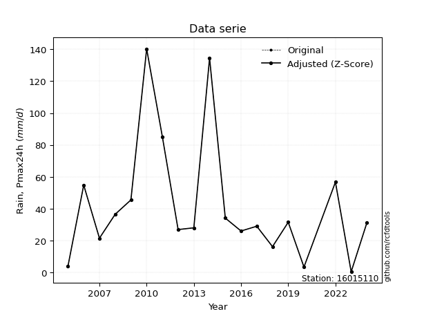</img>

</div>

> If Z-Score is active, values out of range or outliers are replaced with the station mean value.


### 4. Active continuous probability distributions from SciPy (45 of 104 available)

[scipy.stats](https://docs.scipy.org/doc/scipy/reference/stats.html) is a Python´s powerful submodule within the SciPy library for comprehensive statistical analysis, offering over 130 probability distributions (like Normal, Poisson), functions for descriptive stats (mean, variance), hypothesis testing (t-tests, chi-square), random variable generation, and statistical tests, making it essential for data science, modeling, and research. It provides tools to explore, model, and draw conclusions from data efficiently, working seamlessly with NumPy.

<div align="center">

|   id | p_dist             |   n_parameter | fit_method   | label                                                                       | active   | ref                                                                                                        |
|-----:|:-------------------|--------------:|:-------------|:----------------------------------------------------------------------------|:---------|:-----------------------------------------------------------------------------------------------------------|
|    0 | alpha              |             3 | MLE          | Alpha                                                                       | True     | [:mortar_board:](https://docs.scipy.org/doc/scipy/reference/generated/scipy.stats.alpha.html)              |
|    1 | betaprime          |             4 | MLE          | Beta prime                                                                  | True     | [:mortar_board:](https://docs.scipy.org/doc/scipy/reference/generated/scipy.stats.betaprime.html)          |
|    2 | chi2               |             3 | MLE          | Chi²                                                                        | True     | [:mortar_board:](https://docs.scipy.org/doc/scipy/reference/generated/scipy.stats.chi2.html)               |
|    3 | crystalball        |             4 | MLE          | Crystalball                                                                 | True     | [:mortar_board:](https://docs.scipy.org/doc/scipy/reference/generated/scipy.stats.crystalball.html)        |
|    4 | erlang             |             3 | MLE          | Erlang                                                                      | True     | [:mortar_board:](https://docs.scipy.org/doc/scipy/reference/generated/scipy.stats.erlang.html)             |
|    5 | expon              |             2 | MLE          | Exponential                                                                 | True     | [:mortar_board:](https://docs.scipy.org/doc/scipy/reference/generated/scipy.stats.expon.html)              |
|    6 | exponnorm          |             3 | MLE          | Exponentially modified Normal                                               | True     | [:mortar_board:](https://docs.scipy.org/doc/scipy/reference/generated/scipy.stats.exponnorm.html)          |
|    7 | f                  |             4 | MLE          | F                                                                           | True     | [:mortar_board:](https://docs.scipy.org/doc/scipy/reference/generated/scipy.stats.f.html)                  |
|    8 | fatiguelife        |             3 | MLE          | Fatigue-life (Birnbaum-Saunders)                                            | True     | [:mortar_board:](https://docs.scipy.org/doc/scipy/reference/generated/scipy.stats.fatiguelife.html)        |
|    9 | fisk               |             3 | MLE          | Fisk                                                                        | True     | [:mortar_board:](https://docs.scipy.org/doc/scipy/reference/generated/scipy.stats.fisk.html)               |
|   10 | gamma              |             3 | MLE          | Gamma                                                                       | True     | [:mortar_board:](https://docs.scipy.org/doc/scipy/reference/generated/scipy.stats.gamma.html)              |
|   11 | genexpon           |             5 | MLE          | Generalized exponential                                                     | True     | [:mortar_board:](https://docs.scipy.org/doc/scipy/reference/generated/scipy.stats.genexpon.html)           |
|   12 | genlogistic        |             3 | MLE          | Generalized logistic                                                        | True     | [:mortar_board:](https://docs.scipy.org/doc/scipy/reference/generated/scipy.stats.genlogistic.html)        |
|   13 | gibrat             |             2 | MM           | Gibrat                                                                      | True     | [:mortar_board:](https://docs.scipy.org/doc/scipy/reference/generated/scipy.stats.gibrat.html)             |
|   14 | gompertz           |             3 | MLE          | Gompertz (or truncated Gumbel)                                              | True     | [:mortar_board:](https://docs.scipy.org/doc/scipy/reference/generated/scipy.stats.gompertz.html)           |
|   15 | gumbel_l           |             2 | MM           | Gumbel Left Skew                                                            | True     | [:mortar_board:](https://docs.scipy.org/doc/scipy/reference/generated/scipy.stats.gumbel_l.html)           |
|   16 | gumbel_r           |             2 | MM           | Gumbel Right Skew                                                           | True     | [:mortar_board:](https://docs.scipy.org/doc/scipy/reference/generated/scipy.stats.gumbel_r.html)           |
|   17 | halflogistic       |             2 | MM           | Half-logistic                                                               | True     | [:mortar_board:](https://docs.scipy.org/doc/scipy/reference/generated/scipy.stats.halflogistic.html)       |
|   18 | halfnorm           |             2 | MM           | Half Normal                                                                 | True     | [:mortar_board:](https://docs.scipy.org/doc/scipy/reference/generated/scipy.stats.halfnorm.html)           |
|   19 | hypsecant          |             2 | MM           | hyperbolic secant                                                           | True     | [:mortar_board:](https://docs.scipy.org/doc/scipy/reference/generated/scipy.stats.hypsecant.html)          |
|   20 | invgamma           |             3 | MLE          | Inverted gamma                                                              | True     | [:mortar_board:](https://docs.scipy.org/doc/scipy/reference/generated/scipy.stats.invgamma.html)           |
|   21 | invgauss           |             3 | MLE          | Inverse Gaussian                                                            | True     | [:mortar_board:](https://docs.scipy.org/doc/scipy/reference/generated/scipy.stats.invgauss.html)           |
|   22 | invweibull         |             3 | MLE          | Inverted Weibull                                                            | True     | [:mortar_board:](https://docs.scipy.org/doc/scipy/reference/generated/scipy.stats.invweibull.html)         |
|   23 | johnsonsu          |             4 | MLE          | Johnson Su                                                                  | True     | [:mortar_board:](https://docs.scipy.org/doc/scipy/reference/generated/scipy.stats.johnsonsu.html)          |
|   24 | kstwobign          |             2 | MLE          | Limiting distribution of scaled Kolmogorov-Smirnov two-sided test statistic | True     | [:mortar_board:](https://docs.scipy.org/doc/scipy/reference/generated/scipy.stats.kstwobign.html)          |
|   25 | laplace            |             2 | MM           | Laplace                                                                     | True     | [:mortar_board:](https://docs.scipy.org/doc/scipy/reference/generated/scipy.stats.laplace.html)            |
|   26 | laplace_asymmetric |             3 | MLE          | Asymmetric Laplace                                                          | True     | [:mortar_board:](https://docs.scipy.org/doc/scipy/reference/generated/scipy.stats.laplace_asymmetric.html) |
|   27 | loggamma           |             3 | MLE          | Log gamma                                                                   | True     | [:mortar_board:](https://docs.scipy.org/doc/scipy/reference/generated/scipy.stats.loggamma.html)           |
|   28 | logistic           |             2 | MM           | Logistic (or Sech-squared)                                                  | True     | [:mortar_board:](https://docs.scipy.org/doc/scipy/reference/generated/scipy.stats.logistic.html)           |
|   29 | lognorm            |             3 | MLE          | Log Normal                                                                  | True     | [:mortar_board:](https://docs.scipy.org/doc/scipy/reference/generated/scipy.stats.lognorm.html)            |
|   30 | maxwell            |             2 | MM           | Maxwell                                                                     | True     | [:mortar_board:](https://docs.scipy.org/doc/scipy/reference/generated/scipy.stats.maxwell.html)            |
|   31 | mielke             |             4 | MLE          | Mielke Beta-Kappa / Dagum                                                   | True     | [:mortar_board:](https://docs.scipy.org/doc/scipy/reference/generated/scipy.stats.mielke.html)             |
|   32 | moyal              |             2 | MM           | Moyal                                                                       | True     | [:mortar_board:](https://docs.scipy.org/doc/scipy/reference/generated/scipy.stats.moyal.html)              |
|   33 | nakagami           |             3 | MLE          | Nakagami                                                                    | True     | [:mortar_board:](https://docs.scipy.org/doc/scipy/reference/generated/scipy.stats.nakagami.html)           |
|   34 | ncf                |             5 | MLE          | Non-central F distribution                                                  | True     | [:mortar_board:](https://docs.scipy.org/doc/scipy/reference/generated/scipy.stats.ncf.html)                |
|   35 | nct                |             4 | MLE          | Non-central Student’s t                                                     | True     | [:mortar_board:](https://docs.scipy.org/doc/scipy/reference/generated/scipy.stats.nct.html)                |
|   36 | norm               |             2 | MM           | Normal                                                                      | True     | [:mortar_board:](https://docs.scipy.org/doc/scipy/reference/generated/scipy.stats.norm.html)               |
|   37 | pareto             |             3 | MLE          | Pareto                                                                      | True     | [:mortar_board:](https://docs.scipy.org/doc/scipy/reference/generated/scipy.stats.pareto.html)             |
|   38 | pearson3           |             3 | MM           | Pearson type III                                                            | True     | [:mortar_board:](https://docs.scipy.org/doc/scipy/reference/generated/scipy.stats.pearson3.html)           |
|   39 | rayleigh           |             2 | MM           | Rayleigh                                                                    | True     | [:mortar_board:](https://docs.scipy.org/doc/scipy/reference/generated/scipy.stats.rayleigh.html)           |
|   40 | rice               |             3 | MLE          | Rice                                                                        | True     | [:mortar_board:](https://docs.scipy.org/doc/scipy/reference/generated/scipy.stats.rice.html)               |
|   41 | t                  |             3 | MLE          | Student’s t                                                                 | True     | [:mortar_board:](https://docs.scipy.org/doc/scipy/reference/generated/scipy.stats.t.html)                  |
|   42 | truncnorm          |             4 | MLE          | Truncated normal                                                            | True     | [:mortar_board:](https://docs.scipy.org/doc/scipy/reference/generated/scipy.stats.truncnorm.html)          |
|   43 | wald               |             2 | MM           | Wald                                                                        | True     | [:mortar_board:](https://docs.scipy.org/doc/scipy/reference/generated/scipy.stats.wald.html)               |
|   44 | weibull_min        |             3 | MLE          | Weibull minimum                                                             | True     | [:mortar_board:](https://docs.scipy.org/doc/scipy/reference/generated/scipy.stats.weibull_min.html)        |

</div>

> **n_parameter:** # arguments & localization & scale.
>
> **Fit methods:** (MLE) maximum likelihood, (MM) L-moments.
>
>**Inactive:** foldnorm, gennorm, norminvgauss, powernorm, powerlognorm, skewnorm, genextreme, anglit, arcsine, argus, beta, bradford, burr, burr12, cauchy, cosine, halfcauchy, foldcauchy, skewcauchy, wrapcauchy, dgamma, gengamma, exponweib, exponpow, truncexpon, gausshyper, genhalflogistic, genhyperbolic, geninvgauss, halfgennorm, johnsonsb, kappa4, kappa3, ksone, kstwo, loglaplace, levy, levy_l, levy_stable, ncx2, genpareto, truncpareto, lomax, powerlaw, rdist, rel_breitwigner, recipinvgauss, semicircular, studentized_range, trapezoid, triang, truncweibull_min, tukeylambda, uniform, loguniform, vonmises, vonmises_line, weibull_max, dweibull, 


## B. Probability distributions vs. Empirical distributions

A continuous probability distribution (CPD) describes probabilities for variables that can take any value within a range (like rain any time), unlike discrete variables with specific outcomes (like temperature). It uses a Probability Density Function (PDF), a curve where the total area under it equals 1, and the probability of the variable falling within an interval (a to b) is found by calculating the area under the curve between those points. A key feature is that the probability of hitting any single exact value is zero, so probabilities are always expressed for ranges, e.g., $P(a ≤ X ≤ b)$.

<div align="center">

Distributions parameters
|    |   station | p_dist                |   n |              loc |           scale | shape                  | shape1             | shape2                 | shape3   |
|---:|----------:|:----------------------|----:|-----------------:|----------------:|:-----------------------|:-------------------|:-----------------------|:---------|
|  0 |  16015110 | alpha                 |  20 |      0.000633965 |     1.74391     | 1.4799424722567016e-08 |                    |                        |          |
|  1 |  16015110 | betaprime             |  20 |      0.4         |  1006.67        | 0.7077165037069979     | 23.63594805917364  |                        |          |
|  2 |  16015110 | chi2                  |  20 |      0.4         |     2.02428     | 0.7956412738427797     |                    |                        |          |
|  3 |  16015110 | crystalball           |  20 |     40.39        |    38.0264      | 143344.51307969118     | 71233.09027670059  |                        |          |
|  4 |  16015110 | erlang                |  20 |      0.4         |    41.9035      | 0.8376185194929573     |                    |                        |          |
|  5 |  16015110 | expon                 |  20 |      0.4         |    39.99        |                        |                    |                        |          |
|  6 |  16015110 | exponnorm             |  20 |      5.48408     |     9.99683     | 3.4916973965275044     |                    |                        |          |
|  7 |  16015110 | f                     |  20 |      0.4         |    41.7832      | 1.5879664996869929     | 219.1087755337098  |                        |          |
|  8 |  16015110 | fatiguelife           |  20 |     -7.66823     |    35.3715      | 0.8427565665887928     |                    |                        |          |
|  9 |  16015110 | fisk                  |  20 |     -6.98415     |    36.1846      | 2.1836564698958263     |                    |                        |          |
| 10 |  16015110 | gamma                 |  20 |      0.4         |    39.9946      | 0.8970741324859777     |                    |                        |          |
| 11 |  16015110 | genexpon              |  20 |      0.4         |    58.413       | 1.3199417189466578     | 0.2390703407243842 | 2.144979843401427      |          |
| 12 |  16015110 | genlogistic           |  20 |   -152.367       |    24.2588      | 1476.1113699564576     |                    |                        |          |
| 13 |  16015110 | gibrat                |  20 |     11.3807      |    17.595       |                        |                    |                        |          |
| 14 |  16015110 | gompertz              |  20 |      0.399449    |   482.163       | 11.073680325405636     |                    |                        |          |
| 15 |  16015110 | gumbel_l              |  20 |     57.5039      |    29.649       |                        |                    |                        |          |
| 16 |  16015110 | gumbel_r              |  20 |     23.2761      |    29.649       |                        |                    |                        |          |
| 17 |  16015110 | halflogistic          |  20 |     -4.68009     |    32.5112      |                        |                    |                        |          |
| 18 |  16015110 | halfnorm              |  20 |     -9.94201     |    63.0818      |                        |                    |                        |          |
| 19 |  16015110 | hypsecant             |  20 |     40.39        |    24.2083      |                        |                    |                        |          |
| 20 |  16015110 | invgamma              |  20 |    -22.3959      |   182.461       | 3.869590223080793      |                    |                        |          |
| 21 |  16015110 | invgauss              |  20 |    -10.9045      |    81.225       | 0.6315106900868854     |                    |                        |          |
| 22 |  16015110 | invweibull            |  20 |    -52.521       |    73.7393      | 3.5336295005335114     |                    |                        |          |
| 23 |  16015110 | johnsonsu             |  20 |     -8.1388      |     0.493486    | -6.461664506118964     | 1.2928345611549186 |                        |          |
| 24 |  16015110 | kstwobign             |  20 |    -66.1215      |   123.838       |                        |                    |                        |          |
| 25 |  16015110 | laplace               |  20 |     40.39        |    26.8887      |                        |                    |                        |          |
| 26 |  16015110 | laplace_asymmetric    |  20 |     26           |    21.8098      | 0.7231086472669287     |                    |                        |          |
| 27 |  16015110 | loggamma              |  20 | -12902.5         |  1710.97        | 1929.3565750354626     |                    |                        |          |
| 28 |  16015110 | logistic              |  20 |     40.39        |    20.965       |                        |                    |                        |          |
| 29 |  16015110 | lognorm               |  20 |     -8.08181     |    36.482       | 0.7765127708845901     |                    |                        |          |
| 30 |  16015110 | maxwell               |  20 |    -49.7165      |    56.4659      |                        |                    |                        |          |
| 31 |  16015110 | mielke                |  20 |      0.4         |    59.6107      | 0.8119030861308285     | 2.1787174200904174 |                        |          |
| 32 |  16015110 | moyal                 |  20 |     18.6441      |    17.1179      |                        |                    |                        |          |
| 33 |  16015110 | nakagami              |  20 |      0.4         |    57.2361      | 0.4183392185558771     |                    |                        |          |
| 34 |  16015110 | ncf                   |  20 |      0.4         |     3.30542     | 0.5317845895481906     | 7.905364917261872  | 5.101631575722265      |          |
| 35 |  16015110 | nct                   |  20 |    -34.0148      |     4.57631     | 3.426189203210165      | 12.490257709204833 |                        |          |
| 36 |  16015110 | norm                  |  20 |     40.39        |    38.0264      |                        |                    |                        |          |
| 37 |  16015110 | pareto                |  20 |      0.4         |     5.40057e-08 | 0.05263157630245367    |                    |                        |          |
| 38 |  16015110 | pearson3              |  20 |     40.3901      |    38.0263      | 1.5255609101199994     |                    |                        |          |
| 39 |  16015110 | rayleigh              |  20 |    -32.3567      |    58.0434      |                        |                    |                        |          |
| 40 |  16015110 | rice                  |  20 |    -18.0907      |    49.3254      | 0.0012081253609999782  |                    |                        |          |
| 41 |  16015110 | t                     |  20 |     28.7501      |    14.9869      | 1.437703052262544      |                    |                        |          |
| 42 |  16015110 | truncnorm             |  20 |    -50.6582      |    68.8633      | 0.7414418711298725     | 188.83698310400013 |                        |          |
| 43 |  16015110 | wald                  |  20 |      2.36363     |    38.0264      |                        |                    |                        |          |
| 44 |  16015110 | weibull_min           |  20 |      0.4         |    38.3507      | 0.8958829961426467     |                    |                        |          |
| 45 |  16015110 | logalpha              |  20 |    -15.7339      |   217.032       | 11.574441950760562     |                    |                        |          |
| 46 |  16015110 | logbetaprime          |  20 |   -498.352       |   155.358       | 535852.2670096171      | 166023.42685784155 |                        |          |
| 47 |  16015110 | logchi2               |  20 |    -19.7499      |     0.0485297   | 469.5661602852575      |                    |                        |          |
| 48 |  16015110 | logcrystalball        |  20 |      3.08752     |     1.40619     | 7.475610210573087      | 2335.572480579456  |                        |          |
| 49 |  16015110 | logerlang             |  20 |    -23.7084      |     0.0787031   | 340.1779540804722      |                    |                        |          |
| 50 |  16015110 | logexpon              |  20 |     -0.916291    |     4.00381     |                        |                    |                        |          |
| 51 |  16015110 | logexponnorm          |  20 |      3.08657     |     1.40618     | 0.0006675390615941542  |                    |                        |          |
| 52 |  16015110 | logf                  |  20 |     -0.916291    |     1.14138     | 1.1408573271167906     | 1.099325578306661  |                        |          |
| 53 |  16015110 | logfatiguelife        |  20 |   -729.449       |   732.542       | 0.001908385126585305   |                    |                        |          |
| 54 |  16015110 | logfisk               |  20 |     -1.85434e+08 |     1.85434e+08 | 254085512.02948266     |                    |                        |          |
| 55 |  16015110 | loggamma              |  20 |    -23.1851      |     0.0794312   | 330.51543462987036     |                    |                        |          |
| 56 |  16015110 | loggenexpon           |  20 |     -0.931744    |     0.0352143   | 0.000995547072555005   | 5.675434663109016  | 2.1304316619760332e-05 |          |
| 57 |  16015110 | loggenlogistic        |  20 |      4.16071     |     0.353609    | 0.2909074980817398     |                    |                        |          |
| 58 |  16015110 | loggibrat             |  20 |      2.01476     |     0.650661    |                        |                    |                        |          |
| 59 |  16015110 | loggompertz           |  20 |     -0.916291    |     1.04386     | 0.012352415603756448   |                    |                        |          |
| 60 |  16015110 | loggumbel_l           |  20 |      3.72038     |     1.0964      |                        |                    |                        |          |
| 61 |  16015110 | loggumbel_r           |  20 |      2.45466     |     1.0964      |                        |                    |                        |          |
| 62 |  16015110 | loghalflogistic       |  20 |      1.42088     |     1.20223     |                        |                    |                        |          |
| 63 |  16015110 | loghalfnorm           |  20 |      1.22629     |     2.33272     |                        |                    |                        |          |
| 64 |  16015110 | loghypsecant          |  20 |      3.08752     |     0.895209    |                        |                    |                        |          |
| 65 |  16015110 | loginvgamma           |  20 |    -30.8043      | 17682.4         | 523.1695411511109      |                    |                        |          |
| 66 |  16015110 | loginvgauss           |  20 |    -12.5564      |  1551.87        | 0.010046751724069537   |                    |                        |          |
| 67 |  16015110 | loginvweibull         |  20 |     -1.87068e+08 |     1.87068e+08 | 108284611.8265365      |                    |                        |          |
| 68 |  16015110 | logjohnsonsu          |  20 |      3.56959     |     0.405764    | 0.2845717997484164     | 0.6951753625546007 |                        |          |
| 69 |  16015110 | logkstwobign          |  20 |     -4.20859     |     8.39834     |                        |                    |                        |          |
| 70 |  16015110 | loglaplace            |  20 |      3.08752     |     0.994327    |                        |                    |                        |          |
| 71 |  16015110 | loglaplace_asymmetric |  20 |      3.5293      |     0.863277    | 1.288031229229054      |                    |                        |          |
| 72 |  16015110 | logloggamma           |  20 |      4.26057     |     0.688597    | 0.557797887001098      |                    |                        |          |
| 73 |  16015110 | loglogistic           |  20 |      3.08752     |     0.775274    |                        |                    |                        |          |
| 74 |  16015110 | loglognorm            |  20 |   -754.701       |   757.783       | 0.001848431928119544   |                    |                        |          |
| 75 |  16015110 | logmaxwell            |  20 |     -0.244565    |     2.08808     |                        |                    |                        |          |
| 76 |  16015110 | logmielke             |  20 |     -0.916291    |     5.53873     | 0.3390398167241824     | 1.8770607076460115 |                        |          |
| 77 |  16015110 | logmoyal              |  20 |      2.28337     |     0.633008    |                        |                    |                        |          |
| 78 |  16015110 | lognakagami           |  20 |   -855.235       |   858.322       | 92972.6526007136       |                    |                        |          |
| 79 |  16015110 | logncf                |  20 |     -0.916291    |     1.03569     | 1.025227973528531      | 1.2407108352431475 | 1.0711754444629338     |          |
| 80 |  16015110 | lognct                |  20 |    -73.2414      |     1.3666      | 24016.10996725047      | 55.85049865873086  |                        |          |
| 81 |  16015110 | lognorm               |  20 |      3.08752     |     1.40619     |                        |                    |                        |          |
| 82 |  16015110 | logpareto             |  20 |     -0.916291    |     8.30885e-09 | 0.052631480403114723   |                    |                        |          |
| 83 |  16015110 | logpearson3           |  20 |      3.08752     |     1.40619     | -1.2681690166324753    |                    |                        |          |
| 84 |  16015110 | lograyleigh           |  20 |      0.397372    |     2.14642     |                        |                    |                        |          |
| 85 |  16015110 | logrice               |  20 |   -416.224       |     1.40558     | 298.3184188939922      |                    |                        |          |
| 86 |  16015110 | logt                  |  20 |      3.45686     |     0.471964    | 1.1619032959638318     |                    |                        |          |
| 87 |  16015110 | logtruncnorm          |  20 |      1.37506     |     5.83148     | -0.3935153106065285    | 0.6119748282072748 |                        |          |
| 88 |  16015110 | logwald               |  20 |      1.68131     |     1.40621     |                        |                    |                        |          |
| 89 |  16015110 | logweibull_min        |  20 |     -0.916291    |     1.55687     | 0.6609031480279273     |                    |                        |          |

</div>

> **loc** (Location parameter): This shifts the distribution along the x-axis. For many common distributions, like the normal (Gaussian) distribution, loc represents the mean $μ$. For others, like the uniform distribution, it might represent the minimum value, or for the beta distribution, the left end of the support interval.
>
> **scale** (Scale parameter): This determines the width or spread of the distribution. For the normal distribution, scale represents the standard deviation $σ$. For a uniform distribution, it defines the length of the interval (from $loc$ to $loc + scale$).
>
> **shape** (Shape parameters): Refers to parameters that define the specific form of a probability distribution, distinct from its location (loc) and scale (scale). These parameters are required arguments for most distribution functions. For example, a normal (Gaussian) distribution is fully defined by its location (mean) and scale (standard deviation), so it has no specific shape parameters beyond loc and scale. However, other distributions have intrinsic properties that need specification, as Gamma distribution that takes a shape parameter, often named $a$ or $alpha$.


### 0. Cumulative distribution values - CDF (90 evaluated)

> Ordered by x ascending and calculating $log(f(x))$ separately. 

|   id |   Station |   date |     x |   count |   mean |     std |     zscore |   Value_initial |   station |   m |       alpha |   alpha_pdf |   betaprime |   betaprime_pdf |        chi2 |    chi2_pdf |   crystalball |   crystalball_pdf |      erlang |   erlang_pdf |     expon |   expon_pdf |   exponnorm |   exponnorm_pdf |           f |        f_pdf |   fatiguelife |   fatiguelife_pdf |      fisk |    fisk_pdf |       gamma |   gamma_pdf |    genexpon |   genexpon_pdf |   genlogistic |   genlogistic_pdf |    gibrat |   gibrat_pdf |    gompertz |   gompertz_pdf |   gumbel_l |   gumbel_l_pdf |   gumbel_r |   gumbel_r_pdf |   halflogistic |   halflogistic_pdf |   halfnorm |   halfnorm_pdf |   hypsecant |   hypsecant_pdf |   invgamma |   invgamma_pdf |   invgauss |   invgauss_pdf |   invweibull |   invweibull_pdf |   johnsonsu |   johnsonsu_pdf |   kstwobign |   kstwobign_pdf |   laplace |   laplace_pdf |   laplace_asymmetric |   laplace_asymmetric_pdf |   loggamma |   loggamma_pdf |   logistic |   logistic_pdf |    lognorm |   lognorm_pdf |   maxwell |   maxwell_pdf |      mielke |   mielke_pdf |     moyal |   moyal_pdf |    nakagami |   nakagami_pdf |        ncf |     ncf_pdf |       nct |     nct_pdf |     norm |    norm_pdf |   pareto |       pareto_pdf |   pearson3 |   pearson3_pdf |   rayleigh |   rayleigh_pdf |      rice |    rice_pdf |        t |       t_pdf |   truncnorm |   truncnorm_pdf |        wald |    wald_pdf |   weibull_min |   weibull_min_pdf |   logalpha |   logalpha_pdf |   logbetaprime |   logbetaprime_pdf |   logchi2 |   logchi2_pdf |   logcrystalball |   logcrystalball_pdf |   logerlang |   logerlang_pdf |   logexpon |   logexpon_pdf |   logexponnorm |   logexponnorm_pdf |        logf |    logf_pdf |   logfatiguelife |   logfatiguelife_pdf |    logfisk |   logfisk_pdf |   loggenexpon |   loggenexpon_pdf |   loggenlogistic |   loggenlogistic_pdf |   loggibrat |   loggibrat_pdf |   loggompertz |   loggompertz_pdf |   loggumbel_l |   loggumbel_l_pdf |   loggumbel_r |   loggumbel_r_pdf |   loghalflogistic |   loghalflogistic_pdf |   loghalfnorm |   loghalfnorm_pdf |   loghypsecant |   loghypsecant_pdf |   loginvgamma |   loginvgamma_pdf |   loginvgauss |   loginvgauss_pdf |   loginvweibull |   loginvweibull_pdf |   logjohnsonsu |   logjohnsonsu_pdf |   logkstwobign |   logkstwobign_pdf |   loglaplace |   loglaplace_pdf |   loglaplace_asymmetric |   loglaplace_asymmetric_pdf |   logloggamma |   logloggamma_pdf |   loglogistic |   loglogistic_pdf |   loglognorm |   loglognorm_pdf |   logmaxwell |   logmaxwell_pdf |   logmielke |   logmielke_pdf |    logmoyal |   logmoyal_pdf |   lognakagami |   lognakagami_pdf |      logncf |   logncf_pdf |     lognct |   lognct_pdf |   logpareto |   logpareto_pdf |   logpearson3 |   logpearson3_pdf |   lograyleigh |   lograyleigh_pdf |    logrice |   logrice_pdf |      logt |   logt_pdf |   logtruncnorm |   logtruncnorm_pdf |   logwald |   logwald_pdf |   logweibull_min |   logweibull_min_pdf |
|-----:|----------:|-------:|------:|--------:|-------:|--------:|-----------:|----------------:|----------:|----:|------------:|------------:|------------:|----------------:|------------:|------------:|--------------:|------------------:|------------:|-------------:|----------:|------------:|------------:|----------------:|------------:|-------------:|--------------:|------------------:|----------:|------------:|------------:|------------:|------------:|---------------:|--------------:|------------------:|----------:|-------------:|------------:|---------------:|-----------:|---------------:|-----------:|---------------:|---------------:|-------------------:|-----------:|---------------:|------------:|----------------:|-----------:|---------------:|-----------:|---------------:|-------------:|-----------------:|------------:|----------------:|------------:|----------------:|----------:|--------------:|---------------------:|-------------------------:|-----------:|---------------:|-----------:|---------------:|-----------:|--------------:|----------:|--------------:|------------:|-------------:|----------:|------------:|------------:|---------------:|-----------:|------------:|----------:|------------:|---------:|------------:|---------:|-----------------:|-----------:|---------------:|-----------:|---------------:|----------:|------------:|---------:|------------:|------------:|----------------:|------------:|------------:|--------------:|------------------:|-----------:|---------------:|---------------:|-------------------:|----------:|--------------:|-----------------:|---------------------:|------------:|----------------:|-----------:|---------------:|---------------:|-------------------:|------------:|------------:|-----------------:|---------------------:|-----------:|--------------:|--------------:|------------------:|-----------------:|---------------------:|------------:|----------------:|--------------:|------------------:|--------------:|------------------:|--------------:|------------------:|------------------:|----------------------:|--------------:|------------------:|---------------:|-------------------:|--------------:|------------------:|--------------:|------------------:|----------------:|--------------------:|---------------:|-------------------:|---------------:|-------------------:|-------------:|-----------------:|------------------------:|----------------------------:|--------------:|------------------:|--------------:|------------------:|-------------:|-----------------:|-------------:|-----------------:|------------:|----------------:|------------:|---------------:|--------------:|------------------:|------------:|-------------:|-----------:|-------------:|------------:|----------------:|--------------:|------------------:|--------------:|------------------:|-----------:|--------------:|----------:|-----------:|---------------:|-------------------:|----------:|--------------:|-----------------:|---------------------:|
|    0 |  16015110 |   2023 |   0.4 |      20 |  40.39 | 39.0142 | -1.02501   |             0.4 |  16015110 |   1 | 1.26144e-05 | 0.000631194 | 1.14361e-11 |   623.074       | 2.20532e-07 | 1.58044e+09 |      0.146483 |       0.00603493  | 5.31615e-11 |  2.10683     | 0         | 0.0250063   |   0.0484326 |     0.00736536  | 9.93146e-15 | 71.0255      |     0.0275701 |       0.0119933   | 0.0301639 | 0.00865108  | 9.94882e-17 | 1.60775     | 4.16659e-10 |    0.0225967   |     0.0661906 |       0.0074017   | 0         |  0           | 1.26574e-05 |    0.0229664   |   0.13561  |    0.00424865  |   0.114963 |    0.00838751  |      0.0779697 |        0.0152858   |   0.130226 |    0.0124796   |    0.120567 |     0.00486215  |  0.0371238 |    0.00898209  |  0.0310256 |    0.0106551   |    0.0395894 |      0.00853623  |   0.0301397 |     0.0103246   |   0.0648847 |     0.00736525  |  0.112998 |   0.00420242  |            0.0677287 |              0.00429455  | 0.00190166 |     0.00468355 |   0.129266 |    0.00536877  | 0.00220477 |    0.00492561 |  0.147606 |   0.00750733  | 5.13593e-14 | 16.33        | 0.0884075 | 0.00930007  | 6.64815e-16 |   10.0203      | 2.4674e-06 | 5.90929e+09 | 0.0400501 | 0.00864607  | 0.146483 | 0.00603493  | 0        | 974557           |  0.0808459 |    0.0123876   |   0.147212 |    0.00829153  | 0.0678526 | 0.00708429  | 0.123054 | 0.00492658  | 6.07288e-09 |     0.0192004   | 0           | 0           |    1.0423e-16 |       1.68214     | 0.00106144 |     0.00351545 |     0.00219056 |         0.00493524 | 0.0024902 |    0.00590972 |       0.00220477 |           0.00492561 |   0.0020316 |      0.00493543 |   0        |      0.249762  |     0.00220471 |         0.00492551 | 4.91884e-10 | 2.52728e+06 |        0.0020107 |           0.00458241 | 0.00312075 |    0.00426278 |    0.00044842 |         0.0297645 |        0.0153482 |            0.0126267 |    0        |       0         |   4.50589e-09 |         0.0118334 |     0.0144616 |         0.0130942 |    3.9972e-10 |       7.88948e-09 |          0        |             0         |     0         |         0         |     0.00726916 |         0.00811937 |    0.00195289 |        0.00494861 |     0.0019892 |        0.00547263 |      0.00155035 |          0.00580567 |      0.0308006 |          0.0107333 |     0.00208619 |          0.0095401 |   0.00891695 |       0.00896783 |               0.0114494 |                   0.0102969 |     0.0169655 |         0.0137381 |    0.00568409 |        0.00729005 |   0.00210647 |       0.00476973 |    0         |         0        | 2.18129e-06 |     6.66122e+09 | 5.78738e-36 |    7.21099e-34 |    0.00222175 |        0.00496316 | 2.53368e-09 |  1.16986e+07 | 0.00221585 |   0.00496393 |    0        |     6.33439e+06 |     0.0156159 |         0.0142723 |     0         |         0         | 0.00219611 |    0.00491024 | 0.0247936 | 0.00652717 |    0.000566372 |           0.165457 |  0        |     0         |       2.1306e-11 |       126832         |
|    1 |  16015110 |   2025 |   2.2 |      20 |  40.39 | 39.0142 | -0.978874  |             2.2 |  16015110 |   2 | 0.427828    | 0.210061    | 0.114494    |     0.0438807   | 0.725099    | 0.115657    |      0.157616 |       0.00633585  | 0.0745618   |  0.0338925   | 0.0440133 | 0.0239056   |   0.0629997 |     0.00883125  | 0.0725728   |  0.0314015   |     0.0526433 |       0.0156426   | 0.0476918 | 0.0107986   | 0.0631046   | 0.0307097   | 0.0400867   |    0.0219422   |     0.0803625 |       0.00834491  | 0         |  0           | 0.0405835   |    0.022117    |   0.143458 |    0.00447358  |   0.130586 |    0.00896611  |      0.105418  |        0.0152084   |   0.152634 |    0.0124163   |    0.129627 |     0.00520786  |  0.0552592 |    0.0111441   |  0.0529529 |    0.0136004   |    0.0567429 |      0.0105134   |   0.0513619 |     0.0131608   |   0.0789039 |     0.00820714  |  0.120821 |   0.00449337  |            0.0759173 |              0.00481377  | 0.0538787  |     0.0805321  |   0.139241 |    0.00571682  | 0.051029   |    0.074544   |  0.161409 |   0.00782756  | 0.0583159   |  0.026291    | 0.105967  | 0.0101994   | 0.0433466   |    0.0201426   | 0.0645044  | 0.0173871   | 0.0573994 | 0.0106187   | 0.157616 | 0.00633585  | 0.598152 |      0.0117499   |  0.103846  |    0.013133    |   0.16241  |    0.00859127  | 0.0811295 | 0.00766319  | 0.132435 | 0.00550983  | 0.034224    |     0.0188254   | 0           | 0           |    0.0625     |       0.030114    | 0.0592342  |     0.0937571  |     0.051555   |         0.0754402  | 0.0613552 |    0.0873742  |       0.051029   |           0.074544   |   0.0551765 |      0.0815281  |   0.346741 |      0.163159  |     0.0510288  |         0.0745442  | 0.563805    | 0.0986598   |        0.0492926 |           0.0731714  | 0.0313504  |    0.0416103  |    0.175391   |         0.161551  |        0.0623925 |            0.0513254 |    0        |       0         |   0.0496164   |         0.0575786 |     0.0666423 |         0.0587108 |    0.0103492  |       0.0431452   |          0        |             0         |     0         |         0         |     0.0487172  |         0.0542077  |    0.0575478  |        0.0853704  |     0.0660749 |        0.0964216  |      0.0896764  |          0.125182   |      0.0618948 |          0.0301891 |     0.129173   |          0.15431   |   0.0495226  |       0.0498051  |               0.0530419 |                   0.0477027 |     0.0673562 |         0.054336  |    0.0490097  |        0.0601178  |   0.0505414  |       0.0744912  |    0.0299395 |         0.082751 | 0.658181    |     0.11798     | 0.00112605  |    0.0102056   |    0.0513251  |        0.0748863  | 0.458842    |  0.105728    | 0.0514438  |   0.0750746  |    0.634808 |     0.0112747   |     0.0705709 |         0.0599803 |     0.016462  |         0.0834895 | 0.0509537  |    0.0744893  | 0.043628  | 0.0185394  |    0.295144    |           0.177834 |  0        |     0         |       0.65417    |            0.142359  |
|    2 |  16015110 |   2020 |   3.4 |      20 |  40.39 | 39.0142 | -0.948116  |             3.4 |  16015110 |   3 | 0.607945    | 0.105565    | 0.162419    |     0.0367162   | 0.827923    | 0.0632196   |      0.16534  |       0.00653662  | 0.11291     |  0.0303139   | 0.0722739 | 0.023199    |   0.0741975 |     0.00983307  | 0.107782    |  0.0276233   |     0.0724947 |       0.0173525   | 0.061458  | 0.0121296   | 0.0983969   | 0.0282756   | 0.0661526   |    0.0215006   |     0.090752  |       0.00896968  | 0         |  0           | 0.0667924   |    0.0215665   |   0.148919 |    0.00462866  |   0.141567 |    0.00933458  |      0.12363   |        0.0151443   |   0.167505 |    0.0123686   |    0.136021 |     0.0054493   |  0.0694437 |    0.0124789   |  0.0702541 |    0.0151823   |    0.0701227 |      0.0117755   |   0.0681166 |     0.0147173   |   0.08908   |     0.00875018  |  0.126335 |   0.00469844  |            0.0819193 |              0.00519434  | 0.0985307  |     0.126213   |   0.146244 |    0.00595548  | 0.0925217  |    0.117873   |  0.170926 |   0.00803323  | 0.0882562   |  0.0238498   | 0.118545  | 0.010759    | 0.0664473   |    0.0185167   | 0.084678   | 0.0164773   | 0.0708999 | 0.0118704   | 0.16534  | 0.00653662  | 0.608812 |      0.00686294  |  0.119846  |    0.0135196   |   0.172833 |    0.00877898  | 0.0905486 | 0.00803319  | 0.139304 | 0.00594602  | 0.056663    |     0.0185725   | 3.71236e-09 | 6.73769e-08 |    0.0969639  |       0.0275046   | 0.11047    |     0.142351   |     0.0935227  |         0.119144   | 0.108986  |    0.132749   |       0.0925217  |           0.117873   |   0.100228  |      0.126999   |   0.414042 |      0.14635   |     0.0925217  |         0.117874   | 0.601494    | 0.0761244   |        0.0902089 |           0.11666    | 0.0555042  |    0.0718317  |    0.249757   |         0.17879   |        0.0892572 |            0.0734121 |    0        |       0         |   0.0802135   |         0.0845594 |     0.0974963 |         0.0844408 |    0.0462818  |       0.129719    |          0        |             0         |     0         |         0         |     0.0789737  |         0.0873159  |    0.104508   |        0.131763   |     0.118162  |        0.143716   |      0.153448   |          0.16649    |      0.0774847 |          0.0423739 |     0.203109   |          0.1831    |   0.0767252  |       0.077163   |               0.0784594 |                   0.0705616 |     0.0956399 |         0.0768705 |    0.0828695  |        0.0980327  |   0.0920908  |       0.118216   |    0.0799006 |         0.147563 | 0.704391    |     0.0955579   | 0.0209261   |    0.101147    |    0.0929843  |        0.118286   | 0.500176    |  0.0853953   | 0.0931937  |   0.118504   |    0.639153 |     0.00887444  |     0.101668  |         0.084059  |     0.0714378 |         0.166561  | 0.0924254  |    0.117834   | 0.0533398 | 0.0268113  |    0.372778    |           0.178676 |  0        |     0         |       0.708879   |            0.110944  |
|    3 |  16015110 |   2005 |   4   |      20 |  40.39 | 39.0142 | -0.932737  |             4   |  16015110 |   4 | 0.662803    | 0.0791031   | 0.183702    |     0.034311    | 0.861301    | 0.0488436   |      0.169292 |       0.00663689  | 0.130697    |  0.0290112   | 0.0860894 | 0.0228535   |   0.0802479 |     0.0103348   | 0.123947    |  0.0263014   |     0.0831106 |       0.0180137   | 0.0689256 | 0.012758    | 0.115074    | 0.0273367   | 0.0789864   |    0.0212787   |     0.0962267 |       0.0092788   | 0         |  0           | 0.0796509   |    0.0212958   |   0.15172  |    0.00470773  |   0.147222 |    0.00951295  |      0.132706  |        0.0151085   |   0.174919 |    0.0123432   |    0.139327 |     0.00557331  |  0.0771199 |    0.0131032   |  0.0795693 |    0.0158557   |    0.0773701 |      0.0123789   |   0.0771527 |     0.0153919   |   0.0944098 |     0.00901475  |  0.129186 |   0.00480446  |            0.0850959 |              0.00539577  | 0.120582   |     0.145277   |   0.149854 |    0.00607668  | 0.113176   |    0.136471   |  0.175776 |   0.00813357  | 0.102309    |  0.0230229   | 0.125081  | 0.0110251   | 0.0773859   |    0.0179643   | 0.0945253  | 0.0163655   | 0.0782022 | 0.0124668   | 0.169292 | 0.00663689  | 0.612548 |      0.0056645   |  0.128008  |    0.013684    |   0.178127 |    0.00886916  | 0.0954227 | 0.00821322  | 0.142942 | 0.00617971  | 0.0677683   |     0.0184452   | 3.81353e-06 | 2.81162e-05 |    0.113159   |       0.0265034   | 0.135114   |     0.160863   |     0.114392   |         0.137843   | 0.132054  |    0.151195   |       0.113176   |           0.136471   |   0.122395  |      0.145904   |   0.437351 |      0.140529  |     0.113176   |         0.136472   | 0.613342    | 0.0698328   |        0.110678  |           0.135415   | 0.0684016  |    0.0873143  |    0.279186   |         0.183183  |        0.102021  |            0.0838982 |    0        |       0         |   0.094964    |         0.0972201 |     0.112168  |         0.0963405 |    0.070676   |       0.170801    |          0        |             0         |     0.0546866 |         0.341237  |     0.0944835  |         0.104001   |    0.127455   |        0.150695   |     0.143009  |        0.162037   |      0.181573   |          0.179317   |      0.0848655 |          0.0486549 |     0.233475   |          0.190272  |   0.0903487  |       0.0908642  |               0.0908074 |                   0.0816666 |     0.108971  |         0.0874035 |    0.100259   |        0.116355   |   0.112815   |       0.137      |    0.105864  |         0.171819 | 0.719364    |     0.0888215   | 0.0422441   |    0.16271     |    0.113706   |        0.136892   | 0.51356     |  0.0794296   | 0.11395    |   0.1371     |    0.640541 |     0.00821636  |     0.116199  |         0.0949508 |     0.100698  |         0.193036  | 0.113074   |    0.136443   | 0.0580481 | 0.0312967  |    0.401822    |           0.178736 |  0        |     0         |       0.726151   |            0.101804  |
|    4 |  16015110 |   2018 |  16.2 |      20 |  40.39 | 39.0142 | -0.62003   |            16.2 |  16015110 |   5 | 0.914271    | 0.0052717   | 0.466185    |     0.0166256   | 0.996469    | 0.000984651 |      0.262343 |       0.00856943  | 0.397392    |  0.0170536   | 0.326387  | 0.0168445   |   0.25728   |     0.0172133   | 0.363132    |  0.0153603   |     0.319261  |       0.0181056   | 0.274465  | 0.0187559   | 0.377853    | 0.0173043   | 0.31108     |    0.0168085   |     0.242626  |       0.0141577   | 0.0976619 |  0.0357908   | 0.308504    |    0.0164104   |   0.219879 |    0.00653339  |   0.280958 |    0.0120304   |      0.310521  |        0.0138964   |   0.321429 |    0.0116076   |    0.224573 |     0.00852603  |  0.282637  |    0.0183151   |  0.303854  |    0.0182588   |    0.277256  |      0.0182884   |   0.299615  |     0.0184543   |   0.231184  |     0.0128722   |  0.203359 |   0.007563    |            0.184446  |              0.0116954   | 0.429191   |     0.273851   |   0.239791 |    0.00869501  | 0.414835   |    0.277215   |  0.285711 |   0.0097421   | 0.333483    |  0.0162367   | 0.282823  | 0.0140602   | 0.264395    |    0.0136891   | 0.293408   | 0.0157326   | 0.278035  | 0.018214    | 0.262343 | 0.00856943  | 0.641566 |      0.00119399  |  0.302881  |    0.014286    |   0.295251 |    0.0101573   | 0.214666  | 0.0110685   | 0.259268 | 0.0139226   | 0.276639    |     0.015776    | 0.233585    | 0.0274106   |    0.363542   |       0.0163059   | 0.442333   |     0.249824   |     0.417586   |         0.277379   | 0.440794  |    0.267241   |       0.414835   |           0.277215   |   0.430463  |      0.272524   |   0.603248 |      0.0990935 |     0.414837   |         0.277217   | 0.685742    | 0.038725    |        0.412538  |           0.278604   | 0.332932   |    0.30431    |    0.540702   |         0.179249  |        0.320573  |            0.258448  |    0.566997 |       0.510615  |   0.34023     |         0.270653  |     0.346937  |         0.253792  |    0.477185   |       0.322004    |          0.513398 |             0.306272  |     0.495995  |         0.273605  |     0.394427   |         0.336192   |    0.437737   |        0.268889   |     0.455677  |        0.258167   |      0.468023   |          0.205689   |      0.242563  |          0.246082  |     0.50809    |          0.185852  |   0.368844   |       0.370948   |               0.319469  |                   0.287311  |     0.326432  |         0.245092  |    0.40367    |        0.310498   |   0.416132   |       0.278606   |    0.449117  |         0.28077  | 0.813706    |     0.0507302   | 0.501044    |    0.33815     |    0.415706   |        0.277126   | 0.599267    |  0.0475714   | 0.415884   |   0.276699   |    0.64941  |     0.0049853   |     0.33839   |         0.236393  |     0.461353  |         0.279153  | 0.414798   |    0.277331   | 0.182623  | 0.232822   |    0.64939     |           0.173587 |  0.566402 |     0.396144  |       0.830079   |            0.053777  |
|    5 |  16015110 |   2007 |  21.5 |      20 |  40.39 | 39.0142 | -0.484182  |            21.5 |  16015110 |   6 | 0.935351    | 0.00300043  | 0.545482    |     0.013471    | 0.999178    | 0.000223406 |      0.309679 |       0.00927341  | 0.480278    |  0.014338    | 0.41      | 0.0147537   |   0.34894   |     0.0170886   | 0.438228    |  0.0130799   |     0.409373  |       0.0158822   | 0.372264  | 0.0179147   | 0.46245     | 0.014712    | 0.395316    |    0.0149983   |     0.320333  |       0.0150265   | 0.290072  |  0.0338308   | 0.390654    |    0.0146207   |   0.256887 |    0.00744158  |   0.345855 |    0.0123851   |      0.382199  |        0.0131328   |   0.381821 |    0.0111709   |    0.273559 |     0.00995964  |  0.377572  |    0.0173212   |  0.396039  |    0.0164448   |    0.372836  |      0.0175603   |   0.393254  |     0.0167727   |   0.301372  |     0.0135123   |  0.247666 |   0.0092108   |            0.258119  |              0.0163668   | 0.507285   |     0.276195   |   0.28884  |    0.00979781  | 0.494477   |    0.283677   |  0.3385   |   0.0101467   | 0.41474     |  0.0144545   | 0.357591  | 0.0140427   | 0.334352    |    0.0127354   | 0.373741   | 0.0145243   | 0.373195  | 0.0174831   | 0.309679 | 0.00927341  | 0.646981 |      0.000880566 |  0.376973  |    0.0136194   |   0.349796 |    0.010394    | 0.275387  | 0.0117912   | 0.345972 | 0.018801    | 0.357127    |     0.0145969   | 0.367815    | 0.0229976   |    0.443173   |       0.0138426   | 0.512512   |     0.244802   |     0.497192   |         0.283254   | 0.516736  |    0.267746   |       0.494477   |           0.283677   |   0.508157  |      0.274727   |   0.630328 |      0.0923302 |     0.494481   |         0.283679   | 0.696189    | 0.0351868   |        0.492617  |           0.285333   | 0.423816   |    0.334602   |    0.590334   |         0.171159  |        0.401779  |            0.316151  |    0.684988 |       0.337268  |   0.422612    |         0.310632  |     0.42396   |         0.289794  |    0.564668   |       0.294342    |          0.594791 |             0.268759  |     0.570202  |         0.250447  |     0.493079   |         0.355487   |    0.514096   |        0.269014   |     0.528416  |        0.254409   |      0.524924   |          0.195834   |      0.330837  |          0.390642  |     0.559306   |          0.175769  |   0.490306   |       0.493104   |               0.412077  |                   0.370597  |     0.402188  |         0.290403  |    0.493723   |        0.322416   |   0.496136   |       0.284806   |    0.527739  |         0.273229 | 0.827345    |     0.0457488   | 0.590543    |    0.293399    |    0.4953     |        0.283426   | 0.612164    |  0.0436495   | 0.495337   |   0.282868   |    0.650767 |     0.00461322  |     0.410346  |         0.27199   |     0.53887   |         0.26731   | 0.494476   |    0.283802   | 0.27258   | 0.421647   |    0.698216    |           0.17136  |  0.662523 |     0.289666  |       0.844464   |            0.0480098 |
|    6 |  16015110 |   2016 |  26   |      20 |  40.39 | 39.0142 | -0.36884   |            26   |  16015110 |   7 | 0.946522    | 0.00205381  | 0.601369    |     0.0114464   | 0.999756    | 6.54357e-05 |      0.352559 |       0.00976628  | 0.540491    |  0.01248     | 0.472792  | 0.0131835   |   0.4235    |     0.0159408   | 0.493505    |  0.0115359   |     0.476649  |       0.0140403   | 0.449617  | 0.0163827   | 0.524438    | 0.0128874   | 0.459537    |    0.0135606   |     0.388402  |       0.0151367   | 0.426507  |  0.0268244   | 0.453296    |    0.0132406   |   0.292183 |    0.00824985  |   0.401631 |    0.0123571   |      0.439684  |        0.0124062   |   0.431165 |    0.0107533   |    0.321038 |     0.0111248   |  0.45234   |    0.0158503   |  0.466142  |    0.014707    |    0.448924  |      0.0161803   |   0.464888  |     0.0150478   |   0.36254   |     0.0136121   |  0.292785 |   0.0108888   |            0.343352  |              0.0217713   | 0.559436   |     0.271859   |   0.334839 |    0.0106235   | 0.548275   |    0.281625   |  0.384647 |   0.0103399   | 0.476587    |  0.0130462   | 0.419866  | 0.0135785   | 0.390015    |    0.0120128   | 0.43642    | 0.0133182   | 0.448976  | 0.016123    | 0.352559 | 0.00976628  | 0.650555 |      0.000718431 |  0.436594  |    0.0128569   |   0.396742 |    0.0104493   | 0.329348  | 0.0121535   | 0.438443 | 0.0219663   | 0.42057     |     0.0136017   | 0.462315    | 0.0190789   |    0.501531   |       0.0121449   | 0.558384   |     0.23747    |     0.550873   |         0.28083    | 0.567207  |    0.262714   |       0.548275   |           0.281625   |   0.560028  |      0.270391   |   0.647464 |      0.08805   |     0.548278   |         0.281626   | 0.702674    | 0.0331006   |        0.546737  |           0.283348   | 0.488321   |    0.342368   |    0.622268   |         0.164799  |        0.465623  |            0.355382  |    0.741368 |       0.260172  |   0.483863    |         0.333128  |     0.481063  |         0.310478  |    0.618434   |       0.271066    |          0.643477 |             0.243687  |     0.616249  |         0.234066  |     0.560288   |         0.349212   |    0.564778   |        0.263652   |     0.576151  |        0.247391   |      0.561377   |          0.187616   |      0.417976  |          0.530658  |     0.592      |          0.168215  |   0.578821   |       0.423582   |               0.488884  |                   0.439672  |     0.460239  |         0.320208  |    0.554785   |        0.318595   |   0.550124   |       0.282498   |    0.578778  |         0.263314 | 0.835749    |     0.0427417   | 0.643327    |    0.262162    |    0.549041   |        0.281281   | 0.620233    |  0.0413032   | 0.548966   |   0.280669   |    0.651622 |     0.00439242  |     0.464243  |         0.294971  |     0.588588  |         0.25546   | 0.548297   |    0.281747   | 0.36913   | 0.594583   |    0.730622    |           0.169656 |  0.712401 |     0.237369  |       0.853258   |            0.0445854 |
|    7 |  16015110 |   2012 |  26.9 |      20 |  40.39 | 39.0142 | -0.345771  |            26.9 |  16015110 |   8 | 0.948309    | 0.00191896  | 0.611511    |     0.0110936   | 0.999808    | 5.13138e-05 |      0.361387 |       0.00985138  | 0.551573    |  0.0121465   | 0.484525  | 0.0128901   |   0.437715  |     0.0156478   | 0.503763    |  0.0112593   |     0.489127  |       0.0136898   | 0.464203  | 0.0160286   | 0.535887    | 0.0125559   | 0.471618    |    0.013285    |     0.402009  |       0.0150968   | 0.450051  |  0.0255045   | 0.465095    |    0.0129791   |   0.299682 |    0.00841402  |   0.412736 |    0.0123191   |      0.450781  |        0.0122542   |   0.440803 |    0.0106652   |    0.331149 |     0.0113418   |  0.466458  |    0.0155226   |  0.479222  |    0.0143606   |    0.463343  |      0.0158591   |   0.478273  |     0.0146966   |   0.374782  |     0.0135897   |  0.302751 |   0.0112594   |            0.362657  |              0.0211312   | 0.568666   |     0.270602   |   0.344467 |    0.0107708   | 0.557844   |    0.280717   |  0.393963 |   0.0103619   | 0.488206    |  0.0127737   | 0.432029  | 0.0134484   | 0.400764    |    0.0118739   | 0.448295   | 0.0130694   | 0.463345  | 0.0158067   | 0.361387 | 0.00985138  | 0.65119  |      0.000692771 |  0.44809   |    0.0126906   |   0.406145 |    0.0104451   | 0.340307  | 0.012199    | 0.458375 | 0.0223065   | 0.432722    |     0.0134041   | 0.479161    | 0.0183605   |    0.512323   |       0.0118392   | 0.566438   |     0.235863   |     0.560414   |         0.27986    | 0.576125  |    0.261381   |       0.557844   |           0.280717   |   0.569208  |      0.269141   |   0.650448 |      0.0873048 |     0.557847   |         0.280718   | 0.703795    | 0.0327486   |        0.556364  |           0.282443   | 0.499976   |    0.342555   |    0.627856   |         0.163593  |        0.47783   |            0.362056  |    0.750026 |       0.248761  |   0.495258    |         0.336568  |     0.491684  |         0.31371   |    0.627584   |       0.26667     |          0.651695 |             0.23926   |     0.624164  |         0.231086  |     0.572127   |         0.346481   |    0.573726   |        0.262257   |     0.584543  |        0.245789   |      0.567735   |          0.18604    |      0.436485  |          0.557029  |     0.5977     |          0.166813  |   0.592992   |       0.409331   |               0.504077  |                   0.453336  |     0.471222  |         0.325291  |    0.565599   |        0.316916   |   0.559722   |       0.281539   |    0.587703  |         0.261181 | 0.837195    |     0.0422292   | 0.652155    |    0.256645    |    0.558598   |        0.280359   | 0.621631    |  0.0409047   | 0.558502   |   0.279741   |    0.651771 |     0.00435504  |     0.474347  |         0.298901  |     0.597241  |         0.253062  | 0.55787    |    0.280838   | 0.389845  | 0.622434   |    0.73639     |           0.169334 |  0.720339 |     0.229272  |       0.854765   |            0.0440061 |
|    8 |  16015110 |   2013 |  28   |      20 |  40.39 | 39.0142 | -0.317576  |            28   |  16015110 |   9 | 0.950337    | 0.00177143  | 0.623486    |     0.0106821   | 0.999857    | 3.81592e-05 |      0.372278 |       0.00994883  | 0.564716    |  0.0117539   | 0.49851   | 0.0125404   |   0.454723  |     0.0152732   | 0.515968    |  0.0109339   |     0.503955  |       0.0132712   | 0.48159   | 0.0155835   | 0.549482    | 0.0121643   | 0.486048    |    0.0129536   |     0.418577  |       0.0150225   | 0.477252  |  0.0239657   | 0.479199    |    0.0126657   |   0.309048 |    0.00861527  |   0.426255 |    0.0122593   |      0.464157  |        0.012066    |   0.452475 |    0.0105555   |    0.343766 |     0.0115965   |  0.483309  |    0.015114    |  0.494787  |    0.0139413   |    0.480566  |      0.0154541   |   0.494204  |     0.014269    |   0.389708  |     0.013545    |  0.315393 |   0.0117296   |            0.385482  |              0.0203744   | 0.579479   |     0.26894    |   0.356409 |    0.0109412   | 0.569069   |    0.279442   |  0.405373 |   0.0103815   | 0.502075    |  0.0124446   | 0.446729  | 0.0132758   | 0.413733    |    0.011706    | 0.462503   | 0.0127644   | 0.480514  | 0.0154082   | 0.372278 | 0.00994883  | 0.651936 |      0.000663738 |  0.461936  |    0.0124829   |   0.417629 |    0.0104332   | 0.353751  | 0.0122425   | 0.483063 | 0.0225471   | 0.447334    |     0.0131635   | 0.49889     | 0.0175175   |    0.525147   |       0.0114792   | 0.575851   |     0.233865   |     0.571604   |         0.278514   | 0.586567  |    0.259649   |       0.569069   |           0.279442   |   0.579962  |      0.267491   |   0.65393  |      0.0864353 |     0.569073   |         0.279443   | 0.705099    | 0.0323419   |        0.567659  |           0.281166   | 0.513701   |    0.342298   |    0.634383   |         0.162148  |        0.492494  |            0.369664  |    0.759739 |       0.236106  |   0.508824    |         0.340342  |     0.504329  |         0.317295  |    0.638167   |       0.261433    |          0.66118  |             0.234081  |     0.633355  |         0.227563  |     0.585939   |         0.34269    |    0.584201   |        0.260453   |     0.594354  |        0.243776   |      0.575153   |          0.184149   |      0.459414  |          0.586891  |     0.604352   |          0.165146  |   0.609071   |       0.39316    |               0.522577  |                   0.469974  |     0.484377  |         0.331127  |    0.578254   |        0.314568   |   0.570979   |       0.280202   |    0.598118  |         0.258542 | 0.838876    |     0.0416354   | 0.662311    |    0.250203    |    0.569809   |        0.279067   | 0.623261    |  0.0404434   | 0.569688   |   0.278444   |    0.651944 |     0.0043118   |     0.486418  |         0.303431  |     0.607325  |         0.250142  | 0.5691     |    0.279561   | 0.41538   | 0.650926   |    0.743169    |           0.168948 |  0.729344 |     0.220168  |       0.856515   |            0.0433363 |
|    9 |  16015110 |   2017 |  29   |      20 |  40.39 | 39.0142 | -0.291945  |            29   |  16015110 |  10 | 0.952047    | 0.00165159  | 0.633988    |     0.0103258   | 0.99989     | 2.91756e-05 |      0.382268 |       0.010031    | 0.576298    |  0.0114106   | 0.510895  | 0.0122307   |   0.469822  |     0.0149216   | 0.526758    |  0.0106492   |     0.517039  |       0.0129001   | 0.496968  | 0.0151704   | 0.561473    | 0.0118205   | 0.498854    |    0.0126577   |     0.433556  |       0.0149321   | 0.50055   |  0.0226423   | 0.491725    |    0.0123868   |   0.317755 |    0.00879851  |   0.438482 |    0.0121927   |      0.476137  |        0.0118927   |   0.46298  |    0.010454    |    0.355474 |     0.0118166   |  0.498235  |    0.0147373   |  0.50854   |    0.0135653   |    0.495832  |      0.0150773   |   0.50828   |     0.0138833   |   0.403226  |     0.0134888   |  0.327344 |   0.012174    |            0.405523  |              0.01971     | 0.588888   |     0.267329   |   0.367424 |    0.0110862   | 0.578853   |    0.278144   |  0.41576  |   0.0103923   | 0.514372    |  0.0121495   | 0.459921  | 0.0131072   | 0.425363    |    0.0115549   | 0.475129   | 0.0124871   | 0.495738  | 0.0150373   | 0.382268 | 0.010031    | 0.652587 |      0.000639332 |  0.474323  |    0.0122904   |   0.428054 |    0.0104162   | 0.366009  | 0.0122709   | 0.505645 | 0.0225897   | 0.460389    |     0.0129456   | 0.516039    | 0.0167852   |    0.536468   |       0.0111641   | 0.584026   |     0.232025   |     0.581354   |         0.277156   | 0.595649  |    0.257993   |       0.578853   |           0.278144   |   0.589321  |      0.265892   |   0.656949 |      0.085681  |     0.578857   |         0.278145   | 0.706228    | 0.0319926   |        0.577503  |           0.279865   | 0.525703   |    0.34165    |    0.640051   |         0.160863  |        0.505579  |            0.376048  |    0.76784  |       0.225677  |   0.520821    |         0.343381  |     0.515516  |         0.320221  |    0.64726    |       0.256806    |          0.669315 |             0.22958   |     0.641286  |         0.224468  |     0.597899   |         0.338885   |    0.593311   |        0.258734   |     0.602876  |        0.241906   |      0.581586   |          0.182464   |      0.480438  |          0.610949  |     0.610122   |          0.163674  |   0.622626   |       0.379527   |               0.539332  |                   0.485042  |     0.496084  |         0.33608   |    0.589252   |        0.312192   |   0.580789   |       0.278849   |    0.607148  |         0.256122 | 0.840328    |     0.0411239   | 0.670993    |    0.244618    |    0.579579   |        0.277756   | 0.624674    |  0.0400464   | 0.579437   |   0.277129   |    0.652095 |     0.00427463  |     0.497134  |         0.307299  |     0.616057  |         0.247504  | 0.578888   |    0.278262   | 0.438586  | 0.670771   |    0.749092    |           0.168604 |  0.736936 |     0.212561  |       0.858026   |            0.0427606 |
|   10 |  16015110 |   2024 |  31.2 |      20 |  40.39 | 39.0142 | -0.235555  |            31.2 |  16015110 |  11 | 0.955425    | 0.00142723  | 0.655889    |     0.00959561  | 0.999939    | 1.62047e-05 |      0.404516 |       0.0101893   | 0.600606    |  0.0106975   | 0.537076  | 0.011576    |   0.50178   |     0.0141286   | 0.549527    |  0.0100576   |     0.544549  |       0.0121165   | 0.52933   | 0.0142477   | 0.586679    | 0.0111028   | 0.526       |    0.0120248   |     0.466127  |       0.0146628   | 0.547378  |  0.0199869   | 0.518317    |    0.0117924   |   0.337555 |    0.00920119  |   0.465112 |    0.0120082   |      0.501876  |        0.0115056   |   0.485728 |    0.0102251   |    0.381965 |     0.0122551   |  0.529738  |    0.0139016   |  0.537491  |    0.012759    |    0.528075  |      0.0142316   |   0.537902  |     0.0130506   |   0.432724  |     0.0133172   |  0.355253 |   0.013212    |            0.447341  |              0.0183235   | 0.6083     |     0.263514   |   0.392134 |    0.0113696   | 0.599078   |    0.274909   |  0.43863  |   0.0103929   | 0.540398    |  0.0115136   | 0.48832   | 0.0127029   | 0.450422    |    0.011227    | 0.501932   | 0.0118805   | 0.527906  | 0.0142043   | 0.404516 | 0.0101893   | 0.653939 |      0.000591354 |  0.500888  |    0.0118573   |   0.450911 |    0.0103585   | 0.393042  | 0.0122965   | 0.554942 | 0.0220935   | 0.488344    |     0.0124695   | 0.55129     | 0.0152868   |    0.560299   |       0.0105087   | 0.600845   |     0.227937   |     0.601502   |         0.273804   | 0.614377  |    0.254136   |       0.599078   |           0.274909   |   0.608629  |      0.262111   |   0.663158 |      0.0841304 |     0.599081   |         0.27491    | 0.708541    | 0.0312845   |        0.597853  |           0.276613   | 0.5506     |    0.339047   |    0.651714   |         0.158128  |        0.533534  |            0.388287  |    0.783598 |       0.205724  |   0.546137    |         0.348839  |     0.539134  |         0.325619  |    0.665683   |       0.247076    |          0.685762 |             0.220311  |     0.657463  |         0.217995  |     0.622351   |         0.329625   |    0.612088   |        0.254747   |     0.620413  |        0.2377     |      0.594797   |          0.178875   |      0.526648  |          0.64983   |     0.621977   |          0.16057   |   0.649382   |       0.352618   |               0.575992  |                   0.518012  |     0.52102   |         0.345836  |    0.611873   |        0.306323   |   0.60106    |       0.275496   |    0.625683  |         0.250774 | 0.843296    |     0.0400826   | 0.68846     |    0.233173    |    0.599774   |        0.274495   | 0.627572    |  0.0392393   | 0.599586   |   0.273865   |    0.652405 |     0.00419914  |     0.51989   |         0.315018  |     0.633947  |         0.241781  | 0.599121   |    0.275023   | 0.488604  | 0.692491   |    0.761394    |           0.16787  |  0.751928 |     0.197725  |       0.861109   |            0.0415924 |
|   11 |  16015110 |   2019 |  31.5 |      20 |  40.39 | 39.0142 | -0.227866  |            31.5 |  16015110 |  12 | 0.955849    | 0.00140021  | 0.658753    |     0.00950136  | 0.999943    | 1.49598e-05 |      0.407576 |       0.0102084   | 0.603801    |  0.0106045   | 0.540536  | 0.0114895   |   0.506002  |     0.0140197   | 0.552533    |  0.00998032  |     0.548169  |       0.0120132   | 0.533585  | 0.0141214   | 0.589996    | 0.0110089   | 0.529595    |    0.0119404   |     0.470519  |       0.0146191   | 0.553323  |  0.0196515   | 0.521843    |    0.0117134   |   0.340323 |    0.00925592  |   0.46871  |    0.0119793   |      0.50532   |        0.0114522   |   0.488791 |    0.0101933   |    0.385649 |     0.0123094   |  0.533891  |    0.0137876   |  0.541303  |    0.0126515   |    0.532327  |      0.0141155   |   0.541801  |     0.0129392   |   0.436715  |     0.013289    |  0.359238 |   0.0133602   |            0.452811  |              0.0181422   | 0.610819   |     0.26297    |   0.395551 |    0.0114042   | 0.601706   |    0.274434   |  0.441748 |   0.0103905   | 0.543839    |  0.0114284   | 0.492122  | 0.0126447   | 0.453783    |    0.0111827   | 0.505484   | 0.0117984   | 0.53215   | 0.0140898   | 0.407576 | 0.0102084   | 0.654116 |      0.000585351 |  0.504436  |    0.0117975   |   0.454017 |    0.0103485   | 0.396731  | 0.0122962   | 0.561551 | 0.0219664   | 0.492076    |     0.012405    | 0.555847    | 0.0150942   |    0.563438   |       0.0104232   | 0.603023   |     0.227378   |     0.60412    |         0.273313   | 0.616806  |    0.253592   |       0.601706   |           0.274434   |   0.611135  |      0.261572   |   0.663962 |      0.0839296 |     0.60171    |         0.274435   | 0.70884     | 0.0311937   |        0.600498  |           0.276134   | 0.553843   |    0.338583   |    0.653226   |         0.157764  |        0.537257  |            0.389763  |    0.785555 |       0.203278  |   0.549478    |         0.34946   |     0.542253  |         0.32625   |    0.668041   |       0.245796    |          0.687865 |             0.219109  |     0.659545  |         0.217146  |     0.625499   |         0.328291   |    0.614523   |        0.254186   |     0.622685  |        0.23712    |      0.596507   |          0.178398   |      0.532883  |          0.653373  |     0.623511   |          0.16016   |   0.652741   |       0.349241   |               0.58097   |                   0.522489  |     0.524336  |         0.347049  |    0.6148     |        0.305468   |   0.603694   |       0.275005   |    0.62808   |         0.250045 | 0.843679    |     0.0399488   | 0.690684    |    0.231697    |    0.602399   |        0.274016   | 0.627947    |  0.0391356   | 0.602204   |   0.273387   |    0.652445 |     0.00418946  |     0.522909  |         0.31599   |     0.636257  |         0.24101   | 0.601751   |    0.274547   | 0.495234  | 0.693136   |    0.763       |           0.167772 |  0.753812 |     0.19588   |       0.861507   |            0.0414426 |
|   12 |  16015110 |   2015 |  34.1 |      20 |  40.39 | 39.0142 | -0.161223  |            34.1 |  16015110 |  13 | 0.959212    | 0.0011951   | 0.682439    |     0.00873251  | 0.999972    | 7.49931e-06 |      0.43431  |       0.0103487   | 0.630361    |  0.00983738  | 0.569458  | 0.0107662   |   0.541231  |     0.0130828   | 0.577641    |  0.00934263  |     0.578271  |       0.011153    | 0.568884  | 0.0130355   | 0.617594    | 0.0102311   | 0.559706    |    0.0112284   |     0.50798   |       0.0141797   | 0.600869  |  0.0169953   | 0.551425    |    0.0110481   |   0.365002 |    0.00972624  |   0.499499 |    0.0116944   |      0.534491  |        0.0109857   |   0.514931 |    0.00991262  |    0.418209 |     0.0127171   |  0.568463  |    0.012809    |  0.573012  |    0.0117484   |    0.56772   |      0.0131113   |   0.574209  |     0.011998    |   0.47091   |     0.0130024   |  0.39571  |   0.0147166   |            0.498005  |              0.0166438   | 0.631486   |     0.258086   |   0.425552 |    0.0116602   | 0.623303   |    0.270043   |  0.468715 |   0.0103463   | 0.572607    |  0.0107054   | 0.52432   | 0.0121162   | 0.482362    |    0.0108021   | 0.535244   | 0.0110969   | 0.567495  | 0.0130995   | 0.43431  | 0.0103487   | 0.655575 |      0.000537913 |  0.53443   |    0.0112738   |   0.480793 |    0.0102417   | 0.428663  | 0.0122559   | 0.616768 | 0.0203732   | 0.523606    |     0.0118502   | 0.593025    | 0.0135362   |    0.589607   |       0.00971681  | 0.620867   |     0.222541   |     0.625623   |         0.268808   | 0.63673   |    0.248747   |       0.623303   |           0.270043   |   0.631693  |      0.256736   |   0.670553 |      0.0822834 |     0.623306   |         0.270044   | 0.711285    | 0.030458    |        0.622228  |           0.27171    | 0.580513   |    0.333673   |    0.665617   |         0.154706  |        0.568616  |            0.400611  |    0.800911 |       0.184342  |   0.577372    |         0.3537    |     0.568316  |         0.330755  |    0.687114   |       0.235172    |          0.704851 |             0.209271  |     0.676488  |         0.2101    |     0.65107    |         0.316271   |    0.634489   |        0.249205   |     0.641293  |        0.232062   |      0.610497   |          0.17439    |      0.585371  |          0.66451   |     0.636078   |          0.156743  |   0.679363   |       0.322466   |               0.623923  |                   0.561117  |     0.55224   |         0.356414  |    0.638725   |        0.297644   |   0.625331   |       0.270481   |    0.647664  |         0.243763 | 0.846804    |     0.0388603   | 0.70858     |    0.219666    |    0.623961   |        0.269602   | 0.631017    |  0.0382933   | 0.623717   |   0.268976   |    0.652774 |     0.00411082  |     0.548279  |         0.323657  |     0.655114  |         0.234454  | 0.623356   |    0.27015    | 0.549855  | 0.678395   |    0.776273    |           0.166947 |  0.768762 |     0.181375  |       0.864745   |            0.0402273 |
|   13 |  16015110 |   2008 |  36.5 |      20 |  40.39 | 39.0142 | -0.0997072 |            36.5 |  16015110 |  14 | 0.961892    | 0.00104327  | 0.702616    |     0.00809181  | 0.999985    | 3.97721e-06 |      0.45926  |       0.0104364   | 0.653179    |  0.00918658  | 0.594537  | 0.0101391   |   0.571618  |     0.012245    | 0.599404    |  0.00880003  |     0.604141  |       0.0104142   | 0.598994  | 0.0120622   | 0.641342    | 0.0095672   | 0.585897    |    0.010602    |     0.541439  |       0.0136906   | 0.639087  |  0.0149066   | 0.577234    |    0.0104644   |   0.388856 |    0.0101501   |   0.5272   |    0.0113832   |      0.560335  |        0.0105506   |   0.538402 |    0.0096458   |    0.44907  |     0.0129808   |  0.598145  |    0.0119313   |  0.600255  |    0.0109619   |    0.598092  |      0.0122031   |   0.602006  |     0.0111737   |   0.501737  |     0.0126782   |  0.432654 |   0.0160905   |            0.536402  |              0.0153707   | 0.648883   |     0.253382   |   0.453746 |    0.0118226   | 0.641524   |    0.26566    |  0.49346  |   0.0102687   | 0.597525    |  0.0100641   | 0.552783  | 0.0115995   | 0.50787     |    0.0104553   | 0.561118   | 0.010469    | 0.597852  | 0.0122025   | 0.45926  | 0.0104364   | 0.656819 |      0.000500336 |  0.560902  |    0.0107863   |   0.505223 |    0.0101123   | 0.457975  | 0.0121618   | 0.663311 | 0.0183534   | 0.551439    |     0.0113457   | 0.623954    | 0.012263    |    0.612198   |       0.0091164   | 0.635855   |     0.218127   |     0.643757   |         0.264337   | 0.653494  |    0.244137   |       0.641524   |           0.26566    |   0.648999  |      0.252081   |   0.676102 |      0.0808974 |     0.641527   |         0.26566    | 0.713335    | 0.0298496   |        0.640561  |           0.267286   | 0.603023   |    0.328012   |    0.676048   |         0.152022  |        0.596114  |            0.40757   |    0.812947 |       0.169828  |   0.601513    |         0.35595   |     0.590911  |         0.333503  |    0.7028     |       0.226072    |          0.718803 |             0.20101   |     0.690572  |         0.204052  |     0.672196   |         0.304798   |    0.65128    |        0.244484   |     0.65692   |        0.227392   |      0.622239   |          0.170882   |      0.630067  |          0.645328  |     0.646639   |          0.153783  |   0.700562   |       0.301146   |               0.660214  |                   0.506969  |     0.576723  |         0.363323  |    0.658713   |        0.289975   |   0.643578   |       0.265983   |    0.664051  |         0.238059 | 0.849416    |     0.0379557   | 0.723179    |    0.209662    |    0.642152   |        0.265202   | 0.633598    |  0.0375942   | 0.641865   |   0.264584   |    0.653052 |     0.00404564  |     0.570498  |         0.329602  |     0.670862  |         0.228607  | 0.641584   |    0.265761   | 0.594816  | 0.640357   |    0.787603    |           0.166218 |  0.780706 |     0.169978  |       0.867447   |            0.0392213 |
|   14 |  16015110 |   2009 |  45.5 |      20 |  40.39 | 39.0142 |  0.130978  |            45.5 |  16015110 |  15 | 0.969426    | 0.000671636 | 0.766223    |     0.00615083  | 0.999999    | 3.76636e-07 |      0.553449 |       0.0103969   | 0.726252    |  0.00714791  | 0.676249  | 0.00809579  |   0.668918  |     0.00948408  | 0.670541    |  0.00708402  |     0.686854  |       0.00807274  | 0.692547  | 0.00885899  | 0.71757     | 0.0074663   | 0.671597    |    0.00850834  |     0.654825  |       0.011427    | 0.746093  |  0.00939022  | 0.662368    |    0.0085146   |   0.486788 |    0.0115466   |   0.623397 |    0.00993624  |      0.647937  |        0.00892273  |   0.620539 |    0.00859609  |    0.566697 |     0.0128612   |  0.691865  |    0.00900114  |  0.687022  |    0.00842716  |    0.693683  |      0.00914609  |   0.690048  |     0.00850231  |   0.609137  |     0.0111171   |  0.586538 |   0.0153768   |            0.656007  |              0.0114052   | 0.702807   |     0.235274   |   0.560635 |    0.0117492   | 0.698214   |    0.247921   |  0.58361  |   0.00969503  | 0.678079    |  0.00790315  | 0.64812   | 0.00958418  | 0.596215    |    0.00918373  | 0.645468   | 0.00833851  | 0.693575  | 0.00917189  | 0.553449 | 0.0103969   | 0.660816 |      0.000395826 |  0.649838  |    0.00899366  |   0.593273 |    0.00939924  | 0.564399  | 0.0113852   | 0.791851 | 0.0105441   | 0.645296    |     0.00953418  | 0.716723    | 0.00861451  |    0.685354   |       0.0072272   | 0.682236   |     0.202437   |     0.70013    |         0.246391   | 0.705443  |    0.226679   |       0.698214   |           0.247921   |   0.702658  |      0.234172   |   0.69345  |      0.0765646 |     0.698218   |         0.247921   | 0.719708    | 0.0280098   |        0.697591  |           0.249363   | 0.672623   |    0.301724   |    0.708569   |         0.143007  |        0.686821  |            0.409717  |    0.845945 |       0.131632  |   0.679951    |         0.353092  |     0.664735  |         0.334174  |    0.749418   |       0.197168    |          0.760258 |             0.17551   |     0.733391  |         0.184542  |     0.734868   |         0.263091   |    0.703271   |        0.226723   |     0.705219  |        0.210478   |      0.658622   |          0.15921    |      0.753908  |          0.460586  |     0.679465   |          0.144072  |   0.760094   |       0.241275   |               0.755437  |                   0.364894  |     0.658512  |         0.376099  |    0.719474   |        0.260336   |   0.700298   |       0.247874   |    0.714345  |         0.217959 | 0.857473    |     0.035197    | 0.765995    |    0.179443    |    0.698736   |        0.247431   | 0.641646    |  0.0354658   | 0.69832    |   0.246874   |    0.653921 |     0.00384762  |     0.644854  |         0.343638  |     0.719065  |         0.208566  | 0.698294   |    0.248001   | 0.715288  | 0.446257   |    0.823967    |           0.163724 |  0.814571 |     0.138634  |       0.87575    |            0.036175  |
|   15 |  16015110 |   2006 |  54.8 |      20 |  40.39 | 39.0142 |  0.369352  |            54.8 |  16015110 |  16 | 0.974613    | 0.000463119 | 0.816324    |     0.00469962  | 1           | 3.38272e-08 |      0.647637 |       0.00976433  | 0.784975    |  0.00555355  | 0.743426  | 0.00641594  |   0.746354  |     0.00726656  | 0.729781    |  0.00571295  |     0.753014  |       0.00624141  | 0.762835  | 0.00639423  | 0.778935    | 0.00580414  | 0.7422      |    0.00673741  |     0.749328  |       0.00891299  | 0.816813  |  0.00611014  | 0.733561    |    0.00685008  |   0.598617 |    0.0123578   |   0.707982 |    0.00824621  |      0.723411  |        0.00733097  |   0.695258 |    0.00746979  |    0.679184 |     0.0111199   |  0.764157  |    0.00665916  |  0.755665  |    0.0064295   |    0.76682   |      0.00670346  |   0.758875  |     0.00640177  |   0.7039    |     0.00924685  |  0.707433 |   0.0108807   |            0.747281  |              0.00837895  | 0.74492    |     0.217259   |   0.665374 |    0.0106201   | 0.742647   |    0.229451   |  0.669523 |   0.00872946  | 0.742834    |  0.00609382  | 0.72798   | 0.00763024  | 0.675682    |    0.00791411  | 0.714363   | 0.00654632  | 0.766994  | 0.00673558  | 0.647637 | 0.00976433  | 0.664147 |      0.000324935 |  0.725454  |    0.00730271  |   0.676115 |    0.00837887  | 0.664413  | 0.0100539   | 0.864765 | 0.00568679  | 0.725871    |     0.00782392  | 0.784586    | 0.00615022  |    0.74533    |       0.00573652  | 0.718555   |     0.188002   |     0.744269   |         0.227839   | 0.746037  |    0.20956    |       0.742647   |           0.229451   |   0.744584  |      0.21636    |   0.707364 |      0.0730895 |     0.742651   |         0.22945    | 0.724784    | 0.0265984   |        0.742273  |           0.230687   | 0.726096   |    0.27251    |    0.734434   |         0.135116  |        0.760833  |            0.381327  |    0.868081 |       0.107443  |   0.744332    |         0.337073  |     0.726063  |         0.323521  |    0.783916   |       0.174066    |          0.791028 |             0.155658  |     0.766202  |         0.168364  |     0.78037    |         0.22633    |    0.743855   |        0.20943    |     0.742905  |        0.194608   |      0.6873     |          0.149185   |      0.824078  |          0.302581  |     0.705492   |          0.135831  |   0.801019   |       0.200116   |               0.814698  |                   0.276476  |     0.728284  |         0.371488  |    0.76526    |        0.231708   |   0.744695   |       0.229113   |    0.753192  |         0.199655 | 0.863818    |     0.0330586   | 0.797212    |    0.156684    |    0.743078   |        0.228959   | 0.648086    |  0.033818    | 0.742565   |   0.228487   |    0.654622 |     0.00369468  |     0.709224  |         0.347073  |     0.756212  |         0.19083   | 0.74274    |    0.229509   | 0.784142  | 0.302265   |    0.854208    |           0.161469 |  0.838327 |     0.11755   |       0.882257   |            0.0338354 |
|   16 |  16015110 |   2022 |  56.7 |      20 |  40.39 | 39.0142 |  0.418053  |            56.7 |  16015110 |  17 | 0.975463    | 0.000432615 | 0.825018    |     0.00445442  | 1           | 2.07239e-08 |      0.666007 |       0.00956924  | 0.795262    |  0.00527786  | 0.755332  | 0.00611824  |   0.759791  |     0.00688161  | 0.740405    |  0.00547199  |     0.76457   |       0.00592658  | 0.774592  | 0.0059868   | 0.789686    | 0.00551533  | 0.754697    |    0.00641998  |     0.765795  |       0.00842278  | 0.827955  |  0.00562666  | 0.746288    |    0.00654863  |   0.622147 |    0.0124033   |   0.723322 |    0.00790193  |      0.737047  |        0.00702468  |   0.709232 |    0.00723913  |    0.699861 |     0.010641    |  0.776427  |    0.00626117  |  0.767553  |    0.00608715  |    0.77916   |      0.00629042  |   0.770695  |     0.00604407  |   0.721102  |     0.00886114  |  0.727392 |   0.0101384   |            0.76271   |              0.0078674   | 0.752265   |     0.213752   |   0.685241 |    0.0102879   | 0.750405   |    0.225789   |  0.685891 |   0.00849847  | 0.754108    |  0.00577552  | 0.742127  | 0.00726433  | 0.690478    |    0.0076613   | 0.726497   | 0.00622948  | 0.779395  | 0.00632219  | 0.666007 | 0.00956924  | 0.664753 |      0.000313403 |  0.739026  |    0.00698442  |   0.691815 |    0.00814651  | 0.683217  | 0.00973795  | 0.874949 | 0.00504941  | 0.740425    |     0.00749737  | 0.795895    | 0.00575917  |    0.755981   |       0.005477    | 0.724916   |     0.185277   |     0.751973   |         0.224172   | 0.753123  |    0.206243   |       0.750405   |           0.225789   |   0.7519    |      0.212891   |   0.709844 |      0.0724699 |     0.750409   |         0.225789   | 0.725686    | 0.0263525   |        0.750073  |           0.226985   | 0.735285   |    0.266701   |    0.739014   |         0.13365   |        0.773691  |            0.373021  |    0.871678 |       0.103632  |   0.755747    |         0.332711  |     0.737037  |         0.320367  |    0.78978    |       0.170001    |          0.796274 |             0.152195  |     0.77189   |         0.165443  |     0.787972   |         0.219718   |    0.750937   |        0.206091   |     0.749487  |        0.191588   |      0.692354   |          0.147346   |      0.833994  |          0.279631  |     0.710096   |          0.134324  |   0.807724   |       0.193373   |               0.823885  |                   0.262767  |     0.740901  |         0.368774  |    0.773066   |        0.226288   |   0.752441   |       0.225402   |    0.759939  |         0.196219 | 0.864938    |     0.0326842   | 0.802486    |    0.152786    |    0.750819   |        0.2253     | 0.649234    |  0.0335295   | 0.750291   |   0.224846   |    0.654748 |     0.00366793  |     0.721048  |         0.346643  |     0.76266   |         0.187538  | 0.7505     |    0.225843   | 0.794082  | 0.281259   |    0.859704    |           0.161042 |  0.842275 |     0.114122  |       0.883403   |            0.0334277 |
|   17 |  16015110 |   2011 |  85.1 |      20 |  40.39 | 39.0142 |  1.14599   |            85.1 |  16015110 |  18 | 0.98365     | 0.000192097 | 0.913098    |     0.00208059  | 1           | 1.45596e-11 |      0.880155 |       0.00525578  | 0.900749    |  0.00250792  | 0.879732  | 0.00300746  |   0.893527  |     0.00305029  | 0.855805    |  0.00294022  |     0.882768  |       0.00281503  | 0.884901  | 0.00241526  | 0.899621    | 0.00259971  | 0.883994    |    0.00307497  |     0.920567  |       0.00314066  | 0.924021  |  0.00193927  | 0.88076     |    0.00326448  |   0.920852 |    0.00677101  |   0.883129 |    0.00370192  |      0.881121  |        0.00343922  |   0.868099 |    0.00406551  |    0.900408 |     0.00404717  |  0.893641  |    0.00258539  |  0.886647  |    0.00277165  |    0.895597  |      0.00253563  |   0.887007  |     0.00265781  |   0.898662  |     0.00399551  |  0.905194 |   0.00352585  |            0.907457  |              0.00306829  | 0.830147   |     0.169275   |   0.894031 |    0.00451892  | 0.832609   |    0.178177   |  0.872874 |   0.00465819  | 0.867323    |  0.00263954  | 0.885862  | 0.00331105  | 0.85819     |    0.00429787  | 0.851962   | 0.0030227   | 0.896448  | 0.00254586  | 0.880155 | 0.00525578  | 0.671883 |      0.000203888 |  0.881354  |    0.00339142  |   0.87094  |    0.00449949  | 0.887894  | 0.00475474  | 0.948032 | 0.00123822  | 0.893818    |     0.00362031  | 0.903014    | 0.00237924  |    0.869147   |       0.00281472  | 0.793438   |     0.152141   |     0.833535   |         0.176693   | 0.828478  |    0.164429   |       0.832609   |           0.178177   |   0.829527  |      0.168885   |   0.737828 |      0.0654806 |     0.832612   |         0.178176   | 0.73583     | 0.0236889   |        0.832659  |           0.17886    | 0.828919   |    0.194314   |    0.789705   |         0.115992  |        0.89772   |            0.228862  |    0.906127 |       0.068972  |   0.875774    |         0.249675  |     0.8555    |         0.254953  |    0.849628   |       0.126279    |          0.850296 |             0.1152    |     0.832201  |         0.132116  |     0.862266   |         0.1491     |    0.826206   |        0.164224   |     0.819779  |        0.154441   |      0.74778    |          0.125807   |      0.909024  |          0.118071  |     0.76103    |          0.116657  |   0.872188   |       0.128541   |               0.903909  |                   0.14337   |     0.877049  |         0.286511  |    0.851884   |        0.162752   |   0.834385   |       0.177328   |    0.831213  |         0.154886 | 0.877358    |     0.0286008   | 0.855975    |    0.112518    |    0.832837   |        0.177764   | 0.662192    |  0.0303785   | 0.832175   |   0.177569   |    0.656176 |     0.00337604  |     0.856222  |         0.30776   |     0.830856  |         0.148559  | 0.832716   |    0.178182   | 0.872182  | 0.128256   |    0.924016    |           0.155624 |  0.881499 |     0.0813105 |       0.896054   |            0.0290152 |
|   18 |  16015110 |   2014 | 134.5 |      20 |  40.39 | 39.0142 |  2.4122    |           134.5 |  16015110 |  19 | 0.989655    | 7.69107e-05 | 0.972132    |     0.000619196 | 1           | 5.54336e-17 |      0.993336 |       0.000490695 | 0.971167    |  0.000716014 | 0.965033  | 0.000874404 |   0.974141  |     0.00074082  | 0.946373    |  0.0010575   |     0.963032  |       0.000844309 | 0.951549  | 0.00071156  | 0.971858    | 0.000721042 | 0.968834    |    0.00083089  |     0.989257  |       0.000440464 | 0.974145  |  0.000488267 | 0.971297    |    0.000870584 |   0.999999 |    6.70789e-07 |   0.976788 |    0.000773748 |      0.972719  |        0.000827671 |   0.977965 |    0.000919467 |    0.986953 |     0.00053878  |  0.963244  |    0.000699753 |  0.964177  |    0.000800888 |    0.963385  |      0.000678997 |   0.960831  |     0.000767829 |   0.989495  |     0.000549705 |  0.984901 |   0.000561535 |            0.98201   |              0.000596458 | 0.896064   |     0.119498   |   0.988892 |    0.000523958 | 0.901482   |    0.123449   |  0.986182 |   0.000734565 | 0.942886    |  0.000833413 | 0.972949  | 0.000789826 | 0.975494    |    0.00100282  | 0.940607   | 0.000993145 | 0.964215  | 0.000673404 | 0.993336 | 0.000490695 | 0.679722 |      0.000125703 |  0.972421  |    0.000835438 |   0.983948 |    0.000795008 | 0.991646  | 0.000523933 | 0.978227 | 0.000290108 | 0.984356    |     0.000680476 | 0.968333    | 0.000670913 |    0.95355    |       0.00095248  | 0.854744   |     0.116305   |     0.901825   |         0.122416   | 0.892895  |    0.117707   |       0.901482   |           0.123449   |   0.895372  |      0.119542   |   0.766151 |      0.0584066 |     0.901485   |         0.123447   | 0.746082    | 0.0211814   |        0.901726  |           0.123644   | 0.900714   |    0.122536   |    0.838281   |         0.0963921 |        0.966803  |            0.0871498 |    0.931877 |       0.0455466 |   0.960851    |         0.121991  |     0.946966  |         0.142057  |    0.898221   |       0.0879372   |          0.895216 |             0.0825917 |     0.884867  |         0.0988668 |     0.916568   |         0.0921349  |    0.89059    |        0.117818   |     0.88105   |        0.113929   |      0.800119   |          0.10328    |      0.94612   |          0.0546422 |     0.810072   |          0.097874  |   0.919342   |       0.0811178  |               0.951462  |                   0.0724193 |     0.971047  |         0.121118  |    0.912126   |        0.103385   |   0.902812   |       0.122409   |    0.891931  |         0.11136  | 0.889536    |     0.024724    | 0.899391    |    0.0790467   |    0.901554   |        0.123183   | 0.675388    |  0.0273666   | 0.900873   |   0.123287   |    0.657656 |     0.00309703  |     0.969075  |         0.166562  |     0.889394  |         0.108135  | 0.901581   |    0.123413   | 0.913852  | 0.0639838  |    0.993729    |           0.148868 |  0.912743 |     0.0569241 |       0.908359   |            0.0248795 |
|   19 |  16015110 |   2010 | 140.3 |      20 |  40.39 | 39.0142 |  2.56086   |           140.3 |  16015110 |  20 | 0.990083    | 7.06836e-05 | 0.97549     |     0.000540551 | 1           | 1.28981e-17 |      0.995698 |       0.000332523 | 0.975033    |  0.000619189 | 0.969753  | 0.000756352 |   0.9781    |     0.000627408 | 0.95216     |  0.000940583 |     0.96761   |       0.000736651 | 0.955437  | 0.000631254 | 0.975742    | 0.000620993 | 0.973299    |    0.000711993 |     0.991532  |       0.000347595 | 0.976791  |  0.000425903 | 0.975953    |    0.000738197 |   1        |    4.48786e-08 |   0.980872 |    0.000638931 |      0.977126  |        0.000695532 |   0.982767 |    0.000741769 |    0.989732 |     0.000424062 |  0.967039  |    0.000611196 |  0.968517  |    0.000698014 |    0.967068  |      0.00059346  |   0.965002  |     0.000672951 |   0.992279  |     0.000415712 |  0.987831 |   0.000452583 |            0.985157  |              0.000492113 | 0.901018   |     0.115207   |   0.991554 |    0.000399469 | 0.906593   |    0.118706   |  0.989904 |   0.00055607  | 0.947447    |  0.000741526 | 0.977164  | 0.000666849 | 0.980745    |    0.000812985 | 0.946039   | 0.000882477 | 0.967866  | 0.000587599 | 0.995698 | 0.000332523 | 0.680435 |      0.000120223 |  0.976874  |    0.000703722 |   0.988016 |    0.000614173 | 0.994234  | 0.000375402 | 0.979806 | 0.000255587 | 0.987884    |     0.000540656 | 0.971973    | 0.000586393 |    0.958748   |       0.000842177 | 0.859589   |     0.113205   |     0.906893   |         0.117721   | 0.897778  |    0.113665   |       0.906593   |           0.118706   |   0.900329  |      0.115282   |   0.768604 |      0.057794  |     0.906596   |         0.118704   | 0.746972    | 0.0209723   |        0.906845  |           0.118865   | 0.905769   |    0.11695    |    0.842314   |         0.0946354 |        0.970299  |            0.0785906 |    0.933766 |       0.0439249 |   0.965769    |         0.111068  |     0.952741  |         0.131557  |    0.90187    |       0.0849592   |          0.898648 |             0.0800308 |     0.888982  |         0.0960717 |     0.920371   |         0.0880259  |    0.89548    |        0.113816   |     0.885786  |        0.110433   |      0.804438   |          0.101331   |      0.948356  |          0.0513438 |     0.814169   |          0.0962222 |   0.922695   |       0.0777457  |               0.954426  |                   0.0679982 |     0.975855  |         0.106758  |    0.916394   |        0.0988243  |   0.90788    |       0.117665   |    0.896555  |         0.10767  | 0.890573    |     0.0244001   | 0.902674    |    0.0764936   |    0.906654   |        0.118454   | 0.676539    |  0.0271133   | 0.905978   |   0.118581   |    0.657786 |     0.00307355  |     0.975722  |         0.148177  |     0.893887  |         0.104715  | 0.906691   |    0.118666   | 0.916479  | 0.0605248  |    1           |           0.148213 |  0.915108 |     0.0551466 |       0.909402   |            0.0245361 |

An Empirical Distribution Function (EDF) is a step-function estimate of a true cumulative distribution function (CDF) based on observed sample data, representing the proportion of data points less than or equal to a given value. It is calculated by ordering your data and jumping up by $1/n$ (where $n$ is sample size) at each unique data point, allowing analysis without assuming an underlying population distribution, and it gets closer to the true CDF as the sample size grows.


### 1. Empirical - EDF California (1923)

California´s estimates the true probability distribution of water-related data (like rainfall, streamflow) using observed samples, crucial for risk assessment.

<div align="center">


$P=m/n$


</div>


**1.1. Empirical values**

<div align="center">

|                | 0                  | 1                  | 2                  | 3              | 4                  | 5                  | 6                  | 7                  | 8                  | 9              | 10                 | 11             | 12                | 13                | 14             | 15                | 16                | 17                 | 18                 | 19             |
|:---------------|:-------------------|:-------------------|:-------------------|:---------------|:-------------------|:-------------------|:-------------------|:-------------------|:-------------------|:---------------|:-------------------|:---------------|:------------------|:------------------|:---------------|:------------------|:------------------|:-------------------|:-------------------|:---------------|
| date           | 2023               | 2025               | 2020               | 2005           | 2018               | 2007               | 2016               | 2012               | 2013               | 2017           | 2024               | 2019           | 2015              | 2008              | 2009           | 2006              | 2022              | 2011               | 2014               | 2010           |
| x              | 0.4                | 2.2                | 3.4                | 4.0            | 16.2               | 21.5               | 26.0               | 26.9               | 28.0               | 29.0           | 31.2               | 31.5           | 34.1              | 36.5              | 45.5           | 54.8              | 56.7              | 85.1               | 134.5              | 140.3          |
| m              | 1                  | 2                  | 3                  | 4              | 5                  | 6                  | 7                  | 8                  | 9                  | 10             | 11                 | 12             | 13                | 14                | 15             | 16                | 17                | 18                 | 19                 | 20             |
| empirical_dist | edf_california     | edf_california     | edf_california     | edf_california | edf_california     | edf_california     | edf_california     | edf_california     | edf_california     | edf_california | edf_california     | edf_california | edf_california    | edf_california    | edf_california | edf_california    | edf_california    | edf_california     | edf_california     | edf_california |
| empirical      | 0.05               | 0.1                | 0.15               | 0.2            | 0.25               | 0.3                | 0.35               | 0.4                | 0.45               | 0.5            | 0.55               | 0.6            | 0.65              | 0.7               | 0.75           | 0.8               | 0.85              | 0.9                | 0.95               | 1.0            |
| empirical_tr   | 1.0526315789473684 | 1.1111111111111112 | 1.1764705882352942 | 1.25           | 1.3333333333333333 | 1.4285714285714286 | 1.5384615384615383 | 1.6666666666666667 | 1.8181818181818181 | 2.0            | 2.2222222222222223 | 2.5            | 2.857142857142857 | 3.333333333333333 | 4.0            | 5.000000000000001 | 6.666666666666666 | 10.000000000000002 | 19.999999999999982 | inf            |

</div>


**1.2. Kolmogorov-Smirnov fit test (sorted by Δ)**


<div align="center">

|                | 0                   | 1                   | 2                   | 3                   | 4                   | 5                   | 6                   | 7                  | 8                   | 9                  | 10                 | 11                  | 12                  | 13                  | 14                  | 15                  | 16                  | 17                 | 18                 | 19                 | 20                 | 21                    | 22                 | 23                  | 24                 | 25                  | 26                  | 27                  | 28                 | 29                  | 30                 | 31                  | 32                 | 33                  | 34                 | 35                  | 36                  | 37                  | 38                  | 39                 | 40                  | 41                  | 42                  | 43                  | 44                  | 45                 | 46                  | 47                 | 48                  | 49                 | 50                 | 51                  | 52                  | 53                  | 54                  | 55                  | 56                  | 57                  | 58                  | 59                  | 60                  | 61                 | 62                  | 63                  | 64                  | 65                  | 66                  | 67                  | 68                  | 69                 | 70                 | 71                  | 72                  | 73                 | 74                 | 75                 | 76                  | 77                  | 78                  | 79                 | 80                 | 81                  | 82                  | 83                 | 84                 | 85                 | 86                 | 87                 | 88                 | 89                 |
|:---------------|:--------------------|:--------------------|:--------------------|:--------------------|:--------------------|:--------------------|:--------------------|:-------------------|:--------------------|:-------------------|:-------------------|:--------------------|:--------------------|:--------------------|:--------------------|:--------------------|:--------------------|:-------------------|:-------------------|:-------------------|:-------------------|:----------------------|:-------------------|:--------------------|:-------------------|:--------------------|:--------------------|:--------------------|:-------------------|:--------------------|:-------------------|:--------------------|:-------------------|:--------------------|:-------------------|:--------------------|:--------------------|:--------------------|:--------------------|:-------------------|:--------------------|:--------------------|:--------------------|:--------------------|:--------------------|:-------------------|:--------------------|:-------------------|:--------------------|:-------------------|:-------------------|:--------------------|:--------------------|:--------------------|:--------------------|:--------------------|:--------------------|:--------------------|:--------------------|:--------------------|:--------------------|:-------------------|:--------------------|:--------------------|:--------------------|:--------------------|:--------------------|:--------------------|:--------------------|:-------------------|:-------------------|:--------------------|:--------------------|:-------------------|:-------------------|:-------------------|:--------------------|:--------------------|:--------------------|:-------------------|:-------------------|:--------------------|:--------------------|:-------------------|:-------------------|:-------------------|:-------------------|:-------------------|:-------------------|:-------------------|
| station        | 16015110            | 16015110            | 16015110            | 16015110            | 16015110            | 16015110            | 16015110            | 16015110           | 16015110            | 16015110           | 16015110           | 16015110            | 16015110            | 16015110            | 16015110            | 16015110            | 16015110            | 16015110           | 16015110           | 16015110           | 16015110           | 16015110              | 16015110           | 16015110            | 16015110           | 16015110            | 16015110            | 16015110            | 16015110           | 16015110            | 16015110           | 16015110            | 16015110           | 16015110            | 16015110           | 16015110            | 16015110            | 16015110            | 16015110            | 16015110           | 16015110            | 16015110            | 16015110            | 16015110            | 16015110            | 16015110           | 16015110            | 16015110           | 16015110            | 16015110           | 16015110           | 16015110            | 16015110            | 16015110            | 16015110            | 16015110            | 16015110            | 16015110            | 16015110            | 16015110            | 16015110            | 16015110           | 16015110            | 16015110            | 16015110            | 16015110            | 16015110            | 16015110            | 16015110            | 16015110           | 16015110           | 16015110            | 16015110            | 16015110           | 16015110           | 16015110           | 16015110            | 16015110            | 16015110            | 16015110           | 16015110           | 16015110            | 16015110            | 16015110           | 16015110           | 16015110           | 16015110           | 16015110           | 16015110           | 16015110           |
| empirical_dist | edf_california      | edf_california      | edf_california      | edf_california      | edf_california      | edf_california      | edf_california      | edf_california     | edf_california      | edf_california     | edf_california     | edf_california      | edf_california      | edf_california      | edf_california      | edf_california      | edf_california      | edf_california     | edf_california     | edf_california     | edf_california     | edf_california        | edf_california     | edf_california      | edf_california     | edf_california      | edf_california      | edf_california      | edf_california     | edf_california      | edf_california     | edf_california      | edf_california     | edf_california      | edf_california     | edf_california      | edf_california      | edf_california      | edf_california      | edf_california     | edf_california      | edf_california      | edf_california      | edf_california      | edf_california      | edf_california     | edf_california      | edf_california     | edf_california      | edf_california     | edf_california     | edf_california      | edf_california      | edf_california      | edf_california      | edf_california      | edf_california      | edf_california      | edf_california      | edf_california      | edf_california      | edf_california     | edf_california      | edf_california      | edf_california      | edf_california      | edf_california      | edf_california      | edf_california      | edf_california     | edf_california     | edf_california      | edf_california      | edf_california     | edf_california     | edf_california     | edf_california      | edf_california      | edf_california      | edf_california     | edf_california     | edf_california      | edf_california      | edf_california     | edf_california     | edf_california     | edf_california     | edf_california     | edf_california     | edf_california     |
| p_dist         | t                   | logjohnsonsu        | loggenlogistic      | invgauss            | genexpon            | nct                 | invweibull          | gompertz           | expon               | johnsonsu          | invgamma           | logloggamma         | mielke              | fatiguelife         | exponnorm           | logpearson3         | loggumbel_l         | fisk               | loggompertz        | logfisk            | ncf                | loglaplace_asymmetric | pearson3           | halflogistic        | logt               | f                   | moyal               | truncnorm           | weibull_min        | genlogistic         | halfnorm           | laplace_asymmetric  | gumbel_r           | gamma               | erlang             | nakagami            | rayleigh            | logfatiguelife      | kstwobign           | logcrystalball     | lognorm             | lognorm             | logexponnorm        | logrice             | lognct              | lognakagami        | wald                | gibrat             | loglognorm          | logbetaprime       | loglogistic        | maxwell             | loggamma            | loggamma            | logerlang           | loghypsecant        | logalpha            | loginvgamma         | logchi2             | loginvweibull       | loginvgauss         | logmaxwell         | loglaplace          | lograyleigh         | crystalball         | norm                | rice                | logistic            | hypsecant           | betaprime          | logkstwobign       | laplace             | loggumbel_r         | loghalfnorm        | loggenexpon        | logmoyal           | loghalflogistic     | gumbel_l            | logexpon            | logncf             | logwald            | loggibrat           | logtruncnorm        | logf               | pareto             | logpareto          | logmielke          | logweibull_min     | alpha              | chi2               |
| delta          | 0.08844276097883041 | 0.11513445889316504 | 0.11562261637344873 | 0.12043065150218368 | 0.12101358176878786 | 0.12179780186498679 | 0.12262992135764428 | 0.1227655008896954 | 0.12279195708941082 | 0.1228472632636198 | 0.1228800766050875 | 0.12327721862103758 | 0.12658711316790427 | 0.12664901639665482 | 0.12838247264980418 | 0.12950203001995386 | 0.13106271919419998 | 0.1310743917545361 | 0.1338625260044336 | 0.1383209660383805 | 0.1388816512725517 | 0.13888377531028356   | 0.1390975136681899 | 0.13966482130067137 | 0.1419519018391929 | 0.14350543970791863 | 0.14721715787470124 | 0.14856088910208431 | 0.1515312039324742 | 0.15856105001039367 | 0.1615976627054937 | 0.16359833991195738 | 0.1727997049488833 | 0.17443799885498124 | 0.1904914853733214 | 0.19212958914250267 | 0.19477688632872203 | 0.19673697574441895 | 0.19826312066069696 | 0.198274998147266  | 0.19827501194577568 | 0.19827501194577568 | 0.19827842018575248 | 0.19829696836327337 | 0.19896635317758649 | 0.1990409087662275 | 0.19999618647120151 | 0.2                | 0.20012420448337787 | 0.2008731929723765 | 0.2047846072348275 | 0.20654048857159052 | 0.20943584491627854 | 0.20943584491627854 | 0.21002757686470874 | 0.21028845248929529 | 0.21251189824164135 | 0.21477756869527553 | 0.21720723574729672 | 0.22492411633029336 | 0.22841602324831428 | 0.2287781533126687 | 0.22882103260264008 | 0.23887028387268977 | 0.24073970166034248 | 0.24073970202792416 | 0.24202520488971724 | 0.24625412710416317 | 0.25093000830259826 | 0.2513690532599896 | 0.2593055447519233 | 0.26734627926080357 | 0.26843439865188834 | 0.2702021951578431 | 0.2907016377979349 | 0.2933273459351976 | 0.29479145959287384 | 0.31114380916582485 | 0.35324840767072163 | 0.3588421818706795 | 0.3625230664384507 | 0.39136799382663134 | 0.39938965737653354 | 0.4638052493433331 | 0.4981523515963139 | 0.5348083459644098 | 0.5637060878483376 | 0.5800794936174145 | 0.6642710941749717 | 0.7464689138851125 |
| deltao         | 0.3096406529800002  | 0.3096406529800002  | 0.3096406529800002  | 0.3096406529800002  | 0.3096406529800002  | 0.3096406529800002  | 0.3096406529800002  | 0.3096406529800002 | 0.3096406529800002  | 0.3096406529800002 | 0.3096406529800002 | 0.3096406529800002  | 0.3096406529800002  | 0.3096406529800002  | 0.3096406529800002  | 0.3096406529800002  | 0.3096406529800002  | 0.3096406529800002 | 0.3096406529800002 | 0.3096406529800002 | 0.3096406529800002 | 0.3096406529800002    | 0.3096406529800002 | 0.3096406529800002  | 0.3096406529800002 | 0.3096406529800002  | 0.3096406529800002  | 0.3096406529800002  | 0.3096406529800002 | 0.3096406529800002  | 0.3096406529800002 | 0.3096406529800002  | 0.3096406529800002 | 0.3096406529800002  | 0.3096406529800002 | 0.3096406529800002  | 0.3096406529800002  | 0.3096406529800002  | 0.3096406529800002  | 0.3096406529800002 | 0.3096406529800002  | 0.3096406529800002  | 0.3096406529800002  | 0.3096406529800002  | 0.3096406529800002  | 0.3096406529800002 | 0.3096406529800002  | 0.3096406529800002 | 0.3096406529800002  | 0.3096406529800002 | 0.3096406529800002 | 0.3096406529800002  | 0.3096406529800002  | 0.3096406529800002  | 0.3096406529800002  | 0.3096406529800002  | 0.3096406529800002  | 0.3096406529800002  | 0.3096406529800002  | 0.3096406529800002  | 0.3096406529800002  | 0.3096406529800002 | 0.3096406529800002  | 0.3096406529800002  | 0.3096406529800002  | 0.3096406529800002  | 0.3096406529800002  | 0.3096406529800002  | 0.3096406529800002  | 0.3096406529800002 | 0.3096406529800002 | 0.3096406529800002  | 0.3096406529800002  | 0.3096406529800002 | 0.3096406529800002 | 0.3096406529800002 | 0.3096406529800002  | 0.3096406529800002  | 0.3096406529800002  | 0.3096406529800002 | 0.3096406529800002 | 0.3096406529800002  | 0.3096406529800002  | 0.3096406529800002 | 0.3096406529800002 | 0.3096406529800002 | 0.3096406529800002 | 0.3096406529800002 | 0.3096406529800002 | 0.3096406529800002 |
| eval           | Δo > Δ              | Δo > Δ              | Δo > Δ              | Δo > Δ              | Δo > Δ              | Δo > Δ              | Δo > Δ              | Δo > Δ             | Δo > Δ              | Δo > Δ             | Δo > Δ             | Δo > Δ              | Δo > Δ              | Δo > Δ              | Δo > Δ              | Δo > Δ              | Δo > Δ              | Δo > Δ             | Δo > Δ             | Δo > Δ             | Δo > Δ             | Δo > Δ                | Δo > Δ             | Δo > Δ              | Δo > Δ             | Δo > Δ              | Δo > Δ              | Δo > Δ              | Δo > Δ             | Δo > Δ              | Δo > Δ             | Δo > Δ              | Δo > Δ             | Δo > Δ              | Δo > Δ             | Δo > Δ              | Δo > Δ              | Δo > Δ              | Δo > Δ              | Δo > Δ             | Δo > Δ              | Δo > Δ              | Δo > Δ              | Δo > Δ              | Δo > Δ              | Δo > Δ             | Δo > Δ              | Δo > Δ             | Δo > Δ              | Δo > Δ             | Δo > Δ             | Δo > Δ              | Δo > Δ              | Δo > Δ              | Δo > Δ              | Δo > Δ              | Δo > Δ              | Δo > Δ              | Δo > Δ              | Δo > Δ              | Δo > Δ              | Δo > Δ             | Δo > Δ              | Δo > Δ              | Δo > Δ              | Δo > Δ              | Δo > Δ              | Δo > Δ              | Δo > Δ              | Δo > Δ             | Δo > Δ             | Δo > Δ              | Δo > Δ              | Δo > Δ             | Δo > Δ             | Δo > Δ             | Δo > Δ              | Δo <= Δ             | Δo <= Δ             | Δo <= Δ            | Δo <= Δ            | Δo <= Δ             | Δo <= Δ             | Δo <= Δ            | Δo <= Δ            | Δo <= Δ            | Δo <= Δ            | Δo <= Δ            | Δo <= Δ            | Δo <= Δ            |
| fit            | 1                   | 1                   | 1                   | 1                   | 1                   | 1                   | 1                   | 1                  | 1                   | 1                  | 1                  | 1                   | 1                   | 1                   | 1                   | 1                   | 1                   | 1                  | 1                  | 1                  | 1                  | 1                     | 1                  | 1                   | 1                  | 1                   | 1                   | 1                   | 1                  | 1                   | 1                  | 1                   | 1                  | 1                   | 1                  | 1                   | 1                   | 1                   | 1                   | 1                  | 1                   | 1                   | 1                   | 1                   | 1                   | 1                  | 1                   | 1                  | 1                   | 1                  | 1                  | 1                   | 1                   | 1                   | 1                   | 1                   | 1                   | 1                   | 1                   | 1                   | 1                   | 1                  | 1                   | 1                   | 1                   | 1                   | 1                   | 1                   | 1                   | 1                  | 1                  | 1                   | 1                   | 1                  | 1                  | 1                  | 1                   | 0                   | 0                   | 0                  | 0                  | 0                   | 0                   | 0                  | 0                  | 0                  | 0                  | 0                  | 0                  | 0                  |
| n              | 20                  | 20                  | 20                  | 20                  | 20                  | 20                  | 20                  | 20                 | 20                  | 20                 | 20                 | 20                  | 20                  | 20                  | 20                  | 20                  | 20                  | 20                 | 20                 | 20                 | 20                 | 20                    | 20                 | 20                  | 20                 | 20                  | 20                  | 20                  | 20                 | 20                  | 20                 | 20                  | 20                 | 20                  | 20                 | 20                  | 20                  | 20                  | 20                  | 20                 | 20                  | 20                  | 20                  | 20                  | 20                  | 20                 | 20                  | 20                 | 20                  | 20                 | 20                 | 20                  | 20                  | 20                  | 20                  | 20                  | 20                  | 20                  | 20                  | 20                  | 20                  | 20                 | 20                  | 20                  | 20                  | 20                  | 20                  | 20                  | 20                  | 20                 | 20                 | 20                  | 20                  | 20                 | 20                 | 20                 | 20                  | 20                  | 20                  | 20                 | 20                 | 20                  | 20                  | 20                 | 20                 | 20                 | 20                 | 20                 | 20                 | 20                 |
| best_fit       | 1                   | 0                   | 0                   | 0                   | 0                   | 0                   | 0                   | 0                  | 0                   | 0                  | 0                  | 0                   | 0                   | 0                   | 0                   | 0                   | 0                   | 0                  | 0                  | 0                  | 0                  | 0                     | 0                  | 0                   | 0                  | 0                   | 0                   | 0                   | 0                  | 0                   | 0                  | 0                   | 0                  | 0                   | 0                  | 0                   | 0                   | 0                   | 0                   | 0                  | 0                   | 0                   | 0                   | 0                   | 0                   | 0                  | 0                   | 0                  | 0                   | 0                  | 0                  | 0                   | 0                   | 0                   | 0                   | 0                   | 0                   | 0                   | 0                   | 0                   | 0                   | 0                  | 0                   | 0                   | 0                   | 0                   | 0                   | 0                   | 0                   | 0                  | 0                  | 0                   | 0                   | 0                  | 0                  | 0                  | 0                   | 0                   | 0                   | 0                  | 0                  | 0                   | 0                   | 0                  | 0                  | 0                  | 0                  | 0                  | 0                  | 0                  |
| best_fit_sort  | 1                   | 2                   | 3                   | 4                   | 5                   | 6                   | 7                   | 8                  | 9                   | 10                 | 11                 | 12                  | 13                  | 14                  | 15                  | 16                  | 17                  | 18                 | 19                 | 20                 | 21                 | 22                    | 23                 | 24                  | 25                 | 26                  | 27                  | 28                  | 29                 | 30                  | 31                 | 32                  | 33                 | 34                  | 35                 | 36                  | 37                  | 38                  | 39                  | 40                 | 41                  | 42                  | 43                  | 44                  | 45                  | 46                 | 47                  | 48                 | 49                  | 50                 | 51                 | 52                  | 53                  | 54                  | 55                  | 56                  | 57                  | 58                  | 59                  | 60                  | 61                  | 62                 | 63                  | 64                  | 65                  | 66                  | 67                  | 68                  | 69                  | 70                 | 71                 | 72                  | 73                  | 74                 | 75                 | 76                 | 77                  | 78                  | 79                  | 80                 | 81                 | 82                  | 83                  | 84                 | 85                 | 86                 | 87                 | 88                 | 89                 | 90                 |

</div>


<div align="center">

</img>

</div>


**1.3. Best fit**

<div align="center">

|   id |   station | empirical_dist   | p_dist   |     delta |   deltao | eval   |   fit |   n |   best_fit |   best_fit_sort |
|-----:|----------:|:-----------------|:---------|----------:|---------:|:-------|------:|----:|-----------:|----------------:|
|    0 |  16015110 | edf_california   | t        | 0.0884428 | 0.309641 | Δo > Δ |     1 |  20 |          1 |               1 |

</div>


<div align="center">

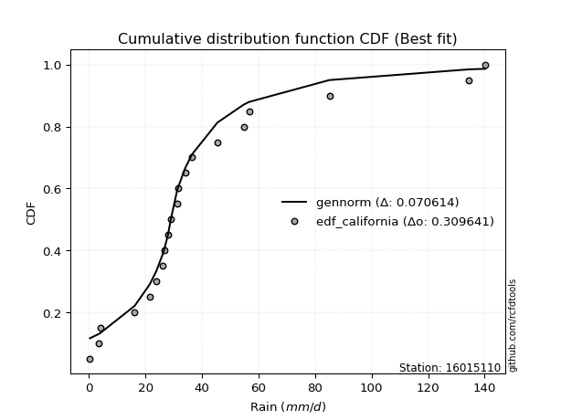</img>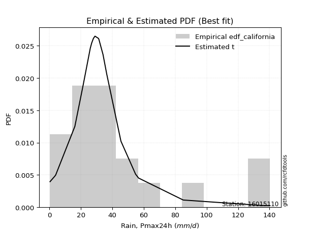</img>

</div>


### 2. Empirical - EDF Hazen (1930)

Hazen method for plotting positions is a formula used to estimate the empirical cumulative probability distribution of flood events or other hydrological data. This formula often results in biased estimations, particularly when extrapolating to extreme events (high return periods).

<div align="center">


$P=(m-0.5)/n$


</div>


**2.1. Empirical values**

<div align="center">

|                | 0                  | 1                 | 2                  | 3                  | 4                  | 5                  | 6                  | 7         | 8                  | 9                  | 10                 | 11                | 12                 | 13                 | 14                 | 15                | 16                | 17        | 18                 | 19                 |
|:---------------|:-------------------|:------------------|:-------------------|:-------------------|:-------------------|:-------------------|:-------------------|:----------|:-------------------|:-------------------|:-------------------|:------------------|:-------------------|:-------------------|:-------------------|:------------------|:------------------|:----------|:-------------------|:-------------------|
| date           | 2023               | 2025              | 2020               | 2005               | 2018               | 2007               | 2016               | 2012      | 2013               | 2017               | 2024               | 2019              | 2015               | 2008               | 2009               | 2006              | 2022              | 2011      | 2014               | 2010               |
| x              | 0.4                | 2.2               | 3.4                | 4.0                | 16.2               | 21.5               | 26.0               | 26.9      | 28.0               | 29.0               | 31.2               | 31.5              | 34.1               | 36.5               | 45.5               | 54.8              | 56.7              | 85.1      | 134.5              | 140.3              |
| m              | 1                  | 2                 | 3                  | 4                  | 5                  | 6                  | 7                  | 8         | 9                  | 10                 | 11                 | 12                | 13                 | 14                 | 15                 | 16                | 17                | 18        | 19                 | 20                 |
| empirical_dist | edf_hazen          | edf_hazen         | edf_hazen          | edf_hazen          | edf_hazen          | edf_hazen          | edf_hazen          | edf_hazen | edf_hazen          | edf_hazen          | edf_hazen          | edf_hazen         | edf_hazen          | edf_hazen          | edf_hazen          | edf_hazen         | edf_hazen         | edf_hazen | edf_hazen          | edf_hazen          |
| empirical      | 0.025              | 0.075             | 0.125              | 0.175              | 0.225              | 0.275              | 0.325              | 0.375     | 0.425              | 0.475              | 0.525              | 0.575             | 0.625              | 0.675              | 0.725              | 0.775             | 0.825             | 0.875     | 0.925              | 0.975              |
| empirical_tr   | 1.0256410256410258 | 1.081081081081081 | 1.1428571428571428 | 1.2121212121212122 | 1.2903225806451613 | 1.3793103448275863 | 1.4814814814814814 | 1.6       | 1.7391304347826089 | 1.9047619047619047 | 2.1052631578947367 | 2.352941176470588 | 2.6666666666666665 | 3.0769230769230775 | 3.6363636363636362 | 4.444444444444445 | 5.714285714285713 | 8.0       | 13.333333333333341 | 39.999999999999964 |

</div>


**2.2. Kolmogorov-Smirnov fit test (sorted by Δ)**


<div align="center">

|                | 0                   | 1                   | 2                   | 3                   | 4                   | 5                   | 6                   | 7                   | 8                  | 9                   | 10                 | 11                  | 12                  | 13                  | 14                  | 15                  | 16                  | 17                  | 18                  | 19                 | 20                  | 21                 | 22                  | 23                  | 24                 | 25                  | 26                 | 27                  | 28                  | 29                  | 30                    | 31                  | 32                 | 33                  | 34                  | 35                 | 36                 | 37                  | 38                 | 39                 | 40                  | 41                  | 42                  | 43                  | 44                  | 45                  | 46                  | 47                  | 48                  | 49                  | 50                  | 51                  | 52                  | 53                  | 54                  | 55                  | 56                  | 57                 | 58                 | 59                 | 60                  | 61                  | 62                 | 63                 | 64                  | 65                  | 66                  | 67                 | 68                  | 69                  | 70                  | 71                  | 72                  | 73                 | 74                 | 75                 | 76                  | 77                 | 78                  | 79                  | 80                 | 81                 | 82                  | 83                 | 84                 | 85                 | 86                 | 87                 | 88                 | 89                 |
|:---------------|:--------------------|:--------------------|:--------------------|:--------------------|:--------------------|:--------------------|:--------------------|:--------------------|:-------------------|:--------------------|:-------------------|:--------------------|:--------------------|:--------------------|:--------------------|:--------------------|:--------------------|:--------------------|:--------------------|:-------------------|:--------------------|:-------------------|:--------------------|:--------------------|:-------------------|:--------------------|:-------------------|:--------------------|:--------------------|:--------------------|:----------------------|:--------------------|:-------------------|:--------------------|:--------------------|:-------------------|:-------------------|:--------------------|:-------------------|:-------------------|:--------------------|:--------------------|:--------------------|:--------------------|:--------------------|:--------------------|:--------------------|:--------------------|:--------------------|:--------------------|:--------------------|:--------------------|:--------------------|:--------------------|:--------------------|:--------------------|:--------------------|:-------------------|:-------------------|:-------------------|:--------------------|:--------------------|:-------------------|:-------------------|:--------------------|:--------------------|:--------------------|:-------------------|:--------------------|:--------------------|:--------------------|:--------------------|:--------------------|:-------------------|:-------------------|:-------------------|:--------------------|:-------------------|:--------------------|:--------------------|:-------------------|:-------------------|:--------------------|:-------------------|:-------------------|:-------------------|:-------------------|:-------------------|:-------------------|:-------------------|
| station        | 16015110            | 16015110            | 16015110            | 16015110            | 16015110            | 16015110            | 16015110            | 16015110            | 16015110           | 16015110            | 16015110           | 16015110            | 16015110            | 16015110            | 16015110            | 16015110            | 16015110            | 16015110            | 16015110            | 16015110           | 16015110            | 16015110           | 16015110            | 16015110            | 16015110           | 16015110            | 16015110           | 16015110            | 16015110            | 16015110            | 16015110              | 16015110            | 16015110           | 16015110            | 16015110            | 16015110           | 16015110           | 16015110            | 16015110           | 16015110           | 16015110            | 16015110            | 16015110            | 16015110            | 16015110            | 16015110            | 16015110            | 16015110            | 16015110            | 16015110            | 16015110            | 16015110            | 16015110            | 16015110            | 16015110            | 16015110            | 16015110            | 16015110           | 16015110           | 16015110           | 16015110            | 16015110            | 16015110           | 16015110           | 16015110            | 16015110            | 16015110            | 16015110           | 16015110            | 16015110            | 16015110            | 16015110            | 16015110            | 16015110           | 16015110           | 16015110           | 16015110            | 16015110           | 16015110            | 16015110            | 16015110           | 16015110           | 16015110            | 16015110           | 16015110           | 16015110           | 16015110           | 16015110           | 16015110           | 16015110           |
| empirical_dist | edf_hazen           | edf_hazen           | edf_hazen           | edf_hazen           | edf_hazen           | edf_hazen           | edf_hazen           | edf_hazen           | edf_hazen          | edf_hazen           | edf_hazen          | edf_hazen           | edf_hazen           | edf_hazen           | edf_hazen           | edf_hazen           | edf_hazen           | edf_hazen           | edf_hazen           | edf_hazen          | edf_hazen           | edf_hazen          | edf_hazen           | edf_hazen           | edf_hazen          | edf_hazen           | edf_hazen          | edf_hazen           | edf_hazen           | edf_hazen           | edf_hazen             | edf_hazen           | edf_hazen          | edf_hazen           | edf_hazen           | edf_hazen          | edf_hazen          | edf_hazen           | edf_hazen          | edf_hazen          | edf_hazen           | edf_hazen           | edf_hazen           | edf_hazen           | edf_hazen           | edf_hazen           | edf_hazen           | edf_hazen           | edf_hazen           | edf_hazen           | edf_hazen           | edf_hazen           | edf_hazen           | edf_hazen           | edf_hazen           | edf_hazen           | edf_hazen           | edf_hazen          | edf_hazen          | edf_hazen          | edf_hazen           | edf_hazen           | edf_hazen          | edf_hazen          | edf_hazen           | edf_hazen           | edf_hazen           | edf_hazen          | edf_hazen           | edf_hazen           | edf_hazen           | edf_hazen           | edf_hazen           | edf_hazen          | edf_hazen          | edf_hazen          | edf_hazen           | edf_hazen          | edf_hazen           | edf_hazen           | edf_hazen          | edf_hazen          | edf_hazen           | edf_hazen          | edf_hazen          | edf_hazen          | edf_hazen          | edf_hazen          | edf_hazen          | edf_hazen          |
| p_dist         | logjohnsonsu        | exponnorm           | t                   | ncf                 | pearson3            | halflogistic        | logt                | moyal               | truncnorm          | invweibull          | nct                | fisk                | invgamma            | gompertz            | genlogistic         | genexpon            | logloggamma         | halfnorm            | laplace_asymmetric  | logpearson3        | johnsonsu           | loggenlogistic     | invgauss            | expon               | gumbel_r           | mielke              | fatiguelife        | loggumbel_l         | loggompertz         | logfisk             | loglaplace_asymmetric | nakagami            | f                  | rayleigh            | kstwobign           | wald               | gibrat             | weibull_min         | maxwell            | gamma              | erlang              | crystalball         | norm                | rice                | logistic            | logfatiguelife      | logcrystalball      | lognorm             | lognorm             | logexponnorm        | logrice             | lognct              | lognakagami         | loglognorm          | logbetaprime        | hypsecant           | loglogistic         | loggamma           | loggamma           | logerlang          | loghypsecant        | logalpha            | loginvgamma        | logchi2            | laplace             | loginvweibull       | loginvgauss         | logmaxwell         | loglaplace          | lograyleigh         | betaprime           | logkstwobign        | gumbel_l            | loggumbel_r        | loghalfnorm        | loggenexpon        | logmoyal            | loghalflogistic    | logexpon            | logncf              | logwald            | loggibrat          | logtruncnorm        | logf               | pareto             | logpareto          | logmielke          | logweibull_min     | alpha              | chi2               |
| delta          | 0.09297638025550076 | 0.10338247264980427 | 0.11344276097883038 | 0.11388165127255179 | 0.11409751366818999 | 0.11468383077076544 | 0.11695190183919288 | 0.12221715787470133 | 0.1235608891020844 | 0.12392423401757058 | 0.1239758440101894 | 0.12461672615839292 | 0.12733952489221495 | 0.12829638184885211 | 0.13356105001039376 | 0.13453742772635474 | 0.13523865996129542 | 0.13659766270549378 | 0.13859833991195747 | 0.1392425173160084 | 0.13988795727608444 | 0.1406226163734487 | 0.14114170153604028 | 0.14779195708941079 | 0.1477997049488834 | 0.15158711316790424 | 0.1516490163966548 | 0.15606271919419995 | 0.15886252600443357 | 0.16332096603838048 | 0.16388377531028353   | 0.16712958914250275 | 0.1685054397079186 | 0.16977688632872212 | 0.17326312066069705 | 0.1749961864712015 | 0.175              | 0.17653120393247418 | 0.1815404885715906 | 0.1994379988549812 | 0.21549148537332136 | 0.21573970166034256 | 0.21573970202792425 | 0.21702520488971733 | 0.22125412710416326 | 0.22173697574441892 | 0.22327499814726598 | 0.22327501194577565 | 0.22327501194577565 | 0.22327842018575245 | 0.22329696836327334 | 0.22396635317758645 | 0.22404090876622745 | 0.22512420448337783 | 0.22587319297237646 | 0.22593000830259835 | 0.22978460723482746 | 0.2344358449162785 | 0.2344358449162785 | 0.2350275768647087 | 0.23528845248929525 | 0.23751189824164132 | 0.2397775686952755 | 0.2422072357472967 | 0.24234627926080365 | 0.24992411633029332 | 0.25341602324831425 | 0.2537781533126687 | 0.25382103260264005 | 0.26387028387268974 | 0.27636905325998956 | 0.28430554475192327 | 0.28614380916582494 | 0.2934343986518883 | 0.2952021951578431 | 0.3157016377979349 | 0.31832734593519757 | 0.3197914595928738 | 0.37824840767072165 | 0.38384218187067953 | 0.3875230664384507 | 0.4163679938266313 | 0.42438965737653356 | 0.4888052493433331 | 0.5231523515963139 | 0.5598083459644099 | 0.5887060878483377 | 0.6050794936174145 | 0.6892710941749717 | 0.7714689138851125 |
| deltao         | 0.3096406529800002  | 0.3096406529800002  | 0.3096406529800002  | 0.3096406529800002  | 0.3096406529800002  | 0.3096406529800002  | 0.3096406529800002  | 0.3096406529800002  | 0.3096406529800002 | 0.3096406529800002  | 0.3096406529800002 | 0.3096406529800002  | 0.3096406529800002  | 0.3096406529800002  | 0.3096406529800002  | 0.3096406529800002  | 0.3096406529800002  | 0.3096406529800002  | 0.3096406529800002  | 0.3096406529800002 | 0.3096406529800002  | 0.3096406529800002 | 0.3096406529800002  | 0.3096406529800002  | 0.3096406529800002 | 0.3096406529800002  | 0.3096406529800002 | 0.3096406529800002  | 0.3096406529800002  | 0.3096406529800002  | 0.3096406529800002    | 0.3096406529800002  | 0.3096406529800002 | 0.3096406529800002  | 0.3096406529800002  | 0.3096406529800002 | 0.3096406529800002 | 0.3096406529800002  | 0.3096406529800002 | 0.3096406529800002 | 0.3096406529800002  | 0.3096406529800002  | 0.3096406529800002  | 0.3096406529800002  | 0.3096406529800002  | 0.3096406529800002  | 0.3096406529800002  | 0.3096406529800002  | 0.3096406529800002  | 0.3096406529800002  | 0.3096406529800002  | 0.3096406529800002  | 0.3096406529800002  | 0.3096406529800002  | 0.3096406529800002  | 0.3096406529800002  | 0.3096406529800002  | 0.3096406529800002 | 0.3096406529800002 | 0.3096406529800002 | 0.3096406529800002  | 0.3096406529800002  | 0.3096406529800002 | 0.3096406529800002 | 0.3096406529800002  | 0.3096406529800002  | 0.3096406529800002  | 0.3096406529800002 | 0.3096406529800002  | 0.3096406529800002  | 0.3096406529800002  | 0.3096406529800002  | 0.3096406529800002  | 0.3096406529800002 | 0.3096406529800002 | 0.3096406529800002 | 0.3096406529800002  | 0.3096406529800002 | 0.3096406529800002  | 0.3096406529800002  | 0.3096406529800002 | 0.3096406529800002 | 0.3096406529800002  | 0.3096406529800002 | 0.3096406529800002 | 0.3096406529800002 | 0.3096406529800002 | 0.3096406529800002 | 0.3096406529800002 | 0.3096406529800002 |
| eval           | Δo > Δ              | Δo > Δ              | Δo > Δ              | Δo > Δ              | Δo > Δ              | Δo > Δ              | Δo > Δ              | Δo > Δ              | Δo > Δ             | Δo > Δ              | Δo > Δ             | Δo > Δ              | Δo > Δ              | Δo > Δ              | Δo > Δ              | Δo > Δ              | Δo > Δ              | Δo > Δ              | Δo > Δ              | Δo > Δ             | Δo > Δ              | Δo > Δ             | Δo > Δ              | Δo > Δ              | Δo > Δ             | Δo > Δ              | Δo > Δ             | Δo > Δ              | Δo > Δ              | Δo > Δ              | Δo > Δ                | Δo > Δ              | Δo > Δ             | Δo > Δ              | Δo > Δ              | Δo > Δ             | Δo > Δ             | Δo > Δ              | Δo > Δ             | Δo > Δ             | Δo > Δ              | Δo > Δ              | Δo > Δ              | Δo > Δ              | Δo > Δ              | Δo > Δ              | Δo > Δ              | Δo > Δ              | Δo > Δ              | Δo > Δ              | Δo > Δ              | Δo > Δ              | Δo > Δ              | Δo > Δ              | Δo > Δ              | Δo > Δ              | Δo > Δ              | Δo > Δ             | Δo > Δ             | Δo > Δ             | Δo > Δ              | Δo > Δ              | Δo > Δ             | Δo > Δ             | Δo > Δ              | Δo > Δ              | Δo > Δ              | Δo > Δ             | Δo > Δ              | Δo > Δ              | Δo > Δ              | Δo > Δ              | Δo > Δ              | Δo > Δ             | Δo > Δ             | Δo <= Δ            | Δo <= Δ             | Δo <= Δ            | Δo <= Δ             | Δo <= Δ             | Δo <= Δ            | Δo <= Δ            | Δo <= Δ             | Δo <= Δ            | Δo <= Δ            | Δo <= Δ            | Δo <= Δ            | Δo <= Δ            | Δo <= Δ            | Δo <= Δ            |
| fit            | 1                   | 1                   | 1                   | 1                   | 1                   | 1                   | 1                   | 1                   | 1                  | 1                   | 1                  | 1                   | 1                   | 1                   | 1                   | 1                   | 1                   | 1                   | 1                   | 1                  | 1                   | 1                  | 1                   | 1                   | 1                  | 1                   | 1                  | 1                   | 1                   | 1                   | 1                     | 1                   | 1                  | 1                   | 1                   | 1                  | 1                  | 1                   | 1                  | 1                  | 1                   | 1                   | 1                   | 1                   | 1                   | 1                   | 1                   | 1                   | 1                   | 1                   | 1                   | 1                   | 1                   | 1                   | 1                   | 1                   | 1                   | 1                  | 1                  | 1                  | 1                   | 1                   | 1                  | 1                  | 1                   | 1                   | 1                   | 1                  | 1                   | 1                   | 1                   | 1                   | 1                   | 1                  | 1                  | 0                  | 0                   | 0                  | 0                   | 0                   | 0                  | 0                  | 0                   | 0                  | 0                  | 0                  | 0                  | 0                  | 0                  | 0                  |
| n              | 20                  | 20                  | 20                  | 20                  | 20                  | 20                  | 20                  | 20                  | 20                 | 20                  | 20                 | 20                  | 20                  | 20                  | 20                  | 20                  | 20                  | 20                  | 20                  | 20                 | 20                  | 20                 | 20                  | 20                  | 20                 | 20                  | 20                 | 20                  | 20                  | 20                  | 20                    | 20                  | 20                 | 20                  | 20                  | 20                 | 20                 | 20                  | 20                 | 20                 | 20                  | 20                  | 20                  | 20                  | 20                  | 20                  | 20                  | 20                  | 20                  | 20                  | 20                  | 20                  | 20                  | 20                  | 20                  | 20                  | 20                  | 20                 | 20                 | 20                 | 20                  | 20                  | 20                 | 20                 | 20                  | 20                  | 20                  | 20                 | 20                  | 20                  | 20                  | 20                  | 20                  | 20                 | 20                 | 20                 | 20                  | 20                 | 20                  | 20                  | 20                 | 20                 | 20                  | 20                 | 20                 | 20                 | 20                 | 20                 | 20                 | 20                 |
| best_fit       | 1                   | 0                   | 0                   | 0                   | 0                   | 0                   | 0                   | 0                   | 0                  | 0                   | 0                  | 0                   | 0                   | 0                   | 0                   | 0                   | 0                   | 0                   | 0                   | 0                  | 0                   | 0                  | 0                   | 0                   | 0                  | 0                   | 0                  | 0                   | 0                   | 0                   | 0                     | 0                   | 0                  | 0                   | 0                   | 0                  | 0                  | 0                   | 0                  | 0                  | 0                   | 0                   | 0                   | 0                   | 0                   | 0                   | 0                   | 0                   | 0                   | 0                   | 0                   | 0                   | 0                   | 0                   | 0                   | 0                   | 0                   | 0                  | 0                  | 0                  | 0                   | 0                   | 0                  | 0                  | 0                   | 0                   | 0                   | 0                  | 0                   | 0                   | 0                   | 0                   | 0                   | 0                  | 0                  | 0                  | 0                   | 0                  | 0                   | 0                   | 0                  | 0                  | 0                   | 0                  | 0                  | 0                  | 0                  | 0                  | 0                  | 0                  |
| best_fit_sort  | 1                   | 2                   | 3                   | 4                   | 5                   | 6                   | 7                   | 8                   | 9                  | 10                  | 11                 | 12                  | 13                  | 14                  | 15                  | 16                  | 17                  | 18                  | 19                  | 20                 | 21                  | 22                 | 23                  | 24                  | 25                 | 26                  | 27                 | 28                  | 29                  | 30                  | 31                    | 32                  | 33                 | 34                  | 35                  | 36                 | 37                 | 38                  | 39                 | 40                 | 41                  | 42                  | 43                  | 44                  | 45                  | 46                  | 47                  | 48                  | 49                  | 50                  | 51                  | 52                  | 53                  | 54                  | 55                  | 56                  | 57                  | 58                 | 59                 | 60                 | 61                  | 62                  | 63                 | 64                 | 65                  | 66                  | 67                  | 68                 | 69                  | 70                  | 71                  | 72                  | 73                  | 74                 | 75                 | 76                 | 77                  | 78                 | 79                  | 80                  | 81                 | 82                 | 83                  | 84                 | 85                 | 86                 | 87                 | 88                 | 89                 | 90                 |

</div>


<div align="center">

</img>

</div>


**2.3. Best fit**

<div align="center">

|   id |   station | empirical_dist   | p_dist       |     delta |   deltao | eval   |   fit |   n |   best_fit |   best_fit_sort |
|-----:|----------:|:-----------------|:-------------|----------:|---------:|:-------|------:|----:|-----------:|----------------:|
|    0 |  16015110 | edf_hazen        | logjohnsonsu | 0.0929764 | 0.309641 | Δo > Δ |     1 |  20 |          1 |               1 |

</div>


<div align="center">

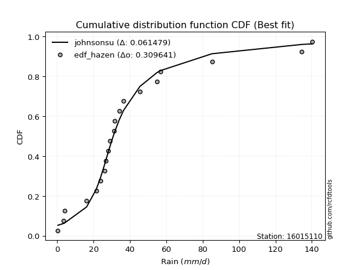</img>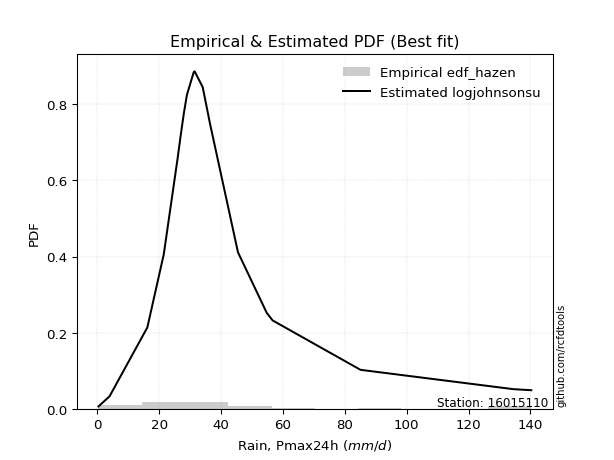</img>

</div>


### 3. Empirical - EDF Weibull (1939)

Weibull plotting position formula is an empirical method used to estimate the non-exceedance probability or plotting position for a set of observed data, is often recommended or widely used in practice, particularly in flood frequency analysis.

<div align="center">


$P=m/(n+1)$


</div>


**3.1. Empirical values**

<div align="center">

|                | 0                    | 1                   | 2                   | 3                   | 4                   | 5                  | 6                  | 7                   | 8                   | 9                   | 10                 | 11                 | 12                 | 13                 | 14                 | 15                 | 16                 | 17                 | 18                 | 19                 |
|:---------------|:---------------------|:--------------------|:--------------------|:--------------------|:--------------------|:-------------------|:-------------------|:--------------------|:--------------------|:--------------------|:-------------------|:-------------------|:-------------------|:-------------------|:-------------------|:-------------------|:-------------------|:-------------------|:-------------------|:-------------------|
| date           | 2023                 | 2025                | 2020                | 2005                | 2018                | 2007               | 2016               | 2012                | 2013                | 2017                | 2024               | 2019               | 2015               | 2008               | 2009               | 2006               | 2022               | 2011               | 2014               | 2010               |
| x              | 0.4                  | 2.2                 | 3.4                 | 4.0                 | 16.2                | 21.5               | 26.0               | 26.9                | 28.0                | 29.0                | 31.2               | 31.5               | 34.1               | 36.5               | 45.5               | 54.8               | 56.7               | 85.1               | 134.5              | 140.3              |
| m              | 1                    | 2                   | 3                   | 4                   | 5                   | 6                  | 7                  | 8                   | 9                   | 10                  | 11                 | 12                 | 13                 | 14                 | 15                 | 16                 | 17                 | 18                 | 19                 | 20                 |
| empirical_dist | edf_weibull          | edf_weibull         | edf_weibull         | edf_weibull         | edf_weibull         | edf_weibull        | edf_weibull        | edf_weibull         | edf_weibull         | edf_weibull         | edf_weibull        | edf_weibull        | edf_weibull        | edf_weibull        | edf_weibull        | edf_weibull        | edf_weibull        | edf_weibull        | edf_weibull        | edf_weibull        |
| empirical      | 0.047619047619047616 | 0.09523809523809523 | 0.14285714285714285 | 0.19047619047619047 | 0.23809523809523808 | 0.2857142857142857 | 0.3333333333333333 | 0.38095238095238093 | 0.42857142857142855 | 0.47619047619047616 | 0.5238095238095238 | 0.5714285714285714 | 0.6190476190476191 | 0.6666666666666666 | 0.7142857142857143 | 0.7619047619047619 | 0.8095238095238095 | 0.8571428571428571 | 0.9047619047619048 | 0.9523809523809523 |
| empirical_tr   | 1.05                 | 1.1052631578947367  | 1.1666666666666665  | 1.2352941176470589  | 1.3125              | 1.4                | 1.4999999999999998 | 1.6153846153846154  | 1.75                | 1.909090909090909   | 2.1                | 2.333333333333333  | 2.625              | 2.9999999999999996 | 3.5                | 4.199999999999999  | 5.25               | 6.999999999999997  | 10.5               | 20.999999999999975 |

</div>


**3.2. Kolmogorov-Smirnov fit test (sorted by Δ)**


<div align="center">

|                | 0                   | 1                   | 2                   | 3                   | 4                   | 5                   | 6                   | 7                   | 8                  | 9                   | 10                  | 11                  | 12                  | 13                  | 14                  | 15                 | 16                  | 17                  | 18                 | 19                  | 20                 | 21                  | 22                  | 23                  | 24                  | 25                  | 26                 | 27                  | 28                  | 29                  | 30                    | 31                  | 32                 | 33                 | 34                  | 35                  | 36                 | 37                  | 38                  | 39                 | 40                  | 41                  | 42                  | 43                 | 44                  | 45                  | 46                  | 47                  | 48                  | 49                  | 50                  | 51                  | 52                  | 53                  | 54                  | 55                  | 56                  | 57                 | 58                 | 59                 | 60                  | 61                  | 62                 | 63                  | 64                  | 65                  | 66                 | 67                  | 68                  | 69                  | 70                  | 71                 | 72                 | 73                 | 74                 | 75                  | 76                  | 77                 | 78                 | 79                  | 80                  | 81                 | 82                  | 83                  | 84                 | 85                 | 86                 | 87                 | 88                 | 89                 |
|:---------------|:--------------------|:--------------------|:--------------------|:--------------------|:--------------------|:--------------------|:--------------------|:--------------------|:-------------------|:--------------------|:--------------------|:--------------------|:--------------------|:--------------------|:--------------------|:-------------------|:--------------------|:--------------------|:-------------------|:--------------------|:-------------------|:--------------------|:--------------------|:--------------------|:--------------------|:--------------------|:-------------------|:--------------------|:--------------------|:--------------------|:----------------------|:--------------------|:-------------------|:-------------------|:--------------------|:--------------------|:-------------------|:--------------------|:--------------------|:-------------------|:--------------------|:--------------------|:--------------------|:-------------------|:--------------------|:--------------------|:--------------------|:--------------------|:--------------------|:--------------------|:--------------------|:--------------------|:--------------------|:--------------------|:--------------------|:--------------------|:--------------------|:-------------------|:-------------------|:-------------------|:--------------------|:--------------------|:-------------------|:--------------------|:--------------------|:--------------------|:-------------------|:--------------------|:--------------------|:--------------------|:--------------------|:-------------------|:-------------------|:-------------------|:-------------------|:--------------------|:--------------------|:-------------------|:-------------------|:--------------------|:--------------------|:-------------------|:--------------------|:--------------------|:-------------------|:-------------------|:-------------------|:-------------------|:-------------------|:-------------------|
| station        | 16015110            | 16015110            | 16015110            | 16015110            | 16015110            | 16015110            | 16015110            | 16015110            | 16015110           | 16015110            | 16015110            | 16015110            | 16015110            | 16015110            | 16015110            | 16015110           | 16015110            | 16015110            | 16015110           | 16015110            | 16015110           | 16015110            | 16015110            | 16015110            | 16015110            | 16015110            | 16015110           | 16015110            | 16015110            | 16015110            | 16015110              | 16015110            | 16015110           | 16015110           | 16015110            | 16015110            | 16015110           | 16015110            | 16015110            | 16015110           | 16015110            | 16015110            | 16015110            | 16015110           | 16015110            | 16015110            | 16015110            | 16015110            | 16015110            | 16015110            | 16015110            | 16015110            | 16015110            | 16015110            | 16015110            | 16015110            | 16015110            | 16015110           | 16015110           | 16015110           | 16015110            | 16015110            | 16015110           | 16015110            | 16015110            | 16015110            | 16015110           | 16015110            | 16015110            | 16015110            | 16015110            | 16015110           | 16015110           | 16015110           | 16015110           | 16015110            | 16015110            | 16015110           | 16015110           | 16015110            | 16015110            | 16015110           | 16015110            | 16015110            | 16015110           | 16015110           | 16015110           | 16015110           | 16015110           | 16015110           |
| empirical_dist | edf_weibull         | edf_weibull         | edf_weibull         | edf_weibull         | edf_weibull         | edf_weibull         | edf_weibull         | edf_weibull         | edf_weibull        | edf_weibull         | edf_weibull         | edf_weibull         | edf_weibull         | edf_weibull         | edf_weibull         | edf_weibull        | edf_weibull         | edf_weibull         | edf_weibull        | edf_weibull         | edf_weibull        | edf_weibull         | edf_weibull         | edf_weibull         | edf_weibull         | edf_weibull         | edf_weibull        | edf_weibull         | edf_weibull         | edf_weibull         | edf_weibull           | edf_weibull         | edf_weibull        | edf_weibull        | edf_weibull         | edf_weibull         | edf_weibull        | edf_weibull         | edf_weibull         | edf_weibull        | edf_weibull         | edf_weibull         | edf_weibull         | edf_weibull        | edf_weibull         | edf_weibull         | edf_weibull         | edf_weibull         | edf_weibull         | edf_weibull         | edf_weibull         | edf_weibull         | edf_weibull         | edf_weibull         | edf_weibull         | edf_weibull         | edf_weibull         | edf_weibull        | edf_weibull        | edf_weibull        | edf_weibull         | edf_weibull         | edf_weibull        | edf_weibull         | edf_weibull         | edf_weibull         | edf_weibull        | edf_weibull         | edf_weibull         | edf_weibull         | edf_weibull         | edf_weibull        | edf_weibull        | edf_weibull        | edf_weibull        | edf_weibull         | edf_weibull         | edf_weibull        | edf_weibull        | edf_weibull         | edf_weibull         | edf_weibull        | edf_weibull         | edf_weibull         | edf_weibull        | edf_weibull        | edf_weibull        | edf_weibull        | edf_weibull        | edf_weibull        |
| p_dist         | t                   | ncf                 | logjohnsonsu        | pearson3            | halflogistic        | exponnorm           | moyal               | invweibull          | nct                | invgamma            | gompertz            | fisk                | truncnorm           | genlogistic         | genexpon            | logloggamma        | halfnorm            | laplace_asymmetric  | logpearson3        | johnsonsu           | loggenlogistic     | logt                | invgauss            | expon               | gumbel_r            | mielke              | fatiguelife        | loggumbel_l         | loggompertz         | logfisk             | loglaplace_asymmetric | nakagami            | f                  | rayleigh           | kstwobign           | weibull_min         | maxwell            | wald                | gibrat              | gamma              | erlang              | crystalball         | norm                | rice               | logistic            | logfatiguelife      | logcrystalball      | lognorm             | lognorm             | logexponnorm        | logrice             | lognct              | lognakagami         | loglognorm          | logbetaprime        | hypsecant           | loglogistic         | loggamma           | loggamma           | logerlang          | logalpha            | loghypsecant        | loginvgamma        | logchi2             | laplace             | loginvweibull       | loginvgauss        | logmaxwell          | loglaplace          | lograyleigh         | betaprime           | logkstwobign       | gumbel_l           | loghalfnorm        | loggumbel_r        | loggenexpon         | logmoyal            | loghalflogistic    | logncf             | logexpon            | logwald             | loggibrat          | logtruncnorm        | logf                | pareto             | logpareto          | logmielke          | logweibull_min     | alpha              | chi2               |
| delta          | 0.10510942764549708 | 0.10554831793921837 | 0.10561064936935549 | 0.10576418033485657 | 0.10635049743743213 | 0.11022831963109175 | 0.11388382454136792 | 0.11559090068423727 | 0.1156425106768561 | 0.11900619155888165 | 0.11996304851551881 | 0.12155058223072655 | 0.12270789739588288 | 0.12522771667706034 | 0.12620409439302144 | 0.1269053266279621 | 0.12826432937216037 | 0.13026500657862405 | 0.1309091839826751 | 0.13155462394275114 | 0.1322892830401154 | 0.13242809231538336 | 0.13280836820270697 | 0.13945862375607748 | 0.13946637161554998 | 0.14325377983457094 | 0.1433156830633215 | 0.14772938586086665 | 0.15052919267110026 | 0.15498763270504717 | 0.15555044197695023   | 0.15879625580916934 | 0.1601721063745853 | 0.1614435529953887 | 0.16492978732736363 | 0.16819787059914088 | 0.1732071552382572 | 0.19047237694739197 | 0.19047619047619047 | 0.1911046655216479 | 0.20715815203998805 | 0.20740636832700915 | 0.20740636869459084 | 0.2086918715563839 | 0.21292079377082984 | 0.21340364241108561 | 0.21494166481393268 | 0.21494167861244234 | 0.21494167861244234 | 0.21494508685241914 | 0.21496363502994004 | 0.21563301984425315 | 0.21570757543289415 | 0.21679087115004453 | 0.21753985963904315 | 0.21759667496926494 | 0.22145127390149416 | 0.2261025115829452 | 0.2261025115829452 | 0.2266942435313754 | 0.22679761252735564 | 0.22695511915596195 | 0.2314442353619422 | 0.23387390241396339 | 0.23401294592747024 | 0.23920983061600765 | 0.2428179535022174 | 0.24544481997933537 | 0.24548769926930675 | 0.25525495864528674 | 0.26803571992665626 | 0.2735912590376376 | 0.2778104758324915 | 0.2844879094435574 | 0.285101065318555  | 0.30462008743634805 | 0.30999401260186427 | 0.3101439744898464 | 0.3636040866325843 | 0.36515316957548355 | 0.37906719181442344 | 0.408034660493298  | 0.41250154241779013 | 0.46856715410523786 | 0.5029142563582186 | 0.5395702507263146 | 0.5756108497530996 | 0.5919842555221764 | 0.6761758560797335 | 0.7583736757898745 |
| deltao         | 0.3096406529800002  | 0.3096406529800002  | 0.3096406529800002  | 0.3096406529800002  | 0.3096406529800002  | 0.3096406529800002  | 0.3096406529800002  | 0.3096406529800002  | 0.3096406529800002 | 0.3096406529800002  | 0.3096406529800002  | 0.3096406529800002  | 0.3096406529800002  | 0.3096406529800002  | 0.3096406529800002  | 0.3096406529800002 | 0.3096406529800002  | 0.3096406529800002  | 0.3096406529800002 | 0.3096406529800002  | 0.3096406529800002 | 0.3096406529800002  | 0.3096406529800002  | 0.3096406529800002  | 0.3096406529800002  | 0.3096406529800002  | 0.3096406529800002 | 0.3096406529800002  | 0.3096406529800002  | 0.3096406529800002  | 0.3096406529800002    | 0.3096406529800002  | 0.3096406529800002 | 0.3096406529800002 | 0.3096406529800002  | 0.3096406529800002  | 0.3096406529800002 | 0.3096406529800002  | 0.3096406529800002  | 0.3096406529800002 | 0.3096406529800002  | 0.3096406529800002  | 0.3096406529800002  | 0.3096406529800002 | 0.3096406529800002  | 0.3096406529800002  | 0.3096406529800002  | 0.3096406529800002  | 0.3096406529800002  | 0.3096406529800002  | 0.3096406529800002  | 0.3096406529800002  | 0.3096406529800002  | 0.3096406529800002  | 0.3096406529800002  | 0.3096406529800002  | 0.3096406529800002  | 0.3096406529800002 | 0.3096406529800002 | 0.3096406529800002 | 0.3096406529800002  | 0.3096406529800002  | 0.3096406529800002 | 0.3096406529800002  | 0.3096406529800002  | 0.3096406529800002  | 0.3096406529800002 | 0.3096406529800002  | 0.3096406529800002  | 0.3096406529800002  | 0.3096406529800002  | 0.3096406529800002 | 0.3096406529800002 | 0.3096406529800002 | 0.3096406529800002 | 0.3096406529800002  | 0.3096406529800002  | 0.3096406529800002 | 0.3096406529800002 | 0.3096406529800002  | 0.3096406529800002  | 0.3096406529800002 | 0.3096406529800002  | 0.3096406529800002  | 0.3096406529800002 | 0.3096406529800002 | 0.3096406529800002 | 0.3096406529800002 | 0.3096406529800002 | 0.3096406529800002 |
| eval           | Δo > Δ              | Δo > Δ              | Δo > Δ              | Δo > Δ              | Δo > Δ              | Δo > Δ              | Δo > Δ              | Δo > Δ              | Δo > Δ             | Δo > Δ              | Δo > Δ              | Δo > Δ              | Δo > Δ              | Δo > Δ              | Δo > Δ              | Δo > Δ             | Δo > Δ              | Δo > Δ              | Δo > Δ             | Δo > Δ              | Δo > Δ             | Δo > Δ              | Δo > Δ              | Δo > Δ              | Δo > Δ              | Δo > Δ              | Δo > Δ             | Δo > Δ              | Δo > Δ              | Δo > Δ              | Δo > Δ                | Δo > Δ              | Δo > Δ             | Δo > Δ             | Δo > Δ              | Δo > Δ              | Δo > Δ             | Δo > Δ              | Δo > Δ              | Δo > Δ             | Δo > Δ              | Δo > Δ              | Δo > Δ              | Δo > Δ             | Δo > Δ              | Δo > Δ              | Δo > Δ              | Δo > Δ              | Δo > Δ              | Δo > Δ              | Δo > Δ              | Δo > Δ              | Δo > Δ              | Δo > Δ              | Δo > Δ              | Δo > Δ              | Δo > Δ              | Δo > Δ             | Δo > Δ             | Δo > Δ             | Δo > Δ              | Δo > Δ              | Δo > Δ             | Δo > Δ              | Δo > Δ              | Δo > Δ              | Δo > Δ             | Δo > Δ              | Δo > Δ              | Δo > Δ              | Δo > Δ              | Δo > Δ             | Δo > Δ             | Δo > Δ             | Δo > Δ             | Δo > Δ              | Δo <= Δ             | Δo <= Δ            | Δo <= Δ            | Δo <= Δ             | Δo <= Δ             | Δo <= Δ            | Δo <= Δ             | Δo <= Δ             | Δo <= Δ            | Δo <= Δ            | Δo <= Δ            | Δo <= Δ            | Δo <= Δ            | Δo <= Δ            |
| fit            | 1                   | 1                   | 1                   | 1                   | 1                   | 1                   | 1                   | 1                   | 1                  | 1                   | 1                   | 1                   | 1                   | 1                   | 1                   | 1                  | 1                   | 1                   | 1                  | 1                   | 1                  | 1                   | 1                   | 1                   | 1                   | 1                   | 1                  | 1                   | 1                   | 1                   | 1                     | 1                   | 1                  | 1                  | 1                   | 1                   | 1                  | 1                   | 1                   | 1                  | 1                   | 1                   | 1                   | 1                  | 1                   | 1                   | 1                   | 1                   | 1                   | 1                   | 1                   | 1                   | 1                   | 1                   | 1                   | 1                   | 1                   | 1                  | 1                  | 1                  | 1                   | 1                   | 1                  | 1                   | 1                   | 1                   | 1                  | 1                   | 1                   | 1                   | 1                   | 1                  | 1                  | 1                  | 1                  | 1                   | 0                   | 0                  | 0                  | 0                   | 0                   | 0                  | 0                   | 0                   | 0                  | 0                  | 0                  | 0                  | 0                  | 0                  |
| n              | 20                  | 20                  | 20                  | 20                  | 20                  | 20                  | 20                  | 20                  | 20                 | 20                  | 20                  | 20                  | 20                  | 20                  | 20                  | 20                 | 20                  | 20                  | 20                 | 20                  | 20                 | 20                  | 20                  | 20                  | 20                  | 20                  | 20                 | 20                  | 20                  | 20                  | 20                    | 20                  | 20                 | 20                 | 20                  | 20                  | 20                 | 20                  | 20                  | 20                 | 20                  | 20                  | 20                  | 20                 | 20                  | 20                  | 20                  | 20                  | 20                  | 20                  | 20                  | 20                  | 20                  | 20                  | 20                  | 20                  | 20                  | 20                 | 20                 | 20                 | 20                  | 20                  | 20                 | 20                  | 20                  | 20                  | 20                 | 20                  | 20                  | 20                  | 20                  | 20                 | 20                 | 20                 | 20                 | 20                  | 20                  | 20                 | 20                 | 20                  | 20                  | 20                 | 20                  | 20                  | 20                 | 20                 | 20                 | 20                 | 20                 | 20                 |
| best_fit       | 1                   | 0                   | 0                   | 0                   | 0                   | 0                   | 0                   | 0                   | 0                  | 0                   | 0                   | 0                   | 0                   | 0                   | 0                   | 0                  | 0                   | 0                   | 0                  | 0                   | 0                  | 0                   | 0                   | 0                   | 0                   | 0                   | 0                  | 0                   | 0                   | 0                   | 0                     | 0                   | 0                  | 0                  | 0                   | 0                   | 0                  | 0                   | 0                   | 0                  | 0                   | 0                   | 0                   | 0                  | 0                   | 0                   | 0                   | 0                   | 0                   | 0                   | 0                   | 0                   | 0                   | 0                   | 0                   | 0                   | 0                   | 0                  | 0                  | 0                  | 0                   | 0                   | 0                  | 0                   | 0                   | 0                   | 0                  | 0                   | 0                   | 0                   | 0                   | 0                  | 0                  | 0                  | 0                  | 0                   | 0                   | 0                  | 0                  | 0                   | 0                   | 0                  | 0                   | 0                   | 0                  | 0                  | 0                  | 0                  | 0                  | 0                  |
| best_fit_sort  | 1                   | 2                   | 3                   | 4                   | 5                   | 6                   | 7                   | 8                   | 9                  | 10                  | 11                  | 12                  | 13                  | 14                  | 15                  | 16                 | 17                  | 18                  | 19                 | 20                  | 21                 | 22                  | 23                  | 24                  | 25                  | 26                  | 27                 | 28                  | 29                  | 30                  | 31                    | 32                  | 33                 | 34                 | 35                  | 36                  | 37                 | 38                  | 39                  | 40                 | 41                  | 42                  | 43                  | 44                 | 45                  | 46                  | 47                  | 48                  | 49                  | 50                  | 51                  | 52                  | 53                  | 54                  | 55                  | 56                  | 57                  | 58                 | 59                 | 60                 | 61                  | 62                  | 63                 | 64                  | 65                  | 66                  | 67                 | 68                  | 69                  | 70                  | 71                  | 72                 | 73                 | 74                 | 75                 | 76                  | 77                  | 78                 | 79                 | 80                  | 81                  | 82                 | 83                  | 84                  | 85                 | 86                 | 87                 | 88                 | 89                 | 90                 |

</div>


<div align="center">

</img>

</div>


**3.3. Best fit**

<div align="center">

|   id |   station | empirical_dist   | p_dist   |    delta |   deltao | eval   |   fit |   n |   best_fit |   best_fit_sort |
|-----:|----------:|:-----------------|:---------|---------:|---------:|:-------|------:|----:|-----------:|----------------:|
|    0 |  16015110 | edf_weibull      | t        | 0.105109 | 0.309641 | Δo > Δ |     1 |  20 |          1 |               1 |

</div>


<div align="center">

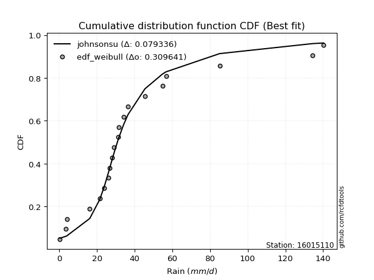</img></img>

</div>


### 4. Empirical - EDF Beard (1943)

The Beard formula (or Beard´s plotting position formula) in hydrology is used to estimate the empirical non-exceedance probability _(P)_ of a flood event (or other extreme hydrological data point) within a given dataset.

<div align="center">


$P=(m-0.31)/(n+0.38)$


</div>


**4.1. Empirical values**

<div align="center">

|                | 0                    | 1                   | 2                   | 3                   | 4                   | 5                   | 6                   | 7                  | 8                  | 9                   | 10                 | 11                 | 12                 | 13                 | 14                 | 15                 | 16                 | 17                 | 18                 | 19                 |
|:---------------|:---------------------|:--------------------|:--------------------|:--------------------|:--------------------|:--------------------|:--------------------|:-------------------|:-------------------|:--------------------|:-------------------|:-------------------|:-------------------|:-------------------|:-------------------|:-------------------|:-------------------|:-------------------|:-------------------|:-------------------|
| date           | 2023                 | 2025                | 2020                | 2005                | 2018                | 2007                | 2016                | 2012               | 2013               | 2017                | 2024               | 2019               | 2015               | 2008               | 2009               | 2006               | 2022               | 2011               | 2014               | 2010               |
| x              | 0.4                  | 2.2                 | 3.4                 | 4.0                 | 16.2                | 21.5                | 26.0                | 26.9               | 28.0               | 29.0                | 31.2               | 31.5               | 34.1               | 36.5               | 45.5               | 54.8               | 56.7               | 85.1               | 134.5              | 140.3              |
| m              | 1                    | 2                   | 3                   | 4                   | 5                   | 6                   | 7                   | 8                  | 9                  | 10                  | 11                 | 12                 | 13                 | 14                 | 15                 | 16                 | 17                 | 18                 | 19                 | 20                 |
| empirical_dist | edf_beard            | edf_beard           | edf_beard           | edf_beard           | edf_beard           | edf_beard           | edf_beard           | edf_beard          | edf_beard          | edf_beard           | edf_beard          | edf_beard          | edf_beard          | edf_beard          | edf_beard          | edf_beard          | edf_beard          | edf_beard          | edf_beard          | edf_beard          |
| empirical      | 0.033856722276741906 | 0.08292443572129539 | 0.13199214916584887 | 0.18105986261040236 | 0.23012757605495587 | 0.27919528949950934 | 0.32826300294406285 | 0.3773307163886163 | 0.4263984298331698 | 0.47546614327772324 | 0.5245338567222767 | 0.5736015701668302 | 0.6226692836113837 | 0.6717369970559373 | 0.7208047105004907 | 0.7698724239450442 | 0.8189401373895977 | 0.8680078508341512 | 0.9170755642787047 | 0.9661432777232583 |
| empirical_tr   | 1.0350431691213813   | 1.090422685928304   | 1.152063312605992   | 1.2210904733373276  | 1.2989165073295095  | 1.3873383253914227  | 1.4886778670562455  | 1.6059889676910957 | 1.7433704020530367 | 1.9064546304957901  | 2.1031991744066048 | 2.3452243958573074 | 2.6501950585175553 | 3.0463378176382667 | 3.581722319859402  | 4.345415778251599  | 5.523035230352305  | 7.576208178438667  | 12.059171597633155 | 29.536231884058108 |

</div>


**4.2. Kolmogorov-Smirnov fit test (sorted by Δ)**


<div align="center">

|                | 0                   | 1                   | 2                   | 3                  | 4                  | 5                  | 6                   | 7                   | 8                   | 9                   | 10                  | 11                  | 12                  | 13                  | 14                  | 15                 | 16                  | 17                 | 18                  | 19                  | 20                 | 21                  | 22                  | 23                  | 24                 | 25                 | 26                  | 27                 | 28                  | 29                  | 30                    | 31                  | 32                  | 33                  | 34                  | 35                  | 36                  | 37                  | 38                  | 39                  | 40                 | 41                  | 42                  | 43                  | 44                  | 45                  | 46                  | 47                 | 48                 | 49                 | 50                 | 51                 | 52                 | 53                 | 54                  | 55                  | 56                  | 57                  | 58                  | 59                  | 60                 | 61                 | 62                  | 63                  | 64                  | 65                 | 66                  | 67                  | 68                 | 69                 | 70                 | 71                  | 72                  | 73                  | 74                  | 75                 | 76                 | 77                 | 78                  | 79                  | 80                 | 81                  | 82                  | 83                 | 84                 | 85                 | 86                 | 87                 | 88                 | 89                 |
|:---------------|:--------------------|:--------------------|:--------------------|:-------------------|:-------------------|:-------------------|:--------------------|:--------------------|:--------------------|:--------------------|:--------------------|:--------------------|:--------------------|:--------------------|:--------------------|:-------------------|:--------------------|:-------------------|:--------------------|:--------------------|:-------------------|:--------------------|:--------------------|:--------------------|:-------------------|:-------------------|:--------------------|:-------------------|:--------------------|:--------------------|:----------------------|:--------------------|:--------------------|:--------------------|:--------------------|:--------------------|:--------------------|:--------------------|:--------------------|:--------------------|:-------------------|:--------------------|:--------------------|:--------------------|:--------------------|:--------------------|:--------------------|:-------------------|:-------------------|:-------------------|:-------------------|:-------------------|:-------------------|:-------------------|:--------------------|:--------------------|:--------------------|:--------------------|:--------------------|:--------------------|:-------------------|:-------------------|:--------------------|:--------------------|:--------------------|:-------------------|:--------------------|:--------------------|:-------------------|:-------------------|:-------------------|:--------------------|:--------------------|:--------------------|:--------------------|:-------------------|:-------------------|:-------------------|:--------------------|:--------------------|:-------------------|:--------------------|:--------------------|:-------------------|:-------------------|:-------------------|:-------------------|:-------------------|:-------------------|:-------------------|
| station        | 16015110            | 16015110            | 16015110            | 16015110           | 16015110           | 16015110           | 16015110            | 16015110            | 16015110            | 16015110            | 16015110            | 16015110            | 16015110            | 16015110            | 16015110            | 16015110           | 16015110            | 16015110           | 16015110            | 16015110            | 16015110           | 16015110            | 16015110            | 16015110            | 16015110           | 16015110           | 16015110            | 16015110           | 16015110            | 16015110            | 16015110              | 16015110            | 16015110            | 16015110            | 16015110            | 16015110            | 16015110            | 16015110            | 16015110            | 16015110            | 16015110           | 16015110            | 16015110            | 16015110            | 16015110            | 16015110            | 16015110            | 16015110           | 16015110           | 16015110           | 16015110           | 16015110           | 16015110           | 16015110           | 16015110            | 16015110            | 16015110            | 16015110            | 16015110            | 16015110            | 16015110           | 16015110           | 16015110            | 16015110            | 16015110            | 16015110           | 16015110            | 16015110            | 16015110           | 16015110           | 16015110           | 16015110            | 16015110            | 16015110            | 16015110            | 16015110           | 16015110           | 16015110           | 16015110            | 16015110            | 16015110           | 16015110            | 16015110            | 16015110           | 16015110           | 16015110           | 16015110           | 16015110           | 16015110           | 16015110           |
| empirical_dist | edf_beard           | edf_beard           | edf_beard           | edf_beard          | edf_beard          | edf_beard          | edf_beard           | edf_beard           | edf_beard           | edf_beard           | edf_beard           | edf_beard           | edf_beard           | edf_beard           | edf_beard           | edf_beard          | edf_beard           | edf_beard          | edf_beard           | edf_beard           | edf_beard          | edf_beard           | edf_beard           | edf_beard           | edf_beard          | edf_beard          | edf_beard           | edf_beard          | edf_beard           | edf_beard           | edf_beard             | edf_beard           | edf_beard           | edf_beard           | edf_beard           | edf_beard           | edf_beard           | edf_beard           | edf_beard           | edf_beard           | edf_beard          | edf_beard           | edf_beard           | edf_beard           | edf_beard           | edf_beard           | edf_beard           | edf_beard          | edf_beard          | edf_beard          | edf_beard          | edf_beard          | edf_beard          | edf_beard          | edf_beard           | edf_beard           | edf_beard           | edf_beard           | edf_beard           | edf_beard           | edf_beard          | edf_beard          | edf_beard           | edf_beard           | edf_beard           | edf_beard          | edf_beard           | edf_beard           | edf_beard          | edf_beard          | edf_beard          | edf_beard           | edf_beard           | edf_beard           | edf_beard           | edf_beard          | edf_beard          | edf_beard          | edf_beard           | edf_beard           | edf_beard          | edf_beard           | edf_beard           | edf_beard          | edf_beard          | edf_beard          | edf_beard          | edf_beard          | edf_beard          | edf_beard          |
| p_dist         | logjohnsonsu        | exponnorm           | t                   | ncf                | pearson3           | halflogistic       | moyal               | truncnorm           | invweibull          | nct                 | fisk                | logt                | invgamma            | gompertz            | genlogistic         | genexpon           | logloggamma         | halfnorm           | laplace_asymmetric  | logpearson3         | johnsonsu          | loggenlogistic      | invgauss            | expon               | gumbel_r           | mielke             | fatiguelife         | loggumbel_l        | loggompertz         | logfisk             | loglaplace_asymmetric | nakagami            | f                   | rayleigh            | kstwobign           | weibull_min         | maxwell             | wald                | gibrat              | gamma               | erlang             | crystalball         | norm                | rice                | logistic            | logfatiguelife      | logcrystalball      | lognorm            | lognorm            | logexponnorm       | logrice            | lognct             | lognakagami        | loglognorm         | logbetaprime        | hypsecant           | loglogistic         | loggamma            | loggamma            | logerlang           | loghypsecant       | logalpha           | loginvgamma         | logchi2             | laplace             | loginvweibull      | loginvgauss         | logmaxwell          | loglaplace         | lograyleigh        | betaprime          | logkstwobign        | gumbel_l            | loggumbel_r         | loghalfnorm         | loggenexpon        | logmoyal           | loghalflogistic    | logexpon            | logncf              | logwald            | loggibrat           | logtruncnorm        | logf               | pareto             | logpareto          | logmielke          | logweibull_min     | alpha              | chi2               |
| delta          | 0.09619432150356738 | 0.10081199176530364 | 0.11017975803476754 | 0.110618648328489  | 0.1108345107241272 | 0.1114208278267026 | 0.11895415493063854 | 0.12029788615802162 | 0.12066123107350774 | 0.12071284106612656 | 0.12135372321433008 | 0.12301176444959525 | 0.12407652194815211 | 0.12503337890478927 | 0.13029804706633097 | 0.1312744247822919 | 0.13197565701723257 | 0.133334659761431  | 0.13533533696789468 | 0.13597951437194555 | 0.1366249543320216 | 0.13735961342938585 | 0.13787869859197743 | 0.14452895414534794 | 0.1445367020048206 | 0.1483241102238414 | 0.14838601345259195 | 0.1527997162501371 | 0.15559952306037073 | 0.16005796309431763 | 0.1606207723662207    | 0.16386658619843997 | 0.16524243676385575 | 0.16651388338465933 | 0.17000011771663426 | 0.17326820098841134 | 0.17827748562752782 | 0.18105604908160386 | 0.18105986261040236 | 0.19617499591091836 | 0.2122284824292585 | 0.21247669871627978 | 0.21247669908386146 | 0.21376220194565454 | 0.21799112416010047 | 0.21847397280035608 | 0.22001199520320314 | 0.2200120090017128 | 0.2200120090017128 | 0.2200154172416896 | 0.2200339654192105 | 0.2207033502335236 | 0.2207779058221646 | 0.221861201539315  | 0.22261019002831361 | 0.22266700535853556 | 0.22652160429076462 | 0.23117284197221566 | 0.23117284197221566 | 0.23176457392064587 | 0.2320254495452324 | 0.233316608742132  | 0.23651456575121266 | 0.23894423280323385 | 0.23908327631674087 | 0.245728826830784  | 0.24922073374880493 | 0.25051515036860583 | 0.2505580296585772 | 0.2603252890345572 | 0.2731060503159267 | 0.28011025525241395 | 0.28288080622176215 | 0.29017139570782546 | 0.29100690565833376 | 0.3111390836511244 | 0.3150643429911347 | 0.3155961700933645 | 0.37312083161576576 | 0.37591774614938417 | 0.3841375222036939 | 0.41310499088256847 | 0.41926208132157766 | 0.4808808136220377 | 0.5152279158750185 | 0.5518839102431145 | 0.5835785117933818 | 0.5999519175624586 | 0.6841435181200157 | 0.7663413378301567 |
| deltao         | 0.3096406529800002  | 0.3096406529800002  | 0.3096406529800002  | 0.3096406529800002 | 0.3096406529800002 | 0.3096406529800002 | 0.3096406529800002  | 0.3096406529800002  | 0.3096406529800002  | 0.3096406529800002  | 0.3096406529800002  | 0.3096406529800002  | 0.3096406529800002  | 0.3096406529800002  | 0.3096406529800002  | 0.3096406529800002 | 0.3096406529800002  | 0.3096406529800002 | 0.3096406529800002  | 0.3096406529800002  | 0.3096406529800002 | 0.3096406529800002  | 0.3096406529800002  | 0.3096406529800002  | 0.3096406529800002 | 0.3096406529800002 | 0.3096406529800002  | 0.3096406529800002 | 0.3096406529800002  | 0.3096406529800002  | 0.3096406529800002    | 0.3096406529800002  | 0.3096406529800002  | 0.3096406529800002  | 0.3096406529800002  | 0.3096406529800002  | 0.3096406529800002  | 0.3096406529800002  | 0.3096406529800002  | 0.3096406529800002  | 0.3096406529800002 | 0.3096406529800002  | 0.3096406529800002  | 0.3096406529800002  | 0.3096406529800002  | 0.3096406529800002  | 0.3096406529800002  | 0.3096406529800002 | 0.3096406529800002 | 0.3096406529800002 | 0.3096406529800002 | 0.3096406529800002 | 0.3096406529800002 | 0.3096406529800002 | 0.3096406529800002  | 0.3096406529800002  | 0.3096406529800002  | 0.3096406529800002  | 0.3096406529800002  | 0.3096406529800002  | 0.3096406529800002 | 0.3096406529800002 | 0.3096406529800002  | 0.3096406529800002  | 0.3096406529800002  | 0.3096406529800002 | 0.3096406529800002  | 0.3096406529800002  | 0.3096406529800002 | 0.3096406529800002 | 0.3096406529800002 | 0.3096406529800002  | 0.3096406529800002  | 0.3096406529800002  | 0.3096406529800002  | 0.3096406529800002 | 0.3096406529800002 | 0.3096406529800002 | 0.3096406529800002  | 0.3096406529800002  | 0.3096406529800002 | 0.3096406529800002  | 0.3096406529800002  | 0.3096406529800002 | 0.3096406529800002 | 0.3096406529800002 | 0.3096406529800002 | 0.3096406529800002 | 0.3096406529800002 | 0.3096406529800002 |
| eval           | Δo > Δ              | Δo > Δ              | Δo > Δ              | Δo > Δ             | Δo > Δ             | Δo > Δ             | Δo > Δ              | Δo > Δ              | Δo > Δ              | Δo > Δ              | Δo > Δ              | Δo > Δ              | Δo > Δ              | Δo > Δ              | Δo > Δ              | Δo > Δ             | Δo > Δ              | Δo > Δ             | Δo > Δ              | Δo > Δ              | Δo > Δ             | Δo > Δ              | Δo > Δ              | Δo > Δ              | Δo > Δ             | Δo > Δ             | Δo > Δ              | Δo > Δ             | Δo > Δ              | Δo > Δ              | Δo > Δ                | Δo > Δ              | Δo > Δ              | Δo > Δ              | Δo > Δ              | Δo > Δ              | Δo > Δ              | Δo > Δ              | Δo > Δ              | Δo > Δ              | Δo > Δ             | Δo > Δ              | Δo > Δ              | Δo > Δ              | Δo > Δ              | Δo > Δ              | Δo > Δ              | Δo > Δ             | Δo > Δ             | Δo > Δ             | Δo > Δ             | Δo > Δ             | Δo > Δ             | Δo > Δ             | Δo > Δ              | Δo > Δ              | Δo > Δ              | Δo > Δ              | Δo > Δ              | Δo > Δ              | Δo > Δ             | Δo > Δ             | Δo > Δ              | Δo > Δ              | Δo > Δ              | Δo > Δ             | Δo > Δ              | Δo > Δ              | Δo > Δ             | Δo > Δ             | Δo > Δ             | Δo > Δ              | Δo > Δ              | Δo > Δ              | Δo > Δ              | Δo <= Δ            | Δo <= Δ            | Δo <= Δ            | Δo <= Δ             | Δo <= Δ             | Δo <= Δ            | Δo <= Δ             | Δo <= Δ             | Δo <= Δ            | Δo <= Δ            | Δo <= Δ            | Δo <= Δ            | Δo <= Δ            | Δo <= Δ            | Δo <= Δ            |
| fit            | 1                   | 1                   | 1                   | 1                  | 1                  | 1                  | 1                   | 1                   | 1                   | 1                   | 1                   | 1                   | 1                   | 1                   | 1                   | 1                  | 1                   | 1                  | 1                   | 1                   | 1                  | 1                   | 1                   | 1                   | 1                  | 1                  | 1                   | 1                  | 1                   | 1                   | 1                     | 1                   | 1                   | 1                   | 1                   | 1                   | 1                   | 1                   | 1                   | 1                   | 1                  | 1                   | 1                   | 1                   | 1                   | 1                   | 1                   | 1                  | 1                  | 1                  | 1                  | 1                  | 1                  | 1                  | 1                   | 1                   | 1                   | 1                   | 1                   | 1                   | 1                  | 1                  | 1                   | 1                   | 1                   | 1                  | 1                   | 1                   | 1                  | 1                  | 1                  | 1                   | 1                   | 1                   | 1                   | 0                  | 0                  | 0                  | 0                   | 0                   | 0                  | 0                   | 0                   | 0                  | 0                  | 0                  | 0                  | 0                  | 0                  | 0                  |
| n              | 20                  | 20                  | 20                  | 20                 | 20                 | 20                 | 20                  | 20                  | 20                  | 20                  | 20                  | 20                  | 20                  | 20                  | 20                  | 20                 | 20                  | 20                 | 20                  | 20                  | 20                 | 20                  | 20                  | 20                  | 20                 | 20                 | 20                  | 20                 | 20                  | 20                  | 20                    | 20                  | 20                  | 20                  | 20                  | 20                  | 20                  | 20                  | 20                  | 20                  | 20                 | 20                  | 20                  | 20                  | 20                  | 20                  | 20                  | 20                 | 20                 | 20                 | 20                 | 20                 | 20                 | 20                 | 20                  | 20                  | 20                  | 20                  | 20                  | 20                  | 20                 | 20                 | 20                  | 20                  | 20                  | 20                 | 20                  | 20                  | 20                 | 20                 | 20                 | 20                  | 20                  | 20                  | 20                  | 20                 | 20                 | 20                 | 20                  | 20                  | 20                 | 20                  | 20                  | 20                 | 20                 | 20                 | 20                 | 20                 | 20                 | 20                 |
| best_fit       | 1                   | 0                   | 0                   | 0                  | 0                  | 0                  | 0                   | 0                   | 0                   | 0                   | 0                   | 0                   | 0                   | 0                   | 0                   | 0                  | 0                   | 0                  | 0                   | 0                   | 0                  | 0                   | 0                   | 0                   | 0                  | 0                  | 0                   | 0                  | 0                   | 0                   | 0                     | 0                   | 0                   | 0                   | 0                   | 0                   | 0                   | 0                   | 0                   | 0                   | 0                  | 0                   | 0                   | 0                   | 0                   | 0                   | 0                   | 0                  | 0                  | 0                  | 0                  | 0                  | 0                  | 0                  | 0                   | 0                   | 0                   | 0                   | 0                   | 0                   | 0                  | 0                  | 0                   | 0                   | 0                   | 0                  | 0                   | 0                   | 0                  | 0                  | 0                  | 0                   | 0                   | 0                   | 0                   | 0                  | 0                  | 0                  | 0                   | 0                   | 0                  | 0                   | 0                   | 0                  | 0                  | 0                  | 0                  | 0                  | 0                  | 0                  |
| best_fit_sort  | 1                   | 2                   | 3                   | 4                  | 5                  | 6                  | 7                   | 8                   | 9                   | 10                  | 11                  | 12                  | 13                  | 14                  | 15                  | 16                 | 17                  | 18                 | 19                  | 20                  | 21                 | 22                  | 23                  | 24                  | 25                 | 26                 | 27                  | 28                 | 29                  | 30                  | 31                    | 32                  | 33                  | 34                  | 35                  | 36                  | 37                  | 38                  | 39                  | 40                  | 41                 | 42                  | 43                  | 44                  | 45                  | 46                  | 47                  | 48                 | 49                 | 50                 | 51                 | 52                 | 53                 | 54                 | 55                  | 56                  | 57                  | 58                  | 59                  | 60                  | 61                 | 62                 | 63                  | 64                  | 65                  | 66                 | 67                  | 68                  | 69                 | 70                 | 71                 | 72                  | 73                  | 74                  | 75                  | 76                 | 77                 | 78                 | 79                  | 80                  | 81                 | 82                  | 83                  | 84                 | 85                 | 86                 | 87                 | 88                 | 89                 | 90                 |

</div>


<div align="center">

</img>

</div>


**4.3. Best fit**

<div align="center">

|   id |   station | empirical_dist   | p_dist       |     delta |   deltao | eval   |   fit |   n |   best_fit |   best_fit_sort |
|-----:|----------:|:-----------------|:-------------|----------:|---------:|:-------|------:|----:|-----------:|----------------:|
|    0 |  16015110 | edf_beard        | logjohnsonsu | 0.0961943 | 0.309641 | Δo > Δ |     1 |  20 |          1 |               1 |

</div>


<div align="center">

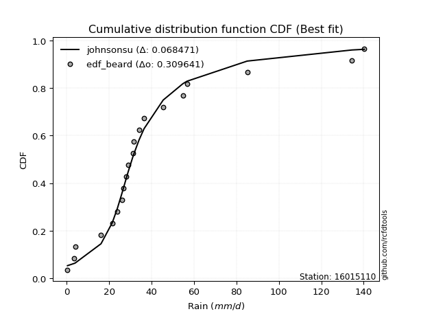</img></img>

</div>


### 5. Empirical - EDF Chegodayev (1955)

The Chegodayev formula is an empirical plotting position formula used in hydrological frequency analysis to estimate the exceedance probability or return period of a specific event from a set of observed data. It is primarily used for plotting observed data points on probability paper to fit a theoretical distribution, particularly for analyzing extreme events like maximum flood flows or rainfall intensities. The constant _b_ value in the generalized plotting position formula is 0.3.

<div align="center">


$P=(m-b)/(n+1-2b)$


</div>


**5.1. Empirical values**

<div align="center">

|                | 0                   | 1                   | 2                   | 3                   | 4                  | 5                   | 6                   | 7                  | 8                  | 9                   | 10                 | 11                 | 12                 | 13                 | 14                 | 15                 | 16                 | 17                 | 18                 | 19                 |
|:---------------|:--------------------|:--------------------|:--------------------|:--------------------|:-------------------|:--------------------|:--------------------|:-------------------|:-------------------|:--------------------|:-------------------|:-------------------|:-------------------|:-------------------|:-------------------|:-------------------|:-------------------|:-------------------|:-------------------|:-------------------|
| date           | 2023                | 2025                | 2020                | 2005                | 2018               | 2007                | 2016                | 2012               | 2013               | 2017                | 2024               | 2019               | 2015               | 2008               | 2009               | 2006               | 2022               | 2011               | 2014               | 2010               |
| x              | 0.4                 | 2.2                 | 3.4                 | 4.0                 | 16.2               | 21.5                | 26.0                | 26.9               | 28.0               | 29.0                | 31.2               | 31.5               | 34.1               | 36.5               | 45.5               | 54.8               | 56.7               | 85.1               | 134.5              | 140.3              |
| m              | 1                   | 2                   | 3                   | 4                   | 5                  | 6                   | 7                   | 8                  | 9                  | 10                  | 11                 | 12                 | 13                 | 14                 | 15                 | 16                 | 17                 | 18                 | 19                 | 20                 |
| empirical_dist | edf_chegodayev      | edf_chegodayev      | edf_chegodayev      | edf_chegodayev      | edf_chegodayev     | edf_chegodayev      | edf_chegodayev      | edf_chegodayev     | edf_chegodayev     | edf_chegodayev      | edf_chegodayev     | edf_chegodayev     | edf_chegodayev     | edf_chegodayev     | edf_chegodayev     | edf_chegodayev     | edf_chegodayev     | edf_chegodayev     | edf_chegodayev     | edf_chegodayev     |
| empirical      | 0.03431372549019608 | 0.08333333333333334 | 0.13235294117647062 | 0.18137254901960786 | 0.2303921568627451 | 0.27941176470588236 | 0.32843137254901966 | 0.3774509803921569 | 0.4264705882352941 | 0.47549019607843135 | 0.5245098039215687 | 0.5735294117647058 | 0.6225490196078431 | 0.6715686274509804 | 0.7205882352941176 | 0.7696078431372549 | 0.8186274509803921 | 0.8676470588235294 | 0.9166666666666667 | 0.9656862745098039 |
| empirical_tr   | 1.0355329949238579  | 1.090909090909091   | 1.152542372881356   | 1.221556886227545   | 1.299363057324841  | 1.3877551020408163  | 1.4890510948905111  | 1.6062992125984252 | 1.7435897435897436 | 1.9065420560747663  | 2.1030927835051547 | 2.3448275862068964 | 2.6493506493506493 | 3.0447761194029854 | 3.5789473684210527 | 4.340425531914894  | 5.513513513513513  | 7.555555555555557  | 12.00000000000001  | 29.142857142857153 |

</div>


**5.2. Kolmogorov-Smirnov fit test (sorted by Δ)**


<div align="center">

|                | 0                   | 1                   | 2                   | 3                   | 4                   | 5                   | 6                   | 7                   | 8                   | 9                   | 10                  | 11                  | 12                 | 13                  | 14                  | 15                 | 16                  | 17                 | 18                  | 19                  | 20                 | 21                  | 22                  | 23                  | 24                 | 25                 | 26                  | 27                 | 28                  | 29                  | 30                    | 31                  | 32                  | 33                  | 34                  | 35                  | 36                 | 37                  | 38                  | 39                  | 40                 | 41                  | 42                  | 43                  | 44                  | 45                  | 46                  | 47                 | 48                 | 49                 | 50                 | 51                 | 52                 | 53                  | 54                 | 55                  | 56                 | 57                  | 58                  | 59                  | 60                 | 61                  | 62                  | 63                  | 64                  | 65                  | 66                 | 67                 | 68                 | 69                 | 70                 | 71                  | 72                  | 73                  | 74                  | 75                 | 76                 | 77                  | 78                 | 79                  | 80                 | 81                  | 82                 | 83                 | 84                 | 85                 | 86                 | 87                 | 88                 | 89                 |
|:---------------|:--------------------|:--------------------|:--------------------|:--------------------|:--------------------|:--------------------|:--------------------|:--------------------|:--------------------|:--------------------|:--------------------|:--------------------|:-------------------|:--------------------|:--------------------|:-------------------|:--------------------|:-------------------|:--------------------|:--------------------|:-------------------|:--------------------|:--------------------|:--------------------|:-------------------|:-------------------|:--------------------|:-------------------|:--------------------|:--------------------|:----------------------|:--------------------|:--------------------|:--------------------|:--------------------|:--------------------|:-------------------|:--------------------|:--------------------|:--------------------|:-------------------|:--------------------|:--------------------|:--------------------|:--------------------|:--------------------|:--------------------|:-------------------|:-------------------|:-------------------|:-------------------|:-------------------|:-------------------|:--------------------|:-------------------|:--------------------|:-------------------|:--------------------|:--------------------|:--------------------|:-------------------|:--------------------|:--------------------|:--------------------|:--------------------|:--------------------|:-------------------|:-------------------|:-------------------|:-------------------|:-------------------|:--------------------|:--------------------|:--------------------|:--------------------|:-------------------|:-------------------|:--------------------|:-------------------|:--------------------|:-------------------|:--------------------|:-------------------|:-------------------|:-------------------|:-------------------|:-------------------|:-------------------|:-------------------|:-------------------|
| station        | 16015110            | 16015110            | 16015110            | 16015110            | 16015110            | 16015110            | 16015110            | 16015110            | 16015110            | 16015110            | 16015110            | 16015110            | 16015110           | 16015110            | 16015110            | 16015110           | 16015110            | 16015110           | 16015110            | 16015110            | 16015110           | 16015110            | 16015110            | 16015110            | 16015110           | 16015110           | 16015110            | 16015110           | 16015110            | 16015110            | 16015110              | 16015110            | 16015110            | 16015110            | 16015110            | 16015110            | 16015110           | 16015110            | 16015110            | 16015110            | 16015110           | 16015110            | 16015110            | 16015110            | 16015110            | 16015110            | 16015110            | 16015110           | 16015110           | 16015110           | 16015110           | 16015110           | 16015110           | 16015110            | 16015110           | 16015110            | 16015110           | 16015110            | 16015110            | 16015110            | 16015110           | 16015110            | 16015110            | 16015110            | 16015110            | 16015110            | 16015110           | 16015110           | 16015110           | 16015110           | 16015110           | 16015110            | 16015110            | 16015110            | 16015110            | 16015110           | 16015110           | 16015110            | 16015110           | 16015110            | 16015110           | 16015110            | 16015110           | 16015110           | 16015110           | 16015110           | 16015110           | 16015110           | 16015110           | 16015110           |
| empirical_dist | edf_chegodayev      | edf_chegodayev      | edf_chegodayev      | edf_chegodayev      | edf_chegodayev      | edf_chegodayev      | edf_chegodayev      | edf_chegodayev      | edf_chegodayev      | edf_chegodayev      | edf_chegodayev      | edf_chegodayev      | edf_chegodayev     | edf_chegodayev      | edf_chegodayev      | edf_chegodayev     | edf_chegodayev      | edf_chegodayev     | edf_chegodayev      | edf_chegodayev      | edf_chegodayev     | edf_chegodayev      | edf_chegodayev      | edf_chegodayev      | edf_chegodayev     | edf_chegodayev     | edf_chegodayev      | edf_chegodayev     | edf_chegodayev      | edf_chegodayev      | edf_chegodayev        | edf_chegodayev      | edf_chegodayev      | edf_chegodayev      | edf_chegodayev      | edf_chegodayev      | edf_chegodayev     | edf_chegodayev      | edf_chegodayev      | edf_chegodayev      | edf_chegodayev     | edf_chegodayev      | edf_chegodayev      | edf_chegodayev      | edf_chegodayev      | edf_chegodayev      | edf_chegodayev      | edf_chegodayev     | edf_chegodayev     | edf_chegodayev     | edf_chegodayev     | edf_chegodayev     | edf_chegodayev     | edf_chegodayev      | edf_chegodayev     | edf_chegodayev      | edf_chegodayev     | edf_chegodayev      | edf_chegodayev      | edf_chegodayev      | edf_chegodayev     | edf_chegodayev      | edf_chegodayev      | edf_chegodayev      | edf_chegodayev      | edf_chegodayev      | edf_chegodayev     | edf_chegodayev     | edf_chegodayev     | edf_chegodayev     | edf_chegodayev     | edf_chegodayev      | edf_chegodayev      | edf_chegodayev      | edf_chegodayev      | edf_chegodayev     | edf_chegodayev     | edf_chegodayev      | edf_chegodayev     | edf_chegodayev      | edf_chegodayev     | edf_chegodayev      | edf_chegodayev     | edf_chegodayev     | edf_chegodayev     | edf_chegodayev     | edf_chegodayev     | edf_chegodayev     | edf_chegodayev     | edf_chegodayev     |
| p_dist         | logjohnsonsu        | exponnorm           | t                   | ncf                 | pearson3            | halflogistic        | moyal               | truncnorm           | invweibull          | nct                 | fisk                | logt                | invgamma           | gompertz            | genlogistic         | genexpon           | logloggamma         | halfnorm           | laplace_asymmetric  | logpearson3         | johnsonsu          | loggenlogistic      | invgauss            | expon               | gumbel_r           | mielke             | fatiguelife         | loggumbel_l        | loggompertz         | logfisk             | loglaplace_asymmetric | nakagami            | f                   | rayleigh            | kstwobign           | weibull_min         | maxwell            | wald                | gibrat              | gamma               | erlang             | crystalball         | norm                | rice                | logistic            | logfatiguelife      | logcrystalball      | lognorm            | lognorm            | logexponnorm       | logrice            | lognct             | lognakagami        | loglognorm          | logbetaprime       | hypsecant           | loglogistic        | loggamma            | loggamma            | logerlang           | loghypsecant       | logalpha            | loginvgamma         | logchi2             | laplace             | loginvweibull       | loginvgauss        | logmaxwell         | loglaplace         | lograyleigh        | betaprime          | logkstwobign        | gumbel_l            | loggumbel_r         | loghalfnorm         | loggenexpon        | logmoyal           | loghalflogistic     | logexpon           | logncf              | logwald            | loggibrat           | logtruncnorm       | logf               | pareto             | logpareto          | logmielke          | logweibull_min     | alpha              | chi2               |
| delta          | 0.09650700791277289 | 0.10112467817450915 | 0.11001138842981073 | 0.11045027872353219 | 0.11066614111917039 | 0.11125245822174579 | 0.11878578532568174 | 0.12012951655306481 | 0.12049286146855093 | 0.12054447146116976 | 0.12118535360937327 | 0.12332445085880075 | 0.1239081523431953 | 0.12486500929983246 | 0.13012967746137416 | 0.1311060551773351 | 0.13180728741227576 | 0.1331662901564742 | 0.13516696736293787 | 0.13581114476698875 | 0.1364565847270648 | 0.13719124382442904 | 0.13771032898702062 | 0.14436058454039113 | 0.1443683323998638 | 0.1481557406188846 | 0.14821764384763514 | 0.1526313466451803 | 0.15543115345541392 | 0.15988959348936083 | 0.16045240276126388   | 0.16369821659348316 | 0.16507406715889894 | 0.16634551377970253 | 0.16983174811167745 | 0.17309983138345453 | 0.178109116022571  | 0.18136873549080937 | 0.18137254901960786 | 0.19600662630596155 | 0.2120601128243017 | 0.21230832911132297 | 0.21230832947890466 | 0.21359383234069773 | 0.21782275455514366 | 0.21830560319539927 | 0.21984362559824633 | 0.219843639396756  | 0.219843639396756  | 0.2198470476367328 | 0.2198655958142537 | 0.2205349806285668 | 0.2206095362172078 | 0.22169283193435818 | 0.2224418204233568 | 0.22249863575357876 | 0.2263532346858078 | 0.23100447236725885 | 0.23100447236725885 | 0.23159620431568906 | 0.2318570799402756 | 0.23310013353575898 | 0.23634619614625585 | 0.23877586319827704 | 0.23891490671178406 | 0.24551235162441098 | 0.2490042585424319 | 0.250346780763649  | 0.2503896600536204 | 0.2601569194296004 | 0.2729376807109699 | 0.27989378004604093 | 0.28271243661680534 | 0.29000302610286866 | 0.29079043045196074 | 0.3109226084447514 | 0.3148959733861779 | 0.31537969488699147 | 0.3728562508079765 | 0.37550884853734623 | 0.3839691525987371 | 0.41293662127761166 | 0.4189975005137884 | 0.4804719160099997 | 0.5148190182629805 | 0.5514750126310765 | 0.5833139309855926 | 0.5996873367546693 | 0.6838789373122265 | 0.7660767570223674 |
| deltao         | 0.3096406529800002  | 0.3096406529800002  | 0.3096406529800002  | 0.3096406529800002  | 0.3096406529800002  | 0.3096406529800002  | 0.3096406529800002  | 0.3096406529800002  | 0.3096406529800002  | 0.3096406529800002  | 0.3096406529800002  | 0.3096406529800002  | 0.3096406529800002 | 0.3096406529800002  | 0.3096406529800002  | 0.3096406529800002 | 0.3096406529800002  | 0.3096406529800002 | 0.3096406529800002  | 0.3096406529800002  | 0.3096406529800002 | 0.3096406529800002  | 0.3096406529800002  | 0.3096406529800002  | 0.3096406529800002 | 0.3096406529800002 | 0.3096406529800002  | 0.3096406529800002 | 0.3096406529800002  | 0.3096406529800002  | 0.3096406529800002    | 0.3096406529800002  | 0.3096406529800002  | 0.3096406529800002  | 0.3096406529800002  | 0.3096406529800002  | 0.3096406529800002 | 0.3096406529800002  | 0.3096406529800002  | 0.3096406529800002  | 0.3096406529800002 | 0.3096406529800002  | 0.3096406529800002  | 0.3096406529800002  | 0.3096406529800002  | 0.3096406529800002  | 0.3096406529800002  | 0.3096406529800002 | 0.3096406529800002 | 0.3096406529800002 | 0.3096406529800002 | 0.3096406529800002 | 0.3096406529800002 | 0.3096406529800002  | 0.3096406529800002 | 0.3096406529800002  | 0.3096406529800002 | 0.3096406529800002  | 0.3096406529800002  | 0.3096406529800002  | 0.3096406529800002 | 0.3096406529800002  | 0.3096406529800002  | 0.3096406529800002  | 0.3096406529800002  | 0.3096406529800002  | 0.3096406529800002 | 0.3096406529800002 | 0.3096406529800002 | 0.3096406529800002 | 0.3096406529800002 | 0.3096406529800002  | 0.3096406529800002  | 0.3096406529800002  | 0.3096406529800002  | 0.3096406529800002 | 0.3096406529800002 | 0.3096406529800002  | 0.3096406529800002 | 0.3096406529800002  | 0.3096406529800002 | 0.3096406529800002  | 0.3096406529800002 | 0.3096406529800002 | 0.3096406529800002 | 0.3096406529800002 | 0.3096406529800002 | 0.3096406529800002 | 0.3096406529800002 | 0.3096406529800002 |
| eval           | Δo > Δ              | Δo > Δ              | Δo > Δ              | Δo > Δ              | Δo > Δ              | Δo > Δ              | Δo > Δ              | Δo > Δ              | Δo > Δ              | Δo > Δ              | Δo > Δ              | Δo > Δ              | Δo > Δ             | Δo > Δ              | Δo > Δ              | Δo > Δ             | Δo > Δ              | Δo > Δ             | Δo > Δ              | Δo > Δ              | Δo > Δ             | Δo > Δ              | Δo > Δ              | Δo > Δ              | Δo > Δ             | Δo > Δ             | Δo > Δ              | Δo > Δ             | Δo > Δ              | Δo > Δ              | Δo > Δ                | Δo > Δ              | Δo > Δ              | Δo > Δ              | Δo > Δ              | Δo > Δ              | Δo > Δ             | Δo > Δ              | Δo > Δ              | Δo > Δ              | Δo > Δ             | Δo > Δ              | Δo > Δ              | Δo > Δ              | Δo > Δ              | Δo > Δ              | Δo > Δ              | Δo > Δ             | Δo > Δ             | Δo > Δ             | Δo > Δ             | Δo > Δ             | Δo > Δ             | Δo > Δ              | Δo > Δ             | Δo > Δ              | Δo > Δ             | Δo > Δ              | Δo > Δ              | Δo > Δ              | Δo > Δ             | Δo > Δ              | Δo > Δ              | Δo > Δ              | Δo > Δ              | Δo > Δ              | Δo > Δ             | Δo > Δ             | Δo > Δ             | Δo > Δ             | Δo > Δ             | Δo > Δ              | Δo > Δ              | Δo > Δ              | Δo > Δ              | Δo <= Δ            | Δo <= Δ            | Δo <= Δ             | Δo <= Δ            | Δo <= Δ             | Δo <= Δ            | Δo <= Δ             | Δo <= Δ            | Δo <= Δ            | Δo <= Δ            | Δo <= Δ            | Δo <= Δ            | Δo <= Δ            | Δo <= Δ            | Δo <= Δ            |
| fit            | 1                   | 1                   | 1                   | 1                   | 1                   | 1                   | 1                   | 1                   | 1                   | 1                   | 1                   | 1                   | 1                  | 1                   | 1                   | 1                  | 1                   | 1                  | 1                   | 1                   | 1                  | 1                   | 1                   | 1                   | 1                  | 1                  | 1                   | 1                  | 1                   | 1                   | 1                     | 1                   | 1                   | 1                   | 1                   | 1                   | 1                  | 1                   | 1                   | 1                   | 1                  | 1                   | 1                   | 1                   | 1                   | 1                   | 1                   | 1                  | 1                  | 1                  | 1                  | 1                  | 1                  | 1                   | 1                  | 1                   | 1                  | 1                   | 1                   | 1                   | 1                  | 1                   | 1                   | 1                   | 1                   | 1                   | 1                  | 1                  | 1                  | 1                  | 1                  | 1                   | 1                   | 1                   | 1                   | 0                  | 0                  | 0                   | 0                  | 0                   | 0                  | 0                   | 0                  | 0                  | 0                  | 0                  | 0                  | 0                  | 0                  | 0                  |
| n              | 20                  | 20                  | 20                  | 20                  | 20                  | 20                  | 20                  | 20                  | 20                  | 20                  | 20                  | 20                  | 20                 | 20                  | 20                  | 20                 | 20                  | 20                 | 20                  | 20                  | 20                 | 20                  | 20                  | 20                  | 20                 | 20                 | 20                  | 20                 | 20                  | 20                  | 20                    | 20                  | 20                  | 20                  | 20                  | 20                  | 20                 | 20                  | 20                  | 20                  | 20                 | 20                  | 20                  | 20                  | 20                  | 20                  | 20                  | 20                 | 20                 | 20                 | 20                 | 20                 | 20                 | 20                  | 20                 | 20                  | 20                 | 20                  | 20                  | 20                  | 20                 | 20                  | 20                  | 20                  | 20                  | 20                  | 20                 | 20                 | 20                 | 20                 | 20                 | 20                  | 20                  | 20                  | 20                  | 20                 | 20                 | 20                  | 20                 | 20                  | 20                 | 20                  | 20                 | 20                 | 20                 | 20                 | 20                 | 20                 | 20                 | 20                 |
| best_fit       | 1                   | 0                   | 0                   | 0                   | 0                   | 0                   | 0                   | 0                   | 0                   | 0                   | 0                   | 0                   | 0                  | 0                   | 0                   | 0                  | 0                   | 0                  | 0                   | 0                   | 0                  | 0                   | 0                   | 0                   | 0                  | 0                  | 0                   | 0                  | 0                   | 0                   | 0                     | 0                   | 0                   | 0                   | 0                   | 0                   | 0                  | 0                   | 0                   | 0                   | 0                  | 0                   | 0                   | 0                   | 0                   | 0                   | 0                   | 0                  | 0                  | 0                  | 0                  | 0                  | 0                  | 0                   | 0                  | 0                   | 0                  | 0                   | 0                   | 0                   | 0                  | 0                   | 0                   | 0                   | 0                   | 0                   | 0                  | 0                  | 0                  | 0                  | 0                  | 0                   | 0                   | 0                   | 0                   | 0                  | 0                  | 0                   | 0                  | 0                   | 0                  | 0                   | 0                  | 0                  | 0                  | 0                  | 0                  | 0                  | 0                  | 0                  |
| best_fit_sort  | 1                   | 2                   | 3                   | 4                   | 5                   | 6                   | 7                   | 8                   | 9                   | 10                  | 11                  | 12                  | 13                 | 14                  | 15                  | 16                 | 17                  | 18                 | 19                  | 20                  | 21                 | 22                  | 23                  | 24                  | 25                 | 26                 | 27                  | 28                 | 29                  | 30                  | 31                    | 32                  | 33                  | 34                  | 35                  | 36                  | 37                 | 38                  | 39                  | 40                  | 41                 | 42                  | 43                  | 44                  | 45                  | 46                  | 47                  | 48                 | 49                 | 50                 | 51                 | 52                 | 53                 | 54                  | 55                 | 56                  | 57                 | 58                  | 59                  | 60                  | 61                 | 62                  | 63                  | 64                  | 65                  | 66                  | 67                 | 68                 | 69                 | 70                 | 71                 | 72                  | 73                  | 74                  | 75                  | 76                 | 77                 | 78                  | 79                 | 80                  | 81                 | 82                  | 83                 | 84                 | 85                 | 86                 | 87                 | 88                 | 89                 | 90                 |

</div>


<div align="center">

</img>

</div>


**5.3. Best fit**

<div align="center">

|   id |   station | empirical_dist   | p_dist       |    delta |   deltao | eval   |   fit |   n |   best_fit |   best_fit_sort |
|-----:|----------:|:-----------------|:-------------|---------:|---------:|:-------|------:|----:|-----------:|----------------:|
|    0 |  16015110 | edf_chegodayev   | logjohnsonsu | 0.096507 | 0.309641 | Δo > Δ |     1 |  20 |          1 |               1 |

</div>


<div align="center">

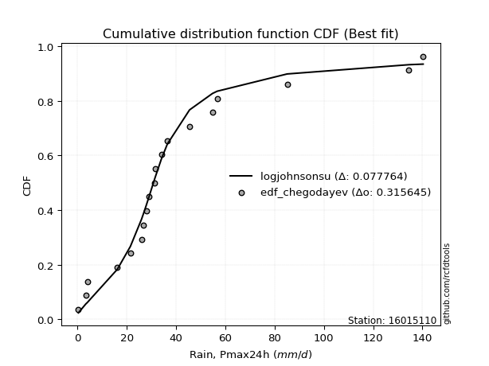</img></img>

</div>


### 6. Empirical - EDF Blom (1958)

The Blom formula is a specific "plotting position" formula used in hydrology and statistical analysis to estimate the empirical cumulative probability (or non-exceedance probability) of a data series. It is particularly recommended for data that are approximately normally distributed. The constant _a_ is set to 0.375 (or 3/8).

<div align="center">


$P=(m-a)/(n+1-2a)$


</div>


**6.1. Empirical values**

<div align="center">

|                | 0                    | 1                   | 2                   | 3                   | 4                   | 5                  | 6                  | 7                  | 8                   | 9                   | 10                 | 11                 | 12                 | 13                 | 14                 | 15                 | 16                 | 17                 | 18                 | 19                 |
|:---------------|:---------------------|:--------------------|:--------------------|:--------------------|:--------------------|:-------------------|:-------------------|:-------------------|:--------------------|:--------------------|:-------------------|:-------------------|:-------------------|:-------------------|:-------------------|:-------------------|:-------------------|:-------------------|:-------------------|:-------------------|
| date           | 2023                 | 2025                | 2020                | 2005                | 2018                | 2007               | 2016               | 2012               | 2013                | 2017                | 2024               | 2019               | 2015               | 2008               | 2009               | 2006               | 2022               | 2011               | 2014               | 2010               |
| x              | 0.4                  | 2.2                 | 3.4                 | 4.0                 | 16.2                | 21.5               | 26.0               | 26.9               | 28.0                | 29.0                | 31.2               | 31.5               | 34.1               | 36.5               | 45.5               | 54.8               | 56.7               | 85.1               | 134.5              | 140.3              |
| m              | 1                    | 2                   | 3                   | 4                   | 5                   | 6                  | 7                  | 8                  | 9                   | 10                  | 11                 | 12                 | 13                 | 14                 | 15                 | 16                 | 17                 | 18                 | 19                 | 20                 |
| empirical_dist | edf_blom             | edf_blom            | edf_blom            | edf_blom            | edf_blom            | edf_blom           | edf_blom           | edf_blom           | edf_blom            | edf_blom            | edf_blom           | edf_blom           | edf_blom           | edf_blom           | edf_blom           | edf_blom           | edf_blom           | edf_blom           | edf_blom           | edf_blom           |
| empirical      | 0.030864197530864196 | 0.08024691358024691 | 0.12962962962962962 | 0.17901234567901234 | 0.22839506172839505 | 0.2777777777777778 | 0.3271604938271605 | 0.3765432098765432 | 0.42592592592592593 | 0.47530864197530864 | 0.5246913580246914 | 0.5740740740740741 | 0.6234567901234568 | 0.6728395061728395 | 0.7222222222222222 | 0.7716049382716049 | 0.8209876543209876 | 0.8703703703703703 | 0.9197530864197531 | 0.9691358024691358 |
| empirical_tr   | 1.0318471337579618   | 1.087248322147651   | 1.148936170212766   | 1.218045112781955   | 1.296               | 1.3846153846153846 | 1.4862385321100917 | 1.603960396039604  | 1.7419354838709677  | 1.9058823529411766  | 2.103896103896104  | 2.3478260869565215 | 2.6557377049180326 | 3.0566037735849054 | 3.5999999999999996 | 4.378378378378378  | 5.586206896551723  | 7.714285714285713  | 12.461538461538458 | 32.39999999999997  |

</div>


**6.2. Kolmogorov-Smirnov fit test (sorted by Δ)**


<div align="center">

|                | 0                   | 1                   | 2                   | 3                   | 4                   | 5                   | 6                   | 7                   | 8                   | 9                   | 10                  | 11                  | 12                  | 13                  | 14                 | 15                  | 16                  | 17                  | 18                  | 19                 | 20                  | 21                 | 22                  | 23                 | 24                  | 25                  | 26                 | 27                  | 28                  | 29                  | 30                    | 31                 | 32                 | 33                  | 34                 | 35                 | 36                  | 37                  | 38                  | 39                 | 40                  | 41                  | 42                 | 43                  | 44                 | 45                  | 46                 | 47                  | 48                  | 49                  | 50                  | 51                  | 52                  | 53                  | 54                  | 55                 | 56                  | 57                 | 58                 | 59                  | 60                  | 61                  | 62                 | 63                 | 64                 | 65                  | 66                 | 67                 | 68                  | 69                  | 70                  | 71                 | 72                 | 73                 | 74                 | 75                  | 76                 | 77                  | 78                  | 79                  | 80                  | 81                 | 82                  | 83                  | 84                 | 85                 | 86                 | 87                 | 88                 | 89                 |
|:---------------|:--------------------|:--------------------|:--------------------|:--------------------|:--------------------|:--------------------|:--------------------|:--------------------|:--------------------|:--------------------|:--------------------|:--------------------|:--------------------|:--------------------|:-------------------|:--------------------|:--------------------|:--------------------|:--------------------|:-------------------|:--------------------|:-------------------|:--------------------|:-------------------|:--------------------|:--------------------|:-------------------|:--------------------|:--------------------|:--------------------|:----------------------|:-------------------|:-------------------|:--------------------|:-------------------|:-------------------|:--------------------|:--------------------|:--------------------|:-------------------|:--------------------|:--------------------|:-------------------|:--------------------|:-------------------|:--------------------|:-------------------|:--------------------|:--------------------|:--------------------|:--------------------|:--------------------|:--------------------|:--------------------|:--------------------|:-------------------|:--------------------|:-------------------|:-------------------|:--------------------|:--------------------|:--------------------|:-------------------|:-------------------|:-------------------|:--------------------|:-------------------|:-------------------|:--------------------|:--------------------|:--------------------|:-------------------|:-------------------|:-------------------|:-------------------|:--------------------|:-------------------|:--------------------|:--------------------|:--------------------|:--------------------|:-------------------|:--------------------|:--------------------|:-------------------|:-------------------|:-------------------|:-------------------|:-------------------|:-------------------|
| station        | 16015110            | 16015110            | 16015110            | 16015110            | 16015110            | 16015110            | 16015110            | 16015110            | 16015110            | 16015110            | 16015110            | 16015110            | 16015110            | 16015110            | 16015110           | 16015110            | 16015110            | 16015110            | 16015110            | 16015110           | 16015110            | 16015110           | 16015110            | 16015110           | 16015110            | 16015110            | 16015110           | 16015110            | 16015110            | 16015110            | 16015110              | 16015110           | 16015110           | 16015110            | 16015110           | 16015110           | 16015110            | 16015110            | 16015110            | 16015110           | 16015110            | 16015110            | 16015110           | 16015110            | 16015110           | 16015110            | 16015110           | 16015110            | 16015110            | 16015110            | 16015110            | 16015110            | 16015110            | 16015110            | 16015110            | 16015110           | 16015110            | 16015110           | 16015110           | 16015110            | 16015110            | 16015110            | 16015110           | 16015110           | 16015110           | 16015110            | 16015110           | 16015110           | 16015110            | 16015110            | 16015110            | 16015110           | 16015110           | 16015110           | 16015110           | 16015110            | 16015110           | 16015110            | 16015110            | 16015110            | 16015110            | 16015110           | 16015110            | 16015110            | 16015110           | 16015110           | 16015110           | 16015110           | 16015110           | 16015110           |
| empirical_dist | edf_blom            | edf_blom            | edf_blom            | edf_blom            | edf_blom            | edf_blom            | edf_blom            | edf_blom            | edf_blom            | edf_blom            | edf_blom            | edf_blom            | edf_blom            | edf_blom            | edf_blom           | edf_blom            | edf_blom            | edf_blom            | edf_blom            | edf_blom           | edf_blom            | edf_blom           | edf_blom            | edf_blom           | edf_blom            | edf_blom            | edf_blom           | edf_blom            | edf_blom            | edf_blom            | edf_blom              | edf_blom           | edf_blom           | edf_blom            | edf_blom           | edf_blom           | edf_blom            | edf_blom            | edf_blom            | edf_blom           | edf_blom            | edf_blom            | edf_blom           | edf_blom            | edf_blom           | edf_blom            | edf_blom           | edf_blom            | edf_blom            | edf_blom            | edf_blom            | edf_blom            | edf_blom            | edf_blom            | edf_blom            | edf_blom           | edf_blom            | edf_blom           | edf_blom           | edf_blom            | edf_blom            | edf_blom            | edf_blom           | edf_blom           | edf_blom           | edf_blom            | edf_blom           | edf_blom           | edf_blom            | edf_blom            | edf_blom            | edf_blom           | edf_blom           | edf_blom           | edf_blom           | edf_blom            | edf_blom           | edf_blom            | edf_blom            | edf_blom            | edf_blom            | edf_blom           | edf_blom            | edf_blom            | edf_blom           | edf_blom           | edf_blom           | edf_blom           | edf_blom           | edf_blom           |
| p_dist         | logjohnsonsu        | exponnorm           | t                   | ncf                 | pearson3            | halflogistic        | moyal               | logt                | truncnorm           | invweibull          | nct                 | fisk                | invgamma            | gompertz            | genlogistic        | genexpon            | logloggamma         | halfnorm            | laplace_asymmetric  | logpearson3        | johnsonsu           | loggenlogistic     | invgauss            | expon              | gumbel_r            | mielke              | fatiguelife        | loggumbel_l         | loggompertz         | logfisk             | loglaplace_asymmetric | nakagami           | f                  | rayleigh            | kstwobign          | weibull_min        | wald                | gibrat              | maxwell             | gamma              | erlang              | crystalball         | norm               | rice                | logistic           | logfatiguelife      | logcrystalball     | lognorm             | lognorm             | logexponnorm        | logrice             | lognct              | lognakagami         | loglognorm          | logbetaprime        | hypsecant          | loglogistic         | loggamma           | loggamma           | logerlang           | loghypsecant        | logalpha            | loginvgamma        | logchi2            | laplace            | loginvweibull       | loginvgauss        | logmaxwell         | loglaplace          | lograyleigh         | betaprime           | logkstwobign       | gumbel_l           | loggumbel_r        | loghalfnorm        | loggenexpon         | logmoyal           | loghalflogistic     | logexpon            | logncf              | logwald             | loggibrat          | logtruncnorm        | logf                | pareto             | logpareto          | logmielke          | logweibull_min     | alpha              | chi2               |
| delta          | 0.09414680457217736 | 0.10122197882264372 | 0.11128226715166989 | 0.11172115744539124 | 0.11193701984102944 | 0.11252333694360495 | 0.12005666404754078 | 0.12096424751820523 | 0.12140039527492386 | 0.12176374019041009 | 0.12181535018302891 | 0.12245623233123243 | 0.12517903106505446 | 0.12613588802169162 | 0.1314005561832332 | 0.13237693389919425 | 0.13307816613413492 | 0.13443716887833324 | 0.13643784608479692 | 0.1370820234888479 | 0.13772746344892395 | 0.1384621225462882 | 0.13898120770887978 | 0.1456314632622503 | 0.14563921112172284 | 0.14942661934074375 | 0.1494885225694943 | 0.15390222536703946 | 0.15670203217727308 | 0.16116047221121999 | 0.16172328148312304   | 0.1649690953153422 | 0.1663449458807581 | 0.16761639250156157 | 0.1711026268335365 | 0.1743707101053137 | 0.17900853215021384 | 0.17901234567901234 | 0.17937999474443006 | 0.1972775050278207 | 0.21333099154616086 | 0.21357920783318202 | 0.2135792082007637 | 0.21486471106255678 | 0.2190936332770027 | 0.21957648191725843 | 0.2211145043201055 | 0.22111451811861516 | 0.22111451811861516 | 0.22111792635859195 | 0.22113647453611285 | 0.22180585935042596 | 0.22188041493906696 | 0.22296371065621734 | 0.22371269914521597 | 0.2237695144754378 | 0.22762411340766697 | 0.232275351089118  | 0.232275351089118  | 0.23286708303754822 | 0.23312795866213476 | 0.23473412046386355 | 0.237617074868115  | 0.2400467419201362 | 0.2401857854336431 | 0.24714633855251555 | 0.2506382454705365 | 0.2516176594855082 | 0.25166053877547956 | 0.26142779815145956 | 0.27420855943282907 | 0.2815277669741455 | 0.2839833153386644 | 0.2912739048247278 | 0.2924244173800653 | 0.31255659537285596 | 0.3161668521080371 | 0.31701368181509604 | 0.37485334594232655 | 0.37859526829043266 | 0.38524003132059625 | 0.4142074999994708 | 0.42099459564813846 | 0.48355833576308616 | 0.5179054380160669 | 0.5545614323841629 | 0.5853110261199426 | 0.6016844318890194 | 0.6858760324465766 | 0.7680738521567174 |
| deltao         | 0.3096406529800002  | 0.3096406529800002  | 0.3096406529800002  | 0.3096406529800002  | 0.3096406529800002  | 0.3096406529800002  | 0.3096406529800002  | 0.3096406529800002  | 0.3096406529800002  | 0.3096406529800002  | 0.3096406529800002  | 0.3096406529800002  | 0.3096406529800002  | 0.3096406529800002  | 0.3096406529800002 | 0.3096406529800002  | 0.3096406529800002  | 0.3096406529800002  | 0.3096406529800002  | 0.3096406529800002 | 0.3096406529800002  | 0.3096406529800002 | 0.3096406529800002  | 0.3096406529800002 | 0.3096406529800002  | 0.3096406529800002  | 0.3096406529800002 | 0.3096406529800002  | 0.3096406529800002  | 0.3096406529800002  | 0.3096406529800002    | 0.3096406529800002 | 0.3096406529800002 | 0.3096406529800002  | 0.3096406529800002 | 0.3096406529800002 | 0.3096406529800002  | 0.3096406529800002  | 0.3096406529800002  | 0.3096406529800002 | 0.3096406529800002  | 0.3096406529800002  | 0.3096406529800002 | 0.3096406529800002  | 0.3096406529800002 | 0.3096406529800002  | 0.3096406529800002 | 0.3096406529800002  | 0.3096406529800002  | 0.3096406529800002  | 0.3096406529800002  | 0.3096406529800002  | 0.3096406529800002  | 0.3096406529800002  | 0.3096406529800002  | 0.3096406529800002 | 0.3096406529800002  | 0.3096406529800002 | 0.3096406529800002 | 0.3096406529800002  | 0.3096406529800002  | 0.3096406529800002  | 0.3096406529800002 | 0.3096406529800002 | 0.3096406529800002 | 0.3096406529800002  | 0.3096406529800002 | 0.3096406529800002 | 0.3096406529800002  | 0.3096406529800002  | 0.3096406529800002  | 0.3096406529800002 | 0.3096406529800002 | 0.3096406529800002 | 0.3096406529800002 | 0.3096406529800002  | 0.3096406529800002 | 0.3096406529800002  | 0.3096406529800002  | 0.3096406529800002  | 0.3096406529800002  | 0.3096406529800002 | 0.3096406529800002  | 0.3096406529800002  | 0.3096406529800002 | 0.3096406529800002 | 0.3096406529800002 | 0.3096406529800002 | 0.3096406529800002 | 0.3096406529800002 |
| eval           | Δo > Δ              | Δo > Δ              | Δo > Δ              | Δo > Δ              | Δo > Δ              | Δo > Δ              | Δo > Δ              | Δo > Δ              | Δo > Δ              | Δo > Δ              | Δo > Δ              | Δo > Δ              | Δo > Δ              | Δo > Δ              | Δo > Δ             | Δo > Δ              | Δo > Δ              | Δo > Δ              | Δo > Δ              | Δo > Δ             | Δo > Δ              | Δo > Δ             | Δo > Δ              | Δo > Δ             | Δo > Δ              | Δo > Δ              | Δo > Δ             | Δo > Δ              | Δo > Δ              | Δo > Δ              | Δo > Δ                | Δo > Δ             | Δo > Δ             | Δo > Δ              | Δo > Δ             | Δo > Δ             | Δo > Δ              | Δo > Δ              | Δo > Δ              | Δo > Δ             | Δo > Δ              | Δo > Δ              | Δo > Δ             | Δo > Δ              | Δo > Δ             | Δo > Δ              | Δo > Δ             | Δo > Δ              | Δo > Δ              | Δo > Δ              | Δo > Δ              | Δo > Δ              | Δo > Δ              | Δo > Δ              | Δo > Δ              | Δo > Δ             | Δo > Δ              | Δo > Δ             | Δo > Δ             | Δo > Δ              | Δo > Δ              | Δo > Δ              | Δo > Δ             | Δo > Δ             | Δo > Δ             | Δo > Δ              | Δo > Δ             | Δo > Δ             | Δo > Δ              | Δo > Δ              | Δo > Δ              | Δo > Δ             | Δo > Δ             | Δo > Δ             | Δo > Δ             | Δo <= Δ             | Δo <= Δ            | Δo <= Δ             | Δo <= Δ             | Δo <= Δ             | Δo <= Δ             | Δo <= Δ            | Δo <= Δ             | Δo <= Δ             | Δo <= Δ            | Δo <= Δ            | Δo <= Δ            | Δo <= Δ            | Δo <= Δ            | Δo <= Δ            |
| fit            | 1                   | 1                   | 1                   | 1                   | 1                   | 1                   | 1                   | 1                   | 1                   | 1                   | 1                   | 1                   | 1                   | 1                   | 1                  | 1                   | 1                   | 1                   | 1                   | 1                  | 1                   | 1                  | 1                   | 1                  | 1                   | 1                   | 1                  | 1                   | 1                   | 1                   | 1                     | 1                  | 1                  | 1                   | 1                  | 1                  | 1                   | 1                   | 1                   | 1                  | 1                   | 1                   | 1                  | 1                   | 1                  | 1                   | 1                  | 1                   | 1                   | 1                   | 1                   | 1                   | 1                   | 1                   | 1                   | 1                  | 1                   | 1                  | 1                  | 1                   | 1                   | 1                   | 1                  | 1                  | 1                  | 1                   | 1                  | 1                  | 1                   | 1                   | 1                   | 1                  | 1                  | 1                  | 1                  | 0                   | 0                  | 0                   | 0                   | 0                   | 0                   | 0                  | 0                   | 0                   | 0                  | 0                  | 0                  | 0                  | 0                  | 0                  |
| n              | 20                  | 20                  | 20                  | 20                  | 20                  | 20                  | 20                  | 20                  | 20                  | 20                  | 20                  | 20                  | 20                  | 20                  | 20                 | 20                  | 20                  | 20                  | 20                  | 20                 | 20                  | 20                 | 20                  | 20                 | 20                  | 20                  | 20                 | 20                  | 20                  | 20                  | 20                    | 20                 | 20                 | 20                  | 20                 | 20                 | 20                  | 20                  | 20                  | 20                 | 20                  | 20                  | 20                 | 20                  | 20                 | 20                  | 20                 | 20                  | 20                  | 20                  | 20                  | 20                  | 20                  | 20                  | 20                  | 20                 | 20                  | 20                 | 20                 | 20                  | 20                  | 20                  | 20                 | 20                 | 20                 | 20                  | 20                 | 20                 | 20                  | 20                  | 20                  | 20                 | 20                 | 20                 | 20                 | 20                  | 20                 | 20                  | 20                  | 20                  | 20                  | 20                 | 20                  | 20                  | 20                 | 20                 | 20                 | 20                 | 20                 | 20                 |
| best_fit       | 1                   | 0                   | 0                   | 0                   | 0                   | 0                   | 0                   | 0                   | 0                   | 0                   | 0                   | 0                   | 0                   | 0                   | 0                  | 0                   | 0                   | 0                   | 0                   | 0                  | 0                   | 0                  | 0                   | 0                  | 0                   | 0                   | 0                  | 0                   | 0                   | 0                   | 0                     | 0                  | 0                  | 0                   | 0                  | 0                  | 0                   | 0                   | 0                   | 0                  | 0                   | 0                   | 0                  | 0                   | 0                  | 0                   | 0                  | 0                   | 0                   | 0                   | 0                   | 0                   | 0                   | 0                   | 0                   | 0                  | 0                   | 0                  | 0                  | 0                   | 0                   | 0                   | 0                  | 0                  | 0                  | 0                   | 0                  | 0                  | 0                   | 0                   | 0                   | 0                  | 0                  | 0                  | 0                  | 0                   | 0                  | 0                   | 0                   | 0                   | 0                   | 0                  | 0                   | 0                   | 0                  | 0                  | 0                  | 0                  | 0                  | 0                  |
| best_fit_sort  | 1                   | 2                   | 3                   | 4                   | 5                   | 6                   | 7                   | 8                   | 9                   | 10                  | 11                  | 12                  | 13                  | 14                  | 15                 | 16                  | 17                  | 18                  | 19                  | 20                 | 21                  | 22                 | 23                  | 24                 | 25                  | 26                  | 27                 | 28                  | 29                  | 30                  | 31                    | 32                 | 33                 | 34                  | 35                 | 36                 | 37                  | 38                  | 39                  | 40                 | 41                  | 42                  | 43                 | 44                  | 45                 | 46                  | 47                 | 48                  | 49                  | 50                  | 51                  | 52                  | 53                  | 54                  | 55                  | 56                 | 57                  | 58                 | 59                 | 60                  | 61                  | 62                  | 63                 | 64                 | 65                 | 66                  | 67                 | 68                 | 69                  | 70                  | 71                  | 72                 | 73                 | 74                 | 75                 | 76                  | 77                 | 78                  | 79                  | 80                  | 81                  | 82                 | 83                  | 84                  | 85                 | 86                 | 87                 | 88                 | 89                 | 90                 |

</div>


<div align="center">

</img>

</div>


**6.3. Best fit**

<div align="center">

|   id |   station | empirical_dist   | p_dist       |     delta |   deltao | eval   |   fit |   n |   best_fit |   best_fit_sort |
|-----:|----------:|:-----------------|:-------------|----------:|---------:|:-------|------:|----:|-----------:|----------------:|
|    0 |  16015110 | edf_blom         | logjohnsonsu | 0.0941468 | 0.309641 | Δo > Δ |     1 |  20 |          1 |               1 |

</div>


<div align="center">

</img></img>

</div>


### 7. Empirical - EDF Tukey (1962)

In hydrology, the Tukey formula is used as a plotting position formula to estimate the empirical probability or frequency of a flood event (or other hydrological data). The formula parameter is given as _c=0.333_ (or 1/3).

<div align="center">


$P=(m-c)/(n+1-2c)$


</div>


**7.1. Empirical values**

<div align="center">

|                | 0                   | 1                   | 2                   | 3                   | 4                   | 5                  | 6                   | 7                  | 8                  | 9                   | 10                 | 11                 | 12                 | 13                 | 14                 | 15                 | 16                | 17                 | 18                 | 19                 |
|:---------------|:--------------------|:--------------------|:--------------------|:--------------------|:--------------------|:-------------------|:--------------------|:-------------------|:-------------------|:--------------------|:-------------------|:-------------------|:-------------------|:-------------------|:-------------------|:-------------------|:------------------|:-------------------|:-------------------|:-------------------|
| date           | 2023                | 2025                | 2020                | 2005                | 2018                | 2007               | 2016                | 2012               | 2013               | 2017                | 2024               | 2019               | 2015               | 2008               | 2009               | 2006               | 2022              | 2011               | 2014               | 2010               |
| x              | 0.4                 | 2.2                 | 3.4                 | 4.0                 | 16.2                | 21.5               | 26.0                | 26.9               | 28.0               | 29.0                | 31.2               | 31.5               | 34.1               | 36.5               | 45.5               | 54.8               | 56.7              | 85.1               | 134.5              | 140.3              |
| m              | 1                   | 2                   | 3                   | 4                   | 5                   | 6                  | 7                   | 8                  | 9                  | 10                  | 11                 | 12                 | 13                 | 14                 | 15                 | 16                 | 17                | 18                 | 19                 | 20                 |
| empirical_dist | edf_tukey           | edf_tukey           | edf_tukey           | edf_tukey           | edf_tukey           | edf_tukey          | edf_tukey           | edf_tukey          | edf_tukey          | edf_tukey           | edf_tukey          | edf_tukey          | edf_tukey          | edf_tukey          | edf_tukey          | edf_tukey          | edf_tukey         | edf_tukey          | edf_tukey          | edf_tukey          |
| empirical      | 0.03278688524590164 | 0.08196721311475409 | 0.13114754098360656 | 0.18032786885245902 | 0.22950819672131148 | 0.2786885245901639 | 0.32786885245901637 | 0.3770491803278688 | 0.4262295081967213 | 0.47540983606557374 | 0.5245901639344263 | 0.5737704918032787 | 0.6229508196721312 | 0.6721311475409836 | 0.7213114754098361 | 0.7704918032786885 | 0.819672131147541 | 0.8688524590163934 | 0.9180327868852459 | 0.9672131147540983 |
| empirical_tr   | 1.033898305084746   | 1.0892857142857142  | 1.150943396226415   | 1.22                | 1.297872340425532   | 1.3863636363636362 | 1.4878048780487803  | 1.6052631578947367 | 1.7428571428571429 | 1.90625             | 2.103448275862069  | 2.346153846153846  | 2.6521739130434785 | 3.05               | 3.588235294117647  | 4.357142857142857  | 5.545454545454546 | 7.624999999999998  | 12.200000000000003 | 30.499999999999964 |

</div>


**7.2. Kolmogorov-Smirnov fit test (sorted by Δ)**


<div align="center">

|                | 0                   | 1                  | 2                   | 3                   | 4                   | 5                   | 6                   | 7                   | 8                   | 9                   | 10                  | 11                  | 12                  | 13                  | 14                 | 15                  | 16                  | 17                  | 18                 | 19                  | 20                  | 21                  | 22                  | 23                  | 24                  | 25                  | 26                  | 27                 | 28                 | 29                  | 30                    | 31                  | 32                  | 33                  | 34                  | 35                  | 36                  | 37                  | 38                  | 39                  | 40                 | 41                 | 42                  | 43                  | 44                 | 45                  | 46                  | 47                 | 48                 | 49                 | 50                  | 51                 | 52                 | 53                  | 54                 | 55                  | 56                 | 57                  | 58                  | 59                  | 60                 | 61                  | 62                  | 63                  | 64                  | 65                  | 66                  | 67                 | 68                 | 69                 | 70                 | 71                 | 72                  | 73                  | 74                 | 75                  | 76                 | 77                 | 78                 | 79                  | 80                 | 81                  | 82                 | 83                 | 84                 | 85                 | 86                 | 87                 | 88                 | 89                 |
|:---------------|:--------------------|:-------------------|:--------------------|:--------------------|:--------------------|:--------------------|:--------------------|:--------------------|:--------------------|:--------------------|:--------------------|:--------------------|:--------------------|:--------------------|:-------------------|:--------------------|:--------------------|:--------------------|:-------------------|:--------------------|:--------------------|:--------------------|:--------------------|:--------------------|:--------------------|:--------------------|:--------------------|:-------------------|:-------------------|:--------------------|:----------------------|:--------------------|:--------------------|:--------------------|:--------------------|:--------------------|:--------------------|:--------------------|:--------------------|:--------------------|:-------------------|:-------------------|:--------------------|:--------------------|:-------------------|:--------------------|:--------------------|:-------------------|:-------------------|:-------------------|:--------------------|:-------------------|:-------------------|:--------------------|:-------------------|:--------------------|:-------------------|:--------------------|:--------------------|:--------------------|:-------------------|:--------------------|:--------------------|:--------------------|:--------------------|:--------------------|:--------------------|:-------------------|:-------------------|:-------------------|:-------------------|:-------------------|:--------------------|:--------------------|:-------------------|:--------------------|:-------------------|:-------------------|:-------------------|:--------------------|:-------------------|:--------------------|:-------------------|:-------------------|:-------------------|:-------------------|:-------------------|:-------------------|:-------------------|:-------------------|
| station        | 16015110            | 16015110           | 16015110            | 16015110            | 16015110            | 16015110            | 16015110            | 16015110            | 16015110            | 16015110            | 16015110            | 16015110            | 16015110            | 16015110            | 16015110           | 16015110            | 16015110            | 16015110            | 16015110           | 16015110            | 16015110            | 16015110            | 16015110            | 16015110            | 16015110            | 16015110            | 16015110            | 16015110           | 16015110           | 16015110            | 16015110              | 16015110            | 16015110            | 16015110            | 16015110            | 16015110            | 16015110            | 16015110            | 16015110            | 16015110            | 16015110           | 16015110           | 16015110            | 16015110            | 16015110           | 16015110            | 16015110            | 16015110           | 16015110           | 16015110           | 16015110            | 16015110           | 16015110           | 16015110            | 16015110           | 16015110            | 16015110           | 16015110            | 16015110            | 16015110            | 16015110           | 16015110            | 16015110            | 16015110            | 16015110            | 16015110            | 16015110            | 16015110           | 16015110           | 16015110           | 16015110           | 16015110           | 16015110            | 16015110            | 16015110           | 16015110            | 16015110           | 16015110           | 16015110           | 16015110            | 16015110           | 16015110            | 16015110           | 16015110           | 16015110           | 16015110           | 16015110           | 16015110           | 16015110           | 16015110           |
| empirical_dist | edf_tukey           | edf_tukey          | edf_tukey           | edf_tukey           | edf_tukey           | edf_tukey           | edf_tukey           | edf_tukey           | edf_tukey           | edf_tukey           | edf_tukey           | edf_tukey           | edf_tukey           | edf_tukey           | edf_tukey          | edf_tukey           | edf_tukey           | edf_tukey           | edf_tukey          | edf_tukey           | edf_tukey           | edf_tukey           | edf_tukey           | edf_tukey           | edf_tukey           | edf_tukey           | edf_tukey           | edf_tukey          | edf_tukey          | edf_tukey           | edf_tukey             | edf_tukey           | edf_tukey           | edf_tukey           | edf_tukey           | edf_tukey           | edf_tukey           | edf_tukey           | edf_tukey           | edf_tukey           | edf_tukey          | edf_tukey          | edf_tukey           | edf_tukey           | edf_tukey          | edf_tukey           | edf_tukey           | edf_tukey          | edf_tukey          | edf_tukey          | edf_tukey           | edf_tukey          | edf_tukey          | edf_tukey           | edf_tukey          | edf_tukey           | edf_tukey          | edf_tukey           | edf_tukey           | edf_tukey           | edf_tukey          | edf_tukey           | edf_tukey           | edf_tukey           | edf_tukey           | edf_tukey           | edf_tukey           | edf_tukey          | edf_tukey          | edf_tukey          | edf_tukey          | edf_tukey          | edf_tukey           | edf_tukey           | edf_tukey          | edf_tukey           | edf_tukey          | edf_tukey          | edf_tukey          | edf_tukey           | edf_tukey          | edf_tukey           | edf_tukey          | edf_tukey          | edf_tukey          | edf_tukey          | edf_tukey          | edf_tukey          | edf_tukey          | edf_tukey          |
| p_dist         | logjohnsonsu        | exponnorm          | t                   | ncf                 | pearson3            | halflogistic        | moyal               | truncnorm           | invweibull          | nct                 | fisk                | logt                | invgamma            | gompertz            | genlogistic        | genexpon            | logloggamma         | halfnorm            | laplace_asymmetric | logpearson3         | johnsonsu           | loggenlogistic      | invgauss            | expon               | gumbel_r            | mielke              | fatiguelife         | loggumbel_l        | loggompertz        | logfisk             | loglaplace_asymmetric | nakagami            | f                   | rayleigh            | kstwobign           | weibull_min         | maxwell             | wald                | gibrat              | gamma               | erlang             | crystalball        | norm                | rice                | logistic           | logfatiguelife      | logcrystalball      | lognorm            | lognorm            | logexponnorm       | logrice             | lognct             | lognakagami        | loglognorm          | logbetaprime       | hypsecant           | loglogistic        | loggamma            | loggamma            | logerlang           | loghypsecant       | logalpha            | loginvgamma         | logchi2             | laplace             | loginvweibull       | loginvgauss         | logmaxwell         | loglaplace         | lograyleigh        | betaprime          | logkstwobign       | gumbel_l            | loggumbel_r         | loghalfnorm        | loggenexpon         | logmoyal           | loghalflogistic    | logexpon           | logncf              | logwald            | loggibrat           | logtruncnorm       | logf               | pareto             | logpareto          | logmielke          | logweibull_min     | alpha              | chi2               |
| delta          | 0.09546232774562405 | 0.1005136201907878 | 0.11057390851981402 | 0.11101279881353532 | 0.11122866120917352 | 0.11181497831174908 | 0.11934830541568486 | 0.12069203664306793 | 0.12105538155855422 | 0.12110699155117305 | 0.12174787369937656 | 0.12227977069165191 | 0.12447067243319859 | 0.12542752938983576 | 0.1306921975513773 | 0.13166857526733838 | 0.13236980750227906 | 0.13372881024647731 | 0.135729487452941  | 0.13637366485699204 | 0.13701910481706808 | 0.13775376391443234 | 0.13827284907702392 | 0.14492310463039443 | 0.14493085248986692 | 0.14871826070888788 | 0.14878016393763843 | 0.1531938667351836 | 0.1559936735454172 | 0.16045211357936412 | 0.16101492285126717   | 0.16426073668348629 | 0.16563658724890223 | 0.16690803386970565 | 0.17039426820168058 | 0.17366235147345782 | 0.17867163611257414 | 0.18032405532366053 | 0.18032786885245902 | 0.19656914639596484 | 0.212622632914305  | 0.2128708492013261 | 0.21287084956890778 | 0.21415635243070086 | 0.2183852746451468 | 0.21886812328540256 | 0.22040614568824962 | 0.2204061594867593 | 0.2204061594867593 | 0.2204095677267361 | 0.22042811590425698 | 0.2210975007185701 | 0.2211720563072111 | 0.22225535202436147 | 0.2230043405133601 | 0.22306115584358188 | 0.2269157547758111 | 0.23156699245726214 | 0.23156699245726214 | 0.23215872440569235 | 0.2324196000302789 | 0.23382337365147743 | 0.23690871623625914 | 0.23933838328828033 | 0.23947742680178719 | 0.24623559174012943 | 0.24972749865815036 | 0.2509093008536523 | 0.2509521801436237 | 0.2607194395196037 | 0.2735002008009732 | 0.2806170201617594 | 0.28327495670680847 | 0.29056554619287195 | 0.2915136705676792 | 0.31164584856046984 | 0.3154584934761812 | 0.3161029350027099 | 0.3737402109494101 | 0.37687496875592547 | 0.3845316726887404 | 0.41349914136761495 | 0.419881460655222  | 0.481838036228579  | 0.5161851384815598 | 0.5528411328496557 | 0.5841978911270261 | 0.600571296896103  | 0.6847628974536601 | 0.766960717163801  |
| deltao         | 0.3096406529800002  | 0.3096406529800002 | 0.3096406529800002  | 0.3096406529800002  | 0.3096406529800002  | 0.3096406529800002  | 0.3096406529800002  | 0.3096406529800002  | 0.3096406529800002  | 0.3096406529800002  | 0.3096406529800002  | 0.3096406529800002  | 0.3096406529800002  | 0.3096406529800002  | 0.3096406529800002 | 0.3096406529800002  | 0.3096406529800002  | 0.3096406529800002  | 0.3096406529800002 | 0.3096406529800002  | 0.3096406529800002  | 0.3096406529800002  | 0.3096406529800002  | 0.3096406529800002  | 0.3096406529800002  | 0.3096406529800002  | 0.3096406529800002  | 0.3096406529800002 | 0.3096406529800002 | 0.3096406529800002  | 0.3096406529800002    | 0.3096406529800002  | 0.3096406529800002  | 0.3096406529800002  | 0.3096406529800002  | 0.3096406529800002  | 0.3096406529800002  | 0.3096406529800002  | 0.3096406529800002  | 0.3096406529800002  | 0.3096406529800002 | 0.3096406529800002 | 0.3096406529800002  | 0.3096406529800002  | 0.3096406529800002 | 0.3096406529800002  | 0.3096406529800002  | 0.3096406529800002 | 0.3096406529800002 | 0.3096406529800002 | 0.3096406529800002  | 0.3096406529800002 | 0.3096406529800002 | 0.3096406529800002  | 0.3096406529800002 | 0.3096406529800002  | 0.3096406529800002 | 0.3096406529800002  | 0.3096406529800002  | 0.3096406529800002  | 0.3096406529800002 | 0.3096406529800002  | 0.3096406529800002  | 0.3096406529800002  | 0.3096406529800002  | 0.3096406529800002  | 0.3096406529800002  | 0.3096406529800002 | 0.3096406529800002 | 0.3096406529800002 | 0.3096406529800002 | 0.3096406529800002 | 0.3096406529800002  | 0.3096406529800002  | 0.3096406529800002 | 0.3096406529800002  | 0.3096406529800002 | 0.3096406529800002 | 0.3096406529800002 | 0.3096406529800002  | 0.3096406529800002 | 0.3096406529800002  | 0.3096406529800002 | 0.3096406529800002 | 0.3096406529800002 | 0.3096406529800002 | 0.3096406529800002 | 0.3096406529800002 | 0.3096406529800002 | 0.3096406529800002 |
| eval           | Δo > Δ              | Δo > Δ             | Δo > Δ              | Δo > Δ              | Δo > Δ              | Δo > Δ              | Δo > Δ              | Δo > Δ              | Δo > Δ              | Δo > Δ              | Δo > Δ              | Δo > Δ              | Δo > Δ              | Δo > Δ              | Δo > Δ             | Δo > Δ              | Δo > Δ              | Δo > Δ              | Δo > Δ             | Δo > Δ              | Δo > Δ              | Δo > Δ              | Δo > Δ              | Δo > Δ              | Δo > Δ              | Δo > Δ              | Δo > Δ              | Δo > Δ             | Δo > Δ             | Δo > Δ              | Δo > Δ                | Δo > Δ              | Δo > Δ              | Δo > Δ              | Δo > Δ              | Δo > Δ              | Δo > Δ              | Δo > Δ              | Δo > Δ              | Δo > Δ              | Δo > Δ             | Δo > Δ             | Δo > Δ              | Δo > Δ              | Δo > Δ             | Δo > Δ              | Δo > Δ              | Δo > Δ             | Δo > Δ             | Δo > Δ             | Δo > Δ              | Δo > Δ             | Δo > Δ             | Δo > Δ              | Δo > Δ             | Δo > Δ              | Δo > Δ             | Δo > Δ              | Δo > Δ              | Δo > Δ              | Δo > Δ             | Δo > Δ              | Δo > Δ              | Δo > Δ              | Δo > Δ              | Δo > Δ              | Δo > Δ              | Δo > Δ             | Δo > Δ             | Δo > Δ             | Δo > Δ             | Δo > Δ             | Δo > Δ              | Δo > Δ              | Δo > Δ             | Δo <= Δ             | Δo <= Δ            | Δo <= Δ            | Δo <= Δ            | Δo <= Δ             | Δo <= Δ            | Δo <= Δ             | Δo <= Δ            | Δo <= Δ            | Δo <= Δ            | Δo <= Δ            | Δo <= Δ            | Δo <= Δ            | Δo <= Δ            | Δo <= Δ            |
| fit            | 1                   | 1                  | 1                   | 1                   | 1                   | 1                   | 1                   | 1                   | 1                   | 1                   | 1                   | 1                   | 1                   | 1                   | 1                  | 1                   | 1                   | 1                   | 1                  | 1                   | 1                   | 1                   | 1                   | 1                   | 1                   | 1                   | 1                   | 1                  | 1                  | 1                   | 1                     | 1                   | 1                   | 1                   | 1                   | 1                   | 1                   | 1                   | 1                   | 1                   | 1                  | 1                  | 1                   | 1                   | 1                  | 1                   | 1                   | 1                  | 1                  | 1                  | 1                   | 1                  | 1                  | 1                   | 1                  | 1                   | 1                  | 1                   | 1                   | 1                   | 1                  | 1                   | 1                   | 1                   | 1                   | 1                   | 1                   | 1                  | 1                  | 1                  | 1                  | 1                  | 1                   | 1                   | 1                  | 0                   | 0                  | 0                  | 0                  | 0                   | 0                  | 0                   | 0                  | 0                  | 0                  | 0                  | 0                  | 0                  | 0                  | 0                  |
| n              | 20                  | 20                 | 20                  | 20                  | 20                  | 20                  | 20                  | 20                  | 20                  | 20                  | 20                  | 20                  | 20                  | 20                  | 20                 | 20                  | 20                  | 20                  | 20                 | 20                  | 20                  | 20                  | 20                  | 20                  | 20                  | 20                  | 20                  | 20                 | 20                 | 20                  | 20                    | 20                  | 20                  | 20                  | 20                  | 20                  | 20                  | 20                  | 20                  | 20                  | 20                 | 20                 | 20                  | 20                  | 20                 | 20                  | 20                  | 20                 | 20                 | 20                 | 20                  | 20                 | 20                 | 20                  | 20                 | 20                  | 20                 | 20                  | 20                  | 20                  | 20                 | 20                  | 20                  | 20                  | 20                  | 20                  | 20                  | 20                 | 20                 | 20                 | 20                 | 20                 | 20                  | 20                  | 20                 | 20                  | 20                 | 20                 | 20                 | 20                  | 20                 | 20                  | 20                 | 20                 | 20                 | 20                 | 20                 | 20                 | 20                 | 20                 |
| best_fit       | 1                   | 0                  | 0                   | 0                   | 0                   | 0                   | 0                   | 0                   | 0                   | 0                   | 0                   | 0                   | 0                   | 0                   | 0                  | 0                   | 0                   | 0                   | 0                  | 0                   | 0                   | 0                   | 0                   | 0                   | 0                   | 0                   | 0                   | 0                  | 0                  | 0                   | 0                     | 0                   | 0                   | 0                   | 0                   | 0                   | 0                   | 0                   | 0                   | 0                   | 0                  | 0                  | 0                   | 0                   | 0                  | 0                   | 0                   | 0                  | 0                  | 0                  | 0                   | 0                  | 0                  | 0                   | 0                  | 0                   | 0                  | 0                   | 0                   | 0                   | 0                  | 0                   | 0                   | 0                   | 0                   | 0                   | 0                   | 0                  | 0                  | 0                  | 0                  | 0                  | 0                   | 0                   | 0                  | 0                   | 0                  | 0                  | 0                  | 0                   | 0                  | 0                   | 0                  | 0                  | 0                  | 0                  | 0                  | 0                  | 0                  | 0                  |
| best_fit_sort  | 1                   | 2                  | 3                   | 4                   | 5                   | 6                   | 7                   | 8                   | 9                   | 10                  | 11                  | 12                  | 13                  | 14                  | 15                 | 16                  | 17                  | 18                  | 19                 | 20                  | 21                  | 22                  | 23                  | 24                  | 25                  | 26                  | 27                  | 28                 | 29                 | 30                  | 31                    | 32                  | 33                  | 34                  | 35                  | 36                  | 37                  | 38                  | 39                  | 40                  | 41                 | 42                 | 43                  | 44                  | 45                 | 46                  | 47                  | 48                 | 49                 | 50                 | 51                  | 52                 | 53                 | 54                  | 55                 | 56                  | 57                 | 58                  | 59                  | 60                  | 61                 | 62                  | 63                  | 64                  | 65                  | 66                  | 67                  | 68                 | 69                 | 70                 | 71                 | 72                 | 73                  | 74                  | 75                 | 76                  | 77                 | 78                 | 79                 | 80                  | 81                 | 82                  | 83                 | 84                 | 85                 | 86                 | 87                 | 88                 | 89                 | 90                 |

</div>


<div align="center">

</img>

</div>


**7.3. Best fit**

<div align="center">

|   id |   station | empirical_dist   | p_dist       |     delta |   deltao | eval   |   fit |   n |   best_fit |   best_fit_sort |
|-----:|----------:|:-----------------|:-------------|----------:|---------:|:-------|------:|----:|-----------:|----------------:|
|    0 |  16015110 | edf_tukey        | logjohnsonsu | 0.0954623 | 0.309641 | Δo > Δ |     1 |  20 |          1 |               1 |

</div>


<div align="center">

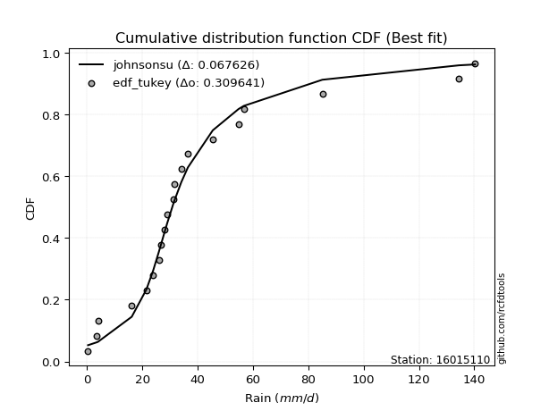</img></img>

</div>


### 8. Empirical - EDF Gringorten (1963)

Gringorten plotting position formula is essential for estimating the probability and return periods of extreme events like floods and heavy rainfall. The constant _a=0.44_.

<div align="center">


$P=(m-a)/(n+1-2a)$


</div>


**8.1. Empirical values**

<div align="center">

|                | 0                    | 1                  | 2                  | 3                  | 4                   | 5                   | 6                   | 7                   | 8                  | 9                   | 10                 | 11                 | 12                 | 13                 | 14                 | 15                 | 16                 | 17                 | 18                 | 19                 |
|:---------------|:---------------------|:-------------------|:-------------------|:-------------------|:--------------------|:--------------------|:--------------------|:--------------------|:-------------------|:--------------------|:-------------------|:-------------------|:-------------------|:-------------------|:-------------------|:-------------------|:-------------------|:-------------------|:-------------------|:-------------------|
| date           | 2023                 | 2025               | 2020               | 2005               | 2018                | 2007                | 2016                | 2012                | 2013               | 2017                | 2024               | 2019               | 2015               | 2008               | 2009               | 2006               | 2022               | 2011               | 2014               | 2010               |
| x              | 0.4                  | 2.2                | 3.4                | 4.0                | 16.2                | 21.5                | 26.0                | 26.9                | 28.0               | 29.0                | 31.2               | 31.5               | 34.1               | 36.5               | 45.5               | 54.8               | 56.7               | 85.1               | 134.5              | 140.3              |
| m              | 1                    | 2                  | 3                  | 4                  | 5                   | 6                   | 7                   | 8                   | 9                  | 10                  | 11                 | 12                 | 13                 | 14                 | 15                 | 16                 | 17                 | 18                 | 19                 | 20                 |
| empirical_dist | edf_gringorten       | edf_gringorten     | edf_gringorten     | edf_gringorten     | edf_gringorten      | edf_gringorten      | edf_gringorten      | edf_gringorten      | edf_gringorten     | edf_gringorten      | edf_gringorten     | edf_gringorten     | edf_gringorten     | edf_gringorten     | edf_gringorten     | edf_gringorten     | edf_gringorten     | edf_gringorten     | edf_gringorten     | edf_gringorten     |
| empirical      | 0.027833001988071572 | 0.0775347912524851 | 0.1272365805168986 | 0.1769383697813121 | 0.22664015904572563 | 0.27634194831013914 | 0.32604373757455263 | 0.37574552683896617 | 0.4254473161033797 | 0.47514910536779326 | 0.5248508946322068 | 0.5745526838966203 | 0.6242544731610338 | 0.6739562624254473 | 0.7236580516898609 | 0.7733598409542743 | 0.8230616302186877 | 0.8727634194831013 | 0.9224652087475148 | 0.9721669980119283 |
| empirical_tr   | 1.0286298568507157   | 1.084051724137931  | 1.1457858769931661 | 1.2149758454106279 | 1.2930591259640103  | 1.3818681318681318  | 1.4837758112094395  | 1.6019108280254777  | 1.740484429065744  | 1.90530303030303    | 2.1046025104602513 | 2.350467289719626  | 2.6613756613756614 | 3.0670731707317067 | 3.618705035971223  | 4.412280701754386  | 5.651685393258422  | 7.859374999999996  | 12.89743589743588  | 35.92857142857125  |

</div>


**8.2. Kolmogorov-Smirnov fit test (sorted by Δ)**


<div align="center">

|                | 0                   | 1                   | 2                   | 3                  | 4                  | 5                   | 6                  | 7                   | 8                   | 9                   | 10                  | 11                 | 12                  | 13                 | 14                  | 15                  | 16                 | 17                 | 18                  | 19                  | 20                  | 21                  | 22                  | 23                  | 24                 | 25                  | 26                  | 27                  | 28                  | 29                  | 30                    | 31                  | 32                  | 33                  | 34                  | 35                  | 36                  | 37                 | 38                  | 39                  | 40                  | 41                  | 42                  | 43                  | 44                  | 45                 | 46                  | 47                  | 48                  | 49                  | 50                  | 51                  | 52                  | 53                  | 54                  | 55                  | 56                  | 57                  | 58                  | 59                 | 60                  | 61                 | 62                  | 63                  | 64                  | 65                 | 66                  | 67                  | 68                  | 69                  | 70                  | 71                  | 72                  | 73                 | 74                  | 75                  | 76                  | 77                 | 78                 | 79                  | 80                  | 81                 | 82                 | 83                 | 84                 | 85                 | 86                 | 87                 | 88                 | 89                 |
|:---------------|:--------------------|:--------------------|:--------------------|:-------------------|:-------------------|:--------------------|:-------------------|:--------------------|:--------------------|:--------------------|:--------------------|:-------------------|:--------------------|:-------------------|:--------------------|:--------------------|:-------------------|:-------------------|:--------------------|:--------------------|:--------------------|:--------------------|:--------------------|:--------------------|:-------------------|:--------------------|:--------------------|:--------------------|:--------------------|:--------------------|:----------------------|:--------------------|:--------------------|:--------------------|:--------------------|:--------------------|:--------------------|:-------------------|:--------------------|:--------------------|:--------------------|:--------------------|:--------------------|:--------------------|:--------------------|:-------------------|:--------------------|:--------------------|:--------------------|:--------------------|:--------------------|:--------------------|:--------------------|:--------------------|:--------------------|:--------------------|:--------------------|:--------------------|:--------------------|:-------------------|:--------------------|:-------------------|:--------------------|:--------------------|:--------------------|:-------------------|:--------------------|:--------------------|:--------------------|:--------------------|:--------------------|:--------------------|:--------------------|:-------------------|:--------------------|:--------------------|:--------------------|:-------------------|:-------------------|:--------------------|:--------------------|:-------------------|:-------------------|:-------------------|:-------------------|:-------------------|:-------------------|:-------------------|:-------------------|:-------------------|
| station        | 16015110            | 16015110            | 16015110            | 16015110           | 16015110           | 16015110            | 16015110           | 16015110            | 16015110            | 16015110            | 16015110            | 16015110           | 16015110            | 16015110           | 16015110            | 16015110            | 16015110           | 16015110           | 16015110            | 16015110            | 16015110            | 16015110            | 16015110            | 16015110            | 16015110           | 16015110            | 16015110            | 16015110            | 16015110            | 16015110            | 16015110              | 16015110            | 16015110            | 16015110            | 16015110            | 16015110            | 16015110            | 16015110           | 16015110            | 16015110            | 16015110            | 16015110            | 16015110            | 16015110            | 16015110            | 16015110           | 16015110            | 16015110            | 16015110            | 16015110            | 16015110            | 16015110            | 16015110            | 16015110            | 16015110            | 16015110            | 16015110            | 16015110            | 16015110            | 16015110           | 16015110            | 16015110           | 16015110            | 16015110            | 16015110            | 16015110           | 16015110            | 16015110            | 16015110            | 16015110            | 16015110            | 16015110            | 16015110            | 16015110           | 16015110            | 16015110            | 16015110            | 16015110           | 16015110           | 16015110            | 16015110            | 16015110           | 16015110           | 16015110           | 16015110           | 16015110           | 16015110           | 16015110           | 16015110           | 16015110           |
| empirical_dist | edf_gringorten      | edf_gringorten      | edf_gringorten      | edf_gringorten     | edf_gringorten     | edf_gringorten      | edf_gringorten     | edf_gringorten      | edf_gringorten      | edf_gringorten      | edf_gringorten      | edf_gringorten     | edf_gringorten      | edf_gringorten     | edf_gringorten      | edf_gringorten      | edf_gringorten     | edf_gringorten     | edf_gringorten      | edf_gringorten      | edf_gringorten      | edf_gringorten      | edf_gringorten      | edf_gringorten      | edf_gringorten     | edf_gringorten      | edf_gringorten      | edf_gringorten      | edf_gringorten      | edf_gringorten      | edf_gringorten        | edf_gringorten      | edf_gringorten      | edf_gringorten      | edf_gringorten      | edf_gringorten      | edf_gringorten      | edf_gringorten     | edf_gringorten      | edf_gringorten      | edf_gringorten      | edf_gringorten      | edf_gringorten      | edf_gringorten      | edf_gringorten      | edf_gringorten     | edf_gringorten      | edf_gringorten      | edf_gringorten      | edf_gringorten      | edf_gringorten      | edf_gringorten      | edf_gringorten      | edf_gringorten      | edf_gringorten      | edf_gringorten      | edf_gringorten      | edf_gringorten      | edf_gringorten      | edf_gringorten     | edf_gringorten      | edf_gringorten     | edf_gringorten      | edf_gringorten      | edf_gringorten      | edf_gringorten     | edf_gringorten      | edf_gringorten      | edf_gringorten      | edf_gringorten      | edf_gringorten      | edf_gringorten      | edf_gringorten      | edf_gringorten     | edf_gringorten      | edf_gringorten      | edf_gringorten      | edf_gringorten     | edf_gringorten     | edf_gringorten      | edf_gringorten      | edf_gringorten     | edf_gringorten     | edf_gringorten     | edf_gringorten     | edf_gringorten     | edf_gringorten     | edf_gringorten     | edf_gringorten     | edf_gringorten     |
| p_dist         | logjohnsonsu        | exponnorm           | t                   | ncf                | pearson3           | halflogistic        | logt               | moyal               | truncnorm           | invweibull          | nct                 | fisk               | invgamma            | gompertz           | genlogistic         | genexpon            | logloggamma        | halfnorm           | laplace_asymmetric  | logpearson3         | johnsonsu           | loggenlogistic      | invgauss            | expon               | gumbel_r           | mielke              | fatiguelife         | loggumbel_l         | loggompertz         | logfisk             | loglaplace_asymmetric | nakagami            | f                   | rayleigh            | kstwobign           | weibull_min         | wald                | gibrat             | maxwell             | gamma               | erlang              | crystalball         | norm                | rice                | logistic            | logfatiguelife     | logcrystalball      | lognorm             | lognorm             | logexponnorm        | logrice             | lognct              | lognakagami         | loglognorm          | logbetaprime        | hypsecant           | loglogistic         | loggamma            | loggamma            | logerlang          | loghypsecant        | logalpha           | loginvgamma         | logchi2             | laplace             | loginvweibull      | loginvgauss         | logmaxwell          | loglaplace          | lograyleigh         | betaprime           | logkstwobign        | gumbel_l            | loggumbel_r        | loghalfnorm         | loggenexpon         | logmoyal            | loghalflogistic    | logexpon           | logncf              | logwald             | loggibrat          | logtruncnorm       | logf               | pareto             | logpareto          | logmielke          | logweibull_min     | alpha              | chi2               |
| delta          | 0.09207282867447714 | 0.10233873507525149 | 0.11239902340427776 | 0.112837913697999  | 0.1130537760936372 | 0.11364009319621282 | 0.118890271620505  | 0.12117342030014855 | 0.12251715152753162 | 0.12288049644301796 | 0.12293210643563679 | 0.1235729885838403 | 0.12629578731766233 | 0.1272526442742995 | 0.13251731243584097 | 0.13349369015180212 | 0.1341949223867428 | 0.135553925130941  | 0.13755460233740469 | 0.13819877974145578 | 0.13884421970153182 | 0.13957887879889608 | 0.14009796396148766 | 0.14674821951485817 | 0.1467559673743306 | 0.15054337559335162 | 0.15060527882210217 | 0.15501898161964733 | 0.15781878842988095 | 0.16227722846382786 | 0.1628400377357309    | 0.16608585156794997 | 0.16746170213336597 | 0.16873314875416934 | 0.17221938308614426 | 0.17548746635792156 | 0.17693455625251361 | 0.1769383697813121 | 0.18049675099703782 | 0.19839426128042859 | 0.21444774779876874 | 0.21469596408578978 | 0.21469596445337147 | 0.21598146731516454 | 0.22021038952961047 | 0.2206932381698663 | 0.22223126057271336 | 0.22223127437122303 | 0.22223127437122303 | 0.22223468261119983 | 0.22225323078872072 | 0.22292261560303384 | 0.22299717119167484 | 0.22408046690882522 | 0.22482945539782384 | 0.22488627072804557 | 0.22874086966027485 | 0.23339210734172589 | 0.23339210734172589 | 0.2339838392901561 | 0.23424471491474264 | 0.2361699499315022 | 0.23873383112072288 | 0.24116349817274407 | 0.24130254168625087 | 0.2485821680201542 | 0.25207407493817513 | 0.25273441573811606 | 0.25277729502808743 | 0.26254455440406743 | 0.27532531568543694 | 0.28296359644178415 | 0.28510007159127215 | 0.2923906610773357 | 0.29386024684770395 | 0.31406147875220924 | 0.31728360836064495 | 0.3184495112827347 | 0.376608248624996  | 0.38130739061819446 | 0.38635678757320413 | 0.4153242562520787 | 0.4227494983308079 | 0.486270458090848  | 0.5206175603438288 | 0.5572735547119247 | 0.587065928802612  | 0.6034393345716889 | 0.687630935129246  | 0.7698287548393868 |
| deltao         | 0.3096406529800002  | 0.3096406529800002  | 0.3096406529800002  | 0.3096406529800002 | 0.3096406529800002 | 0.3096406529800002  | 0.3096406529800002 | 0.3096406529800002  | 0.3096406529800002  | 0.3096406529800002  | 0.3096406529800002  | 0.3096406529800002 | 0.3096406529800002  | 0.3096406529800002 | 0.3096406529800002  | 0.3096406529800002  | 0.3096406529800002 | 0.3096406529800002 | 0.3096406529800002  | 0.3096406529800002  | 0.3096406529800002  | 0.3096406529800002  | 0.3096406529800002  | 0.3096406529800002  | 0.3096406529800002 | 0.3096406529800002  | 0.3096406529800002  | 0.3096406529800002  | 0.3096406529800002  | 0.3096406529800002  | 0.3096406529800002    | 0.3096406529800002  | 0.3096406529800002  | 0.3096406529800002  | 0.3096406529800002  | 0.3096406529800002  | 0.3096406529800002  | 0.3096406529800002 | 0.3096406529800002  | 0.3096406529800002  | 0.3096406529800002  | 0.3096406529800002  | 0.3096406529800002  | 0.3096406529800002  | 0.3096406529800002  | 0.3096406529800002 | 0.3096406529800002  | 0.3096406529800002  | 0.3096406529800002  | 0.3096406529800002  | 0.3096406529800002  | 0.3096406529800002  | 0.3096406529800002  | 0.3096406529800002  | 0.3096406529800002  | 0.3096406529800002  | 0.3096406529800002  | 0.3096406529800002  | 0.3096406529800002  | 0.3096406529800002 | 0.3096406529800002  | 0.3096406529800002 | 0.3096406529800002  | 0.3096406529800002  | 0.3096406529800002  | 0.3096406529800002 | 0.3096406529800002  | 0.3096406529800002  | 0.3096406529800002  | 0.3096406529800002  | 0.3096406529800002  | 0.3096406529800002  | 0.3096406529800002  | 0.3096406529800002 | 0.3096406529800002  | 0.3096406529800002  | 0.3096406529800002  | 0.3096406529800002 | 0.3096406529800002 | 0.3096406529800002  | 0.3096406529800002  | 0.3096406529800002 | 0.3096406529800002 | 0.3096406529800002 | 0.3096406529800002 | 0.3096406529800002 | 0.3096406529800002 | 0.3096406529800002 | 0.3096406529800002 | 0.3096406529800002 |
| eval           | Δo > Δ              | Δo > Δ              | Δo > Δ              | Δo > Δ             | Δo > Δ             | Δo > Δ              | Δo > Δ             | Δo > Δ              | Δo > Δ              | Δo > Δ              | Δo > Δ              | Δo > Δ             | Δo > Δ              | Δo > Δ             | Δo > Δ              | Δo > Δ              | Δo > Δ             | Δo > Δ             | Δo > Δ              | Δo > Δ              | Δo > Δ              | Δo > Δ              | Δo > Δ              | Δo > Δ              | Δo > Δ             | Δo > Δ              | Δo > Δ              | Δo > Δ              | Δo > Δ              | Δo > Δ              | Δo > Δ                | Δo > Δ              | Δo > Δ              | Δo > Δ              | Δo > Δ              | Δo > Δ              | Δo > Δ              | Δo > Δ             | Δo > Δ              | Δo > Δ              | Δo > Δ              | Δo > Δ              | Δo > Δ              | Δo > Δ              | Δo > Δ              | Δo > Δ             | Δo > Δ              | Δo > Δ              | Δo > Δ              | Δo > Δ              | Δo > Δ              | Δo > Δ              | Δo > Δ              | Δo > Δ              | Δo > Δ              | Δo > Δ              | Δo > Δ              | Δo > Δ              | Δo > Δ              | Δo > Δ             | Δo > Δ              | Δo > Δ             | Δo > Δ              | Δo > Δ              | Δo > Δ              | Δo > Δ             | Δo > Δ              | Δo > Δ              | Δo > Δ              | Δo > Δ              | Δo > Δ              | Δo > Δ              | Δo > Δ              | Δo > Δ             | Δo > Δ              | Δo <= Δ             | Δo <= Δ             | Δo <= Δ            | Δo <= Δ            | Δo <= Δ             | Δo <= Δ             | Δo <= Δ            | Δo <= Δ            | Δo <= Δ            | Δo <= Δ            | Δo <= Δ            | Δo <= Δ            | Δo <= Δ            | Δo <= Δ            | Δo <= Δ            |
| fit            | 1                   | 1                   | 1                   | 1                  | 1                  | 1                   | 1                  | 1                   | 1                   | 1                   | 1                   | 1                  | 1                   | 1                  | 1                   | 1                   | 1                  | 1                  | 1                   | 1                   | 1                   | 1                   | 1                   | 1                   | 1                  | 1                   | 1                   | 1                   | 1                   | 1                   | 1                     | 1                   | 1                   | 1                   | 1                   | 1                   | 1                   | 1                  | 1                   | 1                   | 1                   | 1                   | 1                   | 1                   | 1                   | 1                  | 1                   | 1                   | 1                   | 1                   | 1                   | 1                   | 1                   | 1                   | 1                   | 1                   | 1                   | 1                   | 1                   | 1                  | 1                   | 1                  | 1                   | 1                   | 1                   | 1                  | 1                   | 1                   | 1                   | 1                   | 1                   | 1                   | 1                   | 1                  | 1                   | 0                   | 0                   | 0                  | 0                  | 0                   | 0                   | 0                  | 0                  | 0                  | 0                  | 0                  | 0                  | 0                  | 0                  | 0                  |
| n              | 20                  | 20                  | 20                  | 20                 | 20                 | 20                  | 20                 | 20                  | 20                  | 20                  | 20                  | 20                 | 20                  | 20                 | 20                  | 20                  | 20                 | 20                 | 20                  | 20                  | 20                  | 20                  | 20                  | 20                  | 20                 | 20                  | 20                  | 20                  | 20                  | 20                  | 20                    | 20                  | 20                  | 20                  | 20                  | 20                  | 20                  | 20                 | 20                  | 20                  | 20                  | 20                  | 20                  | 20                  | 20                  | 20                 | 20                  | 20                  | 20                  | 20                  | 20                  | 20                  | 20                  | 20                  | 20                  | 20                  | 20                  | 20                  | 20                  | 20                 | 20                  | 20                 | 20                  | 20                  | 20                  | 20                 | 20                  | 20                  | 20                  | 20                  | 20                  | 20                  | 20                  | 20                 | 20                  | 20                  | 20                  | 20                 | 20                 | 20                  | 20                  | 20                 | 20                 | 20                 | 20                 | 20                 | 20                 | 20                 | 20                 | 20                 |
| best_fit       | 1                   | 0                   | 0                   | 0                  | 0                  | 0                   | 0                  | 0                   | 0                   | 0                   | 0                   | 0                  | 0                   | 0                  | 0                   | 0                   | 0                  | 0                  | 0                   | 0                   | 0                   | 0                   | 0                   | 0                   | 0                  | 0                   | 0                   | 0                   | 0                   | 0                   | 0                     | 0                   | 0                   | 0                   | 0                   | 0                   | 0                   | 0                  | 0                   | 0                   | 0                   | 0                   | 0                   | 0                   | 0                   | 0                  | 0                   | 0                   | 0                   | 0                   | 0                   | 0                   | 0                   | 0                   | 0                   | 0                   | 0                   | 0                   | 0                   | 0                  | 0                   | 0                  | 0                   | 0                   | 0                   | 0                  | 0                   | 0                   | 0                   | 0                   | 0                   | 0                   | 0                   | 0                  | 0                   | 0                   | 0                   | 0                  | 0                  | 0                   | 0                   | 0                  | 0                  | 0                  | 0                  | 0                  | 0                  | 0                  | 0                  | 0                  |
| best_fit_sort  | 1                   | 2                   | 3                   | 4                  | 5                  | 6                   | 7                  | 8                   | 9                   | 10                  | 11                  | 12                 | 13                  | 14                 | 15                  | 16                  | 17                 | 18                 | 19                  | 20                  | 21                  | 22                  | 23                  | 24                  | 25                 | 26                  | 27                  | 28                  | 29                  | 30                  | 31                    | 32                  | 33                  | 34                  | 35                  | 36                  | 37                  | 38                 | 39                  | 40                  | 41                  | 42                  | 43                  | 44                  | 45                  | 46                 | 47                  | 48                  | 49                  | 50                  | 51                  | 52                  | 53                  | 54                  | 55                  | 56                  | 57                  | 58                  | 59                  | 60                 | 61                  | 62                 | 63                  | 64                  | 65                  | 66                 | 67                  | 68                  | 69                  | 70                  | 71                  | 72                  | 73                  | 74                 | 75                  | 76                  | 77                  | 78                 | 79                 | 80                  | 81                  | 82                 | 83                 | 84                 | 85                 | 86                 | 87                 | 88                 | 89                 | 90                 |

</div>


<div align="center">

</img>

</div>


**8.3. Best fit**

<div align="center">

|   id |   station | empirical_dist   | p_dist       |     delta |   deltao | eval   |   fit |   n |   best_fit |   best_fit_sort |
|-----:|----------:|:-----------------|:-------------|----------:|---------:|:-------|------:|----:|-----------:|----------------:|
|    0 |  16015110 | edf_gringorten   | logjohnsonsu | 0.0920728 | 0.309641 | Δo > Δ |     1 |  20 |          1 |               1 |

</div>


<div align="center">

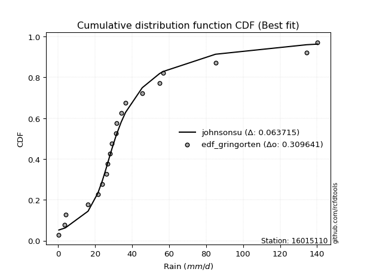</img>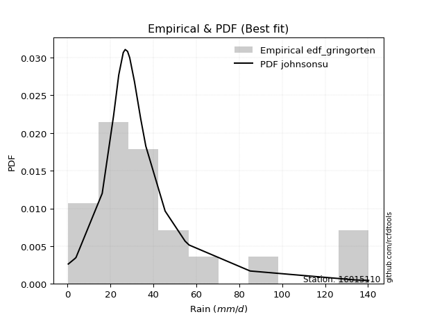</img>

</div>


### 9. Empirical - EDF Filliben (1975)

The specific values of the constants (0.3175) (often denoted as $alpha$) and (0.365) are derived from a method proposed by James J. Filliben in a 1975 paper. This particular formula is the mean value of the $i$-th order statistic of the normal distribution and is considered a robust and effective plotting position formula for the normal probability plot correlation coefficient test for normality.

<div align="center">


$P=(m-0.3175)/(n+0.365)$


</div>


**9.1. Empirical values**

<div align="center">

|                | 0                   | 1                   | 2                  | 3                   | 4                   | 5                  | 6                   | 7                   | 8                   | 9                   | 10                 | 11                 | 12                 | 13                 | 14                | 15                 | 16                 | 17                 | 18                 | 19                 |
|:---------------|:--------------------|:--------------------|:-------------------|:--------------------|:--------------------|:-------------------|:--------------------|:--------------------|:--------------------|:--------------------|:-------------------|:-------------------|:-------------------|:-------------------|:------------------|:-------------------|:-------------------|:-------------------|:-------------------|:-------------------|
| date           | 2023                | 2025                | 2020               | 2005                | 2018                | 2007               | 2016                | 2012                | 2013                | 2017                | 2024               | 2019               | 2015               | 2008               | 2009              | 2006               | 2022               | 2011               | 2014               | 2010               |
| x              | 0.4                 | 2.2                 | 3.4                | 4.0                 | 16.2                | 21.5               | 26.0                | 26.9                | 28.0                | 29.0                | 31.2               | 31.5               | 34.1               | 36.5               | 45.5              | 54.8               | 56.7               | 85.1               | 134.5              | 140.3              |
| m              | 1                   | 2                   | 3                  | 4                   | 5                   | 6                  | 7                   | 8                   | 9                   | 10                  | 11                 | 12                 | 13                 | 14                 | 15                | 16                 | 17                 | 18                 | 19                 | 20                 |
| empirical_dist | edf_filliben        | edf_filliben        | edf_filliben       | edf_filliben        | edf_filliben        | edf_filliben       | edf_filliben        | edf_filliben        | edf_filliben        | edf_filliben        | edf_filliben       | edf_filliben       | edf_filliben       | edf_filliben       | edf_filliben      | edf_filliben       | edf_filliben       | edf_filliben       | edf_filliben       | edf_filliben       |
| empirical      | 0.03351338080039283 | 0.08261723545298306 | 0.1317210901055733 | 0.18082494475816355 | 0.22992879941075375 | 0.279032654063344  | 0.32813650871593425 | 0.37724036336852446 | 0.42634421802111466 | 0.47544807267370487 | 0.5245519273262951 | 0.5736557819788853 | 0.6227596366314756 | 0.6718634912840659 | 0.720967345936656 | 0.7700712005892463 | 0.8191750552418366 | 0.8682789098944268 | 0.9173827645470171 | 0.9664866191996073 |
| empirical_tr   | 1.0346754731360346  | 1.090057540479058   | 1.1517036618125265 | 1.2207402967181178  | 1.2985812211063288  | 1.3870253703388389 | 1.4883975881600586  | 1.6057559629410605  | 1.7432056494757115  | 1.90638895389656    | 2.1032791117996386 | 2.345522602936942  | 2.6508298080052066 | 3.0475121586232703 | 3.583809942806863 | 4.349172450613988  | 5.5302104548540445 | 7.591798695246976  | 12.104011887072826 | 29.838827838827974 |

</div>


**9.2. Kolmogorov-Smirnov fit test (sorted by Δ)**


<div align="center">

|                | 0                   | 1                   | 2                   | 3                  | 4                  | 5                  | 6                   | 7                   | 8                   | 9                   | 10                  | 11                  | 12                  | 13                  | 14                  | 15                 | 16                  | 17                 | 18                  | 19                  | 20                 | 21                  | 22                  | 23                  | 24                 | 25                 | 26                  | 27                 | 28                  | 29                  | 30                    | 31                  | 32                  | 33                  | 34                  | 35                  | 36                  | 37                  | 38                  | 39                  | 40                  | 41                  | 42                  | 43                  | 44                  | 45                  | 46                  | 47                 | 48                 | 49                 | 50                 | 51                 | 52                  | 53                 | 54                  | 55                  | 56                  | 57                  | 58                  | 59                  | 60                 | 61                  | 62                  | 63                  | 64                  | 65                  | 66                  | 67                  | 68                 | 69                 | 70                 | 71                 | 72                  | 73                  | 74                 | 75                  | 76                  | 77                  | 78                 | 79                 | 80                 | 81                  | 82                 | 83                  | 84                 | 85                 | 86                 | 87                 | 88                 | 89                 |
|:---------------|:--------------------|:--------------------|:--------------------|:-------------------|:-------------------|:-------------------|:--------------------|:--------------------|:--------------------|:--------------------|:--------------------|:--------------------|:--------------------|:--------------------|:--------------------|:-------------------|:--------------------|:-------------------|:--------------------|:--------------------|:-------------------|:--------------------|:--------------------|:--------------------|:-------------------|:-------------------|:--------------------|:-------------------|:--------------------|:--------------------|:----------------------|:--------------------|:--------------------|:--------------------|:--------------------|:--------------------|:--------------------|:--------------------|:--------------------|:--------------------|:--------------------|:--------------------|:--------------------|:--------------------|:--------------------|:--------------------|:--------------------|:-------------------|:-------------------|:-------------------|:-------------------|:-------------------|:--------------------|:-------------------|:--------------------|:--------------------|:--------------------|:--------------------|:--------------------|:--------------------|:-------------------|:--------------------|:--------------------|:--------------------|:--------------------|:--------------------|:--------------------|:--------------------|:-------------------|:-------------------|:-------------------|:-------------------|:--------------------|:--------------------|:-------------------|:--------------------|:--------------------|:--------------------|:-------------------|:-------------------|:-------------------|:--------------------|:-------------------|:--------------------|:-------------------|:-------------------|:-------------------|:-------------------|:-------------------|:-------------------|
| station        | 16015110            | 16015110            | 16015110            | 16015110           | 16015110           | 16015110           | 16015110            | 16015110            | 16015110            | 16015110            | 16015110            | 16015110            | 16015110            | 16015110            | 16015110            | 16015110           | 16015110            | 16015110           | 16015110            | 16015110            | 16015110           | 16015110            | 16015110            | 16015110            | 16015110           | 16015110           | 16015110            | 16015110           | 16015110            | 16015110            | 16015110              | 16015110            | 16015110            | 16015110            | 16015110            | 16015110            | 16015110            | 16015110            | 16015110            | 16015110            | 16015110            | 16015110            | 16015110            | 16015110            | 16015110            | 16015110            | 16015110            | 16015110           | 16015110           | 16015110           | 16015110           | 16015110           | 16015110            | 16015110           | 16015110            | 16015110            | 16015110            | 16015110            | 16015110            | 16015110            | 16015110           | 16015110            | 16015110            | 16015110            | 16015110            | 16015110            | 16015110            | 16015110            | 16015110           | 16015110           | 16015110           | 16015110           | 16015110            | 16015110            | 16015110           | 16015110            | 16015110            | 16015110            | 16015110           | 16015110           | 16015110           | 16015110            | 16015110           | 16015110            | 16015110           | 16015110           | 16015110           | 16015110           | 16015110           | 16015110           |
| empirical_dist | edf_filliben        | edf_filliben        | edf_filliben        | edf_filliben       | edf_filliben       | edf_filliben       | edf_filliben        | edf_filliben        | edf_filliben        | edf_filliben        | edf_filliben        | edf_filliben        | edf_filliben        | edf_filliben        | edf_filliben        | edf_filliben       | edf_filliben        | edf_filliben       | edf_filliben        | edf_filliben        | edf_filliben       | edf_filliben        | edf_filliben        | edf_filliben        | edf_filliben       | edf_filliben       | edf_filliben        | edf_filliben       | edf_filliben        | edf_filliben        | edf_filliben          | edf_filliben        | edf_filliben        | edf_filliben        | edf_filliben        | edf_filliben        | edf_filliben        | edf_filliben        | edf_filliben        | edf_filliben        | edf_filliben        | edf_filliben        | edf_filliben        | edf_filliben        | edf_filliben        | edf_filliben        | edf_filliben        | edf_filliben       | edf_filliben       | edf_filliben       | edf_filliben       | edf_filliben       | edf_filliben        | edf_filliben       | edf_filliben        | edf_filliben        | edf_filliben        | edf_filliben        | edf_filliben        | edf_filliben        | edf_filliben       | edf_filliben        | edf_filliben        | edf_filliben        | edf_filliben        | edf_filliben        | edf_filliben        | edf_filliben        | edf_filliben       | edf_filliben       | edf_filliben       | edf_filliben       | edf_filliben        | edf_filliben        | edf_filliben       | edf_filliben        | edf_filliben        | edf_filliben        | edf_filliben       | edf_filliben       | edf_filliben       | edf_filliben        | edf_filliben       | edf_filliben        | edf_filliben       | edf_filliben       | edf_filliben       | edf_filliben       | edf_filliben       | edf_filliben       |
| p_dist         | logjohnsonsu        | exponnorm           | t                   | ncf                | pearson3           | halflogistic       | moyal               | truncnorm           | invweibull          | nct                 | fisk                | logt                | invgamma            | gompertz            | genlogistic         | genexpon           | logloggamma         | halfnorm           | laplace_asymmetric  | logpearson3         | johnsonsu          | loggenlogistic      | invgauss            | expon               | gumbel_r           | mielke             | fatiguelife         | loggumbel_l        | loggompertz         | logfisk             | loglaplace_asymmetric | nakagami            | f                   | rayleigh            | kstwobign           | weibull_min         | maxwell             | wald                | gibrat              | gamma               | erlang              | crystalball         | norm                | rice                | logistic            | logfatiguelife      | logcrystalball      | lognorm            | lognorm            | logexponnorm       | logrice            | lognct             | lognakagami         | loglognorm         | logbetaprime        | hypsecant           | loglogistic         | loggamma            | loggamma            | logerlang           | loghypsecant       | logalpha            | loginvgamma         | logchi2             | laplace             | loginvweibull       | loginvgauss         | logmaxwell          | loglaplace         | lograyleigh        | betaprime          | logkstwobign       | gumbel_l            | loggumbel_r         | loghalfnorm        | loggenexpon         | logmoyal            | loghalflogistic     | logexpon           | logncf             | logwald            | loggibrat           | logtruncnorm       | logf                | pareto             | logpareto          | logmielke          | logweibull_min     | alpha              | chi2               |
| delta          | 0.09595940365132857 | 0.10057707391306484 | 0.11030625226289614 | 0.1107451425566176 | 0.1109610049522558 | 0.1115473220548312 | 0.11908064915876715 | 0.12042438038615022 | 0.12078772530163634 | 0.12083933529425517 | 0.12148021744245868 | 0.12277684659735644 | 0.12420301617628071 | 0.12515987313291788 | 0.13042454129445957 | 0.1314009190104205 | 0.13210215124536118 | 0.1334611539895596 | 0.13546183119602329 | 0.13610600860007416 | 0.1367514485601502 | 0.13748610765751446 | 0.13800519282010604 | 0.14465544837347655 | 0.1446631962329492 | 0.14845060445197   | 0.14851250768072055 | 0.1529262104782657 | 0.15572601728849933 | 0.16018445732244624 | 0.1607472665943493    | 0.16399308042656857 | 0.16536893099198435 | 0.16664037761278794 | 0.17012661194476286 | 0.17339469521653994 | 0.17840397985565642 | 0.18082113122936505 | 0.18082494475816355 | 0.19630149013904696 | 0.21235497665738712 | 0.21260319294440838 | 0.21260319331199007 | 0.21388869617378314 | 0.21811761838822907 | 0.21860046702848468 | 0.22013848943133174 | 0.2201385032298414 | 0.2201385032298414 | 0.2201419114698182 | 0.2201604596473391 | 0.2208298444616522 | 0.22090440005029321 | 0.2219876957674436 | 0.22273668425644222 | 0.22279349958666417 | 0.22664809851889323 | 0.23129933620034426 | 0.23129933620034426 | 0.23189106814877447 | 0.232151943773361  | 0.23347924417829735 | 0.23664105997934126 | 0.23907072703136245 | 0.23920977054486947 | 0.24589146226694936 | 0.24938336918497028 | 0.25064164459673444 | 0.2506845238867058 | 0.2604517832626858 | 0.2732325445440553 | 0.2802728906885793 | 0.28300730044989075 | 0.29029788993595407 | 0.2911695410944991 | 0.31130171908728976 | 0.31519083721926333 | 0.31575880552952984 | 0.3733196082599679 | 0.3762249464176965 | 0.3842640164318225 | 0.41323148511069707 | 0.4194608579657798 | 0.48118801389035004 | 0.5155351161433308 | 0.5521911105114268 | 0.5837772884375839 | 0.6001506942066608 | 0.6843422947642179 | 0.7665401144743588 |
| deltao         | 0.3096406529800002  | 0.3096406529800002  | 0.3096406529800002  | 0.3096406529800002 | 0.3096406529800002 | 0.3096406529800002 | 0.3096406529800002  | 0.3096406529800002  | 0.3096406529800002  | 0.3096406529800002  | 0.3096406529800002  | 0.3096406529800002  | 0.3096406529800002  | 0.3096406529800002  | 0.3096406529800002  | 0.3096406529800002 | 0.3096406529800002  | 0.3096406529800002 | 0.3096406529800002  | 0.3096406529800002  | 0.3096406529800002 | 0.3096406529800002  | 0.3096406529800002  | 0.3096406529800002  | 0.3096406529800002 | 0.3096406529800002 | 0.3096406529800002  | 0.3096406529800002 | 0.3096406529800002  | 0.3096406529800002  | 0.3096406529800002    | 0.3096406529800002  | 0.3096406529800002  | 0.3096406529800002  | 0.3096406529800002  | 0.3096406529800002  | 0.3096406529800002  | 0.3096406529800002  | 0.3096406529800002  | 0.3096406529800002  | 0.3096406529800002  | 0.3096406529800002  | 0.3096406529800002  | 0.3096406529800002  | 0.3096406529800002  | 0.3096406529800002  | 0.3096406529800002  | 0.3096406529800002 | 0.3096406529800002 | 0.3096406529800002 | 0.3096406529800002 | 0.3096406529800002 | 0.3096406529800002  | 0.3096406529800002 | 0.3096406529800002  | 0.3096406529800002  | 0.3096406529800002  | 0.3096406529800002  | 0.3096406529800002  | 0.3096406529800002  | 0.3096406529800002 | 0.3096406529800002  | 0.3096406529800002  | 0.3096406529800002  | 0.3096406529800002  | 0.3096406529800002  | 0.3096406529800002  | 0.3096406529800002  | 0.3096406529800002 | 0.3096406529800002 | 0.3096406529800002 | 0.3096406529800002 | 0.3096406529800002  | 0.3096406529800002  | 0.3096406529800002 | 0.3096406529800002  | 0.3096406529800002  | 0.3096406529800002  | 0.3096406529800002 | 0.3096406529800002 | 0.3096406529800002 | 0.3096406529800002  | 0.3096406529800002 | 0.3096406529800002  | 0.3096406529800002 | 0.3096406529800002 | 0.3096406529800002 | 0.3096406529800002 | 0.3096406529800002 | 0.3096406529800002 |
| eval           | Δo > Δ              | Δo > Δ              | Δo > Δ              | Δo > Δ             | Δo > Δ             | Δo > Δ             | Δo > Δ              | Δo > Δ              | Δo > Δ              | Δo > Δ              | Δo > Δ              | Δo > Δ              | Δo > Δ              | Δo > Δ              | Δo > Δ              | Δo > Δ             | Δo > Δ              | Δo > Δ             | Δo > Δ              | Δo > Δ              | Δo > Δ             | Δo > Δ              | Δo > Δ              | Δo > Δ              | Δo > Δ             | Δo > Δ             | Δo > Δ              | Δo > Δ             | Δo > Δ              | Δo > Δ              | Δo > Δ                | Δo > Δ              | Δo > Δ              | Δo > Δ              | Δo > Δ              | Δo > Δ              | Δo > Δ              | Δo > Δ              | Δo > Δ              | Δo > Δ              | Δo > Δ              | Δo > Δ              | Δo > Δ              | Δo > Δ              | Δo > Δ              | Δo > Δ              | Δo > Δ              | Δo > Δ             | Δo > Δ             | Δo > Δ             | Δo > Δ             | Δo > Δ             | Δo > Δ              | Δo > Δ             | Δo > Δ              | Δo > Δ              | Δo > Δ              | Δo > Δ              | Δo > Δ              | Δo > Δ              | Δo > Δ             | Δo > Δ              | Δo > Δ              | Δo > Δ              | Δo > Δ              | Δo > Δ              | Δo > Δ              | Δo > Δ              | Δo > Δ             | Δo > Δ             | Δo > Δ             | Δo > Δ             | Δo > Δ              | Δo > Δ              | Δo > Δ             | Δo <= Δ             | Δo <= Δ             | Δo <= Δ             | Δo <= Δ            | Δo <= Δ            | Δo <= Δ            | Δo <= Δ             | Δo <= Δ            | Δo <= Δ             | Δo <= Δ            | Δo <= Δ            | Δo <= Δ            | Δo <= Δ            | Δo <= Δ            | Δo <= Δ            |
| fit            | 1                   | 1                   | 1                   | 1                  | 1                  | 1                  | 1                   | 1                   | 1                   | 1                   | 1                   | 1                   | 1                   | 1                   | 1                   | 1                  | 1                   | 1                  | 1                   | 1                   | 1                  | 1                   | 1                   | 1                   | 1                  | 1                  | 1                   | 1                  | 1                   | 1                   | 1                     | 1                   | 1                   | 1                   | 1                   | 1                   | 1                   | 1                   | 1                   | 1                   | 1                   | 1                   | 1                   | 1                   | 1                   | 1                   | 1                   | 1                  | 1                  | 1                  | 1                  | 1                  | 1                   | 1                  | 1                   | 1                   | 1                   | 1                   | 1                   | 1                   | 1                  | 1                   | 1                   | 1                   | 1                   | 1                   | 1                   | 1                   | 1                  | 1                  | 1                  | 1                  | 1                   | 1                   | 1                  | 0                   | 0                   | 0                   | 0                  | 0                  | 0                  | 0                   | 0                  | 0                   | 0                  | 0                  | 0                  | 0                  | 0                  | 0                  |
| n              | 20                  | 20                  | 20                  | 20                 | 20                 | 20                 | 20                  | 20                  | 20                  | 20                  | 20                  | 20                  | 20                  | 20                  | 20                  | 20                 | 20                  | 20                 | 20                  | 20                  | 20                 | 20                  | 20                  | 20                  | 20                 | 20                 | 20                  | 20                 | 20                  | 20                  | 20                    | 20                  | 20                  | 20                  | 20                  | 20                  | 20                  | 20                  | 20                  | 20                  | 20                  | 20                  | 20                  | 20                  | 20                  | 20                  | 20                  | 20                 | 20                 | 20                 | 20                 | 20                 | 20                  | 20                 | 20                  | 20                  | 20                  | 20                  | 20                  | 20                  | 20                 | 20                  | 20                  | 20                  | 20                  | 20                  | 20                  | 20                  | 20                 | 20                 | 20                 | 20                 | 20                  | 20                  | 20                 | 20                  | 20                  | 20                  | 20                 | 20                 | 20                 | 20                  | 20                 | 20                  | 20                 | 20                 | 20                 | 20                 | 20                 | 20                 |
| best_fit       | 1                   | 0                   | 0                   | 0                  | 0                  | 0                  | 0                   | 0                   | 0                   | 0                   | 0                   | 0                   | 0                   | 0                   | 0                   | 0                  | 0                   | 0                  | 0                   | 0                   | 0                  | 0                   | 0                   | 0                   | 0                  | 0                  | 0                   | 0                  | 0                   | 0                   | 0                     | 0                   | 0                   | 0                   | 0                   | 0                   | 0                   | 0                   | 0                   | 0                   | 0                   | 0                   | 0                   | 0                   | 0                   | 0                   | 0                   | 0                  | 0                  | 0                  | 0                  | 0                  | 0                   | 0                  | 0                   | 0                   | 0                   | 0                   | 0                   | 0                   | 0                  | 0                   | 0                   | 0                   | 0                   | 0                   | 0                   | 0                   | 0                  | 0                  | 0                  | 0                  | 0                   | 0                   | 0                  | 0                   | 0                   | 0                   | 0                  | 0                  | 0                  | 0                   | 0                  | 0                   | 0                  | 0                  | 0                  | 0                  | 0                  | 0                  |
| best_fit_sort  | 1                   | 2                   | 3                   | 4                  | 5                  | 6                  | 7                   | 8                   | 9                   | 10                  | 11                  | 12                  | 13                  | 14                  | 15                  | 16                 | 17                  | 18                 | 19                  | 20                  | 21                 | 22                  | 23                  | 24                  | 25                 | 26                 | 27                  | 28                 | 29                  | 30                  | 31                    | 32                  | 33                  | 34                  | 35                  | 36                  | 37                  | 38                  | 39                  | 40                  | 41                  | 42                  | 43                  | 44                  | 45                  | 46                  | 47                  | 48                 | 49                 | 50                 | 51                 | 52                 | 53                  | 54                 | 55                  | 56                  | 57                  | 58                  | 59                  | 60                  | 61                 | 62                  | 63                  | 64                  | 65                  | 66                  | 67                  | 68                  | 69                 | 70                 | 71                 | 72                 | 73                  | 74                  | 75                 | 76                  | 77                  | 78                  | 79                 | 80                 | 81                 | 82                  | 83                 | 84                  | 85                 | 86                 | 87                 | 88                 | 89                 | 90                 |

</div>


<div align="center">

</img>

</div>


**9.3. Best fit**

<div align="center">

|   id |   station | empirical_dist   | p_dist       |     delta |   deltao | eval   |   fit |   n |   best_fit |   best_fit_sort |
|-----:|----------:|:-----------------|:-------------|----------:|---------:|:-------|------:|----:|-----------:|----------------:|
|    0 |  16015110 | edf_filliben     | logjohnsonsu | 0.0959594 | 0.309641 | Δo > Δ |     1 |  20 |          1 |               1 |

</div>


<div align="center">

</img>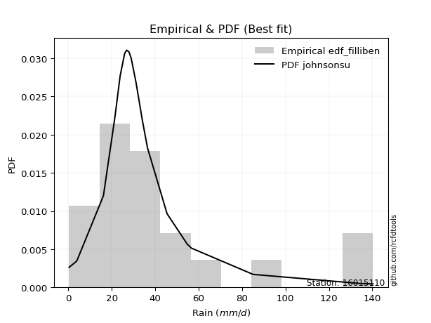</img>

</div>


### 10. Empirical - EDF Jenkinson (1977)

The Jenkinson formula in hydrology is an empirical plotting position formula used to estimate the non-exceedance probability _(P)_ or return period _(T)_ of a given ordered observation within a sample. It is a widely used method in the frequency analysis of extreme events such as floods and rainfall, as it provides a distribution-free way to plot data. _a≈0.31_ and _b≈0.38_ are constants derived to approximate the median of the probability distribution for the given rank.

<div align="center">


$P=(m-a)/(n+b)$


</div>


**10.1. Empirical values**

<div align="center">

|                | 0                    | 1                   | 2                   | 3                   | 4                   | 5                   | 6                   | 7                  | 8                  | 9                   | 10                 | 11                 | 12                 | 13                 | 14                 | 15                 | 16                 | 17                 | 18                 | 19                 |
|:---------------|:---------------------|:--------------------|:--------------------|:--------------------|:--------------------|:--------------------|:--------------------|:-------------------|:-------------------|:--------------------|:-------------------|:-------------------|:-------------------|:-------------------|:-------------------|:-------------------|:-------------------|:-------------------|:-------------------|:-------------------|
| date           | 2023                 | 2025                | 2020                | 2005                | 2018                | 2007                | 2016                | 2012               | 2013               | 2017                | 2024               | 2019               | 2015               | 2008               | 2009               | 2006               | 2022               | 2011               | 2014               | 2010               |
| x              | 0.4                  | 2.2                 | 3.4                 | 4.0                 | 16.2                | 21.5                | 26.0                | 26.9               | 28.0               | 29.0                | 31.2               | 31.5               | 34.1               | 36.5               | 45.5               | 54.8               | 56.7               | 85.1               | 134.5              | 140.3              |
| m              | 1                    | 2                   | 3                   | 4                   | 5                   | 6                   | 7                   | 8                  | 9                  | 10                  | 11                 | 12                 | 13                 | 14                 | 15                 | 16                 | 17                 | 18                 | 19                 | 20                 |
| empirical_dist | edf_jenkinson        | edf_jenkinson       | edf_jenkinson       | edf_jenkinson       | edf_jenkinson       | edf_jenkinson       | edf_jenkinson       | edf_jenkinson      | edf_jenkinson      | edf_jenkinson       | edf_jenkinson      | edf_jenkinson      | edf_jenkinson      | edf_jenkinson      | edf_jenkinson      | edf_jenkinson      | edf_jenkinson      | edf_jenkinson      | edf_jenkinson      | edf_jenkinson      |
| empirical      | 0.033856722276741906 | 0.08292443572129539 | 0.13199214916584887 | 0.18105986261040236 | 0.23012757605495587 | 0.27919528949950934 | 0.32826300294406285 | 0.3773307163886163 | 0.4263984298331698 | 0.47546614327772324 | 0.5245338567222767 | 0.5736015701668302 | 0.6226692836113837 | 0.6717369970559373 | 0.7208047105004907 | 0.7698724239450442 | 0.8189401373895977 | 0.8680078508341512 | 0.9170755642787047 | 0.9661432777232583 |
| empirical_tr   | 1.0350431691213813   | 1.090422685928304   | 1.152063312605992   | 1.2210904733373276  | 1.2989165073295095  | 1.3873383253914227  | 1.4886778670562455  | 1.6059889676910957 | 1.7433704020530367 | 1.9064546304957901  | 2.1031991744066048 | 2.3452243958573074 | 2.6501950585175553 | 3.0463378176382667 | 3.581722319859402  | 4.345415778251599  | 5.523035230352305  | 7.576208178438667  | 12.059171597633155 | 29.536231884058108 |

</div>


**10.2. Kolmogorov-Smirnov fit test (sorted by Δ)**


<div align="center">

|                | 0                   | 1                   | 2                   | 3                  | 4                  | 5                  | 6                   | 7                   | 8                   | 9                   | 10                  | 11                  | 12                  | 13                  | 14                  | 15                 | 16                  | 17                 | 18                  | 19                  | 20                 | 21                  | 22                  | 23                  | 24                 | 25                 | 26                  | 27                 | 28                  | 29                  | 30                    | 31                  | 32                  | 33                  | 34                  | 35                  | 36                  | 37                  | 38                  | 39                  | 40                 | 41                  | 42                  | 43                  | 44                  | 45                  | 46                  | 47                 | 48                 | 49                 | 50                 | 51                 | 52                 | 53                 | 54                  | 55                  | 56                  | 57                  | 58                  | 59                  | 60                 | 61                 | 62                  | 63                  | 64                  | 65                 | 66                  | 67                  | 68                 | 69                 | 70                 | 71                  | 72                  | 73                  | 74                  | 75                 | 76                 | 77                 | 78                  | 79                  | 80                 | 81                  | 82                  | 83                 | 84                 | 85                 | 86                 | 87                 | 88                 | 89                 |
|:---------------|:--------------------|:--------------------|:--------------------|:-------------------|:-------------------|:-------------------|:--------------------|:--------------------|:--------------------|:--------------------|:--------------------|:--------------------|:--------------------|:--------------------|:--------------------|:-------------------|:--------------------|:-------------------|:--------------------|:--------------------|:-------------------|:--------------------|:--------------------|:--------------------|:-------------------|:-------------------|:--------------------|:-------------------|:--------------------|:--------------------|:----------------------|:--------------------|:--------------------|:--------------------|:--------------------|:--------------------|:--------------------|:--------------------|:--------------------|:--------------------|:-------------------|:--------------------|:--------------------|:--------------------|:--------------------|:--------------------|:--------------------|:-------------------|:-------------------|:-------------------|:-------------------|:-------------------|:-------------------|:-------------------|:--------------------|:--------------------|:--------------------|:--------------------|:--------------------|:--------------------|:-------------------|:-------------------|:--------------------|:--------------------|:--------------------|:-------------------|:--------------------|:--------------------|:-------------------|:-------------------|:-------------------|:--------------------|:--------------------|:--------------------|:--------------------|:-------------------|:-------------------|:-------------------|:--------------------|:--------------------|:-------------------|:--------------------|:--------------------|:-------------------|:-------------------|:-------------------|:-------------------|:-------------------|:-------------------|:-------------------|
| station        | 16015110            | 16015110            | 16015110            | 16015110           | 16015110           | 16015110           | 16015110            | 16015110            | 16015110            | 16015110            | 16015110            | 16015110            | 16015110            | 16015110            | 16015110            | 16015110           | 16015110            | 16015110           | 16015110            | 16015110            | 16015110           | 16015110            | 16015110            | 16015110            | 16015110           | 16015110           | 16015110            | 16015110           | 16015110            | 16015110            | 16015110              | 16015110            | 16015110            | 16015110            | 16015110            | 16015110            | 16015110            | 16015110            | 16015110            | 16015110            | 16015110           | 16015110            | 16015110            | 16015110            | 16015110            | 16015110            | 16015110            | 16015110           | 16015110           | 16015110           | 16015110           | 16015110           | 16015110           | 16015110           | 16015110            | 16015110            | 16015110            | 16015110            | 16015110            | 16015110            | 16015110           | 16015110           | 16015110            | 16015110            | 16015110            | 16015110           | 16015110            | 16015110            | 16015110           | 16015110           | 16015110           | 16015110            | 16015110            | 16015110            | 16015110            | 16015110           | 16015110           | 16015110           | 16015110            | 16015110            | 16015110           | 16015110            | 16015110            | 16015110           | 16015110           | 16015110           | 16015110           | 16015110           | 16015110           | 16015110           |
| empirical_dist | edf_jenkinson       | edf_jenkinson       | edf_jenkinson       | edf_jenkinson      | edf_jenkinson      | edf_jenkinson      | edf_jenkinson       | edf_jenkinson       | edf_jenkinson       | edf_jenkinson       | edf_jenkinson       | edf_jenkinson       | edf_jenkinson       | edf_jenkinson       | edf_jenkinson       | edf_jenkinson      | edf_jenkinson       | edf_jenkinson      | edf_jenkinson       | edf_jenkinson       | edf_jenkinson      | edf_jenkinson       | edf_jenkinson       | edf_jenkinson       | edf_jenkinson      | edf_jenkinson      | edf_jenkinson       | edf_jenkinson      | edf_jenkinson       | edf_jenkinson       | edf_jenkinson         | edf_jenkinson       | edf_jenkinson       | edf_jenkinson       | edf_jenkinson       | edf_jenkinson       | edf_jenkinson       | edf_jenkinson       | edf_jenkinson       | edf_jenkinson       | edf_jenkinson      | edf_jenkinson       | edf_jenkinson       | edf_jenkinson       | edf_jenkinson       | edf_jenkinson       | edf_jenkinson       | edf_jenkinson      | edf_jenkinson      | edf_jenkinson      | edf_jenkinson      | edf_jenkinson      | edf_jenkinson      | edf_jenkinson      | edf_jenkinson       | edf_jenkinson       | edf_jenkinson       | edf_jenkinson       | edf_jenkinson       | edf_jenkinson       | edf_jenkinson      | edf_jenkinson      | edf_jenkinson       | edf_jenkinson       | edf_jenkinson       | edf_jenkinson      | edf_jenkinson       | edf_jenkinson       | edf_jenkinson      | edf_jenkinson      | edf_jenkinson      | edf_jenkinson       | edf_jenkinson       | edf_jenkinson       | edf_jenkinson       | edf_jenkinson      | edf_jenkinson      | edf_jenkinson      | edf_jenkinson       | edf_jenkinson       | edf_jenkinson      | edf_jenkinson       | edf_jenkinson       | edf_jenkinson      | edf_jenkinson      | edf_jenkinson      | edf_jenkinson      | edf_jenkinson      | edf_jenkinson      | edf_jenkinson      |
| p_dist         | logjohnsonsu        | exponnorm           | t                   | ncf                | pearson3           | halflogistic       | moyal               | truncnorm           | invweibull          | nct                 | fisk                | logt                | invgamma            | gompertz            | genlogistic         | genexpon           | logloggamma         | halfnorm           | laplace_asymmetric  | logpearson3         | johnsonsu          | loggenlogistic      | invgauss            | expon               | gumbel_r           | mielke             | fatiguelife         | loggumbel_l        | loggompertz         | logfisk             | loglaplace_asymmetric | nakagami            | f                   | rayleigh            | kstwobign           | weibull_min         | maxwell             | wald                | gibrat              | gamma               | erlang             | crystalball         | norm                | rice                | logistic            | logfatiguelife      | logcrystalball      | lognorm            | lognorm            | logexponnorm       | logrice            | lognct             | lognakagami        | loglognorm         | logbetaprime        | hypsecant           | loglogistic         | loggamma            | loggamma            | logerlang           | loghypsecant       | logalpha           | loginvgamma         | logchi2             | laplace             | loginvweibull      | loginvgauss         | logmaxwell          | loglaplace         | lograyleigh        | betaprime          | logkstwobign        | gumbel_l            | loggumbel_r         | loghalfnorm         | loggenexpon        | logmoyal           | loghalflogistic    | logexpon            | logncf              | logwald            | loggibrat           | logtruncnorm        | logf               | pareto             | logpareto          | logmielke          | logweibull_min     | alpha              | chi2               |
| delta          | 0.09619432150356738 | 0.10081199176530364 | 0.11017975803476754 | 0.110618648328489  | 0.1108345107241272 | 0.1114208278267026 | 0.11895415493063854 | 0.12029788615802162 | 0.12066123107350774 | 0.12071284106612656 | 0.12135372321433008 | 0.12301176444959525 | 0.12407652194815211 | 0.12503337890478927 | 0.13029804706633097 | 0.1312744247822919 | 0.13197565701723257 | 0.133334659761431  | 0.13533533696789468 | 0.13597951437194555 | 0.1366249543320216 | 0.13735961342938585 | 0.13787869859197743 | 0.14452895414534794 | 0.1445367020048206 | 0.1483241102238414 | 0.14838601345259195 | 0.1527997162501371 | 0.15559952306037073 | 0.16005796309431763 | 0.1606207723662207    | 0.16386658619843997 | 0.16524243676385575 | 0.16651388338465933 | 0.17000011771663426 | 0.17326820098841134 | 0.17827748562752782 | 0.18105604908160386 | 0.18105986261040236 | 0.19617499591091836 | 0.2122284824292585 | 0.21247669871627978 | 0.21247669908386146 | 0.21376220194565454 | 0.21799112416010047 | 0.21847397280035608 | 0.22001199520320314 | 0.2200120090017128 | 0.2200120090017128 | 0.2200154172416896 | 0.2200339654192105 | 0.2207033502335236 | 0.2207779058221646 | 0.221861201539315  | 0.22261019002831361 | 0.22266700535853556 | 0.22652160429076462 | 0.23117284197221566 | 0.23117284197221566 | 0.23176457392064587 | 0.2320254495452324 | 0.233316608742132  | 0.23651456575121266 | 0.23894423280323385 | 0.23908327631674087 | 0.245728826830784  | 0.24922073374880493 | 0.25051515036860583 | 0.2505580296585772 | 0.2603252890345572 | 0.2731060503159267 | 0.28011025525241395 | 0.28288080622176215 | 0.29017139570782546 | 0.29100690565833376 | 0.3111390836511244 | 0.3150643429911347 | 0.3155961700933645 | 0.37312083161576576 | 0.37591774614938417 | 0.3841375222036939 | 0.41310499088256847 | 0.41926208132157766 | 0.4808808136220377 | 0.5152279158750185 | 0.5518839102431145 | 0.5835785117933818 | 0.5999519175624586 | 0.6841435181200157 | 0.7663413378301567 |
| deltao         | 0.3096406529800002  | 0.3096406529800002  | 0.3096406529800002  | 0.3096406529800002 | 0.3096406529800002 | 0.3096406529800002 | 0.3096406529800002  | 0.3096406529800002  | 0.3096406529800002  | 0.3096406529800002  | 0.3096406529800002  | 0.3096406529800002  | 0.3096406529800002  | 0.3096406529800002  | 0.3096406529800002  | 0.3096406529800002 | 0.3096406529800002  | 0.3096406529800002 | 0.3096406529800002  | 0.3096406529800002  | 0.3096406529800002 | 0.3096406529800002  | 0.3096406529800002  | 0.3096406529800002  | 0.3096406529800002 | 0.3096406529800002 | 0.3096406529800002  | 0.3096406529800002 | 0.3096406529800002  | 0.3096406529800002  | 0.3096406529800002    | 0.3096406529800002  | 0.3096406529800002  | 0.3096406529800002  | 0.3096406529800002  | 0.3096406529800002  | 0.3096406529800002  | 0.3096406529800002  | 0.3096406529800002  | 0.3096406529800002  | 0.3096406529800002 | 0.3096406529800002  | 0.3096406529800002  | 0.3096406529800002  | 0.3096406529800002  | 0.3096406529800002  | 0.3096406529800002  | 0.3096406529800002 | 0.3096406529800002 | 0.3096406529800002 | 0.3096406529800002 | 0.3096406529800002 | 0.3096406529800002 | 0.3096406529800002 | 0.3096406529800002  | 0.3096406529800002  | 0.3096406529800002  | 0.3096406529800002  | 0.3096406529800002  | 0.3096406529800002  | 0.3096406529800002 | 0.3096406529800002 | 0.3096406529800002  | 0.3096406529800002  | 0.3096406529800002  | 0.3096406529800002 | 0.3096406529800002  | 0.3096406529800002  | 0.3096406529800002 | 0.3096406529800002 | 0.3096406529800002 | 0.3096406529800002  | 0.3096406529800002  | 0.3096406529800002  | 0.3096406529800002  | 0.3096406529800002 | 0.3096406529800002 | 0.3096406529800002 | 0.3096406529800002  | 0.3096406529800002  | 0.3096406529800002 | 0.3096406529800002  | 0.3096406529800002  | 0.3096406529800002 | 0.3096406529800002 | 0.3096406529800002 | 0.3096406529800002 | 0.3096406529800002 | 0.3096406529800002 | 0.3096406529800002 |
| eval           | Δo > Δ              | Δo > Δ              | Δo > Δ              | Δo > Δ             | Δo > Δ             | Δo > Δ             | Δo > Δ              | Δo > Δ              | Δo > Δ              | Δo > Δ              | Δo > Δ              | Δo > Δ              | Δo > Δ              | Δo > Δ              | Δo > Δ              | Δo > Δ             | Δo > Δ              | Δo > Δ             | Δo > Δ              | Δo > Δ              | Δo > Δ             | Δo > Δ              | Δo > Δ              | Δo > Δ              | Δo > Δ             | Δo > Δ             | Δo > Δ              | Δo > Δ             | Δo > Δ              | Δo > Δ              | Δo > Δ                | Δo > Δ              | Δo > Δ              | Δo > Δ              | Δo > Δ              | Δo > Δ              | Δo > Δ              | Δo > Δ              | Δo > Δ              | Δo > Δ              | Δo > Δ             | Δo > Δ              | Δo > Δ              | Δo > Δ              | Δo > Δ              | Δo > Δ              | Δo > Δ              | Δo > Δ             | Δo > Δ             | Δo > Δ             | Δo > Δ             | Δo > Δ             | Δo > Δ             | Δo > Δ             | Δo > Δ              | Δo > Δ              | Δo > Δ              | Δo > Δ              | Δo > Δ              | Δo > Δ              | Δo > Δ             | Δo > Δ             | Δo > Δ              | Δo > Δ              | Δo > Δ              | Δo > Δ             | Δo > Δ              | Δo > Δ              | Δo > Δ             | Δo > Δ             | Δo > Δ             | Δo > Δ              | Δo > Δ              | Δo > Δ              | Δo > Δ              | Δo <= Δ            | Δo <= Δ            | Δo <= Δ            | Δo <= Δ             | Δo <= Δ             | Δo <= Δ            | Δo <= Δ             | Δo <= Δ             | Δo <= Δ            | Δo <= Δ            | Δo <= Δ            | Δo <= Δ            | Δo <= Δ            | Δo <= Δ            | Δo <= Δ            |
| fit            | 1                   | 1                   | 1                   | 1                  | 1                  | 1                  | 1                   | 1                   | 1                   | 1                   | 1                   | 1                   | 1                   | 1                   | 1                   | 1                  | 1                   | 1                  | 1                   | 1                   | 1                  | 1                   | 1                   | 1                   | 1                  | 1                  | 1                   | 1                  | 1                   | 1                   | 1                     | 1                   | 1                   | 1                   | 1                   | 1                   | 1                   | 1                   | 1                   | 1                   | 1                  | 1                   | 1                   | 1                   | 1                   | 1                   | 1                   | 1                  | 1                  | 1                  | 1                  | 1                  | 1                  | 1                  | 1                   | 1                   | 1                   | 1                   | 1                   | 1                   | 1                  | 1                  | 1                   | 1                   | 1                   | 1                  | 1                   | 1                   | 1                  | 1                  | 1                  | 1                   | 1                   | 1                   | 1                   | 0                  | 0                  | 0                  | 0                   | 0                   | 0                  | 0                   | 0                   | 0                  | 0                  | 0                  | 0                  | 0                  | 0                  | 0                  |
| n              | 20                  | 20                  | 20                  | 20                 | 20                 | 20                 | 20                  | 20                  | 20                  | 20                  | 20                  | 20                  | 20                  | 20                  | 20                  | 20                 | 20                  | 20                 | 20                  | 20                  | 20                 | 20                  | 20                  | 20                  | 20                 | 20                 | 20                  | 20                 | 20                  | 20                  | 20                    | 20                  | 20                  | 20                  | 20                  | 20                  | 20                  | 20                  | 20                  | 20                  | 20                 | 20                  | 20                  | 20                  | 20                  | 20                  | 20                  | 20                 | 20                 | 20                 | 20                 | 20                 | 20                 | 20                 | 20                  | 20                  | 20                  | 20                  | 20                  | 20                  | 20                 | 20                 | 20                  | 20                  | 20                  | 20                 | 20                  | 20                  | 20                 | 20                 | 20                 | 20                  | 20                  | 20                  | 20                  | 20                 | 20                 | 20                 | 20                  | 20                  | 20                 | 20                  | 20                  | 20                 | 20                 | 20                 | 20                 | 20                 | 20                 | 20                 |
| best_fit       | 1                   | 0                   | 0                   | 0                  | 0                  | 0                  | 0                   | 0                   | 0                   | 0                   | 0                   | 0                   | 0                   | 0                   | 0                   | 0                  | 0                   | 0                  | 0                   | 0                   | 0                  | 0                   | 0                   | 0                   | 0                  | 0                  | 0                   | 0                  | 0                   | 0                   | 0                     | 0                   | 0                   | 0                   | 0                   | 0                   | 0                   | 0                   | 0                   | 0                   | 0                  | 0                   | 0                   | 0                   | 0                   | 0                   | 0                   | 0                  | 0                  | 0                  | 0                  | 0                  | 0                  | 0                  | 0                   | 0                   | 0                   | 0                   | 0                   | 0                   | 0                  | 0                  | 0                   | 0                   | 0                   | 0                  | 0                   | 0                   | 0                  | 0                  | 0                  | 0                   | 0                   | 0                   | 0                   | 0                  | 0                  | 0                  | 0                   | 0                   | 0                  | 0                   | 0                   | 0                  | 0                  | 0                  | 0                  | 0                  | 0                  | 0                  |
| best_fit_sort  | 1                   | 2                   | 3                   | 4                  | 5                  | 6                  | 7                   | 8                   | 9                   | 10                  | 11                  | 12                  | 13                  | 14                  | 15                  | 16                 | 17                  | 18                 | 19                  | 20                  | 21                 | 22                  | 23                  | 24                  | 25                 | 26                 | 27                  | 28                 | 29                  | 30                  | 31                    | 32                  | 33                  | 34                  | 35                  | 36                  | 37                  | 38                  | 39                  | 40                  | 41                 | 42                  | 43                  | 44                  | 45                  | 46                  | 47                  | 48                 | 49                 | 50                 | 51                 | 52                 | 53                 | 54                 | 55                  | 56                  | 57                  | 58                  | 59                  | 60                  | 61                 | 62                 | 63                  | 64                  | 65                  | 66                 | 67                  | 68                  | 69                 | 70                 | 71                 | 72                  | 73                  | 74                  | 75                  | 76                 | 77                 | 78                 | 79                  | 80                  | 81                 | 82                  | 83                  | 84                 | 85                 | 86                 | 87                 | 88                 | 89                 | 90                 |

</div>


<div align="center">

</img>

</div>


**10.3. Best fit**

<div align="center">

|   id |   station | empirical_dist   | p_dist       |     delta |   deltao | eval   |   fit |   n |   best_fit |   best_fit_sort |
|-----:|----------:|:-----------------|:-------------|----------:|---------:|:-------|------:|----:|-----------:|----------------:|
|    0 |  16015110 | edf_jenkinson    | logjohnsonsu | 0.0961943 | 0.309641 | Δo > Δ |     1 |  20 |          1 |               1 |

</div>


<div align="center">

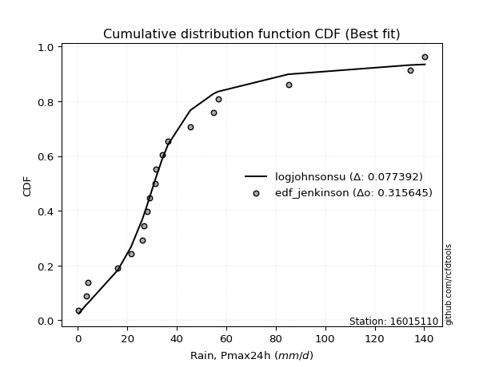</img>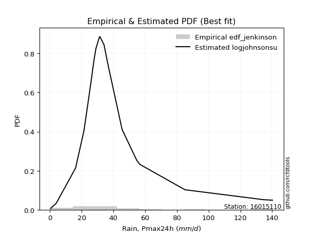</img>

</div>


### 11. Empirical - EDF Cunnane (1978)

Cunnane´s work in statistical hydrology has focused on the performance and evaluation of different probability distributions (such as GEV, Gumbel, Lognormal) for flood frequency estimation. _b_ is a constant, typically set to 0.4.

<div align="center">


$P=(m-b)/(n+1-2b)$


</div>


**11.1. Empirical values**

<div align="center">

|                | 0                  | 1                   | 2                   | 3                   | 4                  | 5                  | 6                   | 7                   | 8                   | 9                  | 10                 | 11                 | 12                 | 13                 | 14                 | 15                 | 16                 | 17                 | 18                 | 19                 |
|:---------------|:-------------------|:--------------------|:--------------------|:--------------------|:-------------------|:-------------------|:--------------------|:--------------------|:--------------------|:-------------------|:-------------------|:-------------------|:-------------------|:-------------------|:-------------------|:-------------------|:-------------------|:-------------------|:-------------------|:-------------------|
| date           | 2023               | 2025                | 2020                | 2005                | 2018               | 2007               | 2016                | 2012                | 2013                | 2017               | 2024               | 2019               | 2015               | 2008               | 2009               | 2006               | 2022               | 2011               | 2014               | 2010               |
| x              | 0.4                | 2.2                 | 3.4                 | 4.0                 | 16.2               | 21.5               | 26.0                | 26.9                | 28.0                | 29.0               | 31.2               | 31.5               | 34.1               | 36.5               | 45.5               | 54.8               | 56.7               | 85.1               | 134.5              | 140.3              |
| m              | 1                  | 2                   | 3                   | 4                   | 5                  | 6                  | 7                   | 8                   | 9                   | 10                 | 11                 | 12                 | 13                 | 14                 | 15                 | 16                 | 17                 | 18                 | 19                 | 20                 |
| empirical_dist | edf_cunnane        | edf_cunnane         | edf_cunnane         | edf_cunnane         | edf_cunnane        | edf_cunnane        | edf_cunnane         | edf_cunnane         | edf_cunnane         | edf_cunnane        | edf_cunnane        | edf_cunnane        | edf_cunnane        | edf_cunnane        | edf_cunnane        | edf_cunnane        | edf_cunnane        | edf_cunnane        | edf_cunnane        | edf_cunnane        |
| empirical      | 0.0297029702970297 | 0.07920792079207921 | 0.12871287128712872 | 0.17821782178217824 | 0.2277227722772277 | 0.2772277227722772 | 0.32673267326732675 | 0.37623762376237624 | 0.42574257425742573 | 0.4752475247524752 | 0.5247524752475248 | 0.5742574257425742 | 0.6237623762376238 | 0.6732673267326733 | 0.7227722772277227 | 0.7722772277227723 | 0.8217821782178218 | 0.8712871287128714 | 0.9207920792079209 | 0.9702970297029704 |
| empirical_tr   | 1.030612244897959  | 1.086021505376344   | 1.1477272727272727  | 1.216867469879518   | 1.294871794871795  | 1.3835616438356164 | 1.4852941176470589  | 1.6031746031746033  | 1.7413793103448274  | 1.9056603773584906 | 2.104166666666667  | 2.3488372093023253 | 2.6578947368421053 | 3.060606060606061  | 3.6071428571428568 | 4.391304347826087  | 5.611111111111113  | 7.769230769230775  | 12.625000000000025 | 33.666666666666764 |

</div>


**11.2. Kolmogorov-Smirnov fit test (sorted by Δ)**


<div align="center">

|                | 0                   | 1                   | 2                   | 3                   | 4                   | 5                  | 6                   | 7                  | 8                   | 9                   | 10                  | 11                  | 12                  | 13                  | 14                  | 15                 | 16                  | 17                  | 18                  | 19                  | 20                 | 21                  | 22                  | 23                  | 24                  | 25                 | 26                  | 27                  | 28                  | 29                  | 30                    | 31                  | 32                  | 33                 | 34                 | 35                  | 36                  | 37                  | 38                  | 39                  | 40                  | 41                  | 42                  | 43                 | 44                  | 45                  | 46                  | 47                 | 48                 | 49                 | 50                 | 51                  | 52                  | 53                 | 54                  | 55                  | 56                  | 57                  | 58                  | 59                  | 60                  | 61                  | 62                  | 63                  | 64                  | 65                  | 66                 | 67                  | 68                 | 69                 | 70                 | 71                 | 72                 | 73                  | 74                 | 75                  | 76                  | 77                  | 78                  | 79                 | 80                 | 81                 | 82                  | 83                  | 84                 | 85                 | 86                 | 87                 | 88                 | 89                 |
|:---------------|:--------------------|:--------------------|:--------------------|:--------------------|:--------------------|:-------------------|:--------------------|:-------------------|:--------------------|:--------------------|:--------------------|:--------------------|:--------------------|:--------------------|:--------------------|:-------------------|:--------------------|:--------------------|:--------------------|:--------------------|:-------------------|:--------------------|:--------------------|:--------------------|:--------------------|:-------------------|:--------------------|:--------------------|:--------------------|:--------------------|:----------------------|:--------------------|:--------------------|:-------------------|:-------------------|:--------------------|:--------------------|:--------------------|:--------------------|:--------------------|:--------------------|:--------------------|:--------------------|:-------------------|:--------------------|:--------------------|:--------------------|:-------------------|:-------------------|:-------------------|:-------------------|:--------------------|:--------------------|:-------------------|:--------------------|:--------------------|:--------------------|:--------------------|:--------------------|:--------------------|:--------------------|:--------------------|:--------------------|:--------------------|:--------------------|:--------------------|:-------------------|:--------------------|:-------------------|:-------------------|:-------------------|:-------------------|:-------------------|:--------------------|:-------------------|:--------------------|:--------------------|:--------------------|:--------------------|:-------------------|:-------------------|:-------------------|:--------------------|:--------------------|:-------------------|:-------------------|:-------------------|:-------------------|:-------------------|:-------------------|
| station        | 16015110            | 16015110            | 16015110            | 16015110            | 16015110            | 16015110           | 16015110            | 16015110           | 16015110            | 16015110            | 16015110            | 16015110            | 16015110            | 16015110            | 16015110            | 16015110           | 16015110            | 16015110            | 16015110            | 16015110            | 16015110           | 16015110            | 16015110            | 16015110            | 16015110            | 16015110           | 16015110            | 16015110            | 16015110            | 16015110            | 16015110              | 16015110            | 16015110            | 16015110           | 16015110           | 16015110            | 16015110            | 16015110            | 16015110            | 16015110            | 16015110            | 16015110            | 16015110            | 16015110           | 16015110            | 16015110            | 16015110            | 16015110           | 16015110           | 16015110           | 16015110           | 16015110            | 16015110            | 16015110           | 16015110            | 16015110            | 16015110            | 16015110            | 16015110            | 16015110            | 16015110            | 16015110            | 16015110            | 16015110            | 16015110            | 16015110            | 16015110           | 16015110            | 16015110           | 16015110           | 16015110           | 16015110           | 16015110           | 16015110            | 16015110           | 16015110            | 16015110            | 16015110            | 16015110            | 16015110           | 16015110           | 16015110           | 16015110            | 16015110            | 16015110           | 16015110           | 16015110           | 16015110           | 16015110           | 16015110           |
| empirical_dist | edf_cunnane         | edf_cunnane         | edf_cunnane         | edf_cunnane         | edf_cunnane         | edf_cunnane        | edf_cunnane         | edf_cunnane        | edf_cunnane         | edf_cunnane         | edf_cunnane         | edf_cunnane         | edf_cunnane         | edf_cunnane         | edf_cunnane         | edf_cunnane        | edf_cunnane         | edf_cunnane         | edf_cunnane         | edf_cunnane         | edf_cunnane        | edf_cunnane         | edf_cunnane         | edf_cunnane         | edf_cunnane         | edf_cunnane        | edf_cunnane         | edf_cunnane         | edf_cunnane         | edf_cunnane         | edf_cunnane           | edf_cunnane         | edf_cunnane         | edf_cunnane        | edf_cunnane        | edf_cunnane         | edf_cunnane         | edf_cunnane         | edf_cunnane         | edf_cunnane         | edf_cunnane         | edf_cunnane         | edf_cunnane         | edf_cunnane        | edf_cunnane         | edf_cunnane         | edf_cunnane         | edf_cunnane        | edf_cunnane        | edf_cunnane        | edf_cunnane        | edf_cunnane         | edf_cunnane         | edf_cunnane        | edf_cunnane         | edf_cunnane         | edf_cunnane         | edf_cunnane         | edf_cunnane         | edf_cunnane         | edf_cunnane         | edf_cunnane         | edf_cunnane         | edf_cunnane         | edf_cunnane         | edf_cunnane         | edf_cunnane        | edf_cunnane         | edf_cunnane        | edf_cunnane        | edf_cunnane        | edf_cunnane        | edf_cunnane        | edf_cunnane         | edf_cunnane        | edf_cunnane         | edf_cunnane         | edf_cunnane         | edf_cunnane         | edf_cunnane        | edf_cunnane        | edf_cunnane        | edf_cunnane         | edf_cunnane         | edf_cunnane        | edf_cunnane        | edf_cunnane        | edf_cunnane        | edf_cunnane        | edf_cunnane        |
| p_dist         | logjohnsonsu        | exponnorm           | t                   | ncf                 | pearson3            | halflogistic       | logt                | moyal              | truncnorm           | invweibull          | nct                 | fisk                | invgamma            | gompertz            | genlogistic         | genexpon           | logloggamma         | halfnorm            | laplace_asymmetric  | logpearson3         | johnsonsu          | loggenlogistic      | invgauss            | expon               | gumbel_r            | mielke             | fatiguelife         | loggumbel_l         | loggompertz         | logfisk             | loglaplace_asymmetric | nakagami            | f                   | rayleigh           | kstwobign          | weibull_min         | wald                | gibrat              | maxwell             | gamma               | erlang              | crystalball         | norm                | rice               | logistic            | logfatiguelife      | logcrystalball      | lognorm            | lognorm            | logexponnorm       | logrice            | lognct              | lognakagami         | loglognorm         | logbetaprime        | hypsecant           | loglogistic         | loggamma            | loggamma            | logerlang           | loghypsecant        | logalpha            | loginvgamma         | logchi2             | laplace             | loginvweibull       | loginvgauss        | logmaxwell          | loglaplace         | lograyleigh        | betaprime          | logkstwobign       | gumbel_l           | loggumbel_r         | loghalfnorm        | loggenexpon         | logmoyal            | loghalflogistic     | logexpon            | logncf             | logwald            | loggibrat          | logtruncnorm        | logf                | pareto             | logpareto          | logmielke          | logweibull_min     | alpha              | chi2               |
| delta          | 0.09335228067534326 | 0.10164979938247753 | 0.11171008771150365 | 0.11214897800522505 | 0.11236484040086325 | 0.1129511575034387 | 0.12016972362137113 | 0.1204844846073746 | 0.12182821583475767 | 0.12219156075024384 | 0.12224317074286267 | 0.12288405289106619 | 0.12560685162488822 | 0.12656370858152538 | 0.13182837674306702 | 0.132804754459028  | 0.13350598669396868 | 0.13486498943816705 | 0.13686566664463073 | 0.13750984404868166 | 0.1381552840087577 | 0.13888994310612196 | 0.13940902826871354 | 0.14605928382208405 | 0.14606703168155666 | 0.1498544399005775 | 0.14991634312932806 | 0.15433004592687322 | 0.15712985273710683 | 0.16158829277105374 | 0.1621511020429568    | 0.16539691587517602 | 0.16677276644059186 | 0.1680442130613954 | 0.1715304473933703 | 0.17479853066514744 | 0.17821400825337974 | 0.17821782178217824 | 0.17980781530426387 | 0.19770532558765447 | 0.21375881210599462 | 0.21400702839301583 | 0.21400702876059752 | 0.2152925316223906 | 0.21952145383683652 | 0.22000430247709218 | 0.22154232487993925 | 0.2215423386784489 | 0.2215423386784489 | 0.2215457469184257 | 0.2215642950959466 | 0.22223367991025972 | 0.22230823549890072 | 0.2233915312160511 | 0.22414051970504972 | 0.22419733503527162 | 0.22805193396750073 | 0.23270317164895177 | 0.23270317164895177 | 0.23329490359738198 | 0.23355577922196852 | 0.23528417546936414 | 0.23804489542794877 | 0.24047456247996996 | 0.24061360599347692 | 0.24769639355801615 | 0.2511883004760371 | 0.25204548004534194 | 0.2520883593353133 | 0.2618556187112933 | 0.2746363799926628 | 0.2820778219796461 | 0.2844111358984982 | 0.29170172538456157 | 0.2929744723855659 | 0.31310665037835655 | 0.31659467266787084 | 0.31756373682059663 | 0.37552563539349393 | 0.3796342610786003 | 0.38566785188043   | 0.4146353205593046 | 0.42166688509930583 | 0.48459732855125387 | 0.5189444308042347 | 0.5556004251723307 | 0.5859833155711099 | 0.6023567213401868 | 0.686548321897744  | 0.7687461416078848 |
| deltao         | 0.3096406529800002  | 0.3096406529800002  | 0.3096406529800002  | 0.3096406529800002  | 0.3096406529800002  | 0.3096406529800002 | 0.3096406529800002  | 0.3096406529800002 | 0.3096406529800002  | 0.3096406529800002  | 0.3096406529800002  | 0.3096406529800002  | 0.3096406529800002  | 0.3096406529800002  | 0.3096406529800002  | 0.3096406529800002 | 0.3096406529800002  | 0.3096406529800002  | 0.3096406529800002  | 0.3096406529800002  | 0.3096406529800002 | 0.3096406529800002  | 0.3096406529800002  | 0.3096406529800002  | 0.3096406529800002  | 0.3096406529800002 | 0.3096406529800002  | 0.3096406529800002  | 0.3096406529800002  | 0.3096406529800002  | 0.3096406529800002    | 0.3096406529800002  | 0.3096406529800002  | 0.3096406529800002 | 0.3096406529800002 | 0.3096406529800002  | 0.3096406529800002  | 0.3096406529800002  | 0.3096406529800002  | 0.3096406529800002  | 0.3096406529800002  | 0.3096406529800002  | 0.3096406529800002  | 0.3096406529800002 | 0.3096406529800002  | 0.3096406529800002  | 0.3096406529800002  | 0.3096406529800002 | 0.3096406529800002 | 0.3096406529800002 | 0.3096406529800002 | 0.3096406529800002  | 0.3096406529800002  | 0.3096406529800002 | 0.3096406529800002  | 0.3096406529800002  | 0.3096406529800002  | 0.3096406529800002  | 0.3096406529800002  | 0.3096406529800002  | 0.3096406529800002  | 0.3096406529800002  | 0.3096406529800002  | 0.3096406529800002  | 0.3096406529800002  | 0.3096406529800002  | 0.3096406529800002 | 0.3096406529800002  | 0.3096406529800002 | 0.3096406529800002 | 0.3096406529800002 | 0.3096406529800002 | 0.3096406529800002 | 0.3096406529800002  | 0.3096406529800002 | 0.3096406529800002  | 0.3096406529800002  | 0.3096406529800002  | 0.3096406529800002  | 0.3096406529800002 | 0.3096406529800002 | 0.3096406529800002 | 0.3096406529800002  | 0.3096406529800002  | 0.3096406529800002 | 0.3096406529800002 | 0.3096406529800002 | 0.3096406529800002 | 0.3096406529800002 | 0.3096406529800002 |
| eval           | Δo > Δ              | Δo > Δ              | Δo > Δ              | Δo > Δ              | Δo > Δ              | Δo > Δ             | Δo > Δ              | Δo > Δ             | Δo > Δ              | Δo > Δ              | Δo > Δ              | Δo > Δ              | Δo > Δ              | Δo > Δ              | Δo > Δ              | Δo > Δ             | Δo > Δ              | Δo > Δ              | Δo > Δ              | Δo > Δ              | Δo > Δ             | Δo > Δ              | Δo > Δ              | Δo > Δ              | Δo > Δ              | Δo > Δ             | Δo > Δ              | Δo > Δ              | Δo > Δ              | Δo > Δ              | Δo > Δ                | Δo > Δ              | Δo > Δ              | Δo > Δ             | Δo > Δ             | Δo > Δ              | Δo > Δ              | Δo > Δ              | Δo > Δ              | Δo > Δ              | Δo > Δ              | Δo > Δ              | Δo > Δ              | Δo > Δ             | Δo > Δ              | Δo > Δ              | Δo > Δ              | Δo > Δ             | Δo > Δ             | Δo > Δ             | Δo > Δ             | Δo > Δ              | Δo > Δ              | Δo > Δ             | Δo > Δ              | Δo > Δ              | Δo > Δ              | Δo > Δ              | Δo > Δ              | Δo > Δ              | Δo > Δ              | Δo > Δ              | Δo > Δ              | Δo > Δ              | Δo > Δ              | Δo > Δ              | Δo > Δ             | Δo > Δ              | Δo > Δ             | Δo > Δ             | Δo > Δ             | Δo > Δ             | Δo > Δ             | Δo > Δ              | Δo > Δ             | Δo <= Δ             | Δo <= Δ             | Δo <= Δ             | Δo <= Δ             | Δo <= Δ            | Δo <= Δ            | Δo <= Δ            | Δo <= Δ             | Δo <= Δ             | Δo <= Δ            | Δo <= Δ            | Δo <= Δ            | Δo <= Δ            | Δo <= Δ            | Δo <= Δ            |
| fit            | 1                   | 1                   | 1                   | 1                   | 1                   | 1                  | 1                   | 1                  | 1                   | 1                   | 1                   | 1                   | 1                   | 1                   | 1                   | 1                  | 1                   | 1                   | 1                   | 1                   | 1                  | 1                   | 1                   | 1                   | 1                   | 1                  | 1                   | 1                   | 1                   | 1                   | 1                     | 1                   | 1                   | 1                  | 1                  | 1                   | 1                   | 1                   | 1                   | 1                   | 1                   | 1                   | 1                   | 1                  | 1                   | 1                   | 1                   | 1                  | 1                  | 1                  | 1                  | 1                   | 1                   | 1                  | 1                   | 1                   | 1                   | 1                   | 1                   | 1                   | 1                   | 1                   | 1                   | 1                   | 1                   | 1                   | 1                  | 1                   | 1                  | 1                  | 1                  | 1                  | 1                  | 1                   | 1                  | 0                   | 0                   | 0                   | 0                   | 0                  | 0                  | 0                  | 0                   | 0                   | 0                  | 0                  | 0                  | 0                  | 0                  | 0                  |
| n              | 20                  | 20                  | 20                  | 20                  | 20                  | 20                 | 20                  | 20                 | 20                  | 20                  | 20                  | 20                  | 20                  | 20                  | 20                  | 20                 | 20                  | 20                  | 20                  | 20                  | 20                 | 20                  | 20                  | 20                  | 20                  | 20                 | 20                  | 20                  | 20                  | 20                  | 20                    | 20                  | 20                  | 20                 | 20                 | 20                  | 20                  | 20                  | 20                  | 20                  | 20                  | 20                  | 20                  | 20                 | 20                  | 20                  | 20                  | 20                 | 20                 | 20                 | 20                 | 20                  | 20                  | 20                 | 20                  | 20                  | 20                  | 20                  | 20                  | 20                  | 20                  | 20                  | 20                  | 20                  | 20                  | 20                  | 20                 | 20                  | 20                 | 20                 | 20                 | 20                 | 20                 | 20                  | 20                 | 20                  | 20                  | 20                  | 20                  | 20                 | 20                 | 20                 | 20                  | 20                  | 20                 | 20                 | 20                 | 20                 | 20                 | 20                 |
| best_fit       | 1                   | 0                   | 0                   | 0                   | 0                   | 0                  | 0                   | 0                  | 0                   | 0                   | 0                   | 0                   | 0                   | 0                   | 0                   | 0                  | 0                   | 0                   | 0                   | 0                   | 0                  | 0                   | 0                   | 0                   | 0                   | 0                  | 0                   | 0                   | 0                   | 0                   | 0                     | 0                   | 0                   | 0                  | 0                  | 0                   | 0                   | 0                   | 0                   | 0                   | 0                   | 0                   | 0                   | 0                  | 0                   | 0                   | 0                   | 0                  | 0                  | 0                  | 0                  | 0                   | 0                   | 0                  | 0                   | 0                   | 0                   | 0                   | 0                   | 0                   | 0                   | 0                   | 0                   | 0                   | 0                   | 0                   | 0                  | 0                   | 0                  | 0                  | 0                  | 0                  | 0                  | 0                   | 0                  | 0                   | 0                   | 0                   | 0                   | 0                  | 0                  | 0                  | 0                   | 0                   | 0                  | 0                  | 0                  | 0                  | 0                  | 0                  |
| best_fit_sort  | 1                   | 2                   | 3                   | 4                   | 5                   | 6                  | 7                   | 8                  | 9                   | 10                  | 11                  | 12                  | 13                  | 14                  | 15                  | 16                 | 17                  | 18                  | 19                  | 20                  | 21                 | 22                  | 23                  | 24                  | 25                  | 26                 | 27                  | 28                  | 29                  | 30                  | 31                    | 32                  | 33                  | 34                 | 35                 | 36                  | 37                  | 38                  | 39                  | 40                  | 41                  | 42                  | 43                  | 44                 | 45                  | 46                  | 47                  | 48                 | 49                 | 50                 | 51                 | 52                  | 53                  | 54                 | 55                  | 56                  | 57                  | 58                  | 59                  | 60                  | 61                  | 62                  | 63                  | 64                  | 65                  | 66                  | 67                 | 68                  | 69                 | 70                 | 71                 | 72                 | 73                 | 74                  | 75                 | 76                  | 77                  | 78                  | 79                  | 80                 | 81                 | 82                 | 83                  | 84                  | 85                 | 86                 | 87                 | 88                 | 89                 | 90                 |

</div>


<div align="center">

</img>

</div>


**11.3. Best fit**

<div align="center">

|   id |   station | empirical_dist   | p_dist       |     delta |   deltao | eval   |   fit |   n |   best_fit |   best_fit_sort |
|-----:|----------:|:-----------------|:-------------|----------:|---------:|:-------|------:|----:|-----------:|----------------:|
|    0 |  16015110 | edf_cunnane      | logjohnsonsu | 0.0933523 | 0.309641 | Δo > Δ |     1 |  20 |          1 |               1 |

</div>


<div align="center">

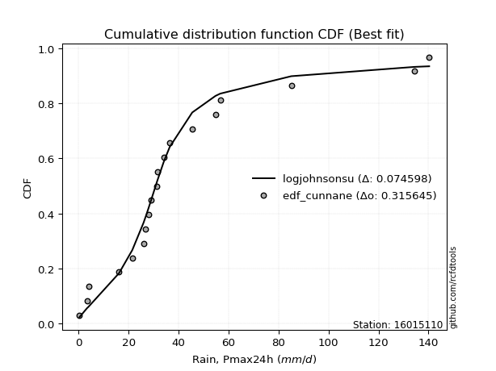</img>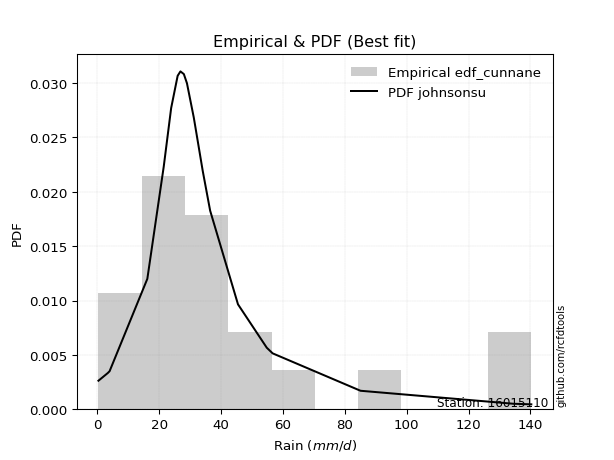</img>

</div>


### 12. Empirical - EDF Adamowski (1981)

The Adamowski formula in hydrology refers to a specific plotting position formula used for estimating the non-parametric empirical distribution of hydrological events (like flood peaks) to calculate their return periods. This formula provides an alternative to traditional parametric methods (like the Gumbel or Log Pearson Type III distributions). 

<div align="center">


$P=(m-0.25)/(n+0.5)$


</div>


**12.1. Empirical values**

<div align="center">

|                | 0                    | 1                   | 2                   | 3                   | 4                   | 5                  | 6                   | 7                  | 8                  | 9                   | 10                 | 11                 | 12                 | 13                 | 14                 | 15                 | 16                 | 17                 | 18                 | 19                 |
|:---------------|:---------------------|:--------------------|:--------------------|:--------------------|:--------------------|:-------------------|:--------------------|:-------------------|:-------------------|:--------------------|:-------------------|:-------------------|:-------------------|:-------------------|:-------------------|:-------------------|:-------------------|:-------------------|:-------------------|:-------------------|
| date           | 2023                 | 2025                | 2020                | 2005                | 2018                | 2007               | 2016                | 2012               | 2013               | 2017                | 2024               | 2019               | 2015               | 2008               | 2009               | 2006               | 2022               | 2011               | 2014               | 2010               |
| x              | 0.4                  | 2.2                 | 3.4                 | 4.0                 | 16.2                | 21.5               | 26.0                | 26.9               | 28.0               | 29.0                | 31.2               | 31.5               | 34.1               | 36.5               | 45.5               | 54.8               | 56.7               | 85.1               | 134.5              | 140.3              |
| m              | 1                    | 2                   | 3                   | 4                   | 5                   | 6                  | 7                   | 8                  | 9                  | 10                  | 11                 | 12                 | 13                 | 14                 | 15                 | 16                 | 17                 | 18                 | 19                 | 20                 |
| empirical_dist | edf_adamowski        | edf_adamowski       | edf_adamowski       | edf_adamowski       | edf_adamowski       | edf_adamowski      | edf_adamowski       | edf_adamowski      | edf_adamowski      | edf_adamowski       | edf_adamowski      | edf_adamowski      | edf_adamowski      | edf_adamowski      | edf_adamowski      | edf_adamowski      | edf_adamowski      | edf_adamowski      | edf_adamowski      | edf_adamowski      |
| empirical      | 0.036585365853658534 | 0.08536585365853659 | 0.13414634146341464 | 0.18292682926829268 | 0.23170731707317074 | 0.2804878048780488 | 0.32926829268292684 | 0.3780487804878049 | 0.4268292682926829 | 0.47560975609756095 | 0.524390243902439  | 0.573170731707317  | 0.6219512195121951 | 0.6707317073170732 | 0.7195121951219512 | 0.7682926829268293 | 0.8170731707317073 | 0.8658536585365854 | 0.9146341463414634 | 0.9634146341463414 |
| empirical_tr   | 1.0379746835443038   | 1.0933333333333333  | 1.1549295774647887  | 1.2238805970149254  | 1.3015873015873016  | 1.3898305084745763 | 1.490909090909091   | 1.607843137254902  | 1.7446808510638296 | 1.9069767441860463  | 2.1025641025641026 | 2.3428571428571425 | 2.6451612903225805 | 3.037037037037037  | 3.5652173913043477 | 4.315789473684211  | 5.466666666666665  | 7.454545454545454  | 11.714285714285719 | 27.33333333333331  |

</div>


**12.2. Kolmogorov-Smirnov fit test (sorted by Δ)**


<div align="center">

|                | 0                  | 1                   | 2                   | 3                   | 4                   | 5                  | 6                  | 7                   | 8                   | 9                   | 10                  | 11                  | 12                  | 13                  | 14                  | 15                 | 16                  | 17                  | 18                  | 19                  | 20                 | 21                  | 22                  | 23                  | 24                  | 25                 | 26                  | 27                  | 28                  | 29                  | 30                    | 31                  | 32                  | 33                 | 34                 | 35                  | 36                  | 37                  | 38                  | 39                  | 40                  | 41                  | 42                  | 43                 | 44                  | 45                  | 46                  | 47                  | 48                  | 49                 | 50                 | 51                  | 52                  | 53                 | 54                  | 55                  | 56                  | 57                  | 58                  | 59                  | 60                  | 61                  | 62                  | 63                  | 64                  | 65                  | 66                  | 67                  | 68                  | 69                 | 70                  | 71                 | 72                 | 73                 | 74                 | 75                  | 76                  | 77                 | 78                 | 79                  | 80                 | 81                 | 82                 | 83                 | 84                 | 85                 | 86                 | 87                 | 88                 | 89                 |
|:---------------|:-------------------|:--------------------|:--------------------|:--------------------|:--------------------|:-------------------|:-------------------|:--------------------|:--------------------|:--------------------|:--------------------|:--------------------|:--------------------|:--------------------|:--------------------|:-------------------|:--------------------|:--------------------|:--------------------|:--------------------|:-------------------|:--------------------|:--------------------|:--------------------|:--------------------|:-------------------|:--------------------|:--------------------|:--------------------|:--------------------|:----------------------|:--------------------|:--------------------|:-------------------|:-------------------|:--------------------|:--------------------|:--------------------|:--------------------|:--------------------|:--------------------|:--------------------|:--------------------|:-------------------|:--------------------|:--------------------|:--------------------|:--------------------|:--------------------|:-------------------|:-------------------|:--------------------|:--------------------|:-------------------|:--------------------|:--------------------|:--------------------|:--------------------|:--------------------|:--------------------|:--------------------|:--------------------|:--------------------|:--------------------|:--------------------|:--------------------|:--------------------|:--------------------|:--------------------|:-------------------|:--------------------|:-------------------|:-------------------|:-------------------|:-------------------|:--------------------|:--------------------|:-------------------|:-------------------|:--------------------|:-------------------|:-------------------|:-------------------|:-------------------|:-------------------|:-------------------|:-------------------|:-------------------|:-------------------|:-------------------|
| station        | 16015110           | 16015110            | 16015110            | 16015110            | 16015110            | 16015110           | 16015110           | 16015110            | 16015110            | 16015110            | 16015110            | 16015110            | 16015110            | 16015110            | 16015110            | 16015110           | 16015110            | 16015110            | 16015110            | 16015110            | 16015110           | 16015110            | 16015110            | 16015110            | 16015110            | 16015110           | 16015110            | 16015110            | 16015110            | 16015110            | 16015110              | 16015110            | 16015110            | 16015110           | 16015110           | 16015110            | 16015110            | 16015110            | 16015110            | 16015110            | 16015110            | 16015110            | 16015110            | 16015110           | 16015110            | 16015110            | 16015110            | 16015110            | 16015110            | 16015110           | 16015110           | 16015110            | 16015110            | 16015110           | 16015110            | 16015110            | 16015110            | 16015110            | 16015110            | 16015110            | 16015110            | 16015110            | 16015110            | 16015110            | 16015110            | 16015110            | 16015110            | 16015110            | 16015110            | 16015110           | 16015110            | 16015110           | 16015110           | 16015110           | 16015110           | 16015110            | 16015110            | 16015110           | 16015110           | 16015110            | 16015110           | 16015110           | 16015110           | 16015110           | 16015110           | 16015110           | 16015110           | 16015110           | 16015110           | 16015110           |
| empirical_dist | edf_adamowski      | edf_adamowski       | edf_adamowski       | edf_adamowski       | edf_adamowski       | edf_adamowski      | edf_adamowski      | edf_adamowski       | edf_adamowski       | edf_adamowski       | edf_adamowski       | edf_adamowski       | edf_adamowski       | edf_adamowski       | edf_adamowski       | edf_adamowski      | edf_adamowski       | edf_adamowski       | edf_adamowski       | edf_adamowski       | edf_adamowski      | edf_adamowski       | edf_adamowski       | edf_adamowski       | edf_adamowski       | edf_adamowski      | edf_adamowski       | edf_adamowski       | edf_adamowski       | edf_adamowski       | edf_adamowski         | edf_adamowski       | edf_adamowski       | edf_adamowski      | edf_adamowski      | edf_adamowski       | edf_adamowski       | edf_adamowski       | edf_adamowski       | edf_adamowski       | edf_adamowski       | edf_adamowski       | edf_adamowski       | edf_adamowski      | edf_adamowski       | edf_adamowski       | edf_adamowski       | edf_adamowski       | edf_adamowski       | edf_adamowski      | edf_adamowski      | edf_adamowski       | edf_adamowski       | edf_adamowski      | edf_adamowski       | edf_adamowski       | edf_adamowski       | edf_adamowski       | edf_adamowski       | edf_adamowski       | edf_adamowski       | edf_adamowski       | edf_adamowski       | edf_adamowski       | edf_adamowski       | edf_adamowski       | edf_adamowski       | edf_adamowski       | edf_adamowski       | edf_adamowski      | edf_adamowski       | edf_adamowski      | edf_adamowski      | edf_adamowski      | edf_adamowski      | edf_adamowski       | edf_adamowski       | edf_adamowski      | edf_adamowski      | edf_adamowski       | edf_adamowski      | edf_adamowski      | edf_adamowski      | edf_adamowski      | edf_adamowski      | edf_adamowski      | edf_adamowski      | edf_adamowski      | edf_adamowski      | edf_adamowski      |
| p_dist         | logjohnsonsu       | exponnorm           | t                   | ncf                 | pearson3            | halflogistic       | moyal              | truncnorm           | invweibull          | nct                 | fisk                | invgamma            | gompertz            | logt                | genlogistic         | genexpon           | logloggamma         | halfnorm            | laplace_asymmetric  | logpearson3         | johnsonsu          | loggenlogistic      | invgauss            | expon               | gumbel_r            | mielke             | fatiguelife         | loggumbel_l         | loggompertz         | logfisk             | loglaplace_asymmetric | nakagami            | f                   | rayleigh           | kstwobign          | weibull_min         | maxwell             | wald                | gibrat              | gamma               | erlang              | crystalball         | norm                | rice               | logistic            | logfatiguelife      | logcrystalball      | lognorm             | lognorm             | logexponnorm       | logrice            | lognct              | lognakagami         | loglognorm         | logbetaprime        | hypsecant           | loglogistic         | loggamma            | loggamma            | logerlang           | loghypsecant        | logalpha            | loginvgamma         | logchi2             | laplace             | loginvweibull       | loginvgauss         | logmaxwell          | loglaplace          | lograyleigh        | betaprime           | logkstwobign       | gumbel_l           | loggumbel_r        | loghalfnorm        | loggenexpon         | logmoyal            | loghalflogistic    | logexpon           | logncf              | logwald            | loggibrat          | logtruncnorm       | logf               | pareto             | logpareto          | logmielke          | logweibull_min     | alpha              | chi2               |
| delta          | 0.0980612881614577 | 0.10267895842319397 | 0.10917446829590355 | 0.10961335858962495 | 0.10982922098526315 | 0.1104155380878386 | 0.1179488651917745 | 0.11929259641915757 | 0.11965594133464375 | 0.11970755132726257 | 0.12034843347546609 | 0.12307123220928812 | 0.12402808916592528 | 0.12487873110748557 | 0.12929275732746692 | 0.1302691350434279 | 0.13097036727836858 | 0.13232937002256695 | 0.13433004722903064 | 0.13497422463308156 | 0.1356196645931576 | 0.13635432369052186 | 0.13687340885311344 | 0.14352366440648395 | 0.14353141226595656 | 0.1473188204849774 | 0.14738072371372796 | 0.15179442651127312 | 0.15459423332150674 | 0.15905267335545364 | 0.1596154826273567    | 0.16286129645957592 | 0.16423714702499176 | 0.1655085936457953 | 0.1689948279777702 | 0.17226291124954735 | 0.17727219588866377 | 0.18292301573949418 | 0.18292682926829268 | 0.19516970617205437 | 0.21122319269039452 | 0.21147140897741573 | 0.21147140934499742 | 0.2127569122067905 | 0.21698583442123642 | 0.21746868306149209 | 0.21900670546433915 | 0.21900671926284881 | 0.21900671926284881 | 0.2190101275028256 | 0.2190286756803465 | 0.21969806049465962 | 0.21977261608330062 | 0.220855911800451  | 0.22160490028944962 | 0.22166171561967152 | 0.22551631455190063 | 0.23016755223335167 | 0.23016755223335167 | 0.23075928418178188 | 0.23102015980636842 | 0.23202409336359253 | 0.23550927601234867 | 0.23793894306436986 | 0.23807798657787682 | 0.24443631145224454 | 0.24792821837026546 | 0.24950986062974184 | 0.24955273991971322 | 0.2593199992956932 | 0.27210076057706273 | 0.2788177398738745 | 0.2818755164828981 | 0.2891661059689615 | 0.2897143902797943 | 0.30984656827258494 | 0.31405905325227074 | 0.314303654714825  | 0.3715410905975509 | 0.37347632821214294 | 0.3831322324648299 | 0.4120997011437045 | 0.417728023254027  | 0.4784393956847965 | 0.5127864979377773 | 0.5494424923058733 | 0.5819987707751669 | 0.5983721765442438 | 0.6825637771018009 | 0.7647615968119418 |
| deltao         | 0.3096406529800002 | 0.3096406529800002  | 0.3096406529800002  | 0.3096406529800002  | 0.3096406529800002  | 0.3096406529800002 | 0.3096406529800002 | 0.3096406529800002  | 0.3096406529800002  | 0.3096406529800002  | 0.3096406529800002  | 0.3096406529800002  | 0.3096406529800002  | 0.3096406529800002  | 0.3096406529800002  | 0.3096406529800002 | 0.3096406529800002  | 0.3096406529800002  | 0.3096406529800002  | 0.3096406529800002  | 0.3096406529800002 | 0.3096406529800002  | 0.3096406529800002  | 0.3096406529800002  | 0.3096406529800002  | 0.3096406529800002 | 0.3096406529800002  | 0.3096406529800002  | 0.3096406529800002  | 0.3096406529800002  | 0.3096406529800002    | 0.3096406529800002  | 0.3096406529800002  | 0.3096406529800002 | 0.3096406529800002 | 0.3096406529800002  | 0.3096406529800002  | 0.3096406529800002  | 0.3096406529800002  | 0.3096406529800002  | 0.3096406529800002  | 0.3096406529800002  | 0.3096406529800002  | 0.3096406529800002 | 0.3096406529800002  | 0.3096406529800002  | 0.3096406529800002  | 0.3096406529800002  | 0.3096406529800002  | 0.3096406529800002 | 0.3096406529800002 | 0.3096406529800002  | 0.3096406529800002  | 0.3096406529800002 | 0.3096406529800002  | 0.3096406529800002  | 0.3096406529800002  | 0.3096406529800002  | 0.3096406529800002  | 0.3096406529800002  | 0.3096406529800002  | 0.3096406529800002  | 0.3096406529800002  | 0.3096406529800002  | 0.3096406529800002  | 0.3096406529800002  | 0.3096406529800002  | 0.3096406529800002  | 0.3096406529800002  | 0.3096406529800002 | 0.3096406529800002  | 0.3096406529800002 | 0.3096406529800002 | 0.3096406529800002 | 0.3096406529800002 | 0.3096406529800002  | 0.3096406529800002  | 0.3096406529800002 | 0.3096406529800002 | 0.3096406529800002  | 0.3096406529800002 | 0.3096406529800002 | 0.3096406529800002 | 0.3096406529800002 | 0.3096406529800002 | 0.3096406529800002 | 0.3096406529800002 | 0.3096406529800002 | 0.3096406529800002 | 0.3096406529800002 |
| eval           | Δo > Δ             | Δo > Δ              | Δo > Δ              | Δo > Δ              | Δo > Δ              | Δo > Δ             | Δo > Δ             | Δo > Δ              | Δo > Δ              | Δo > Δ              | Δo > Δ              | Δo > Δ              | Δo > Δ              | Δo > Δ              | Δo > Δ              | Δo > Δ             | Δo > Δ              | Δo > Δ              | Δo > Δ              | Δo > Δ              | Δo > Δ             | Δo > Δ              | Δo > Δ              | Δo > Δ              | Δo > Δ              | Δo > Δ             | Δo > Δ              | Δo > Δ              | Δo > Δ              | Δo > Δ              | Δo > Δ                | Δo > Δ              | Δo > Δ              | Δo > Δ             | Δo > Δ             | Δo > Δ              | Δo > Δ              | Δo > Δ              | Δo > Δ              | Δo > Δ              | Δo > Δ              | Δo > Δ              | Δo > Δ              | Δo > Δ             | Δo > Δ              | Δo > Δ              | Δo > Δ              | Δo > Δ              | Δo > Δ              | Δo > Δ             | Δo > Δ             | Δo > Δ              | Δo > Δ              | Δo > Δ             | Δo > Δ              | Δo > Δ              | Δo > Δ              | Δo > Δ              | Δo > Δ              | Δo > Δ              | Δo > Δ              | Δo > Δ              | Δo > Δ              | Δo > Δ              | Δo > Δ              | Δo > Δ              | Δo > Δ              | Δo > Δ              | Δo > Δ              | Δo > Δ             | Δo > Δ              | Δo > Δ             | Δo > Δ             | Δo > Δ             | Δo > Δ             | Δo <= Δ             | Δo <= Δ             | Δo <= Δ            | Δo <= Δ            | Δo <= Δ             | Δo <= Δ            | Δo <= Δ            | Δo <= Δ            | Δo <= Δ            | Δo <= Δ            | Δo <= Δ            | Δo <= Δ            | Δo <= Δ            | Δo <= Δ            | Δo <= Δ            |
| fit            | 1                  | 1                   | 1                   | 1                   | 1                   | 1                  | 1                  | 1                   | 1                   | 1                   | 1                   | 1                   | 1                   | 1                   | 1                   | 1                  | 1                   | 1                   | 1                   | 1                   | 1                  | 1                   | 1                   | 1                   | 1                   | 1                  | 1                   | 1                   | 1                   | 1                   | 1                     | 1                   | 1                   | 1                  | 1                  | 1                   | 1                   | 1                   | 1                   | 1                   | 1                   | 1                   | 1                   | 1                  | 1                   | 1                   | 1                   | 1                   | 1                   | 1                  | 1                  | 1                   | 1                   | 1                  | 1                   | 1                   | 1                   | 1                   | 1                   | 1                   | 1                   | 1                   | 1                   | 1                   | 1                   | 1                   | 1                   | 1                   | 1                   | 1                  | 1                   | 1                  | 1                  | 1                  | 1                  | 0                   | 0                   | 0                  | 0                  | 0                   | 0                  | 0                  | 0                  | 0                  | 0                  | 0                  | 0                  | 0                  | 0                  | 0                  |
| n              | 20                 | 20                  | 20                  | 20                  | 20                  | 20                 | 20                 | 20                  | 20                  | 20                  | 20                  | 20                  | 20                  | 20                  | 20                  | 20                 | 20                  | 20                  | 20                  | 20                  | 20                 | 20                  | 20                  | 20                  | 20                  | 20                 | 20                  | 20                  | 20                  | 20                  | 20                    | 20                  | 20                  | 20                 | 20                 | 20                  | 20                  | 20                  | 20                  | 20                  | 20                  | 20                  | 20                  | 20                 | 20                  | 20                  | 20                  | 20                  | 20                  | 20                 | 20                 | 20                  | 20                  | 20                 | 20                  | 20                  | 20                  | 20                  | 20                  | 20                  | 20                  | 20                  | 20                  | 20                  | 20                  | 20                  | 20                  | 20                  | 20                  | 20                 | 20                  | 20                 | 20                 | 20                 | 20                 | 20                  | 20                  | 20                 | 20                 | 20                  | 20                 | 20                 | 20                 | 20                 | 20                 | 20                 | 20                 | 20                 | 20                 | 20                 |
| best_fit       | 1                  | 0                   | 0                   | 0                   | 0                   | 0                  | 0                  | 0                   | 0                   | 0                   | 0                   | 0                   | 0                   | 0                   | 0                   | 0                  | 0                   | 0                   | 0                   | 0                   | 0                  | 0                   | 0                   | 0                   | 0                   | 0                  | 0                   | 0                   | 0                   | 0                   | 0                     | 0                   | 0                   | 0                  | 0                  | 0                   | 0                   | 0                   | 0                   | 0                   | 0                   | 0                   | 0                   | 0                  | 0                   | 0                   | 0                   | 0                   | 0                   | 0                  | 0                  | 0                   | 0                   | 0                  | 0                   | 0                   | 0                   | 0                   | 0                   | 0                   | 0                   | 0                   | 0                   | 0                   | 0                   | 0                   | 0                   | 0                   | 0                   | 0                  | 0                   | 0                  | 0                  | 0                  | 0                  | 0                   | 0                   | 0                  | 0                  | 0                   | 0                  | 0                  | 0                  | 0                  | 0                  | 0                  | 0                  | 0                  | 0                  | 0                  |
| best_fit_sort  | 1                  | 2                   | 3                   | 4                   | 5                   | 6                  | 7                  | 8                   | 9                   | 10                  | 11                  | 12                  | 13                  | 14                  | 15                  | 16                 | 17                  | 18                  | 19                  | 20                  | 21                 | 22                  | 23                  | 24                  | 25                  | 26                 | 27                  | 28                  | 29                  | 30                  | 31                    | 32                  | 33                  | 34                 | 35                 | 36                  | 37                  | 38                  | 39                  | 40                  | 41                  | 42                  | 43                  | 44                 | 45                  | 46                  | 47                  | 48                  | 49                  | 50                 | 51                 | 52                  | 53                  | 54                 | 55                  | 56                  | 57                  | 58                  | 59                  | 60                  | 61                  | 62                  | 63                  | 64                  | 65                  | 66                  | 67                  | 68                  | 69                  | 70                 | 71                  | 72                 | 73                 | 74                 | 75                 | 76                  | 77                  | 78                 | 79                 | 80                  | 81                 | 82                 | 83                 | 84                 | 85                 | 86                 | 87                 | 88                 | 89                 | 90                 |

</div>


<div align="center">

</img>

</div>


**12.3. Best fit**

<div align="center">

|   id |   station | empirical_dist   | p_dist       |     delta |   deltao | eval   |   fit |   n |   best_fit |   best_fit_sort |
|-----:|----------:|:-----------------|:-------------|----------:|---------:|:-------|------:|----:|-----------:|----------------:|
|    0 |  16015110 | edf_adamowski    | logjohnsonsu | 0.0980613 | 0.309641 | Δo > Δ |     1 |  20 |          1 |               1 |

</div>


<div align="center">

</img>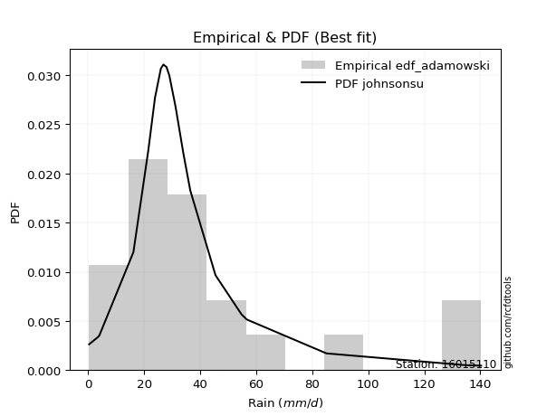</img>

</div>


## C. Best fit & Estimate extreme values for specific return periods - Tr


### 1. Best fit (ordered by delta Δ)

<div align="center">

|   id |   station | empirical_dist   | p_dist       |     delta |   deltao | eval   |   fit |   n |   best_fit |   best_fit_sort |
|-----:|----------:|:-----------------|:-------------|----------:|---------:|:-------|------:|----:|-----------:|----------------:|
|    0 |  16015110 | edf_california   | t            | 0.0884428 | 0.309641 | Δo > Δ |     1 |  20 |          1 |               1 |
|    1 |  16015110 | edf_gringorten   | logjohnsonsu | 0.0920728 | 0.309641 | Δo > Δ |     1 |  20 |          1 |               2 |
|    2 |  16015110 | edf_hazen        | logjohnsonsu | 0.0929764 | 0.309641 | Δo > Δ |     1 |  20 |          1 |               3 |
|    3 |  16015110 | edf_cunnane      | logjohnsonsu | 0.0933523 | 0.309641 | Δo > Δ |     1 |  20 |          1 |               4 |
|    4 |  16015110 | edf_blom         | logjohnsonsu | 0.0941468 | 0.309641 | Δo > Δ |     1 |  20 |          1 |               5 |
|    5 |  16015110 | edf_tukey        | logjohnsonsu | 0.0954623 | 0.309641 | Δo > Δ |     1 |  20 |          1 |               6 |
|    6 |  16015110 | edf_filliben     | logjohnsonsu | 0.0959594 | 0.309641 | Δo > Δ |     1 |  20 |          1 |               7 |
|    7 |  16015110 | edf_jenkinson    | logjohnsonsu | 0.0961943 | 0.309641 | Δo > Δ |     1 |  20 |          1 |               8 |
|    8 |  16015110 | edf_beard        | logjohnsonsu | 0.0961943 | 0.309641 | Δo > Δ |     1 |  20 |          1 |               9 |
|    9 |  16015110 | edf_chegodayev   | logjohnsonsu | 0.096507  | 0.309641 | Δo > Δ |     1 |  20 |          1 |              10 |
|   10 |  16015110 | edf_adamowski    | logjohnsonsu | 0.0980613 | 0.309641 | Δo > Δ |     1 |  20 |          1 |              11 |
|   11 |  16015110 | edf_weibull      | t            | 0.105109  | 0.309641 | Δo > Δ |     1 |  20 |          1 |              12 |

</div>

:file_folder:Tables: [bestfit_16015110.csv](table/bestfit_16015110.csv) | [extreme_16015110.csv](table/extreme_16015110.csv)


### 2. Extreme values

In hydrology, a return period (or recurrence interval $Tr$) is the statistical average time between extreme events like floods or droughts of a specific magnitude, indicating how rare an event is, with a 100-year flood, for example, having a 1% chance of occurring in any given year, not that it happens exactly every century. It is a key tool for infrastructure design (like bridges or dams) and risk assessment, calculated from historical data to determine the probability of future events, although it is important to remember it is statistical average, and events can cluster or be missed.

> risk_rate: assuming the return period as the project useful life.

|   id |      tr |   prob_l |     prob_g |      alpha |   betaprime |      chi2 |   crystalball |   erlang |    expon |   exponnorm |        f |   fatiguelife |     fisk |    gamma |   genexpon |   genlogistic |   gibrat |   gompertz |   gumbel_l |   gumbel_r |   halflogistic |   halfnorm |   hypsecant |   invgamma |   invgauss |   invweibull |   johnsonsu |   kstwobign |   laplace |   laplace_asymmetric |   loggamma |   logistic |   lognorm |   maxwell |   mielke |    moyal |   nakagami |      ncf |      nct |     norm |      pareto |   pearson3 |   rayleigh |     rice |        t |   truncnorm |     wald |   weibull_min |   logalpha |   logbetaprime |   logchi2 |   logcrystalball |   logerlang |         logexpon |   logexponnorm |            logf |   logfatiguelife |   logfisk |   loggenexpon |   loggenlogistic |        loggibrat |   loggompertz |   loggumbel_l |   loggumbel_r |   loghalflogistic |   loghalfnorm |   loghypsecant |   loginvgamma |   loginvgauss |    loginvweibull |     logjohnsonsu |   logkstwobign |   loglaplace |   loglaplace_asymmetric |   logloggamma |   loglogistic |   loglognorm |   logmaxwell |       logmielke |   logmoyal |   lognakagami |            logncf |    lognct |   logpareto |   logpearson3 |   lograyleigh |   logrice |             logt |   logtruncnorm |     logwald |   logweibull_min |   station |   n |   risk_rate |
|-----:|--------:|---------:|-----------:|-----------:|------------:|----------:|--------------:|---------:|---------:|------------:|---------:|--------------:|---------:|---------:|-----------:|--------------:|---------:|-----------:|-----------:|-----------:|---------------:|-----------:|------------:|-----------:|-----------:|-------------:|------------:|------------:|----------:|---------------------:|-----------:|-----------:|----------:|----------:|---------:|---------:|-----------:|---------:|---------:|---------:|------------:|-----------:|-----------:|---------:|---------:|------------:|---------:|--------------:|-----------:|---------------:|----------:|-----------------:|------------:|-----------------:|---------------:|----------------:|-----------------:|----------:|--------------:|-----------------:|-----------------:|--------------:|--------------:|--------------:|------------------:|--------------:|---------------:|--------------:|--------------:|-----------------:|-----------------:|---------------:|-------------:|------------------------:|--------------:|--------------:|-------------:|-------------:|----------------:|-----------:|--------------:|------------------:|----------:|------------:|--------------:|--------------:|----------:|-----------------:|---------------:|------------:|-----------------:|----------:|----:|------------:|
|    0 |    2    | 0.5      | 0.5        |    2.58616 |     18.325  |  0.980465 |       40.39   |  22.9061 |  28.119  |     31.0742 |  26.5673 |       27.7033 |  29.2004 |  24.1542 |    29.0907 |       33.5392 |  28.9757 |    29.6731 |    46.6371 |    34.1429 |        31.0371 |    32.606  |     40.39   |    29.12   |    28.3758 |      29.2774 |     28.4085 |     36.3631 |   40.39   |              34.2201 |    20.9405 |    40.39   |   21.9226 |   37.1377 |  27.8336 |  32.1261 |    35.7511 |  31.0377 |  29.2845 |  40.39   | 0.428314    |    31.1252 |    35.9843 |  39.9856 |  28.7501 |     32.1424 |  28.0634 |       25.8741 |    20.4319 |        21.7142 |   20.1991 |          21.9226 |     20.8713 |      6.41693     |        21.9224 |    1.2925       |          22.0635 |   26.9019 |       12.9514 |          28.5714 |     14.3739      |       27.2809 |       27.6198 |       17.4006 |           15.5128 |       16.4394 |        21.9226 |       20.404  |       19.2391 |     18.9603      |     29.9285      |        15.5125 |      21.9226 |                 26.6582 |       29.3391 |       21.9226 |      21.7937 |      19.4385 |     0.826199    |    16.1501 |       21.8595 |      3.39299      |   21.8573 |    0.401746 |       29.2713 |       18.6266 |   21.9226 |     31.7173      |        6.93408 |     13.8971 |      0.978097    |  16015110 |  20 |    0.75     |
|    1 |    2.33 | 0.570815 | 0.429185   |    3.07712 |     23.4495 |  1.24677  |       47.1758 |  28.5229 |  34.2263 |     36.4346 |  33.3761 |       33.4378 |  34.2485 |  29.7994 |    35.1012 |       38.685  |  32.4132 |    35.8908 |    52.5409 |    40.4307 |        37.502  |    39.9297 |     45.8207 |    34.2842 |    33.9136 |      34.3369 |     33.8183 |     42.1488 |   44.4965 |              38.8264 |    27.1146 |    46.3688 |   28.1756 |   44.1878 |  33.933  |  38.0783 |    42.79   |  37.437  |  34.3544 |  47.1758 | 0.915469    |    37.4271 |    43.1386 |  46.0653 |  31.9237 |     38.2354 |  32.513  |       32.2146 |    27.4049 |        27.9209 |   26.3599 |          28.1756 |     27.0612 |     11.8272      |        28.1752 |    2.36597      |          28.3163 |   33.1261 |       19.2049 |          34.2876 |     16.3223      |       33.4729 |       34.3586 |       21.9556 |           19.7022 |       21.5527 |        26.7984 |       26.6034 |       25.4463 |     27.3501      |     33.3617      |        22.966  |      25.5177 |                 30.8884 |       35.9101 |       27.3471 |      27.9836 |      25.2281 |     1.18491     |    20.1264 |       28.1012 |      9.37843      |   28.1136 |    0.433015 |       36.5352 |       24.2679 |   28.1724 |     35.1815      |       10.341   |     16.3827 |      1.33941     |  16015110 |  20 |    0.729209 |
|    2 |    5    | 0.8      | 0.2        |    6.88411 |     51.4875 |  2.99772  |       72.3938 |  57.6086 |  64.7614 |     63.0945 |  69.1814 |       63.22   |  61.2867 |  58.6185 |    64.4814 |       61.0387 |  52.2034 |    65.8293 |    71.6134 |    67.7479 |        66.7543 |    70.9006 |     67.6045 |    60.7145 |    62.4835 |      60.2108 |     61.9406 |     66.725  |   65.0279 |              61.8566 |    71.8911 |    69.4537 |   71.5931 |   71.9361 |  65.6978 |  65.6496 |    73.2897 |  70.79   |  60.1498 |  72.3938 | 1.03008e+06 |    66.5019 |    71.7804 |  70.4052 |  46.2938 |     65.485  |  57.4216 |       65.6328 |    88.8962 |        71.1631 |   72.1889 |          71.5932 |     72.0975 |    251.538       |        71.5919 | 4852.4          |          71.6244 |   73.9898 |       93.1409 |          60.9611 |     33.9324      |       65.0448 |       69.5566 |       60.2918 |           58.1168 |       67.7471 |        59.9729 |       73.0869 |       75.2118 |    134.345       |     50.9406      |       121.597  |      54.5224 |                 52.0671 |       66.8476 |       64.2176 |      70.9096 |      70.3917 |    12.5233      |    55.7905 |       71.4839 | 819530            |   71.707  |  inf        |       71.449  |       69.9875 |   71.5557 |     57.9334      |       39.3335  |     41.1546 |      9.79974     |  16015110 |  20 |    0.67232  |
|    3 |   10    | 0.9      | 0.1        |   13.8785  |     79.2677 |  4.95369  |       89.1228 |  84.8025 |  92.4804 |     87.2894 | 103.185  |       91.7502 |  91.9888 |  85.246  |    90.6976 |       79.2442 |  74.762  |    91.4852 |    82.2322 |    89.9973 |        91.0471 |    93.8184 |     84.9994 |    87.6529 |    90.2546 |      86.8834 |     90.3476 |     85.4367 |   83.6657 |              82.7627 |   139.07   |    86.4549 |  132.904  |   91.4639 | 100.008  |  89.6547 |    96.206  | 105.117  |  86.5255 |  89.1228 | 5.40058e+11 |    91.0522 |    92.2026 |  87.76   |  62.5878 |     86.8509 |  83.8554 |       97.6936 |   210.978  |       132.523  |  143.092  |         132.904  |    139.901  |   4035.25        |       132.901  |    7.53738e+14  |         132.647  |  133.721  |      287.442  |          85.9593 |     78.1462      |       94.3053 |      103.009  |      137.272  |          142.705  |      158.105  |       114.108  |      146.082  |      160.647  |    491.184       |     79.2446      |       432.547  |     108.617  |                 82.8557 |       92.5653 |      120.418  |     131.477  |     144.923  |   211.708       |   135.544  |      132.824  |      1.93993e+20  |  133.554  |  inf        |       98.8719 |      148.937  |  132.798  |    111.289       |       73.007   |    109.383  |     97.8153      |  16015110 |  20 |    0.651322 |
|    4 |   15    | 0.933333 | 0.0666667  |   20.8479  |     96.2804 |  6.19368  |       97.4709 | 100.907  | 108.695  |    101.443  | 123.496  |      108.953  | 114.184  | 100.938  |   105.955  |       89.5153 |  90.3219 |   105.884  |    87.0411 |   102.55   |       104.795  |   105.745  |     94.9266 |   105.338  |   107.313  |     104.628  |    108.576  |     95.3704 |   94.5681 |              94.992  |   194.054  |    95.7179 |  180.97   |  101.483  | 124.221  | 103.586  |   108.175  | 127.682  | 103.986  |  97.4709 | 1.19722e+15 |   104.963  |   102.725  |  96.702  |  75.4393 |     98.2749 | 100.83   |      117.004  |   334.048  |       180.798  |  202.289  |         180.97   |    195.508  |  20460           |       180.966  |    8.28441e+31  |         180.442  |  184.603  |      513.832  |         102.186  |    138.932       |      111.61   |      123.057  |      218.365  |          237.26   |      245.743  |       164.72   |      207.796  |      237.51   |   1020.7         |    110.141       |       848.41   |     162.551  |                108.729  |      106.783  |      169.612  |     178.954  |     209.918  |  1653.6         |   226.892  |      180.955  |      9.90512e+39  |  182.198  |  inf        |      112.676  |      219.782  |  180.802  |    197.308       |       90.3655  |    204.911  |    451.579       |  16015110 |  20 |    0.644736 |
|    5 |   20    | 0.95     | 0.05       |   27.8111  |    108.651  |  7.10452  |      102.938  | 112.397  | 120.199  |    111.484  | 138.055  |      121.346  | 132.372  | 112.109  |   116.762  |       96.7068 | 102.527  |   115.845  |    90.0345 |   111.34   |       114.427  |   113.696  |    101.93   |   118.918  |   119.753  |     118.38   |    122.304  |    102.062  |  102.304  |             103.669  |   241.708  |   102.12   |  221.517  |  108.133  | 143.865  | 113.453  |   116.164  | 145.004  | 117.486  | 102.938  | 2.83146e+17 |   114.687  |   109.719  | 102.645  |  86.7408 |    105.988  | 113.48   |      130.913  |   456.337  |       221.611  |  254.206  |         221.517  |    243.755  |  64734.7         |       221.511  |    2.39751e+54  |         220.743  |  230.69   |      756.017  |         114.749  |    218.185       |      123.958  |      137.461  |      302.23   |          338.775  |      329.747  |       213.411  |      262.39   |      308.213  |   1703.37        |    144.975       |      1335.65   |     216.381  |                131.851  |      116.559  |      214.92   |     219.004  |     268.437  |  9024.49        |   326.794  |      221.578  |      1.69581e+64  |  223.313  |  inf        |      121.489  |      284.653  |  221.29   |    337.684       |      100.694   |    327.127  |   1440.67        |  16015110 |  20 |    0.641514 |
|    6 |   25    | 0.96     | 0.04       |   34.772   |    118.409  |  7.82576  |      106.962  | 121.339  | 129.123  |    119.273  | 149.423  |      131.053  | 148.107  | 120.792  |   125.138  |      102.246  | 112.703  |   123.432  |    92.1646 |   118.11   |       121.848  |   119.612  |    107.35   |   130.102  |   129.584  |     129.788  |    133.431  |    107.074  |  108.304  |             110.399  |   284.317  |   107.018  |  257.062  |  113.07   | 160.769  | 121.1    |   122.11   | 159.264  | 128.669  | 106.962  | 1.96472e+19 |   122.161  |   114.915  | 107.061  |  97.0811 |    111.773  | 123.612  |      141.81   |   577.496  |       257.448  |  301.025  |         257.062  |    286.929  | 158178           |       257.056  |    9.6011e+81   |         256.065  |  273.574  |     1007.29   |         125.213  |    317.863       |      133.572  |      148.727  |      388.207  |          445.749  |      410.386  |       260.772  |      311.947  |      374.249  |   2527.11        |    184.323       |      1876.37   |     270.134  |                153.121  |      123.98   |      257.593  |     254.117  |     322.199  | 39658.9         |   433.604  |      257.204  |      3.16979e+92  |  259.41   |  inf        |      127.788  |      344.961  |  256.783  |    565.223       |      107.508   |    475.813  |   3689.52        |  16015110 |  20 |    0.639603 |
|    7 |   50    | 0.98     | 0.02       |   69.5652  |    149.575  | 10.1324   |      118.487  | 149.254  | 156.842  |    143.468  | 185.107  |      161.648  | 208.068  | 147.843  |   151.135  |      119.31   | 148.571  |   146.266  |    97.9468 |   138.965  |       144.713  |   136.808  |    124.154  |   168.956  |   161.05   |     169.943  |    170.83   |    121.793  |  126.941  |             131.305  |   454.135  |   121.982  |  393.658  |  127.387  | 224.749  | 144.841  |   139.399  | 208.729  | 167.968  | 118.487  | 1.03008e+25 |   145.064  |   130      | 119.88   | 141.065  |    128.779  | 156.692  |      176.201  |  1166.72   |       395.579  |  490.489  |         393.658  |    459.223  |      2.53754e+06 |       393.647  |    1.59305e+291 |         391.758  |  460.579  |     2317.28   |         162.634  |   1197.52        |      163.615  |      184.184  |      839.456  |         1038.25   |      775.102  |       485.433  |      515.084  |      659.709  |   8518.59        |    463.531       |      5091.19   |     538.148  |                243.665  |      146.237  |      447.978  |     389.084  |     547.088  |     1.26038e+07 |  1043.22   |      394.203  |      9.23673e+284 |  398.488  |  inf        |      144.609  |      602.59   |  393.157  |   6159.65        |      122.704   |   1617.03   |  84700.5         |  16015110 |  20 |    0.63583  |
|    8 |   75    | 0.986667 | 0.0133333  |  104.354   |    168.382  | 11.519    |      124.67   | 165.66   | 173.056  |    157.621  | 206.21   |      179.808  | 252.753  | 163.713  |   166.334  |      129.228  | 172.796  |   159.138  |   100.871  |   151.087  |       158.004  |   146.169  |    133.974  |   194.959  |   180.045  |     197.231  |    194.818  |    129.891  |  137.844  |             143.535  |   585.069  |   130.625  |  494.797  |  135.171  | 272.199  | 158.725  |   148.811  | 241.765  | 194.654  | 124.67   | 2.28352e+28 |   158.283  |   138.206  | 126.854  | 178.237  |    138.144  | 177.049  |      196.659  |  1733.8    |       498.2    |  638.99   |         494.797  |    592.247  |      1.28662e+07 |       494.783  |  inf            |         492.208  |  622.252  |     3646.41   |         188.714  |   2933.21        |      181.299  |      205.215  |     1314.24   |         1697.3    |     1095.7    |       697.973  |      676.674  |      900.321  |  17262.8         |    919.197       |      8817.15   |     805.368  |                319.753  |      158.765  |      616.678  |     489.052  |     729.571  |     1.04812e+09 |  1743.18   |      495.719  |    inf            |  501.767  |  inf        |      152.725  |      816.237  |  494.118  |  56275.4         |      128.283   |   3432.78   | 609474           |  16015110 |  20 |    0.634587 |
|    9 |  100    | 0.99     | 0.01       |  139.141   |    181.977  | 12.5164   |      128.853  | 177.329  | 184.561  |    167.663  | 221.277  |      192.792  | 289.786  | 174.989  |   177.116  |      136.248  | 191.562  |   168.068  |   102.783  |   159.666  |       167.412  |   152.546  |    140.939  |   215.073  |   193.761  |     218.543  |    212.84   |    135.439  |  145.579  |             152.211  |   694.986  |   136.727  |  577.558  |  140.473  | 311.453  | 168.575  |   155.223  | 267.281  | 215.499  | 128.853  | 5.40059e+30 |   167.597  |   143.797  | 131.605  | 211.66   |    144.561  | 191.891  |      211.311  |  2284.47   |       582.351  |  764.926  |         577.558  |    704.008  |      4.07081e+07 |       577.54   |  inf            |         574.4    |  769.514  |     4966.11   |         209.478  |   5871.29        |      193.891  |      220.254  |     1804.92   |         2403.47   |     1387.09   |       903.046  |      815.054  |     1114.08   |  28458.6         |   1612.07        |     12845.3    |    1072.07   |                387.751  |      167.458  |      772.78   |     570.878  |     887.599  |     4.4219e+10  |  2509.16   |      578.826  |    inf            |  586.432  |  inf        |      157.808  |     1003.7    |  576.725  | 463097           |      131.177   |   5943.01   |      2.62333e+06 |  16015110 |  20 |    0.633968 |
|   10 |  200    | 0.995    | 0.005      |  278.286   |    215.573  | 14.9577   |      138.339  | 205.525  | 212.28   |    191.858  | 257.872  |      224.366  | 401.596  | 202.207  |   203.091  |      153.124  | 242.618  |   188.926  |   106.94   |   180.292  |       190.028  |   167.131  |    157.721  |   269.976  |   227.541  |     277.523  |    259.876  |    148.219  |  164.217  |             173.118  |  1029.53   |   151.364  |  820.264  |  152.603  | 429.795  | 192.306  |   169.882  | 336.769  | 273.245  | 138.339  | 2.83147e+36 |   189.849  |   156.589  | 142.476  | 325.599  |    159.341  | 228.86   |      247.043  |  4378.76   |       829.902  | 1153.82   |         820.264  |   1044.54   |      6.53052e+08 |       820.238  |  inf            |         815.44   | 1280.88   |    10069.6    |         268.724  |  38788.4         |      224.369  |      256.854  |     3869.96   |         5547      |     2378.67   |      1679.65   |     1248.75   |     1821.17   |  94656.2         |   8437.66        |     30558.5    |    2135.73   |                617.038  |      187.811  |     1327.8    |     810.955  |    1390.04   |     5.24954e+15 |  6034.58   |      822.717  |    inf            |  835.381  |  inf        |      168.06   |     1610.83   |  818.955  |      1.17032e+09 |      135.654   |  23320.5    |      1.07122e+08 |  16015110 |  20 |    0.633042 |
|   11 |  250    | 0.996    | 0.004      |  347.858   |    226.64   | 15.7535   |      141.239  | 214.623  | 221.203  |    199.647  | 269.737  |      234.607  | 445.764  | 210.981  |   211.452  |      158.549  | 260.938  |   195.453  |   108.163  |   186.923  |       197.299  |   171.618  |    163.123  |   289.807  |   238.617  |     299.087  |    276.156  |    152.174  |  170.217  |             179.848  |  1161.69   |   156.064  |  913.091  |  156.337  | 476.509  | 199.945  |   174.391  | 361.812  | 294.388  | 141.239  | 1.96473e+38 |   196.964  |   160.527  | 145.822  | 375.561  |    163.915  | 241.09   |      258.666  |  5380.89   |       924.837  | 1309.35   |         913.091  |   1179.18   |      1.59572e+09 |       913.06   |  inf            |         907.635  | 1508.52   |    12517.7    |         291.016  |  76367.5         |      234.219  |      268.739  |     4945.36   |         7258.19   |     2807.98   |      2051.05   |     1424.48   |     2121.16   | 139297           |  15934.5         |     39959.1    |    2666.29   |                716.579  |      194.201  |     1579.8    |     902.818  |    1595.86   |     6.1186e+17  |  8004.57   |      916.051  |    inf            |  930.813  |  inf        |      170.835  |     1863.34   |  911.59   |      4.69169e+10 |      136.569   |  36657.2    |      3.73853e+08 |  16015110 |  20 |    0.632858 |
|   12 |  500    | 0.998    | 0.002      |  695.718   |    261.793  | 18.2508   |      149.836  | 242.939  | 248.922  |    223.842  | 306.833  |      266.621  | 615.476  | 238.269  |   237.424  |      175.389  | 324.248  |   215.183  |   111.67   |   207.504  |       219.867  |   184.995  |    179.903  |   359.123  |   273.583  |     375.408  |    330.486  |    164.026  |  188.855  |             200.754  |  1665.11   |   170.638  | 1254.84   |  167.479  | 655.959  | 223.676  |   187.83   | 449.142  | 369.381  | 149.836  | 1.03008e+44 |   218.935  |   172.276  | 155.807  | 590.743  |    177.615  | 279.979  |      295.11   | 10127.5    |      1275.35   | 1909.48   |        1254.84   |   1692.53   |      2.5599e+10  |      1254.8    |  inf            |        1247.11   | 2505.43   |    23963.7    |         372.434  | 793742           |      264.924  |      305.944  |    10585.8    |        16720.9    |     4605.1    |      3814.74   |     2112.43   |     3355.32   | 462107           | 167341           |     89266.8    |    5311.64   |               1140.31   |      213.595  |     2708.06   |    1241.2    |    2409.57   |     1.00378e+26 | 19250.8    |     1259.88   |    inf            | 1283      |  inf        |      178.1    |     2877.29   | 1252.6    |      1.42935e+18 |      138.421   | 154426      |      2.14023e+10 |  16015110 |  20 |    0.632489 |
|   13 |  750    | 0.998667 | 0.00133333 | 1043.58    |    282.902  | 19.7271   |      154.612  | 259.536  | 265.137  |    237.995  | 328.696  |      285.473  | 742.712  | 254.251  |   252.616  |      185.233  | 366.117  |   226.361  |   113.544  |   219.535  |       233.06   |   192.469  |    189.719  |   405.749  |   294.396  |     427.484  |    365.034  |    170.684  |  199.757  |             212.983  |  2036.22   |   179.152  | 1497.24   |  173.711  | 790.497  | 237.557  |   195.334  | 507.722  | 420.702  | 154.612  | 2.28353e+47 |   231.709  |   178.846  | 161.39   | 773.962  |    185.308  | 303.296  |      316.653  | 14599.4    |      1524.77   | 2358.25   |        1497.24   |   2071.33   |      1.29796e+11 |      1497.18   |  inf            |        1487.95   | 3369.83   |    34457.5    |         430.075  |      3.73343e+06 |      282.957  |      327.896  |    16517.8    |        27235.6    |     6071.05   |      5484.08   |     2635.49   |     4346.91   | 931540           | 894877           |    140214      |    7949.16   |               1496.39   |      224.649  |     3710.24   |    1481.36   |    3034.07   |     2.54186e+32 | 32165      |     1503.92   |    inf            | 1533.48   |  inf        |      181.537  |     3668.59   | 1494.45   |      1.2898e+25  |      139.044   | 365757      |      2.55331e+11 |  16015110 |  20 |    0.632366 |
|   14 | 1000    | 0.999    | 0.001      | 1391.44    |    298.125  | 20.7805   |      157.9    | 271.325  | 276.641  |    248.037  | 344.279  |      298.899  | 848.411  | 265.598  |   263.395  |      192.216  | 398.158  |   234.137  |   114.805  |   228.07   |       242.418  |   197.63   |    196.683  |   441.899  |   309.309  |     468.221  |    390.848  |    175.297  |  207.493  |             221.66   |  2339.95   |   185.19   | 1690.83   |  178.018  | 902.278  | 247.406  |   200.516  | 553.057  | 460.934  | 157.9    | 5.4006e+49  |   240.741  |   183.386  | 165.248  | 939.105  |    190.635  | 320.069  |      332.031  | 18898.4    |      1724.38   | 2728.83   |        1690.83   |   2381.53   |      4.10668e+11 |      1690.77   |  inf            |        1680.33   | 4158.1    |    44288.5    |         476.252  |      1.22092e+07 |      295.78   |      343.551  |    22647.2    |        38497.3    |     7347.75   |      7094.97   |     3072.11   |     5204.25   |      1.53167e+06 |      3.42942e+06 |    191712      |   10581.6    |               1814.61   |      232.372  |     4638.49   |    1673.25   |    3557.95   |     7.25409e+37 | 46297.6    |     1698.91   |    inf            | 1733.87   |  inf        |      183.669  |     4339.25   | 1687.59   |      5.54232e+31 |      139.357   | 680082      |      1.55563e+12 |  16015110 |  20 |    0.632305 |

<div align="center">

</img>

</div>


<div align="center">

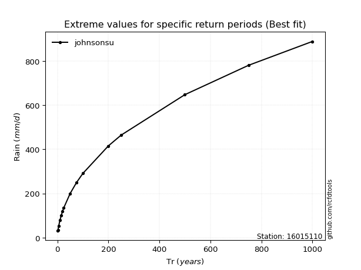</img>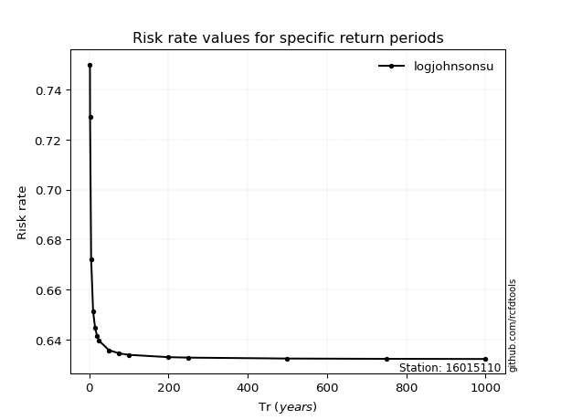</img>

</div>


<sub>**APP DISCLAIMER**: NO WARRANTY - This software is provided by [github.com/rcfdtools](https://github.com/rcfdtools) "as is", without any express or implied warranty, including warranties of merchantability, fitness for a particular purpose, or non-infringement. There is no guarantee that the software will be error-free or operate without interruption. LIMITATION OF LIABILITY - Neither the authors nor copyright holders will be liable for claims or damages arising from the software or its use. You are responsible for determining if the software is appropriate for your use and assume all associated risks, including errors, legal compliance, and data loss. NO PROFESSIONAL ADVICE - The software provides general information and does not offer professional advice. It should not replace consultation with professional advisors.</sub>