<div align="center">


</div>

# PMax24h Station (Rain): 16015120

Maximum Precipitation in 24 hours (PMax24h) is the greatest amount of rainfall for a specific duration that is meteorologically possible for a given location, acting as a "worst-case" scenario for extreme storms, crucial for designing safety-critical infrastructure like bridges, river deviations, dams, spillways, and nuclear plants to prevent catastrophic failure. The PMax24h is related with the Probable Maximum Precipitation (PMP) and it is calculated by hydrologists using meteorological data to determine the upper limit of extreme rainfall, often leading to the Probable Maximum Flood (PMF) for flood control design, and is increasingly being studied for climate change impacts. Probable Maximum Precipitation (PMP) is the theoretical upper limit of rainfall, a deterministic estimate for extreme events, while probability distributions (like GEV, Gumbel) describe the likelihood and frequency of various precipitation amounts, including rare ones, showing how often events occur, with PMP representing the extreme end of these distributions, used for critical infrastructure design to ensure safety against the worst conceivable weather, unlike standard statistical forecasts which cover typical probabilities.

The most common probability distributions in hydrology, used for analyzing floods, rainfall, and streamflow, include the Normal, Log-Normal, Gumbel, Gamma (including Log-Pearson Type III), and Generalized Extreme Value (GEV) distributions, often chosen based on the data´s skewness and whether modeling extremes or general conditions, with Gumbel and GEV popular for extreme events like floods, while the Normal distribution serves as a baseline, though often requiring transformations for skewed hydrological data. These distributions help in designing water infrastructure, managing water resources, and forecasting hydrologic events.

> Hydrological data often isn´t perfectly normal (it´s skewed), so different distributions are needed for different applications, such as: **Flood Frequency Analysis**: Using Gumbel, GEV, or Log-Pearson Type III for predicting extreme flood magnitudes and their return periods, **Rainfall Analysis**: Normal for annual totals, but Log-Normal, Weibull, or GEV for intensity or extreme daily rainfall, **Streamflow Modeling**: Gamma and Log-Normal for maximum flows, GEV for minimum flows, and Kappa for daily flows.

<div align="center">

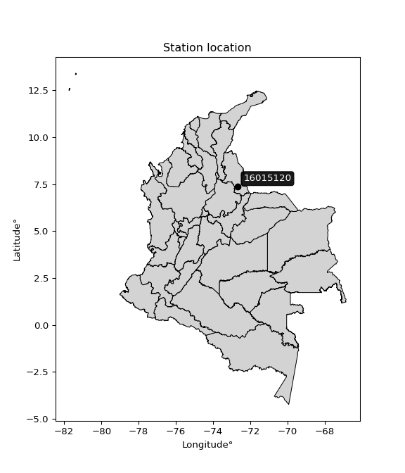</img>

</div>


## A. General information


### 1. General running parameters

• app_version: _v20260312_. • runtime: _2026-03-12 07:15:23.203550_. • Python version: _3.14.0_. • SciPy version: _1.16.3_. • Pandas version: _2.3.3_. • NumPy version: _2.3.5_. • Stations dataset (station_dataset_file): _dataset/pmax24h_in/automatic_colombia_2003_2025.csv_. • Stations catalog (station_catalog_file): _dataset/CNE.xls_. • Minimum year to eval til year_max (date_min): _1900_. • Maximum year to eval since year_min (date_max): _2025_. • Creates, save and include plots into reports (create_plot): _True_. • Plot only fit distributions with Δo > Δ (plot_only_fit): _True_. • Plot only simple graphs avoiding multiple CDFs and multiple Extreme values plots (plot_only_simple): _True_. • Eval low extreme values, if False, evaluates high extreme values (low_extreme): _False_. • Eval every SciPy distribution as logarithmic (pdist_logarithmic_on): _True_. • Standard deviation normalized (ddof): _1.0_. • Return periods to eval in years (Tr): _[2, 2.33, 5, 10, 15, 20, 25, 50, 75, 100, 200, 250, 500, 750, 1000]_. • Minimum data sample per station, 0 means any (minimum_sample): _5_. • Z-Score maximum threshold to adjust a value, 0 means disable (zscore_max): _3.5_. • Z-Score minimum threshold to adjust a value, 0 means disable (zscore_min): _-2.5_. • Avoid zeros, e.g. rain = 0 (avoid_zeros): _True_. • Avoid null values (avoid_nans): _True_. 

:file_folder:Table: [dataset.csv](../../dataset/pmax24h_in/automatic_colombia_2003_2025.csv)

> Delta Degrees of Freedom (DDOF): is a parameter used in the formulas for calculating variance and standard deviation. When ddof=0, the divisor is $N$ (the total number of observations) and this is used when your data set is the entire population. When ddof=1, the divisor is $N-1$ and this is used when your data set is a sample drawn from a larger population. Using $N-1$ provides an unbiased estimate of the population variance (known as Bessel´s correction).


### 2. Station info and location

|   id |   CODIGO | NOMBRE                                    | CATEGORIA         | TECNOLOGIA                | ESTADO           | FECHA_INSTALACION   |   FECHA_SUSPENSION |   ALTITUD |   LATITUD |   LONGITUD | DEPARTAMENTO       | MUNICIPIO   | AREA_OPERATIVA                         | ENTIDAD                                                     | AREA_HIDROGRAFICA   | ZONA_HIDROGRAFICA   | SUBZONA_HIDROGRAFICA   |   CORRIENTE | Catalogo   |   Version |
|-----:|---------:|:------------------------------------------|:------------------|:--------------------------|:-----------------|:--------------------|-------------------:|----------:|----------:|-----------:|:-------------------|:------------|:---------------------------------------|:------------------------------------------------------------|:--------------------|:--------------------|:-----------------------|------------:|:-----------|----------:|
|    0 | 16015120 | UNIVERSIDAD DE PAMPLONA  - AUT [16015120] | Agrometeorológica | Automática con Telemetría | En Mantenimiento | 13/10/2004          |                nan |      2362 |   7.36094 |   -72.6661 | Norte De Santander | Pamplona    | Area Operativa 08 - Santanderes-Arauca | INSTITUTO DE HIDROLOGIA METEOROLOGIA Y ESTUDIOS AMBIENTALES | Caribe              | Catatumbo           | Río Pamplonita         |         nan | CNE_IDEAM  |  20251226 |

<div align="center">

Dynamic map: [:earth_americas:Google](http://maps.google.com/maps?q=7.360944444,-72.66605556) [:earth_americas:OSM](https://www.openstreetmap.org/#map=18/7.360944444/-72.66605556&layers=P) [:earth_americas:Bing](https://www.bing.com/maps?cp=7.360944444~-72.66605556&lvl=18) [:earth_americas:Apple](https://maps.apple.com/frame?center=7.360944444%2C-72.66605556&span=0.003%2C0.006)

</div>


<div align="center">

```geojson
{
  "type": "Feature",
  "geometry": {
    "type": "Point", 
    "coordinates": [-72.66605556, 7.360944444]
  }, 
  "properties": {
    "Name": "16015120"
  }
}
```

</div>


### 3. Discrete values table and plot

<div align="center">

|               |          0 |          1 |          2 |           3 |           4 |          5 |           6 |            7 |           8 |           9 |          10 |          11 |          12 |          13 |          14 |
|:--------------|-----------:|-----------:|-----------:|------------:|------------:|-----------:|------------:|-------------:|------------:|------------:|------------:|------------:|------------:|------------:|------------:|
| Date          | 2011       | 2012       | 2013       | 2014        | 2015        | 2016       | 2017        | 2018         | 2019        | 2020        | 2021        | 2022        | 2023        | 2024        | 2025        |
| Value         |   43.5     |  245.8     |  274.1     |   29.2      |   31.7      |   57.5     |   44        |   69.7       |   36.9      |   45.6      |   36.1      |   25.2      |   17.2      |   92.8      |   16.1      |
| Value_initial |   43.5     |  245.8     |  274.1     |   29.2      |   31.7      |   57.5     |   44        |   69.7       |   36.9      |   45.6      |   36.1      |   25.2      |   17.2      |   92.8      |   16.1      |
| count         |   15       |   15       |   15       |   15        |   15        |   15       |   15        |   15         |   15        |   15        |   15        |   15        |   15        |   15        |   15        |
| mean          |   71.0267  |   71.0267  |   71.0267  |   71.0267   |   71.0267   |   71.0267  |   71.0267   |   71.0267    |   71.0267   |   71.0267   |   71.0267   |   71.0267   |   71.0267   |   71.0267   |   71.0267   |
| std           |   79.4053  |   79.4053  |   79.4053  |   79.4053   |   79.4053   |   79.4053  |   79.4053   |   79.4053    |   79.4053   |   79.4053   |   79.4053   |   79.4053   |   79.4053   |   79.4053   |   79.4053   |
| zscore        |   -0.34666 |    2.20103 |    2.55743 |   -0.526749 |   -0.495265 |   -0.17035 |   -0.340363 |   -0.0167075 |   -0.429778 |   -0.320214 |   -0.439853 |   -0.577123 |   -0.677872 |    0.274205 |   -0.691725 |


</div>


<div align="center">

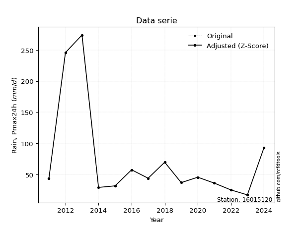</img>

</div>


> The initial value (value_initial) correspond to the initial obtained or null completed value, and value (value) is adjusted only when the initial value is outside the valid range (outlier) definite through the Z-Score value. If Z-Score is active, values out of range or outliers are replaced with the station mean value. A Z-Score (or standard score) measures how many standard deviations a data point is from the mean of a dataset, indicating its relative position; positive scores mean above the mean, negative mean below, and a score of zero is exactly at the mean, allowing for comparison of values from different distributions. It´s calculated using the formula $z=(x–μ)/σ$, where $x$ is the data point, $μ$ is the mean, and $σ$ is the standard deviation, helping identify outliers and understand probability.
>
> <sub>**Note**: In this study, "completing" (filling gaps in) and "extending" (forecasting or lengthening the historical record) rainfall data series are avoided for certain critical analyses because they introduce artificial bias and uncertainty, which can distort the statistics of rare events (extremes), alter day-to-day variability, and compromise the integrity and homogeneity of the original data. Some reasons against Completing/Extending rainfall data are: **Distortion of Extremes and Variability**: The primary issue is that most gap-filling or extension methods rely on averaging or regression with nearby stations, which inherently smooths the data. Rainfall is highly variable in space and time, with a large percentage of zero values and occasional large storms. Infilling methods often underestimate the highest values and overestimate the lowest (zero) values, which severely distorts analyses focused on flood frequency, drought severity, and intensity-duration-frequency (IDF) curves, **Loss of Data Homogeneity**: Infilled or extended data are synthetic estimates, not actual measurements. Combining these estimates with observed data can violate the assumption of data homogeneity, which requires that the data properties do not change over time. Inhomogeneity can lead to incorrect conclusions about long-term trends or changes in climate patterns, **Propagation of Errors**: Errors and biases from the original data (e.g., wind-induced undercatch, instrument errors, site changes) or the data used for imputation can propagate through the analysis, leading to unreliable hydrological models and inaccurate predictions, **Compromised Statistical Integrity**: For statistical analyses, especially those involving the frequency of events, using artificial data can introduce time bias or autocorrelation that doesn´t exist in reality, making it difficult to assess the true probability of events, **Difficulty in Validation**: It is difficult to accurately validate the quality of filled or extended data, especially for past periods where ground-truth measurements are unavailable. The reliability of imputation techniques heavily depends on the density of the surrounding station network and the complexity of the local topography.</sub>


### 4. Active continuous probability distributions from SciPy (80 of 104 available)

A Probability Density Function (PDF) describes the relative likelihood of a continuous random variable falling within a specific range, where the total area under its curve equals 1, and the area over any interval gives the actual probability for that range. Unlike discrete probabilities (like rolling a die), a PDF shows density, not direct probability for a single point (which is zero), with higher points indicating higher likelihood, often visualized as a bell curve for normal distributions.

A log of a probability density function (log-PDF) is simply the logarithm of the PDF´s value, denoted as $log(f(x))$, useful for converting multiplication of probabilities into addition, improving numerical stability with tiny numbers, and connecting to information theory concepts like entropy. Instead of dealing with very small probabilities (e.g., 0.000001), log-PDFs use negative numbers (e.g., $log(0.00001) ≈ -11.51$ that are easier for computers to handle, preventing underflow errors and simplifying complex calculations. In this study, each active probability distribution from SciPy is also evaluated in the $log$ form.

[scipy.stats](https://docs.scipy.org/doc/scipy/reference/stats.html) is a Python´s powerful submodule within the SciPy library for comprehensive statistical analysis, offering over 130 probability distributions (like Normal, Poisson, etc.), functions for descriptive stats (mean, variance), hypothesis testing (t-tests, chi-square), random variable generation, and statistical tests, making it essential for data science, modeling, and research. It provides tools to explore, model, and draw conclusions from data efficiently, working seamlessly with [NumPy](https://numpy.org/).

<div align="center">

|   id | p_dist           |   n_parameter | fit_method   | label                                                                       | active   | ref                                                                                                      |
|-----:|:-----------------|--------------:|:-------------|:----------------------------------------------------------------------------|:---------|:---------------------------------------------------------------------------------------------------------|
|    0 | alpha            |             3 | MLE          | Alpha                                                                       | True     | [:mortar_board:](https://docs.scipy.org/doc/scipy/reference/generated/scipy.stats.alpha.html)            |
|    1 | anglit           |             2 | MM           | Anglit                                                                      | True     | [:mortar_board:](https://docs.scipy.org/doc/scipy/reference/generated/scipy.stats.anglit.html)           |
|    2 | arcsine          |             2 | MM           | Arcsine                                                                     | True     | [:mortar_board:](https://docs.scipy.org/doc/scipy/reference/generated/scipy.stats.arcsine.html)          |
|    3 | argus            |             3 | MLE          | Argus                                                                       | True     | [:mortar_board:](https://docs.scipy.org/doc/scipy/reference/generated/scipy.stats.argus.html)            |
|    4 | beta             |             4 | MLE          | Beta                                                                        | True     | [:mortar_board:](https://docs.scipy.org/doc/scipy/reference/generated/scipy.stats.beta.html)             |
|    5 | betaprime        |             4 | MLE          | Beta prime                                                                  | True     | [:mortar_board:](https://docs.scipy.org/doc/scipy/reference/generated/scipy.stats.betaprime.html)        |
|    6 | bradford         |             3 | MLE          | Bradford                                                                    | True     | [:mortar_board:](https://docs.scipy.org/doc/scipy/reference/generated/scipy.stats.bradford.html)         |
|    7 | burr             |             4 | MLE          | Burr (Type III)                                                             | True     | [:mortar_board:](https://docs.scipy.org/doc/scipy/reference/generated/scipy.stats.burr.html)             |
|    8 | burr12           |             4 | MLE          | Burr (Type III) 12                                                          | True     | [:mortar_board:](https://docs.scipy.org/doc/scipy/reference/generated/scipy.stats.burr12.html)           |
|    9 | cosine           |             2 | MLE          | Cosine                                                                      | True     | [:mortar_board:](https://docs.scipy.org/doc/scipy/reference/generated/scipy.stats.cosine.html)           |
|   10 | crystalball      |             4 | MLE          | Crystalball                                                                 | True     | [:mortar_board:](https://docs.scipy.org/doc/scipy/reference/generated/scipy.stats.crystalball.html)      |
|   11 | dgamma           |             3 | MLE          | Double gamma                                                                | True     | [:mortar_board:](https://docs.scipy.org/doc/scipy/reference/generated/scipy.stats.dgamma.html)           |
|   12 | dweibull         |             3 | MLE          | Double Weibull                                                              | True     | [:mortar_board:](https://docs.scipy.org/doc/scipy/reference/generated/scipy.stats.dweibull.html)         |
|   13 | erlang           |             3 | MLE          | Erlang                                                                      | True     | [:mortar_board:](https://docs.scipy.org/doc/scipy/reference/generated/scipy.stats.erlang.html)           |
|   14 | exponnorm        |             3 | MLE          | Exponentially modified Normal                                               | True     | [:mortar_board:](https://docs.scipy.org/doc/scipy/reference/generated/scipy.stats.exponnorm.html)        |
|   15 | exponpow         |             3 | MLE          | Exponential power                                                           | True     | [:mortar_board:](https://docs.scipy.org/doc/scipy/reference/generated/scipy.stats.exponpow.html)         |
|   16 | exponweib        |             4 | MLE          | Exponentiated Weibull                                                       | True     | [:mortar_board:](https://docs.scipy.org/doc/scipy/reference/generated/scipy.stats.exponweib.html)        |
|   17 | f                |             4 | MLE          | F                                                                           | True     | [:mortar_board:](https://docs.scipy.org/doc/scipy/reference/generated/scipy.stats.f.html)                |
|   18 | fatiguelife      |             3 | MLE          | Fatigue-life (Birnbaum-Saunders)                                            | True     | [:mortar_board:](https://docs.scipy.org/doc/scipy/reference/generated/scipy.stats.fatiguelife.html)      |
|   19 | foldnorm         |             3 | MM           | Fold Normal                                                                 | True     | [:mortar_board:](https://docs.scipy.org/doc/scipy/reference/generated/scipy.stats.foldnorm.html)         |
|   20 | gamma            |             3 | MLE          | Gamma                                                                       | True     | [:mortar_board:](https://docs.scipy.org/doc/scipy/reference/generated/scipy.stats.gamma.html)            |
|   21 | gausshyper       |             6 | MLE          | Gauss hypergeometric                                                        | True     | [:mortar_board:](https://docs.scipy.org/doc/scipy/reference/generated/scipy.stats.gausshyper.html)       |
|   22 | genexpon         |             5 | MLE          | Generalized exponential                                                     | True     | [:mortar_board:](https://docs.scipy.org/doc/scipy/reference/generated/scipy.stats.genexpon.html)         |
|   23 | genextreme       |             3 | MLE          | Generalized exponential                                                     | True     | [:mortar_board:](https://docs.scipy.org/doc/scipy/reference/generated/scipy.stats.genextreme.html)       |
|   24 | gengamma         |             4 | MLE          | Generalized gamma                                                           | True     | [:mortar_board:](https://docs.scipy.org/doc/scipy/reference/generated/scipy.stats.gengamma.html)         |
|   25 | genhalflogistic  |             3 | MLE          | Generalized half-logistic                                                   | True     | [:mortar_board:](https://docs.scipy.org/doc/scipy/reference/generated/scipy.stats.genhalflogistic.html)  |
|   26 | genlogistic      |             3 | MLE          | Generalized logistic                                                        | True     | [:mortar_board:](https://docs.scipy.org/doc/scipy/reference/generated/scipy.stats.genlogistic.html)      |
|   27 | gennorm          |             3 | MLE          | Generalized Normal                                                          | True     | [:mortar_board:](https://docs.scipy.org/doc/scipy/reference/generated/scipy.stats.gennorm.html)          |
|   28 | genpareto        |             3 | MLE          | Generalized Pareto                                                          | True     | [:mortar_board:](https://docs.scipy.org/doc/scipy/reference/generated/scipy.stats.genpareto.html)        |
|   29 | gompertz         |             3 | MLE          | Gompertz (or truncated Gumbel)                                              | True     | [:mortar_board:](https://docs.scipy.org/doc/scipy/reference/generated/scipy.stats.gompertz.html)         |
|   30 | gumbel_l         |             2 | MM           | Gumbel Left Skew                                                            | True     | [:mortar_board:](https://docs.scipy.org/doc/scipy/reference/generated/scipy.stats.gumbel_l.html)         |
|   31 | gumbel_r         |             2 | MM           | Gumbel Right Skew                                                           | True     | [:mortar_board:](https://docs.scipy.org/doc/scipy/reference/generated/scipy.stats.gumbel_r.html)         |
|   32 | halfgennorm      |             3 | MLE          | Upper half of a generalized normal                                          | True     | [:mortar_board:](https://docs.scipy.org/doc/scipy/reference/generated/scipy.stats.halfgennorm.html)      |
|   33 | halflogistic     |             2 | MM           | Half-logistic                                                               | True     | [:mortar_board:](https://docs.scipy.org/doc/scipy/reference/generated/scipy.stats.halflogistic.html)     |
|   34 | halfnorm         |             2 | MM           | Half Normal                                                                 | True     | [:mortar_board:](https://docs.scipy.org/doc/scipy/reference/generated/scipy.stats.halfnorm.html)         |
|   35 | hypsecant        |             2 | MM           | hyperbolic secant                                                           | True     | [:mortar_board:](https://docs.scipy.org/doc/scipy/reference/generated/scipy.stats.hypsecant.html)        |
|   36 | invgamma         |             3 | MLE          | Inverted gamma                                                              | True     | [:mortar_board:](https://docs.scipy.org/doc/scipy/reference/generated/scipy.stats.invgamma.html)         |
|   37 | invgauss         |             3 | MLE          | Inverse Gaussian                                                            | True     | [:mortar_board:](https://docs.scipy.org/doc/scipy/reference/generated/scipy.stats.invgauss.html)         |
|   38 | invweibull       |             3 | MLE          | Inverted Weibull                                                            | True     | [:mortar_board:](https://docs.scipy.org/doc/scipy/reference/generated/scipy.stats.invweibull.html)       |
|   39 | johnsonsb        |             4 | MLE          | Johnson SB                                                                  | True     | [:mortar_board:](https://docs.scipy.org/doc/scipy/reference/generated/scipy.stats.johnsonsb.html)        |
|   40 | johnsonsu        |             4 | MLE          | Johnson Su                                                                  | True     | [:mortar_board:](https://docs.scipy.org/doc/scipy/reference/generated/scipy.stats.johnsonsu.html)        |
|   41 | kappa3           |             3 | MLE          | Kappa 3                                                                     | True     | [:mortar_board:](https://docs.scipy.org/doc/scipy/reference/generated/scipy.stats.kappa3.html)           |
|   42 | kappa4           |             4 | MLE          | Kappa 4                                                                     | True     | [:mortar_board:](https://docs.scipy.org/doc/scipy/reference/generated/scipy.stats.kappa4.html)           |
|   43 | ksone            |             3 | MLE          | Kolmogorov-Smirnov one-sided test statistic distribution                    | True     | [:mortar_board:](https://docs.scipy.org/doc/scipy/reference/generated/scipy.stats.ksone.html)            |
|   44 | kstwobign        |             2 | MLE          | Limiting distribution of scaled Kolmogorov-Smirnov two-sided test statistic | True     | [:mortar_board:](https://docs.scipy.org/doc/scipy/reference/generated/scipy.stats.kstwobign.html)        |
|   45 | laplace          |             2 | MM           | Laplace                                                                     | True     | [:mortar_board:](https://docs.scipy.org/doc/scipy/reference/generated/scipy.stats.laplace.html)          |
|   46 | levy_l           |             2 | MLE          | Left-skewed Levy                                                            | True     | [:mortar_board:](https://docs.scipy.org/doc/scipy/reference/generated/scipy.stats.levy_l.html)           |
|   47 | loggamma         |             3 | MLE          | Log gamma                                                                   | True     | [:mortar_board:](https://docs.scipy.org/doc/scipy/reference/generated/scipy.stats.loggamma.html)         |
|   48 | logistic         |             2 | MM           | Logistic (or Sech-squared)                                                  | True     | [:mortar_board:](https://docs.scipy.org/doc/scipy/reference/generated/scipy.stats.logistic.html)         |
|   49 | loglaplace       |             3 | MLE          | Log-Laplace                                                                 | True     | [:mortar_board:](https://docs.scipy.org/doc/scipy/reference/generated/scipy.stats.loglaplace.html)       |
|   50 | lomax            |             3 | MLE          | Lomax (Pareto of the second kind)                                           | True     | [:mortar_board:](https://docs.scipy.org/doc/scipy/reference/generated/scipy.stats.lomax.html)            |
|   51 | maxwell          |             2 | MM           | Maxwell                                                                     | True     | [:mortar_board:](https://docs.scipy.org/doc/scipy/reference/generated/scipy.stats.maxwell.html)          |
|   52 | mielke           |             4 | MLE          | Mielke Beta-Kappa / Dagum                                                   | True     | [:mortar_board:](https://docs.scipy.org/doc/scipy/reference/generated/scipy.stats.mielke.html)           |
|   53 | moyal            |             2 | MM           | Moyal                                                                       | True     | [:mortar_board:](https://docs.scipy.org/doc/scipy/reference/generated/scipy.stats.moyal.html)            |
|   54 | nakagami         |             3 | MLE          | Nakagami                                                                    | True     | [:mortar_board:](https://docs.scipy.org/doc/scipy/reference/generated/scipy.stats.nakagami.html)         |
|   55 | ncf              |             5 | MLE          | Non-central F distribution                                                  | True     | [:mortar_board:](https://docs.scipy.org/doc/scipy/reference/generated/scipy.stats.ncf.html)              |
|   56 | nct              |             4 | MLE          | Non-central Student’s t                                                     | True     | [:mortar_board:](https://docs.scipy.org/doc/scipy/reference/generated/scipy.stats.nct.html)              |
|   57 | norm             |             2 | MM           | Normal                                                                      | True     | [:mortar_board:](https://docs.scipy.org/doc/scipy/reference/generated/scipy.stats.norm.html)             |
|   58 | pearson3         |             3 | MM           | Pearson type III                                                            | True     | [:mortar_board:](https://docs.scipy.org/doc/scipy/reference/generated/scipy.stats.pearson3.html)         |
|   59 | powerlaw         |             3 | MLE          | Power-function                                                              | True     | [:mortar_board:](https://docs.scipy.org/doc/scipy/reference/generated/scipy.stats.powerlaw.html)         |
|   60 | rayleigh         |             2 | MM           | Rayleigh                                                                    | True     | [:mortar_board:](https://docs.scipy.org/doc/scipy/reference/generated/scipy.stats.rayleigh.html)         |
|   61 | rdist            |             3 | MLE          | R-distributed (symmetric beta)                                              | True     | [:mortar_board:](https://docs.scipy.org/doc/scipy/reference/generated/scipy.stats.rdist.html)            |
|   62 | rice             |             3 | MLE          | Rice                                                                        | True     | [:mortar_board:](https://docs.scipy.org/doc/scipy/reference/generated/scipy.stats.rice.html)             |
|   63 | semicircular     |             2 | MM           | Semicircular                                                                | True     | [:mortar_board:](https://docs.scipy.org/doc/scipy/reference/generated/scipy.stats.semicircular.html)     |
|   64 | skewnorm         |             3 | MLE          | Skew normal                                                                 | True     | [:mortar_board:](https://docs.scipy.org/doc/scipy/reference/generated/scipy.stats.skewnorm.html)         |
|   65 | t                |             3 | MLE          | Student’s t                                                                 | True     | [:mortar_board:](https://docs.scipy.org/doc/scipy/reference/generated/scipy.stats.t.html)                |
|   66 | trapezoid        |             4 | MLE          | Trapezoid                                                                   | True     | [:mortar_board:](https://docs.scipy.org/doc/scipy/reference/generated/scipy.stats.trapezoid.html)        |
|   67 | triang           |             3 | MLE          | Triangular                                                                  | True     | [:mortar_board:](https://docs.scipy.org/doc/scipy/reference/generated/scipy.stats.triang.html)           |
|   68 | truncexpon       |             3 | MLE          | Truncated exponential                                                       | True     | [:mortar_board:](https://docs.scipy.org/doc/scipy/reference/generated/scipy.stats.truncexpon.html)       |
|   69 | truncnorm        |             4 | MLE          | Truncated normal                                                            | True     | [:mortar_board:](https://docs.scipy.org/doc/scipy/reference/generated/scipy.stats.truncnorm.html)        |
|   70 | truncpareto      |             4 | MLE          | Upper truncated Pareto                                                      | True     | [:mortar_board:](https://docs.scipy.org/doc/scipy/reference/generated/scipy.stats.truncpareto.html)      |
|   71 | truncweibull_min |             5 | MLE          | Doubly truncated Weibull minimum                                            | True     | [:mortar_board:](https://docs.scipy.org/doc/scipy/reference/generated/scipy.stats.truncweibull_min.html) |
|   72 | tukeylambda      |             3 | MLE          | Tukey-Lamdba                                                                | True     | [:mortar_board:](https://docs.scipy.org/doc/scipy/reference/generated/scipy.stats.tukeylambda.html)      |
|   73 | uniform          |             2 | MLE          | Uniform                                                                     | True     | [:mortar_board:](https://docs.scipy.org/doc/scipy/reference/generated/scipy.stats.uniform.html)          |
|   74 | vonmises         |             3 | MLE          | Von Mises                                                                   | True     | [:mortar_board:](https://docs.scipy.org/doc/scipy/reference/generated/scipy.stats.vonmises.html)         |
|   75 | vonmises_line    |             3 | MLE          | Von Mises line                                                              | True     | [:mortar_board:](https://docs.scipy.org/doc/scipy/reference/generated/scipy.stats.vonmises_line.html)    |
|   76 | wald             |             2 | MM           | Wald                                                                        | True     | [:mortar_board:](https://docs.scipy.org/doc/scipy/reference/generated/scipy.stats.wald.html)             |
|   77 | weibull_max      |             3 | MLE          | Weibull maximum                                                             | True     | [:mortar_board:](https://docs.scipy.org/doc/scipy/reference/generated/scipy.stats.weibull_max.html)      |
|   78 | weibull_min      |             3 | MLE          | Weibull minimum                                                             | True     | [:mortar_board:](https://docs.scipy.org/doc/scipy/reference/generated/scipy.stats.weibull_min.html)      |
|   79 | wrapcauchy       |             3 | MLE          | Wrapped  Cauchy                                                             | True     | [:mortar_board:](https://docs.scipy.org/doc/scipy/reference/generated/scipy.stats.wrapcauchy.html)       |

</div>

> **n_parameter:** # arguments & localization & scale.
>
> **Fit methods:** (MLE) maximum likelihood, (MM) L-moments.
>
>**Inactive** (With the only purpose of prevent loops, zero divisions, infinite values, over high estimated values or horizontal trending for recurrence intervals estimations, the follow distributions were disabled.)**:** lognorm, norminvgauss, powernorm, powerlognorm, cauchy, halfcauchy, foldcauchy, skewcauchy, chi2, expon, fisk, genhyperbolic, geninvgauss, gibrat, kstwo, laplace_asymmetric, levy, levy_stable, ncx2, pareto, rel_breitwigner, recipinvgauss, studentized_range, loguniform, 


## B. Probability (PDF) vs. Empirical (EDF) distributions functions

A continuous probability distribution (CPD) describes probabilities for variables that can take any value within a range (like rain any time), unlike discrete variables with specific outcomes (like temperature). It uses a Probability Density Function (PDF), a curve where the total area under it equals 1, and the probability of the variable falling within an interval (a to b) is found by calculating the area under the curve between those points. A key feature is that the probability of hitting any single exact value is zero, so probabilities are always expressed for ranges, e.g., $P(a ≤ X ≤ b)$.

<div align="center">

Distributions parameters from station values
|     |   station | p_dist              |   n |              loc |          scale | shape                  | shape1                | shape2                | shape3             |
|----:|----------:|:--------------------|----:|-----------------:|---------------:|:-----------------------|:----------------------|:----------------------|:-------------------|
|   0 |  16015120 | alpha               |  15 |     -5.05763     |   70.0983      | 1.420006027899269      |                       |                       |                    |
|   1 |  16015120 | anglit              |  15 |     71.0267      |  224.416       |                        |                       |                       |                    |
|   2 |  16015120 | arcsine             |  15 |    -37.4617      |  216.977       |                        |                       |                       |                    |
|   3 |  16015120 | argus               |  15 |   -121.784       |  404.539       | 5.896755217962814e-07  |                       |                       |                    |
|   4 |  16015120 | beta                |  15 |     16.1         |  258.039       | 0.2983173959725819     | 1.0457577324812912    |                       |                    |
|   5 |  16015120 | betaprime           |  15 |     -0.197587    |    0.414683    | 199.14966052489217     | 2.1698124416216578    |                       |                    |
|   6 |  16015120 | bradford            |  15 |     16.1         |  258.006       | 6.768794890981917      |                       |                       |                    |
|   7 |  16015120 | burr                |  15 |     -0.200853    |    1.46293     | 1.6463315257589222     | 178.0278670108604     |                       |                    |
|   8 |  16015120 | burr12              |  15 |     -1.13729     |   17.0461      | 255.16055836283016     | 0.003650865098392116  |                       |                    |
|   9 |  16015120 | cosine              |  15 |     92.1248      |   72.916       |                        |                       |                       |                    |
|  10 |  16015120 | crystalball         |  15 |     71.0267      |   76.7128      | 5076.597865779229      | 5417.156748355301     |                       |                    |
|  11 |  16015120 | dgamma              |  15 |     36.1         |   55.5873      | 0.72024626049349       |                       |                       |                    |
|  12 |  16015120 | dweibull            |  15 |     36.1         |   20.4102      | 0.7197472891758278     |                       |                       |                    |
|  13 |  16015120 | erlang              |  15 |     16.1         |   53.5499      | 0.7730424642698014     |                       |                       |                    |
|  14 |  16015120 | exponnorm           |  15 |     16.0101      |    0.033574    | 1632.6736232551339     |                       |                       |                    |
|  15 |  16015120 | exponpow            |  15 |     16.1         |  107.178       | 0.4417849573618623     |                       |                       |                    |
|  16 |  16015120 | exponweib           |  15 |     16.1         |    9.71862     | 2.079818351041893      | 0.41474474644720327   |                       |                    |
|  17 |  16015120 | f                   |  15 |      7.67585     |   26.8894      | 55.86270727366528      | 3.061118534680066     |                       |                    |
|  18 |  16015120 | fatiguelife         |  15 |     12.8319      |   30.1426      | 1.371229007821054      |                       |                       |                    |
|  19 |  16015120 | foldnorm            |  15 |    -40.0017      |  137.661       | 0.0019487613997997357  |                       |                       |                    |
|  20 |  16015120 | gamma               |  15 |     16.1         |   63.4199      | 0.737501698310459      |                       |                       |                    |
|  21 |  16015120 | gausshyper          |  15 |      4.11584     |  269.984       | 0.5331228118308977     | 0.38568549414561115   | 2.757404284761922     | 0.6522642768398632 |
|  22 |  16015120 | genexpon            |  15 |     16.1         |  112.77        | 2.053084366247192      | 6.093117966510274e-09 | 2.3788396288698257    |                    |
|  23 |  16015120 | genextreme          |  15 |     32.9224      |   20.1254      | -0.697119140168164     |                       |                       |                    |
|  24 |  16015120 | gengamma            |  15 |     16.1         |    0.0387892   | 3.8491561389376994     | 0.21075321862071236   |                       |                    |
|  25 |  16015120 | genhalflogistic     |  15 |    -10.581       |   57.25        | 1.062254345630826e-09  |                       |                       |                    |
|  26 |  16015120 | genlogistic         |  15 |   -240.094       |   37.6322      | 1827.1509147848828     |                       |                       |                    |
|  27 |  16015120 | gennorm             |  15 |     36.1         |    1.17226     | 0.36177408812145256    |                       |                       |                    |
|  28 |  16015120 | genpareto           |  15 |     16.1         |   31.0272      | 0.47824850632744736    |                       |                       |                    |
|  29 |  16015120 | gompertz            |  15 |     16.1         |    8.34007e+11 | 15566479670.12648      |                       |                       |                    |
|  30 |  16015120 | gumbel_l            |  15 |    105.552       |   59.8127      |                        |                       |                       |                    |
|  31 |  16015120 | gumbel_r            |  15 |     36.5018      |   59.8127      |                        |                       |                       |                    |
|  32 |  16015120 | halfgennorm         |  15 |     16.1         |    5.08688     | 0.4381177880227672     |                       |                       |                    |
|  33 |  16015120 | halflogistic        |  15 |    -19.8959      |   65.5867      |                        |                       |                       |                    |
|  34 |  16015120 | halfnorm            |  15 |    -30.5111      |  127.259       |                        |                       |                       |                    |
|  35 |  16015120 | hypsecant           |  15 |     71.0267      |   48.8369      |                        |                       |                       |                    |
|  36 |  16015120 | invgamma            |  15 |      6.84859     |   42.4217      | 1.5465588516242499     |                       |                       |                    |
|  37 |  16015120 | invgauss            |  15 |     10.9555      |   29.7036      | 2.0223525120936747     |                       |                       |                    |
|  38 |  16015120 | invweibull          |  15 |      4.05289     |   28.8695      | 1.4344810276556395     |                       |                       |                    |
|  39 |  16015120 | johnsonsb           |  15 |     16.1         |  258           | -0.3202565275580542    | 0.16574122085903537   |                       |                    |
|  40 |  16015120 | johnsonsu           |  15 |     14.1618      |    0.082927    | -5.02950246906256      | 0.7772165510290174    |                       |                    |
|  41 |  16015120 | kappa3              |  15 |     16.1         |   29.1064      | 1.5063967662491158     |                       |                       |                    |
|  42 |  16015120 | kappa4              |  15 |     -9.43329     |  270.681       | 1.1036721677409838     | 0.9133627498274277    |                       |                    |
|  43 |  16015120 | ksone               |  15 |     -9.7         |  309.6         | 1.0                    |                       |                       |                    |
|  44 |  16015120 | kstwobign           |  15 |   -113.006       |  216.888       |                        |                       |                       |                    |
|  45 |  16015120 | laplace             |  15 |     71.0267      |   54.2442      |                        |                       |                       |                    |
|  46 |  16015120 | levy_l              |  15 |    295.355       |  126.15        |                        |                       |                       |                    |
|  47 |  16015120 | loggamma            |  15 | -24480.4         | 3298.53        | 1708.7331318493516     |                       |                       |                    |
|  48 |  16015120 | logistic            |  15 |     71.0267      |   42.294       |                        |                       |                       |                    |
|  49 |  16015120 | loglaplace          |  15 |     -0.119898    |   43.6199      | 1.7339132327844125     |                       |                       |                    |
|  50 |  16015120 | lomax               |  15 |     16.1         |    6.66571e+09 | 107117375.74143784     |                       |                       |                    |
|  51 |  16015120 | maxwell             |  15 |   -110.751       |  113.912       |                        |                       |                       |                    |
|  52 |  16015120 | mielke              |  15 |      0.0831954   |    2.04157     | 150.42945289533668     | 1.6105902813795643    |                       |                    |
|  53 |  16015120 | moyal               |  15 |     27.1573      |   34.5329      |                        |                       |                       |                    |
|  54 |  16015120 | nakagami            |  15 |     16.1         |  119.831       | 0.22208928362524338    |                       |                       |                    |
|  55 |  16015120 | ncf                 |  15 |     -0.00605835  |    8.91905e-08 | 9.476312432956085e-09  | 2.092528398464487     | 4.0234305985295915    |                    |
|  56 |  16015120 | nct                 |  15 |     -0.115671    |    0.912734    | 1.4581175195629816     | 35.241624650242926    |                       |                    |
|  57 |  16015120 | norm                |  15 |     71.0267      |   76.7128      |                        |                       |                       |                    |
|  58 |  16015120 | pearson3            |  15 |     71.0267      |   76.7128      | 1.924143654211124      |                       |                       |                    |
|  59 |  16015120 | powerlaw            |  15 |     16.1         |  258           | 0.214735800138779      |                       |                       |                    |
|  60 |  16015120 | rayleigh            |  15 |    -75.7295      |  117.094       |                        |                       |                       |                    |
|  61 |  16015120 | rdist               |  15 |     -9.68081     |  102.481       | 1.190449449578305      |                       |                       |                    |
|  62 |  16015120 | rice                |  15 |    -35.4521      |   92.7971      | 0.00022773330573830656 |                       |                       |                    |
|  63 |  16015120 | semicircular        |  15 |     71.0267      |  153.426       |                        |                       |                       |                    |
|  64 |  16015120 | skewnorm            |  15 |     16.1         |   94.3382      | 18344949.300976004     |                       |                       |                    |
|  65 |  16015120 | t                   |  15 |     37.4172      |   12.5638      | 0.91246158425842       |                       |                       |                    |
|  66 |  16015120 | trapezoid           |  15 |    -10.185       |  309.6         | 1.0                    | 1.0                   |                       |                    |
|  67 |  16015120 | triang              |  15 |     16.1         |  285.254       | 9.810952800637391e-12  |                       |                       |                    |
|  68 |  16015120 | truncexpon          |  15 |     -7.68362     |  218.248       | 1.291118881932035      |                       |                       |                    |
|  69 |  16015120 | truncnorm           |  15 | -20099.1         | 1248.66        | 16.10945848845224      | 16.316090686113785    |                       |                    |
|  70 |  16015120 | truncpareto         |  15 |    -48.8219      |   64.9219      | 1.68709866505927       | 4.97400413387046      |                       |                    |
|  71 |  16015120 | truncweibull_min    |  15 |     15.0835      |  153.114       | 0.3706441241453218     | 0.0066387905295493595 | 1.691655636672924     |                    |
|  72 |  16015120 | tukeylambda         |  15 |     -9.14737     |  118.98        | 1.1670697143049389     |                       |                       |                    |
|  73 |  16015120 | uniform             |  15 |     16.1         |  258           |                        |                       |                       |                    |
|  74 |  16015120 | vonmises            |  15 |     -0.538552    |    1           | 0.7307377658082158     |                       |                       |                    |
|  75 |  16015120 | vonmises_line       |  15 |     40.0283      |   16.7977      | 1.2416839504634822     |                       |                       |                    |
|  76 |  16015120 | wald                |  15 |     -5.68616     |   76.7128      |                        |                       |                       |                    |
|  77 |  16015120 | weibull_max         |  15 |    274.1         |    1.61418     | 0.17754045737461005    |                       |                       |                    |
|  78 |  16015120 | weibull_min         |  15 |     16.1         |   57.5775      | 0.42146749560474017    |                       |                       |                    |
|  79 |  16015120 | wrapcauchy          |  15 |     16.1         |   41.062       | 0.6190567215332212     |                       |                       |                    |
|  80 |  16015120 | logalpha            |  15 |      0.063635    |   19.2097      | 5.2368089601184185     |                       |                       |                    |
|  81 |  16015120 | loganglit           |  15 |      3.87979     |    2.3354      |                        |                       |                       |                    |
|  82 |  16015120 | logarcsine          |  15 |      2.75077     |    2.25803     |                        |                       |                       |                    |
|  83 |  16015120 | logargus            |  15 |      1.97309     |    3.74061     | 7.316442184901266e-05  |                       |                       |                    |
|  84 |  16015120 | logbeta             |  15 |      2.77882     |    3.83281     | 0.8906001397106247     | 2.412880316645192     |                       |                    |
|  85 |  16015120 | logbetaprime        |  15 |     -0.0571069   |    0.84245     | 151.90840614696947     | 33.535981054764065    |                       |                    |
|  86 |  16015120 | logbradford         |  15 |      2.77881     |    2.83469     | 1.060029681236107      |                       |                       |                    |
|  87 |  16015120 | logburr             |  15 |     -0.0159219   |    3.01309     | 6.9908988174981985     | 3.45572421208432      |                       |                    |
|  88 |  16015120 | logburr12           |  15 |      0.0105391   |    3.42108     | 12.247222918401189     | 0.5258759283733963    |                       |                    |
|  89 |  16015120 | logcosine           |  15 |      3.99221     |    0.704902    |                        |                       |                       |                    |
|  90 |  16015120 | logcrystalball      |  15 |      3.87979     |    0.798319    | 168.55198685717346     | 16.799988341841143    |                       |                    |
|  91 |  16015120 | logdgamma           |  15 |      3.78419     |    0.621199    | 0.8925681811539022     |                       |                       |                    |
|  92 |  16015120 | logdweibull         |  15 |      3.77276     |    0.600949    | 0.8709054065240244     |                       |                       |                    |
|  93 |  16015120 | logerlang           |  15 |      2.59264     |    0.549083    | 2.3441783773099116     |                       |                       |                    |
|  94 |  16015120 | logexponnorm        |  15 |      3.14509     |    0.366241    | 2.0060524434722184     |                       |                       |                    |
|  95 |  16015120 | logexponpow         |  15 |      2.77882     |    1.54212     | 0.6849634259313251     |                       |                       |                    |
|  96 |  16015120 | logexponweib        |  15 |      2.77882     |    2.01674     | 0.24958266927981737    | 2.2411912893425745    |                       |                    |
|  97 |  16015120 | logf                |  15 |      1.4409      |    2.22479     | 312.61429564944694     | 22.56966666913737     |                       |                    |
|  98 |  16015120 | logfatiguelife      |  15 |      1.98284     |    1.74051     | 0.4238965549891983     |                       |                       |                    |
|  99 |  16015120 | logfoldnorm         |  15 |      2.79569     |    1.13294     | 0.6420101883661444     |                       |                       |                    |
| 100 |  16015120 | loggamma            |  15 |      2.59265     |    0.549082    | 2.3441727858760713     |                       |                       |                    |
| 101 |  16015120 | loggausshyper       |  15 |      2.77882     |    2.86135     | 0.9621843144877051     | 1.0661116803854793    | 1.0369655336025274    | 1.0489590924262513 |
| 102 |  16015120 | loggenexpon         |  15 |      2.77785     |    0.0139775   | 0.006998796337584642   | 0.2279648834776582    | 0.0004216820266187359 |                    |
| 103 |  16015120 | loggenextreme       |  15 |      3.50762     |    0.60534     | -0.03369899967041251   |                       |                       |                    |
| 104 |  16015120 | loggengamma         |  15 |      2.77882     |    2.24007     | 0.37125088776696247    | 2.0547635210590243    |                       |                    |
| 105 |  16015120 | loggenhalflogistic  |  15 |      2.77882     |    0.973782    | 0.1932176663056645     |                       |                       |                    |
| 106 |  16015120 | loggenlogistic      |  15 |     -0.123643    |    0.611332    | 387.0288786855808      |                       |                       |                    |
| 107 |  16015120 | loggennorm          |  15 |      3.77276     |    0.370881    | 0.774601261209368      |                       |                       |                    |
| 108 |  16015120 | loggenpareto        |  15 |     -0.000261424 |    9.49679     | -1.6917004369756177    |                       |                       |                    |
| 109 |  16015120 | loggompertz         |  15 |      2.77882     |    2.12582     | 1.2267655765784549     |                       |                       |                    |
| 110 |  16015120 | loggumbel_l         |  15 |      4.23908     |    0.622447    |                        |                       |                       |                    |
| 111 |  16015120 | loggumbel_r         |  15 |      3.5205      |    0.622447    |                        |                       |                       |                    |
| 112 |  16015120 | loghalfgennorm      |  15 |      2.77882     |    0.984558    | 0.9441264345676839     |                       |                       |                    |
| 113 |  16015120 | loghalflogistic     |  15 |      2.93356     |    0.682558    |                        |                       |                       |                    |
| 114 |  16015120 | loghalfnorm         |  15 |      2.82317     |    1.32428     |                        |                       |                       |                    |
| 115 |  16015120 | loghypsecant        |  15 |      3.87979     |    0.508226    |                        |                       |                       |                    |
| 116 |  16015120 | loginvgamma         |  15 |      1.36387     |   25.8571      | 11.268329564405015     |                       |                       |                    |
| 117 |  16015120 | loginvgauss         |  15 |      1.93339     |   11.0708      | 0.17581405592857297    |                       |                       |                    |
| 118 |  16015120 | loginvweibull       |  15 |    -14.4703      |   17.9779      | 29.69894141760796      |                       |                       |                    |
| 119 |  16015120 | logjohnsonsb        |  15 |      2.77882     |    2.83467     | 0.06676936470944986    | 0.21928576906273733   |                       |                    |
| 120 |  16015120 | logjohnsonsu        |  15 |      1.9775      |    0.105984    | -8.453974798856471     | 2.4176652643401715    |                       |                    |
| 121 |  16015120 | logkappa3           |  15 |      2.77882     |    1.2705      | 3.837964777385684      |                       |                       |                    |
| 122 |  16015120 | logkappa4           |  15 |      2.41609     |    3.41167     | 1.119452234346333      | 1.0654605733025653    |                       |                    |
| 123 |  16015120 | logksone            |  15 |      2.49535     |    3.40161     | 1.0                    |                       |                       |                    |
| 124 |  16015120 | logkstwobign        |  15 |      1.30668     |    2.96591     |                        |                       |                       |                    |
| 125 |  16015120 | loglaplace          |  15 |      3.87979     |    0.564497    |                        |                       |                       |                    |
| 126 |  16015120 | loglevy_l           |  15 |      5.78743     |    0.959859    |                        |                       |                       |                    |
| 127 |  16015120 | logloggamma         |  15 |   -247.836       |   33.686       | 1759.0618130711255     |                       |                       |                    |
| 128 |  16015120 | loglogistic         |  15 |      3.87979     |    0.440137    |                        |                       |                       |                    |
| 129 |  16015120 | logloglaplace       |  15 |     -0.0801301   |    3.85289     | 6.9520969759860565     |                       |                       |                    |
| 130 |  16015120 | loglomax            |  15 |      2.77882     |   25.1846      | 23.303567903408638     |                       |                       |                    |
| 131 |  16015120 | logmaxwell          |  15 |      1.98811     |    1.18544     |                        |                       |                       |                    |
| 132 |  16015120 | logmielke           |  15 |     -7.17045     |    9.23141     | 276.75736220098497     | 18.40775584166677     |                       |                    |
| 133 |  16015120 | logmoyal            |  15 |      3.42326     |    0.35937     |                        |                       |                       |                    |
| 134 |  16015120 | lognakagami         |  15 |      2.77882     |    1.57216     | 0.4431596179682342     |                       |                       |                    |
| 135 |  16015120 | logncf              |  15 |     -0.886037    |    4.6831      | 228.59475300712228     | 116.84205837891173    | 0.019676068741695946  |                    |
| 136 |  16015120 | lognct              |  15 |     -0.124242    |    0.102345    | 15.444011417760514     | 37.16838144879746     |                       |                    |
| 137 |  16015120 | lognorm             |  15 |      3.87979     |    0.79832     |                        |                       |                       |                    |
| 138 |  16015120 | logpearson3         |  15 |      3.87979     |    0.798321    | 0.8981492236960626     |                       |                       |                    |
| 139 |  16015120 | logpowerlaw         |  15 |      2.77882     |    2.83467     | 0.2854983537830879     |                       |                       |                    |
| 140 |  16015120 | lograyleigh         |  15 |      2.35256     |    1.21855     |                        |                       |                       |                    |
| 141 |  16015120 | logrdist            |  15 |      3.65463     |    0.875814    | 1.1742212887164158     |                       |                       |                    |
| 142 |  16015120 | logrice             |  15 |      2.48844     |    1.13428     | 0.00042722993936927713 |                       |                       |                    |
| 143 |  16015120 | logsemicircular     |  15 |      3.87979     |    1.5966      |                        |                       |                       |                    |
| 144 |  16015120 | logskewnorm         |  15 |      2.93717     |    1.23525     | 4.070619182759097      |                       |                       |                    |
| 145 |  16015120 | logt                |  15 |      3.7183      |    0.534813    | 2.776717893487964      |                       |                       |                    |
| 146 |  16015120 | logtrapezoid        |  15 |      2.49535     |    3.40161     | 0.9999999999999999     | 1.0                   |                       |                    |
| 147 |  16015120 | logtriang           |  15 |      1.64584     |    3.96765     | 0.9999997848834297     |                       |                       |                    |
| 148 |  16015120 | logtruncexpon       |  15 |      2.77882     |    2.92701     | 0.9684544156541157     |                       |                       |                    |
| 149 |  16015120 | logtruncnorm        |  15 |     -0.269795    |    1.92188     | 1.8193816302333548     | 5.267705712728258     |                       |                    |
| 150 |  16015120 | logtruncpareto      |  15 |      2.77882     |    2.73675e-07 | 1.6600086239039344e-05 | 10436229.630746424    |                       |                    |
| 151 |  16015120 | logtruncweibull_min |  15 |      2.77859     |    3.19071     | 0.8979400772178189     | 6.541956739856495e-05 | 0.8884857658044661    |                    |
| 152 |  16015120 | logtukeylambda      |  15 |      3.64686     |    1.12263     | 1.2705302730667505     |                       |                       |                    |
| 153 |  16015120 | loguniform          |  15 |      2.77882     |    2.83467     |                        |                       |                       |                    |
| 154 |  16015120 | logvonmises         |  15 |     -2.49041     |    1           | 2.2355263588646275     |                       |                       |                    |
| 155 |  16015120 | logvonmises_line    |  15 |      3.78403     |    0.582337    | 1.0168421175117544     |                       |                       |                    |
| 156 |  16015120 | logwald             |  15 |      3.0815      |    0.798297    |                        |                       |                       |                    |
| 157 |  16015120 | logweibull_max      |  15 |      5.61349     |    1.59044     | 0.9063987171281385     |                       |                       |                    |
| 158 |  16015120 | logweibull_min      |  15 |      2.7164      |    1.27145     | 1.4121722011638727     |                       |                       |                    |
| 159 |  16015120 | logwrapcauchy       |  15 |      2.77351     |    0.452       | 5.194090988473e-05     |                       |                       |                    |

</div>

> **loc** (Location parameter): This shifts the distribution along the x-axis. For many common distributions, like the normal (Gaussian) distribution, loc represents the mean $μ$. For others, like the uniform distribution, it might represent the minimum value, or for the beta distribution, the left end of the support interval.
>
> **scale** (Scale parameter): This determines the width or spread of the distribution. For the normal distribution, scale represents the standard deviation $σ$. For a uniform distribution, it defines the length of the interval (from $loc$ to $loc + scale$).
>
> **shape** (Shape parameters): Refers to parameters that define the specific form of a probability distribution, distinct from its location (loc) and scale (scale). These parameters are required arguments for most distribution functions. For example, a normal (Gaussian) distribution is fully defined by its location (mean) and scale (standard deviation), so it has no specific shape parameters beyond loc and scale. However, other distributions have intrinsic properties that need specification, as Gamma distribution that takes a shape parameter, often named $a$ or $alpha$.


### 0. Cumulative distribution values - CDF (160 evaluated)

Cumulative Distribution Function (CDF), denoted as $F$<sub>$X$</sub>$(x)$, is a function that gives the probability that a random variable $X$ will take a value less than or equal to a specific value, $x$ (i.e., $(P(X≥x)$. It essentially "accumulates" probabilities from a given point up to the far right (positive infinity), providing a complete picture of the distribution´s probabilities for both discrete (like rain) and continuous (like temperature) variables, helping to find probabilities over ranges or above certain values. Each station is evaluated separately ordering the $x$ values ascending, calculating the CDF and PDF values for the activated distributions and their logarithmic forms.

<div align="center">

CDF ordered by x ascending and calculating $log(f(x))$ separately
|   id |   Station |   date |     x |   count |    mean |     std |     zscore |   Value_initial |   station |   m |     alpha |   alpha_pdf |   anglit |   anglit_pdf |   arcsine |   arcsine_pdf |    argus |   argus_pdf |        beta |    beta_pdf |   betaprime |   betaprime_pdf |    bradford |   bradford_pdf |      burr |    burr_pdf |    burr12 |   burr12_pdf |   cosine |   cosine_pdf |   crystalball |   crystalball_pdf |   dgamma |    dgamma_pdf |   dweibull |   dweibull_pdf |      erlang |   erlang_pdf |   exponnorm |   exponnorm_pdf |    exponpow |   exponpow_pdf |   exponweib |   exponweib_pdf |         f |      f_pdf |   fatiguelife |   fatiguelife_pdf |   foldnorm |   foldnorm_pdf |       gamma |     gamma_pdf |   gausshyper |   gausshyper_pdf |    genexpon |   genexpon_pdf |   genextreme |   genextreme_pdf |    gengamma |   gengamma_pdf |   genhalflogistic |   genhalflogistic_pdf |   genlogistic |   genlogistic_pdf |   gennorm |   gennorm_pdf |   genpareto |   genpareto_pdf |    gompertz |   gompertz_pdf |   gumbel_l |   gumbel_l_pdf |   gumbel_r |   gumbel_r_pdf |   halfgennorm |   halfgennorm_pdf |   halflogistic |   halflogistic_pdf |   halfnorm |   halfnorm_pdf |   hypsecant |   hypsecant_pdf |   invgamma |   invgamma_pdf |   invgauss |   invgauss_pdf |   invweibull |   invweibull_pdf |   johnsonsb |   johnsonsb_pdf |   johnsonsu |   johnsonsu_pdf |      kappa3 |   kappa3_pdf |      kappa4 |   kappa4_pdf |     ksone |   ksone_pdf |   kstwobign |   kstwobign_pdf |   laplace |   laplace_pdf |   levy_l |   levy_l_pdf |   loggamma |   loggamma_pdf |   logistic |   logistic_pdf |   loglaplace |   loglaplace_pdf |       lomax |   lomax_pdf |   maxwell |   maxwell_pdf |      mielke |   mielke_pdf |    moyal |   moyal_pdf |    nakagami |   nakagami_pdf |      ncf |     ncf_pdf |       nct |     nct_pdf |     norm |    norm_pdf |   pearson3 |   pearson3_pdf |    powerlaw |   powerlaw_pdf |   rayleigh |   rayleigh_pdf |    rdist |     rdist_pdf |     rice |    rice_pdf |   semicircular |   semicircular_pdf |   skewnorm |   skewnorm_pdf |        t |       t_pdf |   trapezoid |   trapezoid_pdf |      triang |   triang_pdf |   truncexpon |   truncexpon_pdf |   truncnorm |   truncnorm_pdf |   truncpareto |   truncpareto_pdf |   truncweibull_min |   truncweibull_min_pdf |   tukeylambda |   tukeylambda_pdf |    uniform |   uniform_pdf |   vonmises |   vonmises_pdf |   vonmises_line |   vonmises_line_pdf |     wald |    wald_pdf |   weibull_max |   weibull_max_pdf |   weibull_min |   weibull_min_pdf |   wrapcauchy |   wrapcauchy_pdf |   logalpha |   logalpha_pdf |   loganglit |   loganglit_pdf |   logarcsine |   logarcsine_pdf |   logargus |   logargus_pdf |     logbeta |   logbeta_pdf |   logbetaprime |   logbetaprime_pdf |   logbradford |   logbradford_pdf |   logburr |   logburr_pdf |   logburr12 |   logburr12_pdf |   logcosine |   logcosine_pdf |   logcrystalball |   logcrystalball_pdf |   logdgamma |   logdgamma_pdf |   logdweibull |   logdweibull_pdf |   logerlang |   logerlang_pdf |   logexponnorm |   logexponnorm_pdf |   logexponpow |   logexponpow_pdf |   logexponweib |   logexponweib_pdf |      logf |   logf_pdf |   logfatiguelife |   logfatiguelife_pdf |   logfoldnorm |   logfoldnorm_pdf |   loggausshyper |   loggausshyper_pdf |   loggenexpon |   loggenexpon_pdf |   loggenextreme |   loggenextreme_pdf |   loggengamma |   loggengamma_pdf |   loggenhalflogistic |   loggenhalflogistic_pdf |   loggenlogistic |   loggenlogistic_pdf |   loggennorm |   loggennorm_pdf |   loggenpareto |   loggenpareto_pdf |   loggompertz |   loggompertz_pdf |   loggumbel_l |   loggumbel_l_pdf |   loggumbel_r |   loggumbel_r_pdf |   loghalfgennorm |   loghalfgennorm_pdf |   loghalflogistic |   loghalflogistic_pdf |   loghalfnorm |   loghalfnorm_pdf |   loghypsecant |   loghypsecant_pdf |   loginvgamma |   loginvgamma_pdf |   loginvgauss |   loginvgauss_pdf |   loginvweibull |   loginvweibull_pdf |   logjohnsonsb |   logjohnsonsb_pdf |   logjohnsonsu |   logjohnsonsu_pdf |   logkappa3 |   logkappa3_pdf |   logkappa4 |   logkappa4_pdf |   logksone |   logksone_pdf |   logkstwobign |   logkstwobign_pdf |   loglevy_l |   loglevy_l_pdf |   logloggamma |   logloggamma_pdf |   loglogistic |   loglogistic_pdf |   logloglaplace |   logloglaplace_pdf |    loglomax |   loglomax_pdf |   logmaxwell |   logmaxwell_pdf |   logmielke |   logmielke_pdf |   logmoyal |   logmoyal_pdf |   lognakagami |   lognakagami_pdf |    logncf |   logncf_pdf |    lognct |   lognct_pdf |   lognorm |   lognorm_pdf |   logpearson3 |   logpearson3_pdf |   logpowerlaw |   logpowerlaw_pdf |   lograyleigh |   lograyleigh_pdf |   logrdist |   logrdist_pdf |   logrice |   logrice_pdf |   logsemicircular |   logsemicircular_pdf |   logskewnorm |   logskewnorm_pdf |      logt |   logt_pdf |   logtrapezoid |   logtrapezoid_pdf |   logtriang |   logtriang_pdf |   logtruncexpon |   logtruncexpon_pdf |   logtruncnorm |   logtruncnorm_pdf |   logtruncpareto |   logtruncpareto_pdf |   logtruncweibull_min |   logtruncweibull_min_pdf |   logtukeylambda |   logtukeylambda_pdf |   loguniform |   loguniform_pdf |   logvonmises |   logvonmises_pdf |   logvonmises_line |   logvonmises_line_pdf |   logwald |   logwald_pdf |   logweibull_max |   logweibull_max_pdf |   logweibull_min |   logweibull_min_pdf |   logwrapcauchy |   logwrapcauchy_pdf |
|-----:|----------:|-------:|------:|--------:|--------:|--------:|-----------:|----------------:|----------:|----:|----------:|------------:|---------:|-------------:|----------:|--------------:|---------:|------------:|------------:|------------:|------------:|----------------:|------------:|---------------:|----------:|------------:|----------:|-------------:|---------:|-------------:|--------------:|------------------:|---------:|--------------:|-----------:|---------------:|------------:|-------------:|------------:|----------------:|------------:|---------------:|------------:|----------------:|----------:|-----------:|--------------:|------------------:|-----------:|---------------:|------------:|--------------:|-------------:|-----------------:|------------:|---------------:|-------------:|-----------------:|------------:|---------------:|------------------:|----------------------:|--------------:|------------------:|----------:|--------------:|------------:|----------------:|------------:|---------------:|-----------:|---------------:|-----------:|---------------:|--------------:|------------------:|---------------:|-------------------:|-----------:|---------------:|------------:|----------------:|-----------:|---------------:|-----------:|---------------:|-------------:|-----------------:|------------:|----------------:|------------:|----------------:|------------:|-------------:|------------:|-------------:|----------:|------------:|------------:|----------------:|----------:|--------------:|---------:|-------------:|-----------:|---------------:|-----------:|---------------:|-------------:|-----------------:|------------:|------------:|----------:|--------------:|------------:|-------------:|---------:|------------:|------------:|---------------:|---------:|------------:|----------:|------------:|---------:|------------:|-----------:|---------------:|------------:|---------------:|-----------:|---------------:|---------:|--------------:|---------:|------------:|---------------:|-------------------:|-----------:|---------------:|---------:|------------:|------------:|----------------:|------------:|-------------:|-------------:|-----------------:|------------:|----------------:|--------------:|------------------:|-------------------:|-----------------------:|--------------:|------------------:|-----------:|--------------:|-----------:|---------------:|----------------:|--------------------:|---------:|------------:|--------------:|------------------:|--------------:|------------------:|-------------:|-----------------:|-----------:|---------------:|------------:|----------------:|-------------:|-----------------:|-----------:|---------------:|------------:|--------------:|---------------:|-------------------:|--------------:|------------------:|----------:|--------------:|------------:|----------------:|------------:|----------------:|-----------------:|---------------------:|------------:|----------------:|--------------:|------------------:|------------:|----------------:|---------------:|-------------------:|--------------:|------------------:|---------------:|-------------------:|----------:|-----------:|-----------------:|---------------------:|--------------:|------------------:|----------------:|--------------------:|--------------:|------------------:|----------------:|--------------------:|--------------:|------------------:|---------------------:|-------------------------:|-----------------:|---------------------:|-------------:|-----------------:|---------------:|-------------------:|--------------:|------------------:|--------------:|------------------:|--------------:|------------------:|-----------------:|---------------------:|------------------:|----------------------:|--------------:|------------------:|---------------:|-------------------:|--------------:|------------------:|--------------:|------------------:|----------------:|--------------------:|---------------:|-------------------:|---------------:|-------------------:|------------:|----------------:|------------:|----------------:|-----------:|---------------:|---------------:|-------------------:|------------:|----------------:|--------------:|------------------:|--------------:|------------------:|----------------:|--------------------:|------------:|---------------:|-------------:|-----------------:|------------:|----------------:|-----------:|---------------:|--------------:|------------------:|----------:|-------------:|----------:|-------------:|----------:|--------------:|--------------:|------------------:|--------------:|------------------:|--------------:|------------------:|-----------:|---------------:|----------:|--------------:|------------------:|----------------------:|--------------:|------------------:|----------:|-----------:|---------------:|-------------------:|------------:|----------------:|----------------:|--------------------:|---------------:|-------------------:|-----------------:|---------------------:|----------------------:|--------------------------:|-----------------:|---------------------:|-------------:|-----------------:|--------------:|------------------:|-------------------:|-----------------------:|----------:|--------------:|-----------------:|---------------------:|-----------------:|---------------------:|----------------:|--------------------:|
|    0 |  16015120 |   2025 |  16.1 |      15 | 71.0267 | 79.4053 | -0.691725  |            16.1 |  16015120 |   1 | 0.0316306 | 0.0112878   | 0.264904 |   0.00393272 |  0.331016 |    0.00340234 | 0.169096 |  0.00237628 | 9.50343e-06 | 7.97993e+08 |   0.0499309 |     0.0122448   | 5.41842e-07 |     0.0127969  | 0.0357142 | 0.0119075   | 0.0105386 |  0.0505369   | 0.196592 |  0.00328269  |      0.236995 |       0.00402457  | 0.27302  |   0.00659354  |   0.186627 |    0.0066188   | 3.37021e-13 | 73.3331      |  0.00163981 |     0.0181457   | 5.24305e-08 |    6.51981e+06 | 4.83172e-14 |    11.7314      | 0.0296061 | 0.0133181  |     0.0241532 |       0.0213257   |   0.316385 |    0.00533414  | 1.12808e-12 | 234.177       |     0.197869 |      0.00851644  | 1.39209e-10 |    0.018206    |    0.0301005 |      0.0125561   | 1.38006e-12 |  315.006       |          0.228894 |           0.00827605  |      0.132915 |       0.00712369  |  0.206922 |   0.00582071  | 5.40455e-14 |     0.0322298   | 6.39244e-12 |    0.0186647   |   0.200789 |    0.00299481  |   0.245003 |    0.00576119  |   1.37805e-14 |       0.0745936   |       0.267727 |        0.00707706  |   0.285837 |    0.00586302  |    0.199903 |     0.00382947  |  0.0292847 |    0.0130771   |  0.0262252 |    0.0166755   |    0.0301005 |      0.012556    |   0.0014758 |     27.548      |   0.0206269 |     0.0199118   | 3.94643e-12 |  0.0261752   | 3.50015e-15 |   0.11548    | 0.0833333 |  0.00322997 |    0.129513 |     0.00598212  |  0.18164  |   0.00334856  | 0.498489 |  0.000766052 |  0.0222951 |      0.252943  |   0.214386 |    0.00398224  |    0.0711116 |        0.125973  | 6.26881e-10 | 0.0160699   |  0.256589 |   0.00467239  |   0.0359863 |   0.011819   | 0.240545 | 0.00680939  | 3.57437e-08 |    4.46887e+06 | 0.339011 | 0.010593    | 0.0320748 | 0.0120898   | 0.236995 | 0.00402457  |   0.250617 |    0.00924262  | 0.000239512 |    1.44768e+10 |   0.264726 |    0.00492446  | 0.590978 |    0.00359201 | 0.142994 | 0.00513053  |       0.277055 |         0.00387435 | 0          |    0.0084577   | 0.178095 | 0.00637245  |  0.00720799 |     0.000548449 | 7.99501e-10 |  0.0070113   |     0.142403 |       0.00566713 | 0.000165646 |     0.0134133   |   4.43061e-10 |       0.0278459   |        3.74831e-11 |            0.087       |      0.619286 |        0.00473759 | 0          |    0.00387597 |    3.06961 |      0.0903848 |        0.103884 |          0.00797269 | 0.14858  | 0.0139343   |     0.0852874 |       0.000144478 |   1.47279e-07 |       1.74721e+07 |  2.54422e-07 |       0.0164734  |  0.0330242 |      0.191946  |   0.0953811 |       0.251554  |     0.071099 |         1.27278  |  0.068783  |       0.168698 | 1.43923e-14 |    28.8631    |      0.0502433 |          0.202938  |   3.76141e-06 |          0.517418 | 0.0326431 |     0.177356  |   0.0372173 |       0.155863  |   0.0686827 |        0.191917 |        0.08393   |            0.193077  |   0.0837188 |       0.140965  |      0.106131 |         0.144134  |   0.0222949 |       0.252941  |      0.0337557 |          0.169977  |   2.26581e-11 |     34947.9       |    1.74566e-09 |        2.19879e+06 | 0.0314266 |  0.197902  |        0.0291735 |            0.212306  |     0         |         0         |     9.51688e-16 |            2.06202  |   0.000487838 |         0.500953  |       0.0327784 |           0.192906  |   1.18138e-12 |      2029.32      |          6.09288e-09 |                0.513462  |        0.0353849 |            0.192577  |    0.0900346 |        0.135869  |       0.332295 |           0.139238 |   8.14879e-11 |         0.577078  |     0.0913106 |        0.139785   |     0.0371711 |         0.196604  |      9.61354e-08 |            0.989482  |          0        |             0         |     0         |         0         |      0.07264   |          0.141691  |     0.0314264 |         0.197872  |     0.0294775 |         0.210181  |       0.0327769 |           0.192894  |    2.56935e-06 |        1372.27     |      0.0302726 |           0.20505  | 7.69327e-11 |       0.554417  | 5.59577e-15 |       14.883    |  0.0833333 |       0.293979 |      0.0337704 |          0.206805  |    0.427813 |       0.0638538 |     0.0869114 |         0.194855  |     0.0757579 |         0.159084  |       0.0628225 |           0.152765  | 5.41471e-12 |      0.925312  |    0.0691848 |        0.239733  |   0.0341013 |       0.190903  |  0.0142334 |      0.134877  |   1.30214e-14 |         25.9882   | 0.0595467 |    0.205291  | 0.0412407 |    0.198978  | 0.0839302 |     0.193077  |     0.0451474 |         0.231599  |    3.0739e-05 |       1.97616e+10 |     0.0593487 |         0.270031  | 2.2594e-05 |     323.762    | 0.0322371 |     0.21842   |         0.0988344 |              0.288771 |     0.0360446 |         0.192763  | 0.0922775 |  0.166524  |     0.00694444 |          0.0489964 |   0.0815407 |        0.143941 |      1.3271e-06 |            0.550747 |    0           |          0         |      1.91624e-07 |       226130         |           2.20188e-05 |                  1.25819  |        0.0112433 |             0.688429 |    0         |         0.352774 |       1.09251 |         0.192243  |          0.0900155 |              0.183049  | 0         |     0         |         0.184802 |            0.0997737 |        0.0140743 |            0.316161  |      0.00187098 |            0.35215  |
|    1 |  16015120 |   2023 |  17.2 |      15 | 71.0267 | 79.4053 | -0.677872  |            17.2 |  16015120 |   2 | 0.0454011 | 0.013721    | 0.269241 |   0.00395307 |  0.334746 |    0.00337932 | 0.171719 |  0.00239271 | 0.199861    | 0.0541937   |   0.0641944 |     0.0136557   | 0.0138778   |     0.0124379  | 0.050017  | 0.0140562   | 0.0657544 |  0.0474608   | 0.200218 |  0.003311    |      0.241444 |       0.00406568  | 0.280403 |   0.0068326   |   0.194112 |    0.00699425  | 0.0531868   |  0.0369466   |  0.0214739  |     0.0178513   | 0.131859    |    0.0526336   | 0.101629    |     0.0646395   | 0.0459333 | 0.0162733  |     0.050699  |       0.0261818   |   0.322243 |    0.00531662  | 0.0544707   |   0.036157    |     0.207024 |      0.00813772  | 0.0198274   |    0.017845    |    0.0454783 |      0.0153356   | 0.168275    |    0.0766726   |          0.237978 |           0.00823902  |      0.140866 |       0.0073326   |  0.213508 |   0.00615925  | 0.0345448   |     0.0305976   | 0.0203218   |    0.0182854   |   0.204107 |    0.00303773  |   0.251363 |    0.00580305  |   0.0578872   |       0.0447376   |       0.275495 |        0.00704489  |   0.292276 |    0.00584427  |    0.204154 |     0.00389956  |  0.0453214 |    0.0159912   |  0.0469123 |    0.0206413   |    0.0454783 |      0.0153356   |   0.110457  |      0.0285373  |   0.04534   |     0.0243859   | 0.0287018   |  0.0259685   | 0.00739458  |   0.00608971 | 0.0868863 |  0.00322997 |    0.136166 |     0.00611377  |  0.185361 |   0.00341716  | 0.499334 |  0.000769912 |  0.0418684 |      0.337361  |   0.218799 |    0.00404138  |    0.0799441 |        0.14162   | 0.0175216   | 0.0157883   |  0.261745 |   0.00470271  |   0.0501539 |   0.0138991  | 0.248057 | 0.00684808  | 0.0976598   |    0.0394343   | 0.350499 | 0.0102968   | 0.0467891 | 0.0146143   | 0.241444 | 0.00406568  |   0.260726 |    0.0091377   | 0.309761    |    0.0604699   |   0.270155 |    0.00494665  | 0.594934 |    0.00360061 | 0.148679 | 0.00520524  |       0.281323 |         0.00388563 | 0.00930348 |    0.00845713  | 0.185377 | 0.00687521  |  0.00782391 |     0.000571401 | 0.00769756  |  0.00698426  |     0.148621 |       0.00563863 | 0.0148161   |     0.0132243   |   0.0299474   |       0.0266167   |        0.0727444   |            0.0522295   |      0.624498 |        0.00473937 | 0.00426357 |    0.00387597 |    3.21779 |      0.19342   |        0.113015 |          0.00863669 | 0.163941 | 0.0139841   |     0.0854468 |       0.000145258 |   0.171888    |       0.0598435   |  0.0181025   |       0.0164231  |  0.0474619 |      0.245672  |   0.112645  |       0.270753  |     0.130906 |         0.705263 |  0.0803654 |       0.181776 | 0.0596085   |     0.792835  |      0.0649204 |          0.241549  |   0.0337842   |          0.504939 | 0.0460451 |     0.229274  |   0.0488147 |       0.196208  |   0.0820609 |        0.212964 |        0.0974316 |            0.215688  |   0.0935851 |       0.157939  |      0.116143 |         0.159138  |   0.041868  |       0.337358  |      0.0465203 |          0.217363  |   0.115342    |         1.18986   |    0.147772    |        1.2504      | 0.0463886 |  0.255484  |        0.0453434 |            0.277248  |     0.0282031 |         0.572784  |     0.0407004   |            0.584644 |   0.0340913   |         0.515488  |       0.047311  |           0.24759   |   0.0765035   |         0.882565  |          0.0341459   |                0.519678  |        0.0497675 |            0.243312  |    0.099532  |        0.151877  |       0.341542 |           0.140588 |   0.0379974   |         0.57268   |     0.101005  |        0.153785   |     0.0517888 |         0.246326  |      0.062837    |            0.915179  |          0        |             0         |     0.0130972 |         0.602422  |      0.0826218 |          0.16075   |     0.0463863 |         0.255452  |     0.0454685 |         0.274026  |       0.0473085 |           0.247573  |    0.225942    |           1.02127  |      0.0458277 |           0.266115 | 0.0366415   |       0.554415  | 0.0328746   |        0.444666 |  0.102762  |       0.293979 |      0.049241  |          0.261631  |    0.432097 |       0.0657811 |     0.100518  |         0.217092  |     0.0869646 |         0.180403  |       0.0736405 |           0.175025  | 0.0592462   |      0.868212  |    0.0860566 |        0.270787  |   0.0484522 |       0.244173  |  0.025354  |      0.203796  |   0.0474306   |          0.635736 | 0.0742124 |    0.238775  | 0.0558748 |    0.244338  | 0.0974318 |     0.215688  |     0.0620051 |         0.278531  |    0.34195    |       1.47717     |     0.0783834 |         0.305587  | 0.100255   |       0.899602 | 0.0481825 |     0.263715  |         0.11842   |              0.303632 |     0.0504896 |         0.245121  | 0.10409   |  0.191546  |     0.0105601  |          0.0604199 |   0.0913312 |        0.152337 |      0.0359924  |            0.538451 |    0           |          0         |      0.766978    |            0.936198  |           0.0509576   |                  0.68332  |        0.0538805 |             0.619072 |    0.0233149 |         0.352774 |       1.10604 |         0.217351  |          0.102833  |              0.205313  | 0         |     0         |         0.191522 |            0.103631  |        0.0385364 |            0.415202  |      0.0251446  |            0.352149 |
|    2 |  16015120 |   2022 |  25.2 |      15 | 71.0267 | 79.4053 | -0.577123  |            25.2 |  16015120 |   3 | 0.200539  | 0.0221574   | 0.301425 |   0.00408953 |  0.361184 |    0.00323702 | 0.191334 |  0.0025103  | 0.375263    | 0.0122863   |   0.197474  |     0.0181144   | 0.104431    |     0.0103306  | 0.199249  | 0.020739    | 0.333213  |  0.0235844   | 0.227508 |  0.00350881  |      0.275127 |       0.00435061  | 0.34363  |   0.00920364  |   0.264521 |    0.0111209   | 0.255531    |  0.0196982   |  0.154352   |     0.0154272   | 0.329586    |    0.0153256   | 0.372604    |     0.0208789   | 0.215019  | 0.0223311  |     0.251     |       0.0206707   |   0.364243 |    0.00518102  | 0.24551     |   0.0183032   |     0.263988 |      0.00630918  | 0.152678    |    0.0154264   |    0.209533  |      0.0222137   | 0.42001     |    0.0165333   |          0.302708 |           0.00793335  |      0.204996 |       0.00862904  |  0.276308 |   0.0100906   | 0.24002     |     0.0214809   | 0.156207    |    0.0157491   |   0.229689 |    0.00336084  |   0.298799 |    0.00603457  |   0.28911     |       0.0205289   |       0.330855 |        0.00678899  |   0.338453 |    0.00569687  |    0.237432 |     0.00442327  |  0.212547  |    0.0222078   |  0.234816  |    0.0220455   |    0.209532  |      0.0222136   |   0.192517  |      0.00516465 |   0.245325  |     0.02215     | 0.221564    |  0.0218328   | 0.0500963   |   0.00497985 | 0.112726  |  0.00322997 |    0.188494 |     0.00692368  |  0.214817 |   0.00396018  | 0.505609 |  0.00079898  |  0.229697  |      0.580995  |   0.252839 |    0.00446663  |    0.157263  |        0.27859   | 0.136046    | 0.0138837   |  0.300168 |   0.00489436  |   0.19679   |   0.0203361  | 0.303599 | 0.00700123  | 0.249584    |    0.0121696   | 0.424892 | 0.00837137  | 0.204981  | 0.0218344   | 0.275127 | 0.00435061  |   0.33078  |    0.00837832  | 0.487618    |    0.0115065   |   0.310286 |    0.00507709  | 0.624027 |    0.00367697 | 0.192326 | 0.00568871  |       0.312715 |         0.00395995 | 0.0768462  |    0.00841845  | 0.260485 | 0.0126032   |  0.0130628  |     0.000738325 | 0.0627851   |  0.00678763  |     0.192914 |       0.00543569 | 0.115333    |     0.0119272   |   0.212734    |       0.019574    |        0.289227    |            0.0166156   |      0.662472 |        0.00475499 | 0.0352713  |    0.00387597 |    4.66851 |      0.255006  |        0.20494  |          0.0146364  | 0.273245 | 0.0130686   |     0.0866322 |       0.000151155 |   0.368421    |       0.0134421   |  0.140605    |       0.0136295  |  0.201568  |      0.540006  |   0.234757  |       0.362976  |     0.303705 |         0.345593 |  0.163688  |       0.253264 | 0.306168    |     0.552905  |      0.200772  |          0.4613    |   0.214329    |          0.44317  | 0.197767  |     0.551569  |   0.183269  |       0.522579  |   0.186395  |        0.331049 |        0.206706  |            0.357659  |   0.179332  |       0.30893   |      0.199308 |         0.292444  |   0.229695  |       0.580992  |      0.191653  |          0.539907  |   0.414613    |         0.589323  |    0.429226    |        0.526745    | 0.205398  |  0.548694  |        0.213013  |            0.558899  |     0.24362   |         0.549058  |     0.239169    |            0.471561 |   0.239816    |         0.547446  |       0.20271   |           0.542931  |   0.32623     |         0.540787  |          0.236363    |                0.532076  |        0.200032  |            0.525474  |    0.1823    |        0.301438  |       0.396858 |           0.149385 |   0.250095    |         0.534281  |     0.17854   |        0.259554   |     0.201322  |         0.518419  |      0.350345    |            0.615026  |          0.211596 |             0.69974   |     0.2395    |         0.575151  |      0.171863  |          0.321971  |     0.205393  |         0.548721  |     0.211893  |         0.557462  |       0.2027    |           0.542915  |    0.382069    |           0.221709 |      0.209187  |           0.55445  | 0.248085    |       0.551101  | 0.182409    |        0.365673 |  0.215043  |       0.293979 |      0.20399   |          0.519152  |    0.459633 |       0.0790871 |     0.209821  |         0.356324  |     0.184898  |         0.342418  |       0.172845  |           0.363364  | 0.336959    |      0.602796  |    0.220981  |        0.425745  |   0.202699  |       0.543409  |  0.188756  |      0.61514   |   0.255897    |          0.493741 | 0.203444  |    0.432564  | 0.20001   |    0.496566  | 0.206707  |     0.35766   |     0.214254  |         0.495955  |    0.590552   |       0.376322    |     0.226931  |         0.455178  | 0.320133   |       0.453886 | 0.190949  |     0.464334  |         0.247099  |              0.363867 |     0.202089  |         0.521646  | 0.215403  |  0.413614  |     0.0462435  |          0.126436  |   0.158781  |        0.200861 |      0.228793   |            0.472581 |    2.24046e-08 |          1.15213   |      0.885392    |            0.138099  |           0.265693    |                  0.488409 |        0.272723  |             0.549487 |    0.158052  |         0.352774 |       1.22095 |         0.389262  |          0.213109  |              0.384883  | 0.0483202 |     1.02446   |         0.235821 |            0.129385  |        0.240885  |            0.578801  |      0.15964    |            0.352133 |
|    3 |  16015120 |   2014 |  29.2 |      15 | 71.0267 | 79.4053 | -0.526749  |            29.2 |  16015120 |   4 | 0.287997  | 0.0212387   | 0.317906 |   0.00415    |  0.374015 |    0.00317988 | 0.20149  |  0.00256778 | 0.418279    | 0.00950765  |   0.269462  |     0.0177015   | 0.144096    |     0.00952375 | 0.281043  | 0.0199035   | 0.415501  |  0.017948    | 0.24173  |  0.00360187  |      0.292795 |       0.00448216  | 0.384184 |   0.0112399   |   0.316229 |    0.0151124   | 0.328253    |  0.0168297   |  0.213863   |     0.0143415   | 0.384028    |    0.0121848   | 0.445037    |     0.0157841   | 0.300782  | 0.0203575  |     0.325545  |       0.0168005   |   0.384822 |    0.00510805  | 0.313012    |   0.0156171   |     0.288018 |      0.00572943  | 0.21219     |    0.0143429   |    0.29553   |      0.0205497   | 0.476125    |    0.0119948   |          0.334097 |           0.00775878  |      0.240503 |       0.0091036   |  0.324023 |   0.0141992   | 0.319259    |     0.0182542   | 0.21691     |    0.0146161   |   0.243467 |    0.00352901  |   0.323084 |    0.00610295  |   0.362424    |       0.0164206   |       0.357731 |        0.0066479   |   0.361081 |    0.00561624  |    0.255658 |     0.00468998  |  0.298018  |    0.0203279   |  0.316484  |    0.0188026   |    0.295529  |      0.0205497   |   0.210241  |      0.00384395 |   0.326737  |     0.0186416   | 0.303904    |  0.0193417   | 0.0696449   |   0.0048056  | 0.125646  |  0.00322997 |    0.216817 |     0.00722614  |  0.231256 |   0.00426325  | 0.508835 |  0.000814197 |  0.316249  |      0.588281  |   0.271119 |    0.00467238  |    0.20416   |        0.361667  | 0.189834    | 0.0130193   |  0.319902 |   0.00497067  |   0.277023  |   0.0195355  | 0.331619 | 0.00700095  | 0.293353    |    0.00992506  | 0.456732 | 0.00756504  | 0.290249  | 0.0205349   | 0.292795 | 0.00448216  |   0.36355  |    0.00800778  | 0.527299    |    0.00864351  |   0.330689 |    0.00512216  | 0.638829 |    0.00372534 | 0.215492 | 0.00588995  |       0.32862  |         0.0039922  | 0.110441   |    0.00837655  | 0.319764 | 0.0172246   |  0.016183   |     0.000821786 | 0.089739    |  0.00668931  |     0.214458 |       0.00533697 | 0.161831    |     0.011327    |   0.2857      |       0.0169927   |        0.347428    |            0.012841    |      0.681511 |        0.00476476 | 0.0507752  |    0.00387597 |    5.12727 |      0.129394  |        0.270161 |          0.0179487  | 0.323875 | 0.0122296   |     0.087243  |       0.000154263 |   0.4148      |       0.0100879   |  0.190906    |       0.0115157  |  0.285771  |      0.595831  |   0.290199  |       0.388673  |     0.352193 |         0.315324 |  0.202879  |       0.278532 | 0.383875    |     0.503311  |      0.273249  |          0.518625  |   0.278126    |          0.423201 | 0.284578  |     0.618289  |   0.2686    |       0.627865  |   0.238118  |        0.370202 |        0.26325   |            0.408908  |   0.231542  |       0.404744  |      0.248448 |         0.379654  |   0.316247  |       0.588279  |      0.277796  |          0.621181  |   0.495295    |         0.509438  |    0.50131     |        0.455882    | 0.290291  |  0.596418  |        0.298282  |            0.591686  |     0.323192  |         0.53033   |     0.306506    |            0.44324  |   0.319924    |         0.538283  |       0.287175  |           0.596325  |   0.402111    |         0.491045  |          0.314296    |                0.524726  |        0.28218   |            0.583045  |    0.233777  |        0.40354   |       0.419153 |           0.153328 |   0.327326    |         0.513648  |     0.22057   |        0.31204    |     0.28223   |         0.573591  |      0.434617    |            0.531263  |          0.312003 |             0.661229  |     0.322643  |         0.552545  |      0.225476  |          0.407471  |     0.290291  |         0.596462  |     0.297103  |         0.592252  |       0.287163  |           0.596318  |    0.411481    |           0.181411 |      0.294388  |           0.594981 | 0.328861    |       0.544647  | 0.235532    |        0.356066 |  0.258353  |       0.293979 |      0.283917  |          0.559971  |    0.471743 |       0.0854553 |     0.266094  |         0.406606  |     0.240711  |         0.415256  |       0.234021  |           0.470988  | 0.419853    |      0.52442   |    0.286741  |        0.464518  |   0.287513  |       0.600395  |  0.284309  |      0.670038  |   0.326495    |          0.465044 | 0.271468  |    0.48787   | 0.277787  |    0.553918  | 0.26325   |     0.408909  |     0.290562  |         0.535289  |    0.640485   |       0.307143    |     0.296325  |         0.484135  | 0.384571   |       0.424104 | 0.262789  |     0.507521  |         0.301814  |              0.378212 |     0.282412  |         0.561288  | 0.284546  |  0.525249  |     0.0667464  |          0.151901  |   0.189751  |        0.219578 |      0.296693   |            0.449384 |    0.158282    |          0.999203  |      0.902982    |            0.103925  |           0.334827    |                  0.451356 |        0.353074  |             0.542028 |    0.210024  |         0.352774 |       1.28322 |         0.454761  |          0.275766  |              0.465131  | 0.236457  |     1.3026    |         0.255735 |            0.141151  |        0.325831  |            0.570665  |      0.211517   |            0.352122 |
|    4 |  16015120 |   2015 |  31.7 |      15 | 71.0267 | 79.4053 | -0.495265  |            31.7 |  16015120 |   5 | 0.339533  | 0.0199338   | 0.328325 |   0.00418513 |  0.381924 |    0.00314817 | 0.207954 |  0.00260323 | 0.440604    | 0.00840706  |   0.312914  |     0.0170225   | 0.167342    |     0.00908051 | 0.329502  | 0.0188196   | 0.457066  |  0.0154024   | 0.250805 |  0.00365789  |      0.304099 |       0.0045601   | 0.414683 |   0.0133339   |   0.358956 |    0.0194595   | 0.368539    |  0.0154378   |  0.248911   |     0.0137021   | 0.412783    |    0.0108763   | 0.481696    |     0.0136379   | 0.349716  | 0.018774   |     0.365132  |       0.0149302   |   0.397534 |    0.00506079  | 0.350412    |   0.0143407   |     0.301959 |      0.00542982  | 0.247244    |    0.0137047   |    0.345063  |      0.0190501   | 0.50377     |    0.0102124   |          0.35335  |           0.00764318  |      0.263563 |       0.0093357   |  0.364823 |   0.0188861   | 0.362728    |     0.0165577   | 0.252611    |    0.0139498   |   0.252423 |    0.00363608  |   0.338378 |    0.00613019  |   0.401064    |       0.0145585   |       0.374237 |        0.0065558   |   0.375056 |    0.00556364  |    0.267591 |     0.00485632  |  0.346929  |    0.0187825   |  0.361113  |    0.0169316   |    0.345063  |      0.0190501   |   0.219188  |      0.00334118 |   0.37092   |     0.0167455   | 0.350359    |  0.0178325   | 0.0815528   |   0.00472324 | 0.133721  |  0.00322997 |    0.23508  |     0.00738008  |  0.242164 |   0.00446433  | 0.510882 |  0.000823951 |  0.364262  |      0.57937   |   0.282957 |    0.00479719  |    0.236141  |        0.418321  | 0.221737    | 0.0125066   |  0.332381 |   0.00501163  |   0.324612  |   0.0184935  | 0.349096 | 0.006978    | 0.316953    |    0.00899684  | 0.475068 | 0.00711031  | 0.339932  | 0.019174    | 0.304099 | 0.0045601   |   0.383285 |    0.00778092  | 0.547451    |    0.00753573  |   0.343522 |    0.00514364  | 0.648185 |    0.00375953 | 0.230359 | 0.00600177  |       0.338624 |         0.00401074 | 0.131342   |    0.00834286  | 0.366874 | 0.0204584   |  0.0183027  |     0.00087395  | 0.106385    |  0.00662786  |     0.227725 |       0.00527619 | 0.189697    |     0.0109672   |   0.326422    |       0.0156119   |        0.377507    |            0.0112941   |      0.693432 |        0.00477159 | 0.0604651  |    0.00387597 |    5.72115 |      0.229916  |        0.317436 |          0.0198297  | 0.353755 | 0.0116729   |     0.0876311 |       0.000156262 |   0.438269    |       0.0087527   |  0.218086    |       0.0102424  |  0.335316  |      0.608233  |   0.322621  |       0.400341  |     0.377615 |         0.30414  |  0.226314  |       0.291944 | 0.424192    |     0.478547  |      0.316771  |          0.539575  |   0.312461    |          0.412828 | 0.336073  |     0.632754  |   0.321712  |       0.661799  |   0.269332  |        0.389402 |        0.297897  |            0.434141  |   0.267513  |       0.473199  |      0.28219  |         0.444255  |   0.36426   |       0.579369  |      0.329844  |          0.643034  |   0.53559     |         0.4723    |    0.537451    |        0.424768    | 0.339706  |  0.60459   |        0.347024  |            0.593214  |     0.366252  |         0.517779  |     0.342326    |            0.429001 |   0.363774    |         0.528802  |       0.336697  |           0.60721   |   0.441441    |         0.466798  |          0.357122    |                0.517551  |        0.330763  |            0.597741  |    0.269942  |        0.479803  |       0.431844 |           0.155689 |   0.369001    |         0.500809  |     0.247496  |        0.343762   |     0.330012  |         0.587777  |      0.476542    |            0.490064  |          0.365257 |             0.634808  |     0.367424  |         0.537431  |      0.261018  |          0.457934  |     0.33971   |         0.604635  |     0.345928  |         0.594646  |       0.336685  |           0.607208  |    0.425753    |           0.166733 |      0.343544  |           0.599855 | 0.373366    |       0.538533  | 0.264608    |        0.351955 |  0.282503  |       0.293979 |      0.330317  |          0.568096  |    0.478923 |       0.0893834 |     0.300534  |         0.431415  |     0.276449  |         0.454461  |       0.27556   |           0.541707  | 0.461309    |      0.4854    |    0.325549  |        0.479493  |   0.337428  |       0.612598  |  0.339552  |      0.671939  |   0.364067    |          0.44975  | 0.312506  |    0.510141  | 0.324086  |    0.571561  | 0.297898  |     0.434142  |     0.335003  |         0.54533   |    0.664562   |       0.280047    |     0.336502  |         0.4932    | 0.418988   |       0.414485 | 0.305149  |     0.522725  |         0.333148  |              0.384454 |     0.328772  |         0.565572  | 0.330149  |  0.58395   |     0.079808   |          0.1661    |   0.208218  |        0.230015 |      0.333095   |            0.436947 |    0.237103    |          0.920578  |      0.910979    |            0.0913233 |           0.371159    |                  0.433467 |        0.39749   |             0.53952  |    0.239004  |         0.352774 |       1.32191 |         0.486603  |          0.315697  |              0.506304  | 0.337583  |     1.1511    |         0.267619 |            0.148227  |        0.372216  |            0.557814  |      0.240443   |            0.352115 |
|    5 |  16015120 |   2021 |  36.1 |      15 | 71.0267 | 79.4053 | -0.439853  |            36.1 |  16015120 |   6 | 0.421305  | 0.0171982   | 0.346867 |   0.00424189 |  0.395665 |    0.00309904 | 0.219544 |  0.00266474 | 0.474414    | 0.0070561   |   0.384489  |     0.0154617   | 0.205744    |     0.00839303 | 0.407392  | 0.0165495   | 0.517081  |  0.0120811   | 0.26711  |  0.00375222  |      0.32445  |       0.00468845  | 0.5      | 198.342       |   0.5      |  378.897       | 0.431896    |  0.0134403   |  0.306845   |     0.0126453   | 0.45673     |    0.00920381  | 0.535323    |     0.0109152   | 0.426117  | 0.0159845  |     0.424927  |       0.0123847   |   0.419613 |    0.0049747   | 0.409369    |   0.0125347   |     0.32484  |      0.00498641  | 0.305192    |    0.0126497   |    0.422787  |      0.016292    | 0.54361     |    0.00805616  |          0.386514 |           0.00742889  |      0.305327 |       0.00962244  |  0.5      |   0.0947901   | 0.429855    |     0.0140457   | 0.311537    |    0.0128499   |   0.268842 |    0.00382769  |   0.365408 |    0.00615038  |   0.459335    |       0.0120646   |       0.402714 |        0.00638713  |   0.399325 |    0.00546712  |    0.289596 |     0.00514502  |  0.423463  |    0.0160318   |  0.429206  |    0.0141232   |    0.422786  |      0.016292    |   0.232475  |      0.00274414 |   0.438237  |     0.0139637   | 0.423298    |  0.015368    | 0.102068    |   0.00460702 | 0.147933  |  0.00322997 |    0.268038 |     0.00758703  |  0.262626 |   0.00484155  | 0.514546 |  0.000841592 |  0.43794   |      0.552065  |   0.304532 |    0.00500762  |    0.297282  |        0.526631  | 0.274866    | 0.0116528   |  0.354569 |   0.00507107  |   0.401247  |   0.0163052  | 0.379644 | 0.00689983  | 0.35378     |    0.00781739  | 0.504739 | 0.00639305  | 0.418507  | 0.0165337   | 0.32445  | 0.00468845  |   0.41666  |    0.00739176  | 0.577453    |    0.00619999  |   0.366216 |    0.00516922  | 0.664873 |    0.00382804 | 0.257154 | 0.00617238  |       0.356338 |         0.00404042 | 0.167896   |    0.00826976  | 0.467355 | 0.0245943   |  0.0223501  |     0.000965758 | 0.13531     |  0.00651971  |     0.250707 |       0.00517088 | 0.236607    |     0.0103615   |   0.39039     |       0.0135322   |        0.422661    |            0.00936045  |      0.714456 |        0.00478511 | 0.0775194  |    0.00387597 |    6.22771 |      0.199831  |        0.41055  |          0.0222623  | 0.402955 | 0.0106945   |     0.0883266 |       0.000159893 |   0.472919    |       0.00711318  |  0.25867     |       0.00826903 |  0.414351  |      0.603286  |   0.375646  |       0.414737  |     0.416292 |         0.291974 |  0.265583  |       0.312062 | 0.484005    |     0.442359  |      0.388173  |          0.555656  |   0.365105    |          0.397417 | 0.418204  |     0.625363  |   0.40901   |       0.672933  |   0.321684  |        0.415154 |        0.356569  |            0.467071  |   0.337721  |       0.615843  |      0.348527 |         0.587463  |   0.437937  |       0.552064  |      0.41383   |          0.642451  |   0.593539    |         0.420634  |    0.58986     |        0.382913    | 0.417915  |  0.594623  |        0.423266  |            0.576535  |     0.432112  |         0.495094  |     0.396717    |            0.408267 |   0.431241    |         0.508293  |       0.41546   |           0.600218  |   0.499782    |         0.431415  |          0.423425    |                0.501802  |        0.408731  |            0.597496  |    0.342351  |        0.645885  |       0.452337 |           0.159696 |   0.432678    |         0.478659  |     0.295579  |        0.396523   |     0.406691  |         0.587842  |      0.536365    |            0.431776  |          0.444762 |             0.587632  |     0.435556  |         0.51033   |      0.325618  |          0.534656  |     0.417925  |         0.594663  |     0.42242   |         0.578838  |       0.415448  |           0.600224  |    0.446273    |           0.150119 |      0.420889  |           0.586426 | 0.442489    |       0.524017  | 0.309997    |        0.34668  |  0.320713  |       0.293979 |      0.404044  |          0.563045  |    0.490977 |       0.0962391 |     0.358819  |         0.463897  |     0.339206  |         0.509263  |       0.354155  |           0.671531  | 0.520704    |      0.42972   |    0.388887  |        0.49303   |   0.416958  |       0.606364  |  0.425419  |      0.644026  |   0.42097     |          0.42587  | 0.380377  |    0.531283  | 0.399117  |    0.578938  | 0.356569  |     0.467071  |     0.406089  |         0.545466  |    0.698709   |       0.247043    |     0.401024  |         0.497669  | 0.47226    |       0.406598 | 0.373998  |     0.534172  |         0.383635  |              0.39194  |     0.401706  |         0.553505  | 0.411074  |  0.65547   |     0.102857   |          0.188566  |   0.239187  |        0.246528 |      0.388646   |            0.417968 |    0.349161    |          0.805607  |      0.921838    |            0.0766231 |           0.425815    |                  0.408077 |        0.467458  |             0.537469 |    0.284856  |         0.352774 |       1.38789 |         0.526004  |          0.385126  |              0.558853  | 0.470057  |     0.893098  |         0.287655 |            0.160255  |        0.442947  |            0.529108  |      0.286209   |            0.352105 |
|    6 |  16015120 |   2019 |  36.9 |      15 | 71.0267 | 79.4053 | -0.429778  |            36.9 |  16015120 |   7 | 0.434861  | 0.0166927   | 0.350265 |   0.00425151 |  0.398141 |    0.00309096 | 0.22168  |  0.00267579 | 0.479981    | 0.00686351  |   0.396735  |     0.0151546   | 0.212413    |     0.00827907 | 0.420462  | 0.0161259   | 0.52655   |  0.0115951   | 0.270118 |  0.00376877  |      0.32821  |       0.00471051  | 0.525671 |   0.0229194   |   0.546295 |    0.0396601   | 0.442521    |  0.0131237   |  0.316887   |     0.012462    | 0.463994    |    0.00895837  | 0.543896    |     0.0105206   | 0.438712  | 0.0155049  |     0.43468   |       0.0120013   |   0.423586 |    0.00495866  | 0.419283    |   0.0122508   |     0.3288   |      0.00491508  | 0.315239    |    0.0124668   |    0.435626  |      0.0158087   | 0.549933    |    0.00775299  |          0.392441 |           0.00738857  |      0.31304  |       0.00965813  |  0.540677 |   0.0396936   | 0.44093     |     0.0136442   | 0.32174     |    0.0126595   |   0.271919 |    0.00386291  |   0.370328 |    0.00615038  |   0.468836    |       0.0116896   |       0.407811 |        0.00635563  |   0.403692 |    0.00544906  |    0.293733 |     0.00519658  |  0.436098  |    0.0155563   |  0.440325  |    0.0136776   |    0.435626  |      0.0158087   |   0.234637  |      0.00266112 |   0.449231  |     0.0135256   | 0.435425    |  0.014951    | 0.105747    |   0.00458875 | 0.150517  |  0.00322997 |    0.274119 |     0.00761615  |  0.266527 |   0.00491348  | 0.515221 |  0.000844866 |  0.449977  |      0.54625   |   0.308553 |    0.00504441  |    0.309052  |        0.547481  | 0.284128    | 0.011504    |  0.35863  |   0.00508015  |   0.414128  |   0.015896   | 0.385157 | 0.00688092  | 0.359964    |    0.00764496  | 0.509805 | 0.00627312  | 0.431544  | 0.0160597   | 0.32821  | 0.00471051  |   0.422545 |    0.00732248  | 0.582337    |    0.00601195  |   0.370353 |    0.00517222  | 0.667941 |    0.00384174 | 0.262103 | 0.00619981  |       0.359572 |         0.00404542 | 0.174506   |    0.00825461  | 0.48714  | 0.0248334   |  0.0231293  |     0.00098245  | 0.140518    |  0.00650005  |     0.254837 |       0.00515196 | 0.244854    |     0.010255    |   0.40108     |       0.0131955   |        0.430037    |            0.00908207  |      0.718285 |        0.00478779 | 0.0806202  |    0.00387597 |    6.42495 |      0.283345  |        0.428474 |          0.0225385  | 0.41144  | 0.0105203   |     0.0884548 |       0.000160569 |   0.478515    |       0.00687977  |  0.265157    |       0.00795277 |  0.427538  |      0.59987   |   0.384758  |       0.416663  |     0.422675 |         0.290464 |  0.272459  |       0.315312 | 0.493637    |     0.436556  |      0.400361  |          0.556343  |   0.373788    |          0.39493  | 0.431865  |     0.620981  |   0.423729  |       0.669945  |   0.330825  |        0.418885 |        0.366857  |            0.471632  |   0.351546  |       0.646056  |      0.361751 |         0.619675  |   0.449975  |       0.546249  |      0.42787   |          0.638508  |   0.602671    |         0.412604  |    0.598183    |        0.37652     | 0.430906  |  0.590608  |        0.435852  |            0.57186   |     0.442919  |         0.49095   |     0.405629    |            0.404961 |   0.442338    |         0.504243  |       0.428576  |           0.596532  |   0.509175    |         0.425714  |          0.434389    |                0.498634  |        0.4218    |            0.594934  |    0.356897  |        0.681856  |       0.455845 |           0.160407 |   0.443126    |         0.474713  |     0.30437   |        0.405609   |     0.419551  |         0.585446  |      0.545729    |            0.422703  |          0.45755  |             0.57918   |     0.446688  |         0.505417  |      0.337467  |          0.546426  |     0.430916  |         0.590646  |     0.435058  |         0.57425   |       0.428565  |           0.596539  |    0.449539    |           0.147909 |      0.433695  |           0.58205  | 0.453941    |       0.520905  | 0.317587    |        0.34591  |  0.327157  |       0.293979 |      0.416356  |          0.560355  |    0.4931   |       0.0974807 |     0.369037  |         0.468413  |     0.350456  |         0.517195  |       0.369138  |           0.695783  | 0.530027    |      0.421007  |    0.399705  |        0.494088  |   0.430209  |       0.602653  |  0.439454  |      0.636535  |   0.43026     |          0.421853 | 0.392043  |    0.533106  | 0.411796  |    0.577877  | 0.366857  |     0.471632  |     0.418027  |         0.543774  |    0.704072   |       0.24236     |     0.411929  |         0.497289  | 0.481165   |       0.406046 | 0.385712  |     0.534642  |         0.392237  |              0.392924 |     0.413799  |         0.549791  | 0.425533  |  0.663639  |     0.107032   |          0.192354  |   0.244621  |        0.249312 |      0.397773   |            0.41485  |    0.366618    |          0.78733   |      0.923495    |            0.0745981 |           0.434716    |                  0.40409  |        0.479237  |             0.537336 |    0.292588  |         0.352774 |       1.39947 |         0.531035  |          0.397451  |              0.565636  | 0.489203  |     0.854158  |         0.291191 |            0.16239   |        0.454483  |            0.523492  |      0.293926   |            0.352103 |
|    7 |  16015120 |   2011 |  43.5 |      15 | 71.0267 | 79.4053 | -0.34666   |            43.5 |  16015120 |   8 | 0.531973  | 0.0128575   | 0.378567 |   0.0043226  |  0.418343 |    0.00303331 | 0.239638 |  0.00276548 | 0.520962    | 0.00564941  |   0.488343  |     0.0126252   | 0.264205    |     0.00744506 | 0.515782  | 0.0128408   | 0.592111  |  0.00851244  | 0.295425 |  0.00389782  |      0.359862 |       0.00487621  | 0.621356 |   0.0109234   |   0.691165 |    0.0144725   | 0.521453    |  0.0108985   |  0.394378   |     0.0110484   | 0.517491    |    0.00736216  | 0.604419    |     0.00801088  | 0.529094  | 0.0120319  |     0.505028  |       0.00948626  |   0.455867 |    0.00482207  | 0.493285    |   0.0102695   |     0.359496 |      0.00440865  | 0.392768    |    0.0110553   |    0.527806  |      0.0122651   | 0.594394    |    0.00587781  |          0.440075 |           0.00704222  |      0.377327 |       0.00976985  |  0.682905 |   0.0135246   | 0.521286    |     0.0108475   | 0.400352    |    0.0111922   |   0.298381 |    0.00415679  |   0.410827 |    0.00611015  |   0.537288    |       0.00921524  |       0.448881 |        0.0060874   |   0.43915  |    0.00529427  |    0.329395 |     0.00560384  |  0.526885  |    0.0120984   |  0.519995  |    0.010641    |    0.527806  |      0.0122651   |   0.250375  |      0.00215232 |   0.528088  |     0.0105424   | 0.523652    |  0.0118993   | 0.13559     |   0.00446067 | 0.171835  |  0.00322997 |    0.324958 |     0.00776249  |  0.301012 |   0.0055492   | 0.520888 |  0.000872693 |  0.535822  |      0.49534   |   0.3428   |    0.00532672  |    0.413644  |        0.732765  | 0.356167    | 0.0103463   |  0.392359 |   0.0051347   |   0.508287  |   0.0127135  | 0.429944 | 0.00667782  | 0.406476    |    0.006527    | 0.548197 | 0.00539142  | 0.525445  | 0.0125192   | 0.359862 | 0.00487621  |   0.46903  |    0.00676923  | 0.617839    |    0.00484205  |   0.404527 |    0.00517813  | 0.693709 |    0.0039719  | 0.303672 | 0.00638424  |       0.386397 |         0.00408204 | 0.228524   |    0.00810839  | 0.640519 | 0.019992    |  0.030068   |     0.00112016  | 0.182883    |  0.00633783  |     0.28833  |       0.00499849 | 0.309732    |     0.00941694  |   0.479944    |       0.010811    |        0.483704    |            0.00731535  |      0.749964 |        0.0048128  | 0.106202   |    0.00387597 |    7.51633 |      0.290085  |        0.579245 |          0.0224271  | 0.476308 | 0.00916164  |     0.0895334 |       0.000166344 |   0.518701    |       0.00541382  |  0.310164    |       0.00582092 |  0.523038  |      0.556111  |   0.454235  |       0.426394  |     0.46978  |         0.283211 |  0.326268  |       0.338267 | 0.562022    |     0.395246  |      0.491324  |          0.54446   |   0.437294    |          0.377214 | 0.53006   |     0.567161  |   0.530023  |       0.613134  |   0.401701  |        0.440713 |        0.446674  |            0.495257  |   0.485396  |       1.12949   |      0.5      |        59.5141    |   0.535819  |       0.49534   |      0.528877  |          0.582338  |   0.6659      |         0.357254  |    0.656454    |        0.332896    | 0.524647  |  0.544645  |        0.526326  |            0.524702  |     0.520991  |         0.457242  |     0.470312    |            0.381638 |   0.52254     |         0.469331  |       0.523411  |           0.551626  |   0.57581     |         0.38466   |          0.514225    |                0.470474  |        0.517011  |            0.557434  |    0.5       |        1.16174   |       0.482701 |           0.166122 |   0.518698    |         0.443311  |     0.376721  |        0.473393   |     0.513349  |         0.549928  |      0.610044    |            0.36075   |          0.54746  |             0.512988  |     0.526663  |         0.465916  |      0.433456  |          0.612679  |     0.524662  |         0.544666  |     0.525951  |         0.527281  |       0.523401  |           0.55164   |    0.472748    |           0.135225 |      0.525913  |           0.535188 | 0.537343    |       0.490775  | 0.374082    |        0.340995 |  0.375531  |       0.293979 |      0.506119  |          0.527235  |    0.509959 |       0.107709  |     0.448313  |         0.491986  |     0.439504  |         0.55969   |       0.5       |           0.902192  | 0.594251    |      0.361189  |    0.481026  |        0.491195  |   0.525969  |       0.556482  |  0.53861   |      0.565036  |   0.497191    |          0.391619 | 0.479981  |    0.531261  | 0.505159  |    0.551989  | 0.446674  |     0.495257  |     0.505679  |         0.518018  |    0.741409   |       0.212961    |     0.492964  |         0.484952  | 0.548031   |       0.408661 | 0.47325   |     0.525824  |         0.457356  |              0.397838 |     0.501378  |         0.512318  | 0.537103  |  0.678103  |     0.141023   |          0.220796  |   0.287365  |        0.270218 |      0.464153   |            0.392172 |    0.48546     |          0.659987  |      0.934693    |            0.062248  |           0.498877    |                  0.376358 |        0.567682  |             0.538225 |    0.350637  |         0.352774 |       1.48896 |         0.551338  |          0.493328  |              0.592146  | 0.608763  |     0.613787  |         0.319292 |            0.179494  |        0.536861  |            0.476567  |      0.351864   |            0.352091 |
|    8 |  16015120 |   2017 |  44   |      15 | 71.0267 | 79.4053 | -0.340363  |            44   |  16015120 |   9 | 0.538337  | 0.0125998   | 0.38073  |   0.00432738 |  0.419858 |    0.00302956 | 0.241022 |  0.00277216 | 0.523769    | 0.00557762  |   0.494609  |     0.0124415   | 0.267913    |     0.00738867 | 0.522145  | 0.0126145   | 0.596321  |  0.00833124  | 0.297376 |  0.00390704  |      0.362303 |       0.00488753  | 0.626743 |   0.0106294   |   0.698252 |    0.0138836   | 0.526866    |  0.010753    |  0.399877   |     0.0109481   | 0.521147    |    0.00726482  | 0.608387    |     0.00786202  | 0.535053  | 0.0118048  |     0.509733  |       0.009333    |   0.458275 |    0.00481142  | 0.498387    |   0.0101406   |     0.361691 |      0.00437528  | 0.398271    |    0.0109551   |    0.53388   |      0.0120316   | 0.597306    |    0.00576931  |          0.443589 |           0.0070151   |      0.382211 |       0.00976576  |  0.689511 |   0.0129086   | 0.526665    |     0.0106678   | 0.405922    |    0.0110883   |   0.300465 |    0.00417923  |   0.41388  |    0.00610432  |   0.541858    |       0.00906322  |       0.451919 |        0.00606654  |   0.441794 |    0.00528214  |    0.332204 |     0.005633    |  0.532877  |    0.0118715   |  0.525268  |    0.0104509   |    0.53388   |      0.0120316   |   0.251444  |      0.00212313 |   0.533312  |     0.0103552   | 0.529551    |  0.0116958   | 0.137819    |   0.00445227 | 0.17345   |  0.00322997 |    0.328841 |     0.0077671   |  0.303799 |   0.00560059  | 0.521325 |  0.000874863 |  0.541461  |      0.491462  |   0.345468 |    0.00534638  |    0.422104  |        0.747752  | 0.361319    | 0.0102635   |  0.394927 |   0.00513737  |   0.514589  |   0.0124937  | 0.433278 | 0.00665941  | 0.409722    |    0.00645896  | 0.550878 | 0.00533175  | 0.531646  | 0.0122828   | 0.362303 | 0.00488753  |   0.472404 |    0.00672868  | 0.620243    |    0.00477378  |   0.407116 |    0.00517724  | 0.695697 |    0.00398315 | 0.306866 | 0.0063952   |       0.388439 |         0.00408448 | 0.232575   |    0.0080958   | 0.650353 | 0.0193454   |  0.0306307  |     0.0011306   | 0.186049    |  0.00632554  |     0.290827 |       0.00498706 | 0.314425    |     0.0093563   |   0.48531     |       0.0106553   |        0.487335    |            0.00721039  |      0.752371 |        0.00481492 | 0.10814    |    0.00387597 |    7.65575 |      0.260125  |        0.590414 |          0.0222457  | 0.480864 | 0.0090652   |     0.0896167 |       0.000166796 |   0.521386    |       0.00532759  |  0.313042    |       0.00569065 |  0.529371  |      0.552123  |   0.45911   |       0.426757  |     0.473015 |         0.282952 |  0.330142  |       0.339761 | 0.566523    |     0.392508  |      0.497536  |          0.542614  |   0.441598    |          0.376042 | 0.536515  |     0.562382  |   0.536998  |       0.607476  |   0.406744  |        0.441806 |        0.452339  |            0.496157  |   0.5       |      31.7387    |      0.51561  |         1.17079   |   0.541458  |       0.491462  |      0.535502  |          0.577119  |   0.669962    |         0.353694  |    0.660243    |        0.330103    | 0.530849  |  0.54064   |        0.532301  |            0.520824  |     0.526203  |         0.454745  |     0.474665    |            0.380108 |   0.527888    |         0.466649  |       0.529692  |           0.547616  |   0.580191    |         0.381906  |          0.519589    |                0.46825   |        0.523362  |            0.553847  |    0.512784  |        1.0859    |       0.484602 |           0.166546 |   0.523752    |         0.441021  |     0.382157  |        0.477959   |     0.519614  |         0.546512  |      0.614144    |            0.356821  |          0.553296 |             0.508282  |     0.531971  |         0.463024  |      0.440473  |          0.615396  |     0.530864  |         0.54066   |     0.531955  |         0.52339   |       0.529683  |           0.54763   |    0.47429     |           0.134558 |      0.532007  |           0.531222 | 0.542938    |       0.488229  | 0.377978    |        0.340703 |  0.378891  |       0.293979 |      0.512128  |          0.524243  |    0.511194 |       0.108485  |     0.453941  |         0.492901  |     0.44591   |         0.561358  |       0.51019   |           0.881191  | 0.598357    |      0.357378  |    0.486635  |        0.490315  |   0.532306  |       0.552332  |  0.545035  |      0.559424  |   0.501655    |          0.389511 | 0.486046  |    0.530165  | 0.511451  |    0.549176  | 0.452339  |     0.496157  |     0.511585  |         0.51549   |    0.743833   |       0.211229    |     0.498498  |         0.483519  | 0.552705   |       0.409296 | 0.479252  |     0.524458  |         0.461904  |              0.39802  |     0.507215  |         0.509265  | 0.54484   |  0.675899  |     0.143558   |          0.222771  |   0.290462  |        0.27167  |      0.468626   |            0.390643 |    0.492956    |          0.651771  |      0.9354      |            0.0615404 |           0.503168    |                  0.37456  |        0.573835  |             0.538413 |    0.354669  |         0.352774 |       1.49526 |         0.551539  |          0.500096  |              0.592259  | 0.6157    |     0.600213  |         0.321351 |            0.180756  |        0.542288  |            0.473076  |      0.355888   |            0.35209  |
|    9 |  16015120 |   2020 |  45.6 |      15 | 71.0267 | 79.4053 | -0.320214  |            45.6 |  16015120 |  10 | 0.557857  | 0.0118092   | 0.387666 |   0.0043421  |  0.424697 |    0.00301811 | 0.245475 |  0.00279343 | 0.532517    | 0.00536188  |   0.514053  |     0.0118663   | 0.279594    |     0.00721383 | 0.541764  | 0.0119155   | 0.60921   |  0.00778913  | 0.303651 |  0.00393599  |      0.370151 |       0.0049225   | 0.643071 |   0.00980843  |   0.719127 |    0.0122722   | 0.543709    |  0.0103052   |  0.417141   |     0.0106331   | 0.532532    |    0.00697     | 0.620603    |     0.00741493  | 0.553379  | 0.0111109  |     0.52429   |       0.00886996  |   0.465946 |    0.0047771   | 0.514292    |   0.00974431  |     0.368609 |      0.00427246  | 0.415546    |    0.0106406   |    0.552552  |      0.011317    | 0.606273    |    0.0054452   |          0.454744 |           0.00692759  |      0.397819 |       0.00974167  |  0.708781 |   0.0112493   | 0.543289    |     0.0101187   | 0.423401    |    0.010762    |   0.307209 |    0.00425115  |   0.423631 |    0.00608321  |   0.555985    |       0.00860285  |       0.461572 |        0.00599932  |   0.450214 |    0.00524299  |    0.34129  |     0.00572429  |  0.55131   |    0.0111776   |  0.541522  |    0.00987431  |    0.552552  |      0.0113171   |   0.25477   |      0.00203606 |   0.54942   |     0.00978685  | 0.547758    |  0.0110695   | 0.144921    |   0.00442636 | 0.178618  |  0.00322997 |    0.341276 |     0.00777614  |  0.312894 |   0.00576825  | 0.52273  |  0.000881864 |  0.558796  |      0.479161  |   0.354072 |    0.0054075   |    0.449675  |        0.796594  | 0.377532    | 0.010003    |  0.403152 |   0.00514452  |   0.53403   |   0.0118141  | 0.443885 | 0.00659798  | 0.41989     |    0.00625295  | 0.55926  | 0.00514686  | 0.550712  | 0.0115575   | 0.370151 | 0.0049225   |   0.483067 |    0.00660023  | 0.627715    |    0.00456925  |   0.415397 |    0.00517315  | 0.7021   |    0.00402064 | 0.317125 | 0.00642743  |       0.39498  |         0.00409199 | 0.245495   |    0.00805414  | 0.679641 | 0.0172688   |  0.0324663  |     0.00116398  | 0.196138    |  0.00628621  |     0.298777 |       0.00495063 | 0.329241    |     0.00916488  |   0.501972    |       0.010177    |        0.498615    |            0.00689474  |      0.76008  |        0.00482196 | 0.114341   |    0.00387597 |    7.92536 |      0.0933914 |        0.625455 |          0.0215207  | 0.495126 | 0.00876315  |     0.0898847 |       0.000168258 |   0.5297      |       0.00506885  |  0.321829    |       0.00529912 |  0.548861  |      0.539066  |   0.47437   |       0.427629  |     0.48311  |         0.282333 |  0.34236   |       0.344343 | 0.580392    |     0.384051  |      0.516804  |          0.536089  |   0.454965    |          0.372427 | 0.556327  |     0.546853  |   0.558367  |       0.588844  |   0.422581  |        0.444855 |        0.470102  |            0.498324  |   0.539649  |       0.961022  |      0.551622 |         0.902562  |   0.558794  |       0.479161  |      0.555815  |          0.560078  |   0.6824      |         0.342775  |    0.67188     |        0.321534    | 0.549929  |  0.527633  |        0.550682  |            0.508347  |     0.542304  |         0.446825  |     0.488157    |            0.375394 |   0.544404    |         0.458088  |       0.549021  |           0.534539  |   0.593679    |         0.373365  |          0.536187    |                0.461092  |        0.542935  |            0.542004  |    0.548945  |        0.948913  |       0.490574 |           0.167894 |   0.539375    |         0.433781  |     0.399481  |        0.491995   |     0.538936  |         0.535223  |      0.626674    |            0.344832  |          0.571187 |             0.493544  |     0.548347  |         0.453884  |      0.462581  |          0.621993  |     0.549945  |         0.527648  |     0.550427  |         0.510859  |       0.549012  |           0.534554  |    0.479061    |           0.132622 |      0.550754  |           0.518406 | 0.560229    |       0.479893  | 0.390131    |        0.339828 |  0.389391  |       0.293979 |      0.53068   |          0.514443  |    0.515113 |       0.110968  |     0.471589  |         0.495128  |     0.466038  |         0.565385  |       0.540539  |           0.819022  | 0.610913    |      0.345735  |    0.504092  |        0.48703   |   0.551794  |       0.538787  |  0.5647    |      0.541606  |   0.515449    |          0.382917 | 0.504911  |    0.525991  | 0.5309    |    0.539683  | 0.470103  |     0.498324  |     0.529849  |         0.507079  |    0.751283   |       0.206025    |     0.515682  |         0.478601  | 0.567365   |       0.411692 | 0.4979    |     0.519616  |         0.476129  |              0.398455 |     0.525231  |         0.499464  | 0.568824  |  0.66644   |     0.151625   |          0.228945  |   0.300247  |        0.276208 |      0.482494   |            0.385905 |    0.515784    |          0.626606  |      0.93756     |            0.059429  |           0.516447    |                  0.369039 |        0.593078  |             0.539113 |    0.367269  |         0.352774 |       1.51496 |         0.551131  |          0.521237  |              0.591117  | 0.636411  |     0.560046  |         0.327878 |            0.184769  |        0.558989  |            0.462039  |      0.368464   |            0.352088 |
|   10 |  16015120 |   2016 |  57.5 |      15 | 71.0267 | 79.4053 | -0.17035   |            57.5 |  16015120 |  11 | 0.669822  | 0.007409    | 0.439871 |   0.00442368 |  0.460209 |    0.00295712 | 0.279635 |  0.00294618 | 0.588859    | 0.00421679  |   0.632707  |     0.00828517  | 0.358669    |     0.00613426 | 0.657522  | 0.00785661  | 0.683645  |  0.00502586  | 0.351656 |  0.00412393  |      0.430018 |       0.00512024  | 0.736009 |   0.006309    |   0.822329 |    0.00618282  | 0.649469    |  0.00764086  |  0.530882   |     0.00855813  | 0.60497     |    0.005341    | 0.693491    |     0.0050715   | 0.660614  | 0.00725475 |     0.613591  |       0.00636869  |   0.521225 |    0.00451021  | 0.61534     |   0.0073897   |     0.415553 |      0.00365527  | 0.529392    |    0.0085679   |    0.661443  |      0.00733771  | 0.660138    |    0.00378518  |          0.533192 |           0.00625071  |      0.510729 |       0.00911729  |  0.80095  |   0.00543181  | 0.64371     |     0.0070099   | 0.538244    |    0.00861854  |   0.36098  |    0.00478436  |   0.494634 |    0.00582136  |   0.642064    |       0.00608827  |       0.529915 |        0.00548274  |   0.510806 |    0.00493618  |    0.412942 |     0.00627555  |  0.659278  |    0.0073092   |  0.638639  |    0.00673729  |    0.661443  |      0.00733772  |   0.276082  |      0.00159423 |   0.645682  |     0.00667201  | 0.656271    |  0.00744696  | 0.196602    |   0.00426807 | 0.217054  |  0.00322997 |    0.433167 |     0.00760203  |  0.389647 |   0.00718321  | 0.533547 |  0.000936952 |  0.660341  |      0.396375  |   0.420718 |    0.00576239  |    0.631322  |        0.653108  | 0.485878    | 0.0082619   |  0.464417 |   0.00513355  |   0.649214  |   0.00784886 | 0.519272 | 0.00604907  | 0.486952    |    0.00511226  | 0.613398 | 0.00401788  | 0.661893  | 0.00748299  | 0.430018 | 0.00512024  |   0.556189 |    0.00570757  | 0.675098    |    0.00350164  |   0.476537 |    0.00508644  | 0.751967 |    0.00439117 | 0.394483 | 0.00653608  |       0.443946 |         0.00413321 | 0.339228   |    0.00768127  | 0.813694 | 0.0069403   |  0.0477951  |     0.00141228  | 0.269204    |  0.00599372  |     0.356112 |       0.00468792 | 0.430331    |     0.00785838  |   0.605338    |       0.00739775  |        0.569731    |            0.00521813  |      0.817829 |        0.00488833 | 0.160465   |    0.00387597 |    9.84673 |      0.148362  |        0.830863 |          0.0124715  | 0.587356 | 0.00682675  |     0.0919548 |       0.000179873 |   0.581136    |       0.00371074  |  0.371674    |       0.00330704 |  0.662802  |      0.441123  |   0.57338   |       0.423555  |     0.548682 |         0.285265 |  0.425366  |       0.370532 | 0.663352    |     0.332375  |      0.634258  |          0.471417  |   0.538735    |          0.350549 | 0.670364  |     0.435105  |   0.679294  |       0.452314  |   0.526886  |        0.45076  |        0.58529   |            0.488263  |   0.70221   |       0.532922  |      0.700546 |         0.479157  |   0.660339  |       0.396375  |      0.67166   |          0.437854  |   0.754238    |         0.278696  |    0.740406    |        0.270783    | 0.661489  |  0.432619  |        0.658472  |            0.420071  |     0.639645  |         0.391855  |     0.571844    |            0.347043 |   0.643736    |         0.397464  |       0.662015  |           0.437821  |   0.674016    |         0.320185  |          0.637157    |                0.408087  |        0.658312  |            0.449962  |    0.71135   |        0.520876  |       0.530602 |           0.177672 |   0.634281    |         0.384098  |     0.52296   |        0.56725    |     0.653177  |         0.446934  |      0.69842     |            0.276629  |          0.674603 |             0.399168  |     0.646467  |         0.39179   |      0.605723  |          0.592086  |     0.661506  |         0.43261   |     0.65872   |         0.42182   |       0.66201   |           0.437837  |    0.508752    |           0.12471  |      0.660469  |           0.426285 | 0.664166    |       0.413263  | 0.468371    |        0.335321 |  0.457558  |       0.293979 |      0.64157   |          0.439506  |    0.542917 |       0.129639  |     0.586118  |         0.48589   |     0.596469  |         0.546861  |       0.692481  |           0.517412  | 0.683074    |      0.279145  |    0.613067  |        0.448234  |   0.665381  |       0.438669  |  0.676621  |      0.424436  |   0.599259    |          0.339935 | 0.62171   |    0.475274  | 0.647225  |    0.459306  | 0.58529   |     0.488263  |     0.639853  |         0.438392  |    0.795676   |       0.178453    |     0.621773  |         0.432827  | 0.666085   |       0.446016 | 0.613189  |     0.47002   |         0.568448  |              0.396415 |     0.633125  |         0.429863  | 0.709817  |  0.533183  |     0.209359   |          0.269024  |   0.367708  |        0.305667 |      0.568524   |            0.356514 |    0.643637    |          0.481207  |      0.950001    |            0.0486036 |           0.598126    |                  0.336298 |        0.718996  |             0.548513 |    0.44907   |         0.352774 |       1.63938 |         0.511951  |          0.653134  |              0.532901  | 0.741807  |     0.365888  |         0.373958 |            0.213484  |        0.657587  |            0.388079  |      0.450104   |            0.352078 |
|   11 |  16015120 |   2018 |  69.7 |      15 | 71.0267 | 79.4053 | -0.0167075 |            69.7 |  16015120 |  12 | 0.743024  | 0.0048302   | 0.494088 |   0.00445571 |  0.496107 |    0.00293427 | 0.31648  |  0.00309207 | 0.635669    | 0.00350854  |   0.717561  |     0.00579705  | 0.428293    |     0.00531829 | 0.736501  | 0.00530073  | 0.734719  |  0.00348861  | 0.402874 |  0.00426302  |      0.493101 |       0.00519969  | 0.800777 |   0.00446512  |   0.880536 |    0.00366351  | 0.730423    |  0.00573776  |  0.624489   |     0.00685046  | 0.663168    |    0.00426848  | 0.746214    |     0.00368509  | 0.733695  | 0.00492504 |     0.681091  |       0.00481203  |   0.574489 |    0.0042192   | 0.694605    |   0.00569691  |     0.457257 |      0.00320473  | 0.623125    |    0.00686139  |    0.735092  |      0.00494346  | 0.69998     |    0.00282682  |          0.605094 |           0.00553591  |      0.615146 |       0.00794152  |  0.852305 |   0.00327159  | 0.716129    |     0.00500996  | 0.632277    |    0.00686342  |   0.422556 |    0.00530154  |   0.563239 |    0.00540567  |   0.705997    |       0.00450946  |       0.593488 |        0.00493829  |   0.568987 |    0.00459834  |    0.491354 |     0.00651541  |  0.732925  |    0.00496365  |  0.708252  |    0.00482847  |    0.735092  |      0.00494347  |   0.293873  |      0.00134431 |   0.714462  |     0.00475532  | 0.731841    |  0.00512256  | 0.247894    |   0.00414518 | 0.25646   |  0.00322997 |    0.523063 |     0.00709135  |  0.48792  |   0.00899488  | 0.545353 |  0.00099952  |  0.730127  |      0.329782  |   0.492159 |    0.00590955  |    0.737812  |        0.464463  | 0.577408    | 0.00679102  |  0.526413 |   0.00501221  |   0.728374  |   0.00533171 | 0.589118 | 0.00539282  | 0.544391    |    0.00434995  | 0.65712  | 0.00319501  | 0.73685   | 0.00501874  | 0.493101 | 0.00519969  |   0.620809 |    0.00490418  | 0.713596    |    0.00285886  |   0.537571 |    0.00490484  | 0.809218 |    0.00506895 | 0.473763 | 0.00642585  |       0.494495 |         0.00414921 | 0.43008    |    0.00719704  | 0.872443 | 0.00331271  |  0.0665777  |     0.00166684  | 0.340498    |  0.00569386  |     0.411736 |       0.00443306 | 0.519024    |     0.00671143  |   0.683405    |       0.00552502  |        0.626635    |            0.00418706  |      0.87807  |        0.00499662 | 0.207752   |    0.00387597 |   11.7846  |      0.191837  |        0.933455 |          0.00522613 | 0.661112 | 0.00533753  |     0.0942295 |       0.000193325 |   0.621023    |       0.00289141  |  0.404955    |       0.00225863 |  0.739504  |      0.356871  |   0.653517  |       0.407509  |     0.604614 |         0.297879 |  0.498323  |       0.386916 | 0.723479    |     0.293084  |      0.718257  |          0.400238  |   0.604593    |          0.334254 | 0.745236  |     0.344736  |   0.755822  |       0.346016  |   0.612587  |        0.437292 |        0.675974  |            0.450285  |   0.787778  |       0.368862  |      0.777451 |         0.332787  |   0.730125  |       0.329783  |      0.746558  |          0.34313   |   0.803377    |         0.233098  |    0.788863    |        0.233498    | 0.736923  |  0.352238  |        0.732154  |            0.346495  |     0.710393  |         0.343242  |     0.636564    |            0.325994 |   0.715066    |         0.343769  |       0.738264  |           0.35551   |   0.731603    |         0.278801  |          0.710926    |                0.358059  |        0.736955  |            0.367805  |    0.793551  |        0.348437  |       0.565704 |           0.187485 |   0.704002    |         0.340324  |     0.635148  |        0.591001   |     0.731504  |         0.367432  |      0.747099    |            0.230793  |          0.744319 |             0.326704  |     0.716754  |         0.338786  |      0.710869  |          0.493837  |     0.736937  |         0.352217  |     0.732661  |         0.347446  |       0.738261  |           0.355525  |    0.532534    |           0.123177 |      0.734984  |           0.348988 | 0.73739     |       0.346902  | 0.53264     |        0.33288  |  0.514124  |       0.293979 |      0.719598  |          0.371416  |    0.569688 |       0.149385  |     0.676439  |         0.448893  |     0.69592   |         0.480794  |       0.775898  |           0.360283  | 0.732317    |      0.23407   |    0.694729  |        0.398562  |   0.741556  |       0.354037  |  0.749637  |      0.336672  |   0.661242    |          0.304381 | 0.707262  |    0.411812  | 0.728152  |    0.381416  | 0.675974  |     0.450285  |     0.717875  |         0.372032  |    0.828304   |       0.161377    |     0.700283  |         0.381821  | 0.757974   |       0.520358 | 0.698207  |     0.411848  |         0.644032  |              0.38821  |     0.709993  |         0.369034  | 0.798407  |  0.388428  |     0.264323   |          0.302283  |   0.428875  |        0.330113 |      0.634917   |            0.333831 |    0.726415    |          0.382282  |      0.958711    |            0.0422215 |           0.660502    |                  0.312497 |        0.826044  |             0.56641  |    0.516949  |         0.352774 |       1.73148 |         0.440917  |          0.746963  |              0.438186  | 0.801826  |     0.26468   |         0.417654 |            0.241382  |        0.726408  |            0.32777   |      0.517849   |            0.352077 |
|   12 |  16015120 |   2024 |  92.8 |      15 | 71.0267 | 79.4053 |  0.274205  |            92.8 |  16015120 |  13 | 0.823233  | 0.00247219  | 0.596415 |   0.00437239 |  0.564321 |    0.00299499 | 0.390799 |  0.00333465 | 0.706612    | 0.00271357  |   0.817061  |     0.00314991  | 0.537863    |     0.0042483  | 0.825967  | 0.00279414  | 0.796052  |  0.00202251  | 0.502948 |  0.00436534  |      0.611729 |       0.00499515  | 0.879183 |   0.00254557  |   0.937927 |    0.00164389  | 0.833869    |  0.00343619  |  0.75362    |     0.00449471  | 0.745711    |    0.00299339  | 0.812834    |     0.0022561   | 0.81771   | 0.0026626  |     0.770382  |       0.00310235  |   0.665305 |    0.0036395   | 0.799876    |   0.00360247  |     0.524131 |      0.00263184  | 0.752514    |    0.00450573  |    0.818974  |      0.00264358  | 0.752554    |    0.00184297  |          0.717703 |           0.00423496  |      0.768729 |       0.00537237  |  0.905571 |   0.00162195  | 0.804401    |     0.00288882  | 0.761069    |    0.00445957  |   0.554252 |    0.00602154  |   0.67696  |    0.00441564  |   0.788184    |       0.00279879  |       0.695812 |        0.00393254  |   0.667445 |    0.00392074  |    0.637434 |     0.00591967  |  0.81758   |    0.00268168  |  0.794333  |    0.00286732  |    0.818975  |      0.00264359  |   0.321741  |      0.00110217 |   0.79864   |     0.00277827  | 0.81938     |  0.0027695   | 0.341492    |   0.00396724 | 0.331072  |  0.00322997 |    0.67117  |     0.00567656  |  0.665307 |   0.00617012  | 0.569989 |  0.00113841  |  0.811665  |      0.242733  |   0.625933 |    0.00553603  |    0.842097  |        0.279723  | 0.708455    | 0.0046851   |  0.637192 |   0.00453121  |   0.81881   |   0.00284031 | 0.699073 | 0.00414436  | 0.633075    |    0.00340224  | 0.718245 | 0.00218934  | 0.821657  | 0.0026595   | 0.611729 | 0.00499515  |   0.719088 |    0.00366142  | 0.770676    |    0.00215765  |   0.645035 |    0.00436304  | 1        | 5730.2        | 0.615211 | 0.00573085  |       0.590041 |         0.00410737 | 0.583801   |    0.00607734  | 0.920049 | 0.00127819  |  0.110649   |     0.00214883  | 0.465468    |  0.00512608  |     0.508906 |       0.00398783 | 0.653032    |     0.00497698  |   0.784123    |       0.00342401  |        0.70883     |            0.00304862  |      1        |        0.00836858 | 0.297287   |    0.00387597 |   15.2594  |      0.219099  |        1        |          0.00192193 | 0.760863 | 0.00346462  |     0.099037  |       0.000224251 |   0.676473    |       0.00200618  |  0.445154    |       0.00136941 |  0.825435  |      0.247788  |   0.76441   |       0.363421  |     0.695506 |         0.344988 |  0.611324  |       0.400152 | 0.799584    |     0.239574  |      0.816968  |          0.29057   |   0.697109    |          0.312636 | 0.827364  |     0.234609  |   0.836507  |       0.225523  |   0.731581  |        0.388883 |        0.792473  |            0.358499  |   0.87021   |       0.220887  |      0.852923 |         0.206864  |   0.811663  |       0.242734  |      0.828201  |          0.233731  |   0.861622    |         0.175823  |    0.848468    |        0.184066    | 0.822273  |  0.248011  |        0.817053  |            0.24993   |     0.798169  |         0.270345  |     0.725769    |            0.297818 |   0.802117    |         0.265292  |       0.824205  |           0.249057  |   0.803145    |         0.222076  |          0.802307    |                0.280405  |        0.826022  |            0.258194  |    0.870433  |        0.204095  |       0.621922 |           0.206353 |   0.791893    |         0.27376   |     0.797489  |        0.519565   |     0.820864  |         0.260322  |      0.805064    |            0.176697  |          0.824202 |             0.234919  |     0.802674  |         0.262451  |      0.827397  |          0.323218  |     0.822279  |         0.247985  |     0.817688  |         0.249941  |       0.824206  |           0.249067  |    0.568358    |           0.128794 |      0.819955  |           0.248321 | 0.822291    |       0.247903  | 0.627623    |        0.331138 |  0.598274  |       0.293979 |      0.81186   |          0.275106  |    0.617803 |       0.189322  |     0.792732  |         0.358354  |     0.814316  |         0.343542  |       0.856476  |           0.216414  | 0.791313    |      0.180543  |    0.796415  |        0.310459  |   0.826779  |       0.245854  |  0.830326  |      0.232481  |   0.740941    |          0.252875 | 0.81002   |    0.305846  | 0.821186  |    0.271279  | 0.792473  |     0.358499  |     0.810272  |         0.275075  |    0.871592   |       0.142061    |     0.797531  |         0.296964  | 1          |  885048        | 0.802198  |     0.313943  |         0.752068  |              0.364122 |     0.802893  |         0.281139  | 0.883383  |  0.218039  |     0.357932   |          0.35176   |   0.528574  |        0.366479 |      0.725951   |            0.30273  |    0.818441    |          0.266466  |      0.96975     |            0.0353216 |           0.745399    |                  0.281459 |        1         |             0.890634 |    0.617929  |         0.352774 |       1.83896 |         0.308475  |          0.85018   |              0.286267  | 0.862856  |     0.170191  |         0.493659 |            0.291641  |        0.808302  |            0.246503  |      0.61863    |            0.352086 |
|   13 |  16015120 |   2012 | 245.8 |      15 | 71.0267 | 79.4053 |  2.20103   |           245.8 |  16015120 |  14 | 0.946626  | 0.00025145  | 0.999956 |   5.8863e-05 |  1        |    0          | 0.927195 |  0.0028137  | 0.969954    | 0.00115451  |   0.968145  |     0.000251721 | 0.950993    |     0.00182131 | 0.96217   | 0.000248295 | 0.917111  |  0.000312696 | 0.972202 |  0.00106656  |      0.988645 |       0.000388084 | 0.994102 |   0.000112594 |   0.997622 |    4.36592e-05 | 0.992111    |  0.000153857 |  0.984885   |     0.000275744 | 0.952965    |    0.000513946 | 0.949891    |     0.000331419 | 0.954394  | 0.00027254 |     0.961228  |       0.000412877 |   0.962118 |    0.000671675 | 0.985512    |   0.000242004 |     0.838815 |      0.00247882  | 0.984731    |    0.00027799  |    0.953673  |      0.000268424 | 0.883687    |    0.000413454 |          0.977549 |           0.000387757 |      0.995499 |       0.000119344 |  0.984027 |   0.000138337 | 0.957732    |     0.000300024 | 0.986258    |    0.000256496 |   0.99997  |    5.14475e-06 |   0.970231 |    0.000490216 |   0.954299    |       0.000369254 |       0.965788 |        0.000512712 |   0.970088 |    0.000593669 |    0.982236 |     0.000363561 |  0.954864  |    0.000272168 |  0.958225  |    0.000353716 |    0.953674  |      0.000268423 |   0.510687  |      0.00262335 |   0.953171  |     0.000328382 | 0.957829    |  0.000262048 | 0.884222    |   0.00310257 | 0.825258  |  0.00322997 |    0.991609 |     0.000256028 |  0.980062 |   0.000367562 | 0.889401 |  0.00359698  |  0.950422  |      0.0711909 |   0.984208 |    0.000367486 |    0.971882  |        0.0498114 | 0.975059    | 0.000400793 |  0.979629 |   0.000511719 | nan         | nan          | 0.966352 | 0.000486898 | 0.921279    |    0.000895583 | 0.873082 | 0.000464085 | 0.955483  | 0.000262052 | 0.988645 | 0.000388084 |   0.9627   |    0.000495928 | 0.975359    |    0.000911818 |   0.976947 |    0.000540589 | 1        |    0          | 0.989877 | 0.000330619 |       1        |         0          | 0.985102   |    0.000436403 | 0.97583  | 0.000105604 |  0.683639   |     0.00534125  | 0.962071    |  0.00136547  |     0.947494 |       0.00197824 | 0.983886    |     0.000681044 |   0.988026    |       0.000478274 |        0.972226    |            0.00104447  |      1        |        0          | 0.89031    |    0.00387597 |   39.8156  |      0.170725  |        1        |          0          | 0.962849 | 0.000396972 |     0.189614  |       0.00197794  |   0.833322    |       0.000547955 |  0.684702    |       0.0055892  |  0.956014  |      0.0603886 |   0.991975  |       0.0764092 |     1        |         0        |  0.964155  |       0.249649 | 0.957577    |     0.0935694 |      0.967939  |          0.0622355 |   0.972353    |          0.25624  | 0.951437  |     0.0595502 |   0.952756  |       0.0552162 |   0.975048  |        0.103066 |        0.979084  |            0.0629964 |   0.974618  |       0.0420926 |      0.959515 |         0.0511782 |   0.950421  |       0.0711917 |      0.95437   |          0.0621077 |   0.965971    |         0.0553344 |    0.962986    |        0.0633265   | 0.955487  |  0.063054  |        0.95517   |            0.0672725 |     0.958641  |         0.0798322 |     0.973903    |            0.207841 |   0.956943    |         0.0770138 |       0.95714   |           0.0623338 |   0.94413     |         0.0818459 |          0.965014    |                0.076877  |        0.961891  |            0.0611313 |    0.96876   |        0.0428848 |       0.902716 |           0.527708 |   0.959038    |         0.0852036 |     0.999518  |        0.00591698 |     0.959563  |         0.0636331 |      0.918704    |            0.0723739 |          0.954787 |             0.0647431 |     0.957107  |         0.0775776 |      0.973983  |          0.0511351 |     0.955478  |         0.0630496 |     0.955345  |         0.066794  |       0.957145  |           0.0623328 |    0.780159    |           0.619382 |      0.955066  |           0.064867 | 0.952569    |       0.0594596 | 0.956319    |        0.36177  |  0.88463   |       0.293979 |      0.963607  |          0.0694682 |    0.934519 |       0.476215  |     0.979445  |         0.0626984 |     0.97567   |         0.0539333 |       0.962136  |           0.0471356 | 0.908805    |      0.0761433 |    0.967917  |        0.0727419 |   0.957084  |       0.0608804 |  0.955931  |      0.0612516 |   0.912592    |          0.110022 | 0.969741  |    0.0640713 | 0.963156  |    0.0619298 | 0.979084  |     0.0629963 |     0.960957  |         0.0690727 |    0.98887    |       0.103577    |     0.964752  |         0.0748213 | 1          |       0        | 0.970848  |     0.0683402 |         1         |              0        |     0.962328  |         0.0745012 | 0.975133  |  0.0324801 |     0.782571   |          0.520125  |   0.945822  |        0.490232 |      0.976783   |            0.217034 |    0.961367    |          0.0660825 |      0.997108    |            0.0226987 |           0.978324    |                  0.202429 |        1         |             0        |    0.961556  |         0.352774 |       1.97844 |         0.0430871 |          0.991504  |              0.0788866 | 0.954554  |     0.0477655 |         0.915706 |            0.6707    |        0.951726  |            0.0741064 |      0.961621   |            0.352148 |
|   14 |  16015120 |   2013 | 274.1 |      15 | 71.0267 | 79.4053 |  2.55743   |           274.1 |  16015120 |  15 | 0.952918  | 0.000196517 | 1        |   0          |  1        |    0          | 0.99129  |  0.00149316 | 0.999971    | 0.00078677  |   0.974254  |     0.000184585 | 0.999991    |     0.00164725 | 0.968279  | 0.00018732  | 0.925079  |  0.000253575 | 0.993    |  0.000439704 |      0.995942 |       0.000156444 | 0.996558 |   6.53181e-05 |   0.998572 |    2.52986e-05 | 0.995452    |  8.83387e-05 |  0.99098    |     0.000164547 | 0.965521    |    0.000380118 | 0.958189    |     0.000258947 | 0.961154  | 0.00020911 |     0.971241  |       0.000301088 |   0.977493 |    0.000429164 | 0.990958    |   0.000150239 |     1        |      2.16591e+06 | 0.990879    |    0.000166061 |    0.960339  |      0.000206443 | 0.894398    |    0.000346533 |          0.986245 |           0.00023861  |      0.997875 |       5.63948e-05 |  0.987393 |   0.000101867 | 0.965109    |     0.000225953 | 0.991897    |    0.000151245 |   1        |    1.49952e-08 |   0.981347 |    0.000308924 |   0.963412    |       0.000279857 |       0.977644 |        0.000337057 |   0.983318 |    0.000357362 |    0.990047 |     0.000203772 |  0.961611  |    0.000208551 |  0.966941  |    0.000267241 |    0.960339  |      0.000206442 |   1         | 125774          |   0.961302  |     0.000250814 | 0.964299    |  0.000199177 | 0.967822    |   0.00275201 | 0.916667  |  0.00322997 |    0.99658  |     0.000112584 |  0.988167 |   0.000218149 | 0.985157 |  0.00235173  |  0.95763   |      0.0613309 |   0.991849 |    0.000191144 |    0.976818  |        0.0410666 | 0.984173    | 0.000254339 |  0.990315 |   0.000265616 | nan         | nan          | 0.97766  | 0.00032337  | 0.943437    |    0.000678193 | 0.88501  | 0.00038275  | 0.961981  | 0.000200986 | 0.995942 | 0.000156444 |   0.974405 |    0.000340854 | 1           |    0.000832309 |   0.98847  |    0.000294172 | 1        |    0          | 0.996166 | 0.000137832 |       1        |         0          | 0.993759   |    0.000200969 | 0.978477 | 8.28365e-05 |  0.843152   |     0.00593174  | 0.990872    |  0.000669877 |     1        |       0.00173766 | 1           |     0.000470638 |   1           |       0.000373803 |        1           |            0.000922825 |      1        |        0          | 1          |    0.00387597 |   44.1095  |      0.116657  |        1        |          0          | 0.972411 | 0.000285683 |     0.99592   |       1.27157e+10 |   0.847656    |       0.000468275 |  0.999999    |       0.0164734  |  0.962094  |      0.0514419 |   0.998149  |       0.0368145 |     1        |         0        |  0.987848  |       0.179449 | 0.967054    |     0.0804803 |      0.974086  |          0.0509159 |   0.999999    |          0.251171 | 0.957468  |     0.0513549 |   0.958356  |       0.0477557 |   0.98474   |        0.075347 |        0.98506   |            0.0472734 |   0.978812  |       0.0350876 |      0.964706 |         0.0442662 |   0.95763   |       0.0613317 |      0.96066   |          0.0535461 |   0.971568    |         0.047539  |    0.969394    |        0.0544145   | 0.961841  |  0.0538068 |        0.961952  |            0.0574315 |     0.966616  |         0.0668134 |     0.995444    |            0.182591 |   0.964663    |         0.0649471 |       0.963416  |           0.0530918 |   0.952477    |         0.0715218 |          0.972638    |                0.0633415 |        0.968012  |            0.0514765 |    0.973078  |        0.036555  |       1        |      351493        |   0.967539    |         0.0710739 |     0.999888  |        0.00163504 |     0.965945  |         0.0537685 |      0.926214    |            0.0655776 |          0.96133  |             0.0555595 |     0.964886  |         0.0654494 |      0.979     |          0.0412905 |     0.961832  |         0.0538042 |     0.962077  |         0.0570085 |       0.96342   |           0.0530904 |    0.999998    |         746.372    |      0.961606  |           0.055396 | 0.958558    |       0.0507016 | 0.997828    |        0.438002 |  0.916667  |       0.293979 |      0.970521  |          0.0577309 |    0.981184 |       0.341277  |     0.985385  |         0.0469058 |     0.980904  |         0.0425575 |       0.966896  |           0.0404211 | 0.916721    |      0.0692629 |    0.975053  |        0.058618  |   0.963217  |       0.0519133 |  0.962126  |      0.0526555 |   0.923933    |          0.098257 | 0.976031  |    0.0517407 | 0.96933   |    0.0516809 | 0.98506   |     0.0472733 |     0.96785   |         0.0577424 |    1          |       0.100716    |     0.972143  |         0.061177  | 1          |       0        | 0.977524  |     0.0545933 |         1         |              0        |     0.969736  |         0.0617791 | 0.978369  |  0.0270986 |     0.840278   |          0.538961  |   1         |        0.504077 |      1          |            0.209102 |    0.967985    |          0.0556418 |      0.999533    |            0.0218261 |           1           |                  0.195446 |        1         |             0        |    1         |         0.352774 |       1.98261 |         0.0339322 |          1         |              0.0774986 | 0.959441  |     0.0420623 |         1        |           15.2582    |        0.959217  |            0.0636041 |      0.999996   |            0.35215  |


</div>

An Empirical Distribution Function (EDF) is a step-function estimate of a true cumulative distribution function (CDF) based on observed sample data, representing the proportion of data points less than or equal to a given value. It is calculated by ordering your data and jumping up by $1/n$ (where $n$ is sample size) at each unique data point, allowing analysis without assuming an underlying population distribution, and it gets closer to the true CDF as the sample size grows. For the empirical probability calculations, the parameter $m$ correspond to the order number which means the position of the $x$ values in an ascending order list.

The Kolmogorov-Smirnov (K-S) test is a non-parametric statistical test used to determine if a sample data set comes from a specific theoretical distribution (one-sample) or if two different samples come from the same underlying distribution (two-sample), by comparing their cumulative distribution functions (CDFs). It calculates the maximum vertical difference (D statistic) between these functions, with a small p-value indicating a significant difference and rejection of the null hypothesis (that the data/samples match).


### 1. EDF California (1923)

California´s estimates the true probability distribution of water-related data (like rainfall, streamflow) using observed samples, crucial for risk assessment.

<div align="center">


$P=m/n$


</div>


**1.1. Empirical values**

<div align="center">

|                | 0                   | 1                   | 2              | 3                   | 4                  | 5                  | 6                  | 7                  | 8              | 9                  | 10                 | 11                | 12                 | 13                 | 14             |
|:---------------|:--------------------|:--------------------|:---------------|:--------------------|:-------------------|:-------------------|:-------------------|:-------------------|:---------------|:-------------------|:-------------------|:------------------|:-------------------|:-------------------|:---------------|
| date           | 2025                | 2023                | 2022           | 2014                | 2015               | 2021               | 2019               | 2011               | 2017           | 2020               | 2016               | 2018              | 2024               | 2012               | 2013           |
| x              | 16.1                | 17.2                | 25.2           | 29.2                | 31.7               | 36.1               | 36.9               | 43.5               | 44.0           | 45.6               | 57.5               | 69.7              | 92.8               | 245.8              | 274.1          |
| m              | 1                   | 2                   | 3              | 4                   | 5                  | 6                  | 7                  | 8                  | 9              | 10                 | 11                 | 12                | 13                 | 14                 | 15             |
| empirical_dist | edf_california      | edf_california      | edf_california | edf_california      | edf_california     | edf_california     | edf_california     | edf_california     | edf_california | edf_california     | edf_california     | edf_california    | edf_california     | edf_california     | edf_california |
| empirical      | 0.06666666666666667 | 0.13333333333333333 | 0.2            | 0.26666666666666666 | 0.3333333333333333 | 0.4                | 0.4666666666666667 | 0.5333333333333333 | 0.6            | 0.6666666666666666 | 0.7333333333333333 | 0.8               | 0.8666666666666667 | 0.9333333333333333 | 1.0            |
| empirical_tr   | 1.0714285714285714  | 1.1538461538461537  | 1.25           | 1.3636363636363635  | 1.4999999999999998 | 1.6666666666666667 | 1.875              | 2.142857142857143  | 2.5            | 2.9999999999999996 | 3.749999999999999  | 5.000000000000001 | 7.500000000000002  | 15.000000000000004 | inf            |

</div>


**1.2. Kolmogorov-Smirnov fit test (sorted by Δ)**


<div align="center">

|                | 0                   | 1                   | 2                   | 3                   | 4                   | 5                   | 6                   | 7                   | 8                   | 9                   | 10                  | 11                  | 12                 | 13                  | 14                  | 15                  | 16                  | 17                  | 18                  | 19                 | 20                  | 21                  | 22                  | 23                  | 24                  | 25                  | 26                  | 27                  | 28                 | 29                  | 30                  | 31                  | 32                  | 33                  | 34                  | 35                  | 36                  | 37                  | 38                  | 39                  | 40                  | 41                  | 42                  | 43                  | 44                  | 45                 | 46                  | 47                 | 48                  | 49                  | 50                  | 51                  | 52                  | 53                 | 54                 | 55                  | 56                 | 57                 | 58                  | 59                 | 60                  | 61                  | 62                  | 63                  | 64                  | 65                 | 66                  | 67                  | 68                 | 69                 | 70                 | 71                 | 72                 | 73                  | 74                  | 75                  | 76                  | 77                  | 78                  | 79                  | 80                  | 81                  | 82                 | 83                  | 84                 | 85                  | 86                 | 87                  | 88                  | 89                  | 90                 | 91                 | 92                 | 93                  | 94                  | 95                  | 96                  | 97                  | 98                 | 99                 | 100                 | 101                 | 102                 | 103                 | 104                 | 105                 | 106                 | 107                | 108                 | 109                | 110                | 111                 | 112                 | 113                 | 114                 | 115                | 116                | 117                | 118                 | 119                | 120                | 121                | 122                 | 123                | 124                | 125                 | 126                | 127                | 128                 | 129                 | 130                 | 131                | 132                 | 133                 | 134                | 135                | 136                 | 137                | 138                | 139                 | 140                | 141                | 142                 | 143                 | 144                | 145                | 146                 | 147                | 148                | 149                | 150                | 151                | 152                | 153                | 154                | 155                | 156                | 157                | 158                | 159                |
|:---------------|:--------------------|:--------------------|:--------------------|:--------------------|:--------------------|:--------------------|:--------------------|:--------------------|:--------------------|:--------------------|:--------------------|:--------------------|:-------------------|:--------------------|:--------------------|:--------------------|:--------------------|:--------------------|:--------------------|:-------------------|:--------------------|:--------------------|:--------------------|:--------------------|:--------------------|:--------------------|:--------------------|:--------------------|:-------------------|:--------------------|:--------------------|:--------------------|:--------------------|:--------------------|:--------------------|:--------------------|:--------------------|:--------------------|:--------------------|:--------------------|:--------------------|:--------------------|:--------------------|:--------------------|:--------------------|:-------------------|:--------------------|:-------------------|:--------------------|:--------------------|:--------------------|:--------------------|:--------------------|:-------------------|:-------------------|:--------------------|:-------------------|:-------------------|:--------------------|:-------------------|:--------------------|:--------------------|:--------------------|:--------------------|:--------------------|:-------------------|:--------------------|:--------------------|:-------------------|:-------------------|:-------------------|:-------------------|:-------------------|:--------------------|:--------------------|:--------------------|:--------------------|:--------------------|:--------------------|:--------------------|:--------------------|:--------------------|:-------------------|:--------------------|:-------------------|:--------------------|:-------------------|:--------------------|:--------------------|:--------------------|:-------------------|:-------------------|:-------------------|:--------------------|:--------------------|:--------------------|:--------------------|:--------------------|:-------------------|:-------------------|:--------------------|:--------------------|:--------------------|:--------------------|:--------------------|:--------------------|:--------------------|:-------------------|:--------------------|:-------------------|:-------------------|:--------------------|:--------------------|:--------------------|:--------------------|:-------------------|:-------------------|:-------------------|:--------------------|:-------------------|:-------------------|:-------------------|:--------------------|:-------------------|:-------------------|:--------------------|:-------------------|:-------------------|:--------------------|:--------------------|:--------------------|:-------------------|:--------------------|:--------------------|:-------------------|:-------------------|:--------------------|:-------------------|:-------------------|:--------------------|:-------------------|:-------------------|:--------------------|:--------------------|:-------------------|:-------------------|:--------------------|:-------------------|:-------------------|:-------------------|:-------------------|:-------------------|:-------------------|:-------------------|:-------------------|:-------------------|:-------------------|:-------------------|:-------------------|:-------------------|
| station        | 16015120            | 16015120            | 16015120            | 16015120            | 16015120            | 16015120            | 16015120            | 16015120            | 16015120            | 16015120            | 16015120            | 16015120            | 16015120           | 16015120            | 16015120            | 16015120            | 16015120            | 16015120            | 16015120            | 16015120           | 16015120            | 16015120            | 16015120            | 16015120            | 16015120            | 16015120            | 16015120            | 16015120            | 16015120           | 16015120            | 16015120            | 16015120            | 16015120            | 16015120            | 16015120            | 16015120            | 16015120            | 16015120            | 16015120            | 16015120            | 16015120            | 16015120            | 16015120            | 16015120            | 16015120            | 16015120           | 16015120            | 16015120           | 16015120            | 16015120            | 16015120            | 16015120            | 16015120            | 16015120           | 16015120           | 16015120            | 16015120           | 16015120           | 16015120            | 16015120           | 16015120            | 16015120            | 16015120            | 16015120            | 16015120            | 16015120           | 16015120            | 16015120            | 16015120           | 16015120           | 16015120           | 16015120           | 16015120           | 16015120            | 16015120            | 16015120            | 16015120            | 16015120            | 16015120            | 16015120            | 16015120            | 16015120            | 16015120           | 16015120            | 16015120           | 16015120            | 16015120           | 16015120            | 16015120            | 16015120            | 16015120           | 16015120           | 16015120           | 16015120            | 16015120            | 16015120            | 16015120            | 16015120            | 16015120           | 16015120           | 16015120            | 16015120            | 16015120            | 16015120            | 16015120            | 16015120            | 16015120            | 16015120           | 16015120            | 16015120           | 16015120           | 16015120            | 16015120            | 16015120            | 16015120            | 16015120           | 16015120           | 16015120           | 16015120            | 16015120           | 16015120           | 16015120           | 16015120            | 16015120           | 16015120           | 16015120            | 16015120           | 16015120           | 16015120            | 16015120            | 16015120            | 16015120           | 16015120            | 16015120            | 16015120           | 16015120           | 16015120            | 16015120           | 16015120           | 16015120            | 16015120           | 16015120           | 16015120            | 16015120            | 16015120           | 16015120           | 16015120            | 16015120           | 16015120           | 16015120           | 16015120           | 16015120           | 16015120           | 16015120           | 16015120           | 16015120           | 16015120           | 16015120           | 16015120           | 16015120           |
| empirical_dist | edf_california      | edf_california      | edf_california      | edf_california      | edf_california      | edf_california      | edf_california      | edf_california      | edf_california      | edf_california      | edf_california      | edf_california      | edf_california     | edf_california      | edf_california      | edf_california      | edf_california      | edf_california      | edf_california      | edf_california     | edf_california      | edf_california      | edf_california      | edf_california      | edf_california      | edf_california      | edf_california      | edf_california      | edf_california     | edf_california      | edf_california      | edf_california      | edf_california      | edf_california      | edf_california      | edf_california      | edf_california      | edf_california      | edf_california      | edf_california      | edf_california      | edf_california      | edf_california      | edf_california      | edf_california      | edf_california     | edf_california      | edf_california     | edf_california      | edf_california      | edf_california      | edf_california      | edf_california      | edf_california     | edf_california     | edf_california      | edf_california     | edf_california     | edf_california      | edf_california     | edf_california      | edf_california      | edf_california      | edf_california      | edf_california      | edf_california     | edf_california      | edf_california      | edf_california     | edf_california     | edf_california     | edf_california     | edf_california     | edf_california      | edf_california      | edf_california      | edf_california      | edf_california      | edf_california      | edf_california      | edf_california      | edf_california      | edf_california     | edf_california      | edf_california     | edf_california      | edf_california     | edf_california      | edf_california      | edf_california      | edf_california     | edf_california     | edf_california     | edf_california      | edf_california      | edf_california      | edf_california      | edf_california      | edf_california     | edf_california     | edf_california      | edf_california      | edf_california      | edf_california      | edf_california      | edf_california      | edf_california      | edf_california     | edf_california      | edf_california     | edf_california     | edf_california      | edf_california      | edf_california      | edf_california      | edf_california     | edf_california     | edf_california     | edf_california      | edf_california     | edf_california     | edf_california     | edf_california      | edf_california     | edf_california     | edf_california      | edf_california     | edf_california     | edf_california      | edf_california      | edf_california      | edf_california     | edf_california      | edf_california      | edf_california     | edf_california     | edf_california      | edf_california     | edf_california     | edf_california      | edf_california     | edf_california     | edf_california      | edf_california      | edf_california     | edf_california     | edf_california      | edf_california     | edf_california     | edf_california     | edf_california     | edf_california     | edf_california     | edf_california     | edf_california     | edf_california     | edf_california     | edf_california     | edf_california     | edf_california     |
| p_dist         | logt                | logkappa3           | logweibull_min      | loggamma            | loggamma            | logerlang           | logmoyal            | logburr12           | alpha               | logburr             | halfgennorm         | logexponnorm        | t                  | f                   | genextreme          | invweibull          | logmielke           | logdweibull         | invgamma            | logjohnsonsu       | nct                 | logfatiguelife      | loginvgauss         | loginvgamma         | logf                | logbeta             | johnsonsu           | loggenextreme       | loginvweibull      | loggennorm          | logalpha            | kappa3              | loghalfnorm         | loggenexpon         | erlang              | genpareto           | loggenlogistic      | logfoldnorm         | burr                | invgauss            | logloglaplace       | logdgamma           | loggompertz         | loggumbel_r         | loggenhalflogistic  | mielke             | logrdist            | logtukeylambda     | loghalflogistic     | vonmises_line       | loggengamma         | lognct              | logkstwobign        | logpearson3        | exponpow           | logskewnorm         | fatiguelife        | logvonmises_line   | burr12              | gennorm            | logbetaprime        | logtruncweibull_min | lograyleigh         | lognakagami         | logwald             | gamma              | betaprime           | loglomax            | dweibull           | logncf             | logmaxwell         | truncpareto        | loghalfgennorm     | logrice             | wald                | truncweibull_min    | beta                | exponweib           | loggausshyper       | pearson3            | logtruncexpon       | weibull_min         | logsemicircular    | loganglit           | logloggamma        | logarcsine          | lognorm            | logcrystalball      | logtruncnorm        | loglogistic         | loghypsecant       | dgamma             | halflogistic       | logbradford         | genhalflogistic     | loglaplace          | loglaplace          | gengamma            | moyal              | logexponpow        | halfnorm            | logexponweib        | gumbel_r            | gompertz            | logcosine           | exponnorm           | foldnorm            | genexpon           | nakagami            | rayleigh           | loggenpareto       | loggumbel_l         | genlogistic         | ncf                 | maxwell             | logkappa4          | logksone           | powerlaw           | lomax               | logwrapcauchy      | logjohnsonsb       | loguniform         | arcsine             | semicircular       | anglit             | norm                | crystalball        | logistic           | logargus            | hypsecant           | kstwobign           | truncnorm          | gausshyper          | rice                | laplace            | loglevy_l          | logtriang           | gumbel_l           | logweibull_max     | bradford            | truncexpon         | logpowerlaw        | cosine              | skewnorm            | wrapcauchy         | levy_l             | triang              | argus              | rdist              | logtrapezoid       | ksone              | johnsonsb          | kappa4             | tukeylambda        | uniform            | logtruncpareto     | trapezoid          | weibull_max        | logvonmises        | vonmises           |
| delta          | 0.09784219353124379 | 0.10643736769750323 | 0.10767809241458604 | 0.10787048362395524 | 0.10787048362395524 | 0.10787308122238393 | 0.10797937843357555 | 0.10829946564875614 | 0.10880941770708441 | 0.11033943678992453 | 0.11068127208342693 | 0.11085193784093395 | 0.1114287272179852 | 0.11328760622972955 | 0.11411422689623563 | 0.11411442036178421 | 0.11487229936665166 | 0.11504455858618512 | 0.11535677809929601 | 0.1159121810890904 | 0.11595503406214436 | 0.11598461561584628 | 0.11623982949148248 | 0.11672140444630208 | 0.11673769393527489 | 0.11720797147649159 | 0.11724678945779643 | 0.11764560977616312 | 0.117654807330551  | 0.11772188077820844 | 0.11780537174137018 | 0.11890879779390384 | 0.12023608461865942 | 0.12226267354785059 | 0.12295782903856389 | 0.12337779009208838 | 0.12373154521656082 | 0.12436245160439774 | 0.12490221593004536 | 0.12514507954065301 | 0.12612738912804888 | 0.12701728176885774 | 0.12729158876166435 | 0.12773096007981544 | 0.13047954456429578 | 0.1326366010297092 | 0.13333333304017736 | 0.1333333333333262 | 0.13333333333333333 | 0.13345455603688772 | 0.13544463056850226 | 0.13576655387606207 | 0.13598709305132617 | 0.1368177421700738 | 0.1368315249274894 | 0.14143516764191322 | 0.1423768385595061 | 0.1454298509067119 | 0.14883406983182051 | 0.1495715159162203 | 0.14986257671702663 | 0.15021945367930567 | 0.15098431593726247 | 0.15121731224972068 | 0.15167978423600875 | 0.1523748556320138 | 0.15261381088679282 | 0.15318611682780808 | 0.1578318932338425 | 0.161755277291607  | 0.1625748756940194 | 0.1646948628062963 | 0.1679502143611114 | 0.16876636905073256 | 0.17154102897315227 | 0.17336499508170655 | 0.17526307512079115 | 0.17836984961287183 | 0.17850988629306347 | 0.18395034597806803 | 0.18417251866931178 | 0.19019409334243464 | 0.1905381514452133 | 0.19229691425844325 | 0.1950773385628804 | 0.19538612581249104 | 0.1965639172917979 | 0.19656425395036276 | 0.19999997759537932 | 0.20062828236703967 | 0.2040859716653935 | 0.206353314600843  | 0.2065121487669488 | 0.21170163138618125 | 0.21192297140621674 | 0.21699139427269348 | 0.21699139427269348 | 0.22001037949064906 | 0.2227820775781023 | 0.2286280224142641 | 0.23101286984242309 | 0.23464316871160423 | 0.24303579221597038 | 0.24326582909952754 | 0.24408593919467964 | 0.24952572802447703 | 0.24971830883473323 | 0.2511204898627769 | 0.25560892597189566 | 0.2624289107837634 | 0.2656283975320504 | 0.26718588779691943 | 0.26884774796002325 | 0.27234383896428804 | 0.27358662688788893 | 0.276535334091562  | 0.2858760405750601 | 0.2876176684487572 | 0.28913502379055595 | 0.2982030161833385 | 0.2983088454772328 | 0.2993974345756267 | 0.30389258989635354 | 0.30550481022731   | 0.3059115036174986 | 0.30689893801816187 | 0.3068989422654781 | 0.3126148700810859 | 0.32430671521529275 | 0.32537628742272795 | 0.32539033221705577 | 0.337425259764602  | 0.34274344875479795 | 0.34954156515826645 | 0.3537730254470295 | 0.3611466141350277 | 0.37112488024382495 | 0.3774443416603599 | 0.3823464280061108 | 0.38707235200332996 | 0.388264361148776  | 0.3905523540254155 | 0.39712581083125537 | 0.42117140351345295 | 0.4215126743510574 | 0.4318227521657281 | 0.47052838097741145 | 0.4835197970769627 | 0.5243112876555566 | 0.5356765543452227 | 0.5435400516795866 | 0.5449255551656111 | 0.5521064979737654 | 0.5526191078265474 | 0.592248062015504  | 0.685391953649565  | 0.7560180362654322 | 0.7676296709610716 | 1.0451065351865578 | 43.109546020321694 |
| deltao         | 0.3366456264050002  | 0.3366456264050002  | 0.3366456264050002  | 0.3366456264050002  | 0.3366456264050002  | 0.3366456264050002  | 0.3366456264050002  | 0.3366456264050002  | 0.3366456264050002  | 0.3366456264050002  | 0.3366456264050002  | 0.3366456264050002  | 0.3366456264050002 | 0.3366456264050002  | 0.3366456264050002  | 0.3366456264050002  | 0.3366456264050002  | 0.3366456264050002  | 0.3366456264050002  | 0.3366456264050002 | 0.3366456264050002  | 0.3366456264050002  | 0.3366456264050002  | 0.3366456264050002  | 0.3366456264050002  | 0.3366456264050002  | 0.3366456264050002  | 0.3366456264050002  | 0.3366456264050002 | 0.3366456264050002  | 0.3366456264050002  | 0.3366456264050002  | 0.3366456264050002  | 0.3366456264050002  | 0.3366456264050002  | 0.3366456264050002  | 0.3366456264050002  | 0.3366456264050002  | 0.3366456264050002  | 0.3366456264050002  | 0.3366456264050002  | 0.3366456264050002  | 0.3366456264050002  | 0.3366456264050002  | 0.3366456264050002  | 0.3366456264050002 | 0.3366456264050002  | 0.3366456264050002 | 0.3366456264050002  | 0.3366456264050002  | 0.3366456264050002  | 0.3366456264050002  | 0.3366456264050002  | 0.3366456264050002 | 0.3366456264050002 | 0.3366456264050002  | 0.3366456264050002 | 0.3366456264050002 | 0.3366456264050002  | 0.3366456264050002 | 0.3366456264050002  | 0.3366456264050002  | 0.3366456264050002  | 0.3366456264050002  | 0.3366456264050002  | 0.3366456264050002 | 0.3366456264050002  | 0.3366456264050002  | 0.3366456264050002 | 0.3366456264050002 | 0.3366456264050002 | 0.3366456264050002 | 0.3366456264050002 | 0.3366456264050002  | 0.3366456264050002  | 0.3366456264050002  | 0.3366456264050002  | 0.3366456264050002  | 0.3366456264050002  | 0.3366456264050002  | 0.3366456264050002  | 0.3366456264050002  | 0.3366456264050002 | 0.3366456264050002  | 0.3366456264050002 | 0.3366456264050002  | 0.3366456264050002 | 0.3366456264050002  | 0.3366456264050002  | 0.3366456264050002  | 0.3366456264050002 | 0.3366456264050002 | 0.3366456264050002 | 0.3366456264050002  | 0.3366456264050002  | 0.3366456264050002  | 0.3366456264050002  | 0.3366456264050002  | 0.3366456264050002 | 0.3366456264050002 | 0.3366456264050002  | 0.3366456264050002  | 0.3366456264050002  | 0.3366456264050002  | 0.3366456264050002  | 0.3366456264050002  | 0.3366456264050002  | 0.3366456264050002 | 0.3366456264050002  | 0.3366456264050002 | 0.3366456264050002 | 0.3366456264050002  | 0.3366456264050002  | 0.3366456264050002  | 0.3366456264050002  | 0.3366456264050002 | 0.3366456264050002 | 0.3366456264050002 | 0.3366456264050002  | 0.3366456264050002 | 0.3366456264050002 | 0.3366456264050002 | 0.3366456264050002  | 0.3366456264050002 | 0.3366456264050002 | 0.3366456264050002  | 0.3366456264050002 | 0.3366456264050002 | 0.3366456264050002  | 0.3366456264050002  | 0.3366456264050002  | 0.3366456264050002 | 0.3366456264050002  | 0.3366456264050002  | 0.3366456264050002 | 0.3366456264050002 | 0.3366456264050002  | 0.3366456264050002 | 0.3366456264050002 | 0.3366456264050002  | 0.3366456264050002 | 0.3366456264050002 | 0.3366456264050002  | 0.3366456264050002  | 0.3366456264050002 | 0.3366456264050002 | 0.3366456264050002  | 0.3366456264050002 | 0.3366456264050002 | 0.3366456264050002 | 0.3366456264050002 | 0.3366456264050002 | 0.3366456264050002 | 0.3366456264050002 | 0.3366456264050002 | 0.3366456264050002 | 0.3366456264050002 | 0.3366456264050002 | 0.3366456264050002 | 0.3366456264050002 |
| eval           | Δo > Δ              | Δo > Δ              | Δo > Δ              | Δo > Δ              | Δo > Δ              | Δo > Δ              | Δo > Δ              | Δo > Δ              | Δo > Δ              | Δo > Δ              | Δo > Δ              | Δo > Δ              | Δo > Δ             | Δo > Δ              | Δo > Δ              | Δo > Δ              | Δo > Δ              | Δo > Δ              | Δo > Δ              | Δo > Δ             | Δo > Δ              | Δo > Δ              | Δo > Δ              | Δo > Δ              | Δo > Δ              | Δo > Δ              | Δo > Δ              | Δo > Δ              | Δo > Δ             | Δo > Δ              | Δo > Δ              | Δo > Δ              | Δo > Δ              | Δo > Δ              | Δo > Δ              | Δo > Δ              | Δo > Δ              | Δo > Δ              | Δo > Δ              | Δo > Δ              | Δo > Δ              | Δo > Δ              | Δo > Δ              | Δo > Δ              | Δo > Δ              | Δo > Δ             | Δo > Δ              | Δo > Δ             | Δo > Δ              | Δo > Δ              | Δo > Δ              | Δo > Δ              | Δo > Δ              | Δo > Δ             | Δo > Δ             | Δo > Δ              | Δo > Δ             | Δo > Δ             | Δo > Δ              | Δo > Δ             | Δo > Δ              | Δo > Δ              | Δo > Δ              | Δo > Δ              | Δo > Δ              | Δo > Δ             | Δo > Δ              | Δo > Δ              | Δo > Δ             | Δo > Δ             | Δo > Δ             | Δo > Δ             | Δo > Δ             | Δo > Δ              | Δo > Δ              | Δo > Δ              | Δo > Δ              | Δo > Δ              | Δo > Δ              | Δo > Δ              | Δo > Δ              | Δo > Δ              | Δo > Δ             | Δo > Δ              | Δo > Δ             | Δo > Δ              | Δo > Δ             | Δo > Δ              | Δo > Δ              | Δo > Δ              | Δo > Δ             | Δo > Δ             | Δo > Δ             | Δo > Δ              | Δo > Δ              | Δo > Δ              | Δo > Δ              | Δo > Δ              | Δo > Δ             | Δo > Δ             | Δo > Δ              | Δo > Δ              | Δo > Δ              | Δo > Δ              | Δo > Δ              | Δo > Δ              | Δo > Δ              | Δo > Δ             | Δo > Δ              | Δo > Δ             | Δo > Δ             | Δo > Δ              | Δo > Δ              | Δo > Δ              | Δo > Δ              | Δo > Δ             | Δo > Δ             | Δo > Δ             | Δo > Δ              | Δo > Δ             | Δo > Δ             | Δo > Δ             | Δo > Δ              | Δo > Δ             | Δo > Δ             | Δo > Δ              | Δo > Δ             | Δo > Δ             | Δo > Δ              | Δo > Δ              | Δo > Δ              | Δo <= Δ            | Δo <= Δ             | Δo <= Δ             | Δo <= Δ            | Δo <= Δ            | Δo <= Δ             | Δo <= Δ            | Δo <= Δ            | Δo <= Δ             | Δo <= Δ            | Δo <= Δ            | Δo <= Δ             | Δo <= Δ             | Δo <= Δ            | Δo <= Δ            | Δo <= Δ             | Δo <= Δ            | Δo <= Δ            | Δo <= Δ            | Δo <= Δ            | Δo <= Δ            | Δo <= Δ            | Δo <= Δ            | Δo <= Δ            | Δo <= Δ            | Δo <= Δ            | Δo <= Δ            | Δo <= Δ            | Δo <= Δ            |
| fit            | 1                   | 1                   | 1                   | 1                   | 1                   | 1                   | 1                   | 1                   | 1                   | 1                   | 1                   | 1                   | 1                  | 1                   | 1                   | 1                   | 1                   | 1                   | 1                   | 1                  | 1                   | 1                   | 1                   | 1                   | 1                   | 1                   | 1                   | 1                   | 1                  | 1                   | 1                   | 1                   | 1                   | 1                   | 1                   | 1                   | 1                   | 1                   | 1                   | 1                   | 1                   | 1                   | 1                   | 1                   | 1                   | 1                  | 1                   | 1                  | 1                   | 1                   | 1                   | 1                   | 1                   | 1                  | 1                  | 1                   | 1                  | 1                  | 1                   | 1                  | 1                   | 1                   | 1                   | 1                   | 1                   | 1                  | 1                   | 1                   | 1                  | 1                  | 1                  | 1                  | 1                  | 1                   | 1                   | 1                   | 1                   | 1                   | 1                   | 1                   | 1                   | 1                   | 1                  | 1                   | 1                  | 1                   | 1                  | 1                   | 1                   | 1                   | 1                  | 1                  | 1                  | 1                   | 1                   | 1                   | 1                   | 1                   | 1                  | 1                  | 1                   | 1                   | 1                   | 1                   | 1                   | 1                   | 1                   | 1                  | 1                   | 1                  | 1                  | 1                   | 1                   | 1                   | 1                   | 1                  | 1                  | 1                  | 1                   | 1                  | 1                  | 1                  | 1                   | 1                  | 1                  | 1                   | 1                  | 1                  | 1                   | 1                   | 1                   | 0                  | 0                   | 0                   | 0                  | 0                  | 0                   | 0                  | 0                  | 0                   | 0                  | 0                  | 0                   | 0                   | 0                  | 0                  | 0                   | 0                  | 0                  | 0                  | 0                  | 0                  | 0                  | 0                  | 0                  | 0                  | 0                  | 0                  | 0                  | 0                  |
| n              | 15                  | 15                  | 15                  | 15                  | 15                  | 15                  | 15                  | 15                  | 15                  | 15                  | 15                  | 15                  | 15                 | 15                  | 15                  | 15                  | 15                  | 15                  | 15                  | 15                 | 15                  | 15                  | 15                  | 15                  | 15                  | 15                  | 15                  | 15                  | 15                 | 15                  | 15                  | 15                  | 15                  | 15                  | 15                  | 15                  | 15                  | 15                  | 15                  | 15                  | 15                  | 15                  | 15                  | 15                  | 15                  | 15                 | 15                  | 15                 | 15                  | 15                  | 15                  | 15                  | 15                  | 15                 | 15                 | 15                  | 15                 | 15                 | 15                  | 15                 | 15                  | 15                  | 15                  | 15                  | 15                  | 15                 | 15                  | 15                  | 15                 | 15                 | 15                 | 15                 | 15                 | 15                  | 15                  | 15                  | 15                  | 15                  | 15                  | 15                  | 15                  | 15                  | 15                 | 15                  | 15                 | 15                  | 15                 | 15                  | 15                  | 15                  | 15                 | 15                 | 15                 | 15                  | 15                  | 15                  | 15                  | 15                  | 15                 | 15                 | 15                  | 15                  | 15                  | 15                  | 15                  | 15                  | 15                  | 15                 | 15                  | 15                 | 15                 | 15                  | 15                  | 15                  | 15                  | 15                 | 15                 | 15                 | 15                  | 15                 | 15                 | 15                 | 15                  | 15                 | 15                 | 15                  | 15                 | 15                 | 15                  | 15                  | 15                  | 15                 | 15                  | 15                  | 15                 | 15                 | 15                  | 15                 | 15                 | 15                  | 15                 | 15                 | 15                  | 15                  | 15                 | 15                 | 15                  | 15                 | 15                 | 15                 | 15                 | 15                 | 15                 | 15                 | 15                 | 15                 | 15                 | 15                 | 15                 | 15                 |
| best_fit       | 1                   | 0                   | 0                   | 0                   | 0                   | 0                   | 0                   | 0                   | 0                   | 0                   | 0                   | 0                   | 0                  | 0                   | 0                   | 0                   | 0                   | 0                   | 0                   | 0                  | 0                   | 0                   | 0                   | 0                   | 0                   | 0                   | 0                   | 0                   | 0                  | 0                   | 0                   | 0                   | 0                   | 0                   | 0                   | 0                   | 0                   | 0                   | 0                   | 0                   | 0                   | 0                   | 0                   | 0                   | 0                   | 0                  | 0                   | 0                  | 0                   | 0                   | 0                   | 0                   | 0                   | 0                  | 0                  | 0                   | 0                  | 0                  | 0                   | 0                  | 0                   | 0                   | 0                   | 0                   | 0                   | 0                  | 0                   | 0                   | 0                  | 0                  | 0                  | 0                  | 0                  | 0                   | 0                   | 0                   | 0                   | 0                   | 0                   | 0                   | 0                   | 0                   | 0                  | 0                   | 0                  | 0                   | 0                  | 0                   | 0                   | 0                   | 0                  | 0                  | 0                  | 0                   | 0                   | 0                   | 0                   | 0                   | 0                  | 0                  | 0                   | 0                   | 0                   | 0                   | 0                   | 0                   | 0                   | 0                  | 0                   | 0                  | 0                  | 0                   | 0                   | 0                   | 0                   | 0                  | 0                  | 0                  | 0                   | 0                  | 0                  | 0                  | 0                   | 0                  | 0                  | 0                   | 0                  | 0                  | 0                   | 0                   | 0                   | 0                  | 0                   | 0                   | 0                  | 0                  | 0                   | 0                  | 0                  | 0                   | 0                  | 0                  | 0                   | 0                   | 0                  | 0                  | 0                   | 0                  | 0                  | 0                  | 0                  | 0                  | 0                  | 0                  | 0                  | 0                  | 0                  | 0                  | 0                  | 0                  |
| best_fit_sort  | 1                   | 2                   | 3                   | 4                   | 5                   | 6                   | 7                   | 8                   | 9                   | 10                  | 11                  | 12                  | 13                 | 14                  | 15                  | 16                  | 17                  | 18                  | 19                  | 20                 | 21                  | 22                  | 23                  | 24                  | 25                  | 26                  | 27                  | 28                  | 29                 | 30                  | 31                  | 32                  | 33                  | 34                  | 35                  | 36                  | 37                  | 38                  | 39                  | 40                  | 41                  | 42                  | 43                  | 44                  | 45                  | 46                 | 47                  | 48                 | 49                  | 50                  | 51                  | 52                  | 53                  | 54                 | 55                 | 56                  | 57                 | 58                 | 59                  | 60                 | 61                  | 62                  | 63                  | 64                  | 65                  | 66                 | 67                  | 68                  | 69                 | 70                 | 71                 | 72                 | 73                 | 74                  | 75                  | 76                  | 77                  | 78                  | 79                  | 80                  | 81                  | 82                  | 83                 | 84                  | 85                 | 86                  | 87                 | 88                  | 89                  | 90                  | 91                 | 92                 | 93                 | 94                  | 95                  | 96                  | 97                  | 98                  | 99                 | 100                | 101                 | 102                 | 103                 | 104                 | 105                 | 106                 | 107                 | 108                | 109                 | 110                | 111                | 112                 | 113                 | 114                 | 115                 | 116                | 117                | 118                | 119                 | 120                | 121                | 122                | 123                 | 124                | 125                | 126                 | 127                | 128                | 129                 | 130                 | 131                 | 132                | 133                 | 134                 | 135                | 136                | 137                 | 138                | 139                | 140                 | 141                | 142                | 143                 | 144                 | 145                | 146                | 147                 | 148                | 149                | 150                | 151                | 152                | 153                | 154                | 155                | 156                | 157                | 158                | 159                | 160                |

</div>


**1.3. Best fit**

<div align="center">

|   id |   station | empirical_dist   | p_dist   |     delta |   deltao | eval   |   fit |   n |   best_fit |   best_fit_sort |
|-----:|----------:|:-----------------|:---------|----------:|---------:|:-------|------:|----:|-----------:|----------------:|
|    0 |  16015120 | edf_california   | logt     | 0.0978422 | 0.336646 | Δo > Δ |     1 |  15 |          1 |               1 |

</div>


<div align="center">

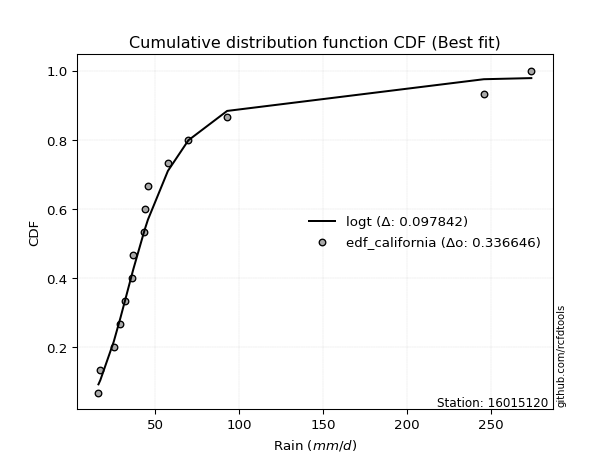</img>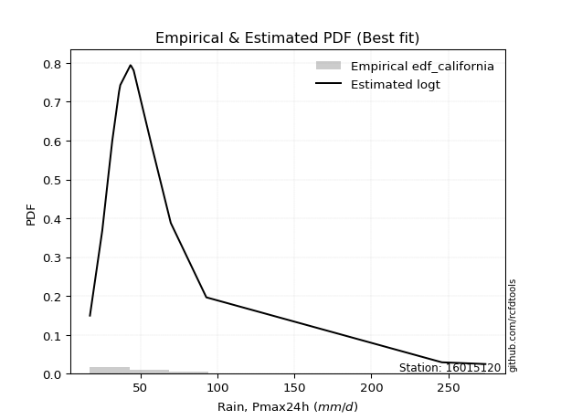</img>

</div>


### 2. EDF Hazen (1930)

Hazen method for plotting positions is a formula used to estimate the empirical cumulative probability distribution of flood events or other hydrological data. This formula often results in biased estimations, particularly when extrapolating to extreme events (high return periods).

<div align="center">


$P=(m-0.5)/n$


</div>


**2.1. Empirical values**

<div align="center">

|                | 0                   | 1                  | 2                   | 3                   | 4                  | 5                   | 6                   | 7         | 8                  | 9                  | 10                | 11                 | 12                 | 13                 | 14                 |
|:---------------|:--------------------|:-------------------|:--------------------|:--------------------|:-------------------|:--------------------|:--------------------|:----------|:-------------------|:-------------------|:------------------|:-------------------|:-------------------|:-------------------|:-------------------|
| date           | 2025                | 2023               | 2022                | 2014                | 2015               | 2021                | 2019                | 2011      | 2017               | 2020               | 2016              | 2018               | 2024               | 2012               | 2013               |
| x              | 16.1                | 17.2               | 25.2                | 29.2                | 31.7               | 36.1                | 36.9                | 43.5      | 44.0               | 45.6               | 57.5              | 69.7               | 92.8               | 245.8              | 274.1              |
| m              | 1                   | 2                  | 3                   | 4                   | 5                  | 6                   | 7                   | 8         | 9                  | 10                 | 11                | 12                 | 13                 | 14                 | 15                 |
| empirical_dist | edf_hazen           | edf_hazen          | edf_hazen           | edf_hazen           | edf_hazen          | edf_hazen           | edf_hazen           | edf_hazen | edf_hazen          | edf_hazen          | edf_hazen         | edf_hazen          | edf_hazen          | edf_hazen          | edf_hazen          |
| empirical      | 0.03333333333333333 | 0.1                | 0.16666666666666666 | 0.23333333333333334 | 0.3                | 0.36666666666666664 | 0.43333333333333335 | 0.5       | 0.5666666666666667 | 0.6333333333333333 | 0.7               | 0.7666666666666667 | 0.8333333333333334 | 0.9                | 0.9666666666666667 |
| empirical_tr   | 1.0344827586206897  | 1.1111111111111112 | 1.2                 | 1.3043478260869565  | 1.4285714285714286 | 1.5789473684210527  | 1.7647058823529411  | 2.0       | 2.3076923076923075 | 2.727272727272727  | 3.333333333333333 | 4.2857142857142865 | 6.000000000000002  | 10.000000000000002 | 30.000000000000007 |

</div>


**2.2. Kolmogorov-Smirnov fit test (sorted by Δ)**


<div align="center">

|                | 0                   | 1                   | 2                  | 3                   | 4                  | 5                   | 6                   | 7                  | 8                   | 9                   | 10                 | 11                  | 12                  | 13                  | 14                  | 15                  | 16                  | 17                  | 18                  | 19                  | 20                  | 21                  | 22                  | 23                  | 24                  | 25                  | 26                  | 27                  | 28                  | 29                 | 30                  | 31                  | 32                  | 33                 | 34                  | 35                  | 36                  | 37                  | 38                  | 39                  | 40                  | 41                  | 42                  | 43                 | 44                  | 45                  | 46                  | 47                  | 48                  | 49                  | 50                 | 51                  | 52                  | 53                  | 54                 | 55                  | 56                 | 57                  | 58                 | 59                  | 60                  | 61                  | 62                  | 63                  | 64                  | 65                  | 66                  | 67                  | 68                  | 69                  | 70                  | 71                  | 72                 | 73                  | 74                  | 75                  | 76                  | 77                  | 78                  | 79                  | 80                  | 81                  | 82                  | 83                  | 84                  | 85                  | 86                  | 87                 | 88                  | 89                  | 90                  | 91                  | 92                 | 93                 | 94                  | 95                 | 96                 | 97                  | 98                 | 99                  | 100                 | 101                 | 102                 | 103                | 104                 | 105                 | 106                 | 107                | 108                 | 109                | 110                | 111                | 112                | 113                 | 114                | 115                 | 116                 | 117                 | 118                | 119                 | 120                 | 121                 | 122                | 123                 | 124                | 125                | 126                 | 127                | 128                 | 129                | 130                 | 131                | 132                 | 133                 | 134                | 135                | 136                 | 137                 | 138                 | 139                 | 140                 | 141                | 142                 | 143                | 144                | 145                | 146                 | 147                | 148                | 149                | 150                | 151                | 152                | 153                | 154                | 155                | 156                | 157                | 158                | 159                |
|:---------------|:--------------------|:--------------------|:-------------------|:--------------------|:-------------------|:--------------------|:--------------------|:-------------------|:--------------------|:--------------------|:-------------------|:--------------------|:--------------------|:--------------------|:--------------------|:--------------------|:--------------------|:--------------------|:--------------------|:--------------------|:--------------------|:--------------------|:--------------------|:--------------------|:--------------------|:--------------------|:--------------------|:--------------------|:--------------------|:-------------------|:--------------------|:--------------------|:--------------------|:-------------------|:--------------------|:--------------------|:--------------------|:--------------------|:--------------------|:--------------------|:--------------------|:--------------------|:--------------------|:-------------------|:--------------------|:--------------------|:--------------------|:--------------------|:--------------------|:--------------------|:-------------------|:--------------------|:--------------------|:--------------------|:-------------------|:--------------------|:-------------------|:--------------------|:-------------------|:--------------------|:--------------------|:--------------------|:--------------------|:--------------------|:--------------------|:--------------------|:--------------------|:--------------------|:--------------------|:--------------------|:--------------------|:--------------------|:-------------------|:--------------------|:--------------------|:--------------------|:--------------------|:--------------------|:--------------------|:--------------------|:--------------------|:--------------------|:--------------------|:--------------------|:--------------------|:--------------------|:--------------------|:-------------------|:--------------------|:--------------------|:--------------------|:--------------------|:-------------------|:-------------------|:--------------------|:-------------------|:-------------------|:--------------------|:-------------------|:--------------------|:--------------------|:--------------------|:--------------------|:-------------------|:--------------------|:--------------------|:--------------------|:-------------------|:--------------------|:-------------------|:-------------------|:-------------------|:-------------------|:--------------------|:-------------------|:--------------------|:--------------------|:--------------------|:-------------------|:--------------------|:--------------------|:--------------------|:-------------------|:--------------------|:-------------------|:-------------------|:--------------------|:-------------------|:--------------------|:-------------------|:--------------------|:-------------------|:--------------------|:--------------------|:-------------------|:-------------------|:--------------------|:--------------------|:--------------------|:--------------------|:--------------------|:-------------------|:--------------------|:-------------------|:-------------------|:-------------------|:--------------------|:-------------------|:-------------------|:-------------------|:-------------------|:-------------------|:-------------------|:-------------------|:-------------------|:-------------------|:-------------------|:-------------------|:-------------------|:-------------------|
| station        | 16015120            | 16015120            | 16015120           | 16015120            | 16015120           | 16015120            | 16015120            | 16015120           | 16015120            | 16015120            | 16015120           | 16015120            | 16015120            | 16015120            | 16015120            | 16015120            | 16015120            | 16015120            | 16015120            | 16015120            | 16015120            | 16015120            | 16015120            | 16015120            | 16015120            | 16015120            | 16015120            | 16015120            | 16015120            | 16015120           | 16015120            | 16015120            | 16015120            | 16015120           | 16015120            | 16015120            | 16015120            | 16015120            | 16015120            | 16015120            | 16015120            | 16015120            | 16015120            | 16015120           | 16015120            | 16015120            | 16015120            | 16015120            | 16015120            | 16015120            | 16015120           | 16015120            | 16015120            | 16015120            | 16015120           | 16015120            | 16015120           | 16015120            | 16015120           | 16015120            | 16015120            | 16015120            | 16015120            | 16015120            | 16015120            | 16015120            | 16015120            | 16015120            | 16015120            | 16015120            | 16015120            | 16015120            | 16015120           | 16015120            | 16015120            | 16015120            | 16015120            | 16015120            | 16015120            | 16015120            | 16015120            | 16015120            | 16015120            | 16015120            | 16015120            | 16015120            | 16015120            | 16015120           | 16015120            | 16015120            | 16015120            | 16015120            | 16015120           | 16015120           | 16015120            | 16015120           | 16015120           | 16015120            | 16015120           | 16015120            | 16015120            | 16015120            | 16015120            | 16015120           | 16015120            | 16015120            | 16015120            | 16015120           | 16015120            | 16015120           | 16015120           | 16015120           | 16015120           | 16015120            | 16015120           | 16015120            | 16015120            | 16015120            | 16015120           | 16015120            | 16015120            | 16015120            | 16015120           | 16015120            | 16015120           | 16015120           | 16015120            | 16015120           | 16015120            | 16015120           | 16015120            | 16015120           | 16015120            | 16015120            | 16015120           | 16015120           | 16015120            | 16015120            | 16015120            | 16015120            | 16015120            | 16015120           | 16015120            | 16015120           | 16015120           | 16015120           | 16015120            | 16015120           | 16015120           | 16015120           | 16015120           | 16015120           | 16015120           | 16015120           | 16015120           | 16015120           | 16015120           | 16015120           | 16015120           | 16015120           |
| empirical_dist | edf_hazen           | edf_hazen           | edf_hazen          | edf_hazen           | edf_hazen          | edf_hazen           | edf_hazen           | edf_hazen          | edf_hazen           | edf_hazen           | edf_hazen          | edf_hazen           | edf_hazen           | edf_hazen           | edf_hazen           | edf_hazen           | edf_hazen           | edf_hazen           | edf_hazen           | edf_hazen           | edf_hazen           | edf_hazen           | edf_hazen           | edf_hazen           | edf_hazen           | edf_hazen           | edf_hazen           | edf_hazen           | edf_hazen           | edf_hazen          | edf_hazen           | edf_hazen           | edf_hazen           | edf_hazen          | edf_hazen           | edf_hazen           | edf_hazen           | edf_hazen           | edf_hazen           | edf_hazen           | edf_hazen           | edf_hazen           | edf_hazen           | edf_hazen          | edf_hazen           | edf_hazen           | edf_hazen           | edf_hazen           | edf_hazen           | edf_hazen           | edf_hazen          | edf_hazen           | edf_hazen           | edf_hazen           | edf_hazen          | edf_hazen           | edf_hazen          | edf_hazen           | edf_hazen          | edf_hazen           | edf_hazen           | edf_hazen           | edf_hazen           | edf_hazen           | edf_hazen           | edf_hazen           | edf_hazen           | edf_hazen           | edf_hazen           | edf_hazen           | edf_hazen           | edf_hazen           | edf_hazen          | edf_hazen           | edf_hazen           | edf_hazen           | edf_hazen           | edf_hazen           | edf_hazen           | edf_hazen           | edf_hazen           | edf_hazen           | edf_hazen           | edf_hazen           | edf_hazen           | edf_hazen           | edf_hazen           | edf_hazen          | edf_hazen           | edf_hazen           | edf_hazen           | edf_hazen           | edf_hazen          | edf_hazen          | edf_hazen           | edf_hazen          | edf_hazen          | edf_hazen           | edf_hazen          | edf_hazen           | edf_hazen           | edf_hazen           | edf_hazen           | edf_hazen          | edf_hazen           | edf_hazen           | edf_hazen           | edf_hazen          | edf_hazen           | edf_hazen          | edf_hazen          | edf_hazen          | edf_hazen          | edf_hazen           | edf_hazen          | edf_hazen           | edf_hazen           | edf_hazen           | edf_hazen          | edf_hazen           | edf_hazen           | edf_hazen           | edf_hazen          | edf_hazen           | edf_hazen          | edf_hazen          | edf_hazen           | edf_hazen          | edf_hazen           | edf_hazen          | edf_hazen           | edf_hazen          | edf_hazen           | edf_hazen           | edf_hazen          | edf_hazen          | edf_hazen           | edf_hazen           | edf_hazen           | edf_hazen           | edf_hazen           | edf_hazen          | edf_hazen           | edf_hazen          | edf_hazen          | edf_hazen          | edf_hazen           | edf_hazen          | edf_hazen          | edf_hazen          | edf_hazen          | edf_hazen          | edf_hazen          | edf_hazen          | edf_hazen          | edf_hazen          | edf_hazen          | edf_hazen          | edf_hazen          | edf_hazen          |
| p_dist         | logmoyal            | logburr12           | logt               | alpha               | logburr            | logexponnorm        | f                   | genextreme         | invweibull          | logmielke           | logdweibull        | invgamma            | logjohnsonsu        | nct                 | logfatiguelife      | loginvgauss         | logerlang           | loggamma            | loggamma            | loginvgamma         | logf                | loggenextreme       | loginvweibull       | loggennorm          | logalpha            | kappa3              | loggenexpon         | loghalfnorm         | genpareto           | loggenlogistic     | logfoldnorm         | burr                | invgauss            | logweibull_min     | logloglaplace       | johnsonsu           | logdgamma           | loggompertz         | loggumbel_r         | erlang              | logkappa3           | loggenhalflogistic  | mielke              | loghalflogistic    | lognct              | logkstwobign        | logpearson3         | logskewnorm         | fatiguelife         | logvonmises_line    | logbetaprime       | logtruncweibull_min | lograyleigh         | lognakagami         | logwald            | gamma               | betaprime          | logncf              | halfgennorm        | logmaxwell          | truncpareto         | logrice             | wald                | truncweibull_min    | t                   | loggausshyper       | logbeta             | logtruncexpon       | logsemicircular     | loganglit           | logloggamma         | logarcsine          | exponpow           | lognorm             | logcrystalball      | logtruncnorm        | logrdist            | logtukeylambda      | vonmises_line       | loglogistic         | loggengamma         | loghypsecant        | logbradford         | burr12              | gennorm             | loglaplace          | loglaplace          | loglomax           | dweibull            | genhalflogistic     | loghalfgennorm      | weibull_min         | moyal              | beta               | gompertz            | logcosine          | gumbel_r           | exponweib           | exponnorm          | pearson3            | genexpon            | nakagami            | rayleigh            | loggumbel_l        | halflogistic        | genlogistic         | dgamma              | maxwell            | logkappa4           | halfnorm           | logksone           | gengamma           | lomax              | logexponpow         | logwrapcauchy      | logjohnsonsb        | loguniform          | logexponweib        | semicircular       | anglit              | norm                | crystalball         | logistic           | foldnorm            | logargus           | hypsecant          | kstwobign           | arcsine            | loggenpareto        | truncnorm          | ncf                 | gausshyper         | rice                | laplace             | powerlaw           | logtriang          | gumbel_l            | logweibull_max      | bradford            | truncexpon          | cosine              | skewnorm           | wrapcauchy          | loglevy_l          | logpowerlaw        | triang             | argus               | levy_l             | logtrapezoid       | ksone              | johnsonsb          | kappa4             | rdist              | uniform            | tukeylambda        | logtruncpareto     | trapezoid          | weibull_max        | logvonmises        | vonmises           |
| delta          | 0.07464604510024223 | 0.07496613231542282 | 0.0751334349581323 | 0.07547608437375108 | 0.0770061034565912 | 0.07751860450760062 | 0.07995427289639623 | 0.0807808935629023 | 0.08078108702845088 | 0.08153896603331834 | 0.0817112252528518 | 0.08202344476596268 | 0.08257884775575708 | 0.08262170072881103 | 0.08265128228251295 | 0.08290649615814916 | 0.08291397893836089 | 0.08291612873737708 | 0.08291612873737708 | 0.08338807111296875 | 0.08340436060194156 | 0.08431227644282979 | 0.08432147399721768 | 0.08438854744487512 | 0.08447203840803685 | 0.08557546446057052 | 0.08892934021451726 | 0.08930991955539463 | 0.09004445675875505 | 0.0903982118832275 | 0.09102911827106441 | 0.09156888259671203 | 0.09181174620731969 | 0.0924977151483028 | 0.09279405579471556 | 0.09340350500868116 | 0.09368394843552441 | 0.09399310192533566 | 0.09439762674648211 | 0.09492014166940849 | 0.09552769951651108 | 0.09714621123096245 | 0.09930326769637587 | 0.1                | 0.10243322054272874 | 0.10265375971799284 | 0.10348440883674048 | 0.10810183430857989 | 0.10904350522617279 | 0.11209651757337857 | 0.1165292433836933 | 0.11688612034597234 | 0.11765098260392914 | 0.11788397891638736 | 0.1183464509026754 | 0.11904152229868048 | 0.1192804775534595 | 0.12842194395827367 | 0.1290909500968037 | 0.12924154236068608 | 0.13136152947296298 | 0.13543303571739923 | 0.13820769563981894 | 0.14003166174837323 | 0.14476206055131854 | 0.14517655295973014 | 0.15054130480982492 | 0.15083918533597845 | 0.15720481811187997 | 0.15896358092510993 | 0.16174400522954707 | 0.16205279247915771 | 0.1629189861422549 | 0.16323058395846457 | 0.16323092061702943 | 0.16666664426204597 | 0.16666666637351069 | 0.16666666666665952 | 0.16678788937022104 | 0.16729494903370634 | 0.16877796390183558 | 0.17075263833206017 | 0.17836829805284793 | 0.18216740316515384 | 0.18290484924955364 | 0.18365806093936016 | 0.18365806093936016 | 0.1865194501611414 | 0.19116522656717583 | 0.19556103775401923 | 0.20128354769444473 | 0.20175390039847244 | 0.2072112451049567 | 0.2085964084541245 | 0.20993249576619422 | 0.2107526058613463 | 0.2116692640602544 | 0.21170318294620516 | 0.2161923946911437 | 0.21728367931140136 | 0.21778715652944358 | 0.22227559263856234 | 0.23139229060725042 | 0.2338525544635861 | 0.23439408958359303 | 0.23551441462668993 | 0.23968664793417632 | 0.2402532935545556 | 0.24320200075822868 | 0.2525031942152256 | 0.2525427072417268 | 0.2533437128239824 | 0.2558016904572226 | 0.26196135574759744 | 0.2648696828500052 | 0.26497551214389947 | 0.26606410124229335 | 0.26797650204493756 | 0.2721714768939767 | 0.27257817028416526 | 0.27356560468482854 | 0.27356560893214477 | 0.2792815367477526 | 0.28305164216806655 | 0.2909733818819594 | 0.2920429540893946 | 0.29205699888372244 | 0.2976828581107006 | 0.29896173086538375 | 0.3040919264312687 | 0.30567717229762137 | 0.3094101154214646 | 0.31620823182493313 | 0.32043969211369616 | 0.3209510017820906 | 0.3377915469104916 | 0.34411100832702657 | 0.34901309467277747 | 0.35373901866999663 | 0.35493102781544267 | 0.36379247749792204 | 0.3878380701801196 | 0.38817934101772406 | 0.394479947468361  | 0.4238856873587489 | 0.4371950476440781 | 0.45018646374362936 | 0.4651560854990614 | 0.5023432210118892 | 0.5102067183462533 | 0.5115922218322778 | 0.5187731646404321 | 0.5576446209888899 | 0.5589147286821706 | 0.5859524411598808 | 0.7187252869828983 | 0.7226847029320989 | 0.7342963376277383 | 1.078439868519891  | 43.142879353655026 |
| deltao         | 0.3366456264050002  | 0.3366456264050002  | 0.3366456264050002 | 0.3366456264050002  | 0.3366456264050002 | 0.3366456264050002  | 0.3366456264050002  | 0.3366456264050002 | 0.3366456264050002  | 0.3366456264050002  | 0.3366456264050002 | 0.3366456264050002  | 0.3366456264050002  | 0.3366456264050002  | 0.3366456264050002  | 0.3366456264050002  | 0.3366456264050002  | 0.3366456264050002  | 0.3366456264050002  | 0.3366456264050002  | 0.3366456264050002  | 0.3366456264050002  | 0.3366456264050002  | 0.3366456264050002  | 0.3366456264050002  | 0.3366456264050002  | 0.3366456264050002  | 0.3366456264050002  | 0.3366456264050002  | 0.3366456264050002 | 0.3366456264050002  | 0.3366456264050002  | 0.3366456264050002  | 0.3366456264050002 | 0.3366456264050002  | 0.3366456264050002  | 0.3366456264050002  | 0.3366456264050002  | 0.3366456264050002  | 0.3366456264050002  | 0.3366456264050002  | 0.3366456264050002  | 0.3366456264050002  | 0.3366456264050002 | 0.3366456264050002  | 0.3366456264050002  | 0.3366456264050002  | 0.3366456264050002  | 0.3366456264050002  | 0.3366456264050002  | 0.3366456264050002 | 0.3366456264050002  | 0.3366456264050002  | 0.3366456264050002  | 0.3366456264050002 | 0.3366456264050002  | 0.3366456264050002 | 0.3366456264050002  | 0.3366456264050002 | 0.3366456264050002  | 0.3366456264050002  | 0.3366456264050002  | 0.3366456264050002  | 0.3366456264050002  | 0.3366456264050002  | 0.3366456264050002  | 0.3366456264050002  | 0.3366456264050002  | 0.3366456264050002  | 0.3366456264050002  | 0.3366456264050002  | 0.3366456264050002  | 0.3366456264050002 | 0.3366456264050002  | 0.3366456264050002  | 0.3366456264050002  | 0.3366456264050002  | 0.3366456264050002  | 0.3366456264050002  | 0.3366456264050002  | 0.3366456264050002  | 0.3366456264050002  | 0.3366456264050002  | 0.3366456264050002  | 0.3366456264050002  | 0.3366456264050002  | 0.3366456264050002  | 0.3366456264050002 | 0.3366456264050002  | 0.3366456264050002  | 0.3366456264050002  | 0.3366456264050002  | 0.3366456264050002 | 0.3366456264050002 | 0.3366456264050002  | 0.3366456264050002 | 0.3366456264050002 | 0.3366456264050002  | 0.3366456264050002 | 0.3366456264050002  | 0.3366456264050002  | 0.3366456264050002  | 0.3366456264050002  | 0.3366456264050002 | 0.3366456264050002  | 0.3366456264050002  | 0.3366456264050002  | 0.3366456264050002 | 0.3366456264050002  | 0.3366456264050002 | 0.3366456264050002 | 0.3366456264050002 | 0.3366456264050002 | 0.3366456264050002  | 0.3366456264050002 | 0.3366456264050002  | 0.3366456264050002  | 0.3366456264050002  | 0.3366456264050002 | 0.3366456264050002  | 0.3366456264050002  | 0.3366456264050002  | 0.3366456264050002 | 0.3366456264050002  | 0.3366456264050002 | 0.3366456264050002 | 0.3366456264050002  | 0.3366456264050002 | 0.3366456264050002  | 0.3366456264050002 | 0.3366456264050002  | 0.3366456264050002 | 0.3366456264050002  | 0.3366456264050002  | 0.3366456264050002 | 0.3366456264050002 | 0.3366456264050002  | 0.3366456264050002  | 0.3366456264050002  | 0.3366456264050002  | 0.3366456264050002  | 0.3366456264050002 | 0.3366456264050002  | 0.3366456264050002 | 0.3366456264050002 | 0.3366456264050002 | 0.3366456264050002  | 0.3366456264050002 | 0.3366456264050002 | 0.3366456264050002 | 0.3366456264050002 | 0.3366456264050002 | 0.3366456264050002 | 0.3366456264050002 | 0.3366456264050002 | 0.3366456264050002 | 0.3366456264050002 | 0.3366456264050002 | 0.3366456264050002 | 0.3366456264050002 |
| eval           | Δo > Δ              | Δo > Δ              | Δo > Δ             | Δo > Δ              | Δo > Δ             | Δo > Δ              | Δo > Δ              | Δo > Δ             | Δo > Δ              | Δo > Δ              | Δo > Δ             | Δo > Δ              | Δo > Δ              | Δo > Δ              | Δo > Δ              | Δo > Δ              | Δo > Δ              | Δo > Δ              | Δo > Δ              | Δo > Δ              | Δo > Δ              | Δo > Δ              | Δo > Δ              | Δo > Δ              | Δo > Δ              | Δo > Δ              | Δo > Δ              | Δo > Δ              | Δo > Δ              | Δo > Δ             | Δo > Δ              | Δo > Δ              | Δo > Δ              | Δo > Δ             | Δo > Δ              | Δo > Δ              | Δo > Δ              | Δo > Δ              | Δo > Δ              | Δo > Δ              | Δo > Δ              | Δo > Δ              | Δo > Δ              | Δo > Δ             | Δo > Δ              | Δo > Δ              | Δo > Δ              | Δo > Δ              | Δo > Δ              | Δo > Δ              | Δo > Δ             | Δo > Δ              | Δo > Δ              | Δo > Δ              | Δo > Δ             | Δo > Δ              | Δo > Δ             | Δo > Δ              | Δo > Δ             | Δo > Δ              | Δo > Δ              | Δo > Δ              | Δo > Δ              | Δo > Δ              | Δo > Δ              | Δo > Δ              | Δo > Δ              | Δo > Δ              | Δo > Δ              | Δo > Δ              | Δo > Δ              | Δo > Δ              | Δo > Δ             | Δo > Δ              | Δo > Δ              | Δo > Δ              | Δo > Δ              | Δo > Δ              | Δo > Δ              | Δo > Δ              | Δo > Δ              | Δo > Δ              | Δo > Δ              | Δo > Δ              | Δo > Δ              | Δo > Δ              | Δo > Δ              | Δo > Δ             | Δo > Δ              | Δo > Δ              | Δo > Δ              | Δo > Δ              | Δo > Δ             | Δo > Δ             | Δo > Δ              | Δo > Δ             | Δo > Δ             | Δo > Δ              | Δo > Δ             | Δo > Δ              | Δo > Δ              | Δo > Δ              | Δo > Δ              | Δo > Δ             | Δo > Δ              | Δo > Δ              | Δo > Δ              | Δo > Δ             | Δo > Δ              | Δo > Δ             | Δo > Δ             | Δo > Δ             | Δo > Δ             | Δo > Δ              | Δo > Δ             | Δo > Δ              | Δo > Δ              | Δo > Δ              | Δo > Δ             | Δo > Δ              | Δo > Δ              | Δo > Δ              | Δo > Δ             | Δo > Δ              | Δo > Δ             | Δo > Δ             | Δo > Δ              | Δo > Δ             | Δo > Δ              | Δo > Δ             | Δo > Δ              | Δo > Δ             | Δo > Δ              | Δo > Δ              | Δo > Δ             | Δo <= Δ            | Δo <= Δ             | Δo <= Δ             | Δo <= Δ             | Δo <= Δ             | Δo <= Δ             | Δo <= Δ            | Δo <= Δ             | Δo <= Δ            | Δo <= Δ            | Δo <= Δ            | Δo <= Δ             | Δo <= Δ            | Δo <= Δ            | Δo <= Δ            | Δo <= Δ            | Δo <= Δ            | Δo <= Δ            | Δo <= Δ            | Δo <= Δ            | Δo <= Δ            | Δo <= Δ            | Δo <= Δ            | Δo <= Δ            | Δo <= Δ            |
| fit            | 1                   | 1                   | 1                  | 1                   | 1                  | 1                   | 1                   | 1                  | 1                   | 1                   | 1                  | 1                   | 1                   | 1                   | 1                   | 1                   | 1                   | 1                   | 1                   | 1                   | 1                   | 1                   | 1                   | 1                   | 1                   | 1                   | 1                   | 1                   | 1                   | 1                  | 1                   | 1                   | 1                   | 1                  | 1                   | 1                   | 1                   | 1                   | 1                   | 1                   | 1                   | 1                   | 1                   | 1                  | 1                   | 1                   | 1                   | 1                   | 1                   | 1                   | 1                  | 1                   | 1                   | 1                   | 1                  | 1                   | 1                  | 1                   | 1                  | 1                   | 1                   | 1                   | 1                   | 1                   | 1                   | 1                   | 1                   | 1                   | 1                   | 1                   | 1                   | 1                   | 1                  | 1                   | 1                   | 1                   | 1                   | 1                   | 1                   | 1                   | 1                   | 1                   | 1                   | 1                   | 1                   | 1                   | 1                   | 1                  | 1                   | 1                   | 1                   | 1                   | 1                  | 1                  | 1                   | 1                  | 1                  | 1                   | 1                  | 1                   | 1                   | 1                   | 1                   | 1                  | 1                   | 1                   | 1                   | 1                  | 1                   | 1                  | 1                  | 1                  | 1                  | 1                   | 1                  | 1                   | 1                   | 1                   | 1                  | 1                   | 1                   | 1                   | 1                  | 1                   | 1                  | 1                  | 1                   | 1                  | 1                   | 1                  | 1                   | 1                  | 1                   | 1                   | 1                  | 0                  | 0                   | 0                   | 0                   | 0                   | 0                   | 0                  | 0                   | 0                  | 0                  | 0                  | 0                   | 0                  | 0                  | 0                  | 0                  | 0                  | 0                  | 0                  | 0                  | 0                  | 0                  | 0                  | 0                  | 0                  |
| n              | 15                  | 15                  | 15                 | 15                  | 15                 | 15                  | 15                  | 15                 | 15                  | 15                  | 15                 | 15                  | 15                  | 15                  | 15                  | 15                  | 15                  | 15                  | 15                  | 15                  | 15                  | 15                  | 15                  | 15                  | 15                  | 15                  | 15                  | 15                  | 15                  | 15                 | 15                  | 15                  | 15                  | 15                 | 15                  | 15                  | 15                  | 15                  | 15                  | 15                  | 15                  | 15                  | 15                  | 15                 | 15                  | 15                  | 15                  | 15                  | 15                  | 15                  | 15                 | 15                  | 15                  | 15                  | 15                 | 15                  | 15                 | 15                  | 15                 | 15                  | 15                  | 15                  | 15                  | 15                  | 15                  | 15                  | 15                  | 15                  | 15                  | 15                  | 15                  | 15                  | 15                 | 15                  | 15                  | 15                  | 15                  | 15                  | 15                  | 15                  | 15                  | 15                  | 15                  | 15                  | 15                  | 15                  | 15                  | 15                 | 15                  | 15                  | 15                  | 15                  | 15                 | 15                 | 15                  | 15                 | 15                 | 15                  | 15                 | 15                  | 15                  | 15                  | 15                  | 15                 | 15                  | 15                  | 15                  | 15                 | 15                  | 15                 | 15                 | 15                 | 15                 | 15                  | 15                 | 15                  | 15                  | 15                  | 15                 | 15                  | 15                  | 15                  | 15                 | 15                  | 15                 | 15                 | 15                  | 15                 | 15                  | 15                 | 15                  | 15                 | 15                  | 15                  | 15                 | 15                 | 15                  | 15                  | 15                  | 15                  | 15                  | 15                 | 15                  | 15                 | 15                 | 15                 | 15                  | 15                 | 15                 | 15                 | 15                 | 15                 | 15                 | 15                 | 15                 | 15                 | 15                 | 15                 | 15                 | 15                 |
| best_fit       | 1                   | 0                   | 0                  | 0                   | 0                  | 0                   | 0                   | 0                  | 0                   | 0                   | 0                  | 0                   | 0                   | 0                   | 0                   | 0                   | 0                   | 0                   | 0                   | 0                   | 0                   | 0                   | 0                   | 0                   | 0                   | 0                   | 0                   | 0                   | 0                   | 0                  | 0                   | 0                   | 0                   | 0                  | 0                   | 0                   | 0                   | 0                   | 0                   | 0                   | 0                   | 0                   | 0                   | 0                  | 0                   | 0                   | 0                   | 0                   | 0                   | 0                   | 0                  | 0                   | 0                   | 0                   | 0                  | 0                   | 0                  | 0                   | 0                  | 0                   | 0                   | 0                   | 0                   | 0                   | 0                   | 0                   | 0                   | 0                   | 0                   | 0                   | 0                   | 0                   | 0                  | 0                   | 0                   | 0                   | 0                   | 0                   | 0                   | 0                   | 0                   | 0                   | 0                   | 0                   | 0                   | 0                   | 0                   | 0                  | 0                   | 0                   | 0                   | 0                   | 0                  | 0                  | 0                   | 0                  | 0                  | 0                   | 0                  | 0                   | 0                   | 0                   | 0                   | 0                  | 0                   | 0                   | 0                   | 0                  | 0                   | 0                  | 0                  | 0                  | 0                  | 0                   | 0                  | 0                   | 0                   | 0                   | 0                  | 0                   | 0                   | 0                   | 0                  | 0                   | 0                  | 0                  | 0                   | 0                  | 0                   | 0                  | 0                   | 0                  | 0                   | 0                   | 0                  | 0                  | 0                   | 0                   | 0                   | 0                   | 0                   | 0                  | 0                   | 0                  | 0                  | 0                  | 0                   | 0                  | 0                  | 0                  | 0                  | 0                  | 0                  | 0                  | 0                  | 0                  | 0                  | 0                  | 0                  | 0                  |
| best_fit_sort  | 1                   | 2                   | 3                  | 4                   | 5                  | 6                   | 7                   | 8                  | 9                   | 10                  | 11                 | 12                  | 13                  | 14                  | 15                  | 16                  | 17                  | 18                  | 19                  | 20                  | 21                  | 22                  | 23                  | 24                  | 25                  | 26                  | 27                  | 28                  | 29                  | 30                 | 31                  | 32                  | 33                  | 34                 | 35                  | 36                  | 37                  | 38                  | 39                  | 40                  | 41                  | 42                  | 43                  | 44                 | 45                  | 46                  | 47                  | 48                  | 49                  | 50                  | 51                 | 52                  | 53                  | 54                  | 55                 | 56                  | 57                 | 58                  | 59                 | 60                  | 61                  | 62                  | 63                  | 64                  | 65                  | 66                  | 67                  | 68                  | 69                  | 70                  | 71                  | 72                  | 73                 | 74                  | 75                  | 76                  | 77                  | 78                  | 79                  | 80                  | 81                  | 82                  | 83                  | 84                  | 85                  | 86                  | 87                  | 88                 | 89                  | 90                  | 91                  | 92                  | 93                 | 94                 | 95                  | 96                 | 97                 | 98                  | 99                 | 100                 | 101                 | 102                 | 103                 | 104                | 105                 | 106                 | 107                 | 108                | 109                 | 110                | 111                | 112                | 113                | 114                 | 115                | 116                 | 117                 | 118                 | 119                | 120                 | 121                 | 122                 | 123                | 124                 | 125                | 126                | 127                 | 128                | 129                 | 130                | 131                 | 132                | 133                 | 134                 | 135                | 136                | 137                 | 138                 | 139                 | 140                 | 141                 | 142                | 143                 | 144                | 145                | 146                | 147                 | 148                | 149                | 150                | 151                | 152                | 153                | 154                | 155                | 156                | 157                | 158                | 159                | 160                |

</div>


**2.3. Best fit**

<div align="center">

|   id |   station | empirical_dist   | p_dist   |    delta |   deltao | eval   |   fit |   n |   best_fit |   best_fit_sort |
|-----:|----------:|:-----------------|:---------|---------:|---------:|:-------|------:|----:|-----------:|----------------:|
|    0 |  16015120 | edf_hazen        | logmoyal | 0.074646 | 0.336646 | Δo > Δ |     1 |  15 |          1 |               1 |

</div>


<div align="center">

</img>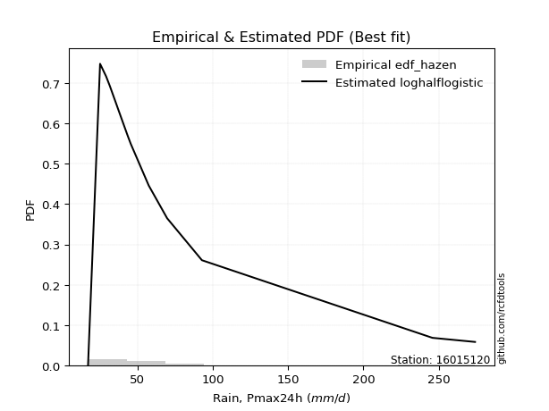</img>

</div>


### 3. EDF Weibull (1939)

Weibull plotting position formula is an empirical method used to estimate the non-exceedance probability or plotting position for a set of observed data, is often recommended or widely used in practice, particularly in flood frequency analysis.

<div align="center">


$P=m/(n+1)$


</div>


**3.1. Empirical values**

<div align="center">

|                | 0                  | 1                  | 2                  | 3                  | 4                  | 5           | 6                  | 7           | 8                  | 9                  | 10          | 11          | 12                | 13          | 14          |
|:---------------|:-------------------|:-------------------|:-------------------|:-------------------|:-------------------|:------------|:-------------------|:------------|:-------------------|:-------------------|:------------|:------------|:------------------|:------------|:------------|
| date           | 2025               | 2023               | 2022               | 2014               | 2015               | 2021        | 2019               | 2011        | 2017               | 2020               | 2016        | 2018        | 2024              | 2012        | 2013        |
| x              | 16.1               | 17.2               | 25.2               | 29.2               | 31.7               | 36.1        | 36.9               | 43.5        | 44.0               | 45.6               | 57.5        | 69.7        | 92.8              | 245.8       | 274.1       |
| m              | 1                  | 2                  | 3                  | 4                  | 5                  | 6           | 7                  | 8           | 9                  | 10                 | 11          | 12          | 13                | 14          | 15          |
| empirical_dist | edf_weibull        | edf_weibull        | edf_weibull        | edf_weibull        | edf_weibull        | edf_weibull | edf_weibull        | edf_weibull | edf_weibull        | edf_weibull        | edf_weibull | edf_weibull | edf_weibull       | edf_weibull | edf_weibull |
| empirical      | 0.0625             | 0.125              | 0.1875             | 0.25               | 0.3125             | 0.375       | 0.4375             | 0.5         | 0.5625             | 0.625              | 0.6875      | 0.75        | 0.8125            | 0.875       | 0.9375      |
| empirical_tr   | 1.0666666666666667 | 1.1428571428571428 | 1.2307692307692308 | 1.3333333333333333 | 1.4545454545454546 | 1.6         | 1.7777777777777777 | 2.0         | 2.2857142857142856 | 2.6666666666666665 | 3.2         | 4.0         | 5.333333333333333 | 8.0         | 16.0        |

</div>


**3.2. Kolmogorov-Smirnov fit test (sorted by Δ)**


<div align="center">

|                | 0                   | 1                   | 2                   | 3                  | 4                   | 5                   | 6                   | 7                   | 8                   | 9                  | 10                  | 11                  | 12                 | 13                  | 14                  | 15                  | 16                  | 17                  | 18                  | 19                  | 20                  | 21                  | 22                  | 23                  | 24                 | 25                  | 26                  | 27                  | 28                  | 29                  | 30                  | 31                  | 32                  | 33                  | 34                  | 35                  | 36                  | 37                  | 38                  | 39                  | 40                  | 41                  | 42                  | 43                  | 44                  | 45                  | 46                 | 47                  | 48                  | 49                  | 50                  | 51                  | 52                  | 53                  | 54                  | 55                  | 56                  | 57                  | 58                  | 59                 | 60                  | 61                  | 62                  | 63                  | 64                  | 65                  | 66                  | 67                  | 68                  | 69                 | 70                  | 71                  | 72                  | 73                  | 74                  | 75                  | 76                  | 77                  | 78                  | 79                  | 80                  | 81                 | 82                  | 83                  | 84                 | 85                  | 86                  | 87                  | 88                 | 89                  | 90                  | 91                 | 92                  | 93                  | 94                  | 95                 | 96                  | 97                 | 98                 | 99                  | 100                 | 101                | 102                 | 103                 | 104                 | 105                 | 106                 | 107                | 108                 | 109                 | 110                 | 111                 | 112                | 113                 | 114                 | 115                | 116                | 117                | 118                 | 119                 | 120                | 121                | 122                 | 123                 | 124                 | 125                | 126                | 127                | 128                | 129                 | 130                | 131                | 132                | 133                | 134                 | 135                | 136                 | 137                 | 138                 | 139                | 140                | 141                 | 142                | 143                | 144                | 145                | 146                 | 147                | 148                 | 149                 | 150                | 151                | 152                | 153                | 154                | 155                | 156                | 157                | 158                | 159                |
|:---------------|:--------------------|:--------------------|:--------------------|:-------------------|:--------------------|:--------------------|:--------------------|:--------------------|:--------------------|:-------------------|:--------------------|:--------------------|:-------------------|:--------------------|:--------------------|:--------------------|:--------------------|:--------------------|:--------------------|:--------------------|:--------------------|:--------------------|:--------------------|:--------------------|:-------------------|:--------------------|:--------------------|:--------------------|:--------------------|:--------------------|:--------------------|:--------------------|:--------------------|:--------------------|:--------------------|:--------------------|:--------------------|:--------------------|:--------------------|:--------------------|:--------------------|:--------------------|:--------------------|:--------------------|:--------------------|:--------------------|:-------------------|:--------------------|:--------------------|:--------------------|:--------------------|:--------------------|:--------------------|:--------------------|:--------------------|:--------------------|:--------------------|:--------------------|:--------------------|:-------------------|:--------------------|:--------------------|:--------------------|:--------------------|:--------------------|:--------------------|:--------------------|:--------------------|:--------------------|:-------------------|:--------------------|:--------------------|:--------------------|:--------------------|:--------------------|:--------------------|:--------------------|:--------------------|:--------------------|:--------------------|:--------------------|:-------------------|:--------------------|:--------------------|:-------------------|:--------------------|:--------------------|:--------------------|:-------------------|:--------------------|:--------------------|:-------------------|:--------------------|:--------------------|:--------------------|:-------------------|:--------------------|:-------------------|:-------------------|:--------------------|:--------------------|:-------------------|:--------------------|:--------------------|:--------------------|:--------------------|:--------------------|:-------------------|:--------------------|:--------------------|:--------------------|:--------------------|:-------------------|:--------------------|:--------------------|:-------------------|:-------------------|:-------------------|:--------------------|:--------------------|:-------------------|:-------------------|:--------------------|:--------------------|:--------------------|:-------------------|:-------------------|:-------------------|:-------------------|:--------------------|:-------------------|:-------------------|:-------------------|:-------------------|:--------------------|:-------------------|:--------------------|:--------------------|:--------------------|:-------------------|:-------------------|:--------------------|:-------------------|:-------------------|:-------------------|:-------------------|:--------------------|:-------------------|:--------------------|:--------------------|:-------------------|:-------------------|:-------------------|:-------------------|:-------------------|:-------------------|:-------------------|:-------------------|:-------------------|:-------------------|
| station        | 16015120            | 16015120            | 16015120            | 16015120           | 16015120            | 16015120            | 16015120            | 16015120            | 16015120            | 16015120           | 16015120            | 16015120            | 16015120           | 16015120            | 16015120            | 16015120            | 16015120            | 16015120            | 16015120            | 16015120            | 16015120            | 16015120            | 16015120            | 16015120            | 16015120           | 16015120            | 16015120            | 16015120            | 16015120            | 16015120            | 16015120            | 16015120            | 16015120            | 16015120            | 16015120            | 16015120            | 16015120            | 16015120            | 16015120            | 16015120            | 16015120            | 16015120            | 16015120            | 16015120            | 16015120            | 16015120            | 16015120           | 16015120            | 16015120            | 16015120            | 16015120            | 16015120            | 16015120            | 16015120            | 16015120            | 16015120            | 16015120            | 16015120            | 16015120            | 16015120           | 16015120            | 16015120            | 16015120            | 16015120            | 16015120            | 16015120            | 16015120            | 16015120            | 16015120            | 16015120           | 16015120            | 16015120            | 16015120            | 16015120            | 16015120            | 16015120            | 16015120            | 16015120            | 16015120            | 16015120            | 16015120            | 16015120           | 16015120            | 16015120            | 16015120           | 16015120            | 16015120            | 16015120            | 16015120           | 16015120            | 16015120            | 16015120           | 16015120            | 16015120            | 16015120            | 16015120           | 16015120            | 16015120           | 16015120           | 16015120            | 16015120            | 16015120           | 16015120            | 16015120            | 16015120            | 16015120            | 16015120            | 16015120           | 16015120            | 16015120            | 16015120            | 16015120            | 16015120           | 16015120            | 16015120            | 16015120           | 16015120           | 16015120           | 16015120            | 16015120            | 16015120           | 16015120           | 16015120            | 16015120            | 16015120            | 16015120           | 16015120           | 16015120           | 16015120           | 16015120            | 16015120           | 16015120           | 16015120           | 16015120           | 16015120            | 16015120           | 16015120            | 16015120            | 16015120            | 16015120           | 16015120           | 16015120            | 16015120           | 16015120           | 16015120           | 16015120           | 16015120            | 16015120           | 16015120            | 16015120            | 16015120           | 16015120           | 16015120           | 16015120           | 16015120           | 16015120           | 16015120           | 16015120           | 16015120           | 16015120           |
| empirical_dist | edf_weibull         | edf_weibull         | edf_weibull         | edf_weibull        | edf_weibull         | edf_weibull         | edf_weibull         | edf_weibull         | edf_weibull         | edf_weibull        | edf_weibull         | edf_weibull         | edf_weibull        | edf_weibull         | edf_weibull         | edf_weibull         | edf_weibull         | edf_weibull         | edf_weibull         | edf_weibull         | edf_weibull         | edf_weibull         | edf_weibull         | edf_weibull         | edf_weibull        | edf_weibull         | edf_weibull         | edf_weibull         | edf_weibull         | edf_weibull         | edf_weibull         | edf_weibull         | edf_weibull         | edf_weibull         | edf_weibull         | edf_weibull         | edf_weibull         | edf_weibull         | edf_weibull         | edf_weibull         | edf_weibull         | edf_weibull         | edf_weibull         | edf_weibull         | edf_weibull         | edf_weibull         | edf_weibull        | edf_weibull         | edf_weibull         | edf_weibull         | edf_weibull         | edf_weibull         | edf_weibull         | edf_weibull         | edf_weibull         | edf_weibull         | edf_weibull         | edf_weibull         | edf_weibull         | edf_weibull        | edf_weibull         | edf_weibull         | edf_weibull         | edf_weibull         | edf_weibull         | edf_weibull         | edf_weibull         | edf_weibull         | edf_weibull         | edf_weibull        | edf_weibull         | edf_weibull         | edf_weibull         | edf_weibull         | edf_weibull         | edf_weibull         | edf_weibull         | edf_weibull         | edf_weibull         | edf_weibull         | edf_weibull         | edf_weibull        | edf_weibull         | edf_weibull         | edf_weibull        | edf_weibull         | edf_weibull         | edf_weibull         | edf_weibull        | edf_weibull         | edf_weibull         | edf_weibull        | edf_weibull         | edf_weibull         | edf_weibull         | edf_weibull        | edf_weibull         | edf_weibull        | edf_weibull        | edf_weibull         | edf_weibull         | edf_weibull        | edf_weibull         | edf_weibull         | edf_weibull         | edf_weibull         | edf_weibull         | edf_weibull        | edf_weibull         | edf_weibull         | edf_weibull         | edf_weibull         | edf_weibull        | edf_weibull         | edf_weibull         | edf_weibull        | edf_weibull        | edf_weibull        | edf_weibull         | edf_weibull         | edf_weibull        | edf_weibull        | edf_weibull         | edf_weibull         | edf_weibull         | edf_weibull        | edf_weibull        | edf_weibull        | edf_weibull        | edf_weibull         | edf_weibull        | edf_weibull        | edf_weibull        | edf_weibull        | edf_weibull         | edf_weibull        | edf_weibull         | edf_weibull         | edf_weibull         | edf_weibull        | edf_weibull        | edf_weibull         | edf_weibull        | edf_weibull        | edf_weibull        | edf_weibull        | edf_weibull         | edf_weibull        | edf_weibull         | edf_weibull         | edf_weibull        | edf_weibull        | edf_weibull        | edf_weibull        | edf_weibull        | edf_weibull        | edf_weibull        | edf_weibull        | edf_weibull        | edf_weibull        |
| p_dist         | logburr12           | logburr             | logexponnorm        | f                  | invweibull          | genextreme          | alpha               | johnsonsu           | invgamma            | logjohnsonsu       | logfatiguelife      | loginvgauss         | loginvgamma        | nct                 | logf                | logalpha            | logmielke           | loggenextreme       | loginvweibull       | loggamma            | loggamma            | logerlang           | invgauss            | logdweibull         | loggumbel_r        | logweibull_min      | loggenlogistic      | loggompertz         | logloglaplace       | burr                | logkappa3           | genpareto           | loggenhalflogistic  | loggenexpon         | mielke              | loggennorm          | lognct              | logkstwobign        | logpearson3         | kappa3              | logfoldnorm         | logdgamma           | logmoyal            | logskewnorm         | logt                | fatiguelife         | logbetaprime       | logtruncweibull_min | lograyleigh         | lognakagami         | gamma               | betaprime           | loghalfnorm         | halfgennorm         | logvonmises_line    | erlang              | logncf              | logmaxwell          | truncpareto         | loghalflogistic    | truncweibull_min    | logrice             | wald                | logbeta             | loggausshyper       | logwald             | t                   | exponpow            | logtruncexpon       | logarcsine         | logsemicircular     | loganglit           | loggengamma         | logloggamma         | lognorm             | logcrystalball      | loglogistic         | loghypsecant        | burr12              | loglomax            | logbradford         | genhalflogistic    | loglaplace          | loglaplace          | weibull_min        | moyal               | gennorm             | loghalfgennorm      | logtruncnorm       | logrdist            | vonmises_line       | logtukeylambda     | beta                | pearson3            | dweibull            | exponweib          | gumbel_r            | gompertz           | logcosine          | halflogistic        | nakagami            | exponnorm          | genexpon            | dgamma              | rayleigh            | halfnorm            | maxwell             | loggumbel_l        | genlogistic         | gengamma            | logkappa4           | logksone            | logjohnsonsb       | logexponpow         | lomax               | logexponweib       | foldnorm           | semicircular       | anglit              | logwrapcauchy       | norm               | crystalball        | loguniform          | arcsine             | loggenpareto        | logistic           | ncf                | logargus           | hypsecant          | kstwobign           | gausshyper         | truncnorm          | powerlaw           | rice               | laplace             | logtriang          | gumbel_l            | logweibull_max      | truncexpon          | bradford           | cosine             | loglevy_l           | wrapcauchy         | skewnorm           | logpowerlaw        | triang             | argus               | levy_l             | logtrapezoid        | johnsonsb           | ksone              | kappa4             | rdist              | uniform            | tukeylambda        | logtruncpareto     | trapezoid          | weibull_max        | logvonmises        | vonmises           |
| delta          | 0.07775635336281406 | 0.07895490929859646 | 0.07936961999817138 | 0.0793942267149289 | 0.07952171896664378 | 0.07952173754111287 | 0.07959894618197844 | 0.07966001462894054 | 0.07986436165264177 | 0.0800664691741243 | 0.08017017490884892 | 0.08034469229300378 | 0.0804778635103276 | 0.08048295450523557 | 0.08048667492740214 | 0.08101399581443491 | 0.08208427292629195 | 0.08214033172362945 | 0.08214471543771928 | 0.08313161502170452 | 0.08313161502170452 | 0.08313199420948211 | 0.08347841287398639 | 0.08451542628173059 | 0.0860642934131488 | 0.08646363555348588 | 0.08689108140381041 | 0.08700255603231946 | 0.08713580765175477 | 0.08717016650456333 | 0.08835854736774104 | 0.09045523173391154 | 0.09085406220962294 | 0.09090869626085336 | 0.09096993436304257 | 0.09375955038322703 | 0.09409988720939544 | 0.09432042638465954 | 0.09515107550340718 | 0.09629824483683083 | 0.09679688990445412 | 0.09961838392061373 | 0.09964604510024222 | 0.09976850097524659 | 0.10013343495813232 | 0.10071017189283948 | 0.10819591005036   | 0.10855278701263904 | 0.10931764927059584 | 0.10955064558305405 | 0.11070818896534718 | 0.11094714422012619 | 0.11190275128532609 | 0.11242428343013705 | 0.11650430535015899 | 0.11711105594189741 | 0.12008861062494036 | 0.12090820902735278 | 0.12302819613962968 | 0.125              | 0.12638450589191907 | 0.12709970238406593 | 0.12987436230648564 | 0.13387463814315825 | 0.13684321962639684 | 0.13917978423600874 | 0.14051881690352053 | 0.14208565280892155 | 0.14250585200264515 | 0.145386125812491  | 0.14887148477854667 | 0.15063024759177662 | 0.15211129723516892 | 0.15341067189621377 | 0.15489725062513127 | 0.15489758728369613 | 0.15896161570037304 | 0.16241930499872687 | 0.16550073649848718 | 0.16985278349447475 | 0.17003496471951463 | 0.1702563047395501 | 0.17532472760602685 | 0.17532472760602685 | 0.1809205670651391 | 0.18111541091143568 | 0.18290484924955364 | 0.18461688102777807 | 0.1874999775953793 | 0.18749999970684406 | 0.18749999999856604 | 0.1874999999999929 | 0.18776307512079116 | 0.18811701264473468 | 0.19116522656717583 | 0.1950365162795385 | 0.20136912554930375 | 0.2015991624328609 | 0.202419272528013  | 0.20522742291692636 | 0.20560892597189562 | 0.2078590613578104 | 0.20945382319611028 | 0.21051998126750965 | 0.21242891078376336 | 0.22333652754855893 | 0.22358662688788888 | 0.2255192211302528 | 0.22718108129335662 | 0.23251037949064907 | 0.23486866742489537 | 0.23587604057506006 | 0.2441421788105661 | 0.24529468908093077 | 0.24746835712388932 | 0.2513098353782709 | 0.2538849755013999 | 0.25550481022731   | 0.25591150361749854 | 0.25653634951667187 | 0.2574821085498886 | 0.2574821120360036 | 0.25773076790896005 | 0.26851619144403394 | 0.26979506419871707 | 0.2709281749646185 | 0.2765105056309547 | 0.2826400485486261 | 0.2837096207560613 | 0.28372366555038914 | 0.2927434487547979 | 0.2957585930979354 | 0.3001176684487572 | 0.3078748984915998 | 0.31210635878036286 | 0.3247534755330999 | 0.32744434166035985 | 0.33234642800611075 | 0.33826436114877595 | 0.3454056853366633 | 0.3471258108312553 | 0.36531328080169434 | 0.3673460076843907 | 0.3795047368467863 | 0.4030523540254155 | 0.4288617143107448 | 0.43351979707696264 | 0.4359894188323947 | 0.48567655434522256 | 0.49075888849894445 | 0.4935400516795866 | 0.5021064979737654 | 0.5284779543222232 | 0.5422480620155039 | 0.5567857744932141 | 0.6978919536495649 | 0.7018513695987655 | 0.7134630042944049 | 1.1034398685198912 | 43.172046020321694 |
| deltao         | 0.3366456264050002  | 0.3366456264050002  | 0.3366456264050002  | 0.3366456264050002 | 0.3366456264050002  | 0.3366456264050002  | 0.3366456264050002  | 0.3366456264050002  | 0.3366456264050002  | 0.3366456264050002 | 0.3366456264050002  | 0.3366456264050002  | 0.3366456264050002 | 0.3366456264050002  | 0.3366456264050002  | 0.3366456264050002  | 0.3366456264050002  | 0.3366456264050002  | 0.3366456264050002  | 0.3366456264050002  | 0.3366456264050002  | 0.3366456264050002  | 0.3366456264050002  | 0.3366456264050002  | 0.3366456264050002 | 0.3366456264050002  | 0.3366456264050002  | 0.3366456264050002  | 0.3366456264050002  | 0.3366456264050002  | 0.3366456264050002  | 0.3366456264050002  | 0.3366456264050002  | 0.3366456264050002  | 0.3366456264050002  | 0.3366456264050002  | 0.3366456264050002  | 0.3366456264050002  | 0.3366456264050002  | 0.3366456264050002  | 0.3366456264050002  | 0.3366456264050002  | 0.3366456264050002  | 0.3366456264050002  | 0.3366456264050002  | 0.3366456264050002  | 0.3366456264050002 | 0.3366456264050002  | 0.3366456264050002  | 0.3366456264050002  | 0.3366456264050002  | 0.3366456264050002  | 0.3366456264050002  | 0.3366456264050002  | 0.3366456264050002  | 0.3366456264050002  | 0.3366456264050002  | 0.3366456264050002  | 0.3366456264050002  | 0.3366456264050002 | 0.3366456264050002  | 0.3366456264050002  | 0.3366456264050002  | 0.3366456264050002  | 0.3366456264050002  | 0.3366456264050002  | 0.3366456264050002  | 0.3366456264050002  | 0.3366456264050002  | 0.3366456264050002 | 0.3366456264050002  | 0.3366456264050002  | 0.3366456264050002  | 0.3366456264050002  | 0.3366456264050002  | 0.3366456264050002  | 0.3366456264050002  | 0.3366456264050002  | 0.3366456264050002  | 0.3366456264050002  | 0.3366456264050002  | 0.3366456264050002 | 0.3366456264050002  | 0.3366456264050002  | 0.3366456264050002 | 0.3366456264050002  | 0.3366456264050002  | 0.3366456264050002  | 0.3366456264050002 | 0.3366456264050002  | 0.3366456264050002  | 0.3366456264050002 | 0.3366456264050002  | 0.3366456264050002  | 0.3366456264050002  | 0.3366456264050002 | 0.3366456264050002  | 0.3366456264050002 | 0.3366456264050002 | 0.3366456264050002  | 0.3366456264050002  | 0.3366456264050002 | 0.3366456264050002  | 0.3366456264050002  | 0.3366456264050002  | 0.3366456264050002  | 0.3366456264050002  | 0.3366456264050002 | 0.3366456264050002  | 0.3366456264050002  | 0.3366456264050002  | 0.3366456264050002  | 0.3366456264050002 | 0.3366456264050002  | 0.3366456264050002  | 0.3366456264050002 | 0.3366456264050002 | 0.3366456264050002 | 0.3366456264050002  | 0.3366456264050002  | 0.3366456264050002 | 0.3366456264050002 | 0.3366456264050002  | 0.3366456264050002  | 0.3366456264050002  | 0.3366456264050002 | 0.3366456264050002 | 0.3366456264050002 | 0.3366456264050002 | 0.3366456264050002  | 0.3366456264050002 | 0.3366456264050002 | 0.3366456264050002 | 0.3366456264050002 | 0.3366456264050002  | 0.3366456264050002 | 0.3366456264050002  | 0.3366456264050002  | 0.3366456264050002  | 0.3366456264050002 | 0.3366456264050002 | 0.3366456264050002  | 0.3366456264050002 | 0.3366456264050002 | 0.3366456264050002 | 0.3366456264050002 | 0.3366456264050002  | 0.3366456264050002 | 0.3366456264050002  | 0.3366456264050002  | 0.3366456264050002 | 0.3366456264050002 | 0.3366456264050002 | 0.3366456264050002 | 0.3366456264050002 | 0.3366456264050002 | 0.3366456264050002 | 0.3366456264050002 | 0.3366456264050002 | 0.3366456264050002 |
| eval           | Δo > Δ              | Δo > Δ              | Δo > Δ              | Δo > Δ             | Δo > Δ              | Δo > Δ              | Δo > Δ              | Δo > Δ              | Δo > Δ              | Δo > Δ             | Δo > Δ              | Δo > Δ              | Δo > Δ             | Δo > Δ              | Δo > Δ              | Δo > Δ              | Δo > Δ              | Δo > Δ              | Δo > Δ              | Δo > Δ              | Δo > Δ              | Δo > Δ              | Δo > Δ              | Δo > Δ              | Δo > Δ             | Δo > Δ              | Δo > Δ              | Δo > Δ              | Δo > Δ              | Δo > Δ              | Δo > Δ              | Δo > Δ              | Δo > Δ              | Δo > Δ              | Δo > Δ              | Δo > Δ              | Δo > Δ              | Δo > Δ              | Δo > Δ              | Δo > Δ              | Δo > Δ              | Δo > Δ              | Δo > Δ              | Δo > Δ              | Δo > Δ              | Δo > Δ              | Δo > Δ             | Δo > Δ              | Δo > Δ              | Δo > Δ              | Δo > Δ              | Δo > Δ              | Δo > Δ              | Δo > Δ              | Δo > Δ              | Δo > Δ              | Δo > Δ              | Δo > Δ              | Δo > Δ              | Δo > Δ             | Δo > Δ              | Δo > Δ              | Δo > Δ              | Δo > Δ              | Δo > Δ              | Δo > Δ              | Δo > Δ              | Δo > Δ              | Δo > Δ              | Δo > Δ             | Δo > Δ              | Δo > Δ              | Δo > Δ              | Δo > Δ              | Δo > Δ              | Δo > Δ              | Δo > Δ              | Δo > Δ              | Δo > Δ              | Δo > Δ              | Δo > Δ              | Δo > Δ             | Δo > Δ              | Δo > Δ              | Δo > Δ             | Δo > Δ              | Δo > Δ              | Δo > Δ              | Δo > Δ             | Δo > Δ              | Δo > Δ              | Δo > Δ             | Δo > Δ              | Δo > Δ              | Δo > Δ              | Δo > Δ             | Δo > Δ              | Δo > Δ             | Δo > Δ             | Δo > Δ              | Δo > Δ              | Δo > Δ             | Δo > Δ              | Δo > Δ              | Δo > Δ              | Δo > Δ              | Δo > Δ              | Δo > Δ             | Δo > Δ              | Δo > Δ              | Δo > Δ              | Δo > Δ              | Δo > Δ             | Δo > Δ              | Δo > Δ              | Δo > Δ             | Δo > Δ             | Δo > Δ             | Δo > Δ              | Δo > Δ              | Δo > Δ             | Δo > Δ             | Δo > Δ              | Δo > Δ              | Δo > Δ              | Δo > Δ             | Δo > Δ             | Δo > Δ             | Δo > Δ             | Δo > Δ              | Δo > Δ             | Δo > Δ             | Δo > Δ             | Δo > Δ             | Δo > Δ              | Δo > Δ             | Δo > Δ              | Δo > Δ              | Δo <= Δ             | Δo <= Δ            | Δo <= Δ            | Δo <= Δ             | Δo <= Δ            | Δo <= Δ            | Δo <= Δ            | Δo <= Δ            | Δo <= Δ             | Δo <= Δ            | Δo <= Δ             | Δo <= Δ             | Δo <= Δ            | Δo <= Δ            | Δo <= Δ            | Δo <= Δ            | Δo <= Δ            | Δo <= Δ            | Δo <= Δ            | Δo <= Δ            | Δo <= Δ            | Δo <= Δ            |
| fit            | 1                   | 1                   | 1                   | 1                  | 1                   | 1                   | 1                   | 1                   | 1                   | 1                  | 1                   | 1                   | 1                  | 1                   | 1                   | 1                   | 1                   | 1                   | 1                   | 1                   | 1                   | 1                   | 1                   | 1                   | 1                  | 1                   | 1                   | 1                   | 1                   | 1                   | 1                   | 1                   | 1                   | 1                   | 1                   | 1                   | 1                   | 1                   | 1                   | 1                   | 1                   | 1                   | 1                   | 1                   | 1                   | 1                   | 1                  | 1                   | 1                   | 1                   | 1                   | 1                   | 1                   | 1                   | 1                   | 1                   | 1                   | 1                   | 1                   | 1                  | 1                   | 1                   | 1                   | 1                   | 1                   | 1                   | 1                   | 1                   | 1                   | 1                  | 1                   | 1                   | 1                   | 1                   | 1                   | 1                   | 1                   | 1                   | 1                   | 1                   | 1                   | 1                  | 1                   | 1                   | 1                  | 1                   | 1                   | 1                   | 1                  | 1                   | 1                   | 1                  | 1                   | 1                   | 1                   | 1                  | 1                   | 1                  | 1                  | 1                   | 1                   | 1                  | 1                   | 1                   | 1                   | 1                   | 1                   | 1                  | 1                   | 1                   | 1                   | 1                   | 1                  | 1                   | 1                   | 1                  | 1                  | 1                  | 1                   | 1                   | 1                  | 1                  | 1                   | 1                   | 1                   | 1                  | 1                  | 1                  | 1                  | 1                   | 1                  | 1                  | 1                  | 1                  | 1                   | 1                  | 1                   | 1                   | 0                   | 0                  | 0                  | 0                   | 0                  | 0                  | 0                  | 0                  | 0                   | 0                  | 0                   | 0                   | 0                  | 0                  | 0                  | 0                  | 0                  | 0                  | 0                  | 0                  | 0                  | 0                  |
| n              | 15                  | 15                  | 15                  | 15                 | 15                  | 15                  | 15                  | 15                  | 15                  | 15                 | 15                  | 15                  | 15                 | 15                  | 15                  | 15                  | 15                  | 15                  | 15                  | 15                  | 15                  | 15                  | 15                  | 15                  | 15                 | 15                  | 15                  | 15                  | 15                  | 15                  | 15                  | 15                  | 15                  | 15                  | 15                  | 15                  | 15                  | 15                  | 15                  | 15                  | 15                  | 15                  | 15                  | 15                  | 15                  | 15                  | 15                 | 15                  | 15                  | 15                  | 15                  | 15                  | 15                  | 15                  | 15                  | 15                  | 15                  | 15                  | 15                  | 15                 | 15                  | 15                  | 15                  | 15                  | 15                  | 15                  | 15                  | 15                  | 15                  | 15                 | 15                  | 15                  | 15                  | 15                  | 15                  | 15                  | 15                  | 15                  | 15                  | 15                  | 15                  | 15                 | 15                  | 15                  | 15                 | 15                  | 15                  | 15                  | 15                 | 15                  | 15                  | 15                 | 15                  | 15                  | 15                  | 15                 | 15                  | 15                 | 15                 | 15                  | 15                  | 15                 | 15                  | 15                  | 15                  | 15                  | 15                  | 15                 | 15                  | 15                  | 15                  | 15                  | 15                 | 15                  | 15                  | 15                 | 15                 | 15                 | 15                  | 15                  | 15                 | 15                 | 15                  | 15                  | 15                  | 15                 | 15                 | 15                 | 15                 | 15                  | 15                 | 15                 | 15                 | 15                 | 15                  | 15                 | 15                  | 15                  | 15                  | 15                 | 15                 | 15                  | 15                 | 15                 | 15                 | 15                 | 15                  | 15                 | 15                  | 15                  | 15                 | 15                 | 15                 | 15                 | 15                 | 15                 | 15                 | 15                 | 15                 | 15                 |
| best_fit       | 1                   | 0                   | 0                   | 0                  | 0                   | 0                   | 0                   | 0                   | 0                   | 0                  | 0                   | 0                   | 0                  | 0                   | 0                   | 0                   | 0                   | 0                   | 0                   | 0                   | 0                   | 0                   | 0                   | 0                   | 0                  | 0                   | 0                   | 0                   | 0                   | 0                   | 0                   | 0                   | 0                   | 0                   | 0                   | 0                   | 0                   | 0                   | 0                   | 0                   | 0                   | 0                   | 0                   | 0                   | 0                   | 0                   | 0                  | 0                   | 0                   | 0                   | 0                   | 0                   | 0                   | 0                   | 0                   | 0                   | 0                   | 0                   | 0                   | 0                  | 0                   | 0                   | 0                   | 0                   | 0                   | 0                   | 0                   | 0                   | 0                   | 0                  | 0                   | 0                   | 0                   | 0                   | 0                   | 0                   | 0                   | 0                   | 0                   | 0                   | 0                   | 0                  | 0                   | 0                   | 0                  | 0                   | 0                   | 0                   | 0                  | 0                   | 0                   | 0                  | 0                   | 0                   | 0                   | 0                  | 0                   | 0                  | 0                  | 0                   | 0                   | 0                  | 0                   | 0                   | 0                   | 0                   | 0                   | 0                  | 0                   | 0                   | 0                   | 0                   | 0                  | 0                   | 0                   | 0                  | 0                  | 0                  | 0                   | 0                   | 0                  | 0                  | 0                   | 0                   | 0                   | 0                  | 0                  | 0                  | 0                  | 0                   | 0                  | 0                  | 0                  | 0                  | 0                   | 0                  | 0                   | 0                   | 0                   | 0                  | 0                  | 0                   | 0                  | 0                  | 0                  | 0                  | 0                   | 0                  | 0                   | 0                   | 0                  | 0                  | 0                  | 0                  | 0                  | 0                  | 0                  | 0                  | 0                  | 0                  |
| best_fit_sort  | 1                   | 2                   | 3                   | 4                  | 5                   | 6                   | 7                   | 8                   | 9                   | 10                 | 11                  | 12                  | 13                 | 14                  | 15                  | 16                  | 17                  | 18                  | 19                  | 20                  | 21                  | 22                  | 23                  | 24                  | 25                 | 26                  | 27                  | 28                  | 29                  | 30                  | 31                  | 32                  | 33                  | 34                  | 35                  | 36                  | 37                  | 38                  | 39                  | 40                  | 41                  | 42                  | 43                  | 44                  | 45                  | 46                  | 47                 | 48                  | 49                  | 50                  | 51                  | 52                  | 53                  | 54                  | 55                  | 56                  | 57                  | 58                  | 59                  | 60                 | 61                  | 62                  | 63                  | 64                  | 65                  | 66                  | 67                  | 68                  | 69                  | 70                 | 71                  | 72                  | 73                  | 74                  | 75                  | 76                  | 77                  | 78                  | 79                  | 80                  | 81                  | 82                 | 83                  | 84                  | 85                 | 86                  | 87                  | 88                  | 89                 | 90                  | 91                  | 92                 | 93                  | 94                  | 95                  | 96                 | 97                  | 98                 | 99                 | 100                 | 101                 | 102                | 103                 | 104                 | 105                 | 106                 | 107                 | 108                | 109                 | 110                 | 111                 | 112                 | 113                | 114                 | 115                 | 116                | 117                | 118                | 119                 | 120                 | 121                | 122                | 123                 | 124                 | 125                 | 126                | 127                | 128                | 129                | 130                 | 131                | 132                | 133                | 134                | 135                 | 136                | 137                 | 138                 | 139                 | 140                | 141                | 142                 | 143                | 144                | 145                | 146                | 147                 | 148                | 149                 | 150                 | 151                | 152                | 153                | 154                | 155                | 156                | 157                | 158                | 159                | 160                |

</div>


**3.3. Best fit**

<div align="center">

|   id |   station | empirical_dist   | p_dist    |     delta |   deltao | eval   |   fit |   n |   best_fit |   best_fit_sort |
|-----:|----------:|:-----------------|:----------|----------:|---------:|:-------|------:|----:|-----------:|----------------:|
|    0 |  16015120 | edf_weibull      | logburr12 | 0.0777564 | 0.336646 | Δo > Δ |     1 |  15 |          1 |               1 |

</div>


<div align="center">

</img>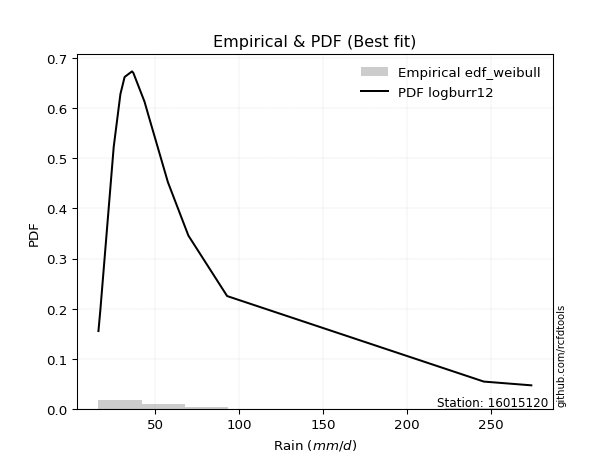</img>

</div>


### 4. EDF Beard (1943)

The Beard formula (or Beard´s plotting position formula) in hydrology is used to estimate the empirical non-exceedance probability _(P)_ of a flood event (or other extreme hydrological data point) within a given dataset.

<div align="center">


$P=(m-0.31)/(n+0.38)$


</div>


**4.1. Empirical values**

<div align="center">

|                | 0                   | 1                   | 2                   | 3                   | 4                  | 5                   | 6                   | 7         | 8                  | 9                  | 10                 | 11                | 12                 | 13                 | 14                 |
|:---------------|:--------------------|:--------------------|:--------------------|:--------------------|:-------------------|:--------------------|:--------------------|:----------|:-------------------|:-------------------|:-------------------|:------------------|:-------------------|:-------------------|:-------------------|
| date           | 2025                | 2023                | 2022                | 2014                | 2015               | 2021                | 2019                | 2011      | 2017               | 2020               | 2016               | 2018              | 2024               | 2012               | 2013               |
| x              | 16.1                | 17.2                | 25.2                | 29.2                | 31.7               | 36.1                | 36.9                | 43.5      | 44.0               | 45.6               | 57.5               | 69.7              | 92.8               | 245.8              | 274.1              |
| m              | 1                   | 2                   | 3                   | 4                   | 5                  | 6                   | 7                   | 8         | 9                  | 10                 | 11                 | 12                | 13                 | 14                 | 15                 |
| empirical_dist | edf_beard           | edf_beard           | edf_beard           | edf_beard           | edf_beard          | edf_beard           | edf_beard           | edf_beard | edf_beard          | edf_beard          | edf_beard          | edf_beard         | edf_beard          | edf_beard          | edf_beard          |
| empirical      | 0.04486345903771131 | 0.10988296488946683 | 0.17490247074122237 | 0.23992197659297787 | 0.3049414824447334 | 0.36996098829648894 | 0.43498049414824447 | 0.5       | 0.5650195058517554 | 0.630039011703511  | 0.6950585175552665 | 0.760078023407022 | 0.8250975292587776 | 0.8901170351105331 | 0.9551365409622886 |
| empirical_tr   | 1.0469707283866576  | 1.1234477720964207  | 1.2119779353821907  | 1.3156544054747648  | 1.4387277829747427 | 1.587203302373581   | 1.7698504027617952  | 2.0       | 2.298953662182361  | 2.7029876977152894 | 3.279317697228144  | 4.168021680216801 | 5.717472118959106  | 9.100591715976325  | 22.289855072463734 |

</div>


**4.2. Kolmogorov-Smirnov fit test (sorted by Δ)**


<div align="center">

|                | 0                   | 1                   | 2                   | 3                   | 4                   | 5                   | 6                   | 7                   | 8                   | 9                   | 10                  | 11                  | 12                  | 13                  | 14                  | 15                 | 16                 | 17                 | 18                  | 19                  | 20                  | 21                  | 22                 | 23                  | 24                  | 25                  | 26                  | 27                  | 28                 | 29                  | 30                  | 31                  | 32                  | 33                  | 34                  | 35                  | 36                  | 37                  | 38                  | 39                 | 40                  | 41                  | 42                  | 43                  | 44                  | 45                  | 46                  | 47                  | 48                  | 49                  | 50                  | 51                  | 52                 | 53                 | 54                  | 55                  | 56                  | 57                  | 58                  | 59                 | 60                  | 61                  | 62                  | 63                 | 64                  | 65                 | 66                  | 67                 | 68                  | 69                  | 70                  | 71                  | 72                  | 73                  | 74                  | 75                  | 76                 | 77                  | 78                  | 79                 | 80                  | 81                  | 82                  | 83                 | 84                  | 85                 | 86                 | 87                  | 88                  | 89                  | 90                  | 91                 | 92                  | 93                 | 94                  | 95                  | 96                 | 97                  | 98                  | 99                  | 100                 | 101                 | 102                 | 103                 | 104                 | 105                 | 106                 | 107                | 108                 | 109                 | 110                | 111                 | 112                 | 113                | 114                 | 115                | 116                | 117                | 118                | 119                 | 120                 | 121                 | 122                 | 123                 | 124                | 125                 | 126                | 127                | 128                | 129                 | 130                 | 131                | 132                 | 133                | 134                | 135                | 136                 | 137                 | 138                 | 139                | 140                 | 141                 | 142                | 143                 | 144                 | 145                | 146                 | 147                | 148                | 149                | 150                | 151                | 152                | 153                | 154                | 155                | 156                | 157                | 158                | 159                |
|:---------------|:--------------------|:--------------------|:--------------------|:--------------------|:--------------------|:--------------------|:--------------------|:--------------------|:--------------------|:--------------------|:--------------------|:--------------------|:--------------------|:--------------------|:--------------------|:-------------------|:-------------------|:-------------------|:--------------------|:--------------------|:--------------------|:--------------------|:-------------------|:--------------------|:--------------------|:--------------------|:--------------------|:--------------------|:-------------------|:--------------------|:--------------------|:--------------------|:--------------------|:--------------------|:--------------------|:--------------------|:--------------------|:--------------------|:--------------------|:-------------------|:--------------------|:--------------------|:--------------------|:--------------------|:--------------------|:--------------------|:--------------------|:--------------------|:--------------------|:--------------------|:--------------------|:--------------------|:-------------------|:-------------------|:--------------------|:--------------------|:--------------------|:--------------------|:--------------------|:-------------------|:--------------------|:--------------------|:--------------------|:-------------------|:--------------------|:-------------------|:--------------------|:-------------------|:--------------------|:--------------------|:--------------------|:--------------------|:--------------------|:--------------------|:--------------------|:--------------------|:-------------------|:--------------------|:--------------------|:-------------------|:--------------------|:--------------------|:--------------------|:-------------------|:--------------------|:-------------------|:-------------------|:--------------------|:--------------------|:--------------------|:--------------------|:-------------------|:--------------------|:-------------------|:--------------------|:--------------------|:-------------------|:--------------------|:--------------------|:--------------------|:--------------------|:--------------------|:--------------------|:--------------------|:--------------------|:--------------------|:--------------------|:-------------------|:--------------------|:--------------------|:-------------------|:--------------------|:--------------------|:-------------------|:--------------------|:-------------------|:-------------------|:-------------------|:-------------------|:--------------------|:--------------------|:--------------------|:--------------------|:--------------------|:-------------------|:--------------------|:-------------------|:-------------------|:-------------------|:--------------------|:--------------------|:-------------------|:--------------------|:-------------------|:-------------------|:-------------------|:--------------------|:--------------------|:--------------------|:-------------------|:--------------------|:--------------------|:-------------------|:--------------------|:--------------------|:-------------------|:--------------------|:-------------------|:-------------------|:-------------------|:-------------------|:-------------------|:-------------------|:-------------------|:-------------------|:-------------------|:-------------------|:-------------------|:-------------------|:-------------------|
| station        | 16015120            | 16015120            | 16015120            | 16015120            | 16015120            | 16015120            | 16015120            | 16015120            | 16015120            | 16015120            | 16015120            | 16015120            | 16015120            | 16015120            | 16015120            | 16015120           | 16015120           | 16015120           | 16015120            | 16015120            | 16015120            | 16015120            | 16015120           | 16015120            | 16015120            | 16015120            | 16015120            | 16015120            | 16015120           | 16015120            | 16015120            | 16015120            | 16015120            | 16015120            | 16015120            | 16015120            | 16015120            | 16015120            | 16015120            | 16015120           | 16015120            | 16015120            | 16015120            | 16015120            | 16015120            | 16015120            | 16015120            | 16015120            | 16015120            | 16015120            | 16015120            | 16015120            | 16015120           | 16015120           | 16015120            | 16015120            | 16015120            | 16015120            | 16015120            | 16015120           | 16015120            | 16015120            | 16015120            | 16015120           | 16015120            | 16015120           | 16015120            | 16015120           | 16015120            | 16015120            | 16015120            | 16015120            | 16015120            | 16015120            | 16015120            | 16015120            | 16015120           | 16015120            | 16015120            | 16015120           | 16015120            | 16015120            | 16015120            | 16015120           | 16015120            | 16015120           | 16015120           | 16015120            | 16015120            | 16015120            | 16015120            | 16015120           | 16015120            | 16015120           | 16015120            | 16015120            | 16015120           | 16015120            | 16015120            | 16015120            | 16015120            | 16015120            | 16015120            | 16015120            | 16015120            | 16015120            | 16015120            | 16015120           | 16015120            | 16015120            | 16015120           | 16015120            | 16015120            | 16015120           | 16015120            | 16015120           | 16015120           | 16015120           | 16015120           | 16015120            | 16015120            | 16015120            | 16015120            | 16015120            | 16015120           | 16015120            | 16015120           | 16015120           | 16015120           | 16015120            | 16015120            | 16015120           | 16015120            | 16015120           | 16015120           | 16015120           | 16015120            | 16015120            | 16015120            | 16015120           | 16015120            | 16015120            | 16015120           | 16015120            | 16015120            | 16015120           | 16015120            | 16015120           | 16015120           | 16015120           | 16015120           | 16015120           | 16015120           | 16015120           | 16015120           | 16015120           | 16015120           | 16015120           | 16015120           | 16015120           |
| empirical_dist | edf_beard           | edf_beard           | edf_beard           | edf_beard           | edf_beard           | edf_beard           | edf_beard           | edf_beard           | edf_beard           | edf_beard           | edf_beard           | edf_beard           | edf_beard           | edf_beard           | edf_beard           | edf_beard          | edf_beard          | edf_beard          | edf_beard           | edf_beard           | edf_beard           | edf_beard           | edf_beard          | edf_beard           | edf_beard           | edf_beard           | edf_beard           | edf_beard           | edf_beard          | edf_beard           | edf_beard           | edf_beard           | edf_beard           | edf_beard           | edf_beard           | edf_beard           | edf_beard           | edf_beard           | edf_beard           | edf_beard          | edf_beard           | edf_beard           | edf_beard           | edf_beard           | edf_beard           | edf_beard           | edf_beard           | edf_beard           | edf_beard           | edf_beard           | edf_beard           | edf_beard           | edf_beard          | edf_beard          | edf_beard           | edf_beard           | edf_beard           | edf_beard           | edf_beard           | edf_beard          | edf_beard           | edf_beard           | edf_beard           | edf_beard          | edf_beard           | edf_beard          | edf_beard           | edf_beard          | edf_beard           | edf_beard           | edf_beard           | edf_beard           | edf_beard           | edf_beard           | edf_beard           | edf_beard           | edf_beard          | edf_beard           | edf_beard           | edf_beard          | edf_beard           | edf_beard           | edf_beard           | edf_beard          | edf_beard           | edf_beard          | edf_beard          | edf_beard           | edf_beard           | edf_beard           | edf_beard           | edf_beard          | edf_beard           | edf_beard          | edf_beard           | edf_beard           | edf_beard          | edf_beard           | edf_beard           | edf_beard           | edf_beard           | edf_beard           | edf_beard           | edf_beard           | edf_beard           | edf_beard           | edf_beard           | edf_beard          | edf_beard           | edf_beard           | edf_beard          | edf_beard           | edf_beard           | edf_beard          | edf_beard           | edf_beard          | edf_beard          | edf_beard          | edf_beard          | edf_beard           | edf_beard           | edf_beard           | edf_beard           | edf_beard           | edf_beard          | edf_beard           | edf_beard          | edf_beard          | edf_beard          | edf_beard           | edf_beard           | edf_beard          | edf_beard           | edf_beard          | edf_beard          | edf_beard          | edf_beard           | edf_beard           | edf_beard           | edf_beard          | edf_beard           | edf_beard           | edf_beard          | edf_beard           | edf_beard           | edf_beard          | edf_beard           | edf_beard          | edf_beard          | edf_beard          | edf_beard          | edf_beard          | edf_beard          | edf_beard          | edf_beard          | edf_beard          | edf_beard          | edf_beard          | edf_beard          | edf_beard          |
| p_dist         | logburr12           | alpha               | logburr             | logexponnorm        | logerlang           | loggamma            | loggamma            | f                   | genextreme          | invweibull          | logmielke           | logdweibull         | invgamma            | logjohnsonsu        | nct                 | logfatiguelife     | loginvgauss        | loginvgamma        | logf                | loggenextreme       | loginvweibull       | loggennorm          | logalpha           | kappa3              | logmoyal            | logt                | loggenexpon         | logweibull_min      | genpareto          | johnsonsu           | loggenlogistic      | logfoldnorm         | burr                | invgauss            | logkappa3           | logloglaplace       | logdgamma           | loggompertz         | loggumbel_r         | loggenhalflogistic | mielke              | loghalfnorm         | lognct              | logkstwobign        | logpearson3         | erlang              | logskewnorm         | fatiguelife         | logvonmises_line    | loghalflogistic     | logbetaprime        | logtruncweibull_min | lograyleigh        | lognakagami        | gamma               | betaprime           | halfgennorm         | logncf              | logmaxwell          | logwald            | truncpareto         | logrice             | truncweibull_min    | wald               | t                   | loggausshyper      | logbeta             | logtruncexpon      | logsemicircular     | exponpow            | logarcsine          | loganglit           | logloggamma         | lognorm             | logcrystalball      | loggengamma         | loglogistic        | loghypsecant        | logtruncnorm        | logrdist           | vonmises_line       | logtukeylambda      | logbradford         | burr12             | loglomax            | loglaplace         | loglaplace         | gennorm             | genhalflogistic     | dweibull            | weibull_min         | loghalfgennorm     | moyal               | beta               | exponweib           | pearson3            | gumbel_r           | gompertz            | logcosine           | exponnorm           | genexpon            | nakagami            | rayleigh            | halflogistic        | dgamma              | loggumbel_l         | genlogistic         | maxwell            | logkappa4           | halfnorm            | gengamma           | logksone            | lomax               | logexponpow        | logjohnsonsb        | logexponweib       | logwrapcauchy      | loguniform         | semicircular       | anglit              | norm                | crystalball         | foldnorm            | logistic            | arcsine            | loggenpareto        | logargus           | hypsecant          | kstwobign          | ncf                 | truncnorm           | gausshyper         | powerlaw            | rice               | laplace            | logtriang          | gumbel_l            | logweibull_max      | truncexpon          | bradford           | cosine              | wrapcauchy          | loglevy_l          | skewnorm            | logpowerlaw         | triang             | argus               | levy_l             | logtrapezoid       | johnsonsb          | ksone              | kappa4             | rdist              | uniform            | tukeylambda        | logtruncpareto     | trapezoid          | weibull_max        | logvonmises        | vonmises           |
| delta          | 0.07167181068560047 | 0.07218176274392873 | 0.07371178182676885 | 0.07422428287777827 | 0.07632533567871636 | 0.07632748547773255 | 0.07632748547773255 | 0.07665995126657388 | 0.07748657193307995 | 0.07748676539862853 | 0.07824464440349599 | 0.07841690362302944 | 0.07872912313614033 | 0.07928452612593473 | 0.07932737909898868 | 0.0793569606526906 | 0.0796121745283268 | 0.0800937494831464 | 0.08011003897211921 | 0.08101795481300744 | 0.08102715236739533 | 0.08109422581505277 | 0.0811777167782145 | 0.08228114283074817 | 0.08452900998970905 | 0.08501639984759923 | 0.08563501858469491 | 0.08590907188865826 | 0.0867501351289327 | 0.08681486174903663 | 0.08710389025340515 | 0.08773479664124206 | 0.08827456096688968 | 0.08851742457749734 | 0.08893905625686654 | 0.08949973416489321 | 0.09038962680570206 | 0.09066393379850868 | 0.09110330511665976 | 0.0938518896011401 | 0.09600894606655352 | 0.09678571617479292 | 0.09913889891290639 | 0.09935943808817049 | 0.10019008720691813 | 0.10199402083136433 | 0.10480751267875754 | 0.10574918359635044 | 0.10880219594355622 | 0.10988296488946683 | 0.11323492175387095 | 0.11359179871615    | 0.1143566609741068 | 0.114589657286565  | 0.11574720066885813 | 0.11598615592363715 | 0.12250230683715918 | 0.12512762232845132 | 0.12594722073086373 | 0.1265822549772311 | 0.12806720784314063 | 0.13213871408757688 | 0.13344301848872853 | 0.1349133740099966 | 0.14051881690352053 | 0.1418822313299078 | 0.14395266155018038 | 0.1475448637061561 | 0.15391049648205762 | 0.15468318206769918 | 0.15546414921951301 | 0.15566925929528758 | 0.15844968359972472 | 0.15993626232864222 | 0.15993659898720708 | 0.16218932064219105 | 0.164000627403884  | 0.16745831670223782 | 0.17490244833660168 | 0.1749024704480665 | 0.17490247073978848 | 0.17490247074121534 | 0.17507397642302558 | 0.1755787599055093 | 0.17993080690149688 | 0.1803637393095378 | 0.1803637393095378 | 0.18290484924955364 | 0.18403091204964125 | 0.19116522656717583 | 0.19351809632391673 | 0.1946949044348002 | 0.19568111940057872 | 0.2003606043795688 | 0.20511453968656063 | 0.20575355360702338 | 0.2064081372528147 | 0.20663817413637187 | 0.20745828423152396 | 0.21289807306132136 | 0.21449283489962123 | 0.21568694937891764 | 0.22250693419078538 | 0.22286396387921506 | 0.22815652222979835 | 0.23055823283376375 | 0.23222009299686758 | 0.2336646502949109 | 0.23990767912840633 | 0.24097306851084763 | 0.2451079087494267 | 0.24595406398208208 | 0.25250736882740027 | 0.2553727124879529 | 0.25673970806934365 | 0.261387858785293  | 0.2615753612201828 | 0.262769779612471  | 0.265582833634332  | 0.26598952702452056 | 0.26697696142518385 | 0.26697696567250007 | 0.27152151646368855 | 0.27596718666812947 | 0.2861527324063226 | 0.28743160516100574 | 0.2876790602521371 | 0.2887486324595723 | 0.2887626772539001 | 0.29414704659324337 | 0.30079760480144635 | 0.3028214721618199 | 0.31271519770753486 | 0.3129139101951108 | 0.3171453704838738 | 0.3312029036508469 | 0.33752236506738187 | 0.34242445141313277 | 0.34834238455579797 | 0.3504446970401743 | 0.35720383423827734 | 0.37994353694316824 | 0.382949821763983  | 0.38454374855029727 | 0.41564988328419317 | 0.4339007260142558 | 0.44359782048398466 | 0.4536259597946834 | 0.4957545777522446 | 0.503356417757722  | 0.5036180750866086 | 0.5121845213807874 | 0.546114495284512  | 0.5523260854225259 | 0.5744223154555028 | 0.7104894829083426 | 0.714448898857543  | 0.7260605335531825 | 1.0883228334093582 | 43.15440947935941  |
| deltao         | 0.3366456264050002  | 0.3366456264050002  | 0.3366456264050002  | 0.3366456264050002  | 0.3366456264050002  | 0.3366456264050002  | 0.3366456264050002  | 0.3366456264050002  | 0.3366456264050002  | 0.3366456264050002  | 0.3366456264050002  | 0.3366456264050002  | 0.3366456264050002  | 0.3366456264050002  | 0.3366456264050002  | 0.3366456264050002 | 0.3366456264050002 | 0.3366456264050002 | 0.3366456264050002  | 0.3366456264050002  | 0.3366456264050002  | 0.3366456264050002  | 0.3366456264050002 | 0.3366456264050002  | 0.3366456264050002  | 0.3366456264050002  | 0.3366456264050002  | 0.3366456264050002  | 0.3366456264050002 | 0.3366456264050002  | 0.3366456264050002  | 0.3366456264050002  | 0.3366456264050002  | 0.3366456264050002  | 0.3366456264050002  | 0.3366456264050002  | 0.3366456264050002  | 0.3366456264050002  | 0.3366456264050002  | 0.3366456264050002 | 0.3366456264050002  | 0.3366456264050002  | 0.3366456264050002  | 0.3366456264050002  | 0.3366456264050002  | 0.3366456264050002  | 0.3366456264050002  | 0.3366456264050002  | 0.3366456264050002  | 0.3366456264050002  | 0.3366456264050002  | 0.3366456264050002  | 0.3366456264050002 | 0.3366456264050002 | 0.3366456264050002  | 0.3366456264050002  | 0.3366456264050002  | 0.3366456264050002  | 0.3366456264050002  | 0.3366456264050002 | 0.3366456264050002  | 0.3366456264050002  | 0.3366456264050002  | 0.3366456264050002 | 0.3366456264050002  | 0.3366456264050002 | 0.3366456264050002  | 0.3366456264050002 | 0.3366456264050002  | 0.3366456264050002  | 0.3366456264050002  | 0.3366456264050002  | 0.3366456264050002  | 0.3366456264050002  | 0.3366456264050002  | 0.3366456264050002  | 0.3366456264050002 | 0.3366456264050002  | 0.3366456264050002  | 0.3366456264050002 | 0.3366456264050002  | 0.3366456264050002  | 0.3366456264050002  | 0.3366456264050002 | 0.3366456264050002  | 0.3366456264050002 | 0.3366456264050002 | 0.3366456264050002  | 0.3366456264050002  | 0.3366456264050002  | 0.3366456264050002  | 0.3366456264050002 | 0.3366456264050002  | 0.3366456264050002 | 0.3366456264050002  | 0.3366456264050002  | 0.3366456264050002 | 0.3366456264050002  | 0.3366456264050002  | 0.3366456264050002  | 0.3366456264050002  | 0.3366456264050002  | 0.3366456264050002  | 0.3366456264050002  | 0.3366456264050002  | 0.3366456264050002  | 0.3366456264050002  | 0.3366456264050002 | 0.3366456264050002  | 0.3366456264050002  | 0.3366456264050002 | 0.3366456264050002  | 0.3366456264050002  | 0.3366456264050002 | 0.3366456264050002  | 0.3366456264050002 | 0.3366456264050002 | 0.3366456264050002 | 0.3366456264050002 | 0.3366456264050002  | 0.3366456264050002  | 0.3366456264050002  | 0.3366456264050002  | 0.3366456264050002  | 0.3366456264050002 | 0.3366456264050002  | 0.3366456264050002 | 0.3366456264050002 | 0.3366456264050002 | 0.3366456264050002  | 0.3366456264050002  | 0.3366456264050002 | 0.3366456264050002  | 0.3366456264050002 | 0.3366456264050002 | 0.3366456264050002 | 0.3366456264050002  | 0.3366456264050002  | 0.3366456264050002  | 0.3366456264050002 | 0.3366456264050002  | 0.3366456264050002  | 0.3366456264050002 | 0.3366456264050002  | 0.3366456264050002  | 0.3366456264050002 | 0.3366456264050002  | 0.3366456264050002 | 0.3366456264050002 | 0.3366456264050002 | 0.3366456264050002 | 0.3366456264050002 | 0.3366456264050002 | 0.3366456264050002 | 0.3366456264050002 | 0.3366456264050002 | 0.3366456264050002 | 0.3366456264050002 | 0.3366456264050002 | 0.3366456264050002 |
| eval           | Δo > Δ              | Δo > Δ              | Δo > Δ              | Δo > Δ              | Δo > Δ              | Δo > Δ              | Δo > Δ              | Δo > Δ              | Δo > Δ              | Δo > Δ              | Δo > Δ              | Δo > Δ              | Δo > Δ              | Δo > Δ              | Δo > Δ              | Δo > Δ             | Δo > Δ             | Δo > Δ             | Δo > Δ              | Δo > Δ              | Δo > Δ              | Δo > Δ              | Δo > Δ             | Δo > Δ              | Δo > Δ              | Δo > Δ              | Δo > Δ              | Δo > Δ              | Δo > Δ             | Δo > Δ              | Δo > Δ              | Δo > Δ              | Δo > Δ              | Δo > Δ              | Δo > Δ              | Δo > Δ              | Δo > Δ              | Δo > Δ              | Δo > Δ              | Δo > Δ             | Δo > Δ              | Δo > Δ              | Δo > Δ              | Δo > Δ              | Δo > Δ              | Δo > Δ              | Δo > Δ              | Δo > Δ              | Δo > Δ              | Δo > Δ              | Δo > Δ              | Δo > Δ              | Δo > Δ             | Δo > Δ             | Δo > Δ              | Δo > Δ              | Δo > Δ              | Δo > Δ              | Δo > Δ              | Δo > Δ             | Δo > Δ              | Δo > Δ              | Δo > Δ              | Δo > Δ             | Δo > Δ              | Δo > Δ             | Δo > Δ              | Δo > Δ             | Δo > Δ              | Δo > Δ              | Δo > Δ              | Δo > Δ              | Δo > Δ              | Δo > Δ              | Δo > Δ              | Δo > Δ              | Δo > Δ             | Δo > Δ              | Δo > Δ              | Δo > Δ             | Δo > Δ              | Δo > Δ              | Δo > Δ              | Δo > Δ             | Δo > Δ              | Δo > Δ             | Δo > Δ             | Δo > Δ              | Δo > Δ              | Δo > Δ              | Δo > Δ              | Δo > Δ             | Δo > Δ              | Δo > Δ             | Δo > Δ              | Δo > Δ              | Δo > Δ             | Δo > Δ              | Δo > Δ              | Δo > Δ              | Δo > Δ              | Δo > Δ              | Δo > Δ              | Δo > Δ              | Δo > Δ              | Δo > Δ              | Δo > Δ              | Δo > Δ             | Δo > Δ              | Δo > Δ              | Δo > Δ             | Δo > Δ              | Δo > Δ              | Δo > Δ             | Δo > Δ              | Δo > Δ             | Δo > Δ             | Δo > Δ             | Δo > Δ             | Δo > Δ              | Δo > Δ              | Δo > Δ              | Δo > Δ              | Δo > Δ              | Δo > Δ             | Δo > Δ              | Δo > Δ             | Δo > Δ             | Δo > Δ             | Δo > Δ              | Δo > Δ              | Δo > Δ             | Δo > Δ              | Δo > Δ             | Δo > Δ             | Δo > Δ             | Δo <= Δ             | Δo <= Δ             | Δo <= Δ             | Δo <= Δ            | Δo <= Δ             | Δo <= Δ             | Δo <= Δ            | Δo <= Δ             | Δo <= Δ             | Δo <= Δ            | Δo <= Δ             | Δo <= Δ            | Δo <= Δ            | Δo <= Δ            | Δo <= Δ            | Δo <= Δ            | Δo <= Δ            | Δo <= Δ            | Δo <= Δ            | Δo <= Δ            | Δo <= Δ            | Δo <= Δ            | Δo <= Δ            | Δo <= Δ            |
| fit            | 1                   | 1                   | 1                   | 1                   | 1                   | 1                   | 1                   | 1                   | 1                   | 1                   | 1                   | 1                   | 1                   | 1                   | 1                   | 1                  | 1                  | 1                  | 1                   | 1                   | 1                   | 1                   | 1                  | 1                   | 1                   | 1                   | 1                   | 1                   | 1                  | 1                   | 1                   | 1                   | 1                   | 1                   | 1                   | 1                   | 1                   | 1                   | 1                   | 1                  | 1                   | 1                   | 1                   | 1                   | 1                   | 1                   | 1                   | 1                   | 1                   | 1                   | 1                   | 1                   | 1                  | 1                  | 1                   | 1                   | 1                   | 1                   | 1                   | 1                  | 1                   | 1                   | 1                   | 1                  | 1                   | 1                  | 1                   | 1                  | 1                   | 1                   | 1                   | 1                   | 1                   | 1                   | 1                   | 1                   | 1                  | 1                   | 1                   | 1                  | 1                   | 1                   | 1                   | 1                  | 1                   | 1                  | 1                  | 1                   | 1                   | 1                   | 1                   | 1                  | 1                   | 1                  | 1                   | 1                   | 1                  | 1                   | 1                   | 1                   | 1                   | 1                   | 1                   | 1                   | 1                   | 1                   | 1                   | 1                  | 1                   | 1                   | 1                  | 1                   | 1                   | 1                  | 1                   | 1                  | 1                  | 1                  | 1                  | 1                   | 1                   | 1                   | 1                   | 1                   | 1                  | 1                   | 1                  | 1                  | 1                  | 1                   | 1                   | 1                  | 1                   | 1                  | 1                  | 1                  | 0                   | 0                   | 0                   | 0                  | 0                   | 0                   | 0                  | 0                   | 0                   | 0                  | 0                   | 0                  | 0                  | 0                  | 0                  | 0                  | 0                  | 0                  | 0                  | 0                  | 0                  | 0                  | 0                  | 0                  |
| n              | 15                  | 15                  | 15                  | 15                  | 15                  | 15                  | 15                  | 15                  | 15                  | 15                  | 15                  | 15                  | 15                  | 15                  | 15                  | 15                 | 15                 | 15                 | 15                  | 15                  | 15                  | 15                  | 15                 | 15                  | 15                  | 15                  | 15                  | 15                  | 15                 | 15                  | 15                  | 15                  | 15                  | 15                  | 15                  | 15                  | 15                  | 15                  | 15                  | 15                 | 15                  | 15                  | 15                  | 15                  | 15                  | 15                  | 15                  | 15                  | 15                  | 15                  | 15                  | 15                  | 15                 | 15                 | 15                  | 15                  | 15                  | 15                  | 15                  | 15                 | 15                  | 15                  | 15                  | 15                 | 15                  | 15                 | 15                  | 15                 | 15                  | 15                  | 15                  | 15                  | 15                  | 15                  | 15                  | 15                  | 15                 | 15                  | 15                  | 15                 | 15                  | 15                  | 15                  | 15                 | 15                  | 15                 | 15                 | 15                  | 15                  | 15                  | 15                  | 15                 | 15                  | 15                 | 15                  | 15                  | 15                 | 15                  | 15                  | 15                  | 15                  | 15                  | 15                  | 15                  | 15                  | 15                  | 15                  | 15                 | 15                  | 15                  | 15                 | 15                  | 15                  | 15                 | 15                  | 15                 | 15                 | 15                 | 15                 | 15                  | 15                  | 15                  | 15                  | 15                  | 15                 | 15                  | 15                 | 15                 | 15                 | 15                  | 15                  | 15                 | 15                  | 15                 | 15                 | 15                 | 15                  | 15                  | 15                  | 15                 | 15                  | 15                  | 15                 | 15                  | 15                  | 15                 | 15                  | 15                 | 15                 | 15                 | 15                 | 15                 | 15                 | 15                 | 15                 | 15                 | 15                 | 15                 | 15                 | 15                 |
| best_fit       | 1                   | 0                   | 0                   | 0                   | 0                   | 0                   | 0                   | 0                   | 0                   | 0                   | 0                   | 0                   | 0                   | 0                   | 0                   | 0                  | 0                  | 0                  | 0                   | 0                   | 0                   | 0                   | 0                  | 0                   | 0                   | 0                   | 0                   | 0                   | 0                  | 0                   | 0                   | 0                   | 0                   | 0                   | 0                   | 0                   | 0                   | 0                   | 0                   | 0                  | 0                   | 0                   | 0                   | 0                   | 0                   | 0                   | 0                   | 0                   | 0                   | 0                   | 0                   | 0                   | 0                  | 0                  | 0                   | 0                   | 0                   | 0                   | 0                   | 0                  | 0                   | 0                   | 0                   | 0                  | 0                   | 0                  | 0                   | 0                  | 0                   | 0                   | 0                   | 0                   | 0                   | 0                   | 0                   | 0                   | 0                  | 0                   | 0                   | 0                  | 0                   | 0                   | 0                   | 0                  | 0                   | 0                  | 0                  | 0                   | 0                   | 0                   | 0                   | 0                  | 0                   | 0                  | 0                   | 0                   | 0                  | 0                   | 0                   | 0                   | 0                   | 0                   | 0                   | 0                   | 0                   | 0                   | 0                   | 0                  | 0                   | 0                   | 0                  | 0                   | 0                   | 0                  | 0                   | 0                  | 0                  | 0                  | 0                  | 0                   | 0                   | 0                   | 0                   | 0                   | 0                  | 0                   | 0                  | 0                  | 0                  | 0                   | 0                   | 0                  | 0                   | 0                  | 0                  | 0                  | 0                   | 0                   | 0                   | 0                  | 0                   | 0                   | 0                  | 0                   | 0                   | 0                  | 0                   | 0                  | 0                  | 0                  | 0                  | 0                  | 0                  | 0                  | 0                  | 0                  | 0                  | 0                  | 0                  | 0                  |
| best_fit_sort  | 1                   | 2                   | 3                   | 4                   | 5                   | 6                   | 7                   | 8                   | 9                   | 10                  | 11                  | 12                  | 13                  | 14                  | 15                  | 16                 | 17                 | 18                 | 19                  | 20                  | 21                  | 22                  | 23                 | 24                  | 25                  | 26                  | 27                  | 28                  | 29                 | 30                  | 31                  | 32                  | 33                  | 34                  | 35                  | 36                  | 37                  | 38                  | 39                  | 40                 | 41                  | 42                  | 43                  | 44                  | 45                  | 46                  | 47                  | 48                  | 49                  | 50                  | 51                  | 52                  | 53                 | 54                 | 55                  | 56                  | 57                  | 58                  | 59                  | 60                 | 61                  | 62                  | 63                  | 64                 | 65                  | 66                 | 67                  | 68                 | 69                  | 70                  | 71                  | 72                  | 73                  | 74                  | 75                  | 76                  | 77                 | 78                  | 79                  | 80                 | 81                  | 82                  | 83                  | 84                 | 85                  | 86                 | 87                 | 88                  | 89                  | 90                  | 91                  | 92                 | 93                  | 94                 | 95                  | 96                  | 97                 | 98                  | 99                  | 100                 | 101                 | 102                 | 103                 | 104                 | 105                 | 106                 | 107                 | 108                | 109                 | 110                 | 111                | 112                 | 113                 | 114                | 115                 | 116                | 117                | 118                | 119                | 120                 | 121                 | 122                 | 123                 | 124                 | 125                | 126                 | 127                | 128                | 129                | 130                 | 131                 | 132                | 133                 | 134                | 135                | 136                | 137                 | 138                 | 139                 | 140                | 141                 | 142                 | 143                | 144                 | 145                 | 146                | 147                 | 148                | 149                | 150                | 151                | 152                | 153                | 154                | 155                | 156                | 157                | 158                | 159                | 160                |

</div>


**4.3. Best fit**

<div align="center">

|   id |   station | empirical_dist   | p_dist    |     delta |   deltao | eval   |   fit |   n |   best_fit |   best_fit_sort |
|-----:|----------:|:-----------------|:----------|----------:|---------:|:-------|------:|----:|-----------:|----------------:|
|    0 |  16015120 | edf_beard        | logburr12 | 0.0716718 | 0.336646 | Δo > Δ |     1 |  15 |          1 |               1 |

</div>


<div align="center">

</img></img>

</div>


### 5. EDF Chegodayev (1955)

The Chegodayev formula is an empirical plotting position formula used in hydrological frequency analysis to estimate the exceedance probability or return period of a specific event from a set of observed data. It is primarily used for plotting observed data points on probability paper to fit a theoretical distribution, particularly for analyzing extreme events like maximum flood flows or rainfall intensities. The constant _b_ value in the generalized plotting position formula is 0.3.

<div align="center">


$P=(m-b)/(n+1-2b)$


</div>


**5.1. Empirical values**

<div align="center">

|                | 0                   | 1                   | 2                   | 3                   | 4                  | 5                   | 6                   | 7              | 8                  | 9                  | 10                 | 11                 | 12                 | 13                 | 14                 |
|:---------------|:--------------------|:--------------------|:--------------------|:--------------------|:-------------------|:--------------------|:--------------------|:---------------|:-------------------|:-------------------|:-------------------|:-------------------|:-------------------|:-------------------|:-------------------|
| date           | 2025                | 2023                | 2022                | 2014                | 2015               | 2021                | 2019                | 2011           | 2017               | 2020               | 2016               | 2018               | 2024               | 2012               | 2013               |
| x              | 16.1                | 17.2                | 25.2                | 29.2                | 31.7               | 36.1                | 36.9                | 43.5           | 44.0               | 45.6               | 57.5               | 69.7               | 92.8               | 245.8              | 274.1              |
| m              | 1                   | 2                   | 3                   | 4                   | 5                  | 6                   | 7                   | 8              | 9                  | 10                 | 11                 | 12                 | 13                 | 14                 | 15                 |
| empirical_dist | edf_chegodayev      | edf_chegodayev      | edf_chegodayev      | edf_chegodayev      | edf_chegodayev     | edf_chegodayev      | edf_chegodayev      | edf_chegodayev | edf_chegodayev     | edf_chegodayev     | edf_chegodayev     | edf_chegodayev     | edf_chegodayev     | edf_chegodayev     | edf_chegodayev     |
| empirical      | 0.04545454545454545 | 0.11038961038961038 | 0.17532467532467533 | 0.24025974025974026 | 0.3051948051948052 | 0.37012987012987014 | 0.43506493506493504 | 0.5            | 0.5649350649350648 | 0.6298701298701298 | 0.6948051948051948 | 0.7597402597402597 | 0.8246753246753246 | 0.8896103896103895 | 0.9545454545454545 |
| empirical_tr   | 1.0476190476190477  | 1.1240875912408759  | 1.2125984251968505  | 1.3162393162393162  | 1.4392523364485983 | 1.5876288659793814  | 1.7701149425287355  | 2.0            | 2.2985074626865667 | 2.701754385964912  | 3.2765957446808507 | 4.162162162162161  | 5.7037037037037    | 9.058823529411757  | 21.999999999999964 |

</div>


**5.2. Kolmogorov-Smirnov fit test (sorted by Δ)**


<div align="center">

|                | 0                   | 1                   | 2                  | 3                   | 4                   | 5                   | 6                   | 7                   | 8                  | 9                   | 10                  | 11                  | 12                  | 13                  | 14                  | 15                  | 16                  | 17                  | 18                  | 19                  | 20                  | 21                  | 22                  | 23                  | 24                 | 25                  | 26                 | 27                  | 28                  | 29                  | 30                 | 31                  | 32                  | 33                  | 34                  | 35                  | 36                  | 37                  | 38                  | 39                  | 40                  | 41                  | 42                  | 43                  | 44                  | 45                 | 46                  | 47                  | 48                  | 49                  | 50                 | 51                  | 52                  | 53                  | 54                  | 55                 | 56                 | 57                  | 58                  | 59                  | 60                  | 61                  | 62                  | 63                  | 64                  | 65                  | 66                 | 67                  | 68                  | 69                  | 70                 | 71                  | 72                  | 73                  | 74                  | 75                  | 76                  | 77                  | 78                  | 79                  | 80                  | 81                 | 82                  | 83                  | 84                 | 85                  | 86                  | 87                  | 88                 | 89                  | 90                  | 91                 | 92                  | 93                  | 94                  | 95                  | 96                  | 97                  | 98                 | 99                 | 100                 | 101                 | 102                 | 103                 | 104                | 105                | 106                 | 107                | 108                 | 109                 | 110                 | 111                 | 112                | 113                | 114                 | 115                | 116                 | 117                 | 118                | 119                 | 120                 | 121                 | 122                | 123                | 124                 | 125                | 126                | 127                | 128                 | 129                | 130                | 131                | 132                | 133                | 134                 | 135                | 136                 | 137                 | 138                 | 139                 | 140                 | 141                 | 142                 | 143                | 144                | 145                | 146                 | 147                 | 148                 | 149                | 150                | 151                | 152                | 153                | 154                | 155                | 156                | 157                | 158                | 159                |
|:---------------|:--------------------|:--------------------|:-------------------|:--------------------|:--------------------|:--------------------|:--------------------|:--------------------|:-------------------|:--------------------|:--------------------|:--------------------|:--------------------|:--------------------|:--------------------|:--------------------|:--------------------|:--------------------|:--------------------|:--------------------|:--------------------|:--------------------|:--------------------|:--------------------|:-------------------|:--------------------|:-------------------|:--------------------|:--------------------|:--------------------|:-------------------|:--------------------|:--------------------|:--------------------|:--------------------|:--------------------|:--------------------|:--------------------|:--------------------|:--------------------|:--------------------|:--------------------|:--------------------|:--------------------|:--------------------|:-------------------|:--------------------|:--------------------|:--------------------|:--------------------|:-------------------|:--------------------|:--------------------|:--------------------|:--------------------|:-------------------|:-------------------|:--------------------|:--------------------|:--------------------|:--------------------|:--------------------|:--------------------|:--------------------|:--------------------|:--------------------|:-------------------|:--------------------|:--------------------|:--------------------|:-------------------|:--------------------|:--------------------|:--------------------|:--------------------|:--------------------|:--------------------|:--------------------|:--------------------|:--------------------|:--------------------|:-------------------|:--------------------|:--------------------|:-------------------|:--------------------|:--------------------|:--------------------|:-------------------|:--------------------|:--------------------|:-------------------|:--------------------|:--------------------|:--------------------|:--------------------|:--------------------|:--------------------|:-------------------|:-------------------|:--------------------|:--------------------|:--------------------|:--------------------|:-------------------|:-------------------|:--------------------|:-------------------|:--------------------|:--------------------|:--------------------|:--------------------|:-------------------|:-------------------|:--------------------|:-------------------|:--------------------|:--------------------|:-------------------|:--------------------|:--------------------|:--------------------|:-------------------|:-------------------|:--------------------|:-------------------|:-------------------|:-------------------|:--------------------|:-------------------|:-------------------|:-------------------|:-------------------|:-------------------|:--------------------|:-------------------|:--------------------|:--------------------|:--------------------|:--------------------|:--------------------|:--------------------|:--------------------|:-------------------|:-------------------|:-------------------|:--------------------|:--------------------|:--------------------|:-------------------|:-------------------|:-------------------|:-------------------|:-------------------|:-------------------|:-------------------|:-------------------|:-------------------|:-------------------|:-------------------|
| station        | 16015120            | 16015120            | 16015120           | 16015120            | 16015120            | 16015120            | 16015120            | 16015120            | 16015120           | 16015120            | 16015120            | 16015120            | 16015120            | 16015120            | 16015120            | 16015120            | 16015120            | 16015120            | 16015120            | 16015120            | 16015120            | 16015120            | 16015120            | 16015120            | 16015120           | 16015120            | 16015120           | 16015120            | 16015120            | 16015120            | 16015120           | 16015120            | 16015120            | 16015120            | 16015120            | 16015120            | 16015120            | 16015120            | 16015120            | 16015120            | 16015120            | 16015120            | 16015120            | 16015120            | 16015120            | 16015120           | 16015120            | 16015120            | 16015120            | 16015120            | 16015120           | 16015120            | 16015120            | 16015120            | 16015120            | 16015120           | 16015120           | 16015120            | 16015120            | 16015120            | 16015120            | 16015120            | 16015120            | 16015120            | 16015120            | 16015120            | 16015120           | 16015120            | 16015120            | 16015120            | 16015120           | 16015120            | 16015120            | 16015120            | 16015120            | 16015120            | 16015120            | 16015120            | 16015120            | 16015120            | 16015120            | 16015120           | 16015120            | 16015120            | 16015120           | 16015120            | 16015120            | 16015120            | 16015120           | 16015120            | 16015120            | 16015120           | 16015120            | 16015120            | 16015120            | 16015120            | 16015120            | 16015120            | 16015120           | 16015120           | 16015120            | 16015120            | 16015120            | 16015120            | 16015120           | 16015120           | 16015120            | 16015120           | 16015120            | 16015120            | 16015120            | 16015120            | 16015120           | 16015120           | 16015120            | 16015120           | 16015120            | 16015120            | 16015120           | 16015120            | 16015120            | 16015120            | 16015120           | 16015120           | 16015120            | 16015120           | 16015120           | 16015120           | 16015120            | 16015120           | 16015120           | 16015120           | 16015120           | 16015120           | 16015120            | 16015120           | 16015120            | 16015120            | 16015120            | 16015120            | 16015120            | 16015120            | 16015120            | 16015120           | 16015120           | 16015120           | 16015120            | 16015120            | 16015120            | 16015120           | 16015120           | 16015120           | 16015120           | 16015120           | 16015120           | 16015120           | 16015120           | 16015120           | 16015120           | 16015120           |
| empirical_dist | edf_chegodayev      | edf_chegodayev      | edf_chegodayev     | edf_chegodayev      | edf_chegodayev      | edf_chegodayev      | edf_chegodayev      | edf_chegodayev      | edf_chegodayev     | edf_chegodayev      | edf_chegodayev      | edf_chegodayev      | edf_chegodayev      | edf_chegodayev      | edf_chegodayev      | edf_chegodayev      | edf_chegodayev      | edf_chegodayev      | edf_chegodayev      | edf_chegodayev      | edf_chegodayev      | edf_chegodayev      | edf_chegodayev      | edf_chegodayev      | edf_chegodayev     | edf_chegodayev      | edf_chegodayev     | edf_chegodayev      | edf_chegodayev      | edf_chegodayev      | edf_chegodayev     | edf_chegodayev      | edf_chegodayev      | edf_chegodayev      | edf_chegodayev      | edf_chegodayev      | edf_chegodayev      | edf_chegodayev      | edf_chegodayev      | edf_chegodayev      | edf_chegodayev      | edf_chegodayev      | edf_chegodayev      | edf_chegodayev      | edf_chegodayev      | edf_chegodayev     | edf_chegodayev      | edf_chegodayev      | edf_chegodayev      | edf_chegodayev      | edf_chegodayev     | edf_chegodayev      | edf_chegodayev      | edf_chegodayev      | edf_chegodayev      | edf_chegodayev     | edf_chegodayev     | edf_chegodayev      | edf_chegodayev      | edf_chegodayev      | edf_chegodayev      | edf_chegodayev      | edf_chegodayev      | edf_chegodayev      | edf_chegodayev      | edf_chegodayev      | edf_chegodayev     | edf_chegodayev      | edf_chegodayev      | edf_chegodayev      | edf_chegodayev     | edf_chegodayev      | edf_chegodayev      | edf_chegodayev      | edf_chegodayev      | edf_chegodayev      | edf_chegodayev      | edf_chegodayev      | edf_chegodayev      | edf_chegodayev      | edf_chegodayev      | edf_chegodayev     | edf_chegodayev      | edf_chegodayev      | edf_chegodayev     | edf_chegodayev      | edf_chegodayev      | edf_chegodayev      | edf_chegodayev     | edf_chegodayev      | edf_chegodayev      | edf_chegodayev     | edf_chegodayev      | edf_chegodayev      | edf_chegodayev      | edf_chegodayev      | edf_chegodayev      | edf_chegodayev      | edf_chegodayev     | edf_chegodayev     | edf_chegodayev      | edf_chegodayev      | edf_chegodayev      | edf_chegodayev      | edf_chegodayev     | edf_chegodayev     | edf_chegodayev      | edf_chegodayev     | edf_chegodayev      | edf_chegodayev      | edf_chegodayev      | edf_chegodayev      | edf_chegodayev     | edf_chegodayev     | edf_chegodayev      | edf_chegodayev     | edf_chegodayev      | edf_chegodayev      | edf_chegodayev     | edf_chegodayev      | edf_chegodayev      | edf_chegodayev      | edf_chegodayev     | edf_chegodayev     | edf_chegodayev      | edf_chegodayev     | edf_chegodayev     | edf_chegodayev     | edf_chegodayev      | edf_chegodayev     | edf_chegodayev     | edf_chegodayev     | edf_chegodayev     | edf_chegodayev     | edf_chegodayev      | edf_chegodayev     | edf_chegodayev      | edf_chegodayev      | edf_chegodayev      | edf_chegodayev      | edf_chegodayev      | edf_chegodayev      | edf_chegodayev      | edf_chegodayev     | edf_chegodayev     | edf_chegodayev     | edf_chegodayev      | edf_chegodayev      | edf_chegodayev      | edf_chegodayev     | edf_chegodayev     | edf_chegodayev     | edf_chegodayev     | edf_chegodayev     | edf_chegodayev     | edf_chegodayev     | edf_chegodayev     | edf_chegodayev     | edf_chegodayev     | edf_chegodayev     |
| p_dist         | logburr12           | alpha               | logburr            | logexponnorm        | logerlang           | loggamma            | loggamma            | f                   | genextreme         | invweibull          | logmielke           | logdweibull         | invgamma            | logjohnsonsu        | nct                 | logfatiguelife      | loginvgauss         | loginvgamma         | logf                | loggenextreme       | loginvweibull       | loggennorm          | logalpha            | kappa3              | logmoyal           | loggenexpon         | logt               | logweibull_min      | johnsonsu           | genpareto           | loggenlogistic     | logfoldnorm         | burr                | invgauss            | logkappa3           | logloglaplace       | logdgamma           | loggompertz         | loggumbel_r         | loggenhalflogistic  | mielke              | loghalfnorm         | lognct              | logkstwobign        | logpearson3         | erlang             | logskewnorm         | fatiguelife         | logvonmises_line    | loghalflogistic     | logbetaprime       | logtruncweibull_min | lograyleigh         | lognakagami         | gamma               | betaprime          | halfgennorm        | logncf              | logmaxwell          | logwald             | truncpareto         | logrice             | truncweibull_min    | wald                | t                   | loggausshyper       | logbeta            | logtruncexpon       | logsemicircular     | exponpow            | logarcsine         | loganglit           | logloggamma         | lognorm             | logcrystalball      | loggengamma         | loglogistic         | loghypsecant        | logbradford         | burr12              | logtruncnorm        | logrdist           | vonmises_line       | logtukeylambda      | loglomax           | loglaplace          | loglaplace          | gennorm             | genhalflogistic    | dweibull            | weibull_min         | loghalfgennorm     | moyal               | beta                | exponweib           | pearson3            | gumbel_r            | gompertz            | logcosine          | exponnorm          | genexpon            | nakagami            | rayleigh            | halflogistic        | dgamma             | loggumbel_l        | genlogistic         | maxwell            | logkappa4           | halfnorm            | gengamma            | logksone            | lomax              | logexponpow        | logjohnsonsb        | logexponweib       | logwrapcauchy       | loguniform          | semicircular       | anglit              | norm                | crystalball         | foldnorm           | logistic           | arcsine             | loggenpareto       | logargus           | hypsecant          | kstwobign           | ncf                | truncnorm          | gausshyper         | powerlaw           | rice               | laplace             | logtriang          | gumbel_l            | logweibull_max      | truncexpon          | bradford            | cosine              | wrapcauchy          | loglevy_l           | skewnorm           | logpowerlaw        | triang             | argus               | levy_l              | logtrapezoid        | johnsonsb          | ksone              | kappa4             | rdist              | uniform            | tukeylambda        | logtruncpareto     | trapezoid          | weibull_max        | logvonmises        | vonmises           |
| delta          | 0.07150292885221932 | 0.07201288091054758 | 0.0735428999933877 | 0.07405540104439712 | 0.07598757201195397 | 0.07598972181097016 | 0.07598972181097016 | 0.07649106943319273 | 0.0773176900996988 | 0.07731788356524738 | 0.07807576257011484 | 0.07824802178964829 | 0.07856024130275918 | 0.07911564429255358 | 0.07915849726560753 | 0.07918807881930945 | 0.07944329269494566 | 0.07992486764976525 | 0.07994115713873806 | 0.08084907297962629 | 0.08085827053401418 | 0.08092534398167162 | 0.08100883494483335 | 0.08211226099736701 | 0.0850356554898526 | 0.08546613675131376 | 0.0855230453477428 | 0.08557130822189588 | 0.08647709808227425 | 0.08658125329555155 | 0.086935008420024  | 0.08756591480786091 | 0.08810567913350853 | 0.08834854274411619 | 0.08860129259010416 | 0.08933085233151206 | 0.09022074497232091 | 0.09049505196512753 | 0.09093442328327861 | 0.09368300776775895 | 0.09584006423317237 | 0.09729236167493649 | 0.09897001707952524 | 0.09919055625478934 | 0.10002120537353698 | 0.1025006663315079 | 0.10463863084537639 | 0.10558030176296929 | 0.10863331411017507 | 0.11038961038961038 | 0.1130660399204898 | 0.11342291688276884 | 0.11418777914072564 | 0.11442077545318385 | 0.11557831883547698 | 0.115817274090256  | 0.1221645431703968 | 0.12495874049507016 | 0.12577833889748258 | 0.12700445956068407 | 0.12789832600975948 | 0.13196983225419573 | 0.13310525482196622 | 0.13474449217661544 | 0.14051881690352053 | 0.14171334949652664 | 0.143614897883418  | 0.14737598187277495 | 0.15374161464867647 | 0.15426097748424622 | 0.1551263855527507 | 0.15550037746190642 | 0.15828080176634357 | 0.15976738049526107 | 0.15976771715382593 | 0.16185155697542866 | 0.16383174557050284 | 0.16728943486885667 | 0.17490509458964443 | 0.17524099623874692 | 0.17532465292005464 | 0.1753246750315195 | 0.17532467532324147 | 0.17532467532466833 | 0.1795930432347345 | 0.18019485747615666 | 0.18019485747615666 | 0.18290484924955364 | 0.1834398256328071 | 0.19116522656717583 | 0.19309589174046377 | 0.1943571407680378 | 0.19509003298374458 | 0.19993839979611583 | 0.20477677601979824 | 0.20516246719018924 | 0.20623925541943355 | 0.20646929230299071 | 0.2072894023981428 | 0.2127291912279402 | 0.21432395306624008 | 0.21534918571215533 | 0.22216917052402307 | 0.22227287746238092 | 0.2275654358129642 | 0.2303893510003826 | 0.23205121116348643 | 0.2333268866281486 | 0.23973879729502517 | 0.24038198209401349 | 0.24468570416597374 | 0.24561630031531978 | 0.2523384869940191 | 0.2550349488211905 | 0.25631750348589066 | 0.2610500951185306 | 0.26140647938680167 | 0.26260089777908985 | 0.2652450699675697 | 0.26565176335775825 | 0.26663919775842154 | 0.26663920200573776 | 0.2709304300468544 | 0.2757983048347483 | 0.28556164598948847 | 0.2868405187441716 | 0.2875101784187559 | 0.2885797506261911 | 0.28859379542051894 | 0.2935559601764092 | 0.3006287229680652 | 0.3024837084950576 | 0.3122929931240819 | 0.3127450283617296 | 0.31697648865049266 | 0.3308651399840846 | 0.33718460140061957 | 0.34208668774637047 | 0.34800462088903567 | 0.35027581520679313 | 0.35686607057151504 | 0.37952133235971525 | 0.38235873534714887 | 0.3843748667169161 | 0.4152276787007402 | 0.4337318441808746 | 0.44326005681722236 | 0.45303487337784926 | 0.49541681408548227 | 0.502934213174269  | 0.5032803114198463 | 0.5118467577140251 | 0.5455234088676778 | 0.5519883217557636 | 0.5738312290386687 | 0.7100672783248896 | 0.71402669427409   | 0.7256383289697295 | 1.0888294789095017 | 43.15500056577624  |
| deltao         | 0.3366456264050002  | 0.3366456264050002  | 0.3366456264050002 | 0.3366456264050002  | 0.3366456264050002  | 0.3366456264050002  | 0.3366456264050002  | 0.3366456264050002  | 0.3366456264050002 | 0.3366456264050002  | 0.3366456264050002  | 0.3366456264050002  | 0.3366456264050002  | 0.3366456264050002  | 0.3366456264050002  | 0.3366456264050002  | 0.3366456264050002  | 0.3366456264050002  | 0.3366456264050002  | 0.3366456264050002  | 0.3366456264050002  | 0.3366456264050002  | 0.3366456264050002  | 0.3366456264050002  | 0.3366456264050002 | 0.3366456264050002  | 0.3366456264050002 | 0.3366456264050002  | 0.3366456264050002  | 0.3366456264050002  | 0.3366456264050002 | 0.3366456264050002  | 0.3366456264050002  | 0.3366456264050002  | 0.3366456264050002  | 0.3366456264050002  | 0.3366456264050002  | 0.3366456264050002  | 0.3366456264050002  | 0.3366456264050002  | 0.3366456264050002  | 0.3366456264050002  | 0.3366456264050002  | 0.3366456264050002  | 0.3366456264050002  | 0.3366456264050002 | 0.3366456264050002  | 0.3366456264050002  | 0.3366456264050002  | 0.3366456264050002  | 0.3366456264050002 | 0.3366456264050002  | 0.3366456264050002  | 0.3366456264050002  | 0.3366456264050002  | 0.3366456264050002 | 0.3366456264050002 | 0.3366456264050002  | 0.3366456264050002  | 0.3366456264050002  | 0.3366456264050002  | 0.3366456264050002  | 0.3366456264050002  | 0.3366456264050002  | 0.3366456264050002  | 0.3366456264050002  | 0.3366456264050002 | 0.3366456264050002  | 0.3366456264050002  | 0.3366456264050002  | 0.3366456264050002 | 0.3366456264050002  | 0.3366456264050002  | 0.3366456264050002  | 0.3366456264050002  | 0.3366456264050002  | 0.3366456264050002  | 0.3366456264050002  | 0.3366456264050002  | 0.3366456264050002  | 0.3366456264050002  | 0.3366456264050002 | 0.3366456264050002  | 0.3366456264050002  | 0.3366456264050002 | 0.3366456264050002  | 0.3366456264050002  | 0.3366456264050002  | 0.3366456264050002 | 0.3366456264050002  | 0.3366456264050002  | 0.3366456264050002 | 0.3366456264050002  | 0.3366456264050002  | 0.3366456264050002  | 0.3366456264050002  | 0.3366456264050002  | 0.3366456264050002  | 0.3366456264050002 | 0.3366456264050002 | 0.3366456264050002  | 0.3366456264050002  | 0.3366456264050002  | 0.3366456264050002  | 0.3366456264050002 | 0.3366456264050002 | 0.3366456264050002  | 0.3366456264050002 | 0.3366456264050002  | 0.3366456264050002  | 0.3366456264050002  | 0.3366456264050002  | 0.3366456264050002 | 0.3366456264050002 | 0.3366456264050002  | 0.3366456264050002 | 0.3366456264050002  | 0.3366456264050002  | 0.3366456264050002 | 0.3366456264050002  | 0.3366456264050002  | 0.3366456264050002  | 0.3366456264050002 | 0.3366456264050002 | 0.3366456264050002  | 0.3366456264050002 | 0.3366456264050002 | 0.3366456264050002 | 0.3366456264050002  | 0.3366456264050002 | 0.3366456264050002 | 0.3366456264050002 | 0.3366456264050002 | 0.3366456264050002 | 0.3366456264050002  | 0.3366456264050002 | 0.3366456264050002  | 0.3366456264050002  | 0.3366456264050002  | 0.3366456264050002  | 0.3366456264050002  | 0.3366456264050002  | 0.3366456264050002  | 0.3366456264050002 | 0.3366456264050002 | 0.3366456264050002 | 0.3366456264050002  | 0.3366456264050002  | 0.3366456264050002  | 0.3366456264050002 | 0.3366456264050002 | 0.3366456264050002 | 0.3366456264050002 | 0.3366456264050002 | 0.3366456264050002 | 0.3366456264050002 | 0.3366456264050002 | 0.3366456264050002 | 0.3366456264050002 | 0.3366456264050002 |
| eval           | Δo > Δ              | Δo > Δ              | Δo > Δ             | Δo > Δ              | Δo > Δ              | Δo > Δ              | Δo > Δ              | Δo > Δ              | Δo > Δ             | Δo > Δ              | Δo > Δ              | Δo > Δ              | Δo > Δ              | Δo > Δ              | Δo > Δ              | Δo > Δ              | Δo > Δ              | Δo > Δ              | Δo > Δ              | Δo > Δ              | Δo > Δ              | Δo > Δ              | Δo > Δ              | Δo > Δ              | Δo > Δ             | Δo > Δ              | Δo > Δ             | Δo > Δ              | Δo > Δ              | Δo > Δ              | Δo > Δ             | Δo > Δ              | Δo > Δ              | Δo > Δ              | Δo > Δ              | Δo > Δ              | Δo > Δ              | Δo > Δ              | Δo > Δ              | Δo > Δ              | Δo > Δ              | Δo > Δ              | Δo > Δ              | Δo > Δ              | Δo > Δ              | Δo > Δ             | Δo > Δ              | Δo > Δ              | Δo > Δ              | Δo > Δ              | Δo > Δ             | Δo > Δ              | Δo > Δ              | Δo > Δ              | Δo > Δ              | Δo > Δ             | Δo > Δ             | Δo > Δ              | Δo > Δ              | Δo > Δ              | Δo > Δ              | Δo > Δ              | Δo > Δ              | Δo > Δ              | Δo > Δ              | Δo > Δ              | Δo > Δ             | Δo > Δ              | Δo > Δ              | Δo > Δ              | Δo > Δ             | Δo > Δ              | Δo > Δ              | Δo > Δ              | Δo > Δ              | Δo > Δ              | Δo > Δ              | Δo > Δ              | Δo > Δ              | Δo > Δ              | Δo > Δ              | Δo > Δ             | Δo > Δ              | Δo > Δ              | Δo > Δ             | Δo > Δ              | Δo > Δ              | Δo > Δ              | Δo > Δ             | Δo > Δ              | Δo > Δ              | Δo > Δ             | Δo > Δ              | Δo > Δ              | Δo > Δ              | Δo > Δ              | Δo > Δ              | Δo > Δ              | Δo > Δ             | Δo > Δ             | Δo > Δ              | Δo > Δ              | Δo > Δ              | Δo > Δ              | Δo > Δ             | Δo > Δ             | Δo > Δ              | Δo > Δ             | Δo > Δ              | Δo > Δ              | Δo > Δ              | Δo > Δ              | Δo > Δ             | Δo > Δ             | Δo > Δ              | Δo > Δ             | Δo > Δ              | Δo > Δ              | Δo > Δ             | Δo > Δ              | Δo > Δ              | Δo > Δ              | Δo > Δ             | Δo > Δ             | Δo > Δ              | Δo > Δ             | Δo > Δ             | Δo > Δ             | Δo > Δ              | Δo > Δ             | Δo > Δ             | Δo > Δ             | Δo > Δ             | Δo > Δ             | Δo > Δ              | Δo > Δ             | Δo <= Δ             | Δo <= Δ             | Δo <= Δ             | Δo <= Δ             | Δo <= Δ             | Δo <= Δ             | Δo <= Δ             | Δo <= Δ            | Δo <= Δ            | Δo <= Δ            | Δo <= Δ             | Δo <= Δ             | Δo <= Δ             | Δo <= Δ            | Δo <= Δ            | Δo <= Δ            | Δo <= Δ            | Δo <= Δ            | Δo <= Δ            | Δo <= Δ            | Δo <= Δ            | Δo <= Δ            | Δo <= Δ            | Δo <= Δ            |
| fit            | 1                   | 1                   | 1                  | 1                   | 1                   | 1                   | 1                   | 1                   | 1                  | 1                   | 1                   | 1                   | 1                   | 1                   | 1                   | 1                   | 1                   | 1                   | 1                   | 1                   | 1                   | 1                   | 1                   | 1                   | 1                  | 1                   | 1                  | 1                   | 1                   | 1                   | 1                  | 1                   | 1                   | 1                   | 1                   | 1                   | 1                   | 1                   | 1                   | 1                   | 1                   | 1                   | 1                   | 1                   | 1                   | 1                  | 1                   | 1                   | 1                   | 1                   | 1                  | 1                   | 1                   | 1                   | 1                   | 1                  | 1                  | 1                   | 1                   | 1                   | 1                   | 1                   | 1                   | 1                   | 1                   | 1                   | 1                  | 1                   | 1                   | 1                   | 1                  | 1                   | 1                   | 1                   | 1                   | 1                   | 1                   | 1                   | 1                   | 1                   | 1                   | 1                  | 1                   | 1                   | 1                  | 1                   | 1                   | 1                   | 1                  | 1                   | 1                   | 1                  | 1                   | 1                   | 1                   | 1                   | 1                   | 1                   | 1                  | 1                  | 1                   | 1                   | 1                   | 1                   | 1                  | 1                  | 1                   | 1                  | 1                   | 1                   | 1                   | 1                   | 1                  | 1                  | 1                   | 1                  | 1                   | 1                   | 1                  | 1                   | 1                   | 1                   | 1                  | 1                  | 1                   | 1                  | 1                  | 1                  | 1                   | 1                  | 1                  | 1                  | 1                  | 1                  | 1                   | 1                  | 0                   | 0                   | 0                   | 0                   | 0                   | 0                   | 0                   | 0                  | 0                  | 0                  | 0                   | 0                   | 0                   | 0                  | 0                  | 0                  | 0                  | 0                  | 0                  | 0                  | 0                  | 0                  | 0                  | 0                  |
| n              | 15                  | 15                  | 15                 | 15                  | 15                  | 15                  | 15                  | 15                  | 15                 | 15                  | 15                  | 15                  | 15                  | 15                  | 15                  | 15                  | 15                  | 15                  | 15                  | 15                  | 15                  | 15                  | 15                  | 15                  | 15                 | 15                  | 15                 | 15                  | 15                  | 15                  | 15                 | 15                  | 15                  | 15                  | 15                  | 15                  | 15                  | 15                  | 15                  | 15                  | 15                  | 15                  | 15                  | 15                  | 15                  | 15                 | 15                  | 15                  | 15                  | 15                  | 15                 | 15                  | 15                  | 15                  | 15                  | 15                 | 15                 | 15                  | 15                  | 15                  | 15                  | 15                  | 15                  | 15                  | 15                  | 15                  | 15                 | 15                  | 15                  | 15                  | 15                 | 15                  | 15                  | 15                  | 15                  | 15                  | 15                  | 15                  | 15                  | 15                  | 15                  | 15                 | 15                  | 15                  | 15                 | 15                  | 15                  | 15                  | 15                 | 15                  | 15                  | 15                 | 15                  | 15                  | 15                  | 15                  | 15                  | 15                  | 15                 | 15                 | 15                  | 15                  | 15                  | 15                  | 15                 | 15                 | 15                  | 15                 | 15                  | 15                  | 15                  | 15                  | 15                 | 15                 | 15                  | 15                 | 15                  | 15                  | 15                 | 15                  | 15                  | 15                  | 15                 | 15                 | 15                  | 15                 | 15                 | 15                 | 15                  | 15                 | 15                 | 15                 | 15                 | 15                 | 15                  | 15                 | 15                  | 15                  | 15                  | 15                  | 15                  | 15                  | 15                  | 15                 | 15                 | 15                 | 15                  | 15                  | 15                  | 15                 | 15                 | 15                 | 15                 | 15                 | 15                 | 15                 | 15                 | 15                 | 15                 | 15                 |
| best_fit       | 1                   | 0                   | 0                  | 0                   | 0                   | 0                   | 0                   | 0                   | 0                  | 0                   | 0                   | 0                   | 0                   | 0                   | 0                   | 0                   | 0                   | 0                   | 0                   | 0                   | 0                   | 0                   | 0                   | 0                   | 0                  | 0                   | 0                  | 0                   | 0                   | 0                   | 0                  | 0                   | 0                   | 0                   | 0                   | 0                   | 0                   | 0                   | 0                   | 0                   | 0                   | 0                   | 0                   | 0                   | 0                   | 0                  | 0                   | 0                   | 0                   | 0                   | 0                  | 0                   | 0                   | 0                   | 0                   | 0                  | 0                  | 0                   | 0                   | 0                   | 0                   | 0                   | 0                   | 0                   | 0                   | 0                   | 0                  | 0                   | 0                   | 0                   | 0                  | 0                   | 0                   | 0                   | 0                   | 0                   | 0                   | 0                   | 0                   | 0                   | 0                   | 0                  | 0                   | 0                   | 0                  | 0                   | 0                   | 0                   | 0                  | 0                   | 0                   | 0                  | 0                   | 0                   | 0                   | 0                   | 0                   | 0                   | 0                  | 0                  | 0                   | 0                   | 0                   | 0                   | 0                  | 0                  | 0                   | 0                  | 0                   | 0                   | 0                   | 0                   | 0                  | 0                  | 0                   | 0                  | 0                   | 0                   | 0                  | 0                   | 0                   | 0                   | 0                  | 0                  | 0                   | 0                  | 0                  | 0                  | 0                   | 0                  | 0                  | 0                  | 0                  | 0                  | 0                   | 0                  | 0                   | 0                   | 0                   | 0                   | 0                   | 0                   | 0                   | 0                  | 0                  | 0                  | 0                   | 0                   | 0                   | 0                  | 0                  | 0                  | 0                  | 0                  | 0                  | 0                  | 0                  | 0                  | 0                  | 0                  |
| best_fit_sort  | 1                   | 2                   | 3                  | 4                   | 5                   | 6                   | 7                   | 8                   | 9                  | 10                  | 11                  | 12                  | 13                  | 14                  | 15                  | 16                  | 17                  | 18                  | 19                  | 20                  | 21                  | 22                  | 23                  | 24                  | 25                 | 26                  | 27                 | 28                  | 29                  | 30                  | 31                 | 32                  | 33                  | 34                  | 35                  | 36                  | 37                  | 38                  | 39                  | 40                  | 41                  | 42                  | 43                  | 44                  | 45                  | 46                 | 47                  | 48                  | 49                  | 50                  | 51                 | 52                  | 53                  | 54                  | 55                  | 56                 | 57                 | 58                  | 59                  | 60                  | 61                  | 62                  | 63                  | 64                  | 65                  | 66                  | 67                 | 68                  | 69                  | 70                  | 71                 | 72                  | 73                  | 74                  | 75                  | 76                  | 77                  | 78                  | 79                  | 80                  | 81                  | 82                 | 83                  | 84                  | 85                 | 86                  | 87                  | 88                  | 89                 | 90                  | 91                  | 92                 | 93                  | 94                  | 95                  | 96                  | 97                  | 98                  | 99                 | 100                | 101                 | 102                 | 103                 | 104                 | 105                | 106                | 107                 | 108                | 109                 | 110                 | 111                 | 112                 | 113                | 114                | 115                 | 116                | 117                 | 118                 | 119                | 120                 | 121                 | 122                 | 123                | 124                | 125                 | 126                | 127                | 128                | 129                 | 130                | 131                | 132                | 133                | 134                | 135                 | 136                | 137                 | 138                 | 139                 | 140                 | 141                 | 142                 | 143                 | 144                | 145                | 146                | 147                 | 148                 | 149                 | 150                | 151                | 152                | 153                | 154                | 155                | 156                | 157                | 158                | 159                | 160                |

</div>


**5.3. Best fit**

<div align="center">

|   id |   station | empirical_dist   | p_dist    |     delta |   deltao | eval   |   fit |   n |   best_fit |   best_fit_sort |
|-----:|----------:|:-----------------|:----------|----------:|---------:|:-------|------:|----:|-----------:|----------------:|
|    0 |  16015120 | edf_chegodayev   | logburr12 | 0.0715029 | 0.336646 | Δo > Δ |     1 |  15 |          1 |               1 |

</div>


<div align="center">

</img>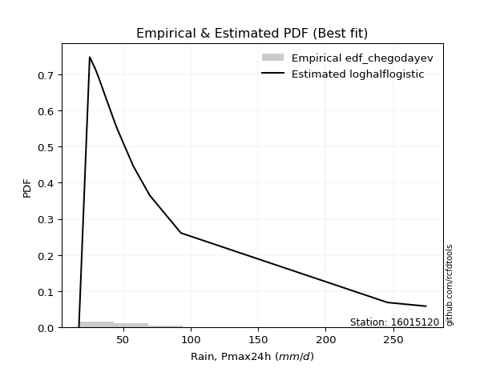</img>

</div>


### 6. EDF Blom (1958)

The Blom formula is a specific "plotting position" formula used in hydrology and statistical analysis to estimate the empirical cumulative probability (or non-exceedance probability) of a data series. It is particularly recommended for data that are approximately normally distributed. The constant _a_ is set to 0.375 (or 3/8).

<div align="center">


$P=(m-a)/(n+1-2a)$


</div>


**6.1. Empirical values**

<div align="center">

|                | 0                    | 1                   | 2                  | 3                   | 4                   | 5                   | 6                  | 7        | 8                  | 9                  | 10                 | 11                 | 12                 | 13                 | 14                 |
|:---------------|:---------------------|:--------------------|:-------------------|:--------------------|:--------------------|:--------------------|:-------------------|:---------|:-------------------|:-------------------|:-------------------|:-------------------|:-------------------|:-------------------|:-------------------|
| date           | 2025                 | 2023                | 2022               | 2014                | 2015                | 2021                | 2019               | 2011     | 2017               | 2020               | 2016               | 2018               | 2024               | 2012               | 2013               |
| x              | 16.1                 | 17.2                | 25.2               | 29.2                | 31.7                | 36.1                | 36.9               | 43.5     | 44.0               | 45.6               | 57.5               | 69.7               | 92.8               | 245.8              | 274.1              |
| m              | 1                    | 2                   | 3                  | 4                   | 5                   | 6                   | 7                  | 8        | 9                  | 10                 | 11                 | 12                 | 13                 | 14                 | 15                 |
| empirical_dist | edf_blom             | edf_blom            | edf_blom           | edf_blom            | edf_blom            | edf_blom            | edf_blom           | edf_blom | edf_blom           | edf_blom           | edf_blom           | edf_blom           | edf_blom           | edf_blom           | edf_blom           |
| empirical      | 0.040983606557377046 | 0.10655737704918032 | 0.1721311475409836 | 0.23770491803278687 | 0.30327868852459017 | 0.36885245901639346 | 0.4344262295081967 | 0.5      | 0.5655737704918032 | 0.6311475409836066 | 0.6967213114754098 | 0.7622950819672131 | 0.8278688524590164 | 0.8934426229508197 | 0.9590163934426229 |
| empirical_tr   | 1.0427350427350428   | 1.1192660550458715  | 1.2079207920792079 | 1.3118279569892473  | 1.4352941176470588  | 1.5844155844155845  | 1.7681159420289854 | 2.0      | 2.30188679245283   | 2.7111111111111112 | 3.2972972972972974 | 4.206896551724137  | 5.80952380952381   | 9.384615384615383  | 24.399999999999974 |

</div>


**6.2. Kolmogorov-Smirnov fit test (sorted by Δ)**


<div align="center">

|                | 0                  | 1                   | 2                   | 3                   | 4                   | 5                   | 6                   | 7                   | 8                   | 9                   | 10                  | 11                  | 12                  | 13                  | 14                  | 15                  | 16                  | 17                  | 18                  | 19                  | 20                  | 21                  | 22                  | 23                 | 24                  | 25                 | 26                  | 27                  | 28                  | 29                  | 30                 | 31                  | 32                  | 33                  | 34                  | 35                  | 36                 | 37                  | 38                 | 39                  | 40                  | 41                  | 42                  | 43                  | 44                  | 45                  | 46                  | 47                  | 48                  | 49                  | 50                  | 51                  | 52                  | 53                  | 54                  | 55                  | 56                  | 57                  | 58                  | 59                  | 60                  | 61                  | 62                  | 63                  | 64                  | 65                  | 66                  | 67                  | 68                  | 69                  | 70                  | 71                  | 72                  | 73                  | 74                  | 75                  | 76                  | 77                  | 78                  | 79                  | 80                 | 81                  | 82                  | 83                 | 84                  | 85                  | 86                  | 87                  | 88                  | 89                  | 90                 | 91                 | 92                  | 93                  | 94                  | 95                  | 96                 | 97                 | 98                  | 99                 | 100                 | 101                | 102                 | 103                 | 104                | 105                | 106                 | 107                 | 108                 | 109                | 110                 | 111                 | 112                | 113                | 114                | 115                 | 116                | 117                 | 118                 | 119                | 120                | 121                | 122                 | 123                | 124                | 125                | 126                 | 127                | 128                 | 129                 | 130                | 131                | 132                | 133                | 134                 | 135                | 136                | 137                | 138                | 139                | 140                | 141                | 142                | 143                | 144                 | 145                | 146                | 147                | 148                 | 149                | 150                | 151                | 152                | 153                | 154                | 155                | 156                | 157                | 158                | 159                |
|:---------------|:-------------------|:--------------------|:--------------------|:--------------------|:--------------------|:--------------------|:--------------------|:--------------------|:--------------------|:--------------------|:--------------------|:--------------------|:--------------------|:--------------------|:--------------------|:--------------------|:--------------------|:--------------------|:--------------------|:--------------------|:--------------------|:--------------------|:--------------------|:-------------------|:--------------------|:-------------------|:--------------------|:--------------------|:--------------------|:--------------------|:-------------------|:--------------------|:--------------------|:--------------------|:--------------------|:--------------------|:-------------------|:--------------------|:-------------------|:--------------------|:--------------------|:--------------------|:--------------------|:--------------------|:--------------------|:--------------------|:--------------------|:--------------------|:--------------------|:--------------------|:--------------------|:--------------------|:--------------------|:--------------------|:--------------------|:--------------------|:--------------------|:--------------------|:--------------------|:--------------------|:--------------------|:--------------------|:--------------------|:--------------------|:--------------------|:--------------------|:--------------------|:--------------------|:--------------------|:--------------------|:--------------------|:--------------------|:--------------------|:--------------------|:--------------------|:--------------------|:--------------------|:--------------------|:--------------------|:--------------------|:-------------------|:--------------------|:--------------------|:-------------------|:--------------------|:--------------------|:--------------------|:--------------------|:--------------------|:--------------------|:-------------------|:-------------------|:--------------------|:--------------------|:--------------------|:--------------------|:-------------------|:-------------------|:--------------------|:-------------------|:--------------------|:-------------------|:--------------------|:--------------------|:-------------------|:-------------------|:--------------------|:--------------------|:--------------------|:-------------------|:--------------------|:--------------------|:-------------------|:-------------------|:-------------------|:--------------------|:-------------------|:--------------------|:--------------------|:-------------------|:-------------------|:-------------------|:--------------------|:-------------------|:-------------------|:-------------------|:--------------------|:-------------------|:--------------------|:--------------------|:-------------------|:-------------------|:-------------------|:-------------------|:--------------------|:-------------------|:-------------------|:-------------------|:-------------------|:-------------------|:-------------------|:-------------------|:-------------------|:-------------------|:--------------------|:-------------------|:-------------------|:-------------------|:--------------------|:-------------------|:-------------------|:-------------------|:-------------------|:-------------------|:-------------------|:-------------------|:-------------------|:-------------------|:-------------------|:-------------------|
| station        | 16015120           | 16015120            | 16015120            | 16015120            | 16015120            | 16015120            | 16015120            | 16015120            | 16015120            | 16015120            | 16015120            | 16015120            | 16015120            | 16015120            | 16015120            | 16015120            | 16015120            | 16015120            | 16015120            | 16015120            | 16015120            | 16015120            | 16015120            | 16015120           | 16015120            | 16015120           | 16015120            | 16015120            | 16015120            | 16015120            | 16015120           | 16015120            | 16015120            | 16015120            | 16015120            | 16015120            | 16015120           | 16015120            | 16015120           | 16015120            | 16015120            | 16015120            | 16015120            | 16015120            | 16015120            | 16015120            | 16015120            | 16015120            | 16015120            | 16015120            | 16015120            | 16015120            | 16015120            | 16015120            | 16015120            | 16015120            | 16015120            | 16015120            | 16015120            | 16015120            | 16015120            | 16015120            | 16015120            | 16015120            | 16015120            | 16015120            | 16015120            | 16015120            | 16015120            | 16015120            | 16015120            | 16015120            | 16015120            | 16015120            | 16015120            | 16015120            | 16015120            | 16015120            | 16015120            | 16015120            | 16015120           | 16015120            | 16015120            | 16015120           | 16015120            | 16015120            | 16015120            | 16015120            | 16015120            | 16015120            | 16015120           | 16015120           | 16015120            | 16015120            | 16015120            | 16015120            | 16015120           | 16015120           | 16015120            | 16015120           | 16015120            | 16015120           | 16015120            | 16015120            | 16015120           | 16015120           | 16015120            | 16015120            | 16015120            | 16015120           | 16015120            | 16015120            | 16015120           | 16015120           | 16015120           | 16015120            | 16015120           | 16015120            | 16015120            | 16015120           | 16015120           | 16015120           | 16015120            | 16015120           | 16015120           | 16015120           | 16015120            | 16015120           | 16015120            | 16015120            | 16015120           | 16015120           | 16015120           | 16015120           | 16015120            | 16015120           | 16015120           | 16015120           | 16015120           | 16015120           | 16015120           | 16015120           | 16015120           | 16015120           | 16015120            | 16015120           | 16015120           | 16015120           | 16015120            | 16015120           | 16015120           | 16015120           | 16015120           | 16015120           | 16015120           | 16015120           | 16015120           | 16015120           | 16015120           | 16015120           |
| empirical_dist | edf_blom           | edf_blom            | edf_blom            | edf_blom            | edf_blom            | edf_blom            | edf_blom            | edf_blom            | edf_blom            | edf_blom            | edf_blom            | edf_blom            | edf_blom            | edf_blom            | edf_blom            | edf_blom            | edf_blom            | edf_blom            | edf_blom            | edf_blom            | edf_blom            | edf_blom            | edf_blom            | edf_blom           | edf_blom            | edf_blom           | edf_blom            | edf_blom            | edf_blom            | edf_blom            | edf_blom           | edf_blom            | edf_blom            | edf_blom            | edf_blom            | edf_blom            | edf_blom           | edf_blom            | edf_blom           | edf_blom            | edf_blom            | edf_blom            | edf_blom            | edf_blom            | edf_blom            | edf_blom            | edf_blom            | edf_blom            | edf_blom            | edf_blom            | edf_blom            | edf_blom            | edf_blom            | edf_blom            | edf_blom            | edf_blom            | edf_blom            | edf_blom            | edf_blom            | edf_blom            | edf_blom            | edf_blom            | edf_blom            | edf_blom            | edf_blom            | edf_blom            | edf_blom            | edf_blom            | edf_blom            | edf_blom            | edf_blom            | edf_blom            | edf_blom            | edf_blom            | edf_blom            | edf_blom            | edf_blom            | edf_blom            | edf_blom            | edf_blom            | edf_blom           | edf_blom            | edf_blom            | edf_blom           | edf_blom            | edf_blom            | edf_blom            | edf_blom            | edf_blom            | edf_blom            | edf_blom           | edf_blom           | edf_blom            | edf_blom            | edf_blom            | edf_blom            | edf_blom           | edf_blom           | edf_blom            | edf_blom           | edf_blom            | edf_blom           | edf_blom            | edf_blom            | edf_blom           | edf_blom           | edf_blom            | edf_blom            | edf_blom            | edf_blom           | edf_blom            | edf_blom            | edf_blom           | edf_blom           | edf_blom           | edf_blom            | edf_blom           | edf_blom            | edf_blom            | edf_blom           | edf_blom           | edf_blom           | edf_blom            | edf_blom           | edf_blom           | edf_blom           | edf_blom            | edf_blom           | edf_blom            | edf_blom            | edf_blom           | edf_blom           | edf_blom           | edf_blom           | edf_blom            | edf_blom           | edf_blom           | edf_blom           | edf_blom           | edf_blom           | edf_blom           | edf_blom           | edf_blom           | edf_blom           | edf_blom            | edf_blom           | edf_blom           | edf_blom           | edf_blom            | edf_blom           | edf_blom           | edf_blom           | edf_blom           | edf_blom           | edf_blom           | edf_blom           | edf_blom           | edf_blom           | edf_blom           | edf_blom           |
| p_dist         | logburr12          | alpha               | logburr             | logexponnorm        | f                   | logerlang           | loggamma            | loggamma            | genextreme          | invweibull          | logmielke           | logdweibull         | invgamma            | logjohnsonsu        | nct                 | logfatiguelife      | loginvgauss         | loginvgamma         | logmoyal            | logf                | logt                | loggenextreme       | loginvweibull       | loggennorm         | logalpha            | kappa3             | loggenexpon         | genpareto           | logweibull_min      | loggenlogistic      | logfoldnorm        | johnsonsu           | burr                | invgauss            | logloglaplace       | logkappa3           | logdgamma          | loggompertz         | loggumbel_r        | loghalfnorm         | loggenhalflogistic  | mielke              | erlang              | lognct              | logkstwobign        | logpearson3         | logskewnorm         | loghalflogistic     | fatiguelife         | logvonmises_line    | logbetaprime        | logtruncweibull_min | lograyleigh         | lognakagami         | gamma               | betaprime           | logwald             | halfgennorm         | logncf              | logmaxwell          | truncpareto         | logrice             | truncweibull_min    | wald                | t                   | loggausshyper       | logbeta             | logtruncexpon       | logsemicircular     | loganglit           | exponpow            | logarcsine          | logloggamma         | lognorm             | logcrystalball      | loggengamma         | loglogistic         | loghypsecant        | logtruncnorm        | logrdist            | vonmises_line      | logtukeylambda      | logbradford         | burr12             | loglaplace          | loglaplace          | loglomax            | gennorm             | genhalflogistic     | dweibull            | weibull_min        | loghalfgennorm     | moyal               | beta                | exponweib           | gumbel_r            | gompertz           | logcosine          | pearson3            | exponnorm          | genexpon            | nakagami           | rayleigh            | halflogistic        | loggumbel_l        | dgamma             | genlogistic         | maxwell             | logkappa4           | halfnorm           | gengamma            | logksone            | lomax              | logexponpow        | logjohnsonsb       | logwrapcauchy       | logexponweib       | loguniform          | semicircular        | anglit             | norm               | crystalball        | foldnorm            | logistic           | logargus           | hypsecant          | kstwobign           | arcsine            | loggenpareto        | ncf                 | truncnorm          | gausshyper         | rice               | powerlaw           | laplace             | logtriang          | gumbel_l           | logweibull_max     | truncexpon         | bradford           | cosine             | wrapcauchy         | skewnorm           | loglevy_l          | logpowerlaw         | triang             | argus              | levy_l             | logtrapezoid        | ksone              | johnsonsb          | kappa4             | rdist              | uniform            | tukeylambda        | logtruncpareto     | trapezoid          | weibull_max        | logvonmises        | vonmises           |
| delta          | 0.0727803399656961 | 0.07329029202402437 | 0.07482031110686449 | 0.07533281215787391 | 0.07776848054666952 | 0.07854239423890735 | 0.07854454403792355 | 0.07854454403792355 | 0.07859510121317559 | 0.07859529467872417 | 0.07935317368359163 | 0.07952543290312508 | 0.07983765241623597 | 0.08039305540603037 | 0.08043590837908432 | 0.08046548993278624 | 0.08072070380842244 | 0.08120227876324204 | 0.08120342214942254 | 0.08121856825221485 | 0.08169081200731265 | 0.08212648409310308 | 0.08213568164749097 | 0.0822027550951484 | 0.08228624605831014 | 0.0833896721108438 | 0.08674354786479055 | 0.08785866440902834 | 0.08812613044884926 | 0.08821241953350079 | 0.0888433259213377 | 0.08903192030922763 | 0.08938309024698532 | 0.08962595385759298 | 0.09060826344498885 | 0.09115611481705754 | 0.0914981560857977 | 0.09177246307860432 | 0.0922118343967554 | 0.09346012833450643 | 0.09496041888123574 | 0.09711747534664916 | 0.09866843299107775 | 0.10024742819300203 | 0.10046796736826613 | 0.10129861648701377 | 0.10591604195885318 | 0.10655737704918032 | 0.10685771287644608 | 0.10991072522365186 | 0.11434345103396659 | 0.11470032799624563 | 0.11546519025420243 | 0.11569818656666064 | 0.11685572994895377 | 0.11709468520373278 | 0.12381093177699234 | 0.12471936539735018 | 0.12623615160854695 | 0.12705575001095937 | 0.12917573712323627 | 0.13324724336767252 | 0.13566007704891958 | 0.13602190329009223 | 0.14051881690352053 | 0.14299076061000343 | 0.14616972011037138 | 0.14865339298625174 | 0.15501902576215326 | 0.15677778857538321 | 0.15745450526793794 | 0.15768120777970407 | 0.15955821287982036 | 0.16104479160873786 | 0.16104512826730272 | 0.16440637920238205 | 0.16510915668397963 | 0.16856684598233346 | 0.17213112513636292 | 0.17213114724782763 | 0.1721311475395496 | 0.17213114754097647 | 0.17618250570312122 | 0.1777958184657003 | 0.18147226858963345 | 0.18147226858963345 | 0.18214786546168787 | 0.18290484924955364 | 0.18791076452997552 | 0.19116522656717583 | 0.1962894195241555 | 0.1969119629949912 | 0.19956097188091299 | 0.20313192757980755 | 0.20733159824675162 | 0.20751666653291034 | 0.2077467034164675 | 0.2085668135116196 | 0.20963340608735764 | 0.214006602341417  | 0.21560136417971687 | 0.2179040079391087 | 0.22472399275097643 | 0.22674381635954932 | 0.2316667621138594 | 0.2320363747101326 | 0.23332862227696322 | 0.23588170885510196 | 0.24101620840850196 | 0.2448529209911819 | 0.24787923194966546 | 0.24817112254227314 | 0.2536158981074959 | 0.2575897710481439 | 0.2595110312695825 | 0.26268389050027846 | 0.263604917345484  | 0.26387830889256664 | 0.26779989219452305 | 0.2682065855847116 | 0.2691940199853749 | 0.2691940242326911 | 0.27540136894402284 | 0.2770757159482251 | 0.2887875895322327 | 0.2898571617396679 | 0.28987120653399573 | 0.2900325848866569 | 0.29131145764134003 | 0.29802689907357766 | 0.301906134081542  | 0.305038530722011  | 0.3140224394752064 | 0.3154865209077736 | 0.31825389976396945 | 0.333419962211038  | 0.3397394236275729 | 0.3446415099733238 | 0.350559443115989  | 0.3515532263202699 | 0.3594208927984684 | 0.3827148601434071 | 0.3856522778303929 | 0.3868296742443173 | 0.41842120648443193 | 0.4350092552943514 | 0.4458148790441757 | 0.4575058122750177 | 0.49797163631243563 | 0.5058351336467997 | 0.5061277409579609 | 0.5144015799409785 | 0.5499943477648461 | 0.554543143982717  | 0.578302167935837  | 0.7132608061085813 | 0.7172202220577819 | 0.7288318567534213 | 1.0849972455690715 | 43.15052962687907  |
| deltao         | 0.3366456264050002 | 0.3366456264050002  | 0.3366456264050002  | 0.3366456264050002  | 0.3366456264050002  | 0.3366456264050002  | 0.3366456264050002  | 0.3366456264050002  | 0.3366456264050002  | 0.3366456264050002  | 0.3366456264050002  | 0.3366456264050002  | 0.3366456264050002  | 0.3366456264050002  | 0.3366456264050002  | 0.3366456264050002  | 0.3366456264050002  | 0.3366456264050002  | 0.3366456264050002  | 0.3366456264050002  | 0.3366456264050002  | 0.3366456264050002  | 0.3366456264050002  | 0.3366456264050002 | 0.3366456264050002  | 0.3366456264050002 | 0.3366456264050002  | 0.3366456264050002  | 0.3366456264050002  | 0.3366456264050002  | 0.3366456264050002 | 0.3366456264050002  | 0.3366456264050002  | 0.3366456264050002  | 0.3366456264050002  | 0.3366456264050002  | 0.3366456264050002 | 0.3366456264050002  | 0.3366456264050002 | 0.3366456264050002  | 0.3366456264050002  | 0.3366456264050002  | 0.3366456264050002  | 0.3366456264050002  | 0.3366456264050002  | 0.3366456264050002  | 0.3366456264050002  | 0.3366456264050002  | 0.3366456264050002  | 0.3366456264050002  | 0.3366456264050002  | 0.3366456264050002  | 0.3366456264050002  | 0.3366456264050002  | 0.3366456264050002  | 0.3366456264050002  | 0.3366456264050002  | 0.3366456264050002  | 0.3366456264050002  | 0.3366456264050002  | 0.3366456264050002  | 0.3366456264050002  | 0.3366456264050002  | 0.3366456264050002  | 0.3366456264050002  | 0.3366456264050002  | 0.3366456264050002  | 0.3366456264050002  | 0.3366456264050002  | 0.3366456264050002  | 0.3366456264050002  | 0.3366456264050002  | 0.3366456264050002  | 0.3366456264050002  | 0.3366456264050002  | 0.3366456264050002  | 0.3366456264050002  | 0.3366456264050002  | 0.3366456264050002  | 0.3366456264050002  | 0.3366456264050002 | 0.3366456264050002  | 0.3366456264050002  | 0.3366456264050002 | 0.3366456264050002  | 0.3366456264050002  | 0.3366456264050002  | 0.3366456264050002  | 0.3366456264050002  | 0.3366456264050002  | 0.3366456264050002 | 0.3366456264050002 | 0.3366456264050002  | 0.3366456264050002  | 0.3366456264050002  | 0.3366456264050002  | 0.3366456264050002 | 0.3366456264050002 | 0.3366456264050002  | 0.3366456264050002 | 0.3366456264050002  | 0.3366456264050002 | 0.3366456264050002  | 0.3366456264050002  | 0.3366456264050002 | 0.3366456264050002 | 0.3366456264050002  | 0.3366456264050002  | 0.3366456264050002  | 0.3366456264050002 | 0.3366456264050002  | 0.3366456264050002  | 0.3366456264050002 | 0.3366456264050002 | 0.3366456264050002 | 0.3366456264050002  | 0.3366456264050002 | 0.3366456264050002  | 0.3366456264050002  | 0.3366456264050002 | 0.3366456264050002 | 0.3366456264050002 | 0.3366456264050002  | 0.3366456264050002 | 0.3366456264050002 | 0.3366456264050002 | 0.3366456264050002  | 0.3366456264050002 | 0.3366456264050002  | 0.3366456264050002  | 0.3366456264050002 | 0.3366456264050002 | 0.3366456264050002 | 0.3366456264050002 | 0.3366456264050002  | 0.3366456264050002 | 0.3366456264050002 | 0.3366456264050002 | 0.3366456264050002 | 0.3366456264050002 | 0.3366456264050002 | 0.3366456264050002 | 0.3366456264050002 | 0.3366456264050002 | 0.3366456264050002  | 0.3366456264050002 | 0.3366456264050002 | 0.3366456264050002 | 0.3366456264050002  | 0.3366456264050002 | 0.3366456264050002 | 0.3366456264050002 | 0.3366456264050002 | 0.3366456264050002 | 0.3366456264050002 | 0.3366456264050002 | 0.3366456264050002 | 0.3366456264050002 | 0.3366456264050002 | 0.3366456264050002 |
| eval           | Δo > Δ             | Δo > Δ              | Δo > Δ              | Δo > Δ              | Δo > Δ              | Δo > Δ              | Δo > Δ              | Δo > Δ              | Δo > Δ              | Δo > Δ              | Δo > Δ              | Δo > Δ              | Δo > Δ              | Δo > Δ              | Δo > Δ              | Δo > Δ              | Δo > Δ              | Δo > Δ              | Δo > Δ              | Δo > Δ              | Δo > Δ              | Δo > Δ              | Δo > Δ              | Δo > Δ             | Δo > Δ              | Δo > Δ             | Δo > Δ              | Δo > Δ              | Δo > Δ              | Δo > Δ              | Δo > Δ             | Δo > Δ              | Δo > Δ              | Δo > Δ              | Δo > Δ              | Δo > Δ              | Δo > Δ             | Δo > Δ              | Δo > Δ             | Δo > Δ              | Δo > Δ              | Δo > Δ              | Δo > Δ              | Δo > Δ              | Δo > Δ              | Δo > Δ              | Δo > Δ              | Δo > Δ              | Δo > Δ              | Δo > Δ              | Δo > Δ              | Δo > Δ              | Δo > Δ              | Δo > Δ              | Δo > Δ              | Δo > Δ              | Δo > Δ              | Δo > Δ              | Δo > Δ              | Δo > Δ              | Δo > Δ              | Δo > Δ              | Δo > Δ              | Δo > Δ              | Δo > Δ              | Δo > Δ              | Δo > Δ              | Δo > Δ              | Δo > Δ              | Δo > Δ              | Δo > Δ              | Δo > Δ              | Δo > Δ              | Δo > Δ              | Δo > Δ              | Δo > Δ              | Δo > Δ              | Δo > Δ              | Δo > Δ              | Δo > Δ              | Δo > Δ             | Δo > Δ              | Δo > Δ              | Δo > Δ             | Δo > Δ              | Δo > Δ              | Δo > Δ              | Δo > Δ              | Δo > Δ              | Δo > Δ              | Δo > Δ             | Δo > Δ             | Δo > Δ              | Δo > Δ              | Δo > Δ              | Δo > Δ              | Δo > Δ             | Δo > Δ             | Δo > Δ              | Δo > Δ             | Δo > Δ              | Δo > Δ             | Δo > Δ              | Δo > Δ              | Δo > Δ             | Δo > Δ             | Δo > Δ              | Δo > Δ              | Δo > Δ              | Δo > Δ             | Δo > Δ              | Δo > Δ              | Δo > Δ             | Δo > Δ             | Δo > Δ             | Δo > Δ              | Δo > Δ             | Δo > Δ              | Δo > Δ              | Δo > Δ             | Δo > Δ             | Δo > Δ             | Δo > Δ              | Δo > Δ             | Δo > Δ             | Δo > Δ             | Δo > Δ              | Δo > Δ             | Δo > Δ              | Δo > Δ              | Δo > Δ             | Δo > Δ             | Δo > Δ             | Δo > Δ             | Δo > Δ              | Δo > Δ             | Δo <= Δ            | Δo <= Δ            | Δo <= Δ            | Δo <= Δ            | Δo <= Δ            | Δo <= Δ            | Δo <= Δ            | Δo <= Δ            | Δo <= Δ             | Δo <= Δ            | Δo <= Δ            | Δo <= Δ            | Δo <= Δ             | Δo <= Δ            | Δo <= Δ            | Δo <= Δ            | Δo <= Δ            | Δo <= Δ            | Δo <= Δ            | Δo <= Δ            | Δo <= Δ            | Δo <= Δ            | Δo <= Δ            | Δo <= Δ            |
| fit            | 1                  | 1                   | 1                   | 1                   | 1                   | 1                   | 1                   | 1                   | 1                   | 1                   | 1                   | 1                   | 1                   | 1                   | 1                   | 1                   | 1                   | 1                   | 1                   | 1                   | 1                   | 1                   | 1                   | 1                  | 1                   | 1                  | 1                   | 1                   | 1                   | 1                   | 1                  | 1                   | 1                   | 1                   | 1                   | 1                   | 1                  | 1                   | 1                  | 1                   | 1                   | 1                   | 1                   | 1                   | 1                   | 1                   | 1                   | 1                   | 1                   | 1                   | 1                   | 1                   | 1                   | 1                   | 1                   | 1                   | 1                   | 1                   | 1                   | 1                   | 1                   | 1                   | 1                   | 1                   | 1                   | 1                   | 1                   | 1                   | 1                   | 1                   | 1                   | 1                   | 1                   | 1                   | 1                   | 1                   | 1                   | 1                   | 1                   | 1                   | 1                  | 1                   | 1                   | 1                  | 1                   | 1                   | 1                   | 1                   | 1                   | 1                   | 1                  | 1                  | 1                   | 1                   | 1                   | 1                   | 1                  | 1                  | 1                   | 1                  | 1                   | 1                  | 1                   | 1                   | 1                  | 1                  | 1                   | 1                   | 1                   | 1                  | 1                   | 1                   | 1                  | 1                  | 1                  | 1                   | 1                  | 1                   | 1                   | 1                  | 1                  | 1                  | 1                   | 1                  | 1                  | 1                  | 1                   | 1                  | 1                   | 1                   | 1                  | 1                  | 1                  | 1                  | 1                   | 1                  | 0                  | 0                  | 0                  | 0                  | 0                  | 0                  | 0                  | 0                  | 0                   | 0                  | 0                  | 0                  | 0                   | 0                  | 0                  | 0                  | 0                  | 0                  | 0                  | 0                  | 0                  | 0                  | 0                  | 0                  |
| n              | 15                 | 15                  | 15                  | 15                  | 15                  | 15                  | 15                  | 15                  | 15                  | 15                  | 15                  | 15                  | 15                  | 15                  | 15                  | 15                  | 15                  | 15                  | 15                  | 15                  | 15                  | 15                  | 15                  | 15                 | 15                  | 15                 | 15                  | 15                  | 15                  | 15                  | 15                 | 15                  | 15                  | 15                  | 15                  | 15                  | 15                 | 15                  | 15                 | 15                  | 15                  | 15                  | 15                  | 15                  | 15                  | 15                  | 15                  | 15                  | 15                  | 15                  | 15                  | 15                  | 15                  | 15                  | 15                  | 15                  | 15                  | 15                  | 15                  | 15                  | 15                  | 15                  | 15                  | 15                  | 15                  | 15                  | 15                  | 15                  | 15                  | 15                  | 15                  | 15                  | 15                  | 15                  | 15                  | 15                  | 15                  | 15                  | 15                  | 15                  | 15                 | 15                  | 15                  | 15                 | 15                  | 15                  | 15                  | 15                  | 15                  | 15                  | 15                 | 15                 | 15                  | 15                  | 15                  | 15                  | 15                 | 15                 | 15                  | 15                 | 15                  | 15                 | 15                  | 15                  | 15                 | 15                 | 15                  | 15                  | 15                  | 15                 | 15                  | 15                  | 15                 | 15                 | 15                 | 15                  | 15                 | 15                  | 15                  | 15                 | 15                 | 15                 | 15                  | 15                 | 15                 | 15                 | 15                  | 15                 | 15                  | 15                  | 15                 | 15                 | 15                 | 15                 | 15                  | 15                 | 15                 | 15                 | 15                 | 15                 | 15                 | 15                 | 15                 | 15                 | 15                  | 15                 | 15                 | 15                 | 15                  | 15                 | 15                 | 15                 | 15                 | 15                 | 15                 | 15                 | 15                 | 15                 | 15                 | 15                 |
| best_fit       | 1                  | 0                   | 0                   | 0                   | 0                   | 0                   | 0                   | 0                   | 0                   | 0                   | 0                   | 0                   | 0                   | 0                   | 0                   | 0                   | 0                   | 0                   | 0                   | 0                   | 0                   | 0                   | 0                   | 0                  | 0                   | 0                  | 0                   | 0                   | 0                   | 0                   | 0                  | 0                   | 0                   | 0                   | 0                   | 0                   | 0                  | 0                   | 0                  | 0                   | 0                   | 0                   | 0                   | 0                   | 0                   | 0                   | 0                   | 0                   | 0                   | 0                   | 0                   | 0                   | 0                   | 0                   | 0                   | 0                   | 0                   | 0                   | 0                   | 0                   | 0                   | 0                   | 0                   | 0                   | 0                   | 0                   | 0                   | 0                   | 0                   | 0                   | 0                   | 0                   | 0                   | 0                   | 0                   | 0                   | 0                   | 0                   | 0                   | 0                   | 0                  | 0                   | 0                   | 0                  | 0                   | 0                   | 0                   | 0                   | 0                   | 0                   | 0                  | 0                  | 0                   | 0                   | 0                   | 0                   | 0                  | 0                  | 0                   | 0                  | 0                   | 0                  | 0                   | 0                   | 0                  | 0                  | 0                   | 0                   | 0                   | 0                  | 0                   | 0                   | 0                  | 0                  | 0                  | 0                   | 0                  | 0                   | 0                   | 0                  | 0                  | 0                  | 0                   | 0                  | 0                  | 0                  | 0                   | 0                  | 0                   | 0                   | 0                  | 0                  | 0                  | 0                  | 0                   | 0                  | 0                  | 0                  | 0                  | 0                  | 0                  | 0                  | 0                  | 0                  | 0                   | 0                  | 0                  | 0                  | 0                   | 0                  | 0                  | 0                  | 0                  | 0                  | 0                  | 0                  | 0                  | 0                  | 0                  | 0                  |
| best_fit_sort  | 1                  | 2                   | 3                   | 4                   | 5                   | 6                   | 7                   | 8                   | 9                   | 10                  | 11                  | 12                  | 13                  | 14                  | 15                  | 16                  | 17                  | 18                  | 19                  | 20                  | 21                  | 22                  | 23                  | 24                 | 25                  | 26                 | 27                  | 28                  | 29                  | 30                  | 31                 | 32                  | 33                  | 34                  | 35                  | 36                  | 37                 | 38                  | 39                 | 40                  | 41                  | 42                  | 43                  | 44                  | 45                  | 46                  | 47                  | 48                  | 49                  | 50                  | 51                  | 52                  | 53                  | 54                  | 55                  | 56                  | 57                  | 58                  | 59                  | 60                  | 61                  | 62                  | 63                  | 64                  | 65                  | 66                  | 67                  | 68                  | 69                  | 70                  | 71                  | 72                  | 73                  | 74                  | 75                  | 76                  | 77                  | 78                  | 79                  | 80                  | 81                 | 82                  | 83                  | 84                 | 85                  | 86                  | 87                  | 88                  | 89                  | 90                  | 91                 | 92                 | 93                  | 94                  | 95                  | 96                  | 97                 | 98                 | 99                  | 100                | 101                 | 102                | 103                 | 104                 | 105                | 106                | 107                 | 108                 | 109                 | 110                | 111                 | 112                 | 113                | 114                | 115                | 116                 | 117                | 118                 | 119                 | 120                | 121                | 122                | 123                 | 124                | 125                | 126                | 127                 | 128                | 129                 | 130                 | 131                | 132                | 133                | 134                | 135                 | 136                | 137                | 138                | 139                | 140                | 141                | 142                | 143                | 144                | 145                 | 146                | 147                | 148                | 149                 | 150                | 151                | 152                | 153                | 154                | 155                | 156                | 157                | 158                | 159                | 160                |

</div>


**6.3. Best fit**

<div align="center">

|   id |   station | empirical_dist   | p_dist    |     delta |   deltao | eval   |   fit |   n |   best_fit |   best_fit_sort |
|-----:|----------:|:-----------------|:----------|----------:|---------:|:-------|------:|----:|-----------:|----------------:|
|    0 |  16015120 | edf_blom         | logburr12 | 0.0727803 | 0.336646 | Δo > Δ |     1 |  15 |          1 |               1 |

</div>


<div align="center">

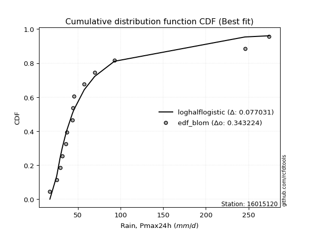</img></img>

</div>


### 7. EDF Tukey (1962)

In hydrology, the Tukey formula is used as a plotting position formula to estimate the empirical probability or frequency of a flood event (or other hydrological data). The formula parameter is given as _c=0.333_ (or 1/3).

<div align="center">


$P=(m-c)/(n+1-2c)$


</div>


**7.1. Empirical values**

<div align="center">

|                | 0                    | 1                   | 2                   | 3                  | 4                   | 5                  | 6                   | 7         | 8                  | 9                  | 10                 | 11                 | 12                 | 13                 | 14                 |
|:---------------|:---------------------|:--------------------|:--------------------|:-------------------|:--------------------|:-------------------|:--------------------|:----------|:-------------------|:-------------------|:-------------------|:-------------------|:-------------------|:-------------------|:-------------------|
| date           | 2025                 | 2023                | 2022                | 2014               | 2015                | 2021               | 2019                | 2011      | 2017               | 2020               | 2016               | 2018               | 2024               | 2012               | 2013               |
| x              | 16.1                 | 17.2                | 25.2                | 29.2               | 31.7                | 36.1               | 36.9                | 43.5      | 44.0               | 45.6               | 57.5               | 69.7               | 92.8               | 245.8              | 274.1              |
| m              | 1                    | 2                   | 3                   | 4                  | 5                   | 6                  | 7                   | 8         | 9                  | 10                 | 11                 | 12                 | 13                 | 14                 | 15                 |
| empirical_dist | edf_tukey            | edf_tukey           | edf_tukey           | edf_tukey          | edf_tukey           | edf_tukey          | edf_tukey           | edf_tukey | edf_tukey          | edf_tukey          | edf_tukey          | edf_tukey          | edf_tukey          | edf_tukey          | edf_tukey          |
| empirical      | 0.043478260869565216 | 0.10869565217391304 | 0.17391304347826086 | 0.2391304347826087 | 0.30434782608695654 | 0.3695652173913043 | 0.43478260869565216 | 0.5       | 0.5652173913043478 | 0.6304347826086957 | 0.6956521739130435 | 0.7608695652173914 | 0.8260869565217391 | 0.8913043478260869 | 0.9565217391304348 |
| empirical_tr   | 1.0454545454545454   | 1.1219512195121952  | 1.2105263157894737  | 1.3142857142857143 | 1.4375              | 1.586206896551724  | 1.769230769230769   | 2.0       | 2.3                | 2.7058823529411766 | 3.2857142857142856 | 4.1818181818181825 | 5.75               | 9.199999999999998  | 23.000000000000014 |

</div>


**7.2. Kolmogorov-Smirnov fit test (sorted by Δ)**


<div align="center">

|                | 0                   | 1                   | 2                   | 3                   | 4                  | 5                   | 6                   | 7                   | 8                   | 9                   | 10                  | 11                  | 12                  | 13                  | 14                 | 15                  | 16                  | 17                  | 18                  | 19                  | 20                  | 21                  | 22                  | 23                  | 24                  | 25                 | 26                  | 27                  | 28                  | 29                  | 30                 | 31                  | 32                 | 33                  | 34                  | 35                  | 36                  | 37                 | 38                  | 39                  | 40                  | 41                  | 42                  | 43                  | 44                  | 45                 | 46                  | 47                  | 48                  | 49                  | 50                  | 51                  | 52                  | 53                  | 54                  | 55                  | 56                  | 57                  | 58                 | 59                  | 60                  | 61                 | 62                  | 63                 | 64                  | 65                  | 66                  | 67                  | 68                  | 69                  | 70                 | 71                  | 72                  | 73                  | 74                 | 75                  | 76                  | 77                  | 78                  | 79                  | 80                 | 81                  | 82                 | 83                  | 84                  | 85                  | 86                  | 87                  | 88                  | 89                  | 90                  | 91                  | 92                 | 93                 | 94                 | 95                  | 96                 | 97                  | 98                  | 99                  | 100                 | 101                 | 102                | 103                 | 104                 | 105                 | 106                | 107                 | 108                 | 109                | 110                | 111                 | 112                | 113                 | 114                 | 115                 | 116                | 117                | 118                 | 119                | 120                | 121                | 122                | 123                | 124                 | 125                | 126                | 127                | 128                | 129                | 130                | 131                 | 132                | 133                 | 134                 | 135                 | 136                | 137                | 138                | 139                | 140                | 141                | 142                 | 143                | 144                 | 145                | 146                | 147                 | 148                | 149                | 150                | 151                | 152                | 153                | 154                | 155                | 156                | 157                | 158                | 159                |
|:---------------|:--------------------|:--------------------|:--------------------|:--------------------|:-------------------|:--------------------|:--------------------|:--------------------|:--------------------|:--------------------|:--------------------|:--------------------|:--------------------|:--------------------|:-------------------|:--------------------|:--------------------|:--------------------|:--------------------|:--------------------|:--------------------|:--------------------|:--------------------|:--------------------|:--------------------|:-------------------|:--------------------|:--------------------|:--------------------|:--------------------|:-------------------|:--------------------|:-------------------|:--------------------|:--------------------|:--------------------|:--------------------|:-------------------|:--------------------|:--------------------|:--------------------|:--------------------|:--------------------|:--------------------|:--------------------|:-------------------|:--------------------|:--------------------|:--------------------|:--------------------|:--------------------|:--------------------|:--------------------|:--------------------|:--------------------|:--------------------|:--------------------|:--------------------|:-------------------|:--------------------|:--------------------|:-------------------|:--------------------|:-------------------|:--------------------|:--------------------|:--------------------|:--------------------|:--------------------|:--------------------|:-------------------|:--------------------|:--------------------|:--------------------|:-------------------|:--------------------|:--------------------|:--------------------|:--------------------|:--------------------|:-------------------|:--------------------|:-------------------|:--------------------|:--------------------|:--------------------|:--------------------|:--------------------|:--------------------|:--------------------|:--------------------|:--------------------|:-------------------|:-------------------|:-------------------|:--------------------|:-------------------|:--------------------|:--------------------|:--------------------|:--------------------|:--------------------|:-------------------|:--------------------|:--------------------|:--------------------|:-------------------|:--------------------|:--------------------|:-------------------|:-------------------|:--------------------|:-------------------|:--------------------|:--------------------|:--------------------|:-------------------|:-------------------|:--------------------|:-------------------|:-------------------|:-------------------|:-------------------|:-------------------|:--------------------|:-------------------|:-------------------|:-------------------|:-------------------|:-------------------|:-------------------|:--------------------|:-------------------|:--------------------|:--------------------|:--------------------|:-------------------|:-------------------|:-------------------|:-------------------|:-------------------|:-------------------|:--------------------|:-------------------|:--------------------|:-------------------|:-------------------|:--------------------|:-------------------|:-------------------|:-------------------|:-------------------|:-------------------|:-------------------|:-------------------|:-------------------|:-------------------|:-------------------|:-------------------|:-------------------|
| station        | 16015120            | 16015120            | 16015120            | 16015120            | 16015120           | 16015120            | 16015120            | 16015120            | 16015120            | 16015120            | 16015120            | 16015120            | 16015120            | 16015120            | 16015120           | 16015120            | 16015120            | 16015120            | 16015120            | 16015120            | 16015120            | 16015120            | 16015120            | 16015120            | 16015120            | 16015120           | 16015120            | 16015120            | 16015120            | 16015120            | 16015120           | 16015120            | 16015120           | 16015120            | 16015120            | 16015120            | 16015120            | 16015120           | 16015120            | 16015120            | 16015120            | 16015120            | 16015120            | 16015120            | 16015120            | 16015120           | 16015120            | 16015120            | 16015120            | 16015120            | 16015120            | 16015120            | 16015120            | 16015120            | 16015120            | 16015120            | 16015120            | 16015120            | 16015120           | 16015120            | 16015120            | 16015120           | 16015120            | 16015120           | 16015120            | 16015120            | 16015120            | 16015120            | 16015120            | 16015120            | 16015120           | 16015120            | 16015120            | 16015120            | 16015120           | 16015120            | 16015120            | 16015120            | 16015120            | 16015120            | 16015120           | 16015120            | 16015120           | 16015120            | 16015120            | 16015120            | 16015120            | 16015120            | 16015120            | 16015120            | 16015120            | 16015120            | 16015120           | 16015120           | 16015120           | 16015120            | 16015120           | 16015120            | 16015120            | 16015120            | 16015120            | 16015120            | 16015120           | 16015120            | 16015120            | 16015120            | 16015120           | 16015120            | 16015120            | 16015120           | 16015120           | 16015120            | 16015120           | 16015120            | 16015120            | 16015120            | 16015120           | 16015120           | 16015120            | 16015120           | 16015120           | 16015120           | 16015120           | 16015120           | 16015120            | 16015120           | 16015120           | 16015120           | 16015120           | 16015120           | 16015120           | 16015120            | 16015120           | 16015120            | 16015120            | 16015120            | 16015120           | 16015120           | 16015120           | 16015120           | 16015120           | 16015120           | 16015120            | 16015120           | 16015120            | 16015120           | 16015120           | 16015120            | 16015120           | 16015120           | 16015120           | 16015120           | 16015120           | 16015120           | 16015120           | 16015120           | 16015120           | 16015120           | 16015120           | 16015120           |
| empirical_dist | edf_tukey           | edf_tukey           | edf_tukey           | edf_tukey           | edf_tukey          | edf_tukey           | edf_tukey           | edf_tukey           | edf_tukey           | edf_tukey           | edf_tukey           | edf_tukey           | edf_tukey           | edf_tukey           | edf_tukey          | edf_tukey           | edf_tukey           | edf_tukey           | edf_tukey           | edf_tukey           | edf_tukey           | edf_tukey           | edf_tukey           | edf_tukey           | edf_tukey           | edf_tukey          | edf_tukey           | edf_tukey           | edf_tukey           | edf_tukey           | edf_tukey          | edf_tukey           | edf_tukey          | edf_tukey           | edf_tukey           | edf_tukey           | edf_tukey           | edf_tukey          | edf_tukey           | edf_tukey           | edf_tukey           | edf_tukey           | edf_tukey           | edf_tukey           | edf_tukey           | edf_tukey          | edf_tukey           | edf_tukey           | edf_tukey           | edf_tukey           | edf_tukey           | edf_tukey           | edf_tukey           | edf_tukey           | edf_tukey           | edf_tukey           | edf_tukey           | edf_tukey           | edf_tukey          | edf_tukey           | edf_tukey           | edf_tukey          | edf_tukey           | edf_tukey          | edf_tukey           | edf_tukey           | edf_tukey           | edf_tukey           | edf_tukey           | edf_tukey           | edf_tukey          | edf_tukey           | edf_tukey           | edf_tukey           | edf_tukey          | edf_tukey           | edf_tukey           | edf_tukey           | edf_tukey           | edf_tukey           | edf_tukey          | edf_tukey           | edf_tukey          | edf_tukey           | edf_tukey           | edf_tukey           | edf_tukey           | edf_tukey           | edf_tukey           | edf_tukey           | edf_tukey           | edf_tukey           | edf_tukey          | edf_tukey          | edf_tukey          | edf_tukey           | edf_tukey          | edf_tukey           | edf_tukey           | edf_tukey           | edf_tukey           | edf_tukey           | edf_tukey          | edf_tukey           | edf_tukey           | edf_tukey           | edf_tukey          | edf_tukey           | edf_tukey           | edf_tukey          | edf_tukey          | edf_tukey           | edf_tukey          | edf_tukey           | edf_tukey           | edf_tukey           | edf_tukey          | edf_tukey          | edf_tukey           | edf_tukey          | edf_tukey          | edf_tukey          | edf_tukey          | edf_tukey          | edf_tukey           | edf_tukey          | edf_tukey          | edf_tukey          | edf_tukey          | edf_tukey          | edf_tukey          | edf_tukey           | edf_tukey          | edf_tukey           | edf_tukey           | edf_tukey           | edf_tukey          | edf_tukey          | edf_tukey          | edf_tukey          | edf_tukey          | edf_tukey          | edf_tukey           | edf_tukey          | edf_tukey           | edf_tukey          | edf_tukey          | edf_tukey           | edf_tukey          | edf_tukey          | edf_tukey          | edf_tukey          | edf_tukey          | edf_tukey          | edf_tukey          | edf_tukey          | edf_tukey          | edf_tukey          | edf_tukey          | edf_tukey          |
| p_dist         | logburr12           | alpha               | logburr             | logexponnorm        | f                  | logerlang           | loggamma            | loggamma            | genextreme          | invweibull          | logmielke           | logdweibull         | invgamma            | logjohnsonsu        | nct                | logfatiguelife      | loginvgauss         | loginvgamma         | logf                | loggenextreme       | loginvweibull       | loggennorm          | logalpha            | kappa3              | logmoyal            | logt               | loggenexpon         | logweibull_min      | genpareto           | loggenlogistic      | johnsonsu          | logfoldnorm         | burr               | invgauss            | logkappa3           | logloglaplace       | logdgamma           | loggompertz        | loggumbel_r         | loggenhalflogistic  | loghalfnorm         | mielke              | lognct              | logkstwobign        | logpearson3         | erlang             | logskewnorm         | fatiguelife         | loghalflogistic     | logvonmises_line    | logbetaprime        | logtruncweibull_min | lograyleigh         | lognakagami         | gamma               | betaprime           | halfgennorm         | logncf              | logwald            | logmaxwell          | truncpareto         | logrice            | truncweibull_min    | wald               | t                   | loggausshyper       | logbeta             | logtruncexpon       | logsemicircular     | exponpow            | loganglit          | logarcsine          | logloggamma         | lognorm             | logcrystalball     | loggengamma         | loglogistic         | loghypsecant        | logtruncnorm        | logrdist            | vonmises_line      | logtukeylambda      | logbradford        | burr12              | loglomax            | loglaplace          | loglaplace          | gennorm             | genhalflogistic     | dweibull            | weibull_min         | loghalfgennorm      | moyal              | beta               | exponweib          | gumbel_r            | gompertz           | pearson3            | logcosine           | exponnorm           | genexpon            | nakagami            | rayleigh           | halflogistic        | dgamma              | loggumbel_l         | genlogistic        | maxwell             | logkappa4           | halfnorm           | gengamma           | logksone            | lomax              | logexponpow         | logjohnsonsb        | logwrapcauchy       | logexponweib       | loguniform         | semicircular        | anglit             | norm               | crystalball        | foldnorm           | logistic           | arcsine             | logargus           | loggenpareto       | hypsecant          | kstwobign          | ncf                | truncnorm          | gausshyper          | rice               | powerlaw            | laplace             | logtriang           | gumbel_l           | logweibull_max     | truncexpon         | bradford           | cosine             | wrapcauchy         | loglevy_l           | skewnorm           | logpowerlaw         | triang             | argus              | levy_l              | logtrapezoid       | johnsonsb          | ksone              | kappa4             | rdist              | uniform            | tukeylambda        | logtruncpareto     | trapezoid          | weibull_max        | logvonmises        | vonmises           |
| delta          | 0.07206758159078519 | 0.07257753364911346 | 0.07410755273195357 | 0.07462005378296299 | 0.0770557221717586 | 0.07711687748908552 | 0.07711902728810172 | 0.07711902728810172 | 0.07788234283826467 | 0.07788253630381325 | 0.07864041530868071 | 0.07881267452821417 | 0.07912489404132506 | 0.07968029703111945 | 0.0797231500041734 | 0.07975273155787532 | 0.08000794543351153 | 0.08048952038833113 | 0.08050580987730394 | 0.08141372571819216 | 0.08142292327258005 | 0.08148999672023749 | 0.08157348768339923 | 0.08267691373593289 | 0.08334169727415526 | 0.0838290871320454 | 0.08603078948987963 | 0.08670061369902743 | 0.08714590603411743 | 0.08749966115858987 | 0.0876064035594058 | 0.08813056754642679 | 0.0886703318720744 | 0.08891319548268206 | 0.08973059806723571 | 0.08989550507007793 | 0.09078539771088678 | 0.0910597047036934 | 0.09149907602184448 | 0.09424766050632483 | 0.09559840345923915 | 0.09640471697173825 | 0.09953466981809111 | 0.09975520899335522 | 0.10058585811210285 | 0.1008067081158105 | 0.10520328358394226 | 0.10614495450153516 | 0.10869565217391304 | 0.10919796684874095 | 0.11363069265905568 | 0.11398756962133472 | 0.11475243187929152 | 0.11498542819174973 | 0.11614297157404285 | 0.11638192682882187 | 0.12329384864752835 | 0.12552339323363604 | 0.1255928277142696 | 0.12634299163604845 | 0.12846297874832535 | 0.1325344849927616 | 0.13423456029909786 | 0.1353091449151813 | 0.14051881690352053 | 0.14227800223509252 | 0.14474420336054955 | 0.14794063461134083 | 0.15430626738724235 | 0.15567260933066068 | 0.1560650302004723 | 0.15625569102988235 | 0.15884545450490944 | 0.16033203323382694 | 0.1603323698923918 | 0.16298086245256022 | 0.16439639830906871 | 0.16785408760742254 | 0.17391302107364018 | 0.17391304318510492 | 0.1739130434768269 | 0.17391304347825376 | 0.1754697473282103 | 0.17637030171587847 | 0.18072234871186604 | 0.18075951021472253 | 0.18075951021472253 | 0.18290484924955364 | 0.18541611021778734 | 0.19116522656717583 | 0.19450752358687823 | 0.19548644624516937 | 0.1970663175687248 | 0.2013500316425303 | 0.2059060814969298 | 0.20680390815799943 | 0.2070339450415566 | 0.20713875177516947 | 0.20785405513670868 | 0.21329384396650608 | 0.21488860580480595 | 0.21647849118928697 | 0.2232984760011547 | 0.22424916204736114 | 0.22954172039794443 | 0.23095400373894848 | 0.2326158639020523 | 0.23445619210528024 | 0.24030345003359105 | 0.2423582666789937 | 0.2460973360123882 | 0.24674560579245142 | 0.252903139732585  | 0.25616425429832207 | 0.25772913533230524 | 0.26197113212536755 | 0.2621794005956622 | 0.2631655505176557 | 0.26637437544470133 | 0.2667810688348899 | 0.2677685032355532 | 0.2677685074828694 | 0.2729067146318347 | 0.2763629575733142 | 0.28753793057446875 | 0.2880748311573218 | 0.2888168033291518 | 0.289144403364757  | 0.2891584481590848 | 0.2955322447613895 | 0.3011933757066311 | 0.30361301397218926 | 0.3133096811002955 | 0.31370462497049634 | 0.31754114138905853 | 0.33199444546121626 | 0.3383139068777512 | 0.3432159932235021 | 0.3491339263661673 | 0.350840467945359  | 0.3579953760486467 | 0.3809329642061298 | 0.38433501993212915 | 0.384939519455482  | 0.41663931054715464 | 0.4342964969194405 | 0.444389362294354  | 0.45501115796282954 | 0.4965461195626139 | 0.5043458450206836 | 0.5044096168969779 | 0.5129760631911567 | 0.547499693452658  | 0.5531176272328953 | 0.5758075136236489 | 0.711478910171304  | 0.7154383261205046 | 0.727049960816144  | 1.0871355206938043 | 43.15302428119126  |
| deltao         | 0.3366456264050002  | 0.3366456264050002  | 0.3366456264050002  | 0.3366456264050002  | 0.3366456264050002 | 0.3366456264050002  | 0.3366456264050002  | 0.3366456264050002  | 0.3366456264050002  | 0.3366456264050002  | 0.3366456264050002  | 0.3366456264050002  | 0.3366456264050002  | 0.3366456264050002  | 0.3366456264050002 | 0.3366456264050002  | 0.3366456264050002  | 0.3366456264050002  | 0.3366456264050002  | 0.3366456264050002  | 0.3366456264050002  | 0.3366456264050002  | 0.3366456264050002  | 0.3366456264050002  | 0.3366456264050002  | 0.3366456264050002 | 0.3366456264050002  | 0.3366456264050002  | 0.3366456264050002  | 0.3366456264050002  | 0.3366456264050002 | 0.3366456264050002  | 0.3366456264050002 | 0.3366456264050002  | 0.3366456264050002  | 0.3366456264050002  | 0.3366456264050002  | 0.3366456264050002 | 0.3366456264050002  | 0.3366456264050002  | 0.3366456264050002  | 0.3366456264050002  | 0.3366456264050002  | 0.3366456264050002  | 0.3366456264050002  | 0.3366456264050002 | 0.3366456264050002  | 0.3366456264050002  | 0.3366456264050002  | 0.3366456264050002  | 0.3366456264050002  | 0.3366456264050002  | 0.3366456264050002  | 0.3366456264050002  | 0.3366456264050002  | 0.3366456264050002  | 0.3366456264050002  | 0.3366456264050002  | 0.3366456264050002 | 0.3366456264050002  | 0.3366456264050002  | 0.3366456264050002 | 0.3366456264050002  | 0.3366456264050002 | 0.3366456264050002  | 0.3366456264050002  | 0.3366456264050002  | 0.3366456264050002  | 0.3366456264050002  | 0.3366456264050002  | 0.3366456264050002 | 0.3366456264050002  | 0.3366456264050002  | 0.3366456264050002  | 0.3366456264050002 | 0.3366456264050002  | 0.3366456264050002  | 0.3366456264050002  | 0.3366456264050002  | 0.3366456264050002  | 0.3366456264050002 | 0.3366456264050002  | 0.3366456264050002 | 0.3366456264050002  | 0.3366456264050002  | 0.3366456264050002  | 0.3366456264050002  | 0.3366456264050002  | 0.3366456264050002  | 0.3366456264050002  | 0.3366456264050002  | 0.3366456264050002  | 0.3366456264050002 | 0.3366456264050002 | 0.3366456264050002 | 0.3366456264050002  | 0.3366456264050002 | 0.3366456264050002  | 0.3366456264050002  | 0.3366456264050002  | 0.3366456264050002  | 0.3366456264050002  | 0.3366456264050002 | 0.3366456264050002  | 0.3366456264050002  | 0.3366456264050002  | 0.3366456264050002 | 0.3366456264050002  | 0.3366456264050002  | 0.3366456264050002 | 0.3366456264050002 | 0.3366456264050002  | 0.3366456264050002 | 0.3366456264050002  | 0.3366456264050002  | 0.3366456264050002  | 0.3366456264050002 | 0.3366456264050002 | 0.3366456264050002  | 0.3366456264050002 | 0.3366456264050002 | 0.3366456264050002 | 0.3366456264050002 | 0.3366456264050002 | 0.3366456264050002  | 0.3366456264050002 | 0.3366456264050002 | 0.3366456264050002 | 0.3366456264050002 | 0.3366456264050002 | 0.3366456264050002 | 0.3366456264050002  | 0.3366456264050002 | 0.3366456264050002  | 0.3366456264050002  | 0.3366456264050002  | 0.3366456264050002 | 0.3366456264050002 | 0.3366456264050002 | 0.3366456264050002 | 0.3366456264050002 | 0.3366456264050002 | 0.3366456264050002  | 0.3366456264050002 | 0.3366456264050002  | 0.3366456264050002 | 0.3366456264050002 | 0.3366456264050002  | 0.3366456264050002 | 0.3366456264050002 | 0.3366456264050002 | 0.3366456264050002 | 0.3366456264050002 | 0.3366456264050002 | 0.3366456264050002 | 0.3366456264050002 | 0.3366456264050002 | 0.3366456264050002 | 0.3366456264050002 | 0.3366456264050002 |
| eval           | Δo > Δ              | Δo > Δ              | Δo > Δ              | Δo > Δ              | Δo > Δ             | Δo > Δ              | Δo > Δ              | Δo > Δ              | Δo > Δ              | Δo > Δ              | Δo > Δ              | Δo > Δ              | Δo > Δ              | Δo > Δ              | Δo > Δ             | Δo > Δ              | Δo > Δ              | Δo > Δ              | Δo > Δ              | Δo > Δ              | Δo > Δ              | Δo > Δ              | Δo > Δ              | Δo > Δ              | Δo > Δ              | Δo > Δ             | Δo > Δ              | Δo > Δ              | Δo > Δ              | Δo > Δ              | Δo > Δ             | Δo > Δ              | Δo > Δ             | Δo > Δ              | Δo > Δ              | Δo > Δ              | Δo > Δ              | Δo > Δ             | Δo > Δ              | Δo > Δ              | Δo > Δ              | Δo > Δ              | Δo > Δ              | Δo > Δ              | Δo > Δ              | Δo > Δ             | Δo > Δ              | Δo > Δ              | Δo > Δ              | Δo > Δ              | Δo > Δ              | Δo > Δ              | Δo > Δ              | Δo > Δ              | Δo > Δ              | Δo > Δ              | Δo > Δ              | Δo > Δ              | Δo > Δ             | Δo > Δ              | Δo > Δ              | Δo > Δ             | Δo > Δ              | Δo > Δ             | Δo > Δ              | Δo > Δ              | Δo > Δ              | Δo > Δ              | Δo > Δ              | Δo > Δ              | Δo > Δ             | Δo > Δ              | Δo > Δ              | Δo > Δ              | Δo > Δ             | Δo > Δ              | Δo > Δ              | Δo > Δ              | Δo > Δ              | Δo > Δ              | Δo > Δ             | Δo > Δ              | Δo > Δ             | Δo > Δ              | Δo > Δ              | Δo > Δ              | Δo > Δ              | Δo > Δ              | Δo > Δ              | Δo > Δ              | Δo > Δ              | Δo > Δ              | Δo > Δ             | Δo > Δ             | Δo > Δ             | Δo > Δ              | Δo > Δ             | Δo > Δ              | Δo > Δ              | Δo > Δ              | Δo > Δ              | Δo > Δ              | Δo > Δ             | Δo > Δ              | Δo > Δ              | Δo > Δ              | Δo > Δ             | Δo > Δ              | Δo > Δ              | Δo > Δ             | Δo > Δ             | Δo > Δ              | Δo > Δ             | Δo > Δ              | Δo > Δ              | Δo > Δ              | Δo > Δ             | Δo > Δ             | Δo > Δ              | Δo > Δ             | Δo > Δ             | Δo > Δ             | Δo > Δ             | Δo > Δ             | Δo > Δ              | Δo > Δ             | Δo > Δ             | Δo > Δ             | Δo > Δ             | Δo > Δ             | Δo > Δ             | Δo > Δ              | Δo > Δ             | Δo > Δ              | Δo > Δ              | Δo > Δ              | Δo <= Δ            | Δo <= Δ            | Δo <= Δ            | Δo <= Δ            | Δo <= Δ            | Δo <= Δ            | Δo <= Δ             | Δo <= Δ            | Δo <= Δ             | Δo <= Δ            | Δo <= Δ            | Δo <= Δ             | Δo <= Δ            | Δo <= Δ            | Δo <= Δ            | Δo <= Δ            | Δo <= Δ            | Δo <= Δ            | Δo <= Δ            | Δo <= Δ            | Δo <= Δ            | Δo <= Δ            | Δo <= Δ            | Δo <= Δ            |
| fit            | 1                   | 1                   | 1                   | 1                   | 1                  | 1                   | 1                   | 1                   | 1                   | 1                   | 1                   | 1                   | 1                   | 1                   | 1                  | 1                   | 1                   | 1                   | 1                   | 1                   | 1                   | 1                   | 1                   | 1                   | 1                   | 1                  | 1                   | 1                   | 1                   | 1                   | 1                  | 1                   | 1                  | 1                   | 1                   | 1                   | 1                   | 1                  | 1                   | 1                   | 1                   | 1                   | 1                   | 1                   | 1                   | 1                  | 1                   | 1                   | 1                   | 1                   | 1                   | 1                   | 1                   | 1                   | 1                   | 1                   | 1                   | 1                   | 1                  | 1                   | 1                   | 1                  | 1                   | 1                  | 1                   | 1                   | 1                   | 1                   | 1                   | 1                   | 1                  | 1                   | 1                   | 1                   | 1                  | 1                   | 1                   | 1                   | 1                   | 1                   | 1                  | 1                   | 1                  | 1                   | 1                   | 1                   | 1                   | 1                   | 1                   | 1                   | 1                   | 1                   | 1                  | 1                  | 1                  | 1                   | 1                  | 1                   | 1                   | 1                   | 1                   | 1                   | 1                  | 1                   | 1                   | 1                   | 1                  | 1                   | 1                   | 1                  | 1                  | 1                   | 1                  | 1                   | 1                   | 1                   | 1                  | 1                  | 1                   | 1                  | 1                  | 1                  | 1                  | 1                  | 1                   | 1                  | 1                  | 1                  | 1                  | 1                  | 1                  | 1                   | 1                  | 1                   | 1                   | 1                   | 0                  | 0                  | 0                  | 0                  | 0                  | 0                  | 0                   | 0                  | 0                   | 0                  | 0                  | 0                   | 0                  | 0                  | 0                  | 0                  | 0                  | 0                  | 0                  | 0                  | 0                  | 0                  | 0                  | 0                  |
| n              | 15                  | 15                  | 15                  | 15                  | 15                 | 15                  | 15                  | 15                  | 15                  | 15                  | 15                  | 15                  | 15                  | 15                  | 15                 | 15                  | 15                  | 15                  | 15                  | 15                  | 15                  | 15                  | 15                  | 15                  | 15                  | 15                 | 15                  | 15                  | 15                  | 15                  | 15                 | 15                  | 15                 | 15                  | 15                  | 15                  | 15                  | 15                 | 15                  | 15                  | 15                  | 15                  | 15                  | 15                  | 15                  | 15                 | 15                  | 15                  | 15                  | 15                  | 15                  | 15                  | 15                  | 15                  | 15                  | 15                  | 15                  | 15                  | 15                 | 15                  | 15                  | 15                 | 15                  | 15                 | 15                  | 15                  | 15                  | 15                  | 15                  | 15                  | 15                 | 15                  | 15                  | 15                  | 15                 | 15                  | 15                  | 15                  | 15                  | 15                  | 15                 | 15                  | 15                 | 15                  | 15                  | 15                  | 15                  | 15                  | 15                  | 15                  | 15                  | 15                  | 15                 | 15                 | 15                 | 15                  | 15                 | 15                  | 15                  | 15                  | 15                  | 15                  | 15                 | 15                  | 15                  | 15                  | 15                 | 15                  | 15                  | 15                 | 15                 | 15                  | 15                 | 15                  | 15                  | 15                  | 15                 | 15                 | 15                  | 15                 | 15                 | 15                 | 15                 | 15                 | 15                  | 15                 | 15                 | 15                 | 15                 | 15                 | 15                 | 15                  | 15                 | 15                  | 15                  | 15                  | 15                 | 15                 | 15                 | 15                 | 15                 | 15                 | 15                  | 15                 | 15                  | 15                 | 15                 | 15                  | 15                 | 15                 | 15                 | 15                 | 15                 | 15                 | 15                 | 15                 | 15                 | 15                 | 15                 | 15                 |
| best_fit       | 1                   | 0                   | 0                   | 0                   | 0                  | 0                   | 0                   | 0                   | 0                   | 0                   | 0                   | 0                   | 0                   | 0                   | 0                  | 0                   | 0                   | 0                   | 0                   | 0                   | 0                   | 0                   | 0                   | 0                   | 0                   | 0                  | 0                   | 0                   | 0                   | 0                   | 0                  | 0                   | 0                  | 0                   | 0                   | 0                   | 0                   | 0                  | 0                   | 0                   | 0                   | 0                   | 0                   | 0                   | 0                   | 0                  | 0                   | 0                   | 0                   | 0                   | 0                   | 0                   | 0                   | 0                   | 0                   | 0                   | 0                   | 0                   | 0                  | 0                   | 0                   | 0                  | 0                   | 0                  | 0                   | 0                   | 0                   | 0                   | 0                   | 0                   | 0                  | 0                   | 0                   | 0                   | 0                  | 0                   | 0                   | 0                   | 0                   | 0                   | 0                  | 0                   | 0                  | 0                   | 0                   | 0                   | 0                   | 0                   | 0                   | 0                   | 0                   | 0                   | 0                  | 0                  | 0                  | 0                   | 0                  | 0                   | 0                   | 0                   | 0                   | 0                   | 0                  | 0                   | 0                   | 0                   | 0                  | 0                   | 0                   | 0                  | 0                  | 0                   | 0                  | 0                   | 0                   | 0                   | 0                  | 0                  | 0                   | 0                  | 0                  | 0                  | 0                  | 0                  | 0                   | 0                  | 0                  | 0                  | 0                  | 0                  | 0                  | 0                   | 0                  | 0                   | 0                   | 0                   | 0                  | 0                  | 0                  | 0                  | 0                  | 0                  | 0                   | 0                  | 0                   | 0                  | 0                  | 0                   | 0                  | 0                  | 0                  | 0                  | 0                  | 0                  | 0                  | 0                  | 0                  | 0                  | 0                  | 0                  |
| best_fit_sort  | 1                   | 2                   | 3                   | 4                   | 5                  | 6                   | 7                   | 8                   | 9                   | 10                  | 11                  | 12                  | 13                  | 14                  | 15                 | 16                  | 17                  | 18                  | 19                  | 20                  | 21                  | 22                  | 23                  | 24                  | 25                  | 26                 | 27                  | 28                  | 29                  | 30                  | 31                 | 32                  | 33                 | 34                  | 35                  | 36                  | 37                  | 38                 | 39                  | 40                  | 41                  | 42                  | 43                  | 44                  | 45                  | 46                 | 47                  | 48                  | 49                  | 50                  | 51                  | 52                  | 53                  | 54                  | 55                  | 56                  | 57                  | 58                  | 59                 | 60                  | 61                  | 62                 | 63                  | 64                 | 65                  | 66                  | 67                  | 68                  | 69                  | 70                  | 71                 | 72                  | 73                  | 74                  | 75                 | 76                  | 77                  | 78                  | 79                  | 80                  | 81                 | 82                  | 83                 | 84                  | 85                  | 86                  | 87                  | 88                  | 89                  | 90                  | 91                  | 92                  | 93                 | 94                 | 95                 | 96                  | 97                 | 98                  | 99                  | 100                 | 101                 | 102                 | 103                | 104                 | 105                 | 106                 | 107                | 108                 | 109                 | 110                | 111                | 112                 | 113                | 114                 | 115                 | 116                 | 117                | 118                | 119                 | 120                | 121                | 122                | 123                | 124                | 125                 | 126                | 127                | 128                | 129                | 130                | 131                | 132                 | 133                | 134                 | 135                 | 136                 | 137                | 138                | 139                | 140                | 141                | 142                | 143                 | 144                | 145                 | 146                | 147                | 148                 | 149                | 150                | 151                | 152                | 153                | 154                | 155                | 156                | 157                | 158                | 159                | 160                |

</div>


**7.3. Best fit**

<div align="center">

|   id |   station | empirical_dist   | p_dist    |     delta |   deltao | eval   |   fit |   n |   best_fit |   best_fit_sort |
|-----:|----------:|:-----------------|:----------|----------:|---------:|:-------|------:|----:|-----------:|----------------:|
|    0 |  16015120 | edf_tukey        | logburr12 | 0.0720676 | 0.336646 | Δo > Δ |     1 |  15 |          1 |               1 |

</div>


<div align="center">

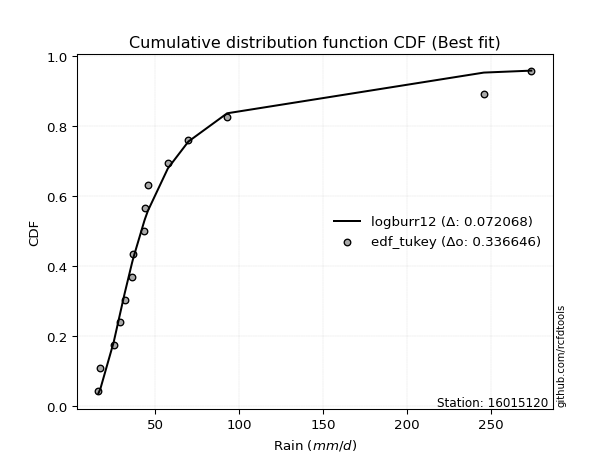</img></img>

</div>


### 8. EDF Gringorten (1963)

Gringorten plotting position formula is essential for estimating the probability and return periods of extreme events like floods and heavy rainfall. The constant _a=0.44_.

<div align="center">


$P=(m-a)/(n+1-2a)$


</div>


**8.1. Empirical values**

<div align="center">

|                | 0                   | 1                   | 2                   | 3                   | 4                   | 5                   | 6                   | 7              | 8                  | 9                  | 10                 | 11                 | 12                 | 13                 | 14                 |
|:---------------|:--------------------|:--------------------|:--------------------|:--------------------|:--------------------|:--------------------|:--------------------|:---------------|:-------------------|:-------------------|:-------------------|:-------------------|:-------------------|:-------------------|:-------------------|
| date           | 2025                | 2023                | 2022                | 2014                | 2015                | 2021                | 2019                | 2011           | 2017               | 2020               | 2016               | 2018               | 2024               | 2012               | 2013               |
| x              | 16.1                | 17.2                | 25.2                | 29.2                | 31.7                | 36.1                | 36.9                | 43.5           | 44.0               | 45.6               | 57.5               | 69.7               | 92.8               | 245.8              | 274.1              |
| m              | 1                   | 2                   | 3                   | 4                   | 5                   | 6                   | 7                   | 8              | 9                  | 10                 | 11                 | 12                 | 13                 | 14                 | 15                 |
| empirical_dist | edf_gringorten      | edf_gringorten      | edf_gringorten      | edf_gringorten      | edf_gringorten      | edf_gringorten      | edf_gringorten      | edf_gringorten | edf_gringorten     | edf_gringorten     | edf_gringorten     | edf_gringorten     | edf_gringorten     | edf_gringorten     | edf_gringorten     |
| empirical      | 0.03703703703703704 | 0.10317460317460318 | 0.16931216931216933 | 0.23544973544973546 | 0.30158730158730157 | 0.36772486772486773 | 0.43386243386243384 | 0.5            | 0.5661375661375662 | 0.6322751322751323 | 0.6984126984126985 | 0.7645502645502646 | 0.8306878306878308 | 0.8968253968253969 | 0.962962962962963  |
| empirical_tr   | 1.0384615384615385  | 1.1150442477876106  | 1.2038216560509554  | 1.3079584775086506  | 1.4318181818181819  | 1.5815899581589956  | 1.7663551401869158  | 2.0            | 2.304878048780488  | 2.719424460431655  | 3.3157894736842115 | 4.247191011235957  | 5.906250000000004  | 9.692307692307695  | 27.000000000000043 |

</div>


**8.2. Kolmogorov-Smirnov fit test (sorted by Δ)**


<div align="center">

|                | 0                   | 1                  | 2                   | 3                   | 4                  | 5                   | 6                   | 7                   | 8                  | 9                   | 10                  | 11                  | 12                  | 13                  | 14                 | 15                 | 16                  | 17                  | 18                  | 19                  | 20                  | 21                  | 22                 | 23                  | 24                  | 25                  | 26                  | 27                  | 28                  | 29                  | 30                  | 31                  | 32                  | 33                  | 34                  | 35                  | 36                  | 37                  | 38                  | 39                  | 40                  | 41                  | 42                 | 43                  | 44                  | 45                 | 46                  | 47                  | 48                  | 49                  | 50                  | 51                  | 52                  | 53                  | 54                 | 55                  | 56                  | 57                 | 58                  | 59                 | 60                 | 61                  | 62                  | 63                  | 64                  | 65                  | 66                 | 67                  | 68                 | 69                  | 70                  | 71                  | 72                 | 73                 | 74                  | 75                  | 76                  | 77                  | 78                  | 79                  | 80                 | 81                 | 82                  | 83                 | 84                  | 85                  | 86                  | 87                  | 88                  | 89                  | 90                  | 91                 | 92                 | 93                  | 94                  | 95                  | 96                  | 97                  | 98                  | 99                  | 100                | 101                 | 102                | 103                 | 104                 | 105                 | 106                | 107                 | 108                | 109                | 110                | 111                | 112                 | 113                | 114                | 115                | 116                 | 117                 | 118                | 119                | 120                | 121                | 122                 | 123                 | 124                 | 125                 | 126                 | 127                | 128                 | 129                 | 130                | 131                 | 132                 | 133                | 134                | 135                 | 136                | 137                | 138                 | 139                | 140                 | 141                | 142                 | 143                | 144                | 145                 | 146                | 147                | 148                | 149                | 150                | 151                | 152                | 153                | 154                | 155                | 156                | 157                | 158                | 159                |
|:---------------|:--------------------|:-------------------|:--------------------|:--------------------|:-------------------|:--------------------|:--------------------|:--------------------|:-------------------|:--------------------|:--------------------|:--------------------|:--------------------|:--------------------|:-------------------|:-------------------|:--------------------|:--------------------|:--------------------|:--------------------|:--------------------|:--------------------|:-------------------|:--------------------|:--------------------|:--------------------|:--------------------|:--------------------|:--------------------|:--------------------|:--------------------|:--------------------|:--------------------|:--------------------|:--------------------|:--------------------|:--------------------|:--------------------|:--------------------|:--------------------|:--------------------|:--------------------|:-------------------|:--------------------|:--------------------|:-------------------|:--------------------|:--------------------|:--------------------|:--------------------|:--------------------|:--------------------|:--------------------|:--------------------|:-------------------|:--------------------|:--------------------|:-------------------|:--------------------|:-------------------|:-------------------|:--------------------|:--------------------|:--------------------|:--------------------|:--------------------|:-------------------|:--------------------|:-------------------|:--------------------|:--------------------|:--------------------|:-------------------|:-------------------|:--------------------|:--------------------|:--------------------|:--------------------|:--------------------|:--------------------|:-------------------|:-------------------|:--------------------|:-------------------|:--------------------|:--------------------|:--------------------|:--------------------|:--------------------|:--------------------|:--------------------|:-------------------|:-------------------|:--------------------|:--------------------|:--------------------|:--------------------|:--------------------|:--------------------|:--------------------|:-------------------|:--------------------|:-------------------|:--------------------|:--------------------|:--------------------|:-------------------|:--------------------|:-------------------|:-------------------|:-------------------|:-------------------|:--------------------|:-------------------|:-------------------|:-------------------|:--------------------|:--------------------|:-------------------|:-------------------|:-------------------|:-------------------|:--------------------|:--------------------|:--------------------|:--------------------|:--------------------|:-------------------|:--------------------|:--------------------|:-------------------|:--------------------|:--------------------|:-------------------|:-------------------|:--------------------|:-------------------|:-------------------|:--------------------|:-------------------|:--------------------|:-------------------|:--------------------|:-------------------|:-------------------|:--------------------|:-------------------|:-------------------|:-------------------|:-------------------|:-------------------|:-------------------|:-------------------|:-------------------|:-------------------|:-------------------|:-------------------|:-------------------|:-------------------|:-------------------|
| station        | 16015120            | 16015120           | 16015120            | 16015120            | 16015120           | 16015120            | 16015120            | 16015120            | 16015120           | 16015120            | 16015120            | 16015120            | 16015120            | 16015120            | 16015120           | 16015120           | 16015120            | 16015120            | 16015120            | 16015120            | 16015120            | 16015120            | 16015120           | 16015120            | 16015120            | 16015120            | 16015120            | 16015120            | 16015120            | 16015120            | 16015120            | 16015120            | 16015120            | 16015120            | 16015120            | 16015120            | 16015120            | 16015120            | 16015120            | 16015120            | 16015120            | 16015120            | 16015120           | 16015120            | 16015120            | 16015120           | 16015120            | 16015120            | 16015120            | 16015120            | 16015120            | 16015120            | 16015120            | 16015120            | 16015120           | 16015120            | 16015120            | 16015120           | 16015120            | 16015120           | 16015120           | 16015120            | 16015120            | 16015120            | 16015120            | 16015120            | 16015120           | 16015120            | 16015120           | 16015120            | 16015120            | 16015120            | 16015120           | 16015120           | 16015120            | 16015120            | 16015120            | 16015120            | 16015120            | 16015120            | 16015120           | 16015120           | 16015120            | 16015120           | 16015120            | 16015120            | 16015120            | 16015120            | 16015120            | 16015120            | 16015120            | 16015120           | 16015120           | 16015120            | 16015120            | 16015120            | 16015120            | 16015120            | 16015120            | 16015120            | 16015120           | 16015120            | 16015120           | 16015120            | 16015120            | 16015120            | 16015120           | 16015120            | 16015120           | 16015120           | 16015120           | 16015120           | 16015120            | 16015120           | 16015120           | 16015120           | 16015120            | 16015120            | 16015120           | 16015120           | 16015120           | 16015120           | 16015120            | 16015120            | 16015120            | 16015120            | 16015120            | 16015120           | 16015120            | 16015120            | 16015120           | 16015120            | 16015120            | 16015120           | 16015120           | 16015120            | 16015120           | 16015120           | 16015120            | 16015120           | 16015120            | 16015120           | 16015120            | 16015120           | 16015120           | 16015120            | 16015120           | 16015120           | 16015120           | 16015120           | 16015120           | 16015120           | 16015120           | 16015120           | 16015120           | 16015120           | 16015120           | 16015120           | 16015120           | 16015120           |
| empirical_dist | edf_gringorten      | edf_gringorten     | edf_gringorten      | edf_gringorten      | edf_gringorten     | edf_gringorten      | edf_gringorten      | edf_gringorten      | edf_gringorten     | edf_gringorten      | edf_gringorten      | edf_gringorten      | edf_gringorten      | edf_gringorten      | edf_gringorten     | edf_gringorten     | edf_gringorten      | edf_gringorten      | edf_gringorten      | edf_gringorten      | edf_gringorten      | edf_gringorten      | edf_gringorten     | edf_gringorten      | edf_gringorten      | edf_gringorten      | edf_gringorten      | edf_gringorten      | edf_gringorten      | edf_gringorten      | edf_gringorten      | edf_gringorten      | edf_gringorten      | edf_gringorten      | edf_gringorten      | edf_gringorten      | edf_gringorten      | edf_gringorten      | edf_gringorten      | edf_gringorten      | edf_gringorten      | edf_gringorten      | edf_gringorten     | edf_gringorten      | edf_gringorten      | edf_gringorten     | edf_gringorten      | edf_gringorten      | edf_gringorten      | edf_gringorten      | edf_gringorten      | edf_gringorten      | edf_gringorten      | edf_gringorten      | edf_gringorten     | edf_gringorten      | edf_gringorten      | edf_gringorten     | edf_gringorten      | edf_gringorten     | edf_gringorten     | edf_gringorten      | edf_gringorten      | edf_gringorten      | edf_gringorten      | edf_gringorten      | edf_gringorten     | edf_gringorten      | edf_gringorten     | edf_gringorten      | edf_gringorten      | edf_gringorten      | edf_gringorten     | edf_gringorten     | edf_gringorten      | edf_gringorten      | edf_gringorten      | edf_gringorten      | edf_gringorten      | edf_gringorten      | edf_gringorten     | edf_gringorten     | edf_gringorten      | edf_gringorten     | edf_gringorten      | edf_gringorten      | edf_gringorten      | edf_gringorten      | edf_gringorten      | edf_gringorten      | edf_gringorten      | edf_gringorten     | edf_gringorten     | edf_gringorten      | edf_gringorten      | edf_gringorten      | edf_gringorten      | edf_gringorten      | edf_gringorten      | edf_gringorten      | edf_gringorten     | edf_gringorten      | edf_gringorten     | edf_gringorten      | edf_gringorten      | edf_gringorten      | edf_gringorten     | edf_gringorten      | edf_gringorten     | edf_gringorten     | edf_gringorten     | edf_gringorten     | edf_gringorten      | edf_gringorten     | edf_gringorten     | edf_gringorten     | edf_gringorten      | edf_gringorten      | edf_gringorten     | edf_gringorten     | edf_gringorten     | edf_gringorten     | edf_gringorten      | edf_gringorten      | edf_gringorten      | edf_gringorten      | edf_gringorten      | edf_gringorten     | edf_gringorten      | edf_gringorten      | edf_gringorten     | edf_gringorten      | edf_gringorten      | edf_gringorten     | edf_gringorten     | edf_gringorten      | edf_gringorten     | edf_gringorten     | edf_gringorten      | edf_gringorten     | edf_gringorten      | edf_gringorten     | edf_gringorten      | edf_gringorten     | edf_gringorten     | edf_gringorten      | edf_gringorten     | edf_gringorten     | edf_gringorten     | edf_gringorten     | edf_gringorten     | edf_gringorten     | edf_gringorten     | edf_gringorten     | edf_gringorten     | edf_gringorten     | edf_gringorten     | edf_gringorten     | edf_gringorten     | edf_gringorten     |
| p_dist         | logburr12           | alpha              | logburr             | logexponnorm        | logmoyal           | logt                | f                   | genextreme          | invweibull         | logmielke           | logdweibull         | logerlang           | loggamma            | loggamma            | invgamma           | logjohnsonsu       | nct                 | logfatiguelife      | loginvgauss         | loginvgamma         | logf                | loggenextreme       | loginvweibull      | loggennorm          | logalpha            | kappa3              | loggenexpon         | genpareto           | loggenlogistic      | logfoldnorm         | loghalfnorm         | logweibull_min      | burr                | invgauss            | johnsonsu           | logloglaplace       | logdgamma           | loggompertz         | loggumbel_r         | logkappa3           | erlang              | loggenhalflogistic  | mielke             | lognct              | logkstwobign        | logpearson3        | loghalflogistic     | logskewnorm         | fatiguelife         | logvonmises_line    | logbetaprime        | logtruncweibull_min | lograyleigh         | lognakagami         | gamma              | betaprime           | logwald             | halfgennorm        | logncf              | logmaxwell         | truncpareto        | logrice             | wald                | truncweibull_min    | t                   | loggausshyper       | logbeta            | logtruncexpon       | logsemicircular    | loganglit           | logarcsine          | exponpow            | logloggamma        | lognorm            | logcrystalball      | loglogistic         | loggengamma         | logtruncnorm        | logrdist            | vonmises_line       | logtukeylambda     | loghypsecant       | logbradford         | burr12             | loglaplace          | loglaplace          | gennorm             | loglomax            | dweibull            | genhalflogistic     | weibull_min         | loghalfgennorm     | moyal              | beta                | gumbel_r            | gompertz            | exponweib           | logcosine           | pearson3            | exponnorm           | genexpon           | nakagami            | rayleigh           | halflogistic        | loggumbel_l         | genlogistic         | dgamma             | maxwell             | logkappa4          | halfnorm           | logksone           | gengamma           | lomax               | logexponpow        | logjohnsonsb       | logwrapcauchy      | loguniform          | logexponweib        | semicircular       | anglit             | norm               | crystalball        | logistic            | foldnorm            | logargus            | hypsecant           | kstwobign           | arcsine            | loggenpareto        | ncf                 | truncnorm          | gausshyper          | rice                | powerlaw           | laplace            | logtriang           | gumbel_l           | logweibull_max     | bradford            | truncexpon         | cosine              | wrapcauchy         | skewnorm            | loglevy_l          | logpowerlaw        | triang              | argus              | levy_l             | logtrapezoid       | ksone              | johnsonsb          | kappa4             | rdist              | uniform            | tukeylambda        | logtruncpareto     | trapezoid          | weibull_max        | logvonmises        | vonmises           |
| delta          | 0.07390793125722184 | 0.0744178833155501 | 0.07594790239839022 | 0.07646040344939964 | 0.0778206482748454 | 0.07830803813273546 | 0.07889607183819525 | 0.07972269250470132 | 0.0797228859702499 | 0.08048076497511736 | 0.08065302419465081 | 0.08079757682195876 | 0.08079972662097495 | 0.08079972662097495 | 0.0809652437077617 | 0.0815206466975561 | 0.08156349967061005 | 0.08159308122431197 | 0.08184829509994818 | 0.08232987005476777 | 0.08234615954374058 | 0.08325407538462881 | 0.0832632729390167 | 0.08333034638667414 | 0.08341383734983587 | 0.08451726340236954 | 0.08787113915631628 | 0.08898625570055407 | 0.08934001082502652 | 0.08997091721286343 | 0.09007735445992929 | 0.09038131303190067 | 0.09051068153851105 | 0.09075354514911871 | 0.09128710289227904 | 0.09173585473651458 | 0.09262574737732343 | 0.09290005437013005 | 0.09333942568828113 | 0.09341129740010895 | 0.09528565911650055 | 0.09608801017276147 | 0.0982450666381749 | 0.10137501948452776 | 0.10159555865979186 | 0.1024262077785395 | 0.10317460317460318 | 0.10704363325037891 | 0.10798530416797181 | 0.11103831651517759 | 0.11547104232549232 | 0.11582791928777136 | 0.11659278154572816 | 0.11682577785818637 | 0.1179833212404795 | 0.11822227649525852 | 0.12099195354817807 | 0.1269745479804016 | 0.12736374290007269 | 0.1281833413024851 | 0.130303328414762  | 0.13437483465919825 | 0.13714949458161796 | 0.13791525963197115 | 0.14105835684761484 | 0.14411835190152916 | 0.1484249026934228 | 0.14978098427777747 | 0.156146617053679  | 0.15790537986690895 | 0.15993639036275564 | 0.16027348349675222 | 0.1606858041713461 | 0.1621723829002636 | 0.16217271955882845 | 0.16623674797550536 | 0.16666156178543345 | 0.16931214690754864 | 0.16931216901901325 | 0.16931216931073523 | 0.1693121693121621 | 0.1696944372738592 | 0.17731009699464695 | 0.1800510010487517 | 0.18259985988115918 | 0.18259985988115918 | 0.18290484924955364 | 0.18440304804473928 | 0.19116522656717583 | 0.19185733405031552 | 0.19910839775296976 | 0.1991671455780426 | 0.203507541401253  | 0.20595090580862183 | 0.20864425782443607 | 0.20887429470799324 | 0.20958678082980303 | 0.20969440480314533 | 0.21357997560769765 | 0.21513419363294273 | 0.2167289554712426 | 0.22015919052216026 | 0.2276885869035467 | 0.23069038587988933 | 0.23279435340538512 | 0.23445621356848895 | 0.2359829442304726 | 0.23813689143815353 | 0.2421437997000277 | 0.2487994905115219 | 0.2504263051253247 | 0.2506982101784797 | 0.25474348939902164 | 0.2598449536311953 | 0.2623300094983969 | 0.2638114817918042 | 0.26500590018409237 | 0.26586009992853543 | 0.2700550747775746 | 0.2704617681677632 | 0.2714492025684265 | 0.2714492068157427 | 0.27820330723975084 | 0.27934793846436284 | 0.28991518082375844 | 0.29098475303119364 | 0.29099879782552146 | 0.2939791544069969 | 0.29525802716168004 | 0.30197346859391766 | 0.3030337253730677 | 0.30729371330506255 | 0.31515003076673215 | 0.3183054991365879 | 0.3193814910554952 | 0.33567514479408955 | 0.3419946062106245 | 0.3468966925563754 | 0.35268081761179565 | 0.3528146256990406 | 0.36167607538151997 | 0.3855338383722215 | 0.38677986912191864 | 0.3907762437646573 | 0.4212401847132462 | 0.43613684658587715 | 0.4480700616272273 | 0.4614523817953577 | 0.5002268188954873 | 0.5080903162298512 | 0.5089467191867753 | 0.51665676252403   | 0.5539409172851861 | 0.5567983265657686 | 0.582248737456177  | 0.7160797843373956 | 0.7200392002865963 | 0.7316508349822357 | 1.0816144716944942 | 43.14658305735873  |
| deltao         | 0.3366456264050002  | 0.3366456264050002 | 0.3366456264050002  | 0.3366456264050002  | 0.3366456264050002 | 0.3366456264050002  | 0.3366456264050002  | 0.3366456264050002  | 0.3366456264050002 | 0.3366456264050002  | 0.3366456264050002  | 0.3366456264050002  | 0.3366456264050002  | 0.3366456264050002  | 0.3366456264050002 | 0.3366456264050002 | 0.3366456264050002  | 0.3366456264050002  | 0.3366456264050002  | 0.3366456264050002  | 0.3366456264050002  | 0.3366456264050002  | 0.3366456264050002 | 0.3366456264050002  | 0.3366456264050002  | 0.3366456264050002  | 0.3366456264050002  | 0.3366456264050002  | 0.3366456264050002  | 0.3366456264050002  | 0.3366456264050002  | 0.3366456264050002  | 0.3366456264050002  | 0.3366456264050002  | 0.3366456264050002  | 0.3366456264050002  | 0.3366456264050002  | 0.3366456264050002  | 0.3366456264050002  | 0.3366456264050002  | 0.3366456264050002  | 0.3366456264050002  | 0.3366456264050002 | 0.3366456264050002  | 0.3366456264050002  | 0.3366456264050002 | 0.3366456264050002  | 0.3366456264050002  | 0.3366456264050002  | 0.3366456264050002  | 0.3366456264050002  | 0.3366456264050002  | 0.3366456264050002  | 0.3366456264050002  | 0.3366456264050002 | 0.3366456264050002  | 0.3366456264050002  | 0.3366456264050002 | 0.3366456264050002  | 0.3366456264050002 | 0.3366456264050002 | 0.3366456264050002  | 0.3366456264050002  | 0.3366456264050002  | 0.3366456264050002  | 0.3366456264050002  | 0.3366456264050002 | 0.3366456264050002  | 0.3366456264050002 | 0.3366456264050002  | 0.3366456264050002  | 0.3366456264050002  | 0.3366456264050002 | 0.3366456264050002 | 0.3366456264050002  | 0.3366456264050002  | 0.3366456264050002  | 0.3366456264050002  | 0.3366456264050002  | 0.3366456264050002  | 0.3366456264050002 | 0.3366456264050002 | 0.3366456264050002  | 0.3366456264050002 | 0.3366456264050002  | 0.3366456264050002  | 0.3366456264050002  | 0.3366456264050002  | 0.3366456264050002  | 0.3366456264050002  | 0.3366456264050002  | 0.3366456264050002 | 0.3366456264050002 | 0.3366456264050002  | 0.3366456264050002  | 0.3366456264050002  | 0.3366456264050002  | 0.3366456264050002  | 0.3366456264050002  | 0.3366456264050002  | 0.3366456264050002 | 0.3366456264050002  | 0.3366456264050002 | 0.3366456264050002  | 0.3366456264050002  | 0.3366456264050002  | 0.3366456264050002 | 0.3366456264050002  | 0.3366456264050002 | 0.3366456264050002 | 0.3366456264050002 | 0.3366456264050002 | 0.3366456264050002  | 0.3366456264050002 | 0.3366456264050002 | 0.3366456264050002 | 0.3366456264050002  | 0.3366456264050002  | 0.3366456264050002 | 0.3366456264050002 | 0.3366456264050002 | 0.3366456264050002 | 0.3366456264050002  | 0.3366456264050002  | 0.3366456264050002  | 0.3366456264050002  | 0.3366456264050002  | 0.3366456264050002 | 0.3366456264050002  | 0.3366456264050002  | 0.3366456264050002 | 0.3366456264050002  | 0.3366456264050002  | 0.3366456264050002 | 0.3366456264050002 | 0.3366456264050002  | 0.3366456264050002 | 0.3366456264050002 | 0.3366456264050002  | 0.3366456264050002 | 0.3366456264050002  | 0.3366456264050002 | 0.3366456264050002  | 0.3366456264050002 | 0.3366456264050002 | 0.3366456264050002  | 0.3366456264050002 | 0.3366456264050002 | 0.3366456264050002 | 0.3366456264050002 | 0.3366456264050002 | 0.3366456264050002 | 0.3366456264050002 | 0.3366456264050002 | 0.3366456264050002 | 0.3366456264050002 | 0.3366456264050002 | 0.3366456264050002 | 0.3366456264050002 | 0.3366456264050002 |
| eval           | Δo > Δ              | Δo > Δ             | Δo > Δ              | Δo > Δ              | Δo > Δ             | Δo > Δ              | Δo > Δ              | Δo > Δ              | Δo > Δ             | Δo > Δ              | Δo > Δ              | Δo > Δ              | Δo > Δ              | Δo > Δ              | Δo > Δ             | Δo > Δ             | Δo > Δ              | Δo > Δ              | Δo > Δ              | Δo > Δ              | Δo > Δ              | Δo > Δ              | Δo > Δ             | Δo > Δ              | Δo > Δ              | Δo > Δ              | Δo > Δ              | Δo > Δ              | Δo > Δ              | Δo > Δ              | Δo > Δ              | Δo > Δ              | Δo > Δ              | Δo > Δ              | Δo > Δ              | Δo > Δ              | Δo > Δ              | Δo > Δ              | Δo > Δ              | Δo > Δ              | Δo > Δ              | Δo > Δ              | Δo > Δ             | Δo > Δ              | Δo > Δ              | Δo > Δ             | Δo > Δ              | Δo > Δ              | Δo > Δ              | Δo > Δ              | Δo > Δ              | Δo > Δ              | Δo > Δ              | Δo > Δ              | Δo > Δ             | Δo > Δ              | Δo > Δ              | Δo > Δ             | Δo > Δ              | Δo > Δ             | Δo > Δ             | Δo > Δ              | Δo > Δ              | Δo > Δ              | Δo > Δ              | Δo > Δ              | Δo > Δ             | Δo > Δ              | Δo > Δ             | Δo > Δ              | Δo > Δ              | Δo > Δ              | Δo > Δ             | Δo > Δ             | Δo > Δ              | Δo > Δ              | Δo > Δ              | Δo > Δ              | Δo > Δ              | Δo > Δ              | Δo > Δ             | Δo > Δ             | Δo > Δ              | Δo > Δ             | Δo > Δ              | Δo > Δ              | Δo > Δ              | Δo > Δ              | Δo > Δ              | Δo > Δ              | Δo > Δ              | Δo > Δ             | Δo > Δ             | Δo > Δ              | Δo > Δ              | Δo > Δ              | Δo > Δ              | Δo > Δ              | Δo > Δ              | Δo > Δ              | Δo > Δ             | Δo > Δ              | Δo > Δ             | Δo > Δ              | Δo > Δ              | Δo > Δ              | Δo > Δ             | Δo > Δ              | Δo > Δ             | Δo > Δ             | Δo > Δ             | Δo > Δ             | Δo > Δ              | Δo > Δ             | Δo > Δ             | Δo > Δ             | Δo > Δ              | Δo > Δ              | Δo > Δ             | Δo > Δ             | Δo > Δ             | Δo > Δ             | Δo > Δ              | Δo > Δ              | Δo > Δ              | Δo > Δ              | Δo > Δ              | Δo > Δ             | Δo > Δ              | Δo > Δ              | Δo > Δ             | Δo > Δ              | Δo > Δ              | Δo > Δ             | Δo > Δ             | Δo > Δ              | Δo <= Δ            | Δo <= Δ            | Δo <= Δ             | Δo <= Δ            | Δo <= Δ             | Δo <= Δ            | Δo <= Δ             | Δo <= Δ            | Δo <= Δ            | Δo <= Δ             | Δo <= Δ            | Δo <= Δ            | Δo <= Δ            | Δo <= Δ            | Δo <= Δ            | Δo <= Δ            | Δo <= Δ            | Δo <= Δ            | Δo <= Δ            | Δo <= Δ            | Δo <= Δ            | Δo <= Δ            | Δo <= Δ            | Δo <= Δ            |
| fit            | 1                   | 1                  | 1                   | 1                   | 1                  | 1                   | 1                   | 1                   | 1                  | 1                   | 1                   | 1                   | 1                   | 1                   | 1                  | 1                  | 1                   | 1                   | 1                   | 1                   | 1                   | 1                   | 1                  | 1                   | 1                   | 1                   | 1                   | 1                   | 1                   | 1                   | 1                   | 1                   | 1                   | 1                   | 1                   | 1                   | 1                   | 1                   | 1                   | 1                   | 1                   | 1                   | 1                  | 1                   | 1                   | 1                  | 1                   | 1                   | 1                   | 1                   | 1                   | 1                   | 1                   | 1                   | 1                  | 1                   | 1                   | 1                  | 1                   | 1                  | 1                  | 1                   | 1                   | 1                   | 1                   | 1                   | 1                  | 1                   | 1                  | 1                   | 1                   | 1                   | 1                  | 1                  | 1                   | 1                   | 1                   | 1                   | 1                   | 1                   | 1                  | 1                  | 1                   | 1                  | 1                   | 1                   | 1                   | 1                   | 1                   | 1                   | 1                   | 1                  | 1                  | 1                   | 1                   | 1                   | 1                   | 1                   | 1                   | 1                   | 1                  | 1                   | 1                  | 1                   | 1                   | 1                   | 1                  | 1                   | 1                  | 1                  | 1                  | 1                  | 1                   | 1                  | 1                  | 1                  | 1                   | 1                   | 1                  | 1                  | 1                  | 1                  | 1                   | 1                   | 1                   | 1                   | 1                   | 1                  | 1                   | 1                   | 1                  | 1                   | 1                   | 1                  | 1                  | 1                   | 0                  | 0                  | 0                   | 0                  | 0                   | 0                  | 0                   | 0                  | 0                  | 0                   | 0                  | 0                  | 0                  | 0                  | 0                  | 0                  | 0                  | 0                  | 0                  | 0                  | 0                  | 0                  | 0                  | 0                  |
| n              | 15                  | 15                 | 15                  | 15                  | 15                 | 15                  | 15                  | 15                  | 15                 | 15                  | 15                  | 15                  | 15                  | 15                  | 15                 | 15                 | 15                  | 15                  | 15                  | 15                  | 15                  | 15                  | 15                 | 15                  | 15                  | 15                  | 15                  | 15                  | 15                  | 15                  | 15                  | 15                  | 15                  | 15                  | 15                  | 15                  | 15                  | 15                  | 15                  | 15                  | 15                  | 15                  | 15                 | 15                  | 15                  | 15                 | 15                  | 15                  | 15                  | 15                  | 15                  | 15                  | 15                  | 15                  | 15                 | 15                  | 15                  | 15                 | 15                  | 15                 | 15                 | 15                  | 15                  | 15                  | 15                  | 15                  | 15                 | 15                  | 15                 | 15                  | 15                  | 15                  | 15                 | 15                 | 15                  | 15                  | 15                  | 15                  | 15                  | 15                  | 15                 | 15                 | 15                  | 15                 | 15                  | 15                  | 15                  | 15                  | 15                  | 15                  | 15                  | 15                 | 15                 | 15                  | 15                  | 15                  | 15                  | 15                  | 15                  | 15                  | 15                 | 15                  | 15                 | 15                  | 15                  | 15                  | 15                 | 15                  | 15                 | 15                 | 15                 | 15                 | 15                  | 15                 | 15                 | 15                 | 15                  | 15                  | 15                 | 15                 | 15                 | 15                 | 15                  | 15                  | 15                  | 15                  | 15                  | 15                 | 15                  | 15                  | 15                 | 15                  | 15                  | 15                 | 15                 | 15                  | 15                 | 15                 | 15                  | 15                 | 15                  | 15                 | 15                  | 15                 | 15                 | 15                  | 15                 | 15                 | 15                 | 15                 | 15                 | 15                 | 15                 | 15                 | 15                 | 15                 | 15                 | 15                 | 15                 | 15                 |
| best_fit       | 1                   | 0                  | 0                   | 0                   | 0                  | 0                   | 0                   | 0                   | 0                  | 0                   | 0                   | 0                   | 0                   | 0                   | 0                  | 0                  | 0                   | 0                   | 0                   | 0                   | 0                   | 0                   | 0                  | 0                   | 0                   | 0                   | 0                   | 0                   | 0                   | 0                   | 0                   | 0                   | 0                   | 0                   | 0                   | 0                   | 0                   | 0                   | 0                   | 0                   | 0                   | 0                   | 0                  | 0                   | 0                   | 0                  | 0                   | 0                   | 0                   | 0                   | 0                   | 0                   | 0                   | 0                   | 0                  | 0                   | 0                   | 0                  | 0                   | 0                  | 0                  | 0                   | 0                   | 0                   | 0                   | 0                   | 0                  | 0                   | 0                  | 0                   | 0                   | 0                   | 0                  | 0                  | 0                   | 0                   | 0                   | 0                   | 0                   | 0                   | 0                  | 0                  | 0                   | 0                  | 0                   | 0                   | 0                   | 0                   | 0                   | 0                   | 0                   | 0                  | 0                  | 0                   | 0                   | 0                   | 0                   | 0                   | 0                   | 0                   | 0                  | 0                   | 0                  | 0                   | 0                   | 0                   | 0                  | 0                   | 0                  | 0                  | 0                  | 0                  | 0                   | 0                  | 0                  | 0                  | 0                   | 0                   | 0                  | 0                  | 0                  | 0                  | 0                   | 0                   | 0                   | 0                   | 0                   | 0                  | 0                   | 0                   | 0                  | 0                   | 0                   | 0                  | 0                  | 0                   | 0                  | 0                  | 0                   | 0                  | 0                   | 0                  | 0                   | 0                  | 0                  | 0                   | 0                  | 0                  | 0                  | 0                  | 0                  | 0                  | 0                  | 0                  | 0                  | 0                  | 0                  | 0                  | 0                  | 0                  |
| best_fit_sort  | 1                   | 2                  | 3                   | 4                   | 5                  | 6                   | 7                   | 8                   | 9                  | 10                  | 11                  | 12                  | 13                  | 14                  | 15                 | 16                 | 17                  | 18                  | 19                  | 20                  | 21                  | 22                  | 23                 | 24                  | 25                  | 26                  | 27                  | 28                  | 29                  | 30                  | 31                  | 32                  | 33                  | 34                  | 35                  | 36                  | 37                  | 38                  | 39                  | 40                  | 41                  | 42                  | 43                 | 44                  | 45                  | 46                 | 47                  | 48                  | 49                  | 50                  | 51                  | 52                  | 53                  | 54                  | 55                 | 56                  | 57                  | 58                 | 59                  | 60                 | 61                 | 62                  | 63                  | 64                  | 65                  | 66                  | 67                 | 68                  | 69                 | 70                  | 71                  | 72                  | 73                 | 74                 | 75                  | 76                  | 77                  | 78                  | 79                  | 80                  | 81                 | 82                 | 83                  | 84                 | 85                  | 86                  | 87                  | 88                  | 89                  | 90                  | 91                  | 92                 | 93                 | 94                  | 95                  | 96                  | 97                  | 98                  | 99                  | 100                 | 101                | 102                 | 103                | 104                 | 105                 | 106                 | 107                | 108                 | 109                | 110                | 111                | 112                | 113                 | 114                | 115                | 116                | 117                 | 118                 | 119                | 120                | 121                | 122                | 123                 | 124                 | 125                 | 126                 | 127                 | 128                | 129                 | 130                 | 131                | 132                 | 133                 | 134                | 135                | 136                 | 137                | 138                | 139                 | 140                | 141                 | 142                | 143                 | 144                | 145                | 146                 | 147                | 148                | 149                | 150                | 151                | 152                | 153                | 154                | 155                | 156                | 157                | 158                | 159                | 160                |

</div>


**8.3. Best fit**

<div align="center">

|   id |   station | empirical_dist   | p_dist    |     delta |   deltao | eval   |   fit |   n |   best_fit |   best_fit_sort |
|-----:|----------:|:-----------------|:----------|----------:|---------:|:-------|------:|----:|-----------:|----------------:|
|    0 |  16015120 | edf_gringorten   | logburr12 | 0.0739079 | 0.336646 | Δo > Δ |     1 |  15 |          1 |               1 |

</div>


<div align="center">

</img>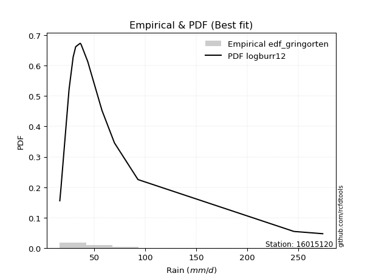</img>

</div>


### 9. EDF Filliben (1975)

The specific values of the constants (0.3175) (often denoted as $alpha$) and (0.365) are derived from a method proposed by James J. Filliben in a 1975 paper. This particular formula is the mean value of the $i$-th order statistic of the normal distribution and is considered a robust and effective plotting position formula for the normal probability plot correlation coefficient test for normality.

<div align="center">


$P=(m-0.3175)/(n+0.365)$


</div>


**9.1. Empirical values**

<div align="center">

|                | 0                   | 1                   | 2                  | 3                   | 4                  | 5                  | 6                   | 7            | 8                  | 9                  | 10                 | 11                 | 12                 | 13                | 14                 |
|:---------------|:--------------------|:--------------------|:-------------------|:--------------------|:-------------------|:-------------------|:--------------------|:-------------|:-------------------|:-------------------|:-------------------|:-------------------|:-------------------|:------------------|:-------------------|
| date           | 2025                | 2023                | 2022               | 2014                | 2015               | 2021               | 2019                | 2011         | 2017               | 2020               | 2016               | 2018               | 2024               | 2012              | 2013               |
| x              | 16.1                | 17.2                | 25.2               | 29.2                | 31.7               | 36.1               | 36.9                | 43.5         | 44.0               | 45.6               | 57.5               | 69.7               | 92.8               | 245.8             | 274.1              |
| m              | 1                   | 2                   | 3                  | 4                   | 5                  | 6                  | 7                   | 8            | 9                  | 10                 | 11                 | 12                 | 13                 | 14                | 15                 |
| empirical_dist | edf_filliben        | edf_filliben        | edf_filliben       | edf_filliben        | edf_filliben       | edf_filliben       | edf_filliben        | edf_filliben | edf_filliben       | edf_filliben       | edf_filliben       | edf_filliben       | edf_filliben       | edf_filliben      | edf_filliben       |
| empirical      | 0.04441913439635535 | 0.10950211519687603 | 0.1745850959973967 | 0.23966807679791735 | 0.304751057598438  | 0.3698340383989587 | 0.43491701919947934 | 0.5          | 0.5650829808005206 | 0.6301659616010412 | 0.6952489424015619 | 0.7603319232020826 | 0.8254149040026033 | 0.890497884803124 | 0.9555808656036446 |
| empirical_tr   | 1.0464839094159715  | 1.1229672939886717  | 1.211511925882121  | 1.3152150652685641  | 1.4383337233793587 | 1.586883552801446  | 1.7696515980420386  | 2.0          | 2.2992891881780766 | 2.7039155301363826 | 3.2813667912439923 | 4.172437202987101  | 5.727865796831314  | 9.13224368499257  | 22.512820512820507 |

</div>


**9.2. Kolmogorov-Smirnov fit test (sorted by Δ)**


<div align="center">

|                | 0                   | 1                  | 2                   | 3                   | 4                   | 5                   | 6                   | 7                   | 8                   | 9                   | 10                  | 11                 | 12                  | 13                  | 14                  | 15                  | 16                  | 17                  | 18                  | 19                 | 20                  | 21                  | 22                  | 23                  | 24                  | 25                  | 26                  | 27                  | 28                  | 29                  | 30                  | 31                  | 32                  | 33                 | 34                  | 35                  | 36                  | 37                  | 38                  | 39                  | 40                  | 41                  | 42                  | 43                  | 44                  | 45                  | 46                 | 47                 | 48                  | 49                  | 50                  | 51                  | 52                  | 53                  | 54                  | 55                 | 56                 | 57                  | 58                 | 59                  | 60                 | 61                  | 62                  | 63                  | 64                  | 65                  | 66                 | 67                  | 68                  | 69                  | 70                  | 71                  | 72                  | 73                  | 74                  | 75                  | 76                  | 77                  | 78                 | 79                  | 80                  | 81                  | 82                  | 83                  | 84                 | 85                  | 86                  | 87                  | 88                 | 89                  | 90                 | 91                  | 92                  | 93                  | 94                  | 95                  | 96                  | 97                  | 98                  | 99                  | 100                | 101                 | 102                | 103                | 104                 | 105                 | 106                 | 107                 | 108                 | 109                 | 110                 | 111                | 112                 | 113                | 114                | 115                 | 116                | 117                 | 118                | 119                | 120                | 121                | 122                | 123                 | 124                 | 125                 | 126                | 127                 | 128                 | 129                 | 130                | 131                 | 132                | 133                 | 134                 | 135                 | 136                | 137                | 138                | 139                 | 140                 | 141                | 142                | 143                 | 144                | 145                 | 146                | 147                 | 148                | 149                | 150                | 151                | 152                | 153                | 154                | 155                | 156                | 157                | 158                | 159                |
|:---------------|:--------------------|:-------------------|:--------------------|:--------------------|:--------------------|:--------------------|:--------------------|:--------------------|:--------------------|:--------------------|:--------------------|:-------------------|:--------------------|:--------------------|:--------------------|:--------------------|:--------------------|:--------------------|:--------------------|:-------------------|:--------------------|:--------------------|:--------------------|:--------------------|:--------------------|:--------------------|:--------------------|:--------------------|:--------------------|:--------------------|:--------------------|:--------------------|:--------------------|:-------------------|:--------------------|:--------------------|:--------------------|:--------------------|:--------------------|:--------------------|:--------------------|:--------------------|:--------------------|:--------------------|:--------------------|:--------------------|:-------------------|:-------------------|:--------------------|:--------------------|:--------------------|:--------------------|:--------------------|:--------------------|:--------------------|:-------------------|:-------------------|:--------------------|:-------------------|:--------------------|:-------------------|:--------------------|:--------------------|:--------------------|:--------------------|:--------------------|:-------------------|:--------------------|:--------------------|:--------------------|:--------------------|:--------------------|:--------------------|:--------------------|:--------------------|:--------------------|:--------------------|:--------------------|:-------------------|:--------------------|:--------------------|:--------------------|:--------------------|:--------------------|:-------------------|:--------------------|:--------------------|:--------------------|:-------------------|:--------------------|:-------------------|:--------------------|:--------------------|:--------------------|:--------------------|:--------------------|:--------------------|:--------------------|:--------------------|:--------------------|:-------------------|:--------------------|:-------------------|:-------------------|:--------------------|:--------------------|:--------------------|:--------------------|:--------------------|:--------------------|:--------------------|:-------------------|:--------------------|:-------------------|:-------------------|:--------------------|:-------------------|:--------------------|:-------------------|:-------------------|:-------------------|:-------------------|:-------------------|:--------------------|:--------------------|:--------------------|:-------------------|:--------------------|:--------------------|:--------------------|:-------------------|:--------------------|:-------------------|:--------------------|:--------------------|:--------------------|:-------------------|:-------------------|:-------------------|:--------------------|:--------------------|:-------------------|:-------------------|:--------------------|:-------------------|:--------------------|:-------------------|:--------------------|:-------------------|:-------------------|:-------------------|:-------------------|:-------------------|:-------------------|:-------------------|:-------------------|:-------------------|:-------------------|:-------------------|:-------------------|
| station        | 16015120            | 16015120           | 16015120            | 16015120            | 16015120            | 16015120            | 16015120            | 16015120            | 16015120            | 16015120            | 16015120            | 16015120           | 16015120            | 16015120            | 16015120            | 16015120            | 16015120            | 16015120            | 16015120            | 16015120           | 16015120            | 16015120            | 16015120            | 16015120            | 16015120            | 16015120            | 16015120            | 16015120            | 16015120            | 16015120            | 16015120            | 16015120            | 16015120            | 16015120           | 16015120            | 16015120            | 16015120            | 16015120            | 16015120            | 16015120            | 16015120            | 16015120            | 16015120            | 16015120            | 16015120            | 16015120            | 16015120           | 16015120           | 16015120            | 16015120            | 16015120            | 16015120            | 16015120            | 16015120            | 16015120            | 16015120           | 16015120           | 16015120            | 16015120           | 16015120            | 16015120           | 16015120            | 16015120            | 16015120            | 16015120            | 16015120            | 16015120           | 16015120            | 16015120            | 16015120            | 16015120            | 16015120            | 16015120            | 16015120            | 16015120            | 16015120            | 16015120            | 16015120            | 16015120           | 16015120            | 16015120            | 16015120            | 16015120            | 16015120            | 16015120           | 16015120            | 16015120            | 16015120            | 16015120           | 16015120            | 16015120           | 16015120            | 16015120            | 16015120            | 16015120            | 16015120            | 16015120            | 16015120            | 16015120            | 16015120            | 16015120           | 16015120            | 16015120           | 16015120           | 16015120            | 16015120            | 16015120            | 16015120            | 16015120            | 16015120            | 16015120            | 16015120           | 16015120            | 16015120           | 16015120           | 16015120            | 16015120           | 16015120            | 16015120           | 16015120           | 16015120           | 16015120           | 16015120           | 16015120            | 16015120            | 16015120            | 16015120           | 16015120            | 16015120            | 16015120            | 16015120           | 16015120            | 16015120           | 16015120            | 16015120            | 16015120            | 16015120           | 16015120           | 16015120           | 16015120            | 16015120            | 16015120           | 16015120           | 16015120            | 16015120           | 16015120            | 16015120           | 16015120            | 16015120           | 16015120           | 16015120           | 16015120           | 16015120           | 16015120           | 16015120           | 16015120           | 16015120           | 16015120           | 16015120           | 16015120           |
| empirical_dist | edf_filliben        | edf_filliben       | edf_filliben        | edf_filliben        | edf_filliben        | edf_filliben        | edf_filliben        | edf_filliben        | edf_filliben        | edf_filliben        | edf_filliben        | edf_filliben       | edf_filliben        | edf_filliben        | edf_filliben        | edf_filliben        | edf_filliben        | edf_filliben        | edf_filliben        | edf_filliben       | edf_filliben        | edf_filliben        | edf_filliben        | edf_filliben        | edf_filliben        | edf_filliben        | edf_filliben        | edf_filliben        | edf_filliben        | edf_filliben        | edf_filliben        | edf_filliben        | edf_filliben        | edf_filliben       | edf_filliben        | edf_filliben        | edf_filliben        | edf_filliben        | edf_filliben        | edf_filliben        | edf_filliben        | edf_filliben        | edf_filliben        | edf_filliben        | edf_filliben        | edf_filliben        | edf_filliben       | edf_filliben       | edf_filliben        | edf_filliben        | edf_filliben        | edf_filliben        | edf_filliben        | edf_filliben        | edf_filliben        | edf_filliben       | edf_filliben       | edf_filliben        | edf_filliben       | edf_filliben        | edf_filliben       | edf_filliben        | edf_filliben        | edf_filliben        | edf_filliben        | edf_filliben        | edf_filliben       | edf_filliben        | edf_filliben        | edf_filliben        | edf_filliben        | edf_filliben        | edf_filliben        | edf_filliben        | edf_filliben        | edf_filliben        | edf_filliben        | edf_filliben        | edf_filliben       | edf_filliben        | edf_filliben        | edf_filliben        | edf_filliben        | edf_filliben        | edf_filliben       | edf_filliben        | edf_filliben        | edf_filliben        | edf_filliben       | edf_filliben        | edf_filliben       | edf_filliben        | edf_filliben        | edf_filliben        | edf_filliben        | edf_filliben        | edf_filliben        | edf_filliben        | edf_filliben        | edf_filliben        | edf_filliben       | edf_filliben        | edf_filliben       | edf_filliben       | edf_filliben        | edf_filliben        | edf_filliben        | edf_filliben        | edf_filliben        | edf_filliben        | edf_filliben        | edf_filliben       | edf_filliben        | edf_filliben       | edf_filliben       | edf_filliben        | edf_filliben       | edf_filliben        | edf_filliben       | edf_filliben       | edf_filliben       | edf_filliben       | edf_filliben       | edf_filliben        | edf_filliben        | edf_filliben        | edf_filliben       | edf_filliben        | edf_filliben        | edf_filliben        | edf_filliben       | edf_filliben        | edf_filliben       | edf_filliben        | edf_filliben        | edf_filliben        | edf_filliben       | edf_filliben       | edf_filliben       | edf_filliben        | edf_filliben        | edf_filliben       | edf_filliben       | edf_filliben        | edf_filliben       | edf_filliben        | edf_filliben       | edf_filliben        | edf_filliben       | edf_filliben       | edf_filliben       | edf_filliben       | edf_filliben       | edf_filliben       | edf_filliben       | edf_filliben       | edf_filliben       | edf_filliben       | edf_filliben       | edf_filliben       |
| p_dist         | logburr12           | alpha              | logburr             | logexponnorm        | logerlang           | loggamma            | loggamma            | f                   | genextreme          | invweibull          | logmielke           | logdweibull        | invgamma            | logjohnsonsu        | nct                 | logfatiguelife      | loginvgauss         | loginvgamma         | logf                | loggenextreme      | loginvweibull       | loggennorm          | logalpha            | kappa3              | logmoyal            | logt                | loggenexpon         | logweibull_min      | genpareto           | johnsonsu           | loggenlogistic      | logfoldnorm         | burr                | invgauss           | logkappa3           | logloglaplace       | logdgamma           | loggompertz         | loggumbel_r         | loggenhalflogistic  | mielke              | loghalfnorm         | lognct              | logkstwobign        | logpearson3         | erlang              | logskewnorm        | fatiguelife        | logvonmises_line    | loghalflogistic     | logbetaprime        | logtruncweibull_min | lograyleigh         | lognakagami         | gamma               | betaprime          | halfgennorm        | logncf              | logmaxwell         | logwald             | truncpareto        | logrice             | truncweibull_min    | wald                | t                   | loggausshyper       | logbeta            | logtruncexpon       | logsemicircular     | exponpow            | logarcsine          | loganglit           | logloggamma         | lognorm             | logcrystalball      | loggengamma         | loglogistic         | loghypsecant        | logtruncnorm       | logrdist            | vonmises_line       | logtukeylambda      | logbradford         | burr12              | loglomax           | loglaplace          | loglaplace          | gennorm             | genhalflogistic    | dweibull            | weibull_min        | loghalfgennorm      | moyal               | beta                | exponweib           | pearson3            | gumbel_r            | gompertz            | logcosine           | exponnorm           | genexpon           | nakagami            | rayleigh           | halflogistic       | dgamma              | loggumbel_l         | genlogistic         | maxwell             | logkappa4           | halfnorm            | gengamma            | logksone           | lomax               | logexponpow        | logjohnsonsb       | logexponweib        | logwrapcauchy      | loguniform          | semicircular       | anglit             | norm               | crystalball        | foldnorm           | logistic            | arcsine             | logargus            | loggenpareto       | hypsecant           | kstwobign           | ncf                 | truncnorm          | gausshyper          | powerlaw           | rice                | laplace             | logtriang           | gumbel_l           | logweibull_max     | truncexpon         | bradford            | cosine              | wrapcauchy         | loglevy_l          | skewnorm            | logpowerlaw        | triang              | argus              | levy_l              | logtrapezoid       | johnsonsb          | ksone              | kappa4             | rdist              | uniform            | tukeylambda        | logtruncpareto     | trapezoid          | weibull_max        | logvonmises        | vonmises           |
| delta          | 0.07179876058313073 | 0.072308712641459  | 0.07383873172429911 | 0.07435123277530853 | 0.07657923547377687 | 0.07658138527279307 | 0.07658138527279307 | 0.07678690116410414 | 0.07761352183061021 | 0.07761371529615879 | 0.07837159430102625 | 0.0785438535205597 | 0.07885607303367059 | 0.07941147602346499 | 0.07945432899651894 | 0.07948391055022086 | 0.07973912442585707 | 0.08022069938067666 | 0.08023698886964947 | 0.0811449047105377 | 0.08115410226492559 | 0.08122117571258303 | 0.08130466667574476 | 0.08240809272827843 | 0.08414816029711825 | 0.08463555015500834 | 0.08576196848222517 | 0.08616297168371878 | 0.08687708502646296 | 0.08706876154409715 | 0.08723084015093541 | 0.08786174653877232 | 0.08840151086441994 | 0.0886443744750276 | 0.08919295605192706 | 0.08962668406242347 | 0.09051657670323232 | 0.09079088369603894 | 0.09123025501419002 | 0.09397883949867036 | 0.09613589596408378 | 0.09640486648220212 | 0.09926584881043665 | 0.09948638798570075 | 0.10031703710444839 | 0.10161317113877344 | 0.1049344625762878 | 0.1058761334938807 | 0.10892914584108648 | 0.10950211519687603 | 0.11336187165140121 | 0.11371874861368025 | 0.11448361087163705 | 0.11471660718409527 | 0.11587415056638839 | 0.1161131058211674 | 0.1227562066322197 | 0.12525457222598158 | 0.126074170628394  | 0.12626488023340543 | 0.1281941577406709 | 0.13226566398510714 | 0.13369691828378916 | 0.13504032390752685 | 0.14051881690352053 | 0.14200918122743805 | 0.1442065613452409 | 0.14767181360368636 | 0.15403744637958788 | 0.15500055681152486 | 0.15571804901457365 | 0.15579620919281784 | 0.15857663349725498 | 0.16006321222617248 | 0.16006354888473734 | 0.16244322043725157 | 0.16412757730141425 | 0.16758526659976808 | 0.174585073592776  | 0.17458509570424074 | 0.17458509599596272 | 0.17458509599738958 | 0.17520092632055584 | 0.17583265970056983 | 0.1801847066965574 | 0.18049068920706807 | 0.18049068920706807 | 0.18290484924955364 | 0.1844752366909972 | 0.19116522656717583 | 0.1938354710677424 | 0.19494880422986072 | 0.19612544404193466 | 0.20067797912339447 | 0.20536843948162115 | 0.20619787824837932 | 0.20653508715034496 | 0.20676512403390213 | 0.20758523412905422 | 0.21302502295885162 | 0.2146197847971515 | 0.21594084917397827 | 0.222760833985846  | 0.223308288520571  | 0.22860084687115428 | 0.23068518273129401 | 0.23234704289439784 | 0.23391855008997153 | 0.24003462902593659 | 0.24141739315220356 | 0.24542528349325238 | 0.2462079637771427 | 0.25263431872493053 | 0.2556266122830134 | 0.2570570828131694 | 0.26164175858035355 | 0.2617023111177131 | 0.26289672951000126 | 0.2658367334293926 | 0.2662434268195812 | 0.2672308612202445 | 0.2672308654675607 | 0.2719658411050445 | 0.27609413656565973 | 0.28659705704767857 | 0.28780601014966734 | 0.2878759298023617 | 0.28887558235710253 | 0.28888962715143035 | 0.29459137123459933 | 0.3009245546989766 | 0.30307537195688056 | 0.3130325724513605 | 0.31304086009264104 | 0.31727232038140407 | 0.33145680344590756 | 0.3377762648624425 | 0.3426783512081934 | 0.3485962843508586 | 0.35057164693770454 | 0.35745773403333797 | 0.380260911686994  | 0.383394146405339  | 0.38467069844782753 | 0.4159672580280188 | 0.43402767591178604 | 0.4438517202790453 | 0.45407028443603936 | 0.4960084775473052 | 0.5036737925015478 | 0.5038719748816692 | 0.512438421175848  | 0.5465588199258679 | 0.5525799852175866 | 0.5748666400968587 | 0.7108068576521682 | 0.7147662736013688 | 0.7263779082970082 | 1.0879419837167672 | 43.15396515471805  |
| deltao         | 0.3366456264050002  | 0.3366456264050002 | 0.3366456264050002  | 0.3366456264050002  | 0.3366456264050002  | 0.3366456264050002  | 0.3366456264050002  | 0.3366456264050002  | 0.3366456264050002  | 0.3366456264050002  | 0.3366456264050002  | 0.3366456264050002 | 0.3366456264050002  | 0.3366456264050002  | 0.3366456264050002  | 0.3366456264050002  | 0.3366456264050002  | 0.3366456264050002  | 0.3366456264050002  | 0.3366456264050002 | 0.3366456264050002  | 0.3366456264050002  | 0.3366456264050002  | 0.3366456264050002  | 0.3366456264050002  | 0.3366456264050002  | 0.3366456264050002  | 0.3366456264050002  | 0.3366456264050002  | 0.3366456264050002  | 0.3366456264050002  | 0.3366456264050002  | 0.3366456264050002  | 0.3366456264050002 | 0.3366456264050002  | 0.3366456264050002  | 0.3366456264050002  | 0.3366456264050002  | 0.3366456264050002  | 0.3366456264050002  | 0.3366456264050002  | 0.3366456264050002  | 0.3366456264050002  | 0.3366456264050002  | 0.3366456264050002  | 0.3366456264050002  | 0.3366456264050002 | 0.3366456264050002 | 0.3366456264050002  | 0.3366456264050002  | 0.3366456264050002  | 0.3366456264050002  | 0.3366456264050002  | 0.3366456264050002  | 0.3366456264050002  | 0.3366456264050002 | 0.3366456264050002 | 0.3366456264050002  | 0.3366456264050002 | 0.3366456264050002  | 0.3366456264050002 | 0.3366456264050002  | 0.3366456264050002  | 0.3366456264050002  | 0.3366456264050002  | 0.3366456264050002  | 0.3366456264050002 | 0.3366456264050002  | 0.3366456264050002  | 0.3366456264050002  | 0.3366456264050002  | 0.3366456264050002  | 0.3366456264050002  | 0.3366456264050002  | 0.3366456264050002  | 0.3366456264050002  | 0.3366456264050002  | 0.3366456264050002  | 0.3366456264050002 | 0.3366456264050002  | 0.3366456264050002  | 0.3366456264050002  | 0.3366456264050002  | 0.3366456264050002  | 0.3366456264050002 | 0.3366456264050002  | 0.3366456264050002  | 0.3366456264050002  | 0.3366456264050002 | 0.3366456264050002  | 0.3366456264050002 | 0.3366456264050002  | 0.3366456264050002  | 0.3366456264050002  | 0.3366456264050002  | 0.3366456264050002  | 0.3366456264050002  | 0.3366456264050002  | 0.3366456264050002  | 0.3366456264050002  | 0.3366456264050002 | 0.3366456264050002  | 0.3366456264050002 | 0.3366456264050002 | 0.3366456264050002  | 0.3366456264050002  | 0.3366456264050002  | 0.3366456264050002  | 0.3366456264050002  | 0.3366456264050002  | 0.3366456264050002  | 0.3366456264050002 | 0.3366456264050002  | 0.3366456264050002 | 0.3366456264050002 | 0.3366456264050002  | 0.3366456264050002 | 0.3366456264050002  | 0.3366456264050002 | 0.3366456264050002 | 0.3366456264050002 | 0.3366456264050002 | 0.3366456264050002 | 0.3366456264050002  | 0.3366456264050002  | 0.3366456264050002  | 0.3366456264050002 | 0.3366456264050002  | 0.3366456264050002  | 0.3366456264050002  | 0.3366456264050002 | 0.3366456264050002  | 0.3366456264050002 | 0.3366456264050002  | 0.3366456264050002  | 0.3366456264050002  | 0.3366456264050002 | 0.3366456264050002 | 0.3366456264050002 | 0.3366456264050002  | 0.3366456264050002  | 0.3366456264050002 | 0.3366456264050002 | 0.3366456264050002  | 0.3366456264050002 | 0.3366456264050002  | 0.3366456264050002 | 0.3366456264050002  | 0.3366456264050002 | 0.3366456264050002 | 0.3366456264050002 | 0.3366456264050002 | 0.3366456264050002 | 0.3366456264050002 | 0.3366456264050002 | 0.3366456264050002 | 0.3366456264050002 | 0.3366456264050002 | 0.3366456264050002 | 0.3366456264050002 |
| eval           | Δo > Δ              | Δo > Δ             | Δo > Δ              | Δo > Δ              | Δo > Δ              | Δo > Δ              | Δo > Δ              | Δo > Δ              | Δo > Δ              | Δo > Δ              | Δo > Δ              | Δo > Δ             | Δo > Δ              | Δo > Δ              | Δo > Δ              | Δo > Δ              | Δo > Δ              | Δo > Δ              | Δo > Δ              | Δo > Δ             | Δo > Δ              | Δo > Δ              | Δo > Δ              | Δo > Δ              | Δo > Δ              | Δo > Δ              | Δo > Δ              | Δo > Δ              | Δo > Δ              | Δo > Δ              | Δo > Δ              | Δo > Δ              | Δo > Δ              | Δo > Δ             | Δo > Δ              | Δo > Δ              | Δo > Δ              | Δo > Δ              | Δo > Δ              | Δo > Δ              | Δo > Δ              | Δo > Δ              | Δo > Δ              | Δo > Δ              | Δo > Δ              | Δo > Δ              | Δo > Δ             | Δo > Δ             | Δo > Δ              | Δo > Δ              | Δo > Δ              | Δo > Δ              | Δo > Δ              | Δo > Δ              | Δo > Δ              | Δo > Δ             | Δo > Δ             | Δo > Δ              | Δo > Δ             | Δo > Δ              | Δo > Δ             | Δo > Δ              | Δo > Δ              | Δo > Δ              | Δo > Δ              | Δo > Δ              | Δo > Δ             | Δo > Δ              | Δo > Δ              | Δo > Δ              | Δo > Δ              | Δo > Δ              | Δo > Δ              | Δo > Δ              | Δo > Δ              | Δo > Δ              | Δo > Δ              | Δo > Δ              | Δo > Δ             | Δo > Δ              | Δo > Δ              | Δo > Δ              | Δo > Δ              | Δo > Δ              | Δo > Δ             | Δo > Δ              | Δo > Δ              | Δo > Δ              | Δo > Δ             | Δo > Δ              | Δo > Δ             | Δo > Δ              | Δo > Δ              | Δo > Δ              | Δo > Δ              | Δo > Δ              | Δo > Δ              | Δo > Δ              | Δo > Δ              | Δo > Δ              | Δo > Δ             | Δo > Δ              | Δo > Δ             | Δo > Δ             | Δo > Δ              | Δo > Δ              | Δo > Δ              | Δo > Δ              | Δo > Δ              | Δo > Δ              | Δo > Δ              | Δo > Δ             | Δo > Δ              | Δo > Δ             | Δo > Δ             | Δo > Δ              | Δo > Δ             | Δo > Δ              | Δo > Δ             | Δo > Δ             | Δo > Δ             | Δo > Δ             | Δo > Δ             | Δo > Δ              | Δo > Δ              | Δo > Δ              | Δo > Δ             | Δo > Δ              | Δo > Δ              | Δo > Δ              | Δo > Δ             | Δo > Δ              | Δo > Δ             | Δo > Δ              | Δo > Δ              | Δo > Δ              | Δo <= Δ            | Δo <= Δ            | Δo <= Δ            | Δo <= Δ             | Δo <= Δ             | Δo <= Δ            | Δo <= Δ            | Δo <= Δ             | Δo <= Δ            | Δo <= Δ             | Δo <= Δ            | Δo <= Δ             | Δo <= Δ            | Δo <= Δ            | Δo <= Δ            | Δo <= Δ            | Δo <= Δ            | Δo <= Δ            | Δo <= Δ            | Δo <= Δ            | Δo <= Δ            | Δo <= Δ            | Δo <= Δ            | Δo <= Δ            |
| fit            | 1                   | 1                  | 1                   | 1                   | 1                   | 1                   | 1                   | 1                   | 1                   | 1                   | 1                   | 1                  | 1                   | 1                   | 1                   | 1                   | 1                   | 1                   | 1                   | 1                  | 1                   | 1                   | 1                   | 1                   | 1                   | 1                   | 1                   | 1                   | 1                   | 1                   | 1                   | 1                   | 1                   | 1                  | 1                   | 1                   | 1                   | 1                   | 1                   | 1                   | 1                   | 1                   | 1                   | 1                   | 1                   | 1                   | 1                  | 1                  | 1                   | 1                   | 1                   | 1                   | 1                   | 1                   | 1                   | 1                  | 1                  | 1                   | 1                  | 1                   | 1                  | 1                   | 1                   | 1                   | 1                   | 1                   | 1                  | 1                   | 1                   | 1                   | 1                   | 1                   | 1                   | 1                   | 1                   | 1                   | 1                   | 1                   | 1                  | 1                   | 1                   | 1                   | 1                   | 1                   | 1                  | 1                   | 1                   | 1                   | 1                  | 1                   | 1                  | 1                   | 1                   | 1                   | 1                   | 1                   | 1                   | 1                   | 1                   | 1                   | 1                  | 1                   | 1                  | 1                  | 1                   | 1                   | 1                   | 1                   | 1                   | 1                   | 1                   | 1                  | 1                   | 1                  | 1                  | 1                   | 1                  | 1                   | 1                  | 1                  | 1                  | 1                  | 1                  | 1                   | 1                   | 1                   | 1                  | 1                   | 1                   | 1                   | 1                  | 1                   | 1                  | 1                   | 1                   | 1                   | 0                  | 0                  | 0                  | 0                   | 0                   | 0                  | 0                  | 0                   | 0                  | 0                   | 0                  | 0                   | 0                  | 0                  | 0                  | 0                  | 0                  | 0                  | 0                  | 0                  | 0                  | 0                  | 0                  | 0                  |
| n              | 15                  | 15                 | 15                  | 15                  | 15                  | 15                  | 15                  | 15                  | 15                  | 15                  | 15                  | 15                 | 15                  | 15                  | 15                  | 15                  | 15                  | 15                  | 15                  | 15                 | 15                  | 15                  | 15                  | 15                  | 15                  | 15                  | 15                  | 15                  | 15                  | 15                  | 15                  | 15                  | 15                  | 15                 | 15                  | 15                  | 15                  | 15                  | 15                  | 15                  | 15                  | 15                  | 15                  | 15                  | 15                  | 15                  | 15                 | 15                 | 15                  | 15                  | 15                  | 15                  | 15                  | 15                  | 15                  | 15                 | 15                 | 15                  | 15                 | 15                  | 15                 | 15                  | 15                  | 15                  | 15                  | 15                  | 15                 | 15                  | 15                  | 15                  | 15                  | 15                  | 15                  | 15                  | 15                  | 15                  | 15                  | 15                  | 15                 | 15                  | 15                  | 15                  | 15                  | 15                  | 15                 | 15                  | 15                  | 15                  | 15                 | 15                  | 15                 | 15                  | 15                  | 15                  | 15                  | 15                  | 15                  | 15                  | 15                  | 15                  | 15                 | 15                  | 15                 | 15                 | 15                  | 15                  | 15                  | 15                  | 15                  | 15                  | 15                  | 15                 | 15                  | 15                 | 15                 | 15                  | 15                 | 15                  | 15                 | 15                 | 15                 | 15                 | 15                 | 15                  | 15                  | 15                  | 15                 | 15                  | 15                  | 15                  | 15                 | 15                  | 15                 | 15                  | 15                  | 15                  | 15                 | 15                 | 15                 | 15                  | 15                  | 15                 | 15                 | 15                  | 15                 | 15                  | 15                 | 15                  | 15                 | 15                 | 15                 | 15                 | 15                 | 15                 | 15                 | 15                 | 15                 | 15                 | 15                 | 15                 |
| best_fit       | 1                   | 0                  | 0                   | 0                   | 0                   | 0                   | 0                   | 0                   | 0                   | 0                   | 0                   | 0                  | 0                   | 0                   | 0                   | 0                   | 0                   | 0                   | 0                   | 0                  | 0                   | 0                   | 0                   | 0                   | 0                   | 0                   | 0                   | 0                   | 0                   | 0                   | 0                   | 0                   | 0                   | 0                  | 0                   | 0                   | 0                   | 0                   | 0                   | 0                   | 0                   | 0                   | 0                   | 0                   | 0                   | 0                   | 0                  | 0                  | 0                   | 0                   | 0                   | 0                   | 0                   | 0                   | 0                   | 0                  | 0                  | 0                   | 0                  | 0                   | 0                  | 0                   | 0                   | 0                   | 0                   | 0                   | 0                  | 0                   | 0                   | 0                   | 0                   | 0                   | 0                   | 0                   | 0                   | 0                   | 0                   | 0                   | 0                  | 0                   | 0                   | 0                   | 0                   | 0                   | 0                  | 0                   | 0                   | 0                   | 0                  | 0                   | 0                  | 0                   | 0                   | 0                   | 0                   | 0                   | 0                   | 0                   | 0                   | 0                   | 0                  | 0                   | 0                  | 0                  | 0                   | 0                   | 0                   | 0                   | 0                   | 0                   | 0                   | 0                  | 0                   | 0                  | 0                  | 0                   | 0                  | 0                   | 0                  | 0                  | 0                  | 0                  | 0                  | 0                   | 0                   | 0                   | 0                  | 0                   | 0                   | 0                   | 0                  | 0                   | 0                  | 0                   | 0                   | 0                   | 0                  | 0                  | 0                  | 0                   | 0                   | 0                  | 0                  | 0                   | 0                  | 0                   | 0                  | 0                   | 0                  | 0                  | 0                  | 0                  | 0                  | 0                  | 0                  | 0                  | 0                  | 0                  | 0                  | 0                  |
| best_fit_sort  | 1                   | 2                  | 3                   | 4                   | 5                   | 6                   | 7                   | 8                   | 9                   | 10                  | 11                  | 12                 | 13                  | 14                  | 15                  | 16                  | 17                  | 18                  | 19                  | 20                 | 21                  | 22                  | 23                  | 24                  | 25                  | 26                  | 27                  | 28                  | 29                  | 30                  | 31                  | 32                  | 33                  | 34                 | 35                  | 36                  | 37                  | 38                  | 39                  | 40                  | 41                  | 42                  | 43                  | 44                  | 45                  | 46                  | 47                 | 48                 | 49                  | 50                  | 51                  | 52                  | 53                  | 54                  | 55                  | 56                 | 57                 | 58                  | 59                 | 60                  | 61                 | 62                  | 63                  | 64                  | 65                  | 66                  | 67                 | 68                  | 69                  | 70                  | 71                  | 72                  | 73                  | 74                  | 75                  | 76                  | 77                  | 78                  | 79                 | 80                  | 81                  | 82                  | 83                  | 84                  | 85                 | 86                  | 87                  | 88                  | 89                 | 90                  | 91                 | 92                  | 93                  | 94                  | 95                  | 96                  | 97                  | 98                  | 99                  | 100                 | 101                | 102                 | 103                | 104                | 105                 | 106                 | 107                 | 108                 | 109                 | 110                 | 111                 | 112                | 113                 | 114                | 115                | 116                 | 117                | 118                 | 119                | 120                | 121                | 122                | 123                | 124                 | 125                 | 126                 | 127                | 128                 | 129                 | 130                 | 131                | 132                 | 133                | 134                 | 135                 | 136                 | 137                | 138                | 139                | 140                 | 141                 | 142                | 143                | 144                 | 145                | 146                 | 147                | 148                 | 149                | 150                | 151                | 152                | 153                | 154                | 155                | 156                | 157                | 158                | 159                | 160                |

</div>


**9.3. Best fit**

<div align="center">

|   id |   station | empirical_dist   | p_dist    |     delta |   deltao | eval   |   fit |   n |   best_fit |   best_fit_sort |
|-----:|----------:|:-----------------|:----------|----------:|---------:|:-------|------:|----:|-----------:|----------------:|
|    0 |  16015120 | edf_filliben     | logburr12 | 0.0717988 | 0.336646 | Δo > Δ |     1 |  15 |          1 |               1 |

</div>


<div align="center">

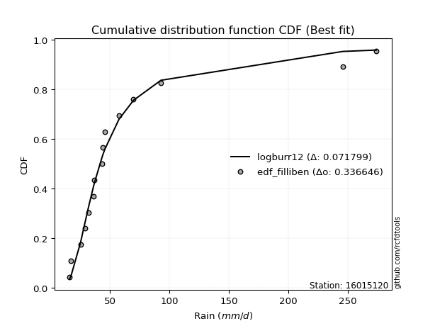</img>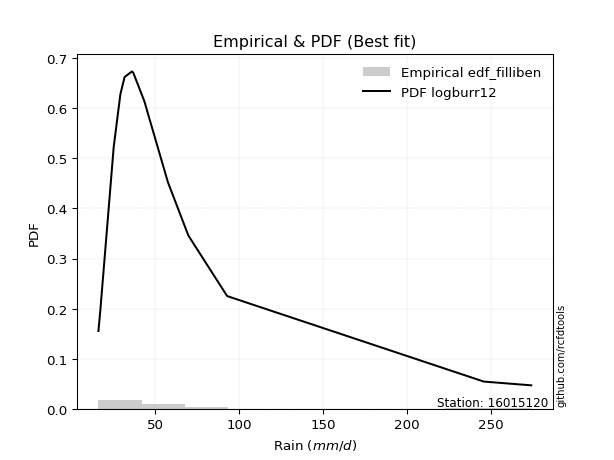</img>

</div>


### 10. EDF Jenkinson (1977)

The Jenkinson formula in hydrology is an empirical plotting position formula used to estimate the non-exceedance probability _(P)_ or return period _(T)_ of a given ordered observation within a sample. It is a widely used method in the frequency analysis of extreme events such as floods and rainfall, as it provides a distribution-free way to plot data. _a≈0.31_ and _b≈0.38_ are constants derived to approximate the median of the probability distribution for the given rank.

<div align="center">


$P=(m-a)/(n+b)$


</div>


**10.1. Empirical values**

<div align="center">

|                | 0                   | 1                   | 2                   | 3                   | 4                  | 5                   | 6                   | 7             | 8                  | 9                  | 10                 | 11                | 12                 | 13                 | 14                 |
|:---------------|:--------------------|:--------------------|:--------------------|:--------------------|:-------------------|:--------------------|:--------------------|:--------------|:-------------------|:-------------------|:-------------------|:------------------|:-------------------|:-------------------|:-------------------|
| date           | 2025                | 2023                | 2022                | 2014                | 2015               | 2021                | 2019                | 2011          | 2017               | 2020               | 2016               | 2018              | 2024               | 2012               | 2013               |
| x              | 16.1                | 17.2                | 25.2                | 29.2                | 31.7               | 36.1                | 36.9                | 43.5          | 44.0               | 45.6               | 57.5               | 69.7              | 92.8               | 245.8              | 274.1              |
| m              | 1                   | 2                   | 3                   | 4                   | 5                  | 6                   | 7                   | 8             | 9                  | 10                 | 11                 | 12                | 13                 | 14                 | 15                 |
| empirical_dist | edf_jenkinson       | edf_jenkinson       | edf_jenkinson       | edf_jenkinson       | edf_jenkinson      | edf_jenkinson       | edf_jenkinson       | edf_jenkinson | edf_jenkinson      | edf_jenkinson      | edf_jenkinson      | edf_jenkinson     | edf_jenkinson      | edf_jenkinson      | edf_jenkinson      |
| empirical      | 0.04486345903771131 | 0.10988296488946683 | 0.17490247074122237 | 0.23992197659297787 | 0.3049414824447334 | 0.36996098829648894 | 0.43498049414824447 | 0.5           | 0.5650195058517554 | 0.630039011703511  | 0.6950585175552665 | 0.760078023407022 | 0.8250975292587776 | 0.8901170351105331 | 0.9551365409622886 |
| empirical_tr   | 1.0469707283866576  | 1.1234477720964207  | 1.2119779353821907  | 1.3156544054747648  | 1.4387277829747427 | 1.587203302373581   | 1.7698504027617952  | 2.0           | 2.298953662182361  | 2.7029876977152894 | 3.279317697228144  | 4.168021680216801 | 5.717472118959106  | 9.100591715976325  | 22.289855072463734 |

</div>


**10.2. Kolmogorov-Smirnov fit test (sorted by Δ)**


<div align="center">

|                | 0                   | 1                   | 2                   | 3                   | 4                   | 5                   | 6                   | 7                   | 8                   | 9                   | 10                  | 11                  | 12                  | 13                  | 14                  | 15                 | 16                 | 17                 | 18                  | 19                  | 20                  | 21                  | 22                 | 23                  | 24                  | 25                  | 26                  | 27                  | 28                 | 29                  | 30                  | 31                  | 32                  | 33                  | 34                  | 35                  | 36                  | 37                  | 38                  | 39                 | 40                  | 41                  | 42                  | 43                  | 44                  | 45                  | 46                  | 47                  | 48                  | 49                  | 50                  | 51                  | 52                 | 53                 | 54                  | 55                  | 56                  | 57                  | 58                  | 59                 | 60                  | 61                  | 62                  | 63                 | 64                  | 65                 | 66                  | 67                 | 68                  | 69                  | 70                  | 71                  | 72                  | 73                  | 74                  | 75                  | 76                 | 77                  | 78                  | 79                 | 80                  | 81                  | 82                  | 83                 | 84                  | 85                 | 86                 | 87                  | 88                  | 89                  | 90                  | 91                 | 92                  | 93                 | 94                  | 95                  | 96                 | 97                  | 98                  | 99                  | 100                 | 101                 | 102                 | 103                 | 104                 | 105                 | 106                 | 107                | 108                 | 109                 | 110                | 111                 | 112                 | 113                | 114                 | 115                | 116                | 117                | 118                | 119                 | 120                 | 121                 | 122                 | 123                 | 124                | 125                 | 126                | 127                | 128                | 129                 | 130                 | 131                | 132                 | 133                | 134                | 135                | 136                 | 137                 | 138                 | 139                | 140                 | 141                 | 142                | 143                 | 144                 | 145                | 146                 | 147                | 148                | 149                | 150                | 151                | 152                | 153                | 154                | 155                | 156                | 157                | 158                | 159                |
|:---------------|:--------------------|:--------------------|:--------------------|:--------------------|:--------------------|:--------------------|:--------------------|:--------------------|:--------------------|:--------------------|:--------------------|:--------------------|:--------------------|:--------------------|:--------------------|:-------------------|:-------------------|:-------------------|:--------------------|:--------------------|:--------------------|:--------------------|:-------------------|:--------------------|:--------------------|:--------------------|:--------------------|:--------------------|:-------------------|:--------------------|:--------------------|:--------------------|:--------------------|:--------------------|:--------------------|:--------------------|:--------------------|:--------------------|:--------------------|:-------------------|:--------------------|:--------------------|:--------------------|:--------------------|:--------------------|:--------------------|:--------------------|:--------------------|:--------------------|:--------------------|:--------------------|:--------------------|:-------------------|:-------------------|:--------------------|:--------------------|:--------------------|:--------------------|:--------------------|:-------------------|:--------------------|:--------------------|:--------------------|:-------------------|:--------------------|:-------------------|:--------------------|:-------------------|:--------------------|:--------------------|:--------------------|:--------------------|:--------------------|:--------------------|:--------------------|:--------------------|:-------------------|:--------------------|:--------------------|:-------------------|:--------------------|:--------------------|:--------------------|:-------------------|:--------------------|:-------------------|:-------------------|:--------------------|:--------------------|:--------------------|:--------------------|:-------------------|:--------------------|:-------------------|:--------------------|:--------------------|:-------------------|:--------------------|:--------------------|:--------------------|:--------------------|:--------------------|:--------------------|:--------------------|:--------------------|:--------------------|:--------------------|:-------------------|:--------------------|:--------------------|:-------------------|:--------------------|:--------------------|:-------------------|:--------------------|:-------------------|:-------------------|:-------------------|:-------------------|:--------------------|:--------------------|:--------------------|:--------------------|:--------------------|:-------------------|:--------------------|:-------------------|:-------------------|:-------------------|:--------------------|:--------------------|:-------------------|:--------------------|:-------------------|:-------------------|:-------------------|:--------------------|:--------------------|:--------------------|:-------------------|:--------------------|:--------------------|:-------------------|:--------------------|:--------------------|:-------------------|:--------------------|:-------------------|:-------------------|:-------------------|:-------------------|:-------------------|:-------------------|:-------------------|:-------------------|:-------------------|:-------------------|:-------------------|:-------------------|:-------------------|
| station        | 16015120            | 16015120            | 16015120            | 16015120            | 16015120            | 16015120            | 16015120            | 16015120            | 16015120            | 16015120            | 16015120            | 16015120            | 16015120            | 16015120            | 16015120            | 16015120           | 16015120           | 16015120           | 16015120            | 16015120            | 16015120            | 16015120            | 16015120           | 16015120            | 16015120            | 16015120            | 16015120            | 16015120            | 16015120           | 16015120            | 16015120            | 16015120            | 16015120            | 16015120            | 16015120            | 16015120            | 16015120            | 16015120            | 16015120            | 16015120           | 16015120            | 16015120            | 16015120            | 16015120            | 16015120            | 16015120            | 16015120            | 16015120            | 16015120            | 16015120            | 16015120            | 16015120            | 16015120           | 16015120           | 16015120            | 16015120            | 16015120            | 16015120            | 16015120            | 16015120           | 16015120            | 16015120            | 16015120            | 16015120           | 16015120            | 16015120           | 16015120            | 16015120           | 16015120            | 16015120            | 16015120            | 16015120            | 16015120            | 16015120            | 16015120            | 16015120            | 16015120           | 16015120            | 16015120            | 16015120           | 16015120            | 16015120            | 16015120            | 16015120           | 16015120            | 16015120           | 16015120           | 16015120            | 16015120            | 16015120            | 16015120            | 16015120           | 16015120            | 16015120           | 16015120            | 16015120            | 16015120           | 16015120            | 16015120            | 16015120            | 16015120            | 16015120            | 16015120            | 16015120            | 16015120            | 16015120            | 16015120            | 16015120           | 16015120            | 16015120            | 16015120           | 16015120            | 16015120            | 16015120           | 16015120            | 16015120           | 16015120           | 16015120           | 16015120           | 16015120            | 16015120            | 16015120            | 16015120            | 16015120            | 16015120           | 16015120            | 16015120           | 16015120           | 16015120           | 16015120            | 16015120            | 16015120           | 16015120            | 16015120           | 16015120           | 16015120           | 16015120            | 16015120            | 16015120            | 16015120           | 16015120            | 16015120            | 16015120           | 16015120            | 16015120            | 16015120           | 16015120            | 16015120           | 16015120           | 16015120           | 16015120           | 16015120           | 16015120           | 16015120           | 16015120           | 16015120           | 16015120           | 16015120           | 16015120           | 16015120           |
| empirical_dist | edf_jenkinson       | edf_jenkinson       | edf_jenkinson       | edf_jenkinson       | edf_jenkinson       | edf_jenkinson       | edf_jenkinson       | edf_jenkinson       | edf_jenkinson       | edf_jenkinson       | edf_jenkinson       | edf_jenkinson       | edf_jenkinson       | edf_jenkinson       | edf_jenkinson       | edf_jenkinson      | edf_jenkinson      | edf_jenkinson      | edf_jenkinson       | edf_jenkinson       | edf_jenkinson       | edf_jenkinson       | edf_jenkinson      | edf_jenkinson       | edf_jenkinson       | edf_jenkinson       | edf_jenkinson       | edf_jenkinson       | edf_jenkinson      | edf_jenkinson       | edf_jenkinson       | edf_jenkinson       | edf_jenkinson       | edf_jenkinson       | edf_jenkinson       | edf_jenkinson       | edf_jenkinson       | edf_jenkinson       | edf_jenkinson       | edf_jenkinson      | edf_jenkinson       | edf_jenkinson       | edf_jenkinson       | edf_jenkinson       | edf_jenkinson       | edf_jenkinson       | edf_jenkinson       | edf_jenkinson       | edf_jenkinson       | edf_jenkinson       | edf_jenkinson       | edf_jenkinson       | edf_jenkinson      | edf_jenkinson      | edf_jenkinson       | edf_jenkinson       | edf_jenkinson       | edf_jenkinson       | edf_jenkinson       | edf_jenkinson      | edf_jenkinson       | edf_jenkinson       | edf_jenkinson       | edf_jenkinson      | edf_jenkinson       | edf_jenkinson      | edf_jenkinson       | edf_jenkinson      | edf_jenkinson       | edf_jenkinson       | edf_jenkinson       | edf_jenkinson       | edf_jenkinson       | edf_jenkinson       | edf_jenkinson       | edf_jenkinson       | edf_jenkinson      | edf_jenkinson       | edf_jenkinson       | edf_jenkinson      | edf_jenkinson       | edf_jenkinson       | edf_jenkinson       | edf_jenkinson      | edf_jenkinson       | edf_jenkinson      | edf_jenkinson      | edf_jenkinson       | edf_jenkinson       | edf_jenkinson       | edf_jenkinson       | edf_jenkinson      | edf_jenkinson       | edf_jenkinson      | edf_jenkinson       | edf_jenkinson       | edf_jenkinson      | edf_jenkinson       | edf_jenkinson       | edf_jenkinson       | edf_jenkinson       | edf_jenkinson       | edf_jenkinson       | edf_jenkinson       | edf_jenkinson       | edf_jenkinson       | edf_jenkinson       | edf_jenkinson      | edf_jenkinson       | edf_jenkinson       | edf_jenkinson      | edf_jenkinson       | edf_jenkinson       | edf_jenkinson      | edf_jenkinson       | edf_jenkinson      | edf_jenkinson      | edf_jenkinson      | edf_jenkinson      | edf_jenkinson       | edf_jenkinson       | edf_jenkinson       | edf_jenkinson       | edf_jenkinson       | edf_jenkinson      | edf_jenkinson       | edf_jenkinson      | edf_jenkinson      | edf_jenkinson      | edf_jenkinson       | edf_jenkinson       | edf_jenkinson      | edf_jenkinson       | edf_jenkinson      | edf_jenkinson      | edf_jenkinson      | edf_jenkinson       | edf_jenkinson       | edf_jenkinson       | edf_jenkinson      | edf_jenkinson       | edf_jenkinson       | edf_jenkinson      | edf_jenkinson       | edf_jenkinson       | edf_jenkinson      | edf_jenkinson       | edf_jenkinson      | edf_jenkinson      | edf_jenkinson      | edf_jenkinson      | edf_jenkinson      | edf_jenkinson      | edf_jenkinson      | edf_jenkinson      | edf_jenkinson      | edf_jenkinson      | edf_jenkinson      | edf_jenkinson      | edf_jenkinson      |
| p_dist         | logburr12           | alpha               | logburr             | logexponnorm        | logerlang           | loggamma            | loggamma            | f                   | genextreme          | invweibull          | logmielke           | logdweibull         | invgamma            | logjohnsonsu        | nct                 | logfatiguelife     | loginvgauss        | loginvgamma        | logf                | loggenextreme       | loginvweibull       | loggennorm          | logalpha           | kappa3              | logmoyal            | logt                | loggenexpon         | logweibull_min      | genpareto          | johnsonsu           | loggenlogistic      | logfoldnorm         | burr                | invgauss            | logkappa3           | logloglaplace       | logdgamma           | loggompertz         | loggumbel_r         | loggenhalflogistic | mielke              | loghalfnorm         | lognct              | logkstwobign        | logpearson3         | erlang              | logskewnorm         | fatiguelife         | logvonmises_line    | loghalflogistic     | logbetaprime        | logtruncweibull_min | lograyleigh        | lognakagami        | gamma               | betaprime           | halfgennorm         | logncf              | logmaxwell          | logwald            | truncpareto         | logrice             | truncweibull_min    | wald               | t                   | loggausshyper      | logbeta             | logtruncexpon      | logsemicircular     | exponpow            | logarcsine          | loganglit           | logloggamma         | lognorm             | logcrystalball      | loggengamma         | loglogistic        | loghypsecant        | logtruncnorm        | logrdist           | vonmises_line       | logtukeylambda      | logbradford         | burr12             | loglomax            | loglaplace         | loglaplace         | gennorm             | genhalflogistic     | dweibull            | weibull_min         | loghalfgennorm     | moyal               | beta               | exponweib           | pearson3            | gumbel_r           | gompertz            | logcosine           | exponnorm           | genexpon            | nakagami            | rayleigh            | halflogistic        | dgamma              | loggumbel_l         | genlogistic         | maxwell            | logkappa4           | halfnorm            | gengamma           | logksone            | lomax               | logexponpow        | logjohnsonsb        | logexponweib       | logwrapcauchy      | loguniform         | semicircular       | anglit              | norm                | crystalball         | foldnorm            | logistic            | arcsine            | loggenpareto        | logargus           | hypsecant          | kstwobign          | ncf                 | truncnorm           | gausshyper         | powerlaw            | rice               | laplace            | logtriang          | gumbel_l            | logweibull_max      | truncexpon          | bradford           | cosine              | wrapcauchy          | loglevy_l          | skewnorm            | logpowerlaw         | triang             | argus               | levy_l             | logtrapezoid       | johnsonsb          | ksone              | kappa4             | rdist              | uniform            | tukeylambda        | logtruncpareto     | trapezoid          | weibull_max        | logvonmises        | vonmises           |
| delta          | 0.07167181068560047 | 0.07218176274392873 | 0.07371178182676885 | 0.07422428287777827 | 0.07632533567871636 | 0.07632748547773255 | 0.07632748547773255 | 0.07665995126657388 | 0.07748657193307995 | 0.07748676539862853 | 0.07824464440349599 | 0.07841690362302944 | 0.07872912313614033 | 0.07928452612593473 | 0.07932737909898868 | 0.0793569606526906 | 0.0796121745283268 | 0.0800937494831464 | 0.08011003897211921 | 0.08101795481300744 | 0.08102715236739533 | 0.08109422581505277 | 0.0811777167782145 | 0.08228114283074817 | 0.08452900998970905 | 0.08501639984759923 | 0.08563501858469491 | 0.08590907188865826 | 0.0867501351289327 | 0.08681486174903663 | 0.08710389025340515 | 0.08773479664124206 | 0.08827456096688968 | 0.08851742457749734 | 0.08893905625686654 | 0.08949973416489321 | 0.09038962680570206 | 0.09066393379850868 | 0.09110330511665976 | 0.0938518896011401 | 0.09600894606655352 | 0.09678571617479292 | 0.09913889891290639 | 0.09935943808817049 | 0.10019008720691813 | 0.10199402083136433 | 0.10480751267875754 | 0.10574918359635044 | 0.10880219594355622 | 0.10988296488946683 | 0.11323492175387095 | 0.11359179871615    | 0.1143566609741068 | 0.114589657286565  | 0.11574720066885813 | 0.11598615592363715 | 0.12250230683715918 | 0.12512762232845132 | 0.12594722073086373 | 0.1265822549772311 | 0.12806720784314063 | 0.13213871408757688 | 0.13344301848872853 | 0.1349133740099966 | 0.14051881690352053 | 0.1418822313299078 | 0.14395266155018038 | 0.1475448637061561 | 0.15391049648205762 | 0.15468318206769918 | 0.15546414921951301 | 0.15566925929528758 | 0.15844968359972472 | 0.15993626232864222 | 0.15993659898720708 | 0.16218932064219105 | 0.164000627403884  | 0.16745831670223782 | 0.17490244833660168 | 0.1749024704480665 | 0.17490247073978848 | 0.17490247074121534 | 0.17507397642302558 | 0.1755787599055093 | 0.17993080690149688 | 0.1803637393095378 | 0.1803637393095378 | 0.18290484924955364 | 0.18403091204964125 | 0.19116522656717583 | 0.19351809632391673 | 0.1946949044348002 | 0.19568111940057872 | 0.2003606043795688 | 0.20511453968656063 | 0.20575355360702338 | 0.2064081372528147 | 0.20663817413637187 | 0.20745828423152396 | 0.21289807306132136 | 0.21449283489962123 | 0.21568694937891764 | 0.22250693419078538 | 0.22286396387921506 | 0.22815652222979835 | 0.23055823283376375 | 0.23222009299686758 | 0.2336646502949109 | 0.23990767912840633 | 0.24097306851084763 | 0.2451079087494267 | 0.24595406398208208 | 0.25250736882740027 | 0.2553727124879529 | 0.25673970806934365 | 0.261387858785293  | 0.2615753612201828 | 0.262769779612471  | 0.265582833634332  | 0.26598952702452056 | 0.26697696142518385 | 0.26697696567250007 | 0.27152151646368855 | 0.27596718666812947 | 0.2861527324063226 | 0.28743160516100574 | 0.2876790602521371 | 0.2887486324595723 | 0.2887626772539001 | 0.29414704659324337 | 0.30079760480144635 | 0.3028214721618199 | 0.31271519770753486 | 0.3129139101951108 | 0.3171453704838738 | 0.3312029036508469 | 0.33752236506738187 | 0.34242445141313277 | 0.34834238455579797 | 0.3504446970401743 | 0.35720383423827734 | 0.37994353694316824 | 0.382949821763983  | 0.38454374855029727 | 0.41564988328419317 | 0.4339007260142558 | 0.44359782048398466 | 0.4536259597946834 | 0.4957545777522446 | 0.503356417757722  | 0.5036180750866086 | 0.5121845213807874 | 0.546114495284512  | 0.5523260854225259 | 0.5744223154555028 | 0.7104894829083426 | 0.714448898857543  | 0.7260605335531825 | 1.0883228334093582 | 43.15440947935941  |
| deltao         | 0.3366456264050002  | 0.3366456264050002  | 0.3366456264050002  | 0.3366456264050002  | 0.3366456264050002  | 0.3366456264050002  | 0.3366456264050002  | 0.3366456264050002  | 0.3366456264050002  | 0.3366456264050002  | 0.3366456264050002  | 0.3366456264050002  | 0.3366456264050002  | 0.3366456264050002  | 0.3366456264050002  | 0.3366456264050002 | 0.3366456264050002 | 0.3366456264050002 | 0.3366456264050002  | 0.3366456264050002  | 0.3366456264050002  | 0.3366456264050002  | 0.3366456264050002 | 0.3366456264050002  | 0.3366456264050002  | 0.3366456264050002  | 0.3366456264050002  | 0.3366456264050002  | 0.3366456264050002 | 0.3366456264050002  | 0.3366456264050002  | 0.3366456264050002  | 0.3366456264050002  | 0.3366456264050002  | 0.3366456264050002  | 0.3366456264050002  | 0.3366456264050002  | 0.3366456264050002  | 0.3366456264050002  | 0.3366456264050002 | 0.3366456264050002  | 0.3366456264050002  | 0.3366456264050002  | 0.3366456264050002  | 0.3366456264050002  | 0.3366456264050002  | 0.3366456264050002  | 0.3366456264050002  | 0.3366456264050002  | 0.3366456264050002  | 0.3366456264050002  | 0.3366456264050002  | 0.3366456264050002 | 0.3366456264050002 | 0.3366456264050002  | 0.3366456264050002  | 0.3366456264050002  | 0.3366456264050002  | 0.3366456264050002  | 0.3366456264050002 | 0.3366456264050002  | 0.3366456264050002  | 0.3366456264050002  | 0.3366456264050002 | 0.3366456264050002  | 0.3366456264050002 | 0.3366456264050002  | 0.3366456264050002 | 0.3366456264050002  | 0.3366456264050002  | 0.3366456264050002  | 0.3366456264050002  | 0.3366456264050002  | 0.3366456264050002  | 0.3366456264050002  | 0.3366456264050002  | 0.3366456264050002 | 0.3366456264050002  | 0.3366456264050002  | 0.3366456264050002 | 0.3366456264050002  | 0.3366456264050002  | 0.3366456264050002  | 0.3366456264050002 | 0.3366456264050002  | 0.3366456264050002 | 0.3366456264050002 | 0.3366456264050002  | 0.3366456264050002  | 0.3366456264050002  | 0.3366456264050002  | 0.3366456264050002 | 0.3366456264050002  | 0.3366456264050002 | 0.3366456264050002  | 0.3366456264050002  | 0.3366456264050002 | 0.3366456264050002  | 0.3366456264050002  | 0.3366456264050002  | 0.3366456264050002  | 0.3366456264050002  | 0.3366456264050002  | 0.3366456264050002  | 0.3366456264050002  | 0.3366456264050002  | 0.3366456264050002  | 0.3366456264050002 | 0.3366456264050002  | 0.3366456264050002  | 0.3366456264050002 | 0.3366456264050002  | 0.3366456264050002  | 0.3366456264050002 | 0.3366456264050002  | 0.3366456264050002 | 0.3366456264050002 | 0.3366456264050002 | 0.3366456264050002 | 0.3366456264050002  | 0.3366456264050002  | 0.3366456264050002  | 0.3366456264050002  | 0.3366456264050002  | 0.3366456264050002 | 0.3366456264050002  | 0.3366456264050002 | 0.3366456264050002 | 0.3366456264050002 | 0.3366456264050002  | 0.3366456264050002  | 0.3366456264050002 | 0.3366456264050002  | 0.3366456264050002 | 0.3366456264050002 | 0.3366456264050002 | 0.3366456264050002  | 0.3366456264050002  | 0.3366456264050002  | 0.3366456264050002 | 0.3366456264050002  | 0.3366456264050002  | 0.3366456264050002 | 0.3366456264050002  | 0.3366456264050002  | 0.3366456264050002 | 0.3366456264050002  | 0.3366456264050002 | 0.3366456264050002 | 0.3366456264050002 | 0.3366456264050002 | 0.3366456264050002 | 0.3366456264050002 | 0.3366456264050002 | 0.3366456264050002 | 0.3366456264050002 | 0.3366456264050002 | 0.3366456264050002 | 0.3366456264050002 | 0.3366456264050002 |
| eval           | Δo > Δ              | Δo > Δ              | Δo > Δ              | Δo > Δ              | Δo > Δ              | Δo > Δ              | Δo > Δ              | Δo > Δ              | Δo > Δ              | Δo > Δ              | Δo > Δ              | Δo > Δ              | Δo > Δ              | Δo > Δ              | Δo > Δ              | Δo > Δ             | Δo > Δ             | Δo > Δ             | Δo > Δ              | Δo > Δ              | Δo > Δ              | Δo > Δ              | Δo > Δ             | Δo > Δ              | Δo > Δ              | Δo > Δ              | Δo > Δ              | Δo > Δ              | Δo > Δ             | Δo > Δ              | Δo > Δ              | Δo > Δ              | Δo > Δ              | Δo > Δ              | Δo > Δ              | Δo > Δ              | Δo > Δ              | Δo > Δ              | Δo > Δ              | Δo > Δ             | Δo > Δ              | Δo > Δ              | Δo > Δ              | Δo > Δ              | Δo > Δ              | Δo > Δ              | Δo > Δ              | Δo > Δ              | Δo > Δ              | Δo > Δ              | Δo > Δ              | Δo > Δ              | Δo > Δ             | Δo > Δ             | Δo > Δ              | Δo > Δ              | Δo > Δ              | Δo > Δ              | Δo > Δ              | Δo > Δ             | Δo > Δ              | Δo > Δ              | Δo > Δ              | Δo > Δ             | Δo > Δ              | Δo > Δ             | Δo > Δ              | Δo > Δ             | Δo > Δ              | Δo > Δ              | Δo > Δ              | Δo > Δ              | Δo > Δ              | Δo > Δ              | Δo > Δ              | Δo > Δ              | Δo > Δ             | Δo > Δ              | Δo > Δ              | Δo > Δ             | Δo > Δ              | Δo > Δ              | Δo > Δ              | Δo > Δ             | Δo > Δ              | Δo > Δ             | Δo > Δ             | Δo > Δ              | Δo > Δ              | Δo > Δ              | Δo > Δ              | Δo > Δ             | Δo > Δ              | Δo > Δ             | Δo > Δ              | Δo > Δ              | Δo > Δ             | Δo > Δ              | Δo > Δ              | Δo > Δ              | Δo > Δ              | Δo > Δ              | Δo > Δ              | Δo > Δ              | Δo > Δ              | Δo > Δ              | Δo > Δ              | Δo > Δ             | Δo > Δ              | Δo > Δ              | Δo > Δ             | Δo > Δ              | Δo > Δ              | Δo > Δ             | Δo > Δ              | Δo > Δ             | Δo > Δ             | Δo > Δ             | Δo > Δ             | Δo > Δ              | Δo > Δ              | Δo > Δ              | Δo > Δ              | Δo > Δ              | Δo > Δ             | Δo > Δ              | Δo > Δ             | Δo > Δ             | Δo > Δ             | Δo > Δ              | Δo > Δ              | Δo > Δ             | Δo > Δ              | Δo > Δ             | Δo > Δ             | Δo > Δ             | Δo <= Δ             | Δo <= Δ             | Δo <= Δ             | Δo <= Δ            | Δo <= Δ             | Δo <= Δ             | Δo <= Δ            | Δo <= Δ             | Δo <= Δ             | Δo <= Δ            | Δo <= Δ             | Δo <= Δ            | Δo <= Δ            | Δo <= Δ            | Δo <= Δ            | Δo <= Δ            | Δo <= Δ            | Δo <= Δ            | Δo <= Δ            | Δo <= Δ            | Δo <= Δ            | Δo <= Δ            | Δo <= Δ            | Δo <= Δ            |
| fit            | 1                   | 1                   | 1                   | 1                   | 1                   | 1                   | 1                   | 1                   | 1                   | 1                   | 1                   | 1                   | 1                   | 1                   | 1                   | 1                  | 1                  | 1                  | 1                   | 1                   | 1                   | 1                   | 1                  | 1                   | 1                   | 1                   | 1                   | 1                   | 1                  | 1                   | 1                   | 1                   | 1                   | 1                   | 1                   | 1                   | 1                   | 1                   | 1                   | 1                  | 1                   | 1                   | 1                   | 1                   | 1                   | 1                   | 1                   | 1                   | 1                   | 1                   | 1                   | 1                   | 1                  | 1                  | 1                   | 1                   | 1                   | 1                   | 1                   | 1                  | 1                   | 1                   | 1                   | 1                  | 1                   | 1                  | 1                   | 1                  | 1                   | 1                   | 1                   | 1                   | 1                   | 1                   | 1                   | 1                   | 1                  | 1                   | 1                   | 1                  | 1                   | 1                   | 1                   | 1                  | 1                   | 1                  | 1                  | 1                   | 1                   | 1                   | 1                   | 1                  | 1                   | 1                  | 1                   | 1                   | 1                  | 1                   | 1                   | 1                   | 1                   | 1                   | 1                   | 1                   | 1                   | 1                   | 1                   | 1                  | 1                   | 1                   | 1                  | 1                   | 1                   | 1                  | 1                   | 1                  | 1                  | 1                  | 1                  | 1                   | 1                   | 1                   | 1                   | 1                   | 1                  | 1                   | 1                  | 1                  | 1                  | 1                   | 1                   | 1                  | 1                   | 1                  | 1                  | 1                  | 0                   | 0                   | 0                   | 0                  | 0                   | 0                   | 0                  | 0                   | 0                   | 0                  | 0                   | 0                  | 0                  | 0                  | 0                  | 0                  | 0                  | 0                  | 0                  | 0                  | 0                  | 0                  | 0                  | 0                  |
| n              | 15                  | 15                  | 15                  | 15                  | 15                  | 15                  | 15                  | 15                  | 15                  | 15                  | 15                  | 15                  | 15                  | 15                  | 15                  | 15                 | 15                 | 15                 | 15                  | 15                  | 15                  | 15                  | 15                 | 15                  | 15                  | 15                  | 15                  | 15                  | 15                 | 15                  | 15                  | 15                  | 15                  | 15                  | 15                  | 15                  | 15                  | 15                  | 15                  | 15                 | 15                  | 15                  | 15                  | 15                  | 15                  | 15                  | 15                  | 15                  | 15                  | 15                  | 15                  | 15                  | 15                 | 15                 | 15                  | 15                  | 15                  | 15                  | 15                  | 15                 | 15                  | 15                  | 15                  | 15                 | 15                  | 15                 | 15                  | 15                 | 15                  | 15                  | 15                  | 15                  | 15                  | 15                  | 15                  | 15                  | 15                 | 15                  | 15                  | 15                 | 15                  | 15                  | 15                  | 15                 | 15                  | 15                 | 15                 | 15                  | 15                  | 15                  | 15                  | 15                 | 15                  | 15                 | 15                  | 15                  | 15                 | 15                  | 15                  | 15                  | 15                  | 15                  | 15                  | 15                  | 15                  | 15                  | 15                  | 15                 | 15                  | 15                  | 15                 | 15                  | 15                  | 15                 | 15                  | 15                 | 15                 | 15                 | 15                 | 15                  | 15                  | 15                  | 15                  | 15                  | 15                 | 15                  | 15                 | 15                 | 15                 | 15                  | 15                  | 15                 | 15                  | 15                 | 15                 | 15                 | 15                  | 15                  | 15                  | 15                 | 15                  | 15                  | 15                 | 15                  | 15                  | 15                 | 15                  | 15                 | 15                 | 15                 | 15                 | 15                 | 15                 | 15                 | 15                 | 15                 | 15                 | 15                 | 15                 | 15                 |
| best_fit       | 1                   | 0                   | 0                   | 0                   | 0                   | 0                   | 0                   | 0                   | 0                   | 0                   | 0                   | 0                   | 0                   | 0                   | 0                   | 0                  | 0                  | 0                  | 0                   | 0                   | 0                   | 0                   | 0                  | 0                   | 0                   | 0                   | 0                   | 0                   | 0                  | 0                   | 0                   | 0                   | 0                   | 0                   | 0                   | 0                   | 0                   | 0                   | 0                   | 0                  | 0                   | 0                   | 0                   | 0                   | 0                   | 0                   | 0                   | 0                   | 0                   | 0                   | 0                   | 0                   | 0                  | 0                  | 0                   | 0                   | 0                   | 0                   | 0                   | 0                  | 0                   | 0                   | 0                   | 0                  | 0                   | 0                  | 0                   | 0                  | 0                   | 0                   | 0                   | 0                   | 0                   | 0                   | 0                   | 0                   | 0                  | 0                   | 0                   | 0                  | 0                   | 0                   | 0                   | 0                  | 0                   | 0                  | 0                  | 0                   | 0                   | 0                   | 0                   | 0                  | 0                   | 0                  | 0                   | 0                   | 0                  | 0                   | 0                   | 0                   | 0                   | 0                   | 0                   | 0                   | 0                   | 0                   | 0                   | 0                  | 0                   | 0                   | 0                  | 0                   | 0                   | 0                  | 0                   | 0                  | 0                  | 0                  | 0                  | 0                   | 0                   | 0                   | 0                   | 0                   | 0                  | 0                   | 0                  | 0                  | 0                  | 0                   | 0                   | 0                  | 0                   | 0                  | 0                  | 0                  | 0                   | 0                   | 0                   | 0                  | 0                   | 0                   | 0                  | 0                   | 0                   | 0                  | 0                   | 0                  | 0                  | 0                  | 0                  | 0                  | 0                  | 0                  | 0                  | 0                  | 0                  | 0                  | 0                  | 0                  |
| best_fit_sort  | 1                   | 2                   | 3                   | 4                   | 5                   | 6                   | 7                   | 8                   | 9                   | 10                  | 11                  | 12                  | 13                  | 14                  | 15                  | 16                 | 17                 | 18                 | 19                  | 20                  | 21                  | 22                  | 23                 | 24                  | 25                  | 26                  | 27                  | 28                  | 29                 | 30                  | 31                  | 32                  | 33                  | 34                  | 35                  | 36                  | 37                  | 38                  | 39                  | 40                 | 41                  | 42                  | 43                  | 44                  | 45                  | 46                  | 47                  | 48                  | 49                  | 50                  | 51                  | 52                  | 53                 | 54                 | 55                  | 56                  | 57                  | 58                  | 59                  | 60                 | 61                  | 62                  | 63                  | 64                 | 65                  | 66                 | 67                  | 68                 | 69                  | 70                  | 71                  | 72                  | 73                  | 74                  | 75                  | 76                  | 77                 | 78                  | 79                  | 80                 | 81                  | 82                  | 83                  | 84                 | 85                  | 86                 | 87                 | 88                  | 89                  | 90                  | 91                  | 92                 | 93                  | 94                 | 95                  | 96                  | 97                 | 98                  | 99                  | 100                 | 101                 | 102                 | 103                 | 104                 | 105                 | 106                 | 107                 | 108                | 109                 | 110                 | 111                | 112                 | 113                 | 114                | 115                 | 116                | 117                | 118                | 119                | 120                 | 121                 | 122                 | 123                 | 124                 | 125                | 126                 | 127                | 128                | 129                | 130                 | 131                 | 132                | 133                 | 134                | 135                | 136                | 137                 | 138                 | 139                 | 140                | 141                 | 142                 | 143                | 144                 | 145                 | 146                | 147                 | 148                | 149                | 150                | 151                | 152                | 153                | 154                | 155                | 156                | 157                | 158                | 159                | 160                |

</div>


**10.3. Best fit**

<div align="center">

|   id |   station | empirical_dist   | p_dist    |     delta |   deltao | eval   |   fit |   n |   best_fit |   best_fit_sort |
|-----:|----------:|:-----------------|:----------|----------:|---------:|:-------|------:|----:|-----------:|----------------:|
|    0 |  16015120 | edf_jenkinson    | logburr12 | 0.0716718 | 0.336646 | Δo > Δ |     1 |  15 |          1 |               1 |

</div>


<div align="center">

</img></img>

</div>


### 11. EDF Cunnane (1978)

Cunnane´s work in statistical hydrology has focused on the performance and evaluation of different probability distributions (such as GEV, Gumbel, Lognormal) for flood frequency estimation. _b_ is a constant, typically set to 0.4.

<div align="center">


$P=(m-b)/(n+1-2b)$


</div>


**11.1. Empirical values**

<div align="center">

|                | 0                    | 1                   | 2                   | 3                  | 4                  | 5                  | 6                  | 7           | 8                  | 9                 | 10                 | 11                 | 12                 | 13                 | 14                 |
|:---------------|:---------------------|:--------------------|:--------------------|:-------------------|:-------------------|:-------------------|:-------------------|:------------|:-------------------|:------------------|:-------------------|:-------------------|:-------------------|:-------------------|:-------------------|
| date           | 2025                 | 2023                | 2022                | 2014               | 2015               | 2021               | 2019               | 2011        | 2017               | 2020              | 2016               | 2018               | 2024               | 2012               | 2013               |
| x              | 16.1                 | 17.2                | 25.2                | 29.2               | 31.7               | 36.1               | 36.9               | 43.5        | 44.0               | 45.6              | 57.5               | 69.7               | 92.8               | 245.8              | 274.1              |
| m              | 1                    | 2                   | 3                   | 4                  | 5                  | 6                  | 7                  | 8           | 9                  | 10                | 11                 | 12                 | 13                 | 14                 | 15                 |
| empirical_dist | edf_cunnane          | edf_cunnane         | edf_cunnane         | edf_cunnane        | edf_cunnane        | edf_cunnane        | edf_cunnane        | edf_cunnane | edf_cunnane        | edf_cunnane       | edf_cunnane        | edf_cunnane        | edf_cunnane        | edf_cunnane        | edf_cunnane        |
| empirical      | 0.039473684210526314 | 0.10526315789473685 | 0.17105263157894737 | 0.2368421052631579 | 0.3026315789473684 | 0.3684210526315789 | 0.4342105263157895 | 0.5         | 0.5657894736842105 | 0.631578947368421 | 0.6973684210526316 | 0.7631578947368421 | 0.8289473684210527 | 0.8947368421052632 | 0.9605263157894737 |
| empirical_tr   | 1.0410958904109588   | 1.1176470588235294  | 1.2063492063492063  | 1.310344827586207  | 1.4339622641509433 | 1.5833333333333335 | 1.7674418604651163 | 2.0         | 2.3030303030303028 | 2.714285714285714 | 3.304347826086957  | 4.222222222222223  | 5.846153846153847  | 9.5                | 25.333333333333325 |

</div>


**11.2. Kolmogorov-Smirnov fit test (sorted by Δ)**


<div align="center">

|                | 0                   | 1                  | 2                   | 3                   | 4                   | 5                   | 6                  | 7                   | 8                   | 9                   | 10                  | 11                  | 12                  | 13                 | 14                  | 15                  | 16                  | 17                  | 18                  | 19                  | 20                  | 21                 | 22                  | 23                  | 24                  | 25                  | 26                  | 27                  | 28                  | 29                  | 30                  | 31                  | 32                  | 33                 | 34                  | 35                  | 36                 | 37                  | 38                  | 39                  | 40                  | 41                  | 42                  | 43                  | 44                  | 45                 | 46                  | 47                 | 48                 | 49                  | 50                  | 51                  | 52                  | 53                  | 54                 | 55                  | 56                  | 57                  | 58                  | 59                 | 60                 | 61                  | 62                  | 63                  | 64                  | 65                  | 66                  | 67                  | 68                 | 69                  | 70                  | 71                  | 72                  | 73                  | 74                  | 75                 | 76                  | 77                  | 78                 | 79                 | 80                  | 81                  | 82                  | 83                  | 84                  | 85                  | 86                  | 87                  | 88                  | 89                  | 90                  | 91                  | 92                 | 93                  | 94                  | 95                  | 96                 | 97                  | 98                  | 99                  | 100                | 101                 | 102                | 103                 | 104                 | 105                 | 106                 | 107                 | 108                | 109                | 110                | 111                | 112                 | 113                 | 114                 | 115                | 116                 | 117                | 118                | 119                | 120                | 121                | 122                 | 123                 | 124                 | 125                 | 126                 | 127                | 128                 | 129                 | 130                | 131                 | 132                 | 133                 | 134                | 135                 | 136                | 137                | 138                | 139                 | 140                 | 141                 | 142                 | 143                | 144                 | 145                 | 146                | 147                | 148                | 149                | 150                | 151                | 152                | 153                | 154                | 155                | 156                | 157                | 158                | 159                |
|:---------------|:--------------------|:-------------------|:--------------------|:--------------------|:--------------------|:--------------------|:-------------------|:--------------------|:--------------------|:--------------------|:--------------------|:--------------------|:--------------------|:-------------------|:--------------------|:--------------------|:--------------------|:--------------------|:--------------------|:--------------------|:--------------------|:-------------------|:--------------------|:--------------------|:--------------------|:--------------------|:--------------------|:--------------------|:--------------------|:--------------------|:--------------------|:--------------------|:--------------------|:-------------------|:--------------------|:--------------------|:-------------------|:--------------------|:--------------------|:--------------------|:--------------------|:--------------------|:--------------------|:--------------------|:--------------------|:-------------------|:--------------------|:-------------------|:-------------------|:--------------------|:--------------------|:--------------------|:--------------------|:--------------------|:-------------------|:--------------------|:--------------------|:--------------------|:--------------------|:-------------------|:-------------------|:--------------------|:--------------------|:--------------------|:--------------------|:--------------------|:--------------------|:--------------------|:-------------------|:--------------------|:--------------------|:--------------------|:--------------------|:--------------------|:--------------------|:-------------------|:--------------------|:--------------------|:-------------------|:-------------------|:--------------------|:--------------------|:--------------------|:--------------------|:--------------------|:--------------------|:--------------------|:--------------------|:--------------------|:--------------------|:--------------------|:--------------------|:-------------------|:--------------------|:--------------------|:--------------------|:-------------------|:--------------------|:--------------------|:--------------------|:-------------------|:--------------------|:-------------------|:--------------------|:--------------------|:--------------------|:--------------------|:--------------------|:-------------------|:-------------------|:-------------------|:-------------------|:--------------------|:--------------------|:--------------------|:-------------------|:--------------------|:-------------------|:-------------------|:-------------------|:-------------------|:-------------------|:--------------------|:--------------------|:--------------------|:--------------------|:--------------------|:-------------------|:--------------------|:--------------------|:-------------------|:--------------------|:--------------------|:--------------------|:-------------------|:--------------------|:-------------------|:-------------------|:-------------------|:--------------------|:--------------------|:--------------------|:--------------------|:-------------------|:--------------------|:--------------------|:-------------------|:-------------------|:-------------------|:-------------------|:-------------------|:-------------------|:-------------------|:-------------------|:-------------------|:-------------------|:-------------------|:-------------------|:-------------------|:-------------------|
| station        | 16015120            | 16015120           | 16015120            | 16015120            | 16015120            | 16015120            | 16015120           | 16015120            | 16015120            | 16015120            | 16015120            | 16015120            | 16015120            | 16015120           | 16015120            | 16015120            | 16015120            | 16015120            | 16015120            | 16015120            | 16015120            | 16015120           | 16015120            | 16015120            | 16015120            | 16015120            | 16015120            | 16015120            | 16015120            | 16015120            | 16015120            | 16015120            | 16015120            | 16015120           | 16015120            | 16015120            | 16015120           | 16015120            | 16015120            | 16015120            | 16015120            | 16015120            | 16015120            | 16015120            | 16015120            | 16015120           | 16015120            | 16015120           | 16015120           | 16015120            | 16015120            | 16015120            | 16015120            | 16015120            | 16015120           | 16015120            | 16015120            | 16015120            | 16015120            | 16015120           | 16015120           | 16015120            | 16015120            | 16015120            | 16015120            | 16015120            | 16015120            | 16015120            | 16015120           | 16015120            | 16015120            | 16015120            | 16015120            | 16015120            | 16015120            | 16015120           | 16015120            | 16015120            | 16015120           | 16015120           | 16015120            | 16015120            | 16015120            | 16015120            | 16015120            | 16015120            | 16015120            | 16015120            | 16015120            | 16015120            | 16015120            | 16015120            | 16015120           | 16015120            | 16015120            | 16015120            | 16015120           | 16015120            | 16015120            | 16015120            | 16015120           | 16015120            | 16015120           | 16015120            | 16015120            | 16015120            | 16015120            | 16015120            | 16015120           | 16015120           | 16015120           | 16015120           | 16015120            | 16015120            | 16015120            | 16015120           | 16015120            | 16015120           | 16015120           | 16015120           | 16015120           | 16015120           | 16015120            | 16015120            | 16015120            | 16015120            | 16015120            | 16015120           | 16015120            | 16015120            | 16015120           | 16015120            | 16015120            | 16015120            | 16015120           | 16015120            | 16015120           | 16015120           | 16015120           | 16015120            | 16015120            | 16015120            | 16015120            | 16015120           | 16015120            | 16015120            | 16015120           | 16015120           | 16015120           | 16015120           | 16015120           | 16015120           | 16015120           | 16015120           | 16015120           | 16015120           | 16015120           | 16015120           | 16015120           | 16015120           |
| empirical_dist | edf_cunnane         | edf_cunnane        | edf_cunnane         | edf_cunnane         | edf_cunnane         | edf_cunnane         | edf_cunnane        | edf_cunnane         | edf_cunnane         | edf_cunnane         | edf_cunnane         | edf_cunnane         | edf_cunnane         | edf_cunnane        | edf_cunnane         | edf_cunnane         | edf_cunnane         | edf_cunnane         | edf_cunnane         | edf_cunnane         | edf_cunnane         | edf_cunnane        | edf_cunnane         | edf_cunnane         | edf_cunnane         | edf_cunnane         | edf_cunnane         | edf_cunnane         | edf_cunnane         | edf_cunnane         | edf_cunnane         | edf_cunnane         | edf_cunnane         | edf_cunnane        | edf_cunnane         | edf_cunnane         | edf_cunnane        | edf_cunnane         | edf_cunnane         | edf_cunnane         | edf_cunnane         | edf_cunnane         | edf_cunnane         | edf_cunnane         | edf_cunnane         | edf_cunnane        | edf_cunnane         | edf_cunnane        | edf_cunnane        | edf_cunnane         | edf_cunnane         | edf_cunnane         | edf_cunnane         | edf_cunnane         | edf_cunnane        | edf_cunnane         | edf_cunnane         | edf_cunnane         | edf_cunnane         | edf_cunnane        | edf_cunnane        | edf_cunnane         | edf_cunnane         | edf_cunnane         | edf_cunnane         | edf_cunnane         | edf_cunnane         | edf_cunnane         | edf_cunnane        | edf_cunnane         | edf_cunnane         | edf_cunnane         | edf_cunnane         | edf_cunnane         | edf_cunnane         | edf_cunnane        | edf_cunnane         | edf_cunnane         | edf_cunnane        | edf_cunnane        | edf_cunnane         | edf_cunnane         | edf_cunnane         | edf_cunnane         | edf_cunnane         | edf_cunnane         | edf_cunnane         | edf_cunnane         | edf_cunnane         | edf_cunnane         | edf_cunnane         | edf_cunnane         | edf_cunnane        | edf_cunnane         | edf_cunnane         | edf_cunnane         | edf_cunnane        | edf_cunnane         | edf_cunnane         | edf_cunnane         | edf_cunnane        | edf_cunnane         | edf_cunnane        | edf_cunnane         | edf_cunnane         | edf_cunnane         | edf_cunnane         | edf_cunnane         | edf_cunnane        | edf_cunnane        | edf_cunnane        | edf_cunnane        | edf_cunnane         | edf_cunnane         | edf_cunnane         | edf_cunnane        | edf_cunnane         | edf_cunnane        | edf_cunnane        | edf_cunnane        | edf_cunnane        | edf_cunnane        | edf_cunnane         | edf_cunnane         | edf_cunnane         | edf_cunnane         | edf_cunnane         | edf_cunnane        | edf_cunnane         | edf_cunnane         | edf_cunnane        | edf_cunnane         | edf_cunnane         | edf_cunnane         | edf_cunnane        | edf_cunnane         | edf_cunnane        | edf_cunnane        | edf_cunnane        | edf_cunnane         | edf_cunnane         | edf_cunnane         | edf_cunnane         | edf_cunnane        | edf_cunnane         | edf_cunnane         | edf_cunnane        | edf_cunnane        | edf_cunnane        | edf_cunnane        | edf_cunnane        | edf_cunnane        | edf_cunnane        | edf_cunnane        | edf_cunnane        | edf_cunnane        | edf_cunnane        | edf_cunnane        | edf_cunnane        | edf_cunnane        |
| p_dist         | logburr12           | alpha              | logburr             | logexponnorm        | f                   | genextreme          | invweibull         | logerlang           | loggamma            | loggamma            | logmielke           | logmoyal            | logdweibull         | invgamma           | logt                | logjohnsonsu        | nct                 | logfatiguelife      | loginvgauss         | loginvgamma         | logf                | loggenextreme      | loginvweibull       | loggennorm          | logalpha            | kappa3              | loggenexpon         | genpareto           | loggenlogistic      | logweibull_min      | logfoldnorm         | burr                | johnsonsu           | invgauss           | logloglaplace       | logdgamma           | logkappa3          | loghalfnorm         | loggompertz         | loggumbel_r         | loggenhalflogistic  | erlang              | mielke              | lognct              | logkstwobign        | logpearson3        | loghalflogistic     | logskewnorm        | fatiguelife        | logvonmises_line    | logbetaprime        | logtruncweibull_min | lograyleigh         | lognakagami         | gamma              | betaprime           | logwald             | halfgennorm         | logncf              | logmaxwell         | truncpareto        | logrice             | wald                | truncweibull_min    | t                   | loggausshyper       | logbeta             | logtruncexpon       | logsemicircular    | loganglit           | exponpow            | logarcsine          | logloggamma         | lognorm             | logcrystalball      | loggengamma        | loglogistic         | loghypsecant        | logtruncnorm       | logrdist           | vonmises_line       | logtukeylambda      | logbradford         | burr12              | loglaplace          | loglaplace          | gennorm             | loglomax            | genhalflogistic     | dweibull            | weibull_min         | loghalfgennorm      | moyal              | beta                | gumbel_r            | gompertz            | exponweib          | logcosine           | pearson3            | exponnorm           | genexpon           | nakagami            | rayleigh           | halflogistic        | loggumbel_l         | dgamma              | genlogistic         | maxwell             | logkappa4          | halfnorm           | gengamma           | logksone           | lomax               | logexponpow         | logjohnsonsb        | logwrapcauchy      | loguniform          | logexponweib       | semicircular       | anglit             | norm               | crystalball        | foldnorm            | logistic            | logargus            | hypsecant           | kstwobign           | arcsine            | loggenpareto        | ncf                 | truncnorm          | gausshyper          | rice                | powerlaw            | laplace            | logtriang           | gumbel_l           | logweibull_max     | truncexpon         | bradford            | cosine              | wrapcauchy          | skewnorm            | loglevy_l          | logpowerlaw         | triang              | argus              | levy_l             | logtrapezoid       | ksone              | johnsonsb          | kappa4             | rdist              | uniform            | tukeylambda        | logtruncpareto     | trapezoid          | weibull_max        | logvonmises        | vonmises           |
| delta          | 0.07321174635051053 | 0.0737216984088388 | 0.07525171749167892 | 0.07576421854268833 | 0.07819988693148394 | 0.07902650759799001 | 0.0790267010635386 | 0.07940520700853632 | 0.07940735680755251 | 0.07940735680755251 | 0.07978458006840605 | 0.07990920299497907 | 0.07995683928793951 | 0.0802690588010504 | 0.08039659285286915 | 0.08082446179084479 | 0.08086731476389875 | 0.08089689631760066 | 0.08115211019323687 | 0.08163368514805647 | 0.08164997463702928 | 0.0825578904779175 | 0.08256708803230539 | 0.08263416147996283 | 0.08271765244312457 | 0.08382107849565823 | 0.08717495424960497 | 0.08829007079384277 | 0.08864382591831521 | 0.08898894321847822 | 0.08927473230615213 | 0.08981449663179975 | 0.08989473307885659 | 0.0900573602424074 | 0.09103966982980327 | 0.09192956247061213 | 0.0920189275866865 | 0.09216590918006295 | 0.09220386946341874 | 0.09264324078156982 | 0.09539182526605017 | 0.09737421383663425 | 0.09754888173146359 | 0.10067883457781646 | 0.10089937375308056 | 0.1017300228718282 | 0.10526315789473685 | 0.1063474483436676 | 0.1072891192612605 | 0.11034213160846629 | 0.11477485741878102 | 0.11513173438106006 | 0.11589659663901686 | 0.11612959295147507 | 0.1172871363337682 | 0.11752609158854721 | 0.12273241581495611 | 0.12558217816697914 | 0.12666755799336138 | 0.1274871563957738 | 0.1296071435080507 | 0.13367864975248694 | 0.13645330967490665 | 0.13652288981854865 | 0.14051881690352053 | 0.14342216699481786 | 0.14703253288000034 | 0.14908479937106617 | 0.1554504321469677 | 0.15720919496019764 | 0.15853302122997417 | 0.15854402054933314 | 0.15998961926463479 | 0.16147619799355228 | 0.16147653465211714 | 0.165269191972011  | 0.16554056306879406 | 0.16899825236714788 | 0.1710526091743267 | 0.1710526312857914 | 0.17105263157751338 | 0.17105263157894024 | 0.17661391208793564 | 0.17865863123532927 | 0.18190367497444787 | 0.18190367497444787 | 0.18290484924955364 | 0.18301067823131684 | 0.18942068687682623 | 0.19116522656717583 | 0.19736793548619172 | 0.19777477576462016 | 0.2010708942277637 | 0.20421044354184378 | 0.20794807291772477 | 0.20817810980128193 | 0.2081944110163806 | 0.20899821989643402 | 0.21114332843420835 | 0.21443800872623142 | 0.2160327705645313 | 0.21876682070873776 | 0.2255868055206055 | 0.22825373870640003 | 0.23209816849867382 | 0.23354629705698332 | 0.23376002866177764 | 0.23674452162473103 | 0.2414476147933164 | 0.2463628433380326 | 0.2489577479117017 | 0.2490339353119022 | 0.25404730449231033 | 0.25845258381777286 | 0.26058954723161876 | 0.2631152968850929 | 0.26430971527738106 | 0.264467730115113  | 0.2686627049641521 | 0.2690693983543407 | 0.270056832755004  | 0.2700568370023202 | 0.27691129129087355 | 0.27750712233303954 | 0.28921899591704714 | 0.29028856812448234 | 0.29030261291881015 | 0.2915425072335076 | 0.29282137998819074 | 0.29953682142042837 | 0.3023375404663564 | 0.30590134349164005 | 0.31445384586002084 | 0.31656503686980986 | 0.3186853061487839 | 0.33428277498066705 | 0.340602236397202  | 0.3455043227429529 | 0.3514222558856181 | 0.35198463270508434 | 0.36028370556809747 | 0.38379337610544334 | 0.38608368421520733 | 0.388339596591168  | 0.41949972244646816 | 0.43544066167916584 | 0.4466776918138048 | 0.4590157346218684 | 0.4988344490820647 | 0.5066979464164287 | 0.5072062569199971 | 0.5152643927106075 | 0.5515042701116969 | 0.555405956752346  | 0.5798120902826878 | 0.7143393220706176 | 0.7182987380198181 | 0.7299103727154576 | 1.0837030264146281 | 43.14901970453222  |
| deltao         | 0.3366456264050002  | 0.3366456264050002 | 0.3366456264050002  | 0.3366456264050002  | 0.3366456264050002  | 0.3366456264050002  | 0.3366456264050002 | 0.3366456264050002  | 0.3366456264050002  | 0.3366456264050002  | 0.3366456264050002  | 0.3366456264050002  | 0.3366456264050002  | 0.3366456264050002 | 0.3366456264050002  | 0.3366456264050002  | 0.3366456264050002  | 0.3366456264050002  | 0.3366456264050002  | 0.3366456264050002  | 0.3366456264050002  | 0.3366456264050002 | 0.3366456264050002  | 0.3366456264050002  | 0.3366456264050002  | 0.3366456264050002  | 0.3366456264050002  | 0.3366456264050002  | 0.3366456264050002  | 0.3366456264050002  | 0.3366456264050002  | 0.3366456264050002  | 0.3366456264050002  | 0.3366456264050002 | 0.3366456264050002  | 0.3366456264050002  | 0.3366456264050002 | 0.3366456264050002  | 0.3366456264050002  | 0.3366456264050002  | 0.3366456264050002  | 0.3366456264050002  | 0.3366456264050002  | 0.3366456264050002  | 0.3366456264050002  | 0.3366456264050002 | 0.3366456264050002  | 0.3366456264050002 | 0.3366456264050002 | 0.3366456264050002  | 0.3366456264050002  | 0.3366456264050002  | 0.3366456264050002  | 0.3366456264050002  | 0.3366456264050002 | 0.3366456264050002  | 0.3366456264050002  | 0.3366456264050002  | 0.3366456264050002  | 0.3366456264050002 | 0.3366456264050002 | 0.3366456264050002  | 0.3366456264050002  | 0.3366456264050002  | 0.3366456264050002  | 0.3366456264050002  | 0.3366456264050002  | 0.3366456264050002  | 0.3366456264050002 | 0.3366456264050002  | 0.3366456264050002  | 0.3366456264050002  | 0.3366456264050002  | 0.3366456264050002  | 0.3366456264050002  | 0.3366456264050002 | 0.3366456264050002  | 0.3366456264050002  | 0.3366456264050002 | 0.3366456264050002 | 0.3366456264050002  | 0.3366456264050002  | 0.3366456264050002  | 0.3366456264050002  | 0.3366456264050002  | 0.3366456264050002  | 0.3366456264050002  | 0.3366456264050002  | 0.3366456264050002  | 0.3366456264050002  | 0.3366456264050002  | 0.3366456264050002  | 0.3366456264050002 | 0.3366456264050002  | 0.3366456264050002  | 0.3366456264050002  | 0.3366456264050002 | 0.3366456264050002  | 0.3366456264050002  | 0.3366456264050002  | 0.3366456264050002 | 0.3366456264050002  | 0.3366456264050002 | 0.3366456264050002  | 0.3366456264050002  | 0.3366456264050002  | 0.3366456264050002  | 0.3366456264050002  | 0.3366456264050002 | 0.3366456264050002 | 0.3366456264050002 | 0.3366456264050002 | 0.3366456264050002  | 0.3366456264050002  | 0.3366456264050002  | 0.3366456264050002 | 0.3366456264050002  | 0.3366456264050002 | 0.3366456264050002 | 0.3366456264050002 | 0.3366456264050002 | 0.3366456264050002 | 0.3366456264050002  | 0.3366456264050002  | 0.3366456264050002  | 0.3366456264050002  | 0.3366456264050002  | 0.3366456264050002 | 0.3366456264050002  | 0.3366456264050002  | 0.3366456264050002 | 0.3366456264050002  | 0.3366456264050002  | 0.3366456264050002  | 0.3366456264050002 | 0.3366456264050002  | 0.3366456264050002 | 0.3366456264050002 | 0.3366456264050002 | 0.3366456264050002  | 0.3366456264050002  | 0.3366456264050002  | 0.3366456264050002  | 0.3366456264050002 | 0.3366456264050002  | 0.3366456264050002  | 0.3366456264050002 | 0.3366456264050002 | 0.3366456264050002 | 0.3366456264050002 | 0.3366456264050002 | 0.3366456264050002 | 0.3366456264050002 | 0.3366456264050002 | 0.3366456264050002 | 0.3366456264050002 | 0.3366456264050002 | 0.3366456264050002 | 0.3366456264050002 | 0.3366456264050002 |
| eval           | Δo > Δ              | Δo > Δ             | Δo > Δ              | Δo > Δ              | Δo > Δ              | Δo > Δ              | Δo > Δ             | Δo > Δ              | Δo > Δ              | Δo > Δ              | Δo > Δ              | Δo > Δ              | Δo > Δ              | Δo > Δ             | Δo > Δ              | Δo > Δ              | Δo > Δ              | Δo > Δ              | Δo > Δ              | Δo > Δ              | Δo > Δ              | Δo > Δ             | Δo > Δ              | Δo > Δ              | Δo > Δ              | Δo > Δ              | Δo > Δ              | Δo > Δ              | Δo > Δ              | Δo > Δ              | Δo > Δ              | Δo > Δ              | Δo > Δ              | Δo > Δ             | Δo > Δ              | Δo > Δ              | Δo > Δ             | Δo > Δ              | Δo > Δ              | Δo > Δ              | Δo > Δ              | Δo > Δ              | Δo > Δ              | Δo > Δ              | Δo > Δ              | Δo > Δ             | Δo > Δ              | Δo > Δ             | Δo > Δ             | Δo > Δ              | Δo > Δ              | Δo > Δ              | Δo > Δ              | Δo > Δ              | Δo > Δ             | Δo > Δ              | Δo > Δ              | Δo > Δ              | Δo > Δ              | Δo > Δ             | Δo > Δ             | Δo > Δ              | Δo > Δ              | Δo > Δ              | Δo > Δ              | Δo > Δ              | Δo > Δ              | Δo > Δ              | Δo > Δ             | Δo > Δ              | Δo > Δ              | Δo > Δ              | Δo > Δ              | Δo > Δ              | Δo > Δ              | Δo > Δ             | Δo > Δ              | Δo > Δ              | Δo > Δ             | Δo > Δ             | Δo > Δ              | Δo > Δ              | Δo > Δ              | Δo > Δ              | Δo > Δ              | Δo > Δ              | Δo > Δ              | Δo > Δ              | Δo > Δ              | Δo > Δ              | Δo > Δ              | Δo > Δ              | Δo > Δ             | Δo > Δ              | Δo > Δ              | Δo > Δ              | Δo > Δ             | Δo > Δ              | Δo > Δ              | Δo > Δ              | Δo > Δ             | Δo > Δ              | Δo > Δ             | Δo > Δ              | Δo > Δ              | Δo > Δ              | Δo > Δ              | Δo > Δ              | Δo > Δ             | Δo > Δ             | Δo > Δ             | Δo > Δ             | Δo > Δ              | Δo > Δ              | Δo > Δ              | Δo > Δ             | Δo > Δ              | Δo > Δ             | Δo > Δ             | Δo > Δ             | Δo > Δ             | Δo > Δ             | Δo > Δ              | Δo > Δ              | Δo > Δ              | Δo > Δ              | Δo > Δ              | Δo > Δ             | Δo > Δ              | Δo > Δ              | Δo > Δ             | Δo > Δ              | Δo > Δ              | Δo > Δ              | Δo > Δ             | Δo > Δ              | Δo <= Δ            | Δo <= Δ            | Δo <= Δ            | Δo <= Δ             | Δo <= Δ             | Δo <= Δ             | Δo <= Δ             | Δo <= Δ            | Δo <= Δ             | Δo <= Δ             | Δo <= Δ            | Δo <= Δ            | Δo <= Δ            | Δo <= Δ            | Δo <= Δ            | Δo <= Δ            | Δo <= Δ            | Δo <= Δ            | Δo <= Δ            | Δo <= Δ            | Δo <= Δ            | Δo <= Δ            | Δo <= Δ            | Δo <= Δ            |
| fit            | 1                   | 1                  | 1                   | 1                   | 1                   | 1                   | 1                  | 1                   | 1                   | 1                   | 1                   | 1                   | 1                   | 1                  | 1                   | 1                   | 1                   | 1                   | 1                   | 1                   | 1                   | 1                  | 1                   | 1                   | 1                   | 1                   | 1                   | 1                   | 1                   | 1                   | 1                   | 1                   | 1                   | 1                  | 1                   | 1                   | 1                  | 1                   | 1                   | 1                   | 1                   | 1                   | 1                   | 1                   | 1                   | 1                  | 1                   | 1                  | 1                  | 1                   | 1                   | 1                   | 1                   | 1                   | 1                  | 1                   | 1                   | 1                   | 1                   | 1                  | 1                  | 1                   | 1                   | 1                   | 1                   | 1                   | 1                   | 1                   | 1                  | 1                   | 1                   | 1                   | 1                   | 1                   | 1                   | 1                  | 1                   | 1                   | 1                  | 1                  | 1                   | 1                   | 1                   | 1                   | 1                   | 1                   | 1                   | 1                   | 1                   | 1                   | 1                   | 1                   | 1                  | 1                   | 1                   | 1                   | 1                  | 1                   | 1                   | 1                   | 1                  | 1                   | 1                  | 1                   | 1                   | 1                   | 1                   | 1                   | 1                  | 1                  | 1                  | 1                  | 1                   | 1                   | 1                   | 1                  | 1                   | 1                  | 1                  | 1                  | 1                  | 1                  | 1                   | 1                   | 1                   | 1                   | 1                   | 1                  | 1                   | 1                   | 1                  | 1                   | 1                   | 1                   | 1                  | 1                   | 0                  | 0                  | 0                  | 0                   | 0                   | 0                   | 0                   | 0                  | 0                   | 0                   | 0                  | 0                  | 0                  | 0                  | 0                  | 0                  | 0                  | 0                  | 0                  | 0                  | 0                  | 0                  | 0                  | 0                  |
| n              | 15                  | 15                 | 15                  | 15                  | 15                  | 15                  | 15                 | 15                  | 15                  | 15                  | 15                  | 15                  | 15                  | 15                 | 15                  | 15                  | 15                  | 15                  | 15                  | 15                  | 15                  | 15                 | 15                  | 15                  | 15                  | 15                  | 15                  | 15                  | 15                  | 15                  | 15                  | 15                  | 15                  | 15                 | 15                  | 15                  | 15                 | 15                  | 15                  | 15                  | 15                  | 15                  | 15                  | 15                  | 15                  | 15                 | 15                  | 15                 | 15                 | 15                  | 15                  | 15                  | 15                  | 15                  | 15                 | 15                  | 15                  | 15                  | 15                  | 15                 | 15                 | 15                  | 15                  | 15                  | 15                  | 15                  | 15                  | 15                  | 15                 | 15                  | 15                  | 15                  | 15                  | 15                  | 15                  | 15                 | 15                  | 15                  | 15                 | 15                 | 15                  | 15                  | 15                  | 15                  | 15                  | 15                  | 15                  | 15                  | 15                  | 15                  | 15                  | 15                  | 15                 | 15                  | 15                  | 15                  | 15                 | 15                  | 15                  | 15                  | 15                 | 15                  | 15                 | 15                  | 15                  | 15                  | 15                  | 15                  | 15                 | 15                 | 15                 | 15                 | 15                  | 15                  | 15                  | 15                 | 15                  | 15                 | 15                 | 15                 | 15                 | 15                 | 15                  | 15                  | 15                  | 15                  | 15                  | 15                 | 15                  | 15                  | 15                 | 15                  | 15                  | 15                  | 15                 | 15                  | 15                 | 15                 | 15                 | 15                  | 15                  | 15                  | 15                  | 15                 | 15                  | 15                  | 15                 | 15                 | 15                 | 15                 | 15                 | 15                 | 15                 | 15                 | 15                 | 15                 | 15                 | 15                 | 15                 | 15                 |
| best_fit       | 1                   | 0                  | 0                   | 0                   | 0                   | 0                   | 0                  | 0                   | 0                   | 0                   | 0                   | 0                   | 0                   | 0                  | 0                   | 0                   | 0                   | 0                   | 0                   | 0                   | 0                   | 0                  | 0                   | 0                   | 0                   | 0                   | 0                   | 0                   | 0                   | 0                   | 0                   | 0                   | 0                   | 0                  | 0                   | 0                   | 0                  | 0                   | 0                   | 0                   | 0                   | 0                   | 0                   | 0                   | 0                   | 0                  | 0                   | 0                  | 0                  | 0                   | 0                   | 0                   | 0                   | 0                   | 0                  | 0                   | 0                   | 0                   | 0                   | 0                  | 0                  | 0                   | 0                   | 0                   | 0                   | 0                   | 0                   | 0                   | 0                  | 0                   | 0                   | 0                   | 0                   | 0                   | 0                   | 0                  | 0                   | 0                   | 0                  | 0                  | 0                   | 0                   | 0                   | 0                   | 0                   | 0                   | 0                   | 0                   | 0                   | 0                   | 0                   | 0                   | 0                  | 0                   | 0                   | 0                   | 0                  | 0                   | 0                   | 0                   | 0                  | 0                   | 0                  | 0                   | 0                   | 0                   | 0                   | 0                   | 0                  | 0                  | 0                  | 0                  | 0                   | 0                   | 0                   | 0                  | 0                   | 0                  | 0                  | 0                  | 0                  | 0                  | 0                   | 0                   | 0                   | 0                   | 0                   | 0                  | 0                   | 0                   | 0                  | 0                   | 0                   | 0                   | 0                  | 0                   | 0                  | 0                  | 0                  | 0                   | 0                   | 0                   | 0                   | 0                  | 0                   | 0                   | 0                  | 0                  | 0                  | 0                  | 0                  | 0                  | 0                  | 0                  | 0                  | 0                  | 0                  | 0                  | 0                  | 0                  |
| best_fit_sort  | 1                   | 2                  | 3                   | 4                   | 5                   | 6                   | 7                  | 8                   | 9                   | 10                  | 11                  | 12                  | 13                  | 14                 | 15                  | 16                  | 17                  | 18                  | 19                  | 20                  | 21                  | 22                 | 23                  | 24                  | 25                  | 26                  | 27                  | 28                  | 29                  | 30                  | 31                  | 32                  | 33                  | 34                 | 35                  | 36                  | 37                 | 38                  | 39                  | 40                  | 41                  | 42                  | 43                  | 44                  | 45                  | 46                 | 47                  | 48                 | 49                 | 50                  | 51                  | 52                  | 53                  | 54                  | 55                 | 56                  | 57                  | 58                  | 59                  | 60                 | 61                 | 62                  | 63                  | 64                  | 65                  | 66                  | 67                  | 68                  | 69                 | 70                  | 71                  | 72                  | 73                  | 74                  | 75                  | 76                 | 77                  | 78                  | 79                 | 80                 | 81                  | 82                  | 83                  | 84                  | 85                  | 86                  | 87                  | 88                  | 89                  | 90                  | 91                  | 92                  | 93                 | 94                  | 95                  | 96                  | 97                 | 98                  | 99                  | 100                 | 101                | 102                 | 103                | 104                 | 105                 | 106                 | 107                 | 108                 | 109                | 110                | 111                | 112                | 113                 | 114                 | 115                 | 116                | 117                 | 118                | 119                | 120                | 121                | 122                | 123                 | 124                 | 125                 | 126                 | 127                 | 128                | 129                 | 130                 | 131                | 132                 | 133                 | 134                 | 135                | 136                 | 137                | 138                | 139                | 140                 | 141                 | 142                 | 143                 | 144                | 145                 | 146                 | 147                | 148                | 149                | 150                | 151                | 152                | 153                | 154                | 155                | 156                | 157                | 158                | 159                | 160                |

</div>


**11.3. Best fit**

<div align="center">

|   id |   station | empirical_dist   | p_dist    |     delta |   deltao | eval   |   fit |   n |   best_fit |   best_fit_sort |
|-----:|----------:|:-----------------|:----------|----------:|---------:|:-------|------:|----:|-----------:|----------------:|
|    0 |  16015120 | edf_cunnane      | logburr12 | 0.0732117 | 0.336646 | Δo > Δ |     1 |  15 |          1 |               1 |

</div>


<div align="center">

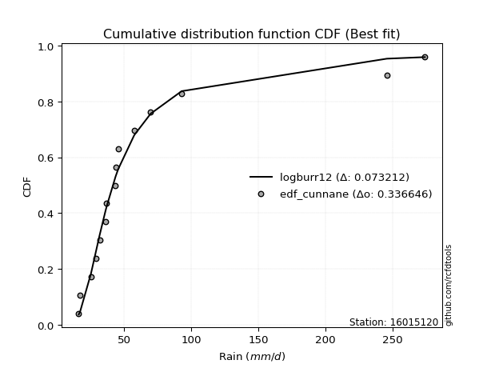</img></img>

</div>


### 12. EDF Adamowski (1981)

The Adamowski formula in hydrology refers to a specific plotting position formula used for estimating the non-parametric empirical distribution of hydrological events (like flood peaks) to calculate their return periods. This formula provides an alternative to traditional parametric methods (like the Gumbel or Log Pearson Type III distributions). 

<div align="center">


$P=(m-0.25)/(n+0.5)$


</div>


**12.1. Empirical values**

<div align="center">

|                | 0                   | 1                   | 2                  | 3                   | 4                  | 5                  | 6                   | 7             | 8                  | 9                  | 10                 | 11                 | 12                 | 13                 | 14                 |
|:---------------|:--------------------|:--------------------|:-------------------|:--------------------|:-------------------|:-------------------|:--------------------|:--------------|:-------------------|:-------------------|:-------------------|:-------------------|:-------------------|:-------------------|:-------------------|
| date           | 2025                | 2023                | 2022               | 2014                | 2015               | 2021               | 2019                | 2011          | 2017               | 2020               | 2016               | 2018               | 2024               | 2012               | 2013               |
| x              | 16.1                | 17.2                | 25.2               | 29.2                | 31.7               | 36.1               | 36.9                | 43.5          | 44.0               | 45.6               | 57.5               | 69.7               | 92.8               | 245.8              | 274.1              |
| m              | 1                   | 2                   | 3                  | 4                   | 5                  | 6                  | 7                   | 8             | 9                  | 10                 | 11                 | 12                 | 13                 | 14                 | 15                 |
| empirical_dist | edf_adamowski       | edf_adamowski       | edf_adamowski      | edf_adamowski       | edf_adamowski      | edf_adamowski      | edf_adamowski       | edf_adamowski | edf_adamowski      | edf_adamowski      | edf_adamowski      | edf_adamowski      | edf_adamowski      | edf_adamowski      | edf_adamowski      |
| empirical      | 0.04838709677419355 | 0.11290322580645161 | 0.1774193548387097 | 0.24193548387096775 | 0.3064516129032258 | 0.3709677419354839 | 0.43548387096774194 | 0.5           | 0.5645161290322581 | 0.6290322580645161 | 0.6935483870967742 | 0.7580645161290323 | 0.8225806451612904 | 0.8870967741935484 | 0.9516129032258065 |
| empirical_tr   | 1.0508474576271185  | 1.1272727272727272  | 1.215686274509804  | 1.3191489361702127  | 1.441860465116279  | 1.5897435897435896 | 1.7714285714285716  | 2.0           | 2.2962962962962967 | 2.6956521739130435 | 3.2631578947368425 | 4.133333333333333  | 5.636363636363638  | 8.857142857142856  | 20.666666666666686 |

</div>


**12.2. Kolmogorov-Smirnov fit test (sorted by Δ)**


<div align="center">

|                | 0                   | 1                  | 2                   | 3                   | 4                   | 5                   | 6                   | 7                   | 8                   | 9                  | 10                  | 11                  | 12                 | 13                 | 14                  | 15                  | 16                  | 17                  | 18                  | 19                  | 20                 | 21                  | 22                  | 23                  | 24                  | 25                  | 26                  | 27                  | 28                  | 29                  | 30                  | 31                  | 32                  | 33                  | 34                  | 35                  | 36                  | 37                  | 38                  | 39                  | 40                 | 41                  | 42                  | 43                 | 44                  | 45                  | 46                  | 47                  | 48                 | 49                  | 50                  | 51                  | 52                  | 53                  | 54                 | 55                  | 56                 | 57                  | 58                 | 59                 | 60                  | 61                  | 62                  | 63                  | 64                  | 65                  | 66                 | 67                  | 68                  | 69                 | 70                  | 71                  | 72                 | 73                 | 74                  | 75                  | 76                  | 77                 | 78                  | 79                  | 80                 | 81                 | 82                  | 83                  | 84                 | 85                  | 86                  | 87                 | 88                  | 89                 | 90                  | 91                  | 92                  | 93                  | 94                  | 95                  | 96                  | 97                  | 98                  | 99                  | 100                | 101                 | 102                | 103                | 104                | 105                 | 106                 | 107                 | 108                 | 109                | 110                 | 111                 | 112                 | 113                | 114                 | 115                 | 116                | 117                 | 118                | 119                | 120                | 121                | 122                | 123                 | 124                | 125                | 126                 | 127                 | 128                 | 129                 | 130                | 131                 | 132                | 133                 | 134                | 135                 | 136                | 137                | 138                | 139                 | 140                | 141                 | 142                | 143                 | 144                | 145                 | 146                | 147                 | 148                | 149                | 150                | 151                | 152                | 153                | 154                | 155                | 156                | 157                | 158                | 159                |
|:---------------|:--------------------|:-------------------|:--------------------|:--------------------|:--------------------|:--------------------|:--------------------|:--------------------|:--------------------|:-------------------|:--------------------|:--------------------|:-------------------|:-------------------|:--------------------|:--------------------|:--------------------|:--------------------|:--------------------|:--------------------|:-------------------|:--------------------|:--------------------|:--------------------|:--------------------|:--------------------|:--------------------|:--------------------|:--------------------|:--------------------|:--------------------|:--------------------|:--------------------|:--------------------|:--------------------|:--------------------|:--------------------|:--------------------|:--------------------|:--------------------|:-------------------|:--------------------|:--------------------|:-------------------|:--------------------|:--------------------|:--------------------|:--------------------|:-------------------|:--------------------|:--------------------|:--------------------|:--------------------|:--------------------|:-------------------|:--------------------|:-------------------|:--------------------|:-------------------|:-------------------|:--------------------|:--------------------|:--------------------|:--------------------|:--------------------|:--------------------|:-------------------|:--------------------|:--------------------|:-------------------|:--------------------|:--------------------|:-------------------|:-------------------|:--------------------|:--------------------|:--------------------|:-------------------|:--------------------|:--------------------|:-------------------|:-------------------|:--------------------|:--------------------|:-------------------|:--------------------|:--------------------|:-------------------|:--------------------|:-------------------|:--------------------|:--------------------|:--------------------|:--------------------|:--------------------|:--------------------|:--------------------|:--------------------|:--------------------|:--------------------|:-------------------|:--------------------|:-------------------|:-------------------|:-------------------|:--------------------|:--------------------|:--------------------|:--------------------|:-------------------|:--------------------|:--------------------|:--------------------|:-------------------|:--------------------|:--------------------|:-------------------|:--------------------|:-------------------|:-------------------|:-------------------|:-------------------|:-------------------|:--------------------|:-------------------|:-------------------|:--------------------|:--------------------|:--------------------|:--------------------|:-------------------|:--------------------|:-------------------|:--------------------|:-------------------|:--------------------|:-------------------|:-------------------|:-------------------|:--------------------|:-------------------|:--------------------|:-------------------|:--------------------|:-------------------|:--------------------|:-------------------|:--------------------|:-------------------|:-------------------|:-------------------|:-------------------|:-------------------|:-------------------|:-------------------|:-------------------|:-------------------|:-------------------|:-------------------|:-------------------|
| station        | 16015120            | 16015120           | 16015120            | 16015120            | 16015120            | 16015120            | 16015120            | 16015120            | 16015120            | 16015120           | 16015120            | 16015120            | 16015120           | 16015120           | 16015120            | 16015120            | 16015120            | 16015120            | 16015120            | 16015120            | 16015120           | 16015120            | 16015120            | 16015120            | 16015120            | 16015120            | 16015120            | 16015120            | 16015120            | 16015120            | 16015120            | 16015120            | 16015120            | 16015120            | 16015120            | 16015120            | 16015120            | 16015120            | 16015120            | 16015120            | 16015120           | 16015120            | 16015120            | 16015120           | 16015120            | 16015120            | 16015120            | 16015120            | 16015120           | 16015120            | 16015120            | 16015120            | 16015120            | 16015120            | 16015120           | 16015120            | 16015120           | 16015120            | 16015120           | 16015120           | 16015120            | 16015120            | 16015120            | 16015120            | 16015120            | 16015120            | 16015120           | 16015120            | 16015120            | 16015120           | 16015120            | 16015120            | 16015120           | 16015120           | 16015120            | 16015120            | 16015120            | 16015120           | 16015120            | 16015120            | 16015120           | 16015120           | 16015120            | 16015120            | 16015120           | 16015120            | 16015120            | 16015120           | 16015120            | 16015120           | 16015120            | 16015120            | 16015120            | 16015120            | 16015120            | 16015120            | 16015120            | 16015120            | 16015120            | 16015120            | 16015120           | 16015120            | 16015120           | 16015120           | 16015120           | 16015120            | 16015120            | 16015120            | 16015120            | 16015120           | 16015120            | 16015120            | 16015120            | 16015120           | 16015120            | 16015120            | 16015120           | 16015120            | 16015120           | 16015120           | 16015120           | 16015120           | 16015120           | 16015120            | 16015120           | 16015120           | 16015120            | 16015120            | 16015120            | 16015120            | 16015120           | 16015120            | 16015120           | 16015120            | 16015120           | 16015120            | 16015120           | 16015120           | 16015120           | 16015120            | 16015120           | 16015120            | 16015120           | 16015120            | 16015120           | 16015120            | 16015120           | 16015120            | 16015120           | 16015120           | 16015120           | 16015120           | 16015120           | 16015120           | 16015120           | 16015120           | 16015120           | 16015120           | 16015120           | 16015120           |
| empirical_dist | edf_adamowski       | edf_adamowski      | edf_adamowski       | edf_adamowski       | edf_adamowski       | edf_adamowski       | edf_adamowski       | edf_adamowski       | edf_adamowski       | edf_adamowski      | edf_adamowski       | edf_adamowski       | edf_adamowski      | edf_adamowski      | edf_adamowski       | edf_adamowski       | edf_adamowski       | edf_adamowski       | edf_adamowski       | edf_adamowski       | edf_adamowski      | edf_adamowski       | edf_adamowski       | edf_adamowski       | edf_adamowski       | edf_adamowski       | edf_adamowski       | edf_adamowski       | edf_adamowski       | edf_adamowski       | edf_adamowski       | edf_adamowski       | edf_adamowski       | edf_adamowski       | edf_adamowski       | edf_adamowski       | edf_adamowski       | edf_adamowski       | edf_adamowski       | edf_adamowski       | edf_adamowski      | edf_adamowski       | edf_adamowski       | edf_adamowski      | edf_adamowski       | edf_adamowski       | edf_adamowski       | edf_adamowski       | edf_adamowski      | edf_adamowski       | edf_adamowski       | edf_adamowski       | edf_adamowski       | edf_adamowski       | edf_adamowski      | edf_adamowski       | edf_adamowski      | edf_adamowski       | edf_adamowski      | edf_adamowski      | edf_adamowski       | edf_adamowski       | edf_adamowski       | edf_adamowski       | edf_adamowski       | edf_adamowski       | edf_adamowski      | edf_adamowski       | edf_adamowski       | edf_adamowski      | edf_adamowski       | edf_adamowski       | edf_adamowski      | edf_adamowski      | edf_adamowski       | edf_adamowski       | edf_adamowski       | edf_adamowski      | edf_adamowski       | edf_adamowski       | edf_adamowski      | edf_adamowski      | edf_adamowski       | edf_adamowski       | edf_adamowski      | edf_adamowski       | edf_adamowski       | edf_adamowski      | edf_adamowski       | edf_adamowski      | edf_adamowski       | edf_adamowski       | edf_adamowski       | edf_adamowski       | edf_adamowski       | edf_adamowski       | edf_adamowski       | edf_adamowski       | edf_adamowski       | edf_adamowski       | edf_adamowski      | edf_adamowski       | edf_adamowski      | edf_adamowski      | edf_adamowski      | edf_adamowski       | edf_adamowski       | edf_adamowski       | edf_adamowski       | edf_adamowski      | edf_adamowski       | edf_adamowski       | edf_adamowski       | edf_adamowski      | edf_adamowski       | edf_adamowski       | edf_adamowski      | edf_adamowski       | edf_adamowski      | edf_adamowski      | edf_adamowski      | edf_adamowski      | edf_adamowski      | edf_adamowski       | edf_adamowski      | edf_adamowski      | edf_adamowski       | edf_adamowski       | edf_adamowski       | edf_adamowski       | edf_adamowski      | edf_adamowski       | edf_adamowski      | edf_adamowski       | edf_adamowski      | edf_adamowski       | edf_adamowski      | edf_adamowski      | edf_adamowski      | edf_adamowski       | edf_adamowski      | edf_adamowski       | edf_adamowski      | edf_adamowski       | edf_adamowski      | edf_adamowski       | edf_adamowski      | edf_adamowski       | edf_adamowski      | edf_adamowski      | edf_adamowski      | edf_adamowski      | edf_adamowski      | edf_adamowski      | edf_adamowski      | edf_adamowski      | edf_adamowski      | edf_adamowski      | edf_adamowski      | edf_adamowski      |
| p_dist         | logburr12           | alpha              | logburr             | logexponnorm        | logerlang           | loggamma            | loggamma            | f                   | genextreme          | invweibull         | logmielke           | logdweibull         | invgamma           | logjohnsonsu       | nct                 | logfatiguelife      | loginvgauss         | loginvgamma         | logf                | loggenextreme       | loginvweibull      | logalpha            | loggennorm          | logweibull_min      | kappa3              | loggenexpon         | johnsonsu           | genpareto           | loggenlogistic      | logfoldnorm         | logkappa3           | burr                | invgauss            | logmoyal            | logt                | logloglaplace       | logdgamma           | loggompertz         | loggumbel_r         | loggenhalflogistic  | mielke             | lognct              | logkstwobign        | logpearson3        | loghalfnorm         | logskewnorm         | fatiguelife         | erlang              | logvonmises_line   | logbetaprime        | logtruncweibull_min | loghalflogistic     | lograyleigh         | lognakagami         | gamma              | betaprime           | halfgennorm        | logncf              | logmaxwell         | truncpareto        | logwald             | logrice             | truncweibull_min    | wald                | t                   | loggausshyper       | logbeta            | logtruncexpon       | exponpow            | logsemicircular    | logarcsine          | loganglit           | logloggamma        | lognorm            | logcrystalball      | loggengamma         | loglogistic         | loghypsecant       | burr12              | logbradford         | logtruncnorm       | logrdist           | vonmises_line       | logtukeylambda      | loglomax           | loglaplace          | loglaplace          | genhalflogistic    | gennorm             | weibull_min        | dweibull            | moyal               | loghalfgennorm      | beta                | pearson3            | exponweib           | gumbel_r            | gompertz            | logcosine           | exponnorm           | genexpon           | nakagami            | halflogistic       | rayleigh           | dgamma             | loggumbel_l         | genlogistic         | maxwell             | halfnorm            | logkappa4          | gengamma            | logksone            | lomax               | logexponpow        | logjohnsonsb        | logexponweib        | logwrapcauchy      | loguniform          | semicircular       | anglit             | norm               | crystalball        | foldnorm           | logistic            | arcsine            | loggenpareto       | logargus            | hypsecant           | kstwobign           | ncf                 | truncnorm          | gausshyper          | powerlaw           | rice                | laplace            | logtriang           | gumbel_l           | logweibull_max     | truncexpon         | bradford            | cosine             | wrapcauchy          | loglevy_l          | skewnorm            | logpowerlaw        | triang              | argus              | levy_l              | logtrapezoid       | johnsonsb          | ksone              | kappa4             | rdist              | uniform            | tukeylambda        | logtruncpareto     | trapezoid          | weibull_max        | logvonmises        | vonmises           |
| delta          | 0.07066505704660564 | 0.0711750091049339 | 0.07270502818777402 | 0.07321752923878344 | 0.07431182840072648 | 0.07431397819974267 | 0.07431397819974267 | 0.07565319762757905 | 0.07647981829408512 | 0.0764800117596337 | 0.07723789076450116 | 0.07741014998403462 | 0.0777223694971455 | 0.0782777724869399 | 0.07832062545999385 | 0.07835020701369577 | 0.07860542088933198 | 0.07908699584415158 | 0.07910328533312438 | 0.08001120117401261 | 0.0800203987284005 | 0.08017096313921968 | 0.08166277618967865 | 0.08389556461066838 | 0.08420147064328246 | 0.08462826494570008 | 0.08480135447104675 | 0.08574338148993788 | 0.08609713661441032 | 0.08672804300224723 | 0.08692554897887667 | 0.08726780732789485 | 0.08751067093850251 | 0.08754927090669383 | 0.08803666076458394 | 0.08849298052589838 | 0.08938287316670723 | 0.08965718015951385 | 0.09009655147766493 | 0.09284513596214528 | 0.0950021924275587 | 0.09813214527391156 | 0.09835268444917566 | 0.0991833335679233 | 0.09980597709177771 | 0.10380075903976271 | 0.10474242995735561 | 0.10501428174834904 | 0.1077954423045614 | 0.11222816811487613 | 0.11258504507715517 | 0.11290322580645161 | 0.11334990733511197 | 0.11358290364757018 | 0.1147404470298633 | 0.11497940228464232 | 0.1204887995591693 | 0.12412086868945649 | 0.1249404670918689 | 0.1270604542041458 | 0.12909913907471843 | 0.13113196044858205 | 0.13142951121073876 | 0.13390662037100176 | 0.14051881690352053 | 0.14087547769091296 | 0.1419391542721905 | 0.14653811006716128 | 0.15216629797021186 | 0.1529037428430628 | 0.15345064194152325 | 0.15466250565629275 | 0.1574429299607299 | 0.1589295086896474 | 0.15892984534821225 | 0.16017581336420117 | 0.16299387376488916 | 0.166451563063243  | 0.17356525262751943 | 0.17406722278403075 | 0.177419332434089  | 0.1774193545455537 | 0.17741935483727567 | 0.17741935483870253 | 0.177917299623507  | 0.17935698567054298 | 0.17935698567054298 | 0.180507274313159  | 0.18290484924955364 | 0.1910012122264294 | 0.19116522656717583 | 0.19215748166409646 | 0.19268139715681032 | 0.19784372028208147 | 0.20222991587054112 | 0.20310103240857075 | 0.20540138361381988 | 0.20563142049737704 | 0.20645153059252913 | 0.21189131942232653 | 0.2134860812606264 | 0.21367344210092787 | 0.2193403261427328 | 0.2204934269127956 | 0.2246328844933161 | 0.22955147919476893 | 0.23121333935787275 | 0.23165114301692113 | 0.23744943077436537 | 0.2389009254894115 | 0.24259102465193938 | 0.24394055670409232 | 0.25150061518840544 | 0.253359205209963  | 0.25422282397185647 | 0.25937435150730315 | 0.260568607581188  | 0.26176302597347617 | 0.2635693263563422 | 0.2639760197465308 | 0.2649634541471941 | 0.2649634583945103 | 0.2679978787272063 | 0.27496043302913464 | 0.2826290946698404 | 0.2839079674245235 | 0.28667230661314225 | 0.28774187882057745 | 0.28775592361490526 | 0.29062340885676113 | 0.2997908511624515 | 0.30080796488383016 | 0.3101983136100475 | 0.31190715655611595 | 0.316138616844879  | 0.32918939637285716 | 0.3355088577893921 | 0.340410944135143  | 0.3463288772778082 | 0.34943794340117945 | 0.3551903269602876 | 0.37742665284568105 | 0.3794261840275008 | 0.38353699491130244 | 0.4131329991867058 | 0.43289397237526095 | 0.4415843132059949 | 0.45010232205820117 | 0.4937410704742548 | 0.5008395336602348 | 0.5016045678086188 | 0.5101710141027976 | 0.5425908575480297 | 0.5503125781445362 | 0.5708986777190206 | 0.7079725988108552 | 0.7119320147600559 | 0.7235436494556953 | 1.091343094326343  | 43.15793311709589  |
| deltao         | 0.3366456264050002  | 0.3366456264050002 | 0.3366456264050002  | 0.3366456264050002  | 0.3366456264050002  | 0.3366456264050002  | 0.3366456264050002  | 0.3366456264050002  | 0.3366456264050002  | 0.3366456264050002 | 0.3366456264050002  | 0.3366456264050002  | 0.3366456264050002 | 0.3366456264050002 | 0.3366456264050002  | 0.3366456264050002  | 0.3366456264050002  | 0.3366456264050002  | 0.3366456264050002  | 0.3366456264050002  | 0.3366456264050002 | 0.3366456264050002  | 0.3366456264050002  | 0.3366456264050002  | 0.3366456264050002  | 0.3366456264050002  | 0.3366456264050002  | 0.3366456264050002  | 0.3366456264050002  | 0.3366456264050002  | 0.3366456264050002  | 0.3366456264050002  | 0.3366456264050002  | 0.3366456264050002  | 0.3366456264050002  | 0.3366456264050002  | 0.3366456264050002  | 0.3366456264050002  | 0.3366456264050002  | 0.3366456264050002  | 0.3366456264050002 | 0.3366456264050002  | 0.3366456264050002  | 0.3366456264050002 | 0.3366456264050002  | 0.3366456264050002  | 0.3366456264050002  | 0.3366456264050002  | 0.3366456264050002 | 0.3366456264050002  | 0.3366456264050002  | 0.3366456264050002  | 0.3366456264050002  | 0.3366456264050002  | 0.3366456264050002 | 0.3366456264050002  | 0.3366456264050002 | 0.3366456264050002  | 0.3366456264050002 | 0.3366456264050002 | 0.3366456264050002  | 0.3366456264050002  | 0.3366456264050002  | 0.3366456264050002  | 0.3366456264050002  | 0.3366456264050002  | 0.3366456264050002 | 0.3366456264050002  | 0.3366456264050002  | 0.3366456264050002 | 0.3366456264050002  | 0.3366456264050002  | 0.3366456264050002 | 0.3366456264050002 | 0.3366456264050002  | 0.3366456264050002  | 0.3366456264050002  | 0.3366456264050002 | 0.3366456264050002  | 0.3366456264050002  | 0.3366456264050002 | 0.3366456264050002 | 0.3366456264050002  | 0.3366456264050002  | 0.3366456264050002 | 0.3366456264050002  | 0.3366456264050002  | 0.3366456264050002 | 0.3366456264050002  | 0.3366456264050002 | 0.3366456264050002  | 0.3366456264050002  | 0.3366456264050002  | 0.3366456264050002  | 0.3366456264050002  | 0.3366456264050002  | 0.3366456264050002  | 0.3366456264050002  | 0.3366456264050002  | 0.3366456264050002  | 0.3366456264050002 | 0.3366456264050002  | 0.3366456264050002 | 0.3366456264050002 | 0.3366456264050002 | 0.3366456264050002  | 0.3366456264050002  | 0.3366456264050002  | 0.3366456264050002  | 0.3366456264050002 | 0.3366456264050002  | 0.3366456264050002  | 0.3366456264050002  | 0.3366456264050002 | 0.3366456264050002  | 0.3366456264050002  | 0.3366456264050002 | 0.3366456264050002  | 0.3366456264050002 | 0.3366456264050002 | 0.3366456264050002 | 0.3366456264050002 | 0.3366456264050002 | 0.3366456264050002  | 0.3366456264050002 | 0.3366456264050002 | 0.3366456264050002  | 0.3366456264050002  | 0.3366456264050002  | 0.3366456264050002  | 0.3366456264050002 | 0.3366456264050002  | 0.3366456264050002 | 0.3366456264050002  | 0.3366456264050002 | 0.3366456264050002  | 0.3366456264050002 | 0.3366456264050002 | 0.3366456264050002 | 0.3366456264050002  | 0.3366456264050002 | 0.3366456264050002  | 0.3366456264050002 | 0.3366456264050002  | 0.3366456264050002 | 0.3366456264050002  | 0.3366456264050002 | 0.3366456264050002  | 0.3366456264050002 | 0.3366456264050002 | 0.3366456264050002 | 0.3366456264050002 | 0.3366456264050002 | 0.3366456264050002 | 0.3366456264050002 | 0.3366456264050002 | 0.3366456264050002 | 0.3366456264050002 | 0.3366456264050002 | 0.3366456264050002 |
| eval           | Δo > Δ              | Δo > Δ             | Δo > Δ              | Δo > Δ              | Δo > Δ              | Δo > Δ              | Δo > Δ              | Δo > Δ              | Δo > Δ              | Δo > Δ             | Δo > Δ              | Δo > Δ              | Δo > Δ             | Δo > Δ             | Δo > Δ              | Δo > Δ              | Δo > Δ              | Δo > Δ              | Δo > Δ              | Δo > Δ              | Δo > Δ             | Δo > Δ              | Δo > Δ              | Δo > Δ              | Δo > Δ              | Δo > Δ              | Δo > Δ              | Δo > Δ              | Δo > Δ              | Δo > Δ              | Δo > Δ              | Δo > Δ              | Δo > Δ              | Δo > Δ              | Δo > Δ              | Δo > Δ              | Δo > Δ              | Δo > Δ              | Δo > Δ              | Δo > Δ              | Δo > Δ             | Δo > Δ              | Δo > Δ              | Δo > Δ             | Δo > Δ              | Δo > Δ              | Δo > Δ              | Δo > Δ              | Δo > Δ             | Δo > Δ              | Δo > Δ              | Δo > Δ              | Δo > Δ              | Δo > Δ              | Δo > Δ             | Δo > Δ              | Δo > Δ             | Δo > Δ              | Δo > Δ             | Δo > Δ             | Δo > Δ              | Δo > Δ              | Δo > Δ              | Δo > Δ              | Δo > Δ              | Δo > Δ              | Δo > Δ             | Δo > Δ              | Δo > Δ              | Δo > Δ             | Δo > Δ              | Δo > Δ              | Δo > Δ             | Δo > Δ             | Δo > Δ              | Δo > Δ              | Δo > Δ              | Δo > Δ             | Δo > Δ              | Δo > Δ              | Δo > Δ             | Δo > Δ             | Δo > Δ              | Δo > Δ              | Δo > Δ             | Δo > Δ              | Δo > Δ              | Δo > Δ             | Δo > Δ              | Δo > Δ             | Δo > Δ              | Δo > Δ              | Δo > Δ              | Δo > Δ              | Δo > Δ              | Δo > Δ              | Δo > Δ              | Δo > Δ              | Δo > Δ              | Δo > Δ              | Δo > Δ             | Δo > Δ              | Δo > Δ             | Δo > Δ             | Δo > Δ             | Δo > Δ              | Δo > Δ              | Δo > Δ              | Δo > Δ              | Δo > Δ             | Δo > Δ              | Δo > Δ              | Δo > Δ              | Δo > Δ             | Δo > Δ              | Δo > Δ              | Δo > Δ             | Δo > Δ              | Δo > Δ             | Δo > Δ             | Δo > Δ             | Δo > Δ             | Δo > Δ             | Δo > Δ              | Δo > Δ             | Δo > Δ             | Δo > Δ              | Δo > Δ              | Δo > Δ              | Δo > Δ              | Δo > Δ             | Δo > Δ              | Δo > Δ             | Δo > Δ              | Δo > Δ             | Δo > Δ              | Δo > Δ             | Δo <= Δ            | Δo <= Δ            | Δo <= Δ             | Δo <= Δ            | Δo <= Δ             | Δo <= Δ            | Δo <= Δ             | Δo <= Δ            | Δo <= Δ             | Δo <= Δ            | Δo <= Δ             | Δo <= Δ            | Δo <= Δ            | Δo <= Δ            | Δo <= Δ            | Δo <= Δ            | Δo <= Δ            | Δo <= Δ            | Δo <= Δ            | Δo <= Δ            | Δo <= Δ            | Δo <= Δ            | Δo <= Δ            |
| fit            | 1                   | 1                  | 1                   | 1                   | 1                   | 1                   | 1                   | 1                   | 1                   | 1                  | 1                   | 1                   | 1                  | 1                  | 1                   | 1                   | 1                   | 1                   | 1                   | 1                   | 1                  | 1                   | 1                   | 1                   | 1                   | 1                   | 1                   | 1                   | 1                   | 1                   | 1                   | 1                   | 1                   | 1                   | 1                   | 1                   | 1                   | 1                   | 1                   | 1                   | 1                  | 1                   | 1                   | 1                  | 1                   | 1                   | 1                   | 1                   | 1                  | 1                   | 1                   | 1                   | 1                   | 1                   | 1                  | 1                   | 1                  | 1                   | 1                  | 1                  | 1                   | 1                   | 1                   | 1                   | 1                   | 1                   | 1                  | 1                   | 1                   | 1                  | 1                   | 1                   | 1                  | 1                  | 1                   | 1                   | 1                   | 1                  | 1                   | 1                   | 1                  | 1                  | 1                   | 1                   | 1                  | 1                   | 1                   | 1                  | 1                   | 1                  | 1                   | 1                   | 1                   | 1                   | 1                   | 1                   | 1                   | 1                   | 1                   | 1                   | 1                  | 1                   | 1                  | 1                  | 1                  | 1                   | 1                   | 1                   | 1                   | 1                  | 1                   | 1                   | 1                   | 1                  | 1                   | 1                   | 1                  | 1                   | 1                  | 1                  | 1                  | 1                  | 1                  | 1                   | 1                  | 1                  | 1                   | 1                   | 1                   | 1                   | 1                  | 1                   | 1                  | 1                   | 1                  | 1                   | 1                  | 0                  | 0                  | 0                   | 0                  | 0                   | 0                  | 0                   | 0                  | 0                   | 0                  | 0                   | 0                  | 0                  | 0                  | 0                  | 0                  | 0                  | 0                  | 0                  | 0                  | 0                  | 0                  | 0                  |
| n              | 15                  | 15                 | 15                  | 15                  | 15                  | 15                  | 15                  | 15                  | 15                  | 15                 | 15                  | 15                  | 15                 | 15                 | 15                  | 15                  | 15                  | 15                  | 15                  | 15                  | 15                 | 15                  | 15                  | 15                  | 15                  | 15                  | 15                  | 15                  | 15                  | 15                  | 15                  | 15                  | 15                  | 15                  | 15                  | 15                  | 15                  | 15                  | 15                  | 15                  | 15                 | 15                  | 15                  | 15                 | 15                  | 15                  | 15                  | 15                  | 15                 | 15                  | 15                  | 15                  | 15                  | 15                  | 15                 | 15                  | 15                 | 15                  | 15                 | 15                 | 15                  | 15                  | 15                  | 15                  | 15                  | 15                  | 15                 | 15                  | 15                  | 15                 | 15                  | 15                  | 15                 | 15                 | 15                  | 15                  | 15                  | 15                 | 15                  | 15                  | 15                 | 15                 | 15                  | 15                  | 15                 | 15                  | 15                  | 15                 | 15                  | 15                 | 15                  | 15                  | 15                  | 15                  | 15                  | 15                  | 15                  | 15                  | 15                  | 15                  | 15                 | 15                  | 15                 | 15                 | 15                 | 15                  | 15                  | 15                  | 15                  | 15                 | 15                  | 15                  | 15                  | 15                 | 15                  | 15                  | 15                 | 15                  | 15                 | 15                 | 15                 | 15                 | 15                 | 15                  | 15                 | 15                 | 15                  | 15                  | 15                  | 15                  | 15                 | 15                  | 15                 | 15                  | 15                 | 15                  | 15                 | 15                 | 15                 | 15                  | 15                 | 15                  | 15                 | 15                  | 15                 | 15                  | 15                 | 15                  | 15                 | 15                 | 15                 | 15                 | 15                 | 15                 | 15                 | 15                 | 15                 | 15                 | 15                 | 15                 |
| best_fit       | 1                   | 0                  | 0                   | 0                   | 0                   | 0                   | 0                   | 0                   | 0                   | 0                  | 0                   | 0                   | 0                  | 0                  | 0                   | 0                   | 0                   | 0                   | 0                   | 0                   | 0                  | 0                   | 0                   | 0                   | 0                   | 0                   | 0                   | 0                   | 0                   | 0                   | 0                   | 0                   | 0                   | 0                   | 0                   | 0                   | 0                   | 0                   | 0                   | 0                   | 0                  | 0                   | 0                   | 0                  | 0                   | 0                   | 0                   | 0                   | 0                  | 0                   | 0                   | 0                   | 0                   | 0                   | 0                  | 0                   | 0                  | 0                   | 0                  | 0                  | 0                   | 0                   | 0                   | 0                   | 0                   | 0                   | 0                  | 0                   | 0                   | 0                  | 0                   | 0                   | 0                  | 0                  | 0                   | 0                   | 0                   | 0                  | 0                   | 0                   | 0                  | 0                  | 0                   | 0                   | 0                  | 0                   | 0                   | 0                  | 0                   | 0                  | 0                   | 0                   | 0                   | 0                   | 0                   | 0                   | 0                   | 0                   | 0                   | 0                   | 0                  | 0                   | 0                  | 0                  | 0                  | 0                   | 0                   | 0                   | 0                   | 0                  | 0                   | 0                   | 0                   | 0                  | 0                   | 0                   | 0                  | 0                   | 0                  | 0                  | 0                  | 0                  | 0                  | 0                   | 0                  | 0                  | 0                   | 0                   | 0                   | 0                   | 0                  | 0                   | 0                  | 0                   | 0                  | 0                   | 0                  | 0                  | 0                  | 0                   | 0                  | 0                   | 0                  | 0                   | 0                  | 0                   | 0                  | 0                   | 0                  | 0                  | 0                  | 0                  | 0                  | 0                  | 0                  | 0                  | 0                  | 0                  | 0                  | 0                  |
| best_fit_sort  | 1                   | 2                  | 3                   | 4                   | 5                   | 6                   | 7                   | 8                   | 9                   | 10                 | 11                  | 12                  | 13                 | 14                 | 15                  | 16                  | 17                  | 18                  | 19                  | 20                  | 21                 | 22                  | 23                  | 24                  | 25                  | 26                  | 27                  | 28                  | 29                  | 30                  | 31                  | 32                  | 33                  | 34                  | 35                  | 36                  | 37                  | 38                  | 39                  | 40                  | 41                 | 42                  | 43                  | 44                 | 45                  | 46                  | 47                  | 48                  | 49                 | 50                  | 51                  | 52                  | 53                  | 54                  | 55                 | 56                  | 57                 | 58                  | 59                 | 60                 | 61                  | 62                  | 63                  | 64                  | 65                  | 66                  | 67                 | 68                  | 69                  | 70                 | 71                  | 72                  | 73                 | 74                 | 75                  | 76                  | 77                  | 78                 | 79                  | 80                  | 81                 | 82                 | 83                  | 84                  | 85                 | 86                  | 87                  | 88                 | 89                  | 90                 | 91                  | 92                  | 93                  | 94                  | 95                  | 96                  | 97                  | 98                  | 99                  | 100                 | 101                | 102                 | 103                | 104                | 105                | 106                 | 107                 | 108                 | 109                 | 110                | 111                 | 112                 | 113                 | 114                | 115                 | 116                 | 117                | 118                 | 119                | 120                | 121                | 122                | 123                | 124                 | 125                | 126                | 127                 | 128                 | 129                 | 130                 | 131                | 132                 | 133                | 134                 | 135                | 136                 | 137                | 138                | 139                | 140                 | 141                | 142                 | 143                | 144                 | 145                | 146                 | 147                | 148                 | 149                | 150                | 151                | 152                | 153                | 154                | 155                | 156                | 157                | 158                | 159                | 160                |

</div>


**12.3. Best fit**

<div align="center">

|   id |   station | empirical_dist   | p_dist    |     delta |   deltao | eval   |   fit |   n |   best_fit |   best_fit_sort |
|-----:|----------:|:-----------------|:----------|----------:|---------:|:-------|------:|----:|-----------:|----------------:|
|    0 |  16015120 | edf_adamowski    | logburr12 | 0.0706651 | 0.336646 | Δo > Δ |     1 |  15 |          1 |               1 |

</div>


<div align="center">

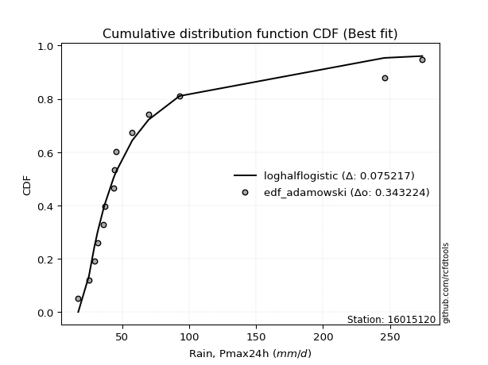</img>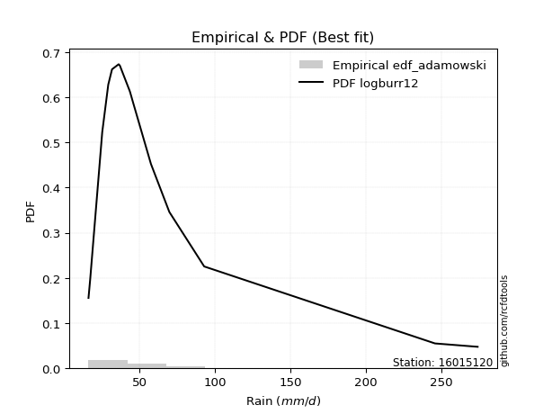</img>

</div>


## C. Best fit & Estimate extreme values for specific return periods - Tr

Best fit in probability distribution analysis means finding the theoretical distribution (like Normal, Poisson, Exponential, etc.) that most accurately mirrors your real-world data´s patterns (shape, center, spread) for better predictions, using methods like visual checks (Q-Q plots), goodness-of-fit tests (Kolmogorov-Smirnov, Chi-Squared), and information criteria (AIC) to score and select the simplest, most representative model.


### 1. Best fit (ordered by delta Δ)

:file_folder:Table: [bestfit_16015120.csv](table/bestfit_16015120.csv)

<div align="center">

|   id |   station | empirical_dist   | p_dist    |     delta |   deltao | eval   |   fit |   n |   best_fit |   best_fit_sort |
|-----:|----------:|:-----------------|:----------|----------:|---------:|:-------|------:|----:|-----------:|----------------:|
|    0 |  16015120 | edf_adamowski    | logburr12 | 0.0706651 | 0.336646 | Δo > Δ |     1 |  15 |          1 |               1 |
|    1 |  16015120 | edf_chegodayev   | logburr12 | 0.0715029 | 0.336646 | Δo > Δ |     1 |  15 |          1 |               2 |
|    2 |  16015120 | edf_jenkinson    | logburr12 | 0.0716718 | 0.336646 | Δo > Δ |     1 |  15 |          1 |               3 |
|    3 |  16015120 | edf_beard        | logburr12 | 0.0716718 | 0.336646 | Δo > Δ |     1 |  15 |          1 |               4 |
|    4 |  16015120 | edf_filliben     | logburr12 | 0.0717988 | 0.336646 | Δo > Δ |     1 |  15 |          1 |               5 |
|    5 |  16015120 | edf_tukey        | logburr12 | 0.0720676 | 0.336646 | Δo > Δ |     1 |  15 |          1 |               6 |
|    6 |  16015120 | edf_blom         | logburr12 | 0.0727803 | 0.336646 | Δo > Δ |     1 |  15 |          1 |               7 |
|    7 |  16015120 | edf_cunnane      | logburr12 | 0.0732117 | 0.336646 | Δo > Δ |     1 |  15 |          1 |               8 |
|    8 |  16015120 | edf_gringorten   | logburr12 | 0.0739079 | 0.336646 | Δo > Δ |     1 |  15 |          1 |               9 |
|    9 |  16015120 | edf_hazen        | logmoyal  | 0.074646  | 0.336646 | Δo > Δ |     1 |  15 |          1 |              10 |
|   10 |  16015120 | edf_weibull      | logburr12 | 0.0777564 | 0.336646 | Δo > Δ |     1 |  15 |          1 |              11 |
|   11 |  16015120 | edf_california   | logt      | 0.0978422 | 0.336646 | Δo > Δ |     1 |  15 |          1 |              12 |

</div>


### 2. Extreme values and % difference analysis

In hydrology, a return period (or recurrence interval $Tr$) is the statistical average time between extreme events like floods or droughts of a specific magnitude, indicating how rare an event is, with a 100-year flood, for example, having a 1% chance of occurring in any given year, not that it happens exactly every century. It is a key tool for infrastructure design (like bridges or dams) and risk assessment, calculated from historical data to determine the probability of future events, although it is important to remember it is statistical average, and events can cluster or be missed.

The extreme value porcentage difference is evaluated as $pdiff = 1 - (ETrBf / ETr) * 100$, where _ETrBf_ correspond to the bestfit extreme value for a specific recurrence interval and _ETr_ correspond to the extreme value for one of the most used PDFsused in hydrology.

> risk_rate: assuming the return period as the project useful life.

:file_folder:Table: [extreme_16015120.csv](table/extreme_16015120.csv), all PDFs.  
:file_folder:Table: [extremepdiff_16015120.csv](table/extremepdiff_16015120.csv), % difference between bestfit and most used PDFs in Hydrology.

<div align="center">

Extreme values table for only best fit PDFs
|   id |      tr |   prob_l |     prob_g |      alpha |   anglit |   arcsine |   argus |     beta |   betaprime |   bradford |      burr |   burr12 |   cosine |   crystalball |   dgamma |   dweibull |   erlang |   exponnorm |   exponpow |   exponweib |         f |   fatiguelife |   foldnorm |    gamma |   gausshyper |   genexpon |   genextreme |   gengamma |   genhalflogistic |   genlogistic |   gennorm |   genpareto |   gompertz |   gumbel_l |   gumbel_r |   halfgennorm |   halflogistic |   halfnorm |   hypsecant |   invgamma |   invgauss |   invweibull |   johnsonsb |   johnsonsu |    kappa3 |   kappa4 |   ksone |   kstwobign |   laplace |   levy_l |   loggamma |   logistic |   loglaplace |    lomax |   maxwell |    mielke |    moyal |   nakagami |        ncf |       nct |     norm |   pearson3 |   powerlaw |   rayleigh |    rdist |     rice |   semicircular |   skewnorm |         t |   trapezoid |   triang |   truncexpon |   truncnorm |   truncpareto |   truncweibull_min |   tukeylambda |   uniform |   vonmises |   vonmises_line |     wald |   weibull_max |   weibull_min |   wrapcauchy |   logalpha |   loganglit |   logarcsine |   logargus |   logbeta |   logbetaprime |   logbradford |    logburr |   logburr12 |   logcosine |   logcrystalball |   logdgamma |   logdweibull |   logerlang |   logexponnorm |   logexponpow |   logexponweib |      logf |   logfatiguelife |   logfoldnorm |   loggausshyper |   loggenexpon |   loggenextreme |   loggengamma |   loggenhalflogistic |   loggenlogistic |   loggennorm |   loggenpareto |   loggompertz |   loggumbel_l |   loggumbel_r |   loghalfgennorm |   loghalflogistic |   loghalfnorm |   loghypsecant |   loginvgamma |   loginvgauss |   loginvweibull |   logjohnsonsb |   logjohnsonsu |   logkappa3 |   logkappa4 |   logksone |   logkstwobign |   loglevy_l |   logloggamma |   loglogistic |   logloglaplace |   loglomax |   logmaxwell |   logmielke |   logmoyal |   lognakagami |    logncf |    lognct |   lognorm |   logpearson3 |   logpowerlaw |   lograyleigh |   logrdist |   logrice |   logsemicircular |   logskewnorm |       logt |   logtrapezoid |   logtriang |   logtruncexpon |   logtruncnorm |   logtruncpareto |   logtruncweibull_min |   logtukeylambda |   loguniform |   logvonmises |   logvonmises_line |    logwald |   logweibull_max |   logweibull_min |   logwrapcauchy |   station |   n |   risk_rate |
|-----:|--------:|---------:|-----------:|-----------:|---------:|----------:|--------:|---------:|------------:|-----------:|----------:|---------:|---------:|--------------:|---------:|-----------:|---------:|------------:|-----------:|------------:|----------:|--------------:|-----------:|---------:|-------------:|-----------:|-------------:|-----------:|------------------:|--------------:|----------:|------------:|-----------:|-----------:|-----------:|--------------:|---------------:|-----------:|------------:|-----------:|-----------:|-------------:|------------:|------------:|----------:|---------:|--------:|------------:|----------:|---------:|-----------:|-----------:|-------------:|---------:|----------:|----------:|---------:|-----------:|-----------:|----------:|---------:|-----------:|-----------:|-----------:|---------:|---------:|---------------:|-----------:|----------:|------------:|---------:|-------------:|------------:|--------------:|-------------------:|--------------:|----------:|-----------:|----------------:|---------:|--------------:|--------------:|-------------:|-----------:|------------:|-------------:|-----------:|----------:|---------------:|--------------:|-----------:|------------:|------------:|-----------------:|------------:|--------------:|------------:|---------------:|--------------:|---------------:|----------:|-----------------:|--------------:|----------------:|--------------:|----------------:|--------------:|---------------------:|-----------------:|-------------:|---------------:|--------------:|--------------:|--------------:|-----------------:|------------------:|--------------:|---------------:|--------------:|--------------:|----------------:|---------------:|---------------:|------------:|------------:|-----------:|---------------:|------------:|--------------:|--------------:|----------------:|-----------:|-------------:|------------:|-----------:|--------------:|----------:|----------:|----------:|--------------:|--------------:|--------------:|-----------:|----------:|------------------:|--------------:|-----------:|---------------:|------------:|----------------:|---------------:|-----------------:|----------------------:|-----------------:|-------------:|--------------:|-------------------:|-----------:|-----------------:|-----------------:|----------------:|----------:|----:|------------:|
|    0 |    2    | 0.5      | 0.5        |    41.1304 |  71.0267 |   71.0267 | 124.301 |  39.9638 |     44.4361 |    84.2247 |   42.297  |  34.7362 |  92.1248 |       71.0267 |  36.1    |    36.1    |  41.5824 |     54.0053 |    41.1984 |     33.0934 |   41.1874 |       42.9745 |    52.8493 |  44.1594 |      83.9377 |    54.1724 |      41.3266 |    31.3349 |           52.3145 |       56.3291 |   36.1    |     41.5999 |    53.2368 |    83.6294 |    58.424  |       39.7113 |        52.1585 |    55.3236 |     71.0267 |    41.3667 |    41.6826 |      41.3266 |     241.463 |     40.9571 |   41.5776 |  134.051 | 145.1   |     66.4843 |   71.0267 |  18.0631 |    40.5328 |    71.0267 |      48.4141 |  59.2332 |   64.4657 |   42.8555 |  54.3554 |    60.1005 |    35.3653 |   41.5424 |  71.0267 |    48.2061 |    26.3272 |    62.1387 | -9.68081 |  73.8081 |        71.0267 |    79.7301 |   37.4172 |     208.735 |  99.6489 |       90.578 |     66.9161 |       45.4068 |            45.8014 |      -9.14737 |   145.1   |  -0.538552 |         40.0283 |  46.1595 |       273.895 |       40.2316 |      145.1   |    41.7557 |     48.4141 |      48.414  |    70.0025 |   37.4442 |        44.2004 |       51.5638 |    41.2938 |     41.4577 |     54.1744 |          48.4141 |     44      |       43.5    |     40.533  |        41.4322 |       29.4721 |        29.1163 |   41.601  |          41.403  |       41.5683 |         47.0697 |       41.4831 |         41.7148 |       36.1182 |              42.2122 |          42.203  |      43.5    |        48.2159 |       41.7197 |       55.1989 |       42.4633 |          33.2928 |           39.7825 |       41.1155 |        48.4141 |       41.5999 |       41.4413 |         41.7156 |        53.6257 |        41.4734 |     40.361  |     63.2    |    66.4305 |        42.9995 |     39.5495 |       48.2876 |       48.4141 |         43.5    |    34.4382 |      45.2188 |     41.544  |    40.7029 |       43.8137 |   45.1767 |   43.0962 |   48.4141 |       43.0268 |       20.6747 |       44.137  |    38.6533 |   45.7847 |           48.414  |       43.3833 |    41.1944 |        134.377 |     85.7465 |         47.7331 |        44.481  |          16.1142 |               43.6301 |          38.3539 |      66.4305 |     0.0828761 |            43.9929 |    37.3756 |          94.8247 |          40.3345 |         66.2546 |  16015120 |  15 |    0.75     |
|    1 |    2.33 | 0.570815 | 0.429185   |    46.7224 |  86.9724 |   94.9638 | 143.805 |  53.3757 |     50.7639 |   100.825  |   48.1506 |  41.1269 | 108.414  |       84.7161 |  39.461  |    37.5996 |  48.3252 |     62.3767 |    51.4943 |     39.6153 |   47.2174 |       51.3077 |    68.8315 |  51.8485 |     111.71   |    62.5609 |      47.2654 |    39.7734 |           63.6987 |       64.3113 |   37.774  |     48.4479 |    61.4192 |    95.5394 |    71.1088 |       47.3728 |        65.2005 |    70.0981 |     81.9823 |    47.4045 |    48.7297 |      47.2654 |     261.968 |     47.873  |   47.7609 |  153.3   | 167.024 |     76.6173 |   79.3109 |  93.5242 |    46.7692 |    83.088  |      52.7731 |  68.7368 |   78.6881 |   48.8967 |  66.3632 |    76.0015 |    47.9019 |   47.3994 |  84.7161 |    60.104  |    35.0517 |    76.5715 | 10.4559  |  85.246  |        88.1287 |    90.6826 |   40.3159 |     223.725 | 114.478  |      108.904 |     77.8298 |       53.0921 |            57.7082 |       5.85413 |   163.37  |  -0.292927 |         43.1252 |  55.1359 |       274.038 |       54.805  |      207.986 |    47.5245 |     57.153  |      62.1094 |    83.8374 |   44.4854 |        50.5463 |       63.0779 |    46.8381 |     46.5841 |     63.414  |          55.8267 |     47.2104 |       46.6291 |     46.7695 |        46.8531 |       34.2442 |        34.3807 |   47.4689 |          47.4694 |       48.6565 |         57.3299 |       48.3511 |         47.5269 |       42.9411 |              49.2221 |          48.0501 |      46.7051 |        71.6186 |       49.0914 |       62.4824 |       48.4555 |          39.2256 |           45.5657 |       47.9488 |        54.2608 |       47.4673 |       47.4844 |         47.5277 |        94.5826 |        47.4254 |     46.6229 |     78.1837 |    84.5246 |        49.3903 |     70.2265 |       55.724  |       54.8888 |         47.3864 |    40.8439 |      52.4322 |     47.2609 |    46.1206 |       52.9813 |   51.8212 |   49.1779 |   55.8267 |       49.5234 |       23.964  |       51.2899 |    45.9835 |   52.6549 |           57.8445 |       50.0838 |    45.7365 |        158.435 |    103.907  |         57.8711 |        50.0157 |          16.1447 |               53.0821 |          43.7539 |      81.1983 |     0.0943046 |            49.6233 |    41.0351 |         118.329  |          46.7928 |         81.0156 |  16015120 |  15 |    0.729209 |
|    2 |    5    | 0.8      | 0.2        |    84.4039 | 143.233  |  158.796  | 206.368 | 133.207  |     87.7172 |   174.5    |   84.4649 |  94.7919 | 167.116  |      135.59   |  69.5264 |    54.1758 |  83.87   |    104.232  |   113.619  |     87.4016 |   86.6342 |      103.209  |   136.418  |  92.8345 |     228.439  |   104.501  |      86.1924 |   125.061  |          115.21   |       98.9873 |   57.3259 |     91.3014 |   102.329  |   134.016  |   126.217  |       97.1963 |       124.213  |   132.577  |    125.928  |    86.7175 |    94.8167 |      86.1923 |     273.867 |     93.2921 |   86.3441 |  219.472 | 237.98  |    119.66   |  120.73   | 218.546  |    88.5566 |   129.659  |      81.2097 | 116.252  |  134.666  |   86.6735 | 121.984  |   157.166  |   144.818  |   85.3918 | 135.59   |   118.782  |   107.368  |   134.352  | 67.8565  | 131.037  |       146.491  |   136.999  |   55.6537 |     266.73  | 173.784  |      181.662 |    130.021  |       97.6513 |           128.708  |      53.8438  |   222.5   |   0.667346 |         55.1975 | 105.385  |       274.1   |      194.182  |      260.196 |    84.2888 |    102.638  |     120.685  |   149.512  |   92.9615 |        87.7129 |      130.595  |    83.2887 |     80.2897 |    111.851  |          94.791  |     72.1239 |       74.9121 |     88.5573 |        82.9875 |       68.7042 |        73.1728 |   85.2383 |          86.9091 |       93.4327 |        120.295  |       92.0653 |         84.6841 |       91.5028 |              92.0425 |          84.4165 |      71.0266 |       189.555  |       95.6257 |       93.2506 |       85.982  |          90.2122 |           84.2083 |       91.8639 |        85.7235 |       85.2355 |       86.7076 |         84.6841 |       252.918  |        85.9582 |     85.2287 |    155.957  |   184.314  |        88.975  |    181.816  |       94.7216 |       89.117  |         74.8555 |    97.4789 |      93.8844 |     83.8235 |    82.2766 |      119.841  |   89.8648 |   86.1437 |   94.7909 |       89.4682 |       58.9201 |       93.578  |    75.2603 |   92.1551 |          106.176  |       91.8549 |    69.9876 |        254.129 |    180.299  |        119.807  |        86.8485 |          18.0206 |              113.457  |          66.5519 |     155.486  |     0.15431   |            79.5304 |    69.2235 |         202.254  |          89.7791 |        155.33   |  16015120 |  15 |    0.67232  |
|    3 |   10    | 0.9      | 0.1        |   145.39   | 175.076  |  174.205  | 236.537 | 192.069  |    132.865  |   219.216  |  133.383  | 200.745  | 202.581  |      169.338  | 101.845  |    75.6362 | 117.591  |    142.227  |   176.421  |    154.376  |  142.89   |      160.028  |   186.431  | 132.068  |     265.162  |   142.574  |     142.648  |   291.082  |          157.988  |      127.229  |   89.5117 |    146.359  |   139.466  |   155.437  |   171.102  |      158.477  |       173.22   |   178.811  |    161.02   |   142.527  |   152.772  |     142.648  |     274.084 |    153.531  |  139.01   |  250.922 | 268.94  |    152.431  |  158.329  | 248.729  |   149.216  |   163.956  |     120.099  | 159.385  |  174.061  |  138.119  | 170.411  |   224.35   |   318.985  |  140.001  | 169.338  |   171.42   |   174.055  |   175.551  | 84.8401  | 163.687  |       176.438  |   171.272  |   80.3362 |     283.527 | 211.149  |      223.023 |    172.327  |      143.481  |           186.395  |      74.0652  |   248.3   |   1.36733  |         64.4528 | 158.712  |       274.1   |      432.651  |      267.834 |   137.054  |    142.964  |     141.677  |   197.618  |  154.56   |       133.154  |      186.682  |   139.406  |    133.87   |    157.594  |         134.677  |    108.225  |      122.81   |    149.218  |       138.114  |      118.901  |       128.246  |  139.327  |         142.588  |      149.337  |        177.235  |      148.584  |        137.392  |      161.663  |             143.367  |         133.569  |     109.677  |       244.526  |      152.208  |      116.538  |      137.173  |         194.874  |          140.234  |      148.625  |       123.509  |      139.329  |      142.111  |        137.388  |       271.077  |       140.962  |    139.965  |    209.464  |   258.993  |       139.282  |    228.755  |      134.471  |      127.341  |        118.678  |   220.159  |     141.462  |    136.172  |   136.189  |      220.565  |  134.585  |  134.401  |  134.677  |      140.981  |      114.286  |      143.672  |    86.8898 |  137.354  |          145      |      143.88   |   100.841  |        305.638 |    223.606  |        176.009  |       137.521  |          28.3933 |              170.744  |          79.2294 |     206.443  |     0.220019  |           114.105  |   120.575  |         240.008  |         150.125  |        206.341  |  16015120 |  15 |    0.651322 |
|    4 |   15    | 0.933333 | 0.0666667  |   203.284  | 188.674  |  177.144  | 248.007 | 216.12   |    166.42   |   236.277  |  172.569  | inf      | 218.736  |      186.179  | 121.633  |    90.122  | 137.681  |    164.453  |   213.767  |    204.896  |  189.505  |      195.859  |   212.457  | 155.526  |     270.899  |   164.845  |     190.231  |   442.52   |          182.196  |      143.162  |  114.891  |    188.117  |   161.19   |   165.139  |   196.426  |      201.299  |       200.954  |   202.87   |    181.047  |   188.598  |   193.393  |     190.231  |     274.096 |    199.021  |  181.952  |  262.023 | 279.26  |    169.829  |  180.323  | 257.847  |   199.648  |   182.643  |     150.988  | 184.617  |  194.274  |  179.643  | 198.516  |   260.215  |   488.894  |  185.807  | 186.179  |   202.057  |   203.205  |   196.779  | 88.7522  | 180.51   |       188.116  |   189.108  |  105.343  |     288.917 | 227.702  |      238.757 |    193.881  |      169.754  |           211.546  |      80.5899  |   256.9   |   1.70533  |         69.6768 | 192.956  |       274.1   |      628.17   |      269.996 |   182.325  |    164.697  |     146.077  |   219.728  |  196.327  |       166.898  |      211.53   |   190.686  |    184.43   |    184.232  |         160.475  |    137.704  |      166.687  |    199.65   |       186.042  |      158.766  |       170.329  |  185.052  |         188.274  |      189.817  |        204.223  |      190.949  |        181.508  |      217.467  |             179.335  |         173.031  |     143.878  |       258.784  |      191.796  |      128.918  |      178.533  |         307.279  |          187.155  |      190.908  |       152.128  |      185.065  |      187.665  |        181.5    |       272.983  |       186.992  |    188.748  |    230.472  |   290.089  |       176.693  |    245.189  |      160.092  |      154.677  |        158.87   |   358.628  |     174.579  |    180.531  |   182.458  |      303.207  |  166.741  |  172.27   |  160.475  |      180.344  |      149.151  |      179.189  |    89.7741 |  168.711  |          163.736  |      181.729  |   126.924  |        324.283 |    239.597  |        202.526  |       177.275  |          42.5704 |              198.33   |          83.7618 |     226.901  |     0.267005  |           138.789  |   172.195  |         252.204  |         198.503  |        226.828  |  16015120 |  15 |    0.644736 |
|    5 |   20    | 0.95     | 0.05       |   260.106  | 196.674  |  178.179  | 254.302 | 229.155  |    194.225  |   245.255  |  206.662  | inf      | 228.671  |      197.208  | 135.926  |   101.128  | 152.052  |    180.222  |   240.202  |    246.129  |  230.859  |      222.116  |   229.809  | 172.333  |     272.571  |   180.646  |     232.97   |   580.003  |          199.158  |      154.318  |  135.948  |    223.058  |   176.603  |   171.177  |   214.157  |      234.8    |       220.385  |   218.911  |    195.174  |   229.374  |   224.978  |     232.969  |     274.098 |    236.582  |  219.845  |  267.761 | 284.42  |    181.549  |  195.928  | 262.516  |   244.354  |   195.559  |     177.611  | 202.519  |  207.688  |  215.942  | 218.42   |   284.289  |   656.206  |  226.828  | 197.208  |   223.744  |   219.28   |   210.888  | 90.2988  | 191.692  |       194.593  |   200.999  |  130.962  |     291.576 | 237.569  |      247.071 |    207.452  |      187.052  |           225.522  |      83.786   |   261.2   |   1.9035   |         73.2877 | 218.475  |       274.1   |      793.839  |      271.041 |   223.991  |    178.993  |     147.659  |   232.899  |  227.578  |       194.836  |      225.424  |   240.032  |    234.207  |    202.804  |         179.992  |    163.534  |      208.219  |    244.356  |       229.828  |      192.56   |       205.004  |  226.464  |         228.521  |      222.415  |        219.924  |      225.887  |        221.109  |      264.962  |             207.586  |         207.413  |     175.592  |       264.582  |      222.836  |      137.28   |      214.711  |         425.281  |          229.099  |      225.59   |       176.222  |      226.49   |      227.875  |        221.095  |       273.519  |       228.266  |    235.717  |    241.527  |   307.01   |       207.406  |    254.057  |      179.433  |      176.929  |        197.471  |   509.62   |     200.733  |    220.758  |   224.451  |      374.924  |  192.792  |  204.852  |  179.992  |      213.415  |      171.973  |      207.529  |    90.9308 |  193.42   |          175.154  |      212.346  |   151.3    |        333.896 |    247.901  |        217.814  |       211.034  |          57.4984 |              214.366  |          86.0608 |     237.878  |     0.3058    |           157.69   |   224.568  |         258.13   |         240.23   |        237.821  |  16015120 |  15 |    0.641514 |
|    6 |   25    | 0.96     | 0.04       |   316.416  | 202.094  |  178.66   | 258.362 | 237.344  |    218.432  |   250.791  |  237.442  | inf      | 235.638  |      205.327  | 147.126  |   110.046  | 163.255  |    192.454  |   260.597  |    281.305  |  268.711  |      242.875  |   242.72   | 185.448  |     273.24   |   192.903  |     272.47   |   706.162  |          212.225  |      162.911  |  154.072  |    253.672  |   188.558  |   175.475  |   227.815  |      262.569  |       235.356  |   230.846  |    206.108  |   266.632  |   250.951  |     272.468  |     274.099 |    269.028  |  254.451  |  271.286 | 287.516 |    190.327  |  208.033  | 265.447  |   285.202  |   205.439  |     201.453  | 216.404  |  217.647  |  248.83   | 233.848  |   302.25   |   821.633  |  264.654  | 205.327  |   240.543  |   229.433  |   221.371  | 91.0791  | 199.999  |       198.795  |   209.847  |  157.127  |     293.16  | 244.303  |      252.215 |    216.919  |      199.366  |           234.403  |      85.6752  |   263.78  |   2.03219  |         75.9768 | 238.914  |       274.1   |      938.382  |      271.66  |   263.475  |    189.381  |     148.399  |   241.808  |  252.364  |       219.146  |      234.282  |   288.445  |    283.929  |    216.934  |         195.86   |    186.945  |      248.153  |    285.205  |       270.771  |      222.251  |       234.815  |  265.1    |         265.158  |      250.078  |        230.21   |      256.079  |        257.757  |      306.87   |             231.06   |         238.486  |     205.647  |       267.538  |      248.616  |      143.558  |      247.503  |         547.755  |          267.723  |      255.422  |       197.459  |      265.142  |      264.54   |        257.738  |       273.741  |       266.425  |    282.18   |    248.307  |   317.633  |       233.86   |    259.786  |      195.132  |      196.089  |        235.241  |   671.302  |     222.653  |    258.313  |   263.541  |      439.102  |  215.083  |  234.064  |  195.86   |      242.456  |      187.883  |      231.45   |    91.5165 |  214.093  |          182.983  |      238.428  |   174.926  |        339.758 |    252.985  |        227.737  |       240.845  |          71.8844 |              224.82   |          87.4434 |     244.718  |     0.339865  |           172.478  |   277.795  |         261.604  |         277.526  |        244.671  |  16015120 |  15 |    0.639603 |
|    7 |   50    | 0.98     | 0.02       |   595.259  | 215.438  |  179.301  | 267.567 | 254.69   |    311.439  |   262.209  |  364.129  | inf      | 253.881  |      228.576  | 182.409  |   139.671  | 198.306  |    230.449  |   323.016  |    409.153  |  428.416  |      309.104  |   280.246  | 226.538  |     273.957  |   230.975  |     442.35   |  1225.4    |          252.489  |      189.382  |  220.711  |    372.55   |   225.695  |   187.139  |   269.887  |      358.801  |       281.483  |   265.537  |    240.008  |   423.314  |   339.075  |     442.347  |     274.1   |    390.569  |  400.267  |  278.613 | 293.708 |    216.105  |  245.632  | 272.046  |   456.512  |   235.627  |     297.924  | 259.538  |  246.53   |  385.082  | 281.743  |   354.564  |  1630.83   |  426.614  | 228.576  |   292.615  |   250.934  |   251.801  | 92.2621  | 224.115  |       208.395  |   235.563  |  293.957  |     296.303 | 261.013  |      262.883 |    240.297  |      230.204  |           253.372  |      89.3638  |   268.94  |   2.30918  |         83.0951 | 305.65   |       274.1   |     1481.05   |      272.884 |   445.234  |    217.593  |     149.392  |   263.289  |  329.794  |       312.461  |      253.267  |   527.675  |    539.263  |    258.775  |         249.47   |    283.821  |      434.04   |    456.518  |       450.576  |      336.441  |       344.927  |  435.86   |         418.006  |      350.541  |        253.198  |      369.538  |        416.523  |      469.831  |             312.49   |         366.626  |     341.955  |       272.052  |      338.298  |      162.086  |      383.468  |        1208.3    |          432.679  |      366.469  |       280.987  |      436.005  |      418.114  |        416.472  |       274.01   |       431.419  |    520.564  |    262.077  |   339.994  |       332.696  |    273.162  |      248.009  |      268.466  |        420.532  |  1607.11   |     300.722  |    424.245  |   433.819  |      695.137  |  297.907  |  353.151  |  249.47   |      355.464  |      225.842  |      317.678  |    92.4034 |  287.488  |          202.207  |      333.884  |   292.019  |        351.698 |    263.385  |        249.48   |       357.471  |         127.237  |              247.847  |          90.1903 |     258.993  |     0.476671  |           213.447  |   556.328  |         268.276  |         427.001  |        258.969  |  16015120 |  15 |    0.63583  |
|    8 |   75    | 0.986667 | 0.0133333  |   872.709  | 221.311  |  179.42   | 271.217 | 260.827  |    381.206  |   266.121  |  466.836  | inf      | 262.593  |      241.05   | 203.314  |   158.231  | 218.953  |    252.675  |   358.729  |    497.555  |  561.362  |      348.822  |   300.674  | 250.774  |     274.05   |   253.246  |     586.892  |  1633.88   |          275.895  |      204.768  |  267.225  |    462.71   |   247.419  |   193.038  |   294.342  |      422.123  |       308.297  |   284.421  |    259.818  |   553.272  |   395.279  |     586.888  |     274.1   |    478.168  |  521.771  |  281.183 | 295.772 |    230.288  |  267.626  | 274.757  |   597.777  |   253.063  |     374.548  | 284.769  |  262.233  |  496.348  | 309.75   |   383.05   |  2421.44   |  563.705  | 241.05   |   323.014  |   258.466  |   268.356  | 92.5278  | 237.235  |       212.23   |   249.562  |  437.66   |     297.344 | 268.416  |      266.559 |    249.996  |      242.993  |           260.076  |      90.5546  |   270.66  |   2.40599  |         86.089  | 346.717  |       274.1   |     1867.25   |      273.29  |   616.161  |    231.306  |     149.577  |   272.328  |  373.679  |       382.42   |      259.996  |   771.166  |    811.127  |    281.514  |         284.052  |    362.721  |      607.199  |    597.785  |       606.935  |      420.761  |       422.675  |  587.306  |         543.572  |      420.565  |        261.77   |      451.809  |        553.447  |      592.075  |             365.806  |         470.731  |     465.69   |       273.067  |      397.57   |      172.348  |      494.595  |        1925.53   |          571.946  |      446.048  |       345.32   |      587.575  |      544.918  |        553.361  |       274.057  |       573.468  |    779.711  |    266.665  |   347.792  |       403.904  |    278.857  |      281.997  |      321.876  |        607.388  |  2710.84   |     354.108  |    571.007  |   580.618  |      892.642  |  357.636  |  449.144  |  284.052  |      441.151  |      240.64   |      377.406  |    92.6009 |  337.494  |          210.439  |      401.054  |   415.762  |        355.742 |    266.921  |        257.344  |       445.958  |         160.975  |              256.213  |          91.0894 |     263.934  |     0.587535  |           231.344  |   852.954  |         270.376  |         543.702  |        263.919  |  16015120 |  15 |    0.634587 |
|    9 |  100    | 0.99     | 0.01       |  1149.76   | 224.803  |  179.461  | 273.255 | 263.984  |    439.201  |   268.097  |  556.583  | inf      | 268.054  |      249.487  | 218.24   |   171.905  | 233.654  |    268.445  |   383.672  |    566.633  |  679.469  |      377.35   |   314.59   | 268.042  |     274.076  |   269.048  |     717.162  |  1978.36   |          292.46   |      215.657  |  303.729  |    538.153  |   262.832  |   196.896  |   311.649  |      470.217  |       327.275  |   297.286  |    273.871  |   668.457  |   436.994  |     717.155  |     274.1   |    548.703  |  629.9    |  282.509 | 296.804 |    240.005  |  283.231  | 276.342  |   722.311  |   265.373  |     440.591  | 302.671  |  272.929  |  594.028  | 329.621  |   402.443  |  3200.25   |  686.832  | 249.487  |   344.561  |   262.303  |   279.635  | 92.6321  | 246.173  |       214.377  |   259.099  |  586.083  |     297.863 | 272.829  |      268.42  |    255.349  |      250.006  |           263.504  |      91.1389  |   271.52  |   2.45495  |         87.6957 | 376.658  |       274.1   |     2173.4    |      273.493 |   783.557  |    239.866  |     149.642  |   277.509  |  403.549  |       440.577  |      263.441  |  1022.5    |   1101.02   |    296.774  |         310.12   |    431.832  |      773.168  |    722.321  |       749.781  |      489.491  |       484.345  |  728.612  |         654.126  |      475.825  |        266.285  |      518.397  |        678.38   |      692.918  |             405.985  |         561.824  |     582.505  |       273.464  |      442.708  |      179.409  |      592.206  |        2683.51   |          696.835  |      509.943  |       399.698  |      729.02   |      656.977  |        678.258  |       274.074  |       702.994  |   1064.11   |    268.937  |   351.758  |       461.306  |    282.241  |      307.559  |      365.868  |        798.977  |  3950.2    |     395.801  |    707.447  |   713.996  |     1058.42   |  406.017  |  533.007  |  310.12   |      512.72   |      248.499  |      424.408  |    92.678  |  376.457  |          215.195  |      454.395  |   550.039  |        357.777 |    268.703  |        261.401  |       519.66   |         182.856  |              260.537  |          91.5324 |     266.439  |     0.684694  |           241.172  |  1164.77   |         271.389  |         642.789  |        266.429  |  16015120 |  15 |    0.633968 |
|   10 |  200    | 0.995    | 0.005      |  2256.9    | 231.4    |  179.502  | 276.797 | 268.87   |    614.883  |   271.086  |  849.376  | inf      | 279.157  |      268.626  | 254.463  |   206.451  | 269.224  |    306.44   |   442.37   |    755.573  | 1074.25   |      447.066  |   346.418  | 309.856  |     274.096  |   307.12   |    1162.22   |  3023.56   |          332.287  |      241.837  |  404.069  |    768.847  |   299.969  |   205.283  |   353.259  |      596.96   |       372.901  |   326.708  |    307.725  |  1052.14   |   543.035  |    1162.21   |     274.1   |    751.025  |  992.623  |  284.579 | 298.352 |    262.387  |  320.83   | 279.345  |  1132.89   |   294.902  |     651.577  | 345.804  |  297.4    |  914.908  | 377.495  |   446.732  |  6244.31   | 1105.23   | 268.626  |   396.411  |   268.147  |   305.442  | 92.7476  | 266.625  |       218.121  |   280.91   | 1210.35   |     298.64  | 281.183  |      271.241 |    264.152  |      261.426  |           268.742  |      91.995   |   272.81  |   2.52885  |         90.2112 | 451.238  |       274.1   |     3024.86   |      273.796 |  1454.83   |    256.913  |     149.705  |   286.747  |  469.79   |       616.906  |      268.708  |  2116.57   |   2437.47   |    330.402  |         378.466  |    658.041  |     1398.7    |   1132.91   |      1247.67   |      689.345  |       657.128  | 1244.16   |        1018.5    |      629.982  |        273.437  |      711.118  |       1115.71   |      992.084  |             509.92   |         859.605  |    1013.82   |       273.903  |      562.084  |      195.77   |      913.121  |        5995.26   |         1120.33   |      692.618  |       568.509  |     1245.22   |     1028.61   |       1115.43   |       274.092  |      1156.44   |   2478.71   |    272.281  |   357.792  |       626.487  |    288.764  |      374.357  |      497.486  |       1623.65   |  9976.63   |     510.592  |   1200.73   |  1175.07   |     1562.57   |  546.988  |  808.116  |  378.466  |      730.444  |      260.906  |      555.16   |    92.7625 |  483.374  |          223.744  |      604.596  |  1217.57   |        360.844 |    271.391  |        267.65   |       742.012  |         224.353  |              267.205  |          92.1837 |     270.242  |     0.984332  |           257.009  |  2531.05   |         272.838  |         950.693  |        270.239  |  16015120 |  15 |    0.633042 |
|   11 |  250    | 0.996    | 0.004      |  2810.27   | 233.08   |  179.506  | 277.626 | 269.877  |    684.447  |   271.687  |  972.995  | inf      | 282.201  |      274.474  | 266.189  |   218.027  | 280.713  |    318.671  |   460.843  |    823.373  | 1244.37   |      469.759  |   356.209  | 323.37   |     274.098  |   319.377  |    1357.62   |  3432.79   |          345.09   |      250.253  |  440.211  |    860.928  |   311.924  |   207.75   |   366.636  |      641.05   |       387.569  |   335.76   |    318.623  |  1216.99   |   578.666  |    1357.61   |     274.1   |    826.971  | 1149.49   |  285.011 | 298.662 |    269.314  |  332.934  | 280.127  |  1307.51   |   304.382  |     739.046  | 359.69   |  304.933  | 1051.19   | 392.907  |   460.334  |  7738.1    | 1288.08   | 274.474  |   413.086  |   269.329  |   313.386  | 92.764   | 272.921  |       219      |   287.62   | 1535.32   |     298.795 | 283.313  |      271.81  |    266.041  |      263.854  |           269.804  |      92.1621  |   273.068 |   2.54367  |         90.7253 | 475.911  |       274.1   |     3334.25   |      273.857 |  1800.05   |    261.441  |     149.712  |   288.954  |  489.167  |       686.83   |      269.777  |  2716.68   |   3207.64   |    340.268  |         402.216  |    753.805  |     1697.77   |   1307.54   |      1469.94   |      765.064  |       720.594  | 1485.69   |        1173.59   |      686.49   |        274.94   |      784.106  |       1312.5    |     1107.64   |             545.258  |         985.545  |    1216.94   |       273.965  |      603.734  |      200.862  |     1049.51   |        7774.92   |         1305.09   |      761.03   |       636.782  |     1487.11   |     1187.7    |       1312.14   |       274.094  |      1360.69   |   3362.36   |    272.933  |   359.011  |       688.73   |    290.486  |      397.501  |      549.069  |       2071.8    | 13523.3    |     552.228  |   1429.43   |  1379.49   |     1761.47   |  600.903  |  925.343  |  402.216  |      816.812  |      263.48   |      603.005  |    92.7744 |  522.039  |          225.799  |      660.12   |  1640.46   |        361.46  |    271.931  |        268.924  |       829.315  |         234.193  |              268.565  |          92.3112 |     271.01   |     1.09349   |           260.329  |  3271.96   |         273.114  |        1074.85   |        271.007  |  16015120 |  15 |    0.632858 |
|   12 |  500    | 0.998    | 0.002      |  5576.7    | 237.243  |  179.513  | 279.532 | 271.936  |    952.29   |   272.894  | 1483.39   | inf      | 290.301  |      291.819  | 302.782  |   255.299  | 316.503  |    356.667  |   516.926  |   1056.46   | 1962.68   |      540.892  |   385.403  | 365.491  |     274.1    |   357.449  |    2200.08   |  4965.76   |          384.83   |      276.375  |  564.877  |   1218.49   |   349.061  |   214.824  |   408.155  |      788.304  |       433.096  |   362.748  |    352.475  |  1910.79   |   693.369  |    2200.05   |     274.1   |   1101.4    | 1814.71   |  285.908 | 299.281 |    290.071  |  370.534  | 282.145  |  2032.75   |   333.783  |    1092.95   | 402.823  |  327.411  | 1617.51   | 440.78   |   500.818  | 15046      | 2072.26   | 291.819  |   464.841  |   271.706  |   337.088  | 92.7888  | 291.705  |       221.022  |   307.627  | 3239.27   |     299.105 | 288.597  |      272.952 |    269.965  |      268.866  |           271.942  |      92.4899  |   273.584 |   2.57335  |         91.7602 | 554.364  |       274.1   |     4409.05   |      273.979 |  3670.01   |    273.017  |     149.722  |   294.09   |  542.946  |       956.828  |      271.929  |  6214.39   |   8018.1    |    367.983  |         481.778  |   1150.36   |     3125.26   |   2032.78   |      2446.06   |     1040.38   |       944.649  | 2624.07   |        1819.18   |      885.909  |        278.057  |     1050.61   |       2190.19   |     1537.43   |             659.654  |        1506.51   |    2172.44   |       274.058  |      743.217  |      216.205  |     1616.71   |       17490.1    |         2096.08   |     1007.79   |       905.7    |     2627.6    |     1854.54   |       2189.41   |       274.098  |      2274.11   |   9757.72   |    274.208  |   361.462  |       914.8    |    294.982  |      474.792  |      745.598  |       4652.58   | 35447.4    |     697.764  |   2489.5    |  2270.29   |     2517.65   |  800.811  | 1417.74   |  481.778  |     1149.2    |      268.724  |      771.692  |    92.7921 |  656.775  |          230.601  |      857.809  |  4865.63   |        362.693 |    273.014  |        271.495  |      1160.3    |         255.726  |              271.314  |          92.5615 |     272.55   |     1.4121    |           267.119  |  7402.34   |         273.641  |        1559.87   |        272.551  |  16015120 |  15 |    0.632489 |
|   13 |  750    | 0.998667 | 0.00133333 |  8342.95   | 239.086  |  179.514  | 280.297 | 272.642  |   1153.51   |   273.297  | 1898.09   | inf      | 294.226  |      301.453  | 324.288  |   277.979  | 337.5    |    378.892  |   548.843  |   1209.03   | 2560.9    |      582.888  |   401.712  | 390.215  |     274.1    |   379.72   |    2918.09   |  6068.23   |          408.062  |      291.646  |  646.766  |   1489.67   |   370.785  |   218.604  |   432.427  |      881.715  |       459.711  |   377.825  |    372.277  |  2486.52   |   762.986  |    2918.05   |     274.1   |   1292.09   | 2371.55   |  286.222 | 299.487 |    301.732  |  392.528  | 283.103  |  2624.84   |   350.96   |    1374.06   | 428.054  |  339.983  | 2080.98   | 468.784  |   523.385  | 22186.6    | 2736.69   | 301.453  |   495.089  |   272.502  |   350.342  | 92.7943  | 302.209  |       221.836  |   318.804  | 5030.71   |     299.209 | 290.938  |      273.334 |    271.319  |      270.585  |           272.66   |      92.5964  |   273.756 |   2.58324  |         92.1065 | 601.403  |       274.1   |     5119.78   |      274.019 |  5802.23   |    278.305  |     149.724  |   296.181  |  569.957  |      1160.58   |      272.651  | 10485.2    |  14370.1    |    382.215  |         532.589  |   1473.64   |     4490.05   |   2624.89   |      3294.89   |     1232.5    |      1096.18   | 3709.37   |        2348.23   |     1020.89   |        279.144  |     1238.18   |       2971.11   |     1845.73   |             729.079  |        1930.69   |    3074.05   |       274.079  |      831.952  |      224.88   |     2081.27   |       28164.4    |         2765.02   |     1178.98   |      1112.96   |     3715.34   |     2405.52   |       2969.88   |       274.099  |      3090.54   |  19984.9    |    274.618  |   362.283  |      1072.95   |    297.139  |      523.974  |      891.531  |       7763.44   | 63128.5    |     795.296  |   3477.21   |  3038.4    |     3073.49   |  944.622  | 1828.32   |  532.589  |     1398.26   |      270.501  |      885.822  |    92.7961 |  746.752  |          232.562  |      992.997  | 10502.1    |        363.105 |    273.376  |        272.36   |      1403.26   |         263.503  |              272.238  |          92.643  |     273.066  |     1.55767   |           269.425  | 12076.9    |         273.807  |        1928.62   |        273.067  |  16015120 |  15 |    0.632366 |
|   14 | 1000    | 0.999    | 0.001      | 11109.1    | 240.184  |  179.514  | 280.727 | 273.002  |   1320.87   |   273.499  | 2260.78   | inf      | 296.702  |      308.087  | 339.585  |   294.443  | 352.422  |    394.662  |   571.103  |   1324.74   | 3092.43   |      612.834  |   412.976  | 407.791  |     274.1    |   395.522  |    3565.64   |  6953.52   |          424.542  |      302.479  |  709.003  |   1716.59   |   386.198  |   221.148  |   449.644  |      951.271  |       478.59   |   388.237  |    386.326  |  2996.89   |   813.384  |    3565.58   |     274.1   |   1442.48   | 2868      |  286.384 | 299.59  |    309.811  |  408.133  | 283.705  |  3143.73   |   363.141  |    1616.34   | 445.956  |  348.673  | 2488.19   | 488.653  |   538.949  | 29220.7    | 3333.63   | 308.087  |   516.54   |   272.901  |   359.501  | 92.7965  | 309.467  |       222.293  |   326.522  | 6881.46   |     299.26  | 292.333  |      273.525 |    272.005  |      271.454  |           273.019  |      92.6489  |   273.842 |   2.58819  |         92.2798 | 635.239  |       274.1   |     5661.78   |      274.039 |  8205.11   |    281.504  |     149.725  |   297.361  |  587.222  |      1330.69   |      273.013  | 15484.6    |  22241.5    |    391.474  |         570.655  |   1757      |     5819.46   |   3143.79   |      4070.36   |     1384.17   |      1213.65   | 4772.44   |        2813.32   |     1125.65   |        279.701  |     1387.39   |       3697.98   |     2093.69   |             779.112  |        2302.16   |    3946.26   |       274.087  |      898.132  |      230.914  |     2489.67   |       39527.7    |         3365.32   |     1313.91   |      1288.18   |     4781.09   |     2892.63   |       3696.3    |       274.099  |      3853.57   |  34851.8    |    274.819  |   362.694  |      1198.28   |    298.502  |      560.736  |     1012.02   |      11373      | 95658      |     870.563  |   4427.16   |  3736.32   |     3527.4    | 1060.94   | 2195.14   |  570.654  |     1604.8    |      271.395  |      974.41   |    92.7976 |  816.035  |          233.672  |     1098.6    | 19456      |        363.311 |    273.557  |        272.794  |      1601.66   |         267.512  |              272.702  |          92.6833 |     273.324  |     1.63902   |           270.586  | 17174.1    |         273.886  |        2236.84   |        273.326  |  16015120 |  15 |    0.632305 |


</div>


<div align="center">

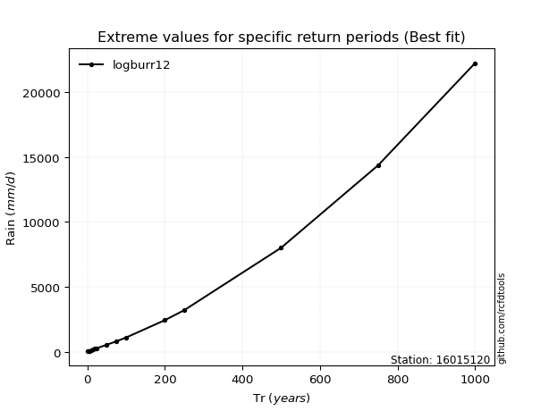</img>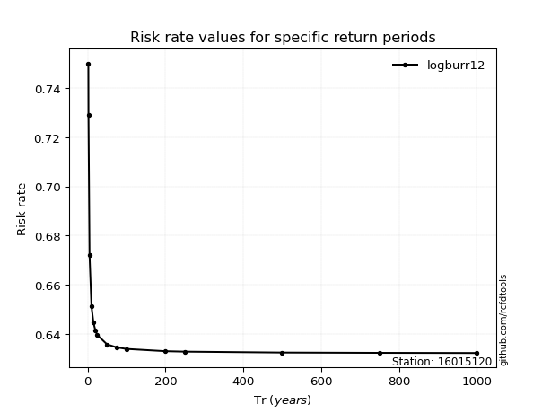</img>

</div>


<sub>**APP DISCLAIMER**: NO WARRANTY - This software is provided by [github.com/rcfdtools](https://github.com/rcfdtools) "as is", without any express or implied warranty, including warranties of merchantability, fitness for a particular purpose, or non-infringement. There is no guarantee that the software will be error-free or operate without interruption. LIMITATION OF LIABILITY - Neither the authors nor copyright holders will be liable for claims or damages arising from the software or its use. You are responsible for determining if the software is appropriate for your use and assume all associated risks, including errors, legal compliance, and data loss. NO PROFESSIONAL ADVICE - The software provides general information and does not offer professional advice. It should not replace consultation with professional advisors.</sub>